# 一、Prompt

- [215+ ChatGPT Prompts & How to Write your Own](https://writesonic.com/blog/chatgpt-prompts)
- [awesome-chatgpt-prompts](https://github.com/f/awesome-chatgpt-prompts)，对应中文版：[awesome-chatgpt-prompts-zh](https://github.com/PlexPt/awesome-chatgpt-prompts-zh)
- [AI List Chat Prompt](https://www.itis.chat/)
- [Prompt guide](https://www.promptingguide.ai/)
- [AI工具的提示词](https://github.com/chenlanqing/system-prompts-and-models-of-ai-tools)
- [Prompt Engineer](https://github.com/anthropics/prompt-eng-interactive-tutorial)
- [Prompt Engineering Guide](https://github.com/dair-ai/Prompt-Engineering-Guide)

## 1、什么是 Prompt

在大规模语言模型（LLM, Large Language Models）领域，Prompt 是一种结构化的输入序列，用于引导预训练语言模型生成预期的输出。它通常包括明确的任务要求、背景信息、格式规定以及示例，以充分利用模型的能力在特定任务中生成高质量的响应

## 2、Prompt的运行过程

**1.接收输入**
- 用户或系统向语言模型提供一个Prompt，这个Prompt包含任务指令、背景信息、示例以及格式说明。

**2、文本处理与编码**
- 模型首先对输入的Prompt进行预处理，包括分词（tokenization）和编码（encoding）。
- 预处理过程将文本转换为一系列的词汇ID（token IDs），这些IDs会传递到Embedding层，进行进一步处理。

**3、模型计算**
- 编码后的文本输入到基于Transformer架构的神经网络中。Transformer架构包括多个层的自注意力机制（Self-Attention Mechanism）和前馈神经网络（Feed-Forward Neural Network）

**4、生成输出**
- 模型根据计算结果，从生成的概率分布中采样下一个词汇。每个生成的词汇会迭代地输入回模型，以生成后续词汇。这个过程持续进行，直到满足输出条件（例如达到预定句子长度或遇到特殊结束符）。这一过程称为解码（Decoding），可以使用贪心搜索（Greedy Search）、束搜索（Beam Search）或其他采样方法（如随机采样和核采样），以生成最优的文本输出

## 3、如何精准生成Prompt

**（1）明确的目标和任务**：具体而清晰地阐明你的预期结果和要求，包括明确PROMPT的整体目标和具体希望进行的任务，例如生成文本、回答问题、翻译语言或进行情感分析等

举个例子：
- 👎不够清晰:“描述一下气候变化。”
- 👍清晰明确：“请写一篇200字的文章，讨论气候变化对全球农业生产的影响，特别是对水资源管理和农作物产量的影响。”

准确表达希望获得的信息或结果：
- 👎不够准确：“告诉我关于机器学习的知识。”
- 👍准确表达：“请解释什么是机器学习，包括其基本概念和至少两种常用算法（如决策树和神经网络），并讨论它们各自的应用领域。”

**（2）上下文和背景信息**：上下文和背景信息可以帮助更好地理解如何创建高质量的提示，引导生成型人工智能模型产生准确、高效和有针对性的回应。它包含了充分的上下文和背景信息，具体的任务目标和预期输出，并明确了任何必要的细节、限制条件和目标读者或用户群体
- 角色和身份：明确任务请求者的角色（例如：学生、研究员、产品经理）
- 任务的具体目标：明确需要完成的任务或回答的问题，包含具体的细节和预期输出
- 相关历史和现状：提供与任务相关的背景历史，例如之前的研究、项目进度或市场状况，涉及当前的环境或条件，包括任何变化或影响因素；
- 特定要求和条件：明确任务的具体要求和条件（例如：字数限制、格式要求、时间限制），说明任何必须满足的约束条件
- 读者或受众：阐明回答的目标受众

**（3）详细的衡量标准或考评维度**：实现任务目标详细的衡量标准或考评维度，提供清晰、全面、高效的评估，确保任务目标的实现

**（4）明确的输入和输出格式**
- 输入格式是指模型接收的原始数据的结构和形式。明确的输入格式定义了数据应该如何组织和呈现，以确保模型能够正确解析和理解这些数据。
- 输出格式是指模型生成结果的预期结构和形式。明确的输出格式定义了模型应该如何组织和呈现生成的内容，以满足特定的需求或标准

总结：
- 明确目标和任务：让 AI 知道你想要啥，选对方向。
- 充分上下文和背景：信息充足，不多不少，AI 掌握事实不胡思乱想。
- 设定衡量标准或考评维度：希冀结果，AI 就像你当年的满分作业。
- 简洁直接：少啰嗦，AI 秒懂。
- 避免歧义：不理解的词汇休想扰乱 AI 的步伐。
- 分步骤和层次化指导：分清先后，步步为赢。
- 考虑多种可能性和边界条件：极端情况，让 AI 时刻清醒。
- 纠错机制：一键修正，防微杜渐。
- 语言和文化敏感性：跨文化交流，AI 落落大方。
- 数据隐私和安全性：合规隐私，放心传递。
- 约束设置：锁定目标，输出精准。

## 4、Prompt 生成

- [Snack Prompt](https://snackprompt.com)
- [Free AI Prompt](https://flowgpt.com/)
- [AI提示词大全](https://prompthero.com/)
- [Stable Diffusion提示词](https://publicprompts.art/)
- [学习提示词](https://learningprompt.wiki/)
- [UI Prompt Generator](https://uiprompt.art/ui-prompt-generator)
- [自动提示词](https://github.com/AIDotNet/auto-prompt)

# 二、RAG

- [基于深度文档理解构建的开源 RAG（Retrieval-Augmented Generation）引擎](https://github.com/infiniflow/ragflow)
- [RAG变体](https://www.53ai.com/news/RAG/2025031889753.html)
- [tavily.ai 是一个专为人工智能代理（如大型语言模型，LLMs）和检索增强生成（RAG）应用优化的搜索引擎](https://tavily.com/)
- [RAG + Tool Use](https://cohere.com/llmu/from-rag-to-tool-use)
- [RAG](https://www.promptingguide.ai/zh/techniques/rag)

RAG 检索增强生成（Retrieval Augmented Generation），已经成为当前最火热的LLM应用方案。理解起来不难，就是通过自有垂域数据库检索相关信息，然后合并成为提示模板，给大模型生成漂亮的回答。

RAG（中文为检索增强生成） = 知识库 + 检索技术 + LLM 提示。

## 1、含义

RAG 是一种旨在结合大型语言模型 (LLM) 的生成能力和外部知识库的检索能力的技术，用来解决 LLM 的一些固有局限，例如：
- 知识截断 (Knowledge Cutoff): LLM 的知识仅限于其训练数据截止的日期。
- 幻觉 (Hallucination): LLM 有时会编造不准确或虚假的信息。
- 缺乏特定领域/私有知识: LLM 无法访问未包含在其训练数据中的、实时的、或者私有的信息。
- 数据新鲜度问题：由于 LLM 中学习的知识来自于训练数据，虽然大部分知识的更新周期不会很快，但依然会有一些知识或者信息更新得很频繁。LLM 通过从预训练数据中学到的这部分信息就很容易过时
- 来源验证和可解释性

简单来说，就是给 LLM 提供外部数据库，对于用户问题 ( Query )，通过一些信息检索 ( Information Retrieval, IR ) 的技术，先从外部数据库中检索出和用户问题相关的信息，然后让 LLM 结合这些相关信息来生成结果


### 1.1、传统 RAG

RAG 分为前置的数据导入工作和后续的用户检索提问两个环节。
- 图中的 1 和 2 两个步骤就是前置数据导入步骤。过程很简单。第一步是将数据，比如文档、图片等内容通过向量大模型（Embedding Model）转成向量，第二步是将向量存入到向量数据库中。不过觉得这里应该加一个第 0 步，将原始数据进行切片；
- 图中 3～7 标号点环节就是提问检索环节。首先将用户的提问，比如“颈椎病如何治疗”这样的文本转成向量，然后去向量数据库中做相似性搜索。如果搜索到结果比较相似的，就将内容取出来，组成新的 prompt。
- 然后把这个新的 prompt 再发送给大模型，由大模型给出最终的答案

### 1.2、Agentic RAG

传统的 RAG 存在几个问题：
- 用户的 query 在向量数据库里搜索不到，或者搜出来的结果不准；
- 用户的提问不一定需要去向量数据库中搜索，此时的搜索只会浪费 token 资源。比如用户要求生成一段计算加法的 python 代码，这其实直接交给大模型就可以完成；
- 既然是开卷考试了，那大模型非得翻书本吗（向量数据库搜索）？我去网上搜一下（联网搜索）行不行？我去问问别人（调用工具）行不行？
- 如何确定最后得到的答案是准确的呢？

针对上面这几个问题，就可以在关键环节上引入 Agent 来解决
- 首先第一个 Agent 将用户的问题做了改写，这个环节通常会将用户的提问从多个角度拆分成多条，也就是说把一个问题换多个角度进行提问；
- 第二个 Agent 会去判断用户提问的意图，如果认为不需要借助外力，大模型就能搞定，则直接将 query 发送给大模型；如果认为需要借助外力，则发送给下一个 Agent。这个过程，可以使用提示词工程完成。

## 2、如何选择大模型

### 2.1、在RAG应用中需要大模型的能力

- 信息抽取能力：大模型需要从RAG检索出来的上下文中，抽取出和问题最有价值的信息
- 上下文的阅读理解能力：大模型需要从RAG检索出来的上下文和问题进行语义理解，生成合适的答案；
- 工具调用和function call能力：RAG应用中可能会调用外部工具和接口

### 2.2、如何挑选大模型

- 模型大小选择：优先选择最大的模型进行测试是否可行，验证业务可行性可行的情况下，收集数据可迁移到小模型
- 模型能力测试：构建业务的测试集，测试信息抽取能力、阅读理解能力和工具调用，function call能力
- 成本和设备：大模型的使用是有一定的成本，api调用成本和设备
- 企业数据安全： 调用本地模型和外部api，要评估数据的安全

## 3、RAG 三大模块

为了构建检索增强 LLM 系统，RAG关键模块包括:
- 数据和索引模块：如何处理外部数据和构建索引
- 查询和检索模块：如何准确高效地检索出相关信息
- 响应生成模块：如何利用检索出的相关信息来增强 LLM 的输出

## 4、基础 RAG 流程

基础 RAG系统的开发流程主要包含以下阶段：
- 解析 (Parsing)：为知识库准备数据，包括收集文档、将其转换 为文本格式，并清理无关的噪点信息。
- 数据摄取 (Ingestion)：创建并载入知识库。
- 检索 (Retrieval)：构建一个工具，根据用户查询查找并返回相关 数据，通常在向量数据库中进行语义搜索。
- 回答 (Answering)：使用检索到的数据丰富用户的提示词（prompt）， 将其发送给 LLM，并返回最终答案。


## [GraphRAG](https://github.com/microsoft/graphrag)

## 实践

- [从数据解析到多路由器检索的工程实践](https://mp.weixin.qq.com/s/VPidqY02ngsrnXhpOol3_A)

# 三、AI Agent

- [agents.json](https://docs.wild-card.ai/agentsjson/introduction)
- [AI Agent 十问十答，降低认知摩擦](https://mp.weixin.qq.com/s/keZ4H12NElW-Ew0R1Puayg)
- [构建有效 Agent](https://www.anthropic.com/engineering/building-effective-agents)
- [微软：Agent 入门学习](https://github.com/microsoft/ai-agents-for-beginners)
- [AG-UI Protocol](https://github.com/ag-ui-protocol/ag-ui)

## 1、什么是 ReAct

- [ReAct模式 = Reason + Act](https://www.promptingguide.ai/techniques/react)
- [ReAct: Synergizing Reasoning and Acting in Language Models](https://arxiv.org/pdf/2210.03629)

ReAct 包含了 Reason 与 Act 两个部分。可以理解为就是思维链 + 外部工具调用；

ReAct 思想会让大模型把大问题拆分成小问题，一步步地解决，每一步都会尝试调用外部工具来解决问题，并且还会根据工具的反馈结果，思考工具调用是否出了问题。如果判断出问题了，大模型会尝试重新调用工具。这样经过一系列的工具调用后，最终完成目标；

### 1.1、ReAct Prompt 模板

要为大模型赋予 ReAct 能力，使其变成 Agent，需要在向大模型提问时，使用 ReAct Prompt，从而让大模型在思考如何解决提问时，能使用 ReAct 思想

下面是一个 [ReAct Prompt 模板](https://smith.langchain.com/hub/langchain-ai/react-agent-template)：
```
{instructions}

TOOLS:
------

You have access to the following tools:

{tools}

To use a tool, please use the following format:

```
Thought: Do I need to use a tool? Yes
Action: the action to take, should be one of [{tool_names}]
Action Input: the input to the action
Observation: the result of the action
```

When you have a response to say to the Human, or if you do not need to use a tool, you MUST use the format:

```
Thought: Do I need to use a tool? No
Final Answer: [your response here]
```

Begin!

Previous conversation history:
{chat_history}

New input: {input}
{agent_scratchpad}
```
这段 prompt 开头的 `{instructions}`其实是为大模型设置人设。之后告诉大模型，使用 `{tools}` 中定义的工具。因此在 `{tools}` 里，应该填入工具的描述。模板接下来要求大模型按照规定的格式思考和回答问题，这就是在教大模型如何推理和规划，大模型在有了推理和规划能力后就变成了 Agent
- Thought: 让大模型接到提问后，先思考应该怎么做？
- Action: 让大模型先在工具列表中挑选工具来解决问题，因此 {tool_names} 应该填入工具的名称；
- Action Input: 工具可以理解为函数，通常会有入参，这里就是让大模型提供入参；
- Observation: 在这里填入工具执行的结果，由大模型来判断结果是否有用；

ReAct 的执行过程是一个与人类交互的过程。在 Action 和 Action Input 中，大模型会告诉人类需要执行什么工具、以及工具的入参是什么，而具体的工具执行，需要由人类完成。人类完成后，将工具执行结果填入到 Observation，反馈给大模型，直到大模型得到 Final Answer。


## 2、Function Calling

- [Function Calling-使模型能够获取数据并采取操作](https://platform.openai.com/docs/guides/function-calling)
- [Function Calling with LLMS](https://www.promptingguide.ai/applications/function_calling)

什么是 Function Calling，就是可以在向大模型提问时，给大模型提供一些工具（函数），由大模型根据需要，自行选择合适的工具，从而解决问题；

Function Calling 功能是 OpenAI 公司发明的，因此定义工具需要遵循 OpenAI SDK 的规范
```json
{
    "type": "function",
    "function": {
        "name": "",
        "description": "",
        "parameters": {},
    }
}
```
基本代码：
```py
def send_messages(messages):
    response = client.chat.completions.create(
        model="deepseek-chat",
        messages=messages,
        tools=tools,
        tool_choice="auto"
    )
    return response
```

对于不具备 Function Calling 能力的大模型，可以通过 Prompt Engineering 的方式实现类似的机制，在Prompt中指定可用的工具列表和描述，让大模型来判断是否需要调用工具。不过这种方式对于模型的推理能力和指令遵从能力要求比较高

## 3、概念

Agent，中文翻译为代理，顾名思义，代替用户在代理权限内去处理相关事宜。例如我聘请你作为代理律师，那么你将以我的名义进行民事法律行为；再例如我今天休假了，设置同事作为我的代理，去处理审批流等任务。

而 AI Agent 是指在普通代理的基础上，具备对任务的理解、环境的感知、信息的获取能力，并通过推理能力，自主进行决策和执行。AI Agent 就是 LLM + 客户端（Chatbot、AI IDE 等）组成的产品，代替我们去自主的完成下达的任务，这里的客户端具备规划、工具使用，甚至记忆的功能，目的都是为了更准确的执行任务。

核心元素：
- 大脑，即大模型
- 定义角色
- 配置技能
- 工作流程 

## 4、[A2A协议](https://github.com/google-a2a/A2A)

- [Agent2Agent (A2A) Samples](https://github.com/google-a2a/a2a-samples)
- [A2A-Agent2Agent Protocol](https://mp.weixin.qq.com/s/7d-fQf0sgS3OZgaQZm7blw)
- [A2A协议](https://google.github.io/A2A/#/)


上面图描述的 A2A 协议，首先，每一个独立的 Agent 都可以去调用自身的工具，调用工具的方法可以是传统的调用方式，也可以是 MCP。而 Agent 与 Agent 之间，还可以通过 Agent 之间进行互相调用

A2A 解决的是什么问题？是 Agent 间互相通信，形成多 Agent 的问题，这比 MCP 的维度更高。因此它们是互补的协议

### 4.1、重要概念

**[Agent Card](https://google-a2a.github.io/A2A/specification/#5-agent-discovery-the-agent-card)**，可以理解为是 Agent 的名片。也就是说一个 Agent 想要让另一个 Agent 了解自己的名称、能力等，就需要在名片上写清楚

示例：[Sample Agent Card](https://google-a2a.github.io/A2A/specification/#56-sample-agent-card)

**[Task](https://google-a2a.github.io/A2A/specification/#61-task-object)**，Task 可以理解为是一间洽谈室，由乙方（发起调用请求的 Agent）邀请甲方（接收调用请求的 Agent）进行会晤。但是会晤的结果（状态）是什么，是甲方立马执行，还是拒绝，还是安排到以后执行等等，这些细节都是由甲方说了算的。

## 5、主流Agent 框架

- 对于 C 端用户，可以考虑 [coze](https://www.coze.cn/store/bot)，缺点是没有开源
- [Dify平台](https://dify.ai/zh)
- [Dify DSL](https://github.com/svcvit/Awesome-Dify-Workflow)
- [Autogen的基本框架](https://limoncc.com/post/3271c9aecd8f7df1/)
- [MetaGPT智能体开发入门](https://github.com/geekan/MetaGPT)
- [Pocket Flow](https://github.com/The-Pocket/PocketFlow)
- [Mem0-Agent 记忆体](https://github.com/mem0ai/mem0)
- [Qwen-Agent](https://github.com/QwenLM/Qwen-Agent)
- [OpenAI Agents SDK](https://github.com/openai/openai-agents-python)

## 6、开源 Agent

- [browser-use：AI 操作浏览器](https://github.com/browser-use/browser-use)
- [Anything-LLM：智能文档助手](https://github.com/Mintplex-Labs/anything-llm)
- [AI 编程引擎 Plandex](https://github.com/plandex-ai/plandex)

## 应用

- [agent directory](https://aiagentsdirectory.com/)
- [Agent调研--19类Agent框架对比](https://mp.weixin.qq.com/s/rogMCoS1zDN0mAAC5EKhFQ)
- [A list of AI autonomous agents](https://github.com/e2b-dev/awesome-ai-agents)
- [复杂表格多Agent方案](https://mp.weixin.qq.com/s/lEbFZTPCdFPW-X22253ZPg)
- [快速开发AI Agent](https://github.com/huggingface/smolagents)
- [What Are Agentic Workflows? Patterns, Use Cases, Examples, and More](https://weaviate.io/blog/what-are-agentic-workflows)
- [TradingAgents：基于多智能体大语言模型的金融交易框架](https://github.com/TauricResearch/TradingAgents)


# 四、MCP

- [Model Context Protocol](https://modelcontextprotocol.io/introduction)
- [探索MCP](https://v2ex.com/t/1119962)
- [MCP+数据库](https://mp.weixin.qq.com/s/_HW4YQobEeBnIZMgrl7cLg)
- [MCP入门到精通](https://mp.weixin.qq.com/s/jwzEFeHuB_k9BA7go8bNVg)
- [MCP With LLMS](https://modelcontextprotocol.io/llms-full.txt)
- [分析 Cline 与大模型的交互](https://www.youtube.com/watch?v=YyVkXrXxvX8)
- [A bridge between Streamable HTTP and stdio MCP transports](https://github.com/sparfenyuk/mcp-proxy)


## 1、基础

MCP (Model Context Protocol): 模型上下文协议，是 Anthropic (Claude) 主导发布的一个开放的、通用的、有共识的协议标准。
- MCP 是一个标准协议，就像给 AI 大模型装了一个 “万能接口”，让 AI 模型能够与不同的数据源和工具进行无缝交互。它就像 USB-C 接口一样，提供了一种标准化的方法，将 AI 模型连接到各种数据源和工具。
- MCP 旨在替换碎片化的 Agent 代码集成，从而使 AI 系统更可靠，更有效。通过建立通用标准，服务商可以基于协议来推出它们自己服务的 AI 能力，从而支持开发者更快的构建更强大的 AI 应用。开发者也不需要重复造轮子，通过开源项目可以建立强大的 AI Agent 生态。
- MCP 是客户端-服务端架构，一个 Host 可以连接多个 MCP Server

核心思想: 将 AI 模型的功能和对接到 AI 模型的工具(tool),数据(resource),提示(prompt)分离开, 独立部署, 让 AI 可以随意连接各种工具,数据以及使用各种提示!

- MCP 主机 (MCP Host): （可以认为是一个 Agent）运行 AI 模型和 MCP 客户端的应用程序。常见的 MCP 主机有：
    - Claude Desktop: Anthropic 公司的桌面客户端，内置了 MCP 支持。
    - IDE 集成: 像 VS Code 、Cursor 等 IDE 可以通过插件支持 MCP 。
    - 自定义应用: 你自己开发的任何集成了 MCP 客户端的应用程序。
- MCP 客户端 (MCP Client): 负责与 MCP 服务器通信的组件。它通常集成在 MCP 主机中。客户端的主要职责是：
    - 充当MCP Server 和 LLM 之间的桥梁
    - 发现和连接 MCP 服务器。
    - 向 MCP 服务器请求可用的工具、资源、提示等信息。
    - 根据 AI 模型的指令，调用 MCP 服务器提供的工具。
    - 将工具的执行结果返回给 AI 模型。
- MCP 服务 (MCP Server): 提供具体功能（工具）和数据（资源）的程序。你可以把它想象成一个“技能包”，AI 模型可以通过 MCP 客户端“调用”这些技能。MCP 服务器可以：
    - 访问本地数据（文件、数据库等）。
    - 调用远程服务（ Web API 等）。
    - 执行自定义的逻辑。

> MCP 提供给 LLM 所需的上下文：Resources 资源、Prompts 提示词、Tools 工具

> 整体的工作流程是这样的：AI 应用中集成 MCP 客户端，通过 MCP 协议向 MCP 服务端发起请求，MCP 服务端可以连接本地/远程的数据源，或者通过 API 访问其他服务，从而完成数据的获取，返回给 AI 应用去使用

$ \color{red}{特别说明：MCP 并没有规定如何与大模型进行交互，其没有对模型与 MCP HOST 的交互进行规定} $

## 2、MCP与Function call

<center>
    <br>
    <div style="color:orange; border-bottom: 1px solid #d9d9d9; display: inline-block; color: #999; padding: 2px;">
        图片来自文章：<a href='https://blog.dailydoseofds.com/p/function-calling-and-mcp-for-llms'>Function calling & MCP for LLMs</a>
    </div>
</center>

## 3、MCP工具

### 3.1、MCP Servers

- [Awesome MCP Server](https://github.com/punkpeye/awesome-mcp-servers)
- [Find Awesome MCP Servers and Clients](https://mcp.so/)
- [MCP Server 官方示例](https://github.com/modelcontextprotocol/servers)
- [MCP热门资源](https://github.com/punkpeye/awesome-mcp-servers)
- [Glama](https://glama.ai/mcp/servers)
- [Smithery](https://smithery.ai)
- [cursor](https://cursor.directory)
- [MCP.so](https://mcp.so/zh)
- [阿里云百炼](https://bailian.console.aliyun.com/?tab=mcp#/mcp-market)
- [阿里 Higress AI MCP](https://mcp.higress.ai/)

MCP Server 相对比较独立，可以独立开发，独立部署，可以远程部署，也可以本地部署。它可以提供三种类型的功能：
- 工具（Tools）：可以被 LLM 调用的函数（需要用户批准）。可以由大模型自主选择工具，无需人类进行干涉，整个过程是全自动的。
- 资源（Resources）：类似文件的数据，可以被客户端读取，如 API 响应或文件内容。Resource 对接的是 MCP Hosts，需要 MCP Hosts 额外开发与 Resouce 的交互功能，并且由用户进行选择，才能直接使用
- 提示（Prompts）：预先编写的模板，帮助用户完成特定任务。它与 Resource 类似，也是需要用户的介入才能使用

### 3.2、MCP Client && MCP Hosts

[MCP 官网](https://modelcontextprotocol.io/clients)列出来一些支持 MCP 的 Clients。

MCP Client 负责与 MCP Server 进行通信。而 MCP Hosts 则可以理解为是一个可对话的主机程序。

当用户发送 prompt（例如：我要查询北京的天气） 到 MCP Hosts 时，MCP Hosts 会调用 MCP Client 与 MCP Server 进行通信，获取当前 MCP Server 具备哪些能力，然后连同用户的 prompt 一起发送给大模型，大模型就可以针对用户的提问，决定何时使用这些能力了。这个过程就类似，我们填充 ReAct 模板，发送给大模型。

当大模型选择了合适的能力后，MCP Hosts 会调用 MCP Cient 与 MCP Server 进行通信，由 MCP Server 调用工具或者读取资源后，反馈给 MCP Client，然后再由 MCP Hosts 反馈给大模型，由大模型判断是否能解决用户的问题。如果解决了，则会生成自然语言响应，最终由 MCP Hosts 将响应展示给用户。

分为两类：
- AI编程IDE：Cursor、Cline、Continue、Sourcegraph、Windsurf 等
- 聊天客户端：Cherry Studio、Claude、Librechat、Chatwise等

更多的Client参考这里：
- [MCP Clients](https://www.pulsemcp.com/clients)
- [Awesome MCP Clients](https://github.com/punkpeye/awesome-mcp-clients/)

## 4、应用场景

应用领域 | 典型场景 | MCP价值 | 代表实现
--------|--------|---------|------
智能编程助手|代码生成、Bug修复、API集成|安全访问本地代码库、CI/CD系统|Cursor、VS Code插件
数据分析工具|自然语言查询数据库、可视化生成|安全查询内部数据库、连接BI工具|XiYanSQL-MCP、数据库MCP服务器
企业知识管理|知识库查询、文档生成、邮件撰写|安全访问内部文档、保护隐私数据|文件系统MCP、Email-MCP
创意设计工具|3D建模、图形生成、UI设计|与专业软件无缝集成|BlenderMCP、浏览器自动化
工作流自动化|多系统协调、事件驱动流程|跨系统安全协作Cloudflare |MCP、AWS自动化套件

## 5、MCP协议细节

MCP协议官方提供了两种主要通信方式：stdio（标准输入输出）和 SSE （Server-Sent Events，服务器发送事件）。这两种方式均采用全双工通信模式，通过独立的读写通道实现服务器消息的实时接收和发送
- Stdio传输（标准输入/输出）：适用于本地进程间通信，MCP默认的通信方式
- HTTP + SSE传输：
    - 服务端→客户端：Server-Sent Events（SSE） 
    - 客户端→服务端：HTTP POST 
    - 适用于远程网络通信。

所有传输均采用JSON-RPC 2.0进行消息交换

### 5.1、stdio方式

优点
- 这种方式适用于客户端和服务器在同一台机器上运行的场景，简单。
- stdio模式无需外部网络依赖，通信速度快，适合快速响应的本地应用。
- 可靠性高，且易于调试

缺点：
- Stdio 的配置比较复杂，我们需要做些准备工作，你需要提前安装需要的命令行工具。
- stdio模式为单进程通信，无法并行处理多个客户端请求，同时由于进程资源开销较大，不适合在本地运行大量服务。（限制了其在更复杂分布式场景中的使用）；

stdio的本地环境有两种：
- 一种是Python 编写的服务，
- 一种用TypeScript 编写的服务。

分别对应着uvx 和 npx 两种指令

### 5.2、SSE方式

场景
- SSE方式适用于客户端和服务器位于不同物理位置的场景。
- 适用于实时数据更新、消息推送、轻量级监控和实时日志流等场景
- 对于分布式或远程部署的场景，基于 HTTP 和 SSE 的传输方式则更为合适。

优点
- 配置方式非常简单，基本上就一个链接就行，直接复制他的链接填上就行


### 5.3、Streamable HTTP

- [Replace HTTP+SSE with new "Streamable HTTP" transport](https://github.com/modelcontextprotocol/modelcontextprotocol/pull/206)

MCP 新增了一种方式：Streamable HTTP 传输层替代原有的 HTTP+SSE 传输层：
- Streamable HTTP 相比 HTTP + SSE 具有更好的稳定性，在高并发场景下表现更优。
- Streamable HTTP 在性能方面相比 HTTP + SSE 具有明显优势，响应时间更短且更稳定。
- Streamable HTTP 客户端实现相比 HTTP + SSE 更简单，代码量更少，维护成本更低

HTTP+SSE 存在的问题：

HTTP+SSE 的传输过程实现中，客户端和服务器通过两个主要渠道进行通信：（1）HTTP 请求/响应：客户端通过标准的 HTTP 请求向服务器发送消息。（2）服务器发送事件（SSE）：服务器通过专门的 /sse 端点向客户端推送消息，这就导致存在下面三个问题：
- 服务器必须维护长连接，在高并发情况下会导致显著的资源消耗。
- 服务器消息只能通过 SSE 传递，造成了不必要的复杂性和开销。
- 基础架构兼容性，许多现有的网络基础架构可能无法正确处理长期的 SSE 连接。企业防火墙可能会强制终止超时连接，导致服务不可靠。

Streamable HTTP 的改进
- 统一端点：移除了专门建立连接的 /sse 端点，将所有通信整合到统一的端点。
- 按需流式传输：服务器可以灵活选择返回标准 HTTP 响应或通过 SSE 流式返回。
- 状态管理：引入 session 机制以支持状态管理和恢复。

## 6、MCP 工作流程

API 主要有两个
- `tools/list`：列出 Server 支持的所有工具
- `tools/call`：Client 请求 Server 去执行某个工具，并将结果返回

```mermaid
sequenceDiagram
    autonumber
    User ->>+ MCP Client: 启动客户端
    Note over MCP Client,MCP Server: 初始化阶段
    MCP Client ->>+ MCP Server: 连接服务器
    MCP Server -->>+ MCP Client: 确认连接
    MCP Client ->>+ MCP Server: 请求可用工具列表
    MCP Server -->>+ MCP Client: 返回工具列表和描述
    Note over MCP Client,LLM: 查询处理阶段
    User ->>+ MCP Client: 输入查询
    MCP Client ->>+ LLM : 发送查询和可用工具信息
    loop 工具调用循环
        LLM -->>+ MCP Client : 返回响应（返回或工具调用）
        alt 是工具调用
            MCP Client ->>+ MCP Server: 执行工具调用
            MCP Server -->>+ MCP Client: 返回工具执行结果
            MCP Client ->>+ LLM: 发送查询和工具结果
        else 是文本响应
            MCP Client -->>+ User: 显示响应
        end
    end
```



数据流向为：

```mermaid
flowchart TD
    id1([用户]) -->|1.查询| id2(Host应用)
    id1([用户]) -->|5.批准拒绝| id2(Host应用)
    id2(Host应用)--> |4.请求审批|id1([用户])
    id2(Host应用) --> |14.展示结果| id1([用户])
    id2(Host应用) --> |2.查询+工具列表|id3(LLM)
    id2(Host应用) --> |12.工具结果|id3(LLM)
    id3(LLM) --> |3.工具调用请求|id2(Host应用)
    id3(LLM) --> |13.最终响应|id2(Host应用)
    id2(Host应用) --> |6.工具调用命令|id4(MCP Client)
    id4(MCP Client) --> |11.传递结果|id2(Host应用)
    id4(MCP Client) --> |7.执行请求|id5(MCP Server)
    id5(MCP Server) --> |10.返回结果|id4(MCP Client)
    id5(MCP Server) --> |8.API 调用|id6[(Database)]
    id6[(Database)] --> |9.返回数据|id5(MCP Server)
```


## 7、Spring AI 使用 MCP

Spring AI MCP 采用模块化架构，包括以下组件：
- Spring AI 应用程序：使用 Spring AI 框架构建想要通过 MCP 访问数据的生成式 AI 应用程序
- Spring MCP 客户端：MCP 协议的 Spring AI 实现，与服务器保持 1:1 连接

通过 Spring AI MCP，可以快速搭建 MCP 客户端和服务端程序。

## 8、MCP 安全问题

https://news.ycombinator.com/item?id=43600192

## 9、MCP和Agent

- [MCP 构建 Agent](https://github.com/lastmile-ai/mcp-agent)

## 10、MCP Server开发

- [MCP Server 工程开发参考](https://github.com/aliyun/alibaba-cloud-ops-mcp-server)

**安装依赖：**
```bash
# 下面两种方式选其一
uv add "mcp[cli]"
pip install "mcp[cli]"
```

**运行**

运行 MCP 服务，假设新建了一个 MCP Server，文件名为：`server.py`
```bash
mcp dev server.py
# Add dependencies
mcp dev server.py --with pandas --with numpy
# Mount local code
mcp dev server.py --with-editable .
```
除了上面的方式，也可以直接运行，需要增加如下代码:
```py
...
if __name__ == "__main__":
    mcp.run()
```
然后执行如下命令：
```bash
python server.py
# or
mcp run server.py
```
请注意：`mcp run` 或 `mcp dev` 只支持 FastMCP

### 10.1、Tools

```py
import httpx
from mcp.server.fastmcp import FastMCP
mcp = FastMCP("My App")
@mcp.tool()
async def fetch_weather(city: str) -> str:
    """Fetch current weather for a city"""
    async with httpx.AsyncClient() as client:
        response = await client.get(f"https://api.weather.com/{city}")
        return response.text
```

## 11、MCP 资源

- [交互式用户反馈 MCP-节省 Token 调用量](https://github.com/Minidoracat/mcp-feedback-enhanced)
- [PromptX是一个系统性的，工程化的提示词管理框架](https://github.com/Deepractice/PromptX)
- [微信读书 MCP](https://github.com/freestylefly/mcp-server-weread)
- [控制 Mac 电脑的 MCP](https://github.com/ashwwwin/automation-mcp)
- [吴恩达-MCP 学习](https://www.deeplearning.ai/short-courses/mcp-build-rich-context-ai-apps-with-anthropic/)
- [FastAPI-MCP:api转 MCP](https://github.com/tadata-org/fastapi_mcp)
- [ACI：为统一 MCP 服务器提供支持的开源基础设施](https://github.com/aipotheosis-labs/aci)
- [Dive 是一个开源的 MCP Host Desktop 应用程序](https://github.com/OpenAgentPlatform/Dive)
- [OpenMemory-MCP 记忆体](https://github.com/mem0ai/mem0/openmemory)
- [Discover Awesome MCP Servers](https://himcp.ai/)
- [Sequential Thinking MCP: How to Use Sequential Thinking MCP Servers](https://www.ontariomcp.ca/sequential-thinking-mcp)

## 12、总结

无论是 MCP 协议还是 Agent、Function Calling 技术，本质上都在构建大模型与真实世界的交互桥梁；


# 五、AI数字人

- [数字人资料整理](https://github.com/YUANZHUO-BNU/metahuman_overview)
- [2025数字人方案](https://www.xmsumi.com/detail/764)

## 1、商用

- 即梦 AI
- 可灵 AI
- 闪剪
- heygen ：https://www.heygen.com/  
- 必剪 studio
- 飞影数字人： https://flyworks.ai/  

## 2、开源

- HeyGem，本地部署： https://github.com/GuijiAI/HeyGem.ai/blob/main/README_zh.md
- Fay是一个完整的开源项目，包含Fay控制器及数字人模型，可灵活组合出不同的应用场景：虚拟主播、现场推销货、商品导购、语音助理、远程语音助理、数字人互动、数字人面试官及心理测评、贾维斯、Her

