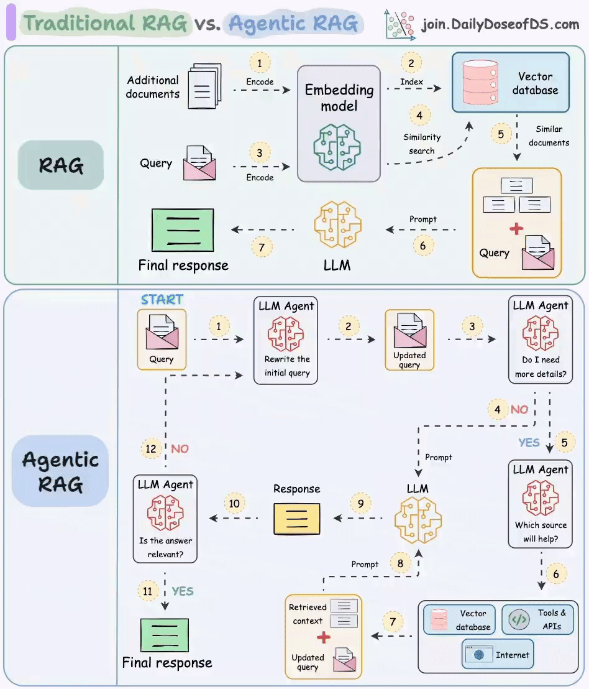
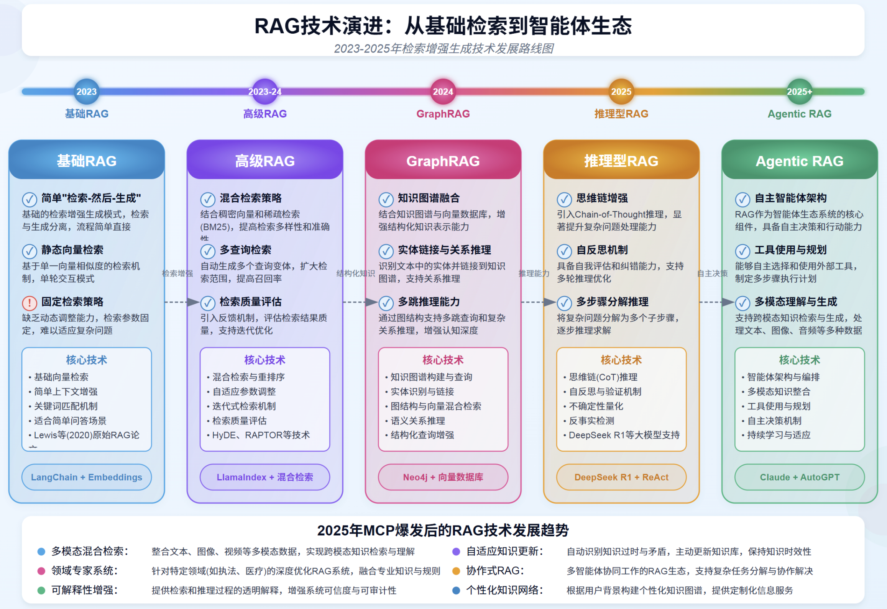

# 一、Prompt

- [215+ ChatGPT Prompts & How to Write your Own](https://writesonic.com/blog/chatgpt-prompts)
- [awesome-chatgpt-prompts](https://github.com/f/awesome-chatgpt-prompts)，对应中文版：[awesome-chatgpt-prompts-zh](https://github.com/PlexPt/awesome-chatgpt-prompts-zh)
- [AI List Chat Prompt](https://www.itis.chat/)
- [Prompt guide](https://www.promptingguide.ai/)
- [Prompt Engineer](https://github.com/anthropics/prompt-eng-interactive-tutorial)
- [Prompt Engineering Guide](https://github.com/dair-ai/Prompt-Engineering-Guide)
- [Language of GPT-结构化提示词](https://github.com/langgptai/LangGPT)
- [Learn Prompt Engineering](https://learnprompting.org/docs/introduction)
- [Google-Prompting-Guide](https://services.google.com/fh/files/misc/gemini-for-google-workspace-prompting-guide-101.pdf)
- [Prompt engineering overview](https://docs.anthropic.com/en/docs/build-with-claude/prompt-engineering/overview)

## 1、什么是 Prompt

在大规模语言模型（LLM, Large Language Models）领域，Prompt 是一种结构化的输入序列，用于引导预训练语言模型生成预期的输出。它通常包括明确的任务要求、背景信息、格式规定以及示例，以充分利用模型的能力在特定任务中生成高质量的响应

## 2、Prompt的运行过程

**1.接收输入**
- 用户或系统向语言模型提供一个Prompt，这个Prompt包含任务指令、背景信息、示例以及格式说明。

**2、文本处理与编码**
- 模型首先对输入的Prompt进行预处理，包括分词（tokenization）和编码（encoding）。
- 预处理过程将文本转换为一系列的词汇ID（token IDs），这些IDs会传递到Embedding层，进行进一步处理。

**3、模型计算**
- 编码后的文本输入到基于Transformer架构的神经网络中。Transformer架构包括多个层的自注意力机制（Self-Attention Mechanism）和前馈神经网络（Feed-Forward Neural Network）

**4、生成输出**
- 模型根据计算结果，从生成的概率分布中采样下一个词汇。每个生成的词汇会迭代地输入回模型，以生成后续词汇。这个过程持续进行，直到满足输出条件（例如达到预定句子长度或遇到特殊结束符）。这一过程称为解码（Decoding），可以使用贪心搜索（Greedy Search）、束搜索（Beam Search）或其他采样方法（如随机采样和核采样），以生成最优的文本输出

## 3、如何精准生成Prompt

**（1）明确的目标和任务**：具体而清晰地阐明你的预期结果和要求，包括明确PROMPT的整体目标和具体希望进行的任务，例如生成文本、回答问题、翻译语言或进行情感分析等

举个例子：
- 👎不够清晰:“描述一下气候变化。”
- 👍清晰明确：“请写一篇200字的文章，讨论气候变化对全球农业生产的影响，特别是对水资源管理和农作物产量的影响。”

准确表达希望获得的信息或结果：
- 👎不够准确：“告诉我关于机器学习的知识。”
- 👍准确表达：“请解释什么是机器学习，包括其基本概念和至少两种常用算法（如决策树和神经网络），并讨论它们各自的应用领域。”

**（2）上下文和背景信息**：上下文和背景信息可以帮助更好地理解如何创建高质量的提示，引导生成型人工智能模型产生准确、高效和有针对性的回应。它包含了充分的上下文和背景信息，具体的任务目标和预期输出，并明确了任何必要的细节、限制条件和目标读者或用户群体
- 角色和身份：明确任务请求者的角色（例如：学生、研究员、产品经理）
- 任务的具体目标：明确需要完成的任务或回答的问题，包含具体的细节和预期输出
- 相关历史和现状：提供与任务相关的背景历史，例如之前的研究、项目进度或市场状况，涉及当前的环境或条件，包括任何变化或影响因素；
- 特定要求和条件：明确任务的具体要求和条件（例如：字数限制、格式要求、时间限制），说明任何必须满足的约束条件
- 读者或受众：阐明回答的目标受众

**（3）详细的衡量标准或考评维度**：实现任务目标详细的衡量标准或考评维度，提供清晰、全面、高效的评估，确保任务目标的实现

**（4）明确的输入和输出格式**
- 输入格式是指模型接收的原始数据的结构和形式。明确的输入格式定义了数据应该如何组织和呈现，以确保模型能够正确解析和理解这些数据。
- 输出格式是指模型生成结果的预期结构和形式。明确的输出格式定义了模型应该如何组织和呈现生成的内容，以满足特定的需求或标准

总结：
- 明确目标和任务：让 AI 知道你想要啥，选对方向。
- 充分上下文和背景：信息充足，不多不少，AI 掌握事实不胡思乱想。
- 设定衡量标准或考评维度：希冀结果，AI 就像你当年的满分作业。
- 简洁直接：少啰嗦，AI 秒懂。
- 避免歧义：不理解的词汇休想扰乱 AI 的步伐。
- 分步骤和层次化指导：分清先后，步步为赢。
- 考虑多种可能性和边界条件：极端情况，让 AI 时刻清醒。
- 纠错机制：一键修正，防微杜渐。
- 语言和文化敏感性：跨文化交流，AI 落落大方。
- 数据隐私和安全性：合规隐私，放心传递。
- 约束设置：锁定目标，输出精准。

## 4、大模型设置

在提交系统提示词给到大模型时，可以配置一些参数来获取不同的提示结果

- **温度（Temperature）**：简单来说， temperature 越低，结果就越确定，提高温度会导致更多随机性，从而鼓励更多多样化或创造性的输出。本质上，是在增加其他可能词的权重；
- **Top P**：一种带有温度的采样技术，称为 nucleus sampling，可以控制模型的确定性，如果在寻找精确和事实性的答案，请保持这个值较低。如果寻找更多样化的响应，请增加到更高的值。如果使用 Top P，这意味着只有构成 top_p 概率质量的标记才会被考虑用于响应，因此低 top_p 值会选择最自信的响应。这意味着高 top_p 值将使模型能够查看更多可能的单词，包括不太可能的单词，从而导致更多样化的输出；一般建议是修改温度或 Top P，但不要同时修改两者。
- **Max Length**：可以通过调整 max length 来管理模型生成的 token 数量。指定最大长度有助于防止生成过长或不相关的回复，并控制成本
- **Stop Sequences**：stop sequence 是一个字符串，用于停止模型生成 token。指定停止序列是控制模型回复长度和结构的一种方式。例如，你可以通过添加"11"作为停止序列，告诉模型生成最多包含 10 项的列表。
- **Frequency Penalty（频率惩罚）**：frequency penalty 对下一个 token 应用惩罚，惩罚程度与该 token 在回复和提示中已出现的次数成正比。频率惩罚越高，某个词再次出现的可能性就越低。这个设置通过给出现次数较多的 token 施加更高的惩罚，减少了模型回复中词语的重复
- **Presence Penalty（）**：presence penalty 也会对重复的 token 施加惩罚，但与频率惩罚不同，所有重复的 token 的惩罚是相同的。出现两次的 token 和出现 10 次的 token 受到相同的惩罚。这个设置可以防止模型在其回应中过于频繁地重复短语。如果你希望模型生成多样化或富有创造性的文本，你可能需要使用更高的存在惩罚。或者，如果你需要模型保持专注，可以尝试使用较低的存在惩罚

通常建议只调整频率惩罚或存在惩罚，而不是两者都调整

## 5、基础介绍

### 5.1、Prompt格式

一个标准的格式是：
```
<Question>?
```
或者
```
<Instruction>
```
可以将其格式化为问答（QA）格式，这在许多问答数据集中是标准的，如下所示：
```
Q: <Question>?
A: 
```
在像上述那样提示时，也称为：`zero-shot prompting`，即你直接提示模型给出响应，而无需提供任何关于你想让它完成的任务的示例或演示。一些大型语言模型具有执行零样本提示的能力，但这取决于任务的复杂性和知识，以及模型被训练以擅长执行的任务。

还有另外一种叫：`few-shot prompting`，即提供少量样例，少量样本提示能够实现情境学习，即语言模型在少量示例的指导下学习任务的能力
```
<Question>?
<Answer>
<Question>?
<Answer>
<Question>?
<Answer>
<Question>?
```

### 5.3、Prompt 元素

提示包含以下任一要素：
- Instruction：希望模型执行的具体任务或指令
- 上下文：外部信息或额外上下文，可以引导模型产生更好的回复
- Input Data：希望为其找到回复的输入或问题
- Output Indicator：输出的类型或格式

### 5.4、Prompt 通用设计技巧

- 从简单开始：从简单的提示开始，并在追求更好结果的过程中不断添加更多元素和上下文。由于这个原因，在过程中迭代Prompt至关重要
- 指令：可以通过使用命令来指导模型实现你的目标，从而为各种简单任务设计有效的提示，例如"写"、"分类"、"总结"、"翻译"、"排序"等。建议你将指令放在提示的开头。另一个建议是使用一些清晰的分隔符（如"###"）来分隔指令和上下文。
    ```
    ### Instruction ###
    Translate the text below to Chinese:
    Text: "hello!"
    ```
- 具体性：对于模型需要执行的具体指令和任务，应尽可能详细。提示越具体、越详细，结果就越好；设计提示时，还应考虑提示的长度，因为提示的长度存在限制
- 避免不精确：通常来说，具体和直接更好。这里的类比非常类似于有效的沟通——越直接，信息传达得越有效
- 做还是不做？设计提示时，另一个常见的技巧是避免说不要做什么，而是要说应该做什么。这能鼓励更具体的要求，并专注于那些能引导模型给出良好响应的细节

## 6、Prompts 技巧

- [语言模型 Prompt 工程-最佳实践](https://open.bigmodel.cn/dev/guidelines/LanguageModels)

- Zero-Shot Prompting：零样本提示词
- Few-Shot Prompting：少量样本提示词
- Chain-of-Thought Prompting：思维链提示词
```
The odd numbers in this group add up to an even number: 4, 8, 9, 15, 12, 2, 1.
A: Adding all the odd numbers (9, 15, 1) gives 25. The answer is False.

The odd numbers in this group add up to an even number: 17,  9, 10, 12, 13, 4, 2.
A: Adding all the odd numbers (17, 9, 13) gives 39. The answer is False.

The odd numbers in this group add up to an even number: 15, 32, 5, 13, 82, 7, 1. 
A:
```
- [Meta Prompting](https://arxiv.org/pdf/2311.11482): 是一种高级提示技术，它关注任务和问题的结构和句法方面，而不是其具体内容细节。元提示的目标是构建一种更抽象、结构化的方式来与大型语言模型（LLMs）交互，强调信息的形式和模式，而不是传统的以内容为中心的方法。关键特征可以总结如下：
    - Structure-oriented（结构导向）: 优先考虑问题和解决方案的格式和模式，而非具体内容。
    - Syntax-focused: 使用语法作为预期响应或解决方案的指导模板。
- Self-Consistency: 自洽性，路是通过少样本思维链采样多条多样的推理路径，并利用生成结果来选择最一致的答案。这有助于提升思维链提示在涉及算术和常识推理任务上的性能

## 7、Prompt框架

### 7.1、通用框架

Prompt 通用框架=定角色+说背景+下任务+提要求

```markdown
## 框架要素

### 1. 【定角色】设定角色：你希望让对话 AI 扮演什么角色

在构建 Prompt 之前，首先明确你希望 AI 扮演的角色。是作为一个专家顾问？还是一个友好的助手？角色的定义将影响 AI 的语气、回答的风格、以及内容深度。

### 2. 【说背景】阐述背景：我是谁，我的目的是什么

接下来，向 AI 介绍你自己，阐述你遇到的问题或需求，以及你的目的。提供必要的背景信息或数据，帮助 AI 在正确的背景下工作。这将使 AI 更好地理解任务的上下文。

### 3. 【下任务】明确目标：你希望让 AI 具体执行什么任务

接下来，告诉 AI 你需要它具体执行和完成什么任务。这个定义要清晰明确，让 AI 知道它的目标和工作方向是什么。

### 4. 【提要求】定义结果：输出的具体内容是什么

指出你期望 AI 输出的具体内容是什么，你希望得到的答案形式或结果。是希望 AI 提供一个列表、一段描述，还是一个详细的解释？明确你的期望，AI 就能更好地满足你的需求。

### 5. 【补条件】限制条件：其他辅助的复用性强的提示词

设定 AI 在回答问题时需要遵守的规则或限制。这可能包括回答的长度、使用的语言风格，或是需要避免的话题。
```

### 7.2、RICE 框架

通过明确四大要素，让 AI 模型快速理解任务边界与目标。 全称：Role（角色）、Input（输入）、Context（上下文）、Expectation（期望输出）。
- Role（指定模型角色）
    - 作用：定义模型在任务中的身份（如 “你是一位资深数据分析师”“你是科普博主”），引导其使用对应领域的知识与表达风格。
    - 例子： “假设你是一名金融分析师，请分析...”
- Input（明确输入内容）
    - 作用：提供任务的具体素材（如问题、数据、文本片段），确保模型基于准确信息响应。
    - 例子： “输入数据：某公司 2024 年财报显示营收增长 15%... 请分析其盈利趋势。”
- Context（补充背景信息）
    - 作用：说明任务的应用场景、限制条件或前置知识，避免模型输出偏离实际需求。
    - 例子： “背景：该分析将用于投资者路演，需简洁呈现核心结论。”
- Expectation（清晰输出预期）
    - 作用：规定输出的形式（如表格、报告、代码）、详细程度或重点方向。
    - 例子： “期望输出：用 3 点总结投资建议，每点不超过 20 字。”

### 7.3、CRISPE 框架

通过多维度拆解任务，提升提示词的逻辑性与可控性。 全称：Clarify（澄清）、Role（角色）、Input（输入）、Structure（结构）、Prompt（指令）、Evaluate（评估）。
- Clarify（澄清需求）
    - 作用：先明确任务的核心目标，避免模糊表述导致模型误解。
    - 例子： “需解决的问题：如何用 Python 优化数据可视化效率？”
- Role（角色定义）与 RICE 一致：指定模型身份（如 “你是 Python 开发专家”）。
- Input（输入）细化要求：明确输入数据的格式、来源或处理方式（如 “基于附件中的 CSV 文件...”）。
- Structure（输出结构设计）
    - 作用：预设输出的框架（如 “分步骤说明 + 代码示例 + 注意事项”），让结果更规整。
    - 例子： “输出需包含：①原理分析 ②代码片段 ③性能对比表格”
- Prompt（核心指令）
    - 作用：用具体动作词引导模型（如 “生成”“优化”“诊断”），避免抽象指令。
    - 例子： “请编写一个函数，实现数据批量清洗，并注释关键步骤。”
- Evaluate（结果评估标准）
    - 作用：提前设定输出的验收条件（如 “准确率需≥95%”“代码无报错”）。
    - 例子： “确保生成的方案在实际场景中可落地，附可行性测试步骤。”

### 7.4、常用模板

```markdown
## 角色
你是一个{{xxx}},你擅长{{xxx}}, 请按照要求完成下面的任务

## 输入
（可选，如果用在某个专用场景可以描述输入的内容范围和格式，便于大模型更好的理解、解析）

## 背景
{{context}}

## 任务（目标）
{{task1}}
{{task2}}

## 规则
{{要求&约束列表1}}
{{要求&约束列表1}}
(
  可以提供少样本学校案例，比如：
  问：xxx
  答：不建议的回复 v1
  答：建议回复 v2
)

## 格式
{输出格式, 比如：使用 Json 格式输出，包含 xx,yy 字段}
```

## 8、Prompt 优化

- [Claude Optimizer：自动分析Prompt结构并提出改进建议（如添加XML标签、调整逻辑层级）](https://docs.anthropic.com/en/docs/build-with-claude/prompt-engineering/prompt-improver)
- [火山方舟-Prompt 调优](https://console.volcengine.com/ark/region:ark+cn-beijing/autope/workbench/new)
- [Prompt Pilot](https://promptpilot.volcengine.com/home)
- [提示词优化器](https://github.com/linshenkx/prompt-optimizer)

## 9、魔法词

在提示词领域，有一些类词被称为“魔法词”，使用后可以立竿见影的提升大模型的输出质量，让人直呼玄学的力量。通常是因为这些提示词会让大模型联想或使用到一些高质量的数据，所以才会产生较好的输出结果。常用到两种“魔法词”，分别是：
- Let's think step by step.
- Read the question again
    - Re-Reading重读：Re-Reading Improves Reasoning in Large Language Models（https://arxiv.org/pdf/2309.06275）

## Prompt 生成案例

- [AI工具的提示词](https://github.com/chenlanqing/system-prompts-and-models-of-ai-tools)
- [Snack Prompt](https://snackprompt.com)
- [Free AI Prompt](https://flowgpt.com/)
- [AI提示词大全](https://prompthero.com/)
- [Stable Diffusion提示词](https://publicprompts.art/)
- [学习提示词](https://learningprompt.wiki/)
- [UI Prompt Generator](https://uiprompt.art/ui-prompt-generator)
- [自动提示词](https://github.com/AIDotNet/auto-prompt)
- [大模型解谜游戏 LLM Riddles: https://zhuanlan.zhihu.com/p/665418646](https://modelscope.cn/studios/LLMRiddles/LLMRiddles/summary)

# 二、RAG

- [基于深度文档理解构建的开源 RAG（Retrieval-Augmented Generation）引擎](https://github.com/infiniflow/ragflow)
- [RAG变体](https://www.53ai.com/news/RAG/2025031889753.html)
- [RAG + Tool Use](https://cohere.com/llmu/from-rag-to-tool-use)
- [RAG](https://www.promptingguide.ai/zh/techniques/rag)


RAG 检索增强生成（Retrieval Augmented Generation），已经成为当前最火热的LLM应用方案。理解起来不难，就是通过自有垂域数据库检索相关信息，然后合并成为提示模板，给大模型生成漂亮的回答。

RAG（中文为检索增强生成） = 知识库 + 检索技术 + LLM 提示。

## 1、含义

RAG 是一种旨在结合大型语言模型 (LLM) 的生成能力和外部知识库的检索能力的技术，用来解决 LLM 的一些固有局限，例如：
- 知识截断 (Knowledge Cutoff): LLM 的知识仅限于其训练数据截止的日期。
- 幻觉 (Hallucination): LLM 有时会编造不准确或虚假的信息。
- 缺乏特定领域/私有知识: LLM 无法访问未包含在其训练数据中的、实时的、或者私有的信息。
- 数据新鲜度问题：由于 LLM 中学习的知识来自于训练数据，虽然大部分知识的更新周期不会很快，但依然会有一些知识或者信息更新得很频繁。LLM 通过从预训练数据中学到的这部分信息就很容易过时
- 来源验证和可解释性

简单来说，就是给 LLM 提供外部数据库，对于用户问题 ( Query )，通过一些信息检索 ( Information Retrieval, IR ) 的技术，先从外部数据库中检索出和用户问题相关的信息，然后让 LLM 结合这些相关信息来生成结果



### 1.1、传统 RAG

RAG 分为前置的数据导入工作和后续的用户检索提问两个环节。
- 图中的 1 和 2 两个步骤就是前置数据导入步骤。过程很简单。第一步是将数据，比如文档、图片等内容通过向量大模型（Embedding Model）转成向量，第二步是将向量存入到向量数据库中。不过觉得这里应该加一个第 0 步，将原始数据进行切片；
- 图中 3～7 标号点环节就是提问检索环节。首先将用户的提问，比如“颈椎病如何治疗”这样的文本转成向量，然后去向量数据库中做相似性搜索。如果搜索到结果比较相似的，就将内容取出来，组成新的 prompt。
- 然后把这个新的 prompt 再发送给大模型，由大模型给出最终的答案

### 1.2、Agentic RAG

传统的 RAG 存在几个问题：
- 用户的 query 在向量数据库里搜索不到，或者搜出来的结果不准；
- 用户的提问不一定需要去向量数据库中搜索，此时的搜索只会浪费 token 资源。比如用户要求生成一段计算加法的 python 代码，这其实直接交给大模型就可以完成；
- 既然是开卷考试了，那大模型非得翻书本吗（向量数据库搜索）？我去网上搜一下（联网搜索）行不行？我去问问别人（调用工具）行不行？
- 如何确定最后得到的答案是准确的呢？

针对上面这几个问题，就可以在关键环节上引入 Agent 来解决
- 首先第一个 Agent 将用户的问题做了改写，这个环节通常会将用户的提问从多个角度拆分成多条，也就是说把一个问题换多个角度进行提问；
- 第二个 Agent 会去判断用户提问的意图，如果认为不需要借助外力，大模型就能搞定，则直接将 query 发送给大模型；如果认为需要借助外力，则发送给下一个 Agent。这个过程，可以使用提示词工程完成。


## 2、RAG 技术演进

- [RAG技术演进:从基础检索到智能体生态](https://mp.weixin.qq.com/s/XgpDYk1r9Xvo-HvvtyPIaw)

**五大阶段技术演进**
- 基础RAG：基于静态向量检索，适用于简单问答场景。
- 高级RAG：引入混合检索与多查询策略，提升检索的准确性与多样性。
- GraphRAG：结合知识图谱与向量数据库，实现结构化知识推理与关系分析。
- 推理型RAG：通过思维链（CoT）和多步推理能力，解决复杂问题，支持多轮优化。
- Agentic RAG：以自主智能体为核心，具备工具使用与规划能力，支持跨模态生成与持续学习。

**未来趋势**
- 多模态混合检索：整合文本、图像、视频等多模态数据，实现跨模态知识理解。
- 领域专家系统：深度优化执法、医疗等特定领域的RAG系统，提供专业化服务。
- 可解释性增强：透明化检索与推理过程，提升系统可信度。
- 自适应知识更新：主动识别知识过时与矛盾，动态更新知识库。
- 协作式RAG：多智能体协同工作，分解复杂任务，共同完成目标。



> RAG 技术发展趋势总结：随着 MCP（多模态、上下文增强、个性化）技术的爆发，RAG 技术这个从单一的检索工具向智能知识生态系统演进。未来 RAG 将更专注于多模态融合、知识推理、自主决策和领域专业化，为执法、医疗等专业场景提供更精准、可信和自适应的知识服务，实现从“检索增强生生成”到“知识增强智能”的跃进！

### 2.1、基础 RAG

最初的检索增强生成模式，通过简单的文档检索来提升大语言模型应答质量

**核心特点**
- 简单“检索-然后-生成”模式：先进行向量检索获取相关文档，然后将检索结果和用户问题一并传给 LLM 进行处理，增强回答质量；
- 静态向量检索：对于一个待回答的问题，使用预先计算好的向量匹配最相似的文档片段，不会动态调整检索策略；
- 固定检索策略：设置固定阈值、检索参数和固定的检索数量，没有根据问题复杂度动态调整的能力；
- 局部上下文增强：仅提供与当前问题直接相关的本地上下文，缺乏对知识的关联性和推理能力的增强；

**核心技术**
- 向量检索技术：
    - 密集向量检索；
    - 相似度算法优化
    - 基础文本切分；
- 实现框架：
    - LangChain
    - LlamaIndex
    - Embeddings模型
- 应用场景：
    - 知识库问答；
    - 简单文档检索；
    - 客服问答系统；
- 代表性实现：
    - Faiss、Milvus 向量库

**局限性与挑战**
- 检索结果质量完全依赖域初始向量相似度计算；
- 缺乏上下文理解与自适应调整检索能力；
- 无法处理多步推理与复杂查询需求；

### 2.2、高级 RAG

多策略融合的增强检索技术，显著提升检索精度与质量；

**核心特定：**
- 混合检索策略：结合密集向量检索和稀疏检索技术（BM25），提高检索多样性和精度；
- 多查询检索：自动生成多个查询变体，扩大检索范围，捕获更多相关知识；
- 检索量评价：引入交叉验证，评估检索结果质量，支持检索优化；
- 重排序机制：对检索结果进行二次排序，提升最相关内容排名；

**技术创新：**
- 混合检索技术：
    - 向量检索与关键词检索融合；
    - 多模态检索集成；
    - 自适应检索策略切换；
- 查询优化：
    - 自动扩展与查询重写；
    - 多版本并行检索技术；
    - 上下文感知查询增强；
- 质量优化：
    - 检索结果质量评估；
    - 基于相似度的重排序；
    - 检索与生成协同优化；
- 代表性技术：
    - LlamaIndex + 混合检索
    - HeDE技术
    - RAPTRO 检索技术（递归抽象处理树组织检索（Recursive Abstractive Processing for Tree Organized Retrieval））

**相较基础 RAG的优势：**
- 提高检索召回率与准确率；
- 降低查询理解偏差，更好处理复杂问题；
- 支持上下文感知的检索优化；

**应用场景：**
- 复杂文档检索：多主题长文档智能检索与理解；
- 企业知识库：跨部门专业知识的高精度检索；
- 多维度分析：从多来源检索信息支持决策

### 2.3、GraphRAG

知识图谱融合的 RAG，提升复杂知识关系理解与推理能力；

**核心特点：**
- 知识图谱融合：结合图数据库与传统的向量检索，提升关系认知能力，处理实体之间复杂联系；
- 实体链接与关系推理：识别文本中的实体并链接到知识图谱，支持多跳推理与因果关系理解；
- 多路推理增强：通过图结构支持多条推理路径和复杂关系推理，增强认知深度；
- 强结构化知识理解：将非结构化文本转化为结构化知识，增强大模型的知识表示能力；

**核心技术：**
- 知识图图谱建模与查询：
    - 知识图谱存储与查询
    - 实体识别与链接；
    - 语义化图谱推理
- 图神经网络与融合：
    - 图神经网络模型；
    - 图结构嵌入技术；
    - 多模态知识融合；
- 语义理解与推理：
    - 语义关系推理；
    - 结构化问答增强；
    - 复杂推理链生成；
- 代表性实现：
    - Neo4j+向量数据库
    - 图数据处理框架
    - 知识图片推理引擎；

**应用优势：**
- 技术提升
    - 提升复杂关系推理能力，支持多步查询；
    - 降低幻觉产生，增强答案可靠性；
    - 处理结构化与非结构化数据的混合场景
- 业务价值：
    - 企业知识图谱集成，提升专业领域问答质量；
    - 支持专业知识推理，如医疗诊断、法律分析；
    - 强化多来源数据关联与综合分析能力；

### 2.4、推理型 RAG

融合思维链推理与检索的高级模式，具备复杂思考与自主决策能力

思维链推理过程：
- 我需要分析用户的核心需要，这涉及到多方面...；
- 首先我应当查询产品的详细规格，然后了解相关法规...；
- 现在我需要进行进一步计算来验证我的推理，并决定下一步...；

问题分析 ——> 动态检索 ——> 推理处理 ——> 决策输出

**核心特点：**
- 思维链增强：具备自主思考和推理能力，可以在回答过程中进行 Step-by-Step 的逻辑思考；
- 自反思机制：具备自我反思和判断能力，支持反馈迭代优化，提升最终输出质量；
- 多步骤分解推理：将复杂问题分解为多个子步骤，逐步理解并解决复杂问题；
- 动态检索能力：在推理过程中根据中间结果动态调整检索策略，实现深度探索；

**核心技术：**
- 推理框架技术：
    - 思维链（CoT）推理
    - 自反思机制和反馈机制；
    - 递归深度思考
    - 不确定性识别
    - 决策树推理
- 检索增强能力：
    - 动态检索策略
    - 推理引导检索
    - 基于上下文的检索优化；
    - Deepseek R1等大模型支持
    - ReAct 交互式检索推理；
- 代表实现：
    - Deepseek R1 + ReAct
    - 思维链增强框架；
    - 自反馈迭代系统；

**应用场景：**
- 医疗诊断辅助：多步推理分析病例、症状和医学文献，提供诊断参考；
- 金融分析决策：结合推理能力分析复杂金融数据，提供投资建议；
- 代码分析与调试：通过逐步推理理解代码逻辑，发现并修复程序缺陷；

### 2.5、Agentic RAG

智能体驱动的检索增强生成范式，具备自主行动与任务规划能力；

**核心特点：**
- 自主智能体架构：构建由多个专业化智能体组成的协作网络，每个智能体复杂特定任务，共同解决复杂问题；
- 工具使用与规划：能够主动选择和使用外部工具，为复杂任务制定多步执行计划，扩展解决问题的能力范围；
- 多模态理解与生成：支持对文本、图像、音频等多种模态的理解和处理，生成富媒体内容，大幅提升用户体验；
- 持续学习与适应：具备自主选择和使用外部工具，为复杂任务制定多步执行计划，扩展解决问题的能力范围；

**技术架构：**
- 智能体核心技术
    - 智能体规划与调度系统；
    - 多模态融合处理技术
    - 自主决策算法
    - 工具使用与调用框架
    - 自主学习与优化机制
- 多智能体协作生态：
    - 智能体间通信协议
    - 任务分解与协作机制
    - 知识共享与同步
    - 冲突解决与共识算法
    - 多智能体学习框架
- 代表性实现：
    - Claude + AutoGPT
    - 多智能体协调框架
    - 工具增强型的 RAG 系统；

**应用场景：**
- 个人智能助手：全方位生活、工作辅助与代理；
- 企业决策支持：复杂商业分析、预测与建议；
- 创意内容生成：多媒体创作与设计自动化；
- 科研探索：自动实验设计、文献分析与假设生成；

**未来展望：**
- 技术演进：
    - 更强大的多智能体协作框架；
    - 自适应个性化智能体生态；
    - 真实世界交互与感知能力；
- 行业影响：
    - 知识工作者生产力革命
    - 复杂决策场景自动化
    - 人机写作新范式；

## 3、如何选择模型

### 3.1、如何选择 LLM

**在RAG应用中需要大模型的能力**
- 信息抽取能力：大模型需要从RAG检索出来的上下文中，抽取出和问题最有价值的信息
- 上下文的阅读理解能力：大模型需要从RAG检索出来的上下文和问题进行语义理解，生成合适的答案；
- 工具调用和function call能力：RAG应用中可能会调用外部工具和接口

**如何挑选大模型**
- 模型大小选择：优先选择最大的模型进行测试是否可行，验证业务可行性可行的情况下，收集数据可迁移到小模型
- 模型能力测试：构建业务的测试集，测试信息抽取能力、阅读理解能力和工具调用，function call能力
- 成本和设备：大模型的使用是有一定的成本，api调用成本和设备
- 企业数据安全： 调用本地模型和外部api，要评估数据的安全

### 3.2、如何选择向量Embedding 模型


### 3.3、如何选择向量数据库


## 4、RAG 三大模块

为了构建检索增强 LLM 系统，RAG关键模块包括:
- 数据和索引模块：如何处理外部数据和构建索引
- 查询和检索模块：如何准确高效地检索出相关信息
- 响应生成模块：如何利用检索出的相关信息来增强 LLM 的输出

## 5、基础 RAG 流程

基础 RAG系统的开发流程主要包含以下阶段：
- 解析 (Parsing)：为知识库准备数据，包括收集文档、将其转换 为文本格式，并清理无关的噪点信息。
- 数据摄取 (Ingestion)：创建并载入知识库。
- 检索 (Retrieval)：构建一个工具，根据用户查询查找并返回相关 数据，通常在向量数据库中进行语义搜索。
- 回答 (Answering)：使用检索到的数据丰富用户的提示词（prompt）， 将其发送给 LLM，并返回最终答案。


## RAG技术

- [Anything-LLM：智能文档助手](https://github.com/Mintplex-Labs/anything-llm)
- [GraphRAG](https://github.com/microsoft/graphrag)
- [RAG-各种高级技术](https://github.com/NirDiamant/RAG_Techniques)
- [所有 RAG 技术](https://github.com/FareedKhan-dev/all-rag-techniques)
- [从数据解析到多路由器检索的工程实践](https://mp.weixin.qq.com/s/VPidqY02ngsrnXhpOol3_A)
- [MinerU-PDF转换成Markdown和JSON格式](https://github.com/opendatalab/mineru)
- [Deepdoc-文档处理](https://github.com/infiniflow/ragflow/tree/main/deepdoc)
- [20种 RAG 技术分析](https://mp.weixin.qq.com/s/AW-vjOmPXYiv3xN57TWKsg)
- [RAG-Anything-一站式 RAG方案](https://github.com/HKUDS/RAG-Anything)

# 三、AI Agent

- [agents.json](https://docs.wild-card.ai/agentsjson/introduction)
- [AI Agent 十问十答，降低认知摩擦](https://mp.weixin.qq.com/s/keZ4H12NElW-Ew0R1Puayg)
- [构建有效 Agent](https://www.anthropic.com/engineering/building-effective-agents)
- [微软：Agent 入门学习](https://github.com/microsoft/ai-agents-for-beginners)
- [Agent Master Class](https://github.com/coleam00/ai-agents-masterclass)
- [构建自主 AI Agent](https://github.com/ed-donner/agents)
- [AG-UI Protocol](https://github.com/ag-ui-protocol/ag-ui)

## 1、什么是 ReAct

- [ReAct模式 = Reason + Act](https://www.promptingguide.ai/techniques/react)
- [ReAct: Synergizing Reasoning and Acting in Language Models](https://arxiv.org/pdf/2210.03629)

ReAct 包含了 Reason 与 Act 两个部分。可以理解为就是思维链 + 外部工具调用；

ReAct 思想会让大模型把大问题拆分成小问题，一步步地解决，每一步都会尝试调用外部工具来解决问题，并且还会根据工具的反馈结果，思考工具调用是否出了问题。如果判断出问题了，大模型会尝试重新调用工具。这样经过一系列的工具调用后，最终完成目标；

### 1.1、ReAct Prompt 模板

要为大模型赋予 ReAct 能力，使其变成 Agent，需要在向大模型提问时，使用 ReAct Prompt，从而让大模型在思考如何解决提问时，能使用 ReAct 思想

下面是一个 [ReAct Prompt 模板](https://smith.langchain.com/hub/langchain-ai/react-agent-template)：
```
{instructions}

TOOLS:
------

You have access to the following tools:

{tools}

To use a tool, please use the following format:

```
Thought: Do I need to use a tool? Yes
Action: the action to take, should be one of [{tool_names}]
Action Input: the input to the action
Observation: the result of the action
```

When you have a response to say to the Human, or if you do not need to use a tool, you MUST use the format:

```
Thought: Do I need to use a tool? No
Final Answer: [your response here]
```

Begin!

Previous conversation history:
{chat_history}

New input: {input}
{agent_scratchpad}
```
这段 prompt 开头的 `{instructions}`其实是为大模型设置人设。之后告诉大模型，使用 `{tools}` 中定义的工具。因此在 `{tools}` 里，应该填入工具的描述。模板接下来要求大模型按照规定的格式思考和回答问题，这就是在教大模型如何推理和规划，大模型在有了推理和规划能力后就变成了 Agent
- Thought: 让大模型接到提问后，先思考应该怎么做？
- Action: 让大模型先在工具列表中挑选工具来解决问题，因此 {tool_names} 应该填入工具的名称；
- Action Input: 工具可以理解为函数，通常会有入参，这里就是让大模型提供入参；
- Observation: 在这里填入工具执行的结果，由大模型来判断结果是否有用；

上面过程使用伪代码表达式为：
```py
while True:
    # 1、（Thought）大模型调用，根据大模型输出，判断是否需要工具调用，调用哪个工具，入参是什么
    if 无需调用工具:
        break
    # 2、（Action）工具调用

    # 3、（Observation）拿到工具调用的执行结果，追加到prompt中，回到1，进行下一轮LLM调用
```

ReAct 的执行过程是一个与人类交互的过程。在 Action 和 Action Input 中，大模型会告诉人类需要执行什么工具、以及工具的入参是什么，而具体的工具执行，需要由人类完成。人类完成后，将工具执行结果填入到 Observation，反馈给大模型，直到大模型得到 Final Answer。


## 2、Function Calling

- [Function Calling-使模型能够获取数据并采取操作](https://platform.openai.com/docs/guides/function-calling)
- [Function Calling with LLMS](https://www.promptingguide.ai/applications/function_calling)

什么是 Function Calling，就是可以在向大模型提问时，给大模型提供一些工具（函数），由大模型根据需要，自行选择合适的工具，从而解决问题；

Function Calling 功能是 OpenAI 公司发明的，因此定义工具需要遵循 OpenAI SDK 的规范
```json
{
    "type": "function",
    "function": {
        "name": "",
        "description": "",
        "parameters": {},
    }
}
```
基本代码：
```py
def send_messages(messages):
    response = client.chat.completions.create(
        model="deepseek-chat",
        messages=messages,
        tools=tools,
        tool_choice="auto"
    )
    return response
```

对于不具备 Function Calling 能力的大模型，可以通过 Prompt Engineering 的方式实现类似的机制，在Prompt中指定可用的工具列表和描述，让大模型来判断是否需要调用工具。不过这种方式对于模型的推理能力和指令遵从能力要求比较高

## 3、概念

Agent，中文翻译为代理，顾名思义，代替用户在代理权限内去处理相关事宜。例如我聘请你作为代理律师，那么你将以我的名义进行民事法律行为；再例如我今天休假了，设置同事作为我的代理，去处理审批流等任务。

而 AI Agent 是指在普通代理的基础上，具备对任务的理解、环境的感知、信息的获取能力，并通过推理能力，自主进行决策和执行。AI Agent 就是 LLM + 客户端（Chatbot、AI IDE 等）组成的产品，代替我们去自主的完成下达的任务，这里的客户端具备规划、工具使用，甚至记忆的功能，目的都是为了更准确的执行任务。

核心元素：
- 大脑，即大模型
- 定义角色
- 配置技能
- 工作流程 

## 4、[A2A协议](https://github.com/google-a2a/A2A)

- [Agent2Agent (A2A) Samples](https://github.com/google-a2a/a2a-samples)
- [A2A-Agent2Agent Protocol](https://mp.weixin.qq.com/s/7d-fQf0sgS3OZgaQZm7blw)
- [A2A协议](https://google.github.io/A2A/#/)


A2A 解决的是什么问题？是 Agent 间互相通信，形成多 Agent 的问题，这比 MCP 的维度更高。因此它们是互补的协议

综上，Agent-to-Agent（A2A）协议是一种开放标准，用于让不同平台和框架下的 AI 智能代理能够“说同一种话”，实现无障碍的信息交换和协作

### 4.1、A2A 核心设计原则

**第一是拥抱 Agent 能力**：A2A 不仅仅是将远端 Agent 视为工具调用，而是允许 Agent 以自由、非结构化的方式交换消息，支持跨内存、跨上下文的真实协作。与此同时，Agent 无需共享内部思考、计划或工具，因此 Agent 相互之间成为黑盒，无需向对方暴露任何不想暴露的隐私。

**第二是基于现有标准**：在 HTTP、Server-Sent Events、JSON-RPC 等成熟技术之上构建，确保与现有 IT 架构无缝集成。

**第三是企业级安全**：A2A 内置与 OpenAPI 同级别的认证与授权机制，满足企业级安全与合规需求。

**第四是长任务支持**：除了即时调用，还可管理需人机环节介入、耗时数小时甚至数天的深度研究任务，并实时反馈状态与结果。

**第五是多模态无差别**：不仅限于文本，还原生支持音频、视频、富表单、嵌入式 iframe 等多种交互形式。

### 4.2、A2A 协议的角色

2A 协议定义了三个角色。
- 用户（User）：最终用户（人类或服务），使用 Agent 系统完成任务。
- 客户端（Client）：代表用户向远程 Agent 请求行动的实体。
- 远程 Agent（Remote Agent）：作为 A2A 服务器的“黑盒”Agent。

需要注意的是，在 A2A 框架中，客户端（Client）通常也是一个具有一定决策能力 Agent。它代表用户行事 ，可以是应用程序、服务或另一个 AI Agent，负责选择合适的远程 Agent 来完成特定任务，管理与远程 Agent 的通信、认证和任务状态。

而远程 Agent（Remote Agent）则是执行实际任务的 Agent，作为“黑盒”存在 ，提供特定领域的专业能力，通过 AgentCard 声明自己的技能和接口，保持内部工作机制的不透明性。

### 4.1、A2A 核心对象

A2A 协议设计了一套完整的对象体系，包括 Agent Card、Task、Artifact 和 Message

**[Agent Card](https://google-a2a.github.io/A2A/specification/#5-agent-discovery-the-agent-card)**

可以理解为是 Agent 的名片。每个支持 A2A 的远程 Agent 需要发布一个 JSON 格式的 “Agent Card”，描述该 Agent 的能力和认证机制。Client 可以通过这些信息选择最适合的 Agent 来完成任务。

示例：[Sample Agent Card](https://google-a2a.github.io/A2A/specification/#56-sample-agent-card)

**[Task](https://google-a2a.github.io/A2A/specification/#61-task-object)**

Task 是 Client 和 Remote Agent 之间协作的核心概念。一个 Task 代表一个需要完成的任务，包含状态、历史记录和结果。Task 的具体状态列表如下：
- submitted（已提交）
- working（处理中）
- input-required（需要额外输入）
- completed（已完成）
- canceled（已取消）
- failed（失败）
- unknown（未知）

**[Artifact](https://google-a2a.github.io/A2A/specification/#67-artifact-object)**

Artifact 是 Remote Agent 生成的任务结果。Artifact 可以有多个部分（parts），可以是文本、图像等。

**Message**

Message 用于 Client 和 Remote Agent 之间的通信，可以包含指令、状态更新等内容。一个 Message 可以包含多个 parts，用于传递不同类型的内容。

### 4.3、A2A 协议工作流程

A2A 协议的典型工作流程如下：
- **能力发现**：每个 Agent 通过一个 JSON 格式的 “Agent Card” 公布自己能执行的能力（如检索文档、调度会议等）。
- **任务管理**：Agent 间围绕一个 “task” 对象展开协作。该对象有生命周期、状态更新和最终产物（artifact），支持即时完成与长跑任务两种模式。
- **消息协作**：双方可互发消息，携带上下文、用户指令或中间产物；消息中包含若干 “parts”，每个 part 都指明内容类型，便于双方就 UI 呈现形式（如图片、表单、视频）进行协商。
- **状态同步**：通过 SSE 等机制，Client Agent 与 Remote Agent 保持实时状态同步，确保用户看到最新的进度和结果。

A2A 协议中，Agent 之间除了基本的任务处理外，A2A 还支持流式响应，使用 Server-Sent Events（SSE）实现流式传输结果；支持 Agent 请求额外信息的多轮交互对话和长时间运行任务的异步通知，以及多模态数据，如文本、文件、结构化数据等多种类型

### 4.5、MCP 与 A2A

相似之处在于都是标准化协议，都在大模型应用场景中实现信息交互和协作——而且解决的都是 AI 应用开发过程中的沟通协作问题

**相同点：**
- 标准化通信协议：两者都是为了解决信息孤岛，提供统一的、标准的通信机制，使得不同服务或Agent可以顺畅沟通。
- 可扩展性与通用性：都可以扩展到多种应用场景，无论是工具调用、资源整合(MCP)，还是智能代理之间的协作沟通(A2A)。
- 客户端-服务器架构：MCP明确定义为客户端驱动、服务器响应的方式；A2A则是Agent之间类似"客户端-服务器"或"对等"(Peer-to-peer)的信息交换模式。

**区别**
- 使用场景：
    - MCP：更专注于模型与工具（外部资源）的交互，解决的是模型工具调用、资源访问的问题，本质上一种模型外部接口的标准化实现（这是 LLM 调用传统工具、结构化的、确定性的接口）；
    - A2A：专注于不同 Agent 之间的协作沟通，本质上是一种 Agent 直接的语言、协作交互机制（这是 LLM 之间的、基于概率的、非结构化的接口）
- 交互粒度：
    - MCP：粒度更细，强调工具的调用、数据交互的实现细节，比如订票、查询信息等具体动作；
    - A2A：粒度偏高层次，更多强调的是任务协作和信息共享，比如任务请求、状态通告等抽象层面的交互；
- 协议定义范围：
    - MCP：定义了一整套详细的原语。如Tools、Resources、Prompts、Memory、Transports，针对模型驱动外部工具和资源的整套声明周期都有详细设计
    - A2A：定义了 Agent 之间的消息格式、会话状态和信息交换机制，主要是定义 Agent 的沟通标准，更抽象、更通用；

简而言之。二者尽管相似，但是彼此并非竞争，而是互补的关系，且刚好形成了一个完整的 AI 时代的通信协议方案。


上面图描述的 A2A 协议，首先，每一个独立的 Agent 都可以去调用自身的工具，调用工具的方法可以是传统的调用方式，也可以是 MCP。而 Agent 与 Agent 之间，还可以通过 Agent 之间进行互相调用

> 总结：MCP 提供了统一的上下文管理与工具调用接口，整合了大模型驱动的概率计算与传统工具驱动的结构化计算。A2A 则为多 Agent 协同注入了开放标准。二者的结合，将单一 AI 应用推向分布式、模块化的智能生态。

A2A 与 MCP 各有专长，再加上 LLM，它们共同构成了一个完整的智能代理生态系统。两者的关系可以这样理解：
- LLM：是 Agent 毫无疑问的“大脑”，负责处理信息，推理，做决策。
- MCP：负责模型与工具 / 资源的连接，是 Agent 的“手”，让 Agent 能够获取信息和执行操作。
- A2A：负责 Agent 之间的通信，是 Agent 的“嘴”，让 Agent 能够相互交流、协作完成任务。

## 5、主流Agent 框架

- 对于 C 端用户，可以考虑 [coze](https://www.coze.cn/store/bot)，缺点是没有开源
- [Dify平台](https://dify.ai/zh)
- [Dify DSL](https://github.com/svcvit/Awesome-Dify-Workflow)
- [Autogen的基本框架](https://limoncc.com/post/3271c9aecd8f7df1/)[autogenstudio ui --host 0.0.0.0 --port 8080 --appdir ./myapp]
- [MetaGPT智能体开发入门](https://github.com/geekan/MetaGPT)
- [Pocket Flow](https://github.com/The-Pocket/PocketFlow)
- [Mem0-Agent 记忆体](https://github.com/mem0ai/mem0)
- [Qwen-Agent](https://github.com/QwenLM/Qwen-Agent)
- [OpenAI Agents SDK](https://github.com/openai/openai-agents-python)
- [深度拆解：Dify、FastGPT 和 Ragflow](https://huangf.org/posts/aiworkflow/)

## 5.1、Multi-Agent

- [agentUniverse 是一个基于大型语言模型的多智能体框架](https://github.com/agentuniverse-ai/agentUniverse)
- [crewAI-快速灵活的多代理自动化框架](https://github.com/crewAIInc/crewAI)
- [OpenManus](https://github.com/FoundationAgents/OpenManus)

## 6、开源 Agent

- [browser-use：AI 操作浏览器](https://github.com/browser-use/browser-use)
- [AI 编程引擎 Plandex](https://github.com/plandex-ai/plandex)
- [Suna-通用型 Agent](https://github.com/kortix-ai/suna)
- [精选 Agent 代理框架](https://github.com/Arindam200/awesome-ai-apps)
- [WebAgent 信息检索系统：网页智能代理框架](https://github.com/Alibaba-NLP/WebAgent)

## 应用

- [agent directory](https://aiagentsdirectory.com/)
- [Agent调研--19类Agent框架对比](https://mp.weixin.qq.com/s/rogMCoS1zDN0mAAC5EKhFQ)
- [自主 AI Agent 框架列表](https://github.com/e2b-dev/awesome-ai-agents)
- [复杂表格多Agent方案](https://mp.weixin.qq.com/s/lEbFZTPCdFPW-X22253ZPg)
- [快速开发AI Agent](https://github.com/huggingface/smolagents)
- [What Are Agentic Workflows? Patterns, Use Cases, Examples, and More](https://weaviate.io/blog/what-are-agentic-workflows)
- [TradingAgents：基于多智能体大语言模型的金融交易框架](https://github.com/TauricResearch/TradingAgents)
- [BrowserOS:开源浏览器 Agent](https://github.com/browseros-ai/BrowserOS)

## 构建 Agent 原则

https://github.com/humanlayer/12-factor-agents


# 四、MCP

- [Model Context Protocol](https://modelcontextprotocol.io/introduction)
- [探索MCP](https://v2ex.com/t/1119962)
- [MCP+数据库](https://mp.weixin.qq.com/s/_HW4YQobEeBnIZMgrl7cLg)
- [MCP入门到精通](https://mp.weixin.qq.com/s/jwzEFeHuB_k9BA7go8bNVg)
- [MCP With LLMS](https://modelcontextprotocol.io/llms-full.txt)
- [分析 Cline 与大模型的交互](https://www.youtube.com/watch?v=YyVkXrXxvX8)
- [A bridge between Streamable HTTP and stdio MCP transports](https://github.com/sparfenyuk/mcp-proxy)


## 1、基础

MCP (Model Context Protocol): 模型上下文协议，是 Anthropic (Claude) 主导发布的一个开放的、通用的、有共识的协议标准。
- MCP 是一个标准协议，就像给 AI 大模型装了一个 “万能接口”，让 AI 模型能够与不同的数据源和工具进行无缝交互。它就像 USB-C 接口一样，提供了一种标准化的方法，将 AI 模型连接到各种数据源和工具。
- MCP 旨在替换碎片化的 Agent 代码集成，从而使 AI 系统更可靠，更有效。通过建立通用标准，服务商可以基于协议来推出它们自己服务的 AI 能力，从而支持开发者更快的构建更强大的 AI 应用。开发者也不需要重复造轮子，通过开源项目可以建立强大的 AI Agent 生态。
- MCP 是客户端-服务端架构，一个 Host 可以连接多个 MCP Server

核心思想: 将 AI 模型的功能和对接到 AI 模型的工具(tool),数据(resource),提示(prompt)分离开, 独立部署, 让 AI 可以随意连接各种工具,数据以及使用各种提示!

- MCP 主机 (MCP Host): （可以认为是一个 Agent）运行 AI 模型和 MCP 客户端的应用程序。常见的 MCP 主机有：
    - Claude Desktop: Anthropic 公司的桌面客户端，内置了 MCP 支持。
    - IDE 集成: 像 VS Code 、Cursor 等 IDE 可以通过插件支持 MCP 。
    - 自定义应用: 你自己开发的任何集成了 MCP 客户端的应用程序。
- MCP 客户端 (MCP Client): 负责与 MCP 服务器通信的组件。它通常集成在 MCP 主机中。客户端的主要职责是：
    - 充当MCP Server 和 LLM 之间的桥梁
    - 发现和连接 MCP 服务器。
    - 向 MCP 服务器请求可用的工具、资源、提示等信息。
    - 根据 AI 模型的指令，调用 MCP 服务器提供的工具。
    - 将工具的执行结果返回给 AI 模型。
- MCP 服务 (MCP Server): 提供具体功能（工具）和数据（资源）的程序。你可以把它想象成一个“技能包”，AI 模型可以通过 MCP 客户端“调用”这些技能。MCP 服务器可以：
    - 访问本地数据（文件、数据库等）。
    - 调用远程服务（ Web API 等）。
    - 执行自定义的逻辑。

> MCP 提供给 LLM 所需的上下文：Resources 资源、Prompts 提示词、Tools 工具

> 整体的工作流程是这样的：AI 应用中集成 MCP 客户端，通过 MCP 协议向 MCP 服务端发起请求，MCP 服务端可以连接本地/远程的数据源，或者通过 API 访问其他服务，从而完成数据的获取，返回给 AI 应用去使用

$ \color{red}{特别说明：MCP 并没有规定如何与大模型进行交互，其没有对模型与 MCP HOST 的交互进行规定} $

## 2、MCP与Function call

<center>
    <br>
    <div style="color:orange; border-bottom: 1px solid #d9d9d9; display: inline-block; color: #999; padding: 2px;">
        图片来自文章：<a href='https://blog.dailydoseofds.com/p/function-calling-and-mcp-for-llms'>Function calling & MCP for LLMs</a>
    </div>
</center>

## 3、MCP工具

### 3.1、MCP Servers

- [Awesome MCP Server](https://github.com/punkpeye/awesome-mcp-servers)
- [Find Awesome MCP Servers and Clients](https://mcp.so/)
- [MCP Server 官方示例](https://github.com/modelcontextprotocol/servers)
- [Awesome-MCP-ZH](https://github.com/yzfly/Awesome-MCP-ZH)
- [Glama](https://glama.ai/mcp/servers)
- [Smithery](https://smithery.ai)
- [cursor](https://cursor.directory)
- [MCP.so](https://mcp.so/zh)
- [阿里云百炼](https://bailian.console.aliyun.com/?tab=mcp#/mcp-market)
- [阿里 Higress AI MCP](https://mcp.higress.ai/)

MCP Server 相对比较独立，可以独立开发，独立部署，可以远程部署，也可以本地部署。它可以提供三种类型的功能：
- 工具（Tools）：可以被 LLM 调用的函数（需要用户批准）。可以由大模型自主选择工具，无需人类进行干涉，整个过程是全自动的。
- 资源（Resources）：类似文件的数据，可以被客户端读取，如 API 响应或文件内容。Resource 对接的是 MCP Hosts，需要 MCP Hosts 额外开发与 Resouce 的交互功能，并且由用户进行选择，才能直接使用
- 提示（Prompts）：预先编写的模板，帮助用户完成特定任务。它与 Resource 类似，也是需要用户的介入才能使用

### 3.2、MCP Client && MCP Hosts

[MCP 官网](https://modelcontextprotocol.io/clients)列出来一些支持 MCP 的 Clients。

MCP Client 负责与 MCP Server 进行通信。而 MCP Hosts 则可以理解为是一个可对话的主机程序。

当用户发送 prompt（例如：我要查询北京的天气） 到 MCP Hosts 时，MCP Hosts 会调用 MCP Client 与 MCP Server 进行通信，获取当前 MCP Server 具备哪些能力，然后连同用户的 prompt 一起发送给大模型，大模型就可以针对用户的提问，决定何时使用这些能力了。这个过程就类似，我们填充 ReAct 模板，发送给大模型。

当大模型选择了合适的能力后，MCP Hosts 会调用 MCP Cient 与 MCP Server 进行通信，由 MCP Server 调用工具或者读取资源后，反馈给 MCP Client，然后再由 MCP Hosts 反馈给大模型，由大模型判断是否能解决用户的问题。如果解决了，则会生成自然语言响应，最终由 MCP Hosts 将响应展示给用户。

分为两类：
- AI编程IDE：Cursor、Cline、Continue、Sourcegraph、Windsurf 等
- 聊天客户端：Cherry Studio、Claude、Librechat、Chatwise等

更多的Client参考这里：
- [MCP Clients](https://www.pulsemcp.com/clients)
- [Awesome MCP Clients](https://github.com/punkpeye/awesome-mcp-clients/)

## 4、应用场景

应用领域 | 典型场景 | MCP价值 | 代表实现
--------|--------|---------|------
智能编程助手|代码生成、Bug修复、API集成|安全访问本地代码库、CI/CD系统|Cursor、VS Code插件
数据分析工具|自然语言查询数据库、可视化生成|安全查询内部数据库、连接BI工具|XiYanSQL-MCP、数据库MCP服务器
企业知识管理|知识库查询、文档生成、邮件撰写|安全访问内部文档、保护隐私数据|文件系统MCP、Email-MCP
创意设计工具|3D建模、图形生成、UI设计|与专业软件无缝集成|BlenderMCP、浏览器自动化
工作流自动化|多系统协调、事件驱动流程|跨系统安全协作Cloudflare |MCP、AWS自动化套件

## 5、MCP协议细节

MCP协议官方提供了两种主要通信方式：stdio（标准输入输出）和 SSE （Server-Sent Events，服务器发送事件）。这两种方式均采用全双工通信模式，通过独立的读写通道实现服务器消息的实时接收和发送
- Stdio传输（标准输入/输出）：适用于本地进程间通信，MCP默认的通信方式
- HTTP + SSE传输：
    - 服务端→客户端：Server-Sent Events（SSE） 
    - 客户端→服务端：HTTP POST 
    - 适用于远程网络通信。

所有传输均采用JSON-RPC 2.0进行消息交换

### 5.1、stdio方式

优点
- 这种方式适用于客户端和服务器在同一台机器上运行的场景，简单。
- stdio模式无需外部网络依赖，通信速度快，适合快速响应的本地应用。
- 可靠性高，且易于调试

缺点：
- Stdio 的配置比较复杂，我们需要做些准备工作，你需要提前安装需要的命令行工具。
- stdio模式为单进程通信，无法并行处理多个客户端请求，同时由于进程资源开销较大，不适合在本地运行大量服务。（限制了其在更复杂分布式场景中的使用）；

stdio的本地环境有两种：
- 一种是Python 编写的服务，
- 一种用TypeScript 编写的服务。

分别对应着uvx 和 npx 两种指令

### 5.2、SSE方式

场景
- SSE方式适用于客户端和服务器位于不同物理位置的场景。
- 适用于实时数据更新、消息推送、轻量级监控和实时日志流等场景
- 对于分布式或远程部署的场景，基于 HTTP 和 SSE 的传输方式则更为合适。

优点
- 配置方式非常简单，基本上就一个链接就行，直接复制他的链接填上就行


### 5.3、Streamable HTTP

- [Replace HTTP+SSE with new "Streamable HTTP" transport](https://github.com/modelcontextprotocol/modelcontextprotocol/pull/206)

MCP 新增了一种方式：Streamable HTTP 传输层替代原有的 HTTP+SSE 传输层：
- Streamable HTTP 相比 HTTP + SSE 具有更好的稳定性，在高并发场景下表现更优。
- Streamable HTTP 在性能方面相比 HTTP + SSE 具有明显优势，响应时间更短且更稳定。
- Streamable HTTP 客户端实现相比 HTTP + SSE 更简单，代码量更少，维护成本更低

HTTP+SSE 存在的问题：

HTTP+SSE 的传输过程实现中，客户端和服务器通过两个主要渠道进行通信：（1）HTTP 请求/响应：客户端通过标准的 HTTP 请求向服务器发送消息。（2）服务器发送事件（SSE）：服务器通过专门的 /sse 端点向客户端推送消息，这就导致存在下面三个问题：
- 服务器必须维护长连接，在高并发情况下会导致显著的资源消耗。
- 服务器消息只能通过 SSE 传递，造成了不必要的复杂性和开销。
- 基础架构兼容性，许多现有的网络基础架构可能无法正确处理长期的 SSE 连接。企业防火墙可能会强制终止超时连接，导致服务不可靠。

Streamable HTTP 的改进
- 统一端点：移除了专门建立连接的 /sse 端点，将所有通信整合到统一的端点。
- 按需流式传输：服务器可以灵活选择返回标准 HTTP 响应或通过 SSE 流式返回。
- 状态管理：引入 session 机制以支持状态管理和恢复。

## 6、MCP 工作流程

API 主要有两个
- `tools/list`：列出 Server 支持的所有工具
- `tools/call`：Client 请求 Server 去执行某个工具，并将结果返回


数据流向为：


## 7、Spring AI 使用 MCP

Spring AI MCP 采用模块化架构，包括以下组件：
- Spring AI 应用程序：使用 Spring AI 框架构建想要通过 MCP 访问数据的生成式 AI 应用程序
- Spring MCP 客户端：MCP 协议的 Spring AI 实现，与服务器保持 1:1 连接

通过 Spring AI MCP，可以快速搭建 MCP 客户端和服务端程序。

## 8、MCP 安全问题

https://news.ycombinator.com/item?id=43600192

## 9、MCP和Agent

- [MCP 构建 Agent](https://github.com/lastmile-ai/mcp-agent)

## 10、MCP Server开发

- [MCP Server 工程开发参考](https://github.com/aliyun/alibaba-cloud-ops-mcp-server)

**安装依赖：**
```bash
# 下面两种方式选其一
uv add "mcp[cli]"
pip install "mcp[cli]"
```

**运行**

运行 MCP 服务，假设新建了一个 MCP Server，文件名为：`server.py`
```bash
mcp dev server.py
# Add dependencies
mcp dev server.py --with pandas --with numpy
# Mount local code
mcp dev server.py --with-editable .
```
除了上面的方式，也可以直接运行，需要增加如下代码:
```py
...
if __name__ == "__main__":
    mcp.run()
```
然后执行如下命令：
```bash
python server.py
# or
mcp run server.py
```
请注意：`mcp run` 或 `mcp dev` 只支持 FastMCP

### 10.1、Tools

```py
import httpx
from mcp.server.fastmcp import FastMCP
mcp = FastMCP("My App")
@mcp.tool()
async def fetch_weather(city: str) -> str:
    """Fetch current weather for a city"""
    async with httpx.AsyncClient() as client:
        response = await client.get(f"https://api.weather.com/{city}")
        return response.text
```

## 11、MCP 资源

- [交互式用户反馈 MCP-节省 Token 调用量](https://github.com/Minidoracat/mcp-feedback-enhanced)
- [PromptX是一个系统性的，工程化的提示词管理框架](https://github.com/Deepractice/PromptX)
- [微信读书 MCP](https://github.com/freestylefly/mcp-server-weread)
- [控制 Mac 电脑的 MCP](https://github.com/ashwwwin/automation-mcp)
- [吴恩达-MCP 学习](https://www.deeplearning.ai/short-courses/mcp-build-rich-context-ai-apps-with-anthropic/)
- [FastAPI-MCP:api转 MCP](https://github.com/tadata-org/fastapi_mcp)
- [ACI：为统一 MCP 服务器提供支持的开源基础设施](https://github.com/aipotheosis-labs/aci)
- [Dive 是一个开源的 MCP Host Desktop 应用程序](https://github.com/OpenAgentPlatform/Dive)
- [OpenMemory-MCP 记忆体](https://github.com/mem0ai/mem0/openmemory)
- [Discover Awesome MCP Servers](https://himcp.ai/)
- [Sequential Thinking MCP: How to Use Sequential Thinking MCP Servers](https://www.ontariomcp.ca/sequential-thinking-mcp)
- [海量好用 MCP Server](https://cloud.tencent.com/developer/mcp)
- [EdgeOne Pages MCP-MCP部署网页](https://github.com/TencentEdgeOne/edgeone-pages-mcp)
- [Chrome MCP](https://github.com/hangwin/mcp-chrome)
- [Firecrawl MCP Server-网页抓取](https://github.com/mendableai/firecrawl-mcp-server)
- [Context MCP：给 AI 提供最新文档](https://github.com/upstash/context7)
- [Sequential Thinking MCP-顺序思考](https://github.com/arben-adm/mcp-sequential-thinking)
- [Shrimp Task Manager MCP-把复杂任务拆解成可执行的小步骤的 MCP](https://github.com/cjo4m06/mcp-shrimp-task-manager)
- [Interactive Feedback MCP：先确认再执行](https://github.com/noopstudios/interactive-feedback-mcp)
- [MCP-联合查询引擎](https://github.com/mindsdb/mindsdb)
- [AntVis-MCP Chart](https://github.com/antvis/mcp-server-chart)
- [基于 MCP 的机器人应用](https://github.com/78/xiaozhi-esp32)
- [Context7-LLMs 和 AI 代码编辑器的最新代码文档](https://github.com/upstash/context7)
- [可以安全操作数据库的 MCP Toolbox](https://github.com/googleapis/genai-toolbox)

## 12、RAG-MCP

- [RAG-MCP: Mitigating Prompt Bloat in LLM Tool Selection via Retrieval-Augmented Generation](https://arxiv.org/pdf/2505.03275)


## 13、总结

无论是 MCP 协议还是 Agent、Function Calling 技术，本质上都在构建大模型与真实世界的交互桥梁；


# 五、AI数字人

- [数字人资料整理](https://github.com/YUANZHUO-BNU/metahuman_overview)
- [2025数字人方案](https://www.xmsumi.com/detail/764)
- [淘宝直播数字人：TTS-语音合成技术](https://mp.weixin.qq.com/s/8jFx4wNQfTRLzlI8TIMH8A)

## 1、商用

- 即梦 AI
- 可灵 AI
- 闪剪
- heygen ：https://www.heygen.com/  
- 必剪 studio
- 飞影数字人： https://flyworks.ai/  

## 2、开源

- HeyGem，本地部署： https://github.com/GuijiAI/HeyGem.ai/blob/main/README_zh.md
- Fay是一个完整的开源项目，包含Fay控制器及数字人模型，可灵活组合出不同的应用场景：虚拟主播、现场推销货、商品导购、语音助理、远程语音助理、数字人互动、数字人面试官及心理测评、贾维斯、Her

