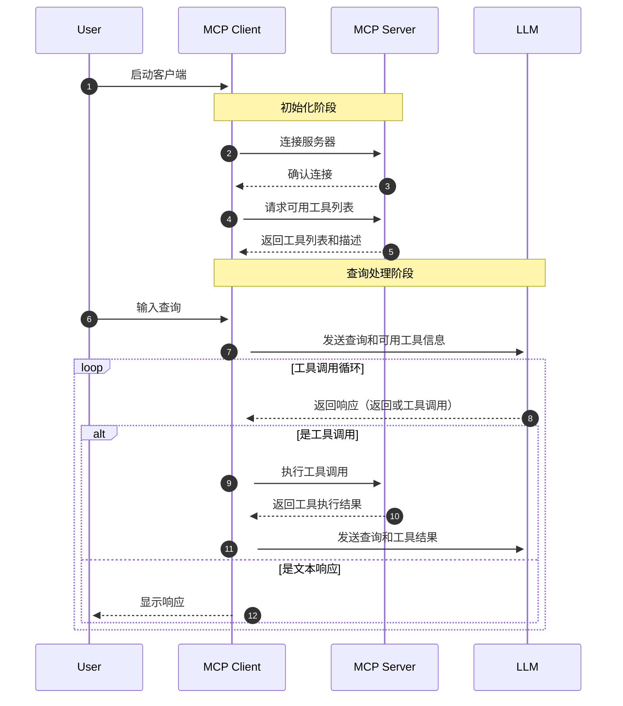

# 一、AI Agent

- [agents.json](https://docs.wild-card.ai/agentsjson/introduction)
- [AI Agent 十问十答，降低认知摩擦](https://mp.weixin.qq.com/s/keZ4H12NElW-Ew0R1Puayg)
- [构建有效 Agent](https://www.anthropic.com/engineering/building-effective-agents)
- [微软：Agent 入门学习](https://github.com/microsoft/ai-agents-for-beginners)
- [Agent Master Class](https://github.com/coleam00/ai-agents-masterclass)
- [构建自主 AI Agent](https://github.com/ed-donner/agents)
- [AG-UI Protocol](https://github.com/ag-ui-protocol/ag-ui)
- [Routine框架：让企业级Agent告别“不靠谱”](https://arxiv.org/pdf/2507.14447)

## 1、什么是 ReAct

- [ReAct模式 = Reason + Act](https://www.promptingguide.ai/techniques/react)
- [ReAct: Synergizing Reasoning and Acting in Language Models](https://arxiv.org/pdf/2210.03629)

ReAct 包含了 Reason 与 Act 两个部分。可以理解为就是思维链 + 外部工具调用；

ReAct 思想会让大模型把大问题拆分成小问题，一步步地解决，每一步都会尝试调用外部工具来解决问题，并且还会根据工具的反馈结果，思考工具调用是否出了问题。如果判断出问题了，大模型会尝试重新调用工具。这样经过一系列的工具调用后，最终完成目标；

### 1.1、ReAct Prompt 模板

要为大模型赋予 ReAct 能力，使其变成 Agent，需要在向大模型提问时，使用 ReAct Prompt，从而让大模型在思考如何解决提问时，能使用 ReAct 思想

下面是一个 [ReAct Prompt 模板](https://smith.langchain.com/hub/langchain-ai/react-agent-template)：
```
{instructions}

TOOLS:
------

You have access to the following tools:

{tools}

To use a tool, please use the following format:

```
Thought: Do I need to use a tool? Yes
Action: the action to take, should be one of [{tool_names}]
Action Input: the input to the action
Observation: the result of the action
```

When you have a response to say to the Human, or if you do not need to use a tool, you MUST use the format:

```
Thought: Do I need to use a tool? No
Final Answer: [your response here]
```

Begin!

Previous conversation history:
{chat_history}

New input: {input}
{agent_scratchpad}
```
这段 prompt 开头的 `{instructions}`其实是为大模型设置人设。之后告诉大模型，使用 `{tools}` 中定义的工具。因此在 `{tools}` 里，应该填入工具的描述。模板接下来要求大模型按照规定的格式思考和回答问题，这就是在教大模型如何推理和规划，大模型在有了推理和规划能力后就变成了 Agent
- Thought: 让大模型接到提问后，先思考应该怎么做？
- Action: 让大模型先在工具列表中挑选工具来解决问题，因此 {tool_names} 应该填入工具的名称；
- Action Input: 工具可以理解为函数，通常会有入参，这里就是让大模型提供入参；
- Observation: 在这里填入工具执行的结果，由大模型来判断结果是否有用；

上面过程使用伪代码表达式为：
```py
while True:
    # 1、（Thought）大模型调用，根据大模型输出，判断是否需要工具调用，调用哪个工具，入参是什么
    if 无需调用工具:
        break
    # 2、（Action）工具调用

    # 3、（Observation）拿到工具调用的执行结果，追加到prompt中，回到1，进行下一轮LLM调用
```

ReAct 的执行过程是一个与人类交互的过程。在 Action 和 Action Input 中，大模型会告诉人类需要执行什么工具、以及工具的入参是什么，而具体的工具执行，需要由人类完成。人类完成后，将工具执行结果填入到 Observation，反馈给大模型，直到大模型得到 Final Answer。


## 2、Function Calling

- [Function Calling-使模型能够获取数据并采取操作](https://platform.openai.com/docs/guides/function-calling)
- [Function Calling with LLMS](https://www.promptingguide.ai/applications/function_calling)

什么是 Function Calling，就是可以在向大模型提问时，给大模型提供一些工具（函数），由大模型根据需要，自行选择合适的工具，从而解决问题；

Function Calling 功能是 OpenAI 公司发明的，因此定义工具需要遵循 OpenAI SDK 的规范
```json
{
    "type": "function",
    "function": {
        "name": "",
        "description": "",
        "parameters": {},
    }
}
```
基本代码：
```py
def send_messages(messages):
    response = client.chat.completions.create(
        model="deepseek-chat",
        messages=messages,
        tools=tools,
        tool_choice="auto"
    )
    return response
```

对于不具备 Function Calling 能力的大模型，可以通过 Prompt Engineering 的方式实现类似的机制，在Prompt中指定可用的工具列表和描述，让大模型来判断是否需要调用工具。不过这种方式对于模型的推理能力和指令遵从能力要求比较高

## 3、概念

Agent，中文翻译为代理，顾名思义，代替用户在代理权限内去处理相关事宜。例如我聘请你作为代理律师，那么你将以我的名义进行民事法律行为；再例如我今天休假了，设置同事作为我的代理，去处理审批流等任务。

而 AI Agent 是指在普通代理的基础上，具备对任务的理解、环境的感知、信息的获取能力，并通过推理能力，自主进行决策和执行。AI Agent 就是 LLM + 客户端（Chatbot、AI IDE 等）组成的产品，代替我们去自主的完成下达的任务，这里的客户端具备规划、工具使用，甚至记忆的功能，目的都是为了更准确的执行任务。

核心元素：
- 大脑，即大模型
- 定义角色
- 配置技能
- 工作流程 

## 4、[A2A协议](https://github.com/google-a2a/A2A)

- [Agent2Agent (A2A) Samples](https://github.com/google-a2a/a2a-samples)
- [A2A-Agent2Agent Protocol](https://mp.weixin.qq.com/s/7d-fQf0sgS3OZgaQZm7blw)
- [A2A协议](https://google.github.io/A2A/#/)


A2A 解决的是什么问题？是 Agent 间互相通信，形成多 Agent 的问题，这比 MCP 的维度更高。因此它们是互补的协议

综上，Agent-to-Agent（A2A）协议是一种开放标准，用于让不同平台和框架下的 AI 智能代理能够“说同一种话”，实现无障碍的信息交换和协作

### 4.1、A2A 核心设计原则

**第一是拥抱 Agent 能力**：A2A 不仅仅是将远端 Agent 视为工具调用，而是允许 Agent 以自由、非结构化的方式交换消息，支持跨内存、跨上下文的真实协作。与此同时，Agent 无需共享内部思考、计划或工具，因此 Agent 相互之间成为黑盒，无需向对方暴露任何不想暴露的隐私。

**第二是基于现有标准**：在 HTTP、Server-Sent Events、JSON-RPC 等成熟技术之上构建，确保与现有 IT 架构无缝集成。

**第三是企业级安全**：A2A 内置与 OpenAPI 同级别的认证与授权机制，满足企业级安全与合规需求。

**第四是长任务支持**：除了即时调用，还可管理需人机环节介入、耗时数小时甚至数天的深度研究任务，并实时反馈状态与结果。

**第五是多模态无差别**：不仅限于文本，还原生支持音频、视频、富表单、嵌入式 iframe 等多种交互形式。

### 4.2、A2A 协议的角色

2A 协议定义了三个角色。
- 用户（User）：最终用户（人类或服务），使用 Agent 系统完成任务。
- 客户端（Client）：代表用户向远程 Agent 请求行动的实体。
- 远程 Agent（Remote Agent）：作为 A2A 服务器的“黑盒”Agent。

需要注意的是，在 A2A 框架中，客户端（Client）通常也是一个具有一定决策能力 Agent。它代表用户行事 ，可以是应用程序、服务或另一个 AI Agent，负责选择合适的远程 Agent 来完成特定任务，管理与远程 Agent 的通信、认证和任务状态。

而远程 Agent（Remote Agent）则是执行实际任务的 Agent，作为“黑盒”存在 ，提供特定领域的专业能力，通过 AgentCard 声明自己的技能和接口，保持内部工作机制的不透明性。

### 4.1、A2A 核心对象

A2A 协议设计了一套完整的对象体系，包括 Agent Card、Task、Artifact 和 Message

**[Agent Card](https://google-a2a.github.io/A2A/specification/#5-agent-discovery-the-agent-card)**

可以理解为是 Agent 的名片。每个支持 A2A 的远程 Agent 需要发布一个 JSON 格式的 “Agent Card”，描述该 Agent 的能力和认证机制。Client 可以通过这些信息选择最适合的 Agent 来完成任务。

示例：[Sample Agent Card](https://google-a2a.github.io/A2A/specification/#56-sample-agent-card)

**[Task](https://google-a2a.github.io/A2A/specification/#61-task-object)**

Task 是 Client 和 Remote Agent 之间协作的核心概念。一个 Task 代表一个需要完成的任务，包含状态、历史记录和结果。Task 的具体状态列表如下：
- submitted（已提交）
- working（处理中）
- input-required（需要额外输入）
- completed（已完成）
- canceled（已取消）
- failed（失败）
- unknown（未知）

**[Artifact](https://google-a2a.github.io/A2A/specification/#67-artifact-object)**

Artifact 是 Remote Agent 生成的任务结果。Artifact 可以有多个部分（parts），可以是文本、图像等。

**Message**

Message 用于 Client 和 Remote Agent 之间的通信，可以包含指令、状态更新等内容。一个 Message 可以包含多个 parts，用于传递不同类型的内容。

### 4.3、A2A 协议工作流程

A2A 协议的典型工作流程如下：
- **能力发现**：每个 Agent 通过一个 JSON 格式的 “Agent Card” 公布自己能执行的能力（如检索文档、调度会议等）。
- **任务管理**：Agent 间围绕一个 “task” 对象展开协作。该对象有生命周期、状态更新和最终产物（artifact），支持即时完成与长跑任务两种模式。
- **消息协作**：双方可互发消息，携带上下文、用户指令或中间产物；消息中包含若干 “parts”，每个 part 都指明内容类型，便于双方就 UI 呈现形式（如图片、表单、视频）进行协商。
- **状态同步**：通过 SSE 等机制，Client Agent 与 Remote Agent 保持实时状态同步，确保用户看到最新的进度和结果。

A2A 协议中，Agent 之间除了基本的任务处理外，A2A 还支持流式响应，使用 Server-Sent Events（SSE）实现流式传输结果；支持 Agent 请求额外信息的多轮交互对话和长时间运行任务的异步通知，以及多模态数据，如文本、文件、结构化数据等多种类型

### 4.5、MCP 与 A2A

相似之处在于都是标准化协议，都在大模型应用场景中实现信息交互和协作——而且解决的都是 AI 应用开发过程中的沟通协作问题

**相同点：**
- 标准化通信协议：两者都是为了解决信息孤岛，提供统一的、标准的通信机制，使得不同服务或Agent可以顺畅沟通。
- 可扩展性与通用性：都可以扩展到多种应用场景，无论是工具调用、资源整合(MCP)，还是智能代理之间的协作沟通(A2A)。
- 客户端-服务器架构：MCP明确定义为客户端驱动、服务器响应的方式；A2A则是Agent之间类似"客户端-服务器"或"对等"(Peer-to-peer)的信息交换模式。

**区别**
- 使用场景：
    - MCP：更专注于模型与工具（外部资源）的交互，解决的是模型工具调用、资源访问的问题，本质上一种模型外部接口的标准化实现（这是 LLM 调用传统工具、结构化的、确定性的接口）；
    - A2A：专注于不同 Agent 之间的协作沟通，本质上是一种 Agent 直接的语言、协作交互机制（这是 LLM 之间的、基于概率的、非结构化的接口）
- 交互粒度：
    - MCP：粒度更细，强调工具的调用、数据交互的实现细节，比如订票、查询信息等具体动作；
    - A2A：粒度偏高层次，更多强调的是任务协作和信息共享，比如任务请求、状态通告等抽象层面的交互；
- 协议定义范围：
    - MCP：定义了一整套详细的原语。如Tools、Resources、Prompts、Memory、Transports，针对模型驱动外部工具和资源的整套声明周期都有详细设计
    - A2A：定义了 Agent 之间的消息格式、会话状态和信息交换机制，主要是定义 Agent 的沟通标准，更抽象、更通用；

简而言之。二者尽管相似，但是彼此并非竞争，而是互补的关系，且刚好形成了一个完整的 AI 时代的通信协议方案。


上面图描述的 A2A 协议，首先，每一个独立的 Agent 都可以去调用自身的工具，调用工具的方法可以是传统的调用方式，也可以是 MCP。而 Agent 与 Agent 之间，还可以通过 Agent 之间进行互相调用

> 总结：MCP 提供了统一的上下文管理与工具调用接口，整合了大模型驱动的概率计算与传统工具驱动的结构化计算。A2A 则为多 Agent 协同注入了开放标准。二者的结合，将单一 AI 应用推向分布式、模块化的智能生态。

A2A 与 MCP 各有专长，再加上 LLM，它们共同构成了一个完整的智能代理生态系统。两者的关系可以这样理解：
- LLM：是 Agent 毫无疑问的“大脑”，负责处理信息，推理，做决策。
- MCP：负责模型与工具 / 资源的连接，是 Agent 的“手”，让 Agent 能够获取信息和执行操作。
- A2A：负责 Agent 之间的通信，是 Agent 的“嘴”，让 Agent 能够相互交流、协作完成任务。

## 5、主流Agent 框架

- 对于 C 端用户，可以考虑 [coze](https://www.coze.cn/store/bot)，缺点是没有开源
- [Dify平台](https://dify.ai/zh)
- [Dify DSL](https://github.com/svcvit/Awesome-Dify-Workflow)
- [Autogen的基本框架](https://limoncc.com/post/3271c9aecd8f7df1/)[autogenstudio ui --host 0.0.0.0 --port 8080 --appdir ./myapp]
- [MetaGPT智能体开发入门](https://github.com/geekan/MetaGPT)
- [Pocket Flow](https://github.com/The-Pocket/PocketFlow)
- [Mem0-Agent 记忆体](https://github.com/mem0ai/mem0)
- [Qwen-Agent](https://github.com/QwenLM/Qwen-Agent)
- [OpenAI Agents SDK](https://github.com/openai/openai-agents-python)
- [深度拆解：Dify、FastGPT 和 Ragflow](https://huangf.org/posts/aiworkflow/)

## 5.1、Multi-Agent

- [agentUniverse 是一个基于大型语言模型的多智能体框架](https://github.com/agentuniverse-ai/agentUniverse)
- [crewAI-快速灵活的多代理自动化框架](https://github.com/crewAIInc/crewAI)
- [OWL：实际任务自动化中提供通用多智能体协助](https://github.com/camel-ai/owl)
- [OpenManus](https://github.com/FoundationAgents/OpenManus)
- [JoyAgent-JDGenie: 开源端到端的通用 Agent](https://github.com/jd-opensource/joyagent-jdgenie)
- [agno：用于构建具有内存、知识和推理的Multi Agent的全栈框架](https://github.com/agno-agi/agno)
- [FinGenius - 首个A股博弈多智能体应用](https://github.com/HuaYaoAI/FinGenius)
- [什么是 Computer Use Agent](https://zhuanlan.zhihu.com/p/31508157573)

## 6、开源 Agent

- [browser-use：AI 操作浏览器](https://github.com/browser-use/browser-use)
- [AI 编程引擎 Plandex](https://github.com/plandex-ai/plandex)
- [Suna-通用型 Agent](https://github.com/kortix-ai/suna)
- [精选 Agent 代理框架](https://github.com/Arindam200/awesome-ai-apps)
- [WebAgent 信息检索系统：网页智能代理框架](https://github.com/Alibaba-NLP/WebAgent)

## 7、Agent 记忆

- [Agent 常见 8 种 memory 实现](https://mp.weixin.qq.com/s/29SXiWyRgIZNGgpY3E0jdw)
- [9 Different Ways to Optimize AI Agent Memories](https://github.com/FareedKhan-dev/optimize-ai-agent-memory)

## 应用

- [agent directory](https://aiagentsdirectory.com/)
- [Agent调研--19类Agent框架对比](https://mp.weixin.qq.com/s/rogMCoS1zDN0mAAC5EKhFQ)
- [自主 AI Agent 框架列表](https://github.com/e2b-dev/awesome-ai-agents)
- [复杂表格多Agent方案](https://mp.weixin.qq.com/s/lEbFZTPCdFPW-X22253ZPg)
- [快速开发AI Agent](https://github.com/huggingface/smolagents)
- [What Are Agentic Workflows? Patterns, Use Cases, Examples, and More](https://weaviate.io/blog/what-are-agentic-workflows)
- [TradingAgents：基于多智能体大语言模型的金融交易框架](https://github.com/TauricResearch/TradingAgents)
- [BrowserOS:开源浏览器 Agent](https://github.com/browseros-ai/BrowserOS)
- [MultiAgentPPT 是一个集成了 A2A（Agent2Agent）+ MCP（Model Context Protocol）+ ADK（Agent Development Kit） 架构的智能化演示文稿生成系统，支持通过多智能体协作和流式并发机制](https://github.com/johnson7788/MultiAgentPPT)

## 构建 Agent 原则

https://github.com/humanlayer/12-factor-agents

## 垂直领域 Agent

### Manus 分析
 
- [Manus的技术实现原理浅析与简单复刻](https://developer.aliyun.com/article/1658152)
- [Manus 的调研与思考](https://blog.naaln.com/2025/03/Manus/)
- https://zhuanlan.zhihu.com/p/29330461895
- [Check Files Under /opt/.manus Path](https://manus.im/share/lLR5uWIR5Im3k9FCktVu0k)
- [Manus 提示词](https://gist.github.com/jlia0/db0a9695b3ca7609c9b1a08dcbf872c9)

# 二、MCP

- [Model Context Protocol](https://modelcontextprotocol.io/introduction)
- [探索MCP](https://v2ex.com/t/1119962)
- [MCP+数据库](https://mp.weixin.qq.com/s/_HW4YQobEeBnIZMgrl7cLg)
- [MCP入门到精通](https://mp.weixin.qq.com/s/jwzEFeHuB_k9BA7go8bNVg)
- [MCP With LLMS](https://modelcontextprotocol.io/llms-full.txt)
- [分析 Cline 与大模型的交互](https://www.youtube.com/watch?v=YyVkXrXxvX8)
- [A bridge between Streamable HTTP and stdio MCP transports](https://github.com/sparfenyuk/mcp-proxy)


## 1、基础

MCP (Model Context Protocol): 模型上下文协议，是 Anthropic (Claude) 主导发布的一个开放的、通用的、有共识的协议标准。
- MCP 是一个标准协议，就像给 AI 大模型装了一个 “万能接口”，让 AI 模型能够与不同的数据源和工具进行无缝交互。它就像 USB-C 接口一样，提供了一种标准化的方法，将 AI 模型连接到各种数据源和工具。
- MCP 旨在替换碎片化的 Agent 代码集成，从而使 AI 系统更可靠，更有效。通过建立通用标准，服务商可以基于协议来推出它们自己服务的 AI 能力，从而支持开发者更快的构建更强大的 AI 应用。开发者也不需要重复造轮子，通过开源项目可以建立强大的 AI Agent 生态。
- MCP 是客户端-服务端架构，一个 Host 可以连接多个 MCP Server

核心思想: 将 AI 模型的功能和对接到 AI 模型的工具(tool),数据(resource),提示(prompt)分离开, 独立部署, 让 AI 可以随意连接各种工具,数据以及使用各种提示!

- MCP 主机 (MCP Host): （可以认为是一个 Agent）运行 AI 模型和 MCP 客户端的应用程序。常见的 MCP 主机有：
    - Claude Desktop: Anthropic 公司的桌面客户端，内置了 MCP 支持。
    - IDE 集成: 像 VS Code 、Cursor 等 IDE 可以通过插件支持 MCP 。
    - 自定义应用: 你自己开发的任何集成了 MCP 客户端的应用程序。
- MCP 客户端 (MCP Client): 负责与 MCP 服务器通信的组件。它通常集成在 MCP 主机中。客户端的主要职责是：
    - 充当MCP Server 和 LLM 之间的桥梁
    - 发现和连接 MCP 服务器。
    - 向 MCP 服务器请求可用的工具、资源、提示等信息。
    - 根据 AI 模型的指令，调用 MCP 服务器提供的工具。
    - 将工具的执行结果返回给 AI 模型。
- MCP 服务 (MCP Server): 提供具体功能（工具）和数据（资源）的程序。你可以把它想象成一个“技能包”，AI 模型可以通过 MCP 客户端“调用”这些技能。MCP 服务器可以：
    - 访问本地数据（文件、数据库等）。
    - 调用远程服务（ Web API 等）。
    - 执行自定义的逻辑。

> MCP 提供给 LLM 所需的上下文：Resources 资源、Prompts 提示词、Tools 工具

> 整体的工作流程是这样的：AI 应用中集成 MCP 客户端，通过 MCP 协议向 MCP 服务端发起请求，MCP 服务端可以连接本地/远程的数据源，或者通过 API 访问其他服务，从而完成数据的获取，返回给 AI 应用去使用

$ \color{red}{特别说明：MCP 并没有规定如何与大模型进行交互，其没有对模型与 MCP HOST 的交互进行规定} $

## 2、MCP与Function call

<center>
    <br>
    <div style="color:orange; border-bottom: 1px solid #d9d9d9; display: inline-block; color: #999; padding: 2px;">
        图片来自文章：<a href='https://blog.dailydoseofds.com/p/function-calling-and-mcp-for-llms'>Function calling & MCP for LLMs</a>
    </div>
</center>

## 3、MCP工具

### 3.1、MCP Servers

- [Awesome MCP Server](https://github.com/punkpeye/awesome-mcp-servers)
- [Find Awesome MCP Servers and Clients](https://mcp.so/)
- [MCP Server 官方示例](https://github.com/modelcontextprotocol/servers)
- [Awesome-MCP-ZH](https://github.com/yzfly/Awesome-MCP-ZH)
- [Glama](https://glama.ai/mcp/servers)
- [Smithery](https://smithery.ai)
- [cursor](https://cursor.directory)
- [MCP.so](https://mcp.so/zh)
- [阿里云百炼](https://bailian.console.aliyun.com/?tab=mcp#/mcp-market)
- [阿里 Higress AI MCP](https://mcp.higress.ai/)

MCP Server 相对比较独立，可以独立开发，独立部署，可以远程部署，也可以本地部署。它可以提供三种类型的功能：
- 工具（Tools）：可以被 LLM 调用的函数（需要用户批准）。可以由大模型自主选择工具，无需人类进行干涉，整个过程是全自动的。
- 资源（Resources）：类似文件的数据，可以被客户端读取，如 API 响应或文件内容。Resource 对接的是 MCP Hosts，需要 MCP Hosts 额外开发与 Resouce 的交互功能，并且由用户进行选择，才能直接使用
- 提示（Prompts）：预先编写的模板，帮助用户完成特定任务。它与 Resource 类似，也是需要用户的介入才能使用

### 3.2、MCP Client && MCP Hosts

[MCP 官网](https://modelcontextprotocol.io/clients)列出来一些支持 MCP 的 Clients。

MCP Client 负责与 MCP Server 进行通信。而 MCP Hosts 则可以理解为是一个可对话的主机程序。

当用户发送 prompt（例如：我要查询北京的天气） 到 MCP Hosts 时，MCP Hosts 会调用 MCP Client 与 MCP Server 进行通信，获取当前 MCP Server 具备哪些能力，然后连同用户的 prompt 一起发送给大模型，大模型就可以针对用户的提问，决定何时使用这些能力了。这个过程就类似，我们填充 ReAct 模板，发送给大模型。

当大模型选择了合适的能力后，MCP Hosts 会调用 MCP Cient 与 MCP Server 进行通信，由 MCP Server 调用工具或者读取资源后，反馈给 MCP Client，然后再由 MCP Hosts 反馈给大模型，由大模型判断是否能解决用户的问题。如果解决了，则会生成自然语言响应，最终由 MCP Hosts 将响应展示给用户。

分为两类：
- AI编程IDE：Cursor、Cline、Continue、Sourcegraph、Windsurf 等
- 聊天客户端：Cherry Studio、Claude、Librechat、Chatwise等

更多的Client参考这里：
- [MCP Clients](https://www.pulsemcp.com/clients)
- [Awesome MCP Clients](https://github.com/punkpeye/awesome-mcp-clients/)

## 4、应用场景

应用领域 | 典型场景 | MCP价值 | 代表实现
--------|--------|---------|------
智能编程助手|代码生成、Bug修复、API集成|安全访问本地代码库、CI/CD系统|Cursor、VS Code插件
数据分析工具|自然语言查询数据库、可视化生成|安全查询内部数据库、连接BI工具|XiYanSQL-MCP、数据库MCP服务器
企业知识管理|知识库查询、文档生成、邮件撰写|安全访问内部文档、保护隐私数据|文件系统MCP、Email-MCP
创意设计工具|3D建模、图形生成、UI设计|与专业软件无缝集成|BlenderMCP、浏览器自动化
工作流自动化|多系统协调、事件驱动流程|跨系统安全协作Cloudflare |MCP、AWS自动化套件

## 5、MCP协议细节

MCP协议官方提供了两种主要通信方式：stdio（标准输入输出）和 SSE （Server-Sent Events，服务器发送事件）。这两种方式均采用全双工通信模式，通过独立的读写通道实现服务器消息的实时接收和发送
- Stdio传输（标准输入/输出）：适用于本地进程间通信，MCP默认的通信方式
- HTTP + SSE传输：
    - 服务端→客户端：Server-Sent Events（SSE） 
    - 客户端→服务端：HTTP POST 
    - 适用于远程网络通信。

所有传输均采用JSON-RPC 2.0进行消息交换

### 5.1、stdio方式

优点
- 这种方式适用于客户端和服务器在同一台机器上运行的场景，简单。
- stdio模式无需外部网络依赖，通信速度快，适合快速响应的本地应用。
- 可靠性高，且易于调试

缺点：
- Stdio 的配置比较复杂，我们需要做些准备工作，你需要提前安装需要的命令行工具。
- stdio模式为单进程通信，无法并行处理多个客户端请求，同时由于进程资源开销较大，不适合在本地运行大量服务。（限制了其在更复杂分布式场景中的使用）；

stdio的本地环境有两种：
- 一种是Python 编写的服务，
- 一种用TypeScript 编写的服务。

分别对应着uvx 和 npx 两种指令

### 5.2、SSE方式

场景
- SSE方式适用于客户端和服务器位于不同物理位置的场景。
- 适用于实时数据更新、消息推送、轻量级监控和实时日志流等场景
- 对于分布式或远程部署的场景，基于 HTTP 和 SSE 的传输方式则更为合适。

优点
- 配置方式非常简单，基本上就一个链接就行，直接复制他的链接填上就行


### 5.3、Streamable HTTP

- [Replace HTTP+SSE with new "Streamable HTTP" transport](https://github.com/modelcontextprotocol/modelcontextprotocol/pull/206)

MCP 新增了一种方式：Streamable HTTP 传输层替代原有的 HTTP+SSE 传输层：
- Streamable HTTP 相比 HTTP + SSE 具有更好的稳定性，在高并发场景下表现更优。
- Streamable HTTP 在性能方面相比 HTTP + SSE 具有明显优势，响应时间更短且更稳定。
- Streamable HTTP 客户端实现相比 HTTP + SSE 更简单，代码量更少，维护成本更低

HTTP+SSE 存在的问题：

HTTP+SSE 的传输过程实现中，客户端和服务器通过两个主要渠道进行通信：（1）HTTP 请求/响应：客户端通过标准的 HTTP 请求向服务器发送消息。（2）服务器发送事件（SSE）：服务器通过专门的 /sse 端点向客户端推送消息，这就导致存在下面三个问题：
- 服务器必须维护长连接，在高并发情况下会导致显著的资源消耗。
- 服务器消息只能通过 SSE 传递，造成了不必要的复杂性和开销。
- 基础架构兼容性，许多现有的网络基础架构可能无法正确处理长期的 SSE 连接。企业防火墙可能会强制终止超时连接，导致服务不可靠。

Streamable HTTP 的改进
- 统一端点：移除了专门建立连接的 /sse 端点，将所有通信整合到统一的端点。
- 按需流式传输：服务器可以灵活选择返回标准 HTTP 响应或通过 SSE 流式返回。
- 状态管理：引入 session 机制以支持状态管理和恢复。

## 6、MCP 工作流程

API 主要有两个
- `tools/list`：列出 Server 支持的所有工具
- `tools/call`：Client 请求 Server 去执行某个工具，并将结果返回



数据流向为：


## 7、Spring AI 使用 MCP

Spring AI MCP 采用模块化架构，包括以下组件：
- Spring AI 应用程序：使用 Spring AI 框架构建想要通过 MCP 访问数据的生成式 AI 应用程序
- Spring MCP 客户端：MCP 协议的 Spring AI 实现，与服务器保持 1:1 连接

通过 Spring AI MCP，可以快速搭建 MCP 客户端和服务端程序。

## 8、MCP 安全问题

https://news.ycombinator.com/item?id=43600192

## 9、MCP和Agent

- [MCP 构建 Agent](https://github.com/lastmile-ai/mcp-agent)

## 10、MCP Server开发

- [MCP Server 工程开发参考](https://github.com/aliyun/alibaba-cloud-ops-mcp-server)

**安装依赖：**
```bash
# 下面两种方式选其一
uv add "mcp[cli]"
pip install "mcp[cli]"
```

**运行**

运行 MCP 服务，假设新建了一个 MCP Server，文件名为：`server.py`
```bash
mcp dev server.py
# Add dependencies
mcp dev server.py --with pandas --with numpy
# Mount local code
mcp dev server.py --with-editable .
```
除了上面的方式，也可以直接运行，需要增加如下代码:
```py
...
if __name__ == "__main__":
    mcp.run()
```
然后执行如下命令：
```bash
python server.py
# or
mcp run server.py
```
请注意：`mcp run` 或 `mcp dev` 只支持 FastMCP

### 10.1、Tools

```py
import httpx
from mcp.server.fastmcp import FastMCP
mcp = FastMCP("My App")
@mcp.tool()
async def fetch_weather(city: str) -> str:
    """Fetch current weather for a city"""
    async with httpx.AsyncClient() as client:
        response = await client.get(f"https://api.weather.com/{city}")
        return response.text
```

## 11、MCP 资源

- [交互式用户反馈 MCP-节省 Token 调用量](https://github.com/Minidoracat/mcp-feedback-enhanced)
- [PromptX是一个系统性的，工程化的提示词管理框架](https://github.com/Deepractice/PromptX)
- [微信读书 MCP](https://github.com/freestylefly/mcp-server-weread)
- [控制 Mac 电脑的 MCP](https://github.com/ashwwwin/automation-mcp)
- [吴恩达-MCP 学习](https://www.deeplearning.ai/short-courses/mcp-build-rich-context-ai-apps-with-anthropic/)
- [FastAPI-MCP:api转 MCP](https://github.com/tadata-org/fastapi_mcp)
- [ACI：为统一 MCP 服务器提供支持的开源基础设施](https://github.com/aipotheosis-labs/aci)
- [Dive 是一个开源的 MCP Host Desktop 应用程序](https://github.com/OpenAgentPlatform/Dive)
- [OpenMemory-MCP 记忆体](https://github.com/mem0ai/mem0/openmemory)
- [Discover Awesome MCP Servers](https://himcp.ai/)
- [Sequential Thinking MCP: How to Use Sequential Thinking MCP Servers](https://www.ontariomcp.ca/sequential-thinking-mcp)
- [海量好用 MCP Server](https://cloud.tencent.com/developer/mcp)
- [EdgeOne Pages MCP-MCP部署网页](https://github.com/TencentEdgeOne/edgeone-pages-mcp)
- [Chrome MCP](https://github.com/hangwin/mcp-chrome)
- [Firecrawl MCP Server-网页抓取](https://github.com/mendableai/firecrawl-mcp-server)
- [Context MCP：给 AI 提供最新文档](https://github.com/upstash/context7)
- [Sequential Thinking MCP-顺序思考](https://github.com/arben-adm/mcp-sequential-thinking)
- [Shrimp Task Manager MCP-把复杂任务拆解成可执行的小步骤的 MCP](https://github.com/cjo4m06/mcp-shrimp-task-manager)
- [Interactive Feedback MCP：先确认再执行](https://github.com/noopstudios/interactive-feedback-mcp)
- [MCP-联合查询引擎](https://github.com/mindsdb/mindsdb)
- [AntVis-MCP Chart](https://github.com/antvis/mcp-server-chart)
- [基于 MCP 的机器人应用](https://github.com/78/xiaozhi-esp32)
- [Context7-LLMs 和 AI 代码编辑器的最新代码文档](https://github.com/upstash/context7)
- [可以安全操作数据库的 MCP Toolbox](https://github.com/googleapis/genai-toolbox)

## 12、RAG-MCP

- [RAG-MCP: Mitigating Prompt Bloat in LLM Tool Selection via Retrieval-Augmented Generation](https://arxiv.org/pdf/2505.03275)


## 13、总结

无论是 MCP 协议还是 Agent、Function Calling 技术，本质上都在构建大模型与真实世界的交互桥梁；


