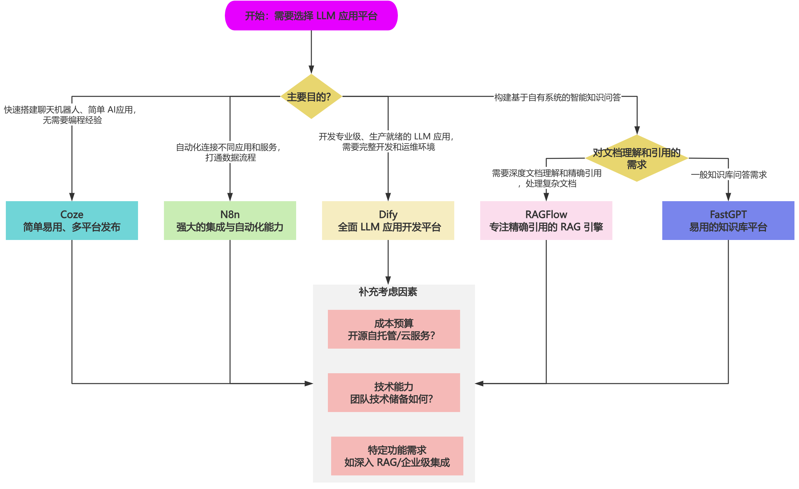

# 一、大模型

- [OpenAI文档](https://platform.openai.com/docs/concepts)
- [大模型理论基础](https://datawhalechina.github.io/so-large-lm/#/)
- [大模型基础](https://github.com/ZJU-LLMs/Foundations-of-LLMs)
- [从零开始的大语言模型原理与实践教程](https://github.com/datawhalechina/happy-llm)
- [LLM基础、模型构建和应用部署](https://github.com/mlabonne/llm-course)

## 1、基本概念

### 1.1、什么是大模型

大语言模型是一种人工智能模型，通常使用深度学习技术，比如神经网络，来理解和生成人类语言。这些模型的“大”在于它们的参数数量非常多，可以达到数十亿甚至更多，这使得它们能够理解和生成高度复杂的语言模式；

可以**将大语言模型想象成一个巨大的预测机器，其训练过程主要基于“猜词”**：给定一段文本的开头，它的任务就是预测下一个词是什么。模型会根据大量的训练数据（例如在互联网上爬取的文本），试图理解词语和词组在语言中的用法和含义，以及它们如何组合形成意义。它会通过不断地学习和调整参数，使得自己的预测越来越准确；

LangChain 是一个全方位的、基于大语言模型这种预测能力的应用开发工具，它的灵活性和模块化特性使得处理语言模型变得极其简便。不论你在何时何地，都能利用它流畅地调用语言模型，并基于语言模型的“预测”或者说“推理”能力开发新的应用；

### 1.2、token

LLM 把要预测的每一个字成为 token，现在 LLM 都是按照 token 来计费的，所有的 token 成为 vocab 词表；生成 token 的方式成为分词（Tokenizer）
- BPE 分词法

token 是介于单词和字母之间的一个子词，语料中出现最频繁的部分，可以减少 token 的数量；

> 问题1：token 为什么不能是单词？因为单次作为 token 有两个缺点：
- 数量太大了，语义有重叠，每个单词还有不同的时态，词表一旦变大，模型的训练难度就会加大；
- 构建完词表后，如果出现了一个新的词，就会超出词表的范围，就会被被标记为 unload；

而子词可以通过多个 token来拼接新的词；

> 问题1：token 为什么不能是字符？
- 虽然词表变少了，但是字母本身并没有很强的语意信息，增加了模型训练的难度；


### 1.3、大模型技术原理

- [大模型相关技术原理以及实战经验](https://github.com/liguodongiot/llm-action)

主要技术架构是基于 [transformer](https://en.wikipedia.org/wiki/Transformer_(deep_learning_architecture))

大模型推理过程：加载分词算法 -> 加载模型参数 -> 推理生成答案

### 1.4、[控制大语言模型的输出的随机性的参数](./AI应用.md#4大模型设置)

大语言模型预测下一个token时会先输出所有token的概率值，有不同的方法来控制选择哪一个token作为输出，主要以下4个参数
- `温度（Temperature）`: 起到平滑调整概率的作用，temperature=1时，原始概率保持不变，temperature<1时，原来概率大的会变得更大（概率集中效果），temperature>1时,概率值越平均
- `Top-K`: 模型输出是在概率在top-k的范围里随机选择一个，K值越大，选择范围越广，生成的文本越多样；K值越小，选择范围越窄，生成的文本越趋向于高概率的词。 k=1就是直接选择最高概率的token输出
- `Top-p`: 通过累积概率来限定范围，top-p=0.5表示随机采样的范围是概率在前50%的tokens， top-p选择的tokens数是动态的
- `max-tokens`: max-tokens参数指定了模型在停止生成之前可以生成的最大token（或词）数量

```py
import torch
import torch.nn.functional as F
import numpy as np
# numpy 与 torch 如果版本冲突，需要将 numpy 降级为：1.26.4
inputs = np.array([[2.0, 1.0, 0.1]])
def calculate(temperature):
    logits = torch.tensor(inputs / temperature)
    softmax_scores = F.softmax(logits, dim=1)
    print(f"temperature = {temperature} {softmax_scores.cpu().numpy()}")
if __name__ == "__main__":
    calculate(1.0)
    calculate(0.1)
    calculate(10)
```

## 2、Transformer 架构

- [How transformer architecture works](https://www.datacamp.com/tutorial/how-transformers-work)
- [transformer 模型详解](https://zhuanlan.zhihu.com/p/338817680)
- [深入理解Transformer技术原理](https://tech.dewu.com/article?id=109)
- [transformer 整体指南](https://luxiangdong.com/2023/09/10/trans/)

## 3、大模型预训练

## 4、大模型数据

## 5、指令微调

## 6、RLHF：强化学习

- [RLHF的完整流程](https://mp.weixin.qq.com/s/wz2PXBl_pNcj8NWej14SMQ)


## 7、大模型调用

### 7.1、CPU 与 GPU

- [The difference between CPU and GPU](https://www.intel.com/content/www/us/en/products/docs/processors/cpu-vs-gpu.html)

**CPU（Central Processing Unit），即中央处理器**；是电脑、手机等众多电子产品的“心脏”。它主要负责执行程序指令、进行算术和逻辑运算以及控制和协调计算机各个部件。为了满足处理各种不同数据的强大通用性能，CPU 的内部结构设计非常复杂。CPU 由多个核心组成，每个核心又包含算术逻辑单元、控制单元和高速缓存等组件，并且可以独立地执行任务。至今为止，所有的 CPU 都遵循冯·诺依曼体系结构的基本工作流程：取指令，指令译码，执行指令，数据回写，然后再取下一个指令、译码、执行、回写，重复进行直到程序结束。通过这种工作流程，CPU 能够有效地执行程序，并控制整个系统的运行；

**GPU（Graphics Processing Unit），即图形处理器**，顾名思义，一种专门用来处理图形和图像计算的处理器。GPU 最初是为图形渲染和显示而设计的，用于加速计算机中图像的处理，例如在视频游戏、电影渲染、图形设计等方面。它只有少量的控制单元和缓存单元，绝大部分的空间用来堆放运算单元，主要负责完成许多计算密集型任务

CPU 和 GPU 之间存在显著差异，是因为它们各自针对不同的目标和需求来设计，具体体现在：
- CPU 需要有强大的通用性，以处理各种不同类型的数据，同时需要进行逻辑判断，包括大量的分支跳转和中断处理，这导致内部结构异常复杂。
- GPU 主要面向类型高度统一、相互无依赖的大规模数据，并在纯净的计算环境中执行，因此不需要处理复杂的逻辑操作。

这就导致了 CPU 和 GPU 呈现出非常不同的架构：


CPU 拥有较大的缓存单元以及复杂的逻辑控制单元，相比之下计算能力只是 CPU 很小的一部分。而 GPU 则拥有数量众多的计算单元和超长的流水线，但只有非常简单的逻辑控制以及较小的缓存单元。

**设计理念**：CPU 和 GPU 的设计理念也截然不同。
- 首先，**CPU 是基于低延迟（Low Latency）设计的**：
    - 强大的运算单元：CPU 拥有数量较少但是单个计算性能更强的运算单元，可以减少操作延时，更快地响应。
    - 大容量缓存：将一部分数据存储到高速缓存当中，使得高延迟的内存访问转换为低延迟的缓存访问。
    - 复杂的控制单元：分支预测（Branch Prediction）机制可以降低分支延时；数据转发（Data Forwarding）机制降低数据延时。
- **GPU 则是基于高通量（High Throughput）设计的**：
    - 精简的运算单元：GPU 拥有大量的运算单元，虽然单个单元的性能比不上 CPU，但可以支持非常多的线程（Thread）从而达到非常大的吞吐量。
    - 小容量缓存：与 CPU 不同，GPU 缓存的目的并不是用来存储后面需要访问的数据，而是为线程提供服务，如果有很多线程需要访问同一个相同的数据，缓存会合并这些访问，然后再去访问内存。
    - 简单的控制单元：GPU 的控制单元没有分支预测和数据转发机制。

> CPU 更擅长一次处理一项任务，而 GPU 则可以同时处理多项任务。

### 7.2、大模型文件


### 7.3、通过 GPU 调用LLM

如何查看 GPU：`nvidia-smi`，看机器上的nvidia显卡
- 驱动
- cuda
- 显卡型号
- 显存
- 利用率
```
Fri Oct  4 16:04:01 2024       
+-----------------------------------------------------------------------------+
| NVIDIA-SMI 450.57       Driver Version: 450.57       CUDA Version: 11.0     |
|-------------------------------+----------------------+----------------------+
| GPU  Name        Persistence-M| Bus-Id        Disp.A | Volatile Uncorr. ECC |
| Fan  Temp  Perf  Pwr:Usage/Cap|         Memory-Usage | GPU-Util  Compute M. |
|                               |                      |               MIG M. |
|===============================+======================+======================|
|   0  TITAN RTX           Off  | 00000000:04:00.0 Off |                  N/A |
| 40%   28C    P8     1W / 280W |  13896MiB / 24220MiB |      0%      Default |
|                               |                      |                  N/A |
+-------------------------------+----------------------+----------------------+
|   1  TITAN RTX           Off  | 00000000:08:00.0 Off |                  N/A |
| 41%   26C    P8    15W / 280W |  11586MiB / 24220MiB |      0%      Default |
|                               |                      |                  N/A |
+-------------------------------+----------------------+----------------------+
|   2  TITAN RTX           Off  | 00000000:0C:00.0 Off |                  N/A |
| 41%   25C    P8    12W / 280W |  23315MiB / 24220MiB |      0%      Default |
|                               |                      |                  N/A |
+-------------------------------+----------------------+----------------------+
|   3  TITAN RTX           Off  | 00000000:0F:00.0 Off |                  N/A |
| 41%   26C    P8    14W / 280W |  14865MiB / 24220MiB |      0%      Default |
|                               |                      |                  N/A |
+-------------------------------+----------------------+----------------------+
                                                                               
+-----------------------------------------------------------------------------+
| Processes:                                                                  |
|  GPU   GI   CI        PID   Type   Process name                  GPU Memory |
|        ID   ID                                                   Usage      |
|=============================================================================|
|    0   N/A  N/A      4784      C   ...a_v11/ollama_llama_server    11161MiB |
|    0   N/A  N/A      6508      C   ...onda3/envs/llm/bin/python     2025MiB |
|    0   N/A  N/A     36275      C   ...on-webui/venv/bin/python3      707MiB |
|    1   N/A  N/A      4784      C   ...a_v11/ollama_llama_server    11583MiB |
|    2   N/A  N/A      4784      C   ...a_v11/ollama_llama_server    11161MiB |
|    2   N/A  N/A     50936      C   ...onda3/envs/llm/bin/python    12151MiB |
|    3   N/A  N/A      4784      C   ...a_v11/ollama_llama_server    11647MiB |
|    3   N/A  N/A     36275      C   ...on-webui/venv/bin/python3     3215MiB |
+-----------------------------------------------------------------------------+
```

（1）设置使用的 GPU，不指定默认全部
```py
os.environ["CUDA_VISIBLE_DEVICES"] = '0'
```
（2）加载分词器 tokenizer
```py
tokenizer = AutoTokenizer.from_pretrained(model_path, trust_remote_code=True)
```
（3）加载模型
```py
model = AutoModel.from_pretrained(model_path, device_map='auto', trust_remote_code=True)
```
（4）推理
```py
model.chat(
    tokenizer=tokenizer,
    prompt='你好',
    history=[],
    temperature=0.1,
    top_p=0.8,
    top_k=20
)
```

### 7.4、本地部署 CPU 调用 LLM

- [GPT4All：在任何设备上运行本地 LLM](https://github.com/nomic-ai/gpt4all)
- [Ollama-运行大模型框架](https://ollama.com/)
- [Xinference-模型服务变得简单](https://github.com/xorbitsai/inference)
- [huggingface-开源大模型](https://huggingface.co/)
- [ollama-基本使用](https://github.com/datawhalechina/handy-ollama)
- [开源大模型食用（部署）指南](https://github.com/datawhalechina/self-llm)
- [ModelScope是阿里巴巴推出的开源模型即服务（MaaS）平台](https://www.modelscope.cn/home)
- [机器学习（ML）和数据科学平台及社区](https://huggingface.co/)
- [大模型部署电脑配置要求](https://www.zhihu.com/question/628771017)
- [AutoDL部署 Deepseek](https://zhuanlan.zhihu.com/p/23213698282)
- [一文梳理主流大模型推理部署框架：vLLM、SGLang、TensorRT-LLM、ollama、XInference](https://mp.weixin.qq.com/s/Fsaz7PAUSiKizl_lw-KSeg)
- [EXO-分布式 AI 集群](https://github.com/exo-explore/exo)
- [计算 LLM 推理所需的 GPU 内存](https://selfhostllm.org/)
- [llama.cpp](https://github.com/ggml-org/llama.cpp)


可以使用 ollama 工具
- 安装大模型
- openai 接口
```py
from openai import OpenAI
client =  OpenAI(
    base_url='http://localhost:11434/v1',
    api_key='qwen2:1.5b'
)
chat_completion = client.chat.completions.create(
    messages=[
        {'role': 'user', 'content': '你好'}
    ],
    model='qwen2:1.5b'
)
print(chat_completion.choices[0].message.content)
```

### 7.5、AI 厂商 API 调用大模型

```py
from openai import OpenAI
client =  OpenAI(
    base_url='https://api.deepseek.com/v1',
    api_key='<deepseek api key>'
)
chat_completion = client.chat.completions.create(
    messages=[
        {'role': 'system', 'content': '你是一个有用的小助手'},
        {'role': 'user', 'content': '你好'}
    ],
    model='qwen2:1.5b'
)
print(chat_completion.choices[0].message.content)
```

## 8、大模型评测

### 8.1、如何分辨大模型的优劣

模型大小对模型能力的影响：[涌现能力](https://arxiv.org/pdf/2206.07682)，什么是涌现能力？在较小的模型中不出现，而在较大的模型中出现的能力；
主要表现在：
- 突破规模的临界点后，表现大幅度提升；
- 对某些 prompt 策略对小模型失效，而对大模型起作用

涌现能力是指在AI模型规模达到特定阈值后突然显现出来的新的能力，这些能力在较小规模的模型中无法观察到或预测。当模型参数量、训练数据量或计算量超过某个临界点时，模型会突然展现出新的认知能力，如多步推理、代码理解、创意写作等。这种现象表明AI能力的发展并非线性增长，而是存在质的飞跃节点。涌现并非AI独有的现象，而是自然界普遍存在的规律。当某一物质达到一定规模后，会涌现出单一物质不具备的新能力，这一现象被称为涌现现象

### 8.2、大模型评测

- [评估大模型的指标、框架和数据集](https://github.com/openai/evals)
- [MMLU-Massive Multitask Language Understanding](https://arxiv.org/abs/2406.01574)
- [FlagEval-大模型评测平台](https://flageval.baai.ac.cn/#/home)
- [Opencompass-司南-大模型评测体系](https://opencompass.org.cn/home)

主要评测步骤：
- 维度：评测哪些能力；
- 数据：在什么数据上评测；
- 指标：如何判断评测结果好坏；

## 开源大模型

- LlamaFactory，零代码 Web UI，一站式平台偏好 GUI 的初学者和快速原型验证
- Unsloth，k2 倍速，省 70%显存，极致性能硬件资源有限但追求效率的个人/小团队
- Axolotl，YAML 配置驱动，可复现性强注重工程化和实验对比的团队
- DeepSpeed，ZeRO 分布式训练，支持万亿参数拥有大规模集群的企业和顶尖研究机构
- [LLaMA-Adapter](https://github.com/OpenGVLab/LLaMA-Adapter)
- [大模型训练](https://github.com/hiyouga/LLaMA-Efficient-Tuning)
- [2小时完全从0训练26M的小参数GPT](https://github.com/jingyaogong/minimind)
- [Kronos 是首个面向金融市场的解读 K 线图基础模型](https://github.com/shiyu-coder/Kronos)

## 模型微调

- [量化 LLM 的高效微调](https://github.com/artidoro/qlora)
- [unsloth:模型微调框架](https://docs.unsloth.ai/)

[LLama-factory](https://github.com/hiyouga/LLaMA-Factory) 是一款整合了主流的各种高效训练微调技术，适配市场主流开源模型，而形成的一个功能丰富、适配性好的训练框架。LLama-factory 提供了多个高层次抽象的调用接口，包含多阶段训练、推理测试、benchmark 评测、API Server 等，使开发者开箱即用。同时提供了基于 gradio 的网页版工作台，方便初学者迅速上手操作，开发出自己的第一个模型

## 模型蒸馏

蒸馏，本质上也是微调的一种类型；传统微调是为了让大模型获取一些私域知识，比如股票、医疗等等，这是让大模型的知识面增加了，但没有改变大模型的能力。而蒸馏不一样，蒸馏不光教知识，还要教能力。所谓授之以鱼，不如授之以渔，蒸馏就是要让被训练的模型能够学会教师模型的能力。

### 蒸馏的流程

- 首先，需要准备好一份传统的数据集；
- 将这些数据喂给满血版的 `DeepSeek-R1:671B` 模型，让 `DeepSeek-R1:671B` 为我们输出带有思考过程和结果的回答，这便是我们的教学数据


## 大模型应用开发

- [动手学大模型应用开发](https://github.com/datawhalechina/llm-universe)
- [面向开发者的大模型](https://github.com/datawhalechina/llm-cookbook)

LLM的接口通常都遵循或类似于 OpenAI 的规范，在与大型模型交互时，除了控制模型输出随机性的参数外，最核心的参数只有两个：messages 和 tools：
- messages-大模型是怎么实现记忆的？messages是一个对话数组，其中角色主要有：
    - system：代表当前对话的系统指令，一般放提示词
    - user：用户指令
    - assistant：LLM的回复
- tools-是一个数组，包含了一堆工具集合，核心为工具的作用描述，和工具需要的参数


## 推理模型

- [LLM推理优化技术](https://mp.weixin.qq.com/s/KRUfF4r1_e3I32FzSSlypg)


llama.cpp 是一个模型推理框架，采用纯 C/C++ 实现，无需依赖 PyTorch、TensorFlow 等重型框架，通过静态编译生成单一可执行文件，在资源受限环境中展现出独特优势。

**量化技术**：在深度神经网络模型的开发流程中，结构设计完成后，训练阶段的核心任务是通过大量数据调整模型的**权重参数**。这些权重通常以浮点数的形式存储，常见的精度包括 16 位（FP16）、32 位（FP32）和 64 位（FP64）。训练过程通常依赖 GPU 的强大算力来加速计算，但这也带来了较高的硬件需求。为了降低这些需求，量化技术应运而生。

**量化的原理**：概括来说就是通过降低权重参数的精度，减少模型对计算资源和存储空间的要求，从而使其能够在更多设备上运行

llama.cpp 的量化实现依赖于作者 Georgi Gerganov 开发的另一个库——ggml。ggml 是一个用 C/C++ 实现的机器学习库，专注于高效处理神经网络中的核心数据结构——**张量（tensor）**。

张量是多维数组的泛化形式，广泛用于 TensorFlow、PyTorch 等主流深度学习框架中。通过改用 C/C++ 实现，ggml 不仅支持更广泛的硬件平台，还显著提升了计算效率。这种高效的设计为 llama.cpp 的诞生提供了坚实的基础，使其能够在资源受限的环境中实现高性能的模型推理。

量化技术的核心在于权衡精度与效率。通过降低权重参数的精度，模型的计算量和存储需求大幅减少，但同时也可能引入一定的精度损失。因此，量化算法的设计需要在压缩率和模型性能之间找到最佳平衡点。

## LLM 平台



# 二、向量-Embedding

- [向量数据量](../数据库/向量数据库.md)

## 1、什么是向量

embedding是将数据对象(如文本)映射到固定大小的连续一维数字数组(向量空间)的技术。向量空间通常具有几百到几千的维度,每个维度代表某个语义特征或属性

## 2、[向量数据库](../数据库/向量数据库.md)

向量数据库，也称为矢量数据库或者向量搜索引擎，是一种专门用于存储和搜索向量形式的数据的数据库。

在众多的机器学习和人工智能应用中，尤其是自然语言处理和图像识别这类涉及大量非结构化数据的领域，将数据转化为高维度的向量是常见的处理方式。这些向量可能拥有数百甚至数千个维度，是对复杂的非结构化数据如文本、图像的一种数学表述，从而使这些数据能被机器理解和处理。然而，传统的关系型数据库在存储和查询如此高维度和复杂性的向量数据时，往往面临着效率和性能的问题。

因此，向量数据库被设计出来以解决这一问题，它具备高效存储和处理高维向量数据的能力，从而更好地支持涉及非结构化数据处理的人工智能应用

向量数据库有很多种，比如 Pinecone、Chroma 和 Qdrant，有些是收费的，有些则是开源的；

向量之间的比较通常基于向量的距离或者相似度。在高维空间中，常用的向量距离或相似度计算方法有欧氏距离和余弦相似度。
- **欧氏距离**：这是最直接的距离度量方式，就像在二维平面上测量两点之间的直线距离那样。在高维空间中，两个向量的欧氏距离就是各个对应维度差的平方和的平方根。
- **余弦相似度**：在很多情况下，更关心向量的方向而不是它的大小。例如在文本处理中，一个词的向量可能会因为文本长度的不同，而在大小上有很大的差距，但方向更能反映其语义。余弦相似度就是度量向量之间方向的相似性，它的值范围在 -1 到 1 之间，值越接近 1，表示两个向量的方向越相似。

那么到底什么时候选择欧式距离，什么时候选择余弦相似度呢？简单来说，关心数量等大小差异时用欧氏距离，关心文本等语义差异时用余弦相似度。
- 欧氏距离度量的是**绝对距离**，它能很好地反映出向量的绝对差异。当我们关心数据的绝对大小，例如在物品推荐系统中，用户的购买量可能反映他们的偏好强度，此时可以考虑使用欧氏距离。同样，在数据集中各个向量的大小相似，且数据分布大致均匀时，使用欧氏距离也比较适合。
- 余弦相似度度量的是**方向的相似性**，它更关心的是两个向量的角度差异，而不是它们的大小差异。在处理文本数据或者其他高维稀疏数据的时候，余弦相似度特别有用。比如在信息检索和文本分类等任务中，文本数据往往被表示为高维的词向量，词向量的方向更能反映其语义相似性，此时可以使用余弦相似度。

## 3、Embedding模型

- [关于 embedding 模型](https://zhuanlan.zhihu.com/p/29949362142)

# 参考资料

- [ChatGPT 替代品，可以在您的电脑上 100% 离线运行](https://github.com/menloresearch/jan)
- [BCEmbedding: Bilingual and Crosslingual Embedding for RAG](https://github.com/netease-youdao/BCEmbedding)
- [LangExtract：轻量却强大的结构化信息提取神器](https://github.com/google/langextract)


