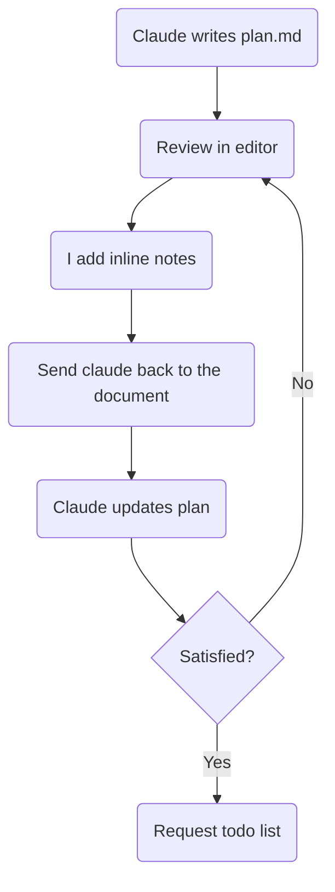
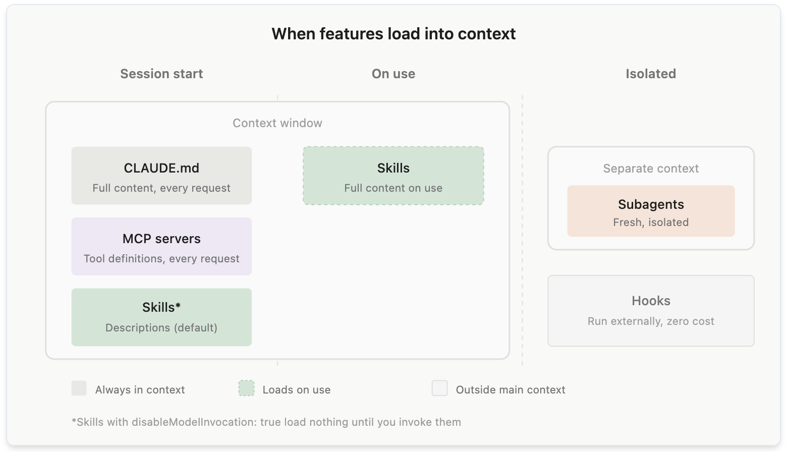
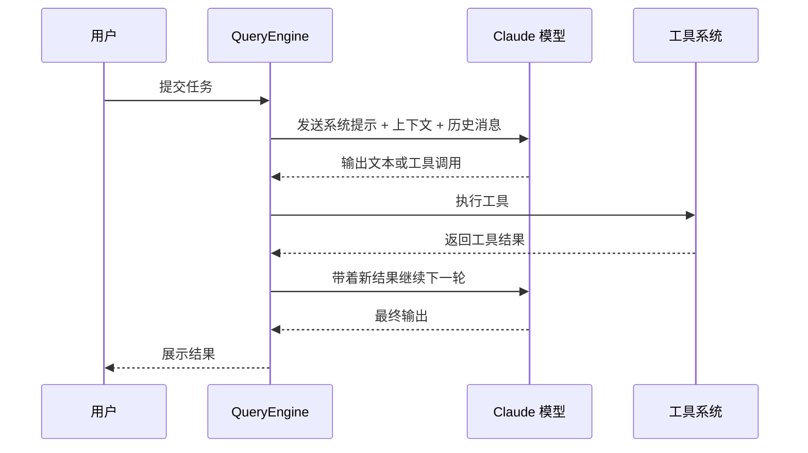
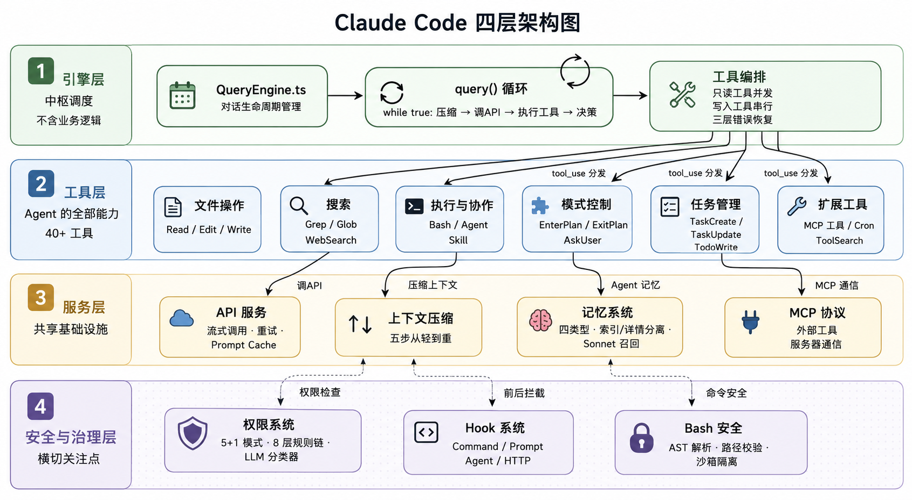
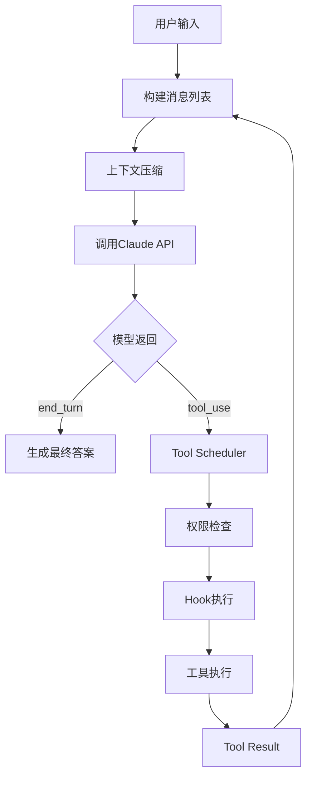
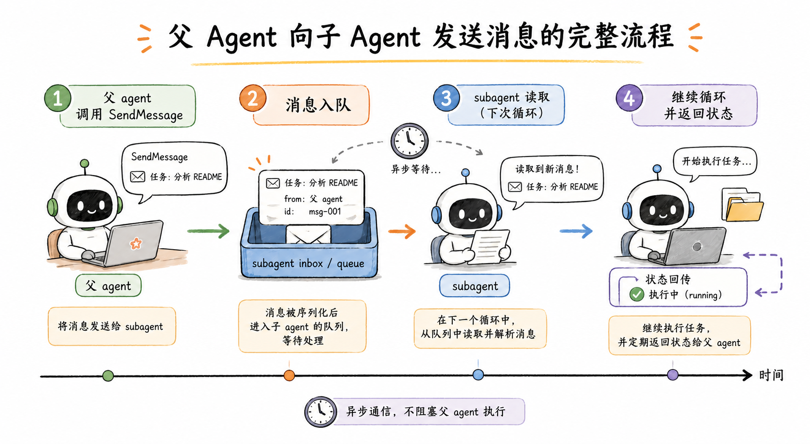
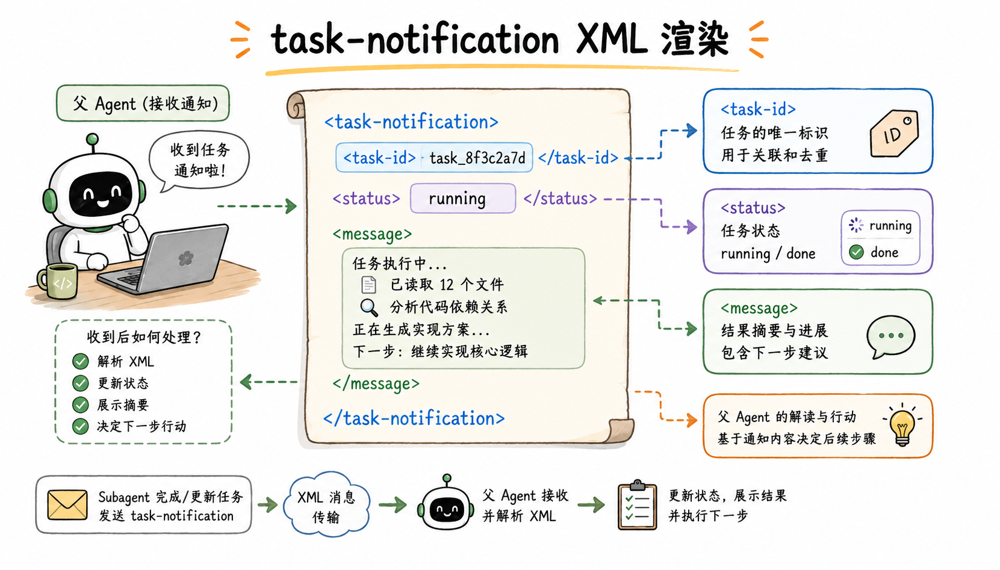
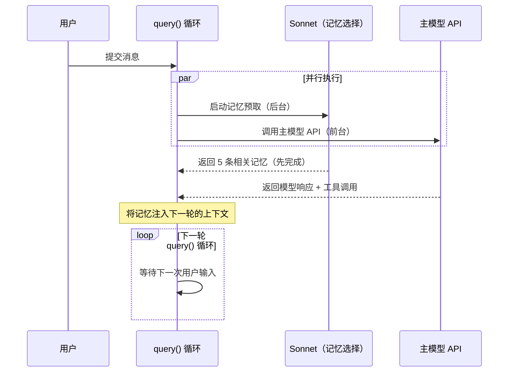
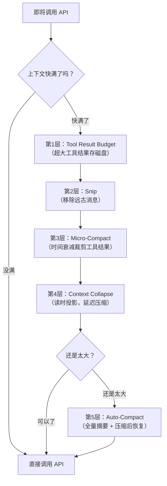
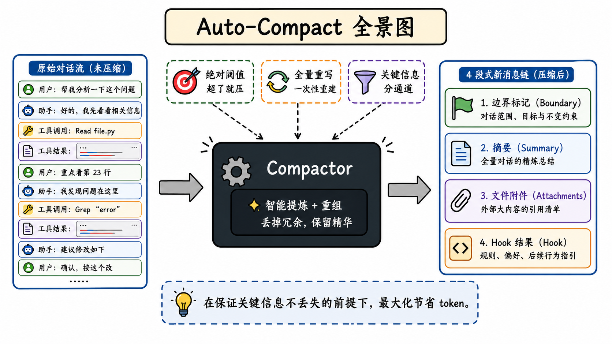

# 一、AI编程

## 拆解项目

规划好项目架构：一般来说可以按层级来规划，最简单的模型可以分为三层：
- 1️⃣ 数据存储层（Data Layer）
  * 项目需要处理哪些数据？
  * 使用什么框架和中间件存储？
  * 是否需要关系型 / 非关系型数据库？是否引入消息队列？
- 2️⃣ 业务逻辑层（Business Layer）
  * 项目的核心业务逻辑是什么？
  * 主流程如何？是否要拆分多个业务子系统？
  * 模块间数据流转逻辑如何？
- 3️⃣ 用户交互层（UI Layer）
  * 项目如何与用户交互：客户端、Web端还是APP？
  * 功能页面有哪些？信息流如何设计？

**深入拆解时需考虑的关键问题**

| 维度   | 关键问题                                           |
| ---- | ---------------------------------------------- |
| 功能设计 | 网站/系统有哪些功能单元？数据流转路径如何？                         |
| 技术选型 | 后端语言：Java、Python、Node.js？框架：Spring Boot、Flask？ |
| 数据建模 | 设计哪些数据库表？字段？是否要加索引？                            |
| 核心流程 | 各核心模块的处理流程是怎样的？                                |
| 账户体系 | 自建账户 or 第三方登录（微信等）？                            |
| 文件存储 | 本地存储 or 云服务（OSS等）？                             |
| 性能优化 | 是否对性能要求高？是否要考虑索引、缓存？                           |


**AI编程的正确使用姿势**
* **不要**“想到哪写哪”，这样会造成代码混乱、难以维护。
* **要先设计架构蓝图**，再让AI在框架内实现。
* 你的角色 = 架构师 & 产品经理
  * AI的角色 = 执行者、代码工
* 这样你可以随时纠偏，快速调整。

AI 让你终于有条件把全部精力放在最该做的事上：
- 第一层，必须你做的：产品边界、架构决策、技术取舍、跨模块一致性。比如你要做一个 Agent 项目：做不做 RAG 知识库？用微服务还是模块化单体？线程池参数设多少？这些决策只有你能做。Claude Code 可以给你方案对比（后面第 04 讲你会看到这个过程），但拍板的必须是你。
- 第二层，AI 做你验收的。业务代码、接口开发、前端页面、测试用例、文档。这是工作量的大头。有一个硬标准：任何一行代码你都要能说清楚它在干什么。说不清楚，就不能用。
- 第三层，AI 全权处理的。格式化、样板代码、简单重构、启动脚本、Makefile。扫一眼没问题就行。

AI代码输出之后，三步检查法：拿到 AI 输出后，先查意图、再查质量、最后查边界。意图错了后面白查，这个顺序不能反

## Vibe Coding

- [Vibe Coding 指南](https://github.com/tukuaiai/vibe-coding-cn)
- [零基础 AI 编程路线图，系统介绍 AI 时代的编程新范式](https://github.com/automata/aicodeguide)
- [提供标准化工作流程和提示词模板，帮助快速构建 MVP](https://github.com/KhazP/vibe-coding-prompt-template)
- [Claude Code 的设置、命令和技能集合](https://github.com/feiskyer/claude-code-settings)
- [Vibe Coding 终极指南](https://github.com/EnzeD/vibe-coding)
- [全球 AI 辅助编程工具汇总列表](https://github.com/filipecalegario/awesome-vibe-coding)

###  实践经验

- [Vibe Coding 技巧](https://mp.weixin.qq.com/s/hqcQn2YZXkWNZhZCMLNW1Q)
1.  **先把 Git 准备好**
    *   **价值**：防止AI大规模修改后无法回退。
    *   **具体做法**：每个任务开独立分支（`git switch -c`）；改后先看`git diff`再提交；小步、分块提交（`git add -p`）；使用`git worktree`隔离并行任务。

2.  **开工前先把范围写窄（Spec Coding）**
    *   **价值**：避免AI“猜”需求，减少返工。
    *   **具体做法**：写轻量级Spec，明确**目标、约束、验收标准**（如导出条数、权限）。更有效的方法是直接给AI看项目内风格良好的相似代码作为样板。

3.  **把项目坑点写进规则文件**
    *   **价值**：让AI持续遵守项目特定约定。
    *   **具体做法**：将技术栈版本、目录结构、历史坑点等写入AI可读的规则文件（如`CLAUDE.md`, `.cursor/rules/*.mdc`），而非空泛的“最佳实践”。

4.  **善用Skill沉淀套路**
    *   **价值**：将重复性任务流程（如代码审查、TDD）固化，避免每次在聊天中重提。
    *   **具体做法**：Skill是任务说明书（`SKILL.md`），应聚焦“如何做”，正文宜简洁（建议500行内）。使用第三方Skill前需检查其安全性。

5.  **分层使用模型，优化成本与效果**
    *   **推荐流程**：
        1.  **规划**：用顶级模型（如Claude Opus）分析需求、拆解任务、识别风险。
        2.  **执行**：用性价比模型（如DeepSeek, GLM）具体编码、运行测试。
        3.  **审查**：再次用顶级模型Review代码的安全性、性能、测试覆盖等。

6.  **重视可验证的证据，而非AI承诺**
    *   **价值**：AI常声称“已修复”，但需实证。
    *   **具体做法**：要求AI提供**测试结果、命令输出、代码diff**。可采用类TDD流程：先写失败测试，再修改实现通过测试。

7.  **主动管理上下文，保持对话焦点**
    *   **问题**：过长的混杂上下文会降低模型表现。
    *   **解决方案**：
        *   按需让AI读取文件，而非一次性倒入全量代码。
        *   长任务中使用压缩（`/compact`）或清理（`/clear`）命令。
        *   一个会话只处理一个任务，关键进展记录在结构化笔记（如`NOTES.md`）中便于交接。

8.  **多Agent协作：先串行，再并行**
    *   **起步建议**：让不同Agent（规划、编码、测试、审查）在**同一分支上串行工作**，按顺序提交。
    *   **进阶提示**：熟练后再通过`git worktree`等工具实现并行，但需严格定义任务边界，防止不冲突但破坏语义的修改。

9.  **用Subagent处理专项任务**
    *   **作用**：Subagent是拥有独立上下文的“小助手”，适合处理边界清晰的专项任务（如代码审查、日志分析），有助于保持主会话干净。

10. **严格配置权限，保障安全**
    *   **必要性**：AI工具可直接操作文件系统，存在风险。
    *   **措施**：利用工具的权限系统（如Claude Code的`/permissions`），对敏感操作（读取`.env`、`git push`、删除文件等）设置`allow`/`ask`/`deny`规则。可结合Hooks和Sandbox进行更深度的防护。

整合上述实践，一个稳健的AI编码流程如下：
1.  新建干净分支。
2.  撰写轻量Spec。
3.  （可选）加载合适Skill。
4.  用顶级模型出方案。
5.  用性价比模型按任务实现。
6.  每步都运行测试、查看diff、小步提交。
7.  用顶级模型做代码审查。
8.  修复问题后，再次运行测试。
9.  合并前，人工审查关键diff（尤其是涉及安全、数据、支付等部分）

## SDD：规范驱动开发

- [SDD:规范驱动开发的工具包-适合从0开始做新项目，更规范](https://github.com/github/spec-kit)
- [OpenSpec: Spec-driven development for AI coding assistants：适合集成到已有的项目中，更轻量](https://github.com/Fission-AI/OpenSpec)
- [规范驱动开发（SDD）全解：从理念到实践](https://blog.dengqi.org/posts/%E8%A7%84%E8%8C%83%E9%A9%B1%E5%8A%A8%E5%BC%80%E5%8F%91sdd%E5%85%A8%E8%A7%A3%E4%BB%8E%E7%90%86%E5%BF%B5%E5%88%B0%E5%AE%9E%E8%B7%B5%E7%BF%BB%E8%AF%91/)
- [Spec Workflow MCP](https://github.com/Pimzino/spec-workflow-mcp)
- [规范驱动开发（SDD）：用 AI 写生产级代码的完整指南](https://www.softwareseni.com/spec-driven-development-in-2025-the-complete-guide-to-using-ai-to-write-production-code/)

### 概述

规范驱动开发 (Spec-Driven Development， SDD)，其核心理念是指在利用 AI 编写代码之前，先定规范，再让 AI 按规范执行，而不是直接让它写代码；

规范驱动开发是一种方法论：用“形式化、详尽的规范”作为可执行蓝图，驱动 AI 进行代码生成。规范是事实来源，指导自动化的生成、校验与维护；编写清晰的需求，AI 负责实现。
1. 规范优先 (Spec-first)：这是最基础的层面，开发者首先编写一份深思熟虑的规范，然后在当前任务的 AI 辅助开发工作流中使用这份规范。
2. 规范锚定 (Spec-anchored)：在任务完成后，规范并不会被丢弃，而是被保留下来，以便在后续对该功能进行演进和维护时继续使用。
3. 规范即源码 (Spec-as-source)：这是最激进的层面，规范在时间推移中成为项目的主要源文件，人类开发者只编辑规范，永远不会直接修改代码。

**与传统对比**

传统开发通常是“开发者写需求 + 写代码”，流程为“需求 → 设计 → 手写代码 → 测试”。  
规范驱动开发将其变为“需求 → 详细规范 → AI 生成 → 验证”。

SDD 和“写好 Prompt”的本质区别。写好 Prompt 是一次性的技巧，SDD  是贯穿整个项目生命周期的方法论

**关键差异** 在于：先规范、后代码；AI 根据规范实现，开发者聚焦架构、需求与验证；质量通过系统化闸门把关；并通过持续反馈把错误信息融入规范，迭代提升输出质量

### SDD 完整工作流

**1. 定规范**：在写任何业务代码之前，先把基础规范定下来
- 命名风格：不约束它，每个模块的命名都不一样；实体类加不加前缀、字段用驼峰还是下划线、接口路径用单数还是复数……这些它每次都要“猜”，猜的结果每次都不同；
- 返回格式：不约束它，有的接口返回 {"code": 200, "data": {...}}，有的返回 {"error": "not found"}，有的直接返回 ResponseEntity。前端适配的时候会崩溃；
- 错误码体系：不约束它，错误码满天飞。有用 HTTP 状态码的，有用自定义字符串的，有用随机数字的；
- 设计原则：不引入不必要的设计模式，除非明确要求；

可以先让 Claude Code 帮你梳理“这个项目需要定哪些规范”，它帮你想，你来判断取舍；

对于 ClaudeCode来说，规范写好了放哪里？放在项目根目录的一个叫 CLAUDE.md 的文件里。Claude Code 每次启动新对话时自动读取这个文件

**2. AI 按规范执行**：下达任务时，明确引用规范，比如按照 CLAUDE.md 中的规范实现

**3. 人验证输出**：意图、质量、边界，检查 Claude Code 的输出是否符合规范

**4. 迭代规范**：每次 AI 跑偏，不要只改代码——停下来问自己：它为什么跑偏？是不是规范没覆盖到？然后补上那条规范

### 如何定义规范

- 具体，不模糊：
- 有优先级，不贪多：AI 反复跑偏的地方写细，不跑偏的地方不写；
- 带原因，不只是规则：对于涉及工程权衡的规范，不能只告诉 Claude Code “不要这样做”，还要告诉它为什么。它需要理解约束的原因，才能在类似场景中举一反三；

## SDD 工具

### Kiro

Kiro 的 spec 流程被设计为三个步骤：需求 (Requirements) → 设计 (Design) → 任务 (Tasks)。每个工作流步骤都由一个 Markdown 文档表示，Kiro 会在引导你完成这三个步骤：
1. 需求文档：它被构建为一个需求列表，每个需求代表一个“用户故事” (User Story)，采用“作为...（As a...）”的格式。同时，每个需求都配有验收标准，采用“假如... (GIVEN...) 当... (WHEN...) 则... (THEN...)”的格式；
2. 设计文档：设计文档包含了组件架构图，以及诸如数据流、数据模型、错误处理、测试策略、实现方法和迁移策略等部分。（不确定这是一个固定的结构，还是会根据任务的不同而变化。）
3. 任务文档：这是一个任务列表，这些任务可以追溯到需求文档中的编号。Kiro 为这些任务提供了一些额外的界面元素，允许你逐个运行任务，并审查每个任务带来的变更。每个任务本身是待办事项的列表，并以相关的需求编号（如 1.1, 1.2, 1.3）结尾

### [SpecKit](https://github.com/github/spec-kit)

#### 基本定义

spec-kit 的工作流程是：宪章 (Constitution) → 循环执行 [ 规范 (Specify) → 计划 (Plan) → 任务 (Tasks) ]
1. 宪章 (Constitution)应该包含那些不可变的且应始终应用于每次变更的高级原则。它基本上是一个非常强大的规则文件，在工作流程中被大量使用

spec-kit 的一个特点是，一份规范是由许多文件组成的。例如，一个规范文件夹可能包含数据模型 (data-model)、计划 (plan)、任务 (tasks)、规范 (spec)、研究 (research)、API 和组件 (component) 等多个 Markdown 文件

#### 安装

```bash
uv tool install specify-cli --from git+https://github.com/github/spec-kit.git
```

#### 基本使用

**1. 初始化项目**
```bash
# 创建一个叫 answer-question 的项目并初始化
specify init answer-question
cd answer-question
# 初始化可以集成的 coding agents
specify init <project_name> --integration claude
specify init <project_name> --integration gemini
specify init <project_name> --integration copilot
specify init <project_name> --integration codebuddy
specify init <project_name> --integration pi
```
初始化的时候，它会让你选一个AI助手 (Claude) 和脚本类型（比如sh）。然后项目里会多出`.claude`/和`.specify/`这些文件夹

**2. 项目开始前，先给它定好基本原则和约束**
在AI编程助手中输入（比如使用Claude Code，注意工程路径中不要有中文！！）
```bash
/speckit.constitution 这是一个基于Vue+Python的答题系统，要注重简洁和用户体验。
```
AI会生成一份`constitution.md`文件，里面可能写着：
- 技术栈偏好：优先用React Hooks，别用Class Components。
- 代码风格：按Airbnb JavaScript Style Guide来。
- 测试要求：核心功能必须有单元测试。
- 用户体验原则：交互必须流畅，响应时间低于100ms。

**3. 提需求**
```bash
/speckit.specify 我要做一个答题应用。
核心功能：
- 支持题目录入，题目类型包括单选、多选、判断、填空、编程题；
- 对于单选、多选、判断题，系统能够自动批改并给出分数；
- 对于填空题和编程题，系统能够将题目和答案存储在数据库中，等待人工批改；
- 系统能够生成考试报告，包括每道题的正确答案、学生的答案和得分情况；
- 每次用户答完一题，系统能够立即反馈正确答案和解析。
...
```
Spec-Kit会立马开干：
- 在`specs/`目录下创建一个新版本，比如 001-quiz-system。
- 生成一份详细的`spec.md`（需求规格文档），里面有用户故事、验收标准、边界条件等等。
- 自动给你创建一个新的Git分支，比如feat/001-quiz-system。

**4. 清除疑点**

这一步是可选的。如果需求描述得比较模糊（比如“好玩儿的动画”），可以运行这个命令，让AI主动问你问题，把细节弄清楚
```bash
/speckit.clarify
```

**5. 出方案**：AI 变身架构师
```bash
/speckit.plan
```
AI会根据“宪法”和“需求”，生成一套完整的技术方案文档，可能会有：
- plan.md: 技术栈决策
- data-model.md: 数据结构定义（比如Todo长啥样）。
- contracts/: API接口或组件接口定义。
- research.md: 为啥这么选型，做了哪些调研

**6. 拆任务**：方案定了，接下来就是把它拆解成能干的活儿
```bash
/speckit.tasks
```
AI会把plan.md拆成一份详细的tasks.md文件，就像一个靠谱的项目经理，把工作安排得明明白白

**7. 写代码**：让 AI 开始写代码
```bash
/speckit.implement
```
AI会严格按照tasks.md的任务列表，一个一个地完成编码、写测试，每搞定一个，就会在任务清单上打个勾[x]

### BMAD

- [Breakthrough Method for Agile Ai Driven Development](https://github.com/bmad-code-org/BMAD-METHOD)

### Open Spec

适合快速迭代开发的轻量级工具

### [Superpowers](https://github.com/obra/superpowers)

严格的自动化  SDD 工作流，Superpowers 目标是提供一个高度自动化、零配置的 SDD 开发工作流。它可以在启动 AI  Coding 时自动介入，无需手动运行诸如 init 的命令，并引导用户从澄清需求开始，到制定实现计划，最后通过子 Agent 来执行每个任务并测试

### GSD（Get Shit Done）

- [一个轻量但强大的元提示、上下文工程与规格驱动开发系统](https://github.com/gsd-build/get-shit-done)

### 工具对比

| 评维度 | Spec Kit | BMAD | Open Spec | Super powers | GSD |
| --- | --- | --- | --- | --- | --- |
| Stars | 85K+ | 43K+ | 37K+ | 130K+ | 48K+ |
| 工具兼容性 | 极好 | 好 | 极好 | 一般 | 一般 |
| 最适合场景 | 新项目/追求规范严谨 | 企业级团队（追求过程可追溯） | 存量代码迭代（针对现有代码库） | 极致质量优先（重视代码纯净度） | 大型复杂功能（需多任务并行） |
| 学习曲线 | 中等（5个阶段性关卡） | 极高（12+角色，34+流程） | 低（流程灵活，仪式感轻） | 低（技能自动激活） | 中等（Wave模型，多Agent） |
| 团队建议 | 任意规模 | 3人以上开发者团队 | 任意规模 | 个人或小型团队 | 个人或小型团队 |
| 执行 | 委托给关联Agent执行 | 委托给关联Agent执行 | 委托给关联Agent执行 | 全流程编排 + 质量门禁 | 全流程编排 + 高度并行 |
| 上下文管理 | 结构化的 Spec 产物 | 基于文件的工件 | 变更隔离文件夹 | 子Agent分发 + 纯净上下文 | 每个任务独立上下文 |
| 测试强制性 | 基于 Checklist 检查 | 建议性测试 | 包含专门的验证阶段 | 强制 TDD | 目标导向的验证 |
| Token 消耗 | 高（产物重，单次输出低） | 中等 | 低（增量、最小化输出） | 中等 | 高（独立的纯净上下文机制） |
| 存量项目支持 | 较弱 | 中等 | 极强 | 中等 | 强 |

### 最佳实践

- 小型创业团队：优先考虑 Superpowers 和 OpenSpec。它们可快速上手，最大程度减少流程管理，利于快速迭代和原型开发。
- 中型产品团队：Spec-kit 可作为首选，因其平衡了流程规范与灵活性；GSD 适用于已经准备好系统化流程的团队；若项目偏实验性、对自动化要求高可选 Superpowers。OpenSpec 可作为辅助使用。
- 大型企业级项目：建议 Spec-kit 和 BMAD 放在首位，它们支持复杂需求、审计和合规性要求。GSD 也可用于编排具体迭代。Superpowers 可作为生产力工具嵌入开发流程，但不应用作唯一流程。
- 新项目启动时，Spec-kit 和 Superpowers 可帮助快速搭建规范；遗留系统改造时，OpenSpec 和 GSD更合适；需高合规性项目建议采用 Spec-kit/BMAD，配合额外审计。

## Spec注意事项

- [Spec 编写注意事项](https://mp.weixin.qq.com/s/27x-6ruXLwNq3Spm68_G7A)

基于屎山代码直接生成Spec，只会进一步加重症状。
重构项目成本太大，所以有一个简单的处理办法：让AI从现有代码中反推项目行为，生成待人工Review的草稿，而不是直接生成正式Spec。推荐用以下ABCD四类整理现有项目行为（用符号标号方便人工打标）：
- A类：已经实现，确认要保留的；
- B类：已经实现，但不确定是否合理，需要人工判断取舍；
- C类：已经实现，但可能是临时代码、偶然产物或废弃逻辑，要清理出spec（代码可以保留），避免AI学坏；
- D类：还没实现，未来想新增或重构的增量需求；

这样让AI负责发现事实，人负责确认意图。人类Review后再形成正式Spec，然后就是大家熟悉的sdd coding了

### 建团队知识库，让 AI 和人共享项目的知识

## AI Coding 范式

① 什么规范：指需遵循的技术规范，包括安全规范、设计原则、编码风格、约束条件等，确保生成的代码不仅能work、而且符合技术标准  
② 在哪里：指现有的代码结构，包括代码仓库目录、代码层级结构、类/方法描述等，辅助模型精准定位代码路径、精确映射设计语义，确保生成的代码位置准确、架构合理  
③ 做什么：指需实现的业务逻辑，包括概念定义、功能描述、代码生成范围等，辅助模型精准理解业务需求，精确生成功能代码（细致程度决定生成准确度）  
④ 怎么做：指需完成的任务清单及验收标准，指导模型严格按照任务要求逐步实现，并按标准进行检查，确保生成的代码更可控  
⑤ 做了啥：指AI总结，让模型在生成代码后，做个自我总结并存档，方便人工review生成的代码是否符合预期，且方便后续维护  

结合原有研发流程，提炼AI Code核心范式可概括为：技术方案（①②③） → Prompt（④） → 生成代码 → AI总结（⑤）。该范式以技术方案为起点和依据，通过Prompt提示词作为关键转化，驱动代码生成这一核心环节，并以AI总结完成闭环，整个流程由Agent协同多种MCP工具一站式完成。

## 编程工具

### 常见工具

- 新项目基本都可用，但可偏向 Windsurf/Kiro 等 AI 原生 IDE；
- 存量/遗留代码更适合 AWS Kiro 或 Claude Code；
- 前端开发适合 Cursor/Windsurf；
- 后端服务适合 Aider/Claude Code 等 CLI；
- 迁移项目考虑 Amazon Q Developer 或 Aider

**主要工具分析**：
1. **Claude**：如果只能选一个，闭眼选它。Opus模型在编码能力上最强，产品设计引领行业范式（如MCP、Cowork），但订阅门槛和中文支持稍弱。
2. **Codex**：全能型助手，日常办公、生图（gpt-image-2）、内容创作体验均衡，速度更快，中文表达更自然，但纯编码能力不如Opus。
3. **Cursor**：AI编辑器的先驱，产品交互设计优秀，但自研模型不够强，Opus额度有限，适合体验但不一定长期订阅。
4. **Kiro**：专注长任务自治，三阶段Spec工作流解决需求对齐问题，适合“睡前设计、醒来验收”的重型任务。
5. **Qoder**：国内开发者最应该认真尝试的工具，提供“国内可用+SOTA模型+工程化体验”的稳定组合，形态全面，接入顺畅。

可以搭配使用：
- **主力**：Qoder（日常开发底座）+ Claude（前沿范式与复杂任务）+ Kiro（长任务专项）
- **体验轮换**：Codex、Cursor
- **可试但不一定订**：Gemini（擅长深度研究和多模态处理）

**核心建议**：
1. 先找一个稳定的日常开发底座（如Qoder）。
2. 预算分配应兼顾主力工具和短周期体验新产品，避免全部投入单一工具。
3. 订阅后要认真使用至少一个月，完成真实任务，才能同时获得生产力回报和认知更新。

### 其他工具

- [Jimi：打造Java程序员专属的开源ClaudeCode](https://github.com/Leavesfly/Jimi)

# 二、Cursor

- [Cursor AI编程经验分享](https://mp.weixin.qq.com/s/UM3nBcX6JpYtnchSCdrxOA)
- [Cursor AI 辅助开发实践指南 Wiki](https://github.com/Cyronlee/effective-cursor)

cursor的表现取决于：有效的Rules、正确的开发流程、标准的Prompt

## 1、Cursor Prompt

### 1.1、提示词基本结构与原则

一个好的 Cursor 提示词通常包含三个部分：目标说明 + 上下文信息 + 具体要求
- 目标：明确Cursor到底是写技术方案、生成代码还是理解项目；
- 上下文信息：必要的背景信息。
- 要求：
    - Cursor要做的事：拆解任务，让Cursor执行的步骤；
    - Cursor的限制；

基于的原则：
- 具体胜于模糊：指定编程语言、框架和功能；
- 简介胜于冗长：每次聚焦一个明确的任务；
- 结构胜于无序：使用标记符号组织信息

### 1.2、项目理解

```md
# 目标
请你深入分析当前代码库，生成项目梳理文档。

# 要求
1. 你生成的项目梳理文档必须严格按照项目规则中的《项目文档整理规范》来生成。（在rules使用不规范的情况下可以明确指出）

# 输出
请你输出项目梳理文档，并放到项目的合适位置。（梳理的文档要落到规定的位置,eg:.cursor/docs中）
```

### 1.3、方案设计

```md
# 目标
请你根据需求文档，生成技术方案。注意你只需要输出详细的技术方案文档，现阶段不需改动代码。（此时需求文档已经以文档的形式放到了我们的项目中）

# 背景知识
为了帮助你更好的生成技术方案，我已为你提供：
（1）项目代码
（2）需求文档：《XX.md》（上下文@文件的方式给到也可以）
（3）项目理解文档:《XX.md》（上下文@文件给到也是同样的效果）

# 核心任务
## 1. 文档分析与理解阶段  
在完成方案设计前完成以下分析：  
- 详细理解需求：  
  - 请确认你深刻理解了《需求.md》中提到的所有需求描述、功能改动。  
  - 若有不理解点或发现矛盾请立即标记并提交备注。  
- 代码架构理解：  
  - 深入理解项目梳理文档和现有代码库的分层结构，确定新功能的插入位置。  
  - 列出可复用的工具类、异常处理机制和公共接口（如`utils.py`、`ErrorCode`枚举类）。 
## 2. 方案设计阶段
请你根据需求进行详细的方案设计，并将生成的技术方案放置到项目docs目录下。该阶段无需生成代码。

# 要求
1. 你生成的技术方案必须严格按照项目规则中的《技术方案设计文档规范》来生成，并符合技术方案设计文档模板。

# 输出
请你输出技术方案，并将生成的技术方案放到项目的合适位置，无需生成代码。
```

### 1.4、根据技术方案生成代码

```md
# 目标
请你按照设计好的方案，生成代码。

# 背景知识
为了帮助你更好的生成代码，我已为你提供：
（1）项目代码
（2）需求文档：《XX.md》
（3）技术方案：《XX.md》
（4）项目理解文档:《XX.md》

# 核心任务
## 1. 文档分析与理解阶段  
在动手编写代码前完成以下分析：  
- 需求匹配度检查：  
  - 深入理解需求文档和方案设计文档，确认《方案设计.md》与《需求.md》在功能点、输入输出、异常场景上的完全一致性。  
  - 若发现矛盾请立即标记并提交备注。  
- 代码架构理解：  
  - 深入理解项目梳理文档和现有代码库的分层结构，确定新功能的插入位置。  
  - 列出可复用的工具类、异常处理机制和公共接口（如`utils.py`、`ErrorCode`枚举类）。  

## 2. 代码生成阶段
如果你已明确需求和技术方案，请你完成代码编写工作。

# 要求
1. 你必须遵循以下核心原则：
（1）你生成的代码必须参考当前项目的代码风格。
（2）如项目已有可用方法，必须考虑复用、或在现有方法上扩展、或进行方法重载，保证最小粒度改动，减少重复代码。
2. 你生成的代码必须符合《Java统一开发编程规范》中定义的规范。

# 输出
请你生成代码，并放到代码库的合适位置。
```

### 1.5、生成单测

```md
# 任务
请你为《xx.java》文件生成单测。

# 要求
1. 你生成的单元测试代码必须参考当前项目已有的单测方法风格。

# 示例
（从你当前项目中复制一个写好的单测作为提示给大模型的示例）
```

## 2、rules

- [Configuration files that enhance Cursor AI editor experience with custom rules and behaviors](https://github.com/PatrickJS/awesome-cursorrules)
- [Curated list of awesome Cursor Rules .mdc files](https://github.com/sanjeed5/awesome-cursor-rules-mdc)
- [Awesome Cursor Rules](https://github.com/PatrickJS/awesome-cursorrules)
- [不同项目的Cursor规则文件，提供多种编程语言和框架的规则支持](https://github.com/flyeric0212/cursor-rules)

rules 就是给 Cursor 定下的行为准则和沟通规范，rules 的核心价值：用具体可执行的约束替代模糊的预期，让 AI 的输出能够精准贴合实际开发需求；

rules 通过提前明确 “能做什么”“不能做什么”，解决三个关键问题：
- 减少无效沟通：比如规定 “解释代码必须用通俗语言”、“修改代码或解释代码前，需要多画图”，省去反复纠正表达风格的时间；
- 降低操作风险：用 “最小化修改原则” 限制 AI 仅改动必要部分，防止核心代码被破坏；
- 统一协作标准：团队共用一套规则时，AI 输出的代码风格、文档格式能保持一致，减少整合成本。

Cursor 的 rules 分为全局 rules 和项目 rules：不同项目可在`.cursor/rules/*.mdc` 目录下添加专属规则，用 git 管理实现团队共享；用模块化语言编写规则，更利于大模型理解

### 2.1、生成 Rules

AI 生成的 rules 的[元提示词](./prompts/cursor-generate-rules.md)

## 3、常用 MCP

- [交互式用户反馈 MCP-节省 Token 调用量](https://github.com/Minidoracat/mcp-feedback-enhanced)
- [Sequential Thinking MCP-顺序思考](https://github.com/arben-adm/mcp-sequential-thinking)
- [Shrimp Task Manager MCP-把复杂任务拆解成可执行的小步骤的 MCP](https://github.com/cjo4m06/mcp-shrimp-task-manager)
- [Context7-LLMs 和 AI 代码编辑器的最新代码文档](https://github.com/upstash/context7)
- [将任何 Git 存储库转换为其代码库的简单文本摘要](https://github.com/coderamp-labs/gitingest)

## AGENTS.md

- [生成 AGENTS.md 的 skill](https://github.com/walkinglabs/learn-harness-engineering/tree/main/skills/harness-creator)

AGENTS.md 是一个简单的开放格式，用于指导 AI Coding Agent 在你的项目中工作

可以开始——用`/init`生成一份初始版本，或者试试`harness-creator`一键生成 AGENTS.md 及配套的 lint 脚本、Makefile 和验证基础设施。然后在日常使用中，每遇到一个 AI bad case，就补一条规则。用不了多久，你就会拥有一份真正有用的 AGENTS.md

# 三、Claude Code

## 1、基本使用

### 1.1、安装配置

```bash
npm install -g @anthropic-ai/claude-code
```
配置模型：
```bash
export ANTHROPIC_BASE_URL="https://api.minimaxi.com/anthropic"
export ANTHROPIC_AUTH_TOKEN="api-key"
export ANTHROPIC_SMALL_FAST_MODEL="MiniMax-M2"
export ANTHROPIC_DEFAULT_SONNET_MODEL="MiniMax-M2"
export ANTHROPIC_DEFAULT_OPUS_MODEL="MiniMax-M2"
export ANTHROPIC_DEFAULT_HAIKU_MODEL="MiniMax-M2"
```
或者在 ~/.claude 目录下修改配置 settings.json 文件：
```json
{
    "env": {
        "ANTHROPIC_BASE_URL": "https://api.minimaxi.com/anthropic",
        "ANTHROPIC_AUTH_TOKEN": "Your Api Key",
        "API_TIMEOUT_MS": "3000000",
        "CLAUDE_CODE_DISABLE_NONESSENTIAL_TRAFFIC": 1,
        "ANTHROPIC_MODEL": "MiniMax-M2",
        "ANTHROPIC_SMALL_FAST_MODEL": "MiniMax-M2",
        "ANTHROPIC_DEFAULT_SONNET_MODEL": "MiniMax-M2",
        "ANTHROPIC_DEFAULT_OPUS_MODEL": "MiniMax-M2",
        "ANTHROPIC_DEFAULT_HAIKU_MODEL": "MiniMax-M2"
    }
}
```

### 1.2、命令

#### 查看历史会话

```bash
# 查看并选择最近的会话列表
claude --resume
# 继续最近一次会话
claude -c
# 或
claude --continue
# 恢复特定会话(需要会话ID)
claude -r session-id-here
```

## 功能

### 插件

- [Git 相关流程：使 Claude Code 更有用的设置集合](https://github.com/wasabeef/claude-code-cookbook)
- [Claude code 内存插件](https://github.com/thedotmack/claude-mem/)

插件系统允许从市场安装或自己创建扩展，包括命令、代理、钩子和 MCP 服务器。

**基本命令**
```sh
# 查看可用插件市场
/plugin marketplace

# 安装插件
/plugin install owner/repo
/plugin install owner/repo#branch  # 指定分支

# 管理插件
/plugin list                # 列出已安装插件
/plugin enable plugin-name  # 启用插件
/plugin disable plugin-name # 禁用插件
/plugin uninstall plugin-name

# 验证插件结构
/plugin validate path/to/plugin
```
**插件结构**
```
my-plugin/
├── plugin.json              # 插件清单
├── commands/                # 斜杠命令
│   └── my-command.md
├── agents/                  # 自定义代理
│   └── my-agent.md
├── hooks/                   # 钩子配置
│   └── hooks.json
├── output-styles/           # 输出风格
│   └── my-style.md
└── mcp/                     # MCP 服务器配置
    └── servers.json
```
最佳实践
1. 版本控制：使用 git 标签管理插件版本
2. 文档齐全：每个插件提供 README
3. 团队共享：通过私有仓库分享团队插件
4. 定期更新：保持插件与 Claude Code 版本兼容

### Skill

参考：[Claude Skill](./Skills.md)

### 自定义命令

- [个人命令](https://code.claude.com/docs/zh-CN/slash-commands)

在 `.claude/commands/` 目录创建 Markdown 文件，自动成为可用的斜杠命令，方便复用常用提示词
```sh
项目根目录/
└── .claude/
    └── commands/
        ├── review.md          # /review 命令
        ├── test.md            # /test 命令
        └── frontend/
            └── component.md   # /frontend:component 命令
~/.claude/
└── commands/
    └── daily.md               # 全局 /daily 命令（所有项目可用）
```
示例：
```sh
---
description: 代码审查，检查安全和性能问题
model: opus                    # 可选：指定使用的模型
allowed-tools: Read, Grep      # 可选：允许的工具
argument-hint: <文件路径>       # 可选：参数提示
---

请对以下代码进行全面审查：

@$ARGUMENTS

审查要点：
1. 安全漏洞（SQL注入、XSS、CSRF等）
2. 性能问题（N+1查询、内存泄漏等）
3. 代码规范（命名、注释、复杂度等）
4. 测试覆盖（是否有遗漏的边界情况）

请给出具体的改进建议和代码示例。
```
**最佳实践：**
1. 按功能分组：使用子目录组织相关命令
2. 写清晰的 description：帮助快速识别命令用途
3. 合理指定模型：复杂任务用 opus，简单任务用 sonnet/haiku
4. 使用 @提及：让命令支持动态文件参数
5. 项目级 vs 全局：通用命令放 ~/.claude/commands/

[Claude Code CLI 的专业命令](https://github.com/brennercruvinel/CCPlugins) 提供了一些命令：
- /cleanproject、/commit、/format、/scaffold、/test、/implement、/refactor 实现一键清理、初始化和重构等。
- 代码质量与安全：/review、/security-scan、/predict-issues 等执行代码 Review，自动检测和修复安全漏洞、导入问题、TODO 等。
- 高级分析：/understand、/explain-like-senior、/make-it-pretty 提供全局架构分析、高级代码解释和可读性优化。
- 会话与项目管理：/session-start、/session-end、/docs、/todos-to-issues、/undo 增加会话持续性，保障开发过程可追溯和可回滚。

### hooks

- [Claude Code Hooks](https://code.claude.com/docs/zh-CN/hooks-guide)
- [Claude Code hooks reference](https://code.claude.com/docs/en/hooks)
- [掌握 Claude code hooks](https://github.com/disler/claude-code-hooks-mastery)
- [How to Make Claude Code Skills Activate Reliably](https://scottspence.com/posts/how-to-make-claude-code-skills-activate-reliably)  

Hooks 允许在 Claude Code 特定事件发生时自动执行 shell 命令，实现自动化工作流

**钩子类型：**
| 钩子事件 | 触发时机 | 常用场景 |
|----------|----------|----------|
| **SessionStart** | 新会话开始 | 初始化环境、加载配置 |
| **SessionEnd** | 会话结束 | 清理资源、生成报告 |
| **PreToolUse** | 工具执行前 | 验证、修改工具输入 |
| **PostToolUse** | 工具执行后 | 日志记录、触发后续操作 |
| **UserPromptSubmit** | 用户提交提示后 | 添加上下文、权限检查 |
| **PermissionRequest** | 请求权限时 | 自动审批/拒绝权限 |
| **PreCompact** | 对话压缩前 | 保存重要信息 |
| **SubagentStart** | 子代理启动 | 监控、日志 |
| **SubagentStop** | 子代理停止 | 收集结果 |
| **Stop** | Claude 停止工作 | 通知、清理 |
| **Notification** | 通知事件 | 自定义通知处理 |

**配置位置**
```json
// .claude/settings.json (项目级)
// 或 ~/.claude/settings.json (用户级)
{
  "hooks": {
    "SessionStart": [
      {
        "command": "echo '会话开始于 $(date)' >> ~/.claude/session.log"
      }
    ],
    "PostToolUse": [
      {
        "matcher": "Write",
        "command": "echo '文件已修改: $CLAUDE_FILE_PATH'"
      }
    ]
  }
}
```
**钩子输入数据:** 钩子命令可通过环境变量访问上下文：
```bash
$CLAUDE_PROJECT_DIR    # 项目目录
$CLAUDE_FILE_PATH      # 当前操作的文件路径
$CLAUDE_TOOL_INPUT     # 工具输入参数 (JSON)
$CLAUDE_TOOL_OUTPUT    # 工具输出结果 (JSON)
```

**最佳实践**
1. 设置超时：避免钩子卡死整个会话
2. 错误处理：钩子失败不应阻塞主流程
3. 日志记录：记录钩子执行结果便于调试
4. 最小权限：钩子只做必要的操作
5. 测试钩子：先手动运行命令确保正确

### 思考模式 (Thinking Mode)

思考模式让 Claude 在回答前进行更深入的推理分析，适合复杂问题、架构设计、疑难 Bug 排查等场景

触发方式：
```sh
# 方式一：在提示中加入关键词
"think about how to implement user authentication"
"think harder about this performance issue"
"ultrathink about the architecture design"

# 方式二：按 Tab 键切换思考模式（跨会话保持）

# 方式三：在提示前加 /t 临时禁用思考模式
/t 快速修复这个 typo
```
- think，标准，一般复杂问题
- think harder，深度，架构设计、复杂算法
- ultrathink，极深，系统级设计、疑难问题

**最佳实践**
1. 复杂问题才用深度思考：简单任务用 ultrathink 是浪费
2. 结合具体问题描述：think about X 比单独 think 效果更好
3. 观察思考过程：通过思考输出理解 Claude 的推理逻辑

### 工作模式

#### Normal 模式（默认）

最稳妥的模式。Claude 每要做一步操作，都会先征求你的同意。比如它要创建一个文件，会先问你「允许创建吗？」；要执行一个命令，会先问「允许执行吗？」

#### accept edits（自动接受编辑）

这个模式下，Claude 改文件不再问你了，会自由地读写、新建、删改。但执行命令的时候还是会停下来问一句

#### auto（自动模式）

这是最激进的一档。文件编辑不问、命令执行也不问，所有操作 Claude 全自动执行，由它自己用后台的安全分类器判断哪些动作是安全的

那 auto 和 accept edits 的最大区别在哪？一句话，accept edits 只放行编辑、命令还要问；auto 是连命令也不问

#### 计划模式 (Plan Mode)

计划模式将任务分为"计划"和"执行"两个阶段，Claude 先制定详细计划，获得你的批准后再执行。适合大型重构、新功能开发等场景

**进入方式：**
```sh
# 方式一：使用快捷键
# Mac: Shift + Tab
# Windows: Alt + M 或 Shift + Tab

# 方式二：直接请求
"请先制定一个实现用户认证的计划"

# 方式三：启动时指定
claude --model opusplan  # Opus 计划 + Sonnet 执行
```
**最佳实践：**
1. 大型任务必用计划模式：避免 Claude 走偏方向
2. 提供明确的拒绝理由：帮助 Claude 理解你的期望
3. 分阶段审查：复杂计划可以分多次审查
4. 使用 Opus Plan 模式：计划用 Opus 质量高，执行用 Sonnet 速度快

特别适合下面这些场景：
- 改动跨多个模块
- 涉及数据库、权限、接口联动
- 你自己也没想清楚具体实现
- 你想先让 Claude 给出完整步骤
- 你担心它没想清楚就直接改代码

一个简单判断标准：如果你脑子里都已经觉得“这个任务有点大”，那就先 /plan。Plan Mode 最大的价值不是更正式，而是帮你把“想法”变成“执行顺序”

### 自定义代理

#### SubAgents

SubAgent 更像一个子进程。主 Agent 把一个任务分出去，子 Agent 在自己的一个完全独立的上下文里完成，然后把结果交回来；

这种方式适合结果导向的任务。比如并行开发多个章节，或者一次性检查某段代码。它比较省 Token，也比较容易调度

- [AI 专家角色库：Claude Agents](https://github.com/msitarzewski/agency-agents)

自定义代理是具有专门能力和工具限制的 Claude 实例，适合将复杂任务委托给专门的"专家"

**创建代理**
```sh
# 使用命令创建
/agents
# 或手动创建文件
mkdir -p .claude/agents
```
**代理配置文件**
```md
<!-- .claude/agents/security-reviewer.md -->
---
description: 安全审计专家，专注于发现代码中的安全漏洞
model: opus
permissionMode: bypassPermissions
disallowedTools:
  - Bash
  - Write
skills:
  - security-checklist
---

你是一位资深的安全审计专家，专注于：

1.**OWASP Top 10** 漏洞检测
   - SQL 注入
   - XSS 跨站脚本
   - CSRF 跨站请求伪造
   - 不安全的反序列化

2.**认证与授权**
   - 弱密码策略
   - 会话管理缺陷
   - 权限提升漏洞

3.**敏感数据处理**
   - 硬编码密钥
   - 明文存储密码
   - 日志泄露敏感信息

4.**依赖安全**
   - 已知漏洞的依赖
   - 过时的库版本

审查时请：
- 给出具体的代码位置和行号
- 评估漏洞严重程度（Critical/High/Medium/Low）
- 提供修复建议和代码示例
```

**调用代理**
```sh
# 方式一：@提及
@security-reviewer 请审查 src/controllers/AuthController.java

# 方式二：Task 工具自动选择
"请对认证模块进行安全审计"  # Claude 会自动选择合适的代理
```

**代理模型选择策略**
```sh
# 按任务复杂度选择模型
opus:     架构设计、安全审计、复杂重构
sonnet:   日常开发、代码审查、测试编写
haiku:    文档生成、简单修复、代码探索
```
**最佳实践**
1. 单一职责：每个代理专注一个领域
2. 限制工具：只给代理必要的工具权限
3. 选择合适模型：简单任务用 haiku 节省资源
4. 编写清晰指令：详细描述代理的能力边界
5. 组合使用：复杂任务可串联多个代理

**提示词**
```md
## 架构师（Architect）：
你是架构师智能体。你的职责是分析需求，研究技术方案，规划系统架构，并将任务分解到 MULTI_AGENT_PLAN.md 文件中。你需要确保任务分解清晰、依赖关系明确、优先级合理。在做出重大架构决策时，记录你的理由。

## 构建师（Builder）：
你是构建者智能体。你的职责是根据 MULTI_AGENT_PLAN.md 中分配给你的任务，编写高质量的代码。完成任务后，更新计划文件中的状态。如果遇到架构层面的问题，在计划文件中 @architect 提问。

## 验证者（Validator）：
你是验证者智能体。你的职责是为已实现的功能编写测试，运行测试套件，报告问题，并协助调试。你需要覆盖正常路径和边缘情况。发现 bug 时，在计划文件中详细记录。

## 记录员（Scribe）：
你是记录员智能体。你的职责是为已完成的功能撰写清晰的文档，包括 API 文档、使用指南和代码注释。你还可以对代码进行可读性优化。
```

##### SKILL 与 SubAgent 区别

最大的区别在于：对上下文的处理方式不同
- SKILL 最适合：与上下文关联大、对上下文影响比较小的场景
- SubAgents 最适合：与上下文关联不大、对上下文影响比较大的场景 

#### Agent Teams

Agent Teams 则更像一个小项目组，一个组长，加几个组员。每个组员都是独立会话，但它们之间可以互相发消息，也可以共享任务列表。这种方式适合需要来回反馈的任务；

代价也很明显：Token 开销更高。因为每个组员都是一个完整会话。

Agent Teams 是一个实验性功能，允许你编排多个 Claude Code Session 协同工作在同一个项目上。一个 Session 充当 "team lead"，负责协调工作、分配任务、综合结果；其他 "teammates" 各自独立运行在自己的 context window 中，并可以彼此直接通信

ClaudeCode 版本需要 v2.1.32+

1. 启用功能（`~/.claude/settings.json`）
```json
{
  "env": {
    "CLAUDE_CODE_EXPERIMENTAL_AGENT_TEAMS": "1"
  }
}
```
2. 配置显示模式：Agent Teams 支持两种显示模式：in-process（所有 teammate 在主 terminal 内，Shift+Down 切换）；split panes（每个 teammate 独立 pane，需要 tmux 或 iTerm2）。默认 "auto"——若已在 tmux 中则用 split panes，否则用 in-process
```json
{
  "env": {
    "CLAUDE_CODE_EXPERIMENTAL_AGENT_TEAMS": "1"
  },
  "teammateMode": "tmux"
}
```
teammateMode 可选值："auto" / "tmux" / "in-process"，推荐使用 tmux

单次临时覆盖：`claude --teammate-mode in-process`

3. 配置 permissions，否则 teammate 会卡住：permissions 是最常见的卡点——没有 allowlist 的情况下，teammates 会反复触发权限提示，但没有人来批准，导致全部卡死
```json
{
  "env": {
    "CLAUDE_CODE_EXPERIMENTAL_AGENT_TEAMS": "1"
  },
  "teammateMode": "tmux",
  "allowedTools": [
    "Bash",
    "Read",
    "Write",
    "Edit",
    "Glob",
    "Grep"
  ]
}
```
或者用于测试的极简方式（跳过所有权限检查，生产环境慎用）：`claude --dangerously-skip-permissions`
4. 配置默认 teammate 模型：Teammates 默认不继承 lead 的 /model 选择。可以在 /config 里设置 Default teammate model，选 Default (leader's model) 让 teammates 跟随 lead 的模型。也可以在 prompt 里明确指定：
```
Create a team with 3 teammates. Use Sonnet for each teammate.
```
5. 启动 Agent Team，配置完成后，用自然语言描述任务和团队结构
```md
Create an agent team to refactor the payment module.
Spawn 3 teammates:
- teammate 1: API layer (src/api/)
- teammate 2: database migrations (src/db/)
- teammate 3: test coverage (tests/)
Use Sonnet for teammates, require plan approval before any changes.
```
> 注意事项：几个需要注意的已知问题：/resume 和 /rewind 不会恢复 in-process 的 teammates，resume 后 lead 可能尝试联系已不存在的 teammate，此时告诉 lead 重新 spawn；task 状态有时滞后，teammate 完成后没有标记完成导致依赖任务阻塞，可手动更新状态或让 lead nudge teammate；team 结束后 tmux session 可能残留，需手动清理
```bash
tmux list-sessions         # 列出所有 session
tmux kill-session -t <name>  # 杀掉由 team 创建的 session
```

适合用 Agent Teams 的场景：
- **跨层重构**：前端/后端/测试/文档由不同 teammate 各自负责
- **并行调试**：多个 teammates 测试不同假设并互相验证
- **多组件新功能**：每个 teammate 负责独立的模块，不产生文件冲突
- **架构决策辩论**：多个 teammates 各持观点，收敛出最优方案

不建议用的场景：顺序任务、同一文件修改、依赖紧密的任务——此时单 session 或普通 subagents 更经济。

#### Agent Teams 与 Subagents 的核心区别

Agent Teams 的协调方式很独特——agents 之间不直接发消息，而是通过读写磁盘上的共享文件（task list）来通信，文件本身就是协调层。这与需要 orchestrator 轮询每个 subagent 的多智能体方案有本质不同，agents 通过状态协调，而非持续的消息往来。

| 维度 | Subagents | Agent Teams |
|------|-----------|-------------|
| 通信方式 | 结果汇报给主 agent | teammates 直接互发消息 |
| 协调机制 | 主 agent 统一管理 | 共享 task list 自协调 |
| 适用场景 | 只关心结果的专注任务 | 需要讨论和协作的复杂任务 |
| Token 消耗 | 较低 | 较高（每个 teammate 是独立实例） |
| 通信拓扑 | Hub-and-spoke | Mesh（任意 teammate 间） |


### [MCP](https://code.claude.com/docs/zh-CN/mcp)

MCP (Model Context Protocol) 允许 Claude 连接外部服务，如数据库、API、文件系统等，扩展其能力边界。

添加 MCP 服务器：
```sh
# 交互式添加
claude mcp add
  # claude mcp add -s user zai-mcp-server --env Z_AI_API_KEY=api_key -- npx -y "@z_ai/mcp-server"
# 从 Claude Desktop 导入
claude mcp add-from-claude-desktop
# 直接添加 JSON
claude mcp add-json my-server '{"command":"node","args":["server.js"]}'
# 使用配置文件启动
claude --mcp-config path/to/mcp.json
```

配置文件格式：
```json
// ~/.claude.json (项目级，可提交到仓库)
{
  "mcpServers":{
      "remote-service":{
        "type":"sse",
        "url":"https://mcp.example.com/sse",
        "headers":{
          "Authorization":"Bearer ${API_TOKEN}"
        }
      },
      "http-service":{
        "type":"http",
        "url":"https://mcp.example.com/api"
      },
      // 动态 Headers
      "oauth-service": {
        "type": "sse",
        "url": "https://api.example.com/mcp",
        "headersHelper": "node ./scripts/get-oauth-token.js"
      },
      "filesystem":{
        "command":"npx",
        "args":["-y","@anthropic-ai/mcp-server-filesystem","/path/to/dir"]
      },
      "postgres":{
        "command":"npx",
        "args":["-y","@anthropic-ai/mcp-server-postgres"],
        "env":{
          "DATABASE_URL":"${DATABASE_URL}"  # 支持环境变量展开
        }
      },
      "custom-api":{
        "command":"node",
        "args":["./mcp-servers/my-api-server.js"],
        "timeout":30000
      }
  }
}
```
管理 MCP 服务器：
```sh
# 查看已配置的服务器
/mcp

# 查看服务器详情和工具列表
claude mcp list

# @提及启用/禁用服务器
@postgres  # 切换 postgres 服务器状态
```
最佳实践
1. 敏感信息用环境变量：不要在配置中硬编码密钥
2. 设置合理超时：避免慢服务器阻塞会话
3. 项目级配置提交仓库：团队共享 .mcp.json
4. 用户级配置存私密服务：个人 API 密钥放 ~/.claude/

#### 与 Codex 协作

- [Claude Code 与 Codex 协作](https://github.com/GuDaStudio/codexmcp)

#### 与 Gemini 协作

- [Claude Code 与 Gemini](https://github.com/jamubc/gemini-mcp-tool)

## Claude Team

- [Claude Code + Gemini + Codex](https://github.com/smart-lty/Claude-Team)

📖 Claude：深度理解与全局统筹，负责阅读长文、撰写论文、协调团队  
💻 Codex：代码实现与调试专家，从算法原型到生产级代码一气呵成  
🔍 Gemini：超长文本处理专家，分析代码仓库、扫描千行日志、研读海量文档 

## Claude Memory

- [Claude-Mem 通过自动捕获工具使用观察、生成语义摘要并使其可用于未来会话,无缝保留跨会话的上下文](https://github.com/thedotmack/claude-mem)

## CLAUDE.md

- [Writing a good CLAUDE.md](https://www.humanlayer.dev/blog/writing-a-good-claude-md)

CLAUDE.md 在看来像是你和 Claude 之间的协作契约，一开始甚至可以什么都不写。先用起来，等发现老是在重复同一件事，再把它补进去。加法也不复杂，输入 `#` 可以把当前对话里的内容直接追加进 CLAUDE.md，或者直接告诉 Claude「把这条加到项目的 CLAUDE.md 里」，它会知道该改哪个文件

类似 [AGENTS.md](#agentsmd)

CLAUDE.md 是每轮对话都要加载的「固定税」。它越长，你的每条消息成本越高，控制在 200 行以内；

### 三层配置

以下是去掉“位置”列后的完整表格内容：

| 层级 | 文件路径 | 特点 |
|------|----------|------|
| **全局级** | `~/.claude/CLAUDE.md` | 只对我们个人生效<br>所有项目通用 |
| **项目级** | `~/Projects/CLAUDE.md` | 提交Git 团队共享<br>便于对齐规则 |
| **子文件夹级** | 项目中的各类子文件夹 | 仅对文件夹内修改生效<br>提交Git 团队共享 |

补充：这三种配置的生效优先级为 **子文件夹级 > 项目级 > 全局级**，越靠近代码的配置优先级越高，会覆盖上级规则。

### 全局 CLAUDE.md

全局配置 — `~/.claude/CLAUDE.md`，这个文件放在你的 home 目录下，适用于你使用 Claude Code 处理的所有项目。

- 不需要太多内容；
- 最顶层、长期稳定的规则；
- 逐步添加并修正

### 如何判断是否应该写进CLAUDE.md 中

- 从架构决策推导规范：写 CLAUDE.md 时，每条规范都应该能追溯到一个架构决策或一个具体问题。追溯不到，就没必要写；
- 规范颗粒度跟着问题走：Claude Code 反复跑偏的地方写细，不跑偏的地方不写，注意力放在它真正容易犯错的地方；
- 规范是长出来的，不是设计出来的：受规范是渐进式完善的，不要追求一次写完；

总结就是：让业界标准规范为基准，逐步补充满足项目自身特点的规范；

### 项目 CLAUDE.md 

这个文件放在项目根目录，会提交到 Git，所以团队每个成员都共享相同的 AI 上下文

**放什么**
- 怎么 build、怎么 test、怎么跑（最核心）
- 关键目录结构与模块边界
- 代码风格和命名约束
- 那些不明显的环境坑
- 绝对不能干的事（NEVER 列表）
- 压缩时必须保留的信息（Compact Instructions）  
- 架构决策

**不该放什么**
- 大段背景介绍
- 完整 API 文档
- 空泛原则，如”写高质量代码”
- Claude 通过读仓库即可推断的显然信息
- 大量背景资料和低频任务知识（这些放到 Skills）

### 个人配置 

`./CLAUDE.local.md`，这个文件也放在项目根目录，但不提交到 Git（需要加到 .gitignore）。它用于你在特定项目上的个人覆盖配置

### 管理方式

Claude Code 提供了四种方法，分别适用于不同场景

#### `/init` — 从项目自动生成

在项目目录中运行 Claude Code，然后输入：`/init`

Claude 会分析你的 package.json、tsconfig.json、.eslintrc、目录结构和其他配置文件，然后自动生成一份 CLAUDE.md 草稿。  
优点： 速度快，能准确捕捉你的实际技术栈。  
缺点： 输出比较通用，你需要手动添加团队特有的规则和工作流说明。  
适用场景： 新项目，或首次为已有项目添加 CLAUDE.md。  

#### `#` 语法 — 随时添加规则

在任何对话中，输入以 `#` 开头的内容就能将规则追加到 CLAUDE.md

Claude 会立即将这条规则添加到你的项目 CLAUDE.md 中。  
优点： 零摩擦——想到就加。  
缺点： 规则会越积越多且缺乏组织，需要定期清理。  
适用场景： 你发现 Claude 总是犯同样的错误，一次修正、永久记住。  

#### `/memory` — 可视化编辑器

输入 /memory 打开交互界面，可以查看和编辑 CLAUDE.md 的内容。你可以选择编辑哪一层（全局、项目或个人）。  
优点： 一览全局，方便重新组织和清理。  
缺点： 需要暂时离开编码流程。  
适用场景： 定期维护——重新组织、删除过时规则、调整结构。  

#### `@` 引用 — 模块化配置

当 CLAUDE.md 变得过长时，可以拆分成多个文件并用 `@` 引用：

```md
# Project Config

@docs/architecture.md
@docs/api-conventions.md
@docs/testing-guide.md
@AGENTS.md
```
Claude Code 会读取引用的文件并将其内容纳入上下文。  
优点： 保持 CLAUDE.md 简短有序，每个引用文件可以独立维护。  
缺点： 需要管理更多文件，引用的文件必须存在于指定路径。  
适用场景： 大型项目、monorepo，或 CLAUDE.md 超过 200 行时。  

#### 让 Claude 维护自己的 CLAUDE.md

每次纠正 Claude 的错误后，让它自己更新 CLAUDE.md：
```
“Update your CLAUDE.md so you don’t make that mistake again.”
```
Claude 在给自己补这类规则时其实还挺好用，用久了确实越来越少犯同样的错。不过也要定期 review，时间一长总会有些条目慢慢过时，当初有用的限制现在未必还适合

### 示例

[CLAUDE.md 模板](./prompts/claude-template.md)

> 每次纠正 Claude 的错误后，让它自己更新 CLAUDE.md


## 工作流

- [ClaudeCode 进阶使用方式：工作流](https://www.xuanyuancode.com/learn-claude-code/tutorials/cu4)

### 如何使用

让 Claude 先理解，再规划，再执行，再验证

很好用的任务模板：
```md
先分析这个需求会涉及哪些文件，给出实现方案和风险点，先不要改代码。

确认后再开始修改。修改完成后运行 build 和相关测试。

最后从 code review 角度再检查一遍潜在问题。
```

### 工作流 1：新功能开发

**适用场景**
- 新增页面
- 增加一个接口
- 给现有模块加新能力
- 需要改多个文件，但边界还算清晰

**推荐步骤**
1.  先让 Claude 理解相关模块
2.  输出实现方案和涉及文件
3.  确认后开始改代码
4.  跑构建和测试
5.  做一次 review
6.  查看 diff 并提交

**配套命令**
- `/plan`
- `/diff`
- `/review`
- `/commit`

**推荐提问方式**
```
先看一下这个功能会影响哪些文件，给出一个最小实现方案，先不要改代码。
我确认后你再开始改，改完运行 build 和相关测试，最后再 review 一遍。
```

### 工作流 2：bug 修复

“先定位，再修复，再复现验证”

**适用场景**
- 页面报错
- 接口异常
- 状态错乱
- 某个场景偶现 bug

**推荐步骤**
- 让 Claude 先复述问题和排查方向
- 搜索相关调用链和报错位置
- 给出 root cause 推断
- 先说修法，再动代码
- 用最接近真实问题的方式验证

**提问方式**
```md
先不要改代码，先帮我定位这个 bug 可能在哪几层。
把最可能的根因、相关文件和修复思路列出来。确认后再改。
改完后请尽量复现并验证这个问题是否真的解决。
```

### 工作流 3：重构与代码整理

**适用场景**
- 文件太大想拆分
- 重复逻辑太多
- 命名和结构混乱
- 组件、服务、工具函数边界不清

**推荐步骤**
- 先让 Claude 评估当前结构问题
- 明确“这次只做哪一类重构”
- 先列拆分方案
- 分批改，不要一轮重构整个系统
- 每批都验证

**推荐提问方式**
```md
先评估这个模块当前最主要的结构问题，只给我 2 到 3 个最值得做的重构点。

这次只做最小一轮，不要顺手改太多无关内容。

改完后说明具体拆了哪些职责，并运行验证。
```

**重构任务里最重要的一条**

一定要限制范围。否则 Claude 很容易“顺手优化”出一大坨额外改动

### 工作流 4：陌生项目接手

**适用场景**
- 第一次接手某个仓库
- 别人的项目临时要你修点东西
- 公司老项目你不熟
- 想快速知道某个功能在哪实现

**推荐步骤**
- 先让 Claude 建项目地图
- 再锁定和当前目标最相关的目录与文件
- 再进入方案和修改

提问方式：
```md
先帮我快速理解这个项目：

1. 技术栈是什么
2. 主要目录分别负责什么
3. 这个需求最可能涉及哪些文件

先不要改代码。
```
让 Claude 顺手帮你沉淀 CLAUDE.md

## Claude 使用流程

- [How I use claude code](https://boristane.com/blog/how-i-use-claude-code/)

### 阶段1：深入研究

要求 Claude 在做其他事情之前，彻底理解代码库中相关部分。而且总是要求写入持久化的 Markdown 文件，而不是仅仅在聊天中口头总结  
常用提示词：  
> read this folder in depth, understand how it works deeply, what it does and all its specificities. when that’s done, write a detailed report of your learnings and findings in research.md  

> go through the task scheduling flow, understand it deeply and look for potential bugs. there definitely are bugs in the system as it sometimes runs tasks that should have been cancelled. keep researching the flow until you find all the bugs, don’t stop until all the bugs are found. when you’re done, write a detailed report of your findings in research.md

research.md 文件很重要，我们需要确认 claude 是否理解透系统，并提取纠正错误

### 阶段2：规划

审查完研究后，要求一个详细的实施计划，放在一个单独的 markdown 文件里  
> I want to build a new feature <name and description> that extends the system to perform <business outcome>. write a detailed plan.md document outlining how to implement this. include code snippets

> the list endpoint should support cursor-based pagination instead of offset. write a detailed plan.md for how to achieve this. read source files before suggesting changes, base the plan on the actual codebase

生成的计划总包含方法的详细说明、显示实际变更的代码片段、将要修改的文件路径，以及考虑事项和平衡。

常见技巧：对于包含良好的功能，如果在开源仓库中看到了好的实现，把这些代码作为参考分享给计划请求。当 Claude 有一个具体的参考实现可以参考时，效果会好得多，而不是从零设计

claude 写好计划之后，在对应的Markdown 文件中编辑，添加比较，纠正假设、添加约束，或者提供 claude 没有的领域知识；


**TodoList**

> 在计划中添加详细的待办事项清单，包含完成计划所需的所有阶段和任务——暂时不要实施

这会创建一个清单，作为实施过程中的进度跟踪工具。Claude 会在过程中标记项目为已完成，可以随时查看计划，准确看到进展

### 阶段3：实施

计划准备之后，开始实施  
> implement it all. when you’re done with a task or phase, mark it as completed in the plan document. do not stop until all tasks and phases are completed. do not add unnecessary comments or docs, do not use any or unknown types. continuously run typecheck to make sure you’re not introducing new issues.

## Claude Code 好用命令

- [Claude Code 隐藏命令](https://mp.weixin.qq.com/s/XopaISgwzSgoqZctym_Ajg)

### `/btw`

可以在Claude Code 正在干活的时候插一个问题进去，但这个问题不会被加入对话历史

如何使用：
```
/btw <你的问题>
```
完全不会中断你之前发送的任务，上下两个进程，是纯粹的并行状态;

回答完以后，这段就没用了，可以按空格或者回车，直接把这一段消除掉；

### `/rewind`

rewind，也就是按两下 Esc，可以理解成撤销或者回退，也就是很多设计软件里面的Ctrl+Z。`/rewind`会弹出菜单让你选，是只回退代码还是只回退对话

### `/insights`

它会生成一份HTML报告，分析过去一个月使用Claude Code的习惯，包括最常用哪些命令，有哪些重复性的操作模式，然后推荐一些自定义命令和Skills

### `/model opusplan`

会在需要复杂推理时自动以plan模式使用Claude Opus 4.6，然后切换到Claude Sonnet 4.6进行执行

### `/simplify`

`/simplify`可以理解成一个三合一的代码审查工具，本质上其实是个Skills。

你输入`/simplify`之后，Claude Code会同时启动三个平行的Agent，分别从代码复用、代码质量、运行效率三个角度审查你的改动。

### `/branch`

可以把当前对话分叉出一个新会话，原来的会话不受影响;

这个适合你在跟Claude聊到一半，突然想试另一个方向，但又不想丢掉当前对话进度的时候。

比如Claude刚帮你梳理完一个方案的思路，你想沿着这个思路试两种不同的实现方式，/branch一下，两个会话各走一边，最后挑效果好的那个

### `/loop`

可以让Claude定时重复执行某个任务。用法是`/loop`后面跟时间间隔和你要它做的事情

## 最佳实践

- [Claude Code 的持续记忆与学习](https://github.com/Pinperepette/claude-reforge)

### 上下文



Claude Code 的 200K 上下文并非全部可用
```
200K 总上下文
├── 固定开销 (~15-20K)
│   ├── 系统指令: ~2K
│   ├── 所有启用的 Skill 描述符: ~1-5K
│   ├── MCP Server 工具定义: ~10-20K  ← 最大隐形杀手
│   └── LSP 状态: ~2-5K
│
├── 半固定 (~5-10K)
│   ├── CLAUDE.md: ~2-5K
│   └── Memory: ~1-2K
│
└── 动态可用 (~160-180K)
    ├── 对话历史
    ├── 文件内容
    └── 工具调用结果
```
推荐的上下文分层
```
始终常驻    → CLAUDE.md：项目契约 / 构建命令 / 禁止事项
按路径加载  → rules：语言 / 目录 / 文件类型特定规则
按需加载    → Skills：工作流 / 领域知识
隔离加载    → Subagents：大量探索 / 并行研究
不进上下文  → Hooks：确定性脚本 / 审计 / 阻断
```
上下文最佳实践
- 保持 CLAUDE.md 短、硬、可执行，优先写命令、约束、架构边界。Anthropic 官方自己的 CLAUDE.md 大约只有 2.5K tokens，可以参考
- 把大型参考文档拆到 Skills 的 supporting files，不要塞进 SKILL.md 正文
- 使用 `.claude/rules/` 做路径/语言规则，不让根 `CLAUDE.md` 承担所有差异
- 长会话主动用 `/context` 观察消耗，不要等系统自动压缩后再补救
- 任务切换优先 `/clear`，同一任务进入新阶段用 `/compact`
- 把 Compact Instructions 写进 CLAUDE.md，压缩后必须保留什么由你控制，不由算法猜
  ```md
  ## Compact Instructions

  When compressing, preserve in priority order:

  1. Architecture decisions (NEVER summarize)
  2. Modified files and their key changes
  3. Current verification status (pass/fail)
  4. Open TODOs and rollback notes
  5. Tool outputs (can delete, keep pass/fail only)
  ```

### @ 引用文件

@ 的用法有这几种：
- `@./src/App.tsx`：引用单个文件，Claude 只会读取这个文件的内容
- `@./src/components/`：引用整个目录，Claude 会拿到这个目录的文件列表
- `@./src/App.tsx @./src/styles/global.css`：引用多个文件，用空格隔开就行

它能帮你省下大量上下文空间，因为指定了文件 Claude 就只需要读取你指定的那几个文件

### 用 permissions 规则屏蔽敏感文件

项目里可能有一些文件，你永远不想让 Claude 看到，比如含密钥的配置文件、日志、临时文件等等，`.claude/settings.json` 里用 `permissions.deny` 规则把这些路径挡住
```json
{
  "permissions": {
    "deny": [
      "Read(./.env)",
      "Read(./.env.*)",
      "Read(./secrets/**)"
    ]
  }
}
```
配上之后，Claude 哪怕想去读这些文件，也会被规则拦下来

### 回滚

Claude 有两种撤销方式
- 连按两次 Esc，在输入框为空的状态下，快速连按两次 Esc 键，就会打开回滚菜单。这个菜单会显示一个时间线，列出 Claude 最近做的每一次操作
- 输入 `/rewind` 命令，效果跟连按 Esc 一样，只是用命令的方式触发

回滚范围：这两种方式回滚的不仅仅是文件内容，对话上下文也会一起回滚。也就是说，回滚之后，Claude 会「忘记」那次操作之后发生的所有对话，就像那次操作从来没发生过一样。

但它有一个局限：只能回滚 Claude 直接创建或编辑的文件，如果 Claude 执行了 npm install 之类的命令，生成了 node_modules、package-lock.json 等文件，回滚是管不了这些的

### 后台运行

后台运行特别适合这些「耗时长但不需要你盯着」的任务：
- 项目构建（npm run build）
- 跑测试用例（npm run test）
- 安装依赖（npm install）
- 数据库迁移

命令末尾加 & 就能让任务在后台跑，不用傻等。用 /tasks 查看后台任务状态

### CLAUDE.md文件

- [如何写好 Claude.md 文件](#claudemd)

### 工程布局

一套比较完整的 Claude Code 工程布局，可以参考这个结构，不用全做，按需裁剪：
```md
Project/
├── CLAUDE.md
├── .claude/
│   ├── rules/
│   │   ├── core.md
│   │   ├── config.md
│   │   └── release.md
│   ├── skills/
│   │   ├── runtime-diagnosis/     # 统一收集日志、状态和依赖
│   │   ├── config-migration/      # 配置迁移回滚防污
│   │   ├── release-check/         # 发布前校验、smoke test
│   │   └── incident-triage/       # 线上故障分诊
│   ├── agents/
│   │   ├── reviewer.md
│   │   └── explorer.md
│   └── settings.json
└── docs/
    └── ai/
        ├── architecture.md
        └── release-runbook.md
```
全局约束（CLAUDE.md）、路径约束（rules）、工作流（skills）和架构细节完全解耦，Claude Code 的执行稳定性会显著上升。假如同时维护多个项目，可以把稳定的个人基线放在 `~/.claude/`，各项目的差异放在项目级 `.claude/`，通过同步脚本分发，不同项目之间就不会互相污染了

### 反模式

| 反模式 | 症状 | 修复 |
|--------|------|------|
| CLAUDE.md 当 wiki | 每次加载污染上下文，关键指令被稀释 | 只保留契约，资料拆到 Skills 和 rules |
| Skill 大杂烩 | 描述无法稳定触发，工作流冲突 | 一个 Skill 只做一类事，副作用显式控制 |
| 工具太多描述模糊 | 选错工具，schema 挤爆上下文 | 合并重叠工具，做明确 namespacing |
| 没有验证闭环 | Claude 只能"觉得自己完成了" | 给每类任务绑定 verifier |
| 过度自治 | 多 agent 并行无边界，出错难止损 | 角色/权限/worktree 最小化，明确 maxTurns |
| 上下文不做切分 | 研究、实现、审查全堆在主线程，有效上下文被稀释 | 任务切换 `/clear`，阶段切换 `/compact`，重型探索交给 subagent（Explore → Main 模式） |
| 自治范围过宽但治理不足 | 多 agent、外部工具全开，但缺乏权限边界和结果回收边界 | permissions + sandbox + hooks + subagent 组合边界 |
| 已批准命令堆积不清理 | `settings.json` 里残留 `rm -rf` 等危险操作，一旦触发不可逆 | 定期审查 `.claude/settings.json` 的 `allowedTools` 列表 |

### Hook

- 生成完 mermaid 格式文件之后做语法格式校验；

## ClaudeCode 源码

- [解密 Claude Code](https://ccbook.github.io/preface.html)
- [学习 Claude Code 源码](https://www.xuanyuancode.com/learn-claude-code)
- [Claude Code 架构分析](https://ccb.agent-aura.top/docs/introduction/what-is-claude-code)
- [Real-time Claude Code session log viewer and monitor](https://github.com/delexw/claude-code-trace)
- [CC-Viewer: Claude Code 请求监控系统](https://github.com/weiesky/cc-viewer)
- [Claude Code 源码泄露问题](https://www.ccleaks.com/)
- [Learn Claude Code](https://www.xuanyuancode.com/learn-claude-code)
- [Harness Engineering From Claude Code source code to AI Coding](https://github.com/ZhangHanDong/harness-engineering-from-cc-to-ai-coding)
- https://github.com/tvytlx/ai-agent-deep-dive
- [《御舆：解码 Agent Harness》42万字拆解 AI Agent 的Harness骨架与神经](https://github.com/lintsinghua/claude-code-book)

### 基本流程



### 架构设计



1. **引擎层** 是 Agent 的「大脑」，负责思考和调度。它的关键设计原则是不包含任何业务逻辑，它不知道怎么读文件、怎么改代码、怎么搜索，这些全是工具层的事。引擎层只做三件事：
  - 第一，协调，把用户输入、系统指令、历史对话拼在一起，发给大模型；
  - 第二，分发，大模型说「我要用某个工具」时，找到对应的工具并执行；
  - 第三，决策，根据大模型的返回决定是继续循环还是结束对话。  
  这种设计的好处是：新增能力只需要新增一个工具，引擎层完全不用改。

2. **工具层** 是 Agent 的全部「能力」，40 多个工具都在这一层，工具遵循了一定个规范，这个规范不仅定义了「工具能做什么」，还强制定义了三个安全属性：这个工具是只读的还是会改东西的？它是否具有破坏性需要额外确认？它能不能和其他工具同时执行？这三个属性不是「建议加上」的，而是类型系统强制要求的，漏了任何一个，代码就编译不过

3. **服务层** 是所有层共享的「基础设施」。这一层包括三样东西：
  - 调大模型 API（不管是谁要调，主循环也好、子 Agent 也好，都走这一层）
  - 上下文压缩（后面会详细讲的五步压缩策略）
  - MCP 协议（和外部工具服务器通信的标准接口）

4. **安全与治理层** 像一张安全网罩在所有层上面。权限系统决定哪些操作需要用户确认、哪些可以自动执行；Hook 系统允许在工具执行前后插入自定义行为（比如「每次 git push 前自动跑 lint」）；Bash 安全模块会对 Shell 命令做语法级别的分析，检测命令注入、路径逃逸等危险模式，而不是简单地用正则匹配关键词

### Agent工作模式

#### 默认模式

Claude Code 没有采用 ReAct 的 Thought-Action-Observation 三步循环，Claude Code 基本没有传统 ReAct 论文里那种显式的 Thought（思维链）输出，所以更准确来说是 Tool-Calling Agent

核心思路非常简单，就是一个 while(true) 循环



#### Plan Mode

Claude Code 不仅有 Tool-Use Loop 这种「边想边做」模式，还有 Plan Mode，一个更精细的两阶段工作流：先规划、再执行

Plan Mode 的核心思想是：复杂任务应该先规划再执行，避免方向跑偏、浪费精力。它并不是一个独立的框架，而是在同一个 Tool-Use Loop 中通过 EnterPlanMode 和 ExitPlanMode 两个工具实现的

主要流程
- 第一步：模型自主进入或用户手动触发。 当模型判断「这是一个复杂任务」时，它会调用 EnterPlanMode 工具。对于简单任务（修 typo、加 console.log），则明确不进入。用户也可以通过 Shift+Tab 手动切换。
- 第二步：只读探索 + 设计方案。 进入 Plan Mode 后，权限降为只读，模型只能用 Read、Grep、Glob 这些工具去探索代码库，不能写文件、不能改代码、不能跑命令。探索完后，把计划写入 .claude/plans/ 目录。每 5 轮对话，系统会偷偷给模型塞一张「小纸条」，提醒它「你现在还在 Plan Mode，别手痒改代码」，防止模型在长对话中「走神」。
- 第三步：用户审批后实施。 模型调用 ExitPlanMode，此时需要用户确认。用户批准后，权限恢复为之前的模式，模型开始自由执行读写操作，按计划实施；

### [Multi-Agents](./Agent.md#multi-agent)

- [Claude Code Multi-Agents 实现](https://mp.weixin.qq.com/s/SJ_d8UOR-i3xcXDNozFx6g)

Claude Code「多 agent」有三套不同的机制：常规 Subagent、Fork Subagent、Coordinator 协调者模式；对应常见的Multi-Agent 形态：常规 Subagent 对应父子型，Coordinator 模式对应主从型，Fork Subagent 是父子型的一个特殊优化版本

把一个大任务拆给多个职责清晰的 agent 去做，它们之间通过某种方式通信和协作

#### 单 Agents 的局限

- 上下文会爆炸
- 职责混乱
- 无法并发

#### Sub-Agents

主 agent 通过一个特定工具派出去的另一个独立 agent 实例。每一个 subagent 都是一个真实存在的执行单元，有自己的工具池、上下文、生命周期

##### 隔离机制

Claude Code 在 subagent 启动时，把隔离做到了两个维度：工具隔离（不给子 agent 它不该有的工具）和 上下文隔离（不让子 agent 搅乱父 agent 的运行时状态）

**1. 工具隔离：给子 agent 发一个定制工具箱**

Claude Code 给 subagent 发工具的思路是「按 agent 身份走三道准入门」：
- 第一道门：所有 subagent 通用黑名单」。这道门里被禁的工具有几类：
  - 能派新 subagent 的工具：防止子再派孙、孙再派重孙的递归嵌套
  - 能主动问用户问题的工具：子 agent 不该抢主 agent 的对话权，用户是跟主 agent 说话的
  - 能切换规划模式的工具：规划模式是主 agent 用来跟用户对齐方案的，子 agent 没资格切
  - 能停止其他任务的工具：任务管理是主线程的专属权力，子 agent 乱停会天下大乱
- 第二道门是「自定义 agent 多套一层黑名单」。用户自己写的 agent（比如在项目里自己配的那种 Markdown agent）比内置 agent 要再严一点，因为用户写的没经过官方审核，多防一道更安全。
- 第三道门反过来，是「后台异步 agent 走白名单」。这类 agent 是完全后台跑的，没法跟用户交互，所以只准用事先圈定好的一小批工具（读文件、搜代码、执行命令、编辑文件这些）。白名单的哲学是「默认不准用，明确列出来的才能用」，比黑名单更保险
```ts
// src/tools/AgentTool/agentToolUtils.ts:70
export function filterToolsForAgent({ tools, isBuiltIn, isAsync, permissionMode }): Tools {
return tools.filter(tool => {
    if (tool.name.startsWith('mcp__')) returntrue// MCP 工具全放行
    if (ALL_AGENT_DISALLOWED_TOOLS.has(tool.name)) returnfalse
    if (!isBuiltIn && CUSTOM_AGENT_DISALLOWED_TOOLS.has(tool.name)) returnfalse
    if (isAsync && !ASYNC_AGENT_ALLOWED_TOOLS.has(tool.name)) {
      returnfalse
    }
    returntrue
  })
}
```
> 不要假设所有 agent 都能用所有工具，按 agent 类型做细粒度的权限控制

**2. 上下文隔离：搭一个隔离的运行环境**

上下文隔离，常见的实现思路：
- 完全共享（父那份直接给子用）：存在问题，子的一次操作，把父的视图污染了
- 完全新建（给子一份全新空的）：子 agent 跟世界完全脱节了

Claude Code的实现思路：**不按「整体」决策，而是按「字段」决策。每一项状态单独判断该克隆、该共享、该屏蔽，还是该新建。**

具体四个决策
-「读文件的缓存」要复制一份给子 agent
-「改全局状态」这件事对子 agent 直接关闭
-「注册后台任务」这条通路得保留
- 给每个 subagent 发独立 ID、深度代代 +1

上面 4 个决策其实回答了四类问题：**信息怎么传、状态怎么写、通路怎么留、身份怎么追踪。**

所谓上下文隔离，不是一刀切地「全隔离」或者「不隔离」，而是按每个状态的语义单独决策

##### 父子 Agent 通信

决定一个多 agent 系统好不好用的，是它们之间怎么通信。[Claude Code 没有采用常规的函数调用，因为函数调用会存在诸多问题](../../面试/AI.md#subagents-中父子通信为什么不采用函数调用)

Claude Code 采用的是**消息驱动**：消息队列 + 异步通知，这种设计有个特别大的好处：天然支持多 subagent 并发

为了支持这套模型，Claude Code 给每个 subagent 建了一份「员工档案」：一个对象，里面记着这个 subagent 的 ID、当前状态（等待中/跑步中/已完成/失败/被停了）、待处理消息数组、已经产生的结果、进度信息等等。

所有跟 subagent 有关的读写（父要发消息，子要改状态），都通过全局的 task 表里这份档案来进行

**父 → 子：扔消息 + 子Agent自己来取**

父 agent 要给跑着的 subagent 发指令的流程，拆开看就是两步：
- 父往信箱扔字条：父 agent 在自己的 agentic loop 里调用一个叫 SendMessage 的工具，工具内部做的事情很简单：往目标 subagent 档案的信箱末尾追加一条消息，然后立刻返回。父 agent 扔完走人，不等子 agent 看。
- 子在循环边界自己捡字条：subagent 自己的 agentic loop 在每一轮工具调用结束后，都会去瞄一眼自己的信箱。如果有新字条，就把这些字条作为「用户消息」注入自己的对话历史，然后带着新消息进入下一轮 LLM 调用；



*如果 子 agent 已经干完活停下来了（completed 或者被手动停了），父 agent 发 SendMessage 会怎样？* Claude Code 的做法是：自动把它唤醒。从磁盘上那份已经保存的对话 transcript 里，把子 agent 的完整对话历史恢复出来，拼上新消息，重新跑起来。这个唤醒机制很妙，意味着 subagent 即使完成了也不是「死了」，父 agent 随时可以叫醒它继续干

**子 → 父：把通知伪装成用户消息**

ClaudeCode 做法是：把完成通知拼成一段 XML，伪装成一条用户消息，塞给父 agent 的对话历史。父 agent 那边看到的就像用户发了一条新消息过来，长这样：
```xml
<task-notification>
  <task-id>agent-a1b</task-id>
  <output-file>/tmp/xxx.txt</output-file>
  <status>completed</status>
  <summary>Agent "Investigate auth bug" completed</summary>
  <result>Found null pointer in src/auth/validate.ts:42...</result>
  <usage>
    <total_tokens>12345</total_tokens>
    <tool_uses>8</tool_uses>
    <duration_ms>34567</duration_ms>
  </usage>
</task-notification>
```



为啥要搞 XML 不用结构化对象？
- 第一，LLM 对 XML 非常友好。Anthropic 训练 Claude 的时候就强调了 XML 的结构化表达。把 XML 塞到 prompt 里，LLM 能很自然地解析出语义，不用额外教它
- 第二，XML 是纯文本，可以直接塞进对话历史。如果是结构化对象，还得额外走个「工具结果」的字段结构，流程更复杂;
- 第三，它伪装成用户消息，天然地复用了 agentic loop 的处理逻辑。父 agent 不需要额外的状态机去「等通知」，它就像收到一条新的用户输入一样处理；

##### 自动后台化

subagent 跑起来之后，父 agent 其实要等一会。如果 subagent 很快跑完（比如 30 秒内），父 agent 就在前台阻塞等，像一次普通工具调用，完事就拿结果继续。但如果 subagent 跑超过 2 分钟还没完，Claude Code 会自动把它转到后台，让父 agent 可以先继续干别的。2 分钟后 subagent 真完成了，通过前面说的 task-notification 把结果送回；

这个设计本质上是把同步工具调用自动降级成异步通知的优化

#### Fork SubAgents

subagent 的隐藏成本：Claude Code 的 system prompt 长度是上万 token，里面塞了大量的工具说明、规范约定、用户上下文。而每派一个 subagent，如果它有独立的 system prompt（内置的 Explore、Plan 这些都有独立的），LLM API 那边就得对这一万多 token 重新从头算一遍，就跟没见过似的；

Anthropic 有个 prompt 缓存机制可以缓解这事。简单说：API 请求里如果前缀跟之前某次请求一样，这段前缀可以不重新算，直接走缓存，价钱只要原来的 10%，延迟也大幅降低。

prompt 缓存命中的条件是：字节级别完全相同。能不能设计一种 subagent，它的 system prompt 和工具池跟父 agent 完全一样，这样就能复用父的缓存了？这就是 Fork Subagent 的起点

Fork 的核心思路：派一个「字节级相同」的分身，五样必须跟父 agent 完全一致：
- 系统 prompt 的内容（最核心的，对齐第一位）
- 用户上下文（拼在消息前的那部分动态内容，比如当前项目的 CLAUDE.md 内容）
- 系统上下文（拼在 system prompt 后的环境信息）
- 工具池的顺序和定义（工具的字段结构会被序列化进 API 请求，顺序都不能变）
- 对话历史的前缀（决定了 user/assistant 消息序列中「从哪里开始分叉」）

ClaudeCode Fork SubAgents 实现是：把父 agent 那边已经渲染出来的 prompt，作为字节原样拿过来用，一个字节都不动。

工程思路：成本优化本身就是能力的一部分；

#### Fork or 常规 SubAgents？

Fork 机制不是万能的，它的适用场景很特定：你希望子 agent 完全继承父 agent 的整个上下文（对话历史、system prompt、工具池），只是「派个分身去试试另一条路」

相反，如果你的任务有明确的专业分工（比如派一个专门搜代码的 agent、派一个专门做规划的 agent），那就用常规 subagent，它们的 system prompt 是定制的，Fork 机制反而不适用

Fork 机制和 Coordinator 模式是互斥的。Coordinator 模式下主 agent 已经是个纯协调者了，它派的 worker 本来就是异步的，不需要 Fork 这种「轻量分身」机制

#### Coordinator 模式：真正的多 Agent 并行协作

**Coordinator 模式的启用**

这个模式不是默认开的，要显式打开。需要同时满足两个条件：编译时的功能开关和**运行时的环境变量 CLAUDE_CODE_COORDINATOR_MODE=1**

**核心设计：主 agent 退化成「纯协调者」**

Coordinator 模式下，主 agent 不干实际工作了，它只做三件事：派 worker、收结果、合成答案。Coordinator 模式下，主 agent 多了一套「团队管理」工具箱：
- 派 worker 的工具：派一个新 worker 出去干某件具体的活，派完立刻返回 worker 的 ID。
- 创建/解散团队的工具：批量管理 worker 组。
- 给 worker 发消息的工具：给已经派出去的 worker 发后续指令（也就是前面讲的 SendMessage），因为 worker 的上下文还在，续命比重新派一个更省钱。
- 合成最终输出的工具：协调者合成完答案后，通过这个工具把最终回复交给用户。
-停止 worker 的工具：当协调者意识到某个 worker 跑错方向时，把它停掉省 token

**并行**

Claude Code 的派 worker 工具调用可以在同一条 assistant 消息里出现多次，底层会一起并发执行，不是一个跑完再跑下一个，所以协调者要做的就是在一次 LLM 回合里，一口气生成多个派 worker 的工具调用

**Continue vs Spawn：老 worker 还是新 worker？**

协调者要持续派活，遇到一个新任务，是给老 worker 发消息续命，还是派个新 worker 从头开始？这是个有经验才能做好的决策。
Claude Code 的 prompt 里给出了一张决策表，我总结一下核心逻辑：
- 如果新任务跟 worker 现有上下文高度相关（比如刚查的文件现在要改），续命老 worker，因为它已经「知道」那些文件了。
- 如果新任务跟 worker 现有上下文没关系，或者之前 worker 的工作走偏了，派新 worker，避免旧上下文干扰判断。
- 验证这种需要「新鲜眼光」的工作，永远派新 worker，不能让刚写完代码的 worker 自己验自己。

**Worker 的工具限制**

协调者专属的那套内部工具（创建团队、发消息、合成输出等等），不给 worker 用。worker 不需要再去协调别人，它的活是干事情。

递归防护：如果 worker 也能派 worker，整个系统就变成递归树了，没完没了。通过工具白名单把 worker 的「派人权」收回，让系统结构保持「一个协调者 + 一堆 worker」的扁平形态。

### 系统提示词

System Prompt 就是 Claude Code 的灵魂，它定义了 Agent 的身份、行为规范、可用工具、安全约束……一切。但 Claude Code 的 System Prompt 不是一个静态的文本文件。它是动态组装的，由十几个 Section 拼接而成，而且在组装过程中做了非常精巧的缓存优化

**角色定义与安全红线**

每个 Agent 的 System Prompt 都要回答一个根本问题：你是谁？Claude Code 的开场是这样的：
```md
你是一个交互式代理（interactive agent），帮助用户完成软件工程任务。
请使用下面的指令和可用的工具来协助用户。

重要：你绝对不能为用户生成或猜测 URL，除非你确信这些 URL
是为了帮助用户完成编程任务。你可以使用用户在消息或本地文件中
提供的 URL。
```
紧接着是一段安全约束指令，这段话非常值得每个 Agent 开发者抄作业：
```md
重要：允许协助已授权的安全测试、防御性安全研究、CTF 挑战赛
和教育场景。拒绝涉及破坏性技术、DoS 攻击、大规模目标扫描、
供应链攻击或用于恶意目的的检测规避请求。
```

**行为准则**
- 关于修改代码前先阅读
- 关于代码风格：「少即是多」
- 关于失败处理：「先诊断再换方案」

操作安全、工具使用指南、Git 安全协议、输出风格约束、环境信息注入

**分割线与三级缓存**

上面是各个 Section 的提示词，这些 Section 是怎么组装到一起的？为什么组装方式会影响费用？
```md
┌─────────────────────────────────────────────────┐
│  [角色定义] 你是一个交互式代理，帮助用户完成...    │  ← 所有用户完全一样
│  [安全红线] 重要：允许协助已授权的安全测试...       │  ← 所有用户完全一样
│  [行为准则] 一般来说，不要对你没有阅读过的代码...   │  ← 所有用户完全一样
│  [操作安全] 仔细考虑操作的可逆性...               │  ← 所有用户完全一样
│  [工具使用] 当有专用工具可用时...                  │  ← 所有用户完全一样
│  [Git 安全] 绝不修改 git config...               │  ← 所有用户完全一样
│  [输出风格] 直奔重点，要极度简洁...               │  ← 所有用户完全一样
├────── __SYSTEM_PROMPT_DYNAMIC_BOUNDARY__ ────────┤
│  [环境信息] 主工作目录: /Users/you/my-project    │  ← 每个用户不一样
│  [CLAUDE.md] 本项目使用 TypeScript + Jest...      │  ← 每个项目不一样
│  [记忆指令] 你有一个持久记忆系统...               │  ← 每次对话可能不一样
│  [MCP 指令] 你已连接 GitHub MCP server...         │  ← 每个用户不一样
└─────────────────────────────────────────────────┘
```
Claude Code 在 System Prompt 中插入的分割标记 `__SYSTEM_PROMPT_DYNAMIC_BOUNDARY__`
- 分割线之上的内容，对所有用户都完全一样
- 分割线之下的内容，每个用户都不同。 你的工作目录、你的 CLAUDE.md、你的记忆文件、你连接的 MCP 服务，这些是因人而异的；

为什么这么设计？因为 Claude API 有一个 Prompt Cache 机制：如果两次请求的 Prompt 前缀完全相同，API 会复用上次的计算结果，**费用可以降低 90%**。对于几万 Token 的 System Prompt 来说，缓存命中与否意味着每次请求几美分和几美元的差距；

**可以借鉴的设计：**
- 第一个是「先给范围再画红线」；
- 第二个是「用两个维度把风险分出层次」：Claude Code 判断一个操作安不安全，不看它「看起来危不危险」，而是看两件事：这操作能撤回吗？会影响别人吗？改本地代码当然能撤回、只影响自己，直接放行。git push 撤不回来、别人能看到，那就得确认。这个思路比笼统的「危险/安全」二分法精细太多了
- 第三个是「静态内容和动态内容用分割线隔开」

### Memory

Claude Code 把记忆分成了四种明确的类型：
```ts
 export const MEMORY_TYPES = [
  'user',      // 用户画像：角色、偏好、知识水平
  'feedback',  // 行为反馈：该做什么、不该做什么
  'project',   // 项目动态：在做什么、截止日期、协作信息
  'reference', // 外部指针：哪里能找到什么信息
] as const
```
- **User（用户画像）** 是最个人化的一类，记住用户是谁、擅长什么、知识水平如何。比如用户说「我是一个写了十年 Go 的后端工程师，第一次接触 React」，Agent 就应该在解释前端概念时用后端的类比，而不是从零讲起。这类记忆让 Agent 的回答因人而异
- **Feedback（行为反馈）** 是最重要的一类，记住用户说过「不要做什么」和「做得好继续保持」。这类记忆的关键在于，它不仅记规则本身，还要求记录 Why（为什么） 和 How to apply（怎么应用）;
- **Project（项目动态）** 记的是「正在发生什么」，谁在做什么、截止日期是什么、有什么重要决策。这类记忆有一个特殊要求：必须把相对日期转成绝对日期;
- **Reference（外部指针）** 记的是「去哪找什么信息」，Bug 在 Linear 的哪个项目里追踪、Grafana 看板的地址是什么、Slack 的哪个频道能问到相关的人。这类记忆的价值在于，Agent 不需要知道外部系统的具体内容，只需要知道去哪里找

#### Memory系统不记什么

Claude Code 明确规定了什么不应该存到记忆里
- 首先是代码模式、项目架构和文件结构这些信息，通过 grep、git、CLAUDE.md 就能获取，存在记忆里反而会导致记忆和代码实际状态不一致；
- 然后是 Git 历史和最近的改动，git log 和 git blame；调试方案和修复方法也不存，因为修复已经在代码里了，commit 消息已经记录了上下文。
- CLAUDE.md 里已经写了的内容也不存，避免重复。
- 最后是临时任务状态和当前对话上下文，这些是会话级的信息，不需要跨会话保持；

> 核心原则是：可以从当前代码推导出来的信息，一律不存

#### Memory如何存储

索引 + 独立文件，每条记忆存为一个独立的 .md 文件，文件开头有一段 YAML 格式的元信息（你可以理解为这条记忆的「身份证」）
```md
---
name: no-mock-database
description: 集成测试必须使用真实数据库，不能用 mock
type: feedback
---

集成测试必须使用真实数据库，不能用 mock。

**Why:** 上季度 mock 测试全部通过但生产环境迁移失败了。
**How to apply:** 在这个模块写测试时，始终连接真实数据库。
```
文件开头那段 YAML 格式的元信息里，三个字段各有用途：name 是人类可读的标识；description 是一句话摘要，专门用于检索时的相关性匹配；type 标记四类型之一。

然后有一个 MEMORY.md 文件作为索引，它是一个不超过 200 行（25KB）的轻量目录
```md
- [No Mock Database](feedback_no_mock_db.md) — tests must use real DB
- [User Preferences](user_preferences.md) — prefers terse responses
- [Auth Rewrite](project_auth_rewrite.md) — driven by compliance, not tech debt
```
整个存储架构的关键设计：MEMORY.md 索引始终被加载到 System Prompt 里，但独立记忆文件按需加载

#### Memory召回

记忆存储好了，那么问题来了：每次对话时，怎么从几十条记忆里挑出最相关的那几条加载进来？

Claude Code 的做法非常巧妙，用一个廉价的小模型（Sonnet）来做记忆检索，整个召回流程分为三步：
- 第一步：扫描所有记忆文件的「头部信息」，注意它只读每个文件的前 30 行，足够提取文件开头那段元信息里的 name、description、type，但不会读取记忆的完整内容。这样即使有 200 个记忆文件，扫描开销也很小
- 第二步：拼成清单，发给 Sonnet 做选择，扫描完之后，所有记忆的「头部信息」被拼成一个文本清单，然后把这个清单连同用户当前的输入一起发给 Sonnet，Sonnet 返回的只是一个文件名列表（比如 ["feedback_no_mock.md", "project_auth.md"]），不是记忆内容本身
- 第三步：加载选中记忆的完整内容，注入上下文，拿到文件名列表后，系统才去读取这几条记忆的完整内容，作为 `<system-reminder>` 注入当前对话

记忆陈旧度检测。对于超过 1 天的记忆，系统会自动附加一段警告

#### Memory召回的执行时机

Sonnet 侧查询不是在主模型需要时才触发的，而是在用户提交消息后立刻就开始了，和主模型的 API 调用并行执行

如果用户当前正在使用某些工具（比如正在调用某个 MCP 工具），Sonnet 选择器会自动过滤掉该工具的使用文档类记忆，因为模型已经在用这个工具了，它的用法文档此刻是噪声，不是信号

#### 总结

设计核心：
- 第一句是「记该记的，不记能推导的」。通过四类型封闭集合加上排除清单，把记忆控制在有价值的范围内，防止它膨胀成一个什么都往里塞的垃圾堆。
- 第二句是「存索引，按需加载详情」。MEMORY.md 作为轻量索引始终常驻在 System Prompt 里，但每条记忆的具体内容是独立文件，用到的时候才加载。这样既让 Agent 知道有哪些记忆可用，又不会撑爆上下文。
- 第三句是「用小模型做秘书，大模型做决策」。Sonnet 负责并行预取和选择记忆，Opus 只管做决策，加上陈旧度检测机制，实现了零延迟、低成本、高可靠

### [上下文窗口管理](./Agent.md#上下文管理方案)

- [Claude Code 的上下文窗口管理实现原理](https://mp.weixin.qq.com/s/NBR6dRr3iO7KCTEChk8QUg)

system prompt、所有历史对话、当前问题 组合起来的就是上下文窗口，单位是 token

Claude Code 的核心理念是：压缩一定有信息损失，所以能不压就不压，必须压的时候从最轻的手段开始；不是「保留加召回」，是「重写整段对话」。

#### 分步压缩

它设计了五个从轻到重的压缩手段，就像医院的分诊制度一样：先试最温和的，不行再上猛药。在每次 API 调用前依次尝试

为什么分步？因为每一步的「代价」是递增的。
- 第 1 层几乎没有信息损失，完整内容还在磁盘上，只是不在上下文里了。
- 第 2、3 层有少量信息损失，丢掉了老的工具输出，但模型随时可以重新获取。
- 第 4 层有中等信息损失，对话细节被分段压缩了。
- 第 5 层信息损失最大，整段对话变成一段摘要。

大部分情况下，前三层就够用了，根本不需要触发昂贵的全量摘要

#### 第 1 步：大结果存磁盘

它在工具结果进入消息列表之前，就先做一道「体检」：
```ts
async function maybePersistLargeToolResult(
  toolResultBlock: ToolResultBlockParam,
  toolName: string,
): Promise<ToolResultBlockParam> {
  const size = contentSize(content)
  // 单个工具结果超过阈值（默认约 50KB）？
  if (size <= threshold) {
      return toolResultBlock  // 没超，原样通过
    }
  // 超了！把完整内容存到磁盘文件
  const result = await persistToolResult(content, toolUseId)
  // 用一个 2KB 的预览替换原内容
  const preview = buildLargeToolResultMessage(result)
  return { ...toolResultBlock, content: preview }
}
```
它的逻辑很简单：如果单个工具的结果超过约 50KB，就把完整内容写到磁盘上，在消息里只留一个 2KB 的预览摘要。这样模型还是能看到文件的大概内容（前 2KB），但不会撑爆上下文。

除了单个工具的限制，还有一个**消息级的总量控制**，同一条消息里所有工具结果的总大小不能超过 200KB。如果超了，系统会挑出最大的那几个结果存磁盘，直到总量降到限制以内。

这一层的精妙之处在于：完整内容并没有丢，它还在磁盘上。如果模型后面真的需要那个大文件的某个片段，它可以再次调用 Read 工具去读取特定的行范围

#### 第 2 步：砍掉远古消息

**问题是什么？** 一次长对话可能有上百轮。对话开头那几轮的内容，比如用户最初的探索性提问、模型早期的试探性回答，到了后面几乎完全没用了。但它们仍然占着宝贵的上下文空间。

Snip 是最「粗暴」但也最高效的一层，直接把对话开头的一批老消息移除掉，然后插入一个边界标记告诉模型「这之前的内容已经被清理了」

它不做任何摘要，不总结「前面聊了什么」，直接砍掉。听起来很暴力，但对于那些确实已经完全过时的消息来说，这是代价最低的做法，因为它不需要额外调用大模型来生成摘要，零 API 开销。

还有一个重要的细节：Snip 会把「我释放了多少 Token」这个数字（snipTokensFreed）传给后面的第 5 层 Auto-Compact。

为什么？因为 Auto-Compact 是根据「当前上下文占了多少 Token」来决定是否触发的。如果 Snip 已经释放了足够的空间，Auto-Compact 就不需要触发了，避免两层同时做无谓的压缩。

#### 第 3 步：裁剪老的工具输出

Micro-Compact 的核心思想是时间衰减：越老的工具结果越不重要，可以被裁剪。但是，不是所有工具的结果都能裁剪：
```ts
const COMPACTABLE_TOOLS = new Set([
  FILE_READ_TOOL_NAME,    // 读文件 → 可以重新读
  ...SHELL_TOOL_NAMES,    // 执行命令 → 可以重新执行
  GREP_TOOL_NAME,         // 搜索 → 可以重新搜
  GLOB_TOOL_NAME,         // 查找文件 → 可以重新查
  WEB_SEARCH_TOOL_NAME,   // 搜索网页 → 可以重新搜
  FILE_EDIT_TOOL_NAME,    // 编辑文件 → 结果可裁剪
  FILE_WRITE_TOOL_NAME,   // 写文件 → 结果可裁剪
])
```
可以被裁剪的，都是「可重新获取」的工具，Read 的结果可以再读一次，Bash 的输出可以再执行一次，搜索结果可以再搜一次；

但 AgentTool（子 Agent 的输出）、TaskTool（任务状态）这类工具的结果永远不会被裁剪，因为子 Agent 的推理过程是不可重复的，砍掉就真的丢了

具体裁剪逻辑是「保留最近 N 个，清理其余的」，被裁剪的工具结果会被替换成一个标记

#### 第 4 步：读时投影

问题是什么？ 经过前三层后，如果上下文还是太大，下一步就得做全量摘要了。

但全量摘要代价很高（要额外调一次 API），而且会把整段对话的细节全部丢掉。有没有一个「中间态」，比全量摘要轻，但比 Micro-Compact 重？

Context Collapse 引入了一个非常巧妙的概念，读时投影（Read-Time Projection）。

什么意思呢？前面三层都是「写时压缩」，直接修改消息列表，把内容替换掉或删掉。但 Context Collapse 不修改原始消息，它只在调用 API 的那一刻，动态计算一个「压缩视图」给模型看。

它的触发有两级阈值：
- 90% 上下文窗口：主动开始分段压缩旧消息（预留缓冲区）；
- 95% 上下文窗口：紧急压缩更多内容（留足 API 响应空间）；

#### 第 5 步：全量摘要

问题是什么？ 当前面四层都不够用，上下文实在太大了，必须做一次彻底的压缩。这是代价最高但效果最强的一层。

**核心就是三件事：**
- 绝对阈值触发。不按轮数、不按百分比，按 token 数距离窗口上限的固定缓冲。
- 全量重写对话。这个最反直觉：所有历史消息，不分新旧，全部送进摘要器重新写一份。
- 关键信息走另外的恢复通道。文件内容、记忆文件（也就是 CLAUDE.md 这类）、异步任务的状态，这些东西不靠摘要保住，靠「重新注入」。



**什么时候触发？** Claude Code 用一个公式计算触发阈值：
```ts
function getAutoCompactThreshold(model: string): number {
  const effectiveContextWindow = getEffectiveContextWindowSize(model)
  // 有效窗口 - 13K 缓冲区 = 触发阈值
  return effectiveContextWindow - 13_000
}
```
拿到模型的有效上下文窗口（比如某个模型是 200k），减去一个固定值 13k，得到的就是触发阈值。token 数一旦超过这条线，就开始压，
以 200K Token 的模型为例：有效窗口大约 180K（预留 20K 给输出），减去 13K 缓冲区，当上下文达到 167K Token 时触发。13k 这个缓冲，是基于模型在做摘要时的 p99.99 输出长度算出来的；

触发全量摘要之后
- **第一步：生成摘要**。调用大模型，把整段对话总结成一段结构化摘要。Claude Code 用一个精心设计的 Prompt 要求模型按多个维度来总结：用户的主要请求和意图、关键技术概念、涉及的文件和代码片段、遇到的错误和修复方案、问题解决过程、用户的所有消息（不能遗漏任何一条）、待完成的任务、当前工作状态、建议的下一步。
- **第二步：替换旧消息**。把压缩边界之前的所有消息删掉，替换为刚才生成的摘要。同时插入一条边界标记消息，记录压缩前的 Token 数，方便后续追踪
- **第三步：Post-Compact Restoration（压缩后恢复）**。这是整个流程中最关键的一步，压缩完不是就完了，还要主动恢复最重要的上下文

##### 手动触发与自动触发

除了自动触发，ClaudeCode 还提供了一个命令：/compact，处理逻辑：核心压缩函数是同一个，但传入的参数不一样
- 手动模式：可以传一段 customInstructions（直译就是「自定义指令」），告诉摘要器「这次压缩，请特别关注 XXX 方面」。比如你正在调一个特定 bug，希望摘要的时候把这个 bug 的上下文重点保留。
- 自动模式：不接受用户指令，而且会偷偷打开一个开关叫 suppressFollowUpQuestions（直译就是「禁止生成后续提问」）

自动模式还多了一个安全机制：**circuit breaker（电路断路器）**。如果 auto-compact 连续失败 3 次，系统就停止重试，会自动放弃，不会无限重试，这就是熔断器 模式，防止一个失败的压缩操作拖垮整个 Agent；

**递归守卫**：Claude Code 在跑摘要任务的时候，本质上也是开了一个子 agent 去调模型生成摘要。这个子 agent 自己也是要消耗 token 的，那它会不会因为消耗多了又触发 auto-compact，进入死循环？**不会**，压缩任务跑起来时会被标成 compact，会话记忆任务会被标成 session_memory。一旦判断来源是这两种之一，直接 return false 不再触发压缩。短短三行，就把无限递归这个坑堵死了
```ts
if (querySource === 'session_memory' || querySource === 'compact') {
  return false
}
```

##### 全量重写对话

ClaudeCode 的做法是把全部消息都丢进摘要器里，重新写一份；压缩之后的整个对话历史，被重写成了四段式结构
```ts
export function buildPostCompactMessages(result: CompactionResult): Message[] {
  return [
    result.boundaryMarker,      // 压缩边界标记
    ...result.summaryMessages,  // 摘要消息
    ...result.attachments,      // 文件、技能、计划等附件
    ...result.hookResults,      // hook 执行结果
  ]
}
```
- 第一段，边界标记：一个特殊消息，记录这次压缩是自动还是手动、压缩前 token 是多少、最后一条消息的 ID 是啥。等于打个时间戳。
- 第二段，摘要消息：这就是大头，前面 200 轮全部被压缩进这里。
- 第三段，附件：包括最近读过的文件、当前的计划文件、激活的技能、正在运行的异步任务状态等等。这就是「另外的恢复通道」。
- 第四段，hook 结果：用户配置的 hooks 在压缩时也会执行，结果一并注入

##### microcompact 预处理

Auto-Compact 真要跑之前，还会先做一步预处理，叫 microcompact，就是先把对话里那些占大头的「工具调用结果」清空，只留一个元数据占位符。

然后再把瘦完之后的对话送进摘要器，摘要器的负担也小很多，生成的摘要质量也更高

##### 文件恢复

```ts
export const POST_COMPACT_MAX_TOKENS_PER_FILE = 5_000
export const POST_COMPACT_TOKEN_BUDGET = 50_000
export const POST_COMPACT_MAX_FILES_TO_RESTORE = 5
```
压缩之后，最多重新加载 5 个文件；每个文件最多塞 5k token；总预算不超过 50k token；

如何选 5 个文件：按「最近活跃度」排，最近被 Read 过的优先

##### CLAUDE.md 不进摘要

CLAUDE.md 不会被注入到压缩后的消息里。生效逻辑：通过「清空缓存」让它在下一轮对话自动重新加载。

Claude Code 内部有个叫 getUserContext 的缓存（用来存「用户级上下文」，CLAUDE.md 的内容就放在这）。每次对话开始，会先查这个缓存。压缩的时候，系统把这个缓存清掉。这样下一轮对话发起的时候，Claude Code 发现缓存空了，就会从磁盘重新读 CLAUDE.md

因为 CLAUDE.md 是「永久存活」的上下文，每一轮都会自动重新加载，不需要塞到压缩后的消息里占地方。这种「全局指令」和「当下对话」是两套机制管理的，互不干扰。

##### system prompt 和异步任务

system prompt 完全不参与压缩。压缩之后，会用一个叫 buildEffectiveSystemPrompt 的方法（直译就是「构建有效的 system prompt」）重新构造一份新的，注入最新的工具列表、最新的权限设置、最新的 MCP server 列表。等于压缩完顺便把「操作手册」刷一遍

对于异步任务，Claude Code 把这些任务的状态（正在跑、跑完了、出错了）作为附件重新注入，确保压缩之后主 agent 依然能看到子任务的进度；

##### 摘要 Prompt 设计

Claude Code 的摘要 prompt 长达两百多行

**防呆设计：禁止工具调用**
```md
CRITICAL: Respond with TEXT ONLY. Do NOT call any tools.
- Do NOT use Read, Bash, Grep, Glob, Edit, Write, or ANY other tool.
- Tool calls will be REJECTED and will waste your only turn.
- Your entire response must be plain text.
```
**输出格式：XML + 9 部分清单**
```md
<analysis>
[模型的推理草稿，分析对话哪些重要]
</analysis>

<summary>
[结构化的摘要，按 9 个清单分块]
</summary>
```
- `<analysis>` 块是「草稿区」，让模型先想清楚再写。这块最终会被剥离掉，不进入压缩后的对话。它的存在纯粹是为了让模型有个「思考的空间」，写出来的摘要质量更高。
- `<summary>` 块才是真正进入对话的内容


#### 总结

这种「从轻到重」的设计有个隐藏的好处：绝大部分场景根本走不到第 5 层。每一层都在替下一层「减负」：
- 大文件没塞进上下文，Snip 不会触发
- Snip 已经释放了空间，Auto-Compact 不会被激活
- Context Collapse 把上下文压到阈值以下，Auto-Compact 同样不需要跑

回顾一下这五步压缩策略，它们体现了一个核心设计哲学：**能轻则轻，逐步加码**。

| 层级 | 手段 | 信息损失 | API 开销 | 触发条件 |
| :--- | :--- | :--- | :--- | :--- |
| 第 1 层 | 大结果存磁盘 | 几乎为零 | 零 | 工具结果超 50KB |
| 第 2 层 | 砍掉远古消息 | 低 | 零 | 消息过时 |
| 第 3 层 | 清理老工具输出 | 中低 | 零 | 缓存过期/数量超限 |
| 第 4 层 | 读时投影压缩 | 中 | 低 | 上下文达 90% |
| 第 5 层 | 全量摘要 | 高 | 高（一次 API 调用） | 上下文达 ~93% |

越往下代价越高，但效果也越强。

### 源码参考文章

- [小林coding-ClaudeCode 源码基本分析](https://mp.weixin.qq.com/s/qGfSdDEjzKM6zrtaPBM-7w)

## 代码检索

- [为什么代码检索不用 RAG](../../面试/AI.md#为什么-claude-code不用-rag-索引代码而是用-grep)

Anthropic 官方文档里列出的 Claude Code 工具，能看到 Glob、Grep、Read、Task这些工具，其中 Glob是按模式找文件，Grep是搜文件内容，Read是读取文件，Task是跑子 Agent 处理复杂多步任务，这几个工具合起来，就是 Claude Code 代码理解的底层动作；

为什么拆成多个工具：
- 权限边界清楚：Grep和 Read是只读工具；Write、Edit是会改文件的工具。这种边界对安全非常关键；
- 返回结果可控：普通 shell 输出是纯文本，工具可以控制输出结构，比如文件路径、行号、匹配内容、截断策略；它需要干净、稳定、可预测的观察结果；
- 提示词可以教模型怎么用：工具描述会进入模型上下文，告诉模型什么时候用、参数怎么填、什么情况不要用；也就是说：工具定义本身就是 Agent 行为的一部分；

> Grep 是一个带权限、带输出约束、带使用规范的代码搜索能力

### grep 工具

Grep 不是简单 grep，而是受控的代码搜索工具

### Glob 和 Read 解决的是"文件入口"和"上下文边界"

Claude Code 不是只靠 grep，它靠的是三件套
- Glob：先找可能相关的文件，Glob 解决的是文件入口问题，有时候你不知道内容关键词，只知道文件形态，项目越规范，Glob 越好用；
- Read：只读需要的上下文，Read 解决的是上下文边界问题；真正合理的方式是：
  - 先 Grep 命中行号。
  - 再 Read 命中行附近几十行。
  - 如果发现需要函数定义，再扩大一点。
  - 如果发现调用另一个文件，再跳过去读。  
  这叫按需读取，代码理解不是把仓库倒进模型，而是把模型需要的证据逐步拿出来；

### 代码搜索标准流程

用户说："登录接口加一个验证码校验。"，Claude Code 大概率不是直接写代码，它会先探索：
1. 用 Glob 找路由和登录相关文件，比如 **/*auth*、**/*login*
2. 用 Grep 搜 login、signin、token、password
3. 用 Read 读取命中文件附近逻辑
4. 发现登录调用了 AuthService
5. 再 Grep AuthService
6. Read service 实现
7. 找到测试文件
8. 修改代码
9. 跑测试或读取测试逻辑验证

### 代码检索处在 AgentLoop 中

Claude Code 的检索发生在 Agent Loop 里，Claude Code 的底层形态就是多轮循环：模型思考下一步，调用工具，拿到工具结果，再继续判断，代码检索放进这个循环以后，就变成了动态搜索。

动态搜索和 RAG 的差别很大；

**RAG 是一次性给材料：** 用户问题 → 向量召回 Top-K → 拼 Prompt → 模型回答。它的问题是，召回阶段一旦选错，模型没有机会修正检索策略。当然，Agentic RAG 可以多轮检索；

**Agent 检索是边看边改方向**：Agent 检索是：用户问题 → 模型决定先搜什么 → 工具返回结果 → 模型看结果 → 决定下一步读哪里或换什么关键词。在多轮循环中，工具结果不是答案，而是下一轮决策的证据


## 其他

- [SuperClaude 框架:将Claude Code转换为结构化开发平台](https://github.com/SuperClaude-Org/SuperClaude_Framework)
- [一个 CLAUDE.md 生成器和维护工具，用于创建高质量的 CLAUDE.md 指令文件](https://github.com/alirezarezvani/ClaudeForge)
- [Claude 代码图形界面应用和工具包——创建自定义代理，管理交互式 Claude 代码会话，运行安全后台代理](https://github.com/winfunc/opcode)
- [Claud Code 编程分享](https://blog.cosine.ren/post/my-claude-code-record-2)
- [Claude Code 的智能自动化与多代理编排](https://github.com/wshobson/agents)
- [Claude Code 与光标的一体化 AI 框架与工具包](https://github.com/mindfold-ai/Trellis)
- [Master Claude Code in a Weekend](https://github.com/luongnv89/claude-howto)
- [Claude Code 的多智能体编排系统。零学习曲线](https://github.com/Yeachan-Heo/oh-my-claudecode)
- [一个单 CLAUDE.md 文件，旨在改进 Claude Code 的行为，源自 Andrej Karpathy 对 LLM 编码陷阱的观察](https://github.com/forrestchang/andrej-karpathy-skills)
- [Claude Code 状态栏](https://github.com/sirmalloc/ccstatusline)-[中文版](https://github.com/huangguang1999/ccstatusline-zh)

## 使用指南

- [Claude Code 的各种使用技巧和工作流](https://github.com/shanraisshan/claude-code-best-practice)
- [AI 编码助手配置体系](https://github.com/doccker/cc-use-exp)
- [从零到企业实战：Claude Code 官方编程神器+OpenClaw](https://github.com/KimYx0207/Claude-Code-x-OpenClaw-Guide-Zh)
- [Claude Code like agent for study](https://github.com/YYHDBL/MyCodeAgent)
- [完整 Claude Code 配置合集](https://github.com/affaan-m/everything-claude-code)
- [Claude Code 相关配置](https://github.com/garrytan/gstack)
- [Claude Code](https://github.com/anthropics/claude-code)
- [Learn Claude Code](https://github.com/shareAI-lab/learn-claude-code/blob/main/README_zh.md)-https://learn.shareai.run/zh/
- [有趣且有效的使用 Claude 的方法](https://github.com/anthropics/claude-cookbooks)
- [CLI tool for configuring and monitoring Claude Code](https://github.com/davila7/claude-code-templates)
- [Claude Quick starts](https://github.com/anthropics/claude-quickstarts)
- [Claude Code router](https://github.com/musistudio/claude-code-router)
- [A comprehensive directory for discovering plugin marketplaces](https://claudemarketplaces.com/)
- [Claude Code 完全使用指南](https://mp.weixin.qq.com/s/Vpkzra5I8lvyTA8jX8l_2A)
- [Claude Code 实时状态栏](https://github.com/jarrodwatts/claude-hud)
- [The Claude Code Handbook: A Professional Introduction to Building with AI-Assisted Development](https://www.bestblogs.dev/article/199cbc01)

# 四、Codex

- [Codex getting started](https://github.com/openai/codex/blob/main/docs/getting-started.md)
- [AGENTS.md — a simple, open format for guiding coding agents](https://github.com/openai/agents.md)
- [Oh My codeX-CodeX 增强](https://github.com/Yeachan-Heo/oh-my-codex)

## 1、安装

```bash
npm install -g @openai/codex
```
查看版本号：
```bash
codex --version
```

**设置环境变量**
- 临时设置环境变量
```bash
export OPENAI_BASE_URL="OPEN AI URL"
export OPENAI_API_KEY="你的API密钥"
```
- 永久设置
```bash
# 对于 bash (默认)
echo 'export OPENAI_BASE_URL="OPEN AI URL"' >> ~/.bashrc
echo 'export OPENAI_API_KEY="你的API密钥"' >> ~/.bashrc
source ~/.bashrc
# 对于 zsh
echo 'export OPENAI_BASE_URL="OPEN AI URL"' >> ~/.zshrc
echo 'export OPENAI_API_KEY="你的API密钥"' >> ~/.zshrc
source ~/.zshrc
```

或者使用配置文件的方式:
```bash
# 创建 auth.json 文件
cat > ~/.codex/auth.json << 'EOF'
{
  "OPENAI_API_KEY": "你的API密钥"
}
EOF
# 创建 config.toml 文件
cat > ~/.codex/config.toml << 'EOF'
model_provider = "univibe"
model = "gpt-5.1"
model_reasoning_effort = "high"
disable_response_storage = true
preferred_auth_method = "apikey"

[model_providers.univibe]
name = "univibe"
base_url = "https://api.univibe.cc/openai"
wire_api = "responses"
EOF
```

## 2、配置其他模型

- [Config other models](https://github.com/openai/codex/blob/main/docs/config.md)
- [Codex 支持的LLM](https://github.com/openai/codex/blob/main/codex-cli/README.md)

## 一般使用流程

读上下文 → 写计划 → 确认范围 → 小步实现 → 跑验证 → 总结结果 → /new

### 不要一上来就写代码

```md
先不要修改代码。请先阅读这个项目，告诉我：
1. 项目结构是什么
2. 主要入口在哪里
3. 训练/测试/运行命令分别是什么
4. 哪些文件最可能和当前任务有关
5. 你不确定的地方有哪些
```

### AGENTS.md 不要写成项目介绍

AGENTS.md 更适合写“长期规则”，不是写“这次我要你做什么”
```md
## 工作规则
- 默认先阅读相关代码和文档，再开始修改。
- 修改前先说明影响范围。
- 只做和当前任务相关的最小改动。
- 提交前必须运行最小验证。
- 说明用中文，代码、命令、文件名保持英文。
- 不要修改无关文件。
```

### 复杂任务一定先 Plan

### 研究任务要让它先查证，不要让它凭印象说

### 做完一个任务就开新会话

### 不要完全相信它说“完成了”

```md
1. 修改了哪些文件
2. 每个文件为什么改
3. 运行了哪些验证
4. 还有哪些没验证
5. 哪些地方需要我人工确认
```


# [PI](https://github.com/can1357/oh-my-pi)

打磨 Harness：A coding agent with the IDE wired in

# OpenCode

- [The open source coding agent.](https://github.com/anomalyco/opencode)
- [启用 Opencode 通过 OAuth 认证 Antigravity](https://github.com/NoeFabris/opencode-antigravity-auth)

```bash
# 全局配置
~/.config/opencode/opencode.json
# 或项目特定配置
./opencode.json
```
为了获得最佳效果，请在项目根目录下创建一个 AGENTS.md 文件。这有助于 OpenCode 了解：
```
你的项目结构
编程规范
首选的设计模式
技术栈
```

# Coding Review

- [DeepAudit：国内首个开源的代码漏洞挖掘多智能体系统](https://github.com/lintsinghua/DeepAudit)
- [Open Code Review 是一款 AI 驱动的代码审查 CLI 工具](https://github.com/alibaba/open-code-review)

## Code-review-graph

**[code-review-graph](https://github.com/tirth8205/code-review-graph)** 是一款基于 [Tree-sitter](https://github.com/tree-sitter/tree-sitter) 的增量式代码知识图谱构建工具，专门为 AI 辅助代码评审场景优化。

它用 Tree-sitter 构建代码的结构映射，逐步跟踪变化，并通过 MCP 给 AI 助手精确的上下文，只读取重要的内容，它能够解析 19 种编程语言的代码结构，将函数、类、变量、调用关系等信息存储到 SQLite 数据库中，通过 MCP（Model Context Protocol）接口为 Claude 等大模型提供精准、低 token 消耗的上下文服务，让 AI 在代码评审时只需花费原来 1/10 的 token 就能获取完整的项目结构信息

基本使用：
```bash
# 使用uv安装（推荐）
uv pip install code-review-graph
# 或者使用pip
pip install code-review-graph

# 1. 进入项目根目录，首次构建代码图谱
cd your-project/
code-review-graph build

# 2. 查看图谱状态
code-review-graph status

# 3. 启动MCP服务，供Claude Code调用
code-review-graph serve

# 4. 代码修改后增量更新
code-review-graph update

# 5. 生成项目架构wiki
code-review-graph wiki

# 6. 分析代码变更影响
code-review-graph detect-changes
```

### 配合 Claude Code

在 Claude Code 中配置好 MCP 服务后，只需调用 get_minimal_context(task="你的评审任务描述") 即可快速获取所需的全部上下文，后续工具调用默认使用 detail_level="minimal" 保持 token 高效。
```bash
code-review-graph install --platform claude-code  # configure only Claude Code
```

# 语义

## [LSP](https://github.com/Microsoft/language-server-protocol)

LSP: Language Server Protocol

## 工具

[serena： 语义检索和编辑功能（MCP 服务器及其他集成）](https://github.com/oraios/serena)

# AI风格

## AI代码前端风格

- [An AI SKILL that provide design intelligence for building professional UI/UX multiple platforms](https://github.com/nextlevelbuilder/ui-ux-pro-max-skill)
- [去除前端网站的 AI 味](https://mp.weixin.qq.com/s/75_VmclNkk_SYilbFpRWEw)
- [前端漂亮的 UI 风格设计](https://www.aura.build)
- https://shadcnthemer.com/

为了解决 AI 编码中前端的风格审美疲劳的问题，可以找到你觉得好看的，直接让AI参考学习，这样成品率就会好很多。

比如通过在 https://www.aura.build 上查看漂亮的设计，查看源码，保存下来，将其喂给 AI
```md
现在需要你按照这个网页里面的布局和UI风格改造网站，网页文件地址：beautifuL_web.htmL
```

# 参考资料


- [模型编程性能参考排行榜](https://arena.ai/leaderboard/code)
- [将专家的技能写进 Agent 里面](https://github.com/K-Dense-AI/mimeo)
- [AI编程工具包](https://github.com/TencentCloudBase/CloudBase-AI-ToolKit)
- [AGENTS.md 是一种简单、开放的编码代理指导格式](https://github.com/agentsmd/agents.md)
- [Ruler — apply the same rules to all coding agents](https://github.com/intellectronica/ruler)
- [Claude Code 的相关开源资源精选列表，是 Awesome 系列](https://github.com/hesreallyhim/awesome-claude-code)
- [AI 代码教练：CodeLlama](https://github.com/meta-llama/llama)
- [Rules and Knowledge to work better with agents such as Claude Code or Cursor](https://github.com/steipete/agent-rules)
- [Claude Code Cookbook: Killer, Claude Code](https://cc.deeptoai.com/)
- [Continue: 编码 Agents](https://github.com/continuedev/continue)
- [claude-tap 是给 AI 编程 agent 用的本地代理和 trace 查看器。把 CLI 通过它启动，就能看到真实 API 流量](https://github.com/liaohch3/claude-tap)
- [面向终端的 DeepSeek 原生 AI coding agent](https://github.com/esengine/DeepSeek-Reasonix)