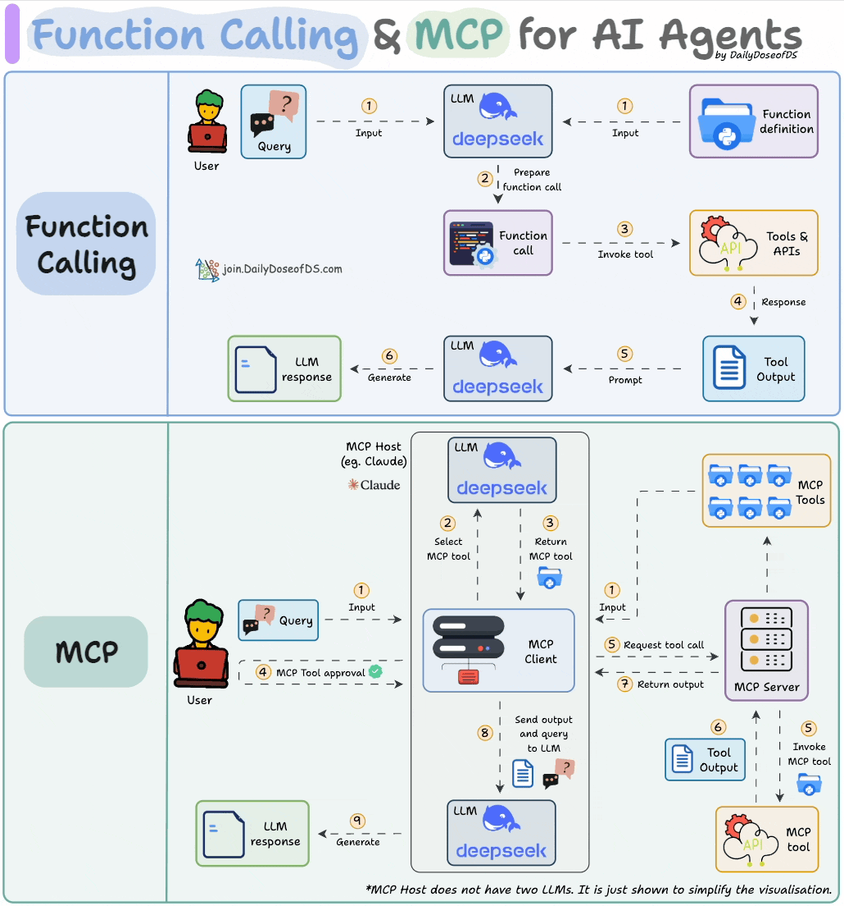
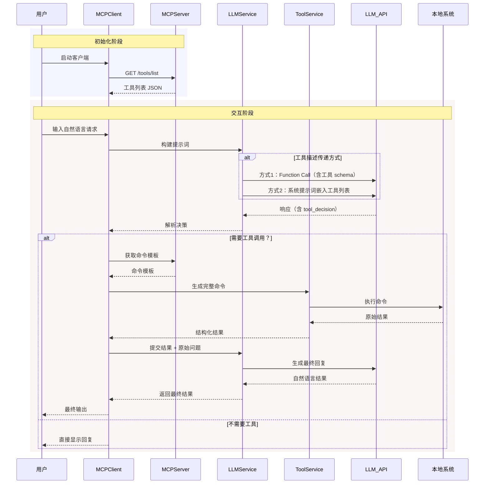
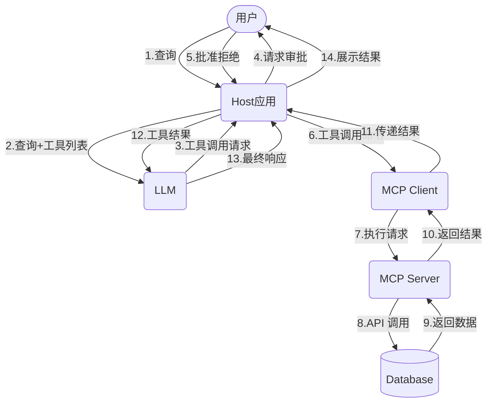

# 基础

MCP (Model Context Protocol): 模型上下文协议，是 Anthropic (Claude) 主导发布的一个开放的、通用的、有共识的协议标准。
- MCP 是一个标准协议，就像给 AI 大模型装了一个 “万能接口”，让 AI 模型能够与不同的数据源和工具进行无缝交互。它就像 USB-C 接口一样，提供了一种标准化的方法，将 AI 模型连接到各种数据源和工具。
- MCP 旨在替换碎片化的 Agent 代码集成，从而使 AI 系统更可靠，更有效。通过建立通用标准，服务商可以基于协议来推出它们自己服务的 AI 能力，从而支持开发者更快的构建更强大的 AI 应用。开发者也不需要重复造轮子，通过开源项目可以建立强大的 AI Agent 生态。
- MCP 是客户端-服务端架构，一个 Host 可以连接多个 MCP Server

核心思想: 将 AI 模型的功能和对接到 AI 模型的工具(tool),数据(resource),提示(prompt)分离开, 独立部署, 让 AI 可以随意连接各种工具,数据以及使用各种提示!

- MCP 主机 (MCP Host): （可以认为是一个 Agent）运行 AI 模型和 MCP 客户端的应用程序。常见的 MCP 主机有：
    - Claude Desktop: Anthropic 公司的桌面客户端，内置了 MCP 支持。
    - IDE 集成: 像 VS Code 、Cursor 等 IDE 可以通过插件支持 MCP 。
    - 自定义应用: 你自己开发的任何集成了 MCP 客户端的应用程序。
- MCP 客户端 (MCP Client): 负责与 MCP 服务器通信的组件。它通常集成在 MCP 主机中。客户端的主要职责是：
    - 充当MCP Server 和 LLM 之间的桥梁
    - 发现和连接 MCP 服务器。
    - 向 MCP 服务器请求可用的工具、资源、提示等信息。
    - 根据 AI 模型的指令，调用 MCP 服务器提供的工具。
    - 将工具的执行结果返回给 AI 模型。
- MCP 服务 (MCP Server): 提供具体功能（工具）和数据（资源）的程序。你可以把它想象成一个“技能包”，AI 模型可以通过 MCP 客户端“调用”这些技能。MCP 服务器可以：
    - 访问本地数据（文件、数据库等）。
    - 调用远程服务（ Web API 等）。
    - 执行自定义的逻辑。

> MCP 提供给 LLM 所需的上下文：Resources 资源、Prompts 提示词、Tools 工具

> 整体的工作流程是这样的：AI 应用中集成 MCP 客户端，通过 MCP 协议向 MCP 服务端发起请求，MCP 服务端可以连接本地/远程的数据源，或者通过 API 访问其他服务，从而完成数据的获取，返回给 AI 应用去使用

$ \color{red}{特别说明：MCP 并没有规定如何与大模型进行交互，其没有对模型与 MCP HOST 的交互进行规定} $

# MCP与Function call

<center>
    <br>
    <div style="color:orange; border-bottom: 1px solid #d9d9d9; display: inline-block; color: #999; padding: 2px;">
        图片来自文章：<a href='https://blog.dailydoseofds.com/p/function-calling-and-mcp-for-llms'>Function calling & MCP for LLMs</a>
    </div>
</center>

MCP（Model Context Protocol）和 Function Calling 是 AI 系统中两种重要的工具扩展机制，来看一张对比图：下面系统地对比两者。



## Function Calling

Function Calling 是各家大模型（OpenAI、Anthropic、Google 等）在 API 层面提供的能力。本质上是让模型在生成回复时，输出一段结构化的 JSON，告诉调用方"我需要执行某个函数"。

**流程：**
1. 开发者在请求中附上工具的 schema（函数名、参数类型、描述）
2. 模型判断是否需要调用工具，如果是，则输出 `tool_use` 类型的内容块而非纯文本
3. 应用层解析 JSON，在本地执行函数
4. 将执行结果作为 `tool_result` 追加到对话，再次请求模型生成最终回复

**关键特性：**
- 工具定义是 prompt 的一部分，随每次 API 请求传入
- 工具的执行逻辑完全在调用方（应用侧）
- 每次请求是无状态的，工具注册不持久化
- 与特定模型的 API 格式绑定（各家格式不完全一致）

## MCP（Model Context Protocol）

MCP 是 Anthropic 于 2024 年末推出的开放协议，目标是为 LLM 应用建立一套**标准化的工具/上下文接入层**，类似于 LSP（Language Server Protocol）之于编辑器的关系。

**架构三角：**
- **Host**：使用 MCP 的应用（如 Claude Desktop、Cursor、VS Code 插件）
- **Client**：Host 内部维护的 MCP 连接管理器，通常与 Host 合并
- **Server**：独立进程，向 Client 暴露三类能力：
  - `tools`：可被模型调用的函数（类似 Function Calling 的工具）
  - `resources`：可读取的上下文数据（文件、数据库记录等）
  - `prompts`：预定义的 prompt 模板

**通信层：** 使用 JSON-RPC 2.0，支持三种传输方式：`stdio`（本地子进程）、`SSE`（Server-Sent Events）、`Streamable HTTP`。

**关键特性：**

- Server 是独立的长期运行进程，**可以维持状态**（如数据库连接池、认证 session）
- 协议与具体模型/应用解耦，一个 MCP Server 可被任意支持 MCP 的 Host 复用
- 支持 `capability negotiation`，Client 和 Server 握手时协商双方支持的功能集
- 松耦合：Server 可以本地运行，也可以远程部署为 HTTP 服务

## 核心差异对比

| 维度 | Function Calling | MCP |
|------|-----------------|-----|
| 层次 | API 约定 | 生态协议 |
| 工具定义位置 | 随请求传入 | Server 启动时注册 |
| 执行位置 | 应用侧本地 | MCP Server 进程 |
| 有状态性 | 无状态 | Server 可有状态 |
| 跨模型复用 | 否（各家格式不同） | 是（标准协议） |
| 部署方式 | 嵌入应用 | 独立进程/远程服务 |
| 适用场景 | 单应用内工具集成 | 工具生态标准化 |

## 两者的关系

MCP 并不是 Function Calling 的替代品，而是**更高层的抽象**。在 MCP 的实现内部，Host 与模型通信时依然会用到 Function Calling（或等效机制）来触发工具调用——MCP 解决的是工具如何被发现、注册、跨应用复用的问题，而不是模型如何生成工具调用意图的问题。

可以理解为：**Function Calling 是模型与工具之间的语言，MCP 是工具生态的基础设施协议。**

# MCP组件

## MCP Servers

- [Awesome MCP Server](https://github.com/punkpeye/awesome-mcp-servers)
- [Find Awesome MCP Servers and Clients](https://mcp.so/)
- [MCP Server 官方示例](https://github.com/modelcontextprotocol/servers)
- [Awesome-MCP-ZH](https://github.com/yzfly/Awesome-MCP-ZH)
- [Glama](https://glama.ai/mcp/servers)
- [Smithery](https://smithery.ai)
- [cursor](https://cursor.directory)
- [MCP.so](https://mcp.so/zh)
- [阿里云百炼](https://bailian.console.aliyun.com/?tab=mcp#/mcp-market)
- [阿里 Higress AI MCP](https://mcp.higress.ai/)

MCP Server 相对比较独立，可以独立开发，独立部署，可以远程部署，也可以本地部署。它可以提供三种类型的功能：
- 工具（Tools）：可以被 LLM 调用的函数（需要用户批准）。可以由大模型自主选择工具，无需人类进行干涉，整个过程是全自动的。
- 资源（Resources）：类似文件的数据，可以被客户端读取，如 API 响应或文件内容。Resource 对接的是 MCP Hosts，需要 MCP Hosts 额外开发与 Resouce 的交互功能，并且由用户进行选择，才能直接使用
- 提示（Prompts）：预先编写的模板，帮助用户完成特定任务。它与 Resource 类似，也是需要用户的介入才能使用

## MCP Client && MCP Hosts

[MCP 官网](https://modelcontextprotocol.io/clients)列出来一些支持 MCP 的 Clients。

MCP Client 负责与 MCP Server 进行通信。而 MCP Hosts 则可以理解为是一个可对话的主机程序。

当用户发送 prompt（例如：我要查询北京的天气） 到 MCP Hosts 时，MCP Hosts 会调用 MCP Client 与 MCP Server 进行通信，获取当前 MCP Server 具备哪些能力，然后连同用户的 prompt 一起发送给大模型，大模型就可以针对用户的提问，决定何时使用这些能力了。这个过程就类似，我们填充 ReAct 模板，发送给大模型。

当大模型选择了合适的能力后，MCP Hosts 会调用 MCP Cient 与 MCP Server 进行通信，由 MCP Server 调用工具或者读取资源后，反馈给 MCP Client，然后再由 MCP Hosts 反馈给大模型，由大模型判断是否能解决用户的问题。如果解决了，则会生成自然语言响应，最终由 MCP Hosts 将响应展示给用户。

分为两类：
- AI编程IDE：Claude Code、Codex、Cursor、Cline、Continue、Sourcegraph、Windsurf 等
- 聊天客户端：Cherry Studio、Claude、Librechat、Chatwise等

更多的Client参考这里：[MCP-Client 开发](#mcp-client开发)

# MCP协议细节

MCP协议官方提供了两种主要通信方式：stdio（标准输入输出）和 SSE （Server-Sent Events，服务器发送事件）。这两种方式均采用全双工通信模式，通过独立的读写通道实现服务器消息的实时接收和发送
- Stdio传输（标准输入/输出）：适用于本地进程间通信，MCP默认的通信方式
- HTTP + SSE传输：
    - 服务端→客户端：Server-Sent Events（SSE） 
    - 客户端→服务端：HTTP POST 
    - 适用于远程网络通信。

所有传输均采用JSON-RPC 2.0进行消息交换

## stdio方式

STDIO 调用方式是将一个 MCP Server 下载到你的本地，直接调用这个工具

优点
- 首先延迟极低，进程间通信比走网络快得多，数据直接在操作系统管道里流转，几乎没有开销；
- 其次不需要开端口，也就没有网络安全问题，不用担心外部访问。另外 Server 的生命周期是自动管理的，随 Client 启动而启动、随 Client 关闭而关闭，不需要你手动去管进程；
- 可靠性高，且易于调试

缺点：
- Stdio 的配置比较复杂，我们需要做些准备工作，你需要提前安装需要的命令行工具。
- stdio模式为单进程通信，无法并行处理多个客户端请求，同时由于进程资源开销较大，不适合在本地运行大量服务。（限制了其在更复杂分布式场景中的使用）；

stdio的本地环境有两种：
- 一种是Python 编写的服务，
- 一种用TypeScript 编写的服务。

分别对应着uvx 和 npx 两种指令

工作原理：：MCP Client（比如 Claude Desktop）在启动时，把 MCP Server 当作一个子进程启动，然后通过进程的标准输入（stdin）发送请求、从标准输出（stdout）读取响应。两个进程在同一台机器上运行，通过操作系统的管道通信；

整个过程不经过网卡、不经过 TCP/IP 协议栈，数据在 RAM 里走了一趟就到了，所以延迟天然比网络请求低得多，也不需要序列化成网络可传输的字节流

## SSE方式

SSE 则是通过 HTTP 服务调用托管在远程服务器上的 MCP Server

场景
- SSE方式适用于客户端和服务器位于不同物理位置的场景。
- 适用于实时数据更新、消息推送、轻量级监控和实时日志流等场景
- 对于分布式或远程部署的场景，基于 HTTP 和 SSE 的传输方式则更为合适。

优点
- 配置方式非常简单，基本上就一个链接就行，直接复制他的链接填上就行

## Streamable HTTP

- [Replace HTTP+SSE with new "Streamable HTTP" transport](https://github.com/modelcontextprotocol/modelcontextprotocol/pull/206)

Streamable HTTP 的核心设计是用单个 HTTP 端点（通常是 /mcp）同时处理请求和响应。Client 通过 POST 请求发送 JSON-RPC 消息，Server 可以选择两种方式返回：如果是简单的同步操作，直接返回一个普通的 JSON 响应就行；如果是需要流式输出的操作，Server 返回一个 SSE 流，持续推送数据。这种「按需选择」的设计非常灵活，不需要强制建立长连接

MCP 新增了一种方式：Streamable HTTP 传输层替代原有的 HTTP+SSE 传输层：
- Streamable HTTP 相比 HTTP + SSE 具有更好的稳定性，在高并发场景下表现更优。
- Streamable HTTP 在性能方面相比 HTTP + SSE 具有明显优势，响应时间更短且更稳定。
- Streamable HTTP 客户端实现相比 HTTP + SSE 更简单，代码量更少，维护成本更低

HTTP+SSE 存在的问题：HTTP+SSE 的传输过程实现中，客户端和服务器通过两个主要渠道进行通信：（1）HTTP 请求/响应：客户端通过标准的 HTTP 请求向服务器发送消息。（2）服务器发送事件（SSE）：服务器通过专门的 /sse 端点向客户端推送消息，这就导致存在下面三个问题：
- 服务器必须维护长连接，在高并发情况下会导致显著的资源消耗。
- 服务器消息只能通过 SSE 传递，造成了不必要的复杂性和开销。
- 基础架构兼容性，许多现有的网络基础架构可能无法正确处理长期的 SSE 连接。企业防火墙可能会强制终止超时连接，导致服务不可靠。

Streamable HTTP 的改进
- 统一端点：移除了专门建立连接的 /sse 端点，将所有通信整合到统一的端点。
- 按需流式传输：服务器可以灵活选择返回标准 HTTP 响应或通过 SSE 流式返回。
- 状态管理：引入 session 机制以支持状态管理和恢复。


# MCP工作流程

API 主要有两个
- `tools/list`：列出 Server 支持的所有工具
- `tools/call`：Client 请求 Server 去执行某个工具，并将结果返回


## 初始化阶段

### 1. 客户端启动与工具列表获取
- 用户首先启动 MCPClient，完成初始化操作。
- MCPClient 向 MCPServer 发送 `GET /tools/list` 请求，获取可用工具的元数据。
- MCPServer 返回包含工具名称、功能描述、参数要求等信息的 **工具列表JSON**，供客户端后续构建提示词使用。

## 交互阶段

### 1. 用户输入与提示词构建
- 用户通过 MCPClient 输入自然语言请求（如“查询服务器状态”“生成文件报告”等）。
- MCPClient 将用户请求与初始化阶段获取的 **工具列表** 结合，生成包含任务目标和工具能力的提示词（Prompt），传递给 **LLMService（大语言模型服务层）**。

### 2. 工具描述传递方式（二选一）
- **方式1（Function Call）**：
  LLMService 通过 `LLM_API` 调用大语言模型时，在请求中直接携带 **工具schema**（结构化工具定义，如参数格式、调用格式），告知模型可用工具的调用方式。
- **方式2（系统提示词嵌入）**：
  LLMService 将工具列表以自然语言描述形式嵌入 **系统提示词（System Prompt）**，让模型在理解用户需求时知晓可用工具的功能边界。

### 3. 模型决策与响应解析
- `LLM_API` 返回包含 `tool_decision`（工具调用决策）的响应：
  - 若判定 **无需工具**（如简单文本回复），响应直接包含最终答案；
  - 若判定 **需要工具**（如需要执行本地命令、调用外部接口），响应中包含所需工具的参数要求（如工具名称、入参格式）。
- LLMService 解析决策结果，将信息传递给 MCPClient。

### 4. 工具调用分支（需要工具时）
- **获取命令模板**：MCPClient 根据模型指定的工具名称，在初始化时保存的工具配置中取出对应的 **命令模板**（如Shell命令格式、API调用参数模板）。
- **生成与执行命令**：MCPClient 将用户输入参数与命令模板结合，通过 **ToolService（工具执行服务）** 生成完整可执行命令，并提交给 **本地系统** 执行。
- **结果处理**：本地系统返回原始执行结果（如命令输出文本、API返回数据），ToolService 将其转换为 **结构化结果（如JSON格式）**，反馈给 MCPClient。
- **二次调用模型生成最终回复**：MCPClient 将结构化结果与用户原始问题一并提交给 LLMService，通过 `LLM_API` 调用模型，将技术化的执行结果转化为自然语言描述（如将“服务器CPU使用率80%”转化为“当前服务器CPU负载较高，建议检查进程”）。

### 5. 直接回复分支（无需工具时）

- 若模型判定无需工具，MCPClient 直接将模型响应显示给用户（如简单的文本问答、信息总结）。

## 最终输出

无论是否经过工具调用，MCPClient 最终将处理后的 自然语言结果 呈现给用户，完成整个交互流程

数据流向为：


# MCP Server开发

- [MCP Server 工程开发参考](https://github.com/aliyun/alibaba-cloud-ops-mcp-server)

**安装依赖：**
```bash
# 下面两种方式选其一
uv add "mcp[cli]"
pip install "mcp[cli]"
```

**运行**

运行 MCP 服务，假设新建了一个 MCP Server，文件名为：`server.py`
```bash
mcp dev server.py
# Add dependencies
mcp dev server.py --with pandas --with numpy
# Mount local code
mcp dev server.py --with-editable .
```
除了上面的方式，也可以直接运行，需要增加如下代码:
```py
...
if __name__ == "__main__":
    mcp.run()
```
然后执行如下命令：
```bash
python server.py
# or
mcp run server.py
```
请注意：`mcp run` 或 `mcp dev` 只支持 FastMCP

## Tools

```py
import httpx
from mcp.server.fastmcp import FastMCP
mcp = FastMCP("My App")
@mcp.tool()
async def fetch_weather(city: str) -> str:
    """Fetch current weather for a city"""
    async with httpx.AsyncClient() as client:
        response = await client.get(f"https://api.weather.com/{city}")
        return response.text
```

## 最佳实践

- [MCP工具设计技巧](https://mp.weixin.qq.com/s/wpiROVdoJAHvolkEpYo20w)

### 对比 REST API

Agent 依赖显式语义，而非隐含上下文，这是传统 API 设计与 Agent 工具设计的根本差异

| REST API 设计原则       | 对人类开发者                         | 对 Agent                                       |
|-------------------------|--------------------------------------|------------------------------------------------|
| 发现性（Discovery）     | 成本低：读一次文档就记住             | 成本高：每次请求都要带上完整 schema            |
| 可组合性（Composability）| 优势：灵活组合多个小端点             | 劣势：多步调用意味着更多 token、更慢的迭代     |
| 灵活性（Flexibility）   | 更多选项 = 更强大                    | 更多选项 = 更容易产生幻觉和选错                |
| 文档丰富度              | 可以查阅外部文档补充理解             | 只能依赖工具定义中的描述                      |
| 试错迭代                | 成本低：快速调试修复                 | 成本高：每次失败都消耗 token 和上下文         |

### 核心原则

设计 Agent 工具的核心原则是：防呆式语义化，假设 Agent 会完全按字面意义理解你的工具，不会做任何「显然」的推断；

工具设计必须让 Agent 在第一次看到时就能正确使用，不能太指望它「试几次就会了」

好的工具设计 = 减少 Agent 的认知负担，设计工具的本质，是在设计 Agent 的认知体验。好的工具设计，就是不断减少 Agent 的认知负担

| 认知负担                 | 设计目标                                       |
|--------------------------|------------------------------------------------|
| 理解工具是做什么的       | 名称自解释，描述清晰                           |
| 判断什么时候该用这个工具 | 描述中明确使用场景                           |
| 知道该传什么参数         | 参数名直观，description 有示例                 |
| 避免传错参数格式         | Schema 约束严格，有 enum 就用 enum             |
| 理解执行结果             | 输出结构化，包含足够的上下文                   |
| 处理错误情况             | 错误信息明确，指出如何修正                     |

### 命名

工具名称是 Agent 对工具的「第一印象」，也是它在几十个工具中快速筛选的主要依据。一个好的名称应该让 Agent 在看到的瞬间就能判断：这个工具是不是我需要的？  
**1、命名要完整，不要依赖隐含上下文**
```py
# ❌ 不好：依赖隐含上下文
send_message      # 发给谁？通过什么渠道？
get_user          # 根据什么获取？返回什么？
delete_item       # 删除什么类型的 item？
# ✅ 好：完整、自解释
slack_send_message           # 明确是 Slack 消息
get_user_by_email           # 明确是通过邮箱查找
delete_project_by_uuid      # 明确是删除项目，通过 UUID
```
命名完整性的几个维度：

| 维度     | 不好          | 好                            |
|----------|---------------|-------------------------------|
| 作用域   | `search`      | `github_search_issues`        |
| 操作对象 | `delete`      | `delete_calendar_event`       |
| 操作方式 | `get_user`    | `get_user_by_uuid`            |
| 数据格式 | `export`      | `export_report_as_csv`        |

**2、动词优先：Action-Oriented 命名：工具本质上是「动作」，命名应该以动词开头，清晰表达这个工具会「做什么」：**
```py
# ✅ 动词优先，清晰表达动作
create_github_issue
send_slack_message  
search_documents
update_user_profile
delete_expired_sessions
# ❌ 名词或模糊命名
github_issue          # 是创建？查询？删除？
slack_message_handler # handler 做什么不清楚
document_search       # 不如 search_documents 直观
```

**3、命名即分类：帮助 Agent 快速筛选**：使用一致的前缀可以帮助 Agent 进行「分类筛选」：
```py
# 按服务/领域分组的命名
github_create_issue
github_list_pull_requests
github_merge_pull_request
github_search_code

slack_send_message
slack_list_channels
slack_get_channel_history

calendar_create_event
calendar_list_events
calendar_update_event
```

**4、前缀 vs 后缀：因 LLM 而异**：选择前缀命名还是后缀命名，对不同 LLM 的工具使用评测有的影响

**5、长度与清晰度的权衡**
- 保持工具名在 30-50 字符以内
- 使用常见缩写（repo 代替 repository，msg 代替 message）但要确保不产生歧义
- 把细节放到参数和描述中，而非全部塞进名称

### 描述信息

对于 Agent 来说，描述是理解工具如何使用的主要信息来源，它会认真「阅读」每一个描述来决定工具的使用方式

**1、描述即上下文：Agent 真的会去读**
```py
# ❌ 描述过于简略
def delete_item(id):
    """删除一个项目"""
    pass
# ✅ 描述完整、语义化
def delete_item_by_uuid(item_uuid: str):
    """
    根据 UUID 永久删除一个项目。
    
    参数：
    - item_uuid: 项目的唯一标识符，格式为 'item_xxxxxxxx'
    
    返回：
    - 成功时返回 "Item deleted successfully"
    - 如果项目不存在，返回描述性错误信息
    
    注意：此操作不可逆，删除前请确认。
    """
    pass
```
**2、描述的核心要素**

一个好的工具描述应该回答以下问题：
- 这个工具做什么？( What)
- 什么时候应该使用它？( When)
- 有什么限制或前提条件？( Constraints)
- 会返回什么？( Output)

**3、参数描述：示例的价值**

参数的 description 字段同样重要，一个好的示例胜过千言万语：
```json
{
  "properties": {
    "repo": {
      "type": "string",
      "description": "Repository in owner/repo format, e.g. 'facebook/react' or 'microsoft/vscode'"
    },
    "labels": {
      "type": "array",
      "items": { "type": "string" },
      "description": "Labels to apply to the issue, e.g. ['bug', 'high-priority']"
    },
    "assignees": {
      "type": "array", 
      "items": { "type": "string" },
      "description": "GitHub usernames to assign, e.g. ['octocat', 'hubot']. Must be valid collaborators."
    }
  }
}
```
示例的作用：   
- 明确格式：owner/repo 而非 repo 或完整 URL   
- 展示真实值：facebook/react 比 <owner>/<repo> 更直观  
- 暗示边界：多个示例展示值域范围  

**4、参数描述的规范**
- 明确标注必填/可选
- 说明默认值

**5、说明失败情况**

对 Agent 来说，知道失败时会发生什么同样重要：
```py
# ❌ 只描述成功情况
"""
根据用户 ID 获取用户信息。
返回用户的姓名、邮箱和注册时间。
"""
# ✅ 同时描述失败情况
"""
根据用户 ID 获取用户信息。

返回：
- 成功时返回 JSON 对象，包含 name、email、created_at 字段
- 如果用户不存在，返回 "User not found: {id}. Please verify the ID format
  (should be 'usr_xxx')ortry searching by email usingfind_user_by_email()."
- 如果 ID 格式错误，返回格式说明和正确示例
"""
```

**6、引导工具选择顺序**：当有多个功能相似的工具时，可以在描述中明确指导 Agent 的选择顺序：
```py
def get_variable_value(address: str):
    """
    获取指定地址的变量值（推荐首选）。
    
    自动识别变量类型并返回格式化的字符串表示。
    大多数情况下应该优先使用这个函数。
    """
    pass

def read_raw_memory(address: str, size: int):
    """
    读取指定地址的原始内存数据。
    
    ⚠️ 只有当 get_variable_value 失败或需要原始字节时才使用此函数。
    此函数忽略类型信息，返回原始字节数组。
    """
    pass
```

### 输入设计

输入设计的核心目标是：让 Agent 更容易传对参数，更难传错参数。

**1、合理的默认值：开箱即用**

用户（和 Agent）应该能够在最少配置的情况下开始使用工具，每个可选参数都应该有合理的默认值：
```py
def search_issues(
    query: str,
    repo: str = None,           # 默认搜索所有仓库
    state: str = "open",        # 默认只搜索 open 状态
    sort: str = "relevance",    # 默认按相关性排序
    limit: int = 20             # 默认返回 20 条
) -> str:
    """
    搜索 GitHub Issues。
    
    参数：
    - query: 搜索关键词（必填）
    - repo: 限定仓库，格式 owner/repo（可选，默认搜索所有可访问仓库）
    - state: Issue 状态，可选 'open'|'closed'|'all'（可选，默认 'open'）
    - sort: 排序方式，可选 'relevance'|'created'|'updated'（可选，默认 'relevance'）
    - limit: 返回数量上限（可选，默认 20，最大 100）
    """
    pass
```
关键点：
- 必填参数应该尽量少，只有真正无法提供默认值的才设为必填
- 默认值要在描述中明确说明
- 默认值应该是最常用的选项，而非最安全的选项

**2、Schema 验证：用类型系统约束输入**：利用 JSON Schema 的特性来约束输入，减少 Agent 传错参数的可能性：
- 使用枚举限制可选值：`state: Issue 状态，可选 'open'|'closed'|'all'（可选，默认 'open'）`
- 使用 pattern 约束格式
```json
{
  "repo": {
    "type": "string",
    "pattern": "^[a-zA-Z0-9_-]+/[a-zA-Z0-9_.-]+$",
    "description": "仓库名，格式为 owner/repo"
  }
}
```
- 使用 minimum/maximum 约束范围
```json
{
  "limit": {
    "type": "integer",
    "minimum": 1,
    "maximum": 100,
    "default": 20,
    "description": "返回结果数量上限"
  }
}
```
**3、宽松解析：严格定义，宽容执行**：在 Schema 中定义严格的规范，但在实际执行时宽容地处理变体。
```py

def get_file_content(file_path: str) -> str:
    """
    获取文件内容。
    
    参数：
    - file_path: 文件路径（支持绝对路径或相对于项目根目录的相对路径）
    """
    # Schema 定义的是 file_path，但也接受常见变体
    # Agent 可能会传 path、filepath、file 等
    # 宽松解析示例（在实际代码中处理）
    normalized_path = normalize_path(file_path)
    # 自动处理路径格式
    ifnot normalized_path.startswith('/'):
        normalized_path = os.path.join(project_root, normalized_path)
    return read_file(normalized_path)
```

**4、分页参数的设计**：对于可能返回大量数据的工具，分页是必要的，分页设计要点：
- 页码从 1 开始（更符合人类直觉，Agent 也更容易理解）
- 提供明确的 has_next 或 has_more 字段
- 返回 total_count 帮助 Agent 判断是否需要继续获取

**5、参数分组与嵌套**：

对于参数较多的工具，合理的分组可以提高可理解性，要注意：嵌套不宜过深

**6、针对 LLM 特性的 Schema 技巧**
- 复杂数组展开为独立参数：当工具参数中包含复杂对象的数组时，LLM 生成正确 JSON 数组的稳定性往往不如预期。这是因为数组需要 LLM 正确处理多个嵌套层级的括号匹配、逗号分隔等语法细节。一个实用的解决方案是：将数组展开为带编号的独立参数。LLM 会识别 item_1、item_2、item_3 这种模式，并用更稳定的 JSON 对象方式来表达原本的数组语义；
- 静态参数作为行为提醒（Reminder Pattern）

### 输出设计

工具的输出是 Agent 做出下一步决策的依据。好的输出设计应该让 Agent 能够快速理解结果、提取关键信息、决定后续行动

**1、JSON vs Markdown：什么时候用什么**
- 结构化数据 → JSON，当输出是需要被 Agent 解析和处理的数据时，使用 JSON
- 面向展示的内容 → Markdown，当输出主要是给用户阅读的内容时，Markdown 更合适
- 混合场景 → 用 JSON 包装 Markdown

**2、输出控制：避免干扰 MCP 通信**

MCP 使用 stdio 进行通信，工具在正常运行时不应该向 stdout 输出任何内容，否则可能干扰 MCP Client 的解析

**3、返回有意义的上下文，避免暴露底层技术细节**

工具返回应该优先考虑上下文相关性而非灵活性，避免返回底层技术细节相关的标识符
```py
# ❌ 不好：返回低级技术细节
def get_user(user_id: str) -> str:
    return json.dumps({
        "uuid": "550e8400-e29b-41d4-a716-446655440000",  # 难以理解
        "256px_image_url": "https://...",               # 过于具体
        "mime_type": "image/jpeg",                      # Agent 通常不需要
        "created_at_epoch": 1704067200                  # 需要转换
    })
# ✅ 好：返回语义化、可理解的信息
def get_user(user_id: str) -> str:
    return json.dumps({
        "name": "Alice Chen",                           # 可直接使用
        "image_url": "https://...",                     # 简化字段名
        "file_type": "jpeg",                            # 更直观
        "created_at": "2024-01-01T00:00:00Z"           # 标准格式
    })
```

**4、使用 response_format 控制输出详细程度**

有时 Agent 需要灵活地获取简洁或详细的回复（例如 search_user(name='jane') → send_message(id=12345)）。你可以通过暴露一个简单的 response_format 枚举参数来实现

**5、回复格式的选择**

工具回复的结构格式（XML、JSON 或 Markdown）也会影响评估性能：没有万能的解决方案。这是因为 LLM 是基于下一个 token 预测训练的，往往对与其训练数据匹配的格式表现更好。最佳的回复结构会因任务和 Agent 而异。建议根据自己的评估选择最佳的回复结构

**6、包含足够的上下文**

工具输出应该包含足够的上下文，让 Agent 不需要额外调用就能理解结果

**7、分页元数据**

对于分页结果，元数据应该清晰完整

**8、控制输出大小：Token 效率优化**

优化上下文的质量很重要，但优化返回给 Agent 的上下文数量同样重要。

大量输出会占用上下文窗口，影响 Agent 的后续推理。例如，一些主流 coding agent 会限制工具回复长度。预计 Agent 的有效上下文长度会随时间增长，但对上下文高效工具的需求将持续存在。应该主动控制输出大小

### 错误处理：帮助 Agent 自我纠正

错误处理是 Agent 工具设计中最容易被忽视，却又最能体现「为 Agent 设计」思维的环节

**1、错误是输入，不是终点**

核心转变：对于 Agent 工具，错误不是「终点」，而是「输入」，是给 Agent 的另一种反馈，帮助它调整策略继续前进
```py
# ❌ 传统方式：抛出异常
def get_user(user_id: str):
    user = db.find(user_id)
    ifnot user:
        raise UserNotFoundError(f"User {user_id} not found")
    return user

# ✅ Agent 友好：返回描述性错误
def get_user(user_id: str) -> str:
    """
    返回：
    - 成功时返回用户信息的 JSON 字符串
    - 失败时返回错误描述，包含修正建议
    """
    user = db.find(user_id)
    if not user:
        return f"""User not found: {user_id}. 
Possible reasons:
1. ID format incorrect - should be 'usr_' followed by 8 characters (e.g., 'usr_a1b2c3d4')
2. User may have been deleted
Try: Use find_user_by_email() if you have the user's email address."""
    return json.dumps(user)
```

**2、错误信息要有「可操作性」**

一个好的错误信息应该回答三个问题：
- 出了什么问题？( What)
- 为什么会出这个问题？( Why)
- 应该怎么修正？( How)

**3、提供替代方案**

当一种方式失败时，告诉 Agent 还有什么其他选择

**4、区分可恢复错误和不可恢复错误**

不是所有错误都需要 Agent 去「修复」。有些错误是可以重试或调整参数的，有些则需要人工介入
```py

# 可恢复错误：Agent 可以尝试修正
def api_call_with_retry_hint(params):
    if rate_limited:
        return "Rate limited. Please wait 60 seconds and retry."
    if invalid_params:
        return f"Invalid parameter 'date': expected YYYY-MM-DD format, got '{params['date']}'"
# 不可恢复错误：需要人工介入
def sensitive_operation(params):
    if not_authorized:
        return """Permission denied. This operation requires admin privileges.
⚠️ This cannot be resolved automatically. Please ask the user to:
1. Contact their administrator to request access, or
2. Use a different account with appropriate permissions"""
```

**5、错误信息的格式**

对于复杂的错误信息，结构化格式比纯文本更容易被 Agent 解析和处理

**6、配置错误的优雅处理**

配置错误（如环境变量缺失、路径错误）不应该让工具崩溃。相反，应该在工具被调用时提供有用的诊断信息

**关键点：**
- 配置错误不是 Agent 能自己修复的，需要明确标记 requires_user_action
- 提供具体的修复步骤，而非简单的错误消息
- 不要让工具在启动时就崩溃，等到实际被调用时再报告问题

### 工具粒度的权衡

**1、不能直接把 API 包装成工具**

好的 Agent 工具应该匹配 Agent（和人类）解决问题的自然方式，而不是底层系统的数据结构

**2、两个极端的问题**
- 太细粒度：多次调用，浪费 token：
    - 每次调用都消耗 token（包括工具选择、参数生成、结果解析）
    - Agent 需要多次「思考」该调用什么；
    - 增加出错的机会点；
- 太粗粒度：返回大量无关信息，填满上下文
    - 大量无关信息占用上下文窗口
    - Agent 需要从海量数据中提取有用信息
    - 增加 token 消耗和处理延迟

**3、找到合适的粒度**
- 原则：按使用场景聚合，而非按数据结构拆分：工具可以合并功能，在底层处理多个离散操作（或 API 调用）
- 启发式方法：如果 Agent 在 90% 的情况下调用 A 后都会调用 B，考虑合并它们

**4、提供便利函数，保留底层能力**

有时候需要同时提供「简单但有限」和「复杂但完整」的工具。关键是在描述中明确指导 Agent 的选择

**5、组合工具 vs 原子工具**

**6、粒度决策的考量因素**

| 因素             | 倾向细粒度                     | 倾向粗粒度                   |
|------------------|--------------------------------|------------------------------|
| 使用场景         | 多样、不可预测                 | 固定、可预测的工作流         |
| 用户控制需求     | 需要精细控制每一步             | 希望一键完成                 |
| 错误处理         | 需要在每步处理错误             | 可以整体成功或失败           |
| Token 预算       | 充足                           | 紧张                         |
| Agent 能力       | 强，能规划多步骤               | 有限，倾向简单调用           |

**7、严格控制工具数量**

工具数量是影响 Agent 效果的关键因素，一个拥有 4 个精心构造工具的 Agent，效果一定会优于拥有 40 个粗制滥造工具的 Agent。需要记住，用户可能同时连接多个 MCP Server，加上 Agent 自带的工具，总数很容易超标。保守估计每个 Server 的工具数量，给其他 Server 留出空间
- 一个 Server，一个职责：不要试图构建一个「全能」的 MCP Server。就像微服务架构一样，每个 Server 应该专注于一个领域；
- 避免工具重叠和冗余
- 删除未使用的工具：如果一个工具在过去 30 天内从未被调用，请考虑移除它，因为未使用的工具仍然会：占用上下文窗口、增加 Agent 的选择负担、可能与其他工具产生混淆；
- 按角色拆分（Admin vs User）：如果某些工具只有特定角色才能使用，考虑将它们拆分到不同的 Server

**8、定期统计工具使用**

工具设计不是一次性的，随着使用数据积累，应该定期统计：
- 哪些工具从未被使用？ 考虑移除或合并
- 哪些工具总是一起被调用？ 考虑提供组合版本
- 哪些工具经常调用失败？ 可能需要改进设计或文档
- 哪些工具的参数经常传错？可能需要简化或提供更好的默认值

**9、提供诊断工具：info 命令模式**

一个实用的最佳实践是提供一个 info 或 status 工具，用于诊断 MCP Server 的状态：
```py
def server_info() -> str:
    """
    获取 MCP Server 的状态和配置信息。
    
    用于诊断问题或验证配置是否正确。
    返回版本信息、依赖状态、配置检查结果。
    """
    return json.dumps({
        "version": "1.2.3",  # 动态读取，不要硬编码
        "status": "healthy",
        "dependencies": {
            "github_api": {"status": "ok", "authenticated": True},
            "database": {"status": "ok", "connection": "active"}
        },
        "configuration": {
            "GITHUB_TOKEN": "configured"if os.environ.get('GITHUB_TOKEN') else"missing",
            "LOG_LEVEL": os.environ.get('LOG_LEVEL', 'info'),
            "MAX_RESULTS": os.environ.get('MAX_RESULTS', '100')
        },
        "issues": [
            # 列出检测到的配置问题
        ]
    })
```

### 可移植的脚本执行：跨环境一致性

核心原则：永远不要依赖周围环境中隐式存在的包。完整且显式的依赖声明应该统一适用于代码运行的所有环境。

### 与 SKILLS

MCP 和 Skills 不是非此即彼的关系，而是可以互补使用：
- MCP 适合：
    - 需要精确参数验证的 API 调用
    - 高频使用的核心工具
    - 需要跨 Agent 共享的标准化接口
- Skills 适合：
    - 需要丰富上下文说明的复杂工作流
    - 低频但重要的专业操作
    - 包含多个步骤的组合任务

**组合模式：将 MCP 工具封装为 Skills 的一部分**

# MCP-Client开发

- [MCP Clients](https://www.pulsemcp.com/clients)
- [Awesome MCP Clients](https://github.com/punkpeye/awesome-mcp-clients/)
- [The open source MCP client library. Connect any LLM to any MCP server.](https://github.com/mcp-use/mcp-use)

# MCP网关

- [MCP Gateway - A lightweight gateway service](https://github.com/AmoyLab/Unla)

# MCP 安全问题

- [MCP的安全问题](https://news.ycombinator.com/item?id=43600192)
- [企业级MCP Server接入OAuth授权服务器全流程解析](https://mp.weixin.qq.com/s/vm-7JBh6zu1YSYUS-0Y6Hw)
- https://github.com/pingcy/mcp-oauth-demo

# MCP和Agent

- [MCP 构建 Agent](https://github.com/lastmile-ai/mcp-agent)

# 应用场景

应用领域 | 典型场景 | MCP价值 | 代表实现
--------|--------|---------|------
智能编程助手|代码生成、Bug修复、API集成|安全访问本地代码库、CI/CD系统|Cursor、VS Code插件
数据分析工具|自然语言查询数据库、可视化生成|安全查询内部数据库、连接BI工具|XiYanSQL-MCP、数据库MCP服务器
企业知识管理|知识库查询、文档生成、邮件撰写|安全访问内部文档、保护隐私数据|文件系统MCP、Email-MCP
创意设计工具|3D建模、图形生成、UI设计|与专业软件无缝集成|BlenderMCP、浏览器自动化
工作流自动化|多系统协调、事件驱动流程|跨系统安全协作Cloudflare |MCP、AWS自动化套件

# MCP 资源

## MCP Sandbox & Virtualization

- [E2B-开源的 Linux Sandbox](https://github.com/e2b-dev/mcp-server)
- [轻松安全地执行不受信任的用户/AI 代码](https://github.com/microsandbox/microsandbox)
- [Docker-MCP](https://github.com/QuantGeekDev/docker-mcp)

## 任务拆解

- [Sequential Thinking MCP: How to Use Sequential Thinking MCP Servers](https://www.ontariomcp.ca/sequential-thinking-mcp)
- [交互式用户反馈 MCP-节省 Token 调用量](https://github.com/Minidoracat/mcp-feedback-enhanced)
- [Sequential Thinking MCP-顺序思考](https://github.com/arben-adm/mcp-sequential-thinking)
- [Shrimp Task Manager MCP-把复杂任务拆解成可执行的小步骤的 MCP](https://github.com/cjo4m06/mcp-shrimp-task-manager)

## 其他

- [DeepMCPAgent 是一个基于 LangChain/LangGraph 的 AI 智能体框架，完全通过 MCP 来驱动整体行为](https://github.com/cryxnet/DeepMCPAgent)
- [MCP Toolbox for Databases 是一个用于数据库的开源 MCP 服务器](https://github.com/googleapis/genai-toolbox)
- [提供专门的 AI Pieces ，让你轻松连接各种 AI 模型提供商](https://github.com/MCP-Mirror/activepieces_activepieces)
- [Context7-LLMs 和 AI 代码编辑器的最新代码文档](https://github.com/upstash/context7)
- [PromptX是一个系统性的，工程化的提示词管理框架](https://github.com/Deepractice/PromptX)
- [微信读书 MCP](https://github.com/freestylefly/mcp-server-weread)
- [控制 Mac 电脑的 MCP](https://github.com/ashwwwin/automation-mcp)
- [吴恩达-MCP 学习](https://www.deeplearning.ai/short-courses/mcp-build-rich-context-ai-apps-with-anthropic/)
- [FastAPI-MCP:api转 MCP](https://github.com/tadata-org/fastapi_mcp)
- [ACI：为统一 MCP 服务器提供支持的开源基础设施](https://github.com/aipotheosis-labs/aci)
- [Dive 是一个开源的 MCP Host Desktop 应用程序](https://github.com/OpenAgentPlatform/Dive)
- [OpenMemory-MCP 记忆体](https://github.com/mem0ai/mem0/openmemory)
- [Discover Awesome MCP Servers](https://himcp.ai/)
- [海量好用 MCP Server](https://cloud.tencent.com/developer/mcp)
- [EdgeOne Pages MCP-MCP部署网页](https://github.com/TencentEdgeOne/edgeone-pages-mcp)
- [Chrome MCP](https://github.com/hangwin/mcp-chrome)
- [Firecrawl MCP Server-网页抓取](https://github.com/mendableai/firecrawl-mcp-server)
- [Context MCP：给 AI 提供最新文档](https://github.com/upstash/context7)
- [Interactive Feedback MCP：先确认再执行](https://github.com/noopstudios/interactive-feedback-mcp)
- [MCP-联合查询引擎](https://github.com/mindsdb/mindsdb)
- [AntVis-MCP Chart](https://github.com/antvis/mcp-server-chart)
- [基于 MCP 的机器人应用](https://github.com/78/xiaozhi-esp32)
- [可以安全操作数据库的 MCP Toolbox](https://github.com/googleapis/genai-toolbox)

# RAG-MCP

- [RAG-MCP: Mitigating Prompt Bloat in LLM Tool Selection via Retrieval-Augmented Generation](https://arxiv.org/pdf/2505.03275)
- [MCP + 数据库，一种比 RAG 检索效果更好的新方式！](https://mp.weixin.qq.com/s/jV46NMDfcJRiklUG_RLsmQ)

# CLI-Command Line Interface

- [MCP vs CLI](https://community.ibm.com/community/user/blogs/jia-qi/2026/04/08/mcp-vs-cli)


# 总结

无论是 MCP 协议还是 Agent、Function Calling 技术，本质上都在构建大模型与真实世界的交互桥梁；

# 参考资料

- [Model Context Protocol](https://modelcontextprotocol.io/introduction)
- [MCP+数据库](https://mp.weixin.qq.com/s/_HW4YQobEeBnIZMgrl7cLg)
- [MCP入门到精通](https://mp.weixin.qq.com/s/jwzEFeHuB_k9BA7go8bNVg)
- [MCP With LLMS](https://modelcontextprotocol.io/llms-full.txt)
- [分析 Cline 与大模型的交互](hhttps://www.bilibili.com/video/BV1v9V5zSEHA)
- [A bridge between Streamable HTTP and stdio MCP transports](https://github.com/sparfenyuk/mcp-proxy)
- [如何评测 MCP 效果](https://github.blog/ai-and-ml/generative-ai/measuring-what-matters-how-offline-evaluation-of-github-mcp-server-works/)