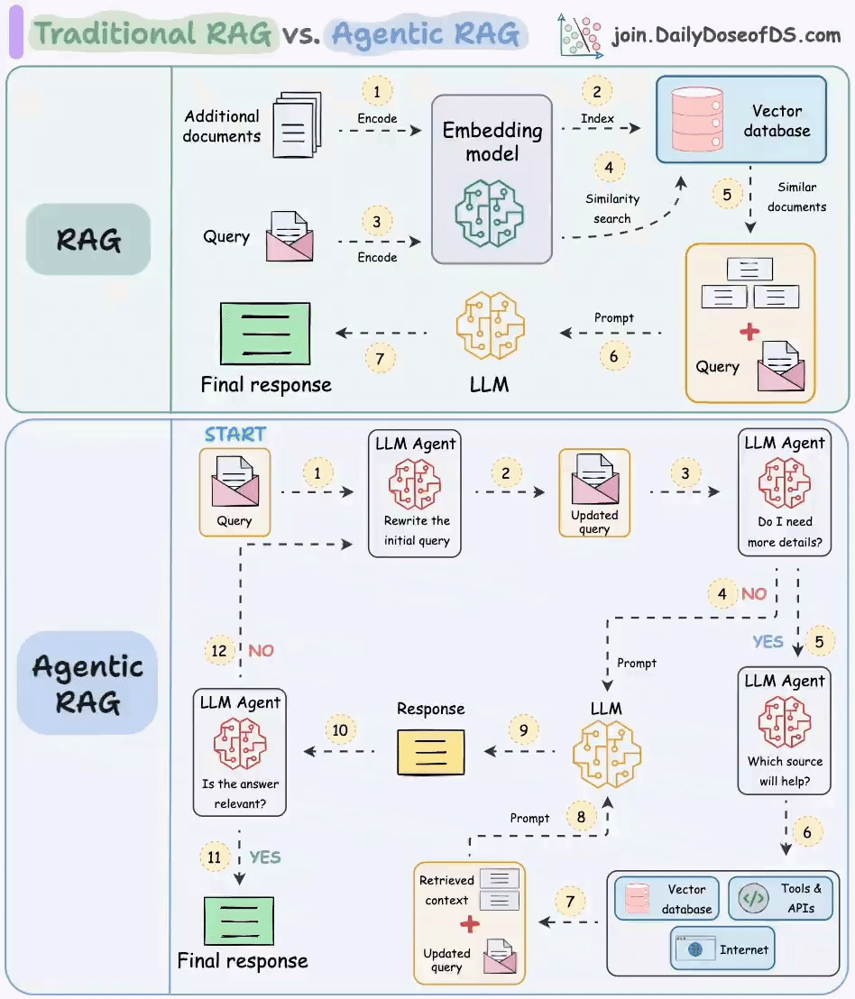
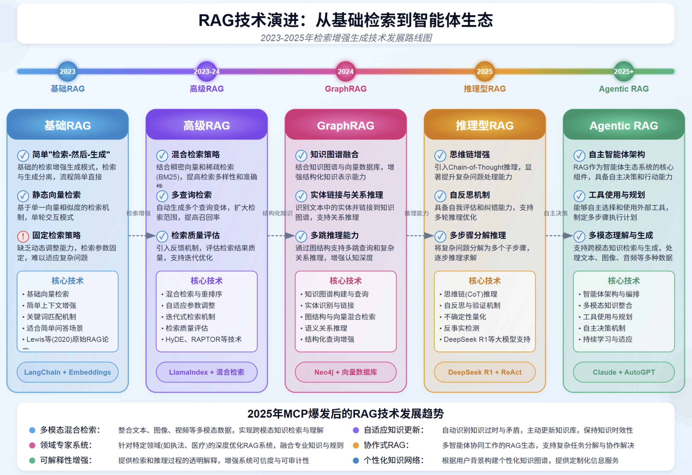
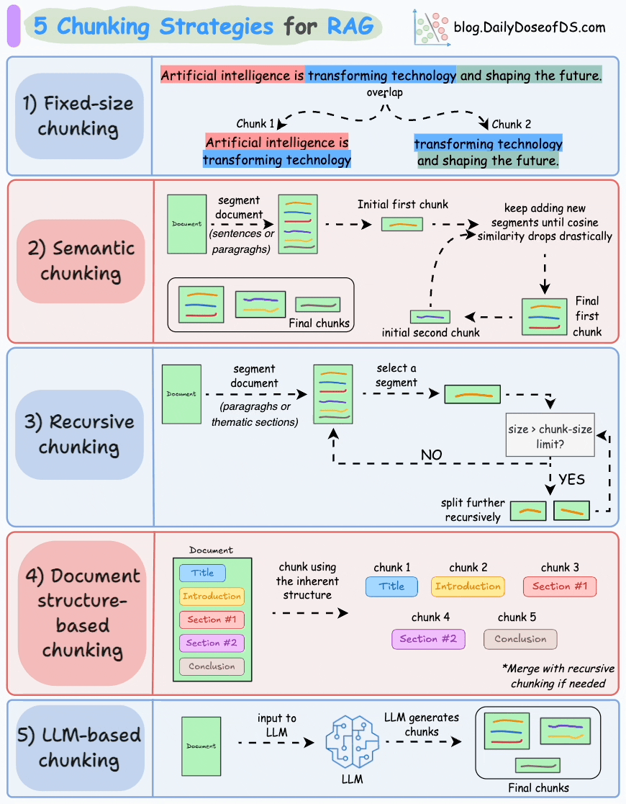
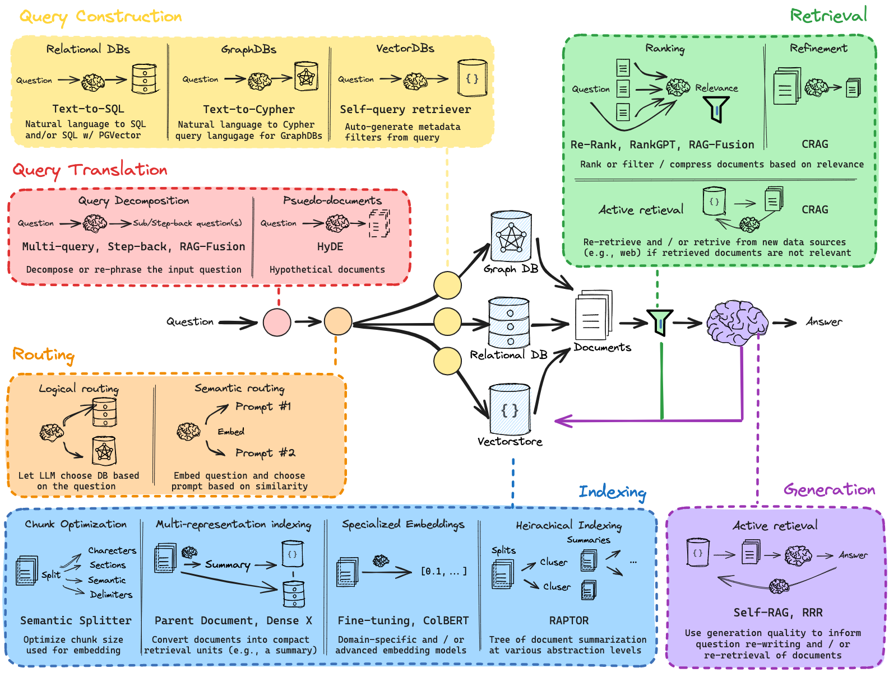
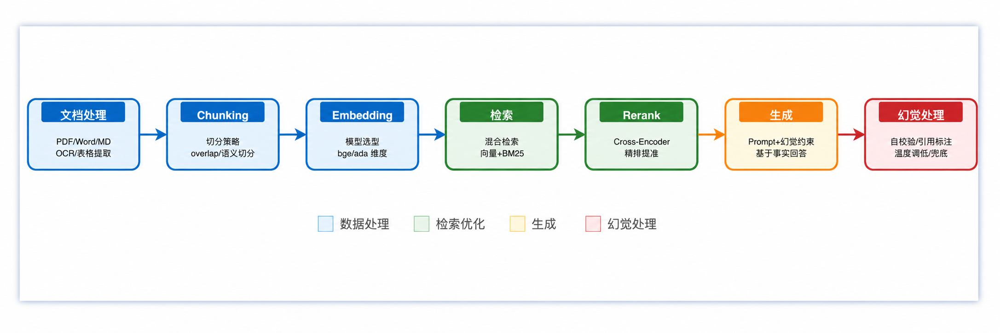

# 1、概述

RAG 检索增强生成（Retrieval Augmented Generation），已经成为当前最火热的LLM应用方案。该架构巧妙地整合了从庞大知识库中检索到的相关信息，并以此为基础，指导大型语言模型生成更为精准的答案，从而显著提升了回答的准确性与深度

RAG（中文为检索增强生成） = 知识库 + 检索技术 + LLM 提示。

RAG 是一种旨在结合大型语言模型 (LLM) 的生成能力和外部知识库的检索能力的技术，用来解决 LLM 的一些固有局限，例如：
- **信息偏差/幻觉：** LLM 有时会产生与客观事实不符的信息，导致用户接收到的信息不准确。RAG 通过检索数据源，辅助模型生成过程，确保输出内容的精确性和可信度，减少信息偏差。
- **知识更新滞后性：** LLM 基于静态的数据集训练，这可能导致模型的知识更新滞后，无法及时反映最新的信息动态。RAG 通过实时检索最新数据，保持内容的时效性，确保信息的持续更新和准确性。
- **内容不可追溯：** LLM 生成的内容往往缺乏明确的信息来源，影响内容的可信度。RAG 将生成内容与检索到的原始资料建立链接，增强了内容的可追溯性，从而提升了用户对生成内容的信任度。
- **领域专业知识能力欠缺：** LLM 在处理特定领域的专业知识时，效果可能不太理想，这可能会影响到其在相关领域的回答质量。RAG 通过检索特定领域的相关文档，为模型提供丰富的上下文信息，从而提升了在专业领域内的问题回答质量和深度。
- **推理能力限制：** 面对复杂问题时，LLM 可能缺乏必要的推理能力，这影响了其对问题的理解和回答。RAG 结合检索到的信息和模型的生成能力，通过提供额外的背景知识和数据支持，增强了模型的推理和理解能力。
- **应用场景适应性受限：** LLM 需在多样化的应用场景中保持高效和准确，但单一模型可能难以全面适应所有场景。RAG 使得 LLM 能够通过检索对应应用场景数据的方式，灵活适应问答系统、推荐系统等多种应用场景。
- **长文本处理能力较弱：** LLM 在理解和生成长篇内容时受限于有限的上下文窗口，且必须按顺序处理内容，输入越长，速度越慢。RAG 通过检索和整合长文本信息，强化了模型对长上下文的理解和生成，有效突破了输入长度的限制，同时降低了调用成本，并提升了整体的处理效率。

简单来说，就是给 LLM 提供外部数据库，对于用户问题 ( Query )，通过一些信息检索 ( Information Retrieval, IR ) 的技术，先从外部数据库中检索出和用户问题相关的信息，然后让 LLM 结合这些相关信息来生成结果



RAG技术的核心建立在向量空间模型（Vector Space Model, VSM）的基础上。在向量空间中，文本被表示为高维向量，相似度通过向量间的距离或角度来衡量

RAG 的核心在于“将 LLM 的内在参数化知识与外部非参数化知识相结合”

RAG 更准确的定位是：一种让大模型基于真实、可更新的知识来回答问题的技术方案。它和微调、Prompt Engineering 等技术是互补的，而不是替代关系

## 1.1、传统 RAG

RAG 分为前置的数据导入工作和后续的用户检索提问两个环节。
- 图中的 1 和 2 两个步骤就是前置数据导入步骤。过程很简单。第一步是将数据，比如文档、图片等内容通过向量大模型（Embedding Model）转成向量，第二步是将向量存入到向量数据库中。不过觉得这里应该加一个第 0 步，将原始数据进行切片；
- 图中 3～7 标号点环节就是提问检索环节。首先将用户的提问，比如“颈椎病如何治疗”这样的文本转成向量，然后去向量数据库中做相似性搜索。如果搜索到结果比较相似的，就将内容取出来，组成新的 prompt。
- 然后把这个新的 prompt 再发送给大模型，由大模型给出最终的答案

## 1.2、Agentic RAG

传统的 RAG 存在几个问题：
- 用户的 query 在向量数据库里搜索不到，或者搜出来的结果不准；
- 用户的提问不一定需要去向量数据库中搜索，此时的搜索只会浪费 token 资源。比如用户要求生成一段计算加法的 python 代码，这其实直接交给大模型就可以完成；
- 既然是开卷考试了，那大模型非得翻书本吗（向量数据库搜索）？我去网上搜一下（联网搜索）行不行？我去问问别人（调用工具）行不行？
- 如何确定最后得到的答案是准确的呢？

针对上面这几个问题，就可以在关键环节上引入 Agent 来解决
- 首先第一个 Agent 将用户的问题做了改写，这个环节通常会将用户的提问从多个角度拆分成多条，也就是说把一个问题换多个角度进行提问；
- 第二个 Agent 会去判断用户提问的意图，如果认为不需要借助外力，大模型就能搞定，则直接将 query 发送给大模型；如果认为需要借助外力，则发送给下一个 Agent。这个过程，可以使用提示词工程完成。

## 1.3、RAG 与LLM微调

技术选型路径遵循的顺序是：提示词工程（Prompt Engineering） -> 检索增强生成 -> 微调（Fine-tuning）

基于此，我们的选择路径就清晰了：
- **先尝试提示工程**：通过精心设计提示词来引导模型，适用于任务简单、模型已有相关知识的场景。
- **再选择 RAG**：如果模型缺乏特定或实时知识而无法回答，则使用 RAG，通过外挂知识库为其提供上下文信息。
- **最后考虑微调**：当目标是改变模型“如何做”（行为/风格/格式）而不是“知道什么”（知识）时，微调是最终且最合适的选择。例如，让模型学会严格遵循某种独特的输出格式、模仿特定人物的对话风格，或者将极其复杂的指令“蒸馏”进模型权重中。

在提升大语言模型效果中，RAG 和 微调（Finetune）是两种主流的方法。
- 微调: 通过在特定数据集上进一步训练大语言模型，来提升模型在特定任务上的表现

RAG与 LLM 微调对比 [模型微调长文本、RAG、微调对比](../NLP-模型架构/LLM.md#模型微调的概念)

## RAG与传统搜索

RAG 与传统搜索引擎虽然都涉及信息获取，但它们在检索机制、信息处理和交付形式上有本质区别：

1. **检索机制**：
    * 传统搜索主要依赖倒排索引与词汇匹配（如 BM25、TF-IDF），对关键词的字面形式依赖强。虽然现代搜索引擎也引入了语义理解（如 BERT），但核心仍是基于词汇统计的相关性计算。
    * RAG 通常采用向量语义搜索，能够识别同义词和深层语境，解决语义鸿沟问题。
2. **处理逻辑**：
    * 传统搜索本质是相关性排序器，将候选文档按相关性得分排序后直接呈现给用户。每个结果相对独立，不进行跨文档的信息融合。
    * RAG 的本质是**信息综合器**，它会将检索到的多个知识碎片（Chunks）喂给 LLM，由模型进行逻辑归纳和跨文档的信息整合。
3. **结果交付**：
    * 传统搜索提供候选文档列表（线索），需要用户二次阅读过滤；
    * RAG 提供的是答案，能直接回答复杂指令，并通过引文标注（Citations）兼顾了信息的来源可追溯性。
4. **时效性与数据范围**：传统搜索更依赖大规模爬虫和全网索引；RAG 则常用于私有知识库或垂直领域，能低成本地让 LLM 获得实时或特定领域的知识补充，无需频繁微调模型。

# 2、RAG 技术演进

- [RAG技术演进:从基础检索到智能体生态](https://mp.weixin.qq.com/s/XgpDYk1r9Xvo-HvvtyPIaw)

**五大阶段技术演进**
- 基础RAG：基于静态向量检索，适用于简单问答场景。
- 高级RAG：引入混合检索与多查询策略，提升检索的准确性与多样性。
- GraphRAG：结合知识图谱与向量数据库，实现结构化知识推理与关系分析。
- 推理型RAG：通过思维链（CoT）和多步推理能力，解决复杂问题，支持多轮优化。
- Agentic RAG：以自主智能体为核心，具备工具使用与规划能力，支持跨模态生成与持续学习。

**未来趋势**
- 多模态混合检索：整合文本、图像、视频等多模态数据，实现跨模态知识理解。
- 领域专家系统：深度优化执法、医疗等特定领域的RAG系统，提供专业化服务。
- 可解释性增强：透明化检索与推理过程，提升系统可信度。
- 自适应知识更新：主动识别知识过时与矛盾，动态更新知识库。
- 协作式RAG：多智能体协同工作，分解复杂任务，共同完成目标。



> RAG 技术发展趋势总结：随着 MCP（多模态、上下文增强、个性化）技术的爆发，RAG 技术这个从单一的检索工具向智能知识生态系统演进。未来 RAG 将更专注于多模态融合、知识推理、自主决策和领域专业化，为执法、医疗等专业场景提供更精准、可信和自适应的知识服务，实现从“检索增强生生成”到“知识增强智能”的跃进！

## 2.1、基础 RAG

最初的检索增强生成模式，通过简单的文档检索来提升大语言模型应答质量

**核心特点**
- 简单“检索-然后-生成”模式：先进行向量检索获取相关文档，然后将检索结果和用户问题一并传给 LLM 进行处理，增强回答质量；
- 静态向量检索：对于一个待回答的问题，使用预先计算好的向量匹配最相似的文档片段，不会动态调整检索策略；
- 固定检索策略：设置固定阈值、检索参数和固定的检索数量，没有根据问题复杂度动态调整的能力；
- 局部上下文增强：仅提供与当前问题直接相关的本地上下文，缺乏对知识的关联性和推理能力的增强；

**核心技术**
- 向量检索技术：
    - 密集向量检索；
    - 相似度算法优化
    - 基础文本切分；
- 实现框架：
    - LangChain
    - LlamaIndex
    - Embeddings模型
- 应用场景：
    - 知识库问答；
    - 简单文档检索；
    - 客服问答系统；
- 代表性实现：
    - Faiss、Milvus 向量库

**局限性与挑战**
- 检索结果质量完全依赖域初始向量相似度计算；
- 缺乏上下文理解与自适应调整检索能力；
- 无法处理多步推理与复杂查询需求；

## 2.2、高级 RAG

多策略融合的增强检索技术，显著提升检索精度与质量；

**核心特定：**
- 混合检索策略：结合密集向量检索和稀疏检索技术（BM25），提高检索多样性和精度；
- 多查询检索：自动生成多个查询变体，扩大检索范围，捕获更多相关知识；
- 检索量评价：引入交叉验证，评估检索结果质量，支持检索优化；
- 重排序机制：对检索结果进行二次排序，提升最相关内容排名；

**技术创新：**
- 混合检索技术：
    - 向量检索与关键词检索融合；
    - 多模态检索集成；
    - 自适应检索策略切换；
- 查询优化：
    - 自动扩展与查询重写；
    - 多版本并行检索技术；
    - 上下文感知查询增强；
- 质量优化：
    - 检索结果质量评估；
    - 基于相似度的重排序；
    - 检索与生成协同优化；
- 代表性技术：
    - LlamaIndex + 混合检索
    - HeDE技术
    - RAPTRO 检索技术（递归抽象处理树组织检索（Recursive Abstractive Processing for Tree Organized Retrieval））

**相较基础 RAG的优势：**
- 提高检索召回率与准确率；
- 降低查询理解偏差，更好处理复杂问题；
- 支持上下文感知的检索优化；

**应用场景：**
- 复杂文档检索：多主题长文档智能检索与理解；
- 企业知识库：跨部门专业知识的高精度检索；
- 多维度分析：从多来源检索信息支持决策

## 2.3、GraphRAG

知识图谱融合的 RAG，提升复杂知识关系理解与推理能力；

**核心特点：**
- 知识图谱融合：结合图数据库与传统的向量检索，提升关系认知能力，处理实体之间复杂联系；
- 实体链接与关系推理：识别文本中的实体并链接到知识图谱，支持多跳推理与因果关系理解；
- 多路推理增强：通过图结构支持多条推理路径和复杂关系推理，增强认知深度；
- 强结构化知识理解：将非结构化文本转化为结构化知识，增强大模型的知识表示能力；

**核心技术：**
- 知识图图谱建模与查询：
    - 知识图谱存储与查询
    - 实体识别与链接；
    - 语义化图谱推理
- 图神经网络与融合：
    - 图神经网络模型；
    - 图结构嵌入技术；
    - 多模态知识融合；
- 语义理解与推理：
    - 语义关系推理；
    - 结构化问答增强；
    - 复杂推理链生成；
- 代表性实现：
    - Neo4j+向量数据库
    - 图数据处理框架
    - 知识图片推理引擎；

**应用优势：**
- 技术提升
    - 提升复杂关系推理能力，支持多步查询；
    - 降低幻觉产生，增强答案可靠性；
    - 处理结构化与非结构化数据的混合场景
- 业务价值：
    - 企业知识图谱集成，提升专业领域问答质量；
    - 支持专业知识推理，如医疗诊断、法律分析；
    - 强化多来源数据关联与综合分析能力；

## 2.4、推理型 RAG

融合思维链推理与检索的高级模式，具备复杂思考与自主决策能力

思维链推理过程：
- 我需要分析用户的核心需要，这涉及到多方面...；
- 首先我应当查询产品的详细规格，然后了解相关法规...；
- 现在我需要进行进一步计算来验证我的推理，并决定下一步...；

问题分析 ——> 动态检索 ——> 推理处理 ——> 决策输出

**核心特点：**
- 思维链增强：具备自主思考和推理能力，可以在回答过程中进行 Step-by-Step 的逻辑思考；
- 自反思机制：具备自我反思和判断能力，支持反馈迭代优化，提升最终输出质量；
- 多步骤分解推理：将复杂问题分解为多个子步骤，逐步理解并解决复杂问题；
- 动态检索能力：在推理过程中根据中间结果动态调整检索策略，实现深度探索；

**核心技术：**
- 推理框架技术：
    - 思维链（CoT）推理
    - 自反思机制和反馈机制；
    - 递归深度思考
    - 不确定性识别
    - 决策树推理
- 检索增强能力：
    - 动态检索策略
    - 推理引导检索
    - 基于上下文的检索优化；
    - Deepseek R1等大模型支持
    - ReAct 交互式检索推理；
- 代表实现：
    - Deepseek R1 + ReAct
    - 思维链增强框架；
    - 自反馈迭代系统；

**应用场景：**
- 医疗诊断辅助：多步推理分析病例、症状和医学文献，提供诊断参考；
- 金融分析决策：结合推理能力分析复杂金融数据，提供投资建议；
- 代码分析与调试：通过逐步推理理解代码逻辑，发现并修复程序缺陷；

## 2.5、Agentic RAG

智能体驱动的检索增强生成范式，具备自主行动与任务规划能力；

**核心特点：**
- 自主智能体架构：构建由多个专业化智能体组成的协作网络，每个智能体复杂特定任务，共同解决复杂问题；
- 工具使用与规划：能够主动选择和使用外部工具，为复杂任务制定多步执行计划，扩展解决问题的能力范围；
- 多模态理解与生成：支持对文本、图像、音频等多种模态的理解和处理，生成富媒体内容，大幅提升用户体验；
- 持续学习与适应：具备自主选择和使用外部工具，为复杂任务制定多步执行计划，扩展解决问题的能力范围；

**技术架构：**
- 智能体核心技术
    - 智能体规划与调度系统；
    - 多模态融合处理技术
    - 自主决策算法
    - 工具使用与调用框架
    - 自主学习与优化机制
- 多智能体协作生态：
    - 智能体间通信协议
    - 任务分解与协作机制
    - 知识共享与同步
    - 冲突解决与共识算法
    - 多智能体学习框架
- 代表性实现：
    - Claude + AutoGPT
    - 多智能体协调框架
    - 工具增强型的 RAG 系统；

**应用场景：**
- 个人智能助手：全方位生活、工作辅助与代理；
- 企业决策支持：复杂商业分析、预测与建议；
- 创意内容生成：多媒体创作与设计自动化；
- 科研探索：自动实验设计、文献分析与假设生成；

**未来展望：**
- 技术演进：
    - 更强大的多智能体协作框架；
    - 自适应个性化智能体生态；
    - 真实世界交互与感知能力；
- 行业影响：
    - 知识工作者生产力革命
    - 复杂决策场景自动化
    - 人机写作新范式；

# RAG 技术原理

（1）**检索阶段：寻找“非参数化知识”**
-  **知识向量化**：**嵌入模型（Embedding Model）** 充当了“连接器”的角色。它将外部知识库编码为向量索引（Index），存入**向量数据库**。
    - 文档加载
    - 文档切割
    - 向量化
    - 存入向量数据库
-  **语义召回**：当用户发起查询时，检索模块利用同样的嵌入模型将问题向量化，并通过 **相似度搜索（Similarity Search）**，从海量数据中精准锁定与问题最相关的文档片段。

（2）**生成阶段：融合两种知识**
-  **上下文整合**：**生成模块** 接收检索阶段送来的相关文档片段以及用户的原始问题。
-  **指令引导生成**：该模块会遵循预设的 **Prompt** 指令，将上下文与问题有效整合，并引导 LLM（如 DeepSeek）进行可控的、有理有据的文本生成。

# 技术选型

## 如何选择 LLM

**在RAG应用中需要大模型的能力**
- 信息抽取能力：大模型需要从RAG检索出来的上下文中，抽取出和问题最有价值的信息
- 上下文的阅读理解能力：大模型需要从RAG检索出来的上下文和问题进行语义理解，生成合适的答案；
- 工具调用和function call能力：RAG应用中可能会调用外部工具和接口

**如何挑选大模型**
- 模型大小选择：优先选择最大的模型进行测试是否可行，验证业务可行性可行的情况下，收集数据可迁移到小模型
- 模型能力测试：构建业务的测试集，测试信息抽取能力、阅读理解能力和工具调用，function call能力
- 成本和设备：大模型的使用是有一定的成本，api调用成本和设备
- 企业数据安全： 调用本地模型和外部api，要评估数据的安全

## 如何选择向量Embedding 模型

[**MTEB (Massive Text Embedding Benchmark)**](https://huggingface.co/spaces/mteb/leaderboard) 是一个由 Hugging Face 维护的、全面的文本嵌入模型评测基准。它涵盖了分类、聚类、检索、排序等多种任务，并提供了公开的排行榜，为评估和选择嵌入模型提供了重要的参考依据。

主要从4 个核心维度权衡：
- **横轴 - 模型参数量 (Number of Parameters)** ：代表了模型的大小。通常，参数量越大的模型（越靠右），其潜在能力越强，但对计算资源的要求也越高。
- **纵轴 - 平均任务得分 (Mean Task Score)** ：代表了模型的综合性能。这个分数是模型在分类、聚类、检索等一系列标准 NLP 任务上的平均表现。分数越高（越靠上），说明模型的通用语义理解能力越强。
- **气泡大小 - 嵌入维度 (Embedding Size)** ：代表了模型输出向量的维度。气泡越大，维度越高，理论上能编码更丰富的语义细节，但同时也会占用更多的存储和计算资源。
- **气泡颜色 - 最大处理长度 (Max Tokens)** ：代表了模型能处理的文本长度上限。颜色越深，表示模型能处理的 Token 数量越多，对长文本的适应性越好。

还需要关注以下几个关键维度：
- **任务 (Task)** ：对于 RAG 应用，需要重点关注模型在 `Retrieval` (检索) 任务下的排名。
- **语言 (Language)** ：模型是否支持你的业务数据所使用的语言？对于中文 RAG，应选择明确支持中文或多语言的模型。
- **模型大小 (Size)** ：模型越大，通常性能越好，但对硬件（显存）的要求也越高，推理速度也越慢。需要根据你的部署环境和性能要求来权衡。
- **维度 (Dimensions)** ：向量维度越高，能编码的信息越丰富，但也会占用更多的存储空间和计算资源。
- **最大 Token 数 (Max Tokens)** ：这决定了模型能处理的文本长度上限。这个参数是你设计文本分块（Chunking）策略时必须考虑的重要依据，块大小不应超过此限制。
- **得分与机构 (Score & Publisher)** ：结合模型的得分排名和其发布机构的声誉进行初步筛选。知名机构发布的模型通常质量更有保障。
- **成本 (Cost)** ：如果是使用 API 服务的模型，需要考虑其调用成本；如果是自部署开源模型，则需要评估其对硬件资源的消耗（如显存、内存）以及带来的运维成本。

## 如何选择向量数据库

[RAG-向量数据库选型](../../数据库/向量数据库.md)

# 数据准备

- [大模型数据工程：架构、算法及项目实战](https://github.com/datascale-ai/data_engineering_book)

## 数据加载

### 文档加载

“垃圾进，垃圾出 (Garbage In, Garbage Out)” ——高质量输入是高质量输出的前提。

RAG 系统中，数据加载是整个流水线的第一步，也是不可或缺的一步。文档加载器负责将各种格式的非结构化文档（如PDF、Word、Markdown、HTML等）转换为程序可以处理的结构化数据。数据加载的质量会直接影响后续的索引构建、检索效果和最终的生成质量。

文档加载器在 RAG 的数据管道中一般需要完成三个核心任务：
1. 解析不同格式的原始文档，将 PDF、Word、Markdown 等内容提取为可处理的纯文本；
2. 在解析过程中同时抽取文档来源、页码、作者等关键信息作为元数据；
3. 把文本和元数据整理成统一的数据结构，方便后续进行切分、向量化和入库，其整体流程与传统数据工程中的抽取、转换、加载相似，目标都是把杂乱的原始文档清洗并对齐为适合检索和建模的标准化语料

### RAG 文档处理器

| 工具名称                        | 类型         | 核心特点                       | 支持格式 / 数据源               | 适用场景           | 优势              | 局限性         | 推荐指数  |
| --------------------------- | ---------- | -------------------------- | ------------------------ | -------------- | --------------- | ----------- | ----- |
| PyMuPDF4LLM                 | PDF Loader | PDF→Markdown，OCR，表格识别      | PDF、扫描件                  | 科研论文、技术文档、手册   | 开源免费，速度快，适合 RAG | 对复杂版式仍需调优   | ⭐⭐⭐⭐⭐ |
| Marker                      | PDF Loader | 高质量 PDF 转 Markdown，GPU 加速  | PDF                      | 学术论文、书籍、双栏论文   | 当前热门 PDF 解析方案   | 非通用格式工具     | ⭐⭐⭐⭐⭐ |
| LlamaParse                  | 商业解析器      | 深度结构识别，表格/版面优秀             | PDF、Office 文档            | 法律合同、财报、复杂 PDF | 精度高，企业级 API     | 商业收费        | ⭐⭐⭐⭐⭐ |
| Unstructured                | 通用 Loader  | 多格式统一解析，按元素拆分              | PDF、Word、PPT、HTML、Email  | 企业知识库、通用 RAG   | 格式最全，生态成熟       | 复杂 PDF 精度一般 | ⭐⭐⭐⭐⭐ |
| Docling                     | 企业解析器      | 模块化文档理解                    | PDF、Word、表格              | 企业报告、合同        | IBM 背景，企业稳健     | 社区生态较小      | ⭐⭐⭐⭐  |
| MinerU                      | 多模态解析      | LayoutLMv3 + YOLOv8        | PDF、图像、表格                | 财务报表、学术文档      | 版面理解强           | 部署复杂        | ⭐⭐⭐⭐  |
| LangChain + TextLoader      | 基础 Loader  | 纯文本读取                      | txt、md                   | 简单知识库          | 极轻量、快速          | 无结构理解       | ⭐⭐⭐   |
| LangChain + DirectoryLoader | 批量 Loader  | 目录批量导入                     | 文件夹、多格式                  | 本地知识库批处理       | 易扩展             | 依赖子 Loader  | ⭐⭐⭐⭐  |
| FireCrawlLoader             | 网页 Loader  | 网站抓取、动态网页支持                | URL、网站、Docs              | 在线文档、新闻站点      | 实时抓取强           | 非文件型工具      | ⭐⭐⭐⭐⭐ |
| LlamaIndex Readers          | Reader 框架  | 多数据源 Reader 丰富             | PDF、Notion、Confluence、DB | 企业知识库系统        | 与索引系统结合紧密       | 偏框架型        | ⭐⭐⭐⭐⭐ |
| RAGFlow                     | 企业平台       | 自带 Loader + OCR + Chunking | PDF、Word、Excel、网页        | ToB 商业交付       | 开箱即用，中文友好       | 定制开发自由度低    | ⭐⭐⭐⭐⭐ |
| Dify                        | SaaS 平台    | 快速上传知识库                    | PDF、TXT、DOCX、网页          | AI 助手、SaaS     | 上手最快            | 深度解析一般      | ⭐⭐⭐⭐  |
| AnythingLLM                 | 私有化平台      | 本地文件夹同步                    | PDF、txt、网页、Repo          | 本地部署           | 私有化方便           | 企业级能力一般     | ⭐⭐⭐   |
| Apache Tika                 | 老牌解析器      | 支持超多格式                     | Office、PDF、邮件、压缩包        | 遗留系统集成         | 格式覆盖最广          | 输出质量一般      | ⭐⭐⭐⭐  |
| PaddleOCR                   | OCR Loader | 中文 OCR 强                   | 图片、扫描 PDF                | 发票、扫描合同        | 中文识别强           | 非完整 Loader  | ⭐⭐⭐⭐⭐ |
| Tesseract OCR               | OCR Loader | 经典开源 OCR                   | 图片、扫描件                   | 基础 OCR         | 免费开源            | 中文效果一般      | ⭐⭐⭐   |
| GitLoader                   | 代码 Loader  | 拉取仓库代码                     | GitHub、GitLab、本地 Git     | 代码问答、Copilot   | 代码知识库必备         | 不适合文档型数据    | ⭐⭐⭐⭐  |
| SQL Loader                  | 数据 Loader  | 读取数据库记录                    | MySQL、PostgreSQL、MongoDB | BI 问答、内部数据问答   | 企业价值高           | 需权限治理       | ⭐⭐⭐⭐⭐ |

---

最终推荐：

| 场景       | 最佳选择                              |
| -------- | --------------------------------- |
| PDF 文档解析 | Marker / PyMuPDF4LLM / LlamaParse |
| 企业通用知识库  | Unstructured                      |
| 中文扫描件    | PaddleOCR                         |
| 在线网站抓取   | FireCrawlLoader                   |
| 企业交付项目   | RAGFlow                           |
| 快速做 Demo | Dify                              |
| 代码知识库    | GitLoader + Tree-sitter           |

> 在实际应用中，针对 pdf 的处理，目前更多选用的是 PaddleOCR、MinerU 等模型或工具

## 数据分块

### 文本分块

文本分块（Text Chunking）是构建 RAG 流程的关键步骤。它的原理是将加载后的长篇文档，切分成更小、更易于处理的单元。这些被切分出的文本块，是后续向量检索和模型处理的基本单位

**为什么要文本分块？**
1. 满足模型上下文限制：为了适应 RAG 系统中两个核心组件的硬性限制
    - 嵌入模型 (Embedding Model): 负责将文本块转换为向量。这类模型有严格的输入长度上限，任何超出此限制的文本块在输入时都会被截断，导致信息丢失，生成的向量也无法完整代表原文的语义。因此，文本块的大小必须小于等于嵌入模型的上下文窗口
    - 大语言模型 (LLM): 负责根据检索到的上下文生成答案。LLM同样有上下文窗口限制（尽管通常比嵌入模型大得多，从几千到上百万token不等）。检索到的所有文本块，连同用户问题和提示词，都必须能被放入这个窗口中。如果单个块过大，可能会导致只能容纳少数几个相关的块，限制了LLM回答问题时可参考的信息广度
2. “块”不是越大越好，过大的块会严重影响RAG系统的性能
    - 嵌入过程中的信息损失：大多数嵌入模型都基于 Transformer 编码器，文本块越长，包含的语义点越多，这个单一向量所承载的信息就越稀释，导致其表示变得笼统，关键细节被模糊化，从而降低了检索的精度；
    - 如果提供给LLM的上下文块又大又杂，充满了与问题无关的噪音，模型就很难从中提取出最关键的信息来形成答案，从而导致回答质量下降或产生幻觉
    - 主题稀释导致检索失败：一个好的文本块应该聚焦于一个明确、单一的主题。如果一个块包含太多不相关的主题，它的语义就会被稀释，导致在检索时无法被精确匹配

### 分块策略



#### 固定大小分块

这是最简单直接的分块方法，固定大小分块（Fixed-size Chunking），将文本按固定长度（如字符数、单词数或token数）切分，每个块大小一致，可能通过(重叠[Overlap])保留上下文连贯性。例如，将文档每256个字符切分为一个块，重叠20个字符以减少边界信息丢失。

**实现步骤**
- 预设参数：定义块大小（如256 token）和重叠比例（如20 token）。
- 切分文本：按固定长度分割文本，允许相邻块部分重叠。
- 生成块列表：输出所有块作为独立单元。

**主要优点**
- 实现简单：无需复杂算法，代码实现高效。
- 标准化处理：块大小一致，便于批量处理和向量化。
- 资源友好：适合大规模文本处理，降低计算成本。

**主要缺点**
- 语义断裂：可能在句子或概念中间切分，破坏上下文完整性。
- 信息冗余：重叠区域可能导致重复存储和计算。
- 适用性受限：对结构化文本（如代码、技术文档）效果较差。

**适用场景**
- 非结构化文本（如新闻、博客）的初步处理。
- 对实时性要求高、需快速切分的场景。

实际的固定大小分块实现（如LangChain的 CharacterTextSplitter）通常会结合分隔符来减少这种问题，在段落边界处优先切分，只有在必要时才会强制按大小切断。因此，这种方法在日志分析、数据预处理等场景中仍有其应用价值。

#### 语义分块

语义分块（Semantic Chunking），根据句子、段落、主题等有语义内涵的单位对文档进行分段创建嵌入，如果第一个段的嵌入与第二个段的嵌入具有较高的余弦相似度，则这两个段形成一个块。通过合并相似内容，确保每个块表达完整的语义内容。

核心思想是：把语义相似的句子放在一起，语义发生转折的地方就是切割点。

由于每个分块的内容更加丰富，它提高了检索准确性，让大模型产生更加连续和相关的响应。但是它依赖于一个阈值来确定余弦相似度是否显著下降，而这个阈值在不同类型文档中可能涉及不同的参数设置

**实现步骤**
- 分句/分段：将文本拆分为句子或段落。
- 生成嵌入：为每个单元计算向量表示。
- 相似度计算：依次比较相邻单元的余弦相似度。
- 动态合并：当相似度高于阈值时合并单元；相似度骤降时开始新块。

**主要优点**
-语义完整性：保留自然语义结构，提升检索准确性。
- 上下文敏感：适应复杂逻辑关系（如因果、对比）。
- 生成质量：检索到的块更连贯，利于LLM生成精准回答。

**主要缺点**
- 计算复杂度高：需多次向量化计算和相似度比较。
- 阈值依赖：相似度阈值需人工调试，不同文档需不同参数。
- 实现门槛：依赖高质量嵌入模型和相似度算法。

**适用场景**
- 高精度问答系统（如法律、医疗领域），研究论文、行业分析报告等专业文档。
- 需保留上下文逻辑的复杂文档（如论文、技术报告）。

#### 递归分块

递归分块（Recursive Chunking），先按主题或段落初步划分，再对超长块递归细分，直至满足大小限制。递归分块融合了结构化与非结构化处理逻辑，与固定大小的分块不同，这种方法保持了语言的自然流畅性并保留了完整的内容语义；

这是目前最常用的切割策略，也是 LangChain 框架中 RecursiveCharacterTextSplitter 的实现方式；

具体来说，它维护一个分隔符的优先级列表，比如 ["\n\n", "\n", "。", "！", "？", "；", "，", " "]。它会先尝试用双换行符（段落分隔符）来切，如果切出来的块还是太大，就用单换行符来切，如果还是太大，就用句号来切……依次类推，直到块的大小符合要求

**实现步骤**
- 粗粒度切分：按段落、标题或主题初步划分大块。
- 检查大小：判断块是否超过预设长度（如1024 token）。
- 递归细分：超长，按固定大小或语义逻辑进一步切分。
- 终止条件：块大小符合要求时停止递归。

**主要优点**
- 灵活性强：平衡结构完整性与大小限制。
- 适应复杂内容：处理长文档（如书籍、长篇论文）时表现优异。
- 多策略融合：可结合固定大小或语义分块优化细分。

**主要缺点**
- 块大小不均：不同层级的块可能差异较大。
- 逻辑断裂风险：递归过程中可能破坏原文的自然段落结构。
- 实现复杂：需设计递归终止条件和分块策略。

**适用场景**
- 长文档处理（如企业年报、学术论文），书籍、技术手册等层级化文档。
- 需兼顾结构化与非结构化内容的场景，包含嵌套结构的合同文本。

#### 基于文档结构的分块

基于文档结构分块（Document Structure-based Chunking），利用文档固有结构（如标题`<h1>`、章节、列表`<ul>`、表格`<table>`）进行切分，每个结构单元作为一个块。它通过与文档的逻辑部分对齐来保持结构完整性。这种分块适用于文档有清晰的结构，但很多时候，一个文档的结构会比想象中复杂，此外，很多时候文档章节内容大小不一，很容易超过块的大小限制，需要结合递归拆分再进行合并处理

实现步骤
- 识别结构元素：解析文档中的标题、段落、小节等标记（如Markdown、XML）。
- 按结构切分：将每个结构单元（如“引言”、“结论”）独立为块。
- 处理超长部分：若某结构单元过大，再结合递归或固定大小分块细化。

主要优点
- 逻辑清晰：保留文档的层次化结构，便于定位信息。
- 检索高效：用户可通过标题快速定位相关内容。
- 格式兼容性：适合结构化文档（如技术手册、报告）。

主要缺点
- 依赖格式标准化：对非结构化文本（如自由写作）效果差。
- 预处理复杂：需解析文档格式（如LaTeX、HTML），增加实现难度。
- 灵活性不足：难以处理混合结构内容（如图文混排）。

适用场景
- 结构化文档，如：财报（表格数据）、技术文档（代码块）、合同（条款列表）。
- 需按章节检索的场景（如法规数据库），任何含丰富格式标记的内容。

#### 基于LLM的分块

基于LLM的分块（LLM-based Chunking），直接将原始文档输入大语言模型（LLM），由模型智能生成语义块。利用LLM的语义理解能力，动态划分文本，保证了分块语义的准确性，但这种分块方法对算力要求最高，对时效性与性能也将带来挑战

实现步骤
- 输入文档：将完整文档送入LLM（如DeepSeek、GPT）。
- 生成块指令：通过提示词（Prompt）引导模型按语义划分块。
- 示例提示词：“请将以下文档按语义划分为多个块，每个块需包含完整主题。”
- 输出块列表：模型返回划分后的块，可能包含逻辑标签（如“引言”、“方法论”）。

主要优点
- 高度智能化：适应复杂、非结构化文本（如自由写作、对话记录）。
- 动态适应性：根据文档内容自动调整块大小和逻辑。
- 生成质量：块语义连贯，减少人工干预。

主要缺点
- 计算成本高：依赖高性能LLM，资源消耗大。
- 可解释性差：模型决策过程难以追溯，可能产生不可预测的块。
- 依赖模型能力：效果受限于LLM的训练数据和语义理解能力。

适用场景
- 非结构化文本（如访谈记录，会议纪要，用户评论、社交媒体内容等）。
- 需高级语义分析的场景（如跨领域知识整合）

#### 分块策略对比

| 分块策略 | 优点 | 缺点 | 适用场景 |
|---------|------|------|----------|
| 固定大小分块 | 实现简单，资源高效 | 语义断裂，信息冗余 | 快速处理非结构化文本 |
| 语义分块 | 语义完整，检索精准 | 计算复杂，依赖阈值 | 高精度问答、复杂文档 |
| 递归分块 | 灵活适应长文档，保留结构 | 块大小不均，逻辑断裂风险 | 长篇技术文档、企业报告 |
| 基于结构的分块 | 逻辑清晰，检索高效 | 依赖格式标准化，预处理复杂 | 结构化文档（论文、白皮书） |
| 基于LLM的分块 | 高度智能，适应非结构化文本 | 计算成本高，决策不可控 | 非结构化内容、跨领域整合 |

#### 选择建议

- 结合递归与结构分块：处理长文档时（如法律合同、表格、公式、技术手册）。
- 语义分块：对生成质量要求高、文档语义复杂时（如论文、医疗问答）。
- 使用LLM分块：处理非结构化或混合内容（如多模态文档）。
- 固定大小分块：快速部署或资源受限场景（如社交媒体、轻量级应用）。

务实的策略是：
- 起步阶段：直接用递归字符切割（RecursiveCharacterTextSplitter），块大小 256-512 tokens，重叠 10%-20%。这个方案简单有效，能覆盖大多数场景。
- 优化阶段：如果你的文档有清晰的结构（Markdown、HTML），切换到基于文档结构的切割，通常能带来显著的提升。
- 进阶阶段：如果对检索质量有更高要求，尝试语义切割或者「父子块」策略（存储小块用于精准检索，但返回给大模型的是包含上下文的父块）。

# 索引构建

## 向量Embedding

[RAG-向量数据库选型](../../数据库/向量数据库.md)

### [Embedding](../NLP-模型架构/LLM.md#Embedding模型)

向量嵌入（Embedding）是一种将真实世界中复杂、高维的数据对象（如文本、图像、音频、视频等）转换为数学上易于处理的、低维、稠密的连续数值向量的技术。
- **数据对象**：任何信息，如文本“你好世界”，或一张猫的图片。
- **Embedding 模型**：一个深度学习模型，负责接收数据对象并进行转换。
- **输出向量**：一个固定长度的一维数组，例如 `[0.16, 0.29, -0.88, ...]`。这个向量的维度（长度）通常在几百到几千之间。

Embedding 的真正意义在于，它产生的向量不是随机数值的堆砌，而是对数据**语义**的数学编码。
- **核心原则**：在 Embedding 构建的向量空间中，语义上相似的对象，其对应的向量在空间中的距离会更近；而语义上不相关的对象，它们的向量距离会更远。
- **关键度量**：我们通常使用以下数学方法来衡量向量间的“距离”或“相似度”：
    - **余弦相似度 (Cosine Similarity)** ：计算两个向量夹角的余弦值。值越接近 1，代表方向越一致，语义越相似。这是最常用的度量方式。
    - **点积 (Dot Product)** ：计算两个向量的乘积和。在向量归一化后，点积等价于余弦相似度。
    - **欧氏距离 (Euclidean Distance)** ：计算两个向量在空间中的直线距离。距离越小，语义越相似。

### RAG 中 Embedding

RAG 的“检索”环节通常以基于 Embedding 的语义搜索为核心。通用流程如下：
1. **离线索引构建**：将知识库内文档切分后，使用 Embedding 模型将每个文档块（Chunk）转换为向量，存入专门的向量数据库中。
2. **在线查询检索**：当用户提出问题时，使用 **同一个** Embedding 模型将用户的问题也转换为一个向量。
3. **相似度计算**：在向量数据库中，计算“问题向量”与所有“文档块向量”的相似度。
4. **召回上下文**：选取相似度最高的 Top-K 个文档块，作为补充的上下文信息，与原始问题一同送给大语言模型（LLM）生成最终答案。

### Embedding模型选型

[如何选择最适合你项目的Embedding模型](#如何选择向量embedding-模型)

## 多模态Embedding

Word2Vec 为 BERT 的上下文理解铺路，而 BERT 又为 CLIP 等模型的跨模态能力奠定了基础。

多模态嵌入 (Multimodal Embedding) 的目标是将不同类型的数据（如图像和文本）映射到同一个共享的向量空间。在这个统一的空间里，一段描述“一只奔跑的狗”的文字，其向量会非常接近一张真实小狗奔跑的图片向量。

实现这一目标的关键，在于解决 **跨模态对齐 (Cross-modal Alignment)** 的挑战。以对比学习、视觉 Transformer (ViT) 等技术为代表的突破，让模型能够学习到不同模态数据之间的语义关联，最终催生了像 CLIP 这样的模型。

### CLIP 模型浅析

在图文多模态领域，OpenAI 的 **CLIP (Contrastive Language-Image Pre-training)** 是一个很有影响力的模型，它为多模态嵌入定义了一个有效的范式。

CLIP 的架构清晰简洁。它采用 **双编码器架构 (Dual-Encoder Architecture)**，包含一个图像编码器和一个文本编码器，分别将图像和文本映射到同一个共享的向量空间中。

为了让这两个编码器学会“对齐”不同模态的语义，CLIP 在训练时采用了**对比学习 (Contrastive Learning)** 策略。在处理一批图文数据时，模型的目标是：最大化正确图文对的向量相似度，同时最小化所有错误配对的相似度。通过这种“拉近正例，推远负例”的方式，模型从海量数据中学会了将语义相关的图像和文本在向量空间中拉近。

这种大规模的对比学习赋予了 CLIP 有效的 **零样本（Zero-shot）识别能力**。它能将一个传统的分类任务，转化为一个“图文检索”问题——例如，要判断一张图片是不是猫，只需计算图片向量与“a photo of a cat”文本向量的相似度即可。这使得 CLIP 无需针对特定任务进行微调，就能实现对视觉概念的泛化理解。

### 多模态Embedding模型

bge-visualized-m3（Visualized-BGE 的 M3 版本） 是一个很有代表性的现代多模态嵌入模型，它是在 BGE-M3（文本嵌入底座）的基础上引入图像能力而来，体现了当前技术向“更统一、更全面”发展的趋势

## 索引优化

### 上下文扩展

LlamaIndex 提出了一种实用的索引策略——[句子窗口检索（Sentence Window Retrieval）](https://developers.llamaindex.ai/python/framework-api-reference/packs/sentence_window_retriever/)。该技术巧妙地结合了两种方法的优点：它在检索时聚焦于高度精确的单个句子，在送入LLM生成答案前，又智能地将上下文扩展回一个更宽的“窗口”，从而同时保证检索的准确性和生成的质量。

句子窗口检索的思想可以概括为：为检索精确性而索引小块，为上下文丰富性而检索大块。
其工作流程如下：
1. **索引阶段**：在构建索引时，文档被分割成**单个句子**。每个句子都作为一个独立的“节点（Node）”存入向量数据库。同时，每个句子节点都会在元数据（metadata）中存储其**上下文窗口**，即该句子原文中的前N个和后N个句子。这个窗口内的文本不会被索引，仅仅是作为元数据存储。
2. **检索阶段**：当用户发起查询时，系统会在所有**单一句子节点**上执行相似度搜索。因为句子是表达完整语义的最小单位，所以这种方式可以非常精确地定位到与用户问题最相关的核心信息。
3. **后处理阶段**：在检索到最相关的句子节点后，系统会使用一个名为 `MetadataReplacementPostProcessor` 的后处理模块。该模块会读取到检索到的句子节点的元数据，并用元数据中存储的**完整上下文窗口**来替换节点中原来的单一句子内容。
4. **生成阶段**：最后，这些被替换了内容的、包含丰富上下文的节点被传递给LLM，用于生成最终的答案。

### 结构化索引

随着知识库的规模不断扩大（例如，包含数百个PDF文件），传统的RAG方法（即对所有文本块进行top-k相似度搜索）会遇到瓶颈。当一个查询可能只与其中一两个文档相关时，在整个文档库中进行无差别的向量搜索，不仅效率低下，还容易被不相关的文本块干扰，导致检索结果不精确。

为了解决这个问题，一个有效的方法是利用**结构化索引**。其原理是在索引文本块的同时，为其附加结构化的**元数据（Metadata）**。这些元数据可以是任何有助于筛选和定位信息的标签，例如：
*   文件名
*   文档创建日期
*   章节标题
*   作者
*   任何自定义的分类标签

# 检索优化

- [RAG优化策略总结](https://www.53ai.com/news/RAG/2025041523890.html)
- [使用Agent优化动态知识库](https://github.com/FareedKhan-dev/temporal-ai-agent-pipeline)



`企业 RAG = 70% 工程 + 20% 领域知识 + 10% 模型 + ∞ 耐心`。毕竟，企业 RAG 不是一个纯技术问题，对行业的理解、对脏数据的处理能力、对工程细节的把控，都是绕不开的必修课

优化路径一般：
- 在性能层面，可以通过**索引分层**（对高频数据启用缓存）和**多模态扩展**（支持图像/表格检索）来提升效率和能力边界
- 在架构层面，简单的线性流程正在被更复杂的设计模式所取代

## 多路召回

多路召回的思路很简单：既然一条路不保险，那就多走几条路，每条路各有侧重，最后把各路结果合并，常见的召回通道有：
- 向量检索（Dense Retrieval）：用 Embedding 模型把文本转成稠密向量，通过相似度搜索来召回。擅长语义匹配，是 RAG 系统的主力召回通道
- 关键词检索（Sparse Retrieval / BM25：传统的全文检索方式，基于词频和文档频率来计算相关性。BM25 是最经典的算法。擅长精确关键词匹配，对于专有名词、产品编号、人名等有天然优势
- 知识图谱检索：如果知识库有结构化的知识图谱，可以用图查询来做第三路召回

多路召回的关键在于「融合」。各路召回的结果需要合并去重，并按综合相关性排序。融合的方法有很多，最常用的是 RRF（倒数排名融合，Reciprocal Rank Fusion）

更多召回策略：
- 混合检索
- 查询改写（Query Rewriting）：在检索之前，先用 LLM 把用户的原始问题改写成更适合检索的形式。比如用户问「你们公司加班多吗」，可以改写成「公司加班制度」「加班时间规定」「加班补贴政策」等多个查询，分别检索后再合并结果。
- HyDE：先让 LLM 根据用户问题生成一个「假设性的答案文档」，然后用这个假设文档的向量去检索。因为假设文档在表述上更接近真实的答案文档，所以检索效果通常更好。
- 多查询扩展（Multi-Query）：把用户的一个问题，用 LLM 改写成多个不同角度的子问题，分别检索后合并结果

## 混合检索

混合检索（Hybrid Search）是一种结合了 **稀疏向量（Sparse Vectors）** 和 **密集向量（Dense Vectors）** 优势的先进搜索技术。旨在同时利用稀疏向量的关键词精确匹配能力和密集向量的语义理解能力，以克服单一向量检索的局限性，从而在各种搜索场景下提供更准确、更鲁棒的检索结果

### 稀疏向量 vs 密集向量

#### 稀疏向量

稀疏向量，也常被称为“词法向量”，是基于词频统计的传统信息检索方法的数学表示。它通常是一个维度极高（与词汇表大小相当）但绝大多数元素为零的向量。

它采用精准的“词袋”匹配模型，将文档视为一堆词的集合，不考虑其顺序和语法，其中向量的每一个维度都直接对应一个具体的词，非零值则代表该词在文档中的重要性（权重）。这类向量的经典权重计算方法是 TF-IDF。在信息检索领域，BM25 则是基于这种稀疏表示的成功且应用广泛的排序算法之一，其核心公式如下：

  $$ Score(Q, D) = \sum_{i=1}^{n} IDF(q_i) \cdot \frac{f(q_i, D) \cdot (k_1 + 1)}{f(q_i, D) + k_1 \cdot (1 - b + b \cdot \frac{|D|}{avgdl})} $$

  其中：
  - $IDF(q_i)$: 查询词 $q_i$ 的逆文档频率，用于衡量一个词的普遍程度。越常见的词，IDF值越低。
  - $f(q_i, D)$: 查询词 $q_i$ 在文档 $D$ 中的词频。
  - $|D|$: 文档 $D$ 的长度。
  - $avgdl$: 集合中所有文档的平均长度。
  - $k_1, b$: 可调节的超参数。 $k_1$ 用于控制词频饱和度（一个词在文档中出现10次和100次，其重要性增长并非线性），  $b$ 用于控制文档长度归一化的程度。

这种方法的优点是可解释性极强（每个维度都代表一个确切的词），无需训练，能够实现关键词的精确匹配，对于专业术语和特定名词的检索效果好。主要缺点是无法理解语义，例如它无法识别“汽车”和“轿车”是同义词，存在“词汇鸿沟”。

#### 密集向量

密集向量，也常被称为“语义向量”，是通过深度学习模型学习到的数据（如文本、图像）的低维、稠密的浮点数表示。这些向量旨在将原始数据映射到一个连续的、充满意义的“语义空间”中来捕捉“语义”或“概念”。

在理想的语义空间中，向量之间的距离和方向代表了它们所表示概念之间的关系。一个经典的例子是 `vector('国王') - vector('男人') + vector('女人')` 的计算结果在向量空间中非常接近 `vector('女王')`，这表明模型学会了“性别”和“皇室”这两个维度的抽象概念。它的代表包括 Word2Vec、GloVe、以及所有基于 Transformer 的模型（如 BERT、GPT）生成的嵌入（Embeddings）。

其主要优点是能够理解同义词、近义词和上下文关系，泛化能力强，在语义搜索任务中表现卓越。但缺点也同样明显：可解释性差（向量中的每个维度通常没有具体的物理意义），需要大量数据和算力进行模型训练，且对于未登录词（OOV）[^1]的处理相对困难。

> **OOV（Out-of-Vocabulary）未登录词**：指在模型训练时没有出现在词汇表中，但在实际使用时遇到的新词汇。例如，如果模型训练时词汇表中没有"ChatGPT"这个词，那么在实际应用中遇到它时就是OOV。传统的稀疏向量方法（如BM25）对OOV词汇会完全忽略，而现代的密集向量方法通过子词分割（如BPE、WordPiece）可以更好地处理OOV问题。

### 混合检索

通过结合多种搜索算法（最常见的是稀疏与密集检索）来提升搜索结果相关性和召回率。  
主要目标：解决单一检索技术的局限性。例如，关键词检索无法理解语义，而向量检索则可能忽略掉必须精确匹配的关键词（如产品型号、函数名等）。混合检索旨在同时利用稀疏向量的精确性和密集向量的泛化性，以应对复杂多变的搜索需求

#### 融合方法

混合检索通常并行执行两种检索算法，然后将两组异构的结果集融合成一个统一的排序列表。以下是两种主流的融合策略：

**1. 倒数排序融合 (Reciprocal Rank Fusion, RRF)**：RRF 不关心不同检索系统的原始得分，只关心每个文档在各自结果集中的**排名**。其思想是：一个文档在不同检索系统中的排名越靠前，它的最终得分就越高。其计分公式为：

$$ RRF_{score}(d) = \sum_{i=1}^{k} \frac{1}{rank_i(d) + c} $$

其中：
- $d$ 是待评分的文档。
- $k$ 是检索系统的数量（这里是2，即稀疏和密集）。
- $rank_i(d)$ 是文档 $d$ 在第 $i$ 个检索系统中的排名。
- $c$ 是一个常数（通常设为60），用于降低排名靠前文档的相对权重，实现更稳健的排名融合。

**2. 加权线性组合**：这种方法需要先将不同检索系统的得分进行归一化（例如，统一到 0-1 区间），然后通过一个权重参数 `α` 来进行线性组合。

$$ Hybrid_{score} = \alpha \cdot Dense_{score} + (1 - \alpha) \cdot Sparse_{score} $$

通过调整 `α` 的值，可以灵活地控制语义相似性与关键词匹配在最终排序中的贡献比例。例如，在电商搜索中，可以调高关键词的权重；而在智能问答中，则可以侧重于语义。

### 优势与局限

| 优势 | 局限 |
| :--- | :--- |
| **召回率与准确率高**：能同时捕获关键词和语义，显著优于单一检索。 | **计算资源消耗大**：需要同时维护和查询两套索引。 |
| **灵活性强**：可通过融合策略和权重调整，适应不同业务场景。 | **参数调试复杂**：融合权重等超参数需要反复实验调优。 |
| **容错性好**：关键词检索可部分弥补向量模型对拼写错误或罕见词的敏感性。 | **可解释性仍是挑战**：融合后的结果排序理由难以直观分析。 |

## 查询构建

[**查询构建（Query Construction）**](https://www.langchain.com/blog/query-construction)，它利用大语言模型（LLM）的强大理解能力，将用户的自然语言查询“翻译”成针对特定数据源的结构化查询语言或带有过滤条件的请求。这使得RAG系统能够无缝地连接和利用各种类型的数据，从而极大地扩展了其应用场景和能力

### 文本到元数据过滤器

在构建向量索引时，常常会为文档块（Chunks）附加元数据（Metadata），例如文档来源、发布日期、作者、章节、类别等。这些元数据为我们提供了在语义搜索之外进行精确过滤的可能。

**自查询检索器（Self-Query Retriever）** 是LangChain中实现这一功能的核心组件。它的工作流程如下：
1.  **定义元数据结构**：首先，需要向LLM清晰地描述文档内容和每个元数据字段的含义及类型。
2.  **查询解析**：当用户输入一个自然语言查询时，自查询检索器会调用LLM，将查询分解为两部分：
    *   **查询字符串（Query String）**：用于进行语义搜索的部分。
    *   **元数据过滤器（Metadata Filter）**：从查询中提取出的结构化过滤条件。
3.  **执行查询**：检索器将解析出的查询字符串和元数据过滤器发送给向量数据库，执行一次同时包含语义搜索和元数据过滤的查询。

例如，对于查询“关于2022年发布的机器学习的论文”，自查询检索器会将其解析为：
*   **查询字符串**: "机器学习的论文"
*   **元数据过滤器**: `year == 2022`

### 文本到Cypher

Cypher 是图数据库（如 Neo4j）中最常用的查询语言，其地位类似于 SQL 之于关系数据库。它采用一种直观的方式来匹配图中的模式和关系，例如 `(:Person {name:"Tomaz"})-[:LIVES_IN]->(:Country {name:"Slovenia"})` 描述了一个人和一个国家以及他们之间的“居住在”关系

与“文本到元数据过滤器”类似，“文本到Cypher”技术利用大语言模型（LLM）将用户的自然语言问题直接翻译成一句精准的 Cypher 查询语句。LangChain 提供了相应的工具链（如 `GraphCypherQAChain`），其工作流程通常是：
1.  接收用户的自然语言问题。
2.  LLM 根据预先提供的图谱模式（Schema），将问题转换为 Cypher 查询。
3.  在图数据库上执行该查询，获取精确的结构化数据。
4.  (可选)将查询结果再次交由 LLM，生成通顺的自然语言答案。

由于生成有效的 Cypher 查询是一项复杂的任务，通常使用性能较强的 LLM 来确保转换的准确性。通过这种方式，用户可以用最自然的方式与高度结构化的图数据进行交互，极大地降低了数据查询的门槛。

## Text2SQL

文本到SQL（Text-to-SQL）是为了打破人与结构化数据之间的语言障碍而生。它利用大语言模型（LLM）将用户的自然语言问题，直接翻译成可以在数据库上执行的SQL查询语句

### 业务挑战

- **“幻觉”问题**：LLM 可能会“想象”出数据库中不存在的表或字段，导致生成的SQL语句无效。
- **对数据库结构理解不足**：LLM 需要准确理解表的结构、字段的含义以及表与表之间的关联关系，才能生成正确的 `JOIN` 和 `WHERE` 子句。
- **处理用户输入的模糊性**：用户的提问可能存在拼写错误或不规范的表达（例如，“上个月的销售冠军是谁？”），模型需要具备一定的容错和推理能力。

### 优化策略

1.  **提供精确的数据库模式**：这是最基础也是最关键的一步。我们需要向LLM提供数据库中相关表的 `CREATE TABLE` 语句。这就像是给了LLM一张地图，让它了解数据库的结构，包括表名、列名、数据类型和外键关系。

2.  **提供少量高质量的示例**：在提示（Prompt）中加入一些“问题-SQL”的示例对，可以极大地提升LLM生成查询的准确性。这相当于给了LLM几个范例，让它学习如何根据相似的问题构建查询。

3.  **利用RAG增强上下文**：这是更进一步的策略。我们可以像RAGFlow一样，为数据库构建一个专门的“知识库”[^2]，其中不仅包含表的DDL（数据定义语言），还可以包含：
    *   **表和字段的详细描述**：用自然语言解释每个表是做什么的，每个字段代表什么业务含义。
    *   **同义词和业务术语**：例如，将用户的“花费”映射到数据库的 `cost` 字段。
    *   **复杂的查询示例**：提供一些包含 `JOIN`、`GROUP BY` 或子查询的复杂问答对。
    当用户提问时，系统首先从这个知识库中检索最相关的信息（如相关的表结构、字段描述、相似的Q&A），然后将这些信息和用户的问题一起组合成一个内容更丰富的提示，交给LLM生成最终的SQL查询。这种方式极大地降低了“幻觉”的风险，提高了查询的准确度。

4.  **错误修正与反思 (Error Correction and Reflection)**：在生成SQL后，系统会尝试执行它。如果数据库返回错误，可以将错误信息反馈给LLM，让它“反思”并修正SQL语句，然后重试。这个迭代过程可以显著提高查询的成功率。

## 重排序 (Re-ranking)

作为改进RAG实现的一部分，一个关键步骤是重新排序（re-ranking）

重新排序模型是一种计算给定查询和文档对匹配分数的模型。然后可以利用这个分数重新排列向量搜索结果，确保最相关的结果优先排列在列表顶部。

在 RAG 系统中，检索阶段用的是 Bi-Encoder（双编码器），也就是 Embedding 模型。它的工作方式是把查询和文档分别编码成向量，然后通过计算向量之间的余弦相似度来判断相关性，这种方式有一个先天的不足：它是把**查询和文档「分别」处理的**。模型在编码一篇文档的时候，根本不知道用户会问什么问题。所以它只能生成一个「泛化的、平均化的」语义向量，无法针对具体的查询做优化

Bi-Encoder 有两个关键缺陷：
- 一是**信息压缩损失**。就好比你用一句话来总结一篇论文，再精彩的总结也不可能把每个细节都留住。Embedding 也是一样，一段几百字的文本被压缩成一串数字，那些细微但关键的信息可能就丢了。
- 二是**缺乏查询意图感知**。文档的向量是在索引阶段就预先计算好的，那时候根本不知道用户会问什么。所以同一篇文档的向量，不管用户是在问事实、做对比分析还是查步骤说明，都是完全一样的，没法根据不同的问题做出针对性的判断。

### RRF (Reciprocal Rank Fusion)

它是一种简单而有效的 **零样本** 重排方法，不依赖于任何模型训练，而是纯粹基于文档在多个不同检索器（例如，一个稀疏检索器和一个密集检索器）结果列表中的**排名** 来计算最终分数。

一个文档如果在多个检索结果中都排名靠前，那么它很可能更重要。RRF 通过计算排名的倒数来为文档打分，有效融合了不同检索策略的优势。但是如果只考虑排名信息，会忽略原始的相似度分数，可能丢失部分有用信息。

### RankLLM / LLM-based Reranker

RankLLM 代表了一类直接利用大型语言模型本身来进行重排的方法。其基本逻辑非常直观：既然 LLM 最终要负责根据上下文来生成答案，那么为什么不直接让它来判断哪些上下文最相关呢？

这种方法通过一个精心设计的提示词来实现。该提示词会包含用户的查询和一系列候选文档（通常是文档的摘要或关键部分），然后要求 LLM 以特定格式（如 JSON）输出一个排序后的文档列表，并给出每个文档的相关性分数。

一个提示词示例如下：
```text
以下是一个文档列表，每个文档都有一个编号和摘要。同时提供一个问题。请根据问题，按相关性顺序列出您认为需要查阅的文档编号，并给出相关性分数（1-10分）。请不要包含与问题无关的文档。

示例格式:
文档 1: <文档1的摘要>
文档 2: <文档2的摘要>
...
文档 10: <文档10的摘要>

问题: <用户的问题>

回答:
Doc: 9, Relevance: 7
Doc: 3, Relevance: 4
Doc: 7, Relevance: 3
```

### Cross-Encoder 重排

Cross-Encoder（交叉编码器）能提供出色的重排精度。它的工作原理：将查询（Query）和每个候选文档（Document）**拼接** 成一个单一的输入（例如，`[CLS] 用户的问题 [SEP] 检索到的文档内容 [SEP]`），然后将这个整体输入到一个预训练的 Transformer 模型（如 BERT）中，模型最终会输出一个单一的分数（通常在 0 到 1 之间），这个分数直接代表了文档与查询的**相关性**。

Cross-Encoder 的工作流程：
1.  **初步检索**：搜索引擎首先从知识库中召回一个初始的文档列表（例如，前 50 篇）。
2.  **逐一评分**：对于列表中的 **每一篇** 文档，系统都将其与原始查询 **配对**，然后发送给 Cross-Encoder 模型。
3.  **独立推理**：模型对每个“查询-文档”对进行一次完整的、独立的推理计算，得出一个精确的相关性分数。
4.  **返回重排结果**：系统根据这些新的分数对文档列表进行重新排序，并将最终结果返回给用户。

这个流程凸显了其高精度的来源（同时分析查询和文档），也解释了其高延迟的原因（需要N次独立的模型推理）。常见的 Cross-Encoder 模型包括 `ms-marco-MiniLM-L-12-v2`、`ms-marco-TinyBERT-L-2-v2` 等。

**为什么不直接使用：太慢了**：
Cross-Encoder 需要把查询和每一个候选文档都拼在一起，送进模型做一次完整的推理。如果你有 1000 万篇文档，就要做 1000 万次推理，这个速度完全不可接受

可以使用两阶段检索：
- 第一阶段用 Bi-Encoder（向量检索）快速从全部文档中筛出 Top-50 或 Top-100 候选文档，这一步追求的是速度和召回率，宁可多捞一些，不能漏掉相关的
- 第二阶段再用 Cross-Encoder（Re-rank）对这 50-100 个候选文档做精细化重排序，因为数量已经很少了，所以即使是较慢的 Cross-Encoder 也能在可接受的时间内完成

### ColBERT 重排

ColBERT（Contextualized Late Interaction over BERT）是一种创新的重排模型，它在 Cross-Encoder 的高精度和双编码器（Bi-Encoder）的高效率之间取得了平衡。采用了一种“**后期交互**”机制。

其工作流程如下：
1.  **独立编码**：ColBERT 分别为查询（Query）和文档（Document）中的每个 Token 生成上下文相关的嵌入向量。这一步是独立完成的，可以预先计算并存储文档的向量，从而加快查询速度。
2.  **后期交互**：在查询时，模型会计算查询中每个 Token 的向量与文档中每个 Token 向量之间的最大相似度（MaxSim）。
3.  **分数聚合**：最后，将查询中所有 Token 得到的最大相似度分数相加，得到最终的相关性总分。

通过这种方式，ColBERT 避免了将查询和文档拼接在一起进行昂贵的联合编码，同时又比单纯比较单个 `[CLS]` 向量的双编码器模型捕捉了更细粒度的词汇级交互信息。

### 重排方法对比

| 特性 | RRF | RankLLM | Cross-Encoder | ColBERT |
| :--- | :--- | :--- | :--- | :--- |
| **核心机制** | 融合多个排名 | LLM 推理，生成排序列表 | 联合编码查询与文档，计算单一相关分 | 独立编码，后期交互 |
| **计算成本** | 低（简单数学计算） | 中 (API 费用与延迟) | 高（N次模型推理） | 中（向量点积计算） |
| **交互粒度** | 无（仅排名） | 概念/语义级 | 句子级（Query-Doc Pair） | Token 级 |
| **适用场景** | 多路召回结果融合 | 高价值语义理解场景 | Top-K 精排 | Top-K 重排 |

## 压缩

“压缩”技术旨在解决一个常见问题：初步检索到的文档块（Chunks）虽然整体上与查询相关，但可能包含大量无关的“噪音”文本。将这些未经处理的、冗长的上下文直接提供给 LLM，不仅会增加 API 调用的成本和延迟，还可能因为信息过载而降低最终生成答案的质量。

压缩的目标就是对检索到的内容进行“压缩”和“提炼”，只保留与用户查询最直接相关的信息。这可以通过两种主要方式实现：
1.  **内容提取**：从文档中只抽出与查询相关的句子或段落。
2.  **文档过滤**：完全丢弃那些虽然被初步召回，但经过更精细判断后认为不相关的整个文档。

## 校正 (Correcting)

- [Jiang, Z. et al. (2024). *Corrective Retrieval Augmented Generation*](https://arxiv.org/pdf/2401.15884.pdf).

传统的 RAG 流程有一个隐含的假设：检索到的文档总是与问题相关且包含正确答案。然而在现实世界中，检索系统可能会失败，返回不相关、过时或甚至完全错误的文档。如果将这些“有毒”的上下文直接喂给 LLM，就可能导致幻觉（Hallucination）或产生错误的回答。

**校正检索（Corrective-RAG, C-RAG）** 正是为解决这一问题而提出的一种策略。思路是引入一个“自我反思”或“自我修正”的循环，在生成答案之前，对检索到的文档质量进行评估，并根据评估结果采取不同的行动。

C-RAG 的工作流程可以概括为 “检索-评估-行动” 三个阶段：
1.  **检索 (Retrieve)** ：与标准 RAG 一样，首先根据用户查询从知识库中检索一组文档。
2.  **评估 (Assess)** ：这是 C-RAG 的关键步骤。如图所示，一个“检索评估器 (Retrieval Evaluator)”会判断每个文档与查询的相关性，并给出“正确 (Correct)”、“不正确 (Incorrect)”或“模糊 (Ambiguous)”的标签。
3.  **行动 (Act)** ：根据评估结果，系统会进入不同的知识修正与获取流程：
    *   **如果评估为“正确”**：系统会进入“知识精炼 (Knowledge Refinement)”环节。如图，它会将原始文档分解成更小的知识片段 (strips)，过滤掉无关部分，然后重新组合成更精准、更聚焦的上下文，再送给大模型生成答案。
    *   **如果评估为“不正确”**：系统认为内部知识库无法回答问题，此时会触发“知识搜索 (Knowledge Searching)”。它会先对原始查询进行“查询重写 (Query Rewriting)”，生成一个更适合搜索引擎的查询，然后进行 Web 搜索，用外部信息来回答问题。
    *   **如果评估为“模糊”**：同样会触发“知识搜索”，但通常会直接使用原始查询进行 Web 搜索，以获取额外信息来辅助生成答案。


# RAG流程

## RAG模块

为了构建检索增强 LLM 系统，RAG关键模块包括:
- 数据和索引模块：如何处理外部数据和构建索引
- 查询和检索模块：如何准确高效地检索出相关信息
- 响应生成模块：如何利用检索出的相关信息来增强 LLM 的输出

## 基础 RAG 流程

基础 RAG系统的开发流程主要包含以下阶段：
- 解析 (Parsing)：为知识库准备数据，包括收集文档、将其转换 为文本格式，并清理无关的噪点信息。
- 数据摄取 (Ingestion)：创建并载入知识库。
- 检索 (Retrieval)：构建一个工具，根据用户查询查找并返回相关 数据，通常在向量数据库中进行语义搜索。
- 回答 (Answering)：使用检索到的数据丰富用户的提示词（prompt）， 将其发送给 LLM，并返回最终答案。

## 整体核心流程



# RAG系统评估

- [Evaluation and Tracking for LLM Experiments and AI Agents](https://github.com/truera/trulens)

主要从几个维度进行量化评估：
- 首先是检索相关性（找到的内容是否包含答案）；
- 其次是生成质量，又可以细分：
    - 为语义准确性（回答的意思是否正确）；
    - 词汇匹配度（专业术语是否使用得当）

## [RAG 评估三元组](https://www.trulens.org/getting_started/core_concepts/rag_triad/)

该架构包含以下三个维度
1. **上下文相关性 (Context Relevance)**
- **评估目标：** 检索器（Retriever）的性能。
- **核心问题：** 检索到的上下文内容，是否与用户的查询（Query）高度相关？
- **重要性：** 检索是RAG应用在响应用户查询时的第一步。如果检索回来的上下文充满了噪声或无关信息，那么无论后续的生成模型多么强大，都没法做出正确答案。

2. **忠实度 / 可信度 (Faithfulness / Groundedness)**
- **评估目标：** 生成器的可靠性。
- **核心问题：** 生成的答案是否完全基于所提供的上下文信息？
- **重要性：** 这个维度主要在于量化LLM的“幻觉”程度。一个高忠实度的回答意味着模型严格遵守了上下文，没有捏造或歪曲事实。如果忠实度得分低，说明LLM在回答时“自由发挥”过度，引入了外部知识或不实信息。

3. **答案相关性 (Answer Relevance)**
- **评估目标：** 系统的端到端（End-to-End）表现。
- **核心问题：** 最终生成的答案是否直接、完整且有效地回答了用户的原始问题？
- **重要性：** 这是用户最直观的感受。一个答案可能完全基于上下文（高忠实度），但如果它答非所问，或者只回答了问题的一部分，那么这个答案的相关性就很低。例如，当用户问“法国在哪里，首都是哪里？”，如果答案只是“法国在西欧”，那么虽然忠实度高，但答案相关性很低。

> 忠实度和答案相关性有点相似，但它们的侧重点是不同的。忠实度更关注模型是否严格遵循了上下文，而答案相关性则更关注模型是否直接、完整且有效地回答了问题。

通过对这三个维度进行评估，可以对RAG系统的表现有一个全面而细致的了解，并能准确定位问题所在：是检索出了问题，还是生成环节有待改进。

## 评估工作流

可以把评估过程拆解为两个主要环节：检索评估和响应评估

### 检索评估

检索评估聚焦于RAG三元组中的 **上下文相关性 (Context Relevance)**，本质上是一次**白盒测试**。此阶段的评估需要一个标注数据集，其中包含一系列查询以及每个查询对应的真实相关文档。

这项评估借鉴了信息检索领域的多个经典指标：
- **上下文精确率 (Context Precision):** 衡量检索结果的准确性。计算在检索到的前 **k** 个文档中相关文档所占的比例，其中 **k** 是一个预设的数字（例如，k=3或k=5），代表评估的范围。高精确率意味着检索结果的噪声较少。

    $$\text{Precision}@k = \frac{\text{检索到的}k\text{个结果中的相关文档数}}{k}$$

- **上下文召回率 (Context Recall):** 衡量检索结果的完整性。计算在检索到的前 **k** 个文档中，找到的相关文档占所有真实相关文档总数的比例。高召回率意味着系统能够成功找回大部分关键信息。

    $$\text{Recall}@k = \frac{\text{检索到的}k\text{个结果中的相关文档数}}{\text{数据集中所有相关的文档总数}}$$

- **F1分数 (F1-Score):** F1分数是精确率和召回率的调和平均数，它同时兼顾了这两个指标，在它们之间寻求平衡。当精确率和召回率都高时，F1分数也高。

    $$F_1 = 2 \cdot \frac{\text{Precision} \times \text{Recall}}{\text{Precision} + \text{Recall}}$$

- **平均倒数排名 (MRR - Mean Reciprocal Rank):** 评估系统将第一个相关文档排在靠前位置的能力。对于一个查询，倒数排名是第一个相关文档排名的倒数。MRR是所有查询的倒数排名的平均值。该指标适用于用户通常只关心第一个正确答案的场景。

    $$\text{MRR} = \frac{1}{|Q|} \sum_{q=1}^{|Q|} \frac{1}{\text{rank}_q}$$

    其中 `|Q|` 是查询总数，`rank_q` 是第 `q` 个查询的第一个相关文档的排名。

- **平均准确率均值 (MAP - Mean Average Precision):** MAP是一个综合性指标，同时评估了检索结果的精确率和相关文档的排名。它先计算每个查询的平均精确率（AP），然后对所有查询的AP取平均值。AP本身是基于每个相关文档被检索到时的精确率计算的。

    $$\text{MAP} = \frac{1}{|Q|} \sum_{q=1}^{|Q|} \text{AP}(q)$$

    其中 `|Q|` 是查询总数，`AP(q)` 是第 `q` 个查询的平均精确率（Average Precision）。

要计算上述所有指标，前提是拥有一个高质量的标注数据集，其中包含了查询和每个查询对应的“真实”相关文档。

### 响应评估

响应评估覆盖了RAG三元组中的 **忠实度** 和 **答案相关性**。此环节通常采用 **端到端** 的评估范式，因为它直接衡量用户感知的最终输出质量。无论采用何种评估方法，都主要围绕以下两个核心维度展开。

#### 评估维度

1. **忠实度 / 可信度**：衡量生成的答案在多大程度上可以由给定的上下文所证实。一个完全忠实的答案，其所有内容都必须能在上下文中找到依据，以此避免模型产生“幻觉”。

2. **答案相关性**：衡量生成的答案与用户原始查询的对齐程度。一个高相关性的答案必须是直接的、切题的，并且不包含与问题无关的冗余信息。

3. **上下文相关性**：检索到的文档是否和用户的问题相关？如果检索回来一堆不相关的文档，那即使模型忠实地基于这些文档生成了回答，最终效果也不会好

#### 主要评估方法

针对上述维度，目前主要有两类评估方法：
1. **基于大语言模型的评估**：这是一种强大的评估方法，能够提供更深度的语义评估，正逐渐成为主流选择。利用一个高性能、中立的LLM 作为“评估者”，对上述维度进行深度的语义理解和打分。
- **忠实度评估：** 首先，将生成的答案分解为一系列独立的声明或断言（Claims）。然后，对于每一个断言，在提供的上下文中进行验证，判断其真伪。最终的忠实度分数是所有被上下文证实的断言所占的比例。
- **答案相关性评估：** 评估者需要同时分析用户查询和生成的答案。评分时会惩罚那些答非所问、信息不完整或包含过多无关细节的答案。

2. **基于词汇重叠的经典指标**：这类指标需要在数据集中包含一个或多个“标准答案”。它们通过计算生成答案与标准答案之间 n-gram（连续的n个词）的重叠程度来评估质量。
- **ROUGE (Recall-Oriented Understudy for Gisting Evaluation):** ROUGE关注的重点是 **召回率**，即标准答案中的词语有多少被生成答案所覆盖，因此常用于评估内容的 **完整性**。其常用变体包括计算n-gram的 `ROUGE-N` 和计算最长公共子序列的 `ROUGE-L`。

    $$\text{ROUGE-N} = \frac{\text{匹配的 } n\text{-gram 数量}}{\text{参考答案中 } n\text{-gram 的总数}}$$

- **BLEU (Bilingual Evalu ation Understudy):** BLEU侧重于评估 **精确率**，衡量生成的答案中有多少词是有效的（即在标准答案中出现过）。它还引入了长度惩罚机制，避免模型生成过短的句子，因此更适合评估答案的 **流畅度和准确性**。

    $$\text{BLEU} = \text{BP} \times \exp\left(\sum_{n=1}^{N} w_n \log p_n\right)$$

    其中，`BP` 是长度惩罚因子，`p_n` 是修正后的n-gram精确率。
- **METEOR (Metric for Evaluation of Translation with Explicit ORdering):** 作为BLEU的改进版，METEOR同时考量 **精确率和召回率** 的调和平均，并通过词干和同义词匹配（如将'boat'和'ship'视为相关）来更好地捕捉语义相似性。其评估结果通常被认为与人类判断的相关性更高。

    $$F_{\text{mean}} = \frac{P \times R}{\alpha P + (1-\alpha)R}$$

    $$\text{METEOR} = F_{\text{mean}} \times (1 - \text{Penalty})$$

    其中 `P` 是精确率，`R` 是召回率，`Penalty` 是基于语序的惩罚项。

> 为了更直观地理解三者的区别，来看一个简单的例子。
> 
> **假设：**
> - **参考答案：** `狗 在 床 上面` (共5个词)
> - **生成答案：** `狗 在 床 上` (共4个词)
> 
> **评估分析：**
> - **ROUGE (召回率导向):** 从召回率的角度出发：“参考答案里的5个词，生成答案覆盖了多少？”——覆盖了4个。因此，它的召回率很高（ROUGE-1 为 4/5），得分会不错。ROUGE更关心“说全了没”。
> 
> - **BLEU (精确率导向):** 从精确率的角度进行评判：“生成答案里的4个词，有多少是有效的（在参考答案里）？”——全部有效，精确率很高。但它会发现生成答案比参考答案短，于是通过 **长度惩罚(Brevity Penalty)** 进行扣分。BLEU更关心“说对了没，以及长度是否合适”。
> 
> - **METEOR (综合平衡):** 同时计算精确率和召回率，并取一个调和平均。在这个例子里，词序是完全正确的，惩罚项为0。METEOR会在“说全”和“说对”之间找到一个最佳平衡点。

## 评估工具

### [LlamaIndex Evaluation](https://developers.llamaindex.ai/python/framework/module_guides/evaluating/)

`LlamaIndex Evaluation` 是**深度集成于LlamaIndex框架内的评估模块**，专为使用该框架构建的RAG应用提供无缝的评估能力。作为RAG开发框架的原生组件，其核心定位是**为开发者在开发、调试和迭代周期中提供快速、灵活的嵌入式评估解决方案**。它强调与开发流程的紧密结合，允许开发者在构建过程中即时验证和对比不同RAG策略的性能。

> **适用场景**：对于深度使用 `LlamaIndex` 框架构建RAG应用的开发者而言，其内置评估模块是无缝集成的首选，提供了一站式的开发与评估体验。

`LlamaIndex` 的评估理念是利用LLM作为“裁判”，以自动化的方式对RAG系统的各个环节进行打分。这种方法在很多场景下无需预先准备“标准答案”，大大降低了评估门槛。其典型工作流如下：
1.  **准备评估数据集**：通过 `DatasetGenerator` 从文档中自动生成问题-答案对（`QueryResponseDataset`），或加载一个已有的数据集。为了效率，通常会将生成的数据集保存到本地，避免重复生成。
2.  **构建查询引擎**：搭建一个或多个需要被评估的RAG查询引擎（`QueryEngine`）。这是进行对比实验的基础。
3.  **初始化评估器**：根据评估维度，选择并初始化一个或多个评估器，如 `FaithfulnessEvaluator`（忠实度）和 `RelevancyEvaluator`（相关性）。
4.  **执行批量评估**：使用 `BatchEvalRunner` 来管理整个评估过程。它能够高效地（可并行）将查询引擎应用于数据集中的所有问题，并调用所有评估器进行打分。
5.  **分析结果**：从评估运行器返回的结果中，计算各项指标的平均分，从而量化地对比不同RAG策略的优劣。

**核心评估维度**：LlamaIndex提供了丰富的评估器，覆盖了从检索到响应的各个环节。上述示例中主要使用了**响应评估**维度：
- `Faithfulness` (忠实度): 评估生成的答案是否完全基于检索到的上下文，是检测“幻觉”现象的关键指标。分数越高，说明答案越可靠。
- `Relevancy` (相关性): 评估生成的答案与用户提出的原始问题是否直接相关，确保答案切题。

此外，它还支持专门的**检索评估**维度，如：
- `Hit Rate` (命中率): 评估检索到的上下文中是否包含了正确的答案。
- `MRR` (平均倒数排名): 衡量找到正确答案的效率，排名越靠前得分越高。

### [RAGAS](https://github.com/vibrantlabsai/ragas)

RAGAS（RAG Assessment）是一个**独立的、专注于RAG的开源评估框架**。提供了一套全面的指标来量化RAG管道的检索和生成两大核心环节的性能。其最显著的特色是支持**无参考评估**，即在许多场景下无需人工标注的“标准答案”即可进行评估，极大地降低了评估成本。如果你需要一个轻量级、与具体RAG实现解耦、能够快速对核心指标进行量化评估的工具时，`RAGAS` 是一个理想的选择。

`RAGAS` 的核心思想：通过分析问题（`question`）、生成的答案（`answer`）和检索到的上下文（`context`）三者之间的关系，来综合评估RAG系统的性能。它将复杂的评估问题分解为几个简单、可量化的维度。核心思路是用一个更强大的 LLM（比如 GPT-4）作为「裁判」，来自动化评估 RAG 系统的输出质量。你只需要提供测试数据集（包含问题、标准答案、检索到的文档、模型生成的回答），RAGAS 就能自动计算上述各种指标

**工作流程与核心指标：** RAGAS的评估流程非常简洁，通常遵循以下步骤：
1. **准备数据集**：根据官方文档，一个标准的评估数据集应包含 `question`（问题）、`answer`（RAG系统生成的答案）、`contexts`（检索到的上下文）以及 `ground_truth`（标准参考答案）这四列。不过，`ground_truth` 对于计算 `context_recall` 等指标是必需的，但对于 `faithfulness` 等指标则是可选的。
2. **运行评估**：调用 `ragas.evaluate()` 函数，传入准备好的数据集和需要评估的指标列表。
3. **分析结果**：获取一个包含各项指标量化分数的评估报告。

其核心评估指标包括：
- `faithfulness`: 衡量生成的答案中有多少比例的信息是可以由检索到的上下文所支持的。
- `context_recall`: 衡量检索到的上下文与标准答案（`ground_truth`）的对齐程度，即标准答案中的信息是否被上下文完全“召回”。
- `context_precision`: 衡量检索到的上下文中，信噪比如何，即有多少是真正与回答问题相关的。
- `answer_relevancy`: 评估答案与问题的相关程度。此指标不评估事实准确性，只关注答案是否切题。

### [Phoenix (Arize Phoenix)](https://github.com/Arize-ai/phoenix)

Phoenix (现由Arize维护) 是一个**开源的LLM可观测性与评估平台**。在RAG评估生态中，它主要扮演 **生产环境中的可视化分析与故障诊断引擎** 的角色。它通过捕获 LLM 应用的轨迹（Traces），提供强大的可视化、切片和聚类分析能力，帮助开发者理解线上真实数据的表现。

Phoenix 的核心价值在于**从海量生产数据中发现问题、监控性能漂移并进行深度诊断**，是连接线下评估与线上运维的关键桥梁。它不仅提供评估指标，更强调对LLM应用进行追踪（Tracing）和可视化分析，从而快速定位问题

`Phoenix` 的核心是“AI可观测性”，它通过追踪RAG系统内部的每一步调用（如检索、生成等），将整个流程可视化。这使得开发者可以直观地看到每个环节的输入、输出和耗时，并在此基础上进行深入的评估和调试。

`Phoenix` 的工作流程是先通过基于开放标准 **OpenTelemetry** 的**代码插桩（`Instrumentation`）**，在 RAG 应用中集成追踪功能，自动捕获 LLM 调用、函数执行等事件；随后在应用运行过程中持续生成**追踪数据（`Traces`）**，记录完整的执行链路；接着在本地启动 `Phoenix` 的 Web 界面，加载并可视化这些追踪数据；最后在 UI 中对失败案例或表现不佳的查询进行筛选、钻取，并借助内置的**评估器（`Evals`）**完成深入的评估与调试。

### 对比

| **工具**     | **核心机制** | **独特技术**                | **典型应用场景** |
| ---------- | -------- | ----------------------- | --- |
| RAGAS      | LLM驱动评估  | 合成数据生成、无参考评估架构          | 对比不同RAG策略、版本迭代后的性能回归测试 |
| LlamaIndex | 嵌入式评估    | 异步评估引擎、模块化BaseEvaluator | 开发过程中快速验证单个组件或完整管道的效果 |
| Phoenix    | 追踪分析型    | 分布式追踪、向量聚类分析算法            | 生产环境监控、Bad Case分析、数据漂移检测 |

### 其他评估工具

- DeepEval：把 RAG 评估融入单元测试框架，适合工程化团队
- TruLens：提供 RAG 应用的深度可观测性和诊断能力
- ARES：用 LLM 生成合成评估数据，解决人工标注数据不足的问题

### 最佳实践

1. 先建基线，再做优化。在优化 RAG 系统之前，先用一组测试数据建立性能基线。之后每次改动都可以对比基线，看效果是提升了还是下降了。
2. 测试数据要有代表性。不要只用简单问题测试，要包含各种类型：简单事实查询、复杂推理问题、多跳问题、模糊问题等。
3. 定期评估，持续监控。RAG 的效果会随着知识库的更新、模型版本的变化而波动，需要建立持续评估和监控的机制。
4. 把评估自动化。把 RAG 评估融入 CI/CD 流程，每次更新都自动跑一轮评估，发现效果下降及时报警。

# GraphRAG

## 对比传统 RAG

尽管传统 RAG 通过"检索-生成"两阶段流程在一定程度上解决了LLM的知识更新问题，但其基于非结构化文本向量检索的核心机制仍存在几个关键局限。
- **关系理解的缺失**：基于向量的检索主要关注语义相似性，难以捕捉和利用实体之间复杂的、隐含的关系。当查询涉及多实体关联或因果推理时，检索到的文本块之间可能缺乏逻辑联系，导致LLM难以进行有效的综合与推理。
- **上下文的碎片化**：文本被切分成独立的块进行索引，这破坏了原文的结构和上下文连续性。对于需要跨越多个文档或长距离文本进行信息整合的问题，传统RAG往往力不从心。
- **检索噪声与幻觉风险**：检索过程可能返回不相关或仅部分相关的噪声信息，这会干扰LLM的判断，甚至诱发其产生与事实不符的"幻觉"内容。知识图谱的引入被证实能有效减轻模型幻觉，提供更高质量的上下文。
- **推理能力有限**：传统 RAG 的推理能力受限于检索到的线性文本内容，难以支持需要结构化知识进行导航的多跳推理。
- **跨文档联结能力弱**：即便采用较大的切块与滑窗重叠，跨文档/跨章节的实体共现与隐式引用仍难以被显式建模，导致需要“连边”才能回答的问题（如沿因果、时间或供应链关系追踪）召回不足。
- **实体歧义与别名问题**：仅依赖向量相似度很难稳定地区分同名实体（如不同城市/公司/人名），或统一别名、缩写与多语言变体，易造成错误对齐与语义漂移。
- **时效性与版本一致性不足**：文本块往往缺少可计算的时间属性与有效期边界，导致时序敏感问题（如“某公司在某年是否仍为子公司”）难以得到一致答案。

## GraphRAG的优势

知识图谱通过节点（实体）和边（关系）的网络结构，将离散的知识显式地组织成一个相互连接的语义网络，为克服传统RAG的局限性提供了强有力的解决方案。
- **结构化语义表达**：知识图谱以图的形式直接编码实体间的显式语义关系（如"公司A-收购-公司B"），避免了LLM从文本中进行隐式、可能存在偏差的推断，为复杂查询提供了清晰的导航路径。
- **增强推理能力**：图的结构天然支持多跳推理，系统可以沿着图中的路径遍历，发现间接但关键的知识关联，从而回答需要多步逻辑推导的复杂问题。
- **事实性与可解释性**：基于知识图谱检索的答案可以追溯其在图中的推理路径，这为答案提供了事实依据，极大地增强了系统的可解释性和可信度，有效抑制了幻觉。
- **异构数据集成**：知识图谱能够无缝集成来自不同来源的结构化（如数据库）和非结构化（如文本）数据，形成一个全面、统一的知识视图，这在金融、医疗等需要整合海量异构信息的领域尤为重要。

进一步地：
- **语义模式与本体支撑**：通过模式（Schema）与本体（Ontology）明确实体类型、关系约束与属性域值，约束推理空间，降低歧义。
- **溯源与置信度管理**：边与节点可携带来源、时间戳与置信度，便于在生成时进行来源归因与冲突消解。
- **时间与版本建模**：支持时间态边与版本化节点，允许对“历史状态”与“有效区间”进行查询（Time-travel Query）。

## 核心架构

大多数GraphRAG框架遵循一个通用的三阶段流程：知识图谱构建、图谱检索与增强生成

### 通用架构

**知识图谱构建** 是 GraphRAG 的基础。该阶段的目标是从原始数据中构建一个高质量的知识图谱：
- 知识抽取：利用 LLM 或 IE 管线从非/半结构化文本中抽取实体、关系与属性，包含指代消解、别名归一（Normalization）与术语标准化。
- 质量控制：对三元组进行置信度评估、人机协同抽检与冲突消解；必要时通过规则与本体约束做一致性校验。
- 图谱融合：进行实体对齐与去重（Entity Resolution），合并跨来源知识并保留来源/时间戳等溯源信息。
- 存储与索引：落地到图数据库（如Neo4j/NebulaGraph/TigerGraph/Neptune等）并建立必要的属性与关系索引，便于后续高效检索与遍历。

**图谱检索** 阶段，当用户提出查询时，系统不再是简单地进行向量相似度搜索，而是执行更复杂的图谱检索操作。混合检索策略是主流趋势：
- 实体定位：先用实体链接（Entity Linking）或向量检索在图中锁定核心实体节点。
- 子图探索：从命中节点出发，利用图查询语言（如Cypher）或遍历算法进行邻域扩展、路径发现与约束过滤（例如限定关系类型、跳数、时间区间与置信度阈值）。
- 结构化证据抽取：将路径与关键节点属性序列化为可读证据片段，或生成子图的文本摘要。
- 高级检索：如GraphRAG采用社区检测（如Leiden）生成多层次摘要，实现“全局-局部”联合检索。

**增强生成** 是最后一步，将检索到的结构化知识（如相关实体的属性、实体间的关系路径、描述子图的文本摘要等）与原始查询一同注入到 LLM 提示（Prompt）中。实践要点：
- 提示设计：明确要求模型引用“图证据”，并在回答中给出来源与路径（可作为可选的引用附录）。
- 证据融合：将“结构化三元组/路径”与“原文片段”联合提供，兼顾事实性与文本细节。
- 约束回答：对敏感领域（财务/医疗）可采用模板化输出与字段校验，减少幻觉。

### 方法论

现有的 GraphRAG 方法大致可以归为三类，反映了知识图谱与 RAG 结合深度的不同。
- **知识驱动型：** 检索过程主要或完全依赖于知识图谱。这类方法直接在图上进行查询与推理（如文本转 Cypher/Gremlin），适用于需要强逻辑约束与可解释性的任务。
- **索引驱动型：** 将知识图谱的结构信息融入到文本索引。例如用邻居实体/关系充当元数据特征、或将子图摘要拼接到文本后再向量化，以提升召回与重排效果。
- **混合型：** 同时使用图检索与文本检索，并对结果统一重排与融合：
    - 简单事实问答可优先图检索；叙事性/描述性问题可补充文本证据。
    - 对复杂查询，可先图上定位路径，再以路径节点为“导航枢纽”做针对性文档检索。

优劣对比（概览）：
- 知识驱动：高精度/高可解释，但覆盖与容错受限于图谱完备性。
- 索引驱动：集成成本低，但显式推理弱、可解释性一般。
- 混合型：综合表现更稳健，但系统复杂度与工程成本较高。

## GraphRAG框架

- [GraphRAG](https://github.com/microsoft/graphrag)
- [语析-基于大模型与LightRAG的知识库与知识图谱问答系统](https://github.com/xerrors/Yuxi-Know)
- [GraphRAG + DeepSearch 实现与问答系统（Agent）构建](https://github.com/1517005260/graph-rag-agent)
- [LightRAG-简单 RAG](https://github.com/HKUDS/LightRAG)

## 性能评估

GraphRAG 的评估体系是多维度的，主要涵盖三个方面。

**检索质量**：
- 传统：精确率（Precision）、召回率（Recall）、F1、命中率（Hit Rate@K）。
- RAG特有：
  - 上下文精确率（Context Precision）= 检索到的上下文中“真正相关”的比例；
  - 上下文召回率（Context Recall）= 所有应当支持答案的“金标准证据”被检回的比例；
  - 引用/归因准确率（Citation/Attribution）= 生成答案中的关键断言是否被检索证据正确支撑。

**生成质量**：
- 问答：精确匹配（EM）、F1；
- 摘要：ROUGE；
- 事实一致性/忠实度（Faithfulness）：断言与证据的一致性，可配合“逐句打标+归因检查”。

**系统性能**：推理延迟（Latency）是从接收查询到返回最终答案所需的总时间，是衡量系统响应速度的核心指标。吞吐量（Throughput）指系统在单位时间内能处理的查询数量（QPS）。成本（Cost）包括API调用次数、计算资源（GPU/CPU）和内存消耗等。

# RAG 学习资料

- [检索增强生成 (RAG) 技术全栈指南](https://github.com/datawhalechina/all-in-rag)
- [20种 RAG 技术分析](https://mp.weixin.qq.com/s/AW-vjOmPXYiv3xN57TWKsg)
- [RAG-各种高级技术](https://github.com/NirDiamant/RAG_Techniques)
- [从数据解析到多路由器检索的工程实践](https://mp.weixin.qq.com/s/VPidqY02ngsrnXhpOol3_A)
- [RAG From Scratch](https://github.com/langchain-ai/rag-from-scratch)

# RAG框架

- [Quivr:Opiniated RAG for integrating GenAI in your apps](https://github.com/QuivrHQ/quivr)
- [RAGFlow-基于深度文档理解构建的开源 RAG（Retrieval-Augmented Generation）引擎](https://github.com/infiniflow/ragflow)
- [PageIndex：无矢量、基于推理的 RAG 文档索引](https://github.com/VectifyAI/PageIndex)
- [Anything-LLM：智能文档助手](https://github.com/Mintplex-Labs/anything-llm)
- [MinerU-PDF转换成Markdown和JSON格式](https://github.com/opendatalab/mineru)
- [Deepdoc-文档处理](https://github.com/infiniflow/ragflow/tree/main/deepdoc)
- [RAG-Anything-一站式 RAG方案](https://github.com/HKUDS/RAG-Anything)
- [Ragflow+TextIn实战！高精度AI解析+OCR优化](https://mp.weixin.qq.com/s/7cW8Madv0rG0i3PoaFk1oA)
- [LlamaIndex 是用于在数据上构建 LLM 驱动的代理的领先框架](https://github.com/run-llama/llama_index)
- [WeKnora - 基于大模型的文档理解检索框架](https://github.com/Tencent/WeKnora)
- [RAGLight 是用于检索增强生成 （RAG） 的模块化框架](https://github.com/Bessouat40/RAGLight)
- [UltraRAG v2：面向科研的“RAG实验”加速器](https://github.com/OpenBMB/UltraRAG)

# 参考资料

- [RAG变体](https://www.53ai.com/news/RAG/2025031889753.html)
- [RAG + Tool Use](https://cohere.com/llmu/from-rag-to-tool-use)