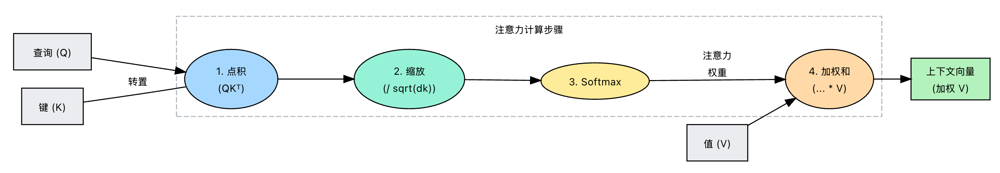
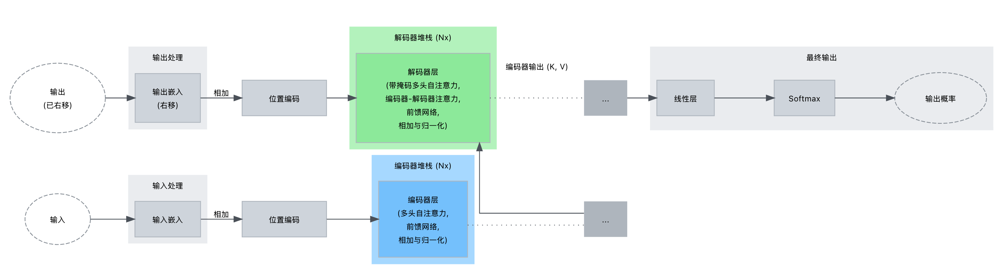

# 前置知识

## 神经网络

神经网络（Neural Network）本质是一个参数化函数，用于学习输入到输出之间的映射关系

**整体结构**：
```text
输入层 → 隐藏层（多层）→ 输出层
```
* 输入层：接收特征
* 隐藏层：进行特征变换（核心计算）
* 输出层：给出预测结果

**基本计算单元（神经元）**：每个神经元本质是：

```text
y = 激活函数(加权求和)
```
展开：
```text
y = f(w1x1 + w2x2 + ... + wn*xn + b)
```

### 组成部分

1. 权重（Weights）
* 表示输入的重要性
* 可训练参数
2. 偏置（Bias）
* 调整整体输出位置
* 提供灵活性
3. 激活函数（Activation Function）
* 引入非线性能力
* 常见：
  * ReLU
  * Sigmoid
  * Tanh

### 两种典型结构

#### 前馈神经网络（Feedforward Neural Network, FNN）

特点：
* 信息单向流动
* 无记忆

结构：
```text
输入 → 隐藏层 → 输出
```
适用：
* 表格数据
* 图像分类（基础）

#### 循环神经网络（Recurrent Neural Network, RNN）

**核心原理与公式:**

其核心是，RNN单元在每个时间步执行相同的计算，但其内部状态根据输入序列而变化。如果有一个输入序列 $x = (x_1, x_2, ..., x_T)$，RNN在时间步 $t$ 更新其隐藏状态 $h_t$，使用当前输入 $x_t$ 和前一个隐藏状态 $h_{t-1}$。这种更新的常见公式是：

$$h_t = \tanh(W_{hh}h_{t-1} + W_{xh}x_t + b_h)$$

- $h_t$ 是时间步 $t$ 的新隐藏状态。
- $h_{t-1}$ 是前一个时间步的隐藏状态（$h_0$ 通常初始化为零）。
- $x_t$ 是时间步 $t$ 的输入向量（vector）。
- $W_{hh}$ 和 $W_{xh}$ 分别是隐藏到隐藏连接和输入到隐藏连接的权重（weight）矩阵。这些权重在所有时间步中是共享的，这是RNN学习序列模式的根本。
- $b_h$ 是一个偏置（bias）向量。
- $\tanh$ 是一种常见的激活函数（activation function）（双曲正切），引入非线性。

RNN 还可以选择在每个时间步生成输出 $y_t$，通常根据隐藏状态计算：

$$y_t = W_{hy}h_t + b_y$$

这里 $W_{hy}$ 是隐藏到输出的权重矩阵，$b_y$ 是输出偏置。是否在每一步都需要输出取决于具体的任务（例如，在每一步预测下一个词，或对整个序列进行分类）。

## 梯度下降

本质：**让模型一点点变聪明的方法**

可以理解为：
> 在“错误的山坡”上往最低点走

**往“下降最快”的方向走一点点**

关键直觉
* 梯度 = 当前最陡的方向
* 学习率 = 步子大小

## 反向传播

本质：**告诉模型“哪里错了”**

核心作用
* 计算每个参数的“责任大小”
* 给梯度下降提供方向

## 激活函数

本质：**让模型具备“非线性能力”**

如果没有激活函数：
- 整个神经网络 = 一个线性函数
- 再多层也没用（等价于一层）

激活函数 = **“开关 / 弯曲器”**
* 决定哪些信息通过
* 让模型可以拟合复杂关系

### Sigmoid函数

输出范围：0 ~ 1

像一个“概率压缩器”：
* 很小 → 接近 0
* 很大 → 接近 1

常用于：
* 二分类问题（概率）

缺点：
* 容易“饱和”（梯度消失）
* 深层网络效果差

### ReLU 函数

规则很简单：
```text
小于0 → 变成0
大于0 → 原样输出
```
优点
* 计算简单
* 收敛快
* 解决梯度消失（部分）

缺点
* 可能“神经元死亡”（一直输出0）

### Softmax 函数

本质：**把一组数变成“概率分布”**

所有值：
* 都 ≥ 0
* 总和 = 1

使用场景：
* 多分类问题（比如词预测）
* Transformer 输出层核心组件

### Tanh 函数

输出范围：-1 ~ 1

- 比 Sigmoid 更适合深层网络
- 仍然会梯度消失

### Silu 函数

现代模型（如 Transformer）常用

## LayerNorm-层归一化

本质：**让每一层的输出“稳定”**

训练神经网络时：
* 每一层输出分布会变化
* 导致训练不稳定

LayerNorm 做的事：
```text
把数据拉回“标准范围”
```
* 对**每一个样本内部**做归一化
* 不依赖 batch（适合 Transformer）

## RMSNorm

**LayerNorm 的简化版本**

LayerNorm：
* 减均值 + 除方差

RMSNorm：
* 不减均值
* 只做“尺度归一化”

## 总结

这些组件在 Transformer 里的作用：
```text
输入
 ↓
线性变换
 ↓
激活函数（增强表达）
 ↓
归一化（LayerNorm / RMSNorm）
 ↓
反向传播 + 梯度下降（训练）
```

| 概念        | 在 Transformer 中的位置 | 作用     |
| --------- | ------------------ | ------ |
| 梯度下降      | 训练阶段               | 更新所有参数 |
| 反向传播      | 训练阶段               | 计算梯度   |
| 激活函数      | FFN 中              | 提升表达能力 |
| Sigmoid   | 激活函数的一种            | 早期常用   |
| ReLU      | 激活函数               | 简单高效   |
| Tanh      | 激活函数               | 对称性好   |
| SiLU      | ⭐FFN常用             | 更平滑、更强 |
| Softmax   | Attention / 输出层    | 变成概率分布 |
| LayerNorm | 每个子层后              | 稳定训练   |
| RMSNorm   | 替代 LayerNorm       | 更高效    |

# 注意力机制

- [An Intuition for Attention](https://jaykmody.com/blog/attention-intuition/)

## 什么是注意力机制

注意力机制(Attention Mechanism)最先源于计算机视觉领域，其核心思想：当我们关注一张图片，我们往往无需看清楚全部内容而仅将注意力集中在重点部分即可。在自然语言处理领域，也可以通过将重点注意力集中在一个或几个 token，从而取得更高效高质的计算效果;

注意力机制“真正解决了什么问题”：解决“信息太多，该看谁”的问题

## 注意力机制工作方式

可以把模型想象成一次生成一个元素的输出序列。对于它需要生成的每个输出元素，注意力机制让它能够：
- 评估相关性：将当前状态（它正在尝试生成的内容）与输入序列的所有隐藏状态或表示进行比较。
- 计算重要性分数：根据这些比较，为每个输入元素分配一个分数或权重 (weight)。分数越高，表示对生成当前输出元素的相关性越大。
- 创建上下文 (context)向量 (vector)：使用计算出的分数作为权重，计算输入表示的加权和。这会生成一个上下文向量 – 一个输入的特殊摘要，专门针对当前的输出步骤进行调整，突出最重要的输入部分。
- 生成输出：使用这个上下文向量，通常结合模型的当前隐藏状态，来生成输出序列中的下一个元素

克服了纯粹基于RNN的传统编码器-解码器模型的固定大小瓶颈

## 核心变量

注意力机制有三个核心变量：Query（查询值）、Key（键值）和 Value（真值），具体而言，注意力机制的特点是通过计算 Query 与Key的相关性为真值加权求和，从而拟合序列中每个词同其他词的相关关系
为了使这个过程更规范化，注意力机制 (attention mechanism)通常使用从序列表示中得出的三种向量 (vector)类型：
- **查询 (Q)** 表示当前的关注点或信息需求。在序列到序列模型中，这通常是从解码器在当前时间步的状态中获取的。它提出了一个问题：“现在什么信息最相关？”
- **键 (K)**：与每个输入元素配对，键像是信息内容的标签或标识符。它们与查询进行比较以确定相关性。“这个输入元素与我正在寻找的相符吗？”
- **值 (V)**：也与每个输入元素相关联，值代表该元素的实际内容或含义。一旦注意力分数（从查询-键比较中得出）被计算出来，这些值就会被加权并求和，以生成上下文 (context)向量。“这是我拥有的信息。”

## 注意力机制公式

$$
Attention(Q,K,V) = softmax(\frac{QK^T}{\sqrt{d_k}})V
$$

- $QK^T$ —算"谁和谁有关系"：Q 和 K 做点积。

**人话：** 让每个词和其他所有词"握手"，看看谁和谁关系好。  
例子：
```
"饿了" 和 "冰箱" 握手 → 关系强 → 分数高
"饿了" 和 "小明" 握手 → 关系弱 → 分数低
```
- $\frac{}{\sqrt{d_k}}$ —缩放，防止数值爆炸，点积可能很大，除一下压住。

**人话：** 就像考试打分，满分1000分太夸张，按比例缩到100分。

- softmax：变成百分比，把分数转成 0~1 的概率，所有加起来等于1。

**人话：** 把"关系好坏"转成"注意力分配比例"。
```
"饿了" → 0.6 (60% 关注)
"冰箱" → 0.3 (30% 关注)  
"小明" → 0.1 (10% 关注)
```
- $*V$ — 按比例混合内容

用上面的百分比，对 V 加权求和。
**人话：** 最终输出 = 60%"饿了"的内容 + 30%"冰箱"的内容 + 10%"小明"的内容。

**"用 Q 找 K，算匹配度 → 变成百分比 → 按这个比例混合 V"**



最简化 Python 代码实现：
```py
'''注意力计算函数'''
def attention(query, key, value, dropout=None):
    '''
    args:
    query: 查询值矩阵
    key: 键值矩阵
    value: 真值矩阵
    '''
    # 获取键向量的维度，键向量的维度和值向量的维度相同
    d_k = query.size(-1) 
    # 计算Q与K的内积并除以根号dk
    # transpose——相当于转置
    scores = torch.matmul(query, key.transpose(-2, -1)) / math.sqrt(d_k)
    # Softmax
    p_attn = scores.softmax(dim=-1)
    if dropout is not None:
        p_attn = dropout(p_attn)
        # 采样
     # 根据计算结果对value进行加权求和
    return torch.matmul(p_attn, value), p_attn
```

## Self-Attention

自注意力，即是计算本身序列中每个元素对其他元素的注意力分布，即在计算过程中，Q、K、V 都由同一个输入通过不同的参数矩阵计算得到。在 Encoder 中，Q、K、V 分别是输入对参数矩阵 $W_q、W_k、W_v$ 做积得到，从而拟合输入语句中每一个 token 对其他所有 token 的关系。

它是一种机制，让模型在为特定词生成表示时，能够衡量同一输入序列内不同词的重要性。不像RNN只看紧邻前一个隐藏状态，自注意力让模型能够同时查看整个序列，并为每个词询问：“在这个序列中，哪些其他词对于理解这个词最相关？”，模型会计算每对词之间的“注意力分数”。词A和词B之间的高分数表示词B对于理解或表示词A非常相关

自注意力发生在层内部，查看同一层（或其下一层）的表示。自注意力的强大之处在于它能够直接建模序列中任意两个词之间的关系，不论它们之间的距离。这比序列RNN处理更有效地解决了长距离依赖问题

通过自注意力机制，我们可以找到一段文本中每一个 token 与其他所有 token 的相关关系大小，从而建模文本之间的依赖关系。​在代码中的实现，self-attention 机制其实是通过给 Q、K、V 的输入传入同一个参数实现的：
```py
# attention 为上文定义的注意力计算函数
attention(x, x, x)
```

### 缩放点积注意力机制

缩放点积注意力是自注意力 (self-attention) 机制 (attention mechanism) 中主要的计算方法。它计算出序列中每个元素应如何关注（包括其自身在内的）所有其他元素。输入嵌入 (embedding) 被转换为三种不同的向量 (vector)：**查询 ($Q$)**、**键 ($K$)** 和 **值 ($V$)**。
- **查询 ($Q$)**：代表当前词语或位置，它在寻求信息。“我应该关注什么？”
- **键 ($K$)**：代表所有提供信息的词语或位置，如同标签或标识符。“我代表着什么。”
- **值 ($V$)**：代表与每个键相关的实际内容或含义。“我持有这些信息。”

目的是使用特定位置的查询来衡量其与所有位置的键的匹配度，然后使用这些匹配度分数对值进行加权求和。这个加权和将成为查询位置的输出表示，并富含来自整个序列的上下文 (context) 信息。

## 多头注意力

核心思想直观而有效：即不再仅仅基于原始的 $Q、K、V$ 向量执行一次注意力计算，而是并行进行多次注意力计算。每一次并行计算都被称作一个“注意力头”

可以把它想象成有多位专家在检查同一序列。每位专家（头）可能专门寻找不同的模式或关联。一个头可能侧重于短距离句法连接，另一个侧重于更长距离的语义相似性，还有另一个侧重于位置关系

重要的一点是，每个注意力头并非简单地在相同的原始 $Q$、$K$ 和 $V$ 上重新计算注意力。相反，在计算注意力之前，模型会为每个头学习独立的线性投影。这意味着原始的 $Q$、$K$ 和 $V$ 向量会被投影到每个头不同的、低维的子空间中。

假设我们有 $h$ 个注意力头。对于每个头 $i$（其中 $i$ 的范围是1到 $h$），我们学习投影矩阵 $W_i^Q$、$W_i^K$ 和 $W_i^V$。然后，输入$Q$、$K$ 和 $V$ 按如下方式投影：

$$Q_i = QW_i^Q \quad K_i = KW_i^K \quad V_i = VW_i^V$$

每个头 $i$ 接着使用其自身的投影 $Q_i$、$K_i$ 和 $V_i$ 执行缩放点积注意力计算：

$$\text{头}_i = \text{注意力}(Q_i, K_i, V_i) = \text{softmax}\left( \frac{Q_iK_i^T}{\sqrt{d_k}} \right) V_i$$

这里，$d_k$ 是单个头内部向量的维度（即 $K_i$ 的维度）。

### 运行机制

多头注意力 (multi-head attention)机制通过多次并行运行缩放点积注意力过程来解决此问题，每次都对原始的查询、键和值使用不同的学习变换。这使得每个“头”能够关注信息中不同的方面或表征子空间。

以下是分步过程：

**1. 线性投影**
多头注意力机制不使用单一的查询（Q）、键（K）和值（V）矩阵集合，而是首先创建 $h$ 个不同的矩阵集合，其中 $h$ 是注意力头的数量（一个超参数 (hyperparameter)）。对于每个头 $i$（从 1 到 $h$），原始输入Q、K和V矩阵（在自注意力 (self-attention)的情况下通常源自相同的输入序列嵌入 (embedding)）使用学习到的权重 (weight)矩阵 $W_i^Q$、$W_i^K$ 和 $W_i^V$ 进行投影。

$$
\begin{array}{l}
Q_i = QW_i^Q \\
K_i = KW_i^K \\
V_i = VW_i^V
\end{array}
$$

通常，这些投影矩阵的维度小于原始嵌入维度（$d_{model}$）。如果输入嵌入维度为 $d_{model}$，每个头通常使用维度 $d_k = d_v = d_{model}/h$ 进行操作。这确保了总计算成本与具有完整维度的单一头注意力相似。这些权重矩阵 ($W_i^Q, W_i^K, W_i^V$) 对于每个头都是独有的，并在训练过程中学习。

**2. 并行注意力计算**
然后，这些投影集合 $(Q_i, K_i, V_i)$ 中的每一个都同时送入各自的缩放点积注意力机制。这产生了 $h$ 个独立的输出矩阵，我们称它们为 $\text{头}_i$：

$$
\text{头}_i = \text{注意力}(Q_i, K_i, V_i) = \text{softmax}\left( \frac{Q_iK_i^T}{\sqrt{d_k}} \right) V_i
$$

每个 $\text{头}_i$ 矩阵根据头 $i$ 学习到的特定投影来捕获注意力信息。因为投影不同（对于每个 $i$，$W_i^Q, W_i^K, W_i^V$ 都不同），每个头可能学习关注输入序列中不同类型的关联或特征。

**3. 拼接**
所有 $h$ 个注意力头的输出沿着特征维度拼接在一起。如果每个 $\text{头}_i$ 的维度是 $d_v$，拼接后的矩阵维度将是 $h \times d_v$。由于我们通常设置 $d_v = d_{model}/h$，拼接后的矩阵维度变为 $d_{model}$，这与原始输入嵌入维度相匹配。

$$
\text{拼接}(\text{头}_1, \text{头}_2, ..., \text{头}_h)
$$

**4. 最终线性投影**
此拼接后的输出随后会经过一个最终的线性投影层，由另一个学习到的权重矩阵 $W^O$ 参数化。这个投影混合了不同头学习到的信息，并生成多头注意力层的最终输出，其维度通常为 $d_{model}$。

$$
\text{多头}(Q, K, V) = \text{拼接}(\text{头}_1, ..., \text{头}_h)W^O
$$

这个完整的多头注意力模块随后可作为更大的Transformer架构中的一个组成部分使用，替换单一的缩放点积注意力机制。

# Transformer 模型结构

## 核心思想

Transformer架构的核心，即注意力机制的原理：从文本的上下文中找到需要注意的关键信息，帮助模型理解每个字的正确含义。

## 整体架构

完整的Transformer架构包含多个组成部分，但为了高层理解，可以将其简化为两个主要部分：
- 编码器（Encoder）： 这部分读取输入文本。它利用自注意力 (self-attention)机制 (attention mechanism)，同时处理（或者说，以一种考虑所有词的方式）所有输入词，并为每个词构建丰富的表示（嵌入 (embedding)），这些表示融入了整个输入序列的上下文 (context)。
- 解码器（Decoder）： 这部分一次生成一个词元 (token)作为输出文本。它也使用自注意力机制来考虑已生成的词语。更重要的是，它也关注编码器生成的上下文表示。这确保了输出与输入提示相关，并在生成更多文本时保持连贯性




# 编码器


# 解码器


# 参考资料

- [transformer](https://en.wikipedia.org/wiki/Transformer_(deep_learning_architecture))
- [Transformers](https://github.com/huggingface/transformers)
- [Transformers Lab](https://github.com/transformerlab)
- [How transformer architecture works](https://www.datacamp.com/tutorial/how-transformers-work)
- [transformer 模型详解](https://zhuanlan.zhihu.com/p/338817680)
- [深入理解Transformer技术原理](https://tech.dewu.com/article?id=109)
- [transformer 整体指南](https://luxiangdong.com/2023/09/10/trans/)
- [LLM底层秘密—Transformer原理解析](https://mp.weixin.qq.com/s/x2aixxjfGJvA_epMR9mu2Q)
- [Attention Is All You Need](https://arxiv.org/pdf/1706.03762)
- [Transformers 快速入门](https://transformers.run/)
- [The Illustrated Transformer](https://jalammar.github.io/illustrated-transformer/)