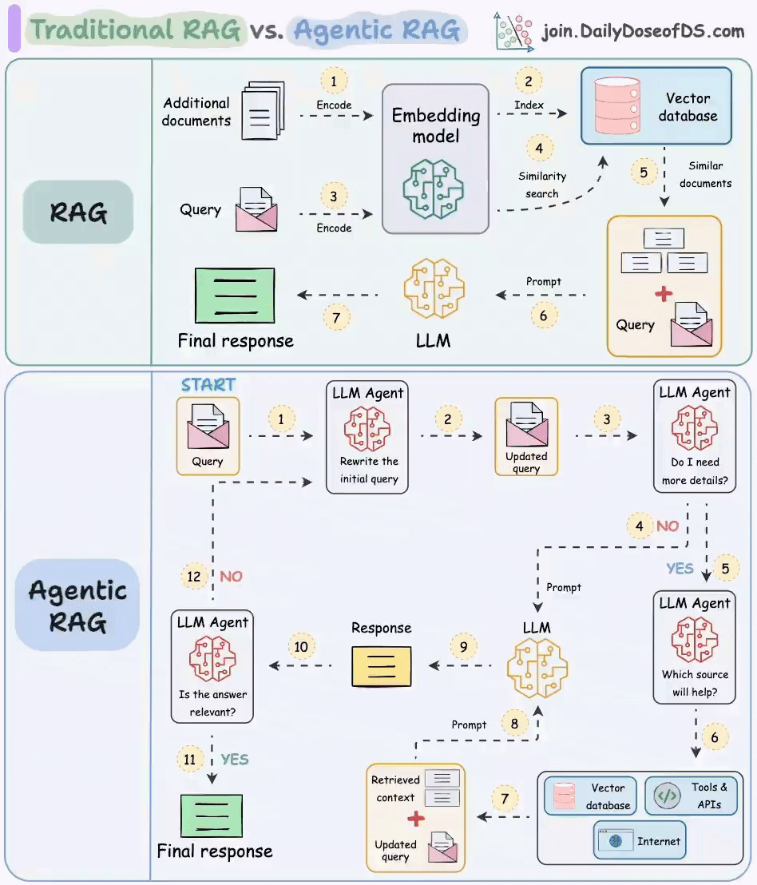
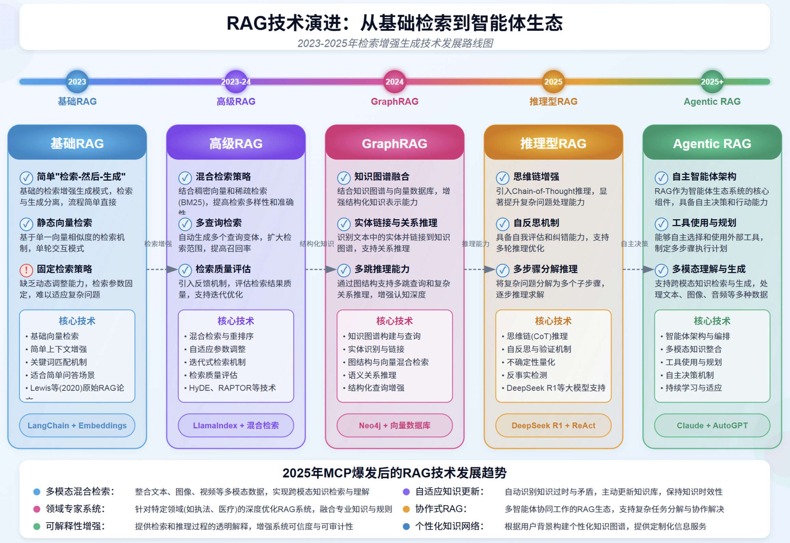

RAG 检索增强生成（Retrieval Augmented Generation），已经成为当前最火热的LLM应用方案。理解起来不难，就是通过自有垂域数据库检索相关信息，然后合并成为提示模板，给大模型生成漂亮的回答。

RAG（中文为检索增强生成） = 知识库 + 检索技术 + LLM 提示。

# 1、含义

RAG 是一种旨在结合大型语言模型 (LLM) 的生成能力和外部知识库的检索能力的技术，用来解决 LLM 的一些固有局限，例如：
- 知识截断 (Knowledge Cutoff): LLM 的知识仅限于其训练数据截止的日期。
- 幻觉 (Hallucination): LLM 有时会编造不准确或虚假的信息。
- 缺乏特定领域/私有知识: LLM 无法访问未包含在其训练数据中的、实时的、或者私有的信息。
- 数据新鲜度问题：由于 LLM 中学习的知识来自于训练数据，虽然大部分知识的更新周期不会很快，但依然会有一些知识或者信息更新得很频繁。LLM 通过从预训练数据中学到的这部分信息就很容易过时
- 来源验证和可解释性

简单来说，就是给 LLM 提供外部数据库，对于用户问题 ( Query )，通过一些信息检索 ( Information Retrieval, IR ) 的技术，先从外部数据库中检索出和用户问题相关的信息，然后让 LLM 结合这些相关信息来生成结果

## 1.1、传统 RAG

RAG 分为前置的数据导入工作和后续的用户检索提问两个环节。
- 图中的 1 和 2 两个步骤就是前置数据导入步骤。过程很简单。第一步是将数据，比如文档、图片等内容通过向量大模型（Embedding Model）转成向量，第二步是将向量存入到向量数据库中。不过觉得这里应该加一个第 0 步，将原始数据进行切片；
- 图中 3～7 标号点环节就是提问检索环节。首先将用户的提问，比如“颈椎病如何治疗”这样的文本转成向量，然后去向量数据库中做相似性搜索。如果搜索到结果比较相似的，就将内容取出来，组成新的 prompt。
- 然后把这个新的 prompt 再发送给大模型，由大模型给出最终的答案

## 1.2、Agentic RAG

传统的 RAG 存在几个问题：
- 用户的 query 在向量数据库里搜索不到，或者搜出来的结果不准；
- 用户的提问不一定需要去向量数据库中搜索，此时的搜索只会浪费 token 资源。比如用户要求生成一段计算加法的 python 代码，这其实直接交给大模型就可以完成；
- 既然是开卷考试了，那大模型非得翻书本吗（向量数据库搜索）？我去网上搜一下（联网搜索）行不行？我去问问别人（调用工具）行不行？
- 如何确定最后得到的答案是准确的呢？

针对上面这几个问题，就可以在关键环节上引入 Agent 来解决
- 首先第一个 Agent 将用户的问题做了改写，这个环节通常会将用户的提问从多个角度拆分成多条，也就是说把一个问题换多个角度进行提问；
- 第二个 Agent 会去判断用户提问的意图，如果认为不需要借助外力，大模型就能搞定，则直接将 query 发送给大模型；如果认为需要借助外力，则发送给下一个 Agent。这个过程，可以使用提示词工程完成。

# 2、RAG 技术演进

- [RAG技术演进:从基础检索到智能体生态](https://mp.weixin.qq.com/s/XgpDYk1r9Xvo-HvvtyPIaw)

**五大阶段技术演进**
- 基础RAG：基于静态向量检索，适用于简单问答场景。
- 高级RAG：引入混合检索与多查询策略，提升检索的准确性与多样性。
- GraphRAG：结合知识图谱与向量数据库，实现结构化知识推理与关系分析。
- 推理型RAG：通过思维链（CoT）和多步推理能力，解决复杂问题，支持多轮优化。
- Agentic RAG：以自主智能体为核心，具备工具使用与规划能力，支持跨模态生成与持续学习。

**未来趋势**
- 多模态混合检索：整合文本、图像、视频等多模态数据，实现跨模态知识理解。
- 领域专家系统：深度优化执法、医疗等特定领域的RAG系统，提供专业化服务。
- 可解释性增强：透明化检索与推理过程，提升系统可信度。
- 自适应知识更新：主动识别知识过时与矛盾，动态更新知识库。
- 协作式RAG：多智能体协同工作，分解复杂任务，共同完成目标。

> RAG 技术发展趋势总结：随着 MCP（多模态、上下文增强、个性化）技术的爆发，RAG 技术这个从单一的检索工具向智能知识生态系统演进。未来 RAG 将更专注于多模态融合、知识推理、自主决策和领域专业化，为执法、医疗等专业场景提供更精准、可信和自适应的知识服务，实现从“检索增强生生成”到“知识增强智能”的跃进！

## 2.1、基础 RAG

最初的检索增强生成模式，通过简单的文档检索来提升大语言模型应答质量

**核心特点**
- 简单“检索-然后-生成”模式：先进行向量检索获取相关文档，然后将检索结果和用户问题一并传给 LLM 进行处理，增强回答质量；
- 静态向量检索：对于一个待回答的问题，使用预先计算好的向量匹配最相似的文档片段，不会动态调整检索策略；
- 固定检索策略：设置固定阈值、检索参数和固定的检索数量，没有根据问题复杂度动态调整的能力；
- 局部上下文增强：仅提供与当前问题直接相关的本地上下文，缺乏对知识的关联性和推理能力的增强；

**核心技术**
- 向量检索技术：
    - 密集向量检索；
    - 相似度算法优化
    - 基础文本切分；
- 实现框架：
    - LangChain
    - LlamaIndex
    - Embeddings模型
- 应用场景：
    - 知识库问答；
    - 简单文档检索；
    - 客服问答系统；
- 代表性实现：
    - Faiss、Milvus 向量库

**局限性与挑战**
- 检索结果质量完全依赖域初始向量相似度计算；
- 缺乏上下文理解与自适应调整检索能力；
- 无法处理多步推理与复杂查询需求；

## 2.2、高级 RAG

多策略融合的增强检索技术，显著提升检索精度与质量；

**核心特定：**
- 混合检索策略：结合密集向量检索和稀疏检索技术（BM25），提高检索多样性和精度；
- 多查询检索：自动生成多个查询变体，扩大检索范围，捕获更多相关知识；
- 检索量评价：引入交叉验证，评估检索结果质量，支持检索优化；
- 重排序机制：对检索结果进行二次排序，提升最相关内容排名；

**技术创新：**
- 混合检索技术：
    - 向量检索与关键词检索融合；
    - 多模态检索集成；
    - 自适应检索策略切换；
- 查询优化：
    - 自动扩展与查询重写；
    - 多版本并行检索技术；
    - 上下文感知查询增强；
- 质量优化：
    - 检索结果质量评估；
    - 基于相似度的重排序；
    - 检索与生成协同优化；
- 代表性技术：
    - LlamaIndex + 混合检索
    - HeDE技术
    - RAPTRO 检索技术（递归抽象处理树组织检索（Recursive Abstractive Processing for Tree Organized Retrieval））

**相较基础 RAG的优势：**
- 提高检索召回率与准确率；
- 降低查询理解偏差，更好处理复杂问题；
- 支持上下文感知的检索优化；

**应用场景：**
- 复杂文档检索：多主题长文档智能检索与理解；
- 企业知识库：跨部门专业知识的高精度检索；
- 多维度分析：从多来源检索信息支持决策

## 2.3、GraphRAG

知识图谱融合的 RAG，提升复杂知识关系理解与推理能力；

**核心特点：**
- 知识图谱融合：结合图数据库与传统的向量检索，提升关系认知能力，处理实体之间复杂联系；
- 实体链接与关系推理：识别文本中的实体并链接到知识图谱，支持多跳推理与因果关系理解；
- 多路推理增强：通过图结构支持多条推理路径和复杂关系推理，增强认知深度；
- 强结构化知识理解：将非结构化文本转化为结构化知识，增强大模型的知识表示能力；

**核心技术：**
- 知识图图谱建模与查询：
    - 知识图谱存储与查询
    - 实体识别与链接；
    - 语义化图谱推理
- 图神经网络与融合：
    - 图神经网络模型；
    - 图结构嵌入技术；
    - 多模态知识融合；
- 语义理解与推理：
    - 语义关系推理；
    - 结构化问答增强；
    - 复杂推理链生成；
- 代表性实现：
    - Neo4j+向量数据库
    - 图数据处理框架
    - 知识图片推理引擎；

**应用优势：**
- 技术提升
    - 提升复杂关系推理能力，支持多步查询；
    - 降低幻觉产生，增强答案可靠性；
    - 处理结构化与非结构化数据的混合场景
- 业务价值：
    - 企业知识图谱集成，提升专业领域问答质量；
    - 支持专业知识推理，如医疗诊断、法律分析；
    - 强化多来源数据关联与综合分析能力；

## 2.4、推理型 RAG

融合思维链推理与检索的高级模式，具备复杂思考与自主决策能力

思维链推理过程：
- 我需要分析用户的核心需要，这涉及到多方面...；
- 首先我应当查询产品的详细规格，然后了解相关法规...；
- 现在我需要进行进一步计算来验证我的推理，并决定下一步...；

问题分析 ——> 动态检索 ——> 推理处理 ——> 决策输出

**核心特点：**
- 思维链增强：具备自主思考和推理能力，可以在回答过程中进行 Step-by-Step 的逻辑思考；
- 自反思机制：具备自我反思和判断能力，支持反馈迭代优化，提升最终输出质量；
- 多步骤分解推理：将复杂问题分解为多个子步骤，逐步理解并解决复杂问题；
- 动态检索能力：在推理过程中根据中间结果动态调整检索策略，实现深度探索；

**核心技术：**
- 推理框架技术：
    - 思维链（CoT）推理
    - 自反思机制和反馈机制；
    - 递归深度思考
    - 不确定性识别
    - 决策树推理
- 检索增强能力：
    - 动态检索策略
    - 推理引导检索
    - 基于上下文的检索优化；
    - Deepseek R1等大模型支持
    - ReAct 交互式检索推理；
- 代表实现：
    - Deepseek R1 + ReAct
    - 思维链增强框架；
    - 自反馈迭代系统；

**应用场景：**
- 医疗诊断辅助：多步推理分析病例、症状和医学文献，提供诊断参考；
- 金融分析决策：结合推理能力分析复杂金融数据，提供投资建议；
- 代码分析与调试：通过逐步推理理解代码逻辑，发现并修复程序缺陷；

## 2.5、Agentic RAG

智能体驱动的检索增强生成范式，具备自主行动与任务规划能力；

**核心特点：**
- 自主智能体架构：构建由多个专业化智能体组成的协作网络，每个智能体复杂特定任务，共同解决复杂问题；
- 工具使用与规划：能够主动选择和使用外部工具，为复杂任务制定多步执行计划，扩展解决问题的能力范围；
- 多模态理解与生成：支持对文本、图像、音频等多种模态的理解和处理，生成富媒体内容，大幅提升用户体验；
- 持续学习与适应：具备自主选择和使用外部工具，为复杂任务制定多步执行计划，扩展解决问题的能力范围；

**技术架构：**
- 智能体核心技术
    - 智能体规划与调度系统；
    - 多模态融合处理技术
    - 自主决策算法
    - 工具使用与调用框架
    - 自主学习与优化机制
- 多智能体协作生态：
    - 智能体间通信协议
    - 任务分解与协作机制
    - 知识共享与同步
    - 冲突解决与共识算法
    - 多智能体学习框架
- 代表性实现：
    - Claude + AutoGPT
    - 多智能体协调框架
    - 工具增强型的 RAG 系统；

**应用场景：**
- 个人智能助手：全方位生活、工作辅助与代理；
- 企业决策支持：复杂商业分析、预测与建议；
- 创意内容生成：多媒体创作与设计自动化；
- 科研探索：自动实验设计、文献分析与假设生成；

**未来展望：**
- 技术演进：
    - 更强大的多智能体协作框架；
    - 自适应个性化智能体生态；
    - 真实世界交互与感知能力；
- 行业影响：
    - 知识工作者生产力革命
    - 复杂决策场景自动化
    - 人机写作新范式；

# 3、如何选择模型

## 3.1、如何选择 LLM

**在RAG应用中需要大模型的能力**
- 信息抽取能力：大模型需要从RAG检索出来的上下文中，抽取出和问题最有价值的信息
- 上下文的阅读理解能力：大模型需要从RAG检索出来的上下文和问题进行语义理解，生成合适的答案；
- 工具调用和function call能力：RAG应用中可能会调用外部工具和接口

**如何挑选大模型**
- 模型大小选择：优先选择最大的模型进行测试是否可行，验证业务可行性可行的情况下，收集数据可迁移到小模型
- 模型能力测试：构建业务的测试集，测试信息抽取能力、阅读理解能力和工具调用，function call能力
- 成本和设备：大模型的使用是有一定的成本，api调用成本和设备
- 企业数据安全： 调用本地模型和外部api，要评估数据的安全

## 3.2、如何选择向量Embedding 模型

## 3.3、如何选择向量数据库

# 4、RAG 三大模块

为了构建检索增强 LLM 系统，RAG关键模块包括:
- 数据和索引模块：如何处理外部数据和构建索引
- 查询和检索模块：如何准确高效地检索出相关信息
- 响应生成模块：如何利用检索出的相关信息来增强 LLM 的输出

# 5、基础 RAG 流程

基础 RAG系统的开发流程主要包含以下阶段：
- 解析 (Parsing)：为知识库准备数据，包括收集文档、将其转换 为文本格式，并清理无关的噪点信息。
- 数据摄取 (Ingestion)：创建并载入知识库。
- 检索 (Retrieval)：构建一个工具，根据用户查询查找并返回相关 数据，通常在向量数据库中进行语义搜索。
- 回答 (Answering)：使用检索到的数据丰富用户的提示词（prompt）， 将其发送给 LLM，并返回最终答案。

# RAG技术

- [Anything-LLM：智能文档助手](https://github.com/Mintplex-Labs/anything-llm)
- [GraphRAG](https://github.com/microsoft/graphrag)
- [RAG-各种高级技术](https://github.com/NirDiamant/RAG_Techniques)
- [所有 RAG 技术](https://github.com/FareedKhan-dev/all-rag-techniques)
- [从数据解析到多路由器检索的工程实践](https://mp.weixin.qq.com/s/VPidqY02ngsrnXhpOol3_A)
- [MinerU-PDF转换成Markdown和JSON格式](https://github.com/opendatalab/mineru)
- [Deepdoc-文档处理](https://github.com/infiniflow/ragflow/tree/main/deepdoc)
- [20种 RAG 技术分析](https://mp.weixin.qq.com/s/AW-vjOmPXYiv3xN57TWKsg)
- [RAG-Anything-一站式 RAG方案](https://github.com/HKUDS/RAG-Anything)
- [LightRAG-简单 RAG](https://github.com/HKUDS/LightRAG)
- [Ragflow+TextIn实战！高精度AI解析+OCR优化](https://mp.weixin.qq.com/s/7cW8Madv0rG0i3PoaFk1oA)
- [LlamaIndex 是用于在数据上构建 LLM 驱动的代理的领先框架](https://github.com/run-llama/llama_index)

# 参考资料

- [基于深度文档理解构建的开源 RAG（Retrieval-Augmented Generation）引擎](https://github.com/infiniflow/ragflow)
- [RAG变体](https://www.53ai.com/news/RAG/2025031889753.html)
- [RAG + Tool Use](https://cohere.com/llmu/from-rag-to-tool-use)
- [RAG](https://www.promptingguide.ai/zh/techniques/rag)