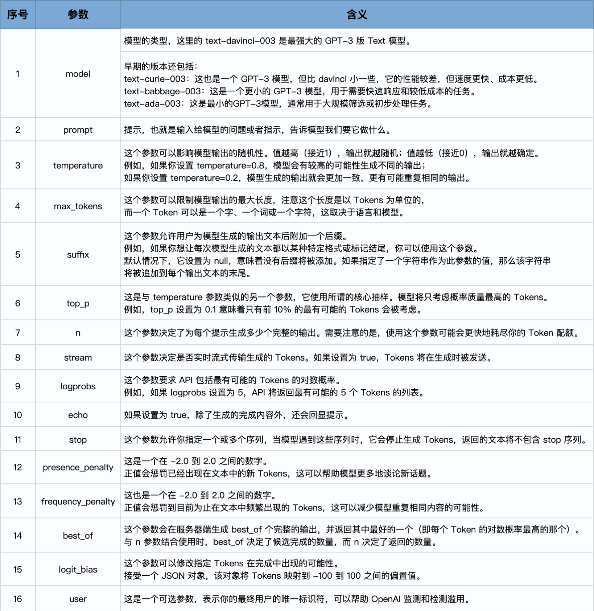
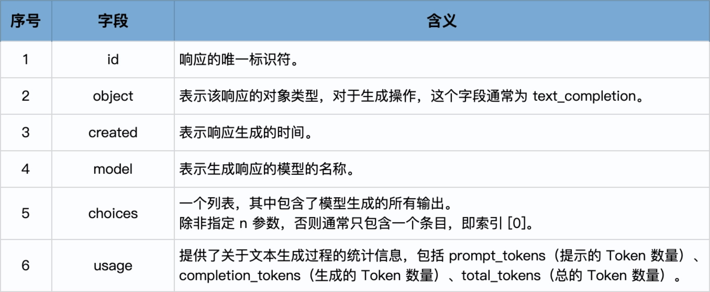
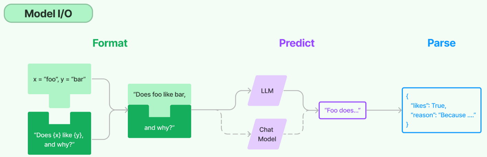

# 一、大模型语言

- [开源大模型](https://huggingface.co/)
- [OpenAI文档](https://platform.openai.com/docs/concepts)
- [评估大模型的指标、框架和数据集](https://github.com/openai/evals)

## 1、什么是大语言模型

大语言模型是一种人工智能模型，通常使用深度学习技术，比如神经网络，来理解和生成人类语言。这些模型的“大”在于它们的参数数量非常多，可以达到数十亿甚至更多，这使得它们能够理解和生成高度复杂的语言模式；

可以**将大语言模型想象成一个巨大的预测机器，其训练过程主要基于“猜词”**：给定一段文本的开头，它的任务就是预测下一个词是什么。模型会根据大量的训练数据（例如在互联网上爬取的文本），试图理解词语和词组在语言中的用法和含义，以及它们如何组合形成意义。它会通过不断地学习和调整参数，使得自己的预测越来越准确；

LangChain 是一个全方位的、基于大语言模型这种预测能力的应用开发工具，它的灵活性和模块化特性使得处理语言模型变得极其简便。不论你在何时何地，都能利用它流畅地调用语言模型，并基于语言模型的“预测”或者说“推理”能力开发新的应用；

## 2、概念

### 2.1、词嵌入

词嵌入（Word Embedding）是自然语言处理和机器学习中的一个概念，它将文字或词语转换为一系列数字，通常是一个向量。简单地说，词嵌入就是一个为每个词分配的数字列表。这些数字不是随机的，而是捕获了这个词的含义和它在文本中的上下文。因此，语义上相似或相关的词在这个数字空间中会比较接近；

举个例子，通过某种词嵌入技术，可能会得到：
```
“国王” -> [1.2, 0.5, 3.1, …]
“皇帝” -> [1.3, 0.6, 2.9, …]
“苹果” -> [0.9, -1.2, 0.3, …] 
```
从这些向量中，可以看到“国王”和“皇帝”这两个词的向量在某种程度上是相似的，而与“苹果”这个词相比，它们的向量则相差很大，因为这两个概念在语义上是不同的。

词嵌入的优点是，它提供了一种将文本数据转化为计算机可以理解和处理的形式，同时保留了词语之间的语义关系。这在许多自然语言处理任务中都是非常有用的，比如文本分类、机器翻译和情感分析等

### 2.2、向量数据库

向量数据库，也称为矢量数据库或者向量搜索引擎，是一种专门用于存储和搜索向量形式的数据的数据库。

在众多的机器学习和人工智能应用中，尤其是自然语言处理和图像识别这类涉及大量非结构化数据的领域，将数据转化为高维度的向量是常见的处理方式。这些向量可能拥有数百甚至数千个维度，是对复杂的非结构化数据如文本、图像的一种数学表述，从而使这些数据能被机器理解和处理。然而，传统的关系型数据库在存储和查询如此高维度和复杂性的向量数据时，往往面临着效率和性能的问题。

因此，向量数据库被设计出来以解决这一问题，它具备高效存储和处理高维向量数据的能力，从而更好地支持涉及非结构化数据处理的人工智能应用

向量数据库有很多种，比如 Pinecone、Chroma 和 Qdrant，有些是收费的，有些则是开源的；

向量之间的比较通常基于向量的距离或者相似度。在高维空间中，常用的向量距离或相似度计算方法有欧氏距离和余弦相似度。
- **欧氏距离**：这是最直接的距离度量方式，就像在二维平面上测量两点之间的直线距离那样。在高维空间中，两个向量的欧氏距离就是各个对应维度差的平方和的平方根。
- **余弦相似度**：在很多情况下，更关心向量的方向而不是它的大小。例如在文本处理中，一个词的向量可能会因为文本长度的不同，而在大小上有很大的差距，但方向更能反映其语义。余弦相似度就是度量向量之间方向的相似性，它的值范围在 -1 到 1 之间，值越接近 1，表示两个向量的方向越相似。

那么到底什么时候选择欧式距离，什么时候选择余弦相似度呢？简单来说，关心数量等大小差异时用欧氏距离，关心文本等语义差异时用余弦相似度。
- 欧氏距离度量的是**绝对距离**，它能很好地反映出向量的绝对差异。当我们关心数据的绝对大小，例如在物品推荐系统中，用户的购买量可能反映他们的偏好强度，此时可以考虑使用欧氏距离。同样，在数据集中各个向量的大小相似，且数据分布大致均匀时，使用欧氏距离也比较适合。
- 余弦相似度度量的是**方向的相似性**，它更关心的是两个向量的角度差异，而不是它们的大小差异。在处理文本数据或者其他高维稀疏数据的时候，余弦相似度特别有用。比如在信息检索和文本分类等任务中，文本数据往往被表示为高维的词向量，词向量的方向更能反映其语义相似性，此时可以使用余弦相似度。

# 二、LangChain

- [LangChain](https://github.com/langchain-ai/langchain)
- [LangChain-Java版](https://github.com/Starcloud-Cloud/java-langchain)
- [LangChain4J](https://github.com/langchain4j/langchain4j)
- [LangChain-Introduction](https://python.langchain.com/v0.2/docs/introduction/)

## 1、概述

LangChain 本质上就是对各种大模型提供的 API 的套壳，是为了方便我们使用这些 API，搭建起来的一些框架、模块和接口。

因此，要了解 LangChain 的底层逻辑，需要了解大模型的 API 的基本设计思路。而目前接口最完备的、同时也是最强大的大语言模型，当然是 OpenAI 提供的 GPT 家族模型

## 2、安装LangChain

以Python为例：
```
pip install langchain
```
LangChain 要与各种模型、数据存储库集成，当你 `pip install langchain` 之后，可能还需要 `pip install openai`、`pip install chroma`（一种向量数据库）

安装 LangChain 时包括常用的开源 LLM（大语言模型） 库：
```
pip install langchain[llms]
```
安装完成之后，还需要更新到 LangChain 的最新版本，这样才能使用较新的工具
```
pip install --upgrade langchain
```

## 3、OpenAI

OpenAI主要模型Chat Model 和 Text Model，这两类 Model，是大语言模型的代表。当然，OpenAI 还提供 Image、Audio 和其它类型的模型，目前它们不是 LangChain 所支持的重点，模型数量也比较少
- Chat Model，聊天模型：用于产生人类和 AI 之间的对话，代表模型当然是 gpt-3.5-turbo（也就是 ChatGPT）和 GPT-4；
- Text Model，文本模型，在 ChatGPT 出来之前，大家都使用这种模型的 API 来调用 GPT-3，文本模型的代表作是 text-davinci-003（基于 GPT3）

### 3.1、调用Text模型

- 注册好OpenAI的API key；
- 安装OpenAI: `pip install openai`;
- 导入 OpenAI API Key:
    ```python
    import os
    # OpenAI 库就会查看名为 OPENAI_API_KEY 的环境变量，并使用它的值作为 API 密钥
    os.environ["OPENAI_API_KEY"] = '你的Open API Key' #
    ```
- 导入 OpenAI 库，并创建一个 Client
    ```python
    from openai import OpenAI
    client = OpenAI()
    ```
- 指定 gpt-3.5-turbo-instruct（也就是 Text 模型）并调用 completions 方法，返回结果。
    ```python
    response = client.completions.create(
    model="gpt-3.5-turbo-instruct",
    temperature=0.5,
    max_tokens=100,
    prompt="请给我的花店起个名")
    # 从响应中获取第一个（如果在调用大模型时，没有指定 n 参数，那么就只有唯一的一个响应）选择，然后获取该选择的文本，并移除其前后的空白字符
    print(response.choices[0].text.strip())
    ```

OpenAI的Text模型 client.completions.create 请求参数：



在使用 Text 模型（如 text-davinci-003）的情况下，响应对象的主要字段包括：



### 3.2、调用Chat模型

整体流程上，Chat 模型和 Text 模型的调用是类似的，只是前面加了一个 chat，然后输入（prompt）和输出（response）的数据格式有所不同：
```python
response = client.chat.completions.create(  
  model="gpt-4",
  messages=[
        {"role": "system", "content": "You are a creative AI."},
        {"role": "user", "content": "请给我的花店起个名"},
    ],
  temperature=0.8,
  max_tokens=60
)
```
有两个专属于 Chat 模型的概念，一个是消息，一个是角色：
- **消息**：就是传入模型的提示。此处的 messages 参数是一个列表，包含了多个消息。每个消息都有一个 role（可以是 system、user 或 assistant）和 content（消息的内容）。系统消息设定了对话的背景（你是一个很棒的智能助手），然后用户消息提出了具体请求（请给我的花店起个名）。模型的任务是基于这些消息来生成回复；
- **角色**：在 OpenAI 的 Chat 模型中，system、user 和 assistant 都是消息的角色。每一种角色都有不同的含义和作用；
    - system：系统消息主要用于设定对话的背景或上下文。这可以帮助模型理解它在对话中的角色和任务。例如，你可以通过系统消息来设定一个场景，让模型知道它是在扮演一个医生、律师或者一个知识丰富的 AI 助手。系统消息通常在对话开始时给出。
    - user：用户消息是从用户或人类角色发出的。它们通常包含了用户想要模型回答或完成的请求。用户消息可以是一个问题、一段话，或者任何其他用户希望模型响应的内容。
    - assistant：助手消息是模型的回复。例如，在你使用 API 发送多轮对话中新的对话请求时，可以通过助手消息提供先前对话的上下文。然而，请注意在对话的最后一条消息应始终为用户消息，因为模型总是要回应最后这条用户消息

在使用 Chat 模型生成内容后，返回的响应，也就是 response 会包含一个或多个 choices：
```json
{
 'id': 'chatcmpl-2nZI6v1cW9E3Jg4w2Xtoql0M3XHfH',
 'object': 'chat.completion',
 'created': 1677649420,
 'model': 'gpt-4',
 'usage': {'prompt_tokens': 56, 'completion_tokens': 31, 'total_tokens': 87},
 'choices': [
   {
    'message': {
      'role': 'assistant',
      'content': '你的花店可以叫做"花香四溢"。'
     },
    'finish_reason': 'stop',
    'index': 0
   }
  ]
}
```

### 3.3、Chat 模型 vs Text 模型

相较于 Text 模型，Chat 模型的设计更适合处理对话或者多轮次交互的情况。这是因为它可以接受一个消息列表作为输入，而不仅仅是一个字符串。这个消息列表可以包含 system、user 和 assistant 的历史信息，从而在处理交互式对话时提供更多的上下文信息；

对于简单的单轮文本生成任务，使用 Text 模型可能会更简单、更直接。例如，如果你只需要模型根据一个简单的提示生成一段文本，那么 Text 模型可能更适合

## 4、通过LangChain调用

**调用Text模型：**
```python
import os
os.environ["OPENAI_API_KEY"] = '你的Open API Key'
from langchain.llms import OpenAI
llm = OpenAI(  
    model="gpt-3.5-turbo-instruct",
    temperature=0.8,
    max_tokens=60,)
response = llm.predict("请给我的花店起个名")
print(response)
```

**调用 Chat 模型**
```python
import os
os.environ["OPENAI_API_KEY"] = '你的Open API Key'
from langchain.chat_models import ChatOpenAI
chat = ChatOpenAI(model="gpt-4",
                    temperature=0.8,
                    max_tokens=60)
from langchain.schema import (
    HumanMessage,
    SystemMessage
)
messages = [
    SystemMessage(content="你是一个很棒的智能助手"),
    HumanMessage(content="请给我的花店起个名")
]
response = chat(messages)
print(response)
```

## 5、调用开源社区模型

要选择 Text-Generation、Text-Text Generation 和 Question-Answer 这一类的文本生成式模型：
```python
from langchain import HuggingFaceHub
llm = HuggingFaceHub(model_id="bigscience/bloom-1b7")
```

## 6、RetrievalQA链

在构建智能问答系统时，RetrievalQA链是一种强大的策略，尤其当我们需要从大量非结构化数据中检索信息并回答问题。RetrievalQA链结合了信息检索和问答生成技术，可以显著提高问答系统的准确性和效率

RetrievalQA 链是一种结合了信息检索（Retrieval）和问答生成（Question Answering）的技术链。在这个链条中，首先通过信息检索组件找到与问题相关的文本片段，然后通过问答生成组件从这些片段中提取或生成答案

工作流程
- 用户输入问题：用户提出一个问题，系统接受这个问题作为输入。
- 信息检索：系统通过检索模块（通常是基于向量相似度的检索算法，或传统的全文搜索引擎）从文档库中找到与问题最相关的几个文本片段。
- 问答生成：接下来，系统将检索到的文本片段输入到一个问答生成模型中（通常是一个语言模型），从中提取或生成最合适的答案。
- 返回答案：最后，系统将生成的答案返回给用户。
```python
# Retrieval 准备模型和Retrieval链
import logging # 导入Logging工具
from langchain.chat_models import ChatOpenAI # ChatOpenAI模型
from langchain.retrievers.multi_query import MultiQueryRetriever # MultiQueryRetriever工具
from langchain.chains import RetrievalQA # RetrievalQA链
# 设置Logging
logging.basicConfig()
logging.getLogger('langchain.retrievers.multi_query').setLevel(logging.INFO)
# 实例化一个大模型工具 - OpenAI的GPT-3.5
llm = ChatOpenAI(model_name="gpt-3.5-turbo", temperature=0)
# 实例化一个MultiQueryRetriever
retriever_from_llm = MultiQueryRetriever.from_llm(retriever=vectorstore.as_retriever(), llm=llm)
# 实例化一个RetrievalQA链
qa_chain = RetrievalQA.from_chain_type(llm,retriever=retriever_from_llm)
```

## 7、模型

模型，位于 LangChain 框架的最底层，它是基于语言模型构建的应用的核心元素，因为所谓 LangChain 应用开发，就是以 LangChain 作为框架，通过 API 调用大模型来解决具体问题的过程。

### Model I/O

把对模型的使用过程拆解成三块，分别是输入提示（对应图中的 Format）、调用模型（对应图中的 Predict）和输出解析（对应图中的 Parse），这三块形成了一个整体，因此在 LangChain 中这个过程被统称为 Model I/O（Input/Output）



在模型 I/O 的每个环节，LangChain 都提供了模板和工具，快捷地形成调用各种语言模型的接口：
- 提示模板：使用模型的第一个环节是把提示信息输入到模型中，可以创建 LangChain 模板，根据实际需求动态选择不同的输入，针对特定的任务和应用调整输入。
- 语言模型：LangChain 允许通过通用接口来调用语言模型。这意味着无论使用的是哪种语言模型，都可以通过同一种方式进行调用，这样就提高了灵活性和便利性。
- 输出解析：LangChain 还提供了从模型输出中提取信息的功能。通过输出解析器，可以精确地从模型的输出中获取需要的信息，而不需要处理冗余或不相关的数据，更重要的是还可以把大模型给回的非结构化文本，转换成程序可以处理的结构化数据

### 提示模板

所谓 Prompt Engineering，就是专门研究对大语言模型的提示构建
```python
# 导入LangChain中的提示模板
from langchain.prompts import PromptTemplate
# 创建原始模板
template = """您是一位专业的鲜花店文案撰写员。\n
对于售价为 {price} 元的 {flower_name} ，您能提供一个吸引人的简短描述吗？
"""
# 根据原始模板创建LangChain提示模板
prompt = PromptTemplate.from_template(template) 
# 打印LangChain提示模板的内容
print(prompt)
```
PromptTemplate 的 from_template 方法就是将一个原始的模板字符串转化为一个更丰富、更方便操作的 PromptTemplate 对象，这个对象就是 LangChain 中的提示模板。LangChain 提供了多个类和函数，也为各种应用场景设计了很多内置模板，使构建和使用提示变得容易

使用 LangChain 和提示模板的好处是：
- 代码的可读性：使用模板的话，提示文本更易于阅读和理解，特别是对于复杂的提示或多变量的情况。
- 可复用性：模板可以在多个地方被复用，让你的代码更简洁，不需要在每个需要生成提示的地方重新构造提示字符串。
- 维护：如果你在后续需要修改提示，使用模板的话，只需要修改模板就可以了，而不需要在代码中查找所有使用到该提示的地方进行修改。
- 变量处理：如果你的提示中涉及到多个变量，模板可以自动处理变量的插入，不需要手动拼接字符串。
- 参数化：模板可以根据不同的参数生成不同的提示，这对于个性化生成文本非常有用。

### 语言模型

LangChain 中支持的模型有三大类:
- 大语言模型（LLM） ，也叫 Text Model，这些模型将文本字符串作为输入，并返回文本字符串作为输出。Open AI 的 text-davinci-003、Facebook 的 LLaMA、ANTHROPIC 的 Claude，都是典型的 LLM。
- 聊天模型（Chat Model），主要代表 Open AI 的 ChatGPT 系列模型。这些模型通常由语言模型支持，但它们的 API 更加结构化。具体来说，这些模型将聊天消息列表作为输入，并返回聊天消息。
- 文本嵌入模型（Embedding Model），这些模型将文本作为输入并返回浮点数列表，也就是 Embedding。文本嵌入模型如 OpenAI 的 text-embedding-ada-002;文本嵌入模型负责把文档存入向量数据库；

### 输出解析

LangChain 的提示模板可以嵌入对输出格式的定义，以便在后续处理过程中比较方便地处理已经被格式化了的输出

# 参考资料

- [BCEmbedding: Bilingual and Crosslingual Embedding for RAG](https://github.com/netease-youdao/BCEmbedding)
- [大模型训练](https://github.com/hiyouga/LLaMA-Efficient-Tuning)
- [LLaMA-Adapter](https://github.com/OpenGVLab/LLaMA-Adapter)
- [量化 LLM 的高效微调](https://github.com/artidoro/qlora)
- [Llama + Dify-搭建AI工作流](https://mp.weixin.qq.com/s/jAX7uI_gjV4e7nzgb_rkrQ)
