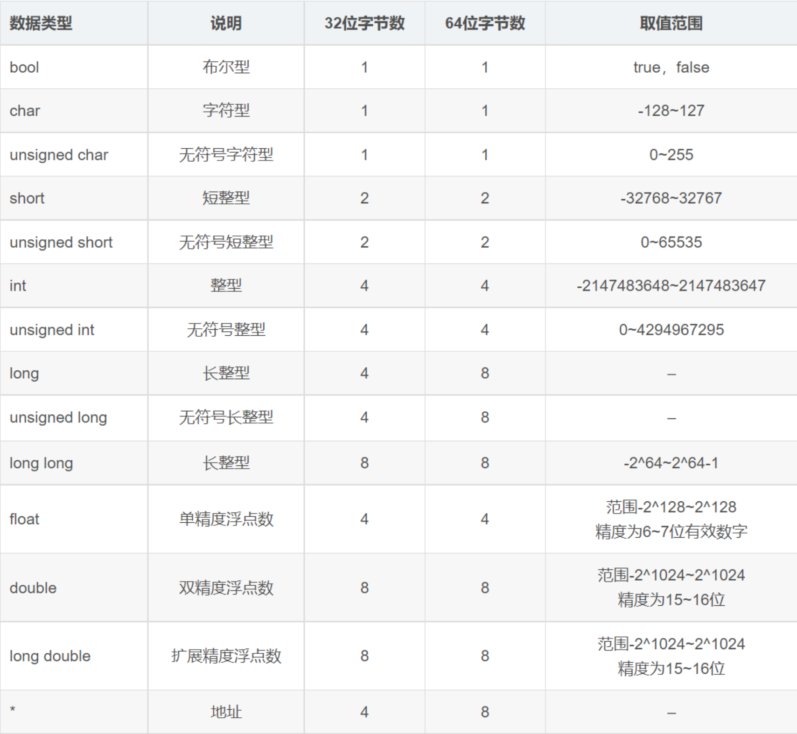

# 1、命名空间

```c++
using namespace std;
```
在 C++ 中，string 类是标准库的一部分，而标准库的所有内容都被封装在 std 命名空间（namespace）中。命名空间的作用是防止不同代码库之间的名称冲突（例如，两个库可能都定义了 string 类）

不写命名空间，即显式的指定命名空间
```c++
#include <iostream>
// 不写 using namespace std;
int main() {
    std::string name;  // 正确：显式指定命名空间
    return 0;
}
```

使用命名空间
```c++
#include <iostream>
using namespace std; // 导入整个 std 命名空间
int main() {
    string name;     // 现在可以直接使用 string
    return 0;
}
```

仅导入需要的名称：
```c++
#include <iostream>
using std::string; // 仅导入 std::string
int main() {
    string name;    // 可以直接使用
    return 0;
}
```

# 2、数据类型

C++常用的数据类型有五种：整数（int）、浮点数（float和double）、字符（char）、字符串（string）和布尔（bool），其中布尔输出true=1，false=0；

## 2.1、sizeof运算符

sizeof运算符用于求数据类型或变量占用的内存空间。
- 用于数据类型：sizeof(数据类型)
- 用于变量：sizeof(变量名) 或 sizeof 变量名；

在32位和64位操作系统中，同一种数据类型占用的内存空间可能不一样



## 2.2、整型

C++用int关键字来声明整型变量（int 是 integer 的简写）。在声明整型变量的时候，可以在int关键字之前加signed、unsigned、short和long四种修饰符。
- signed：有符号的，可以表示正数和负数。
- unsigned：无符号的，只能表示正数，例如超女的身高和体重等。
- short：短的，取值范围小，占用内存少。
- long：长的，取值范围大，占用内存多

类型简写 |	类型全称	|长度	|取值范围
--------|-----------|----|------
short	 | signed short int|	2字节	|-32768~32767
unsigned short |	unsigned short int	|2字节	|0~65535
int	| signed int |	4字节	| -2147483648~2147483647
unsigned |	unsigned int|	4字节 |	0~4294967295
long	|signed long int	|8字节	|-9223372036854775808~9223372036854775807
unsigned long	| unsigned long int|	8字节	|0~18446744073709551615

整数的取值范围与计算机操作系统和C++语言编译器有关，没有一个固定的数值，我们可以根据它占用的内存大小来推断它的取值范围

给整型变量赋值不能超出它的取值范围，否则能产生不可预后的后果

## 2.3、进制

整数默认是十进制，一个表示十进制的数字不需要任何特殊的格式

### 2.3.1、二进制

二进制由 0 和 1 两个数字组成，书写时必须以0b或0B（不区分大小写）开头
```c++
int a = 0b101;      // 换算成十进制为 5
int b = -0b110010;  // 换算成十进制为 -50
int c = 0B100001;   // 换算成十进制为 33
```
注意，C++标准并不支持上面的二进制写法，只是有些编译器自己进行了扩展，才支持二进制数字。换句话说，并不是所有的编译器都支持二进制数字，只有一部分编译器支持，并且跟编译器的版本有关系

### 2.3.2、八进制

八进制由 0~7 八个数字组成，书写时必须以0开头（注意是数字 0，不是字母 o）
```c++
int a = 015;      // 换算成十进制为 13
int b = -0101;    // 换算成十进制为 -65
int c = 0177777;  // 换算成十进制为 65535
```

### 2.3.3、十六进制

十六进制由数字 0~9、字母 A~F 或 a~f（不区分大小写）组成，书写时必须以0x或0X（不区分大小写）开头
```c++
int a = 0X2A;   // 换算成十进制为 42
int b = -0XA0;  // 换算成十进制为 -160
int c = 0xffff;   // 换算成十进制为 65535
```

## 2.4、C++long long类型

- 在VS中，long是4字节，32位。      -2147483648~2147483647
- 在Linux中，long是8字节，64位。   -9223372036854775808~9223372036854775807

C++11标准增了long long类型的整数，至少64位，且至少与long一样长。
- 在VS中，long long是8字节，64位。 -9223372036854775808~9223372036854775807
- 在Linux中，long和long long类型都是8字节，64位。

## 2.5、浮点型（实数型）

C++浮点型分三种：float（单精度）、double（双精度）、long double（扩展精度）

数据类型	| 占用空间	 | 有效数字范围
---------|-----------|----------
float |	4字节	|7位有效数字          8位
double	|8字节	|15～16位有效数字    17位
long double	|不少于double	|不低于double         17位

C++缺省显示6位有效数字，如果要显示更多的有效数字

## 2.6、字符

字符型（char）占用的内存空间是1个字节，书写用单引号包含。

在内存中，不存放字符本身，而是存放与它对应的编码，即ASCII码。

ASCII（American Standard Code for Information Interchange，美国信息交换标准代码）是现今最通用的单字节编码方案，包含了33个控制字符（具有特殊含义无法显示的字符）和95个可显示字符。

**字符的本质**
- 字符的本质是整数，取值范围是0～127。
- 在书写的时候可以用单引号包含，也可以用整数。
- 如果书写的时候用单引号包含，程序执行的时候，将把符号解释为对应的整数。
- 显示的时候，把整数解释为对应的符号，也可以直接显示整数。
- 可以与整数进行任何运算，运算的时候，书写方式可以用字符，也可以用整数。

```c++
int main() {
  char a = 'X';
  char b = 88;
  int c = 'X';
  cout << a << endl;
  cout << b << endl;
  cout << (char)c << endl;
  return 0;
}
```

## 2.7、C++11原始字面量

原始字面量（值）可以直接表示字符串的实际含义，不需要转义和连接。
- 语法：R"(字符串的内容)"
- R"xxx(字符串的内容)xxx"
```c++
int main() {
  string path1 = R"abcd(C:\Program Files\Microsoft OneDrive\tail\nation)abcd";
  cout << "path1 is " << path1 << endl;

  string str = R"(
      <no>0001</no>
      <name>西施</name>
      <sc>火树银花</sc>
      <yz>沉鱼</yz>
      <age>23</age>
      <weight>48.5</weight>
      <height>170</height>)";
  cout << str << endl;
}
```

## 2.8、字符串型

C++风格字符串：`string 变量名="字符串的内容" ;`

C风格字符串：`char 变量名[]="字符串的内容" ;`

C风格字符串的本质是字符数组，C++风格字符串的本质是类，它封装了C风格字符串。
- C++风格字符串的常用操作：
- 赋值：`变量名="字符串的内容"` ;
- 拼接：`变量名=变量名+"字符串的内容一"+"字符串的内容一"+......+"字符串的内容n" `;
- 如果字符串的内容都是常量，不要写加号（+），如果内容很长，可以分成多行书写。
```c++
str = "姓名:" "张三" "学生"
```
- 比较：支持==、!=、>和<关系运算符，常用的是==和!=。
```c++
int main()
{
	string str="西施";                  
	str = "美女西施";                    
	cout << "请输入姓名：";        
	cin >> str;                                       // 从控制台输入数据，保存在变量str中。 
	if (str == "aa")  cout << "我喜欢\n";           // 用==可以判断两个字符串是否相同。
	if (str != "bb") cout << "我不玩了\n";          // 用!=可以判断两个字符串是否不相同。
	str = "姓名：" + str + "，这是我现女友。";     // 用+可以拼接多个字符串。
	// 如果字符串的内容都是常量，不要写加号（+），如果内容很长，可以分成多行书写。
	str = "姓名：" 
		"bb" 
		"，这是我的前女友。";
	cout << str << endl;
}
```

## 2.9、布尔型

在C和C++中，关系运算和逻辑运算的结果有两种：真和假。

C语言用0表示假，非0表示真。

为了提高代码的可读性，C++新增了 bool 类型，占用1字节的内存，用true表示真，false表示假。

bool类型本质上是1字节的整数（unsigned char），取值只有1和0。

在程序中，书写的时候可以用true和false，编译器把它们解释为1和0。

如果对bool型变量赋非0的值，将转换成1。

用cin输入和cout输出的时候，仍是1和0，不会被解释为true和false
```c++
int main()
{
	bool b = 1;

	cout << "b+b=" << b+b << endl;       // 将显示2。
	
	// 如果对bool型变量赋非0的值，将转换成1。
	b = 30;
	cout << "b=" << b << endl;                 // 将显示1。

	// 找到布尔变量b的内存，把里面的数据强制为8。
	char* c = (char *) & b; 
	*c = 8;
	cout << "b=" << b << endl;                 // 将显示8。
}
```

## 2.10、数据类型的转换

- 自动类型转换：某些类型的转换编译器可以隐式的进行，不需程序员干预。
- 强制类型转换：有些类型的转换需要程序员显式指定

**自动类型转换：**

不同数据类型的差别在于取值范围和精度，数据的取值范围越大，精度越高。
- 整型从低到高：char -> short -> int -> long -> long long
- 浮点型从低到高：float -> double -> long double

自动类型转换的规则如下：
- 如果一个表达式中出现了不同类型操作数的混合运算，较低类型将自动向较高类型转换。
- 当表达式中含有浮点型操作数时，所有操作数都将转换为浮点型。
- 赋值运算的右值类型与左值类型不一致时，将右值类型提升/降低为左值类型。
- 赋值运算右值超出了左值类型的表示范围，把该右值截断后赋给左值，所得结果可能毫无意义

**强制类型转换**

强制类型转换的语法：`(目标类型)表达式`或`目标类型(表达式)`

如果采用了强制类型转换，编译的告警信息将不再出现

```c++
char a = 30;
	int    b = 102400;
	long long c = 15000000000001;

	// 如果一个表达式中出现了不同类型操作数的混合运算，较低类型将自动向较高类型转换。
	cout << "a+b+c=" << a + b + c << endl;

	// 当表达式中含有浮点型操作数时，所有操作数都将转换为浮点型。
	cout << "8/5=" << ((double)8) / 5 << endl;

	// 赋值运算的右值类型与左值类型不一致时，将右值类型提升/降低为左值类型。
	// 赋值运算右值超出了左值类型的表示范围，把该右值截断后赋给左值，所得结果可能毫无意义。
	int d = (int)23.59;        // 降低了精度。
	cout << "d=" << d << endl;

	unsigned int e = (unsigned int)4294967295+10;       // 值被截断，从高位截断
	cout << "e=" << e << endl;
	// 4294967295         11111111111111111111111111111111
	// 4294967296 000100000000000000000000000000000000
	// 4294967297 000100000000000000000000000000000001
```

## 2.11、数据类型的别名typedef

创建数据类型的别名有两个目的：
- 为名称复杂的类型创建别名，方便书写和记忆。
- 创建与平台无关的数据类型，提高程序的兼容性。

语法：`typedef 原数据类型名 别名;`

C++11还可以用using关键字创建数据类型的别名。语法：`using 别名=原数据类型名;`
```c++
using namespace std;        // 指定缺省的命名空间。
int main()
{
	// 1）为名称复杂的类型创建别名，方便书写和记忆。
	// 2）创建与平台无关的数据类型，提高程序的兼容性。
	// 在VS中，short是两个字节，int是四个字节，long也是四个字节，long long是八个字节。
	typedef short         int16_t;    // 16位的整数。
	typedef int           int32_t;    // 32位的整数。
	typedef long long     int64_t;    // 64位的整数。
	// 在Linux中，short是两个字节，int是四个字节，long也是八个字节，long long也是八个字节。
	typedef short         int16_t;    // 16位的整数。
	typedef int           int32_t;    // 32位的整数。
	typedef long          int64_t;    // 64位的整数。

	// 在程序源代码中，只使用别名int16_t、int32_t、int64_t，不使用原名。
}
```

# 3、变量与常量

## 3.1、变量


## 3.2、常量

**宏常量**：一般在main函数的上面声明，用大写命名。语法：`#define 常量名 值`

**const修饰的变量**，在程序的任何地方都可以声明。语法：`const 数据类型 常量名=值`

常量的特点：程序中不允许改变常量的值，否则编译的时候会报错。

# 4、输入与输出

## 4.1、输入

程序输入数据的方式有多种。
- 从控制台的界面中输入（网页、PC桌面程序、APP程序）；
- 从文件中读取；
- 从数据库中读取；
- 从网络中读取。

用`std::cin`输入数据
```c++
std::cin >> 变量名
```
注意事项：
- 布尔型变量的值在计算机内部用1（true）和0（false）存储；
- 程序中可以书写true和false，也可以书写1和0，其它值将强制转换成1；
- 用cin输入时可以填1和0，其它值也强制转换成1；
- 用cout输出时只显示1和0，不显示true和false。
- 如果输入的数据与变量的数据类型不匹配，会导致行为的不确定性

## 4.2、输出

- `std::cout` 可以输出各种类型的数据；
- `<<` 操作符可以拼接多个数据项；
- `std::endl` 也可以用于换行；
- `using namespace std;` 指定缺省的命名空间

# 5、算术运算

- 整数进行除法运算时，如果分母为0，程序将异常退出；
- 浮点数进行除法运算时，如果分母为0.0，将得到inf（infinite，无穷大）；
- 两个整数进行除法运算时，将舍去小数部分，得到一个整数；
- 整数与浮点数进行除法运算时，得到的结果是浮点数；
- 进行除法运算时，在整数前面加(float)或(double)可以将整数转换为float或double类型；
- 取模运算只能用于整数（分母也不能为0）
- 如果赋值运算符两边操作数的数据类型不同，C++将自动转换数据类型，可能会损失精度，也可能超出取值范围，如果转换不成功，编译时会报错

# 6、C++11初始化

C++和C++11初始化赋值
- 把值写在小括号中，等于号可以省略（C++标准）
```c++
int a=(15);  // 声明变量a，初始化值为15。
int b(20);   // 声明变量b，初始化值为20。
```
- 把值写在花括号中，等于号也可以省略（C++11标准），统一初始化列表。
```c++
int a={15};  // 声明变量a，初始化值为15。
int b{20};   // 声明变量b，初始化值为20。
```
注意：在Linux平台下，编译需要加-std=c++11参数

# 7、goto

goto语句也称为无条件转移语句。

goto的语法：goto 语句标号;

语句标号的语法：语句标号:

如果在程序中使用了goto，程序的流程将跳转到语句标号的位置，并执行它后面的代码。

其中语句标号是按标识符规定书写的符号，放在某一语句行的前面，可以独占一行，标号后加半角冒号。

语句标号用于标识语句的位置，与goto语句配合使用。

在实际开发中，goto语句容易造成程序流程的混乱，不方便理解，调试也更麻烦，不建议使用
```c++
int main() {
  cout << "Hello"<< endl;
  goto aaa;
  cout << "Hello1"<< endl;
  cout << "Hello2"<< endl;
  aaa:
    cout << "aaa goto"<< endl;
  return 0;
}
```

# 8、函数基础

## 8.1、函数声明

声明和定义函数的语法：
```
返回值的数据类型 函数名(参数一的数据类型 参数一, 参数二的数据类型 参数二, ……)
{
    实现函数功能的代码。
    return 返回值;
}
```
函数的声明：让编译器知道函数的存在，包括返回值的数据类型、函数名和参数列表。

函数的定义：函数的实现过程

注意事项：
- 函数的声明和定义可以书写在一起，也可以分开，如果书写在一起，一般放在main函数的上面，如果分开，一般在main函数的上面声明，在main函数的下面定义。
- 如果函数的声明和定义分开书写，函数的声明后面一定要有分号，函数的定义后面一定不能写分号；
- 在同一个程序中，函数只需要声明和定义一次，也可以多次声明，但只能定义一次。
- 函数的声明必须和函数的定义一致（返回值的数据类型、函数名和参数列表），如果函数名和参数列表不同，表示它们不是同一个函数；
- 如果函数的重点是实现功能，不关心返回值，返回值的数据类型填void，return语句后面就空着；

## 8.2、函数调用

声明函数的代码必须放在调用之前，定义函数的代码可以放在调用之后

## 8.3、变量作用域

变量分全局变量和局部变量两种，全局变量在整个程序中都可以访问，局部变量只能在函数或语句块的内部才能访问；

C++中定义变量的场景主要有五种：
- 在全部函数外面定义的是全局变量。
- 在头文件中定义的是全局变量。
- 在函数和语句块内部定义的是局部变量。
- 函数的参数是该函数的局部变量。
- 函数内部用static修饰的是静态局部变量

**全局变量**
- 在整个程序生命周期内都是有效的，在定义位置之后的任意函数中都能访问。
- 全局变量在主程序退出时由系统收回内存空间

**局部变量**
- 在函数或语句块内部的语句使用，在函数或语句块外部是不可用的。
- 局部变量在函数返回或语句块结束时由系统收回内存空间

**静态局部变量**
- 用static修饰的局部变量生命周期和程序相同，并且只会被初始化一次。
- 其作用域为局部，当定义它的函数或语句块结束时，其作用域随之结束。
- 当程序想要使用全局变量的时候应该先考虑使用static（考虑到数据安全性）

说明：
- 全局变量和静态局部变量自动初始化为0。
- 局部变量不会自动初始化，其值是不确定的，程序中应该有初始化局部变量的代码，否则编译可能会报错（不同的编译器不一样）。
- 局部变量和全局变量的名称可以相同，在某函数或语句块内部，如果局部变量名与全局变量名相同，就会屏蔽全局变量而使用局部变量，如果想使用全局变量，可以在变量名前加两个冒号（`::`）。
- for循环初始化语句中定义的变量的作用域是for语句块

```c++
int aa = 10;
int main() {
  int aa = 100;
  cout << "全局变量:" << (::aa) << endl;
  cout << "局部变量:" << aa << endl;
}
```

## 8.4、形参与实参

调用函数的时候，调用者把数值赋给了函数的参数。
- 实参：调用者程序中书写的在函数名括号中的参数，可以是常量、变量和表达式。
- 形参：函数的参数列表；

函数调用时，实参的值会被复制给形参，这就是所谓的传值调用。如果使用引用或者指针，情况又会不同，但基本概念还是形参和实参的区别。

## 8.5、分文件编写函数

- 头文件（*.h）：需要包含的头文件，声明全局变量，函数的声明，数据结构和类的声明等。
- 源文件（*.cpp）：函数的定义、类的定义。
- 主程序：main函数，程序的核心流程，需要用`#include "头文件名"`把头文件包含进来

```h
// tools.h
#pragma once  // 防止重复包含
int max(int a, int b);
int min(int a, int b);
```
```c++
// tools.cpp
#include "tools.h"
int max(int a, int b) {
  return a > b ? a : b;
}
int min(int a, int b) {
  return a > b ? b : a;
}
```
```c++
// func_main.cpp
#include <iostream>
#include "heads/tools.h"

using namespace std;

  cout << "max(5,8) = " << max(5, 8) << endl;
  cout << "min(5,8) = " << min(5, 8) << endl;
}
```