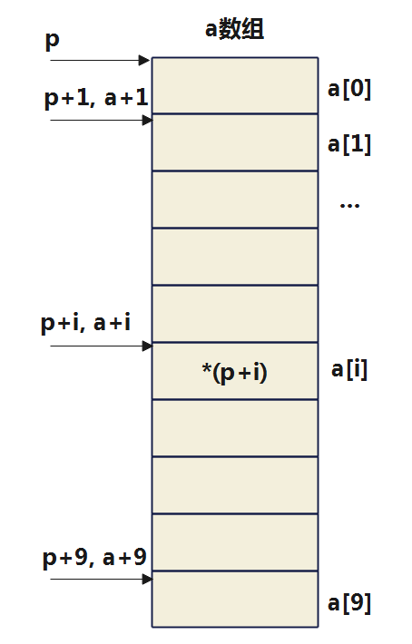

# 五、 数组

**数组的特点：**
- 数组中的元素在内存中是依次紧密排列的，有序的。
- 创建数组对象会在内存中开辟一整块`连续的空间`。占据的空间的大小，取决于数组的长度和数组中元素的类型。
- 我们可以直接通过下标(或索引)的方式调用指定位置的元素，速度很快。
- 数组，一旦初始化完成，其长度就是确定的。数组的`长度一旦确定，就不能修改`。
- 数组名中引用的是这块连续空间的首地址。

C语言不会判断数组是否越界

## 1、一维数组

注意：声明数组时，必须给出数组的大小。数组元素的调用
- 格式：`数组名[下标]`
- 数组的`下标从0开始`，用“int arr[10];”定义数组，则`最大下标值为9`，不存在数组元素arr[10]。
```c
arr[0] = 13;       //对该位置数组元素进行赋值
int score = arr[0]; //调用此位置的元素值
```
**数组角标越界：** 假设数组有n个元素，如果使用的数组的下标小于0，或者大于n-1，就是数组越界访问了，超出了数组合法空间的访问。C语言不做数组下标越界的检查，编译器也不一定报错，但是编译器不报错，并不意味着程序就是正确！如果访问越界的值或者给越界的数组元素赋值，可能会改变其他变量的值；

**数组的字节长度：** sizeof 运算符会返回整个数组的字节长度。
```c
int arr[10];
printf("数组的字节长度为：%zd\n",sizeof(arr)); //40
```

**数组的长度：** 在定义数组时，需要指定数组中元素的个数，方括号中的常量表达式用来表示元素的个数，即数组长度。

由于数组成员都是同一个类型，每个成员的字节长度都是一样的，所以数组整体的字节长度除以某个数组元素的字节长度，就可以得到数组的成员数量。
```c
//数组中元素的个数：
int arrLen = sizeof(arr) / sizeof(arr[0]); // 如果是在定义数组的地方使用，是可以的，但是如果是方法参数，则不太行
int a[10];
printf("数组的字节长度为：%zu\n", sizeof(a));   // 40
printf("数组每个元素的字节长度为：%zu\n", sizeof(int)); // 4
printf("数组的长度为：%zu\n", sizeof(a) / sizeof(int)); // 10
```
再看如下的例子：
```c
void Sort(int array[]) { // 其实这里是形参，表示数组的首地址
  printf("%lu\n", sizeof(array)); // 8， 表示指针的长度
}
int main() {
  int array[] = {0,1,2,3};
  printf("%lu\n", sizeof(array)); // 16，所有数组元素的占用的字节数，这里是数组名，在定义的地方为数组名
  Sort(array);
  return 0;
}
```
> 复习： sizeof 返回值的数据类型是 `size_t` ，所以 sizeof(a) / sizeof(a[0]) 的数据类型也是size_t 。在 printf() 里面的占位符，要用 %zd 或 %zu 。

注意：数组一旦声明/定义了，其 **长度就固定了，不能动态变化**。

数组作为参数传递到函数中，同时需要传递数组的长度，数组作为参数仅仅传递是首地址；
```c
int array[] = {0, 1, 2, 3, 4};
int *p = array;
printf(*(p + 3));// recommend
printf(*(array + 3));
printf(*(3 + array));
printf(3[array]); // not recommend
printf(array[3]); //recommend
printf(p[3]);
```
数组元素的默认值根据不同编译器而定，但是如果是全局数组，对于 int 类型的数组来说，每个元素的默认值都是0；

## 2、数组遍历

将数组中的每个元素分别获取出来，就是`遍历`。for循环与数组的遍历是绝配。
```c
int main() {
    int arr[10];
    //给数组中的每个元素赋值
    for (int i = 0; i < sizeof(arr)/sizeof(int); i++) { //对数组元素arr[0]~arr[9]赋值
        arr[i] = i;
    }
    //遍历数组中的元素
    printf("遍历数组中的元素：\n");
    for (int i = 0; i < sizeof(arr)/sizeof(int); i++) { //输出arr[0]~arr[9]共10个数组元素
        printf("%d ", arr[i]);
    }
    printf("\n");
    return 0;
}
```

## 3、数组定义方式

**（1）数组可以在声明时，使用大括号，同时对每一个成员赋值。**
```c
int arr[5] = {22, 37, 90, 48, 95};
```
C 语言允许省略方括号里面的数组成员数量，这时根据大括号里面的值的数量，自动确定数组的长度。
```c
int arr[3] = {10,20,30};
// 等同于
int arr[] = {10,20,30};  //数组 arr 的长度，将根据大括号里面的值的数量，确定为 3
```
对数组部分元素赋初值：如果大括号里面的值，少于数组的成员数量，那么未赋值的成员自动初始化为 0 。
```c
int arr[5] = {10, 20, 30};
// 等同于
int arr[5] = {10,20,30, 0, 0};
```
将整个数组的每一个成员都设置为零，最简单的方式如下
```c
int a[100] = {0};
```
**注意：**
使用大括号赋值时，大括号里面的值不能多于数组的长度，否则编译时会报错。
```c
int arr[3] = {1,2,3,4};  // 报错
```

**（2）数组初始化时，可以指定为哪些位置的成员赋值。**
```c
// C99开始支持
int arr[15] = {[2] = 10, [5] = 20, [14] = 30};  //非角标2、5、14的位置自动赋值为0
//等同于
int arr[15] = {[5] = 20, [14] = 30, [2] = 10}; //指定位置的赋值可以不按角标从小到大的顺序
```
指定位置的赋值与顺序赋值，可以结合使用。
```c
int arr[15] = {1, [5] = 10, 11, [10] = 20, 21}; //角标0、5、6、10、11的位置被赋值
```
省略成员数量时，如果同时采用指定位置的赋值，那么数组长度将是最大的指定位置再加1。
```c
int arr[] = {[2] = 6, [9] = 12};  //此时数组的长度是10
```

## 4、一维数组内存分析

针对于如下代码：
```c
int a[5] = {1,2,3,4,5};
```
对应内存结构如下：


说明：
- 数组名，记录该数组的首地址 ，即 a[0]的地址。
- 数组的各个元素是连续分布的， 假如 a[0] 地址是`0x1122`，则`a[1]地址= a[0]的地址+int字节数(4)` = `0x1122 + 4 = 0x1126`，后面 `a[2] 地址 = a[1]地址 + int 字节数(4)` = 0x1126 + 4 = 0x112A，依次类推...
- C语言是不检查数组边界的；

**C 语言规定，数组变量一旦声明，数组名指向的地址就不可更改。** 因为声明数组时，编译器会自动为数组分配内存地址，这个地址与数组名是绑定的，不可更改。因此，当数组定义后，再用大括号重新赋值，是不允许的。下面的代码会报错。
```c
int nums[5];
nums = {22, 37, 3490, 18, 95}; // 使用大括号赋值时，必须在数组声明时赋值，否则编译时会报错。
int nums[5] = {1, 2, 3, 4, 5};
nums = {6, 7, 8, 9, 10}; // 报错
int ints[100];
ints = NULL; //报错
```

这也导致不能将一个数组名赋值给另外一个数组名。下面两种写法都会更改数组 b 的地址，导致报错。
```c
int a[5] = {1, 2, 3, 4, 5};
// 写法一
int b[5] = a; // 报错
// 写法二
int b[5];
b = a; // 报错
```

**可变长度数组**

数组声明的时候，数组长度除了使用常量，也可以使用变量或表达式来指定数组的大小。这叫做`变长数组`（variable-length array，简称 VLA）
```c
int n = 10;
int arr[n];
```
变长数组的根本特征是数组长度只有`运行时才能确定`。它的好处是程序员不必在开发时，随意为数组指定一个估计的长度，程序可以在运行时为数组分配精确的长度。任何长度需要运行时才能确定的数组，都是变长数组。比如，
```c
int i = 10;
int a1[i];
int a2[i + 5];
int a3[i + k];
```
> 注意：变长数组在C99标准中被引入，在C11标准中被标记为可选特性。某些编译器可能不支持变长数组，或者可能有特定的限制和行为。

如果你的编译器版本不支持变长数组，还可以考虑使用动态内存分配（使用`malloc()函数` ）来创建动态大小的数组。
```c
// 分配：
int length = 5;
int *arr = (int *)malloc(length * sizeof(int));
// 释放：
free(arr);
```

## 5、数组操作

### 5.1、数组的复制

由于数组名是指针，所以复制数组不能简单地复制数组名。
```c
int a[3] = {10,20,30};
int* b;
b = a;
```
上面的写法，结果不是将数组 a 复制给数组 b ，而是让 a 和 b 指向同一个数组。

（1）使用循环复制数组：这是复制数组最简单的方法，将数组元素逐个进行复制。比如，将数组 a 的成员逐个复制给数组 b。

（2）使用 memcpy() 函数：memcpy() 函数定义在头文件 string.h 中，直接把数组所在的那一段内存，再复制一份。3个参数依次为：`目标数组`、`源数组`以及`要复制的字节数`
```c
#include <stdio.h>
#include <string.h>
#define LENGTH 3
int main() {
    int a[LENGTH] = {10, 20, 30};
    int b[LENGTH];
    // 使用 memcpy 函数复制数组 a 到数组 b
    memcpy(b, a, LENGTH * sizeof(int));
    // 打印数组 b 的内容
    printf("复制后的数组 b：");
    for (int i = 0; i < LENGTH; i++) {
        printf("%d ", b[i]);
    }
    printf("\n");
    return 0;
}
```
使用标准库提供的函数，可以实现`快速且高效`的内存复制。适用于`大型数组或复杂数据`结构的复制。可以直接复制字节数，不需要遍历数组

### 5.2、char型数组与字符串

字符型数组，顾名思义，数组元素的数据类型为字符型的数组

一方面，可以看做普通的数组，初始化、常用操作如前所述。比如：
```c
char arr[] = {'a','b','c','d'};
```
另一方面，字符型数组可以用于存储字符串。

**字符串**
```c
"helloworld"
"abc"
"a"
"123"
```
这种由双引号引起来的一串字符称为字符串字面值(String Literal)，简称字符串(String)。通常把`""`称为`空串`，即一个不包含任意字符的字符串；而`" "`则称为`空格串`，是包含一个空格字符的字符串。二者不能等同。

C语言没有专门用于存储字符串的变量类型，字符串都被存储在char类型的数组中。在字符串结尾，C 语言会自动添加一个`'\0' `的转义字符作为字符串结束的标志，所以字符数组也必须以 '\0'字符结束。
```c
//显式以'\0'为最后一个字符元素结束
char str[] = {'h','e','l','l','o',' ','w','o','r','l','d','\0'};
```
如果一个字符数组声明如下，由于必须留一个位置给 `\0` ，所以最多只能容纳9个字符的字符串。
```c
char str1[10];
```
字符串写成数组的形式，是非常麻烦的，C 语言提供了一种简化写法。双引号之中的字符，会被自动视为字符数组。
```c
char str1[11] = {"hello world"}; 
// 输出结果：Hello World�
printf("%s", str1); // 因为字符串都是以 '\0'结尾；
//自动在末尾添加'\0'字符
char str1[12] = {"hello world"};  //注意使用双引号，非单引号
//或者
char str2[12] = "hello world";   //可以省略一对{}来初始化数组元素
char str2[] = "hello world";   //可以省略一对{}来初始化数组元素
```
双引号里面的字符串，不用自己添加结尾字符 \0 ，C 语言会自动添加。所以，代码中数组 str1或str2的元素依次为 'h', 'e', 'l', 'l', 'o', ' ', 'w', 'o', 'r', 'l', 'd', '\0'。

**字符串对应数组的长度**


数组由连续的存储单元组成，字符串中的字符被存储在相邻的存储单元中，每个单元存储一个字符。所以，上述两个数组的长度不是11，而是12

**字符串的长度**

```c
char nation[10]={"China"};
```
数组nation的前5个元素为: ′C′,′h′,′i′,′n′,′a′，第6个元素为′\0′，后4个元素也自动设定为空字符。

> 注意：在计算字符串长度的时候，'\0' 是结束标志，不算作字符串内容。
```c
#include <stdio.h>
#include <string.h>    //需要加载此头文件
int main() {
    char nation[10] = "China";
    printf("%d\n", strlen(nation));     //5
}
```
**区分：'\0'、0、'0'**

字符 '\0' 不同于字符 '0' ，前者的ASCII 码是0（二进制形式 00000000 ），后者的 ASCII 码是48（二进制形式 00110000 ）。

比如：比较"x"和'x'的不同
- 字符串常量用双引号，字符常量用单引号。
- 存储空间不同：在内存中，字符常量只占用一个字节的存储空间，而字符串存储时自动加一个结束标记'\0'，所以'x'占用1个字节，而"x"占用2个字节。
- 二者的操作也不相同。例如，可对字符常量进行加减运算，字符串常量则不能

## 6、数组参数

数组在作为函数参数传递时，实际上传递的是数组在内存当中的首地址，而数组本身不附带任何大小信息，因此同时也需要将数组的大小信息传入函数当中
```c
int SumIntArray(int array[], int length) {
  int sum = 0;
  for (int i = 0; i < length; ++i) {
    sum += array[i];
  }
  return sum;
}
```

## 7、多维数组

### 7.1、多维数组定义

二维数组定义：
```c
int a[3][4]; //二维数组
```
二维数组a可看成由三个一维数组构成，它们的数组名分别为 a[0]、a[1]、a[2]。这三个一维数组各有 4 个元素，如，一维数组 a[0] 的元素为 `a[0][0]`、`a[0][1]`、`a[0][2]`、`a[0][3]`。二维数组a共有12个成员（3 x 4 = 12）。

二维数组，常称为`矩阵(matrix)`。把二维数组写成`行(row)`和`列(column)`的排列形式，可以形象化地理解二维数组的逻辑结构。

### 7.2、二维数组的内存分析

`矩阵形式`（如3行4列形式）表示二维数组，是`逻辑`上的概念，能形象地表示出行列关系。而在`内存`中，各元素是连续存放的，不是二维的，是`线性`的。

C语言中，二维数组中元素排列的顺序是`按行存放`的。即：先顺序存放第一行的元素，再存放第二行的元素。（最右边的下标变化最快，第一维的下标变化最慢）。


举例，整型数组`b[3][3]`在内存中的存放：


举例：关于长度
```c
int b[3][3];
printf("%d\n",sizeof(b)); //36
printf("%d\n",sizeof(b)/sizeof(int)); //9
```

查看数组元素的地址
```c
int main() {
    int arr2[3][4];
    for (int i = 0; i < 3; i++) {
        for (int j = 0; j < 4; j++) {
            printf("&arr2[%d][%d] = %p\n", i, j, &arr2[i][j]);
        }
    }
    return 0;
}
```

### 7.3、其他定义方式

多维数组也可以使用大括号，在声明的同时，一次性对所有成员赋值。
```c
int a[3][4] = {{1,2,3,4},
               {5,6,7,8},
               {9,10,11,12}};
```
部分元素赋值：
```c
//指定了 [0][0] 和 [1][1] 位置的值，其他位置就自动设为 0 。
int a[2][2] = {[0][0] = 1, [1][1] = 2};  
```

使用单层大括号赋值：多维数组也可以使用单层大括号赋值。不管数组有多少维度，在内存里面都是线性存储。对于`a[2][2]`来说， `a[0][0]` 的后面是 `a[0][1]` ，再后面是`a[1][0]` ，以此类推。
```c
int a[2][2] = {1, 0, 0, 2};  //会自动匹配到各行各列
```
在上面的基础上，如果对全部元素赋值，那么第一维的长度可以不给出。
```c
//int a[2][3] = {1, 2, 3, 4, 5, 6}; 
//可以写为：
int a[][3] = {1, 2, 3, 4, 5, 6}; 
//也可以写为：
int a[][3] = {{1, 2, 3},{4, 5, 6}}; //行数自然判定为2
```

### 7.4、二维数组作为参数

```c
void SumIntArrays(int array[][], int rows, int columns);
```
上面的定义方式会报错，数组的元素是不完整的类型 `int []`，意思是把 `int array[][]` 看做了 int 类型数组的数组，那怎样才能算是完整的类型呢？补齐二维数组第二个维度的元素个数即可，这样就是一个完整的类型了：
```c
// C90 当中声明数组类型的时候，数组大小只能用常量值表达式，而传入的参数 columns 实际上是个变量，可以定义常量
void SumIntArrays(int rows, int columns, int array[][columns]);
```

### 7.5、一维数组与二维数组

```c
#include <stdio.h>
#include "../include/io_utils.h"

int main() {
  int array[2][3] = {0,1,2,3,4,5};
  // 0 1 2
  // 3 4 5
  PRINT_INT(array[0][1]); // 1

  int *p = array; // 只能赋值给一维指针
  PRINT_INT(p[1]); // 1
  PRINT_INT(*(p + 1)); // 1
  PRINT_INT(p[4]); // 4
  return 0;
}
```

# 六、指针

指针是 C 语言`最重要`的概念之一，也是最`难理解`的概念之一。

## 1、指针的理解与定义

### 1.1、理解指针

计算机中程序的运行都是在内存中进行的，变量也是在内存中分配的空间，且不同类型的变量占用不同大小的空间。那如何访问内存中变量存储的数据呢？有两种方式：`直接访问`和`间接访问`。直接访问，直接使用变量名进行的访问，以前的程序中都是采用这种方式。

**内存地址与指针：**

为了能够有效的访问到内存的每个单元(即一个字节)，就给内存单元进行了编号，这些编号被称为该**内存单元的地址**。因为每个内存单元都有地址，所以变量存储的数据也是有地址的。
```c
int num = 5;
```


通过地址能找到所需的变量单元，可以说，**地址指向该变量单元**，将**地址形象化地称为“指针”**。即：
- `变量`：命名的内存空间，用于存放各种类型的数据。
- `变量名`：变量名是给内存空间取的一个容易记忆的名字。
- `变量值`：在变量单元中存放的数据值。
- `变量的地址`：变量所使用的内存空间的地址，即`指针`。


- `指针变量`：一个变量专门用来存放另一变量在内存中数据的地址 (即指针)，则它称为“指针变量”。我们可以通过访问指针变量达到访问内存中另一个变量数据的目的。(有时为了阐述方便，将指针变量直接说成指针。)

> 指针就是内存地址，使用指针访问变量，就是直接对内存地址中的数据进行操作；指针的本质就是套娃呀。不管什么类型的指针，其实仅仅抓住一点，指针也是变量，它保存了其他不管是什么东西的地址

### 1.2、指针变量的定义

**一般格式：**
```c
数据类型 *指针变量名 [=初始地址值];
```
- 数据类型是指针变量所指向变量数据类型。可以是 int、char、float 等基本类型，也可以是数组等构造类型。
- 字符 `*` 用于告知系统这里定义的是一个指针变量，通常跟在类型关键字的后面。比如， `char *` 表示一个指向字符的指针， `float *` 表示一个指向 float 类型的值的指针。此外，还有指向数组的指针、指向结构体的指针。
```c
int *p;  //读作：指向int的指针”或简称“int指针”
```
这是一个指针变量，用于存储int型的整数在内存空间中数据的地址。
- 指针变量的名字是 p，不是*p。
- 地址占多大空间，指针就占多大空间
- 指针变量中只能存放地址，不要将一个整数（或任何其它非地址类型的数据）赋给一个指针变量。
- 想要访问指针指向的内存的值，就要用到间接访问运算符 *，请注意这里的 * 是一个一元运算符
```c
// 正确
int * a, * b;
// 错误
int* a, b;   //此时a是整数指针变量，而b是整数变量
// 一个指针指向的可能还是指针，这时就要用两个星号 ** 表示
int **foo;
// 
int a = 10;
int *p = &a;
int **pp = &p; // *pp <=> p
```

### 1.3、指针的应用场景

- 使用指针访问变量或数组的元素。

## 2、指针的运算

指针作为一种特殊的数据类型可以参与运算，但与其他数据类型不同的是，指针的运算都是针对内存中的地址来实现的。

### 2.1、取址运算符：&

取址运算符，使用“`&`”符号来表示。作用：`取出指定变量在内存中的地址`，其语法格式如下：
```c
&变量
```
示例：
```c
int num = 10; 
printf("num = %d\n", num); // 输出变量的值。 num = 10
printf("&num = %p\n", &num); // 输出变量的内存地址。&num = 00000050593ffbbc
```
- 在输出取址运算获得的地址时，需要使用“%p”作为格式输出符。
- 这里num的4个字节，每个字节都有地址，取出的是第一个字节的地址（较小的地址）。

将变量的地址赋值给指针变量：
```c
int num = 10;
int *p; // p为一个整型指针变量
p = &num; // p 指向num的地址，& 取地址

int d = 10;
int *e, *f;
e = &d;
f = e;
```
**指针变量的赋值**
- 指针变量中只能存放地址（指针），不要将一个整数（或任何其它非地址类型的数据）赋给一个指针变量。
- C语言中的地址包括位置信息(内存编号，或称纯地址)和它所指向的数据的类型信息，即它是“`带类型的地址`”。所以，一个指针变量只能指向同一个类型的变量，不能抛开类型随意赋值。
  - char* 类型的指针是为了存放 char 类型变量的地址。
  - short* 类型的指针是为了存放 short 类型变量的地址。
  - int* 类型的指针是为了存放 int 类型变量的地址。
- 在没有对指针变量赋值时，指针变量的值是不确定的，可能系统会分配一个未知的地址，此时使用此指针变量可能会导致不可预料的后果甚至是系统崩溃。为了避免这个问题，通常给指针变量赋初始值为0(或NULL)，并把值为0的指针变量称为`空指针变量`。

通过指针变量修改指向的内存中的数据：
```c
int main() {
    int num = 10, *ptr;
    ptr = &num;
    printf("%d\n",num);
    scanf("%d", ptr); //等价于scanf("%d", &num);
    printf("%d\n",num);
    return 0;
}
```

### 2.2、取值运算符：`*`

在C语言中针对指针运算还提供了一个取值运算符，使用“`*`”符号表示。其`作用与&相反`，根据一个给定的内存地址取出该地址对应变量的值。也称为`解引用符号`。其格式如下：
```c
*指针表达式
```
其中，“`*`”不同于定义指针变量的符号，这里是运算符。“指针表达式”用于得到一个内存地址，与“*”结合以获得该内存地址对应变量的值。
```c
int main() {
    int a = 2024;
    int *p;
    p = &a;
    printf("%p\n",&a); //0000005cc43ff6d4
    printf("%p\n",p);  //0000005cc43ff6d4
    printf("%d\n", *p); //2024
    return 0;
}
```
```c
int main() {
    int num = 10; //这里定义一个整型变量num
    printf("num = %d\n", num); //输出变量num的值。输出：num = 10
    printf("&num = %p\n", &num); //输出变量num的地址。输出：&num = 000000e6a11ffa1c
    int *p = &num;
    printf("%p\n",p); //000000e6a11ffa1c
    printf("%d\n",*p);//10
    
    printf("*&num = %d\n", *&num);//通过num地址读取num中的数据。输出：*&num = 10
    return 0;
}
```
**`&` 运算符与 `*` 运算符互为逆运算，下面的表达式总是成立：**
```c
int i = 5;
if (i == *(&i)) // 正确
```

通过指针变量修改指向内存地址位置上的值
```c
int main() {
    int num = 10;
    int *p = &num;
    *p = 20;
    printf("num = %d\n",num);  //num = 20

    char ch = 'w';
    char* pc = &ch;
    *pc = 's';
    printf("ch = %c\n", ch); //ch = 's'
    return 0;
}
```
**问题1：** `&*p`的含义是什么?
- `“&”`和`“*”`两个运算符的优先级别相同，但按**自右而左**方向运算。因此，`&*p`与`&a`相同，即变量a的地址。
- 如果有`p1 = &*p; `它的作用是将`&a` (a的地址)赋给`p1` ，如果`p1`原来指向 b，经过重新赋值后它已不再指向b了，而指向了a。

**问题2：** `*&a`的含义是什么?
- 先进行`&a`运算，得a的地址，再进行`*`运算。`*&a`和`*p`的作用是一样的，它们都等价于变量a。即`*&a`与 a 等价。

### 2.3、指针的常用运算

#### 2.3.1、指针与整数运算

格式：`指针±整数`，指针与整数值的加减运算，表示指针所指向的内存地址的移动（加，向后移动；减，向前移动）。指针移动的单位，与指针指向的数据类型有关。**数据类型占据多少个字节，每单位就移动多少个字节。**

通过此操作，可以快速定位你要的地址： 
```c
short *s;
s = (short *) 0x1234;
printf("%hx\n", s + 1); // 0x1236   复习：%hx ：十六进制 short int 类型
printf("%hx\n", s - 1); // 0x1232

int *i;
i = (int *) 0x1234;
printf("%x\n", i + 1); // 0x1238    复习：%x ：十六进制整数
```
说明：s + 1 表示指针向内存地址的高位移动一个单位，而一个单位的 short 类型占据两个字节的宽度，所以相当于向高位移动两个字节。

再比如：变量a、b、c、d和e都是整型数据int类型，它们在内存中占据一块连续的存储区域。指针变量p指向变量a，也就是p的值是0xFF12，则：


说明：指针p+1并不是地址+1，而是指针p指向数组中的下一个数据。比如，int *p，p+1表示当前地址+4，指向下一个整型数据。

```c
int main() {
    int arr[5] = {1, 2, 3, 4, 5};
    int *p = &arr[1];
    printf("p的地址为：%p,对应的值为%d\n", p, *p); //p的地址为：0x7ffee4978b84,对应的值为2
    printf("p+1=的地址为：%p,对应的值为%d\n", p + 1, *(p + 1)); //p+1=的地址为：0x7ffee4978b88, 对应的值为3
    printf("p-1=的地址为：%p,对应的值为%d\n", p - 1, *(p - 1)); //p-1=的地址为：0x7ffee4978b80, 对应的值为1
    return 0;
}
```
> 注意：只有指向连续的同类型数据区域，指针加、减整数才有实际意义。

对于长度是 N 的一维数组 a，当使用指针 p 指向其首元素后，即可通过指针 p 访问数组的各个元素。


其中：
- `a[0]`用 `*p` 表示
- `a[1]`用`*(p+1)`表示
- `a[i]`用`*(p+i)`表示

遍历数组操作如下：
```c
#include <stdio.h>
#define LENGTH 5
int main() {
    int arr[LENGTH] = {10,20,30,40,50};
    //方式1：传统直接访问的方式
    for(int i = 0;i < LENGTH;i++){
        printf("%d ",arr[i]);
    }
    printf("\n");
    //方式2：使用指针访问
    int *p = &arr[0];
    for(int i = 0;i < LENGTH;i++){
        printf("%d ",*(p+i));
    }
    return 0;
}
```

#### 2.3.2、指针自运算

指针类型变量也可以进行自增或自减运算，如下：

```c
p++ 、 p-- 、 ++p 、--p
```
针对于数组来说，由于数组在内存中是连续分布的。
- 当对指针进行++时，指针会按照它指向的数据类型字节数大小增加，比如 int * 指针，每 ++ 一次， 就增加4个字节。
- 当对指针进行--时，指针会按照它指向的数据类型字节数大小减少，比如 int \* 指针，每 -- 一次， 就减少4个字节。

初始情况：

```c
int a[5] = {10,20,30,40,50};
```

情况1：

```c
int *p = a;  //p开始时指向数组a的首元素    等同于 int *p = &a[0];

p++; //使p指向下一元素a[1]
printf("%d\n",*p); //得到下一个元素a[1]的值，即20
```
情况2：
```c
int *p = a;  //p开始时指向数组a的首元素
printf("%d\n",*p++); //10   分析：由于++和*同优先级，结合方向自右而左，因此它等价于*(p++)
printf("%d\n",*p);   //20
```
拓展：
```c
*(p++); //先取*p值，然后使p自增1
*(++p); //先使p自增1，再取*p
```
拓展：如果 p 当前指向 a 数组中第 i 个元素a[i]，则：
```c
*(p--) //相当于a[i--]，先对p进行“*”运算，再使p自减
*(++p) //相当于a[++i]，先使p自加，再进行“*”运算
*(--p) //相当于a[--i]，先使p自减，再进行“*”运算
```
情况3：
```c
int *p = &a[2];  //p开始时指向数组a的第3个元素
printf("%d\n",*(p--)); //30
p = &a[2];
printf("%d\n",*(++p)); //40

p = &a[2];
printf("%d\n",*(--p)); //20
```
情况4：
```c
int *p = a;            //p开始时指向数组a的首元素
printf("%d\n",++(*p)); //11
/*
分析：表示p所指向的元素值加1，如果p=a, 则相当于++a[0]，若a[0]的值为10，则a[0]的值为11。
注意: 是元素a[0]的值加1，而不是指针p的值加1
*/
```

#### 2.3.3、同类指针相减运算

格式：`指针 - 指针`

相同类型的指针允许进行减法运算，返回它们之间的距离，即`相隔多少个数据单位（注意：非字节数）`。高位地址减去低位地址，返回的是正值；低位地址减去高位地址，返回的是负值。

返回的值属于 `ptrdiff_t` 类型，这是一个带符号的整数类型别名，具体类型根据系统不同而不同。这个类型的原型定义在头文件 `stddef.h` 里面。
```c
int main() {
    int arr[5] = {1, 2, 3, 4, 5};
    int *p1 = &arr[0];
    int *p2 = &arr[3];
    printf("p1的地址为：%d\n", p1); //497022544
    printf("p2的地址为：%d\n", p2); //497022556
    printf("p2-p1=%d\n", p2 - p1); //3 等同于 (497022556 - 497022544)/4 ==> 3
    return 0;
}
```
> 两个指针相减，通常两个指针都是指向同一数组中的元素才有意义。结果是两个地址之差除以数组元素的长度。不相干的两个变量的地址，通常没有做减法的必要。

**非法：同类指针相加运算** ，两个指针进行加法是`非法的`，所得结果是没有意义的。
```c
int i = 10,j = 20;
int *p1 = &i;
int *p2 = &j;
int *p3 = p1 + p2; //非法
```

#### 2.3.4、指针间的比较运算

指针之间的比较运算，比如 ==、!= 、<、 <= 、 >、 >=。比较的是各自的内存地址的大小，返回值是整数 1 （true）或 0 （false）
```c
int arr[5] = {1, 2, 3, 4, 5};
int *p1 = &arr[0];
int *p2 = &arr[3];

printf("%d\n", p1 > p2);  //0
printf("%d\n", p1 < p2);  //1
printf("%d\n", p1 == p2); //0
printf("%d\n", p1 != p2); //1
```
```c
int main() {
    int arr[] = {10, 20, 30};
    int *ptr;
    ptr = arr;  //ptr指向arr首地址(第一个元素)
    if (ptr == arr[0]) { //错误,类型不一样
        printf("ok1\n");
    }
    if (ptr == &arr[0]) { // 可以
        printf("ok2\n"); //输出
    }
    if (ptr == arr) { //可以
        printf("ok3\n"); //输出
    }
    if (ptr >= &arr[1]) { //可以比较,但是返回false
        printf("ok4\n");//不会输出
    }

    if (ptr < &arr[1]) { //可以比较,返回true
        printf("ok5\n");//输出
    }
    return 0;
}
```

## 3、野指针

### 3.1、什么是野指针

野指针：就是指针指向的位置是不可知（`随机性`，`不正确`，`没有明确限制的`）。

### 3.2、野指针的成因

**① 指针使用前未初始化**

指针变量在定义时如果未初始化，`其值是随机的`，此时操作指针就是去访问一个不确定的地址，所以结果是不可知的。此时p就为野指针：
```c
int main() {
    int *p;
    printf("%d\n",*p);
    return 0;
}
```
在没有给指针变量显式初始化的情况下，一系列的操作(包括修改指向内存的数据的值)也是错误的。
```c
#include<stdio.h>
int main(){
	int* p;                       
	*p = 10;  
	return 0;
}
```

**② 指针越界访问**

```c
#include <stdio.h>
int main() {
    int arr[10] = {0};
    int *p = arr;
    for (int i = 0; i <= 10; i++,p++) {
        *p = i;                   //i=10时越界
    }
    return 0;
}
```


当i=10时，此时`*p`访问的内存空间不在数组有效范围内，此时`*p`就属于非法访问内存空间，p为野指针。

**③ 指针指向已释放的空间**

```c
#include <stdio.h>
int *test() {
    int a = 10;
    return &a;          //&a=0x0012ff40
}
int main() {
    int *p = test();
    printf("%d", *p);
    return 0;
}
```
调用test函数将返回值赋给p，test函数的返回值是局部变量a的地址。由于a只在test函数内有效，出了test函数其内存空间就被释放，也就意味着`a的地址编号不存在`，若将其赋值给p，导致p获取到的地址是`无效`的。

如果短时间内再次利用这块地址，它的值还未被改变也就是0x0012ff40还存在，p的值为0x0012ff40，*p时还是10，可以打印出。

但如果在打印之前有其他函数调用了这块地址，这块地址的名称就会发生变化，不再是0x0012ff40，打印*p时不再为10。

总之，此时p为野指针。

### 3.3、野指针的避免

**1、指针初始化**

定义指针的时候，如果没有确切的地址赋值，为指针变量赋一个 NULL 值是好的编程习惯。即
```c
int *p = NULL;
```
> 赋为 NULL 值的指针被称为`空指针`，NULL 指针是一个定义在标准库 `<stdio.h>`中的值为零的常量 **#define NULL 0**

后面如果用到指针的话再让指针指向具有实际意义的地址，然后通过指针的取值符号(*)改变其指向的内容。

**2、小心指针越界**

**3、避免返回局部变量的地址**

**4、指针指向空间释放，及时置NULL**
```c
int a = 10;			
int* pa = &a;
printf("%d\n", *pa);
pa = NULL;				//把pa指针置成NULL
printf("%d\n",pa);
```

**5、指针使用之前检查有效性**
```c
if (pa != NULL){
	//进行使用
}
if (pa == NULL){
	//不进行使用
}
```

## 4、二级指针(多重指针)

一个指针p1记录一个变量的地址。由于指针p1也是变量，自然也有地址，那么p1变量的地址可以用另一个指针p2来记录。则p2就称为`二级指针`。

简单来说，二级指针即一个指针变量的值是另外一个指针变量的地址。通俗来说，二级指针就是指向指针的指针。

**格式：**
```
数据类型 **指针名;
```
示例：
```c
int a = 10;
int *pa = &a;  //pa是一级指针
int **ppa = &pa; //ppa是二级指针，类型为int **
```


> 进而推理，会有int ***pppa = &ppa; 等情况，但这些情况一般不会遇到。

在上述代码基础上，
```c
int b = 20;
ppa = &b; //报错
```
将 ppa（类型为 `int **`，即二级指针）赋值为 &b，但 &b是一个 `int *` 类型的指针，而不是 `int **` 类型。这会导致类型不匹配的错误。

如果您想要将 ppa 指向 b，可以找一个额外的一级指针作为中介。如下操作：
```c
int b = 20;
int *pb = &b;     // 使用一级指针来指向b
ppa = &pb;        // 将ppa指向pb的地址，ppa是二级指针
```
使用malloc()函数创建二维数组：malloc()函数用于动态分配堆内存，free()函数用于释放堆内存。这两个函数通常都是配合一起使用的。
```c
#include <stdio.h>
#include <stdlib.h>
int main() {
    int rows, cols;// 定义二维数组的行和列
    printf("第一维为：");
    scanf("%d", &rows);
    printf("第二维为：");
    scanf("%d", &cols);
    int **array = (int **) malloc(sizeof(int *) * rows);//先创建第一维
    for (int i = 0; i < rows; i++) {
        //在内层循环中动态创建第二维
        array[i] = (int *) malloc(sizeof(int) * cols);
        for (int j = 0; j < cols; j++) {
            array[i][j] = 1;
            printf("%d　", array[i][j]);
        }
        printf("\n");
    }
    free(array);
    return 0;
}
```

## 5、指针与数组

### 5.1、一维数组与指针

所谓`数组元素的指针就是数组元素的地址`。可以用一个指针变量指向一个数组元素。
```c
int a[10]={2,4,6,8,10,12,14,16,18,20}; 
int *p; //定义p为指向整型变量的指针变量
p = &a[0]; //把a[0]元素的地址赋给指针变量p
```
如下几个写法是等价的：
```c
int *p;
p = &a[0];  //千万不要写成*p = &a[0];，那就错了
```
```c
int *p = &a[0];
```
```c
int *p = a; //a不代表整个数组，所以这里不是将数组a赋给p。而代表数组元素a[0]的首地址。
```
注意：因为数组名a保存的是`数组首元素a[0]的地址`，所以在scanf函数中的输入项如果是数组名，`不要再加地址符&`。
```c
int main() {
  char arr[10];
  scanf("%s", arr);  //arr前不应加 &
  puts(arr);
  return 0;
}
```

**使用指针访问数组的元素**

如果指针变量p的初值为`&a[0]`，则：
- `p+i`和`a+i`就是数组元素`a[i]`的地址。或者说，它们指向a数组序号为i的元素。
- `*(p+i)`或`*(a+i)`是`p+i`或`a+i`所指向的数组元素的值，即`a[i]`的值。



数组的遍历方式：[array_pointer_iterator.c](source/c/array_pointer_iterator.c)
- 第(1)和第(2)种方法执行效率是相同的。C编译系统是将a[i]转换为*(a+i)处理的，即先计算元素地址。因此用第(1)和第(2)种方法找数组元素`费时较多`。
- 第(3)种方法比第(1)、第(2)种方法快，用指针变量直接指向元素，不必每次都重新计算地址，像p++这样的自加操作是比较快的。这种有规律地改变地址值(p++)能大大`提高执行效率`。

> 问题：可以通过改变指针变量p的值指向不同的元素。如果不用p变化的方法而用数组名a变化的方法（例如，用a++）行不行呢？ （不行）
```c
for(p = a;a < (p + N);a++)
	printf("%d",*a);
```
因为数组名a代表数组的首地址（或数组首元素的地址），它是一个指针型`常量`，它的值在程序运行期间是固定不变的。所以a++是无法实现的。必须将 a 的地址赋值给指针变量 p ，然后对 p 进行自增。

**指针带下标的使用**

指向数组元素的指针变量也可以带下标，如`p[i]`。`p[i]`被处理成`*(p+i)`，如果p是指向一个整型数组元素`a[0]`，则`p[i]`代表`a[i]`。但是必须弄清楚p的当前值是什么？**如果当前p指向a[3]，则p[2]并不代表a[2]，而是a[3+2]，即a[5]。**
```c
int main() {
    int a[5] = {10, 20, 30, 40, 50};
    int *p = a;
    //遍历数组元素
    for(int i = 0;i < 5;i++){
        printf("%d ", p[i]);
    }
    printf("\n");
    //注意：
    p++;
    printf("%d ", p[0]); //20
    return 0;
}
```

**`&`数组名**
```c
//复习
int main() {
    int arr[5] = {0};
    int *p = arr;
    printf("%p\n", p);  // 0x7ffee52b6b80
	  printf("%p\n", &p); // 0x7ffee52b6b70
    return 0;
}
```

```c
printf("%p\n", arr);  // 0x7ffee52b6b80
printf("%p\n", &arr); // 0x7ffee52b6b80
```
发现，`数组名` 和 `&数组名` 打印的地址是一样的。
```c
int arr[5] = {0};
printf("arr = %p\n", arr);        // 0x7ffee5e5ab80
printf("&arr= %p\n", &arr);       // 0x7ffee5e5ab80
printf("arr+1 = %p\n", arr + 1);  // 0x7ffee5e5ab84
printf("&arr+1= %p\n", &arr + 1); // 0x7ffee5e5ab94
```
`&arr` 理解为`数组的地址`，而不要理解为数组首元素`a[0]`的地址。

本例中 `&arr` 的类型是：`int(*)[5]` ，是一种数组指针类型。数组的地址+1，跳过整个数组的大小，所以` &arr+1` 相对于 `&arr` 的差值是20。

### 5.2、二维数组与指针

**使用数组名：**

设有一个二维数组 a 定义为：
```c
int a[3][4] = {{1, 2,  3,  4},
               {5, 6,  7,  8},
               {9, 10, 11, 12}};
```
二维数组 a，可视为三个一维数组：`a[0]`、`a[1]`、`a[2]`；而每个一维数组又是一维数组，分别由 4 个元素组成。首先，理解如下的操作：
```c
printf("%d\n",a[0][0]);  //二维数组中元素a[0][0]的值
printf("%p\n",&a[0][0]); //二维数组中元素a[0][0]的值对应的地址
printf("%p\n",a[0]);     //二维数组中a[0][0]的地址
printf("%p\n",a);        //二维数组中a[0]的地址
printf("%p\n",&a);       //二维数组a的地址
```


| 表示形式                         | 含义                                            | 地址        |
| -------------------------------- | ----------------------------------------------- | ----------- |
| `a`                              | 二维数组名，指向一维数组a[0]，<br>即0行起始地址 | 2000        |
| `&a[0][0],a[0],*a `              | 0行0列元素地址                                  | 2000        |
| `a[0][0],*(a[0]),**a`            | 0行0列元素`a[0][0]`的值                         | 1           |
| `&a[1],a+1`                      | 指向索引为1行的起始地址                         | 2016        |
| `&a[1][0],a[1],*(a+1)`           | 1行0列元素`a[1][0]`的地址                       | 2016        |
| `a[1][0],*(a[1]),*(*(a+1))`      | 1行0列元素`a[1][0]`的值                         | 5           |
| `&a[1][2],a[1]+2,*(a+1)+2`       | 1行2列元素`a[1][2]`的地址                       | 2024        |
| `a[1][2],*(a[1]+2),*(*(a+1)+2) ` | 1行2列元素`a[1][2]`的值                         | 是元素值，7 |

总结：
- `&a`:二维数组a的地址
- `a`: 二维数组中`a[0]`的地址
- `a[0]`:二维数组中`a[0][0]`的地址

`a[0][0]`相关的
- `a[0][0]`的地址：`&a[0][0]`, `a[0]`, `*a`；
- `a[0][0]`的值： `a[0][0]`, `*(a[0])`, `**a`；

`a[1]`相关的：`a[1]`的地址：`&a[1]`,`a + 1`

`a[1][0]`相关的：
- `a[1][0]`的地址：`&a[1][0]`,`a[1]`,`*(a+1)`
- `a[1][0]`的值：`a[1][0]`,`*a[1]`,`*(*(a+1))`

`a[1][2]`相关的
- `a[1][2]`的地址：`&a[1][2]`,`a[1]+2`,`*(a+1)+2`
- `a[1][2`]的值：`a[1][2]`,`*(a[1]+2)`,`*(*(a+1)+2)`

注意：如果 a 是二维数组，则 `a[i]`代表一个数组名， `a[i]`并不占内存单元，也不能存放a 数组元素值。它只是一个地址。所以：a、a+i、a[i]、\*(a+i)、\*(a+i)+j、a[i]+j 都是地址。

获取数组元素值的三种表示形式：
- `a[i][j]` 下标法
- `*(a[i]+j)` 用一维数组名
- `*(*(a+i)+j)` 用二维数组名

**使用指针变量：**

设 p 是指针变量，若p 指向数组首元素，即`p = a[0];`，那`a[i][j]`的指针如何表示？
```c
int main() {
    int a[3][2] = {{10, 20}, {30, 40}, {50, 60}};
    int *p;
    p = &a[0][0];
    printf("%p\n", p);     //000000f2f49ff7b0
    printf("%p\n", p + 1); //000000f2f49ff7b4
    printf("%p\n", p + 2); //000000f2f49ff7b8

    int *q;
    q = a[0];
    printf("%p\n", q);      //000000f2f49ff7b0
    printf("%p\n", q + 1);  //000000f2f49ff7b4
    printf("%p\n", q + 2);  //000000f2f49ff7b8

    int *r;
    r = a;  //代码片段1
    printf("%p\n", r);      //000000f2f49ff7b0
    printf("%p\n", r + 1);  //000000f2f49ff7b4
    printf("%p\n", r + 2);  //000000f2f49ff7b8

    return 0;
}
```
- p+j 将指向 a[0] 数组中的元素 `a[0][j]`。
- 对于二维数组`a[M][N]`来讲，由于 a[0]、a[1]、... 、a[M-1]等各行数组在内存中是依次连续存储，则对于 a 数组中的任一元素 `a[i][j]`：
  - 地址表示：`p+i*N+j`
  - 值表示：`*(p+i*N+j)`、`p[i*N+j]`
```c
int b[4][3] = {{10, 20, 30},
               {40, 50, 60},
               {70, 80, 90},
               {100, 110, 120}};
int *p = b[0];
// 元素 `b[1][2]`对应的地址/指针、元素值为：
printf("b[1][2]对应的地址/指针为：%p\n",p+1*3+2);
printf("b[1][2]对应的值为：%d\n",*(p+1*3+2));
printf("b[1][2]对应的值为：%d\n",p[1*3+2]);
```

### 5.3、指针数组

**数组指针 vs 指针数组**
- **数组指针**：当指针变量里存放一个数组的首地址时，此指针变量称为指向数组的指针变量，简称`数组指针`。<br/>
  数组指针是指针？还是数组？答案是：指针。
  - 整型指针： int * pint; 能够指向整型数据的指针。
  - 浮点型指针： float * pf; 能够指向浮点型数据的指针。
  - 数组指针：能够指向数组的指针。
- **指针数组**：数组是用来存放一系列相同类型的数据，当然数组也可以用来存放指针，这种用来`存放指针的数组`被称为指针数组，它要求存放在数组中指针的`数据类型必须一致`。指针数组是指针还是数组？答案：是数组。是存放指针的数组。

**使用指针数组：**

定义格式：`数据类型 *指针数组名[大小];`
```c
int *arr[5];
```
arr是一个数组，有5个元素，每个元素是一个整型指针，需要使用下标来区分。

```c
int main() {
    int line1[] = {1, 2, 3, 4};         //声明数组，矩阵的第一行
    int line2[] = {5, 6, 7, 8};         //声明数组，矩阵的第二行
    int line3[] = {9, 10, 11, 12};         //声明数组，矩阵的第三行
    int *p_line[3];              //声明整型指针数组
    p_line[0] = line1;           //初始化指针数组元素
    p_line[1] = line2;
    p_line[2] = line3;
    printf("矩阵:\n");
    for (int i = 0; i < 3; i++) {      //对指针数组元素循环
        for (int j = 0; j < 4; j++) {    //对矩阵每一列循环
            printf("%d\t", p_line[i][j]); //或改为printf("%d\t", *(p_line[i] + j));
        }
        printf("\n");
    }
    return 0;
}
```

### 5.4、字符数组 vs 字符指针变量

一个字符串，可以使用`一维字符数组`表示，也可以使用`字符指针`来表示。
- 字符数组由若干个元素组成，每个元素放一个字符
- 字符指针变量中存放的是地址（字符串/字符数组的首地址），绝不是将字符串放到字符指针变量中。
```c
char str[] = "hello tom";  //使用字符数组
char * pStr = "hello tom";  //使用字符指针
```
**两种方式的对比：**
- 对已声明好的字符数组，只能一一对各个元素赋值，不能用以下错误方法对字符数组赋值
```c
char str[14];
str[0] = 'i'; //正确
str = "hello Tom"; //错误
```
对字符指针变量，采用如下方式赋值是可以的。
```c
char * pStr = "hel";
pStr = "hello tom"; //正确
```
一个字符数组，因为它有确定的内存地址，所以**字符数组名**是一个`常量`。而定义一个字符指针变量时，它在指向某个确定的字符串数据的情况下，也可以多次`重新赋值`。
```c
int main() {
    char arr[] = "hello";
    arr[1] = "m";    	//运行时错误 
    printf("%s\n",arr);
    return 0;
}
```
因为字符串字面量存储在只读内存区域，是不可变的，不能修改其值。
```c
int main() {
    char *pStr = "hello";
    pStr = "hello tom"; //正确
    pStr[1] = 'm';      //运行时错误
    printf("%s\n",pStr);
    return 0;
}
```

### 5.5、字符串数组的表示

字符串可以使用一维字符数组或字符指针变量等两种方式表示，那么字符串数组如何表示呢？

如果一个数组的每个成员都是一个字符串，则构成了字符串数组。字符串数组有两种表示方式：`① 二维字符数组` ；`②字符指针数组`。

使用二维字符数组
```c
char fruit[][7]={"Apple","Orange","Grape","Pear","Peach"};
```
使用字符指针数组

```c
char* weekdays[7] = {  //7也可以省略
  "Monday",
  "Tuesday",
  "Wednesday",
  "Thursday",
  "Friday",
  "Saturday",
  "Sunday"
};
```
