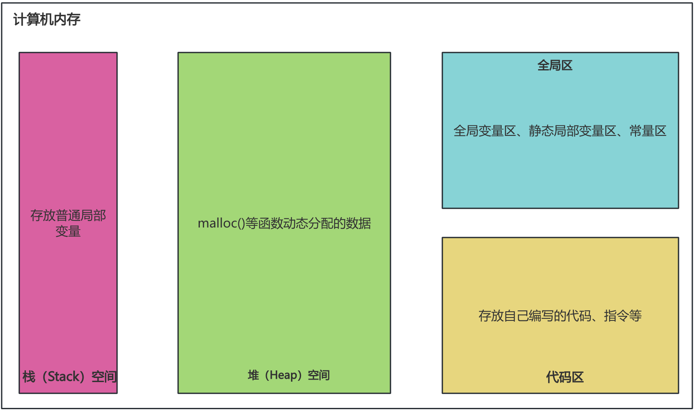

# 七、函数

一个C源程序可以由一个或多个源文件构成（C文件扩展名是“.c”），一个源文件是一个编译单位。一个源文件可以由若干个函数构成，函数之间可以相互调用。也就是说，`函数是C程序基本的组成单位`

## 1、函数的分类

每个C应用程序只有一个，且必须有一个main()主函数。无论主函数写在什么位置，C程序总是从main()函数开始执行。main()函数可以调用其它的子函数，子函数之间可以相互调用任意多次

**库函数(或标准函数)**

它是由C系统提供的，用户不必自己定义，可直接使用它们。注意，不同的C语言编译系统提供的库函数的数量和功能会有一些不同，但是一些基本的函数是共同的。比如：
- 字符串操作函数
- 字符操作函数
- 时间/日期函数
- 数学函数
- IO函数
- 内存操作函数
- 其它库函数

> 使用库函数，必须包含 `#include` 对应的头文件。

## 2、函数声明

**函数定义的格式：**
```
返回值类型 函数名(数据类型1 形参1,数据类型2 形参2,…,数据类型n 形参n){
	函数体;
}
```
比如：
```c
//计算两个整数的和，并返回
int add(int m,int n) {
	return m + n;
}
```

**返回值**
- 针对函数无返回值或明确不需返回值的情况，使用 `void` (即空类型)表示。
- 有返回值的类型，指明具体的类型。比如， int、float、char 等。如果省略，默认为int类型。

> 特殊的：如果返回值类型非 void，但被调函数中没有 return 语句，函数会返回一个不确定的值。

**函数名**，属于标识符。要遵循标识符的命名规则，参考google，一般来说, 函数名的每个单词首字母大写 (即 “驼峰变量名” 或 “帕斯卡变量名”), 没有下划线. 对于首字母缩写的单词, 更倾向于将它们视作一个单词进行首字母大写；

**参数列表**
- 如果想定义一个函数，不接受任何参数，可以在参数列表中写上void：
```c
void EmptyParamList(void){}
```

**关于return**
- 返回值类型不是void时，函数体中必须保证一定有 `return 返回值; `语句，并且要求该返回值结果的类型与声明的返回值类型一致或兼容。
- 返回值类型是void时，函数体中可以没有return语句。如果要用return语句提前结束函数的执行，那么return后面不能跟返回值，直接写`return;` 就可以。

**补充说明：**
- C程序中的所有函数都是互相独立的。一个函数并不从属于另一个函数，即函数不能嵌套定义；
- 同一个程序中函数不能重名，`函数名用来唯一标识一个函数`。即在标准的 C 语言中，并不支持函数的重载。

## 3、特殊函数

### 3.1、关于main()

C 语言规定， main() 是程序的入口函数，即所有的程序一定要包含一个 main() 函数。程序总是从这个函数开始执行，如果没有该函数，程序就无法启动。

main()函数可以调用其它函数，但其它函数不能反过来调用main()函数。main()函数也不能调用自己。

**main() 的一般格式**
```c
int main() {// main函数默认返回值是：int
  //函数体（略）
  return 0;
}
```
C 语言约定：返回值 0 表示函数运行成功；返回其它非零整数值，表示运行失败，代码出了问题。系统根据 main() 的返回值，作为整个程序的返回值，确定程序是否运行成功。正常情况下，如果 main() 里面省略 return 0 这一行，编译器会自动加上，即 main() 的默认返回值为0。所以，也可以声明如下：
```c
int main() {// 函数参数，这里表示不知道有多少个函数；
  //函数体（略）
}
```
> 注意，C 语言只会对 main() 函数默认添加返回值，对其它函数不会这样做，所以建议书写时保留 return 语句，以便形成统一的代码风格。

其他写法：
```c
int main(int argc, char *argv[]) {
   //函数体
} 
```
其中，形参argc，全称是argument count，表示传给程序的参数个数，其值至少是1（包含程序本身的名称）；而argv，全称是argument value，`argv[]`则是指向字符串的指针数组。这种方式可以通过命令行的方式，接收指定的字符串传给参数argv，数组的第一个元素（`argv[0]`）是程序的名称，后续元素是传递给程序的其他参数。

### 3.2、关于exit()

exit() 函数用来终止整个程序的运行。一旦执行到该函数，程序就会立即结束。该函数的原型定义在头文件 `stdlib.h` 里面。

exit() 可以向程序外部返回一个值，它的参数就是程序的返回值。一般来说，使用两个常量作为它的参数，这两个常量也是定义在 stdlib.h 里面： 
- EXIT_SUCCESS （相当于 0）表示程序运行成功，正常结束；
- EXIT_FAILURE （相当于 1）表示程序异常中止。
```c
// 程序运行成功
// 等同于 exit(0);
exit(EXIT_SUCCESS);
// 程序异常中止
// 等同于 exit(1);
exit(EXIT_FAILURE);
```
在main()函数结束时也会隐式地调用exit()函数，exit() 等价于使用 return 语句。其它函数使用 exit() ，就是终止整个程序的运行，没有其它作用。

C 语言还提供了一个 `atexit()` 函数，用来登记 exit() 执行时额外执行的函数，用来做一些退出程序时的收尾工作。该函数的原型也是定义在头文件 `stdlib.h` 。
```c
int atexit(void (*func)(void));
```
atexit() 的参数是一个函数指针。注意，它的参数函数不能接受参数，也不能有返回值。示例：
```c
#include <stdio.h>
#include <stdlib.h>
void cleanup1(void) {
    printf("Cleanup function 1 called.\n");
}
void cleanup2(void) {
    printf("Cleanup function 2 called.\n");
}
int main(void) {
    if (atexit(cleanup1) != 0) {// 使用 atexit 函数注册 cleanup1 和 cleanup2 函数。如果注册失败，atexit 将返回非零值
        fprintf(stderr, "Unable to register cleanup1\n");
        return EXIT_FAILURE;
    }
    if (atexit(cleanup2) != 0) {
        fprintf(stderr, "Unable to register cleanup2\n");
        return EXIT_FAILURE;
    }
    printf("Main function ends.\n");
    return EXIT_SUCCESS;
}
// 输出结果：
Main function ends.
Cleanup function 2 called.
Cleanup function 1 called.
```
可以看到，atexit 注册的清理函数 cleanup2 和 cleanup1 在程序结束时按注册的相反顺序被调用。

### 3.3、函数原型

函数必须先声明，后使用。由于程序总是先运行 main() 函数，所以其它函数都必须在main()之前声明。如果函数声明在 main 函数之后，会编译报错，说找不到对应的函数；

对于函数较多的程序，保证每个函数的顺序正确，会变得很麻烦。C 语言提供的解决方法是，只要在程序开头处给出函数原型，函数就可以先使用、后声明。
```c
int add(int, int);   //函数原型
int main() {
    int m = 10, n = 20;
    int sum = add(m, n);
    printf("sum = %d\n", sum);
}
// 实现函数
int add(int num1, int num2) {
    return num1 + num2;
}
```
所谓`函数原型(function prototype)`，就是函数在调用前提前告诉编译器每个函数的基本信息(它包括了返回值类型、函数名、参数个数、参数类型和参数顺序)，其它信息都不需要（不用包括函数体、参数名），函数具体的实现放在哪里，就不重要了。在函数调用时，检查函数原型和函数声明是否一致，只要一致就可以正确编译、调用。

函数原型中包括参数名也可以，虽然这样对于编译器是多余的，但是阅读代码时，有助于理解函数的意图。

> 在C语言中，通常在main()函数之前或是程序源码文件的开头，给出当前脚本使用的所有函数的原型。以确保在main()函数内部调用其他函数时编译器已经了解这些函数的信息。

## 4、参数传递

### 4.1、形参、实参

* `形参（formal parameter）`：在定义函数时，函数名后面括号()中声明的变量称为`形式参数`，简称`形参`。
* `实参（actual parameter）`：在调用函数时，函数名后面括号()中使用的值/变量/表达式称为`实际参数`，简称`实参`。
其中：
- 实参与形参的类型应相同或赋值兼容，个数相等、一一对应。
- 形参只是一个形式，在调用之前并不分配内存。函数调用时，系统为形参分配内存单元，然后将主调函数中的实参传递给被调函数的形参。被调函数执行完毕，通过return语句返回结果，系统将形参的内存单元释放；

形参和实参的功能主要是数据传递，按照传递的是“数据”还是“地址”，分为“`值传递`”和“`地址传递`”两种方式。

### 4.2、值传递

值传递，又称传值方式、数据复制方式，就是把主调函数的实参值`复制`给被调用函数的`形参`，使形参获得初始值。接着在函数内对形参值的修改，不影响实参值。

值传递，是`单向传递`，只能把实参的值传递给形参，而不能把形参的值再传回给实参。

**默认传递值的类型：基本数据类型 (整型类型、浮点类型，字符类型)、结构体、共用体、枚举类型。**

`形参、实参各占独立的存储空间`。函数在被调用时，给形参动态分配临时存储空间，函数返回释放。
```c
void swap(int a, int b) {
    int temp = a;
    a = b;
    b = temp;
    //printf("a = %d,b = %d\n", a, b);  //输出交换后的结果
}
int main() {
    int x = 6, y = 8;
    printf("调用函数之前：\n");
    printf("x = %d,y = %d\n", x, y); //输出调用swap()函数之前x,y的值

    swap(x, y);               //调用swap()函数
    printf("调用函数之后:\n");
    printf("x = %d,y = %d\n", x, y); //输出调用swap()函数之后x,y的值
}
```
为什么在swap()函数内变量a和b的值互换了，而主调函数main()中实参x和y却没有交换呢？这是参数按值传递的缘故。如果想要实现值的交换，那就需要传入变量本身，这就需要传入变量的地址，即`地址传递`。

### 4.3、地址传递

地址传递，又称传地址方式、地址复制方式、指针传递，就是把实参地址常量进行复制，传送给形参。

**默认传递地址的类型：指针、数组**。实参将地址传递给形参，二者地址值相同。
- 比如1：当指针作为函数的形参时，实参传递给形参的是地址，在函数中通过形参保存的地址访问实参，进而在函数中通过地址对实参的修改影响到实参的值。这也称为`双向传递`。
- 比如2：当传递数组首元素地址时，即把实参数组的起始地址传递给形参。这样形参和实参数组就占用了共同的存储空间。在被调函数中，如果通过形参修改了数组元素值，调用函数后实参数组元素值也发生相应变化。

#### 4.3.1、简单变量指针作为形参

当函数的形参类型是指针类型时，使用该函数时，需要传递指针，或者地址，或者数组给该形参。函数内以指针的方式操作变量(*指针)。
```c
void swap(int *a, int *b) { //函数参数为指针类型
    int temp = *a;
    *a = *b;
    *b = temp;
    printf("*a = %d,*b = %d\n", *a, *b);  //输出交换后的结果
}

int main() {
    int x = 6, y = 8;
    printf("调用函数之前：\n");
    printf("x = %d,y = %d\n", x, y); //输出调用swap()函数之前x,y的值

    swap(&x, &y);               //调用swap()函数
    printf("调用函数之后:\n");
    printf("x = %d,y = %d\n", x, y); //输出调用swap()函数之后x,y的值
}
```
通过传入变量 x 和 y 的地址，函数内部就可以直接操作该地址，从而实现交换两个变量的值。

**$\color{red}{错误的方式：}$**
```c
void swap(int *p1, int *p2) {
    int *temp;
    *temp = *p1;
    *p1 = *p2;
    *p2 = *temp;
}
```
上述代码中存在错误。问题出在临时指针 temp 没有分配内存空间，因此不能正确保存变量的值。因此对*temp的赋值就没有意义。
```c
void swap(int *p1, int *p2) { //形参是指针变量
    int *temp;
    temp = p1;
    p1 = p2;
    p2 = temp;
    //printf("*p1 = %d,*p2 = %d\n", *p1, *p2); //*p1 = 8,*p2 = 6
}
```
在函数内部，只是交换了指针变量本身的值，而没有影响到原始调用函数时传递给 swap 函数的指针变量。

$\color{red}{特别体现：函数不要返回内部变量的指针}$
```c
int* f() {
  int i;
  // ...
  return &i;
}
```
函数返回内部变量 i 的指针，这种写法是错的。因为当函数结束运行时，内部变量就失效了，这时指向内部变量 i 的内存地址就是无效的，再使用这个地址是错误的。

#### 4.3.2、数组作为形参

数组名本身就代表该数组首地址，传数组的本质就是传地址。因此，把数组名传入一个函数，就等同于传入一个指针变量。在函数内部，就可以通过这个指针变量获得整个数组。

传入一个整数数组，与传入一个整数指针是同一回事，数组符号 [] 与指针符号 * 是可以互换的：
```c
void setValue(int vals[], int len);
void setValue1(int *vals, int len) 
```
数组作为参数的习惯操作。将函数中要操作的数组元素的长度传入（并不是指数组的总长度）。由于数组名就是一个指针，如果只传数组名，那么函数只知道数组开始的地址，不知道结束的地址，所以才需要把数组长度也一起传入

参与形参的对应关系有以下4种情况：
（1）形参和实参都用数组名
```c
int f(int x[], int len);
int main() {
  int a[10];
  f(a, 10);
}
```
（2）实参形参都用指针变量
```c
int f(int *x, int len);
int main() {
  int a[10];
  f(a, 10);
}
```
（3）实参用数组名，形参用指针变量
```c
int f(int *x, int len);
int main() {
  int a[10];
  *p = a
  f(p, 10);
}
```
（4）实参为指针变量，形参为数组名
```c
int f(int x[], int len);
int main() {
  int a[10];
  *p = a;
  f(p, 10);
}
```
说明：如果函数的参数是二维数组，那么除了第一维的长度可以当作参数传入函数，其他维的长度需要写入函数的定义。也就是说，在定义二维数组时，必须指定列数(即一行中包含几个元素) ，由于形参数组与实参数组类型相同，所以它们是由具有相同长度的一维数组所组成的。所以必须指定第2维(列数)。

**变长数组作为参数**
变长数组作为函数参数时，写法略有不同。
```c
#include <stdio.h>
//int sum_array(int a[n],int n) { //报错
//    // ...
//}
int sumArray(int n, int a[n]) {
    // ...
}
```

#### 4.3.3、字符串(字符指针)作为形参

字符串(或字符指针)作为函数的参数，与数组指针作为函数参数没有本质的区别，传递的都是地址值，所不同的仅是指针指向对象的类型不同而已。
```c
#include<stdio.h>
#define N 100

int digitalCount(char *p) {
    int count = 0;
    for (; *p != '\0'; p++)
        if (*p >= '0' && *p <= '9')
            count++;
    return count;
}
int main() {
    char strs[N] = "a12bc43hec22b68o";
    printf("数字字符的个数为 % d个\n", digitalCount(strs)); //8
    return 0;
}
```

#### 4.3.4、指针数组作为形参

指针数组的元素是指针变量，用指针数组能够实现一组字符串的处理。

## 5、可变参数

有些函数的参数数量是不确定的，此时可以使用C语言提供的`可变参数函数`（Variadic Functions）。声明可变参数函数的时候，使用省略号 ... 表示可变数量的参数。最常见的例子：
```c
#include <stdarg.h>
int printf(const char* format, ...);
```
这里的 `...` 表示可以传递任意数量的参数，但是它们都需要与`format`字符串中的格式化标志相匹配。
> 注意：... 符号必须放在`参数序列的结尾`，否则会报错。

**可变参数函数的使用：**
- 为了使用可变参数，你需要引入`<stdarg.h>`头文件。
- 在函数中，需要声明一个`va_list`类型的变量来存储可变参数。它必须在操作可变参数时，首先使用。
- 使用`va_start`函数来初始化`va_list`类型的变量。它接受两个参数，参数1是可变参数对象，参数2是原始函数里面，可变参数之前的那个参数，用来为可变参数定位。
- 使用`va_arg`函数来逐个获取可变参数的值。每次调用后，内部指针就会指向下一个可变参数。它接受两个参数，参数1是可变参数对象，参数2是当前可变参数的类型。
- 使用`va_end`函数来结束可变参数的处理。
```c
#include <stdio.h>
#include <stdarg.h>

void HandleVarargs(int arg_count, ...) {
  va_list args; // ① 处定义 va_list 类型的变量 args，用于获取变长参数。
  int i;
  va_start(args, arg_count); // ② 处实际上是初始化 args 的值，这里同时需要变长参数前面的最后一个参数 arg_count
  for (i = 0; i < arg_count; ++i) {
    int arg = va_arg(args, int); // ③ 处则是在知道了变长参数的位置之后按照类型一个一个取出参数
    printf("%d: %d\n", i, arg);
  }
  va_end(args); // ④ 清理变长参数的读取工作
}
int main(int argc, char **argv) {
  HandleVarargs(3, 100, 200, 300);
  return 0;
}
```
使用 va_start, va_arg, va_end 这些宏需要导入 `stdarg.h` 这个头文件；va_list 就像叫号器一样，变长参数从 va_start 之后开始叫号，va_arg 就是叫号过程

## 6、指针函数(返回值是指针)

C语言允许函数的返回值是一个指针（地址），这样的函数称为`指针函数`。指针函数的定义的一般格式
```c
返回值类型 *函数名(形参列表) {
	函数体
｝
```
函数体中的 return 命令须返回一个地址。

示例：
```c
#include <stdio.h>
#include <stdlib.h>
int *func() {
    int *n = (int *)malloc(sizeof(int));  //分配动态内存
    if (n != NULL) {
        *n = 100;
    }
    return n;
}
int main() {
    int *p = func();
    int n = *p;
    printf("value = %d\n", n);
    free(p); // 释放动态分配的内存，以免出现内存泄漏
    return 0;
}
```
注意，上述操作很容易错写成如下方式：
```c
int *func() {
    int n = 100;
    return &n;
}
int main() {
    int *p = func();
    int n = *p;
    printf("value = %d\n", n);
    return 0;
}
```
在 func() 函数中，声明了一个整数变量 n，然后返回其地址 `&n`。但是，一旦 func() 函数执行完毕，局部变量 n将被销毁，它的地址也将变得无效。这意味着在 main() 函数中，尝试访问 p 指向的地址时，它实际上已经不再是一个有效的内存位置，这会导致未定义的行为。如果确实希望返回局部变量的地址，除了使用`malloc()`函数的方式之外，还可以定义局部变量为 `static` 的，此时数据空间在`静态数据区`分配，静态变量在程序的生命周期内都存在，不会像局部变量那样在函数执行完毕后被销毁。比如：
```c
int *func() {
    static int n = 100;
    return &n;
}
int main() {
    int *p = func();
    int n = *p;
    printf("value = %d\n", n);
    return 0;
}
```

## 7、函数指针(指向函数的指针)

一个函数本身就是一段内存里面的代码，总是占用一段连续的内存区域。这段内存区域也有首地址，把函数的这个首地址（或称入口地址）赋予一个指针变量，使指针变量指向函数所在的内存区域，然后通过指针变量就可以找到并调用该函数。这种指针就是**函数指针**。简单来说，函数指针，就是指向函数的指针。

**格式：**
```c
返回值类型 (*指针变量名)(参数列表);
```
其中，参数列表中可以同时给出参数的类型和名称，也可以只给出参数的类型，省略参数的名称。
```c
void print(int a) {
    printf("%d\n", a);
}
int main() {
    void (*print_ptr)(int); //1
    print_ptr = &print;     //2
    
    return 0;
}
```
- 注释1处，变量 print_ptr 是一个函数指针，它可以指向函数返回值类型为void且有1个整型参数的函数。
- 注释2处，print_ptr 指向函数 print() 的地址。函数 print() 的地址可以用 &print 获得。

> 注意，` (*print_ptr) `的小括号一定不能省略，否则因为函数参数 (int) 的优先级高于 * ，整个结构就变成了函数原型： `void *print_ptr(int) `，`void *` 成了返回值类型了。

有了函数指针，通过它也可以调用函数。
```c
(*print_ptr)(10);
// 等同于
print(10);
```
如下比较两个数的大小：
```c
int max(int a, int b) {
    return a > b ? a : b;
}
int main() {
    int x, y;
    int (*pmax)(int, int) = &max; // 使用函数指针
    printf("输入两个整数:");
    scanf("%d %d", &x, &y);
    int maxVal = (*pmax)(x, y);
    printf("较大值为: %d\n", maxVal);
    return 0;
}
```
> C 语言规定，函数名本身就是指向函数代码的指针，通过函数名就能获取函数地址。也就是说， print 和 &print 是一回事。
```c
if (print == &print) // true
void (*print_ptr)(int) = &print;
// 或
void (*print_ptr)(int) = print;
if (print_ptr == print) // true
```
注意：
- 1、对指向函数的指针变量不能进行算术运算，如p+n，p++，p--等运算是无意义的。
- 2、用函数名调用函数，只能调用所指定的一个函数，而通过指针变量调用函数比较灵活，可以根据不同情况先后调用不同的函数。

## 8、回调函数

指向函数a的指针变量的一个重要用途是把函数a的入口地址作为参数传递到其它函数b中，此时的函数b就称为`回调函数`。在此基础上，就可以在回调函数b中使用实参函数a。

它的原理可以简述如下: 有一个函数（假设函数名为fun），它有两个形参（x1和x2），定义x1和x2为指向函数的指针变量。在调用函数fun时，实参为两个函数名f1和f2，给形参传递的是函数f1和f2的入口地址。这样在函数fun中就可以调用f1和f2函数了。
```c
#include <stdio.h>
#include <stdlib.h>
// 回调函数
void initArray(int *array, int arrayLen, int (*f)()) {
    for (int i = 0; i < arrayLen; i++)
        array[i] = (*f)();
}
// 获取随机值
int getRandomValue() {
    return rand();
}
int main() {
    int arrLen = 10;
    int myArray[arrLen];
    initArray(myArray, arrLen, &getRandomValue);
    //遍历数组
    for (int i = 0; i < 10; i++) {
        printf("%d ", myArray[i]);
    }
    printf("\n");
    return 0;
}
```

## 9、函数说明符

C 语言提供了一些函数说明符，让函数用法更加明确。

函数一旦定义，就可以被其它函数调用。但是当一个源程序由多个源文件组成时，在一个源文件中定义的函数能否被其他源文件中的函数调用呢？因此，C语言又把函数分为两类——`内部函数`和`外部函数`。

**① 内部函数(静态函数)**

如果在一个源文件中定义的函数只能被本文件中的函数调用，而不能被同一源程序其他文件中的函数调用，这种函数称为内部函数。此时，内部函数需要使用static修饰，定义内部函数的一般形式是：
```
static 类型说明符 函数名(<形参表>)
```
举例：
```c
static int f(int a,int b){
   …
} 
```
说明：f()函数只能被本文件中的函数调用，在其他文件中不能调用此函数。但此处static的含义并不是指存储方式，而是指对函数的调用范围只局限于本文件。因此在不同的源文件中定义同名的内部函数不会引起混淆，互不影响。

**② 外部函数**

外部函数在整个源程序中都有效，只要定义函数时，在前面加上`extern`关键字即可。其定义的一般形式为：
```
extern 类型说明符 函数名(<形参表>) 
```
示例：
```c
extern int f(int a,int b){
  …
}
```
因为函数与函数之间都是并列的，函数不能嵌套定义，所以函数在本质上都具有外部性质。因此**在定义函数省去extern说明符时，则隐含为外部函数**。所以说，本节之前定义的使用的函数都是外部函数。

如果定义为外部函数，则它不仅可被定义它的源文件调用，而且可以被其他文件中的函数调用，即其作用范围不只局限于其源文件，而是整个程序的所有文件。在一个源文件的函数中调用其他源文件中定义的外部函数时，通常使用extern说明被调函数为外部函数。

## 10、变量

### 10.1、局部变量与全局变量

**① 局部变量(Local Variable)：** 在函数体内定义的变量或函数的形参，都是内部变量，称为`局部变量`。局部变量只能在定义它的函数中使用。

**② 全局变量(Global Variable)：** 在函数之外定义的变量就是外部变量，称为**全局变量**(或全程变量)。注意：如果全局变量与函数中定义的局部变量重名，则在函数内部调用此同名的变量，默认是局部变量（就近原则）。全局变量使用过多增加了函数间联系的复杂性，降低了函数的独立性。

**局部变量与全局变量的对比：**

`1、作用域`
- 局部变量：它的作用域只能在其定义的函数或代码块内部，超出该范围将无法访问。
- 全局变量：它的作用域默认是整个程序，也就是所有的代码文件。

`2、访问权限`
- 局部变量：由于局部变量的作用域仅限于定义它们的函数或代码块，只有在该范围内才能访问它们。其他函数无法直接访问局部变量。
- 全局变量：全局变量可以被程序中的任何函数访问，只要它们在被访问之前已经被声明。

`3、生命周期`
- 局部变量：局部变量的生存周期仅限于定义它们的函数或代码块的执行时间。它们在函数或代码块执行结束后会被销毁。
- 全局变量：全局变量的生命周期从程序开始运行直到程序结束。它们在程序整个运行期间都存在。

`4、初始值`
- 局部变量：系统不会对其默认初始化，必须对局部变量初始化后才能使用，否则，程序运行后可能会异常退出。
- 全局变量：如果没有显式初始化，它们会被自动、默认初始化为零或空值，具体取决于数据类型。

  | 数据类型 | 默认初始化值 |
  | -------- | ------------ |
  | int      | 0            |
  | char     | '\0' 或 0    |
  | float    | 0.0f         |
  | double   | 0.0          |
  | 指针     | NULL         |

`5、内存中的位置`
- 局部变量：保存在`栈`中，函数被调用时才动态地为变量分配存储单元。
- 全局变量：保存在内存的`全局存储区`中，占用静态的存储单元。

**全局变量使用建议：非必要时不要使用全局变量。**
- ① `占用内存时间长`：全局变量在程序的全部执行过程中都占用存储单元，而不是仅在需要时才开辟单元。
- ② `降低了函数、程序的可靠性和通用性`：如果在函数中引用了全局变量，那么执行情况会受到有关的外部变量的影响；如果将一个函数移到另一个文件中，还要考虑把有关的外部变量及其值一起移过去。但是若该外部变量与其它文件的变量同名时，就会出现问题。一般要求把C程序中的函数做成一个相对的封闭体，除了可以通过“实参—形参”的渠道与外界发生联系外，没有其它渠道。这样的程序移植性好，可读性强。
- ③ `程序容易出错`：使用全局变量过多，人们往往难以清楚地判断出每个瞬时各个外部变量的值。由于在各个函数执行时都可能改变外部变量的值，程序容易出错。因此，要限制使用全局变量。

### 10.2、按存储方式的不同分类

在C语言中，每一个变量都有两个属性: `数据类型`和`数据的存储类别`。存储类别指的是数据在内存中存储的方式(如静态存储和动态存储)。在声明变量时，一般应同时指定其数据类型和存储类别，也可以采用默认方式指定（即如果用户不指定，系统会隐含地指定为某一种存储类别）。

变量的存储有两种不同的方式: **静态存储方式**和**动态存储方式**。

从变量值`存在的时间`（即`生命周期`）来观察，有的变量在程序运行的整个过程都是存在的，而有的变量则是在调用其所在的函数时才临时分配存储单元，而在函数调用结束后该存储单元就马上释放了，变量不存在了。

**① 动态(自动)存储方式** ：在程序运行期间根据需要进行`动态的分配存储空间`的方式，数据存放在`动态存储区`。存放的数据如下：
- 函数形参：在调用函数时给形参分配存储空间。
- 函数中定义的局部变量且没有用关键字static声明的变量，即自动变量。
- 函数调用时的返回地址等。

在调用该函数时，系统会给这些变量分配存储空间，**在函数调用结束时就自动释放这些存储空间**。因此这类局部变量称为**自动变量**。自动变量用关键字`auto`作存储类别的声明。
实际上，关键字auto可以省略，**不写auto则隐含指定为“自动存储类别”**，它属于动态存储方式。程序中大多数变量属于自动变量。每个函数中的局部变量的生命周期与函数的执行周期相匹配。没有默认的初值
```c
auto int b = 3; //等价于int b = 3;
```
如果在一个程序中两次调用同一函数，而在此函数中定义了局部变量，在两次调用时，函数的内部变量都会重新初始化，不会保留上一次运行的值。分配给这些局部变量的存储空间的地址可能是不相同的；当然如果运行速度过快，也是有可能会被影响的；

**② 静态存储方式** ： 在程序运行期间数据存放在`静态存储区`。它们在程序整个运行期间都不释放，故生命周期存在于程序的整个运行过程。`局部变量`，使用static修饰以后，则使用静态存储方式。
- 有时希望函数中的局部变量的值在函数调用结束后不消失而继续保留原值，即其占用的存储单元不释放，在下一次再调用该函数时，该变量已有值（就是上一次函数调用结束时的值）。这时就应该指定该局部变量为“**静态局部变量**”，用关键字`static`进行声明。
- 静态局部变量在声明时未赋初值，编译器也会把它初始化为0。
  ```c
  static int a;
  // 等同于
  static int a = 0;
  ```
`全局变量`大多存放在静态存储区中（不包括extern修饰和malloc函数分配的方式），在程序开始执行时给全局变量分配存储区，程序执行完毕就释放。在程序执行过程中它们占据固定的存储单元，而不是动态地进行分配和释放。
- 普通全局变量对整个工程可见，其他文件可以使用extern外部声明后直接使用。也就是说其他文件不能再定义一个与其相同名字的变量了（否则编译器会认为它们是同一个变量）。
- 而全局变量使用static修饰，则称为**静态全局变量**，静态全局变量`仅对当前文件可见`，其他文件不可访问，其他文件可以定义与其同名的变量，两者互不影响。定义不需要与其他文件共享的全局变量时，加上static关键字能够有效地降低程序模块之间的耦合，避免不同文件同名变量的冲突，且不会误使用。

说明：
- 对静态局部变量是在编译时赋初值的，即只赋初值一次，在程序运行时它已有初值。以后每次调用函数时不再重新赋初值而只是保留上次函数调用结束时的值。
- 虽然静态局部变量在函数调用结束后仍然存在，但其它函数是不能引用它的。因为它是局部变量，只能被本函数引用，而不能被其它函数引用。
- 如果在定义局部变量时不赋初值的话，则对静态局部变量来说，编译时自动赋初值0（对数值型变量）或空字符′\0′（对字符变量）。而对自动变量来说，它的值是一个不确定的值。这是由于每次函数调用结束后存储单元已释放，下次调用时又重新另分配存储单元，而所分配的单元中的内容是不可知的

### 10.3、寄存器变量(register变量)

一般情况下，变量（包括静态存储方式和动态存储方式）的值是存放在内存中的。当程序中用到哪一个变量的值时，由控制器发出指令将内存中该变量的值送到运算器中。 经过运算器进行运算，如果需要存数，再从运算器将数据送到内存存放。

如果有一些变量使用频繁（例如，在一个函数中执行10 000次循环，每次循环中都要引用某局部变量），则为存取变量的值要花费不少时间。为提高执行效率，允许将局部变量的值放在CPU中的寄存器中，需要用时直接从寄存器取出参加运算，不必再到内存中去存取。由于对寄存器的存取速度远高于对内存的存取速度，因此这样做可以提高执行效率。这种变量叫做寄存器变量，用关键字register作声明。如
```c
register int f; //定义f为寄存器变量
```
由于现在的计算机的速度愈来愈快，性能愈来愈高， 优化的编译系统能够识别使用频繁的变量，从而自动地将这些变量放在寄存器中，而不需要程序设计者指定。因此，现在实际上用register声明变量的必要性不大。

### 10.4、const修饰变量

在C语言中，`const` 关键字用于创建常量，它指示编译器将标识符（变量、参数、函数等）视为不可修改的值。const关键字可以应用于不同的上下文，以下是它的主要用途和使用方法：

**1、常量变量声明**：
```c
void func1() {
    const int myConstant = 42; // myConstant被声明为一个整数常量，它的值在程序的执行期间不能被修改。任何尝试修改它的操作都会导致编译器错误。
    myConstant = 23; //报错，因为myConstant是常量
}
```
**2、指向常量的指针**：
```c
void func2() {
    int num1 = 10;
    const int *ptr;
    ptr = &num1;
    *ptr = 20; //报错

}
```
这里，ptr 是一个指向常量整数的指针，这意味着你可以使用 ptr 访问整数 x，但不能通过 ptr 修改x的值。上面这种写法，const 只限制 *ptr 不能修改，而 ptr 本身的地址是可以修改的。

**3、常量指针**：

如果想限制 ptr不能修改 ，可以把 const 放在 ptr 前面，此时即为常量指针
```c
void func3() {

    int num1 = 10;
    int *const ptr = &num1;

    int num2 = 20;
    ptr = &num2; //报错
    
    *ptr = 20;   //未报错
}
```
或
```c
void func(int* const p) {
  int x = 13;
  p = &x; // 报错
}
```
如果想同时限制修改 ptr 和 *ptr ，需要使用两个 const 。
```c
void func3() {
    int num1 = 10;
    const int *const ptr = &num1;
    int num2 = 20;
    ptr = &num2; //报错
    *ptr = 20;   //报错
}
```
**4、常量参数**：
```c
void func4(const int param) {// 这个函数声明中，param 是一个常量参数，这意味着在函数内部不能修改传递给它的参数的值。
这个函数声明中，param 是一个常量参数，这意味着在函数内部不能修改传递给它的参数的值。
    param = 20; //报错
}
```
**5、常量数组**：
```c
void func5() {
    const int arr[] = {1, 2, 3, 4}; // numbers 数组被声明为一个包含整数常量的数组。这表示数组的每个元素都是常量，不能被修改。
    arr[0] = 10; //报错
    arr[1] = 20; //报错
}
```
**6、常量结构体**：
```c
struct Point {
    const int x; // 在结构体声明中使用 const 可以创建包含常量成员的结构体，这表示结构体的每个成员都不能被修改。
    const int y;
};
```

> 总结：const 关键字有助于编程中的可读性和代码的安全性，因为它使得编译器能够在编译时捕获对常量的非法修改。在编写代码时，使用 const 可以明确表达你的意图，告诉其他人或将来的自己这个值不应该被修改。

### 10.5、总结

类型  | 作用域 |  生命周期 | 存储位置
-----|--------|----------|-----------
auto变量 | 一对 `{}` 内 | 当前函数内 | 栈区
static局部变量 | 一对`{}`内 | 整个程序运行周期 | 初始化在data段，未初始化在BSS段
extern变量 | 整个程序 | 整个程序运行周期 | 初始化在data段，未初始化在BSS段
static全局变量 | 当前文件 | 整个程序运行周期 | 初始化在data段，未初始化在BSS段
extern函数 | 整个程序 | 整个程序运行周期 | 代码区
static函数 | 当前文件 | 整个程序运行周期 | 代码区
register变量 | 一对`{}`内 | 当前函数 | 运行时存储在CPU寄存器
字符串常量 | 当前文件 | 整个程序运行周期 | data 段

## 11、递归

斐波那契数列

汉诺塔问题：
```c
#include <stdio.h>

void Move(int n, char src, char dest, char tmp) {
    if (n == 0) {
        return;
    }
    if (n == 1) {
        printf("%c --> %c\n", src, dest);
    } else {
        Move(n -1 , src, tmp, dest);
        Move(1, src, dest, tmp);
        Move(n-1, tmp, dest, src);
    }
}
```

# 八、结构体与共用体

## 1、结构体(struct)类型的基本使用

**为什么需要结构体？**

C 语言内置的数据类型，除了几种原始的基本数据类型，只有数组属于复合类型，可以同时包含多个值，但是只能包含`相同类型`的数据，实际使用场景受限。

**结构体的理解**

C 语言提供了 `struct`关键字，允许自定义复合数据类型，将不同类型的值组合在一起，这种类型称为结构体（structure）类型。C 语言没有其他语言的对象(object)和类(class)的概念，struct 结构很大程度上提供了对象和类的功能。

**生命结构体**

构建一个结构体类型的一般格式：

```c
struct 结构体名{ 
    数据类型1 成员名1;   //分号结尾
    数据类型2 成员名2; 
    ……
    数据类型n 成员名n;
}; // 注意最后有一个分号
```
举例：学生
```c
struct Student{       // 定义结构体：学生
    int id;           //学号
    char name[20];    //姓名
    char gender;      //性别
    char address[50]; //家庭住址
};  
```

### 1.1、声明结构体

**声明结构体变量并调用成员**

定义了新的数据类型以后，就可以声明该类型的变量，这与声明其他类型变量的写法是一样的。

**声明结构体变量格式1**
```c
struct 结构体类型名称 结构体变量名;
```
> 注意，声明自定义类型的变量时，类型名前面，不要忘记加上 struct 关键字。
```c
struct Student stu1;
```
**调用结构体变量的成员：**
```c
结构体变量名.成员名 [= 常量或变量值]
```

**声明结构体变量格式2**

```c
struct 结构体名 结构体变量={初始化数据};
```
除了逐一对属性赋值，也可以使用大括号，一次性对 struct 结构的所有属性赋值。此时，初始化的属性个数最好与结构体中成员个数相同，且成员的先后顺序一一对应。比如：
```c
//声明结构体
struct Car {
 char* name;
 double price;
 int speed;
};
//声明结构体变量
struct Car audi = {"audi A6L", 460000.99, 175};
```
> 注意：如果大括号里面的值的数量少于属性的数量，那么缺失的属性自动初始化为 0 。

**声明结构体变量格式3：**

方式2中大括号里面的值的顺序，必须与 struct 类型声明时属性的顺序一致。此时，可以为每个值指定属性名。
```c
struct 结构体名 结构体变量={.成员1=xxx,.成员2=yyy,...};
```
举例：
```c
struct Car audi = {.speed=175, .name="audi A6L"};
```
同样，初始化的属性少于声明时的属性，剩下的那些属性都会初始化为 0 。声明变量以后，可以修改某个属性的值。
```c
struct Car audi = {.speed=175, .name="audi A6L"};
audi.speed = 185;  //将 speed 属性的值改成 185
```

**声明结构体变量格式4：** 声明类型的同时定义变量

struct 的数据类型声明语句与变量的声明语句，可以合并为一个语句。格式：
```c
struct 结构体名 {
    成员列表
} 变量名列表;
```
举例：同时声明了数据类型 Circle 和该类型的变量 c1
```c
struct Circle {
	int id;
  double radius;
} c1;
```
举例：
```c
struct Employee {
    char name[20];
    int age;
    char gender;
    char phone[11];
} emp1, emp2;
```

**声明结构体变量格式5：** 不指定类型名而直接定义结构体类型变量，如果类型标识符（比如Student、Circle、Employee等）只用在声明时这一个地方，后面不再用到，那就可以将类型名省略。 该结构体称为`匿名结构体`。

```c
struct {
    成员列表;
} 变量名列表;
```
举例：
```c
struct {
    char name[20];
    int age;
    char gender;
    char phone[11];
} emp1, emp2;
```
struct 声明了一个匿名数据类型，然后又声明了这个类型的两个变量emp1、emp2 。与其他变量声明语句一样，可以在声明变量的同时，对变量赋值。
```c
struct {
    char name[20];
    int age;
    char gender;
    char phone[11];
} emp1 = {"Lucy", 23, 'F', "13012341234"},
  emp2 = {"Tony", 25, 'M', "13367896789"};
```

**声明结构体变量格式6：**使用 typedef 命令，使用 typedef 可以为 struct 结构指定一个别名，这样使用起来更简洁。
```c
//声明结构体
typedef struct cell_phone {
    int phone_no;              //电话号码
    double minutes_of_charge;  //每分钟费用
} Phone; // Phone 就是 struct cell_phone 的别名。声明结构体变量时，可以省略struct关键字。
//声明结构体变量
Phone p = {13012341234, 5}; 
```
这种情况下，C 语言允许省略 struct 命令后面的类型名。进一步改为：
```c
//声明匿名结构体
typedef struct {
    int phone_no;
    double minutes_of_charge;
} Phone;

//声明结构体变量
Phone p = {13012341234, 5};
```
还会出现如下的声明方式：

```c
typedef struct {
    int phone_no;
    double minutes_of_charge;
} Phone,*pPhone;
```
这里多了个*pPhone，其实在定义一个结点指针p时，`Phone *p;` 等价于 `pPhone p; `，``

### 1.2、区分三个概念：结构体、结构体变量、结构体变量的成员。

- 结构体是**自定义的数据类型**，表示的是一种数据类型。
- 结构体变量代表一个具体变量。类比：
  ```c
  int num1 ; // int 是数据类型, 而num1是一个具体的int变量
  
  struct Car car1; // Car 是结构体数据类型，而car1是一个Car变量
  ```
- Car 就像一个“汽车图纸”，生成出来的具体的一辆辆汽车，就类似于一个个的结构体变量。这些结构体变量都含有相同的成员，将结构体变量的成员比作“零件”，同一张图纸生产出来的零件的作用都是一样的。

## 2、深入理解结构体

### 2.1、结构体嵌套

结构体的成员也是变量，那么成员可以是`基本数据类型`，也可以是`数组`、`指针`、`结构体`等类型 。如果结构体的成员是另一个结构体，这就构成了结构体嵌套。
```c
#include <stdio.h>
#include <string.h>
struct Name {
    char firstName[50];
    char lastName[50];
};
struct Student {
    int age;
    struct Name name;
    char gender;
} stu1;
int main(){
    strcpy(stu1.name.firstName, "美美");
    strcpy(stu1.name.lastName, "韩");
    //stu1.age = 18;
    //stu1.gender = 'F';

    //或者
    struct Name myname = {"美美","韩"};
    stu1.name = myname;
    //stu1.age = 18;
    //stu1.gender = 'F';
    return 0;
}
```

### 2.2、结构体占用空间

结构体占用的存储空间，不是各个属性存储空间的总和。为了计算效率，C 语言的内存占用空间一般来说，都必须是 int 类型存储空间的整数倍。如果 int 类型的存储是4字节，那么 struct 类型的存储空间就总是4的倍数。
```c
struct A{
    char a;
    int b;
} s;
int main() {
    printf("%d\n", sizeof(s)); // 8
    return 0;
}
```

变量 s 的存储空间不是5个字节，而是占据8个字节。a 属性与 b 属性之间有3个字节的“空洞”。

### 2.3、结构体变量的赋值操作

同类型的结构体变量可以使用赋值运算符（ = ），赋值给另一个变量，比如
```c
student1 = student2; //假设student1和student2已定义为同类型的结构体变量
```
这时会生成一个`全新的副本`。系统会分配一块新的内存空间，大小与原来的变量相同，把每个属性都复制过去，即原样生成了一份数据。

也就是说，结构体变量的传递机制是值传递，而非地址传递。这一点跟数组的赋值不同，使用赋值运算符复制数组，不会复制数据，只是传递地址。
```c
struct Car {
    double price;
    char name[30];
} a = {.name = "Audi A6L", .price = 390000.99};

int main() {
    struct Car b = a;

    printf("%p\n", &a); //结构体a变量的地址 00007ff75a019020
    printf("%p\n", &b); //结构体b变量的地址 000000a6201ffcd0

    printf("%p\n", a.name);  //结构体a变量的成员name的地址  00007ff719199028
    printf("%p\n", b.name);  //结构体b变量的成员name的地址  000000c2565ffd88

    a.name[0] = 'B';
    printf("%s\n", a.name); // Budi A6L
    printf("%s\n", b.name); // Audi A6L
    return 0;
}
```
上个例子有个前提，就是 struct 结构的属性必须定义成字符数组，才可以复制数据。如果属性定义成字符指针，结果就不一样了。
```c
struct Car {
    char *name;
    double price;
} a = {"Audi A6L", 390000.99};
int main() {
    struct Car b = a;

    printf("%p\n", &a); //结构体a变量的地址 00007ff75a019020
    printf("%p\n", &b); //结构体b变量的地址 000000a6201ffcd0

    printf("%p\n", a.name); //结构体a变量的成员name的地址  00007ff7d778a000
    printf("%p\n", b.name); //结构体b变量的成员name的地址  00007ff7d778a000
    return 0;
}
```
上例中， name 属性变成了一个字符指针，这时 a 赋值给 b ，此时的b变量仍然是新开辟的内存空间。但是，a 和 b的 name 成员保存的指针相同，也就是说两个属性共享同一个"Audi A6L"。

在C语言中，相同的字符串常量通常只会保存一份，即这些字符串常量共享相同的内存。当你声明多个指针变量并让它们指向相同的字符串常量时，它们实际上都指向相同的内存地址。字符串常量的共享，有助于减小程序的内存占用。

> 注意：C 语言没有提供比较两个自定义数据结构是否相等的方法，无法用比较运算符（比如 == 和 != ）比较两个数据结构是否相等或不等。

## 3、结构体数组

### 3.1、对比结构体与数组

```c
//定义一个结构体A
typedef struct{
    int a ;
    char b;
    float c;
} A;
//定义一个结构体变量
A a;

//定义一个数组类型的变量
int b[3];

```
语句int b[3]; 定义了一个数组，名字为b，由3个整型分量组成。而语句A a；可以类似认为定义了一个数组，名字为a，只不过组成a数组的3个分量是不同类型的。对于数组b，b[0]、b[1]、b[2]分别代表数组中第1、第2、第3个同为int类型的元素的值。而结构体a中，a. a、a. b、a. c分别对应于结构体变量a 中第1、第2、第3个元素的值，两者十分相似。

### 3.2、结构体数组的声明

**结构体数组：数组元素是结构体变量而构成的数组。** 先定义结构体类型，然后用结构体类型定义数组变量。

**方式1：** 先声明一个结构体类型，再用此类型定义结构体数组
```c
结构体类型 数组名[数组长度];
```
示例：
```c
struct Person{ 
	char name[20];
	int age;
};
struct Person pers[3]; //pers是结构体数组名
// 如果需要初始化
struct Person pers[3] = {     {"Tom",14},    {"Jerry", 13},    {"Lily",12}   };
```

**方式2：** 定义结构体类型的同时，定义数组变量。
```c
struct 结构体名{
	成员列表;
} 数组名[数组长度];
```
示例：
```c
struct Person{ 
	char name[20];
	int age;
} pers[3];
// 如果直接初始化：
struct Person {
    char name[20];
    int age;
} pers[3] = {   {"Tom",   12},   {"Jerry", 11},    {"Lily",  10}    };
```
> 说明：初始化结构体数组元素时，也可以不指定结构体数组的长度。系统在编译时，会自动根据初始化的值决定结构体数组的长度。

### 3.3、结构体数组元素的成员的调用

**方式1：使用数组角标方式**
```c
结构体数组名[下标].成员名
// 比如：
stus[1].age = 23;
```
**方式2：使用指向数组或数组元素的指针**
```c
指针->成员名
// 比如：
p->age=24;  //p为指向某个数组元素的指针
```

## 4、结构体指针

### 4.1 结构体指针格式

结构体指针：**指向结构体变量的指针** （将结构体变量的起始地址存放在指针变量中）

具体应用场景：
- ①可以指向单一的结构体变量  
- ②可以用作函数的参数 
- ③可以指向结构体数组

定义结构体指针变量格式：
```c
struct 结构体名 *结构体指针变量名;
```
比如：
```c
struct Book {
    char title[50];
    char author[10];
    double price;
};
struct Book *b1;
// 等价于：
struct Book {
    char title[50];
    char author[10];
    double price;
} *b1;
```
> 说明：变量 b1 是一个指针，指向的数据是 struct Book 类型的实例。

### 4.2、结构体传参

如果将 struct 变量传入函数，函数内部得到的是一个原始值的副本。
```c
struct Person {
    char *name;
    int age;
    char *address;
};
void addAge(struct Person per) {
    per.age = per.age + 1;
}
int main() {
    struct Person p1 = {"Tom", 20, "北京市海淀区"};
    addAge(p1);
    printf("age = %d\n", p1.age); // 输出 20
    return 0;
}
```
函数 addAge() 要求传入一个 struct 变量 per，但实际上传递的是 struct 变量p1的`副本`，改变副本影响不到函数外部的原始数据。

通常情况下，开发者希望传入函数的是同一份数据，函数内部修改数据以后，会反映在函数外部。而且，传入的是同一份数据，也有利于提高程序性能。这时就需要将 struct 变量的指针传入函数，通过指针来修改 struct 属性。如下
```c
struct Person {
    char *name;
    int age;
    char *address;
};
void addAge(struct Person *per) {   // per 是 struct 结构的指针，调用函数时传入的是指针。
    (*per).age = (*per).age + 1; // 函数内部必须使用 `(*per).age` 的写法，从指针拿到 struct 结构本身。因为运算符优先级问题，不能写成`*per.age`，会将per.age看成是一个指针，然后取其值
}
int main() {
    struct Person p1 = {"Tom", 20, "北京市海淀区"};
    addAge(&p1);                    // 结构体类型跟数组不一样，类型标识符本身并不是指针，所以传入时，指针必须写成 &p1
    printf("age = %d\n", p1.age);   // 说明4：输出 21
    return 0;
}
```
> 函数传参的时候，参数是需要压栈的。如果传递一个结构体对象的时候，结构体过大，参数压栈的的系统开销比较大，所以会导致性能的下降

### 4.3、`->`操作符

前面例子中，`(*per).age` 的写法很麻烦，C 语言就引入了一个新的箭头运算符（ `->` ），可以从结构体指针上直接获取属性，大大增强了代码的可读性。
```c
void addAge(struct Person * per) {
    per->age = per->age + 1;  //使用结构体指针访问指向对象的成员
}
```
```c
struct Student {
    char name[20];
    int age;
    char gender;
};
int main() {
    //打印结构体信息
    struct Student s = {"张三", 20, 'M'};
    //方式1：.为结构成员访问操作符
    printf("name = %s,age = %d,gender = %c\n", s.name, s.age, s.gender);
    struct Student *ps = &s;
    //方式2：.为结构成员访问操作符
    printf("name = %s,age = %d,gender = %c\n", (*ps).name, (*ps).age, (*ps).gender);
    //方式3：->操作符
    printf("name = %s,age = %d,gender = %c\n", ps->name, ps->age, ps->gender);
    return 0;
}
```
总结：如果指针变量p指向一个结构体变量stu，以下3种用法等价：
```
① stu.成员名    stu.num
② (*p).成员名   (*p).num
③ p->成员名     p->num
```

### 4.4、指向结构体数组的指针

```c
struct Person {
    int id;
    char name[20];
};
int main() {
    struct Person per;
    struct Person arr[5];
    struct Person *p,*q;
    p = &per;  //指向单个结构体变量
    q = arr;   //指向结构体数组
    return 0;
}
```

## 5、结构体应用

**malloc()模板**

模板：（当需要制作一个新结点时，只要把结点结构型的名称填入括号中的“类型”处即可）

```c
类型 *p;
p = (类型 *)malloc(sizeof(类型));  //将=右边创建的结点的地址赋给p
```

## 6、共用体

### 6.1、概述

有时需要一种数据结构，不同的场合表示不同的数据类型。比如，如果只用一种数据结构表示学生的“成绩”，这种结构就需要有时是整数（80、90），有时是字符（'A'、'B'），又有时是浮点数（80.5、60.5）。

**C 语言提供了共用体类型(Union 结构)，用来自定义可以灵活变更的数据结构。** 它内部可以包含各种属性，但同一时间只能有一个属性，因为所有属性都保存在同一个内存地址，后面写入的属性会覆盖前面的属性。这样做的最大好处是`节省内存空间`。“共用体”与“结构体”的定义形式相似，但它们的含义是不同的：
- 结构体变量所占内存长度是各成员占的内存长度之和；每个成员分别占有其自己的内存单元。
- 共用体变量所占的内存长度等于最长的成员的长度；几个成员共用一个内存区。

### 6.2、声明

格式：

```c
union 共用体类型名称{
    数据类型 成员名1;
    数据类型 成员名2;
    …
    数据类型 成员名n;
};
```
举例：
```c
union Data {
    short m;
    float x;
    char c;
};
```
上例中， union 命令定义了一个包含三个属性的数据类型 Data。虽然包含三个属性，但是同一时间只能取到一个属性。最后赋值的属性，就是可以取到值的那个属性。

### 6.3、声明共用体变量

**（1）先定义共用体类型，再定义共用体变量**
```c
union Data {
    short m;
    float x;
    char c;
};
//声明共用体变量
union Data a, b;
```
**（2）定义共用体类型的同时定义共用体变量**

```c
union Data {
    short m;
    float x;
    char c;
} a, b;
```
**（3）直接定义共用体类型变量**
```c
union {
    short m;
    float x;
    char c;
} a, b;
```
以共用体变量a为例，它由3个成员组成，分别是m、x和c，编译时，系统会按照最长的成员为它分配内存，由于成员x的长度最长，它占4个字节，所以共用体变量a的内存空间也为4个字节。

### 6.4、调用共同体变量的成员

**正确的方式**
```c
// 方式1：
union Data a;
a.c = 4;

// 方式2：声明共同体变量的同时，给任一成员赋值
union Data a = {.c = 4};

// 方式3：声明共同体变量的同时，给首成员赋值
union Data a = {8};
```
> 注意，方式3不指定成员名，所以只能为第一个成员进行赋值。

请注意，下面这种方式是错误的：
```c
union Data a = {1,1.5,'a'};  //错误的
```

执行完上面的代码以后， 另外取其它属性取不到值。
```c
int main() {
    union Data a = {.c = 4};

    printf("c is %i\n", a.c); // c is 4
    printf("x is %f\n", a.x); // 未定义，x is 0.000000

    a.x = 0.5;
    printf("x is %f\n", a.x); // x is 0.500000
    printf("c is %i\n", a.c); // c is 0
}
```
一旦为其他属性赋值，原先可以取到值的 a.c 属性就不再有效了。除了这一点，Union 结构的其他用法与 Struct 结构，基本上是一致的。

### 6.5、`->`操作符

Union 结构也支持指针运算符 -> 。

```c
union evaluation { //评价
    int score;
    float grade;
    char level;
};
int main() {
    union evaluation e;
    e.score = 85;

    union evaluation *p;
    p = &e; // p 是 e 的指针，那么 p->score等同于 e.score。
    printf("%d\n", p->score); // 85
    return 0;
}
```
Union指针与它的属性有关，当前哪个属性能够取到值，它的指针就是对应的数据类型。

### 6.6、补充说明

- 不能对共用体变量名赋值，也不能企图引用变量名来得到一个值。只能引用共用体变量中的成员。
- C99允许同类型的共用体变量互相赋值。
```c
a.i //引用共用体变量中的整型变量i
a.ch //引用共用体变量中的字符变量ch
a.f //引用共用体变量中的实型变量f
```
```c
printf("%d",a);   //错误的
printf("%d",a.i); //正确的
```
- C99允许用共用体变量作为函数参数。
```c
b = a; //a和b是同类型的共用体变量，合法
```
- 共用体类型可以出现在结构体类型定义中，也可以定义共用体数组。反之，结构体也可以出现在共用体类型定义中，数组也可以作为共用体的成员。

## 7、typedef 的使用

### 7.1、概述

语言允许为一个数据类型起一个新的别名，就像给人起“绰号”一样。起别名的目的不是为了提高程序运行效率，而是为了`编码方便`。例如，有一个结构体的名字是 student，定义一个结构体变量stu1，代码如下：
```c
struct student stu1;
```
struct 看起来就是多余的，但不写又会报错。如果为 struct student起了一个别名 Student，书写起来就简单了：
```c
Student stu1;
```

### 7.2、使用格式

用**typedef**声明数组类型、指针类型，结构体类型、共用体类型等，使得编程更加方便。

**1、为某个基本类型起别名**

typedef 命令用来为某个类型起别名
```c
typedef 类型名 别名;
```
> 习惯上，常把用typedef声明的类型名的第1个字母用大写表示，以便与系统提供的标准类型标识符相区别。
```c
typedef int Integer;  //用Integer作为int类型别名，作用与int相同
Integer a, b;
a = 1;
b = 2;
```
`Integer a, b;`等同于`int a, b;`。
```c
typedef unsigned char Byte;  //为类型 unsign char 起别名 Byte
Byte c = 'z';
```
注意：使用 typedef 可以为基本类型一次起多个别名。
```c
typedef int chocolate, doughnut, mushroom; //一次性为 int 类型起了三个别名
```

**2、为结构体、共用体起别名**

为 struct、union等命令定义的复杂数据结构创建别名，从而便于引用。
```c
struct treenode {
  // ...
};
typedef struct treenode* Tree;  //Tree 为 struct treenode* 的别名
```
typedef 也可以与 struct 定义数据类型的命令写在一起。
```c
typedef struct animal {
  char* name;
  int legs;
  int speed;
} Animal;
```
上例中，自定义数据类型时，同时使用 typedef 命令，为 struct animal 起了一个别名 Animal 。这种情况下，C 语言允许省略 struct 命令后面的类型名。
```c
typedef struct {
  char* name;
  int legs;
  int speed;
} Animal;
```
上例相当于为一个匿名的数据类型起了别名 Animal 。进而：

```c
//使用typedef之前
struct animal dog;
//使用typedef之后
Animal dog;
```
typedef 命令可以为 union 数据类型起别名。
```c
typedef union {
  short count;
  float weight;
  float volume;
} quantity;
```
上例中， union 命令定义了一个包含三个属性的数据类型， typedef 命令为它起别名为quantity 。

**3、为指针起别名**

typedef 可以为指针起别名。
```c
typedef int* intptr;
int a = 10;
intptr x = &a;
```
上例中， intptr 是 int* 的别名。不过，使用的时候要小心，这样不容易看出来，变量 x 是一个指针类型。
```c
typedef char* String;

char * str1 = "hello"; //之前的写法
String str2 = "hello"; //现在的写法
```
为字符指针起别名为 String，以后使用 String声明变量时，就可以轻易辨别该变量是字符串。

**4、为数组类型起别名**

typedef 也可以用来为数组类型起别名。
```c
//举例1
typedef int five_ints[5];
five_ints x = {11, 22, 33, 44, 55};  

//举例2
typedef int Num[100]; //声明Num为整型数组类型名
Num a; //定义a为整型数组名，它有100个元素
```
上例中， five_ints 是一个数组类型。我们把原有的`int [5]`看做是数组的类型。

指针数组
```c
typedef int (*PTR_TO_ARR)[4];
```
表示 PTR_TO_ARR 是类型`int * [4]`的别名，它是一个二维数组指针类型。接着可以使用 PTR_TO_ARR 定义二维数组指针：
```c
PTR_TO_ARR p1, p2;
```

**5、为函数起别名**

typedef 为函数起别名的写法如下
```c
typedef signed char (*fp)(void);
```
类型别名 fp 是一个指针，代表函数 signed char (*)(void) 。
```c
typedef int (*PTR_TO_FUNC)(int, int);
PTR_TO_FUNC pfunc;
```

### 7.3、总结

- (1) typedef的方法实际上是为特定的类型指定了一个同义字(synonyms)。
- (2) 用typedef只是对已经存在的类型指定一个新的类型名，而没有创造新的类型。
- (3) typedef与#define是不同的。#define是在`预编译时处理`的，它只能作简单的字符串替换，而typedef是在`编译阶段处理`的，且并非简单的字符串替换。
- (4) 当不同源文件中用到同一类型数据（尤其是像数组、指针、结构体、共用体等类型数据）时，常用typedef 声明这些同一的数据类型。
技巧：可以把所有的typedef名称声明单独`放在一个头文件`中，然后在需要用到它们的文件中用#include指令把它们包含到文件中。这样编程者就不需要在各文件中自己定义typedef名称了。
- (5) 使用typedef名称有利于`程序的通用与移植`。有时程序会依赖于硬件特性，用typedef类型就便于移植。

# 九、常用函数

这里的字符串处理函数，都属于**库函数**。库函数并非C语言本身的组成部分，而是C语言编译系统为方便用户使用而提供的公共函数。不同的编译系统提供的函数数量和函数名、函数功能都不尽相同，使用时要小心，必要时查一下**库函数手册**。

在使用字符串处理函数时，应当在程序文件的开头用`#include <string.h>`把 string.h 文件包含到本文件中。

## 1、字符串常用函数

### 1.1、字符串的表示方式

C 语言没有单独的字符串类型，字符串被当作字符数组，即 char 类型的数组。表示方式如下：
```c
char str[] = "hello";
char *str = "hello";
```
两种方式的区别：字符指针和字符数组，这两种声明字符串变量的写法基本是等价的，但是也有区别。
- 指针指向的字符串，在 C 语言内部被当作常量，不能修改字符串本身。
    ```c
    char* str = "hello!";
    str[0] = 'z'; // 报错
    ```
    如果使用数组声明字符串变量，就没有这个问题，可以修改数组的任意成员
    ```c
    char str[] = "hello";
    str[0] = 'z'; // 不报错
    ```
    **为什么字符串声明为指针时不能修改，声明为数组时就可以修改？** 因为系统会将字符串的字面量保存在内存的常量区，这个区域是不允许用户修改的。声明为指针时，指针变量存储的值是一个指向常量区的内存地址，因此用户不能通过这个地址去修改常量区。但是，声明为数组时，编译器会给数组单独分配一段内存，字符串字面量会被编译器解释成字符数组，逐个字符写入这段新分配的内存之中，而这段新内存是允许修改的。
    ```c
    int main() {
        char str1[] = "hello"; //新开辟的空间，保存数组中的数据
        char str2[] = "hello"; //新开辟的空间，保存数组中的数据
        printf("%p\n",str1); //000000f4a93ff81a
        printf("%p\n",str2); //000000f4a93ff814
        char * str3 = "hello"; 
        char * str4 = "hello"; //与前一个str3的数据是共享的，存在于常量区
        printf("%p\n",str3); //00007ff6842ca004
        printf("%p\n",str4); //00007ff6842ca004
        return 0;
    }
    ```
- 指针变量可以指向其它字符串。
    ```c
    char* s = "hello";
    s = "world";
    ```
    但是，字符数组变量不能指向另一个字符串。
    ```c
    char s[] = "hello"; // 字符数组的数组名，总是指向初始化时的字符串地址，不能修改。所以，声明字符数组后，不能直接用字符串赋值。
    s = "world"; // 报错
    ```
    想要重新赋值，必须使用 C 语言原生提供的 strcpy() 函数，通过字符串拷贝完成赋值。这样做以后，数组变量的地址还是不变的，即 strcpy() 只是在原地址写入新的字符串，而不是让数组变量指向新的地址。
    ```c
    char s[10];
    strcpy(s, "abc");
    ```

### 1.2、字符串字节长度：strlen()

作用：返回字符串的字节长度，不包括末尾的空字符 '\0' 。函数原型：
```c
// string.h
//参数是字符串变量，返回的是 size_t 类型的无符号整数,一般当做int类型处理。
size_t strlen(const char* s);
```
```c
#include <string.h·>    //需要加载此头文件
int main() {
    char str[10] = "China";
    printf("%d\n", strlen(str));     //5

    printf("%d\n", strlen("China")); //5
    
    //区别于sizeof(),是两个不同的概念
    printf("%d\n", sizeof(str));        //10
}
```

### 1.3、字符串复制：strcpy()

**strcpy(字符数组1, 字符数组2)** ：字符串的复制，不能使用赋值运算符，直接将字符数组2的字符串复制到字符数组1中。函数原型：
```c
// string.h
strcpy(char dest[], const char source[]) // dest 数组的长度不能小于 source 数组的长度
```
示例：
```c
int main() {
    char str1[10] = "abcde1234", str2[] = "China";
    strcpy(str1, str2);
    printf("%s\n",str1); // China
    for(int i = 0;i < 10;i++){
        printf("%c",str1[i]); // China234
    }
    printf("\n");
    return 0;
}
```
复制时将字符串2和其后的′\0′一起复制到字符数组1中，取代字符数组1中前面的字符，未被取代的字符保持原有内容。

### 1.4、字符串复制指定长度：strncpy()

作用：将字符串2中前面n个字符复制到字符数组1中去。

```c
strncpy(str1, str2, n);
```
将str2中最前面n个字符复制到str1中，取代str1中原有的最前面n个字符。但复制的字符个数n不应多于str1中原有的字符（不包括′\0′）。
```c
int main() {
    char s1[40] = "1234567890";
    char s2[12] = "helloworld";
    strncpy(s1, s2, 5);
//    s1[5] = '\0';  //测试这行代码添加的必要性
    printf("%s\n", s1); // 
    return 0;
}
```

### 1.5、字符串连接：strcat()

**strcat(字符数组1, 字符数组2)**：把两个字符数组中的字符串连接起来，把字符串2接到字符串1的后面，结果放在字符数组1中，函数调用后得到一个函数值——字符数组1的地址。函数原型：
```c
char* strcat(char* s1, const char* s2);
```
说明：
- 字符数组1必须足够大，以便容纳连接后的新字符串。
- 连接前两个字符串的后面都有′\0′，连接时将字符串1后面的′\0′取消，只在新串最后保留′\0′。
```c
#include <string.h>
int main() {
    char str1[30] = {"People′s Republic of "};
    char str2[] = {"China"};
    printf("%s\n", strcat(str1, str2)); //People′s Republic of China
    printf("%s\n", str1);  //People′s Republic of China
}
```

### 1.6、字符串连接指定长度：strncat()

作用：将字符串2中前面n个字符连接到字符数组1中去。

```c
strncat(str1, str2, n);
```
strncat() 总是会在拼接结果的结尾，自动添加空字符′\0′ ，所以第三个参数的最大值，应该是 str1 的变量长度减去 str1 的字符串长度，再减去 1 。
```c
#include <string.h>
int main() {
    char s1[10] = "Hello";
    char s2[8] = "World";
    strncat(s1, s2, 3);
    printf("%s\n", s1);  //HelloWor
    return 0;
}
```

### 1.7、字符串比较：strcmp()

函数原型：
```c
int strcmp(const char* s1, const char* s2);
```
**strcmp(字符串1, 字符串2)**：比较字符串1和字符串2。

字符串比较的规则是：将两个字符串自左至右逐个字符相比(按ASCII码值大小比较)，直到出现不同的字符或遇到′\0′为止。
- 如全部字符相同，则认为两个字符串相等。返回值为0
- 若出现不相同的字符，如果返回值为正数，则字符串1大；反之，返回值为负数，则字符串2大。

### 1.8、大小写转换：strlwr()/strupr()

**strlwr(字符串)**：将字符串中大写字母换成小写字母。

**strupr(字符串)**：将字符串中小写字母换成大写字母。
```c
#include <stdio.h>
#include <string.h>

int main() {

    char str[] = "HelloWorld";
    strlwr(str);
    puts(str); //helloworld

    strupr(str);
    puts(str); //HELLOWORLD
}
```

### 1.9、基本数据类型和字符串的转换

在程序开发中，经常需要将基本数据类型转成字符串类型(即 char数组 )。或者将字符串类型转成基本数据类型。

**基本数据类型 -> 字符串**

sprintf()函数可以将其他数据类型转换成字符串类型。此函数声明在`stdio.h`头文件中。sprintf()和平时我们常用的printf()函数的功能相似，只是sprintf()函数输出到字符串中，而printf()函数输出到屏幕上。
```c
#include <stdio.h>

int main() {
    char str1[20]; //字符数组，即字符串
    char str2[20];
    char str3[20];
    int a = 111, b = 222;
    char c = 'a';
    double d = 333.444;


    sprintf(str1, "%d %d", a, b);
    sprintf(str2, "%d%c", a, c);
    sprintf(str3, "%.5f", d);
    printf("str1=%s\n", str1); //111 222
    printf("str2=%s\n", str2); //111a
    printf("str3=%s\n", str3); //333.44400
    return 0;
}
```
**字符串 -> 基本数据类型**

调用头文件` <stdlib.h>` 的函数`atoi()` 或 `atof()` 即可。
```c
#include <stdio.h>
#include <stdlib.h>

int main() {
    char str1[10] = "123456";
    char str2[4] = "111";
    char str3[10] = "12.67423";
    char str4[2] = "a";

    int i = atoi(str1);
    int j = atof(str1);
    short s = atoi(str2);
    double d = atof(str3);
    char c = str4[0];
    printf("i=%d,j=%d,s=%d,d=%lf,c=%c", i, j, s, d, c);
    return 0;
}
```

## 2、日期和时间相关函数

在编程中，程序员会经常使用到日期相关的函数，比如：统计某段代码执行花费的时间等等。头文件是 `<time.h>`。

- 返回一个值，即格林尼治时间1970年1月1日00:00:00到当前时刻的时长，时长单位是秒。
```c
time_t time(time_t *t)
```
- 获取当前时间，返回一个表示当地时间的字符串(当地时间是基于参数timer的)。
```c
char *ctime(const time_t *timer)
```
- 计算time1和time2之间相差的秒数（time1-time2）
```c
double difftime(time_t time1, time_t time2)
```

示例：
```c
#include <time.h> //该头文件中，声明日期和时间相关的函数
//  运行test函数，看看执行花费时间
void test() {
    int i = 0;
    int sum = 0;
    int j = 0;
    for (i = 0; i < 10000000; i++) {
        sum = 0;
        for (j = 0; j < 100; j++) {
            sum += j;
        }
    }
}
int main() {
    printf("程序启动...\n");

    time_t start_t;
    //先得到执行test前的时间
    time(&start_t); //获取当前时间

    test(); //执行test

    time_t end_t;
    //再得到执行test后的时间
    time(&end_t); //获取当前时间

    double diff_t; //存放时间差
    diff_t = difftime(end_t, start_t); //时间差，按秒 ent_t - start_t

    //然后得到两个时间差就是耗用的时间
    printf("%d\n",start_t); //1697026306
    printf("%d\n",end_t); //1697026308
    printf("执行test()函数 耗用了%.2f 秒\n", diff_t); //执行test()函数 耗用了2.00 秒

    //获取时间对应的字符串的表示
    char * startTimeStr = ctime(&start_t);
    printf("%s\n",startTimeStr); //Wed Oct 11 20:11:48 2023

    return 0;
}
```

## 3、数学运算相关的函数

`math.h`头文件定义了各种数学函数。在这个库中所有可用的功能都带有一个 double 类型的参数，且都返回 double 类型的结果。
- double exp(double x) ：返回 e 的 x 次幂的值。
- double log(double x) ：返回 x 的自然对数（基数为 e 的对数）
- double pow(double x, double y) ：返回 x 的 y 次幂。
- double sqrt(double x) ：返回 x 的平方根。
- double fabs(double x) ：返回 x 的绝对值。
```c
#include <math.h>
int main() {
    double d1 = pow(2.0, 3.0);
    double d2 = sqrt(5.0);

    printf("d1=%.2f\n", d1); //d1=8.00
    printf("d2=%f\n", d2);   //d2=2.236068
    return 0;
}
```

## 4、内存管理函数

### 4.1、C程序的内存分配

**C程序中，不同数据在内存中分配说明：**
- 全局变量和静态局部变量——内存中的静态存储区/全局区
- 非静态的局部变量——内存中的动态存储区：stack 栈
- 临时使用的数据——建立动态内存分配区域，需要时随时开辟，不需要时及时释放——heap 堆
- 根据需要`向系统申请`所需大小的空间，由于未在声明部分定义其为变量或者数组，不能通过变量名或者数组名来引用这些数据，只能通过**指针**来引用）



### 4.2、void 指针(无类型指针)

- 每一块内存都有地址，通过指针变量可以获取指定地址的内存块。
- 指针变量必须有类型，否则编译器无法知道如何解读内存块保存的二进制数据。但是，向系统请求内存的时候，有时不确定会有什么样的数据写入内存，需要先获得内存块，稍后再确定写入的数据类型。

综上，为了满足这种需求，C 语言提供了一种不定类型的指针，叫做 void 指针。它只有内存块的`地址信息`，`没有类型信息`，等到使用该块内存的时候，再向编译器补充说明，里面的数据类型是什么。

此外，由于void 指针等同于无类型指针(typeless pointer)，可以`指向任意类型`的数据，但是`不能解读数据`。void 指针与其他所有类型指针之间是`互相转换关系`，任一类型的指针都可以转为 void 指针，而 void 指针也可以转为任一类型的指针。
```c
int x = 10;
void *p = &x; // 整数指针转为 void 指针
int *q = p; // void 指针转为整数指针

char a = 'X';
void* p = &a;
printf("%c\n", *p); // 报错
```
由于不知道 void 指针指向什么类型的值，所以不能用 * 运算符取出它指向的值。

> void 指针的重要之处在于，很多内存相关函数的返回值就是 void 指针。

### 4.3、内存动态分配函数

头文件` <stdlib.h>`声明了四个关于内存动态分配的函数。**所谓动态分配内存，就是按需分配，申请才能获得。**

#### 4.3.1、malloc()

函数原型：
```c
void *malloc(unsigned int size);  //size的类型为无符号整型
```
作用：在内存的`动态存储区(堆区)`中分配一个`长度为size`的`连续空间`。并将该空间的首地址作为函数值返回，即此函数是一个指针函数。

由于返回的指针的基类型为 void，应通过显式类型转换后才能存入其他基类型的指针变量，否则会有警告。如果分配不成功，返回空指针（NULL）。
```c
int *p;
p=(int *)malloc(sizeof(int));
```
动态申请数组空间
```c
int *p;
p = (int *)malloc(n * sizeof(int));
for (int i = 0; i < n; i++)
  p[i] = i * 5;
```
得到一个元素类型为int型，长度为n的数组。取元素方式与之前相同，如获取第2个元素：`p[1]`。

**关于返回值为NULL：**

malloc() 分配内存有可能分配失败，这时返回常量 NULL。Null 的值为0，是一个无法读写的内存地址，可以理解成一个不指向任何地方的指针。它在包括 `stdlib.h` 等多个头文件里面都有定义，所以只要可以使用 malloc() ，就可以使用 NULL 。由于存在分配失败的可能，所以最好在使用 malloc() 之后检查一下，是否分配成功。
```c
int* p = malloc(sizeof(int));
if (p == NULL) { // 内存分配失败
  
}
// 或
if (p != NULL) {
  //...
}
```

#### 4.3.2、calloc()

函数原型：
```c
void *calloc(unsigned int n, unsigned int size);
```
作用：在内存的**动态存储区(堆区)**中分配n个，单位长度为size的连续空间，这个空间一般比较大，总共占用`n*size` 个字节。并将该空间的首地址作为函数的返回值。如果函数没有成功执行，返回NULL。

calloc()函数适合为`一维数组`开辟动态存储空间，n为数组元素个数，每个元素长度为size。
```c
int *p;
p = (int *)calloc(10,sizeof(int)); //开辟空间的同时，其内容初始化为零

//等同于
int* p;
p = (int *)malloc(10 * sizeof(int));
memset(p, 0, sizeof(int) * 10);
```

#### 4.3.3、realloc()

函数原型： 
```c
void *realloc(void* p, unsigned int size)
```
作用：重新分配malloc()或calloc()函数获得的动态空间大小，即调整大小的内存空间。将先前开辟的内存块的指针p指向的动态空间大小改变为size，单位字节。返回值是一个全新的地址（数据也会自动复制过去），也可能返回跟原来一样的地址。分配失败返回NULL。
- realloc() 优先在原有内存块上进行缩减，尽量不移动数据，所以通常是返回原先的地址。
- 如果新内存块小于原来的大小，则丢弃超出的部分；如果大于原来的大小，则不对新增的部分进行初始化（程序员可以自动调用 memset() ）。
```c
int* b;
b = (int *)malloc(sizeof(int) * 10);
b = (int *)realloc(b, sizeof(int) * 2000); // 指针 b 原来指向10个成员的整数数组，使用 realloc() 调整为2000个成员的数组。
```

#### 4.3.4、free()

函数原型：
```c
void free(void *p);
```
函数无返回值。p是最近一次调用malloc()或calloc()函数时的返回值。

作用：释放指针变量p所指向的内存空间，使这部分内存能重新被其它变量使用。否则这个内存块会一直占用到程序运行结束。
```c
int *p;
p=(int *)malloc(sizeof(int));
    
//...各种操作...
free(p); //千万不要忘了使用free()释放内存！
```
注意：
- 指针 p 必须是经过动态分配函数 malloc 成功后返回的首地址。
- 分配的内存块一旦释放，就不应该再次操作已经释放的地址，也不应该再次使用 free() 对该地址释放第二次。
- 如果忘记调用free()函数，同时p所在的函数调用结束后p指针已经消失了，导致无法访问未回收的内存块，构成内存泄漏。

### 4.4、动态分配内存的基本原则

- **避免分配大量的小内存块。**分配堆上的内存有一些系统开销，所以分配许多小的内存块比分配几个大内存块的系统开销大
- **仅在需要时分配内存。**只要使用完堆上的内存块，就需要及时释放它，否则可能出现内存泄漏。
  这里需要遵守原则：谁分配，谁释放。
- **总是确保释放以分配的内存。**在编写分配内存的代码时，就要确定在代码的什么地方释放内存。
- 避免修改指向已分配的内存的指针；
- 对于free之后的指针主动置为NULL

### 4.5、常见的内存错误及其对策

**1）内存分配未成功，却使用了它**

新手常犯这种错误，因为他们没有意识到内存分配会不成功。

常用解决办法是，在使用内存之前检查指针是否为NULL。比如，如果指针p是函数的参数，那么在函数的入口处应该用`if(p==NULL)`或`if(p!=NULL)`进行防错处理。

**2）内存分配虽然成功，但是尚未初始化就引用它**

犯这种错误主要有两个起因：一是没有初始化的观念；二是误以为内存的缺省初值全为零，导致引用初值错误。
```c
int * p = NULL;
p = (int*)malloc(sizeof(int));
if (p == NULL){/*...*/}
/*初始化为0*/
memset(p, 0, sizeof(int));
```
题外话，无论用何种方式创建数组，都别忘了赋初值，即便是赋零值也不可省略，不要嫌麻烦。

**3）内存分配成功并且已经初始化，但操作时提示内存越界**

在使用数组时经常发生下标“+1”或者“-1”的操作，特别是在for循环语句中，循环次数很容易搞错，导致数组操作越界。

数组访问越界在运行时，它的表现是不定的，有时什么事也没有，程序一直运行（当然，某些错误结果已造成）；有时，则是程序一下子崩溃。

**4）忘记了释放内存，造成内存泄漏**

含有这种错误的函数每被调用一次就丢失一块内存。刚开始时系统的内存充足，你看不到错误。终有一次程序突然死掉，系统出现提示：内存耗尽。

动态内存的申请与释放必须配对，程序中`malloc()`与`free()`的使用次数一定要相同，否则肯定有错误。

**5）未正确的释放内存，造成内存泄漏**

程序中的对象调用关系过于复杂，实在难以搞清楚某个对象究竟是否已经释放了内存。此时应该重新设计数据结构，从根本上解决对象管理的混乱局面。
```c
#include <stdio.h>
#include <stdlib.h>
void getMemory(int *p) {
    p = (int *) malloc(sizeof(int));  // 在这里修改的是局部指针 p，不会影响 main 函数中的原始指针 ptr
    //....
}
int main() {
    int *ptr = NULL;
    getMemory(ptr);  // 将 ptr 的值传递给 getMemory，但是在函数内部修改的是 p，而不是 ptr
    printf("ptr = %d\n", *ptr);  // 这里的 *ptr 是未定义行为，因为 ptr 没有指向有效的内存
    free(ptr);  // 这里试图释放未分配的内存，会导致问题
}
```
在本例中，getMemory()中的p申请了新的内存，只是把 p所指的内存地址改变了，但是ptr丝毫未变。getMemory()中的p也始终没有进行内存的释放。事实上，因为没有用free释放内存，每执行一次getMemory()就会泄漏一块内存。

建议写法是：
```c
#include <stdio.h>
#include <stdlib.h>
void getMemory(int **p) {
    *p = malloc(sizeof(int));
    //....
}
int main() {
    int *ptr = NULL;
    getMemory(&ptr); 
    printf("ptr = %d\n", *ptr);
    free(ptr);
}
```

**6）释放了内存却继续使用它**

函数的return语句写错了，注意不要返回指向“栈内存”的“指针”或者“引用”，因为该内存在函数体结束时被自动销毁。
```c
long *p;

void addr() {
    long k;
    k = 0;
    p = &k;
}
void port() {
    long i, j;
    j = 0;
    for (i = 0; i < 10; i++) {
        (*p)--;
        j++;
    }
}
int main() {
    addr();
    port();
}
```
由于addr函数中的变量k在函数返回后就已经不存在了，但是在全局变量p中却保存了它的地址。在下一个函数port中，试图通过全局指针p访问一个不存在的变量，进而出错。

**在计算机系统，特别是嵌入式系统中，内存资源是非常有限的。尤其对于`移动端开发者`来说，硬件资源的限制使得其在程序设计中首要考虑的问题就是如何`有效地管理内存资源`。**

