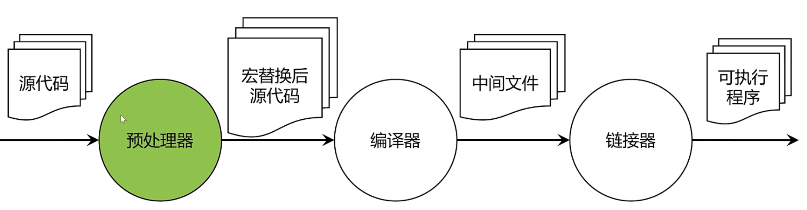

C语言便编译过程



# 一、预处理与宏

## 1、预处理

### 1.1、文件展开

预处理过程实际上就是宏替换的过程。其实宏明显就是给代码加杠杆的感觉，用一行宏代码可以在预处理时由预处理器替换成几行甚至数百行代码了；

在预处理完以后，头文件的内容会在 #include 指令的位置展开，执行命令：`gcc -E ./cp_05/01_expand.c -o 01_expand.i`
```c
# 1 "./cp_05/01_expand.c"
# 1 "<built-in>" 1
# 1 "<built-in>" 3
# 384 "<built-in>" 3
# 1 "<command line>" 1
# 1 "<built-in>" 2
# 1 "./cp_05/01_expand.c" 2
# 1 "/Library/Developer/CommandLineTools/SDKs/MacOSX.sdk/usr/include/stdio.h" 1 3 4
# 64 "/Library/Developer/CommandLineTools/SDKs/MacOSX.sdk/usr/include/stdio.h" 3 4
# 1 "/Library/Developer/CommandLineTools/SDKs/MacOSX.sdk/usr/include/_stdio.h" 1 3 4
# 68 "/Library/Developer/CommandLineTools/SDKs/MacOSX.sdk/usr/include/_stdio.h" 3 4
# 1 "/Library/Developer/CommandLineTools/SDKs/MacOSX.sdk/usr/include/sys/cdefs.h" 1 3 4
# 666 "/Library/Developer/CommandLineTools/SDKs/MacOSX.sdk/usr/include/sys/cdefs.h" 3 4
# 1 "/Library/Developer/CommandLineTools/SDKs/MacOSX.sdk/usr/include/sys/_symbol_aliasing.h" 1 3 4
# 667 "/Library/Developer/CommandLineTools/SDKs/MacOSX.sdk/usr/include/sys/cdefs.h" 2 3 4
# 732 "/Library/Developer/CommandLineTools/SDKs/MacOSX.sdk/usr/include/sys/cdefs.h" 3 4
# 1 "/Library/Developer/CommandLineTools/SDKs/MacOSX.sdk/usr/include/sys/_posix_availability.h" 1 3 4
# 733 "/Library/Developer/CommandLineTools/SDKs/MacOSX.sdk/usr/include/sys/cdefs.h" 2 3 4
# 69 "/Library/Developer/CommandLineTools/SDKs/MacOSX.sdk/usr/include/_stdio.h" 2 3 4
# 1 "/Library/Developer/CommandLineTools/SDKs/MacOSX.sdk/usr/include/Availability.h" 1 3 4
# 165 "/Library/Developer/CommandLineTools/SDKs/MacOSX.sdk/usr/include/Availability.h" 3 4
# 1 "/Library/Developer/CommandLineTools/SDKs/MacOSX.sdk/usr/include/AvailabilityVersions.h" 1 3 4
# 166 "/Library/Developer/CommandLineTools/SDKs/MacOSX.sdk/usr/include/Availability.h" 2 3 4
# 1 "/Library/Developer/CommandLineTools/SDKs/MacOSX.sdk/usr/include/AvailabilityInternal.h" 1 3 4
# 167 "/Library/Developer/CommandLineTools/SDKs/MacOSX.sdk/usr/include/Availability.h" 2 3 4
# 70 "/Library/Developer/CommandLineTools/SDKs/MacOSX.sdk/usr/include/_stdio.h" 2 3 4

# 1 "/Library/Developer/CommandLineTools/SDKs/MacOSX.sdk/usr/include/_types.h" 1 3 4
# 27 "/Library/Developer/CommandLineTools/SDKs/MacOSX.sdk/usr/include/_types.h" 3 4
# 1 "/Library/Developer/CommandLineTools/SDKs/MacOSX.sdk/usr/include/sys/_types.h" 1 3 4
# 33 "/Library/Developer/CommandLineTools/SDKs/MacOSX.sdk/usr/include/sys/_types.h" 3 4
# 1 "/Library/Developer/CommandLineTools/SDKs/MacOSX.sdk/usr/include/machine/_types.h" 1 3 4
# 32 "/Library/Developer/CommandLineTools/SDKs/MacOSX.sdk/usr/include/machine/_types.h" 3 4
# 1 "/Library/Developer/CommandLineTools/SDKs/MacOSX.sdk/usr/include/i386/_types.h" 1 3 4
# 39 "/Library/Developer/CommandLineTools/SDKs/MacOSX.sdk/usr/include/i386/_types.h" 3 4
typedef signed char __int8_t;
typedef unsigned char __uint8_t;
typedef short __int16_t;
typedef unsigned short __uint16_t;
typedef int __int32_t;
typedef unsigned int __uint32_t;
typedef long long __int64_t;
typedef unsigned long long __uint64_t;

typedef long __darwin_intptr_t;
typedef unsigned int __darwin_natural_t;
# 72 "/Library/Developer/CommandLineTools/SDKs/MacOSX.sdk/usr/include/i386/_types.h" 3 4
typedef int __darwin_ct_rune_t;

typedef union {
 char __mbstate8[128];
 long long _mbstateL;
} __mbstate_t;

typedef __mbstate_t __darwin_mbstate_t;

typedef long int __darwin_ptrdiff_t;

FILE *funopen(const void *,
                 int (* _Nullable)(void *, char *, int),
                 int (* _Nullable)(void *, const char *, int),
                 fpos_t (* _Nullable)(void *, fpos_t, int),
                 int (* _Nullable)(void *));
# 416 "/Library/Developer/CommandLineTools/SDKs/MacOSX.sdk/usr/include/stdio.h" 3 4
# 1 "/Library/Developer/CommandLineTools/SDKs/MacOSX.sdk/usr/include/secure/_stdio.h" 1 3 4
# 31 "/Library/Developer/CommandLineTools/SDKs/MacOSX.sdk/usr/include/secure/_stdio.h" 3 4
# 1 "/Library/Developer/CommandLineTools/SDKs/MacOSX.sdk/usr/include/secure/_common.h" 1 3 4
# 32 "/Library/Developer/CommandLineTools/SDKs/MacOSX.sdk/usr/include/secure/_stdio.h" 2 3 4
# 42 "/Library/Developer/CommandLineTools/SDKs/MacOSX.sdk/usr/include/secure/_stdio.h" 3 4
extern int __sprintf_chk (char * restrict, int, size_t,
     const char * restrict, ...);
# 52 "/Library/Developer/CommandLineTools/SDKs/MacOSX.sdk/usr/include/secure/_stdio.h" 3 4
extern int __snprintf_chk (char * restrict, size_t, int, size_t,
      const char * restrict, ...);

extern int __vsnprintf_chk (char * restrict, size_t, int, size_t,
       const char * restrict, va_list);
# 417 "/Library/Developer/CommandLineTools/SDKs/MacOSX.sdk/usr/include/stdio.h" 2 3 4
# 2 "./cp_05/01_expand.c" 2

int main() {
  puts("Hello World");
  return 0;
}
```

### 1.2、文件包含

- `#include "xxx.h"`：首先查找当前源文件所在路径；找不到，再次查找工程的头文件搜索路径；
- `#include <..h>`：查找工程的头文件搜索路径；

如果想自己定义的目录也加到工程目录下，可以在CMakeLists.txt文件中加入如下代码：
```
....
include_directories("include")
....
```
这样在使用的时候就可以直接使用：`#include <xxx.h>`；引用用户头文件，只能使用 `#include ""`。


## 2、自定义头文件

比如自定义一个阶乘函数

（1）首先新建两个文件夹：include、src

（2）在include目录下新建head文件：factorial.h，有如下内容：
```h
#ifndef C_LEARNING_1_INCLUDE_FACTORIAL_H_
#define C_LEARNING_1_INCLUDE_FACTORIAL_H_

unsigned int Factorial(unsigned int n);

unsigned int FactorialByIteration(unsigned int n);

#endif //C_LEARNING_1_INCLUDE_FACTORIAL_H_
```
（3）在src新建文件factorial.c，就是阶乘的实现
```c
#include "../include/factorial.h"
unsigned int Factorial(unsigned int n) {
  if (n == 0) {
    return 1; // f(0) = 1
  } else {
    return n * Factorial(n - 1); // f(n) = nf(n - 1)
  }
}
unsigned int FactorialByIteration(unsigned int n) {
  unsigned int result = 1;
  for (unsigned int i = n; i > 0; --i) {
    result *= i;
  }
  return result;
}
```
（4）如果需要使用该函数，可以按照如下方式引入：
```c
#include "include/factorial.h"
```

## 3、宏函数

### 3.1、基本介绍

“宏函数”，仍然在预处理过程中实现对源文件的替换，但不同之处在于它可以接受参数，因此看起来更像函数
```c
#define MAX(a, b) a > b ? a : b
```
使用的时候就直接像调用函数那样就可以了：
```c
int max = MAX(1, 3); 
```
编译之后替换为：
```c
int max = 1 > 3 ? 1 : 3;
```
需要注意的几个问题：
- **参数的问题**：与函数不同，宏函数的参数是直接把原始的表达式替换到宏定义当中的，而函数则是先把表达式的值求出来，再把值传入函数，因此对于下面看上去没有什么问题的语句：
  ```c
  int max = MAX(1, MAX(3, 10));
  // 其编译替换的结果如下，下面这个表达式是无法正常工作的
  int max = 1 > 3 > 10 ? 3 : 10 ? 1 : 3 > 10 ? 3 : 10;
  ```
  建议尽量不要用复杂的表达式作为宏函数的参数，不过有些时候这是不能避免的，因此我们为了避免宏函数的参数在替换之后被拆散，要给宏函数的参数加括号：
  ```c
  #define MAX(a, b) (a) > (b) ? (a) : (b)
  // 上述
  int max = MAX(1, MAX(3, 10));
  // 其编译替换的结果如下，下面这个表达式是无法正常工作的
  int max = 1 > (3 > 10 ? 3 : 10;) ? (1 : 3 > 10 ? 3 : 10;);
  ```
  分号导致整个语句被切割成了几条语句，这自然是不符合预期的，因此定义宏时通常不加分号。如果要加分号，也要控制好使用场景

- **宏函数的参数的参数可能会多次求值，这与函数的参数的行为不同**
  ```c
  int a = 0;
  int b = 3;
  int max = MAX(a, b++);
  // 宏替换后得到代码
  int a = 0;
  int b = 3;
  int max = a > b++ ? a : b++;
  ```
  *因此，不要将有副作用的表达式作为宏函数的参数。*

宏函数是不能换行的，如果确实需要换行，可以按照如下写法：
```c
#define  IS_HEX_CHARACTER(ch) \
  (((ch) >= '0' && (ch) <= '9') || \
  ((ch) >= 'A' && (ch) <= 'F') || \
  ((ch) >= 'a' && (ch) <= 'f') )
```

宏函数的参数和返回值都没有类型的概念；

### 3.2、宏函数与函数对比

| 属性         | 宏          | 函数        |
| :----------- | :-----------| :---------------- |
| 代码长度     | 每次使用时，宏代码都被插入到程序中。除了非常小的宏之外，程序的长度将大幅度增长 | 函数代码只出现于一个地方；每次使用这个函数时，调用用那个地方的用一份代码 |
| 操作符优先级 | 宏参数的求值在所有周围表达式的上下文环境里，除非加上括号，否则邻近的操作符优先级可能会产生不可预料的结果 | 函数参数只在函数调用时求值一次，它的结果值传递给函数。表达式的求值结果更容易预测 |
| 参数求值     | 参数每次用于宏定义时，它们 都将重新求值。由于多次求值，具有负作用域的参数可能产生不可预料的结果 | 参数在函数被调用前只求值一次。在函数中多次使用并不会导致多次求值的问题，参数的副作用不会造成任何特殊的问题 |
| 参数类型     | 宏与类型无关。只要对参数的操作是合法的，它可以适用于任何参数 | 函数的参数是与类型有关的。如果参数的类型不同，就需要使用不同的函数，即使它们执行的任务是相同的 |

### 3.3、常见其他宏函数

- `__FILE__` ：预处理时替换为源文件的路径。
- `__LINE__` ：预处理时替换为源代码所在源文件的行号。
- `__FUNCTION__` ：编译后替换为源代码所在的函数名，或者指向函数名的字符串变量，取决于具体的编译器实现。不同于前面的两个宏，由于代码所在函数只要在编译过程中才能解析得到，因此这个宏不会在预处理过程中完成替换
- `__VA_ARGS__`：替代变长参数，`##__VA_ARGS__`，其实 ## 的作用是用于变长参数没有对应的参数传入的情况下，去除前面的逗号的，如果不加 ##，可能在某些编译器下会报错；
- `#value`，比如定义一个变量宏，那么这个`#value`获得变量的名作为运行时的字符串内容

### 3.4、练习

自定义一个带换行符的打印函数
```c
#include <stdio.h>
#include <stdarg.h>
// 这是使用函数的方式，通过编程函数来处理
void Printlnf(const char *format, ...) {
  va_list args;
  va_start(args, format);
  vprintf(format, args);
  printf("\n");
  va_end(args);
}
// 这里使用宏来操作
#define PRINTLNF(format, ...) printf("("__FILE__":%d) %s : "format"\n",__LINE__, __FUNCTION__, ##__VA_ARGS__)
// 定义打印变量名的宏
#define PRINT_INT(value) PRINTLNF(#value": %d", value)
int main() {
  int value = 2;
  Printlnf("Hello World! %d", value);
  PRINTLNF("Hello World! %d", value);
  PRINTLNF("Hello World!");
  PRINT_INT(value); // value: 2
  int x = 3;
  PRINT_INT(x);
  PRINT_INT(3 + 4);
  return 0;
}
```

## 4条件编译

### 4.1、条件宏

比如前面定义的头文件factorial.h，包含如下代码：
```h
#ifndef C_LEARNING_1_INCLUDE_FACTORIAL_H_
#define C_LEARNING_1_INCLUDE_FACTORIAL_H_

#endif //C_LEARNING_1_INCLUDE_FACTORIAL_H_
```
上面这些都是宏，其中：
- `#ifndef`：表示判断如果没有定义某个宏，在这里就是说如果没有定义 `C_LEARNING_1_INCLUDE_FACTORIAL_H_` 这个宏，那么就执行下面的代码。
- `#endif`：很明显与 `#ifndef` 是配对的，表示这个条件判断的有效范围。

上面这三句话的目的是：避免头文件重复被包含，除了 `*.c` 文件可以包含头文件以外，头文件本身也是可以包含其他头文件的，因为头文件与 *.c 本身没有什么不同，只是我们在代码设计的时候为了方便模块之间的引用而专门用头文件来编写声明，用源文件来编写实现。既然头文件可以互相包含，那难免会导致对某些头文件的重复包含

条件编译有如下三种写法：
```
#ifdef 如果定义了
#ifndef 如果没定义
#if 如果 ...
#endif 配对
```
```c
// #if 场景
#if defined(MACRO) <==> #ifdef MACRO
```

### 4.2、使用场景

条件宏有一个很好的使用场景，那就是判断当前程序是否运行在 DEBUG 模式下来决定是否执行某些用于调试的代码
```c
#include <stdio.h>

int main() {
#if DEBUG
  printf("[DEBUG]main start.\n");
#endif
  printf("main run ---> \n");

#if DEBUG
  printf("[DEBUG]main end.\n");
#endif
  return 0;
}
```
如果我们不希望输出调试的日志，就把 DEBUG 这个宏的值改为 0 就好了，DEBUG 这个宏的定义也可以在代码编译的时候通过编译器参数来指定，在我们的 CLion 工程中的 CMakeList.txt 当中添加下面的代码即可编译出 DEBUG 版本的程序：
```
...
target_compile_definitions(BasicC PUBLIC DEBUG=1) # 加这一句 
...
```

条件编译还有一个比较有用的地方，就是判断当前 C 语言编译环境，最常用的莫过于判断当前是 C 编译器还是 C++ 编译器了：
```c
#ifdef __cplusplus
extern "C" {
#endif
... // 定义 C 接口函数和变量
#ifdef __cplusplus
}
#endif
```
条件编译还支持 else if 类似的分支，例如判断当前 C 语言的编译器版本，这里会用到一些内置的宏定义：
```c
#include <stdio.h>
int main() {
  #if __STDC_VERSION__ >=  201710L
    printf("We are using C18!\n");
  #elif __STDC_VERSION__ >= 201112L
    printf("We are using C11!\n");
  #elif __STDC_VERSION__ >= 199901L
    printf("We are using C99!\n");
  #elif defined(__STDC__)
    printf("We are using C89/C90!\n");
  #else
    printf("We are using non-std C!\n");
  #endif
  return 0;
}
```
比如，判断时间：
```c

```