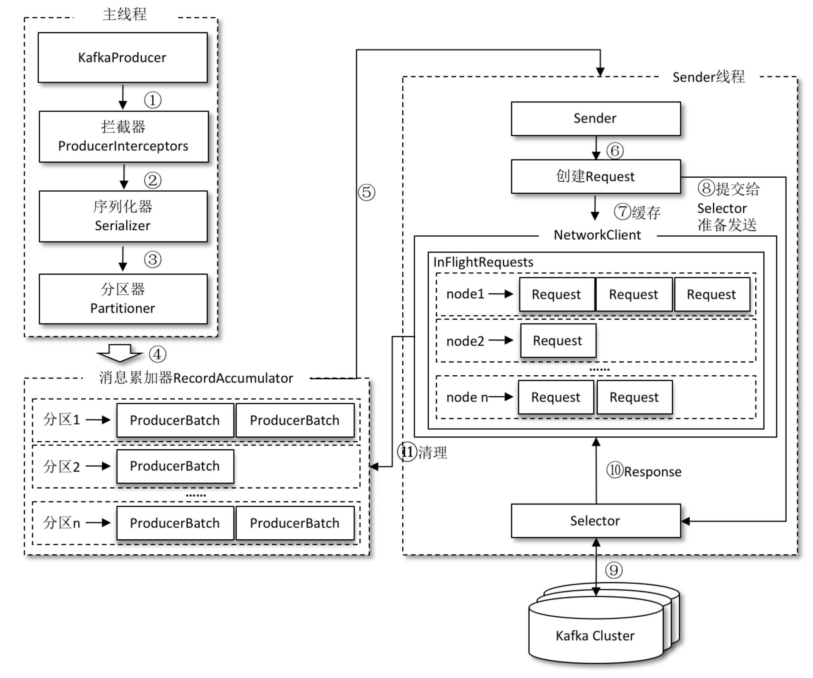

# 一、Spring

## 1、SpringApplication.run都做了些什么？

- SpringApplication.run(主程序类)
	- new SpringApplication(主程序类)
		- 判断是否web应用
		- 加载并保存所有 ApplicationContextInitializer (`META-INF/spring.factories`)；
        - 加载并保存所有 ApplicationListener；
		- 获取到主程序类
	- run()
		- 回调所有的 SpringApplicationRunListener(`META-INF/spring.factories`)的 starting
		- 获取 ApplicationArguments
		- 准备环境&回调所有监听器( SpringApplicationRunListener )的environmentPrepared，打印banner信息
		- 创建ioc容器对象
	- AnnotationConfigEmbeddedWebApplicationContext(web环境容器) – AnnotationConfigApplicationContext(普通环境容器)
- 准备环境
- 执行 ApplicationContextInitializer.initialize()
- 监听器 SpringApplicationRunListener回调contextPrepared – 加载主配置类定义信息
- 监听器 SpringApplicationRunListener回调contextLoaded
	- 刷新启动IOC容器;
- 扫描加载所有容器中的组件
- 包括从`META-INF/spring.factories`中获取的所有EnableAutoConfiguration组件
	- 回调容器中所有的 ApplicationRunner、CommandLineRunner的run方法；
	- 监听器SpringApplicationRunListener回调finished

## 2、SpringBoot常用注解

- @SpringBootApplication：包含`@Configuration`、`@EnableAutoConfiguration`、`@ComponentScan`通常用在主类上
	- `@Configuration` 等同于spring的XML配置文件；使用Java代码可以检查类型安全。
	- `@EnableAutoConfiguration` 自动配置。
	- `@ComponentScan` 组件扫描，可自动发现和装配一些Bean

- @MapperScan：开启MyBatis的DAO扫描  
- @Bean 注解

## 3、介绍下 SpringFactoriesLoader

- 框架内部使用通用的工厂加载机制；
- 从classpath下多个jar包特定的位置读取文件并初始化类，位置是jar包下的：`META-INF/spring.factories`；
- 文件内容必须是`key-value`形式，即properties形式；
- key是全限定名（抽象类|接口），value是实现类的全限定名，如果有多个，使用`,`分隔

## 4、SpringFactoriesLoader是如何加载工厂类的

- 首先根据classloader从缓存中获取，是否有加载过，如果有，则直接返回结果；
- 扫描jar包下的配置文件：`META-INF/spring.factories`，将扫描到classpath下所有jar文件形成URL集合；
- 遍历URL集合，加载资源为 Properties，按照`Map<String, List<String>>` ，key是对应配置文件中的key，由于value可能是多个逗号分割的；
- 将结果存到缓存中，key是当前加载的classloader

## 5、系统初始化器作用及调用时机，如何实现系统初始化器以及注意事项

主要用于设置一些属性；

调用时机：调用链 `SpringApplication.run ->  prepareContext（上下文准备） -> applyInitializers -> 遍历调用各个Initializer的initialize方法`

主要有三种实现方式：
- 在`resources`目录下新建目录文件：`META-INF/spring.factories`，配置的key为`org.springframework.context.ApplicationContextInitializer`，value为自定义初始化器的全类名路径
    ```
    org.springframework.context.ApplicationContextInitializer=com.blue.fish.web.initializer.FirstInitializer
    ```
- 添加方法：在启动类中添加如下代码，替换`SpringApplication.run(SpringBootSourceApplication.class, args);`
    ```java
    @SpringBootApplication
    public class SpringBootSourceApplication {
        public static void main(String[] args) {
            SpringApplication application = new SpringApplication(SpringBootSourceApplication.class);
            application.addInitializers(new SecondFirstInitializer());
            application.run(args);
        }
    }
    ```
- 在配置文件application.properties中添加如下，在`application.properties`中添加配置会被定义成环境变量被`DelegatingApplicationContextInitializer`发现并注册
	```
	context.initializer.classes=com.blue.fish.source.initializer.ThirdInitializer
	```

注意点：
- 都要实现 `ApplicationContextInitializer`接口；
- `@Order`值越小越先执行；
- `application.properties`中定义的优先于其他方式；

## 6、什么是监听器模式

监听器模式四要素：
- 事件
- 监听器
- 广播器
- 触发机制

## 7、SpringBoot关于监听器的实现类有哪些

Spring中主要有7类事件
事件实现类 | 对应 SpringApplicationRunListener 方法 | 说明
---------|---------------------------------------|--------
ApplicationContextInitializedEvent| contextPrepared | ConfigurableApplicationContext准备完成，对应
ApplicationEnvironmentPreparedEvent|  environmentPrepared   | ConfigurableEnvironment准备完成
ApplicationPreparedEvent|  contextLoaded   | ConfigurableApplicationContext已装载，但是仍未启动
ApplicationReadyEvent|  running   | Spring应用正在运行
ApplicationStartingEvent|  starting   | Spring应用刚启动
ApplicationStartedEvent|  started   | ConfigurableApplicationContext 已启动，此时Spring Bean已经初始化完成
ApplicationFailedEvent|  failed   | Spring应用运行失败

## 8、SpringBoot框架有哪些框架事件以及他们的顺序

## 9、监听事件触发机制是怎么样的

SpringApplicationRunListener 触发

## 10、如何自定义实现系统监听器及注意事项

基本条件：实现`ApplicationListener`

## 11、实现ApplicationListener接口与SmartApplicationListener接口区别

- 实现 ApplicationListener 接口只针对单一事件监听；
- 实现 SmartApplicationListener 接口可以针对多种事件监听；

## 12、什么是IOC

简单将，IOC就是反转控制，类似好莱坞原则，主要有依赖查找和依赖注入实现；

- 依赖查找：是主动或被动的依赖查找方式，通过需要依赖容器或标准API实现；比如Servlet、EJB等
- 依赖注入：是手动或自动的依赖绑定的方式，无需依赖特定的容器或API；比如Spring容器等；
- 依赖注入会比依赖查找更便利；

Spring的IOC容器的优势：AOP抽象、事务抽象、事件机制、SPI扩展；

## 13、SpringBoot中bean的配置方式

## 14、介绍下refresh流程

## 15、介绍下bean的实例化流程

Bean的实例化过程：
- 容器的启动
- Bean实例化阶段

### 15.1、容器启动阶段

**1、配置元信息**

Spring管理Bean，就需要知道创建一个对象所需要的一些必要的信息，可以是xml文件、或者是其他形式的例如properties的磁盘文件，也可以是现在主流的注解；
```xml
<bean id="role" class="com.wbg.springxmlbean.entity.Role">
    <!-- property元素是定义类的属性，name属性定义的是属性名称 value是值
    相当于：
    Role role=new Role();
    role.setId(1);
    role.setRoleName("高级工程师");
    role.setNote("重要人员");-->
    <property name="id" value="1"/>
    <property name="roleName" value="高级工程师"/>
    <property name="note" value="重要人员"/>
</bean>
```

**2、BeanDefinition**

在Spring中，配置元信息被加载到内存之后是以 BeanDefinition 的形式存在的

**3、BeanDefinitionReader**

要读取xml配置元信息，那么可以使用`XmlBeanDefinitionReader`。如果我们要读取properties配置文件，那么可以使用`PropertiesBeanDefinitionReader`加载；如果我们要读取注解配置元信息，那么可以使用 `AnnotatedBeanDefinitionReader`加载；

总的来说，BeanDefinitionReader的作用就是加载配置元信息，并将其转化为内存形式的 BeanDefinition ，存在内存中；

**4、BeanDefinitionRegistry**

Spring通过BeanDefinitionReader将配置元信息加载到内存生成相应的BeanDefinition之后，就将其注册到BeanDefinationRegistry中，BeanDefinitionRegistry就是一个存放BeanDefinition的大篮子，它也是一种键值对的形式，通过特定的Bean定义的id，映射到相应的BeanDefination；

**5、BeanFactoryPostProcessor**

BeanFactoryPostProcessor是容器启动阶段Spring提供的一个扩展点，主要负责对注册到BeanDefinationRegistry中的一个个的BeanDefination进行一定程度上的修改与替换

### 15.2、Bean实例化阶段

如果选择懒加载的方式，再向Spring获取依赖对象实例之前，其都是以BeanDefinitionRegistry中的一个个的BeanDefinition的形式存在，也就是Spring只有在我们需要依赖对象的时候才开启相应对象的实例化阶段。而如果不是选择懒加载的方式，容器启动阶段完成之后，将立即启动Bean实例化阶段，通过隐式的调用所有依赖对象的getBean方法来实例化所有配置的Bean并保存起来；


## 16、bean实例化的扩展点及其作用

## 17、怎么实现在Springboot启动后台执行程序

## 18、SpringBoot计时器是如何实现的

## 19、启动加载器如何实现

## 20、启动加载器的调用时机

## 21、springBoot的属性配置方式

## 22、Spring Aware的作用及其原理

## 23、如何实现Spring Aware

## 24、Environment对象如何加载属性集的

## 25、profile配置有哪些方式，有哪些注意事项及其原理

## 26、SpringBoot的异常处理流程

## 27、如何自定义事件Springboot异常报告器

## 28、什么是配置类，有什么注解

## 29、SPringBoot框架对配置类的处理流程

## 30、配置处理一般包括哪些内容

## 31、详细的一些注解处理流程

## 32、SpringBoot框架为什么默认启动的是tomcat

Springboot启动的时候，最终会调用到：org.springframework.context.support.AbstractApplicationContext#refresh
```java
public ConfigurableApplicationContext run(String... args) {
    StopWatch stopWatch = new StopWatch();
    stopWatch.start();
    ConfigurableApplicationContext context = null;
    Collection<springbootexceptionreporter> exceptionReporters = new ArrayList&lt;&gt;();
    //设置系统属性『java.awt.headless』，为true则启用headless模式支持
    configureHeadlessProperty();
    //通过*SpringFactoriesLoader*检索*META-INF/spring.factories*，找到声明的所有SpringApplicationRunListener的实现类并将其实例化，之后逐个调用其started()方法，广播SpringBoot要开始执行了
    SpringApplicationRunListeners listeners = getRunListeners(args);
    //发布应用开始启动事件
    listeners.starting();
    try {
      //初始化参数
      ApplicationArguments applicationArguments = new DefaultApplicationArguments(args);
      //创建并配置当前SpringBoot应用将要使用的Environment（包括配置要使用的PropertySource以及Profile）,
      //并遍历调用所有的SpringApplicationRunListener的environmentPrepared()方法，广播Environment准备完毕。
      ConfigurableEnvironment environment = prepareEnvironment(listeners, applicationArguments);
      configureIgnoreBeanInfo(environment);
      //打印banner
      Banner printedBanner = printBanner(environment);
      //创建应用上下文
      context = createApplicationContext();
      //通过*SpringFactoriesLoader*检索*META-INF/spring.factories*，获取并实例化异常分析器
      exceptionReporters = getSpringFactoriesInstances(SpringBootExceptionReporter.class,
          new Class[] { ConfigurableApplicationContext.class }, context);
      //为ApplicationContext加载environment，之后逐个执行ApplicationContextInitializer的initialize()方法来进一步封装ApplicationContext，
        //并调用所有的SpringApplicationRunListener的contextPrepared()方法，【EventPublishingRunListener只提供了一个空的contextPrepared()方法】，
        //之后初始化IoC容器，并调用SpringApplicationRunListener的contextLoaded()方法，广播ApplicationContext的IoC加载完成，
        //这里就包括通过**@EnableAutoConfiguration**导入的各种自动配置类。
      prepareContext(context, environment, listeners, applicationArguments, printedBanner);
      //刷新上下文
      refreshContext(context);
      //再一次刷新上下文,其实是空方法，可能是为了后续扩展。
      afterRefresh(context, applicationArguments);
      stopWatch.stop();
      if (this.logStartupInfo) {
        new StartupInfoLogger(this.mainApplicationClass).logStarted(getApplicationLog(), stopWatch);
      }
      //发布应用已经启动的事件
      listeners.started(context);
      //遍历所有注册的ApplicationRunner和CommandLineRunner，并执行其run()方法。
        //我们可以实现自己的ApplicationRunner或者CommandLineRunner，来对SpringBoot的启动过程进行扩展。
      callRunners(context, applicationArguments);
    }
    try {
    //应用已经启动完成的监听事件
      listeners.running(context);
    }
    return context;
}
```
这个方法我们可以简单的总结下步骤为 ：
`1. 配置属性 -> 2. 获取监听器，发布应用开始启动事件 -> 3. 初始化输入参数 -> 4. 配置环境，输出 banner -> 5. 创建上下文 -> 6. 预处理上下文 -> 7. 刷新上下文 -> 8. 再刷新上下文 -> 9. 发布应用已经启动事件 -> 10. 发布应用启动完成事件`

tomcat启动只需要关注：上下文是如何创建的，上下文是如何刷新的，分别对应的方法就是 `createApplicationContext()` 和 `refreshContext(context)`

### 32.1、createApplicationContext

根据 webApplicationType 来判断创建哪种类型的 Servlet,代码中分别对应着 Web 类型(SERVLET)、响应式 Web 类型（REACTIVE)、非 Web 类型（default)，这里建立的是 Web 类型，所以肯定实例化 `DEFAULT_SERVLET_WEB_CONTEXT_CLASS` 指定的类，也就是 `org.springframework.boot.web.servlet.context.AnnotationConfigServletWebServerApplicationContext` 类，其继承 `ServletWebServerApplicationContext`
```java
protected ConfigurableApplicationContext createApplicationContext() {
    Class<?> contextClass = this.applicationContextClass;
    if (contextClass == null) {
      try {
        switch (this.webApplicationType) {
        case SERVLET:
          contextClass = Class.forName(DEFAULT_SERVLET_WEB_CONTEXT_CLASS);
          break;
        case REACTIVE:
          contextClass = Class.forName(DEFAULT_REACTIVE_WEB_CONTEXT_CLASS);
          break;
        default:
          contextClass = Class.forName(DEFAULT_CONTEXT_CLASS);
        }
      }
    }
    return (ConfigurableApplicationContext) BeanUtils.instantiateClass(contextClass);
}
```

### 32.2、refreshContext 方法

最终是强转成父类 AbstractApplicationContext 调用其 refresh()方法，其中 onRefresh() 方法是调用其子类的实现，根据我们上文的分析，我们这里的子类是 ServletWebServerApplicationContext
```java
protected void onRefresh() {
    super.onRefresh();
    try {
        createWebServer();
    }
    catch (Throwable ex) {
        throw new ApplicationContextException("Unable to start web server", ex);
    }
}
private void createWebServer() {
    WebServer webServer = this.webServer;
    ServletContext servletContext = getServletContext();
    if (webServer == null && servletContext == null) {
        ServletWebServerFactory factory = getWebServerFactory();
        this.webServer = factory.getWebServer(getSelfInitializer());
    }
    else if (servletContext != null) {
        try {
            getSelfInitializer().onStartup(servletContext);
        }
        catch (ServletException ex) {
            throw new ApplicationContextException("Cannot initialize servlet context", ex);
        }
    }
    initPropertySources();
}
```

## 33、常见web容器自定义配置参数有哪些

## 34、SpringBoot Starter作用

## 35、Conditional注解原理

## 36、Spring的Bean生命周期，流程梳理

对于Spring Bean的生命周期来说，可以分为四个阶段，其中初始化完成之后，就代表这个Bean可以使用了：
- 实例化 Instantiation：实例化一个 Bean 对象
- 属性赋值 Populate：为 Bean 设置相关属性和依赖
- 初始化 Initialization：
    - 检查Aware的相关接口并设置相关依赖；
    - BeanPostProcessor前置处理；
    - 是否实现InitializeBean接口；
    - 是否配置自定义init-method；
    - BeanPostProcessor后置处理；
- 销毁 Destruction：
    - 注册 Destruction相关回调接口；
    - 是否实现DisposableBean接口；
    - 是否配置自定义的 destroy-method

## 37、Spring扩展点作用

## 38、Spring IOC AOP 基本原理

## 39、动态代理

## 40、BeanPostProcessor 与 BeanFactoryPostProcessor


## 41、ApplicationContextAware 的作用和使用

ApplicationContextAware是Spring提供的拓展性接口，可以拿到 ApplicationContext实例，然后我们可以利用这个实例做一些bean的信息获取。

最常见的应该就是利用它来获取bean的信息，以及封装成Spring工具类，比如在一些静态方法中需要获取Bean的时候，可以通过该方法获取：
```java
@Component
public class MySpringUtils implements ApplicationContextAware {
    private static ApplicationContext applicationContext;
    @Override
    public void setApplicationContext(ApplicationContext applicationContext) throws BeansException {
        MySpringUtils.applicationContext = applicationContext;
    }
    public static ApplicationContext getApplicationContext() {
        return applicationContext;
    }
    public static <T> T getBean(String beanName, Class<T> clazz){
        return applicationContext.getBean(beanName, clazz);
    }
}
```
执行主要是通过： ApplicationContextAwareProcessor （是一个 BeanPostProcessor） 来执行的，执行过程：


## 42、BeanNameAware与BeanFactoryAware的先后顺序？


## 43、InitializingBean 和 BeanPostProcessor 的after方法先后顺序？

InitializingBean 作为一个Bean，是在 BeanPostProcessor 的before和after方法之间执行
```java
// org.springframework.beans.factory.support.AbstractAutowireCapableBeanFactory#initializeBean(java.lang.String, java.lang.Object, org.springframework.beans.factory.support.RootBeanDefinition)
protected Object initializeBean(final String beanName, final Object bean, @Nullable RootBeanDefinition mbd) {
	if (System.getSecurityManager() != null) {
		AccessController.doPrivileged((PrivilegedAction<Object>) () -> {
			invokeAwareMethods(beanName, bean);
			return null;
		}, getAccessControlContext());
	}
	else {
		invokeAwareMethods(beanName, bean);
	}
	Object wrappedBean = bean;
	if (mbd == null || !mbd.isSynthetic()) {
		// 执行 BeanPostProcessor的postProcessBeforeInitialization
		wrappedBean = applyBeanPostProcessorsBeforeInitialization(wrappedBean, beanName);
	}
	try {
		// 执行 InitializingBean 的 afterPropertiesSet 方法，如果其有配置对应的 init方法，在也会执行自定义的init方法
		invokeInitMethods(beanName, wrappedBean, mbd);
	}
	catch (Throwable ex) {
		throw new BeanCreationException((mbd != null ? mbd.getResourceDescription() : null), beanName, "Invocation of init method failed", ex);
	}
	if (mbd == null || !mbd.isSynthetic()) {
		// 执行 BeanPostProcessor的 postProcessAfterInitialization
		wrappedBean = applyBeanPostProcessorsAfterInitialization(wrappedBean, beanName);
	}
	return wrappedBean;
}
```

## 44、ApplicationListener监控的Application事件有哪些？

## 45、Spring模块装配的概念，比如@EnableScheduling @EnableRetry @EnableAsync，@Import注解的作用？

### 45.1、import注解原理

`@Import`表示要导入的一个或多个@Configuration类，value通常是一个普通的组件，Configuration、ImportSelector、ImportBeanDefinitionRegistrar

`@Import`注解也是用来给容器注册组件的，使用`@Import`注解快速给容器中导入一个组件有三种方法
- 导入`@Configuration`注解的配置类使用`@Import`（要导入到容器中的组件）：容器中就会自动注册这个组件，ID默认为全类名
- 导入`ImportSelector`的实现类：通过实现ImportSelector类，实现selectImports方法，返回需要导入组件的全类名数组
- 导入`ImportBeanDefinitionRegistrar`的实现类：通过实现`ImportBeanDefinitionRegistrar`类，实现registerBeanDefinitions方法手动注册Bean到容器中

```java
@Target(ElementType.TYPE)
@Retention(RetentionPolicy.RUNTIME)
@Documented
public @interface Import {
	Class<?>[] value();
}
```
通过注解源码可以看到，`@Import`注解作用在类上，并且参数可以是class类型的数组，从这里可以看出可以使用`@Import`注解一次导入多个组件到容器中


## 46、ImportBeanDefinitionRegistrar 扩展点用于做什么事情？

## 47、ClassPathBeanDefinitionScanner 的作用？

## 48、NamespaceHandlerSupport 命名空间扩展点的作用？

## 49、如何实现动态注入一个Bean？

## 50、如何把自定义注解所在的Class 初始化注入到Spring容器？

## 51、BeanDefinition指的是什么，与BeanDefinitionHolder的区别，Spring如何存储BeanDefinition实例？

## 52、ASM 与 CGlib

## 53、Spring的条件装配，自动装配

条件装配是一种过滤机制，主要是通过Conditional注解与其他注解的配合使用，比如`@ConditionalOnProperty`

## 54、统一异常管理

## 55、ResolvableType

## 56、Spring如何处理并发问题

在一般情况下，只有无状态的Bean才可以在多线程环境下共享，在Spring中，绝大部分Bean都可以声明为singleton作用域，因为Spring对一些Bean中非线程安全状态采用ThreadLocal 进行处理，解决线程安全问题；

ThreadLocal和线程同步机制都是为了解决多线程中相同变量的访问冲突问题。同步机制采用了“时间换空间”的方式，仅提供一份变量，不同的线程在访问前需要获取锁，没获得锁的线程则需要排队。而ThreadLocal采用了“空间换时间”的方式；

## 57、Spring、SpringMVC、SpringBoot、SpringCloud比较

- Spring 是核心，提供了基础功能，提供了控制反转(IOC)和面向切面(AOP)的等功能的容器框架；也包含众多衍生产品例如 Boot，Security，JPA等等
- Spring MVC 是基于 Servlet 的一个 MVC 框架，主要解决 WEB 开发的问；
- Spring Boot 是为简化Spring配置的快速开发整合包；Spring 的配置非常复杂，各种xml，properties处理起来比较繁琐。于是为了简化开发者的使用，SpringBoot应运而生；使得程序员将更多时间花在业务开发上；
- Spring Cloud是构建在Spring Boot之上的服务治理框架；

## 58、Autowired注解实现原理

AutowiredAnnotationBeanPostProcessor

核心方法：buildAutowiringMetadata

## 60、如何保存Springboot应用的pid

Spring Boot 提供了在应用程序启动时将应用程序PID写入文件的方法，具体的功能由 ApplicationPidFileWriter 完成 。大致逻辑为：在应用启动时监听启动事件，将 PID 写入指定的文件，默认为 application.pid ；默认路径为当前路径。如果写入文件失败，将会将 PID 值 写入系统环境变量属性 `PID_FAIL_ON_WRITE_ERROR` （不区分大小写），或者写入 Spring 环境变量属性 `spring.pid.fail-on-write-error`

配置 Spring Boot PID 持久化功能:
```java
@SpringBootApplication(exclude = { DataSourceAutoConfiguration.class })
public class ApplicationStarter {
	public static void main(String[] args) {
		File pidFile = new File("app.pid");
		pidFile.setWritable(true, true);
		pidFile.setExecutable(false);
		pidFile.setReadable(true);
		SpringApplication application = new SpringApplication(ApplicationStarter.class);
		application.addListeners(new ApplicationPidFileWriter(pidFile));
		application.run(args);
	}
}
```
或者说是：`spring.pid.file=` 来配置

## 61、@Qualifier与@Primary 

`@Qualifier("bookDao")`：使用`@Qualifier`指定需要装配的组件的id，而不是使用属性名；通过将 `@Qualifier` 注解与我们想要使用的特定 Spring bean 的名称一起进行装配，Spring 框架就能从多个相同类型并满足装配要求的 bean 中找到我们想要的，避免让Spring脑裂，需要做的是`@Component`或者`@Bean`注解中声明的value属性以确定名称

`@Primary`：让Spring进行自动装配的时候，默认使用首选的bean；也就是在注入的bean上加上注解，Spring进行装配的时候就自动装配`@Primary`修饰的Bean；当然也可以继续使用`@Qualifier`指定需要装配的bean的名字；
```java
@Bean
@Primary
public Employee johnEmployee() {
    return new Employee("john");
}
```
> 需要注意的是，如果 @Qualifier 和 @Primary 注释都存在，那么 @Qualifier 注释将具有优先权。基本上，@Primary 是定义了默认值，而 @Qualifier 则非常具体

## 62、循环依赖问题

[如何解决循环依赖](../Java/Java框架/Spring/Spring.md#2循环依赖问题)

Spring 在创建 bean 的时候并不是等它完全完成，而是在创建过程中将创建中的 bean 的 ObjectFactory 提前曝光（即加入到 singletonFactories 缓存中）。
这样，一旦下一个 bean 创建的时候需要依赖 bean，则直接使用 ObjectFactory 的 `#getObject()` 方法来获取了；

- 首先 A 完成初始化第一步并将自己提前曝光出来（通过 ObjectFactory 将自己提前曝光），在初始化的时候，发现自己依赖对象 B，此时就会去尝试 get(B)，这个时候发现 B 还没有被创建出来
- 然后 B 就走创建流程，在 B 初始化的时候，同样发现自己依赖 C，C 也没有被创建出来
- 这个时候 C 又开始初始化进程，但是在初始化的过程中发现自己依赖 A，于是尝试 get(A)，这个时候由于 A 已经添加至缓存中（一般都是添加至三级缓存 singletonFactories ），通过 ObjectFactory 提前曝光，所以可以通过 ObjectFactory#getObject() 方法来拿到 A 对象，C 拿到 A 对象后顺利完成初始化，然后将自己添加到一级缓存中
- 回到 B ，B 也可以拿到 C 对象，完成初始化，A 可以顺利拿到 B 完成初始化。到这里整个链路就已经完成了初始化过程了；

```java
/** Cache of singleton factories: bean name --> ObjectFactory */
private final Map<String, ObjectFactory> singletonFactories = new HashMap<String, ObjectFactory>();
/** Cache of early singleton objects: bean name --> bean instance */
private final Map<String, Object> earlySingletonObjects = new HashMap<String, Object>();
```
- singletonFactories，用于存储在spring内部所使用的beanName->对象工厂的引用，一旦最终对象被创建(通过objectFactory.getObject())，此引用信息将删除
- earlySingletonObjects，用于存储在创建Bean早期对创建的原始bean的一个引用，注意这里是原始bean，即使用工厂方法或构造方法创建出来的对象，一旦对象最终创建好，此引用信息将删除

SpringBoot解决循环依赖：加`@Lazy`注解
```java
@Autowired
@Lazy
private CService cService;
```

**答案：**

Spring通过三级缓存解决了循环依赖，其中一级缓存为单例池（singletonObjects），二级缓存为早期曝光对象earlySingletonObjects，三级缓存为早期曝光对象工厂（singletonFactories）。当A、B两个类发生循环引用时，在A完成实例化后，就使用实例化后的对象去创建一个对象工厂，并添加到三级缓存中，如果A被AOP代理，那么通过这个工厂获取到的就是A代理后的对象，如果A没有被AOP代理，那么这个工厂获取到的就是A实例化的对象。当A进行属性注入时，会去创建B，同时B又依赖了A，所以创建B的同时又会去调用getBean(a)来获取需要的依赖，此时的getBean(a)会从缓存中获取，第一步，先获取到三级缓存中的工厂；第二步，调用对象工工厂的getObject方法来获取到对应的对象，得到这个对象后将其注入到B中。紧接着B会走完它的生命周期流程，包括初始化、后置处理器等。当B创建完后，会将B再注入到A中，此时A再完成它的整个生命周期。至此，循环依赖结束！

**为什么要使用三级缓存呢？二级缓存能解决循环依赖吗？**

如果要使用二级缓存解决循环依赖，意味着所有Bean在实例化后就要完成AOP代理，这样违背了Spring设计的原则，Spring在设计之初就是通过AnnotationAwareAspectJAutoProxyCreator 这个后置处理器来在Bean生命周期的最后一步来完成AOP代理，而不是在实例化后就立马进行AOP代理；

## 63、单例的 Bean 如何注入 Prototype 的 Bean

Spring 创建的 Bean 默认是单例的，但当 Bean 遇到继承的时候，可能会忽略这一点，看一个例子：定义了一个 SayService 抽象类，其中维护了一个类型是 ArrayList 的字段 data，用于保存方法处理的中间数据。每次调用 say 方法都会往 data 加入新数据，可以认为 SayService 是有状态，如果 SayService 是单例的话必然会 OOM
```java
@Slf4j
public abstract class SayService {
    List<String> data = new ArrayList<>();
    public void say() {
        data.add(IntStream.rangeClosed(1, 1000000)
                .mapToObj(__ -> "a")
                .collect(Collectors.joining("")) + UUID.randomUUID().toString());
        log.info("I'm {} size:{}", this, data.size());
    }
}
```
如果开发过程中没有去考虑，而是直接加上了 @Service 注解，让它们成为了 Bean，也没有考虑到父类是有状态的，但这样设置后，有状态的基类就可能产生内存泄露或线程安全问题。
```java
@Service
public class SayHello extends SayService {
    @Override
    public void say() {
        super.say();
        log.info("hello");
    }
}
@Service
public class SayBye extends SayService {
    @Override
    public void say() {
        super.say();
        log.info("bye");
    }
}
```
其实解决这个问题，可以让Service以代理的方式注入，这样虽然 Controller 本身是单例的，但每次都能从代理获取 Service。这样一来，prototype 范围的配置才能真正生效：
```
@Scope(value = ConfigurableBeanFactory.SCOPE_PROTOTYPE, proxyMode = ScopedProxyMode.TARGET_CLASS)
```
当然，如果不希望走代理的话还有一种方式是，每次直接从 ApplicationContext 中获取 Bean：
```java
@Autowired
private ApplicationContext applicationContext;
@GetMapping("test2")
public void test2() {
    applicationContext.getBeansOfType(SayService.class).values().forEach(SayService::say);
}
```
> 如果需要注意顺序的话，可以再具体实现的类上通过`@Order(value = Ordered.LOWEST_PRECEDENCE)`来标示顺序，值越大优先级反而越低

## 64、RestController 与 Controller 的区别

RestController默认都只提供Rest风格接口返回值，针对不需要返回页面的Controller都采用RestController进行注解；

RestController代码
```java
@Target(ElementType.TYPE)
@Retention(RetentionPolicy.RUNTIME)
@Documented
@Controller
@ResponseBody
public @interface RestController {
	@AliasFor(annotation = Controller.class)
	String value() default "";
}
```
`@RestController`的编写方式依赖注解组合，`@RestController`被`@Controller`和`@ResponseBody`标注，表示`@RestController`具有两者的注解语义，因此在注解处理时`@RestController`比`@Controller`多具有一个`@ResponseBody`语义，这就是`@RestController`和`@Controller`的区别，也是`@RestController`的返回值为何都是经过转换的json的原因。

`@RestController = @Controller + @ResponseBody`；

**@ResponseBody注解的处理过程**

首先，可以知道，`@ResponseBody`是一个针对方法返回值进行处理的注解。如果熟悉Spring MVC处理过程的话，可以知道在根据requesturl映射获取到HandlerMethod之后，根据HandlerMethod调度请求方法的对象是HandlerAdapter，方法调用结束，返回值处理的调度对象也是HandlerAdapter。所以，@ResponseBody注解的处理应该也是在HandlerAdapter中完成

在RequestMappingHandlerAdapter#invokeHandlerMethod方法里面，有下面几句比较重要的代码：
```java
//创建方法调用对象
ServletInvocableHandlerMethod invocableMethod = createInvocableHandlerMethod(handlerMethod);
//......
//设置返回值处理器
invocableMethod.setHandlerMethodReturnValueHandlers(this.returnValueHandlers);
//......
//调用方法
invocableMethod.invokeAndHandle(webRequest, mavContainer);
```

## 65、setter注入和构造函数注入区别

## 66、@Configuration 和 @Component 有什么区别

@Configuration 注解注册到 Spring 中的 Bean 是一个 CGLIB 代理的 Bean，而不是原始 Bean，这一点和 @Component 不一样，@Component 注册到 Spring 容器中的还是原始 Bean

# 二、Netty

## 1、服务端的Socket在哪里初始化？

## 2、在哪里accept连接？

## 3、默认情况下，Netty服务端起多少线程？何时启动？

`EventLoopGroup bossGroup = new NioEventLoopGroup();`

```java
// 默认情况下不传，会调用另外一个构造函数，传入的是0
 public NioEventLoopGroup() {
    this(0);
}
// 最终会调用如何构造方法，此时nThreads这个参数的值为0
public NioEventLoopGroup(int nThreads, Executor executor, final SelectorProvider selectorProvider, final SelectStrategyFactory selectStrategyFactory) {
    super(nThreads, executor, selectorProvider, selectStrategyFactory, RejectedExecutionHandlers.reject());
}
// 会调用父类MultithreadEventLoopGroup的构造方法，其中会判断时nThreads是否为0，如果为0，则使用 DEFAULT_EVENT_LOOP_THREADS的值，该值时在静态代码块中初始化的
protected MultithreadEventLoopGroup(int nThreads, Executor executor, Object... args) {
    super(nThreads == 0 ? DEFAULT_EVENT_LOOP_THREADS : nThreads, executor, args);
}
// 如果没有配置变量：io.netty.eventLoopThreads，则默认电脑上默认的CPU核数*2，即取的是逻辑CPU的数量
private static final int DEFAULT_EVENT_LOOP_THREADS;
static {
    DEFAULT_EVENT_LOOP_THREADS = Math.max(1, SystemPropertyUtil.getInt("io.netty.eventLoopThreads", Runtime.getRuntime().availableProcessors() * 2));
    if (logger.isDebugEnabled()) {
        logger.debug("-Dio.netty.eventLoopThreads: {}", DEFAULT_EVENT_LOOP_THREADS);
    }
}
```

## 4、Netty如何解决jdk空轮询bug的？-空轮询次数：512

**epoll空轮询原因：**

若Selector的轮询结果为空，也没有wakeup或新消息处理，则发生空轮询，CPU使用率100%

本质原因：在部分Linux的2.6的kernel中，poll和epoll对于突然中断的连接socket会对返回的eventSet事件集合置为POLLHUP，也可能是POLLERR，eventSet事件集合发生了变化，这就可能导致Selector会被唤醒

**Netty解决办法：**

- 对Selector的select操作周期进行统计，每完成一次空的select操作进行一次计数，
- 若在某个周期内连续发生N次空轮询，则触发了epoll死循环bug。
- 重建Selector，判断是否是其他线程发起的重建请求，若不是则将原SocketChannel从旧的Selector上去除注册，重新注册到新的Selector上，并将原来的Selector关闭

## 5、Netty如何保证异步串行无锁化？

通过串行化设计，即消息的处理尽可能在同一个线程内完成，期间不进行线程切换，这样就避免了多线程竞争和同步锁

Netty采用了串行无锁化设计，在IO线程内部进行串行操作，避免多线程竞争导致的性能下降。表面上看，串行化设计似乎CPU利用率不高，并发程度不够。但是，通过调整NIO线程池的线程参数，可以同时启动多个串行化的线程并行运行，这种局部无锁化的串行线程设计相比一个队列-多个工作线程模型性能更优

分析：NioEventLoop读取到消息之后，直接调用ChannelPipeline的fireChannelRead(Object msg)方法，只要用户不主动切换线程，一直会由NioEventLoop调用到用户的Handler，期间不进行线程切换。

## 6、Netty是在哪里检测有新连接接入的？

简单来说，新连接的建立可以分为三个步骤
- 检测到有新的连接
- 将新的连接注册到worker线程组
- 注册新连接的读事件

当服务端绑启动之后，服务端的channel已经注册到boos reactor线程中，reactor不断检测有新的事件，直到检测出有accept事件发生。
```java
// NioEventLoop
private void processSelectedKey(SelectionKey k, AbstractNioChannel ch) {
    final AbstractNioChannel.NioUnsafe unsafe = ch.unsafe();
....
}
```
表示boos reactor线程已经轮询到 SelectionKey.OP_ACCEPT 事件，说明有新的连接进入，此时将调用channel的 unsafe来进行实际的操作；

将该条连接通过chooser，选择一条worker reactor线程绑定上去。注册读事件，开始新连接的读写

## 7、新连接是怎样注册到NioEventLoop线程的

## 8、Netty是如何判断ChannelHandler类型的？

## 9、对于ChannelHandler的添加应该遵循什么样的顺序？

ChannelInboundHandler按照注册的先后顺序执行；ChannelOutboundHandler按照注册的先后顺序逆序执行
- 对于channelInboundHandler，总是会从传递事件的开始，向链表末尾方向遍历执行可用的inboundHandler。
- 对于channelOutboundHandler，总是会从write事件执行的开始，向链表头部方向遍历执行可用的outboundHandler

## 10、用户手动触发事件传播，不同的触发方式有什么样的区别？

事件传播：
- Outbound 事件的传播
- Inbound 事件的传播
- 异常事件的传播

## 11、Netty内存类别

- 堆内内存/堆外内存
    - 堆内：基于2048byte字节内存数组分配；
    - 堆外：基于JDK的DirectByteBuffer内存分配；

- Unsafe/非Unsafe
    - Unsafe：通过JDK的Unsafe对象基于物理内存地址进行数据读写；
    - 非Unsafe：调用JDK的API进行读写；

- UnPooled/Pooled
    UnPooled：每次分配内存申请内存；
    Pooled：预先分配好一整块内存,分配的时候用一定算法从一整块内存取出一块连续内存；

## 12、如何减少多线程内存分配之间的竞争

PooledByteBufAllocator内存分配器结构维护Arena数组，所有的内存分配都在Arena上进行,

通过PoolThreadCache对象将线程和Arena进行一一绑定，默认情况一个Nio线程管理一个Arena实现多线程内存分配相互不受影响减少多线程内存分配之间的竞争；

## 13、不同大小的内存是如何进行分配的

Page级别的内存分配通过完全二叉树的标记查找某一段连续内存,

Page级别以下的内存分配首先查找到Page然后把此Page按照SubPage大小进行划分最后通过位图的方式进行内存分配


## 15、Netty的高性能体现

## 16、Netty组件之间的关系

```
Channel ----> Socket
EventLoop ----> 控制流，多线程处理，并发；
ChannelHandler和ChannelPipeline
Bootstrap 和 ServerBootstrap
Channel 接口
```
**一个 channel 对应一个channelPipeline ,一个 channelPipeline 对应多个channelHandler**

ChannelPipeline 为 ChannelHandler 链提供了容器，当 channel 创建时，就会被自动分配到它专属的 ChannelPipeline ，这个关联是永久性的

EventLoop 是用来处理连接的生命周期中所发生的事情，EventLoop, channel, Thread 以及 EventLoopGroup之间的关系：
- 一个 EventLoopGroup 包含多个 EventLoop
- 一个 EventLoop 在他的生命周期中只和一个 Thread 绑定
- 所有的 EventLoop 处理的 I/O 事件都将在专有的 Thread 上处理
- 一个 Channel 在他的生命周期中只会注册一个 EventLoop
- 一个 EventLoop 会被分配给多个 Channel;

## 17、Netty如何实现重连

心跳检测一般继承ChannelInboundHandlerAdapter类，实现userEventTriggered的方法

- 客户端，通过 IdleStateHandler 实现定时检测是否空闲，例如说 15 秒。
    - 如果空闲，则向服务端发起心跳。
    - 如果多次心跳失败，则关闭和服务端的连接，然后重新发起连接。
- 服务端，通过 IdleStateHandler 实现定时检测客户端是否空闲，例如说 90 秒。
    - 如果检测到空闲，则关闭客户端。
    - 注意，如果接收到客户端的心跳请求，要反馈一个心跳响应给客户端。通过这样的方式，使客户端知道自己心跳成功


# 三、消息队列

- [有关消息队列的面试题](https://mp.weixin.qq.com/s/dWSwXTwjVhyqFMGo3j4M4Q)

## 1、如何保证消息不被重复消费

在消息消费的过程中，如果出现失败的情况，通过补偿的机制发送方会执行重试，重试的过程就有可能产生重复的消息，那么如何解决这个问题？

## 2、幂等性保证

## 3、如何保证消息不丢失

如何检查消息是否丢失：可以利用消息队列的有序性来验证是否有消息丢失。原理非常简单，在 Producer 端，我们给每个发出的消息附加一个连续递增的序号，然后在 Consumer 端来检查这个序号的连续性；如果没有消息丢失，Consumer 收到消息的序号必然是连续递增的，或者说收到的消息，其中的序号必然是上一条消息的序号 +1。如果检测到序号不连续，那就是丢消息了。还可以通过缺失的序号来确定丢失的是哪条消息，方便进一步排查原因。大多数消息队列的客户端都支持拦截器机制，你可以利用这个拦截器机制，在 Producer 发送消息之前的拦截器中将序号注入到消息中，在 Consumer 收到消息的拦截器中检测序号的连续性，这样实现的好处是消息检测的代码不会侵入到你的业务代码中，待你的系统稳定后，也方便将这部分检测的逻辑关闭或者删除；

如何保证消息不丢失：
- 在生产阶段，你需要捕获消息发送的错误，并重发消息；
- 在存储阶段，你可以通过配置刷盘和复制相关的参数，让消息写入到多个副本的磁盘上，来确保消息不会因为某个 Broker 宕机或者磁盘损坏而丢失；
- 在消费阶段，你需要在处理完全部消费业务逻辑之后，再发送消费确认；

### 3.1、消息丢失场景

主要存在三个场景：
- 消息从生产者写入到消息队列的过程；
- 消息在消息队列中的存储场景；
- 消息被消费者消费的过程；

**RabbitMQ消息丢失场景：**
- 生产者数据丢失了：生产者将数据发送到rabbitmq时，存在传输过程中因网络等问题将数据丢失了；
- rabbitmq自己丢失消息：如果没有开启rabbitmq的持久化，一旦rabbitmq重启，那么数据可能就丢失了；所依必须开启持久化将消息持久化到磁盘，这样就算rabbitmq挂了，恢复之后会自动读取之前存储的数据，一般数据不会丢失。除非极其罕见的情况，rabbitmq还没来得及持久化自己就挂了，这样可能导致一部分数据丢失；
- 消费端弄丢了数据：主要是因为消费者消费时，刚消费到，还没有处理，如果消费者就挂了，这样重启之后，rabbitmq认为已经消费过数据了，然后数据丢失了；

**RocketMQ消息丢失场景：**


**Kafka消息丢失场景：**
- 生产者弄丢了数据：生产者没有设置相应的策略，发送过程中丢失数据。
- kafka弄丢了数据：比较常见的一个场景，就是kafka的某个broker宕机了，然后重新选举partition的leader时。如果此时follower还没来得及同步数据，leader就挂了，然后某个follower成为了leader，他就少了一部分数据。
- 消费者弄丢了数据：消费者消费到了这个数据，然后消费之自动提交了offset，让kafka知道你已经消费了这个消息，当你准备处理这个消息时，自己挂掉了，那么这条消息就丢了；还有就是多线程场景下，Consumer 程序从 Kafka 获取到消息后开启了多个线程异步处理消息，而 Consumer 程序自动地向前更新位移。假如其中某个线程运行失败了，它负责的消息没有被成功处理，但位移已经被更新了，因此这条消息对于 Consumer 而言实际上是丢失了

### 3.2、如何防止消息丢失

**RabbitMQ:**
- 生产者丢失消息：
    - 可以选择使用rabbitmq提供是事务功能，就是生产者在发送数据之前开启事务，然后发送消息，如果消息没有成功被rabbitmq接收到，那么生产者会受到异常报错，这时就可以回滚事务，然后尝试重新发送；如果收到了消息，那么就可以提交事务；主要缺点：rabbitmq事务已开启，就会变为同步阻塞操作，生产者会阻塞等待是否发送成功，太耗性能会造成吞吐量的下降；
    - 可以开启confirm模式。在生产者哪里设置开启了confirm模式之后，每次写的消息都会分配一个唯一的id，然后如何写入了rabbitmq之中，rabbitmq会给你回传一个ack消息，告诉你这个消息发送OK了；如果rabbitmq没能处理这个消息，会回调你一个nack接口，告诉你这个消息失败了，你可以进行重试。而且你可以结合这个机制知道自己在内存里维护每个消息的id，如果超过一定时间还没接收到这个消息的回调，那么你可以进行重发
- Rabbitmq自己弄丢了数据，设置消息持久化到磁盘。设置持久化有两个步骤：
    - 创建queue的时候将其设置为持久化的，这样就可以保证rabbitmq持久化queue的元数据，但是不会持久化queue里面的数据；
    - 发送消息的时候讲消息的deliveryMode设置为2，这样消息就会被设为持久化方式，此时rabbitmq就会将消息持久化到磁盘上。 必须要同时开启这两个才可以；

    而且持久化可以跟生产的confirm机制配合起来，只有消息持久化到了磁盘之后，才会通知生产者ack，这样就算是在持久化之前rabbitmq挂了，数据丢了，生产者收不到ack回调也会进行消息重发；

- 消费者弄丢了数据：使用rabbitmq提供的ack机制，首先关闭rabbitmq的自动ack，然后每次在确保处理完这个消息之后，在代码里手动调用ack。这样就可以避免消息还没有处理完就ack；

**RocketMQ:**

**Kafka:**
- 消费端弄丢了数据：关闭自动提交offset，在自己处理完毕之后手动提交offset，这样就不会丢失数据；
- kafka弄丢了数据 一般要求设置4个参数来保证消息不丢失：
    - 给topic设置 `replication.factor`参数：这个值必须大于1，表示要求每个partition必须至少有2个副本；
    - 在kafka服务端设置`min.isync.replicas`参数：这个值必须大于1，表示 要求一个leader至少感知到有至少一个follower在跟自己保持联系正常同步数据，这样才能保证leader挂了之后还有一个follower；
    - 在生产者端设置acks=all：表示要求每条每条数据，必须是写入所有replica副本之后，才能认为是写入成功了；
    - 在生产者端设置retries=MAX(很大的一个值，表示无限重试)：表示这个是要求一旦写入失败，就无限重试；
- 生产者弄丢了数据：如果按照上面设置了ack=all，则一定不会丢失数据，要求是，你的leader接收到消息，所有的follower都同步到了消息之后，才认为本次写成功了。如果没满足这个条件，生产者会自动不断的重试，重试无限次；kafka发送消息是异步发送的，所以发送的时候不要使用producer.send(record)，而是使用 producer.send(record, callback)

### 3.3、如何判断消息是否丢失

- 在消息生产端，给每个发出的消息都指定一个全局唯一 ID，或者附加一个连续递增的版本号，然后在消费端做对应的版本校验；
- 实现可以利用拦截器机制，在生产端发送消息之前，通过拦截器将消息版本号注入消息中（版本号可以采用连续递增的 ID 生成，也可以通过分布式全局唯一 ID生成）；
- 在消费端收到消息后，再通过拦截器检测版本号的连续性或消费状态，这样实现的好处是消息检测的代码不会侵入到业务代码中，可以通过单独的任务来定位丢失的消息，做进一步的排查；
- 如果同时存在多个消息生产端和消息消费端，通过版本号递增的方式就很难实现了，因为不能保证版本号的唯一性，此时只能通过全局唯一 ID 的方案来进行消息检测

## 4、rocketmq消息类型

### 4.1、根据发送的特点

- 同步消息
- 异步消息
- 单向消息

### 4.2、按照使用功能

- 普通消息（订阅）
- 顺序消息
- 广播消息
- 延时消息
- 批量消息
- 事务消息

## 5、Kafka

### 5.1、Kafka的生产者，有可能会丢数据吗

生产者会把发送到同一个 partition 的多条消息，封装在一个 batch（缓冲区）中。当 batch 满了（参数 batch.size），或者消息达到了超时时间（参数 linger.ms），缓冲区中的消息就会被发送到 broker 上。

这个缓冲区默认是 16KB，如果生产者的业务突然断电，这 16KB 数据是没有机会发送出去的。此时，就造成了消息丢失。

解决的办法有两种：
- 把缓冲区设置得非常小，此时消息会退化成单条发送，这会严重影响性能；
- 消息发送前记录一条日志，消息发送成功后，通过回调再记录一条日志，通过扫描生成的日志，就可以判断哪些消息丢失了

### 5.2、Kafka生产者会影响业务的高可用吗

缓冲区大小毕竟是有限制的，如果消息产生得过快，或者生产者与 broker 节点之间有网络问题，缓冲区就会一直处于 full 的状态。此时，有新的消息到达，会如何处理呢？

通过配置生产者的超时参数和重试次数，可以让新的消息一直阻塞在业务方。一般来说，这个超时值设置成 1 秒就已经够大了，有的应用在线上把超时参数配置得非常大，比如 1 分钟，就造成了用户的线程迅速占满，整个业务不能再接受新的请求

### 5.3、Kafka中是怎么体现消息顺序性的

kafka的topic是无序的，但是一个topic包含多个partition，每个partition内部是有序的；

只要保证生产者写消息时，按照一定的规则写到同一个partition，不同的消费者读不同的partition的消息，就能保证生产和消费者消息的顺序

**还有一个问题：一个生产者，发两次消息，但是网络原因，消息到达的顺序和消息发送的顺序不一致？**
为了防止乱序，可以通过在生产端设置`max.in.flight.requests.per.connection=1`来保证，该参数指定了生产者在收到服务器晌应之前可以发送多少个消息。它的值越高，就会占用越多的内存，不过也会提升吞吐量。把它设为1可以保证消息是按照发送的顺序写入服务器的，即使发生了重试；因为如果将两个批次发送到单个分区，并且第一个批次失败并被重试，但是，接着第二个批次写入成功，则第二个批次中的记录可能会首先出现，这样就会发生乱序。如果没有启用幂等功能，但仍然希望按顺序发送消息，则应将此设置配置为1。但是，如果已经启用了幂等，则无需显式定义此配置。

### 5.4、有哪些情形会造成重复消费？那些情景下会造成消息漏消费？

- 先处理后提交offset，会造成重读消费；
- 先提交offset后处理，会造成数据丢失；

### 5.5、Kafka在可靠性方面做了哪些改进

（HW, LeaderEpoch）

kafka使用了订阅的模式，并使用isr和ack应答机制，能进入isr中的follower和leader之间的速率不会相差10秒；
- 当ack=0时，producer不等待broker的ack，不管数据有没有写入成功，都不再重复发该数据
- 当ack=1时，broker会等到leader写完数据后，就会向producer发送ack，但不会等follower同步数据，如果这时leader挂掉，producer会对新的leader发送新的数据，在old的leader中不同步的数据就会丢失；
- 当ack=-1或者all时，broker会等到leader和isr中的所有follower都同步完数据，再向producer发送ack，有可能造成数据重复

### 5.6、topic的分区数可不可以增加

如果可以怎么增加？如果不可以，那又是为什么？

`bin/kafka-topics.sh --zookeeper localhost:2181/kafka --alter --topic topic-config --partitions 3`

topic的分区数不可以减少，因为先有的分区数据难以处理；

**是不是分区数越多越好呢？**不是
- 越多的分区需要打开更多的文件句柄：在 kafka 的 broker 中，每个分区都会对照着文件系统的一个目录。在 kafka 的数据日志文件目录中，每个日志数据段都会分配两个文件，一个索引文件和一个数据文件。因此，随着 partition 的增多，需要的文件句柄数急剧增加，必要时需要调整操作系统允许打开的文件句柄数；
- 客户端/服务器端需要使用的内存就越多：客户端 producer 有个参数 batch.size，默认是 16KB。它会为每个分区缓存消息，一旦满了就打包将消息批量发出。看上去这是个能够提升性能的设计。不过很显然，因为这个参数是分区级别的，如果分区数越多，这部分缓存所需的内存占用也会更多；
- 降低高可用性：分区越多，每个 Broker 上分配的分区也就越多，当一个发生 Broker 宕机，那么恢复时间将很长；

### 5.7、简述Kafka的日志目录结构


每一个分区对应一个文件夹，命名为`topic-0`，`topic-1`，每个文件夹内有`.index`和`.log`文件

比如topic-create-same，有3个分区
```sh
/temp/kafka/logs $  ls -l | grep topic-create-same
drwxr-xr-x   6 bluefish  staff   192  8  8 13:56 topic-create-same-1
drwxr-xr-x   6 bluefish  staff   192  8  8 13:56 topic-create-same-2
drwxr-xr-x   6 bluefish  staff   192  8  8 13:56 topic-create-same-3
```
进入到文件夹：topic-create-same-1
```
/temp/kafka/logs/topic-create-same-1 $  ls -l
total 8
-rw-r--r--  1 bluefish  staff  0  8  8 13:59 00000000000000000000.index
-rw-r--r--  1 bluefish  staff  0  5 12 19:58 00000000000000000000.log
-rw-r--r--  1 bluefish  staff  0  8  8 13:59 00000000000000000000.timeindex
-rw-r--r--  1 bluefish  staff  8  8  8 13:56 leader-epoch-checkpoint
```

### 5.8、如何解决消费速率低的问题

增加分区数和消费者数
- 增加Consumer实例个数：可以在进程内直接增加（需要保证每个实例对应一个线程，否则没有太大意义），也可以部署多个消费实例进程；需要注意的是，实例个数超过分区数量后就不再能提高速度，将会有消费实例不工作；
- 每个Consumer实例内多线程消费数据

### 5.9、Kafka中有那些地方需要选举？这些地方的选举策略又有哪些？

Kafka需要选举的地方：
- 控制器（Broker）选举机制
- 分区副本选举机制
- 消费组选举机制

https://jishuin.proginn.com/p/763bfbd5e2c6

**控制器选举：**

在Kafka集群中会有一个或多个broker，其中有一个broker会被选举为控制器（Kafka Controller），它负责管理整个集群中所有分区和副本的状态等工作。比如当某个分区的leader副本出现故障时，由控制器负责为该分区选举新的leader副本。再比如当检测到某个分区的ISR集合发生变化时，由控制器负责通知所有broker更新其元数据信息；Kafka Controller的选举是依赖Zookeeper来实现的，在Kafka集群中哪个broker能够成功创建/controller这个临时（EPHEMERAL）节点他就可以成为Kafka Controller

如果集群中有一个Broker发生异常退出了，那么控制器就会检查这个broker是否有分区的副本leader，如果有那么这个分区就需要一个新的leader，此时控制器就会去遍历其他副本，决定哪一个成为新的leader，同时更新分区的ISR集合。

如果有一个Broker加入集群中，那么控制器就会通过Broker ID去判断新加入的Broker中是否含有现有分区的副本，如果有，就会从分区副本中去同步数据

控制器脑裂：如果控制器所在broker挂掉了或者Full GC停顿时间太长超过zookeepersession timeout出现假死，Kafka集群必须选举出新的控制器，但如果之前被取代的控制器又恢复正常了，它依旧是控制器身份，这样集群就会出现两个控制器，这就是控制器脑裂问题；

防止控制器脑裂解决方法：为了解决Controller脑裂问题，ZooKeeper中还有一个与Controller有关的持久节点/controller_epoch，存放的是一个整形值的epoch number（纪元编号，也称为隔离令牌），集群中每选举一次控制器，就会通过Zookeeper创建一个数值更大的epoch number，如果有broker收到比这个epoch数值小的数据，就会忽略消息

**分区副本选举：**

- 从Zookeeper中读取当前分区的所有ISR(in-sync replicas)集合；
- 调用配置的分区选择算法选择分区的leader

Unclean leader选举：ISR是动态变化的，所以ISR列表就有为空的时候，ISR为空说明leader副本也挂掉了。此时Kafka要重新选举出新的leader。但ISR为空，怎么进行leader选举呢？

Kafka把不在ISR列表中的存活副本称为“非同步副本”，这些副本中的消息远远落后于leader，如果选举这种副本作为leader的话就可能造成数据丢失。所以Kafka broker端提供了一个参数unclean.leader.election.enable，用于控制是否允许非同步副本参与leader选举；如果开启，则当 ISR为空时就会从这些副本中选举新的leader，这个过程称为 Unclean leader选举。

可以根据实际的业务场景选择是否开启Unclean leader选举。一般建议是关闭Unclean leader选举，因为通常数据的一致性要比可用性重要

分区Leader副本选举策略：它是由 Controller 独立完成的
- OfflinePartition Leader 选举：每当有分区上线时，就需要执行 Leader 选举。所谓的分区上线，可能是创建了新分区，也可能是之前的下线分区重新上线。这是最常见的分区 Leader 选举场景；
- ReassignPartition Leader 选举：当你手动运行 kafka-reassign-partitions 命令，或者是调用 Admin 的 alterPartitionReassignments 方法执行分区副本重分配时，可能触发此类选举；
- PreferredReplicaPartition Leader 选举：当你手动运行 kafka-preferred-replica-election 命令，或自动触发了 Preferred Leader 选举时，该类策略被激活。所谓的 Preferred Leader，指的是 AR 中的第一个副本；
- ControlledShutdownPartition Leader 选举：当 Broker 正常关闭时，该 Broker 上的所有 Leader 副本都会下线，因此，需要为受影响的分区执行相应的 Leader 选举

**消费组选举**

选举消费者的leader分两种情况：
- 如果消费组内还没有 leader，那么第一个加入消费组的消费者即为消费组的 leader；
- 如果某一时刻 leader 消费者由于某些原因退出了消费组，那么会重新选举一个新的 leader，新的选举代码：
    ```scala
    private val members = new mutable.HashMap[String, MemberMetadata]
    if (isLeader(memberId))
        leaderId = members.keys.headOption
    ```
    在 GroupCoordinator 中消费者的信息是以 HashMap 的形式存储的，其中 key 为消费者的 member_id，而 value 是消费者相关的元数据信息。leaderId 表示 leader 消费者的 member_id，它的取值为 HashMap 中的第一个键值对的 key

### 5.10、失效副本是指什么？有那些应对措施？

- 失效副本为速率比leader相差大于10秒的follower
- 将失效的follower先踢出ISR
- 等速率接近leader10秒内,再加进ISR

### 5.11、Kafka消息是采用Pull模式，还是Push模式？

- 在producer阶段，是向broker用Push模式
- 在consumer阶段，是向broker用Pull模式

在Pull模式下，consumer可以根据自身速率选择如何拉取数据，避免了低速率的consumer发生崩溃的问题；但缺点是，consumer要时不时的去询问broker是否有新数据，容易发生死循环，内存溢出；

### 5.12、Kafka创建Topic时如何将分区放置到不同的Broker中

首先副本数不能超过broker数
- 第一分区是随机从Broker中选择一个，然后其他分区相对于0号分区依次向后移
- 第一个分区是从nextReplicaShift决定的，而这个数也是随机产生的

### 5.13、Kafka中的分区器、序列化器、拦截器是否了解？它们之间的处理顺序是什么？

producer端的处理顺序是：`拦截器 -> 序列化器 -> 分区器`，先拦截器处理一遍后，经序列化之后，在根据分区器发送到对应的分区里面；
- 拦截器：接口 org.apache.kafka.clients.producer.ProducerInterceptor
- 序列化器：生产者需要用序列化器（Serializer）把对象转换成字节数组才能通过网络发送给 Kafka
- 分区器：接口 org.apache.kafka.clients.producer.Partitioner，其默认实现是：org.apache.kafka.clients.producer.internals.DefaultPartitioner，初始配置是在 ProducerConfig中配置的

### 5.14、Kafka中的事务是怎么实现的

kafka事务有两种：producer事务和consumer事务

**producer事务**是为了解决kafka跨分区跨会话问题，kafka不能跨分区跨会话的主要问题是每次启动的producer的PID都是系统随机给的；所以为了解决这个问题，我们就要手动给producer一个全局唯一的id,也就是transaction id 简称TID

我们将TID和PID进行绑定,在producer带着TID和PID第一次向broker注册时,broker就会记录TID,并生成一个新的组件transaction_state用来保存TID的事务状态信息。当producer重启后,就会带着TID和新的PID向broker发起请求,当发现TID一致时，producer就会获取之前的PID,将覆盖掉新的PID,并获取上一次的事务状态信息,从而继续上次工作

**consumer事务**相对于producer事务就弱一点，需要先确保consumer的消费和提交位置为一致且具有事务功能，才能保证数据的完整，不然会造成数据的丢失或重复

### 5.15、Kafka的用途有哪些？使用场景如何？

- 流式数据处理：与Spark、Flink等集成；

### 5.16、Kafka中的ISR、AR又代表什么？ISR的伸缩又指什么

- AR：分区中的所有副本统称为 AR（Assigned Replicas）
- ISR：所有与 leader 副本保持一定程度同步的副本（包括 leader 副本在内）组成ISR（In-Sync Replicas），ISR 集合是 AR 集合中的一个子集
- OSR：与 leader 副本同步滞后过多的副本（不包括 leader 副本）组成 OSR（Out-of-Sync Replicas）

AR=ISR+OSR。在正常情况下，所有的 follower 副本都应该与 leader 副本保持一定程度的同步，即 AR=ISR，OSR 集合为空

leader 副本负责维护和跟踪 ISR 集合中所有 follower 副本的滞后状态，当 follower 副本落后太多或失效时，leader 副本会把它从 ISR 集合中剔除。如果 OSR 集合中有 follower 副本“追上”了 leader 副本，那么 leader 副本会把它从 OSR 集合转移至 ISR 集合。默认情况下，当 leader 副本发生故障时，只有在 ISR 集合中的副本才有资格被选举为新的 leader，而在 OSR 集合中的副本则没有任何机会（不过这个原则也可以通过修改相应的参数配置来改变）

### 5.17、Kafka中的HW、LEO、LSO、LW等分别代表什么

- HW 是 High Watermark 的缩写，俗称高水位，它标识了一个特定的消息偏移量（offset），消费者只能拉取到这个 offset 之前的消息；
- LSO：LogStartOffset，即第一条消息的offset
- LEO： 是 Log End Offset 的缩写，它标识当前日志文件中下一条待写入消息的 offset
- LW：是 Low Watermark 的缩写，俗称“低水位”，代表 AR 集合中最小的 logStartOffset 值

LEO 的大小相当于当前日志分区中最后一条消息的 offset 值加1。分区 ISR 集合中的每个副本都会维护自身的 LEO，而 ISR 集合中最小的 LEO 即为分区的 HW，对消费者而言只能消费 HW 之前的消息

### 5.18、Kafka生产者客户端的整体结构

Kafka整体结构如下：



### 5.19、Kafka生产者客户端中使用了几个线程来处理

整个生产者客户端由两个线程协调运行，这两个线程分别为主线程和 Sender 线程（发送线程）
- 在主线程中由 KafkaProducer 创建消息，然后通过可能的拦截器、序列化器和分区器的作用之后缓存到消息累加器（RecordAccumulator，也称为消息收集器）中
- Sender 线程负责从 RecordAccumulator 中获取消息并将其发送到 Kafka 中

RecordAccumulator 主要用来缓存消息以便 Sender 线程可以批量发送，进而减少网络传输的资源消耗以提升性能。RecordAccumulator 缓存的大小可以通过生产者客户端参数 buffer.memory 配置，默认值为 33554432B，即32MB。如果生产者发送消息的速度超过发送到服务器的速度，则会导致生产者空间不足，这个时候 KafkaProducer 的 send() 方法调用要么被阻塞，要么抛出异常，这个取决于参数 max.block.ms 的配置，此参数的默认值为60000，即60秒。

主线程中发送过来的消息都会被追加到 RecordAccumulator 的某个双端队列（Deque）中，在 RecordAccumulator 的内部为每个分区都维护了一个双端队列，队列中的内容就是 ProducerBatch，即 Deque。消息写入缓存时，追加到双端队列的尾部；Sender 读取消息时，从双端队列的头部读取；

### 5.20、Kafka的旧版Scala的消费者客户端的设计有什么缺陷

老版本的 Consumer Group 把位移保存在 ZooKeeper 中。Apache ZooKeeper 是一个分布式的协调服务框架，Kafka 重度依赖它实现各种各样的协调管理。将位移保存在 ZooKeeper 外部系统的做法，最显而易见的好处就是减少了 Kafka Broker 端的状态保存开销

ZooKeeper 这类元框架其实并不适合进行频繁的写更新，而 Consumer Group 的位移更新却是一个非常频繁的操作。这种大吞吐量的写操作会极大地拖慢 ZooKeeper 集群的性能；

### 5.21、消费组与topic分区关系

“消费组中的消费者个数如果超过topic的分区，那么就会有消费者消费不到数据”这句话是否正确？如果正确，那么有没有什么hack的手段？

一般来说如果消费者过多，出现了消费者的个数大于分区个数的情况，就会有消费者分配不到任何分区；

开发者可以继承AbstractPartitionAssignor实现自定义消费策略，从而实现同一消费组内的任意消费者都可以消费订阅主题的所有分区：

### 5.22、消费者提交消费位移时提交的是当前消费到的最新消息的offset还是offset+1?

在新消费者客户端中，消费位移存储在 Kafka 内部的主题`__consumer_offsets` 中。

当前消费者需要提交的消费位移是`offset+1`
```java
//代码清单11-1 消费位移的演示
TopicPartition tp = new TopicPartition(topic, 0);
consumer.assign(Arrays.asList(tp));
long lastConsumedOffset = -1;//当前消费到的位移
while (true) {
    ConsumerRecords<String, String> records = consumer.poll(1000);
    if (records.isEmpty()) {
        break;
    }
    List<ConsumerRecord<String, String>> partitionRecords = records.records(tp);
    lastConsumedOffset = partitionRecords.get(partitionRecords.size() - 1).offset();
    consumer.commitSync();//同步提交消费位移
}
System.out.println("comsumed offset is " + lastConsumedOffset);
OffsetAndMetadata offsetAndMetadata = consumer.committed(tp);
System.out.println("commited offset is " + offsetAndMetadata.offset());
long posititon = consumer.position(tp);
System.out.println("the offset of the next record is " + posititon);
```
上面代码得到的结果一般是：
```
comsumed offset is 377
commited offset is 378
the offset of the next record is 378
```
所以消费者提交的消费位移是 offset + 1；

### 5.23、KafkaConsumer是非线程安全的，那么怎么样实现多线程消费？

- 线程封闭：即为每个线程实例化一个 KafkaConsumer 对象，这种实现方式的并发度受限于分区的实际个数，当消费线程的个数大于分区数时，就有部分消费线程一直处于空闲的状态；
- 多个消费线程同时消费同一个分区：这个通过 assign()、seek() 等方法实现，这样可以打破原有的消费线程的个数不能超过分区数的限制，进一步提高了消费的能力。不过这种实现方式对于位移提交和顺序控制的处理就会变得非常复杂；
- 将处理消息模块改成多线程的实现方式：可以在消息内部处理时开启线程池来处理任务，但是这里无法保证消费顺序；

### 5.24、简述消费者与消费组之间的关系

消费者（Consumer）负责订阅 Kafka 中的主题（Topic），并且从订阅的主题上拉取消息。与其他一些消息中间件不同的是：在 Kafka 的消费理念中还有一层消费组（Consumer Group）的概念，每个消费者都有一个对应的消费组。当消息发布到主题后，只会被投递给订阅它的每个消费组中的一个消费者；
- 消费组是一个逻辑上的概念，它将旗下的消费者归为一类，每一个消费者只隶属于一个消费组。每一个消费组都会有一个固定的名称，消费者在进行消费前需要指定其所属消费组的名称，这个可以通过消费者客户端参数 `group.id` 来配置，默认值为空字符串。
- 消费者并非逻辑上的概念，它是实际的应用实例，它可以是一个线程，也可以是一个进程。同一个消费组内的消费者既可以部署在同一台机器上，也可以部署在不同的机器上；

消费者与消费组这种模型可以让整体的消费能力具备横向伸缩性，我们可以增加（或减少）消费者的个数来提高（或降低）整体的消费能力。对于分区数固定的情况，一味地增加消费者并不会让消费能力一直得到提升，如果消费者过多，出现了消费者的个数大于分区个数的情况，就会有消费者分配不到任何分区

点对点与发布/订阅：
- 如果所有的消费者都隶属于同一个消费组，那么所有的消息都会被均衡地投递给每一个消费者，即每条消息只会被一个消费者处理，这就相当于点对点模式的应用。
- 如果所有的消费者都隶属于不同的消费组，那么所有的消息都会被广播给所有的消费者，即每条消息会被所有的消费者处理，这就相当于发布/订阅模式的应用

### 5.25、kafka-topics.sh创建（删除）一个topic的背后逻辑

当你使用kafka-topics.sh创建（删除）了一个topic之后，Kafka背后会执行什么逻辑？

默认创建主题：
- 如果 broker 端配置参数 `auto.create.topics.enable` 设置为 true（默认值就是 true），那么当生产者向一个尚未创建的主题发送消息时，会自动创建一个分区数为 num.partitions（默认值为1）、副本因子为 d`efault.replication.factor`（默认值为1）的主题；
- 当一个消费者开始从未知主题中读取消息时，或者当任意一个客户端向未知主题发送元数据请求时，都会按照配置参数 num.partitions 和 default.replication.factor 的值来创建一个相应的主题

> 不建议将 auto.create.topics.enable 参数设置为 true

创建主题命令执行后：
- 在执行完脚本之后，Kafka 会在 log.dir 或 log.dirs 参数所配置的目录下创建相应的主题分区，默认情况下这个目录为/tmp/kafka-logs/，一般会根据主题和分区创建多个文件夹：命名方式可以概括为`<topic>-<partition>`
- 在 ZooKeeper 的`/brokers/topics/`目录下创建一个同名的实节点，该节点中记录了该主题的分区副本分配方案
- 校验主题是否已经存在：是不能与已经存在的主题同名，如果创建了同名的主题就会报错

删除主题命令执行后：
- 执行完删除命令之后会有相关的提示信息，这个提示信息和 broker 端配置参数 delete.topic.enable 有关。必须将 delete.topic.enable 参数配置为 true 才能够删除主题，这个参数的默认值就是 true，如果配置为 false，那么删除主题的操作将会被忽略；
- 使用 kafka-topics.sh 脚本删除主题的行为本质上只是在 ZooKeeper 中的`/admin/delete_topics`路径下创建一个与待删除主题同名的节点，以此标记该主题为待删除的状态

### 5.26、创建topic时如何选择合适的分区数？

一般可以通过性能测试；

一般情况下，根据预估的吞吐量及是否与 key 相关的规则来设定分区数即可，后期可以通过增加分区数、增加 broker 或分区重分配等手段来进行改进。如果一定要给一个准则，则建议将分区数设定为集群中 broker 的倍数，即假定集群中有3个 broker 节点，可以设定分区数为3、6、9等，至于倍数的选定可以参考预估的吞吐量。不过，如果集群中的 broker 节点数有很多；

### 5.27、Kafka的内部topic

- `__consumer_offsets`：作用是保存 Kafka 消费者的位移信息
- `__transaction_state`：用来存储事务日志消息

### 5.28、优先副本是什么？它有什么特殊的作用？

优先副本是指在AR集合列表中的第一个副本。

理想情况下，优先副本就是该分区的leader 副本，所以也可以称之为 preferred leader。Kafka 要确保所有主题的优先副本在 Kafka 集群中均匀分布，这样就保证了所有分区的 leader 均衡分布。以此来促进集群的负载均衡，这一行为也可以称为“分区平衡”

### 5.29、Kafka有哪几处地方有分区分配的概念？简述大致的过程及原理

- 生产者的分区分配是指为每条消息指定其所要发往的分区：可以编写一个具体的类实现`org.apache.kafka.clients.producer.Partitioner`接口。
- 消费者中的分区分配是指为消费者指定其可以消费消息的分区：Kafka 提供了消费者客户端参数 `partition.assignment.strategy` 来设置消费者与订阅主题之间的分区分配策略。
- 分区副本的分配是指为集群制定创建主题时的分区副本分配方案：即在哪个 broker 中创建哪些分区的副本。kafka-topics.sh 脚本中提供了一个 replica-assignment 参数来手动指定分区副本的分配方案；

### 5.30、Kafka中有那些索引文件

每个日志分段文件对应了两个索引文件，主要用来提高查找消息的效率。
- 偏移量索引文件`.index`：用来建立消息偏移量（offset）到物理地址之间的映射关系，方便快速定位消息所在的物理文件位置
- 时间戳索引文件`.timeindex`则根据指定的时间戳（timestamp）来查找对应的偏移量信息。
- 事务索引文件`.txindex `

### 5.31、如果我指定了一个offset，Kafka怎么查找到对应的消息

偏移量索引文件中的偏移量是单调递增的，查询指定偏移量时，使用二分查找法来快速定位偏移量的位置，如果指定的偏移量不在索引文件中，则会返回小于指定偏移量的最大偏移量；

KafkaConsumer 中的 seek() 方法正好提供了这个功能，让我们得以追前消费或回溯消费
```java
public void seek(TopicPartition partition, long offset)
```
seek() 方法中的参数 partition 表示分区，而 offset 参数用来指定从分区的哪个位置开始消费。seek() 方法只能重置消费者分配到的分区的消费位置，而分区的分配是在 poll() 方法的调用过程中实现的；在执行 seek() 方法之前需要先执行一次 poll() 方法，等到分配到分区之后才可以重置消费位置

### 5.32、如果我指定了一个timestamp，Kafka怎么查找到对应的消息

找到相应的日志分段之后，在时间戳索引文件中使用二分查找算法查找到不大于targetTimeStamp的最大索引项

KafkaConsumer 同样考虑到了这种情况，它提供了一个 `offsetsForTimes()` 方法，通过 timestamp 来查询与此对应的分区位置：
```java
// timestampsToSearch 是一个 Map 类型，key 为待查询的分区，而 value 为待查询的时间戳，该方法会返回时间戳大于等于待查询时间的第一条消息对应的位置和时间戳，对应于 OffsetAndTimestamp 中的 offset 和 timestamp 字段
public Map<TopicPartition, OffsetAndTimestamp> offsetsForTimes(Map<TopicPartition, Long> timestampsToSearch)
public Map<TopicPartition, OffsetAndTimestamp> offsetsForTimes(Map<TopicPartition, Long> timestampsToSearch, Duration timeout)
```

### 5.33、聊一聊你对Kafka的Log Retention的理解

### 5.34、Kafka发送消息会经过哪些处理

发送消息依次经过以下处理器：
- ProducerInterceptor：默认为空，可以对消息做一些处理；
- Serialize：键和值都根据传递的序列化器进行序列化。优秀的序列化方式可以提高网络传输的效率。
- Partition：决定将消息写入主题的哪个分区，默认情况下遵循 murmur2 算法。自定义分区程序也可以传递给生产者，以控制应将消息写入哪个分区。
- Compress：默认情况下，在 Kafka 生产者中不启用压缩.Compression 不仅可以更快地从生产者传输到代理，还可以在复制过程中进行更快的传输。压缩有助于提高吞吐量，降低延迟并提高磁盘利用率。
- Accumulate：`Accumulate`顾名思义，就是一个消息累计器。其内部为每个 Partition 维护一个`Deque`双端队列，队列保存将要发送的批次数据，`Accumulate`将数据累计到一定数量，或者在一定过期时间内，便将数据以批次的方式发送出去。记录被累积在主题每个分区的缓冲区中。根据生产者批次大小属性将记录分组。主题中的每个分区都有一个单独的累加器 / 缓冲区。
- Group Send：记录累积器中分区的批次按将它们发送到的代理分组。批处理中的记录基于 batch.size 和 linger.ms 属性发送到代理。记录由生产者根据两个条件发送。当达到定义的批次大小或达到定义的延迟时间时

### 5.35、Kafka的架构

主要关键之：Producer、Consumer、Consumer Group、Topic、Partition

### 5.36、为什么Kafka不支持读写分离？

因为这样有两个明显的缺点：
- 数据一致性问题。数据从主节点转到从节点必然会有一个延时的时间窗口，这个时间窗口会导致主从节点之间的数据不一致。
- 延时问题。数据从写入主节点到同步至从节点中的过程需要经历网络→主节点内存→主节点磁盘→网络→从节点内存→从节点磁盘这几个阶段。对延时敏感的应用而言，主写从读的功能并不太适用。

对于Kafka来说，必要性不是很高，因为在Kafka集群中，如果存在多个副本，经过合理的配置，可以让leader副本均匀的分布在各个broker上面，使每个 broker 上的读写负载都是一样的。

但自 Kafka 2.4 版本开始，社区通过引入新的 Broker 端参数，允许 Follower 副本有限度地提供读服务；在broker端，需要配置参数 `replica.selector.class`；

### 5.37、kafka producer常见参数

Kafka Producer 需要以下必要参数：
- `bootstrap.server`：指定 Kafka 的 Broker 的地址
- `key.serializer`：key 序列化器
- `value.serializer`：value 序列化器
- `batch.num.messages`：默认值：200，每次批量消息的数量，只对 asyc 起作用。
- `request.required.acks`：默认值：0，0 表示 producer 毋须等待 leader 的确认，1 代表需要 leader 确认写入它的本地 log 并立即确认，-1 代表所有的备份都完成后确认。只对 async 模式起作用，这个参数的调整是数据不丢失和发送效率的 tradeoff，如果对数据丢失不敏感而在乎效率的场景可以考虑设置为 0，这样可以大大提高 producer 发送数据的效率；
- `request.timeout.ms`：默认值：10000，确认超时时间。

**如何设置 Kafka 能接收的最大消息的大小？**你需要同时设置 Broker 端参数和 Consumer 端参数
- Broker 端参数：`message.max.bytes`、`max.message.bytes`（主题级别）和 `replica.fetch.max.bytes`（调整 Follower 副本能够接收的最大消息的大小）；
- Consumer 端参数：`fetch.message.max.bytes`

### 5.38、Leader副本与Follower副本

**这两者的区别：**
- 只有 Leader 副本才能对外提供读写服务，响应 Clients 端的请求。Follower 副本只是采用拉（PULL）的方式，被动地同步 Leader 副本中的数据，并且在 Leader 副本所在的 Broker 宕机后，随时准备应聘 Leader 副本；
- Follower 副本也能对外提供读服务；自 Kafka 2.4 版本开始，社区通过引入新的 Broker 端参数，允许 Follower 副本有限度地提供读服务；在broker端，需要配置参数 `replica.selector.class`；
- Leader 和 Follower 的消息序列在实际场景中不一致：比如程序 Bug、网络问题等，之前确保一致性的主要手段是高水位机制，但高水位值无法保证 Leader 连续变更场景下的数据一致性，因此，社区引入了 Leader Epoch 机制，来修复高水位值的弊端；

**为什么只有Leader副本对外提供服务**
- kafka的分区已经让读是从多个broker读从而负载均衡，不是MySQL的主从，压力都在主上；
- kafka保存的数据和数据库的性质有实质的区别就是数据具有消费的概念，是流数据，kafka是消息队列，所以消费需要位移，而数据库是实体数据不存在这个概念，如果从kafka的follower读，消费端offset控制更复杂；
- Kafka副本机制使用的是异步消息拉取，因此存在leader和follower之间的不一致性。如果要采用读写分离，必然要处理副本lag引入的一致性问题，比如如何实现read-your-writes、如何保证单调读（monotonic reads）以及处理消息因果顺序颠倒的问题。相反地，如果不采用读写分离，所有客户端读写请求都只在Leader上处理也就没有这些问题了——当然最后全局消息顺序颠倒的问题在Kafka中依然存在，常见的解决办法是使用单分区，其他的方案还有version vector，但是目前Kafka没有提供。

### 5.39、聊一聊你对Kafka的Log Compaction的理解


### 5.40、聊一聊你对Kafka底层存储的理解（页缓存、内核层、块层、设备层）

### 5.41、聊一聊Kafka的延时操作的原理

### 5.42、聊一聊Kafka控制器的作用

### 5.43、消费再均衡的原理是什么？（提示：消费者协调器和消费组协调器）

### 5.44、Kafka中的幂等是怎么实现的

**幂等性中有为什么要求 `max.in.flight.requests.per.connection` 小于等于5？**

要求 `max.in.flight.requests.per.connection` 小于等于 5 的主要原因是：Server 端的 ProducerStateManager 实例会缓存每个 PID 在每个 Topic-Partition 上发送的最近 5 个batch 数据（这个 5 是写死的，至于为什么是 5，可能跟经验有关，当不设置幂等性时，当这个设置为 5 时，性能相对来说较高，社区是有一个相关测试文档），如果超过 5，ProducerStateManager 就会将最旧的 batch 数据清除。

假设应用将 `max.in.flight.requests.per.connection` 设置为 6，假设发送的请求顺序是 1、2、3、4、5、6，这时候 server 端只能缓存 2、3、4、5、6 请求对应的 batch 数据，这时候假设请求 1 发送失败，需要重试，当重试的请求发送过来后，首先先检查是否为重复的 batch，这时候检查的结果是否，之后会开始 check 其 sequence number 值，这时候只会返回一个 OutOfOrderSequenceException 异常，client 在收到这个异常后，会再次进行重试，直到超过最大重试次数或者超时，这样不但会影响 Producer 性能，还可能给 Server 带来压力

### 5.45、Kafka中的事务是怎么实现的

### 5.46、多副本下，各个副本中的HW和LEO的演变过程


**follower副本消息同步完整流程：**
首先，Follower 发送 FETCH 请求给 Leader。接着，Leader 会读取底层日志文件中的消息数据，再更新它内存中的 Follower 副本的 LEO 值，更新为 FETCH 请求中的 fetchOffset 值。最后，尝试更新分区高水位值。Follower 接收到 FETCH 响应之后，会把消息写入到底层日志，接着更新 LEO 和 HW 值。Leader 和 Follower 的 HW 值更新时机是不同的，Follower 的 HW 更新永远落后于 Leader 的 HW。这种时间上的错配是造成各种不一致的原因

### 5.47、Kafka中怎么实现死信队列和重试队列

### 5.48、Kafka中的延迟队列怎么实现

原生的 Kafka 并不具备延时队列的功能，可以对其进行改造来实现；

在发送延时消息的时候并不是先投递到要发送的真实主题（real_topic）中，而是先投递到一些 Kafka 内部的主题（delay_topic）中，这些内部主题对用户不可见，然后通过一个自定义的服务拉取这些内部主题中的消息，并将满足条件的消息再投递到要发送的真实的主题中，消费者所订阅的还是真实的主题

### 5.49、怎么样才能确保Kafka极大程度上的可靠性

日志同步机制的一个基本原则就是：如果告知客户端已经成功提交了某条消息，那么即使 leader 宕机，也要保证新选举出来的 leader 中能够包含这条消息
- 越多的副本数越能够保证数据的可靠性，副本数可以在创建主题时配置，一般而言，设置副本数为3即可满足绝大多数场景对可靠性的要；
- 生产者客户端参数 acks：相比于0和1，acks = -1（客户端还可以配置为 all，它的含义与-1一样，以下只以-1来进行陈述）可以最大程度地提高消息的可靠性；
- 设置重试，默认重试次数为0；
- 在 broker 端还有两个参数 log.flush.interval.messages 和 log.flush.interval.ms，用来调整同步刷盘的策略，默认是不做控制而交由操作系统本身来进行处理；
- 消费端不应该开启自动位移提交的功能，它会带来重复消费和消息丢失的问题；所以需要将 enable.auto.commit 参数设置为 false 来执行手动位移提交；

### 5.50、Kafka中怎么做消息轨迹？

消息轨迹指的是一条消息从生产者发出，经由 broker 存储，再到消费者消费的整个过程中，各个相关节点的状态、时间、地点等数据汇聚而成的完整链路信息。生产者、broker、消费者这3个角色在处理消息的过程中都会在链路中增加相应的信息，将这些信息汇聚、处理之后就可以查询任意消息的状态，进而为生产环境中的故障排除提供强有力的数据支持；

可以参考 Kafka 中的做法，它将消费位移信息保存在主题 `__consumer_offset` 中。对应地，我们同样可以将轨迹信息保存到 Kafka 的某个主题中

生产者在将消息正常发送到用户主题 real_topic 之后（或者消费者在拉取到消息消费之后）会将轨迹信息发送到主题 trace_topic 中。这里有两种发送方式
- 第一种是直接通过 KafkaProducer 发送，为了不对普通的消息发送造成影响，可以采取“低功耗”的（比如异步、acks=0 等）发送配置，不过有可能会造成轨迹信息的丢失。
- 另一种方式是将轨迹信息保存到本地磁盘，然后通过某个传输工具（比如 Flume）来同步到 Kafka 中，这种方式对正常发送/消费逻辑的影响较小、可靠性也较高，但是需要引入额外的组件，增加了维护的风险;

轨迹信息保存到主题 trace_topic 之后，还需要通过一个专门的处理服务模块对消息轨迹进行索引和存储，方便有效地进行检索。在查询检索页面进行检索的时候可以根据具体的消息 ID 进行精确检索，也可以根据消息的 key、主题、发送/接收时间进行模糊检索，还可以根据用户自定义的 Tags 信息进行有针对性的检索，最终查询出消息的一条链路轨迹

### 5.51、Kafka中怎么做消息审计？

消息审计是指在消息生产、存储和消费的整个过程之间对消息个数及延迟的审计，以此来检测是否有数据丢失、是否有数据重复、端到端的延迟又是多少等内容；

主要通过在消息体（value 字段）或在消息头（headers 字段）中内嵌消息对应的时间戳 timestamp 或全局的唯一标识 ID（或者是两者兼备）来实现消息的审计功能；

可以使用的产品：Chaperone（Uber）、Confluent Control Center、Kafka Monitor（LinkedIn）

### 5.52、什么是消费者组

官网上的介绍言简意赅，即消费者组是 Kafka 提供的可扩展且具有容错性的消费者机制；

在 Kafka 中，消费者组是一个由多个消费者实例构成的组。多个实例共同订阅若干个主题，实现共同消费。同一个组下的每个实例都配置有相同的组 ID，被分配不同的订阅分区。当某个实例挂掉的时候，其他实例会自动地承担起它负责消费的分区

### 5.53、Kafka中zk的作用

目前，Kafka 使用 ZooKeeper 存放集群元数据、成员管理、Controller 选举，以及其他一些管理类任务。之后，等 KIP-500 提案完成后，Kafka 将完全不再依赖于 ZooKeeper；
- “存放元数据”是指主题分区的所有数据都保存在 ZooKeeper 中，且以它保存的数据为权威；
- “成员管理”是指 Broker 节点的注册、注销以及属性变更；
- “Controller 选举”是指选举集群 Controller，而其他管理类任务包括但不限于主题删除、参数配置等

KIP-500 思想，是使用社区自研的基于 Raft 的共识算法，替代 ZooKeeper，实现 Controller 自选举

### 5.54、Leader 总是 -1，怎么破

碰到“某个主题分区不能工作了”的情形。使用命令行查看状态的话，会发现 Leader 是 -1，使用各种命令都无济于事，最后只能用“重启大法”

还有一种不需要重启集群的方法：删除 ZooKeeper 节点 `/controller`，触发 Controller 重选举。Controller 重选举能够为所有主题分区重刷分区状态，可以有效解决因不一致导致的 Leader 不可用问题；

### 5.55、Kafka哪些场景使用了零拷贝

主要有两个地方：基于 mmap 的索引和日志文件读写所用的 TransportLayer
- 索引都是基于 MappedByteBuffer 的，也就是让用户态和内核态共享内核态的数据缓冲区，此时，数据不需要复制到用户态空间；
- TransportLayer 是 Kafka 传输层的接口。它的某个实现类使用了 FileChannel 的 transferTo 方法。该方法底层使用 sendfile 实现了 Zero Copy。对 Kafka 而言，如果 I/O 通道使用普通的 PLAINTEXT，那么，Kafka 就可以利用 Zero Copy 特性，直接将页缓存中的数据发送到网卡的 Buffer 中，避免中间的多次拷贝；


Kafka中有那些配置参数比较有意思？聊一聊你的看法

Kafka中有那些命名比较有意思？聊一聊你的看法

Kafka有哪些指标需要着重关注？

怎么计算Lag？(注意read_uncommitted和read_committed状态下的不同)

Kafka的那些设计让它有如此高的性能？

Kafka有什么优缺点？

还用过什么同质类的其它产品，与Kafka相比有什么优缺点？

为什么选择Kafka?

在使用Kafka的过程中遇到过什么困难？怎么解决的？


聊一聊你对Kafka生态的理解

## 6、消息堆积处理

如果出现积压，那一定是性能问题，想要解决消息从生产到消费上的性能问题，就首先要知道哪些环节可能出现消息积压，然后在考虑如何解决

当我们的生产速率大于我们的消费速率的时候，就会表现出消息堆积，不同系统对消息堆积（处理延时）的容忍程度不同；

消息堆积的原因无非两种：要么是发送变快了，要么是消费变慢了；

假如现在有一个在线的业务，突然量大了起来，消费端或者说下游系统突然处理不过来了，MQ出现了大量的消息堆积，业务写入MQ异常，有什么办法可以相对平缓得解决呢？

**解决思路**
- 从生产者端解决：一般我们的系统容量或者处理能力都是规划好的，出现消息堆积的情况，大部分是由于流量暴增引起，这个时候可以考虑控制生产者的速率，对前端机器流量进行限速限流；对于发送消息的业务逻辑，只需要注意设置合适的并发和批量大小，就可以达到很好的发送性能

- 从消费者端解决：
    - 假如消费者数还有增加的空间，通过水平扩容；**注意在扩容 Consumer 的实例数量的同时，必须同步扩容主题中的分区（也叫队列）数量，确保 Consumer 的实例数和分区数量是相等的**
    - 假如没有拓展的可能，但吞吐量还没达到MQ的上限，只是消费者消费能力不足，比如消费者总体消费能力已经到达上线（数据库写入能力等），或者类似Kafka的消费者数量与partition数有关，如果前期设计没有做好水平拓展的设计，这个时候多少个partition就只能对应多少个消费者。这个时候我们可以先把一部分消息先打到另外一个MQ中或者先落到日志文件中，再拓展消费者进行消费，优先恢复上游业务；

- 从整理系统上进行解决：有些MQ的设计限制，导致的消费者数是没法动态拓展的，这个时候可以考虑将原先队列进行拆分，比如新建一个topic 分担一部分消息，这个方式需要对系统的上下游都要进行调整，在实际操作难度可能比较高，处理起来可能也比较耗时，如果在事前有做好这个设计那事发后就能很好进行调整；在设计系统的时候，一定要保证消费端的消费性能要高于生产端的发送性能，这样的系统才能健康的持续运行

**如果采用先将消息消费到日志文件的方式，怎么保证时序性？**

一般消息队列都有时序问题，我们需要根据业务，对消息进行分区路由，比如根据用户纬度，只保证同一个用户的消息时序就行了，比如我把id为1～10000的用户写在一个文件中，10001～20000的写在一个文件中。后面按这个文件单独消费就能保证消息的时序

**不同MQ的消息堆积能力**

其实主要是看是采用内存堆积还是磁盘堆积了，一般像kafka磁盘堆积的，堆积能力都是很强的不会出现容量不足的写入异常，而像RabbitMQ这种内存堆积的，如果消费者跟不上，很容易就把内存堆满了；

如果短时间内没有足够的服务器资源进行扩容，没办法的办法是，将系统降级，通过关闭一些不重要的业务，减少发送方发送的数据量，最低限度让系统还能正常运转，服务一些重要业务。

如果监控到消费变慢了，你需要检查你的消费实例，分析一下是什么原因导致消费变慢。优先检查一下日志是否有大量的消费错误，如果没有错误的话，可以通过打印堆栈信息，看一下你的消费线程是不是卡在什么地方不动了，比如触发了死锁或者卡在等待某些资源上了；

## 7、如何实现消息消费顺序性

### 7.1、为什么要有消费顺序性

消息队列中的若干消息如果是对同一个数据进行操作，这些操作具有前后的关系，必须要按前后的顺序执行，否则就会造成数据异常；

主题层面是无法保证严格顺序的，只有在队列上才能保证消息的严格顺序；

如果需要保证局部严格顺序，可以这样来实现。在发送端，我们使用账户 ID 作为 Key，采用一致性哈希算法计算出队列编号，指定队列来发送消息。一致性哈希算法可以保证，相同 Key 的消息总是发送到同一个队列上，这样可以保证相同 Key 的消息是严格有序的。如果不考虑队列扩容，也可以用队列数量取模的简单方法来计算队列编号；

### 7.2、出现顺序错乱的场景

**rabbitmq：**
- 一个queue，有多个consumer去消费，这样就会造成顺序的错误，consumer从MQ里面读取数据是有序的，但是每个consumer的执行时间是不固定的，无法保证先读到消息的consumer一定先完成操作，这样就会出现消息并没有按照顺序执行，造成数据顺序错误；
- 一个queue对应一个consumer，但是consumer里面进行了多线程消费，这样也会造成消息消费顺序错误；

**RocketMQ：**

**Kafka：**
- kafka一个topic，一个partition，一个consumer，但是consumer内部进行多线程消费，这样数据也会出现顺序错乱问题；
- 具有顺序的数据写入到了不同的partition里面，不同的消费者去消费，但是每个consumer的执行时间是不固定的，无法保证先读到消息的consumer一定先完成操作，这样就会出现消息并没有按照顺序执行，造成数据顺序错误；

### 7.3、保证消息的消费顺序

- [保证消息有序性](https://mp.weixin.qq.com/s/tNyJhqzOyQFE2fIEygFyTw)

**RabbitMQ：**

拆分多个 queue，每个 queue 一个 consumer，就是多一些 queue 而已，确实是麻烦点;或者 就一个 queue 但是对应一个 consumer，然后这个 consumer 内部用内存队列做排队，然后分发 给底层不同的 worker 来处理

**Kafka：**
- 确保同一个消息发送到同一个partition，一个topic，一个partition，一个consumer，内部单线程消费；
- 写N个内存queue，然后N个线程分别消费一个内存queue即可；

## 8、如何保证消息队列高可用

# 四、Mybatis

## 1、为什么mybatis的mapper没有实现类？

mybatis的mapper为什么没有实现类呢？

```java
public class MapperProxyFactory<T> {

  private final Class<T> mapperInterface;
  private final Map<Method, MapperMethod> methodCache = new ConcurrentHashMap<>();

  public MapperProxyFactory(Class<T> mapperInterface) {
    this.mapperInterface = mapperInterface;
  }

  public Class<T> getMapperInterface() {
    return mapperInterface;
  }

  public Map<Method, MapperMethod> getMethodCache() {
    return methodCache;
  }
 // 获取mapper，它返回给了我们一个Proxy。用过JDK动态代理的看到Proxy.newProxyInstance这句一定感到非常的熟悉吧。原来mapper是通过动态代码来实现的，newProxyInstance的第三个参数即为代理执行器的handler了，它传入的是一个mapperProxy对象
  @SuppressWarnings("unchecked")
  protected T newInstance(MapperProxy<T> mapperProxy) {
    return (T) Proxy.newProxyInstance(mapperInterface.getClassLoader(), new Class[] { mapperInterface }, mapperProxy);
  }

  public T newInstance(SqlSession sqlSession) {
    final MapperProxy<T> mapperProxy = new MapperProxy<>(sqlSession, mapperInterface, methodCache);
    return newInstance(mapperProxy);
  }

}
```
执行`sqlSession.getMapper(UserMapper.class)`这句代码最终返回的应该就是一个由jdk动态代理生成的代理类；当执行`Object subject = mapper.getSubject(1);`方法时，最终执行的也就是`mapperMethod.execute(this.sqlSession,args)`的代码

所以回到原问题，为什么mybatis的mapper没有实现类呢？原因是因为 它采用了：Java动态代理实现接口：`org.apache.ibatis.binding.MapperProxy@423e4cbb`

Mapper接口里的方法，是不能重载的，因为是`全限名+方法名`的保存和寻找策略。

## 2、mybatis中#{}和${}

### 2.1、两者的区别

- `${}`是Properties文件中的变量占位符，它可以用于标签属性值和sql内部，属于静态文本替换，比如`${driver}`会被静态替换为com.mysql.jdbc.Driver；匹配的是真实传递的值，传递过后，会与sql语句进行字符串拼接。${}会与其他sql进行字符串拼接，不能预防sql注入问题

- `#{}`是sql的参数占位符，Mybatis会将sql中的`#{}`替换为`?`号，会对一些敏感的字符进行过滤，编译过后会对传递的值加上双引号，在sql执行前会使用`PreparedStatement`的参数设置方法，按序给sql的`?`号占位符设置参数值，比如`ps.setInt(0, parameterValue)`，`#{item.name}`的取值方式为使用反射从参数对象中获取item对象的name属性值，相当于`param.getItem().getName()`

- `#{}` 等同于jdbc中的PreparedStatement，能够防止SQL注入；

### 2.2、应用场景

- `#{}`在使用时，会根据传递进来的值来选择是否加上双引号，因此我们传递参数的时候一般都是直接传递，不用加双引号，`${}`则不会，我们需要手动加；
- 在传递一个参数时，`#{}`中可以写任意的值，`${}`则必须使用value；即：`${value}`
- #·的应用场景是为给SQL语句的where字句传递条件值，`${}`的应用场景是为了传递一些需要参与SQL语句语法生成的值

## 3、mybatis 有几种分页方式

- 数组分页：即一次查询出符合条件的数据到内存中，在内存中记录数据并进行分页；
- Sql分页：使用limit方法获取具体分页的数量
- 拦截器分页：实现interceptor拦截器接口，在intercept方法中获取到select标签和sql语句的相关信息，拦截所有以ByPage结尾的select查询，并且统一在查询语句后面添加limit分页的相关语句，统一实现分页功能

- RowBounds分页：通过RowBounds实现分页一次获取所有符合条件的数据，然后在内存中对大数据进行操作，实现分页效果；内部提供了offset和limit两个值，分别用来指定查询数据的开始位置和查询数据量

    存在问题：一次性从数据库获取的数据可能会很多，对内存的消耗很大，可能导师性能变差，甚至引发内存溢出

## 4、RowBounds 是一次性查询全部结果吗？为什么？

一次性从数据库获取的数据可能会很多，对内存的消耗很大，可能导师性能变差，甚至引发内存溢出。

只需要在dao层接口中要实现分页的方法中加入RowBounds参数，然后在service层通过offset（从第几行开始读取数据，默认值为0）和limit（要显示的记录条数，默认为java允许的最大整数：2147483647）两个参数构建出RowBounds对象，在调用dao层方法的时，将构造好的RowBounds传进去就能轻松实现分页效果了。

## 5、mybatis 逻辑分页和物理分页的区别是什么

- 逻辑分页：内存开销比较大，在数据量比较小的情况下效率比物理分页高；在数据量很大的情况下，内存开销过大,容易内存溢出；上面的RowBounds属于逻辑分页
- 物理分页：内存开销比较小，在数据量比较小的情况下效率比逻辑分页还是低，在数据量很大的情况下，建议使用物理分页；而使用sql分页或者拦截器分页（PageHelper插件）属于物理分页

## 6、mybatis 是否支持延迟加载？延迟加载的原理是什么

Mybatis仅支持`association`关联对象和`collection`关联集合对象的延迟加载，association指的就是一对一，collection指的就是一对多查询。在Mybatis配置文件中，可以配置是否启用延迟加载`lazyLoadingEnabled=true|false`。

它的原理是，使用CGLIB创建目标对象的代理对象，当调用目标方法时，进入拦截器方法，比如调用a.getB().getName()，拦截器invoke()方法发现a.getB()是null值，那么就会单独发送事先保存好的查询关联B对象的sql，把B查询上来，然后调用a.setB(b)，于是a的对象b属性就有值了，接着完成a.getB().getName()方法的调用。这就是延迟加载的基本原理。

## 7、说一下 mybatis 的一级缓存和二级缓存

## 8、mybatis 和 hibernate 的区别有哪些

Hibernate属于全自动ORM映射工具，使用Hibernate查询关联对象或者关联集合对象时，可以根据对象关系模型直接获取，所以它是全自动的。而Mybatis在查询关联对象或关联集合对象时，需要手动编写sql来完成，所以，称之为半自动ORM映射工具

## 9、mybatis 有哪些执行器（Executor）

Mybatis有三种基本的Executor执行器，SimpleExecutor、ReuseExecutor、BatchExecutor

- SimpleExecutor：每执行一次update或select，就开启一个Statement对象，用完立刻关闭Statement对象。

- ReuseExecutor：执行update或select，以sql作为key查找Statement对象，存在就使用，不存在就创建，用完后，不关闭Statement对象，而是放置于`Map<String, Statement>`内，供下一次使用。简言之，就是重复使用Statement对象。

- BatchExecutor：执行update（没有select，JDBC批处理不支持select），将所有sql都添加到批处理中（addBatch()），等待统一执行（executeBatch()），它缓存了多个Statement对象，每个Statement对象都是addBatch()完毕后，等待逐一执行executeBatch()批处理。与JDBC批处理相同。

**作用范围：Executor的这些特点，都严格限制在SqlSession生命周期范围内**

```java
// configuration
protected ExecutorType defaultExecutorType = ExecutorType.SIMPLE;
public Executor newExecutor(Transaction transaction, ExecutorType executorType) {
    executorType = executorType == null ? defaultExecutorType : executorType;
    executorType = executorType == null ? ExecutorType.SIMPLE : executorType;
    Executor executor;
    if (ExecutorType.BATCH == executorType) {
        executor = new BatchExecutor(this, transaction);
    } else if (ExecutorType.REUSE == executorType) {
        executor = new ReuseExecutor(this, transaction);
    } else {
        executor = new SimpleExecutor(this, transaction);
    }
    if (cacheEnabled) {
        executor = new CachingExecutor(executor);
    }
    executor = (Executor) interceptorChain.pluginAll(executor);
    return executor;
}
```
从上面代码中可以看到，默认情况下使用的 SimpleExecutor，但是如果Mybatis的全局配置`cachingEnabled=”true”`，这意味着默认情况下会使用一个CachingExecutor作为真正的Executor

**如何指定Executor：**

在Mybatis配置文件中，可以指定默认的`ExecutorType`执行器类型，也可以手动给`DefaultSqlSessionFactory`的创建SqlSession的方法传递ExecutorType类型参数：
- 单独使用mybatis情况下：
    ```xml
    <settings>
        <setting name="defaultExecutorType" value="BATCH"/>
    </settings>
    ```
    这里的原理是mybatis在加载时会去解析配置文件，默认也是SIMPLE
    ```
    configuration.setDefaultExecutorType(ExecutorType.valueOf(props.getProperty("defaultExecutorType", "SIMPLE")));
    ```
- 与Spring整合之后：
    ```xml
    <bean id="sqlSession" class="org.mybatis.spring.SqlSessionTemplate">
        <constructor-arg index="0" ref="sqlSessionFactory"/>
        <constructor-arg index="1" value="BATCH"/>
    </bean>
    ```

## 10、mybatis 分页插件的实现原理是什么？

Mybatis使用RowBounds对象进行分页，它是针对ResultSet结果集执行的内存分页，而非物理分页，可以在sql内直接书写带有物理分页的参数来完成物理分页功能，也可以使用分页插件来完成物理分页

分页插件的基本原理是使用Mybatis提供的插件接口，实现自定义插件，在插件的拦截方法内拦截待执行的sql，然后重写sql，根据dialect方言，添加对应的物理分页语句和物理分页参数

## 11、mybatis 如何编写一个自定义插件？

Mybatis仅可以编写针对`ParameterHandler`、`ResultSetHandler`、`StatementHandler`、`Executor`这4种接口的插件，Mybatis使用JDK的动态代理，为需要拦截的接口生成代理对象以实现接口方法拦截功能，每当执行这4种接口对象的方法时，就会进入拦截方法，具体就是InvocationHandler的invoke()方法，当然，只会拦截那些你指定需要拦截的方法。

实现Mybatis的Interceptor接口并重写`intercept()`方法，然后在给插件编写注解，指定要拦截哪一个接口的哪些方法即可，别忘了在配置文件中配置自定义编写的插件

## 12、xml的有哪些标签

Xml映射文件中，除了常见的select|insert|updae|delete标签之外，还有如下标签：

还有很多其他的标签，`<resultMap>`、`<parameterMap>`、`<sql>`、`<include>`、`<selectKey>`，加上动态sql的9个标签，`trim|where|set|foreach|if|choose|when|otherwise|bind`等，其中`<sql>`为sql片段标签，通过`<include>`标签引入sql片段，`<selectKey>`为不支持自增的主键生成策略标签；

## 13、Mybatis动态sql

Mybatis动态sql可以让我们在Xml映射文件内，以标签的形式编写动态sql，完成逻辑判断和动态拼接sql的功能，Mybatis提供了9种动态sql标签：`trim、where、set、foreach、if、choose、when、otherwise、bind`。

其执行原理为，使用OGNL从sql参数对象中计算表达式的值，根据表达式的值动态拼接sql，以此来完成动态sql的功能

## 14、Mybatis是如何将sql执行结果封装为目标对象并返回的

- 第一种是使用`<resultMap>`标签，逐一定义列名和对象属性名之间的映射关系。
- 第二种是使用sql列的别名功能，将列别名书写为对象属性名，比如T_NAME AS NAME，对象属性名一般是name，小写，但是列名不区分大小写，Mybatis会忽略列名大小写，智能找到与之对应对象属性名，你甚至可以写成T_NAME AS NaMe，Mybatis一样可以正常工作。

有了列名与属性名的映射关系后，Mybatis通过反射创建对象，同时使用反射给对象的属性逐一赋值并返回，那些找不到映射关系的属性，是无法完成赋值的

## 15、Mybatis能执行一对一、一对多的关联查询吗？

能，Mybatis不仅可以执行一对一、一对多的关联查询，还可以执行多对一，多对多的关联查询，多对一查询，其实就是一对一查询，只需要把selectOne()修改为selectList()即可；多对多查询，其实就是一对多查询，只需要把selectOne()修改为selectList()即可

## 16、Mybatis的Xml映射文件中，不同的Xml映射文件，id是否可以重复

不同的Xml映射文件，如果配置了namespace，那么id可以重复；如果没有配置namespace，那么id不能重复；毕竟namespace不是必须的，只是最佳实践而已。

原因就是`namespace+id`是作为`Map<String, MappedStatement>`的key使用的，如果没有namespace，就剩下id，那么，id重复会导致数据互相覆盖。有了namespace，自然id就可以重复，namespace不同，namespace+id自然也就不同

## 17、Mybatis是否可以映射Enum枚举类

Mybatis可以映射枚举类，不单可以映射枚举类，Mybatis可以映射任何对象到表的一列上。映射方式为自定义一个TypeHandler，实现TypeHandler的setParameter()和getResult()接口方法。

TypeHandler有两个作用，一是完成从javaType至jdbcType的转换，二是完成jdbcType至javaType的转换，体现为setParameter()和getResult()两个方法，分别代表设置sql问号占位符参数和获取列查询结果

## 18、简述Mybatis的Xml映射文件和Mybatis内部数据结构之间的映射关系

Mybatis将所有Xml配置信息都封装到`All-In-One`重量级对象Configuration内部。在Xml映射文件中，`<parameterMap>`标签会被解析为ParameterMap对象，其每个子元素会被解析为ParameterMapping对象。

`<resultMap>`标签会被解析为ResultMap对象，其每个子元素会被解析为ResultMapping对象。每一个`<select>、<insert>、<update>、<delete>`标签均会被解析为MappedStatement对象，标签内的sql会被解析为BoundSql对象

## 19、mybatis配置文件需要注意什么

配置mybatis配置文件时需要注意各个节点的顺序，顺序如下：
```xml
<properties>...</properties>
<settings>...</settings>
<typeAliases>...</typeAliases>
<typeHandlers>...</typeHandlers>
<objectFactory>...</objectFactory>
<objectWrapperFactory>...</objectWrapperFactory>
<plugins>...</plugins>
<environments>...</environments>
<databaseIdProvider>...</databaseIdProvider>
<mappers>...</mappers>
```
如果配置未按照上述顺序进行配置，则会报错：
```
Caused by: org.xml.sax.SAXParseException; lineNumber: 47; columnNumber: 17; 元素类型为 "configuration" 的内容必须匹配 "(properties?,settings?,typeAliases?,typeHandlers?,objectFactory?,objectWrapperFactory?,reflectorFactory?,plugins?,environments?,databaseIdProvider?,mappers?)"。
```

## 20、N+1查询问题

- [N+1问题](https://medium.com/doctolib/understanding-and-fixing-n-1-query-30623109fe89)

什么是N+1查询问题：当代码执行N个额外的查询语句来获取执行主查询时可以检索到的相同数据时，就会出现N+1查询问题

MyBatis中的N+1问题通常指在执行数据库查询时，由于使用了延迟加载或嵌套查询等方式，导致多次向数据库发送查询请求，造成性能问题的情况；、

解决方案：一般都是批量获取数据


# 五、elasticsearch

## 1、es查询过程

elasticsearch的搜索会分两阶段进行：
- 第一阶段： Query
- 第二阶段： Fetch

**Query阶段**
- 用户发出搜索请求到es节点，节点收到请求后，会以 coordinating 节点的身份，在6个主副分片中随机选择三个分片，发送查询请求；
- 被选择的分片执行查询，进行排序，然后每个分片都会返回 from + size 个排序后的文档id 和 排序值给到 coordinating 节点；

**Fetch阶段**
- coordinating 节点会将query阶段从每个分片获取的排序后的文档id列表，重新进行排序，选取from 到 from + size 个文档；
- 以multi get 请求的方式，到相应的分片获取详细的文档数据；