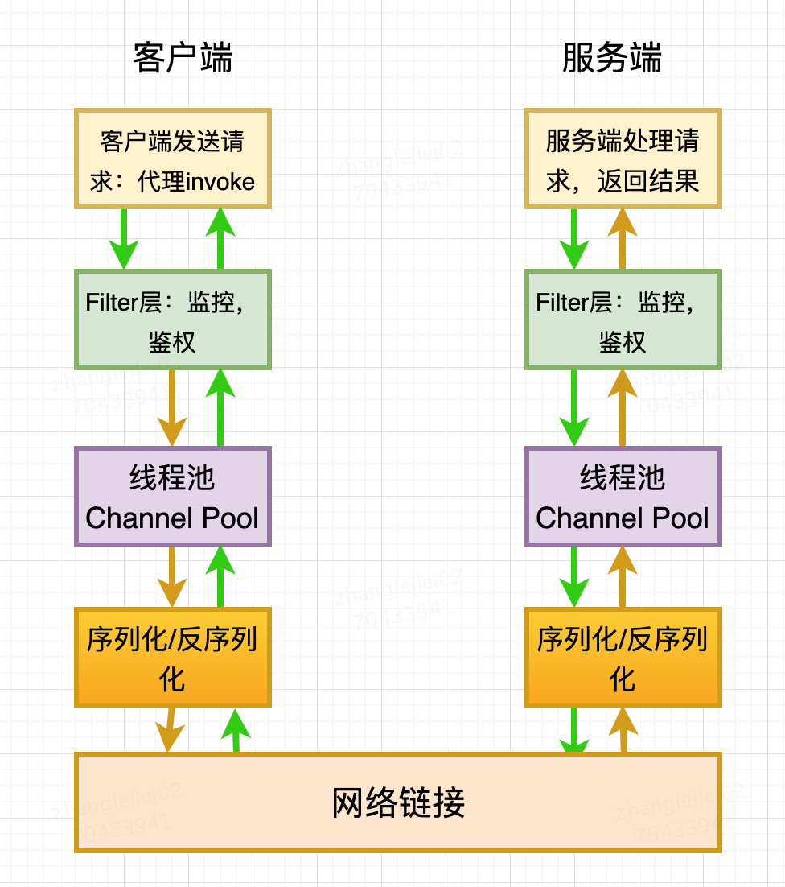

# 一、分布式架构

## 1、基本问题

### 1.1、为什么要进行系统拆分

### 1.2、分布式服务接口的幂等性如何设计

### 1.3、分布式服务接口请求的顺序性如何保证

一旦引入分布式顺序保证，比如使用分布式锁，会导致系统复杂度提升，而且会带来效率低下，热点数据压力过大等；

可以用的方案：首先你得用 Dubbo 的一致性 hash 负载均衡策略，将比如某一个订单 id 对应的请求都给分发到某个机器上去，接着就是在那个机器上，因为可能 还是多线程并发执行的，你可能得立即将某个订单 id 对应的请求扔一个内存队列里去，强制排队，这样来确保他们的顺序性；

但是这样引发的后续问题就很多，比如说要是某个订单对应的请求特别多，造成某台机器成热点；

### 1.4、分布式CAP理论

要掌握如何在面试中回答案例中 CAP 原理的问题，而且还要掌握回答问题的思路，以后遇到类似的理论性知识的考察，都可以从三个层面回答。
- 展示理论深度：你可以从一个熟知的知识点出发，深入浅出地回答，比如它的工作原理、优劣势、适用场景等。
- 结合落地经验：你不能仅停留在理论理解，还要结合落地方案的技术实现，这样才能体现你的技术闭环思维。
- 展示知识体系：这是任何一个程序员向上发展的基础能力。理论深度和落地经验体现了作为程序员的基本素质，而知识体系和技术判断力则体现了你是否达到架构师的能力边界

## 2、分布式缓存

### 2.1、使用 Redis 来做缓存，那可以把一个热点 Key 的缓存查询压力，分散到多个 Redis 节点上吗？

Redis 4.0 以上如果开启了 LFU 算法作为 maxmemory-policy，那么可以使用–hotkeys 配合 redis-cli 命令行工具来探查热点 Key。此外，我们还可以通过 MONITOR 命令来收集 Redis 执行的所有命令，然后配合redis-faina 工具来分析热点 Key、热点前缀等信息；

对于如何分散热点 Key 对于 Redis 单节点的压力的问题，我们可以考虑为 Key 加上一定范围的随机数作为后缀，让一个 Key 变为多个 Key，相当于对热点 Key 进行分区操作；

当然，除了分散 Redis 压力之外，我们也可以考虑再做一层短时间的本地缓存，结合 Redis 的 Keyspace 通知功能，来处理本地缓存的数据同步；

## 3、限流

### 3.1、漏桶 vs 令牌桶的区别

- 这两种算法都有一个“恒定”的速率和“不定”的速率：
    - 令牌桶是以`恒定速率`创建令牌，但是访问请求获取令牌的速率“不定”，反正有多少令牌发多少，令牌没了就干等；
    - 漏斗是以`恒定速率`处理请求，但是这些请求流入桶的速率是“不定”的；
- 漏桶的天然特性决定了它不会发生突发流量，就算每秒1000个请求到来，那么它对后台服务输出的访问速率永远恒定。而令牌桶则不同，其特性可以“预存”一定量的令牌，因此在应对突发流量的时候可以在短时间消耗所有令牌，其突发流量处理效率会比漏桶高，但是导向后台系统的压力也会相应增多；
- 漏桶和令牌桶都有保护作用，但漏桶的保护是尽量缓存请求（缓存不下才丢），令牌桶的保护主要是丢弃请求（即使系统还能处理，只要超过指定的速率就丢弃，除非此时动态提高速率）；
- 所以如果在秒杀、抢购、整点打卡签到、微博热点事件这些业务场景用令牌桶的话，会出现大量用户访问出错，因为请求被直接丢弃了；而用漏桶的话，处理可能只是会慢一些，用户体验会更好一些，所以我认为漏桶更适合“突发流量”
- 漏桶的本质是总量控制，令牌桶的本质是速率控制

### 3.2、为什么使用了限流服务还是崩掉了

这个是关于**请求大小**的问题

限流和负载均衡有点儿像，基本没有考虑请求的资源消耗问题。所以负载均衡不管怎么样，都会有偶发性负载不均衡的问题，限流也是如此。例如即便将一个实例限制在每秒 100 个请求，但是万一这个 100 个请求都是消耗资源很多的请求，那么最终这个实例也可能会承受不住负载而崩溃。动态限流算法一定程度上能够缓解这个问题，但是也无法根治，因为一个请求只有到它被执行的时候，才知道它是不是大请求；

## 4、zookeeper

### 4.1、zookeeper是如何保证事务的顺序一致性的

zookeeper采用了递增的事务Id来标识，所有的proposal（提议）都在被提出的时候加上了zxid，zxid实际上是一个64位的数字，高32位是epoch（时期; 纪元; 世; 新时代）用来标识leader是否发生改变，如果有新的leader产生出来，epoch会自增，低32位用来递增计数。当新产生proposal的时候，会依据数据库的两阶段过程，首先会向其他的server发出事务执行请求，如果超过半数的机器都能执行并且能够成功，那么就会开始执行

### 4.2、zk节点宕机如何处理

Zookeeper本身也是集群，推荐配置不少于3个服务器。Zookeeper自身也要保证当一个节点宕机时，其他节点会继续提供服务。

如果是一个Follower宕机，还有2台服务器提供访问，因为Zookeeper上的数据是有多个副本的，数据并不会丢失；

如果是一个Leader宕机，Zookeeper会选举出新的Leader。

ZK集群的机制是只要超过半数的节点正常，集群就能正常提供服务。只有在ZK节点挂得太多，只剩一半或不到一半节点能工作，集群才失效。

所以

3个节点的cluster可以挂掉1个节点(leader可以得到2票>1.5)

2个节点的cluster就不能挂掉任何1个节点了(leader可以得到1票<=1)

### 4.3、ZooKeeper是强一致的吗？怎么实现的？

Zookeeper通过ZAB协议保证数据最终一致性。

### 4.4、zookeeper脑裂问题

zk自己不会脑裂，但不代表使用zk的服务不会选出俩leader来。

其中关键在于NPC三个不好的问题，N代表网络，网络可以超时或分区，P代表进程，进程可以僵死或暂停，C代表时钟，时钟可以漂移。

以服务进程full GC导致进程暂停为例。如果服务进程的leader节点暂停了，那么zk可能会选出一个新的leader节点。然后，等旧leader进程重新可工作后，现在系统中就存在俩leader节点了。心跳有时间间隔，而且网络也有分区问题，因此依赖心跳并不能完全规避服务进程同时存在俩leader的情况。

最终的解决方案还是要落在资源层，比如数据库，通过幂等性保证即使有俩leader并存，也可以做到落盘的数据是一致的。

## 5、Nacos

### 5.1、nacos集群CP如何保持一致性

Raft选举过程，日志同步过程？

脑裂？对策？过半选举 + 退位

### 5.2、nacos如何实现服务治理

注册、发现、心跳

生命周期你 + 底层实现方式

### 5.3、nacos的高可用

客户端 + 服务端  -> 失效转移

Nacos Cluster + VIP KeepAlive + 自保 -> 服务端高可用

客户端保存服务端列表；

### 5.4、nacos高并发支持

COW（CopyOnWrite）

### 5.5、Client端的心跳流程

## 6、分布式锁

## 7、RPC

### 7.1、超时设置

对于整条 RPC 调用链路（从 App 到网关再到各个服务系统），怎么设置 RPC 的超时时间，要考虑哪些问题？
- 即使考虑到整个调用链的平均响应时长会受到所有依赖服务的耗时和重传次数影响，那么依据什么来设置 RPC 超时时间和重试次数呢？
- 如果发生超时重传，怎么区分哪些 RPC 服务可重传，哪些不可重传呢？
- 如果请求超过了 PRC 的重传次数，一般会触发服务降级，这又会对商品详情页造成什么影响？

### 7.2、两个角度分析RPC原理

- 优化RPC的网络通信性能： 高并发下选择高性能的网络编程 I/O 模型
- 选型合适的RPC序列化方式： 选择合适的序列化方式，进而提升封包和解包的性能

### 7.3、一次完整的RPC流程

分析几个点：
- RPC 是远程调用，首先会涉及网络通信：RPC 用于业务系统之间的数据交互，要保证数据传输的可靠性，所以它一般默认采用 TCP 来实现网络数据传输
- 网络传输的数据必须是二进制数据，可是在 RPC 框架中，调用方请求的出入参数都是对象，对象不能直接在网络中传输，所以需要提前把对象转成可传输的二进制数据，转换算法还要可逆，这个过程就叫“序列化”和“反序列化”
- 在网络传输中，RPC 不会把请求参数的所有二进制数据一起发送到服务提供方机器上，而是拆分成好几个数据包（或者把好几个数据包封装成一个数据包），所以服务提供方可能一次获取多个或半个数据包，这也就是网络传输中的粘包和半包问题。为了解决这个问题，需要提前约定传输数据的格式，即“RPC 协议”
    大多数的协议会分成数据头和消息体：
    - 数据头一般用于身份识别，包括协议标识、数据大小、请求类型、序列化类型等信息；
    - 消息体主要是请求的业务参数信息和扩展属性等

在确定好“ RPC 协议”后，一次完整的 RPC 调用会经过这样几个步骤：
- 调用方持续把请求参数对象序列化成二进制数据，经过 TCP 传输到服务提供方；
- 服务提供方从 TCP 通道里面接收到二进制数据；
- 根据 RPC 协议，服务提供方将二进制数据分割出不同的请求数据，经过反序列化将二进制数据逆向还原出请求对象，找到对应的实现类，完成真正的方法调用；
- 然后服务提供方再把执行结果序列化后，回写到对应的 TCP 通道里面；
- 调用方获取到应答的数据包后，再反序列化成应答对象。

### 7.4、如何选择序列化

常见的序列化方式有以下几种：
- JSON：Key-Value 结构的文本序列化框架，易用且应用最广泛，基于 HTTP 协议的 RPC 框架都会选择 JSON 序列化方式，但它的空间开销很大，在通信时需要更多的内存。
- Hessian：一种紧凑的二进制序列化框架，在性能和体积上表现比较好。
- Protobuf：Google 公司的序列化标准，序列化后体积相比 JSON、Hessian 还要小，兼容性也做得不错

考虑时间与空间开销，切勿忽略兼容性
- 在大量并发请求下，如果序列化的速度慢，势必会增加请求和响应的时间（时间开销）；
- 如果序列化后的传输数据体积较大，也会使网络吞吐量下降（空间开销）
- 在 RPC 迭代中，常常会因为序列化协议的兼容性问题使 RPC 框架不稳定

按照常用序列化协议的选型标准，比如首选 Hessian 与 Protobuf，因为它们在时间开销、空间开销、兼容性等关键指标上表现良好

### 7.5、如何提升网络通信性能

其实就是一个 RPC 框架如何选择高性能的网络编程 I/O 模型

首先你需要知道5种网络IO模型
- 同步阻塞 I/O（BIO）
- 同步非阻塞 I/O
- I/O 多路复用（NIO）
- 信号驱动
- 以及异步 I/O（AIO）

最为常用的是 BIO 和 NIO

在目前主流的 RPC 框架中，广泛使用的也是 I/O 多路复用模型，Linux 系统中的 select、poll、epoll等系统调用都是 I/O 多路复用的机制
- Reactor 模型（即反应堆模式），以及 Reactor 的 3 种线程模型，分别是单线程 Reactor 线程模型、多线程 Reactor 线程模型，以及主从 Reactor 线程模型。
- Java 中的高性能网络编程框架 Netty

## 8、如何应对高并发用户请求

- 垂直伸缩：提升单台服务器的处理能力，比如用更快频率的 CPU，用更多核的 CPU，用更大的内存，用更快的网卡，用更多的磁盘组成一台服务器，使单台服务器的处理能力得到提升。通过这种手段提升系统的处理能力；
- 水平伸缩：使用更多的服务器，将这些服务器构成一个分布式集群，通过这个集群，对外统一提供服务，以此来提高系统整体的处理能力

分布式架构是互联网企业在业务快速发展过程中，逐渐发展起来的一种技术架构，包括了一系列的分布式技术方案：分布式缓存、负载均衡、反向代理与 CDN、分布式消息队列、分布式数据库、NoSQL 数据库、分布式文件、搜索引擎、微服务等等，还有将这些分布式技术整合起来的分布式架构方案；

互联网与传统IT的挑战不同：
- 数据规模：UGC 和行为数据
- 大流量：要考虑大型文件或流数据对带宽的压力
- 高峰场景：无计划或有计划的访问量爆发（营销活动、热点事件）、DDoS，要求系统可伸缩
- 安全性：暴露在公网，安全通信和隐私保护问题不可避免
- 高可用：宕机意味着用户流失，复杂网络环境问题等外部因素也要考虑在内
- 快速变化：产品创新以吸引和留存用户，这需要可扩展的系统设计和高效敏捷的团队协作机制

# 二、微服务

## 1、什么是微服务

## 2、微服务之间是如何独立通讯的

## 3、SpringCloud和Dubbo有哪些区别

- 介绍 Dubbo 时，主要是从 RPC 服务调用的特性入手，而在介绍 Spring Cloud 时，更多的是强调其在微服务方面提供的整体解决方案；
- Dubbo 的服务发现通过注册中心实现，支持多种注册中心，另外本地测试支持 Multicast、Simple 等简单的服务发现方式。Spring Cloud 有各种服务发现组件，包括 Eureka、Consul、Nacos 等；
- 最大区别：Dubbo底层是使用Netty这样的NIO框架，是基于TCP协议传输的，配合以Hession序列化完成RPC通信。SpringCloud没有使用类似Dubbo的RPC通信，采用的是基于HTTP的REST方式，从一定程度上，HTTP的REST方式牺牲了服务调用的性能，但也避免了原生RPC带来的问题。服务提供方和调用方的依赖只依靠一纸契约，不存在代码级别的强依赖；

## 4、SpringBoot与SpringCloud，如何理解他们之间的关系

## 5、什么是服务熔断

### 5.1、服务熔断

#### 5.1.1、什么时候判定服务需要触发熔断，为什么选用这个指标

为了保障微服务的可用性，在核心服务里面接入了熔断。

针对不同的服务，设计了不同的微服务熔断策略。

比如说最简单的熔断策略就是根据响应时间来进行。当响应时间超过阈值一段时间之后就会触发熔断。我般会根据业务情况来选择这个阈值，例如，如果产品经理要求响应时间是 1s，那么我会把阈值设定在 1.2s。如果响应时间超过 1.2s，并且持续三十秒，就会触发熔断。在触发熔断的情况下，新请求会被拒绝，而已有的请求还是会被继续处理，直到服务恢复正常。

**缓存崩溃**

一个很有趣的熔断方案。一个接口并发很高，对缓存的依赖度非常严重。所以熔断策略是要是缓存不可用，比如说 Redis 崩溃了，那么我、就会触发熔断。这里如果不熔断的话，请求会因为 Redis 崩溃而全部落到 MySQL 上，基本上会压垮 MySQL。

在触发熔断之后，会额外开启一个线程持续不断地 ping Redis。如果 Redis 恢复了，那么我就会退出熔断状态，新来的请求就不会被拒绝了

逐步放开流量的方案其实还是有缺陷的，还有一些更加高级的做法，但是需要负载均衡来配合；

恢复的时候可以逐步放开流量。那么是否注意到，这个放开流量是在服务端处理的，也就是说服务端还是收到了 100% 的流量，只不过只有部分流量会被放过去并且被正常处理；

**为什么不直接让客户端来控制这个流量？**让客户端控制流量的方式：
- 服务端在触发熔断的时候，会返回一个代表熔断的错误。
- 客户端在收到这个错误之后，就会把这个服务端节点暂时挪出可用节点列表。后续所有的新请求都不会再打到这个触发了熔断的服务端节点上了。
- 客户端在等待一段时间后，逐步放开流量。
- 如果服务端正常处理了新来的请求，那么客户端就加大流量。
- 如果服务端再次返回了熔断响应，那么客户端就会再一次将这个节点挪出可用列表。
- 如此循环，直到服务端完全恢复正常，客户端也正常发送请求到该服务端节点；

**整体思路：**利用负载均衡来控制流量。如果一个服务端节点触发了熔断，那么客户端在做负载均衡的时候就可以将这个节点挪出可用列表，后续请求会发给别的节点。在经过一段时间之后，客户端可以尝试发请求给该节点。如果该节点正确处理了，那客户端就可以加大流量。否则客户端就要再一次等待一段时间；

**万一所有可用节点都触发熔断了，应该怎么办？**

比如说如果因为某些原因数据库出问题，导致某个服务所有的节点都触发了熔断，那么客户端就完全没有可用节点了。不过这个问题本身熔断解决不了，负载均衡也解决不了，只能通过监控告警之后人手工介入处理了

### 5.2、服务降级

## 6、微服务的优缺点分别是什么？需要注意哪些点？

## 7、微服务的技术栈

## 8、eureka和zookeeper都提供注册与发现功能，这两者有什么区别？

## 9、Nginx、Ribbon、Feign都支持负载均衡，这三者有什么区别？

- Nginx：Nginx 基于C语言，快速，性能高。负载均衡、反向代理，代理后端服务器。隐藏真实地址，防火墙，不能外网直接访问，安全性较高。属于服务器端负载均衡。即请求由 nginx 服务器端进行转发；

- Ribbon：客户端负载均衡 Ribbon，是从 eureka 注册中心服务器端上获取服务注册信息列表，缓存到本地，然后在本地实现轮询负载均衡策略。即在客户端实现负载均衡

- Nginx 适合于服务器端实现负载均衡 比如 Tomcat ，Ribbon 适合与在微服务中 RPC 远程调用实现本地服务负载均衡；

- Feign：Feign 是一个声明web服务客户端, 这便得编写web服务客户端更容易Spring Cloud Netflix 的微服务都是以 HTTP 接口的形式暴露的

## 10、微服务数据一致性问题

## 11、Hystrix的隔离机制有哪些？Hystrix常见配置是哪些

## 12、dubbo 在安全机制方面如何解决的

dubbo 通过 token 令牌防止用户绕过注册中心直连，然后在注册中心管理授权，dubbo 提供了黑白名单，控制服务所允许的调用方；

## 13、Dubbo序列化协议

dubbo支持哪些序列化协议？说一下hessian的数据结构？PB知道吗？为什么PB的效率是最高的？

## 14、dubbo负载均衡策略和高可用策略

dubbo负载均衡策略和高可用策略都有哪些？动态代理策略呢？

## 15、dubbo的spi思想是什么？

## 16、Dubbo的粘包拆包解决

通过dubbo协议的设计，可以知道dubbo分为消息头和消息体，消息头里面有整个消息体的大小。在Dubbo中，默认是用netty作为tcp/ip服务器的，通过netty提供的客户端和服务端进行通信。

在dubbo中，Exchanger扮演着把消息体解析为request和response的角色。主要入口是：NettyCodecAdapter

## 17、RPC框架中需要考虑的问题

- 通信协议：编解码
- 序列化方式
- 注册中心
- 安全问题
- 性能问题
- 接口超时等容错机制

## 18、dubbo通信协议中dubbo协议为什么邀请消费者个数比提供者个数多

dubbo协议采用单一长连接，假设网络为千兆网卡，根据经验每个连接最多压满（7M），理论上一个提供者需要20个消费者才能压满网卡；

## 19、高并发系统、资源有限、如何来保障业务顺利进行

- 可以从主链路规划，由面到点，
- 业务角度规划主链路：流量、转化率、变现场景
- 漏斗模型：越往下越重要
- 限流降级、弹性计算等；

## 20、什么是服务治理

本质：维护可用服务列表，保持服务间调用正确性

服务治理生命周期：服务与注册中心的变化

有哪些微服务治理框架？是如何治理的

## 21、设计一套业务埋点方案

- [埋点代码](https://github.com/pengxurui/EasyTrack)
- [西瓜视频埋点方案](https://mp.weixin.qq.com/s/iMn--4FNugtH26G90N1MaQ)

由面到点
- 后端埋点
- 可视化埋点
- 无痕埋点

## 22、在架构设计中如何实现服务治理

关键点：认证授权、限流熔断、链路追踪、服务发现、负载均衡

加分项：能结合具体技术栈（如SpringCloud、ServiceMesh），从应用架构、系统架构多角度分享实战经验；

## 23、Feign的工作原理

主程序入口添加了`@EnableFeignClients`注解开启对`FeignClient`扫描加载处理。根据Feign Client的开发规范，定义接口并加@FeignClientd注解。

当程序启动时，会进行包扫描，扫描所有@FeignClients的注解的类，并且将这些信息注入Spring IOC容器中，当定义的的Feign接口中的方法被调用时，通过JDK的代理方式，来生成具体的RequestTemplate.

当生成代理时，Feign会为每个接口方法创建一个RequestTemplate。当生成代理时，Feign会为每个接口方法创建一个RequestTemplate对象，该对象封装了HTTP请求需要的全部信息，如请求参数名，请求方法等信息都是在这个过程中确定的。

然后RequestTemplate生成Request,然后把Request交给Client去处理，这里指的是Client可以是JDK原生的URLConnection,Apache的HttpClient,也可以是OKhttp，最后Client被封装到LoadBalanceClient类，这个类结合Ribbon负载均衡发起服务之间的调用

## 24、服务启动的时候服务基本信息被注册到注册中心，如果服务提供者挂了，注册中心如何知道服务不可用了呢

服务掉线分为主动下线和心跳检测，比如服务由于发版时，在重启之前先主动通知注册中心：我要重启了，有流量进来先不要分给我，让别的机器服务，等我重启成功后在放流量进来，或者是在管理后台手动直接摘掉机器，这个是主动下线；

心跳检测是处理服务非正常下线（如断电断网）的情况，这个时候如果注册中心不知道该服务已经掉线，一旦被其调用就会带来问题。为了避免出现这样的情况，注册中心增加一个心跳检测功能，它会对服务提供者（Provider）进行心跳检测，比如每隔 30s 发送一个心跳，如果三次心跳结果都没有返回值，就认为该服务已下线，赶紧更新 Consumer 的服务列表，告诉 Consumer 调用别的机器；

## 25、如果注册中心挂了，比如你用的是 Zookeeper，如果 Zookeeper 挂了，那服务之间还能相互调用吗

首先注册中心挂掉也要分两种情况，如果数据库挂了，ZK 还是能用的，因为 ZK 会缓存注册机列表在缓存里。

其次 ZK 本身就是一个集群的，一台机器挂了，ZK 会选举出集群中的其他机器作为 Master 继续提供服务，如果整个集群都挂了也没问题，因为调用者本地会缓存注册中心获取的服务列表。省略和注册中心的交互，Consumer 和 Provider 采用直连方式，这些策略都是可配置的

## 26、RPC框架大致实现思路

## 27、dubbo服务暴露过程

Dubbo 会在 Spring 实例化完 bean 之后，在刷新容器最后一步发布 ContextRefreshEvent 事件的时候，通知实现了 ApplicationListener 的 ServiceBean 类进行回调 onApplicationEvent 事件方法，Dubbo 会在这个方法中调用 ServiceBean 父类 ServiceConfig 的 export 方法，而该方法真正实现了服务的（异步或者非异步）发布

## 28、为什么RPC框架都会自己定义一套格式，而不直接使用HTTP

相较于HTTP的用处，RPC更多的是负责应用间的通信，所以性能要求更高。但HTTP协议的数据包大小相对数据本身要大很多，而且加入了很多无用的内容，如换行符、回车符等。还一个重要原因是，HTTP协议属于无状态协议，客户端无法对请求和响应进行关联，每次请求都要重新建立连接，响应完成后在关闭连接。因此，对于要求高性能的RPC来说，HTTP协议很难满足要求，所以RPC会选择设计更紧凑的私有协议。

现在Http1.1,HTTP1.2已经支持长连接，但是性能不如TCP，gRPC就是基于HTTP2（更容易跨语言支持）

# 三、安全

## 1、非对称加密中公私钥都可以加密，那么什么时候用公钥加密，什么时候用私钥“加密” ？ 

- 加密场景，那么肯定希望只有我才能解密，别人只能加密。即公钥加密，私钥解密。 
- 签名场景，既然是签名，就希望只能我才能签名，别人只能验证。即私钥签名，公钥验签

## 2、什么是数字签名，数字签名的作用是什么？ 

数字签名就是使用私钥对数据摘要进行签名，并附带和数据一起发送。 可以起到防篡改、防伪装、防否认的作用。 

## 3、为什么要对数据的摘要进行签名，而不是直接计算原始数据的数字签名？ 

数据可能比较大，签名是使用非对称加密算法，比较耗时防止第三方使用公钥解开签名后，拿到原始数据

## 4、什么是数字证书，数字证书存在解决了什么问题？ 

数字证书就是由 CA 机构使用自己私钥，对证书申请者的公钥进行签名认证。 数字证书解决了如何安全分发公钥的问题，也奠定了信任链的基础。

## 5、有哪些加密算法

[关于加密与解密](../Java/Java基础/Java基础知识.md#三十加密与解密)

