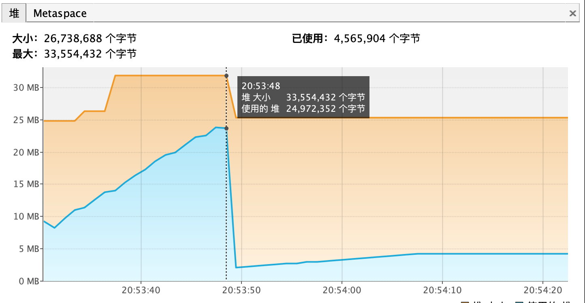
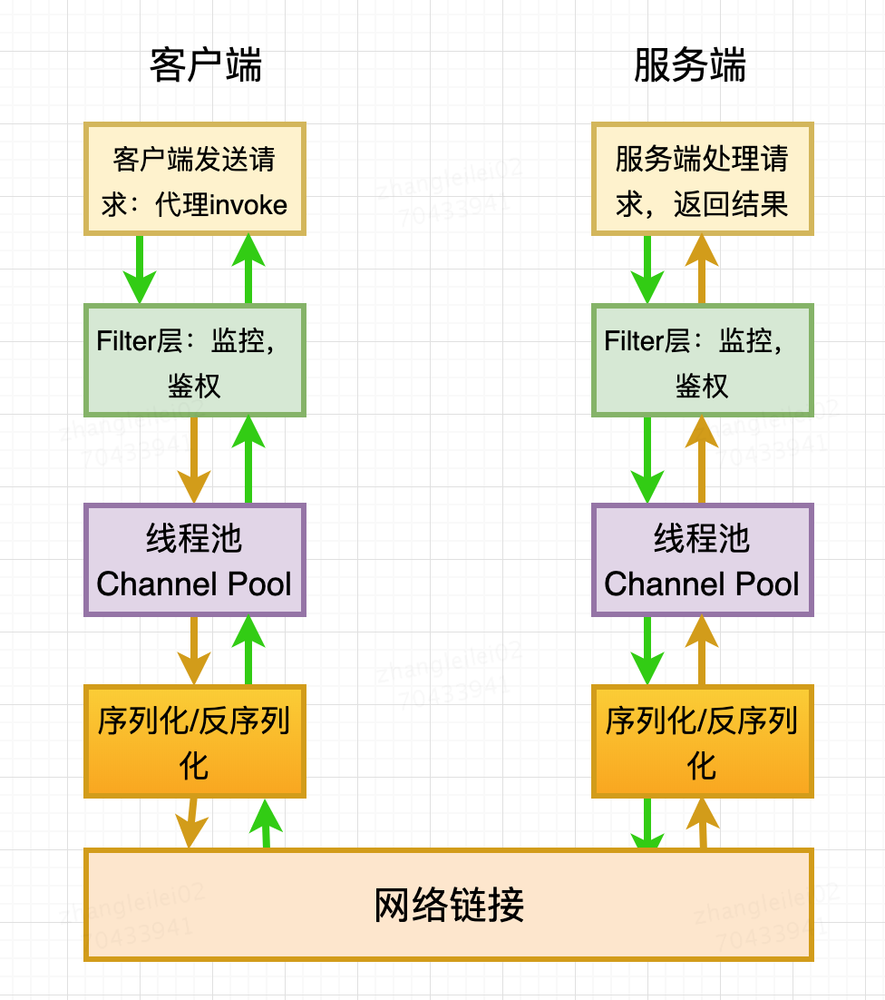
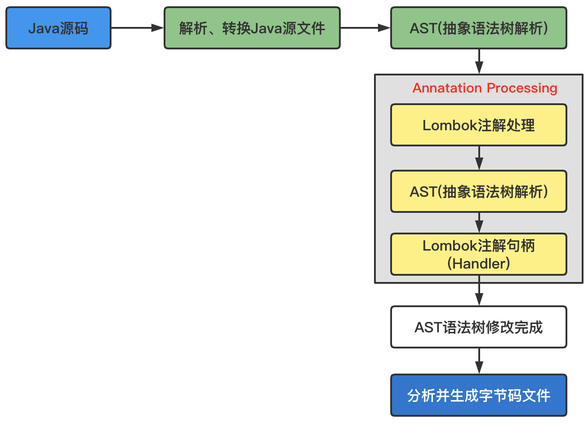

# 一、Java基础面试题

https://segmentfault.com/a/1190000017115722

https://segmentfault.com/a/1190000018855112

# 二、集合

ConcurrentHashMap、HashMap、Hashtable、LinkedHashMap

TreeMap

ConcurrentSkipListMap   基于跳表实现的

EnumMap 基于位运算实现的

# 三、IO与NIO

## 1、文件拷贝实现方式

主要关注以下几点：
- 不同的copy方式，底层机制有什么区别？
- 为什么零拷贝可能有性能优势？
- Buffer的分类与使用；
- Direct Buffer对垃圾收集有哪些方面的影响

### 1.1、不同的拷贝方式底层机制的实现

- 关于两个概念：用户态空间（User Space）和内核态空间（Kernel Space）这是操作系统层面的概念，操作系统内核、硬件驱动等运行在内核状态空间，具有相对高的特权；而用户态空间，则给普通应用和服务使用

- 基于流读写：当我们使用输入输出流进行读写时，实际上是进行了多次上下文切换，比如应用读取数据时先将内核态数据从磁盘读取到内核缓存，再切换到用户态将数据从内核缓存中读取到用户缓存，这种方式会带来一定的额外开销，可能会降低IO效率

- 基于NIO：基于NIO的transfer的实现方式，在Linux和Unix上，则会使用零拷贝技术，数据传输并不需要用户态参与，省去了上下文切换的开销和不必要的拷贝，进而可能提高应用拷贝性能

### 1.2、Files.copy 方法

最终实现是本地方法实现的[UnixCopyFile.c](http://hg.openjdk.java.net/jdk/jdk/file/f84ae8aa5d88/src/java.base/unix/native/libnio/fs/UnixCopyFile.c)，其内部明确说明了只是简单的用户态空间拷贝，所以该方法不是利用transfer来实现的，而是本地技术实现的用户态拷贝

### 1.3、基于流的读写

```java
public static void copyFileByStream(File source, File dest) throws Exception {
	try (InputStream is = new FileInputStream(source);
			OutputStream os = new FileOutputStream(dest)) {
		byte[] buffer = new byte[1024];
		int len;
		while ((len = is.read(buffer)) > 0) {
			os.write(buffer, 0, len);
		}
	}
}
```

### 1.4、基于NIO实现

- 基于基本NIO操作实现
```java
public static void main(String[] args) throws Exception {
	FileInputStream in = new FileInputStream("temp/test1.txt");
	FileOutputStream out = new FileOutputStream("temp/test1-copy.txt");
	FileChannel inChannel = in.getChannel();
	FileChannel outChannel = out.getChannel();
	ByteBuffer buffer = ByteBuffer.allocate(1024);
	int read = inChannel.read(buffer);
	if (read == -1) {
		return;
	}
	buffer.flip();
	outChannel.write(buffer);
}
```

- 基于Nio的transferTo或者transferFrom
```java
// 使用java nio 的transferTo 或 transferFrom来实现，其copy速度相对来说更快点，因为其更能利用现代操作系统底层机制，避免不必要的拷贝和上下文切换
public static void copyFileByChannel(File source, File dest) throws Exception {
	try (FileChannel sourceChannel = new FileInputStream(source).getChannel();
			FileChannel targetChannel = new FileOutputStream(dest).getChannel()) {
		for (long count = sourceChannel.size(); count
				> 0; ) {
			long transferred = sourceChannel.transferTo(sourceChannel.position(), count, targetChannel);
			sourceChannel.position(sourceChannel.position() + transferred);
			count -= transferred;
		}
	}
}
```

- 基于MappdByteBuffer实现，中间使用了编码
```java
public static void copyFileByMappedByteBuffer(String source, String dest) throws Exception {
	RandomAccessFile input = new RandomAccessFile(source, "r");
	RandomAccessFile output = new RandomAccessFile(dest, "rw");
	long length = new File(source).length();
	FileChannel inputChannel = input.getChannel();
	FileChannel outputChannel = output.getChannel();
	MappedByteBuffer inputData = inputChannel.map(FileChannel.MapMode.READ_ONLY, 0, length);
	Charset charset = Charset.forName("UTF-8");
	CharsetDecoder decoder = charset.newDecoder();
	CharsetEncoder encoder = charset.newEncoder();
	CharBuffer charBuffer = decoder.decode(inputData);
	ByteBuffer outputData = encoder.encode(charBuffer);
	outputChannel.write(outputData);
}
```

### 1.4、如何提高拷贝效率

- 在程序中，使用缓存机制，合理减少IO次数；
- 使用transfer等机制，减少上下文切换和额外IO操作；
- 尽量减少不必要的转换过程，比如编解码；对象序列化与反序列化；

## 2、DirectBuffer 与 MappedByteBuffer

### 2.1、概述

- DirectBuffer：其定义了isDirect方法，返回当前buffer是不是Direct类型。因为Java提供了堆内和堆外（Direct）Buffer，我们可以以他的allocat 或者 allocatDirect方法直接创建；
- MappedByteBuffer：将文件按照指定大小直接映射为内存区域，当程序访问这个内存区域时直接将操作这块文件数据，省去了将数据从内核空间向用户空间传输的损耗；可以使用FileChannel.map创建，本质上也是DirectBuffer；

在实际使用时，Java会对DirectBuffer仅做本地iO操作，对于很多大数据量的IO密集操作，可能会带来非常大的优势：
- DirectBuffer生命周期内内存地址都不会再发生改变，进而内核可以安全的对其进行访问，很对IO操作很搞笑；
- 减少了堆内对象存储的可能额外维护工作，所以访问效率可能有所提高；

但是值得注意的是，DirectBuffer创建和销毁过程中，都会比一般的堆内存Buffer增加部分开销，通常建议用于长期使用、数据较大的场景

因为DirectBuffer不在堆上，所以其参数设置大小可以用如下参数：`-XX:MaxDirectMemorySize=512M`；意味着在计算Java可以使用的内存大小的时候，不能只考虑堆的需要，还有DirectBuffer等一系列堆外因素，如果出现内存不足，堆外内存占用也是一种可能性；

另外，大多数垃圾收集过程中，都不会主动收集DirectBuffer，它的垃圾收集过程，是基于Cleaner和幻象引用机制，其本身不是public类型，内部实现了一个Deallocator负责销毁的逻辑，对它的销毁往往需要到FullGC的时候，使用不当的话很容易引起OOM

关于DirectBuffer的回收，注意以下几点：
- 在应用程序中，显示调用System.gc()来强制触发；
- 在大量使用DirectBuffer的部分框架中，框架自己在程序中调用释放方法，Netty的实现即如此；
- 重复使用DirectBuffer

### 2.2、跟踪与诊断DirectBuffer内存占用

通常的垃圾收集日志等记录，并不包含Directbuffer等信息，在JDK8之后的版本，可以使用native memory tracking特性进行诊断：```-XX:NativeMemoryTracking={summary|detail}```

注意激活NMT通常都会导致JVM出现5%~10%性能下降

```
// 打印 NMT信息
jcmd <pid> VM.native_memory detail
// 进行baseline，以对比分配内存变化
jcmd <pid> VM.native_memory baseline
// 进行baseline，以对比分配内存变化
jcmd <pid> VM.native_memory detail.diff
```

## 3、使用Java读取大文件

- （1）文件流边读边用，使用文件流的read()方法每次读取指定长度的数据到内存中，具体代码如下
    ```java
    public static void readMethod1(String filePath) throws Exception{
        BufferedInputStream reader = new BufferedInputStream(new FileInputStream(filePath));
        int bytes = -1;
        do {
            byte[] byteArray = new byte[8192];
            bytes = reader.read(byteArray);
            if (bytes != -1) {
                String s = new String(byteArray);
                System.out.println(s);
            }
        } while (bytes > 0);

        reader.close();
    }
    ```
- （2）对大文件建立NIO的FileChannel，每次调用read()方法时会先将文件数据读取到已分配的固定长度的java.nio.ByteBuffer，接着从中获取读取的数据。这种方式比传统的流方式要快点
    ```java
    public static void fileChannelMethod(String filePath) throws Exception {
        FileInputStream in = new FileInputStream(filePath);
        ByteBuffer byteBuffer = ByteBuffer.allocate(65535);
        FileChannel fileChannel = in.getChannel();
        int b = -1;
        do {
            b = fileChannel.read(byteBuffer);
            if (b != -1) {
                byte[] array = new byte[b];
                byteBuffer.flip();
                byteBuffer.get(array);
                byteBuffer.clear();
                System.out.println(new String(array));
            }
        } while (b > 0);
        in.close();
        fileChannel.close();
    }

    ```
- （3）内存文件映射，就是把文件内容映射到虚拟内存的一块区域中，从而可以直接操作内存当中的数据而无需每次都通过IO去物理硬盘读取文件，

    ```java
    public static void memoryMappingMethod(String filePath) throws Exception {
        FileInputStream in = new FileInputStream(filePath);
        FileChannel fileChannel = in.getChannel();
        MappedByteBuffer mapperBuffer = fileChannel.map(FileChannel.MapMode.READ_ONLY, 0, fileChannel.size());
        boolean end = false;
        do {
            int limit = mapperBuffer.limit();
            int position = mapperBuffer.position();
            if (position >= limit) {
                end = true;
            }
            int maxSize = 2048;
            if (limit - position < maxSize) {
                maxSize = limit - position;
            }
            byte[] array = new byte[maxSize];
            mapperBuffer.get(array);
            System.out.println(new String(array));

        } while (!end);
        in.close();
        fileChannel.close();
    }
    ```
    这种方式存在致命问题，就是无法读取超大文件（大于Integer.Max_value），因为 FileChannel的map方法中 size 参数会有大小限制，源码中发现该参数值大于 Integer.MAX_VALUE 时会直接抛出 IllegalArgumentException("Size exceeds Integer.MAX_VALUE") 异常，所以对于特别大的文件其依然不适合。
	```java
	// sun.nio.ch.FileChannelImpl#map
	public MappedByteBuffer map(MapMode var1, long var2, long var4) throws IOException {
        this.ensureOpen();
        if (var1 == null) {
            throw new NullPointerException("Mode is null");
        } else if (var2 < 0L) {
            throw new IllegalArgumentException("Negative position");
        } else if (var4 < 0L) {
            throw new IllegalArgumentException("Negative size");
        } else if (var2 + var4 < 0L) {
            throw new IllegalArgumentException("Position + size overflow");
        } else if (var4 > 2147483647L) {
			throw new IllegalArgumentException("Size exceeds Integer.MAX_VALUE");
		} else {
			....
		}
	}
	```
    本质上是由于 java.nio.MappedByteBuffer 直接继承自 java.nio.ByteBuffer ，而 ByteBuffer 的索引是 int 类型的，所以 MappedByteBuffer 也只能最大索引到 Integer.MAX_VALUE 的位置，所以 FileChannel 的 map 方法会做参数合法性检查。

## 4、NIO消息传输错误

### 4.1、存在问题的情况

- 多消息粘包：
- 单消息不完整：接收端buffer容量不够
- 消息到达提醒重复触发（读消息时未设置取消监听）

### 4.2、如何解决

- 数据传输加上开始结束标记
- 数据传输使用固定头部的方案；
- 混合方案：固定头、数据加密、数据描述

## 5、关于BIO、NIO等现场问题

**基于BIO实现的Server端，当建立了100个连接时，会有多少个线程？如果基于NIO，又会是多少个线程？ 为什么？**

BIO由于不是NIO那样的事件机制，在连接的IO读取上，无论是否真的有读/写发生，都需要阻塞住当前的线程，对于基于BIO实现的Server端，通常的实现方法都是用一个线程去accept连接，当连接建立后，将这个连接的IO读写放到一个专门的处理线程，所以当建立100个连接时，通常会产生1个Accept线程 + 100个处理线程。

NIO通过事件来触发，这样就可以实现在有需要读/写的时候才处理，不用阻塞当前线程，NIO在处理IO的读写时，当从网卡缓冲区读或写入缓冲区时，这个过程是串行的，所以用太多线程处理IO事件其实也没什么意义，连接事件由于通常处理比较快，用1个线程去处理就可以，IO事件呢，通常会采用cpu core数+1或cpu core数 * 2，这个的原因是IO线程通常除了从缓冲区读写外，还会做些比较轻量的例如解析协议头等，这些是可以并发的，为什么不只用1个线程处理，是因为当并发的IO事件非常多时，1个线程的效率不足以发挥出多core的CPU的能力，从而导致这个地方成为瓶颈，这种在分布式cache类型的场景里会比较明显，按照这个，也就更容易理解为什么在基于Netty等写程序时，不要在IO线程里直接做过多动作，而应该把这些动作转移到另外的线程池里去处理，就是为了能保持好IO事件能被高效处理

## 6、Channel和Scoket区别

Socket、SocketChannel二者的实质都是一样的，都是为了实现客户端与服务器端的连接而存在的。

- 所属包不同：Socket在java.net包中，而SocketChannel在java.nio包中；
- 异步方式不同：Socket是阻塞连接（当然我们可以自己实现非阻塞），SocketChannel可以设置非阻塞连接；
- 性能不同：一般来说使用SocketChannel会有更好的性能。其实，Socket实际应该比SocketChannel更高效，不过由于使用者设计等原因，效率反而比直接使用SocketChannel低；
- 使用方式不同：
    - Socket、ServerSocket类可以传入不同参数直接实例化对象并绑定ip和端口：
        ```java
        Socket socket = new Socket("127.0.0.1", "8000");
        ServerSocket serverSocket = new ServerSocket("8000")
        ```
    - 而SocketChannel、ServerSocketChannel类需要借助Selector类控制

## 7、Java中怎么快速把InputStream转化为String

### 7.1、使用 Apachecommons包的工具类 IOUtils

```java
StringWriter writer = new StringWriter();
IOUtils.copy(in, writer, encoding);
String str = writer.toString();
// 或者
String str = IOUtils.toString(in, encoding);
```

### 7.2、使用guava

`CharStreams.toString(new InputStreamReader(in, encoding));`

### 7.3、使用Scanner

```java
Scanner scanner = new Scanner(in).useDelimiter("\\A");
String str = scanner.hasNext() ? scanner.next() : "";
```

### 7.4、使用Stream API

`String str = new BufferedReader(new InputStreamReader(in)).lines().collect(Collectors.joining("\n"));`

`String str = new BufferedReader(new InputStreamReader(in)).lines().parallel().collect(Collectors.joining("\n"));`

### 7.5、使用InputStreamReader and StringBuilder

```java
final int bufferSize = 1024;
final char[] buffer = new char[bufferSize];
final StringBuilder sb = new StringBuilder();
Reader reader = new InputStreamReader(in, StandardCharsets.UTF_8);
int charRead;
while ( (charRead = reader.read(buffer, 0, buffer.length)) > 0) {
    sb.append(buffer, 0 , charRead);
}
return sb.toString();
```

## 8、输入流与输出流

### 8.1、输出入流转换为字节数组

```java
public static byte[] getFileContent(String filePath) throws Throwable {
    InputStream stream = SameLoaderLoadOneClassMore.class.getClassLoader().getResourceAsStream(filePath);
    ByteArrayOutputStream out = new ByteArrayOutputStream();
    byte[] buffer = new byte[1024 * 4];
    int n = 0;
    assert stream != null;
    while ((n = stream.read(buffer)) != -1) {
        out.write(buffer, 0, n);
    }
    return out.toByteArray();
}
```


# 四、多线程

## 1、为什么线程池的底层数据接口采用HashSet来实现


## 2、使用模拟真正的并发请求

使用CountDownLatch

[模拟超过5W的并发用户](https://mp.weixin.qq.com/s/2BondePBWkfUNSwNyTMcTA)

## 3、可重入锁为什么可以防止死锁

```java
public class Widget {
    public synchronized void doSomething(){
        // do something
    }
}
public class LoggingWidget extends Widget {
    public synchronized void doSomething() {
        super.doSomething();
    }
}
```
如果synchronized 不是可重入锁，那么LoggingWidget 的super.dosomething()；无法获得Widget对象的锁，因为会死锁

这里涉及到Java的重写；子类LoggingWidget 的doSomething方法，重写了父类Widget 的doSomething方法，但是子类对象如果要调用父类的doSomething方法，那么就需要用到super关键字了。因为实例方法的调用是Java虚拟机在运行时动态绑定的，子类LoggingWidget 的对象调用doSomething方法，一定是绑定到子类自身的doSomething方法，必须用super关键字告诉虚拟机，这里要调用的是父类的doSomething方法；

super关键字并没有新建一个父类的对象，比如说widget，然后再去调用widget.doSomething方法，实际上调用父类doSomething方法的还是我们的子类对象；

如果一个线程有子类对象的引用loggingWidget，然后调用loggingWidget.doSomething方法的时候，会请求子类对象loggingWidget 的对象锁；又因为loggingWidget 的doSomething方法中调用的父类的doSomething方法，实际上还是要请求子类对象loggingWidget 的对象锁，那么如果synchronized 关键字不是个可重入锁的话，就会在子类对象持有的父类doSomething方法上产生死锁了。正因为synchronized 关键字的可重入锁，当前线程因为已经持有了子类对象loggingWidget 的对象锁，后面再遇到请求loggingWidget 的对象锁就可以畅通无阻地执行同步方法了

## 4、队列相关面试题

### 4.1、什么是队列？队列与集合的区别

**队列：**
- 首先队列本身也是个容器，底层也会有不同的数据结构，比如 LinkedBlockingQueue 是底层是链表结构，所以可以维持先入先出的顺序，比如 DelayQueue 底层可以是队列或堆栈，所以可以保证先入先出，或者先入后出的顺序等等，底层的数据结构不同，也造成了操作实现不同；
- 部分队列（比如 LinkedBlockingQueue ）提供了暂时存储的功能，我们可以往队列里面放数据，同时也可以从队列里面拿数据，两者可以同时进行；
- 队列把生产数据的一方和消费数据的一方进行解耦，生产者只管生产，消费者只管消费，两者之间没有必然联系，队列就像生产者和消费者之间的数据通道一样，如 LinkedBlockingQueue；
- 队列还可以对消费者和生产者进行管理，比如队列满了，有生产者还在不停投递数据时，队列可以使生产者阻塞住，让其不再能投递，比如队列空时，有消费者过来拿数据时，队列可以让消费者 hodler 住，等有数据时，唤醒消费者，让消费者拿数据返回，如 ArrayBlockingQueue；
- 队列还提供阻塞的功能，比如我们从队列拿数据，但队列中没有数据时，线程会一直阻塞到队列有数据可拿时才返回

**队列与集合的区别：**
- 和集合的相同点，队列（部分例外）和集合都提供了数据存储的功能，底层的储存数据结构是有些相似的，比如说 LinkedBlockingQueue 和 LinkedHashMap 底层都使用的是链表，ArrayBlockingQueue 和 ArrayList 底层使用的都是数组。
- 和集合的区别：
    - 部分队列和部分集合底层的存储结构很相似的，但两者为了完成不同的事情，提供的 API 和其底层的操作实现是不同的。
    - 队列提供了阻塞的功能，能对消费者和生产者进行简单的管理，队列空时，会阻塞消费者，有其他线程进行 put 操作后，会唤醒阻塞的消费者，让消费者拿数据进行消费，队列满时亦然。
    - 解耦了生产者和消费者，队列就像是生产者和消费者之间的管道一样，生产者只管往里面丢，消费者只管不断消费，两者之间互不关心

### 4.2、队列是如何阻塞的

队列主要提供了两种阻塞功能，如下：
- LinkedBlockingQueue 链表阻塞队列和 ArrayBlockingQueue 数组阻塞队列是一类，前者容量是 Integer 的最大值，后者数组大小固定，两个阻塞队列都可以指定容量大小，当队列满时，如果有线程 put 数据，线程会阻塞住，直到有其他线程进行消费数据后，才会唤醒阻塞线程继续 put，当队列空时，如果有线程 take 数据，线程会阻塞到队列不空时，继续 take。
- SynchronousQueue 同步队列，当线程 put 时，必须有对应线程把数据消费掉，put 线程才能返回，当线程 take 时，需要有对应线程进行 put 数据时，take 才能返回，反之则阻塞，举个例子，线程 A put 数据 A1 到队列中了，此时并没有任何的消费者，线程 A 就无法返回，会阻塞住，直到有线程消费掉数据 A1 时，线程 A 才能返回；

### 4.3、队列阻塞的实现原理

队列本身并没有实现阻塞的功能，而是利用 Condition 的等待唤醒机制，阻塞底层实现就是更改线程的状态为睡眠；

### 4.4、往队列里面 put 数据是线程安全的么？为什么？

是线程安全的，在 put 之前，队列会自动加锁，put 完成之后，锁会自动释放，保证了同一时刻只会有一个线程能操作队列的数据，以 LinkedBlockingQueue 为例子，put 时，会加 put 锁，并只对队尾 tail 进行操作，take 时，会加 take 锁，并只对队头 head 进行操作，remove 时，会同时加 put 和 take 锁，所以各种操作都是线程安全的

### 4.5、take 与 put 方法

**take 的时候也会加锁么？**
- 是的，take 时也会加锁的，像 LinkedBlockingQueue 在执行 take 方法时，在拿数据的同时，会把当前数据删除掉，就改变了链表的数据结构，所以需要加锁来保证线程安全。

**既然 put 和 take 都会加锁，是不是同一时间只能运行其中一个方法？**
- 这个需要看情况而言，对于 LinkedBlockingQueue 来说，队列的 put 和 take 都会加锁，但两者的锁是不一样的，所以两者互不影响，可以同时进行的，对于 ArrayBlockingQueue 而言，put 和 take 是同一个锁，所以同一时刻只能运行一个方法

**使用队列的 put、take 方法有什么危害，如何避免**
- 当队列满时，使用 put 方法，会一直阻塞到队列不满为止。
- 当队列空时，使用 take 方法，会一直阻塞到队列有数据为止
- 两个方法都是无限（永远、没有超时时间的意思）阻塞的方法，容易使得线程全部都阻塞住，大流量时，导致机器无线程可用，所以建议在流量大时，使用 offer 和 poll 方法来代替两者，我们只需要设置好超时阻塞时间，这两个方法如果在超时时间外，还没有得到数据的话，就会返回默认值（LinkedBlockingQueue 为例），这样就不会导致流量大时，所有的线程都阻塞住了

### 4.6、SynchronousQueue

假设 SynchronousQueue 底层使用的是堆栈，线程 1 执行 take 操作阻塞住了，然后有线程 2 执行 put 操作，问此时线程 2 是如何把 put 的数据传递给 take 的？

首先线程 1 被阻塞住，此时堆栈头就是线程 1 了，此时线程 2 执行 put 操作，会把 put 的数据赋值给堆栈头的 match 属性，并唤醒线程 1，线程 1 被唤醒后，拿到堆栈头中的 match 属性，就能够拿到 put 的数据了。

严格上说并不是 put 操作直接把数据传递给了 take，而是 put 操作改变了堆栈头的数据，从而 take 可以从堆栈头上直接拿到数据，堆栈头是 take 和 put 操作之间的沟通媒介

## 5、线程池相关面试

### 5.1、threadpoolexecutor的内部数据结构是什么样子的

### 5.2、线程的运行状态有多少种

### 5.3、工作线程数是怎么存储的

### 5.4、worker对象里面的数据结构是什么样子的

### 5.5、execute里面主要做了什么事情

### 5.6、addworker是做什么事情

### 5.7、runworker里面是如何执行处理的

### 5.8、线程的回收

**核心线程数会被回收吗？需要什么设置？**

核心线程数默认是不会被回收的，如果需要回收核心线程数，需要调用下面的方法：allowCoreThreadTimeout，其对应的参数默认值时false；

**空闲线程如何回收**

### 5.9、线程池被创建后里面有线程吗？如果没有的话，你知道有什么方法对线程池进行预热吗？

线程池被创建后如果没有任务过来，里面是不会有线程的。如果需要预热的话可以调用下面的两个方法：
- 全部启动：preStartAllCoreThread；
- 启动一个：preStartCoreThread

### 5.10、如果线程池队列满了，仍要执行任务该如何处理？

可以将其拒绝策略设置为 CallerRunsPolicy，在线程池没有关闭（调用shut Down）的情况下，直接由调用线程来执行该任务。当触发拒绝策略时，只要线程池没有关闭，就由提交任务的当前线程处理

### 5.11、如果线程池处理任务过程中Java进程突然宕掉了，数据丢失了怎么办？

如果要提交一个任务到线程池里去，在提交之前，可以将当前任务信息插入数据库，更新其状态：未提交、已提交、已完成。提交成功后，更新他的状态为已提交状态。

系统重启，后台线程去扫描数据库里的未提交和已提交状态的任务，可以把任务信息读出来，重提交到线程池里，继续进行执行；

但是重新执行的时候需要注意：提交任务时需要保证任务执行的幂等性，不要重复执行；

如果是在写入数据时宕机，原始信息没存入数据库，也丢了，这种一般有好的方法处理吗? 每一个操作进行封装，如果写入数据库的时候宕机了，认为此任务没有提交成功，直接返回失败状态就行了，比如你买东西，请求到后台了，写数据库的时候宕机了，返回一个false，你没买到就得了

### 5.12、线程池的优点与弊端

优点：
- 线程是稀缺资源，使用线程池可以减少创建和销毁线程的次数，每个工作线程都可以重复使用。
- 可以根据系统的承受能力，调整线程池中工作线程的数量，防止因为消耗过多内存导致服务器崩溃。

弊端：
- 死锁：任何多线程应用程序都有死锁风险。当一组进程或线程中的每一个都在等待一个只有该组中另一个进程才能引起的事件时，我们就说这组进程或线程 死锁了。死锁的最简单情形是：线程 A 持有对象 X 的独占锁，并且在等待对象 Y 的锁，而线程 B 持有对象 Y 的独占锁，却在等待对象 X 的锁。除非有某种方法来打破对锁的等待（Java 锁定不支持这种方法），否则死锁的线程将永远等下去；

- 资源不足：如果线程池太大，那么被那些线程消耗的资源可能严重地影响系统性能。在线程之间进行切换将会浪费时间，而且使用超出比您实际需要的线程可能会引起资源匮乏问题，因为池线程正在消耗一些资源，而这些资源可能会被其它任务更有效地利用。

    除了线程自身所使用的资源以外，服务请求时所做的工作可能需要其它资源，例如 JDBC 连接、套接字或文件，这些也都是有限资源，有太多的并发请求也可能引起失效，例如不能分配 JDBC 连接

- 并发错误：线程池和其它排队机制依靠使用 wait() 和 notify()，如果编码不正确，那么可能丢失通知，导致线程保持空闲状态，尽管队列中有工作要处理；

- 线程泄漏：各种类型的线程池中一个严重的风险是线程泄漏，当从池中除去一个线程以执行一项任务，而在任务完成后该线程却没有返回池时，会发生这种情况。发生线程泄漏的一种情形出现在任务抛出一个 RuntimeException 或一个 Error 时；

- 请求过载：

### 5.13、空闲线程过多会有什么问题

首先，比较普通的一部分，一个线程的内存模型：
- 虚拟机栈
- 本地方法栈
- 程序计数器

需要注意以下几个内存的占用：
- ThreadLocal：业务代码是否使用了ThreadLocal？就算没有，Spring框架中也大量使用了ThreadLocal，你所在公司的框架可能也是一样。
- 局部变量：线程处于阻塞状态，肯定还有栈帧没有出栈，栈帧中有局部变量表，凡是被局部变量表引用的内存都不能回收。所以如果这个线程创建了比较大的局部变量，那么这一部分内存无法GC。
- TLAB机制：如果你的应用线程数处于高位，那么新的线程初始化可能因为Eden没有足够的空间分配TLAB而触发YoungGC

所以该问题可以如下作答：
- 线程池保持空闲的核心线程是它的默认配置，一般来讲是没有问题的，因为它占用的内存一般不大。怕的就是业务代码中使用ThreadLocal缓存的数据过大又不清理。
- 如果你的应用线程数处于高位，那么需要观察一下YoungGC的情况，估算一下Eden大小是否足够。如果不够的话，可能要谨慎地创建新线程，并且让空闲的线程终止；必要的时候，可能需要对JVM进行调参

### 5.14、keepAliveTime=0会怎么样

在JDK1.8中，`keepAliveTime=0`表示非核心线程执行完立刻终止。

默认情况下，keepAliveTime小于0，初始化的时候才会报错；但如果`allowsCoreThreadTimeOut`，keepAliveTime必须大于0，不然初始化报错

### 5.15、Spring中有哪些和ThreadPoolExecutor类似的工具

- SimpleAsyncTaskExecutor：每次请求新开线程，没有最大线程数设置.不是真的线程池，这个类不重用线程，每次调用都会创建一个新的线程。
- SyncTaskExecutor：不是异步的线程。同步可以用SyncTaskExecutor，但这个可以说不算一个线程池，因为还在原线程执行。这个类没有实现异步调用，只是一个同步操作。
- ConcurrentTaskExecutor：Executor的适配类，不推荐使用。如果ThreadPoolTaskExecutor不满足要求时，才用考虑使用这个类。
- SimpleThreadPoolTaskExecutor：监听Spring’s lifecycle callbacks，并且可以和Quartz的Component兼容.是Quartz的SimpleThreadPool的类。线程池同时被quartz和非quartz使用，才需要使用此类。

> Spring中使用的`@Async`注解，底层就是基于 SimpleAsyncTaskExecutor 去执行任务，只不过它不是线程池，而是每次都新开一个线程

## 6、FutureTask

### 6.1、FutureTask里面有多少种状态

### 6.2、里面是什么数据结构

### 6.3、在执行task的时候都做了什么事情

### 6.4、nodewaiters是干什么的

## 7、synchronized 无法禁止指令重排序，确能够保证有序性？

主要考察点：Java内存模型、并发编程有序性问题、指令重排、`synchronized`锁、可重入锁、排它锁、`as-if-serial`语义、单线程&多线程

答案点：
- 为了进一步提升计算机各方面能力，在硬件层面做了很多优化，如处理器优化和指令重排等，但是这些技术的引入就会导致有序性问题；synchronized是无法禁止指令重排和处理器优化的
- 最好的解决有序性问题的办法，就是禁止处理器优化和指令重排，就像volatile中使用内存屏障一样；
- 虽然很多硬件都会为了优化做一些重排，但是在Java中，不管怎么排序，都不能影响单线程程序的执行结果。这就是`as-if-serial`语义，所有硬件优化的前提都是必须遵守`as-if-serial`语义；
- `synchronized`，是Java提供的锁，可以通过其对Java中的对象加锁，并且他是一种排他的、可重入的锁；其是JVM层面上实现的锁；
- 当某个线程执行到一段被`synchronized`修饰的代码之前，会先进行加锁，执行完之后再进行解锁。在加锁之后，解锁之前，其他线程是无法再次获得锁的，只有这条加锁线程可以重复获得该锁；
- `synchronized`通过排他锁的方式就保证了同一时间内，被`synchronized`修饰的代码是单线程执行的。所以呢，这就满足了`as-if-serial`语义的一个关键前提，那就是单线程，因为有`as-if-serial`语义保证，单线程的有序性就天然存在了；

## 8、为什么Integer、String等对象不适合用作锁

因为这些类中都用到了享元设计模式，这会导致锁看上去是私有的，但是实际上是共有的；不过可以直接使用new这些来创建新的对象，不使用其内部的对象池，这样创建出来的对象就不会共有
```java
class A {
  Long al=Long.valueOf(1); // 可以使用 new Long
  public void setAX(){
    synchronized (al) {
      //省略代码无数
    }
  }
}
class B {
  Long bl=Long.valueOf(1);
  public void setBY(){
    synchronized (bl) {
      //省略代码无数
    }
  }
}
```

## 9、锁调优策略

- 减少锁持有的时间；
- 锁的细粒度化：ConcurrentHashMap
- 锁粗化
- 锁分离：读写分离、操作分离；
- 无锁（CAS）

## 10、synchronized

### 10.1、synchronized 与 Lock 的区别

- 区别：
	- synchronized 是Java的一个关键字，其是在JVM层面上实现的，如果线程执行时发生异常，JVM 会自动释放锁。因此不会导致死锁现象发生；Lock 是接口，通过代码实现的，在发生异常时，如果没有主动通过unLock()去释放锁，则很可能造成死锁现象，因此使用 Lock时需要在finally块中释放锁；
	- Lock 可以让等待锁的线程响应中断，而 synchronized 使用时等待的线程会一直等待下去，不能响应中断；
	- 通过 Lock 可以知道有没有成功获取锁，而 synchronized 不行；
	- 在资源竞争不是很激烈的情况下， synchronized 的性能要优于 Lock，但是在资源竞争很激烈的情况下，synchronized性能会下降几十倍，但是 Lock 是保持常态的；
	- 在 JDK1.5 之后 synchronized 作了很多优化，在性能上已经有很大提升.	如：自旋锁、锁消除、锁粗化、轻量级锁、偏向锁
	- synchronized 和 ReentrantLock 都是可重入锁；
	- 公平锁：即尽量以请求锁的顺序来获取锁，synchronized 是非公平锁，无法保证等待的线程获取锁的顺序；ReentrantLock和ReentrantReadWriteLock，默认情况下是非公平锁，但是可以设置为 公平锁；
	- synchronized的锁状态是无法在代码中直接判断的，但是ReentrantLock可以通过ReentrantLock#isLocked判断；
	- 机制：synchronized是操作Mark Word，Lock是调用Unsafe类的park方法。

- Lock 适用场景：
	- 某个线程在等待一个锁的控制权的这段时间需要中断；
	- 需要分开处理一些wait-notify，ReentrantLock 里面的 Condition应用，能够控制notify哪个线程，锁可以绑定多个条件
	- 具有公平锁功能，每个到来的线程都将排队等候

- 如何选择Lock和synchronized
	- 尽可能避免使用者两者，可以使用java.util.concurrent包下的；
	- 如果可以使用synchronized，就使用，因为使用lock会增加代码复杂度；

### 10.2、synchronized使用时需要注意：

- 锁对象不能为空：因为锁的信息时保存在对象头中的，如果对象都没有，锁信息无法保存
- 作用域不宜过大：synchronized包裹的范围，会导致性能下降；
- 避免死锁：相互等待锁导致死锁

### 10.3、`synchronized`是无法禁止指令重排和处理器优化的，那`synchronized`如何保证有序性？

Java中天然有序性：如果在本线程内观察，所有操作都是天然有序的。如果在一个线程中观察另一个线程，所有操作都是无序的。
- `as-if-serial`语义：不管怎么重排序（编译器和处理器为了提高并行度），单线程程序的执行结果都不能被改变。编译器和处理器无论如何优化，都必须遵守as-if-serial语义。也就是说`as-if-serial`语义保证了单线程中，指令重排是有一定的限制的，而只要编译器和处理器都遵守了这个语义，那么就可以认为单线程程序是按照顺序执行。

由于`synchronized`修饰的代码，同一时间只能被同一线程访问。那么也就是单线程执行的。所以，可以保证其有序性

## 11、AQS

### 11.1、同步队列入队、出队时机

**同步队列入队时机：**
- 多个线程请求锁，获取不到锁的线程需要到同步队列中排队阻塞；
- 条件队列中的节点被唤醒，会从条件队列中转移到同步队列中来。

**同步队列出队时机：**
- 锁释放时，头节点出队；
- 获得锁的线程，进入条件队列时，会释放锁，同步队列头节点开始竞争锁。

四个时机的过程可以参考 AQS 源码：1-参考 acquire 方法执行过程、2-参考 signal 方法、3-参考 release 方法、4-参考 await 方法

### 11.2、为什么有同步对还需要条件队列

的确，一般情况下，我们只需要有同步队列就好了，但在上锁后，需要操作队列的场景下，一个同步队列就搞不定了，需要条件队列进行功能补充，比如当队列满时，执行 put 操作的线程会进入条件队列等待，当队列空时，执行 take 操作的线程也会进入条件队列中等待，从一定程度上来看，条件队列是对同步队列的场景功能补充

### 11.3、条件队列中的元素入队和出队的时机和过程

- 入队时机：执行 await 方法时，当前线程会释放锁，并进入到条件队列。

- 出队时机：执行 signal、signalAll 方法时，节点会从条件队列中转移到同步队列中。

具体的执行过程，可以参考源码解析中 await 和 signal 方法

### 11.4、条件队列中的节点转移到同步队列中去的时机和过程

**转移时机：**当有线程执行 signal、signalAll 方法时，从条件队列的头节点开始，转移到同步队列中去。

**转移过程主要是以下几步：**
- 找到条件队列的头节点，头节点 next 属性置为 null，从条件队列中移除了；
- 头节点追加到同步队列的队尾；
- 头节点状态（waitStatus）从 CONDITION 修改成 0（初始化状态）；
- 将节点的前一个节点状态置为 SIGNAL

### 11.5、线程入条件队列时，为什么需要释放持有的锁

如果当前线程不释放锁，一旦跑去条件队里中阻塞了，后续所有的线程都无法获得锁；

正确的场景应该是：当前线程释放锁，到条件队列中去阻塞后，其他线程仍然可以获得当前锁。

### 11.6、自定义锁，大概的实现思路是什么样子的

可以参考ReentrantLock的实现来描述
- 新建内部类继承 AQS，并实现 AQS 的 tryAcquire 和 tryRelease 两个方法，在 tryAcquire 方法里面实现控制能否获取锁，比如当同步器状态 state 是 0 时，即可获得锁，在 tryRelease 方法里面控制能否释放锁，比如将同步器状态递减到 0 时，即可释放锁；
- 对外提供 lock、release 两个方法，lock 表示获得锁的方法，底层调用 AQS 的 acquire 方法，release 表示释放锁的方法，底层调用 AQS 的 release 方法

### 11.7、AQS用来做什么

### 11.8、AQS如何工作的

### 11.9、手写程序：如何使用AQS实现Mutex

### 11.10、AQS如何实现公平性

### 11.11、CAS在AQS中的作用

### 11.12、AQS内部的CHL算法的工作原理

## 12、阻塞队列

### 12.1、有界队列与无界队列

有界：缓冲区大小恒定（ArrayBlockingQueue）

无界：缓冲区大小无限

### 12.2、LinkedBlockingQueue 的双向队列与 SynchronousQueue 的双向队列有什么区别

有无match操作；生产者与消费者是否匹配

## 13、线程同步的方式

Java 中实现线程同步的方式有很多，大体可以分为以下 8 类。
- 使用 Object 类中的 wait、notify、notifyAll 等函数。由于这种编程模型非常复杂，现在已经很少用了。这里有一个关键点，那就是对于这些函数的调用，必须放在同步代码块里才能正常运行；
- 使用 ThreadLocal 线程局部变量的方式，每个线程一个变量；
- 使用 synchronized 关键字修饰方法或者代码块。这是 Java 中最常见的方式，有锁升级的概念；
- 使用 Concurrent 包里的可重入锁 ReentrantLock。使用 CAS 方式实现的可重入锁；
- 使用 volatile 关键字控制变量的可见性，这个关键字保证了变量的可见性，但不能保证它的原子性；
- 使用线程安全的阻塞队列完成线程同步。比如，使用 LinkedBlockingQueue 实现一个简单的生产者消费者；
- 使用原子变量。Atomic* 系列方法，也是使用 CAS 实现的；
- 使用 Thread 类的 join 方法，可以让多线程按照指定的顺序执行；

## 14、锁优化方式

- 减少锁粒度：把资源进行抽象，针对每类资源使用单独的锁进行保护；
- 减少锁持有时间：通过让锁资源尽快地释放，减少锁持有的时间，其他线程可更迅速地获取锁资源，进行其他业务的处理；
- 锁分级
- 锁分离：读写锁，读写锁适合读多写少的场景；
- 锁消除：通过 JIT 编译器，JVM 可以消除某些对象的加锁操作；

## 12、多线程面试题

https://segmentfault.com/a/1190000013813740

https://segmentfault.com/a/1190000013896476

```
什么是线程？
什么是线程安全和线程不安全？
什么是自旋锁？
什么是Java内存模型？
什么是CAS？
什么是乐观锁和悲观锁？
什么是AQS？
什么是原子操作？在Java Concurrency API中有哪些原子类(atomic classes)？
什么是Executors框架？
什么是阻塞队列？如何使用阻塞队列来实现生产者-消费者模型？
什么是Callable和Future?
什么是FutureTask?
什么是同步容器和并发容器的实现？
什么是多线程？优缺点？
什么是多线程的上下文切换？
ThreadLocal的设计理念与作用？
ThreadPool（线程池）用法与优势？
Concurrent包里的其他东西：ArrayBlockingQueue、CountDownLatch等等。
synchronized和ReentrantLock的区别？
Semaphore有什么作用？
Java Concurrency API中的Lock接口(Lock interface)是什么？对比同步它有什么优势？
Hashtable的size()方法中明明只有一条语句”return count”，为什么还要做同步？
ConcurrentHashMap的并发度是什么？
ReentrantReadWriteLock读写锁的使用？
CyclicBarrier和CountDownLatch的用法及区别？
LockSupport工具？
Condition接口及其实现原理？
Fork/Join框架的理解?
wait()和sleep()的区别?
线程的五个状态（五种状态，创建、就绪、运行、阻塞和死亡）?
start()方法和run()方法的区别？
Runnable接口和Callable接口的区别？
volatile关键字的作用？
Java中如何获取到线程dump文件？
线程和进程有什么区别？
线程实现的方式有几种（四种）？
高并发、任务执行时间短的业务怎样使用线程池？并发不高、任务执行时间长的业务怎样使用线程池？并发高、业务执行时间长的业务怎样使用线程池？
如果你提交任务时，线程池队列已满，这时会发生什么？
锁的等级：方法锁、对象锁、类锁?
如果同步块内的线程抛出异常会发生什么？
并发编程（concurrency）并行编程（parallellism）有什么区别？
如何保证多线程下 i++ 结果正确？
一个线程如果出现了运行时异常会怎么样?
如何在两个线程之间共享数据?
生产者消费者模型的作用是什么?
怎么唤醒一个阻塞的线程?
Java中用到的线程调度算法是什么
单例模式的线程安全性?
线程类的构造方法、静态块是被哪个线程调用的?
同步方法和同步块，哪个是更好的选择?
如何检测死锁？怎么预防死锁？
```

# 五、JVM虚拟机

## 1、同一个类加载器对象是否可以加载同一个类文件多次并且得到多个Class对象而都可以被java层使用吗

可以通过`Unsafe`的`defineAnonymousClass`来实现同一个类文件被同一个类加载器对象加载多遍的效果，因为并没有将其放到`SystemDictonary`里，因此我们可以无穷次加载同一个类；
- 正常的类加载：在JVM里有一个数据结构叫做SystemDictonary，这个结构主要就是用来检索我们常说的类信息，这些类信息对应的结构是klass，对SystemDictonary的理解，可以认为就是一个Hashtable，key是类加载器对象+类的名字，value是指向klass的地址；这样当我们任意一个类加载器去正常加载类的时候，就会到这个SystemDictonary中去查找，看是否有这么一个klass可以返回，如果有就返回它，否则就会去创建一个新的并放到结构里；

- defineAnonymousClass：

	创建了一个匿名的类，不过这种匿名的概念和我们理解的匿名是不太一样的。这种类的创建通常会有一个宿主类，也就是第一个参数指定的类，这样一来，这个创建的类会使用这个宿主类的定义类加载器来加载这个类，最关键的一点是这个类被创建之后并不会丢到上述的SystemDictonary里，也就是说我们通过正常的类查找，比如Class.forName等api是无法去查到这个类是否被定义过的。因此过度使用这种api来创建这种类在一定程度上会带来一定的内存泄露；

	jvm通过invokeDynamic可以支持动态类型语言，这样一来其实我们可以提供一个类模板，在运行的时候加载一个类的时候先动态替换掉常量池中的某些内容，这样一来，同一个类文件，我们通过加载多次，并且传入不同的一些cpPatches，也就是defineAnonymousClass的第三个参数， 这样就能做到运行时产生不同的效果
	
	```java
	public static void main(String args[]) throws Throwable {
        Field f = Unsafe.class.getDeclaredField("theUnsafe");
        f.setAccessible(true);
        Unsafe unsafe = (Unsafe) f.get(null);
        String filePath = "A.class";
        byte[] buffer = getFileContent(filePath); // 读取class文件
        Class<?> c1 = unsafe.defineAnonymousClass(SameLoaderLoadOneClassMore.class, buffer, null);
        Class<?> c2 = unsafe.defineAnonymousClass(SameLoaderLoadOneClassMore.class, buffer, null);
        System.out.println(c1 == c2);
    }
	```

## 2、JVM理论上最多支持多少个线程

能创建的线程数的具体计算：(MaxProcessMemory - JVMMemory - ReservedOsMemory) / (ThreadStackSize) = Number of threads
- MaxProcessMemory 	指的是一个进程的最大内存
- JVMMemory         JVM内存
- ReservedOsMemory  保留的操作系统内存
- ThreadStackSize   线程栈的大小-

[一个Java进程创建多少个线程](https://club.perfma.com/article/244079)

**如何运行更多线程：**
- 减少Xss配置；
- 栈能够分配的内存：机器总内存 - 操作系统内存 - 堆内存 - 方法区内存 - 程序计数器内存 - 直接内存
- 尽量杀死其他程序；
- 操作系统对线程数目的限制：
	- `cat /proc/sys/kernel/threads-max`
		- 作用：系统支持的最大线程数，表示物理内存决定的理论系统进程数上限，一般会很大
		- 修改：sysctl -w kernel.threads-max=7726
	- `cat /proc/sys/kernel/pid_max`
		- 作用：查看系统限制某用户下最多可以运行多少进程或线程
		- 修改：sysctl -w kernel.pid_max=65535
	- `cat /proc/sys/vm/max_map_count`
		- 作用：限制一个进程可以拥有的VMA(虚拟内存区域)的数量，虚拟内存区域是一个连续的虚拟地址空间区域。在进程的生命周期中，每当程序尝试在内存中映射文件，链接到共享内存段，或者分配堆空间的时候，这些区域将被创建。
		- 修改：sysctl -w vm.max_map_count=262144
	- `ulimit –u`
		- 作用：查看用户最多可启动的进程数目
		- 修改：ulimit -u 65535

## 3、进程分配内存不够时向Linux申请内存时，Linux系统如何处理

## 4、JDK7、8、9 默认垃圾收集器分别是什么？

`java -XX:+PrintCommandLineFlags -version` 在各个版本下查看jdk的默认参数

**JDK7：**
```
$ java -XX:+PrintCommandLineFlags -version
-XX:InitialHeapSize=268435456 -XX:MaxHeapSize=4294967296 -XX:+PrintCommandLineFlags -XX:+UseCompressedOops -XX:+UseParallelGC
java version "1.7.0_80"
Java(TM) SE Runtime Environment (build 1.7.0_80-b15)
Java HotSpot(TM) 64-Bit Server VM (build 24.80-b11, mixed mode)
```
**JDK8：**
```
$ java -XX:+PrintCommandLineFlags -version
-XX:InitialHeapSize=268435456 -XX:MaxHeapSize=4294967296 -XX:+PrintCommandLineFlags -XX:+UseCompressedClassPointers -XX:+UseCompressedOops -XX:+UseParallelGC
java version "1.8.0_151"
Java(TM) SE Runtime Environment (build 1.8.0_151-b12)
Java HotSpot(TM) 64-Bit Server VM (build 25.151-b12, mixed mode)
```
**JDK9：**
```

```

https://juejin.cn/post/6897977584005431310
https://juejin.cn/post/6936390496122044423

TLAB：https://juejin.cn/post/6925217498723778568

## 5、一个线程OOM后，其他线程还能运行吗

java中OOM又分很多类型，比如：
- 堆溢出（“java.lang.OutOfMemoryError: Java heap space”）
- 永久带溢出（“java.lang.OutOfMemoryError:Permgen space”）
- 不能创建线程（“java.lang.OutOfMemoryError:Unable to create new native thread”）

其实是还能运行的，下面验证结果：
```java
// jvm启动参数：-Xms16m -Xmx32m
public class JvmOomThread {
    public static void main(String[] args) {
        new Thread(() -> {
            List<byte[]> list = new ArrayList<>();
            while (true) {
                System.out.println(new Date().toString() + Thread.currentThread() + "==");
                byte[] b = new byte[1024 * 1024];
                list.add(b);
                try {
                    Thread.sleep(1000);
                } catch (InterruptedException e) {
                    e.printStackTrace();
                }
            }
        }).start();
        new Thread(() -> {
            while (true) {
                System.out.println(new Date().toString() + Thread.currentThread() + "==");
                try {
                    Thread.sleep(1000);
                } catch (InterruptedException e) {
                    e.printStackTrace();
                }
            }
        }).start();
    }
}
```
运行结果如下
```
Sun Apr 11 20:53:47 CST 2021Thread[Thread-1,5,main]==
Sun Apr 11 20:53:47 CST 2021Thread[Thread-0,5,main]==
Exception in thread "Thread-0" java.lang.OutOfMemoryError: Java heap space
	at com.blue.fish.example.jvm.JvmOomThread.lambda$main$0(JvmOomThread.java:18)
	at com.blue.fish.example.jvm.JvmOomThread$$Lambda$1/2093631819.run(Unknown Source)
	at java.lang.Thread.run(Thread.java:748)
Sun Apr 11 20:53:48 CST 2021Thread[Thread-1,5,main]==
```
通过jvisualvm查看到其堆的变化：



上图是JVM对空间的边界，观察到在20:53:48~20:53:50之间曲线变化，发现使用堆的数量急剧下滑，这里可以表面一点：当一个线程抛出OOM异常后，它所占据的内存资源会全部被释放掉，从而不影响其他线程的运行；上面是对内存异常的情况，如果是栈溢出，结果也是一样的

总结：发生OOM的线程一般情况下回死亡，也就是会被终结掉，该线程持有的对象占用的heap都会被gc，释放内存。因为发生OOM之前都要进行GC，就算其他线程能够正常工作，也会因为频繁GC产生较大的影响；

## 6、JVM的内存布局

## 7、JVM中Object有哪些数据

## 8、JVM运行时数据有哪些

堆、栈、方法区、本地方法栈、本地内存

## 9、什么是STW


## 10、如何提高throughput（吞吐量）

GC的吞吐量：程序工作时间占比，`-XX:GCTimeRatio=99`，意味着吞吐量占比99%

如何提高throughput
- 给更大的内存，提高GC的工作效率；
- 更高GC的算法，优化算法；
- 多线程能否提高throughput：阿姆达定律

什么应用需要高吞吐量
- 离线任务
- 抢购服务
- 竞技游戏服务
- 音视频服务

## 11、延迟（Latency）

指GC造成的停顿（STW）时间

内存大也能减少延迟

## 12、高吞吐量、低延迟和低FootPrint可以兼得吗

# 六、MySQL

- [100道MySQL数据库经典面试题解析](https://juejin.im/post/5ec15ab9f265da7bc60e1910)

## 1、MySQL自增主键问题

[AUTO_INCREMENT Handling in InnoDB](https://dev.mysql.com/doc/refman/5.7/en/innodb-auto-increment-handling.html)

### 1.1、数据库重启对自增主键的影响

问题：一张表里有自增主键，当自增到 17后，删除了低15，16，17三条记录，再把mysql重启，在插入一条记录，该记录的ID是18还是15？
- `AUTO_INCREMENT` 列在 InnoDB 里如何工作:
	- 如果为一个表指定 AUTO_INCREMENT 列，在数据词典里的InnoDB表句柄包含一个名为自动增长计数器的计数器，被用在为该列赋新值。自动增长计数器仅被存储在主内存中，而不是存在磁盘上.
	- InnoDB使用下列算法来为包含一个名为`ai_col`的`AUTO_INCREMENT`列的表T初始化自动增长计数器：服务器启动之后，当一个用户对表T做插入之时，InnoDB执行等价如下语句的动作:`SELECT MAX(ai_col) FROM T FOR UPDATE;`
- 如果 mysql 服务重启， 因为 自动增长计数器仅被存储在主内存中，所以每次重启mysql都会重置。解决方法:
	- 先不重启mysql，继续插入表一行记录，这行记录的id为 18，
	- 重启mysql，插入表一行记录，这行记录的id为 19

### 1.2、插入语句对自增主键的影响

- `REPLACE INTO...`对主键的影响：`REPLACE INTO...`每次插入的时候如果唯一索引对应的数据已经存在，会删除原数据，然后重新插入新的数据，这也就导致id会增大，但实际预期可能是更新那条数据；

- `INSERT ... ON DUPLICATE KEY UPDATE ...`对自增主键的影响：

	每次执行时主键ID都会自动加1，但是实际记录并没有增加；

	“INSERT ... ON DUPLICATE KEY UPDATE ...”影响的行数是1为什么返回2？插入影响1行，更新影响2行，0的话就是存在且更新前后值一样

	***原因：***

	mysql主键自增有个参数 innodb_autoinc_lock_mode，他有三种可能只 0, 1, 2，mysql5.1之后加入的，默认值是 1，之前的版本可以看做都是 0

	- 数据库默认值也是1，当做简单插入（可以确定插入行数）的时候，直接将auto_increment加1，而不会去锁表，这也就提高了性能
	- 模式 0的话就是不管什么情况都是加上表锁，等语句执行完成的时候在释放，如果真的添加了记录，将 auto_increment加1
	- 模式 2，什么情况都不加 AUTO_INC锁，存在安全问题，当 binlog格式设置为 Statement模式的时候，从库同步的时候，执行结果可能跟主库不一致，问题很大；全部都用轻量级锁 mutex，并发性能最高，按顺序依次分配自增值，不会预分配；

	由于 `innodb_autoinc_lock_mode`值是1， `INSERT...ON DUPLICATE KEY UPDATE...`是简单的语句，预先就可以计算出影响的行数，所以不管是否更新，这里都将 auto_increment加1（多行的话大于1）

	对于高并发的负载，在InnoDB中按主键顺序插入可能会造成明显的争用；

### 1.3、为什么用自增列作为主键

- 如果我们定义了主键(PRIMARY KEY)，那么InnoDB会选择主键作为聚集索引、如果没有显式定义主键，则InnoDB会选择第一个不包含有NULL值的唯一索引作为主键索引、如果也没有这样的唯一索引，则InnoDB会选择内置6字节长的ROWID作为隐含的聚集索引(ROWID随着行记录的写入而主键递增，这个ROWID不像ORACLE的ROWID那样可引用，是隐含的)；
- 数据记录本身被存于主索引（一颗B+Tree）的叶子节点上。这就要求同一个叶子节点内（大小为一个内存页或磁盘页）的各条数据记录按主键顺序存放，因此每当有一条新的记录插入时，MySQL会根据其主键将其插入适当的节点和位置，如果页面达到装载因子（InnoDB默认为15/16），则开辟一个新的页（节点）；
- 如果表使用自增主键，那么每次插入新的记录，记录就会顺序添加到当前索引节点的后续位置，当一页写满，就会自动开辟一个新的页
- 如果使用非自增主键（如果身份证号或学号等），由于每次插入主键的值近似于随机，因此每次新纪录都要被插到现有索引页得中间某个位置，此时MySQL不得不为了将新记录插到合适位置而移动数据，甚至目标页面可能已经被回写到磁盘上而从缓存中清掉，此时又要从磁盘上读回来，这增加了很多开销，同时频繁的移动、分页操作造成了大量的碎片，得到了不够紧凑的索引结构，后续不得不通过OPTIMIZE TABLE来重建表并优化填充页面

### 1.4、主键的使用

当mysql中的自增ID用完了，再次往里面插入数据会报什么错？

这里是以无符号int类型作为自增主键ID的，会报主键冲突：`1062 - Duplicate entry '4294967295' for key 'PRIMARY', Time: 0.000000s`；

为了尽量避免id用完，可以用bigint unsigned；

不过，还存在另一种情况，如果在创建表没有显示申明主键，会怎么办？如果是这种情况，InnoDB会自动帮你创建一个不可见的、长度为6字节的row_id，而且InnoDB 维护了一个全局的 dictsys.row_id，所以未定义主键的表都共享该row_id，每次插入一条数据，都把全局row_id当成主键id，然后全局row_id加1；该全局row_id在代码实现上使用的是bigint unsigned类型，但实际上只给row_id留了6字节，这种设计就会存在一个问题：如果全局row_id一直涨，一直涨，直到2的48幂次-1时，这个时候再+1，row_id的低48位都为0，结果在插入新一行数据时，拿到的row_id就为0，存在主键冲突的可能性

### 1.5、为什么不建议使用外键

- 性能影响
- 热更新问题
- 降低耦合度
- 数据库分库分表

## 2、Mysql唯一键问题

mysql唯一键可以为null

## 3、分页查询优化

### 3.1、一般分页查询

一般的分页查询使用简单的 limit 子句就可以实现。limit 子句声明如下：

`SELECT * FROM table LIMIT [offset,] rows | rows OFFSET offset`

LIMIT 子句可以被用于指定 SELECT 语句返回的记录数。需注意以下几点：
- 第一个参数指定第一个返回记录行的偏移量，注意从 0开始
- 第二个参数指定返回记录行的最大数目
- 如果只给定一个参数：它表示返回最大的记录行数目
- 第二个参数为 -1 表示检索从某一个偏移量到记录集的结束所有的记录行
- 初始记录行的偏移量是 0(而不是 1)

上面查询对于较少数据量查询时没有问题的，看下面一组SQL
```sql
SELECT * FROM emp  LIMIT 100, 100;
SELECT * FROM emp  LIMIT 1000, 100;
SELECT * FROM emp  LIMIT 10000, 100;
SELECT * FROM emp  LIMIT 100000, 100;
SELECT * FROM emp  LIMIT 1000000, 100;
```
随着查询偏移的增大，尤其查询偏移大于10万以后，查询时间急剧增加。

MySQL 执行此类SQL时需要先扫描到N行，然后再去取M行。对于此类操作，获取前面少数几行数据会很快，但是随着扫描的记录数越多，SQL的性能就会越差，因为N的值越大，MySQL需要扫描越多的数据来定位到具体的N行，这样耗费大量的 IO 成本和时间成本；

### 3.2、分页查询优化方案

#### 3.2.1、常见方案

- 前端加缓存、搜索，减少落到库的查询操作。比如海量商品可以放到搜索里面，使用瀑布流的方式展现数据；
- 优化 SQL 访问数据的方式，直接快速定位到要访问的数据行：通过使用覆盖索引查询返回需要的主键，再根据主键关联原表获得需要的数据

	```sql
	select t.id, t.name from t_test t join(select id from t_test limit 5000000, 100) tmp on t.id = tmp.id
	```

- 使用书签方式，记录上次查询最新/大的id值，向后追溯 M行记录

#### 3.2.2、使用 id 限定优化

这种方式假设数据表的id是连续递增的，则我们根据查询的页数和查询的记录数可以算出查询的id的范围，可以使用 `id between and` 来查询或者用`id>=`来查询；

```sql
select * from table where id>= 5000000 limit 10;
select * from table where id>= 5000000 and i <= 5000000 + 10;
select * from table where id > 15000000 ORDER BY `id` DESC limit 0, 100;
```

这是前提条件：必须是主键自增的且是连续的；

#### 3.2.2、使用临时表优化

对于使用 id 限定优化中的问题，需要 id 是连续递增的，但是在一些场景下，比如使用历史表的时候，或者出现过数据缺失问题时，可以考虑使用临时存储的表来记录分页的id，使用分页的id来进行 in 查询。这样能够极大的提高传统的分页查询速度，尤其是数据量上千万的时候

#### 3.2.3、在业务上限定不可用查询早期的数据

- 限制查询的总页数，比如淘宝、京东等搜索某个商品时是只能查询100页以内的数据；
- 改写超过特定阈值的SQL；

#### 3.2.4、根据id排序，但是 id 不连续

通常翻页页数跳转都不会很大，那我们可以根据上一次查询的记录，算出来下一次分页查询对应的新的 `offset和 limit`，也就是离上一次查询记录的`offset`；分页查询一般会有两个参数：offset和limit，limit一般是固定，假设limit=10

那为了优化`offset`太大的情况，每次查询需要提供两个额外的参数：
- 参数`lastEndId`：上一次查询的最后一条记录的id
- 参数`lastEndOffset`：上一次查询的最后一条记录对应的offset，也就是上一次查询的`offset+limit`

**情况1：**跳转到下一页，增加查询条件：`id > lastEndId limit 10`；

**情况2：**往下翻页，跳转到下任意页，算出新的`newOffset=offset-lastEndOffset`,增加查询条件：`id>lastEndId offset newOffset limit 10`，但是如果newOffset也还是很大，比如，直接从第一页跳转到最后一页，这时候我们可以根据id逆序（如果原来id是正序的换成倒序，如果是倒序就换成正序）查询，根据总数量算出逆序查询对应的offset和limit，那么 newOffset = totalCount - offset - limit， 查询条件：`id < lastEndId offset newOffset limit 10` ,然后再通过代码逆序，得到正确顺序的数据，注意：最后一页 `offset + limit>=totalCount` ，也就是算出来的newOffset 可能小于0, 所以最后一页的`newOffset=0，limit = totalCount - offset`；

https://my.oschina.net/u/1428688/blog/3065681

## 4、在线修改数据库结构

percona提供了维护mysql的perconaTookit工具包，pt-online-schema-change可以完成在线修改表结构

其修改表结构原理：复制原表结构，使用触发器同步原表的数据到新表，删除新表，重命名复制出来的新表

## 5、物理删除与逻辑删除

### 5.1、物理删除

- 物理删除是真删除，所以数据库恢复起来难度很大；可以使用binlog或者数据库延时；
- 物理删除造成主键的不连续，导致分页查询变慢；
- 核心业务表的数据不建议做物理删除；
- 不删除数据又能缩小数据表体积，可以把记录转移到历史表；

### 5.2、逻辑删除

- 逻辑删除就是在数据表中添加一个字段，用字段值标记该数据已经逻辑删除，查询的时候跳过这些数据；
- 核心业务数据表，必须要采用逻辑删除；

## 6、读多写少与写多读少

### 6.1、读多写少


### 6.2、写多读少

- 如果是低价值的数据，可以使用nosql数据库来存储数据；
- 如果是高价值的数据，可以用TokuDB来作为数据库引擎保存；

### 6.3、写多读多业务场景

- 社交软件：qq、微信

## 7、如何让MySQL的MyIsam引擎支持事务

可以用lock table来实现，但是只能实现串行化隔离级别；

因为MyIsam不支持崩溃恢复，所以即使用lock table实现也是问题多多：
- ACID里面，原子性和持久性做不到；
- 隔离性只能实现基本用不上串行化；

## 8、InnoDB相关面试题

**在什么情况下InnoDB无法在线修改表结构？**
- 不支持在线修改表结构的场景：
	- 加全文索引： `create fulltext index name on table(column);`
	- 加空间索引： `alter table geom add spatial index(g);`
	- 删除主键： `alter table table_name drop primary key;`
	- 增加自增列： `alter table table_name add column id int auto_increment not null primary key;`
	- 修改类类型： `alter table table_name change c1 c1 new_type;`
	- 修改表的字符集： `alter table table_name character set=charset_name`

- 在线DDL存在问题：
	- 有部分语句不支持在线DDL；
	- 长时间DDL操作会引起严重的主从延迟；
	- 无法对DDL操作进行资源限制；

**在无法进行在线修改表结构的情况下，要如何操作？**

pt-onlinbe-schema-change [options] DSN

**InnoDB是如何实现事务的**

事务的实现方式：
- 原子性：回滚日志（Undo Log），用于记录数据修改前的状态；
- 一致性：重作日志（Redo Log），用于记录数据修改后的状态；
- 隔离性：锁，用于资源隔离，分为共享锁和排它锁；
- 持久性：重作认知（Redo Log） + 回滚日志（Undo Log）

**innodb读操作是否会阻塞写操作**

- 查询需要对资源加共享锁；
- 数据修改需要对资源加排它锁

排它锁和共享锁是不兼容

**假如两个事务执行写操作，又怎么保证并发呢：**

假如事务1和事务2都要执行update操作，事务1先update数据行的时候，先回获取行锁，锁定数据，当事务2要进行update操作的时候，也会取获取该数据行的行锁，但是已经被事务1占有，事务2只能wait；若是事务1长时间没有释放锁，事务2就会出现超时异常；若是没有索引的条件下，就获取所有行，都加上行锁，然后Mysql会再次过滤符合条件的的行并释放锁，只有符合条件的行才会继续持有锁

## 9、mysql单表最优数量

MySQL单表可以存储10亿级数据，只是这时候性能比较差，业界公认MySQL单表容量在1KW量级是最佳状态，因为这时它的BTREE索引树高在3~5之间

## 10、大数量存储方案

## 11、MySQL主从复制

### 11.1、主从复制是如何工作的

### 11.2、比较基于GTID方式的复制和基于日志点的复制

### 11.3、比较MMM和MHA两种高可用架构的优缺点

### 11.4、如何减少主从复制的延迟

**产生延迟原因？**
- 主节点如果执行一个很大的事务(更新千万行语句，总之执行很长时间的事务)，那么就会对主从延迟产生较大的影响
- 网络延迟，日志较大，slave数量过多。
- 主上多线程写入，从节点只有单线程恢复；

**处理办法：**
- 大事务：将大事务分为小事务，分批更新数据。
- 减少Slave的数量，不要超过5个，减少单次事务的大小。
- MySQL 5.7之后，可以使用多线程复制，使用MGR复制架构；

### 11.5、对MGR的认识

### 11.6、如何解决数据库读写负载大的问题

## 12、MySQL检查点、保存点、中间点

## 13、InnoDB一棵B+树可以存放多少行数据

答案是：约2千万

在计算机中磁盘存储数据最小单元是扇区，一个扇区的大小是512字节，而文件系统（例如XFS/EXT4）他的最小单元是块，一个块的大小是4k，而对于我们的InnoDB存储引擎也有自己的最小储存单元——`页（Page）`，一个页的大小是16K；

innodb的所有数据文件（后缀为ibd的文件），他的大小始终都是16384（16k）的整数倍

在MySQL中我们的InnoDB页的大小默认是16k，当然也可以通过参数设置：innodb_page_size
```
mysql> show variables like 'innodb_page_size';
+------------------+-------+
| Variable_name    | Value |
+------------------+-------+
| innodb_page_size | 16384 |
+------------------+-------+
1 row in set (0.03 sec)
```

InnoDB中数据存放方式：用B+树的组织方式存储数据：
- 先将数据记录按主键进行排序，分别存放在不同的页中；
- 除了存放数据的页以外，还有存放`键值+指针`的页，存放键值和指向数据页的指针，这样的页由N个键值+指针组成；

在B+树中叶子节点存放数据，非叶子节点存放键值+指针；索引通过非叶子节点的二分查找法以及指针确定数据在哪个页中，进而在去数据页中查找到需要的数据；

**通常一棵B+树可以存放多少行数据：**

假设B+树高为2，即存在一个根节点和若干个叶子节点，那么这棵B+树的存放总记录数为：根节点指针数*单个叶子节点记录行数；

单个叶子节点（页）中的记录数=16K/1K=16。（这里假设一行记录的数据大小为1k，实际上现在很多互联网业务数据记录大小通常就是1K左右）

## 14、select*效率低下的原因

在阿里规约中有以下关于MySQL的描述：
```
4-1. **【强制】**在表查询中，一律不要使用 * 作为查询的字段列表，需要哪些字段必须明确写明。说明：
增加查询分析器解析成本。
增减字段容易与 resultMap 配置不一致。
无用字段增加网络 消耗，尤其是 text 类型的字段。
```
- 不需要的列会增加数据传输时间和网络开销：
    - 用`SELECT * `数据库需要解析更多的对象、字段、权限、属性等相关内容，在 SQL 语句复杂，硬解析较多的情况下，会对数据库造成沉重的负担；
    - 增大网络开销：`*` 有时会误带上如log、IconMD5之类的无用且大文本字段，数据传输size会几何增涨。如果DB和应用程序不在同一台机器，这种开销非常明显；
    - 即使 mysql 服务器和客户端是在同一台机器上，使用的协议还是 tcp，通信也是需要额外的时间
- 对于无用的大字段，如 varchar、blob、text，会增加 io 操作：长度超过 728 字节的时候，会先把超出的数据序列化到另外一个地方，因此读取这条记录会增加一次 io 操作。（MySQL InnoDB）；
- 失去MySQL优化器`覆盖索引`策略优化的可能性：`SELECT *` 杜绝了覆盖索引的可能性，而基于MySQL优化器的“覆盖索引”策略又是速度极快，效率极高

## 15、数据库可以部署到容器中

Docker不适合部署数据库的7大原因

- 数据安全问题：容器随时可以停止、或者删除。当容器被rm掉，容器里的数据将会丢失。为了避免数据丢失，用户可以使用数据卷挂载来存储数据。但是容器的 Volumes 设计是围绕 Union FS 镜像层提供持久存储，数据安全缺乏保证。如果容器突然崩溃，数据库未正常关闭，可能会损坏数据。另外，容器里共享数据卷组，对物理机硬件损伤也比较大；

- 性能问题：数据库的性能瓶颈一般出现在IO上面，如果按 Docker 的思路，那么多个docker最终IO请求又会出现在存储上面；

- 网络问题

## 16、数据库连接池是如何回收连接的

## 17、HikariCP 为什么快呢？

主要有三个方面：
- 它使用 FastList 替代 ArrayList，通过初始化的默认值，减少了越界检查的操作；
- 优化并精简了字节码，通过使用 Javassist，减少了动态代理的性能损耗，比如使用 invokestatic 指令代替 invokevirtual 指令；
- 实现了无锁的 ConcurrentBag，减少了并发场景下的锁竞争；

## 18、平常会把连接池设置成多大呢

根据经验，数据库连接，只需要 20~50 个就够用了。具体的大小，要根据业务属性进行调整，但大得离谱肯定是不合适的；

HikariCP 官方是不推荐设置 minimumIdle 这个值的，它将被默认设置成和 maximumPoolSize 一样的大小。如果你的数据库Server端连接资源空闲较大，不妨也可以去掉连接池的动态调整功能

# 七、Spring

## 1、SpringApplication.run都做了些什么？

- SpringApplication.run(主程序类)
	- new SpringApplication(主程序类)
		- 判断是否web应用
		- 加载并保存所有 ApplicationContextInitializer (`META-INF/spring.factories`)；加载并保存所有 ApplicationListener
		- 获取到主程序类
	- run()
		- 回调所有的 SpringApplicationRunListener(`META-INF/spring.factories`)的 starting
		- 获取ApplicationArguments
		- 准备环境&回调所有监听器( SpringApplicationRunListener )的environmentPrepared，打印banner信息
		- 创建ioc容器对象
	- AnnotationConfigEmbeddedWebApplicationContext(web环境容器) – AnnotationConfigApplicationContext(普通环境容器)
- 准备环境
- 执行ApplicationContextInitializer.initialize()
- 监听器SpringApplicationRunListener回调contextPrepared – 加载主配置类定义信息
- 监听器SpringApplicationRunListener回调contextLoaded
	- 刷新启动IOC容器;
- 扫描加载所有容器中的组件
- 包括从`META-INF/spring.factories`中获取的所有EnableAutoConfiguration组件
	- 回调容器中所有的ApplicationRunner、CommandLineRunner的run方法；
	- 监听器SpringApplicationRunListener回调finished

## 2、SpringBoot常用注解

- @SpringBootApplication：包含@Configuration、@EnableAutoConfiguration、@ComponentScan通常用在主类上
	- @Configuration 等同于spring的XML配置文件；使用Java代码可以检查类型安全。
	- @EnableAutoConfiguration 自动配置。
	- @ComponentScan 组件扫描，可自动发现和装配一些Bean

- @MapperScan：开启MyBatis的DAO扫描  
- @Bean 注解

## 3、介绍下 SpringFactoriesLoader

- 框架内部使用通用的工厂加载机制；
- 从classpath下多个jar包特定的位置读取文件并初始化类，位置是jar包下的：`META-INF/spring.factories`；
- 文件内容必须是`key-value`形式，即properties形式；
- key是全限定名（抽象类|接口），value是实现类的全限定名，如果有多个，使用`,`分隔

## 4、SpringFactoriesLoader是如何加载工厂类的

- 首先根据classloader从缓存中获取，是否有加载过，如果有，则直接返回结果；
- 扫描jar包下的配置文件：`META-INF/spring.factories`，将扫描到classpath下所有jar文件形成URL集合；
- 遍历URL集合，加载资源为 Properties，按照`Map<String, List<String>>` ，key是对应配置文件中的key，由于value可能是多个逗号分割的；
- 将结果存到缓存中，key是当前加载的classloader

## 5、系统初始化器作用及调用时机，如何实现系统初始化器以及注意事项

主要用于设置一些属性；

调用时机：调用链 `SpringApplication.run ->  prepareContext（上下文准备） -> applyInitializers -> 遍历调用各个Initializer的initialize方法`

主要有三种实现方式：
- 在`resources`目录下新建目录文件：`META-INF/spring.factories`，配置的key为`org.springframework.context.ApplicationContextInitializer`，value为自定义初始化器的全类名路径
    ```
    org.springframework.context.ApplicationContextInitializer=com.blue.fish.web.initializer.FirstInitializer
    ```
- 添加方法：在启动类中添加如下代码，替换`SpringApplication.run(SpringBootSourceApplication.class, args);`
    ```java
    @SpringBootApplication
    public class SpringBootSourceApplication {
        public static void main(String[] args) {
            SpringApplication application = new SpringApplication(SpringBootSourceApplication.class);
            application.addInitializers(new SecondFirstInitializer());
            application.run(args);
        }
    }
    ```
- 在配置文件application.properties中添加如下，在`application.properties`中添加配置会被定义成环境变量被`DelegatingApplicationContextInitializer`发现并注册
	```
	context.initializer.classes=com.blue.fish.source.initializer.ThirdInitializer
	```

注意点：
- 都要实现 `ApplicationContextInitializer`接口；
- `@Order`值越小越先执行；
- `application.properties`中定义的优先于其他方式；

## 6、什么是监听器模式

监听器模式四要素：
- 事件
- 监听器
- 广播器
- 触发机制

## 7、SpringBoot关于监听器的实现类有哪些

Spring中主要有7类事件
事件实现类 | 对应 SpringApplicationRunListener 方法 | 说明
---------|---------------------------------------|--------
ApplicationContextInitializedEvent| contextPrepared | ConfigurableApplicationContext准备完成，对应
ApplicationEnvironmentPreparedEvent|  environmentPrepared   | ConfigurableEnvironment准备完成
ApplicationPreparedEvent|  contextLoaded   | ConfigurableApplicationContext已装载，但是仍未启动
ApplicationReadyEvent|  running   | Spring应用正在运行
ApplicationStartingEvent|  starting   | Spring应用刚启动
ApplicationStartedEvent|  started   | ConfigurableApplicationContext 已启动，此时Spring Bean已经初始化完成
ApplicationFailedEvent|  failed   | Spring应用运行失败

## 8、SpringBoot框架有哪些框架事件以及他们的顺序

## 9、监听事件触发机制是怎么样的

SpringApplicationRunListener 触发

## 10、如何自定义实现系统监听器及注意事项

基本条件：实现`ApplicationListener`

## 11、实现ApplicationListener接口与SmartApplicationListener接口区别

- 实现 ApplicationListener 接口只针对单一事件监听；
- 实现 SmartApplicationListener 接口可以针对多种事件监听；

## 12、介绍下IOC思想

## 13、SpringBoot中bean的配置方式

## 14、介绍下refresh流程

## 15、介绍下bean的实例化流程

Bean的实例化过程：
- 容器的启动
- Bean实例化阶段

### 15.1、容器启动阶段

**1、配置元信息**

Spring管理Bean，就需要知道创建一个对象所需要的一些必要的信息，可以是xml文件、或者是其他形式的例如properties的磁盘文件，也可以是现在主流的注解；
```xml
<bean id="role" class="com.wbg.springxmlbean.entity.Role">
    <!-- property元素是定义类的属性，name属性定义的是属性名称 value是值
    相当于：
    Role role=new Role();
    role.setId(1);
    role.setRoleName("高级工程师");
    role.setNote("重要人员");-->
    <property name="id" value="1"/>
    <property name="roleName" value="高级工程师"/>
    <property name="note" value="重要人员"/>
</bean>
```

**2、BeanDefinition**

在Spring中，配置元信息被加载到内存之后是以 BeanDefinition 的形式存在的

**3、BeanDefinitionReader**

要读取xml配置元信息，那么可以使用`XmlBeanDefinitionReader`。如果我们要读取properties配置文件，那么可以使用`PropertiesBeanDefinitionReader`加载；如果我们要读取注解配置元信息，那么可以使用 `AnnotatedBeanDefinitionReader`加载；

总的来说，BeanDefinitionReader的作用就是加载配置元信息，并将其转化为内存形式的 BeanDefinition ，存在内存中；

**4、BeanDefinitionRegistry**

Spring通过BeanDefinitionReader将配置元信息加载到内存生成相应的BeanDefinition之后，就将其注册到BeanDefinationRegistry中，BeanDefinitionRegistry就是一个存放BeanDefinition的大篮子，它也是一种键值对的形式，通过特定的Bean定义的id，映射到相应的BeanDefination；

**5、BeanFactoryPostProcessor**

BeanFactoryPostProcessor是容器启动阶段Spring提供的一个扩展点，主要负责对注册到BeanDefinationRegistry中的一个个的BeanDefination进行一定程度上的修改与替换

### 15.2、Bean实例化阶段

如果选择懒加载的方式，再向Spring获取依赖对象实例之前，其都是以BeanDefinitionRegistry中的一个个的BeanDefinition的形式存在，也就是Spring只有在我们需要依赖对象的时候才开启相应对象的实例化阶段。而如果不是选择懒加载的方式，容器启动阶段完成之后，将立即启动Bean实例化阶段，通过隐式的调用所有依赖对象的getBean方法来实例化所有配置的Bean并保存起来；


## 16、bean实例化的扩展点及其作用

## 17、怎么实现在Springboot启动后台执行程序

## 18、SpringBoot计时器是如何实现的

## 19、启动加载器如何实现

## 20、启动加载器的调用时机

## 21、springBoot的属性配置方式

## 22、Spring Aware的作用及其原理

## 23、如何实现Spring Aware

## 24、Environment对象如何加载属性集的

## 25、profile配置有哪些方式，有哪些注意事项及其原理

## 26、SpringBoot的异常处理流程

## 27、如何自定义事件Springboot异常报告器

## 28、什么是配置类，有什么注解

## 29、SPringBoot框架对配置类的处理流程

## 30、配置处理一般包括哪些内容

## 31、详细的一些注解处理流程

## 32、SpringBoot框架为什么默认启动的是tomcat

Springboot启动的时候，最终会调用到：org.springframework.context.support.AbstractApplicationContext#refresh
```java
public ConfigurableApplicationContext run(String... args) {
    StopWatch stopWatch = new StopWatch();
    stopWatch.start();
    ConfigurableApplicationContext context = null;
    Collection<springbootexceptionreporter> exceptionReporters = new ArrayList&lt;&gt;();
    //设置系统属性『java.awt.headless』，为true则启用headless模式支持
    configureHeadlessProperty();
    //通过*SpringFactoriesLoader*检索*META-INF/spring.factories*，找到声明的所有SpringApplicationRunListener的实现类并将其实例化，之后逐个调用其started()方法，广播SpringBoot要开始执行了
    SpringApplicationRunListeners listeners = getRunListeners(args);
    //发布应用开始启动事件
    listeners.starting();
    try {
      //初始化参数
      ApplicationArguments applicationArguments = new DefaultApplicationArguments(args);
      //创建并配置当前SpringBoot应用将要使用的Environment（包括配置要使用的PropertySource以及Profile）,
      //并遍历调用所有的SpringApplicationRunListener的environmentPrepared()方法，广播Environment准备完毕。
      ConfigurableEnvironment environment = prepareEnvironment(listeners, applicationArguments);
      configureIgnoreBeanInfo(environment);
      //打印banner
      Banner printedBanner = printBanner(environment);
      //创建应用上下文
      context = createApplicationContext();
      //通过*SpringFactoriesLoader*检索*META-INF/spring.factories*，获取并实例化异常分析器
      exceptionReporters = getSpringFactoriesInstances(SpringBootExceptionReporter.class,
          new Class[] { ConfigurableApplicationContext.class }, context);
      //为ApplicationContext加载environment，之后逐个执行ApplicationContextInitializer的initialize()方法来进一步封装ApplicationContext，
        //并调用所有的SpringApplicationRunListener的contextPrepared()方法，【EventPublishingRunListener只提供了一个空的contextPrepared()方法】，
        //之后初始化IoC容器，并调用SpringApplicationRunListener的contextLoaded()方法，广播ApplicationContext的IoC加载完成，
        //这里就包括通过**@EnableAutoConfiguration**导入的各种自动配置类。
      prepareContext(context, environment, listeners, applicationArguments, printedBanner);
      //刷新上下文
      refreshContext(context);
      //再一次刷新上下文,其实是空方法，可能是为了后续扩展。
      afterRefresh(context, applicationArguments);
      stopWatch.stop();
      if (this.logStartupInfo) {
        new StartupInfoLogger(this.mainApplicationClass).logStarted(getApplicationLog(), stopWatch);
      }
      //发布应用已经启动的事件
      listeners.started(context);
      //遍历所有注册的ApplicationRunner和CommandLineRunner，并执行其run()方法。
        //我们可以实现自己的ApplicationRunner或者CommandLineRunner，来对SpringBoot的启动过程进行扩展。
      callRunners(context, applicationArguments);
    }
    try {
    //应用已经启动完成的监听事件
      listeners.running(context);
    }
    return context;
}
```
这个方法我们可以简单的总结下步骤为 ：
`1. 配置属性 -> 2. 获取监听器，发布应用开始启动事件 -> 3. 初始化输入参数 -> 4. 配置环境，输出 banner -> 5. 创建上下文 -> 6. 预处理上下文 -> 7. 刷新上下文 -> 8. 再刷新上下文 -> 9. 发布应用已经启动事件 -> 10. 发布应用启动完成事件`

tomcat启动只需要关注：上下文是如何创建的，上下文是如何刷新的，分别对应的方法就是 `createApplicationContext()` 和 `refreshContext(context)`

### 32.1、createApplicationContext

根据 webApplicationType 来判断创建哪种类型的 Servlet,代码中分别对应着 Web 类型(SERVLET)、响应式 Web 类型（REACTIVE)、非 Web 类型（default)，这里建立的是 Web 类型，所以肯定实例化 `DEFAULT_SERVLET_WEB_CONTEXT_CLASS` 指定的类，也就是 `org.springframework.boot.web.servlet.context.AnnotationConfigServletWebServerApplicationContext` 类，其继承 `ServletWebServerApplicationContext`
```java
protected ConfigurableApplicationContext createApplicationContext() {
    Class<?> contextClass = this.applicationContextClass;
    if (contextClass == null) {
      try {
        switch (this.webApplicationType) {
        case SERVLET:
          contextClass = Class.forName(DEFAULT_SERVLET_WEB_CONTEXT_CLASS);
          break;
        case REACTIVE:
          contextClass = Class.forName(DEFAULT_REACTIVE_WEB_CONTEXT_CLASS);
          break;
        default:
          contextClass = Class.forName(DEFAULT_CONTEXT_CLASS);
        }
      }
    }
    return (ConfigurableApplicationContext) BeanUtils.instantiateClass(contextClass);
}
```

### 32.2、refreshContext 方法

最终是强转成父类 AbstractApplicationContext 调用其 refresh()方法，其中 onRefresh() 方法是调用其子类的实现，根据我们上文的分析，我们这里的子类是 ServletWebServerApplicationContext
```java
protected void onRefresh() {
    super.onRefresh();
    try {
        createWebServer();
    }
    catch (Throwable ex) {
        throw new ApplicationContextException("Unable to start web server", ex);
    }
}
private void createWebServer() {
    WebServer webServer = this.webServer;
    ServletContext servletContext = getServletContext();
    if (webServer == null && servletContext == null) {
        ServletWebServerFactory factory = getWebServerFactory();
        this.webServer = factory.getWebServer(getSelfInitializer());
    }
    else if (servletContext != null) {
        try {
            getSelfInitializer().onStartup(servletContext);
        }
        catch (ServletException ex) {
            throw new ApplicationContextException("Cannot initialize servlet context", ex);
        }
    }
    initPropertySources();
}
```


## 33、常见web容器自定义配置参数有哪些

## 34、SpringBoot Starter作用

## 35、conditional注解原理

## 36、Spring生命周期，流程梳理

## 37、Spring扩展点作用

## 38、Spring IOC AOP 基本原理

## 39、动态代理

## 40、BeanPostProcessor 与 BeanFactoryPostProcessor

Spring提供了两种处理bean的扩展接口，分别为BeanPostProcessor和BeanFactoryPostProcessor，这两者在使用上是有区别的；

- BeanPostProcessor：主要针对所有Bean的，允许自定义修改新bean实例的工厂钩子——例如，检查标记接口或用代理包装bean；ApplicationContext可以自动检测其bean定义中的BeanPostProcessor bean，并将这些后处理器应用于随后创建的任何bean

	该接口内部有两个方法：
	```java
	public interface BeanPostProcessor {
		// Bean初始化之前调用的方法，第一个参数是每个bean的实例，第二个参数是每个bean的name或者id属性的值
		default Object postProcessBeforeInitialization(Object bean, String beanName) throws BeansException {
			return bean;
		}
		// Bean初始化之后调用后的方法
		default Object postProcessAfterInitialization(Object bean, String beanName) throws BeansException {
			return bean;
		}
	}
	```
	- 如果一个Bean实现了接口 InitializingBean ，那么其方法 afterPropertiesSet 会在 BeanPostProcessor 两个方法之间执行；
	- 如果一个Bean有自定义的init方法，那么其自定义方法会在BeanPostProcessor两个方法之间执行；
	- afterPropertiesSet 优先于 init 方法的执行；

	其执行时在Spring容器实例化和依赖注入之后

- BeanFactoryPostProcessor：BeanFactory的处理，管理我们的bean工厂内所有的beandefinition（未实例化）数据；该接口只有一个方法，方法的参数是 ConfigurableListableBeanFactory

	```java
	@FunctionalInterface
	public interface BeanFactoryPostProcessor {
		void postProcessBeanFactory(ConfigurableListableBeanFactory beanFactory) throws BeansException;
	}
	```
	比如我们需要修改某个Bean的定义，可以通过 ConfigurableListableBeanFactory.getBeanDefinition进行相关属性的修改，其执行逻辑如下：

	


## 41、ApplicationContextAware 的作用和使用

ApplicationContextAware是Spring提供的拓展性接口，可以拿到 ApplicationContext实例，然后我们可以利用这个实例做一些bean的信息获取。

最常见的应该就是利用它来获取bean的信息，以及封装成Spring工具类，比如在一些静态方法中需要获取Bean的时候，可以通过该方法获取：
```java
@Component
public class MySpringUtils implements ApplicationContextAware {
    private static ApplicationContext applicationContext;
    @Override
    public void setApplicationContext(ApplicationContext applicationContext) throws BeansException {
        MySpringUtils.applicationContext = applicationContext;
    }
    public static ApplicationContext getApplicationContext() {
        return applicationContext;
    }
    public static <T> T getBean(String beanName, Class<T> clazz){
        return applicationContext.getBean(beanName, clazz);
    }
}
```
执行主要是通过： ApplicationContextAwareProcessor （是一个 BeanPostProcessor） 来执行的，执行过程：


## 42、BeanNameAware与BeanFactoryAware的先后顺序？


## 43、InitializingBean 和 BeanPostProcessor 的after方法先后顺序？

InitializingBean 作为一个Bean，是在 BeanPostProcessor 的before和after方法之间执行
```java
// org.springframework.beans.factory.support.AbstractAutowireCapableBeanFactory#initializeBean(java.lang.String, java.lang.Object, org.springframework.beans.factory.support.RootBeanDefinition)
protected Object initializeBean(final String beanName, final Object bean, @Nullable RootBeanDefinition mbd) {
	if (System.getSecurityManager() != null) {
		AccessController.doPrivileged((PrivilegedAction<Object>) () -> {
			invokeAwareMethods(beanName, bean);
			return null;
		}, getAccessControlContext());
	}
	else {
		invokeAwareMethods(beanName, bean);
	}
	Object wrappedBean = bean;
	if (mbd == null || !mbd.isSynthetic()) {
		// 执行 BeanPostProcessor的postProcessBeforeInitialization
		wrappedBean = applyBeanPostProcessorsBeforeInitialization(wrappedBean, beanName);
	}
	try {
		// 执行 InitializingBean 的 afterPropertiesSet 方法，如果其有配置对应的 init方法，在也会执行自定义的init方法
		invokeInitMethods(beanName, wrappedBean, mbd);
	}
	catch (Throwable ex) {
		throw new BeanCreationException((mbd != null ? mbd.getResourceDescription() : null), beanName, "Invocation of init method failed", ex);
	}
	if (mbd == null || !mbd.isSynthetic()) {
		// 执行 BeanPostProcessor的 postProcessAfterInitialization
		wrappedBean = applyBeanPostProcessorsAfterInitialization(wrappedBean, beanName);
	}
	return wrappedBean;
}
```

## 44、ApplicationListener监控的Application事件有哪些？

## 45、Spring模块装配的概念，比如@EnableScheduling @EnableRetry @EnableAsync，@Import注解的作用？

### 45.1、import注解原理

`@Import`表示要导入的一个或多个@Configuration类，value通常是一个普通的组件，Configuration、ImportSelector、ImportBeanDefinitionRegistrar

`@Import`注解也是用来给容器注册组件的，使用`@Import`注解快速给容器中导入一个组件有三种方法
- 导入`@Configuration`注解的配置类使用`@Import`（要导入到容器中的组件）：容器中就会自动注册这个组件，ID默认为全类名
- 导入`ImportSelector`的实现类：通过实现ImportSelector类，实现selectImports方法，返回需要导入组件的全类名数组
- 导入`ImportBeanDefinitionRegistrar`的实现类：通过实现`ImportBeanDefinitionRegistrar`类，实现registerBeanDefinitions方法手动注册Bean到容器中

```java
@Target(ElementType.TYPE)
@Retention(RetentionPolicy.RUNTIME)
@Documented
public @interface Import {
	Class<?>[] value();
}
```
通过注解源码可以看到，`@Import`注解作用在类上，并且参数可以是class类型的数组，从这里可以看出可以使用`@Import`注解一次导入多个组件到容器中


## 46、ImportBeanDefinitionRegistrar 扩展点用于做什么事情？

## 47、ClassPathBeanDefinitionScanner 的作用？

## 48、NamespaceHandlerSupport 命名空间扩展点的作用？

## 49、如何实现动态注入一个Bean？

## 50、如何把自定义注解所在的Class 初始化注入到Spring容器？

## 51、BeanDefinition指的是什么，与BeanDefinitionHolder的区别，Spring如何存储BeanDefinition实例？

## 52、ASM 与 CGlib

## 53、Spring的条件装配，自动装配

## 54、统一异常管理

## 55、ResolvableType

## 56、Spring如何处理并发问题

在一般情况下，只有无状态的Bean才可以在多线程环境下共享，在Spring中，绝大部分Bean都可以声明为singleton作用域，因为Spring对一些Bean中非线程安全状态采用ThreadLocal 进行处理，解决线程安全问题；

ThreadLocal和线程同步机制都是为了解决多线程中相同变量的访问冲突问题。同步机制采用了“时间换空间”的方式，仅提供一份变量，不同的线程在访问前需要获取锁，没获得锁的线程则需要排队。而ThreadLocal采用了“空间换时间”的方式；

## 57、Spring、SpringMVC、SpringBoot、SpringCloud比较

- Spring是核心，提供了基础功能，提供了控制反转(IOC)和面向切面(AOP)的等功能的容器框架；也包含众多衍生产品例如 Boot，Security，JPA等等
- Spring MVC 是基于 Servlet 的一个 MVC 框架，主要解决 WEB 开发的问；
- Spring Boot 是为简化Spring配置的快速开发整合包；Spring 的配置非常复杂，各种xml，properties处理起来比较繁琐。于是为了简化开发者的使用，SpringBoot应运而生；
- Spring Cloud是构建在Spring Boot之上的服务治理框架；

# 八、Netty

## 1、服务端的Socket在哪里初始化？

## 2、在哪里accept连接？

## 3、默认情况下，Netty服务端起多少线程？何时启动？

`EventLoopGroup bossGroup = new NioEventLoopGroup();`

```java
// 默认情况下不传，会调用另外一个构造函数，传入的是0
 public NioEventLoopGroup() {
    this(0);
}
// 最终会调用如何构造方法，此时nThreads这个参数的值为0
public NioEventLoopGroup(int nThreads, Executor executor, final SelectorProvider selectorProvider, final SelectStrategyFactory selectStrategyFactory) {
    super(nThreads, executor, selectorProvider, selectStrategyFactory, RejectedExecutionHandlers.reject());
}
// 会调用父类MultithreadEventLoopGroup的构造方法，其中会判断时nThreads是否为0，如果为0，则使用 DEFAULT_EVENT_LOOP_THREADS的值，该值时在静态代码块中初始化的
protected MultithreadEventLoopGroup(int nThreads, Executor executor, Object... args) {
    super(nThreads == 0 ? DEFAULT_EVENT_LOOP_THREADS : nThreads, executor, args);
}
// 如果没有配置变量：io.netty.eventLoopThreads，则默认电脑上默认的CPU核数*2，即取的是逻辑CPU的数量
private static final int DEFAULT_EVENT_LOOP_THREADS;
static {
    DEFAULT_EVENT_LOOP_THREADS = Math.max(1, SystemPropertyUtil.getInt("io.netty.eventLoopThreads", Runtime.getRuntime().availableProcessors() * 2));
    if (logger.isDebugEnabled()) {
        logger.debug("-Dio.netty.eventLoopThreads: {}", DEFAULT_EVENT_LOOP_THREADS);
    }
}
```

## 4、Netty如何解决jdk空轮询bug的？-空轮询次数：512

**epoll空轮询原因：**

若Selector的轮询结果为空，也没有wakeup或新消息处理，则发生空轮询，CPU使用率100%

本质原因：在部分Linux的2.6的kernel中，poll和epoll对于突然中断的连接socket会对返回的eventSet事件集合置为POLLHUP，也可能是POLLERR，eventSet事件集合发生了变化，这就可能导致Selector会被唤醒

**Netty解决办法：**

- 对Selector的select操作周期进行统计，每完成一次空的select操作进行一次计数，
- 若在某个周期内连续发生N次空轮询，则触发了epoll死循环bug。
- 重建Selector，判断是否是其他线程发起的重建请求，若不是则将原SocketChannel从旧的Selector上去除注册，重新注册到新的Selector上，并将原来的Selector关闭

## 5、Netty如何保证异步串行无锁化？

通过串行化设计，即消息的处理尽可能在同一个线程内完成，期间不进行线程切换，这样就避免了多线程竞争和同步锁

Netty采用了串行无锁化设计，在IO线程内部进行串行操作，避免多线程竞争导致的性能下降。表面上看，串行化设计似乎CPU利用率不高，并发程度不够。但是，通过调整NIO线程池的线程参数，可以同时启动多个串行化的线程并行运行，这种局部无锁化的串行线程设计相比一个队列-多个工作线程模型性能更优

分析：NioEventLoop读取到消息之后，直接调用ChannelPipeline的fireChannelRead(Object msg)方法，只要用户不主动切换线程，一直会由NioEventLoop调用到用户的Handler，期间不进行线程切换。

## 6、Netty是在哪里检测有新连接接入的？

简单来说，新连接的建立可以分为三个步骤
- 检测到有新的连接
- 将新的连接注册到worker线程组
- 注册新连接的读事件

当服务端绑启动之后，服务端的channel已经注册到boos reactor线程中，reactor不断检测有新的事件，直到检测出有accept事件发生。
```java
// NioEventLoop
private void processSelectedKey(SelectionKey k, AbstractNioChannel ch) {
    final AbstractNioChannel.NioUnsafe unsafe = ch.unsafe();
....
}
```
表示boos reactor线程已经轮询到 SelectionKey.OP_ACCEPT 事件，说明有新的连接进入，此时将调用channel的 unsafe来进行实际的操作；

将该条连接通过chooser，选择一条worker reactor线程绑定上去。注册读事件，开始新连接的读写

## 7、新连接是怎样注册到NioEventLoop线程的

## 8、Netty是如何判断ChannelHandler类型的？

## 9、对于ChannelHandler的添加应该遵循什么样的顺序？

ChannelInboundHandler按照注册的先后顺序执行；ChannelOutboundHandler按照注册的先后顺序逆序执行
- 对于channelInboundHandler，总是会从传递事件的开始，向链表末尾方向遍历执行可用的inboundHandler。
- 对于channelOutboundHandler，总是会从write事件执行的开始，向链表头部方向遍历执行可用的outboundHandler

## 10、用户手动触发事件传播，不同的触发方式有什么样的区别？

事件传播：
- Outbound 事件的传播
- Inbound 事件的传播
- 异常事件的传播

## 11、Netty内存类别

- 堆内内存/堆外内存
    - 堆内：基于2048byte字节内存数组分配；
    - 堆外：基于JDK的DirectByteBuffer内存分配；

- Unsafe/非Unsafe
    - Unsafe：通过JDK的Unsafe对象基于物理内存地址进行数据读写；
    - 非Unsafe：调用JDK的API进行读写；

- UnPooled/Pooled
    UnPooled：每次分配内存申请内存；
    Pooled：预先分配好一整块内存,分配的时候用一定算法从一整块内存取出一块连续内存；

## 12、如何减少多线程内存分配之间的竞争

PooledByteBufAllocator内存分配器结构维护Arena数组，所有的内存分配都在Arena上进行,

通过PoolThreadCache对象将线程和Arena进行一一绑定，默认情况一个Nio线程管理一个Arena实现多线程内存分配相互不受影响减少多线程内存分配之间的竞争；

## 13、不同大小的内存是如何进行分配的

Page级别的内存分配通过完全二叉树的标记查找某一段连续内存,

Page级别以下的内存分配首先查找到Page然后把此Page按照SubPage大小进行划分最后通过位图的方式进行内存分配


## 15、Netty的高性能体现

## 16、Netty组件之间的关系

```
Channel ----> Socket
EventLoop ----> 控制流，多线程处理，并发；
ChannelHandler和ChannelPipeline
Bootstrap 和 ServerBootstrap
Channel 接口
```
**一个 channel 对应一个channelPipeline ,一个 channelPipeline 对应多个channelHandler**

ChannelPipeline 为 ChannelHandler 链提供了容器，当 channel 创建时，就会被自动分配到它专属的 ChannelPipeline ，这个关联是永久性的

EventLoop 是用来处理连接的生命周期中所发生的事情，EventLoop, channel, Thread 以及 EventLoopGroup之间的关系：
- 一个 EventLoopGroup 包含多个 EventLoop
- 一个 EventLoop 在他的生命周期中只和一个 Thread 绑定
- 所有的 EventLoop 处理的 I/O 事件都将在专有的 Thread 上处理
- 一个 Channel 在他的生命周期中只会注册一个 EventLoop
- 一个 EventLoop 会被分配给多个 Channel;

## 17、Netty如何实现重连

心跳检测一般继承ChannelInboundHandlerAdapter类，实现userEventTriggered的方法

- 客户端，通过 IdleStateHandler 实现定时检测是否空闲，例如说 15 秒。
    - 如果空闲，则向服务端发起心跳。
    - 如果多次心跳失败，则关闭和服务端的连接，然后重新发起连接。
- 服务端，通过 IdleStateHandler 实现定时检测客户端是否空闲，例如说 90 秒。
    - 如果检测到空闲，则关闭客户端。
    - 注意，如果接收到客户端的心跳请求，要反馈一个心跳响应给客户端。通过这样的方式，使客户端知道自己心跳成功

# 九、Redis

- [Redis常见面试题](https://mp.weixin.qq.com/s/LAWkUOn2iQaDC_bxm_NwbQ)
- [Redis面试题](https://xie.infoq.cn/article/0a1848dd6e6ae390d14017f9f)

## 1、redis如何用作缓存？如何确保不脏数据

- 设置过期时间
- 缓存与数据一致性；

## 2、Redis 和 Memcache区别

两者都是非关系型数据库，主要区别如下

- 数据类型：
	* Memcached 仅支持`字符串`类型；
	* Redis 支持五种不同种类的数据类型，使得它可以更灵活地解决问题
- 数据持久化：
	* Memcached 不支持持久化；
	* Redis 支持两种持久化策略：RDB 快照和 AOF 日志
- 分布式：
	* Memcached 不支持分布式，只能通过在客户端使用像一致性哈希这样的分布式算法来实现分布式存储，这种方式在存储和查询时都需要先在客户端计算一次数据所在的节点；
	* Redis Cluster 实现了分布式的支持
- 内存管理机制：
	* Memcached 将内存分割成特定长度的块来存储数据，以完全解决内存碎片的问题，但是这种方式会使得内存的利用率不高；例如块的大小为 128 bytes，只存储 100 bytes 的数据，那么剩下的 28 bytes 就浪费掉了
	* 在 Redis 中，并不是所有数据都一直存储在内存中，可以将一些很久没用的 value 交换到磁盘.而 Memcached 的数据则会一直在内存中

## 3、动态字符串sds的优缺点


## 4、redis的单线程特性有什么优缺点

[单线程特性](###2.1Redis单线程)

## 5、Redis的并发竞争问题如何解决

首先redis为单进程单线程模式，采用队列模式将并发访问变为串行访问。redis本身时没有锁的概念的，redis对多个客户端连接并不存在竞争，但是在Jedis客户端对redis进行并发访问时会产生一系列问题，这些问题时由于客户端连接混乱造成的。有两种方案解决。
- 在客户端，对连接进行池化，同时对客户端读写redis操作采用内部锁synchronized。
- 在服务器角度，利用setnx实现锁

## 6、redis通讯协议

[官方文档](https://redis.io/topics/protocol)

Redis客户端和服务端之间使用一种名为RESP(REdis Serialization Protocol)的二进制安全文本协议进行通信


用SET命令来举例说明RESP协议的格式：
```
redis> SET mykey "Hello"
"OK"
```

- 实际发送的请求数据：`*3\r\n$3\r\nSET\r\n$5\r\nmykey\r\n$5\r\nHello\r\n`
- 实际收到的响应数据：`+OK\r\n`

## 7、Redis有哪些架构模式

[主从模式](##4常用的主从模式)

## 8、Redis是基于CAP的


## 9、从海量Key里查询出某一固定前缀的key

需要从数据规模考虑
- Keys pattern：查找出符合给定模式pattern的key；
	- keys 指令一次性返回所有匹配的key；
	- 键的数量过大会使服务卡顿；

- scan cusor [match pattern] [count count]
	- 基于游标的迭代器，需要基于上一次的游标延续之前的迭代过程；
	- 以0作为游标开始一次新的迭代，直到命令返回游标0完成一次遍历；
	- 不保证每次执行都返回某个给定数量的元素，支持模糊查询；
	- 一次返回的数量不可控，只能是大概率符合count参数；
	- 
keys 指令会导致线程阻塞一段时间，线上服务会停顿，直到指令执行完毕，服务才能恢复。这个时候可以使用 scan 指令，scan 指令可以无阻塞的提取出指定模式的 key 列表，但是会有一定的重复概率，在客户端做一次去重就可以了，但是整体所花费的时间会比直接用 keys 指令长

**注意：**

对于会影响Redis性能的一些命令，可以给其设置别名，或者直接禁止执行，比如：`keys *`

## 10、大量的key同时过期需要注意什么

集中过期，由于清楚大量的key很耗时，会出现短暂的卡顿现象；

解决方案：在设置key的过期时间时，给每个key加上一个随机值，使得过期时间分散开来；

## 11、使用redis做异步队列

使用list作为队列，RPUSH生产消息，LPOP消费消息
- 缺点：没有等待队列里的有值就直接消费；
- 可以通过在代码层引入sleep机制调用lpop重试；
- 不用sleep可以直接使用blpop，在没有消息的时候，它会阻塞住直到消息到来

BLPOP key [key ...] timeout：阻塞知道队列有消息或者超时；
- 缺点：只能提供一个消费者消费；

pub/sub：主题订阅模式，可以实现1:N 的消息队列
- 消息的发布是无状态，无法保证状态可达；

延时队列：使用 sortedset，拿时间戳作为score，消息内容作为 key 调用 zadd 来生产消息，消费者用 zrangebyscore 指令获取 N 秒之前的数据轮询进行处理

## 12、Redis如何保证高并发和高可用

主从 -> 读写分离

## 13、Redis的key和value的大小多少合适？

Set、List大小多少合适？

一个字符串类型的值能存储最大容量是多少？  512M

## 14、Redis 常见性能问题和解决方案

- Master 最好不要写内存快照，如果 Master 写内存快照，save 命令调度 rdbSave函数，会阻塞主线程的工作，当快照比较大时对性能影响是非常大的，会间断性暂停服务
- 如果数据比较重要，某个 Slave 开启 AOF 备份数据，策略设置为每秒同步一
- 为了主从复制的速度和连接的稳定性，Master 和 Slave 最好在同一个局域网
- 尽量避免在压力很大的主库上增加从
- 主从复制不要用图状结构，用单向链表结构更为稳定，即：Master <- Slave1<- Slave2 <- Slave3…这样的结构方便解决单点故障问题，实现 Slave 对 Master的替换。如果 Master 挂了，可以立刻启用 Slave1 做 Master，其他不变

## 15、Redis内存

**Redis 如何做内存优化：**

尽可能使用散列表（hashes），散列表（是说散列表里面存储的数少）使用的内存非常小，所以你应该尽可能的将你的数据模型抽象到一个散列表里面

**如何降低 Redis 的内存使用情况：**

如果你使用的是 32 位的 Redis 实例，可以好好利用 Hash,list,sorted set,set等集合类型数据，因为通常情况下很多小的 Key-Value 可以用更紧凑的方式存放到一起

**Redis 的内存用完了会发生什么：**

如果达到设置的上限，Redis 的写命令会返回错误信息（但是读命令还可以正常返回。）或者你可以将 Redis 当缓存来使用配置淘汰机制，当 Redis 达到内存上限时会冲刷掉旧的内容

## 16、Redis高性能

- Redis是基于内存的，内存的读写速度非常快；避免磁盘IO
- 数据结构简单；
- redis是单线程的，省去了很多上下文切换线程的时间；
- redis使用多路复用技术，可以处理并发的连接。非阻塞IO 内部实现采用epoll，采用了epoll+自己实现的简单的事件框架。epoll中的读、写、关闭、连接都转化成了事件，然后利用epoll的多路复用特性，绝不在IO上浪费一点时间；执行命令上是单线程的；

**为什么将数据放到内存中？**

redis为了达到最快的读写速度，将数据都读到内存中，并通过异步的方式将数据写入磁盘。如果不将数据放在内存中，磁盘IO速度会严重影响redis的性能

## 17、Redis持久化？优缺点？

## 18、Redis 过期键的删除策略

定时删除

惰性删除

## 19、Redis 的回收策略（淘汰策略）?

| 策略 | 描述 |
| -- | -- |
| volatile-lru | 从已设置过期时间的数据集中挑选最近最少使用的数据淘汰 |
| volatile-ttl | 从已设置过期时间的数据集中挑选将要过期的数据淘汰 |
| volatile-random | 从已设置过期时间的数据集中任意选择数据淘汰 |
| allkeys-lru | 从所有数据集中挑选最近最少使用的数据淘汰 |
| allkeys-random | 从所有数据集中任意选择数据进行淘汰 |
| noeviction | 禁止淘汰数据，默认的策略 |

## 20、Redis 的同步机制了解么

主要是主从同步的原理

## 21、Pipeline 有什么好处，为什么要用 Pipeline？


## 22、Redis集群原理

## 21、Redis集群不可用的情况

- 集群主库半数宕机(根据 failover 原理，fail 掉一个主需要一半以上主都投票通过才可以)
- 集群某一节点的主从全数宕机

## 22、客户端类型

- Jedis：比较全面的提供了Redis的操作特性；使用阻塞的I/O，且其方法调用都是同步的，程序流需要等到sockets处理完I/O才能执行，不支持异步。Jedis客户端实例不是线程安全的，所以需要通过连接池来使用Jedis
- Redisson： 实现了分布式和可扩展的Java数据结构，促使使用者对Redis的关注分离，提供很多分布式相关操作服务，例如，分布式锁，分布式集合，可通过Redis支持延迟队列
- Lettuce：基于Netty框架的事件驱动的通信层，其方法调用是异步的。Lettuce的API是线程安全的，所以可以操作单个Lettuce连接来完成各种操作；lettuce能够支持redis4，需要java8及以上。

## 23、Redis密码

## 24、Redis哈希槽

集群

## 25、Redis 集群的主从复制模型是怎样的？

## 26、Redis 集群会有写操作丢失吗？为什么？

**（1）是否有大量过期key被清理**
- 原因：这种情况并不是真正的“丢失”键值，只是达到了设置的key的过期值
- 应对方案：根据项目情况设置合理的键值过期时间，或者设置为不过期，对不使用的key进行删除

**（2）是否maxmemory不足导致redis自动清理部分key以节省空间**
- 原因：redis内存使用达到设置的可用内存的上限，redis自动清理部分key已节省空间给新的key使用
- 应对方案：适当的调大maxmemory

**（3）主库故障后自动重启**
- 原因：主库由于某种原因挂掉，但是在redis哨兵发现并启动切换之前被监控程序重启，如果主库有完整的备份策略，则丢失重启之前的一小段时间的数据，如果主库为了性能没有设置备份策略，则可能重启之后成为一个空的库，一段时间后，从库发现主库的runid发生变化，自动同步主库，导致数据丢失严重
- 应对方案：
    - 建议对主库使用至少一种持久化策略，即使频率低
    - 如果没有完整的持久化策略不建议使用自动重启操作，特别是在redis集群方案中，因为在集群方案中使用哨兵的判断和操作是最安全的

**（4）网络分区的问题，可能导致短时间的写入数据丢失**
- 原因：网络不稳定导致的短时写入失败或触发哨兵的自动切换（单独的主备方案触发切换期间会有数据丢失）
- 应对方案：保障网络环境稳定可达

**（5）由于网络等原因导致主从复制数据不一致，发生故障切换后，出现数据丢失**
业务逻辑bug或者代码bug导致误删除
原因：代码运行中有对key的删除操作，导致误删了不该删除的key
应对方案：改代码

## 27、Redis 集群之间是如何复制的？

## 28、Redis 集群最大节点个数是多少？

1000个

## 29、Redis 集群如何选择数据库？

Redis集群目前无法做数据库选择，默认在0数据库。

## 30、怎么测试 Redis 的连通性？

ping 如果连通的话，一般会返回 PONG

## 31、怎么理解 Redis 事务？

事务是一个单独的隔离操作：事务中的所有命令都会序列化、按顺序地执行。事务在执行的过程中，不会被其他客户端发送来的命令请求所打断。事务是一个原子操作：事务中的命令要么全部被执行，要么全部都不执行。

## 32、Redis 事务相关的命令有哪几个？

MULTI、EXEC、DISCARD、WATCH 

## 33、Redis key的过期时间和永久有效分别怎么设置？ 

- EXPIRE：用于设置 key 的过期时间，key 过期后将不再可用。单位以秒计 `Expire KEY_NAME TIME_IN_SECONDS`；设置成功返回 1 。 当 key 不存在或者不能为 key 设置过期时间时返回 0；
- PERSIST：用于移除给定 key 的过期时间，使得 key 永不过期：`PERSIST KEY_NAME`

## 34、Redis 如何做内存优化？

尽可能使用散列表（hashes），散列表（是说散列表里面存储的数少）使用的内存非常小，所以你应该尽可能的将你的数据模型抽象到一个散列表里面。比如你的web系统中有一个用户对象，不要为这个用户的名称，姓氏，邮箱，密码设置单独的key,而是应该把这个用户的所有信息存储到一张散列表里面

## 35、Redis 回收进程如何工作的？

- 一个客户端运行了新的命令，添加了新的数据。
- redis检查内存使用情况，如果大于maxmemory的限制，则根据设定好的策略进行回收。
- 一个新的命令被执行等等，所以我们不断地穿越内存限制的边界，通过不断达到边界然后不断回收回到边界以下。
- 如果一个命令的结果导致大量内存被使用(例如很大的集合的交集保存到一个新的键)，不用多久内存限制就会被这个内存使用量超越

## 36、都有哪些办法可以降低 Redis 的内存使用情况呢？

## 37、Redis 的内存用完了会发生什么？

会进行缓存淘汰策略

## 38、一个 Redis 实例最多能存放多少的 keys？List、Set、Sorted Set他们最多能存放多少元素？

理论上Redis可以处理多达2^32的keys，并且在实际中进行了测试，每个实例至少存放了2亿5千万的keys。我们正在测试一些较大的值。任何list、set、和sorted set都可以放2^32个元素。换句话说，Redis的存储极限是系统中的可用内存值

## 39、MySQL 里有 2000w 数据，Redis 中只存 20w 的数据，如何保证Redis 中的数据都是热点数据？

## 40、Redis 最适合的场景是什么？

## 42、如果有大量的 key 需要设置同一时间过期，一般需要注意什么？

大量的 key 集中在某个时间点过期，Redis 可能会出现短暂的卡顿现象。如果访问量大的情况下，还可能出现缓存雪崩

处理办法：可以在时间上加一个随机值，分散过期时间点

## 43、使用过 Redis 分布式锁么，它是什么回事？

## 44、如何预防缓存穿透与雪崩？

## 45、Redis如何实现延时队列

## 46、Raft协议


# 十、分布式

## 1、为什么要进行系统拆分


## 2、分布式服务接口的幂等性如何设计


## 3、分布式服务接口请求的顺序性如何保证

## 4、zookeeper是如何保证事务的顺序一致性的

zookeeper采用了递增的事务Id来标识，所有的proposal（提议）都在被提出的时候加上了zxid，zxid实际上是一个64位的数字，高32位是epoch（时期; 纪元; 世; 新时代）用来标识leader是否发生改变，如果有新的leader产生出来，epoch会自增，低32位用来递增计数。当新产生proposal的时候，会依据数据库的两阶段过程，首先会向其他的server发出事务执行请求，如果超过半数的机器都能执行并且能够成功，那么就会开始执行

## 5、zk节点宕机如何处理

Zookeeper本身也是集群，推荐配置不少于3个服务器。Zookeeper自身也要保证当一个节点宕机时，其他节点会继续提供服务。

如果是一个Follower宕机，还有2台服务器提供访问，因为Zookeeper上的数据是有多个副本的，数据并不会丢失；

如果是一个Leader宕机，Zookeeper会选举出新的Leader。

ZK集群的机制是只要超过半数的节点正常，集群就能正常提供服务。只有在ZK节点挂得太多，只剩一半或不到一半节点能工作，集群才失效。

所以

3个节点的cluster可以挂掉1个节点(leader可以得到2票>1.5)

2个节点的cluster就不能挂掉任何1个节点了(leader可以得到1票<=1)

# 十一、微服务

## 1、什么是微服务

## 2、微服务之间是如何独立通讯的

## 3、SpringCloud和Dubbo有哪些区别

## 4、SpringBoot与SpringCloud，如何理解他们之间的关系

## 5、什么是服务熔断？什么是服务降级？

## 6、微服务的优缺点分别是什么？需要注意哪些点？

## 7、微服务的技术栈

## 8、eureka和zookeeper都提供注册与发现功能，这两者有什么区别？

## 9、Nginx、Ribbon、Feign都支持负载均衡，这三者有什么区别？

- Nginx：Nginx 基于C语言，快速，性能高。负载均衡、反向代理，代理后端服务器。隐藏真实地址，防火墙，不能外网直接访问，安全性较高。属于服务器端负载均衡。即请求由 nginx 服务器端进行转发；

- Ribbon：客户端负载均衡 Ribbon，是从 eureka 注册中心服务器端上获取服务注册信息列表，缓存到本地，然后在本地实现轮询负载均衡策略。即在客户端实现负载均衡

- Nginx 适合于服务器端实现负载均衡 比如 Tomcat ，Ribbon 适合与在微服务中 RPC 远程调用实现本地服务负载均衡；

- Feign：Feign 是一个声明web服务客户端, 这便得编写web服务客户端更容易Spring Cloud Netflix 的微服务都是以 HTTP 接口的形式暴露的

## 10、微服务数据一致性问题

## 11、Hystrix的隔离机制有哪些？Hystrix常见配置是哪些

## 12、dubbo 在安全机制方面如何解决的

dubbo 通过 token 令牌防止用户绕过注册中心直连，然后在注册中心管理授权，dubbo 提供了黑白名单，控制服务所允许的调用方；

## 13、Dubbo序列化协议

dubbo支持哪些序列化协议？说一下hessian的数据结构？PB知道吗？为什么PB的效率是最高的？

## 14、dubbo负载均衡策略和高可用策略

dubbo负载均衡策略和高可用策略都有哪些？动态代理策略呢？

## 15、dubbo的spi思想是什么？


## 16、Dubbo的粘包拆包解决

通过dubbo协议的设计，可以知道dubbo分为消息头和消息体，消息头里面有整个消息体的大小。在Dubbo中，默认是用netty作为tcp/ip服务器的，通过netty提供的客户端和服务端进行通信。

在dubbo中，Exchanger扮演着把消息体解析为request和response的角色。主要入口是：NettyCodecAdapter

## 17、RPC框架中需要考虑的问题

- 通信协议：编解码
- 序列化方式
- 注册中心
- 安全问题
- 性能问题
- 接口超时等容错机制

## 18、dubbo通信协议中dubbo协议为什么邀请消费者个数比提供者个数多

dubbo协议采用单一长连接，假设网络为千兆网卡，根据经验每个连接最多压满（7M），理论上一个提供者需要20个消费者才能压满网卡；

## 19、高并发系统、资源有限、如何来保障业务顺利进行

- 可以从主链路规划，由面到点，
- 业务角度规划主链路：流量、转化率、变现场景
- 漏斗模型：越往下越重要
- 限流降级、弹性计算等；

## 20、什么是服务治理

本质：维护可用服务列表，保持服务间调用正确性

服务治理生命周期：服务与注册中心的变化

有哪些微服务治理框架？是如何治理的

## 21、设计一套业务埋点方案

由面到点
- 后端埋点
- 可视化埋点
- 无痕埋点

## 22、在架构设计中如何实现服务治理

关键点：认证授权、限流熔断、链路追踪、服务发现、负载均衡

加分项：能结合具体技术栈（如SpringCloud、ServiceMesh），从应用架构、系统架构多角度分享实战经验；

## 23、Feign的工作原理

主程序入口添加了`@EnableFeignClients`注解开启对`FeignClient`扫描加载处理。根据Feign Client的开发规范，定义接口并加@FeignClientd注解。

当程序启动时，会进行包扫描，扫描所有@FeignClients的注解的类，并且将这些信息注入Spring IOC容器中，当定义的的Feign接口中的方法被调用时，通过JDK的代理方式，来生成具体的RequestTemplate.

当生成代理时，Feign会为每个接口方法创建一个RequestTemplate。当生成代理时，Feign会为每个接口方法创建一个RequestTemplate对象，该对象封装了HTTP请求需要的全部信息，如请求参数名，请求方法等信息都是在这个过程中确定的。

然后RequestTemplate生成Request,然后把Request交给Client去处理，这里指的是Client可以是JDK原生的URLConnection,Apache的HttpClient,也可以是OKhttp，最后Client被封装到LoadBalanceClient类，这个类结合Ribbon负载均衡发起服务之间的调用

## 24、服务启动的时候服务基本信息被注册到注册中心，如果服务提供者挂了，注册中心如何知道服务不可用了呢

服务掉线分为主动下线和心跳检测，比如服务由于发版时，在重启之前先主动通知注册中心：我要重启了，有流量进来先不要分给我，让别的机器服务，等我重启成功后在放流量进来，或者是在管理后台手动直接摘掉机器，这个是主动下线；

心跳检测是处理服务非正常下线（如断电断网）的情况，这个时候如果注册中心不知道该服务已经掉线，一旦被其调用就会带来问题。为了避免出现这样的情况，注册中心增加一个心跳检测功能，它会对服务提供者（Provider）进行心跳检测，比如每隔 30s 发送一个心跳，如果三次心跳结果都没有返回值，就认为该服务已下线，赶紧更新 Consumer 的服务列表，告诉 Consumer 调用别的机器；

## 25、如果注册中心挂了，比如你用的是 Zookeeper，如果 Zookeeper 挂了，那服务之间还能相互调用吗

首先注册中心挂掉也要分两种情况，如果数据库挂了，ZK 还是能用的，因为 ZK 会缓存注册机列表在缓存里。

其次 ZK 本身就是一个集群的，一台机器挂了，ZK 会选举出集群中的其他机器作为 Master 继续提供服务，如果整个集群都挂了也没问题，因为调用者本地会缓存注册中心获取的服务列表。省略和注册中心的交互，Consumer 和 Provider 采用直连方式，这些策略都是可配置的

## 26、RPC框架大致实现思路



# 十二、消息队列

## 1、RocketMQ如何保证消息不被重复消费

## 2、幂等性保证

## 3、消息可靠性投递

## 4、rocketmq消息类型

### 4.1、根据发送的特点

- 同步消息
- 异步消息
- 单向消息

### 4.2、按照使用功能

- 普通消息（订阅）
- 顺序消息
- 广播消息
- 延时消息
- 批量消息
- 事务消息

## 5、Kafka

### 5.1、Kafka 的生产者，有可能会丢数据吗

生产者会把发送到同一个 partition 的多条消息，封装在一个 batch（缓冲区）中。当 batch 满了（参数 batch.size），或者消息达到了超时时间（参数 linger.ms），缓冲区中的消息就会被发送到 broker 上。

这个缓冲区默认是 16KB，如果生产者的业务突然断电，这 16KB 数据是没有机会发送出去的。此时，就造成了消息丢失。

解决的办法有两种：

把缓冲区设置得非常小，此时消息会退化成单条发送，这会严重影响性能；

消息发送前记录一条日志，消息发送成功后，通过回调再记录一条日志，通过扫描生成的日志，就可以判断哪些消息丢失了


### 5.2、Kafka 生产者会影响业务的高可用吗

缓冲区大小毕竟是有限制的，如果消息产生得过快，或者生产者与 broker 节点之间有网络问题，缓冲区就会一直处于 full 的状态。此时，有新的消息到达，会如何处理呢？

通过配置生产者的超时参数和重试次数，可以让新的消息一直阻塞在业务方。一般来说，这个超时值设置成 1 秒就已经够大了，有的应用在线上把超时参数配置得非常大，比如 1 分钟，就造成了用户的线程迅速占满，整个业务不能再接受新的请求

### 5.3、

Kafka的用途有哪些？使用场景如何？

Kafka中的ISR、AR又代表什么？ISR的伸缩又指什么

Kafka中的HW、LEO、LSO、LW等分别代表什么？

Kafka中是怎么体现消息顺序性的？

Kafka中的分区器、序列化器、拦截器是否了解？它们之间的处理顺序是什么？

Kafka生产者客户端的整体结构是什么样子的？

Kafka生产者客户端中使用了几个线程来处理？分别是什么？

Kafka的旧版Scala的消费者客户端的设计有什么缺陷？

“消费组中的消费者个数如果超过topic的分区，那么就会有消费者消费不到数据”这句话是否正确？如果正确，那么有没有什么hack的手段？

消费者提交消费位移时提交的是当前消费到的最新消息的offset还是offset+1?

有哪些情形会造成重复消费？

那些情景下会造成消息漏消费？

KafkaConsumer是非线程安全的，那么怎么样实现多线程消费？

简述消费者与消费组之间的关系

当你使用kafka-topics.sh创建（删除）了一个topic之后，Kafka背后会执行什么逻辑？

topic的分区数可不可以增加？如果可以怎么增加？如果不可以，那又是为什么？

topic的分区数可不可以减少？如果可以怎么减少？如果不可以，那又是为什么？

创建topic时如何选择合适的分区数？

Kafka目前有那些内部topic，它们都有什么特征？各自的作用又是什么？

优先副本是什么？它有什么特殊的作用？

Kafka有哪几处地方有分区分配的概念？简述大致的过程及原理

简述Kafka的日志目录结构

Kafka中有那些索引文件？

如果我指定了一个offset，Kafka怎么查找到对应的消息？

如果我指定了一个timestamp，Kafka怎么查找到对应的消息？

聊一聊你对Kafka的Log Retention的理解

聊一聊你对Kafka的Log Compaction的理解

聊一聊你对Kafka底层存储的理解（页缓存、内核层、块层、设备层）

聊一聊Kafka的延时操作的原理

聊一聊Kafka控制器的作用

消费再均衡的原理是什么？（提示：消费者协调器和消费组协调器）

Kafka中的幂等是怎么实现的

Kafka中的事务是怎么实现的（这题我去面试6加被问4次，照着答案念也要念十几分钟，面试官简直凑不要脸）

Kafka中有那些地方需要选举？这些地方的选举策略又有哪些？

失效副本是指什么？有那些应对措施？

多副本下，各个副本中的HW和LEO的演变过程

为什么Kafka不支持读写分离？

Kafka在可靠性方面做了哪些改进？（HW, LeaderEpoch）

Kafka中怎么实现死信队列和重试队列？

Kafka中的延迟队列怎么实现（这题被问的比事务那题还要多！！！听说你会Kafka，那你说说延迟队列怎么实现？）

Kafka中怎么做消息审计？

Kafka中怎么做消息轨迹？

Kafka中有那些配置参数比较有意思？聊一聊你的看法

Kafka中有那些命名比较有意思？聊一聊你的看法

Kafka有哪些指标需要着重关注？

怎么计算Lag？(注意read_uncommitted和read_committed状态下的不同)

Kafka的那些设计让它有如此高的性能？

Kafka有什么优缺点？

还用过什么同质类的其它产品，与Kafka相比有什么优缺点？

为什么选择Kafka?

在使用Kafka的过程中遇到过什么困难？怎么解决的？

怎么样才能确保Kafka极大程度上的可靠性？

聊一聊你对Kafka生态的理解

## 6、消息堆积处理

当我们的生产速率大于我们的消费速率的时候，就会表现出消息堆积，不同系统对消息堆积（处理延时）的容忍程度不同；

假如现在有一个在线的业务，突然量大了起来，消费端或者说下游系统突然处理不过来了，MQ出现了大量的消息堆积，业务写入MQ异常，有什么办法可以相对平缓得解决呢？

**解决思路**
- 从生产者端解决：一般我们的系统容量或者处理能力都是规划好的，出现消息堆积的情况，大部分是由于流量暴增引起，这个时候可以考虑控制生产者的速率，对前端机器流量进行限速限流；

- 从消费者端解决：
    - 假如消费者数还有增加的空间，那么我们加消费者解决；
    - 假如没有拓展的可能，但吞吐量还没达到MQ的上限，只是消费者消费能力不足，比如消费者总体消费能力已经到达上线（数据库写入能力等），或者类似Kafka的消费者数量与partition数有关，如果前期设计没有做好水平拓展的设计，这个时候多少个partition就只能对应多少个消费者。这个时候我们可以先把一部分消息先打到另外一个MQ中或者先落到日志文件中，再拓展消费者进行消费，优先恢复上游业务；

- 从整理系统上进行解决：有些MQ的设计限制，导致的消费者数是没法动态拓展的，这个时候可以考虑将原先队列进行拆分，比如新建一个topic 分担一部分消息，这个方式需要对系统的上下游都要进行调整，在实际操作难度可能比较高，处理起来可能也比较耗时，如果在事前有做好这个设计那事发后就能很好进行调整

**如果采用先将消息消费到日志文件的方式，怎么保证时序性？**

一般消息队列都有时序问题，我们需要根据业务，对消息进行分区路由，比如根据用户纬度，只保证同一个用户的消息时序就行了，比如我把id为1～10000的用户写在一个文件中，10001～20000的写在一个文件中。后面按这个文件单独消费就能保证消息的时序

**不同MQ的消息堆积能力**

其实主要是看是采用内存堆积还是磁盘堆积了，一般像kafka磁盘堆积的，堆积能力都是很强的不会出现容量不足的写入异常，而像RabbitMQ这种内存堆积的，如果消费者跟不上，很容易就把内存堆满了

# 十三、Mybatis

## 1、为什么mybatis的mapper没有实现类？

mybatis的mapper为什么没有实现类呢？

```java
public class MapperProxyFactory<T> {

  private final Class<T> mapperInterface;
  private final Map<Method, MapperMethod> methodCache = new ConcurrentHashMap<>();

  public MapperProxyFactory(Class<T> mapperInterface) {
    this.mapperInterface = mapperInterface;
  }

  public Class<T> getMapperInterface() {
    return mapperInterface;
  }

  public Map<Method, MapperMethod> getMethodCache() {
    return methodCache;
  }
 // 获取mapper，它返回给了我们一个Proxy。用过JDK动态代理的看到Proxy.newProxyInstance这句一定感到非常的熟悉吧。原来mapper是通过动态代码来实现的，newProxyInstance的第三个参数即为代理执行器的handler了，它传入的是一个mapperProxy对象
  @SuppressWarnings("unchecked")
  protected T newInstance(MapperProxy<T> mapperProxy) {
    return (T) Proxy.newProxyInstance(mapperInterface.getClassLoader(), new Class[] { mapperInterface }, mapperProxy);
  }

  public T newInstance(SqlSession sqlSession) {
    final MapperProxy<T> mapperProxy = new MapperProxy<>(sqlSession, mapperInterface, methodCache);
    return newInstance(mapperProxy);
  }

}
```
执行`sqlSession.getMapper(UserMapper.class)`这句代码最终返回的应该就是一个由jdk动态代理生成的代理类；当执行`Object subject = mapper.getSubject(1);`方法时，最终执行的也就是`mapperMethod.execute(this.sqlSession,args)`的代码

所以回到原问题，为什么mybatis的mapper没有实现类呢？原因是因为 它采用了：Java动态代理实现接口：`org.apache.ibatis.binding.MapperProxy@423e4cbb`

Mapper接口里的方法，是不能重载的，因为是`全限名+方法名`的保存和寻找策略。

## 2、mybatis 中 #{}和 ${}的区别是什么？

- `${}`是Properties文件中的变量占位符，它可以用于标签属性值和sql内部，属于静态文本替换，比如`${driver}`会被静态替换为com.mysql.jdbc.Driver。

- `#{}`是sql的参数占位符，Mybatis会将sql中的`#{}`替换为`?`号，在sql执行前会使用`PreparedStatement`的参数设置方法，按序给sql的`?`号占位符设置参数值，比如`ps.setInt(0, parameterValue)`，`#{item.name}`的取值方式为使用反射从参数对象中获取item对象的name属性值，相当于`param.getItem().getName()`

- `#{}` 等同于jdbc中的PreparedStatement，能够防止SQL注入；

## 3、mybatis 有几种分页方式

- 数组分页：即一次查询出符合条件的数据到内存中，在内存中记录数据并进行分页；
- Sql分页：使用limit方法获取具体分页的数量
- 拦截器分页：实现interceptor拦截器接口，在intercept方法中获取到select标签和sql语句的相关信息，拦截所有以ByPage结尾的select查询，并且统一在查询语句后面添加limit分页的相关语句，统一实现分页功能

- RowBounds分页：通过RowBounds实现分页一次获取所有符合条件的数据，然后在内存中对大数据进行操作，实现分页效果；内部提供了offset和limit两个值，分别用来指定查询数据的开始位置和查询数据量

    存在问题：一次性从数据库获取的数据可能会很多，对内存的消耗很大，可能导师性能变差，甚至引发内存溢出

## 4、RowBounds 是一次性查询全部结果吗？为什么？

一次性从数据库获取的数据可能会很多，对内存的消耗很大，可能导师性能变差，甚至引发内存溢出。

只需要在dao层接口中要实现分页的方法中加入RowBounds参数，然后在service层通过offset（从第几行开始读取数据，默认值为0）和limit（要显示的记录条数，默认为java允许的最大整数：2147483647）两个参数构建出RowBounds对象，在调用dao层方法的时，将构造好的RowBounds传进去就能轻松实现分页效果了。

## 5、mybatis 逻辑分页和物理分页的区别是什么

- 逻辑分页：内存开销比较大，在数据量比较小的情况下效率比物理分页高；在数据量很大的情况下，内存开销过大,容易内存溢出；上面的RowBounds属于逻辑分页
- 物理分页：内存开销比较小，在数据量比较小的情况下效率比逻辑分页还是低，在数据量很大的情况下，建议使用物理分页；而使用sql分页或者拦截器分页（PageHelper插件）属于物理分页

## 6、mybatis 是否支持延迟加载？延迟加载的原理是什么

Mybatis仅支持`association`关联对象和`collection`关联集合对象的延迟加载，association指的就是一对一，collection指的就是一对多查询。在Mybatis配置文件中，可以配置是否启用延迟加载`lazyLoadingEnabled=true|false`。

它的原理是，使用CGLIB创建目标对象的代理对象，当调用目标方法时，进入拦截器方法，比如调用a.getB().getName()，拦截器invoke()方法发现a.getB()是null值，那么就会单独发送事先保存好的查询关联B对象的sql，把B查询上来，然后调用a.setB(b)，于是a的对象b属性就有值了，接着完成a.getB().getName()方法的调用。这就是延迟加载的基本原理。

## 7、说一下 mybatis 的一级缓存和二级缓存

## 8、mybatis 和 hibernate 的区别有哪些

Hibernate属于全自动ORM映射工具，使用Hibernate查询关联对象或者关联集合对象时，可以根据对象关系模型直接获取，所以它是全自动的。而Mybatis在查询关联对象或关联集合对象时，需要手动编写sql来完成，所以，称之为半自动ORM映射工具

## 9、mybatis 有哪些执行器（Executor）

Mybatis有三种基本的Executor执行器，SimpleExecutor、ReuseExecutor、BatchExecutor

- SimpleExecutor：每执行一次update或select，就开启一个Statement对象，用完立刻关闭Statement对象。

- ReuseExecutor：执行update或select，以sql作为key查找Statement对象，存在就使用，不存在就创建，用完后，不关闭Statement对象，而是放置于`Map<String, Statement>`内，供下一次使用。简言之，就是重复使用Statement对象。

- BatchExecutor：执行update（没有select，JDBC批处理不支持select），将所有sql都添加到批处理中（addBatch()），等待统一执行（executeBatch()），它缓存了多个Statement对象，每个Statement对象都是addBatch()完毕后，等待逐一执行executeBatch()批处理。与JDBC批处理相同。

**作用范围：Executor的这些特点，都严格限制在SqlSession生命周期范围内**

```java
// configuration
protected ExecutorType defaultExecutorType = ExecutorType.SIMPLE;
public Executor newExecutor(Transaction transaction, ExecutorType executorType) {
    executorType = executorType == null ? defaultExecutorType : executorType;
    executorType = executorType == null ? ExecutorType.SIMPLE : executorType;
    Executor executor;
    if (ExecutorType.BATCH == executorType) {
        executor = new BatchExecutor(this, transaction);
    } else if (ExecutorType.REUSE == executorType) {
        executor = new ReuseExecutor(this, transaction);
    } else {
        executor = new SimpleExecutor(this, transaction);
    }
    if (cacheEnabled) {
        executor = new CachingExecutor(executor);
    }
    executor = (Executor) interceptorChain.pluginAll(executor);
    return executor;
}
```
从上面代码中可以看到，默认情况下使用的 SimpleExecutor，但是如果Mybatis的全局配置`cachingEnabled=”true”`，这意味着默认情况下会使用一个CachingExecutor作为真正的Executor

**如何指定Executor：**

在Mybatis配置文件中，可以指定默认的`ExecutorType`执行器类型，也可以手动给`DefaultSqlSessionFactory`的创建SqlSession的方法传递ExecutorType类型参数：
- 单独使用mybatis情况下：
    ```xml
    <settings>
        <setting name="defaultExecutorType" value="BATCH"/>
    </settings>
    ```
    这里的原理是mybatis在加载时会去解析配置文件，默认也是SIMPLE
    ```
    configuration.setDefaultExecutorType(ExecutorType.valueOf(props.getProperty("defaultExecutorType", "SIMPLE")));
    ```
- 与Spring整合之后：
    ```xml
    <bean id="sqlSession" class="org.mybatis.spring.SqlSessionTemplate">
        <constructor-arg index="0" ref="sqlSessionFactory"/>
        <constructor-arg index="1" value="BATCH"/>
    </bean>
    ```

## 10、mybatis 分页插件的实现原理是什么？

Mybatis使用RowBounds对象进行分页，它是针对ResultSet结果集执行的内存分页，而非物理分页，可以在sql内直接书写带有物理分页的参数来完成物理分页功能，也可以使用分页插件来完成物理分页

分页插件的基本原理是使用Mybatis提供的插件接口，实现自定义插件，在插件的拦截方法内拦截待执行的sql，然后重写sql，根据dialect方言，添加对应的物理分页语句和物理分页参数

## 11、mybatis 如何编写一个自定义插件？

Mybatis仅可以编写针对`ParameterHandler`、`ResultSetHandler`、`StatementHandler`、`Executor`这4种接口的插件，Mybatis使用JDK的动态代理，为需要拦截的接口生成代理对象以实现接口方法拦截功能，每当执行这4种接口对象的方法时，就会进入拦截方法，具体就是InvocationHandler的invoke()方法，当然，只会拦截那些你指定需要拦截的方法。

实现Mybatis的Interceptor接口并重写`intercept()`方法，然后在给插件编写注解，指定要拦截哪一个接口的哪些方法即可，别忘了在配置文件中配置自定义编写的插件

## 12、xml的有哪些标签

Xml映射文件中，除了常见的select|insert|updae|delete标签之外，还有如下标签：

还有很多其他的标签，`<resultMap>`、`<parameterMap>`、`<sql>`、`<include>`、`<selectKey>`，加上动态sql的9个标签，`trim|where|set|foreach|if|choose|when|otherwise|bind`等，其中`<sql>`为sql片段标签，通过`<include>`标签引入sql片段，`<selectKey>`为不支持自增的主键生成策略标签；

## 13、Mybatis动态sql

Mybatis动态sql可以让我们在Xml映射文件内，以标签的形式编写动态sql，完成逻辑判断和动态拼接sql的功能，Mybatis提供了9种动态sql标签：`trim、where、set、foreach、if、choose、when、otherwise、bind`。

其执行原理为，使用OGNL从sql参数对象中计算表达式的值，根据表达式的值动态拼接sql，以此来完成动态sql的功能

## 14、Mybatis是如何将sql执行结果封装为目标对象并返回的

- 第一种是使用`<resultMap>`标签，逐一定义列名和对象属性名之间的映射关系。
- 第二种是使用sql列的别名功能，将列别名书写为对象属性名，比如T_NAME AS NAME，对象属性名一般是name，小写，但是列名不区分大小写，Mybatis会忽略列名大小写，智能找到与之对应对象属性名，你甚至可以写成T_NAME AS NaMe，Mybatis一样可以正常工作。

有了列名与属性名的映射关系后，Mybatis通过反射创建对象，同时使用反射给对象的属性逐一赋值并返回，那些找不到映射关系的属性，是无法完成赋值的

## 15、Mybatis能执行一对一、一对多的关联查询吗？

能，Mybatis不仅可以执行一对一、一对多的关联查询，还可以执行多对一，多对多的关联查询，多对一查询，其实就是一对一查询，只需要把selectOne()修改为selectList()即可；多对多查询，其实就是一对多查询，只需要把selectOne()修改为selectList()即可

## 16、Mybatis的Xml映射文件中，不同的Xml映射文件，id是否可以重复

不同的Xml映射文件，如果配置了namespace，那么id可以重复；如果没有配置namespace，那么id不能重复；毕竟namespace不是必须的，只是最佳实践而已。

原因就是`namespace+id`是作为`Map<String, MappedStatement>`的key使用的，如果没有namespace，就剩下id，那么，id重复会导致数据互相覆盖。有了namespace，自然id就可以重复，namespace不同，namespace+id自然也就不同

## 17、Mybatis是否可以映射Enum枚举类

Mybatis可以映射枚举类，不单可以映射枚举类，Mybatis可以映射任何对象到表的一列上。映射方式为自定义一个TypeHandler，实现TypeHandler的setParameter()和getResult()接口方法。

TypeHandler有两个作用，一是完成从javaType至jdbcType的转换，二是完成jdbcType至javaType的转换，体现为setParameter()和getResult()两个方法，分别代表设置sql问号占位符参数和获取列查询结果

## 18、简述Mybatis的Xml映射文件和Mybatis内部数据结构之间的映射关系

Mybatis将所有Xml配置信息都封装到`All-In-One`重量级对象Configuration内部。在Xml映射文件中，`<parameterMap>`标签会被解析为ParameterMap对象，其每个子元素会被解析为ParameterMapping对象。

`<resultMap>`标签会被解析为ResultMap对象，其每个子元素会被解析为ResultMapping对象。每一个`<select>、<insert>、<update>、<delete>`标签均会被解析为MappedStatement对象，标签内的sql会被解析为BoundSql对象

## 19、mybatis配置文件需要注意什么

配置mybatis配置文件时需要注意各个节点的顺序，顺序如下：
```xml
<properties>...</properties>
<settings>...</settings>
<typeAliases>...</typeAliases>
<typeHandlers>...</typeHandlers>
<objectFactory>...</objectFactory>
<objectWrapperFactory>...</objectWrapperFactory>
<plugins>...</plugins>
<environments>...</environments>
<databaseIdProvider>...</databaseIdProvider>
<mappers>...</mappers>
```
如果配置未按照上述顺序进行配置，则会报错：
```
Caused by: org.xml.sax.SAXParseException; lineNumber: 47; columnNumber: 17; 元素类型为 "configuration" 的内容必须匹配 "(properties?,settings?,typeAliases?,typeHandlers?,objectFactory?,objectWrapperFactory?,reflectorFactory?,plugins?,environments?,databaseIdProvider?,mappers?)"。
```

# 十四、数据结构与算法

## 1、如何判断两个链表是否相交

## 2、给定一个整数数组和一个整数，返回两个数组的索引

## 3、一个磁盘空间足够大，但是内存不够，如何计算两个大数据量的文本交集

# 十五、网络基础

## 1、为什么要 TCP，IP 层实现控制不行么

网络是分层实现的，网络协议的设计就是为了通信，从链路层到 IP 层其实就已经可以完成通信了；

之所以要提取出一个 TCP 层来实现控制是因为 IP 层涉及到的设备更多，一条数据在网络上传输需要经过很多设备，而设备之间需要靠 IP 来寻址；

所以把控制的逻辑独立出来成 TCP 层，让真正的接收端来处理，这样网络整体的传输效率就高了

## 2、Http与底层TCP/IP连接的关系

从几个方面：
- http与tcp、ip的概念
- http如何从tcp、ip中获取数据；
- 数据传输方式；

# 十六、操作系统

https://juejin.cn/post/6934500044057870350

# 十七、开放性问题

## 1、假如给你一个新产品，你将从哪些方面来保障它的质量？

## 2、场景设计：底层存储

nosql、数据冗余

## 3、mysql的同步方式

binlog 方案

https://mp.weixin.qq.com/s/aCWkUiE1-h5mtDrqEiPKHQ

# 十八、其他

## 1、lombok实现原理

Lombok，它属于 Java 的一个热门工具类，使用它可以有效的解决代码工程中那些繁琐又重复的代码，如 Setter、Getter、toString、equals 和 hashCode 等等，向这种方法都可以使用 Lombok 注解来完成

Lombok 的实现和反射没有任何关系，反射是程序在运行期的一种自省（introspect）能力，而 Lombok 的实现是在编译期就完成了，为什么这么说呢？

我们可以打开你使用Getter和Setter，原始类是：
```java
@Data
public class Person {
    private Integer id;
    private String name;
}
```
可以打开其编译的类，使用了 Lombok 的 @Data 注解后的源码编译的class如下：
```java
public class Person {
    private Integer id;
    private String name;
    public Person() {
    }
    public Integer getId() {
        return this.id;
    }
    public String getName() {
        return this.name;
    }
    public void setId(Integer id) {
        this.id = id;
    }
    public void setName(String name) {
        this.name = name;
    }
    public boolean equals(Object o) {
        if (o == this) {
            return true;
        } else if (!(o instanceof Person)) {
            return false;
        } else {
            Person other = (Person)o;
            if (!other.canEqual(this)) {
                return false;
            } else {
                Object this$id = this.getId();
                Object other$id = other.getId();
                if (this$id == null) {
                    if (other$id != null) {
                        return false;
                    }
                } else if (!this$id.equals(other$id)) {
                    return false;
                }

                Object this$name = this.getName();
                Object other$name = other.getName();
                if (this$name == null) {
                    if (other$name != null) {
                        return false;
                    }
                } else if (!this$name.equals(other$name)) {
                    return false;
                }

                return true;
            }
        }
    }
    protected boolean canEqual(Object other) {
        return other instanceof Person;
    }
    public int hashCode() {
        int PRIME = true;
        int result = 1;
        Object $id = this.getId();
        int result = result * 59 + ($id == null ? 43 : $id.hashCode());
        Object $name = this.getName();
        result = result * 59 + ($name == null ? 43 : $name.hashCode());
        return result;
    }
    public String toString() {
        return "Person(id=" + this.getId() + ", name=" + this.getName() + ")";
    }
}
```
可以看出 Lombok 是在编译期就为我们生成了对应的字节码；其实 Lombok 是基于 Java 1.6 实现的 JSR 269: Pluggable Annotation Processing API 来实现的，也就是通过编译期自定义注解处理器来实现的，它的执行步骤如下：



从流程图中可以看出，在编译期阶段，当 Java 源码被抽象成语法树（AST）之后，Lombok 会根据自己的注解处理器动态修改 AST，增加新的代码（节点），在这一切执行之后就生成了最终的字节码（.class）文件，这就是 Lombok 的执行原理；

# 其他面试题

1. volatile修饰的user对象，里面有两个属性，int a=1和int b=2.（注意:a，b没有被volatile修饰） 这个user对象是另外一个对象Tasker的成员变量。然后tasker对象已经在程序中运行起来了（一个线程运行，我们叫A线程吧）。紧接着又有另外一个线程（B线程）修改了user对象里的a属性，把1修改成了3；那么请问，A线程能否第一时间感知到a属性发生变化呢，也就是知道他变成了3。

答：线程副本里面保存的是对象,所以是知道的（忘记老师答得还是同学答的了，大家知道的，麻烦在群里解答一下。）

不一定，可以参考：https://rules.sonarsource.com/java/RSPEC-3077?search=voltaile

注意一点：happens-before关系

2. 一个线程池里面有N个线程，并发下执行某一段逻辑（这段逻辑执行的时间很短，大概1-5ms最多），加锁的方式运行，使用哪一种锁性能最高，
a.公平锁;
b.非公平锁;
c.自旋锁;
d.synchronized锁
答:a 公平锁

3. 现在我有一个1g的大文件，如何快速的从中间读取10个字节内容，比如我就是想从1g的文件中读取中间
我就是512m往后的10个字节，用什么方式来做
答：  RandomAccessFile

4. 现在我有9个int类型组成一个数组，2，2，6，6，5，8，8，1，1
如何用最快的方式找出唯一的一个5
答：亦或算法

5. TCP通信里，如何做到，同一个端口运行多个应用程序，而不报错already in used
答：可以开启TCP的端口重绑定功能TCP reused

6. TCP出现丢包问题时，我们知道他总是从最小的位置开始重传的，比如传输10个字节，中间丢了一个字节，假设1，2，3，5，6，7，8，9，10。。4接收端没有收到，那么发送方会记录最小的4，开始重新传输数据，45678910，这样就造成了浪费，因为我们仅仅只有4没有收到，如何设计自己的协议，优化这一问题
答：这个没有答……

7. 举个抢红包的场景，如果用redis来实现抢红包，比如10个红包，大家并发来抢，使用什么数据结构最合适
答：没有答……

8. 工作中线程池提交有两种方式，execute和submit；他们的区别是什么，在使用的时候，需要注意什么问题（比如抛异常了）
答：无答……

9. 使用线程池的时候，比如我已经设置了core size=10，并且程序运行起来了，那么有什么办法能够在不停止服务的情况下改变这个core size，比如改成20，前提是我可以拿到当前线程池对象的引用。
答：印象中是，直接调用set。（当时还有原理的讨论，忘记记录了，大家知道答案的，麻烦在群里解答一下)

10. 大家一定非常熟悉jdk的动态代理，也就是实现invocationhandler接口，什么是静态代理，思考一下在什么场景下使用
答：……

11.	原生socket网络通信的tcp拆包黏包问题，应该如何去解决,比如现在 客户端每次都会发送8个字节给服务器端，那么在原生socket出现拆包 黏包的时候,应该使用什么方式去解决这个问题.比如客户端 发送2个数据包 正常是这样的8+8，然后服务端直接安装8去做切分去读就能知道,但是呢，还有可能是这样的：7+9这个时候就出现拆包黏包了，或者11+5 这种 我们的服务器端很郁闷，怎么才能读出来2个8个字节的数据包呢

12.	公平锁、非公平锁， 自旋锁 的区别，分别有啥优缺点
大目老师答：锁就是大家在抢着去上厕所一个人在蹲坑，一帮人在等他拉完出来
公平锁：在外面等着上厕所的人排队，先排队的先进去 
非公平锁：就是可能会插队
synchronized就是非公平的，reentrantlock可以指定公平或者非公平

13. 大家最开始抗并发，首先会想到redis ，然后过了很久 就会发现redis不合适，就会用堆内内存，然后过了很久又发现不合适，就会选择堆外内存存储啦，问3者之间为什么会转换？
阿神老师答：第一阶段：并发在几千上万的时候，你的热数据都会想到使用缓存来存储也就是我们常说的redis，
但是过了一段时间，业务高峰期上涨发现redis经常被打满扩容已经解决不了问题了，尤其是流量入口qps很高的，用redis做缓存不太合适。这个时候程序就应该经过优化存储到堆内了，我们不做redis请求直接请求内存性能高。redis只做一个兜底策略，或者快速降级，很开心又玩了一段时间……
又过了一段时间，可能由于热数据和非热数据经常转换，发现应用服务频繁GC导致系统性能严重下降，这时候可能会选择LRU去做淘汰策略，但是有时候又发现不太合适具体根据业务，所以就变成了堆外存储
本荒提问对堆存储是什么：
内存：操作系统16G内存你分了8G给你的应用，剩下8G是OS的也可以称为堆外。

14.volatile 修饰map，或者list（容器类）有什么作用？
答：……（本荒不知道）

15.我们知道内存最简单可分为堆内堆外两块，一般jvm是控制堆内内存，Linux又分用户态内核态和操作系统调度，那么有个关于访问内存的问题，那为什么操作系统不直接访问Java堆内的内存区域？
严格说Intel cpu提供Ring0-Ring3 四种级别的运行模式，Ring0级别最高，Ring3最低；Linux使用了Ring3级别运行用户态，Ring0作为内核态。Ring3状态不能访问Ring0的地址空间，包括代码和数据；因此用户态是没有权限去操作内核态的资源的，它只能通过系统调用外完成用户态到内核态的切换，然后在完成相关操作后再有内核态切换回用户态
因为如果操作系统（JNI  java native interface）直接访问 堆内内存，java 在这个时候自己做了GC 就会导致出现问题 比如内存数据乱套了这种。。

16.我们知道在一些高性能的中间件场景下都会采用堆外内存池化的方式，那么池化如何实现呢？
神引（就是神之指引）：这个问题大家可以参考netty的池化底层实现。
netty 就是把directbuffer 分成了3大部分 tiny small 和 normal 然后底层是一个满二叉树记录一些树的深度啊之类的，找资料的时候看看这些类似相关的
然后进行阅读理解,为什么netty要这么做,我们自己封装堆外内存做缓存并没有这么做,当然也没有必要这么做,因为 netty 是大流量的实时的，不可能频繁的去 create directbuffer 这样太消耗系统资源 所以有了池化的设计,用于做复用,而缓存一般都是关心命中、过期等问题,所以没必要太追求池化

17. 和我最近的工作有关，小伙伴们觉得作为一个程序员，在工作的过程中其中最重要的几种能力是什么？你认为最佩服的一种能力是什么
我觉得，最重要的能力，还是线上排查问题，定位问题的能力。

18.	对于业界比较常用的共识算法有哪些？ 说说他们的区别，以及实现理念，如：paxos、zab、raft；也可以重点聊聊下一代共识算法raft的实现 etcd、sofa jraft 、DLedger 等优秀的 基于raft的实现

19.	什么是jvm的 stop the world  影响jvm stw的因素有哪些，遇到过哪些线上出现stw的问题，怎么排查和解决的？

20.	能否解释一下reactor模型，master-worker模型，他们有什么共同点和区别， 能否手写一个 reactor 和 master-worker
zookeeper 原生的api 实现watcher  就是 一个经典的 reactor 模型  包括原生nio的多路复用写法 也是简单的reactor 只不过没有worker pool而已，而 master worker 类似调度思想 比如 leader 和 supervisor 之间的关系

21、snowflake和uuid相比，有哪些优势？snowflake的数据结构和组织；

22、全局宏观有序？微观有序？

23、leaf分布式id的整体设计思路，优缺点？

24、设计一个全局微观有序的发号机


阿里、抖音面试题：
https://juejin.im/post/5ef5284ce51d453483425da9
https://juejin.im/post/6844904161612398600
https://mp.weixin.qq.com/s/kzyfdj0MpCo31D55MY1O5A

面试汇总：
https://mp.weixin.qq.com/s/crv7m7A12-xjnjWeqZh82g

https://developer.aliyun.com/article/751673?utm_content=g_1000109939

https://mp.weixin.qq.com/s?__biz=MzIyNDU2ODA4OQ==&mid=2247486846&idx=1&sn=75bd4dcdbaad73191a1e4dbf691c118a