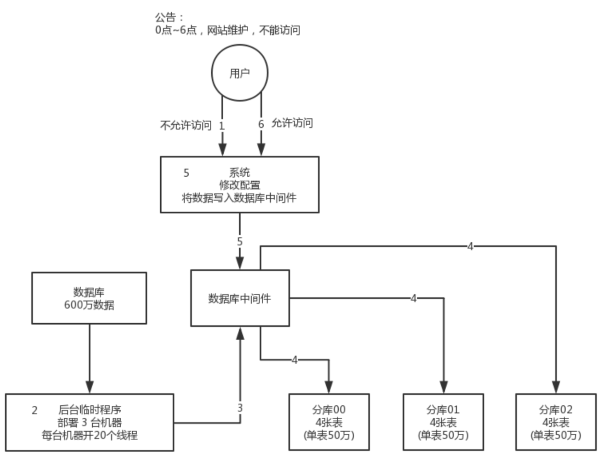
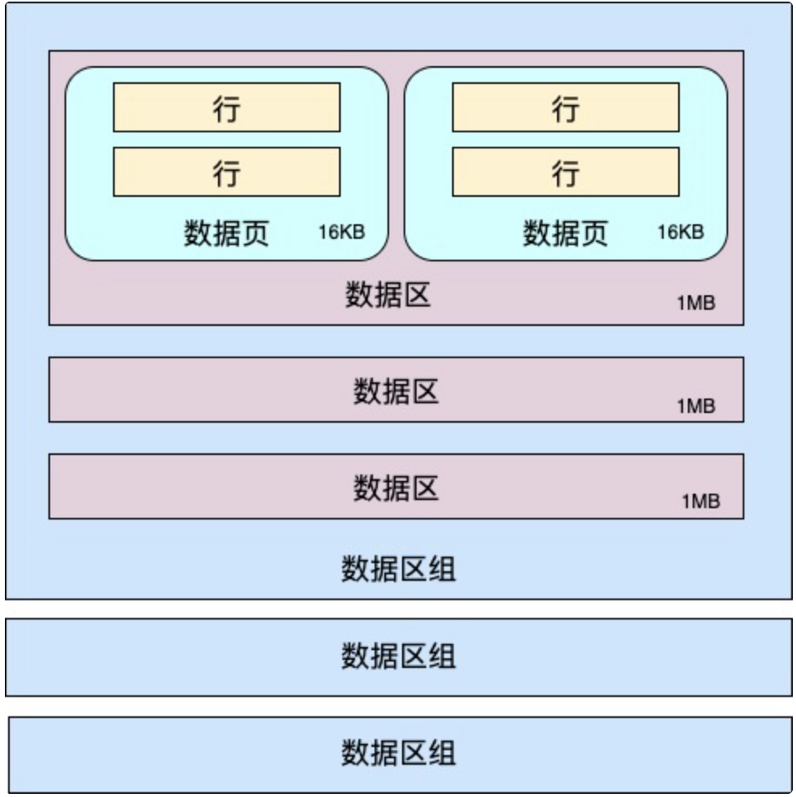
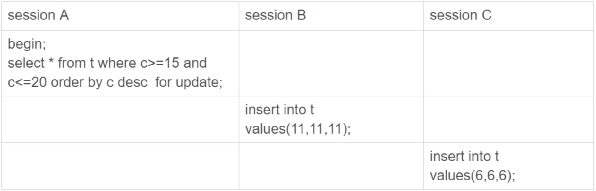
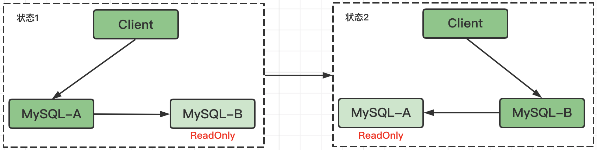
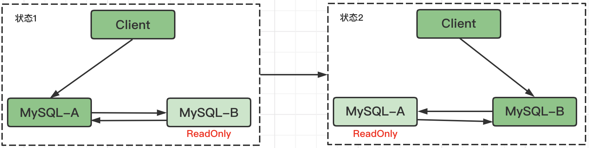
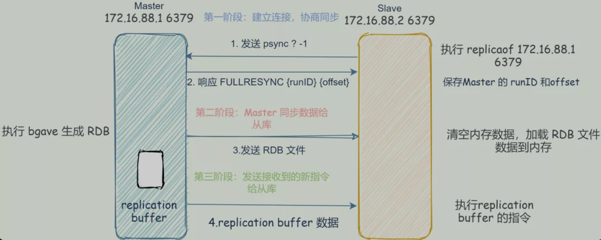
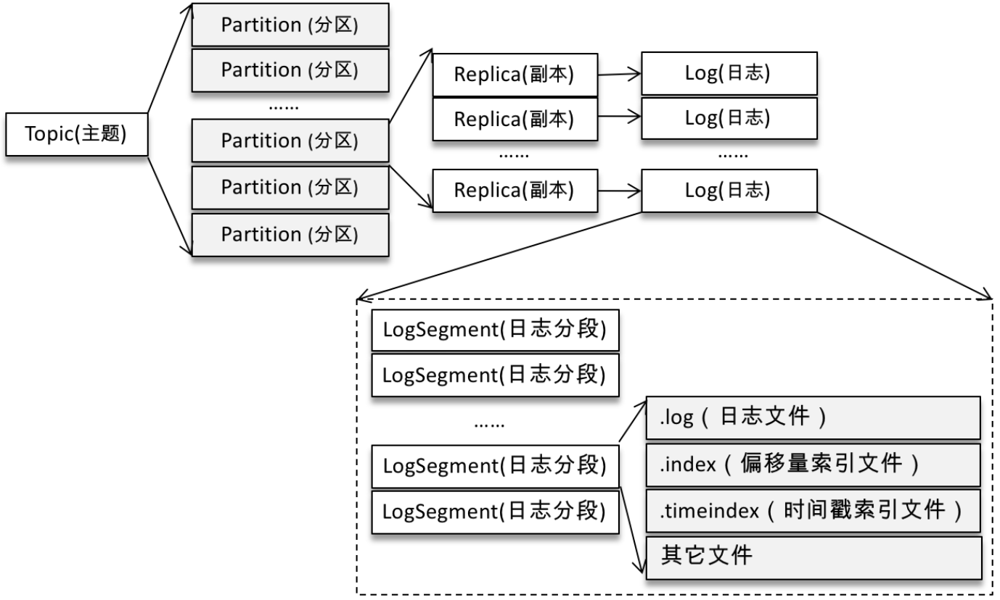
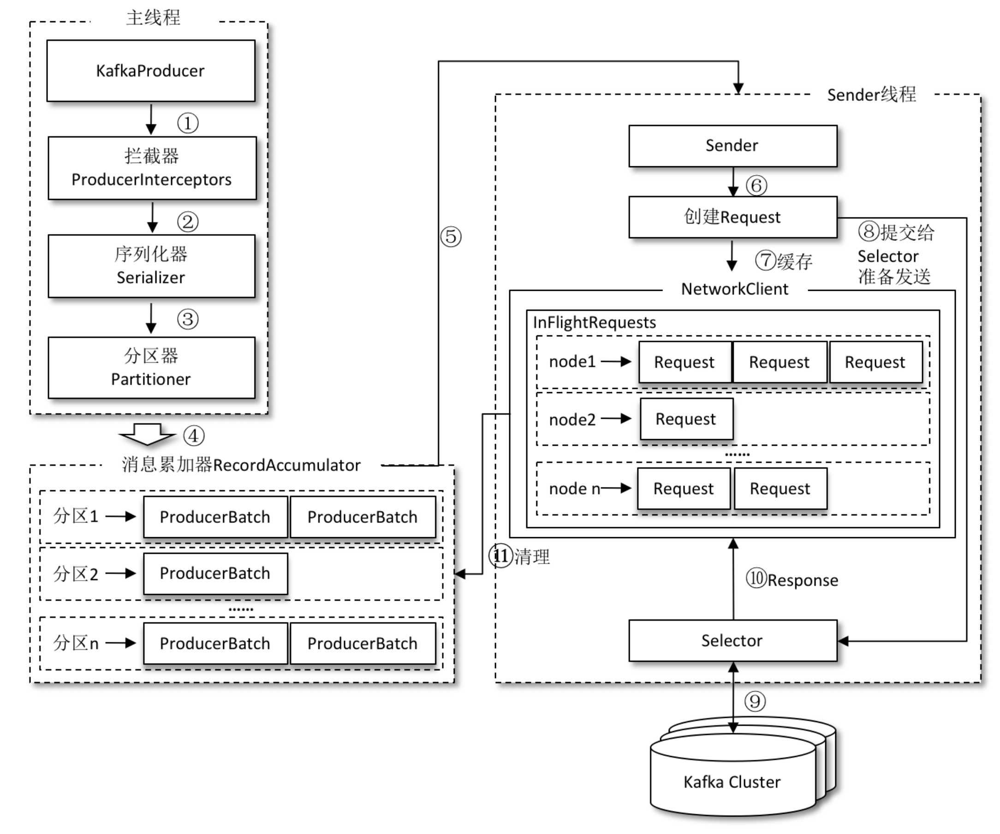

# 一、Java基础面试题

https://segmentfault.com/a/1190000017115722

https://segmentfault.com/a/1190000018855112

## 1、final面试题 

### 1.1、所有的final修饰的字段都是编译期常量吗？

```java
public class Test {
    //编译期常量
    final int i = 1;
    final static int J = 1;
    final int[] a = {1,2,3,4};
    //非编译期常量
    Random r = new Random();
    final int k = r.nextInt();

    public static void main(String[] args) {
    }
}
```
k的值由随机数对象决定，所以不是所有的final修饰的字段都是编译期常量，只是k的值在被初始化后无法被更改

### 1.2、说说final类型的类如何拓展? 

比如String是final类型，我们想写个MyString复用所有String中方法，同时增加一个新的toMyString()的方法，应该如何做?

一种是组合关系。所以当遇到不能用继承的(final修饰的类),应该考虑用组合, 如下代码大概写个组合实现的意思：
```java
class MyString{
    private String innerString;
    // ...init & other methods
    // 支持老的方法
    public int length(){
        return innerString.length(); // 通过innerString调用老的方法
    }
    // 添加新方法
    public String toMyString(){
        //...
    }
}
```

## 2、Stream流中存在问题

### 2.1、List转Map问题

```java
@Data
@Builder
@AllArgsConstructor
@NoArgsConstructor
public class Person {
    private String id;
    private String name;
}
public static void main(String[] args) {
    List<Person> list = new ArrayList<>();
    list.add(Person.builder().id("1").name("A").build());
    list.add(Person.builder().id("2").name("B").build());
    list.add(Person.builder().id("3").name("C").build());
    list.add(Person.builder().id("4").name("D").build());
    list.add(Person.builder().id("3").name("E").build());
    final Map<String, String> map = list.stream().collect(Collectors.toMap(Person::getId, Person::getName);
    System.out.println(map);
}
```
上面main方法在执行时会报错：
```
Exception in thread "main" java.lang.IllegalStateException: Duplicate key 3 (attempted merging values C and E)
	at java.base/java.util.stream.Collectors.duplicateKeyException(Collectors.java:133)
	at java.base/java.util.stream.Collectors.lambda$uniqKeysMapAccumulator$1(Collectors.java:180)
	at java.base/java.util.stream.ReduceOps$3ReducingSink.accept(ReduceOps.java:169)
	at java.base/java.util.ArrayList$ArrayListSpliterator.forEachRemaining(ArrayList.java:1654)
	at java.base/java.util.stream.AbstractPipeline.copyInto(AbstractPipeline.java:484)
	at java.base/java.util.stream.AbstractPipeline.wrapAndCopyInto(AbstractPipeline.java:474)
	at java.base/java.util.stream.ReduceOps$ReduceOp.evaluateSequential(ReduceOps.java:913)
	at java.base/java.util.stream.AbstractPipeline.evaluate(AbstractPipeline.java:234)
	at java.base/java.util.stream.ReferencePipeline.collect(ReferencePipeline.java:578)
	at com.blue.fish.example.base.stream.ListToMap.main(ListToMap.java:24)
```
为了解决上述key重复的问题，需要对Collectors.toMap方法增加第三个参数：
```java
final Map<String, String> map = list.stream()
.collect(Collectors.toMap(Person::getId, Person::getName, (oldValue, newValue) -> newValue));
```
`(oldValue, newValue) -> oldValue` 表示：如果key是重复的，你选择oldKey or newKey?

# 二、集合

## 1、HashMap、Hashtable、LinkedHashMap

### 1.1、get和put的原理？JDK8

**put 流程**
- （1）HashMap 是懒惰创建数组的，首次使用才创建数组
- （2）计算索引（桶下标）
- （3）如果桶下标还没人占用，创建 Node 占位返回
- （4）如果桶下标已经有人占用
   - 已经是 TreeNode 走红黑树的添加或更新逻辑
   - 是普通 Node，走链表的添加或更新逻辑，如果链表长度超过树化阈值，走树化逻辑
- （5）返回前检查容量是否超过阈值，一旦超过进行扩容；

**1.7 与 1.8 的区别**
- 链表插入节点时，1.7 是头插法，1.8 是尾插法
- 1.7 是大于等于阈值且没有空位时才扩容，而 1.8 是大于阈值就扩容
- 1.8 在扩容计算 Node 索引时，会优化；

### 1.2、你知道hash的实现吗？为什么要这样实现？

在Java 1.8的实现中，是通过hashCode()的高16位异或低16位实现的：`(h = k.hashCode()) ^ (h >>> 16)`；计算下标`( n-1 & hash)`
- 主要是从速度、功效、质量来考虑的，这么做可以在bucket的n比较小的时候，也能保证考虑到高低bit都参与到hash的计算中，同时不会有太大的开销;
- hash的算法是``(h = k.hashCode()) ^ (h >>> 16)`，为了使得计算出的hash值更分散，所以选择将h无符号右移16位，然后再与h异或时，就能达到h的高16位和低16位都能参与计算，减少碰撞的可能性；
- 使用`&`操作，是为了提高处理器处理的数据；
- 数组的大小是2的幂次方，是因为只有大小是2的幂次方时，才能够使得`( n-1 & hash)`公式成立

**为什么要二次hash：**

二次 hash() 是为了综合高位数据，让哈希分布更为均匀；

二次 hash 是为了配合 **容量是 2 的 n 次幂** 这一设计前提，如果 hash 表的容量不是 2 的 n 次幂，则不必二次 hash

**有哪些解决hash冲突的方法：**

- hash的算法尽可能避免的hash冲突；
- 自动扩容，当数组大小快满的时候，采取自动扩容，可以减少hash冲突；
- hash冲突发生时，采用链表来解决；
- hash冲突严重时，链表会自动转换成红黑树，提高查询速度；

### 1.3、容量是如何处理的

- 如果HashMap的大小超过了负载因子(load factor)定义的容量。如何处理？如果超过了负载因子(默认0.75)。则会重新resize一个原来长度两倍的HashMap。并且重新调用hash方法。
- 如果指定了HashMap的容量，如：new HashMap(17)，那么其容量会变为32。

### 1.4、为什么 JDK8 的 HashMap 使用的跟以往不同的实现

- 一直到JDK7为止，HashMap 的结构都是这么简单，基于一个数组以及多个链表的实现，hash 值冲突时就将对应节点以链表形式存储。这样的 HashMap 在性能上存在问题：如果很多节点在hash时发生碰撞，存储在一个链表中，那么如果要查找其中一个节点时，不可避免要花费O(N)的时间；
- 在JDK8中，使用红黑树来解决问题。在最坏的情况下，链表的查找时间复杂度是O(N)，而红黑树一直是O(logN)。JDK7 中HashMap采用的是位桶+链表的方式，即我们常说的散列链表的方式；而 JDK8 中采用的是`位桶+链表/红黑树`也是非线程安全的。当某个位桶的链表的长度达到某个阀值的时候，这个链表就将转换成红黑树

### 1.5、为什么HashMap默认的加载因子是0.75

- 5.1、加载因子：表示hash表中元素填满的程度.
	* 加载因子越大，填满的元素越多，空间利用率越高,但冲突的机会加大；
	* 反之,加载因子越小，填满的元素越少，冲突的机会减少，但空间利用率不高。冲突的机会越大，则查找的成本越高；反之。查找的成本越小。需要在"冲突的机会" 和 "空间利用率上" 寻找平衡；出于容量和性能之间平衡的结果

- 5.2、为什么HashMap的默认加载因子是0.75：在理想情况下，使用随机哈希码，节点出现的频率在hash桶中遵循泊松分布，同时给出了桶中元素个数和概率的对照表.
	```
	0: 0.60653066
	1: 0.30326533
	2: 0.07581633
	3: 0.01263606
	4: 0.00157952
	5: 0.00015795
	6: 0.00001316
	7: 0.00000094
	8: 0.00000006
	```
	从上面的表中可以看到当桶中元素到达8个的时候，概率已经变得非常小，也就是说用0.75作为加载因子，每个碰撞位置的链表长度超过８个是几乎不可能的

### 1.6、为什么HashMap的默认初始容量是16，且容量必须是 2的幂

之所以是选择16是为了服务于从 key 映射到 index 的 hash 算法。从key映射到HashMap 数组对应的位置，会用到一个hash函数。实现高效的hash算法，HashMap 中使用位运算。`index = hashcode(key) & (length - 1)`。hash算法最终得到的index结果，完全取决于Key的Hashcode值的最后几位。长度是2的幂不仅提高了性能，因为`length - 1`的二进制值位全是1，这种情况下，index的结果等同于Hashcode后几位的值，只要输入hashcode均匀分布，hash算法的结果就是均匀的。

- 计算索引时效率更高：如果是 2 的 n 次幂可以使用位与运算代替取模
- 扩容时重新计算索引效率更高： hash & oldCap == 0 的元素留在原来位置 ，否则新位置 = 旧位置 + oldCap

### 1.7、泊松分布与指数分布

#### 1.7.1、泊松分布

Poisson分布，是一种统计与概率论中常见的离散概率分布，其适合于描述单位时间内随机事件发生的次数的概率分布。

如某一服务设施在一定时间内受到的服务请求的次数，电话交换机接到呼叫的次数、汽车站台的候客人数、机器出现的故障数、自然灾害发生的次数、DNA序列的变异数、放射性原子核的衰变数、激光的光子数分布等等；

#### 1.7.2、指数分布

指数分布（Exponential distribution）是一种连续概率分布。指数分配可以用来表示独立随机事件发生的时间间隔，比如旅客进入机场的时间间隔、打进客服中心电话的时间间隔、中文维基百科新条目出现的时间间隔等等；

与泊松分布相比，其最大的差异就是指数分布是针对连续随机变量定义，即时间这个变量。时间必须是连续的。而泊松分布是针对随机事件发生次数定义的，发生次数是离散的。粗略地可以认为这两个分布之间有一种“倒数”的关系；

### 1.8、如果HashMap在put的时候，如果数组已有某个key，不想覆盖怎么办？取值时，如果得到的value是空时，如何返回默认值；

- 如果数组有了key，但是不想覆盖value，可以选择`putIfAbsent`方法，这个方法有个内置变量`onlyIfAbsent`，内置是true，就不会覆盖；在平时使用put的时候，内置onlyIfAbsent是false，允许覆盖；
	```java
	@Override
    public V putIfAbsent(K key, V value) {
        return putVal(hash(key), key, value, true, true);
    }	
	```
- 取值时，如果为空，想返回默认值，可以使用`getOrDefault`方法，第一个参数为key，第二个参数为想返回的默认值；
	```java
	@Override
    public V getOrDefault(Object key, V defaultValue) {
        Node<K,V> e;
        return (e = getNode(hash(key), key)) == null ? defaultValue : e.value;
    }
	```
	***上述方法都是在JDK1.8之后才有的***

### 1.9、高并发下 HashMap 的使用的问题

- 扩容-resize()：影响resize发生的因素
	- capacity：HashMap当前的长度(2的幂);
	- loadfactor：加载因子,默认是0.75f衡量HashMap是否进行resize条件: HashMap.size >= capacity * loadfactor.
- 扩容步骤
	- （1）扩容：创建一个新的entry数组，长度是原来数组的两倍；
	- （2）rehash：遍历原entry数组，把所有的entry重写hash到新的数组。为什么需要重新hash？因为长度扩大异以后，hash规则也随之改变；`index =  HashCode(Key)&(Length - 1)` 当原数组长度为8时，Hash 运算是 和 111B做与运算；新数组长度为16，Hash 运算是和1111B做与运算。
- 在单线程下上述步骤执行没有任何问题；在多线程环境下，reHash在并发的情况下可能会形成链表环。此时问题并没有直接产生。当调用Get查找一个不存在的Key，而这个Key的Hash结果恰好等于某个值的时候，由于位置该值带有环形链表，所以程序将会进入死循环，从而报内存溢出。
- 在高并发环境下，通常使用 `ConcurrentHashMap`，兼顾了线程安全和性能；
- 下面代码只在JDK7以前的版本有效，jdk8之后就不存在这种问题了。因为JDK8中扩容的时候不存在rehash操作。
	```java
	private static Map<Long, Set<Integer>> setMap = new ConcurrentHashMap<>();
	public static void main(String[] args) throws InterruptedException {
		final long key = 1L;
		setMap.put(key, new HashSet<Integer>());
		for (int i = 0; i < 100; i++) {
			setMap.get(key).add(i);
		}
		Thread a = new Thread(new Runnable() {
			@Override
			public void run() {
				for (int j = 100; j < 200000; j++) {
					setMap.get(key).add(j);
				}
			}
		});
		Thread b = new Thread(new Runnable() {
			@Override
			public void run() {
				for (int j = 200000; j < (200000 + 200000); j++) {
					setMap.get(key).add(j);
				}
			}
		});
		a.start();
		b.start();
		Thread.sleep(1000 * 10);
		System.out.println(setMap.toString()); // 报java.lang.OutOfMemoryError: Java heap space
	}
	```

### 1.10、HashMap的key使用哪种数据结构性能高

首先影响HashMap的性能点：
- 哈希冲突导致单个哈希桶元素数量过多。操作元素的时间复杂度甚至 退化成O(N)，经红黑树改进后，也得O(logN)。
- 扩容，为啥扩容？还是为了降低哈希冲突！

主要可以从hash碰撞考虑，hash函数设计的时候是调用对应的类的hashcode方法，对应Integer、Long 等整型类型的数据，其hashcode方法返回的就是对应的整数值，为了减少hash冲突，尽量使用HashCode递增的值作为key，例如递增的int值，这样可以尽可能减少哈希冲突；
```java
public final class Integer extends Number implements Comparable<Integer> {
	@Override
	public int hashCode() {
		return Integer.hashCode(value);
	}
	public static int hashCode(int value) {
        return value;
    }
}
```

### 1.11、红黑树与链表的转换规则

**为什么使用红黑树？**

之所以选择红黑树是为了解决二叉查找树的缺陷：二叉查找树在特殊情况下会变成一条线性结构（这就跟原来使用链表结构一样了，造成层次很深的问题），遍历查找会非常慢。而红黑树在插入新数据后可能需要通过左旋、右旋、变色这些操作来保持平衡。引入红黑树就是为了查找数据快，解决链表查询深度的问题；

红黑树的查询性能略微逊色于AVL树，因为他比avl树会稍微不平衡最多一层，也就是说红黑树的查询性能只比相同内容的avl树最多多一次比较，但是，红黑树在插入和删除上完爆avl树，avl树每次插入删除会进行大量的平衡度计算，而红黑树为了维持红黑性质所做的红黑变换和旋转的开销，相较于avl树为了维持平衡的开销要小得多；

**为什么一上来不用红黑树？**

正常情况下，一个hashmap的树化条件是比较苛刻的，可能是发生攻击的情况下，防止链表查询性能问题导致的，所以树化应该是偶然的情况；
- hash表的查找，更新的时间复杂度是$O(1)$，而红黑树的查找、更新的时间复杂度是 $O(log_2⁡N )$，TreeNode 占用空间也比普通 Node 的大，如非必要，尽量还是使用链表；
- hash 值如果足够随机，则在 hash 表内按泊松分布，在负载因子 0.75 的情况下，长度超过 8 的链表出现概率是 0.00000006，树化阈值选择 8 就是为了让树化几率足够小；

**树化的条件：**

当链表长度超过树化阈值 8 时，先尝试扩容来减少链表长度，如果数组容量已经 >=64，才会进行树化

**何时树退化为链表**
- 情况1：在扩容时如果拆分树时，树元素个数 <= 6 则会退化链表
- 情况2：remove 树节点时，若 root、root.left、root.right、root.left.left 有一个为 null ，也会退化为链表

## 2、ConcurrentHashMap

### 2.1、使用ConcurrentHashMap中，如何避免组合操作的线程安全问题

可以使用replace方法

### 2.2、ConcurrentHashMap JDK1.8是如何扩容的? 

tryPresize 

- 如果新增节点之后，所在链表的元素个数达到了阈值 8，则会调用 treeifyBin方法把链表转换成红黑树，不过在结构转换之前，会对数组长度进行判断，如果数组长度n小于阈值 MIN_TREEIFY_CAPACITY，默认是64，则会调用 tryPresize方法把数组长度扩大到原来的两倍，并触发 transfer方法，重新调整节点的位置；

- 新增节点之后，会调用 addCount方法记录元素个数，并检查是否需要进行扩容，当数组元素个数达到阈值时，会触发 transfer方法，重新调整节点的位置；

### 2.3、JDK1.8链表转红黑树的时机是什么? 临界值为什么是8? 

- 首先是链表的长度是否为大于等于8，如果是大于等于8的话，再判断数组的长度是否大于64，如果小于64，则进行数组扩容操作；否则会转为红黑树；

**为什么一开始不用红黑树？**

单个 TreeNode 需要占用的空间大约是普通 Node 的两倍，所以只有当包含足够多的 Nodes 时才会转成 TreeNodes，而是否足够多就是由 `TREEIFY_THRESHOLD` 的值决定的。而当桶中节点数由于移除或者 resize 变少后，又会变回普通的链表的形式，以便节省空间；

**为什么是8？**

如果 hashCode 分布良好，也就是 hash 计算的结果离散好的话，那么红黑树这种形式是很少会被用到的，因为各个值都均匀分布，很少出现链表很长的情况。在理想情况下，链表长度符合泊松分布，各个长度的命中概率依次递减，当长度为 8 的时候，概率仅为 0.00000006。这是一个小于千万分之一的概率，通常我们的 Map 里面是不会存储这么多的数据的，所以通常情况下，并不会发生从链表向红黑树的转换；

链表长度超过 8 就转为红黑树的设计，更多的是为了防止用户自己实现了不好的哈希算法时导致链表过长，从而导致查询效率低，而此时转为红黑树更多的是一种保底策略，用来保证极端情况下查询的效率；

**什么时候红黑树会还原成链表？**

当红黑树元素个数小于等于6的时候；

### 2.4、JDK1.8是如何进行数据迁移的? 

transfer 

### 2.5、ConcurrentHashMap在jdk8中的bug

https://juejin.cn/post/6844904191077384200

### 2.6、是先CAS还是synchronized

以put为例
```java
final V putVal(K key, V value, boolean onlyIfAbsent) {
    if (key == null || value == null) throw new NullPointerException();
    int hash = spread(key.hashCode());
    int binCount = 0;
    for (Node<K,V>[] tab = table;;) {
        Node<K,V> f; int n, i, fh;
        if (tab == null || (n = tab.length) == 0)
            tab = initTable();
        else if ((f = tabAt(tab, i = (n - 1) & hash)) == null) {
            // cas
            if (casTabAt(tab, i, null, new Node<K,V>(hash, key, value, null)))
                break;                   // no lock when adding to empty bin
        }
        else if ((fh = f.hash) == MOVED)
            tab = helpTransfer(tab, f);
        else {
            V oldVal = null;
            synchronized (f) {
                if (tabAt(tab, i) == f) {
                    .....
                }
            }
            if (binCount != 0) {
                if (binCount >= TREEIFY_THRESHOLD)
                    treeifyBin(tab, i);
                if (oldVal != null)
                    return oldVal;
                break;
            }
        }
    }
    addCount(1L, binCount);
    return null;
}
```
可以看到上面的CAS是在数组中索引元素为空时，通过CAS填充数据，如果是有元素，即hash冲突了，需要通过synchronized锁住当前链表节点来实现

### 2.7、为什么ConcurrentHashMap用红黑树

之所以选择红黑树是为了解决二叉查找树的缺陷：二叉查找树在特殊情况下会变成一条线性结构（这就跟原来使用链表结构一样了，造成层次很深的问题），遍历查找会非常慢。而红黑树在插入新数据后可能需要通过左旋、右旋、变色这些操作来保持平衡。引入红黑树就是为了查找数据快，解决链表查询深度的问题；

红黑树的查询性能略微逊色于AVL树，因为它比AVL树会稍微不平衡最多一层，也就是说红黑树的查询性能只比相同内容的avl树最多多一次比较，但是，红黑树在插入和删除上完爆avl树，avl树每次插入删除会进行大量的平衡度计算，而红黑树为了维持红黑性质所做的红黑变换和旋转的开销，相较于avl树为了维持平衡的开销要小得多；

### 2.8、为什么用CAS替代分段锁

**关于分段锁：**

Segment继承了重入锁ReentrantLock，有了锁的功能，每个锁控制的是一段，当每个Segment越来越大时，锁的粒度就变得有些大了。
- 分段锁的优势在于保证在操作不同段 map 的时候可以并发执行，操作同段 map 的时候，进行锁的竞争和等待。这相对于直接对整个map同步synchronized是有优势的。
- 缺点在于分成很多段时会比较浪费内存空间(不连续，碎片化)；操作map时竞争同一个分段锁的概率非常小时，分段锁反而会造成更新等操作的长时间等待; 当某个段很大时，分段锁的性能会下降

**CAS+synchronized**
- 减少内存开销：如果使用ReentrantLock则需要节点继承AQS来获得同步支持，增加内存开销，而1.8中只有头节点需要进行同步。
- 内部优化：synchronized则是JVM直接支持的，JVM能够在运行时作出相应的优化措施：锁粗化、锁消除、锁自旋等等；

使用 CAS + synchronized 方式时 加锁的对象是每个链条的头结点，也就是 锁定 的是冲突的链表，所以再次提高了并发度，并发度等于链表的条数或者说 桶的数量；

它是Node链表里的每一个Node,也就是说,Synchronized是将每一个Node对象作为了一个锁,这样做的好处是什么呢?将锁细化了,也就是说,除非两个线程同时操作一个Node,注意,是一个Node而不是一个Node链表哦,那么才会争抢同一把锁.

## 3、TreeMap

### 3.1、LinkedHashMap与TreeMap区别

- 这两者都是能够保证一定的顺序的，其中LinkedHashMap是保证key的插入顺序的，而TreeMap是按照key的自然排序的升序来实现的；
- LinkedHashMap是通过双向链表实现，其还继承自HashMap；TreeMap是基于红黑树来实现的；


ConcurrentSkipListMap   基于跳表实现的

EnumMap 基于位运算实现的

## 4、ArrayList与LinkedList

### 4.1、两者区别

**LinkedList**

- 基于双向链表，无需连续内存
- 随机访问慢（要沿着链表遍历）
- 头尾插入删除性能高，如果是往链表的中间插入，性能也不高；因为链表中间插入是需要遍历的过程；
- 内存占用多，因为LinkedList内部对象是一个Node，包含值、前驱指针、后驱指针等；

**ArrayList**
- 基于数组，需要连续内存
- 随机访问快（指根据下标访问），其实现了 RandomAccess 接口
- 尾部插入、删除性能可以，其它部分插入、删除都会移动数据，因此性能会低
- 可以利用 cpu 缓存，局部性原理；

### 4.2、ArrayList扩容机制

ArrayList 初始默认是空数组，待需要添加元素时，判断是否需要扩容；新增元素主要有两步：
- 判断是否需要扩容，如果需要执行扩容操作；
- 扩容主要是：扩容的数组容量以及数组的拷贝操作；

扩容时存在的线程安全问题，看如下代码，
```java
public static void main(String[] args) {
    List<Integer> list = new ArrayList<>();
    for (int i = 0; i < 10; i++) {
        int finalI = i;
        new Thread(() -> {
            list.add(finalI + 1);
        }).start();

    }
    System.out.println(list.size());
    System.out.println(list.toString());
}
```
可能出现的结果如下：
```java
9
[null, 2, 3, 4, 5, 6, 7, 8, 9, 10]
9
[1, 2, 3, 4, 5, 6, 7, 8, 9, 10]
9
[null, 1, 3, 4, 5, 6, 7, 8, 9, 10]
```
为什么会出现null值？由于ArrayList是基于数组实现，由于数组大小一旦确定就无法更改，所以其每次扩容都是将旧数组容器的元素拷贝到新大小的数组中(Arrays.copyOf函数)，由于我们通过new ArrayList<>()实例的对象初始化的大小是0，所以第一次插入就会扩容，由于ArrayList并非线程安全，第二次插入时，第一次扩容可能并没完成，于是也会进行一次扩容(第二次扩容)，这次扩容所拿到list的elementDate是旧的，并不是第一次扩容后对象，于是会因为第一次插入的值并不在旧的elementDate中，而将null值更新到新的数组中。

比如现在有线程A和B分别要插入元素1和2：
- 当线程A调用add方法时size是0，于是会进行一次扩容，此时线程B调用add方法时size仍然是0，所以也会进行扩容；
- 假设此时线程A比线程B扩容先完成，此时list的elementDate是新的数组对象(由线程A构建)，然后开始执行`elementDate[size++] = 1`的程序，这个过程中线程B扩容拿到的数组仍然是旧的elementDate，于是线程B构造一个新的数组(数据全部为null)；
- 然后使list的elementDate指向线程B构造的对象，那么线程A之前构造的elementDate也就被丢掉了，但是由于size已经自增，所以线程B会在索引为1的位置赋予2，那么此时数组元素就成了`[null,2]`，当然如果线程B扩容比线程A先完成那么就可能为`[null,1]`

还有一种错误就是覆盖：这种情况是因为size++并不是原子性的，所以可能线程A自增的时候，线程B也进行一次自增，但是两次自增的结果是一样的，所以先完成的线程更新的数据会被后完成的线程覆盖掉；

# 三、IO与NIO

## 1、文件拷贝实现方式

主要关注以下几点：
- 不同的copy方式，底层机制有什么区别？
- 为什么零拷贝可能有性能优势？
- Buffer的分类与使用；
- Direct Buffer对垃圾收集有哪些方面的影响

### 1.1、不同的拷贝方式底层机制的实现

- 关于两个概念：用户态空间（User Space）和内核态空间（Kernel Space）这是操作系统层面的概念，操作系统内核、硬件驱动等运行在内核状态空间，具有相对高的特权；而用户态空间，则给普通应用和服务使用

- 基于流读写：当我们使用输入输出流进行读写时，实际上是进行了多次上下文切换，比如应用读取数据时先将内核态数据从磁盘读取到内核缓存，再切换到用户态将数据从内核缓存中读取到用户缓存，这种方式会带来一定的额外开销，可能会降低IO效率

- 基于NIO：基于NIO的transfer的实现方式，在Linux和Unix上，则会使用零拷贝技术，数据传输并不需要用户态参与，省去了上下文切换的开销和不必要的拷贝，进而可能提高应用拷贝性能

### 1.2、Files.copy 方法

最终实现是本地方法实现的[UnixCopyFile.c](http://hg.openjdk.java.net/jdk/jdk/file/f84ae8aa5d88/src/java.base/unix/native/libnio/fs/UnixCopyFile.c)，其内部明确说明了只是简单的用户态空间拷贝，所以该方法不是利用transfer来实现的，而是本地技术实现的用户态拷贝

### 1.3、基于流的读写

```java
public static void copyFileByStream(File source, File dest) throws Exception {
	try (InputStream is = new FileInputStream(source);
			OutputStream os = new FileOutputStream(dest)) {
		byte[] buffer = new byte[1024];
		int len;
		while ((len = is.read(buffer)) > 0) {
			os.write(buffer, 0, len);
		}
	}
}
```

### 1.4、基于NIO实现

- 基于基本NIO操作实现
```java
public static void main(String[] args) throws Exception {
	FileInputStream in = new FileInputStream("temp/test1.txt");
	FileOutputStream out = new FileOutputStream("temp/test1-copy.txt");
	FileChannel inChannel = in.getChannel();
	FileChannel outChannel = out.getChannel();
	ByteBuffer buffer = ByteBuffer.allocate(1024);
	int read = inChannel.read(buffer);
	if (read == -1) {
		return;
	}
	buffer.flip();
	outChannel.write(buffer);
}
```

- 基于Nio的transferTo或者transferFrom
```java
// 使用java nio 的transferTo 或 transferFrom来实现，其copy速度相对来说更快点，因为其更能利用现代操作系统底层机制，避免不必要的拷贝和上下文切换
public static void copyFileByChannel(File source, File dest) throws Exception {
	try (FileChannel sourceChannel = new FileInputStream(source).getChannel();
			FileChannel targetChannel = new FileOutputStream(dest).getChannel()) {
		for (long count = sourceChannel.size(); count
				> 0; ) {
			long transferred = sourceChannel.transferTo(sourceChannel.position(), count, targetChannel);
			sourceChannel.position(sourceChannel.position() + transferred);
			count -= transferred;
		}
	}
}
```

- 基于MappdByteBuffer实现，中间使用了编码
```java
public static void copyFileByMappedByteBuffer(String source, String dest) throws Exception {
	RandomAccessFile input = new RandomAccessFile(source, "r");
	RandomAccessFile output = new RandomAccessFile(dest, "rw");
	long length = new File(source).length();
	FileChannel inputChannel = input.getChannel();
	FileChannel outputChannel = output.getChannel();
	MappedByteBuffer inputData = inputChannel.map(FileChannel.MapMode.READ_ONLY, 0, length);
	Charset charset = Charset.forName("UTF-8");
	CharsetDecoder decoder = charset.newDecoder();
	CharsetEncoder encoder = charset.newEncoder();
	CharBuffer charBuffer = decoder.decode(inputData);
	ByteBuffer outputData = encoder.encode(charBuffer);
	outputChannel.write(outputData);
}
```

### 1.4、如何提高拷贝效率

- 在程序中，使用缓存机制，合理减少IO次数；
- 使用transfer等机制，减少上下文切换和额外IO操作；
- 尽量减少不必要的转换过程，比如编解码；对象序列化与反序列化；

## 2、DirectBuffer 与 MappedByteBuffer

### 2.1、概述

- DirectBuffer：其定义了isDirect方法，返回当前buffer是不是Direct类型。因为Java提供了堆内和堆外（Direct）Buffer，我们可以以他的allocat 或者 allocatDirect方法直接创建；
- MappedByteBuffer：将文件按照指定大小直接映射为内存区域，当程序访问这个内存区域时直接将操作这块文件数据，省去了将数据从内核空间向用户空间传输的损耗；可以使用FileChannel.map创建，本质上也是DirectBuffer；

在实际使用时，Java会对DirectBuffer仅做本地iO操作，对于很多大数据量的IO密集操作，可能会带来非常大的优势：
- DirectBuffer生命周期内内存地址都不会再发生改变，进而内核可以安全的对其进行访问，很对IO操作很搞笑；
- 减少了堆内对象存储的可能额外维护工作，所以访问效率可能有所提高；

但是值得注意的是，DirectBuffer创建和销毁过程中，都会比一般的堆内存Buffer增加部分开销，通常建议用于长期使用、数据较大的场景

因为DirectBuffer不在堆上，所以其参数设置大小可以用如下参数：`-XX:MaxDirectMemorySize=512M`；意味着在计算Java可以使用的内存大小的时候，不能只考虑堆的需要，还有DirectBuffer等一系列堆外因素，如果出现内存不足，堆外内存占用也是一种可能性；

另外，大多数垃圾收集过程中，都不会主动收集DirectBuffer，它的垃圾收集过程，是基于Cleaner和幻象引用机制，其本身不是public类型，内部实现了一个Deallocator负责销毁的逻辑，对它的销毁往往需要到FullGC的时候，使用不当的话很容易引起OOM

关于DirectBuffer的回收，注意以下几点：
- 在应用程序中，显示调用System.gc()来强制触发；
- 在大量使用DirectBuffer的部分框架中，框架自己在程序中调用释放方法，Netty的实现即如此；
- 重复使用DirectBuffer

### 2.2、跟踪与诊断DirectBuffer内存占用

通常的垃圾收集日志等记录，并不包含Directbuffer等信息，在JDK8之后的版本，可以使用native memory tracking特性进行诊断：```-XX:NativeMemoryTracking={summary|detail}```

注意激活NMT通常都会导致JVM出现5%~10%性能下降

```
// 打印 NMT信息
jcmd <pid> VM.native_memory detail
// 进行baseline，以对比分配内存变化
jcmd <pid> VM.native_memory baseline
// 进行baseline，以对比分配内存变化
jcmd <pid> VM.native_memory detail.diff
```

## 3、使用Java读取大文件

- （1）文件流边读边用，使用文件流的read()方法每次读取指定长度的数据到内存中，具体代码如下
    ```java
    public static void readMethod1(String filePath) throws Exception{
        BufferedInputStream reader = new BufferedInputStream(new FileInputStream(filePath));
        int bytes = -1;
        do {
            byte[] byteArray = new byte[8192];
            bytes = reader.read(byteArray);
            if (bytes != -1) {
                String s = new String(byteArray);
                System.out.println(s);
            }
        } while (bytes > 0);
    
        reader.close();
    }
    ```
- （2）对大文件建立NIO的FileChannel，每次调用read()方法时会先将文件数据读取到已分配的固定长度的java.nio.ByteBuffer，接着从中获取读取的数据。这种方式比传统的流方式要快点
    ```java
    public static void fileChannelMethod(String filePath) throws Exception {
        FileInputStream in = new FileInputStream(filePath);
        ByteBuffer byteBuffer = ByteBuffer.allocate(65535);
        FileChannel fileChannel = in.getChannel();
        int b = -1;
        do {
            b = fileChannel.read(byteBuffer);
            if (b != -1) {
                byte[] array = new byte[b];
                byteBuffer.flip();
                byteBuffer.get(array);
                byteBuffer.clear();
                System.out.println(new String(array));
            }
        } while (b > 0);
        in.close();
        fileChannel.close();
    }
    
    ```
- （3）内存文件映射，就是把文件内容映射到虚拟内存的一块区域中，从而可以直接操作内存当中的数据而无需每次都通过IO去物理硬盘读取文件，

    ```java
    public static void memoryMappingMethod(String filePath) throws Exception {
        FileInputStream in = new FileInputStream(filePath);
        FileChannel fileChannel = in.getChannel();
        MappedByteBuffer mapperBuffer = fileChannel.map(FileChannel.MapMode.READ_ONLY, 0, fileChannel.size());
        boolean end = false;
        do {
            int limit = mapperBuffer.limit();
            int position = mapperBuffer.position();
            if (position >= limit) {
                end = true;
            }
            int maxSize = 2048;
            if (limit - position < maxSize) {
                maxSize = limit - position;
            }
            byte[] array = new byte[maxSize];
            mapperBuffer.get(array);
            System.out.println(new String(array));
    
        } while (!end);
        in.close();
        fileChannel.close();
    }
    ```
    这种方式存在致命问题，就是无法读取超大文件（大于Integer.Max_value），因为 FileChannel的map方法中 size 参数会有大小限制，源码中发现该参数值大于 Integer.MAX_VALUE 时会直接抛出 IllegalArgumentException("Size exceeds Integer.MAX_VALUE") 异常，所以对于特别大的文件其依然不适合。
	```java
	// sun.nio.ch.FileChannelImpl#map
	public MappedByteBuffer map(MapMode var1, long var2, long var4) throws IOException {
        this.ensureOpen();
        if (var1 == null) {
            throw new NullPointerException("Mode is null");
        } else if (var2 < 0L) {
            throw new IllegalArgumentException("Negative position");
        } else if (var4 < 0L) {
            throw new IllegalArgumentException("Negative size");
        } else if (var2 + var4 < 0L) {
            throw new IllegalArgumentException("Position + size overflow");
        } else if (var4 > 2147483647L) {
			throw new IllegalArgumentException("Size exceeds Integer.MAX_VALUE");
		} else {
			....
		}
	}
	```
    本质上是由于 java.nio.MappedByteBuffer 直接继承自 java.nio.ByteBuffer ，而 ByteBuffer 的索引是 int 类型的，所以 MappedByteBuffer 也只能最大索引到 Integer.MAX_VALUE 的位置，所以 FileChannel 的 map 方法会做参数合法性检查。

## 4、NIO消息传输错误

### 4.1、存在问题的情况

- 多消息粘包：
- 单消息不完整：接收端buffer容量不够
- 消息到达提醒重复触发（读消息时未设置取消监听）

### 4.2、如何解决

- 数据传输加上开始结束标记
- 数据传输使用固定头部的方案；
- 混合方案：固定头、数据加密、数据描述

## 5、关于BIO、NIO等现场问题

**基于BIO实现的Server端，当建立了100个连接时，会有多少个线程？如果基于NIO，又会是多少个线程？ 为什么？**

BIO由于不是NIO那样的事件机制，在连接的IO读取上，无论是否真的有读/写发生，都需要阻塞住当前的线程，对于基于BIO实现的Server端，通常的实现方法都是用一个线程去accept连接，当连接建立后，将这个连接的IO读写放到一个专门的处理线程，所以当建立100个连接时，通常会产生1个Accept线程 + 100个处理线程。

NIO通过事件来触发，这样就可以实现在有需要读/写的时候才处理，不用阻塞当前线程，NIO在处理IO的读写时，当从网卡缓冲区读或写入缓冲区时，这个过程是串行的，所以用太多线程处理IO事件其实也没什么意义，连接事件由于通常处理比较快，用1个线程去处理就可以，IO事件呢，通常会采用cpu core数+1或cpu core数 * 2，这个的原因是IO线程通常除了从缓冲区读写外，还会做些比较轻量的例如解析协议头等，这些是可以并发的，为什么不只用1个线程处理，是因为当并发的IO事件非常多时，1个线程的效率不足以发挥出多core的CPU的能力，从而导致这个地方成为瓶颈，这种在分布式cache类型的场景里会比较明显，按照这个，也就更容易理解为什么在基于Netty等写程序时，不要在IO线程里直接做过多动作，而应该把这些动作转移到另外的线程池里去处理，就是为了能保持好IO事件能被高效处理

## 6、Channel和Scoket区别

Socket、SocketChannel二者的实质都是一样的，都是为了实现客户端与服务器端的连接而存在的。

- 所属包不同：Socket在java.net包中，而SocketChannel在java.nio包中；
- 异步方式不同：Socket是阻塞连接（当然我们可以自己实现非阻塞），SocketChannel可以设置非阻塞连接；
- 性能不同：一般来说使用SocketChannel会有更好的性能。其实，Socket实际应该比SocketChannel更高效，不过由于使用者设计等原因，效率反而比直接使用SocketChannel低；
- 使用方式不同：
    - Socket、ServerSocket类可以传入不同参数直接实例化对象并绑定ip和端口：
        ```java
        Socket socket = new Socket("127.0.0.1", "8000");
        ServerSocket serverSocket = new ServerSocket("8000")
        ```
    - 而SocketChannel、ServerSocketChannel类需要借助Selector类控制

## 7、Java中怎么快速把InputStream转化为String

### 7.1、使用 Apachecommons包的工具类 IOUtils

```java
StringWriter writer = new StringWriter();
IOUtils.copy(in, writer, encoding);
String str = writer.toString();
// 或者
String str = IOUtils.toString(in, encoding);
```

### 7.2、使用guava

`CharStreams.toString(new InputStreamReader(in, encoding));`

### 7.3、使用Scanner

```java
Scanner scanner = new Scanner(in).useDelimiter("\\A");
String str = scanner.hasNext() ? scanner.next() : "";
```

### 7.4、使用Stream API

`String str = new BufferedReader(new InputStreamReader(in)).lines().collect(Collectors.joining("\n"));`

`String str = new BufferedReader(new InputStreamReader(in)).lines().parallel().collect(Collectors.joining("\n"));`

### 7.5、使用InputStreamReader and StringBuilder

```java
final int bufferSize = 1024;
final char[] buffer = new char[bufferSize];
final StringBuilder sb = new StringBuilder();
Reader reader = new InputStreamReader(in, StandardCharsets.UTF_8);
int charRead;
while ( (charRead = reader.read(buffer, 0, buffer.length)) > 0) {
    sb.append(buffer, 0 , charRead);
}
return sb.toString();
```

## 8、输入流与输出流

### 8.1、输出入流转换为字节数组

```java
public static byte[] getFileContent(String filePath) throws Throwable {
    InputStream stream = SameLoaderLoadOneClassMore.class.getClassLoader().getResourceAsStream(filePath);
    ByteArrayOutputStream out = new ByteArrayOutputStream();
    byte[] buffer = new byte[1024 * 4];
    int n = 0;
    assert stream != null;
    while ((n = stream.read(buffer)) != -1) {
        out.write(buffer, 0, n);
    }
    return out.toByteArray();
}
```

## 9、为什么数据库连接池不采用多路IO复用

https://mp.weixin.qq.com/s/gYv2F-RFH5xrIbpXDwtgyA

# 四、多线程

## 1、为什么线程池的底层数据接口采用HashSet来实现


## 2、使用模拟真正的并发请求

使用CountDownLatch

[模拟超过5W的并发用户](https://mp.weixin.qq.com/s/2BondePBWkfUNSwNyTMcTA)

## 3、可重入锁

### 3.1、为什么可以防止死锁

```java
public class Widget {
    public synchronized void doSomething(){
        // do something
    }
}
public class LoggingWidget extends Widget {
    public synchronized void doSomething() {
        super.doSomething();
    }
}
```
如果synchronized 不是可重入锁，那么LoggingWidget 的super.dosomething()；无法获得Widget对象的锁，因为会死锁

这里涉及到Java的重写；子类LoggingWidget 的doSomething方法，重写了父类Widget 的doSomething方法，但是子类对象如果要调用父类的doSomething方法，那么就需要用到super关键字了。因为实例方法的调用是Java虚拟机在运行时动态绑定的，子类LoggingWidget 的对象调用doSomething方法，一定是绑定到子类自身的doSomething方法，必须用super关键字告诉虚拟机，这里要调用的是父类的doSomething方法；

super关键字并没有新建一个父类的对象，比如说widget，然后再去调用widget.doSomething方法，实际上调用父类doSomething方法的还是我们的子类对象；

如果一个线程有子类对象的引用loggingWidget，然后调用loggingWidget.doSomething方法的时候，会请求子类对象loggingWidget 的对象锁；又因为loggingWidget 的doSomething方法中调用的父类的doSomething方法，实际上还是要请求子类对象loggingWidget 的对象锁，那么如果synchronized 关键字不是个可重入锁的话，就会在子类对象持有的父类doSomething方法上产生死锁了。正因为synchronized 关键字的可重入锁，当前线程因为已经持有了子类对象loggingWidget 的对象锁，后面再遇到请求loggingWidget 的对象锁就可以畅通无阻地执行同步方法了；

### 3.2、可重入锁如何实现

通过AQS实现可重入锁，大概思路：
- 调用 getState方法，判断当前 state 是否为0；如果为 0，加锁成功，返回；
- 如果不等于0，则判断占用线程是否为当前线程，如果是，cas(state, state+1)；

可以参考 ReentrantLock 的实现方式：
```java
// 非公平方式获取
final boolean nonfairTryAcquire(int acquires) {
    // 当前线程
    final Thread current = Thread.currentThread();
    // 获取状态
    int c = getState();
    if (c == 0) { // 表示没有线程正在竞争该锁
        if (compareAndSetState(0, acquires)) { // 比较并设置状态成功，状态0表示锁没有被占用
            // 设置当前线程独占
            setExclusiveOwnerThread(current); 
            return true; // 成功
        }
    } else if (current == getExclusiveOwnerThread()) { // 当前线程拥有该锁
        int nextc = c + acquires; // 增加重入次数
        if (nextc < 0) // overflow
            throw new Error("Maximum lock count exceeded");
        // 设置状态
        setState(nextc); 
        // 成功
        return true; 
    }
    // 失败
    return false;
}
// 公平锁
protected final boolean tryAcquire(int acquires) {
    // 获取当前线程
    final Thread current = Thread.currentThread();
    // 获取状态
    int c = getState();
    if (c == 0) { // 状态为0
        if (!hasQueuedPredecessors() &&
            compareAndSetState(0, acquires)) { // 不存在已经等待更久的线程并且比较并且设置状态成功
            // 设置当前线程独占
            setExclusiveOwnerThread(current);
            return true;
        }
    } else if (current == getExclusiveOwnerThread()) { // 状态不为0，即资源已经被线程占据
        // 下一个状态
        int nextc = c + acquires;
        if (nextc < 0) // 超过了int的表示范围
            throw new Error("Maximum lock count exceeded");
        // 设置状态
        setState(nextc);
        return true;
    }
    return false;
}
```

## 4、队列相关面试题

### 4.1、什么是队列？队列与集合的区别

**队列：**
- 首先队列本身也是个容器，底层也会有不同的数据结构，比如 LinkedBlockingQueue 是底层是链表结构，所以可以维持先入先出的顺序，比如 DelayQueue 底层可以是队列或堆栈，所以可以保证先入先出，或者先入后出的顺序等等，底层的数据结构不同，也造成了操作实现不同；
- 部分队列（比如 LinkedBlockingQueue ）提供了暂时存储的功能，我们可以往队列里面放数据，同时也可以从队列里面拿数据，两者可以同时进行；
- 队列把生产数据的一方和消费数据的一方进行解耦，生产者只管生产，消费者只管消费，两者之间没有必然联系，队列就像生产者和消费者之间的数据通道一样，如 LinkedBlockingQueue；
- 队列还可以对消费者和生产者进行管理，比如队列满了，有生产者还在不停投递数据时，队列可以使生产者阻塞住，让其不再能投递，比如队列空时，有消费者过来拿数据时，队列可以让消费者 hodler 住，等有数据时，唤醒消费者，让消费者拿数据返回，如 ArrayBlockingQueue；
- 队列还提供阻塞的功能，比如我们从队列拿数据，但队列中没有数据时，线程会一直阻塞到队列有数据可拿时才返回

**队列与集合的区别：**
- 和集合的相同点，队列（部分例外）和集合都提供了数据存储的功能，底层的储存数据结构是有些相似的，比如说 LinkedBlockingQueue 和 LinkedHashMap 底层都使用的是链表，ArrayBlockingQueue 和 ArrayList 底层使用的都是数组。
- 和集合的区别：
    - 部分队列和部分集合底层的存储结构很相似的，但两者为了完成不同的事情，提供的 API 和其底层的操作实现是不同的。
    - 队列提供了阻塞的功能，能对消费者和生产者进行简单的管理，队列空时，会阻塞消费者，有其他线程进行 put 操作后，会唤醒阻塞的消费者，让消费者拿数据进行消费，队列满时亦然。
    - 解耦了生产者和消费者，队列就像是生产者和消费者之间的管道一样，生产者只管往里面丢，消费者只管不断消费，两者之间互不关心

### 4.2、队列是如何阻塞的

队列主要提供了两种阻塞功能，如下：
- LinkedBlockingQueue 链表阻塞队列和 ArrayBlockingQueue 数组阻塞队列是一类，前者容量是 Integer 的最大值，后者数组大小固定，两个阻塞队列都可以指定容量大小，当队列满时，如果有线程 put 数据，线程会阻塞住，直到有其他线程进行消费数据后，才会唤醒阻塞线程继续 put，当队列空时，如果有线程 take 数据，线程会阻塞到队列不空时，继续 take。
- SynchronousQueue 同步队列，当线程 put 时，必须有对应线程把数据消费掉，put 线程才能返回，当线程 take 时，需要有对应线程进行 put 数据时，take 才能返回，反之则阻塞，举个例子，线程 A put 数据 A1 到队列中了，此时并没有任何的消费者，线程 A 就无法返回，会阻塞住，直到有线程消费掉数据 A1 时，线程 A 才能返回；

### 4.3、队列阻塞的实现原理

队列本身并没有实现阻塞的功能，而是利用 Condition 的等待唤醒机制，阻塞底层实现就是更改线程的状态为睡眠；

### 4.4、往队列里面 put 数据是线程安全的么？为什么？

是线程安全的，在 put 之前，队列会自动加锁，put 完成之后，锁会自动释放，保证了同一时刻只会有一个线程能操作队列的数据，以 LinkedBlockingQueue 为例子，put 时，会加 put 锁，并只对队尾 tail 进行操作，take 时，会加 take 锁，并只对队头 head 进行操作，remove 时，会同时加 put 和 take 锁，所以各种操作都是线程安全的

### 4.5、take 与 put 方法

**take 的时候也会加锁么？**
- 是的，take 时也会加锁的，像 LinkedBlockingQueue 在执行 take 方法时，在拿数据的同时，会把当前数据删除掉，就改变了链表的数据结构，所以需要加锁来保证线程安全。

**既然 put 和 take 都会加锁，是不是同一时间只能运行其中一个方法？**
- 这个需要看情况而言，对于 LinkedBlockingQueue 来说，队列的 put 和 take 都会加锁，但两者的锁是不一样的，所以两者互不影响，可以同时进行的，对于 ArrayBlockingQueue 而言，put 和 take 是同一个锁，所以同一时刻只能运行一个方法

**使用队列的 put、take 方法有什么危害，如何避免**
- 当队列满时，使用 put 方法，会一直阻塞到队列不满为止。
- 当队列空时，使用 take 方法，会一直阻塞到队列有数据为止
- 两个方法都是无限（永远、没有超时时间的意思）阻塞的方法，容易使得线程全部都阻塞住，大流量时，导致机器无线程可用，所以建议在流量大时，使用 offer 和 poll 方法来代替两者，我们只需要设置好超时阻塞时间，这两个方法如果在超时时间外，还没有得到数据的话，就会返回默认值（LinkedBlockingQueue 为例），这样就不会导致流量大时，所有的线程都阻塞住了

### 4.6、SynchronousQueue

假设 SynchronousQueue 底层使用的是堆栈，线程 1 执行 take 操作阻塞住了，然后有线程 2 执行 put 操作，问此时线程 2 是如何把 put 的数据传递给 take 的？

首先线程 1 被阻塞住，此时堆栈头就是线程 1 了，此时线程 2 执行 put 操作，会把 put 的数据赋值给堆栈头的 match 属性，并唤醒线程 1，线程 1 被唤醒后，拿到堆栈头中的 match 属性，就能够拿到 put 的数据了。

严格上说并不是 put 操作直接把数据传递给了 take，而是 put 操作改变了堆栈头的数据，从而 take 可以从堆栈头上直接拿到数据，堆栈头是 take 和 put 操作之间的沟通媒介

## 5、线程池相关面试

### 5.1、threadpoolexecutor的内部数据结构是什么样子的


### 5.2、线程池的运行状态有多少种

如下代码所示，线程池的状态分为了
- RUNNING：接受新的任务和处理队列中的任务
- SHUTDOWN：拒绝新的任务，但是处理队列中的任务
- STOP：拒绝新的任务，不处理队列中的任务，并且中断在执行的任务
- TIDYING：所有任务已经终止（terminated），workerCount=0，线程
- TERMINATED：terminated已完成

线程池的状态按如下方式进行转换
- RUNNING->SHUTDOWN 调用`shutdown()`方法
- (RUNNING or SHUTDOWN) -> STOP，调用`shutdownNow()`
- SHUTDOWN -> TIDYING，当队列和线程池都为空
- STOP->TIDYING,线程池为空
- TIDYING -> TERMINATED，当`terminated()` hook method 执行完毕，所有线程都在`awaitTermination()`中等待线程池状态到达TERMINATED。

### 5.3、工作线程数是怎么存储的

工作线程一般是存储在HashSet中的，在addWorker时，如果 compareAndIncrementWorkerCount 成功，则会构建一个Worker，并添加到 workers集合中，如果添加到集合中成功，则立刻执行线程；

### 5.4、Worker对象里面的数据结构是什么样子的

Worker是一个继承AQS并实现了Runnable接口的内部类，主要有 Thread的成员变量表示当前正在执行的线程，Runnable表示需要运行的任务，可能为 null

“线程池中的线程”，其实就是Worker；等待队列中的元素，是我们提交的Runnable任务；

构造方法传入 Runnable，代表第一个执行的任务，可以为空。构造方法中新建一个线程；构造函数主要是做三件事：
- 设置同步状态state为-1，同步状态大于0表示就已经获取了锁；
- 设置将当前任务task设置为firstTask；
- 利用Worker本身对象this和ThreadFactory创建线程对象。

### 5.5、execute里面主要做了什么事情

- 核心线程数小于corePoolSize，则需要创建新的工作线程来执行任务
- 核心线程数大于等于corePoolSize，需要将线程放入到阻塞任务队列中等待执行
- 队列满时需要创建非核心线程来执行任务，所有工作线程（核心线程+非核心线程）数量要小于等于maximumPoolSize
- 如果工作线程数量已经达到maximumPoolSize，则拒绝任务，执行拒绝策略

### 5.6、addworker是做什么事情

主要是创建一个线程，并且线程开始运行；
- 首先会判断线程池状态，如果正常，通过CAS增加运行的线程数（该方法有两个参数：需要运行的任务、是否为核心线程数）
- 然后创建一个Worker对象，需要运行的任务作为构造方法的参数；
- 如果需要运行的任务不为空，则通过Lock，是否启动该线程；

### 5.7、runworker里面是如何执行处理的

- 提交任务时如果**工作线程**数量小于核心线程数量，则`firstTask != null`，一路顺利执行然后阻塞在队列的poll上。
- 提交任务时如果**工作线程**数量大于等于核心线程数量，则`firstTask == null`，需要从任务队列中poll一个任务执行，执行完毕之后继续阻塞在队列的poll上。
- 提交任务时如果**工作线程**数量大于等于核心线程数量并且任务队列已满，需要创建一个**非核心线程**来执行任务，则`firstTask != null`，执行完毕之后继续阻塞在队列的poll上，不过注意这个poll是允许超时的，最多等待时间为`keepAliveTime`。
- 工作线程在跳出循环之后，线程池会移除该线程对象，并且试图终止线程池（因为需要考量shutdown的情况）
- `ThreadPoolExecutor`提供了任务执行前和执行后的钩子方法，分别为`beforeExecute`和`afterExecute`。
- 工作线程通过实现`AQS`来保证线程安全（每次执行任务的时候都会`lock`和`unlock`）

### 5.8、线程的回收

**核心线程数会被回收吗？需要什么设置？**

核心线程数默认是不会被回收的，如果需要回收核心线程数，需要调用下面的方法：allowCoreThreadTimeout，其对应的参数默认值时false；

**空闲线程如何回收**

超过corePoolSize的空闲线程由线程池回收，线程池Worker启动跑第一个任务之后就一直循环遍历线程池任务队列，超过指定超时时间获取不到任务就remove Worker，最后由垃圾回收器回收；

在runWorker方法中，如果循环中没有从队列中获取数据，则跳出循环：
```java
final void runWorker(Worker w) {
    Thread wt = Thread.currentThread();
    Runnable task = w.firstTask;
    w.firstTask = null;
    w.unlock(); // allow interrupts
    boolean completedAbruptly = true;
    try {
        while (task != null || (task = getTask()) != null) {
            ....
        }
        completedAbruptly = false;
    } finally {
        processWorkerExit(w, completedAbruptly);
    }
}
private Runnable getTask() {
    boolean timedOut = false; // Did the last poll() time out?
    for (;;) {
        int c = ctl.get();
        ....
        // allowCoreThreadTimeOut 表示是否允许核心线程超时，默认是false，如果调用 allowCoreThreadTimeOut(boolean value)，传入true，表示核心线程数需要回收，
        boolean timed = allowCoreThreadTimeOut || wc > corePoolSize;
        ... 
        try {
            // timed为true，调用poll方法：任务队列取任务了，带了timeOut参数的poll方法超时未能从任务队列获取任务即返回null，从而实现最终的线程回收
            Runnable r = timed ? workQueue.poll(keepAliveTime, TimeUnit.NANOSECONDS) :
                workQueue.take();
            if (r != null)
                return r;
            timedOut = true;
        } catch (InterruptedException retry) {
            timedOut = false;
        }
    }
}
private void processWorkerExit(Worker w, boolean completedAbruptly) {
    if (completedAbruptly) // If abrupt, then workerCount wasn't adjusted
        decrementWorkerCount();
    final ReentrantLock mainLock = this.mainLock;
    mainLock.lock();
    try {
        completedTaskCount += w.completedTasks;
        // 回收线程
        workers.remove(w);
    } finally {
        mainLock.unlock();
    }
}
```

### 5.9、线程池被创建后里面有线程吗？如果没有的话，你知道有什么方法对线程池进行预热吗？

线程池被创建后如果没有任务过来，里面是不会有线程的。如果需要预热的话可以调用下面的两个方法：
- 创建全部核心线程：preStartAllCoreThread
- 创建一个核心线程：preStartCoreThread

### 5.10、如果线程池队列满了，仍要执行任务该如何处理？

可以将其拒绝策略设置为 CallerRunsPolicy，在线程池没有关闭（调用shut Down）的情况下，直接由调用线程来执行该任务。当触发拒绝策略时，只要线程池没有关闭，就由提交任务的当前线程处理

### 5.11、如果线程池处理任务过程中Java进程突然宕掉了，数据丢失了怎么办？

如果要提交一个任务到线程池里去，在提交之前，可以将当前任务信息插入数据库，更新其状态：未提交、已提交、已完成。提交成功后，更新他的状态为已提交状态。

系统重启，后台线程去扫描数据库里的未提交和已提交状态的任务，可以把任务信息读出来，重提交到线程池里，继续进行执行；

但是重新执行的时候需要注意：提交任务时需要保证任务执行的幂等性，不要重复执行；

如果是在写入数据时宕机，原始信息没存入数据库，也丢了，这种一般有好的方法处理吗? 每一个操作进行封装，如果写入数据库的时候宕机了，认为此任务没有提交成功，直接返回失败状态就行了，比如你买东西，请求到后台了，写数据库的时候宕机了，返回一个false，你没买到就得了

### 5.12、线程池的优点与弊端

优点：
- 线程是稀缺资源，使用线程池可以减少创建和销毁线程的次数，每个工作线程都可以重复使用。
- 可以根据系统的承受能力，调整线程池中工作线程的数量，防止因为消耗过多内存导致服务器崩溃。

弊端：
- 死锁：任何多线程应用程序都有死锁风险。当一组进程或线程中的每一个都在等待一个只有该组中另一个进程才能引起的事件时，我们就说这组进程或线程 死锁了。死锁的最简单情形是：线程 A 持有对象 X 的独占锁，并且在等待对象 Y 的锁，而线程 B 持有对象 Y 的独占锁，却在等待对象 X 的锁。除非有某种方法来打破对锁的等待（Java 锁定不支持这种方法），否则死锁的线程将永远等下去；

- 资源不足：如果线程池太大，那么被那些线程消耗的资源可能严重地影响系统性能。在线程之间进行切换将会浪费时间，而且使用超出比您实际需要的线程可能会引起资源匮乏问题，因为池线程正在消耗一些资源，而这些资源可能会被其它任务更有效地利用。

    除了线程自身所使用的资源以外，服务请求时所做的工作可能需要其它资源，例如 JDBC 连接、套接字或文件，这些也都是有限资源，有太多的并发请求也可能引起失效，例如不能分配 JDBC 连接

- 并发错误：线程池和其它排队机制依靠使用 wait() 和 notify()，如果编码不正确，那么可能丢失通知，导致线程保持空闲状态，尽管队列中有工作要处理；

- 线程泄漏：各种类型的线程池中一个严重的风险是线程泄漏，当从池中除去一个线程以执行一项任务，而在任务完成后该线程却没有返回池时，会发生这种情况。发生线程泄漏的一种情形出现在任务抛出一个 RuntimeException 或一个 Error 时；

- 请求过载

### 5.13、空闲线程过多会有什么问题

首先，比较普通的一部分，一个线程的内存模型：
- 虚拟机栈
- 本地方法栈
- 程序计数器

需要注意以下几个内存的占用：
- ThreadLocal：业务代码是否使用了ThreadLocal？就算没有，Spring框架中也大量使用了ThreadLocal，你所在公司的框架可能也是一样。
- 局部变量：线程处于阻塞状态，肯定还有栈帧没有出栈，栈帧中有局部变量表，凡是被局部变量表引用的内存都不能回收。所以如果这个线程创建了比较大的局部变量，那么这一部分内存无法GC。
- TLAB机制：如果你的应用线程数处于高位，那么新的线程初始化可能因为Eden没有足够的空间分配TLAB而触发YoungGC

所以该问题可以如下作答：
- 线程池保持空闲的核心线程是它的默认配置，一般来讲是没有问题的，因为它占用的内存一般不大。怕的就是业务代码中使用ThreadLocal缓存的数据过大又不清理。
- 如果你的应用线程数处于高位，那么需要观察一下YoungGC的情况，估算一下Eden大小是否足够。如果不够的话，可能要谨慎地创建新线程，并且让空闲的线程终止；必要的时候，可能需要对JVM进行调参

### 5.14、keepAliveTime=0会怎么样

在JDK1.8中，`keepAliveTime=0`表示非核心线程执行完立刻终止。

默认情况下，keepAliveTime小于0，初始化的时候才会报错；但如果`allowsCoreThreadTimeOut`，keepAliveTime必须大于0，不然初始化报错

### 5.15、Spring中有哪些和ThreadPoolExecutor类似的工具

- SimpleAsyncTaskExecutor：每次请求新开线程，没有最大线程数设置.不是真的线程池，这个类不重用线程，每次调用都会创建一个新的线程。
- SyncTaskExecutor：不是异步的线程。同步可以用SyncTaskExecutor，但这个可以说不算一个线程池，因为还在原线程执行。这个类没有实现异步调用，只是一个同步操作。
- ConcurrentTaskExecutor：Executor的适配类，不推荐使用。如果ThreadPoolTaskExecutor不满足要求时，才用考虑使用这个类。
- SimpleThreadPoolTaskExecutor：监听Spring’s lifecycle callbacks，并且可以和Quartz的Component兼容.是Quartz的SimpleThreadPool的类。线程池同时被quartz和非quartz使用，才需要使用此类。

> Spring中使用的`@Async`注解，底层就是基于 SimpleAsyncTaskExecutor 去执行任务，只不过它不是线程池，而是每次都新开一个线程

### 5.14、任务执行过程中发生异常怎么处理？

如果某个任务执行出现异常，那么执行任务的线程会被关闭，而不是继续接收其他任务。然后会启动一个新的线程来代替它

## 6、FutureTask

### 6.1、FutureTask里面有多少种状态

有7种状态：
```java
private static final int NEW          = 0; // 新建
private static final int COMPLETING   = 1; // 正在处理
private static final int NORMAL       = 2; // 正常结束，最终态
private static final int EXCEPTIONAL  = 3; // 异常
private static final int CANCELLED    = 4; // 被取消
private static final int INTERRUPTING = 5; // 中断中
private static final int INTERRUPTED  = 6; // 已被中断
```
* NEW -> COMPLETING -> NORMAL
* NEW -> COMPLETING -> EXCEPTIONAL
* NEW -> CANCELLED
* NEW -> INTERRUPTING -> INTERRUPTED

### 6.2、里面是什么数据结构

WaitNode内部类，记录当前线程以及下一个需要执行的任务；

### 6.3、在执行task的时候都做了什么事情

task运行实际上执行的是 run方法，

### 6.4、nodewaiters是干什么的


## 7、synchronized 无法禁止指令重排序，确能够保证有序性？

主要考察点：Java内存模型、并发编程有序性问题、指令重排、`synchronized`锁、可重入锁、排它锁、`as-if-serial`语义、单线程&多线程

答案点：
- 为了进一步提升计算机各方面能力，在硬件层面做了很多优化，如处理器优化和指令重排等，但是这些技术的引入就会导致有序性问题；synchronized是无法禁止指令重排和处理器优化的
- 最好的解决有序性问题的办法，就是禁止处理器优化和指令重排，就像volatile中使用内存屏障一样；
- 虽然很多硬件都会为了优化做一些重排，但是在Java中，不管怎么排序，都不能影响单线程程序的执行结果。这就是`as-if-serial`语义，所有硬件优化的前提都是必须遵守`as-if-serial`语义；
- `synchronized`，是Java提供的锁，可以通过其对Java中的对象加锁，并且他是一种排他的、可重入的锁；其是JVM层面上实现的锁；
- 当某个线程执行到一段被`synchronized`修饰的代码之前，会先进行加锁，执行完之后再进行解锁。在加锁之后，解锁之前，其他线程是无法再次获得锁的，只有这条加锁线程可以重复获得该锁；
- `synchronized`通过排他锁的方式就保证了同一时间内，被`synchronized`修饰的代码是单线程执行的。所以呢，这就满足了`as-if-serial`语义的一个关键前提，那就是单线程，因为有`as-if-serial`语义保证，单线程的有序性就天然存在了；

## 8、为什么Integer、String等对象不适合用作锁

因为这些类中都用到了享元设计模式，这会导致锁看上去是私有的，但是实际上是共有的；不过可以直接使用new这些来创建新的对象，不使用其内部的对象池，这样创建出来的对象就不会共有
```java
class A {
  Long al=Long.valueOf(1); // 可以使用 new Long
  public void setAX(){
    synchronized (al) {
      //省略代码无数
    }
  }
}
class B {
  Long bl=Long.valueOf(1);
  public void setBY(){
    synchronized (bl) {
      //省略代码无数
    }
  }
}
```

## 9、锁调优策略

- 减少锁持有的时间；
- 锁的细粒度化：ConcurrentHashMap
- 锁粗化
- 锁分离：读写分离、操作分离；
- 无锁（CAS）

## 10、synchronized

### 10.1、synchronized 与 Lock 的区别

- 区别：
	- synchronized 是Java的一个关键字，其是在JVM层面上实现的，如果线程执行时发生异常，JVM 会自动释放锁。因此不会导致死锁现象发生；Lock 是接口，通过代码实现的，在发生异常时，如果没有主动通过unLock()去释放锁，则很可能造成死锁现象，因此使用 Lock时需要在finally块中释放锁；
	- Lock 可以让等待锁的线程响应中断，而 synchronized 使用时等待的线程会一直等待下去，不能响应中断；
	- 通过 Lock 可以知道有没有成功获取锁，而 synchronized 不行；
	- 在资源竞争不是很激烈的情况下， synchronized 的性能要优于 Lock，但是在资源竞争很激烈的情况下，synchronized性能会下降几十倍，但是 Lock 是保持常态的；
	- 在 JDK1.5 之后 synchronized 作了很多优化，在性能上已经有很大提升.	如：自旋锁、锁消除、锁粗化、轻量级锁、偏向锁
	- synchronized 和 ReentrantLock 都是可重入锁；
	- 公平锁：即尽量以请求锁的顺序来获取锁，synchronized 是非公平锁，无法保证等待的线程获取锁的顺序；ReentrantLock和ReentrantReadWriteLock，默认情况下是非公平锁，但是可以设置为 公平锁；
	- synchronized的锁状态是无法在代码中直接判断的，但是ReentrantLock可以通过ReentrantLock#isLocked判断；
	- 机制：synchronized是操作Mark Word，Lock是调用Unsafe类的park方法。

- Lock 适用场景：
	- 某个线程在等待一个锁的控制权的这段时间需要中断；
	- 需要分开处理一些wait-notify，ReentrantLock 里面的 Condition应用，能够控制notify哪个线程，锁可以绑定多个条件
	- 具有公平锁功能，每个到来的线程都将排队等候

- 如何选择Lock和synchronized
	- 尽可能避免使用者两者，可以使用java.util.concurrent包下的；
	- 如果可以使用synchronized，就使用，因为使用lock会增加代码复杂度；

### 10.2、synchronized使用时需要注意：

- 锁对象不能为空：因为锁的信息时保存在对象头中的，如果对象都没有，锁信息无法保存
- 作用域不宜过大：synchronized包裹的范围，会导致性能下降；
- 避免死锁：相互等待锁导致死锁

### 10.3、`synchronized`是无法禁止指令重排和处理器优化的，那`synchronized`如何保证有序性？

Java中天然有序性：如果在本线程内观察，所有操作都是天然有序的。如果在一个线程中观察另一个线程，所有操作都是无序的。
- `as-if-serial`语义：不管怎么重排序（编译器和处理器为了提高并行度），单线程程序的执行结果都不能被改变。编译器和处理器无论如何优化，都必须遵守as-if-serial语义。也就是说`as-if-serial`语义保证了单线程中，指令重排是有一定的限制的，而只要编译器和处理器都遵守了这个语义，那么就可以认为单线程程序是按照顺序执行。

由于`synchronized`修饰的代码，同一时间只能被同一线程访问。那么也就是单线程执行的。所以，可以保证其有序性

## 11、AQS

### 11.1、同步队列入队、出队时机

**同步队列入队时机：**
- 多个线程请求锁，获取不到锁的线程需要到同步队列中排队阻塞；
- 条件队列中的节点被唤醒，会从条件队列中转移到同步队列中来。

**同步队列出队时机：**
- 锁释放时，头节点出队；
- 获得锁的线程，进入条件队列时，会释放锁，同步队列头节点开始竞争锁。

四个时机的过程可以参考 AQS 源码：1-参考 acquire 方法执行过程、2-参考 signal 方法、3-参考 release 方法、4-参考 await 方法

### 11.2、为什么有同步对还需要条件队列

的确，一般情况下，我们只需要有同步队列就好了，但在上锁后，需要操作队列的场景下，一个同步队列就搞不定了，需要条件队列进行功能补充，比如当队列满时，执行 put 操作的线程会进入条件队列等待，当队列空时，执行 take 操作的线程也会进入条件队列中等待，从一定程度上来看，条件队列是对同步队列的场景功能补充

### 11.3、条件队列中的元素入队和出队的时机和过程

- 入队时机：执行 await 方法时，当前线程会释放锁，并进入到条件队列。

- 出队时机：执行 signal、signalAll 方法时，节点会从条件队列中转移到同步队列中。

具体的执行过程，可以参考源码解析中 await 和 signal 方法

### 11.4、条件队列中的节点转移到同步队列中去的时机和过程

**转移时机：**当有线程执行 signal、signalAll 方法时，从条件队列的头节点开始，转移到同步队列中去。

**转移过程主要是以下几步：**
- 找到条件队列的头节点，头节点 next 属性置为 null，从条件队列中移除了；
- 头节点追加到同步队列的队尾；
- 头节点状态（waitStatus）从 CONDITION 修改成 0（初始化状态）；
- 将节点的前一个节点状态置为 SIGNAL

### 11.5、线程入条件队列时，为什么需要释放持有的锁

如果当前线程不释放锁，一旦跑去条件队里中阻塞了，后续所有的线程都无法获得锁；

正确的场景应该是：当前线程释放锁，到条件队列中去阻塞后，其他线程仍然可以获得当前锁。

### 11.6、自定义锁，大概的实现思路是什么样子的

可以参考ReentrantLock的实现来描述
- 新建内部类继承 AQS，并实现 AQS 的 tryAcquire 和 tryRelease 两个方法，在 tryAcquire 方法里面实现控制能否获取锁，比如当同步器状态 state 是 0 时，即可获得锁，在 tryRelease 方法里面控制能否释放锁，比如将同步器状态递减到 0 时，即可释放锁；
- 对外提供 lock、release 两个方法，lock 表示获得锁的方法，底层调用 AQS 的 acquire 方法，release 表示释放锁的方法，底层调用 AQS 的 release 方法

### 11.7、AQS用来做什么

### 11.8、AQS如何工作的

### 11.9、手写程序：如何使用AQS实现Mutex

### 11.10、AQS如何实现公平性

### 11.11、CAS在AQS中的作用

### 11.12、AQS内部的CHL算法的工作原理

### 11.13、AQS的核心思想是什么

AQS核心思想是，如果被请求的共享资源空闲，则将当前请求资源的线程设置为有效的工作线程，并且将共享资源设置为锁定状态。如果被请求的共享资源被占用，那么就需要一套线程阻塞等待以及被唤醒时锁分配的机制，这个机制AQS是用CLH队列锁实现的，即将暂时获取不到锁的线程加入到队列中

## 12、阻塞队列

### 12.1、有界队列与无界队列

有界：缓冲区大小恒定（ArrayBlockingQueue）

无界：缓冲区大小无限

### 12.2、LinkedBlockingQueue 的双向队列与 SynchronousQueue 的双向队列有什么区别

有无match操作；生产者与消费者是否匹配

## 13、线程同步的方式

Java 中实现线程同步的方式有很多，大体可以分为以下 8 类。
- 使用 Object 类中的 wait、notify、notifyAll 等函数。由于这种编程模型非常复杂，现在已经很少用了。这里有一个关键点，那就是对于这些函数的调用，必须放在同步代码块里才能正常运行；
- 使用 ThreadLocal 线程局部变量的方式，每个线程一个变量；
- 使用 synchronized 关键字修饰方法或者代码块。这是 Java 中最常见的方式，有锁升级的概念；
- 使用 Concurrent 包里的可重入锁 ReentrantLock。使用 CAS 方式实现的可重入锁；
- 使用 volatile 关键字控制变量的可见性，这个关键字保证了变量的可见性，但不能保证它的原子性；
- 使用线程安全的阻塞队列完成线程同步。比如，使用 LinkedBlockingQueue 实现一个简单的生产者消费者；
- 使用原子变量。Atomic* 系列方法，也是使用 CAS 实现的；
- 使用 Thread 类的 join 方法，可以让多线程按照指定的顺序执行；

## 14、锁优化方式

- 减少锁粒度：把资源进行抽象，针对每类资源使用单独的锁进行保护；
- 减少锁持有时间：通过让锁资源尽快地释放，减少锁持有的时间，其他线程可更迅速地获取锁资源，进行其他业务的处理；
- 锁分级
- 锁分离：读写锁，读写锁适合读多写少的场景；
- 锁消除：通过 JIT 编译器，JVM 可以消除某些对象的加锁操作；

## 15、LockSupport

AQS框架借助于两个类：Unsafe(提供CAS操作)和LockSupport(提供park/unpark操作)

写出分别通过wait/notify和LockSupport的park/unpark实现同步? 

LockSupport.park()会释放锁资源吗? 那么Condition.await()呢? 

如果在wait()之前执行了notify()会怎样? 

如果在park()之前执行了unpark()会怎样? 

### Thread.sleep()和Object.wait()的区别

首先，我们先来看看Thread.sleep()和Object.wait()的区别，这是一个烂大街的题目了，大家应该都能说上来两点。

- Thread.sleep()不会释放占有的锁，Object.wait()会释放占有的锁；
- Thread.sleep()必须传入时间，Object.wait()可传可不传，不传表示一直阻塞下去；
- Thread.sleep()到时间了会自动唤醒，然后继续执行；
- Object.wait()不带时间的，需要另一个线程使用Object.notify()唤醒；
- Object.wait()带时间的，假如没有被notify，到时间了会自动唤醒，这时又分好两种情况，一是立即获取到了锁，线程自然会继续执行；二是没有立即获取锁，线程进入同步队列等待获取锁；

其实，他们俩最大的区别就是Thread.sleep()不会释放锁资源，Object.wait()会释放锁资源。

### Thread.sleep()和Condition.await()的区别

Object.wait()和Condition.await()的原理是基本一致的，不同的是Condition.await()底层是调用LockSupport.park()来实现阻塞当前线程的。

实际上，它在阻塞当前线程之前还干了两件事，一是把当前线程添加到条件队列中，二是“完全”释放锁，也就是让state状态变量变为0，然后才是调用LockSupport.park()阻塞当前线程。

### Thread.sleep()和LockSupport.park()的区别

LockSupport.park()还有几个兄弟方法——parkNanos()、parkUtil()等，我们这里说的park()方法统称这一类方法。

- 从功能上来说，Thread.sleep()和LockSupport.park()方法类似，都是阻塞当前线程的执行，且都不会释放当前线程占有的锁资源；
- Thread.sleep()没法从外部唤醒，只能自己醒过来；
- LockSupport.park()方法可以被另一个线程调用LockSupport.unpark()方法唤醒；
- Thread.sleep()方法声明上抛出了InterruptedException中断异常，所以调用者需要捕获这个异常或者再抛出；
- LockSupport.park()方法不需要捕获中断异常；
- Thread.sleep()本身就是一个native方法；
- LockSupport.park()底层是调用的Unsafe的native方法；

### Object.wait()和LockSupport.park()的区别

二者都会阻塞当前线程的运行，他们有什么区别呢? 经过上面的分析相信你一定很清楚了，真的吗? 往下看！

- Object.wait()方法需要在synchronized块中执行；
- LockSupport.park()可以在任意地方执行；
- Object.wait()方法声明抛出了中断异常，调用者需要捕获或者再抛出；
- LockSupport.park()不需要捕获中断异常；
- Object.wait()不带超时的，需要另一个线程执行notify()来唤醒，但不一定继续执行后续内容；
- LockSupport.park()不带超时的，需要另一个线程执行unpark()来唤醒，一定会继续执行后续内容；
- 如果在wait()之前执行了notify()会怎样? 抛出IllegalMonitorStateException异常；
- 如果在park()之前执行了unpark()会怎样? 线程不会被阻塞，直接跳过park()，继续执行后续内容；

park()/unpark()底层的原理是“二元信号量”，你可以把它相像成只有一个许可证的Semaphore，只不过这个信号量在重复执行unpark()的时候也不会再增加许可证，最多只有一个许可证。

### LockSupport.park()会释放锁资源吗?

不会，它只负责阻塞当前线程，释放锁资源实际上是在Condition的await()方法中实现的。

## 12、为什么任意一个 Java 对象都能成为锁对象呢

Java 中的每个对象都派生自 Object 类，而每个 Java Object 在 JVM 内部都有一个 native 的 C++对象 oop/oopDesc 进行对应。其次，线程在获取锁的时候，实际上就是获得一个监视器对象(monitor) ,monitor 可以认为是一个同步对象，所有的 Java 对象是天生携带 monitor。

多个线程访问同步代码块时，相当于去争抢对象监视器修改对象中的锁标识, ObjectMonitor 这个对象和线程争抢锁的逻辑有密切的关系

## 12、多线程面试题

https://segmentfault.com/a/1190000013813740

https://segmentfault.com/a/1190000013896476

```
什么是线程？
什么是线程安全和线程不安全？
什么是自旋锁？
什么是Java内存模型？
什么是CAS？
什么是乐观锁和悲观锁？
什么是AQS？
什么是原子操作？在Java Concurrency API中有哪些原子类(atomic classes)？
什么是Executors框架？
什么是阻塞队列？如何使用阻塞队列来实现生产者-消费者模型？
什么是Callable和Future?
什么是FutureTask?
什么是同步容器和并发容器的实现？
什么是多线程？优缺点？
什么是多线程的上下文切换？
ThreadLocal的设计理念与作用？
ThreadPool（线程池）用法与优势？
Concurrent包里的其他东西：ArrayBlockingQueue、CountDownLatch等等。
synchronized和ReentrantLock的区别？
Semaphore有什么作用？
Java Concurrency API中的Lock接口(Lock interface)是什么？对比同步它有什么优势？
Hashtable的size()方法中明明只有一条语句”return count”，为什么还要做同步？
ConcurrentHashMap的并发度是什么？
ReentrantReadWriteLock读写锁的使用？
CyclicBarrier和CountDownLatch的用法及区别？
LockSupport工具？
Condition接口及其实现原理？
Fork/Join框架的理解?
wait()和sleep()的区别?
线程的五个状态（五种状态，创建、就绪、运行、阻塞和死亡）?
start()方法和run()方法的区别？
Runnable接口和Callable接口的区别？
volatile关键字的作用？
Java中如何获取到线程dump文件？
线程和进程有什么区别？
线程实现的方式有几种（四种）？
高并发、任务执行时间短的业务怎样使用线程池？并发不高、任务执行时间长的业务怎样使用线程池？并发高、业务执行时间长的业务怎样使用线程池？
如果你提交任务时，线程池队列已满，这时会发生什么？
锁的等级：方法锁、对象锁、类锁?
如果同步块内的线程抛出异常会发生什么？
并发编程（concurrency）并行编程（parallellism）有什么区别？
如何保证多线程下 i++ 结果正确？
一个线程如果出现了运行时异常会怎么样?
如何在两个线程之间共享数据?
生产者消费者模型的作用是什么?
怎么唤醒一个阻塞的线程?
Java中用到的线程调度算法是什么
单例模式的线程安全性?
线程类的构造方法、静态块是被哪个线程调用的?
同步方法和同步块，哪个是更好的选择?
如何检测死锁？怎么预防死锁？
```

# 五、JVM虚拟机

## 1、同一个类加载器对象是否可以加载同一个类文件多次并且得到多个Class对象而都可以被java层使用吗

可以通过`Unsafe`的`defineAnonymousClass`来实现同一个类文件被同一个类加载器对象加载多遍的效果，因为并没有将其放到`SystemDictonary`里，因此我们可以无穷次加载同一个类；
- 正常的类加载：在JVM里有一个数据结构叫做SystemDictonary，这个结构主要就是用来检索我们常说的类信息，这些类信息对应的结构是klass，对SystemDictonary的理解，可以认为就是一个Hashtable，key是类加载器对象+类的名字，value是指向klass的地址；这样当我们任意一个类加载器去正常加载类的时候，就会到这个SystemDictonary中去查找，看是否有这么一个klass可以返回，如果有就返回它，否则就会去创建一个新的并放到结构里；

- defineAnonymousClass：

	创建了一个匿名的类，不过这种匿名的概念和我们理解的匿名是不太一样的。这种类的创建通常会有一个宿主类，也就是第一个参数指定的类，这样一来，这个创建的类会使用这个宿主类的定义类加载器来加载这个类，最关键的一点是这个类被创建之后并不会丢到上述的SystemDictonary里，也就是说我们通过正常的类查找，比如Class.forName等api是无法去查到这个类是否被定义过的。因此过度使用这种api来创建这种类在一定程度上会带来一定的内存泄露；

	jvm通过invokeDynamic可以支持动态类型语言，这样一来其实我们可以提供一个类模板，在运行的时候加载一个类的时候先动态替换掉常量池中的某些内容，这样一来，同一个类文件，我们通过加载多次，并且传入不同的一些cpPatches，也就是defineAnonymousClass的第三个参数， 这样就能做到运行时产生不同的效果
	
	```java
	public static void main(String args[]) throws Throwable {
        Field f = Unsafe.class.getDeclaredField("theUnsafe");
        f.setAccessible(true);
        Unsafe unsafe = (Unsafe) f.get(null);
        String filePath = "A.class";
        byte[] buffer = getFileContent(filePath); // 读取class文件
        Class<?> c1 = unsafe.defineAnonymousClass(SameLoaderLoadOneClassMore.class, buffer, null);
        Class<?> c2 = unsafe.defineAnonymousClass(SameLoaderLoadOneClassMore.class, buffer, null);
        System.out.println(c1 == c2);
    }
	```

## 2、JVM理论上最多支持多少个线程

能创建的线程数的具体计算：(MaxProcessMemory - JVMMemory - ReservedOsMemory) / (ThreadStackSize) = Number of threads
- MaxProcessMemory 	指的是一个进程的最大内存
- JVMMemory         JVM内存
- ReservedOsMemory  保留的操作系统内存
- ThreadStackSize   线程栈的大小-

[一个Java进程创建多少个线程](https://club.perfma.com/article/244079)

**如何运行更多线程：**
- 减少Xss配置；
- 栈能够分配的内存：机器总内存 - 操作系统内存 - 堆内存 - 方法区内存 - 程序计数器内存 - 直接内存
- 尽量杀死其他程序；
- 操作系统对线程数目的限制：
	- `cat /proc/sys/kernel/threads-max`
		- 作用：系统支持的最大线程数，表示物理内存决定的理论系统进程数上限，一般会很大
		- 修改：sysctl -w kernel.threads-max=7726
	- `cat /proc/sys/kernel/pid_max`
		- 作用：查看系统限制某用户下最多可以运行多少进程或线程
		- 修改：sysctl -w kernel.pid_max=65535
	- `cat /proc/sys/vm/max_map_count`
		- 作用：限制一个进程可以拥有的VMA(虚拟内存区域)的数量，虚拟内存区域是一个连续的虚拟地址空间区域。在进程的生命周期中，每当程序尝试在内存中映射文件，链接到共享内存段，或者分配堆空间的时候，这些区域将被创建。
		- 修改：sysctl -w vm.max_map_count=262144
	- `ulimit –u`
		- 作用：查看用户最多可启动的进程数目
		- 修改：ulimit -u 65535

## 3、进程分配内存不够时向Linux申请内存时，Linux系统如何处理

## 4、JDK7、8、9 默认垃圾收集器分别是什么？

`java -XX:+PrintCommandLineFlags -version` 在各个版本下查看jdk的默认参数

**JDK7：**
```
$ java -XX:+PrintCommandLineFlags -version
-XX:InitialHeapSize=268435456 -XX:MaxHeapSize=4294967296 -XX:+PrintCommandLineFlags -XX:+UseCompressedOops -XX:+UseParallelGC
java version "1.7.0_80"
Java(TM) SE Runtime Environment (build 1.7.0_80-b15)
Java HotSpot(TM) 64-Bit Server VM (build 24.80-b11, mixed mode)
```
**JDK8：**
```
$ java -XX:+PrintCommandLineFlags -version
-XX:InitialHeapSize=268435456 -XX:MaxHeapSize=4294967296 -XX:+PrintCommandLineFlags -XX:+UseCompressedClassPointers -XX:+UseCompressedOops -XX:+UseParallelGC
java version "1.8.0_151"
Java(TM) SE Runtime Environment (build 1.8.0_151-b12)
Java HotSpot(TM) 64-Bit Server VM (build 25.151-b12, mixed mode)
```
**JDK9：**
```

```

https://juejin.cn/post/6897977584005431310
https://juejin.cn/post/6936390496122044423

TLAB：https://juejin.cn/post/6925217498723778568

## 5、一个线程OOM后，其他线程还能运行吗

java中OOM又分很多类型，比如：
- 堆溢出（“java.lang.OutOfMemoryError: Java heap space”）
- 永久带溢出（“java.lang.OutOfMemoryError:Permgen space”）
- 不能创建线程（“java.lang.OutOfMemoryError:Unable to create new native thread”）

其实是还能运行的，下面验证结果：
```java
// jvm启动参数：-Xms16m -Xmx32m
public class JvmOomThread {
    public static void main(String[] args) {
        new Thread(() -> {
            List<byte[]> list = new ArrayList<>();
            while (true) {
                System.out.println(new Date().toString() + Thread.currentThread() + "==");
                byte[] b = new byte[1024 * 1024];
                list.add(b);
                try {
                    Thread.sleep(1000);
                } catch (InterruptedException e) {
                    e.printStackTrace();
                }
            }
        }).start();
        new Thread(() -> {
            while (true) {
                System.out.println(new Date().toString() + Thread.currentThread() + "==");
                try {
                    Thread.sleep(1000);
                } catch (InterruptedException e) {
                    e.printStackTrace();
                }
            }
        }).start();
    }
}
```
运行结果如下
```
Sun Apr 11 20:53:47 CST 2021Thread[Thread-1,5,main]==
Sun Apr 11 20:53:47 CST 2021Thread[Thread-0,5,main]==
Exception in thread "Thread-0" java.lang.OutOfMemoryError: Java heap space
	at com.blue.fish.example.jvm.JvmOomThread.lambda$main$0(JvmOomThread.java:18)
	at com.blue.fish.example.jvm.JvmOomThread$$Lambda$1/2093631819.run(Unknown Source)
	at java.lang.Thread.run(Thread.java:748)
Sun Apr 11 20:53:48 CST 2021Thread[Thread-1,5,main]==
```
通过jvisualvm查看到其堆的变化：


上图是JVM对空间的边界，观察到在20:53:48~20:53:50之间曲线变化，发现使用堆的数量急剧下滑，这里可以表面一点：当一个线程抛出OOM异常后，它所占据的内存资源会全部被释放掉，从而不影响其他线程的运行；上面是对内存异常的情况，如果是栈溢出，结果也是一样的

总结：发生OOM的线程一般情况下回死亡，也就是会被终结掉，该线程持有的对象占用的heap都会被gc，释放内存。因为发生OOM之前都要进行GC，就算其他线程能够正常工作，也会因为频繁GC产生较大的影响；

## 6、JVM的内存布局

## 7、JVM中Object有哪些数据

## 8、JVM运行时数据有哪些

堆、栈、方法区、本地方法栈、本地内存

## 9、什么是STW


## 10、如何提高throughput（吞吐量）

GC的吞吐量：程序工作时间占比，`-XX:GCTimeRatio=99`，意味着吞吐量占比99%

如何提高throughput
- 给更大的内存，提高GC的工作效率；
- 更高GC的算法，优化算法；
- 多线程能否提高throughput：阿姆达定律

什么应用需要高吞吐量
- 离线任务
- 抢购服务
- 竞技游戏服务
- 音视频服务

## 11、延迟（Latency）

指GC造成的停顿（STW）时间

内存大也能减少延迟

## 12、高吞吐量、低延迟和低FootPrint可以兼得吗

## 13、CMS与G1

CMS的优缺点：
- 优点：并发收集，低停顿
- 缺点：
	- CMS 收集器对CPU资源非常敏感，导致应用吞吐量的降低
	- CMS 收集无法处理浮动垃圾(Floating Garbage)，可能出现 Concurrent Mode Failure 失败而导致一次 Full GC 的产生
	- CMS 基于标记-清除算法实现的，那么垃圾收集结束后会产生大量的空间碎片，空间碎片过多时，将会给大对象的分配带来很大麻烦，往往出现老年代还有很大空间剩余，但是无法找到足够大的连续空间来分配当前对象们，不得不提前触发一次 Full GC

## 14、哪些对象可以作为GC Roots

- 虚拟机栈（栈桢中的本地变量表）中引用的对象：类加载器、Thread等
- 方法区中类静态属性引用的对象；
- 方法区中常量引用的对象；
- 本地方法栈中 JNI（即一般说的 native 方法）引用的对象；
- 活跃线程的引用对象
- Java虚拟机内部的引用，如基本类型对应的class对象，一些常驻的异常对象，还有系统类加载器；
- 所有被同步锁持有的对象；
- 反应被Java虚拟机内部情况的JMXBean，JVMTI中注册的回调、本地代码缓存等；

## 15、如何确定堆的大小

JVM参数预估参考：
- 每秒有多少次请求；
- 每次请求耗时；
- 每个请求大概需要多大的内存空间
- 每秒发起的请求对内存的占用

## 16、编写程序

请写一段程序，让其运行时的表现为触发5次YGC，然后3次FGC，然后3次YGC，然后1次FGC，请给出代码以及启动参数
```java
/**
 * VM设置：-Xms41m -Xmx41m -Xmn10m -XX:+UseParallelGC -XX:+PrintGCDetails -XX:+PrintGCTimeStamps
 * -Xms41m 				堆最小值
 * -Xmx41m 				堆最大值
 * -Xmn10m 				新生代大小大小(推荐 3/8)
 * -XX:+UseParallelGC   使用并行收集器
 *
 * <p>
 * 初始化时：835k(堆内存)
 * 第一次add：3907k
 * 第二次add：6979k
 * 第三次add: eden + survivor1 = 9216k < 6979k + 3072k,区空间不够，开始 YGC
 * YGC  6979k -> 416k(9216k) 表示年轻代 GC前为6979，GC后426k.年轻代总大小9216k
 */
public class ControlYgcAndFgc {
    private static final int _1_MB = 1024 * 1024;
    public static void main(String[] args) {
        List caches = new ArrayList();
        System.out.println("--初始化时已用堆值:" + ManagementFactory.getMemoryMXBean().getHeapMemoryUsage().getUsed() / 1024 + "k");
        for (int i = 1; i <= 12; i++) {
            caches.add(new byte[3 * _1_MB]);
        }
        // 释放空间，重新添加 ,如果不释放空间，会报错：java.lang.OutOfMemoryError: Java heap space 【这里这样做，主要为了防止数组对象实际大小超过堆大小】
        caches.remove(0);
        caches.add(new byte[3 * _1_MB]);
        // 这里是为了下次FGC后，直接减少老年代的内存大小，从而正常YGC
        for (int i = 0; i < 8; i++) {
            caches.remove(0);
        }
        caches.add(new byte[3 * _1_MB]);
        for (int i = 0; i < 6; i++) {
            caches.add(new byte[3 * _1_MB]);
        }
    }
}
```
运行，控制台打印请如下：
```java
--初始化时已用堆值:1319k
0.175: [GC (Allocation Failure) [PSYoungGen: 7463K->586K(9216K)] 7463K->6738K(41984K), 0.0046075 secs] [Times: user=0.02 sys=0.00, real=0.01 secs] 
0.180: [GC (Allocation Failure) [PSYoungGen: 6890K->634K(9216K)] 13042K->12938K(41984K), 0.0030904 secs] [Times: user=0.02 sys=0.01, real=0.00 secs] 
0.184: [GC (Allocation Failure) [PSYoungGen: 7075K->570K(9216K)] 19379K->19018K(41984K), 0.0027370 secs] [Times: user=0.01 sys=0.00, real=0.01 secs] 
0.187: [GC (Allocation Failure) [PSYoungGen: 6855K->618K(9216K)] 25303K->25210K(41984K), 0.0035804 secs] [Times: user=0.02 sys=0.00, real=0.00 secs] 
0.191: [GC (Allocation Failure) [PSYoungGen: 6910K->554K(9216K)] 31502K->31290K(41984K), 0.0029389 secs] [Times: user=0.01 sys=0.01, real=0.00 secs] 
0.194: [Full GC (Ergonomics) [PSYoungGen: 554K->0K(9216K)] [ParOldGen: 30736K->31173K(32768K)] 31290K->31173K(41984K), [Metaspace: 2772K->2772K(1056768K)], 0.0079522 secs] [Times: user=0.05 sys=0.00, real=0.01 secs] 
0.203: [Full GC (Ergonomics) [PSYoungGen: 6296K->3072K(9216K)] [ParOldGen: 31173K->31173K(32768K)] 37469K->34245K(41984K), [Metaspace: 2774K->2774K(1056768K)], 0.0064756 secs] [Times: user=0.03 sys=0.00, real=0.01 secs] 
0.210: [Full GC (Ergonomics) [PSYoungGen: 6144K->0K(9216K)] [ParOldGen: 31173K->12741K(32768K)] 37317K->12741K(41984K), [Metaspace: 2774K->2774K(1056768K)], 0.0043703 secs] [Times: user=0.02 sys=0.00, real=0.00 secs] 
0.215: [GC (Allocation Failure) [PSYoungGen: 6298K->0K(9216K)] 19039K->18885K(41984K), 0.0011114 secs] [Times: user=0.01 sys=0.00, real=0.01 secs] 
0.217: [GC (Allocation Failure) [PSYoungGen: 6272K->0K(9216K)] 25157K->25029K(41984K), 0.0010150 secs] [Times: user=0.00 sys=0.00, real=0.00 secs] 
0.219: [GC (Allocation Failure) [PSYoungGen: 6283K->0K(9216K)] 31313K->31173K(41984K), 0.0008821 secs] [Times: user=0.01 sys=0.00, real=0.00 secs] 
0.219: [Full GC (Ergonomics) [PSYoungGen: 0K->0K(9216K)] [ParOldGen: 31173K->31173K(32768K)] 31173K->31173K(41984K), [Metaspace: 2774K->2774K(1056768K)], 0.0024537 secs] [Times: user=0.01 sys=0.00, real=0.00 secs] 
Heap
 PSYoungGen      total 9216K, used 3236K [0x00000007bf600000, 0x00000007c0000000, 0x00000007c0000000)
  eden space 8192K, 39% used [0x00000007bf600000,0x00000007bf9290e0,0x00000007bfe00000)
  from space 1024K, 0% used [0x00000007bff00000,0x00000007bff00000,0x00000007c0000000)
  to   space 1024K, 0% used [0x00000007bfe00000,0x00000007bfe00000,0x00000007bff00000)
 ParOldGen       total 32768K, used 31173K [0x00000007bd600000, 0x00000007bf600000, 0x00000007bf600000)
  object space 32768K, 95% used [0x00000007bd600000,0x00000007bf471520,0x00000007bf600000)
 Metaspace       used 2781K, capacity 4486K, committed 4864K, reserved 1056768K
  class space    used 297K, capacity 386K, committed 512K, reserved 1048576K
```

# 六、MySQL

- [100道MySQL数据库经典面试题解析](https://juejin.im/post/5ec15ab9f265da7bc60e1910)

## 1、MySQL自增主键问题

[AUTO_INCREMENT Handling in InnoDB](https://dev.mysql.com/doc/refman/5.7/en/innodb-auto-increment-handling.html)

### 1.1、数据库重启对自增主键的影响

问题：一张表里有自增主键，当自增到 17后，删除了低15，16，17三条记录，再把mysql重启，在插入一条记录，该记录的ID是18还是15？
- `AUTO_INCREMENT` 列在 InnoDB 里如何工作:
	- 如果为一个表指定 AUTO_INCREMENT 列，在数据词典里的InnoDB表句柄包含一个名为自动增长计数器的计数器，被用在为该列赋新值。自动增长计数器仅被存储在主内存中，而不是存在磁盘上.
	- InnoDB使用下列算法来为包含一个名为`ai_col`的`AUTO_INCREMENT`列的表T初始化自动增长计数器：服务器启动之后，当一个用户对表T做插入之时，InnoDB执行等价如下语句的动作:`SELECT MAX(ai_col) FROM T FOR UPDATE;`
- 如果 mysql 服务重启，因为自动增长计数器仅被存储在主内存中，所以每次重启mysql都会重置。解决方法:
	- 先不重启mysql，继续插入表一行记录，这行记录的id为 18，
	- 重启mysql，插入表一行记录，这行记录的id为 19

不同的引擎对于自增值的保存策略不同：
- MyISAM 引擎的自增值保存在数据文件中；
- InnoDB 引擎的自增值，之前保存在了内存里，在到了 MySQL 8.0 版本后，有了`自增值持久化`的能力，也就是实现了“如果发生重启，表的自增值可以恢复为 MySQL 重启前的值”，具体情况是：
    - 在 MySQL 5.7 及之前的版本，自增值保存在内存里，并没有持久化。每次重启后，第一次打开表的时候，都会去找自增值的最大值 `max(id)`，然后将 `max(id)+1` 作为这个表当前的自增值；
    - 在 MySQL 8.0 版本，将自增值的变更记录在了 redo log 中，重启的时候依靠 redo log 恢复重启之前的值；

### 1.2、自增值修改机制

在 MySQL 里面，如果字段 id 被定义为 AUTO_INCREMENT，在插入一行数据的时候，自增值的行为如下：
- 如果插入数据时 id 字段指定为 0、null 或未指定值，那么就把这个表当前的 AUTO_INCREMENT 值填到自增字段；
- 如果插入数据时 id 字段指定了具体的值，就直接使用语句里指定的值；

根据要插入的值和当前自增值的大小关系，自增值的变更结果也会有所不同。假设，某次要插入的值是 X，当前的自增值是 Y。
- 如果 `X<Y`，那么这个表的自增值不变；
- 如果 `X≥Y`，就需要把当前自增值修改为新的自增值；

新的自增值生成算法是：从 `auto_increment_offset` 开始，以 `auto_increment_increment` 为步长，持续叠加，直到找到第一个大于 X 的值，作为新的自增值。其中，`auto_increment_offset` 和 `auto_increment_increment` 是两个系统参数，分别用来表示自增的初始值和步长，默认值都是 1

- `REPLACE INTO...`对主键的影响：`REPLACE INTO...`每次插入的时候如果唯一索引对应的数据已经存在，会删除原数据，然后重新插入新的数据，这也就导致id会增大，但实际预期可能是更新那条数据；

- `INSERT ... ON DUPLICATE KEY UPDATE ...`对自增主键的影响：每次执行时主键ID都会自动加1，但是实际记录并没有增加；

	`INSERT ... ON DUPLICATE KEY UPDATE ...`影响的行数是1为什么返回2？插入影响1行，更新影响2行，0的话就是存在且更新前后值一样

	***原因：***mysql主键自增有个参数 innodb_autoinc_lock_mode，有三种可能只 0, 1, 2，mysql5.1之后加入的，默认值是 1，之前的版本可以看做都是 0
    - 模式 0的话就是不管什么情况都是加上表锁，等语句执行完成的时候在释放，如果真的添加了记录，将 auto_increment加1；
	- 数据库默认值也是1：
        - 当做简单插入（可以确定插入行数）的时候，直接将auto_increment加1，而不会去锁表，这也就提高了性能；
        - 类似 `insert … select` 这样的批量插入数据的语句，自增锁还是要等语句结束后才被释放；
	- 模式 2，什么情况都不加 AUTO_INC锁，存在安全问题，当 binlog格式设置为 Statement模式的时候，从库同步的时候，执行结果可能跟主库不一致，问题很大；全部都用轻量级锁 mutex，并发性能最高，按顺序依次分配自增值，不会预分配；在MySQL8.0.3之后成为默认值；

	由于 `innodb_autoinc_lock_mode`值是1， `INSERT...ON DUPLICATE KEY UPDATE...`是简单的语句，预先就可以计算出影响的行数，所以不管是否更新，这里都将 auto_increment加1（多行的话大于1）

	对于高并发的负载，在InnoDB中按主键顺序插入可能会造成明显的争用；

    在生产上，尤其是有 `insert … select` 这种批量插入数据的场景时，从并发插入数据性能的角度考虑，我建议你这样设置：`innodb_autoinc_lock_mode=2` ，并且 binlog_format=row. 这样做，既能提升并发性，又不会出现数据一致性问题

对于批量插入数据的语句，MySQL 有一个批量申请自增 id 的策略：
- 语句执行过程中，第一次申请自增 id，会分配 1 个；
- 1 个用完以后，这个语句第二次申请自增 id，会分配 2 个；
- 2 个用完以后，还是这个语句，第三次申请自增 id，会分配 4 个；
- 依此类推，同一个语句去申请自增 id，每次申请到的自增 id 个数都是上一次的两倍

### 1.3、为什么用自增列作为主键

- 如果我们定义了主键(PRIMARY KEY)，那么InnoDB会选择主键作为聚集索引、如果没有显式定义主键，则InnoDB会选择第一个不包含有NULL值的唯一索引作为主键索引、如果也没有这样的唯一索引，则InnoDB会选择内置6字节长的ROWID作为隐含的聚集索引(ROWID随着行记录的写入而主键递增，这个ROWID不像ORACLE的ROWID那样可引用，是隐含的)；
- 数据记录本身被存于主索引（一颗B+Tree）的叶子节点上。这就要求同一个叶子节点内（大小为一个内存页或磁盘页）的各条数据记录按主键顺序存放，因此每当有一条新的记录插入时，MySQL会根据其主键将其插入适当的节点和位置，如果页面达到装载因子（InnoDB默认为15/16），则开辟一个新的页（节点）；
- 如果表使用自增主键，那么每次插入新的记录，记录就会顺序添加到当前索引节点的后续位置，当一页写满，就会自动开辟一个新的页
- 如果使用非自增主键（如果身份证号或学号等），由于每次插入主键的值近似于随机，因此每次新纪录都要被插到现有索引页得中间某个位置，此时MySQL不得不为了将新记录插到合适位置而移动数据，甚至目标页面可能已经被回写到磁盘上而从缓存中清掉，此时又要从磁盘上读回来，这增加了很多开销，同时频繁的移动、分页操作造成了大量的碎片，得到了不够紧凑的索引结构，后续不得不通过OPTIMIZE TABLE来重建表并优化填充页面

### 1.4、主键的使用

当mysql中的自增ID用完了，再次往里面插入数据会报什么错？

这里是以无符号int类型作为自增主键ID的，会报主键冲突：`1062 - Duplicate entry '4294967295' for key 'PRIMARY', Time: 0.000000s`；
- 为了尽量避免id用完，可以用bigint unsigned；
- 不过，还存在另一种情况，如果在创建表没有显示申明主键，会怎么办？如果是这种情况，InnoDB会自动帮你创建一个不可见的、长度为6字节的row_id，而且InnoDB 维护了一个全局的 `dictsys.row_id`，所以未定义主键的表都共享该row_id，每次插入一条数据，都把全局row_id当成主键id，然后全局row_id加1；该全局row_id在代码实现上使用的是bigint unsigned类型，但实际上只给row_id留了6字节，这种设计就会存在一个问题：如果全局row_id一直涨，一直涨，直到$2^{48}-1$，这个时候再+1，row_id的低48位都为0，结果在插入新一行数据时，拿到的row_id就为0，存在主键冲突的可能性

### 1.5、为什么不建议使用外键

- 性能影响
- 热更新问题
- 降低耦合度
- 数据库分库分表

### 1.6、在什么场景下自增主键可能不连续

- 唯一键冲突：因为插入的时候是先获取的自增id的，但是在插入的时候因为唯一键冲突，导致数据插入失败；但是自增id是不会回退的；
- 事务回滚
- 自增主键的批量申请

### 1.7、为什么自增主键不回退

假设有两个并行执行的事务，在申请自增值的时候，为了避免两个事务申请到相同的自增 id，肯定要加锁，然后顺序申请。
- 假设事务 A 申请到了 id=2， 事务 B 申请到 id=3，那么这时候表 t 的自增值是 4，之后继续执行；
- 事务 B 正确提交了，但事务 A 出现了唯一键冲突。
- 如果允许事务 A 把自增 id 回退，也就是把表 t 的当前自增值改回 2，那么就会出现这样的情况：表里面已经有 id=3 的行，而当前的自增 id 值是 2。
- 接下来，继续执行的其他事务就会申请到 id=2，然后再申请到 id=3。这时，就会出现插入语句报错“主键冲突”；

而为了解决这个主键冲突，有两种方法：
- 每次申请 id 之前，先判断表里面是否已经存在这个 id。如果存在，就跳过这个 id。但是，这个方法的成本很高。因为，本来申请 id 是一个很快的操作，现在还要再去主键索引树上判断 id 是否存在。
- 把自增 id 的锁范围扩大，必须等到一个事务执行完成并提交，下一个事务才能再申请自增 id。这个方法的问题，就是锁的粒度太大，系统并发能力大大下降；

## 2、Mysql唯一键问题

mysql唯一键可以为null

## 3、分页查询优化

### 3.1、一般分页查询

一般的分页查询使用简单的 limit 子句就可以实现。limit 子句声明如下：

`SELECT * FROM table LIMIT [offset,] rows | rows OFFSET offset`

LIMIT 子句可以被用于指定 SELECT 语句返回的记录数。需注意以下几点：
- 第一个参数指定第一个返回记录行的偏移量，注意从 0开始
- 第二个参数指定返回记录行的最大数目
- 如果只给定一个参数：它表示返回最大的记录行数目
- 第二个参数为 -1 表示检索从某一个偏移量到记录集的结束所有的记录行
- 初始记录行的偏移量是 0(而不是 1)

上面查询对于较少数据量查询时没有问题的，看下面一组SQL
```sql
SELECT * FROM emp  LIMIT 100, 100;
SELECT * FROM emp  LIMIT 1000, 100;
SELECT * FROM emp  LIMIT 10000, 100;
SELECT * FROM emp  LIMIT 100000, 100;
SELECT * FROM emp  LIMIT 1000000, 100;
```
随着查询偏移的增大，尤其查询偏移大于10万以后，查询时间急剧增加。

MySQL 执行此类SQL时需要先扫描到N行，然后再去取M行。对于此类操作，获取前面少数几行数据会很快，但是随着扫描的记录数越多，SQL的性能就会越差，因为N的值越大，MySQL需要扫描越多的数据来定位到具体的N行，这样耗费大量的 IO 成本和时间成本；

### 3.2、分页查询优化方案

#### 3.2.1、常见方案

- 前端加缓存、搜索，减少落到库的查询操作。比如海量商品可以放到搜索里面，使用瀑布流的方式展现数据；
- 优化 SQL 访问数据的方式，直接快速定位到要访问的数据行：通过使用覆盖索引查询返回需要的主键，再根据主键关联原表获得需要的数据

	```sql
	select t.id, t.name from t_test t join(select id from t_test limit 5000000, 100) tmp on t.id = tmp.id
	```

- 使用书签方式，记录上次查询最新/大的id值，向后追溯 M行记录

#### 3.2.2、使用 id 限定优化

这种方式假设数据表的id是连续递增的，则我们根据查询的页数和查询的记录数可以算出查询的id的范围，可以使用 `id between and` 来查询或者用`id>=`来查询；

```sql
select * from table where id>= 5000000 limit 10;
select * from table where id>= 5000000 and i <= 5000000 + 10;
select * from table where id > 15000000 ORDER BY `id` DESC limit 0, 100;
```

这是前提条件：必须是主键自增的且是连续的；

#### 3.2.2、使用临时表优化

对于使用 id 限定优化中的问题，需要 id 是连续递增的，但是在一些场景下，比如使用历史表的时候，或者出现过数据缺失问题时，可以考虑使用临时存储的表来记录分页的id，使用分页的id来进行 in 查询。这样能够极大的提高传统的分页查询速度，尤其是数据量上千万的时候

#### 3.2.3、在业务上限定不可用查询早期的数据

- 限制查询的总页数，比如淘宝、京东等搜索某个商品时是只能查询100页以内的数据；
- 改写超过特定阈值的SQL；

#### 3.2.4、根据id排序，但是 id 不连续

通常翻页页数跳转都不会很大，那我们可以根据上一次查询的记录，算出来下一次分页查询对应的新的 `offset和 limit`，也就是离上一次查询记录的`offset`；分页查询一般会有两个参数：offset和limit，limit一般是固定，假设limit=10

那为了优化`offset`太大的情况，每次查询需要提供两个额外的参数：
- 参数`lastEndId`：上一次查询的最后一条记录的id
- 参数`lastEndOffset`：上一次查询的最后一条记录对应的offset，也就是上一次查询的`offset+limit`

**情况1：**跳转到下一页，增加查询条件：`id > lastEndId limit 10`；

**情况2：**往下翻页，跳转到下任意页，算出新的`newOffset=offset-lastEndOffset`,增加查询条件：`id>lastEndId offset newOffset limit 10`，但是如果newOffset也还是很大，比如，直接从第一页跳转到最后一页，这时候我们可以根据id逆序（如果原来id是正序的换成倒序，如果是倒序就换成正序）查询，根据总数量算出逆序查询对应的offset和limit，那么 newOffset = totalCount - offset - limit， 查询条件：`id < lastEndId offset newOffset limit 10` ,然后再通过代码逆序，得到正确顺序的数据，注意：最后一页 `offset + limit>=totalCount` ，也就是算出来的newOffset 可能小于0, 所以最后一页的`newOffset=0，limit = totalCount - offset`；

https://my.oschina.net/u/1428688/blog/3065681

## 4、在线修改数据库结构

percona提供了维护mysql的perconaTookit工具包，pt-online-schema-change可以完成在线修改表结构

其修改表结构原理：复制原表结构，使用触发器同步原表的数据到新表，删除新表，重命名复制出来的新表

## 5、物理删除与逻辑删除

### 5.1、物理删除

- 物理删除是真删除，所以数据库恢复起来难度很大；可以使用binlog或者数据库延时；
- 物理删除造成主键的不连续，导致分页查询变慢；
- 核心业务表的数据不建议做物理删除；
- 不删除数据又能缩小数据表体积，可以把记录转移到历史表；

### 5.2、逻辑删除

- 逻辑删除就是在数据表中添加一个字段，用字段值标记该数据已经逻辑删除，查询的时候跳过这些数据；
- 核心业务数据表，必须要采用逻辑删除；

## 6、读多写少与写多读少

### 6.1、读多写少


### 6.2、写多读少

- 如果是低价值的数据，可以使用nosql数据库来存储数据；
- 如果是高价值的数据，可以用TokuDB来作为数据库引擎保存；

### 6.3、写多读多业务场景

- 社交软件：qq、微信

## 7、如何让MySQL的MyIsam引擎支持事务

可以用lock table来实现，但是只能实现串行化隔离级别；

因为MyIsam不支持崩溃恢复，所以即使用lock table实现也是问题多多：
- ACID里面，原子性和持久性做不到；
- 隔离性只能实现基本用不上串行化；

## 8、InnoDB相关面试题

### 8.1、在什么情况下InnoDB无法在线修改表结构

- 不支持在线修改表结构的场景：
	- 加全文索引： `create fulltext index name on table(column);`
	- 加空间索引： `alter table geom add spatial index(g);`
	- 删除主键： `alter table table_name drop primary key;`
	- 增加自增列： `alter table table_name add column id int auto_increment not null primary key;`
	- 修改类类型： `alter table table_name change c1 c1 new_type;`
	- 修改表的字符集： `alter table table_name character set=charset_name`

- 在线DDL存在问题：
	- 有部分语句不支持在线DDL；
	- 长时间DDL操作会引起严重的主从延迟；
	- 无法对DDL操作进行资源限制；

**在无法进行在线修改表结构的情况下，要如何操作？**

pt-onlinbe-schema-change [options] DSN

**InnoDB是如何实现事务的**

事务的实现方式：
- 原子性：回滚日志（Undo Log），用于记录数据修改前的状态；
- 一致性：重作日志（Redo Log），用于记录数据修改后的状态；
- 隔离性：锁，用于资源隔离，分为共享锁和排它锁；
- 持久性：重作认知（Redo Log） + 回滚日志（Undo Log）

**innodb读操作是否会阻塞写操作**

- 查询需要对资源加共享锁；
- 数据修改需要对资源加排它锁

排它锁和共享锁是不兼容

**假如两个事务执行写操作，又怎么保证并发呢：**

假如事务1和事务2都要执行update操作，事务1先update数据行的时候，先回获取行锁，锁定数据，当事务2要进行update操作的时候，也会取获取该数据行的行锁，但是已经被事务1占有，事务2只能wait；若是事务1长时间没有释放锁，事务2就会出现超时异常；若是没有索引的条件下，就获取所有行，都加上行锁，然后Mysql会再次过滤符合条件的的行并释放锁，只有符合条件的行才会继续持有锁

## 9、mysql单表最优数量

MySQL单表可以存储10亿级数据，只是这时候性能比较差，业界公认MySQL单表容量在1KW量级是最佳状态，因为这时它的BTREE索引树高在3~5之间

## 10、大数量存储方案

## 11、MySQL主从复制原理

- MySQL 集群如何实现主从复制；
- 当你提交一个事务到 MySQL 集群后，MySQL 集群都执行了哪些操作？

上面两个问题的本质是：MySQL 的主从复制的过程是怎样的？

总的来讲，MySQL 的主从复制依赖于 binlog ，也就是记录 MySQL 上的所有变化并以二进制形式保存在磁盘上。复制的过程就是将 binlog 中的数据从主库传输到从库上。这个过程一般是异步的，也就是主库上执行事务操作的线程不会等待复制 binlog 的线程同步完成

### 11.1、主从复制是如何工作的

- 写入 Binlog：主库写 binlog 日志，提交事务，并更新本地存储数据；
- 然后从库连接到主库之后，从库有一个 IO 线程，将主库的 binlog 日志拷贝到自己本地，写入一个 relay 中继日志中；
- 接着从库中有一个 SQL 线程会从中继日志 读取 binlog，然后执行 binlog 日志中的内容，也就是在自己本地再次执行一遍 SQL，这样就可 以保证自己跟主库的数据是一样的；

从库同步主库数据的过程是串行化的，也就是说主库上并行的操作，在从库上会串行执行；由于从库从主库拷贝日志以 及串行执行 SQL 的特点，在高并发场景下，从库的数据一定会比主库慢一些，是有延时的；

MySQL 实际上在这一块有两个机制，一个是半同步复制，用来解决主库数据丢失问题; 一个是并行复制，用来解决主从同步延时问题；
- 所谓半同步复制 ，也叫 semi-sync 复制，指的就是主库写入 binlog 日志之后，就会将强制此时立即将数据同步到从库，从库将日志写入自己本地的 relay log 之后，接着会返回一个ack 给主库，主库接收到 的 ack 之后才会认为写操作完成了；
- 所谓并行复制，指的是从库开启多个线程，并行读取 relay log 中不同库的日志，然后并行重放不同库的日志，这是库级别的并行；

### 11.2、比较基于GTID方式的复制和基于日志点的复制

### 11.3、比较MMM和MHA两种高可用架构的优缺点

### 11.4、如何减少主从复制的延迟

**产生延迟原因？**
- 主节点如果执行一个很大的事务(更新千万行语句，总之执行很长时间的事务)，那么就会对主从延迟产生较大的影响
- 网络延迟，日志较大，slave数量过多。
- 主上多线程写入，从节点只有单线程恢复；

**处理办法：**
- 大事务：将大事务分为小事务，分批更新数据。
- 减少Slave的数量，不要超过5个，减少单次事务的大小。
- MySQL 5.7之后，可以使用多线程复制，使用MGR复制架构；
- 使用数据冗余：比如通过一些异步处理数据时，将所有必要输出传输过去，避免查询从库数据失败问题；

### 11.5、对MGR的认识

### 11.6、如何解决数据库读写负载大的问题

### 11.7、一主多从中，是否从库越多越好

不是。因为从库数量增加，从库连接上来的 I/O 线程也比较多，主库也要创建同样多的 log dump 线程来处理复制的请求，对主库资源消耗比较高，同时还受限于主库的网络带宽。所以在实际使用中，一个主库一般跟 2～3 个从库（1 套数据库，1 主 2 从 1 备主），这就是一主多从的 MySQL 集群结构

## 12、MySQL检查点、保存点、中间点

## 13、InnoDB一棵B+树可以存放多少行数据

答案是：约2千万

在计算机中磁盘存储数据最小单元是扇区，一个扇区的大小是512字节，而文件系统（例如XFS/EXT4）他的最小单元是块，一个块的大小是4k，而对于我们的InnoDB存储引擎也有自己的最小储存单元——`页（Page）`，一个页的大小是16K；

innodb的所有数据文件（后缀为ibd的文件），他的大小始终都是16384（16k）的整数倍

在MySQL中我们的InnoDB页的大小默认是16k，当然也可以通过参数设置：innodb_page_size
```
mysql> show variables like 'innodb_page_size';
+------------------+-------+
| Variable_name    | Value |
+------------------+-------+
| innodb_page_size | 16384 |
+------------------+-------+
1 row in set (0.03 sec)
```

InnoDB中数据存放方式：用B+树的组织方式存储数据：
- 先将数据记录按主键进行排序，分别存放在不同的页中；
- 除了存放数据的页以外，还有存放`键值+指针`的页，存放键值和指向数据页的指针，这样的页由N个键值+指针组成；

在B+树中叶子节点存放数据，非叶子节点存放键值+指针；索引通过非叶子节点的二分查找法以及指针确定数据在哪个页中，进而在去数据页中查找到需要的数据；

**通常一棵B+树可以存放多少行数据：**

假设B+树高为2，即存在一个根节点和若干个叶子节点，那么这棵B+树的存放总记录数为：根节点指针数*单个叶子节点记录行数；

单个叶子节点（页）中的记录数=16K/1K=16。（这里假设一行记录的数据大小为1k，实际上现在很多互联网业务数据记录大小通常就是1K左右）

## 14、select*效率低下的原因

在阿里规约中有以下关于MySQL的描述：
```
4-1. **【强制】**在表查询中，一律不要使用 * 作为查询的字段列表，需要哪些字段必须明确写明。说明：
增加查询分析器解析成本。
增减字段容易与 resultMap 配置不一致。
无用字段增加网络 消耗，尤其是 text 类型的字段。
```
- 不需要的列会增加数据传输时间和网络开销：
    - 用`SELECT * `数据库需要解析更多的对象、字段、权限、属性等相关内容，在 SQL 语句复杂，硬解析较多的情况下，会对数据库造成沉重的负担；
    - 增大网络开销：`*` 有时会误带上如log、IconMD5之类的无用且大文本字段，数据传输size会几何增涨。如果DB和应用程序不在同一台机器，这种开销非常明显；
    - 即使 mysql 服务器和客户端是在同一台机器上，使用的协议还是 tcp，通信也是需要额外的时间
- 对于无用的大字段，如 varchar、blob、text，会增加 io 操作：长度超过 728 字节的时候，会先把超出的数据序列化到另外一个地方，因此读取这条记录会增加一次 io 操作。（MySQL InnoDB）；
- 失去MySQL优化器`覆盖索引`策略优化的可能性：`SELECT *` 杜绝了覆盖索引的可能性，而基于MySQL优化器的“覆盖索引”策略又是速度极快，效率极高

## 15、数据库可以部署到容器中

Docker不适合部署数据库的7大原因

- 数据安全问题：容器随时可以停止、或者删除。当容器被rm掉，容器里的数据将会丢失。为了避免数据丢失，用户可以使用数据卷挂载来存储数据。但是容器的 Volumes 设计是围绕 Union FS 镜像层提供持久存储，数据安全缺乏保证。如果容器突然崩溃，数据库未正常关闭，可能会损坏数据。另外，容器里共享数据卷组，对物理机硬件损伤也比较大；

- 性能问题：数据库的性能瓶颈一般出现在IO上面，如果按 Docker 的思路，那么多个docker最终IO请求又会出现在存储上面；

- 网络问题

## 16、数据库连接池是如何回收连接的

## 17、HikariCP 为什么快呢？

主要有三个方面：
- 它使用 FastList 替代 ArrayList，通过初始化的默认值，减少了越界检查的操作；
- 优化并精简了字节码，通过使用 Javassist，减少了动态代理的性能损耗，比如使用 invokestatic 指令代替 invokevirtual 指令；
- 实现了无锁的 ConcurrentBag，减少了并发场景下的锁竞争；

## 18、平常会把连接池设置成多大呢

根据经验，数据库连接，只需要 20~50 个就够用了。具体的大小，要根据业务属性进行调整，但大得离谱肯定是不合适的；

HikariCP 官方是不推荐设置 minimumIdle 这个值的，它将被默认设置成和 maximumPoolSize 一样的大小。如果你的数据库Server端连接资源空闲较大，不妨也可以去掉连接池的动态调整功能

## 19、分库分表

### 19.1、何时分库分表

- 何时分表：当数据量过大造成事务执行缓慢时，就要考虑分表，因为减少每次查询数据总量是解决数据查询缓慢的主要原因；
- 何时分库：为了应对高并发，一个数据库实例撑不住，即单库的性能无法满足高并发的要求，就把并发请求分散到多个实例中去；

总的来说，分库分表使用的场景不一样：分表是因为数据量比较大，导致事务执行缓慢；分库是因为单库的性能无法满足要求；

### 19.2、如何分片

- 垂直拆分：是根据数据的业务相关性进行拆分。比如一个数据库里面既存在商品数据，又存在订单数据，那么垂直拆分可以把商品数据放到商品库，把订单数据放到订单库。一般情况，垂直拆库常伴随着系统架构上的调整；

    垂直拆分可以把不同的业务数据进行隔离，让系统和数据更为“纯粹”，更有助于架构上的扩展。但它依然不能解决某一个业务的数据大量膨胀的问题，一旦系统中的某一个业务库的数据量剧增，比如商品系统接入了一个大客户的供应链，对于商品数据的存储需求量暴增，在这个时候，就要把数据拆分到多个数据库和数据表中，也就是对数据做水平拆分；

- 水平拆分：指的是把单一库表数据按照规则拆分到多个数据库和多个数据表中，比如把单表 1 亿的数据按 Hash 取模拆分到 10 个相同结构的表中，每个表 1 千万的数据。并且拆分出来的表，可以分别存放到不同的物理数据库中，关注点在于数据扩展；

- Range（范围分片）：是按照某一个字段的区间来拆分，最好理解的就是按照时间字段分片，比如可以把一个月的数据放入一张表中，这样在查询时就可以根据时间先定位数据存储在哪个表里面，再按照查询条件来查询；

    在 Range 的基础上引入“分片元数据”的概念：分片的规则记录在一张表里面，每次执行查询的时候，先去表里查一下要找的数据在哪个分片中

### 19.3、分库分表后数据迁移

**停机迁移方案**



**双写迁移方案**

- 在对老数据库进行增删改的操作时，同时对分库分表的库进行增删改操作，即双写；优先保证老数据的写操作；
- 写完之后，对新、老库作数据对比，将不一致的数据进行修正操作；
- 经过一段时间后，当数据完全一致了，就 ok 了，基于仅仅使用分库分表的最新代码；

## 20、当update修改数据与原数据相同时会再次执行吗？

https://mp.weixin.qq.com/s/IsaOYm_YAEtP5JWFyPLbHw

## 21、MySQL架构问题

### 21.1、MySQL的框架有几个组件, 各是什么作用?

整体分为Server层和引擎层：
- `Server层`包含`连接器、查询缓存、分析器、优化器、执行器`等，以及所有的内置函数（如日期、时间、数学和加密函数等），所有跨存储引擎的功能都在这一层实现，比如存储过程、触发器、视图等；
    - `连接器`：负责客户端与MySQL的连接建立、管理与维护连接；以及连接建立之后的权限验证；可能出现比如用户名或密码不对，你就会收到一个"Access denied for user"的错误，然后客户端程序结束执行；一般会保持长连接；
    - `查询缓存`：MySQL查询的时候会先到查询缓存中，以类似key（执行的sql语句）-value的形式存储；如果查询缓存没有命中，那么在后面执行完获取到结果时也会将数据放到查询缓存中；不建议使用查询缓存，因为查询缓存的失效非常频繁，只要有对一个表的更新，这个表上所有的查询缓存都会被清空；MySQL8已经将查询缓存整个功能删掉了；
    - `分析器`：主要是词法分析与语法分析；如果你的语句不对，就会收到“You have an error in your SQL syntax”的错误提醒；
    - `优化器`：优化器是在表里面有多个索引的时候，决定使用哪个索引；或者在一个语句有多表关联（join）的时候，决定各个表的连接顺序；
    - `执行器`：开始执行的时候，要先判断一下你对这个表 T 有没有执行查询的权限，如果没有，就会返回没有权限的错误，(在工程实现上，如果命中查询缓存，会在查询缓存返回结果的时候，做权限验证。查询也会在优化器之前调用 precheck 验证权限)
        ```sql
        mysql> select * from T where ID=10;
        ERROR 1142 (42000): SELECT command denied to user 'b'@'localhost' for table 'T'
        ```
- `存储引擎层`负责数据的存储和提取。其架构模式是插件式的，支持 InnoDB、MyISAM、Memory 等多个存储引擎。现在最常用的存储引擎是 InnoDB，它从 MySQL 5.5.5 版本开始成为了默认存储引擎；

### 21.2、Server层和存储引擎层各是什么作用?

Server层包含连接器、查询缓存、分析器、优化器、执行器等，以及所有的内置函数（如日期、时间、数学和加密函数等），所有跨存储引擎的功能都在这一层实现，比如存储过程、触发器、视图等；

存储引擎层负责数据的存储和提取。其架构模式是插件式的，支持 InnoDB、MyISAM、Memory 等多个存储引擎。现在最常用的存储引擎是 InnoDB，它从 MySQL 5.5.5 版本开始成为了默认存储引擎；

### 21.3、you have an error in your SQL syntax 这个保存是在词法分析里还是在语法分析里报错?

语法分析

### 21.4、对于表的操作权限验证在哪里进行

- 如果查询缓存有命中数据，会在查询缓存中做 precheck；
- 如果没有命中，会对你需要操作的表做查询权限验证；

### 21.5、执行器的执行查询语句的流程是什么样的?

以InnoDB引擎来讲：
- 调用 InnoDB 引擎接口取这个表的第一行，判断 ID 值是不是 10，如果不是则跳过，如果是则将这行存在结果集中；
- 调用引擎接口取`下一行`，重复相同的判断逻辑，直到取到这个表的最后一行；
- 执行器将上述遍历过程中所有满足条件的行组成的记录集作为结果集返回给客户端；

## 22、一条SQL更新语句是如何执行

对表更新：`update T set c=c+1 where ID=2;`，其中id是索引字段；
- 连接器：执行连接与权限校验工作；
- 在一个表上有更新的时候，跟这个表有关的查询缓存会失效，所以这条语句就会把表 T 上所有缓存结果都清空；
- 分析器会通过词法和语法解析知道这是一条更新语句；
- 优化器决定要使用 ID 这个索引；
- 执行器负责具体执行，找到这一行，然后更新；

但是更新有两个重要的日志：redo log 和 binlog
- 当有一条记录需要更新的时候，InnoDB 引擎就会先把记录写到 redo log里面，并更新内存，这个时候更新就算完成了。同时，InnoDB 引擎会在适当的时候，将这个操作记录更新到磁盘里面，而这个更新往往是在系统比较空闲的时候做；

## 23、基数

基数（Cardinality）指的就是MySQL表中某一列的不同值的数量：
- 如果这一列是唯一索引，那基数 == 行数。
- 如果这一列是sex，枚举类型只有男女，那它是基数就是2；

Cardinality越高，列就越有成为索引的价值。MySQL执行计划也会基于Cardinality选择索引

## 24、慢查询

一般是由对应的DBA反馈，DBA会联系业务同学来处理，DBA一般会建议直接kill到对应的慢SQL，可以使用 kill 12 来断开它占用的连接，但是可能又马上建立起连接；

一般研发同学对应的会通过explain命令查看执行计划：
- 通过explain你可能会发现，SQL压根没走任何索引，而且现在表中的数据量巨大无比；这时就得根据select的内容创建合适索引；
- 可能是数据量太大了，即使走了索引依然超过了阈值；最好的解决方案其实是分表，比如将大表拆分成128张小表；
- 通过explain查看SQL执行计划中的key字段。如果发现优化器选择的Key和你预期的Key不一样。那显然是优化器选错了索引；那最快的解决方案就是：force index ，强制指定索引；

## 25、对NotNull字段插入Null值有啥现象

```sql
mysql> create table t3(
    -> id int(11) not null
    -> )engine=innodb default charset=latin1;
Query OK, 0 rows affected, 1 warning (0.04 sec)

mysql> insert into t3()values();
ERROR 1364 (HY000): Field 'id' doesn't have a default value
mysql> show errors;
+-------+------+-----------------------------------------+
| Level | Code | Message                                 |
+-------+------+-----------------------------------------+
| Error | 1364 | Field 'id' doesn't have a default value |
+-------+------+-----------------------------------------+
```
默认情况下，如果该列要求不能为null。用户还往里面写入null，就会报错：cannot be null；

默认情况下MySQL会用严格模式运行SQL：
```sql
mysql> select @@sql_mode;
+-----------------------------------------------------------------------------------------------------------------------+
| @@sql_mode                                                                                                            |
+-----------------------------------------------------------------------------------------------------------------------+
| ONLY_FULL_GROUP_BY,STRICT_TRANS_TABLES,NO_ZERO_IN_DATE,NO_ZERO_DATE,ERROR_FOR_DIVISION_BY_ZERO,NO_ENGINE_SUBSTITUTION |
+-----------------------------------------------------------------------------------------------------------------------+
```
覆盖sql_mode，关闭严格的sql mode后发现是 warning + MySQL帮你插入默认值
```sql
mysql> set sql_mode="NO_ENGINE_SUBSTITUTION";                    
Query OK, 0 rows affected (0.02 sec)

mysql> insert into t3()values();
Query OK, 1 row affected, 1 warning (0.01 sec)

mysql> show warnings;
+---------+------+-----------------------------------------+
| Level   | Code | Message                                 |
+---------+------+-----------------------------------------+
| Warning | 1364 | Field 'id' doesn't have a default value |
+---------+------+-----------------------------------------+
1 row in set (0.00 sec)
```
修改严格模式，插入空字符串
```sql
mysql> insert into t3(id)values(' ');
ERROR 1366 (HY000): Incorrect integer value: ' ' for column 'id' at row 1
mysql> show errors;
+-------+------+-------------------------------------------------------+
| Level | Code | Message                                               |
+-------+------+-------------------------------------------------------+
| Error | 1366 | Incorrect integer value: ' ' for column 'id' at row 1 |
+-------+------+-------------------------------------------------------+
1 row in set (0.00 sec)
mysql> set sql_mode="NO_ENGINE_SUBSTITUTION"; 
mysql> insert into t3(id)values(' ');
Query OK, 1 row affected, 1 warning (0.01 sec)

mysql> show warnings;
+---------+------+-------------------------------------------------------+
| Level   | Code | Message                                               |
+---------+------+-------------------------------------------------------+
| Warning | 1366 | Incorrect integer value: ' ' for column 'id' at row 1 |
+---------+------+-------------------------------------------------------+
1 row in set (0.00 sec)
```
无论是否开启了严格模式，MySQL都不允许往not null字段插入null值，它不会因为你插入null，而将null转成该数据类型的0值

关于常见的sql_mode：

**1、STRICT_TRANS_TABLES**

将其加入到sql_mode之后，MySQL会判断是否可以直接把用户给的值插入事务表中，如果不能就中止该语句。对于非事务表，如果该值出现在单行语句或多行语句的第一行中，则中止该语句。

结合上面的例子可以更好的理解STRICT_TRANS_TABLES的作用。

**2、NO_ZERO_IN_DA****TE**

将其加入到sql_model之后，MySQL将不允许你将诸如 0000-10-10、2020-00-10、2020-10-00等年份、月份、日期为零的值插入到Date列中。

目前该参数处于目前该参数默认会生效，但是在未来的版本中将会被删除。

**3、NO_ZERO_DATE：**

- 该参数控制MySQL是否允许将 `'0000-00-00'`作为有效日期。
- 如果未启用此模式， `'0000-00-00'`允许插入不会产生警告。
- 如果启用此模式，`'0000-00-00'` 允许插入且产生警告。

如果启用了此模式和严格模式， `'0000-00-00'` 插入产生错误，除非 `IGNORE`同样给出。对于 `INSERT IGNORE`和`UPDATE IGNORE`，`'0000-00-00'`允许插入且产生警告；

## 26、date、datetime、time、timestamp、year区别

有如下表：
```sql
create table t2(
    m_time time default null,
    m_date date default null,
    m_datetime datetime default null,
    m_timestamp timestamp null default null,
    m_year year(4) default null
)engine=innodb default charset=utf8;
```
### 26.1、year

支持范围：`1901～2155`，在 MySQL5.7.5 中删除了对Year(2)的支持，同一转换为Year(4)。所以如果你使用这个版本的MySQL，会发现它会把年份以4位长度的数字展示给我们看；

尝试插入一个超过它规定的上限2155的值 -- 2156 ，如下：
```sql
mysql> insert into t2(m_year) values(2156);
ERROR 1264 (22003): Out of range value for column 'm_year' at row 1
```
为什么会报错，因为这里是严格模式，如下关闭了严格模式的执行过程：然后插入非法值，结果很明显，不会报错。而且MySQL帮你插入了0000值
```sql
mysql> insert into t2(m_year) values(2156);
Query OK, 1 row affected, 1 warning (0.02 sec)

mysql> show warnings;
+---------+------+-------------------------------------------------+
| Level   | Code | Message                                         |
+---------+------+-------------------------------------------------+
| Warning | 1264 | Out of range value for column 'm_year' at row 1 |
+---------+------+-------------------------------------------------+
1 row in set (0.00 sec)
mysql> select * from t2;
+--------+--------+------------+-------------+--------+
| m_time | m_date | m_datetime | m_timestamp | m_year |
+--------+--------+------------+-------------+--------+
| NULL   | NULL   | NULL       | NULL        |   0000 |
+--------+--------+------------+-------------+--------+
```

### 26.2、Date

支持的范围：`1000-01-01 ～ 9999-12-31`
```sql
mysql> insert into t2(m_date)values('2020-10-24');
Query OK, 1 row affected (0.00 sec)
mysql> insert into t2(m_date)values('2020-10-31 21:53:59.057627'); # 会将后面的时分秒截断，只保留日期
Query OK, 1 row affected, 1 warning (0.01 sec)
mysql> show warnings;
+-------+------+---------------------------------------------------------------------------------+
| Level | Code | Message                                                                         |
+-------+------+---------------------------------------------------------------------------------+
| Note  | 1292 | Incorrect date value: '2020-10-31 21:53:59.057627' for column 'm_date' at row 1 |
+-------+------+---------------------------------------------------------------------------------+
1 row in set (0.00 sec)
mysql> insert into t2(m_date)values('999-10-24'); # 可以插入早于1000年的时间
Query OK, 1 row affected (0.00 sec)
mysql> insert into t2(m_date)values('99999-10-24'); # 不允许插入大于 9999年的时间
ERROR 1292 (22007): Incorrect date value: '99999-10-24' for column 'm_date' at row 1
mysql> insert into t2(m_date)values('-2020-10-24'); # 不允许插入非法的日期
ERROR 1292 (22007): Incorrect date value: '-2020-10-24' for column 'm_date' at row 1
```
能不能插入`0000-00-00` 取决于你使用的那种sql mode，默认情况下是插入不进去的，且开启使用了参数NO_ZERO_DATE，如下：
```sql
mysql> insert into t2(m_date)values('0000-00-00');
ERROR 1292 (22007): Incorrect date value: '0000-00-00' for column 'm_date' at row 1
```

### 26.3、Datetime

支持范围：`1000-01-01 00:00:00.000000  to  9999-12-31 23:59:59.999999`，datetime 比 date 更精确
- 如果不显示指定时分秒，默认是 00:00:00；
- 大于9999的年份无法插入；
- 秒的小数点后面多几位也没有关系，允许插入；

### 26.4、time

支持范围：`-838:59:59.000000  to 838:59:59.000000`，time类型不仅可以用来表示24h，还可以用来表示一个时间范围，这个时间范围可能会很大，甚至是负的
```sql
mysql> insert into t2(m_time) values(''); # 插入的都是时间零值 00:00:00
Query OK, 1 row affected (0.00 sec)
mysql> insert into t2(m_time) values('0'); # 插入的都是时间零值 00:00:00
Query OK, 1 row affected (0.01 sec)
mysql> insert into t2(m_time) values(0); # 插入的都是时间零值 00:00:00
Query OK, 1 row affected (0.01 sec)
mysql> insert into t2(m_time) values(12); # 00:00:12
Query OK, 1 row affected (0.02 sec)
mysql> insert into t2(m_time) values(1212); # 00:12:12
Query OK, 1 row affected (0.01 sec)
mysql> insert into t2(m_time) values(121212); # 12:12:12
Query OK, 1 row affected (0.01 sec)
mysql> insert into t2(m_time) values(60);
ERROR 1292 (22007): Incorrect time value: '60' for column 'm_time' at row 1
mysql> select * from t2;
+----------+------------+------------+-------------+--------+
| m_time   | m_date     | m_datetime | m_timestamp | m_year |
+----------+------------+------------+-------------+--------+
| 00:00:00 | NULL       | NULL       | NULL        |   NULL |
| 00:00:00 | NULL       | NULL       | NULL        |   NULL |
| 00:00:00 | NULL       | NULL       | NULL        |   NULL |
| 00:00:12 | NULL       | NULL       | NULL        |   NULL |
| 00:12:12 | NULL       | NULL       | NULL        |   NULL |
| 12:12:12 | NULL       | NULL       | NULL        |   NULL |
+----------+------------+------------+-------------+--------+
```

### 26.5、Timestamp

支持范围： 1970-01-01 00:00:01 UTC to 2038-01-19 03:14:07 UTC

> 因为32位能表示的最大值是2147483647。另外1年365天的总秒数是 31536000，2147483647/31536000 = 68.1，也就是说32位能表示的最长时间是68年，从1970年开始的话，加上68.1，实际最终到2038年01月19日03时14分07秒。过了这个上线，所有32位操作系统时间都会变成10000000 00000000 00000000 00000000

## 27、表空间与数据表

数据表其实是逻辑上的概念，而表空间是物理层面的概念

在innodb存储引擎中数据是按照表空间来组织存储的，表空间文件是实际存在的物理文件；

**系统表空间**

查看MySQL系统表空间：
```sql
mysql> show variables like '%innodb_data_file_path%';
+-----------------------+------------------------+
| Variable_name         | Value                  |
+-----------------------+------------------------+
| innodb_data_file_path | ibdata1:12M:autoextend |
+-----------------------+------------------------+
```
默认情况下，MySQL会初始化一个大小为12MB，名为ibdata1文件，并且随着数据的增多，它会自动扩容；这个ibdata1文件是系统表空间，也是默认的表空间，也是默认的表空间物理文件，也是传说中的共享表空间；

**file per table 表空间**

如果想让每一个数据表都有一个单独的表空间文件的话，可以通过参数`innodb_file_per_table`设置

> 这个参数只有在MySQL5.6或者是更高的版本中才可以使用。
```sql
mysql> show variables like '%innodb_file_per_table%';
+-----------------------+-------+
| Variable_name         | Value |
+-----------------------+-------+
| innodb_file_per_table | ON    |
+-----------------------+-------+
```
将其设置为ON，那之后InnoDB存储引擎产生的表都会自己独立的表空间文件；独立的表空间文件命名规则：表名.ibd

> 独立表空间文件中仅存放该表对应数据、索引、insert buffer bitmap。
> 其余的诸如：undo信息、insert buffer 索引页、double write buffer 等信息依然放在默认表空间，也就是共享表空间中；

file per table的优点
- 提升容错率，表A的表空间损坏后，其他表空间不会收到影响；
- 使用MySQL Enterprise Backup快速备份或还原在每表文件表空间中创建的表，不会中断其他InnoDB表的使用；

缺点：对fsync系统调用来说不友好，如果使用一个表空间文件的话单次系统调用可以完成数据的落盘，但是如果你将表空间文件拆分成多个。原来的一次fsync可能会就变成针对涉及到的所有表空间文件分别执行一次fsync，增加fsync的次数

**临时表空间：**

临时表空间用于存放用户创建的临时表和磁盘内部临时表，参数`innodb_temp_data_file_path`定义了临时表空间的一些名称、大小、规格属性如下图：
```sql
mysql> show variables like '%innodb_temp_data_file_path%';
+----------------------------+-----------------------+
| Variable_name              | Value                 |
+----------------------------+-----------------------+
| innodb_temp_data_file_path | ibtmp1:12M:autoextend |
+----------------------------+-----------------------+
```
查看临时表空间文件存放的目录：`innodb_data_home_dir`

## 28、数据页

InnoDB从磁盘中读取数据的最小单位是数据页。而你想得到的`id = xxx`的数据，就是这个数据页众多行中的一行，数据页的逻辑视图：


在InnoDB存储引擎中，数据页是InnoDB磁盘管理的最小的数据单位，数据页的默认大小为16KB。

单个数据页的大小并不是一成不变的。

在MySQL5.6中：你可以通过参数`innodb_page_size`设置每个数据页的大小为4KB、8KB、16KB。一旦设置完成后，所有表中的数据页大小都将是你设置的值且不可变。不论你将`innodb_page_size`设置成多大，一个区（extent）1MB的事实都不会改变。

在MySQL5.7.6中：允许你将`innodb_page_size`设置成 32KB、64KB大小。对于32KB大小的数据页来说区的大小被调整成2MB。对于64KB大小的数据页来说，区的大小被调整成4MB；

**数据区：**

在MySQL的设定中，同一个表空间内的一组连续的数据页为一个extent（区），默认区的大小为1MB，页的大小为16KB。16*64=1024，也就是说一个区里面会有64个连续的数据页。连续的256个数据区为一组数据区



**数据页分裂问题**

假设你现在已经有两个数据页了。并且你正在往第二个数据页中写数据。B+Tree中的叶子结点之间是通过双向链表关联起来的。

在InnoDB索引的设定中，要求主键索引是递增的，这样在构建索引树的时候才更加方便。可以思考一下。如果按1、2、3...递增的顺序给你这些数。是不是很方便的构建一棵树。然后可以方便的在这棵树上进行二分查找。

那假设你自定义了主键索引，而且你自定义的这个主键索引并不一定是自增的，然后随着你将数据写入。就导致后一个数据页中的所有行并不一定比前一个数据页中的行的id大。这时就会触发页分裂的逻辑。

页分裂的目的就是保证：后一个数据页中的所有行主键值比前一个数据页中主键值大；

## 29、MySQL的数据行与行溢出机制

可以这样看一下你的数据表的行格式：
```sql
mysql> show table status like '%t2%'\G
*************************** 1. row ***************************
           Name: t2
         Engine: InnoDB
        Version: 10
     Row_format: Dynamic
           Rows: 12
 Avg_row_length: 1365
    Data_length: 16384
Max_data_length: 0
   Index_length: 0
      Data_free: 0
 Auto_increment: NULL
    Create_time: 2021-11-06 09:49:11
    Update_time: 2021-11-06 10:06:49
     Check_time: NULL
      Collation: utf8_general_ci
       Checksum: NULL
 Create_options: 
        Comment: 
```
MySQL的数据行有四种格式：一种就是的 Compact格式，还有一种是Redundant格式、以及Dynamic、Compress；Compact是一种紧凑的行格式，设计的初衷就是为了让一个数据页中可以存放更多的数据行；

在MySQL的设定中，单行数据最大能存储65535byte的数据（注意是byte，而不是字符），但是当你像下面这样创建一张数据表时却发生了错误：
```sql
mysql> create table t4(a varchar(65535)not null)engine=innodb default charset=latin1;
ERROR 1118 (42000): Row size too large. The maximum row size for the used table type, not counting BLOBs, is 65535. This includes storage overhead, check the manual. You have to change some columns to TEXT or BLOBs
```
MySQL不允许创建一个长度为65535byte的列，因为数据页中每一行中都有之前提到的隐藏列,所以将varchar的长度降低到65532byte即可成功创建该表；所以如果你将charset换成utf8这种编码格式，那varchar(N)中的N其实指的N个字符，而不是N个byte

**行溢出：**

如果数据页默认大小为16KB，换算成byte：16*1024 = 16384 byte，那你有没有发现，单页能存储的16384byte和单行最大能存储的 65535byte 差了好几倍呢

## 30、数据库锁

### 30.1、关于一条sql的加锁与锁释放

有表结构如下：
```sql
CREATE TABLE `t` (
  `id` int(11) NOT NULL,
  `c` int(11) DEFAULT NULL,
  `d` int(11) DEFAULT NULL,
  PRIMARY KEY (`id`),
  KEY `c` (`c`)
) ENGINE=InnoDB;
insert into t values(0,0,0),(5,5,5),(10,10,10),(15,15,15),(20,20,20),(25,25,25);
```
在加锁读的时候，用的是这个语句，`select * from t where id=1 lock in share mode`。由于 id 上有索引，所以可以直接定位到 id=1 这一行，因此读锁也是只加在了这一行上；

如果有以下SQL语句
```sql
begin;
select * from t where d=5 for update;
commit;
```
这个语句会命中 d=5 的这一行，对应的主键 id=5，因此在 select 语句执行完成后，id=5 这一行会加一个写锁，而且由于两阶段锁协议，这个写锁会在执行 commit 语句的时候释放。语句执行完成后，InnoDB 就会把不满足条件的行行锁去掉；

### 30.2、为什么这几个sql会发生锁等待

参考上面的表结构与数据



上面session B 和 session C 的 insert 语句都会进入锁等待状态，为什么？
- 由于是 order by c desc，第一个要定位的是索引 c 上“最右边的”c=20 的行，所以会加上间隙锁 (20,25) 和 next-key lock (15,20]。执行c=20的时候，由于要order by c desc, 就要先找到“最右边第一个c=20的行”，这个怎么找呢，只能向右找到25，才能知道它左边那个20是“最右的20”
- 在索引 c 上向左遍历，要扫描到 c=10 才停下来，所以 next-key lock 会加到 (5,10]，这正是阻塞 session B 的 insert 语句的原因。
- 在扫描过程中，c=20、c=15、c=10 这三行都存在值，由于是 select *，所以会在主键 id 上加三个行锁。

因此，session A 的 select 语句锁的范围就是：
- 索引 c 上 (5, 25)；
- 主键索引上 id=15、20 两个行锁。

## 31、日志

- [MySQL日志相关](../数据库/MySQL/MySQL日志.md)

### 31.1、WAL 机制是减少磁盘写，可是每次提交事务都要写 redo log 和 binlog，这磁盘读写次数也没变少呀？

WAL 机制主要得益于两个方面：
- redo log 和 binlog 都是顺序写，磁盘的顺序写比随机写速度要快；
- 组提交机制，可以大幅度降低磁盘的 IOPS 消耗；

### 31.2、如果你的 MySQL 现在出现了性能瓶颈，而且瓶颈在 IO 上，可以通过哪些方法来提升性能呢？

针对这个问题，可以考虑以下三种方法：
- 设置 `binlog_group_commit_sync_delay` 和 `binlog_group_commit_sync_no_delay_count` 参数，减少 binlog 的写盘次数。这个方法是基于“额外的故意等待”来实现的，因此可能会增加语句的响应时间，但没有丢失数据的风险。
- 将 `sync_binlog` 设置为大于 1 的值（比较常见是 100~1000）。这样做的风险是，主机掉电时会丢 binlog 日志。
- 将 `innodb_flush_log_at_trx_commit` 设置为 2。这样做的风险是，主机掉电的时候会丢数据。

### 31.3、binlog cache 是每个线程自己维护的，而 redo log buffer 是全局共用的？

- MySQL 这么设计的主要原因是，binlog 是不能“被打断的”。一个事务的 binlog 必须连续写，因此要整个事务完成后，再一起写到文件里。
- 而 redo log 并没有这个要求，中间有生成的日志可以写到 redo log buffer 中。redo log buffer 中的内容还能“搭便车”，其他事务提交的时候可以被一起写到磁盘中；

### 31.4、crash-safe保证了什么

- 如果客户端收到事务成功的消息，事务就一定持久化了；
- 如果客户端收到事务失败（比如主键冲突、回滚等）的消息，事务就一定失败了；
- 如果客户端收到“执行异常”的消息，应用需要重连后通过查询当前状态来继续后续的逻辑。此时数据库只需要保证内部（数据和日志之间，主库和备库之间）一致就可以了。

## 32、MySQL如何保证数据不丢失的

只要 redo log 和 binlog 保证持久化到磁盘，就能确保 MySQL 异常重启后，数据可以恢复。

主要保证redo log 和binlog是完整的，那么MySQL的数据就不会丢失；

## 33、MySQL主备循环复制问题

双 M 结构（两个节点 A 和 B 之间总是互为主备关系）和 M-S 结构

MySQL主备切换：M-S结构



MySQL主备切换：双M结构



**循环复制：** 双 M 结构还有一个问题需要解决：业务逻辑在节点 A 上更新了一条语句，然后再把生成的 binlog 发给节点 B，节点 B 执行完这条更新语句后也会生成 binlog，那么，如果节点 A 同时是节点 B 的备库，相当于又把节点 B 新生成的 binlog 拿过来执行了一次，然后节点 A 和 B 间，会不断地循环执行这个更新语句，也就是循环复制了；

MySQL 在 binlog 中记录了这个命令第一次执行时所在实例的 `server id`。因此，可以用下面的逻辑，来解决两个节点间的循环复制的问题：
- 规定两个库的 `server id` 必须不同，如果相同，则它们之间不能设定为主备关系；
- 一个备库接到 binlog 并在重放的过程中，生成与原 binlog 的 `server id` 相同的新的 binlog；
- 每个库在收到从自己的主库发过来的日志后，先判断 `server id`，如果跟自己的相同，表示这个日志是自己生成的，就直接丢弃这个日志；

按照这个逻辑，如果我们设置了双 M 结构，日志的执行流就会变成这样：
- 从节点 A 更新的事务，binlog 里面记的都是 A 的 server id；
- 传到节点 B 执行一次以后，节点 B 生成的 binlog 的 server id 也是 A 的 server id；
- 再传回给节点 A，A 判断到这个 server id 与自己的相同，就不会再处理这个日志。所以，死循环在这里就断掉了；

**什么情况下双 M 结构会出现循环复制？**
- 一种场景是，在一个主库更新事务后，用命令 `set global server_id=x` 修改了 server_id。等日志再传回来的时候，发现 server_id 跟自己的 server_id 不同，就只能执行了；
- 另一种场景是，有三个节点的时候，trx1 是在节点 B 执行的，因此 binlog 上的 server_id 就是 B，binlog 传给节点 A，然后 A 和 A’搭建了双 M 结构，就会出现循环复制。

## 34、MySQL是怎么保证高可用的

在满足数据可靠性的前提下，MySQL 高可用系统的可用性，是依赖于主备延迟的。延迟的时间越小，在主库故障的时候，服务恢复需要的时间就越短，可用性就越高。

解决主备延迟的问题

## 35、怎么判断一个主库出现问题

**select 1 判断**

select 1 成功返回，只能说明这个库的进程还在，并不能说明主库没问题。在 InnoDB 中， `innodb_thread_concurrency` 这个参数的默认值是 0，表示不限制并发线程数量。但是，不限制并发线程数肯定是不行的。因为，一个机器的 CPU 核数有限，线程全冲进来，上下文切换的成本就会太高。所以，通常情况下，我们建议把 `innodb_thread_concurrency` 设置为 64~128 之间的值。这时，你一定会有疑问，并发线程上限数设置为 128 够干啥，线上的并发连接数动不动就上千了。

两个概念：并发连接和并发查询
- 并发连接和并发查询，并不是同一个概念。在 show processlist 的结果里，看到的几千个连接，指的就是并发连接。而`当前正在执行`的语句，才是我们所说的并发查询；
- 并发连接数达到几千个影响并不大，就是多占一些内存而已。应该关注的是并发查询，因为并发查询太高才是 CPU 杀手；
- 在线程进入锁等待以后，并发线程的计数会减一，也就是说等行锁（也包括间隙锁）的线程是不算在 128 里面的；因为，进入锁等待的线程已经不吃 CPU 了；更重要的是，必须这么设计，才能避免整个系统锁死
    - 线程 1 执行 begin; update t set c=c+1 where id=1, 启动了事务 trx1， 然后保持这个状态。这时候，线程处于空闲状态，不算在并发线程里面。- 线程 2 到线程 129 都执行 update t set c=c+1 where id=1; 由于等行锁，进入等待状态。这样就有 128 个线程处于等待状态；
    - 如果处于锁等待状态的线程计数不减一，InnoDB 就会认为线程数用满了，会阻止其他语句进入引擎执行，这样线程 1 不能提交事务。而另外的 128 个线程又处于锁等待状态，整个系统就堵住了；

**查表判断**

为了能够检测 InnoDB 并发线程数过多导致的系统不可用情况，我们需要找一个访问 InnoDB 的场景。一般的做法是，在系统库（mysql 库）里创建一个表，比如命名为 health_check，里面只放一行数据；

这个会存在一个问题：空间满了以后，这种方法又会变得不好使，因为更新事务要写 binlog，而一旦 binlog 所在磁盘的空间占用率达到 100%，那么所有的更新语句和事务提交的 commit 语句就都会被堵住。但是，系统这时候还是可以正常读数据的；

**更新判断**

既然要更新，就要放个有意义的字段，常见做法是放一个 timestamp 字段，用来表示最后一次执行检测的时间：`update mysql.health_check set t_modified=now();`

节点可用性的检测都应该包含主库和备库。如果用更新来检测主库的话，那么备库也要进行更新检测；但，备库的检测也是要写 binlog 的。由于我们一般会把数据库 A 和 B 的主备关系设计为双 M 结构，所以在备库 B 上执行的检测命令，也要发回给主库 A。但是，如果主库 A 和备库 B 都用相同的更新命令，就可能出现行冲突，也就是可能会导致主备同步停止；为了让主备之间的更新不产生冲突，我们可以在 mysql.health_check 表上存入多行数据，并用 A、B 的 server_id 做主键
```sql
insert into mysql.health_check(id, t_modified) values (@@server_id, now()) on duplicate key update t_modified=now();
```

**内部统计**

更新语句，如果失败或者超时，就可以发起主备切换了，为什么还会有判定慢的问题呢？涉及到的是服务器 IO 资源分配的问题；

MySQL 5.6 版本以后提供的 performance_schema 库，就在 `file_summary_by_event_name` 表里统计了每次 IO 请求的时间。file_summary_by_event_name 表里有很多行数据，我们先来看看 `event_name='wait/io/file/innodb/innodb_log_file'`这一行

## 36、join的原理

[MySQL-join的原理](../数据库/MySQL/MySQL.md#6join原理)

## 37、GROUP BY 如何去优化

[group by 优化思路](../数据库/MySQL/MySQL.md#84group-by)

## 38、MySQL为什么会使用临时表

- 如果语句执行过程可以一边读数据，一边直接得到结果，是不需要额外内存的，否则就需要额外的内存，来保存中间结果；
- join_buffer 是无序数组，sort_buffer 是有序数组，临时表是二维表结构；
- 如果执行逻辑需要用到二维表特性，就会优先考虑使用临时表。比如我们的例子中，union 需要用到唯一索引约束， group by 还需要用到另外一个字段来存累积计数；

## 39、如何快速在两张表中拷贝数据

为了避免对源表加读锁，更稳妥的方案是先将数据写到外部文本文件，然后再写回目标表；

物理拷贝的方式速度最快，尤其对于大表拷贝来说是最快的方法。如果出现误删表的情况，用备份恢复出误删之前的临时库，然后再把临时库中的表拷贝到生产库上，是恢复数据最快的方法。但是，这种方法的使用也有一定的局限性：必须是全表拷贝，不能只拷贝部分数据；需要到服务器上拷贝数据，在用户无法登录数据库主机的场景下无法使用；由于是通过拷贝物理文件实现的，源表和目标表都是使用 InnoDB 引擎时才能使用。nnoDB 的信息有一部分保存在系统表，直接拷贝文件，表空间id和索引id对不上；

用 mysqldump 生成包含 INSERT 语句文件的方法，可以在 where 参数增加过滤条件，来实现只导出部分数据。这个方式的不足之一是，不能使用 join 这种比较复杂的 where 条件写法。

用 select … into outfile 的方法是最灵活的，支持所有的 SQL 写法。但，这个方法的缺点之一就是，每次只能导出一张表的数据，而且表结构也需要另外的语句单独备份。

## 40、索引

### 40.1、B树和B+树的区别

对比B-树与B+Tree的区别：
- B 树的所有节点既存放键(key) 也存放 数据(data)，一个节点可以存放多个元素，也是排序的；而 B+树只有叶子节点存放 key 和 data，其他内节点只存放 key。
- B 树的叶子节点都是独立的;B+树的叶子节点有一条引用链指向与它相邻的叶子节点。
- B 树的检索的过程相当于对范围内的每个节点的关键字做二分查找，可能还没有到达叶子节点，检索就结束了。而 B+树的检索效率就很稳定了，任何查找都是从根节点到叶子节点的过程，叶子节点的顺序检索很明显；

### 40.2、为什么使用B+树

- 单一节点存储更多的元素，使得查询的IO次数更少，磁盘读写代价更低；
- 所有查询都要查找到叶子节点，查询性能稳定，查询效率更加稳定；
- 所有叶子节点形成有序链表，便于范围查询；非终结点并不是最终指向文件内容的结点，而只是叶子结点中关键字的索引
- 因为B树不管叶子节点还是非叶子节点，都会保存数据，这样导致在非叶子节点中能保存的指针数量变少（有些资料也称为扇出），指针少的情况下要保存大量数据，只能增加树的高度，导致IO操作变多，查询性能变低；
- 哈希虽然能够提供 O(1) 的单数据行操作性能，但是对于范围查询和排序却无法很好地支持，最终导致全表扫描；

### 40.3、数据库索引底层使用的是什么数据结构和算法呢

从数据结构的角度来看， MySQL 常见索引有 B+Tree 索引、HASH 索引、Full-Text 索引

InnoDB 是 MySQL 建表时默认的存储引擎，B+Tree 索引类型也是 MySQL 存储引擎采用最多的索引类型；

在创建表时，InnoDB 存储引擎默认使用表的主键作为主键索引，该主键索引就是聚簇索引（Clustered Index），如果表没有定义主键，InnoDB 就自己产生一个隐藏的 6 个字节的主键 ID 值作为主键索引，而创建的主键索引默认使用的是 B+Tree 索引

## 41、int(4)表示什么

https://www.jianshu.com/p/aee4d26bd831

这个Int括号中的数值4，并不是对数字长度的存储进行限制的，也就是说，只要不超过Int(有符号)类型的最小值和最大值的范围，都是可以正确存储的。

在数值列类型的字段上，如果没有显示声明“ZEROFILL”标识的话，只要存储的数值不超过该数字列类型( 有符号 )的数值范围，就都可以正确存储。也就是说Int(4)和Int(11)在存储大小上，是没有任何差别和限制的

数值列类型的补0长度的数值设置，只有在该数值列类型的字段上，显示声明“ZEROFILL”标识之后，才会按照数值列类型的补0长度( ZEROFILL长度参数 )，进行补0显示；

如果一个数值类型的列字段，加上了ZEROFILL的属性后，该列类型会自动变为Unsigned( 无符号 )类型，并具备自动补0的功能；

## 42、MySQL为什么不建议用Text

使用text可能的问题：导致binlog_cache频繁的flush，以及binlog过度切换，导致IOPS过高，影响了其他正常的DML操作；

TEXT类型最大存储长度$2^{16}-1$ = 65535 Bytes

Text类型改造建议：
- 使用es存储：在MySQL中，一般log表会存储text类型保存request或response类的数据，用于接口调用失败时去手动排查问题，使用频繁的很低。可以考虑写入本地log file，通过filebeat抽取到es中，按天索引，根据数据保留策略进行清理。
- 使用对象存储：有些业务场景表用到TEXT，BLOB类型，存储的一些图片信息，比如商品的图片，更新频率比较低，可以考虑使用对象存储，例如阿里云的OSS，AWS的S3都可以，能够方便且高效的实现这类需求；

## 43、为什么唯一索引不可以使用 chage buffer

当页面通过其他读取操作加载到缓冲池中时，再将由INSERT，UPDATE或DELETE操作（DML）产生的 change buffer 合并到 buffer pool 的数据页中

针对唯一索引，如果 buffer pool 不存在对应的数据页，还是需要先去磁盘加载数据页，才能判断记录是否重复，这一步避免不了。

而普通索引是非唯一的，插入的时候以相对随机的顺序发生，删除和更新也会影响索引树中不相邻的二级索引树，通过使用合并缓冲，避免了在磁盘产生大量的随机 IO 访问获取普通索引页

# 七、Spring

## 1、SpringApplication.run都做了些什么？

- SpringApplication.run(主程序类)
	- new SpringApplication(主程序类)
		- 判断是否web应用
		- 加载并保存所有 ApplicationContextInitializer (`META-INF/spring.factories`)；加载并保存所有 ApplicationListener
		- 获取到主程序类
	- run()
		- 回调所有的 SpringApplicationRunListener(`META-INF/spring.factories`)的 starting
		- 获取ApplicationArguments
		- 准备环境&回调所有监听器( SpringApplicationRunListener )的environmentPrepared，打印banner信息
		- 创建ioc容器对象
	- AnnotationConfigEmbeddedWebApplicationContext(web环境容器) – AnnotationConfigApplicationContext(普通环境容器)
- 准备环境
- 执行ApplicationContextInitializer.initialize()
- 监听器SpringApplicationRunListener回调contextPrepared – 加载主配置类定义信息
- 监听器SpringApplicationRunListener回调contextLoaded
	- 刷新启动IOC容器;
- 扫描加载所有容器中的组件
- 包括从`META-INF/spring.factories`中获取的所有EnableAutoConfiguration组件
	- 回调容器中所有的ApplicationRunner、CommandLineRunner的run方法；
	- 监听器SpringApplicationRunListener回调finished

## 2、SpringBoot常用注解

- @SpringBootApplication：包含@Configuration、@EnableAutoConfiguration、@ComponentScan通常用在主类上
	- @Configuration 等同于spring的XML配置文件；使用Java代码可以检查类型安全。
	- @EnableAutoConfiguration 自动配置。
	- @ComponentScan 组件扫描，可自动发现和装配一些Bean

- @MapperScan：开启MyBatis的DAO扫描  
- @Bean 注解

## 3、介绍下 SpringFactoriesLoader

- 框架内部使用通用的工厂加载机制；
- 从classpath下多个jar包特定的位置读取文件并初始化类，位置是jar包下的：`META-INF/spring.factories`；
- 文件内容必须是`key-value`形式，即properties形式；
- key是全限定名（抽象类|接口），value是实现类的全限定名，如果有多个，使用`,`分隔

## 4、SpringFactoriesLoader是如何加载工厂类的

- 首先根据classloader从缓存中获取，是否有加载过，如果有，则直接返回结果；
- 扫描jar包下的配置文件：`META-INF/spring.factories`，将扫描到classpath下所有jar文件形成URL集合；
- 遍历URL集合，加载资源为 Properties，按照`Map<String, List<String>>` ，key是对应配置文件中的key，由于value可能是多个逗号分割的；
- 将结果存到缓存中，key是当前加载的classloader

## 5、系统初始化器作用及调用时机，如何实现系统初始化器以及注意事项

主要用于设置一些属性；

调用时机：调用链 `SpringApplication.run ->  prepareContext（上下文准备） -> applyInitializers -> 遍历调用各个Initializer的initialize方法`

主要有三种实现方式：
- 在`resources`目录下新建目录文件：`META-INF/spring.factories`，配置的key为`org.springframework.context.ApplicationContextInitializer`，value为自定义初始化器的全类名路径
    ```
    org.springframework.context.ApplicationContextInitializer=com.blue.fish.web.initializer.FirstInitializer
    ```
- 添加方法：在启动类中添加如下代码，替换`SpringApplication.run(SpringBootSourceApplication.class, args);`
    ```java
    @SpringBootApplication
    public class SpringBootSourceApplication {
        public static void main(String[] args) {
            SpringApplication application = new SpringApplication(SpringBootSourceApplication.class);
            application.addInitializers(new SecondFirstInitializer());
            application.run(args);
        }
    }
    ```
- 在配置文件application.properties中添加如下，在`application.properties`中添加配置会被定义成环境变量被`DelegatingApplicationContextInitializer`发现并注册
	```
	context.initializer.classes=com.blue.fish.source.initializer.ThirdInitializer
	```

注意点：
- 都要实现 `ApplicationContextInitializer`接口；
- `@Order`值越小越先执行；
- `application.properties`中定义的优先于其他方式；

## 6、什么是监听器模式

监听器模式四要素：
- 事件
- 监听器
- 广播器
- 触发机制

## 7、SpringBoot关于监听器的实现类有哪些

Spring中主要有7类事件
事件实现类 | 对应 SpringApplicationRunListener 方法 | 说明
---------|---------------------------------------|--------
ApplicationContextInitializedEvent| contextPrepared | ConfigurableApplicationContext准备完成，对应
ApplicationEnvironmentPreparedEvent|  environmentPrepared   | ConfigurableEnvironment准备完成
ApplicationPreparedEvent|  contextLoaded   | ConfigurableApplicationContext已装载，但是仍未启动
ApplicationReadyEvent|  running   | Spring应用正在运行
ApplicationStartingEvent|  starting   | Spring应用刚启动
ApplicationStartedEvent|  started   | ConfigurableApplicationContext 已启动，此时Spring Bean已经初始化完成
ApplicationFailedEvent|  failed   | Spring应用运行失败

## 8、SpringBoot框架有哪些框架事件以及他们的顺序

## 9、监听事件触发机制是怎么样的

SpringApplicationRunListener 触发

## 10、如何自定义实现系统监听器及注意事项

基本条件：实现`ApplicationListener`

## 11、实现ApplicationListener接口与SmartApplicationListener接口区别

- 实现 ApplicationListener 接口只针对单一事件监听；
- 实现 SmartApplicationListener 接口可以针对多种事件监听；

## 12、介绍下IOC思想

## 13、SpringBoot中bean的配置方式

## 14、介绍下refresh流程

## 15、介绍下bean的实例化流程

Bean的实例化过程：
- 容器的启动
- Bean实例化阶段

### 15.1、容器启动阶段

**1、配置元信息**

Spring管理Bean，就需要知道创建一个对象所需要的一些必要的信息，可以是xml文件、或者是其他形式的例如properties的磁盘文件，也可以是现在主流的注解；
```xml
<bean id="role" class="com.wbg.springxmlbean.entity.Role">
    <!-- property元素是定义类的属性，name属性定义的是属性名称 value是值
    相当于：
    Role role=new Role();
    role.setId(1);
    role.setRoleName("高级工程师");
    role.setNote("重要人员");-->
    <property name="id" value="1"/>
    <property name="roleName" value="高级工程师"/>
    <property name="note" value="重要人员"/>
</bean>
```

**2、BeanDefinition**

在Spring中，配置元信息被加载到内存之后是以 BeanDefinition 的形式存在的

**3、BeanDefinitionReader**

要读取xml配置元信息，那么可以使用`XmlBeanDefinitionReader`。如果我们要读取properties配置文件，那么可以使用`PropertiesBeanDefinitionReader`加载；如果我们要读取注解配置元信息，那么可以使用 `AnnotatedBeanDefinitionReader`加载；

总的来说，BeanDefinitionReader的作用就是加载配置元信息，并将其转化为内存形式的 BeanDefinition ，存在内存中；

**4、BeanDefinitionRegistry**

Spring通过BeanDefinitionReader将配置元信息加载到内存生成相应的BeanDefinition之后，就将其注册到BeanDefinationRegistry中，BeanDefinitionRegistry就是一个存放BeanDefinition的大篮子，它也是一种键值对的形式，通过特定的Bean定义的id，映射到相应的BeanDefination；

**5、BeanFactoryPostProcessor**

BeanFactoryPostProcessor是容器启动阶段Spring提供的一个扩展点，主要负责对注册到BeanDefinationRegistry中的一个个的BeanDefination进行一定程度上的修改与替换

### 15.2、Bean实例化阶段

如果选择懒加载的方式，再向Spring获取依赖对象实例之前，其都是以BeanDefinitionRegistry中的一个个的BeanDefinition的形式存在，也就是Spring只有在我们需要依赖对象的时候才开启相应对象的实例化阶段。而如果不是选择懒加载的方式，容器启动阶段完成之后，将立即启动Bean实例化阶段，通过隐式的调用所有依赖对象的getBean方法来实例化所有配置的Bean并保存起来；


## 16、bean实例化的扩展点及其作用

## 17、怎么实现在Springboot启动后台执行程序

## 18、SpringBoot计时器是如何实现的

## 19、启动加载器如何实现

## 20、启动加载器的调用时机

## 21、springBoot的属性配置方式

## 22、Spring Aware的作用及其原理

## 23、如何实现Spring Aware

## 24、Environment对象如何加载属性集的

## 25、profile配置有哪些方式，有哪些注意事项及其原理

## 26、SpringBoot的异常处理流程

## 27、如何自定义事件Springboot异常报告器

## 28、什么是配置类，有什么注解

## 29、SPringBoot框架对配置类的处理流程

## 30、配置处理一般包括哪些内容

## 31、详细的一些注解处理流程

## 32、SpringBoot框架为什么默认启动的是tomcat

Springboot启动的时候，最终会调用到：org.springframework.context.support.AbstractApplicationContext#refresh
```java
public ConfigurableApplicationContext run(String... args) {
    StopWatch stopWatch = new StopWatch();
    stopWatch.start();
    ConfigurableApplicationContext context = null;
    Collection<springbootexceptionreporter> exceptionReporters = new ArrayList&lt;&gt;();
    //设置系统属性『java.awt.headless』，为true则启用headless模式支持
    configureHeadlessProperty();
    //通过*SpringFactoriesLoader*检索*META-INF/spring.factories*，找到声明的所有SpringApplicationRunListener的实现类并将其实例化，之后逐个调用其started()方法，广播SpringBoot要开始执行了
    SpringApplicationRunListeners listeners = getRunListeners(args);
    //发布应用开始启动事件
    listeners.starting();
    try {
      //初始化参数
      ApplicationArguments applicationArguments = new DefaultApplicationArguments(args);
      //创建并配置当前SpringBoot应用将要使用的Environment（包括配置要使用的PropertySource以及Profile）,
      //并遍历调用所有的SpringApplicationRunListener的environmentPrepared()方法，广播Environment准备完毕。
      ConfigurableEnvironment environment = prepareEnvironment(listeners, applicationArguments);
      configureIgnoreBeanInfo(environment);
      //打印banner
      Banner printedBanner = printBanner(environment);
      //创建应用上下文
      context = createApplicationContext();
      //通过*SpringFactoriesLoader*检索*META-INF/spring.factories*，获取并实例化异常分析器
      exceptionReporters = getSpringFactoriesInstances(SpringBootExceptionReporter.class,
          new Class[] { ConfigurableApplicationContext.class }, context);
      //为ApplicationContext加载environment，之后逐个执行ApplicationContextInitializer的initialize()方法来进一步封装ApplicationContext，
        //并调用所有的SpringApplicationRunListener的contextPrepared()方法，【EventPublishingRunListener只提供了一个空的contextPrepared()方法】，
        //之后初始化IoC容器，并调用SpringApplicationRunListener的contextLoaded()方法，广播ApplicationContext的IoC加载完成，
        //这里就包括通过**@EnableAutoConfiguration**导入的各种自动配置类。
      prepareContext(context, environment, listeners, applicationArguments, printedBanner);
      //刷新上下文
      refreshContext(context);
      //再一次刷新上下文,其实是空方法，可能是为了后续扩展。
      afterRefresh(context, applicationArguments);
      stopWatch.stop();
      if (this.logStartupInfo) {
        new StartupInfoLogger(this.mainApplicationClass).logStarted(getApplicationLog(), stopWatch);
      }
      //发布应用已经启动的事件
      listeners.started(context);
      //遍历所有注册的ApplicationRunner和CommandLineRunner，并执行其run()方法。
        //我们可以实现自己的ApplicationRunner或者CommandLineRunner，来对SpringBoot的启动过程进行扩展。
      callRunners(context, applicationArguments);
    }
    try {
    //应用已经启动完成的监听事件
      listeners.running(context);
    }
    return context;
}
```
这个方法我们可以简单的总结下步骤为 ：
`1. 配置属性 -> 2. 获取监听器，发布应用开始启动事件 -> 3. 初始化输入参数 -> 4. 配置环境，输出 banner -> 5. 创建上下文 -> 6. 预处理上下文 -> 7. 刷新上下文 -> 8. 再刷新上下文 -> 9. 发布应用已经启动事件 -> 10. 发布应用启动完成事件`

tomcat启动只需要关注：上下文是如何创建的，上下文是如何刷新的，分别对应的方法就是 `createApplicationContext()` 和 `refreshContext(context)`

### 32.1、createApplicationContext

根据 webApplicationType 来判断创建哪种类型的 Servlet,代码中分别对应着 Web 类型(SERVLET)、响应式 Web 类型（REACTIVE)、非 Web 类型（default)，这里建立的是 Web 类型，所以肯定实例化 `DEFAULT_SERVLET_WEB_CONTEXT_CLASS` 指定的类，也就是 `org.springframework.boot.web.servlet.context.AnnotationConfigServletWebServerApplicationContext` 类，其继承 `ServletWebServerApplicationContext`
```java
protected ConfigurableApplicationContext createApplicationContext() {
    Class<?> contextClass = this.applicationContextClass;
    if (contextClass == null) {
      try {
        switch (this.webApplicationType) {
        case SERVLET:
          contextClass = Class.forName(DEFAULT_SERVLET_WEB_CONTEXT_CLASS);
          break;
        case REACTIVE:
          contextClass = Class.forName(DEFAULT_REACTIVE_WEB_CONTEXT_CLASS);
          break;
        default:
          contextClass = Class.forName(DEFAULT_CONTEXT_CLASS);
        }
      }
    }
    return (ConfigurableApplicationContext) BeanUtils.instantiateClass(contextClass);
}
```

### 32.2、refreshContext 方法

最终是强转成父类 AbstractApplicationContext 调用其 refresh()方法，其中 onRefresh() 方法是调用其子类的实现，根据我们上文的分析，我们这里的子类是 ServletWebServerApplicationContext
```java
protected void onRefresh() {
    super.onRefresh();
    try {
        createWebServer();
    }
    catch (Throwable ex) {
        throw new ApplicationContextException("Unable to start web server", ex);
    }
}
private void createWebServer() {
    WebServer webServer = this.webServer;
    ServletContext servletContext = getServletContext();
    if (webServer == null && servletContext == null) {
        ServletWebServerFactory factory = getWebServerFactory();
        this.webServer = factory.getWebServer(getSelfInitializer());
    }
    else if (servletContext != null) {
        try {
            getSelfInitializer().onStartup(servletContext);
        }
        catch (ServletException ex) {
            throw new ApplicationContextException("Cannot initialize servlet context", ex);
        }
    }
    initPropertySources();
}
```

## 33、常见web容器自定义配置参数有哪些

## 34、SpringBoot Starter作用

## 35、Conditional注解原理

## 36、Spring生命周期，流程梳理

## 37、Spring扩展点作用

## 38、Spring IOC AOP 基本原理

## 39、动态代理

## 40、BeanPostProcessor 与 BeanFactoryPostProcessor

Spring提供了两种处理bean的扩展接口，分别为BeanPostProcessor和BeanFactoryPostProcessor，这两者在使用上是有区别的；

- BeanPostProcessor：主要针对所有Bean的，允许自定义修改新bean实例的工厂钩子——例如，检查标记接口或用代理包装bean；ApplicationContext可以自动检测其bean定义中的BeanPostProcessor bean，并将这些后处理器应用于随后创建的任何bean

	该接口内部有两个方法：
	```java
	public interface BeanPostProcessor {
		// Bean初始化之前调用的方法，第一个参数是每个bean的实例，第二个参数是每个bean的name或者id属性的值
		default Object postProcessBeforeInitialization(Object bean, String beanName) throws BeansException {
			return bean;
		}
		// Bean初始化之后调用后的方法
		default Object postProcessAfterInitialization(Object bean, String beanName) throws BeansException {
			return bean;
		}
	}
	```
	- 如果一个Bean实现了接口 InitializingBean ，那么其方法 afterPropertiesSet 会在 BeanPostProcessor 两个方法之间执行；
	- 如果一个Bean有自定义的init方法，那么其自定义方法会在BeanPostProcessor两个方法之间执行；
	- afterPropertiesSet 优先于 init 方法的执行；

	其执行时在Spring容器实例化和依赖注入之后

- BeanFactoryPostProcessor：BeanFactory的处理，管理我们的bean工厂内所有的beandefinition（未实例化）数据；该接口只有一个方法，方法的参数是 ConfigurableListableBeanFactory

	```java
	@FunctionalInterface
	public interface BeanFactoryPostProcessor {
		void postProcessBeanFactory(ConfigurableListableBeanFactory beanFactory) throws BeansException;
	}
	```
	比如我们需要修改某个Bean的定义，可以通过 ConfigurableListableBeanFactory.getBeanDefinition进行相关属性的修改，其执行逻辑如下：

	


## 41、ApplicationContextAware 的作用和使用

ApplicationContextAware是Spring提供的拓展性接口，可以拿到 ApplicationContext实例，然后我们可以利用这个实例做一些bean的信息获取。

最常见的应该就是利用它来获取bean的信息，以及封装成Spring工具类，比如在一些静态方法中需要获取Bean的时候，可以通过该方法获取：
```java
@Component
public class MySpringUtils implements ApplicationContextAware {
    private static ApplicationContext applicationContext;
    @Override
    public void setApplicationContext(ApplicationContext applicationContext) throws BeansException {
        MySpringUtils.applicationContext = applicationContext;
    }
    public static ApplicationContext getApplicationContext() {
        return applicationContext;
    }
    public static <T> T getBean(String beanName, Class<T> clazz){
        return applicationContext.getBean(beanName, clazz);
    }
}
```
执行主要是通过： ApplicationContextAwareProcessor （是一个 BeanPostProcessor） 来执行的，执行过程：


## 42、BeanNameAware与BeanFactoryAware的先后顺序？


## 43、InitializingBean 和 BeanPostProcessor 的after方法先后顺序？

InitializingBean 作为一个Bean，是在 BeanPostProcessor 的before和after方法之间执行
```java
// org.springframework.beans.factory.support.AbstractAutowireCapableBeanFactory#initializeBean(java.lang.String, java.lang.Object, org.springframework.beans.factory.support.RootBeanDefinition)
protected Object initializeBean(final String beanName, final Object bean, @Nullable RootBeanDefinition mbd) {
	if (System.getSecurityManager() != null) {
		AccessController.doPrivileged((PrivilegedAction<Object>) () -> {
			invokeAwareMethods(beanName, bean);
			return null;
		}, getAccessControlContext());
	}
	else {
		invokeAwareMethods(beanName, bean);
	}
	Object wrappedBean = bean;
	if (mbd == null || !mbd.isSynthetic()) {
		// 执行 BeanPostProcessor的postProcessBeforeInitialization
		wrappedBean = applyBeanPostProcessorsBeforeInitialization(wrappedBean, beanName);
	}
	try {
		// 执行 InitializingBean 的 afterPropertiesSet 方法，如果其有配置对应的 init方法，在也会执行自定义的init方法
		invokeInitMethods(beanName, wrappedBean, mbd);
	}
	catch (Throwable ex) {
		throw new BeanCreationException((mbd != null ? mbd.getResourceDescription() : null), beanName, "Invocation of init method failed", ex);
	}
	if (mbd == null || !mbd.isSynthetic()) {
		// 执行 BeanPostProcessor的 postProcessAfterInitialization
		wrappedBean = applyBeanPostProcessorsAfterInitialization(wrappedBean, beanName);
	}
	return wrappedBean;
}
```

## 44、ApplicationListener监控的Application事件有哪些？

## 45、Spring模块装配的概念，比如@EnableScheduling @EnableRetry @EnableAsync，@Import注解的作用？

### 45.1、import注解原理

`@Import`表示要导入的一个或多个@Configuration类，value通常是一个普通的组件，Configuration、ImportSelector、ImportBeanDefinitionRegistrar

`@Import`注解也是用来给容器注册组件的，使用`@Import`注解快速给容器中导入一个组件有三种方法
- 导入`@Configuration`注解的配置类使用`@Import`（要导入到容器中的组件）：容器中就会自动注册这个组件，ID默认为全类名
- 导入`ImportSelector`的实现类：通过实现ImportSelector类，实现selectImports方法，返回需要导入组件的全类名数组
- 导入`ImportBeanDefinitionRegistrar`的实现类：通过实现`ImportBeanDefinitionRegistrar`类，实现registerBeanDefinitions方法手动注册Bean到容器中

```java
@Target(ElementType.TYPE)
@Retention(RetentionPolicy.RUNTIME)
@Documented
public @interface Import {
	Class<?>[] value();
}
```
通过注解源码可以看到，`@Import`注解作用在类上，并且参数可以是class类型的数组，从这里可以看出可以使用`@Import`注解一次导入多个组件到容器中


## 46、ImportBeanDefinitionRegistrar 扩展点用于做什么事情？

## 47、ClassPathBeanDefinitionScanner 的作用？

## 48、NamespaceHandlerSupport 命名空间扩展点的作用？

## 49、如何实现动态注入一个Bean？

## 50、如何把自定义注解所在的Class 初始化注入到Spring容器？

## 51、BeanDefinition指的是什么，与BeanDefinitionHolder的区别，Spring如何存储BeanDefinition实例？

## 52、ASM 与 CGlib

## 53、Spring的条件装配，自动装配

条件装配是一种过滤机制，主要是通过Conditional注解与其他注解的配合使用，比如`@ConditionalOnProperty`

## 54、统一异常管理

## 55、ResolvableType

## 56、Spring如何处理并发问题

在一般情况下，只有无状态的Bean才可以在多线程环境下共享，在Spring中，绝大部分Bean都可以声明为singleton作用域，因为Spring对一些Bean中非线程安全状态采用ThreadLocal 进行处理，解决线程安全问题；

ThreadLocal和线程同步机制都是为了解决多线程中相同变量的访问冲突问题。同步机制采用了“时间换空间”的方式，仅提供一份变量，不同的线程在访问前需要获取锁，没获得锁的线程则需要排队。而ThreadLocal采用了“空间换时间”的方式；

## 57、Spring、SpringMVC、SpringBoot、SpringCloud比较

- Spring 是核心，提供了基础功能，提供了控制反转(IOC)和面向切面(AOP)的等功能的容器框架；也包含众多衍生产品例如 Boot，Security，JPA等等
- Spring MVC 是基于 Servlet 的一个 MVC 框架，主要解决 WEB 开发的问；
- Spring Boot 是为简化Spring配置的快速开发整合包；Spring 的配置非常复杂，各种xml，properties处理起来比较繁琐。于是为了简化开发者的使用，SpringBoot应运而生；使得程序员将更多时间花在业务开发上；
- Spring Cloud是构建在Spring Boot之上的服务治理框架；

## 58、Autowired注解实现原理

AutowiredAnnotationBeanPostProcessor

核心方法：buildAutowiringMetadata

## 60、如何保存Springboot应用的pid

Spring Boot 提供了在应用程序启动时将应用程序PID写入文件的方法，具体的功能由 ApplicationPidFileWriter 完成 。大致逻辑为：在应用启动时监听启动事件，将 PID 写入指定的文件，默认为 application.pid ；默认路径为当前路径。如果写入文件失败，将会将 PID 值 写入系统环境变量属性 `PID_FAIL_ON_WRITE_ERROR` （不区分大小写），或者写入 Spring 环境变量属性 `spring.pid.fail-on-write-error`

配置 Spring Boot PID 持久化功能:
```java
@SpringBootApplication(exclude = { DataSourceAutoConfiguration.class })
public class ApplicationStarter {
	public static void main(String[] args) {
		File pidFile = new File("app.pid");
		pidFile.setWritable(true, true);
		pidFile.setExecutable(false);
		pidFile.setReadable(true);
		SpringApplication application = new SpringApplication(ApplicationStarter.class);
		application.addListeners(new ApplicationPidFileWriter(pidFile));
		application.run(args);
	}
}
```
或者说是：`spring.pid.file=` 来配置

## 61、@Qualifier与@Primary 

`@Qualifier("bookDao")`：使用`@Qualifier`指定需要装配的组件的id，而不是使用属性名；通过将 `@Qualifier` 注解与我们想要使用的特定 Spring bean 的名称一起进行装配，Spring 框架就能从多个相同类型并满足装配要求的 bean 中找到我们想要的，避免让Spring脑裂，需要做的是`@Component`或者`@Bean`注解中声明的value属性以确定名称

`@Primary`：让Spring进行自动装配的时候，默认使用首选的bean；也就是在注入的bean上加上注解，Spring进行装配的时候就自动装配`@Primary`修饰的Bean；当然也可以继续使用`@Qualifier`指定需要装配的bean的名字；
```java
@Bean
@Primary
public Employee johnEmployee() {
    return new Employee("john");
}
```
> 需要注意的是，如果 @Qualifier 和 @Primary 注释都存在，那么 @Qualifier 注释将具有优先权。基本上，@Primary 是定义了默认值，而 @Qualifier 则非常具体

## 62、循环依赖问题

[如何解决循环依赖](../Java/Java框架/Spring/Spring.md#2循环依赖问题)

Spring 在创建 bean 的时候并不是等它完全完成，而是在创建过程中将创建中的 bean 的 ObjectFactory 提前曝光（即加入到 singletonFactories 缓存中）。
这样，一旦下一个 bean 创建的时候需要依赖 bean，则直接使用 ObjectFactory 的 `#getObject()` 方法来获取了；

- 首先 A 完成初始化第一步并将自己提前曝光出来（通过 ObjectFactory 将自己提前曝光），在初始化的时候，发现自己依赖对象 B，此时就会去尝试 get(B)，这个时候发现 B 还没有被创建出来
- 然后 B 就走创建流程，在 B 初始化的时候，同样发现自己依赖 C，C 也没有被创建出来
- 这个时候 C 又开始初始化进程，但是在初始化的过程中发现自己依赖 A，于是尝试 get(A)，这个时候由于 A 已经添加至缓存中（一般都是添加至三级缓存 singletonFactories ），通过 ObjectFactory 提前曝光，所以可以通过 ObjectFactory#getObject() 方法来拿到 A 对象，C 拿到 A 对象后顺利完成初始化，然后将自己添加到一级缓存中
- 回到 B ，B 也可以拿到 C 对象，完成初始化，A 可以顺利拿到 B 完成初始化。到这里整个链路就已经完成了初始化过程了；

```java
/** Cache of singleton factories: bean name --> ObjectFactory */
private final Map<String, ObjectFactory> singletonFactories = new HashMap<String, ObjectFactory>();
/** Cache of early singleton objects: bean name --> bean instance */
private final Map<String, Object> earlySingletonObjects = new HashMap<String, Object>();
```
- singletonFactories，用于存储在spring内部所使用的beanName->对象工厂的引用，一旦最终对象被创建(通过objectFactory.getObject())，此引用信息将删除
- earlySingletonObjects，用于存储在创建Bean早期对创建的原始bean的一个引用，注意这里是原始bean，即使用工厂方法或构造方法创建出来的对象，一旦对象最终创建好，此引用信息将删除

SpringBoot解决循环依赖：加`@Lazy`注解
```java
@Autowired
@Lazy
private CService cService;
```

**答案：**

Spring通过三级缓存解决了循环依赖，其中一级缓存为单例池（singletonObjects），二级缓存为早期曝光对象earlySingletonObjects，三级缓存为早期曝光对象工厂（singletonFactories）。当A、B两个类发生循环引用时，在A完成实例化后，就使用实例化后的对象去创建一个对象工厂，并添加到三级缓存中，如果A被AOP代理，那么通过这个工厂获取到的就是A代理后的对象，如果A没有被AOP代理，那么这个工厂获取到的就是A实例化的对象。当A进行属性注入时，会去创建B，同时B又依赖了A，所以创建B的同时又会去调用getBean(a)来获取需要的依赖，此时的getBean(a)会从缓存中获取，第一步，先获取到三级缓存中的工厂；第二步，调用对象工工厂的getObject方法来获取到对应的对象，得到这个对象后将其注入到B中。紧接着B会走完它的生命周期流程，包括初始化、后置处理器等。当B创建完后，会将B再注入到A中，此时A再完成它的整个生命周期。至此，循环依赖结束！

**为什么要使用三级缓存呢？二级缓存能解决循环依赖吗？**

如果要使用二级缓存解决循环依赖，意味着所有Bean在实例化后就要完成AOP代理，这样违背了Spring设计的原则，Spring在设计之初就是通过AnnotationAwareAspectJAutoProxyCreator 这个后置处理器来在Bean生命周期的最后一步来完成AOP代理，而不是在实例化后就立马进行AOP代理；

# 八、Netty

## 1、服务端的Socket在哪里初始化？

## 2、在哪里accept连接？

## 3、默认情况下，Netty服务端起多少线程？何时启动？

`EventLoopGroup bossGroup = new NioEventLoopGroup();`

```java
// 默认情况下不传，会调用另外一个构造函数，传入的是0
 public NioEventLoopGroup() {
    this(0);
}
// 最终会调用如何构造方法，此时nThreads这个参数的值为0
public NioEventLoopGroup(int nThreads, Executor executor, final SelectorProvider selectorProvider, final SelectStrategyFactory selectStrategyFactory) {
    super(nThreads, executor, selectorProvider, selectStrategyFactory, RejectedExecutionHandlers.reject());
}
// 会调用父类MultithreadEventLoopGroup的构造方法，其中会判断时nThreads是否为0，如果为0，则使用 DEFAULT_EVENT_LOOP_THREADS的值，该值时在静态代码块中初始化的
protected MultithreadEventLoopGroup(int nThreads, Executor executor, Object... args) {
    super(nThreads == 0 ? DEFAULT_EVENT_LOOP_THREADS : nThreads, executor, args);
}
// 如果没有配置变量：io.netty.eventLoopThreads，则默认电脑上默认的CPU核数*2，即取的是逻辑CPU的数量
private static final int DEFAULT_EVENT_LOOP_THREADS;
static {
    DEFAULT_EVENT_LOOP_THREADS = Math.max(1, SystemPropertyUtil.getInt("io.netty.eventLoopThreads", Runtime.getRuntime().availableProcessors() * 2));
    if (logger.isDebugEnabled()) {
        logger.debug("-Dio.netty.eventLoopThreads: {}", DEFAULT_EVENT_LOOP_THREADS);
    }
}
```

## 4、Netty如何解决jdk空轮询bug的？-空轮询次数：512

**epoll空轮询原因：**

若Selector的轮询结果为空，也没有wakeup或新消息处理，则发生空轮询，CPU使用率100%

本质原因：在部分Linux的2.6的kernel中，poll和epoll对于突然中断的连接socket会对返回的eventSet事件集合置为POLLHUP，也可能是POLLERR，eventSet事件集合发生了变化，这就可能导致Selector会被唤醒

**Netty解决办法：**

- 对Selector的select操作周期进行统计，每完成一次空的select操作进行一次计数，
- 若在某个周期内连续发生N次空轮询，则触发了epoll死循环bug。
- 重建Selector，判断是否是其他线程发起的重建请求，若不是则将原SocketChannel从旧的Selector上去除注册，重新注册到新的Selector上，并将原来的Selector关闭

## 5、Netty如何保证异步串行无锁化？

通过串行化设计，即消息的处理尽可能在同一个线程内完成，期间不进行线程切换，这样就避免了多线程竞争和同步锁

Netty采用了串行无锁化设计，在IO线程内部进行串行操作，避免多线程竞争导致的性能下降。表面上看，串行化设计似乎CPU利用率不高，并发程度不够。但是，通过调整NIO线程池的线程参数，可以同时启动多个串行化的线程并行运行，这种局部无锁化的串行线程设计相比一个队列-多个工作线程模型性能更优

分析：NioEventLoop读取到消息之后，直接调用ChannelPipeline的fireChannelRead(Object msg)方法，只要用户不主动切换线程，一直会由NioEventLoop调用到用户的Handler，期间不进行线程切换。

## 6、Netty是在哪里检测有新连接接入的？

简单来说，新连接的建立可以分为三个步骤
- 检测到有新的连接
- 将新的连接注册到worker线程组
- 注册新连接的读事件

当服务端绑启动之后，服务端的channel已经注册到boos reactor线程中，reactor不断检测有新的事件，直到检测出有accept事件发生。
```java
// NioEventLoop
private void processSelectedKey(SelectionKey k, AbstractNioChannel ch) {
    final AbstractNioChannel.NioUnsafe unsafe = ch.unsafe();
....
}
```
表示boos reactor线程已经轮询到 SelectionKey.OP_ACCEPT 事件，说明有新的连接进入，此时将调用channel的 unsafe来进行实际的操作；

将该条连接通过chooser，选择一条worker reactor线程绑定上去。注册读事件，开始新连接的读写

## 7、新连接是怎样注册到NioEventLoop线程的

## 8、Netty是如何判断ChannelHandler类型的？

## 9、对于ChannelHandler的添加应该遵循什么样的顺序？

ChannelInboundHandler按照注册的先后顺序执行；ChannelOutboundHandler按照注册的先后顺序逆序执行
- 对于channelInboundHandler，总是会从传递事件的开始，向链表末尾方向遍历执行可用的inboundHandler。
- 对于channelOutboundHandler，总是会从write事件执行的开始，向链表头部方向遍历执行可用的outboundHandler

## 10、用户手动触发事件传播，不同的触发方式有什么样的区别？

事件传播：
- Outbound 事件的传播
- Inbound 事件的传播
- 异常事件的传播

## 11、Netty内存类别

- 堆内内存/堆外内存
    - 堆内：基于2048byte字节内存数组分配；
    - 堆外：基于JDK的DirectByteBuffer内存分配；

- Unsafe/非Unsafe
    - Unsafe：通过JDK的Unsafe对象基于物理内存地址进行数据读写；
    - 非Unsafe：调用JDK的API进行读写；

- UnPooled/Pooled
    UnPooled：每次分配内存申请内存；
    Pooled：预先分配好一整块内存,分配的时候用一定算法从一整块内存取出一块连续内存；

## 12、如何减少多线程内存分配之间的竞争

PooledByteBufAllocator内存分配器结构维护Arena数组，所有的内存分配都在Arena上进行,

通过PoolThreadCache对象将线程和Arena进行一一绑定，默认情况一个Nio线程管理一个Arena实现多线程内存分配相互不受影响减少多线程内存分配之间的竞争；

## 13、不同大小的内存是如何进行分配的

Page级别的内存分配通过完全二叉树的标记查找某一段连续内存,

Page级别以下的内存分配首先查找到Page然后把此Page按照SubPage大小进行划分最后通过位图的方式进行内存分配


## 15、Netty的高性能体现

## 16、Netty组件之间的关系

```
Channel ----> Socket
EventLoop ----> 控制流，多线程处理，并发；
ChannelHandler和ChannelPipeline
Bootstrap 和 ServerBootstrap
Channel 接口
```
**一个 channel 对应一个channelPipeline ,一个 channelPipeline 对应多个channelHandler**

ChannelPipeline 为 ChannelHandler 链提供了容器，当 channel 创建时，就会被自动分配到它专属的 ChannelPipeline ，这个关联是永久性的

EventLoop 是用来处理连接的生命周期中所发生的事情，EventLoop, channel, Thread 以及 EventLoopGroup之间的关系：
- 一个 EventLoopGroup 包含多个 EventLoop
- 一个 EventLoop 在他的生命周期中只和一个 Thread 绑定
- 所有的 EventLoop 处理的 I/O 事件都将在专有的 Thread 上处理
- 一个 Channel 在他的生命周期中只会注册一个 EventLoop
- 一个 EventLoop 会被分配给多个 Channel;

## 17、Netty如何实现重连

心跳检测一般继承ChannelInboundHandlerAdapter类，实现userEventTriggered的方法

- 客户端，通过 IdleStateHandler 实现定时检测是否空闲，例如说 15 秒。
    - 如果空闲，则向服务端发起心跳。
    - 如果多次心跳失败，则关闭和服务端的连接，然后重新发起连接。
- 服务端，通过 IdleStateHandler 实现定时检测客户端是否空闲，例如说 90 秒。
    - 如果检测到空闲，则关闭客户端。
    - 注意，如果接收到客户端的心跳请求，要反馈一个心跳响应给客户端。通过这样的方式，使客户端知道自己心跳成功

# 九、Redis

- [Redis常见面试题](https://mp.weixin.qq.com/s/LAWkUOn2iQaDC_bxm_NwbQ)
- [Redis面试题](https://xie.infoq.cn/article/0a1848dd6e6ae390d14017f9f)

## 1、Redis基本

### 1.1、动态字符串sds的优缺点

- 常数复杂度获取字符串长度：由于 len 属性的存在，我们获取 SDS 字符串的长度只需要读取 len 属性，时间复杂度为 O(1)。而对于 C 语言，获取字符串的长度通常是经过遍历计数来实现的，时间复杂度为 O(n)。通过 strlen key 命令可以获取 key 的字符串长度；

- 杜绝缓冲区溢出：在 C 语言中使用 strcat  函数来进行两个字符串的拼接，一旦没有分配足够长度的内存空间，就会造成缓冲区溢出。而对于 SDS 数据类型，在进行字符修改的时候，会首先根据记录的 len 属性检查内存空间是否满足需求，如果不满足，会进行相应的空间扩展，然后在进行修改操作，所以不会出现缓冲区溢出；

- 减少修改字符串的内存重新分配次数：
    而对于SDS，由于len属性和alloc属性的存在，对于修改字符串SDS实现了空间预分配和惰性空间释放两种策略： 
    - 1、空间预分配：对字符串进行空间扩展的时候，扩展的内存比实际需要的多，这样可以减少连续执行字符串增长操作所需的内存重分配次数。 
    - 2、惰性空间释放：对字符串进行缩短操作时，程序不立即使用内存重新分配来回收缩短后多余的字节，而是使用 alloc 属性将这些字节的数量记录下来，等待后续使用。（当然SDS也提供了相应的API，当我们有需要时，也可以手动释放这些未使用的空间。）

- 二进制安全：所有 SDS 的API 都是以处理二进制的方式来处理 buf 里面的元素，并且 SDS 不是以空字符串来判断是否结束，而是以 len 属性表示的长度来判断字符串是否结束

### 1.2、Redis 如何做内存优化？

尽可能使用散列表（hashes），散列表（是说散列表里面存储的数少）使用的内存非常小，所以你应该尽可能的将你的数据模型抽象到一个散列表里面。比如你的web系统中有一个用户对象，不要为这个用户的名称，姓氏，邮箱，密码设置单独的key,而是应该把这个用户的所有信息存储到一张散列表里面

### 1.3、Redis 回收进程如何工作的？

- 一个客户端运行了新的命令，添加了新的数据。
- redis检查内存使用情况，如果大于maxmemory的限制，则根据设定好的策略进行回收。
- 一个新的命令被执行等等，所以我们不断地穿越内存限制的边界，通过不断达到边界然后不断回收回到边界以下。
- 如果一个命令的结果导致大量内存被使用(例如很大的集合的交集保存到一个新的键)，不用多久内存限制就会被这个内存使用量超越

### 1.4、都有哪些办法可以降低 Redis 的内存使用情况呢？

### 1.5、Redis 的内存用完了会发生什么？

会进行缓存淘汰策略

### 1.6、一个 Redis 实例最多能存放多少的 keys？List、Set、Sorted Set他们最多能存放多少元素？

理论上Redis可以处理多达2^32的keys，并且在实际中进行了测试，每个实例至少存放了2亿5千万的keys。我们正在测试一些较大的值。任何list、set、和sorted set都可以放2^32个元素。换句话说，Redis的存储极限是系统中的可用内存值

### 1.7、Redis 过期键的删除策略

定时删除

惰性删除

### 1.8、Redis 的回收策略（淘汰策略）?

| 策略 | 描述 |
| -- | -- |
| volatile-lru | 从已设置过期时间的数据集中挑选最近最少使用的数据淘汰 |
| volatile-ttl | 从已设置过期时间的数据集中挑选将要过期的数据淘汰 |
| volatile-random | 从已设置过期时间的数据集中任意选择数据淘汰 |
| allkeys-lru | 从所有数据集中挑选最近最少使用的数据淘汰 |
| allkeys-random | 从所有数据集中任意选择数据进行淘汰 |
| noeviction | 禁止淘汰数据，默认的策略 |

### 1.9、怎么理解 Redis 事务？

事务是一个单独的隔离操作：事务中的所有命令都会序列化、按顺序地执行。事务在执行的过程中，不会被其他客户端发送来的命令请求所打断。事务是一个原子操作：事务中的命令要么全部被执行，要么全部都不执行。

### 1.10、Redis 事务相关的命令有哪几个？

MULTI、EXEC、DISCARD、WATCH 

### 1.11、Redis key的过期时间和永久有效分别怎么设置？ 

- EXPIRE：用于设置 key 的过期时间，key 过期后将不再可用。单位以秒计 `Expire KEY_NAME TIME_IN_SECONDS`；设置成功返回 1 。 当 key 不存在或者不能为 key 设置过期时间时返回 0；
- PERSIST：用于移除给定 key 的过期时间，使得 key 永不过期：`PERSIST KEY_NAME`

### 1.12、Hash 冲突怎么办

Redis 通过链式哈希解决冲突：也就是同一个桶里面的元素使用链表保存。但是当链表过长就会导致查找性能变差可能，所以 Redis 为了追求快，使用了两个全局哈希表。用于 rehash 操作，增加现有的哈希桶数量，减少哈希冲突，

开始默认使用 「hash 表 1 」保存键值对数据，「hash 表 2」 此刻没有分配空间。当数据越来越多触发 rehash 操作，则执行以下操作：
- 给 「hash 表 2 」分配更大的空间；
- 将 「hash 表 1 」的数据重新映射拷贝到 「hash 表 2」 中；
- 释放 「hash 表 1」 的空间；

值得注意的是，将 hash 表 1 的数据重新映射到 hash 表 2 的过程中并不是一次性的，这样会造成 Redis 阻塞，无法提供服务。

而是采用了渐进式 rehash，每次处理客户端请求的时候，先从「 hash 表 1」 中第一个索引开始，将这个位置的 所有数据拷贝到 「hash 表 2」 中，就这样将 rehash 分散到多次请求过程中，避免耗时阻塞

### 1.13、整数数组和压缩列表为什么会被作为Redis底层数据结构

- 内存利用率，数组和压缩列表都是非常紧凑的数据结构，它比链表占用的内存要更少。Redis是内存数据库，大量数据存到内存中，此时需要做尽可能的优化，提高内存的利用率。
- 数组对CPU高速缓存支持更友好，所以Redis在设计时，集合数据元素较少情况下，默认采用内存紧凑排列的方式存储，同时利用CPU高速缓存不会降低访问速度。当数据元素超过设定阈值后，避免查询时间复杂度太高，转为哈希和跳表数据结构存储，保证查询效率；

### 1.14、Raft协议

## 2、持久化

### 2.1、Redis是如何实现数据不丢失的

Redis数据是存储在内存中的，为了保证Redis数据不丢失，那就要把数据从内存存储到磁盘上，以便在服务器重启后还能够从磁盘中恢复原有数据，这就是Redis的数据持久化。Redis数据持久化有三种方式：
- AOF 日志（Append Only File，文件追加方式）：记录所有的操作命令，并以文本的形式追加到文件中。
- RDB 快照（Redis DataBase）：将某一个时刻的内存数据，以二进制的方式写入磁盘。
- 混合持久化方式：Redis 4.0 新增了混合持久化的方式，集成了 RDB 和 AOF 的优点：简单来说，内存快照以一定的频率执行，在两次快照之间，使用 AOF 日志记录这期间的所有命令操作；这样一来，快照不用很频繁地执行，这就避免了频繁 fork 对主线程的影响。而且，AOF 日志也只用记录两次快照间的操作，也就是说，不需要记录所有操作了，因此，就不会出现文件过大的情况了，也可以避免重写开销

### 2.2、RDB快照是否可以每秒做一次

一般的想法：每次快照都是由 bgsave 子进程在后台执行，也不会阻塞主线程；**但是实际上这种想法是错误的**，虽然 bgsave 执行时不阻塞主线程，但是，如果频繁地执行全量快照，也会带来两方面的开销：
- 频繁将全量数据写入磁盘，会给磁盘带来很大压力，多个快照竞争有限的磁盘带宽，前一个快照还没有做完，后一个又开始做了，容易造成恶性循环；
- bgsave 子进程需要通过 fork 操作从主线程创建出来。虽然，子进程在创建后不会再阻塞主线程，但是，fork 这个创建过程本身会阻塞主线程，而且主线程的内存越大，阻塞时间越长。如果频繁 fork 出 bgsave 子进程，这就会频繁阻塞主线程了（所以，在 Redis 中如果有一个 bgsave 在运行，就不会再启动第二个 bgsave 子进程）；

可以做增量快照，所谓增量快照，就是指，做了一次全量快照后，后续的快照只对修改的数据进行快照记录，这样可以避免每次全量快照的开销；这么做的前提是，我们需要记住哪些数据被修改了；但是会引入额外的内存开销

### 2.3、AOF重写过程有没有其他潜在的阻塞风险呢

潜在的阻塞风险包括：fork子进程 和 AOF重写过程中父进程产生写入的场景
- fork子进程，fork这个瞬间一定是会阻塞主线程的，fork采用操作系统提供的写实复制(Copy On Write)机制，就是为了避免一次性拷贝大量内存数据给子进程造成的长时间阻塞问题，但fork子进程需要拷贝进程必要的数据结构，其中有一项就是拷贝内存页表（虚拟内存和物理内存的映射索引表），这个拷贝过程会消耗大量CPU资源，拷贝完成之前整个进程是会阻塞的，阻塞时间取决于整个实例的内存大小，实例越大，内存页表越大，fork阻塞时间越久。拷贝内存页表完成后，子进程与父进程指向相同的内存地址空间，也就是说此时虽然产生了子进程，但是并没有申请与父进程相同的内存大小；
- fork出的子进程指向与父进程相同的内存地址空间，此时子进程就可以执行AOF重写，把内存中的所有数据写入到AOF文件中；

### 2.4、在生成 RDB 期间，Redis 可以同时处理写请求么

可以的，Redis 使用操作系统的多进程写时复制技术 COW(Copy On Write) 来实现快照持久化，保证数据一致性。Redis 在持久化时会调用 glibc 的函数fork产生一个子进程，快照持久化完全交给子进程来处理，父进程继续处理客户端请求。

- 当主线程执行写指令修改数据的时候，这个数据就会复制一份副本， bgsave 子进程读取这个副本数据写到 RDB 文件。这既保证了快照的完整性，也允许主线程同时对数据进行修改，避免了对正常业务的影响
- 如果主线程执行读操作，则主线程和 bgsave 子进程互相不影响；

### 2.5、AOF 重写也有一个重写日志，为什么它不共享使用 AOF 本身的日志

- 一个原因是父子进程写同一个文件必然会产生竞争问题，控制竞争就意味着会影响父进程的性能。
- 如果 AOF 重写过程中失败了，那么原本的 AOF 文件相当于被污染了，无法做恢复使用。所以 Redis AOF 重写一个新文件，重写失败的话，直接删除这个文件就好了，不会对原先的 AOF 文件产生影响。等重写完成之后，直接替换旧文件即可。

### 2.6、为什么是先执行命令，再把数据写入日志呢？

由于Redis在写入日志之前，不对命令进行语法检查，所以只记录执行成功的命令，避免出现记录错误命令的情况，而且在命令执行后再写日志不会阻塞当前的写操作；

当然，这样做也会带来风险：
- 数据可能会丢失：如果 Redis 刚执行完命令，此时发生故障宕机，会导致这条命令存在丢失的风险。
- 可能阻塞其他操作：虽然 AOF 是写后日志，避免阻塞当前命令的执行，但因为 AOF 日志也是在主线程中执行，所以当 Redis 把日志文件写入磁盘的时候，还是会阻塞后续的操作无法执行

### 2.7、RDB 做快照时会阻塞线程吗？

Redis 提供了两个命令来生成 RDB 快照文件，分别是 save 和 bgsave：
- save 命令在主线程中执行，会导致阻塞；
- bgsave 命令则会fork一个子进程，用于写入 RDB 文件的操作，避免了对主线程的阻塞，这也是 Redis RDB 的默认配置

## 3、高性能

### 3.1、Redis是单线程还是多线程呢

Redis不同版本之间采用的线程模型是不一样的，在Redis4.0版本之前使用的是单线程模型，在4.0版本之后增加了多线程的支持；
- 在4.0之前虽然我们说Redis是单线程，也只是说它的网络I/O线程以及Set 和 Get操作是由一个线程完成的。但是Redis的持久化、集群同步还是使用其他线程来完成。
- 4.0之后添加了多线程的支持，主要是体现在大数据的异步删除功能上，例如 unlink key、flushdb async、flushall async 等；
- Redis6.0 引入了多线程，但是 Redis 的多线程只是在网络数据的读写和协议解析这类耗时操作上使用了，执行命令仍然是单线程顺序执行

### 3.2、redis的单线程特性有什么优缺点

- 不会因为线程创建导致的性能消耗；
- 避免上下文切换引起的 CPU 消耗，没有多线程切换的开销；
- 避免了线程之间的竞争问题，比如添加锁、释放锁、死锁等，不需要考虑各种锁问题。
- 代码更清晰，处理逻辑简单。

Redis单线程快的原因：
- Redis 的大部分操作都在内存中完成，内存中的执行效率本身就很快，并且采用了高效的数据结构，比如哈希表和跳表。
- 使用单线程避免了多线程的竞争，省去了多线程切换带来的时间和性能开销，并且不会出现死锁。
- 采用 I/O 多路复用机制处理大量客户端的Socket请求，因为这是基于非阻塞的 I/O 模型，这就让Redis可以高效地进行网络通信，I/O的读写流程也不再阻塞。

[单线程特性](../Java/分布式架构/Redis与Memcached.md#2.1Redis单线程)

### 3.3、Redis并发竞争问题

线上非常常见的一个问题，就是 一个 key，可能本来应该先到的 数据后到了，导致数据版本错了;或者是多客户端同时获取一个 key，修改值之后再写回去， 只要顺序错了，数据就错了；

### 3.4、Redis 事务的 CAS 方案

首先redis为单进程单线程模式，采用队列模式将并发访问变为串行访问。redis本身时没有锁的概念的，redis对多个客户端连接并不存在竞争，但是在Jedis客户端对redis进行并发访问时会产生一系列问题，这些问题时由于客户端连接混乱造成的。有两种方案解决。
- 在客户端，对连接进行池化，同时对客户端读写redis操作采用内部锁synchronized。
- 在服务器角度，利用setnx实现锁

### 3.5、Redis内存

**Redis 如何做内存优化：**

尽可能使用散列表（hashes），散列表（是说散列表里面存储的数少）使用的内存非常小，所以你应该尽可能的将你的数据模型抽象到一个散列表里面

**如何降低 Redis 的内存使用情况：**

如果你使用的是 32 位的 Redis 实例，可以好好利用 Hash,list,sorted set,set等集合类型数据，因为通常情况下很多小的 Key-Value 可以用更紧凑的方式存放到一起

**Redis 的内存用完了会发生什么：**

如果达到设置的上限，Redis 的写命令会返回错误信息（但是读命令还可以正常返回。）或者你可以将 Redis 当缓存来使用配置淘汰机制，当 Redis 达到内存上限时会冲刷掉旧的内容

### 3.6、Redis高性能

- Redis是基于内存的，内存的读写速度非常快；避免磁盘IO
- 底层使用高效的数据结构
- redis是单线程的，省去了很多上下文切换线程和竞争的时间；
- redis使用多路复用技术，可以处理并发的连接。非阻塞IO 内部实现采用epoll，采用了epoll+自己实现的简单的事件框架。epoll中的读、写、关闭、连接都转化成了事件，然后利用epoll的多路复用特性，绝不在IO上浪费一点时间；执行命令上是单线程的；`多路指的是多个 socket 连接，复用指的是复用一个线程`
- 根据实际数据类型选择合理的数据编码：
    - String：存储数字的话，采用 int 类型的编码，如果是非数字的话，采用 raw 编码；
    - List：List 对象的编码可以是 ziplist 或 linkedlist，字符串长度 < 64 字节且元素个数 < 512 使用 ziplist 编码，否则转化为 linkedlist 编码；这两个条件是可以修改如下配置来更改的：
        ```
        list-max-ziplist-entries 512
        list-max-ziplist-value 64
        ```
    - Hash：Hash 对象的编码可以是 ziplist 或 hashtable。当 Hash 对象同时满足以下两个条件时，Hash 对象采用 ziplist 编码：
        - Hash 对象保存的所有键值对的键和值的字符串长度均小于 64 字节。
        - Hash 对象保存的键值对数量小于 512 个。

        否则就是 hashtable 编码。
    - Set：Set 对象的编码可以是 intset 或 hashtable，intset 编码的对象使用整数集合作为底层实现，把所有元素都保存在一个整数集合里面；
    - Zset 对象的编码可以是 ziplist 或 zkiplist，当采用 ziplist 编码存储时，每个集合元素使用两个紧挨在一起的压缩列表来存储


**为什么将数据放到内存中？**

redis为了达到最快的读写速度，将数据都读到内存中，并通过异步的方式将数据写入磁盘。如果不将数据放在内存中，磁盘IO速度会严重影响redis的性能

## 4、高可用架构

### 4.1、redis通讯协议

[官方文档](https://redis.io/topics/protocol)

Redis客户端和服务端之间使用一种名为RESP(REdis Serialization Protocol)的二进制安全文本协议进行通信


用SET命令来举例说明RESP协议的格式：
```
redis> SET mykey "Hello"
"OK"
```
- 实际发送的请求数据：`*3\r\n$3\r\nSET\r\n$5\r\nmykey\r\n$5\r\nHello\r\n`
- 实际收到的响应数据：`+OK\r\n`

### 4.2、Redis集群原理

### 4.3、Redis集群不可用的情况

- 集群主库半数宕机(根据 failover 原理，fail 掉一个主需要一半以上主都投票通过才可以)
- 集群某一节点的主从全数宕机


### 4.4、Redis密码

### 4.5、Redis哈希槽

集群Redis Cluster 方案采用哈希槽（Hash Slot），来处理数据和实例之间的映射关系。在 Redis Cluster 方案中，一个切片集群共有 16384 个哈希槽，这些哈希槽类似于数据分区，每个键值对都会根据它的 key，被映射到一个哈希槽中，具体执行过程分为两大步：
- 根据键值对的 key，按照 CRC16 算法计算一个 16 bit 的值。
- 再用 16bit 值对 16384 取模，得到 0~16383 范围内的模数，每个模数代表一个相应编号的哈希槽。

**哈希槽怎么被映射到具体的 Redis 实例上的呢？**
- 平均分配：在使用 cluster create 命令创建 Redis 集群时，Redis 会自动把所有哈希槽平均分布到集群实例上。比如集群中有 9 个实例，则每个实例上槽的个数为 16384/9 个
- 手动分配：可以使用 cluster meet 命令手动建立实例间的连接，组成集群，再使用 cluster addslots 命令，指定每个实例上的哈希槽个数

### 4.6、Redis 集群的主从复制模型是怎样的？

### 4.7、Redis 集群会有写操作丢失吗？为什么？

**（1）是否有大量过期key被清理**
- 原因：这种情况并不是真正的“丢失”键值，只是达到了设置的key的过期值
- 应对方案：根据项目情况设置合理的键值过期时间，或者设置为不过期，对不使用的key进行删除

**（2）是否maxmemory不足导致redis自动清理部分key以节省空间**
- 原因：redis内存使用达到设置的可用内存的上限，redis自动清理部分key已节省空间给新的key使用
- 应对方案：适当的调大maxmemory

**（3）主库故障后自动重启**
- 原因：主库由于某种原因挂掉，但是在redis哨兵发现并启动切换之前被监控程序重启，如果主库有完整的备份策略，则丢失重启之前的一小段时间的数据，如果主库为了性能没有设置备份策略，则可能重启之后成为一个空的库，一段时间后，从库发现主库的runid发生变化，自动同步主库，导致数据丢失严重
- 应对方案：
    - 建议对主库使用至少一种持久化策略，即使频率低
    - 如果没有完整的持久化策略不建议使用自动重启操作，特别是在redis集群方案中，因为在集群方案中使用哨兵的判断和操作是最安全的

**（4）网络分区的问题，可能导致短时间的写入数据丢失**
- 原因：网络不稳定导致的短时写入失败或触发哨兵的自动切换（单独的主备方案触发切换期间会有数据丢失）
- 应对方案：保障网络环境稳定可达

**（5）由于网络等原因导致主从复制数据不一致，发生故障切换后，出现数据丢失**
业务逻辑bug或者代码bug导致误删除
原因：代码运行中有对key的删除操作，导致误删了不该删除的key
应对方案：改代码

### 4.8、Redis 集群之间是如何复制的？

### 4.9、Redis 集群最大节点个数是多少？

1000个

### 4.10、Redis 集群如何选择数据库？

Redis集群目前无法做数据库选择，默认在0数据库。

### 4.11、怎么测试 Redis 的连通性？

ping 如果连通的话，一般会返回 PONG

### 4.12、Redis如何保证高并发和高可用

主从 -> 读写分离

### 4.13、主从之间如何保证数据一致性

为了保证副本数据的一致性，主从架构采用了读写分离的方式。
- 读操作：主、从库都可以执行；
- 写操作：主库先执行，之后将写操作同步到从库；

另外主从复制还有如下作用：
- 故障恢复：当主节点宕机，其他节点依然可以提供服务；
- 负载均衡：Master 节点提供写服务，Slave 节点提供读服务，分担压力；
- 高可用基石：是哨兵和 cluster 实施的基础，是高可用的基石。

### 4.14、Pipeline 有什么好处，为什么要用 Pipeline？

### 4.15、主从全量同步为什么使用RDB而不使用AOF

- RDB文件内容是经过压缩的二进制数据（不同数据类型数据做了针对性优化），文件很小。而AOF文件记录的是每一次写操作的命令，写操作越多文件会变得很大，其中还包括很多对同一个key的多次冗余操作。在主从全量数据同步时，传输RDB文件可以尽量降低对主库机器网络带宽的消耗，从库在加载RDB文件时，一是文件小，读取整个文件的速度会很快，二是因为RDB文件存储的都是二进制数据，从库直接按照RDB协议解析还原数据即可，速度会非常快，而AOF需要依次重放每个写命令，这个过程会经历冗长的处理逻辑，恢复速度相比RDB会慢得多，所以使用RDB进行主从全量同步的成本最低。

- 假设要使用AOF做全量同步，意味着必须打开AOF功能，打开AOF就要选择文件刷盘的策略，选择不当会严重影响Redis性能。而RDB只有在需要定时备份和主从全量同步数据时才会触发生成一次快照。而在很多丢失数据不敏感的业务场景，其实是不需要开启AOF的

### 4.16、哨兵在操作主从切换的过程中，客户端能否正常地进行请求操作

如果客户端使用了读写分离，那么读请求可以在从库上正常执行，不会受到影响。但是由于此时主库已经挂了，而且哨兵还没有选出新的主库，所以在这期间写请求会失败，`失败持续的时间 = 哨兵切换主从的时间 + 客户端感知到新主库` 的时间。

如果不想让业务感知到异常，客户端只能把写失败的请求先缓存起来或写入消息队列中间件中，等哨兵切换完主从后，再把这些写请求发给新的主库，但这种场景只适合对写入请求返回值不敏感的业务，而且还需要业务层做适配，另外主从切换时间过长，也会导致客户端或消息队列中间件缓存写请求过多，切换完成之后重放这些请求的时间变长；

应用程序不感知服务的中断，还需要哨兵和客户端做些什么？当哨兵完成主从切换后，客户端需要及时感知到主库发生了变更，然后把缓存的写请求写入到新库中，保证后续写请求不会再受到影响，具体做法如下：哨兵提升一个从库为新主库后，哨兵会把新主库的地址写入自己实例的pubsub（switch-master）中。客户端需要订阅这个pubsub，当这个pubsub有数据时，客户端就能感知到主库发生变更，同时可以拿到最新的主库地址，然后把写请求写到这个新主库即可，这种机制属于哨兵主动通知客户端。

### 4.17、主从复制如何实现的？

同步分为三种情况：
- 第一次主从库全量复制；
- 主从正常运行期间的同步；
- 主从库间网络断开重连同步；

**第一次复制**

主从库第一次复制过程大体可以分为 3 个阶段：连接建立阶段（即准备阶段）、主库同步数据到从库阶段、发送同步期间新写命令到从库阶段；



- 建立连接：从库会和主库建立连接，从库执行 replicaof 并发送 psync 命令并告诉主库即将进行同步，主库确认回复后，主从库间就开始同步了。
- 主库同步数据给从库：master 执行 bgsave命令生成 RDB 文件，并将文件发送给从库，同时主库为每一个 slave 开辟一块 replication buffer 缓冲区记录从生成 RDB 文件开始收到的所有写命令。从库保存 RDB 并清空数据库再加载 RDB 数据到内存中。
- 发送 RDB 之后接收到的新写命令到从库：在生成 RDB 文件之后的写操作并没有记录到刚刚的 RDB 文件中，为了保证主从库数据的一致性，所以主库会在内存中使用一个叫 replication buffer 记录 RDB 文件生成后的所有写操作。并将里面的数据发送到 slave；

当主从库完成了全量复制，它们之间就会一直维护一个网络连接，主库会通过这个连接将后续陆续收到的命令操作再同步给从库，这个过程也称为基于长连接的命令传播，使用长连接的目的就是避免频繁建立连接导致的开销；

### 4.18、主从库间的网络断了咋办

在 Redis 2.8 之前，如果主从库在命令传播时出现了网络闪断，那么，从库就会和主库重新进行一次全量复制，开销非常大；

从 Redis 2.8 开始，网络断了之后，主从库会采用增量复制的方式继续同步。增量复制：用于网络中断等情况后的复制，只将中断期间主节点执行的写命令发送给从节点，与全量复制相比更加高效；

断开重连增量复制的实现就是 `repl_backlog_buffer` 缓冲区，不管在什么时候 master 都会将写指令操作记录在 `repl_backlog_buffer` 中，因为内存有限， `repl_backlog_buffer` 是一个定长的环形数组，如果数组内容满了，就会从头开始覆盖前面的内容。
- master 使用 master_repl_offset 记录自己写到的位置偏移量，slave 则使用 slave_repl_offset 记录已经读取到的偏移量；
- 当主从断开重连后，slave 会先发送 psync 命令给 master，同时将自己的 runID，slave_repl_offset 发送给 master；
- master 只需要把 master_repl_offset与 slave_repl_offset之间的命令同步给从库即可；

### 4.20、从节点会删除过期数据吗？

为了主从节点的数据一致性，从节点不会主动删除数据。Redis 有两种删除策略：
- 惰性删除：当客户端查询对应的数据时，Redis 判断该数据是否过期，过期则删除；
- 定期删除：Redis 通过定时任务删除过期数据；

Redis 3.2 开始，通过从节点读取数据时，先判断数据是否已过期。如果过期则不返回客户端，并且删除数据

### 4.21、主从复制不足之处

主从复制虽然解决或缓解了数据冗余、故障恢复、读负载均衡等问题，但其缺陷仍很明显：
- 故障恢复无法自动化；
- 写操作无法负载均衡；
- 存储能力受到单机的限制；

这些问题的解决，需要哨兵和集群；

### 4.22、哨兵集群之间是如何知道彼此的

`pub/sub` 实现哨兵间通信和发现 slave；哨兵之间可以相互通信搞事情，主要归功于 Redis 的 `pub/sub` 发布/订阅机制。哨兵与 master 建立通信，利用 master 提供发布/订阅机制发布自己的信息


## 5、应用场景

### 5.1、redis如何用作缓存？如何确保不脏数据

- 设置过期时间
- 缓存与数据一致性；

### 5.2、Redis 和 Memcache区别

两者都是非关系型数据库，主要区别如下：
- 数据类型：
	* Memcached 仅支持`字符串`类型；
	* Redis 支持五种不同种类的数据类型，使得它可以更灵活地解决问题
- 数据持久化：
	* Memcached 不支持持久化；
	* Redis 支持两种持久化策略：RDB 快照和 AOF 日志
- 分布式：
	* Memcached 不支持分布式，只能通过在客户端使用像一致性哈希这样的分布式算法来实现分布式存储，这种方式在存储和查询时都需要先在客户端计算一次数据所在的节点；
	* Redis Cluster 实现了分布式的支持
- 内存管理机制：
	* Memcached 将内存分割成特定长度的块来存储数据，以完全解决内存碎片的问题，但是这种方式会使得内存的利用率不高；例如块的大小为 128 bytes，只存储 100 bytes 的数据，那么剩下的 28 bytes 就浪费掉了
	* 在 Redis 中，并不是所有数据都一直存储在内存中，可以将一些很久没用的 value 交换到磁盘。而 Memcached 的数据则会一直在内存中

### 5.3、从海量Key里查询出某一固定前缀的key

需要从数据规模考虑
- Keys pattern：查找出符合给定模式pattern的key；
	- keys 指令一次性返回所有匹配的key；
	- 键的数量过大会使服务卡顿；

- scan cusor [match pattern] [count count]
	- 基于游标的迭代器，需要基于上一次的游标延续之前的迭代过程；
	- 以0作为游标开始一次新的迭代，直到命令返回游标0完成一次遍历；
	- 不保证每次执行都返回某个给定数量的元素，支持模糊查询；
	- 一次返回的数量不可控，只能是大概率符合count参数；
	- 
	keys 指令会导致线程阻塞一段时间，线上服务会停顿，直到指令执行完毕，服务才能恢复。这个时候可以使用 scan 指令，scan 指令可以无阻塞的提取出指定模式的 key 列表，但是会有一定的重复概率，在客户端做一次去重就可以了，但是整体所花费的时间会比直接用 keys 指令长

**注意：**

对于会影响Redis性能的一些命令，可以给其设置别名，或者直接禁止执行，比如：`keys *`

### 5.4、大量的key同时过期需要注意什么

集中过期，由于清楚大量的key很耗时，会出现短暂的卡顿现象；

解决方案：在设置key的过期时间时，给每个key加上一个随机值，使得过期时间分散开来；

### 5.5、使用redis做异步队列

使用list作为队列，RPUSH生产消息，LPOP消费消息
- 缺点：没有等待队列里的有值就直接消费；
- 可以通过在代码层引入sleep机制调用lpop重试；
- 不用sleep可以直接使用blpop，在没有消息的时候，它会阻塞住直到消息到来

BLPOP key [key ...] timeout：阻塞知道队列有消息或者超时；
- 缺点：只能提供一个消费者消费；

pub/sub：主题订阅模式，可以实现1:N 的消息队列
- 消息的发布是无状态，无法保证状态可达；

延时队列：使用 sortedset，拿时间戳作为score，消息内容作为 key 调用 zadd 来生产消息，消费者用 zrangebyscore 指令获取 N 秒之前的数据轮询进行处理

### 5.6、Redis的key和value的大小多少合适？

Set、List大小多少合适？

一个字符串类型的值能存储最大容量是多少？  512M

### 5.7、Redis 常见性能问题和解决方案

- Master 最好不要写内存快照，如果 Master 写内存快照，save 命令调度 rdbSave函数，会阻塞主线程的工作，当快照比较大时对性能影响是非常大的，会间断性暂停服务
- 如果数据比较重要，某个 Slave 开启 AOF 备份数据，策略设置为每秒同步一
- 为了主从复制的速度和连接的稳定性，Master 和 Slave 最好在同一个局域网
- 尽量避免在压力很大的主库上增加从
- 主从复制不要用图状结构，用单向链表结构更为稳定，即：Master <- Slave1<- Slave2 <- Slave3…这样的结构方便解决单点故障问题，实现 Slave 对 Master的替换。如果 Master 挂了，可以立刻启用 Slave1 做 Master，其他不变

### 5.8、MySQL 里有 2000w 数据，Redis 中只存 20w 的数据，如何保证Redis 中的数据都是热点数据？

### 5.9、Redis 最适合的场景是什么？

### 5.10、如果有大量的 key 需要设置同一时间过期，一般需要注意什么？

大量的 key 集中在某个时间点过期，Redis 可能会出现短暂的卡顿现象。如果访问量大的情况下，还可能出现缓存雪崩

处理办法：可以在时间上加一个随机值，分散过期时间点

### 5.11、使用过 Redis 分布式锁么，它是什么回事？

### 5.12、如何预防缓存穿透与雪崩？


### 5.13、Redis如何实现延时队列

### 5.14、客户端类型

- Jedis：比较全面的提供了Redis的操作特性；使用阻塞的I/O，且其方法调用都是同步的，程序流需要等到sockets处理完I/O才能执行，不支持异步。Jedis客户端实例不是线程安全的，所以需要通过连接池来使用Jedis
- Redisson： 实现了分布式和可扩展的Java数据结构，促使使用者对Redis的关注分离，提供很多分布式相关操作服务，例如，分布式锁，分布式集合，可通过Redis支持延迟队列
- Lettuce：基于Netty框架的事件驱动的通信层，其方法调用是异步的。Lettuce的API是线程安全的，所以可以操作单个Lettuce连接来完成各种操作；lettuce能够支持redis4，需要java8及以上。

## 6、数据结构

### 6.1、为什么 String 类型内存开销大

因为String类型除了记录数据，String 类型还需要额外的内存空间记录数据长度、空间使用等信息，这些信息也叫作元数据。当实际保存的数据较小时，元数据的空间开销就显得比较大了：
- 当你保存 64 位有符号整数时，String 类型会把它保存为一个 8 字节的 Long 类型整数，这种保存方式通常也叫作 int 编码方式；
- 但是，当你保存的数据中包含字符时，String 类型就会用简单动态字符串（Simple Dynamic String，SDS）结构体来保存；
- 对于 String 类型来说，除了 SDS 的额外开销，还有一个来自于 RedisObject 结构体的开销，一个 RedisObject 包含了 8 字节的元数据和一个 8 字节指针，这个指针再进一步指向具体数据类型的实际数据所在；
- 当保存的是字符串数据，并且字符串小于等于 44 字节时，RedisObject 中的元数据、指针和 SDS 是一块连续的内存区域，这样就可以避免内存碎片。这种布局方式也被称为 embstr 编码方式

# 十、分布式

## 1、基本问题

### 1.1、为什么要进行系统拆分


### 1.2、分布式服务接口的幂等性如何设计


### 1.3、分布式服务接口请求的顺序性如何保证

一旦引入分布式顺序保证，比如使用分布式锁，会导致系统复杂度提升，而且会带来效率低下，热点数据压力过大等；

可以用的方案：首先你得用 Dubbo 的一致性 hash 负载均衡策略，将比如某一个订单 id 对应的请求都给分发到某个机器上去，接着就是在那个机器上，因为可能 还是多线程并发执行的，你可能得立即将某个订单 id 对应的请求扔一个内存队列里去，强制排队，这样来确保他们的顺序性；

但是这样引发的后续问题就很多，比如说要是某个订单对应的请求特别多，造成某台机器成热点；

### 1.4、分布式CAP理论

要掌握如何在面试中回答案例中 CAP 原理的问题，而且还要掌握回答问题的思路，以后遇到类似的理论性知识的考察，都可以从三个层面回答。
- 展示理论深度：你可以从一个熟知的知识点出发，深入浅出地回答，比如它的工作原理、优劣势、适用场景等。
- 结合落地经验：你不能仅停留在理论理解，还要结合落地方案的技术实现，这样才能体现你的技术闭环思维。
- 展示知识体系：这是任何一个程序员向上发展的基础能力。理论深度和落地经验体现了作为程序员的基本素质，而知识体系和技术判断力则体现了你是否达到架构师的能力边界

## 2、分布式缓存

## 3、限流

### 3.1、漏桶 vs 令牌桶的区别

- 这两种算法都有一个“恒定”的速率和“不定”的速率：
    - 令牌桶是以`恒定速率`创建令牌，但是访问请求获取令牌的速率“不定”，反正有多少令牌发多少，令牌没了就干等；
    - 漏斗是以`恒定速率`处理请求，但是这些请求流入桶的速率是“不定”的；
- 漏桶的天然特性决定了它不会发生突发流量，就算每秒1000个请求到来，那么它对后台服务输出的访问速率永远恒定。而令牌桶则不同，其特性可以“预存”一定量的令牌，因此在应对突发流量的时候可以在短时间消耗所有令牌，其突发流量处理效率会比漏桶高，但是导向后台系统的压力也会相应增多；
- 漏桶和令牌桶都有保护作用，但漏桶的保护是尽量缓存请求（缓存不下才丢），令牌桶的保护主要是丢弃请求（即使系统还能处理，只要超过指定的速率就丢弃，除非此时动态提高速率）；
- 所以如果在秒杀、抢购、整点打卡签到、微博热点事件这些业务场景用令牌桶的话，会出现大量用户访问出错，因为请求被直接丢弃了；而用漏桶的话，处理可能只是会慢一些，用户体验会更好一些，所以我认为漏桶更适合“突发流量”
- 漏桶的本质是总量控制，令牌桶的本质是速率控制

## 4、zookeeper

### 4.1、zookeeper是如何保证事务的顺序一致性的

zookeeper采用了递增的事务Id来标识，所有的proposal（提议）都在被提出的时候加上了zxid，zxid实际上是一个64位的数字，高32位是epoch（时期; 纪元; 世; 新时代）用来标识leader是否发生改变，如果有新的leader产生出来，epoch会自增，低32位用来递增计数。当新产生proposal的时候，会依据数据库的两阶段过程，首先会向其他的server发出事务执行请求，如果超过半数的机器都能执行并且能够成功，那么就会开始执行

### 4.2、zk节点宕机如何处理

Zookeeper本身也是集群，推荐配置不少于3个服务器。Zookeeper自身也要保证当一个节点宕机时，其他节点会继续提供服务。

如果是一个Follower宕机，还有2台服务器提供访问，因为Zookeeper上的数据是有多个副本的，数据并不会丢失；

如果是一个Leader宕机，Zookeeper会选举出新的Leader。

ZK集群的机制是只要超过半数的节点正常，集群就能正常提供服务。只有在ZK节点挂得太多，只剩一半或不到一半节点能工作，集群才失效。

所以

3个节点的cluster可以挂掉1个节点(leader可以得到2票>1.5)

2个节点的cluster就不能挂掉任何1个节点了(leader可以得到1票<=1)

## 5、Nacos

### 5.1、nacos集群CP如何保持一致性

Raft选举过程，日志同步过程？

脑裂？对策？过半选举 + 退位

### 5.2、nacos如何实现服务治理

注册、发现、心跳

生命周期你 + 底层实现方式

### 5.3、nacos的高可用

客户端 + 服务端  -> 失效转移

Nacos Cluster + VIP KeepAlive + 自保 -> 服务端高可用

客户端保存服务端列表；

### 5.4、nacos高并发支持

COW（CopyOnWrite）

### 5.5、Client端的心跳流程

## 6、分布式锁

## 7、RPC

### 7.1、超时设置

对于整条 RPC 调用链路（从 App 到网关再到各个服务系统），怎么设置 RPC 的超时时间，要考虑哪些问题？
- 即使考虑到整个调用链的平均响应时长会受到所有依赖服务的耗时和重传次数影响，那么依据什么来设置 RPC 超时时间和重试次数呢？
- 如果发生超时重传，怎么区分哪些 RPC 服务可重传，哪些不可重传呢？
- 如果请求超过了 PRC 的重传次数，一般会触发服务降级，这又会对商品详情页造成什么影响？

### 7.2、两个角度分析RPC原理

- 优化RPC的网络通信性能： 高并发下选择高性能的网络编程 I/O 模型
- 选型合适的RPC序列化方式： 选择合适的序列化方式，进而提升封包和解包的性能

### 7.3、一次完整的RPC流程

分析几个点：
- RPC 是远程调用，首先会涉及网络通信：RPC 用于业务系统之间的数据交互，要保证数据传输的可靠性，所以它一般默认采用 TCP 来实现网络数据传输
- 网络传输的数据必须是二进制数据，可是在 RPC 框架中，调用方请求的出入参数都是对象，对象不能直接在网络中传输，所以需要提前把对象转成可传输的二进制数据，转换算法还要可逆，这个过程就叫“序列化”和“反序列化”
- 在网络传输中，RPC 不会把请求参数的所有二进制数据一起发送到服务提供方机器上，而是拆分成好几个数据包（或者把好几个数据包封装成一个数据包），所以服务提供方可能一次获取多个或半个数据包，这也就是网络传输中的粘包和半包问题。为了解决这个问题，需要提前约定传输数据的格式，即“RPC 协议”
    大多数的协议会分成数据头和消息体：
    - 数据头一般用于身份识别，包括协议标识、数据大小、请求类型、序列化类型等信息；
    - 消息体主要是请求的业务参数信息和扩展属性等

在确定好“ RPC 协议”后，一次完整的 RPC 调用会经过这样几个步骤：
- 调用方持续把请求参数对象序列化成二进制数据，经过 TCP 传输到服务提供方；
- 服务提供方从 TCP 通道里面接收到二进制数据；
- 根据 RPC 协议，服务提供方将二进制数据分割出不同的请求数据，经过反序列化将二进制数据逆向还原出请求对象，找到对应的实现类，完成真正的方法调用；
- 然后服务提供方再把执行结果序列化后，回写到对应的 TCP 通道里面；
- 调用方获取到应答的数据包后，再反序列化成应答对象。

### 7.4、如何选择序列化

常见的序列化方式有以下几种：
- JSON：Key-Value 结构的文本序列化框架，易用且应用最广泛，基于 HTTP 协议的 RPC 框架都会选择 JSON 序列化方式，但它的空间开销很大，在通信时需要更多的内存。
- Hessian：一种紧凑的二进制序列化框架，在性能和体积上表现比较好。
- Protobuf：Google 公司的序列化标准，序列化后体积相比 JSON、Hessian 还要小，兼容性也做得不错

考虑时间与空间开销，切勿忽略兼容性
- 在大量并发请求下，如果序列化的速度慢，势必会增加请求和响应的时间（时间开销）；
- 如果序列化后的传输数据体积较大，也会使网络吞吐量下降（空间开销）
- 在 RPC 迭代中，常常会因为序列化协议的兼容性问题使 RPC 框架不稳定

按照常用序列化协议的选型标准，比如首选 Hessian 与 Protobuf，因为它们在时间开销、空间开销、兼容性等关键指标上表现良好

### 7.5、如何提升网络通信性能

其实就是一个 RPC 框架如何选择高性能的网络编程 I/O 模型

首先你需要知道5种网络IO模型
- 同步阻塞 I/O（BIO）
- 同步非阻塞 I/O
- I/O 多路复用（NIO）
- 信号驱动
- 以及异步 I/O（AIO）

最为常用的是 BIO 和 NIO

在目前主流的 RPC 框架中，广泛使用的也是 I/O 多路复用模型，Linux 系统中的 select、poll、epoll等系统调用都是 I/O 多路复用的机制
- Reactor 模型（即反应堆模式），以及 Reactor 的 3 种线程模型，分别是单线程 Reactor 线程模型、多线程 Reactor 线程模型，以及主从 Reactor 线程模型。
- Java 中的高性能网络编程框架 Netty

# 十一、微服务

## 1、什么是微服务

## 2、微服务之间是如何独立通讯的

## 3、SpringCloud和Dubbo有哪些区别

- 介绍 Dubbo 时，主要是从 RPC 服务调用的特性入手，而在介绍 Spring Cloud 时，更多的是强调其在微服务方面提供的整体解决方案；
- Dubbo 的服务发现通过注册中心实现，支持多种注册中心，另外本地测试支持 Multicast、Simple 等简单的服务发现方式。Spring Cloud 有各种服务发现组件，包括 Eureka、Consul、Nacos 等；
- 最大区别：Dubbo底层是使用Netty这样的NIO框架，是基于TCP协议传输的，配合以Hession序列化完成RPC通信。SpringCloud没有使用类似Dubbo的RPC通信，采用的是基于HTTP的REST方式，从一定程度上，HTTP的REST方式牺牲了服务调用的性能，但也避免了原生RPC带来的问题。服务提供方和调用方的依赖只依靠一纸契约，不存在代码级别的强依赖；

## 4、SpringBoot与SpringCloud，如何理解他们之间的关系

## 5、什么是服务熔断？什么是服务降级？

## 6、微服务的优缺点分别是什么？需要注意哪些点？

## 7、微服务的技术栈

## 8、eureka和zookeeper都提供注册与发现功能，这两者有什么区别？

## 9、Nginx、Ribbon、Feign都支持负载均衡，这三者有什么区别？

- Nginx：Nginx 基于C语言，快速，性能高。负载均衡、反向代理，代理后端服务器。隐藏真实地址，防火墙，不能外网直接访问，安全性较高。属于服务器端负载均衡。即请求由 nginx 服务器端进行转发；

- Ribbon：客户端负载均衡 Ribbon，是从 eureka 注册中心服务器端上获取服务注册信息列表，缓存到本地，然后在本地实现轮询负载均衡策略。即在客户端实现负载均衡

- Nginx 适合于服务器端实现负载均衡 比如 Tomcat ，Ribbon 适合与在微服务中 RPC 远程调用实现本地服务负载均衡；

- Feign：Feign 是一个声明web服务客户端, 这便得编写web服务客户端更容易Spring Cloud Netflix 的微服务都是以 HTTP 接口的形式暴露的

## 10、微服务数据一致性问题

## 11、Hystrix的隔离机制有哪些？Hystrix常见配置是哪些

## 12、dubbo 在安全机制方面如何解决的

dubbo 通过 token 令牌防止用户绕过注册中心直连，然后在注册中心管理授权，dubbo 提供了黑白名单，控制服务所允许的调用方；

## 13、Dubbo序列化协议

dubbo支持哪些序列化协议？说一下hessian的数据结构？PB知道吗？为什么PB的效率是最高的？

## 14、dubbo负载均衡策略和高可用策略

dubbo负载均衡策略和高可用策略都有哪些？动态代理策略呢？

## 15、dubbo的spi思想是什么？


## 16、Dubbo的粘包拆包解决

通过dubbo协议的设计，可以知道dubbo分为消息头和消息体，消息头里面有整个消息体的大小。在Dubbo中，默认是用netty作为tcp/ip服务器的，通过netty提供的客户端和服务端进行通信。

在dubbo中，Exchanger扮演着把消息体解析为request和response的角色。主要入口是：NettyCodecAdapter

## 17、RPC框架中需要考虑的问题

- 通信协议：编解码
- 序列化方式
- 注册中心
- 安全问题
- 性能问题
- 接口超时等容错机制

## 18、dubbo通信协议中dubbo协议为什么邀请消费者个数比提供者个数多

dubbo协议采用单一长连接，假设网络为千兆网卡，根据经验每个连接最多压满（7M），理论上一个提供者需要20个消费者才能压满网卡；

## 19、高并发系统、资源有限、如何来保障业务顺利进行

- 可以从主链路规划，由面到点，
- 业务角度规划主链路：流量、转化率、变现场景
- 漏斗模型：越往下越重要
- 限流降级、弹性计算等；

## 20、什么是服务治理

本质：维护可用服务列表，保持服务间调用正确性

服务治理生命周期：服务与注册中心的变化

有哪些微服务治理框架？是如何治理的

## 21、设计一套业务埋点方案

由面到点
- 后端埋点
- 可视化埋点
- 无痕埋点

## 22、在架构设计中如何实现服务治理

关键点：认证授权、限流熔断、链路追踪、服务发现、负载均衡

加分项：能结合具体技术栈（如SpringCloud、ServiceMesh），从应用架构、系统架构多角度分享实战经验；

## 23、Feign的工作原理

主程序入口添加了`@EnableFeignClients`注解开启对`FeignClient`扫描加载处理。根据Feign Client的开发规范，定义接口并加@FeignClientd注解。

当程序启动时，会进行包扫描，扫描所有@FeignClients的注解的类，并且将这些信息注入Spring IOC容器中，当定义的的Feign接口中的方法被调用时，通过JDK的代理方式，来生成具体的RequestTemplate.

当生成代理时，Feign会为每个接口方法创建一个RequestTemplate。当生成代理时，Feign会为每个接口方法创建一个RequestTemplate对象，该对象封装了HTTP请求需要的全部信息，如请求参数名，请求方法等信息都是在这个过程中确定的。

然后RequestTemplate生成Request,然后把Request交给Client去处理，这里指的是Client可以是JDK原生的URLConnection,Apache的HttpClient,也可以是OKhttp，最后Client被封装到LoadBalanceClient类，这个类结合Ribbon负载均衡发起服务之间的调用

## 24、服务启动的时候服务基本信息被注册到注册中心，如果服务提供者挂了，注册中心如何知道服务不可用了呢

服务掉线分为主动下线和心跳检测，比如服务由于发版时，在重启之前先主动通知注册中心：我要重启了，有流量进来先不要分给我，让别的机器服务，等我重启成功后在放流量进来，或者是在管理后台手动直接摘掉机器，这个是主动下线；

心跳检测是处理服务非正常下线（如断电断网）的情况，这个时候如果注册中心不知道该服务已经掉线，一旦被其调用就会带来问题。为了避免出现这样的情况，注册中心增加一个心跳检测功能，它会对服务提供者（Provider）进行心跳检测，比如每隔 30s 发送一个心跳，如果三次心跳结果都没有返回值，就认为该服务已下线，赶紧更新 Consumer 的服务列表，告诉 Consumer 调用别的机器；

## 25、如果注册中心挂了，比如你用的是 Zookeeper，如果 Zookeeper 挂了，那服务之间还能相互调用吗

首先注册中心挂掉也要分两种情况，如果数据库挂了，ZK 还是能用的，因为 ZK 会缓存注册机列表在缓存里。

其次 ZK 本身就是一个集群的，一台机器挂了，ZK 会选举出集群中的其他机器作为 Master 继续提供服务，如果整个集群都挂了也没问题，因为调用者本地会缓存注册中心获取的服务列表。省略和注册中心的交互，Consumer 和 Provider 采用直连方式，这些策略都是可配置的

## 26、RPC框架大致实现思路


## 27、dubbo服务暴露过程

Dubbo 会在 Spring 实例化完 bean 之后，在刷新容器最后一步发布 ContextRefreshEvent 事件的时候，通知实现了 ApplicationListener 的 ServiceBean 类进行回调 onApplicationEvent 事件方法，Dubbo 会在这个方法中调用 ServiceBean 父类 ServiceConfig 的 export 方法，而该方法真正实现了服务的（异步或者非异步）发布

## 28、为什么RPC框架都会自己定义一套格式，而不直接使用HTTP

相较于HTTP的用处，RPC更多的是负责应用间的通信，所以性能要求更高。但HTTP协议的数据包大小相对数据本身要大很多，而且加入了很多无用的内容，如换行符、回车符等。还一个重要原因是，HTTP协议属于无状态协议，客户端无法对请求和相应进行关联，每次请求都要重新建立连接，响应完成后在关闭临界。因此，对于要求高性能的RPC来说，HTTP协议很难满足要求，所以RPC会选择设计更紧凑的私有协议。

现在Http1.1,HTTP1.2已经支持长连接，但是性能不如TCP，gRPC就是基于HTTP2（更容易跨语言支持）

# 十二、消息队列

## 1、如何保证消息不被重复消费

在消息消费的过程中，如果出现失败的情况，通过补偿的机制发送方会执行重试，重试的过程就有可能产生重复的消息，那么如何解决这个问题？

## 2、幂等性保证

## 3、如何保证消息不丢失

如何检查消息是否丢失：可以利用消息队列的有序性来验证是否有消息丢失。原理非常简单，在 Producer 端，我们给每个发出的消息附加一个连续递增的序号，然后在 Consumer 端来检查这个序号的连续性；如果没有消息丢失，Consumer 收到消息的序号必然是连续递增的，或者说收到的消息，其中的序号必然是上一条消息的序号 +1。如果检测到序号不连续，那就是丢消息了。还可以通过缺失的序号来确定丢失的是哪条消息，方便进一步排查原因。大多数消息队列的客户端都支持拦截器机制，你可以利用这个拦截器机制，在 Producer 发送消息之前的拦截器中将序号注入到消息中，在 Consumer 收到消息的拦截器中检测序号的连续性，这样实现的好处是消息检测的代码不会侵入到你的业务代码中，待你的系统稳定后，也方便将这部分检测的逻辑关闭或者删除；

如何保证消息不丢失：
- 在生产阶段，你需要捕获消息发送的错误，并重发消息；
- 在存储阶段，你可以通过配置刷盘和复制相关的参数，让消息写入到多个副本的磁盘上，来确保消息不会因为某个 Broker 宕机或者磁盘损坏而丢失；
- 在消费阶段，你需要在处理完全部消费业务逻辑之后，再发送消费确认；

### 3.1、消息丢失场景

丢数据一般可以分为两种：一种是MQ把消息丢失了，一种是消费时将消息丢失了

**RabbitMQ消息丢失场景：**
- 生产者数据丢失了：生产者将数据发送到rabbitmq时，存在传输过程中因网络等问题将数据丢失了；
- rabbitmq自己丢失消息：如果没有开启rabbitmq的持久化，一旦rabbitmq重启，那么数据可能就丢失了；所依必须开启持久化将消息持久化到磁盘，这样就算rabbitmq挂了，恢复之后会自动读取之前存储的数据，一般数据不会丢失。除非极其罕见的情况，rabbitmq还没来得及持久化自己就挂了，这样可能导致一部分数据丢失；
- 消费端弄丢了数据：主要是因为消费者消费时，刚消费到，还没有处理，如果消费者就挂了，这样重启之后，rabbitmq认为已经消费过数据了，然后数据丢失了；

**RocketMQ消息丢失场景：**


**Kafka消息丢失场景：**
- 生产者弄丢了数据：生产者没有设置相应的策略，发送过程中丢失数据。
- kafka弄丢了数据：比较常见的一个场景，就是kafka的某个broker宕机了，然后重新选举partition的leader时。如果此时follower还没来得及同步数据，leader就挂了，然后某个follower成为了leader，他就少了一部分数据。
- 消费者弄丢了数据：消费者消费到了这个数据，然后消费之自动提交了offset，让kafka知道你已经消费了这个消息，当你准备处理这个消息时，自己挂掉了，那么这条消息就丢了；还有就是多线程场景下，Consumer 程序从 Kafka 获取到消息后开启了多个线程异步处理消息，而 Consumer 程序自动地向前更新位移。假如其中某个线程运行失败了，它负责的消息没有被成功处理，但位移已经被更新了，因此这条消息对于 Consumer 而言实际上是丢失了

### 3.2、如何防止消息丢失

**RabbitMQ:**
- 生产者丢失消息：
    - 可以选择使用rabbitmq提供是事务功能，就是生产者在发送数据之前开启事务，然后发送消息，如果消息没有成功被rabbitmq接收到，那么生产者会受到异常报错，这时就可以回滚事务，然后尝试重新发送；如果收到了消息，那么就可以提交事务；主要缺点：rabbitmq事务已开启，就会变为同步阻塞操作，生产者会阻塞等待是否发送成功，太耗性能会造成吞吐量的下降；
    - 可以开启confirm模式。在生产者哪里设置开启了confirm模式之后，每次写的消息都会分配一个唯一的id，然后如何写入了rabbitmq之中，rabbitmq会给你回传一个ack消息，告诉你这个消息发送OK了；如果rabbitmq没能处理这个消息，会回调你一个nack接口，告诉你这个消息失败了，你可以进行重试。而且你可以结合这个机制知道自己在内存里维护每个消息的id，如果超过一定时间还没接收到这个消息的回调，那么你可以进行重发
- Rabbitmq自己弄丢了数据，设置消息持久化到磁盘。设置持久化有两个步骤：
    - 创建queue的时候将其设置为持久化的，这样就可以保证rabbitmq持久化queue的元数据，但是不会持久化queue里面的数据；
    - 发送消息的时候讲消息的deliveryMode设置为2，这样消息就会被设为持久化方式，此时rabbitmq就会将消息持久化到磁盘上。 必须要同时开启这两个才可以；

    而且持久化可以跟生产的confirm机制配合起来，只有消息持久化到了磁盘之后，才会通知生产者ack，这样就算是在持久化之前rabbitmq挂了，数据丢了，生产者收不到ack回调也会进行消息重发；

- 消费者弄丢了数据：使用rabbitmq提供的ack机制，首先关闭rabbitmq的自动ack，然后每次在确保处理完这个消息之后，在代码里手动调用ack。这样就可以避免消息还没有处理完就ack；

**RocketMQ:**

**Kafka:**
- 消费端弄丢了数据：关闭自动提交offset，在自己处理完毕之后手动提交offset，这样就不会丢失数据；
- kafka弄丢了数据 一般要求设置4个参数来保证消息不丢失：
    - 给topic设置 `replication.factor`参数：这个值必须大于1，表示要求每个partition必须至少有2个副本；
    - 在kafka服务端设置`min.isync.replicas`参数：这个值必须大于1，表示 要求一个leader至少感知到有至少一个follower在跟自己保持联系正常同步数据，这样才能保证leader挂了之后还有一个follower；
    - 在生产者端设置acks=all：表示要求每条每条数据，必须是写入所有replica副本之后，才能认为是写入成功了；
    - 在生产者端设置retries=MAX(很大的一个值，表示无限重试)：表示这个是要求一旦写入失败，就无限重试；
- 生产者弄丢了数据：如果按照上面设置了ack=all，则一定不会丢失数据，要求是，你的leader接收到消息，所有的follower都同步到了消息之后，才认为本次写成功了。如果没满足这个条件，生产者会自动不断的重试，重试无限次；kafka发送消息是异步发送的，所以发送的时候不要使用producer.send(record)，而是使用 producer.send(record, callback)

### 3.3、如何判断消息是否丢失

- 在消息生产端，给每个发出的消息都指定一个全局唯一 ID，或者附加一个连续递增的版本号，然后在消费端做对应的版本校验；
- 实现可以利用拦截器机制，在生产端发送消息之前，通过拦截器将消息版本号注入消息中（版本号可以采用连续递增的 ID 生成，也可以通过分布式全局唯一 ID生成）；
- 在消费端收到消息后，再通过拦截器检测版本号的连续性或消费状态，这样实现的好处是消息检测的代码不会侵入到业务代码中，可以通过单独的任务来定位丢失的消息，做进一步的排查；
- 如果同时存在多个消息生产端和消息消费端，通过版本号递增的方式就很难实现了，因为不能保证版本号的唯一性，此时只能通过全局唯一 ID 的方案来进行消息检测

## 4、rocketmq消息类型

### 4.1、根据发送的特点

- 同步消息
- 异步消息
- 单向消息

### 4.2、按照使用功能

- 普通消息（订阅）
- 顺序消息
- 广播消息
- 延时消息
- 批量消息
- 事务消息

## 5、Kafka

### 5.1、Kafka的生产者，有可能会丢数据吗

生产者会把发送到同一个 partition 的多条消息，封装在一个 batch（缓冲区）中。当 batch 满了（参数 batch.size），或者消息达到了超时时间（参数 linger.ms），缓冲区中的消息就会被发送到 broker 上。

这个缓冲区默认是 16KB，如果生产者的业务突然断电，这 16KB 数据是没有机会发送出去的。此时，就造成了消息丢失。

解决的办法有两种：
- 把缓冲区设置得非常小，此时消息会退化成单条发送，这会严重影响性能；
- 消息发送前记录一条日志，消息发送成功后，通过回调再记录一条日志，通过扫描生成的日志，就可以判断哪些消息丢失了

### 5.2、Kafka生产者会影响业务的高可用吗

缓冲区大小毕竟是有限制的，如果消息产生得过快，或者生产者与 broker 节点之间有网络问题，缓冲区就会一直处于 full 的状态。此时，有新的消息到达，会如何处理呢？

通过配置生产者的超时参数和重试次数，可以让新的消息一直阻塞在业务方。一般来说，这个超时值设置成 1 秒就已经够大了，有的应用在线上把超时参数配置得非常大，比如 1 分钟，就造成了用户的线程迅速占满，整个业务不能再接受新的请求

### 5.3、Kafka中是怎么体现消息顺序性的

kafka的topic是无序的，但是一个topic包含多个partition，每个partition内部是有序的；

只要保证生产者写消息时，按照一定的规则写到同一个partition，不同的消费者读不同的partition的消息，就能保证生产和消费者消息的顺序

**还有一个问题：一个生产者，发两次消息，但是网络原因，消息到达的顺序和消息发送的顺序不一致？**
为了防止乱序，可以通过在生产端设置`max.in.flight.requests.per.connection=1`来保证，该参数指定了生产者在收到服务器晌应之前可以发送多少个消息。它的值越高，就会占用越多的内存，不过也会提升吞吐量。把它设为1可以保证消息是按照发送的顺序写入服务器的，即使发生了重试；因为如果将两个批次发送到单个分区，并且第一个批次失败并被重试，但是，接着第二个批次写入成功，则第二个批次中的记录可能会首先出现，这样就会发生乱序。如果没有启用幂等功能，但仍然希望按顺序发送消息，则应将此设置配置为1。但是，如果已经启用了幂等，则无需显式定义此配置。

### 5.4、有哪些情形会造成重复消费？那些情景下会造成消息漏消费？

- 先处理后提交offset，会造成重读消费；
- 先提交offset后处理，会造成数据丢失；

### 5.5、Kafka在可靠性方面做了哪些改进

（HW, LeaderEpoch）

kafka使用了订阅的模式，并使用isr和ack应答机制，能进入isr中的follower和leader之间的速率不会相差10秒；
- 当ack=0时，producer不等待broker的ack，不管数据有没有写入成功，都不再重复发该数据
- 当ack=1时，broker会等到leader写完数据后，就会向producer发送ack，但不会等follower同步数据，如果这时leader挂掉，producer会对新的leader发送新的数据，在old的leader中不同步的数据就会丢失；
- 当ack=-1或者all时，broker会等到leader和isr中的所有follower都同步完数据，再向producer发送ack，有可能造成数据重复

### 5.6、topic的分区数可不可以增加

如果可以怎么增加？如果不可以，那又是为什么？

`bin/kafka-topics.sh --zookeeper localhost:2181/kafka --alter --topic topic-config --partitions 3`

topic的分区数不可以减少，因为先有的分区数据难以处理；

**是不是分区数越多越好呢？**不是
- 越多的分区需要打开更多的文件句柄：在 kafka 的 broker 中，每个分区都会对照着文件系统的一个目录。在 kafka 的数据日志文件目录中，每个日志数据段都会分配两个文件，一个索引文件和一个数据文件。因此，随着 partition 的增多，需要的文件句柄数急剧增加，必要时需要调整操作系统允许打开的文件句柄数；
- 客户端/服务器端需要使用的内存就越多：客户端 producer 有个参数 batch.size，默认是 16KB。它会为每个分区缓存消息，一旦满了就打包将消息批量发出。看上去这是个能够提升性能的设计。不过很显然，因为这个参数是分区级别的，如果分区数越多，这部分缓存所需的内存占用也会更多；
- 降低高可用性：分区越多，每个 Broker 上分配的分区也就越多，当一个发生 Broker 宕机，那么恢复时间将很长；

### 5.7、简述Kafka的日志目录结构



每一个分区对应一个文件夹，命名为`topic-0`，`topic-1`，每个文件夹内有`.index`和`.log`文件

比如topic-create-same，有3个分区
```sh
/temp/kafka/logs $  ls -l | grep topic-create-same
drwxr-xr-x   6 bluefish  staff   192  8  8 13:56 topic-create-same-1
drwxr-xr-x   6 bluefish  staff   192  8  8 13:56 topic-create-same-2
drwxr-xr-x   6 bluefish  staff   192  8  8 13:56 topic-create-same-3
```
进入到文件夹：topic-create-same-1
```
/temp/kafka/logs/topic-create-same-1 $  ls -l
total 8
-rw-r--r--  1 bluefish  staff  0  8  8 13:59 00000000000000000000.index
-rw-r--r--  1 bluefish  staff  0  5 12 19:58 00000000000000000000.log
-rw-r--r--  1 bluefish  staff  0  8  8 13:59 00000000000000000000.timeindex
-rw-r--r--  1 bluefish  staff  8  8  8 13:56 leader-epoch-checkpoint
```

### 5.8、如何解决消费速率低的问题

增加分区数和消费者数
- 增加Consumer实例个数：可以在进程内直接增加（需要保证每个实例对应一个线程，否则没有太大意义），也可以部署多个消费实例进程；需要注意的是，实例个数超过分区数量后就不再能提高速度，将会有消费实例不工作；
- 每个Consumer实例内多线程消费数据

### 5.9、Kafka中有那些地方需要选举？这些地方的选举策略又有哪些？

Kafka需要选举的地方：
- 控制器（Broker）选举机制
- 分区副本选举机制
- 消费组选举机制

https://jishuin.proginn.com/p/763bfbd5e2c6

**控制器选举：**

在Kafka集群中会有一个或多个broker，其中有一个broker会被选举为控制器（Kafka Controller），它负责管理整个集群中所有分区和副本的状态等工作。比如当某个分区的leader副本出现故障时，由控制器负责为该分区选举新的leader副本。再比如当检测到某个分区的ISR集合发生变化时，由控制器负责通知所有broker更新其元数据信息；Kafka Controller的选举是依赖Zookeeper来实现的，在Kafka集群中哪个broker能够成功创建/controller这个临时（EPHEMERAL）节点他就可以成为Kafka Controller

如果集群中有一个Broker发生异常退出了，那么控制器就会检查这个broker是否有分区的副本leader，如果有那么这个分区就需要一个新的leader，此时控制器就会去遍历其他副本，决定哪一个成为新的leader，同时更新分区的ISR集合。

如果有一个Broker加入集群中，那么控制器就会通过Broker ID去判断新加入的Broker中是否含有现有分区的副本，如果有，就会从分区副本中去同步数据

控制器脑裂：如果控制器所在broker挂掉了或者Full GC停顿时间太长超过zookeepersession timeout出现假死，Kafka集群必须选举出新的控制器，但如果之前被取代的控制器又恢复正常了，它依旧是控制器身份，这样集群就会出现两个控制器，这就是控制器脑裂问题；

防止控制器脑裂解决方法：为了解决Controller脑裂问题，ZooKeeper中还有一个与Controller有关的持久节点/controller_epoch，存放的是一个整形值的epoch number（纪元编号，也称为隔离令牌），集群中每选举一次控制器，就会通过Zookeeper创建一个数值更大的epoch number，如果有broker收到比这个epoch数值小的数据，就会忽略消息

**分区副本选举：**

- 从Zookeeper中读取当前分区的所有ISR(in-sync replicas)集合；
- 调用配置的分区选择算法选择分区的leader

Unclean leader选举：ISR是动态变化的，所以ISR列表就有为空的时候，ISR为空说明leader副本也挂掉了。此时Kafka要重新选举出新的leader。但ISR为空，怎么进行leader选举呢？

Kafka把不在ISR列表中的存活副本称为“非同步副本”，这些副本中的消息远远落后于leader，如果选举这种副本作为leader的话就可能造成数据丢失。所以Kafka broker端提供了一个参数unclean.leader.election.enable，用于控制是否允许非同步副本参与leader选举；如果开启，则当 ISR为空时就会从这些副本中选举新的leader，这个过程称为 Unclean leader选举。

可以根据实际的业务场景选择是否开启Unclean leader选举。一般建议是关闭Unclean leader选举，因为通常数据的一致性要比可用性重要

分区Leader副本选举策略：它是由 Controller 独立完成的
- OfflinePartition Leader 选举：每当有分区上线时，就需要执行 Leader 选举。所谓的分区上线，可能是创建了新分区，也可能是之前的下线分区重新上线。这是最常见的分区 Leader 选举场景；
- ReassignPartition Leader 选举：当你手动运行 kafka-reassign-partitions 命令，或者是调用 Admin 的 alterPartitionReassignments 方法执行分区副本重分配时，可能触发此类选举；
- PreferredReplicaPartition Leader 选举：当你手动运行 kafka-preferred-replica-election 命令，或自动触发了 Preferred Leader 选举时，该类策略被激活。所谓的 Preferred Leader，指的是 AR 中的第一个副本；
- ControlledShutdownPartition Leader 选举：当 Broker 正常关闭时，该 Broker 上的所有 Leader 副本都会下线，因此，需要为受影响的分区执行相应的 Leader 选举

**消费组选举**

选举消费者的leader分两种情况：
- 如果消费组内还没有 leader，那么第一个加入消费组的消费者即为消费组的 leader；
- 如果某一时刻 leader 消费者由于某些原因退出了消费组，那么会重新选举一个新的 leader，新的选举代码：
    ```scala
    private val members = new mutable.HashMap[String, MemberMetadata]
    if (isLeader(memberId))
        leaderId = members.keys.headOption
    ```
    在 GroupCoordinator 中消费者的信息是以 HashMap 的形式存储的，其中 key 为消费者的 member_id，而 value 是消费者相关的元数据信息。leaderId 表示 leader 消费者的 member_id，它的取值为 HashMap 中的第一个键值对的 key

### 5.10、失效副本是指什么？有那些应对措施？

- 失效副本为速率比leader相差大于10秒的follower
- 将失效的follower先踢出ISR
- 等速率接近leader10秒内,再加进ISR

### 5.11、Kafka消息是采用Pull模式，还是Push模式？

- 在producer阶段，是向broker用Push模式
- 在consumer阶段，是向broker用Pull模式

在Pull模式下，consumer可以根据自身速率选择如何拉取数据，避免了低速率的consumer发生崩溃的问题；但缺点是，consumer要时不时的去询问broker是否有新数据，容易发生死循环，内存溢出；

### 5.12、Kafka创建Topic时如何将分区放置到不同的Broker中

首先副本数不能超过broker数
- 第一分区是随机从Broker中选择一个，然后其他分区相对于0号分区依次向后移
- 第一个分区是从nextReplicaShift决定的，而这个数也是随机产生的

### 5.13、Kafka中的分区器、序列化器、拦截器是否了解？它们之间的处理顺序是什么？

producer端的处理顺序是：`拦截器 -> 序列化器 -> 分区器`，先拦截器处理一遍后，经序列化之后，在根据分区器发送到对应的分区里面；
- 拦截器：接口 org.apache.kafka.clients.producer.ProducerInterceptor
- 序列化器：生产者需要用序列化器（Serializer）把对象转换成字节数组才能通过网络发送给 Kafka
- 分区器：接口 org.apache.kafka.clients.producer.Partitioner，其默认实现是：org.apache.kafka.clients.producer.internals.DefaultPartitioner，初始配置是在 ProducerConfig中配置的

### 5.14、Kafka中的事务是怎么实现的

kafka事务有两种：producer事务和consumer事务

**producer事务**是为了解决kafka跨分区跨会话问题，kafka不能跨分区跨会话的主要问题是每次启动的producer的PID都是系统随机给的；所以为了解决这个问题，我们就要手动给producer一个全局唯一的id,也就是transaction id 简称TID

我们将TID和PID进行绑定,在producer带着TID和PID第一次向broker注册时,broker就会记录TID,并生成一个新的组件transaction_state用来保存TID的事务状态信息。当producer重启后,就会带着TID和新的PID向broker发起请求,当发现TID一致时，producer就会获取之前的PID,将覆盖掉新的PID,并获取上一次的事务状态信息,从而继续上次工作

**consumer事务**相对于producer事务就弱一点，需要先确保consumer的消费和提交位置为一致且具有事务功能，才能保证数据的完整，不然会造成数据的丢失或重复

### 5.15、Kafka的用途有哪些？使用场景如何？

- 流式数据处理：与Spark、Flink等集成；

### 5.16、Kafka中的ISR、AR又代表什么？ISR的伸缩又指什么

- AR：分区中的所有副本统称为 AR（Assigned Replicas）
- ISR：所有与 leader 副本保持一定程度同步的副本（包括 leader 副本在内）组成ISR（In-Sync Replicas），ISR 集合是 AR 集合中的一个子集
- OSR：与 leader 副本同步滞后过多的副本（不包括 leader 副本）组成 OSR（Out-of-Sync Replicas）

AR=ISR+OSR。在正常情况下，所有的 follower 副本都应该与 leader 副本保持一定程度的同步，即 AR=ISR，OSR 集合为空

leader 副本负责维护和跟踪 ISR 集合中所有 follower 副本的滞后状态，当 follower 副本落后太多或失效时，leader 副本会把它从 ISR 集合中剔除。如果 OSR 集合中有 follower 副本“追上”了 leader 副本，那么 leader 副本会把它从 OSR 集合转移至 ISR 集合。默认情况下，当 leader 副本发生故障时，只有在 ISR 集合中的副本才有资格被选举为新的 leader，而在 OSR 集合中的副本则没有任何机会（不过这个原则也可以通过修改相应的参数配置来改变）

### 5.17、Kafka中的HW、LEO、LSO、LW等分别代表什么

- HW 是 High Watermark 的缩写，俗称高水位，它标识了一个特定的消息偏移量（offset），消费者只能拉取到这个 offset 之前的消息；
- LSO：LogStartOffset，即第一条消息的offset
- LEO： 是 Log End Offset 的缩写，它标识当前日志文件中下一条待写入消息的 offset
- LW：是 Low Watermark 的缩写，俗称“低水位”，代表 AR 集合中最小的 logStartOffset 值

LEO 的大小相当于当前日志分区中最后一条消息的 offset 值加1。分区 ISR 集合中的每个副本都会维护自身的 LEO，而 ISR 集合中最小的 LEO 即为分区的 HW，对消费者而言只能消费 HW 之前的消息

### 5.18、Kafka生产者客户端的整体结构

Kafka整体结构如下：



### 5.19、Kafka生产者客户端中使用了几个线程来处理

整个生产者客户端由两个线程协调运行，这两个线程分别为主线程和 Sender 线程（发送线程）
- 在主线程中由 KafkaProducer 创建消息，然后通过可能的拦截器、序列化器和分区器的作用之后缓存到消息累加器（RecordAccumulator，也称为消息收集器）中
- Sender 线程负责从 RecordAccumulator 中获取消息并将其发送到 Kafka 中

RecordAccumulator 主要用来缓存消息以便 Sender 线程可以批量发送，进而减少网络传输的资源消耗以提升性能。RecordAccumulator 缓存的大小可以通过生产者客户端参数 buffer.memory 配置，默认值为 33554432B，即32MB。如果生产者发送消息的速度超过发送到服务器的速度，则会导致生产者空间不足，这个时候 KafkaProducer 的 send() 方法调用要么被阻塞，要么抛出异常，这个取决于参数 max.block.ms 的配置，此参数的默认值为60000，即60秒。

主线程中发送过来的消息都会被追加到 RecordAccumulator 的某个双端队列（Deque）中，在 RecordAccumulator 的内部为每个分区都维护了一个双端队列，队列中的内容就是 ProducerBatch，即 Deque。消息写入缓存时，追加到双端队列的尾部；Sender 读取消息时，从双端队列的头部读取；

### 5.20、Kafka的旧版Scala的消费者客户端的设计有什么缺陷

老版本的 Consumer Group 把位移保存在 ZooKeeper 中。Apache ZooKeeper 是一个分布式的协调服务框架，Kafka 重度依赖它实现各种各样的协调管理。将位移保存在 ZooKeeper 外部系统的做法，最显而易见的好处就是减少了 Kafka Broker 端的状态保存开销

ZooKeeper 这类元框架其实并不适合进行频繁的写更新，而 Consumer Group 的位移更新却是一个非常频繁的操作。这种大吞吐量的写操作会极大地拖慢 ZooKeeper 集群的性能；

### 5.21、消费组与topic分区关系

“消费组中的消费者个数如果超过topic的分区，那么就会有消费者消费不到数据”这句话是否正确？如果正确，那么有没有什么hack的手段？

一般来说如果消费者过多，出现了消费者的个数大于分区个数的情况，就会有消费者分配不到任何分区；

开发者可以继承AbstractPartitionAssignor实现自定义消费策略，从而实现同一消费组内的任意消费者都可以消费订阅主题的所有分区：

### 5.22、消费者提交消费位移时提交的是当前消费到的最新消息的offset还是offset+1?

在新消费者客户端中，消费位移存储在 Kafka 内部的主题`__consumer_offsets` 中。

当前消费者需要提交的消费位移是`offset+1`
```java
//代码清单11-1 消费位移的演示
TopicPartition tp = new TopicPartition(topic, 0);
consumer.assign(Arrays.asList(tp));
long lastConsumedOffset = -1;//当前消费到的位移
while (true) {
    ConsumerRecords<String, String> records = consumer.poll(1000);
    if (records.isEmpty()) {
        break;
    }
    List<ConsumerRecord<String, String>> partitionRecords = records.records(tp);
    lastConsumedOffset = partitionRecords.get(partitionRecords.size() - 1).offset();
    consumer.commitSync();//同步提交消费位移
}
System.out.println("comsumed offset is " + lastConsumedOffset);
OffsetAndMetadata offsetAndMetadata = consumer.committed(tp);
System.out.println("commited offset is " + offsetAndMetadata.offset());
long posititon = consumer.position(tp);
System.out.println("the offset of the next record is " + posititon);
```
上面代码得到的结果一般是：
```
comsumed offset is 377
commited offset is 378
the offset of the next record is 378
```
所以消费者提交的消费位移是 offset + 1；

### 5.23、KafkaConsumer是非线程安全的，那么怎么样实现多线程消费？

- 线程封闭：即为每个线程实例化一个 KafkaConsumer 对象，这种实现方式的并发度受限于分区的实际个数，当消费线程的个数大于分区数时，就有部分消费线程一直处于空闲的状态；
- 多个消费线程同时消费同一个分区：这个通过 assign()、seek() 等方法实现，这样可以打破原有的消费线程的个数不能超过分区数的限制，进一步提高了消费的能力。不过这种实现方式对于位移提交和顺序控制的处理就会变得非常复杂；
- 将处理消息模块改成多线程的实现方式：可以在消息内部处理时开启线程池来处理任务，但是这里无法保证消费顺序；

### 5.24、简述消费者与消费组之间的关系

消费者（Consumer）负责订阅 Kafka 中的主题（Topic），并且从订阅的主题上拉取消息。与其他一些消息中间件不同的是：在 Kafka 的消费理念中还有一层消费组（Consumer Group）的概念，每个消费者都有一个对应的消费组。当消息发布到主题后，只会被投递给订阅它的每个消费组中的一个消费者；
- 消费组是一个逻辑上的概念，它将旗下的消费者归为一类，每一个消费者只隶属于一个消费组。每一个消费组都会有一个固定的名称，消费者在进行消费前需要指定其所属消费组的名称，这个可以通过消费者客户端参数 `group.id` 来配置，默认值为空字符串。
- 消费者并非逻辑上的概念，它是实际的应用实例，它可以是一个线程，也可以是一个进程。同一个消费组内的消费者既可以部署在同一台机器上，也可以部署在不同的机器上；

消费者与消费组这种模型可以让整体的消费能力具备横向伸缩性，我们可以增加（或减少）消费者的个数来提高（或降低）整体的消费能力。对于分区数固定的情况，一味地增加消费者并不会让消费能力一直得到提升，如果消费者过多，出现了消费者的个数大于分区个数的情况，就会有消费者分配不到任何分区

点对点与发布/订阅：
- 如果所有的消费者都隶属于同一个消费组，那么所有的消息都会被均衡地投递给每一个消费者，即每条消息只会被一个消费者处理，这就相当于点对点模式的应用。
- 如果所有的消费者都隶属于不同的消费组，那么所有的消息都会被广播给所有的消费者，即每条消息会被所有的消费者处理，这就相当于发布/订阅模式的应用

### 5.25、kafka-topics.sh创建（删除）一个topic的背后逻辑

当你使用kafka-topics.sh创建（删除）了一个topic之后，Kafka背后会执行什么逻辑？

默认创建主题：
- 如果 broker 端配置参数 `auto.create.topics.enable` 设置为 true（默认值就是 true），那么当生产者向一个尚未创建的主题发送消息时，会自动创建一个分区数为 num.partitions（默认值为1）、副本因子为 d`efault.replication.factor`（默认值为1）的主题；
- 当一个消费者开始从未知主题中读取消息时，或者当任意一个客户端向未知主题发送元数据请求时，都会按照配置参数 num.partitions 和 default.replication.factor 的值来创建一个相应的主题

> 不建议将 auto.create.topics.enable 参数设置为 true

创建主题命令执行后：
- 在执行完脚本之后，Kafka 会在 log.dir 或 log.dirs 参数所配置的目录下创建相应的主题分区，默认情况下这个目录为/tmp/kafka-logs/，一般会根据主题和分区创建多个文件夹：命名方式可以概括为`<topic>-<partition>`
- 在 ZooKeeper 的`/brokers/topics/`目录下创建一个同名的实节点，该节点中记录了该主题的分区副本分配方案
- 校验主题是否已经存在：是不能与已经存在的主题同名，如果创建了同名的主题就会报错

删除主题命令执行后：
- 执行完删除命令之后会有相关的提示信息，这个提示信息和 broker 端配置参数 delete.topic.enable 有关。必须将 delete.topic.enable 参数配置为 true 才能够删除主题，这个参数的默认值就是 true，如果配置为 false，那么删除主题的操作将会被忽略；
- 使用 kafka-topics.sh 脚本删除主题的行为本质上只是在 ZooKeeper 中的`/admin/delete_topics`路径下创建一个与待删除主题同名的节点，以此标记该主题为待删除的状态

### 5.26、创建topic时如何选择合适的分区数？

一般可以通过性能测试；

一般情况下，根据预估的吞吐量及是否与 key 相关的规则来设定分区数即可，后期可以通过增加分区数、增加 broker 或分区重分配等手段来进行改进。如果一定要给一个准则，则建议将分区数设定为集群中 broker 的倍数，即假定集群中有3个 broker 节点，可以设定分区数为3、6、9等，至于倍数的选定可以参考预估的吞吐量。不过，如果集群中的 broker 节点数有很多；

### 5.27、Kafka的内部topic

- `__consumer_offsets`：作用是保存 Kafka 消费者的位移信息
- `__transaction_state`：用来存储事务日志消息

### 5.28、优先副本是什么？它有什么特殊的作用？

优先副本是指在AR集合列表中的第一个副本。

理想情况下，优先副本就是该分区的leader 副本，所以也可以称之为 preferred leader。Kafka 要确保所有主题的优先副本在 Kafka 集群中均匀分布，这样就保证了所有分区的 leader 均衡分布。以此来促进集群的负载均衡，这一行为也可以称为“分区平衡”

### 5.29、Kafka有哪几处地方有分区分配的概念？简述大致的过程及原理

- 生产者的分区分配是指为每条消息指定其所要发往的分区：可以编写一个具体的类实现`org.apache.kafka.clients.producer.Partitioner`接口。
- 消费者中的分区分配是指为消费者指定其可以消费消息的分区：Kafka 提供了消费者客户端参数 `partition.assignment.strategy` 来设置消费者与订阅主题之间的分区分配策略。
- 分区副本的分配是指为集群制定创建主题时的分区副本分配方案：即在哪个 broker 中创建哪些分区的副本。kafka-topics.sh 脚本中提供了一个 replica-assignment 参数来手动指定分区副本的分配方案；

### 5.30、Kafka中有那些索引文件

每个日志分段文件对应了两个索引文件，主要用来提高查找消息的效率。
- 偏移量索引文件`.index`：用来建立消息偏移量（offset）到物理地址之间的映射关系，方便快速定位消息所在的物理文件位置
- 时间戳索引文件`.timeindex`则根据指定的时间戳（timestamp）来查找对应的偏移量信息。
- 事务索引文件`.txindex `

### 5.31、如果我指定了一个offset，Kafka怎么查找到对应的消息

偏移量索引文件中的偏移量是单调递增的，查询指定偏移量时，使用二分查找法来快速定位偏移量的位置，如果指定的偏移量不在索引文件中，则会返回小于指定偏移量的最大偏移量；

KafkaConsumer 中的 seek() 方法正好提供了这个功能，让我们得以追前消费或回溯消费
```java
public void seek(TopicPartition partition, long offset)
```
seek() 方法中的参数 partition 表示分区，而 offset 参数用来指定从分区的哪个位置开始消费。seek() 方法只能重置消费者分配到的分区的消费位置，而分区的分配是在 poll() 方法的调用过程中实现的；在执行 seek() 方法之前需要先执行一次 poll() 方法，等到分配到分区之后才可以重置消费位置

### 5.32、如果我指定了一个timestamp，Kafka怎么查找到对应的消息

找到相应的日志分段之后，在时间戳索引文件中使用二分查找算法查找到不大于targetTimeStamp的最大索引项

KafkaConsumer 同样考虑到了这种情况，它提供了一个 `offsetsForTimes()` 方法，通过 timestamp 来查询与此对应的分区位置：
```java
// timestampsToSearch 是一个 Map 类型，key 为待查询的分区，而 value 为待查询的时间戳，该方法会返回时间戳大于等于待查询时间的第一条消息对应的位置和时间戳，对应于 OffsetAndTimestamp 中的 offset 和 timestamp 字段
public Map<TopicPartition, OffsetAndTimestamp> offsetsForTimes(Map<TopicPartition, Long> timestampsToSearch)
public Map<TopicPartition, OffsetAndTimestamp> offsetsForTimes(Map<TopicPartition, Long> timestampsToSearch, Duration timeout)
```

### 5.33、聊一聊你对Kafka的Log Retention的理解

### 5.34、Kafka发送消息会经过哪些处理

发送消息依次经过以下处理器：
- ProducerInterceptor：默认为空，可以对消息做一些处理；
- Serialize：键和值都根据传递的序列化器进行序列化。优秀的序列化方式可以提高网络传输的效率。
- Partition：决定将消息写入主题的哪个分区，默认情况下遵循 murmur2 算法。自定义分区程序也可以传递给生产者，以控制应将消息写入哪个分区。
- Compress：默认情况下，在 Kafka 生产者中不启用压缩.Compression 不仅可以更快地从生产者传输到代理，还可以在复制过程中进行更快的传输。压缩有助于提高吞吐量，降低延迟并提高磁盘利用率。
- Accumulate：`Accumulate`顾名思义，就是一个消息累计器。其内部为每个 Partition 维护一个`Deque`双端队列，队列保存将要发送的批次数据，`Accumulate`将数据累计到一定数量，或者在一定过期时间内，便将数据以批次的方式发送出去。记录被累积在主题每个分区的缓冲区中。根据生产者批次大小属性将记录分组。主题中的每个分区都有一个单独的累加器 / 缓冲区。
- Group Send：记录累积器中分区的批次按将它们发送到的代理分组。批处理中的记录基于 batch.size 和 linger.ms 属性发送到代理。记录由生产者根据两个条件发送。当达到定义的批次大小或达到定义的延迟时间时

### 5.35、Kafka的架构

主要关键之：Producer、Consumer、Consumer Group、Topic、Partition

### 5.36、为什么Kafka不支持读写分离？

因为这样有两个明显的缺点：
- 数据一致性问题。数据从主节点转到从节点必然会有一个延时的时间窗口，这个时间窗口会导致主从节点之间的数据不一致。
- 延时问题。数据从写入主节点到同步至从节点中的过程需要经历网络→主节点内存→主节点磁盘→网络→从节点内存→从节点磁盘这几个阶段。对延时敏感的应用而言，主写从读的功能并不太适用。

对于Kafka来说，必要性不是很高，因为在Kafka集群中，如果存在多个副本，经过合理的配置，可以让leader副本均匀的分布在各个broker上面，使每个 broker 上的读写负载都是一样的。

但自 Kafka 2.4 版本开始，社区通过引入新的 Broker 端参数，允许 Follower 副本有限度地提供读服务；在broker端，需要配置参数 `replica.selector.class`；

### 5.37、kafka producer常见参数

Kafka Producer 需要以下必要参数：
- `bootstrap.server`：指定 Kafka 的 Broker 的地址
- `key.serializer`：key 序列化器
- `value.serializer`：value 序列化器
- `batch.num.messages`：默认值：200，每次批量消息的数量，只对 asyc 起作用。
- `request.required.acks`：默认值：0，0 表示 producer 毋须等待 leader 的确认，1 代表需要 leader 确认写入它的本地 log 并立即确认，-1 代表所有的备份都完成后确认。只对 async 模式起作用，这个参数的调整是数据不丢失和发送效率的 tradeoff，如果对数据丢失不敏感而在乎效率的场景可以考虑设置为 0，这样可以大大提高 producer 发送数据的效率；
- `request.timeout.ms`：默认值：10000，确认超时时间。

**如何设置 Kafka 能接收的最大消息的大小？**你需要同时设置 Broker 端参数和 Consumer 端参数
- Broker 端参数：`message.max.bytes`、`max.message.bytes`（主题级别）和 `replica.fetch.max.bytes`（调整 Follower 副本能够接收的最大消息的大小）；
- Consumer 端参数：`fetch.message.max.bytes`

### 5.38、Leader副本与Follower副本

**这两者的区别：**
- 只有 Leader 副本才能对外提供读写服务，响应 Clients 端的请求。Follower 副本只是采用拉（PULL）的方式，被动地同步 Leader 副本中的数据，并且在 Leader 副本所在的 Broker 宕机后，随时准备应聘 Leader 副本；
- Follower 副本也能对外提供读服务；自 Kafka 2.4 版本开始，社区通过引入新的 Broker 端参数，允许 Follower 副本有限度地提供读服务；在broker端，需要配置参数 `replica.selector.class`；
- Leader 和 Follower 的消息序列在实际场景中不一致：比如程序 Bug、网络问题等，之前确保一致性的主要手段是高水位机制，但高水位值无法保证 Leader 连续变更场景下的数据一致性，因此，社区引入了 Leader Epoch 机制，来修复高水位值的弊端；

**为什么只有Leader副本对外提供服务**
- kafka的分区已经让读是从多个broker读从而负载均衡，不是MySQL的主从，压力都在主上；
- kafka保存的数据和数据库的性质有实质的区别就是数据具有消费的概念，是流数据，kafka是消息队列，所以消费需要位移，而数据库是实体数据不存在这个概念，如果从kafka的follower读，消费端offset控制更复杂；
- Kafka副本机制使用的是异步消息拉取，因此存在leader和follower之间的不一致性。如果要采用读写分离，必然要处理副本lag引入的一致性问题，比如如何实现read-your-writes、如何保证单调读（monotonic reads）以及处理消息因果顺序颠倒的问题。相反地，如果不采用读写分离，所有客户端读写请求都只在Leader上处理也就没有这些问题了——当然最后全局消息顺序颠倒的问题在Kafka中依然存在，常见的解决办法是使用单分区，其他的方案还有version vector，但是目前Kafka没有提供。

### 5.39、聊一聊你对Kafka的Log Compaction的理解


### 5.40、聊一聊你对Kafka底层存储的理解（页缓存、内核层、块层、设备层）

### 5.41、聊一聊Kafka的延时操作的原理

### 5.42、聊一聊Kafka控制器的作用

### 5.43、消费再均衡的原理是什么？（提示：消费者协调器和消费组协调器）

### 5.44、Kafka中的幂等是怎么实现的

**幂等性中有为什么要求 `max.in.flight.requests.per.connection` 小于等于5？**

要求 `max.in.flight.requests.per.connection` 小于等于 5 的主要原因是：Server 端的 ProducerStateManager 实例会缓存每个 PID 在每个 Topic-Partition 上发送的最近 5 个batch 数据（这个 5 是写死的，至于为什么是 5，可能跟经验有关，当不设置幂等性时，当这个设置为 5 时，性能相对来说较高，社区是有一个相关测试文档），如果超过 5，ProducerStateManager 就会将最旧的 batch 数据清除。

假设应用将 `max.in.flight.requests.per.connection` 设置为 6，假设发送的请求顺序是 1、2、3、4、5、6，这时候 server 端只能缓存 2、3、4、5、6 请求对应的 batch 数据，这时候假设请求 1 发送失败，需要重试，当重试的请求发送过来后，首先先检查是否为重复的 batch，这时候检查的结果是否，之后会开始 check 其 sequence number 值，这时候只会返回一个 OutOfOrderSequenceException 异常，client 在收到这个异常后，会再次进行重试，直到超过最大重试次数或者超时，这样不但会影响 Producer 性能，还可能给 Server 带来压力

### 5.45、Kafka中的事务是怎么实现的

### 5.46、多副本下，各个副本中的HW和LEO的演变过程


**follower副本消息同步完整流程：**
首先，Follower 发送 FETCH 请求给 Leader。接着，Leader 会读取底层日志文件中的消息数据，再更新它内存中的 Follower 副本的 LEO 值，更新为 FETCH 请求中的 fetchOffset 值。最后，尝试更新分区高水位值。Follower 接收到 FETCH 响应之后，会把消息写入到底层日志，接着更新 LEO 和 HW 值。Leader 和 Follower 的 HW 值更新时机是不同的，Follower 的 HW 更新永远落后于 Leader 的 HW。这种时间上的错配是造成各种不一致的原因

### 5.47、Kafka中怎么实现死信队列和重试队列

### 5.48、Kafka中的延迟队列怎么实现

原生的 Kafka 并不具备延时队列的功能，可以对其进行改造来实现；

在发送延时消息的时候并不是先投递到要发送的真实主题（real_topic）中，而是先投递到一些 Kafka 内部的主题（delay_topic）中，这些内部主题对用户不可见，然后通过一个自定义的服务拉取这些内部主题中的消息，并将满足条件的消息再投递到要发送的真实的主题中，消费者所订阅的还是真实的主题

### 5.49、怎么样才能确保Kafka极大程度上的可靠性

日志同步机制的一个基本原则就是：如果告知客户端已经成功提交了某条消息，那么即使 leader 宕机，也要保证新选举出来的 leader 中能够包含这条消息
- 越多的副本数越能够保证数据的可靠性，副本数可以在创建主题时配置，一般而言，设置副本数为3即可满足绝大多数场景对可靠性的要；
- 生产者客户端参数 acks：相比于0和1，acks = -1（客户端还可以配置为 all，它的含义与-1一样，以下只以-1来进行陈述）可以最大程度地提高消息的可靠性；
- 设置重试，默认重试次数为0；
- 在 broker 端还有两个参数 log.flush.interval.messages 和 log.flush.interval.ms，用来调整同步刷盘的策略，默认是不做控制而交由操作系统本身来进行处理；
- 消费端不应该开启自动位移提交的功能，它会带来重复消费和消息丢失的问题；所以需要将 enable.auto.commit 参数设置为 false 来执行手动位移提交；

### 5.50、Kafka中怎么做消息轨迹？

消息轨迹指的是一条消息从生产者发出，经由 broker 存储，再到消费者消费的整个过程中，各个相关节点的状态、时间、地点等数据汇聚而成的完整链路信息。生产者、broker、消费者这3个角色在处理消息的过程中都会在链路中增加相应的信息，将这些信息汇聚、处理之后就可以查询任意消息的状态，进而为生产环境中的故障排除提供强有力的数据支持；

可以参考 Kafka 中的做法，它将消费位移信息保存在主题 `__consumer_offset` 中。对应地，我们同样可以将轨迹信息保存到 Kafka 的某个主题中

生产者在将消息正常发送到用户主题 real_topic 之后（或者消费者在拉取到消息消费之后）会将轨迹信息发送到主题 trace_topic 中。这里有两种发送方式
- 第一种是直接通过 KafkaProducer 发送，为了不对普通的消息发送造成影响，可以采取“低功耗”的（比如异步、acks=0 等）发送配置，不过有可能会造成轨迹信息的丢失。
- 另一种方式是将轨迹信息保存到本地磁盘，然后通过某个传输工具（比如 Flume）来同步到 Kafka 中，这种方式对正常发送/消费逻辑的影响较小、可靠性也较高，但是需要引入额外的组件，增加了维护的风险;

轨迹信息保存到主题 trace_topic 之后，还需要通过一个专门的处理服务模块对消息轨迹进行索引和存储，方便有效地进行检索。在查询检索页面进行检索的时候可以根据具体的消息 ID 进行精确检索，也可以根据消息的 key、主题、发送/接收时间进行模糊检索，还可以根据用户自定义的 Tags 信息进行有针对性的检索，最终查询出消息的一条链路轨迹

### 5.51、Kafka中怎么做消息审计？

消息审计是指在消息生产、存储和消费的整个过程之间对消息个数及延迟的审计，以此来检测是否有数据丢失、是否有数据重复、端到端的延迟又是多少等内容；

主要通过在消息体（value 字段）或在消息头（headers 字段）中内嵌消息对应的时间戳 timestamp 或全局的唯一标识 ID（或者是两者兼备）来实现消息的审计功能；

可以使用的产品：Chaperone（Uber）、Confluent Control Center、Kafka Monitor（LinkedIn）

### 5.52、什么是消费者组

官网上的介绍言简意赅，即消费者组是 Kafka 提供的可扩展且具有容错性的消费者机制；

在 Kafka 中，消费者组是一个由多个消费者实例构成的组。多个实例共同订阅若干个主题，实现共同消费。同一个组下的每个实例都配置有相同的组 ID，被分配不同的订阅分区。当某个实例挂掉的时候，其他实例会自动地承担起它负责消费的分区

### 5.53、Kafka中zk的作用

目前，Kafka 使用 ZooKeeper 存放集群元数据、成员管理、Controller 选举，以及其他一些管理类任务。之后，等 KIP-500 提案完成后，Kafka 将完全不再依赖于 ZooKeeper；
- “存放元数据”是指主题分区的所有数据都保存在 ZooKeeper 中，且以它保存的数据为权威；
- “成员管理”是指 Broker 节点的注册、注销以及属性变更；
- “Controller 选举”是指选举集群 Controller，而其他管理类任务包括但不限于主题删除、参数配置等

KIP-500 思想，是使用社区自研的基于 Raft 的共识算法，替代 ZooKeeper，实现 Controller 自选举

### 5.54、Leader 总是 -1，怎么破

碰到“某个主题分区不能工作了”的情形。使用命令行查看状态的话，会发现 Leader 是 -1，使用各种命令都无济于事，最后只能用“重启大法”

还有一种不需要重启集群的方法：删除 ZooKeeper 节点 `/controller`，触发 Controller 重选举。Controller 重选举能够为所有主题分区重刷分区状态，可以有效解决因不一致导致的 Leader 不可用问题；

### 5.55、Kafka哪些场景使用了零拷贝

主要有两个地方：基于 mmap 的索引和日志文件读写所用的 TransportLayer
- 索引都是基于 MappedByteBuffer 的，也就是让用户态和内核态共享内核态的数据缓冲区，此时，数据不需要复制到用户态空间；
- TransportLayer 是 Kafka 传输层的接口。它的某个实现类使用了 FileChannel 的 transferTo 方法。该方法底层使用 sendfile 实现了 Zero Copy。对 Kafka 而言，如果 I/O 通道使用普通的 PLAINTEXT，那么，Kafka 就可以利用 Zero Copy 特性，直接将页缓存中的数据发送到网卡的 Buffer 中，避免中间的多次拷贝；


Kafka中有那些配置参数比较有意思？聊一聊你的看法

Kafka中有那些命名比较有意思？聊一聊你的看法

Kafka有哪些指标需要着重关注？

怎么计算Lag？(注意read_uncommitted和read_committed状态下的不同)

Kafka的那些设计让它有如此高的性能？

Kafka有什么优缺点？

还用过什么同质类的其它产品，与Kafka相比有什么优缺点？

为什么选择Kafka?

在使用Kafka的过程中遇到过什么困难？怎么解决的？


聊一聊你对Kafka生态的理解

## 6、消息堆积处理

如果出现积压，那一定是性能问题，想要解决消息从生产到消费上的性能问题，就首先要知道哪些环节可能出现消息积压，然后在考虑如何解决

当我们的生产速率大于我们的消费速率的时候，就会表现出消息堆积，不同系统对消息堆积（处理延时）的容忍程度不同；

消息堆积的原因无非两种：要么是发送变快了，要么是消费变慢了；

假如现在有一个在线的业务，突然量大了起来，消费端或者说下游系统突然处理不过来了，MQ出现了大量的消息堆积，业务写入MQ异常，有什么办法可以相对平缓得解决呢？

**解决思路**
- 从生产者端解决：一般我们的系统容量或者处理能力都是规划好的，出现消息堆积的情况，大部分是由于流量暴增引起，这个时候可以考虑控制生产者的速率，对前端机器流量进行限速限流；对于发送消息的业务逻辑，只需要注意设置合适的并发和批量大小，就可以达到很好的发送性能

- 从消费者端解决：
    - 假如消费者数还有增加的空间，通过水平扩容；**注意在扩容 Consumer 的实例数量的同时，必须同步扩容主题中的分区（也叫队列）数量，确保 Consumer 的实例数和分区数量是相等的**
    - 假如没有拓展的可能，但吞吐量还没达到MQ的上限，只是消费者消费能力不足，比如消费者总体消费能力已经到达上线（数据库写入能力等），或者类似Kafka的消费者数量与partition数有关，如果前期设计没有做好水平拓展的设计，这个时候多少个partition就只能对应多少个消费者。这个时候我们可以先把一部分消息先打到另外一个MQ中或者先落到日志文件中，再拓展消费者进行消费，优先恢复上游业务；

- 从整理系统上进行解决：有些MQ的设计限制，导致的消费者数是没法动态拓展的，这个时候可以考虑将原先队列进行拆分，比如新建一个topic 分担一部分消息，这个方式需要对系统的上下游都要进行调整，在实际操作难度可能比较高，处理起来可能也比较耗时，如果在事前有做好这个设计那事发后就能很好进行调整；在设计系统的时候，一定要保证消费端的消费性能要高于生产端的发送性能，这样的系统才能健康的持续运行

**如果采用先将消息消费到日志文件的方式，怎么保证时序性？**

一般消息队列都有时序问题，我们需要根据业务，对消息进行分区路由，比如根据用户纬度，只保证同一个用户的消息时序就行了，比如我把id为1～10000的用户写在一个文件中，10001～20000的写在一个文件中。后面按这个文件单独消费就能保证消息的时序

**不同MQ的消息堆积能力**

其实主要是看是采用内存堆积还是磁盘堆积了，一般像kafka磁盘堆积的，堆积能力都是很强的不会出现容量不足的写入异常，而像RabbitMQ这种内存堆积的，如果消费者跟不上，很容易就把内存堆满了；

如果短时间内没有足够的服务器资源进行扩容，没办法的办法是，将系统降级，通过关闭一些不重要的业务，减少发送方发送的数据量，最低限度让系统还能正常运转，服务一些重要业务。

如果监控到消费变慢了，你需要检查你的消费实例，分析一下是什么原因导致消费变慢。优先检查一下日志是否有大量的消费错误，如果没有错误的话，可以通过打印堆栈信息，看一下你的消费线程是不是卡在什么地方不动了，比如触发了死锁或者卡在等待某些资源上了；

## 7、如何实现消息消费顺序性

### 7.1、为什么要有消费顺序性

消息队列中的若干消息如果是对同一个数据进行操作，这些操作具有前后的关系，必须要按前后的顺序执行，否则就会造成数据异常；

主题层面是无法保证严格顺序的，只有在队列上才能保证消息的严格顺序；

如果需要保证局部严格顺序，可以这样来实现。在发送端，我们使用账户 ID 作为 Key，采用一致性哈希算法计算出队列编号，指定队列来发送消息。一致性哈希算法可以保证，相同 Key 的消息总是发送到同一个队列上，这样可以保证相同 Key 的消息是严格有序的。如果不考虑队列扩容，也可以用队列数量取模的简单方法来计算队列编号；

### 7.2、出现顺序错乱的场景

**rabbitmq：**
- 一个queue，有多个consumer去消费，这样就会造成顺序的错误，consumer从MQ里面读取数据是有序的，但是每个consumer的执行时间是不固定的，无法保证先读到消息的consumer一定先完成操作，这样就会出现消息并没有按照顺序执行，造成数据顺序错误；
- 一个queue对应一个consumer，但是consumer里面进行了多线程消费，这样也会造成消息消费顺序错误；

**RocketMQ：**

**Kafka：**
- kafka一个topic，一个partition，一个consumer，但是consumer内部进行多线程消费，这样数据也会出现顺序错乱问题；
- 具有顺序的数据写入到了不同的partition里面，不同的消费者去消费，但是每个consumer的执行时间是不固定的，无法保证先读到消息的consumer一定先完成操作，这样就会出现消息并没有按照顺序执行，造成数据顺序错误；

### 7.3、保证消息的消费顺序

- [保证消息有序性](https://mp.weixin.qq.com/s/tNyJhqzOyQFE2fIEygFyTw)

**RabbitMQ：**

拆分多个 queue，每个 queue 一个 consumer，就是多一些 queue 而已，确实是麻烦点;或者 就一个 queue 但是对应一个 consumer，然后这个 consumer 内部用内存队列做排队，然后分发 给底层不同的 worker 来处理

**Kafka：**
- 确保同一个消息发送到同一个partition，一个topic，一个partition，一个consumer，内部单线程消费；
- 写N个内存queue，然后N个线程分别消费一个内存queue即可；

## 8、如何保证消息队列高可用

# 十三、Mybatis

## 1、为什么mybatis的mapper没有实现类？

mybatis的mapper为什么没有实现类呢？

```java
public class MapperProxyFactory<T> {

  private final Class<T> mapperInterface;
  private final Map<Method, MapperMethod> methodCache = new ConcurrentHashMap<>();

  public MapperProxyFactory(Class<T> mapperInterface) {
    this.mapperInterface = mapperInterface;
  }

  public Class<T> getMapperInterface() {
    return mapperInterface;
  }

  public Map<Method, MapperMethod> getMethodCache() {
    return methodCache;
  }
 // 获取mapper，它返回给了我们一个Proxy。用过JDK动态代理的看到Proxy.newProxyInstance这句一定感到非常的熟悉吧。原来mapper是通过动态代码来实现的，newProxyInstance的第三个参数即为代理执行器的handler了，它传入的是一个mapperProxy对象
  @SuppressWarnings("unchecked")
  protected T newInstance(MapperProxy<T> mapperProxy) {
    return (T) Proxy.newProxyInstance(mapperInterface.getClassLoader(), new Class[] { mapperInterface }, mapperProxy);
  }

  public T newInstance(SqlSession sqlSession) {
    final MapperProxy<T> mapperProxy = new MapperProxy<>(sqlSession, mapperInterface, methodCache);
    return newInstance(mapperProxy);
  }

}
```
执行`sqlSession.getMapper(UserMapper.class)`这句代码最终返回的应该就是一个由jdk动态代理生成的代理类；当执行`Object subject = mapper.getSubject(1);`方法时，最终执行的也就是`mapperMethod.execute(this.sqlSession,args)`的代码

所以回到原问题，为什么mybatis的mapper没有实现类呢？原因是因为 它采用了：Java动态代理实现接口：`org.apache.ibatis.binding.MapperProxy@423e4cbb`

Mapper接口里的方法，是不能重载的，因为是`全限名+方法名`的保存和寻找策略。

## 2、mybatis中#{}和${}

### 2.1、两者的区别

- `${}`是Properties文件中的变量占位符，它可以用于标签属性值和sql内部，属于静态文本替换，比如`${driver}`会被静态替换为com.mysql.jdbc.Driver；匹配的是真实传递的值，传递过后，会与sql语句进行字符串拼接。${}会与其他sql进行字符串拼接，不能预防sql注入问题

- `#{}`是sql的参数占位符，Mybatis会将sql中的`#{}`替换为`?`号，会对一些敏感的字符进行过滤，编译过后会对传递的值加上双引号，在sql执行前会使用`PreparedStatement`的参数设置方法，按序给sql的`?`号占位符设置参数值，比如`ps.setInt(0, parameterValue)`，`#{item.name}`的取值方式为使用反射从参数对象中获取item对象的name属性值，相当于`param.getItem().getName()`

- `#{}` 等同于jdbc中的PreparedStatement，能够防止SQL注入；

### 2.2、应用场景

- `#{}`在使用时，会根据传递进来的值来选择是否加上双引号，因此我们传递参数的时候一般都是直接传递，不用加双引号，`${}`则不会，我们需要手动加；
- 在传递一个参数时，`#{}`中可以写任意的值，`${}`则必须使用value；即：`${value}`
- #·的应用场景是为给SQL语句的where字句传递条件值，`${}`的应用场景是为了传递一些需要参与SQL语句语法生成的值

## 3、mybatis 有几种分页方式

- 数组分页：即一次查询出符合条件的数据到内存中，在内存中记录数据并进行分页；
- Sql分页：使用limit方法获取具体分页的数量
- 拦截器分页：实现interceptor拦截器接口，在intercept方法中获取到select标签和sql语句的相关信息，拦截所有以ByPage结尾的select查询，并且统一在查询语句后面添加limit分页的相关语句，统一实现分页功能

- RowBounds分页：通过RowBounds实现分页一次获取所有符合条件的数据，然后在内存中对大数据进行操作，实现分页效果；内部提供了offset和limit两个值，分别用来指定查询数据的开始位置和查询数据量

    存在问题：一次性从数据库获取的数据可能会很多，对内存的消耗很大，可能导师性能变差，甚至引发内存溢出

## 4、RowBounds 是一次性查询全部结果吗？为什么？

一次性从数据库获取的数据可能会很多，对内存的消耗很大，可能导师性能变差，甚至引发内存溢出。

只需要在dao层接口中要实现分页的方法中加入RowBounds参数，然后在service层通过offset（从第几行开始读取数据，默认值为0）和limit（要显示的记录条数，默认为java允许的最大整数：2147483647）两个参数构建出RowBounds对象，在调用dao层方法的时，将构造好的RowBounds传进去就能轻松实现分页效果了。

## 5、mybatis 逻辑分页和物理分页的区别是什么

- 逻辑分页：内存开销比较大，在数据量比较小的情况下效率比物理分页高；在数据量很大的情况下，内存开销过大,容易内存溢出；上面的RowBounds属于逻辑分页
- 物理分页：内存开销比较小，在数据量比较小的情况下效率比逻辑分页还是低，在数据量很大的情况下，建议使用物理分页；而使用sql分页或者拦截器分页（PageHelper插件）属于物理分页

## 6、mybatis 是否支持延迟加载？延迟加载的原理是什么

Mybatis仅支持`association`关联对象和`collection`关联集合对象的延迟加载，association指的就是一对一，collection指的就是一对多查询。在Mybatis配置文件中，可以配置是否启用延迟加载`lazyLoadingEnabled=true|false`。

它的原理是，使用CGLIB创建目标对象的代理对象，当调用目标方法时，进入拦截器方法，比如调用a.getB().getName()，拦截器invoke()方法发现a.getB()是null值，那么就会单独发送事先保存好的查询关联B对象的sql，把B查询上来，然后调用a.setB(b)，于是a的对象b属性就有值了，接着完成a.getB().getName()方法的调用。这就是延迟加载的基本原理。

## 7、说一下 mybatis 的一级缓存和二级缓存

## 8、mybatis 和 hibernate 的区别有哪些

Hibernate属于全自动ORM映射工具，使用Hibernate查询关联对象或者关联集合对象时，可以根据对象关系模型直接获取，所以它是全自动的。而Mybatis在查询关联对象或关联集合对象时，需要手动编写sql来完成，所以，称之为半自动ORM映射工具

## 9、mybatis 有哪些执行器（Executor）

Mybatis有三种基本的Executor执行器，SimpleExecutor、ReuseExecutor、BatchExecutor

- SimpleExecutor：每执行一次update或select，就开启一个Statement对象，用完立刻关闭Statement对象。

- ReuseExecutor：执行update或select，以sql作为key查找Statement对象，存在就使用，不存在就创建，用完后，不关闭Statement对象，而是放置于`Map<String, Statement>`内，供下一次使用。简言之，就是重复使用Statement对象。

- BatchExecutor：执行update（没有select，JDBC批处理不支持select），将所有sql都添加到批处理中（addBatch()），等待统一执行（executeBatch()），它缓存了多个Statement对象，每个Statement对象都是addBatch()完毕后，等待逐一执行executeBatch()批处理。与JDBC批处理相同。

**作用范围：Executor的这些特点，都严格限制在SqlSession生命周期范围内**

```java
// configuration
protected ExecutorType defaultExecutorType = ExecutorType.SIMPLE;
public Executor newExecutor(Transaction transaction, ExecutorType executorType) {
    executorType = executorType == null ? defaultExecutorType : executorType;
    executorType = executorType == null ? ExecutorType.SIMPLE : executorType;
    Executor executor;
    if (ExecutorType.BATCH == executorType) {
        executor = new BatchExecutor(this, transaction);
    } else if (ExecutorType.REUSE == executorType) {
        executor = new ReuseExecutor(this, transaction);
    } else {
        executor = new SimpleExecutor(this, transaction);
    }
    if (cacheEnabled) {
        executor = new CachingExecutor(executor);
    }
    executor = (Executor) interceptorChain.pluginAll(executor);
    return executor;
}
```
从上面代码中可以看到，默认情况下使用的 SimpleExecutor，但是如果Mybatis的全局配置`cachingEnabled=”true”`，这意味着默认情况下会使用一个CachingExecutor作为真正的Executor

**如何指定Executor：**

在Mybatis配置文件中，可以指定默认的`ExecutorType`执行器类型，也可以手动给`DefaultSqlSessionFactory`的创建SqlSession的方法传递ExecutorType类型参数：
- 单独使用mybatis情况下：
    ```xml
    <settings>
        <setting name="defaultExecutorType" value="BATCH"/>
    </settings>
    ```
    这里的原理是mybatis在加载时会去解析配置文件，默认也是SIMPLE
    ```
    configuration.setDefaultExecutorType(ExecutorType.valueOf(props.getProperty("defaultExecutorType", "SIMPLE")));
    ```
- 与Spring整合之后：
    ```xml
    <bean id="sqlSession" class="org.mybatis.spring.SqlSessionTemplate">
        <constructor-arg index="0" ref="sqlSessionFactory"/>
        <constructor-arg index="1" value="BATCH"/>
    </bean>
    ```

## 10、mybatis 分页插件的实现原理是什么？

Mybatis使用RowBounds对象进行分页，它是针对ResultSet结果集执行的内存分页，而非物理分页，可以在sql内直接书写带有物理分页的参数来完成物理分页功能，也可以使用分页插件来完成物理分页

分页插件的基本原理是使用Mybatis提供的插件接口，实现自定义插件，在插件的拦截方法内拦截待执行的sql，然后重写sql，根据dialect方言，添加对应的物理分页语句和物理分页参数

## 11、mybatis 如何编写一个自定义插件？

Mybatis仅可以编写针对`ParameterHandler`、`ResultSetHandler`、`StatementHandler`、`Executor`这4种接口的插件，Mybatis使用JDK的动态代理，为需要拦截的接口生成代理对象以实现接口方法拦截功能，每当执行这4种接口对象的方法时，就会进入拦截方法，具体就是InvocationHandler的invoke()方法，当然，只会拦截那些你指定需要拦截的方法。

实现Mybatis的Interceptor接口并重写`intercept()`方法，然后在给插件编写注解，指定要拦截哪一个接口的哪些方法即可，别忘了在配置文件中配置自定义编写的插件

## 12、xml的有哪些标签

Xml映射文件中，除了常见的select|insert|updae|delete标签之外，还有如下标签：

还有很多其他的标签，`<resultMap>`、`<parameterMap>`、`<sql>`、`<include>`、`<selectKey>`，加上动态sql的9个标签，`trim|where|set|foreach|if|choose|when|otherwise|bind`等，其中`<sql>`为sql片段标签，通过`<include>`标签引入sql片段，`<selectKey>`为不支持自增的主键生成策略标签；

## 13、Mybatis动态sql

Mybatis动态sql可以让我们在Xml映射文件内，以标签的形式编写动态sql，完成逻辑判断和动态拼接sql的功能，Mybatis提供了9种动态sql标签：`trim、where、set、foreach、if、choose、when、otherwise、bind`。

其执行原理为，使用OGNL从sql参数对象中计算表达式的值，根据表达式的值动态拼接sql，以此来完成动态sql的功能

## 14、Mybatis是如何将sql执行结果封装为目标对象并返回的

- 第一种是使用`<resultMap>`标签，逐一定义列名和对象属性名之间的映射关系。
- 第二种是使用sql列的别名功能，将列别名书写为对象属性名，比如T_NAME AS NAME，对象属性名一般是name，小写，但是列名不区分大小写，Mybatis会忽略列名大小写，智能找到与之对应对象属性名，你甚至可以写成T_NAME AS NaMe，Mybatis一样可以正常工作。

有了列名与属性名的映射关系后，Mybatis通过反射创建对象，同时使用反射给对象的属性逐一赋值并返回，那些找不到映射关系的属性，是无法完成赋值的

## 15、Mybatis能执行一对一、一对多的关联查询吗？

能，Mybatis不仅可以执行一对一、一对多的关联查询，还可以执行多对一，多对多的关联查询，多对一查询，其实就是一对一查询，只需要把selectOne()修改为selectList()即可；多对多查询，其实就是一对多查询，只需要把selectOne()修改为selectList()即可

## 16、Mybatis的Xml映射文件中，不同的Xml映射文件，id是否可以重复

不同的Xml映射文件，如果配置了namespace，那么id可以重复；如果没有配置namespace，那么id不能重复；毕竟namespace不是必须的，只是最佳实践而已。

原因就是`namespace+id`是作为`Map<String, MappedStatement>`的key使用的，如果没有namespace，就剩下id，那么，id重复会导致数据互相覆盖。有了namespace，自然id就可以重复，namespace不同，namespace+id自然也就不同

## 17、Mybatis是否可以映射Enum枚举类

Mybatis可以映射枚举类，不单可以映射枚举类，Mybatis可以映射任何对象到表的一列上。映射方式为自定义一个TypeHandler，实现TypeHandler的setParameter()和getResult()接口方法。

TypeHandler有两个作用，一是完成从javaType至jdbcType的转换，二是完成jdbcType至javaType的转换，体现为setParameter()和getResult()两个方法，分别代表设置sql问号占位符参数和获取列查询结果

## 18、简述Mybatis的Xml映射文件和Mybatis内部数据结构之间的映射关系

Mybatis将所有Xml配置信息都封装到`All-In-One`重量级对象Configuration内部。在Xml映射文件中，`<parameterMap>`标签会被解析为ParameterMap对象，其每个子元素会被解析为ParameterMapping对象。

`<resultMap>`标签会被解析为ResultMap对象，其每个子元素会被解析为ResultMapping对象。每一个`<select>、<insert>、<update>、<delete>`标签均会被解析为MappedStatement对象，标签内的sql会被解析为BoundSql对象

## 19、mybatis配置文件需要注意什么

配置mybatis配置文件时需要注意各个节点的顺序，顺序如下：
```xml
<properties>...</properties>
<settings>...</settings>
<typeAliases>...</typeAliases>
<typeHandlers>...</typeHandlers>
<objectFactory>...</objectFactory>
<objectWrapperFactory>...</objectWrapperFactory>
<plugins>...</plugins>
<environments>...</environments>
<databaseIdProvider>...</databaseIdProvider>
<mappers>...</mappers>
```
如果配置未按照上述顺序进行配置，则会报错：
```
Caused by: org.xml.sax.SAXParseException; lineNumber: 47; columnNumber: 17; 元素类型为 "configuration" 的内容必须匹配 "(properties?,settings?,typeAliases?,typeHandlers?,objectFactory?,objectWrapperFactory?,reflectorFactory?,plugins?,environments?,databaseIdProvider?,mappers?)"。
```

## 20、Mybatis的设计模式

- [Mybatis使用设计模式](http://www.crazyant.net/2022.html)
- [设计模式](../Java/系统设计/设计模式.md)

### 20.1、工厂模式

工厂模式在 MyBatis 中的典型代表是 SqlSessionFactory；SqlSession 是 MyBatis 中的重要 Java 接口，可以通过该接口来执行 SQL 命令、获取映射器示例和管理事务，而 SqlSessionFactory 正是用来产生 SqlSession 对象的，所以它在 MyBatis 中是比较核心的接口之一；

工厂模式应用解析：SqlSessionFactory 是一个接口类，它的子类 DefaultSqlSessionFactory 有一个 openSession(ExecutorType execType) 的方法，其中使用了工厂模式，源码如下：
```java
private SqlSession openSessionFromDataSource(ExecutorType execType, TransactionIsolationLevel level, boolean autoCommit) {
    Transaction tx = null;
    try {
        final Environment environment = configuration.getEnvironment();
        final TransactionFactory transactionFactory = getTransactionFactoryFromEnvironment(environment);
        tx = transactionFactory.newTransaction(environment.getDataSource(), level, autoCommit);
        // configuration.newExecutor(tx, execType) 读取对应的环境配置
        final Executor executor = configuration.newExecutor(tx, execType);
        return new DefaultSqlSession(configuration, executor, autoCommit);
    } catch (Exception e) {
        closeTransaction(tx); // may have fetched a connection so lets call close()
        throw ExceptionFactory.wrapException("Error opening session.  Cause: " + e, e);
    } finally {
        ErrorContext.instance().reset();
    }
}
```
newExecutor() 方法为标准的工厂模式，它会根据传递 ExecutorType 值生成相应的对象然后进行返回
```java
public Executor newExecutor(Transaction transaction, ExecutorType executorType) {
    executorType = executorType == null ? defaultExecutorType : executorType;
    executorType = executorType == null ? ExecutorType.SIMPLE : executorType;
    Executor executor;
    if (ExecutorType.BATCH == executorType) {
        executor = new BatchExecutor(this, transaction);
    } else if (ExecutorType.REUSE == executorType) {
        executor = new ReuseExecutor(this, transaction);
    } else {
        executor = new SimpleExecutor(this, transaction);
    }
    if (cacheEnabled) {
        executor = new CachingExecutor(executor);
    }
    executor = (Executor) interceptorChain.pluginAll(executor);
    return executor;
  }
```

### 20.2、建造者模式

建造者模式在 MyBatis 中的典型代表是 SqlSessionFactoryBuilder

普通的对象都是通过 new 关键字直接创建的，但是如果创建对象需要的构造参数很多，且不能保证每个参数都是正确的或者不能一次性得到构建所需的所有参数，那么就需要将构建逻辑从对象本身抽离出来，让对象只关注功能，把构建交给构建类，这样可以简化对象的构建，也可以达到分步构建对象的目的，而 SqlSessionFactoryBuilder 的构建过程正是如此。

在 SqlSessionFactoryBuilder 中构建 SqlSessionFactory 对象的过程是这样的，首先需要通过 XMLConfigBuilder 对象读取并解析 XML 的配置文件，然后再将读取到的配置信息存入到 Configuration 类中，然后再通过 build 方法生成我们需要的 DefaultSqlSessionFactory 对象，实现源码如下（在 SqlSessionFactoryBuilder 类中）：
```java
public SqlSessionFactory build(InputStream inputStream, String environment, Properties properties) {
    try {
        XMLConfigBuilder parser = new XMLConfigBuilder(inputStream, environment, properties);
        return build(parser.parse());
    } catch (Exception e) {
        throw ExceptionFactory.wrapException("Error building SqlSession.", e);
    } finally {
        ErrorContext.instance().reset();
        try {
            inputStream.close();
        } catch (IOException e) {
            // Intentionally ignore. Prefer previous error.
        }
    }
}
```
SqlSessionFactoryBuilder 类相当于一个建造工厂，先读取文件或者配置信息、再解析配置、然后通过反射生成对象，最后再把结果存入缓存，这样就一步步构建造出一个 SqlSessionFactory 对象

### 20.3、单例模式

在Mybatis中有两个地方用到单例模式， ErrorContext 和 LogFactory，其中ErrorContext是用在每个线程范围内的单例，用于记录该线程的执行环境错误信息，而LogFactory则是提供给整个Mybatis使用的日志工厂，用于获得针对项目配置好的日志对象
```java
public class ErrorContext {
	private static final ThreadLocal<ErrorContext> LOCAL = ThreadLocal.withInitial(ErrorContext::new);
	private ErrorContext() {
	}
	public static ErrorContext instance() {
		ErrorContext context = LOCAL.get();
		if (context == null) {
			context = new ErrorContext();
			LOCAL.set(context);
		}
		return context;
	}
}
```

### 20.4、适配器模式

而这个转换头就相当于程序中的适配器模式，适配器模式在 MyBatis 中的典型代表是 Log。

MyBatis 中的日志模块适配了以下多种日志类型：
- SLF4J
- Apache Commons Logging
- Log4j 2
- Log4j
- JDK logging

### 20.5、代理模式

代理模式在 MyBatis 中的典型代表是 MapperProxyFactory， MapperProxyFactory 的 newInstance() 方法就是生成一个具体的代理来实现功能的，源码如下：
```java
// 在这里，先通过T newInstance(SqlSession sqlSession)方法会得到一个MapperProxy对象，然后调用T newInstance(MapperProxy<T> mapperProxy)生成代理对象然后返回。
public class MapperProxyFactory<T> {
    private final Class<T> mapperInterface;
    private final Map<Method, MapperMethodInvoker> methodCache = new ConcurrentHashMap<>();
    public MapperProxyFactory(Class<T> mapperInterface) {
        this.mapperInterface = mapperInterface;
    }
    public Class<T> getMapperInterface() {
        return mapperInterface;
    }
    public Map<Method, MapperMethodInvoker> getMethodCache() {
        return methodCache;
    }
    @SuppressWarnings("unchecked")
    protected T newInstance(MapperProxy<T> mapperProxy) {
        return (T) Proxy.newProxyInstance(mapperInterface.getClassLoader(), new Class[] { mapperInterface }, mapperProxy);
    }
    public T newInstance(SqlSession sqlSession) {
        final MapperProxy<T> mapperProxy = new MapperProxy<>(sqlSession, mapperInterface, methodCache);
        return newInstance(mapperProxy);
    }
}
// 而查看MapperProxy的代码，可以看到如下内容：
public class MapperProxy<T> implements InvocationHandler, Serializable {
	@Override
	public Object invoke(Object proxy, Method method, Object[] args) throws Throwable {
		try {
			if (Object.class.equals(method.getDeclaringClass())) {
				return method.invoke(this, args);
			} else if (isDefaultMethod(method)) {
				return invokeDefaultMethod(proxy, method, args);
			}
		} catch (Throwable t) {
			throw ExceptionUtil.unwrapThrowable(t);
		}
		final MapperMethod mapperMethod = cachedMapperMethod(method);
		return mapperMethod.execute(sqlSession, args);
	}
}
```
通过这种方式，我们只需要编写`Mapper.java`接口类，当真正执行一个Mapper接口的时候，就会转发给`MapperProxy.invoke`方法，而该方法则会调用后续的`sqlSession.cud>executor.execute>prepareStatement`等一系列方法，完成SQL的执行和返回；

### 20.6、模板方法模式

模板方法在 MyBatis 中的典型代表是 BaseExecutor。在 MyBatis 中 BaseExecutor 实现了大部分 SQL 执行的逻辑，然后再把几个方法交给子类来实现，它的继承关系如下图所示：


- `简单 SimpleExecutor`：每执行一次update或select，就开启一个Statement对象，用完立刻关闭Statement对象。（可以是Statement或PrepareStatement对象）
- `重用 ReuseExecutor`：执行update或select，以sql作为key查找Statement对象，存在就使用，不存在就创建，用完后，不关闭Statement对象，而是放置于`Map<String, Statement>`内，供下一次使用。（可以是Statement或PrepareStatement对象）
- `批量 BatchExecutor`：执行update（没有select，JDBC批处理不支持select），将所有sql都添加到批处理中（addBatch()），等待统一执行（executeBatch()），它缓存了多个Statement对象，每个Statement对象都是addBatch()完毕后，等待逐一执行executeBatch()批处理的；BatchExecutor相当于维护了多个桶，每个桶里都装了很多属于自己的SQL，就像苹果蓝里装了很多苹果，番茄蓝里装了很多番茄，最后，再统一倒进仓库。（可以是Statement或PrepareStatement对象）

```java
// 比如 doUpdate() 就是交给子类自己去实现的，它在 BaseExecutor 中的定义如下：
protected abstract int doUpdate(MappedStatement ms, Object parameter) throws SQLException;
// SimpleExecutor 实现的 doUpdate 方法
public class SimpleExecutor extends BaseExecutor {
    @Override
    public int doUpdate(MappedStatement ms, Object parameter) throws SQLException {
        Statement stmt = null;
        try {
        Configuration configuration = ms.getConfiguration();
        StatementHandler handler = configuration.newStatementHandler(this, ms, parameter, RowBounds.DEFAULT, null, null);
        stmt = prepareStatement(handler, ms.getStatementLog());
        return handler.update(stmt);
        } finally {
        closeStatement(stmt);
        }
    }
    ...
}
```

### 20.7、装饰器模式

装饰器模式在 MyBatis 中的典型代表是 Cache，Cache 除了有数据存储和缓存的基本功能外（由 PerpetualCache 永久缓存实现），还有其他附加的 Cache 类，比如先进先出的 FifoCache、最近最少使用的 LruCache、防止多线程并发访问的 SynchronizedCache 等众多附加功能的缓存类，用于装饰PerpetualCache的标准装饰器共有8个（全部在org.apache.ibatis.cache.decorators包中）：
- FifoCache：先进先出算法，缓存回收策略
- LoggingCache：输出缓存命中的日志信息
- LruCache：最近最少使用算法，缓存回收策略
- ScheduledCache：调度缓存，负责定时清空缓存
- SerializedCache：缓存序列化和反序列化存储
- SoftCache：基于软引用实现的缓存管理策略
- SynchronizedCache：同步的缓存装饰器，用于防止多线程并发访问
- WeakCache：基于弱引用实现的缓存管理策略

Cache对象之间的引用顺序为：`SynchronizedCache –> LoggingCache –> SerializedCache –> ScheduledCache –> LruCache –> PerpetualCache`

# 十四、数据结构与算法

## 1、如何判断两个链表是否相交

## 2、给定一个整数数组和一个整数，返回两个数组的索引

## 3、一个磁盘空间足够大，但是内存不够，如何计算两个大数据量的文本交集

# 十五、网络基础

## 1、为什么要 TCP，IP 层实现控制不行么

网络是分层实现的，网络协议的设计就是为了通信，从链路层到 IP 层其实就已经可以完成通信了；

之所以要提取出一个 TCP 层来实现控制是因为 IP 层涉及到的设备更多，一条数据在网络上传输需要经过很多设备，而设备之间需要靠 IP 来寻址；

所以把控制的逻辑独立出来成 TCP 层，让真正的接收端来处理，这样网络整体的传输效率就高了

## 2、Http与底层TCP/IP连接的关系

从几个方面：
- http与tcp、ip的概念
- http如何从tcp、ip中获取数据；
- 数据传输方式；

## 3、TCP如何保证可靠性

- 首先，TCP 的连接是基于三次握手，而断开则是四次挥手，确保连接和断开的可靠性。
- 其次，TCP 的可靠性，还体现在有状态。TCP 会记录哪些数据发送了，哪些数据被接受了，哪些没有被接受，并且保证数据包按序到达，保证数据传输不出差错。
- 再次，TCP 的可靠性，还体现在可控制。它有报文校验、ACK 应答、超时重传（发送方）、失序数据重传（接收方）、丢弃重复数据、流量控制（滑动窗口）和拥塞控制等机制。

## 4、https请求过程

- 用户在浏览器里输入一个 https 网址，然后连接到 server 的 443 端口。
- 服务器必须要有一套数字证书，可以自己制作，也可以向组织申请，区别就是自己颁发的证书需要客户端验证通过。这套证书其实就是一对公钥和私钥。
- 服务器将自己的数字证书（含有公钥）发送给客户端。
- 客户端收到服务器端的数字证书之后，会对其进行检查，如果不通过，则弹出警告框。如果证书没问题，则生成一个密钥（对称加密），用证书的公钥对它加密。
- 客户端会发起 HTTPS 中的第二个 HTTP 请求，将加密之后的客户端密钥发送给服务器。
- 服务器接收到客户端发来的密文之后，会用自己的私钥对其进行非对称解密，解密之后得到客户端密钥，然后用客户端密钥对返回数据进行对称加密，这样数据就变成了密文。
- 服务器将加密后的密文返回给客户端。
- 客户端收到服务器返回的密文，用自己的密钥（客户端密钥）对其进行对称解密，得到服务器返回的数据

# 十六、操作系统

https://juejin.cn/post/6934500044057870350

## 1、虚拟内存

虚拟内存，是虚拟出来的内存，它的核心思想就是确保每个程序拥有自己的地址空间，地址空间被分成多个块，每一块都有连续的地址空间。同时物理空间也分成多个块，块大小和虚拟地址空间的块大小一致，操作系统会自动将虚拟地址空间映射到物理地址空间，程序只需关注虚拟内存，请求的也是虚拟内存，真正使用却是物理内存。

现代操作系统使用虚拟内存，即虚拟地址取代物理地址，使用虚拟内存可以有 2 个好处：
- 虚拟内存空间可以远远大于物理内存空间；
- 多个虚拟内存可以指向同一个物理地址；

零拷贝实现思想，就利用了虚拟内存这个点：多个虚拟内存可以指向同一个物理地址，可以把内核空间和用户空间的虚拟地址映射到同一个物理地址，这样的话，就可以减少 IO 的数据拷贝次数啦

# 十七、开放性问题

## 1、假如给你一个新产品，你将从哪些方面来保障它的质量？

## 2、场景设计：底层存储

nosql、数据冗余

## 3、mysql的同步方式

binlog 方案

https://mp.weixin.qq.com/s/aCWkUiE1-h5mtDrqEiPKHQ

## 4、对于订单系统，如何应对突发的读写流量

- 读写分离：提升 MySQL 并发的首选方案，因为当单台 MySQL 无法满足要求时，就只能用多个具有相同数据的 MySQL 实例组成的集群来承担大量的读写请求；
- MySQL主从架构：MySQL 做读写分离的前提，是把 MySQL 集群拆分成“主 + 从”结构的数据集群，这样才能实现程序上的读写分离，并且 MySQL 集群的主库、从库的数据是通过主从复制实现同步的；
- 对于读：可以缓存用户最近的订单数据，比如最近一周、最近10笔订单等等；

# 十八、elasticsearch

## 1、es查询过程

elasticsearch的搜索会分两阶段进行：
- 第一阶段： Query
- 第二阶段： Fetch

**Query阶段**
- 用户发出搜索请求到es节点，节点收到请求后，会以 coordinating 节点的身份，在6个主副分片中随机选择三个分片，发送查询请求；
- 被选择的分片执行查询，进行排序，然后每个分片都会返回 from + size 个排序后的文档id 和 排序值给到 coordinating 节点；

**Fetch阶段**
- coordinating 节点会将query阶段从每个分片获取的排序后的文档id列表，重新进行排序，选取from 到 from + size 个文档；
- 以multi get 请求的方式，到相应的分片获取详细的文档数据；

# 十九、设计模式

# 二十、安全

## 1、有哪些加密算法

[关于加密与解密](../Java/Java基础/Java基础知识.md#三十加密与解密)


# 二十一、其他

## 1、lombok实现原理

- [Lombok和Jackson组合使用存在问题](https://mp.weixin.qq.com/s/uUyN1gfho0LN74SEvWuj6w)

Lombok，它属于 Java 的一个热门工具类，使用它可以有效的解决代码工程中那些繁琐又重复的代码，如 Setter、Getter、toString、equals 和 hashCode 等等，向这种方法都可以使用 Lombok 注解来完成

Lombok 的实现和反射没有任何关系，反射是程序在运行期的一种自省（introspect）能力，而 Lombok 的实现是在编译期就完成了，为什么这么说呢？

我们可以打开你使用Getter和Setter，原始类是：
```java
@Data
public class Person {
    private Integer id;
    private String name;
}
```
可以打开其编译的类，使用了 Lombok 的 @Data 注解后的源码编译的class如下：
```java
public class Person {
    private Integer id;
    private String name;
    public Person() {
    }
    public Integer getId() {
        return this.id;
    }
    public String getName() {
        return this.name;
    }
    public void setId(Integer id) {
        this.id = id;
    }
    public void setName(String name) {
        this.name = name;
    }
    public boolean equals(Object o) {
        if (o == this) {
            return true;
        } else if (!(o instanceof Person)) {
            return false;
        } else {
            Person other = (Person)o;
            if (!other.canEqual(this)) {
                return false;
            } else {
                Object this$id = this.getId();
                Object other$id = other.getId();
                if (this$id == null) {
                    if (other$id != null) {
                        return false;
                    }
                } else if (!this$id.equals(other$id)) {
                    return false;
                }

                Object this$name = this.getName();
                Object other$name = other.getName();
                if (this$name == null) {
                    if (other$name != null) {
                        return false;
                    }
                } else if (!this$name.equals(other$name)) {
                    return false;
                }

                return true;
            }
        }
    }
    protected boolean canEqual(Object other) {
        return other instanceof Person;
    }
    public int hashCode() {
        int PRIME = true;
        int result = 1;
        Object $id = this.getId();
        int result = result * 59 + ($id == null ? 43 : $id.hashCode());
        Object $name = this.getName();
        result = result * 59 + ($name == null ? 43 : $name.hashCode());
        return result;
    }
    public String toString() {
        return "Person(id=" + this.getId() + ", name=" + this.getName() + ")";
    }
}
```
可以看出 Lombok 是在编译期就为我们生成了对应的字节码；其实 Lombok 是基于 Java 1.6 实现的 JSR 269: Pluggable Annotation Processing API 来实现的，也就是通过编译期自定义注解处理器来实现的，它的执行步骤如下：


从流程图中可以看出，在编译期阶段，当 Java 源码被抽象成语法树（AST）之后，Lombok 会根据自己的注解处理器动态修改 AST，增加新的代码（节点），在这一切执行之后就生成了最终的字节码（.class）文件，这就是 Lombok 的执行原理；

# 其他面试题

1. volatile修饰的user对象，里面有两个属性，int a=1和int b=2.（注意:a，b没有被volatile修饰） 这个user对象是另外一个对象Tasker的成员变量。然后tasker对象已经在程序中运行起来了（一个线程运行，我们叫A线程吧）。紧接着又有另外一个线程（B线程）修改了user对象里的a属性，把1修改成了3；那么请问，A线程能否第一时间感知到a属性发生变化呢，也就是知道他变成了3。

答：线程副本里面保存的是对象,所以是知道的（忘记老师答得还是同学答的了，大家知道的，麻烦在群里解答一下。）

不一定，可以参考：https://rules.sonarsource.com/java/RSPEC-3077?search=voltaile

注意一点：happens-before关系

2. 一个线程池里面有N个线程，并发下执行某一段逻辑（这段逻辑执行的时间很短，大概1-5ms最多），加锁的方式运行，使用哪一种锁性能最高，
a.公平锁;
b.非公平锁;
c.自旋锁;
d.synchronized锁
答:a 公平锁

3. 现在我有一个1g的大文件，如何快速的从中间读取10个字节内容，比如我就是想从1g的文件中读取中间
我就是512m往后的10个字节，用什么方式来做
答：  RandomAccessFile

4. 现在我有9个int类型组成一个数组，2，2，6，6，5，8，8，1，1
如何用最快的方式找出唯一的一个5
答：亦或算法

5. TCP通信里，如何做到，同一个端口运行多个应用程序，而不报错already in used
答：可以开启TCP的端口重绑定功能TCP reused

6. TCP出现丢包问题时，我们知道他总是从最小的位置开始重传的，比如传输10个字节，中间丢了一个字节，假设1，2，3，5，6，7，8，9，10。。4接收端没有收到，那么发送方会记录最小的4，开始重新传输数据，45678910，这样就造成了浪费，因为我们仅仅只有4没有收到，如何设计自己的协议，优化这一问题
答：这个没有答……

7. 举个抢红包的场景，如果用redis来实现抢红包，比如10个红包，大家并发来抢，使用什么数据结构最合适
答：没有答……

8. 工作中线程池提交有两种方式，execute和submit；他们的区别是什么，在使用的时候，需要注意什么问题（比如抛异常了）
答：无答……

9. 使用线程池的时候，比如我已经设置了core size=10，并且程序运行起来了，那么有什么办法能够在不停止服务的情况下改变这个core size，比如改成20，前提是我可以拿到当前线程池对象的引用。
答：印象中是，直接调用set。（当时还有原理的讨论，忘记记录了，大家知道答案的，麻烦在群里解答一下)

10. 大家一定非常熟悉jdk的动态代理，也就是实现invocationhandler接口，什么是静态代理，思考一下在什么场景下使用
答：……

11.	原生socket网络通信的tcp拆包黏包问题，应该如何去解决,比如现在 客户端每次都会发送8个字节给服务器端，那么在原生socket出现拆包 黏包的时候,应该使用什么方式去解决这个问题.比如客户端 发送2个数据包 正常是这样的8+8，然后服务端直接安装8去做切分去读就能知道,但是呢，还有可能是这样的：7+9这个时候就出现拆包黏包了，或者11+5 这种 我们的服务器端很郁闷，怎么才能读出来2个8个字节的数据包呢

12.	公平锁、非公平锁， 自旋锁 的区别，分别有啥优缺点
大目老师答：锁就是大家在抢着去上厕所一个人在蹲坑，一帮人在等他拉完出来
公平锁：在外面等着上厕所的人排队，先排队的先进去 
非公平锁：就是可能会插队
synchronized就是非公平的，reentrantlock可以指定公平或者非公平

13. 大家最开始抗并发，首先会想到redis ，然后过了很久 就会发现redis不合适，就会用堆内内存，然后过了很久又发现不合适，就会选择堆外内存存储啦，问3者之间为什么会转换？
阿神老师答：第一阶段：并发在几千上万的时候，你的热数据都会想到使用缓存来存储也就是我们常说的redis，
但是过了一段时间，业务高峰期上涨发现redis经常被打满扩容已经解决不了问题了，尤其是流量入口qps很高的，用redis做缓存不太合适。这个时候程序就应该经过优化存储到堆内了，我们不做redis请求直接请求内存性能高。redis只做一个兜底策略，或者快速降级，很开心又玩了一段时间……
又过了一段时间，可能由于热数据和非热数据经常转换，发现应用服务频繁GC导致系统性能严重下降，这时候可能会选择LRU去做淘汰策略，但是有时候又发现不太合适具体根据业务，所以就变成了堆外存储
本荒提问对堆存储是什么：
内存：操作系统16G内存你分了8G给你的应用，剩下8G是OS的也可以称为堆外。

14.volatile 修饰map，或者list（容器类）有什么作用？
答：……（本荒不知道）

15.我们知道内存最简单可分为堆内堆外两块，一般jvm是控制堆内内存，Linux又分用户态内核态和操作系统调度，那么有个关于访问内存的问题，那为什么操作系统不直接访问Java堆内的内存区域？
严格说Intel cpu提供Ring0-Ring3 四种级别的运行模式，Ring0级别最高，Ring3最低；Linux使用了Ring3级别运行用户态，Ring0作为内核态。Ring3状态不能访问Ring0的地址空间，包括代码和数据；因此用户态是没有权限去操作内核态的资源的，它只能通过系统调用外完成用户态到内核态的切换，然后在完成相关操作后再有内核态切换回用户态
因为如果操作系统（JNI  java native interface）直接访问 堆内内存，java 在这个时候自己做了GC 就会导致出现问题 比如内存数据乱套了这种。。

16.我们知道在一些高性能的中间件场景下都会采用堆外内存池化的方式，那么池化如何实现呢？
神引（就是神之指引）：这个问题大家可以参考netty的池化底层实现。
netty 就是把directbuffer 分成了3大部分 tiny small 和 normal 然后底层是一个满二叉树记录一些树的深度啊之类的，找资料的时候看看这些类似相关的
然后进行阅读理解,为什么netty要这么做,我们自己封装堆外内存做缓存并没有这么做,当然也没有必要这么做,因为 netty 是大流量的实时的，不可能频繁的去 create directbuffer 这样太消耗系统资源 所以有了池化的设计,用于做复用,而缓存一般都是关心命中、过期等问题,所以没必要太追求池化

17. 和我最近的工作有关，小伙伴们觉得作为一个程序员，在工作的过程中其中最重要的几种能力是什么？你认为最佩服的一种能力是什么
我觉得，最重要的能力，还是线上排查问题，定位问题的能力。

18.	对于业界比较常用的共识算法有哪些？ 说说他们的区别，以及实现理念，如：paxos、zab、raft；也可以重点聊聊下一代共识算法raft的实现 etcd、sofa jraft 、DLedger 等优秀的 基于raft的实现

19.	什么是jvm的 stop the world  影响jvm stw的因素有哪些，遇到过哪些线上出现stw的问题，怎么排查和解决的？

20.	能否解释一下reactor模型，master-worker模型，他们有什么共同点和区别， 能否手写一个 reactor 和 master-worker
zookeeper 原生的api 实现watcher  就是 一个经典的 reactor 模型  包括原生nio的多路复用写法 也是简单的reactor 只不过没有worker pool而已，而 master worker 类似调度思想 比如 leader 和 supervisor 之间的关系

21、snowflake和uuid相比，有哪些优势？snowflake的数据结构和组织；

22、全局宏观有序？微观有序？

23、leaf分布式id的整体设计思路，优缺点？

24、设计一个全局微观有序的发号机


阿里、抖音面试题：
https://juejin.im/post/5ef5284ce51d453483425da9
https://juejin.im/post/6844904161612398600
https://mp.weixin.qq.com/s/kzyfdj0MpCo31D55MY1O5A

面试汇总：
https://mp.weixin.qq.com/s/crv7m7A12-xjnjWeqZh82g

https://developer.aliyun.com/article/751673?utm_content=g_1000109939

https://mp.weixin.qq.com/s?__biz=MzIyNDU2ODA4OQ==&mid=2247486846&idx=1&sn=75bd4dcdbaad73191a1e4dbf691c118a

https://pdai.tech/md/outline/x-outline.html#%E5%85%A8%E6%A0%88%E7%9F%A5%E8%AF%86%E4%BD%93%E7%B3%BB%E6%80%BB%E8%A7%88

# 参考资料

- [Java面试题](https://zwmst.com/)
- [吴师兄](https://www.cxyxiaowu.com/)