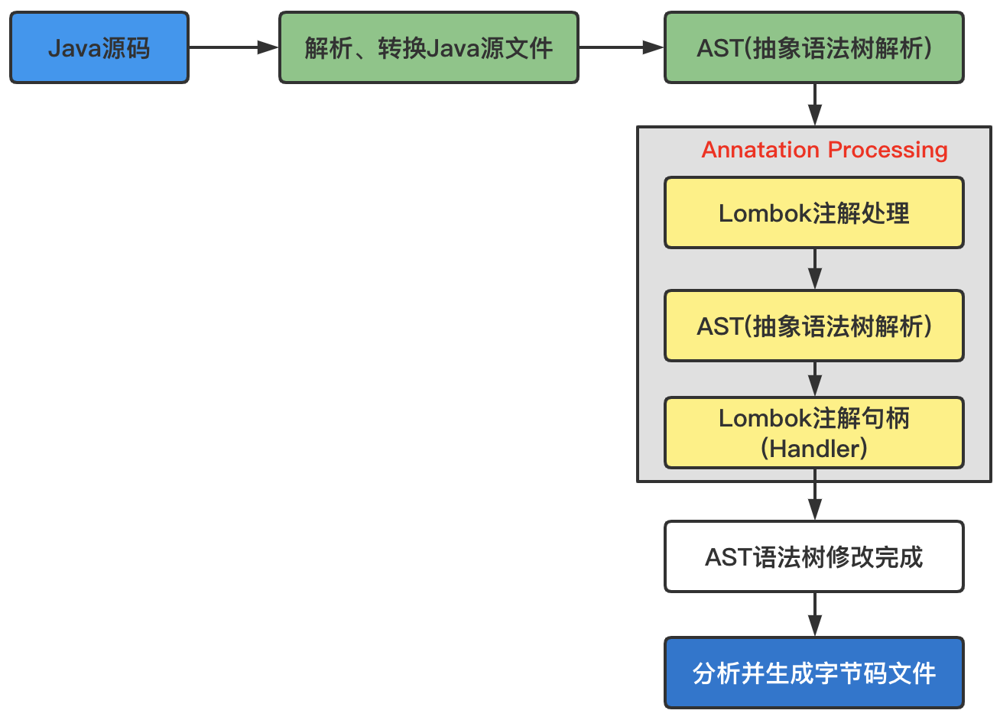

# 一、关于面试

## 1、作为面试官

### 1.1、如何考察编程能力

所谓编程能力，指的是把“逻辑”（或者说“功能”“业务”）翻译成代码的能力。所谓编程能力强，指的是，不仅能编写正确的代码，而且编写代码的速度很快，写出来的代码 bug 很少、性能很好、质量很高

一个编程能力强的人，能熟练使用编程语言、开发类库等工具，思路清晰，面对复杂的逻辑，能够编写出 bug free 的代码，能够合理地利用数据结构和算法编写高效的代码，能够灵活地使用设计思想、原则和模式，编写易读、易扩展、易维护、可复用的高质量代码；

**如何考察编程能力：**，主要有三个方面：编程语言，数据结构和算法，设计思想、原则和模式。
- 考察编程能力，那就离不开写代码。所以，在面试中，我一般都会出道编程题，让候选人写段代码看看，也就是所谓的“白板编程”
- 数据结构和算法：可以考察那种不依赖很强的算法背景和特殊的解题技巧的题目，比较适合用来面试。比如像下面这样的面试题就比较好：“写一个函数将 IPv4 地址字符串（仅包含数字、点、空格）转化成 32 位整数。另外，数字和点之间的空格是合法的，其他情况均为非法地址，要求输出合法地址的 32 位整型结果。
- 设计相关：
    - （1）给候选人一个功能需求，让他去做代码设计和实现，然后，基于他的代码实现，讨论代码的可读性、扩展性等代码质量方面的问题，然后让候选人继续优化，直到满意为止；
    - （2）给候选人一段有质量问题的代码，让他去做 Code Review，找出代码存在的问题，然后做代码重构；

## 2、如何面试设计问题

首先要明确需求。大部分情况下，面试官给出的功能需求，都是比较笼统、模糊的，这本身就是为了考察你的沟通能力、分析能力，是否能通过挖掘、假设、取舍，搞清楚具体的需求，梳理出可以执行落地的需求列表；

但是不要一下子就搞得太复杂，为了设计而设计，非得用些比较复杂的设计模式

在用最简单方式实现之后，你可以再讲一下，如何基于某某设计模式，进一步对代码进行解耦，进一步提高代码的扩展性。基于这种最简单的代码，再行讨论优化，这样跟面试官讨论起来，也会更加言之有物。这也能体现你的代码演进思维，以及具体问题具体分析的能力


# 三、其他

## 1、Lombok使用

### 1.1、lombok实现原理

- [Lombok和Jackson组合使用存在问题](https://mp.weixin.qq.com/s/uUyN1gfho0LN74SEvWuj6w)

Lombok，它属于 Java 的一个热门工具类，使用它可以有效的解决代码工程中那些繁琐又重复的代码，如 Setter、Getter、toString、equals 和 hashCode 等等，向这种方法都可以使用 Lombok 注解来完成

Lombok 的实现和反射没有任何关系，反射是程序在运行期的一种自省（introspect）能力，而 Lombok 的实现是在编译期就完成了，为什么这么说呢？

我们可以打开你使用Getter和Setter，原始类是：
```java
@Data
public class Person {
    private Integer id;
    private String name;
}
```
可以打开其编译的类，使用了 Lombok 的 @Data 注解后的源码编译的class如下：
```java
public class Person {
    private Integer id;
    private String name;
    public Person() {
    }
    public Integer getId() {
        return this.id;
    }
    public String getName() {
        return this.name;
    }
    public void setId(Integer id) {
        this.id = id;
    }
    public void setName(String name) {
        this.name = name;
    }
    public boolean equals(Object o) {
        if (o == this) {
            return true;
        } else if (!(o instanceof Person)) {
            return false;
        } else {
            Person other = (Person)o;
            if (!other.canEqual(this)) {
                return false;
            } else {
                Object this$id = this.getId();
                Object other$id = other.getId();
                if (this$id == null) {
                    if (other$id != null) {
                        return false;
                    }
                } else if (!this$id.equals(other$id)) {
                    return false;
                }

                Object this$name = this.getName();
                Object other$name = other.getName();
                if (this$name == null) {
                    if (other$name != null) {
                        return false;
                    }
                } else if (!this$name.equals(other$name)) {
                    return false;
                }

                return true;
            }
        }
    }
    protected boolean canEqual(Object other) {
        return other instanceof Person;
    }
    public int hashCode() {
        int PRIME = true;
        int result = 1;
        Object $id = this.getId();
        int result = result * 59 + ($id == null ? 43 : $id.hashCode());
        Object $name = this.getName();
        result = result * 59 + ($name == null ? 43 : $name.hashCode());
        return result;
    }
    public String toString() {
        return "Person(id=" + this.getId() + ", name=" + this.getName() + ")";
    }
}
```
可以看出 Lombok 是在编译期就为我们生成了对应的字节码；其实 Lombok 是基于 Java 1.6 实现的 JSR 269: Pluggable Annotation Processing API 来实现的，也就是通过编译期自定义注解处理器来实现的，它的执行步骤如下：



从流程图中可以看出，在编译期阶段，当 Java 源码被抽象成语法树（AST）之后，Lombok 会根据自己的注解处理器动态修改 AST，增加新的代码（节点），在这一切执行之后就生成了最终的字节码（.class）文件，这就是 Lombok 的执行原理；

### 1.2、Lombok存在的坑

- Lombok 的 `@EqualsAndHashCode` 注解实现 equals 和 hashCode 的时候，默认使用类型所有非 static、非 transient 的字段，且不考虑父类；如果希望改变这种默认行为，可以使用 @EqualsAndHashCode.Exclude 排除一些字段，并设置 callSuper = true 来让子类的 equals 和 hashCode 调用父类的相应方法

### 1.3、@Builder继承问题

比如有两个实体类：User、Account，其中 Account 继承 User
```java
@Data
@Builder
@NoArgsConstructor
@AllArgsConstructor
public class User {
    private Integer id;
    private String name;
    private String phone;
}
@Data
@Builder
@NoArgsConstructor
@AllArgsConstructor
public class Account extends User{
    private String accountNo;
    private String bank;
}
```
上述代码在编译的时候会报错：
```
java: com.entity.Account中的builder()无法覆盖com.entity.User中的builder()
  返回类型com.entity.Account.AccountBuilder与com.entity.User.UserBuilder不兼容
```
为了解决上述问题，可以是哟`@SuperBuilder`来替换，使用的时候只需要在父类和子类上都添加该注解
```java
@Data
@SuperBuilder
@NoArgsConstructor
@AllArgsConstructor
public class User {
    private Integer id;
    private String name;
    private String phone;
}
@Data
@SuperBuilder
@NoArgsConstructor
@AllArgsConstructor
public class Account extends User{
    private String accountNo;
    private String bank;
}
```

## 2、如何提升Java项目启动速度

- [一些可以显著提高大型 Java 项目启动速度的尝试](https://juejin.cn/post/7117815437559070734)

## 3、如何估算服务器

假如有如下需求：每秒并发 1 万，每个请求响应文件大小为 6KB，响应时间不超过 40 毫秒，每天处理 3-5 亿个请求，为了保持响应时效性，不能削峰填谷，

可以根据以下计算推荐适当的服务器配置：
- 计算每秒需要处理的数据量： `每秒处理的请求量 = 1万`，`每个请求响应文件大小 = 6KB`，`每秒需要处理的数据量 = 每秒处理的请求量 x 每个请求响应文件大小 = 1万 x 6KB = 60MB/s`

- 计算每天需要处理的数据量： `每天需要处理的请求数量 = (3亿 + 5亿) / 2 = 4亿`，`每天需要处理的数据量 = 每天需要处理的请求数量 x 每个请求响应文件大小 = 4亿 x 6KB = 2400GB/day`

- 计算服务器的存储容量： 为了满足每天处理 2400GB 的数据，建议选择至少 10TB 的存储容量。

- 计算服务器的带宽需求： 每秒需要处理的数据量为 60MB/s，每天处理的数据量为 2400GB/day。 为了满足这些需求，建议选择具有至少 1Gbps 带宽的服务器。

- 计算服务器的处理能力： 每秒需要处理的数据量为 60MB/s，响应时间不超过 40 毫秒。 为了满足这些需求，需要选择至少具有 2400 QPS（Queries Per Second）的服务器。

基于上述计算，以下是我可以为您推荐的服务器配置：
- CPU：至少具有 8 核心以上的 CPU。
- 内存：建议选择至少 64GB 的内存。
- 存储：建议选择至少 10TB 的存储容量。
- 带宽：建议选择具有至少 1Gbps 带宽的服务器。
- QPS：至少具有 2400 QPS 的服务器。

当然，这只是基于您提供的信息进行的粗略计算，实际配置还需要考虑到其他因素，例如负载均衡、故障转移、安全性等。建议您最好咨询专业的服务器配置专家或供应商，以确保您的服务器配置能够满足您的需求。

## 4、技术面试意见

- 介绍方案的核心；
- 讲优点：和业界方案比起来，我这个方案的很是啥；
- 将缺点：这个方案的缺点是啥，说一堆；
- 讲改进：考虑准备从哪几个方面改进；

# 五、面试资料

- [字节面试题](https://mp.weixin.qq.com/s/zFkvx4OFvH-jleFcHGouNQ)

```
一面：
进程和线程的区别，进程间如何通讯，线程间如何通讯。
HashMap的数据结构是什么？如何实现的。和HashTable，ConcurrentHashMap的区别。
什么情况会出现Full GC，什么情况会出现young GC。
讲讲JVM加载字节码文件的过程。
Spring的IOC容器初始化流程。
Spring的IOC容器实现原理，为什么可以通过byName和ByType找到Bean。
对CAS的理解，CAS带来的问题，如何解决这些问题。
说说你对乐观锁和悲观锁的理解
讲一讲对Redis 的了解，项目中是如何使用的，在哪个地方使用的，为什么要使用？
如何保证 Kafka 消息的顺序性，如何解决重复消费问题。
你能否写一个Rpc框架，什么时候序列化/反序列化，有思路就可以。
ES搜索引擎，你在项目哪些功能使用过，介绍下使用场景。

二面：

介绍一下自己最近做的一个典型的项目，项目中遇到了哪些问题，自己是如何解决的。
系统支撑的用户量是多少，假如用户量提升10倍，系统会出现什么样的问题，如何优化系统 or 重新设计系统。
如何存放数据到 Redis 集群，介绍一下这个过程，如何处理热点数据问题。
分库分表使用什么算法拆分，简述一下一致性Hash算法原理。
MySQL事务隔离级别和MVCC，事务的底层实现原理。
项目如何推进按时上线的，有没有给系统造成过重大bug，如何避免？
为什么从上个公司离职，为什么选择阿里，对哪方面技术比较感兴趣？（对技术有热情）
```

```
说说volatile、synchronized底层原理、锁升级的过程。
Java中有哪些锁，你使用过哪些？说说他们的区别。
Java运行时区域及各个区域的作用、对GC的了解、Java内存模型及为什么要这么设计？
你使用过countDownLatch吗，在项目中如何使用的，你对AQS的了解。
说说 Redis 常用几种类型，各自底层是怎么实现的，项目中如何使用。
Redis 有哪两种备份方式，两种备份方式有何区别。
数据库和缓存双写一致性问题：先更新数据库再更新缓存，若更新完数据库了，还没有更新缓存，此时有请求过来了，访问到了缓存中的数据，怎么办？（提示：延时双删策略）
说说你对索引的理解，组合索引，索引的最佳实践，你是怎么给你的表设置索引的。
写生产者消费者问题，考虑高并发的情况，可以使用Java 类库，白纸写代码。
CAP概念理解吗？
设计一个发号器，考虑集群和高并发的情况，要求发号器生成的id是递增趋势，通过id可以区分出来是今天生成的id还是昨天生成的id，但是生成的id中不能直接带有日期，要具有一定的混淆功能，白纸写代码
讲项目中的难点、挑战，你是如何解决的？画项目架构图，画一个用户从发起请求到接收到响应，中间经过哪些服务。
遍历二叉树，不使用递归方法。
手写冒泡排序（Bubble Sort）
项目中系统监控怎么做的？（可以了解下美团开源的CAT系统，还是很出色的）
介绍下从工作到现在自己的成长在哪里，这个问题就自由发挥了。
```

```
说说对Java中集合类的理解，项目中用过哪些，主要说了HashMap。
说说volatile底层、synchronized底层、锁升级的过程。
对CAS的理解，CAS带来的问题，如何解决这些问题？
怎么理解Java 中和 MySQL中的乐观锁、悲观锁？
如何理解Spring中的AOP 和 IOC，读过Spring源码没有？
有没有排查过线上OOM的问题，如何排查，谈下对GC的了解，何为垃圾，有哪些GC算法，有哪些垃圾回收器，你是如何调优的。
JVM自带的工具有哪些，都有什么功能。
MySQL索引底层实现为什么不用B-Tree，红黑树，为什么不用hash。
MySQL默认的事务隔离级别，MVCC、RR怎么实现的？
MySQL间隙锁/死锁，写一段会造成死锁的SQL语句，死锁发生了如何解决，如何解决死锁。
如何保证Kafka 消息的顺序性，如何解决重复消费问题。
项目中如何保证接口的幂等操作，用什么方法。
Hystrix功能和在项目中怎么使用的？Hystrix实现原理？
Redis底层数据结构原理？
Redis如何实现分布式锁？
说一个你了解最多的中间件框架。
如何理解分布式事务，为什么会出现这个问题，如何去解决，了解哪些分布式事务中间件？
讲一讲项目中的难点、挑战，是如何解决的，项目这一块会问的特别细。
```

```
HashMap、concurrentHashMap的区别及底层实现、HashMap和HashTable 的区别。
List删除是怎么实现的，遍历的时候可以删除吗？
AQS、countDownLatch如何实现？
对线程池的理解，在项目中如何使用的，多个线程之间如何共享数据，多个进程之间如何共享数据
Spring Cloud了解多少，Spring Cloud 服务发现模块原理。
Redis中有哪些数据结构，了解过其底层怎么实现的吗，和Java中相似的数据结构的对比。
Redis是单线程的还是多线程的，Redis为什么这么快?
Redis Hash中某个key过大，变为String类型的大key，怎么处理，使用中如何避免出现这种问题?
Kafka 如何保证消息顺序消费、在consumer group 中新增一个consumer 会提高消费消息的速度吗、那如果我想提高消息消费的速度，我要怎么办？
考察线程池，线程池如何实现，核心线程数和最大线程数设置成多少，为什么这么设置，项目中哪个地方使用了线程池，使用时需要注意什么。
MySQL事务隔离级别，幻读，脏读，项目中用什么事务隔离级别，为什么？
对XA、TCC的理解，了解哪些分布式事务框架，有什么缺点
Zookeeper了解吗，干嘛用的？
Hystrix 和 sentinel，你更熟悉哪个？
对分库分表、读写分离的了解，项目中怎么分的。
画一下 Java 线程几个状态及状态之间互相转换的图。
聊项目，画项目架构图，画一个用户从发起请求到接收到响应，使用了哪些中间件，都处在哪一层，数据库怎么设计的
```

# 参考资料

- [如何判断一家公司是好公司](https://zhuanlan.zhihu.com/p/142654897)
