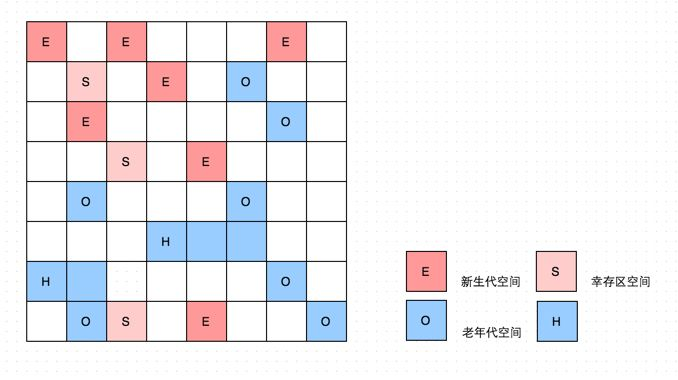
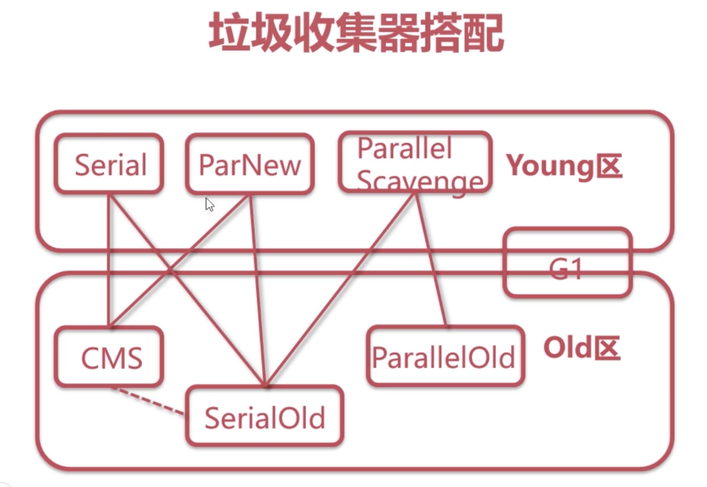

<!-- START doctoc generated TOC please keep comment here to allow auto update -->
<!-- DON'T EDIT THIS SECTION, INSTEAD RE-RUN doctoc TO UPDATE -->
**目录**

- [一、GC-GarbageCollection](#%E4%B8%80gc-garbagecollection)
  - [1、垃圾回收机制的意义](#1%E5%9E%83%E5%9C%BE%E5%9B%9E%E6%94%B6%E6%9C%BA%E5%88%B6%E7%9A%84%E6%84%8F%E4%B9%89)
  - [2、如何确定对象为垃圾对象](#2%E5%A6%82%E4%BD%95%E7%A1%AE%E5%AE%9A%E5%AF%B9%E8%B1%A1%E4%B8%BA%E5%9E%83%E5%9C%BE%E5%AF%B9%E8%B1%A1)
  - [3、GC 回收区域](#3gc-%E5%9B%9E%E6%94%B6%E5%8C%BA%E5%9F%9F)
- [二、垃圾回收对象判断算法](#%E4%BA%8C%E5%9E%83%E5%9C%BE%E5%9B%9E%E6%94%B6%E5%AF%B9%E8%B1%A1%E5%88%A4%E6%96%AD%E7%AE%97%E6%B3%95)
  - [1、引用计数算法：Reference Counting Collector](#1%E5%BC%95%E7%94%A8%E8%AE%A1%E6%95%B0%E7%AE%97%E6%B3%95reference-counting-collector)
  - [2、可达性分析算法：主流的实现，判定对象的存活](#2%E5%8F%AF%E8%BE%BE%E6%80%A7%E5%88%86%E6%9E%90%E7%AE%97%E6%B3%95%E4%B8%BB%E6%B5%81%E7%9A%84%E5%AE%9E%E7%8E%B0%E5%88%A4%E5%AE%9A%E5%AF%B9%E8%B1%A1%E7%9A%84%E5%AD%98%E6%B4%BB)
  - [3、再谈引用](#3%E5%86%8D%E8%B0%88%E5%BC%95%E7%94%A8)
  - [4、对象的生存或死亡](#4%E5%AF%B9%E8%B1%A1%E7%9A%84%E7%94%9F%E5%AD%98%E6%88%96%E6%AD%BB%E4%BA%A1)
  - [5、回收方法区](#5%E5%9B%9E%E6%94%B6%E6%96%B9%E6%B3%95%E5%8C%BA)
- [三、垃圾收集算法](#%E4%B8%89%E5%9E%83%E5%9C%BE%E6%94%B6%E9%9B%86%E7%AE%97%E6%B3%95)
  - [1、标记-清除算法(Marke-Sweep)-最基础的收集算法](#1%E6%A0%87%E8%AE%B0-%E6%B8%85%E9%99%A4%E7%AE%97%E6%B3%95marke-sweep-%E6%9C%80%E5%9F%BA%E7%A1%80%E7%9A%84%E6%94%B6%E9%9B%86%E7%AE%97%E6%B3%95)
  - [2、标记-整理算法(Mark-Compact)](#2%E6%A0%87%E8%AE%B0-%E6%95%B4%E7%90%86%E7%AE%97%E6%B3%95mark-compact)
  - [3、复制算法（Copying）-新生代采用的收集算法](#3%E5%A4%8D%E5%88%B6%E7%AE%97%E6%B3%95copying-%E6%96%B0%E7%94%9F%E4%BB%A3%E9%87%87%E7%94%A8%E7%9A%84%E6%94%B6%E9%9B%86%E7%AE%97%E6%B3%95)
  - [4、分代收集算法（Generation Collection）](#4%E5%88%86%E4%BB%A3%E6%94%B6%E9%9B%86%E7%AE%97%E6%B3%95generation-collection)
  - [5、Hotspot虚拟机算法实现](#5hotspot%E8%99%9A%E6%8B%9F%E6%9C%BA%E7%AE%97%E6%B3%95%E5%AE%9E%E7%8E%B0)
- [四、垃圾收集器](#%E5%9B%9B%E5%9E%83%E5%9C%BE%E6%94%B6%E9%9B%86%E5%99%A8)
  - [1、Serial 收集器](#1serial-%E6%94%B6%E9%9B%86%E5%99%A8)
  - [2、ParNew 收集器](#2parnew-%E6%94%B6%E9%9B%86%E5%99%A8)
  - [3、Parallel Scavenge 收集器](#3parallel-scavenge-%E6%94%B6%E9%9B%86%E5%99%A8)
  - [4、Serial Old 收集器](#4serial-old-%E6%94%B6%E9%9B%86%E5%99%A8)
  - [5、Parallel Old 收集器](#5parallel-old-%E6%94%B6%E9%9B%86%E5%99%A8)
  - [6、CMS（Concurrent Mark Sweep）收集器-老年代](#6cmsconcurrent-mark-sweep%E6%94%B6%E9%9B%86%E5%99%A8-%E8%80%81%E5%B9%B4%E4%BB%A3)
  - [7、G1收集器（Garbage First）](#7g1%E6%94%B6%E9%9B%86%E5%99%A8garbage-first)
  - [8、垃圾收集器比较](#8%E5%9E%83%E5%9C%BE%E6%94%B6%E9%9B%86%E5%99%A8%E6%AF%94%E8%BE%83)
  - [9、如何选择垃圾收集器](#9%E5%A6%82%E4%BD%95%E9%80%89%E6%8B%A9%E5%9E%83%E5%9C%BE%E6%94%B6%E9%9B%86%E5%99%A8)
- [五、GC 执行机制:Minor GC和Full GC](#%E4%BA%94gc-%E6%89%A7%E8%A1%8C%E6%9C%BA%E5%88%B6minor-gc%E5%92%8Cfull-gc)
  - [1、Minor GC(YGC)](#1minor-gcygc)
  - [2、Major GC：永久代](#2major-gc%E6%B0%B8%E4%B9%85%E4%BB%A3)
  - [3、Full GC](#3full-gc)
  - [4、内存回收与分配策略](#4%E5%86%85%E5%AD%98%E5%9B%9E%E6%94%B6%E4%B8%8E%E5%88%86%E9%85%8D%E7%AD%96%E7%95%A5)
  - [5、GC参数](#5gc%E5%8F%82%E6%95%B0)
- [六、详解 finalize()方法](#%E5%85%AD%E8%AF%A6%E8%A7%A3-finalize%E6%96%B9%E6%B3%95)
- [七、Java 有了GC同样会出现内存泄露问题](#%E4%B8%83java-%E6%9C%89%E4%BA%86gc%E5%90%8C%E6%A0%B7%E4%BC%9A%E5%87%BA%E7%8E%B0%E5%86%85%E5%AD%98%E6%B3%84%E9%9C%B2%E9%97%AE%E9%A2%98)
- [八、如何优化GC](#%E5%85%AB%E5%A6%82%E4%BD%95%E4%BC%98%E5%8C%96gc)
  - [1、监控GC](#1%E7%9B%91%E6%8E%A7gc)
  - [2、GC 优化](#2gc-%E4%BC%98%E5%8C%96)
  - [3、ParallelGC调优](#3parallelgc%E8%B0%83%E4%BC%98)
  - [4、G1 GC调优](#4g1-gc%E8%B0%83%E4%BC%98)
- [九、减少GC开销](#%E4%B9%9D%E5%87%8F%E5%B0%91gc%E5%BC%80%E9%94%80)
  - [1、避免隐式的 String 字符串](#1%E9%81%BF%E5%85%8D%E9%9A%90%E5%BC%8F%E7%9A%84-string-%E5%AD%97%E7%AC%A6%E4%B8%B2)
  - [2、计划好 List 的容量](#2%E8%AE%A1%E5%88%92%E5%A5%BD-list-%E7%9A%84%E5%AE%B9%E9%87%8F)
  - [3、使用高效的含有原始类型的集合](#3%E4%BD%BF%E7%94%A8%E9%AB%98%E6%95%88%E7%9A%84%E5%90%AB%E6%9C%89%E5%8E%9F%E5%A7%8B%E7%B1%BB%E5%9E%8B%E7%9A%84%E9%9B%86%E5%90%88)
  - [4、使用数据流(Streams)代替内存缓冲区（in-memory buffers）](#4%E4%BD%BF%E7%94%A8%E6%95%B0%E6%8D%AE%E6%B5%81streams%E4%BB%A3%E6%9B%BF%E5%86%85%E5%AD%98%E7%BC%93%E5%86%B2%E5%8C%BAin-memory-buffers)
  - [5、List集合](#5list%E9%9B%86%E5%90%88)
- [参考文章](#%E5%8F%82%E8%80%83%E6%96%87%E7%AB%A0)

<!-- END doctoc generated TOC please keep comment here to allow auto update -->
 
Java 垃圾回收器是一种"自适应的、分代的、停止—复制、标记-清扫"式的垃圾回收器

# 一、GC-GarbageCollection

垃圾回收，Java 的内存管理实际上就是对象的管理

## 1、垃圾回收机制的意义

- Java 中的对象不再有"作用域"的概念，只有对象的引用才有"作用域"。垃圾回收可以有效的防止内存泄露，有效的使用空闲的内存。
- 提供系统性能，排查各种内存溢出、内存泄露问题

## 2、如何确定对象为垃圾对象

- 引用计数:如果一个对象没有任何引用与之关联，则说明该对象基本不太可能在其他地方被使用到，那么这个对象就成为可被回收的对象了无法解决循环引用的问题

- 可达性分析法-解决循环引用问题<br>
	基本思想是通过一系列的"GC Roots"对象作为起点进行搜索，如果在"GC Roots"和一个对象之间没有可达路径，则称该对象是不可达的；要注意的是被判定为不可达的对象不一定就会成为可回收对象.被判定为不可达的对象要成为可回收对象必须至少经历两次标记过程

## 3、GC 回收区域

- 程序计数器、虚拟机栈、本地方法栈不需要进行垃圾回收的，因为他们的生命周期是和线程同步的，随着线程的销毁，其占用的内存会自动释放，
- 堆和方法区是线程共享的，需要进行垃圾回收；Java堆是对无用对象的回收，方法区是对废弃的常量以及无用的类进行回收；

# 二、垃圾回收对象判断算法
## 1、引用计数算法：Reference Counting Collector

**1.1、算法分析：**

给对象中添加一个引用计数器，每当有一个地方引用他时，计数器就加1;当引用失效时，引用计时器就减1；任何时刻计数器为0的对象就是不可能再被使用；

**1.2.优缺点：**

- 优点：算法实现简单，盘点效率也很高，如:Python语言
- 缺点：很难解决对象之间的循环引用问题；如父对象有一个对子对象的引用，子对象反过来引用父对象。这样，他们的引用计数永远不可能为0;

**1.3、循环引用例子**
```java
public class Main {
	public static void main(String[] args) {
		MyObject object1 = new MyObject();
		MyObject object2 = new MyObject();
		/**
		 * 最后面两句将object1和object2赋值为null，也就是说object1和object2指向的对象已经不可能再被访问，
		 * 但是由于它们互相引用对方，导致它们的引用计数器都不为0，那么垃圾收集器就永远不会回收它们
		 */
		object1.object = object2;
		object2.object = object1;		         
		object1 = null;
		object2 = null;
	}
}
```
## 2、可达性分析算法：主流的实现，判定对象的存活

**2.1、算法分析：**

基本思路就是通过一系列的成为"GC Roots"的对象作为起始点，从这些节点开始向下搜索，搜索所走过的路径成为引用链（Refefence Chain），当一个对象的GC Roots没有任何引用链相连（用图论的话说，就是从 GC Roots到这个对象不可达）时，证明此对象是不可用的；
	
**2.2、Java中，可作为GC Roots的对象包括**

- 虚拟机栈（栈桢中的本地变量表）中引用的对象：类加载器、Thread等
- 方法区中类静态属性引用的对象；
- 方法区中常量引用的对象；
- 本地方法栈中 JNI（即一般说的 native 方法）引用的对象；


**2.3、对于用可达性分析法搜索不到的对象，GC 并不一定会回收该对象:要完全回收一个对象，至少需要经过两次标记的过程**

- 第一次标记：对于一个没有其他引用的对象，筛选该对象是否有必要执行 finalize 方法，如果没有必要执行，则意味着可以直接回收。筛选依据:是否复写或执行过finalize()方法；因为finalize方法只能被执行一次；

- 第二次标记:如果被筛选判定位有必要执行，则会放入FQueue队列，并自动创建一个低优先级的finalize线程来执行释放操作。如果在一个对象释放前被其他对象引用，则该对象会被移除FQueue队列;

## 3、再谈引用

- 无论是引用计数器判断对象引用的数量，还是可达性分析判断对象的引用链是否可达，判定对象的是否存活都与"引用"有关；

- JDK1.2以前，Java中的引用：如果reference类型的数据中存储的数值代表的是另一块内存的起始地址，就称为这块内存代表一个引用；

- JDK1.2以后，Java对引用进行了扩充，分为：<br>
	强引用（Strong Refefence）、软引用（Soft Refefence）、弱引用（Weak Refefence）、虚引用（Phantom Refefence），4种引用强度依次逐渐减弱

	- 强引用(Strong Refefence)：在代码中普遍存在的，类似 Object obj = new Object() 这类的引用，只要强引用还存在，垃圾收集器永远不会回收掉被引用的对象;当内存空间不足.Java 虚拟机宁愿抛出 OutOfMemoryError错误，使程序异常终止，也不会靠随意回收具有强引用的对象来解决内存不足的问题；

	- 软引用(Soft Refefence)：用来描述一些还有用但并非必需的对象;对于软引用关联的对象，在系统将要发生内存溢出异常之前，将会把这些对象列进回收范围之中，进行第二次回收，如果这次回收还没有足够的内存，才会抛出内存溢出异常JDK1.2 之后，提供了SoftReference类实现软引用；

	- 弱引用(Weak Refefence)：用来描述非必需的对象，被弱引用关联的对象只能生存到下一个垃圾收集发生之前；当垃圾收集器工作时，无论当前内存是否足够，都会回收掉只被弱引用关联的对象;JDK1.2 之后，提供了 WeakRefefence 类来实现弱引用；<br>

	- 虚引用(Phantom Refefence)：幽灵引用或者幻影引用，它是最弱的一种引用关系;一个对象是否有虚引用的存在完全不会对其生存时间构成影响，也无法通过虚引用来取得一个对象实例；为一个对象设置虚引用关联的唯一目的:能在这个对象被垃圾收集器回收时收到一个系统通知；JDK1.2 之后，提供了 PhantomRefefence 类来实现弱引用;

## 4、对象的生存或死亡

- 一个对象真正的死亡，至少经历两次标记过程：如果对象在进行可达性分析后发现没有GC Roots相连接的引用链，那它将会被第一次标记并且进行一次筛选，筛选的条件是此对象是否有必要执行 finalize() 方法;

- 当对象没有覆盖 finalize() 方法，或是 finalize() 方法已经被虚拟机调用过，虚拟机将这两种情况视为没有必要执行；

- 如果这个对象被判定为有必要执行 finalize() 方法，那么这个对象将会被放置在一个叫做 F-Queue 的队列中，并在稍后由一个虚拟机自动建立的，低优先级的 Finalizer 线程去执行它;

## 5、回收方法区

- 方法区中进行垃圾收集的性价比一般较低；
- 永久代的垃圾收集主要分为两部分；废弃常量和无用的类
	- 废弃常量：如果在常量池中没有任何引用的常量，即废弃常量
	- 无用的类：
		- ①、该类中所有实例都已经被回收，也就是 Java 堆中不存在该类的任何实例;
		- ②、加载该类的 ClassLoader 已经被回收;
		- ③、该类对应的 java.lang.Class 对象没有在任何地方引用，无法在任何对象地方通过反射访问该类的方法;

	JVM 可以对满足上述3个条件的无用类进行回收，仅仅是"可以"

- 在大量使用反射、动态代码、CGLib等byteCode框架，动态生存JSP以及OSGi这类自定义ClassLoader的场景都需要虚拟机具备类卸载功能，以保证永久代不会溢出。

# 三、垃圾收集算法

## 1、标记-清除算法(Marke-Sweep)-最基础的收集算法

**1.1、算法分为"标记"和"清除"两个阶段：**

首先标记出所有需要回收的对象，在标记完成后统一回收所有被标记的对象

**1.2、不足之处**

- 效率：标记和清除两个过程的效率都不高;
- 空间：标记清除后会产生大量不连续的内存碎片，空间碎片太多可能会导致在程序运行过程中分配较大对象时，无法找到足够的连续内存而不得不提前触发另一次垃圾收集动作;

## 2、标记-整理算法(Mark-Compact)

- 算法分为"标记"和"清除"两个阶段：<br>
	首先标记出所有需要回收的对象，让所有存活的对象都向一端移动，然后直接清理掉端边界意外的内存；

- 标记-整理算法是在标记-清除算法的基础上，又进行了对象的移动，因此成本更高，但是却解决了内存碎片的问题；

## 3、复制算法（Copying）-新生代采用的收集算法

该算法的提出是为了克服句柄的开销和解决堆碎片的垃圾回收

**3.1、算法思路：**

将可用内存按容量划分为大小相等的两块，每次只使用其中的一块;当一块的内存用完了，就将存活的对象复制到另一块上面，然后再把已使用过的内存空间一次清理掉；每次回收时都是对整个半区进行内存回收，内存分配是不用考虑内存碎片等;

**3.2、空间如何划分：**

由于新生代中对象98%都是"朝生夕死"的，所有不需要按照1:1划分内存空间，而是将内存分为一块较大的Eden空间和两块较小的Survivor空间，每次使用 Eden 和 其中一块 Survivor；

- 当回收时将Eden 和Survivor中还存活的对象一次性的复制到另外一块Survivor 间上，最后清理掉 Eden 和刚才用过的Survivor 空间；
- HotSpot虚拟机默认Eden和Survivor的大小比例是 8:1，每次新生代可以内存空间为整个新生代容量的90%（80%+10%），只要10%内存会被浪费掉
- 当 Survivor 空间不够用时，需要依赖其他内存（指老年代）进行分配担保：没有足够的空间存放上一次新生代收集下来的存活对象时，这些对象将直接通过分配担保机制进入老年代；

## 4、分代收集算法（Generation Collection）

基于不同的对象的生命周期是不一样的；一般是把 Java 堆分为新生代与老年代

**4.1、新生代（Young Generation）**

- 所有新生成的对象首先都是放在年轻代的，新生代的 GC 也叫做 MinorGC，MinorGC 发生频率比较高（不一定等 Eden 区满了才触发）
- 新生代中对象生存周期短，所以选用复制算法，只需付出少量存活对象的复制成本就可以完成收集

**4.2、老年代（Old Generation）**

- 在新生代中经历了N次垃圾回收后仍然存活的对象，就会被放到年老代中.可以认为年老代中存放的都是一些生命周期较长的对象；
- 当老年代内存满时触发 Major GC 即 FullGC，FullGC 发生频率比较低，老年代对象存活时间比较长，存活率高；
- 一般使用标记-清除和标记-整理算法来进行回收；

**4.3、持久代（Permanent Generation）**

用于存放静态文件，如Java类、方法等.持久代对垃圾回收没有显著影响，但是有些应用可能动态生成或者调用一些class

- ***JDK8之后完全移除了持久代，取而代之的是[元空间](https://github.com/chenlanqing/learningNote/blob/master/Java/JavaSE/Java-JVM/JVM-Java%E8%99%9A%E6%8B%9F%E6%9C%BA.md#38%E5%85%83%E7%A9%BA%E9%97%B4)***
	

## 5、Hotspot虚拟机算法实现

- **枚举根节点**

	从可达性分析中从GC Roots节点找引用链这个操作为例，可作为GC Roots的节点主要在全局性的引用（例如常量或类静态属性）与执行上下文（例如栈帧中的局部变量表）中，现在很多应用仅仅方法区就有数百兆，如果要逐个检查这里面的引用，那么必然会消耗很多时间。

- **GC停顿（STW）**

	另外，可达性分析工作必须在一个能确保一致性的快照中进行——这里“一致性”的意思是指在整个分析期间整个执行系统看起来就像被冻结在某个时间点上，不可以出现分析过程中对象引用关系还在不断变化的情况，这是保证分析结果准确性的基础。这点是导致GC进行时必须停顿所有Java执行线程（Sun将这件事情称为“Stop The World”）的其中一个重要原因，即使是在号称（几乎）不会发生停顿的CMS收集器中，枚举根节点时也是必须要停顿的


- **准确式GC与OopMap**

	由于目前的主流Java虚拟机使用的都是准确式GC（即使用准确式内存管理，虚拟机可用知道内存中某个位置的数据具体是什么类型），所以当执行系统停顿下来后，并不需要一个不漏地检查完所有执行上下文和全局的引用位置，虚拟机应当是有办法直接得知哪些地方存放着对象引用。在HotSpot的实现中，是使用一组称为OopMap的数据结构来达到这个目的的，在类加载完成的时候，HotSpot就把对象内什么偏移量上是什么类型的数据计算出来，在JIT编译过程中，也会在特定的位置记录下栈和寄存器中哪些位置是引用。这样，GC在扫描时就可以直接得知这些信息了

- **安全区域（Safe Region）**

# 四、垃圾收集器

- 内存回收的具体实现：
	- 新生代收集器使用的收集器：Serial、PraNew、Parallel Scavenge
	- 老年代收集器使用的收集器：Serial Old、Parallel Old、CMS

- 分类：
	- 串行收集器Serial：Serial、Serial Old
	- 并行收集器Parallel：Parallel Scavenge、Parallel Old，以吞吐量

		指多条垃圾收集线程并行工作，但此时用户线程仍然处于等待状态，适合科学计算、后台处理等弱交互场景

	- 并发收集器Concurrent：CMS、G1，有一定的停顿时间

		指用户线程与垃圾收集线程同时执行（但不一定是并行的，可能会交替执行），垃圾收集线程在执行的时候不会停顿用户程序的运行，适合对响应时间有要求的场景，如web

- 停顿时间与吞吐量
	- 停顿时间：垃圾收集器做垃圾回收中断应用执行的时间。-XX:MaxGCPauseMillis
	- 吞吐量：花在垃圾收集的时间和花在应用时间的占比。-XX:GCTimeRatio=<n>，垃圾收集时间占：1/（1+n）
	
	*最优结果：在最大吞吐量的时候，停顿时间最短*


## 1、Serial 收集器

- **1.1、算法：**

	Serial收集器对于新生代采用复制算法实现，对于老年代采用标记-整理算法实现，使用JVM参数```-XX:UseSerialGC```开启

- **1.2、单线程收集器：**

	- 使用一个CPU或一条收集线程去完成垃圾收集工作；
	- 它进行垃圾收集时，必须暂停其他所有的工作线程，直到它收集结束，又称为STOP THE WORLD（STW）；
	- 虚拟机运行在 Client 模式下默认新生代收集器

- **1.3、特点：**

	简单而高效（与其他收集器的单线程比），对于限定单个CPU环境来说， Serial 收集器由于没有线程交互的开销，专心做垃圾收集自然可以获得最高的单线程收集效率；


## 2、ParNew 收集器

- 算法：新生代采用复制算法

- ParNew收集器，可以认为是Serial收集器的多线程版本，在多核CPU环境下有着比Serial更好的表现；其他与Serial收集器实现基本差不多；

- 是运行在 Server 模式下的虚拟机中首选的新生代收集器，其中与性能无关的是：只有 Serial 收集器和 ParNew 收集器能与 CMS 收集配合工作；

- 在JDK1.5中使用CMS来收集老年代的时候，新生代只能选用Serial、ParNew收集器中的一个ParNew收集器也是使用```-XX:UseConcMarkSweepGC``` 选项后的默认新生代收集器，也可以使用 ```-XX:+UseParNewGC``` 选项来强制指定它；

- ParNew 收集器在单 CPU 的环境中绝对不会有比 Serial 收集器有更好的效果，甚至由于存在线程交互的开销，该收集器在通过超线程技术实现的两个CP 的环境中都不能百分之百地保证可以超越


## 3、Parallel Scavenge 收集器

- 算法：堆内存年轻代采用“复制算法”；配合收集器：ParallelOldGC，堆内存老年代采用“标记-整理算法”；

- 并行的多线程收集器；只适用于新生代；

- Parallel Scavenge 收集器目标是达到一个控制的吞吐量（Throughput，CPU 运行用户代码的时间与CPU总消耗的时间的比值）；

- GC 自适应调整策略；

- 无法与 CMS 收集器配合工作；

## 4、Serial Old 收集器

Serial 收集器的老年代版本，采用标记-整理算法实现

- 主要是在 Client 模式下的虚拟机使用，在 Server 模式下，有两大用途：
	- 在 JDK1.5 以及之前的版本中与 Parallel Scavenge 收集器搭配使用；
	- 作为 CMS 收集器的后备预案在并发收集发生 Concurrent Mode Failure 时使用；

## 5、Parallel Old 收集器

- Parallel Scavenge 收集器的老年代版本，使用标记-整理算法
- JDK1.6 之后才开始提供的

## 6、CMS（Concurrent Mark Sweep）收集器-老年代

它管理新生代的方式与Parallel收集器和Serial收集器相同，而在老年代则是尽可能得并发执行，每个垃圾收集器周期只有2次短停顿

追求最短 GC 回收停顿时间，为了消除Throught收集器和Serial收集器在Full GC周期中的长时间停顿

### 6.1、实现

基于标记-清除算法实现的，运作过程可以分为4个步骤：
- 初始标记（CMS initial mark）：仅仅只是标记一下 GC Roots 能直接关联到的对象，速度很快，需要“Stop TheWorld”；
- 并发标记（CMS concurrent mark）：进行GC Roots追溯所有对象的过程，在整个过程中耗时最长
- 重新标记（CMS remark）：为了修正并发标记期间因用户程序继续运作而导致标记产生变动的那一部分对象的标记记录，这个阶段的停顿时间一般会比初始标记阶段稍长一些，但远比并发标记的时间短。此阶段也需要“Stop The World”；
- 并发清除（CMS concurrent sweep）

其中初始标记、重新标记这两个步骤仍然需要"Stop the world"。初始标记仅仅是标记以下 GC Roots 能直接关联到的对象，速度很快，并发标记阶段就是进行GC Roots Tracing 的过程，而重新阶段则是为了修正并发标记期间因用户程序继续运作而导致标记常数变动的那一部分对象的标记记录，这个阶段的停顿时间一般会比初始标记的阶段稍微长点，但远比并发标记阶段时间短；

### 6.2、优缺点

- 优点：并发收集，低停顿
- 缺点：
	- CMS 收集器对CPU资源非常敏感
	- CMS 收集无法处理浮动垃圾(Floating Garbage)，可能出现 Concurrent Mode Failure 失败而导致一次 Full GC 的产生
	- CMS 基于标记-清除算法实现的，那么垃圾收集结束后会产生大量的空间碎片，空间碎片过多时，将会给大对象的分配带来很大麻烦，往往出现老年代还有很大空间剩余，但是无法找到足够大的连续空间来分配当前对象们，不得不提前触发一次 Full GC。

### 6.3、CMS相关参数

- `-XX:ConcGCThreads`：并发的GC线程数；
- `-XX:+UseCMSCompactAtFullCollection`：Full GC之后做压缩
- `-XX:CMSFullGCsBeforeCompaction`：多少次Full GC之后压缩一次
- `-XX:CMSInitiatingOccupancyFraction`：触发Full GC，老年代内存使用占比达到 CMSInitiatingOccupancyFraction，默认为 92%
- `-XX:+UseCMSInitiatingOccupancyOnly`：是否动态调整
- `-XX:+CMSScavengeBeforeRemark`：full gc之前先做YGC
- `-XX:+CMSClassUnloadingEnabled`：启用回收Perm区，针对JDK8之前的

## 7、G1收集器（Garbage First）

通过`-XX:+UseG1GC`参数来启用，作为体验版随着JDK 6u14版本面世，在JDK 7u4版本发行时被正式推出，在JDK 9中，G1被提议设置为默认垃圾收集器；

G1是一种服务器端的垃圾收集器，应用在多处理器和大容量内存环境中，在实现高吞吐量的同时，尽可能的满足垃圾收集暂停时间的要求

### 7.1、特点

- 并行与并发
- 分代收集
- 空间整合：整体上看来是基于“标记-整理”算法实现的，从局部（两个Region）上看来是基于“复制”算法实现的；这两种算法意味着G1运行期间不会产生内存空间碎片；
- 可预测停顿：降低停顿时间，G1收集器可以非常精确地控制停顿，既能让使用者明确指定在一个长度为M毫秒的时间片段内，消耗在垃圾收集上的时间不得超过N毫秒，这几乎已经是实时Java的垃圾收集器的特征；
- G1将整个Java堆（包括新生代、老年代）划分为多个大小相等的内存块（Region），每个Region 是逻辑连续的一段内存，在后台维护一个优先列表，每次根据允许的收集时间，优先回收垃圾最多的区域

G1收集器的设计目标是取代CMS收集器，它同CMS相比，在以下方面表现的更出色：
- G1是一个有整理内存过程的垃圾收集器，不会产生很多内存碎片；
- G1的Stop The World(STW)更可控，G1在停顿时间上添加了预测机制，用户可以指定期望停顿时间；

与其他收集器的区别：其将整个Java堆划分为多个大小相等的独立区域(Region).虽然还保留了新生代和老年代的概念，但是新生代和老年代不再是物理隔离的，它们都是一部分独立区域(不要求连续)的集合

### 7.2、G1中重要的概念

在G1的实现过程中，引入了一些新的概念，对于实现高吞吐、没有内存碎片、收集时间可控等功能起到了关键作用

#### 7.2.1、Region

传统的GC收集器将连续的内存空间划分为新生代、老年代和永久代（JDK 8去除了永久代，引入了元空间Metaspace），这种划分的特点是各代的存储地址是连续的；而G1的各代存储地址是不连续的，每一代都使用了n个不连续的大小相同的Region，每个Region占有一块连续的虚拟内存地址：



region的大小是一致，数值在1M到32M字节之间的一个2的幂值，JVM会尽量划分2048个左右、同等大小的region，这点从源码[heapRegionBounds.hpp](http://hg.openjdk.java.net/jdk/jdk/file/fa2f93f99dbc/src/hotspot/share/gc/g1/heapRegionBounds.hpp)可以看到；

在上图中，我们注意到还有一些Region标明了H，它代表Humongous，这表示这些Region存储的是巨大对象（humongous object，H-obj），即大小大于等于region一半的对象；H-obj有如下几个特征：
- H-obj直接分配到了old gen，防止了反复拷贝移动；
- H-obj在global concurrent marking阶段的cleanup 和 full GC阶段回收
- 在分配H-obj之前先检查是否超过initiating heap occupancy percent和the marking threshold, 如果超过的话，就启动global concurrent marking，为的是提早回收，防止evacuation failures 和full GC

为了减少连续H-objs分配对GC的影响，需要把大对象变为普通的对象，建议增大Region size

一个Region的大小可以通过参数```-XX:G1HeapRegionSize```设定，取值范围从1M到32M，且是2的指数。如果不设定，那么G1会根据Heap大小自动决定。相关的设置可以参考hostspot源文件：heapRegion.cpp
```c++
void HeapRegion::setup_heap_region_size
```

*region的设计有什么副作用：*

region的大小和大对象很难保证一致，这会导致空间浪费；并且region太小不合适，会令你在分配大对象时更难找到连续空间；

#### 7.2.2、SATB（Snapshot-At-The-Beginning）

GC开始时活着的对象的一个快照，其是通过Root Tracing得到的，作用是维持并发GC的正确性

标记数据结构包括了两个位图：previous位图和next位图。previous位图保存了最近一次完成的标记信息，并发标记周期会创建并更新next位图，随着时间的推移，previous位图会越来越过时，最终在并发标记周期结束的时候，next位图会将previous位图覆盖掉

#### 7.2.3、RSet（Remembered Set）

是辅助GC过程的一种结构，典型的空间换时间工具，和Card Table有些类似，还有一种数据结构也是辅助GC的：Collection Set（CSet），它记录了GC要收集的Region集合，集合里的Region可以是任意年代的；在GC的时候，对于old->young和old->old的跨代对象引用，只要扫描对应的CSet中的RSet即可

- **RSet究竟是怎么辅助GC的呢？**

	在做YGC的时候，只需要选定young generation region的RSet作为根集，这些RSet记录了old->young的跨代引用，避免了扫描整个old generation。 而mixed gc的时候，old generation中记录了old->old的RSet，young->old的引用由扫描全部young generation region得到，这样也不用扫描全部old generation region。所以RSet的引入大大减少了GC的工作量

#### 7.2.4、Pause Prediction Model-停顿预测模型

G1 GC是一个响应时间优先的GC算法，它与CMS最大的不同是，用户可以设定整个GC过程的期望停顿时间，参数-XX:MaxGCPauseMillis指定一个G1收集过程目标停顿时间，默认值200ms，不过它不是硬性条件，只是期望值。

G1根据这个模型统计计算出来的历史数据来预测本次收集需要选择的Region数量，从而尽量满足用户设定的目标停顿时间，停顿预测模型是以衰减标准偏差为理论基础实现的

### 7.3、G1 GC过程

#### 7.3.1、GC模式

G1提供了两种GC模式，Young GC和Mixed GC，两种都是完全Stop The World的

- Young GC：选定所有年轻代里的Region。通过控制年轻代的region个数，即年轻代内存大小，来控制young GC的时间开销；
- Mixed GC：选定所有年轻代里的Region，外加根据global concurrent marking统计得出收集收益高的若干老年代Region。在用户指定的开销目标范围内尽可能选择收益高的老年代Region

Mixed GC不是full GC，它只能回收部分老年代的Region，如果mixed GC实在无法跟上程序分配内存的速度，导致老年代填满无法继续进行Mixed GC，就会使用serial old GC（full GC）来收集整个GC heap，G1 GC 没有Full GC；

#### 7.3.2、global concurrent marking

它的执行过程类似CMS，但是不同的是，在G1 GC中，它主要是为Mixed GC提供标记服务的，并不是一次GC过程的一个必须环节。

global concurrent marking的执行过程分为四个步骤：
- 初始标记（Initial Marking）：仅仅只是标记一下 GC Roots 能直接关联到的对象，速度很快，需要“Stop TheWorld”
- 并发标记（Concurrent Marking）：进行 GC Roots 追溯所有对象的过程，可与用户程序并发执行，并且收集各个Region的存活对象信息
- 最终标记（Final Marking）：修正在并发标记期间因用户程序继续运作而导致标记产生变动的那一部分标记记录
- 清除垃圾（Cleanup）：清除空Region（没有存活对象的），加入到free list

第一阶段initial mark是共用了Young GC的暂停，这是因为他们可以复用root scan操作，所以可以说global concurrent marking是伴随Young GC而发生的。第四阶段Cleanup只是回收了没有存活对象的Region，所以它并不需要STW

#### 7.3.3、G1 GC发生时机

- **1、YoungGC发生时机**

- **2、Mixed GC发生时机**

	其实是由一些参数控制着的,另外也控制着哪些老年代Region会被选入CSet

	- G1HeapWastePercent：global concurrent marking结束之后，可以知道old gen regions中有多少空间要被回收，在每次YGC之后和再次发生Mixed GC之前，会检查垃圾占比是否达到此参数，只有达到了，下次才会发生Mixed GC；
	- G1MixedGCLiveThresholdPercent：old generation region中的存活对象的占比，只有在此参数之下，才会被选入CSet；
	- G1MixedGCCountTarget：一次global concurrent marking之后，最多执行Mixed GC的次数；
	- G1OldCSetRegionThresholdPercent：一次Mixed GC中能被选入CSet的最多old generation region数量
	- -XX:G1HeapRegionSize=n设置Region大小，并非最终值
	- -XX:MaxGCPauseMillis设置G1收集过程目标时间，默认值200ms，不是硬性条件
	- -XX:G1NewSizePercent新生代最小值，默认值5%
	- -XX:G1MaxNewSizePercent新生代最大值，默认值60%
	- -XX:ParallelGCThreadsSTW期间，并行GC线程数
	- -XX:ConcGCThreads=n并发标记阶段，并行执行的线程数
	- -XX:InitiatingHeapOccupancyPercent设置触发标记周期的 Java 堆占用率阈值。默认值是45%

### 7.4、最佳实践

- 年轻代大小：避免使用-Xmn、-XX:NewRatio 等显式设置Young区大小，会覆盖暂停时间目标；
- 暂停时间目标：暂停时间不要太严苛，其吞吐量目标是90%的应用程序时间个和10%的垃圾回收时间，太严苛会直接影响到吞吐量
- 关于MixGC调优：一些参数
	```
	-XX:InitiatingHeapOccupancyPercent=percent
	-XX:G1MixedGCLiveThresholdPercent
	-XX:G1HeapWastePercent
	-XX:G1MixedGCCountTarget
	-XX:G1OldCSetRegionThresholdPercent
	```
### 7.5、是否需要切换到G1

如果存在下列问题，可以切换到G1垃圾收集器
- 50%以上的堆被存活对象占用；
- 对象分配和晋升的速度变化非常大；
- 垃圾回收时间特别长，超过了1秒

## 8、垃圾收集器比较

- 收集器比较

	|收集器|运行机制|区域|算法|目标|适用场景
	|-----|--------|----|----|----|------
	|Serial|串行|新生代|复制算法|响应速度优先|单CPU环境下的Client模式
	|Serial Old|串行|老年代|标记-整理|响应速度优先|单CPU环境下的client模式、CMS的后备预案
	|ParNew|并行|新生代|复制算法|响应速度优先|多CPU环境时在Server模式下与CMS配合
	|Parallel Scavenge|并行|新生代|复制算法|吞吐量优先|在后台运算而不需要太多的交互的任务
	|Parallel Old|并行|老年代|标记-整理|吞吐量优先|在后台运算而不需要太多的交互的任务
	|CMS|并发|老年代|标记-清除|响应速度优先|集中在互联网站或B/S系统服务端上的java应用
	|G1|并发|both|标记-整理+复制|响应速度优先|面向服务端应用，将来替换CMS

- 收集器如何搭配

	

## 9、如何选择垃圾收集器

- 优先调整堆的大小让服务器自己来选择；
- 如果内存小于100M，使用串行收集器；
- 如果是单核，并且没有停顿时间的要求，串行或者JVM自己选择；
- 如果允许停顿时间超过1秒，选择并行或者JVM自己选择；
- 如果响应时间最重要，并且不能超过1秒，使用并发收集器

# 五、GC 执行机制：Minor GC和Full GC

- 垃圾收集过程：
	- （1）Java应用不断创建对象，通常都是分配在Eden区，当其空间占用达到一定阈值时，触发minor gc。仍然被引用的对象存活下来，被复制到JVM选择的Survivor区域，而没有被引用的对象被回收。存活对象的存活时间为1；
	- （2）经过一次minor gc之后，Eden就空闲下来，直到再次达到minor gc触发条件，此时，另一个survivor区域则成为to区域，Eden区域存活的对象和from区域的对象都会被复制到to区域，并且存活的年龄计数被加1；
	- （3）类似步骤2的过程发生很多次，直到对象年龄计数达到阈值，此时发生所谓的晋升，超过阈值的对象会被晋升到老年代。这个阈值可以通过参数```-XX:MaxTenuringThreshold```指定；
	
	通常把老年代的GC成为major gc，对整个堆进行的清理叫做Full GC

## 1、Minor GC(YGC)

对新生代进行GC

**1.1、什么是YGC**

YGC是JVM GC当前最为频繁的一种GC，一个高并发的服务在运行期间，会进行大量的YGC，发生YGC时，会进行STW(Stop The World)，一般时间都很短，除非碰到YGC时，存在大量的存活对象需要进行拷贝，主要是针对新生代对 Eden 区域进行GC，清除非存活对象.并且把尚且存活的对象移动到 Survivor 区，然后整理 Survivor 的两个区.这种方式的 GC 是对年轻代的 Eden 进行，不会影响到年老代.因为大部分对象都是从 Eden 区开始的，同时 Eden 区不会分配的很大.所以 Eden 区的 GC 会频繁进行。因而，一般在这里需要使用速度快、效率高的算法，使Eden去能尽快空闲出来；

**1.1、触发条件**

一般情况下，当新对象生成，并且在 Eden 申请空间失败时，就会触发 Minor GC。即当Eden区满时，触发Minor GC

**1.2、YGC过程，主要你分为两个步骤**

- 查找GC Roots，拷贝所引用的对象到 to 区;
- 递归遍历步骤1中对象，并拷贝其所引用的对象到 to 区，当然可能会存在自然晋升，或者因为to 区空间不足引起的提前晋升的情况；
	
**1.3、YGC细节**

- 如果触发的YGC顺利执行完，.期间没有发生任何问题，垃圾回收完成后，正常的分配内存；

- 如果YGC刚要开始执行，却不幸的发生了JNI的GC locker，本次的YGC会被放弃，如果是给对象分配内存，会在老年代中直接分配内存，如果是TLAB的话，就要等JNI结束了；

- 如果没有JNI的干扰，在YGC过程中，对象年纪达到阈值，正常晋升，或to空间不足，对象提前晋升，但老年代又没这么多空间容纳晋升上来的对象，这时会发生“promotion failed”，而且eden和from区的空间没办法清空， 把from区和to区进行swap，所以当前eden和from的使用率都是接近100%的，如果当前是给对象（非TLAB）申请内存，会继续触发一次老年代的回收动作；

```java
/**
 * -Xmx20m -Xms20m -Xmn14m -XX:+UseParNewGC  -XX:+UseConcMarkSweepGC
 *-XX:+UseCMSInitiatingOccupancyOnly  -XX:CMSInitiatingOccupancyFraction=75
 *-XX:+PrintGCDetails -XX:+PrintGCDateStamps -XX:+PrintHeapAtGC
 */
public class JVM {
    private static final int _1MB = 1024 * 1024;
    private static final int _1K = 1024;
    public static void main(String[] args) throws Exception {
        byte[][] arr = new byte[10000][];
        for (int i = 0; i< 1200; i++) {
            arr[i] = new byte[10* _1K];
        }
        System.in.read();
    }
}
```

## 2、Major GC

对老年代的GC成为major GC

## 3、Full GC

对整个堆进行整理，包括 新生代，老年代和持久代；堆空间使用到达80%(可调整)的时候会触发fgc；Full GC 因为需要对整个对进行回收，所以比Scavenge GC要慢，因此应该尽可能减少 Full GC 的次数。在对JVM调优的过程中，很大一部分工作就是对于 FullGC 的调节。

有如下原因可能导致 Full GC：

- 老年代被写满
- 方法区被写满
- System.gc()被显示调用;
- 上一次GC之后Heap的各域分配策略动态变化;
- CMS GC 时出现promotion failed和concurrent mode failure<br>
	promotion failed：是在进行 Minor GC时，survivor空间放不下、对象只能放入老生代，而此时老生代也放不下造成的concurrent mode failure：在执行 CMS GC 的过程中同时有对象要放入老生代，而此时老生代空间不足造成的

## 4、内存回收与分配策略

### 4.1、对象优先分配在 Eden 区域:

大多数情况下，对象在新生代的Eden区中分配，如果Eden区没有足够的空间时，虚拟机将发起一次 MinorGC

- 查看代码的具体GC日志VM参数：<br>
```
-verbose:gc -Xms20M -Xmx20M -Xmn10M -XX:+PrintGCDetails -XX:SurvivorRatio=8
```
- 打印日志：
```JAVA
private static final int _1MB = 1024 * 1024;
public static void testAllocation(){
	byte[] a1， a2， a3， a4;
	a1 = new byte[2 * _1MB];
	a2 = new byte[2 * _1MB];
	a3 = new byte[2 * _1MB];
	a4 = new byte[4 * _1MB];
}
```
```
[GC (Allocation Failure) [PSYoungGen: 14925K->1011K(18432K)] 14925K->13308K(38912K)， 0.0042158 secs] [Times: user=0.00 sys=0.00， real=0.00 secs] 
[Full GC (Ergonomics) [PSYoungGen: 1011K->0K(18432K)] [ParOldGen: 12296K->13203K(20480K)] 13308K->13203K(38912K)， [Metaspace: 3395K->3395K(1056768K)]， 0.0056106 secs] [Times: user=0.00 sys=0.00， real=0.01 secs] 
[GC (Allocation Failure) [PSYoungGen: 6307K->96K(18432K)] 19511K->19443K(38912K)， 0.0027672 secs] [Times: user=0.06 sys=0.00， real=0.00 secs] 
[Full GC (Ergonomics) [PSYoungGen: 96K->0K(18432K)] [ParOldGen: 19347K->19250K(20480K)] 19443K->19250K(38912K)， [Metaspace: 3419K->3419K(1056768K)]， 0.0068909 secs] [Times: user=0.00 sys=0.00， real=0.01 secs] 
Heap
	PSYoungGen      total 18432K， used 12779K [0x00000000fec00000， 0x0000000100000000， 0x0000000100000000)
	eden space 16384K， 78% used [0x00000000fec00000，0x00000000ff87afb0，0x00000000ffc00000)
	from space 2048K， 0% used [0x00000000ffe00000，0x00000000ffe00000，0x0000000100000000)
	to   space 2048K， 0% used [0x00000000ffc00000，0x00000000ffc00000，0x00000000ffe00000)
	ParOldGen       total 20480K， used 19250K [0x00000000fd800000， 0x00000000fec00000， 0x00000000fec00000)
	object space 20480K， 93% used [0x00000000fd800000，0x00000000feaccb48，0x00000000fec00000)
	Metaspace       used 3425K， capacity 4494K， committed 4864K， reserved 1056768K
	class space    used 378K， capacity 386K， committed 512K， reserved 1048576K {}
```
- ①、GC 日志开头"[GC"和 "[FULL GC"说明了这次垃圾收集停顿的类型，不是用来区分新生代GC和老年代GC的如果有Full 说明这次GC发生了的"Stop-the-world"
- ②、[PSYoungGen: 14925K->1011K(18432K)] 14925K->13308K(38912K)， 0.0042158 secs <br>
	[PSYoungGen， [ParOldGen， [Metaspace 表示GC发生的区域<br>
	PSYoungGen ==> 表示使用的是 Parallel Scavenge 收集器来回收新生代的<br>
	ParOldGen ==> Parallel Old 收集器<br>
	14925K->1011K(18432K)==>GC前盖该内存区域已使用容量->GC后该区域已使用容量(该区域总容量)<br>
	14925K->13308K(38912K) ==> GC前Java堆已使用容量->GC后Java堆已使用容量(Java堆总容量)<br>
	0.0042158 secs ==> 该区域GC所占用时间，单位是秒
- ③、[Times: user=0.00 sys=0.00， real=0.00 secs] user，sys，real 与Linux的time命令输出的时间含义一致，分别代表用户态消耗的CPU时间，内核态消耗的CPU时间和操作从开始到结束锁经过的墙钟时间

### 4.2、大对象直接进入老年代

- 所谓大对象是指需要大量连续内存空间的Java对象，最典型的大对象就是那种很长的字符串以及数组.
- 经常出现大对象容易导致内存还有不少空间时就提前触发垃圾收集来获取足够的连续空间分配给新生成的大对象.
- 虚拟机提供了:-XX:PertenureSizeThreshold 参数，令大于这个设置值的对象直接在老年代分配，避免在Eden区和两个Survivor区之间发生大量的内存复制

### 4.3、长期存活的对象将进入老年代

虚拟机给每个对象定义了一个对象年龄计数器，来识别哪些对象放在新生代，哪些对象放在老年代中。如果对象在Eden出生并经过一次 MinorGC 后仍然存活，并且能够被 Survivor 容纳，将被移动到 Survivor 空间，并且对象年龄为1，当它的对象年龄增加到一定程度(默认15岁)，将会进入到老年代。对象晋升老年代的年龄阈值，可以通过参数 -XX:MaxTenuringThreshold 设置

### 4.4、动态对象年龄判定

如果在 Survivor 空间中相同年龄所有对象大小的总和大于 Survivor 空间的一般，年龄大于或等于该年龄的对象可以直接进入老年代，无须等到 MaxTenuringThreshold 中要求的年龄

### 4.5、空间分配担保

在发生 MinorGC 之前，虚拟机会先检查老年代最大可用的连续空间是否大于新生代所有对象总空间，如果这个条件成立，那么MinorGC可用确保是安全的.如果不成立，则虚拟机会查看 HandlePromotionFailure 设置是否允许打包失败，如果允许，那么会继续检查老年代最大可用连续空间是否大于历次晋升到老年代对象的平均大小，如果大于，将尝试着进行一次MinorGC，有风险；如果小于或者 HandlePromotionFailure 设置不允许毛线，那时会改为进行一次 FullGC.

## 5、GC参数

- **5.1、JVM的GC日志的主要参数包括如下几个：**

	- -XX:+PrintGC 输出GC日志
	- -XX:+PrintGCDetails 输出GC的详细日志
	- -XX:+PrintGCTimeStamps 输出GC的时间戳（以基准时间的形式）
	- -XX:+PrintGCDateStamps 输出GC的时间戳（以日期的形式，如 2017-09-04T21:53:59.234+0800）
	- -XX:+PrintHeapAtGC 在进行GC的前后打印出堆的信息
	- -Xloggc:../logs/gc.log 日志文件的输出路径

	在生产环境中，根据需要配置相应的参数来监控JVM运行情况

- **5.2、Tomcat 设置示例：**
```
JAVA_OPTS="-server -Xms2000m -Xmx2000m -Xmn800m -XX:PermSize=64m -XX:MaxPermSize=256m -XX:SurvivorRatio=4
-verbose:gc -Xloggc:$CATALINA_HOME/logs/gc.log 
-Djava.awt.headless=true 
-XX:+PrintGCTimeStamps -XX:+PrintGCDetails 
-Dsun.rmi.dgc.server.gcInterval=600000 -Dsun.rmi.dgc.client.gcInterval=600000
-XX:+UseConcMarkSweepGC -XX:MaxTenuringThreshold=15"
```

## 6、元空间垃圾回收

- Metaspace 在空间不足时，会进行扩容，并逐渐达到设置的 MetaspaceSize。Metaspace 扩容到 -XX:MetaspaceSize 参数指定的量，就会发生 FGC。如果配置了 -XX:MetaspaceSize，那么触发 FGC 的阈值就是配置的值。如果 Old 区配置 CMS 垃圾回收，那么扩容引起的FGC也会使用CMS算法进行回

	新建类导致 Metaspace 容量不够，触发 GC，GC 完成后重新计算 Metaspace 新容量，决定是否对 Metaspace 扩容或缩容

- 老年代回收设置成非CMS时，Metaspace占用到达 -XX:MetaspaceSize会引发什么 GC？
	- 当老年代回收设置成 CMS GC 时，会触发一次 CMS GC
	- 不设置为 CMS GC时，使用如下配置进行测试，该配置并未设置 CMS GC，JDK 1.8 默认的老年代回收算法为 ParOldGen
		```
		-Xmx2048m -Xms2048m -Xmn1024m 
		-XX:MetaspaceSize=40m -XX:MaxMetaspaceSize=128m
		-XX:+PrintGCDetails -XX:+PrintGCDateStamps 
		-XX:+PrintHeapAtGC -Xloggc:d:/heap_trace.txt
		```
		由于 Metasapce 到达 -XX:MetaspaceSize = 40m 时候，触发了一次 YGC 和一次 Full GC，所以一般都会直描述，当 Metasapce 到达 -XX:MetaspaceSize 时会触发一次 Full GC

- 如何人工模拟 Metaspace 内存占用上升？

	Metaspace 会保存类的描述信息,JVM 需要根据 Metaspace 中的信息，才能找到堆中类 java.lang.Class 所对应的对象,既然 Metaspace 中会保存类描述信息，可以通过新建类来增加 Metaspace 的占用

	于是想到，使用 CGlib 动态代理，生成被代理类的子类

# 六、详解 finalize()方法

finalize是位于 Object 类的一个方法，该方法的访问修饰符为 protected.

- finalize函数没有自动实现链式调用，必须手动的实现，因此finalize函数的最后一个语句通常是 super.finalize()，通过这种方式，我们可以实现从下到上实现finalize的调用，即先释放自己的资源，然后再释放父类的资源;

- 根据Java语言规范，JVM保证调用finalize函数之前，这个对象是不可达的，但是JVM不保证这个函数一定会被调用。另外，规范还保证finalize函数最多运行一次

- GC 为了能够支持finalize函数，要对覆盖这个函数的对象作很多附加的工作。在finalize运行完成之后，该对象可能变成可达的，GC 还要再检查一次该对象是否是可达的。因此，使用finalize会降低GC的运行性能。由于GC调用finalize的时间是不确定的，因此通过这种方式释放资源也是不确定的

- 尽量少用finalize函数。finalize函数是Java提供给程序员一个释放对象或资源的机会。但是，它会加大GC的工作量，因此尽量少采用finalize方式回收资源

# 七、Java 有了GC同样会出现内存泄露问题

- 静态集合类像 HashMap、Vector 等的使用最容易出现内存泄露，这些静态变量的生命周期和应用程序一致，所有的对象Object也不能被释放，因为他们也将一直被Vector等应用着;

- 各种连接，数据库连接，网络连接，IO 连接等没有显示调用close关闭，不被 GC 回收导致内存泄露。

- 监听器的使用，在释放对象的同时没有相应删除监听器的时候也可能导致内存泄露

# 八、如何优化GC 

## 1、监控GC

**1.1、垃圾回收收集监控指的是搞清楚 JVM 如何执行 GC 的过程，如可以查明**

- 何时一个新生代中的对象被移动到老年代时，所花费的时间
- Stop-the-world 何时发生的，持续了多长时间GC 监控是为了鉴别 JVM 是否在高效地执行 GC，以及是否有必要进行额外的性能调优

**1.2、如何监控**

- jstat:是 HotSpot JVM 提供的一个监控工具；jstat 不仅提供 GC 操作的信息，还提供类装载操作的信息以及运行时编译器操作的信息<br>
	$> jstat –gc  $<vmid$> 1000<br>
	==> vmid (虚拟机 ID)

## 2、GC 优化

如果你没有设定内存的大小，并且系统充斥着大量的超时日志时，你就需要在你的系统中进行GC优化了

### 2.1、GC优化的目的

- 将转移到老年代的对象数量降到最少：减少被移到老年代空间对象的数量，可以调整新生代的空间。减少 FullGC 的频率.
- 减少 Full GC 执行的时间：FullGC 的执行时间要比 MinorGC 要长很多。如果试图通过削减老年代空间来减少 FullGC 的执行时间，可能会导致OutOfMemoryError 或者增加 FullGC 执行此数与之相反，如果你试图通过增加老年代空间来减少 Full GC 执行次数，执行时间会增加

### 2.2、GC优化需要考虑的Java参数

- 堆内存空间：
	- -Xms：Heap area size when starting JVM，启动JVM时的堆内存空间
	- -Xmx：Maximum heap area size，堆内存最大限制

- 新生代空间:
	- -XX:NewRatio：Ratio of New area and Old area，新生代和老年代的占比
	- -XX:NewSize：New area size，新生代空间
	- -XX:SurvivorRati：Ratio ofEdenarea and Survivor area，Eden 和 Suvivor 空间的占比

- -server参数

### 2.3、当OutOfMemoryError错误发生并且是由于Perm空间不足导致时，另一个可能影响GC性能的参数是GC类型

收集器|参数|备注
--------|------|------
Serial GC |-XX:+UseSerialGC|
Parallel GC|-XX:+UseParallelGC<br>-XX:ParallelGCThreads=value|
Parallel Compacting GC|-XX:+UseParallelOldGC|
CMS GC|-XX:+UseConcMarkSweepGC<br>-XX:+UseConcMarkSweepGC<br>-XX:+UseParNewGC<br>-XX:+CMSParallelRemarkEnabled<br>-XX:CMSInitiatingOccupancyFraction=value<br>-XX:+UseCMSInitiatingOccupancyOnly|
G1|-XX:+UnlockExperimentalVMOptions<br>-XX:+UseG1GC|在JDK6中这两个参数必须同时使用


==> 最常用的GC类型是Serial GC

### 2.4、GC优化过程

- 监控GC状态；
- 在分析监控结果后，决定是否进行GC优化；
- 调整GC类型/内存空间
- 分析结果
- 如果结果令人满意，你可以将该参数应用于所有的服务器，并停止GC优化<br>
	-XX:+PrintGCDetails  表示在控制台上打印出GC具体细节<br>
	-XX:+PrintGC 表示在控制台上打印出GC信息
- 初始参数：
	```
	-XX:+DisableExplicitGC -XX:+HeapDumpOnOutOfMemoryError -XX:HeapDumpPath=./ -XX:+PrintGCDetails -XX:+PringGCTimeStamps -XX:+PrintGCDateStamps -Xloggc:/logs/gc.log
	```

### 2.5、调优参数

- Parallel GC：
	```
	-XX:+UseParallelGC -XX:+UseParallelOldGC -XX:MaxGCPauseMillis=100 -XX:GCTimeRatio=99 -XX:YoungGenerationSizeIncrement=30
	```

- CMS GC

	```
	-XX:+UseConcMarkSweepGC -XX:CMSInitiatingOccupancyFraction=92 -XX:+UseCMSInitiatingOccupancyOnly -XX:+UseCMSCompactAtFullCollection -XX:CMSFullGCBeforeCompaction=5
	```

- G1 GC
	```
	-XX:+UseG1GC -Xms128M -Xmx128M -XX:MetaspaceSize=64M -XX:MaxGCPauseMillis=100 -XX:+UseStringDeduplication -XX:StringDeduplicationAgeThreshold=3
	```

### 2.6、GC可视化工具

- [gceasy](http://gceasy.io/)

- [GCViewer](https://github.com/chewiebug/GCViewer)

	*注意：* GCViewer是个maven工程，手动编译：maven clean install -Dmaven.test.skip=true，直接打开jar包导入gc.log文件即可有相应的统计信息


### 2.7、常见调优思路
- 理解应用需求和问题，确定调优目标。比如开发了一个应用服务，但发现偶尔会出现性能抖动，出现较长的服务停顿。评估用户可接受的响应时间和业务量，将目标简化为，希望GC暂停尽量控制在200ms以内，并保证一定的标准吞吐量；
- 掌握JVM和GC的状态，定位具体的问题，确定是否有GC调优的必要。比如通过jstat等工具查看GC等相关状态，可以开启GC日志，或者利用操作系统提供的诊断工具；比如通过追踪GC日志，可以查找是不是GC在特定的实际发生了长时间的暂停；
- 需要考虑选择的GC类型是否符合我们的应用特征，如果是，具体问题表现在那里，是MinorGC过长还是MixedGC等出现异常停顿情况；如果不是，考虑切换到什么类型，如果CMS个G1都是更侧重于低延迟的GC选型；
- 通过分析确定具体调整的参数或者软硬件配置；
- 验证是否达到调优目标，如果达到调优目标，可以考虑结束调优；否则重复完成分析、调整、验证整个过程；

## 3、ParallelGC调优

### 3.1、基本原则
- 除非确定，否则不要设置最大堆内存；
- 优先设置吞吐量目标；
- 如果吞吐量目标达不到，调大最大内存，不能让OS使用Swap，如果仍然达不到，降低目标
- 吞吐量能达到，GC时间太长，设置停顿时间的目标

## 4、G1 GC调优

### 4.1、关于global concurrent marking

- 堆占有率达到-XX:InitiatinHeapOccupancyPercent的数值触发 global concurrent marking，默认值为45%
- 在global concurrent marking结束之后，可以知道young区有多少空间要被回收，在每次YGC之后和每次发生MixedGC之前，会检查垃圾占比是否达到-XX:G1HeapWastePercent，只有达到了下次才会发生MixedGC

### 4.2、主要调优步骤
- （1）首先开启G1 GC：-XX:+UseG1GC
- （2）如果发现是metaspace分配引起GC次数多，可以适当调大metaspace大小：-XX:MetaspaceSize=xx
- （3）增大堆内存 -Xmxsize -Xmssize

# 九、减少GC开销

## 1、避免隐式的 String 字符串

- "+"操作就会分配一个链接两个字符串的新的字符串，这里分配了一个隐式的StringBuilder对象来链接两个 String 字符串<br>
	如:a = a + b; // a and b are Strings<br>
	编译器在背后就会生成这样的一段儿代码:
	```java
	StringBuilder temp = new StringBuilder(a).
	temp.append(b);
	a = temp.toString(); // 一个新的 String 对象被分配
	// 第一个对象 "a"现在可以说是垃圾了
	```
- 解决方案:减少垃圾对象的一种方式就是善于使用 StringBuilder 来建对象

## 2、计划好 List 的容量

- 问题
	- ArrayList 的构造器并不知道这个值的大小，构造器会分配一个默认的Object数组的大小。一旦内部数组溢出，它就会被一个新的、并且足够大的数组代替，这就使之前分配的数组成为了垃圾
	- 如果执行数千次的循环，那么就会进行更多次数的新数组分配操作，以及更多次数的旧数组回收操作。对于在大规模环境下运行的代码，这些分配和释放的操作应该尽可能从CPU周期中剔除

- 无论什么时候，尽可能的给List或者Map分配一个初始容量，就像这样：因为List初始化，有足够的容量，所有这样可以减少内部数组在运行时不必要的分配和释放

## 3、使用高效的含有原始类型的集合

当前版本的Java编译器对于含有基本数据类型的键的数组以及Map的支持，是通过“装箱”来实现的-自动装箱就是将原始数据装入一个对应的对象中，这个对象可被GC分配和回收

## 4、使用数据流(Streams)代替内存缓冲区（in-memory buffers）

- 问题：<br>
	通过过ByteArrayInputStream，ByteBuffer 把数据读入内存中，然后再进行反序列化，完整的数据在构造新的对象的时候，你需要为其分配空间，然后立刻又释放空间。并且，由于数据的大小你又不知道，你只能猜测 – 当超过初始化容量的时候，不得不分配和释放 byte[]数组来存储数据；

- 解决方案：
	像Java自带的序列化工具以及Google的Protocol Buffers等，它们可以将来自于文件或网络流的数据进行反序列化，而不需要保存到内存中，也不需要分配新的byte数组来容纳增长的数据

## 5、List集合

- 问题：当方法返回一个集合，通常会很明智的在方法中创建一个集合对象（如ArrayList），填充它，并以不变的集合的形式返回；
- 解决方案：这种情况的解决方案将不会返回新的集合，而是通过使用单独的集合当做参数传入到那些方法代替组合的集合；

# 参考文章

* [深入理解java垃圾回收机制](http://www.cnblogs.com/sunniest/p/4575144.html)
* [Java GC 工作原理](http://www.hollischuang.com/archives/76)
* [入浅出Java垃圾回收机制](http://www.importnew.com/1993.html)
* [Minor GC、Major GC和Full GC之间的区别](http://www.importnew.com/15820.html)
* [YGC过程](https://www.jianshu.com/p/04eff13f3707)
* 《深入理解Java虚拟机-JVM高级特性与最佳实践[周志明]》
* [如何优化垃圾回收](http://www.importnew.com/3146.html)
* [String.intern()导致的YGC](http://lovestblog.cn/blog/2016/11/06/string-intern/)
* [如何优化Java GC](https://crowhawk.github.io/2017/08/21/jvm_4/)
* [Hotspot-G1-GC的一些关键技术](https://zhuanlan.zhihu.com/p/22591838)
* [垃圾优先型垃圾回收器调优](http://www.oracle.com/technetwork/cn/articles/java/g1gc-1984535-zhs.html)
* [由「Metaspace容量不足触发CMS GC」从而引发的思考](https://www.jianshu.com/p/468fb4c5b28d)
* [频繁FullGC的案例](https://mp.weixin.qq.com/s/X-oOlXomjOyBe_8E4bWQLQ)
* [CMS垃圾收集器](https://mp.weixin.qq.com/s/-yqJa4dOyzLaK_tJ1x9E7w)
* [G1垃圾收集器](https://mp.weixin.qq.com/s/9-NFMt4I9Hw2nP0fjR8JCg)