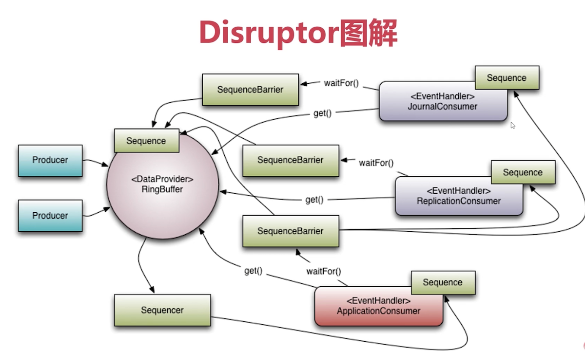

# 一、Disruptor

* [The LMAX Architecture](https://martinfowler.com/articles/lmax.html)
* [Disruptor框架英文翻译](http://ifeve.com/disruptor/)
* [LMAX架构](https://www.jianshu.com/p/5e0c4481efb7)

## 1、LMAX架构

LMAX是一种新型零售金融交易平台，它能够以很低的延迟(latency)产生大量交易(吞吐量)。

这个系统是建立在JVM平台上，核心是一个业务逻辑处理器，它能够在一个线程里每秒处理6百万订单。业务逻辑处理器完全是运行在内存中(in-memory)，使用事件源驱动方式(event sourcing). 业务逻辑处理器的核心是`Disruptors`，这是一个并发组件，能够在无锁的情况下实现网络的Queue并发操作；

## 2、Disruptor介绍


## 3、Disruptor快速入门

- （1）构架一个Event
    ```java
    @Data
    public class OrderEvent {
        private Long value;
    }
    ```
- （2）构建一个EventFactory
    ```java
    public class OrderEventFactory implements EventFactory<OrderEvent> {
        @Override
        public OrderEvent newInstance() {
            return new OrderEvent();
        }
    }
    ```

- （3）构建一个EventHandler
    ```java
    public class OrderEventHandler implements EventHandler<OrderEvent> {
        @Override
        public void onEvent(OrderEvent event, long sequence, boolean endOfBatch) throws Exception {
            System.out.println("消费者：" + event.getValue());
        }
    }
    ```

- （4）构建一个Disruptor
    ```java
    /**
     * 1 eventFactory: 消息(event)工厂对象
     * 2 ringBufferSize: 容器的长度
     * 3 executor: 线程池(建议使用自定义线程池) RejectedExecutionHandler
     * 4 ProducerType: 单生产者 还是 多生产者
     * 5 waitStrategy: 等待策略
     */
    //1. 实例化disruptor对象
    Disruptor<OrderEvent> disruptor = new Disruptor<OrderEvent>(orderEventFactory,
            ringBufferSize,
            executor,
            ProducerType.SINGLE,
            new BlockingWaitStrategy());
    //2. 添加消费者的监听 (构建disruptor 与 消费者的一个关联关系)
    disruptor.handleEventsWith(new OrderEventHandler());
    //3. 启动disruptor
    disruptor.start();
    ```
    关于RingBuffer的使用
    ```java
    //1 在生产者发送消息的时候, 首先 需要从我们的ringBuffer里面 获取一个可用的序号
    long sequence = ringBuffer.next();	//0	
    try {
        //2 根据这个序号, 找到具体的 "OrderEvent" 元素 注意:此时获取的OrderEvent对象是一个没有被赋值的"空对象"
        OrderEvent event = ringBuffer.get(sequence);
        //3 进行实际的赋值处理
        event.setValue(data.getLong(0));			
    } finally {
        //4 提交发布操作
        ringBuffer.publish(sequence);			
    }
    ```


## 4、Disruptor核心组件

### 4.1、RingBuffer

基于数组的缓存实现，也是创建sequence与定义WaitStrategy的入口

### 4.2、Disruptor


### 4.3、Sequence

- 通过顺序递增的序号来编号，管理进行交互的数据；
- 对数据的处理过程总是沿着序号逐个递增处理；
- 一个sequence用于跟踪标识某个特定的事件处理者（RingBuffer、Producer、Consumer）的处理进度
- Sequence可以看成是一个AtomicLong用于标识进度；
- 还有另外一个目的是防止不同的Sequence之间CPU缓存伪共享的问题

### 4.4、Sequencer

- Disruptor真正的核心
- 此接口有两个实现类：MultiProducerSequencer、SingleProducerSequencer
- 主要实现生产者和消费者之间快速、正确的传递数据的并发算法

### 4.5、SequenceBarrier

- 用于保持对RingBuffer的Mian Published Sequence和Consumer之间的平衡关系；SequenceBarrier还定义了决定Cosnumer是否还有可处理的事件的逻辑；

### 4.6、WaitStrategy

- 决定一个消费者将如何等待生产者将Event置入Disruptor

- BlockingWaitStrategy：是最低效的策略，但其对CPU的消耗最小并且在各种不同部署环境中能提供更加一致的性能表现；
- SleepingWaitStrategy：其性能跟BlockingWaitStrategy差不多，对CPU的消耗类似，但其对生产者线程的影响最小，适合用于异步日志类似的场景；
- YieldingWaitStrategy：其性能最好，适合用于低延迟的系统。在要求极高性能且事件处理数小于CPU逻辑核心数的场景中，推荐使用此策略；比如CPU开启超线程的特性；

### 4.7、Event

- 从生产者到消费者过程中所处理的数据单元

### 4.8、EventProcessor

- 主要事件循环，处理Disruptor的Event，拥有消费者的Sequence
- 它有个实现类是BatchEventProcessor，包含了event loop有效的实现，并且将回调到一个EventHandler接口的实现对象；

### 4.9、EventHandler

由用户实现并且代表了Disruptor中的一个消费者的接口，也就是消费者的处理逻辑都需要写在这里；

### 4.10、WorkProcessor

确保每个sequence只能被一个processor消费，在同一个workpool中处理多个WorkProcessor不会被消费统一的sequence

### 4.11、Disruptor编程模型



## 5、Disruptor高级应用

### 5.1、核心链路应用场景

如京东中下单：用户添加到购物车 -> 下单 —> 支付 —> 配送 -> 收货

核心链路的代码实现，业务逻辑非常复杂；核心链路特点：至关重要且业务复杂

主要实现方式：
- 传统的完全解耦模式
- 模板模式

上述方式不适合，解决手段：
- 领域模型的高度抽象
- 寻找更好的框架帮助进行编码：
    - 有限状态机框架，比如：spring-statemachine
    - 使用Disruptor

### 5.2、并行计算

- 串行操作：使用链式调用的方式：`disruptor.handleEventsWith(new Handler1()).handleEventsWith(new Handler2()).handleEventsWith(new Handler3());`
- 并行操作：使用单独调用的方式：
    - 单独调用：
        ```java
        disruptor.handleEventsWith(new Handler1());
        disruptor.handleEventsWith(new Handler2());
        disruptor.handleEventsWith(new Handler3());
        ```
    - 传入多个元素：`disruptor.handleEventsWith(new Handler1(), new Handler2(), new Handler3());`

### 5.3、多边形高端操作

Disruptor可以实现串并行同时编码
- 菱形操作
    ```java
    disruptor.handleEventsWith(new Handler1(), new Handler2())
            .handleEventsWith(new Handler3());
            
    // 或者 通过handlerEventsWith方法的返回参数：EventHandlerGroup 来处理
    EventHandlerGroup<Trade> ehGroup = disruptor.handleEventsWith(new Handler1(), new Handler2());
    ehGroup.then(new Handler3());
    ```
- 六边形操作
    ```java
    // 执行顺序：h1和h4是并行操作，h2在h1执行完成后执行；h5在h4执行完成后执行；在h2和h5都执行成功之后，在执行h3
    Handler1 h1 = new Handler1();
    Handler2 h2 = new Handler2();
    Handler3 h3 = new Handler3();
    Handler4 h4 = new Handler4();
    Handler5 h5 = new Handler5();
    disruptor.handleEventsWith(h1, h4);
    disruptor.after(h1).handleEventsWith(h2);
    disruptor.after(h4).handleEventsWith(h5);
    disruptor.after(h2, h5).handleEventsWith(h3);
    ```
    **注意：单消费者模式下，上述代码执行跟构造Disruptor时传入的线程池有关，因为上述代码有5个EventHandler，所以，线程池中线程数量必须至少有5个；这是因为单消费者下是由BatchEventProcessor来操作的，而BatchEventProcessor就代表一个线程，其实现了Runnable接口；对于多消费者是不存在该问题的；**

### 5.4、多生产者与多消费者


