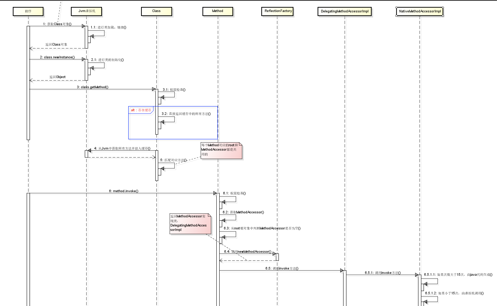
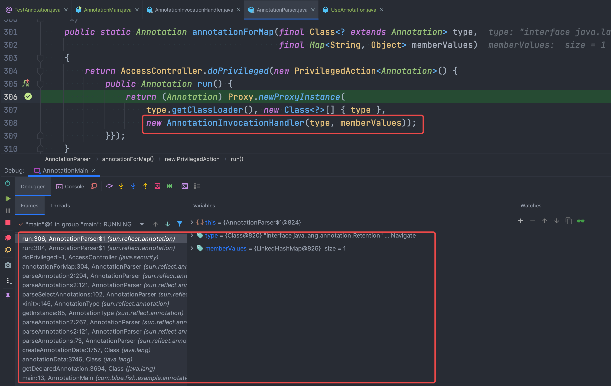
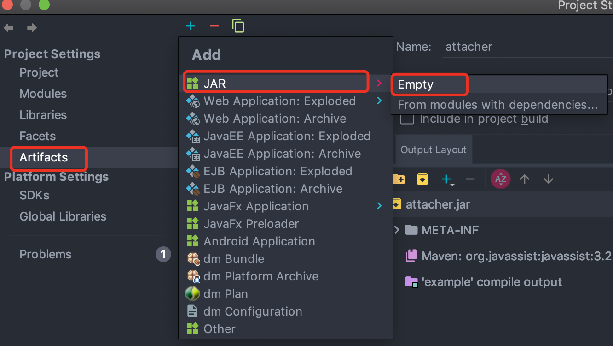
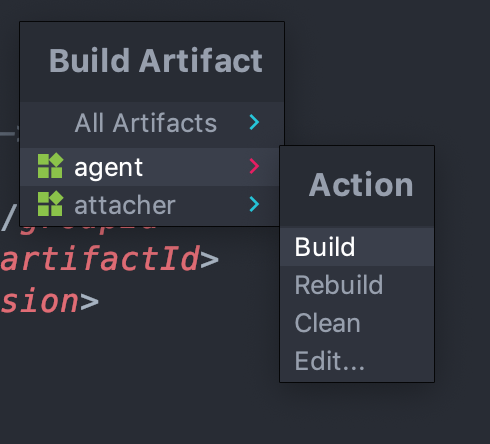

# 一、Java 内部类

## 1、为什么使用内部类

使用内部类最吸引人的原因是：每个内部类都能独立地继承一个(接口的)实现，所以无论外围类是否已经继承了某个(接口的)实现，对于内部类都没有影响使用内部类最大的优点就在于它能够非常好的解决多重继承的问题，使用内部类还能够为我们带来如下特性：

- 内部类可以用多个实例，每个实例都有自己的状态信息，并且与其他外围对象的信息相互独。
- 在单个外围类中，可以让多个内部类以不同的方式实现同一个接口，或者继承同一个类。
- 创建内部类对象的时刻并不依赖于外围类对象的创建。
- 内部类并没有令人迷惑的"is-a"关系，他就是一个独立的实体。
- 内部类提供了更好的封装，除了该外围类，其他类都不能访问。

## 2、成员内部类

```java
public class Outer{
	private int age = 99;
	String name = "Coco";
	public class Inner{
		String name = "Jayden";
		public void show(){
			System.out.println(Outer.this.name);
			System.out.println(name);
			System.out.println(age);
		}
	}
	public Inner getInnerClass(){
		return new Inner();
	}
	public static void main(String[] args){
		Outer o = new Outer();
		Inner in = o.new Inner();
		in.show();
	}
}
```
- 1、Inner类定义Outer类的内部，相当于Outer类的一个成员变量的位置，Inner类可以使用任意访问控制符，如`public、protected、private`等

- 2、Inner 类中定义的show()方法可以直接访问Outer类中的数据，而不受访问控制符的影响，如直接访问Outer类中的私有属性age

- 3、定义了成员内部类后，必须使用外部类对象来创建内部类对象，而不能直接去 new 一个内部类对象：`InnerClass inner = OuterClass.new InnnerClass();`

- 4、编译上面的程序后，会发现产生了两个`.class`文件：`Outer.class，Outer$Inner.class`，在编译后成员内部类中有一个指向外部类对象的引用，且成员内部类编译后构造方法也多了一个指向外部类对象的引用参数.所以说编译器会默认为成员内部类添加了一个指向外部类对象的引用并且在成员内部类构造方法中对其进行赋值操作。我们可以在成员内部类中随意访问外部类的成员，同时也说明成员内部类是依赖于外部类的，如果没有创建外部类的对象则也无法创建成员内部类的对象。

- 5、成员内部类中不能存在任何`static`的变量和方法，可以定义常量：

	- 因为非静态内部类是要依赖于外部类的实例，而静态变量和方法是不依赖于对象的，仅与类相关，简而言之：在加载静态域时，根本没有外部类，所在在非静态内部类中不能定义静态域或方法，编译不通过；非静态内部类的作用域是实例级别；
	- 常量是在编译器就确定的，放到所谓的常量池了

- 6、成员内部类的继承

```java
public class ChildInnerClass1 extends OutClass.InnerClass {
	public ChildInnerClass1(OutClass outClass){
		outClass.super();
	}
}
```

成员内部类的继承语法格式要求继承引用方式为 Outter.Inner 形式且继承类的构造器中必须有指向外部类对象的引用的参数，并通过这个引用调用 super()，其实这个要求就是因为成员内部类默认持有外部类的引用，外部类不先实例化则无法实例化自己；

**友情提示：**

- 外部类是不能直接使用内部类的成员和方法的，可先创建内部类的对象，然后通过内部类的对象来访问其成员变量和方法;
- 如果外部类和内部类具有相同的成员变量或方法，内部类默认访问自己的成员变量或方法，如果要访问外部类的成员变量，可以使用 this 关键字，如：`Outer.this.name`

## 3、静态内部类

是static修饰的内部类
- `静态内部类`不能直接访问外部类的`非静态成员`，但可以通过 `new 外部类().成员` 的方式访问
- 如果外部类的静态成员与内部类的成员名称相同，可通过`类名.静态成员`访问外部类的静态成员；如果外部类的静态成员与内部类的成员名称不相同，则可通过`成员名`直接调用外部类的静态成员
- 创建静态内部类的对象时，不需要外部类的对象，可以直接创建 `内部类 对象名 = new 内部类()`;

```java
public class Outer{
	private int age = 99;
	static String name = "Coco";
	public static class Inner{
		String name = "Jayden";
		public void show(){
			System.out.println(Outer.name);
			System.out.println(name);					
		}
	}
	public static void main(String[] args){
		Inner i = new Inner();
		i.show();
	}
}
```

- 非静态内部类中为什么不能有静态属性或者方法？

	`static` 类型的属性和方法在类加载的时候就会存在于内存中，要使用某个类的`static`属性或者方法的前提是这个类已经加载到JVM中，非`static`内部类默认是持有外部类的引用且依赖外部类存在的，所以如果一个非`static`的内部类一旦具有`static`的属性或者方法就会出现内部类未加载时却试图在内存中创建的`static`属性和方法，这自然是错误的，类都不存在却希望操作它的属性和方法。从另一个角度讲非 `static`的内部类在实例化的时候才会加载(不自动跟随主类加载)，而`static`的语义是类能直接通过类名访问类的`static`属性或者方法，所以如果没有实例化非`static`的内部类就等于非`static`的内部类没有被加载，所以无从谈起通过类名访问 static属性或者方法；

## 4、方法内部类

访问仅限于方法内或者该作用域内
- 局部内部类就像是方法里面的一个局部变量一样，是不能有`public、protected、private、static`修饰符的
- 只能访问方法中定义的 `final` 类型的局部变量，因为：当方法被调用运行完毕之后，局部变量就已消亡了。但内部类对象可能还存在，直到没有被引用时才会消亡。此时就会出现一种情况，就是内部类要访问一个不存在的局部变量；使用final修饰符不仅会保持对象的引用不会改变，而且编译器还会持续维护这个对象在回调方法中的生命周期。局部内部类并不是直接调用方法传进来的参数，而是内部类将传进来的参数通过自己的构造器备份到了自己的内部，自己内部的方法调用的实际是自己的属性而不是外部类方法的参数；防止被篡改数据，而导致内部类得到的值不一致

```java
/**
 * 使用的形参为何要为 `final`???
 * 在内部类中的属性和外部方法的参数两者从外表上看是同一个东西，但实际上却不是，所以他们两者是可以任意变化的，
 * 也就是说在内部类中我对属性的改变并不会影响到外部的形参，而然这从程序员的角度来看这是不可行的，
 * 毕竟站在程序的角度来看这两个根本就是同一个，如果内部类该变了，而外部方法的形参却没有改变这是难以理解
 * 和不可接受的，所以为了保持参数的一致性，就规定使用 `final` 来避免形参的不改变
 */
public class Outer{
	public void Show(){
		final int a = 25;
		int b = 13;
		class Inner{
			int c = 2;
			public void print(){
				System.out.println("访问外部类：" + a);
				System.out.println("访问内部类：" + c);
			}
		}
		Inner i = new Inner();
		i.print();
	}
	public static void main(String[] args){
		Outer o = new Outer();
		o.show();
	}
}
```
- 注意：在JDK8版本之中，方法内部类中调用方法中的局部变量，可以不需要修饰为`final`，匿名内部类也是一样的，主要是JDK8之后增加了`Effectively final`功能，反编译jdk8编译之后的`class`文件，发现内部类引用外部的局部变量都是`final`修饰的

[参考文章](http://docs.oracle.com/javase/tutorial/java/javaOO/localclasses.html) <br>

```java
public class OutClass {
	private int out = 1;
	public void func(int param) {
		int in = 2;
		new Thread() {
			@Override
			public void run() {
				out = param;
				out = in;
			}
		}.start();
	}
}
```

在java8中使用命令查看字节码：`javap -l -v OutClass$1.class`，如下：

```
......
class OutClass$1 extends java.lang.Thread
......
{
	//匿名内部类有了自己的 param 属性成员  
	`final` int val$param;
	......
	//匿名内部类持有了外部类的引用作为一个属性成员	  
	`final` OutClass this$0;  
	......
	//匿名内部类编译后构造方法自动多了两个参数，一个为外部类引用，一个为 param 参数。
	OutClass$1 (OutClass，int);
	......
	public void run();    
		......
		Code：
			stack=2， locals=1， args_size=1
			//out = param;语句，将匿名内部类自己的 param 属性赋值给外部类的成员 out。
			0： aload_0
			1： getfield #1 // Field this$0：LOutClass;
			4： aload_0
			5： getfield #2 // Field val$param：I
			8： invokestatic  #4 // Method OutClass.access$002：(LOutClass;I)I
			11： pop        
			//out = in;语句，将匿名内部类常量 2 (in在编译时确定值)赋值给外部类的成员 out。
			12： aload_0      
			13： getfield    #1 // Field this$0：LOutClass;
			//将操作数2压栈，因为如果这个变量的值在编译期间可以确定则编译器默认会在
			//匿名内部类或方法内部类的常量池中添加一个内容相等的字面量或直接将相应的
			//字节码嵌入到执行字节码中。
			16： iconst_2
			17： invokestatic  #4 // Method OutClass.access$002：(LOutClass;I)I
			20： pop
			21：	return
			......
}
......
```

## 5、匿名内部类

- 匿名内部类是直接使用`new`来生成一个对象的引用;
- 对于匿名内部类的使用它是存在一个缺陷的，就是它仅能被使用一次，创建匿名内部类时它会立即创建一个该类的实例，该类的定义会立即消失，所以匿名内部类是不能够被重复使用;
- 使用匿名内部类时，我们必须是继承一个类或者实现一个接口，但是两者不可兼得，同时也只能继承一个类或者实现一个接口;
- 匿名内部类中是不能定义构造函数的，匿名内部类中不能存在任何的静态成员变量和静态方法;
- 匿名内部类中不能存在任何的静态成员变量和静态方法，匿名内部类不能是抽象的，它必须要实现继承的类或者实现的接口的所有抽象方法
- 匿名内部类初始化：使用构造代码块！利用构造代码块能够达到为匿名内部类创建一个构造器的效果。匿名内部类不能通过构造方法初始化，只能通过构造代码块进行初始化

```java
public class OuterClass {
	public InnerClass getInnerClass(`final` int   num，String str2){
		return new InnerClass(){
			int number = num + 3;
			public int getNumber(){
				return number;
			}
		};        // 注意：分号不能省
	}
	public static void main(String[] args) {
		OuterClass out = new OuterClass();
		InnerClass inner = out.getInnerClass(2， "chenssy");
		System.out.println(inner.getNumber());
	}
}
interface InnerClass {
	int getNumber();
}
```
- 如下代码：
```java
List list1 = new ArrayList();
List list2 = new ArrayList(){};
List list3 = new ArrayList(){{}};
List list4 = new ArrayList(){{}{}{}};
System.out.println(list1.getClass() == list2.getClass()); // false
System.out.println(list1.getClass() == list3.getClass()); // false
System.out.println(list1.getClass() == list4.getClass()); // false
System.out.println(list2.getClass() == list3.getClass()); // false
System.out.println(list2.getClass() == list4.getClass()); // false
System.out.println(list3.getClass() == list4.getClass()); // false
/*
首先 list1 指向一个 ArrayList 对象实例;
list2 指向一个继承自 ArrayList 的匿名类内部类对象;
list3 也指向一个继承自 ArrayList 的匿名内部类(里面一对括弧为初始化代码块)对象;
list4 也指向一个继承自 ArrayList 的匿名内部类(里面多对括弧为多个初始化代码块)对象;
由于这些匿名内部类都出现在同一个类中，所以编译后其实得到的是 OutClass$1、OutClass$2、OutClass$3 的形式，
所以自然都互不相等了，可以通过 listX.getClass().getName() 进行验证：
*/
System.out.println(list1.getClass().getName()); // java.util.ArrayList
System.out.println(list2.getClass().getName()); // com.demo.normal.OutClass$1
System.out.println(list3.getClass().getName()); // com.demo.normal.OutClass$2
System.out.println(list4.getClass().getName()); // com.demo.normal.OutClass$3
```

- 匿名内部类为什么不能直接使用构造方法？<br>
	因为类是匿名的，而且每次创建的匿名内部类同时被实例化后只能使用一次，所以就无从创建一个同名的构造方法了，但是可以直接调用父类的构造方法.实质上类是有构造方法的，是通过编译器在编译时生成的，看如下代码：

```java
public class InnerClass{}
public class OutClass{
	InnerClass inner = new InnerClass(){};
}
```

编译之后使用命令 javap 可以很明显看到内部类的字节码中编译器为我们生成了参数为外部类引用的构造方法，其构造方法和普通类的构造方法没有区别，都是执行`<init>`方式;

## 6、内部类GC问题

- 匿名内部类并不会妨碍外部类的正常GC，而是不能将它定义成静态属性引用。
- 静态匿名内部类，导致外部类不能正常回收的原因就是：它作为GC Root对象却保持着外部类的引用。方法区中类静态属性引用的对象可以作为GC root对象

# 二、协变式重写和泛型重载

## 1、协变式重写

### 1.1、不同版本之间变化

在Java1.4及以前，子类方法如果要覆盖超类的某个方法，必须具有完全相同的方法签名，包括返回值也必须完全一样；Java5.0放宽了这一限制，只要子类方法与超类方法具有相同的方法签名，或者子类方法的返回值是超类方法的子类型，就可以覆盖；可以不需要强制转换类型

例如：重写 Object 类的 clone()方法：

- Object 中该方法的声明如下：

	`protected native Object clone() throws CloneNotSupportedException;`

- 在类中可以重写实现如下：

```java
@Override
public Employee clone() throws CloneNotSupportedException {
	Employee e = (Employee) super.clone();
	e.address = address.clone();
	return e;
}
```

## 2、泛型重载

**注意：泛型重载在JDK7之后是不支持的**

~~- Java的方法重载一般指在同一个类中的两个同名方法，规则很简单：两个方法必须具有不同的方法签名；换句话说：就是这两个方法的参数必须不相同，使得编译器能够区分开这两个重载的方法；由于编译器不能仅仅通过方法的返回值类型来区分重载方法，所以如果两个方法只有返回类型不同，其它完全一样，编译是不能通过的。在泛型方法的重载时，这个规则稍微有一点变化，看如下代码：~~

```java
class Overloaded {
	public static int sum(List<Integer> ints) {			
		return 0;
	}
	public static String sum(List<String> strings) {
		return null;
	}
}
```

~~上面是两个泛型方法的重载例子，由于Java的泛型采用擦除法实现，List<Integer>和List<String>在运行时是完全一样的，都是List类型。也就是，擦除后的方法签名如下：~~
	```
	int sum(List)
	String sum(List)
	```

~~- Java允许这两个方法进行重载，虽然它们的方法签名相同，只有返回值类型不同，这在两个普通方法的重载中是不允许的；当然了，如果两个泛型方法的参数在擦除后相同，而且返回值类型也完全一样，那编译肯定是不能通过的；类似地，一个类不能同时继承两个具有相同擦除类型的父类，也不能同时实现两个具有相同擦除的接口。如 `Class A implements Comparable<Integer>,Comparable<Long>。`~~
~~- 总结一下：两个泛型方法在擦除泛型信息后，如果具有相同的参数类型，而返回值不一样，是可以进行重载的；Java有足够的信息来区分这两个重载的方法~~

## 3、重写与重载

### 3.1、两者的比较

- 重载是一个编译期概念、重写是一个运行期间概念；
- 重载遵循所谓"编译期绑定"，即在编译时根据参数变量的类型判断应该调用哪个方法。
- 重写遵循所谓"运行期绑定"，即在运行的时候，根据引用变量所指向的实际对象的类型来调用方法
- 因为在编译期已经确定调用哪个方法，所以重载并不是多态。而重写是多态。重载只是一种语言特性，是一种语法规则，与多态无关，与面向对象也无关。(注：严格来说，重载是编译时多态，即静态多态。但是，Java中提到的多态，在不特别说明的情况下都指动态多态)

### 3.2、重写的条件

- 参数列表必须完全与被重写方法的相同；
- 返回类型必须完全与被重写方法的返回类型相同；
- 访问权限不能比父类中被重写的方法的访问权限更低，一般重写方法默认为 public 即可；
- 重写方法一定不能抛出新的检查异常或比被重写的方法声明的检查异常更广泛的检查异常
- 重写的方法能够抛出更少或更有限的异常(也就是说，被重写的方法声明了异常，但重写的方法可以什么也不声明)
- 不能重写被标示为final的方法；
- 如果不能继承一个方法，则不能重写这个方法

### 3.3、重载的条件

- 被重载的方法必须改变参数列表，包括参数的顺序、类型、个数等
- 重载的方法跟返回值没有关系，因为Java识别一个方法是根据方法名加参数列表实现的，与返回值无关
- 被重载的方法可以改变访问修饰符；
- 被重载的方法可以声明新的或更广的检查异常；
- 方法能够在同一个类中或者在一个子类中被重载;

## 4、重载

能够用一个统一的接口名称来调用一系列方法
- 重载本身并不是多态，同时运行时绑定重载方法也不是多态的表现；
- 如下例子：重载方法"3"注释与不注释，结果有和不一样
```java			 
public class NullArguementOverloading {
	// 方法2和方法3两个方法并存，会报错，因为其不知道到底该调用哪个方法；
	public static void main(String[] args) {
		NullArguementOverloading obj = new NullArguementOverloading();
		obj.overLoad(null); // Double array argument method.
	}
	private void overLoad(Object o){ // 1
		System.out.println("Object o arguement method.");
	}
	private void overLoad(double[] dArray){ //2
		System.out.println("Double array argument method.");
	}
	private void overLoad(String str) { //3
		System.out.println("String argument method.");
	}
}
```
- ①、注释掉"3"，运行结果：`Double array argument method`
- ②、不注释掉：`obj.overLoad(null);`编译错误

Java对重载的处理有最精确匹配原则，Java 的重载解析过程是以三阶段运行的：
- 第一阶段：在不考虑对基本类型自动装拆箱（auto-boxing，auto-unboxing），以及可变长参数的情况下选取重载方法；
- 第二阶段：如果在第 1 个阶段中没有找到适配的方法，那么在允许自动装拆箱，但不允许可变长参数的情况下选取重载方法；
- 第三阶段：如果在第 2 个阶段中没有找到适配的方法，那么在允许自动装拆箱以及可变长参数的情况下选取重载方法。

如果 Java 编译器在同一个阶段中找到了多个适配的方法，那么它会在其中选择一个最为贴切的，而决定贴切程度的一个关键就是形式参数类型的继承关系。
	
根据上面的原则：上面代码：String 也是继承自 Object， 数组也是可认为继承自 Object， 两个为平行等级，null 不确定到底是哪个；

另外，重载是在编译期就已经确定了的，并不需要等到运行时才能确定，因此重载不是多态的一个原因。

重载对于传入的参数类型只认了引用的类型，并没有去解析实际对象的类型。如果重载是一种多态的话，它这里应该去解析实际对象的类型并调用ArrayList的方法

> P.S. 在 Java 程序里，如果同一个类中出现多个名字相同，并且参数类型相同的方法，那么它无法通过编译，这个限制可以通过字节码工具绕开。也就是说，在编译完成之后，可以再向class文件中添加方法名和参数类型相同，而返回类型不同的方法。当这种包括多个方法名相同、参数类型相同，而返回类型不同的方法的类，出现在Java编译器的用户类路径上时，它是怎么确定需要调用哪个方法的呢？当前版本的Java编译器会直接选取第一个方法名以及参数类型匹配的方法。并且，它会根据所选取方法的返回类型来决定可不可以通过编译，以及需不需要进行值转换等。
```java
public class OverridePuzzle {			 
	private void overloadList(List list){
		System.out.println("List arguement method.");
	}			 
	private void overloadList(ArrayList arrayList){
		System.out.println("ArrayList arguement method");
	}
	public static void main(String[] args) {
		OverridePuzzle op = new OverridePuzzle();
		List list = new ArrayList<String>();
		op.overloadList(list); // List arguement method
	}			 
}
```

$\color{red}{请注意：不要重载可变参数的方法，因为 Java 编译器可能无法决定应该调用哪个目标方法}$

## 5、重写

涉及到继承这个概念中的问题，子类继承了父类的方法，但是它可能需要有不同的操作行为，就需要在子类中重写这个父类方法；父类如果将方法声明为 `final` 的就可保证所有子类的调用此方法时调用的都是父类的方法；

如果子类定义了与父类中非私有方法同名的方法，而且这两个方法的参数类型相同，那么这两个方法之间又是什么关系呢？
- 如果这两个方法都是静态的，那么子类中的方法隐藏了父类中的方法。
- 如果这两个方法都不是静态的，且都不是私有的，那么子类的方法重写了父类中的方法

# 三、注解与反射

## 1、Java注解：Annotation

JDK5之后新增的功能，用于为Java代码提供元数据。作为元数据，注解不直接影响代码执行。

它主要的作用有以下四方面：
- 生成文档，通过代码里标识的元数据生成javadoc文档。
- 编译检查，通过代码里标识的元数据让编译器在编译期间进行检查验证。
- 编译时动态处理，编译时通过代码里标识的元数据动态处理，例如动态生成代码。
- 运行时动态处理，运行时通过代码里标识的元数据动态处理，例如使用反射注入实例

### 1.1、内置注解

- @Override：重写
- @Deprecated：过时
- @SuppressWarnings：取消警告

- 注解分为：
	- 按运行机制：源码注解，编译时注解，运行时注解
	- 按照来源注解：JDK，第三方，自定义注解；

### 1.2、自定义注解

使用`@interface`自定义注解时，自动集成了`Annotation`接口，要点如下：

- （1）`@interface`用来声明一个注解：`public @interface`注解名；
- （2）其中的每一个方法实际上是声明了一个配置参数：
	- ①、方法的名称就是参数的名称，无参无异常;
	- ②、返回值类型就是参数的类型(返回值只能是基本类型，`Class`，` String`， `Enum`);
	- ③、可以通过 default 来声明参数的默认值
	- ④、如果只有一个参数成员，一般参数名为：value;
	- ⑤、没有成员的注解是标识注解;

*注意：注解元素必须要有值，在定义注解元素时经常使用空字符串，0作为默认值*

### 1.3、元注解

负责注解其他注解，Java定义了四个标准的meta-annotation类型，用来提供对其他 annotation 类型作说明

- `@Target`：用于描述注解的使用范围：`@Target(value= ElementType.TYPE)`
	- 包：PACKAGE
	- 类、接口、枚举、Annotation类型：TYPE
	- 方法参数：PARAMETER
	- 局部变量：LOCAL VARIABLE
	```java
	public enum ElementType {
		TYPE, // 类、接口、枚举类
		FIELD, // 成员变量（包括：枚举常量）
		METHOD, // 成员方法
		PARAMETER, // 方法参数
		CONSTRUCTOR, // 构造方法
		LOCAL_VARIABLE, // 局部变量
		ANNOTATION_TYPE, // 注解类
		PACKAGE, // 可用于修饰：包
		TYPE_PARAMETER, // 类型参数，JDK 1.8 新增
		TYPE_USE // 使用类型的任何地方，JDK 1.8 新增
	}
	```

- `@Retention`：表示需要在什么级别保存该注释信息，用于描述注解的生命周期：`(RetentionPolicy)`
	- SOURCE：在源文件有效(即源文件保留)
	- CLASS：在class文件中有效
	- RUNTIME：在运行时有效(可被反射读取)

- `@Documented`：生成文档的时候会生成注解的注释

- `@Inherited`：允许子类继承，只能能实现类上的注解继承，方法上的继承无法实现，必须通过反射的方式来处理

在JDK 1.8中提供了两个元注解 `@Repeatable和@Native`

### 1.4、解析注解

通过反射获取类、函数或成员上的运行时注解信息，从而实现动态控制程序运行的逻辑;

反射包java.lang.reflect下的AnnotatedElement接口提供这些方法。这里注意：只有注解被定义为`RUNTIME`后，该注解才能是运行时可见，当class文件被装载时被保存在class文件中的Annotation才会被虚拟机读取；

### 1.5、注解不支持继承

不能使用关键字extends来继承某个@interface，注解在编译后，编译器会自动继承`java.lang.annotation.Annotation`接口，虽然反编译后发现注解继承了Annotation接口，请记住，即使Java的接口可以实现多继承，但定义注解时依然无法使用extends关键字继承@interface。

区别于注解的继承，被注解的子类继承父类注解可以用@Inherited： 如果某个类使用了被@Inherited修饰的Annotation，则其子类将自动具有该注解。

`@Inherited` 只能实现类上的注解继承。要想实现方法上注解的继承，你可以通过反射在继承链上找到方法上的注解。但，这样实现起来很繁琐，而且需要考虑桥接方法。

Spring 提供了 AnnotatedElementUtils 类，来方便我们处理注解的继承问题。这个类的 findMergedAnnotation 工具方法，可以帮助我们找出父类和接口、父类方法和接口方法上的注解，并可以处理桥接方法，实现一键找到继承链的注解：
```java

Child child = new Child();
log.info("ChildClass:{}", getAnnotationValue(AnnotatedElementUtils.findMergedAnnotation(child.getClass(), MyAnnotation.class)));
log.info("ChildMethod:{}", getAnnotationValue(AnnotatedElementUtils.findMergedAnnotation(child.getClass().getMethod("foo"), MyAnnotation.class)));
```
总结：自定义注解可以通过标记元注解 @Inherited 实现注解的继承，不过这只适用于类。如果要继承定义在接口或方法上的注解，可以使用 Spring 的工具类 AnnotatedElementUtils，并注意各种 getXXX 方法和 findXXX 方法的区别，详情查看

## 2、注解处理器
				    
- [Java-JSR-269-插入式注解处理器](https://liuyehcf.github.io/2018/02/02/Java-JSR-269-%E6%8F%92%E5%85%A5%E5%BC%8F%E6%B3%A8%E8%A7%A3%E5%A4%84%E7%90%86%E5%99%A8/)				    

Java 的注解机制允许开发人员自定义注解。这些自定义注解同样可以为 Java 编译器添加编译规则。不过，这种功能需要由开发人员提供，并且以插件的形式接入 Java 编译器中，这些插件称之为注解处理器（annotation processor）

注解处理器是一个在javac中的，用来编译时扫描和处理的注解的工具；一个注解的注解处理器，以Java代码(或者编译过的字节码)作为输入，生成文件(通常是`.java`文件)作为输出。这具体的含义什么呢？可以生成Java代码！这些生成的Java代码是在生成的`.java`文件中，所以你不能修改已经存在的Java类，例如向已有的类中添加方法。这些生成的Java文件，会同其他普通的手动编写的Java源代码一样被`javac`编译；

主要用途：
- 一是定义编译规则，并检查被编译的源文件。
- 二是修改已有源代码。
- 三是生成新的源代码

### 2.1、注解处理器原理

- [Java 编译器的工作流程](../Java虚拟机/JVM-Java虚拟机.md#1021Javac编译过程)
- [Annotationprocessing](http://hannesdorfmann.com/annotation-processing/annotationprocessing101/)
- [Annotationprocessing](https://www.race604.com/annotation-processing/)
- [示例源代码](https://github.com/chenlanqing/annotationprocessing101)
- [自定义Java注解处理器](https://yuweiguocn.github.io/java-annotation-processor/)

Java 源代码的编译过程可分为三个步骤：
- （1）将源文件解析为抽象语法树；
- （2）调用已注册的注解处理器；
- （3）生成字节码。

如果在第 2 步调用注解处理器过程中生成了新的源文件，那么编译器将重复第 1、2 步，解析并且处理新生成的源文件。每次重复我们称之为一轮（Round）

```java
public interface Processor {
    Set<String> getSupportedAnnotationTypes();
    SourceVersion getSupportedSourceVersion();
    void init(ProcessingEnvironment processingEnv);
    boolean process(Set<? extends TypeElement> annotations, RoundEnvironment roundEnv);
    Iterable<? extends Completion> getCompletions(Element element, AnnotationMirror annotation, ExecutableElement member, String userText);
}
```
所有的注解处理器类都需要实现接口Processor。该接口主要有四个重要方法。其中，init方法用来存放注解处理器的初始化代码。之所以不用构造器，是因为在 Java 编译器中，注解处理器的实例是通过反射 API 生成的；
- `init(ProcessingEnvironment env)`: 每一个注解处理器类都**必须有一个空的构造函数**。然而，这里有一个特殊的`init()`方法，它会被注解处理工具调用，并输入`ProcessingEnviroment`参数。`ProcessingEnviroment`提供很多有用的工具类`Elements`, `Types`和`Filer`；
- `process(Set<? extends TypeElement> annotations, RoundEnvironment env)`: 这相当于每个处理器的主函数`main()`。在这里扫描、评估和处理注解的代码，以及生成Java文件。输入参数`RoundEnviroment`，可以查询出包含特定注解的被注解元素；
- `getSupportedAnnotationTypes()`: 这里必须指定，这个注解处理器是注册给哪个注解的。注意，它的返回值是一个字符串的集合，包含本处理器想要处理的注解类型的合法全称。换句话说，在这里定义的注解处理器注册到哪些注解上。
- `getSupportedSourceVersion()`: 用来指定使用的Java版本。通常这里返回`SourceVersion.latestSupported()`。然而，如果有足够的理由只支持Java 6的话，你也可以返回`SourceVersion.RELEASE_6`；推荐使用前者

JDK 提供了一个实现Processor接口的抽象类`AbstractProcessor`。该抽象类实现了`init、getSupportedAnnotationTypes`和`getSupportedSourceVersion`方法

### 2.2、AbstractProcessor

每个处理器继承 AbstractProcessor
```java
public abstract class AbstractProcessor implements Processor {
	...
}
public class MyProcessor extends AbstractProcessor {
    @Override
    public synchronized void init(ProcessingEnvironment env){ }
    @Override
    public boolean process(Set<? extends TypeElement> annoations, RoundEnvironment env) { }
    @Override
    public Set<String> getSupportedAnnotationTypes() { }
    @Override
    public SourceVersion getSupportedSourceVersion() { }
}
```
> 在Java 7之后中，子类可以通过`@SupportedAnnotationTypes`和`@SupportedSourceVersion`注解来声明代替getSupportedAnnotationTypes()和getSupportedSourceVersion()，像这样：
```java
@SupportedSourceVersion(SourceVersion.latestSupported())
@SupportedAnnotationTypes({
   // 合法注解全路径的集合
 })
public class MyProcessor extends AbstractProcessor {
    @Override
    public synchronized void init(ProcessingEnvironment env){ }
    @Override
    public boolean process(Set<? extends TypeElement> annoations, RoundEnvironment env) { }
}
```
> 注解处理器是运行它自己的虚拟机JVM中。是的，javac启动一个完整Java虚拟机来运行注解处理器；

process方法涉及各种不同类型的Element，分别指代 Java 程序中的各个结构。
- TypeElement指代类或者接口
- VariableElement指代字段、局部变量、enum 常量等；
- ExecutableElement指代方法或者构造器

### 2.3、注册注解处理器

怎样将处理器MyProcessor注册到javac中，有两种方式：
- （1）直接使用 javac 命令的`-processor`参数：`javac -cp /CLASSPATH/TO/CheckGetterProcessor -processor bar.CheckGetterProcessor`
- （2）打包成Jar包：
	- 必须提供一个`.jar`文件，就像其他`.jar`文件一样，打包注解处理器到此文件中；
	- 并且，在你的jar中，你需要打包一个特定的文件`javax.annotation.processing.Processor`到`META-INF/services`路径下

所以，`.jar文件`看起来就像下面这样，参考 lombok：


可以通过：com.google.auto.service:auto-service 来注册注解处理器：@AutoService

### 2.4、注解处理器修改源码

- [Lombok 技巧详解](http://notatube.blogspot.com/2010/11/project-lombok-trick-explained.html)

比如Lombok

## 3、反射机制：(Reflection)

- [读取指定包的类](https://github.com/ronmamo/reflections)

### 3.1、基本介绍

运行时加载，探知使用编译期间完全未知的类；反射：将一个Java类中的所有信息映射成相应的Java类；

反射机制是在运行状态，对于任意一个类，都能够知道这个的类的所有属性和方法；对于任意一个对象，都能够调用它的任意方法和属性；

【一个类只有一个Class对象，这个对象包含了完整类的结构】
- `Class` 类`[java.lang.Class]`：反射的根源，各种类型----表示Java中的同一类事物
	- `Class`类获取：`.class、getClass、Class.forName(String className);`
	- `Field`：属性相关类，获取所有属性(包括 private)，`getDeclaredFields()`;
	- `Method`：方法相关类，`getDeclaredMethods();`，`method.invoke()`方法执行时，如果第一个参数为 null，则表示反射的方法为静态方法
	- `Constructor`： 构造器相关类，`getDeclaredConstructors()`;

	如果需要访问私有的，则需`setAccessible(true);`

- 反射机制性能问题：反射会降低程序的效率，如果在开发中确实需要使用到反射，可以将setAccessible设为 true ：即取消Java语言访问检查;

class对象是可以说是反射中最常用的，获取class对象的方式的主要有三种
- 根据类名：`类名.class`
- 根据对象：`对象.getClass()`
- 根据全限定类名：`Class.forName(全限定类名)`

再来看看 **Class类的方法**
| 方法名                                              | 说明                                                         |
| --------------------------------------------------- | ------------------------------------------------------------ |
| forName()                                           | (1)获取Class对象的一个引用，但引用的类还没有加载(该类的第一个对象没有生成)就加载了这个类。<br/>(2)为了产生Class引用，forName()立即就进行了初始化。 |
| Object-getClass()                                   | 获取Class对象的一个引用，返回表示该对象的实际类型的Class引用。 |
| getName()                                           | 取全限定的类名(包括包名)，即类的完整名字。                   |
| getSimpleName()                                     | 获取类名(不包括包名)                                         |
| getCanonicalName()                                  | 获取全限定的类名(包括包名)                                   |
| isInterface()                                       | 判断Class对象是否是表示一个接口                              |
| getInterfaces()                                     | 返回Class对象数组，表示Class对象所引用的类所实现的所有接口。 |
| getSupercalss()                                     | 返回Class对象，表示Class对象所引用的类所继承的直接基类。应用该方法可在运行时发现一个对象完整的继承结构。 |
| newInstance()                                       | 返回一个Oject对象，是实现“虚拟构造器”的一种途径。使用该方法创建的类，必须带有无参的构造器。 |
| getFields()                                         | 获得某个类的所有的公共（public）的字段，包括继承自父类的所有公共字段。 类似的还有getMethods和getConstructors。 |
| getDeclaredFields                                   | 获得某个类的自己声明的字段，即包括public、private和proteced，默认但是不包括父类声明的任何字段。类似的还有getDeclaredMethods和getDeclaredConstructors。 |

**getName、getCanonicalName与getSimpleName的区别**：
- getSimpleName：只获取类名
- getName：类的全限定名，jvm中Class的表示，可以用于动态加载Class对象，例如Class.forName。
- getCanonicalName：返回更容易理解的表示，主要用于输出（toString）或log打印，大多数情况下和getName一样，但是在内部类、数组等类型的表示形式就不同了。
```java
public class Test {
    private class inner {}
    public static void main(String[] args) throws ClassNotFoundException {
        //普通类
        System.out.println(Test.class.getSimpleName()); //Test
        System.out.println(Test.class.getName()); //com.blue.fish.example.reflect.Test
        System.out.println(Test.class.getCanonicalName()); //com.blue.fish.example.reflect..Test
        //内部类
        System.out.println(inner.class.getSimpleName()); //inner
        System.out.println(inner.class.getName()); //com.blue.fish.example.reflect..Test$inner
        System.out.println(inner.class.getCanonicalName()); //com.blue.fish.example.reflect..Test.inner
        //数组
        System.out.println(args.getClass().getSimpleName()); //String[]
        System.out.println(args.getClass().getName()); //[Ljava.lang.String;
        System.out.println(args.getClass().getCanonicalName()); //java.lang.String[]
        //我们不能用getCanonicalName去加载类对象，必须用getName
        //Class.forName(inner.class.getCanonicalName()); 报错
        Class.forName(inner.class.getName());
    }
}
```

### 3.2、Constructor:反射获取构造函数

通过Class对象可以获取某个类中的,构造方法

**批量的方法：**
```java
public Constructor[] getConstructors(); // 所有"公有的"构造方法
public Constructor[] getDeclaredConstructors(); // 获取所有的构造方法(包括私有、受保护、默认、公有)
```

**获取单个的方法，并调用：**
```java
public Constructor getConstructor(Class... parameterTypes); // 获取单个的"公有的"构造方法：
public Constructor getDeclaredConstructor(Class... parameterTypes); // 获取"某个构造方法"可以是私有的，或受保护、默认、公有；
```

**调用构造方法：**
```java
// Constructor 的 newInstance 方法
public T newInstance(Object ... initargs){}
```
忽略访问权限：`con.setAccessible(true);`

### 3.3、反射获取属性

**批量的获取属性：**
```java
Field[] getFields(); // 获取所有的"公有字段"
Field[] getDeclaredFields(); // 获取所有字段，包括：私有、受保护、默认、公有；
```

**获取单个：**
```java
public Field getField(String fieldName); // 获取某个"公有的"字段；
public Field getDeclaredField(String fieldName); // 获取某个字段(可以是私有的)
```

**设置字段的值：**
```java
// Field类
public void set(Object obj,Object value){
	// obj: 要设置的字段所在的对象；
	// value: 要为字段设置的值；
}
```
> 如果我们不期望获取其父类的字段，则需使用Class类的`getDeclaredField/getDeclaredFields`方法来获取字段即可，倘若需要连带获取到父类的字段，那么请使用Class类的`getField/getFields`；

### 3.4、反射获取方法

**批量获取方法：**
```java
public Method[] getMethods(); // 获取所有"公有方法"；（包含了父类的方法也包含Object类）
public Method[] getDeclaredMethods(); // 获取所有的成员方法，包括私有的(不包括继承的)
```

**获取单个方法：**
```java
// 参数
// name: 方法名；
// Class ... : 形参的Class类型对象
public Method getMethod(String name,Class<?>... parameterTypes){} // 获取指定公有的方法
public Method getDeclaredMethod(String name,Class<?>... parameterTypes){}
```

**调用方法：**
```java
public Object invoke(Object obj, Object... args) {
	// obj : 要调用方法的对象；
 	// args:调用方式时所传递的实参；
}
```

- 使用反射调用类的main方法：
	```java
	Method method = Demo.class.getMethod("main"，String[].class);
	method.invoke(null， (Object)new String[]{"111"，"222"，"333"});
	```
	*注意：传入参数时不能直接传一个数组，jdk为了兼容1.5版本以下的，会将其拆包；因此这里将其强转或者直接将String数组放入Object数组也可以*

> 在通过getMethods方法获取Method对象时，会把父类的方法也获取到；而`getDeclaredMethod/getDeclaredMethods`方法都只能获取当前类的方法；

> `getReturnType方法/getGenericReturnType`方法都是获取Method对象表示的方法的返回类型，只不过前者返回的Class类型后者返回的Type(前面已分析过)，Type就是一个接口而已，在Java8中新增一个默认的方法实现，返回的就参数类型信息；

### 3.5、反射操作泛型

- ①、Java 采用泛型擦除的机制来引入泛型。Java中的泛型仅仅是给编译器使用的，确保数据的安全性和免去强制类型转换的麻烦；但是一旦编译完成，所有和泛型有关的类型全部擦除;
- ②、为了通过反射操作泛型，Java有 `ParameterizedType、GenericArrayType、TypeVariable、WildcardType`几种类型来代表不能被归一到Class类中的类型但是又和原始类型齐名的类型；
	- `Type`是Java编程语言中所有类型的公共高级接口。它们包括原始类型、参数化类型、数组类型、类型变量和基本类型
	- `ParameterizedType` ：参数化类型
	- `GenericArrayType`：元素类型是参数化类型或者类型变量的数组类型
	- `TypeVariable`：各种类型变量的公共父接口
	- `WildcardType`：表示一种通配符类型表达式;

### 3.6、反射操作注解

```java
getAnnotation(Class<A> annotationClass);
getAnnotations();
```

### 3.7、数组的反射

- 一个问题：
```java
int[] a1 = new int[]{1，2，3};
String[] a2 = new String[]{"a"，"b"，"c"};
System.out.println(Arrays.asList(a1)); // 输出： [[I@24c98b07]
System.out.println(Arrays.asList(a2)); // 输出：[a， b， c]
// 原因：
// 在jdk1.4：asList(Object[] a);<br>
// 在jdk1.5：asList(T... a);<br>
```
int数组在编译运行时不会被认为为一个Object数组，因此其将按照一个数组对象来处理；

- 基本类型的一维数组可以被当作Object类型处理，不能被当作`Object[]`类型使用非基本类型的一维数组既可以当作Object类型使用，也可以当作Object[]类型使用；
Array 工具类可完成数组的反射操作;

### 3.8、反射注意点

- 反射的应用：实现框架功能，使用类加载器加载文件
- 反射时基本类型与包装类型注意问题
	- 反射中基本类型的class和其对应包装类的class是不同的，所以在获得Method指定参数时需要精确指定参数的类型，即基本类型参数 int 是无法使用包装类型 Integer 来获得的
	- 反射调用基本类型参数方法除了可以通过 基本类型名`.class`外还可以通过对应包装类的静态字段`TYPE`获得，`int.class 等价于 Integer.TYPE`；
	
	```java
	Class clzss = byte.class;
	Class clzss = short.class;
	Class clzss = int.class;
	Class clzss = long.class;
	Class clzss = char.class;
	Class clzss = float.class;
	Class clzss = double.class;
	Class clzss = boolean.class;
	Class clzss = void.class;
	
	Byte.TYPE = byte.class;
	Short.TYPE = short.class;
	Integer.TYPE = int.class;
	Long.TYPE = long.class;
	Char.TYPE = char.class;
	Float.TYPE = float.class;
	Double.TYPE = double.class;
	Boolean.TYPE = boolean.class;
	Void.TYPE = void.class;
	
	Class clzss = int[].class; //int[] 数组
	Class clzss = String[].class; //String[] 数组
	Class clzss = String[][].class; //String[][] 数组的数组
	```

- 反射与工厂模式

### 3.9、反射原理

- [JVM是如何实现反射](../Java虚拟机/JVM-Java虚拟机.md#92JVM如何实现反射)



用几句话总结反射的实现原理：
- 反射类及反射方法的获取，都是通过从列表中搜寻查找匹配的方法，所以查找性能会随类的大小方法多少而变化；
- 每个类都会有一个与之对应的Class实例，从而每个类都可以获取method反射方法，并作用到其他实例身上；
- 反射也是考虑了线程安全的，放心使用；
- 反射使用软引用relectionData缓存class信息，避免每次重新从jvm获取带来的开销；
- 反射调用多次生成新代理Accessor, 而通过字节码生存的则考虑了卸载功能，所以会使用独立的类加载器；
- 当找到需要的方法，都会copy一份出来，而不是使用原来的实例，从而保证数据隔离；
- 调度反射方法，最终是由jvm执行invoke0()执行；

### 3.10、注解实现原理

如何获取到注解里的数据呢？通过反射

通过观察 Class、Contructor、Method、Field 几个跟反射先关的类，发现最终会实现一个接口: `AnnotatedElement`
```java
public final class Class<T> implements java.io.Serializable, GenericDeclaration, Type, AnnotatedElement {}
public final class Constructor<T> extends Executable {}
public final class Method extends Executable {}
public final class Field extends AccessibleObject implements Member {}
// Executable 继承自AccessibleObject, AccessibleObject 则是实现了
public abstract class Executable extends AccessibleObject implements Member, GenericDeclaration {}
public class AccessibleObject implements AnnotatedElement {}

public interface AnnotatedElement {
	// 判断是否包含某个注解
    default boolean isAnnotationPresent(Class<? extends Annotation> annotationClass) {
        return getAnnotation(annotationClass) != null;
    }
	// 获取具体的注解
    <T extends Annotation> T getAnnotation(Class<T> annotationClass);
	// 获取所有注解
    Annotation[] getAnnotations();
	 // 根据类型获得注解
    default <T extends Annotation> T[] getAnnotationsByType(Class<T> annotationClass) {
    }
	// 获取声明的注解
    default <T extends Annotation> T getDeclaredAnnotation(Class<T> annotationClass) {
    }
	// 通过类型获取声明的注解
    default <T extends Annotation> T[] getDeclaredAnnotationsByType(Class<T> annotationClass) {
    }
	// 获取声明注解列表
    Annotation[] getDeclaredAnnotations();
}
```
注解本质是一个继承了`java.lang.annotation.Annotation`的特殊接口，其具体实现类是Java运行时生成的动态代理类。而我们通过反射获取注解时，返回的是Java 运行时生成的动态代理对象`$Proxy1`。通过代理对象调用自定义注解（接口）的方法，会最终调用`AnnotationInvocationHandler`的invoke方法。该方法会从memberValues这个Map中索引出对应的值；

期间，在创建代理对象之前，解析注解时候 从该注解类的常量池中取出注解的信息，包括之前写到注解中的参数，然后将这些信息在创建 AnnotationInvocationHandler时候 ，传入进去作为构造函数的参数，当调用该代理实例的获取值的方法时，就会调用执行AnotationInvocationHandler里面的逻辑，将之前存入的注解信息 取出来；

代理的方法调用：`sun.reflect.annotation.AnnotationParser#annotationForMap`
```java
public static Annotation annotationForMap(final Class<? extends Annotation> type,final Map<String, Object> memberValues){
	return AccessController.doPrivileged(new PrivilegedAction<Annotation>() {
		public Annotation run() {
			return (Annotation) Proxy.newProxyInstance(type.getClassLoader(), new Class<?>[] { type },
				new AnnotationInvocationHandler(type, memberValues));
		}});
}
```



可以通过指定属性保存代理类：`-Djdk.proxy.ProxyGenerator.saveGeneratedFiles=true -XX:+TraceClassLoading`

**定义一个注解：**
```java
@Target(ElementType.TYPE)
@Retention(RetentionPolicy.RUNTIME)
public @interface TestAnnotation {
}
```
**反编译查看字节码：javap -verbose TestAnnotation**
```java
Classfile se/basis/annotation/TestAnnotation.class
  Last modified 2019-7-5; size 413 bytes
  MD5 checksum 11f8b11847f9f3a3813b91a80c97607d
  Compiled from "TestAnnotation.java"
public interface com.blue.fish.se.basis.annotation.TestAnnotation extends java.lang.annotation.Annotation
```

### 3.11、通过反射给注解设置值

首先获取注解的值：
```java
// ExportExcel 为一个注解，User中的字段都有ExportExcel注解
final Class<User> clazz = User.class;
final Field[] fields = clazz.getDeclaredFields();
for (Field field : fields) {
	field.setAccessible(true);
	final ExportExcel excel = field.getAnnotation(ExportExcel.class);
	System.out.println(excel.timezone());
}
```
给上面的timezone赋值：
```java
final Class<User> clazz = User.class;
final Field[] fields = clazz.getDeclaredFields();
for (Field field : fields) {
	field.setAccessible(true);
	final ExportExcel excel = field.getAnnotation(ExportExcel.class);
	final InvocationHandler handler = Proxy.getInvocationHandler(excel);
	final Field values = handler.getClass().getDeclaredField("memberValues");
	values.setAccessible(true);
	final Map<String, Object> map = (Map<String, Object>)values.get(handler);
	map.put("timezone", "GMT+11");
}
```
原理：通过上面一小节知道注解的实现原理，实际上是通过 Proxy创建的代理，其InvocationHandler类为 AnnotationInvocationHandler


 
也就是说我们要设置值需要获取到 AnnotationInvocationHandler 属性 memberValues

 所以动态修改注解的值的方法为：通过反射得到excel的代理对象，然后得到代理对象的memberValues属性，修改访问权限，更新注解的value属性值；

## 4、动态编译：Java6.0引入动态编译

### 4.1.动态编译的两种方法

- 通过Runtime调用javac，启动新的进程去操作;
- 通过Javacompiler动态编译;

### 4.2、Javacompiler 动态编译

```java
JavaCompiler compile = ToolProvider.getSystemJavaCompiler();
int result = compile.run(null， null， null， "F:/class/HelloWorld.java");
/*
* run(InputStream in， OutputStream out， OutputStream err， String... arguments);
* 第一个参数： 为Java编译器提供参数;
* 第二个参数： 得到Java编译器输出的信息;
* 第三个参数： 接受编译器的错误信息;
* 第四个参数： 可变参数，能传入一个或多个Java源文件
* 返回值： 0 表示编译成功， 1 表示编译失败;
*/
```

### 4.3、动态运行动态编译的Java类

## 5、动态加载

动态执行Javascript(JDK6.0以上)
- 脚本引擎：Java 应该程序可以通过一套固定的接口与脚本引擎交互，从而可以在Java平台上调用各种脚本语言;
- js接口：Rhino 引擎，使用Java语言的javascript开源实现;

Java 动态加载与静态加载
- 编译时加载类是静态加载类：new 创建对象是静态加载类，在编译时刻时需要加载所有的可能使用到的类;
- 运行时刻加载类是动态加载(Class.forName(""));

## 6、Java 字节码操作

[字节码操作](../Java虚拟机/JVM-字节码.md)

### 6.1、Java 动态操作：字节码操作，反射

字节码操作：动态生存新的类；

优势：比反射开销小，性能高；

### 6.2、常见的字节码操作类库


### 6.3、Javasist

## 7、反射存在问题

### 7.1、反射慢的原因

- 编译器不能对代码对优化.
- 所有的反射操作都需要类似查表的操作，参数需要封装，解封装，异常也重新封装，rethrow等等

### 7.2、优化方式

- 灵活运用API，如果只是寻找某个方法，不要使用`getMethods()`后在遍历筛选，而是直接用`getMethod(methodName)`来根据方法名获取方法;
- 使用缓存：需要多次动态创建一个类的实例的时候.
- 使用代码动态生成技术，通过调用代理类的方式来模拟反射

## 8、元编程

一个程序可以把另一个程序作为数据；

## 9、反射注意的点

### 9.1、反射调用方法不是以传参决定重载

有两个叫 age 的方法，入参分别是基本类型 int 和包装类型 Integer。
```java
public class ReflectionIssueApplication {
  private void age(int age) {
      log.info("int age = {}", age);
  }
  private void age(Integer age) {
      log.info("Integer age = {}", age);
  }
}
```
果不通过反射调用，走哪个重载方法很清晰，比如传入 36 走 int 参数的重载方法，传入 `Integer.valueOf("36")` 走 Integer 重载；

但是使用反射的话，比如如下调用：
```java
getClass().getDeclaredMethod("age", Integer.TYPE).invoke(this, Integer.valueOf("36"));
```
通过输出的日志可以看到：
```
14:23:09.801 [main] INFO com.qing.fan.reflect.ReflectionIssueApp - int age = 36
```
getDeclaredMethod 传入的参数类型 `Integer.TYPE`代表的是 int，所以实际执行方法时无论传的是包装类型还是基本类型，都会调用 int 入参的 age 方法，把 `Integer.TYPE` 改为 `Integer.class`，执行的参数类型就是包装类型的 Integer。这时，无论传入的是 Integer.valueOf(“36”) 还是基本类型的 36：
```java
getClass().getDeclaredMethod("age", Integer.class).invoke(this, Integer.valueOf("36"));
getClass().getDeclaredMethod("age", Integer.class).invoke(this, 36);
```
输出结果：
```
14:25:18.028 [main] INFO com.qing.fan.reflect.ReflectionIssueApp - Integer age = 36
14:25:18.029 [main] INFO com.qing.fan.reflect.ReflectionIssueApp - Integer age = 36
```
> 反射调用方法，是以反射获取方法时传入的方法名称和参数类型来确定调用方法的；所以在有基本类型和包装类型重载的方法上，要特别注意，一般 Integer.TYPE 代表基本类型，Integer.class 代表包装类型参数；

### 9.2、泛型经过类型擦除多出桥接方法的坑

有如下代码
```java
class Parent<T> {
    AtomicInteger updateCount = new AtomicInteger();
    private T value;
    @Override
    public String toString() {
        return String.format("value: %s updateCount: %d", value, updateCount.get());
    }
    public void setValue(T value) {
        System.out.println("Parent.setValue called");
        this.value = value;
        updateCount.incrementAndGet();
    }
}
class Child2 extends Parent<String> {
    @Override
    public void setValue(String value) {
        System.out.println("Child2.setValue called");
        super.setValue(value);
    }
}
// 如下方式调用，发现Child2 和 Parent 的setValue方法被调用的两次
Arrays.stream(child2.getClass().getDeclaredMethods())
    .filter(method -> method.getName().equals("setValue"))
    .forEach(method -> {
        try {
            method.invoke(child1, "test");
        } catch (Exception e) {
            e.printStackTrace();
        }
    });
// 输出结果
Child2.setValue called
Parent.setValue called
Child2.setValue called
Parent.setValue called
value: test updateCount: 2
```
导致调用两次的原因是泛型类型擦除导致的问题：Java 的泛型类型在编译后擦除为 Object。虽然子类指定了父类泛型 T 类型是 String，但编译后 T 会被擦除成为 Object，所以父类 setValue 方法的入参是 Object，value 也是 Object。如果子类 Child2 的 setValue 方法要覆盖父类的 setValue 方法，那入参也必须是 Object。所以，编译器会为我们生成一个所谓的 bridge 桥接方法：
```java
Compiled from "GenericAndInheritanceApplication.java"
class com.blue.fish.example.base.reflect.Child2 extends com.blue.fish.example.base.reflect.Parent<java.lang.String> {
  com.blue.fish.example.base.reflect.Child2();
    Code:
       0: aload_0
       1: invokespecial #1                  // Method com/blue/fish/example/base/reflect/Parent."<init>":()V
       4: return

  public void setValue(java.lang.String);
    Code:
       0: getstatic     #2                  // Field java/lang/System.out:Ljava/io/PrintStream;
       3: ldc           #3                  // String Child2.setValue called
       5: invokevirtual #4                  // Method java/io/PrintStream.println:(Ljava/lang/String;)V
       8: aload_0
       9: aload_1
      10: invokespecial #5                  // Method com/blue/fish/example/base/reflect/Parent.setValue:(Ljava/lang/Object;)V
      13: return

  public void setValue(java.lang.Object);
    Code:
       0: aload_0
       1: aload_1
       2: checkcast     #6                  // class java/lang/String
       5: invokevirtual #7                  // Method setValue:(Ljava/lang/String;)V
       8: return
}
```
可以看到，入参为 Object 的 setValue 方法在内部调用了入参为 String 的 setValue 方法，也就是代码里实现的那个方法。如果编译器没有帮我们实现这个桥接方法，那么 Child2 子类重写的是父类经过泛型类型擦除后、入参是 Object 的 setValue 方法；

使用反射查询类方法清单时，我们要注意两点：
- getMethods 和 getDeclaredMethods 是有区别的，前者可以查询到父类方法，后者只能查询到当前类；
- 反射进行方法调用要注意过滤桥接方法；

## 10、反射实例化方式

通过反射实例化对象的方式有如下：
- `java.lang.Class.newInstance()`：方法在JDK9之后过期了
- `java.lang.reflect.Constructor.newInstance()`
- `sun.reflect.ReflectionFactory.newConstructorForSerialization().newInstance()`

（1）前两种初始化方式都会同时初始化类成员变量，但是最后一种通过 `ReflectionFactory.newConstructorForSerialization().newInstance()` 实例化类则不会初始化类成员变量；
```java
public class InitializeService {
    private final Person person = new Person(1, "张三");
}
public class InitializeVariables {
    public static void main(String[] args) {
		// InitializeService{person=Person(id=1, name=张三)}
        classNewInstance();
		// InitializeService{person=Person(id=1, name=张三)}
        constructorNewInstance();
		// InitializeService{person=null}
        reflectFactory();
    }
    private static void classNewInstance() {
        try {
            Class classType = Class.forName("com.blue.fish.example.base.reflect.instantiation.InitializeService");
            InitializeService test = (InitializeService) classType.newInstance();
            System.out.println(test);
        } catch (ClassNotFoundException | InstantiationException | IllegalAccessException e) {
            e.printStackTrace();
        }
    }
    private static void constructorNewInstance() {
        try {
            Class<?> classType = Class
                    .forName("com.blue.fish.example.base.reflect.instantiation.InitializeService");
            final Constructor<?> constructor = classType.getDeclaredConstructor();
            InitializeService test = (InitializeService) constructor.newInstance();
            System.out.println(constructor.newInstance());
        } catch (Exception e) {
            e.printStackTrace();
        }
    }
    private static void reflectFactory() {
        try {
            ReflectionFactory reflectionFactory = ReflectionFactory.getReflectionFactory();
            Constructor constructor = reflectionFactory.newConstructorForSerialization(InitializeService.class, Object.class.getDeclaredConstructor());
            InitializeService test1 = (InitializeService) constructor.newInstance();
            System.out.println(test1);
        } catch (Exception e) {
            e.printStackTrace();
        }
    }
}
```

（2）ReflectionFactory.newConstructorForSerialization 无需默认构造函数就可以反射生成对象，这个属性在很多的序列框架可以使用，比如 xml 转换成 bean，有了这个特性对 bean的 class 就没有特殊的要求，无需强制的构造函数就可以生成相应的bean的对象；
```java
public class ReflectInstantiation1 {
    private String id;
    private String name;
    public ReflectInstantiation1(String id, String name) {
        this.id = id;
        this.name = name;
    }
    ...
    private static void classNewInstance() {
        try {
            Class classType = Class.forName("com.reflect.instantiation.ReflectInstantiation1");
			// 报错：java.lang.NoSuchMethodException: com.reflect.instantiation.ReflectInstantiation1.<init>()
            ReflectInstantiation1 test = (ReflectInstantiation1) classType.newInstance();
        } catch (ClassNotFoundException | InstantiationException | IllegalAccessException e) {
            e.printStackTrace();
        }
    }
    private static void constructorNewInstance() {
        try {
            Class<?> classType = Class.forName("com.reflect.instantiation.ReflectInstantiation1");
			// 报错：java.lang.NoSuchMethodException: com.reflect.instantiation.ReflectInstantiation1.<init>()
            final Constructor<?> constructor = classType.getDeclaredConstructor();
            ReflectInstantiation1 test = (ReflectInstantiation1) constructor.newInstance();
        } catch (Exception e) {
            e.printStackTrace();
        }
    }
    private static void constructorNewInstance1() {
        try {
            Class<?> classType = Class.forName("com.reflect.instantiation.ReflectInstantiation1");
			// 正常执行
            final Constructor<?> constructor = classType.getDeclaredConstructor(String.class, String.class);
            ReflectInstantiation1 test = (ReflectInstantiation1) constructor.newInstance("StringId", "StringName");
        } catch (Exception e) {
            e.printStackTrace();
        }
    }
    private static void reflectFactory() {
        try {
            ReflectionFactory reflectionFactory = ReflectionFactory.getReflectionFactory();
			// 正常执行，也就是ReflectFactory无需无参构造函数也可以生成
            Constructor constructor = reflectionFactory
                    .newConstructorForSerialization(ReflectInstantiation1.class, Object.class.getDeclaredConstructor());
            constructor.setAccessible(true);
            ReflectInstantiation1 test1 = (ReflectInstantiation1) constructor.newInstance();
        } catch (Exception e) {

        }
    }
}
```
ReflectionFactory的实现里面有一个 constructorAccessor，其是通过字节码生成后进行加载的，并且每次加载的时候都是不同的`Classloader declaringClass.getClassLoader()).newInstance()`，如果一直大量的使用，不对Constructor 对象进行缓存，会不停的加载类 最终导致 Metaspace 空间不足，可能会频繁的触发 FullGC 的情况

# 四、Jar包

https://juejin.cn/post/6971822360810749966

## 1、Jar包本质

Jar 包的本质是将多个文件聚集为一个 ZIP 包，与传统的 ZIP 文件不同的是 Jar 包不仅用于压缩和发布，而且还用于部署和封装库、组件和插件程序，并可被编译器和 JVM 等工具直接使用。在 Jar 包中包含特殊的文件，如 manifests 和部署描述符，用来指示工具如何处理特定的 Jar 包。此外 Jar 包提供了许多 ZIP 文件没有的优势和功能，譬如 Jar 包可以保证安全性（对 Jar 文件内容加上数字化签名）、增加传输平台扩展性（作为 Java 扩展框架）、密封性和跨平台特性；

## 2、Jar包下META-INF作用

很多 Jar 包包含一个 META-INF 目录，它用来存储包和扩展的配置数据（如安全性和版本信息），Java 平台会识别并解释 META-INF 目录下的文件来配置应用程序、扩展和类装载器。META-INF 目录包含的常见文件如下：
- `MANIFEST.MF`：这个 manifest 文件定义了与扩展和包相关的数据（譬如 java -jar 命令执行的 MainClass 就在这里面指定）。
- XXX.SF：这是 Jar 包的签名文件，其中 XXX 表示签名者。
- XXX.DSA：这是与签名文件相关联的签名程序块文件，它存储了用于签名 Jar 文件的公共签名。

## 3、MANIFEST.MF 文件解析

- [JAR Manifest](https://docs.oracle.com/javase/6/docs/technotes/guides/jar/jar.html#JAR%20Manifest)

该文件包含了该Jar包的版本、创建人和类搜索路径等信息，当然如果是可执行Jar包，会包含Main-Class属性，表明Main方法入口，下面是从commons-io.jar下的MANIFEST.MF内容
```yml
Manifest-Version: 1.0
Export-Package: org.apache.commons.io;version="1.4.9999",org.apache.co
 mmons.io.comparator;version="1.4.9999",org.apache.commons.io.filefilt
 er;version="1.4.9999",org.apache.commons.io.input;version="1.4.9999",
 org.apache.commons.io.output;version="1.4.9999",org.apache.commons.io
 .monitor;version="2.5",org.apache.commons.io.serialization;version="2
 .5",org.apache.commons.io;version="2.5",org.apache.commons.io.compara
 tor;version="2.5",org.apache.commons.io.input;version="2.5",org.apach
 e.commons.io.output;version="2.5",org.apache.commons.io.filefilter;ve
 rsion="2.5"
Implementation-Title: Apache Commons IO
Built-By: bimargulies
Tool: Bnd-2.3.0.201405100607
Require-Capability: osgi.ee;filter:="(&(osgi.ee=JavaSE)(version=1.6))"
Implementation-Vendor: The Apache Software Foundation
Implementation-Vendor-Id: org.apache
Specification-Title: Apache Commons IO
Bundle-License: http://www.apache.org/licenses/LICENSE-2.0.txt
Bundle-SymbolicName: org.apache.commons.io
X-Compile-Target-JDK: 1.6
Implementation-Version: 2.5
Specification-Vendor: The Apache Software Foundation
Bundle-Name: Apache Commons IO
Created-By: Apache Maven Bundle Plugin
Implementation-URL: http://commons.apache.org/proper/commons-io/
X-Compile-Source-JDK: 1.6
Bundle-Vendor: The Apache Software Foundation
Build-Jdk: 1.7.0_85
Bundle-Version: 2.5.0
Bnd-LastModified: 1460639998694
Bundle-ManifestVersion: 2
Bundle-Description: The Apache Commons IO library contains utility cla
 sses, stream implementations, file filters, file comparators, endian 
 transformation classes, and much more.
Bundle-DocURL: http://commons.apache.org/proper/commons-io/
Include-Resource: META-INF/LICENSE.txt=LICENSE.txt,META-INF/NOTICE.txt
 =NOTICE.txt
Specification-Version: 2.5
Implementation-Build: tags/commons-io-2.5@r1739098; 2016-04-14 09:19:5
 4-0400
Archiver-Version: Plexus Archiver
```

### 3.1、格式规则

- 基本格式  属性名称：(空格)属性值 ;
- 每行最多72个字符，换行继续必须以空格开头 ;
- 文件最后一定是空行 ;
- Class-Path 当前路径是jar包所在目录，如果要引用当前目录下一个子目录中的jar包，使用以下格式  子目录/jar包名称 子目录/jar名称,注意多个jar包之间用空格分隔, 在任何平台上路径分割符都是 /;

### 3.2、内容分类

#### 3.2.1、一般属性

- Manifest-Version：用来定义manifest文件的版本，例如：Manifest-Version: 1.0
- Created-By：声明该文件的生成者，一般该属性是由jar命令行工具生成的，例如：Created-By: Apache Ant 1.5.3
- Signature-Version：定义jar文件的签名版本
- Class-Path：应用程序或者类装载器使用该值来构建内部的类搜索路径

#### 3.2.2、应用程序相关属性

Main-Class：定义jar文件的入口类，该类必须是一个可执行的类，一旦定义了该属性即可通过 java -jar xxx.jar来运行该jar文件

#### 3.2.3、包扩展属性

- Implementation-Title     定义了扩展实现的标题
- Implementation-Version  定义扩展实现的版本
- Implementation-Vendor  定义扩展实现的组织
- Implementation-Vendor-Id    定义扩展实现的组织的标识
- Implementation-URL 定义该扩展包的下载地址(URL)
- Specification-Title    定义扩展规范的标题
- Specification-Version      定义扩展规范的版本
- Specification-Vendor      声明了维护该规范的组织
- Sealed 定义jar文件是否封存，值可以是true或者false (这点我还不是很理解)

#### 3.2.4、小程序(Applet)相关属性

- Extendsion-List：该属性指定了小程序需要的扩展信息列表，列表中的每个名字对应以下的属性
- `<extension>`-Extension-Name：定义了Jar文件的唯一标识
- `<extension>`-Specification-Version：定义扩展规范的版本
- `<extension>`-Implementation-Version：定义了扩展实现的版本
- `<extension>`-Implementation-Vendor-Id：定义了扩展实现的供应商版本编号
- `<extension>`-Implementation-URL：该jar文件最新版本的下载地址

#### 3.2.5、扩展标识属性

Extension-Name该属性定义了jar文件的唯一标识符

#### 3.2.6、签名相关属性

### 3.3、MANIFEST.MF信息的获取

可以通过java.util.jar这个类库来获取
```java
import java.io.File;  
import java.util.Map;  
import java.util.jar.Attributes;  
import java.util.jar.JarFile;  
import java.util.jar.Manifest;  
publicclass ManifestUtil {  
    publicstaticvoid main(String[] args) throws Exception {  
        JarFile jar = new JarFile(new File("out/artifacts/attacher/attacher.jar"));
        Manifest manifest = jar.getManifest();
        Attributes mainAttributes = manifest.getMainAttributes();
        for (Map.Entry<Object, Object> attrEntry : mainAttributes.entrySet()) {
            System.out.println("main\t" + attrEntry.getKey() + "-->" + attrEntry.getValue());
        }
        Map<String, Attributes> entries = manifest.getEntries();
        for (Map.Entry<String, Attributes> entry : entries.entrySet()) {
            Attributes values = entry.getValue();
            for (Map.Entry<Object, Object> attrEntry : values.entrySet()) {
                System.out.println(attrEntry.getKey() + "-->" + attrEntry.getValue());
            }
        }
    }  
}  
```

## 4、Jar 包签名

- Jar 包可以用 jarsigner 工具或者直接通过 java.security API 进行签名来保证安全性。一个签名的 Jar 包与原来的 Jar 包代码部分完全相同，只是更新了它的  manifest 且在 META-INF 目录中增加了一个签名文件和一个签名块文件；
- Jar 包签名采用公钥/密钥机制，通过公钥对被秘钥加密的文件进行解密来验证文件的安全性。Jar 包签名可以防止恶意者冒充某个组织发布 Jar 包，从而避免了被篡改的恶意安全风险。当 Jar 包被签名时，一个签名文件（XXX.SF）会自动在 META-INF 文件夹中生成，该文件夹中同时还含有 manifest 文件、公钥文件，manifest 文件中包含 Jar 包中每个文件的摘要信息，然而签名文件中则包含的是 manifest 文件中每个摘要项的摘要，当 Jar 签名被验证时首先对 Jar 中每个文件进行摘要计算，然后与 manifest 中已记录的摘要进行比较来判断文件是否更改过，同时还要计算 manifest 文件的摘要，并与签名文件比较，以验证 manifest 文件是否被修改过

## 5、打包

使用Idea打包生成指定的`MANIFEST.MF`文件

### 5.1、打包Java工程

- 新建Java工程
- 新建文件：`META-INF/MANIFEST.MF`


- 编写Java类:
	```java
	package agent;
	import java.lang.instrument.Instrumentation;
	public class TestAgent {
		/**
		* 该方法在main方法之前运行，与main方法运行在同一个JVM中 并被同一个System ClassLoader装载
		* 被统一的安全策略(security policy)和上下文(context)管理
		*/
		public static void premain(String agentOps, Instrumentation inst) {
			System.out.println("=========premain方法执行========");
			System.out.println(agentOps);
			// 添加Transformer
			inst.addTransformer(new MyTransformer());
		}
		/**
		* 如果不存在 premain(String agentOps, Instrumentation inst) 则会执行 premain(String
		* agentOps)
		*/
		public static void premain(String agentOps) {
			System.out.println("====premain方法执行2====");
			System.out.println(agentOps);
		}
	}
	```
- 在`MANIFEST.MF` 添加需要添加的数据：
	```
	Manifest-Version: 1.0
	Premain-Class: com.blue.fish.example.bytecode.jvmti.TestAgent
	Can-Redefine-Classes: true
	Can-Retransform-Classes: true
	Boot-Class-Path: javassist-3.18.1-GA.jar
	```
- 打开：`File -> Project Structure`，找到`Artifacts`，点击 `+` 添加操作，如下：

	

- 编辑该artifacts：

	

- 指定`MainClass`

	

- 选择 `Buile -> Build Artifacts`，弹出选择action，执行`build`

	

### 5.2、maven工程打包

直接在pom文件加入插件

```xml
<plugin>
	<groupId>org.apache.maven.plugins</groupId>
	<artifactId>maven-jar-plugin</artifactId>
	<version>2.3.1</version>
	<configuration>
		<archive>
			<manifest>
				<addClasspath>true</addClasspath>
			</manifest>
			<manifestEntries>
				<Premain-Class>com.blue.fish.AgentBoot</Premain-Class>
				<Agent-Class>com.blue.fish.AgentBoot</Agent-Class>
				<Can-Redefine-Classes>true</Can-Redefine-Classes>
				<Can-Retransform-Classes>true</Can-Retransform-Classes>
			</manifestEntries>
		</archive>
	</configuration>
</plugin>
```

### 5.3、使用jar命令打包

```
用法: jar {ctxui}[vfmn0PMe] [jar-file] [manifest-file] [entry-point] [-C dir] files ...
选项:
    -c  创建新档案
    -t  列出档案目录
    -x  从档案中提取指定的 (或所有) 文件
    -u  更新现有档案
    -v  在标准输出中生成详细输出
    -f  指定档案文件名
    -m  包含指定清单文件中的清单信息
    -n  创建新档案后执行 Pack200 规范化
    -e  为捆绑到可执行 jar 文件的独立应用程序
        指定应用程序入口点
    -0  仅存储; 不使用任何 ZIP 压缩
    -P  保留文件名中的前导 '/' (绝对路径) 和 ".." (父目录) 组件
    -M  不创建条目的清单文件
    -i  为指定的 jar 文件生成索引信息
    -C  更改为指定的目录并包含以下文件
如果任何文件为目录, 则对其进行递归处理。
清单文件名, 档案文件名和入口点名称的指定顺序
与 'm', 'f' 和 'e' 标记的指定顺序相同。

示例 1: 将两个类文件归档到一个名为 classes.jar 的档案中:
       jar cvf classes.jar Foo.class Bar.class
示例 2: 使用现有的清单文件 'mymanifest' 并
           将 foo/ 目录中的所有文件归档到 'classes.jar' 中:
       jar cvfm classes.jar mymanifest -C foo/ .
```
> 注意：m f 这两个指令的顺序要和后面 清单文件名和归档文件名的顺序保持一致

#### 5.3.1、打包一个可执行的jar

```
public class Main {
    public static void main(String[] args) {
        System.out.println("hello world");
        People people = new People("mike",22);
        people.print();
    }
}
```

#### 5.3.2、打包一个agent

比如在目录`jvm`下有一个Java源文件：InstrumentionAgent.java，内容如下
```java
package jvm;
import java.lang.instrument.Instrumentation;
class InstrumentationAgent {
    private static volatile Instrumentation globalInstrumentation;
    public static void premain(final String agentArgs, final Instrumentation inst) {
        globalInstrumentation = inst;
    }
    public static long getObjectSize(final Object object) {
        if (globalInstrumentation == null) {
            throw new IllegalStateException("Agent not initialized.");
        }
        return globalInstrumentation.getObjectSize(object);
    }
}
```
首先编译该文件：`javac InstrumentionAgent.java`

创建文件：`MANIFEST.MF`，文件内容如下：
```
Premain-class: jvm.InstrumentationAgent
```
打包文件：`jar -cvmf MANIFEST.MF InstrumentationAgent.jar InstrumentionAgent.class`

## 6、war包和jar包的区别

- war文件代表了一个Web应用程序，jar是类的归档文件

- war是一个web模块，其中需要包括WEB-INF，是可以直接运行的WEB模块。而jar一般只是包括一些class文件，在声明了Main_class之后是可以用java命令运行的；

- war包中的文件按一定目录结构来组织：通常其根目录下包含有Html和Jsp文件或者包含这两种文件的目录，另外还会有一个WEB-INF目录，通常在WEB-INF目录下有一个web.xml文件和一个classes目录，web.xml是这个应用的配置文件，而classes目录下则包含编译好的Servlet类和Jsp或Servlet所依赖的其它类（如JavaBean）。通常这些所依赖的类也可以打包成JAR放到WEB-INF下的lib目录下，当然也可以放到系统的CLASSPATH中，但那样移植和管理起来不方便。

## 7、如何将开源项目本地打包

每个开源项目都有一个文件：CONTRIBUTING.md，阅读该文件可以找到对应的方法。JDK打包可以搜索文件：jdk building.jdk

## 8、调试jar包启动

调试springboot的jar包启动

### 8.1、配置准备

比如我们要调试jar包的启动，创建一个springboot应用：debug-jar-launch，在pom中增加如下配置：
```xml
<build>
	<finalName>debug-jar-launcher</finalName>
	<plugins>
		<plugin>
			<groupId>org.springframework.boot</groupId>
			<artifactId>spring-boot-maven-plugin</artifactId>
			<configuration>
				<mainClass>com.blue.fish.debug.jar.DebugJarLaunchApplication</mainClass>
			</configuration>
			<executions>
				<execution>
					<goals>
						<goal>repackage</goal>
					</goals>
				</execution>
			</executions>
		</plugin>
	</plugins>
</build>
```
因为引入了spring-boot-maven-plugin，package生成的jar里包含META-INF/MANIFEST.MF文件，其内容如下
```
Manifest-Version: 1.0
Spring-Boot-Classpath-Index: BOOT-INF/classpath.idx
Implementation-Title: debug-jar-launch
Implementation-Version: 0.0.1-SNAPSHOT
Spring-Boot-Layers-Index: BOOT-INF/layers.idx
Start-Class: com.blue.fish.debug.jar.DebugJarLaunchApplication
Spring-Boot-Classes: BOOT-INF/classes/
Spring-Boot-Lib: BOOT-INF/lib/
Build-Jdk-Spec: 1.8
Spring-Boot-Version: 2.5.3
Created-By: Maven Jar Plugin 3.2.0
Main-Class: org.springframework.boot.loader.JarLauncher
```
其中Main-Class: org.springframework.boot.loader.JarLauncher才是真正的项目运行开始之地，而Start-Class: com.blue.fish.debug.jar.DebugJarLaunchApplication 也就是我们定义的main方法只在Main-Class之后运行的。

### 8.2、准备jar包

因为debug的是 org.springframework.boot.loader.JarLauncher，需要特殊操作，首先，在项目中引入spring-boot-loader依赖
```xml
<dependency>
	<groupId>org.springframework.boot</groupId>
	<artifactId>spring-boot-loader</artifactId>
</dependency>
```
打包
```
mvn clean package -DskipTests
```
在target目录下有一个jar包：debug-jar-launcher.jar

### 8.3、调试

在idea上：Edit Configuration ，通过idea的JAR Application配置jar和源码的位置


debuging开始，在代码中打开JarLauncher MainMethodRunner并打上断点标记


	
## 9、读取jar包资源

### 9.1、读取jar包路径

```java
String folderName = "i18n";
// jar:file:/D:/workspace/test-api/target/test-api-1.0-SNAPSHOT.jar!/BOOT-INF/classes!/i18n
URL url = Thread.currentThread().getContextClassLoader().getResource(folderName);
String jarPath = url.getFile().substring(url.getFile().indexOf(":") + 2, url.getFile().indexOf("!"));
JarFile jarFile = new JarFile(new File(jarPath));
```

### 9.2、读取jar包文件

一般jar包要导出的文件可以放到目录：`src/main/resources`
```
│  pom.xml
└─src
    ├─main
    │  └─resources
    │      │  application.properties
    │      │  export.xls
```
读取resources目录下的文件
```java
// 方式1：通过 ClassPathResource
ClassPathResource resource = new ClassPathResource("filename");
InputStream inputStream = resource.getInputStream();
// 方式2：通过研究 ClassPathResource源码发现可以使用如下方式：
InputStream inputStream = Thread.currentThread().getContextClassLoader().getResourceAsStream("filename");
```
	
## 10、Jar包混淆

- [spring-boot混淆代码](https://github.com/chenlanqing/spring-boot-2-api)
- [springboot如何进行混淆加密（proguard+xjar）](https://juejin.cn/post/7120188938047717406)
- [混淆插件：guardsquare](https://www.guardsquare.com/manual/home)

## 11、jar 命令

- [The jar Command](https://docs.oracle.com/en/java/javase/21/docs/specs/man/jar.html)
- [jar 命令详解](https://blueblue233.github.io/blog/e7de86f3/)

# 五、JNI-本地方法(native)

- [Linux下跨语言调用C++实践](https://mp.weixin.qq.com/s/vA69QGfZeKRlxZs_v_DQkw)
- [Java-JNI-Demo](https://liuyehcf.github.io/2018/01/13/Java-JNI-Demo/)
- [JNI Functions](https://docs.oracle.com/en/java/javase/11/docs/specs/jni/functions.html)
- [JNI运行机制](https://time.geekbang.com/column/article/40839)

## 1、本地方法加载

JDK 提供给了我们两个方法用于载入库文件，一个是`System.load(String filename)`方法，另一个是`System.loadLibrary(String libname)`方法，他们的区别主要如下：

- 加载的路径不同：
    - `System.load(String filename)` 是从作为动态库的本地文件系统中以指定的文件名加载代码文件，文件名参数必须是完整的路径名且带文件后缀
    - `System.loadLibrary(String libname)` 是加载由`libname`参数指定的系统库（系统库指的是`java.library.path`，可以通过` System.getProperty(String key)` 方法查看 java.library.path 指向的目录内容），将库名映射到实际系统库的方法取决于系统实现，譬如在 Android 平台系统会自动去系统目录、应用 lib 目录下去找 libname 参数拼接了 lib 前缀的库文件;

- 是否自动加载库的依赖库：譬如libA.so 和 libB.so 有依赖关系
    - 如果选择 `System.load("/sdcard/path/libA.so")`，即使 libB.so 也放在 `/sdcard/path/` 路径下，load 方法还是会因为找不到依赖的 libB.so 文件而失败，因为虚拟机在载入 libA.so 的时候发现它依赖于 libB.so，那么会先去 java.library.path 下载入 libB.so，而 libB.so 并不位于 `java.library.path` 下，所以会报错；
    - 使用 `System.loadLibrary("A")`，然后把 libA.so 和 libB.so 都放在 `java.library.path` 下即可

## 2、如何编写本地方法

https://www.kancloud.cn/xyang0917/blogjnindk/117014

## 3、JNA-Java Native Access

https://github.com/java-native-access/jna

https://juejin.cn/post/7389651543719100468

# 六、泛型

## 1、JDK5 引入的新特性

允许在定义类和接口的时候使用类型参数(type parameter)，泛型最主要的应用是在JDK 5中的新集合类框架中；其本质是参数化类型

*为什么要有泛型？*

在JDK5之前没有泛型的情况下，只能通过对类型 Object 的引用来实现参数的任意化，其带来的缺点是需要显示强制转换，而强制转换在编译期不做检查，容易把代码流到运行时。使用泛型的好处是在编译时检查类型安全，提高了代码重用率， 避免产生 ClassCastException

## 2、类型擦除(type erasure)

使用泛型的时候加上的类型参数，会被编译器在编译的时候去掉，这个过程就称为类型擦除。

Java 中的泛型基本上都是在编译器这个层次来实现的，在生成的 Java 字节代码中是不包含泛型中的类型信息的；

泛型的类型参数不能用在Java异常处理的catch语句中，因为异常处理是由JVM在运行时刻来进行的，而由泛型附加的类型信息对JVM来说是不可见的；

### 2.1、类型擦除的基本过程

- 首先是找到用来替换类型参数的具体类，这个具体类一般是 Object，如果指定了类型参数的上界的话，则使用这个上界。把代码中的类型参数都替换成具体的类，同时去掉出现的类型声明，即去掉<>的内容。即所有类型参数都用他们的限定类型替换，包括类、变量和方法，如果类型变量有限定则原始类型就用第一个边界的类型来替换，譬如
`class Prd<T extends Comparable & Serializable>`的原始类型就是 Comparable.
- 如果类型擦除和多态性发生冲突时就在子类中生成桥方法解决;
- 如果调用泛型方法的返回类型被擦除则在调用该方法时插入强制类型转换

编译器承担了全部的类型检查工作，编译器禁止某些泛型的使用方式，正是为了确保类型的安全性
```java
public void inspect(List<Object> list) {    
	for (Object obj ： list) {        
		System.out.println(obj);    
	}    
	list.add(1);
}
public void test() {    
	List<String> strs = new ArrayList<String>();    
	inspect(strs);
	// 编译错误
}
```

假设这样的做法是允许的，那么在inspect方法就可以通过list.add(1)来向集合中添加一个数字。这样在test方法看来，其声明为List<String>的集合中却被添加了一个Integer类型的对象。这显然是违反类型安全的原则的，在某个时候肯定会抛出ClassCastException

类型擦除后，其类的`getClass()`都是一样的
```java
public class TestGeneric {
	public static void main(String[] args) {
		Class<?> c1 = new ArrayList<String>().getClass();
		Class<?> c2 = new ArrayList<String>().getClass();
		System.out.println(c1 == c2);
	}
}
// 反编译之后可以看到如下：
public class TestGeneric
{
	public static void main(String[] paramArrayOfString)
	{
		Class localClass1 = new ArrayList().getClass();
		Class localClass2 = new ArrayList().getClass();
		System.out.println(localClass1 == localClass2);
	}
}
```
存在 ArrayList.class 文件但是不存在 `ArrayList<String>.class` 文件，即便是通过 class.getTypeParameters() 方法获取类型信息也只能获取到 `[T]` 一样的泛型参数占位符，编译后任何具体的泛型类型都被擦除了，替换为非泛型上边界，如果没有指定边界则为 Object 类型，泛型类型只有在静态类型检查期间才出现.

### 2.2、为什么Java泛型要通过擦除来实现

Java要通过擦除来实现泛型机制其实是为了兼容性考虑，只有这样才能让非泛化代码到泛化代码的转变过程建立在不破坏现有类库的实现上

### 2.3、类型擦除带来的问题

- （1）如下代码能否编译通过：为了解决兼容性带来的问题
```java
ArrayList<Integer> a = new ArrayList<>();
a.add(1);
a.getClass().getMethod("add"， Object.class).invoke(a， "abc");
// 因为 Integer 泛型实例在编译之后被擦除了，只保留了原始类型 Object
ArrayList<String> b = new ArrayList<String>();
b.add("123"); // 编译通过
b.add(123); // 编译失败

ArrayList<String> b = new ArrayList<>();
b.add("123"); // 编译通过
b.add(123); // 编译失败

ArrayList b = new ArrayList<String>();
b.add("123"); // 编译通过
b.add(123); // 编译通过
String s = (String) b.get(1); // 返回类型是 Object
```
先检查再擦除的类型检查是针对引用的，用引用调用泛型方法就会对这个引用调用的方法进行类型检测而无关它真正引用的对象：

- （2）、泛型中参数化类型无法支持继承关系：因为泛型设计之初就是为了解决 Object 类型转换弊端而存在的，如果泛型参数支持继承操作就违背了泛型设计转而继续回到原始的 Object 类型转换的弊端
```java
ArrayList<Object> a = new ArrayList<Object>();
a.add(new Object());
a.add(new Object());
ArrayList<String> b = a; // 编译报错

ArrayList<String> a = new ArrayList<String>();
a.add("abc");
a.add(new String());
ArrayList<Object> b = a; // 编译报错

ArrayList<Object> a = new ArrayList<String>(); // 编译报错
ArrayList<String> b = new ArrayList<Object>(); // 编译报错
```

- （3）、泛型与多态的冲突，其通过子类中生成桥方法解决了多态冲突问题。看如下代码：
```java
class Creater<T>{
	private T value;
	public void setValue(T vslue){this.value = value;}
	public T getValue(){return value;}
}
class StringCreater extends Creater<String>{
	@Override
	public void setValue(String vslue){super.setValue(value);}
	@Override
	public String getValue(){return super.getValue();}
}
StringCreater c = new StringCreater();
c.setValue("aaa");
c.setValue(new Object());// 编译错误
```
从编译来看子类根本没有继承自父类参数为 Object 类型的 setValue 方法，所以说子类的 setValue 方法是对父类的重写而不是重载，通过 javap 看下两个类的编译的字节码：

```
...
{
	public void setValue(java.lang.String);
	descriptor： (Ljava/lang/String;)V
	flags： ACC_PUBLIC
	Code：
	stack=2， locals=2， args_size=2
		0： aload_0
		1： aload_1
		2： invokespecial #2    // Method com/learning/Creater.setValue：(Ljava/lang/Object;)V
		5： return
	LineNumberTable：
		line 25： 0
	LocalVariableTable：
		Start  Length  Slot  Name   Signature
			0       6     0  this   Lcom/learning/StringCreater;
			0       6     1 value   Ljava/lang/String;
public void setValue(java.lang.Object);
	descriptor： (Ljava/lang/Object;)V
	flags： ACC_PUBLIC， ACC_BRIDGE， ACC_SYNTHETIC
	Code：
	stack=2， locals=2， args_size=2
		0： aload_0
		1： aload_1
		2： checkcast     #4                  // class java/lang/String
		5： invokevirtual #6                  // Method setValue：(Ljava/lang/String;)V
		8： return
	LineNumberTable：
		line 23： 0
	LocalVariableTable：
		Start  Length  Slot  Name   Signature
			0       9     0  this   Lcom/learning/StringCreater;
}
```
Creater 泛型类在编译后类型被擦除为 Object，子类的本意是进行重写实现多态，可类型擦除后子类就和多态产生了冲突，所以编译后的字节码里就出现了桥方法来实现多态;

可以看到桥方法的参数类型都是 Object，也就是说子类中真正覆盖父类方法的是桥方法，而子类 String 参数 setValue、getValue 方法上的 @Oveerride 注解只是个假象;

- (4)、泛型读取时会进行自动类型转换问题，所以如果调用泛型方法的返回类型被擦除则在调用该方法时插入强制类型转换

	泛型类型参数不能是基本类型。无法进行具体泛型参数类型的运行时类型检查。不能抛出也不能捕获泛型类的对象，也不能在 catch 子句中使用泛型变量，如果可以在 catch 子句中使用则违背了异常的捕获优先级顺序;

### 2.4、泛型数组

* [参考网址](https://docs.oracle.com/javase/tutorial/extra/generics/fineprint.html)

- 为什么泛型数组不能采用具体的泛型类型进行初始化？

```java
// Not really allowed.
List<String>[] lsa = new List<String>[10];
Object o = lsa;
Object[] oa = (Object[]) o;
List<Integer> li = new ArrayList<Integer>();
li.add(new Integer(3));
// Unsound， but passes run time store check
oa[1] = li;

// Run-time error： ClassCastException.
String s = lsa[1].get(0);// 在取出数据的时候需要进行一次类型转换，所以会出现 ClassCastException


// OK， array of unbounded wildcard type.
List<?>[] lsa = new List<?>[10];
Object o = lsa;
Object[] oa = (Object[]) o;
List<Integer> li = new ArrayList<Integer>();
li.add(new Integer(3));
// Correct.
oa[1] = li;
// Run time error， but cast is explicit.
String s = (String) lsa[1].get(0);
```

Java 的泛型数组初始化时数组类型不能是具体的泛型类型，只能是通配符的形式，因为具体类型会导致可存入任意类型对象，在取出时会发生类型转换异常，会与泛型的设计思想冲突，而通配符形式本来就需要自己强转，符合预期;

### 2.5、Java不能实例化泛型对象

如：
```java
T t = new T();
```
因为Java编译期没法确定泛型参数化类型，也就找不到对应的字节码文件。此外由于泛型被擦除为 Object，如果可以通过 new T则成了 new Object.如果要实例化一个泛型对象，可以同反射实现：

```java
static <T> T newClass(Class<T> clazz)throws InstantiationException，IllegalAccessException{
	T t = clazz.newInstance();
	return t;
}
```

### 2.6、泛型擦除擦除了哪些信息

泛型擦除其实是分情况擦除的，不是完全擦除：Java 在编译时会在字节码里指令集之外的地方保留部分泛型信息，泛型接口、类、方法定义上的所有泛型、成员变量声明处的泛型都会被保留类型信息，其他地方的泛型信息都会被擦除。泛型的擦除机制实际上擦除的是除结构化信息外的所有东西（结构化信息指与类结构相关的信息，而不是与程序执行流程有关的，即与类及其字段和方法的类型参数相关的元数据都会被保留下来通过反射获取到）

### 2.7、获取真正的泛型类型

- 如果是继承基类而来的泛型，就用 `getGenericSuperclass()` , 转型为 ParameterizedType 来获得实际类型 getActualTypeArguments 
- 如果是实现接口而来的泛型，就用 `getGenericInterfaces()` , 针对其中的元素转型为 ParameterizedType 来获得实际类型 getActualTypeArguments
- 我们所说的 Java 泛型在字节码中会被擦除，并不总是擦除为 Object 类型，而是擦除到上限类型

如果是自定义泛型类型，获取真正的类型：
`Class<T> clazz = ((Class) ((ParameterizedType) getClass().getGenericSuperclass()).getActualTypeArguments()[0]);`

如果通过JSON反序列化时，需要带上对应的泛型，可以使用commons-lang3的一个工具类：
```java
// 表示该类型为List<String>，通过 Gson反序列化时可以传入该Type
Type parameterize = TypeUtils.parameterize(List.class, String.class);
```

## 3、通配符与上下界

- 3.1、在使用泛型类的时候，既可以指定一个具体的类型，也可以用通配符"?"来表示未知类型，如`List<?>`

- 3.2、通配符所代表的其实是一组类型，但具体的类型是未知的，但是`List<?>`并不等同于`List<Object>`

	`List<Object>` 实际上确定了 List 中包含的是 Object 及其子类，在使用的时候都可以通过 Object 来进行引用。而 `List<?>`则其中所包含的元素类型是不确定；

- 3.3、对于 List<?>中的元素只能用 Object 来引用，在有些情况下不是很方便。在这些情况下，可以使用上下界来限制未知类型的范围

	如：`List<? extends Number>`说明 List 中可能包含的元素类型是 Number 及其子类；而：`List<? super Number>` 则说明 List 中包含的是 Number 及其父类；当引入了上界之后，在使用类型的时候就可以使用上界类中定义的方法。`List<?>` 是一个未知类型的 List，而 `List<Object>` 其实是任意类型的 List，可以把 `List<String>、List<Integer>` 赋值给 `List<?>`，却不能把 `List<String>` 赋值给 `List<Object>`

- 3.4、关于`<? extends T>`和`<? super T>`

	`List<? extends T>`可以接受任何继承自 T 的类型的 List；`List<? super T>`可以接受任何 T 的父类构成的 List

	- 3.4.1、`<? extends T>`：表示参数化的类型可能是所指定的类型，或者是此类型的子类，即泛型的上边界;

	```java
	public class DemoGenerice {
		public static void main(String[] args) {
			List<? extends Season> list = new LinkedList<Season>();
			list.add(new Spring()); //  编译错误
		}

	}
	class Season{}
	class Spring extends Season{}
	```

	编译错误原因：`List<? extends Season>` 表示 `具有任何从 Season 继承类型的列表`，编译器无法确定 List 所持有的类型，所以无法安全的向其中添加对象。可以添加 null，因为 null 可以表示任何类型。所以 List 的add 方法不能添加任何有意义的元素；

	`? extends Season`表示的是Season的某个子类型，但不知道具体的子类型，如果允许写入，Java就无法确保类型安全性，所以直接禁止。 `<? super E> `形式与`<? extends E>`正好相反，超类型通配符表示E的某个父类型，有了它就可以更灵活的写入了

	*一定要注意泛型类型声明变量 ？时写数据的规则*

	- 3.4.2、`<? super T>`：表示参数化的类型可能是所指定的类型，或者是此类型的父类型，直至Object.即泛型的下边界

	- 3.4.3、PECS原则：

		- 如果要从集合中读取类型T的数据，并且不能写入，可以使用 `? extends 通配符`；(Producer Extends)
		- 如果要从集合中写入类型T的数据，并且不需要读取，可以使用 `? super 通配符`；(Consumer Super)
		- 如果既要存又要取，那么就不要使用任何通配符

- 3.5、`<T extends E>`和`<? extends E>`有什么区别：

	`<T extends E>`用于定义类型参数，声明了一个类型参数 T，可放在泛型类定义中类名后面、接口后面、泛型方法返回值前面；

	`<? extends E>`用于实例化类型参数，用于实例化泛型变量中的类型参数，只是这个具体类型是未知的，只知道它是 E 或 E 的某个子类型

	```java
	public void addAll(Bean<? extends E> c);
	public <T extends E> addAll(Bean<T> c);
	```

- 3.6、通配符的上下边界问题

	- 扩展问题：

	```java
	Vector<? extends Number> s1 = new Vector<Integer>();// 编译成功
	Vector<? extends Number> s2 = new Vector<String>();// 编译报错，只能是 Number 的子类
	Vector<? super Integer> s3 = new Vector<Number>();// 编译成功
	Vector<? super Integer> s4 = new Vector<Byte>(); // 编译报错，只能是 Integer 的父类
	class Bean<T super E>{} // 编译时报错，因为 Java 类型参数限定只有 extends 形式，没有 super 形式
	```
	- 类型转换赋值：
	```java
	public class GenericTest {
		public static <T> T add(T x， T y){
			return y;
		}
		public static void main(String[] args) {
			//t0编译报错：add 的两个参数一个是Integer，一个是Float，取同一父类的最小级Number，故T为Number类型，类型错误
			int t0 = GenericTest.add(10，10.22);
			//t1执行成功，add 的两个参数都是 Integer，所以 T 为 Integer 类型
			int t1 = GenericTest.add(10，20);
			//t2执行成功，add 的两个参数一个是Integer，一个是Float，取同一父类型Number，故T为Number类型
			Number t2 = GenericTest.add(10，20.22);
			//t3执行成功，的两个参数一个是Integer，一个是Float，取同一类型的最小级Object，故T为 Object类型
			Object t3 = GenericTest.add(10，"abc");
			//t4执行成功，add指定了泛型类型为 Integer，所以只能add为Integer的类型或者子类型的参数.
			int t4 = GenericTest.<Integer>add(10，20);
			//t5编译报错，同t4
			int t5 = GenericTest.<Integer>add(10，22.22);
			//t6执行成功，add指定了泛型类型Number，add只能为Number类型或者子类型的.
			Number t6 = GenericTest.<Number>add(10，20.33);
		}
	}
	```
	在调用泛型方法的时可以指定泛型，也可以不指定泛型；在不指定泛型时泛型变量的类型为该方法中的几种类型的同一个父类的最小级。在指定泛型时该方法中的几种类型必须是该泛型实例类型或者其子类

	- 类型限定：
	```java
	// 编译报错：因为编译器在编译前首先进行了泛型检查和泛型擦除才编译，所以等到真正编译时 T 由于没有类型限定自动擦除为Object类型
	// 所以只能调用 Object 的方法，而 Object 没有 compareTo 方法
	public static <T> T get(T t1， T t2){
		if (t1.compareTo(t2) >= 0);
		return t1;
	}
	// 编译成功.因为限定类型为 Comparable 接口，其存在 compareTo 方法，所以 t1、t2 擦除后被强转成功
	// 所以类型限定在泛型类、泛型接口和泛型方法中都可以使用
	public static <T extends Comparable> T get(T t1，T t2){
		if (t1.compareTo(t2)>=0);
		return t1;
	}
	```

## 4、Java 类型系统

- 4.1、在 Java 中，通过继承机制而产生的类型体系结构是大家熟悉的

	根据Liskov替换原则，子类是可以替换父类的，但是反过来的话，即用父类的引用替换子类引用的时候，就需要进行强制类型转换

- 4.2、引入泛型后，类型系统增加了两个维度：

    * 一个是类型参数自身的继承体系结构：`List<String>`和`List<Object>`这样的情况，类型参数String是继承自Object的
    * 一个是泛型类或接口自身的继承体系结构.第二种指的是 List 接口继承自 Collection 接口
    	对于这个类型系统，有如下规则：
    	* 相同类型参数的泛型类的关系取决于泛型类自身的继承体系结构，即 `List<String>`是 `Collection<String>` 的子类型，`List<String>`可以替换 `Collection<String>`
    	* 当泛型类的类型声明中使用了通配符的时候，其子类型可以在两个维度上分别展开：对于 `Collection<? extends Number>`来说：
    		* ①.其子类型可以在 Collection 这个维度上展开`List<? extends Number>和 Set<? extends Number>`等
    		* ②.也可以在 Number 这个层次上展开，即 `Collection<Double>`和 `Collection<Integer>`等`ArrayList<Long>`和 `HashSet<Double>`等也都算是 `Collection<? extends Number>`的子类型


## 5、开发自己的泛型类

- 泛型类与一般的Java类基本相同，只是在类和接口定义上多出来了用`<>`声明的类型参数
- 所声明的类型参数在Java类中可以像一般的类型一样作为方法的参数和返回值，或是作为域和局部变量的类型
- 由于类型擦除机制，类型参数并不能用来创建对象或是作为静态变量的类型

```java
class ClassTest<X extends Number， Y， Z> {    
	private X x;    
	private static Y y;
//编译错误，不能用在静态变量中    
	public X getFirst() {		        
//正确用法        
		return x;    
	}    
	public void wrong() {        
		Z z = new Z();
//编译错误，不能创建对象    
	}
}
```

## 6、在使用泛型的时候可以遵循一些基本的原则

- 在代码中避免泛型类和原始类型的混用;
- 在使用带通配符的泛型类的时候，需要明确通配符所代表的一组类型的概念；
- 定义泛型方法时，必须在返回值前边加一个`<T>`，来声明这是一个泛型方法，持有一个泛型T，然后才可以用泛型T作为方法的返回值
- 泛型因为类型擦除会导致泛型方法 T 占位符被替换为 Object，子类如果使用具体类型覆盖父类实现，编译器会生成桥接方法。这样既满足子类方法重写父类方法的定义，又满足子类实现的方法有具体的类型。使用反射来获取方法清单时，你需要特别注意这一点

## 7、Java与C++泛型区别


# 七、Java 序列化

## 1、Java对象序列化

JDK 1.1 中引入的一组开创性特性之一，用于作为一种将 Java 对象的状态转换为字节数组，以便存储或传输的机制，以后，仍可以将字节数组转换回 Java 对象原有的状态

### 1.1、基本点

- 对象序列化保存的是对象的"状态"，即它的成员变量。由此可知，对象序列化不会关注类中的“静态变量”；
- 在 Java 中，只要一个类实现了 `java.io.Serializable` 接口，那么它就可以被序列化；实现 `Externalizable`，自己要对序列化内容进行控制，控制哪些属性可以被序列化，哪些不能被序列化
- 通过 `ObjectOutputStream` 和 `ObjectInputStream` 对对象进行序列化及反序列化;
- 虚拟机是否允许反序列化，不仅取决于类路径和功能代码是否一致，一个非常重要的一点是两个类的序列化 ID 是否一致，就是 `private static final long serialVersionUID;`
- transient 关键字的作用是控制变量的序列化，在变量声明前加上该关键字，可以阻止该变量被序列化到文件中，在被反序列化后，transient 变量的值被设为初始值，如 int 型的是 0，对象型的是 null；
- Java 序列化机制为了节省磁盘空间，具有特定的存储规则，当写入文件的为同一对象时，并不会再将对象的内容进行存储，而只是再次存储一份引用，上面增加的 5 字节的存储空间就是新增引用和一些控制信息的空间。反序列化时，恢复引用关系；该存储规则极大的节省了存储空间;

```java
ObjectOutputStream out = new ObjectOutputStream(new FileOutputStream("result.obj"));
Test test = new Test();
test.i = 1;
out.writeObject(test);
out.flush();
test.i = 2;
out.writeObject(test);
out.close();
ObjectInputStream oin = new ObjectInputStream(new FileInputStream("result.obj"));
Test t1 = (Test) oin.readObject();
Test t2 = (Test) oin.readObject();
System.out.println(t1.i);// 1
System.out.println(t2.i);// 1
// 结果两个输出的都是 1， 原因就是第一次写入对象以后，第二次再试图写的时候，虚拟机根据引用关系
// 知道已经有一个相同对象已经写入文件，因此只保存第二次写的引用，所以读取时，都是第一次保存的对象
```

### 1.2、子类与父类序列化

- 要想将父类对象也序列化，就需要让父类也实现`Serializable`接口;
- 如果父类实现了`Serializable`接口，子类但没有实现`Serializable`接口，子类拥有一切可序列化相关的特性，子类可以序列化;
- 如果子类实现`Serializable`接口，父类不实现，根据父类序列化规则，父类的字段数据将不被序列化，从而达到部分序列化的功能;
- 在反序列化时仍会调用父类的构造器，只能调用父类的无参构造函数作为默认的父对象。如果父类没有默认构造方法则在反序列化时会出异常.
- 如果父类实现了 Serializable 接口，要让子类不可序列化，可以在子类中写如下代码：(其实违反了里氏替换原则)

```java
private void writeObject(java.io.ObjectOutputStream out) throws IOException{
	throw new NotSerializableException("不可写");
}
private void readObject(java.io.ObjectInputStream in) throws IOException{
	throw new NotSerializableException("不可读");
}
```
- 序列化与反序列化时子类和父类构造方法调用关系：序列化时子类递归调用父类的构造函数，反序列化作用于子类对象时如果其父类没有实现序列化接口则其父类的默认无参构造函数会被调用。如果父类实现了序列化接口则不会调用构造方法

## 2、如何序列化

在序列化过程中，如果被序列化的类中定义了`writeObject` 和 `readObject`方法，虚拟机会试图调用对象类里的`writeObject`和`readObject`方法，进行用户自定义的序列化和反序列化。如果没有这样的方法，则默认调用是`ObjectOutputStream`的`defaultWriteObject`方法以及`ObjectInputStream`的`defaultReadObject`方法。用户自定义的`writeObject`和`readObject`方法可以允许用户控制序列化的过程，比如可以在序列化的过程中动态改变序列化的数值;

### 2.1、ArrayList序列化实现

`ArrayList`使用上述实现：为什么`ArrayList`要用这种方式来实现序列化呢？

- 为什么 `transient Object[] elementData`？：

	`ArrayList`实际上是动态数组，每次在放满以后自动增长设定的长度值，如果数组自动增长长度设为100，而实际只放了一个元素，那就会序列化99个null元素.为了保证在序列化的时候不会将这么多null同时进行序列化，ArrayList 把元素数组设置为transient

- 为什么要写方法：`writeObject and readObject`

	前面提到为了防止一个包含大量空对象的数组被序列化，为了优化存储，所以，ArrayList 使用 transient 来声明elementData作为一个集合，在序列化过程中还必须保证其中的元素可以被持久化下来，所以，通过重写writeObject 和 readObject方法的方式把其中的元素保留下来。writeObject方法把elementData数组中的元素遍历的保存到输出流(ObjectOutputStream)中。readObject方法从输入流(ObjectInputStream)中读出对象并保存赋值到elementData数组中

### 2.2、自定义序列化和反序列化策略

可以通过在被序列化的类中增加`writeObject`和`readObject`方法。那么问题又来了;

- 那么如果一个类中包含`writeObject`和`readObject`方法，那么这两个方法是怎么被调用的呢？

	在使用 `ObjectOutputStream `的`writeObject`方法和` ObjectInputStream `的readObject方法时，会通过反射的方式调用
	- ①、`ObjectOutputStream` 的`writeObject`的调用栈：`writeObject ---> writeObject0 --->writeOrdinaryObject--->writeSerialData--->invokeWriteObject`
	- ②、这里看一下invokeWriteObject：其中`writeObjectMethod.invoke(obj， new Object[]{ out });`是关键，通过反射的方式调用`writeObjectMethod`方法

### 2.3、Serializable如何实现序列化与反序列化

Serializable 明明就是一个空的接口，它是怎么保证只有实现了该接口的方法才能进行序列化与反序列化的呢？看`ObjectOutputStream` 的`writeObject`的调用栈：

`writeObject ---> writeObject0 --->writeOrdinaryObject--->writeSerialData--->invokeWriteObject`

`writeObject0`方法中有这么一段代码：

```java
if (obj instanceof String) {
	writeString((String) obj， unshared);
} else if (cl.isArray()) {
	writeArray(obj， desc， unshared);
} else if (obj instanceof Enum) {
	writeEnum((Enum<?>) obj， desc， unshared);
} else if (obj instanceof Serializable) {
	writeOrdinaryObject(obj， desc， unshared);
} else {
	if (extendedDebugInfo) {
		throw new NotSerializableException(
			cl.getName() + "\n" + debugInfoStack.toString());
	} else {
		throw new NotSerializableException(cl.getName());
	}
}
```
在进行序列化操作时，会判断要被序列化的类是否是`Enum、Array`和`Serializable`类型，如果不是则直接抛出`NotSerializableException`

### 2.4、writeReplace()和readResolve()

`Serializable`除提供了writeObject和readObject标记方法外还提供了另外两个标记方法可以实现序列化对象的替换(即 writeReplace 和 readResolve)

- 2.4.1、writeReplace：序列化类一旦实现了 writeReplace 方法后则在序列化时就会先调用 writeReplace 方法将当前对象替换成另一个对象，该方法会返回替换后的对象。接着系统将再次调用另一个对象的 writeReplace 方法，直到该方法不再返回另一个对象为止，程序最后将调用该对象的writeObject() 方法来保存该对象的状态
	- 实现 writeReplace 的序列化类就不要再实现 writeObject 了，因为该类的 writeObject 方法就不会被调用；
	- 实现 writeReplace 的返回对象必须是可序列化的对象；
	- 通过 writeReplace 序列化替换的对象在反序列化中无论实现哪个方法都是无法恢复原对象的。
	- 所以 writeObject 只和 readObject 配合使用，一旦实现了 writeReplace 在写入时进行替换就不再需要writeObject 和 readObject 了。

- 2.4.2、readResolve：方法可以实现保护性复制整个对象，会紧挨着序列化类实现的 readObject() 之后被调用，该方法的返回值会代替原来反序列化的对象而原来序列化类中 readObject() 反序列化的对象将会立即丢弃。readObject()方法在序列化单例类时尤其有用，单例序列化都应该提供 readResolve() 方法，这样才可以保证反序列化的对象依然正常。

## 3、serialVersionUID

`private static final long serialVersionUID`：每个可序列化类相关联

- 该序列号在反序列化过程中用于验证序列化对象的发送者和接收者是否为该对象加载了与序列化兼容的类;
- 如果接收者加载的该对象的类的 serialVersionUID 与对应的发送者的类的版本号不同，则反序列化将会导致 InvalidClassException;
- 为保证 serialVersionUID 值跨不同 java 编译器实现的一致性，序列化类必须声明一个明确的 serialVersionUID ;
- 使用 private 修饰符显示声明 serialVersionUID(如果可能)，原因是这种声明仅应用于直接声明类 – serialVersionUID 字段作为继承成员没有用处;
- 类的serialVersionUID的默认值完全依赖于Java编译器的实现，对于同一个类，用不同的Java编译器编译，有可能会导致不同的serialVersionUID，也有可能相同
- 显式地定义serialVersionUID有两种用途：
	- ①.在某些场合，希望类的不同版本对序列化兼容，因此需要确保类的不同版本具有相同的serialVersionUID；在某些场合，不希望类的不同版本对序列化兼容，因此需要确保类的不同版本具有不同的serialVersionUID
	- ②.当你序列化了一个类实例后，希望更改一个字段或添加一个字段，不设置serialVersionUID，所做的任何更改都将导致无法反序化旧有实例，并在反序列化时抛出一个异常。如果你添加了serialVersionUID，在反序列旧有实例时，新添加或更改的字段值将设为初始化值(对象为null，基本类型为相应的初始默认值)，字段被删除将不设置

## 4、反序列化

- 实现 Serializable 接口的对象在反序列化时不需要调用对象所在类的构造方法，完全基于字节，如果是子类继承父类的序列化，那么将调用父类的构造方法;
- 实现 Externalizable  接口的对象在反序列化时会调用构造方法。该接口继承自 Serializable，使用该接口后基于 Serializable 接口的序列化机制就会失效，因为：
	* Externalizable 不会主动序列化，当使用该接口时序列化的细节需要由我们自己去实现；
	* 使用 Externalizable 主动进行序列化时当读取对象时会调用被序列化类的无参构方法去创建一个新的对象，然后再将被保存对象的字段值分别填充到新对象中。
	* 所以 所以实现 Externalizable 接口的类必须提供一个无参 public 的构造方法，readExternal 方法必须按照与 writeExternal 方法写入值时相同的顺序和类型来读取属性值。

## 5、序列化实现对象的拷贝

内存中通过字节流的拷贝是比较容易实现的。把母对象写入到一个字节流中，再从字节流中将其读出来，这样就可以创建一个新的对象了，并且该新对象与母对象之间并不存在引用共享的问题，真正实现对象的深拷贝

```java
public class CloneUtils {
	@SuppressWarnings("unchecked")
	public static <T extends Serializable> T clone(T obj){
		T cloneObj = null;
		try {
			//写入字节流
			ByteArrayOutputStream out = new ByteArrayOutputStream();
			ObjectOutputStream obs = new ObjectOutputStream(out);
			obs.writeObject(obj);
			obs.close();
			//分配内存，写入原始对象，生成新对象
			ByteArrayInputStream ios = new  ByteArrayInputStream(out.toByteArray());
			ObjectInputStream ois = new ObjectInputStream(ios);
			//返回生成的新对象
			cloneObj = (T) ois.readObject();
			ois.close();
		} catch (Exception e) {
			e.printStackTrace();
		}
		return cloneObj;
	}
}
```

## 6、常见的序列化协议

- 6.1、COM：主要用于windows 平台，并没有实现跨平台，其序列化原理是利用编译器中的虚表

- 6.2、CORBA：早期比较好的实现了跨平台，跨语言的序列化协议，COBRA 的主要问题是参与方过多带来的版本过多，版本之间兼容性较差，以及使用复杂晦涩;
- 6.3、XML&SOAP
	- XML 是一种常用的序列化和反序列化协议，具有跨机器，跨语言等优点；注意xml中一些特殊字符的处理；
	- SOAP(Simple Object Access protocol)是一种被广泛应用的，基于XML为序列化和反序列化协议的结构化消息传递协议；SOAP具有安全、可扩展、跨语言、跨平台并支持多种传输层协议
- 6.4、JSON(Javascript Object Notation)
	- ①、这种Associative array格式非常符合工程师对对象的理解；
	- ②、它保持了XML的人眼可读(Human-readable)的优点；
	- ③、相对xml而言，序列化都的数据更简洁；
	- ④、它具备Javascript的先天性支持，所以被广泛应用于Web browser的应用常景中，是Ajax的事实标准协议；
	- ⑤、与XML相比，其协议比较简单，解析速度比较快；
	- ⑥、松散的Associative array使得其具有良好的可扩展性和兼容性
- 6.5、Thrift：是 Facebook 开源提供的一个高性能，轻量级 RPC 服务框架，其产生正是为了满足当前大数据量、分布式、跨语言、跨平台数据通讯的需；其并不仅仅是序列化协议，而是一个 RPC 框架；由于Thrift的序列化被嵌入到Thrift框架里面，Thrift框架本身并没有透出序列化和反序列化接口，这导致其很难和其他传输层协议共同使用；
- 6.6、Protobuf：
	- ①.标准的IDL和IDL编译器，这使得其对工程师非常友好；
	- ②.序列化数据非常简洁，紧凑，与XML相比，其序列化之后的数据量约为1/3到1/10；
	- ③.解析速度非常快，比对应的XML快约20-100倍；
	- ④.提供了非常友好的动态库，使用非常简介，反序列化只需要一行代码；

## 7、JSON 序列化

### 7.1、关于Map转json输出顺序问题

```java
Map<String， String> map = new LinkedHashMap<String， String>();
map.put("b"， "2");
map.put("a"， "1");
map.put("c"， "3");
System.out.println(JSON.toJSON(map));// {"a"："1"，"b"："2"，"c"："3"}

Map<String， String> map1 = new LinkedHashMap<String， String>();
map1.put("b"， "2");
map1.put("a"， "1");
map1.put("c"， "3");
Gson gson = new GsonBuilder().enableComplexMapKeySerialization().create();
System.out.println(gson.toJson(map1)); // {"b"："2"，"a"："1"，"c"："3"}
```

- 使用fastjson或者jdk自带的序列化，默认是无序输出的，如果需要使用fastJson输出有序的json：JSONObject
```java
// 构造的时候使用 new JSONObject(true)：
JSONObject object = new JSONObject(true);
Map<String， String> map2 = new LinkedHashMap<String， String>();
map2.put("b"， "2");
map2.put("a"， "1");
map2.put("c"， "3");
object.putAll(map2);
System.out.println(JSONObject.toJSON(object));// {"b"："2"，"a"："1"，"c"："3"}
	
// 或者使用如下方式，按照字段定义顺序输出，但是性能会有影响
JSON.DEFAULT_GENERATE_FEATURE &= ~SerializerFeature.SortField.getMask();
SerializeConfig serializeConfig = new SerializeConfig(true);
System.out.println(JSON.toJSONString(depTree, serializeConfig));
```
	
- Gson 保证了你插入的顺序，就是正常的Map迭代操作
	
注意：如果使用JSON序列号化时使用了多种序列化方式，比如fastjson和Gson混合用，可能对于 boolean 属性的字段会存在问题，比如某个类有个属性：`boolean isExist`，那么fastjson序列化时会将其序列化为`exist`，然后使用gson反序列化时发现没有exist属性，会将 isExist 设置为默认值，即false；为了避免上述问题，解决方法：
- 避免混用json序列化方式；
- 在定义类的属性时，不要使用 boolean基本类型，使用包装类型：Boolean，或者属性名称不要使用 is 开头；	

**FastJSON 和 Gson关于json数据转化为Map带泛型示例**
```java
// fastJSON
Map<String, Person> flowEventDataMap = JSON.parseObject(data, new TypeReference<Map<String, Person>>() {});

 // Gson
Gson gson = new Gson();
Type mapType = new TypeToken<Map<String, Person>>(){}.getType();
Map<String, Person> map = gson.fromJson(data, mapType);
```

### 7.2、Jackson序列化-自定义ObjectMapper

- [Jackson-github](https://github.com/FasterXML/jackson)

很多框架都将 Jackson 作为 JDK 序列化工具，比如 Spring Web，也正是因为这个原因，我们使用时需要注意各种参数配置；比如在开发 Spring Web 应用程序时，如果自定义了 ObjectMapper，并把它注册成了 Bean，那很可能会导致 Spring Web 使用的 ObjectMapper 也被替换，导致 Bug；

在使用jackson时需要注意：
- 可以配置一些禁用自定义的 ObjectMapper 的属性值；
- 不要自定义 ObjectMapper，而是直接在配置文件设置相关参数，来修改 Spring 默认的 ObjectMapper 的功能。比如，直接在配置文件启用把枚举序列化为索引号；
- 或者可以直接定义 Jackson2ObjectMapperBuilderCustomizer Bean 来启用新特性；

Jackson 针对序列化和反序列化有大量的细节功能特性，我们可以参考 Jackson 官方文档来了解这些特性，详见SerializationFeature、DeserializationFeature和MapperFeature；

### 7.3、Jack序列化-构造函数

默认情况下，在反序列化的时候，Jackson 框架只会调用无参构造方法创建对象，如果走自定义的构造方法创建对象，需要通过 @JsonCreator 来指定构造方法，并通过 @JsonProperty 设置构造方法中参数对应的 JSON 属性名：
```java
@Data
public class Result {
    ...

    @JsonCreator
    public Result(@JsonProperty("code") int code) {
        this.code = code;
        if (code == 2000) success = true;
        else success = false;
    }
}
```

## 8、序列化安全

- 序列化在传输中是不安全的：因为序列化二进制格式完全编写在文档中且完全可逆，所以只需将二进制序列化流的内容转储到控制台就可以看清类及其包含的内容，故序列化对象中的任何 private 字段几乎都是以明文的方式出现在序列化流中。可能面临信息泄露、数据篡改、拒绝服务等

- 要解决序列化安全问题的核心原理就是避免在序列化中传递敏感数据，所以可以使用关键字 transient 修饰敏感数据的变量。或者通过自定义序列化相关流程对数据进行签名加密机制再存储或者传输
	- 对序列化的流数据进行加密；
	- 在传输的过程中使用TLS加密传输；
	- 对序列化数据进行完整性校验；
	- 针对信息泄露：使用transient标记敏感字段；
	- 针对数据篡改：实现ObjectInputValidation接口并重写其方法；
	- 针对整个对象伪造：通过重写ObjectInputStream的resolveClass来实现；

## 9、Java默认序列化与二进制编码

- 字节码流大小
- 序列化耗时

# 八、枚举类

- [枚举引发的故障](https://mp.weixin.qq.com/s/iTYyuXwczvq6lwCpVaL-9A)

## 1、枚举类概念

枚举类是JDK1.5之后出现的，允许用常量来表示特定的数据片断，而且全部都以类型安全的形式来表示

### 1.1、枚举类特点

- 枚举类是一种特殊的Java类，枚举不可被继承
- 枚举类中声明的每一个枚举值代表枚举类的一个实例对象；
- 与java普通类一样，在声明枚举类时可以声明属性，方法，构造方法，但是枚举类必须是私有的
- 枚举可以实现接口或继承抽象方法
- 在JDK5之后，switch语句，可以接受int，byte，char，short外，还可以接受枚举类型
- 若枚举类只有一个枚举值，则可以当作单例设计模式

### 1.2、枚举类的一些方法

- values()：获得所有的枚举类
- valueOf(String str)：将一个字符串转为枚举类;

### 1.3、枚举类基类

```java
public abstract class Enum<E extends Enum<E>> implements Comparable<E>， Serializable{}
// 定义枚举类：
public enum Status{
	START()，
	STOP()，
	RUNNING();
}
```
除了`toString`方法，其余方法都不可重写。要么是`final`方法要么是私有方法。

### 1.4、枚举比较

Java 枚举类比较使用 == 或者 equals()都一样，因为枚举类 Enum 的 equals()方法的默认实现是通过 == 来比较的。

在`Enum`中`equals`和`hashCode`方法都是`final`，所以在枚举类中不可实现这两个方法。类似的`Enum`的`compareTo`方法比较的是`Enum`的`ordinal`顺序大小；类似的还有`Enum`的name方法和toString方法一样都返回的是Enum的name值

## 2、枚举类本质

枚举类本质是通过普通类来实现的，只是编译器进行了相应的处理，每个枚举类编译之后的字节码实质都是继承自`java.lang.Enum`的枚举类类型同名普通类。而每个枚举常量实质是一个枚举类型同名普通类的静态常量对象，所有枚举常量都通过静态代码块进行初始化实例赋值.

```java
public enum Status{
	START(),
	STOP(),
	RUNNING();
}
编译之后通过 javap -verbose 查看字节码文件：
.......
public final class Status extends java.lang.Enum<Status>
.......
{
	// 枚举类型值都成了status类型类的静态常量成员属性
	public static final Status start;
	public static final Status stop;		    
	public static final Status running;
	// 静态代码块
	static{};
}
```
- 所以从某种意义上可以说 JDK 1.5 后引入的枚举类型是上面枚举常量类的代码封装而已

```java
public enum  EnumSingleton {
    INSTANCE {
        @Override
        public void print() {
            System.out.println("Singleton Enum");
        }
    };

    public abstract void print();

    public static EnumSingleton getInstance(){
        return INSTANCE;
    }
}
```

通过Jad反编译后，看如下代码
```java
public abstract class EnumSingleton extends Enum{
    public static EnumSingleton[] values(){
        return (EnumSingleton[])$VALUES.clone();
    }
    public static EnumSingleton valueOf(String name){
        return (EnumSingleton)Enum.valueOf(com/blue/fish/design/pattern/creational/singleton/EnumSingleton, name);
    }
    private EnumSingleton(String s, int i){
        super(s, i);
    }
    public abstract void print();
    public static EnumSingleton getInstance(){
        return INSTANCE;
    }
    public static final EnumSingleton INSTANCE;
    private static final EnumSingleton $VALUES[];
    static {
		// 如果枚举类有抽象方法，对应的枚举中会使用匿名内部类来构建枚举
        INSTANCE = new EnumSingleton("INSTANCE", 0) {
            public void print(){
                System.out.println("Singleton Enum");
            }

        };
        $VALUES = (new EnumSingleton[] {
            INSTANCE
        });
    }
}
```

## 3、枚举类与常量

### 3.1、区别

- 枚举相对于常量类来说定义更简单，其不需要定义枚举值，而常量类中每个常量必须手动添加值.
- 枚举作为参数使用时可以避免在编译时避免弱类型错误，而常量类中的常量作为参数使用时无法避免类型错误.
- 枚举类自动具备内置方法，如 values() 方法可以获得所有值的集合遍历，ordinal 方法可以获得排序值，compareTo方法可以给予ordinal比较，而常量类不具备这些方法。
- 枚举的缺点是不能被继承（编译后生成的类是 final class），也不能通过 extends 继承其他类（枚举编译后实质是继承了 Enum 类，java是单继承的）。但是定义的枚举类也通过 implements 实现其他接口；
- 枚举值定义完毕后除非重构，否则无法做扩展，而常量类可以随意继承.

### 3.2、枚举与静态常量内存消耗比

Java枚举会比静态常量更消耗内存，一般场景下不仅编译后的字节码会比静态常量多，而且运行时也会比静态常量需要更多的内存，不过这个多取决于场景和枚举的规模等等

## 4、枚举类是如何保证线程安全的

Java 类加载与初始化是 JVM 保证线程安全，而Java enum枚举在编译器编译后的字节码实质是一个 final 类，每个枚举类型是这个 final 类中的一个静态常量属性，其属性初始化是在该`final`类的`static`块中进行，而 static的常量属性和代码块都是在类加载时初始化完成的， 所以自然就是 JVM 保证了并发安全；

也就是说，我们定义的一个枚举，在第一次被真正用到的时候，会被虚拟机加载并初始化，而这个初始化过程是线程安全的。解决单例的并发问题，主要解决的就是初始化过程中的线程安全问题

## 5、枚举与单例模式

- 除枚举实现的单例模式以外的其他实现方式都有一个比较大的问题是一旦实现了`Serializable`接口后就不再是单例了，因为每次调用`readObject()`方法返回的都是一个新创建出来的对象（当然可以通过使用 readResolve() 方法来避免)）

- Java规范中保证了每一个枚举类型及其定义的枚举变量在JVM中都是唯一的，在枚举类型的序列化和反序列化上Java做了特殊处理。序列化时 Java 仅仅是将枚举对象的 name 属性输出到结果中，反序列化时则是通过 `java.lang.Enum`的`valueOf`方法来根据名字查找枚举对象；同时，编译器是不允许任何对这种序列化机制的定制的，因此禁用了`writeObject、readObject、readObjectNoData、writeReplace和 readResolve`等方法；

	```java
	// remaining cases
	if (obj instanceof String) {
		writeString((String) obj, unshared);
	} else if (cl.isArray()) {
		writeArray(obj, desc, unshared);
	} else if (obj instanceof Enum) {
		writeEnum((Enum<?>) obj, desc, unshared);
	} else if (obj instanceof Serializable) {
		writeOrdinaryObject(obj, desc, unshared);
	} else {
		if (extendedDebugInfo) {
			throw new NotSerializableException(
				cl.getName() + "\n" + debugInfoStack.toString());
		} else {
			throw new NotSerializableException(cl.getName());
		}
	}
	
	private void writeEnum(Enum<?> en,ObjectStreamClass desc, boolean unshared) throws IOException {
        bout.writeByte(TC_ENUM);
        ObjectStreamClass sdesc = desc.getSuperDesc();
        writeClassDesc((sdesc.forClass() == Enum.class) ? desc : sdesc, false);
        handles.assign(unshared ? null : en);
		// 这里是将name属性输出到结果中
        writeString(en.name(), false);
    }
	```
- 普通的Java类的反序列化过程中，会通过反射调用类的默认构造函数来初始化对象。所以即使单例中构造函数是私有的，也会被反射给破坏掉。由于反序列化后的对象是重新new出来的，所以破坏了单例；但是枚举的反序列化并不是通过反射实现的，它是通过name去找实例的，所以，也就不会发生由于反序列化导致的单例破坏问题；

- Java 枚举序列化需要注意的点：
	如果我们枚举被序列化本地持久化了，那我们就不能删除原来枚举类型中定义的任何枚举对象，否则程序在运行过程中反序列化时JVM 就会找不到与某个名字对应的枚举对象了，所以我们要尽量避免多枚举对象序列化的使用

## 6、迭代器和枚举器区别

- `Enumeration<E>` 枚举器接口是1.0开始提供，适用于传统类，而`Iterator<E>`迭代器接口是1.2提供，适用于`Collections`
- `Enumeration` 只有两个方法接口，我们只能读取集合的数据而不能对数据进行修改，而`Iterator`有三个方法接口，除了能读取集合的数据外也能对数据进行删除操作
- `Enumeration` 不支持`fail-fast`机制，而`Iterator`支持`fail-fast`机制（一种错误检测机制，当多线程对集合进行结构上的改变的操作时就有可能会产生`fail-fast`机制，譬如`ConcurrentModificationException`异常）尽量使用`Iterator`迭代器而不是`Enumeration`枚举器；

## 7、枚举最佳实践

### 7.1、不使用Enum.values()遍历

通常会使用 Enum.values() 进行枚举类遍历，但是这样每次调用都会分配枚举类值数量大小的数组用于操作，这里完全可以缓存起来，以减少每次内存分配的时间和空间消耗

将枚举类反编译之后，通过jad查看字节码可以发现，每次调用values方法，都是调用其内部数组的clone方法
```java
public enum Status {
    START(),
    STOP(),
    RUNNING();
}
// 反编译之后
public final class Status extends Enum{
    public static Status[] values(){
        return (Status[])$VALUES.clone();
    }
    public static Status valueOf(String s){
        return (Status)Enum.valueOf(com/blue/fish/example/base/enums/Status, s);
    }
    private Status(String s, int i){
        super(s, i);
    }
    public static final Status START;
    public static final Status STOP;
    public static final Status RUNNING;
    private static final Status $VALUES[];
    static{
        START = new Status("START", 0);
        STOP = new Status("STOP", 1);
        RUNNING = new Status("RUNNING", 2);
        $VALUES = (new Status[] {
            START, STOP, RUNNING
        });
    }
}
```
比如按照如下写法：
```java
public enum Status {
    START(),
    STOP(),
    RUNNING();
    static final Status[] VALUES;
    static {
        VALUES = values();
    }
}
```
减少每次内存分配的时间和空间消耗，另外不要使用 EnumSet 遍历来编译，因为效率是最低的，这很好理解，数组的遍历效率是大于哈希表的；

性能影响，可以参考[Spring的issue](https://github.com/spring-projects/spring-framework/issues/26842)

关于性能影响，可以通过如下jmh代码测试：
```java
@State(Scope.Benchmark)
@Warmup(iterations = 3, time = 3)
@Measurement(iterations = 5, time = 3)
@BenchmarkMode(Mode.AverageTime)
@OutputTimeUnit(TimeUnit.MILLISECONDS)
public class EnumIteration {
    enum FourteenEnum {
        a,b,c,d,e,f,g,h,i,j,k,l,m,n;
        static final FourteenEnum[] VALUES;
        static {
            VALUES = values();
        }
    }
    @Benchmark
    public void valuesEnum(Blackhole bh) {
        for (FourteenEnum value : FourteenEnum.values()) {
            bh.consume(value.ordinal());
        }
    }
    @Benchmark
    public void enumSetEnum(Blackhole bh) {
        for (FourteenEnum value : EnumSet.allOf(FourteenEnum.class)) {
            bh.consume(value.ordinal());
        }
    }
    @Benchmark
    public void cacheEnums(Blackhole bh) {
        for (FourteenEnum value : FourteenEnum.VALUES) {
            bh.consume(value.ordinal());
        }
    }
}
```

### 7.2、使用 Enum 代替 String 常量

使用 Enum 枚举类代替 String 常量有明显的好处，枚举类强制验证，不会出错，同时使用枚举类的效率也更高。即使作为 Map 的 key 值来看，虽然 HashMap 的速度已经很快了，但是使用 EnumMap 的速度可以更快
```java
State(Scope.Benchmark)
@Warmup(iterations = 3, time = 3)
@Measurement(iterations = 5, time = 3)
public class EnumMapBenchmark {

    enum AnEnum {
        a, b, c, d, e, f, g,
        h, i, j, k, l, m, n,
        o, p, q,    r, s, t,
        u, v, w,    x, y, z;
    }
    /** 要查找的 key 的数量 */
    private static int size = 10000;
    /** 随机数种子 */
    private static int seed = 99;
    @State(Scope.Benchmark)
    public static class EnumMapState {
        private EnumMap<AnEnum, String> map;
        private AnEnum[] values;

        @Setup(Level.Trial)
        public void setup() {
            map = new EnumMap<>(AnEnum.class);
            values = new AnEnum[size];
            AnEnum[] enumValues = AnEnum.values();
            SplittableRandom random = new SplittableRandom(seed);
            for (int i = 0; i < size; i++) {
                int nextInt = random.nextInt(0, Integer.MAX_VALUE);
                values[i] = enumValues[nextInt % enumValues.length];
            }
            for (AnEnum value : enumValues) {
                map.put(value, UUID.randomUUID().toString());
            }
        }
    }

    @State(Scope.Benchmark)
    public static class HashMapState{
        private HashMap<String, String> map;
        private String[] values;

        @Setup(Level.Trial)
        public void setup() {
            map = new HashMap<>();
            values = new String[size];
            AnEnum[] enumValues = AnEnum.values();
            int pos = 0;
            SplittableRandom random = new SplittableRandom(seed);
            for (int i = 0; i < size; i++) {
                int nextInt = random.nextInt(0, Integer.MAX_VALUE);
                values[i] = enumValues[nextInt % enumValues.length].toString();
            }
            for (AnEnum value : enumValues) {
                map.put(value.toString(), UUID.randomUUID().toString());
            }
        }
    }
    @Benchmark
    public void enumMap(EnumMapState state, Blackhole bh) {
        for (AnEnum value : state.values) {
            bh.consume(state.map.get(value));
        }
    }
    @Benchmark
    public void hashMap(HashMapState state, Blackhole bh) {
        for (String value : state.values) {
            bh.consume(state.map.get(value));
        }
    }
}
```

# 九、比较器：Comparale、Comparator

## 1、区别

- `Comparable` & `Comparator`都是用来实现集合中元素的比较、排序的：
	- `Comparable` 是在集合内部定义的方法实现的排序;
	- `Comparator` 是在集合外部实现的排序;

	所以，如想实现排序，就需要在集合外定义 Comparator 接口的方法或在集合内实现 Comparable 接口的方法

- `Comparator` 位于包 java.util下，而 Comparable 位于包 java.lang下
- `Comparable` 是一个对象本身就已经支持自比较所需要实现的接口，（如 String、Integer 自己就可以完成比较大小操作，已经实现了Comparable接口）；
- `Comparator` 是一个专用的比较器，当这个对象不支持自比较或者自比较函数不能满足你的要求时，你可以写一个比较器来完成两个对象之间大小的比较；
- 可以说一个是自已完成比较，一个是外部程序实现比较的差别而已
- 用 `Comparator` 是策略模式(strategy design pattern)，就是不改变对象自身；Comparable 而用一个策略对象(strategy object)来改变它的行为
- 有时在实现 `Comparator` 接口时，并没有实现equals方法，可程序并没有报错。原因是实现该接口的类也是Object类的子类，而Object类已经实现了equals方法

## 2、Comparable

一个实现了 Comparable 接口的类，可以让其自身的对象和其他对象进行比较。也就是说：同一个类的两个对象之间要想比较，对应的类就要实现`Comparable`接口，并实现compareTo()方法

## 3、Comparator

在一些情况下，你不希望修改一个原有的类，但是你还想让他可以比较，Comparator接口可以实现这样的功能。

- 通过使用Comparator接口，你可以针对其中特定的属性/字段来进行比较。比如，当我们要比较两个人的时候，我可能通过年龄比较、也可能通过身高比较。这种情况使用Comparable就无法实现(因为要实现Comparable接口，其中的compareTo方法只能有一个，无法实现多种比较)

- 通过实现Comparator接口同样要重写一个方法：compare()。接下来的例子就通过这种方式来比较HDTV的大小。其实Comparator通常用于排序。Java中的Collections和Arrays中都包含排序的sort方法，该方法可以接收一个Comparator的实例(比较器)来进行排序：

```java
class HDTV {
	private int size;
	private String brand;
	public HDTV(int size， String brand) {
		this.size = size;
		this.brand = brand;
	}
	public int getSize() {
		return size;
	}
	public void setSize(int size) {
		this.size = size;
	}
	public String getBrand() {
		return brand;
	}
	public void setBrand(String brand) {
		this.brand = brand;
	}
}
class SizeComparator implements Comparator<HDTV> {
	@Override
	public int compare(HDTV tv1， HDTV tv2) {
		int tv1Size = tv1.getSize();
		int tv2Size = tv2.getSize();

		if (tv1Size > tv2Size) {
			return 1;
		} else if (tv1Size < tv2Size) {
			return -1;
		} else {
			return 0;
		}
	}
}
public class Main {
	public static void main(String[] args) {
		HDTV tv1 = new HDTV(55， "Samsung");
		HDTV tv2 = new HDTV(60， "Sony");
		HDTV tv3 = new HDTV(42， "Panasonic");
		ArrayList<HDTV> al = new ArrayList<HDTV>();
		al.add(tv1);
		al.add(tv2);
		al.add(tv3);
		Collections.sort(al， new SizeComparator());
		for (HDTV a ： al) {
			System.out.println(a.getBrand());
		}
	}
}
```

- 经常会使用`Collections.reverseOrder()`来获取一个倒序的 Comparator：

```java
ArrayList<Integer> al = new ArrayList<Integer>();
al.add(3);
al.add(1);
al.add(2);
System.out.println(al);
Collections.sort(al);
System.out.println(al);
Comparator<Integer> comparator = Collections.reverseOrder();
Collections.sort(al，comparator);
System.out.println(al);
```

## 4、如何选择

- 一个类如果实现 Comparable 接口，那么他就具有了可比较性，意思就是说它的实例之间相互直接可以进行比较
- 通常在两种情况下会定义一个实现 Comparator 类可以把一个Comparator的子类传递给`Collections.sort()`、`Arrays.sort()`等方法，用于自定义排序规则。用于初始化特定的数据结构。常见的有可排序的Set(TreeSet)和可排序的Map(TreeMap);

# 十、Java中的null

* [Java中的null](https://www.cnblogs.com/greatfish/p/5906617.html)

首先看一段代码：
```java
public class Null {
	public static void nihao() {
		System.out.println("你好陌生人");
	}
	public static void main(String[] args) {
		((Null) null).nihao();
	}
}
```
输出结果：你好陌生人

- `null`是Java中的关键字，它不属于任何类型，只是一种特殊的值，也可以说说代表一个不确定的对象
    ```java
    public static void main(String[] args) {
		System.out.println(null instanceof Object); // false
	}
    ```
- `null`是所有引用类型的默认值
- `null`可以被转化为任何类型，输出`null`不会抛出任何异常，这和println()的源代码有关
    ```java
    public static void main(String[] args) {
		Object o = (Object)null;
		Integer i = (Integer)null;
		String s = (String )null;
		Null n = (Null)null;
		System.out.println(o);
		System.out.println(i);
		System.out.println(s);
		System.out.println(n);
	}
    ```
- `null`可以被转化为任何类型，所以可以调用静态方法；
- `null`可以被转化为任何类型，但是不能调用非静态方法，运行时会出错；
- `null`被强转化任何类型后，它还仅仅是一个特殊值，并不属于任何类型。
- `null==null`返回true，被转换为同种类型的null，都返回true，不同类型直接编译报错；
- 用String转换后的null可以进行字符串运算，这是因为字符串进行连接的时候，编译器对`null`进行了特别的优，其实就是例化`StringBuilder`，在调用`append()`方法时对`null`的一个特别处理，当为null时，转化为“null”，最后调用`toString()`返回一个String对象；
- 用八大基本类型转换后的`null`，不可以进行基本类型的运算，否则会出现编译或者运行错误；
- `null`和`""`并不相等，因为下面的s并没有指向某一块内存，而s1指向了一块空字符串的内存；

# 十一、发布Java程序

- [如何将 Java 程序发布给 Windows 用户](https://juejin.cn/post/7399606877510631478)