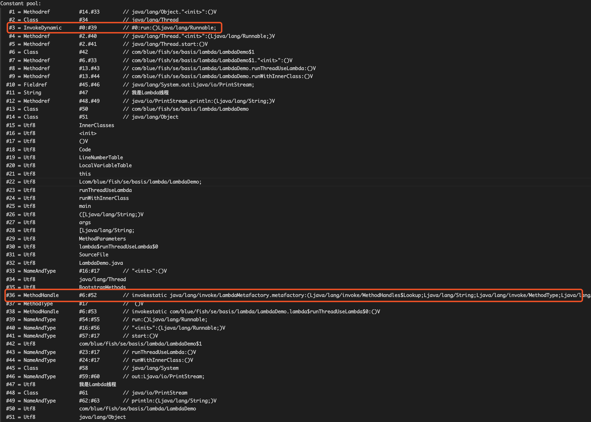
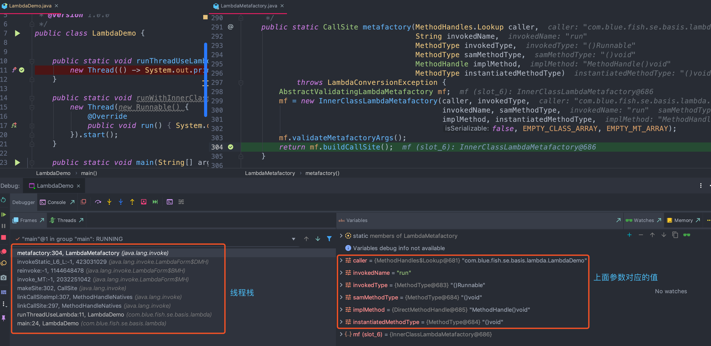

**Java世界里的一切东西都只是在拼Java命令行参数而已**

# 一、关于Java

## 1、从宏观角度看

Java跟C/C++组大的不同点在于，C/C++编程式面向操作系统的，需要开发者关心不同操作系统之间的差异性；而Java平台通过虚拟机屏蔽了操作系统的底层细节，使得开发无需关心不同操作系统之间的差异性；通过增加一个间接的中间层俩进行“解耦”是计算机领域常用的手法，虚拟机是这样的，操作系统如是；

不同的操作系统有不同的API，为了支持多平台，C语言程序的源文件根据不同平台需要修改多次

Java平台已经形成了一个生态系统，有着诸多的研究领域和应用领域：虚拟机、编辑技术的研究；Java语言的优化、大数据、java并发、客户端开发（如 Android）

## 2、从微观角度

Java平台有两大核心：
- Java语言本省、JDK所提供的核心类库和相关工具；
- Java虚拟机以及其他包含的GC等；

Write once， run anywhere

## 3、Java与C++的区别

- C++是编译型语言，首先将源代码编译生成机器语言，再由机器运行机器码；执行速度快，效率高；依赖编译器、跨平台性差；
- Java是解释型语言，源代码编译成字节码，再由解释器对字节码进行解释运行；执行速度慢、效率低；依赖解释器、跨平台性好；
- C++对所有的数字类型有标准的范围限制，但字节长度是跟具体实现相关的；Java在所有平台上对所有基本类型都有标准的范围限制和字节长度；
- C++允许直接调用本地的系统库；Java要通过JNI调用或者JNA；
- C++允许过程式程序设计和面向对象程序设计；Java必须适应面向对象的程序设计方式；
- C++支持指针，引用，传值调用。Java只有值传递；
- C++需要显示的内存管理，支持析构函数；Java是自动管理内存的；
- C++支持多重继承，包括虚拟继承；Java只允许，但是接口之间可以多继承；

## 4、面向对象与面向过程

- 面向过程：把问题分解成一个一个步骤，每个步骤用函数实现；进行面向过程编程时，上来先定义一个函数，然后使用诸如if-else等方式进行代码执行；
- 面向对象：将问题分解成一个一个步骤，对每个步骤进行相应的抽象、形成对象，通过不同对象之间的调用，组合解决问题；是一种编程范式，提倡使用类来抽象现实模型

## 5、三大基本特征

- 封装：通常认为封装是把数据和操作数据的方法绑定起来，对数据的访问只能通过已定义的接口；面向对象的本质就是：将现实世界描绘成一系列完全自然、封闭的对象。在类中的编写的方法就是对实现细节的一种封装；编写一个类就是对数据和数据操作的封装；
- 继承：继承是从已有类中得到继承信息并创建新类的过程。提供继承信息的类被称为父类；得到继承信息的类被称为子类。继承让变化中的软件系统有了一定的延续性，同时继承也是封装程序中可变因素的重要手段；
- 多态：指允许不同子类型的对象对同一消息作出不同的响应；
- 抽象：抽象是将一类对象的共同特征总结出来构造类的过程，包括数据抽象和行为抽象两方面。抽象只关注对 象有哪些属性和行为，并不关注这些行为的细节是什么

## 6、五大基本原则

- 单一职责原则
- 开放封闭原则
- 里氏替换原则
- 依赖倒置原则
- 接口隔离原则

## 7、基本使用

编译源文件：
```bash
javac Demo.java
```
带外部依赖编译源文件：
```bash
# Linux
javac -cp "./libs/lib1.jar:./libs/lib2.jar:." Demo.java  
# Linux 通配符
javac -cp "./libs/*:." Demo.java
# Windows
javac -cp ".\libs\lib1.jar;.\libs\lib2.jar;." Demo.java  
# Windows 通配符
javac -cp ".\libs\*;." Demo.java  
```
执行使用：java命令，其他类似

# 二、Java数据类型

## 1、基本类型与引用类型

**1.1、如下四个变量，哪两个比较为 false**

```java
Integer i01 = 59;
int i02 = 59;
Integer i03 =Integer.valueOf(59);
Integer i04 = new Integer(59);
```

- （1）Integer 为了节省空间和内存会在内存中缓存 -128~127 之间的数字;
- （2）valueOf()：调用该方法时，内部实现作了个判断，判断当前传入的值是否在-128~127之间且 IntergCache是否已存在该对象如果存在，则直接返回引用，如果不存在，则创建一个新对象
- （3）基本类型存在内存的栈中，与引用类型比较时， 引用类型会自动装箱，比较数值而不比较内存地址;

**1.2、自动装箱拆箱机制是编译特性还是虚拟机运行时特性？分别是怎么实现的？**

- 自动装箱机制是编译时自动完成替换的。装箱阶段自动替换为了 valueOf 方法，拆箱阶段自动替换为了 xxxValue 方法;
- 对于 Integer 类型的 valueOf 方法参数如果是 -128~127 之间的值会直接返回内部缓存池中已经存在对象的引用，参数是其他范围值则返回新建对象;
- 而 Double 类型与 Integer 类型类似，一样会调用 Double 的 valueOf 方法，但是 Double 的区别在于不管传入的参数值是多少都会 new 一个对象来表达该数值(因为在指定范围内浮点型数据个数是不确定的，整型等个数是确定的，所以可以Cache)
- 注意：Integer、Short、Byte、Character、Long 的 valueOf 方法实现类似，而 Double 和 Float 比较特殊，每次返回新包装对象，对于两边都是包装类型的：== 比较的是引用，equals 比较的是值；对于两边有一边是表达式(包含算数运算)： == 比较的是数值(自动触发拆箱过程)，对于包装类型 equals 方法不会进行类型转换;

**1.3.Integer i = 1; i += 1; 做了哪些操作**

- Integer i = 1; 做了自动装箱：使用 valueOf() 方法将 int 装箱为 Integer 类型
- i += 1; 先将 Integer 类型的 i 自动拆箱成 int(使用 intValue() 方法将 Integer 拆箱为 int)，完成加法运行之后的 i 再装箱成 Integer 类型

**1.4、int与long精度丢失问题**
- `byte→short`、`short→int`、`int→long`、`int→double`、`char→int`、`float→double`转换是不会发生精度丢失的，因为后者所包含的范围比前者大且完全包含前者
- int转float、long转float，long转double都会发生精度丢失。精度丢失包括两种，一是有效数字丢失，一是目标类型完全无法表示数据；

	int和float都是32位，但是内存结构也就是存储结构是不一样的，float只有24（含隐含的一位整数位）位来确定精度，而int是32位。long转float，long转double精度丢失原理是一样；我们知道，float的存储结构是1个符号位，8个指数位，23个尾数。
	- 符号位，表述浮点数的正或者负，0代表正，1代表负。
	- 指数位，实际也是有正负的，但是没有单独的符号位，在计算机的世界里，进位都是二进制的，指数表示的也是2的N次幂，8位指数表达的范围是0到255，而对应的实际的指数是－127到128。也就是说实际的指数等于指数位表示的数值减127。
	- 尾数位，只代表了二进制的小数点后的部分，小数点前的那位被省略了，当指数位全部为0时省略的是0否则省略的是1。

	所以可以说，实际上尾数确定了浮点数的精度，而数的大小主要是靠指数位，尾数只有23位，加上隐含的一位整数位便是24位。也就是说int类型的值在2^24以内，float是可以精确表示的，但是当超过这个数的时候就不一定能精确表示了。

## 2、Java基本类型大小

### 2.1、基本类型的存储

在 Java 虚拟机规范中，局部变量区等价于一个数组，并且可以用正整数来索引。除了 long、double 值需要用两个数组单元来存储之外，其他基本类型以及引用类型的值均占用一个数组单元；

- boolean、byte、char、short 这四种类型，在`栈`上占用的空间和 int 是一样的，和引用类型也是一样的。因此，在 32 位的 HotSpot 中，这些类型在栈上将占用 4 个字节；而在 64 位的 HotSpot 中，他们将占 8 个字节；
- 对于 byte、char 以及 short 这三种类型的字段或者数组单元，它们在堆上占用的空间分别为一字节、两字节，以及两字节，也就是说，跟这些类型的值域相吻合；

因此，当我们将一个 int 类型的值，存储到这些类型的字段或数组时，相当于做了一次隐式的掩码操作。举例来说，当我们把 0xFFFFFFFF（-1）存储到一个声明为 char 类型的字段里时，由于该字段仅占两字节，所以高两位的字节便会被截取掉，最终存入“\uFFFF“

boolean 字段和 boolean 数组则比较特殊。在 HotSpot 中，boolean 字段占用一字节，而 boolean 数组则直接用 byte 数组来实现。为了保证堆中的 boolean 值是合法的，HotSpot 在存储时显式地进行掩码操作，也就是说，只取最后一位的值存入 boolean 字段或数组中；

### 2.2、基本类型的加载

Java 虚拟机的算数运算几乎全部依赖于操作数栈。也就是说，需要将堆中的 boolean、byte、char 以及 short 加载到操作数栈上，而后将栈上的值当成 int 类型来运算。

对于 boolean、char 这两个无符号类型来说，加载伴随着零扩展。举个例子，char 的大小为两个字节。在加载时 char 的值会被复制到 int 类型的低二字节，而高二字节则会用 0 来填充；boolean的掩码处理是取低位的最后一位；

对于 byte、short 这两个类型来说，加载伴随着符号扩展。举个例子，short 的大小为两个字节。在加载时 short 的值同样会被复制到 int 类型的低二字节。如果该 short 值为非负数，即最高位为 0，那么该 int 类型的值的高二字节会用 0 来填充，否则用 1 来填充；

## 3、boolean占用字节数

- [asmtools-分析boolean](https://wenjie.store/archives/ant-asmtools-awk)

在 Java 虚拟机规范中，`boolean` 类型则被映射成 int 类型。具体来说，`“true”`被映射为整数 `1`，而`“false”`被映射为整数 `0`。这个编码规则约束了 Java 字节码的具体实现。当然，这个约束很容易绕开。可以使用的工具：除汇编工具 AsmTools 外，还有许多可以修改字节码的 Java 库，比如说 ASM；

对于 Java 虚拟机来说，它看到的 boolean 类型，早已被映射为整数类型。因此，将原本声明为 boolean 类型的局部变量，赋值为除了 0、1 之外的整数值，在 Java 虚拟机看来是“合法”的

- 在Java虚拟机中没有任何供 `boolean`值专用的字节码指令，Java语言表达式所操作的 `boolean`值，在编译之后都使用Java虚拟机中的`int`数据类型来代替。
- Java虚拟机直接支持 `boolean`类型的数组，虚拟机的 `navarra`指令参见第6章的`newarray`小节可以创建这种数组。`boolean`类型数组的访问与修改共用`byte`类型数组的`baload`和 `bastore`指令；
- 因为在虚拟机规范中说了，`boolean`值在编译之后都使用Java虚拟机中的`int`数据类型来代替，而int是4个字节，那么`boolean`值就是4个字节。
- `boolean`类型数组的访问与修改共用byte类型数组的`baload`和 `bastore`指令，因为两者共用，只有两者字节一样才能通用呀，所以`byte`数组中一个`byte`是1个字节，那么boolean数组中`boolean`是1个字节。

Java规范中，没有明确指出boolean的大小。在《Java虚拟机规范》给出了单个boolean占4个字节，和boolean数组1个字节的定义，具体 还要看虚拟机实现是否按照规范来，所以1个字节、4个字节都是有可能的。在 HotSpot 中，boolean 字段占用一字节，而 boolean 数组则直接用 byte 数组来实现

```java
class LotsOfBooleans{
    boolean a0, a1, a2, a3, a4, a5, a6, a7, a8, a9, aa, ab, ac, ad, ae, af;
    boolean b0, b1, b2, b3, b4, b5, b6, b7, b8, b9, ba, bb, bc, bd, be, bf;
    boolean c0, c1, c2, c3, c4, c5, c6, c7, c8, c9, ca, cb, cc, cd, ce, cf;
    boolean d0, d1, d2, d3, d4, d5, d6, d7, d8, d9, da, db, dc, dd, de, df;
    boolean e0, e1, e2, e3, e4, e5, e6, e7, e8, e9, ea, eb, ec, ed, ee, ef;
}
class LotsOfInts{
    int a0, a1, a2, a3, a4, a5, a6, a7, a8, a9, aa, ab, ac, ad, ae, af;
    int b0, b1, b2, b3, b4, b5, b6, b7, b8, b9, ba, bb, bc, bd, be, bf;
    int c0, c1, c2, c3, c4, c5, c6, c7, c8, c9, ca, cb, cc, cd, ce, cf;
    int d0, d1, d2, d3, d4, d5, d6, d7, d8, d9, da, db, dc, dd, de, df;
    int e0, e1, e2, e3, e4, e5, e6, e7, e8, e9, ea, eb, ec, ed, ee, ef;
}
public class Test{
    private static final int SIZE = 100000;
    public static void main(String[] args) throws Exception{
        LotsOfBooleans[] first = new LotsOfBooleans[SIZE];
        LotsOfInts[] second = new LotsOfInts[SIZE];

        System.gc();
        long startMem = getMemory();

        for (int i=0; i < SIZE; i++) {
            first[i] = new LotsOfBooleans();
        }

        System.gc();
        long endMem = getMemory();

        System.out.println ("Size for LotsOfBooleans: " + (endMem-startMem));
        System.out.println ("Average size: " + ((endMem-startMem) / ((double)SIZE)));

        System.gc();
        startMem = getMemory();
        for (int i=0; i < SIZE; i++) {
            second[i] = new LotsOfInts();
        }
        System.gc();
        endMem = getMemory();

        System.out.println ("Size for LotsOfInts: " + (endMem-startMem));
        System.out.println ("Average size: " + ((endMem-startMem) / ((double)SIZE)));

        // Make sure nothing gets collected
        long total = 0;
        for (int i=0; i < SIZE; i++) {
            total += (first[i].a0 ? 1 : 0) + second[i].a0;
        }
        System.out.println(total);
    }
    private static long getMemory(){
        Runtime runtime = Runtime.getRuntime();
        return runtime.totalMemory() - runtime.freeMemory();
    }
}
```

另外，大部分指令都没有支持整数类型byte、char、short。编译器在编译期或运行期将byte和short类型的数据带符号扩展为相应的int类型数据，将boolean和char类型数据零位扩展为相应的int类型数据；

## 5、表达式的数据类型

### 5.1、基本类型中类型转换

- 所有的 byte，short，char 型的值将被提升为 int 型；
- 如果有一个操作数是 long 型，计算结果是 long 型；
- 如果有一个操作数是 float 型，计算结果是 float 型；
- 如果有一个操作数是 double 型，计算结果是 double 型；
- final 修饰的变量是常量，如果运算时直接是已常量值进行计算，没有final修饰的变量相加后会被自动提升为int型
	```java
	byte b1=1, b2=2, b3, b6;
	final byte b4=4, b5=6;
	b6=b4+b5;// b4， b5是常量，则在计算时直接按原值计算，不提升为int型
	b3=(b1+b2);// 编译错误
	System.out.println(b3+b6);
	```

**记住一点：JDK中关于任何整型类型的运算，都是按照int来的**
```java
private static final long mil_seconds = 24 * 60 * 60 * 1000;
private static final long micro_seconds = 24 * 60 * 60 * 1000 * 1000;
public static void main(String[] args) {
	System.out.println(micro_seconds / mil_seconds);
}
```
上面代码中 micro_seconds 在运算时，其已超过 int 类型的最大值，溢出了。

另外，如果在基本类型与对应的包装类型进行比较或者运算的时候，都会将包装类型自动拆箱，例如下面的代码：
```java
int a = 10;
Integer b = Integer.valueOf(10);
System.out.println(a == b); // 这里比较的时候会调用 Integer 类的 intValue()方法，所以需要注意是否有空指针问题
```

### 5.2、三目运算中类型转换问题

在使用三目运算符时，尽量保证两个返回值的类型一致，不然会触发类型转换，转换规则如下：
- （1）如果返回值`X`和返回值`Y`是同种类型，那么返回类型毫无疑问就是这种类型；
- （2）如果两个返回值`X`和`Y`的类型不同，那么返回值类型为他们俩最接近的父类。举例：
	```java
	// String 和 Boolean 都实现了 Serializable 接口
	Serializable serializable = a == b ? "true" : Boolean.FALSE;
	// 所有类都继承了 Object 类
	Object o = a == b ? new ArrayList<>() : new TernaryOperatorDemo();
	```
- （3）对于基本数据类型，如果其中一个返回值`X`类型为`byte`、`short`或者`char`，另一个返回值`Y`类型为`int`：
  - 若在`编译期`就能判断出`Y`的取值范围在`X`的取值范围之内，则返回类型为`X`的类型，反之则为`Y`的类型。
  - 如果返回值`X`类型不为以上几种，则会触发隐藏类型转换；
- （4）当基本数据类型和对象数据类型相遇时，三目运算默认返回结果为基本数据类型；
- （5）注意因自动拆箱导致的NPE
例子：
```java
private static void test1(int a, int b) {
  // 触发隐藏类型转换,int 类型 9 转为 9.0D
  System.out.println(a == b ? 9.9 : 9);
  // 编译期判断,98 在 char 之内,转为 b
  System.out.println(a == b ? 'a' : 98);
  // 编译期判断,超出char范围，统一转 int
  System.out.println(a == b ? 'a' : Integer.MAX_VALUE);
  // 编译期时无法判断 b 的取值,触发隐藏类型转换,统一转 int
  System.out.println(a == b ? 'a' : b);
  System.out.println(a != b ? 'a' : b);

  Map<String, Long> map = new HashMap<>();
  map.put("b", 1L);
  // 基本数据类型和对象数据类型相遇时,默认转为基本数据类，
  // map.get("a") 返回 null,转为基本数据类型时，报空指针异常
  System.out.println(map == null ? -1L : map.get("a"));

}
```

## 8、如何计算比一个数大的2的幂

`Integer.highestOneBit((number) - 1) << 1)`

比如：比17大的2的幂是32

# 三、进制基础

- [位运算高级应用](https://graphics.stanford.edu/~seander/bithacks.html)
- [位运算](https://bugstack.cn/md/algorithm/logic/math/2022-10-30-bits.html)
- [进制转化-支持浮点数](https://baseconvert.com/)
- [位运算](http://www.nowcoder.com/courses/1/8/1)

## 1、进制基础

- bit（位）：表示一个二进制位（0或者1）。位是计算机内部数据储存的最小单位，11010100是一个8位二进制数。一个二进制位只可以表示0和1两种状态；两个二进制位可以表示00、01、10、11四种状态；
- byte（字节）：字节是计算机中数据处理的基本单位。计算机中以字节为单位存储和解释信息，规定一个字节（Byte）由连续八个二进制位（bit）构成，即1个字节等于8个比特（1Byte=8bit）。八位二进制数最小为00000000，最大为11111111；通常1个字节可以存入一个ASCII码，2个字节可以存放一个汉字国标码；
- 16进制：通常`一个字节 = 两个16进制位`：
	- 1个16进制位 = 4个二进制数位；（16进制位中，最大的为F，为15，即：1111（二进制），也就是说4个bit可以表示一个16进制位）
	- 2个16进制位 = 8个二进制数位 = 1字节
	- 最终：一个16进制位 = 0.5 个字节；

## 2、二进制运算

### 2.1、与运算：&

**2.1.1、两位全为1，结果才为 1**

```
0&0=0	0&1=0	1&0=0	1&1=1
51&5 = 1 即: 
	51 => 00000000 00000000 00000000 00110011
	5  => 00000000 00000000 00000000 00000101
	& ==> 00000000 00000000 00000000 00000001 (1)
```

**2.1.2、用法**

- 清零：如果想将一个单元清零，即使其全部二进制为 0， 只要与一个各位都为 0 的数值相`与`，结果为 0；
- 取一个数中指定位置，如：x = 10101110， 取 x 的低四位，用 `x & 00001111 = 00001110`，即可得到	

### 2.2、或运算：|

**2.2.1、只要有一个为 1，结果就为 1**

```
0|0 = 0		1|0 = 1		0|1	= 1		1|1 = 1
51|5 = 55 即:
	51 => 00000000 00000000 00000000 00110011
	5  => 00000000 00000000 00000000 00000101
	|  => 00000000 00000000 00000000 00110111
```

**2.2.3、用法**

	常用来对一个数据的某些位置 1
	如: x = 1010 0000 的低四位置 1， 用 x | 0000 1111 = 1010 1111

### 2.3、异或运算：^

- 两个相应位为"异"(值不同)，则该位结果为 1， 否则为 0
	```
	0^0 = 0		1^0 = 1		0^1 = 1		1^1 = 0；
	51^5 = 54即:
		51 => 00000000 00000000 00000000 00110011
		5  => 00000000 00000000 00000000 00000101
		^  => 00000000 00000000 00000000 00110110
	```

“异或”操作的本质其实就是，所有数值和自身进行按位的“异或”操作之后都为 0。而且要通过“异或”操作得到 0，也必须通过两个相同的数值进行按位“异或”。这表明了两个数值按位“异或”结果为 0，是这两个数值相等的必要充分条件，可以作为判断两个变量是否相等的条件

**用法**
- 使特定位翻转，找一个数，对应 x 要翻转的各位，该数的对应位为 1，其余位为 0，此数与 x 对应的位"异或"即可<br>
	如:x = 10101110， 使 x 低四位翻转， 用 x ^ 0000 1111 = 1010 0001
- 与 0 相异或，保留原值<br>
	如: x ^ 00000000 = 10101110
- 两个变量交换值：
	- ①、借助第三个变量来实现：c = a， a = b， b = c；
	- ②、利用加减法来实现：a = a + b， b = a - b， a = a-b；
	- ③、用异或运算来实现，也是效率最高的，原理：利用一个数异或本身等于 0 和 异或运算符合交换率：
		`a = a ^ b； b = a ^ b； a = a ^ b`

### 2.4、取反运算：~ 

取反：对一个二进制数按位取反，即将 0 变为 1，1 变为 0
	~1 = 0		~0 = 1	

### 2.5、左移：<< 

	将一个运算对象的各二进制位全部左移若干位(左边的二进制位丢弃，右边补 0)
		2 << 2 = 8；
			2   => 00000000 00000000 00000000 00000010
			>>2 => 00000000 00000000 00000000 00001000
	若左移时舍弃的高位不包含 1，则每左移一位，相当于该数乘以 2；
		2 << 2 ==> 2 * 2 * 2(最快计算 2 的三次方)

### 2.6、算术右移：>>

将一个数的各二进制位全部右移若干位，正数左补 0，负数左补 1；对于正数来说操作数每右移一位，相当于该数除以 2

算术右移时保持符号位不变，除符号位之外的右移一位并补符号位 1。补的 1 仍然在符号位之后。
	
	4 >> 2 ==> 1 ( 4 / 2 / 2)；
	-14(11110010) >> 2 ==> -4(11111100)

### 2.7、无符号右移：>>> 

逻辑右移，各个位向右移指定的位数，右移后左边空出的位使用 0 填充，移出右边的位被丢弃掉

	-14 >> 2:
		-14 => 11111111 11111111 11111111 11110010
		>>2 => 00111111	11111111 11111111 11111100(1073741820) ；

### 2.8、二进制四则运算

#### 2.8.1、加法

`0+0=0，0+1=1，1+0=1，1+1=10`
- 当两个相加的二进制仅一位时，相加的结果为1；
- 如果两个二进制位全是0，相加的结果仍为0；
- 如果两个相加的进制位均为1，则结果为10，要向高位进1，也就是`逢2进1`规则

在运算的过程中，两数要从最低位开始对齐

#### 2.8.2、减法

`1-1=0，1-0=1，0-0=0，0-1=-1`
- 当两个相减的二进制位中同为0或1时，相减结果为0；
- 如果被减数的二进制位为1，而减数的二进制位为0，则相减的结果仍为1；
- 如果被减数的二进制位为0，而减数的二进制位为1，则需要向高位借1，但此时借1当2；

#### 2.8.3、乘法

`0*0=0，1*0=0，0*1=0，1*1=1`
- 只有当两个相乘的二进制位都为1，相乘的结果才为1；
- 当两个相乘的二进制位只要有一位为0，则相乘的结果都为0；
- 1与任何数相乘的结果都是对应的被乘数；而0与任何数相乘结果都为0；

在乘法运算中，乘数的每一位都要与被乘数的每一位分别相乘，而不仅是对应位相乘

#### 2.8.4、除法

当被除数大于除数时，商是“1”；当被除数小于除数时，不够除，商只能是“0”；

## 3、负数：以其正值的补码形式表示

符号位是有符号二进制数中的最高位，我们需要它来表示负数；计算机 CPU 的运算器只实现了加法器，而没有实现减法器，那么计算机如何做减法呢？我们可以通过加上一个负数来达到这个目的。比如，`3-2` 可以看作 `3+(-2)`；

如果是有符号数，那么最高位就是符号位。当符号位为 0 时，表示该数值为正数；当符号位为 1 时，表示该数值为负数

### 3.1、原码

一个整数按照绝对值大小转换成二进制成为原码

`14 => 00000000 00000000 00000000 00001110  (14的原码)`

### 3.2、反码

将二进制按位取反，所得的二进制数称为原二进制数的反码

将 14 的每一位按位取反

	00000000 00000000 00000000 00001110 => 14 原码
	11111111 11111111 11111111 11110001 => 14 反码
	两者互为反码

### 3.3、补码：反码加1称为补码

正数的补码和原码相同；负数的补码是通过先把除符号位外其他各位取反，再在末位（最低位）加1得到；

```
11111111 11111111 11111111 11110001 + 1 => 
11111111 11111111 11111111 11110010
```

### 3.4、案例
```
-14 << 2
-14 => 11111111 11111111 11111111 11110010
<<2 => 11111111 11111111 11111111 11001000
```
- 分析:只需要该补码的原码对应的正值，然后取相反数<br>
	- 补码减 1，得到反码 11000111<br>
	- 补码取反得到 原码，即该负数的正值 00111000<br>
	- 计算正值，为 56<br>
	- 取相反数<br>

### 3.5、计算负数补码	

根据 `1+~n = -n` 可以快速计算负数补码

`-n = ~n+1`  =>  `-n-1 = ~n`

## 4、Java 二进制

- [Java中字节数组与short、int、long类型数据之间转化](../通用代码片段/ByteArrayDigitType.java)

Java7以及以后版本支持直接书写除十进制以外的其它进制字面量
```
二进制：前置0b/0B
八进制：前置0
十进制：默认的，无需前置
十六进制：前置0x/0X
```

### 4.1、Java 基本数据类型

- 整型：`byte(8 bit)、short(16 bit)、int(32 bit)、long(64 bit)`
- 浮点型： `float(32 bit)、double(64 bit)`；
- 布尔：`true false (1 bit)`
- 字符：`char(unicode字符 16 bit)`

### 4.2、常用的数

0xff ==> 11111111（255）

f ==> 1111

### 4.3、大小端

- [大端和小端](https://en.wikipedia.org/wiki/Endianness)
- [理解字节序](https://www.ruanyifeng.com/blog/2016/11/byte-order.html)
- [字节序探析：大端与小端的比较](https://www.ruanyifeng.com/blog/2022/06/endianness-analysis.html)

- 小端（little-endian）：低位字节排放在内存的低地址端即该值的起始地址，高位字节排放在内存的高地址端
- 大端（big-endian）：高位字节排放在内存的低地址端即该值的起始地址，低位字节排放在内存的高地址端
- 例子: 32bit宽的数 `0x12345678`
	- 在 little-endian 模式下在 CPU 内存的存放方式:(假设内存起始地址 0x4000开始存放)
		- 内存地址:	`0x4000 	0x4001	0x4002	0x4003`
		- 存放内容:	`0x78 	0x56	0x34	0x12`
	- 在 big-endian 模式下存放如下:
		- 内存地址:	`0x4000 	0x4001	0x4002	0x4003`
		- 存放内容:	`0x12 	0x34	0x56	0x78`
- 大端的优势就是易于阅读，小端便于cpu内部数据计算

在Java中，所有的二进制文件都是按大端存储，基于ByteBuffer（可通过Order来设置大端或者小端，默认为大端 — Big-Endian）实现，如果需要设置为小端：
```java
ByteBuffer byteBuffer = ByteBuffer.allocate(4);
byteBuffer.order(ByteOrder.LITTLE_ENDIAN); // 设置为小端
byte[] b = byteBuffer.putInt(i).array();
```
在 Java 中，可以使用 `ByteOrder.nativeOrder()` 方法来获取 CPU 使用的字节顺序。

### 4.4、数据类型转换为 字节

`8143 (00000000 00000000 00011111 11001111)` 转换为字节数组（小端）：`byte[] b = [-49,31,0,0]`;
- 第一个（低端）字节：`8143 >> 0 * 8 & 0xff = 11001111(207)`，有符号为 -49 
- 第二个（低端）字节：`8143 >> 1 * 8 & 0xff = 00011111(31)`
- 第三个（低端）字节：`8143 >> 2 * 8 & 0xff = 00000000(0)`
- 第四个（低端）字节：`8143 >> 3 * 8 & 0xff = 00000000(0)`

### 4.5、字符串与字节的相互转换

- 字符串 --> 字节：`byte[] b = s.getBytes();`
- 字节 --> 字符串：`byte[] b = new byte[int]; new String(b)` 或者 `new String(b, encode)`// encode 编码格式:

### 4.6、转换实例

```java
public class CovertToRadix {
	public static byte[] intToByte(int i){
		byte[] arr = new byte[4];
		/*
		arr[0] = (byte)((int)((i >> 0 * 8) & 0xff));
		arr[1] = (byte)((int)((i >> 1 * 8) & 0xff));
		arr[2] = (byte)((int)((i >> 2 * 8) & 0xff));
		arr[3] = (byte)((int)((i >> 3 * 8) & 0xff));
		*/
		for(int j=0;j<arr.length;j++){
			arr[j] = (byte)((int)((i >> j * 8) & 0xff));
		}
		return arr;
	}
	public static int byteToInt(byte[] arr){
		/*
		int r0 = (int)((arr[0]& 0xff) << 0 * 8);
		int r1 = (int)((arr[1]& 0xff) << 1 * 8);
		int r2 = (int)((arr[2]& 0xff) << 2 * 8);
		int r3 = (int)((arr[3]& 0xff) << 3 * 8);
		*/
		int result = 0;
		for(int j=0;j<arr.length;j++){
			result += (int)((arr[j]& 0xff) << j * 8);
		}
		return result;
	}
}
```

## 5、进制转换

### 5.1、Java代码实现进制转换

```java
public void test2() {
    int i = 192;
    System.out.println("---------------------------------");
    System.out.println("十进制转二进制：" + Integer.toBinaryString(i)); //11000000
    System.out.println("十进制转八进制：" + Integer.toOctalString(i)); //300
    System.out.println("十进制转十六进制：" + Integer.toHexString(i)); //c0
    System.out.println("---------------------------------");
    // 统一利用的为Integer的valueOf()方法,parseInt方法也是ok的
    System.out.println("二进制转十进制：" + Integer.valueOf("11000000", 2).toString()); //192
    System.out.println("八进制转十进制：" + Integer.valueOf("300", 8).toString()); //192
    System.out.println("十六进制转十进制：" + Integer.valueOf("c0", 16).toString()); //192
    System.out.println("---------------------------------");
}
```

### 5.2、十进制转二进制算法

#### 5.2.1、余数短除法除以二

- 将给定的十进制数除以2，得到商和余数。（可以通过取模和除法来实现）
- 将余数记录下来，然后将商作为新的十进制数重复步骤1，直到商为0为止。
- 将所有记录下来的余数倒序排列起来，得到的就是十进制数的二进制表示
```java
public static String toBinaryString(int i) {
	StringBuilder sb = new StringBuilder();
	while ( i > 0) {
		sb.append(i % 2);
		i = i >> 1;
	}
	return sb.reverse().toString();
}
```

#### 5.2.2、降二次幂及减法混合运算

将十进制数 $1234_{10}$ 转换为二进制

思路：
- 找出小于且最接近需计算数字的幂函数值，小于 $1234_{10}$ 的2的幂的最大值是 1024
- 在本例中，1024是小于1234的、以2为底数的幂函数值中最大的数值。所以在二进制列表1024的下方写上1。然后用1234减去1024，得出210；

	|1024|	512|	256 |	128 |	64	|32|	16|	8|	4	|2	|1|
	|----|---|---|---|---|---|---|---|----|---|---|
	|$2^{10}$|	$2^9$|	$2^8$|	$2^7$	|$2^6$|	$2^5$|	$2^4$|	$2^3$|	$2^2$|	$2^1$|	$2^0$|
	|1|||||||||||

- 继续计算。刚刚得出新得数210继续进行比较计算，看看哪一个幂函数值小于210。函数列表的下一个数字为512，512大于210，所以在512下方写上0。如此类推，看看那个数字小于210；s

	|1024|	512|	256 |	128 |	64	|32|	16|	8|	4	|2	|1|
	|----|---|---|---|---|---|---|---|----|---|---|
	|$2^{10}$|	$2^9$|	$2^8$|	$2^7$	|$2^6$|	$2^5$|	$2^4$|	$2^3$|	$2^2$|	$2^1$|	$2^0$|
	|1|0|0|||||||||

- 能减的数字记为1。本例中，512和256都不能被210减，得出正数。128可以被210减，得出82。64也能被82减，得出正数，所以在128和64下方都写上1。现在的差为18；32不能被18减，所以32下方标为0；16能被18减，所以16下方标为1，现在差位2，以此类推；			

	|1024|	512|	256 |	128 |	64	|32|	16|	8|	4	|2	|1|
	|----|---|---|---|---|---|---|---|----|---|---|
	|$2^{10}$|	$2^9$|	$2^8$|	$2^7$	|$2^6$|	$2^5$|	$2^4$|	$2^3$|	$2^2$|	$2^1$|	$2^0$|
	|1|0|0|1|1|0|1|0|0|1|0|

最终得到： $1234_{10}$ = $10011010010_2$

```java
 public static String toBinaryPower(int i) {
	int len = (int) (Math.log(i) / Math.log(2));
	StringBuilder sb = new StringBuilder();
	do {
		i = (int) (i - Math.pow(2, len));
		int power = i <= 0 ? -1 : (int) (Math.log(i) / Math.log(2));
		for (int j = len; j > power; j--) {
			if (j == len) {
				sb.append("1");
			} else {
				sb.append("0");
			}
		}
		len = power;
	} while (i > 0);
	return sb.toString();
}
```

#### 5.2.3、负整数转二进制

十进制负数转换为二进制，最常用的方法是使用二进制的补码表示，再对取补后的结果加1即可。

**（1）转换正数部分为二进制**

首先，忽略负号，将该数的绝对值转换为二进制形式。例如，要转换的十进制数是 $-12$，首先转换 $12$ 为二进制数，得到 $1100$。

**（2）补足位数**

确保转换得到的二进制数满足特定的位数（例如8位、16位、32位等）。这通常意味着在前面补零。以8位为例， $1100$ 补足到8位是 $00001100$ 。

**（3）取反（求反码）**

将上一步得到的二进制数的每一位取反（0变1，1变0）。 $00001100$ 取反后得到 $11110011$ 。

**（4）加1（得到补码）**

在取反的基础上加1。 $11110011$ 加1后得到 $11110100$ 。这就是 -12 的8位二进制补码表示

#### 5.2.4、小数的二进制和十进制转换

**二进制转十进制**

和整数转换一样，采用各位数值和位权相乘。比如：$(0.101)₂ = 1×2⁻¹ + 0×2⁻² + 0×2⁻³ = (0.625)₁₀$，记住小数点后第一位是从 -1 开始即可。

**十进制转二进制**

十进制整数转二进制采用“除 2 取余，逆序排列”法。例如十进制数 11 转为二进制：
```
11/2=5 … 余1
5/2=2  … 余1
2/2=1  … 余0
1/2=0  … 余1
```
所以 (11)₁₀ 的二进制是 (1011)₂。

*但如果十进制是小数，转为二进制小数如何做？*
- （1）小数部分的转换是通过不断乘以2，记录下每次乘法后的整数部分；
- （2）然后去掉整数部分继续乘以2，直到小数部分为0或达到所需的精度为止。

例如十进制小数 0.625 转为二进制小数：
```
0.625*2=1.25 … 取整数部分1，剩余小数部分 0.25
0.25*2=0.5 	 … 取整数部分0，剩余小数部分 0.5
0.5*2=1			 … 取整数部分1，到这里转换结束，因为剩余小数部分为0。
```
顺序排列，所以 (0.625)₁₀ = (0.101)₂


## 6、如何利用位运算

### 6.1、掩码操作

- [位掩码操作](https://visualgo.net/zh/bitmask)
- [掩码](https://zhuanlan.zhihu.com/p/30934719)
- [子网掩码](https://blog.nnwk.net/article/152)
- [子网掩码计算](https://www.epoos.com/blog/net1/)

用“按位与运算”，将不关注的位遮掩掉，只判断关心的`2的0次方`那个二进制位，这种操作，被习惯性称为掩码操作；

比如如下：
```java
public static final int PROGRAMMER = 1; // 程序员（2的0次方，0001）
public static final int GAMER = 2;      // 玩游戏（2的1次方，0010）
public static final int OTAKU = 4;      // 宅（2的2次方，0100）
public static final int MAN = 8;        // 男性（2的3次方，1000）
```
可以看到，换算成二进制后，每个数字都只有一位是1，其余位都是0。这样，只用四位二进制数就可以表示一个人是否具有四种不相关的特质；定义一个整形变量，将对应的二进制位“置1”，即可用于表示某人的所有特质；
- 例1：小张是个程序员，还是个经常玩游戏的宅男。  ⇒   四样齐全，即二进制是1111，换算成十进制15。
- 例2：小刘不是程序员，她是个玩游戏的宅女。  ⇒  “2的1次方位”以及“2的2次方位”“置1”，即二进制是0110，换算成十进制6。
```java
int zhang = 15; // 小张的特质
int liu = 6; // 小刘的特质
// 上面写法不明显
int zhang = PROGRAMMER | GAMER | OTAKU | MAN; // 小张的特质
int liu = GAMER | OTAKU; // 小刘的特质
```

**子网掩码**

子网掩码不能单独存在，它必须结合IP地址一起使用。子网掩码只有一个作用，**就是将某个IP地址划分成网络地址和主机地址两部分**。子网掩码的设定必须遵循一定的规则。与IP地址相同，子网掩码的长度也是32位，左边是网络位，用二进制数字“1”表示；右边是主机位，用二进制数字“0”表示

子网掩码的规则：长度 为 4 * 8bit（1字节），由 连续的1 以及 连续的0 两部分组成，例如：`11111111.11111111.11111111.00000000`，对应十进制：`255.255.255.0`

### 6.2、求平均值

```java
int x = 32760; int y = 32762; 求 x，y 的平均值，要求空间复杂度 O(0)
public static int ave(int x， int y){
	return (x&y) + ((x^y)>>1)；
}
```
- 知识点: `>>n` 相当于除于2^n ，`<<n` 相当于乘于 2^n
- 把 x，y分别分成两个部分来看，两者相同的位分别拿出来:<br>
```
x(111111111111000) = 111111111111000 + 000000000000000
y(111111111111010) = 111111111111000 + 000000000000010
相同部分我们叫做x1，y1，不同部分我们叫做x2，y2.那么现在(x+y)/2 =(x1+y1)/2 +(x2 + y2)/2 ，<br>
因为x1 == y1 ，所以(x1+y1)/2 == x1 ==y1，<br>
相同部分我们用与运算求出来 x1 = x & y ，不同部分的和我们用^ 求出来，然后除于 2(>>1)是不是我们想要的结果了呢<br>
```

### 6.3、判断奇偶数

- `a&1 = 0` 偶数
- `a&1 = 1` 奇数

### 6.4、取整型变量的第K位

取 int 型变量 a 的第 k 位 (k=0，1，2....)， 即 `a>>k&1` (先右移k再与1)

### 6.5、幂问题

**判断是否为 2 的幂：** `((x&(x-1))==0) && (x!=0);`
  
**如何判断一个无符号数是2的n次方-1:**
```java
private static boolean isPowerOfTwoLoseOne(int val) {
	return (val & (val+1)) == 0;
}
```
**非2的幂次方转换为2的幂次方**
  
**求一个数离它最近的大于等于2的幂次方的数:**
```java
private static final int MAXIMUM_CAPACITY = Integer.MAX_VALUE；
private static final int tableSizeFor(int c) {
	int n = c - 1;
	n |= n >>> 1;
	n |= n >>> 2;
	n |= n >>> 4;
	n |= n >>> 8;
	n |= n >>> 16;
	return (n < 0) ? 1 : (n >= MAXIMUM_CAPACITY) ? MAXIMUM_CAPACITY : n + 1;
}
```

**求一个数离它最近的小于等于2的幂次方的数：**
```java
private static final int tableSizeFor(int n) {
	n |= n >>> 1;
	n |= n >>> 2;
	n |= n >>> 4;
	n |= n >>> 8;
	n |= n >>> 16;
	return  n-(n>>1);
}
```

**使用位运算(&)来实现取模运算(%)：**
```
X % 2^n = X & (2^n - 1)
2^n表示2的n次方，也就是说，一个数对2^n取模 == 一个数和(2^n - 1)做按位与运算 。
假设n为3，则2^3 = 8，表示成2进制就是1000。2^3 -1 = 7 ，即0111。
此时X & (2^3 - 1) 就相当于取X的2进制的最后三位数。
从2进制角度来看，X / 8相当于 X >> 3，即把X右移3位，此时得到了X / 8的商，而被移掉的部分(后三位)，则是X % 8，也就是余数
```

扩展： **如何求某个是2的多少次幂，** $n=2^?$ ，其中 `?` 需要我们求出来，解决方法：首先使用Math类中的log方法求出num的对数，再除以2的对数即可得到num是2的多少次方
```java
int ? = (int) (Math.log(num) / Math.log(2));
```

### 6.6、计算绝对值

```java
public static int abs(int x){
	int y = x >> 31;
	return (x^y) - y;
}
```

- 取模运算转化成位运算 (在不产生溢出的情况下)：`a%(2^n)` 等价于 `a&(2^n - 1)`
- 乘法运算转化成位运算 (在不产生溢出的情况下)：`a*(2^n)` 等价于 `a<<n`
- 除法运算转化成位运算 (在不产生溢出的情况下)：`a / (2^n)` 等价于 `a>>n`，例: `12 / 8 == 12>>3
- `a % 2` 等价于 `a & 1`    
  
```
if (x == a) x= b;
else x= a;
等价于 x= a ^ b ^ x;
```

### 6.7、给出一个表达式计算其可以按多少进制计算

- 式子`7*15=133`成立，则用的是几进制？可以通过解方程来解决，上述式子可以转换为方程：
	```
	7 * (1 * x + 5) = 1 * x^2 + 3 * x + 3
	x^2 -4x - 32 = 0
	x = -4 或 x = 8
	```

- 如果下列的公式成立：`78+78=123`，则采用的是_______进制表示的：
	```
	7 * x + 8 + 7 * x + 8 = 1 * x^2 + 2 * x + 3
	x^2 - 12 * x - 13 = 0
	x = -1， x = 13
	```

## 7、其他位运算

- 测试第 k 位: `s & (1 << k)`
- 设置第 k 位: `s |= (1 << k)`
- 第 k 位置零: `s &= ~(1 << k)`
- 切换第 k 位值: `s ^= ~(1 << k)`
- 乘以 2n: `s << n`
- 除以 2n: `s >> n`
- 交集: `s & t`
- 并集: `s | t`
- 减法: `s & ~t`
- 交换 `x = x ^ y ^ (y = x)`
- 取出最小非 0 位（Extract lowest set bit）: `s & (-s)`
- 取出最小 0 位（Extract lowest unset bit）: `~s & (s + 1)`
- 交换值: `x ^= y; y ^= x; x ^= y;`

# 四、JDK版本

* [Java5~11各个版本特性最全总结](https://mp.weixin.qq.com/s/wQW3tZmCs50RjzMtbxOgpQ)
* [Java8新特性](https://www.jianshu.com/p/5b800057f2d8)
* [JDK8新特性指南](http://www.open-open.com/lib/view/open1403232177575.html)
* [JDK8概览](https://juejin.im/post/6861849472499417096)
* [JDK8~17特性](https://advancedweb.hu/a-categorized-list-of-all-java-and-jvm-features-since-jdk-8-to-17/)
* [JDK11-17新特性](https://mp.weixin.qq.com/s/SVleHYFQeePNT7q67UoL4Q)
* [Java 21 新特性概览](https://javaguide.cn/java/new-features/java21.html)
* [Migrating from JDK8/11 to JDK21](https://www.reddit.com/r/java/comments/18rwa6v/migrating_from_java_811_to_java_21_and_spring/)
* [Java11 to 21](https://dzone.com/articles/java-11-to-21-a-visual-guide-for-seamless-migratio)

JDK 21 于 2023 年 9 月 19 日 发布，这是一个非常重要的版本，里程碑式。JDK21 是 LTS（长期支持版），至此为止，目前有 JDK8、JDK11、JDK17 和 JDK21 这四个长期支持版了。

## 1、JDK8

### 1.1、Java语言新特性

- Lambda表达式和函数式接口：函数式接口是只包含一个方法的接口。比如Java标准库中的java.lang.Runnable和java.util.Comparator都是典型的函数式接口。java 8提供 @FunctionalInterface作为注解，这个注解是非必须的，只要接口符合函数式接口的标准（即只包含一个方法的接口）；
- 接口的默认方法和静态方法
- 方法引用
- 重复注解
- 更好的类型推断
- 拓宽注解的应用场景
- 行为参数化：行为参数化是一个很有用的模式，它能够轻松地使用不断变化的需求，这种模式可以把一个行为封装起来，并通过传递和使用创建的行为将方法的行为参数化，其可以代替匿名类

	**需求1**：筛选出红色的花
	```java
	public static List<Flower> filterFlower(List<Flower> flowers) {
		List<Flower> resList = new ArrayList<>();
		for (Flower flower : flowers) {
			if (StringUtils.equals("red", flower.getColor())) {
				resList.add(flower);
			}
		}
	}
	```
	**需求2**：筛选出绿色的话，正常情况下一般是会用color作为参数传入：
	```java
	public static List<Flower> filterFlowerByColor(List<Flower> flowers, String color) {
		List<Flower> resList = new ArrayList<>();
		for (Flower flower : flowers) {
			if (StringUtils.equals(color, flower.getColor())) {
				resList.add(flower);
			}
		}
	}
	```
	**需求3**：筛选出价格小于8块钱的花；我们只能再写一个方法来实现这个需求，为了防止后续价格的变化，聪明的我们提前将价格设置成可变参数
	```java
	public static List<Flower> filterFlowerByPrice(List<Flower> flowers, Integer price) {
		List<Flower> resList = new ArrayList<>();
		for (Flower flower : flowers) {
			if (flower.getPrice() < price) {
				resList.add(flower);
			}
		}
	}
	```
	为了保证代码整洁，把上述代码合并为一个方法，通过flag来控制要筛选价格类型的花还是颜色类型的花
	```java
	public static List<Flower> filterFlower(List<Flower> flowers, String color, Integer price, Boolean flag) {
		List<Flower> resList = new ArrayList<>();
		for (Flower flower : flowers) {
			if ((flag && flower.getPrice() < price) ||
				(!flag && StringUtils.equals(color, flower.getColor()))) {
				resList.add(flower);
			}
		}
		return resList;
	}

	我们既然都能把花的属性作为参数进行传递，那么我们能不能我们能不能把过滤花的这种行为也作为一个参数进行传递，定义行为接口
	```java
	public interface FilterPredicate {
		boolean test(Flower flower);
	}
	```
	自定义两个过滤类来实现接口：
	```java
	public class RedColorFilterPredicate implements FilterPredicate {
		@Override
		public boolean test(Flower flower) {
			return StringUtils.equals("red", flower.getColor());
		}
	}
	public class LowPriceFilterPredicate implements FilterPredicate {
		@Override
		public boolean test(Flower flower) {
			return flower.getPrice() < 8;
		}
	}
	```
	重写我们的过滤方法，通过将行为作为参数传递：
	```java
	public static List<Flower> filterFlower(List<Flower> flowers, FilterPredicate filter) {
		List<Flower> resList = new ArrayList<>();
		for (Flower flower : flowers) {
			if (filter.test(flower)) {
				resList.add(flower);
			}
		}
		return resList;
	}
	/*****    使用    *****/
	filterFlower(flowerList, new RedColorFilterPredicate());
	filterFlower(flowerList, new LowPriceFilterPredicate());
	```
	如果有其他新增的过滤条件，为了避免增加新的类，可以使用lambda表达式：
	```
	filterFlower(flowerList, (Flower flower) -> flower.getPrice() > 8);
	​```java
	甚至可以将多种行为作为作为一个参数传递：
	​```java
	filterFlower(flowerList, (Flower flower) -> flower.getPrice() > 8 && StringUtils.equals("red", flower.getColor()));
	```
	行为参数化是一个很有用的模式，它能够轻松地使用不断变化的需求，这种模式可以把一个行为封装起来，并通过传递和使用创建的行为将方法的行为参数化；

	如果我们将一个鲜花的集合按照价格进行排序，我们会这样做：
	```java
	Collections.sort(flowerList, new Comparator<Flower>() {
		@Override
		public int compare(Flower o1, Flower o2) {
			return o1.getPrice().compareTo(o2.getPrice());
		}
	});
	```

### 1.2、编译器新特性


### 1.3、Java官方库的新特性

- Optional
- Stream
- Date/Time API(JSR 310)
- Nashorn JavaScript引擎
- Base64
- 并行数组
- 并发性

### 1.4、各个版本特性

#### 1.4.1、JDK5

- 泛型
- 枚举
- 自动装箱拆箱
- 可变参数
- 元注解
- foreach循环（增强for、for/in）
- 静态导入

  ```java
  import static java.lang.System.err;
  import static java.lang.System.out;
  err.println(msg); 
  ```
- 格式化（System.out.println 支持%s %d等格式化输出）

  System.out.println("Line %d: %s%n", i++, line);

- 线程框架/数据结构 JUC
- Arrays工具类/StringBuilder/instrument

#### 1.4.2、JDK6

- 支持脚本语言
- 引入JDBC 4.0 API
- 引入Java Compiler API,可以实现进程内编译，动态产生Java代码；
- 可插拔注解；
- 增加对Native PKI、Java GSS、Kerberos 和 LDAP 的支持
- 继承Web Services

#### 1.4.3、JDK7

- switch语句块中允许以字符串作为分支条件；
- 在创建泛型对象时应用类型推断；钻石语法:`Map<String， List<String>> data = new HashMap()；`
- 在一个语句块中捕获多种异常；
- 支持动态语言；
- 支持 try-with-resources；
- 引入Java NIO.2开发包；
- 数值类型可以用2进制字符串表示，并且可以在字符串表示中添加下划线；

  Java7前支持十进制（123）、八进制（0123）、十六进制（0X12AB），Java7添加二进制表示（0B11110001、0b11110001）；

  Java7中支持在数字量中间添加’_'作为分隔符。更直观，如（12_123_456）。下划线仅仅能在数字中间。编译时编译器自己主动删除数字中的下划线

- null 值的自动处理；
- JSR292与InvokeDynamic指令：JSR292 实现提供在 Java 语言层面上的 invokedynamic 调用
- fork/join framework

#### 1.4.4、JDK8

[http://www.open-open.com/lib/view/open1403232177575.html]

- 函数式接口 FunctionalInterface 
- Lambda表达式
- 接口的增强.接口中的默认方法.默认方法的继承.单接口实现情况下，默认方法可以直接用， 多接口实现情况下一旦出现同方法签名的默认方法，那么必须显式覆盖，否则编译不通过.
- Stream 迭代
- 新增时间 API
- JVM 的PermGen空间被移除，取代它的是Metaspace(JEP 122)元空间
- 数组并行(parallel)操作

### 1.5、Stream

`public interface Stream<T> extends BaseStream<T, Stream<T>>`

#### 1.5.1、特性

JAVA8中提出一个集合流的抽象工具（java.util.stream，简称Stream），用于集合内元素的计算，更确切的说是过滤和统计操作。

Stream不是一种真实的数据源（不存在数据结构），所以没有办法直接来创建它，Stream只能依赖其他数据源来转换成我们的抽象操作。Stream本身是不存在，只是抽象出来的一个抽象操作，经过各种操作之后，Stream还需要转换成真实的数据源；

它专注于对集合对象进行各种非常便利、高效的聚合操作（aggregate operation），或者大批量数据操作 (bulk data operation)。Stream API 借助于同样新出现的 Lambda 表达式，极大的提高编程效率和程序可读性。同时它提供串行和并行两种模式进行汇聚操作，并发模式能够充分利用多核处理器的优势，使用 fork/join 并行方式来拆分任务和加速处理过程；

Stream 就如同一个迭代器（Iterator），单向，不可往复，数据只能遍历一次，遍历过一次后即用尽了。Stream跟迭代器比较，区别：
- 无存储：Stream是基于数据源的对象，它本身不存储数据元素，而是通过管道将数据源的元素传递给操作。
- 函数式编程：对Stream的任何修改都不会修改背后的数据源，比如对Stream执行filter操作并不会删除被过滤的元素，而是会产生一个不包含被过滤元素的新的Stream。
- 延迟执行：Stream的操作由零个或多个中间操作（intermediate operation）和一个结束操作（terminal operation）两部分组成。只有执行了结束操作，Stream定义的中间操作才会依次执行，这就是Stream的延迟特性。
- 可消费性：Stream只能被“消费”一次，一旦遍历过就会失效。就像容器的迭代器那样，想要再次遍历必须重新生成一个新的Stream

#### 1.5.2、创建Stream

最常用的创建Stream有两种途径：
- 通过Stream接口的静态工厂方法：Stream.of、Stream.iterate、Stream.builder
- StreamSupport 的静态方法
- 通过Collection接口的默认方法–stream()，把一个Collection对象转换成Stream；或者使用parallelStream()创建并行
- 通过`Arrays.stream(Object[])`方法。
- `BufferedReader.lines()`从文件中获得行的流。
- Files类的操作路径的方法，如list、find、walk等。
- 随机数流 Random.ints()。
- IntStream：
- 其它一些类提供了创建流的方法，如`BitSet.stream(), Pattern.splitAsStream(java.lang.CharSequence), 和 JarFile.stream()`

其实最终都是依赖StreamSupport类来完成Stream创建的；

流的操作：
```java
List<String> colorList =  flowerList.stream()                     //获取流
                                    .filter(t->t.getPrice()<10)   //中间操作
                                    .limit(3)                     //中间操作
                                    .map(Flower::getColor)        //中间操作
                                    .collect(Collectors.toList());//终端操作

```

**中间操作：**

操作 | 返回类型 |  操作参数
-----|--------|---------
filter | Stream | Predicate
map | Stream | `Funcation<T, R>`
sorted | Stream | Comparator 
distinct | Stream | -
skip  | Stream| long
limit | Stream | long
flatMap | Stream| `Funcation<T, Steam>`

**终端操作**

操作 | 返回类型 |  操作参数 
-----|--------|---------
forEach | void |Consumer 
count   | long | - 
collect | R |`Collector<T, A,R>`
anyMatch | boolean | Predicate
noneMatch | boolean |Predicate
allMatch | boolean | Predicate
findAny | Optional | -
findFirst | Optional | - 
reduce | Optional | BinaryOperator

#### 1.5.3、常见流的操作

- **foreach：迭代流中的每个数据**
	```java
	// 使用 forEach 输出了10个随机数
	Random random = new Random(100);
	random.ints().limit(10).forEach(System.out::println);
	```
- **map：法用于映射每个元素到对应的结果**
	```java
	// 以下代码片段使用 map 输出了元素对应的平方数
	List<Integer> list = Arrays.asList(3, 2, 2, 3, 7, 3, 5);
	List<Integer> result = list.stream().map(i -> i * i).distinct().collect(Collectors.toList());
	System.out.println(list);
	System.out.println(result);
	```
- **filter：方法用于通过设置的条件过滤出元素**
	```java
	// 以下代码片段使用 filter 方法过滤出空字符串
	List<String> list = Arrays.asList("abc", "", "bc", "efg", "abcd","", "jkl");
	long count = list.stream().filter(String::isEmpty).count();
	System.out.println(count);
	```
- **sorted：用于对流进行排序**
	```java
	Random random = new Random();
	random.ints().limit(10).sorted().forEach(System.out::println);
	```
- **归约：reduce**
	- 元素求和
	```java
	// 两个参数版
	int res = nums.stream().reduce(0,(a, b) -> a + b);
	int res = nums.stream().reduce(0,Integer::sum);
	// 一个参数版
	Optional<Integer> o = nums.stream().reduce(Integer::sum);
	```
	- 最大值和最小值
	```java
	// 两个参数版
	int max = nums.stream().reduce(0,Integer::max);
	int min = nums.stream().reduce(Integer.MAX_VALUE,Integer::min);
	// 一个参数版
	Optional<Integer> maxOption = nums.stream().reduce(Integer::max);
	Optional<Integer> minOption = nums.stream().reduce(Integer::min);
	```

#### 1.5.4、收集器的使用

Collectors：实现了很多归约操作，例如将流转换成集合和聚合元素。Collectors 可用于返回列表或字符串：
```java
List<String>strings = Arrays.asList("abc", "", "bc", "efg", "abcd","", "jkl");
List<String> filtered = strings.stream().filter(string -> !string.isEmpty()).collect(Collectors.toList());
String mergedString = strings.stream().filter(string -> !string.isEmpty()).collect(Collectors.joining(", "));
```

一组集合：`List<Flower> flowerList = Arrays.asList(new Flower("red", 10), new Flower("yellow", 7), new Flower("pink", 8), new Flower("yellow", 8), new Flower("red", 12));`

**计算总数：**
```
Long c1 = flowerList.stream().collect(Collectors.counting());
//也可以直接用 count() 方法来计数
Long c2 = flowerList.stream().count();
```

**查找最大值和最小值：**
```java
Optional<Flower> max = flowerList.stream().collect(Collectors.maxBy(Comparator.comparing(Flower::getPrice)));
Optional<Flower> min = flowerList.stream().collect(Collectors.minBy(Comparator.comparing(Flower::getPrice)));
```

**求和**
```java
Integer sum = flowerList.stream().collect(Collectors.summingInt(Flower::getPrice));
```

**求平均数：**
```java
Double avg = flowerList.stream().collect(Collectors.averagingInt(Flower::getPrice));
```

#### 1.5.5、分组的使用

**按照颜色分组**
```java
Map<String,List<Flower>> map = flowerList.stream().collect(Collectors.groupingBy(Flower::getColor));
```

**统计每种颜色的数量：Map<String, Long>**
```java
Map<String, Long> longMap = flowerList.stream().collect(Collectors.groupingBy(Flower::getColor, Collectors.counting()));
```

也可以支持多级分组

**先按颜色分组，再按价格分组：Map<String, Map<String, List<Flower>>>**
```java
Map<String, Map<String, List<Flower>>> collect = flowerList.stream().collect(Collectors.groupingBy(Flower::getColor, Collectors.groupingBy(t -> {
            if (t.getPrice() < 8) {
                return "LOW_PRICE";
            } else {
                return "HIGH_PRICE";
            }
        })));
```

Collectors常用的方法：

方法 | 返回类型 | 用途 
----|---------|-------
toList | List | 把流中所有项目都收集到一个List
toSet | Set | 把流中所有项目都收集到一个Set，删除重复项
toCollection | Collection | 把流中所有项目收集到给定的供应源创建的集合
counting | Long | 计算流中元素的个数
summingInt | Integer | 对流中项目的一个整数属性求和
averagingInt | Double | 计算流中项目Integer属性的平均值
joining | String | 连接对流中每个项目调用toString方法所生成的字符串
maxBy | Optional | 一个包裹了流中按照给定比较器选出最大元素的Optional，如果为空则为Optional.empty()
minBy | Optional | 一个包裹了流中按照给定比较器选出最小元素的Optional，如果为空则为Optional.empty()
reducing | 归约操作产生的类型 | 从一个作为累加器的初始值开始，利用 BinaryOperator 与流中的元素组个结合，从而将流归约成单个值
collectingAndThen | 转换函数返回的类型 | 包裹另一个收集器，对其结果应用转换函数
groupingBy | `Map<K, List>` | 根据项目的一个属性的值对流中的项目作为组，并将属性值作为结果Map的键

#### 1.5.6、Stream如何优化遍历

官方将 Stream 中的操作分为两大类：中间操作（Intermediate operations）和终结操作（Terminal operations）。中间操作只对操作进行了记录，即只会返回一个流，不会进行计算操作，而终结操作是实现了计算操作；
- 中间操作又可以分为无状态（Stateless）与有状态（Stateful）操作，前者是指元素的处理不受之前元素的影响，后者是指该操作只有拿到所有元素之后才能继续下去；
- 终结操作又可以分为短路（Short-circuiting）与非短路（Unshort-circuiting）操作，前者是指遇到某些符合条件的元素就可以得到最终结果，后者是指必须处理完所有元素才能得到最终结果；


#### 1.5.7、Stream原理

- [Stream原理与执行流程探析](https://mp.weixin.qq.com/s/UGWoRO5-pFB0p01mc73wLA)

#### 1.5.8、forEach中断操作

https://www.baeldung.com/java-break-stream-foreach

### 1.6、Optional

#### 1.6.1、解决问题

[Optional使用](https://www.cnblogs.com/rjzheng/p/9163246.html)

是为了解决NPE问题，以往我们需要对对象进行判空：
```java
public String getCity(User user)  throws Exception{
	if(user!=null){
		if(user.getAddress()!=null){
			Address address = user.getAddress();
			if(address.getCity()!=null){
				return address.getCity();
			}
		}
	}
	throw new Excpetion("取值错误"); 
}
```
而使用Optional之后，代码变成：
```java
public String getCity(User user) throws Exception{
    return Optional.ofNullable(user)
                   .map(u-> u.getAddress())
                   .map(a->a.getCity())
                   .orElseThrow(()->new Exception("取指错误"));
}
```

**Optional(T value)、empty()、of(T value)、ofNullable(T value)**

- `Optional(T value)`，即构造函数，它是private权限的，不能由外部调用的；
- 其余三个函数是public权限；
- Optional的本质，就是内部储存了一个真实的值，在构造的时候，就直接判断其值是否为空

Optional相当于是一个容器，里面可以装 T 类型的对象。当变量不存在的时候，缺失的值就会被建模成一个“空”的Optional对象，由方法Optional.empty()返回。这就是Optional.empty()和null的区别，如果引用一个 null，那结果肯定是会触发NullPointException异常，但是引用Optional.empty()则没事

#### 1.6.2、如何使用

**创建Optional对象**
- 创建一个空的Optional：`Optional<Person> personOpt = Optional.empty()`
- 创建一个非空的Optional：`Optional<Person> personOpt = Optional.of(person)`，Optional.of()不接受空值。如果 person 是一个空值则会抛出 NPE 异常，而不是等你试图访问 person 的属性才抛出异常；
- 创建一个可接受空值的Optional：`Optional<Person> personOpt = Optional.ofNullable(Person)`，如果 person 是 null ，那么得到的 Optional 对象就是个空对象。

**使用map**

Optional 中的 map()方法和流中的map()相似，都是从Optional对象中提取和转换值。
```
Optional<String> name = Optional.ofNullable(person).map(Person::getName);
```
获取到的是一个Optional对象是为了防止获取到一个 null，我们可以通过Optional.get()来获取值

**默认行为**

可以使用get()方法来获取 Optional 的值，也可以使用orElse()来定义一个默认值，遭遇到空的Optional值的时候，默认值会作为该方法的调用返回值。以下是Optional的常用方法：
- `get()`：最简单但又是最不安全的方法，如果变量存在，则直接返回封装的变量值，反之则抛出NullpointException异常
- `orElse(T other)`：允许自己定义一个默认值在Optional为空的时候返回；
- `orElseGet(Supplier<? extend T> other)`：是orElse()方法的延迟调用版，在Optional对象不含值的时候执行调用；
- `orElseThrow(Supplier<? extend X> excetionSupplier)`：和get()方法类似，在Optional对象为空的时候会抛出一个异常，但是这个异常我们可以自定义；
- `ifPresent(Consumer<? extend T>)`：如果值存在，就执行使用该值的方法调用，否则什么也不做

#### 1.6.3、注意实现

- Optional不能被序列化，因此不能使用于字段；
- Optional不建议用于函数的入参。试想传入一个Optional.empty()有多奇怪，可以使用相同函数名来避免；
- 不建议在使用isPresent后接着使用get，那将和用==判断无异，不能体现Optional的优越性，反而麻烦

### 1.7、JDK8时间

- [世界时区地图](https://24timezones.com/map_zh.php#/map)

#### 1.7.1、旧版API存在问题

- 非线程安全：`java.util.Date` 是非线程安全的，所有的日期类都是可变的，这是Java日期类最大的问题之一，包括 SimpleDateFormat 、Calendar等

	**SimpleDateFormat 不安全的原因：**
	
	calendar是共享变量（calendar在DateFormat类中），并且这个共享变量没有做线程安全控制。当多个线程同时使用相同的SimpleDateFormat对象【如用static修饰的SimpleDateFormat】调用format方法时，多个线程会同时调用`calendar.setTime`方法，可能一个线程刚设置好time值另外的一个线程马上把设置的time值给修改了导致返回的格式化时间可能是错误的
	
	SimpleDateFormat需格外注意：除了format是线程不安全以外，parse方法也是线程不安全的。parse方法实际调用`alb.establish(calendar).getTime()`方法来解析，alb.establish(calendar)方法里主要完成了：
	- 重置日期对象cal的属性值；
	- 使用calb中中属性设置cal；
	- 返回设置好的cal对象；

  	这三步不是原子操作

	如果需要在多线程环境下使用 SimpleDateFormat，可以使用 ThreadLocal 局部变量
	```java
	ThreadLocal<SimpleDateFormat> format = new ThreadLocal<SimpleDateFormat>(){
        @Override
        protected SimpleDateFormat initialValue() {
            return new SimpleDateFormat("yyyy-MM-dd HH:mm:ss");
        }
    };
    public static void main(String[] args) {
       final GoodDateFormat faultDateFormat = new GoodDateFormat();
       ExecutorService executor = Executors.newCachedThreadPool();
       for(int i=0;i<1000;i++){
           executor.submit(()-> {
               try {
                   System.out.println(faultDateFormat.format.get().parse("2020-07-25 08:56:40"));
               } catch (ParseException e) {
                   throw new IllegalStateException();
               }
           });
       }
       executor.shutdown();
    }
	```

- 设计很差：Java的日期/时间类的定义并不一致，在`java.util`和`java.sql`的包中都有日期类，此外用于格式化和解析的类在`java.text`包中定义。`java.util.Date`同时包含日期和时间，而`java.sql.Date`仅包含日期，将其纳入`java.sql`包并不合理。另外这两个类都有相同的名字，这本身就是一个非常糟糕的设计。
- 时区处理麻烦：日期类并不提供国际化，没有时区支持，因此Java引入了`java.util.Calendar`和`java.util.TimeZone`类，但他们同样存在上述所有的问题；

#### 1.7.2、JDK8新API

**包分类**
- `java.time`包: 这是新的 Java 日期/时间 API 的基础包，所有的主要基础类都是这个包的一部分，如:LocalDate, LocalTime, LocalDateTime, Instant, Period, Duration 等等。所有这些类都是不可变的和线程安全的，在绝大多数情况下，这些类能够有效地处理一些公共的需求。
- `java.time.chrono`包: 这个包为非 ISO 的日历系统定义了一些泛化的 API，我们可以扩展 AbstractChronology 类来创建自己的日历系统。
- `java.time.format`包: 这个包包含能够格式化和解析日期时间对象的类，在绝大多数情况下，不应该直接使用它们，因为 java.time 包中相应的类已经提供了格式化和解析的方法。
- `java.time.temporal`包: 这个包包含一些时态对象，可以用其找出关于日期/时间对象的某个特定日期或时间， 比如说，可以找到某月的第一天或最后一天。可以非常容易地认出这些方法，因为它们都具有“withXXX”的格 式。
- `java.time.zone`包：这个包包含支持不同时区以及相关规则的类

**常见API**
- `java.time.LocalDate`：用来表示日期(年、月、日)，它表示默认格式(`yyyy-MM-dd`)的日期，LocalDate是不可变对象, 如果想改变对象的状态, 最终得到都是一个新的LocalDate对象, 并不会对旧的LocalDate对象产生影；使用 now()方法得到当前时间，也可以提供输入年份、月份和日期的输入参数来创建一个 LocalDate 实例；也可以传入 ZoneId 来获得指定时区的日期

- `java.time.LocalTime`：LocalTime 是一个不可变的类，它的实例代表一个符合人类可读格式的时间，默认格式是 `hh:mm:ss.zzz`。像 LocalDate 一样，该类也提供了时区支持，同时也可以传入小时、分钟和秒等输入参数创建实例；

- `java.time.LocalDateTime`：LocalDateTime 是一个不可变的日期-时间对象，它表示一组日期-时间，默认格式是 `yyyy-MM-dd-HH-mm-ss.zzz`。它提供了一个工厂方法，接收 LocalDate 和 LocalTime 输入参数，创建 LocalDateTime 实例

- `java.time.format.DateTimeFormatter`：用来格式化日期
- `java.time.ZonedDateTime`：无论是LocalDate、LocalTime、LocalDateTime，它们基本是时区无关的，内部并没有存储时区属性，而基本用的系统默认时区；ZonedDateTime 可以被理解为 LocalDateTime 的外层封装，它的内部存储了一个 LocalDateTime 的实例，专门用于普通的日期时间处理。此外，它还定义了 ZoneId 和 ZoneOffset 来描述时区的概念；
- `java.time.Instant`：Instant 类是用在机器可读的时间格式上的，它以 Unix 时间戳的形式存储日期时间，用于表示一个时间戳，可以精确到纳秒
- 日期 API 工具：TemporalAdjuster

#### 1.7.3、新API基本操作

**格式化时间：**
```java
public static void main(String[] a){
	DateTimeFormatter formatter = DateTimeFormatter.ofPattern("yyyy年MM月dd日 HH:mm:ss");
	LocalDateTime localDateTime = LocalDateTime.now();
	System.out.println(formatter.format(localDateTime));

	String str = "2008年08月23日 23:59:59";
	DateTimeFormatter formatter2 = DateTimeFormatter.ofPattern("yyyy年MM月dd日 HH:mm:ss");
	LocalDateTime localDateTime2 = LocalDateTime.parse(str,formatter2);
	System.out.println(localDateTime2);
}
```
java8时间与老版本时间转换：
```java
public static void main(String[] args) {
	// Date与Instant的相互转化
	Instant instant = Instant.now();
	Date date = Date.from(instant);
	Instant instant2 = date.toInstant();

	//Date转为LocalDateTime
	Date date2 = new Date();
	LocalDateTime localDateTime2 = LocalDateTime.ofInstant(date2.toInstant(), ZoneId.systemDefault());

	//LocalDateTime转Date
	LocalDateTime localDateTime3 = LocalDateTime.now();
	Instant instant3 = localDateTime3.atZone(ZoneId.systemDefault()).toInstant();
	Date date3 = Date.from(instant);

	//LocalDate转Date
	//因为LocalDate不包含时间，所以转Date时，会默认转为当天的起始时间，00:00:00
	LocalDate localDate4 = LocalDate.now();
	Instant instant4 = localDate4.atStartOfDay().atZone(ZoneId.systemDefault()).toInstant();
	Date date4 = Date.from(instant);

	// Calendar to Instant
	Instant time = Calendar.getInstance().toInstant();
	System.out.println(time);

	// TimeZone to ZoneId
	ZoneId defaultZone = TimeZone.getDefault().toZoneId();
	System.out.println(defaultZone);

	// ZonedDateTime from specific Calendar
	ZonedDateTime gregorianCalendarDateTime = new GregorianCalendar().toZonedDateTime();
	GregorianCalendar gc = GregorianCalendar.from(gregorianCalendarDateTime);
}
```
**时区处理**
```java
// 获取指定时区的时间，同理，其他的 LocalDate、LocalTime 也可以如此处理
LocalDateTime.now(ZoneId.of("GMT-6"));
LocalDateTime.now(ZoneId.of("-6"));
LocalDateTime.now(ZoneId.of("UTC-6"));
LocalDateTime.now(ZoneId.of("America/Merida"));
LocalDateTime.now(Clock.system(ZoneId.of("-6")))// 使用上面的更简洁
LocalDateTime.ofInstant(Instant.now(), ZoneId.of("-6"))
ZonedDateTime.now(ZoneId.of("-6"));
// 给当前时间指定对应的时区：2024-05-30T15:10:08.314940700-06:00
ZonedDateTime of = ZonedDateTime.of(LocalDateTime.now(), ZoneId.of("-6"));
Instant instant = of.toInstant(); // 2024-07-30T21:10:08.314940700Z  UTC时间
```
**转换为秒/毫秒**
```java
//获取秒数
Long second = LocalDateTime.now().toEpochSecond(ZoneOffset.of("+8"));
//获取毫秒数
Long milliSecond = LocalDateTime.now().toInstant(ZoneOffset.of("+8")).toEpochMilli();
```

### 1.8、Lambda表达式与函数式接口

- [Java 8 Lambda 揭秘](https://colobu.com/2014/11/06/secrets-of-java-8-lambda/)
- [使用idea调试Lambda](https://www.jetbrains.com/help/idea/analyze-java-stream-operations.html)

#### 1.8.1、Lambda表达式语法

```java
// 之前的语法
new Thread(new Runnable() {
    @Override
    public void run() {
        System.out.println("内部类线程");
    }
}).start();
// lambda语法
new Thread(() -> System.out.println("我是Lambda线程")).start();
```

> Lambda表达式是延迟执行的

[函数式接口与编程参考如下](#19函数式接口与函数式编程)

#### 1.8.2、类型检查

```java
filter(flowerList, (Flower flower) -> flower.getPrice() > 8);
```
- 首先找出 filter 方法的声明
- 要求第二个参数是 Predicate 类型的对象
- Predicate 是一个函数式接口，定义了一个 test()的抽象方法，并返回一个boolean 类型的值

#### 1.8.3、类型推断

`filterFlower(flowerList, (Flower flower) -> flower.getPrice() > 8);`

我们可以继续将这个代码简化为：`filterFlower(flowerList, f -> f.getPrice() > 8);`

#### 1.8.4、使用局部变量

Lambda 表达式不仅能够使用主体里面的参数，也能够使用自由变量（在外层作用域中定义的变量）
```java
int tmpNum = 1；
Runnable r = () -> System.out.println(tmpNum);
```
**注意：Lambda 表达式对于全局变量和静态变量可以没有限制的使用，但是对于局部变量必须显示声明为 final**

因为实例变量是存储在堆中，而局部变量是存储在栈中，属于线程私有的。而 Lambda 是在一个线程中使用的，访问局部变量只是在访问这个变量的副本，而不是访问原始值

#### 1.8.5、方法引用

方法引用就是让你根据已有的方法实现来创建 Lambda表达式。可以看做是单一方法的 Lambda 的语法糖
```java
List<Flower> flowerList = Arrays.asList(new Flower("red", 6), new Flower("yellow", 7), new Flower("pink", 8));

(Flower f)->f.getPrice();   ==>  Flower::getPrice
flowerList.stream().map(t -> t.getPrice()).collect(Collectors.toList());      ===>   flowerList.stream().map(Flower::getPrice).collect(Collectors.toList());
```
**如何构建方法引用**：
- 指向静态方法的方法引用`（Integer的sum方法 == Integer::sum）`
- 指向任意类型示例方法的方法引用`（String的length方法 == String::length）`
- 指向现有对象的示例方法的方法引用`（flower实例的getPrice方法 == flower::getPrice）`

#### 1.8.6、复合 Lambda 表达式

##### 1.8.6.1、比较器复合

按鲜花的价格进行排序：
```
flowerList.sort(Comparator.comparing(Flower::getPrice));
```
这样子默认是使用升序进行排列的，那么我们如果想进项降序：使用 `reversed()`
```
flowerList.sort(Comparator.comparing(Flower::getPrice).reversed());
```
这里的粉花和白花的价格一样，那我们在价格排序完后再按照颜色排序那应该怎么做：使用 thenComparing()
```java
flowerList.sort(Comparator.comparing(Flower::getPrice).thenComparing(Flower::getColor));
```

##### 1.8.6.2、谓词复合

用于`Predicate`接口

**negate：非**
```java
Predicate<Flower> redFlower = (t) -> StringUtils.equals("red",t.getColor());
Predicate<Flower> notRedFlower = redFlower.negate();
```

**and：且**
```java
Predicate<Flower> redFlower = (t) -> StringUtils.equals("red", t.getColor());
Predicate<Flower> lowPriceFlower = (t) -> t.getPrice() < 8;
Predicate<Flower> redAndLowPriceFlower = redFlower.and(lowPriceFlower);
```

**or：或**
```java
Predicate<Flower> redFlower = (t) -> StringUtils.equals("red", t.getColor());
Predicate<Flower> lowPriceFlower = (t) -> t.getPrice() < 8;
Predicate<Flower> redOrLowPriceFlower = redFlower.or(lowPriceFlower);
```

##### 1.8.6.3、函数复合

用于`Function`接口

**andThen**
```java
Function<Integer, Integer> addRes = a1 -> a1 + 1;
Function<Integer, Integer> mulRes = a1 -> a1 * 2;
Function<Integer, Integer> andThenResult = addRes.andThen(mulRes);
Integer apply = andThenResult.apply(1);   // 结果为 4 ==> (1 + 1) * 2
```

**compose**
```java
Function<Integer, Integer> addRes = a1 -> a1 + 1;
Function<Integer, Integer> mulRes = a1 -> a1 * 2;
Function<Integer, Integer> composeResult = addRes.compose(mulRes);
Integer apply = composeResult.apply(1);  // 结果为 3 ==> (1 * 2) + 1
```

#### 1.8.7、Lambda原理

如下代码：启动一个线程，包含lambda表达式和匿名内部类的方式
```java
public class LambdaDemo {
    public static void runThreadUseLambda() {
        new Thread(() -> System.out.println("我是Lambda线程")).start();
    }
    public static void runWithInnerClass() {
        new Thread(new Runnable() {
            @Override
            public void run() {
                System.out.println("内部类线程");
            }
        }).start();
    }
    public static void main(String[] args) {
        runThreadUseLambda();
        runWithInnerClass();
    }
}
```
通过`javap -c LambdaDemo`查看字节码，[详细字节码](Lambda-字节码.txt)
```java
...
public static void runThreadUseLambda();
Code:
    0: new           #2                  // class java/lang/Thread
    3: dup
    4: invokedynamic #3,  0              // InvokeDynamic #0:run:()Ljava/lang/Runnable;
    9: invokespecial #4                  // Method java/lang/Thread."<init>":(Ljava/lang/Runnable;)V
    12: invokevirtual #5                  // Method java/lang/Thread.start:()V
    15: return

public static void runWithInnerClass();
Code:
    0: new           #2                  // class java/lang/Thread
    3: dup
    4: new           #6                  // class com/blue/fish/se/basis/lambda/LambdaDemo$1
    7: dup
    8: invokespecial #7                  // Method com/blue/fish/se/basis/lambda/LambdaDemo$1."<init>":()V
    11: invokespecial #4                  // Method java/lang/Thread."<init>":(Ljava/lang/Runnable;)V
    14: invokevirtual #5                  // Method java/lang/Thread.start:()V
    17: return
...
SourceFile: "LambdaDemo.java"
InnerClasses:
     static #6; //class com/blue/fish/se/basis/lambda/LambdaDemo$1
     public static final #70= #69 of #72; //Lookup=class java/lang/invoke/MethodHandles$Lookup of class java/lang/invoke/MethodHandles
BootstrapMethods:
  0: #36 invokestatic java/lang/invoke/LambdaMetafactory.metafactory:(Ljava/lang/invoke/MethodHandles$Lookup;Ljava/lang/String;Ljava/lang/invoke/MethodType;Ljava/lang/invoke/MethodType;Ljava/lang/invoke/MethodHandle;Ljava/lang/invoke/MethodType;)Ljava/lang/invoke/CallSite;
    Method arguments:
      #37 ()V
      #38 invokestatic com/blue/fish/se/basis/lambda/LambdaDemo.lambda$runThreadUseLambda$0:()V
      #37 ()V

```
对比上述两个方法，发现lambda的是`invokeDynamic`，而内部类的是`invokespecial`；

JVM指令：
- invokeinterface：调用接口方法；
- invokespecial：专门用来调用父类方法、私有方法和初始化方法；
- invokestatic：调用静态方法；
- invokevirtual：调用对象的一般方法；

上述这四个指令所对应的类、调用的方法在编译时几乎是固定的：invokestatic所对应的类为静态方法所在的类，方法为静态方法本身；invokespecial所对应的类为当前对象，方法是固定的；invokeinterface和invokevirtual所对应的类也为当前对象，方法可以因为继承和实现进行选择，但也仅限于整个继承体系中选择；

在java7 JVM中增加了一个新的指令invokedynamic，用于支持动态语言，即允许方法调用可以在运行时指定类和方法，不必在编译的时候确定；字节码中每条invokedynamic指令出现的位置称为一个动态调用点，invokedynamic指令后面会跟一个指向常量池的调用点限定符，这个限定符会被解析为一个动态调用点；

**Lambda采用的是invokedynamic指令；**

上面是从JVM虚拟层面上来看的，下面从Java源代码中看，首先从字节码常量池中可以看到：



从上面可以看到类似代码：`java/lang/invoke/LambdaMetafactory.metafactory:(Ljava/lang/invoke/MethodHandles$Lookup;Ljava/lang/String;Ljava/lang/invoke/MethodType;Ljava/lang/invoke/MethodType;Ljava/lang/invoke/MethodHandle;Ljava/lang/invoke/MethodType;)Ljava/lang/invoke/CallSite;`

MethodHandles 和 LambdaMetafactory 都是 java.lang.invoke 包下面的重要方法，invoke 包主要实现了动态语言的功能，java 语言属于静态编译语言，在编译的时候，类、方法、字段等等的类型都已经确定了，而 invoke 实现的是一种动态语言，也就是说编译的时候并不知道类、方法、字段是什么类型，只有到运行的时候才知道，其实质上调用的是：
```java
// LambdaMetafactory.java
public static CallSite metafactory(MethodHandles.Lookup caller, String invokedName, MethodType invokedType, MethodType samMethodType,
                                       MethodHandle implMethod, MethodType instantiatedMethodType) throws LambdaConversionException {
	AbstractValidatingLambdaMetafactory mf;
	mf = new InnerClassLambdaMetafactory(caller, invokedType, invokedName, samMethodType, implMethod, instantiatedMethodType,
											false, EMPTY_CLASS_ARRAY, EMPTY_MT_ARRAY);
	mf.validateMetafactoryArgs();
	return mf.buildCallSite();
}
```
metafactory 方法入参：
- caller 代表实际发生动态调用的位置
- invokedName 表示调用方法名称；
- invokedType 表示调用的多个入参和出参
- samMethodType 表示具体的实现者的参数
- implMethod 表示实际上的实现者
- instantiatedMethodType 等同于 implMethod

通过debug，可以获取到的信息如下：



#### 1.8.8、Lambda性能

### 1.9、函数式接口与函数式编程

- [详解JAVA8函数式接口](https://www.cnblogs.com/dgwblog/p/11739500.html)

#### 1.9.1、概览


函数式接口：是有且仅有一个抽象方法的接口。比如Java标准库中的java.lang.Runnable和java.util.Comparator都是典型的函数式接口；

> 注意：函数式接口指的是有且仅有一个抽象方法的接口，如果接口有其他默认方法也可以认为是函数式接口，比如：BiConsumer
```java
@FunctionalInterface
public interface BiConsumer<T, U> {
    void accept(T t, U u);
    default BiConsumer<T, U> andThen(BiConsumer<? super T, ? super U> after) {
        Objects.requireNonNull(after);
        return (l, r) -> {
            accept(l, r);
            after.accept(l, r);
        };
    }
}
```
java 8提供 `@FunctionalInterface` 作为注解，这个注解是非必须的，只要接口符合函数式接口的标准（即只包含一个方法的接口），虚拟机会自动判断，但 好在接口上使用注解`@FunctionalInterface`进行声明，以免团队的其他人员错误地往接口中添加新的抽象方法。 

Java中的lambda无法单独出现，它需要一个函数式接口来盛放，lambda表达式方法体其实就是函数接口的实现；Lambda 表达式对于全局变量和静态变量可以没有限制的使用，但是对于局部变量必须显示声明为 final

函数式编程更加强调程序执行的结果而非执行的过程，倡导利用若干简单的执行单元让计算结果不断渐进，逐层推导复杂的运算，而不是设计一个复杂的执行过程；
- 函数的执行没有副作用；
- 返回值仅依赖于输入参数；
- 函数的参数可以是一个/多个函数；
- 函数的返回值也可以是一个函数；

常用函数式接口
- Supplier 你要作为一个供应者,自己生产数据
- Consumer 你要作为一个消费者,利用已经准备数据
- Supplier 你要作为一个供应者,自己生产数据
- Consumer 你要作为一个消费者,利用已经准备数据
- Function  输入一个或者两个不同或者相同的值转为另一个值
- Predicate 输入一个或者两个不同或者相同的值总是输出boolean
- UnaryOperator 输入一个值转换为相同值输出
- BinaryOperator 输入两个相同类型的值 转为相同类型的值输出 

**Predicate**

这个接口中定义了一个test()的抽象方法，它接受泛型 T 对象，并返回一个 boolean。你如果需要 表示一个涉及类型 T 的布尔表达式时，就可以使用这个接口；
```java
public static List<Flower> filterFlower(List<Flower> flowers, Predicate<Flower> p) {
    List<Flower> resList = new ArrayList<>();
    for (Flower flower : flowers) {
        if (p.test(flower)) {
            resList.add(flower);
        }
    }
    return resList;
}
/*****      使用方式        *****/
filterFlower(flowerList, (Flower flower) -> flower.getPrice() > 8);
```

**Consumer**

这个接口定义了一个accept()的抽象方法，它接受泛型 T 对象，没有返回（void）。你如果需要访问类型 T 的对象，并对其执行某些操作，就可以使用这个接口
```java
List<Integer> nums = Arrays.asList(1,2,3,4);
nums.forEach(integer -> System.out.println(integer));
```

**Function**

这个接口定义了一个apply()的抽象方法，它接受泛型 T 对象，并返回一个泛型 R 的对象。你如果需要定义一个Lambda，将输入对象的信息映射输出，就可以使用这个接口
```java
(String s) -> s.length()
```

**Supplier**

这个接口定义了一个get()的抽象方法，它没有传入参数，会返回一个泛型 T 的对象，如果你需要定义一个 Lambda，输出自定义的对象，就可以使用这个接口
```java
Callable<Integer> call = () -> 1 ;
```

## 2、JDK9

## 3、JDK10

## 4、JDK11

## 5、JDK13

# 五、正则表达式

## 1、使用

## 2、常见正则

```
匹配特定数字
^[1-9]d*$　 　 //匹配正整数
^-[1-9]d*$ 　 //匹配负整数
^-?[1-9]d*$　　 //匹配整数
^[1-9]d*|0$　 //匹配非负整数（正整数 + 0）
^-[1-9]d*|0$　　 //匹配非正整数（负整数 + 0）
^[1-9]d*.d*|0.d*[1-9]d*$　　 //匹配正浮点数
^-([1-9]d*.d*|0.d*[1-9]d*)$　 //匹配负浮点数
^-?([1-9]d*.d*|0.d*[1-9]d*|0?.0+|0)$　 //匹配浮点数
^[1-9]d*.d*|0.d*[1-9]d*|0?.0+|0$　　 //匹配非负浮点数（正浮点数 + 0）
^(-([1-9]d*.d*|0.d*[1-9]d*))|0?.0+|0$　　//匹配非正浮点数（负浮点数 + 0）

匹配特定字符串
^[A-Za-z]+$　　//匹配由26个英文字母组成的字符串
^[A-Z]+$　　//匹配由26个英文字母的大写组成的字符串
^[a-z]+$　　//匹配由26个英文字母的小写组成的字符串
^[A-Za-z0-9]+$　　//匹配由数字和26个英文字母组成的字符串
^w+$　　//匹配由数字、26个英文字母或者下划线组成的字符串

验证Email地址：“^w+[-+.]w+)*@w+([-.]w+)*.w+([-.]w+)*$”
验证InternetURL：“^http://([w-]+.)+[w-]+(/[w-./?%&=]*)?$”
验证电话号码：“^((d{3,4})|d{3,4}-)?d{7,8}$”
验证身份证号（15位或18位数字）：“^d{15}|d{}18$”
验证一年的12个月：“^(0?[1-9]|1[0-2])$”正确格式为：“01”-“09”和“1”“12”
验证一个月的31天：“^((0?[1-9])|((1|2)[0-9])|30|31)$”
匹配中文字符的正则表达式： [u4e00-u9fa5]
匹配双字节字符(包括汉字在内)：[^x00-xff]
匹配空行的正则表达式：n[s| ]*r
匹配HTML标记的正则表达式：/< (.*)>.*|< (.*) />/
匹配首尾空格的正则表达式：(^s*)|(s*$)
匹配Email地址的正则表达式：w+([-+.]w+)*@w+([-.]w+)*.w+([-.]w+)*
匹配网址URL的正则表达式：http://([w-]+.)+[w-]+(/[w- ./?%&=]*)?
```

## 3、正则表达式引擎

- [正则表达式引擎](https://blog.csdn.net/ityouknow/article/details/80851338)

### 3.1、什么是正则表达式引擎

正则表达式是一个很方便的匹配符号，但要实现这么复杂，功能如此强大的匹配语法，就必须要有一套算法来实现，而实现这套算法的东西就叫做正则表达式引擎。简单地说，实现正则表达式引擎的有两种方式：DFA 自动机（Deterministic Final Automata 确定型有穷自动机）和 NFA 自动机（Non deterministic Finite Automaton 不确定型有穷自动机）

单地说，DFA 自动机的时间复杂度是线性的，更加稳定，但是功能有限。而 NFA 的时间复杂度比较不稳定，有时候很好，有时候不怎么好，好不好取决于你写的正则表达式。但是NFA 的功能更加强大，所以包括 Java 、.NET、Perl、Python、Ruby、PHP 等语言都使用了 NFA 去实现其正则表达式；

**NFA 匹配机制**

NFA 是以正则表达式为基准去匹配的。也就是说，NFA 自动机会读取正则表达式的一个一个字符，然后拿去和目标字符串匹配，匹配成功就换正则表达式的下一个字符，否则继续和目标字符串的下一个字符比较，看下列实例匹配过程：
```
text="Today is a nice day."
regex="day"
```
- 首先，拿到正则表达式的第一个匹配符：d。于是那去和字符串的字符进行比较，字符串的第一个字符是 T，不匹配，换下一个。第二个是 o，也不匹配，再换下一个。第三个是 d，匹配了，那么就读取正则表达式的第二个字符：a。
- 读取到正则表达式的第二个匹配符：a。那着继续和字符串的第四个字符 a 比较，又匹配了。那么接着读取正则表达式的第三个字符：y。
- 读取到正则表达式的第三个匹配符：y。那着继续和字符串的第五个字符 y 比较，又匹配了。尝试读取正则表达式的下一个字符，发现没有了，那么匹配结束。

### 3.2、NFA自动机的回溯


# 六、Java 关键字

## 1、native

`native`关键字可以应用于方法，以指示该方法是用 Java 以外的语言实现的

## 2、transient

`transient`关键字可以应用于类的成员变量，以便指出该成员变量不应在包含它的类实例已序列化时被序列化；Java 的`serialization`提供了一种持久化对象实例的机制。当持久化对象时，可能有一个特殊的对象数据成员，我们不想用`serialization`机制来保存它，为了在一个特定对象的一个域上关闭`serialization`，可以在这个域前加上关键字`transient`。`transient` 是 Java 语言的关键字，用来表示一个域不是该对象串行化的一部分。当一个对象被串行化的时候，`transient` 型变量的值不包括在串行化的表示中，然而非`transient`型的变量是被包括进去的.

## 3、final

### 3.1、含义

`final` 在Java中是一个保留的关键字，可以声明成员变量、方法、类以及本地变量。一旦你将引用声明作 final，你将不能改变这个引用了，编译器会检查代码，如果你试图将变量再次初始化的话，编译器会报编译错误；

### 3.2、final 修饰符

- 修饰变量：对于一个 `final` 变量，如果是基本数据类型的变量，则其数值一旦在初始化之后便不能更改；如果是引用类型的变量，则在对其初始化之后便不能再让其指向另一个对象;
- 修饰方法：方法前面加上 `final` 关键字，代表这个方法不可以被子类的方法重写；`final` 方法比非 `final` 方法要快，因为在编译的时候已经静态绑定了，不需要在运行时再动态绑定；类的 private 方法会隐式地被指定为final方法；但是不能修饰构造方法；
- 修饰类：当用 `final` 修饰一个类时，表明这个类不能被继承，final 类中的所有成员方法都会被隐式地指定为 `final` 方法；Java 中许多类都是 `final` 类，如：String，Integer
- 不能修饰构造方法；
- 不能修饰`static`方法；
- 如果`final`修饰对象的时候，只是对象的引用不可变，而对象本身的内部属性是可以变化的；
- final方法可以被重载；

### 3.3、注意点

- `final` 和 `static`：static 作用于成员变量用来表示只保存一份副本，而 `final` 的作用是用来保证变量不可变看代码：每次打印的两个j值都是一样的，而i的值却是不同的
```java
public class Demo01 {
	public static void main(String[] args) {
		MyDemo1 d1 = new MyDemo1();
		MyDemo1 d2 = new MyDemo1();
		System.out.println(d1.i);
		System.out.println(d2.i);
		System.out.println(d1.j);
		System.out.println(d2.j);
	}
}
class MyDemo1{
	public final double i = Math.random();
	public static double j = Math.random();
}
```
- 匿名内部类中使用的外部局部变量为什么只能是 `final` 变量(参考上面内部类)
- 成员变量如果使用`final`修饰，可以使用如下三种方式赋值：
	- 定义变量直接final变量后直接赋值：`private final int a = 1;`
	- 在构造方法中对定义的成员变量进行赋值操作；
	- 在构造代码块中赋值；
- 成员变量如果使用`static final`修饰，可以使用如下两种种方式赋值：
	- 定义变量直接final变量后直接赋值：`private static final int a = 1;`
	- 在静态代码块中对成员变量进行赋值操作；
- 如果是在方法体内定义的`final`变量，需要在使用该变量前对其进行赋值；

### 3.4、为什么使用 `final`

- `final` 关键字提高了性能。JVM 和 Java 应用都会缓存 `final` 变量。
- `final` 变量可以安全的在多线程环境下进行共享，而不需要额外的同步开销。
- 使用 `final` 关键字，JVM 会对方法、变量及类进行优化;

### 3.5、不可变类

创建不可变类要使用 `final` 关键字。不可变类是指它的对象一旦被创建了就不能被更改了。String 是不可变类的代表。不可变类有很多好处，譬如它们的对象是只读的，可以在多线程环境下安全的共享，不用额外的同步开销等等；
- 不可变对象：如果某个对象在被创建后其状态不能被修改，那么这个对象就称为不可变对象，不可变对象一定是线程安全的。
- 如何编写不可变类：
	- 将类声明为final，所以它不能被继承；
	- 将所有的成员声明为私有的，这样就不允许直接访问这些成员；
	- 对变量不要提供setter方法；
	- 将所有可变的成员声明为final，这样只能对它们赋值一次；
	- 通过构造器初始化所有成员，进行深拷贝(deep copy)；
	- 在getter方法中，不要直接返回对象本身，而是克隆对象，并返回对象的拷贝；
- 对于集合(Collection，Map）类可以使用 Collections 里的 unmodified 相关方法创建对于的类；或者是 Guava 包类的不可变类

### 3.6、知识点

- `final` 成员变量必须在声明的时候初始化或者在构造器中初始化，否则就会报编译错误；
- 接口中声明的所有变量本身是 `final` 的；
- `final` 和 abstract 这两个关键字是反相关的，final 类就不可能是 abstract 的；
- `final` 方法在编译阶段绑定，称为静态绑定(static binding)
- 将类、方法、变量声明为 `final` 能够提高性能，这样 JVM 就有机会进行估计，然后优化；

## 4、instanceof

### 4.1、一些使用注意事项

- 只能用于对象的判断，不能用于基本类型的判断;
- 若左操作数是 null 则结果直接返回 false，不再运算右操作数是什么类：`(String)null instanceof String; // false;`；因为 null 没有类型，所以即使做类型转换还是 null
- `instanceof`的右操作符必须是一个接口或者类： `demo instanceof null; // 编译错误`
- 数组类型也可以使用 instanceof 判断：
	```java
	String[] str = new String[10];
	str instanceof String[]; //  true
	```

### 4.2、instanceof与clazz.isInstance(obj)

- `instanceof`运算符用来在运行时指出对象是否是特定类的一个实例，通过返回一个布尔值来指出这个对象是否是这个特定类或者是它的子类的一个实例。
	```
	result = object instanceof class
	```

	但是 `instanceof` 在 `java` 的编译状态和运行状态是有区别的，在编译状态中`class`可以是 object 对象的父类、自身类、子类，在这三种情况下java 编译时不会报错，在运行转态中 class 可以是 object 对象的父类、自身类但不能是子类；当为父类、自生类的情况下 result 结果为 true，为子类的情况下为 false；

- `clazz.isInstance(obj)`：表明这个对象能不能被转化为这个类，一个对象能被转化为本身类所继承类(父类的父类等)和实现的接口(接口的父接口)强转;

### 4.3、instanceof 与 clazz.getClass()：

- `instanceof` 进行类型检查规则是你属于该类吗？或者你属于该类的派生类吗？
- `clazz.getClass()`：获得类型信息采用 == 来进行检查是否相等的操作是严格比较，不存在继承方面的考虑;

### 4.4、instanceof实现原理

JVM有一条名为 instanceof 的指令，而Java源码编译到Class文件时会把Java语言中的 instanceof 运算符映射到JVM的 instanceof 指令上。
- 指令格式：instanceof|indexbyte1|indexbyte2
- 指令执行前后的栈顶状态：
	```
	……，objectref=>
	……，result	
	```
- indexbyte1和indexbyte2用于构造对当前类的常量池的索引，objectref为reference类型，可以是某个类，数组的实例或者是接口
- 基本过程：对indexbyte1和indexbyte2构造的常量池索引进行解析，然后根据java规范判断解析的类是不是objectref的一个实例，最后在栈顶写入结果

## 5、static

### 5.1、使用

static变量有两次赋初始值的过程，一次在准备阶段，赋予初始值（也可以是指定值）；另外一次在初始化阶段，赋予程序员定义的值；

static 语句块，只能访问到定义在 static 语句块之前的变量
```java
static int a = 0 ;
static {
	a = 1;
	b = 1;
}
static int b = 0;
public static void main(String[] args) {
	System.out.println(a);
	System.out.println(b);
}
```
上面代码是正常编译的，再看下面的代码：
```java
static {
	b = b + 1; // 编译报错
}
static int b = 0;
```
- 父类中定义的 static 语句块要优先于子类先执行的
- static 代码块只会执行一次

### 5.2、为什么有static

static变量：
- 当变量的值与对象无关时；
- 当值应该在所有对象之间共享时
- 静态变量减少了程序的内存占用。这是因为在类加载期间，静态变量只分配一次内存，而对于非静态变量，每次创建类的实例时都会分配内存；
- 静态变量通常在 Java 中声明为 final。这确保了值在初始化后永远不会改变。当我们需要在所有类实例之间共享变量的单个副本时，这非常有用

static方法：
- 访问/操作静态变量和其他不依赖对象的静态方法；
- 静态方法广泛用于实用程序和帮助程序类；
- Java 中的静态方法在编译时解析。由于方法覆盖是运行时多态性的一部分，因此不能覆盖静态方法；

static类：
- 如果嵌套类不需要对其封闭类实例成员进行任何访问，最好将其声明为static。这样，它不会与外部类耦合，因此更优化，因为它们不需要任何堆或堆栈内存

# 七、Java异常

## 1、异常

Throwable是Java中的最顶级的异常类，继承Object，实现了序列化接口，有两个重要的子类：Exception、Error

## 2、Error

是程序中无法处理的错误，表示运行应用程序中出现了严重的错误。此类错误一般表示代码运行时JVM出现问题。通常有Virtual MachineError（虚拟机运行错误）、NoClassDefFoundError（类定义错误）等。比如说当jvm耗完可用内存时，将出现OutOfMemoryError。此类错误发生时，JVM将终止线程

## 3、Exception

程序本身可以捕获并且可以处理的异常。

## 4、Exception分类

### 4.1、运行时异常

运行时异常只有当代码在运行时才发行的异常，编译时不需要 try catch

### 4.2、非运行时异常

Java 认为 Checked 异常都是可以被处理的异常，所以 Java 程序必须显式处理 Checked 异常。如果程序没有处理 Checked 异 常，该程序在编译时就会发生错误无法编译

## 5、常见异常

### 5.1、RuntimeException

- java.lang.ArrayIndexOutOfBoundsException 数组索引越界异常。当对数组的索引值为负数或大于等于数组大小时抛出。
- java.lang.ArithmeticException 算术条件异常。譬如：整数除零等。
- java.lang.NullPointerException 空指针异常。当应用试图在要求使用对象的地方使用了null时，抛出该异常。譬如：调用null对象的实例方法、访问null对象的属性、计算null对象的长度、使用throw语句抛出null等等
- java.lang.ClassNotFoundException 找不到类异常。当应用试图根据字符串形式的类名构造类，而在遍历CLASSPAH之后找不到对应名称的class文件时，抛出该异常。
- java.lang.NegativeArraySizeException  数组长度为负异常
- java.lang.ArrayStoreException 数组中包含不兼容的值抛出的异常
- java.lang.SecurityException 安全性异常
- java.lang.IllegalArgumentException 非法参数异常

### 5.2、非RuntimeException

- IOException：操作输入流和输出流时可能出现的异常。
- EOFException 文件已结束异常
- FileNotFoundException 文件未找到异常
- ClassCastException    类型转换异常类
- ArrayStoreException  数组中包含不兼容的值抛出的异常
- SQLException   操作数据库异常类
- NoSuchFieldException   字段未找到异常
- NoSuchMethodException   方法未找到抛出的异常
- NumberFormatException    字符串转换为数字抛出的异常
- StringIndexOutOfBoundsException 字符串索引超出范围抛出的异常
- IllegalAccessException  不允许访问某类异常
- InstantiationException  当应用程序试图使用Class类中的newInstance()方法创建一个类的实例，而指定的类对象无法被实例化时，抛出该异常

### 5.3、Error

- StackOverflowError：
- OutOfMemoryError
- NoClassDefFoundError和ClassNotFoundException：当 JVM 或 ClassLoader 在加载类时找不到对应类就会引发 NoClassDefFoundError 和 ClassNotFoundException，他们的区别如下：
	- NoClassDefFoundError 和 ClassNotFoundException 都是由于在 CLASSPATH 下找不到对应的类而引起的。当应用运行时没有找到对应的引用类就会抛出 NoClassDefFoundError，当在代码中通过类名显式加载类（如使用 Class.forName()）时没有找到对应的类就会抛出 ClassNotFoundException；
	- NoClassDefFoundError 表示该类在编译阶段可以找到，但在运行时找不到了，另外有时静态块的初始化过程也会导致 NoClassDefFoundError。而 ClassNotFoundException 一般发生在通过反射或者 ClassLoader 依据类名加载类时类不存在；
	- 此外 NoClassDefFoundError 是 Error，是不受检查类型的异常；而 ClassNotFoundException 是受检查类型的异常，需要进行异常捕获，否则会导致编译错误；
	- NoClassDefFoundError 是链接错误，发生在 JVM 类加载流程的链接阶段，当解析引用的时候找不到对应的类就会抛出 NoClassDefFoundError；而 ClassNotFoundException 一般发生在类加载流程的加载阶段

## 6、Error与Exception

- Error：表示系统级的错误，是Java运行环境内部错误或者硬件问题，不能指望程序来处理；除了退出运行外别无选择，它是Java虚拟机抛出的；
- Exception：表示程序需要捕捉、需要处理的异常，是由于程序设计不完善而出现的问题，程序必须处理的问题；

## 7、异常链

- 常常会再捕获一个异常后抛出另外一个异常，并且希望把异常原始信息保存下来，这被称为异常链；
- 现在所有Throwable的子类子构造器中都可以接受一个cause对象作为参数，这个cause就异常原由，代表着原始异常，即使在当前位置创建并抛出行的异常，也可以通过这个cause追踪到异常最初发生的位置；
- Throwable类及其所有的子类都提供了带cause参数的构造器，其他的异常类就只有通过initCause()来设置cause了；

一般构造异常链有两种方法：
```java
// 1、将原始异常信息作为参数传入到新异常的构造函数中；
public static void constructorArgsChain() {
	try {
		originException();
	} catch (BusinessException e) {
		throw new RuntimeException(e);
	}
}
// 2、调用方法initCause()，其实这种情况等于：new RuntimeException("系统异常，请联系管理员", e);
public static void initCause() {
	try {
		originException();
	} catch (BusinessException e) {
		RuntimeException ex = new RuntimeException("系统异常，请联系管理员");
		ex.initCause(e);
		throw ex;
	}
}
```

## 8、异常最佳实践

- 只针对不正常的情况才使用异常，不应该被用于正常的控制流；
- 在finally块中清理资源或者使用 try-with-resource 语句；
- 尽量使用标准的异常，重用异常：比如 IllegalArgumentException
	Java标准异常中有几个是经常被使用的异常。如下表格：
	| 异常                            | 使用场合                                   |
	| ------------------------------- | ------------------------------------------ |
	| IllegalArgumentException        | 参数的值不合适                             |
	| IllegalStateException           | 参数的状态不合适                           |
	| NullPointerException            | 在null被禁止的情况下参数值为null           |
	| IndexOutOfBoundsException       | 下标越界                                   |
	| ConcurrentModificationException | 在禁止并发修改的情况下，对象检测到并发修改 |
	| UnsupportedOperationException   | 对象不支持客户请求的方法                   |
- 对异常进行文档说明：在 Javadoc 添加 @throws 声明，并且描述抛出异常的场景，目的是为了给调用者提供尽可能多的信息，从而可以更好地避免或处理异常；
- 优先捕获具体的异常：只有匹配异常的第一个 catch 块会被执行。 因此，如果首先捕获 IllegalArgumentException ，则永远不会到达应该处理更具体的 NumberFormatException 的 catch 块，因为它是 IllegalArgumentException 的子类；
- 不要捕获 Throwable 类：如果在 catch 子句中使用 Throwable ，它不仅会捕获所有异常，也将捕获所有的错误。JVM 抛出错误，指出不应该由应用程序处理的严重问题。 典型的例子是 OutOfMemoryError 或者 StackOverflowError 。两者都是由应用程序控制之外的情况引起的，无法处理；
- 不要忽略异常；
- 不要记录并抛出异常，经常会给同一个异常输出多条日志
	```java
	try {
		new Long("xyz");
	} catch (NumberFormatException e) {
		log.error(e);
		throw e;
	}
	```
- 包装异常时不要抛弃原始的异常：Exception 类提供了特殊的构造函数方法，它接受一个 Throwable 作为参数。否则，你将会丢失堆栈跟踪和原始异常的消息，这将会使分析导致异常的异常事件变得困难；
- 不要使用异常控制程序的流程，会严重影响应用的性能；
- 不要在finally块中使用return：try块中的return语句执行成功后，并不马上返回，而是继续执行finally块中的语句，如果此处存在return语句，则在此直接返回，无情丢弃掉try块中的返回点；
- 不要在finally抛出异常，如果try中出现了异常，其会被finally 中的异常给覆盖掉，正常处理是finally自己处理异常，或者用 addSuppressed 方法把 finally 中的异常附加到主异常上：
	```java
	public void finallyException() throws Exception {
		Exception e = null;
		try {
			throw new RuntimeException("try");
		} catch (Exception ex) {
			e = ex;
		} finally {
			try {
				throw new RuntimeException("finally");
			} catch (Exception ex) {
				if (e!= null) {
					e.addSuppressed(ex);
				} else {
					e = ex;
				}
			}
		}
		throw e;
	}
	```
	运行方法可以得到如下异常信息，其中同时包含了主异常和被屏蔽的异常：
	```
	java.lang.RuntimeException: try
	at com.qingfan.FinallyIssueController.right2(FinallyIssueController.java:69)
	at sun.reflect.NativeMethodAccessorImpl.invoke0(Native Method)
	...
	Suppressed: java.lang.RuntimeException: finally
		at com.qingfan.FinallyIssueController.right2(FinallyIssueController.java:75)
		... 54 common frames omitted
	```

## 9、关于try-catch-finally

* [try、catch、finally中的细节分析](http://www.cnblogs.com/aigongsi/archive/2012/04/19/2457735.html)

首先看如下例子，最终结果是什么? 
```java
// 方法返回：false
public boolean returnTest(){
	try{
		return true;
	} catch (Exception e) {

	} finally {
		return false;
	}
}
```

### 9.1、关于try-catch-finally使用

- `try、catch、finally`语句中，在如果`try`语句有`return`语句，则返回的之后当前 try 中变量此时对应的值，此后对变量做任何的修改，都不影响 try 中 return 的返回值；
- 如果 finally 块中有 return 语句，则 try 或 catch 中的返回语句忽略；
- 如果 finally 块中抛出异常，则整个 try、catch、finally 块中抛出异常；
- 如果 catch 异常中写了多个需要 catch 的异常，可以如果匹配到了捕获的异常，则后面其他的异常都将被忽略

### 9.2、使用try-catch-finally需要注意

- 尽量在 try 或者 catch 中使用 return 语句。通过 finally 块中达到对 try 或者 catch 返回值修改是不可行的；
- finally 块中避免使用 return 语句，因为 finally 块中如果使用 return 语句，会显示的消化掉 try、catch 块中的异常信息，屏蔽了错误的发生；由于finally代码块有个return语句，在重新抛出前就返回了
- finally 块中避免再次抛出异常，因为 try 或者 catch 中抛出的异常信息会被覆盖掉。
```java
public static void main(String[] args) throws Exception {
	test1();
}
public static void test1()throws Exception {
	try{
		int[] arr = new int[5];
		arr[5] = 10;// 这里会抛出： ArrayIndexOutOfBoundsException
	} finally {
		System.out.println(1/0);// 这里会抛出： ArithmeticException
	}
}
// 上述代码最终抛出的异常信息为：
Exception in thread "main" java.lang.ArithmeticException： / by zero
	at com.exe1.TestSort.test1(TestSort.java：14)
	at com.exe1.TestSort.main(TestSort.java：6)
```

### 9.3、如何退出

finally遇见如下情况不会执行：
- 在前面的代码中用了System.exit()退出程序。
- finally语句块中发生了异常。
- 程序所在的线程死亡。
- 关闭CPU

在 try 里面通过 System.exit(0) 来退出 JVM 的情况下 finally 块中的代码才不会执行。其他 return 等情况都会调用，所以在不终止 JVM 的情况下 finally 中的代码一定会执行：

```java
public static void main(String[] args) {
	try {
		System.out.println("执行 try 代码块");
		System.exit(0);
	} catch (Exception e) {
		System.out.println("执行 catch 代码块");
	} finally {
		System.out.println("执行 finally 代码块");
	}
}
```

### 9.4、JVM中实现

- [JVM是如何处理异常的](../Java虚拟机/JVM-Java虚拟机.md#91JVM如何捕获异常)

### 9.5、try-with-resource

try-with-resource是Java 7中引入的，提供了更优雅的方式来实现资源的自动释放，自动释放的资源需要是实现了 AutoCloseable 接口的类；

对于实现了 AutoCloseable 接口的资源，建议使用 try-with-resources 来释放资源，try-with-resource 是一个语法糖：比如如下代码：
```java
// try...catch 配合 with resource
public void withResource() throws Exception{
	try (Connection connection = DriverManager.getConnection("jdbc:mysql://localhost:3306")) {
		System.out.println(connection);
	} catch (Exception e){
		e.printStackTrace();
	}
}
// 反编译后如下：
public void withResource() throws Exception {
	try {
		Connection connection = DriverManager.getConnection("jdbc:mysql://localhost:3306");
		try {
			System.out.println(connection);
		} catch (Throwable var5) {
			if (connection != null) {
				try {
					connection.close();
				} catch (Throwable var4) {
					var5.addSuppressed(var4);
				}
			}
			throw var5;
		}
		if (connection != null) {
			connection.close();
		}
	} catch (Exception var6) {
		var6.printStackTrace();
	}
}
```
再有如下：
```java
// try 没有catch
public void queryData() throws Exception{
	try (Connection connection = DriverManager.getConnection("jdbc:mysql://localhost:3306")) {
		System.out.println(connection);
	}
}
// 反编译后如下：
public void queryData() throws Exception {
	Connection connection = DriverManager.getConnection("jdbc:mysql://localhost:3306");
	try {
		System.out.println(connection);
	} catch (Throwable var5) {
		if (connection != null) {
			try {
				connection.close();
			} catch (Throwable var4) {
				var5.addSuppressed(var4);
			}
		}
		throw var5;
	}
	if (connection != null) {
		connection.close();
	}
}
```
**如果有多个资源关闭，放在一起，比如下面的代码，其最终效果是多个 try...catch嵌套**
```java
public void queryData() throws Exception {
    try (Connection connection = DriverManager.getConnection("jdbc:mysql://localhost:3306");
         PreparedStatement statement = connection.prepareStatement("select * from test");
         ResultSet rs = statement.executeQuery()) {
        Array array = rs.getArray(0);
    }
}
// 对应反编译后：
public void queryData() throws Exception {
	Connection connection = DriverManager.getConnection("jdbc:mysql://localhost:3306");
	try {
		PreparedStatement statement = connection.prepareStatement("select * from test");
		try {
			ResultSet rs = statement.executeQuery();
			try {
				Array var4 = rs.getArray(0);
			} catch (Throwable var9) {
				if (rs != null) {
					try {
						rs.close();
					} catch (Throwable var8) {
						var9.addSuppressed(var8);
					}
				}
				throw var9;
			}
			if (rs != null) {
				rs.close();
			}
		} catch (Throwable var10) {
			if (statement != null) {
				try {
					statement.close();
				} catch (Throwable var7) {
					var10.addSuppressed(var7);
				}
			}
			throw var10;
		}
		if (statement != null) {
			statement.close();
		}
	} catch (Throwable var11) {
		if (connection != null) {
			try {
				connection.close();
			} catch (Throwable var6) {
				var11.addSuppressed(var6);
			}
		}
		throw var11;
	}
	if (connection != null) {
		connection.close();
	}
}
```

# 八、初始化

## 1、静态代码块、静态变量

其作用级别为类；构造代码块、构造函数、构造，其作用级别为对象

- （1）静态代码块，它是随着类的加载而被执行，只要类被加载了就会执行，而且只会加载一次，主要用于给类进行初始化。
- （2）构造代码块，每创建一个对象时就会执行一次，且优先于构造函数，主要用于初始化不同对象共性的初始化内容和初始化实例环境。
- （3）构造函数，每创建一个对象时就会执行一次；同时构造函数是给特定对象进行初始化，而构造代码是给所有对象进行初始化，作用区域不同；

==> 通过上面的分析，他们三者的执行顺序应该为：静态代码块 > 构造代码块 > 构造函数。

### 1.1、Java 类初始化过程

- 首先，初始化父类中的静态成员变量和静态代码块，按照在程序中出现的顺序初始化；
- 然后，初始化子类中的静态成员变量和静态代码块，按照在程序中出现的顺序初始化；
- 其次，初始化父类的普通成员变量和代码块，在执行父类的构造方法；
- 最后，初始化子类的普通成员变量和代码块，在执行子类的构造方法；

### 1.2、不要在构造器里调用可能被重载的虚方法

父类构造器执行的时候，调用了子类的重载方法，然而子类的类字段还在刚初始化的阶段，刚完成内存布局：

```java
public class Base{
	private String baseName = "base";
	public Base(){
		callName();
	}
	public void callName(){
		System. out. println(baseName);
	}
	static class Sub extends Base{
		private String baseName = "sub";
		public void callName(){
			System. out. println (baseName) ;
		}
	}
	public static void main(String[] args){
		Base b = new Sub();
	}
}
```

### 1.3、Java 中赋值顺序

- （1）父类的静态变量赋值
- （2）自身的静态变量赋值
- （3）父类成员变量赋值
- （4）父类块赋值
- （5）父类构造函数赋值
- （6）自身成员变量赋值
- （7）自身块赋值
- （8）自身构造函数赋值

### 1.4、Java 代码执行顺序

```java
public class TestExecuteCode {
	public static void main(String[] args) {
		System.out.println(new B().getValue());
	}
	static class A {
		protected int value;
		public A(int v){
			setValue(v);
		}
		public void setValue(int value) { this.value = value;}
		public int getValue() {
			try {
				value++;
				return value;
			} finally {
				this.setValue(value);
				System.out.println(value);
			}
		}
	}
	static class B extends A {
		public B(){
			super(5);
			setValue(getValue() - 3);
		}
		public void setValue(int value) {super.setValue(2 * value);}
	}
}
```
- 执行结果：22，34，17
	（1）子类 B 中重写了父类 A 中的setValue方法：
	
	`super(5)` // 调用了父类构造器，其中构造函数里面的`setValue(value)`，调用的是子类的setValue方法

	`finally`块中的：`this.setValue(value)` //调用的也是子类的setValue方法

	而子类`setValue`方法中的：`super.setValue(2*value);` //调用的是父类A的setValue方法

	（2）`try...catch...finally`块中有`return`返回值的情况：`finally` 块中虽然改变了value的值，但`try`块中返回的应该是 return 之前存储的值

- 父类执行时如果有子类的方法重写了父类的方法，调用的子类的重写方法

# 九、数组

## 1、Java 中数组是对象吗

- 什么是对象：

	语言层面：对象是根据某个类创建出来的一个实例，表示某类事物中一个具体的个体。对象具有各种属性，并且具有一些特定的行为计算机层面：对象就是内存中的一个内存块，在这个内存块封装了一些数据，也就是类中定义的各个属性

- 数组：

	语言层面上，数组不是某类事物中的一个具体的个体，而是多个个体的集合，那么数组应该不是对象而在计算机的角度，数组也是一个内存块，也封装了一些数据，这样的话也可以称之为对象

	```java
	int[] a = new int[4];
	//a.length;  //对属性的引用不能当成语句
	int len = a.length;  //数组中保存一个字段， 表示数组的长度		
	//以下方法说明数组可以调用方法，java中的数组是对象.
	//这些方法是Object中的方法，所以可以肯定，数组的最顶层父类也是Object
	a.clone();
	a.toString();
	```

这基本上可以认定，java中的数组也是对象，它具有java中其他对象的一些基本特点：封装了一些数据，可以访问属性，也可以调用方法。所以：Java数组是对象

而在C++中，数组虽然封装了数据，但数组名只是一个指针，指向数组中的首个元素，既没有属性，也没有方法可以调用；所以 C++中的数组不是对象，只是一个数据的集合，而不能当做对象来使用

## 2、Java中数组的类型

**2.1、虚拟机自动创建了数组类型，可以把数组类型和8种基本数据类型一样， 当做java的内建类型：**

- 每一维度用一个"["表示;开头两个"["，就代表是二维数组.
- "["后面是数组中元素的类型(包括基本数据类型和引用数据类型).

**2.2、String[] s = new String[4];**

- 在java语言层面上，s是数组，也是一个对象，那么他的类型应该是 String[]
- 在JVM中，他的类型为 [java.lang.String

## 3、Java中数组的继承关系

**3.1、数组的顶层父类也必须是 Object**

这就说明数组对象可以向上直接转型到 Object，也可以向下强制类型转换，也可以使用 instanceof 关键字做类型判定

```java
//1		在test1()中已经测试得到以下结论： 数组也是对象， 数组的顶层父类是Object， 所以可以向上转型
int[] a = new int[8];
Object obj = a ; //数组的父类也是Object，可以将a向上转型到Object		
//2		那么能向下转型吗?
int[] b = (int[])obj;  //可以进行向下转型		
//3		能使用instanceof关键字判定吗?
if(obj instanceof int[]){  //可以用instanceof关键字进行类型判定
	System.out.println("obj的真实类型是int[]");
}
```
**3.2、Java中数组的另一种"继承"关系**
```java
String[] s = new String[5];
Object[] obja = s;   //成立，说明可以用Object[]的引用来接收String[]的对象
// s的直接父类是?
//5那么String[] 的直接父类是Object[] 还是 Object? 
System.out.println(s.getClass().getSuperclass().getName()); 
//打印结果为java.lang.Object，说明String[] 的直接父类是 Object而不是Object[] 
```
- 数组类直接继承了 Object，关于 `Object[]`类型的引用能够指向 `String[]`类型的对象，这并不是严格意义上的继承，`String[]` 不继承自` Object[]`，但是可以允许 `String[]`向上转型到 `Object[]`；可以理解为：其实这种关系可以这样表述：如果有两个类A和B，如果B继承(extends)了A，那么`A[]`类型的引用就可以指向`B[]`类型的对象

- 数组的这种用法不能作用于基本类型数据
```java
int[] aa = new int[4];  
Object[] objaa = aa;  //错误的，不能通过编译  
因为 int 不是引用类型，Object 不是 int 的父类，在这里自动装箱不起作用
Object 数组中可以存放任何值，包括基本数据类型
public class ArrayTest {
	public static void main(String[] args) {
		test1();
		test2();
		test3();
	}
	/**
		* 数组具有这种特性：
		* 如果有两个类A和B，如果B继承(extends)了A，那么A[]类型的引用就可以指向B[]类型的对象
		* 测试数组的特殊特性对参数传递的便利性
		*/
	private static void test3() {
		String[] a = new String[3];
		doArray(a);
	}
	private static void doArray(Object[] objs){

	}
	private static void doArray1(Object obj){
		//不能用Object接收数组，因为这样无法对数组的元素进行访问
		// obj[1]  //错误

		//如果在方法内部对obj转型到数组，存在类型转换异常的风险
		// Object[] objs = (Object[]) obj;
	}
	private static void doArray2(String[] strs){
		//如果适用特定类型的数组，就限制了类型，失去灵活性和通用性
	}
	private static void doArray3(String name， int age， String id， float account){
		//如果不适用数组而是依次传递参数，会使参数列表变得冗长，难以阅读
	}
	/**
		* 测试数组的集成关系， 并且他的继承关系是否和数组中元素的类型有关
		*/
	private static void test2() {

		//1		在test1()中已经测试得到以下结论： 数组也是对象， 数组的顶层父类是Object， 所以可以向上转型
		int[] a = new int[8];
		Object obj = a ; //数组的父类也是Object，可以将a向上转型到Object

		//2		那么能向下转型吗?
		int[] b = (int[])obj;  //可以进行向下转型

		//3		能使用instanceof关键字判定吗?
		if(obj instanceof int[]){  //可以用instanceof关键字进行类型判定
			System.out.println("obj的真实类型是int[]");
		}

		//4  	下面代码成立吗?
		String[] s = new String[5];
		Object[] obja = s;   //成立，说明可以用Object[]的引用来接收String[]的对象

		//5		那么String[] 的直接父类是Object[] 还是 Object?
		System.out.println(s.getClass().getSuperclass().getName());
		//打印结果为java.lang.Object，说明String[] 的直接父类是 Object而不是Object[]

		//6	  下面成立吗?  Father是Son的直接父类
		Son[] sons = new Son[3];
		Father[] fa = sons;  //成立

		//7		那么Son[] 的直接父类是Father[] 还是  Object[] 或者是Object?
		System.out.println(sons.getClass().getSuperclass().getName());
		//打印结果为java.lang.Object，说明Son[]的直接父类是Object

		/**
			* 做一下总结， 如果A是B的父类， 那么A[] 类型的引用可以指向 B[]类型的变量
			* 但是B[]的直接父类是Object， 所有数组的父类都是Object
			*/

		//8		上面的结论可以扩展到二维数组
		Son[][] sonss = new Son[2][4];
		Father[][] fathers = sonss;
		//将Father[][]数组看成是一维数组， 这是个数组中的元素为Father[]
		//将Son[][]数组看成是一维数组， 这是个数组中的元素为Son[]
		//因为Father[]类型的引用可以指向Son[]类型的对象
		//所以，根据上面的结论，Father[][]的引用可以指向Son[][]类型的对象

		/**
		* 扩展结论：
		* 因为Object是所有引用类型的父类
		* 所以Object[]的引用可以指向任何引用数据类型的数组的对象. 如：
		* Object[] objs = new String[1];
		* Object[] objs = new Son[1];
		*
		*/	

		//9		下面的代码成立吗?
		int[] aa = new int[4];
		//Object[] objaa = aa;  //错误的，不能通过编译
		//这是错误的， 因为Object不是int的父类，在这里自动装箱不起作用

		//10 	这样可以吗？
		Object[] objss = {"aaa"， 1， 2.5};//成立
	}

	/**
		* 测试在java语言中，数组是不是对象
		* 如果是对象， 那么他的类型是什么?
		*/
	private static void test1() {
		int[] a = new int[4];
		//a.length;  //对属性的引用不能当成语句
		int len = a.length;  //数组中保存一个字段， 表示数组的长度

		//以下方法说明数组可以调用方法，java中的数组是对象.这些方法是Object中的方法，所以可以肯定，数组的最顶层父类也是Object
		a.clone();
		a.toString();
		/**
			* java是强类型的语言，一个对象总会有一个特定的类型，例如 Person p = new Person();
			* 对象p(确切的说是引用)的类型是Person类， 这个Person类是我们自己编写的
			* 那么数组的类型是什么呢? 下面使用反射的方式进行验证
			*/
		int[] a1 = {1， 2， 3， 4};
		System.out.println(a1.getClass().getName());
		//打印出的数组类的名字为[I

		String[] s = new String[2];
		System.out.println(s.getClass().getName());
		//打印出的数组类的名字为  [Ljava.lang.String;

		String[][] ss = new String[2][3];
		System.out.println(ss.getClass().getName());
		//打印出的数组类的名字为    [[Ljava.lang.String;

		/**
			* 所以，数组也是有类型的，只不过这个类型不是有程序员自己定义的类， 也不是jdk里面
			* 的类， 而是虚拟机在运行时专门创建的类
			* 类型的命名规则是：
			* 		每一维度用一个[表示;
			* 		[后面是数组中元素的类型(包括基本数据类型和引用数据类型)
			*
			* 在java语言层面上，s是数组，也是一个对象，那么他的类型应该是String[]，
			* 但是在JVM中，他的类型为[java.lang.String
			*
			* 顺便说一句普通的类在JVM里的类型为 包名+类名， 也就是全限定名
			*/
	}				
	public static class Father {
	}				
	public static class Son extends Father {
	}
}
```

## 4、Java 数组初始化

Java 数组是静态的，即当数组被初始化之后，该数组的长度是不可变的;

## 5、数组扩容

可以参照利用 List 集合中的add方法模拟实现

```java
// datas 原始数组    newLen 扩容大小
public static <T> T[] expandCapacity(T[] datas，int newLen){
	newLen = newLen < 0 ? datas.length ：datas.length + newLen;   
	//生成一个新的数组
	return Arrays.copyOf(datas， newLen);
}
// datas  原始数组
public static <T> T[] expandCapacity(T[] datas){
	int newLen = (datas.length * 3) / 2;      //扩容原始数组的1.5倍
	//生成一个新的数组
	return Arrays.copyOf(datas， newLen);
}
// datas 原始数组    mulitiple 扩容的倍数
public static <T> T[] expandCapacityMul(T[] datas，int mulitiple){
	mulitiple = mulitiple < 0 ? 1 ： mulitiple;
	int newLen = datas.length * mulitiple;
	return Arrays.copyOf(datas，newLen );
}
```

## 6、数组复制问题

所以通过 Arrays.copyOf() 方法产生的数组是一个浅拷贝。同时数组的 clone() 方法也是，集合的 clone() 方法也是，所以我们在使用拷贝方法的同时一定要注意浅拷贝这问题

## 7、数组转换为 List

asList 返回的是一个长度不可变的列表。数组是多长，转换成的列表就是多长，我们是无法通过 add、remove 来增加或者减少其长度的

```java
public static void main(String[] args) {
	int[] datas = new int[]{1，2，3，4，5};
	List list = Arrays.asList(datas);
	System.out.println(list.size()); // 1
}
```

***为什么上述结果输出为 1？***

首先看 asList的源码：
```java
public static <T> List<T> asList(T... a) {
	return new ArrayList<T>(a);
}
```

- 注意这个参数：T…a，这个参数是一个泛型的变长参数，我们知道基本数据类型是不可能泛型化的，也是就说 8 个基本数据类型是不可作为泛型参数的，但是为什么编译器没有报错呢？这是因为在 Java 中，数组会当做一个对象来处理，它是可以泛型的，所以我们的程序是把一个 int 型的数组作为了 T 的类型，所以在转换之后 List 中就只会存在一个类型为 int 数组的元素了；

- 这里是直接返回一个 ArrayList 对象返回，但是注意这个 ArrayList 并不是 java.util.ArrayList，而是 Arrays 工具类的一个内之类，这个内部类并没有提供 add() 方法，那么查看父类 AbstractList仅仅只是提供了方法，方法的具体实现却没有，所以具体的实现需要子类自己来提供，但是非常遗憾这个内部类 ArrayList 并没有提供 add 的实现方法

size：元素数量、toArray：转换为数组，实现了数组的浅拷贝、get：获得指定元素、contains：是否包含某元素

## 8、Java中length和length()的区别

- 1、获取数组的长度是使用属性 length，获取字符串长度是使用方法 length()
- 2、为什么数组有length属性?
	- 数组是一个容器对象，其中包含固定数量的同一类型的值.一旦数组被创建，那么数组的长度就是固定的了。数组的长度可以作为final实例变量的长度。因此，长度可以被视为一个数组的属性
 	- 有两种创建数组的方法：1、通过数组表达式创建数组。2、通过初始化值创建数组。无论使用哪种方式，一旦数组被创建，其大小就固定了
- 3、Java 中为什么没有定义一个类似 String 一样 Array 类：数组包含所有从 Object 继承下来方法，为什么没有一个array类呢?一个简单的解释是它被隐藏起来了
- 4、为什么 String 有length()方法？
	背后的数据结构是一个 char 数组，所以没有必要来定义一个不必要的属性(因为该属性在 char 数值中已经提供了)

## 9、多维数组内存结构

对于二维数组，可以将其看作是一组一维数组的集合，每个一维数组中存储着相同的元素类型。在内存中，二维数组按行存储，即每行的元素是连续存储的。

二维数组在内存中的结构示意图：
```java
|-----------------------------------------------------|
|  arr[0][0] 的值  |  arr[0][1] 的值  |  arr[0][2] 的值  |  
|-----------------------------------------------------|
|  arr[1][0] 的值  |  arr[1][1] 的值  |  arr[1][2] 的值  |
|-----------------------------------------------------|
|  arr[2][0] 的值  |  arr[2][1] 的值  |  arr[2][2] 的值  |
|-----------------------------------------------------|
```

# 十、switch

## 1、支持类型

JDK7 之后，switch 的参数可以是 String 类型了；到目前为止 switch 支持的数据类型：`byte(Byte)、short(Short)、int(Integer)、char(Character)、String、枚举类型`

## 2、switch 对整型的支持

switch 对 int 的判断是直接比较整数的值：
- 由于 byte 的存储范围小于 int，可以向 int 类型进行隐式转换，所以 switch 可以作用在 byte 类型变量上；
- 由于 long 的存储范围大于 int，不能向 int 进行隐式转换，只能强制转换，所以 switch 不可以作用在 long 类型变量上。
- 对于包装类型，其使用的时候都是通过 byteValue，shortValue等来转换为基本类型

## 3、switch 对字符型支持的实现

对 char 类型进行比较的时候，实际上比较的是 Ascii 码，编译器会把 char 型变量转换成对应的 int 型变量。对于包装类型Character，其需要转换为基本类型char，转换方法：charValue

## 4、switch 对字符串支持的实现

### 4.1、代码
```java
public class switchDemoString {
	public static void main(String[] args) {
		String str = "world";
		switch (str) {
		case "hello"：
			System.out.println("hello");
			break;
		case "world"：
			System.out.println("world");
			break;
		default：
			break;
		}
	}
}
```

### 4.2、反编译上述代码

```java
public class switchDemoString{
	public switchDemoString(){}
	public static void main(String args[]){
		String str = "world";
		String s;
		switch((s = str).hashCode()){
		default：
			break;
		case 99162322：
			if(s.equals("hello"))
				System.out.println("hello");
			break;
		case 113318802：
			if(s.equals("world"))
				System.out.println("world");
			break;
		}
	}
}
```

### 4.3、分析

字符串的 switch 是通过equals()和hashCode()方法来实现的
- switch 中只能使用整型，hashCode()方法返回的是int，而不是long
- 进行 switch 的实际是哈希值，然后通过使用equals方法比较进行安全检查，这个检查是必要的，因为哈希可能会发生碰撞
- 其实 switch 只支持一种数据类型，那就是整型，其他数据类型都是转换成整型之后在使用 switch 的

所以在 switch 内的遍历类型是 String 之后，需要注意判空，因为其实通过调用字符串的 hashCode 方法来实现的，否则会报空指针；
```java
public static void main(String[] args) {
    method(null);
}
public static void method(String param) {
    switch (param) {
        case "sth":
            System.out.println("it's sth");
            break;
        case "null":
            System.out.println("it's null");
            break;
        default:
            System.out.println("default");
    }
}				    
```				    

## 5、枚举类

枚举类型之所以能够使用，因为编译器层面实现了，编译器会将枚举 switch 转换为类似 `switch(s.ordinal()) { case Status.START.ordinal() }` 形式，所以实质还是 int 参数类型。可以通过查看反编译字节码来查看

# 十一、抽象类与接口

* [抽象类与接口](http://blog.csdn.net/chenssy/article/details/12858267)
* [深入理解Java的接口和抽象类](http://www.cnblogs.com/dolphin0520/p/3811437.html)

## 1、抽象类

如果一个类含有一个被 abstract 修饰的方法，那么该类就是抽象类，抽象类必须在类前用 abstract 关键字修饰

### 1.1、相关概念

- 抽象类体现了数据抽象的思想，是实现多态的一种机制；
- 抽象类的存在就是为了继承的，所以说抽象类就是用来继承的；

### 1.2、注意点

- （1）抽象类不能被实例化，实例化的工作应该交由它的子类来完成，它只需要有一个引用即可；
- （2）抽象方法必须为 public 或者 protected- （因为如果为 private 子类便无法实现该方法），缺省情况下默认为 public；
- （3）抽象类中可以包含具体的方法，当然也可以不包含抽象方法；
- （4）子类继承父类必须实现所有抽象方法，如果不实现需要将子类也定义为抽象类；
- （5）抽象类可以实现接口- （ implements ），可以不实现接口方法；
- （6）abstract 不能与 final 并列修饰同一个类- （因为被 final 修饰的类不能被继承）；
- （7）abstract 不能与 private、static、final 或 native 并列修饰同一个方法；
	- private 修饰的方法不能被子类所见，所以也就不能被子类所重写；
	- final 与类类似，final 修饰的方法不能被重写；
	- static 修饰的方法是类的方法，而抽象方法还没被实现：static修饰的方法是静态方法，其可以直接被类所调用。而abstract修饰的方法为抽象方法，即无方法体的方法，不能够被直接调用，需要在子类或实现类中去编写完整的方法处理逻辑后才能使用；
	- native 是本地方法，不是由 Java 来实现的，
- （8）abstract 类中定义的抽象方法必须在具体的子类中实现，所以不能有抽象构造方法或抽象静态方法；
- （9）抽象类中可以定义构造器
- （10）synchronized 是同步，然而同步是需要有具体操作才能同步的，如果像abstract只有方法声明，那同步一些什么东西就会成为一个问题了，当然抽象方法在被子类继承以后，可以添加同步。假设一个方法被声明为abstract和synchronized 的，那么如果所持有的锁是this，this指的是该类的一个对象，而包含这个抽象方法的接口或抽象类也许有多个子类，那么那个 this 到底是指哪一个子类就无法确定，因此是冲突的；

## 2、接口

接口本身就不是类，在软件工程中，接口泛指供别人调用的方法或者函数，类使用 `interface` 修饰

接口是用来建立类与类之间的协议，它所提供的只是一种形式，而没有具体的实现；实现该接口的实现类必须要实现该接口的所有方法，通过使用 `implements` 关键字

接口是抽象类的延伸，Java 中是不能多继承的，子类只能有一个父类；但是接口不同，一个类可以实现多个接口，接口之间可以没有任何联系；

### 2.1、接口使用注意事项

- （1）接口之间也可以继承，但只能是接口继承接口，接口也不能实现接口；抽象类不能继承接口，只能是使用实现；接口之间可以是继承关系，类-（抽象类）与接口是实现关系；**一个接口可以继承多个接口**
- （2）接口中的所有方法默认都是 `public abstract` 修饰的；接口中不能有静态代码块和静态方法；		
- （3）接口中可以定义"成员变量"，该成员变量会自动被 `public static final` 修饰，且必须赋值，访问直接使用接口名变量名称；
- （4）接口中不存在已经实现的方法，所有方法都是抽象的；实现接口的非抽象类必须实现接口所有的方法抽象类可以不用实现；（JDK8之后，接口中包含默认方法的实现）
- （5）接口不能直接实例化，但可以声明接口变量引用指向接口的实现类对象使用 instanceof 检查一个对象实现了某个特点接口；
- （6）如果一个类中实现了两个接口，且两个接口有同名方法，那么默认情况下实现的是第一个接口的方法；

### 2.2、接口的默认修饰符

- 接口定义如下

```java
public interface A{
	// 编译错误：The blank final field name may not have been initialized，即需要初始化
	String name;
	// Illegal modifier for the interface method add; only public & abstract are permitted
	// 非法字符，只有public 和 abstract 被允许使用
	protected int add(int a， int b);
}
```

- 再看如下定义，编译如下代码，查看其字节码

```java
public interface A{
	String name = "Hello";
	int add(int a， int b);
}
// 如下，编译器默认都给加上了修饰符(javap -verbose A.class)
{
	public static final java.lang.String name;
	descriptor： Ljava/lang/String;
	flags： ACC_PUBLIC， ACC_STATIC， ACC_FINAL
	ConstantValue： String Hello
	public abstract int add(int， int);
	descriptor： (II)I
	flags： ACC_PUBLIC， ACC_ABSTRACT
}
```

### 2.3、常见空接口

空接口一般是作为一个标记接口，标记某些功能；Cloneable、Serializable这一类接口表示某个标志，实现 Cloneable 表示该类可以被克隆，实现 Serializable 表示该类可以被序列化;

- Serializable 序列化
- RandomAccess：List 实现所使用的标记接口，用来表明其支持快速(通常是固定时间)随机访问，此接口的主要目的是允许一般的算法更改其行为，从而在将其应用到随机或连续访问列表时能提供良好的性能
- Cloneable 克隆
- EventListener 事件监听

## 3、接口与抽象类的区别

### 3.1、语法层面上

- （1）抽象类可以提供成员方法的实现细节，而接口中只能存在 public abstract 方法；
- （2）抽象类中的成员变量可以是各种类型的，而接口中的成员变量只能是 public static final 类型的；
- （3）JDK1.7以前的版本接口中不能含有静态方法，JDK1.8之后可以有实现的静态方法，但是不能有未实现的静态方法。接口中不能存在的是静态代码块。且如果接口中包含了静态方法，则接口无法不能重写该静态方法。而抽象类可以有静态代码块和静态方法；
- （4）接口和抽象类不能实例化，接口中不能有构造，抽象类可以有构造方法；
- （5）一个类只能继承一个抽象类，而一个类却可以实现多个接口；
- （6）接口和抽象类都可以包含内部类- （抽象类)或者内部接口；

### 3.2、设计层面上

- （1）抽象层次不同：抽象类是对类抽象，而接口是对行为的抽象，抽象类是对整个类整体进行抽象，包括属性、行为，但是接口却是对类局部- 行为)进行抽象；抽象是：`is-a` 的关系，接口是：`like-a` 的关系；
- （2）跨域不同：抽象类所跨域的是具有相似特点的类，而接口却可以跨域不同的类，抽象类所体现的是一种继承关系，要想使得继承关系合理，父类和派生类之间必须存在"is-a" 关系，即父类和派生类在概念本质上应该是相同的。对于接口则不然，接口是"like-a "，并不要求接口的实现者和接口定义在概念本质上是一致的；
- （3）设计层次不同：抽象类是自下而上抽象出来的，需要先知道子类才能抽象出父类；	接口则是自顶向下的设计，接口根本不需要知道子类的存在，其只需要定义一个规则即可;

[接口静态初始化](http://stackoverflow.com/questions/19722847/static-initialization-in-interface)

## 4、Java8下接口的不同之处

### 4.1、默认方法（default）

在 Java8 中，使用默认方法和静态方法来扩展接口，类似如下代码，使用 default 关键字来实现默认方法

```java
public interface Demo {
	default int add(int a， int b){
		return a + b;
	}
	static int sub(int a， int b){
		return a - b;
	}
}
```

接口中非 default 和 static 的方法不能有方法体

### 4.2、接口实现

如果实现一个接口，默认方法可以不用覆盖重写实现，实现类默认可以直接调用该默认方法；实现类无法重写接口中的静态方法；

***注意：在声明一个默认方法前，请仔细思考是不是真的有必要使用默认方法，因为默认方法会带给程序歧义，并且在复杂的继承体系中容易产生编译错误***

[官方资料](http://docs.oracle.com/javase/tutorial/java/IandI/defaultmethods.html)

```java
// 1.如果一个类实现两个接口，两个接口中有同样签名的 default 方法，编译报错：
public interface DefaultMethodDemo1 {
	default void add(){}
}
public interface DefaultMethodDemo2 {
	default void add(){}
}
public class SubClassDemo implements DefaultMethodDemo1， DefaultMethodDemo2 {}
// 编译错误：SubClassDemo inherited unrelated defaults for add() from type DefaultMethodDemo1
// and DefaultMethodDemo2 因为相当于你在类里面定义了两个同样签名的方法
// 2.如果一个类继承一个抽象类和实现一个接口，抽象类定义了一个和接口的默认方法相同的抽象方法，则在类中需要实现该方法.
public interface DefaultMethodDemo2 {
	default void add(){}
}
public abstract class DefaultMethodDemo1 {
	abstract void add();
}
public class SubClassDemo extends DefaultMethodDemo1 implements DefaultMethodDemo2{
	@Override
	public void add() {}
}
// 3.抽象类、接口存在同样的签名方法，抽象类有实现体但是不是 public 修饰的，编译报错
// 可以通过如果子类实现对应的方法  或者  将抽象类中同名方法缩小访问权限，设置其权限为 private
interface InterfaceClass1 {
	default int add(int a, int b) {return a + b;}
}
abstract class AbsClass2 {
	int add(int a, int b) {return a + b;}
}
class implClass extends AbsClass2 implements InterfaceClass1 {
	@Override
	public int add(int a, int b) {return a + b;}
}
// 4.一个声明在类里面的方法优先于任何默认方法，优先选取最具体的实现;
public interface A {
	default void hello(){System.out.println("Interface A hello ： A");}
}
public interface B extends A {
	default void hello(){System.out.println("Interface B hello ： B");}
}
public class C implements A， B {
	public static void main(String[] args) {new C().hello();}
}

// 输出结果：Interface B hello ： B
```

接口的default方法不能重写Object的方法，但是可以对Object类的方法进行重载。因为若可以会很难确定什么时候该调用接口默认的方法

## 5、多态问题

* [多态一道面试题](http://blog.csdn.net/clqyhy/article/details/78978785)

当超类对象引用变量引用子类对象时，被引用对象的类型而不是引用变量的类型决定了调用谁的成员方法，但是这个被调用的方法必须是在超类中定义过的，也就是说被子类覆盖的方法：优先级由高到低依次为：`this.show(O)、super.show(O)、this.show((super)O)、super.show((super)O)`

```java
public class A {
	public String show(D obj) {return ("A and D");}
	public String show(A obj) {return ("A and A");}
}
public class B extends A{
	public String show(B obj) {return ("B and B");}
	public String show(A obj) {return ("B and A");}
}
public class C extends B{}
public class D extends B{}
public class Test {
	public static void main(String[] args) {
		A a1 = new A();
		A a2 = new B();
		B b = new B();
		C c = new C();
		D d = new D();
		System.out.println("1--" + a1.show(b)); //  1--A and A
		System.out.println("2--" + a1.show(c)); //  2--A and A
		System.out.println("3--" + a1.show(d)); //  3--A and D
		System.out.println("4--" + a2.show(b)); //  4--B and A
		System.out.println("5--" + a2.show(c)); //  5--B and A
		System.out.println("6--" + a2.show(d)); //  6--A and D
		System.out.println("7--" + b.show(b));  //  7--B and B
		System.out.println("8--" + b.show(c));  //  8--B and B
		System.out.println("9--" + b.show(d));  //  9--A and D    
	}
}
```
- 多态是对象在不同时刻表现出来的多种状态，是一种编译时期状态和运行时期状态不一致的现象。

- 在编写或者分析代码时记住如下口诀：
	- 成员变量：编译看左，运行看左(因为无法重写)；
	- 成员方法：编译看左，运行看右(因为普通成员方法可以重写，变量不可以)；
	- 静态方法：编译看左，运行看左(因为属于类)；

- 当父类变量引用子类对象时 Base base = new Child();在这个引用变量 base 指向的对象中他的成员变量和静态方法与父类是一致的，他的非静态方法在编译时是与父类一致的，运行时却与子类一致(发生了复写);

# 十二、小技巧

## 1、调用栈

如果有时候需要查看方法调用栈，可以通过新建异常来实现，比如：
```java
public class Foo {
	public static void bar(Object o) {
		new Exception().printStackTrace();
	}
	public static void main(String[] args) throws Throwable {
		MethodHandles.Lookup l = MethodHandles.lookup();
		MethodType t = MethodType.methodType(void.class, Object.class);
		MethodHandle mh = l.findStatic(Foo.class, "bar", t);
		mh.invokeExact(new Object());
	}
}
```
如果被虚拟机隐藏了调用栈，可以通过添加虚拟机参数来处理：`-XX:+ShowHiddenFrames`


# 参考文章

* [枚举的线程安全性及序列化问题](http://www.hollischuang.com/archives/197)

