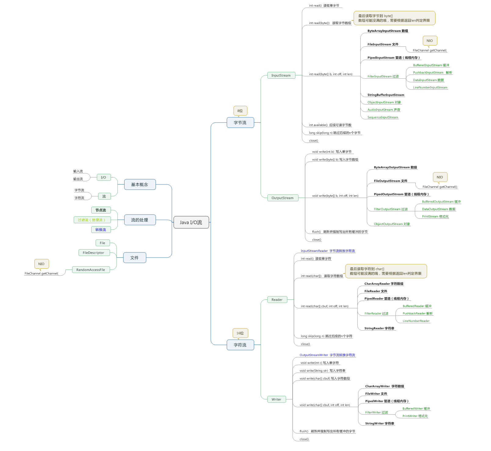
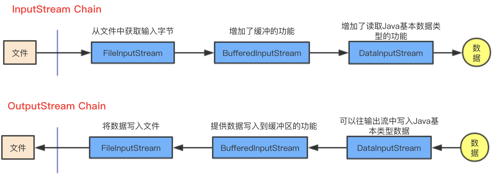
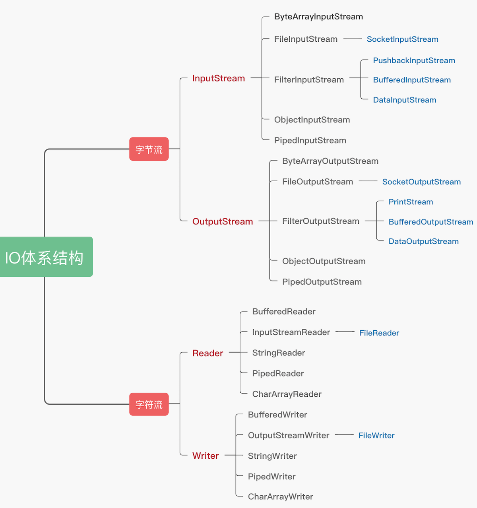
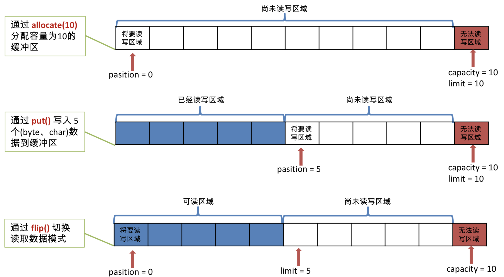
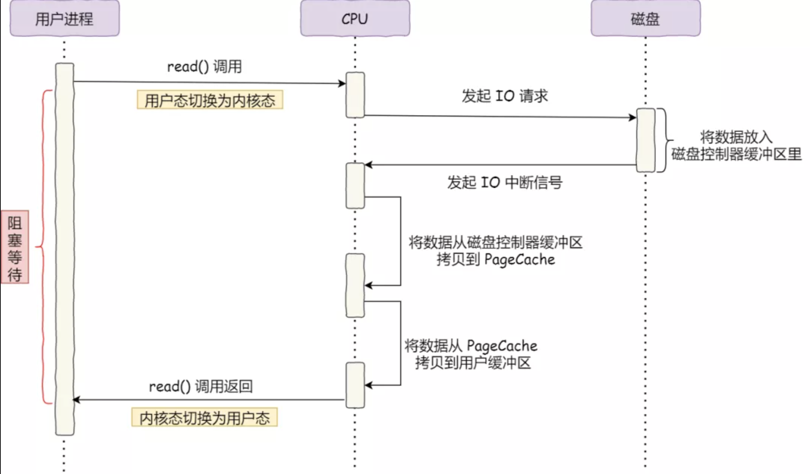
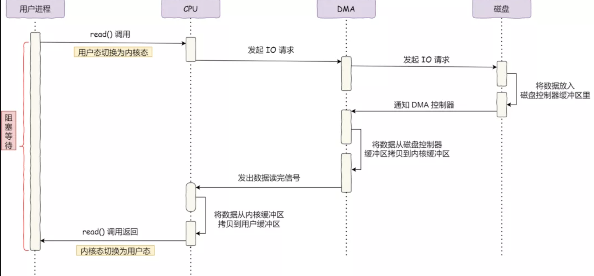
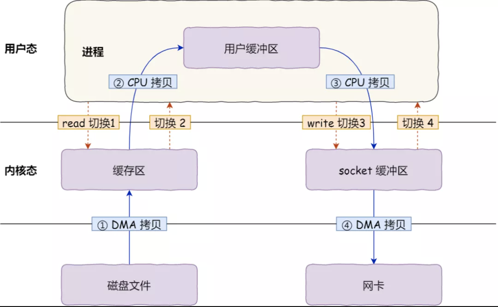
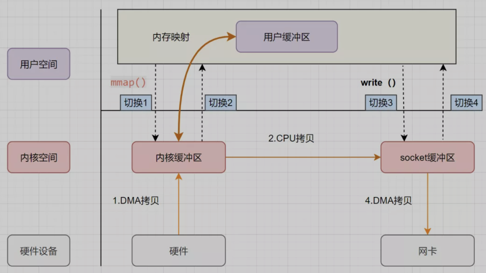
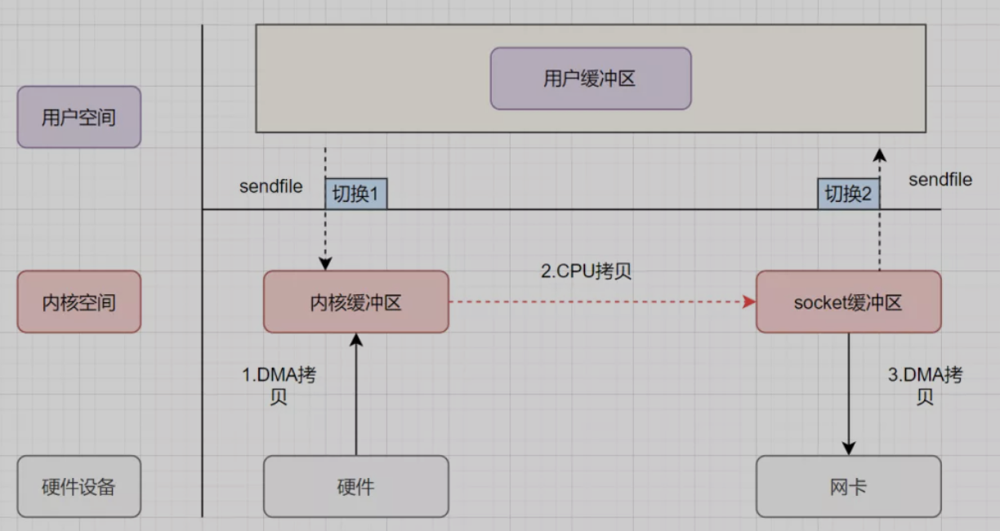
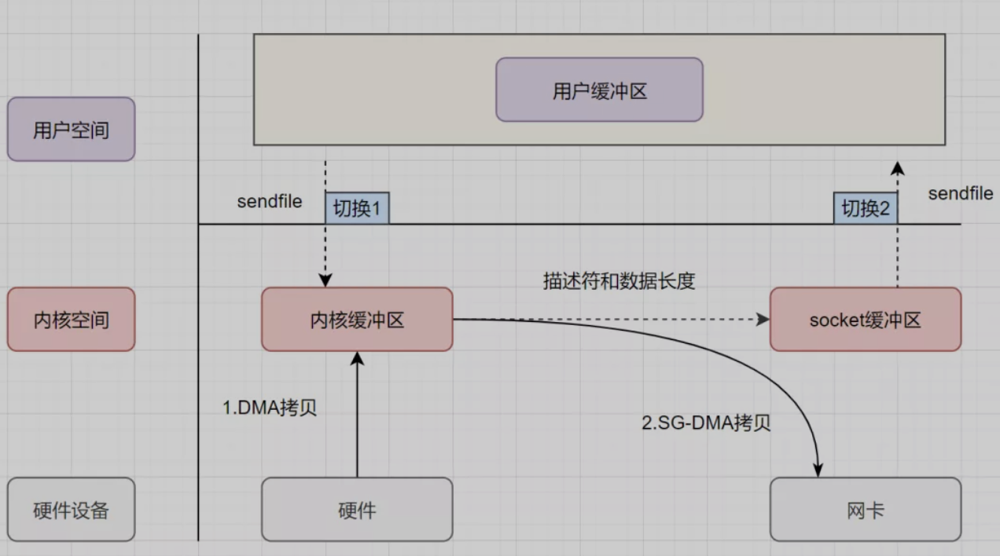

# 一、I/O 模型

- [Thousands of Threads and Blocking I/O: The Old Way to Write Java Servers Is New Again (and Way Better)](https://www.slideshare.net/slideshow/tyma-paulmultithreaded1/16359045)

为什么有IO模型：因为用户空间无法直接从内核空间拷贝数据，而是由内核空间来操作，而IO模型就是解决谁触发拷贝、

## 1、异步与同步

同步和异步是指访问数据的一种机制
- **同步**：如果有多个任务或者事件要发生，这些任务或者事件必须逐个地进行，一个事件或者任务的执行会导致整个流程的暂时等待，这些事件没有办法并发地执行；
- **异步**：如果有多个任务或者事件发生，这些事件可以并发地执行，一个事件或者任务的执行不会导致整个流程的暂时等待；

## 2、阻塞与非阻塞

线程访问资源，该资源是否就绪的一种处理方式
- **阻塞**：当某个事件或者任务在执行过程中，它发出一个请求操作，但是由于该请求操作需要的条件不满足，那么就会一直在那等待，直至条件满足；
- **非阻塞**：当某个事件或者任务在执行过程中，它发出一个请求操作，如果该请求操作需要的条件不满足，会立即返回一个标志信息告知条件不满足，不会一直在那等待；

**阻塞和非阻塞的区别**：关键在于当发出请求一个操作时，如果条件不满足，是会一直等待还是返回一个标志信息	

## 3、阻塞IO与非阻塞IO

- **IO操作包括**：对硬盘的读写、对socket的读写以及外设的读写；

- **完整的IO请求操作包括两个阶段**：
    - 查看数据是否就绪；
    - 进行数据拷贝（内核将数据拷贝到用户线程）；

- **阻塞(blocking IO)和非阻塞(non-blocking IO)的区别**：其区别就在于第一个阶段，如果数据没有就绪，在查看数据是否就绪的过程中是一直等待，还是直接返回一个标志信息。

## 4、异步IO与同步IO

**4.1、概述**

- 同步IO即如果一个线程请求进行IO操作，在IO操作完成之前，该线程会被阻塞
- 异步IO为如果一个线程请求进行IO操作，IO操作不会导致请求线程被阻塞

**4.2、同步IO和异步IO模型是针对用户线程和内核的交互来说的：**

- 同步IO：当用户发出IO请求操作之后，如果数据没有就绪，需要通过用户线程或者内核不断地去轮询数据是否就绪，当数据就绪时，再将数据从内核拷贝到用户线程；
- 异步IO：只有IO请求操作的发出是由用户线程来进行的，IO 操作的两个阶段都是由内核自动完成，然后发送通知告知用户线程IO操作已经完成。也就是说在异步IO中，不会对用户线程产生任何阻塞

**4.3、同步IO和异步IO关键区别**

同步IO和异步IO的关键区别反映在数据拷贝阶段是由用户线程完成还是内核完成，所以说"异步IO"必须要有操作系统的底层支持；

**4.4、“同步IO和异步IO”与“阻塞IO和非阻塞IO”是不同的两组概念**

阻塞IO和非阻塞IO是反映在当用户请求IO操作时，如果数据没有就绪，是用户线程一直等待数据就绪，还是会收到一个标志信息这一点上面的；

也就是说：阻塞IO和非阻塞IO是反映在IO操作的第一个阶段，在查看数据是否就绪时是如何处理的;

同步、异步是描述被调用方的；

阻塞、非阻塞是描述调用方的；

同步不一定阻塞、异步也不一定非阻塞

## 5、五种IO模型

### 5.1、同步阻塞IO模型

最传统的一种 IO模型，即在读写数据过程中会发生阻塞现象，在 Linux 中，默认情况下所有的 socket 都是 blocking 的

主要操作流程：
- 首先，应用进程发起 IO 系统调用后，应用进程被阻塞，转到内核空间处理；
- 之后，内核开始等待数据，等待到数据之后，再将内核中的数据拷贝到用户内存中，整个 IO 处理完毕后返回进程；
- 最后应用的进程解除阻塞状态，运行业务逻辑；

系统内核处理 IO 操作分为两个阶段——等待数据和拷贝数据。而在这两个阶段中，应用进程中 IO 操作的线程会一直都处于阻塞状态，如果是基于 Java 多线程开发，那么每一个 IO 操作都要占用线程，直至 IO 操作结束

典型的例子：`data = socket.read();`

### 5.2、同步非阻塞IO模型

用户线程发起一个read操作后，并不需要等待，而是马上就得到了一个结果
- 一旦内核中的数据准备好了，并且又再次收到了用户线程的请求，那么它马上就将数据拷贝到了用户线程，然后返回；
- 在非阻塞IO模型中，用户线程需要不断地询问内核数据是否就绪，也就说非阻塞IO不会交出CPU，而会一直占用CPU；

### 5.3、多路复用IO模型

多个网络连接的 IO，复用就是指多个通道复用在一个复用器上

- [深入揭秘 epoll 是如何实现 IO 多路复用的](https://mp.weixin.qq.com/s/OmRdUgO1guMX76EdZn11UQ)

#### 5.3.1、IO多路复用

多路复用IO模型是目前使用得比较多的模型；Java NIO 实际上就是多路复用IO
- Linux 提供 select、poll、epoll，进程通过讲一个或者多个 fd 传递给 select、poll、epoll 系统调用，阻塞在 select 操作（这个是内核级别的调用）上，这样的话，可以同时监听多个 fd 是否处于就绪状态
- 多路复用IO模型中，会有一个线程不断去轮询多个socket的状态，只有当socket真正有读写事件时，才真正调用实际的IO读写操作
- 在多路复用IO模型中，只需要使用一个线程就可以管理多个socket，系统不需要建立新的进程或者线程，也不必维护这些线程和进程，并且只有在真正有socket读写事件进行时，才会使用IO资源，所以它大大减少了资源占用
- 多路复用IO为何比非阻塞IO模型的效率高：是因为在非阻塞IO中，不断地询问socket状态时通过用户线程去进行的，而在多路复用IO中，轮询每个socket状态是内核在进行的，这个效率要比用户线程要高的多
- 注意点：多路复用IO模型来说，一旦事件响应体很大，那么就会导致后续的事件迟迟得不到处理，并且会影响新的事件轮询

**IO多路复用技术**
- IO多路复用技术通过把多个IO阻塞复用到同一个select的阻塞上，从而使得系统在单线程的清下可以同时处理多个客户端请求；
- 与传统的多线程/多进程模型比，IO多路复用的最大优势是系统开销小，系统不需要创建新的额外进程或者线程，也不需要维护这些进程和线程的运行，降低了系统维护的工作量。
- IO多路复用技术应用场景：
	- 服务器需要同时处理多个处于监听状态或者多个连接状态的套接字；
	- 服务器需要同时处理多种网络协议的套接字；

#### 5.3.2、多路复用模型select、poll、epoll

* [IO多路复用之select、poll、epoll详解](https://www.jianshu.com/p/dfd940e7fca2)
* [Linux多路复用](http://zhuuu.work/2020/08/17/Linux/Linux-06-多路复用/)

I/O多路复用模型会用到`select、poll、epoll`函数，这几个函数也会使进程阻塞，但是和阻塞I/O所不同的的，这两个函数可以同时阻塞多个I/O操作；其中`epoll`是Linux所特有，而`select`则应该是POSIX所规定，一般操作系统均有实现；

**（1）select：**线程维护一个FD的列表
- 基本原理：select 函数监视的文件描述符分3类，分别是writefds、readfds、和exceptfds。调用后select函数会阻塞，直到有描述符就绪（有数据 可读、可写、或者有except），或者超时（timeout指定等待时间，如果立即返回设为null即可），函数返回。当select函数返回后，可以通过遍历fdset，来找到就绪的描述符

    select目前几乎在所有的平台上支持，其良好跨平台支持也是它的一个优点。select的一个缺点在于单个进程能够监视的文件描述符的数量存在最大限制，在Linux上一般为1024，可以通过修改宏定义甚至重新编译内核的方式提升这一限制，但是这样也会造成效率的降低；

    select本质上是通过设置或者检查存放fd标志位的数据结构来进行下一步处理，这样所带来的缺点是：
    - select最大的缺陷就是单个进程所打开的FD是有一定限制的，它由FD_SETSIZE设置，默认值是1024；
    - 对socket进行扫描时是线性扫描，即采用轮询的方法，效率较低；
    - 需要维护一个用来存放大量fd的数据结构，这样会使得用户空间和内核空间在传递该结构时复制开销大

**（2）poll：**
- 基本原理：poll本质上和select没有区别，它将用户传入的数据拷贝到内核空间，然后查询每个fd对应的设备状态，如果设备就绪则在设备等待队列中加入一项并继续遍历，如果遍历完所有fd后没有发现就绪设备，则挂起当前进程，直到设备就绪或者主动超时，被唤醒后它又要再次遍历fd。这个过程经历了多次无谓的遍历

- 它没有最大连接数的限制，原因是它是基于链表来存储的，但是同样有一个缺点：
    - 大量的fd的数组被整体复制于用户态和内核地址空间之间，而不管这样的复制是不是有意义；
    - poll还有一个特点是“水平触发”，如果报告了fd后，没有被处理，那么下次poll时会再次报告该fd；

**（3）epoll：**内核维护一个高效的二叉搜索树

select 和 poll 的共有缺陷：
- 第一个缺陷：select 和 poll 函数，这两系统函数每次调用都需要我们提供给它所有的需要监听的socket文件描述符集合，而且主线程是死循环调用select/poll函数的，这里面涉及到用户空间数据到内核空间拷贝的过程；
- 第二个缺陷：select 和 poll 函数它的返回值都是int整型值，只能代表有几个socket就绪或者有错误了，它没办法表示具体是哪个socket就绪了；这就导致了程序被唤醒以后，还需要新的一轮系统调用去检查哪个socket是就绪状态的，然后再进行socket数据处理逻；

epoll使用一个文件描述符管理多个描述符，将用户关系的文件描述符的事件存放到内核的一个事件表中，这样在用户空间和内核空间的copy只需一次；是之前的select和poll的增强版本。相对于select和poll来说，epoll更加灵活，没有描述符限制
- 基本原理：epoll支持水平触发和边缘触发，最大的特点在于边缘触发，它只告诉进程哪些fd刚刚变为就绪态，并且只会通知一次。还有一个特点是，epoll使用“事件”的就绪通知方式，通过epoll_ctl注册fd，一旦该fd就绪，内核就会采用类似callback的回调机制来激活该fd，epoll_wait便可以收到通知

- 优点：
    - 没有最大并发连接的限制，能打开的FD的上限远大于1024；
    - 效率提升，不是轮询的方式，不会随着FD数目的增加效率下降。只有活跃可用的FD才会调用callback函数；即Epoll最大的优点就在于它只管你“活跃”的连接，而跟连接总数无关，因此在实际的网络环境中，Epoll的效率就会远远高于select和poll；
    - 内存拷贝，利用mmap()文件映射内存加速与内核空间的消息传递；即epoll使用mmap减少复制开销
- epoll对文件描述符的操作有两种模式：LT（level trigger）和ET（edge trigger），LT模式是默认模式，LT模式与ET模式的区别如下：
    - LT模式：当epoll_wait检测到描述符事件发生并将此事件通知应用程序，应用程序可以不立即处理该事件。下次调用epoll_wait时，会再次响应应用程序并通知此事件；
    - ET模式：当epoll_wait检测到描述符事件发生并将此事件通知应用程序，应用程序必须立即处理该事件。如果不处理，下次调用epoll_wait时，不会再次响应应用程序并通知此事件

相对于 select，epoll 有哪些改进？
- epoll 不再需要像 select 一样对 fd 集合进行轮询，也不需要在调用时将 fd 集合在用户态和内核态进行交换；
- 应用程序获得就绪 fd 的事件复杂度，epoll 是 O(1)，select 是 O(n)；
- select 最大支持约 1024 个 fd，epoll 支持 65535个；
- select 使用轮询模式检测就绪事件，epoll 采用通知方式，更加高效；epoll是有一个专门的就绪列表

### 5.4、信号驱动 IO 模型

信号驱动 IO 不再用主动询问的方式去确认数据是否就绪，而是向内核发送一个信号（调用 sigaction 的时候建立一个 SIGIO 的信号），然后应用进程可以去做别的事，不用阻塞。当内核数据准备好后，再通过 SIGIO 信号通知应用进程，数据准备好后的可读状态。应用进程收到信号之后，立即调用 recvfrom，去读取数据

### 5.5、异步 IO 模型

- 最理想的IO模型
- 在异步IO模型中，IO操作的两个阶段都不会阻塞用户线程，这两个阶段都是由内核自动完成，然后发送一个信号告知用户线程操作已完成，用户线程中不需要再次调用IO函数进行具体的读写
- 与信号驱动 IO 模型相比：
    - 在信号驱动模型中，当用户线程接收到信号表示数据已经就绪，然后需要用户线程调用IO函数进行实际的读写操作；
    - 在异步IO模型中，收到信号表示IO操作已经完成，不需要再在用户线程中调用iO函数进行实际的读写操作
- 注意：异步IO是需要操作系统的底层支持，在Java 7中，提供了Asynchronous IO

异步 I/O 模型的发展技术是： select -> poll -> epoll -> aio -> libevent -> libuv

Windows I/O Completion Port

### 5.6、总结

前面四种IO模型实际上都属于同步IO，只有最后一种是真正的异步IO；因为：前面四种模型中IO操作的第2个阶段都会引起用户线程阻塞，也就是说内核进行数据拷贝的过程都会让用户线程阻塞；

在这四种常用的 IO 模型中，应用最多的、系统内核与编程语言支持最为完善的，便是阻塞 IO 和 IO 多路复用

## 6、高性能IO设计模式

### 6.1、Reactor

- [Understanding Reactor Pattern: Thread-Based and Event-Driven](https://dzone.com/articles/understanding-reactor-pattern-thread-based-and-eve)
- [Reactor Pattern](https://www.dre.vanderbilt.edu/~schmidt/PDF/Reactor2-93.pdf)

具体可以参考文档：[《Scalable IO in Java》](https://gee.cs.oswego.edu/dl/cpjslides/nio.pdf)，作者是：Doug Lea

#### 6.1.1、概念

Reactor 是一种和 IO 相关的设计模式
- 一种事件驱动模型
- 处理多个输入；
- 采用多路复用将事件分发给相应的Handler处理

Reactor实际上采用了分而治之和事件驱动的思想：
- 分而治之：一个连接里完整的网络处理过程一般分为 accept、read、decode、process、encode、send这几步。而Reactor模式将每个步骤映射为一个Task，服务端线程执行的最小逻辑单元不再是一个完整的网络请求，而是 Task，且采用非阻塞方式执行；
- 事件驱动：每个Task 对应特定的网络事件，当Task 准备就绪时，Reactor 收到对应的网络事件通知，并将Task 分发给绑定了对应网络事件的 Handler 执行

总结概念如下：
`Reactor模式`就是指一个或多个事件输入同时传递给服务处理器(Reactor)，服务处理器负责监听各事件的状态，当任意一个事件准备就绪时，服务处理器收到该事件通知，并将事件发送给绑定了该对应网络事件的事件处理器(Handler)执行

Reactor模式的核心组成部分包括Reactor和处理资源池，其中Reactor负责监听和分配事件，处理资源池负责处理事件

Reactor模式中角色：
- Reactor：负责响应事件，将事件分发绑定了该事件的Handler处理；
- Handler：事件处理器，绑定了某类事件，负责执行对应事件的任务对事件进行处理；
- Acceptor：Handler的一种，绑定了 connect 事件，当客户端发起connect请求时，Reactor会将accept事件分发给Acceptor处理

#### 6.1.2、Reactor模式的三种实现

**（1）Reactor单线程**


以上的`select，accept,read,send`是标准I/O复用模型的网络编程API，dispatch和"业务处理"是需要完成的操作；

方案具体操作步骤：
- Reactor对象通过select监控连接事件，收到事件后通过dispatch进行分发；
- 如果是连接建立的事件，则交由 Acceptor 通过accept 处理连接请求，然后创建一个 Handler 对象处理连接完成后的后续业务处理；
- 如果不是建立连接事件，则 Reactor 会分发调用连接对应的 Handler来响应；
- Handler 会完成 read -> 业务处理 -> send 的完整业务流程

单线程方案的优点：模型简单，没有多线程，进程通信，竞争的问题，全部都在一个线程中完成；

单线程方案的缺点：
- 只有一个进程，无法发挥多核 CPU的性能，只能采取部署多个系统来利用多核CPU,但这样会带来运维复杂度；
- Handler 在处理某个连接上的业务时，整个进程无法处理其他连接的事件，很容易导致性能瓶颈

C 语言编写系统的一般使用单 Reactor 单进程

应用场景：其在实践中应用场景不多，只适用于业务处理非常快速的场景，比如Redis；

Reactor单线程在NIO中使用：


**（2）单Reactor多线程**


方案步骤：
- 主线程中，Reactor对象通过select 监听连接事件，收到事件后通过 dispatch进行分发；
- 如果是连接建立的事件，则由Acceptor处理，Acceptor通过 accept接受连接，并创建一个 Handler 来处理连接后续的各种事件；
- 如果不是连接建立事件，则Reactor会调用连接对应的Handler来进行相应；
- Handler 只负责响应事件，不进行业务处理，Handler 通过 read 读取到数据后，会发给 processor 进行业务处理；
- Processor 会在独立的子线程中完成真正的 业务处理，然后将响应结果发给主进程的 Handler处理，Handler 收到响应后通过 send 将响应结果返回给 client；

多线程方案优点： 能够充分利用多核多 CPU的处理能力；

多线程方案缺点：
- 多线程数据共享和访问比较复杂；
- Reactor 承担所有事件的监听和响应，只在主线程中运行，瞬间高并发时会成为性能瓶颈

**（3）多Reactor多线程**


方案步骤：
- 主进程中mainReactor对象通过 select监控连接建立事件，收到事件后通过 Acceptor接收，将新的连接分配给某个子进程；
- 子进程中的 subReactor 将 mainReactor 分配的连接加入连接队列进行监听，并创建一个 Handler 用于处理连接的各种事件；
- 当有新的事件发生时，subReactor 会调用里连接对应的 Handler 来响应；
- Handler完成 `read -> 业务处理 -> send` 的完整业务流程；

特点：
- 主进程和子进程的职责非常明确，主进程只负责接收新连接，子进程负责完成后续的业务处理；
- 主进程和子进程的交互很简单，主进程只需要把新的连接传递给子进程，子进程无需返回数据；
- 子进程之间是相互独立的，无需同步共享之类的处理（这里仅限于网络模型相关的 select,read,send等无须同步共享，"业务处理"还是有可能需要同步共享的

目前著名的开源系统 Nginx 采用的是多 Reactor 多进程，采用多 Reactor 多线程的实现有 Memcache 和 Netty

### 6.2、Proactor

前摄器模式，其实现了一个主动的事件分离和分发模型；这种设计允许多个任务并发的执行，从而提高吞吐量；并可执行耗时长的任务（各个任务间互不影响）

Proactor主动器模式包含如下角色

- Handle 句柄；用来标识socket连接或是打开文件；
- Asynchronous Operation Processor：异步操作处理器；负责执行异步操作，一般由操作系统内核实现；
- Asynchronous Operation：异步操作
- Completion Event Queue：完成事件队列；异步操作完成的结果放到队列中等待后续使用
- Proactor：主动器；为应用程序进程提供事件循环；从完成事件队列中取出异步操作的结果，分发调用相应的后续处理逻辑；
- Completion Handler：完成事件接口；一般是由回调函数组成的接口；
- Concrete Completion Handler：完成事件处理逻辑；实现接口定义特定的应用处理逻辑；

业务流程：
- 应用程序启动，调用异步操作处理器提供的异步操作接口函数，调用之后应用程序和异步操作处理就独立运行；应用程序可以调用新的异步操作，而其它操作可以并发进行；
- 应用程序启动Proactor主动器，进行无限的事件循环，等待完成事件到来；
- 异步操作处理器执行异步操作，完成后将结果放入到完成事件队列；
- 主动器从完成事件队列中取出结果，分发到相应的完成事件回调函数处理逻辑中；

Proactor性能更高，能够处理耗时长的并发场景；适用于异步接收和同时处理多个服务请求的事件驱动程序的场景；

Proactor调用aoi_write后立刻返回，由内核负责写操作，写完后调用相应的回调函数处理后续逻辑；

理论上 Proactor 比 Reactor 效率要高一些，异步 I/O 能够充分利用 DMA 特性，让 I/O 操作与计算重叠，但要实现真正的异步 I/O，操作系统需要做大量的工作。目前 Windows 下通过 IOCP 实现了真正的异步 I/O，而在 Linux 系统下的 AIO 并不完善，因此在 Linux 下实现高并发网络编程时都是以 Reactor 模式为主。所以即使 Boost.Asio 号称实现了 Proactor 模型，其实它在 Windows 下采用 IOCP，而在 Linux 下是用 Reactor 模式（采用 epoll）模拟出来的异步模型

## 7、Java中IO实现

### 7.1、BIO


- 采用BIO通信模型的服务端，由一个独立的 Acceptor现场负责监听客户端连接，它接收到客户端连接请求之后为每个客户端创建一个新的线程进行链路处理，处理完成后，通过输出流返回给应答给客户端，线程销毁。这是典型的`一请求一应答`通信模型。

- 该模型最大的问题是缺乏弹性伸缩能力，当客户端并发访问量增加后，服务端的线程个数和客户端并发访问数呈`1:1`的正比关系。由于线程是Java虚拟机的非常宝贵的系统资源，当线程数膨胀后，系统的性能急剧下降，系统可能会发生线程堆栈溢出，创建线程失败等。

- 在API层面上：操作是会阻塞的，比如作为服务端开发，使用ServerSocket 绑定端口号之后会监听该端口,等待accept事件，accept是会阻塞当前线程

- 原理：利用CPU中断
	- 阻塞的线程进入休眠，将执行权限交给其他线程
	- 优点：阻塞时不会占用系统资源；程序好理解
	- 缺点：高并发场景需要较高的线程数量（资源占用）； 线程切换有成本

### 7.2、伪异步IO


- 采用线程池和任务队列可以实现伪异步IO

- 当有新的客户端接入时，将客户端的Socket封装成一个Task（其实现Runnable接口）传递给后端的线程池中处理，JDK的线程池维护一个消息队列和N个活跃线程，对消息队列中的任务进行处理。

- 由于线程池和消息队列都是有界的，因此，无论客户端并发连接数多大，它都不会导致线程个数过于膨胀或者内存溢出；

- 但是由于其底层通信依然采用同步阻塞模型，无法从根本上解决问题

### 7.3、NIO-非阻塞IO

- jdk1.4引入NIO，弥补了原来阻塞IO的不足，具体参考[Java-NIO](#三Java-NIO)

- NIO相对其他IO来说，优点：
    - 操作不会阻塞线程；
	- 客户端发起的连接操作是异步的，可以通过在多路复用器注册`OP_CONNECT`等待后续结果，不需要像之前的客户端那样被同步阻塞；
	- SocketChannel 的读写操作都是异步的，如果没有可读写的数据它不会同步等待，直接返回，这样I/O通信线程就可以处理其他链路；
	- 线程模型的优化；
- 原理：由专门的数据结构负责统计发生的I/O，再允许程序监听变更
	- I/O变更发生后，记录在某个特定的数据结构上，比如epoll的红黑树
	- 线程可以在数据结构上注册自己关注的——
		- 文件描述符
		- 消息类型（读、写……）
	- 通常给线程提供一个方法可以一次性获得自己关注的事件
		- 如果拿到：一个事件的集合
		- 没有拿到：null

### 7.4、AIO-异步IO

- [Java AIO本质](https://tech.dewu.com/article?id=28)

异步的套接字通道时真正的异步非阻塞I/O，对应于UNIX网络编程中的事件驱动I/O（AIO）
- JDK7中新增了一些与文件(网络)I/O相关的一些api。这些API被称为NIO.2，或称为AIO(Asynchronous I/O)；
- 服务器实现模式为一个有效请求一个线程，客户端的I/O请求都是由OS先完成了再通知服务器应用去启动线程进行处理；
- AIO最大的一个特性就是异步能力，这种能力对socket与文件I/O都起作用。AIO其实是一种在读写操作结束之前允许进行其他操作的I/O处理；
- jdk7主要增加了三个新的异步通道：
	- AsynchronousFileChannel: 用于文件异步读写；
	- AsynchronousSocketChannel: 客户端异步socket；
	- AsynchronousServerSocketChannel: 服务器异步socket
- AIO的实施需充分调用OS参与，IO需要操作系统支持、并发也同样需要操作系统的支持，所以性能方面不同操作系统差异会比较明显
- 将来式读取：用现有的Java.util.concurrent技术声明一个Future，用来保存异步操作的处理结果。通常用Future get()方法（带或不带超时参数）在异步IO操作完成时获取其结果
- 回调式异步读取：回调式所采用的事件处理技术类似于Swing UI编程采用的机制

- API设计：异步编程(基于Future)：本质：异步转同步
- 原理：利用线程池技术、协程技术，调度所有Future的计算：通常结合epoll和directmemory技术

### 7.5、不同IO对比

|  对比参数|同步IO（BIO）|伪异步IO|NIO|AIO|
|-------|----|----|--------|--------|
|客户端个数|1：1|M:N（其中M可以大于N）|M：1（1个IO线程处理多个客户端连接）|M：0（不需要启动额外的IO线程，被动回调）|
|IO类型（阻塞）|阻塞IO|阻塞IO|非阻塞IO|非阻塞IO|
|IO类型（同步）|同步IO|同步IO|同步IO（IO多路复用）|异步IO|
|API难度|简单|简单|非常复杂|复杂|
|调试难度|简单|简单|复杂|复杂|
|可靠性|非常差|差|高|高|
|吞吐量|低|中|高|高|

## 8、C10K与C1000K问题

- [The C10K problem](http://www.kegel.com/c10k.html)

C10K 和 C1000K 的首字母 C 是 Client 的缩写。
- C10K 就是单机同时处理 1 万个请求（并发连接 1 万）的问题；
- C1000K 也就是单机支持处理 100 万个请求（并发连接 100 万）的问题

### 8.1、C10K问题

解决方案：
- 使用非阻塞 I/O 和水平触发通知，比如使用 select 或者 poll；
- 第二种，使用非阻塞 I/O 和边缘触发通知，比如 epoll；
    - epoll 使用红黑树，在内核中管理文件描述符的集合，这样，就不需要应用程序在每次操作时都传入、传出这个集合。
    - epoll 使用事件驱动的机制，只关注有 I/O 事件发生的文件描述符，不需要轮询扫描整个集合；
- 使用异步 I/O（Asynchronous I/O，简称为 AIO）；

### 8.2、C1000K

基于 I/O 多路复用和请求处理的优化，C10K 问题很容易就可以解决；

C1000K 的解决方法，本质上还是构建在 epoll 的非阻塞 I/O 模型上。只不过，除了 I/O 模型之外，还需要从应用程序到 Linux 内核、再到 CPU、内存和网络等各个层次的深度优化，特别是需要借助硬件，来卸载那些原来通过软件处理的大量功能

# 二、Java-IO流





**流和数组不一样，不能通过索引读写数据。在流中，你也不能像数组那样前后移动读取数据，除非使用 RandomAccessFile 处理文件.**

**InputStream：java.io.InputStream 类是所有 Java IO 输入流的基类**

- 如果你需要将读过的数据推回到流中，你必须使用 PushbackInputStream，这意味着你的流变量只能是这个类型，否则在代码中就不能调用 PushbackInputStream的unread()方法；
- 通常使用输入流中的read()方法读取数据.read()方法返回一个整数，代表了读取到的字节的内容，当达到流末尾没有更多数据可以读取的时候，read()方法返回-1<br>
    注意：InputStream的read()方法返回一个字节，意味着这个返回值的范围在0到255之间

**OutputStream：java.io.OutputStream 是 Java IO 中所有输出流的基类**

**组合流：将流整合起来以便实现更高级的输入和输出操作**

`InputStream input = new BufferedInputStream(new FileInputStream("c:\\data\\input-file.txt"));`

一个流要么是输入流，要么是输出流，不可能同时是输入流、输出流。因为`InputStream`和`OutputStream`是抽象类，而Java中对于类只能单继承，不能继承多个类。

**Java IO关注的是从原始数据源的读取以及输出原始数据到目标媒介： 数据源--> 程序 --> 目标媒介**

**一个程序需要InputStream或者Reader从数据源读取数据，需要 OutputStream或者Writer将数据写入到目标媒介中;**

InputStream和Reader与数据源相关联，OutputStream和Writer与目标媒介相关联

**Java IO操作类都在包 java.io 下，大概有将近 80 个类，但是这些类大概可以分成四组，分别如下：**

- 基于字节操作的 I/O 接口：InputStream 和 OutputStream
- 基于字符操作的 I/O 接口：Writer 和 Reader
- 基于磁盘操作的 I/O 接口：File
- 基于网络操作的 I/O 接口：Socket

前两组主要是根据传输数据的数据格式，后两组主要是根据传输数据的方式I/O 的核心问题要么是数据格式影响 I/O 操作，要么是传输方式影响 I/O 操作

==> "数据格式"和"传输方式"是影响效率最关键的因素了

从数据传输方式或者说是运输方式角度看，可以将 IO 类分为:
- 字节流
- 字符流

## 1、文件的编码

- GBK编码中文占用两个字节，英文占用一个字节；
- utf-8编码，中文占用3个字节，英文占用一个字节；
- utf-16be：java是双字节编码：utf-16be，中文占用2个字节，英文占用两个字节

> 当你的字节序列是某种编码时，这个时候如果想把字节序列变成字符串，也需要使用这种字符编码，否则会出现乱码
> 文本文件就是字节序列，可以是任意编码的字节序列，如果在中文的机器上直接创建文本文件，那么该文本文件只认识 ansi 编码；

```java
public static void main(String[] args) throws Exception {
    String s = "慕课ABC";
    byte[] byte1 = s.getBytes(Charset.forName("GBK"));

    for (byte b : byte1) {
        System.out.print(Integer.toHexString(b & 0xff) + " ");
    }
    System.out.println();
    byte[] byte2 = s.getBytes(Charset.forName("UTF-8"));
    for (byte b : byte2) {
        System.out.print(Integer.toHexString(b & 0xff) + " ");
    }

    System.out.println();
    byte[] byte3 = s.getBytes(Charset.forName("utf-16be"));
    for (byte b : byte3) {
        System.out.print(Integer.toHexString(b & 0xff) + " ");
    }
    System.out.println();
    String str = new String(byte3, StandardCharsets.UTF_16BE);
    System.out.println(str);
}
```

## 2、File类使用

`java.io.File`类用于表示文件（目录）；File类只用于表示文件（目录）的信息（名称、大小等），不能用于文件内容的访问；
- file.isDirectory：是否Wie一个目录，如果是返回true，如果不是或者目录不存在则返回false；

遍历目录

## 3、RandomAccessFile

通过 RandomAccessFile 对文件进行随机存取

随机存取并不意味着你可以在真正随机的位置进行读写操作，它只是意味着你可以跳过文件中某些部分进行操作，并且支持同时读写，不要求特定的存取顺序；

随机读写是通过文件指针，允许在文件的任何位置读或者写一个块，通过控制这个文件指针，你可以在文件中来回移动，在你想要的任何位置，以随机的方式进行读写操作
```java
public class RandomAccessFile implements DataOutput, DataInput, Closeable {
}
```

### 3.1、创建 RandomAccessFile

```java
public RandomAccessFile(File file, String mode)
public RandomAccessFile(String name, String mode)
```
mode 的值可以是如下的：
- `"r"`：只读模式
- `"rw"`：读写模式
- `"rws"`：同读写模式，对文件的任何更改立即生效；
- `"rwd"`：同读写模式，对文件的任何修改延迟生效；

上面提高文件指针（file pointer），RandomAccessFile 提高了如下方法来控制：
- `seek(long pos)`：将文件指针移动到文件中的一个指定位置。这个偏移量是以字节为单位，从文件的开头开始计算；下一次读或写发生在这个位置；
- `skipBytes(int n)`：将文件指针从当前位置向前移动n个字节，即跳过了n个字节；
- `getFilePointer()`：返回File pointer的当前位置

RandomAccessFile 提高了读和写的相关方法
- 读方法：read(byte[]), readByte(), readInt(), readLong() 等；raf.read 读一个字节
- 写方法：write(byte[]), writeByte(), writeInt(), writeLong() 等；`raf.write(int)`只写一个字节（后8位)，同时指针指向下一个位置，准备再次写入；

### 3.2、读写文件示例

```java
public class RafWriteFile {
    public static void main(String[] args) throws Exception {
        File file = new File("data/raf.data");
        if (!file.exists()) {
            file.createNewFile();
        }
        RandomAccessFile raf = new RandomAccessFile(file, "rw");
        // 获取文件指针位置
        System.out.println("初始文件指针：" + raf.getFilePointer());
        // 一次只写入一个字节
        raf.write('A');
        System.out.println("第一次文件指针：" + raf.getFilePointer());

        int i = 0x7fffffff;
        // 用write方法每次只能写一个字节，如果要把i写进去就得写4次
        raf.write(i >>> 24); // 高位8字节
        raf.write(i >>> 16);
        raf.write(i >>> 8);
        raf.write(i);
        System.out.println("第二次文件指针：" + raf.getFilePointer());
        raf.write(i);
        // 读文件，必须把指针移到头部
        raf.seek(0);
        // 一次性读取,把文件中的内容都读到字节数组中
        byte[] buf = new byte[(int)raf.length()];
        raf.read(buf);
    }
}
```

### 3.3、RandomAccessFile 与 NIO

raf.getChannel()

## 4、字节流

InputStream、OutputStream
- InputStream：抽象了应用程序读取数据的方式
- OutputStream：抽象了应用程序写出数据的方式

EOF = End   读到-1就读到结尾

- 输入流基本是读：`int  b = in.read();`读取一个字节无符号填充到int低八位.-1是 EOF
- 输出流基本是写
    ```
    out.write(int b)  写出一个byte到流，b的低8位，每次都是写低8位
    out.write(byte[] buf)将buf字节数组都写入到流
    out.write(byte[] buf,int start,int size)
    ```

具体实现：
- FileInputStream：具体实现了在文件上读取数据
- FileOutputStream：实现了向文件中写出byte数据的方法
- DataOutputStream/DataInputStream：对"流"功能的扩展，可以更加方面的读取int,long，字符等类型数据
- BufferedInputStream&BufferedOutputStream：这两个流类位IO提供了带缓冲区的操作，一般打开文件进行写入或读取操作时，都会加上缓冲，这种流模式提高了IO的性能从应用程序中把输入放入文件，相当于将一缸水倒入到另一个缸中:
    - `FileOutputStream.write()`方法相当于一滴一滴地把水“转移”过去
    - `DataOutputStream.writeXxx()`方法会方便一些，相当于一瓢一瓢把水“转移”过去
    - `BufferedOutputStream.write`方法更方便，相当于一飘一瓢先放入桶中，再从桶中倒入到另一个缸中，性能提高了

## 5、字符流

- 将字节流转换成字符缓冲流
	```java
	// 读取文件，读取文件注意编码问题
	BufferedReader br = new BufferedReader(new InputStreamReader(new FileInputStream("D:/1.txt")));
	// 获取控制台输入
	BufferedReader br = new BufferedReader(new InputStreamReader(System.in));
	```
- 获取控制台输入

	- 用Scanner包装System.in，Scanner取得的输入以space, tab, enter 键为结束符
		```java
		Scanner scan = new Scanner(System.in);
		String read = scan.nextLine();
		```
	- 使用BufferedReader取得含空格的输入：取得包含space在内的输入
		```java
		BufferedReader br = new BufferedReader(new InputStreamReader(System.in ));
		br.readLine();
		```

字节流和字符流的区别：
- 字节流读取单个字节，字符流读取单个字符(一个字符根据编码的不同，对应的字节也不同，如 UTF-8 编码是 3 个字节，中文编码是 2 个字节。) 
- 字节流用来处理二进制文件(图片、MP3、视频文件)，字符流用来处理文本文件(可以看做是特殊的二进制文件，使用了某种编码，人可以阅读)

## 6、管道

为运行在同一个JVM中的两个线程提供了通信的能力，所以管道也可以作为"数据源以及目标媒介"

**不能利用管道与不同的JVM中的线程通信(不同的进程)，其与 Unix/Linux 系统的管道不一致**

**创建管道：**
    
- 通过Java IO 中的PipedOutputStream和PipedInputStream创建管道
- 一个PipedInputStream流应该和一个PipedOutputStream流相关联.
- 一个线程通过PipedOutputStream写入的数据可以被另一个线程通过相关联的PipedInputStream读取出来

**例子：可以使用两个管道共有的connect()方法使之相关联**
```java
public class PipedExample {
    public static void main(String[] args) throws IOException {
        final PipedOutputStream out = new PipedOutputStream();
        final PipedInputStream in = new PipedInputStream(out);
//		in.connect(out); 可以使用两个管道共有的connect()方法使之相关联
        Thread thread1 = new Thread(new Runnable() {
            public void run() {
                try {
                    out.write("Hello，piped output".getBytes());
                } catch (IOException e) {
                    e.printStackTrace();
                }
            }
        });
        Thread thread2 = new Thread(new Runnable() {
            public void run() {
                try {
                    int data = in.read();
                    while(data != -1){
                        System.out.println((char)data);
                        data = in.read();
                    }
                } catch (IOException e) {
                    e.printStackTrace();
                }
            }
        });
        thread1.start();
        thread2.start();
        out.close();
        in.close();
    }
}
```
**管道与线程：**

当使用两个相关联的管道流时，务必将它们分配给不同的线程。read()方法和write()方法调用时会导致流阻塞，这意味着如果你尝试在一个线程中同时进行读和写，可能会导致线程死锁;

## 7、网络

**当两个进程之间建立了网络连接之后，他们通信的方式如同操作文件一样：**

利用 InputStream 读取数据，利用 OutputStream 写入数据，Java 网络 API 用来在不同进程之间建立网络连接，而 Java IO 则用来在建立了连接之后的进程之间交换数据

## 8、字节和字符数组



**从InputStream或者Reader中读入数组**

用 ByteArrayInputStream或者CharArrayReader封装字节或者字符数组从数组中读取数据：

**从OutputStream或者Writer中写数组：**

把数据写到ByteArrayOutputStream或者CharArrayWriter 中

**基于字节流的操作层次结构**
```
InputStream：
    ByteArrayInputStream
    FileInputStream 
        SocketInputStream
    FilterInputStream
        InflaterInputStream <- ZipInputStream
        BufferedInputStream
        DataInputStream
    ObjectInputStream
    PipedInputStream
OutputStream：与上述 InputStream 类似
```
**Writer/Reader相关类层次结构**
```
Writer：
    OutputStreamWriter
        FileWriter
    BufferedWriter
    StringWriter
    PipedWriter
    PrintWriter
    CharArrayWriter
Reader：类似 Writer
```

**InputStreamReader-字节流与字符流转换接口**

是字节到字符的转化桥梁，InputStream到Reader的过程要指定编码字符集，否则将采用操作系统默认字符集，很可能会出现乱码问题.StreamDecoder正是完成字节到字符的解码的实现类

## 9、标准输出

`System.in`、`System.out`、`System.err`

**JVM 启动的时候通过Java运行时初始化这3个流，所以你不需要初始化它们**

**System.in：**

一个典型的连接控制台程序和键盘输入的 InputStream 流

**System.out：**

System.out 是一个 PrintStream 流。System.out一般会把你写到其中的数据输出到控制台上

**System.err：**

System.err 是一个 PrintStream 流.System.err 与 System.out 的运行方式类似，但它更多的是用于打印错误文本

**替换系统流：**

System.in、System.out、System.err这3个流是java.lang.System类中的静态成员，并且已经预先在JVM启动的时候初始化完成，你依然可以更改它们；要把一个新的InputStream设置给System.in或者一个新的OutputStream设置给System.out或者System.err；可以使用 System.setIn()， System.setOut()， System.setErr()方法设置新的系统流

注意：请记住，务必在JVM关闭之前冲刷System.out(译者注：调用flush())，确保System.out把数据输出到了文件中


## 10、Reader、Writer

**Reader类：是Java IO 中所有Reader的基类**

- 子类包括BufferedReader，PushbackReader，InputStreamReader，StringReader和其他Reader
- Reader的read()方法返回一个字符，意味着这个返回值的范围在0到65535之间
- 整合 Reader 与 InputStream：<br>
  如果你有一个InputStream输入流，并且想从其中读取字符，可以把这个InputStream包装到InputStreamReader中Reader reader = new InputStreamReader(inputStream);在构造函数中可以指定解码方式
  

**Writer类：是Java IO中所有Writer的基类，子类包括BufferedWriter和PrintWriter等等**

- 整合 Writer 和 OutputStream：
一个Writer可以和一个 OutputStream 相结合。把OutputStream包装到OutputStreamWriter中，所有写入到OutputStreamWriter的字符都将会传递给OutputStream；<br>
Writer writer = new OutputStreamWriter(outputStream);

**整合Reader和Writer**

以通过将 Reader 包装到 BufferedReader、Writer 包装到 BufferedWriter 中实现缓冲


## 11、缓冲流

缓冲流的默认缓冲区大小是 8192 字节，也就是 8KB，算是一个比较折中的值

缓冲的本质是排队、流的本质是数据

- 直接使用 BufferedInputStream 和 BufferedOutputStream；
- 额外使用一个 8KB 缓冲，使用 BufferedInputStream 和 BufferedOutputStream；
- 直接使用 FileInputStream 和 FileOutputStream，再使用一个 8KB 的缓冲
```java
//使用BufferedInputStream和BufferedOutputStream
private static void bufferedStreamByteOperation() throws IOException {
   try (BufferedInputStream bufferedInputStream = new BufferedInputStream(new FileInputStream("src.txt"));
        BufferedOutputStream bufferedOutputStream = new BufferedOutputStream(new FileOutputStream("dest.txt"))) {
        int i;
        while ((i = bufferedInputStream.read()) != -1) {
            bufferedOutputStream.write(i);
        }
    }
}
//额外使用一个8KB缓冲，再使用BufferedInputStream和BufferedOutputStream
private static void bufferedStreamBufferOperation() throws IOException {
    try (BufferedInputStream bufferedInputStream = new BufferedInputStream(new FileInputStream("src.txt"));
         BufferedOutputStream bufferedOutputStream = new BufferedOutputStream(new FileOutputStream("dest.txt"))) {
        byte[] buffer = new byte[8192];
        int len = 0;
        while ((len = bufferedInputStream.read(buffer)) != -1) {
            bufferedOutputStream.write(buffer, 0, len);
        }
    }
}
//直接使用FileInputStream和FileOutputStream，再使用一个8KB的缓冲
private static void largerBufferOperation() throws IOException {
    try (FileInputStream fileInputStream = new FileInputStream("src.txt");
        FileOutputStream fileOutputStream = new FileOutputStream("dest.txt")) {
        byte[] buffer = new byte[8192];
        int len = 0;
        while ((len = fileInputStream.read(buffer)) != -1) {
            fileOutputStream.write(buffer, 0, len);
        }
    }
}
```

# 三、Java NIO

## 1、Java NIO 概述

### 1.1、核心概念

NIO：非阻塞IO
- Channels
- Buffers
- Selectors

### 1.2、Channel 和 Buffer

- 基本上，所有的IO在NIO中都从一个Channel开始，数据可以从Channel读到Buffer中，也可以从Buffer写到Channel中
- Channel的几种实现：<br>
	FileChannel<br>
	DatagramChannel<br>
	SocketChannel<br>
	ServerSocketChannel
- Buffer的实现：这些Buffer覆盖了你能通过IO发送的基本数据类型：byte、short、int、long、float、double和char<br>
	ByteBuffer<br>
	CharBuffer<br>
	DoubleBuffer<br>
	FloatBuffer<br>
	IntBuffer<br>
	LongBuffer<br>
	ShortBuffer<br>
	MappedByteBuffer<br>

### 1.3、Selector：Selector 允许单线程处理多个Channel

要使用Selector得向Selector注册Channel，然后调用它的select()方法个方法会一直阻塞到某个注册的通道有事件就绪。一旦这个方法返回，线程就可以处理这些事件，事件的例子有如新连接进来，数据接收；

## 2、Channel

```java
public interface Channel extends Closeable {
    public boolean isOpen(); // Channel 是否开启
    public void close() throws IOException;
}
```

用于源节点与目标节点的连接。在 Java NIO 中负责缓冲区中数据的传输，本身不存储数据

### 2.1、与流比较

不能直接访问数据，可以与 Buffer 进行交互
- 既可以从通道中读取数据，又可以写数据到通道.但流的读写通常是单向的
- 通道可以异步地读写;
- 通道中的数据总是要先读到一个 Buffer，或者总是要从一个 Buffer 中写入;

### 2.2、实现

- FileChannel：从文件中读写数据，一般从流中获取 Channel，不能切换成非阻塞模式，不能用于Selector
- DatagramChannel：能通过UDP读写网络中的数据.
- SocketChannel：能通过TCP读写网络中的数据.
- ServerSocketChannel：可以监听新进来的TCP连接，像Web服务器那样.对每一个新进来的连接都会创建一个 SocketChannel

### 2.3、获取Channel

- Java 针对支持通道的类都提供了 getChannel() 的方法;<br>
	输入输出流<br>
	网络IO<br>
- 在JDK7中NIO2.0 针对各个通道提供了静态的方法 open()
- 在JDK7中NIO2.0 的 Files 工具类的 newByteChannel()

### 2.4、Channel与Channel之间数据传输

在Java NIO中，两个channel中如果有一个channel是FileChannel，那么就可以把数据从一个channel传输到另外一个channel中去。FileChannel类中有transferTo()和transferFrom()两个方法可以做这个事情

FileChannel有两个方法：
- transferFrom()：这个方法把数据从一个源source读取到FileChannel中去
- transferTo()：把数据从FileChannel中读到其它channel中去

### 2.5、字符集
```
(1).编码：字符串 --> 字节数组
(2).解码：字节数组 --> 字符串
	查看支持的字符集：
	Charset.availableCharsets();
A.定义字符集：Charset cs = Charset.forName("UTF-8");
B.获取编码器：
	CharsetEncoder ce = cs.newEncoder();
	ByteBuffer bf = ce.encode(CharBuffer)
C.获取解码器：
	CharsetDecoder cd = cs.newDecoder();
	CharBuffer cf = cd.decode(ByteBuffer);
```

### 2.6、FileChannel

Java NIO中的FileChannel是一个用来连接文件的channel。使用FileChannel可以从文件中读数据，也可以把数据写入到文件中去。Java NIO中的FileChannel类的相关API可以替换Java标准IO流的API。

> 注意：FileChannel不能设置非阻塞模式，只能一直在阻塞模式下运行

**打开FileChannel**

FileChannel不能直接创建，而是要通过输入输出流（例如：InputStream, OutputStream、或者RandomAccessFile）来获取:
```java
RandomAccessFile aFile = new RandomAccessFile("data/nio-data.txt", "rw");
FileChannel inChannel = aFile.getChannel();
```
**从FileChannel中读取数据**

可通过调用FileChannel的read方法来读取数据，下面是一个例子：
```java
// 分配Buffer，数据是先从FileChannel中读到Buffer中去的
ByteBuffer buf = ByteBuffer.allocate(48);
// 调用FileChannel的read方法，把数据读到buffer中去。read方法返回的int整数表示读了多少数据到buffer中去，当该整数为-1时，表示数据已经被读完了
int bytesRead = inChannel.read(buf);
```
**向FileChannel中写入数据**
```java
String newData = "New String to write to file..." + System.currentTimeMillis();
ByteBuffer buf = ByteBuffer.allocate(48);
buf.clear();
buf.put(newData.getBytes());
buf.flip();
while(buf.hasRemaining()) {
    channel.write(buf);
}
```

## 3、Buffer

- [Guide to ByteBuffer](https://www.baeldung.com/java-bytebuffer)

用于和NIO通道进行交互，缓冲区本质上是一块可以写入数据，然后可以从中读取数据的内存，底层实现是数组；一般读写都要通过channel和buffer，需要从channel中读取数据到buffer中，或者将数据从buffer中写到channel中

方法名称 |方法描述
--------|-------
Buffer clear()	|清空缓冲区并返回对缓冲区的引用，但是数据还存在
Buffer flip()	|将缓冲区的界限设置为当前位置，并将当前位置充值为0
int capacity()	|返回Buffer 的capacity大小
boolean hasRemaining()|判断缓冲区中是否还有元素
int limit()	|返回Buffer 的界限(limit) 的位置
Buffer.limit(int n)|将设置缓冲区界限为n， 并返回一个具有新limit的缓冲区对象
Buffer mark()|对缓冲区设置标记
int position()|返回缓冲区的当前位置position
Buffer position(int n)|将设置缓冲区的当前位置为n，并返回修改后的Buffer对象
int remaining()	|返回position 和limit 之间的元素个数
Buffer reset()|将位置position 转到以前设置的mark 所在的位置
Buffer rewind()	|将位置设为为0，取消设置的mark

主要使用的: ByteBuffer，从概念上讲，ByteBuffer 类是包装在对象内的字节数组

### 3.1、Buffer 的基本用法

获取缓冲区的方法：(例子)ByteBuffer.allocate()

- 使用Buffer读写数据一般遵循以下四个步骤
	- ①、写入数据到 Buffer
	- ②、调用flip()方法
	- ③、从 Buffer 中读取数据
	- ④、调用clear()方法或者compact()方法

- 当向buffer写入数据时，buffer会记录下写了多少数据。一旦要读取数据，需要通过`flip()`方法将Buffer从写模式切换到读模式；在读模式下，可以读取之前写入到buffer的所有数据；

- 一旦读完了所有的数据，就需要清空缓冲区，让它可以再次被写入。有两种方式能清空缓冲区：调用clear()或compact()方法。
    - clear()方法会清空整个缓冲区。
    - compact()方法只会清除已经读过的数据。任何未读的数据都被移到缓冲区的起始处，新写入的数据将放到缓冲区未读数据的后面；

- Buffer 的capacity，position和limit： 关键属性
	- （1）缓冲区本质上是一块可以写入数据，然后可以从中读取数据的内存。这块内存被包装成 NIO Buffer 对象，并提供了一组方法，用来方便的访问该块内存
	- （2）Buffer 对象的四个属性：capacity、position、limit、mark；其中`position`和`limit`的含义取决于 Buffer 处在读模式还是写模式。不管Buffer处在什么模式，capacity的含义总是一样的
	- （3）capacity：最大存储数据的容量，一旦声明不能改变，且不会为负数；作为一个内存块，Buffer 有一个固定的大小值，也叫"capacity"。你只能往里写capacity个 byte、long，char 等类型；一旦Buffer满了，需要将其清空(通过读数据或者清除数据)才能继续写数据往里写数据
	- （4）position：
		- ①、当你写数据到 Buffer 中时，position表示当前的位置，初始的position值为0，当一个 byte、long 等数据写到 Buffer 后，position会向前移动到下一个可插入数据的 Buffer 单元。position最大可为`capacity – 1`。永远不会大于`limit`
		- ②、当读取数据时，也是从某个特定位置读。当将Buffer从写模式切换到读模式，position会被重置为0；当从 Buffer的position处读取数据时，position向前移动到下一个可读的位置
	- （5）limit：
		- ①、在写模式下，Buffer 的limit表示你最多能往Buffer里写多少数据，永远不会超过capacity。写模式下，limit等于Buffer的capacity
		- ②、当切换Buffer到读模式时，limit表示你最多能读到多少数据，当切换Buffer到读模式时，limit会被设置成写模式下的position值
	- （6）mark：标记，表示记录当前position的位置，可以通过reset() 恢复到 mark 的位置;

	它们之间的关系：`0 <= mark <= position <= limit <= capacity`

	

### 3.3、Buffer 的分配

因为JDK中所有跟基本数据类型相关的Buffer都是抽象类，不能直接通过new来创建，每一个 Buffer 类都有一个allocate方法。
```java
public static ByteBuffer allocateDirect(int capacity); // 分配直接内存
public static ByteBuffer allocate(int capacity); // 分配capacity容量的buffer
public static ByteBuffer wrap(byte[] array, int offset, int length);// 使用字节数组
public static ByteBuffer wrap(byte[] array);
```

### 3.4、向 Buffer 中写数据

- 从 Channel 写到 Buffer：`int bytesRead = inChannel.read(buf); // read into buffer`
- 通过 Buffer 的put()方法写到 Buffer 里：`buf.put(127);`

### 3.5、flip()方法

flip方法将 Buffer 从写模式切换到读模式。调用`flip()`方法会将position设回0，并将limit设置成之前position的值，即position现在用于标记读的位置，limit表示之前写进了多少个 byte、char，现在能读取多少个 byte、char 等

### 3.6、从 Buffer 中读取数据

- 从 Buffer 读取数据到 Channel：int bytesWritten = inChannel.write(buf);
- 使用get()方法从 Buffer 中读取数据 byte aByte = buf.get();

### 3.7、rewind()方法

`Buffer.rewind()`将position设回0，所以可以重读Buffer中的所有数据。limit保持不变，仍然表示能从Buffer中读取多少个元素(byte、char等)
	
### 3.8、clear()与compact()方法

- 一旦读完Buffer中的数据，需要让Buffer准备好再次被写入。可以通过clear()或compact()方法来完成
- 如果调用的是clear()方法，position将被设回0，limit被设置成 capacity的值。换句话说，Buffer 被清空了。Buffer中的数据并未清除，只是这些标记告诉我们可以从哪里开始往 Buffer 里写数据；
- 如果Buffer中有一些未读的数据，调用clear()方法，数据将“被遗忘”，意味着不再有任何标记会告诉你哪些数据被读过，哪些还没有;
- 如果 Buffer 中仍有未读的数据，且后续还需要这些数据，但是此时想要先先写些数据，那么使用compact()方法
- compact()方法将所有未读的数据拷贝到Buffer起始处。然后将position设到最后一个未读元素正后面。limit属性依然像clear()方法一样，设置成capacity。现在Buffer准备好写数据了，但是不会覆盖未读的数据

### 3.9、更多方法

- Buffer.mark()：通过调用 Buffer.mark()方法，可以标记 Buffer 中的一个特定position。之后可以通过调用 Buffer.reset()方法恢复到这个position
- Buffer.slice()：与原有Buffer共享底层数组

### 3.10、equals()与compareTo()方法

- equals()，当满足下列条件时，表示两个Buffer相等：<br>
	- 有相同的类型（byte、char、int等）。
	- Buffer 中剩余的 byte、char 等的个数相等。
	- Buffer 中所有剩余的 byte、char 等都相同。
	==> 实际上，它只比较Buffer中的剩余元素(剩余元素是从 position到limit之间的元素)
- compareTo()方法：<br>
	compareTo()方法比较两个Buffer的剩余元素(byte、char等)， 如果满足下列条件，则认为一个Buffer"小于"另一个Buffer：第一个不相等的元素小于另一个Buffer中对应的元素；所有元素都相等，但第一个Buffer比另一个先耗尽(第一个Buffer的元素个数比另一个少)

### 3.11、只读Buffer

一般是具体的实现buffer后面带上一个R。可以随时将一个普通Buffer调用asReadOnlyBuffer返回一个只读Buffer，但不能将一个只读Buffer转换为读写Buffer

### 3.11、直接缓冲区（DirectBuffer）

- 直接缓冲区是通过调用此类的 `allocateDirect()`工厂方法来创建的，此方法返回的缓冲区进行分配取消分配所需成本通常要高于非直接缓冲区。
- 直接缓冲对象是在java中的，但是其并不是在堆中分配的，主要是通过Buffer类中的成员变量：address，指向的是堆外内存的地址；
- 建议将直接缓冲区主要分配给那些易受基础系统的本机I/O 操作影响的大型、持久的缓冲区。一般情况下仅在直接缓冲区能带来明显好处时分配它们；
- 直接缓冲区还可以通过 FileChannel 的map() 方法将文件区域直接映射到内存中来创建。该方法返回 MappedByteBuffer
- 判断是直接缓冲区还是间接缓冲区，可以通过调用 isDirect() 方法来确定；

## 4、Scatter/Gather

### 4.1、概述

Scatter/Gather 用于描述从 Channel 中读取或者写入到 Channel 的操作
- Scatter(分散)从 Channel 中读取是指在读操作时将读取的数据写入多个 Buffer 中，Channel 将从 Channel 中读取的数据"分散(scatter)"到多个 Buffer 中
- Gather(聚集)写入 Channel 是指在写操作时将多个 Buffer 的数据写入同一个 Channel，Channel 将多个 Buffer 中的数据"聚集(gather)"后发送到 Channel
- Scatter/Gather 经常用于需要将传输的数据分开处理的场合

### 4.2、Scattering Reads

Scattering Reads：是指数据从一个channel读取到多个buffer中

(1).代码示例：
```java
ByteBuffer header = ByteBuffer.allocate(128);
ByteBuffer body   = ByteBuffer.allocate(1024);
// 注意buffer首先被插入到数组，然后再将数组作为channel.read() 的输入参数
ByteBuffer[] bufferArray = { header， body };
channel.read(bufferArray);
//read()方法按照buffer在数组中的顺序将从channel中读取的数据写入到buffer，
//当一个buffer被写满后，channel紧接着向另一个buffer中写
```
注意：Scattering Reads 在移动下一个 Buffer 前，必须填满当前的buffer，这也意味着它不适用于动态消息

### 4.3、Gathering Writes

是指数据从多个buffer写入到同一个channel
```java
ByteBuffer header = ByteBuffer.allocate(128);
ByteBuffer body   = ByteBuffer.allocate(1024);
ByteBuffer[] bufferArray = { header， body };
channel.write(bufferArray);
// buffers数组是write()方法的入参，write()方法会按照buffer在数组中的顺序，将数据写入到channel，
// 注意只有position和limit之间的数据才会被写入
```

## 5、通道之间的数据传输

在 Java NIO 中，如果两个通道中有一个是FileChannel，那你可以直接将数据从一个channel传输到另外一个channel

- transferFrom()：数据从源通道传输到 FileChannel 中<br>
	注意：在SoketChannel的实现中，SocketChannel 只会传输此刻准备好的数据
```java
RandomAccessFile fromFile = new RandomAccessFile("fromFile.txt"， "rw");
FileChannel      fromChannel = fromFile.getChannel();
RandomAccessFile toFile = new RandomAccessFile("toFile.txt"， "rw");
FileChannel      toChannel = toFile.getChannel();
long position = 0;
long count = fromChannel.size();
/**
 * 从position处开始向目标文件写入数据
 * count表示最多传输的字节数
 * 如果源通道的剩余空间小于 count 个字节，则所传输的字节数要小于请求的字节数
 */
toChannel.transferFrom(position， count， fromChannel);
```
- transferTo()：将数据从FileChannel传输到其他的channel中

## 6、Selector

是 Java NIO 中能够检测一到多个 NIO 通道，并能够知晓通道是否为诸如读写事件做好准备的组件，这样一个单独的线程可以管理多个channel，从而管理多个网络连接

### 6.1、为什么使用 Selector

可以只用一个线程处理所有的通道，使用Selector能够处理多个通道;

### 6.2、Selector 的创建

```java
Selector selector = Selector.open();
```
上面返回的Selector真正的实现类是：`sun.nio.ch.KQueueSelectorImpl`

### 6.3、向 Selector 注册通道

为了将Channel和Selector配合使用，必须将channel注册到selector上；通过 SelectableChannel.register()方法来实现
```java
/**
 * 与Selector一起使用时，Channel必须处于非阻塞模式下
 * 这意味着不能将FileChannel与Selector一起使用，因为FileChannel不能切换到非阻塞模式。而套接字通道都可以
*/
channel.configureBlocking(false);
SelectionKey key = channel.register(selector， Selectionkey.OP_READ);
```
- register()方法的第二个参数：是在通过Selector监听Channel时对什么事件感兴趣，可以监听四种不同类型的事件：
	- Connect == SelectionKey.OP_CONNECT：连接就绪
	- Accept  == SelectionKey.OP_ACCEPT：接受就绪
	- Read    == SelectionKey.OP_READ：读就绪
	- Writer  == SelectionKey.OP_WRITE：写就绪

	如果你对不止一种事件感兴趣，那么可以用“位或”操作符将常量连接起来：`int interestSet = SelectionKey.OP_READ | SelectionKey.OP_WRITE;`

### 6.4、SelectionKey

- interest集合：你所选择的感兴趣的事件集合
```java
int interestSet = selectionKey.interestOps();
//用“位与”操作interest 集合和给定的SelectionKey常量，可以确定某个确定的事件是否在interest 集合中
boolean isInterestedInAccept  = (interestSet & SelectionKey.OP_ACCEPT) == SelectionKey.OP_ACCEPT；
boolean isInterestedInConnect = interestSet & SelectionKey.OP_CONNECT;
boolean isInterestedInRead    = interestSet & SelectionKey.OP_READ;
boolean isInterestedInWrite   = interestSet & SelectionKey.OP_WRITE;
```
- ready集合是通道已经准备就绪的操作的集合<br>
	在一次选择(Selection)之后，你会首先访问这个ready set<br>
	int readySet = selectionKey.readyOps();<br>
	检测channel中什么事件或操作已经就绪<br>
	selectionKey.isAcceptable();<br>
	selectionKey.isConnectable();<br>
	selectionKey.isReadable();<br>
	selectionKey.isWritable();<br>
- Channel + Selector：从SelectionKey访问Channel和Selector很简单<br>
	Channel  channel  = selectionKey.channel();<br>
	Selector selector = selectionKey.selector();<br>
- 附加的对象：可以将一个对象或者更多信息附着到SelectionKey上，这样就能方便的识别某个给定的通道<br>
    selectionKey.attach(theObject);<br>
    Object attachedObj = selectionKey.attachment();<br>
	还可以在用register()方法向Selector注册Channel的时候附加对象<br>
		SelectionKey key = channel.register(selector， SelectionKey.OP_READ， theObject);

### 6.5、基本使用

**服务端**：
```java
public class NioServer {
    private static Map<String, SocketChannel> clientMap = new ConcurrentHashMap<>();
    public static void main(String[] args) throws Exception {
        ServerSocketChannel serverSocketChannel = ServerSocketChannel.open();
        serverSocketChannel.configureBlocking(false);

        ServerSocket serverSocket = serverSocketChannel.socket();
        InetSocketAddress address = new InetSocketAddress(8899);
        serverSocket.bind(address);

        Selector selector = Selector.open();
        serverSocketChannel.register(selector, SelectionKey.OP_ACCEPT);

        while (true) {
            try {
                selector.select();

                Set<SelectionKey> keySet = selector.selectedKeys();

                keySet.forEach(selectionKey -> {
                    final SocketChannel client;

                    try {
                        if (selectionKey.isAcceptable()) {
                            ServerSocketChannel server = 
                                (ServerSocketChannel) selectionKey.channel();
                            client = server.accept();
                            client.configureBlocking(false);
                            client.register(selector, SelectionKey.OP_READ);
                            String key = "【" + UUID.randomUUID().toString() + "】";
                            clientMap.put(key, client);
                        } else if (selectionKey.isReadable()) {
                            client = (SocketChannel) selectionKey.channel();
                            ByteBuffer readBuffer = ByteBuffer.allocate(1024);

                            int count = client.read(readBuffer);

                            if (count > 0) {
                                readBuffer.flip();

                                Charset charset = Charset.forName("UTF-8");
                                String receiveMessage = 
                                    String.valueOf(charset.decode(readBuffer).array());
                                System.out.println(client + ": " + receiveMessage);

                                String senderKey = null;

                                for (Map.Entry<String, SocketChannel> entry 
                                        : clientMap.entrySet()) {
                                    if (client == entry.getValue()) {
                                        senderKey = entry.getKey();
                                        break;
                                    }
                                }

                                for (Map.Entry<String, SocketChannel> entry 
                                        : clientMap.entrySet()) {
                                    SocketChannel value = entry.getValue();
                                    ByteBuffer writeBuffer = ByteBuffer.allocate(1024);
                                    writeBuffer.put((senderKey + ": " + receiveMessage).getBytes());
                                    writeBuffer.flip();

                                    value.write(writeBuffer);
                                }
                            }
                        }
                    } catch (IOException e) {
                    }
                });
                keySet.clear();
            } catch (Exception e) {
            }
        }
    }
}
```

**客户端**：
```java
public class NioClient {

    public static void main(String[] args) {
        try {
            SocketChannel socketChannel = SocketChannel.open();
            socketChannel.configureBlocking(false);

            Selector selector = Selector.open();

            socketChannel.register(selector, SelectionKey.OP_CONNECT);
            socketChannel.connect(new InetSocketAddress("127.0.0.1", 8899));

            while (true) {
                selector.select();

                Set<SelectionKey> keySet = selector.selectedKeys();

                for (SelectionKey selectionKey : keySet) {
                    if (selectionKey.isConnectable()) {
                        SocketChannel client = (SocketChannel) selectionKey.channel();

                        if (client.isConnectionPending()) {
                            client.finishConnect();

                            ByteBuffer writeBuffer = ByteBuffer.allocate(1024);
                            writeBuffer.put((LocalDateTime.now() + " 连接成功").getBytes());
                            writeBuffer.flip();
                            client.write(writeBuffer);
                            ExecutorService executorService = 
                                Executors.newSingleThreadExecutor(Executors.defaultThreadFactory());

                            executorService.submit(() -> {
                                while (true) {
                                    writeBuffer.clear();
                                    InputStreamReader input = new InputStreamReader(System.in);
                                    BufferedReader br = new BufferedReader(input);

                                    String message = br.readLine();

                                    writeBuffer.put(message.getBytes());
                                    writeBuffer.flip();

                                    client.write(writeBuffer);
                                }
                            });
                        }
                        client.register(selector, SelectionKey.OP_READ);
                    } else if (selectionKey.isReadable()) {
                        SocketChannel client = (SocketChannel) selectionKey.channel();

                        ByteBuffer readBuffer = ByteBuffer.allocate(1024);

                        int count = client.read(readBuffer);

                        if (count > 0) {
                            String receivedMessage = new String(readBuffer.array(), 0, count);
                            System.out.println(receivedMessage);
                        }
                    }
                }
                keySet.clear();
            }

        } catch (Exception e) {
        }
    }
}
```
## 7、NIO序列图

### 7.1、服务端通信序列图


- 1、打开ServerSocketChannel，用于监听客户端的连接，是所有客户端连接的父管道；
- 2、绑定监听端口，设置连接为非阻塞模式；
- 3、创建Reactor线程，创建多路复用器并启动线程；
- 4、将ServerSocketChannel注册到Reactor线程的多路复用器Selector上，监听ACCEPT事件；
- 5、多路复用器在线程run方法的无限循环体内轮询准备就绪的Key；
- 6、多路复用器监听到有新的客户端接入，处理新的接入请求，完成TCP的三次握手，建立物理链路；
- 7、设置客户端链路为非阻塞模式；
- 8、将新接入的客户端连接注册到Reactor线程的多路复用器上，监听读操作，读取客户端发送的网络消息；
- 9、异步读取客户端请求消息到缓冲区；
- 10、对ByteBuffer进行编解码，如果有半包消息指针reset，继续读取后续的报文，将解码成功的消息封装成Task，投递到业务线程池中，进行业务逻辑编排；
- 11、将POJO对象encode成ByteBuffer，调用SocketChannel的异步write接口，将消息异步发送给客户端；

### 7.2、客户端通信序列图


# 四、零拷贝

* [零拷贝技术](https://mp.weixin.qq.com/s/LbgTjnX0u2DQ1fA13FzD1g)
* [全面介绍零拷贝](https://juejin.im/post/6844903949359644680)
* [Java NIO - 零拷贝实现](https://pdai.tech/md/java/io/java-io-nio-zerocopy.html)
* [Efficient data transfer through zero copy](https://developer.ibm.com/articles/j-zerocopy/)

传统系统数据处理流程：
- 应用进程的每一次写操作，都会把数据写到用户空间的缓冲区中，再由 CPU 将数据拷贝到系统内核的缓冲区中，之后再由 DMA 将这份数据拷贝到网卡中，最后由网卡发送出去。这里可以看到，一次写操作数据要拷贝两次才能通过网卡发送出去；
- 而用户进程的读操作则是将整个流程反过来，数据同样会拷贝两次才能让应用程序读取到数据；

应用进程的一次完整的读写操作，都需要在用户空间与内核空间中来回拷贝，并且每一次拷贝，都需要 CPU 进行一次上下文切换（由用户进程切换到系统内核，或由系统内核切换到用户进程），就是说要一次 read 调用和一次 write 调用，每次系统调用都得先从用户态切换到内核态，等内核完成任务后，再从内核态切换回用户态；

**所谓的零拷贝**，就是取消用户空间与内核空间之间的数据拷贝操作，应用进程每一次的读写操作，都可以通过一种方式，让应用进程向用户空间写入或者读取数据，就如同直接向内核空间写入或者读取数据一样，再通过 DMA 将内核中的数据拷贝到网卡，或将网卡中的数据 copy 到内核

## 1、直接内存访问

### 1.1、IO一般访问流程

- CPU 发出对应的指令给磁盘控制器，然后返回；
- 磁盘控制器收到指令后，于是就开始准备数据，会把数据放入到磁盘控制器的内部缓冲区中，然后产生一个中断；
- CPU 收到中断信号后，停下手头的工作，接着把磁盘控制器的缓冲区的数据一次一个字节地读进自己的寄存器，然后再把寄存器里的数据写入到内存，而在数据传输的期间 CPU 是无法执行其他任务的；



可以看到，整个数据的传输过程，都要需要 CPU 亲自参与搬运数据的过程，而且这个过程，CPU 是不能做其他事情的；简单数据的传输是没有问题的，但是如果是大量数据，都由CPU来处理的话，肯定处理不过来；

### 1.2、什么是DMA技术

DMA(Direct Memory Access)-直接内存访问；

在进行 I/O 设备和内存的数据传输的时候，数据搬运的工作全部交给 DMA 控制器，而 CPU 不再参与任何与数据搬运相关的事情，这样 CPU 就可以去处理别的事务；其基本流程：
- 用户进程调用 read 方法，向操作系统发出 I/O 请求，请求读取数据到自己的内存缓冲区中，进程进入阻塞状态；
- 操作系统收到请求后，进一步将 I/O 请求发送 DMA，然后让 CPU 执行其他任务；
- DMA 进一步将 I/O 请求发送给磁盘；
- 磁盘收到 DMA 的 I/O 请求，把数据从磁盘读取到磁盘控制器的缓冲区中，当磁盘控制器的缓冲区被读满后，向 DMA 发起中断信号，告知自己缓冲区已满；
- DMA 收到磁盘的信号，将磁盘控制器缓冲区中的数据拷贝到内核缓冲区中，此时不占用 CPU，CPU 可以执行其他任务；
- 当 DMA 读取了足够多的数据，就会发送中断信号给 CPU；
- CPU 收到 DMA 的信号，知道数据已经准备好，于是将数据从内核拷贝到用户空间，系统调用返回；



### 1.3、传统文件传输流程

传统 I/O 的工作方式是，数据读取和写入是从用户空间到内核空间来回复制，而内核空间的数据是通过操作系统层面的 I/O 接口从磁盘读取或写入，代码通常如下，一般会需要两个系统调用：
```
read(file, tmp_buf, len);
write(socket, tmp_buf, len);
```
但是实际上的流程：



首先，期间共发生了 4 次用户态与内核态的上下文切换，因为发生了两次系统调用，一次是 read() ，一次是 write()，每次系统调用都得先从用户态切换到内核态，等内核完成任务后，再从内核态切换回用户态。上下文切换到成本并不小，一次切换需要耗时几十纳秒到几微秒，虽然时间看上去很短，但是在高并发的场景下，这类时间容易被累积和放大，从而影响系统的性能；

其次，还发生了 4 次数据拷贝，其中两次是 DMA 的拷贝，另外两次则是通过 CPU 拷贝的，过程如下：
- 第一次拷贝：把磁盘上的数据拷贝到操作系统内核的缓冲区里，这个拷贝的过程是通过 DMA 搬运的。
- 第二次拷贝：把内核缓冲区的数据拷贝到用户的缓冲区里，于是我们应用程序就可以使用这部分数据了，这个拷贝到过程是由 CPU 完成的。
- 第三次拷贝：把刚才拷贝到用户的缓冲区里的数据，再拷贝到内核的 socket 的缓冲区里，这个过程依然还是由 CPU 搬运的。
- 第四次拷贝：把内核的 socket 缓冲区里的数据，拷贝到网卡的缓冲区里，这个过程又是由 DMA 搬运的；

要想提高文件传输的性能，就需要`减少用户态与内核态的上下文切换（比如减少系统调用的次数）`和`内存拷贝的次数`

**为什么不直接将设备的数据拷贝到用户空间**
- 进程隔离
- 内核是连接设备和进程的桥梁，用户程序直接沟通设备会非常危险；

## 2、零拷贝Zero-Copy技术

零拷贝主要的任务就是避免CPU将数据从一块存储拷贝到另外一块存储，主要就是利用各种零拷贝技术，避免让CPU做大量的数据拷贝任务，减少不必要的拷贝，或者让别的组件来做这一类简单的数据传输任务，让CPU解脱出来专注于别的任务；

通常是指计算机在网络上发送文件时，不需要将文件内容拷贝到用户空间（User Space）而直接在内核空间（Kernel Space）中传输到网络的方式；

零拷贝（Zero-copy）技术指在计算机执行操作时，CPU 不需要先将数据从一个内存区域复制到另一个内存区域，从而可以减少上下文切换以及 CPU 的拷贝时间

作用是在数据报从网络设备到用户程序空间传递的过程中，减少数据拷贝次数，减少系统调用，实现 CPU 的零参与，彻底消除 CPU 在这方面的负载。实现零拷贝用到的最主要技术是 DMA 数据传输技术和内存区域映射技术：
- 零拷贝机制可以减少数据在内核缓冲区和用户进程缓冲区之间反复的 I/O 拷贝操作；
- 零拷贝机制可以减少用户进程地址空间和内核地址空间之间因为上下文切换而带来的 CPU 开销；

**PageCache**：磁盘高速缓存

根据时间局部性原理（刚被访问到的数据在短时间被再次访问的概率高），通常将最近访问的数据放到 PageCache 中，当空间不足时通过 LRU 算法或变种算法淘汰最久未被访问的数据
PageCache 还提供预读功能；

但 PageChache 不适应传输大文件的场景，大文件容易把 PageCache 占满，而且由于文件太大，文件中某一个部分被再次访问的概率低。这样会导致大文件在 PageCache 中没有享受到缓存的优势，同时也因为 PageCache 被大文件占据，影响其他热点小文件的缓存；高并发场景下，为了防止 PageCache 被大文件占满后不再对小文件产生作用，大文件不应使用 PageCache，进而也不应使用零拷贝技术处理；

**异步IO + 直接 IO**：是应用程序绕过 PageCache，即不经过内核缓冲区，直接访问磁盘中的数据，从而减少了内核缓存与用户程序之间的数据拷贝

应用场景
- 应用程序已经自己实现了磁盘文件的缓存，不需要 PageCache 再次进行缓存，引发额外的性能消耗
- 高并发下传输大文件，因为大文件难以命中 PageCache 缓存，又会影响其他热点小文件的缓存；

直接IO的不足：因为直接 IO 不适用 PageCache 缓存，所以享受不到内核针对 PageCache 做的一些优化，比如内核会试图缓存更多的连续 IO 在 PageCache 中，然后合并成一个更大的 IO 后发给磁盘，可以减少磁盘的寻址操作；另外，内核还会进行数据的预读，把数据缓存到 PageCache 中，较少磁盘操作；

> 大文件交给异步 IO 和直接 IO 处理，小文件交给零拷贝处理

## 3、系统零拷贝实现

零拷贝技术实现的方式通常有 2 种：
- mmap + write
- sendfile

体现在Java，NIO中的`FileChannel.transferTo()`方法都实现了零拷贝的功能，而在Netty中也通过在`FileRegion`中包装了NIO的`FileChannel.transferTo()`方法实现了零拷贝；在Netty中还有另一种形式的零拷贝，即Netty允许我们将多段数据合并为一整段虚拟数据供用户使用，而过程中不需要对数据进行拷贝操作；

### 3.1、mmap + write

mmap 的函数原型如下：
```c
/**
addr：指定映射的虚拟内存地址
length：映射的长度
prot：映射内存的保护模式
flags：指定映射的类型
fd：进行映射的文件句柄
offset：文件偏移量
*/
void *mmap(void *addr, size_t length, int prot, int flags, int fd, off_t offset);
```
mmap 使用了虚拟内存，可以把内核空间和用户空间的虚拟地址映射到同一个物理地址，从而减少数据拷贝次数！

mmap+write实现的零拷贝流程如下：



- 用户进程通过mmap方法向操作系统内核发起 IO 调用，**上下文从用户态切换为内核态**。
- CPU 利用 DMA 控制器，把数据从硬盘中拷贝到内核缓冲区。
- **上下文从内核态切换回用户态**，mmap 方法返回。
- 用户进程通过write方法向操作系统内核发起 IO 调用，**上下文从用户态切换为内核态**。
- CPU 将内核缓冲区的数据拷贝到的 socket 缓冲区。
- CPU 利用 DMA 控制器，把数据从 socket 缓冲区拷贝到网卡，**上下文从内核态切换回用户态**，write 调用返回

可以发现，mmap+write实现的零拷贝，I/O 发生了 4 次用户空间与内核空间的上下文切换，以及 3 次数据拷贝。其中 3 次数据拷贝中，包括了 2 次 DMA 拷贝和 1 次 CPU 拷贝。

mmap是将读缓冲区的地址和用户缓冲区的地址进行映射，内核缓冲区和应用缓冲区共享，所以节省了一次 CPU 拷贝，并且用户进程内存是虚拟的，只是映射到内核的读缓冲区，可以节省一半的内存空间

### 3.2、sendfile

sendfile是 Linux2.1 内核版本后引入的一个系统调用函数，API 如下：
```c
/**
out_fd：为待写入内容的文件描述符，一个 socket 描述符。
in_fd：为待读出内容的文件描述符，必须是真实的文件，不能是 socket 和管道。
offset：指定从读入文件的哪个位置开始读，如果为 NULL，表示文件的默认起始位置。
count：指定在 fdout 和 fdin 之间传输的字节数。
*/
ssize_t sendfile(int out_fd, int in_fd, off_t *offset, size_t count);
```
sendfile 表示在两个文件描述符之间传输数据，它是在操作系统内核中操作的，避免了数据从内核缓冲区和用户缓冲区之间的拷贝操作，因此可以使用它来实现零拷贝



- 用户进程发起 sendfile 系统调用，**上下文（切换1）从用户态转向内核态**。
- DMA 控制器，把数据从硬盘中拷贝到内核缓冲区。
- CPU 将读缓冲区中数据拷贝到 socket 缓冲区。
- DMA 控制器，异步把数据从 socket 缓冲区拷贝到网卡，
- **上下文（切换2）从内核态切换回用户态**，sendfile调用返回

可以发现，sendfile实现的零拷贝，I/O 发生了 2 次用户空间与内核空间的上下文切换，以及 3 次数据拷贝。其中 3 次数据拷贝中，包括了 2 次 DMA 拷贝和 1 次 CPU 拷贝。那能不能把 CPU 拷贝的次数减少到 0 次呢？有的，即带有DMA收集拷贝功能的sendfile！

### 3.3、sendfile+DMA scatter/gather

linux 2.4 版本之后，对sendfile做了优化升级，引入 SG-DMA 技术，其实就是对 DMA 拷贝加入了scatter/gather操作，它可以直接从内核空间缓冲区中将数据读取到网卡。使用这个特点搞零拷贝，即还可以多省去一次 CPU 拷贝



- 用户进程发起 sendfile 系统调用，上下文（切换1）从用户态转向内核态。
- DMA 控制器，把数据从硬盘中拷贝到内核缓冲区。
- CPU 把内核缓冲区中的文件描述符信息（包括内核缓冲区的内存地址和偏移量）发送到 socket 缓冲区。
- DMA 控制器根据文件描述符信息，直接把数据从内核缓冲区拷贝到网卡。
- 上下文（切换2）从内核态切换回用户态，sendfile 调用返回。

可以发现，sendfile+DMA scatter/gather实现的零拷贝，I/O 发生了 2 次用户空间与内核空间的上下文切换，以及 2 次数据拷贝。其中 2 次数据拷贝都是包 DMA 拷贝。这就是真正的 零拷贝（Zero-copy) 技术，全程都没有通过 CPU 来搬运数据，所有的数据都是通过 DMA 来进行传输的。

## 4、NIO零拷贝实现

在 Java NIO 中的**通道（Channel）**就相当于操作系统的**内核空间**（kernel space）的缓冲区，而**缓冲区**（Buffer）对应的相当于操作系统的**用户空间**（user space）中的**用户缓冲区**（user buffer）。

- **通道**（Channel）是全双工的（双向传输），它既可能是读缓冲区（read buffer），也可能是网络缓冲区（socket buffer）。
- **缓冲区**（Buffer）分为堆内存（HeapBuffer）和堆外内存（DirectBuffer），这是通过 malloc() 分配出来的用户态内存。

堆外内存（DirectBuffer）在使用后需要应用程序手动回收，而堆内存（HeapBuffer）的数据在 GC 时可能会被自动回收。因此，在使用 HeapBuffer 读写数据时，为了避免缓冲区数据因为 GC 而丢失，NIO 会先把 HeapBuffer 内部的数据拷贝到一个临时的 DirectBuffer 中的本地内存（native memory），这个拷贝涉及到 `sun.misc.Unsafe.copyMemory()` 的调用，背后的实现原理与 `memcpy()` 类似。 最后，将临时生成的 DirectBuffer 内部的数据的内存地址传给 I/O 调用函数，这样就避免了再去访问 Java 对象处理 I/O 读写；

MappedByteBuffer：

## 5、Netty实现零拷贝

Netty实现零拷贝主要是偏向于数据操作的优化上，在用户空间对数据操作进行优化。

Netty 的 Zero-copy 体现在如下几个个方面：
- Netty的接收和发送ByteBuffer采用Direct Buffer，使用堆外直接内存进行Socket读写，不需要进行字节缓冲区的二次拷贝；
- Netty 提供了 CompositeByteBuf 类, 它可以将多个 ByteBuf 合并为一个逻辑上的 ByteBuf, 避免了各个 ByteBuf 之间的拷贝。
- 通过 wrap 操作, 我们可以将 byte[] 数组、ByteBuf、ByteBuffer等包装成一个 Netty ByteBuf 对象, 进而避免了拷贝操作。
- ByteBuf 支持 slice 操作, 因此可以将 ByteBuf 分解为多个共享同一个存储区域的 ByteBuf, 避免了内存的拷贝。
- 通过 FileRegion 包装的FileChannel.tranferTo 实现文件传输, 可以直接将文件缓冲区的数据发送到目标 Channel, 避免了传统通过循环 write 方式导致的内存拷贝问题

### 5.1、通过 CompositeByteBuf 实现零拷贝

如果希望将两个ByteBuf合并为一个ByteBuf，通常做法是：
```java
ByteBuf header = ...
ByteBuf body = ...
ByteBuf allBuf = Unpooled.buffer(header.readableBytes() + body.readableBytes());
allBuf.writeBytes(header);
allBuf.writeBytes(body);
```
将 header 和 body 都拷贝到了新的 allBuf 中了, 这无形中增加了两次额外的数据拷贝操作了；

CompositeByteBuf实现合并：
```java
ByteBuf header = ...
ByteBuf body = ...

CompositeByteBuf compositeByteBuf = Unpooled.compositeBuffer();
compositeByteBuf.addComponents(true, header, body);
// 或者使用如下方式
ByteBuf allByteBuf = Unpooled.wrappedBuffer(header, body);
```

不过需要注意的是, 虽然看起来 CompositeByteBuf 是由两个 ByteBuf 组合而成的, 不过在 CompositeByteBuf 内部, 这两个 ByteBuf 都是单独存在的, CompositeByteBuf 只是逻辑上是一个整体；

Unpooled.wrappedBuffer 方法, 它底层封装了 CompositeByteBuf 操作

### 5.2、通过 wrap 操作实现零拷贝

有一个 byte 数组, 希望将它转换为一个 ByteBuf 对象，通常做法是：
```java
byte[] bytes = ...
ByteBuf byteBuf = Unpooled.buffer();
byteBuf.writeBytes(bytes);
```
显然这样的方式也是有一个额外的拷贝操作的, 我们可以使用 Unpooled 的相关方法, 包装这个 byte 数组, 生成一个新的 ByteBuf 实例, 而不需要进行拷贝操作. 上面的代码可以改为：
```java
byte[] bytes = ...
ByteBuf byteBuf = Unpooled.wrappedBuffer(bytes);
```
通过 `Unpooled.wrappedBuffer`方法来将 bytes 包装成为一个 `UnpooledHeapByteBuf` 对象, 而在包装的过程中，是不会有拷贝操作的。即最后我们生成的生成的 ByteBuf 对象是和 bytes 数组共用了同一个存储空间，对 bytes 的修改也会反映到 ByteBuf 对象中；

### 5.3、通过 slice 操作实现零拷贝

slice 操作和 wrap 操作刚好相反, Unpooled.wrappedBuffer 可以将多个 ByteBuf 合并为一个, 而 slice 操作可以将一个 ByteBuf 切片 为多个共享一个存储区域的 ByteBuf 对象

### 5.4、通过 FileRegion 实现零拷贝

Netty 中使用 FileRegion 实现文件传输的零拷贝, 不过在底层 FileRegion 是依赖于 `Java NIO FileChannel.transfer` 的零拷贝功能；

通过 RandomAccessFile 打开一个文件, 然后 Netty 使用了 DefaultFileRegion 来封装一个 FileChannel：`new DefaultFileRegion(raf.getChannel(), 0, length)`；
有了 FileRegion 后, 我们就可以直接通过它将文件的内容直接写入 Channel 中, 而不需要像传统的做法: 拷贝文件内容到临时 buffer, 然后再将 buffer 写入 Channel

## 6、Kafka实现零拷贝

Kafka 中存在大量的网络数据持久化到磁盘（Producer 到 Broker）和磁盘文件通过网络发送（Broker 到 Consumer）的过程。这一过程的性能直接影响 Kafka 的整体吞吐量；

可以把Kafka 的生产和消费简化成如下两个过程来看：
- 网络数据持久化到磁盘（Producer 到 Broker）；
- 磁盘文件通过网络发送（Broker 到 Consumer）；

### 6.1、网络数据持久化到磁盘 (Producer 到 Broker)

数据从网络传输到文件需要 4 次数据拷贝、4 次上下文切换和两次系统调用
```java
data = socket.read()// 读取网络数据 
File file = new File() 
file.write(data)// 持久化到磁盘 
file.flush()
```
这一过程实际上发生了四次数据拷贝：
- **首先通过 DMA copy 将网络数据拷贝到内核态 Socket Buffer**
- **然后应用程序将内核态 Buffer 数据读入用户态（CPU copy）**
- **接着用户程序将用户态 Buffer 再拷贝到内核态（CPU copy）**
- **最后通过 DMA copy 将数据拷贝到磁盘文件**

数据落盘通常都是非实时的，kafka 生产者数据持久化也是如此。Kafka 的数据并不是实时的写入硬盘，它充分利用了现代操作系统分页存储来利用内存提高 I/O 效率；

对于 kafka 来说，Producer 生产的数据存到 broker，这个过程读取到 socket buffer 的网络数据，其实可以直接在内核空间完成落盘。并没有必要将 socket buffer 的网络数据，读取到应用进程缓冲区；在这里应用进程缓冲区其实就是 broker，broker 收到生产者的数据，就是为了持久化。

**在此特殊场景下**：接收来自 socket buffer 的网络数据，应用进程不需要中间处理、直接进行持久化时。可以使用 mmap 内存文件映射；

### 6.2、磁盘文件通过网络发送（Broker 到 Consumer）

传统方式实现：先读取磁盘、再用 socket 发送，实际也是进过四次 copy
```
buffer = File.read 
Socket.send(buffer)
```
Kafka 在这里采用的方案是通过 NIO 的 `transferTo/transferFrom`调用操作系统的 sendfile 实现零拷贝。总共发生 2 次内核数据拷贝、2 次上下文切换和一次系统调用，消除了 CPU 数据拷贝；

## 7、RocketMQ

## 8、RocketMQ与Kafka

RocketMQ 选择了 `mmap + write`这种零拷贝方式，适用于业务级消息这种小块文件的数据持久化和传输；而 Kafka 采用的是 `sendfile` 这种零拷贝方式，适用于系统日志消息这种高吞吐量的大块文件的数据持久化和传输。但是值得注意的一点是，Kafka 的索引文件使用的是 `mmap + write` 方式，数据文件使用的是 `sendfile` 方式；

| 消息队列 | 零拷贝方式   | 优点 | 缺点   |
| ---- | ---- | ----- | ---- |
| RocketMQ | mmap + write | 适用于小块文件传输，频繁调用时，效率很高 | 不能很好的利用 DMA 方式，会比 sendfile 多消耗 CPU，内存安全性控制复杂，需要避免 JVM Crash 问题 |
| Kafka | sendfile | 可以利用 DMA 方式，消耗 CPU 较少，大块文件传输效率高，无内存安全性问题 | 小块文件效率低于 mmap 方式，只能是 BIO 方式传输，不能使用 NIO 方式 |

## 9、非零拷贝

```java
//使用BufferedInputStream和BufferedOutputStream
private static void bufferedStreamByteOperation() throws IOException {
   try (BufferedInputStream bufferedInputStream = new BufferedInputStream(new FileInputStream("src.txt"));
        BufferedOutputStream bufferedOutputStream = new BufferedOutputStream(new FileOutputStream("dest.txt"))) {
        int i;
        while ((i = bufferedInputStream.read()) != -1) {
            bufferedOutputStream.write(i);
        }
    }
}
//额外使用一个8KB缓冲，再使用BufferedInputStream和BufferedOutputStream
private static void bufferedStreamBufferOperation() throws IOException {
    try (BufferedInputStream bufferedInputStream = new BufferedInputStream(new FileInputStream("src.txt"));
         BufferedOutputStream bufferedOutputStream = new BufferedOutputStream(new FileOutputStream("dest.txt"))) {
        byte[] buffer = new byte[8192];
        int len = 0;
        while ((len = bufferedInputStream.read(buffer)) != -1) {
            bufferedOutputStream.write(buffer, 0, len);
        }
    }
}
//直接使用FileInputStream和FileOutputStream，再使用一个8KB的缓冲
private static void largerBufferOperation() throws IOException {
    try (FileInputStream fileInputStream = new FileInputStream("src.txt");
        FileOutputStream fileOutputStream = new FileOutputStream("dest.txt")) {
        byte[] buffer = new byte[8192];
        int len = 0;
        while ((len = fileInputStream.read(buffer)) != -1) {
            fileOutputStream.write(buffer, 0, len);
        }
    }
}
```

# 五、IO相关问题

## 1、文件 IO 中如何保证掉电不丢失数据

## 2、如何按行读取数据

在读取大文件的时候可以使用 Files 类静态方法进行文件操作，其 lines 方法返回的是 `Stream<String>`，使得我们在需要时可以不断读取、使用文件中的内容，而不是一次性地把所有内容都读取到内存中，因此避免了 OOM：
```java
//输出文件大小
log.info("file size:{}", Files.size(Paths.get("test.txt")));
//使用Files.lines方法读取20万行数据
log.info("lines {}", Files.lines(Paths.get("test.txt")).limit(200000).collect(Collectors.toList()).size());
//使用Files.lines方法读取200万行数据
log.info("lines {}", Files.lines(Paths.get("test.txt")).limit(2000000).collect(Collectors.toList()).size());
AtomicLong atomicLong = new AtomicLong();
//使用Files.lines方法统计文件总行数
Files.lines(Paths.get("test.txt")).forEach(line->atomicLong.incrementAndGet());
log.info("total lines {}", atomicLong.get());
```
但是使用该方法时需要注意，Files 类的一些返回 Stream 的方法会导致文件句柄没有释放，程序在运行一段时间后就会出现 too many files 的错误，所以在使用类似的方法时注意使用 try-with-resources 方式来配合，确保流的 close 方法可以调用释放资源：
```java
LongAdder longAdder = new LongAdder();
IntStream.rangeClosed(1, 1000000).forEach(i -> {
    try (Stream<String> lines = Files.lines(Paths.get("demo.txt"))) {
        lines.forEach(line -> longAdder.increment());
    } catch (IOException e) {
        e.printStackTrace();
    }
});
log.info("total : {}", longAdder.longValue());
```
File.lines方法其实实现是使用 BufferedReader 进行字符流读取时，用到了缓冲

## 3、如何获取Jar包的文件

通用做法：
```java
// 默认使用 Thread.currentThread ().getContextClassLoader () 的类加载器。可以手动指定
// 需要注意 new ClassPathResource ().getFile () 方法。因为方法内进行了路径校验，在 Jar 包下使用依旧会报 FileNotFoundException 错误
ClassPathResource resource = new ClassPathResource("filename");
InputStream inputStream = resource.getInputStream();
```
或者使用：
```java
// ResourceReader 是当前类，可以替换成其他的类
InputStream inputStream = ResourceReader.class.getClassLoader().getResourceAsStream("file");
```

# 参考文章

* [Java-NIO系列](http://ifeve.com/java-nio-all/)
* [浅析I/O模型](http://www.cnblogs.com/dolphin0520/p/3916526.html)
* [Reactor设计模式分析](https://juejin.im/post/5ba3845e6fb9a05cdd2d03c0)
* [Unix-IO模型](http://matt33.com/2017/08/06/unix-io/)
* [文件IO的操作实践](https://www.cnkirito.moe/file-io-best-practise/)
* [Zip4j-关于zip包处理](https://github.com/chenlanqing/zip4j)
