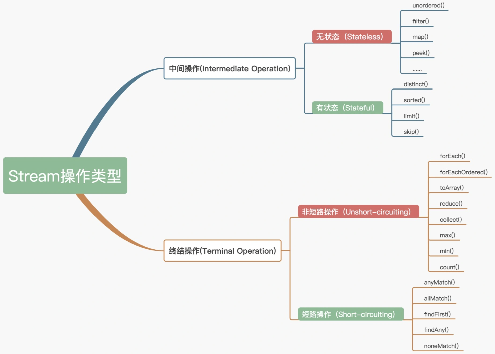
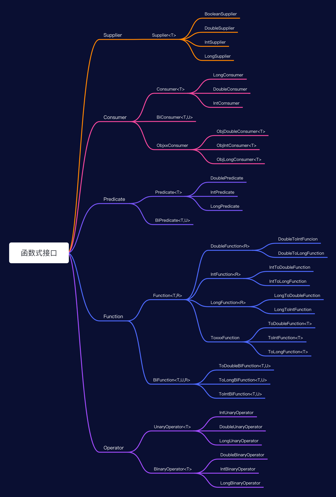

JDK 21 于 2023 年 9 月 19 日 发布，这是一个非常重要的版本，里程碑式。JDK21 是 LTS（长期支持版），至此为止，目前有 JDK8、JDK11、JDK17 和 JDK21 这四个长期支持版了。

# 一、JDK8

## 1、Java语言新特性

- Lambda表达式和函数式接口：函数式接口是只包含一个方法的接口。比如Java标准库中的java.lang.Runnable和java.util.Comparator都是典型的函数式接口。java 8提供 @FunctionalInterface作为注解，这个注解是非必须的，只要接口符合函数式接口的标准（即只包含一个方法的接口）；
- 接口的默认方法和静态方法
- 方法引用
- 重复注解
- 更好的类型推断
- 拓宽注解的应用场景
- 行为参数化：行为参数化是一个很有用的模式，它能够轻松地使用不断变化的需求，这种模式可以把一个行为封装起来，并通过传递和使用创建的行为将方法的行为参数化，其可以代替匿名类

    **需求1**：筛选出红色的花
    ```java
    public static List<Flower> filterFlower(List<Flower> flowers) {
        List<Flower> resList = new ArrayList<>();
        for (Flower flower : flowers) {
            if (StringUtils.equals("red", flower.getColor())) {
                resList.add(flower);
            }
        }
    }
    ```
    **需求2**：筛选出绿色的话，正常情况下一般是会用color作为参数传入：
    ```java
    public static List<Flower> filterFlowerByColor(List<Flower> flowers, String color) {
        List<Flower> resList = new ArrayList<>();
        for (Flower flower : flowers) {
            if (StringUtils.equals(color, flower.getColor())) {
                resList.add(flower);
            }
        }
    }
    ```
    **需求3**：筛选出价格小于8块钱的花；我们只能再写一个方法来实现这个需求，为了防止后续价格的变化，聪明的我们提前将价格设置成可变参数
    ```java
    public static List<Flower> filterFlowerByPrice(List<Flower> flowers, Integer price) {
        List<Flower> resList = new ArrayList<>();
        for (Flower flower : flowers) {
            if (flower.getPrice() < price) {
                resList.add(flower);
            }
        }
    }
    ```
    为了保证代码整洁，把上述代码合并为一个方法，通过flag来控制要筛选价格类型的花还是颜色类型的花
    ```java
    public static List<Flower> filterFlower(List<Flower> flowers, String color, Integer price, Boolean flag) {
        List<Flower> resList = new ArrayList<>();
        for (Flower flower : flowers) {
            if ((flag && flower.getPrice() < price) ||
                (!flag && StringUtils.equals(color, flower.getColor()))) {
                resList.add(flower);
            }
        }
        return resList;
    }

    我们既然都能把花的属性作为参数进行传递，那么我们能不能我们能不能把过滤花的这种行为也作为一个参数进行传递，定义行为接口
    ```java
    public interface FilterPredicate {
        boolean test(Flower flower);
    }
    ```
    自定义两个过滤类来实现接口：
    ```java
    public class RedColorFilterPredicate implements FilterPredicate {
        @Override
        public boolean test(Flower flower) {
            return StringUtils.equals("red", flower.getColor());
        }
    }
    public class LowPriceFilterPredicate implements FilterPredicate {
        @Override
        public boolean test(Flower flower) {
            return flower.getPrice() < 8;
        }
    }
    ```
    重写我们的过滤方法，通过将行为作为参数传递：
    ```java
    public static List<Flower> filterFlower(List<Flower> flowers, FilterPredicate filter) {
        List<Flower> resList = new ArrayList<>();
        for (Flower flower : flowers) {
            if (filter.test(flower)) {
                resList.add(flower);
            }
        }
        return resList;
    }
    /*****    使用    *****/
    filterFlower(flowerList, new RedColorFilterPredicate());
    filterFlower(flowerList, new LowPriceFilterPredicate());
    ```
    如果有其他新增的过滤条件，为了避免增加新的类，可以使用lambda表达式：
    ```
    filterFlower(flowerList, (Flower flower) -> flower.getPrice() > 8);
    ​```java
    甚至可以将多种行为作为作为一个参数传递：
    ​```java
    filterFlower(flowerList, (Flower flower) -> flower.getPrice() > 8 && StringUtils.equals("red", flower.getColor()));
    ```
    行为参数化是一个很有用的模式，它能够轻松地使用不断变化的需求，这种模式可以把一个行为封装起来，并通过传递和使用创建的行为将方法的行为参数化；

    如果我们将一个鲜花的集合按照价格进行排序，我们会这样做：
    ```java
    Collections.sort(flowerList, new Comparator<Flower>() {
        @Override
        public int compare(Flower o1, Flower o2) {
            return o1.getPrice().compareTo(o2.getPrice());
        }
    });
    ```

## 2、编译器新特性


## 3、Java官方库的新特性

- Optional
- Stream
- Date/Time API(JSR 310)
- Nashorn JavaScript引擎
- Base64
- 并行数组
- 并发性

## 4、各个版本特性

### 4.1、JDK5

- 泛型
- 枚举
- 自动装箱拆箱
- 可变参数
- 元注解
- foreach循环（增强for、for/in）
- 静态导入

  ```java
  import static java.lang.System.err;
  import static java.lang.System.out;
  err.println(msg); 
  ```
- 格式化（System.out.println 支持%s %d等格式化输出）

  System.out.println("Line %d: %s%n", i++, line);

- 线程框架/数据结构 JUC
- Arrays工具类/StringBuilder/instrument

### 4.2、JDK6

- 支持脚本语言
- 引入JDBC 4.0 API
- 引入Java Compiler API,可以实现进程内编译，动态产生Java代码；
- 可插拔注解；
- 增加对Native PKI、Java GSS、Kerberos 和 LDAP 的支持
- 继承Web Services

### 4.3、JDK7

- switch语句块中允许以字符串作为分支条件；
- 在创建泛型对象时应用类型推断；钻石语法:`Map<String， List<String>> data = new HashMap()；`
- 在一个语句块中捕获多种异常；
- 支持动态语言；
- 支持 try-with-resources；
- 引入Java NIO.2开发包；
- 数值类型可以用2进制字符串表示，并且可以在字符串表示中添加下划线；

  Java7前支持十进制（123）、八进制（0123）、十六进制（0X12AB），Java7添加二进制表示（0B11110001、0b11110001）；

  Java7中支持在数字量中间添加’_'作为分隔符。更直观，如（12_123_456）。下划线仅仅能在数字中间。编译时编译器自己主动删除数字中的下划线

- null 值的自动处理；
- JSR292与InvokeDynamic指令：JSR292 实现提供在 Java 语言层面上的 invokedynamic 调用
- fork/join framework

### 4.4、JDK8

[http://www.open-open.com/lib/view/open1403232177575.html]

- 函数式接口 FunctionalInterface 
- Lambda表达式
- 接口的增强.接口中的默认方法.默认方法的继承.单接口实现情况下，默认方法可以直接用， 多接口实现情况下一旦出现同方法签名的默认方法，那么必须显式覆盖，否则编译不通过.
- Stream 迭代
- 新增时间 API
- JVM 的PermGen空间被移除，取代它的是Metaspace(JEP 122)元空间
- 数组并行(parallel)操作

## 5、Stream

- [一个强大的类似生成器的 Java 流 API](https://github.com/wolray/seq)
- [一个Java DataFrame的实现](https://github.com/burukeYou/JDFrame)

`public interface Stream<T> extends BaseStream<T, Stream<T>>`

### 5.1、特性

JAVA8中提出一个集合流的抽象工具（java.util.stream，简称Stream），用于集合内元素的计算，更确切的说是过滤和统计操作。

Stream不是一种真实的数据源（不存在数据结构），所以没有办法直接来创建它，Stream只能依赖其他数据源来转换成我们的抽象操作。Stream本身是不存在，只是抽象出来的一个抽象操作，经过各种操作之后，Stream还需要转换成真实的数据源；

它专注于对集合对象进行各种非常便利、高效的聚合操作（aggregate operation），或者大批量数据操作 (bulk data operation)。Stream API 借助于同样新出现的 Lambda 表达式，极大的提高编程效率和程序可读性。同时它提供串行和并行两种模式进行汇聚操作，并发模式能够充分利用多核处理器的优势，使用 fork/join 并行方式来拆分任务和加速处理过程；

Stream 就如同一个迭代器（Iterator），单向，不可往复，数据只能遍历一次，遍历过一次后即用尽了。Stream跟迭代器比较，区别：
- 无存储：Stream是基于数据源的对象，它本身不存储数据元素，而是通过管道将数据源的元素传递给操作。
- 函数式编程：对Stream的任何修改都不会修改背后的数据源，比如对Stream执行filter操作并不会删除被过滤的元素，而是会产生一个不包含被过滤元素的新的Stream。
- 延迟执行：Stream的操作由零个或多个中间操作（intermediate operation）和一个结束操作（terminal operation）两部分组成。只有执行了结束操作，Stream定义的中间操作才会依次执行，这就是Stream的延迟特性。
- 可消费性：Stream只能被“消费”一次，一旦遍历过就会失效。就像容器的迭代器那样，想要再次遍历必须重新生成一个新的Stream

### 5.2、创建Stream

最常用的创建Stream有两种途径：
- 通过Stream接口的静态工厂方法：Stream.of、Stream.iterate、Stream.builder
- StreamSupport 的静态方法
- 通过Collection接口的默认方法–stream()，把一个Collection对象转换成Stream；或者使用parallelStream()创建并行
- 通过`Arrays.stream(Object[])`方法。
- `BufferedReader.lines()`从文件中获得行的流。
- Files类的操作路径的方法，如list、find、walk等。
- 随机数流 Random.ints()。
- IntStream：
- 其它一些类提供了创建流的方法，如`BitSet.stream(), Pattern.splitAsStream(java.lang.CharSequence), 和 JarFile.stream()`

其实最终都是依赖StreamSupport类来完成Stream创建的；

流的操作：
```java
List<String> colorList =  flowerList.stream()                     //获取流
                                    .filter(t->t.getPrice()<10)   //中间操作
                                    .limit(3)                     //中间操作
                                    .map(Flower::getColor)        //中间操作
                                    .collect(Collectors.toList());//终结操作

```

**中间操作：** 只对操作进行了记录，即只会返回一个流，不会进行计算操作，中间操作又可以分为无状态（Stateless）与有状态（Stateful）操作：
- 无状态操作是指元素的处理不受之前元素的影响；
- 有状态操作是指该操作只有拿到所有元素之后才能继续下去

操作 | 返回类型 |  操作参数 | 状态类型
-----|--------|---------|-----
filter | Stream | Predicate | 无状态
map | Stream | `Funcation<T, R>` | 无状态
flatMap | Stream| `Funcation<T, Steam>`  | 无状态
sorted | Stream | Comparator  | 有状态
distinct | Stream | -  | 有状态
skip  | Stream| long  | 有状态
limit | Stream | long  | 有状态


**终结操作**，实现了计算操作，终结操作又可以分为短路（Short-circuiting）与非短路（Unshort-circuiting）操作：
- 短路操作是指遇到某些符合条件的元素就可以得到最终结果；
- 非短路操作是指必须处理完所有元素才能得到最终结果

操作 | 返回类型 |  操作参数 | 是否短路
-----|--------|--------- |--------
forEach | void |Consumer  | 非短路
count   | long | -   | 非短路
collect | R |`Collector<T, A,R>`  | 非短路
reduce | Optional | BinaryOperator  | 非短路
anyMatch | boolean | Predicate  | 短路
noneMatch | boolean |Predicate  | 短路
allMatch | boolean | Predicate  | 短路
findAny | Optional | -  | 短路
findFirst | Optional | -   | 短路

### 5.3、常见流的操作

- **foreach：迭代流中的每个数据**
    ```java
    // 使用 forEach 输出了10个随机数
    Random random = new Random(100);
    random.ints().limit(10).forEach(System.out::println);
    ```
- **map：法用于映射每个元素到对应的结果**
    ```java
    // 以下代码片段使用 map 输出了元素对应的平方数
    List<Integer> list = Arrays.asList(3, 2, 2, 3, 7, 3, 5);
    List<Integer> result = list.stream().map(i -> i * i).distinct().collect(Collectors.toList());
    System.out.println(list);
    System.out.println(result);
    ```
- **filter：方法用于通过设置的条件过滤出元素**
    ```java
    // 以下代码片段使用 filter 方法过滤出空字符串
    List<String> list = Arrays.asList("abc", "", "bc", "efg", "abcd","", "jkl");
    long count = list.stream().filter(String::isEmpty).count();
    System.out.println(count);
    ```
- **sorted：用于对流进行排序**
    ```java
    Random random = new Random();
    random.ints().limit(10).sorted().forEach(System.out::println);
    ```
- **归约：reduce**
    - 元素求和
    ```java
    // 两个参数版
    int res = nums.stream().reduce(0,(a, b) -> a + b);
    int res = nums.stream().reduce(0,Integer::sum);
    // 一个参数版
    Optional<Integer> o = nums.stream().reduce(Integer::sum);
    ```
    - 最大值和最小值
    ```java
    // 两个参数版
    int max = nums.stream().reduce(0,Integer::max);
    int min = nums.stream().reduce(Integer.MAX_VALUE,Integer::min);
    // 一个参数版
    Optional<Integer> maxOption = nums.stream().reduce(Integer::max);
    Optional<Integer> minOption = nums.stream().reduce(Integer::min);
    ```

### 5.4、收集器的使用

Collectors：实现了很多归约操作，例如将流转换成集合和聚合元素。Collectors 可用于返回列表或字符串：
```java
List<String>strings = Arrays.asList("abc", "", "bc", "efg", "abcd","", "jkl");
List<String> filtered = strings.stream().filter(string -> !string.isEmpty()).collect(Collectors.toList());
String mergedString = strings.stream().filter(string -> !string.isEmpty()).collect(Collectors.joining(", "));
```

一组集合：`List<Flower> flowerList = Arrays.asList(new Flower("red", 10), new Flower("yellow", 7), new Flower("pink", 8), new Flower("yellow", 8), new Flower("red", 12));`

**计算总数：**
```
Long c1 = flowerList.stream().collect(Collectors.counting());
//也可以直接用 count() 方法来计数
Long c2 = flowerList.stream().count();
```

**查找最大值和最小值：**
```java
Optional<Flower> max = flowerList.stream().collect(Collectors.maxBy(Comparator.comparing(Flower::getPrice)));
Optional<Flower> min = flowerList.stream().collect(Collectors.minBy(Comparator.comparing(Flower::getPrice)));
```

**求和**
```java
Integer sum = flowerList.stream().collect(Collectors.summingInt(Flower::getPrice));
```

**求平均数：**
```java
Double avg = flowerList.stream().collect(Collectors.averagingInt(Flower::getPrice));
```

### 5.5、分组的使用

**按照颜色分组**
```java
Map<String,List<Flower>> map = flowerList.stream().collect(Collectors.groupingBy(Flower::getColor));
```

**统计每种颜色的数量：Map<String, Long>**
```java
Map<String, Long> longMap = flowerList.stream().collect(Collectors.groupingBy(Flower::getColor, Collectors.counting()));
```

也可以支持多级分组

**先按颜色分组，再按价格分组：Map<String, Map<String, List<Flower>>>**
```java
Map<String, Map<String, List<Flower>>> collect = flowerList.stream().collect(Collectors.groupingBy(Flower::getColor, Collectors.groupingBy(t -> {
            if (t.getPrice() < 8) {
                return "LOW_PRICE";
            } else {
                return "HIGH_PRICE";
            }
        })));
```

Collectors 常用的方法：

方法 | 返回类型 | 用途 
----|---------|-------
toList | List | 把流中所有项目都收集到一个List
toSet | Set | 把流中所有项目都收集到一个Set，删除重复项
toCollection | Collection | 把流中所有项目收集到给定的供应源创建的集合
counting | Long | 计算流中元素的个数
summingInt | Integer | 对流中项目的一个整数属性求和
averagingInt | Double | 计算流中项目Integer属性的平均值
joining | String | 连接对流中每个项目调用toString方法所生成的字符串
maxBy | Optional | 一个包裹了流中按照给定比较器选出最大元素的Optional，如果为空则为Optional.empty()
minBy | Optional | 一个包裹了流中按照给定比较器选出最小元素的Optional，如果为空则为Optional.empty()
reducing | 归约操作产生的类型 | 从一个作为累加器的初始值开始，利用 BinaryOperator 与流中的元素组个结合，从而将流归约成单个值
collectingAndThen | 转换函数返回的类型 | 包裹另一个收集器，对其结果应用转换函数
groupingBy | `Map<K, List>` | 根据项目的一个属性的值对流中的项目作为组，并将属性值作为结果Map的键

### 5.6、Stream如何优化遍历

官方将 Stream 中的操作分为两大类：中间操作（Intermediate operations）和终结操作（Terminal operations）。中间操作只对操作进行了记录，即只会返回一个流，不会进行计算操作，而终结操作是实现了计算操作；
- 中间操作又可以分为无状态（Stateless）与有状态（Stateful）操作，前者是指元素的处理不受之前元素的影响，后者是指该操作只有拿到所有元素之后才能继续下去；
- 终结操作又可以分为短路（Short-circuiting）与非短路（Unshort-circuiting）操作，前者是指遇到某些符合条件的元素就可以得到最终结果，后者是指必须处理完所有元素才能得到最终结果；



### 5.7、Stream原理

[Stream源码分析](../源码分析/集合/Stream.md)

### 5.8、forEach中断操作

https://www.baeldung.com/java-break-stream-foreach

## 6、Optional

### 6.1、解决问题

[Optional使用](https://www.cnblogs.com/rjzheng/p/9163246.html)

是为了解决NPE问题，以往我们需要对对象进行判空：
```java
public String getCity(User user)  throws Exception{
    if(user!=null){
        if(user.getAddress()!=null){
            Address address = user.getAddress();
            if(address.getCity()!=null){
                return address.getCity();
            }
        }
    }
    throw new Excpetion("取值错误"); 
}
```
而使用Optional之后，代码变成：
```java
public String getCity(User user) throws Exception{
    return Optional.ofNullable(user)
                   .map(u-> u.getAddress())
                   .map(a->a.getCity())
                   .orElseThrow(()->new Exception("取指错误"));
}
```

**Optional(T value)、empty()、of(T value)、ofNullable(T value)**

- `Optional(T value)`，即构造函数，它是private权限的，不能由外部调用的；
- 其余三个函数是public权限；
- Optional的本质，就是内部储存了一个真实的值，在构造的时候，就直接判断其值是否为空

Optional相当于是一个容器，里面可以装 T 类型的对象。当变量不存在的时候，缺失的值就会被建模成一个“空”的Optional对象，由方法Optional.empty()返回。这就是Optional.empty()和null的区别，如果引用一个 null，那结果肯定是会触发NullPointException异常，但是引用Optional.empty()则没事

### 6.2、如何使用

**创建Optional对象**
- 创建一个空的Optional：`Optional<Person> personOpt = Optional.empty()`
- 创建一个非空的Optional：`Optional<Person> personOpt = Optional.of(person)`，Optional.of()不接受空值。如果 person 是一个空值则会抛出 NPE 异常，而不是等你试图访问 person 的属性才抛出异常；
- 创建一个可接受空值的Optional：`Optional<Person> personOpt = Optional.ofNullable(Person)`，如果 person 是 null ，那么得到的 Optional 对象就是个空对象。

**使用map**

Optional 中的 map()方法和流中的map()相似，都是从Optional对象中提取和转换值。
```
Optional<String> name = Optional.ofNullable(person).map(Person::getName);
```
获取到的是一个Optional对象是为了防止获取到一个 null，我们可以通过Optional.get()来获取值

**默认行为**

可以使用get()方法来获取 Optional 的值，也可以使用orElse()来定义一个默认值，遭遇到空的Optional值的时候，默认值会作为该方法的调用返回值。以下是Optional的常用方法：
- `get()`：最简单但又是最不安全的方法，如果变量存在，则直接返回封装的变量值，反之则抛出NullpointException异常
- `orElse(T other)`：允许自己定义一个默认值在Optional为空的时候返回；
- `orElseGet(Supplier<? extend T> other)`：是orElse()方法的延迟调用版，在Optional对象不含值的时候执行调用；
- `orElseThrow(Supplier<? extend X> excetionSupplier)`：和get()方法类似，在Optional对象为空的时候会抛出一个异常，但是这个异常我们可以自定义；
- `ifPresent(Consumer<? extend T>)`：如果值存在，就执行使用该值的方法调用，否则什么也不做

### 6.3、注意实现

- Optional不能被序列化，因此不能使用于字段；
- Optional不建议用于函数的入参。试想传入一个Optional.empty()有多奇怪，可以使用相同函数名来避免；
- 不建议在使用isPresent后接着使用get，那将和用==判断无异，不能体现Optional的优越性，反而麻烦

## 7、JDK8时间

- [世界时区地图](https://24timezones.com/map_zh.php#/map)

## 8、Lambda表达式与函数式接口

- [Java 8 Lambda 揭秘](https://colobu.com/2014/11/06/secrets-of-java-8-lambda/)
- [使用idea调试Lambda](https://www.jetbrains.com/help/idea/analyze-java-stream-operations.html)

### 8.1、Lambda表达式语法

```java
// 之前的语法
new Thread(new Runnable() {
    @Override
    public void run() {
        System.out.println("内部类线程");
    }
}).start();
// lambda语法
new Thread(() -> System.out.println("我是Lambda线程")).start();
```

> Lambda表达式是延迟执行的

[函数式接口与编程参考如下](#19函数式接口与函数式编程)

### 8.2、类型检查

```java
filter(flowerList, (Flower flower) -> flower.getPrice() > 8);
```
- 首先找出 filter 方法的声明
- 要求第二个参数是 Predicate 类型的对象
- Predicate 是一个函数式接口，定义了一个 test()的抽象方法，并返回一个boolean 类型的值

### 8.3、类型推断

`filterFlower(flowerList, (Flower flower) -> flower.getPrice() > 8);`

我们可以继续将这个代码简化为：`filterFlower(flowerList, f -> f.getPrice() > 8);`

### 8.4、使用局部变量

Lambda 表达式不仅能够使用主体里面的参数，也能够使用自由变量（在外层作用域中定义的变量）
```java
int tmpNum = 1；
Runnable r = () -> System.out.println(tmpNum);
```
**注意：Lambda 表达式对于全局变量和静态变量可以没有限制的使用，但是对于局部变量必须显示声明为 final**

因为实例变量是存储在堆中，而局部变量是存储在栈中，属于线程私有的。而 Lambda 是在一个线程中使用的，访问局部变量只是在访问这个变量的副本，而不是访问原始值

### 8.5、方法引用

方法引用就是让你根据已有的方法实现来创建 Lambda表达式。可以看做是单一方法的 Lambda 的语法糖
```java
List<Flower> flowerList = Arrays.asList(new Flower("red", 6), new Flower("yellow", 7), new Flower("pink", 8));

(Flower f)->f.getPrice();   ==>  Flower::getPrice
flowerList.stream().map(t -> t.getPrice()).collect(Collectors.toList());      ===>   flowerList.stream().map(Flower::getPrice).collect(Collectors.toList());
```
**如何构建方法引用**：
- 指向静态方法的方法引用`（Integer的sum方法 == Integer::sum）`
- 指向任意类型示例方法的方法引用`（String的length方法 == String::length）`
- 指向现有对象的示例方法的方法引用`（flower实例的getPrice方法 == flower::getPrice）`

### 8.6、复合 Lambda 表达式

#### 8.6.1、比较器复合

按鲜花的价格进行排序：
```
flowerList.sort(Comparator.comparing(Flower::getPrice));
```
这样子默认是使用升序进行排列的，那么我们如果想进项降序：使用 `reversed()`
```
flowerList.sort(Comparator.comparing(Flower::getPrice).reversed());
```
这里的粉花和白花的价格一样，那我们在价格排序完后再按照颜色排序那应该怎么做：使用 thenComparing()
```java
flowerList.sort(Comparator.comparing(Flower::getPrice).thenComparing(Flower::getColor));
```

#### 8.6.2、谓词复合

用于`Predicate`接口

**negate：非**
```java
Predicate<Flower> redFlower = (t) -> StringUtils.equals("red",t.getColor());
Predicate<Flower> notRedFlower = redFlower.negate();
```

**and：且**
```java
Predicate<Flower> redFlower = (t) -> StringUtils.equals("red", t.getColor());
Predicate<Flower> lowPriceFlower = (t) -> t.getPrice() < 8;
Predicate<Flower> redAndLowPriceFlower = redFlower.and(lowPriceFlower);
```

**or：或**
```java
Predicate<Flower> redFlower = (t) -> StringUtils.equals("red", t.getColor());
Predicate<Flower> lowPriceFlower = (t) -> t.getPrice() < 8;
Predicate<Flower> redOrLowPriceFlower = redFlower.or(lowPriceFlower);
```

#### 8.6.3、函数复合

用于`Function`接口

**andThen**
```java
Function<Integer, Integer> addRes = a1 -> a1 + 1;
Function<Integer, Integer> mulRes = a1 -> a1 * 2;
Function<Integer, Integer> andThenResult = addRes.andThen(mulRes);
Integer apply = andThenResult.apply(1);   // 结果为 4 ==> (1 + 1) * 2
```

**compose**
```java
Function<Integer, Integer> addRes = a1 -> a1 + 1;
Function<Integer, Integer> mulRes = a1 -> a1 * 2;
Function<Integer, Integer> composeResult = addRes.compose(mulRes);
Integer apply = composeResult.apply(1);  // 结果为 3 ==> (1 * 2) + 1
```

### 8.7、Lambda原理

如下代码：启动一个线程，包含lambda表达式和匿名内部类的方式
```java
public class LambdaDemo {
    public static void runThreadUseLambda() {
        new Thread(() -> System.out.println("我是Lambda线程")).start();
    }
    public static void runWithInnerClass() {
        new Thread(new Runnable() {
            @Override
            public void run() {
                System.out.println("内部类线程");
            }
        }).start();
    }
    public static void main(String[] args) {
        runThreadUseLambda();
        runWithInnerClass();
    }
}
```
通过`javap -c LambdaDemo`查看字节码，[详细字节码](Lambda-字节码.txt)
```java
...
public static void runThreadUseLambda();
Code:
    0: new           #2                  // class java/lang/Thread
    3: dup
    4: invokedynamic #3,  0              // InvokeDynamic #0:run:()Ljava/lang/Runnable;
    9: invokespecial #4                  // Method java/lang/Thread."<init>":(Ljava/lang/Runnable;)V
    12: invokevirtual #5                  // Method java/lang/Thread.start:()V
    15: return

public static void runWithInnerClass();
Code:
    0: new           #2                  // class java/lang/Thread
    3: dup
    4: new           #6                  // class com/blue/fish/se/basis/lambda/LambdaDemo$1
    7: dup
    8: invokespecial #7                  // Method com/blue/fish/se/basis/lambda/LambdaDemo$1."<init>":()V
    11: invokespecial #4                  // Method java/lang/Thread."<init>":(Ljava/lang/Runnable;)V
    14: invokevirtual #5                  // Method java/lang/Thread.start:()V
    17: return
...
SourceFile: "LambdaDemo.java"
InnerClasses:
     static #6; //class com/blue/fish/se/basis/lambda/LambdaDemo$1
     public static final #70= #69 of #72; //Lookup=class java/lang/invoke/MethodHandles$Lookup of class java/lang/invoke/MethodHandles
BootstrapMethods:
  0: #36 invokestatic java/lang/invoke/LambdaMetafactory.metafactory:(Ljava/lang/invoke/MethodHandles$Lookup;Ljava/lang/String;Ljava/lang/invoke/MethodType;Ljava/lang/invoke/MethodType;Ljava/lang/invoke/MethodHandle;Ljava/lang/invoke/MethodType;)Ljava/lang/invoke/CallSite;
    Method arguments:
      #37 ()V
      #38 invokestatic com/blue/fish/se/basis/lambda/LambdaDemo.lambda$runThreadUseLambda$0:()V
      #37 ()V

```
对比上述两个方法，发现lambda的是`invokeDynamic`，而内部类的是`invokespecial`；

JVM指令：
- invokeinterface：调用接口方法；
- invokespecial：专门用来调用父类方法、私有方法和初始化方法；
- invokestatic：调用静态方法；
- invokevirtual：调用对象的一般方法；

上述这四个指令所对应的类、调用的方法在编译时几乎是固定的：invokestatic所对应的类为静态方法所在的类，方法为静态方法本身；invokespecial所对应的类为当前对象，方法是固定的；invokeinterface和invokevirtual所对应的类也为当前对象，方法可以因为继承和实现进行选择，但也仅限于整个继承体系中选择；

在java7 JVM中增加了一个新的指令invokedynamic，用于支持动态语言，即允许方法调用可以在运行时指定类和方法，不必在编译的时候确定；字节码中每条invokedynamic指令出现的位置称为一个动态调用点，invokedynamic指令后面会跟一个指向常量池的调用点限定符，这个限定符会被解析为一个动态调用点；

**Lambda采用的是invokedynamic指令；**

上面是从JVM虚拟层面上来看的，下面从Java源代码中看，首先从字节码常量池中可以看到：


从上面可以看到类似代码：`java/lang/invoke/LambdaMetafactory.metafactory:(Ljava/lang/invoke/MethodHandles$Lookup;Ljava/lang/String;Ljava/lang/invoke/MethodType;Ljava/lang/invoke/MethodType;Ljava/lang/invoke/MethodHandle;Ljava/lang/invoke/MethodType;)Ljava/lang/invoke/CallSite;`

MethodHandles 和 LambdaMetafactory 都是 java.lang.invoke 包下面的重要方法，invoke 包主要实现了动态语言的功能，java 语言属于静态编译语言，在编译的时候，类、方法、字段等等的类型都已经确定了，而 invoke 实现的是一种动态语言，也就是说编译的时候并不知道类、方法、字段是什么类型，只有到运行的时候才知道，其实质上调用的是：
```java
// LambdaMetafactory.java
public static CallSite metafactory(MethodHandles.Lookup caller, String invokedName, MethodType invokedType, MethodType samMethodType,
                                       MethodHandle implMethod, MethodType instantiatedMethodType) throws LambdaConversionException {
    AbstractValidatingLambdaMetafactory mf;
    mf = new InnerClassLambdaMetafactory(caller, invokedType, invokedName, samMethodType, implMethod, instantiatedMethodType,
                                            false, EMPTY_CLASS_ARRAY, EMPTY_MT_ARRAY);
    mf.validateMetafactoryArgs();
    return mf.buildCallSite();
}
```
metafactory 方法入参：
- caller 代表实际发生动态调用的位置
- invokedName 表示调用方法名称；
- invokedType 表示调用的多个入参和出参
- samMethodType 表示具体的实现者的参数
- implMethod 表示实际上的实现者
- instantiatedMethodType 等同于 implMethod

通过debug，可以获取到的信息如下：


### 8.8、Lambda性能

## 9、函数式接口与函数式编程

- [详解JAVA8函数式接口](https://www.cnblogs.com/dgwblog/p/11739500.html)

### 9.1、概览



函数式接口：是有且仅有一个抽象方法的接口。比如Java标准库中的java.lang.Runnable和java.util.Comparator都是典型的函数式接口；

> 注意：函数式接口指的是有且仅有一个抽象方法的接口，如果接口有其他默认方法也可以认为是函数式接口，比如：BiConsumer
```java
@FunctionalInterface
public interface BiConsumer<T, U> {
    void accept(T t, U u);
    default BiConsumer<T, U> andThen(BiConsumer<? super T, ? super U> after) {
        Objects.requireNonNull(after);
        return (l, r) -> {
            accept(l, r);
            after.accept(l, r);
        };
    }
}
```
java 8提供 `@FunctionalInterface` 作为注解，这个注解是非必须的，只要接口符合函数式接口的标准（即只包含一个方法的接口），虚拟机会自动判断，但 好在接口上使用注解`@FunctionalInterface`进行声明，以免团队的其他人员错误地往接口中添加新的抽象方法。 

Java中的lambda无法单独出现，它需要一个函数式接口来盛放，lambda表达式方法体其实就是函数接口的实现；Lambda 表达式对于全局变量和静态变量可以没有限制的使用，但是对于局部变量必须显示声明为 final

函数式编程更加强调程序执行的结果而非执行的过程，倡导利用若干简单的执行单元让计算结果不断渐进，逐层推导复杂的运算，而不是设计一个复杂的执行过程；
- 函数的执行没有副作用；
- 返回值仅依赖于输入参数；
- 函数的参数可以是一个/多个函数；
- 函数的返回值也可以是一个函数；

常用函数式接口
- Supplier 你要作为一个供应者,自己生产数据
- Consumer 你要作为一个消费者,利用已经准备数据
- Supplier 你要作为一个供应者,自己生产数据
- Consumer 你要作为一个消费者,利用已经准备数据
- Function  输入一个或者两个不同或者相同的值转为另一个值
- Predicate 输入一个或者两个不同或者相同的值总是输出boolean
- UnaryOperator 输入一个值转换为相同值输出
- BinaryOperator 输入两个相同类型的值 转为相同类型的值输出 

**Predicate**

这个接口中定义了一个test()的抽象方法，它接受泛型 T 对象，并返回一个 boolean。你如果需要 表示一个涉及类型 T 的布尔表达式时，就可以使用这个接口；
```java
public static List<Flower> filterFlower(List<Flower> flowers, Predicate<Flower> p) {
    List<Flower> resList = new ArrayList<>();
    for (Flower flower : flowers) {
        if (p.test(flower)) {
            resList.add(flower);
        }
    }
    return resList;
}
/*****      使用方式        *****/
filterFlower(flowerList, (Flower flower) -> flower.getPrice() > 8);
```

**Consumer**

这个接口定义了一个accept()的抽象方法，它接受泛型 T 对象，没有返回（void）。你如果需要访问类型 T 的对象，并对其执行某些操作，就可以使用这个接口
```java
List<Integer> nums = Arrays.asList(1,2,3,4);
nums.forEach(integer -> System.out.println(integer));
```

**Function**

这个接口定义了一个apply()的抽象方法，它接受泛型 T 对象，并返回一个泛型 R 的对象。你如果需要定义一个Lambda，将输入对象的信息映射输出，就可以使用这个接口
```java
(String s) -> s.length()
```

**Supplier**

这个接口定义了一个get()的抽象方法，它没有传入参数，会返回一个泛型 T 的对象，如果你需要定义一个 Lambda，输出自定义的对象，就可以使用这个接口
```java
Callable<Integer> call = () -> 1 ;
```

### 9.2、支持异常的函数式

上面的的接口如果有非运行时异常处理的写法：
```java
path -> {
    try {
        return new URI(path);
    } catch (URISyntaxException e) {
        throw new RuntimeException(e);
    }
}
```
使用 [Checked-Exceptions-enabled Java 8+ Functional](https://github.com/pivovarit/throwing-function) 提供的：
```java
ThrowingFunction<String, URI, URISyntaxException> toUri = URI::new;
...stream()
  .map(ThrowingFunction.unchecked(URI::new))
  .forEach(System.out::println);
```

# 二、JDK11


# 三、JDK17


# 四、JDK21

# 参考资料

* [Java5~11各个版本特性最全总结](https://mp.weixin.qq.com/s/wQW3tZmCs50RjzMtbxOgpQ)
* [Java8新特性](https://www.jianshu.com/p/5b800057f2d8)
* [JDK8新特性指南](http://www.open-open.com/lib/view/open1403232177575.html)
* [JDK8概览](https://juejin.im/post/6861849472499417096)
* [JDK8~17特性](https://advancedweb.hu/a-categorized-list-of-all-java-and-jvm-features-since-jdk-8-to-17/)
* [JDK11-17新特性](https://mp.weixin.qq.com/s/SVleHYFQeePNT7q67UoL4Q)
* [Java 21 新特性概览](https://javaguide.cn/java/new-features/java21.html)
* [Migrating from JDK8/11 to JDK21](https://www.reddit.com/r/java/comments/18rwa6v/migrating_from_java_811_to_java_21_and_spring/)
* [Java11 to 21](https://dzone.com/articles/java-11-to-21-a-visual-guide-for-seamless-migratio)