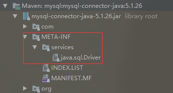
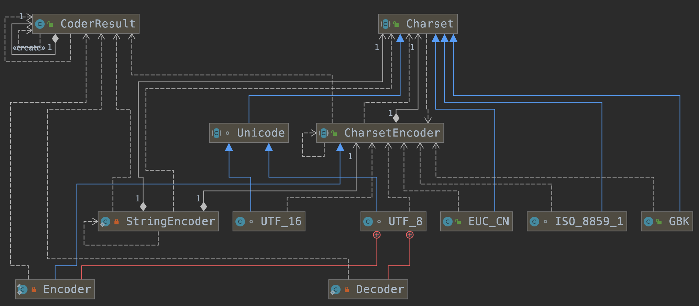

# 一、Java Agent

[Java Agent](../Java虚拟机/JVM-字节码.md#5字节码运用-JavaAgent)

# 二、Java SPI机制

- [Java中的SPI机制](https://mp.weixin.qq.com/s/LZhsCBuQignJj9Qb8NlYeg)

## 1、SPI是什么

`SPI`全称`Service Provider Interface`，是一种服务发现机制，是Java提供的一套用来被第三方实现或者扩展的API，它可以用来启用框架扩展和替换组件

整体机制如下：


Java SPI 实际上是`基于接口的编程＋策略模式＋配置文件`组合实现的动态加载机制，Java SPI就是提供这样的一个机制：为某个接口寻找服务实现的机制；

当其他的程序需要这个服务的时候，就可以通过查找这个jar包（一般都是以jar包做依赖）的`META-INF/services/`中的配置文件，配置文件名称一般是接口的全类名。配置文件中有接口的具体实现类名，可以根据这个类名进行加载实例化，就可以使用该服务了。JDK中查找服务的实现的工具类是：`java.util.ServiceLoader`

## 2、使用场景

概括地说，适用于：调用者根据实际使用需要，启用、扩展、或者替换框架的实现策略，比较常见的例子：
- 数据库驱动加载接口实现类的加载：JDBC加载不同类型数据库的驱动
- 日志门面接口实现类加载：SLF4J加载不同提供商的日志实现类
- Spring：在springboot的自动装配过程中，最终会加载`META-INF/spring.factories`文件，而加载的过程是由`SpringFactoriesLoader`加载的。从CLASSPATH下的每个Jar包中搜寻所有`META-INF/spring.factories`配置文件，然后将解析properties文件，找到指定名称的配置后返回。需要注意的是，其实这里不仅仅是会去ClassPath路径下查找，会扫描所有路径下的Jar包，只不过这个文件只会在Classpath下的jar包中，Spring的详细参考：[SpringFactoriesLoader](../源码分析/框架/spring/Springboot源码.md#2.2SpringFactoriesLoader)
- Dubbo：Dubbo中也大量使用SPI的方式实现框架的扩展, 不过它对Java提供的原生SPI做了封装，允许用户扩展实现Filter接口
- 插件体系：

## 3、使用规则

要使用Java SPI，需要遵循如下约定：
- 当服务提供者提供了接口的一种具体实现后，在jar包的`META-INF/services`目录下创建一个以“接口全限定名”为命名的文件，内容为实现类的全限定名；
- 接口实现类所在的jar包放在主程序的classpath中；
- 主程序通过`java.util.ServiceLoder`动态装载实现模块，它通过扫描`META-INF/services`目录下的配置文件找到实现类的全限定名，把类加载到JVM；
- SPI的实现类必须携带一个不带参数的构造方法；

比如Mysql的驱动类：



## 4、示例

```java
public interface Animal {
    void shout();
}
public class Dog implements Animal {
    @Override
    public void shout() {
        System.out.println("wang wang");
    }
}
public class Cat implements Animal {
    @Override
    public void shout() {
        System.out.println("miao miao");
    }
}
// META-INF/services/com.blue.fish.se.basis.spi.Animal
com.blue.fish.se.basis.spi.Dog
com.blue.fish.se.basis.spi.Cat

public static void main(String[] args) {
    ServiceLoader<Animal> shouts = ServiceLoader.load(Animal.class);
    for (Animal s : shouts) {
        s.shout();
    }
}
```

## 5、原理

ServiceLoader 类
```java
//ServiceLoader实现了Iterable接口，可以遍历所有的服务实现者
public final class ServiceLoader<S> implements Iterable<S> {
    //查找配置文件的目录
    private static final String PREFIX = "META-INF/services/";
    //表示要被加载的服务的类或接口
    private final Class<S> service;
    //这个ClassLoader用来定位，加载，实例化服务提供者
    private final ClassLoader loader;
    // 访问控制上下文
    private final AccessControlContext acc;
    // 缓存已经被实例化的服务提供者，按照实例化的顺序存储
    private LinkedHashMap<String,S> providers = new LinkedHashMap<>();
    // 迭代器
    private LazyIterator lookupIterator;
    //重新加载，就相当于重新创建ServiceLoader了，用于新的服务提供者安装到正在运行的Java虚拟机中的情况。
    public void reload() {
        //清空缓存中所有已实例化的服务提供者
        providers.clear();
        //新建一个迭代器，该迭代器会从头查找和实例化服务提供者
        lookupIterator = new LazyIterator(service, loader);
    }
    //私有构造器
    //使用指定的类加载器和服务创建服务加载器
    //如果没有指定类加载器，使用系统类加载器，就是应用类加载器。
    private ServiceLoader(Class<S> svc, ClassLoader cl) {
        service = Objects.requireNonNull(svc, "Service interface cannot be null");
        loader = (cl == null) ? ClassLoader.getSystemClassLoader() : cl;
        acc = (System.getSecurityManager() != null) ? AccessController.getContext() : null;
        reload();
    }
    //解析失败处理的方法
    private static void fail(Class<?> service, String msg, Throwable cause) throws ServiceConfigurationError{
        throw new ServiceConfigurationError(service.getName() + ": " + msg,cause);
    }
    private static void fail(Class<?> service, String msg) throws ServiceConfigurationError{
        throw new ServiceConfigurationError(service.getName() + ": " + msg);
    }
    private static void fail(Class<?> service, URL u, int line, String msg) throws ServiceConfigurationError{
        fail(service, u + ":" + line + ": " + msg);
    }
    //解析服务提供者配置文件中的一行
    //首先去掉注释校验，然后保存
    //返回下一行行号
    //重复的配置项和已经被实例化的配置项不会被保存
    private int parseLine(Class<?> service, URL u, BufferedReader r, int lc,List<String> names) throws IOException, ServiceConfigurationError {
        //读取一行
        String ln = r.readLine();
        if (ln == null) {
            return -1;
        }
        //#号代表注释行
        int ci = ln.indexOf('#');
        if (ci >= 0) ln = ln.substring(0, ci);
        ln = ln.trim();
        int n = ln.length();
        if (n != 0) {
            if ((ln.indexOf(' ') >= 0) || (ln.indexOf('\t') >= 0))
                fail(service, u, lc, "Illegal configuration-file syntax");
            int cp = ln.codePointAt(0);
            if (!Character.isJavaIdentifierStart(cp))
                fail(service, u, lc, "Illegal provider-class name: " + ln);
            for (int i = Character.charCount(cp); i < n; i += Character.charCount(cp)) {
                cp = ln.codePointAt(i);
                if (!Character.isJavaIdentifierPart(cp) && (cp != '.'))
                    fail(service, u, lc, "Illegal provider-class name: " + ln);
            }
            if (!providers.containsKey(ln) && !names.contains(ln))
                names.add(ln);
        }
        return lc + 1;
    }

    //解析配置文件，解析指定的url配置文件
    //使用parseLine方法进行解析，未被实例化的服务提供者会被保存到缓存中去
    private Iterator<String> parse(Class<?> service, URL u) throws ServiceConfigurationError {
        InputStream in = null;
        BufferedReader r = null;
        ArrayList<String> names = new ArrayList<>();
        try {
            in = u.openStream();
            r = new BufferedReader(new InputStreamReader(in, "utf-8"));
            int lc = 1;
            while ((lc = parseLine(service, u, r, lc, names)) >= 0);
        }
        return names.iterator();
    }
    //服务提供者查找的迭代器
    private class LazyIterator implements Iterator<S> {

        Class<S> service;//服务提供者接口
        ClassLoader loader;//类加载器
        Enumeration<URL> configs = null;//保存实现类的url
        Iterator<String> pending = null;//保存实现类的全名
        String nextName = null;//迭代器中下一个实现类的全名
	}
    //获取迭代器
    //返回遍历服务提供者的迭代器
    //以懒加载的方式加载可用的服务提供者
    //懒加载的实现是：解析配置文件和实例化服务提供者的工作由迭代器本身完成
    public Iterator<S> iterator() {
        return new Iterator<S>() {
            //按照实例化顺序返回已经缓存的服务提供者实例
            Iterator<Map.Entry<String,S>> knownProviders = providers.entrySet().iterator();
            public boolean hasNext() {
                if (knownProviders.hasNext())
                    return true;
                return lookupIterator.hasNext();
            }
            public S next() {
                if (knownProviders.hasNext())
                    return knownProviders.next().getValue();
                return lookupIterator.next();
            }
            public void remove() {
                throw new UnsupportedOperationException();
            }
        };
    }
    //为指定的服务使用指定的类加载器来创建一个ServiceLoader
    public static <S> ServiceLoader<S> load(Class<S> service,ClassLoader loader){
        return new ServiceLoader<>(service, loader);
    }
    //使用线程上下文的类加载器来创建ServiceLoader
    public static <S> ServiceLoader<S> load(Class<S> service) {
        ClassLoader cl = Thread.currentThread().getContextClassLoader();
        return ServiceLoader.load(service, cl);
    }
    //使用扩展类加载器为指定的服务创建ServiceLoader
    //只能找到并加载已经安装到当前Java虚拟机中的服务提供者，应用程序类路径中的服务提供者将被忽略
    public static <S> ServiceLoader<S> loadInstalled(Class<S> service) {
        ClassLoader cl = ClassLoader.getSystemClassLoader();
        ClassLoader prev = null;
        while (cl != null) {
            prev = cl;
            cl = cl.getParent();
        }
        return ServiceLoader.load(service, prev);
    }
}
```
**首先**，ServiceLoader实现了`Iterable`接口，所以它有迭代器的属性，这里主要都是实现了迭代器的`hasNext`和`next`方法。这里主要都是调用的`lookupIterator`的相应`hasNext`和`next`方法，`lookupIterator`是懒加载迭代器；

**其次**，`LazyIterator`中的`hasNext`方法，静态变量PREFIX就是`”META-INF/services/”`目录，这也就是为什么需要在`classpath`下的`META-INF/services/`目录里创建一个以服务接口命名的文件；

**最后**，通过反射方法`Class.forName()`加载类对象，并用`newInstance`方法将类实例化，并把实例化后的类缓存到`providers`对象中，(`LinkedHashMap<String,S>`类型）然后返回实例对象；

具体流程：
- 应用程序调用`ServiceLoader.load`方法`ServiceLoader.load`方法内先创建一个新的`ServiceLoader`，并实例化该类中的成员变量，包括：
    - loader(ClassLoader类型，类加载器)
    - acc(AccessControlContext类型，访问控制器)
    - providers(LinkedHashMap类型，用于缓存加载成功的类)
    - lookupIterator(实现迭代器功能)
    
- 应用程序通过迭代器接口获取对象实例ServiceLoader先判断成员变量providers对象中(LinkedHashMap类型)是否有缓存实例对象，如果有缓存，直接返回
    - 读取`META-INF/services/`下的配置文件，获得所有能被实例化的类的名称
    - 通过反射方法`Class.forName()`加载类对象，并用`instance()`方法将类实例化
    - 把实例化后的类缓存到providers对象中(LinkedHashMap类型）然后返回实例对象。

## 6、SPI与API

SPI - “接口”位于“调用方”所在的“包”中

- 概念上更依赖调用方；
- 组织上位于调用方所在的包中；
- 实现位于独立的包中；
- 常见的例子是：插件模式的插件；

API - “接口”位于“实现方”所在的“包”中

- 概念上更接近实现方；
- 组织上位于实现方所在的包中；
- 实现和接口在一个包中；

## 7、总结

- 优点：使用Java SPI机制的优势是实现解耦，使得第三方服务模块的装配控制的逻辑与调用者的业务代码分离，而不是耦合在一起。应用程序可以根据实际业务情况启用框架扩展或替换框架组件
- 缺点：
    - 虽然ServiceLoader也算是使用的延迟加载，但是基本只能通过遍历全部获取，也就是接口的实现类全部加载并实例化一遍。如果你并不想用某些实现类，它也被加载并实例化了，这就造成了浪费；
	- 获取某个实现类的方式不够灵活，只能通过Iterator形式获取，不能根据某个参数来获取对应的实现类。
    - 多个并发多线程使用ServiceLoader类的实例是不安全的

# 三、字符集与字符编码

* [Java中文编码](https://www.ibm.com/developerworks/cn/java/j-lo-chinesecoding/index.html)
* [Charactor encoding](https://en.wikipedia.org/wiki/Character_encoding)
* [字符编码笔记：ASCII，Unicode 和 UTF-8](http://www.ruanyifeng.com/blog/2007/10/ascii_unicode_and_utf-8.html)

## 1、ASCII码

早期计算机只需要使用英文字符，加上数字和一些特殊符号，然后用 8 位的二进制，就能表示我们日常需要的所有字符了，这个就是我们常常说的ASCII 码；

ASCII 码就好比一个字典，用 8 位二进制中的 128 个不同的数，映射到 128 个不同的字符里；

在 ASCII 码里面，数字 9 不再像整数表示法里一样，用 0000 1001 来表示，而是用 0011 1001 来表示字符`9`。字符串 15 也不是用 0000 1111 这 8 位来表示，而是变成两个字符 1 和 5 连续放在一起，也就是 0011 0001 和 0011 0101，需要用两个 8 位来表示；

最大的 32 位整数，就是 `2147483647`。如果用整数表示法，只需要 32 位就能表示了。但是如果用字符串来表示，一共有 10 个字符，每个字符用 8 位的话，需要整整 80 位。比起整数表示法，要多占很多空间


## 2、字符集和字符编码

**为什么需要字符串和字符编码**
- 计算机中存储信息的最小单元是一个字节即 8 个 bit，所以能表示的字符范围是 `0~255` 个
- 人类要表示的符号太多，无法用一个字节来完全表示
- 要解决这个矛盾必须需要一个新的数据结构 char，从 char 到 byte 必须编码

**字符集：** 表示的可以是字符的一个集合，日常说的 Unicode，其实就是一个字符集，包含了 150 种语言的 14 万个不同的字符；

**字符编码：** 字符编码则是对于字符集里的这些字符，怎么一一用二进制表示出来的一个字典。Unicode，就可以用 UTF-8、UTF-16，乃至 UTF-32 来进行编码，存储成二进制。所以，有了 Unicode，可以用不止 UTF-8 一种编码形式，也可以自己发明一套 GT-32 编码；

**常见字符串编码：** 计算中提拱了多种翻译方式，常见的有 ASCII、ISO-8859-1、GB2312、GBK、UTF-8、UTF-16 等。它们都可以被看作为字典，它们规定了转化的规则，按照这个规则就可以让计算机正确的表示我们的字符；
- `ASCII码`：总共有 128 个，用一个字节的低 7 位表示，0~31 是控制字符如换行回车删除等；32~126 是打印字符，可以通过键盘输入并且能够显示出来；
- `ISO-8859-1`： ISO 组织在 ASCII 码基础上又制定了一些列标准用来扩展 ASCII 编码，它们是 `ISO-8859-1~ISO-8859-15`，其中` ISO-8859-1` 涵盖了大多数西欧语言字符，所有应用的最广泛。ISO-8859-1 仍然是单字节编码，它总共能表示 256 个字符；
- `GB2312`：它的全称是《信息交换用汉字编码字符集 基本集》，它是双字节编码，总的编码范围是 A1-F7，其中从 A1-A9 是符号区，总共包含 682 个符号，从 B0-F7 是汉字区，包含 6763 个汉字；
- `GBK`：全称叫《汉字内码扩展规范》，是国家技术监督局为 windows95 所制定的新的汉字内码规范，它的出现是为了扩展 GB2312，加入更多的汉字，它的编码范围是 8140~FEFE（去掉 XX7F）总共有 23940 个码位，它能表示 21003 个汉字，它的编码是和 GB2312 兼容的，也就是说用 GB2312 编码的汉字可以用 GBK 来解码，并且不会有乱码；
- `GB18030`：全称是《信息交换用汉字编码字符集》，是我国的强制标准，它可能是单字节、双字节或者四字节编码，它的编码与 GB2312 编码兼容，这个虽然是国家标准，但是实际应用系统中使用的并不广泛；
- `UTF-16`：UTF-16 具体定义了 Unicode 字符在计算机中存取方法。UTF-16 用两个字节来表示 Unicode 转化格式，这个是定长的表示方法，不论什么字符都可以用两个字节表示，两个字节是 16 个 bit，所以叫 UTF-16。UTF-16 表示字符非常方便，每两个字节表示一个字符，这个在字符串操作时就大大简化了操作，这也是 Java 以 UTF-16 作为内存的字符存储格式的一个很重要的原因；
- `UTF-8`：采用了一种变长技术，每个编码区域有不同的字码长度。不同类型的字符可以是由 1~6 个字节组成；UTF-8 有以下编码规则：
    - 如果一个字节，最高位（第 8 位）为 0，表示这是一个 ASCII 字符（00 - 7F）。可见，所有 ASCII 编码已经是 UTF-8 了。
    - 如果一个字节，以 11 开头，连续的 1 的个数暗示这个字符的字节数，例如：110xxxxx 代表它是双字节 UTF-8 字符的首字节。
    - 如果一个字节，以 10 开始，表示它不是首字节，需要向前查找才能得到当前字符的首字节

同样的文本，采用不同的编码存储下来。如果另外一个程序，用一种不同的编码方式来进行解码和展示，就会出现乱码。这就好像两个军队用密语通信，如果用错了密码本，那看到的消息就会不知所云。在中文世界里，最典型的就是“手持两把锟斤拷，口中疾呼烫烫烫”的典故  

**为什么会出现：“锟斤拷”？**

“锟斤拷”的来源是这样的。如果想要用 Unicode 编码记录一些文本，特别是一些遗留的老字符集内的文本，但是这些字符在 Unicode 中可能并不存在。于是，Unicode 会统一把这些字符记录为 U+FFFD 这个编码。如果用 UTF-8 的格式存储下来，就是`\xef\xbf\xbd`。如果连续两个这样的字符放在一起，`\xef\xbf\xbd\xef\xbf\xbd`，这个时候，如果程序把这个字符，用 GB2312 的方式进行 decode，就会变成“锟斤拷”。这就好比用 GB2312 这本密码本，去解密别人用 UTF-8 加密的信息，自然没办法读出有用的信息

## 3、Java中需要编码的场景

### 3.1、I/O 操作中存在的编码

涉及到编码的地方一般都在字符到字节或者字节到字符的转换上，而需要这种转换的场景主要是在 I/O 的时候，这个 I/O 包括磁盘 I/O 和网络 I/O

IO中读写是 StreamEncoder 类负责将字符编码成字节，编码格式和默认编码规则与解码是一致的，关系如下：

    

IO编码示例：涉及到 I/O 操作时只要注意指定统一的编解码 Charset 字符集，一般不会出现乱码问题
```java
String file = "c:/stream.txt";
String charset = "UTF-8";
// 写字符换转成字节流
FileOutputStream outputStream = new FileOutputStream(file);
OutputStreamWriter writer = new OutputStreamWriter(
        outputStream, charset);
try {
    writer.write("这是要保存的中文字符");
} finally {
    writer.close();
}
// 读取字节转换成字符
FileInputStream inputStream = new FileInputStream(file);
InputStreamReader reader = new InputStreamReader(
        inputStream, charset);
StringBuffer buffer = new StringBuffer();
char[] buf = new char[64];
int count = 0;
try {
    while ((count = reader.read(buf)) != -1) {
        buffer.append(buffer, 0, count);
    }
} finally {
    reader.close();
}
```

### 3.2、内存中操作中的编码

Java 中用 String 表示字符串，所以 String 类就提供转换到字节的方法，也支持将字节转换为字符串的构造函数
```java
String s = "这是一段中文字符串"; 
byte[] b = s.getBytes("UTF-8"); 
String n = new String(b,"UTF-8");
```

Charset 提供 encode 与 decode 分别对应 char[] 到 byte[] 的编码和 byte[] 到 char[] 的解码
```java
Charset charset = Charset.forName("UTF-8"); 
ByteBuffer byteBuffer = charset.encode(string); 
CharBuffer charBuffer = charset.decode(byteBuffer);
```
Java 中还有一个 ByteBuffer 类，它提供一种 char 和 byte 之间的软转换，它们之间转换不需要编码与解码，只是把一个 16bit 的 char 格式，拆分成为 2 个 8bit 的 byte 表示，它们的实际值并没有被修改，仅仅是数据的类型做了转换

## 4、Java中如何编解码

Java编码中需要用到的类图



首先根据指定的 charsetName 通过 Charset.forName(charsetName) 设置 Charset 类，然后根据 Charset 创建 CharsetEncoder 对象，再调用 CharsetEncoder.encode 对字符串进行编码，不同的编码类型都会对应到一个类中，实际的编码过程是在这些类中完成的；

## 5、中文处理

字符依赖于系统编码（这里是UTF-8，每个字符占两个字节），写入的时候每个字符占两个字节，但读取的时候却不知道编码，最后导致出现乱码；

由于缓冲区的大小读取的字节数并不一定就是能够转换为中文的；

CharBuffer统一以两个字节存储一个字符，而ByteBuffer则依赖于编码，可能是两个字节，也可能是三个字节，最后导致512个字符，CharBuffer的limit为512，换算为ByteBuffer后为1024个字节，而直接用ByteBuffer存储字节则为1200；

关于乱码，如果是以CharBuffer放入的数据，因为没有对应的字符集解码器，必定是乱码，只有通过同样的CharBuufer方式读出，才能正确解决，所以在这里，char是一种数据存储格式，就如同long数据、int数据一样，并不是操作系统上对应的字符集，所以无法解析
```java
public void test_charset() throws Exception {
	String raw = "长坂桥头杀气生，横枪立马眼圆睁。一声好似轰雷震，独退曹家百万兵。";
	Charset charset = StandardCharsets.UTF_8;
//        byte[] bytes = charset.encode(raw).array();
	byte[] bytes = raw.getBytes(charset);
	byte[] bytes2 = Arrays.copyOfRange(bytes, 0, 11);
	ByteBuffer bbuf = ByteBuffer.allocate(12);
	CharBuffer cbuf = CharBuffer.allocate(12);
	bbuf.put(bytes2);
	bbuf.flip();
	// decode 这里如果不能解析就不去读
	charset.newDecoder().decode(bbuf, cbuf, true);
	cbuf.flip();

	char[] tmp = new char[cbuf.length()];
	if(cbuf.hasRemaining()){
		cbuf.get(tmp);
		System.out.println("here:" + new String(tmp));
	}
	System.out.format("limit: %d\t position: %d", bbuf.limit(), bbuf.position());
	System.out.println();
	System.out.println("==========================");
	// 通过上面可以看到bbuf还有两个字节没有读取，然后重新再读取 bytes 剩下的字符串
	byte[] bytes3 = Arrays.copyOfRange(bytes, bbuf.position(), bytes.length);
	ByteBuffer bbuf1 = ByteBuffer.allocate(bytes.length - bbuf.position());
	CharBuffer cbuf1 = CharBuffer.allocate(bytes.length - bbuf.position());

	bbuf1.put(bytes3);
	bbuf1.flip();

	// decode 这里如果不能解析就不去读
	charset.newDecoder().decode(bbuf1, cbuf1, true);
	cbuf1.flip();

	char[] tmp1 = new char[cbuf1.length()];
	if (cbuf1.hasRemaining()) {
		cbuf1.get(tmp1);
		System.out.println("here:" + new String(tmp1));
	}
}
```

## 6、常见ASCII码值

### 6.1、数字0-9的ASCII值

| ASCII值 | 控制字符 |
| :------ | :------- | 
| 48      | 0        | 
| 49      | 1        | 
| 50      | 2        | 
| 51      | 3        | 
| 52      | 4        | 
| 53      | 5        | 
| 54      | 6        | 
| 55      | 7        | 
| 56      | 8        | 
| 57      | 9        | 

### 6.2、字母的ASCII值

| ASCII值 | 控制字符 | ASCII值 | 控制字符 |
| :------ | :------- | :------ | :------- |  
| 65      | A        | 97      | a        |
| 66      | B        | 98      | b        |
| 67      | C        | 99      | c        |
| 68      | D        | 100     | d        |
| 69      | E        | 101     | e        |
| 70      | F        | 102     | f        |
| 71      | G        | 103     | g        |
| 72      | H        | 104     | h        |
| 73      | I        | 105     | i        |
| 74      | J        | 106     | j        |
| 75      | K        | 107     | k        |
| 76      | L        | 108     | l        |
| 77      | M        | 109     | m        |
| 78      | N        | 110     | n        |
| 79      | O        | 111     | o        |
| 80      | P        | 112     | p        |
| 81      | Q        | 113     | q        |
| 82      | R        | 114     | r        |
| 83      | S        | 115     | s        |
| 84      | T        | 116     | t        |
| 85      | U        | 117     | u        |
| 86      | V        | 118     | v        |
| 87      | W        | 119     | w        |
| 88      | X        | 120     | x        |
| 89      | Y        | 121     | y        |
| 90      | Z        | 122     | z        |


# 四、JMX

- [JMX详解](https://www.cnblogs.com/dongguacai/p/5900507.html)
- [官方资料](https://www.oracle.com/technetwork/java/javase/tech/javamanagement-140525.html)

Java Management Extensions是管理Java的一种扩展。这种机制可以方便的管理、监控正在运行中的Java程序。常用于管理线程，内存，日志Level，服务重启，系统环境等

## 1、基本属术语

- MBean：`Managed Bean`，在JMX中MBean代表一个被管理的资源实例，通过MBean中暴露的方法和属性，外界可以获取被管理的资源的状态和操纵MBean的行为；MBean就是一个Java Object，同JavaBean模型一样，外界使用自醒和反射来获取Object的值和调用Object的方法，只是MBean更为复杂和高级一些。MBean通过公共方法以及遵从特定的设计模式封装了属性和操作，以便暴露给管理应用程序；
- MBeanServer：MBean生存在一个MBeanServer中。MBeanServer管理这些MBean，并且代理外界对它们的访问。并且MBeanServer提供了一种注册机制，使得外界可以通过名字来得到相应的MBean实例
- JMX Agent：Agent只是一个Java进程，它包括这个MBeanServer和一系列附加的MbeanService。当然这些Service也是通过MBean的形式来发布
- Protocol Adapters and Connectors：MBeanServer依赖于Protocol Adapters和Connectors来和运行该代理的Java虚拟机之外的管理应用程序进行通信。Protocol Adapters通过特定的协议提供了一张注册在MBeanServer的MBean的视图

    Adapters和Connectors使MBean服务器与管理应用程序能进行通信；

    Adapter 和Connector的区别在于：Adapter是使用某种Internet协议来与JMX Agent获得联系，Agent端会有一个对象 (Adapter)来处理有关协议的细节。比如SNMP Adapter和HTTP Adapter。而Connector则是使用类似RPC的方式来访问Agent，在Agent端和客户端都必须有这样一个对象来处理相应的请求与应答。比如RMI Connector

应用场景：中间件软件WebLogic的管理页面就是基于JMX开发的，而JBoss则整个系统都基于JMX构架

## 2、JMX架构


- Instrumentation层：Instrumentation层主要包括了一系列的接口定义和描述如何开发MBean的规范。通常JMX所管理的资源有一个或多个MBean组成，因此这个资源可以是任何由Java语言开发的组件，或是一个JavaWrapper包装的其他语言开发的资源；
- Agent层：Agent 用来管理相应的资源，并且为远端用户提供访问的接口。Agent层构建在Intrumentation层之上，并且使用并管理 Instrumentation层内部描述的组件；Agent层主要定义了各种服务以及通信模型。该层的核心是一MBeanServer,所有的MBean都要向它注册，才能被管理；
- Distributed层：Distributed层关心Agent如何被远端用户访问的细节。它定义了一系列用来访问Agent的接口和组件，包括Adapter和Connector的描述

### 2.1、MBean分类

- standard MBean：这种类型的MBean最简单，它能管理的资源（包括属性，方法，时间）必须定义在接口中，然后MBean必须实现这个接口。它的命名也必须遵循一定的规范，例如我们的MBean为Hello，则接口必须为HelloMBean；
- dynamic MBean：必须实现javax.management.DynamicMBean接口，所有的属性，方法都在运行时定义；
- open MBean
- model MBean：与标准和动态MBean相比，你可以不用写MBean类，只需使用javax.management.modelmbean.RequiredModelMBean即可

## 3、JMX的访问方式

### 3.1、通过jconsole

jconsole是JDK自带的工具

参考代码：[JConsoleAgent.java](https://github.com/chenlanqing/java-code/blob/master/java-se/java-se-basis/src/main/java/com/blue/fish/se/basis/jmx/demo/JConsoleAgent.java)

### 3.2、通过JMX提供的工具页访问

改动适配层，这里需要到导入外部jar包jdmk

参考代码：[HtmlAdapterAgent.java](https://github.com/chenlanqing/java-code/blob/master/java-se/java-se-basis/src/main/java/com/blue/fish/se/basis/jmx/demo/HtmlAdapterAgent.java)

### 3.3、通过客户端程序进行远程访问

参考代码：[RMIAgent.java](https://github.com/chenlanqing/java-code/blob/master/java-se/java-se-basis/src/main/java/com/blue/fish/se/basis/jmx/demo/RMIAgent.java)

## 4、Notification

MBean之间的通信是必不可少的，Notification就起到了在MBean之间沟通桥梁的作用。JMX 的通知由四部分组成：
- Notification这个相当于一个信息包，封装了需要传递的信息；
- Notification broadcaster这个相当于一个广播器，把消息广播出；
- Notification listener 这是一个监听器，用于监听广播出来的通知信息；
- Notification filiter 这个一个过滤器，过滤掉不需要的通知。这个一般很少使用；

## 5、JMX监控tomcat

* [JMX管理监控Tomcat8](https://tomcat.apache.org/tomcat-8.0-doc/monitoring.html)

利用JMX监控Tomcat，就是相当于部署在tomcat上的应用作为服务端，也就是被管理资源的对象。然后通过程序或者jconsole远程连接到该应用上来。远程连接需要服务器端提供ip和port。如果需要加密访问的话，还需要配置用户名、密码等参数

主要是在tomcat下的文件catalina.sh中进行一些环境变量的配置配置：
```
set CATALINA_OPTS=-Dcom.sun.management.jmxremote
  -Dcom.sun.management.jmxremote.port=%my.jmx.port%
  -Dcom.sun.management.jmxremote.ssl=false
  -Dcom.sun.management.jmxremote.authenticate=false
如果需要授权：
-Dcom.sun.management.jmxremote.authenticate=true
-Dcom.sun.management.jmxremote.password.file=../conf/jmxremote.password
-Dcom.sun.management.jmxremote.access.file=../conf/jmxremote.access

```
- `-Dcom.sun.management.jmxremote=true`：相关 JMX 代理侦听开关
- `-Djava.rmi.server.hostname=xxxx`：服务器端的IP
- `-Dcom.sun.management.jmxremote.port=29094`：相关 JMX 代理侦听请求的端口
- `-Dcom.sun.management.jmxremote.ssl=false`：指定是否使用 SSL 通讯
- `-Dcom.sun.management.jmxremote.authenticate=false`：指定是否需要密码验证

## 6、JMX产生问题原因

JMX不可用，往往是由于垃圾回收时间停顿时间过长、内存溢出等问题引起的

## 7、JMX通过http方式访问

对于查看和操作 MBean，除了使用 jconsole 之外，你可以使用 jolokia 把 JMX 转换为 HTTP 协议，引入依赖：
```xml
<dependency>
    <groupId>org.jolokia</groupId>
    <artifactId>jolokia-core</artifactId>
</dependency>
```
[Jolokia](https://jolokia.org/) 是一个用来访问远程 JMX MBeans 的崭新方法，与 JSR-160 连接器不同的是，它使用基于 HTTP 的 JSON 格式作为通讯协议，提供 JMX 批量操作等

# 五、Java基准测试-JMH

- [JMH教程](http://tutorials.jenkov.com/java-performance/jmh.html)
- [官方JMH案例](http://hg.openjdk.java.net/code-tools/jmh/file/tip/jmh-samples/src/main/java/org/openjdk/jmh/samples/)
- [jmh-gradle-example](https://github.com/melix/jmh-gradle-example)
- [JMH-OpenJDK代码](https://github.com/openjdk/jmh)
- [IDEA-JMH-Plugin](https://github.com/artyushov/idea-jmh-plugin)
- [jmh-java-microbenchmark-harness](https://howtodoinjava.com/java/library/jmh-java-microbenchmark-harness/)
- [Aleksey Shipilev 的 devoxx 2013 演讲](https://shipilev.net/talks/devoxx-Nov2013-benchmarking.pdf)
- [Aleksey Shipilev 的 devoxx 2013 演讲](https://www.youtube.com/watch?v=VaWgOCDBxYw)
- [Netty JMH](https://github.com/netty/netty/tree/4.1/microbench)
- [API OHA 基准测试框架](https://github.com/ivangfr/api-oha-benchmarker)

## 1、介绍

JVM 在执行时，会对一些代码块，或者一些频繁执行的逻辑，进行 JIT 编译和内联优化，在得到一个稳定的测试结果之前，需要先循环上万次进行预热。预热前和预热后的性能差别非常大

JMH 是一个面向 Java 语言或者其他 Java 虚拟机语言的性能基准测试框架。它针对的是纳秒级别、微秒级别、毫秒级别，以及秒级别的性能测试

通过开启多个进程，多个线程，先执行预热，然后执行迭代，最后汇总所有的测试数据进行分析。在执行前后，还可以根据粒度处理一些前置和后置操作

## 2、JMH项目

### 2.1、生成JMH项目

```bash
$ mvn archetype:generate \
    -DinteractiveMode=false \
    -DarchetypeGroupId=org.openjdk.jmh \
    -DarchetypeArtifactId=jmh-java-benchmark-archetype \
    -DgroupId=org.sample \
    -DartifactId=test \
    -Dversion=1.21
```
该命令将在当前目录下生成一个test文件夹（对应参数`-DartifactId=test`，可更改），其中便包含了定义该 maven 项目依赖的pom.xml文件，以及自动生成的测试文件`src/main/org/sample/MyBenchmark.java`（这里`org/sample`对应参数`-DgroupId=org.sample`，可更改）；
```java
package org.sample;
import org.openjdk.jmh.annotations.Benchmark;
public class MyBenchmark {
    @Benchmark
    public void testMethod() {
        // This is a demo/sample template for building your JMH benchmarks. Edit as needed.
        // Put your benchmark code here.
    }
}
```

### 2.2、编译和运行JMH项目

JMH 是利用注解处理器来自动生成性能测试的代码。实际上，除了`@Benchmark`之外，JMH 的注解处理器还将处理所有位于`org.openjdk.jmh.annotations`包下的注解
```bash
$ mvn compile
ls target/generated-sources/annotations/org/sample/jmh_generated/
MyBenchmark_jmhType_B1.java  MyBenchmark_jmhType_B2.java  MyBenchmark_jmhType_B3.java  MyBenchmark_jmhType.java  MyBenchmark_testMethod_jmhTest.java
```
所有以MyBenchmark_jmhType为前缀的 Java 类都继承自MyBenchmark。这是注解处理器的常见用法，即通过生成子类来将注解所带来的额外语义扩张成方法；

具体来说，它们之间的继承关系是`MyBenchmark_jmhType -> B3 -> B2 -> B1 -> MyBenchmark`（这里A -> B代表 A 继承 B）。其中，B2 存放着 JMH 用来控制基准测试的各项字段。

为了避免这些控制字段对MyBenchmark类中的字段造成 `false sharing（伪共享）` 的影响，JMH 生成了 B1 和 B3，分别存放了 256 个 boolean 字段，从而避免 B2 中的字段与MyBenchmark类、MyBenchmark_jmhType类中的字段（或内存里下一个对象中的字段）会出现在同一缓存行中；

真正的性能测试代码MyBenchmark_testMethod_jmhTest.java

运行mvn package命令，将编译好的 class 文件打包成 jar 包。生成的 jar 包同样位于target目录下，其名字为benchmarks.jar。jar 包里附带了一系列配置文件，如下所示：
```bash
$ mvn package

$ jar tf target/benchmarks.jar META-INF

$ unzip -c target/benchmarks.jar META-INF/MANIFEST.MF

$ unzip -c target/benchmarks.jar META-INF/BenchmarkList
Archive:  target/benchmarks.jar
  inflating: META-INF/BenchmarkList  
JMH S 22 org.sample.MyBenchmark S 55 org.sample.jmh_generated.MyBenchmark_testMethod_jmhTest S 10 testMethod S 10 Throughput E A 1 1 1 E E E E E E E E E E E E E E E E E

$ unzip -c target/benchmarks.jar META-INF/CompilerHints
```
其中三个比较重要的配置文件。：
- `MANIFEST.MF`中指定了该 jar 包的默认入口，即[org.openjdk.jmh.Main](http://hg.openjdk.java.net/code-tools/jmh/file/3769055ad883/jmh-core/src/main/java/org/openjdk/jmh/Main.java)。
- `BenchmarkList`中存放了测试配置。该配置是根据`MyBenchmark.java`里的注解自动生成的。
- `CompilerHints中`存放了传递给 Java 虚拟机的`-XX:CompileCommandFile`参数的内容。它规定了无法内联以及必须内联的几个方法，其中便有存放业务逻辑的测试方法testMethod

编译运行输出结果：
```java
$ java -jar target/benchmarks.jar
...
# VM invoker: D:\env\jdk-11.0.12\bin\java.exe
# VM options: <none>
# Warmup: 5 iterations, 10 s each
# Measurement: 5 iterations, 10 s each
# Timeout: 10 min per iteration
# Threads: 1 thread, will synchronize iterations
# Benchmark mode: Throughput, ops/time
# Benchmark: org.sample.MyBenchmark.testMethod

# Run progress: 0,00% complete, ETA 00:08:20
# Fork: 1 of 5
# Warmup Iteration   1: 1023500,647 ops/s
# Warmup Iteration   2: 1030767,909 ops/s
# Warmup Iteration   3: 1018212,559 ops/s
# Warmup Iteration   4: 1002045,519 ops/s
# Warmup Iteration   5: 1004210,056 ops/s
Iteration   1: 1010251,342 ops/s
Iteration   2: 1005717,344 ops/s
Iteration   3: 1004751,523 ops/s
Iteration   4: 1003034,640 ops/s
Iteration   5: 997003,830 ops/s

# Run progress: 20,00% complete, ETA 00:06:41
# Fork: 2 of 5
...

# Run progress: 80,00% complete, ETA 00:01:40
# Fork: 5 of 5
# Warmup Iteration   1: 988321,959 ops/s
# Warmup Iteration   2: 999486,531 ops/s
# Warmup Iteration   3: 1004856,886 ops/s
# Warmup Iteration   4: 1004810,860 ops/s
# Warmup Iteration   5: 1002332,077 ops/s
Iteration   1: 1011871,670 ops/s
Iteration   2: 1002653,844 ops/s
Iteration   3: 1003568,030 ops/s
Iteration   4: 1002724,752 ops/s
Iteration   5: 1001507,408 ops/s

Result "org.sample.MyBenchmark.testMethod":
  1004801,393 ±(99.9%) 4055,462 ops/s [Average]
  (min, avg, max) = (992193,459, 1004801,393, 1014504,226), stdev = 5413,926
  CI (99.9%): [1000745,931, 1008856,856] (assumes normal distribution)

# Run complete. Total time: 00:08:22
...

Benchmark                Mode  Cnt        Score      Error  Units
MyBenchmark.testMethod  thrpt   25  1004801,393 ± 4055,462  ops/s
```

> 请注意：如果编译时报错：
```xml
[ERROR] Annotation generator had thrown the exception. java.lang.NoClassDefFoundError: javax/annotation/Generated
<!-- 在 pom.xml 中添加如下配置： -->
<dependency>
    <groupId>javax.annotation</groupId>
    <artifactId>javax.annotation-api</artifactId>
    <version>1.3.2</version>
</dependency>
```

## 3、注解

### 3.1、@Fork 和 @BenchmarkMode

- [JMHSample_12_Forking](http://hg.openjdk.java.net/code-tools/jmh/file/3769055ad883/jmh-samples/src/main/java/org/openjdk/jmh/samples/JMHSample_12_Forking.java)

```bash
# Run progress: 0,00% complete, ETA 00:08:20
# Fork: 1 of 5
# Warmup Iteration   1: 1023500,647 ops/s
# Warmup Iteration   2: 1030767,909 ops/s
# Warmup Iteration   3: 1018212,559 ops/s
# Warmup Iteration   4: 1002045,519 ops/s
# Warmup Iteration   5: 1004210,056 ops/s
Iteration   1: 1010251,342 ops/s
Iteration   2: 1005717,344 ops/s
Iteration   3: 1004751,523 ops/s
Iteration   4: 1003034,640 ops/s
Iteration   5: 997003,830 ops/s
```
上面的`Fork: 1 of 5`：指的是 JMH 会 Fork 出一个新的 Java 虚拟机，来运行性能基准测试，之所以另外启动一个 Java 虚拟机进行性能基准测试，是为了获得一个相对干净的虚拟机环境；

不少 Java 虚拟机的优化会带来不确定性，例如 TLAB 内存分配（TLAB 的大小会变化），偏向锁、轻量锁算法，并发数据结构等。这些不确定性都可能导致不同 Java 虚拟机中运行的性能测试的结果不同，例如 JMH 这一性能的[测试案例](http://hg.openjdk.java.net/code-tools/jmh/file/3769055ad883/jmh-samples/src/main/java/org/openjdk/jmh/samples/JMHSample_13_RunToRun.java)

在 JMH 中，你可以通过@Fork注解来配置，具体如下述代码所示：
```java
@Fork(10)
public class MyBenchmark {
  ...
}
```
每个 Fork 包含了 5 个预热迭代（warmup iteration，如`# Warmup Iteration 1: 1023500,647 ops/s）`以及 5 个测试迭代`（measurement iteration，如Iteration 1: 1010251,342 ops/s）`

每个迭代后都跟着一个数据，代表本次迭代的吞吐量，也就是每秒运行了多少次操作（`operations/s`，或 `ops/s`）。默认情况下，一次操作指的是调用一次测试方法testMethod：
```java
@BenchmarkMode(Mode.AverageTime) // 运行一次操作的平均时间
public class MyBenchmark {
  ...
}
```
默认使用的吞吐量已足够满足大多数测试需求了

### 3.2、@Warmup 和 @Measurement

区分预热迭代和测试迭代，是为了在记录性能数据之前，将 Java 虚拟机带至一个稳定状态；稳定状态，不仅包括测试方法被即时编译成机器码，还包括 Java 虚拟机中各种自适配优化算法能够稳定下来，如前面提到的 TLAB 大小，亦或者是使用传统垃圾回收器时的 Eden 区、Survivor 区和老年代的大小；

一般保持 5-10 个预热迭代的前提下（这样可以看出是否达到稳定状况），将总的预热时间优化至最少，以便节省性能测试的机器时间。（这在持续集成 / 回归测试的硬件资源跟不上代码提交速度的团队中非常重要。

当确定了预热迭代的次数以及每次迭代的持续时间之后，我们便可以通过@Warmup注解来进行配置，如下述代码所示：
```java
// （迭代 100 次，每次100毫秒）。
@Warmup(iterations=10, time=100, timeUnit=TimeUnit.MILLISECONDS, batchSize=10)
public class MyBenchmark {
  ...
}
```
各个参数的意思：
- timeUnit：时间的单位，默认的单位是秒；
- iterations：预热阶段的迭代数；
- time：每次预热的时间；
- batchSize：批处理大小，指定了每次操作调用几次方法

执行效果
```
# Warmup: 3 iterations, 1 s each 
# Warmup Iteration   1: 0.281 ops/ns 
# Warmup Iteration   2: 0.376 ops/ns 
# Warmup Iteration   3: 0.483 ops/ns
```

measurement与warmup的参数是一样的，不同于预热，其指的是真正的迭代次数
```java
@Measurement(iterations = 5, time = 1, timeUnit = TimeUnit.SECONDS)
```

### 3.3、@State、@Setup 和 @TearDown

JMH 提供了`@State`注解，被它标注的类便是程序的状态。由于 JMH 将负责生成这些状态类的实例，因此，它要求状态类必须拥有无参数构造器，以及当状态类为内部类时，该状态类必须是静态的。JMH 还将程序状态细分为整个虚拟机的程序状态，线程私有的程序状态，以及线程组私有的程序状态，分别对应`@State`注解的参数`Scope.Benchmark`，`Scope.Thread`和`Scope.Group`

> 这里的线程组并非 JDK 中的那个概念，而是 JMH 自己定义的概念。具体可以参考[@GroupThreads](http://hg.openjdk.java.net/code-tools/jmh/file/3769055ad883/jmh-core/src/main/java/org/openjdk/jmh/annotations/GroupThreads.java)，[具体案例参考](http://hg.openjdk.java.net/code-tools/jmh/file/3769055ad883/jmh-samples/src/main/java/org/openjdk/jmh/samples/JMHSample_15_Asymmetric.java)
```java
public class MyBenchmark {
    @State(Scope.Benchmark)
    public static class MyBenchmarkState {
        String message = "exception";
    }
    @Benchmark
    public void testMethod(MyBenchmarkState state) {
        new Exception(state.message);
    }
}
```
和 JUnit 测试一样，我们可以在测试前初始化程序状态，在测试后校验程序状态。这两种操作分别对应`@Setup`和`@TearDown`注解，被它们标注的方法必须是状态类中的方法，JMH 并不限定状态类中`@Setup`方法以及`@TearDown`方法的数目。当存在多个`@Setup`方法或者`@TearDown`方法时，JMH 将按照定义的先后顺序执行；

JMH 对@Setup方法以及@TearDown方法的调用时机是可配置的。可供选择的粒度有在整个性能测试前后调用，在每个迭代前后调用，以及在每次调用测试方法前后调用。其中，最后一个粒度将影响测试数据的精度

## 4、DCE-Dead Code Elimination

死代码消除，现代编译器很智能，有的代码没啥用，就在编译器阶段被消除了。

JMH提供了一个 BlackHoles，这样写就不会被编译器消除了：bh.consume

## 5、Maven依赖

maven依赖：
```xml
<dependency>
    <groupId>org.openjdk.jmh</groupId>
    <artifactId>jmh-core</artifactId>
    <version>1.36</version>
</dependency>
<dependency>
    <groupId>org.openjdk.jmh</groupId>
    <artifactId>jmh-generator-annprocess</artifactId>
    <version>1.36</version>
</dependency>
```
```java
@BenchmarkMode(Mode.Throughput)
@OutputTimeUnit(TimeUnit.MILLISECONDS)
@State(Scope.Thread)
@Warmup(iterations = 3, time = 1, timeUnit = TimeUnit.SECONDS)
@Measurement(iterations = 5, time = 1, timeUnit = TimeUnit.SECONDS)
@Fork(1)
@Threads(2)
public class BenchmarkDemo {
    @Benchmark
    public long shift() {
        long t = 455565655225562L;
        long a = 0;
        for (int i = 0; i < 1000; i++) {
            a = t >> 30;
        }
        return a;
    }
    @Benchmark
    public long div() {
        long t = 455565655225562L;
        long a = 0;
        for (int i = 0; i < 1000; i++) {
            a = t / 1024 / 1024 / 1024;
        }
        return a;
    }
    public static void main(String[] args) throws Exception {
        Options options = new OptionsBuilder()
                .include(BenchmarkDemo.class.getSimpleName())
                .resultFormat(ResultFormatType.JSON)
                .build();
        new Runner(options).run();
    }
}
```

## 6、JMH可视化

将JMH的结果输出到文件中，比如JSON，代码如下：
```java
public static void main(String[] args) throws Exception {
    Options options = new OptionsBuilder()
            .include(BenchmarkDemo.class.getSimpleName())
            .result("result.json")
            .resultFormat(ResultFormatType.JSON)
            .build();
    new Runner(options).run();
}
```
然后将JSON文件上传到如下两个网站：
- [JMH Visualizer](https://jmh.morethan.io/)
- [JMH Visual chart](https://deepoove.com/jmh-visual-chart/)

另外还可以通过PPT的图表功能来实现

# 六、加密与解密

- [密码学](../../数学/密码学.md)

数据的安全是基于密钥，而不是算法的保密。算法的是公开

## 1、数字签名

数字签名，简单来说就是通过提供 可鉴别 的 数字信息 验证 自身身份 的一种方式。一套 数字签名 通常定义两种 互补 的运算，一个用于 签名，另一个用于 验证。分别由 发送者 持有能够 代表自己身份 的 私钥 (私钥不可泄露),由 接受者 持有与私钥对应的 公钥 ，能够在 接受 到来自发送者信息时用于 验证 其身份；

签名：最根本的用途是要能够唯一 证明发送方的身份，防止 中间人攻击、CSRF 跨域身份伪造。基于这一点在诸如 设备认证、用户认证、第三方认证 等认证体系中都会使用到 签名算法；

## 2. 加密和解密

### 2.1. 加密

**数据加密** 的基本过程，就是对原来为 **明文** 的文件或数据按 **某种算法** 进行处理，使其成为 **不可读** 的一段代码，通常称为 **“密文”**。通过这样的途径，来达到 **保护数据** 不被 **非法人窃取**、阅读的目的。

### 2.2. 解密

**加密** 的 **逆过程** 为 **解密**，即将该 **编码信息** 转化为其 **原来数据** 的过程

## 3、对称加密与非对称加密

加密算法分 **对称加密** 和 **非对称加密**，其中对称加密算法的加密与解密 **密钥相同**，非对称加密算法的加密密钥与解密 **密钥不同**，此外，还有一类 **不需要密钥** 的 **散列算法**。

> 常见的 **对称加密** 算法主要有 `DES`、`3DES`、`AES` 等，常见的 **非对称算法** 主要有 `RSA`、`DSA` 等，**散列算法** 主要有 `SHA-1`、`MD5` 等。

「私钥签名，公钥验签」


# 七、调试

## 1、调试

- 调试参数

	`export JAVA_TOOL_OPTIONS=-agentlib:jdwp=transport=dt_socket,server=y,suspend=y,address=1044`，执行这行后，当前机器下所有java程序都会进入debug模式

- 如何调试Java程序：
	- 判断需要调试的代码运行在哪个JVM里；
	- 找到需要调试的源代码

# 八、Java魔数

## 1、魔数

文件的起始几个字节的内容是固定的（或是有意填充，或是本就如此），这几个字节的内容也被称为魔数 （magic number），因此可以根据这几个字节的内容确定文件类型

## 2、常见文件类型的魔数

```java
public enum FileType {
    JPEG("JPEG", "FFD8FF"),
    PNG("PNG", "89504E47"),
    GIF("GIF", "47494638"),
    TIFF("TIFF", "49492A00"),
    BMP("BMP", "424D"),
    DWG("DWG", "41433130"),
    PSD("PSD", "38425053"),
    RTF("RTF", "7B5C727466"),
    XML("XML", "3C3F786D6C"),
    HTML("HTML", "68746D6C3E"),
    DBX("DBX", "CFAD12FEC5FD746F "),
    PST("PST", "2142444E"),
    OLE2("OLE2", "0xD0CF11E0A1B11AE1"),
    XLS_DOC("XLS_DOC", "D0CF11E0"),
    MDB("MDB", "5374616E64617264204A"),
    WPB("WPB", "FF575043"),
    EPS_PS("EPS_PS", "252150532D41646F6265"),
    PDF("PDF", "255044462D312E"),
    PWL("PWL", "E3828596"),
    ZIP("ZIP", "504B0304"),
    RAR("RAR", "52617221"),
    WAV("WAV", "57415645"),
    AVI("AVI", "41564920"),
    RAM("RAM", "2E7261FD"),
    RM("RM", "2E524D46"),
    MOV("MOV", "6D6F6F76"),
    ASF("ASF", "3026B2758E66CF11"),
    MID("MID", "4D546864");
    private String key;
    private String value;
    FileType(String key, String value) {
        this.key = key;
        this.value = value;
    }
    public String getValue() {
        return value;
    }
    public String getKey() {
         return key;
    }
}
```

如何通过魔数判断文件类型？

## 3、JDK魔数

为了方便虚拟机识别一个文件是否是class类型的文件，SUN公司规定每个class文件都必须以一个word(四个字节)作为开始，这个数字就是魔数。魔数是由四个字节的无符号数组成的，而class文件的名字还挺好听的的，其魔数就是`0xCAFEBABE`

可以随便编译一个class文件，然后然后用十六进制编辑器打开编译后的class文件，基本格式如下：
```
00000000: cafe babe 0000 0034 005b 0a00 1800 2a07  .......4.[....*.
00000010: 002b 0900 2c00 2d0a 0002 002e 0a00 1700  .+..,.-.........
00000020: 2f0a 0002 0030 0a00 0200 3108 0032 0a00  /....0....1..2..
00000030: 3300 340a 0035 0036 0a00 3700 380a 0035  3.4..5.6..7.8..5
00000040: 0039 0a00 3500 3a07 003b 0a00 0e00 2a08  .9..5.:..;....*.
00000050: 003c 0a00 0e00 3d08 003e 0a00 0e00 3f08  .<....=..>....?.
00000060: 0040 0a00 0e00 410a 000e 0042 0700 4307  .@....A....B..C.
00000070: 0044 0100 063c 696e 6974 3e01 0003 2829  .D...<init>...()
00000080: 5601 0004 436f 6465 0100 0f4c 696e 654e  V...Code...LineN
00000090: 756d 6265 7254 6162 6c65 0100 124c 6f63  umberTable...Loc
000000a0: 616c 5661 7269 6162 6c65 5461 626c 6501  alVariableTable.
000000b0: 0004 7468 6973 0100 284c 636f 6d2f 7970  ..this..(Lcom/yp
```
> 如何使用16进制打开class文件：使用 vim test.class ，然后在交互模式下，输入:%!xxd 即可。

紧接着`cafe babe`后面的4个字节表示编译此Class文件的JDK的版本号，其中第5，6个字节表示的次版本号（Minor Version），第7-8个字节表述的主版本号（Major Verson），JDK的版本号：

| JDK 版本 | 魔数      | 版本号 |
| -------- | --------- | ------ |
| JDK 1.2  | 0000 002E | 46     |
| JDK 1.3  | 0000 002F | 47     |
| JDK 1.4  | 0000 0030 | 48     |
| JDK 5    | 0000 0031 | 49     |
| JDK 6    | 0000 0032 | 50     |
| JDK 7    | 0000 0033 | 51     |
| JDK 8    | 0000 0034 | 52     |
| JDK 9    | 0000 0035 | 53     |
| JDK 10   | 0000 0036 | 54     |
| JDK 11   | 0000 0037 | 55     |
| JDK 12   | 0000 0038 | 56     |
| JDK 13   | 0000 0039 | 57     |
| JDK 14   | 0000 003A | 58     |
| JDK 15   | 0000 003B | 59     |

# 九、Java路径

## 1、绝对路径与相对路径

- 绝对路径：绝对路径的英文全称是Absolute Path，就是真实的路径，是计算机中完整路径，必须准确，否则不能找到，起点是系统的根目录，也就是各个盘符；
- 相对路径：就是相对于自己的目标文件位置。但是相对路径最重要是相对的概念，到底相对的是项目的根目录还是classpath目录，很难判断；

## 2、File类中的路径

在project中，相对路径的根目录是project的根文件夹，创建文件的写法是：
- 相对路径：`/Users/user/workspace/JavaSE`（也就是工程的相对路径），注意路径不能以"/"开头

	`File file = new File("javaSE/src/main/java/com/test/配置文件.properties");`

- 绝对路径：

	`File file = new File("/Users/user/workspace/JavaSE/src/main/java/com/test/配置文件.properties");`

## 3、class.getResource和class.getClassLoader

在我们Java开发中往往需要去获取文件中的内容，一般的我们会使用File的形式获取。但是这样有一个弊端，就是我们的文件路径是一种硬编码的形式，在Java编码过程中我们极其不推荐这种写法；当然在web项目下，我们可以通过application对象的getRealPath(“文件名”)的方式获取文件的绝对路径，但是这样也不是很推荐

### 3.1、class.getResource(path)

其中的参数path有两种形式，一种是以“/”开头的，另一种是不以"/"开头；
- 以`/`开头的表示：从项目的根路径下去获取文件即classPath目录下
- 不以`/`开头：以该类对象所在位置为根路径来进行查找的
```java
public class ClassGetResourcePath {
    public static void main(String[] args) {
		// file:/Users/.../base-example/example/target/classes/com/blue/fish/example/classpath/
        System.out.println(ClassGetResourcePath.class.getResource(""));
		// file:/Users/.../base-example/example/target/classes/
        System.out.println(ClassGetResourcePath.class.getResource("/"));
    }
}
```

### 3.2、Class.getClassLoader().getResource(String path)

该方法中的参数path不能以“/“开头，path表示的是从classpath下获取资源的
```java
// sun.misc.Launcher$AppClassLoader@135fbaa4
System.out.println(ClassGetResourcePath.class.getClassLoader());
// file:/Users/bluefish/Documents/workspace/base/java-component/base-example/example/target/classes/
System.out.println(ClassGetResourcePath.class.getClassLoader().getResource(""));
// null
System.out.println(ClassGetResourcePath.class.getClassLoader().getResource("/"));
```

# 十、Java实现动态脚本

https://mp.weixin.qq.com/s/01fj7l3xsxHVstlkrJ0epw

# 十一、时区问题

- [抓包研究Java向MySQL发生数据时间问题](https://www.cnblogs.com/grey-wolf/p/15915807.html)
- [数据库时间慢14个小时](https://heapdump.cn/article/2986372)
- [MySQL Driver关于时区的处理](https://kaimingwan.com/2022/06/20/ns4y3a/)
- [时区信息数据库-TimeZoneDatabase](https://en.wikipedia.org/wiki/Tz_database)
- [时区-英文表示](https://timezonedb.com/time-zones)

## 1、关于时区

**UTC时间**

UTC时间：世界协调时间（UTC）是世界上不同国家用来调节时钟和时间的主要时间标准，也就是零时区的时间。

UTC, Coordinated Universal Time是一个标准，而不是一个时区。UTC 是一个全球通用的时间标准。全球各地都同意将各自的时间进行同步协调 (coordinated)，这也是UTC名字的来源：Universal Coordinated Time。

**CST时间**

CST时间：中央标准时间。CST可以代表如下4个不同的时区：
- Central Standard Time (USA) UT-6:00，美国
- Central Standard Time (Australia) UT+9:30，澳大利亚
- China Standard Time UT+8:00，中国
- Cuba Standard Time UT-4:00，古巴

## 2、MySQL时间字段

MySQL中时间相关字段类型参考：[](../../数据库/MySQL/MySQL.md#2日期类型)

## 3、Java时间API

### 3.1、时间转换为UTC时间

```java
public static String convertCurrentTimezoneToUTC(String dateStr) {
    LocalDateTime dateTime = LocalDateTime.parse(dateStr, DateTimeFormatter.ofPattern("yyyy-MM-dd HH:mm:ss"));
    // 这里是取的系统默认时区，或者可以指定时区：ZoneId.of(timezone)，比如香港时间：ZoneId.of("UTC+8") 或者 ZoneId.of("Asia/Hong_Kong)
    ZoneId currentTimezone = ZoneId.systemDefault();
    ZonedDateTime currentTime = ZonedDateTime.of(dateTime, currentTimezone);
    ZonedDateTime utcZonedDateTime = currentTime.withZoneSameInstant(ZoneOffset.UTC);
    return utcZonedDateTime.format(DateTimeFormatter.ofPattern("yyyy-MM-dd HH:mm:ss"));
}
```

## 4、Java连接MySQL

在JDBC的连接参数上有一个参数：serverTimezone，这个参数主要是告诉jdbc，数据库处理timestamp是按照什么时区处理的。jdbc第一次从数据库读取到的原始的年、月、日、时分秒都是按照server timezone处理好的。知道了server timezone之后，jdbc可以根据用户配置的serverTimezone的值，逆将这个年月日转换成UTC时间的毫秒数，最终jdbc可以根据自己本地jvm的时区以及这个逆向得到的UTC时间，得到正确的本地时间

数据库连接时的基本参数：
```
jdbc:mysql://127.0.0.1:3306/test?useUnicode=true&characterEncoding=UTF-8&autoReconnect=true&useSSL=false&zeroDateTimeBehavior=convertToNull&serverTimeZone=UTC
```
- 如果MySQL服务器的时间为：UTC，则这里也需要指定 `serverTimeZone=UTC`；
- 如果MySQL服务器时间为：UTC+8，则这里可以指定为：`serverTimeZone=Asia/Shanghai`

```bash
mysql> show variables like '%time_zone%';
+------------------+--------+
| Variable_name    | Value  |
+------------------+--------+
| system_time_zone | CST    |
| time_zone        | SYSTEM |
+------------------+--------+
```
这里默认是CST，而CST可以代表4个不同的时区，所以无法确定MySQL是按照哪个时区来处理的

## 5、最佳实践

- 如果是类似国际站，可能在多个国家服务，那么数据库时区一般可以设置为：UTC，即`set global time_zone='+00:00'`，即标准时间，然后jdbc连接参数需要设置 `serverTimezone=UTC`，在代码中根据用户所在的时区来处理；
- 如果是国内，那么设置时区为：UTC+8，即`set global time_zone='+08:00'`，东八区，然后jdbc连接参数需要设置 `serverTimezone=Asia/Shanghai`
- 关于根据时间查询的问题，如果用户遍布全球，那么一般会在用户请求头中增加两个字段：时区（timezone）和语言（language），然后服务所在服务器时区、数据库时区统一设置为：UTC，jdbc连接参数需要设置 `serverTimezone=UTC`，后端代码在处理时统一按照UTC时间来处理，相关时间字段返回给到前端时统一给时间戳；
- 如果前端需要传输对应的时间到后台服务的话，一般使用时间戳来处理，那么在后台服务、数据库都是UTC的情况下，那么后台服务使用Date接收到该字段后，会自动转为UTC时间；

## 6、RFC3339 时间

- [RFC3339](https://www.ietf.org/rfc/rfc3339.txt)

RFC3339 是 DateTime 格式的文档，其时间格式如下：`2019-10-12T07:20:50.52Z`

```java
// 跟JDK时间转换
public static LocalDateTime strToRfc3339(String str) throws Exception {
    final Instant instant = Instant.parse(str);
    final OffsetDateTime offsetDateTime = instant.atOffset(ZoneOffset.of("+8"));
    System.out.println(offsetDateTime);
    return offsetDateTime.toLocalDateTime();
}
```
上述结果：
```
输入：2022-04-12T07:20:50.52Z
输出：2022-04-12T15:20:50.520+08:00
```

# 十二、JavaFX

- [JavaFX开发教程](https://jenkov.com/tutorials/javafx/index.html)
- [基于JavaFx搭建的实用小工具集合](https://github.com/864381832/xJavaFxTool)
- [JavaFX](https://openjfx.io/)
- [Java FX Central](https://www.jfx-central.com/)
- [WK Proxy 是一款开源的桌面端 HTTP 代理与抓包工具，基于 Java 开发](https://github.com/catas-w/WK-Proxy)

# 十三、浏览器

## 1、识别浏览器

Safari
  Mozilla/5.0 (Windows NT 6.1; WOW64) AppleWebKit/534.57.2 (KHTML, like Gecko) Version/5.1.7 Safari/534.57.2
UC:
  Mozilla/5.0 (Windows NT 6.1; WOW64) AppleWebKit/537.36 (KHTML, like Gecko) Chrome/48.0.2564.116 UBrowser/5.6.13381.207 Safari/537.36
Chrome:
  Mozilla/5.0 (Windows NT 6.1; WOW64) AppleWebKit/537.36 (KHTML, like Gecko) Chrome/51.0.2704.103 Safari/537.36
IE:
  Mozilla/4.0 (compatible; MSIE 8.0; Windows NT 6.1; WOW64; Trident/4.0; SLCC2; .NET CLR 2.0.50727; .NET CLR 3.5.30729; .NET CLR 3.0.30729; Media Center PC 6.0; .NET4.0C; .NET4.0E; InfoPath.3)
  
# 十四、异步编程

## 1、Vert.X

- [Eclipse Vert.x](https://vertx.io/)
- [VertX资料](https://zhuanlan.zhihu.com/p/33832486)

## 2、CompletableFuture

- [CompletableFuture使用及原理分析](../源码分析/thread/CompletableFuture.md)

## 3、RxJava

## 4、Reactor

# 十五、静态代码扫描

- [代码扫描原理](https://mp.weixin.qq.com/s/RwzprbY2AhdgslY8tbVL-A)
- [如何进行静态代码分析](https://github.com/SugarP1g/Learning-Program-analysis)
- [SootUp](https://github.com/soot-oss/SootUp/)

## 1、阿里巴巴P3C插件

P3C 是阿里开源代码库的插件工程名称，它以阿里巴巴Java开发手册为标准，用于监测代码质量的 IDEA/Eclipse 插件。
- 源码地址：[P3C](https://github.com/alibaba/p3c)
- 插件源码：[P3C-idea-plugin](https://github.com/alibaba/p3c/blob/master/idea-plugin)
- 规约源码：[P3C-MD](https://github.com/alibaba/p3c/tree/master/p3c-pmd)

### 1.1、插件配置 p3c.xml

```xml
<action class="com.alibaba.p3c.idea.action.AliInspectionAction" id="AliP3CInspectionAction" popup="true" text="编码规约扫描" icon="P3cIcons.ANALYSIS_ACTION">
    <keyboard-shortcut keymap="$default" first-keystroke="shift ctrl alt J"/>
    <add-to-group group-id="MainToolBar" anchor="last"/>
    <add-to-group group-id="ProjectViewPopupMenu" anchor="last"/>
    <add-to-group group-id="ChangesViewPopupMenu" anchor="last"/>
    <add-to-group group-id="EditorPopupMenu" anchor="last"/>
</action>
```
- 在使用 P3C 插件的时候，最明显的就是 `编码规约扫描` 通过源码中找到这个关键字，看它都涉及了哪个类都配置。
- action 是 IDEA 插件中用于配置窗体事件入口都地方，以及把这个操作配置到哪个按钮下和对应都快捷键；

### 1.2、编码规约扫描( AliInspectionAction)

```java
class AliInspectionAction : AnAction() {
    override fun actionPerformed(e: AnActionEvent) {
        val project = e.project ?: return
        val analysisUIOptions = ServiceManager.getService(project, AnalysisUIOptions::class.java)!!
        analysisUIOptions.GROUP_BY_SEVERITY = true

        val managerEx = InspectionManager.getInstance(project) as InspectionManagerEx
        val toolWrappers = Inspections.aliInspections(project) {
            it.tool is AliBaseInspection
        }
        val psiElement = e.getData<PsiElement>(CommonDataKeys.PSI_ELEMENT)
        val psiFile = e.getData<PsiFile>(CommonDataKeys.PSI_FILE)
        val virtualFile = e.getData<VirtualFile>(CommonDataKeys.VIRTUAL_FILE)
        
		...
		
		createContext(
    	toolWrappers, managerEx, element,
    	projectDir, analysisScope
		).doInspections(analysisScope)
}		
```
这是一个基于 kotlin 语言开发的插件代码逻辑，它通过 actionPerformed 方法获取到工程信息、类信息等，接下来就可以执行代码检查了 doInspections

### 1.3、规约 p3c-pmd

在P3C的源码中可用看到有一个 p3c-md，这个工程里面有如下依赖：
```xml
<dependency>
    <groupId>net.sourceforge.pmd</groupId>
    <artifactId>pmd-java</artifactId>
    <version>6.15.0</version>
</dependency>
<dependency>
    <groupId>net.sourceforge.pmd</groupId>
    <artifactId>pmd-vm</artifactId>
    <version>6.15.0</version>
</dependency>
<dependency>
    <groupId>net.sourceforge.pmd</groupId>
    <artifactId>pmd-test</artifactId>
    <version>6.15.0</version>
    <scope>test</scope>
</dependency>
```
其中 PMD 是一款采用 BSD 协议发布的Java 程序静态代码检查工具，当使用PMD规则分析Java源码时，PMD 首先利用JavaCC和 EBNF 文法产生了一个语法分析器，用来分析普通文本形式的Java代码，产生符合特定语法结构的语法，同时又在JavaCC的基础上添加了语义的概念即JJTree，通过JJTree的一次转换，这样就将Java代码转换成了一个AST，AST是Java符号流之上的语义层，PMD把AST处理成一个符号表。然后编写PMD规则，一个PMD规则可以看成是一个Visitor，通过遍历AST找出多个对象之间的一种特定模式，即代码所存在的问题。具体自定义规则的方式，通过自定义Java类和XPATH规则实现


# 十六、优雅启停

- [优雅停机方案](https://heapdump.cn/article/4154304)

## 1、Java进程的优雅启停

### 1.1、优雅上线

优雅上线的核心思想就是让程序在刚启动的时候不要承担太大的流量，让程序在低负荷的状态下运行一段时间，使其提升到最佳的运行状态时，在逐步的让程序承担更大的流量处理；

常用于优雅启动场景的两个技术方案：`启动预热`、`延迟暴露`

#### 1.1.1、启动预热

启动预热就是让刚刚上线的应用程序不要一下就承担之前的全部流量，而是在一个时间窗口内慢慢的将流量打到刚上线的应用程序上，目的是让 JVM 先缓慢的收集程序运行时的一些动态数据，将高频代码即时编译为机器码

在RPC框架中服务调用方会从注册中心拿到所有服务提供方的地址，然后从这些地址中通过特定的负载均衡算法从中选取一个服务提供方的发送请求，为了能够使刚刚上线的服务提供方有时间去预热，所以我们就要从源头上控制服务调用方发送的流量，服务调用方在发起 RPC 调用时应该尽量少的去负载均衡到刚刚启动的服务提供方实例；

服务提供方在启动成功后会向注册中心注册自己的服务信息，我们可以将服务提供方的真实启动时间包含在服务信息中一起向注册中心注册，这样注册中心就会通知服务调用方有新的服务提供方实例上线并告知其启动时间。

服务调用方可以根据这个启动时间，慢慢的将负载权重增加到这个刚启动的服务提供方实例上。这样就可以解决服务提供方冷启动的问题，调用方通过在一个时间窗口内将请求慢慢的打到提供方实例上，这样就可以让刚刚启动的提供方实例有时间去预热，达到平滑上线的效果；

#### 1.1.2、延迟暴露

延迟暴露是从服务提供方的角度，延迟暴露服务时间，利用延迟的这段时间，服务提供方可以预先加载依赖的一些资源，比如：缓存数据，spring 容器中的 bean 。等到这些资源全部加载完毕就位之后，我们在将服务提供方实例暴露出去。这样可以有效降低启动前期请求处理出错的概率

dubbo可以配置延迟服务暴露时间：
```xml
//延迟5秒暴露服务
<dubbo:service delay="5000" /> 
```

### 1.2、优雅关闭

可以从以下几个角度考虑优雅关闭：切走流量、保证业务无损

#### 1.2.1、切走流量

第一步肯定是将服务承载的流量切走，告诉服务调用方，我将要关闭，不要再给我发送调用请求了。

在RPC场景中，服务调用方通过服务发现的方式从注册中心中动态感知服务提供者的上下线变化。在服务提供方关闭之前，首先就要将自己从注册中心中取消注册，随后注册中心会通知服务调用方，有服务提供者实例下线，请将其从本地缓存列表中剔除。这样就可以使得服务调用方之后的 RPC 调用不在请求到下线的服务提供方实例上。

但是上述存在一个问题，因为注册中心通常都是AP的，它只会保证最终一致性，并不会保证实时一致性，基于这个原因，服务调用方感知到服务提供者下线的事件可能是延后的，那么在这个延迟时间内，服务调用方极有可能会向正在下线的服务发起 RPC 请求；

一般情况下，服务提供方主动通知在加上注册中心被动通知的两个方案结合基本能保证；但是有一种极端场景，就是当服务提供方通知调用方自己下线的网络请求在到达服务调用方之前的很极限的一个时间内，服务调用者向正在下线的服务提供方发起了 RPC 请求；

针对上述问题，解决思路：首先服务提供方在准备关闭的时候，就把自己设置为正在关闭状态，在这个状态下不会接受任何请求，如果这时遇到了上边这种极端情况下的请求，那么就抛出一个 CloseException （这个异常是提供方和调用方提前约定好的），调用方收到这个 CloseException ，则将该服务提供方的节点剔除，并从剩余节点中通过负载均衡选取一个节点进行重试，通过让这个请求快速失败从而保证业务无损；

**2、尽量保证业务无损**

当把流量全部切走后，可能此时将要关闭的服务程序中还有正在处理的部分业务请求，那么就必须得等到这些业务处理请求全部处理完毕，并将业务结果响应给客户端后，在对服务进行关闭。

当然为了保证关闭流程的可控，我们需要引入关闭超时时间限制，当剩下的业务请求处理超时，那么就强制关闭。

为了保证关闭流程的可控，我们只能做到尽可能的保证业务无损而不是百分之百保证。所以在程序上线之后，我们应该对业务异常数据进行监控并及时修复

## 2、JVM的shutdownHook

[ShutdownHook](../Java虚拟机/JVM-Java虚拟机.md#14ShutdownHook)

## 3、Spring关闭机制

在Spring上下文关闭时，给我们提供了一些关闭时的回调机制，从而可以让我们在这些回调中编写 Java 应用的优雅关闭逻辑；

### 3.1、发布 ContextClosedEvent 事件

在 Spring 上下文开始关闭的时候，首先会发布 ContextClosedEvent 事件，注意此时 Spring 容器的 Bean 还没有开始销毁，所以可以在该事件回调中执行优雅关闭的操作
```java
@Component
public class ShutdownListener implements ApplicationListener<ContextClosedEvent> {
    @Override
    public void onApplicationEvent(ContextClosedEvent event) {
        System.out.println("优雅关闭");
    }
}
```

### 3.2、Spring 容器中的 Bean 销毁前回调

当 Spring 开始销毁容器中管理的 Bean 之前，会回调所有实现 `DestructionAwareBeanPostProcessor` 接口的 Bean 中的 postProcessBeforeDestruction 方法。
```java
@Component
public class DestroyBeanPostProcessor implements DestructionAwareBeanPostProcessor {
    @Override
    public void postProcessBeforeDestruction(Object bean, String beanName) throws BeansException {
        System.out.println("DestroyBeanPostProcessor....");
    }
}
```

### 3.3、其他回调方法

- 回调标注 `@PreDestroy` 注解的方法
- 回调 `DisposableBean` 接口中的 destroy 方法

### 3.4、Spring优雅关闭机制的实现

Spring 相关应用程序本质上也是一个 JVM 进程，所以 Spring 框架想要实现优雅关闭机制也必须依托于 JVM 的 ShutdownHook 机制；在 Spring 启动的时候，需要向 JVM 注册 ShutdownHook ，当我们执行 kill - 15 pid 命令时，随后 Spring 会在 ShutdownHook 中触发上述介绍的五种回调。

#### 3.4.1、Spring 中 ShutdownHook 的注册

在 Spring 启动的时候，我们需要调用 `AbstractApplicationContext#registerShutdownHook`  方法向 JVM 注册 Spring 的 ShutdownHook ，从这段源码中我们看出，Spring 将 doClose() 方法封装在 ShutdownHook 线程中，而 doClose() 方法里边就是 Spring 优雅关闭的逻辑
```java
public void registerShutdownHook() {
    if (this.shutdownHook == null) {
        // No shutdown hook registered yet.
        this.shutdownHook = new Thread(SHUTDOWN_HOOK_THREAD_NAME) {
            @Override
            public void run() {
                synchronized (startupShutdownMonitor) {
                    doClose();
                }
            }
        };
        Runtime.getRuntime().addShutdownHook(this.shutdownHook);
    }
}
```
当我们在一个纯 Spring 环境下，Spring 框架是不会为我们主动调用 registerShutdownHook 方法去向 JVM 注册 ShutdownHook 的，我们需要手动调用 registerShutdownHook 方法去注册；

而在 SpringBoot 环境下，SpringBoot 在启动的时候会为我们调用这个方法去主动注册 ShutdownHook 。我们不需要手动注册
```java
public class SpringApplication {
    public ConfigurableApplicationContext run(String... args) {
		ConfigurableApplicationContext context = null;
        ...
        context = createApplicationContext();
        refreshContext(context);
        ...
        afterRefresh(context, applicationArguments);
	}
    private void refreshContext(ConfigurableApplicationContext context) {
		refresh(context);
		if (this.registerShutdownHook) {
			try {
				context.registerShutdownHook();
			}
			catch (AccessControlException ex) {
			}
		}
	}
}
```

#### 3.4.2、Spring 中的优雅关闭逻辑

`AbstractApplicationContext#doClose`触发前面讲到的5种回调机制
```java
protected void doClose() {
    // Check whether an actual close attempt is necessary...
    if (this.active.get() && this.closed.compareAndSet(false, true)) {
         // 取消 JMX 托管
        LiveBeansView.unregisterApplicationContext(this);
        try {
            // 发布 ContextClosedEvent 事件
            publishEvent(new ContextClosedEvent(this));
        }
        catch (Throwable ex) {
            logger.warn("Exception thrown from ApplicationListener handling ContextClosedEvent", ex);
        }

        // 回调 Lifecycle beans,相关 stop 方法
        if (this.lifecycleProcessor != null) {
            try {
                this.lifecycleProcessor.onClose();
            }
            catch (Throwable ex) {
                logger.warn("Exception thrown from LifecycleProcessor on context close", ex);
            }
        }
        // 销毁bean
        destroyBeans();
        // Close the state of this context itself.
        closeBeanFactory();
        // Let subclasses do some final clean-up if they wish...
        onClose();
        // Switch to inactive.
        this.active.set(false);
    }
}
```

# 十七、热部署

- [美团实现热部署](https://mp.weixin.qq.com/s/dE-lneZE85SAfhZLyUeLZw)

## 1、什么是热部署


## 2、spring-boot-devtools

spring-boot-devtools 是 Spring Boot 提供的开发者工具，它会监控当前应用所在的 classpath 下的文件发生变化，进行自动重启；

注意，spring-boot-devtools 并没有采用热部署的方式，而是一种较快的重启方式，Spring Boot 通过使用两个类加载器来提供了重启技术：
- 不改变的类（例如，第三方 jar）被加载到 base 类加载器中。
- 经常处于开发状态的类被加载到 restart 类加载器中；

当应用重启时，restart 类加载器将被丢弃，并重新创建一个新的。这种方式意味着应用重启比冷启动要快得多，因为省去 base 类加载器的处理步骤，并且可以直接使用；

引入对应的pom
```xml
<dependency>
    <groupId>org.springframework.boot</groupId>
    <artifactId>spring-boot-devtools</artifactId>
    <optional>true</optional> <!-- 可选 -->
</dependency>
```

## 3、IDEA热部署

IDEA 提供了 HotSwap 插件，可以实现真正的热部署：按照路径：`Settings -> Build, Execution, Deployment -> Debugger -> HotSwap`，找到配置`Reloaded class after copilation: `，将`Always` 勾选上即可；

如果我们修改了代码，只需要编译下代码即可：点击 IDEA 的菜单 `Build -> Build Project`，手动进行编译

## 4、Jrebel插件

