# Java平台理解

## 1、从宏观角度看

Java跟C/C++组大的不同点在于，C/C++编程式面向操作系统的，需要开发者关心不同操作系统之间的差异性；而Java平台通过虚拟机屏蔽了操作系统的底层细节，使得开发无需关系不同操作系统之间的差异性；通过增加一个间接的中间层俩进行“解耦”是计算机领域常用的手法，虚拟机是这样的，操作系统如是；

不同的操作系统有不同的API，为了支持多平台，C语言程序的源文件根据不同平台需要修改多次

Java平台已经形成了一个生态系统，有着诸多的研究领域和应用领域：虚拟机、编辑技术的研究；Java语言的优化、大数据、java并发、客户端开发（如 Android）

## 2、从微观角度

Java平台有两大核心：
- Java语言本省、JDK所提供的核心类库和相关工具；
- Java虚拟机以及其他包含的GC等；

Write once， run anywhere

## 3、Java与C++的区别

- C++是编译型语言，首先将源代码编译生成机器语言，再由机器运行机器码；执行速度快，效率高；依赖编译器、跨平台性差；
- Java是解释型语言，源代码编译成字节码，再由解释器对字节码进行解释运行；执行速度慢、效率低；依赖解释器、跨平台性好；
- C++对所有的数字类型有标准的范围限制，但字节长度是跟具体实现相关的；Java在所有平台上对所有基本类型都有标准的范围限制和字节长度；
- C++允许直接调用本地的系统库；Java要通过JNI调用或者JNA；
- C++允许过程式程序设计和面向对象程序设计；Java必须适应面向对象的程序设计方式；
- C++支持指针，引用，传值调用。Java只有值传递；
- C++需要显示的内存管理，支持析构函数；Java是自动管理内存的；
- C++支持多重继承，包括虚拟继承；Java只允许单继承，但是接口之间可以多继承；

# 一、Java 内部类

## 1、为什么使用内部类

使用内部类最吸引人的原因是：每个内部类都能独立地继承一个(接口的)实现，所以无论外围类是否已经继承了某个(接口的)实现，对于内部类都没有影响使用内部类最大的优点就在于它能够非常好的解决多重继承的问题，使用内部类还能够为我们带来如下特性：

- 内部类可以用多个实例，每个实例都有自己的状态信息，并且与其他外围对象的信息相互独。
- 在单个外围类中，可以让多个内部类以不同的方式实现同一个接口，或者继承同一个类。
- 创建内部类对象的时刻并不依赖于外围类对象的创建。
- 内部类并没有令人迷惑的"is-a"关系，他就是一个独立的实体。
- 内部类提供了更好的封装，除了该外围类，其他类都不能访问。

## 2、成员内部类

```java
public class Outer{
	private int age = 99;
	String name = "Coco";
	public class Inner{
		String name = "Jayden";
		public void show(){
			System.out.println(Outer.this.name);
			System.out.println(name);
			System.out.println(age);
		}
	}
	public Inner getInnerClass(){
		return new Inner();
	}
	public static void main(String[] args){
		Outer o = new Outer();
		Inner in = o.new Inner();
		in.show();
	}
}
```
- 1、Inner类定义Outer类的内部，相当于Outer类的一个成员变量的位置，Inner类可以使用任意访问控制符，如`public、protected、private`等

- 2、Inner 类中定义的show()方法可以直接访问Outer类中的数据，而不受访问控制符的影响，如直接访问Outer类中的私有属性age

- 3、定义了成员内部类后，必须使用外部类对象来创建内部类对象，而不能直接去 new 一个内部类对象：`InnerClass inner = OuterClass.new InnnerClass();`

- 4、编译上面的程序后，会发现产生了两个`.class`文件：`Outer.class，Outer$Inner.class`，在编译后成员内部类中有一个指向外部类对象的引用，且成员内部类编译后构造方法也多了一个指向外部类对象的引用参数.所以说编译器会默认为成员内部类添加了一个指向外部类对象的引用并且在成员内部类构造方法中对其进行赋值操作.我们可以在成员内部类中随意访问外部类的成员，同时也说明成员内部类是依赖于外部类的，如果没有创建外部类的对象则也无法创建成员内部类的对象。

- 5、成员内部类中不能存在任何`static`的变量和方法，可以定义常量：

	- 因为非静态内部类是要依赖于外部类的实例，而静态变量和方法是不依赖于对象的，仅与类相关，简而言之：在加载静态域时，根本没有外部类，所在在非静态内部类中不能定义静态域或方法，编译不通过;非静态内部类的作用域是实例级别；
	- 常量是在编译器就确定的，放到所谓的常量池了

- 6、成员内部类的继承

```java
public class ChildInnerClass1 extends OutClass.InnerClass {
	public ChildInnerClass1(OutClass outClass){
		outClass.super();
	}
}
```

成员内部类的继承语法格式要求继承引用方式为 Outter.Inner 形式且继承类的构造器中必须有指向外部类对象的引用，并通过这个引用调用 super()，其实这个要求就是因为成员内部类默认持有外部类的引用，外部类不先实例化则无法实例化自己；

**友情提示：**

- 外部类是不能直接使用内部类的成员和方法的，可先创建内部类的对象，然后通过内部类的对象来访问其成员变量和方法;
- 如果外部类和内部类具有相同的成员变量或方法，内部类默认访问自己的成员变量或方法，如果要访问外部类的成员变量，可以使用 this 关键字，如：`Outer.this.name`

## 3、静态内部类

是static修饰的内部类
- 静态内部类不能直接访问外部类的非静态成员，但可以通过 `new 外部类().成员` 的方式访问
- 如果外部类的静态成员与内部类的成员名称相同，可通过`类名.静态成员`访问外部类的静态成员；如果外部类的静态成员与内部类的成员名称不相同，则可通过`成员名`直接调用外部类的静态成员
- 创建静态内部类的对象时，不需要外部类的对象，可以直接创建 `内部类 对象名 = new 内部类()`;

```java
public class Outer{
	private int age = 99;
	static String name = "Coco";
	public static class Inner{
		String name = "Jayden";
		public void show(){
			System.out.println(Outer.name);
			System.out.println(name);					
		}
	}
	public static void main(String[] args){
		Inner i = new Inner();
		i.show();
	}
}
```

- 非静态内部类中为什么不能有静态属性或者方法？

	`static` 类型的属性和方法在类加载的时候就会存在于内存中，要使用某个类的`static`属性或者方法的前提是这个类已经加载到JVM中，非`static`内部类默认是持有外部类的引用且依赖外部类存在的，所以如果一个非`static`的内部类一旦具有`static`的属性或者方法就会出现内部类未加载时却试图在内存中创建的`static`属性和方法，这自然是错误的，类都不存在却希望操作它的属性和方法.从另一个角度讲非 `static`的内部类在实例化的时候才会加载(不自动跟随主类加载)，而`static`的语义是类能直接通过类名访问类的`static`属性或者方法，所以如果没有实例化非`static`的内部类就等于非`static`的内部类没有被加载，所以无从谈起通过类名访问 static属性或者方法；

## 4、方法内部类

访问仅限于方法内或者该作用域内
- 局部内部类就像是方法里面的一个局部变量一样，是不能有`public、protected、private、static`修饰符的
- 只能访问方法中定义的 `final` 类型的局部变量，因为：当方法被调用运行完毕之后，局部变量就已消亡了.但内部类对象可能还存在，直到没有被引用时才会消亡.此时就会出现一种情况，就是内部类要访问一个不存在的局部变量；使用final修饰符不仅会保持对象的引用不会改变，而且编译器还会持续维护这个对象在回调方法中的生命周期。局部内部类并不是直接调用方法传进来的参数，而是内部类将传进来的参数通过自己的构造器备份到了自己的内部，自己内部的方法调用的实际是自己的属性而不是外部类方法的参数;防止被篡改数据，而导致内部类得到的值不一致

```java
/**
 * 使用的形参为何要为 `final`???
 * 在内部类中的属性和外部方法的参数两者从外表上看是同一个东西，但实际上却不是，所以他们两者是可以任意变化的，
 * 也就是说在内部类中我对属性的改变并不会影响到外部的形参，而然这从程序员的角度来看这是不可行的，
 * 毕竟站在程序的角度来看这两个根本就是同一个，如果内部类该变了，而外部方法的形参却没有改变这是难以理解
 * 和不可接受的，所以为了保持参数的一致性，就规定使用 `final` 来避免形参的不改变
 */
public class Outer{
	public void Show(){
		`final` int a = 25;
		int b = 13;
		class Inner{
			int c = 2;
			public void print(){
				System.out.println("访问外部类：" + a);
				System.out.println("访问内部类：" + c);
			}
		}
		Inner i = new Inner();
		i.print();
	}
	public static void main(String[] args){
		Outer o = new Outer();
		o.show();
	}
}
```
- 注意：在JDK8版本之中，方法内部类中调用方法中的局部变量，可以不需要修饰为``final``，匿名内部类也是一样的，主要是JDK8之后增加了`Effectively `final``功能反编译jdk8编译之后的`class`文件，发现内部类引用外部的局部变量都是``final``修饰的

[参考文章](http://docs.oracle.com/javase/tutorial/java/javaOO/localclasses.html) <br>

```java
public class OutClass {
	private int out = 1;
	public void func(int param) {
		int in = 2;
		new Thread() {
			@Override
			public void run() {
				out = param;
				out = in;
			}
		}.start();
	}
}
```

在java8中使用命令查看字节码：`javap -l -v OutClass$1.class`，如下：

```
......
class OutClass$1 extends java.lang.Thread
......
{
	//匿名内部类有了自己的 param 属性成员  
	`final` int val$param;
	......
	//匿名内部类持有了外部类的引用作为一个属性成员	  
	`final` OutClass this$0;  
	......
	//匿名内部类编译后构造方法自动多了两个参数，一个为外部类引用，一个为 param 参数。
	OutClass$1 (OutClass，int);
	......
	public void run();    
		......
		Code：
			stack=2， locals=1， args_size=1
			//out = param;语句，将匿名内部类自己的 param 属性赋值给外部类的成员 out。
			0： aload_0
			1： getfield #1 // Field this$0：LOutClass;
			4： aload_0
			5： getfield #2 // Field val$param：I
			8： invokestatic  #4 // Method OutClass.access$002：(LOutClass;I)I
			11： pop        
			//out = in;语句，将匿名内部类常量 2 (in在编译时确定值)赋值给外部类的成员 out。
			12： aload_0      
			13： getfield    #1 // Field this$0：LOutClass;
			//将操作数2压栈，因为如果这个变量的值在编译期间可以确定则编译器默认会在
			//匿名内部类或方法内部类的常量池中添加一个内容相等的字面量或直接将相应的
			//字节码嵌入到执行字节码中。
			16： iconst_2
			17： invokestatic  #4 // Method OutClass.access$002：(LOutClass;I)I
			20： pop
			21：	return
			......
}
......
```

## 5、匿名内部类

- 匿名内部类是直接使用`new`来生成一个对象的引用;
- 对于匿名内部类的使用它是存在一个缺陷的，就是它仅能被使用一次，创建匿名内部类时它会立即创建一个该类的实例，该类的定义会立即消失，所以匿名内部类是不能够被重复使用;
- 使用匿名内部类时，我们必须是继承一个类或者实现一个接口，但是两者不可兼得，同时也只能继承一个类或者实现一个接口;
- 匿名内部类中是不能定义构造函数的，匿名内部类中不能存在任何的静态成员变量和静态方法;
- 匿名内部类中不能存在任何的静态成员变量和静态方法，匿名内部类不能是抽象的，它必须要实现继承的类或者实现的接口的所有抽象方法
- 匿名内部类初始化：使用构造代码块！利用构造代码块能够达到为匿名内部类创建一个构造器的效果。匿名内部类不能通过构造方法初始化，只能通过构造代码块进行初始化

```java
public class OuterClass {
	public InnerClass getInnerClass(`final` int   num，String str2){
		return new InnerClass(){
			int number = num + 3;
			public int getNumber(){
				return number;
			}
		};        // 注意：分号不能省
	}
	public static void main(String[] args) {
		OuterClass out = new OuterClass();
		InnerClass inner = out.getInnerClass(2， "chenssy");
		System.out.println(inner.getNumber());
	}
}
interface InnerClass {
	int getNumber();
}
```
- 如下代码：
```java
List list1 = new ArrayList();
List list2 = new ArrayList(){};
List list3 = new ArrayList(){{}};
List list4 = new ArrayList(){{}{}{}};(
System.out.println(list1.getClass() == list2.getClass()); // false
System.out.println(list1.getClass() == list3.getClass()); // false
System.out.println(list1.getClass() == list4.getClass()); // false
System.out.println(list2.getClass() == list3.getClass()); // false
System.out.println(list2.getClass() == list4.getClass()); // false
System.out.println(list3.getClass() == list4.getClass()); // false
/*
首先 list1 指向一个 ArrayList 对象实例;
list2 指向一个继承自 ArrayList 的匿名类内部类对象;
list3 也指向一个继承自 ArrayList 的匿名内部类(里面一对括弧为初始化代码块)对象;
list4 也指向一个继承自 ArrayList 的匿名内部类(里面多对括弧为多个初始化代码块)对象;
由于这些匿名内部类都出现在同一个类中，所以编译后其实得到的是 OutClass$1、OutClass$2、OutClass$3 的形式，
所以自然都互不相等了，可以通过 listX.getClass().getName() 进行验证：
*/
System.out.println(list1.getClass().getName()); // java.util.ArrayList
System.out.println(list2.getClass().getName()); // com.demo.normal.OutClass$1
System.out.println(list3.getClass().getName()); // com.demo.normal.OutClass$2
System.out.println(list4.getClass().getName()); // com.demo.normal.OutClass$3
```

- 匿名内部类为什么不能直接使用构造方法？<br>
	因为类是匿名的，而且每次创建的匿名内部类同时被实例化后只能使用一次，所以就无从创建一个同名的构造方法了，但是可以直接调用父类的构造方法.实质上类是有构造方法的，是通过编译器在编译时生成的，看如下代码：

```java
public class InnerClass{}
public class OutClass{
	InnerClass inner = new InnerClass(){};
}
```

编译之后使用命令 javap 可以很明显看到内部类的字节码中编译器为我们生成了参数为外部类引用的构造方法，其构造方法和普通类的构造方法没有区别，都是执行`<init>`方式;

## 6、内部类GC问题

- 匿名内部类并不会妨碍外部类的正常GC，而是不能将它定义成静态属性引用。
- 静态匿名内部类，导致外部类不能正常回收的原因就是：它作为GC Root对象却保持着外部类的引用。方法区中类静态属性引用的对象可以作为GC root对象

# 二、HashMap、TreeMap、Hashtable、LinkedHashMap

## 1、HashMap、TreeMap

- `HashMap、TreeMap、HashTable`父接口都是`Map`，`LinkedHashMap`是`HashMap`的子类;
- `HashMap`：如果`HashMa`p的key是自定义的对象，则需要重写equals()和hashcode()方法：原因是`HashMap`不允许两个相同的元素；默认情况下，在`Object`类下实现的`equals()和hashcode()`方法被使用，默认的`hashcode()`方法给出不同的整数为不同的对象，并在`equals()`方法中，只有当两个引用指向的是同一个对象时才返回`true`

```java
public class HashMapDemo {
	public static void main(String[] args) {
		HashMap<Dog， Integer> hashMap = new HashMap<Dog， Integer>();
		Dog d1 = new Dog("red");
		Dog d2 = new Dog("black");
		Dog d3 = new Dog("white");
		Dog d4 = new Dog("white");
		hashMap.put(d1， 10);
		hashMap.put(d2， 15);
		hashMap.put(d3， 5);
		hashMap.put(d4， 20);
		//print size
		System.out.println(hashMap.size());
		//loop HashMap
		for (Entry<Dog， Integer> entry ： hashMap.entrySet()) {
			System.out.println(entry.getKey().toString() + " - " + entry.getValue());
		}
	}
}
class Dog {
	String color;
	Dog(String c) {
		color = c;
	}
	public String toString(){
		return color + " dog";
	}
	public boolean equals(Object o) {
		return ((Dog) o).color.equals(this.color);
	}
	public int hashCode() {
		return color.length();
	}
}

```
- `TreeMap`：是按照key来排序的，因此如果自定义对象作为key必须能够相互比较，因此其必须实现`Comparable`接口，如我们使用`String`作为key，是因为`String`已经实现了`Comparable`接口，如例子：

```java
class Dog {
	String color;
	Dog(String c) {
		color = c;
	}
	public boolean equals(Object o) {
		return ((Dog) o).color.equals(this.color);
	}
	public int hashCode() {
		return color.length();
	}
	public String toString(){
		return color + " dog";
	}
}
public class TestTreeMap {
	public static void main(String[] args) {
		Dog d1 = new Dog("red");
		Dog d2 = new Dog("black");
		Dog d3 = new Dog("white");
		Dog d4 = new Dog("white");
		TreeMap<Dog， Integer> treeMap = new TreeMap<Dog， Integer>();
		treeMap.put(d1， 10);
		treeMap.put(d2， 15);
		treeMap.put(d3， 5);
		treeMap.put(d4， 20);
		for (Entry<Dog， Integer> entry ： treeMap.entrySet()) {
			System.out.println(entry.getKey() + " - " + entry.getValue());
		}
	}
}
```

上述代码运行报异常：
```
Exception in thread "main" java.lang.ClassCastException： collection.Dog cannot be cast to java.lang.Comparable
at java.util.TreeMap.put(Unknown Source)
at collection.TestHashMap.main(TestHashMap.java：35)
```

修改上述代码：
```java
class Dog implements Comparable<Dog>{
	String color;
	int size;		 
	Dog(String c， int s) {
		color = c;
		size = s;
	}		 
	public String toString(){
		return color + " dog";
	}		 
	@Override
	public int compareTo(Dog o) {
		return  o.size - this.size;
	}
}

public class TestTreeMap {
	public static void main(String[] args) {
		Dog d1 = new Dog("red"， 30);
		Dog d2 = new Dog("black"， 20);
		Dog d3 = new Dog("white"， 10);
		Dog d4 = new Dog("white"， 10);
		TreeMap<Dog， Integer> treeMap = new TreeMap<Dog， Integer>();
		treeMap.put(d1， 10);
		treeMap.put(d2， 15);
		treeMap.put(d3， 5);
		treeMap.put(d4， 20);
		for (Entry<Dog， Integer> entry ： treeMap.entrySet()) {
			System.out.println(entry.getKey() + " - " + entry.getValue());
		}
	}
}
```
- `LinkedHashMap`与`HashMap`的不同区别是：`LinkedHashMap`保留了插入顺序.
- `HashMap、HashTable、TreeMap`：
	- A、迭代顺序：`HashMap，HashTable`不会保证元素的顺序，但是`TreeMap`是有序的;
	- B、`key-value`空值：`HashMap`的`key-value`都可以为空(只有一个key为 null，因为不能存在两个相同的key)，`HashTable`的`key-value`不允许为 null；`TreeMap`因为key是有序，因此key不能为 null，value可以为 null

## 2、HashCode与HashSet关系

# 三、按照目录结构打印当前目录及子目录

```java
public class PrintDirectory {
	public static void main(String[] args) {
		File file = new File("E：\\下载");
		PrintDirectory pd = new PrintDirectory();
		pd.listDirectory(file，0);
	}
	//列出该目录的子目录
	private void listDirectory(File dir，int level){
		System.out.println(getSpace(level) + dir.getName());
		level++;
		File[] files = dir.listFiles();		
		for(int i=0;i<files.length;i++){
			if(files[i].isDirectory()){
				listDirectory(files[i]，level);
			}else{
				System.out.println(getSpace(level)+files[i].getName());
			}
		}
	}
	//按照目录结构打印目录
	private String getSpace(int level){
		StringBuilder sb = new StringBuilder();
		for(int i=0;i<level;i++){
			sb.append("|--");
		}
		return sb.toString();
	}
}
```

# 四、Java 关键字

## 1、native

`native`关键字可以应用于方法，以指示该方法是用 Java 以外的语言实现的

## 2、transient

`transient`关键字可以应用于类的成员变量，以便指出该成员变量不应在包含它的类实例已序列化时被序列化；Java 的`serialization`提供了一种持久化对象实例的机制.当持久化对象时，可能有一个特殊的对象数据成员，我们不想用`serialization`机制来保存它，为了在一个特定对象的一个域上关闭`serialization`，可以在这个域前加上关键字`transient`。`transient` 是 Java 语言的关键字，用来表示一个域不是该对象串行化的一部分。当一个对象被串行化的时候，`transient` 型变量的值不包括在串行化的表示中，然而非`transient`型的变量是被包括进去的.

## 3、final

* [final关键字](http://www.importnew.com/18586.html)
* [深入理解Java中的final关键字](http://www.importnew.com/7553.html)

### 3.1、含义

`final` 在Java中是一个保留的关键字，可以声明成员变量、方法、类以及本地变量.一旦你将引用声明作 final，你将不能改变这个引用了，编译器会检查代码，如果你试图将变量再次初始化的话，编译器会报编译错误;

### 3.2、final 修饰符

- 修饰变量：对于一个 ``final`` 变量，如果是基本数据类型的变量，则其数值一旦在初始化之后便不能更改；如果是引用类型的变量，则在对其初始化之后便不能再让其指向另一个对象;
- 修饰方法：方法前面加上 ``final`` 关键字，代表这个方法不可以被子类的方法重写；``final`` 方法比非 ``final`` 方法要快，因为在编译的时候已经静态绑定了，不需要在运行时再动态绑定

	类的 private 方法会隐式地被指定为final方法

- 修饰类：当用 `final` 修饰一个类时，表明这个类不能被继承，final 类中的所有成员方法都会被隐式地指定为 ``final`` 方法；Java 中许多类都是 ``final`` 类，如：String，Integer

### 3.3、注意点

- `final` 和 static：static 作用于成员变量用来表示只保存一份副本，而 `final` 的作用是用来保证变量不可变看代码：每次打印的两个j值都是一样的，而i的值却是不同的

```java
public class Demo01 {
	public static void main(String[] args) {
		MyDemo1 d1 = new MyDemo1();
		MyDemo1 d2 = new MyDemo1();
		System.out.println(d1.i);
		System.out.println(d2.i);
		System.out.println(d1.j);
		System.out.println(d2.j);
	}
}
class MyDemo1{
	public final double i = Math.random();
	public static double j = Math.random();
}
```

- 匿名内部类中使用的外部局部变量为什么只能是 `final` 变量(参考上面内部类)

### 3.4、为什么使用 `final`

- `final` 关键字提高了性能。JVM 和 Java 应用都会缓存 `final` 变量。
- `final` 变量可以安全的在多线程环境下进行共享，而不需要额外的同步开销。
- 使用 `final` 关键字，JVM 会对方法、变量及类进行优化;

### 3.5、不可变类

创建不可变类要使用 `final` 关键字。不可变类是指它的对象一旦被创建了就不能被更改了。String 是不可变类的代表。不可变类有很多好处，譬如它们的对象是只读的，可以在多线程环境下安全的共享，不用额外的同步开销等等；

- 不可变对象：如果某个对象在被创建后其状态不能被修改，那么这个对象就称为不可变对象，不可变对象一定是线程安全的。
- 如何编写不可变类：
	- 将类声明为final，所以它不能被继承；
	- 将所有的成员声明为私有的，这样就不允许直接访问这些成员；
	- 对变量不要提供setter方法；
	- 将所有可变的成员声明为final，这样只能对它们赋值一次；
	- 通过构造器初始化所有成员，进行深拷贝(deep copy)；
	- 在getter方法中，不要直接返回对象本身，而是克隆对象，并返回对象的拷贝；
- 对于集合(Collection，Map）类可以使用 Collections 里的 unmodified 相关方法创建对于的类；或者是 Guava 包类的不可变类

### 3.6、知识点

- `final` 成员变量必须在声明的时候初始化或者在构造器中初始化，否则就会报编译错误；
- 接口中声明的所有变量本身是 `final` 的；
- `final` 和 abstract 这两个关键字是反相关的，final 类就不可能是 abstract 的；
- `final` 方法在编译阶段绑定，称为静态绑定(static binding)
- 将类、方法、变量声明为 `final` 能够提高性能，这样 JVM 就有机会进行估计，然后优化；

## 4、instanceof

### 4.1、一些使用注意事项

- 只能用于对象的判断，不能用于基本类型的判断;
- 若左操作数是 null 则结果直接返回 false，不再运算右操作数是什么类：`(String)null instanceof String; // false;`；因为 null 没有类型，所以即使做类型转换还是 null
- `instanceof`的右操作符必须是一个接口或者类： `"demo" instanceof null; // 编译错误`
- 数组类型也可以使用 instanceof 判断：
	```java
	String[] str = new String[10];
	str instanceof String[]; //  true
	```

### 4.2、`instanceof`与`clazz.isInstance(obj)`

- `instanceof`运算符用来在运行时指出对象是否是特定类的一个实例，通过返回一个布尔值来指出这个对象是否是这个特定类或者是它的子类的一个实例。
	```
	result = object instanceof class
	```

	但是 `instanceof` 在 `java` 的编译状态和运行状态是有区别的，在编译状态中`class`可以是 object 对象的父类、自身类、子类，在这三种情况下java 编译时不会报错，在运行转态中 class 可以是 object 对象的父类、自身类但不能是子类；当为父类、自生类的情况下 result 结果为 true，为子类的情况下为 false；

- `clazz.isInstance(obj)`：表明这个对象能不能被转化为这个类，一个对象能被转化为本身类所继承类(父类的父类等)和实现的接口(接口的父接口)强转;

### 4.3、instanceof 与 clazz.getClass()：

- `instanceof` 进行类型检查规则是你属于该类吗？或者你属于该类的派生类吗？
- `clazz.getClass()`：获得类型信息采用 == 来进行检查是否相等的操作是严格比较，不存在继承方面的考虑;

### 4.4、instanceof实现原理

# 五、协变式重写和泛型重载

## 1、协变式重写

### 1.1、不同版本之间变化

在Java1.4及以前，子类方法如果要覆盖超类的某个方法，必须具有完全相同的方法签名，包括返回值也必须完全一样；Java5.0放宽了这一限制，只要子类方法与超类方法具有相同的方法签名，或者子类方法的返回值是超类方法的子类型，就可以覆盖；可以不需要强制转换类型

例如：重写 Object 类的 clone()方法：

- Object 中该方法的声明如下：

	`protected native Object clone() throws CloneNotSupportedException;`

- 在类中可以重写实现如下：

```java
@Override
public Employee clone() throws CloneNotSupportedException {
	Employee e = (Employee) super.clone();
	e.address = address.clone();
	return e;
}
```

## 2、泛型重载

- Java的方法重载一般指在同一个类中的两个同名方法，规则很简单：两个方法必须具有不同的方法签名；换句话说：就是这两个方法的参数必须不相同，使得编译器能够区分开这两个重载的方法；由于编译器不能仅仅通过方法的返回值类型来区分重载方法，所以如果两个方法只有返回类型不同，其它完全一样，编译是不能通过的。在泛型方法的重载时，这个规则稍微有一点变化，看如下代码：

```java
class Overloaded {
	public static int sum(List<Integer> ints) {			
		return 0;
	}
	public static String sum(List<String> strings) {
		return null;
	}
}
```

上面是两个泛型方法的重载例子，由于Java的泛型采用擦除法实现，List<Integer>和List<String>在运行时是完全一样的，都是List类型.也就是，擦除后的方法签名如下：
	```
	int sum(List)
	String sum(List)
	```

- Java允许这两个方法进行重载，虽然它们的方法签名相同，只有返回值类型不同，这在两个普通方法的重载中是不允许的;当然了，如果两个泛型方法的参数在擦除后相同，而且返回值类型也完全一样，那编译肯定是不能通过的；类似地，一个类不能同时继承两个具有相同擦除类型的父类，也不能同时实现两个具有相同擦除的接口。如 `Class A implements Comparable<Integer>,Comparable<Long>。`
- 总结一下：两个泛型方法在擦除泛型信息后，如果具有相同的参数类型，而返回值不一样，是可以进行重载的；Java有足够的信息来区分这两个重载的方法

## 3、重写与重载

### 3.1、两者的比较

- 重载是一个编译期概念、重写是一个运行期间概念;
- 重载遵循所谓"编译期绑定"，即在编译时根据参数变量的类型判断应该调用哪个方法。
- 重写遵循所谓"运行期绑定"，即在运行的时候，根据引用变量所指向的实际对象的类型来调用方法
- 因为在编译期已经确定调用哪个方法，所以重载并不是多态。而重写是多态。重载只是一种语言特性，是一种语法规则，与多态无关，与面向对象也无关。(注：严格来说，重载是编译时多态，即静态多态。但是，Java中提到的多态，在不特别说明的情况下都指动态多态)

### 3.2、重写的条件

- 参数列表必须完全与被重写方法的相同；
- 返回类型必须完全与被重写方法的返回类型相同；
- 访问级别的限制性一定不能比被重写方法的强；
- 访问级别的限制性可以比被重写方法的弱；
- 重写方法一定不能抛出新的检查异常或比被重写的方法声明的检查异常更广泛的检查异常
- 重写的方法能够抛出更少或更有限的异常(也就是说，被重写的方法声明了异常，但重写的方法可以什么也不声明)
- 不能重写被标示为final的方法；
- 如果不能继承一个方法，则不能重写这个方法
- 参数列表必须完全与被重写方法的相同；

### 3.3、重载的条件

- 被重载的方法必须改变参数列表；
- 被重载的方法可以改变返回类型；
- 被重载的方法可以改变访问修饰符；
- 被重载的方法可以声明新的或更广的检查异常；
- 方法能够在同一个类中或者在一个子类中被重载;

## 4、重载

能够用一个统一的接口名称来调用一系列方法
- 重载本身并不是多态，同时运行时绑定重载方法也不是多态的表现；
- 如下例子：重载方法"3"注释与不注释，结果有和不一样

```java			 
public class NullArguementOverloading {
	public static void main(String[] args) {
		NullArguementOverloading obj = new NullArguementOverloading();
		obj.overLoad(null); // Double array argument method.
	}
	private void overLoad(Object o){ // 1
		System.out.println("Object o arguement method.");
	}
	private void overLoad(double[] dArray){ //2
		System.out.println("Double array argument method.");
	}
	private void overLoad(String str) { //3
		System.out.println("String argument method.");
	}
}
```
①、注释掉"3"，运行结果：`Double array argument method`

②、不注释掉：`obj.overLoad(null);`编译错误

- Java对重载的处理有最精确匹配原则：
	- ①.Java 的重载解析过程是以两阶段运行的：
		- 第一阶段 选取所有可获得并且可应用的方法或构造器；
		- 第二阶段在第一阶段选取的方法或构造器中选取最精确的一个；
	- ②.上面代码：String 也是继承自 Object， 数组也是可认为继承自 Object， 两个为平行等级，null 不确定到底是哪个；
	- ③.另外，重载是在编译期就已经确定了的，并不需要等到运行时才能确定，因此重载不是多态的一个原因。
	- ④.重载对于传入的参数类型只认了引用的类型，并没有去解析实际对象的类型。如果重载是一种多态的话，它这里应该去解析实际对象的类型并调用ArrayList的方法

```java
public class OverridePuzzle {			 
	private void overloadList(List list){
		System.out.println("List arguement method.");
	}			 
	private void overloadList(ArrayList arrayList){
		System.out.println("ArrayList arguement method");
	}
	public static void main(String[] args) {
		OverridePuzzle op = new OverridePuzzle();
		List list = new ArrayList<String>();
		op.overloadList(list); // List arguement method
	}			 
}
```

## 5、重写

涉及到继承这个概念中的问题，子类继承了父类的方法，但是它可能需要有不同的操作行为，就需要在子类中重写这个父类方法.父类如果将方法声明为 `final` 的就可保证所有子类的调用此方法时调用的都是父类的方法;

## 6、两者的比较

- 重载是一个编译期概念、重写是一个运行期间概念;
- 重载遵循所谓"编译期绑定"，即在编译时根据参数变量的类型判断应该调用哪个方法。
- 重写遵循所谓"运行期绑定"，即在运行的时候，根据引用变量所指向的实际对象的类型来调用方法
- 因为在编译期已经确定调用哪个方法，所以重载并不是多态。而重写是多态。重载只是一种语言特性，是一种语法规则，与多态无关，与面向对象也无关。(注：严格来说，重载是编译时多态，即静态多态。但是，Java中提到的多态，在不特别说明的情况下都指动态多态)

# 六、Java 序列化-一种对象持久化的手段

## 1、Java对象序列化

JDK 1.1 中引入的一组开创性特性之一，用于作为一种将 Java 对象的状态转换为字节数组，以便存储或传输的机制，以后，仍可以将字节数组转换回 Java 对象原有的状态

### 1.1、基本点

- 对象序列化保存的是对象的"状态"，即它的成员变量。由此可知，对象序列化不会关注类中的“静态变量”；
- 在 Java 中，只要一个类实现了 `java.io.Serializable` 接口，那么它就可以被序列化；实现 `Externalizable`，自己要对序列化内容进行控制，控制哪些属性可以被序列化，哪些不能被序列化
- 通过 `ObjectOutputStream` 和 `ObjectInputStream` 对对象进行序列化及反序列化;
- 虚拟机是否允许反序列化，不仅取决于类路径和功能代码是否一致，一个非常重要的一点是两个类的序列化 ID 是否一致，就是 `private static final long serialVersionUID;`
- transient 关键字的作用是控制变量的序列化，在变量声明前加上该关键字，可以阻止该变量被序列化到文件中，在被反序列化后，transient 变量的值被设为初始值，如 int 型的是 0，对象型的是 null；
- Java 序列化机制为了节省磁盘空间，具有特定的存储规则，当写入文件的为同一对象时，并不会再将对象的内容进行存储，而只是再次存储一份引用，上面增加的 5 字节的存储空间就是新增引用和一些控制信息的空间.反序列化时，恢复引用关系；该存储规则极大的节省了存储空间;

```java
ObjectOutputStream out = new ObjectOutputStream(new FileOutputStream("result.obj"));
Test test = new Test();
test.i = 1;
out.writeObject(test);
out.flush();
test.i = 2;
out.writeObject(test);
out.close();
ObjectInputStream oin = new ObjectInputStream(new FileInputStream(
					"result.obj"));
Test t1 = (Test) oin.readObject();
Test t2 = (Test) oin.readObject();
System.out.println(t1.i);// 1
System.out.println(t2.i);// 1
// 结果两个输出的都是 1， 原因就是第一次写入对象以后，第二次再试图写的时候，虚拟机根据引用关系
// 知道已经有一个相同对象已经写入文件，因此只保存第二次写的引用，所以读取时，都是第一次保存的对象
```

### 1.2、子类与父类序列化

- 要想将父类对象也序列化，就需要让父类也实现`Serializable`接口;
- 如果父类实现了`Serializable`接口，子类但没有实现`Serializable`接口，子类拥有一切可序列化相关的特性，子类可以序列化;
- 如果子类实现`Serializable`接口，父类不实现，根据父类序列化规则，父类的字段数据将不被序列化，从而达到部分序列化的功能;
- 在反序列化时仍会调用父类的构造器，只能调用父类的无参构造函数作为默认的父对象。如果父类没有默认构造方法则在反序列化时会出异常.
- 如果父类实现了 Serializable 接口，要让子类不可序列化，可以在子类中写如下代码：(其实违反了里氏替换原则)

```java
private void writeObject(java.io.ObjectOutputStream out) throws IOException{
	throw new NotSerializableException("不可写");
}
private void readObject(java.io.ObjectInputStream in) throws IOException{
	throw new NotSerializableException("不可读");
}
```
- 序列化与反序列化时子类和父类构造方法调用关系：序列化时子类递归调用父类的构造函数，反序列化作用于子类对象时如果其父类没有实现序列化接口则其父类的默认无参构造函数会被调用。如果父类实现了序列化接口则不会调用构造方法

## 2、如何序列化

在序列化过程中，如果被序列化的类中定义了`writeObject` 和 `readObject`方法，虚拟机会试图调用对象类里的`writeObject`和`readObject`方法，进行用户自定义的序列化和反序列化。如果没有这样的方法，则默认调用是`ObjectOutputStream`的`defaultWriteObject`方法以及`ObjectInputStream`的`defaultReadObject`方法。用户自定义的`writeObject`和`readObject`方法可以允许用户控制序列化的过程，比如可以在序列化的过程中动态改变序列化的数值;

### 2.1、ArrayList序列化实现

`ArrayList`使用上述实现：为什么`ArrayList`要用这种方式来实现序列化呢？

- 为什么 `transient Object[] elementData`？：

	`ArrayList`实际上是动态数组，每次在放满以后自动增长设定的长度值，如果数组自动增长长度设为100，而实际只放了一个元素，那就会序列化99个null元素.为了保证在序列化的时候不会将这么多null同时进行序列化，ArrayList 把元素数组设置为transient

- 为什么要写方法：`writeObject and readObject`

	前面提到为了防止一个包含大量空对象的数组被序列化，为了优化存储，所以，ArrayList 使用 transient 来声明elementData作为一个集合，在序列化过程中还必须保证其中的元素可以被持久化下来，所以，通过重写writeObject 和 readObject方法的方式把其中的元素保留下来.writeObject方法把elementData数组中的元素遍历的保存到输出流(ObjectOutputStream)中。readObject方法从输入流(ObjectInputStream)中读出对象并保存赋值到elementData数组中

### 2.2、自定义序列化和反序列化策略

可以通过在被序列化的类中增加`writeObject`和`readObject`方法。那么问题又来了;

- 那么如果一个类中包含`writeObject`和`readObject`方法，那么这两个方法是怎么被调用的呢？

	在使用 `ObjectOutputStream `的`writeObject`方法和` ObjectInputStream `的readObject方法时，会通过反射的方式调用
	- ①、`ObjectOutputStream` 的`writeObject`的调用栈：`writeObject ---> writeObject0 --->writeOrdinaryObject--->writeSerialData--->invokeWriteObject`
	- ②、这里看一下invokeWriteObject：其中`writeObjectMethod.invoke(obj， new Object[]{ out });`是关键，通过反射的方式调用`writeObjectMethod`方法

### 2.3、Serializable如何实现序列化与反序列化

Serializable 明明就是一个空的接口，它是怎么保证只有实现了该接口的方法才能进行序列化与反序列化的呢？看`ObjectOutputStream` 的`writeObject`的调用栈：

`writeObject ---> writeObject0 --->writeOrdinaryObject--->writeSerialData--->invokeWriteObject`

`writeObject0`方法中有这么一段代码：

```java
if (obj instanceof String) {
	writeString((String) obj， unshared);
} else if (cl.isArray()) {
	writeArray(obj， desc， unshared);
} else if (obj instanceof Enum) {
	writeEnum((Enum<?>) obj， desc， unshared);
} else if (obj instanceof Serializable) {
	writeOrdinaryObject(obj， desc， unshared);
} else {
	if (extendedDebugInfo) {
		throw new NotSerializableException(
			cl.getName() + "\n" + debugInfoStack.toString());
	} else {
		throw new NotSerializableException(cl.getName());
	}
}
```
在进行序列化操作时，会判断要被序列化的类是否是`Enum、Array`和`Serializable`类型，如果不是则直接抛出`NotSerializableException`

### 2.4、writeReplace()和readResolve()

`Serializable`除提供了writeObject和readObject标记方法外还提供了另外两个标记方法可以实现序列化对象的替换(即 writeReplace 和 readResolve)

- 2.4.1、writeReplace：序列化类一旦实现了 writeReplace 方法后则在序列化时就会先调用 writeReplace 方法将当前对象替换成另一个对象，该方法会返回替换后的对象.接着系统将再次调用另一个对象的 writeReplace 方法，直到该方法不再返回另一个对象为止，程序最后将调用该对象的writeObject() 方法来保存该对象的状态

	- 实现了 writeReplace 的序列化类就不要再实现 writeObject 了，因为该类的 writeObject 方法就不会被调用；
	- 实现 writeReplace 的返回对象必须是可序列化的对象；
	- 通过 writeReplace 序列化替换的对象在反序列化中无论实现哪个方法都是无法恢复原对象的。
	- 所以 writeObject 只和 readObject 配合使用，一旦实现了 writeReplace 在写入时进行替换就不再需要writeObject 和 readObject 了。

- 2.4.2、readResolve：方法可以实现保护性复制整个对象，会紧挨着序列化类实现的 readObject() 之后被调用，该方法的返回值会代替原来反序列化的对象而原来序列化类中 readObject() 反序列化的对象将会立即丢弃.readObject()方法在序列化单例类时尤其有用，单例序列化都应该提供 readResolve() 方法，这样才可以保证反序列化的对象依然正常。

## 3、serialVersionUID

`private static final long serialVersionUID`：每个可序列化类相关联

- 该序列号在反序列化过程中用于验证序列化对象的发送者和接收者是否为该对象加载了与序列化兼容的类;
- 如果接收者加载的该对象的类的 serialVersionUID 与对应的发送者的类的版本号不同，则反序列化将会导致 InvalidClassException;
- 为保证 serialVersionUID 值跨不同 java 编译器实现的一致性，序列化类必须声明一个明确的 serialVersionUID ;
- 使用 private 修饰符显示声明 serialVersionUID(如果可能)，原因是这种声明仅应用于直接声明类 – serialVersionUID 字段作为继承成员没有用处;
- 类的serialVersionUID的默认值完全依赖于Java编译器的实现，对于同一个类，用不同的Java编译器编译，有可能会导致不同的serialVersionUID，也有可能相同
- 显式地定义serialVersionUID有两种用途：
	- ①.在某些场合，希望类的不同版本对序列化兼容，因此需要确保类的不同版本具有相同的serialVersionUID；在某些场合，不希望类的不同版本对序列化兼容，因此需要确保类的不同版本具有不同的serialVersionUID
	- ②.当你序列化了一个类实例后，希望更改一个字段或添加一个字段，不设置serialVersionUID，所做的任何更改都将导致无法反序化旧有实例，并在反序列化时抛出一个异常。如果你添加了serialVersionUID，在反序列旧有实例时，新添加或更改的字段值将设为初始化值(对象为null，基本类型为相应的初始默认值)，字段被删除将不设置

## 4、反序列化

- 实现 Serializable 接口的对象在反序列化时不需要调用对象所在类的构造方法，完全基于字节，如果是子类继承父类的序列化，那么将调用父类的构造方法;
- 实现 Externalizable  接口的对象在反序列化时会调用构造方法.该接口继承自 Serializable，使用该接口后基于 Serializable 接口的序列化机制就会失效，因为：
	* Externalizable 不会主动序列化，当使用该接口时序列化的细节需要由我们自己去实现.
	* 使用 Externalizable 主动进行序列化时当读取对象时会调用被序列化类的无参构方法去创建一个新的对象，然后再将被保存对象的字段值分别填充到新对象中。
	* 所以 所以实现 Externalizable 接口的类必须提供一个无参 public 的构造方法，readExternal 方法必须按照与 writeExternal 方法写入值时相同的顺序和类型来读取属性值。

## 5、序列化实现对象的拷贝

内存中通过字节流的拷贝是比较容易实现的.把母对象写入到一个字节流中，再从字节流中将其读出来，这样就可以创建一个新的对象了，并且该新对象与母对象之间并不存在引用共享的问题，真正实现对象的深拷贝

```java
public class CloneUtils {
	@SuppressWarnings("unchecked")
	public static <T extends Serializable> T clone(T   obj){
		T cloneObj = null;
		try {
			//写入字节流
			ByteArrayOutputStream out = new ByteArrayOutputStream();
			ObjectOutputStream obs = new ObjectOutputStream(out);
			obs.writeObject(obj);
			obs.close();
			//分配内存，写入原始对象，生成新对象
			ByteArrayInputStream ios = new  ByteArrayInputStream(out.toByteArray());
			ObjectInputStream ois = new ObjectInputStream(ios);
			//返回生成的新对象
			cloneObj = (T) ois.readObject();
			ois.close();
		} catch (Exception e) {
			e.printStackTrace();
		}
		return cloneObj;
	}
}
```

## 6、常见的序列化协议

- 6.1、COM：主要用于windows 平台，并没有实现跨平台，其序列化原理是利用编译器中的虚表

- 6.2、CORBA：早期比较好的实现了跨平台，跨语言的序列化协议，COBRA 的主要问题是参与方过多带来的版本过多，版本之间兼容性较差，以及使用复杂晦涩;
- 6.3、XML&SOAP
	- XML 是一种常用的序列化和反序列化协议，具有跨机器，跨语言等优点；注意xml中一些特殊字符的处理；
	- SOAP(Simple Object Access protocol)是一种被广泛应用的，基于XML为序列化和反序列化协议的结构化消息传递协议；SOAP具有安全、可扩展、跨语言、跨平台并支持多种传输层协议
- 6.4、JSON(Javascript Object Notation)
	- ①、这种Associative array格式非常符合工程师对对象的理解；
	- ②、它保持了XML的人眼可读(Human-readable)的优点；
	- ③、相对xml而言，序列化都的数据更简洁；
	- ④、它具备Javascript的先天性支持，所以被广泛应用于Web browser的应用常景中，是Ajax的事实标准协议；
	- ⑤、与XML相比，其协议比较简单，解析速度比较快；
	- ⑥、松散的Associative array使得其具有良好的可扩展性和兼容性
- 6.5、Thrift：是 Facebook 开源提供的一个高性能，轻量级 RPC 服务框架，其产生正是为了满足当前大数据量、分布式、跨语言、跨平台数据通讯的需；其并不仅仅是序列化协议，而是一个 RPC 框架；由于Thrift的序列化被嵌入到Thrift框架里面，Thrift框架本身并没有透出序列化和反序列化接口，这导致其很难和其他传输层协议共同使用；
- 6.6、Protobuf：
	- ①.标准的IDL和IDL编译器，这使得其对工程师非常友好；
	- ②.序列化数据非常简洁，紧凑，与XML相比，其序列化之后的数据量约为1/3到1/10；
	- ③.解析速度非常快，比对应的XML快约20-100倍；
	- ④.提供了非常友好的动态库，使用非常简介，反序列化只需要一行代码；

## 7、JSON 序列化

### 7.1、关于Map转json输出顺序问题

```java
Map<String， String> map = new LinkedHashMap<String， String>();
map.put("b"， "2");
map.put("a"， "1");
map.put("c"， "3");
System.out.println(JSON.toJSON(map));// {"a"："1"，"b"："2"，"c"："3"}

Map<String， String> map1 = new LinkedHashMap<String， String>();
map1.put("b"， "2");
map1.put("a"， "1");
map1.put("c"， "3");
Gson gson = new GsonBuilder().enableComplexMapKeySerialization().create();
System.out.println(gson.toJson(map1)); // {"b"："2"，"a"："1"，"c"："3"}
```

- 使用fastjson或者jdk自带的序列化，默认是无序输出的，如果需要使用fastJson输出有序的json：JSONObject
```java
// 构造的时候使用 new JSONObject(true)：
JSONObject object = new JSONObject(true);
Map<String， String> map2 = new LinkedHashMap<String， String>();
map2.put("b"， "2");
map2.put("a"， "1");
map2.put("c"， "3");
object.putAll(map2);
System.out.println(JSONObject.toJSON(object));// {"b"："2"，"a"："1"，"c"："3"}
```

- Gson 保证了你插入的顺序，就是正常的Map迭代操作

## 8、序列化安全

- 序列化在传输中是不安全的：因为序列化二进制格式完全编写在文档中且完全可逆，所以只需将二进制序列化流的内容转储到控制台就可以看清类及其包含的内容，故序列化对象中的任何 private 字段几乎都是以明文的方式出现在序列化流中。可能面临信息泄露、数据篡改、拒绝服务等

- 要解决序列化安全问题的核心原理就是避免在序列化中传递敏感数据，所以可以使用关键字 transient 修饰敏感数据的变量。或者通过自定义序列化相关流程对数据进行签名加密机制再存储或者传输
	- 对序列化的流数据进行加密；
	- 在传输的过程中使用TLS加密传输；
	- 对序列化数据进行完整性校验；
	- 针对信息泄露：使用transient标记敏感字段；
	- 针对数据篡改：实现ObjectInputValidation接口并重写其方法；
	- 针对整个对象伪造：通过重写ObjectInputStream的resolveClass来实现

## 9、Java默认序列化与二进制编码

- 字节码流大小
- 序列化耗时

# 七、泛型

## 1、JDK5 引入的新特性

允许在定义类和接口的时候使用类型参数(type parameter)，泛型最主要的应用是在JDK 5中的新集合类框架中；其本质是参参数化类型

*为什么要有泛型？*

在JDK5之前没有泛型的情况下，只能通过对类型 Object 的引用来实现参数的任意化，其带来的缺点是需要显示强制转换，而强制转换在编译期不做检查，容易把代码流到运行时.使用泛型的好处是在编译时检查类型安全，提高了代码重用率， 避免产生 ClassCastException

## 2、类型擦除(type erasure)

使用泛型的时候加上的类型参数，会被编译器在编译的时候去掉，这个过程就称为类型擦除.

Java 中的泛型基本上都是在编译器这个层次来实现的，在生成的 Java 字节代码中是不包含泛型中的类型信息的；

泛型的类型参数不能用在Java异常处理的catch语句中.因为异常处理是由JVM在运行时刻来进行的，而由泛型附加的类型信息对JVM来说是不可见的；

### 2.1、类型擦除的基本过程

- 首先是找到用来替换类型参数的具体类，这个具体类一般是 Object，如果指定了类型参数的上界的话，则使用这个上界。把代码中的类型参数都替换成具体的类，同时去掉出现的类型声明，即去掉<>的内容。即所有类型参数都用他们的限定类型替换，包括类、变量和方法，如果类型变量有限定则原始类型就用第一个边界的类型来替换，譬如
`class Prd<T extends Comparable & Serializable>`的原始类型就是 Comparable.
- 如果类型擦除和多态性发生冲突时就在子类中生成桥方法解决;
- 如果调用泛型方法的返回类型被擦除则在调用该方法时插入强制类型转换

编译器承担了全部的类型检查工作，编译器禁止某些泛型的使用方式，正是为了确保类型的安全性
```java
public void inspect(List<Object> list) {    
	for (Object obj ： list) {        
		System.out.println(obj);    
	}    
	list.add(1);
}
public void test() {    
	List<String> strs = new ArrayList<String>();    
	inspect(strs);
	// 编译错误
}
```

假设这样的做法是允许的，那么在inspect方法就可以通过list.add(1)来向集合中添加一个数字。这样在test方法看来，其声明为List<String>的集合中却被添加了一个Integer类型的对象。这显然是违反类型安全的原则的，在某个时候肯定会抛出ClassCastException

类型擦除后，其类的`getClass()`都是一样的
```java
public class TestGeneric {
	public static void main(String[] args) {
		Class<?> c1 = new ArrayList<String>().getClass();
		Class<?> c2 = new ArrayList<String>().getClass();
		System.out.println(c1 == c2);
	}
}
// 反编译之后可以看到如下：
public class TestGeneric
{
	public static void main(String[] paramArrayOfString)
	{
		Class localClass1 = new ArrayList().getClass();
		Class localClass2 = new ArrayList().getClass();
		System.out.println(localClass1 == localClass2);
	}
}
```
存在 ArrayList.class 文件但是不存在 `ArrayList<String>.class` 文件，即便是通过 class.getTypeParameters() 方法获取类型信息也只能获取到 [T] 一样的泛型参数占位符，编译后任何具体的泛型类型都被擦除了，替换为非泛型上边界，如果没有指定边界则为 Object 类型，泛型类型只有在静态类型检查期间才出现.

### 2.2、为什么Java泛型要通过擦除来实现

Java要通过擦除来实现泛型机制其实是为了兼容性考虑，只有这样才能让非泛化代码到泛化代码的转变过程建立在不破坏现有类库的实现上.

### 2.3、类型擦除带来的问题

- （1）如下代码能否编译通过：为了解决兼容性带来的问题
```java
ArrayList<Integer> a = new ArrayList<>();
a.add(1);
a.getClass().getMethod("add"， Object.class).invoke(a， "abc");
// 因为 Integer 泛型实例在编译之后被擦除了，只保留了原始类型 Object
ArrayList<String> b = new ArrayList<String>();
b.add("123"); // 编译通过
b.add(123); // 编译失败

ArrayList<String> b = new ArrayList<>();
b.add("123"); // 编译通过
b.add(123); // 编译失败

ArrayList b = new ArrayList<String>();
b.add("123"); // 编译通过
b.add(123); // 编译通过
String s = (String) b.get(1); // 返回类型是 Object
```
先检查再擦除的类型检查是针对引用的，用引用调用泛型方法就会对这个引用调用的方法进行类型检测而无关它真正引用的对象：

- （2）、泛型中参数化类型无法支持继承关系：因为泛型设计之初就是为了解决 Object 类型转换弊端而存在的，如果泛型参数支持继承操作就违背了泛型设计转而继续回到原始的 Object 类型转换的弊端.
```java
ArrayList<Object> a = new ArrayList<Object>();
a.add(new Object());
a.add(new Object());
ArrayList<String> b = a; // 编译报错

ArrayList<String> a = new ArrayList<String>();
a.add("abc");
a.add(new String());
ArrayList<Object> b = a; // 编译报错

ArrayList<Object> a = new ArrayList<String>(); // 编译报错
ArrayList<String> b = new ArrayList<Object>(); // 编译报错
```

- （3）、泛型与多态的冲突，其通过子类中生成桥方法解决了多态冲突问题。看如下代码：
```java
class Creater<T>{
	private T value;
	public void setValue(T vslue){this.value = value;}
	public T getValue(){return value;}
}
class StringCreater extends Creater<String>{
	@Override
	public void setValue(String vslue){super.setValue(value);}
	@Override
	public String getValue(){return super.getValue();}
}
StringCreater c = new StringCreater();
c.setValue("aaa");
c.setValue(new Object());// 编译错误
```
从编译来看子类根本没有继承自父类参数为 Object 类型的 setValue 方法，所以说子类的 setValue 方法是对父类的重写而不是重载，通过 javap 看下两个类的编译的字节码：

```
...
{
	public void setValue(java.lang.String);
	descriptor： (Ljava/lang/String;)V
	flags： ACC_PUBLIC
	Code：
	stack=2， locals=2， args_size=2
		0： aload_0
		1： aload_1
		2： invokespecial #2    // Method com/learning/Creater.setValue：(Ljava/lang/Object;)V
		5： return
	LineNumberTable：
		line 25： 0
	LocalVariableTable：
		Start  Length  Slot  Name   Signature
			0       6     0  this   Lcom/learning/StringCreater;
			0       6     1 value   Ljava/lang/String;
public void setValue(java.lang.Object);
	descriptor： (Ljava/lang/Object;)V
	flags： ACC_PUBLIC， ACC_BRIDGE， ACC_SYNTHETIC
	Code：
	stack=2， locals=2， args_size=2
		0： aload_0
		1： aload_1
		2： checkcast     #4                  // class java/lang/String
		5： invokevirtual #6                  // Method setValue：(Ljava/lang/String;)V
		8： return
	LineNumberTable：
		line 23： 0
	LocalVariableTable：
		Start  Length  Slot  Name   Signature
			0       9     0  this   Lcom/learning/StringCreater;
}
```
reater 泛型类在编译后类型被擦除为 Object，子类的本意是进行重写实现多态，可类型擦除后子类就和多态产生了冲突，所以编译后的字节码里就出现了桥方法来实现多态;

可以看到桥方法的参数类型都是 Object，也就是说子类中真正覆盖父类方法的是桥方法，而子类 String 参数 setValue、getValue 方法上的 @Oveerride 注解只是个假象;

- (4)、泛型读取时会进行自动类型转换问题，所以如果调用泛型方法的返回类型被擦除则在调用该方法时插入强制类型转换

	泛型类型参数不能是基本类型。无法进行具体泛型参数类型的运行时类型检查。不能抛出也不能捕获泛型类的对象，也不能在 catch 子句中使用泛型变量，如果可以在 catch 子句中使用则违背了异常的捕获优先级顺序;

### 2.4、泛型数组

* [参考网址](https://docs.oracle.com/javase/tutorial/extra/generics/fineprint.html)

- 为什么泛型数组不能采用具体的泛型类型进行初始化？

```java
// Not really allowed.
List<String>[] lsa = new List<String>[10];
Object o = lsa;
Object[] oa = (Object[]) o;
List<Integer> li = new ArrayList<Integer>();
li.add(new Integer(3));
// Unsound， but passes run time store check
oa[1] = li;

// Run-time error： ClassCastException.
String s = lsa[1].get(0);// 在取出数据的时候需要进行一次类型转换，所以会出现 ClassCastException


// OK， array of unbounded wildcard type.
List<?>[] lsa = new List<?>[10];
Object o = lsa;
Object[] oa = (Object[]) o;
List<Integer> li = new ArrayList<Integer>();
li.add(new Integer(3));
// Correct.
oa[1] = li;
// Run time error， but cast is explicit.
String s = (String) lsa[1].get(0);
```	

Java 的泛型数组初始化时数组类型不能是具体的泛型类型，只能是通配符的形式，因为具体类型会导致可存入任意类型对象，在取出时会发生类型转换异常，会与泛型的设计思想冲突，而通配符形式本来就需要自己强转，符合预期;

### 2.5、Java不能实例化泛型对象

如：
```java
T t = new T();
```
因为Java编译期没法确定泛型参数化类型，也就找不到对应的字节码文件.此外由于泛型被擦除为 Object，如果可以通过 new T则成了 new Object.如果要实例化一个泛型对象，可以同反射实现：

```java
static <T> T newClass(Class<T> clazz)throws InstantiationException，IllegalAccessException{
	T t = clazz.newInstance();
	return t;
}
```

### 2.6、泛型擦除擦除了哪些信息

泛型擦除其实是分情况擦除的，不是完全擦除：Java 在编译时会在字节码里指令集之外的地方保留部分泛型信息，泛型接口、类、方法定义上的所有泛型、成员变量声明处的泛型都会被保留类型信息，其他地方的泛型信息都会被擦除。泛型的擦除机制实际上擦除的是除结构化信息外的所有东西（结构化信息指与类结构相关的信息，而不是与程序执行流程有关的，即与类及其字段和方法的类型参数相关的元数据都会被保留下来通过反射获取到）

## 3、通配符与上下界

- 3.1、在使用泛型类的时候，既可以指定一个具体的类型，也可以用通配符"?"来表示未知类型，如`List<?>`

- 3.2、通配符所代表的其实是一组类型，但具体的类型是未知的，但是`List<?>`并不等同于`List<Object>`

	`List<Object>` 实际上确定了 List 中包含的是 Object 及其子类，在使用的时候都可以通过 Object 来进行引用。而 `List<?>`则其中所包含的元素类型是不确定；

- 3.3、对于 List<?>中的元素只能用 Object 来引用，在有些情况下不是很方便.在这些情况下，可以使用上下界来限制未知类型的范围

	如：`List<? extends Number>`说明 List 中可能包含的元素类型是 Number 及其子类；而：`List<? super Number>` 则说明 List 中包含的是 Number 及其父类；当引入了上界之后，在使用类型的时候就可以使用上界类中定义的方法。`List<?>` 是一个未知类型的 List，而 `List<Object>` 其实是任意类型的 List，可以把 `List<String>、List<Integer>` 赋值给 `List<?>`，却不能把 `List<String>` 赋值给 `List<Object>`

- 3.4、关于`<? extends T>`和`<? super T>`

	`List<? extends T>`可以接受任何继承自 T 的类型的 List；`List<? super T>`可以接受任何 T 的父类构成的 List

	- 3.4.1、`<? extends T>`：表示参数化的类型可能是所指定的类型，或者是此类型的子类，即泛型的上边界;

	```java
	public class DemoGenerice {
		public static void main(String[] args) {
			List<? extends Season> list = new LinkedList<Season>();
			list.add(new Spring()); //  编译错误
		}

	}
	class Season{}
	class Spring extends Season{}
	```

	编译错误原因：`List<? extends Season>` 表示 `具有任何从 Season 继承类型的列表`，编译器无法确定 List 所持有的类型，所以无法安全的向其中添加对象。可以添加 null，因为 null 可以表示任何类型。所以 List 的add 方法不能添加任何有意义的元素；

	`? extends Season`表示的是Season的某个子类型，但不知道具体的子类型，如果允许写入，Java就无法确保类型安全性，所以直接禁止。 `<? super E> `形式与`<? extends E>`正好相反，超类型通配符表示E的某个父类型，有了它就可以更灵活的写入了

	*一定要注意泛型类型声明变量 ？时写数据的规则*

	- 3.4.2、`<? super T>`：表示参数化的类型可能是所指定的类型，或者是此类型的父类型，直至Object.即泛型的下边界

	- 3.4.3、PECS原则：

		- 如果要从集合中读取类型T的数据，并且不能写入，可以使用 `? extends 通配符`；(Producer Extends)
		- 如果要从集合中写入类型T的数据，并且不需要读取，可以使用 `? super 通配符`；(Consumer Super)
		- 如果既要存又要取，那么就不要使用任何通配符

- 3.5、`<T extends E>`和`<? extends E>`有什么区别：

	`<T extends E>`用于定义类型参数，声明了一个类型参数 T，可放在泛型类定义中类名后面、接口后面、泛型方法返回值前面；

	`<? extends E>`用于实例化类型参数，用于实例化泛型变量中的类型参数，只是这个具体类型是未知的，只知道它是 E 或 E 的某个子类型

	```java
	public void addAll(Bean<? extends E> c);
	public <T extends E> addAll(Bean<T> c);
	```

- 3.6、通配符的上下边界问题

	- 扩展问题：

	```java
	Vector<? extends Number> s1 = new Vector<Integer>();// 编译成功
	Vector<? extends Number> s2 = new Vector<String>();// 编译报错，只能是 Number 的子类
	Vector<? super Integer> s3 = new Vector<Number>();// 编译成功
	Vector<? super Integer> s4 = new Vector<Byte>(); // 编译报错，只能是 Integer 的父类
	class Bean<T super E>{} // 编译时报错，因为 Java 类型参数限定只有 extends 形式，没有 super 形式
	```
	- 类型转换赋值：
	```java
	public class GenericTest {
		public static <T> T add(T x， T y){
			return y;
		}
		public static void main(String[] args) {
			//t0编译报错：add 的两个参数一个是Integer，一个是Float，取同一父类的最小级Number，故T为Number类型，类型错误
			int t0 = GenericTest.add(10，10.22);
			//t1执行成功，add 的两个参数都是 Integer，所以 T 为 Integer 类型
			int t1 = GenericTest.add(10，20);
			//t2执行成功，add 的两个参数一个是Integer，一个是Float，取同一父类型Number，故T为Number类型
			Number t2 = GenericTest.add(10，20.22);
			//t3执行成功，的两个参数一个是Integer，一个是Float，取同一类型的最小级Object，故T为 Object类型
			Object t3 = GenericTest.add(10，"abc");
			//t4执行成功，add指定了泛型类型为 Integer，所以只能add为Integer的类型或者子类型的参数.
			int t4 = GenericTest.<Integer>add(10，20);
			//t5编译报错，同t4
			int t5 = GenericTest.<Integer>add(10，22.22);
			//t6执行成功，add指定了泛型类型Number，add只能为Number类型或者子类型的.
			Number t6 = GenericTest.<Number>add(10，20.33);
		}
	}
	```
	在调用泛型方法的时可以指定泛型，也可以不指定泛型；在不指定泛型时泛型变量的类型为该方法中的几种类型的同一个父类的最小级。在指定泛型时该方法中的几种类型必须是该泛型实例类型或者其子类

	- 类型限定：
	```java
	// 编译报错：因为编译器在编译前首先进行了泛型检查和泛型擦除才编译，所以等到真正编译时 T 由于没有类型限定自动擦除为Object类型
	// 所以只能调用 Object 的方法，而 Object 没有 compareTo 方法
	public static <T> T get(T t1， T t2){
		if (t1.compareTo(t2) >= 0);
		return t1;
	}
	// 编译成功.因为限定类型为 Comparable 接口，其存在 compareTo 方法，所以 t1、t2 擦除后被强转成功
	// 所以类型限定在泛型类、泛型接口和泛型方法中都可以使用
	public static <T extends Comparable> T get(T t1，T t2){
		if (t1.compareTo(t2)>=0);
		return t1;
	}
	```

## 4、Java 类型系统

- 4.1、在 Java 中，通过继承机制而产生的类型体系结构是大家熟悉的

根据Liskov替换原则，子类是可以替换父类的，但是反过来的话，即用父类的引用替换子类引用的时候，就需要进行强制类型转换

- 4.2、引入泛型后，类型系统增加了两个维度：

    * 一个是类型参数自身的继承体系结构：`List<String>`和`List<Object>`这样的情况，类型参数String是继承自Object的
    * 一个是泛型类或接口自身的继承体系结构.第二种指的是 List 接口继承自 Collection 接口
    	对于这个类型系统，有如下规则：
    	* 相同类型参数的泛型类的关系取决于泛型类自身的继承体系结构，即 `List<String>`是 `Collection<String>` 的子类型，`List<String>`可以替换 `Collection<String>`
    	* 当泛型类的类型声明中使用了通配符的时候，其子类型可以在两个维度上分别展开：对于 `Collection<? extends Number>`来说：
    		* ①.其子类型可以在 Collection 这个维度上展开`List<? extends Number>和 Set<? extends Number>`等
    		* ②.也可以在 Number 这个层次上展开，即 `Collection<Double>`和 `Collection<Integer>`等`ArrayList<Long>`和 `HashSet<Double>`等也都算是 `Collection<? extends Number>`的子类型


## 5、开发自己的泛型类

- 泛型类与一般的Java类基本相同，只是在类和接口定义上多出来了用`<>`声明的类型参数
- 所声明的类型参数在Java类中可以像一般的类型一样作为方法的参数和返回值，或是作为域和局部变量的类型
- 由于类型擦除机制，类型参数并不能用来创建对象或是作为静态变量的类型

```java
class ClassTest<X extends Number， Y， Z> {    
	private X x;    
	private static Y y;
//编译错误，不能用在静态变量中    
	public X getFirst() {		        
//正确用法        
		return x;    
	}    
	public void wrong() {        
		Z z = new Z();
//编译错误，不能创建对象    
	}
}
```

## 6、在使用泛型的时候可以遵循一些基本的原则

- 在代码中避免泛型类和原始类型的混用;
- 在使用带通配符的泛型类的时候，需要明确通配符所代表的一组类型的概念

## 7、Java与C++泛型区别

# 八、关于try...catch...finally

* [try、catch、finally中的细节分析](http://www.cnblogs.com/aigongsi/archive/2012/04/19/2457735.html)

首先看如下例子，最终结果是什么? // false
```java
public boolean returnTest(){
	try{
		return true;
	} catch (Exception e) {

	} finally {
		return false;
	}
}
```
## 1、关于try...catch...finally使用
- `try、catch、finally`语句中，在如果`try`语句有`retur`语句，则返回的之后当前 try 中变量此时对应的值，此后对变量做任何的修改，都不影响 try 中 return 的返回值;
- 如果 finally 块中有 return 语句，则 try 或 catch 中的返回语句忽略;
- 如果 finally 块中抛出异常，则整个 try、catch、finally 块中抛出异常;
- 如果 catch 异常中写了多个需要 catch 的异常，可以如果匹配到了捕获的异常，则后面其他的异常都将被忽略

## 2、使用try...catch...finally需要注意

- 尽量在 try 或者 catch 中使用 return 语句.通过 finally 块中达到对 try 或者 catch 返回值修改是不可行的;
- finally 块中避免使用 return 语句，因为 finally 块中如果使用 return 语句，会显示的消化掉 try、catch 块中的异常信息，屏蔽了错误的发生;
- finally 块中避免再次抛出异常，如果 try 或者 catch 中抛出的异常信息会被覆盖掉。
```java
public static void main(String[] args) throws Exception {
		test1();
	}
public static void test1()throws Exception {
	try{
		int[] arr = new int[5];
		arr[5] = 10;// 这里会抛出： ArrayIndexOutOfBoundsException
	} finally {
		System.out.println(1/0);// 这里会抛出： ArithmeticException
	}
}
// 上述代码最终抛出的异常信息为：
Exception in thread "main" java.lang.ArithmeticException： / by zero
	at com.exe1.TestSort.test1(TestSort.java：14)
	at com.exe1.TestSort.main(TestSort.java：6)
```

## 3、如何退出

在 try 里面通过 System.exit(0) 来退出 JVM 的情况下 finally 块中的代码才不会执行。其他 return 等情况都会调用，所以在不终止 JVM 的情况下 finally 中的代码一定会执行

# 九、Java 四舍五入

## 1、目前 Java 支持7中舍入法

- ROUND_UP：远离零方向舍入。向绝对值最大的方向舍入，只要舍弃位非0即进位
- ROUND_DOWN：趋向零方向舍入。向绝对值最小的方向输入，所有的位都要舍弃，不存在进位情况
- ROUND_CEILING：向正无穷方向舍入。向正最大方向靠拢。若是正数，舍入行为类似于 ROUND_UP，若为负数，舍入行为类似于 ROUND_DOWN。 Math.round() 方法就是使用的此模式。
- ROUND_FLOOR：向负无穷方向舍入。向负无穷方向靠拢。若是正数，舍入行为类似于 ROUND_DOWN；若为负数，舍入行为类似于 ROUND_UP。
- HALF_UP：最近数字舍入(5进)。这是我们最经典的四舍五入。
- HALF_DOWN：最近数字舍入(5舍)。在这里5是要舍弃的。
- HAIL_EVEN：银行家舍入法。

## 2、保留位

- 四舍五入：

```
	double   f   =   111231.5585;
	BigDecimal   b   =   new   BigDecimal(f);
	double   f1   =   b.setScale(2，   RoundingMode.HALF_UP).doubleValue();
```

- 格式化：

```
	java.text.DecimalFormat   df   =new   java.text.DecimalFormat("#.00″);
	df.format(你要格式化的数字);
```

- 类C语言：

```
	double d = 3.1415926;
	String result = String .format("%.2f");
	%.2f %. 表示 小数点前任意位数   2 表示两位小数 格式后的结果为f 表示浮点型
```
- 此外如果使用 struts 标签做输出的话， 有个 format 属性，设置为 format="0.00″就是保留两位小数
	`<bean：write name="entity" property="dkhAFSumPl"  format="0.00" />`
	或者
	`<fmt：formatNumber type="number" value="${10000.22/100}" maxFractionDigits="0"/>`
	maxFractionDigits表示保留的位数

## 3、Math

```java
double d1=-0.5;
System.out.println("Ceil d1="+Math.ceil(d1)); // -0.0
System.out.println("floor d1="+Math.floor(d1)); // -1.0
System.out.println("floor d1="+Math.round(d1)); // 0
```
- ceil()：该方法返回的是一个 double 类型数据;返回一个大于该参数的最小 double 值，等于某个整数，特殊情况：
	- ①.如果参数小于0且大于-1.0，则结果为-0.0；
	- ②.如果参数数学上等于某个整数，则结果与该参数相同;如：5.0；
	- ③.如果参数为 NaN，无穷大，正0或负0，那么结果与参数相同；

	==> 特别注意：Math.ceil(d1) == -Math.floor(-d1)；

- floor()：返回 double 类型数据，返回一个小于该参数的最大 double 值，等于某个整数
	- ①.如果参数数学上等于某个整数，则结果与该参数相同;如：5.0；
	- ②.如果参数为 NaN，无穷大，正0或负0，那么结果与参数相同；

- round()：返回一个整数，如果参数为 float，返回 int 类型；如果参数为 double，返回 long 类型
	`(int)Math.floor(a + 0.5f);`、`(long)Math.floor(a + 0.5d);`

	返回最接近参数的 int 或 long 类型数据，将参数加上 1/2， 对结果调用 floor 将所得结果强转为 int 或 long
	- ①.如果参数为 NaN， 结果为 0
	- ②.如果结果为负无穷大或任何小于等于 `Integer.MIN_VALUE` 或 `Long.MIN_VALUE` 的值，那么结果等于 `Integer.MIN_VALUE` 或 `Long.MIN_VALUE` 的值。
	- ③.如果参数为正无穷大或任何大于等于 `Integer.MAX_VALUE` 或 `Long.MAX_VALUE` 的值，那么结果等于 `Integer.MAX_VALUE` 或 `Long.MAX_VALUE` 的值

# 十、Java 中保留小数位数的处理

## 1、使用 BigDecimal，保留小数点后两位

```java
public static String format1(double value) {
	BigDecimal bd = new BigDecimal(value);
	bd = bd.setScale(2， RoundingMode.HALF_UP);
	return bd.toString();
}
```

## 2、使用 DecimalFormat，保留小数点后两位

```java
	public static String format2(double value) {
	    DecimalFormat df = new DecimalFormat("0.00");
	    df.setRoundingMode(RoundingMode.HALF_UP);
	    return df.format(value);
	}
```

## 3、使用 NumberFormat，保留小数点后两位

```java
public static String format3(double value) {
	NumberFormat nf = NumberFormat.getNumberInstance();
	nf.setMaximumFractionDigits(2);
	// setMinimumFractionDigits设置成2，如果不这么做，那么当value的值是100.00的时候返回100，而不是100.00
	nf.setMinimumFractionDigits(2);
	nf.setRoundingMode(RoundingMode.HALF_UP);
	// 如果想输出的格式用逗号隔开，可以设置成true
	nf.setGroupingUsed(false);
	return nf.format(value);
}
```

## 4、使用 java.util.Formatter，保留小数点后两位

```java
public static String format4(double value) {
	// %.2f % 表示 小数点前任意位数 2 表示两位小数 格式后的结果为 f 表示浮点型
	return new Formatter().format("%.2f"， value).toString();
}
```

## 5、使用 String.format来实现

```java
public static String format5(double value) {
	return String.format("%.2f"， value).toString();
}
```

**5.1、对浮点数进行格式化：占位符格式为： `%[index$][标识] * [最小宽度][.精度]`转换符**

```java
double num = 123.4567899;
System.out.print(String.format("%f %n"， num)); // 123.456790
System.out.print(String.format("%a %n"， num)); // 0x1.edd3c0bb46929p6
System.out.print(String.format("%g %n"， num)); // 123.457
```
- 可用标识符
	- -，在最小宽度内左对齐，不可以与0标识一起使用。
	- 0，若内容长度不足最小宽度，则在左边用0来填充。
	- `#`，对8进制和16进制，8进制前添加一个0，16进制前添加0x。
	- +，结果总包含一个+或-号。
	- 空格，正数前加空格，负数前加-号。
	- ，，只用与十进制，每3位数字间用，分隔。
	- (，若结果为负数，则用括号括住，且不显示符号。
- 可用转换符：
	- b，布尔类型，只要实参为非false的布尔类型，均格式化为字符串true，否则为字符串false。
	- n，平台独立的换行符， 也可通过System.getProperty("line.separator")获取。
	- f，浮点数型(十进制)。显示9位有效数字，且会进行四舍五入。如99.99。
	- a，浮点数型(十六进制)。
	- e，指数类型。如9.38e+5。
	- g，浮点数型(比%f，%a长度短些，显示6位有效数字，且会进行四舍五入)

# 十一、Java中length和length()的区别

- 1、获取数组的长度是使用属性 length，获取字符串长度是使用方法 length()
- 2、为什么数组有length属性?
	- 数组是一个容器对象，其中包含固定数量的同一类型的值.一旦数组被创建，那么数组的长度就是固定的了。数组的长度可以作为final实例变量的长度。因此，长度可以被视为一个数组的属性
 	- 有两种创建数组的方法：1、通过数组表达式创建数组。2、通过初始化值创建数组。无论使用哪种方式，一旦数组被创建，其大小就固定了
- 3、Java 中为什么没有定义一个类似 String 一样 Array 类：数组包含所有从 Object 继承下来方法，为什么没有一个array类呢?一个简单的解释是它被隐藏起来了
- 4、为什么 String 有length()方法？
	背后的数据结构是一个 char 数组，所以没有必要来定义一个不必要的属性(因为该属性在 char 数值中已经提供了)

# 十二、数组

## 1、Java 中数组是对象吗

- 什么是对象：

	语言层面：对象是根据某个类创建出来的一个实例，表示某类事物中一个具体的个体.对象具有各种属性，并且具有一些特定的行为计算机层面：对象就是内存中的一个内存块，在这个内存块封装了一些数据，也就是类中定义的各个属性

- 数组：

	语言层面上，数组不是某类事物中的一个具体的个体，而是多个个体的集合，那么数组应该不是对象而在计算机的角度，数组也是一个内存块，也封装了一些数据，这样的话也可以称之为对象

	```java
	int[] a = new int[4];
	//a.length;  //对属性的引用不能当成语句
	int len = a.length;  //数组中保存一个字段， 表示数组的长度		
	//以下方法说明数组可以调用方法，java中的数组是对象.
	//这些方法是Object中的方法，所以可以肯定，数组的最顶层父类也是Object
	a.clone();
	a.toString();
	```

这基本上可以认定，java中的数组也是对象，它具有java中其他对象的一些基本特点：封装了一些数据，可以访问属性，也可以调用方法.所以：Java数组是对象

而在C++中，数组虽然封装了数据，但数组名只是一个指针，指向数组中的首个元素，既没有属性，也没有方法可以调用；所以 C++中的数组不是对象，只是一个数据的集合，而不能当做对象来使用

## 2、Java中数组的类型

**2.1、虚拟机自动创建了数组类型，可以把数组类型和8种基本数据类型一样， 当做java的内建类型：**

- 每一维度用一个"["表示;开头两个"["，就代表是二维数组.
- "["后面是数组中元素的类型(包括基本数据类型和引用数据类型).

**2.2、String[] s = new String[4];**

- 在java语言层面上，s是数组，也是一个对象，那么他的类型应该是 String[]
- 在JVM中，他的类型为 [java.lang.String

## 3、Java中数组的继承关系

**3.1、数组的顶层父类也必须是 Object**

这就说明数组对象可以向上直接转型到 Object，也可以向下强制类型转换，也可以使用 instanceof 关键字做类型判定

```java
//1		在test1()中已经测试得到以下结论： 数组也是对象， 数组的顶层父类是Object， 所以可以向上转型
int[] a = new int[8];
Object obj = a ; //数组的父类也是Object，可以将a向上转型到Object		
//2		那么能向下转型吗?
int[] b = (int[])obj;  //可以进行向下转型		
//3		能使用instanceof关键字判定吗?
if(obj instanceof int[]){  //可以用instanceof关键字进行类型判定
	System.out.println("obj的真实类型是int[]");
}
```
**3.2、Java中数组的另一种"继承"关系**
```java
String[] s = new String[5];
Object[] obja = s;   //成立，说明可以用Object[]的引用来接收String[]的对象
// s的直接父类是?
//5那么String[] 的直接父类是Object[] 还是 Object? 
System.out.println(s.getClass().getSuperclass().getName()); 
//打印结果为java.lang.Object，说明String[] 的直接父类是 Object而不是Object[] 
```
- 数组类直接继承了 Object，关于 `Object[]`类型的引用能够指向 `String[]`类型的对象，这并不是严格意义上的继承，`String[]` 不继承自` Object[]`，但是可以允许 `String[]`向上转型到 `Object[]`；可以理解为：其实这种关系可以这样表述：如果有两个类A和B，如果B继承(extends)了A，那么`A[]`类型的引用就可以指向`B[]`类型的对象

- 数组的这种用法不能作用于基本类型数据
```java
int[] aa = new int[4];  
Object[] objaa = aa;  //错误的，不能通过编译  
因为 int 不是引用类型，Object 不是 int 的父类，在这里自动装箱不起作用
Object 数组中可以存放任何值，包括基本数据类型
public class ArrayTest {
	public static void main(String[] args) {
		test1();
		test2();
		test3();
	}
	/**
		* 数组具有这种特性：
		* 如果有两个类A和B，如果B继承(extends)了A，那么A[]类型的引用就可以指向B[]类型的对象
		* 测试数组的特殊特性对参数传递的便利性
		*/
	private static void test3() {
		String[] a = new String[3];
		doArray(a);
	}
	private static void doArray(Object[] objs){

	}
	private static void doArray1(Object obj){
		//不能用Object接收数组，因为这样无法对数组的元素进行访问
		// obj[1]  //错误

		//如果在方法内部对obj转型到数组，存在类型转换异常的风险
		// Object[] objs = (Object[]) obj;
	}
	private static void doArray2(String[] strs){
		//如果适用特定类型的数组，就限制了类型，失去灵活性和通用性
	}
	private static void doArray3(String name， int age， String id， float account){
		//如果不适用数组而是依次传递参数，会使参数列表变得冗长，难以阅读
	}
	/**
		* 测试数组的集成关系， 并且他的继承关系是否和数组中元素的类型有关
		*/
	private static void test2() {

		//1		在test1()中已经测试得到以下结论： 数组也是对象， 数组的顶层父类是Object， 所以可以向上转型
		int[] a = new int[8];
		Object obj = a ; //数组的父类也是Object，可以将a向上转型到Object

		//2		那么能向下转型吗?
		int[] b = (int[])obj;  //可以进行向下转型

		//3		能使用instanceof关键字判定吗?
		if(obj instanceof int[]){  //可以用instanceof关键字进行类型判定
			System.out.println("obj的真实类型是int[]");
		}

		//4  	下面代码成立吗?
		String[] s = new String[5];
		Object[] obja = s;   //成立，说明可以用Object[]的引用来接收String[]的对象

		//5		那么String[] 的直接父类是Object[] 还是 Object?
		System.out.println(s.getClass().getSuperclass().getName());
		//打印结果为java.lang.Object，说明String[] 的直接父类是 Object而不是Object[]

		//6	  下面成立吗?  Father是Son的直接父类
		Son[] sons = new Son[3];
		Father[] fa = sons;  //成立

		//7		那么Son[] 的直接父类是Father[] 还是  Object[] 或者是Object?
		System.out.println(sons.getClass().getSuperclass().getName());
		//打印结果为java.lang.Object，说明Son[]的直接父类是Object

		/**
			* 做一下总结， 如果A是B的父类， 那么A[] 类型的引用可以指向 B[]类型的变量
			* 但是B[]的直接父类是Object， 所有数组的父类都是Object
			*/

		//8		上面的结论可以扩展到二维数组
		Son[][] sonss = new Son[2][4];
		Father[][] fathers = sonss;
		//将Father[][]数组看成是一维数组， 这是个数组中的元素为Father[]
		//将Son[][]数组看成是一维数组， 这是个数组中的元素为Son[]
		//因为Father[]类型的引用可以指向Son[]类型的对象
		//所以，根据上面的结论，Father[][]的引用可以指向Son[][]类型的对象

		/**
		* 扩展结论：
		* 因为Object是所有引用类型的父类
		* 所以Object[]的引用可以指向任何引用数据类型的数组的对象. 如：
		* Object[] objs = new String[1];
		* Object[] objs = new Son[1];
		*
		*/	

		//9		下面的代码成立吗?
		int[] aa = new int[4];
		//Object[] objaa = aa;  //错误的，不能通过编译
		//这是错误的， 因为Object不是int的父类，在这里自动装箱不起作用

		//10 	这样可以吗？
		Object[] objss = {"aaa"， 1， 2.5};//成立
	}

	/**
		* 测试在java语言中，数组是不是对象
		* 如果是对象， 那么他的类型是什么?
		*/
	private static void test1() {
		int[] a = new int[4];
		//a.length;  //对属性的引用不能当成语句
		int len = a.length;  //数组中保存一个字段， 表示数组的长度

		//以下方法说明数组可以调用方法，java中的数组是对象.这些方法是Object中的方法，所以可以肯定，数组的最顶层父类也是Object
		a.clone();
		a.toString();
		/**
			* java是强类型的语言，一个对象总会有一个特定的类型，例如 Person p = new Person();
			* 对象p(确切的说是引用)的类型是Person类， 这个Person类是我们自己编写的
			* 那么数组的类型是什么呢? 下面使用反射的方式进行验证
			*/
		int[] a1 = {1， 2， 3， 4};
		System.out.println(a1.getClass().getName());
		//打印出的数组类的名字为[I

		String[] s = new String[2];
		System.out.println(s.getClass().getName());
		//打印出的数组类的名字为  [Ljava.lang.String;

		String[][] ss = new String[2][3];
		System.out.println(ss.getClass().getName());
		//打印出的数组类的名字为    [[Ljava.lang.String;

		/**
			* 所以，数组也是有类型的，只不过这个类型不是有程序员自己定义的类， 也不是jdk里面
			* 的类， 而是虚拟机在运行时专门创建的类
			* 类型的命名规则是：
			* 		每一维度用一个[表示;
			* 		[后面是数组中元素的类型(包括基本数据类型和引用数据类型)
			*
			* 在java语言层面上，s是数组，也是一个对象，那么他的类型应该是String[]，
			* 但是在JVM中，他的类型为[java.lang.String
			*
			* 顺便说一句普通的类在JVM里的类型为 包名+类名， 也就是全限定名
			*/
	}				
	public static class Father {
	}				
	public static class Son extends Father {
	}
}
```

## 4、Java 数组初始化

Java 数组是静态的，即当数组被初始化之后，该数组的长度是不可变的;

## 5、数组扩容

可以参照利用 List 集合中的add方法模拟实现

```java
// datas 原始数组    newLen 扩容大小
public static <T> T[] expandCapacity(T[] datas，int newLen){
	newLen = newLen < 0 ? datas.length ：datas.length + newLen;   
	//生成一个新的数组
	return Arrays.copyOf(datas， newLen);
}
// datas  原始数组
public static <T> T[] expandCapacity(T[] datas){
	int newLen = (datas.length * 3) / 2;      //扩容原始数组的1.5倍
	//生成一个新的数组
	return Arrays.copyOf(datas， newLen);
}
// datas 原始数组    mulitiple 扩容的倍数
public static <T> T[] expandCapacityMul(T[] datas，int mulitiple){
	mulitiple = mulitiple < 0 ? 1 ： mulitiple;
	int newLen = datas.length * mulitiple;
	return Arrays.copyOf(datas，newLen );
}
```

## 6、数组复制问题

所以通过 Arrays.copyOf() 方法产生的数组是一个浅拷贝。同时数组的 clone() 方法也是，集合的 clone() 方法也是，所以我们在使用拷贝方法的同时一定要注意浅拷贝这问题

## 7、数组转换为 List

asList 返回的是一个长度不可变的列表。数组是多长，转换成的列表就是多长，我们是无法通过 add、remove 来增加或者减少其长度的

```java
public static void main(String[] args) {
	int[] datas = new int[]{1，2，3，4，5};
	List list = Arrays.asList(datas);
	System.out.println(list.size()); // 1
}
```

***为什么上述结果输出为 1？***

首先看 asList的源码：
```java
public static <T> List<T> asList(T... a) {
	return new ArrayList<T>(a);
}
```

- 注意这个参数：T…a，这个参数是一个泛型的变长参数，我们知道基本数据类型是不可能泛型化的，也是就说 8 个基本数据类型是不可作为泛型参数的，但是为什么编译器没有报错呢？这是因为在 Java 中，数组会当做一个对象来处理，它是可以泛型的，所以我们的程序是把一个 int 型的数组作为了 T 的类型，所以在转换之后 List 中就只会存在一个类型为 int 数组的元素了；

- 这里是直接返回一个 ArrayList 对象返回，但是注意这个 ArrayList 并不是 java.util.ArrayList，而是 Arrays 工具类的一个内之类，这个内部类并没有提供 add() 方法，那么查看父类 AbstractList仅仅只是提供了方法，方法的具体实现却没有，所以具体的实现需要子类自己来提供，但是非常遗憾这个内部类 ArrayList 并没有提供 add 的实现方法

size：元素数量、toArray：转换为数组，实现了数组的浅拷贝、get：获得指定元素、contains：是否包含某元素

# 十三、switch

## 1、支持类型

JDK7 之后，switch 的参数可以是 String 类型了；到目前为止 switch 支持的数据类型：`byte(Byte)、short(Short)、int(Integer)、char(Character)、String、枚举类型`

## 2、switch 对整型的支持

switch 对 int 的判断是直接比较整数的值：
- 由于 byte 的存储范围小于 int，可以向 int 类型进行隐式转换，所以 switch 可以作用在 byte 类型变量上；
- 由于 long 的存储范围大于 int，不能向 int 进行隐式转换，只能强制转换，所以 switch 不可以作用在 long 类型变量上。
- 对于包装类型，其使用的时候都是通过 byteValue，shortValue等来转换为基本类型

## 3、switch 对字符型支持的实现

对 char 类型进行比较的时候，实际上比较的是 Ascii 码，编译器会把 char 型变量转换成对应的 int 型变量。对于包装类型Character，其需要转换为基本类型char，转换方法：charValue

## 4、switch 对字符串支持的实现

### 4.1、代码
```java
public class switchDemoString {
	public static void main(String[] args) {
		String str = "world";
		switch (str) {
		case "hello"：
			System.out.println("hello");
			break;
		case "world"：
			System.out.println("world");
			break;
		default：
			break;
		}
	}
}
```

### 4.2、反编译上述代码

```java
public class switchDemoString{
	public switchDemoString(){}
	public static void main(String args[]){
		String str = "world";
		String s;
		switch((s = str).hashCode()){
		default：
			break;
		case 99162322：
			if(s.equals("hello"))
				System.out.println("hello");
			break;
		case 113318802：
			if(s.equals("world"))
				System.out.println("world");
			break;
		}
	}
}
```

### 4.3、分析

字符串的 switch 是通过equals()和hashCode()方法来实现的
- switch 中只能使用整型，hashCode()方法返回的是int，而不是long
- 进行 switch 的实际是哈希值，然后通过使用equals方法比较进行安全检查，这个检查是必要的，因为哈希可能会发生碰撞
- 其实 switch 只支持一种数据类型，那就是整型，其他数据类型都是转换成整型之后在使用 switch 的

## 5、枚举类

枚举类型之所以能够使用，因为编译器层面实现了，编译器会将枚举 switch 转换为类似 `switch(s.ordinal()) { case Status.START.ordinal() }` 形式，所以实质还是 int 参数类型。可以通过查看反编译字节码来查看

# 十四、抽象类与接口

* [抽象类与接口](http://blog.csdn.net/chenssy/article/details/12858267)
* [深入理解Java的接口和抽象类](http://www.cnblogs.com/dolphin0520/p/3811437.html)

## 1、抽象类

如果一个类含有一个被 abstract 修饰的方法，那么该类就是抽象类，抽象类必须在类前用 abstract 关键字修饰

### 1.1、相关概念

- 抽象类体现了数据抽象的思想，是实现多态的一种机制；
- 抽象类的存在就是为了继承的，所以说抽象类就是用来继承的；

### 1.2、注意点

- （1）抽象类不能被实例化，实例化的工作应该交由它的子类来完成，它只需要有一个引用即可；
- （2）抽象方法必须为 public 或者 protected- （因为如果为 private 子类便无法实现该方法），缺省情况下默认为 public；
- （3）抽象类中可以包含具体的方法，当然也可以不包含抽象方法；
- （4）子类继承父类必须实现所有抽象方法，如果不实现需要将子类也定义为抽象类；
- （5）抽象类可以实现接口- （ implements ），可以不实现接口方法；
- （6）abstract 不能与 final 并列修饰同一个类- （因为被 final 修饰的类不能被继承）；
- （7）abstract 不能与 private、static、final 或 native 并列修饰同一个方法；
	- private 修饰的方法不能被子类所见，所以也就不能被子类所重写；
	- final 与类类似，final 修饰的方法不能被重写；
	- static 修饰的方法是类的方法，而抽象方法还没被实现；
	- native 是本地方法，不是由 Java 来实现的，
- （8）abstract 类中定义的抽象方法必须在具体的子类中实现，所以不能有抽象构造方法或抽象静态方法；

## 2、接口

接口本身就不是类，在软件工程中，接口泛指供别人调用的方法或者函数，类使用 interface Demo{} 修饰

接口是用来建立类与类之间的协议，它所提供的只是一种形式，而没有具体的实现；实现该接口的实现类必须要实现该接口的所有方法，通过使用 implements 关键字

接口是抽象类的延伸，Java 中是不能多继承的，子类只能有一个父类；但是接口不同，一个类可以实现多个接口，接口之间可以没有任何联系；

### 2.1、接口使用注意事项

- （1）接口之间也可以继承，但只能是接口继承接口，接口也不能实现接口；抽象类不能继承接口，只能是使用实现；接口之间可以是继承关系，类- （抽象类）与接口是实现关系；**一个接口可以继承多个接口**
- （2）接口中的所有方法默认都是 public abstract 修饰的;接口中不能有静态代码块和静态方法；		
- （3）接口中可以定义"成员变量"，该成员变量会自动被 public static final 修饰，且必须赋值，访问直接使用接口名变量名称；
- （4）接口中不存在已经实现的方法，所有方法都是抽象的;实现接口的非抽象类必须实现接口所有的方法抽象类可以不用实现；
- （5）接口不能直接实例化，但可以声明接口变量引用指向接口的实现类对象使用 instanceof 检查一个对象实现了某个特点接口；
- （6）如果一个类中实现了两个接口，且两个接口有同名方法，那么默认情况下实现的是第一个接口的方法；

### 2.2、接口的默认修饰符

- 接口定义如下

```java
public interface A{
	// 编译错误：The blank final field name may not have been initialized，即需要初始化
	String name;
	// Illegal modifier for the interface method add; only public & abstract are permitted
	// 非法字符，只有public 和 abstract 被允许使用
	protected int add(int a， int b);
}
```

- 再看如下定义，编译如下代码，查看其字节码

```java
public interface A{
	String name = "Hello";
	int add(int a， int b);
}
// 如下，编译器默认都给加上了修饰符(javap -verbose A.class)
{
	public static final java.lang.String name;
	descriptor： Ljava/lang/String;
	flags： ACC_PUBLIC， ACC_STATIC， ACC_FINAL
	ConstantValue： String Hello
	public abstract int add(int， int);
	descriptor： (II)I
	flags： ACC_PUBLIC， ACC_ABSTRACT
}
```

### 2.3、常见空接口

空接口一般是作为一个标记接口，标记某些功能；Cloneable、Serializable这一类接口表示某个标志，实现 Cloneable 表示该类可以被克隆，实现 Serializable 表示该类可以被序列化;

- Serializable 序列化
- RandomAccess：List 实现所使用的标记接口,用来表明其支持快速(通常是固定时间)随机访问，此接口的主要目的是允许一般的算法更改其行为,从而在将其应用到随机或连续访问列表时能提供良好的性能
- Cloneable 克隆
- EventListener 事件监听

## 3、接口与抽象类的区别

### 3.1、语法层面上

- （1）抽象类可以提供成员方法的实现细节，而接口中只能存在 public abstract 方法；
- （2）抽象类中的成员变量可以是各种类型的，而接口中的成员变量只能是 public static final 类型的；
- （3）JDK1.7以前的版本接口中不能含有静态方法，JDK1.8之后可以有实现的静态方法，但是不能有未实现的静态方法。接口中不能存在的是静态代码块。且如果接口中包含了静态方法，则接口无法不能重写该静态方法。而抽象类可以有静态代码块和静态方法；
- （4）接口和抽象类不能实例化，接口中不能有构造，抽象类可以有构造方法；
- （5）一个类只能继承一个抽象类，而一个类却可以实现多个接口；
- （6）接口和抽象类都可以包含内部类- （抽象类)或者内部接口；

### 3.2、设计层面上

- （1）抽象层次不同：抽象类是对类抽象，而接口是对行为的抽象，抽象类是对整个类整体进行抽象，包括属性、行为，但是接口却是对类局部- 行为)进行抽象；抽象是：`is-a` 的关系，接口是：`like-a` 的关系；
- （2）跨域不同：抽象类所跨域的是具有相似特点的类，而接口却可以跨域不同的类，抽象类所体现的是一种继承关系，要想使得继承关系合理，父类和派生类之间必须存在"is-a" 关系，即父类和派生类在概念本质上应该是相同的。对于接口则不然，接口是"like-a "，并不要求接口的实现者和接口定义在概念本质上是一致的；
- （3）设计层次不同：抽象类是自下而上抽象出来的，需要先知道子类才能抽象出父类；	接口则是自顶向下的设计，接口根本不需要知道子类的存在，其只需要定义一个规则即可;

[接口静态初始化](http://stackoverflow.com/questions/19722847/static-initialization-in-interface)

## 4、Java8下接口的不同之处

### 4.1、默认方法（default）

在 Java8 中，使用默认方法和静态方法来扩展接口，类似如下代码，使用 default 关键字来实现默认方法

```java
public interface Demo {
	default int add(int a， int b){
		return a + b;
	}
	static int sub(int a， int b){
		return a - b;
	}
}
```

接口中非 default 和 static 的方法不能有方法体

### 4.2、接口实现

如果实现一个接口，默认方法可以不用覆盖重写实现，实现类默认可以直接调用该默认方法；实现类无法重写接口中的静态方法；

***注意：在声明一个默认方法前，请仔细思考是不是真的有必要使用默认方法，因为默认方法会带给程序歧义，并且在复杂的继承体系中容易产生编译错误***

[官方资料](http://docs.oracle.com/javase/tutorial/java/IandI/defaultmethods.html)

```java
// 1.如果一个类实现两个接口，两个接口中有同样签名的 default 方法，编译报错：
public interface DefaultMethodDemo1 {
	default void add(){}
}
public interface DefaultMethodDemo2 {
	default void add(){}
}
public class SubClassDemo implements DefaultMethodDemo1， DefaultMethodDemo2 {}
// 编译错误：SubClassDemo inherited unrelated defaults for add() from type DefaultMethodDemo1
// and DefaultMethodDemo2 因为相当于你在类里面定义了两个同样签名的方法
// 2.如果一个类继承一个抽象类和实现一个接口，抽象类定义了一个和接口的默认方法相同的抽象方法，则在类中需要实现该方法.
public interface DefaultMethodDemo2 {
	default void add(){}
}
public abstract class DefaultMethodDemo1 {
	abstract void add();
}
public class SubClassDemo extends DefaultMethodDemo1 implements DefaultMethodDemo2{
	@Override
	public void add() {}
}
// 3.抽象类、接口存在同样的签名方法，抽象类有实现体但是不是 public 修饰的，编译报错.但如果子类实现对应的方法，则编译通过
// 4.一个声明在类里面的方法优先于任何默认方法，优先选取最具体的实现;
public interface A {
	default void hello(){System.out.println("Interface A hello ： A");}
}
public interface B extends A {
	default void hello(){System.out.println("Interface B hello ： B");}
}
public class C implements A， B {
	public static void main(String[] args) {new C().hello();}
}

// 输出结果：Interface B hello ： B
```

接口的default方法不能重写Object的方法，但是可以对Object类的方法进行重载。因为若可以会很难确定什么时候该调用接口默认的方法

# 十五、类型、类初始化、二进制

## 1、基本类型与引用类型的比较

**1.1、如下四个变量，哪两个比较为 false**

```java
Integer i01 = 59;
int i02 = 59;
Integer i03 =Integer.valueOf(59);
Integer i04 = new Integer(59);
```

- （1）Integer 为了节省空间和内存会在内存中缓存 -128~127 之间的数字;
- （2）valueOf()：调用该方法时，内部实现作了个判断，判断当前传入的值是否在-128~127之间且 IntergCache是否已存在该对象如果存在，则直接返回引用，如果不存在，则创建一个新对象
- （3）基本类型存在内存的栈中，与引用类型比较时， 引用类型会自动装箱，比较数值而不比较内存地址;

**1.2、自动装箱拆箱机制是编译特性还是虚拟机运行时特性？分别是怎么实现的？**

- 自动装箱机制是编译时自动完成替换的.装箱阶段自动替换为了 valueOf 方法，拆箱阶段自动替换为了 xxxValue 方法;
- 对于 Integer 类型的 valueOf 方法参数如果是 -128~127 之间的值会直接返回内部缓存池中已经存在对象的引用，参数是其他范围值则返回新建对象;
- 而 Double 类型与 Integer 类型类似，一样会调用 Double 的 valueOf 方法，但是 Double 的区别在于不管传入的参数值是多少都会 new 一个对象来表达该数值(因为在指定范围内浮点型数据个数是不确定的，整型等个数是确定的，所以可以Cache)
- 注意：Integer、Short、Byte、Character、Long 的 valueOf 方法实现类似，而 Double 和 Float 比较特殊，每次返回新包装对象，对于两边都是包装类型的：== 比较的是引用，	equals 比较的是值；对于两边有一边是表达式(包含算数运算)： == 比较的是数值(自动触发拆箱过程)，对于包装类型 equals 方法不会进行类型转换;

**1.3.Integer i = 1; i += 1; 做了哪些操作**

- Integer i = 1; 做了自动装箱：使用 valueOf() 方法将 int 装箱为 Integer 类型
- i += 1; 先将 Integer 类型的 i 自动拆箱成 int(使用 intValue() 方法将 Integer 拆箱为 int)，完成加法运行之后的 i 再装箱成 Integer 类型

## 2、关于String +和StringBuffer的比较

在 String+写成一个表达式的时候(更准确的说，是写成一个赋值语句的时候)效率其实比 Stringbuffer更快

```java
public class Main{	    
	public static void main(String[] args){		
		String string = "a" + "b" + "c";

		StringBuffer stringBuffer = new StringBuffer();
		stringBuffer.append("a").append("b").append("c");
		string = stringBuffer.toString();
	}	    
}
```
**2.1、String+的写法要比 Stringbuffer 快，是因为在编译这段程序的时候，编译器会进行常量优化。**

它会将a、b、c直接合成一个常量abc保存在对应的 class 文件当中{}，看如下反编译的代码：

```java
public class Main{}
	public static void main(String[] args){
		String string = "abc";
		StringBuffer stringBuffer = new StringBuffer();
		stringBuffer.append("a").append("b").append("c");
		string = stringBuffer.toString();
	}
}
```

原因是因为 String+其实是由 Stringbuilder 完成的，而一般情况下 Stringbuilder 要快于 Stringbuffer，这是因为 Stringbuilder 线程不安全，少了很多线程锁的时间开销，因此这里依然是 string+的写法速度更快;

```java
/*   1   */
String a = "a";
String b = "b";
String c = "c";
String string = a + b + c;
/*   2   */
StringBuffer stringBuffer = new StringBuffer();
stringBuffer.append(a);
stringBuffer.append(b);
stringBuffer.append(c);
string = stringBuffer.toString();
```
**2.2、字符串拼接方式：+、concat() 以及 append() 方法，append()速度最快，concat()次之，+最慢**

- 编译器对+进行了优化，它是使用 StringBuilder 的 append() 方法来进行处理的，编译器使用 append() 方法追加后要同 toString() 转换成 String 字符串，变慢的关键原因就在于 new StringBuilder()和toString()，这里可是创建了 10 W 个 StringBuilder 对象，而且每次还需要将其转换成 String

- concat：
	concat() 的源码，它看上去就是一个数字拷贝形式，我们知道数组的处理速度是非常快的，但是由于该方法最后是这样的：
	`return new String(0， count + otherLen， buf);`这同样也创建了 10 W 个字符串对象，这是它变慢的根本原因

- append() 方法拼接字符串：并没有产生新的字符串对象；

## 3、静态代码块、静态变量

其作用级别为类；构造代码块、构造函数、构造，其作用级别为对象

- （1）静态代码块，它是随着类的加载而被执行，只要类被加载了就会执行，而且只会加载一次，主要用于给类进行初始化。
- （2）构造代码块，每创建一个对象时就会执行一次，且优先于构造函数，主要用于初始化不同对象共性的初始化内容和初始化实例环境。
- （3）构造函数，每创建一个对象时就会执行一次.同时构造函数是给特定对象进行初始化，而构造代码是给所有对象进行初始化，作用区域不同.

==> 通过上面的分析，他们三者的执行顺序应该为：静态代码块 > 构造代码块 > 构造函数。

### 3.1、Java 类初始化过程

- 首先，初始化父类中的静态成员变量和静态代码块，按照在程序中出现的顺序初始化；
- 然后，初始化子类中的静态成员变量和静态代码块，按照在程序中出现的顺序初始化；
- 其次，初始化父类的普通成员变量和代码块，在执行父类的构造方法；
- 最后，初始化子类的普通成员变量和代码块，在执行子类的构造方法；

### 3.2、不要在构造器里调用可能被重载的虚方法

父类构造器执行的时候，调用了子类的重载方法，然而子类的类字段还在刚初始化的阶段，刚完成内存布局：

```java
public class Base{
	private String baseName = "base";
	public Base(){
		callName();
	}
	public void callName(){
		System. out. println(baseName);
	}
	static class Sub extends Base{
		private String baseName = "sub";
		public void callName(){
			System. out. println (baseName) ;
		}
	}
	public static void main(String[] args){
		Base b = new Sub();
	}
}
```

### 3.3、Java 中赋值顺序

- （1）父类的静态变量赋值
- （2）自身的静态变量赋值
- （3）父类成员变量赋值
- （4）父类块赋值
- （5）父类构造函数赋值
- （6）自身成员变量赋值
- （7）自身块赋值
- （8）自身构造函数赋值

### 3.4、Java 代码执行顺序

```java
public class TestExecuteCode {
	public static void main(String[] args) {
		System.out.println(new B().getValue());
	}
	static class A {
		protected int value;
		public A(int v){
			setValue(v);
		}
		public void setValue(int value) { this.value = value;}
		public int getValue() {
			try {
				value++;
				return value;
			} finally {
				this.setValue(value);
				System.out.println(value);
			}
		}
	}
	static class B extends A {
		public B(){
			super(5);
			setValue(getValue() - 3);
		}
		public void setValue(int value) {super.setValue(2 * value);}
	}
}
```

- 执行结果：22，34，17
	（1）子类 B 中重写了父类 A 中的setValue方法：
	
	`super(5)` // 调用了父类构造器，其中构造函数里面的`setValue(value)`，调用的是子类的setValue方法

	`finally`块中的：`this.setValue(value)` //调用的也是子类的setValue方法

	而子类`setValue`方法中的：`super.setValue(2*value);` //调用的是父类A的setValue方法

	（2）`try...catch...finally`块中有`return`返回值的情况：`finally` 块中虽然改变了value的值，但`try`块中返回的应该是 return 之前存储的值

- 父类执行时如果有子类的方法重写了父类的方法，调用的子类的重写方法

## 4、给出一个表达式计算其可以按多少进制计算

- 式子7*15=133成立，则用的是几进制？可以通过解方程来解决，上述式子可以转换为方程：
	```
	7 * (1 * x + 5) = 1 * x^2 + 3 * x + 3
	x^2 -4x - 32 = 0
	x = -4 或 x = 8
	```

- 如果下列的公式成立：78+78=123，则采用的是_______进制表示的：
	```
	7 * x + 8 + 7 * x + 8 = 1 * x^2 + 2 * x + 3
	x^2 - 12 * x - 13 = 0
	x = -1， x = 13
	```

## 5、表达式的数据类型

- 所有的 byte，short，char 型的值将被提升为 int 型；
- 如果有一个操作数是 long 型，计算结果是 long 型；
- 如果有一个操作数是 float 型，计算结果是 float 型；
- 如果有一个操作数是 double 型，计算结果是 double 型；
- final 修饰的变量是常量，如果运算时直接是已常量值进行计算，没有final修饰的变量相加后会被自动提升为int型
	byte b1=1，b2=2，b3，b6;<br>
	final byte b4=4，b5=6;<br>
	b6=b4+b5;// b4， b5是常量，则在计算时直接按原值计算，不提升为int型<br>
	b3=(b1+b2);// 编译错误<br>
	System.out.println(b3+b6);

## 6、多态问题

* [多态一道面试题](http://blog.csdn.net/clqyhy/article/details/78978785)

当超类对象引用变量引用子类对象时，被引用对象的类型而不是引用变量的类型决定了调用谁的成员方法，但是这个被调用的方法必须是在超类中定义过的，也就是说被子类覆盖的方法：优先级由高到低依次为：`this.show(O)、super.show(O)、this.show((super)O)、super.show((super)O)`

```java
public class A {
	public String show(D obj) {return ("A and D");}
	public String show(A obj) {return ("A and A");}
}
public class B extends A{
	public String show(B obj) {return ("B and B");}
	public String show(A obj) {return ("B and A");}
}
public class C extends B{}
public class D extends B{}
public class Test {
	public static void main(String[] args) {
		A a1 = new A();
		A a2 = new B();
		B b = new B();
		C c = new C();
		D d = new D();
		System.out.println("1--" + a1.show(b)); //  1--A and A
		System.out.println("2--" + a1.show(c)); //  2--A and A
		System.out.println("3--" + a1.show(d)); //  3--A and D
		System.out.println("4--" + a2.show(b)); //  4--B and A
		System.out.println("5--" + a2.show(c)); //  5--B and A
		System.out.println("6--" + a2.show(d)); //  6--A and D
		System.out.println("7--" + b.show(b));  //  7--B and B
		System.out.println("8--" + b.show(c));  //  8--B and B
		System.out.println("9--" + b.show(d));  //  9--A and D    
	}
}
```
- 多态是对象在不同时刻表现出来的多种状态，是一种编译时期状态和运行时期状态不一致的现象。

- 在编写或者分析代码时记住如下口诀：
	- 成员变量：编译看左，运行看左(因为无法重写)；
	- 成员方法：编译看左，运行看右(因为普通成员方法可以重写，变量不可以)；
	- 静态方法：编译看左，运行看左(因为属于类)；

- 当父类变量引用子类对象时 Base base = new Child();在这个引用变量 base 指向的对象中他的成员变量和静态方法与父类是一致的，他的非静态方法在编译时是与父类一致的，运行时却与子类一致(发生了复写);

# 十六、反射与注解

## 1、Java注解：Annotation

JDK5之后新增的功能，用于为Java代码提供元数据。作为元数据，注解不直接影响代码执行。

### 1.1、内置注解

- @Override：重写
- @Deprecated：过时
- @SuppressWarnings：取消警告

- 注解分为：
	按运行机制：源码注解，编译时注解，运行时注解
	按照来源注解：JDK，第三方，自定义注解；

### 1.2、自定义注解

使用`@interface`自定义注解时，自动集成了`Annotation`接口，要点如下：

- （1）`@interface`用来声明一个注解：`public @interface`注解名{}；
- （2）其中的每一个方法实际上是声明了一个配置参数：
	- ①、方法的名称就是参数的名称，无参无异常;
	- ②、返回值类型就是参数的类型(返回值只能是基本类型，`Class`，` String`， `Enum`);
	- ③、可以通过 default 来声明参数的默认值
	- ④、如果只有一个参数成员，一般参数名为：value;
	- ⑤、没有成员的注解是标识注解;

*注意：注解元素必须要有值，在定义注解元素时经常使用空字符串，0作为默认值*

### 1.3、元注解

负责注解其他注解，Java定义了四个标准的meta-annotation类型，用来提供对其他 annotation 类型作说明

- `@Target`：用于描述注解的使用范围：`@Target(value= ElementType.TYPE)`
	- 包：PACKAGE
	- 类、接口、枚举、Annotation类型：TYPE
	- 方法参数：PARAMETER
	- 局部变量：LOCAL VARIABLE

- `@Retention`：表示需要在什么级别保存该注释信息，用于描述注解的生命周期：`(RetentionPolicy)`
	SOURCE：在源文件有效(即源文件保留)
	CLASS：在class文件中有效
	RUNTIME：在运行时有效(可被反射读取)

- `@Documented`：生成文档的时候会生成注解的注释

- `@Inherited`：允许子类继承

### 1.4、解析注解

通过反射获取类、函数或成员上的运行时注解信息，从而实现动态控制程序运行的逻辑;

### 1.5、注解处理器

注解处理器是一个在javac中的，用来编译时扫描和处理的注解的工具；一个注解的注解处理器，以Java代码(或者编译过的字节码)作为输入，生成文件(通常是`.java`文件)作为输出。这具体的含义什么呢？你可以生成Java代码！这些生成的Java代码是在生成的`.java`文件中，所以你不能修改已经存在的Java类，例如向已有的类中添加方法。这些生成的Java文件，会同其他普通的手动编写的Java源代码一样被`javac`编译；

虚处理器 AbstractProcessor

## 2、Java 动态加载与静态加载

- 编译时加载类是静态加载类：new 创建对象是静态加载类，在编译时刻时需要加载所有的可能使用到的类;
- 运行时刻加载类是动态加载(Class.forName(""));

## 3、反射机制：(Reflection)

运行时加载，探知使用编译期间完全未知的类；反射：将一个Java类中的所有信息映射成相应的Java类；

反射机制是在运行状态，对于任意一个类，都能够知道这个的类的所有属性和方法；对于任意一个对象，都能够调用它的任意方法和属性；

【一个类只有一个Class对象，这个对象包含了完整类的结构】

- `Class` 类`[java.lang.Class]`：反射的根源，各种类型----表示Java中的同一类事物
	- `Class`类获取：`.class、getClass、Class.forName(String className);`
	- `Field`：属性相关类，获取所有属性(包括 private)，`getDeclaredFields()`;
	- `Method`：方法相关类，`getDeclaredMethods();`，`method.invoke()`方法执行时，如果第一个参数为 null，则表示反射的方法为静态方法
	- `Constructor`： 构造器相关类，`getDeclaredConstructors()`;

	如果需要访问私有的，则需setAccessible(true);

- 反射机制性能问题：反射会降低程序的效率，如果在开发中确实需要使用到反射，可以将setAccessible设为 true ：即取消Java语言访问检查;

- 反射操作泛型：
	- ①、Java 采用泛型擦除的机制来引入泛型.Java中的泛型仅仅是给编译器使用的，确保数据的安全性和免去强制类型转换的麻烦；	但是一旦编译完成，所有和泛型有关的类型全部擦除;
	- ②、为了通过反射操作泛型，Java有 `ParameterizedType、GenericArrayType、TypeVariable、WildcardType`几种类型来代表不能被归一到Class类中的类型但是又和原始类型齐名的类型；

		- `Type`是Java编程语言中所有类型的公共高级接口。它们包括原始类型、参数化类型、数组类型、类型变量和基本类型
		- `ParameterizedType` ：参数化类型
		- `GenericArrayType`：元素类型是参数化类型或者类型变量的数组类型
		- `TypeVariable`：各种类型变量的公共父接口
		- `WildcardType`：表示一种通配符类型表达式;

- 反射操作注解

	```
	getAnnotation(Class<A> annotationClass);
	getAnnotations();
	```

- 反射操作

	- ①、使用反射调用类的main方法：
		
		```
		Method method = Demo.class.getMethod("main"，String[].class);
		method.invoke(null， (Object)new String[]{"111"，"222"，"333"});
		```

	*注意：传入参数时不能直接传一个数组，jdk为了兼容1.5版本以下的，会将其拆包；因此这里将其强转或者直接将String数组放入Object数组也可以*

	- ②、数组的反射
		- 一个问题：
		```java
		int[] a1 = new int[]{1，2，3};<br>
		String[] a2 = new String[]{"a"，"b"，"c"};<br>
		System.out.println(Arrays.asList(a1)); // 输出： [[I@24c98b07]
		System.out.println(Arrays.asList(a2)); // 输出：[a， b， c]
		// 原因：
		// 在jdk1.4：asList(Object[] a);<br>
		// 在jdk1.5：asList(T... a);<br>
		```
		int数组在编译运行时不会被认为为一个Object数组，因此其将按照一个数组对象来处理；

		- 基本类型的一维数组可以被当作Object类型处理，不能被当作`Object[]`类型使用非基本类型的一维数组既可以当作Object类型使用，也可以当作Object[]类型使用；
		Array 工具类可完成数组的反射操作;

- 反射的应用：实现框架功能，使用类加载器加载文件

- 反射时基本类型与包装类型注意问题

	反射中基本类型的class和其对应包装类的class是不同的，所以在获得Method指定参数时需要精确指定参数的类型，即基本类型参数 int 是无法使用包装类型 Integer 来获得的

	反射调用基本类型参数方法除了可以通过 基本类型名`.class`外还可以通过对应包装类的静态字段`TYPE`获得，`int.class 等价于 Integer.TYPE`；
	
	```java
	Class clzss = byte.class;
	Class clzss = short.class;
	Class clzss = int.class;
	Class clzss = long.class;
	Class clzss = char.class;
	Class clzss = float.class;
	Class clzss = double.class;
	Class clzss = boolean.class;
	Class clzss = void.class;

	Byte.TYPE = byte.class;
	Short.TYPE = short.class;
	Integer.TYPE = int.class;
	Long.TYPE = long.class;
	Char.TYPE = char.class;
	Float.TYPE = float.class;
	Double.TYPE = double.class;
	Boolean.TYPE = boolean.class;
	Void.TYPE = void.class;

	Class clzss = int[].class; //int[] 数组
	Class clzss = String[].class; //String[] 数组
	Class clzss = String[][].class; //String[][] 数组的数组
	```

- 反射与工厂模式

## 4、动态编译：Java6.0引入动态编译

### 4.1.动态编译的两种方法

- 通过Runtime调用javac，启动新的进程去操作;
- 通过Javacompiler动态编译;

### 4.2.Javacompiler 动态编译

```java
JavaCompiler compile = ToolProvider.getSystemJavaCompiler();
int result = compile.run(null， null， null， "F：/class/HelloWorld.java");
/*
* run(InputStream in， OutputStream out， OutputStream err， String... arguments);
* 第一个参数： 为Java编译器提供参数;
* 第二个参数： 得到Java编译器输出的信息;
* 第三个参数： 接受编译器的错误信息;
* 第四个参数： 可变参数，能传入一个或多个Java源文件
* 返回值： 0 表示编译成功， 1 表示编译失败;
*/
```

### 4.3、动态运行动态编译的Java类

## 5、动态执行Javascript(JDK6.0以上)

- 脚本引擎：Java 应该程序可以通过一套固定的接口与脚本引擎交互，从而可以在Java平台上调用各种脚本语言;
- js接口：Rhino 引擎，使用Java语言的javascript开源实现;

## 6、Java 字节码操作

### 6.1、Java 动态操作：字节码操作，反射

字节码操作：动态生存新的类；

优势：比反射开销小，性能高；

### 6.2、常见的字节码操作类库

- BCEL：apache
- ASM：轻量级的字节码操作框架，涉及到jvm底层的操作和指令
- CGLIB：基于asm实现
- javaasist：性能比较差，使用简单

### 6.3、Javasist

## 7、反射存在问题

### 7.1、反射慢的原因

- 编译器不能对代码对优化.
- 所有的反射操作都需要类似查表的操作，参数需要封装，解封装，异常也重新封装，rethrow等等

### 7.2、优化方式

- 灵活运用API，如果只是寻找某个方法，不要使用`getMethods()`后在遍历筛选，而是直接用`getMethod(methodName)`来根据方法名获取方法;
- 使用缓存：需要多次动态创建一个类的实例的时候.
- 使用代码动态生成技术，通过调用代理类的方式来模拟反射

# 十七、比较器：Comparale、Comparator

## 1、区别

- `Comparable` & `Comparator`都是用来实现集合中元素的比较、排序的：
	- `Comparable` 是在集合内部定义的方法实现的排序;
	- `Comparator` 是在集合外部实现的排序;

	所以，如想实现排序，就需要在集合外定义 Comparator 接口的方法或在集合内实现 Comparable 接口的方法

- `Comparator` 位于包 java.util下，而 Comparable 位于包 java.lang下
- `Comparable` 是一个对象本身就已经支持自比较所需要实现的接口，（如 String、Integer 自己就可以完成比较大小操作，已经实现了Comparable接口）；
- `Comparator` 是一个专用的比较器，当这个对象不支持自比较或者自比较函数不能满足你的要求时，你可以写一个比较器来完成两个对象之间大小的比较；
- 可以说一个是自已完成比较，一个是外部程序实现比较的差别而已
- 用 `Comparator` 是策略模式(strategy design pattern)，就是不改变对象自身；Comparable 而用一个策略对象(strategy object)来改变它的行为
- 有时在实现 `Comparator` 接口时，并没有实现equals方法，可程序并没有报错.原因是实现该接口的类也是Object类的子类，而Object类已经实现了equals方法

## 2、Comparable

一个实现了 Comparable 接口的类，可以让其自身的对象和其他对象进行比较。也就是说：同一个类的两个对象之间要想比较，对应的类就要实现`Comparable`接口，并实现compareTo()方法

## 3、Comparator

在一些情况下，你不希望修改一个原有的类，但是你还想让他可以比较，Comparator接口可以实现这样的功能。

- 通过使用Comparator接口，你可以针对其中特定的属性/字段来进行比较。比如，当我们要比较两个人的时候，我可能通过年龄比较、也可能通过身高比较。这种情况使用Comparable就无法实现(因为要实现Comparable接口，其中的compareTo方法只能有一个，无法实现多种比较)

- 通过实现Comparator接口同样要重写一个方法：compare()。接下来的例子就通过这种方式来比较HDTV的大小。其实Comparator通常用于排序。Java中的Collections和Arrays中都包含排序的sort方法，该方法可以接收一个Comparator的实例(比较器)来进行排序：

```java
class HDTV {
	private int size;
	private String brand;
	public HDTV(int size， String brand) {
		this.size = size;
		this.brand = brand;
	}
	public int getSize() {
		return size;
	}
	public void setSize(int size) {
		this.size = size;
	}
	public String getBrand() {
		return brand;
	}
	public void setBrand(String brand) {
		this.brand = brand;
	}
}
class SizeComparator implements Comparator<HDTV> {
	@Override
	public int compare(HDTV tv1， HDTV tv2) {
		int tv1Size = tv1.getSize();
		int tv2Size = tv2.getSize();

		if (tv1Size > tv2Size) {
			return 1;
		} else if (tv1Size < tv2Size) {
			return -1;
		} else {
			return 0;
		}
	}
}
public class Main {
	public static void main(String[] args) {
		HDTV tv1 = new HDTV(55， "Samsung");
		HDTV tv2 = new HDTV(60， "Sony");
		HDTV tv3 = new HDTV(42， "Panasonic");
		ArrayList<HDTV> al = new ArrayList<HDTV>();
		al.add(tv1);
		al.add(tv2);
		al.add(tv3);
		Collections.sort(al， new SizeComparator());
		for (HDTV a ： al) {
			System.out.println(a.getBrand());
		}
	}
}
```

- 经常会使用`Collections.reverseOrder()`来获取一个倒序的 Comparator：

```java
ArrayList<Integer> al = new ArrayList<Integer>();
al.add(3);
al.add(1);
al.add(2);
System.out.println(al);
Collections.sort(al);
System.out.println(al);
Comparator<Integer> comparator = Collections.reverseOrder();
Collections.sort(al，comparator);
System.out.println(al);
```

## 4、如何选择

- 一个类如果实现 Comparable 接口，那么他就具有了可比较性，意思就是说它的实例之间相互直接可以进行比较
- 通常在两种情况下会定义一个实现 Comparator 类可以把一个Comparator的子类传递给Collections.sort()、Arrays.sort()等方法，用于自定义排序规则。用于初始化特定的数据结构。常见的有可排序的Set(TreeSet)和可排序的Map(TreeMap);

# 十八、枚举类

## 1、枚举类概念

枚举类是JDK1.5之后出现的，允许用常量来表示特定的数据片断，而且全部都以类型安全的形式来表示

### 1.1、枚举类特点

- 枚举类是一种特殊的Java类，枚举不可被继承
- 枚举类中声明的每一个枚举值代表枚举类的一个实例对象；
- 与java普通类一样，在声明枚举类时可以声明属性，方法，构造方法，但是枚举类必须是私有的
- 枚举可以实现接口或继承抽象方法
- 在JDK5之后，switch语句，可以接受int，byte，char，short外，还可以接受枚举类型
- 若枚举类只有一个枚举值，则可以当作单例设计模式

### 1.2、枚举类的一些方法

- values()：获得所有的枚举类
- valueOf(String str)：将一个字符串转为枚举类;

### 1.3、枚举类基类

```java
public abstract class Enum<E extends Enum<E>> implements Comparable<E>， Serializable{}
// 定义枚举类：
public enum Status{
	START()，
	STOP()，
	RUNNING();
}
```
除了`toString`方法，其余方法都不可重写。要么是`final`方法要么是私有方法。

### 1.4、枚举比较

Java 枚举类比较使用 == 或者 equals()都一样，因为枚举类 Enum 的 equals()方法的默认实现是通过 == 来比较的。

在`Enum`中`equals`和`hashCode`方法都是`final`，所以在枚举类中不可实现这两个方法。类似的`Enum`的`compareTo`方法比较的是`Enum`的`ordinal`顺序大小；类似的还有`Enum`的name方法和toString方法一样都返回的是Enum的name值

## 2、枚举类本质

枚举类本质是通过普通类来实现的，只是编译器进行了相应的处理，每个枚举类编译之后的字节码实质都是继承自`java.lang.Enum`的枚举类类型同名普通类.而每个枚举常量实质是一个枚举类型同名普通类的静态常量对象，所有枚举常量都通过静态代码块进行初始化实例赋值.

```java
public enum Status{
	START(),
	STOP(),
	RUNNING();
}
编译之后通过 javap -verbose 查看字节码文件：
.......
public final class Status extends java.lang.Enum<Status>
.......
{
	// 枚举类型值都成了status类型类的静态常量成员属性
	public static final Status start;
	public static final Status stop;		    
	public static final Status running;
	// 静态代码块
	static{};
}
```
- 所以从某种意义上可以说 JDK 1.5 后引入的枚举类型是上面枚举常量类的代码封装而已

```java
public enum  EnumSingleton {
    INSTANCE {
        @Override
        public void print() {
            System.out.println("Singleton Enum");
        }
    };

    public abstract void print();

    public static EnumSingleton getInstance(){
        return INSTANCE;
    }
}
```

通过Jad反编译后，看如下代码
```java
public abstract class EnumSingleton extends Enum{
    public static EnumSingleton[] values(){
        return (EnumSingleton[])$VALUES.clone();
    }
    public static EnumSingleton valueOf(String name){
        return (EnumSingleton)Enum.valueOf(com/blue/fish/design/pattern/creational/singleton/EnumSingleton, name);
    }
    private EnumSingleton(String s, int i){
        super(s, i);
    }
    public abstract void print();
    public static EnumSingleton getInstance(){
        return INSTANCE;
    }
    public static final EnumSingleton INSTANCE;
    private static final EnumSingleton $VALUES[];
    static {
		// 如果枚举类有抽象方法，对应的枚举中会使用匿名内部类来构建枚举
        INSTANCE = new EnumSingleton("INSTANCE", 0) {
            public void print(){
                System.out.println("Singleton Enum");
            }

        };
        $VALUES = (new EnumSingleton[] {
            INSTANCE
        });
    }
}
```

## 3、枚举类与常量

### 3.1、区别

- 枚举相对于常量类来说定义更简单，其不需要定义枚举值，而常量类中每个常量必须手动添加值.
- 枚举作为参数使用时可以避免在编译时避免弱类型错误，而常量类中的常量作为参数使用时无法避免类型错误.
- 枚举类自动具备内置方法，如 values() 方法可以获得所有值的集合遍历，ordinal 方法可以获得排序值，compareTo方法可以给予ordinal比较，而常量类不具备这些方法。
- 枚举的缺点是不能被继承（编译后生成的类是 final class），也不能通过 extends 继承其他类（枚举编译后实质是继承了 Enum 类，java是单继承的）。但是定义的枚举类也通过 implements 实现其他接口；
- 枚举值定义完毕后除非重构，否则无法做扩展，而常量类可以随意继承.

### 3.2、枚举与静态常量内存消耗比

Java枚举会比静态常量更消耗内存，一般场景下不仅编译后的字节码会比静态常量多，而且运行时也会比静态常量需要更多的内存，不过这个多取决于场景和枚举的规模等等

## 4、枚举类是如何保证线程安全的

Java 类加载与初始化是 JVM 保证线程安全，而Java enum枚举在编译器编译后的字节码实质是一个 final 类，每个枚举类型是这个 final 类中的一个静态常量属性，其属性初始化是在该`final`类的`static`块中进行，而 static的常量属性和代码块都是在类加载时初始化完成的， 所以自然就是 JVM 保证了并发安全；

也就是说，我们定义的一个枚举，在第一次被真正用到的时候，会被虚拟机加载并初始化，而这个初始化过程是线程安全的。解决单例的并发问题，主要解决的就是初始化过程中的线程安全问题

## 5、枚举与单例模式

- 除枚举实现的单例模式以外的其他实现方式都有一个比较大的问题是一旦实现了`Serializable`接口后就不再是单例了，因为每次调用`readObject()`方法返回的都是一个新创建出来的对象（当然可以通过使用 readResolve() 方法来避免)）

- Java规范中保证了每一个枚举类型及其定义的枚举变量在JVM中都是唯一的，在枚举类型的序列化和反序列化上Java做了特殊处理。序列化时 Java 仅仅是将枚举对象的 name 属性输出到结果中，反序列化时则是通过 `java.lang.Enum`的`valueOf`方法来根据名字查找枚举对象；同时，编译器是不允许任何对这种序列化机制的定制的，因此禁用了`writeObject、readObject、readObjectNoData、writeReplace和 readResolve`等方法；

	```java
	// remaining cases
	if (obj instanceof String) {
		writeString((String) obj, unshared);
	} else if (cl.isArray()) {
		writeArray(obj, desc, unshared);
	} else if (obj instanceof Enum) {
		writeEnum((Enum<?>) obj, desc, unshared);
	} else if (obj instanceof Serializable) {
		writeOrdinaryObject(obj, desc, unshared);
	} else {
		if (extendedDebugInfo) {
			throw new NotSerializableException(
				cl.getName() + "\n" + debugInfoStack.toString());
		} else {
			throw new NotSerializableException(cl.getName());
		}
	}

	private void writeEnum(Enum<?> en,ObjectStreamClass desc, boolean unshared) throws IOException {
        bout.writeByte(TC_ENUM);
        ObjectStreamClass sdesc = desc.getSuperDesc();
        writeClassDesc((sdesc.forClass() == Enum.class) ? desc : sdesc, false);
        handles.assign(unshared ? null : en);
		// 这里是将name属性输出到结果中
        writeString(en.name(), false);
    }
	```
- 普通的Java类的反序列化过程中，会通过反射调用类的默认构造函数来初始化对象。所以即使单例中构造函数是私有的，也会被反射给破坏掉。由于反序列化后的对象是重新new出来的，所以破坏了单例；但是枚举的反序列化并不是通过反射实现的，它是通过name去找实例的，所以，也就不会发生由于反序列化导致的单例破坏问题；

- Java 枚举序列化需要注意的点：
	如果我们枚举被序列化本地持久化了，那我们就不能删除原来枚举类型中定义的任何枚举对象，否则程序在运行过程中反序列化时JVM 就会找不到与某个名字对应的枚举对象了，所以我们要尽量避免多枚举对象序列化的使用

## 6、迭代器和枚举器区别

- `Enumeration<E>` 枚举器接口是1.0开始提供，适用于传统类，而`Iterator<E>`迭代器接口是1.2提供，适用于`Collections`
- `Enumeration` 只有两个方法接口，我们只能读取集合的数据而不能对数据进行修改，而`Iterator`有三个方法接口，除了能读取集合的数据外也能对数据进行删除操作
- `Enumeration` 不支持`fail-fast`机制，而`Iterator`支持`fail-fast`机制（一种错误检测机制，当多线程对集合进行结构上的改变的操作时就有可能会产生`fail-fast`机制，譬如`ConcurrentModificationException`异常）尽量使用`Iterator`迭代器而不是`Enumeration`枚举器；

# 十九、Java异常

## 1、异常

Throwable是Java中的最顶级的异常类，继承Object，实现了序列化接口，有两个重要的子类：Exception、Error

## 2、Error

## 3、Exception

## 4、Exception分类

### 4.1、运行时异常

### 4.2、非运行时异常

## 5、常见异常

### 5.1、RuntimeException

- NullpointException
- ClassCastException
- IllegalArgumentException
- IndexOutOfBoundException
- NumberFormatException
- UnsupportedOperationException

### 5.2、非RuntimeException

- ClassNotFoundException
- IOException

### 5.3、Error

- StackOverflowError：
- OutOfMemoryError
- NoClassDefFoundError和ClassNotFoundException：当 JVM 或 ClassLoader 在加载类时找不到对应类就会引发 NoClassDefFoundError 和 ClassNotFoundException，他们的区别如下：
	- NoClassDefFoundError 和 ClassNotFoundException 都是由于在 CLASSPATH 下找不到对应的类而引起的。当应用运行时没有找到对应的引用类就会抛出 NoClassDefFoundError，当在代码中通过类名显式加载类（如使用 Class.forName()）时没有找到对应的类就会抛出 ClassNotFoundException；
	- NoClassDefFoundError 表示该类在编译阶段可以找到，但在运行时找不到了，另外有时静态块的初始化过程也会导致 NoClassDefFoundError。而 ClassNotFoundException 一般发生在通过反射或者 ClassLoader 依据类名加载类时类不存在；
	- 此外 NoClassDefFoundError 是 Error，是不受检查类型的异常；而 ClassNotFoundException 是受检查类型的异常，需要进行异常捕获，否则会导致编译错误；
	- NoClassDefFoundError 是链接错误，发生在 JVM 类加载流程的链接阶段，当解析引用的时候找不到对应的类就会抛出 NoClassDefFoundError；而 ClassNotFoundException 一般发生在类加载流程的加载阶段

## 6、Error与Exception

- Error：表示系统级的错误，是Java运行环境内部错误或者硬件问题，不能指望程序来处理；除了退出运行外别无选择，它是Java虚拟机抛出的；
- Exception：表示程序需要捕捉、需要处理的异常，是由于程序设计不完善而出现的问题，程序必须处理的问题；

# 二十、Jar包

## 1、Jar包本质

Jar 包的本质是将多个文件聚集为一个 ZIP 包，与传统的 ZIP 文件不同的是 Jar 包不仅用于压缩和发布，而且还用于部署和封装库、组件和插件程序，并可被编译器和 JVM 等工具直接使用。在 Jar 包中包含特殊的文件，如 manifests 和部署描述符，用来指示工具如何处理特定的 Jar 包。此外 Jar 包提供了许多 ZIP 文件没有的优势和功能，譬如 Jar 包可以保证安全性（对 Jar 文件内容加上数字化签名）、增加传输平台扩展性（作为 Java 扩展框架）、密封性和跨平台特性；

## 2、Jar包下META-INF作用

很多 Jar 包包含一个 META-INF 目录，它用来存储包和扩展的配置数据（如安全性和版本信息），Java 平台会识别并解释 META-INF 目录下的文件来配置应用程序、扩展和类装载器。META-INF 目录包含的常见文件如下：
- MANIFEST.MF：这个 manifest 文件定义了与扩展和包相关的数据（譬如 java -jar 命令执行的 MainClass 就在这里面指定）。
- XXX.SF：这是 Jar 包的签名文件，其中 XXX 表示签名者。
- XXX.DSA：这是与签名文件相关联的签名程序块文件，它存储了用于签名 Jar 文件的公共签名。

## 3、MANIFEST.MF 文件解析

该文件包含了该Jar包的版本、创建人和类搜索路径等信息，当然如果是可执行Jar包，会包含Main-Class属性，表明Main方法入口，下面是从commons-io.jar下的MANIFEST.MF内容
```
Manifest-Version: 1.0
Export-Package: org.apache.commons.io;version="1.4.9999",org.apache.co
 mmons.io.comparator;version="1.4.9999",org.apache.commons.io.filefilt
 er;version="1.4.9999",org.apache.commons.io.input;version="1.4.9999",
 org.apache.commons.io.output;version="1.4.9999",org.apache.commons.io
 .monitor;version="2.5",org.apache.commons.io.serialization;version="2
 .5",org.apache.commons.io;version="2.5",org.apache.commons.io.compara
 tor;version="2.5",org.apache.commons.io.input;version="2.5",org.apach
 e.commons.io.output;version="2.5",org.apache.commons.io.filefilter;ve
 rsion="2.5"
Implementation-Title: Apache Commons IO
Built-By: bimargulies
Tool: Bnd-2.3.0.201405100607
Require-Capability: osgi.ee;filter:="(&(osgi.ee=JavaSE)(version=1.6))"
Implementation-Vendor: The Apache Software Foundation
Implementation-Vendor-Id: org.apache
Specification-Title: Apache Commons IO
Bundle-License: http://www.apache.org/licenses/LICENSE-2.0.txt
Bundle-SymbolicName: org.apache.commons.io
X-Compile-Target-JDK: 1.6
Implementation-Version: 2.5
Specification-Vendor: The Apache Software Foundation
Bundle-Name: Apache Commons IO
Created-By: Apache Maven Bundle Plugin
Implementation-URL: http://commons.apache.org/proper/commons-io/
X-Compile-Source-JDK: 1.6
Bundle-Vendor: The Apache Software Foundation
Build-Jdk: 1.7.0_85
Bundle-Version: 2.5.0
Bnd-LastModified: 1460639998694
Bundle-ManifestVersion: 2
Bundle-Description: The Apache Commons IO library contains utility cla
 sses, stream implementations, file filters, file comparators, endian 
 transformation classes, and much more.
Bundle-DocURL: http://commons.apache.org/proper/commons-io/
Include-Resource: META-INF/LICENSE.txt=LICENSE.txt,META-INF/NOTICE.txt
 =NOTICE.txt
Specification-Version: 2.5
Implementation-Build: tags/commons-io-2.5@r1739098; 2016-04-14 09:19:5
 4-0400
Archiver-Version: Plexus Archiver

```
### 3.1、格式规则

- 基本格式  属性名称：(空格)属性值 ;
- 每行最多72个字符，换行继续必须以空格开头 ;
- 文件最后一定是空行 ;
- Class-Path 当前路径是jar包所在目录，如果要引用当前目录下一个子目录中的jar包，使用以下格式  子目录/jar包名称 子目录/jar名称,注意多个jar包之间用空格分隔, 在任何平台上路径分割符都是 /;

### 3.2、内容分类

#### 3.2.1、一般属性
- Manifest-Version：用来定义manifest文件的版本，例如：Manifest-Version: 1.0
- Created-By：声明该文件的生成者，一般该属性是由jar命令行工具生成的，例如：Created-By: Apache Ant 1.5.3
- Signature-Version：定义jar文件的签名版本
- Class-Path：应用程序或者类装载器使用该值来构建内部的类搜索路径

#### 3.2.2、应用程序相关属性

Main-Class：定义jar文件的入口类，该类必须是一个可执行的类，一旦定义了该属性即可通过 java -jar xxx.jar来运行该jar文件

#### 3.2.3、包扩展属性

- Implementation-Title     定义了扩展实现的标题
- Implementation-Version  定义扩展实现的版本
- Implementation-Vendor  定义扩展实现的组织
- Implementation-Vendor-Id    定义扩展实现的组织的标识
- Implementation-URL 定义该扩展包的下载地址(URL)
- Specification-Title    定义扩展规范的标题
- Specification-Version      定义扩展规范的版本
- Specification-Vendor      声明了维护该规范的组织
- Sealed 定义jar文件是否封存，值可以是true或者false (这点我还不是很理解)

#### 3.2.4、小程序(Applet)相关属性

- Extendsion-List：该属性指定了小程序需要的扩展信息列表，列表中的每个名字对应以下的属性
- `<extension>`-Extension-Name：定义了Jar文件的唯一标识
- `<extension>`-Specification-Version：定义扩展规范的版本
- `<extension>`-Implementation-Version：定义了扩展实现的版本
- `<extension>`-Implementation-Vendor-Id：定义了扩展实现的供应商版本编号
- `<extension>`-Implementation-URL：该jar文件最新版本的下载地址

#### 3.2.5、扩展标识属性

Extension-Name该属性定义了jar文件的唯一标识符

#### 3.2.6、签名相关属性

### 3.3、MANIFEST.MF信息的获取

可以通过java.util.jar这个类库来获取
```java
import java.io.File;  
import java.util.Map;  
import java.util.jar.Attributes;  
import java.util.jar.JarFile;  
import java.util.jar.Manifest;  
publicclass ManifestUtil {  
    publicstaticvoid main(String[] args) throws Exception {  
       JarFile jar=new JarFile(new File("F:\\workspace\\simplecd\\WebContent\\WEB-INF\\lib\\ant.jar"));  
       Manifest manifest = jar.getManifest();  
       Attributes mainAttributes = manifest.getMainAttributes();  
       for(Map.Entry<Object, Object> attrEntry : mainAttributes.entrySet()){         System.out.println("main\t"+attrEntry.getKey()+"-->"+attrEntry.getValue());  
       }  
       Map<String, Attributes> entries = manifest.getEntries();  
       for(Map.Entry<String, Attributes> entry : entries.entrySet()){  
           Attributes values = entry.getValue();  
           for(Map.Entry<Object, Object> attrEntry : values.entrySet()){  
            System.out.println(attrEntry.getKey()+"-->"+attrEntry.getValue());  
           }  
       }  
    }  
}  
```

## 4、Jar 包签名

- Jar 包可以用 jarsigner 工具或者直接通过 java.security API 进行签名来保证安全性。一个签名的 Jar 包与原来的 Jar 包代码部分完全相同，只是更新了它的  manifest 且在 META-INF 目录中增加了一个签名文件和一个签名块文件；
- Jar 包签名采用公钥/密钥机制，通过公钥对被秘钥加密的文件进行解密来验证文件的安全性。Jar 包签名可以防止恶意者冒充某个组织发布 Jar 包，从而避免了被篡改的恶意安全风险。当 Jar 包被签名时，一个签名文件（XXX.SF）会自动在 META-INF 文件夹中生成，该文件夹中同时还含有 manifest 文件、公钥文件，manifest 文件中包含 Jar 包中每个文件的摘要信息，然而签名文件中则包含的是 manifest 文件中每个摘要项的摘要，当 Jar 签名被验证时首先对 Jar 中每个文件进行摘要计算，然后与 manifest 中已记录的摘要进行比较来判断文件是否更改过，同时还要计算 manifest 文件的摘要，并与签名文件比较，以验证 manifest 文件是否被修改过

## 5、IDEA打jar包

使用Idea打包生成指定的`MANIFEST.MF`文件

### 5.1、打包Java工程

- 新建Java工程
- 新建文件：`META-INF/MANIFEST.MF`


- 编写Java类:
	```java
	package agent;
	import java.lang.instrument.Instrumentation;
	public class AgentBoot {
		/**
		* 该方法在main方法之前运行，与main方法运行在同一个JVM中 并被同一个System ClassLoader装载
		* 被统一的安全策略(security policy)和上下文(context)管理
		*/
		public static void premain(String agentOps, Instrumentation inst) {
			System.out.println("=========premain方法执行========");
			System.out.println(agentOps);
			// 添加Transformer
			inst.addTransformer(new MyTransformer());
		}
		/**
		* 如果不存在 premain(String agentOps, Instrumentation inst) 则会执行 premain(String
		* agentOps)
		*/
		public static void premain(String agentOps) {
			System.out.println("====premain方法执行2====");
			System.out.println(agentOps);
		}
	}
	```
- 在`MANIFEST.MF` 添加需要添加的数据：
	```
	Manifest-Version: 1.0
	Premain-Class: agent.AgentBoot
	Can-Redefine-Classes: true
	Can-Retransform-Classes: true
	Boot-Class-Path: javassist-3.18.1-GA.jar
	```
- 打开：`File -> Project Structure`，找到`Artifacts`

	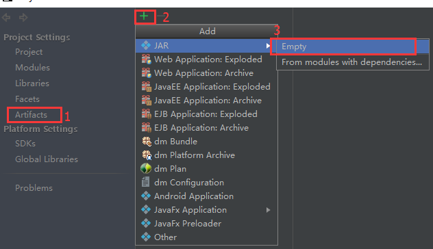

- 编辑该artifacts：

	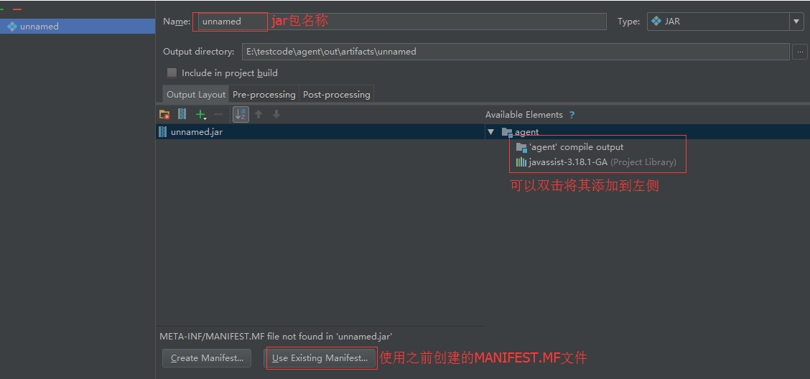

- 指定`MainClass`

	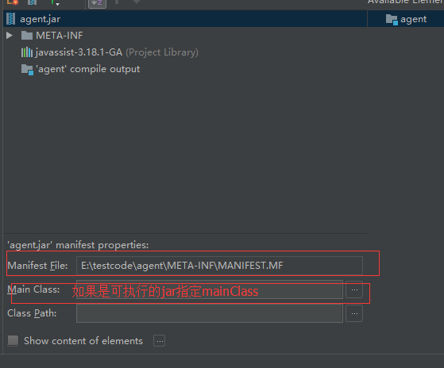

- 选择 `Buile -> Build Artifacts`，弹出选择action，执行`build`

### 5.2、maven工程打包

直接在pom文件加入插件

```xml
<plugin>
	<groupId>org.apache.maven.plugins</groupId>
	<artifactId>maven-jar-plugin</artifactId>
	<version>2.3.1</version>
	<configuration>
		<archive>
			<manifest>
				<addClasspath>true</addClasspath>
			</manifest>
			<manifestEntries>
				<Premain-Class>com.blue.fish.AgentBoot</Premain-Class>
				<Agent-Class>com.blue.fish.AgentBoot</Agent-Class>
				<Can-Redefine-Classes>true</Can-Redefine-Classes>
				<Can-Retransform-Classes>true</Can-Retransform-Classes>
			</manifestEntries>
		</archive>
	</configuration>
</plugin>
```

## 6、war包和jar包的区别

- war文件代表了一个Web应用程序，jar是类的归档文件

- war是一个web模块，其中需要包括WEB-INF，是可以直接运行的WEB模块。而jar一般只是包括一些class文件，在声明了Main_class之后是可以用java命令运行的；

- war包中的文件按一定目录结构来组织：通常其根目录下包含有Html和Jsp文件或者包含这两种文件的目录，另外还会有一个WEB-INF目录，通常在WEB-INF目录下有一个web.xml文件和一个classes目录，web.xml是这个应用的配置文件，而classes目录下则包含编译好的Servlet类和Jsp或Servlet所依赖的其它类（如JavaBean）。通常这些所依赖的类也可以打包成JAR放到WEB-INF下的lib目录下，当然也可以放到系统的CLASSPATH中，但那样移植和管理起来不方便。

<!-- START doctoc generated TOC please keep comment here to allow auto update -->
<!-- DON'T EDIT THIS SECTION, INSTEAD RE-RUN doctoc TO UPDATE -->
**目录**

- [二十一、Java Agent](#%E4%BA%8C%E5%8D%81%E4%B8%80java-agent)
  - [1、Java agent](#1java-agent)
  - [2、手动编写java agent](#2%E6%89%8B%E5%8A%A8%E7%BC%96%E5%86%99java-agent)
- [二十二、Java SPI机制](#%E4%BA%8C%E5%8D%81%E4%BA%8Cjava-spi%E6%9C%BA%E5%88%B6)
  - [1、SPI是什么](#1spi%E6%98%AF%E4%BB%80%E4%B9%88)
  - [2、使用场景](#2%E4%BD%BF%E7%94%A8%E5%9C%BA%E6%99%AF)
  - [3、使用规则](#3%E4%BD%BF%E7%94%A8%E8%A7%84%E5%88%99)
  - [4、示例](#4%E7%A4%BA%E4%BE%8B)
  - [5、原理](#5%E5%8E%9F%E7%90%86)
  - [6、总结](#6%E6%80%BB%E7%BB%93)
- [二十三、本地方法(native)](#%E4%BA%8C%E5%8D%81%E4%B8%89%E6%9C%AC%E5%9C%B0%E6%96%B9%E6%B3%95native)
  - [1、本地方法加载](#1%E6%9C%AC%E5%9C%B0%E6%96%B9%E6%B3%95%E5%8A%A0%E8%BD%BD)
- [二十四、Java中的null](#%E4%BA%8C%E5%8D%81%E5%9B%9Bjava%E4%B8%AD%E7%9A%84null)
- [二十五、字符集与字符编码](#%E4%BA%8C%E5%8D%81%E4%BA%94%E5%AD%97%E7%AC%A6%E9%9B%86%E4%B8%8E%E5%AD%97%E7%AC%A6%E7%BC%96%E7%A0%81)

<!-- END doctoc generated TOC please keep comment here to allow auto update -->


# 二十一、Java Agent

- [Java探针技术](https://www.cnblogs.com/aspirant/p/8796974.html)
- [Java Agent](https://www.jianshu.com/p/5bfe16c9ce4e)
- [Java Agent类隔离](https://mp.weixin.qq.com/s/6dyHV2yyccJxgTEOKBUgTA)

## 1、Java agent

JDK1.5之后引进的，也可以叫做Java代理，JavaAgent 是运行在 main方法之前的拦截器，它内定的方法名叫 premain ，也就是说先执行 premain 方法然后再执行 main 方法
- 支持方法执行耗时范围抓取设置，根据耗时范围抓取系统运行时出现在设置耗时范围的代码运行轨迹。
- 支持抓取特定的代码配置，方便对配置的特定方法进行抓取，过滤出关系的代码执行耗时情况。
- 支持APP层入口方法过滤，配置入口运行前的方法进行监控，相当于监控特有的方法耗时，进行方法专题分析。
- 支持入口方法参数输出功能，方便跟踪耗时高的时候对应的入参数。
- 提供WEB页面展示接口耗时展示、代码调用关系图展示、方法耗时百分比展示、可疑方法凸显功能

Java agent也是一个jar包，只是其启动方式和普通Jar包有所不同，Java agent并不能单独启动，必须依附在一个应用程序中运行；

其原理：
我们利用Java代理和ASM字节码技术，在JVM加载class二进制文件的时候，利用ASM动态的修改加载的class文件，在监控的方法前后添加计时器功能，用于计算监控方法耗时，同时将方法耗时及内部调用情况放入处理器，处理器利用栈先进后出的特点对方法调用先后顺序做处理，当一个请求处理结束后，将耗时方法轨迹和入参map输出到文件中，然后根据map中相应参数或耗时方法轨迹中的关键代码区分出我们要抓取的耗时业务。最后将相应耗时轨迹文件取下来，转化为xml格式并进行解析，通过浏览器将代码分层结构展示出来，方便耗时分析

## 2、手动编写java agent

- 在META-INF目录下创建MANIFEST文件
    ```
    Manifest-Version: 1.0
    Agent-Class: com.blue.fish.agent.AgentBoot
    Premain-Class: com.blue.fish.agent.AgentBoot
    Can-Redefine-Classes: true
    Can-Retransform-Classes: true
    ```

- 并在MANIFEST文件中指定Agent的启动类， 在加载Java Agent之后，会找到Agent-Class或者Premain-Class指定的类，并运行对应的agentmain或者premain方法

    ```java
    /**
     * 以vm参数的方式载入，在Java程序的main方法执行之前执行
     */
    public static void premain(String agentArgs, Instrumentation inst);
    /**
     * 以Attach的方式载入，在Java程序启动后执行
     */
    public static void agentmain(String agentArgs, Instrumentation inst);
    ```

# 二十二、Java SPI机制

- [Java中的SPI机制](https://mp.weixin.qq.com/s/LZhsCBuQignJj9Qb8NlYeg)

## 1、SPI是什么

`SPI`全称`Service Provider Interface`，是一种服务发现机制，是Java提供的一套用来被第三方实现或者扩展的API，它可以用来启用框架扩展和替换组件

整体机制如下：

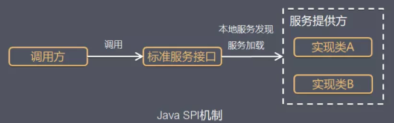

Java SPI 实际上是`基于接口的编程＋策略模式＋配置文件`组合实现的动态加载机制，Java SPI就是提供这样的一个机制：为某个接口寻找服务实现的机制；

当其他的程序需要这个服务的时候，就可以通过查找这个jar包（一般都是以jar包做依赖）的`META-INF/services/`中的配置文件，配置文件名称一般是接口的全类名。配置文件中有接口的具体实现类名，可以根据这个类名进行加载实例化，就可以使用该服务了。JDK中查找服务的实现的工具类是：`java.util.ServiceLoader`

## 2、使用场景

概括地说，适用于：调用者根据实际使用需要，启用、扩展、或者替换框架的实现策略，比较常见的例子：
- 数据库驱动加载接口实现类的加载：JDBC加载不同类型数据库的驱动
- 日志门面接口实现类加载：SLF4J加载不同提供商的日志实现类
- Spring：Spring中大量使用了SPI,比如：对servlet3.0规范对ServletContainerInitializer的实现、自动类型转换Type Conversion SPI(Converter SPI、Formatter SPI)等
- Dubbo：Dubbo中也大量使用SPI的方式实现框架的扩展, 不过它对Java提供的原生SPI做了封装，允许用户扩展实现Filter接口

## 3、使用规则

要使用Java SPI，需要遵循如下约定：
- 当服务提供者提供了接口的一种具体实现后，在jar包的`META-INF/services`目录下创建一个以“接口全限定名”为命名的文件，内容为实现类的全限定名；
- 接口实现类所在的jar包放在主程序的classpath中；
- 主程序通过`java.util.ServiceLoder`动态装载实现模块，它通过扫描`META-INF/services`目录下的配置文件找到实现类的全限定名，把类加载到JVM；
- SPI的实现类必须携带一个不带参数的构造方法；

比如Mysql的驱动类：

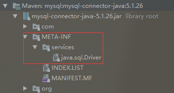


## 4、示例

```java
public interface Animal {
    void shout();
}
public class Dog implements Animal {
    @Override
    public void shout() {
        System.out.println("wang wang");
    }
}
public class Cat implements Animal {
    @Override
    public void shout() {
        System.out.println("miao miao");
    }
}
// META-INF/services/com.blue.fish.se.basis.spi.Animal
com.blue.fish.se.basis.spi.Dog
com.blue.fish.se.basis.spi.Cat

public static void main(String[] args) {
    ServiceLoader<Animal> shouts = ServiceLoader.load(Animal.class);
    for (Animal s : shouts) {
        s.shout();
    }
}
```

## 5、原理

ServiceLoader类的成员变量
```java
public final class ServiceLoader<S> implements Iterable<S> {
    private static final String PREFIX = "META-INF/services/";
    // 代表被加载的类或者接口
    private final Class<S> service;
    // 用于定位，加载和实例化providers的类加载器
    private final ClassLoader loader;
    // 创建ServiceLoader时采用的访问控制上下文
    private final AccessControlContext acc;
    // 缓存providers，按实例化的顺序排列
    private LinkedHashMap<String,S> providers = new LinkedHashMap<>();
    // 懒查找迭代器
    private LazyIterator lookupIterator;
```

具体流程：
- 应用程序调用`ServiceLoader.load`方法`ServiceLoader.load`方法内先创建一个新的`ServiceLoader`，并实例化该类中的成员变量，包括：
    - loader(ClassLoader类型，类加载器)
    - acc(AccessControlContext类型，访问控制器)
    - providers(LinkedHashMap类型，用于缓存加载成功的类)
    - lookupIterator(实现迭代器功能)
    
- 应用程序通过迭代器接口获取对象实例ServiceLoader先判断成员变量providers对象中(LinkedHashMap类型)是否有缓存实例对象，如果有缓存，直接返回
    - 读取`META-INF/services/`下的配置文件，获得所有能被实例化的类的名称
    - 通过反射方法`Class.forName()`加载类对象，并用`instance()`方法将类实例化
    - 把实例化后的类缓存到providers对象中(LinkedHashMap类型）然后返回实例对象。

## 6、总结

- 优点：使用Java SPI机制的优势是实现解耦，使得第三方服务模块的装配控制的逻辑与调用者的业务代码分离，而不是耦合在一起。应用程序可以根据实际业务情况启用框架扩展或替换框架组件
- 缺点：
    - 虽然ServiceLoader也算是使用的延迟加载，但是基本只能通过遍历全部获取，也就是接口的实现类全部加载并实例化一遍。如果你并不想用某些实现类，它也被加载并实例化了，这就造成了浪费。获取某个实现类的方式不够灵活，只能通过Iterator形式获取，不能根据某个参数来获取对应的实现类。
    - 多个并发多线程使用ServiceLoader类的实例是不安全的

# 二十三、本地方法(native)

## 1、本地方法加载

JDK 提供给了我们两个方法用于载入库文件，一个是`System.load(String filename)`方法，另一个是`System.loadLibrary(String libname)`方法，他们的区别主要如下：

- 加载的路径不同：
    - `System.load(String filename)` 是从作为动态库的本地文件系统中以指定的文件名加载代码文件，文件名参数必须是完整的路径名且带文件后缀
    - `System.loadLibrary(String libname)` 是加载由`libname`参数指定的系统库（系统库指的是`java.library.path`，可以通过` System.getProperty(String key)` 方法查看 java.library.path 指向的目录内容），将库名映射到实际系统库的方法取决于系统实现，譬如在 Android 平台系统会自动去系统目录、应用 lib 目录下去找 libname 参数拼接了 lib 前缀的库文件;
- 是否自动加载库的依赖库:

    譬如libA.so 和 libB.so 有依赖关系
    - 如果选择 `System.load("/sdcard/path/libA.so")`，即使 libB.so 也放在 `/sdcard/path/` 路径下，load 方法还是会因为找不到依赖的 libB.so 文件而失败，因为虚拟机在载入 libA.so 的时候发现它依赖于 libB.so，那么会先去 java.library.path 下载入 libB.so，而 libB.so 并不位于 `java.library.path` 下，所以会报错；
    - 使用 `System.loadLibrary("A")`，然后把 libA.so 和 libB.so 都放在 `java.library.path` 下即可


# 二十四、Java中的null

* [Java中的null](https://www.cnblogs.com/greatfish/p/5906617.html)

首先看一段代码：
```java
public class Null {
	public static void nihao() {
		System.out.println("你好陌生人");
	}
	public static void main(String[] args) {
		((Null) null).nihao();
	}
}
```
输出结果：你好陌生人

- `null`是Java中的关键字,它不属于任何类型,只是一种特殊的值,也可以说说代表一个不确定的对象
    ```java
    public static void main(String[] args) {
		System.out.println(null instanceof Object); // false
	}
    ```
- `null`是所有引用类型的默认值
- `null`可以被转化为任何类型,输出`null`不会抛出任何异常,这和println()的源代码有关
    ```java
    public static void main(String[] args) {
		Object o = (Object)null;
		Integer i = (Integer)null;
		String s = (String )null;
		Null n = (Null)null;
		System.out.println(o);
		System.out.println(i);
		System.out.println(s);
		System.out.println(n);
	}
    ```
- `null`可以被转化为任何类型,所以可以调用静态方法；
- `null`可以被转化为任何类型,但是不能调用非静态方法,运行时会出错；
- `null`被强转化任何类型后,它还仅仅是一个特殊值,并不属于任何类型.
- `null==null`返回true,被转换为同种类型的null,都返回true,不同类型直接编译报错；
- 用String转换后的null可以进行字符串运算,这是因为字符串进行连接的时候,编译器对`null`进行了特别的优化,其实就是例化`StringBuilder`,在调用`append()`方法时对`null`的一个特别处理,当为null时,转化为“null”,最后调用`toString()`返回一个String对象;
- 用八大基本类型转换后的`null`,不可以进行基本类型的运算,否则会出现编译或者运行错误；
- `null`和`""`并不相等,因为下面的s并没有指向某一块内存,而s1指向了一块空字符串的内存；

# 二十五、字符集与字符编码

http://www.ruanyifeng.com/blog/2007/10/ascii_unicode_and_utf-8.html

# 二十六、JMS


# 二十七、JMX

- [JMX详解](https://www.cnblogs.com/dongguacai/p/5900507.html)
- [官方资料](https://www.oracle.com/technetwork/java/javase/tech/javamanagement-140525.html)

Java Management Extensions是管理Java的一种扩展。这种机制可以方便的管理、监控正在运行中的Java程序。常用于管理线程，内存，日志Level，服务重启，系统环境等

## 1、基本属术语

- MBean：`Managed Bean`，在JMX中MBean代表一个被管理的资源实例，通过MBean中暴露的方法和属性，外界可以获取被管理的资源的状态和操纵MBean的行为；MBean就是一个Java Object，同JavaBean模型一样，外界使用自醒和反射来获取Object的值和调用Object的方法，只是MBean更为复杂和高级一些。MBean通过公共方法以及遵从特定的设计模式封装了属性和操作，以便暴露给管理应用程序；
- MBeanServer：MBean生存在一个MBeanServer中。MBeanServer管理这些MBean，并且代理外界对它们的访问。并且MBeanServer提供了一种注册机制，使得外界可以通过名字来得到相应的MBean实例
- JMX Agent：Agent只是一个Java进程，它包括这个MBeanServer和一系列附加的MbeanService。当然这些Service也是通过MBean的形式来发布
- Protocol Adapters and Connectors：MBeanServer依赖于Protocol Adapters和Connectors来和运行该代理的Java虚拟机之外的管理应用程序进行通信。Protocol Adapters通过特定的协议提供了一张注册在MBeanServer的MBean的视图

    Adapters和Connectors使MBean服务器与管理应用程序能进行通信；

    Adapter 和Connector的区别在于：Adapter是使用某种Internet协议来与JMX Agent获得联系，Agent端会有一个对象 (Adapter)来处理有关协议的细节。比如SNMP Adapter和HTTP Adapter。而Connector则是使用类似RPC的方式来访问Agent，在Agent端和客户端都必须有这样一个对象来处理相应的请求与应答。比如RMI Connector

应用场景：中间件软件WebLogic的管理页面就是基于JMX开发的，而JBoss则整个系统都基于JMX构架

## 2、JMX架构

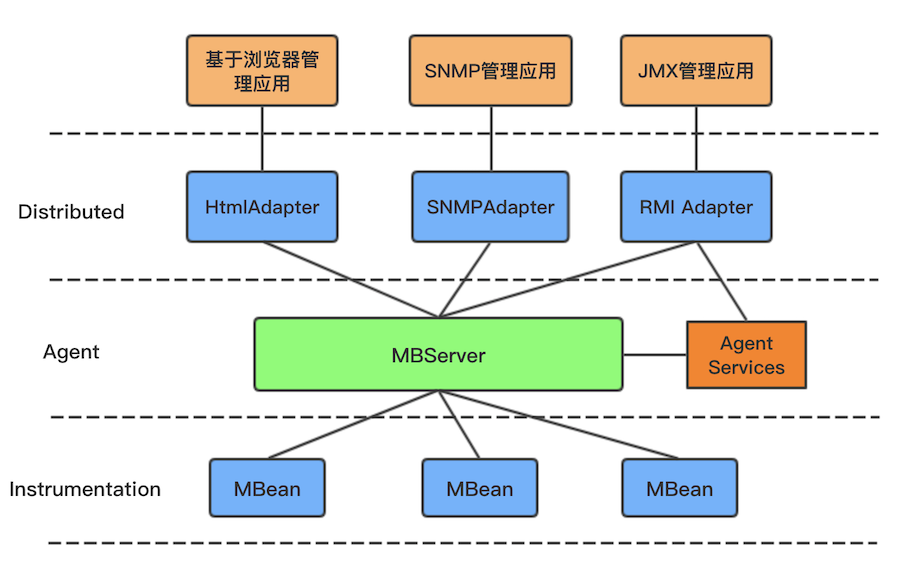

- Instrumentation层：Instrumentation层主要包括了一系列的接口定义和描述如何开发MBean的规范。通常JMX所管理的资源有一个或多个MBean组成，因此这个资源可以是任何由Java语言开发的组件，或是一个JavaWrapper包装的其他语言开发的资源；
- Agent层：Agent 用来管理相应的资源，并且为远端用户提供访问的接口。Agent层构建在Intrumentation层之上，并且使用并管理 Instrumentation层内部描述的组件；Agent层主要定义了各种服务以及通信模型。该层的核心是一MBeanServer,所有的MBean都要向它注册，才能被管理；
- Distributed层：Distributed层关心Agent如何被远端用户访问的细节。它定义了一系列用来访问Agent的接口和组件，包括Adapter和Connector的描述

### 2.1、MBean分类

- standard MBean：这种类型的MBean最简单，它能管理的资源（包括属性，方法，时间）必须定义在接口中，然后MBean必须实现这个接口。它的命名也必须遵循一定的规范，例如我们的MBean为Hello，则接口必须为HelloMBean；
- dynamic MBean：必须实现javax.management.DynamicMBean接口，所有的属性，方法都在运行时定义；
- open MBean
- model MBean：与标准和动态MBean相比，你可以不用写MBean类，只需使用javax.management.modelmbean.RequiredModelMBean即可

## 3、JMX的访问方式

### 3.1、通过jconsole

jconsole是JDK自带的工具

参考代码：[JConsoleAgent.java](https://github.com/chenlanqing/java-code/blob/master/java-se/java-se-basis/src/main/java/com/blue/fish/se/basis/jmx/demo/JConsoleAgent.java)

### 3.2、通过JMX提供的工具页访问

改动适配层，这里需要到导入外部jar包jdmk

参考代码：[HtmlAdapterAgent.java](https://github.com/chenlanqing/java-code/blob/master/java-se/java-se-basis/src/main/java/com/blue/fish/se/basis/jmx/demo/HtmlAdapterAgent.java)

### 3.3、通过客户端程序进行远程访问

参考代码：[RMIAgent.java](https://github.com/chenlanqing/java-code/blob/master/java-se/java-se-basis/src/main/java/com/blue/fish/se/basis/jmx/demo/RMIAgent.java)

## 4、Notification

MBean之间的通信是必不可少的，Notification就起到了在MBean之间沟通桥梁的作用。JMX 的通知由四部分组成：
- Notification这个相当于一个信息包，封装了需要传递的信息；
- Notification broadcaster这个相当于一个广播器，把消息广播出；
- Notification listener 这是一个监听器，用于监听广播出来的通知信息；
- Notification filiter 这个一个过滤器，过滤掉不需要的通知。这个一般很少使用；

## 5、JMX监控tomcat

* [JMX管理监控Tomcat8](https://tomcat.apache.org/tomcat-8.0-doc/monitoring.html)

利用JMX监控Tomcat，就是相当于部署在tomcat上的应用作为服务端，也就是被管理资源的对象。然后通过程序或者jconsole远程连接到该应用上来。远程连接需要服务器端提供ip和port。如果需要加密访问的话，还需要配置用户名、密码等参数

主要是在tomcat下的文件catalina.sh中进行一些环境变量的配置配置：
```
set CATALINA_OPTS=-Dcom.sun.management.jmxremote
  -Dcom.sun.management.jmxremote.port=%my.jmx.port%
  -Dcom.sun.management.jmxremote.ssl=false
  -Dcom.sun.management.jmxremote.authenticate=false
如果需要授权：
-Dcom.sun.management.jmxremote.authenticate=true
-Dcom.sun.management.jmxremote.password.file=../conf/jmxremote.password
-Dcom.sun.management.jmxremote.access.file=../conf/jmxremote.access

```
- `-Dcom.sun.management.jmxremote=true`：相关 JMX 代理侦听开关
- `-Djava.rmi.server.hostname=xxxx`：服务器端的IP
- `-Dcom.sun.management.jmxremote.port=29094`：相关 JMX 代理侦听请求的端口
- `-Dcom.sun.management.jmxremote.ssl=false`：指定是否使用 SSL 通讯
- `-Dcom.sun.management.jmxremote.authenticate=false`：指定是否需要密码验证

## 6、JMX产生问题原因

JMX不可用，往往是由于垃圾回收时间停顿时间过长、内存溢出等问题引起的

# 二十八、Java基准测试-JMH

- [JMH教程](http://tutorials.jenkov.com/java-performance/jmh.html)
- [JMH使用](https://www.xncoding.com/2018/01/07/java/jmh.html)

# 二十九、面向对象

## 1、面向对象与面向过程

- 面向过程：把问题分解成一个一个步骤，每个步骤用函数实现；进行面向过程编程时，上来先定义一个函数，然后使用诸如if-else等方式进行代码执行；
- 面向对象：将问题分解成一个一个步骤，对每个步骤进行相应的抽象、形成对象，通过不同对象之间的调用，组合解决问题；是一种变成死信，提倡使用类来抽象现实模型

## 2、三大基本特征

- 封装：通常认为封装是把数据和操作数据的方法绑定起来，对数据的访问只能通过已定义的接口；面向对象的本质就是：将现实世界描绘成一系列完全自然、封闭的对象。在类中的编写的方法就是对实现细节的一种封装；编写一个类就是对数据和数据操作的封装；
- 继承：继承是从已有类中得到继承信息并创建新类的过程。提供继承信息的类被称为父类；得到继承信息的类被称为子类。继承让变化中的软件系统有了一定的延续性，同时继承也是封装程序中可变因素的重要手段；
- 多态：指允许不同子类型的对象对同一消息作出不同的响应；

## 3、五大基本原则

- 单一职责原则
- 开放封闭原则
- 里氏替换原则
- 依赖倒置原则
- 接口隔离原则


# 三十、Lambda表达式与函数式接口

## 1、函数式接口

函数式接口是只包含一个方法的接口。比如Java标准库中的java.lang.Runnable和java.util.Comparator都是典型的函数式接口；

java 8提供 `@FunctionalInterface` 作为注解，这个注解是非必须的，只要接口符合函数式接口的标准（即只包含一个方法的接口），虚拟机会自动判断，但 好在接口上使用注解@FunctionalInterface进行声明，以免团队的其他人员错误地往接口中添加新的抽象方法。 

Java中的lambda无法单独出现，它需要一个函数式接口来盛放，lambda表达式方法体其实就是函数接口的实现

## 2、Lambda表达式

### 2.1、语法格式

```java
// 之前的语法
new Thread(new Runnable() {
    @Override
    public void run() {
        System.out.println("内部类线程");
    }
}).start();
// lambda语法
new Thread(() -> System.out.println("我是Lambda线程")).start();
```

### 2.2、Lambda原理

如下代码：启动一个线程，包含lambda表达式和匿名内部类的方式
```java
public class LambdaDemo {
    public static void runThreadUseLambda() {
        new Thread(() -> System.out.println("我是Lambda线程")).start();
    }
    public static void runWithInnerClass() {
        new Thread(new Runnable() {
            @Override
            public void run() {
                System.out.println("内部类线程");
            }
        }).start();
    }
    public static void main(String[] args) {
        runThreadUseLambda();
        runWithInnerClass();
    }
}
```
通过`javap -c LambdaDemo`查看字节码
```java
...
public static void runThreadUseLambda();
Code:
    0: new           #2                  // class java/lang/Thread
    3: dup
    4: invokedynamic #3,  0              // InvokeDynamic #0:run:()Ljava/lang/Runnable;
    9: invokespecial #4                  // Method java/lang/Thread."<init>":(Ljava/lang/Runnable;)V
    12: invokevirtual #5                  // Method java/lang/Thread.start:()V
    15: return

public static void runWithInnerClass();
Code:
    0: new           #2                  // class java/lang/Thread
    3: dup
    4: new           #6                  // class com/blue/fish/se/basis/lambda/LambdaDemo$1
    7: dup
    8: invokespecial #7                  // Method com/blue/fish/se/basis/lambda/LambdaDemo$1."<init>":()V
    11: invokespecial #4                  // Method java/lang/Thread."<init>":(Ljava/lang/Runnable;)V
    14: invokevirtual #5                  // Method java/lang/Thread.start:()V
    17: return
...
```
对比上述两个方法，发现lambda的是`invokeDynamic`，而内部类的是`invokespecial`；

JVM指令：
- invokeinterface：调用接口方法；
- invokespecial：专门用来调用父类方法、私有方法和初始化方法；
- invokestatic：调用静态方法；
- invokevirtual：调用对象的一般方法

上述这四个指令所对应的类、调用的方法在编译时几乎是固定的：invokestatic所对应的类为静态方法所在的类，方法为静态方法本身；invokespecial所对应的类为当前对象，方法是固定的；invokeinterface和invokevirtual所对应的类也为当前对象，方法可以因为继承和实现进行选择，但也仅限于整个继承体系中选择；

在java7 JVM中增加了一个新的指令invokedynamic，用于支持动态语言，即允许方法调用可以在运行时指定类和方法，不必在编译的时候确定；字节码中每条invokedynamic指令出现的位置称为一个动态调用点，invokedynamic指令后面会跟一个指向常量池的调用点限定符，这个限定符会被解析为一个动态调用点；

Lambda采用的是invokedynamic指令；

### 2.3、Lambda性能

# 三十一、Java编码

* [Java中文编码](https://www.ibm.com/developerworks/cn/java/j-lo-chinesecoding/index.html)

## 1、为什么需要编码

- 计算机中存储信息的最小单元是一个字节即 8 个 bit，所以能表示的字符范围是 0~255 个
- 人类要表示的符号太多，无法用一个字节来完全表示
- 要解决这个矛盾必须需要一个新的数据结构 char，从 char 到 byte 必须编码

## 2、编码方式

计算中提拱了多种翻译方式，常见的有 ASCII、ISO-8859-1、GB2312、GBK、UTF-8、UTF-16 等。它们都可以被看作为字典，它们规定了转化的规则，按照这个规则就可以让计算机正确的表示我们的字符；

- ASCII码：总共有 128 个，用一个字节的低 7 位表示，0~31 是控制字符如换行回车删除等；32~126 是打印字符，可以通过键盘输入并且能够显示出来；

- ISO-8859-1： ISO 组织在 ASCII 码基础上又制定了一些列标准用来扩展 ASCII 编码，它们是 `ISO-8859-1~ISO-8859-15`，其中` ISO-8859-1` 涵盖了大多数西欧语言字符，所有应用的最广泛。ISO-8859-1 仍然是单字节编码，它总共能表示 256 个字符；

- GB2312：它的全称是《信息交换用汉字编码字符集 基本集》，它是双字节编码，总的编码范围是 A1-F7，其中从 A1-A9 是符号区，总共包含 682 个符号，从 B0-F7 是汉字区，包含 6763 个汉字；

- GBK：全称叫《汉字内码扩展规范》，是国家技术监督局为 windows95 所制定的新的汉字内码规范，它的出现是为了扩展 GB2312，加入更多的汉字，它的编码范围是 8140~FEFE（去掉 XX7F）总共有 23940 个码位，它能表示 21003 个汉字，它的编码是和 GB2312 兼容的，也就是说用 GB2312 编码的汉字可以用 GBK 来解码，并且不会有乱码；

- GB18030：全称是《信息交换用汉字编码字符集》，是我国的强制标准，它可能是单字节、双字节或者四字节编码，它的编码与 GB2312 编码兼容，这个虽然是国家标准，但是实际应用系统中使用的并不广泛；

- UTF-16：UTF-16 具体定义了 Unicode 字符在计算机中存取方法。UTF-16 用两个字节来表示 Unicode 转化格式，这个是定长的表示方法，不论什么字符都可以用两个字节表示，两个字节是 16 个 bit，所以叫 UTF-16。UTF-16 表示字符非常方便，每两个字节表示一个字符，这个在字符串操作时就大大简化了操作，这也是 Java 以 UTF-16 作为内存的字符存储格式的一个很重要的原因；

- UTF-8：采用了一种变长技术，每个编码区域有不同的字码长度。不同类型的字符可以是由 1~6 个字节组成；UTF-8 有以下编码规则：
    - 如果一个字节，最高位（第 8 位）为 0，表示这是一个 ASCII 字符（00 - 7F）。可见，所有 ASCII 编码已经是 UTF-8 了。
    - 如果一个字节，以 11 开头，连续的 1 的个数暗示这个字符的字节数，例如：110xxxxx 代表它是双字节 UTF-8 字符的首字节。
    - 如果一个字节，以 10 开始，表示它不是首字节，需要向前查找才能得到当前字符的首字节

## 3、Java中需要编码的场景

### 3.1、I/O 操作中存在的编码

涉及到编码的地方一般都在字符到字节或者字节到字符的转换上，而需要这种转换的场景主要是在 I/O 的时候，这个 I/O 包括磁盘 I/O 和网络 I/O

IO中读写是StreamEncoder 类负责将字符编码成字节，编码格式和默认编码规则与解码是一致的，关系如下：

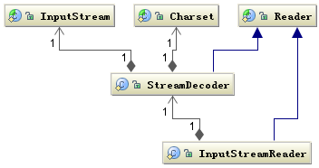  <br/>  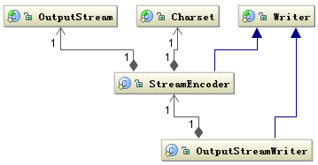 

IO编码示例：涉及到 I/O 操作时只要注意指定统一的编解码 Charset 字符集，一般不会出现乱码问题
```java
String file = "c:/stream.txt";
String charset = "UTF-8";
// 写字符换转成字节流
FileOutputStream outputStream = new FileOutputStream(file);
OutputStreamWriter writer = new OutputStreamWriter(
        outputStream, charset);
try {
    writer.write("这是要保存的中文字符");
} finally {
    writer.close();
}
// 读取字节转换成字符
FileInputStream inputStream = new FileInputStream(file);
InputStreamReader reader = new InputStreamReader(
        inputStream, charset);
StringBuffer buffer = new StringBuffer();
char[] buf = new char[64];
int count = 0;
try {
    while ((count = reader.read(buf)) != -1) {
        buffer.append(buffer, 0, count);
    }
} finally {
    reader.close();
}
```

### 3.2、内存中操作中的编码

Java 中用 String 表示字符串，所以 String 类就提供转换到字节的方法，也支持将字节转换为字符串的构造函数
```java
String s = "这是一段中文字符串"; 
byte[] b = s.getBytes("UTF-8"); 
String n = new String(b,"UTF-8");
```

Charset 提供 encode 与 decode 分别对应 char[] 到 byte[] 的编码和 byte[] 到 char[] 的解码
```java
Charset charset = Charset.forName("UTF-8"); 
ByteBuffer byteBuffer = charset.encode(string); 
CharBuffer charBuffer = charset.decode(byteBuffer);
```
Java 中还有一个 ByteBuffer 类，它提供一种 char 和 byte 之间的软转换，它们之间转换不需要编码与解码，只是把一个 16bit 的 char 格式，拆分成为 2 个 8bit 的 byte 表示，它们的实际值并没有被修改，仅仅是数据的类型做了转换

## 4、Java中如何编解码

Java编码中需要用到的类图

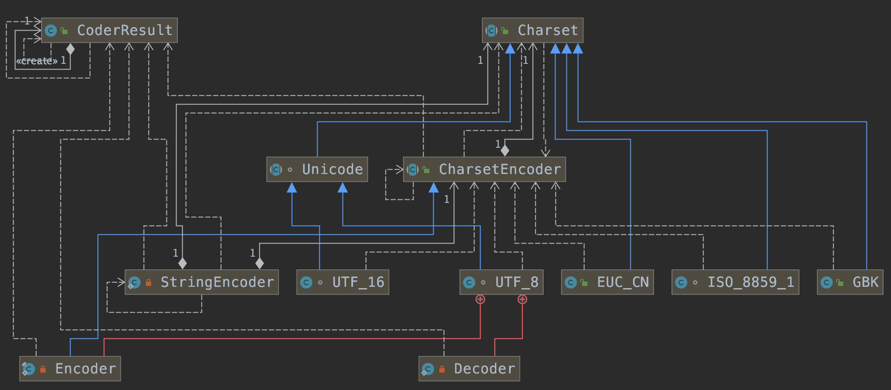

首先根据指定的 charsetName 通过 Charset.forName(charsetName) 设置 Charset 类，然后根据 Charset 创建 CharsetEncoder 对象，再调用 CharsetEncoder.encode 对字符串进行编码，不同的编码类型都会对应到一个类中，实际的编码过程是在这些类中完成的；

# 三十二、加密与解密

数据的安全是基于密钥，而不是算法的保密。算法的是公开

## 1、Java安全

### 1.1、网络安全体系

- OSI安全体系

- TCP安全体系

### 1.2、Java安全

**Java安全组成：**
- JCA(Java Cryptography Arctitecture)：消息摘要
- JCE(Java Cryptography Extension)
- JSSE(Java Secure Socket Extension)：SSL
- JAAS(Java Authentication and Authorization Service)

**JDK默认的加解密：**
```
security.provider.1=sun.security.provider.Sun
security.provider.2=sun.security.rsa.SunRsaSign
security.provider.3=sun.security.ec.SunEC
security.provider.4=com.sun.net.ssl.internal.ssl.Provider
security.provider.5=com.sun.crypto.provider.SunJCE
security.provider.6=sun.security.jgss.SunProvider
security.provider.7=com.sun.security.sasl.Provider
security.provider.8=org.jcp.xml.dsig.internal.dom.XMLDSigRI
security.provider.9=sun.security.smartcardio.SunPCSC
security.provider.10=apple.security.AppleProvider
```

**加载自定义的加解密方式：**
- 修改对应的java.security文件，按照上面的方式增加配置
- 通过编码的方式增加：调用Security类的addProviders或者insertProviderAt

**相关的java包和类：**
- java.security：消息摘要
- javax.crypto：安全消息摘要，消息认证码；
- java.net.ssl：安全套接字

**第三方扩展：**
- Bouncy Castle：支持配置和调用
- Commons Codec：Apache、Base64、二进制、十六进制、字符集编码、URL编码/解码

## 2、Base64加密算法

算法实现
- JDK
- Commons codec
- Bouncy Castle

pom引入：
```xml
<dependency>
    <groupId>commons-codec</groupId>
    <artifactId>commons-codec</artifactId>
    <version>1.12</version>
</dependency>
<dependency>
    <groupId>org.bouncycastle</groupId>
    <artifactId>bcprov-jdk15on</artifactId>
    <version>1.62</version>
</dependency>
```
Java代码实现
```java
private static void bouncyCastleBase64(String src){
    byte[] encode = org.bouncycastle.util.encoders.Base64.encode(src.getBytes());
    System.out.println("encoder:" + new String(encode));

    byte[] decode = org.bouncycastle.util.encoders.Base64.decode(encode);
    System.out.println("decoder:" + new String(decode));

}

private static void commonCodecBase64(String src) {
    byte[] bytes = Base64.encodeBase64(src.getBytes());
    System.out.println("encoder:" + new String(bytes));

    byte[] decode = Base64.decodeBase64(bytes);
    System.out.println("decoder:" + new String(decode));

}

private static void jdkBase64(String src) throws IOException {
    BASE64Encoder encoder = new BASE64Encoder();
    String encode = encoder.encode(src.getBytes());

    System.out.println("encoder:" + encode);

    BASE64Decoder decoder = new BASE64Decoder();
    System.out.println("decoder:" + new String(decoder.decodeBuffer(encode)));
}
```

## 3、消息摘要算法

消息摘要算法：验证数据的完整性，数字签名的核心算法

### 3.1、MD

主要是128位摘要算法。MD2、MD4、MD5

单向摘要算法、128位长度

代码实现：
```java
// MD2、MD5JDK有对应实现，MD4是由bouncycastle来实现的
private static void jdkMd5(String src) throws NoSuchAlgorithmException {
    MessageDigest md = MessageDigest.getInstance("MD5");
    byte[] digest = md.digest(src.getBytes());
    System.out.println("JDK MD5: " + Hex.encodeHexString(digest));
}
// JDK使用MD4来获取摘要信息
private static void bcMd4(String src) throws NoSuchAlgorithmException {
    Security.addProvider(new BouncyCastleProvider());
    MessageDigest md = MessageDigest.getInstance("MD4");
    byte[] digest = md.digest(src.getBytes());
    System.out.println("BC MD4: " + Hex.encodeHexString(digest));
}
// 使用bouncycastle来实现MD5摘要算法
private static void bcMd5(String src) {
    Digest digest = new MD5Digest();
    digest.update(src.getBytes(), 0, src.getBytes().length);
    byte[] md5Bytes = new byte[digest.getDigestSize()];
    digest.doFinal(md5Bytes, 0);
    System.out.println("BC MD5: " + org.bouncycastle.util.encoders.Hex.toHexString(md5Bytes));
}
// 使用apache-common-codec实现的摘要算法
public static void ccMD5(String src){
    System.out.println("Apache MD5: " + DigestUtils.md5Hex(src));
}
```

### 3.2、SHA

安全散列算法、固定长度摘要算法：SHA-1、SHA-2(SHA-224、SHA-256、SHA-384、SHA-512)，其中SHA-224是由Bouny Castle来实现的

代码实现
```java
// 使用JDK来实现的sha1
private static void jdkSha1(String src) throws NoSuchAlgorithmException {
    MessageDigest sha = MessageDigest.getInstance("SHA");
    sha.update(src.getBytes());
    System.out.println("jdk SHA-1" + Hex.encodeHexString(sha.digest()));
}
// 使用Bouny Castle来实现的sha1
private static void bcSha1(String src) throws NoSuchAlgorithmException {
    Digest digest = new SHA1Digest();
    digest.update(src.getBytes(), 0 , src.getBytes().length);
    byte[] sha1 = new byte[digest.getDigestSize()];
    digest.doFinal(sha1, 0);
    System.out.println("bc SHA-1" + org.bouncycastle.util.encoders.Hex.toHexString(sha1));
}
```

### 3.3、MAC

MAC、HMAC-带密钥的MAC

# 三十三、进制基础

## 1、进制基础

## 2、二进制运算

### 2.1、与运算：&

**2.1.1、两位全为1，结果才为 1**

```
0&0=0	0&1=0	1&0=0	1&1=1
51&5 = 1 即: 
	51 => 00000000 00000000 00000000 00110011
	5  => 00000000 00000000 00000000 00000101
	& ==> 00000000 00000000 00000000 00000001 (1)
```

**2.1.2、用法**

- 清零：如果想将一个单元清零，即使其全部二进制为 0， 只要与一个各位都为 0 的数值相`与`，结果为 0；
- 取一个数中指定位置，如：x = 10101110， 取 x 的低四位，用 `x & 00001111 = 00001110`，即可得到	

### 2.2、或运算：|

**2.2.1、只要有一个为 1，结果就为 1**

	0|0 = 0		1|0 = 1		0|1	= 1		1|1 = 1
	51|5 = 55 即:
		51 => 00000000 00000000 00000000 00110011
		5  => 00000000 00000000 00000000 00000101
		|  => 00000000 00000000 00000000 00110111

**2.2.3、用法**

	常用来对一个数据的某些位置 1
	如: x = 1010 0000 的低四位置 1， 用 x | 0000 1111 = 1010 1111

### 2.3、异或运算：^

**2.3.1、两个相应位为"异"(值不同)，则该位结果为 1， 否则为 0**

	0^0 = 0		1^0 = 1		0^1 = 1		1^1 = 0；
	51^5 = 54即:
		51 => 00000000 00000000 00000000 00110011
		5  => 00000000 00000000 00000000 00000101
		^  => 00000000 00000000 00000000 00110110

**2.3.2、用法**

- 使特定位翻转，找一个数，对应 x 要翻转的各位，该数的对应位为 1，其余位为 0，此数与 x 对应的位"异或"即可<br>
	如:x = 10101110， 使 x 低四位翻转， 用 x ^ 0000 1111 = 1010 0001
- 与 0 相异或，保留原值<br>
	如: x ^ 00000000 = 10101110
- 两个变量交换值:<br>
	- ①、借助第三个变量来实现:<br>
		c = a， a = b， b = c；<br>
	- ②、利用加减法来实现:<br>
		a = a + b， b = a - b， a = a-b；<br>
	- ③、用异或运算来实现，也是效率最高的:<br>
		原理:利用一个数异或本身等于 0 和 异或运算符合交换率<br>
		a = a ^ b； b = a ^ b； a = a ^ b

### 2.4、取反运算：~ 

	取反:对一个二进制数按位取反，即将 0 变为 1，1 变为 0
		~1 = 0		~0 = 1	

### 2.5、左移：<< 

	将一个运算对象的各二进制位全部左移若干位(左边的二进制位丢弃，右边补 0)
		2 << 2 = 8；
			2   => 00000000 00000000 00000000 00000010
			>>2 => 00000000 00000000 00000000 00001000
	若左移时舍弃的高位不包含 1，则每左移一位，相当于该数乘以 2；
		2 << 2 ==> 2 * 2 * 2(最快计算 2 的三次方)

### 2.6、右移：>>

	将一个数的各二进制位全部右移若干位，正数左补 0，负数左补 1；对于正数来说操作数每右移一位，相当于该数除以 2
	左补 1 或 0 看被移动的数是正数还是负数； 
		4 >> 2 ==> 1 ( 4 / 2 / 2)；
		-14(11110010) >> 2 ==> -4(11111100)

### 2.7、无符号右移：>>> 

各个位向右移指定的位数，右移后左边空出的位使用 0 填充，移出右边的位被丢弃掉

	-14 >> 2:
		-14 => 11111111 11111111 11111111 11110010
		>>2 => 00111111	11111111 11111111 11111100(1073741820) ；

### 2.8、二进制四则运算

#### 2.8.1、加法

`0+0=0，0+1=1，1+0=1，1+1=10`
- 当两个相加的二进制仅一位时，相加的结果为1；
- 如果两个二进制位全是0，相加的结果仍为0；
- 如果两个相加的进制位均为1，则结果为10，要向高位进1，也就是`逢2进1`规则

在运算的过程中，两数要从最低位开始对齐

#### 2.8.2、减法

`1-1=0，1-0=1，0-0=0，0-1=-1`
- 当两个相减的二进制位中同为0或1时，相减结果为0；
- 如果被减数的二进制位为1，而减数的二进制位为0，则相减的结果仍为1；
- 如果被减数的二进制位为0，而减数的二进制位为1，则需要向高位借1，但此时借1当2；

#### 2.8.3、乘法

`0*0=0，1*0=0，0*1=0，1*1=1`
- 只有当两个相乘的二进制位都为1，相乘的结果才为1；
- 当两个相乘的二进制位只要有一位为0，则相乘的结果都为0；
- 1与任何数相乘的结果都是对应的被乘数；而0与任何数相乘结果都为0；

在乘法运算中，乘数的每一位都要与被乘数的每一位分别相乘，而不仅是对应位相乘

#### 2.8.4、除法

当被除数大于除数时，商是“1”；当被除数小于除数时，不够除，商只能是“0”；

## 3、负数：以其正值的补码形式表示

### 3.1、原码

一个整数按照绝对值大小转换成二进制成为原码 <br>
14 => 00000000 00000000 00000000 00001110  (14的原码)

### 3.2、反码

将二进制按位取反，所得的二进制数称为原二进制数的反码<br>
将 14 的每一位按位取反<br>

	00000000 00000000 00000000 00001110 => 14 原码
	11111111 11111111 11111111 11110001 => 14 反码
	两者互为反码

### 3.3、补码：反码加1称为补码

正数的补码和原码相同；负数的补码是通过先把除符号位外其他各位取反，再在末位（最低位）加1得到；

11111111 11111111 11111111 11110001 + 1 => <br>
11111111 11111111 11111111 11110010

### 3.4、案例
```
-14 << 2
-14 => 11111111 11111111 11111111 11110010
<<2 => 11111111 11111111 11111111 11001000
```
- 分析:只需要该补码的原码对应的正值，然后取相反数<br>
	- 补码减 1，得到反码 11000111<br>
	- 补码取反得到 原码，即该负数的正值 00111000<br>
	- 计算正值，为 56<br>
	- 取相反数<br>

### 3.5、根据 `1+~n = -n` 可以快速，计算负数补码	

`-n = ~n+1`  =>  `-n-1 = ~n`

## 4、Java 二进制

### 4.1、Java 基本数据类型

- 整型：`byte(8 bit)、short(16 bit)、int(32 bit)、long(64 bit)`
- 浮点型： `float(32 bit)、double(64 bit)`；
- 布尔：`true false (1 bit)`
- 字符：`char(unicode字符 16 bit)`

### 4.2、常用的数

0xff ==> 11111111

f ==> 1111

### 4.3、大小端

- 小端（little-endian）：低位字节排放在内存的低地址端即该值的起始地址，高位字节排放在内存的高地址端
- 大端（big-endian）：高位字节排放在内存的低地址端即该值的起始地址，低位字节排放在内存的高地址端
- 例子: 32bit宽的数 `0x12345678`
	- 在 little-endian 模式下在 CPU 内存的存放方式:(假设内存起始地址 0x4000开始存放)
		- 内存地址:	`0x4000 	0x4001	0x4002	0x4003`
		- 存放内容:	`0x78 	0x56	0x34	0x12`
	- 在 big-endian 模式下存放如下:
		- 内存地址:	`0x4000 	0x4001	0x4002	0x4003`
		- 存放内容:	`0x12 	0x34	0x56	0x78`
- 大端的优势就是易于阅读，小端便于cpu内部数据计算

### 4.4、数据类型转换为 字节

`8143 (00000000 00000000 00011111 11001111)` ==> `byte[] b = [-49,31,0,0]`;
- 第一个（低端）字节：`8143 >> 0 * 8 & 0xff = 11001111(207)`,有符号为 -49 
- 第二个（低端）字节：`8143 >> 1 * 8 & 0xff = 00011111(31)`
- 第三个（低端）字节：`8143 >> 2 * 8 & 0xff = 00000000(0)`
- 第四个（低端）字节：`8143 >> 3 * 8 & 0xff = 00000000(0)`

### 4.5、字符串与字节的相互转换

字符串 --> 字节：`byte[] b = s.getBytes();`<br>
字节 --> 字符串：`byte[] b = new byte[int]; new String(b)` 或者 `new String(b, encode)`// encode 编码格式:

### 4.6、转换实例
```java
public class CovertToRadix {
	public static byte[] intToByte(int i){
		byte[] arr = new byte[4];
		/*
		arr[0] = (byte)((int)((i >> 0 * 8) & 0xff));
		arr[1] = (byte)((int)((i >> 1 * 8) & 0xff));
		arr[2] = (byte)((int)((i >> 2 * 8) & 0xff));
		arr[3] = (byte)((int)((i >> 3 * 8) & 0xff));
		*/
		for(int j=0;j<arr.length;j++){
			arr[j] = (byte)((int)((i >> j * 8) & 0xff));
		}
		return arr;
	}
	public static int byteToInt(byte[] arr){
		/*
		int r0 = (int)((arr[0]& 0xff) << 0 * 8);
		int r1 = (int)((arr[1]& 0xff) << 1 * 8);
		int r2 = (int)((arr[2]& 0xff) << 2 * 8);
		int r3 = (int)((arr[3]& 0xff) << 3 * 8);
		*/
		int result = 0;
		for(int j=0;j<arr.length;j++){
			result += (int)((arr[j]& 0xff) << j * 8);
		}
		return result;
	}
}
```
## 5、如何利用位运算

### 5.1、子网掩码

### 5.2、求平均值
```
int x = 32760; int y = 32762; 求 x，y 的平均值，要求空间复杂度 O(0)
public static int ave(int x， int y){
	return (x&y) + ((x^y)>>1)；
}
```
- 知识点: `>>n` 相当于除于2^n ，`<<n` 相当于乘于 2^n
- 把 x，y分别分成两个部分来看，两者相同的位分别拿出来:<br>
```
x(111111111111000) = 111111111111000 + 000000000000000
y(111111111111010) = 111111111111000 + 000000000000010
相同部分我们叫做x1，y1，不同部分我们叫做x2，y2.那么现在(x+y)/2 =(x1+y1)/2 +(x2 + y2)/2 ，<br>
因为x1 == y1 ，所以(x1+y1)/2 == x1 ==y1，<br>
相同部分我们用与运算求出来 x1 = x & y ，不同部分的和我们用^ 求出来，然后除于 2(>>1)是不是我们想要的结果了呢<br>
```

### 5.3、判断奇偶数

- `a&1 = 0` 偶数
- `a&1 = 1` 奇数

##5.4、取 int 型变量 a 的第 k 位 (k=0，1，2....)

即 `a>>k&1` (先右移k再与1)

### 5.5、幂问题

- 判断是否为 2 的幂：`((x&(x-1))==0) && (x!=0);`
- 如何判断一个无符号数是2的n次方-1:
```java
private static boolean isPowerOfTwoLoseOne(int val) {
	return (val & (val+1)) == 0；
}
```
- 非2的幂次方转换为2的幂次方
- 求一个数离它最近的大于等于2的幂次方的数:
```java
MAXIMUM_CAPACITY = Integer.MAX_VALUE；
private static final int tableSizeFor(int c) {
	int n = c - 1;
	n |= n >>> 1;
	n |= n >>> 2;
	n |= n >>> 4;
	n |= n >>> 8;
	n |= n >>> 16;
	return (n < 0) ? 1 : (n >= MAXIMUM_CAPACITY) ? MAXIMUM_CAPACITY : n + 1;
}
```
- 如果求小于等于2的幂次方的数:
```java
private static final int tableSizeFor(int n) {
	n |= n >>> 1;
	n |= n >>> 2;
	n |= n >>> 4;
	n |= n >>> 8;
	n |= n >>> 16;
	return  n-(n>>1);
}
```
### 5.6、计算绝对值:

```java
public static int abs(int x){
	int y = x >> 31;
	return (x^y) - y;
}
```

- 取模运算转化成位运算 (在不产生溢出的情况下)：`a % (2^n)` 等价于 `a & (2^n - 1)`
- 乘法运算转化成位运算 (在不产生溢出的情况下)：`a * (2^n)` 等价于 `a<< n`
- 除法运算转化成位运算 (在不产生溢出的情况下)：`a / (2^n)` 等价于 `a>> n`，例: 12/8 == 12>>3
- a % 2 等价于 a & 1       
```
if (x == a) x= b;
else x= a;
等价于 x= a ^ b ^ x;
```

# 三十四、JDK8新特性

## 1、Java语言新特性

### 1.1、Lambda表达式和函数式接口

函数式接口是只包含一个方法的接口。比如Java标准库中的java.lang.Runnable和java.util.Comparator都是典型的函数式接口。java 8提供 @FunctionalInterface作为注解,这个注解是非必须的，只要接口符合函数式接口的标准（即只包含一个方法的接口）；

### 1.2、接口的默认方法和静态方法

### 1.3、方法引用

### 1.4、重复注解

### 1.5、更好的类型推断

### 1.6、拓宽注解的应用场景


## 2、编译器新特性

### 2.1、参数名称


## 3、Java官方库的新特性

### 3.1、Optional

### 3.2、Streams

### 3.3、Date/Time API(JSR 310)

### 3.4、Nashorn JavaScript引擎

### 3.5、Base64

### 3.6、并行数组

### 3.7、并发性

## 4、各个版本特性

### 4.1、JDK5

- 泛型
- 枚举
- 自动装箱拆箱
- 可变参数
- 元注解
- foreach循环（增强for、for/in）
- 静态导入

  ```java
  import static java.lang.System.err;
  import static java.lang.System.out;
  err.println(msg); 
  ```
- 格式化（System.out.println 支持%s %d等格式化输出）

  System.out.println("Line %d: %s%n", i++, line);

- 线程框架/数据结构 JUC
- Arrays工具类/StringBuilder/instrument

### 4.2、JDK6

- 支持脚本语言
- 引入JDBC 4.0 API
- 引入Java Compiler API,可以实现进程内编译，动态产生Java代码；
- 可插拔注解；
- 增加对Native PKI、Java GSS、Kerberos 和 LDAP 的支持
- 继承Web Services

### 4.3、JDK7

- switch语句块中允许以字符串作为分支条件；
- 在创建泛型对象时应用类型推断；钻石语法:Map<String， List<String>> data = new HashMap()；
- 在一个语句块中捕获多种异常；
- 支持动态语言；
- 支持 try-with-resources；
- 引入Java NIO.2开发包；
- 数值类型可以用2进制字符串表示，并且可以在字符串表示中添加下划线；

  Java7前支持十进制（123）、八进制（0123）、十六进制（0X12AB），Java7添加二进制表示（0B11110001、0b11110001）；

  Java7中支持在数字量中间添加’_'作为分隔符。更直观，如（12_123_456）。下划线仅仅能在数字中间。编译时编译器自己主动删除数字中的下划线

- null 值的自动处理；
- JSR292与InvokeDynamic指令
- fork/join framework

### 4.4、JDK8

[http://www.open-open.com/lib/view/open1403232177575.html]

- 函数式接口 FunctionalInterface 
- Lambda表达式
- 接口的增强.接口中的默认方法.默认方法的继承.单接口实现情况下，默认方法可以直接用， 多接口实现情况下一旦出现同方法签名的默认方法，那么必须显式覆盖，否则编译不通过.
- Stream 迭代
- 新增时间 API
- JVM 的PermGen空间被移除，取代它的是Metaspace(JEP 122)元空间
- 数组并行(parallel)操作

### 4.5、JDK9

- Jigsaw 项目；模块化源码
- 简化进程API
- 轻量级 JSON API
- 钱和货币的API
- 改善锁争用机制
- 代码分段缓存
- 智能Java编译， 第二阶段
- HTTP 2.0客户端
- Kulla计划: Java的REPL实现

### 4.6、JDK10

- 本地变量类型推断
- 统一JDK仓库
- 垃圾回收器接口
- G1的并行Full GC
- 应用程序类数据共享
- ThreadLocal握手机制

# 三十五、正则表达式

# 三十六、I/O 模型

## 1、异步与同步

**1.1、同步**

如果有多个任务或者事件要发生，这些任务或者事件必须逐个地进行，一个事件或者任务的执行会导致整个流程的暂时等待，这些事件没有办法并发地执行；

**1.2、异步**

如果有多个任务或者事件发生，这些事件可以并发地执行，一个事件或者任务的执行不会导致整个流程的暂时等待;

## 2、阻塞与非阻塞

**2.1、阻塞**

当某个事件或者任务在执行过程中，它发出一个请求操作，但是由于该请求操作需要的条件不满足，那么就会一直在那等待，直至条件满足；

**2.2、非阻塞**

当某个事件或者任务在执行过程中，它发出一个请求操作，如果该请求操作需要的条件不满足，会立即返回一个标志信息告知条件不满足，不会一直在那等待;

**2.3、阻塞和非阻塞的区别**

关键在于当发出请求一个操作时，如果条件不满足，是会一直等待还是返回一个标志信息	

## 3、阻塞IO与非阻塞IO

**3.1、IO操作包括-对硬盘的读写、对socket的读写以及外设的读写;**

**3.2、完整的IO请求操作包括两个阶段**

- 查看数据是否就绪;
- 进行数据拷贝(内核将数据拷贝到用户线程);

**3.3、阻塞(blocking IO)和非阻塞(non-blocking IO)的区别：**

其区别就在于第一个阶段，如果数据没有就绪，在查看数据是否就绪的过程中是一直等待，还是直接返回一个标志信息.

## 4、异步IO与同步IO

**4.1、概述**

- 同步IO即如果一个线程请求进行IO操作，在IO操作完成之前，该线程会被阻塞
- 异步IO为如果一个线程请求进行IO操作，IO操作不会导致请求线程被阻塞

**4.2、同步IO和异步IO模型是针对用户线程和内核的交互来说的：**

- 同步IO：当用户发出IO请求操作之后，如果数据没有就绪，需要通过用户线程或者内核不断地去轮询数据是否就绪，当数据就绪时，再将数据从内核拷贝到用户线程；
- 异步IO：只有IO请求操作的发出是由用户线程来进行的，IO 操作的两个阶段都是由内核自动完成，然后发送通知告知用户线程IO操作已经完成.也就是说在异步IO中，不会对用户线程产生任何阻塞

**4.3、同步IO和异步IO关键区别**

同步IO和异步IO的关键区别反映在数据拷贝阶段是由用户线程完成还是内核完成，所以说"异步IO"必须要有操作系统的底层支持;

**4.4、“同步IO和异步IO”与“阻塞IO和非阻塞IO”是不同的两组概念**

阻塞IO和非阻塞IO是反映在当用户请求IO操作时，如果数据没有就绪，是用户线程一直等待数据就绪，还是会收到一个标志信息这一点上面的；

也就是说：阻塞IO和非阻塞IO是反映在IO操作的第一个阶段，在查看数据是否就绪时是如何处理的;

同步、异步是描述被调用方的；

阻塞、非阻塞是描述调用方的

同步不一定阻塞、异步也不一定非阻塞

## 5、五种IO模型

### 5.1、阻塞IO模型

最传统的一种 IO模型，即在读写数据过程中会发生阻塞现象

当用户线程发出IO请求之后，内核会去查看数据是否就绪，如果没有就绪就会等待数据就绪，而用户线程就会处于阻塞状态，用户线程交出CPU.当数据就绪之后，内核会将数据拷贝到用户线程，并返回结果给用户线程，用户线程才解除block状态

典型的例子：`data = socket.read();`

### 5.2、非阻塞IO模型
	
用户线程发起一个read操作后，并不需要等待，而是马上就得到了一个结果

- 一旦内核中的数据准备好了，并且又再次收到了用户线程的请求，那么它马上就将数据拷贝到了用户线程，然后返回；
- 在非阻塞IO模型中，用户线程需要不断地询问内核数据是否就绪，也就说非阻塞IO不会交出CPU，而会一直占用CPU；

### 5.3、多路复用IO模型

#### 5.3.1、IO多路复用

多路复用IO模型是目前使用得比较多的模型；Java NIO 实际上就是多路复用IO
- Linux 提供 select、poll、epoll，进程通过讲一个或者多个 fd 传递给 select、poll、epoll 系统调用，阻塞在 select 操作（这个是内核级别的调用）上，这样的话，可以同时监听多个 fd 是否处于就绪状态
- 多路复用IO模型中，会有一个线程不断去轮询多个socket的状态，只有当socket真正有读写事件时，才真正调用实际的IO读写操作
- 在多路复用IO模型中，只需要使用一个线程就可以管理多个socket，系统不需要建立新的进程或者线程，也不必维护这些线程和进程，并且只有在真正有socket读写事件进行时，才会使用IO资源，所以它大大减少了资源占用
- 多路复用IO为何比非阻塞IO模型的效率高：是因为在非阻塞IO中，不断地询问socket状态时通过用户线程去进行的，而在多路复用IO中，轮询每个socket状态是内核在进行的，这个效率要比用户线程要高的多
- 注意点：多路复用IO模型来说，一旦事件响应体很大，那么就会导致后续的事件迟迟得不到处理，并且会影响新的事件轮询

**IO多路复用技术**

- IO多路复用技术通过把多个IO阻塞复用到同一个select的阻塞上，从而使得系统在单线程的清下可以同时处理多个客户端请求；
- 与传统的多线程/多进程模型比，IO多路复用的最大优势是系统开销小，系统不需要创建新的额外进程或者线程，也不需要维护这些进程和线程的运行，降低了系统维护的工作量。
- IO多路复用技术应用场景：
	- 服务器需要同时处理多个处于监听状态或者多个连接状态的套接字；
	- 服务器需要同时处理多种网络协议的套接字；

#### 5.3.2、IO多路复用模型select、poll、epoll

* [IO多路复用之select、poll、epoll详解](https://www.jianshu.com/p/dfd940e7fca2)

I/O多路复用模型会用到`select、poll、epoll`函数，这几个函数也会使进程阻塞，但是和阻塞I/O所不同的的，这两个函数可以同时阻塞多个I/O操作；其中`epoll`是Linux所特有，而`select`则应该是POSIX所规定，一般操作系统均有实现；

**（1）select：**
- 基本原理：select 函数监视的文件描述符分3类，分别是writefds、readfds、和exceptfds。调用后select函数会阻塞，直到有描述符就绪（有数据 可读、可写、或者有except），或者超时（timeout指定等待时间，如果立即返回设为null即可），函数返回。当select函数返回后，可以通过遍历fdset，来找到就绪的描述符

    select目前几乎在所有的平台上支持，其良好跨平台支持也是它的一个优点。select的一个缺点在于单个进程能够监视的文件描述符的数量存在最大限制，在Linux上一般为1024，可以通过修改宏定义甚至重新编译内核的方式提升这一限制，但是这样也会造成效率的降低；

    select本质上是通过设置或者检查存放fd标志位的数据结构来进行下一步处理，这样所带来的缺点是：
    - select最大的缺陷就是单个进程所打开的FD是有一定限制的，它由FD_SETSIZE设置，默认值是1024；
    - 对socket进行扫描时是线性扫描，即采用轮询的方法，效率较低；
    - 需要维护一个用来存放大量fd的数据结构，这样会使得用户空间和内核空间在传递该结构时复制开销大

**（2）poll：**
- 基本原理：poll本质上和select没有区别，它将用户传入的数组拷贝到内核空间，然后查询每个fd对应的设备状态，如果设备就绪则在设备等待队列中加入一项并继续遍历，如果遍历完所有fd后没有发现就绪设备，则挂起当前进程，直到设备就绪或者主动超时，被唤醒后它又要再次遍历fd。这个过程经历了多次无谓的遍历

- 它没有最大连接数的限制，原因是它是基于链表来存储的，但是同样有一个缺点：
    - 大量的fd的数组被整体复制于用户态和内核地址空间之间，而不管这样的复制是不是有意义；
    - poll还有一个特点是“水平触发”，如果报告了fd后，没有被处理，那么下次poll时会再次报告该fd；

**（3）epoll：**

epoll使用一个文件描述符管理多个描述符，将用户关系的文件描述符的事件存放到内核的一个事件表中，这样在用户空间和内核空间的copy只需一次；是之前的select和poll的增强版本。相对于select和poll来说，epoll更加灵活，没有描述符限制
- 基本原理：epoll支持水平触发和边缘触发，最大的特点在于边缘触发，它只告诉进程哪些fd刚刚变为就绪态，并且只会通知一次。还有一个特点是，epoll使用“事件”的就绪通知方式，通过epoll_ctl注册fd，一旦该fd就绪，内核就会采用类似callback的回调机制来激活该fd，epoll_wait便可以收到通知

- 优点：
    - 没有最大并发连接的限制，能打开的FD的上限远大于1024；
    - 效率提升，不是轮询的方式，不会随着FD数目的增加效率下降。只有活跃可用的FD才会调用callback函数；即Epoll最大的优点就在于它只管你“活跃”的连接，而跟连接总数无关，因此在实际的网络环境中，Epoll的效率就会远远高于select和poll；
    - 内存拷贝，利用mmap()文件映射内存加速与内核空间的消息传递；即epoll使用mmap减少复制开销
- epoll对文件描述符的操作有两种模式：LT（level trigger）和ET（edge trigger），LT模式是默认模式，LT模式与ET模式的区别如下：
    - LT模式：当epoll_wait检测到描述符事件发生并将此事件通知应用程序，应用程序可以不立即处理该事件。下次调用epoll_wait时，会再次响应应用程序并通知此事件；
    - ET模式：当epoll_wait检测到描述符事件发生并将此事件通知应用程序，应用程序必须立即处理该事件。如果不处理，下次调用epoll_wait时，不会再次响应应用程序并通知此事件

### 5.4、信号驱动 IO 模型

在信号驱动IO模型中，当用户线程发起一个IO请求操作，会给对应的socket注册一个信号函数，然后用户线程会继续执行，当内核数据就绪时会发送一个信号给用户线程，用户线程接收到信号之后，便在信号函数中调用IO读写操作来进行实际的IO请求操作

### 5.5、异步 IO 模型

- 最理想的IO模型
- 在异步IO模型中，IO操作的两个阶段都不会阻塞用户线程，这两个阶段都是由内核自动完成，然后发送一个信号告知用户线程操作已完成，用户线程中不需要再次调用IO函数进行具体的读写
- 与信号驱动 IO 模型相比：
    - 在信号驱动模型中，当用户线程接收到信号表示数据已经就绪，然后需要用户线程调用IO函数进行实际的读写操作；
    - 在异步IO模型中，收到信号表示IO操作已经完成，不需要再在用户线程中调用iO函数进行实际的读写操作
- 注意：异步IO是需要操作系统的底层支持，在Java 7中，提供了Asynchronous IO

### 5.6、总结：

前面四种IO模型实际上都属于同步IO，只有最后一种是真正的异步IO；因为：前面四种模型中IO操作的第2个阶段都会引起用户线程阻塞，也就是说内核进行数据拷贝的过程都会让用户线程阻塞

## 6、高性能IO设计模式

### 6.1、Reactor

#### 6.1.1、概念

Reactor 是一种和 IO 相关的设计模式
- 一种事件驱动模型
- 处理多个输入；
- 采用多路复用将事件分发给相应的Handler处理

Reactor实际上采用了分而治之和事件驱动的思想：
- 分而治之：一个连接里完整的网络处理过程一般分为 accept，read，decode，process，encode，send这几步。而Reactor模式将每个步骤映射为一个Task，服务端线程执行的最小逻辑单元不再是一个完整的网络请求，而是 Task，且采用非阻塞方式执行；
- 事件驱动：每个Task 对应特定的网络事件，当Task 准备就绪时，Reactor 收到对应的网络事件通知，并将Task 分发给绑定了对应网络事件的 Handler 执行

总结概念如下：
`Reactor模式`就是指一个或多个事件输入同时传递给服务处理器(Reactor)，服务处理器负责监听各事件的状态，当任意一个事件准备就绪时，服务处理器收到该事件通知，并将事件发送给绑定了该对应网络事件的事件处理器(Handler)执行

Reactor模式的核心组成部分包括Reactor和处理资源池，其中Reactor负责监听和分配事件，处理资源池负责处理事件

Reactor模式中角色：
- Reactor：负责响应事件，将事件分发绑定了该事件的Handler处理；
- Handler：事件处理器，绑定了某类事件，负责执行对应事件的任务对事件进行处理；
- Acceptor：Handler的一种，绑定了 connect 事件，当客户端发起connect请求时，Reactor会将accept事件分发给Acceptor处理

#### 6.1.2、Reactor模式的三种实现

- **Reactor单线程**

    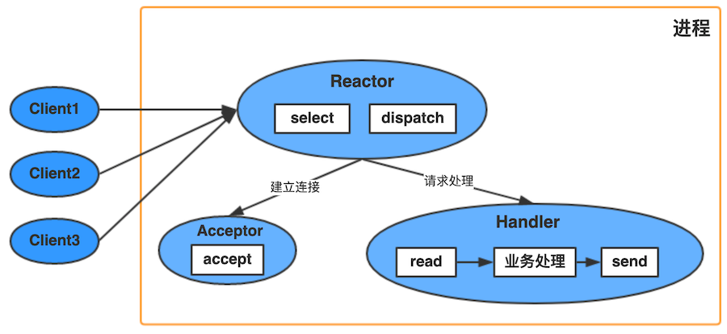

    以上的`select，accept,read,send`是标准I/O复用模型的网络编程API，dispatch和"业务处理"是需要完成的操作；

    方案具体操作步骤：
    - Reactor对象通过select监控连接事件，收到事件后通过dispatch进行分发；
    - 果是连接建立的事件，则交由 Acceptor 通过accept 处理连接请求，然后创建一个 Handler 对象处理连接完成后的后续业务处理；
    - 如果不是建立连接事件，则 Reactor 会分发调用连接对应的 Handler来响应；
    - Handler 会完成 read -> 业务处理 -> send 的完整业务流程

    单线程方案的优点：模型简单，没有多线程，进程通信，竞争的问题，全部都在一个线程中完成；

    单线程方案的缺点：
    - 只有一个进程，无法发挥多核 CPU的性能，只能采取部署多个系统来利用多核CPU,但这样会带来运维复杂度；
    - Handler 在处理某个连接上的业务时，整个进程无法处理其他连接的事件，很容易导致性能瓶颈

    应用场景：其在实践中应用场景不多，只适用于业务处理非常快速的场景，比如Redis；

    Reactor单线程在NIO中使用：

    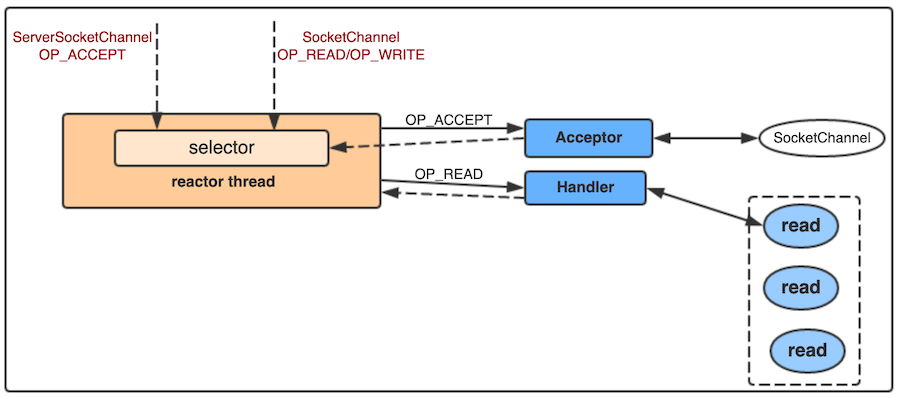

- **Reactor多线程**

    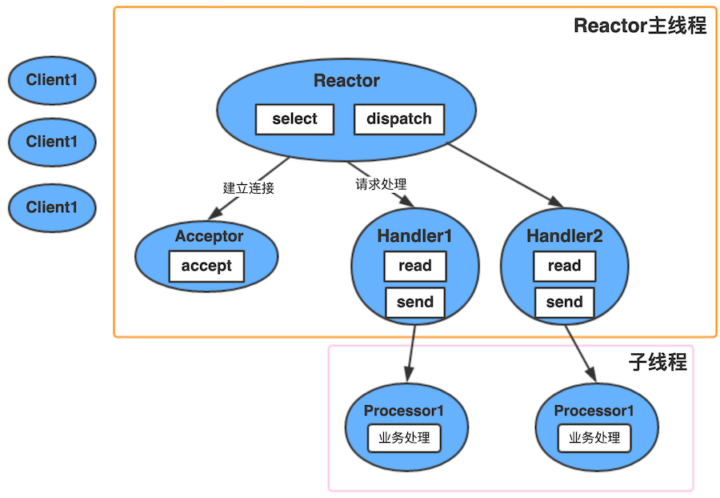

    方案步骤：
    - 主线程中，Reactor对象通过select 监听连接事件，收到事件后通过 dispatch进行分发；
    - 如果是连接建立的事件，则由Acceptor处理，Acceptor通过 accept接受连接，并创建一个 Handler 来处理连接后续的各种事件；
    - 如果不是连接建立事件，则Reactor会调用连接对应的Handler来进行相应；
    - Handler 只负责响应事件，不进行业务处理，Handler 通过 read 读取到数据后，会发给 processor 进行业务处理；
    - Processor 会在独立的子线程中完成真正的 业务处理，然后将响应结果发给主进程的 Handler处理，Handler 收到响应后通过 send 将响应结果返回给 client；

    多线程方案优点： 能够充分利用多核多 CPU的处理能力；

    多线程方案缺点：多线程数据共享和访问比较复杂；Reactor 承担所有事件的监听和响应，只在主线程中运行，瞬间高并发时会成为性能瓶颈

- **多Reactor多线程**

    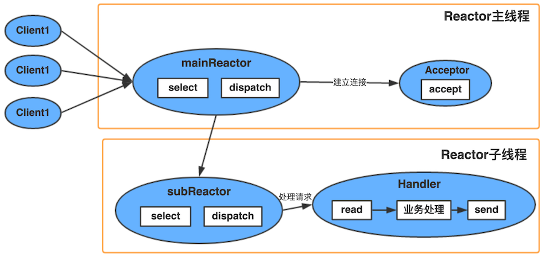

    方案步骤：
    - 主进程中mainReactor对象通过 select监控连接建立事件，收到事件后通过 Acceptor接收，将新的连接分配给某个子进程；
    - 子进程中的 subReactor 将 mainReactor 分配的连接加入连接队列进行监听，并创建一个 Handler 用于处理连接的各种事件；
    - 当有新的事件发生时，subReactor 会调用里连接对应的 Handler 来响应；
    - Handler完成 `read -> 业务处理 -> send` 的完整业务流程；
    
    特点：
    - 主进程和子进程的职责非常明确，主进程只负责接收新连接，子进程负责完成后续的业务处理；
    - 主进程和子进程的交互很简单，主进程只需要把新的连接传递给子进程，子进程无需返回数据；
    - 子进程之间是相互独立的，无需同步共享之类的处理（这里仅限于网络模型相关的 select,read,send等无须同步共享，"业务处理"还是有可能需要同步共享的

### 6.2、Proactor

前摄器模式，其实现了一个主动的事件分离和分发模型；这种设计允许多个任务并发的执行，从而提高吞吐量；并可执行耗时长的任务（各个任务间互不影响）

Proactor主动器模式包含如下角色

- Handle 句柄；用来标识socket连接或是打开文件；
- Asynchronous Operation Processor：异步操作处理器；负责执行异步操作，一般由操作系统内核实现；
- Asynchronous Operation：异步操作
- Completion Event Queue：完成事件队列；异步操作完成的结果放到队列中等待后续使用
- Proactor：主动器；为应用程序进程提供事件循环；从完成事件队列中取出异步操作的结果，分发调用相应的后续处理逻辑；
- Completion Handler：完成事件接口；一般是由回调函数组成的接口；
- Concrete Completion Handler：完成事件处理逻辑；实现接口定义特定的应用处理逻辑；

业务流程：
- 应用程序启动，调用异步操作处理器提供的异步操作接口函数，调用之后应用程序和异步操作处理就独立运行；应用程序可以调用新的异步操作，而其它操作可以并发进行；
- 应用程序启动Proactor主动器，进行无限的事件循环，等待完成事件到来；
- 异步操作处理器执行异步操作，完成后将结果放入到完成事件队列；
- 主动器从完成事件队列中取出结果，分发到相应的完成事件回调函数处理逻辑中；

Proactor性能更高，能够处理耗时长的并发场景；适用于异步接收和同时处理多个服务请求的事件驱动程序的场景；

Proactor调用aoi_write后立刻返回，由内核负责写操作，写完后调用相应的回调函数处理后续逻辑；

## 7、Java中IO实现

### 7.1、BIO

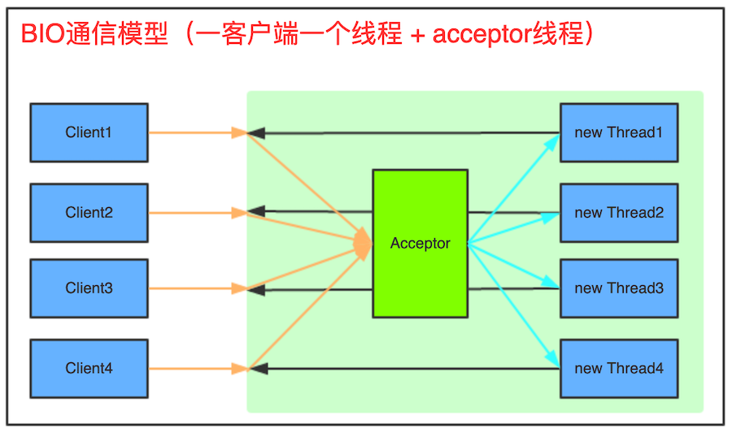

- 采用BIO通信模型的服务端，由一个独立的 Acceptor现场负责监听客户端连接，它接收到客户端连接请求之后为每个客户端创建一个新的线程进行链路处理，处理完成后，通过输出流返回给应答给客户端，线程销毁.这是典型的一请求一应答通信模型。

- 该模型最大的问题是缺乏弹性伸缩能力，当客户端并发访问量增加后，服务端的线程个数和客户端并发访问数呈`1:1`的正比关系.由于线程是Java虚拟机的非常宝贵的系统资源，当线程数膨胀后，系统的性能急剧下降，系统可能会发生线程堆栈溢出，创建线程失败等。

### 7.2、伪异步IO

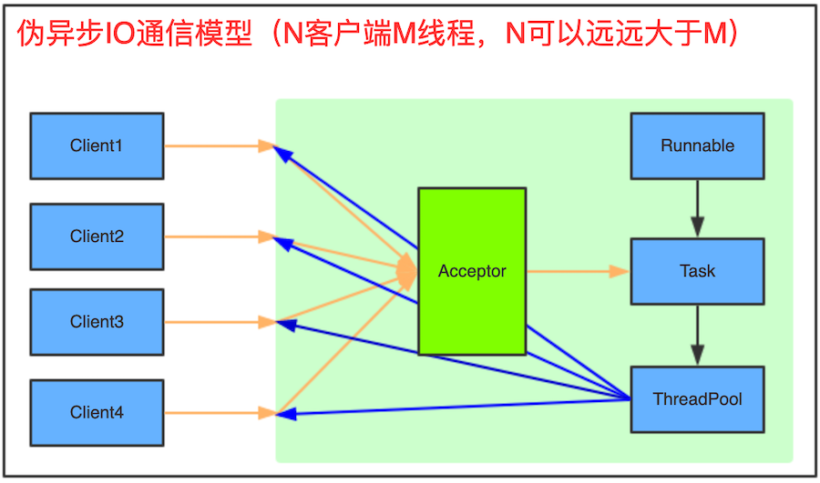

- 采用线程池和任务队列可以实现伪异步IO

- 当有新的客户端接入时，将客户端的Socket封装成一个Task（其实现Runnable接口）传递给后端的线程池中处理，JDK的线程池维护一个消息队列和N个活跃线程，对消息队列中的任务进行处理。

- 由于线程池和消息队列都是有界的，因此，无论客户端并发连接数多大，它都不会导致线程个数过于膨胀或者内存溢出；

- 但是由于其底层通信依然采用同步阻塞模型，无法从根本上解决问题

### 7.3、NIO-非阻塞IO
	
- jdk1.4引入NIO，弥补了原来阻塞IO的不足，具体参考[Java-NIO](#三Java-NIO)

- NIO相对其他IO来说，优点：
	- 客户端发起的连接操作是异步的，可以通过在多路复用器注册OP_CONNECT等待后续结果，不需要像之前的客户端那样被同步阻塞；
	- SocketChannel 的读写操作都是异步的，如果没有可读写的数据它不会同步等待，直接返回，这样I/O通信线程就可以处理其他链路；
	- 线程模型的优化；

### 7.4、AIO-异步IO

异步的套接字通道时真正的异步非阻塞I/O，对应于UNIX网络编程中的事件驱动I/O（AIO）

- JDK7中新增了一些与文件(网络)I/O相关的一些api。这些API被称为NIO.2，或称为AIO(Asynchronous I/O)；
- 服务器实现模式为一个有效请求一个线程，客户端的I/O请求都是由OS先完成了再通知服务器应用去启动线程进行处理；
- AIO最大的一个特性就是异步能力，这种能力对socket与文件I/O都起作用。AIO其实是一种在读写操作结束之前允许进行其他操作的I/O处理；
- jdk7主要增加了三个新的异步通道：
	- AsynchronousFileChannel: 用于文件异步读写；
	- AsynchronousSocketChannel: 客户端异步socket；
	- AsynchronousServerSocketChannel: 服务器异步socket
- AIO的实施需充分调用OS参与，IO需要操作系统支持、并发也同样需要操作系统的支持，所以性能方面不同操作系统差异会比较明显
- 将来式读取：用现有的Java.util.concurrent技术声明一个Future，用来保存异步操作的处理结果。通常用Future get()方法（带或不带超时参数）在异步IO操作完成时获取其结果
- 回调式异步读取：回调式所采用的事件处理技术类似于Swing UI编程采用的机制

### 7.5、不同IO对比

|  对比参数|同步IO（BIO）|伪异步IO|NIO|AIO|
|-------|----|----|--------|--------|
|客户端个数|1：1|M:N（其中M可以大于N）|M：1（1个IO线程处理多个客户端连接）|M：0（不需要启动额外的IO线程，被动回调）|
|IO类型（阻塞）|阻塞IO|阻塞IO|非阻塞IO|非阻塞IO|
|IO类型（同步）|同步IO|同步IO|同步IO（IO多路复用）|异步IO|
|API难度|简单|简单|非常复杂|复杂|
|调试难度|简单|简单|复杂|复杂|
|可靠性|非常差|差|高|高|
|吞吐量|低|中|高|高|

# 三十七、Java-IO流

## 1、输入与输出-数据源和目标媒介

**1.1、Java IO关注的是从原始数据源的读取以及输出原始数据到目标媒介： 数据源--> 程序 --> 目标媒介**

**1.2、一个程序需要InputStream或者Reader从数据源读取数据，需要 OutputStream或者Writer将数据写入到目标媒介中;**

InputStream和Reader与数据源相关联，OutputStream和Writer与目标媒介相关联

**1.3、Java IO操作类都在包 java.io 下，大概有将近 80 个类，但是这些类大概可以分成四组，分别如下：**

- 基于字节操作的 I/O 接口：InputStream 和 OutputStream
- 基于字符操作的 I/O 接口：Writer 和 Reader
- 基于磁盘操作的 I/O 接口：File
- 基于网络操作的 I/O 接口：Socket

前两组主要是根据传输数据的数据格式，后两组主要是根据传输数据的方式I/O 的核心问题要么是数据格式影响 I/O 操作，要么是传输方式影响 I/O 操作

==> "数据格式"和"传输方式"是影响效率最关键的因素了

## 2、文件

一种常用的数据源或者存储数据的媒介

**2.1、读文件：**

- 如果你需要在不同端之间读取文件，你可以根据该文件是二进制文件还是文本文件来选择使用 FileInputStream 或者 FileReader;
- 如果你需要跳跃式地读取文件其中的某些部分，可以使用 RandomAccessFile

**2.2、写文件：**

如果你需要在不同端之间进行文件的写入，你可以根据你要写入的数据是二进制型数据还是字符型数据选用FileOutputStream 或者 FileWriter

**2.3、随机存取文件：通过 RandomAccessFile 对文件进行随机存取**

随机存取并不意味着你可以在真正随机的位置进行读写操作，它只是意味着你可以跳过文件中某些部分进行操作，并且支持同时读写，不要求特定的存取顺序

**2.4、文件和目录信息的获取：**

通过 File 类可以获取文件和目录的信息

## 3、管道

为运行在同一个JVM中的两个线程提供了通信的能力，所以管道也可以作为"数据源以及目标媒介"

**3.1、不能利用管道与不同的JVM中的线程通信(不同的进程)，其与 Unix/Linux 系统的管道不一致**

**3.2、创建管道：**
    
- 通过Java IO 中的PipedOutputStream和PipedInputStream创建管道
- 一个PipedInputStream流应该和一个PipedOutputStream流相关联.
- 一个线程通过PipedOutputStream写入的数据可以被另一个线程通过相关联的PipedInputStream读取出来

**3.3、例子：可以使用两个管道共有的connect()方法使之相关联**
```java
public class PipedExample {
    public static void main(String[] args) throws IOException {
        final PipedOutputStream out = new PipedOutputStream();
        final PipedInputStream in = new PipedInputStream(out);
//		in.connect(out); 可以使用两个管道共有的connect()方法使之相关联
        Thread thread1 = new Thread(new Runnable() {
            public void run() {
                try {
                    out.write("Hello，piped output".getBytes());
                } catch (IOException e) {
                    e.printStackTrace();
                }
            }
        });
        Thread thread2 = new Thread(new Runnable() {
            public void run() {
                try {
                    int data = in.read();
                    while(data != -1){
                        System.out.println((char)data);
                        data = in.read();
                    }
                } catch (IOException e) {
                    e.printStackTrace();
                }
            }
        });
        thread1.start();
        thread2.start();
        out.close();
        in.close();
    }
}
```
**3.4、管道与线程：**

当使用两个相关联的管道流时，务必将它们分配给不同的线程.read()方法和write()方法调用时会导致流阻塞，这意味着如果你尝试在一个线程中同时进行读和写，可能会导致线程死锁;

## 4、网络

**4.1、当两个进程之间建立了网络连接之后，他们通信的方式如同操作文件一样：**

利用 InputStream 读取数据，利用 OutputStream 写入数据，Java 网络 API 用来在不同进程之间建立网络连接，而 Java IO 则用来在建立了连接之后的进程之间交换数据

## 5、字节和字符数组

**5.1、从InputStream或者Reader中读入数组**

用 ByteArrayInputStream或者CharArrayReader封装字节或者字符数组从数组中读取数据：

**5.2、从OutputStream或者Writer中写数组：**

把数据写到ByteArrayOutputStream或者CharArrayWriter 中

**5.3、基于字节流的操作层次结构**
```
InputStream：
    ByteArrayInputStream
    FileInputStream 
        SocketInputStream
    FilterInputStream
        InflaterInputStream <- ZipInputStream
        BufferedInputStream
        DataInputStream
    ObjectInputStream
    PipedInputStream
OutputStream：与上述 InputStream 类似
```
**5.4、Writer/Reader相关类层次结构**
```
Writer：
    OutputStreamWriter
        FileWriter
    BufferedWriter
    StringWriter
    PipedWriter
    PrintWriter
    CharArrayWriter
Reader：类似 Writer
```

**5.5、InputStreamReader-字节流与字符流转换接口**
   
是字节到字符的转化桥梁，InputStream到Reader的过程要指定编码字符集，否则将采用操作系统默认字符集，很可能会出现乱码问题.StreamDecoder正是完成字节到字符的解码的实现类

## 6、标准输出

`System.in`、`System.out`、`System.err`

**6.1、JVM 启动的时候通过Java运行时初始化这3个流，所以你不需要初始化它们**

**6.2、System.in：**

一个典型的连接控制台程序和键盘输入的 InputStream 流

**6.3、System.out：**

System.out 是一个 PrintStream 流.System.out一般会把你写到其中的数据输出到控制台上

**6.4、System.err：**

System.err 是一个 PrintStream 流.System.err 与 System.out 的运行方式类似，但它更多的是用于打印错误文本
   
**6.5、替换系统流：**

System.in、System.out、System.err这3个流是java.lang.System类中的静态成员，并且已经预先在JVM启动的时候初始化完成，你依然可以更改它们；要把一个新的InputStream设置给System.in或者一个新的OutputStream设置给System.out或者System.err；可以使用 System.setIn()， System.setOut()， System.setErr()方法设置新的系统流

注意：请记住，务必在JVM关闭之前冲刷System.out(译者注：调用flush())，确保System.out把数据输出到了文件中

## 7、流-仅仅只是一个连续的数据流

**7.1、流和数组不一样，不能通过索引读写数据.在流中，你也不能像数组那样前后移动读取数据，<br> 除非使用 RandomAccessFile 处理文件.**

**7.2、InputStream：java.io.InputStream 类是所有 Java IO 输入流的基类**

- 如果你需要将读过的数据推回到流中，你必须使用 PushbackInputStream，这意味着你的流变量只能是这个类型，否则在代码中就不能调用 PushbackInputStream的unread()方法；
- 通常使用输入流中的read()方法读取数据.read()方法返回一个整数，代表了读取到的字节的内容，当达到流末尾没有更多数据可以读取的时候，read()方法返回-1<br>
    注意：InputStream的read()方法返回一个字节，意味着这个返回值的范围在0到255之间

**7.3、OutputStream：java.io.OutputStream 是 Java IO 中所有输出流的基类**

**7.4、组合流：将流整合起来以便实现更高级的输入和输出操作**

InputStream input = new BufferedInputStream(new FileInputStream("c：\\data\\input-file.txt"));

## 8、Reader、Writer

**8.1、Reader类：是Java IO 中所有Reader的基类**

- 子类包括BufferedReader，PushbackReader，InputStreamReader，StringReader和其他Reader
- Reader的read()方法返回一个字符，意味着这个返回值的范围在0到65535之间
- 整合 Reader 与 InputStream：<br>
如果你有一个InputStream输入流，并且想从其中读取字符，可以把这个InputStream包装到InputStreamReader中Reader reader = new InputStreamReader(inputStream);在构造函数中可以指定解码方式
    
**8.2、Writer类：是Java IO中所有Writer的基类，子类包括BufferedWriter和PrintWriter等等**

- 整合 Writer 和 OutputStream：
一个Writer可以和一个 OutputStream 相结合。把OutputStream包装到OutputStreamWriter中，所有写入到OutputStreamWriter的字符都将会传递给OutputStream；<br>
Writer writer = new OutputStreamWriter(outputStream);

**8.3、整合Reader和Writer**

以通过将 Reader 包装到 BufferedReader、Writer 包装到 BufferedWriter 中实现缓冲

# 三十八、Java NIO

## 1、Java NIO 概述

**1.1、核心概念：**

- Channels
- Buffers
- Selectors

**1.2、Channel 和 Buffer：**

- 基本上，所有的IO在NIO中都从一个Channel开始，数据可以从Channel读到Buffer中，也可以从Buffer写到Channel中
- Channel的几种实现：<br>
	FileChannel<br>
	DatagramChannel<br>
	SocketChannel<br>
	ServerSocketChannel
- Buffer的实现：这些Buffer覆盖了你能通过IO发送的基本数据类型：byte、short、int、long、float、double和char<br>
	ByteBuffer<br>
	CharBuffer<br>
	DoubleBuffer<br>
	FloatBuffer<br>
	IntBuffer<br>
	LongBuffer<br>
	ShortBuffer<br>
	MappedByteBuffer<br>

**1.3、Selector：Selector 允许单线程处理多个Channel**

要使用Selector得向Selector注册Channel，然后调用它的select()方法个方法会一直阻塞到某个注册的通道有事件就绪。一旦这个方法返回，线程就可以处理这些事件，事件的例子有如新连接进来，数据接收；

## 2、Channel

用于源节点与目标节点的连接。在 Java NIO 中负责缓冲区中数据的传输，本身不存储数据

**2.1、与流类似，但有所不同：不能直接访问数据，可以与 Buffer 进行交互.**

- 既可以从通道中读取数据，又可以写数据到通道.但流的读写通常是单向的
- 通道可以异步地读写;
- 通道中的数据总是要先读到一个 Buffer，或者总是要从一个 Buffer 中写入;

**2.2、Java NIO 中最重要的通道的实现**

- FileChannel：从文件中读写数据，一般从流中获取 Channel，不能切换成非阻塞模式，不能用于Selector
- DatagramChannel：能通过UDP读写网络中的数据.
- SocketChannel：能通过TCP读写网络中的数据.
- ServerSocketChannel：可以监听新进来的TCP连接，像Web服务器那样.对每一个新进来的连接都会创建一个 SocketChannel

**2.3、通道的获取：**

- Java 针对支持通道的类都提供了 getChannel() 的方法;<br>
	输入输出流<br>
	网络IO<br>
- 在JDK7中NIO2.0 针对各个通道提供了静态的方法 open()
- 在JDK7中NIO2.0 的 Files 工具类的 newByteChannel()

**2.4、通道之间的数据传输：**

	transferFrom()
	transferTo()

**2.5、字符集：**
```
(1).编码：字符串 --> 字节数组
(2).解码：字节数组 --> 字符串
	查看支持的字符集：
	Charset.availableCharsets();
A.定义字符集：Charset cs = Charset.forName("UTF-8");
B.获取编码器：
	CharsetEncoder ce = cs.newEncoder();
	ByteBuffer bf = ce.encode(CharBuffer)
C.获取解码器：
	CharsetDecoder cd = cs.newDecoder();
	CharBuffer cf = cd.decode(ByteBuffer);
```
## 3、Buffer

用于和NIO通道进行交互，缓冲区本质上是一块可以写入数据，然后可以从中读取数据的内存

方法名称 |方法描述
--------|-------
Buffer clear()	|清空缓冲区并返回对缓冲区的引用，但是数据还存在
Buffer flip()	|将缓冲区的界限设置为当前位置，并将当前位置充值为0
int capacity()	|返回Buffer 的capacity大小
boolean hasRemaining()|判断缓冲区中是否还有元素
int limit()	|返回Buffer 的界限(limit) 的位置
Buffer.limit(int n)|将设置缓冲区界限为n， 并返回一个具有新limit的缓冲区对象
Buffer mark()|对缓冲区设置标记
int position()|返回缓冲区的当前位置position
Buffer position(int n)|将设置缓冲区的当前位置为n，并返回修改后的Buffer对象
int remaining()	|返回position 和limit 之间的元素个数
Buffer reset()|将位置position 转到以前设置的mark 所在的位置
Buffer rewind()	|将位置设为为0，取消设置的mark

**3.1、Buffer 的基本用法：**

获取缓冲区的方法：(例子)ByteBuffer.allocate()

- 使用Buffer读写数据一般遵循以下四个步骤<br>
	①、写入数据到 Buffer<br>
	②、调用flip()方法<br>
	③、从 Buffer 中读取数据<br>
	④、调用clear()方法或者compact()方法

- 当向buffer写入数据时，buffer会记录下写了多少数据。一旦要读取数据，需要通过flip()方法将Buffer从写模式切换到读模式;在读模式下，可以读取之前写入到buffer的所有数据；

- 一旦读完了所有的数据，就需要清空缓冲区，让它可以再次被写入。有两种方式能清空缓冲区：调用clear()或compact()方法。clear()方法会清空整个缓冲区。compact()方法只会清除已经读过的数据。任何未读的数据都被移到缓冲区的起始处，新写入的数据将放到缓冲区未读数据的后面；

- Buffer 的capacity，position和limit： 关键属性
	- （1）缓冲区本质上是一块可以写入数据，然后可以从中读取数据的内存.<br>
		这块内存被包装成 NIO Buffer 对象，并提供了一组方法，用来方便的访问该块内存
	- （2）Buffer 对象的四个属性：<br>
		capacity<br>
		position<br>
		limit<br>
		mark<br>
		position和limit的含义取决于 Buffer 处在读模式还是写模式。不管Buffer处在什么模式，capacity的含义总是一样的<br>
	- （3）capacity：最大存储数据的容量，一旦声明不能改变；作为一个内存块，Buffer 有一个固定的大小值，也叫"capacity".你只能往里写capacity个 byte、long，char 等类型；一旦Buffer满了，需要将其清空(通过读数据或者清除数据)才能继续写数据往里写数据<br>
	- （4）position：<br>
		①、当你写数据到 Buffer 中时，position表示当前的位置，初始的position值为0，当一个 byte、long 等数据写到 Buffer 后，position会向前移动到下一个可插入数据的 Buffer 单元.position最大可为capacity – 1<br>
		②、当读取数据时，也是从某个特定位置读.当将Buffer从写模式切换到读模式，position会被重置为0. 当从 Buffer的position处读取数据时，position向前移动到下一个可读的位置
	- （5）limit：<br>
		①.在写模式下，Buffer 的limit表示你最多能往Buffer里写多少数据.写模式下，limit等于Buffer的capacity<br>
		②.当切换Buffer到读模式时， limit表示你最多能读到多少数据，当切换Buffer到读模式时，limit会被设置成写模式下的position值<br>
	- （6）mark：标记，表示记录当前position的位置，可以通过reset() 恢复到 mark 的位置;

**3.3、Buffer 的分配：**

每一个 Buffer 类都有一个allocate方法。下面是一个分配48字节capacity的 ByteBuffer 的例子<br>
`ByteBuffer buf = ByteBuffer.allocate(48);`

**3.4、向 Buffer 中写数据：**

- 从 Channel 写到 Buffer <br>
	int bytesRead = inChannel.read(buf); //read into buffer
- 通过 Buffer 的put()方法写到 Buffer 里：buf.put(127);

**3.5、flip()方法：**

flip方法将 Buffer 从写模式切换到读模式.调用flip()方法会将position设回0，并将limit设置成之前position的值，即position现在用于标记读的位置，limit表示之前写进了多少个 byte、char 等 —— 现在能读取多少个 byte、char 等

**3.6、从 Buffer 中读取数据：**

- 从 Buffer 读取数据到 Channel：int bytesWritten = inChannel.write(buf);
- 使用get()方法从 Buffer 中读取数据 byte aByte = buf.get();

**3.7、rewind()方法**

Buffer.rewind()将position设回0，所以你可以重读Buffer中的所有数据。limit保持不变，仍然表示能从Buffer中读取多少个元素(byte、char等)
	
**3.8、clear()与compact()方法：**

- 一旦读完Buffer中的数据，需要让Buffer准备好再次被写入.可以通过clear()或compact()方法来完成
- 如果调用的是clear()方法，position将被设回0，limit被设置成 capacity的值.换句话说，Buffer 被清空了。Buffer 中的数据并未清除，只是这些标记告诉我们可以从哪里开始往 Buffer 里写数据
- 如果Buffer中有一些未读的数据，调用clear()方法，数据将“被遗忘”，意味着不再有任何标记会告诉你哪些数据被读过，哪些还没有;
- 如果 Buffer 中仍有未读的数据，且后续还需要这些数据，但是此时想要先先写些数据，那么使用compact()方法
- compact()方法将所有未读的数据拷贝到Buffer起始处.然后将position设到最后一个未读元素正后面.limit属性依然像clear()方法一样，设置成capacity.现在Buffer准备好写数据了，但是不会覆盖未读的数据

**3.9、mark()与reset()方法**

通过调用 Buffer.mark()方法，可以标记 Buffer 中的一个特定position。之后可以通过调用 Buffer.reset()方法恢复到这个position

**3.10、equals()与compareTo()方法：**

- equals()，当满足下列条件时，表示两个Buffer相等：<br>
	有相同的类型（byte、char、int等）.<br>
	Buffer 中剩余的 byte、char 等的个数相等.<br>
	Buffer 中所有剩余的 byte、char 等都相同<br>
	==> 实际上，它只比较Buffer中的剩余元素(剩余元素是从 position到limit之间的元素)<br>
- compareTo()方法：<br>
	compareTo()方法比较两个Buffer的剩余元素(byte、char等)， 如果满足下列条件，则认为一个Buffer"小于"另一个Buffer：<br>
	第一个不相等的元素小于另一个Buffer中对应的元素；所有元素都相等，但第一个Buffer比另一个先耗尽(第一个Buffer的元素个数比另一个少)

**3.11、直接缓冲区与非直接缓冲区：**

- 直接缓冲区是通过调用此类的 allocateDirect()工厂方法来创建的，此方法返回的缓冲区进行分配取消分配所需成本通常要高于非直接缓冲区。<br>
	建议将直接缓冲区主要分配给那些易受基础系统的本机I/O 操作影响的大型、持久的缓冲区。<br>
	一般情况下仅在直接缓冲区能带来明显好处时分配它们<br>
- 直接缓冲区还可以通过 FileChannel 的map() 方法将文件区域直接映射到内存中来创建.该方法返回 MappedByteBuffer
- 判断是直接缓冲区还是间接缓冲区，可以通过调用 isDirect() 方法来确定.

## 4、Scatter/Gather

**4.1、Scatter/Gather 用于描述从 Channel 中读取或者写入到 Channel 的操作：**

- Scatter(分散)从 Channel 中读取是指在读操作时将读取的数据写入多个 Buffer 中，Channel 将从 Channel 中读取的数据"分散(scatter)"到多个 Buffer 中
- Gather(聚集)写入 Channel 是指在写操作时将多个 Buffer 的数据写入同一个 Channel，Channel 将多个 Buffer 中的数据"聚集(gather)"后发送到 Channel
- Scatter/Gather 经常用于需要将传输的数据分开处理的场合

**4.2、Scattering Reads：是指数据从一个channel读取到多个buffer中**

(1).代码示例：
```java
ByteBuffer header = ByteBuffer.allocate(128);
ByteBuffer body   = ByteBuffer.allocate(1024);
// 注意buffer首先被插入到数组，然后再将数组作为channel.read() 的输入参数
ByteBuffer[] bufferArray = { header， body };
channel.read(bufferArray);
//read()方法按照buffer在数组中的顺序将从channel中读取的数据写入到buffer，
//当一个buffer被写满后，channel紧接着向另一个buffer中写
```
注意：Scattering Reads 在移动下一个 Buffer 前，必须填满当前的buffer，这也意味着它不适用于动态消息

**4.3、Gathering Writes：是指数据从多个buffer写入到同一个channel**
```java
ByteBuffer header = ByteBuffer.allocate(128);
ByteBuffer body   = ByteBuffer.allocate(1024);
ByteBuffer[] bufferArray = { header， body };
channel.write(bufferArray);
// buffers数组是write()方法的入参，write()方法会按照buffer在数组中的顺序，将数据写入到channel，
// 注意只有position和limit之间的数据才会被写入
```

## 5、通道之间的数据传输

在 Java NIO 中，如果两个通道中有一个是FileChannel，那你可以直接将数据从一个channel传输到另外一个channel

- transferFrom()：数据从源通道传输到 FileChannel 中<br>
	注意：在SoketChannel的实现中，SocketChannel 只会传输此刻准备好的数据
```java
RandomAccessFile fromFile = new RandomAccessFile("fromFile.txt"， "rw");
FileChannel      fromChannel = fromFile.getChannel();
RandomAccessFile toFile = new RandomAccessFile("toFile.txt"， "rw");
FileChannel      toChannel = toFile.getChannel();
long position = 0;
long count = fromChannel.size();
/**
 * 从position处开始向目标文件写入数据
 * count表示最多传输的字节数
 * 如果源通道的剩余空间小于 count 个字节，则所传输的字节数要小于请求的字节数
 */
toChannel.transferFrom(position， count， fromChannel);
```
- transferTo()：将数据从FileChannel传输到其他的channel中

## 6、Selector

是 Java NIO 中能够检测一到多个 NIO 通道，并能够知晓通道是否为诸如读写事件做好准备的组件，这样一个单独的线程可以管理多个channel，从而管理多个网络连接

### 6.1、为什么使用 Selector

可以只用一个线程处理所有的通道，使用Selector能够处理多个通道;

### 6.2、Selector 的创建

Selector selector = Selector.open();

### 6.3、向 Selector 注册通道

为了将Channel和Selector配合使用，必须将channel注册到selector上；通过 SelectableChannel.register()方法来实现
```java
/**
 * 与Selector一起使用时，Channel必须处于非阻塞模式下
 * 这意味着不能将FileChannel与Selector一起使用，因为FileChannel不能切换到非阻塞模式.而套接字通道都可以
*/
channel.configureBlocking(false);
SelectionKey key = channel.register(selector， Selectionkey.OP_READ);
```
- register()方法的第二个参数：是在通过Selector监听Channel时对什么事件感兴趣，可以监听四种不同类型的事件：
	- Connect == SelectionKey.OP_CONNECT：连接就绪
	- Accept  == SelectionKey.OP_ACCEPT：接受就绪
	- Read    == SelectionKey.OP_READ：读就绪
	- Writer  == SelectionKey.OP_WRITE：写就绪

	如果你对不止一种事件感兴趣，那么可以用“位或”操作符将常量连接起来：`int interestSet = SelectionKey.OP_READ | SelectionKey.OP_WRITE;`

### 6.4、SelectionKey

- interest集合：你所选择的感兴趣的事件集合
```java
int interestSet = selectionKey.interestOps();
//用“位与”操作interest 集合和给定的SelectionKey常量，可以确定某个确定的事件是否在interest 集合中
boolean isInterestedInAccept  = (interestSet & SelectionKey.OP_ACCEPT) == SelectionKey.OP_ACCEPT；
boolean isInterestedInConnect = interestSet & SelectionKey.OP_CONNECT;
boolean isInterestedInRead    = interestSet & SelectionKey.OP_READ;
boolean isInterestedInWrite   = interestSet & SelectionKey.OP_WRITE;
```
- ready集合是通道已经准备就绪的操作的集合<br>
	在一次选择(Selection)之后，你会首先访问这个ready set<br>
	int readySet = selectionKey.readyOps();<br>
	检测channel中什么事件或操作已经就绪<br>
	selectionKey.isAcceptable();<br>
	selectionKey.isConnectable();<br>
	selectionKey.isReadable();<br>
	selectionKey.isWritable();<br>
- Channel + Selector：从SelectionKey访问Channel和Selector很简单<br>
	Channel  channel  = selectionKey.channel();<br>
	Selector selector = selectionKey.selector();<br>
- 附加的对象：可以将一个对象或者更多信息附着到SelectionKey上，这样就能方便的识别某个给定的通道<br>
    selectionKey.attach(theObject);<br>
    Object attachedObj = selectionKey.attachment();<br>
	还可以在用register()方法向Selector注册Channel的时候附加对象<br>
		SelectionKey key = channel.register(selector， SelectionKey.OP_READ， theObject);

### 6.5、通过 Selector 选择通道

## 7、NIO序列图

### 7.1、服务端通信序列图

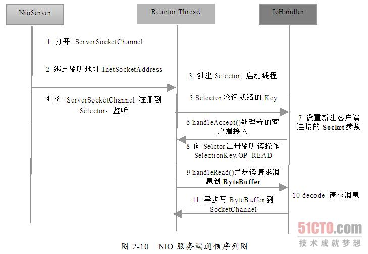

- 1、打开ServerSocketChannel，用于监听客户端的连接，是所有客户端连接的父管道；
- 2、绑定监听端口，设置连接为非阻塞模式；
- 3、创建Reactor线程，创建多路复用器并启动线程；
- 4、将ServerSocketChannel注册到Reactor线程的多路复用器Selector上，监听ACCEPT事件；
- 5、多路复用器在线程run方法的无限循环体内轮询准备就绪的Key；
- 6、多路复用器监听到有新的客户端接入，处理新的接入请求，完成TCP的三次握手，建立物理链路；
- 7、设置客户端链路为非阻塞模式；
- 8、将新接入的客户端连接注册到Reactor线程的多路复用器上，监听读操作，读取客户端发送的网络消息；
- 9、异步读取客户端请求消息到缓冲区；
- 10、对ByteBuffer进行编解码，如果有半包消息指针reset，继续读取后续的报文，将解码成功的消息封装成Task，投递到业务线程池中，进行业务逻辑编排；
- 11、将POJO对象encode成ByteBuffer，调用SocketChannel的异步write接口，将消息异步发送给客户端；

### 7.2、客户端通信序列图

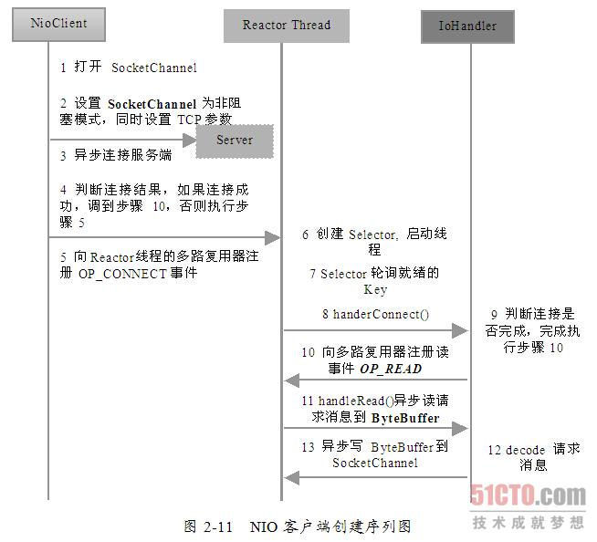

# 三十九、IO与NIO面试相关

## 1、文件拷贝实现方式

主要关注以下几点：
- 不同的copy方式，底层机制有什么区别？
- 为什么零拷贝可能有性能优势？
- Buffer的分类与使用；
- Direct Buffer对垃圾收集有哪些方面的影响

### 1.1、不同的拷贝方式底层机制的实现

- 关于两个概念：用户态空间（User Space）和内核态空间（Kernel Space）

    这是操作系统层面的概念，操作系统内核、硬件驱动等运行在内核状态空间，具有相对高的特权；而用户态空间，则给普通应用和服务使用

- 基于流读写

    当我们使用输入输出流进行读写时，实际上是进行了多次上下文切换，比如应用读取数据时先将内核态数据从磁盘读取到内核缓存，再切换到用户态将数据从内核缓存中读取到用户缓存，这种方式会带来一定的额外开销，可能会降低IO效率

- 基于NIO：

    基于NIO的transfer的实现方式，在Linux和Unix上，则会使用零拷贝技术，数据传输并不需要用户态参与，省去了上下文切换的开销和不必要的拷贝，进而可能提高应用拷贝性能

## 2、Files.copy 方法

最终实现是本地方法实现的[UnixCopyFile.c](http://hg.openjdk.java.net/jdk/jdk/file/f84ae8aa5d88/src/java.base/unix/native/libnio/fs/UnixCopyFile.c)，其内部明确说明了只是简单的用户态空间拷贝，所以该方法不是利用transfer来实现的，而是本地技术实现的用户态拷贝

## 3、如何提高拷贝效率
- 在程序中，使用缓存机制，合理减少IO次数；
- 使用transfer等机制，减少上下文切换和额外IO操作；
- 尽量减少不必要的转换过程，比如编解码；对象序列化与反序列化；

## 4、DirectBuffer 与 MappedByteBuffer

### 4.1、概述

- DirectBuffer：其定义了isDirect方法，返回当前buffer是不是Direct类型。因为Java提供了堆内和堆外（Direct）Buffer，我们可以以他的allocat 或者 allocatDirect方法直接创建；
- MappedByteBuffer：将文件按照指定大小直接映射为内存区域，当程序访问这个内存区域时直接将操作这块文件数据，省去了将数据从内核空间向用户空间传输的损耗；可以使用FileChannel.map创建，本质上也是DirectBuffer；

在实际使用时，Java会对DirectBuffer仅做本地iO操作，对于很多大数据量的IO密集操作，可能会带来非常大的优势：
- DirectBuffer生命周期内内存地址都不会再发生改变，进而内核可以安全的对其进行访问，很对IO操作很搞笑；
- 减少了堆内对象存储的可能额外维护工作，所以访问效率可能有所提高；

但是值得注意的是，DirectBuffer创建和销毁过程中，都会比一般的堆内存Buffer增加部分开销，通常建议用于长期使用、数据较大的场景

因为DirectBuffer不在堆上，所以其参数设置大小可以用如下参数：```-XX:MaxDirectMemorySize=512M```；意味着在计算Java可以使用的内存大小的时候，不能只考虑堆的需要，还有DirectBuffer等一系列堆外因素，
如果出现内存不足，堆外内存占用也是一种可能性；

另外，大多数垃圾收集过程中，都不会主动收集DirectBuffer，它的垃圾收集过程，是基于Cleaner和幻象引用机制，其本身不是public类型，内部实现了一个Deallocator负责销毁的逻辑，对它的销毁往往需要到FullGC的时候，使用不当的话很容易引起OOM

关于DirectBuffer的回收，注意以下几点：
- 在应用程序中，显示调用System.gc()来强制触发；
- 在大量使用DirectBuffer的部分框架中，框架自己在程序中调用释放方法，Netty的实现即如此；
- 重复使用DirectBuffer

### 4.2、跟踪与诊断DirectBuffer内存占用

通常的垃圾收集日志等激励，并不包含Directbuffer等信息，在JDK8之后的版本，可以使用native memory tracking特性进行诊断：```-XX:NativeMemoryTracking={summary|detail}```

注意激活NMT通常都会导致JVM出现5%~10%性能下降

```
// 打印 NMT信息
jcmd <pid> VM.native_memory detail
// 进行baseline，以对比分配内存变化
jcmd <pid> VM.native_memory baseline
// 进行baseline，以对比分配内存变化
jcmd <pid> VM.native_memory detail.diff
```

## 5、使用Java读取大文件

- （1）文件流边读边用，使用文件流的read()方法每次读取指定长度的数据到内存中，具体代码如下
    ```java
    public static void readMethod1(String filePath) throws Exception{
        BufferedInputStream reader = new BufferedInputStream(new FileInputStream(filePath));
        int bytes = -1;
        do {
            byte[] byteArray = new byte[8192];
            bytes = reader.read(byteArray);
            if (bytes != -1) {
                String s = new String(byteArray);
                System.out.println(s);
            }
        } while (bytes > 0);

        reader.close();
    }
    ```
- （2）对大文件建立NIO的FileChannel，每次调用read()方法时会先将文件数据读取到已分配的固定长度的java.nio.ByteBuffer，接着从中获取读取的数据。这种方式比传统的流方式要快点
    ```java
    public static void fileChannelMethod(String filePath) throws Exception {
        FileInputStream in = new FileInputStream(filePath);
        ByteBuffer byteBuffer = ByteBuffer.allocate(65535);
        FileChannel fileChannel = in.getChannel();
        int b = -1;
        do {
            b = fileChannel.read(byteBuffer);
            if (b != -1) {
                byte[] array = new byte[b];
                byteBuffer.flip();
                byteBuffer.get(array);
                byteBuffer.clear();
                System.out.println(new String(array));
            }
        } while (b > 0);
        in.close();
        fileChannel.close();
    }

    ```
- （3）内存文件映射，就是把文件内容映射到虚拟内存的一块区域中，从而可以直接操作内存当中的数据而无需每次都通过IO去物理硬盘读取文件，

    ```java
    public static void memoryMappingMethod(String filePath) throws Exception {
        FileInputStream in = new FileInputStream(filePath);
        FileChannel fileChannel = in.getChannel();
        MappedByteBuffer mapperBuffer = fileChannel.map(FileChannel.MapMode.READ_ONLY, 0, fileChannel.size());
        boolean end = false;
        do {
            int limit = mapperBuffer.limit();
            int position = mapperBuffer.position();
            if (position >= limit) {
                end = true;
            }
            int maxSize = 2048;
            if (limit - position < maxSize) {
                maxSize = limit - position;
            }
            byte[] array = new byte[maxSize];
            mapperBuffer.get(array);
            System.out.println(new String(array));

        } while (!end);
        in.close();
        fileChannel.close();
    }
    ```
    这种方式存在致命问题，就是无法读取超大文件（大于Integer.Max_value），因为 FileChannel的map方法中 size 参数会有大小限制，源码中发现该参数值大于 Integer.MAX_VALUE 时会直接抛出 IllegalArgumentException("Size exceeds Integer.MAX_VALUE") 异常，所以对于特别大的文件其依然不适合。

    本质上是由于 java.nio.MappedByteBuffer 直接继承自 java.nio.ByteBuffer ，而 ByteBuffer 的索引是 int 类型的，所以 MappedByteBuffer 也只能最大索引到 Integer.MAX_VALUE 的位置，所以 FileChannel 的 map 方法会做参数合法性检查。

## 6、NIO消息传输错误

### 6.1、存在问题的情况

- 多消息粘包：
- 单消息不完整：接收端buffer容量不够
- 消息到达提醒重复触发（读消息时未设置取消监听）

### 6.2、如何解决

- 数据传输加上开始结束标记
- 数据传输使用固定头部的方案；
- 混合方案：固定头、数据加密、数据描述

## 7、关于BIO、NIO等现场问题

**基于BIO实现的Server端，当建立了100个连接时，会有多少个线程？如果基于NIO，又会是多少个线程？ 为什么？**

BIO由于不是NIO那样的事件机制，在连接的IO读取上，无论是否真的有读/写发生，都需要阻塞住当前的线程，对于基于BIO实现的Server端，通常的实现方法都是用一个线程去accept连接，当连接建立后，将这个连接的IO读写放到一个专门的处理线程，所以当建立100个连接时，通常会产生1个Accept线程 + 100个处理线程。

NIO通过事件来触发，这样就可以实现在有需要读/写的时候才处理，不用阻塞当前线程，NIO在处理IO的读写时，当从网卡缓冲区读或写入缓冲区时，这个过程是串行的，所以用太多线程处理IO事件其实也没什么意义，连接事件由于通常处理比较快，用1个线程去处理就可以，IO事件呢，通常会采用cpu core数+1或cpu core数 * 2，这个的原因是IO线程通常除了从缓冲区读写外，还会做些比较轻量的例如解析协议头等，这些是可以并发的，为什么不只用1个线程处理，是因为当并发的IO事件非常多时，1个线程的效率不足以发挥出多core的CPU的能力，从而导致这个地方成为瓶颈，这种在分布式cache类型的场景里会比较明显，按照这个，也就更容易理解为什么在基于Netty等写程序时，不要在IO线程里直接做过多动作，而应该把这些动作转移到另外的线程池里去处理，就是为了能保持好IO事件能被高效处理

## 8、Channel和Scoket区别

Socket、SocketChannel二者的实质都是一样的，都是为了实现客户端与服务器端的连接而存在的。

- 所属包不同：Socket在java.net包中，而SocketChannel在java.nio包中；
- 异步方式不同：Socket是阻塞连接（当然我们可以自己实现非阻塞），SocketChannel可以设置非阻塞连接；
- 性能不同：一般来说使用SocketChannel会有更好的性能。其实，Socket实际应该比SocketChannel更高效，不过由于使用者设计等原因，效率反而比直接使用SocketChannel低；
- 使用方式不同：
    - Socket、ServerSocket类可以传入不同参数直接实例化对象并绑定ip和端口：
        ```java
        Socket socket = new Socket("127.0.0.1", "8000");
        ServerSocket serverSocket = new ServerSocket("8000")
        ```
    - 而SocketChannel、ServerSocketChannel类需要借助Selector类控制

# 参考文章
* [Java-NIO系列](http://ifeve.com/java-nio-all/)
* [浅析I/O模型](http://www.cnblogs.com/dolphin0520/p/3916526.html)
* [Reactor设计模式分析](https://juejin.im/post/5ba3845e6fb9a05cdd2d03c0)
* [Unix-IO模型](http://matt33.com/2017/08/06/unix-io/)
* [枚举的线程安全性及序列化问题](http://www.hollischuang.com/archives/197)
* [Java各个版本特性最全总结](https://mp.weixin.qq.com/s/wQW3tZmCs50RjzMtbxOgpQ)
* [Java8新特性](https://www.jianshu.com/p/5b800057f2d8)
* [JDK8新特性指南](http://www.open-open.com/lib/view/open1403232177575.html)
* [位运算](http://www.nowcoder.com/courses/1/8/1)
