**Java世界里的一切东西都只是在拼Java命令行参数而已**

# 一、Java平台理解

## 1、从宏观角度看

Java跟C/C++组大的不同点在于，C/C++编程式面向操作系统的，需要开发者关心不同操作系统之间的差异性；而Java平台通过虚拟机屏蔽了操作系统的底层细节，使得开发无需关系不同操作系统之间的差异性；通过增加一个间接的中间层俩进行“解耦”是计算机领域常用的手法，虚拟机是这样的，操作系统如是；

不同的操作系统有不同的API，为了支持多平台，C语言程序的源文件根据不同平台需要修改多次

Java平台已经形成了一个生态系统，有着诸多的研究领域和应用领域：虚拟机、编辑技术的研究；Java语言的优化、大数据、java并发、客户端开发（如 Android）

## 2、从微观角度

Java平台有两大核心：
- Java语言本省、JDK所提供的核心类库和相关工具；
- Java虚拟机以及其他包含的GC等；

Write once， run anywhere

## 3、Java与C++的区别

- C++是编译型语言，首先将源代码编译生成机器语言，再由机器运行机器码；执行速度快，效率高；依赖编译器、跨平台性差；
- Java是解释型语言，源代码编译成字节码，再由解释器对字节码进行解释运行；执行速度慢、效率低；依赖解释器、跨平台性好；
- C++对所有的数字类型有标准的范围限制，但字节长度是跟具体实现相关的；Java在所有平台上对所有基本类型都有标准的范围限制和字节长度；
- C++允许直接调用本地的系统库；Java要通过JNI调用或者JNA；
- C++允许过程式程序设计和面向对象程序设计；Java必须适应面向对象的程序设计方式；
- C++支持指针，引用，传值调用。Java只有值传递；
- C++需要显示的内存管理，支持析构函数；Java是自动管理内存的；
- C++支持多重继承，包括虚拟继承；Java只允许，但是接口之间可以多继承；

## 4、面向对象与面向过程

- 面向过程：把问题分解成一个一个步骤，每个步骤用函数实现；进行面向过程编程时，上来先定义一个函数，然后使用诸如if-else等方式进行代码执行；
- 面向对象：将问题分解成一个一个步骤，对每个步骤进行相应的抽象、形成对象，通过不同对象之间的调用，组合解决问题；是一种变成死信，提倡使用类来抽象现实模型

## 5、三大基本特征

- 封装：通常认为封装是把数据和操作数据的方法绑定起来，对数据的访问只能通过已定义的接口；面向对象的本质就是：将现实世界描绘成一系列完全自然、封闭的对象。在类中的编写的方法就是对实现细节的一种封装；编写一个类就是对数据和数据操作的封装；
- 继承：继承是从已有类中得到继承信息并创建新类的过程。提供继承信息的类被称为父类；得到继承信息的类被称为子类。继承让变化中的软件系统有了一定的延续性，同时继承也是封装程序中可变因素的重要手段；
- 多态：指允许不同子类型的对象对同一消息作出不同的响应；
- 抽象：抽象是将一类对象的共同特征总结出来构造类的过程，包括数据抽象和行为抽象两方面。抽象只关注对 象有哪些属性和行为，并不关注这些行为的细节是什么

## 6、五大基本原则

- 单一职责原则
- 开放封闭原则
- 里氏替换原则
- 依赖倒置原则
- 接口隔离原则

# 二、Java隐蔽问题

## 1、基本类型与引用类型

**1.1、如下四个变量，哪两个比较为 false**

```java
Integer i01 = 59;
int i02 = 59;
Integer i03 =Integer.valueOf(59);
Integer i04 = new Integer(59);
```

- （1）Integer 为了节省空间和内存会在内存中缓存 -128~127 之间的数字;
- （2）valueOf()：调用该方法时，内部实现作了个判断，判断当前传入的值是否在-128~127之间且 IntergCache是否已存在该对象如果存在，则直接返回引用，如果不存在，则创建一个新对象
- （3）基本类型存在内存的栈中，与引用类型比较时， 引用类型会自动装箱，比较数值而不比较内存地址;

**1.2、自动装箱拆箱机制是编译特性还是虚拟机运行时特性？分别是怎么实现的？**

- 自动装箱机制是编译时自动完成替换的。装箱阶段自动替换为了 valueOf 方法，拆箱阶段自动替换为了 xxxValue 方法;
- 对于 Integer 类型的 valueOf 方法参数如果是 -128~127 之间的值会直接返回内部缓存池中已经存在对象的引用，参数是其他范围值则返回新建对象;
- 而 Double 类型与 Integer 类型类似，一样会调用 Double 的 valueOf 方法，但是 Double 的区别在于不管传入的参数值是多少都会 new 一个对象来表达该数值(因为在指定范围内浮点型数据个数是不确定的，整型等个数是确定的，所以可以Cache)
- 注意：Integer、Short、Byte、Character、Long 的 valueOf 方法实现类似，而 Double 和 Float 比较特殊，每次返回新包装对象，对于两边都是包装类型的：== 比较的是引用，equals 比较的是值；对于两边有一边是表达式(包含算数运算)： == 比较的是数值(自动触发拆箱过程)，对于包装类型 equals 方法不会进行类型转换;

**1.3.Integer i = 1; i += 1; 做了哪些操作**

- Integer i = 1; 做了自动装箱：使用 valueOf() 方法将 int 装箱为 Integer 类型
- i += 1; 先将 Integer 类型的 i 自动拆箱成 int(使用 intValue() 方法将 Integer 拆箱为 int)，完成加法运行之后的 i 再装箱成 Integer 类型

**1.4、int与long精度丢失问题**
- `byte→short`、`short→int`、`int→long`、`int→double`、`char→int`、`float→double`转换是不会发生精度丢失的，因为后者所包含的范围比前者大且完全包含前者
- int转float、long转float，long转double都会发生精度丢失。精度丢失包括两种，一是有效数字丢失，一是目标类型完全无法表示数据；

	int和float都是32位，但是内存结构也就是存储结构是不一样的，float只有24（含隐含的一位整数位）位来确定精度，而int是32位。long转float，long转double精度丢失原理是一样；我们知道，float的存储结构是1个符号位，8个指数位，23个尾数。
	- 符号位，表述浮点数的正或者负，0代表正，1代表负。
	- 指数位，实际也是有正负的，但是没有单独的符号位，在计算机的世界里，进位都是二进制的，指数表示的也是2的N次幂，8位指数表达的范围是0到255，而对应的实际的指数是－127到128。也就是说实际的指数等于指数位表示的数值减127。
	- 尾数位，只代表了二进制的小数点后的部分，小数点前的那位被省略了，当指数位全部为0时省略的是0否则省略的是1。

	所以可以说，实际上尾数确定了浮点数的精度，而数的大小主要是靠指数位，尾数只有23位，加上隐含的一位整数位便是24位。也就是说int类型的值在2^24以内，float是可以精确表示的，但是当超过这个数的时候就不一定能精确表示了。

## 2、关于String +和StringBuffer的比较

在 String+写成一个表达式的时候(更准确的说，是写成一个赋值语句的时候)效率其实比 Stringbuffer更快

```java
public class Main{	    
	public static void main(String[] args){		
		String string = "a" + "b" + "c";

		StringBuffer stringBuffer = new StringBuffer();
		stringBuffer.append("a").append("b").append("c");
		string = stringBuffer.toString();
	}	    
}
```
**2.1、String+的写法要比 Stringbuffer 快，是因为在编译这段程序的时候，编译器会进行常量优化。**

它会将a、b、c直接合成一个常量abc保存在对应的 class 文件当中，看如下反编译的代码：
```java
public class Main{}
	public static void main(String[] args){
		String string = "abc";
		StringBuffer stringBuffer = new StringBuffer();
		stringBuffer.append("a").append("b").append("c");
		string = stringBuffer.toString();
	}
}
```
原因是因为 String+其实是由 StringBuilder 完成的，而一般情况下 StringBuilder 要快于 StringBuffer，这是因为 StringBuilder 线程不安全，少了很多线程锁的时间开销，因此这里依然是 string+的写法速度更快;

```java
/*   1   */
String a = "a";
String b = "b";
String c = "c";
String string = a + b + c;
/*   2   */
StringBuffer stringBuffer = new StringBuffer();
stringBuffer.append(a);
stringBuffer.append(b);
stringBuffer.append(c);
string = stringBuffer.toString();
```
**2.2、字符串拼接方式：+、concat() 以及 append() 方法，append()速度最快，concat()次之，+最慢**

- 编译器对+进行了优化，它是使用 StringBuilder 的 append() 方法来进行处理的，编译器使用 append() 方法追加后要同 toString() 转换成 String 字符串，变慢的关键原因就在于 new StringBuilder()和toString()，这里可是创建了 10 W 个 StringBuilder 对象，而且每次还需要将其转换成 String

- concat：
	concat() 的源码，它看上去就是一个数字拷贝形式，我们知道数组的处理速度是非常快的，但是由于该方法最后是这样的：
	`return new String(0， count + otherLen， buf);`这同样也创建了 10 W 个字符串对象，这是它变慢的根本原因

- append() 方法拼接字符串：并没有产生新的字符串对象；

## 3、静态代码块、静态变量

其作用级别为类；构造代码块、构造函数、构造，其作用级别为对象

- （1）静态代码块，它是随着类的加载而被执行，只要类被加载了就会执行，而且只会加载一次，主要用于给类进行初始化。
- （2）构造代码块，每创建一个对象时就会执行一次，且优先于构造函数，主要用于初始化不同对象共性的初始化内容和初始化实例环境。
- （3）构造函数，每创建一个对象时就会执行一次；同时构造函数是给特定对象进行初始化，而构造代码是给所有对象进行初始化，作用区域不同；

==> 通过上面的分析，他们三者的执行顺序应该为：静态代码块 > 构造代码块 > 构造函数。

### 3.1、Java 类初始化过程

- 首先，初始化父类中的静态成员变量和静态代码块，按照在程序中出现的顺序初始化；
- 然后，初始化子类中的静态成员变量和静态代码块，按照在程序中出现的顺序初始化；
- 其次，初始化父类的普通成员变量和代码块，在执行父类的构造方法；
- 最后，初始化子类的普通成员变量和代码块，在执行子类的构造方法；

### 3.2、不要在构造器里调用可能被重载的虚方法

父类构造器执行的时候，调用了子类的重载方法，然而子类的类字段还在刚初始化的阶段，刚完成内存布局：

```java
public class Base{
	private String baseName = "base";
	public Base(){
		callName();
	}
	public void callName(){
		System. out. println(baseName);
	}
	static class Sub extends Base{
		private String baseName = "sub";
		public void callName(){
			System. out. println (baseName) ;
		}
	}
	public static void main(String[] args){
		Base b = new Sub();
	}
}
```

### 3.3、Java 中赋值顺序

- （1）父类的静态变量赋值
- （2）自身的静态变量赋值
- （3）父类成员变量赋值
- （4）父类块赋值
- （5）父类构造函数赋值
- （6）自身成员变量赋值
- （7）自身块赋值
- （8）自身构造函数赋值

### 3.4、Java 代码执行顺序

```java
public class TestExecuteCode {
	public static void main(String[] args) {
		System.out.println(new B().getValue());
	}
	static class A {
		protected int value;
		public A(int v){
			setValue(v);
		}
		public void setValue(int value) { this.value = value;}
		public int getValue() {
			try {
				value++;
				return value;
			} finally {
				this.setValue(value);
				System.out.println(value);
			}
		}
	}
	static class B extends A {
		public B(){
			super(5);
			setValue(getValue() - 3);
		}
		public void setValue(int value) {super.setValue(2 * value);}
	}
}
```

- 执行结果：22，34，17
	（1）子类 B 中重写了父类 A 中的setValue方法：
	
	`super(5)` // 调用了父类构造器，其中构造函数里面的`setValue(value)`，调用的是子类的setValue方法

	`finally`块中的：`this.setValue(value)` //调用的也是子类的setValue方法

	而子类`setValue`方法中的：`super.setValue(2*value);` //调用的是父类A的setValue方法

	（2）`try...catch...finally`块中有`return`返回值的情况：`finally` 块中虽然改变了value的值，但`try`块中返回的应该是 return 之前存储的值

- 父类执行时如果有子类的方法重写了父类的方法，调用的子类的重写方法

## 4、给出一个表达式计算其可以按多少进制计算

- 式子`7*15=133`成立，则用的是几进制？可以通过解方程来解决，上述式子可以转换为方程：
	```
	7 * (1 * x + 5) = 1 * x^2 + 3 * x + 3
	x^2 -4x - 32 = 0
	x = -4 或 x = 8
	```

- 如果下列的公式成立：`78+78=123`，则采用的是_______进制表示的：
	```
	7 * x + 8 + 7 * x + 8 = 1 * x^2 + 2 * x + 3
	x^2 - 12 * x - 13 = 0
	x = -1， x = 13
	```

## 5、表达式的数据类型

### 5.1、基本类型中类型转换

- 所有的 byte，short，char 型的值将被提升为 int 型；
- 如果有一个操作数是 long 型，计算结果是 long 型；
- 如果有一个操作数是 float 型，计算结果是 float 型；
- 如果有一个操作数是 double 型，计算结果是 double 型；
- final 修饰的变量是常量，如果运算时直接是已常量值进行计算，没有final修饰的变量相加后会被自动提升为int型
	```java
	byte b1=1, b2=2, b3, b6;
	final byte b4=4, b5=6;
	b6=b4+b5;// b4， b5是常量，则在计算时直接按原值计算，不提升为int型
	b3=(b1+b2);// 编译错误
	System.out.println(b3+b6);
	```

**记住一点：JDK中关于任何整型类型的运算，都是按照int来的**
```java
private static final long mil_seconds = 24 * 60 * 60 * 1000;
private static final long micro_seconds = 24 * 60 * 60 * 1000 * 1000;
public static void main(String[] args) {
	System.out.println(micro_seconds / mil_seconds);
}
```
上面代码中 micro_seconds 在运算时，其已超过 int 类型的最大值，溢出了。

另外，如果在基本类型与对应的包装类型进行比较或者运算的时候，都会将包装类型自动拆箱，例如下面的代码：
```java
int a = 10;
Integer b = Integer.valueOf(10);
System.out.println(a == b); // 这里比较的时候会调用 Integer 类的 intValue()方法，所以需要注意是否有空指针问题
```

### 5.2、三目运算中类型转换问题

在使用三目运算符时，尽量保证两个返回值的类型一致，不然会触发类型转换，转换规则如下：
- （1）如果返回值`X`和返回值`Y`是同种类型，那么返回类型毫无疑问就是这种类型；
- （2）如果两个返回值`X`和`Y`的类型不同，那么返回值类型为他们俩最接近的父类。举例：
	```java
	// String 和 Boolean 都实现了 Serializable 接口
	Serializable serializable = a == b ? "true" : Boolean.FALSE;
	// 所有类都继承了 Object 类
	Object o = a == b ? new ArrayList<>() : new TernaryOperatorDemo();
	```
- （3）对于基本数据类型，如果其中一个返回值`X`类型为`byte`、`short`或者`char`，另一个返回值`Y`类型为`int`：
  - 若在`编译期`就能判断出`Y`的取值范围在`X`的取值范围之内，则返回类型为`X`的类型，反之则为`Y`的类型。
  - 如果返回值`X`类型不为以上几种，则会触发隐藏类型转换；
- （4）当基本数据类型和对象数据类型相遇时，三目运算默认返回结果为基本数据类型；
- （5）注意因自动拆箱导致的NPE
例子：
```java
private static void test1(int a, int b) {
  // 触发隐藏类型转换,int 类型 9 转为 9.0D
  System.out.println(a == b ? 9.9 : 9);
  // 编译期判断,98 在 char 之内,转为 b
  System.out.println(a == b ? 'a' : 98);
  // 编译期判断,超出char范围，统一转 int
  System.out.println(a == b ? 'a' : Integer.MAX_VALUE);
  // 编译期时无法判断 b 的取值,触发隐藏类型转换,统一转 int
  System.out.println(a == b ? 'a' : b);
  System.out.println(a != b ? 'a' : b);

  Map<String, Long> map = new HashMap<>();
  map.put("b", 1L);
  // 基本数据类型和对象数据类型相遇时,默认转为基本数据类，
  // map.get("a") 返回 null,转为基本数据类型时，报空指针异常
  System.out.println(map == null ? -1L : map.get("a"));

}
```

## 6、按照目录结构打印当前目录及子目录

```java
public class PrintDirectory {
	public static void main(String[] args) {
		File file = new File("E：\\下载");
		PrintDirectory pd = new PrintDirectory();
		pd.listDirectory(file，0);
	}
	//列出该目录的子目录
	private void listDirectory(File dir，int level){
		System.out.println(getSpace(level) + dir.getName());
		level++;
		File[] files = dir.listFiles();		
		for(int i=0;i<files.length;i++){
			if(files[i].isDirectory()){
				listDirectory(files[i]，level);
			}else{
				System.out.println(getSpace(level)+files[i].getName());
			}
		}
	}
	//按照目录结构打印目录
	private String getSpace(int level){
		StringBuilder sb = new StringBuilder();
		for(int i=0;i<level;i++){
			sb.append("|--");
		}
		return sb.toString();
	}
}
```

## 7、boolean占用字节数

- 在Java虚拟机中没有任何供 `boolean`值专用的字节码指令，Java语言表达式所操作的 `boolean`值，在编译之后都使用Java虚拟机中的`int`数据类型来代替。
- Java虚拟机直接支持 boolean类型的数组，虚拟机的 navarra指令参见第6章的newarray小节可以创建这种数组。boolean类型数组的访问与修改共用byte类型数组的baload和 bastore指令；
- 因为在虚拟机规范中说了，boolean值在编译之后都使用Java虚拟机中的int数据类型来代替，而int是4个字节，那么boolean值就是4个字节。
- boolean类型数组的访问与修改共用byte类型数组的baload和 bastore指令，因为两者共用，只有两者字节一样才能通用呀，所以byte数组中一个byte是1个字节，那么boolean数组中boolean是1个字节。

**总结：boolean在数组情况下为1个字节，单个boolean为4个字节**

Java规范中，没有明确指出boolean的大小。在《Java虚拟机规范》给出了单个boolean占4个字节，和boolean数组1个字节的定义，具体 还要看虚拟机实现是否按照规范来，所以1个字节、4个字节都是有可能的。

```java
class LotsOfBooleans{
    boolean a0, a1, a2, a3, a4, a5, a6, a7, a8, a9, aa, ab, ac, ad, ae, af;
    boolean b0, b1, b2, b3, b4, b5, b6, b7, b8, b9, ba, bb, bc, bd, be, bf;
    boolean c0, c1, c2, c3, c4, c5, c6, c7, c8, c9, ca, cb, cc, cd, ce, cf;
    boolean d0, d1, d2, d3, d4, d5, d6, d7, d8, d9, da, db, dc, dd, de, df;
    boolean e0, e1, e2, e3, e4, e5, e6, e7, e8, e9, ea, eb, ec, ed, ee, ef;
}
class LotsOfInts{
    int a0, a1, a2, a3, a4, a5, a6, a7, a8, a9, aa, ab, ac, ad, ae, af;
    int b0, b1, b2, b3, b4, b5, b6, b7, b8, b9, ba, bb, bc, bd, be, bf;
    int c0, c1, c2, c3, c4, c5, c6, c7, c8, c9, ca, cb, cc, cd, ce, cf;
    int d0, d1, d2, d3, d4, d5, d6, d7, d8, d9, da, db, dc, dd, de, df;
    int e0, e1, e2, e3, e4, e5, e6, e7, e8, e9, ea, eb, ec, ed, ee, ef;
}
public class Test{
    private static final int SIZE = 100000;
    public static void main(String[] args) throws Exception{
        LotsOfBooleans[] first = new LotsOfBooleans[SIZE];
        LotsOfInts[] second = new LotsOfInts[SIZE];

        System.gc();
        long startMem = getMemory();

        for (int i=0; i < SIZE; i++) {
            first[i] = new LotsOfBooleans();
        }

        System.gc();
        long endMem = getMemory();

        System.out.println ("Size for LotsOfBooleans: " + (endMem-startMem));
        System.out.println ("Average size: " + ((endMem-startMem) / ((double)SIZE)));

        System.gc();
        startMem = getMemory();
        for (int i=0; i < SIZE; i++) {
            second[i] = new LotsOfInts();
        }
        System.gc();
        endMem = getMemory();

        System.out.println ("Size for LotsOfInts: " + (endMem-startMem));
        System.out.println ("Average size: " + ((endMem-startMem) / ((double)SIZE)));

        // Make sure nothing gets collected
        long total = 0;
        for (int i=0; i < SIZE; i++) {
            total += (first[i].a0 ? 1 : 0) + second[i].a0;
        }
        System.out.println(total);
    }
    private static long getMemory(){
        Runtime runtime = Runtime.getRuntime();
        return runtime.totalMemory() - runtime.freeMemory();
    }
}
```

另外，大部分指令都没有支持整数类型byte、char、short。编译器在编译期或运行期将byte和short类型的数据带符号扩展为相应的int类型数据，将boolean和char类型数据零位扩展为相应的int类型数据；

## 8、如何计算比一个数大的2的幂

`Integer.highestOneBit((number) - 1) << 1)`

比如：比17大的2的幂是32

# 三、进制基础

- [位运算高级应用](https://graphics.stanford.edu/~seander/bithacks.html)
- [位运算](https://bugstack.cn/md/algorithm/logic/math/2022-10-30-bits.html)

## 1、进制基础

- bit（位）：表示一个二进制位（0或者1）。位是计算机内部数据储存的最小单位，11010100是一个8位二进制数。一个二进制位只可以表示0和1两种状态；两个二进制位可以表示00、01、10、11四种状态；
- byte（字节）：字节是计算机中数据处理的基本单位。计算机中以字节为单位存储和解释信息，规定一个字节（Byte）由连续八个二进制位（bit）构成，即1个字节等于8个比特（1Byte=8bit）。八位二进制数最小为00000000，最大为11111111；通常1个字节可以存入一个ASCII码，2个字节可以存放一个汉字国标码；
- 16进制：通常`一个字节 = 两个16进制位`：
	- 1个16进制位 = 4个二进制数位；（16进制位中，最大的为F，为15，即：1111（二进制），也就是说4个bit可以表示一个16进制位）
	- 2个16进制位 = 8个二进制数位 = 1字节
	- 最终：一个16进制位 = 0.5 个字节；

## 2、二进制运算

### 2.1、与运算：&

**2.1.1、两位全为1，结果才为 1**

```
0&0=0	0&1=0	1&0=0	1&1=1
51&5 = 1 即: 
	51 => 00000000 00000000 00000000 00110011
	5  => 00000000 00000000 00000000 00000101
	& ==> 00000000 00000000 00000000 00000001 (1)
```

**2.1.2、用法**

- 清零：如果想将一个单元清零，即使其全部二进制为 0， 只要与一个各位都为 0 的数值相`与`，结果为 0；
- 取一个数中指定位置，如：x = 10101110， 取 x 的低四位，用 `x & 00001111 = 00001110`，即可得到	

### 2.2、或运算：|

**2.2.1、只要有一个为 1，结果就为 1**

```
0|0 = 0		1|0 = 1		0|1	= 1		1|1 = 1
51|5 = 55 即:
	51 => 00000000 00000000 00000000 00110011
	5  => 00000000 00000000 00000000 00000101
	|  => 00000000 00000000 00000000 00110111
```

**2.2.3、用法**

	常用来对一个数据的某些位置 1
	如: x = 1010 0000 的低四位置 1， 用 x | 0000 1111 = 1010 1111

### 2.3、异或运算：^

- 两个相应位为"异"(值不同)，则该位结果为 1， 否则为 0
	```
	0^0 = 0		1^0 = 1		0^1 = 1		1^1 = 0；
	51^5 = 54即:
		51 => 00000000 00000000 00000000 00110011
		5  => 00000000 00000000 00000000 00000101
		^  => 00000000 00000000 00000000 00110110
	```

“异或”操作的本质其实就是，所有数值和自身进行按位的“异或”操作之后都为 0。而且要通过“异或”操作得到 0，也必须通过两个相同的数值进行按位“异或”。这表明了两个数值按位“异或”结果为 0，是这两个数值相等的必要充分条件，可以作为判断两个变量是否相等的条件

**用法**
- 使特定位翻转，找一个数，对应 x 要翻转的各位，该数的对应位为 1，其余位为 0，此数与 x 对应的位"异或"即可<br>
	如:x = 10101110， 使 x 低四位翻转， 用 x ^ 0000 1111 = 1010 0001
- 与 0 相异或，保留原值<br>
	如: x ^ 00000000 = 10101110
- 两个变量交换值：
	- ①、借助第三个变量来实现：c = a， a = b， b = c；
	- ②、利用加减法来实现：a = a + b， b = a - b， a = a-b；
	- ③、用异或运算来实现，也是效率最高的，原理：利用一个数异或本身等于 0 和 异或运算符合交换率：
		`a = a ^ b； b = a ^ b； a = a ^ b`

### 2.4、取反运算：~ 

取反：对一个二进制数按位取反，即将 0 变为 1，1 变为 0
	~1 = 0		~0 = 1	

### 2.5、左移：<< 

	将一个运算对象的各二进制位全部左移若干位(左边的二进制位丢弃，右边补 0)
		2 << 2 = 8；
			2   => 00000000 00000000 00000000 00000010
			>>2 => 00000000 00000000 00000000 00001000
	若左移时舍弃的高位不包含 1，则每左移一位，相当于该数乘以 2；
		2 << 2 ==> 2 * 2 * 2(最快计算 2 的三次方)

### 2.6、算术右移：>>

将一个数的各二进制位全部右移若干位，正数左补 0，负数左补 1；对于正数来说操作数每右移一位，相当于该数除以 2

算术右移时保持符号位不变，除符号位之外的右移一位并补符号位 1。补的 1 仍然在符号位之后。
	
	4 >> 2 ==> 1 ( 4 / 2 / 2)；
	-14(11110010) >> 2 ==> -4(11111100)

### 2.7、无符号右移：>>> 

逻辑右移，各个位向右移指定的位数，右移后左边空出的位使用 0 填充，移出右边的位被丢弃掉

	-14 >> 2:
		-14 => 11111111 11111111 11111111 11110010
		>>2 => 00111111	11111111 11111111 11111100(1073741820) ；

### 2.8、二进制四则运算

#### 2.8.1、加法

`0+0=0，0+1=1，1+0=1，1+1=10`
- 当两个相加的二进制仅一位时，相加的结果为1；
- 如果两个二进制位全是0，相加的结果仍为0；
- 如果两个相加的进制位均为1，则结果为10，要向高位进1，也就是`逢2进1`规则

在运算的过程中，两数要从最低位开始对齐

#### 2.8.2、减法

`1-1=0，1-0=1，0-0=0，0-1=-1`
- 当两个相减的二进制位中同为0或1时，相减结果为0；
- 如果被减数的二进制位为1，而减数的二进制位为0，则相减的结果仍为1；
- 如果被减数的二进制位为0，而减数的二进制位为1，则需要向高位借1，但此时借1当2；

#### 2.8.3、乘法

`0*0=0，1*0=0，0*1=0，1*1=1`
- 只有当两个相乘的二进制位都为1，相乘的结果才为1；
- 当两个相乘的二进制位只要有一位为0，则相乘的结果都为0；
- 1与任何数相乘的结果都是对应的被乘数；而0与任何数相乘结果都为0；

在乘法运算中，乘数的每一位都要与被乘数的每一位分别相乘，而不仅是对应位相乘

#### 2.8.4、除法

当被除数大于除数时，商是“1”；当被除数小于除数时，不够除，商只能是“0”；

## 3、负数：以其正值的补码形式表示

符号位是有符号二进制数中的最高位，我们需要它来表示负数；计算机 CPU 的运算器只实现了加法器，而没有实现减法器，那么计算机如何做减法呢？我们可以通过加上一个负数来达到这个目的。比如，`3-2` 可以看作 `3+(-2)`；

如果是有符号数，那么最高位就是符号位。当符号位为 0 时，表示该数值为正数；当符号位为 1 时，表示该数值为负数

### 3.1、原码

一个整数按照绝对值大小转换成二进制成为原码

`14 => 00000000 00000000 00000000 00001110  (14的原码)`

### 3.2、反码

将二进制按位取反，所得的二进制数称为原二进制数的反码

将 14 的每一位按位取反

	00000000 00000000 00000000 00001110 => 14 原码
	11111111 11111111 11111111 11110001 => 14 反码
	两者互为反码

### 3.3、补码：反码加1称为补码

正数的补码和原码相同；负数的补码是通过先把除符号位外其他各位取反，再在末位（最低位）加1得到；

```
11111111 11111111 11111111 11110001 + 1 => 
11111111 11111111 11111111 11110010
```

### 3.4、案例
```
-14 << 2
-14 => 11111111 11111111 11111111 11110010
<<2 => 11111111 11111111 11111111 11001000
```
- 分析:只需要该补码的原码对应的正值，然后取相反数<br>
	- 补码减 1，得到反码 11000111<br>
	- 补码取反得到 原码，即该负数的正值 00111000<br>
	- 计算正值，为 56<br>
	- 取相反数<br>

### 3.5、计算负数补码	

根据 `1+~n = -n` 可以快速计算负数补码

`-n = ~n+1`  =>  `-n-1 = ~n`

## 4、Java 二进制

Java7以及以后版本支持直接书写除十进制以外的其它进制字面量
```
二进制：前置0b/0B
八进制：前置0
十进制：默认的，无需前置
十六进制：前置0x/0X
```

### 4.1、Java 基本数据类型

- 整型：`byte(8 bit)、short(16 bit)、int(32 bit)、long(64 bit)`
- 浮点型： `float(32 bit)、double(64 bit)`；
- 布尔：`true false (1 bit)`
- 字符：`char(unicode字符 16 bit)`

### 4.2、常用的数

0xff ==> 11111111（255）

f ==> 1111

### 4.3、大小端

- 小端（little-endian）：低位字节排放在内存的低地址端即该值的起始地址，高位字节排放在内存的高地址端
- 大端（big-endian）：高位字节排放在内存的低地址端即该值的起始地址，低位字节排放在内存的高地址端
- 例子: 32bit宽的数 `0x12345678`
	- 在 little-endian 模式下在 CPU 内存的存放方式:(假设内存起始地址 0x4000开始存放)
		- 内存地址:	`0x4000 	0x4001	0x4002	0x4003`
		- 存放内容:	`0x78 	0x56	0x34	0x12`
	- 在 big-endian 模式下存放如下:
		- 内存地址:	`0x4000 	0x4001	0x4002	0x4003`
		- 存放内容:	`0x12 	0x34	0x56	0x78`
- 大端的优势就是易于阅读，小端便于cpu内部数据计算

### 4.4、数据类型转换为 字节

`8143 (00000000 00000000 00011111 11001111)` ==> `byte[] b = [-49,31,0,0]`;
- 第一个（低端）字节：`8143 >> 0 * 8 & 0xff = 11001111(207)`，有符号为 -49 
- 第二个（低端）字节：`8143 >> 1 * 8 & 0xff = 00011111(31)`
- 第三个（低端）字节：`8143 >> 2 * 8 & 0xff = 00000000(0)`
- 第四个（低端）字节：`8143 >> 3 * 8 & 0xff = 00000000(0)`

### 4.5、字符串与字节的相互转换

字符串 --> 字节：`byte[] b = s.getBytes();`<br>
字节 --> 字符串：`byte[] b = new byte[int]; new String(b)` 或者 `new String(b, encode)`// encode 编码格式:

### 4.6、转换实例

```java
public class CovertToRadix {
	public static byte[] intToByte(int i){
		byte[] arr = new byte[4];
		/*
		arr[0] = (byte)((int)((i >> 0 * 8) & 0xff));
		arr[1] = (byte)((int)((i >> 1 * 8) & 0xff));
		arr[2] = (byte)((int)((i >> 2 * 8) & 0xff));
		arr[3] = (byte)((int)((i >> 3 * 8) & 0xff));
		*/
		for(int j=0;j<arr.length;j++){
			arr[j] = (byte)((int)((i >> j * 8) & 0xff));
		}
		return arr;
	}
	public static int byteToInt(byte[] arr){
		/*
		int r0 = (int)((arr[0]& 0xff) << 0 * 8);
		int r1 = (int)((arr[1]& 0xff) << 1 * 8);
		int r2 = (int)((arr[2]& 0xff) << 2 * 8);
		int r3 = (int)((arr[3]& 0xff) << 3 * 8);
		*/
		int result = 0;
		for(int j=0;j<arr.length;j++){
			result += (int)((arr[j]& 0xff) << j * 8);
		}
		return result;
	}
}
```

### 4.7、进制转换

```java
public void test2() {
    int i = 192;
    System.out.println("---------------------------------");
    System.out.println("十进制转二进制：" + Integer.toBinaryString(i)); //11000000
    System.out.println("十进制转八进制：" + Integer.toOctalString(i)); //300
    System.out.println("十进制转十六进制：" + Integer.toHexString(i)); //c0
    System.out.println("---------------------------------");
    // 统一利用的为Integer的valueOf()方法,parseInt方法也是ok的
    System.out.println("二进制转十进制：" + Integer.valueOf("11000000", 2).toString()); //192
    System.out.println("八进制转十进制：" + Integer.valueOf("300", 8).toString()); //192
    System.out.println("十六进制转十进制：" + Integer.valueOf("c0", 16).toString()); //192
    System.out.println("---------------------------------");
}
```

### 4.8、十进制转二进制算法

#### 4.8.1、余数短除法除以二

- 将给定的十进制数除以2，得到商和余数。（可以通过取模和除法来实现）
- 将余数记录下来，然后将商作为新的十进制数重复步骤1，直到商为0为止。
- 将所有记录下来的余数倒序排列起来，得到的就是十进制数的二进制表示
```java
public static String toBinaryString(int i) {
	StringBuilder sb = new StringBuilder();
	while ( i > 0) {
		sb.append(i % 2);
		i = i >> 1;
	}
	return sb.reverse().toString();
}
```

#### 4.8.2、降二次幂及减法混合运算

将十进制数 $1234_{10}$ 转换为二进制

思路：
- 找出小于且最接近需计算数字的幂函数值，小于 $1234_{10}$ 的2的幂的最大值是 1024
- 在本例中，1024是小于1234的、以2为底数的幂函数值中最大的数值。所以在二进制列表1024的下方写上1。然后用1234减去1024，得出210；

	|1024|	512|	256 |	128 |	64	|32|	16|	8|	4	|2	|1|
	|----|---|---|---|---|---|---|---|----|---|---|
	|$2^{10}$|	$2^9$|	$2^8$|	$2^7$	|$2^6$|	$2^5$|	$2^4$|	$2^3$|	$2^2$|	$2^1$|	$2^0$|
	|1|||||||||||

- 继续计算。刚刚得出新得数210继续进行比较计算，看看哪一个幂函数值小于210。函数列表的下一个数字为512，512大于210，所以在512下方写上0。如此类推，看看那个数字小于210；s

	|1024|	512|	256 |	128 |	64	|32|	16|	8|	4	|2	|1|
	|----|---|---|---|---|---|---|---|----|---|---|
	|$2^{10}$|	$2^9$|	$2^8$|	$2^7$	|$2^6$|	$2^5$|	$2^4$|	$2^3$|	$2^2$|	$2^1$|	$2^0$|
	|1|0|0|||||||||

- 能减的数字记为1。本例中，512和256都不能被210减，得出正数。128可以被210减，得出82。64也能被82减，得出正数，所以在128和64下方都写上1。现在的差为18；32不能被18减，所以32下方标为0；16能被18减，所以16下方标为1，现在差位2，以此类推；			

	|1024|	512|	256 |	128 |	64	|32|	16|	8|	4	|2	|1|
	|----|---|---|---|---|---|---|---|----|---|---|
	|$2^{10}$|	$2^9$|	$2^8$|	$2^7$	|$2^6$|	$2^5$|	$2^4$|	$2^3$|	$2^2$|	$2^1$|	$2^0$|
	|1|0|0|1|1|0|1|0|0|1|0|

最终得到： $1234_{10}$ = $10011010010_2$

```java
 public static String toBinaryPower(int i) {
	int len = (int) (Math.log(i) / Math.log(2));
	StringBuilder sb = new StringBuilder();
	do {
		i = (int) (i - Math.pow(2, len));
		int power = i <= 0 ? -1 : (int) (Math.log(i) / Math.log(2));
		for (int j = len; j > power; j--) {
			if (j == len) {
				sb.append("1");
			} else {
				sb.append("0");
			}
		}
		len = power;
	} while (i > 0);
	return sb.toString();
}
```

#### 4.8.3、负整数转二进制

将该负整数对应的正整数先转换成二进制，然后对其“取补”，再对取补后的结果加1即可。
例如要把-52换算成二进制：
- 先取得52的二进制：00110100
- 对所得到的二进制数取反：11001011
- 将取反后的数值加一即可：11001100 即：(-52)10=(11001100)2


## 5、如何利用位运算

### 5.1、子网掩码

### 5.2、求平均值

```java
int x = 32760; int y = 32762; 求 x，y 的平均值，要求空间复杂度 O(0)
public static int ave(int x， int y){
	return (x&y) + ((x^y)>>1)；
}
```
- 知识点: `>>n` 相当于除于2^n ，`<<n` 相当于乘于 2^n
- 把 x，y分别分成两个部分来看，两者相同的位分别拿出来:<br>
```
x(111111111111000) = 111111111111000 + 000000000000000
y(111111111111010) = 111111111111000 + 000000000000010
相同部分我们叫做x1，y1，不同部分我们叫做x2，y2.那么现在(x+y)/2 =(x1+y1)/2 +(x2 + y2)/2 ，<br>
因为x1 == y1 ，所以(x1+y1)/2 == x1 ==y1，<br>
相同部分我们用与运算求出来 x1 = x & y ，不同部分的和我们用^ 求出来，然后除于 2(>>1)是不是我们想要的结果了呢<br>
```

### 5.3、判断奇偶数

- `a&1 = 0` 偶数
- `a&1 = 1` 奇数

### 5.4、取整型变量的第K位

取 int 型变量 a 的第 k 位 (k=0，1，2....)， 即 `a>>k&1` (先右移k再与1)

### 5.5、幂问题

**判断是否为 2 的幂：** `((x&(x-1))==0) && (x!=0);`
  
**如何判断一个无符号数是2的n次方-1:**
```java
private static boolean isPowerOfTwoLoseOne(int val) {
	return (val & (val+1)) == 0;
}
```
**非2的幂次方转换为2的幂次方**
  
**求一个数离它最近的大于等于2的幂次方的数:**
```java
private static final int MAXIMUM_CAPACITY = Integer.MAX_VALUE；
private static final int tableSizeFor(int c) {
	int n = c - 1;
	n |= n >>> 1;
	n |= n >>> 2;
	n |= n >>> 4;
	n |= n >>> 8;
	n |= n >>> 16;
	return (n < 0) ? 1 : (n >= MAXIMUM_CAPACITY) ? MAXIMUM_CAPACITY : n + 1;
}
```

**求一个数离它最近的小于等于2的幂次方的数：**
```java
private static final int tableSizeFor(int n) {
	n |= n >>> 1;
	n |= n >>> 2;
	n |= n >>> 4;
	n |= n >>> 8;
	n |= n >>> 16;
	return  n-(n>>1);
}
```

**使用位运算(&)来实现取模运算(%)：**
```
X % 2^n = X & (2^n - 1)
2^n表示2的n次方，也就是说，一个数对2^n取模 == 一个数和(2^n - 1)做按位与运算 。
假设n为3，则2^3 = 8，表示成2进制就是1000。2^3 -1 = 7 ，即0111。
此时X & (2^3 - 1) 就相当于取X的2进制的最后三位数。
从2进制角度来看，X / 8相当于 X >> 3，即把X右移3位，此时得到了X / 8的商，而被移掉的部分(后三位)，则是X % 8，也就是余数
```

扩展： **如何求某个是2的多少次幂，** $n=2^?$ ，其中 `?` 需要我们求出来，解决方法：首先使用Math类中的log方法求出num的对数，再除以2的对数即可得到num是2的多少次方
```java
int ? = (int) (Math.log(num) / Math.log(2));
```

### 5.6、计算绝对值

```java
public static int abs(int x){
	int y = x >> 31;
	return (x^y) - y;
}
```

- 取模运算转化成位运算 (在不产生溢出的情况下)：`a%(2^n)` 等价于 `a&(2^n - 1)`
- 乘法运算转化成位运算 (在不产生溢出的情况下)：`a*(2^n)` 等价于 `a<<n`
- 除法运算转化成位运算 (在不产生溢出的情况下)：`a / (2^n)` 等价于 `a>>n`，例: `12 / 8 == 12>>3
- `a % 2` 等价于 `a & 1`    
  
```
if (x == a) x= b;
else x= a;
等价于 x= a ^ b ^ x;
```

## 6、其他位运算

- 测试第 k 位: `s & (1 << k)`
- 设置第 k 位: `s |= (1 << k)`
- 第 k 位置零: `s &= ~(1 << k)`
- 切换第 k 位值: `s ^= ~(1 << k)`
- 乘以 2n: `s << n`
- 除以 2n: `s >> n`
- 交集: `s & t`
- 并集: `s | t`
- 减法: `s & ~t`
- 交换 `x = x ^ y ^ (y = x)`
- 取出最小非 0 位（Extract lowest set bit）: `s & (-s)`
- 取出最小 0 位（Extract lowest unset bit）: `~s & (s + 1)`
- 交换值: `x ^= y; y ^= x; x ^= y;`

# 四、JDK各版本特性

* [JDK8概览](https://juejin.im/post/6861849472499417096)
* [JDK8~17特性](https://advancedweb.hu/a-categorized-list-of-all-java-and-jvm-features-since-jdk-8-to-17/)
* [JDK11-17新特性](https://mp.weixin.qq.com/s/SVleHYFQeePNT7q67UoL4Q)

## 1、JDK8

### 1.1、Java语言新特性

- Lambda表达式和函数式接口：函数式接口是只包含一个方法的接口。比如Java标准库中的java.lang.Runnable和java.util.Comparator都是典型的函数式接口。java 8提供 @FunctionalInterface作为注解，这个注解是非必须的，只要接口符合函数式接口的标准（即只包含一个方法的接口）；
- 接口的默认方法和静态方法
- 方法引用
- 重复注解
- 更好的类型推断
- 拓宽注解的应用场景
- 行为参数化：行为参数化是一个很有用的模式，它能够轻松地使用不断变化的需求，这种模式可以把一个行为封装起来，并通过传递和使用创建的行为将方法的行为参数化，其可以代替匿名类

	**需求1**：筛选出红色的花
	```java
	public static List<Flower> filterFlower(List<Flower> flowers) {
		List<Flower> resList = new ArrayList<>();
		for (Flower flower : flowers) {
			if (StringUtils.equals("red", flower.getColor())) {
				resList.add(flower);
			}
		}
	}
	```
	**需求2**：筛选出绿色的话，正常情况下一般是会用color作为参数传入：
	```java
	public static List<Flower> filterFlowerByColor(List<Flower> flowers, String color) {
		List<Flower> resList = new ArrayList<>();
		for (Flower flower : flowers) {
			if (StringUtils.equals(color, flower.getColor())) {
				resList.add(flower);
			}
		}
	}
	```
	**需求3**：筛选出价格小于8块钱的花；我们只能再写一个方法来实现这个需求，为了防止后续价格的变化，聪明的我们提前将价格设置成可变参数
	```java
	public static List<Flower> filterFlowerByPrice(List<Flower> flowers, Integer price) {
		List<Flower> resList = new ArrayList<>();
		for (Flower flower : flowers) {
			if (flower.getPrice() < price) {
				resList.add(flower);
			}
		}
	}
	```
	为了保证代码整洁，把上述代码合并为一个方法，通过flag来控制要筛选价格类型的花还是颜色类型的花
	```java
	public static List<Flower> filterFlower(List<Flower> flowers, String color, Integer price, Boolean flag) {
		List<Flower> resList = new ArrayList<>();
		for (Flower flower : flowers) {
			if ((flag && flower.getPrice() < price) ||
				(!flag && StringUtils.equals(color, flower.getColor()))) {
				resList.add(flower);
			}
		}
		return resList;
	}

	我们既然都能把花的属性作为参数进行传递，那么我们能不能我们能不能把过滤花的这种行为也作为一个参数进行传递，定义行为接口
	```java
	public interface FilterPredicate {
		boolean test(Flower flower);
	}
	```
	自定义两个过滤类来实现接口：
	```java
	public class RedColorFilterPredicate implements FilterPredicate {
		@Override
		public boolean test(Flower flower) {
			return StringUtils.equals("red", flower.getColor());
		}
	}
	public class LowPriceFilterPredicate implements FilterPredicate {
		@Override
		public boolean test(Flower flower) {
			return flower.getPrice() < 8;
		}
	}
	```
	重写我们的过滤方法，通过将行为作为参数传递：
	```java
	public static List<Flower> filterFlower(List<Flower> flowers, FilterPredicate filter) {
		List<Flower> resList = new ArrayList<>();
		for (Flower flower : flowers) {
			if (filter.test(flower)) {
				resList.add(flower);
			}
		}
		return resList;
	}
	/*****    使用    *****/
	filterFlower(flowerList, new RedColorFilterPredicate());
	filterFlower(flowerList, new LowPriceFilterPredicate());
	```
	如果有其他新增的过滤条件，为了避免增加新的类，可以使用lambda表达式：
	```
	filterFlower(flowerList, (Flower flower) -> flower.getPrice() > 8);
	​```java
	甚至可以将多种行为作为作为一个参数传递：
	​```java
	filterFlower(flowerList, (Flower flower) -> flower.getPrice() > 8 && StringUtils.equals("red", flower.getColor()));
	```
	行为参数化是一个很有用的模式，它能够轻松地使用不断变化的需求，这种模式可以把一个行为封装起来，并通过传递和使用创建的行为将方法的行为参数化；

	如果我们将一个鲜花的集合按照价格进行排序，我们会这样做：
	```java
	Collections.sort(flowerList, new Comparator<Flower>() {
		@Override
		public int compare(Flower o1, Flower o2) {
			return o1.getPrice().compareTo(o2.getPrice());
		}
	});
	```

### 1.2、编译器新特性


### 1.3、Java官方库的新特性

- Optional
- Stream
- Date/Time API(JSR 310)
- Nashorn JavaScript引擎
- Base64
- 并行数组
- 并发性

### 1.4、各个版本特性

#### 1.4.1、JDK5

- 泛型
- 枚举
- 自动装箱拆箱
- 可变参数
- 元注解
- foreach循环（增强for、for/in）
- 静态导入

  ```java
  import static java.lang.System.err;
  import static java.lang.System.out;
  err.println(msg); 
  ```
- 格式化（System.out.println 支持%s %d等格式化输出）

  System.out.println("Line %d: %s%n", i++, line);

- 线程框架/数据结构 JUC
- Arrays工具类/StringBuilder/instrument

#### 1.4.2、JDK6

- 支持脚本语言
- 引入JDBC 4.0 API
- 引入Java Compiler API,可以实现进程内编译，动态产生Java代码；
- 可插拔注解；
- 增加对Native PKI、Java GSS、Kerberos 和 LDAP 的支持
- 继承Web Services

#### 1.4.3、JDK7

- switch语句块中允许以字符串作为分支条件；
- 在创建泛型对象时应用类型推断；钻石语法:`Map<String， List<String>> data = new HashMap()；`
- 在一个语句块中捕获多种异常；
- 支持动态语言；
- 支持 try-with-resources；
- 引入Java NIO.2开发包；
- 数值类型可以用2进制字符串表示，并且可以在字符串表示中添加下划线；

  Java7前支持十进制（123）、八进制（0123）、十六进制（0X12AB），Java7添加二进制表示（0B11110001、0b11110001）；

  Java7中支持在数字量中间添加’_'作为分隔符。更直观，如（12_123_456）。下划线仅仅能在数字中间。编译时编译器自己主动删除数字中的下划线

- null 值的自动处理；
- JSR292与InvokeDynamic指令：JSR292 实现提供在 Java 语言层面上的 invokedynamic 调用
- fork/join framework

#### 1.4.4、JDK8

[http://www.open-open.com/lib/view/open1403232177575.html]

- 函数式接口 FunctionalInterface 
- Lambda表达式
- 接口的增强.接口中的默认方法.默认方法的继承.单接口实现情况下，默认方法可以直接用， 多接口实现情况下一旦出现同方法签名的默认方法，那么必须显式覆盖，否则编译不通过.
- Stream 迭代
- 新增时间 API
- JVM 的PermGen空间被移除，取代它的是Metaspace(JEP 122)元空间
- 数组并行(parallel)操作

### 1.5、Stream

`public interface Stream<T> extends BaseStream<T, Stream<T>>`

#### 1.5.1、特性

JAVA8中提出一个集合流的抽象工具（java.util.stream，简称Stream），用于集合内元素的计算，更确切的说是过滤和统计操作。

Stream不是一种真实的数据源（不存在数据结构），所以没有办法直接来创建它，Stream只能依赖其他数据源来转换成我们的抽象操作。Stream本身是不存在，只是抽象出来的一个抽象操作，经过各种操作之后，Stream还需要转换成真实的数据源；

它专注于对集合对象进行各种非常便利、高效的聚合操作（aggregate operation），或者大批量数据操作 (bulk data operation)。Stream API 借助于同样新出现的 Lambda 表达式，极大的提高编程效率和程序可读性。同时它提供串行和并行两种模式进行汇聚操作，并发模式能够充分利用多核处理器的优势，使用 fork/join 并行方式来拆分任务和加速处理过程；

Stream 就如同一个迭代器（Iterator），单向，不可往复，数据只能遍历一次，遍历过一次后即用尽了。Stream跟迭代器比较，区别：
- 无存储：Stream是基于数据源的对象，它本身不存储数据元素，而是通过管道将数据源的元素传递给操作。
- 函数式编程：对Stream的任何修改都不会修改背后的数据源，比如对Stream执行filter操作并不会删除被过滤的元素，而是会产生一个不包含被过滤元素的新的Stream。
- 延迟执行：Stream的操作由零个或多个中间操作（intermediate operation）和一个结束操作（terminal operation）两部分组成。只有执行了结束操作，Stream定义的中间操作才会依次执行，这就是Stream的延迟特性。
- 可消费性：Stream只能被“消费”一次，一旦遍历过就会失效。就像容器的迭代器那样，想要再次遍历必须重新生成一个新的Stream

#### 1.5.2、创建Stream

最常用的创建Stream有两种途径：
- 通过Stream接口的静态工厂方法：Stream.of、Stream.iterate、Stream.builder
- StreamSupport 的静态方法
- 通过Collection接口的默认方法–stream()，把一个Collection对象转换成Stream；或者使用parallelStream()创建并行
- 通过`Arrays.stream(Object[])`方法。
- `BufferedReader.lines()`从文件中获得行的流。
- Files类的操作路径的方法，如list、find、walk等。
- 随机数流 Random.ints()。
- IntStream：
- 其它一些类提供了创建流的方法，如`BitSet.stream(), Pattern.splitAsStream(java.lang.CharSequence), 和 JarFile.stream()`

其实最终都是依赖StreamSupport类来完成Stream创建的；

流的操作：
```java
List<String> colorList =  flowerList.stream()                     //获取流
                                    .filter(t->t.getPrice()<10)   //中间操作
                                    .limit(3)                     //中间操作
                                    .map(Flower::getColor)        //中间操作
                                    .collect(Collectors.toList());//终端操作

```

**中间操作：**

操作 | 返回类型 |  操作参数
-----|--------|---------
filter | Stream | Predicate
map | Stream | `Funcation<T, R>`
sorted | Stream | Comparator 
distinct | Stream | -
skip  | Stream| long
limit | Stream | long
flatMap | Stream| `Funcation<T, Steam>`

**终端操作**

操作 | 返回类型 |  操作参数 
-----|--------|---------
forEach | void |Consumer 
count   | long | - 
collect | R |`Collector<T, A,R>`
anyMatch | boolean | Predicate
noneMatch | boolean |Predicate
allMatch | boolean | Predicate
findAny | Optional | -
findFirst | Optional | - 
reduce | Optional | BinaryOperator

#### 1.5.3、常见流的操作

- **foreach：迭代流中的每个数据**
	```java
	// 使用 forEach 输出了10个随机数
	Random random = new Random(100);
	random.ints().limit(10).forEach(System.out::println);
	```
- **map：法用于映射每个元素到对应的结果**
	```java
	// 以下代码片段使用 map 输出了元素对应的平方数
	List<Integer> list = Arrays.asList(3, 2, 2, 3, 7, 3, 5);
	List<Integer> result = list.stream().map(i -> i * i).distinct().collect(Collectors.toList());
	System.out.println(list);
	System.out.println(result);
	```
- **filter：方法用于通过设置的条件过滤出元素**
	```java
	// 以下代码片段使用 filter 方法过滤出空字符串
	List<String> list = Arrays.asList("abc", "", "bc", "efg", "abcd","", "jkl");
	long count = list.stream().filter(String::isEmpty).count();
	System.out.println(count);
	```
- **sorted：用于对流进行排序**
	```java
	Random random = new Random();
	random.ints().limit(10).sorted().forEach(System.out::println);
	```
- **归约：reduce**
	- 元素求和
	```java
	// 两个参数版
	int res = nums.stream().reduce(0,(a, b) -> a + b);
	int res = nums.stream().reduce(0,Integer::sum);
	// 一个参数版
	Optional<Integer> o = nums.stream().reduce(Integer::sum);
	```
	- 最大值和最小值
	```java
	// 两个参数版
	int max = nums.stream().reduce(0,Integer::max);
	int min = nums.stream().reduce(Integer.MAX_VALUE,Integer::min);
	// 一个参数版
	Optional<Integer> maxOption = nums.stream().reduce(Integer::max);
	Optional<Integer> minOption = nums.stream().reduce(Integer::min);
	```

#### 1.5.4、收集器的使用

Collectors：实现了很多归约操作，例如将流转换成集合和聚合元素。Collectors 可用于返回列表或字符串：
```java
List<String>strings = Arrays.asList("abc", "", "bc", "efg", "abcd","", "jkl");
List<String> filtered = strings.stream().filter(string -> !string.isEmpty()).collect(Collectors.toList());
String mergedString = strings.stream().filter(string -> !string.isEmpty()).collect(Collectors.joining(", "));
```

一组集合：`List<Flower> flowerList = Arrays.asList(new Flower("red", 10), new Flower("yellow", 7), new Flower("pink", 8), new Flower("yellow", 8), new Flower("red", 12));`

**计算总数：**
```
Long c1 = flowerList.stream().collect(Collectors.counting());
//也可以直接用 count() 方法来计数
Long c2 = flowerList.stream().count();
```

**查找最大值和最小值：**
```java
Optional<Flower> max = flowerList.stream().collect(Collectors.maxBy(Comparator.comparing(Flower::getPrice)));
Optional<Flower> min = flowerList.stream().collect(Collectors.minBy(Comparator.comparing(Flower::getPrice)));
```

**求和**
```java
Integer sum = flowerList.stream().collect(Collectors.summingInt(Flower::getPrice));
```

**求平均数：**
```java
Double avg = flowerList.stream().collect(Collectors.averagingInt(Flower::getPrice));
```

#### 1.5.5、分组的使用

**按照颜色分组**
```java
Map<String,List<Flower>> map = flowerList.stream().collect(Collectors.groupingBy(Flower::getColor));
```

**统计每种颜色的数量：Map<String, Long>**
```java
Map<String, Long> longMap = flowerList.stream().collect(Collectors.groupingBy(Flower::getColor, Collectors.counting()));
```

也可以支持多级分组

**先按颜色分组，再按价格分组：Map<String, Map<String, List<Flower>>>**
```java
Map<String, Map<String, List<Flower>>> collect = flowerList.stream().collect(Collectors.groupingBy(Flower::getColor, Collectors.groupingBy(t -> {
            if (t.getPrice() < 8) {
                return "LOW_PRICE";
            } else {
                return "HIGH_PRICE";
            }
        })));
```

Collectors常用的方法：

方法 | 返回类型 | 用途 
----|---------|-------
toList | List | 把流中所有项目都收集到一个List
toSet | Set | 把流中所有项目都收集到一个Set，删除重复项
toCollection | Collection | 把流中所有项目收集到给定的供应源创建的集合
counting | Long | 计算流中元素的个数
summingInt | Integer | 对流中项目的一个整数属性求和
averagingInt | Double | 计算流中项目Integer属性的平均值
joining | String | 连接对流中每个项目调用toString方法所生成的字符串
maxBy | Optional | 一个包裹了流中按照给定比较器选出最大元素的Optional，如果为空则为Optional.empty()
minBy | Optional | 一个包裹了流中按照给定比较器选出最小元素的Optional，如果为空则为Optional.empty()
reducing | 归约操作产生的类型 | 从一个作为累加器的初始值开始，利用 BinaryOperator 与流中的元素组个结合，从而将流归约成单个值
collectingAndThen | 转换函数返回的类型 | 包裹另一个收集器，对其结果应用转换函数
groupingBy | `Map<K, List>` | 根据项目的一个属性的值对流中的项目作为组，并将属性值作为结果Map的键

#### 1.5.6、Stream如何优化遍历

官方将 Stream 中的操作分为两大类：中间操作（Intermediate operations）和终结操作（Terminal operations）。中间操作只对操作进行了记录，即只会返回一个流，不会进行计算操作，而终结操作是实现了计算操作；
- 中间操作又可以分为无状态（Stateless）与有状态（Stateful）操作，前者是指元素的处理不受之前元素的影响，后者是指该操作只有拿到所有元素之后才能继续下去；
- 终结操作又可以分为短路（Short-circuiting）与非短路（Unshort-circuiting）操作，前者是指遇到某些符合条件的元素就可以得到最终结果，后者是指必须处理完所有元素才能得到最终结果；

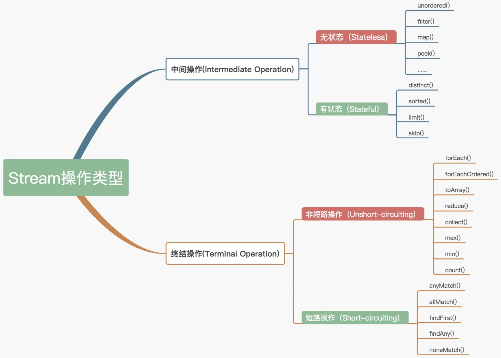

#### 1.5.7、Stream源码

#### 1.5.8、forEach中断操作

https://www.baeldung.com/java-break-stream-foreach

### 1.6、Optional

#### 1.6.1、解决问题

[Optional使用](https://www.cnblogs.com/rjzheng/p/9163246.html)

是为了解决NPE问题，以往我们需要对对象进行判空：
```java
public String getCity(User user)  throws Exception{
	if(user!=null){
		if(user.getAddress()!=null){
			Address address = user.getAddress();
			if(address.getCity()!=null){
				return address.getCity();
			}
		}
	}
	throw new Excpetion("取值错误"); 
}
```
而使用Optional之后，代码变成：
```java
public String getCity(User user) throws Exception{
    return Optional.ofNullable(user)
                   .map(u-> u.getAddress())
                   .map(a->a.getCity())
                   .orElseThrow(()->new Exception("取指错误"));
}
```

**Optional(T value)、empty()、of(T value)、ofNullable(T value)**

- `Optional(T value)`，即构造函数，它是private权限的，不能由外部调用的；
- 其余三个函数是public权限；
- Optional的本质，就是内部储存了一个真实的值，在构造的时候，就直接判断其值是否为空

Optional相当于是一个容器，里面可以装 T 类型的对象。当变量不存在的时候，缺失的值就会被建模成一个“空”的Optional对象，由方法Optional.empty()返回。这就是Optional.empty()和null的区别，如果引用一个 null，那结果肯定是会触发NullPointException异常，但是引用Optional.empty()则没事

#### 1.6.2、如何使用

**创建Optional对象**
- 创建一个空的Optional：`Optional<Person> personOpt = Optional.empty()`
- 创建一个非空的Optional：`Optional<Person> personOpt = Optional.of(person)`，Optional.of()不接受空值。如果 person 是一个空值则会抛出 NPE 异常，而不是等你试图访问 person 的属性才抛出异常；
- 创建一个可接受空值的Optional：`Optional<Person> personOpt = Optional.ofNullable(Person)`，如果 person 是 null ，那么得到的 Optional 对象就是个空对象。

**使用map**

Optional 中的 map()方法和流中的map()相似，都是从Optional对象中提取和转换值。
```
Optional<String> name = Optional.ofNullable(person).map(Person::getName);
```
获取到的是一个Optional对象是为了防止获取到一个 null，我们可以通过Optional.get()来获取值

**默认行为**

可以使用get()方法来获取 Optional 的值，也可以使用orElse()来定义一个默认值，遭遇到空的Optional值的时候，默认值会作为该方法的调用返回值。以下是Optional的常用方法：
- `get()`：最简单但又是最不安全的方法，如果变量存在，则直接返回封装的变量值，反之则抛出NullpointException异常
- `orElse(T other)`：允许自己定义一个默认值在Optional为空的时候返回；
- `orElseGet(Supplier<? extend T> other)`：是orElse()方法的延迟调用版，在Optional对象不含值的时候执行调用；
- `orElseThrow(Supplier<? extend X> excetionSupplier)`：和get()方法类似，在Optional对象为空的时候会抛出一个异常，但是这个异常我们可以自定义；
- `ifPresent(Consumer<? extend T>)`：如果值存在，就执行使用该值的方法调用，否则什么也不做

#### 1.6.3、注意实现

- Optional不能被序列化，因此不能使用于字段；
- Optional不建议用于函数的入参。试想传入一个Optional.empty()有多奇怪，可以使用相同函数名来避免；
- 不建议在使用isPresent后接着使用get，那将和用==判断无异，不能体现Optional的优越性，反而麻烦

### 1.7、JDK8时间

#### 1.7.1、旧版API存在问题

- 非线程安全：`java.util.Date` 是非线程安全的，所有的日期类都是可变的，这是Java日期类最大的问题之一，包括 SimpleDateFormat 、Calendar等

	**SimpleDateFormat 不安全的原因：**
	
	calendar是共享变量（calendar在DateFormat类中），并且这个共享变量没有做线程安全控制。当多个线程同时使用相同的SimpleDateFormat对象【如用static修饰的SimpleDateFormat】调用format方法时，多个线程会同时调用`calendar.setTime`方法，可能一个线程刚设置好time值另外的一个线程马上把设置的time值给修改了导致返回的格式化时间可能是错误的
	
	SimpleDateFormat需格外注意：除了format是线程不安全以外，parse方法也是线程不安全的。parse方法实际调用`alb.establish(calendar).getTime()`方法来解析，alb.establish(calendar)方法里主要完成了：
	- 重置日期对象cal的属性值；
	- 使用calb中中属性设置cal；
	- 返回设置好的cal对象；

  	这三步不是原子操作

	如果需要在多线程环境下使用 SimpleDateFormat，可以使用 ThreadLocal 局部变量
	```java
	ThreadLocal<SimpleDateFormat> format = new ThreadLocal<SimpleDateFormat>(){
        @Override
        protected SimpleDateFormat initialValue() {
            return new SimpleDateFormat("yyyy-MM-dd HH:mm:ss");
        }
    };
    public static void main(String[] args) {
       final GoodDateFormat faultDateFormat = new GoodDateFormat();
       ExecutorService executor = Executors.newCachedThreadPool();
       for(int i=0;i<1000;i++){
           executor.submit(()-> {
               try {
                   System.out.println(faultDateFormat.format.get().parse("2020-07-25 08:56:40"));
               } catch (ParseException e) {
                   throw new IllegalStateException();
               }
           });
       }
       executor.shutdown();
    }
	```

- 设计很差：Java的日期/时间类的定义并不一致，在`java.util`和`java.sql`的包中都有日期类，此外用于格式化和解析的类在`java.text`包中定义。`java.util.Date`同时包含日期和时间，而`java.sql.Date`仅包含日期，将其纳入`java.sql`包并不合理。另外这两个类都有相同的名字，这本身就是一个非常糟糕的设计。
- 时区处理麻烦：日期类并不提供国际化，没有时区支持，因此Java引入了`java.util.Calendar`和`java.util.TimeZone`类，但他们同样存在上述所有的问题；

#### 1.7.2、JDK8新API

##### 1.1、包分类

- `java.time` 包:这是新的 Java 日期/时间 API 的基础包，所有的主要基础类都是这个包的一部分，如:LocalDate, LocalTime, LocalDateTime, Instant, Period, Duration 等等。所有这些类都是不可变的和线程安全的，在绝大多 数情况下，这些类能够有效地处理一些公共的需求。
- `java.time.chrono` 包:这个包为非 ISO 的日历系统定义了一些泛化的 API，我们可以扩展 AbstractChronology 类来创建自己的日历系统。
- `java.time.format` 包:这个包包含能够格式化和解析日期时间对象的类，在绝大多数情况下，我们不应该直接使 用它们，因为 java.time 包中相应的类已经提供了格式化和解析的方法。
- `java.time.temporal`包:这个包包含一些时态对象，我们可以用其找出关于日期/时间对象的某个特定日期或时间， 比如说，可以找到某月的第一天或最后一天。你可以非常容易地认出这些方法，因为它们都具有“withXXX”的格 式。
- `java.time.zone` 包:这个包包含支持不同时区以及相关规则的类

##### 1.2、常见API**

- `java.time.LocalDate`：用来表示日期(年、月、日)，它表示默认格式(`yyyy-MM-dd`)的日期，LocalDate是不可变对象, 如果想改变对象的状态, 最终得到都是一个新的LocalDate对象, 并不会对旧的LocalDate对象产生影；使用 now()方法得到当前时间，也可以提供输入年份、月份和日期的输入参数来创建一个 LocalDate 实例；也可以传入 ZoneId 来获得指定时区的日期

- `java.time.LocalTime`：LocalTime 是一个不可变的类，它的实例代表一个符合人类可读格式的时间，默认格式是 `hh:mm:ss.zzz`。像 LocalDate 一样，该类也提供了时区支持，同时也可以传入小时、分钟和秒等输入参数创建实例；

- `java.time.LocalDateTime`：LocalDateTime 是一个不可变的日期-时间对象，它表示一组日期-时间，默认格式是 `yyyy-MM-dd-HH-mm-ss.zzz`。它提供了一个工厂方法，接收 LocalDate 和 LocalTime 输入参数，创建 LocalDateTime 实例

- `java.time.format.DateTimeFormatter`：用来格式化日期
- `java.time.ZonedDateTime`：无论是LocalDate、LocalTime、LocalDateTime，它们基本是时区无关的，内部并没有存储时区属性，而基本用的系统默认时区；ZonedDateTime 可以被理解为 LocalDateTime 的外层封装，它的内部存储了一个 LocalDateTime 的实例，专门用于普通的日期时间处理。此外，它还定义了 ZoneId 和 ZoneOffset 来描述时区的概念；
- `java.time.Instant`：Instant 类是用在机器可读的时间格式上的，它以 Unix 时间戳的形式存储日期时间，用于表示一个时间戳，可以精确到纳秒
- 日期 API 工具：TemporalAdjuster

#### 1.7.3、新API基本操作

##### 1.1、格式化时间：
	```java
	public static void main(String[] a){
		DateTimeFormatter formatter = DateTimeFormatter.ofPattern("yyyy年MM月dd日 HH:mm:ss");
		LocalDateTime localDateTime = LocalDateTime.now();
		System.out.println(formatter.format(localDateTime));
	
		String str = "2008年08月23日 23:59:59";
		DateTimeFormatter formatter2 = DateTimeFormatter.ofPattern("yyyy年MM月dd日 HH:mm:ss");
		LocalDateTime localDateTime2 = LocalDateTime.parse(str,formatter2);
		System.out.println(localDateTime2);
	
	}
	```
- java8时间与老版本时间转换：
	```java
	public static void main(String[] args) {
        // Date与Instant的相互转化
        Instant instant = Instant.now();
        Date date = Date.from(instant);
        Instant instant2 = date.toInstant();
	
        //Date转为LocalDateTime
        Date date2 = new Date();
        LocalDateTime localDateTime2 = LocalDateTime.ofInstant(date2.toInstant(), ZoneId.systemDefault());
	
        //LocalDateTime转Date
        LocalDateTime localDateTime3 = LocalDateTime.now();
        Instant instant3 = localDateTime3.atZone(ZoneId.systemDefault()).toInstant();
        Date date3 = Date.from(instant);
	
        //LocalDate转Date
        //因为LocalDate不包含时间，所以转Date时，会默认转为当天的起始时间，00:00:00
        LocalDate localDate4 = LocalDate.now();
        Instant instant4 = localDate4.atStartOfDay().atZone(ZoneId.systemDefault()).toInstant();
        Date date4 = Date.from(instant);
	
        // Calendar to Instant
        Instant time = Calendar.getInstance().toInstant();
        System.out.println(time);
	
        // TimeZone to ZoneId
        ZoneId defaultZone = TimeZone.getDefault().toZoneId();
        System.out.println(defaultZone);
	
        // ZonedDateTime from specific Calendar
        ZonedDateTime gregorianCalendarDateTime = new GregorianCalendar().toZonedDateTime();
        GregorianCalendar gc = GregorianCalendar.from(gregorianCalendarDateTime);
    }
	```

##### 1.2、转换为秒/毫秒

```java
//获取秒数
Long second = LocalDateTime.now().toEpochSecond(ZoneOffset.of("+8"));
//获取毫秒数
Long milliSecond = LocalDateTime.now().toInstant(ZoneOffset.of("+8")).toEpochMilli();
```

### 1.8、Lambda表达式与函数式接口

- [Java 8 Lambda 揭秘](https://colobu.com/2014/11/06/secrets-of-java-8-lambda/)
- [使用idea调试Lambda](https://www.jetbrains.com/help/idea/analyze-java-stream-operations.html)

#### 1.8.1、Lambda表达式语法

```java
// 之前的语法
new Thread(new Runnable() {
    @Override
    public void run() {
        System.out.println("内部类线程");
    }
}).start();
// lambda语法
new Thread(() -> System.out.println("我是Lambda线程")).start();
```

> Lambda表达式是延迟执行的

[函数式接口与编程参考如下](#19函数式接口与函数式编程)

#### 1.8.2、类型检查

```java
filter(flowerList, (Flower flower) -> flower.getPrice() > 8);
```
- 首先找出 filter 方法的声明
- 要求第二个参数是 Predicate 类型的对象
- Predicate 是一个函数式接口，定义了一个 test()的抽象方法，并返回一个boolean 类型的值

#### 1.8.3、类型推断

`filterFlower(flowerList, (Flower flower) -> flower.getPrice() > 8);`

我们可以继续将这个代码简化为：`filterFlower(flowerList, f -> f.getPrice() > 8);`

#### 1.8.4、使用局部变量

Lambda 表达式不仅能够使用主体里面的参数，也能够使用自由变量（在外层作用域中定义的变量）
```java
int tmpNum = 1；
Runnable r = () -> System.out.println(tmpNum);
```
**注意：Lambda 表达式对于全局变量和静态变量可以没有限制的使用，但是对于局部变量必须显示声明为 final**

因为实例变量是存储在堆中，而局部变量是存储在栈中，属于线程私有的。而 Lambda 是在一个线程中使用的，访问局部变量只是在访问这个变量的副本，而不是访问原始值

#### 1.8.5、方法引用

方法引用就是让你根据已有的方法实现来创建 Lambda表达式。可以看做是单一方法的 Lambda 的语法糖
```java
List<Flower> flowerList = Arrays.asList(new Flower("red", 6), new Flower("yellow", 7), new Flower("pink", 8));

(Flower f)->f.getPrice();   ==>  Flower::getPrice
flowerList.stream().map(t -> t.getPrice()).collect(Collectors.toList());      ===>   flowerList.stream().map(Flower::getPrice).collect(Collectors.toList());
```
**如何构建方法引用**：
- 指向静态方法的方法引用`（Integer的sum方法 == Integer::sum）`
- 指向任意类型示例方法的方法引用`（String的length方法 == String::length）`
- 指向现有对象的示例方法的方法引用`（flower实例的getPrice方法 == flower::getPrice）`

#### 1.8.6、复合 Lambda 表达式

##### 1.8.6.1、比较器复合

按鲜花的价格进行排序：
```
flowerList.sort(Comparator.comparing(Flower::getPrice));
```
这样子默认是使用升序进行排列的，那么我们如果想进项降序：使用 `reversed()`
```
flowerList.sort(Comparator.comparing(Flower::getPrice).reversed());
```
这里的粉花和白花的价格一样，那我们在价格排序完后再按照颜色排序那应该怎么做：使用 thenComparing()
```java
flowerList.sort(Comparator.comparing(Flower::getPrice).thenComparing(Flower::getColor));
```

##### 1.8.6.2、谓词复合

用于`Predicate`接口

**negate：非**
```java
Predicate<Flower> redFlower = (t) -> StringUtils.equals("red",t.getColor());
Predicate<Flower> notRedFlower = redFlower.negate();
```

**and：且**
```java
Predicate<Flower> redFlower = (t) -> StringUtils.equals("red", t.getColor());
Predicate<Flower> lowPriceFlower = (t) -> t.getPrice() < 8;
Predicate<Flower> redAndLowPriceFlower = redFlower.and(lowPriceFlower);
```

**or：或**
```java
Predicate<Flower> redFlower = (t) -> StringUtils.equals("red", t.getColor());
Predicate<Flower> lowPriceFlower = (t) -> t.getPrice() < 8;
Predicate<Flower> redOrLowPriceFlower = redFlower.or(lowPriceFlower);
```

##### 1.8.6.3、函数复合

用于`Function`接口

**andThen**
```java
Function<Integer, Integer> addRes = a1 -> a1 + 1;
Function<Integer, Integer> mulRes = a1 -> a1 * 2;
Function<Integer, Integer> andThenResult = addRes.andThen(mulRes);
Integer apply = andThenResult.apply(1);   // 结果为 4 ==> (1 + 1) * 2
```

**compose**
```java
Function<Integer, Integer> addRes = a1 -> a1 + 1;
Function<Integer, Integer> mulRes = a1 -> a1 * 2;
Function<Integer, Integer> composeResult = addRes.compose(mulRes);
Integer apply = composeResult.apply(1);  // 结果为 3 ==> (1 * 2) + 1
```

#### 1.8.7、Lambda原理

如下代码：启动一个线程，包含lambda表达式和匿名内部类的方式
```java
public class LambdaDemo {
    public static void runThreadUseLambda() {
        new Thread(() -> System.out.println("我是Lambda线程")).start();
    }
    public static void runWithInnerClass() {
        new Thread(new Runnable() {
            @Override
            public void run() {
                System.out.println("内部类线程");
            }
        }).start();
    }
    public static void main(String[] args) {
        runThreadUseLambda();
        runWithInnerClass();
    }
}
```
通过`javap -c LambdaDemo`查看字节码，[详细字节码](Lambda-字节码.txt)
```java
...
public static void runThreadUseLambda();
Code:
    0: new           #2                  // class java/lang/Thread
    3: dup
    4: invokedynamic #3,  0              // InvokeDynamic #0:run:()Ljava/lang/Runnable;
    9: invokespecial #4                  // Method java/lang/Thread."<init>":(Ljava/lang/Runnable;)V
    12: invokevirtual #5                  // Method java/lang/Thread.start:()V
    15: return

public static void runWithInnerClass();
Code:
    0: new           #2                  // class java/lang/Thread
    3: dup
    4: new           #6                  // class com/blue/fish/se/basis/lambda/LambdaDemo$1
    7: dup
    8: invokespecial #7                  // Method com/blue/fish/se/basis/lambda/LambdaDemo$1."<init>":()V
    11: invokespecial #4                  // Method java/lang/Thread."<init>":(Ljava/lang/Runnable;)V
    14: invokevirtual #5                  // Method java/lang/Thread.start:()V
    17: return
...
SourceFile: "LambdaDemo.java"
InnerClasses:
     static #6; //class com/blue/fish/se/basis/lambda/LambdaDemo$1
     public static final #70= #69 of #72; //Lookup=class java/lang/invoke/MethodHandles$Lookup of class java/lang/invoke/MethodHandles
BootstrapMethods:
  0: #36 invokestatic java/lang/invoke/LambdaMetafactory.metafactory:(Ljava/lang/invoke/MethodHandles$Lookup;Ljava/lang/String;Ljava/lang/invoke/MethodType;Ljava/lang/invoke/MethodType;Ljava/lang/invoke/MethodHandle;Ljava/lang/invoke/MethodType;)Ljava/lang/invoke/CallSite;
    Method arguments:
      #37 ()V
      #38 invokestatic com/blue/fish/se/basis/lambda/LambdaDemo.lambda$runThreadUseLambda$0:()V
      #37 ()V

```
对比上述两个方法，发现lambda的是`invokeDynamic`，而内部类的是`invokespecial`；

JVM指令：
- invokeinterface：调用接口方法；
- invokespecial：专门用来调用父类方法、私有方法和初始化方法；
- invokestatic：调用静态方法；
- invokevirtual：调用对象的一般方法；

上述这四个指令所对应的类、调用的方法在编译时几乎是固定的：invokestatic所对应的类为静态方法所在的类，方法为静态方法本身；invokespecial所对应的类为当前对象，方法是固定的；invokeinterface和invokevirtual所对应的类也为当前对象，方法可以因为继承和实现进行选择，但也仅限于整个继承体系中选择；

在java7 JVM中增加了一个新的指令invokedynamic，用于支持动态语言，即允许方法调用可以在运行时指定类和方法，不必在编译的时候确定；字节码中每条invokedynamic指令出现的位置称为一个动态调用点，invokedynamic指令后面会跟一个指向常量池的调用点限定符，这个限定符会被解析为一个动态调用点；

**Lambda采用的是invokedynamic指令；**

上面是从JVM虚拟层面上来看的，下面从Java源代码中看，首先从字节码常量池中可以看到：

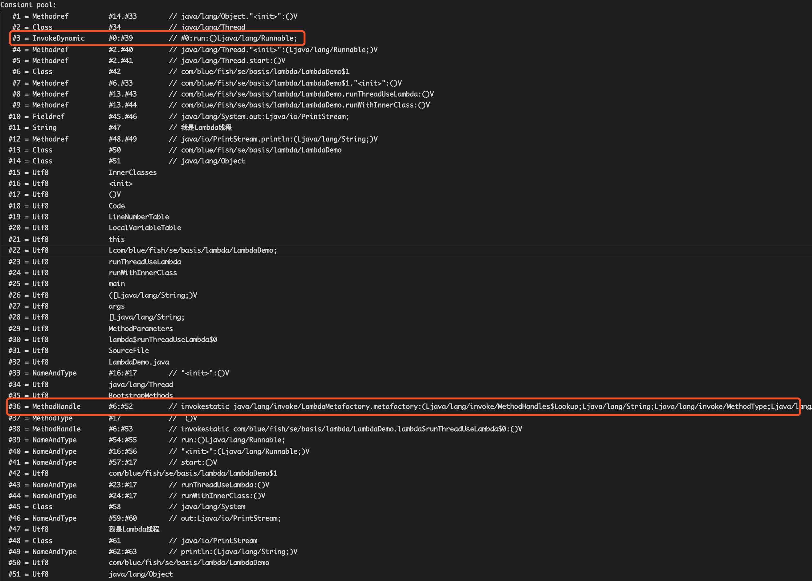

从上面可以看到类似代码：`java/lang/invoke/LambdaMetafactory.metafactory:(Ljava/lang/invoke/MethodHandles$Lookup;Ljava/lang/String;Ljava/lang/invoke/MethodType;Ljava/lang/invoke/MethodType;Ljava/lang/invoke/MethodHandle;Ljava/lang/invoke/MethodType;)Ljava/lang/invoke/CallSite;`

MethodHandles 和 LambdaMetafactory 都是 java.lang.invoke 包下面的重要方法，invoke 包主要实现了动态语言的功能，java 语言属于静态编译语言，在编译的时候，类、方法、字段等等的类型都已经确定了，而 invoke 实现的是一种动态语言，也就是说编译的时候并不知道类、方法、字段是什么类型，只有到运行的时候才知道，其实质上调用的是：
```java
// LambdaMetafactory.java
public static CallSite metafactory(MethodHandles.Lookup caller, String invokedName, MethodType invokedType, MethodType samMethodType,
                                       MethodHandle implMethod, MethodType instantiatedMethodType) throws LambdaConversionException {
	AbstractValidatingLambdaMetafactory mf;
	mf = new InnerClassLambdaMetafactory(caller, invokedType, invokedName, samMethodType, implMethod, instantiatedMethodType,
											false, EMPTY_CLASS_ARRAY, EMPTY_MT_ARRAY);
	mf.validateMetafactoryArgs();
	return mf.buildCallSite();
}
```
metafactory 方法入参：
- caller 代表实际发生动态调用的位置
- invokedName 表示调用方法名称；
- invokedType 表示调用的多个入参和出参
- samMethodType 表示具体的实现者的参数
- implMethod 表示实际上的实现者
- instantiatedMethodType 等同于 implMethod

通过debug，可以获取到的信息如下：

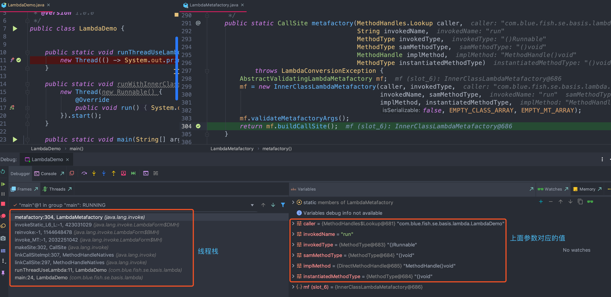

#### 1.8.8、Lambda性能

### 1.9、函数式接口与函数式编程

- [详解JAVA8函数式接口](https://www.cnblogs.com/dgwblog/p/11739500.html)

#### 1.9.1、概览

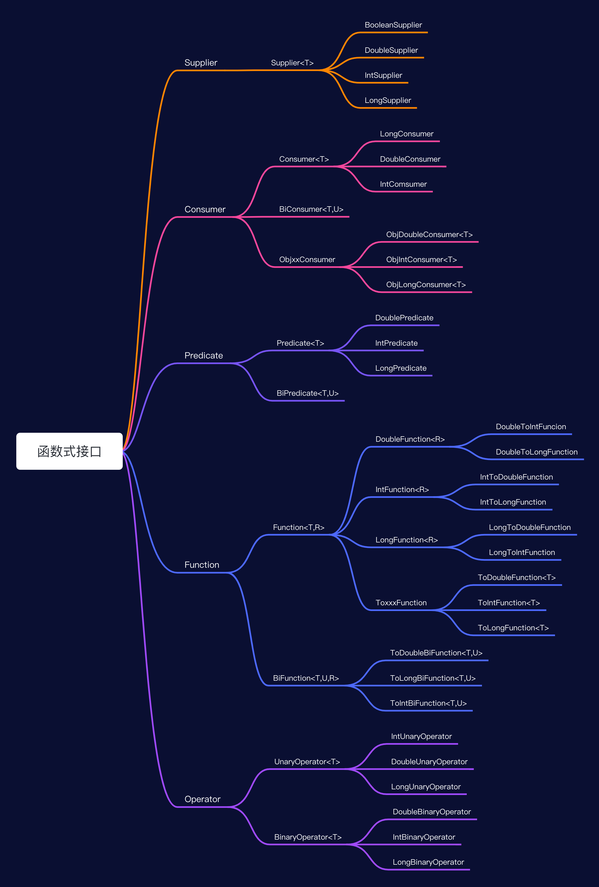

函数式接口：是有且仅有一个抽象方法的接口。比如Java标准库中的java.lang.Runnable和java.util.Comparator都是典型的函数式接口；

> 注意：函数式接口指的是有且仅有一个抽象方法的接口，如果接口有其他默认方法也可以认为是函数式接口，比如：BiConsumer
```java
@FunctionalInterface
public interface BiConsumer<T, U> {
    void accept(T t, U u);
    default BiConsumer<T, U> andThen(BiConsumer<? super T, ? super U> after) {
        Objects.requireNonNull(after);
        return (l, r) -> {
            accept(l, r);
            after.accept(l, r);
        };
    }
}
```
java 8提供 `@FunctionalInterface` 作为注解，这个注解是非必须的，只要接口符合函数式接口的标准（即只包含一个方法的接口），虚拟机会自动判断，但 好在接口上使用注解`@FunctionalInterface`进行声明，以免团队的其他人员错误地往接口中添加新的抽象方法。 

Java中的lambda无法单独出现，它需要一个函数式接口来盛放，lambda表达式方法体其实就是函数接口的实现；Lambda 表达式对于全局变量和静态变量可以没有限制的使用，但是对于局部变量必须显示声明为 final

函数式编程更加强调程序执行的结果而非执行的过程，倡导利用若干简单的执行单元让计算结果不断渐进，逐层推导复杂的运算，而不是设计一个复杂的执行过程；
- 函数的执行没有副作用；
- 返回值仅依赖于输入参数；
- 函数的参数可以是一个/多个函数；
- 函数的返回值也可以是一个函数；

常用函数式接口
- Supplier 你要作为一个供应者,自己生产数据
- Consumer 你要作为一个消费者,利用已经准备数据
- Supplier 你要作为一个供应者,自己生产数据
- Consumer 你要作为一个消费者,利用已经准备数据
- Function  输入一个或者两个不同或者相同的值转为另一个值
- Predicate 输入一个或者两个不同或者相同的值总是输出boolean
- UnaryOperator 输入一个值转换为相同值输出
- BinaryOperator 输入两个相同类型的值 转为相同类型的值输出 

**Predicate**

这个接口中定义了一个test()的抽象方法，它接受泛型 T 对象，并返回一个 boolean。你如果需要 表示一个涉及类型 T 的布尔表达式时，就可以使用这个接口；
```java
public static List<Flower> filterFlower(List<Flower> flowers, Predicate<Flower> p) {
    List<Flower> resList = new ArrayList<>();
    for (Flower flower : flowers) {
        if (p.test(flower)) {
            resList.add(flower);
        }
    }
    return resList;
}
/*****      使用方式        *****/
filterFlower(flowerList, (Flower flower) -> flower.getPrice() > 8);
```

**Consumer**

这个接口定义了一个accept()的抽象方法，它接受泛型 T 对象，没有返回（void）。你如果需要访问类型 T 的对象，并对其执行某些操作，就可以使用这个接口
```java
List<Integer> nums = Arrays.asList(1,2,3,4);
nums.forEach(integer -> System.out.println(integer));
```

**Function**

这个接口定义了一个apply()的抽象方法，它接受泛型 T 对象，并返回一个泛型 R 的对象。你如果需要定义一个Lambda，将输入对象的信息映射输出，就可以使用这个接口
```java
(String s) -> s.length()
```

**Supplier**

这个接口定义了一个get()的抽象方法，它没有传入参数，会返回一个泛型 T 的对象，如果你需要定义一个 Lambda，输出自定义的对象，就可以使用这个接口
```java
Callable<Integer> call = () -> 1 ;
```

## 2、JDK9

## 3、JDK10

## 4、JDK11

## 5、JDK13

# 五、正则表达式

## 1、使用

## 2、常见正则

```
匹配特定数字
^[1-9]d*$　 　 //匹配正整数
^-[1-9]d*$ 　 //匹配负整数
^-?[1-9]d*$　　 //匹配整数
^[1-9]d*|0$　 //匹配非负整数（正整数 + 0）
^-[1-9]d*|0$　　 //匹配非正整数（负整数 + 0）
^[1-9]d*.d*|0.d*[1-9]d*$　　 //匹配正浮点数
^-([1-9]d*.d*|0.d*[1-9]d*)$　 //匹配负浮点数
^-?([1-9]d*.d*|0.d*[1-9]d*|0?.0+|0)$　 //匹配浮点数
^[1-9]d*.d*|0.d*[1-9]d*|0?.0+|0$　　 //匹配非负浮点数（正浮点数 + 0）
^(-([1-9]d*.d*|0.d*[1-9]d*))|0?.0+|0$　　//匹配非正浮点数（负浮点数 + 0）

匹配特定字符串
^[A-Za-z]+$　　//匹配由26个英文字母组成的字符串
^[A-Z]+$　　//匹配由26个英文字母的大写组成的字符串
^[a-z]+$　　//匹配由26个英文字母的小写组成的字符串
^[A-Za-z0-9]+$　　//匹配由数字和26个英文字母组成的字符串
^w+$　　//匹配由数字、26个英文字母或者下划线组成的字符串

验证Email地址：“^w+[-+.]w+)*@w+([-.]w+)*.w+([-.]w+)*$”
验证InternetURL：“^http://([w-]+.)+[w-]+(/[w-./?%&=]*)?$”
验证电话号码：“^((d{3,4})|d{3,4}-)?d{7,8}$”
验证身份证号（15位或18位数字）：“^d{15}|d{}18$”
验证一年的12个月：“^(0?[1-9]|1[0-2])$”正确格式为：“01”-“09”和“1”“12”
验证一个月的31天：“^((0?[1-9])|((1|2)[0-9])|30|31)$”
匹配中文字符的正则表达式： [u4e00-u9fa5]
匹配双字节字符(包括汉字在内)：[^x00-xff]
匹配空行的正则表达式：n[s| ]*r
匹配HTML标记的正则表达式：/< (.*)>.*|< (.*) />/
匹配首尾空格的正则表达式：(^s*)|(s*$)
匹配Email地址的正则表达式：w+([-+.]w+)*@w+([-.]w+)*.w+([-.]w+)*
匹配网址URL的正则表达式：http://([w-]+.)+[w-]+(/[w- ./?%&=]*)?
```

## 3、正则表达式引擎

- [正则表达式引擎](https://blog.csdn.net/ityouknow/article/details/80851338)

### 3.1、什么是正则表达式引擎

正则表达式是一个很方便的匹配符号，但要实现这么复杂，功能如此强大的匹配语法，就必须要有一套算法来实现，而实现这套算法的东西就叫做正则表达式引擎。简单地说，实现正则表达式引擎的有两种方式：DFA 自动机（Deterministic Final Automata 确定型有穷自动机）和 NFA 自动机（Non deterministic Finite Automaton 不确定型有穷自动机）

单地说，DFA 自动机的时间复杂度是线性的，更加稳定，但是功能有限。而 NFA 的时间复杂度比较不稳定，有时候很好，有时候不怎么好，好不好取决于你写的正则表达式。但是NFA 的功能更加强大，所以包括 Java 、.NET、Perl、Python、Ruby、PHP 等语言都使用了 NFA 去实现其正则表达式；

**NFA 匹配机制**

NFA 是以正则表达式为基准去匹配的。也就是说，NFA 自动机会读取正则表达式的一个一个字符，然后拿去和目标字符串匹配，匹配成功就换正则表达式的下一个字符，否则继续和目标字符串的下一个字符比较，看下列实例匹配过程：
```
text="Today is a nice day."
regex="day"
```
- 首先，拿到正则表达式的第一个匹配符：d。于是那去和字符串的字符进行比较，字符串的第一个字符是 T，不匹配，换下一个。第二个是 o，也不匹配，再换下一个。第三个是 d，匹配了，那么就读取正则表达式的第二个字符：a。
- 读取到正则表达式的第二个匹配符：a。那着继续和字符串的第四个字符 a 比较，又匹配了。那么接着读取正则表达式的第三个字符：y。
- 读取到正则表达式的第三个匹配符：y。那着继续和字符串的第五个字符 y 比较，又匹配了。尝试读取正则表达式的下一个字符，发现没有了，那么匹配结束。

### 3.2、NFA自动机的回溯


# 六、Java 内部类

## 1、为什么使用内部类

使用内部类最吸引人的原因是：每个内部类都能独立地继承一个(接口的)实现，所以无论外围类是否已经继承了某个(接口的)实现，对于内部类都没有影响使用内部类最大的优点就在于它能够非常好的解决多重继承的问题，使用内部类还能够为我们带来如下特性：

- 内部类可以用多个实例，每个实例都有自己的状态信息，并且与其他外围对象的信息相互独。
- 在单个外围类中，可以让多个内部类以不同的方式实现同一个接口，或者继承同一个类。
- 创建内部类对象的时刻并不依赖于外围类对象的创建。
- 内部类并没有令人迷惑的"is-a"关系，他就是一个独立的实体。
- 内部类提供了更好的封装，除了该外围类，其他类都不能访问。

## 2、成员内部类

```java
public class Outer{
	private int age = 99;
	String name = "Coco";
	public class Inner{
		String name = "Jayden";
		public void show(){
			System.out.println(Outer.this.name);
			System.out.println(name);
			System.out.println(age);
		}
	}
	public Inner getInnerClass(){
		return new Inner();
	}
	public static void main(String[] args){
		Outer o = new Outer();
		Inner in = o.new Inner();
		in.show();
	}
}
```
- 1、Inner类定义Outer类的内部，相当于Outer类的一个成员变量的位置，Inner类可以使用任意访问控制符，如`public、protected、private`等

- 2、Inner 类中定义的show()方法可以直接访问Outer类中的数据，而不受访问控制符的影响，如直接访问Outer类中的私有属性age

- 3、定义了成员内部类后，必须使用外部类对象来创建内部类对象，而不能直接去 new 一个内部类对象：`InnerClass inner = OuterClass.new InnnerClass();`

- 4、编译上面的程序后，会发现产生了两个`.class`文件：`Outer.class，Outer$Inner.class`，在编译后成员内部类中有一个指向外部类对象的引用，且成员内部类编译后构造方法也多了一个指向外部类对象的引用参数.所以说编译器会默认为成员内部类添加了一个指向外部类对象的引用并且在成员内部类构造方法中对其进行赋值操作。我们可以在成员内部类中随意访问外部类的成员，同时也说明成员内部类是依赖于外部类的，如果没有创建外部类的对象则也无法创建成员内部类的对象。

- 5、成员内部类中不能存在任何`static`的变量和方法，可以定义常量：

	- 因为非静态内部类是要依赖于外部类的实例，而静态变量和方法是不依赖于对象的，仅与类相关，简而言之：在加载静态域时，根本没有外部类，所在在非静态内部类中不能定义静态域或方法，编译不通过；非静态内部类的作用域是实例级别；
	- 常量是在编译器就确定的，放到所谓的常量池了

- 6、成员内部类的继承

```java
public class ChildInnerClass1 extends OutClass.InnerClass {
	public ChildInnerClass1(OutClass outClass){
		outClass.super();
	}
}
```

成员内部类的继承语法格式要求继承引用方式为 Outter.Inner 形式且继承类的构造器中必须有指向外部类对象的引用的参数，并通过这个引用调用 super()，其实这个要求就是因为成员内部类默认持有外部类的引用，外部类不先实例化则无法实例化自己；

**友情提示：**

- 外部类是不能直接使用内部类的成员和方法的，可先创建内部类的对象，然后通过内部类的对象来访问其成员变量和方法;
- 如果外部类和内部类具有相同的成员变量或方法，内部类默认访问自己的成员变量或方法，如果要访问外部类的成员变量，可以使用 this 关键字，如：`Outer.this.name`

## 3、静态内部类

是static修饰的内部类
- `静态内部类`不能直接访问外部类的`非静态成员`，但可以通过 `new 外部类().成员` 的方式访问
- 如果外部类的静态成员与内部类的成员名称相同，可通过`类名.静态成员`访问外部类的静态成员；如果外部类的静态成员与内部类的成员名称不相同，则可通过`成员名`直接调用外部类的静态成员
- 创建静态内部类的对象时，不需要外部类的对象，可以直接创建 `内部类 对象名 = new 内部类()`;

```java
public class Outer{
	private int age = 99;
	static String name = "Coco";
	public static class Inner{
		String name = "Jayden";
		public void show(){
			System.out.println(Outer.name);
			System.out.println(name);					
		}
	}
	public static void main(String[] args){
		Inner i = new Inner();
		i.show();
	}
}
```

- 非静态内部类中为什么不能有静态属性或者方法？

	`static` 类型的属性和方法在类加载的时候就会存在于内存中，要使用某个类的`static`属性或者方法的前提是这个类已经加载到JVM中，非`static`内部类默认是持有外部类的引用且依赖外部类存在的，所以如果一个非`static`的内部类一旦具有`static`的属性或者方法就会出现内部类未加载时却试图在内存中创建的`static`属性和方法，这自然是错误的，类都不存在却希望操作它的属性和方法。从另一个角度讲非 `static`的内部类在实例化的时候才会加载(不自动跟随主类加载)，而`static`的语义是类能直接通过类名访问类的`static`属性或者方法，所以如果没有实例化非`static`的内部类就等于非`static`的内部类没有被加载，所以无从谈起通过类名访问 static属性或者方法；

## 4、方法内部类

访问仅限于方法内或者该作用域内
- 局部内部类就像是方法里面的一个局部变量一样，是不能有`public、protected、private、static`修饰符的
- 只能访问方法中定义的 `final` 类型的局部变量，因为：当方法被调用运行完毕之后，局部变量就已消亡了。但内部类对象可能还存在，直到没有被引用时才会消亡。此时就会出现一种情况，就是内部类要访问一个不存在的局部变量；使用final修饰符不仅会保持对象的引用不会改变，而且编译器还会持续维护这个对象在回调方法中的生命周期。局部内部类并不是直接调用方法传进来的参数，而是内部类将传进来的参数通过自己的构造器备份到了自己的内部，自己内部的方法调用的实际是自己的属性而不是外部类方法的参数；防止被篡改数据，而导致内部类得到的值不一致

```java
/**
 * 使用的形参为何要为 `final`???
 * 在内部类中的属性和外部方法的参数两者从外表上看是同一个东西，但实际上却不是，所以他们两者是可以任意变化的，
 * 也就是说在内部类中我对属性的改变并不会影响到外部的形参，而然这从程序员的角度来看这是不可行的，
 * 毕竟站在程序的角度来看这两个根本就是同一个，如果内部类该变了，而外部方法的形参却没有改变这是难以理解
 * 和不可接受的，所以为了保持参数的一致性，就规定使用 `final` 来避免形参的不改变
 */
public class Outer{
	public void Show(){
		final int a = 25;
		int b = 13;
		class Inner{
			int c = 2;
			public void print(){
				System.out.println("访问外部类：" + a);
				System.out.println("访问内部类：" + c);
			}
		}
		Inner i = new Inner();
		i.print();
	}
	public static void main(String[] args){
		Outer o = new Outer();
		o.show();
	}
}
```
- 注意：在JDK8版本之中，方法内部类中调用方法中的局部变量，可以不需要修饰为`final`，匿名内部类也是一样的，主要是JDK8之后增加了`Effectively final`功能，反编译jdk8编译之后的`class`文件，发现内部类引用外部的局部变量都是`final`修饰的

[参考文章](http://docs.oracle.com/javase/tutorial/java/javaOO/localclasses.html) <br>

```java
public class OutClass {
	private int out = 1;
	public void func(int param) {
		int in = 2;
		new Thread() {
			@Override
			public void run() {
				out = param;
				out = in;
			}
		}.start();
	}
}
```

在java8中使用命令查看字节码：`javap -l -v OutClass$1.class`，如下：

```
......
class OutClass$1 extends java.lang.Thread
......
{
	//匿名内部类有了自己的 param 属性成员  
	`final` int val$param;
	......
	//匿名内部类持有了外部类的引用作为一个属性成员	  
	`final` OutClass this$0;  
	......
	//匿名内部类编译后构造方法自动多了两个参数，一个为外部类引用，一个为 param 参数。
	OutClass$1 (OutClass，int);
	......
	public void run();    
		......
		Code：
			stack=2， locals=1， args_size=1
			//out = param;语句，将匿名内部类自己的 param 属性赋值给外部类的成员 out。
			0： aload_0
			1： getfield #1 // Field this$0：LOutClass;
			4： aload_0
			5： getfield #2 // Field val$param：I
			8： invokestatic  #4 // Method OutClass.access$002：(LOutClass;I)I
			11： pop        
			//out = in;语句，将匿名内部类常量 2 (in在编译时确定值)赋值给外部类的成员 out。
			12： aload_0      
			13： getfield    #1 // Field this$0：LOutClass;
			//将操作数2压栈，因为如果这个变量的值在编译期间可以确定则编译器默认会在
			//匿名内部类或方法内部类的常量池中添加一个内容相等的字面量或直接将相应的
			//字节码嵌入到执行字节码中。
			16： iconst_2
			17： invokestatic  #4 // Method OutClass.access$002：(LOutClass;I)I
			20： pop
			21：	return
			......
}
......
```

## 5、匿名内部类

- 匿名内部类是直接使用`new`来生成一个对象的引用;
- 对于匿名内部类的使用它是存在一个缺陷的，就是它仅能被使用一次，创建匿名内部类时它会立即创建一个该类的实例，该类的定义会立即消失，所以匿名内部类是不能够被重复使用;
- 使用匿名内部类时，我们必须是继承一个类或者实现一个接口，但是两者不可兼得，同时也只能继承一个类或者实现一个接口;
- 匿名内部类中是不能定义构造函数的，匿名内部类中不能存在任何的静态成员变量和静态方法;
- 匿名内部类中不能存在任何的静态成员变量和静态方法，匿名内部类不能是抽象的，它必须要实现继承的类或者实现的接口的所有抽象方法
- 匿名内部类初始化：使用构造代码块！利用构造代码块能够达到为匿名内部类创建一个构造器的效果。匿名内部类不能通过构造方法初始化，只能通过构造代码块进行初始化

```java
public class OuterClass {
	public InnerClass getInnerClass(`final` int   num，String str2){
		return new InnerClass(){
			int number = num + 3;
			public int getNumber(){
				return number;
			}
		};        // 注意：分号不能省
	}
	public static void main(String[] args) {
		OuterClass out = new OuterClass();
		InnerClass inner = out.getInnerClass(2， "chenssy");
		System.out.println(inner.getNumber());
	}
}
interface InnerClass {
	int getNumber();
}
```
- 如下代码：
```java
List list1 = new ArrayList();
List list2 = new ArrayList(){};
List list3 = new ArrayList(){{}};
List list4 = new ArrayList(){{}{}{}};
System.out.println(list1.getClass() == list2.getClass()); // false
System.out.println(list1.getClass() == list3.getClass()); // false
System.out.println(list1.getClass() == list4.getClass()); // false
System.out.println(list2.getClass() == list3.getClass()); // false
System.out.println(list2.getClass() == list4.getClass()); // false
System.out.println(list3.getClass() == list4.getClass()); // false
/*
首先 list1 指向一个 ArrayList 对象实例;
list2 指向一个继承自 ArrayList 的匿名类内部类对象;
list3 也指向一个继承自 ArrayList 的匿名内部类(里面一对括弧为初始化代码块)对象;
list4 也指向一个继承自 ArrayList 的匿名内部类(里面多对括弧为多个初始化代码块)对象;
由于这些匿名内部类都出现在同一个类中，所以编译后其实得到的是 OutClass$1、OutClass$2、OutClass$3 的形式，
所以自然都互不相等了，可以通过 listX.getClass().getName() 进行验证：
*/
System.out.println(list1.getClass().getName()); // java.util.ArrayList
System.out.println(list2.getClass().getName()); // com.demo.normal.OutClass$1
System.out.println(list3.getClass().getName()); // com.demo.normal.OutClass$2
System.out.println(list4.getClass().getName()); // com.demo.normal.OutClass$3
```

- 匿名内部类为什么不能直接使用构造方法？<br>
	因为类是匿名的，而且每次创建的匿名内部类同时被实例化后只能使用一次，所以就无从创建一个同名的构造方法了，但是可以直接调用父类的构造方法.实质上类是有构造方法的，是通过编译器在编译时生成的，看如下代码：

```java
public class InnerClass{}
public class OutClass{
	InnerClass inner = new InnerClass(){};
}
```

编译之后使用命令 javap 可以很明显看到内部类的字节码中编译器为我们生成了参数为外部类引用的构造方法，其构造方法和普通类的构造方法没有区别，都是执行`<init>`方式;

## 6、内部类GC问题

- 匿名内部类并不会妨碍外部类的正常GC，而是不能将它定义成静态属性引用。
- 静态匿名内部类，导致外部类不能正常回收的原因就是：它作为GC Root对象却保持着外部类的引用。方法区中类静态属性引用的对象可以作为GC root对象


# 七、Java 关键字

## 1、native

`native`关键字可以应用于方法，以指示该方法是用 Java 以外的语言实现的

## 2、transient

`transient`关键字可以应用于类的成员变量，以便指出该成员变量不应在包含它的类实例已序列化时被序列化；Java 的`serialization`提供了一种持久化对象实例的机制。当持久化对象时，可能有一个特殊的对象数据成员，我们不想用`serialization`机制来保存它，为了在一个特定对象的一个域上关闭`serialization`，可以在这个域前加上关键字`transient`。`transient` 是 Java 语言的关键字，用来表示一个域不是该对象串行化的一部分。当一个对象被串行化的时候，`transient` 型变量的值不包括在串行化的表示中，然而非`transient`型的变量是被包括进去的.

## 3、final

* [final关键字](http://www.importnew.com/18586.html)
* [深入理解Java中的final关键字](http://www.importnew.com/7553.html)

### 3.1、含义

`final` 在Java中是一个保留的关键字，可以声明成员变量、方法、类以及本地变量。一旦你将引用声明作 final，你将不能改变这个引用了，编译器会检查代码，如果你试图将变量再次初始化的话，编译器会报编译错误；

### 3.2、final 修饰符

- 修饰变量：对于一个 `final` 变量，如果是基本数据类型的变量，则其数值一旦在初始化之后便不能更改；如果是引用类型的变量，则在对其初始化之后便不能再让其指向另一个对象;
- 修饰方法：方法前面加上 `final` 关键字，代表这个方法不可以被子类的方法重写；`final` 方法比非 `final` 方法要快，因为在编译的时候已经静态绑定了，不需要在运行时再动态绑定；类的 private 方法会隐式地被指定为final方法；但是不能修饰构造方法；
- 修饰类：当用 `final` 修饰一个类时，表明这个类不能被继承，final 类中的所有成员方法都会被隐式地指定为 `final` 方法；Java 中许多类都是 `final` 类，如：String，Integer
- 不能修饰构造方法；
- 不能修饰`static`方法；
- 如果`final`修饰对象的时候，只是对象的引用不可变，而对象本身的内部属性是可以变化的；
- final方法可以被重载；

### 3.3、注意点

- `final` 和 `static`：static 作用于成员变量用来表示只保存一份副本，而 `final` 的作用是用来保证变量不可变看代码：每次打印的两个j值都是一样的，而i的值却是不同的
```java
public class Demo01 {
	public static void main(String[] args) {
		MyDemo1 d1 = new MyDemo1();
		MyDemo1 d2 = new MyDemo1();
		System.out.println(d1.i);
		System.out.println(d2.i);
		System.out.println(d1.j);
		System.out.println(d2.j);
	}
}
class MyDemo1{
	public final double i = Math.random();
	public static double j = Math.random();
}
```
- 匿名内部类中使用的外部局部变量为什么只能是 `final` 变量(参考上面内部类)
- 成员变量如果使用`final`修饰，可以使用如下三种方式赋值：
	- 定义变量直接final变量后直接赋值：`private final int a = 1;`
	- 在构造方法中对定义的成员变量进行赋值操作；
	- 在构造代码块中赋值；
- 成员变量如果使用`static final`修饰，可以使用如下两种种方式赋值：
	- 定义变量直接final变量后直接赋值：`private static final int a = 1;`
	- 在静态代码块中对成员变量进行赋值操作；
- 如果是在方法体内定义的`final`变量，需要在使用该变量前对其进行赋值；

### 3.4、为什么使用 `final`

- `final` 关键字提高了性能。JVM 和 Java 应用都会缓存 `final` 变量。
- `final` 变量可以安全的在多线程环境下进行共享，而不需要额外的同步开销。
- 使用 `final` 关键字，JVM 会对方法、变量及类进行优化;

### 3.5、不可变类

创建不可变类要使用 `final` 关键字。不可变类是指它的对象一旦被创建了就不能被更改了。String 是不可变类的代表。不可变类有很多好处，譬如它们的对象是只读的，可以在多线程环境下安全的共享，不用额外的同步开销等等；
- 不可变对象：如果某个对象在被创建后其状态不能被修改，那么这个对象就称为不可变对象，不可变对象一定是线程安全的。
- 如何编写不可变类：
	- 将类声明为final，所以它不能被继承；
	- 将所有的成员声明为私有的，这样就不允许直接访问这些成员；
	- 对变量不要提供setter方法；
	- 将所有可变的成员声明为final，这样只能对它们赋值一次；
	- 通过构造器初始化所有成员，进行深拷贝(deep copy)；
	- 在getter方法中，不要直接返回对象本身，而是克隆对象，并返回对象的拷贝；
- 对于集合(Collection，Map）类可以使用 Collections 里的 unmodified 相关方法创建对于的类；或者是 Guava 包类的不可变类

### 3.6、知识点

- `final` 成员变量必须在声明的时候初始化或者在构造器中初始化，否则就会报编译错误；
- 接口中声明的所有变量本身是 `final` 的；
- `final` 和 abstract 这两个关键字是反相关的，final 类就不可能是 abstract 的；
- `final` 方法在编译阶段绑定，称为静态绑定(static binding)
- 将类、方法、变量声明为 `final` 能够提高性能，这样 JVM 就有机会进行估计，然后优化；

## 4、instanceof

### 4.1、一些使用注意事项

- 只能用于对象的判断，不能用于基本类型的判断;
- 若左操作数是 null 则结果直接返回 false，不再运算右操作数是什么类：`(String)null instanceof String; // false;`；因为 null 没有类型，所以即使做类型转换还是 null
- `instanceof`的右操作符必须是一个接口或者类： `demo instanceof null; // 编译错误`
- 数组类型也可以使用 instanceof 判断：
	```java
	String[] str = new String[10];
	str instanceof String[]; //  true
	```

### 4.2、instanceof与clazz.isInstance(obj)

- `instanceof`运算符用来在运行时指出对象是否是特定类的一个实例，通过返回一个布尔值来指出这个对象是否是这个特定类或者是它的子类的一个实例。
	```
	result = object instanceof class
	```

	但是 `instanceof` 在 `java` 的编译状态和运行状态是有区别的，在编译状态中`class`可以是 object 对象的父类、自身类、子类，在这三种情况下java 编译时不会报错，在运行转态中 class 可以是 object 对象的父类、自身类但不能是子类；当为父类、自生类的情况下 result 结果为 true，为子类的情况下为 false；

- `clazz.isInstance(obj)`：表明这个对象能不能被转化为这个类，一个对象能被转化为本身类所继承类(父类的父类等)和实现的接口(接口的父接口)强转;

### 4.3、instanceof 与 clazz.getClass()：

- `instanceof` 进行类型检查规则是你属于该类吗？或者你属于该类的派生类吗？
- `clazz.getClass()`：获得类型信息采用 == 来进行检查是否相等的操作是严格比较，不存在继承方面的考虑;

### 4.4、instanceof实现原理

JVM有一条名为 instanceof 的指令，而Java源码编译到Class文件时会把Java语言中的 instanceof 运算符映射到JVM的 instanceof 指令上。
- 指令格式：instanceof|indexbyte1|indexbyte2
- 指令执行前后的栈顶状态：
	```
	……，objectref=>
	……，result	
	```
- indexbyte1和indexbyte2用于构造对当前类的常量池的索引，objectref为reference类型，可以是某个类，数组的实例或者是接口
- 基本过程：对indexbyte1和indexbyte2构造的常量池索引进行解析，然后根据java规范判断解析的类是不是objectref的一个实例，最后在栈顶写入结果

## 5、static

### 5.1、使用

static变量有两次赋初始值的过程，一次在准备阶段，赋予初始值（也可以是指定值）；另外一次在初始化阶段，赋予程序员定义的值；

static 语句块，只能访问到定义在 static 语句块之前的变量
```java
static int a = 0 ;
static {
	a = 1;
	b = 1;
}
static int b = 0;
public static void main(String[] args) {
	System.out.println(a);
	System.out.println(b);
}
```
上面代码是正常编译的，再看下面的代码：
```java
static {
	b = b + 1; // 编译报错
}
static int b = 0;
```
- 父类中定义的 static 语句块要优先于子类先执行的
- static 代码块只会执行一次

### 5.2、为什么有static

static变量：
- 当变量的值与对象无关时；
- 当值应该在所有对象之间共享时
- 静态变量减少了程序的内存占用。这是因为在类加载期间，静态变量只分配一次内存，而对于非静态变量，每次创建类的实例时都会分配内存；
- 静态变量通常在 Java 中声明为 final。这确保了值在初始化后永远不会改变。当我们需要在所有类实例之间共享变量的单个副本时，这非常有用

static方法：
- 访问/操作静态变量和其他不依赖对象的静态方法；
- 静态方法广泛用于实用程序和帮助程序类；
- Java 中的静态方法在编译时解析。由于方法覆盖是运行时多态性的一部分，因此不能覆盖静态方法；

static类：
- 如果嵌套类不需要对其封闭类实例成员进行任何访问，最好将其声明为static。这样，它不会与外部类耦合，因此更优化，因为它们不需要任何堆或堆栈内存

# 八、泛型

## 1、JDK5 引入的新特性

允许在定义类和接口的时候使用类型参数(type parameter)，泛型最主要的应用是在JDK 5中的新集合类框架中；其本质是参数化类型

*为什么要有泛型？*

在JDK5之前没有泛型的情况下，只能通过对类型 Object 的引用来实现参数的任意化，其带来的缺点是需要显示强制转换，而强制转换在编译期不做检查，容易把代码流到运行时。使用泛型的好处是在编译时检查类型安全，提高了代码重用率， 避免产生 ClassCastException

## 2、类型擦除(type erasure)

使用泛型的时候加上的类型参数，会被编译器在编译的时候去掉，这个过程就称为类型擦除。

Java 中的泛型基本上都是在编译器这个层次来实现的，在生成的 Java 字节代码中是不包含泛型中的类型信息的；

泛型的类型参数不能用在Java异常处理的catch语句中，因为异常处理是由JVM在运行时刻来进行的，而由泛型附加的类型信息对JVM来说是不可见的；

### 2.1、类型擦除的基本过程

- 首先是找到用来替换类型参数的具体类，这个具体类一般是 Object，如果指定了类型参数的上界的话，则使用这个上界。把代码中的类型参数都替换成具体的类，同时去掉出现的类型声明，即去掉<>的内容。即所有类型参数都用他们的限定类型替换，包括类、变量和方法，如果类型变量有限定则原始类型就用第一个边界的类型来替换，譬如
`class Prd<T extends Comparable & Serializable>`的原始类型就是 Comparable.
- 如果类型擦除和多态性发生冲突时就在子类中生成桥方法解决;
- 如果调用泛型方法的返回类型被擦除则在调用该方法时插入强制类型转换

编译器承担了全部的类型检查工作，编译器禁止某些泛型的使用方式，正是为了确保类型的安全性
```java
public void inspect(List<Object> list) {    
	for (Object obj ： list) {        
		System.out.println(obj);    
	}    
	list.add(1);
}
public void test() {    
	List<String> strs = new ArrayList<String>();    
	inspect(strs);
	// 编译错误
}
```

假设这样的做法是允许的，那么在inspect方法就可以通过list.add(1)来向集合中添加一个数字。这样在test方法看来，其声明为List<String>的集合中却被添加了一个Integer类型的对象。这显然是违反类型安全的原则的，在某个时候肯定会抛出ClassCastException

类型擦除后，其类的`getClass()`都是一样的
```java
public class TestGeneric {
	public static void main(String[] args) {
		Class<?> c1 = new ArrayList<String>().getClass();
		Class<?> c2 = new ArrayList<String>().getClass();
		System.out.println(c1 == c2);
	}
}
// 反编译之后可以看到如下：
public class TestGeneric
{
	public static void main(String[] paramArrayOfString)
	{
		Class localClass1 = new ArrayList().getClass();
		Class localClass2 = new ArrayList().getClass();
		System.out.println(localClass1 == localClass2);
	}
}
```
存在 ArrayList.class 文件但是不存在 `ArrayList<String>.class` 文件，即便是通过 class.getTypeParameters() 方法获取类型信息也只能获取到 `[T]` 一样的泛型参数占位符，编译后任何具体的泛型类型都被擦除了，替换为非泛型上边界，如果没有指定边界则为 Object 类型，泛型类型只有在静态类型检查期间才出现.

### 2.2、为什么Java泛型要通过擦除来实现

Java要通过擦除来实现泛型机制其实是为了兼容性考虑，只有这样才能让非泛化代码到泛化代码的转变过程建立在不破坏现有类库的实现上

### 2.3、类型擦除带来的问题

- （1）如下代码能否编译通过：为了解决兼容性带来的问题
```java
ArrayList<Integer> a = new ArrayList<>();
a.add(1);
a.getClass().getMethod("add"， Object.class).invoke(a， "abc");
// 因为 Integer 泛型实例在编译之后被擦除了，只保留了原始类型 Object
ArrayList<String> b = new ArrayList<String>();
b.add("123"); // 编译通过
b.add(123); // 编译失败

ArrayList<String> b = new ArrayList<>();
b.add("123"); // 编译通过
b.add(123); // 编译失败

ArrayList b = new ArrayList<String>();
b.add("123"); // 编译通过
b.add(123); // 编译通过
String s = (String) b.get(1); // 返回类型是 Object
```
先检查再擦除的类型检查是针对引用的，用引用调用泛型方法就会对这个引用调用的方法进行类型检测而无关它真正引用的对象：

- （2）、泛型中参数化类型无法支持继承关系：因为泛型设计之初就是为了解决 Object 类型转换弊端而存在的，如果泛型参数支持继承操作就违背了泛型设计转而继续回到原始的 Object 类型转换的弊端
```java
ArrayList<Object> a = new ArrayList<Object>();
a.add(new Object());
a.add(new Object());
ArrayList<String> b = a; // 编译报错

ArrayList<String> a = new ArrayList<String>();
a.add("abc");
a.add(new String());
ArrayList<Object> b = a; // 编译报错

ArrayList<Object> a = new ArrayList<String>(); // 编译报错
ArrayList<String> b = new ArrayList<Object>(); // 编译报错
```

- （3）、泛型与多态的冲突，其通过子类中生成桥方法解决了多态冲突问题。看如下代码：
```java
class Creater<T>{
	private T value;
	public void setValue(T vslue){this.value = value;}
	public T getValue(){return value;}
}
class StringCreater extends Creater<String>{
	@Override
	public void setValue(String vslue){super.setValue(value);}
	@Override
	public String getValue(){return super.getValue();}
}
StringCreater c = new StringCreater();
c.setValue("aaa");
c.setValue(new Object());// 编译错误
```
从编译来看子类根本没有继承自父类参数为 Object 类型的 setValue 方法，所以说子类的 setValue 方法是对父类的重写而不是重载，通过 javap 看下两个类的编译的字节码：

```
...
{
	public void setValue(java.lang.String);
	descriptor： (Ljava/lang/String;)V
	flags： ACC_PUBLIC
	Code：
	stack=2， locals=2， args_size=2
		0： aload_0
		1： aload_1
		2： invokespecial #2    // Method com/learning/Creater.setValue：(Ljava/lang/Object;)V
		5： return
	LineNumberTable：
		line 25： 0
	LocalVariableTable：
		Start  Length  Slot  Name   Signature
			0       6     0  this   Lcom/learning/StringCreater;
			0       6     1 value   Ljava/lang/String;
public void setValue(java.lang.Object);
	descriptor： (Ljava/lang/Object;)V
	flags： ACC_PUBLIC， ACC_BRIDGE， ACC_SYNTHETIC
	Code：
	stack=2， locals=2， args_size=2
		0： aload_0
		1： aload_1
		2： checkcast     #4                  // class java/lang/String
		5： invokevirtual #6                  // Method setValue：(Ljava/lang/String;)V
		8： return
	LineNumberTable：
		line 23： 0
	LocalVariableTable：
		Start  Length  Slot  Name   Signature
			0       9     0  this   Lcom/learning/StringCreater;
}
```
Creater 泛型类在编译后类型被擦除为 Object，子类的本意是进行重写实现多态，可类型擦除后子类就和多态产生了冲突，所以编译后的字节码里就出现了桥方法来实现多态;

可以看到桥方法的参数类型都是 Object，也就是说子类中真正覆盖父类方法的是桥方法，而子类 String 参数 setValue、getValue 方法上的 @Oveerride 注解只是个假象;

- (4)、泛型读取时会进行自动类型转换问题，所以如果调用泛型方法的返回类型被擦除则在调用该方法时插入强制类型转换

	泛型类型参数不能是基本类型。无法进行具体泛型参数类型的运行时类型检查。不能抛出也不能捕获泛型类的对象，也不能在 catch 子句中使用泛型变量，如果可以在 catch 子句中使用则违背了异常的捕获优先级顺序;

### 2.4、泛型数组

* [参考网址](https://docs.oracle.com/javase/tutorial/extra/generics/fineprint.html)

- 为什么泛型数组不能采用具体的泛型类型进行初始化？

```java
// Not really allowed.
List<String>[] lsa = new List<String>[10];
Object o = lsa;
Object[] oa = (Object[]) o;
List<Integer> li = new ArrayList<Integer>();
li.add(new Integer(3));
// Unsound， but passes run time store check
oa[1] = li;

// Run-time error： ClassCastException.
String s = lsa[1].get(0);// 在取出数据的时候需要进行一次类型转换，所以会出现 ClassCastException


// OK， array of unbounded wildcard type.
List<?>[] lsa = new List<?>[10];
Object o = lsa;
Object[] oa = (Object[]) o;
List<Integer> li = new ArrayList<Integer>();
li.add(new Integer(3));
// Correct.
oa[1] = li;
// Run time error， but cast is explicit.
String s = (String) lsa[1].get(0);
```

Java 的泛型数组初始化时数组类型不能是具体的泛型类型，只能是通配符的形式，因为具体类型会导致可存入任意类型对象，在取出时会发生类型转换异常，会与泛型的设计思想冲突，而通配符形式本来就需要自己强转，符合预期;

### 2.5、Java不能实例化泛型对象

如：
```java
T t = new T();
```
因为Java编译期没法确定泛型参数化类型，也就找不到对应的字节码文件。此外由于泛型被擦除为 Object，如果可以通过 new T则成了 new Object.如果要实例化一个泛型对象，可以同反射实现：

```java
static <T> T newClass(Class<T> clazz)throws InstantiationException，IllegalAccessException{
	T t = clazz.newInstance();
	return t;
}
```

### 2.6、泛型擦除擦除了哪些信息

泛型擦除其实是分情况擦除的，不是完全擦除：Java 在编译时会在字节码里指令集之外的地方保留部分泛型信息，泛型接口、类、方法定义上的所有泛型、成员变量声明处的泛型都会被保留类型信息，其他地方的泛型信息都会被擦除。泛型的擦除机制实际上擦除的是除结构化信息外的所有东西（结构化信息指与类结构相关的信息，而不是与程序执行流程有关的，即与类及其字段和方法的类型参数相关的元数据都会被保留下来通过反射获取到）

### 2.7、获取真正的泛型类型

- 如果是继承基类而来的泛型，就用 `getGenericSuperclass()` , 转型为 ParameterizedType 来获得实际类型 getActualTypeArguments 
- 如果是实现接口而来的泛型，就用 `getGenericInterfaces()` , 针对其中的元素转型为 ParameterizedType 来获得实际类型 getActualTypeArguments
- 我们所说的 Java 泛型在字节码中会被擦除，并不总是擦除为 Object 类型，而是擦除到上限类型

如果是自定义泛型类型，获取真正的类型：
`Class<T> clazz = ((Class) ((ParameterizedType) getClass().getGenericSuperclass()).getActualTypeArguments()[0]);`

如果通过JSON反序列化时，需要带上对应的泛型，可以使用commons-lang3的一个工具类：
```java
// 表示该类型为List<String>，通过 Gson反序列化时可以传入该Type
Type parameterize = TypeUtils.parameterize(List.class, String.class);
```

## 3、通配符与上下界

- 3.1、在使用泛型类的时候，既可以指定一个具体的类型，也可以用通配符"?"来表示未知类型，如`List<?>`

- 3.2、通配符所代表的其实是一组类型，但具体的类型是未知的，但是`List<?>`并不等同于`List<Object>`

	`List<Object>` 实际上确定了 List 中包含的是 Object 及其子类，在使用的时候都可以通过 Object 来进行引用。而 `List<?>`则其中所包含的元素类型是不确定；

- 3.3、对于 List<?>中的元素只能用 Object 来引用，在有些情况下不是很方便。在这些情况下，可以使用上下界来限制未知类型的范围

	如：`List<? extends Number>`说明 List 中可能包含的元素类型是 Number 及其子类；而：`List<? super Number>` 则说明 List 中包含的是 Number 及其父类；当引入了上界之后，在使用类型的时候就可以使用上界类中定义的方法。`List<?>` 是一个未知类型的 List，而 `List<Object>` 其实是任意类型的 List，可以把 `List<String>、List<Integer>` 赋值给 `List<?>`，却不能把 `List<String>` 赋值给 `List<Object>`

- 3.4、关于`<? extends T>`和`<? super T>`

	`List<? extends T>`可以接受任何继承自 T 的类型的 List；`List<? super T>`可以接受任何 T 的父类构成的 List

	- 3.4.1、`<? extends T>`：表示参数化的类型可能是所指定的类型，或者是此类型的子类，即泛型的上边界;

	```java
	public class DemoGenerice {
		public static void main(String[] args) {
			List<? extends Season> list = new LinkedList<Season>();
			list.add(new Spring()); //  编译错误
		}

	}
	class Season{}
	class Spring extends Season{}
	```

	编译错误原因：`List<? extends Season>` 表示 `具有任何从 Season 继承类型的列表`，编译器无法确定 List 所持有的类型，所以无法安全的向其中添加对象。可以添加 null，因为 null 可以表示任何类型。所以 List 的add 方法不能添加任何有意义的元素；

	`? extends Season`表示的是Season的某个子类型，但不知道具体的子类型，如果允许写入，Java就无法确保类型安全性，所以直接禁止。 `<? super E> `形式与`<? extends E>`正好相反，超类型通配符表示E的某个父类型，有了它就可以更灵活的写入了

	*一定要注意泛型类型声明变量 ？时写数据的规则*

	- 3.4.2、`<? super T>`：表示参数化的类型可能是所指定的类型，或者是此类型的父类型，直至Object.即泛型的下边界

	- 3.4.3、PECS原则：

		- 如果要从集合中读取类型T的数据，并且不能写入，可以使用 `? extends 通配符`；(Producer Extends)
		- 如果要从集合中写入类型T的数据，并且不需要读取，可以使用 `? super 通配符`；(Consumer Super)
		- 如果既要存又要取，那么就不要使用任何通配符

- 3.5、`<T extends E>`和`<? extends E>`有什么区别：

	`<T extends E>`用于定义类型参数，声明了一个类型参数 T，可放在泛型类定义中类名后面、接口后面、泛型方法返回值前面；

	`<? extends E>`用于实例化类型参数，用于实例化泛型变量中的类型参数，只是这个具体类型是未知的，只知道它是 E 或 E 的某个子类型

	```java
	public void addAll(Bean<? extends E> c);
	public <T extends E> addAll(Bean<T> c);
	```

- 3.6、通配符的上下边界问题

	- 扩展问题：

	```java
	Vector<? extends Number> s1 = new Vector<Integer>();// 编译成功
	Vector<? extends Number> s2 = new Vector<String>();// 编译报错，只能是 Number 的子类
	Vector<? super Integer> s3 = new Vector<Number>();// 编译成功
	Vector<? super Integer> s4 = new Vector<Byte>(); // 编译报错，只能是 Integer 的父类
	class Bean<T super E>{} // 编译时报错，因为 Java 类型参数限定只有 extends 形式，没有 super 形式
	```
	- 类型转换赋值：
	```java
	public class GenericTest {
		public static <T> T add(T x， T y){
			return y;
		}
		public static void main(String[] args) {
			//t0编译报错：add 的两个参数一个是Integer，一个是Float，取同一父类的最小级Number，故T为Number类型，类型错误
			int t0 = GenericTest.add(10，10.22);
			//t1执行成功，add 的两个参数都是 Integer，所以 T 为 Integer 类型
			int t1 = GenericTest.add(10，20);
			//t2执行成功，add 的两个参数一个是Integer，一个是Float，取同一父类型Number，故T为Number类型
			Number t2 = GenericTest.add(10，20.22);
			//t3执行成功，的两个参数一个是Integer，一个是Float，取同一类型的最小级Object，故T为 Object类型
			Object t3 = GenericTest.add(10，"abc");
			//t4执行成功，add指定了泛型类型为 Integer，所以只能add为Integer的类型或者子类型的参数.
			int t4 = GenericTest.<Integer>add(10，20);
			//t5编译报错，同t4
			int t5 = GenericTest.<Integer>add(10，22.22);
			//t6执行成功，add指定了泛型类型Number，add只能为Number类型或者子类型的.
			Number t6 = GenericTest.<Number>add(10，20.33);
		}
	}
	```
	在调用泛型方法的时可以指定泛型，也可以不指定泛型；在不指定泛型时泛型变量的类型为该方法中的几种类型的同一个父类的最小级。在指定泛型时该方法中的几种类型必须是该泛型实例类型或者其子类

	- 类型限定：
	```java
	// 编译报错：因为编译器在编译前首先进行了泛型检查和泛型擦除才编译，所以等到真正编译时 T 由于没有类型限定自动擦除为Object类型
	// 所以只能调用 Object 的方法，而 Object 没有 compareTo 方法
	public static <T> T get(T t1， T t2){
		if (t1.compareTo(t2) >= 0);
		return t1;
	}
	// 编译成功.因为限定类型为 Comparable 接口，其存在 compareTo 方法，所以 t1、t2 擦除后被强转成功
	// 所以类型限定在泛型类、泛型接口和泛型方法中都可以使用
	public static <T extends Comparable> T get(T t1，T t2){
		if (t1.compareTo(t2)>=0);
		return t1;
	}
	```

## 4、Java 类型系统

- 4.1、在 Java 中，通过继承机制而产生的类型体系结构是大家熟悉的

	根据Liskov替换原则，子类是可以替换父类的，但是反过来的话，即用父类的引用替换子类引用的时候，就需要进行强制类型转换

- 4.2、引入泛型后，类型系统增加了两个维度：

    * 一个是类型参数自身的继承体系结构：`List<String>`和`List<Object>`这样的情况，类型参数String是继承自Object的
    * 一个是泛型类或接口自身的继承体系结构.第二种指的是 List 接口继承自 Collection 接口
    	对于这个类型系统，有如下规则：
    	* 相同类型参数的泛型类的关系取决于泛型类自身的继承体系结构，即 `List<String>`是 `Collection<String>` 的子类型，`List<String>`可以替换 `Collection<String>`
    	* 当泛型类的类型声明中使用了通配符的时候，其子类型可以在两个维度上分别展开：对于 `Collection<? extends Number>`来说：
    		* ①.其子类型可以在 Collection 这个维度上展开`List<? extends Number>和 Set<? extends Number>`等
    		* ②.也可以在 Number 这个层次上展开，即 `Collection<Double>`和 `Collection<Integer>`等`ArrayList<Long>`和 `HashSet<Double>`等也都算是 `Collection<? extends Number>`的子类型


## 5、开发自己的泛型类

- 泛型类与一般的Java类基本相同，只是在类和接口定义上多出来了用`<>`声明的类型参数
- 所声明的类型参数在Java类中可以像一般的类型一样作为方法的参数和返回值，或是作为域和局部变量的类型
- 由于类型擦除机制，类型参数并不能用来创建对象或是作为静态变量的类型

```java
class ClassTest<X extends Number， Y， Z> {    
	private X x;    
	private static Y y;
//编译错误，不能用在静态变量中    
	public X getFirst() {		        
//正确用法        
		return x;    
	}    
	public void wrong() {        
		Z z = new Z();
//编译错误，不能创建对象    
	}
}
```

## 6、在使用泛型的时候可以遵循一些基本的原则

- 在代码中避免泛型类和原始类型的混用;
- 在使用带通配符的泛型类的时候，需要明确通配符所代表的一组类型的概念；
- 定义泛型方法时，必须在返回值前边加一个`<T>`，来声明这是一个泛型方法，持有一个泛型T，然后才可以用泛型T作为方法的返回值
- 泛型因为类型擦除会导致泛型方法 T 占位符被替换为 Object，子类如果使用具体类型覆盖父类实现，编译器会生成桥接方法。这样既满足子类方法重写父类方法的定义，又满足子类实现的方法有具体的类型。使用反射来获取方法清单时，你需要特别注意这一点

## 7、Java与C++泛型区别

# 九、协变式重写和泛型重载

## 1、协变式重写

### 1.1、不同版本之间变化

在Java1.4及以前，子类方法如果要覆盖超类的某个方法，必须具有完全相同的方法签名，包括返回值也必须完全一样；Java5.0放宽了这一限制，只要子类方法与超类方法具有相同的方法签名，或者子类方法的返回值是超类方法的子类型，就可以覆盖；可以不需要强制转换类型

例如：重写 Object 类的 clone()方法：

- Object 中该方法的声明如下：

	`protected native Object clone() throws CloneNotSupportedException;`

- 在类中可以重写实现如下：

```java
@Override
public Employee clone() throws CloneNotSupportedException {
	Employee e = (Employee) super.clone();
	e.address = address.clone();
	return e;
}
```

## 2、泛型重载

**注意：泛型重载在JDK7之后是不支持的**

~~- Java的方法重载一般指在同一个类中的两个同名方法，规则很简单：两个方法必须具有不同的方法签名；换句话说：就是这两个方法的参数必须不相同，使得编译器能够区分开这两个重载的方法；由于编译器不能仅仅通过方法的返回值类型来区分重载方法，所以如果两个方法只有返回类型不同，其它完全一样，编译是不能通过的。在泛型方法的重载时，这个规则稍微有一点变化，看如下代码：~~

```java
class Overloaded {
	public static int sum(List<Integer> ints) {			
		return 0;
	}
	public static String sum(List<String> strings) {
		return null;
	}
}
```

~~上面是两个泛型方法的重载例子，由于Java的泛型采用擦除法实现，List<Integer>和List<String>在运行时是完全一样的，都是List类型。也就是，擦除后的方法签名如下：~~
	```
	int sum(List)
	String sum(List)
	```

~~- Java允许这两个方法进行重载，虽然它们的方法签名相同，只有返回值类型不同，这在两个普通方法的重载中是不允许的；当然了，如果两个泛型方法的参数在擦除后相同，而且返回值类型也完全一样，那编译肯定是不能通过的；类似地，一个类不能同时继承两个具有相同擦除类型的父类，也不能同时实现两个具有相同擦除的接口。如 `Class A implements Comparable<Integer>,Comparable<Long>。`~~
~~- 总结一下：两个泛型方法在擦除泛型信息后，如果具有相同的参数类型，而返回值不一样，是可以进行重载的；Java有足够的信息来区分这两个重载的方法~~

## 3、重写与重载

### 3.1、两者的比较

- 重载是一个编译期概念、重写是一个运行期间概念；
- 重载遵循所谓"编译期绑定"，即在编译时根据参数变量的类型判断应该调用哪个方法。
- 重写遵循所谓"运行期绑定"，即在运行的时候，根据引用变量所指向的实际对象的类型来调用方法
- 因为在编译期已经确定调用哪个方法，所以重载并不是多态。而重写是多态。重载只是一种语言特性，是一种语法规则，与多态无关，与面向对象也无关。(注：严格来说，重载是编译时多态，即静态多态。但是，Java中提到的多态，在不特别说明的情况下都指动态多态)

### 3.2、重写的条件

- 参数列表必须完全与被重写方法的相同；
- 返回类型必须完全与被重写方法的返回类型相同；
- 访问权限不能比父类中被重写的方法的访问权限更低，一般重写方法默认为 public 即可；
- 重写方法一定不能抛出新的检查异常或比被重写的方法声明的检查异常更广泛的检查异常
- 重写的方法能够抛出更少或更有限的异常(也就是说，被重写的方法声明了异常，但重写的方法可以什么也不声明)
- 不能重写被标示为final的方法；
- 如果不能继承一个方法，则不能重写这个方法

### 3.3、重载的条件

- 被重载的方法必须改变参数列表，包括参数的顺序、类型、个数等
- 重载的方法跟返回值没有关系，因为Java识别一个方法是根据方法名加参数列表实现的，与返回值无关
- 被重载的方法可以改变访问修饰符；
- 被重载的方法可以声明新的或更广的检查异常；
- 方法能够在同一个类中或者在一个子类中被重载;

## 4、重载

能够用一个统一的接口名称来调用一系列方法
- 重载本身并不是多态，同时运行时绑定重载方法也不是多态的表现；
- 如下例子：重载方法"3"注释与不注释，结果有和不一样

```java			 
public class NullArguementOverloading {
	// 方法2和方法3两个方法并存，会报错，因为其不知道到底该调用哪个方法；
	public static void main(String[] args) {
		NullArguementOverloading obj = new NullArguementOverloading();
		obj.overLoad(null); // Double array argument method.
	}
	private void overLoad(Object o){ // 1
		System.out.println("Object o arguement method.");
	}
	private void overLoad(double[] dArray){ //2
		System.out.println("Double array argument method.");
	}
	private void overLoad(String str) { //3
		System.out.println("String argument method.");
	}
}
```
①、注释掉"3"，运行结果：`Double array argument method`

②、不注释掉：`obj.overLoad(null);`编译错误

- Java对重载的处理有最精确匹配原则：
	- ①、Java 的重载解析过程是以两阶段运行的：
		- 第一阶段 选取所有可获得并且可应用的方法或构造器；
		- 第二阶段在第一阶段选取的方法或构造器中选取最精确的一个；
	- ②、上面代码：String 也是继承自 Object， 数组也是可认为继承自 Object， 两个为平行等级，null 不确定到底是哪个；
	- ③、另外，重载是在编译期就已经确定了的，并不需要等到运行时才能确定，因此重载不是多态的一个原因。
	- ④、重载对于传入的参数类型只认了引用的类型，并没有去解析实际对象的类型。如果重载是一种多态的话，它这里应该去解析实际对象的类型并调用ArrayList的方法

```java
public class OverridePuzzle {			 
	private void overloadList(List list){
		System.out.println("List arguement method.");
	}			 
	private void overloadList(ArrayList arrayList){
		System.out.println("ArrayList arguement method");
	}
	public static void main(String[] args) {
		OverridePuzzle op = new OverridePuzzle();
		List list = new ArrayList<String>();
		op.overloadList(list); // List arguement method
	}			 
}
```

## 5、重写

涉及到继承这个概念中的问题，子类继承了父类的方法，但是它可能需要有不同的操作行为，就需要在子类中重写这个父类方法；父类如果将方法声明为 `final` 的就可保证所有子类的调用此方法时调用的都是父类的方法；

# 十、Java 序列化

## 1、Java对象序列化

JDK 1.1 中引入的一组开创性特性之一，用于作为一种将 Java 对象的状态转换为字节数组，以便存储或传输的机制，以后，仍可以将字节数组转换回 Java 对象原有的状态

### 1.1、基本点

- 对象序列化保存的是对象的"状态"，即它的成员变量。由此可知，对象序列化不会关注类中的“静态变量”；
- 在 Java 中，只要一个类实现了 `java.io.Serializable` 接口，那么它就可以被序列化；实现 `Externalizable`，自己要对序列化内容进行控制，控制哪些属性可以被序列化，哪些不能被序列化
- 通过 `ObjectOutputStream` 和 `ObjectInputStream` 对对象进行序列化及反序列化;
- 虚拟机是否允许反序列化，不仅取决于类路径和功能代码是否一致，一个非常重要的一点是两个类的序列化 ID 是否一致，就是 `private static final long serialVersionUID;`
- transient 关键字的作用是控制变量的序列化，在变量声明前加上该关键字，可以阻止该变量被序列化到文件中，在被反序列化后，transient 变量的值被设为初始值，如 int 型的是 0，对象型的是 null；
- Java 序列化机制为了节省磁盘空间，具有特定的存储规则，当写入文件的为同一对象时，并不会再将对象的内容进行存储，而只是再次存储一份引用，上面增加的 5 字节的存储空间就是新增引用和一些控制信息的空间。反序列化时，恢复引用关系；该存储规则极大的节省了存储空间;

```java
ObjectOutputStream out = new ObjectOutputStream(new FileOutputStream("result.obj"));
Test test = new Test();
test.i = 1;
out.writeObject(test);
out.flush();
test.i = 2;
out.writeObject(test);
out.close();
ObjectInputStream oin = new ObjectInputStream(new FileInputStream("result.obj"));
Test t1 = (Test) oin.readObject();
Test t2 = (Test) oin.readObject();
System.out.println(t1.i);// 1
System.out.println(t2.i);// 1
// 结果两个输出的都是 1， 原因就是第一次写入对象以后，第二次再试图写的时候，虚拟机根据引用关系
// 知道已经有一个相同对象已经写入文件，因此只保存第二次写的引用，所以读取时，都是第一次保存的对象
```

### 1.2、子类与父类序列化

- 要想将父类对象也序列化，就需要让父类也实现`Serializable`接口;
- 如果父类实现了`Serializable`接口，子类但没有实现`Serializable`接口，子类拥有一切可序列化相关的特性，子类可以序列化;
- 如果子类实现`Serializable`接口，父类不实现，根据父类序列化规则，父类的字段数据将不被序列化，从而达到部分序列化的功能;
- 在反序列化时仍会调用父类的构造器，只能调用父类的无参构造函数作为默认的父对象。如果父类没有默认构造方法则在反序列化时会出异常.
- 如果父类实现了 Serializable 接口，要让子类不可序列化，可以在子类中写如下代码：(其实违反了里氏替换原则)

```java
private void writeObject(java.io.ObjectOutputStream out) throws IOException{
	throw new NotSerializableException("不可写");
}
private void readObject(java.io.ObjectInputStream in) throws IOException{
	throw new NotSerializableException("不可读");
}
```
- 序列化与反序列化时子类和父类构造方法调用关系：序列化时子类递归调用父类的构造函数，反序列化作用于子类对象时如果其父类没有实现序列化接口则其父类的默认无参构造函数会被调用。如果父类实现了序列化接口则不会调用构造方法

## 2、如何序列化

在序列化过程中，如果被序列化的类中定义了`writeObject` 和 `readObject`方法，虚拟机会试图调用对象类里的`writeObject`和`readObject`方法，进行用户自定义的序列化和反序列化。如果没有这样的方法，则默认调用是`ObjectOutputStream`的`defaultWriteObject`方法以及`ObjectInputStream`的`defaultReadObject`方法。用户自定义的`writeObject`和`readObject`方法可以允许用户控制序列化的过程，比如可以在序列化的过程中动态改变序列化的数值;

### 2.1、ArrayList序列化实现

`ArrayList`使用上述实现：为什么`ArrayList`要用这种方式来实现序列化呢？

- 为什么 `transient Object[] elementData`？：

	`ArrayList`实际上是动态数组，每次在放满以后自动增长设定的长度值，如果数组自动增长长度设为100，而实际只放了一个元素，那就会序列化99个null元素.为了保证在序列化的时候不会将这么多null同时进行序列化，ArrayList 把元素数组设置为transient

- 为什么要写方法：`writeObject and readObject`

	前面提到为了防止一个包含大量空对象的数组被序列化，为了优化存储，所以，ArrayList 使用 transient 来声明elementData作为一个集合，在序列化过程中还必须保证其中的元素可以被持久化下来，所以，通过重写writeObject 和 readObject方法的方式把其中的元素保留下来。writeObject方法把elementData数组中的元素遍历的保存到输出流(ObjectOutputStream)中。readObject方法从输入流(ObjectInputStream)中读出对象并保存赋值到elementData数组中

### 2.2、自定义序列化和反序列化策略

可以通过在被序列化的类中增加`writeObject`和`readObject`方法。那么问题又来了;

- 那么如果一个类中包含`writeObject`和`readObject`方法，那么这两个方法是怎么被调用的呢？

	在使用 `ObjectOutputStream `的`writeObject`方法和` ObjectInputStream `的readObject方法时，会通过反射的方式调用
	- ①、`ObjectOutputStream` 的`writeObject`的调用栈：`writeObject ---> writeObject0 --->writeOrdinaryObject--->writeSerialData--->invokeWriteObject`
	- ②、这里看一下invokeWriteObject：其中`writeObjectMethod.invoke(obj， new Object[]{ out });`是关键，通过反射的方式调用`writeObjectMethod`方法

### 2.3、Serializable如何实现序列化与反序列化

Serializable 明明就是一个空的接口，它是怎么保证只有实现了该接口的方法才能进行序列化与反序列化的呢？看`ObjectOutputStream` 的`writeObject`的调用栈：

`writeObject ---> writeObject0 --->writeOrdinaryObject--->writeSerialData--->invokeWriteObject`

`writeObject0`方法中有这么一段代码：

```java
if (obj instanceof String) {
	writeString((String) obj， unshared);
} else if (cl.isArray()) {
	writeArray(obj， desc， unshared);
} else if (obj instanceof Enum) {
	writeEnum((Enum<?>) obj， desc， unshared);
} else if (obj instanceof Serializable) {
	writeOrdinaryObject(obj， desc， unshared);
} else {
	if (extendedDebugInfo) {
		throw new NotSerializableException(
			cl.getName() + "\n" + debugInfoStack.toString());
	} else {
		throw new NotSerializableException(cl.getName());
	}
}
```
在进行序列化操作时，会判断要被序列化的类是否是`Enum、Array`和`Serializable`类型，如果不是则直接抛出`NotSerializableException`

### 2.4、writeReplace()和readResolve()

`Serializable`除提供了writeObject和readObject标记方法外还提供了另外两个标记方法可以实现序列化对象的替换(即 writeReplace 和 readResolve)

- 2.4.1、writeReplace：序列化类一旦实现了 writeReplace 方法后则在序列化时就会先调用 writeReplace 方法将当前对象替换成另一个对象，该方法会返回替换后的对象。接着系统将再次调用另一个对象的 writeReplace 方法，直到该方法不再返回另一个对象为止，程序最后将调用该对象的writeObject() 方法来保存该对象的状态
	- 实现 writeReplace 的序列化类就不要再实现 writeObject 了，因为该类的 writeObject 方法就不会被调用；
	- 实现 writeReplace 的返回对象必须是可序列化的对象；
	- 通过 writeReplace 序列化替换的对象在反序列化中无论实现哪个方法都是无法恢复原对象的。
	- 所以 writeObject 只和 readObject 配合使用，一旦实现了 writeReplace 在写入时进行替换就不再需要writeObject 和 readObject 了。

- 2.4.2、readResolve：方法可以实现保护性复制整个对象，会紧挨着序列化类实现的 readObject() 之后被调用，该方法的返回值会代替原来反序列化的对象而原来序列化类中 readObject() 反序列化的对象将会立即丢弃。readObject()方法在序列化单例类时尤其有用，单例序列化都应该提供 readResolve() 方法，这样才可以保证反序列化的对象依然正常。

## 3、serialVersionUID

`private static final long serialVersionUID`：每个可序列化类相关联

- 该序列号在反序列化过程中用于验证序列化对象的发送者和接收者是否为该对象加载了与序列化兼容的类;
- 如果接收者加载的该对象的类的 serialVersionUID 与对应的发送者的类的版本号不同，则反序列化将会导致 InvalidClassException;
- 为保证 serialVersionUID 值跨不同 java 编译器实现的一致性，序列化类必须声明一个明确的 serialVersionUID ;
- 使用 private 修饰符显示声明 serialVersionUID(如果可能)，原因是这种声明仅应用于直接声明类 – serialVersionUID 字段作为继承成员没有用处;
- 类的serialVersionUID的默认值完全依赖于Java编译器的实现，对于同一个类，用不同的Java编译器编译，有可能会导致不同的serialVersionUID，也有可能相同
- 显式地定义serialVersionUID有两种用途：
	- ①.在某些场合，希望类的不同版本对序列化兼容，因此需要确保类的不同版本具有相同的serialVersionUID；在某些场合，不希望类的不同版本对序列化兼容，因此需要确保类的不同版本具有不同的serialVersionUID
	- ②.当你序列化了一个类实例后，希望更改一个字段或添加一个字段，不设置serialVersionUID，所做的任何更改都将导致无法反序化旧有实例，并在反序列化时抛出一个异常。如果你添加了serialVersionUID，在反序列旧有实例时，新添加或更改的字段值将设为初始化值(对象为null，基本类型为相应的初始默认值)，字段被删除将不设置

## 4、反序列化

- 实现 Serializable 接口的对象在反序列化时不需要调用对象所在类的构造方法，完全基于字节，如果是子类继承父类的序列化，那么将调用父类的构造方法;
- 实现 Externalizable  接口的对象在反序列化时会调用构造方法。该接口继承自 Serializable，使用该接口后基于 Serializable 接口的序列化机制就会失效，因为：
	* Externalizable 不会主动序列化，当使用该接口时序列化的细节需要由我们自己去实现；
	* 使用 Externalizable 主动进行序列化时当读取对象时会调用被序列化类的无参构方法去创建一个新的对象，然后再将被保存对象的字段值分别填充到新对象中。
	* 所以 所以实现 Externalizable 接口的类必须提供一个无参 public 的构造方法，readExternal 方法必须按照与 writeExternal 方法写入值时相同的顺序和类型来读取属性值。

## 5、序列化实现对象的拷贝

内存中通过字节流的拷贝是比较容易实现的。把母对象写入到一个字节流中，再从字节流中将其读出来，这样就可以创建一个新的对象了，并且该新对象与母对象之间并不存在引用共享的问题，真正实现对象的深拷贝

```java
public class CloneUtils {
	@SuppressWarnings("unchecked")
	public static <T extends Serializable> T clone(T obj){
		T cloneObj = null;
		try {
			//写入字节流
			ByteArrayOutputStream out = new ByteArrayOutputStream();
			ObjectOutputStream obs = new ObjectOutputStream(out);
			obs.writeObject(obj);
			obs.close();
			//分配内存，写入原始对象，生成新对象
			ByteArrayInputStream ios = new  ByteArrayInputStream(out.toByteArray());
			ObjectInputStream ois = new ObjectInputStream(ios);
			//返回生成的新对象
			cloneObj = (T) ois.readObject();
			ois.close();
		} catch (Exception e) {
			e.printStackTrace();
		}
		return cloneObj;
	}
}
```

## 6、常见的序列化协议

- 6.1、COM：主要用于windows 平台，并没有实现跨平台，其序列化原理是利用编译器中的虚表

- 6.2、CORBA：早期比较好的实现了跨平台，跨语言的序列化协议，COBRA 的主要问题是参与方过多带来的版本过多，版本之间兼容性较差，以及使用复杂晦涩;
- 6.3、XML&SOAP
	- XML 是一种常用的序列化和反序列化协议，具有跨机器，跨语言等优点；注意xml中一些特殊字符的处理；
	- SOAP(Simple Object Access protocol)是一种被广泛应用的，基于XML为序列化和反序列化协议的结构化消息传递协议；SOAP具有安全、可扩展、跨语言、跨平台并支持多种传输层协议
- 6.4、JSON(Javascript Object Notation)
	- ①、这种Associative array格式非常符合工程师对对象的理解；
	- ②、它保持了XML的人眼可读(Human-readable)的优点；
	- ③、相对xml而言，序列化都的数据更简洁；
	- ④、它具备Javascript的先天性支持，所以被广泛应用于Web browser的应用常景中，是Ajax的事实标准协议；
	- ⑤、与XML相比，其协议比较简单，解析速度比较快；
	- ⑥、松散的Associative array使得其具有良好的可扩展性和兼容性
- 6.5、Thrift：是 Facebook 开源提供的一个高性能，轻量级 RPC 服务框架，其产生正是为了满足当前大数据量、分布式、跨语言、跨平台数据通讯的需；其并不仅仅是序列化协议，而是一个 RPC 框架；由于Thrift的序列化被嵌入到Thrift框架里面，Thrift框架本身并没有透出序列化和反序列化接口，这导致其很难和其他传输层协议共同使用；
- 6.6、Protobuf：
	- ①.标准的IDL和IDL编译器，这使得其对工程师非常友好；
	- ②.序列化数据非常简洁，紧凑，与XML相比，其序列化之后的数据量约为1/3到1/10；
	- ③.解析速度非常快，比对应的XML快约20-100倍；
	- ④.提供了非常友好的动态库，使用非常简介，反序列化只需要一行代码；

## 7、JSON 序列化

### 7.1、关于Map转json输出顺序问题

```java
Map<String， String> map = new LinkedHashMap<String， String>();
map.put("b"， "2");
map.put("a"， "1");
map.put("c"， "3");
System.out.println(JSON.toJSON(map));// {"a"："1"，"b"："2"，"c"："3"}

Map<String， String> map1 = new LinkedHashMap<String， String>();
map1.put("b"， "2");
map1.put("a"， "1");
map1.put("c"， "3");
Gson gson = new GsonBuilder().enableComplexMapKeySerialization().create();
System.out.println(gson.toJson(map1)); // {"b"："2"，"a"："1"，"c"："3"}
```

- 使用fastjson或者jdk自带的序列化，默认是无序输出的，如果需要使用fastJson输出有序的json：JSONObject
```java
// 构造的时候使用 new JSONObject(true)：
JSONObject object = new JSONObject(true);
Map<String， String> map2 = new LinkedHashMap<String， String>();
map2.put("b"， "2");
map2.put("a"， "1");
map2.put("c"， "3");
object.putAll(map2);
System.out.println(JSONObject.toJSON(object));// {"b"："2"，"a"："1"，"c"："3"}
	
// 或者使用如下方式，按照字段定义顺序输出，但是性能会有影响
JSON.DEFAULT_GENERATE_FEATURE &= ~SerializerFeature.SortField.getMask();
SerializeConfig serializeConfig = new SerializeConfig(true);
System.out.println(JSON.toJSONString(depTree, serializeConfig));
```
	
- Gson 保证了你插入的顺序，就是正常的Map迭代操作
	
注意：如果使用JSON序列号化时使用了多种序列化方式，比如fastjson和Gson混合用，可能对于 boolean 属性的字段会存在问题，比如某个类有个属性：`boolean isExist`，那么fastjson序列化时会将其序列化为`exist`，然后使用gson反序列化时发现没有exist属性，会将 isExist 设置为默认值，即false；为了避免上述问题，解决方法：
- 避免混用json序列化方式；
- 在定义类的属性时，不要使用 boolean基本类型，使用包装类型：Boolean，或者属性名称不要使用 is 开头；	

### 7.3、Jackson序列化-自定义ObjectMapper

- [Jackson-github](https://github.com/FasterXML/jackson)

很多框架都将 Jackson 作为 JDK 序列化工具，比如 Spring Web，也正是因为这个原因，我们使用时需要注意各种参数配置；比如在开发 Spring Web 应用程序时，如果自定义了 ObjectMapper，并把它注册成了 Bean，那很可能会导致 Spring Web 使用的 ObjectMapper 也被替换，导致 Bug；

在使用jackson时需要注意：
- 可以配置一些禁用自定义的 ObjectMapper 的属性值；
- 不要自定义 ObjectMapper，而是直接在配置文件设置相关参数，来修改 Spring 默认的 ObjectMapper 的功能。比如，直接在配置文件启用把枚举序列化为索引号；
- 或者可以直接定义 Jackson2ObjectMapperBuilderCustomizer Bean 来启用新特性；

Jackson 针对序列化和反序列化有大量的细节功能特性，我们可以参考 Jackson 官方文档来了解这些特性，详见SerializationFeature、DeserializationFeature和MapperFeature；

### 7.4、Jack序列化-构造函数

默认情况下，在反序列化的时候，Jackson 框架只会调用无参构造方法创建对象，如果走自定义的构造方法创建对象，需要通过 @JsonCreator 来指定构造方法，并通过 @JsonProperty 设置构造方法中参数对应的 JSON 属性名：
```java
@Data
public class Result {
    ...

    @JsonCreator
    public Result(@JsonProperty("code") int code) {
        this.code = code;
        if (code == 2000) success = true;
        else success = false;
    }
}
```

## 8、序列化安全

- 序列化在传输中是不安全的：因为序列化二进制格式完全编写在文档中且完全可逆，所以只需将二进制序列化流的内容转储到控制台就可以看清类及其包含的内容，故序列化对象中的任何 private 字段几乎都是以明文的方式出现在序列化流中。可能面临信息泄露、数据篡改、拒绝服务等

- 要解决序列化安全问题的核心原理就是避免在序列化中传递敏感数据，所以可以使用关键字 transient 修饰敏感数据的变量。或者通过自定义序列化相关流程对数据进行签名加密机制再存储或者传输
	- 对序列化的流数据进行加密；
	- 在传输的过程中使用TLS加密传输；
	- 对序列化数据进行完整性校验；
	- 针对信息泄露：使用transient标记敏感字段；
	- 针对数据篡改：实现ObjectInputValidation接口并重写其方法；
	- 针对整个对象伪造：通过重写ObjectInputStream的resolveClass来实现；

## 9、Java默认序列化与二进制编码

- 字节码流大小
- 序列化耗时

# 十一、Java异常

## 1、异常

Throwable是Java中的最顶级的异常类，继承Object，实现了序列化接口，有两个重要的子类：Exception、Error

## 2、Error

是程序中无法处理的错误，表示运行应用程序中出现了严重的错误。此类错误一般表示代码运行时JVM出现问题。通常有Virtual MachineError（虚拟机运行错误）、NoClassDefFoundError（类定义错误）等。比如说当jvm耗完可用内存时，将出现OutOfMemoryError。此类错误发生时，JVM将终止线程

## 3、Exception

程序本身可以捕获并且可以处理的异常。

## 4、Exception分类

### 4.1、运行时异常

运行时异常只有当代码在运行时才发行的异常，编译时不需要 try catch

### 4.2、非运行时异常

Java 认为 Checked 异常都是可以被处理的异常，所以 Java 程序必须显式处理 Checked 异常。如果程序没有处理 Checked 异 常，该程序在编译时就会发生错误无法编译

## 5、常见异常

### 5.1、RuntimeException

- java.lang.ArrayIndexOutOfBoundsException 数组索引越界异常。当对数组的索引值为负数或大于等于数组大小时抛出。
- java.lang.ArithmeticException 算术条件异常。譬如：整数除零等。
- java.lang.NullPointerException 空指针异常。当应用试图在要求使用对象的地方使用了null时，抛出该异常。譬如：调用null对象的实例方法、访问null对象的属性、计算null对象的长度、使用throw语句抛出null等等
- java.lang.ClassNotFoundException 找不到类异常。当应用试图根据字符串形式的类名构造类，而在遍历CLASSPAH之后找不到对应名称的class文件时，抛出该异常。
- java.lang.NegativeArraySizeException  数组长度为负异常
- java.lang.ArrayStoreException 数组中包含不兼容的值抛出的异常
- java.lang.SecurityException 安全性异常
- java.lang.IllegalArgumentException 非法参数异常

### 5.2、非RuntimeException

- IOException：操作输入流和输出流时可能出现的异常。
- EOFException 文件已结束异常
- FileNotFoundException 文件未找到异常
- ClassCastException    类型转换异常类
- ArrayStoreException  数组中包含不兼容的值抛出的异常
- SQLException   操作数据库异常类
- NoSuchFieldException   字段未找到异常
- NoSuchMethodException   方法未找到抛出的异常
- NumberFormatException    字符串转换为数字抛出的异常
- StringIndexOutOfBoundsException 字符串索引超出范围抛出的异常
- IllegalAccessException  不允许访问某类异常
- InstantiationException  当应用程序试图使用Class类中的newInstance()方法创建一个类的实例，而指定的类对象无法被实例化时，抛出该异常

### 5.3、Error

- StackOverflowError：
- OutOfMemoryError
- NoClassDefFoundError和ClassNotFoundException：当 JVM 或 ClassLoader 在加载类时找不到对应类就会引发 NoClassDefFoundError 和 ClassNotFoundException，他们的区别如下：
	- NoClassDefFoundError 和 ClassNotFoundException 都是由于在 CLASSPATH 下找不到对应的类而引起的。当应用运行时没有找到对应的引用类就会抛出 NoClassDefFoundError，当在代码中通过类名显式加载类（如使用 Class.forName()）时没有找到对应的类就会抛出 ClassNotFoundException；
	- NoClassDefFoundError 表示该类在编译阶段可以找到，但在运行时找不到了，另外有时静态块的初始化过程也会导致 NoClassDefFoundError。而 ClassNotFoundException 一般发生在通过反射或者 ClassLoader 依据类名加载类时类不存在；
	- 此外 NoClassDefFoundError 是 Error，是不受检查类型的异常；而 ClassNotFoundException 是受检查类型的异常，需要进行异常捕获，否则会导致编译错误；
	- NoClassDefFoundError 是链接错误，发生在 JVM 类加载流程的链接阶段，当解析引用的时候找不到对应的类就会抛出 NoClassDefFoundError；而 ClassNotFoundException 一般发生在类加载流程的加载阶段

## 6、Error与Exception

- Error：表示系统级的错误，是Java运行环境内部错误或者硬件问题，不能指望程序来处理；除了退出运行外别无选择，它是Java虚拟机抛出的；
- Exception：表示程序需要捕捉、需要处理的异常，是由于程序设计不完善而出现的问题，程序必须处理的问题；

## 7、异常链

- 常常会再捕获一个异常后抛出另外一个异常，并且希望把异常原始信息保存下来，这被称为异常链；
- 现在所有Throwable的子类子构造器中都可以接受一个cause对象作为参数，这个cause就异常原由，代表着原始异常，即使在当前位置创建并抛出行的异常，也可以通过这个cause追踪到异常最初发生的位置；
- Throwable类及其所有的子类都提供了带cause参数的构造器，其他的异常类就只有通过initCause()来设置cause了；

一般构造异常链有两种方法：
```java
// 1、将原始异常信息作为参数传入到新异常的构造函数中；
public static void constructorArgsChain() {
	try {
		originException();
	} catch (BusinessException e) {
		throw new RuntimeException(e);
	}
}
// 2、调用方法initCause()，其实这种情况等于：new RuntimeException("系统异常，请联系管理员", e);
public static void initCause() {
	try {
		originException();
	} catch (BusinessException e) {
		RuntimeException ex = new RuntimeException("系统异常，请联系管理员");
		ex.initCause(e);
		throw ex;
	}
}
```

## 8、异常最佳实践

- 只针对不正常的情况才使用异常，不应该被用于正常的控制流；
- 在finally块中清理资源或者使用 try-with-resource 语句；
- 尽量使用标准的异常，重用异常：比如 IllegalArgumentException
	Java标准异常中有几个是经常被使用的异常。如下表格：
	| 异常                            | 使用场合                                   |
	| ------------------------------- | ------------------------------------------ |
	| IllegalArgumentException        | 参数的值不合适                             |
	| IllegalStateException           | 参数的状态不合适                           |
	| NullPointerException            | 在null被禁止的情况下参数值为null           |
	| IndexOutOfBoundsException       | 下标越界                                   |
	| ConcurrentModificationException | 在禁止并发修改的情况下，对象检测到并发修改 |
	| UnsupportedOperationException   | 对象不支持客户请求的方法                   |
- 对异常进行文档说明：在 Javadoc 添加 @throws 声明，并且描述抛出异常的场景，目的是为了给调用者提供尽可能多的信息，从而可以更好地避免或处理异常；
- 优先捕获具体的异常：只有匹配异常的第一个 catch 块会被执行。 因此，如果首先捕获 IllegalArgumentException ，则永远不会到达应该处理更具体的 NumberFormatException 的 catch 块，因为它是 IllegalArgumentException 的子类；
- 不要捕获 Throwable 类：如果在 catch 子句中使用 Throwable ，它不仅会捕获所有异常，也将捕获所有的错误。JVM 抛出错误，指出不应该由应用程序处理的严重问题。 典型的例子是 OutOfMemoryError 或者 StackOverflowError 。两者都是由应用程序控制之外的情况引起的，无法处理；
- 不要忽略异常；
- 不要记录并抛出异常，经常会给同一个异常输出多条日志
	```java
	try {
		new Long("xyz");
	} catch (NumberFormatException e) {
		log.error(e);
		throw e;
	}
	```
- 包装异常时不要抛弃原始的异常：Exception 类提供了特殊的构造函数方法，它接受一个 Throwable 作为参数。否则，你将会丢失堆栈跟踪和原始异常的消息，这将会使分析导致异常的异常事件变得困难；
- 不要使用异常控制程序的流程，会严重影响应用的性能；
- 不要在finally块中使用return：try块中的return语句执行成功后，并不马上返回，而是继续执行finally块中的语句，如果此处存在return语句，则在此直接返回，无情丢弃掉try块中的返回点；
- 不要在finally抛出异常，如果try中出现了异常，其会被finally 中的异常给覆盖掉，正常处理是finally自己处理异常，或者用 addSuppressed 方法把 finally 中的异常附加到主异常上：
	```java
	public void finallyException() throws Exception {
		Exception e = null;
		try {
			throw new RuntimeException("try");
		} catch (Exception ex) {
			e = ex;
		} finally {
			try {
				throw new RuntimeException("finally");
			} catch (Exception ex) {
				if (e!= null) {
					e.addSuppressed(ex);
				} else {
					e = ex;
				}
			}
		}
		throw e;
	}
	```
	运行方法可以得到如下异常信息，其中同时包含了主异常和被屏蔽的异常：
	```
	java.lang.RuntimeException: try
	at com.qingfan.FinallyIssueController.right2(FinallyIssueController.java:69)
	at sun.reflect.NativeMethodAccessorImpl.invoke0(Native Method)
	...
	Suppressed: java.lang.RuntimeException: finally
		at com.qingfan.FinallyIssueController.right2(FinallyIssueController.java:75)
		... 54 common frames omitted
	```


# 十二、关于try-catch-finally

* [try、catch、finally中的细节分析](http://www.cnblogs.com/aigongsi/archive/2012/04/19/2457735.html)

首先看如下例子，最终结果是什么? 
```java
// 方法返回：false
public boolean returnTest(){
	try{
		return true;
	} catch (Exception e) {

	} finally {
		return false;
	}
}
```

## 1、关于try-catch-finally使用

- `try、catch、finally`语句中，在如果`try`语句有`return`语句，则返回的之后当前 try 中变量此时对应的值，此后对变量做任何的修改，都不影响 try 中 return 的返回值；
- 如果 finally 块中有 return 语句，则 try 或 catch 中的返回语句忽略；
- 如果 finally 块中抛出异常，则整个 try、catch、finally 块中抛出异常；
- 如果 catch 异常中写了多个需要 catch 的异常，可以如果匹配到了捕获的异常，则后面其他的异常都将被忽略

## 2、使用try-catch-finally需要注意

- 尽量在 try 或者 catch 中使用 return 语句。通过 finally 块中达到对 try 或者 catch 返回值修改是不可行的；
- finally 块中避免使用 return 语句，因为 finally 块中如果使用 return 语句，会显示的消化掉 try、catch 块中的异常信息，屏蔽了错误的发生；
- finally 块中避免再次抛出异常，如果 try 或者 catch 中抛出的异常信息会被覆盖掉。
```java
public static void main(String[] args) throws Exception {
	test1();
}
public static void test1()throws Exception {
	try{
		int[] arr = new int[5];
		arr[5] = 10;// 这里会抛出： ArrayIndexOutOfBoundsException
	} finally {
		System.out.println(1/0);// 这里会抛出： ArithmeticException
	}
}
// 上述代码最终抛出的异常信息为：
Exception in thread "main" java.lang.ArithmeticException： / by zero
	at com.exe1.TestSort.test1(TestSort.java：14)
	at com.exe1.TestSort.main(TestSort.java：6)
```

## 3、如何退出

finally遇见如下情况不会执行：
- 在前面的代码中用了System.exit()退出程序。
- finally语句块中发生了异常。
- 程序所在的线程死亡。
- 关闭CPU

在 try 里面通过 System.exit(0) 来退出 JVM 的情况下 finally 块中的代码才不会执行。其他 return 等情况都会调用，所以在不终止 JVM 的情况下 finally 中的代码一定会执行：

```java
public static void main(String[] args) {
	try {
		System.out.println("执行 try 代码块");
		System.exit(0);
	} catch (Exception e) {
		System.out.println("执行 catch 代码块");
	} finally {
		System.out.println("执行 finally 代码块");
	}
}
```

## 4、JVM中实现

在编译生成的字节码中，每个方法都附带一个异常表。异常表中的每一个条目代表一个异常处理器，并且由`from指针、to指针、target指针以及所捕获的异常类型`构成。这些指针的值是字节码索引，用以定位字节码。

其中`from指针、to指针`标示了该异常处理器锁监控的范围，例如try代码块所覆盖的范围。target指针则指向异常处理器的其实位置，例如catch代码块的起始位置；
```java
public static void main(String[] args) {
  try {
    mayThrowException();
  } catch (Exception e) {
    e.printStackTrace();
  }
}
// 对应的 Java 字节码
public static void main(java.lang.String[]);
  Code:
    0: invokestatic mayThrowException:()V
    3: goto 11
    6: astore_1
    7: aload_1
    8: invokevirtual java.lang.Exception.printStackTrace
   11: return
  Exception table:
    from  to target type
      0   3   6  Class java/lang/Exception  // 异常表条目
```

当程序触发异常时，Java虚拟机会自上至下遍历异常表中的所有条目。当触发异常的字节码索引值在某个异常表条目的监控范围内，Java虚拟机会判断所抛出的异常和该条目想要捕获的异常是否匹配。如果匹配，Java虚拟机会将控制流转移至该条目target指针指向的字节码；

如果遍历完所有异常表条目后，Java虚拟机仍未匹配到异常处理器，那么它会弹出当前方法对应的Java栈帧，并且在调用者中重复上述操作。在最坏的情况下，Java虚拟机需要遍历当前线程Java栈上的所有方法的异常表；

finally代码块的编译：复制finally代码块的内容，分别放在`try-catch`代码块所有正常执行路径以及异常执行路径的出口中。针对异常执行路径，Java编译器会生成一个或多个异常条目，监控整个`try-catch`代码块，并且捕获所有种类的异常。这些异常表条目的target指针将指向另一份复制的finally代码块。并且，在这个finally代码块的最后，Java编译器会重新抛出所捕获的异常；

## 5、try-with-resource

try-with-resource是Java 7中引入的，提供了更优雅的方式来实现资源的自动释放，自动释放的资源需要是实现了 AutoCloseable 接口的类；

对于实现了 AutoCloseable 接口的资源，建议使用 try-with-resources 来释放资源，try-with-resource 是一个语法糖：比如如下代码：
```java
// try...catch 配合 with resource
public void withResource() throws Exception{
	try (Connection connection = DriverManager.getConnection("jdbc:mysql://localhost:3306")) {
		System.out.println(connection);
	} catch (Exception e){
		e.printStackTrace();
	}
}
// 反编译后如下：
public void withResource() throws Exception {
	try {
		Connection connection = DriverManager.getConnection("jdbc:mysql://localhost:3306");
		try {
			System.out.println(connection);
		} catch (Throwable var5) {
			if (connection != null) {
				try {
					connection.close();
				} catch (Throwable var4) {
					var5.addSuppressed(var4);
				}
			}
			throw var5;
		}
		if (connection != null) {
			connection.close();
		}
	} catch (Exception var6) {
		var6.printStackTrace();
	}
}
```
再有如下：
```java
// try 没有catch
public void queryData() throws Exception{
	try (Connection connection = DriverManager.getConnection("jdbc:mysql://localhost:3306")) {
		System.out.println(connection);
	}
}
// 反编译后如下：
public void queryData() throws Exception {
	Connection connection = DriverManager.getConnection("jdbc:mysql://localhost:3306");
	try {
		System.out.println(connection);
	} catch (Throwable var5) {
		if (connection != null) {
			try {
				connection.close();
			} catch (Throwable var4) {
				var5.addSuppressed(var4);
			}
		}
		throw var5;
	}
	if (connection != null) {
		connection.close();
	}
}
```
**如果有多个资源关闭，放在一起，比如下面的代码，其最终效果是多个 try...catch嵌套**
```java
public void queryData() throws Exception {
    try (Connection connection = DriverManager.getConnection("jdbc:mysql://localhost:3306");
         PreparedStatement statement = connection.prepareStatement("select * from test");
         ResultSet rs = statement.executeQuery()) {
        Array array = rs.getArray(0);
    }
}
// 对应反编译后：
public void queryData() throws Exception {
	Connection connection = DriverManager.getConnection("jdbc:mysql://localhost:3306");
	try {
		PreparedStatement statement = connection.prepareStatement("select * from test");
		try {
			ResultSet rs = statement.executeQuery();
			try {
				Array var4 = rs.getArray(0);
			} catch (Throwable var9) {
				if (rs != null) {
					try {
						rs.close();
					} catch (Throwable var8) {
						var9.addSuppressed(var8);
					}
				}
				throw var9;
			}
			if (rs != null) {
				rs.close();
			}
		} catch (Throwable var10) {
			if (statement != null) {
				try {
					statement.close();
				} catch (Throwable var7) {
					var10.addSuppressed(var7);
				}
			}
			throw var10;
		}
		if (statement != null) {
			statement.close();
		}
	} catch (Throwable var11) {
		if (connection != null) {
			try {
				connection.close();
			} catch (Throwable var6) {
				var11.addSuppressed(var6);
			}
		}
		throw var11;
	}
	if (connection != null) {
		connection.close();
	}
}
```

# 十三、数组

## 1、Java 中数组是对象吗

- 什么是对象：

	语言层面：对象是根据某个类创建出来的一个实例，表示某类事物中一个具体的个体。对象具有各种属性，并且具有一些特定的行为计算机层面：对象就是内存中的一个内存块，在这个内存块封装了一些数据，也就是类中定义的各个属性

- 数组：

	语言层面上，数组不是某类事物中的一个具体的个体，而是多个个体的集合，那么数组应该不是对象而在计算机的角度，数组也是一个内存块，也封装了一些数据，这样的话也可以称之为对象

	```java
	int[] a = new int[4];
	//a.length;  //对属性的引用不能当成语句
	int len = a.length;  //数组中保存一个字段， 表示数组的长度		
	//以下方法说明数组可以调用方法，java中的数组是对象.
	//这些方法是Object中的方法，所以可以肯定，数组的最顶层父类也是Object
	a.clone();
	a.toString();
	```

这基本上可以认定，java中的数组也是对象，它具有java中其他对象的一些基本特点：封装了一些数据，可以访问属性，也可以调用方法。所以：Java数组是对象

而在C++中，数组虽然封装了数据，但数组名只是一个指针，指向数组中的首个元素，既没有属性，也没有方法可以调用；所以 C++中的数组不是对象，只是一个数据的集合，而不能当做对象来使用

## 2、Java中数组的类型

**2.1、虚拟机自动创建了数组类型，可以把数组类型和8种基本数据类型一样， 当做java的内建类型：**

- 每一维度用一个"["表示;开头两个"["，就代表是二维数组.
- "["后面是数组中元素的类型(包括基本数据类型和引用数据类型).

**2.2、String[] s = new String[4];**

- 在java语言层面上，s是数组，也是一个对象，那么他的类型应该是 String[]
- 在JVM中，他的类型为 [java.lang.String

## 3、Java中数组的继承关系

**3.1、数组的顶层父类也必须是 Object**

这就说明数组对象可以向上直接转型到 Object，也可以向下强制类型转换，也可以使用 instanceof 关键字做类型判定

```java
//1		在test1()中已经测试得到以下结论： 数组也是对象， 数组的顶层父类是Object， 所以可以向上转型
int[] a = new int[8];
Object obj = a ; //数组的父类也是Object，可以将a向上转型到Object		
//2		那么能向下转型吗?
int[] b = (int[])obj;  //可以进行向下转型		
//3		能使用instanceof关键字判定吗?
if(obj instanceof int[]){  //可以用instanceof关键字进行类型判定
	System.out.println("obj的真实类型是int[]");
}
```
**3.2、Java中数组的另一种"继承"关系**
```java
String[] s = new String[5];
Object[] obja = s;   //成立，说明可以用Object[]的引用来接收String[]的对象
// s的直接父类是?
//5那么String[] 的直接父类是Object[] 还是 Object? 
System.out.println(s.getClass().getSuperclass().getName()); 
//打印结果为java.lang.Object，说明String[] 的直接父类是 Object而不是Object[] 
```
- 数组类直接继承了 Object，关于 `Object[]`类型的引用能够指向 `String[]`类型的对象，这并不是严格意义上的继承，`String[]` 不继承自` Object[]`，但是可以允许 `String[]`向上转型到 `Object[]`；可以理解为：其实这种关系可以这样表述：如果有两个类A和B，如果B继承(extends)了A，那么`A[]`类型的引用就可以指向`B[]`类型的对象

- 数组的这种用法不能作用于基本类型数据
```java
int[] aa = new int[4];  
Object[] objaa = aa;  //错误的，不能通过编译  
因为 int 不是引用类型，Object 不是 int 的父类，在这里自动装箱不起作用
Object 数组中可以存放任何值，包括基本数据类型
public class ArrayTest {
	public static void main(String[] args) {
		test1();
		test2();
		test3();
	}
	/**
		* 数组具有这种特性：
		* 如果有两个类A和B，如果B继承(extends)了A，那么A[]类型的引用就可以指向B[]类型的对象
		* 测试数组的特殊特性对参数传递的便利性
		*/
	private static void test3() {
		String[] a = new String[3];
		doArray(a);
	}
	private static void doArray(Object[] objs){

	}
	private static void doArray1(Object obj){
		//不能用Object接收数组，因为这样无法对数组的元素进行访问
		// obj[1]  //错误

		//如果在方法内部对obj转型到数组，存在类型转换异常的风险
		// Object[] objs = (Object[]) obj;
	}
	private static void doArray2(String[] strs){
		//如果适用特定类型的数组，就限制了类型，失去灵活性和通用性
	}
	private static void doArray3(String name， int age， String id， float account){
		//如果不适用数组而是依次传递参数，会使参数列表变得冗长，难以阅读
	}
	/**
		* 测试数组的集成关系， 并且他的继承关系是否和数组中元素的类型有关
		*/
	private static void test2() {

		//1		在test1()中已经测试得到以下结论： 数组也是对象， 数组的顶层父类是Object， 所以可以向上转型
		int[] a = new int[8];
		Object obj = a ; //数组的父类也是Object，可以将a向上转型到Object

		//2		那么能向下转型吗?
		int[] b = (int[])obj;  //可以进行向下转型

		//3		能使用instanceof关键字判定吗?
		if(obj instanceof int[]){  //可以用instanceof关键字进行类型判定
			System.out.println("obj的真实类型是int[]");
		}

		//4  	下面代码成立吗?
		String[] s = new String[5];
		Object[] obja = s;   //成立，说明可以用Object[]的引用来接收String[]的对象

		//5		那么String[] 的直接父类是Object[] 还是 Object?
		System.out.println(s.getClass().getSuperclass().getName());
		//打印结果为java.lang.Object，说明String[] 的直接父类是 Object而不是Object[]

		//6	  下面成立吗?  Father是Son的直接父类
		Son[] sons = new Son[3];
		Father[] fa = sons;  //成立

		//7		那么Son[] 的直接父类是Father[] 还是  Object[] 或者是Object?
		System.out.println(sons.getClass().getSuperclass().getName());
		//打印结果为java.lang.Object，说明Son[]的直接父类是Object

		/**
			* 做一下总结， 如果A是B的父类， 那么A[] 类型的引用可以指向 B[]类型的变量
			* 但是B[]的直接父类是Object， 所有数组的父类都是Object
			*/

		//8		上面的结论可以扩展到二维数组
		Son[][] sonss = new Son[2][4];
		Father[][] fathers = sonss;
		//将Father[][]数组看成是一维数组， 这是个数组中的元素为Father[]
		//将Son[][]数组看成是一维数组， 这是个数组中的元素为Son[]
		//因为Father[]类型的引用可以指向Son[]类型的对象
		//所以，根据上面的结论，Father[][]的引用可以指向Son[][]类型的对象

		/**
		* 扩展结论：
		* 因为Object是所有引用类型的父类
		* 所以Object[]的引用可以指向任何引用数据类型的数组的对象. 如：
		* Object[] objs = new String[1];
		* Object[] objs = new Son[1];
		*
		*/	

		//9		下面的代码成立吗?
		int[] aa = new int[4];
		//Object[] objaa = aa;  //错误的，不能通过编译
		//这是错误的， 因为Object不是int的父类，在这里自动装箱不起作用

		//10 	这样可以吗？
		Object[] objss = {"aaa"， 1， 2.5};//成立
	}

	/**
		* 测试在java语言中，数组是不是对象
		* 如果是对象， 那么他的类型是什么?
		*/
	private static void test1() {
		int[] a = new int[4];
		//a.length;  //对属性的引用不能当成语句
		int len = a.length;  //数组中保存一个字段， 表示数组的长度

		//以下方法说明数组可以调用方法，java中的数组是对象.这些方法是Object中的方法，所以可以肯定，数组的最顶层父类也是Object
		a.clone();
		a.toString();
		/**
			* java是强类型的语言，一个对象总会有一个特定的类型，例如 Person p = new Person();
			* 对象p(确切的说是引用)的类型是Person类， 这个Person类是我们自己编写的
			* 那么数组的类型是什么呢? 下面使用反射的方式进行验证
			*/
		int[] a1 = {1， 2， 3， 4};
		System.out.println(a1.getClass().getName());
		//打印出的数组类的名字为[I

		String[] s = new String[2];
		System.out.println(s.getClass().getName());
		//打印出的数组类的名字为  [Ljava.lang.String;

		String[][] ss = new String[2][3];
		System.out.println(ss.getClass().getName());
		//打印出的数组类的名字为    [[Ljava.lang.String;

		/**
			* 所以，数组也是有类型的，只不过这个类型不是有程序员自己定义的类， 也不是jdk里面
			* 的类， 而是虚拟机在运行时专门创建的类
			* 类型的命名规则是：
			* 		每一维度用一个[表示;
			* 		[后面是数组中元素的类型(包括基本数据类型和引用数据类型)
			*
			* 在java语言层面上，s是数组，也是一个对象，那么他的类型应该是String[]，
			* 但是在JVM中，他的类型为[java.lang.String
			*
			* 顺便说一句普通的类在JVM里的类型为 包名+类名， 也就是全限定名
			*/
	}				
	public static class Father {
	}				
	public static class Son extends Father {
	}
}
```

## 4、Java 数组初始化

Java 数组是静态的，即当数组被初始化之后，该数组的长度是不可变的;

## 5、数组扩容

可以参照利用 List 集合中的add方法模拟实现

```java
// datas 原始数组    newLen 扩容大小
public static <T> T[] expandCapacity(T[] datas，int newLen){
	newLen = newLen < 0 ? datas.length ：datas.length + newLen;   
	//生成一个新的数组
	return Arrays.copyOf(datas， newLen);
}
// datas  原始数组
public static <T> T[] expandCapacity(T[] datas){
	int newLen = (datas.length * 3) / 2;      //扩容原始数组的1.5倍
	//生成一个新的数组
	return Arrays.copyOf(datas， newLen);
}
// datas 原始数组    mulitiple 扩容的倍数
public static <T> T[] expandCapacityMul(T[] datas，int mulitiple){
	mulitiple = mulitiple < 0 ? 1 ： mulitiple;
	int newLen = datas.length * mulitiple;
	return Arrays.copyOf(datas，newLen );
}
```

## 6、数组复制问题

所以通过 Arrays.copyOf() 方法产生的数组是一个浅拷贝。同时数组的 clone() 方法也是，集合的 clone() 方法也是，所以我们在使用拷贝方法的同时一定要注意浅拷贝这问题

## 7、数组转换为 List

asList 返回的是一个长度不可变的列表。数组是多长，转换成的列表就是多长，我们是无法通过 add、remove 来增加或者减少其长度的

```java
public static void main(String[] args) {
	int[] datas = new int[]{1，2，3，4，5};
	List list = Arrays.asList(datas);
	System.out.println(list.size()); // 1
}
```

***为什么上述结果输出为 1？***

首先看 asList的源码：
```java
public static <T> List<T> asList(T... a) {
	return new ArrayList<T>(a);
}
```

- 注意这个参数：T…a，这个参数是一个泛型的变长参数，我们知道基本数据类型是不可能泛型化的，也是就说 8 个基本数据类型是不可作为泛型参数的，但是为什么编译器没有报错呢？这是因为在 Java 中，数组会当做一个对象来处理，它是可以泛型的，所以我们的程序是把一个 int 型的数组作为了 T 的类型，所以在转换之后 List 中就只会存在一个类型为 int 数组的元素了；

- 这里是直接返回一个 ArrayList 对象返回，但是注意这个 ArrayList 并不是 java.util.ArrayList，而是 Arrays 工具类的一个内之类，这个内部类并没有提供 add() 方法，那么查看父类 AbstractList仅仅只是提供了方法，方法的具体实现却没有，所以具体的实现需要子类自己来提供，但是非常遗憾这个内部类 ArrayList 并没有提供 add 的实现方法

size：元素数量、toArray：转换为数组，实现了数组的浅拷贝、get：获得指定元素、contains：是否包含某元素

## 8、Java中length和length()的区别

- 1、获取数组的长度是使用属性 length，获取字符串长度是使用方法 length()
- 2、为什么数组有length属性?
	- 数组是一个容器对象，其中包含固定数量的同一类型的值.一旦数组被创建，那么数组的长度就是固定的了。数组的长度可以作为final实例变量的长度。因此，长度可以被视为一个数组的属性
 	- 有两种创建数组的方法：1、通过数组表达式创建数组。2、通过初始化值创建数组。无论使用哪种方式，一旦数组被创建，其大小就固定了
- 3、Java 中为什么没有定义一个类似 String 一样 Array 类：数组包含所有从 Object 继承下来方法，为什么没有一个array类呢?一个简单的解释是它被隐藏起来了
- 4、为什么 String 有length()方法？
	背后的数据结构是一个 char 数组，所以没有必要来定义一个不必要的属性(因为该属性在 char 数值中已经提供了)

# 十四、枚举类

## 1、枚举类概念

枚举类是JDK1.5之后出现的，允许用常量来表示特定的数据片断，而且全部都以类型安全的形式来表示

### 1.1、枚举类特点

- 枚举类是一种特殊的Java类，枚举不可被继承
- 枚举类中声明的每一个枚举值代表枚举类的一个实例对象；
- 与java普通类一样，在声明枚举类时可以声明属性，方法，构造方法，但是枚举类必须是私有的
- 枚举可以实现接口或继承抽象方法
- 在JDK5之后，switch语句，可以接受int，byte，char，short外，还可以接受枚举类型
- 若枚举类只有一个枚举值，则可以当作单例设计模式

### 1.2、枚举类的一些方法

- values()：获得所有的枚举类
- valueOf(String str)：将一个字符串转为枚举类;

### 1.3、枚举类基类

```java
public abstract class Enum<E extends Enum<E>> implements Comparable<E>， Serializable{}
// 定义枚举类：
public enum Status{
	START()，
	STOP()，
	RUNNING();
}
```
除了`toString`方法，其余方法都不可重写。要么是`final`方法要么是私有方法。

### 1.4、枚举比较

Java 枚举类比较使用 == 或者 equals()都一样，因为枚举类 Enum 的 equals()方法的默认实现是通过 == 来比较的。

在`Enum`中`equals`和`hashCode`方法都是`final`，所以在枚举类中不可实现这两个方法。类似的`Enum`的`compareTo`方法比较的是`Enum`的`ordinal`顺序大小；类似的还有`Enum`的name方法和toString方法一样都返回的是Enum的name值

## 2、枚举类本质

枚举类本质是通过普通类来实现的，只是编译器进行了相应的处理，每个枚举类编译之后的字节码实质都是继承自`java.lang.Enum`的枚举类类型同名普通类。而每个枚举常量实质是一个枚举类型同名普通类的静态常量对象，所有枚举常量都通过静态代码块进行初始化实例赋值.

```java
public enum Status{
	START(),
	STOP(),
	RUNNING();
}
编译之后通过 javap -verbose 查看字节码文件：
.......
public final class Status extends java.lang.Enum<Status>
.......
{
	// 枚举类型值都成了status类型类的静态常量成员属性
	public static final Status start;
	public static final Status stop;		    
	public static final Status running;
	// 静态代码块
	static{};
}
```
- 所以从某种意义上可以说 JDK 1.5 后引入的枚举类型是上面枚举常量类的代码封装而已

```java
public enum  EnumSingleton {
    INSTANCE {
        @Override
        public void print() {
            System.out.println("Singleton Enum");
        }
    };

    public abstract void print();

    public static EnumSingleton getInstance(){
        return INSTANCE;
    }
}
```

通过Jad反编译后，看如下代码
```java
public abstract class EnumSingleton extends Enum{
    public static EnumSingleton[] values(){
        return (EnumSingleton[])$VALUES.clone();
    }
    public static EnumSingleton valueOf(String name){
        return (EnumSingleton)Enum.valueOf(com/blue/fish/design/pattern/creational/singleton/EnumSingleton, name);
    }
    private EnumSingleton(String s, int i){
        super(s, i);
    }
    public abstract void print();
    public static EnumSingleton getInstance(){
        return INSTANCE;
    }
    public static final EnumSingleton INSTANCE;
    private static final EnumSingleton $VALUES[];
    static {
		// 如果枚举类有抽象方法，对应的枚举中会使用匿名内部类来构建枚举
        INSTANCE = new EnumSingleton("INSTANCE", 0) {
            public void print(){
                System.out.println("Singleton Enum");
            }

        };
        $VALUES = (new EnumSingleton[] {
            INSTANCE
        });
    }
}
```

## 3、枚举类与常量

### 3.1、区别

- 枚举相对于常量类来说定义更简单，其不需要定义枚举值，而常量类中每个常量必须手动添加值.
- 枚举作为参数使用时可以避免在编译时避免弱类型错误，而常量类中的常量作为参数使用时无法避免类型错误.
- 枚举类自动具备内置方法，如 values() 方法可以获得所有值的集合遍历，ordinal 方法可以获得排序值，compareTo方法可以给予ordinal比较，而常量类不具备这些方法。
- 枚举的缺点是不能被继承（编译后生成的类是 final class），也不能通过 extends 继承其他类（枚举编译后实质是继承了 Enum 类，java是单继承的）。但是定义的枚举类也通过 implements 实现其他接口；
- 枚举值定义完毕后除非重构，否则无法做扩展，而常量类可以随意继承.

### 3.2、枚举与静态常量内存消耗比

Java枚举会比静态常量更消耗内存，一般场景下不仅编译后的字节码会比静态常量多，而且运行时也会比静态常量需要更多的内存，不过这个多取决于场景和枚举的规模等等

## 4、枚举类是如何保证线程安全的

Java 类加载与初始化是 JVM 保证线程安全，而Java enum枚举在编译器编译后的字节码实质是一个 final 类，每个枚举类型是这个 final 类中的一个静态常量属性，其属性初始化是在该`final`类的`static`块中进行，而 static的常量属性和代码块都是在类加载时初始化完成的， 所以自然就是 JVM 保证了并发安全；

也就是说，我们定义的一个枚举，在第一次被真正用到的时候，会被虚拟机加载并初始化，而这个初始化过程是线程安全的。解决单例的并发问题，主要解决的就是初始化过程中的线程安全问题

## 5、枚举与单例模式

- 除枚举实现的单例模式以外的其他实现方式都有一个比较大的问题是一旦实现了`Serializable`接口后就不再是单例了，因为每次调用`readObject()`方法返回的都是一个新创建出来的对象（当然可以通过使用 readResolve() 方法来避免)）

- Java规范中保证了每一个枚举类型及其定义的枚举变量在JVM中都是唯一的，在枚举类型的序列化和反序列化上Java做了特殊处理。序列化时 Java 仅仅是将枚举对象的 name 属性输出到结果中，反序列化时则是通过 `java.lang.Enum`的`valueOf`方法来根据名字查找枚举对象；同时，编译器是不允许任何对这种序列化机制的定制的，因此禁用了`writeObject、readObject、readObjectNoData、writeReplace和 readResolve`等方法；

	```java
	// remaining cases
	if (obj instanceof String) {
		writeString((String) obj, unshared);
	} else if (cl.isArray()) {
		writeArray(obj, desc, unshared);
	} else if (obj instanceof Enum) {
		writeEnum((Enum<?>) obj, desc, unshared);
	} else if (obj instanceof Serializable) {
		writeOrdinaryObject(obj, desc, unshared);
	} else {
		if (extendedDebugInfo) {
			throw new NotSerializableException(
				cl.getName() + "\n" + debugInfoStack.toString());
		} else {
			throw new NotSerializableException(cl.getName());
		}
	}
	
	private void writeEnum(Enum<?> en,ObjectStreamClass desc, boolean unshared) throws IOException {
        bout.writeByte(TC_ENUM);
        ObjectStreamClass sdesc = desc.getSuperDesc();
        writeClassDesc((sdesc.forClass() == Enum.class) ? desc : sdesc, false);
        handles.assign(unshared ? null : en);
		// 这里是将name属性输出到结果中
        writeString(en.name(), false);
    }
	```
- 普通的Java类的反序列化过程中，会通过反射调用类的默认构造函数来初始化对象。所以即使单例中构造函数是私有的，也会被反射给破坏掉。由于反序列化后的对象是重新new出来的，所以破坏了单例；但是枚举的反序列化并不是通过反射实现的，它是通过name去找实例的，所以，也就不会发生由于反序列化导致的单例破坏问题；

- Java 枚举序列化需要注意的点：
	如果我们枚举被序列化本地持久化了，那我们就不能删除原来枚举类型中定义的任何枚举对象，否则程序在运行过程中反序列化时JVM 就会找不到与某个名字对应的枚举对象了，所以我们要尽量避免多枚举对象序列化的使用

## 6、迭代器和枚举器区别

- `Enumeration<E>` 枚举器接口是1.0开始提供，适用于传统类，而`Iterator<E>`迭代器接口是1.2提供，适用于`Collections`
- `Enumeration` 只有两个方法接口，我们只能读取集合的数据而不能对数据进行修改，而`Iterator`有三个方法接口，除了能读取集合的数据外也能对数据进行删除操作
- `Enumeration` 不支持`fail-fast`机制，而`Iterator`支持`fail-fast`机制（一种错误检测机制，当多线程对集合进行结构上的改变的操作时就有可能会产生`fail-fast`机制，譬如`ConcurrentModificationException`异常）尽量使用`Iterator`迭代器而不是`Enumeration`枚举器；

## 7、枚举最佳实践

### 7.1、不使用Enum.values()遍历

通常会使用 Enum.values() 进行枚举类遍历，但是这样每次调用都会分配枚举类值数量大小的数组用于操作，这里完全可以缓存起来，以减少每次内存分配的时间和空间消耗

将枚举类反编译之后，通过jad查看字节码可以发现，每次调用values方法，都是调用其内部数组的clone方法
```java
public enum Status {
    START(),
    STOP(),
    RUNNING();
}
// 反编译之后
public final class Status extends Enum{
    public static Status[] values(){
        return (Status[])$VALUES.clone();
    }
    public static Status valueOf(String s){
        return (Status)Enum.valueOf(com/blue/fish/example/base/enums/Status, s);
    }
    private Status(String s, int i){
        super(s, i);
    }
    public static final Status START;
    public static final Status STOP;
    public static final Status RUNNING;
    private static final Status $VALUES[];
    static{
        START = new Status("START", 0);
        STOP = new Status("STOP", 1);
        RUNNING = new Status("RUNNING", 2);
        $VALUES = (new Status[] {
            START, STOP, RUNNING
        });
    }
}
```
比如按照如下写法：
```java
public enum Status {
    START(),
    STOP(),
    RUNNING();
    static final Status[] VALUES;
    static {
        VALUES = values();
    }
}
```
减少每次内存分配的时间和空间消耗，另外不要使用 EnumSet 遍历来编译，因为效率是最低的，这很好理解，数组的遍历效率是大于哈希表的；

性能影响，可以参考[Spring的issue](https://github.com/spring-projects/spring-framework/issues/26842)

关于性能影响，可以通过如下jmh代码测试：
```java
@State(Scope.Benchmark)
@Warmup(iterations = 3, time = 3)
@Measurement(iterations = 5, time = 3)
@BenchmarkMode(Mode.AverageTime)
@OutputTimeUnit(TimeUnit.MILLISECONDS)
public class EnumIteration {
    enum FourteenEnum {
        a,b,c,d,e,f,g,h,i,j,k,l,m,n;
        static final FourteenEnum[] VALUES;
        static {
            VALUES = values();
        }
    }
    @Benchmark
    public void valuesEnum(Blackhole bh) {
        for (FourteenEnum value : FourteenEnum.values()) {
            bh.consume(value.ordinal());
        }
    }
    @Benchmark
    public void enumSetEnum(Blackhole bh) {
        for (FourteenEnum value : EnumSet.allOf(FourteenEnum.class)) {
            bh.consume(value.ordinal());
        }
    }
    @Benchmark
    public void cacheEnums(Blackhole bh) {
        for (FourteenEnum value : FourteenEnum.VALUES) {
            bh.consume(value.ordinal());
        }
    }
}
```

### 7.2、使用 Enum 代替 String 常量

使用 Enum 枚举类代替 String 常量有明显的好处，枚举类强制验证，不会出错，同时使用枚举类的效率也更高。即使作为 Map 的 key 值来看，虽然 HashMap 的速度已经很快了，但是使用 EnumMap 的速度可以更快
```java
State(Scope.Benchmark)
@Warmup(iterations = 3, time = 3)
@Measurement(iterations = 5, time = 3)
public class EnumMapBenchmark {

    enum AnEnum {
        a, b, c, d, e, f, g,
        h, i, j, k, l, m, n,
        o, p, q,    r, s, t,
        u, v, w,    x, y, z;
    }
    /** 要查找的 key 的数量 */
    private static int size = 10000;
    /** 随机数种子 */
    private static int seed = 99;
    @State(Scope.Benchmark)
    public static class EnumMapState {
        private EnumMap<AnEnum, String> map;
        private AnEnum[] values;

        @Setup(Level.Trial)
        public void setup() {
            map = new EnumMap<>(AnEnum.class);
            values = new AnEnum[size];
            AnEnum[] enumValues = AnEnum.values();
            SplittableRandom random = new SplittableRandom(seed);
            for (int i = 0; i < size; i++) {
                int nextInt = random.nextInt(0, Integer.MAX_VALUE);
                values[i] = enumValues[nextInt % enumValues.length];
            }
            for (AnEnum value : enumValues) {
                map.put(value, UUID.randomUUID().toString());
            }
        }
    }

    @State(Scope.Benchmark)
    public static class HashMapState{
        private HashMap<String, String> map;
        private String[] values;

        @Setup(Level.Trial)
        public void setup() {
            map = new HashMap<>();
            values = new String[size];
            AnEnum[] enumValues = AnEnum.values();
            int pos = 0;
            SplittableRandom random = new SplittableRandom(seed);
            for (int i = 0; i < size; i++) {
                int nextInt = random.nextInt(0, Integer.MAX_VALUE);
                values[i] = enumValues[nextInt % enumValues.length].toString();
            }
            for (AnEnum value : enumValues) {
                map.put(value.toString(), UUID.randomUUID().toString());
            }
        }
    }
    @Benchmark
    public void enumMap(EnumMapState state, Blackhole bh) {
        for (AnEnum value : state.values) {
            bh.consume(state.map.get(value));
        }
    }
    @Benchmark
    public void hashMap(HashMapState state, Blackhole bh) {
        for (String value : state.values) {
            bh.consume(state.map.get(value));
        }
    }
}
```

# 十五、switch

## 1、支持类型

JDK7 之后，switch 的参数可以是 String 类型了；到目前为止 switch 支持的数据类型：`byte(Byte)、short(Short)、int(Integer)、char(Character)、String、枚举类型`

## 2、switch 对整型的支持

switch 对 int 的判断是直接比较整数的值：
- 由于 byte 的存储范围小于 int，可以向 int 类型进行隐式转换，所以 switch 可以作用在 byte 类型变量上；
- 由于 long 的存储范围大于 int，不能向 int 进行隐式转换，只能强制转换，所以 switch 不可以作用在 long 类型变量上。
- 对于包装类型，其使用的时候都是通过 byteValue，shortValue等来转换为基本类型

## 3、switch 对字符型支持的实现

对 char 类型进行比较的时候，实际上比较的是 Ascii 码，编译器会把 char 型变量转换成对应的 int 型变量。对于包装类型Character，其需要转换为基本类型char，转换方法：charValue

## 4、switch 对字符串支持的实现

### 4.1、代码
```java
public class switchDemoString {
	public static void main(String[] args) {
		String str = "world";
		switch (str) {
		case "hello"：
			System.out.println("hello");
			break;
		case "world"：
			System.out.println("world");
			break;
		default：
			break;
		}
	}
}
```

### 4.2、反编译上述代码

```java
public class switchDemoString{
	public switchDemoString(){}
	public static void main(String args[]){
		String str = "world";
		String s;
		switch((s = str).hashCode()){
		default：
			break;
		case 99162322：
			if(s.equals("hello"))
				System.out.println("hello");
			break;
		case 113318802：
			if(s.equals("world"))
				System.out.println("world");
			break;
		}
	}
}
```

### 4.3、分析

字符串的 switch 是通过equals()和hashCode()方法来实现的
- switch 中只能使用整型，hashCode()方法返回的是int，而不是long
- 进行 switch 的实际是哈希值，然后通过使用equals方法比较进行安全检查，这个检查是必要的，因为哈希可能会发生碰撞
- 其实 switch 只支持一种数据类型，那就是整型，其他数据类型都是转换成整型之后在使用 switch 的

所以在 switch 内的遍历类型是 String 之后，需要注意判空，因为其实通过调用字符串的 hashCode 方法来实现的，否则会报空指针；
```java
public static void main(String[] args) {
    method(null);
}
public static void method(String param) {
    switch (param) {
        case "sth":
            System.out.println("it's sth");
            break;
        case "null":
            System.out.println("it's null");
            break;
        default:
            System.out.println("default");
    }
}				    
```				    

## 5、枚举类

枚举类型之所以能够使用，因为编译器层面实现了，编译器会将枚举 switch 转换为类似 `switch(s.ordinal()) { case Status.START.ordinal() }` 形式，所以实质还是 int 参数类型。可以通过查看反编译字节码来查看

# 十六、抽象类与接口

* [抽象类与接口](http://blog.csdn.net/chenssy/article/details/12858267)
* [深入理解Java的接口和抽象类](http://www.cnblogs.com/dolphin0520/p/3811437.html)

## 1、抽象类

如果一个类含有一个被 abstract 修饰的方法，那么该类就是抽象类，抽象类必须在类前用 abstract 关键字修饰

### 1.1、相关概念

- 抽象类体现了数据抽象的思想，是实现多态的一种机制；
- 抽象类的存在就是为了继承的，所以说抽象类就是用来继承的；

### 1.2、注意点

- （1）抽象类不能被实例化，实例化的工作应该交由它的子类来完成，它只需要有一个引用即可；
- （2）抽象方法必须为 public 或者 protected- （因为如果为 private 子类便无法实现该方法），缺省情况下默认为 public；
- （3）抽象类中可以包含具体的方法，当然也可以不包含抽象方法；
- （4）子类继承父类必须实现所有抽象方法，如果不实现需要将子类也定义为抽象类；
- （5）抽象类可以实现接口- （ implements ），可以不实现接口方法；
- （6）abstract 不能与 final 并列修饰同一个类- （因为被 final 修饰的类不能被继承）；
- （7）abstract 不能与 private、static、final 或 native 并列修饰同一个方法；
	- private 修饰的方法不能被子类所见，所以也就不能被子类所重写；
	- final 与类类似，final 修饰的方法不能被重写；
	- static 修饰的方法是类的方法，而抽象方法还没被实现：static修饰的方法是静态方法，其可以直接被类所调用。而abstract修饰的方法为抽象方法，即无方法体的方法，不能够被直接调用，需要在子类或实现类中去编写完整的方法处理逻辑后才能使用；
	- native 是本地方法，不是由 Java 来实现的，
- （8）abstract 类中定义的抽象方法必须在具体的子类中实现，所以不能有抽象构造方法或抽象静态方法；
- （9）抽象类中可以定义构造器
- （10）synchronized 是同步，然而同步是需要有具体操作才能同步的，如果像abstract只有方法声明，那同步一些什么东西就会成为一个问题了，当然抽象方法在被子类继承以后，可以添加同步。假设一个方法被声明为abstract和synchronized 的，那么如果所持有的锁是this，this指的是该类的一个对象，而包含这个抽象方法的接口或抽象类也许有多个子类，那么那个 this 到底是指哪一个子类就无法确定，因此是冲突的；

## 2、接口

接口本身就不是类，在软件工程中，接口泛指供别人调用的方法或者函数，类使用 `interface` 修饰

接口是用来建立类与类之间的协议，它所提供的只是一种形式，而没有具体的实现；实现该接口的实现类必须要实现该接口的所有方法，通过使用 `implements` 关键字

接口是抽象类的延伸，Java 中是不能多继承的，子类只能有一个父类；但是接口不同，一个类可以实现多个接口，接口之间可以没有任何联系；

### 2.1、接口使用注意事项

- （1）接口之间也可以继承，但只能是接口继承接口，接口也不能实现接口；抽象类不能继承接口，只能是使用实现；接口之间可以是继承关系，类-（抽象类）与接口是实现关系；**一个接口可以继承多个接口**
- （2）接口中的所有方法默认都是 `public abstract` 修饰的；接口中不能有静态代码块和静态方法；		
- （3）接口中可以定义"成员变量"，该成员变量会自动被 `public static final` 修饰，且必须赋值，访问直接使用接口名变量名称；
- （4）接口中不存在已经实现的方法，所有方法都是抽象的；实现接口的非抽象类必须实现接口所有的方法抽象类可以不用实现；（JDK8之后，接口中包含默认方法的实现）
- （5）接口不能直接实例化，但可以声明接口变量引用指向接口的实现类对象使用 instanceof 检查一个对象实现了某个特点接口；
- （6）如果一个类中实现了两个接口，且两个接口有同名方法，那么默认情况下实现的是第一个接口的方法；

### 2.2、接口的默认修饰符

- 接口定义如下

```java
public interface A{
	// 编译错误：The blank final field name may not have been initialized，即需要初始化
	String name;
	// Illegal modifier for the interface method add; only public & abstract are permitted
	// 非法字符，只有public 和 abstract 被允许使用
	protected int add(int a， int b);
}
```

- 再看如下定义，编译如下代码，查看其字节码

```java
public interface A{
	String name = "Hello";
	int add(int a， int b);
}
// 如下，编译器默认都给加上了修饰符(javap -verbose A.class)
{
	public static final java.lang.String name;
	descriptor： Ljava/lang/String;
	flags： ACC_PUBLIC， ACC_STATIC， ACC_FINAL
	ConstantValue： String Hello
	public abstract int add(int， int);
	descriptor： (II)I
	flags： ACC_PUBLIC， ACC_ABSTRACT
}
```

### 2.3、常见空接口

空接口一般是作为一个标记接口，标记某些功能；Cloneable、Serializable这一类接口表示某个标志，实现 Cloneable 表示该类可以被克隆，实现 Serializable 表示该类可以被序列化;

- Serializable 序列化
- RandomAccess：List 实现所使用的标记接口，用来表明其支持快速(通常是固定时间)随机访问，此接口的主要目的是允许一般的算法更改其行为，从而在将其应用到随机或连续访问列表时能提供良好的性能
- Cloneable 克隆
- EventListener 事件监听

## 3、接口与抽象类的区别

### 3.1、语法层面上

- （1）抽象类可以提供成员方法的实现细节，而接口中只能存在 public abstract 方法；
- （2）抽象类中的成员变量可以是各种类型的，而接口中的成员变量只能是 public static final 类型的；
- （3）JDK1.7以前的版本接口中不能含有静态方法，JDK1.8之后可以有实现的静态方法，但是不能有未实现的静态方法。接口中不能存在的是静态代码块。且如果接口中包含了静态方法，则接口无法不能重写该静态方法。而抽象类可以有静态代码块和静态方法；
- （4）接口和抽象类不能实例化，接口中不能有构造，抽象类可以有构造方法；
- （5）一个类只能继承一个抽象类，而一个类却可以实现多个接口；
- （6）接口和抽象类都可以包含内部类- （抽象类)或者内部接口；

### 3.2、设计层面上

- （1）抽象层次不同：抽象类是对类抽象，而接口是对行为的抽象，抽象类是对整个类整体进行抽象，包括属性、行为，但是接口却是对类局部- 行为)进行抽象；抽象是：`is-a` 的关系，接口是：`like-a` 的关系；
- （2）跨域不同：抽象类所跨域的是具有相似特点的类，而接口却可以跨域不同的类，抽象类所体现的是一种继承关系，要想使得继承关系合理，父类和派生类之间必须存在"is-a" 关系，即父类和派生类在概念本质上应该是相同的。对于接口则不然，接口是"like-a "，并不要求接口的实现者和接口定义在概念本质上是一致的；
- （3）设计层次不同：抽象类是自下而上抽象出来的，需要先知道子类才能抽象出父类；	接口则是自顶向下的设计，接口根本不需要知道子类的存在，其只需要定义一个规则即可;

[接口静态初始化](http://stackoverflow.com/questions/19722847/static-initialization-in-interface)

## 4、Java8下接口的不同之处

### 4.1、默认方法（default）

在 Java8 中，使用默认方法和静态方法来扩展接口，类似如下代码，使用 default 关键字来实现默认方法

```java
public interface Demo {
	default int add(int a， int b){
		return a + b;
	}
	static int sub(int a， int b){
		return a - b;
	}
}
```

接口中非 default 和 static 的方法不能有方法体

### 4.2、接口实现

如果实现一个接口，默认方法可以不用覆盖重写实现，实现类默认可以直接调用该默认方法；实现类无法重写接口中的静态方法；

***注意：在声明一个默认方法前，请仔细思考是不是真的有必要使用默认方法，因为默认方法会带给程序歧义，并且在复杂的继承体系中容易产生编译错误***

[官方资料](http://docs.oracle.com/javase/tutorial/java/IandI/defaultmethods.html)

```java
// 1.如果一个类实现两个接口，两个接口中有同样签名的 default 方法，编译报错：
public interface DefaultMethodDemo1 {
	default void add(){}
}
public interface DefaultMethodDemo2 {
	default void add(){}
}
public class SubClassDemo implements DefaultMethodDemo1， DefaultMethodDemo2 {}
// 编译错误：SubClassDemo inherited unrelated defaults for add() from type DefaultMethodDemo1
// and DefaultMethodDemo2 因为相当于你在类里面定义了两个同样签名的方法
// 2.如果一个类继承一个抽象类和实现一个接口，抽象类定义了一个和接口的默认方法相同的抽象方法，则在类中需要实现该方法.
public interface DefaultMethodDemo2 {
	default void add(){}
}
public abstract class DefaultMethodDemo1 {
	abstract void add();
}
public class SubClassDemo extends DefaultMethodDemo1 implements DefaultMethodDemo2{
	@Override
	public void add() {}
}
// 3.抽象类、接口存在同样的签名方法，抽象类有实现体但是不是 public 修饰的，编译报错
// 可以通过如果子类实现对应的方法  或者  将抽象类中同名方法缩小访问权限，设置其权限为 private
interface InterfaceClass1 {
	default int add(int a, int b) {return a + b;}
}
abstract class AbsClass2 {
	int add(int a, int b) {return a + b;}
}
class implClass extends AbsClass2 implements InterfaceClass1 {
	@Override
	public int add(int a, int b) {return a + b;}
}
// 4.一个声明在类里面的方法优先于任何默认方法，优先选取最具体的实现;
public interface A {
	default void hello(){System.out.println("Interface A hello ： A");}
}
public interface B extends A {
	default void hello(){System.out.println("Interface B hello ： B");}
}
public class C implements A， B {
	public static void main(String[] args) {new C().hello();}
}

// 输出结果：Interface B hello ： B
```

接口的default方法不能重写Object的方法，但是可以对Object类的方法进行重载。因为若可以会很难确定什么时候该调用接口默认的方法

## 5、多态问题

* [多态一道面试题](http://blog.csdn.net/clqyhy/article/details/78978785)

当超类对象引用变量引用子类对象时，被引用对象的类型而不是引用变量的类型决定了调用谁的成员方法，但是这个被调用的方法必须是在超类中定义过的，也就是说被子类覆盖的方法：优先级由高到低依次为：`this.show(O)、super.show(O)、this.show((super)O)、super.show((super)O)`

```java
public class A {
	public String show(D obj) {return ("A and D");}
	public String show(A obj) {return ("A and A");}
}
public class B extends A{
	public String show(B obj) {return ("B and B");}
	public String show(A obj) {return ("B and A");}
}
public class C extends B{}
public class D extends B{}
public class Test {
	public static void main(String[] args) {
		A a1 = new A();
		A a2 = new B();
		B b = new B();
		C c = new C();
		D d = new D();
		System.out.println("1--" + a1.show(b)); //  1--A and A
		System.out.println("2--" + a1.show(c)); //  2--A and A
		System.out.println("3--" + a1.show(d)); //  3--A and D
		System.out.println("4--" + a2.show(b)); //  4--B and A
		System.out.println("5--" + a2.show(c)); //  5--B and A
		System.out.println("6--" + a2.show(d)); //  6--A and D
		System.out.println("7--" + b.show(b));  //  7--B and B
		System.out.println("8--" + b.show(c));  //  8--B and B
		System.out.println("9--" + b.show(d));  //  9--A and D    
	}
}
```
- 多态是对象在不同时刻表现出来的多种状态，是一种编译时期状态和运行时期状态不一致的现象。

- 在编写或者分析代码时记住如下口诀：
	- 成员变量：编译看左，运行看左(因为无法重写)；
	- 成员方法：编译看左，运行看右(因为普通成员方法可以重写，变量不可以)；
	- 静态方法：编译看左，运行看左(因为属于类)；

- 当父类变量引用子类对象时 Base base = new Child();在这个引用变量 base 指向的对象中他的成员变量和静态方法与父类是一致的，他的非静态方法在编译时是与父类一致的，运行时却与子类一致(发生了复写);


# 十七、注解与反射

## 1、Java注解：Annotation

JDK5之后新增的功能，用于为Java代码提供元数据。作为元数据，注解不直接影响代码执行。

它主要的作用有以下四方面：
- 生成文档，通过代码里标识的元数据生成javadoc文档。
- 编译检查，通过代码里标识的元数据让编译器在编译期间进行检查验证。
- 编译时动态处理，编译时通过代码里标识的元数据动态处理，例如动态生成代码。
- 运行时动态处理，运行时通过代码里标识的元数据动态处理，例如使用反射注入实例

### 1.1、内置注解

- @Override：重写
- @Deprecated：过时
- @SuppressWarnings：取消警告

- 注解分为：
	- 按运行机制：源码注解，编译时注解，运行时注解
	- 按照来源注解：JDK，第三方，自定义注解；

### 1.2、自定义注解

使用`@interface`自定义注解时，自动集成了`Annotation`接口，要点如下：

- （1）`@interface`用来声明一个注解：`public @interface`注解名；
- （2）其中的每一个方法实际上是声明了一个配置参数：
	- ①、方法的名称就是参数的名称，无参无异常;
	- ②、返回值类型就是参数的类型(返回值只能是基本类型，`Class`，` String`， `Enum`);
	- ③、可以通过 default 来声明参数的默认值
	- ④、如果只有一个参数成员，一般参数名为：value;
	- ⑤、没有成员的注解是标识注解;

*注意：注解元素必须要有值，在定义注解元素时经常使用空字符串，0作为默认值*

### 1.3、元注解

负责注解其他注解，Java定义了四个标准的meta-annotation类型，用来提供对其他 annotation 类型作说明

- `@Target`：用于描述注解的使用范围：`@Target(value= ElementType.TYPE)`
	- 包：PACKAGE
	- 类、接口、枚举、Annotation类型：TYPE
	- 方法参数：PARAMETER
	- 局部变量：LOCAL VARIABLE
	```java
	public enum ElementType {
		TYPE, // 类、接口、枚举类
		FIELD, // 成员变量（包括：枚举常量）
		METHOD, // 成员方法
		PARAMETER, // 方法参数
		CONSTRUCTOR, // 构造方法
		LOCAL_VARIABLE, // 局部变量
		ANNOTATION_TYPE, // 注解类
		PACKAGE, // 可用于修饰：包
		TYPE_PARAMETER, // 类型参数，JDK 1.8 新增
		TYPE_USE // 使用类型的任何地方，JDK 1.8 新增
	}
	```

- `@Retention`：表示需要在什么级别保存该注释信息，用于描述注解的生命周期：`(RetentionPolicy)`
	- SOURCE：在源文件有效(即源文件保留)
	- CLASS：在class文件中有效
	- RUNTIME：在运行时有效(可被反射读取)

- `@Documented`：生成文档的时候会生成注解的注释

- `@Inherited`：允许子类继承，只能能实现类上的注解继承，方法上的继承无法实现，必须通过反射的方式来处理

在JDK 1.8中提供了两个元注解 `@Repeatable和@Native`

### 1.4、解析注解

通过反射获取类、函数或成员上的运行时注解信息，从而实现动态控制程序运行的逻辑;

反射包java.lang.reflect下的AnnotatedElement接口提供这些方法。这里注意：只有注解被定义为`RUNTIME`后，该注解才能是运行时可见，当class文件被装载时被保存在class文件中的Annotation才会被虚拟机读取；

### 1.5、注解不支持继承

不能使用关键字extends来继承某个@interface，注解在编译后，编译器会自动继承`java.lang.annotation.Annotation`接口，虽然反编译后发现注解继承了Annotation接口，请记住，即使Java的接口可以实现多继承，但定义注解时依然无法使用extends关键字继承@interface。

区别于注解的继承，被注解的子类继承父类注解可以用@Inherited： 如果某个类使用了被@Inherited修饰的Annotation，则其子类将自动具有该注解。

`@Inherited` 只能实现类上的注解继承。要想实现方法上注解的继承，你可以通过反射在继承链上找到方法上的注解。但，这样实现起来很繁琐，而且需要考虑桥接方法。

Spring 提供了 AnnotatedElementUtils 类，来方便我们处理注解的继承问题。这个类的 findMergedAnnotation 工具方法，可以帮助我们找出父类和接口、父类方法和接口方法上的注解，并可以处理桥接方法，实现一键找到继承链的注解：
```java

Child child = new Child();
log.info("ChildClass:{}", getAnnotationValue(AnnotatedElementUtils.findMergedAnnotation(child.getClass(), MyAnnotation.class)));
log.info("ChildMethod:{}", getAnnotationValue(AnnotatedElementUtils.findMergedAnnotation(child.getClass().getMethod("foo"), MyAnnotation.class)));
```
总结：自定义注解可以通过标记元注解 @Inherited 实现注解的继承，不过这只适用于类。如果要继承定义在接口或方法上的注解，可以使用 Spring 的工具类 AnnotatedElementUtils，并注意各种 getXXX 方法和 findXXX 方法的区别，详情查看

## 2、注解处理器
				    
- [Java-JSR-269-插入式注解处理器](https://liuyehcf.github.io/2018/02/02/Java-JSR-269-%E6%8F%92%E5%85%A5%E5%BC%8F%E6%B3%A8%E8%A7%A3%E5%A4%84%E7%90%86%E5%99%A8/)				    

注解处理器是一个在javac中的，用来编译时扫描和处理的注解的工具；一个注解的注解处理器，以Java代码(或者编译过的字节码)作为输入，生成文件(通常是`.java`文件)作为输出。这具体的含义什么呢？你可以生成Java代码！这些生成的Java代码是在生成的`.java`文件中，所以你不能修改已经存在的Java类，例如向已有的类中添加方法。这些生成的Java文件，会同其他普通的手动编写的Java源代码一样被`javac`编译；

### 2.1、虚处理器 AbstractProcessor

- [Annotationprocessing](http://hannesdorfmann.com/annotation-processing/annotationprocessing101/)
- [Annotationprocessing](https://www.race604.com/annotation-processing/)
- [示例源代码](https://github.com/chenlanqing/annotationprocessing101)

每个处理器继承 AbstractProcessor
```java
public abstract class AbstractProcessor implements Processor {
	...
}
public class MyProcessor extends AbstractProcessor {
    @Override
    public synchronized void init(ProcessingEnvironment env){ }
    @Override
    public boolean process(Set<? extends TypeElement> annoations, RoundEnvironment env) { }
    @Override
    public Set<String> getSupportedAnnotationTypes() { }
    @Override
    public SourceVersion getSupportedSourceVersion() { }
}
```
- `init(ProcessingEnvironment env)`: 每一个注解处理器类都**必须有一个空的构造函数**。然而，这里有一个特殊的`init()`方法，它会被注解处理工具调用，并输入`ProcessingEnviroment`参数。`ProcessingEnviroment`提供很多有用的工具类`Elements`, `Types`和`Filer`；
- `process(Set<? extends TypeElement> annotations, RoundEnvironment env)`: 这相当于每个处理器的主函数`main()`。在这里扫描、评估和处理注解的代码，以及生成Java文件。输入参数`RoundEnviroment`，可以查询出包含特定注解的被注解元素；
- `getSupportedAnnotationTypes()`: 这里必须指定，这个注解处理器是注册给哪个注解的。注意，它的返回值是一个字符串的集合，包含本处理器想要处理的注解类型的合法全称。换句话说，在这里定义你的注解处理器注册到哪些注解上。
- `getSupportedSourceVersion()`: 用来指定你使用的Java版本。通常这里返回`SourceVersion.latestSupported()`。然而，如果你有足够的理由只支持Java 6的话，你也可以返回`SourceVersion.RELEASE_6`；推荐使用前者

> 在Java 7中，你也可以使用注解来代替getSupportedAnnotationTypes()和getSupportedSourceVersion()，像这样：
```java
@SupportedSourceVersion(SourceVersion.latestSupported())
@SupportedAnnotationTypes({
   // 合法注解全名的集合
 })
public class MyProcessor extends AbstractProcessor {
    @Override
    public synchronized void init(ProcessingEnvironment env){ }

    @Override
    public boolean process(Set<? extends TypeElement> annoations, RoundEnvironment env) { }
}
```
> 注解处理器是运行它自己的虚拟机JVM中。是的，javac启动一个完整Java虚拟机来运行注解处理器；

### 2.2、注册处理器

怎样将处理器MyProcessor注册到javac中
- 必须提供一个.jar文件，就像其他.jar文件一样，你打包你的注解处理器到此文件中；
- 并且，在你的jar中，你需要打包一个特定的文件`javax.annotation.processing.Processor`到`META-INF/services`路径下

所以，`.jar文件`看起来就像下面这样，参考 lombok：

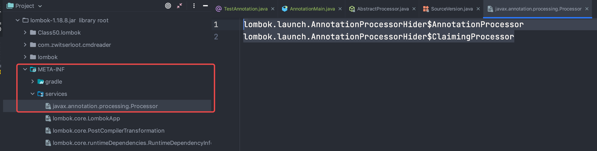

## 3、反射机制：(Reflection)

- [读取指定包的类](https://github.com/ronmamo/reflections)

### 3.1、基本介绍

运行时加载，探知使用编译期间完全未知的类；反射：将一个Java类中的所有信息映射成相应的Java类；

反射机制是在运行状态，对于任意一个类，都能够知道这个的类的所有属性和方法；对于任意一个对象，都能够调用它的任意方法和属性；

【一个类只有一个Class对象，这个对象包含了完整类的结构】
- `Class` 类`[java.lang.Class]`：反射的根源，各种类型----表示Java中的同一类事物
	- `Class`类获取：`.class、getClass、Class.forName(String className);`
	- `Field`：属性相关类，获取所有属性(包括 private)，`getDeclaredFields()`;
	- `Method`：方法相关类，`getDeclaredMethods();`，`method.invoke()`方法执行时，如果第一个参数为 null，则表示反射的方法为静态方法
	- `Constructor`： 构造器相关类，`getDeclaredConstructors()`;

	如果需要访问私有的，则需`setAccessible(true);`

- 反射机制性能问题：反射会降低程序的效率，如果在开发中确实需要使用到反射，可以将setAccessible设为 true ：即取消Java语言访问检查;

class对象是可以说是反射中最常用的，获取class对象的方式的主要有三种
- 根据类名：`类名.class`
- 根据对象：`对象.getClass()`
- 根据全限定类名：`Class.forName(全限定类名)`

再来看看 **Class类的方法**
| 方法名                                              | 说明                                                         |
| --------------------------------------------------- | ------------------------------------------------------------ |
| forName()                                           | (1)获取Class对象的一个引用，但引用的类还没有加载(该类的第一个对象没有生成)就加载了这个类。<br/>(2)为了产生Class引用，forName()立即就进行了初始化。 |
| Object-getClass()                                   | 获取Class对象的一个引用，返回表示该对象的实际类型的Class引用。 |
| getName()                                           | 取全限定的类名(包括包名)，即类的完整名字。                   |
| getSimpleName()                                     | 获取类名(不包括包名)                                         |
| getCanonicalName()                                  | 获取全限定的类名(包括包名)                                   |
| isInterface()                                       | 判断Class对象是否是表示一个接口                              |
| getInterfaces()                                     | 返回Class对象数组，表示Class对象所引用的类所实现的所有接口。 |
| getSupercalss()                                     | 返回Class对象，表示Class对象所引用的类所继承的直接基类。应用该方法可在运行时发现一个对象完整的继承结构。 |
| newInstance()                                       | 返回一个Oject对象，是实现“虚拟构造器”的一种途径。使用该方法创建的类，必须带有无参的构造器。 |
| getFields()                                         | 获得某个类的所有的公共（public）的字段，包括继承自父类的所有公共字段。 类似的还有getMethods和getConstructors。 |
| getDeclaredFields                                   | 获得某个类的自己声明的字段，即包括public、private和proteced，默认但是不包括父类声明的任何字段。类似的还有getDeclaredMethods和getDeclaredConstructors。 |

**getName、getCanonicalName与getSimpleName的区别**：
- getSimpleName：只获取类名
- getName：类的全限定名，jvm中Class的表示，可以用于动态加载Class对象，例如Class.forName。
- getCanonicalName：返回更容易理解的表示，主要用于输出（toString）或log打印，大多数情况下和getName一样，但是在内部类、数组等类型的表示形式就不同了。
```java
public class Test {
    private class inner {}
    public static void main(String[] args) throws ClassNotFoundException {
        //普通类
        System.out.println(Test.class.getSimpleName()); //Test
        System.out.println(Test.class.getName()); //com.blue.fish.example.reflect.Test
        System.out.println(Test.class.getCanonicalName()); //com.blue.fish.example.reflect..Test
        //内部类
        System.out.println(inner.class.getSimpleName()); //inner
        System.out.println(inner.class.getName()); //com.blue.fish.example.reflect..Test$inner
        System.out.println(inner.class.getCanonicalName()); //com.blue.fish.example.reflect..Test.inner
        //数组
        System.out.println(args.getClass().getSimpleName()); //String[]
        System.out.println(args.getClass().getName()); //[Ljava.lang.String;
        System.out.println(args.getClass().getCanonicalName()); //java.lang.String[]
        //我们不能用getCanonicalName去加载类对象，必须用getName
        //Class.forName(inner.class.getCanonicalName()); 报错
        Class.forName(inner.class.getName());
    }
}
```

### 3.2、Constructor:反射获取构造函数

通过Class对象可以获取某个类中的,构造方法

**批量的方法：**
```java
public Constructor[] getConstructors(); // 所有"公有的"构造方法
public Constructor[] getDeclaredConstructors(); // 获取所有的构造方法(包括私有、受保护、默认、公有)
```

**获取单个的方法，并调用：**
```java
public Constructor getConstructor(Class... parameterTypes); // 获取单个的"公有的"构造方法：
public Constructor getDeclaredConstructor(Class... parameterTypes); // 获取"某个构造方法"可以是私有的，或受保护、默认、公有；
```

**调用构造方法：**
```java
// Constructor 的 newInstance 方法
public T newInstance(Object ... initargs){}
```
忽略访问权限：`con.setAccessible(true);`

### 3.3、反射获取属性

**批量的获取属性：**
```java
Field[] getFields(); // 获取所有的"公有字段"
Field[] getDeclaredFields(); // 获取所有字段，包括：私有、受保护、默认、公有；
```

**获取单个：**
```java
public Field getField(String fieldName); // 获取某个"公有的"字段；
public Field getDeclaredField(String fieldName); // 获取某个字段(可以是私有的)
```

**设置字段的值：**
```java
// Field类
public void set(Object obj,Object value){
	// obj: 要设置的字段所在的对象；
	// value: 要为字段设置的值；
}
```
> 如果我们不期望获取其父类的字段，则需使用Class类的`getDeclaredField/getDeclaredFields`方法来获取字段即可，倘若需要连带获取到父类的字段，那么请使用Class类的`getField/getFields`；

### 3.4、反射获取方法

**批量获取方法：**
```java
public Method[] getMethods(); // 获取所有"公有方法"；（包含了父类的方法也包含Object类）
public Method[] getDeclaredMethods(); // 获取所有的成员方法，包括私有的(不包括继承的)
```

**获取单个方法：**
```java
// 参数
// name: 方法名；
// Class ... : 形参的Class类型对象
public Method getMethod(String name,Class<?>... parameterTypes){} // 获取指定公有的方法
public Method getDeclaredMethod(String name,Class<?>... parameterTypes){}
```

**调用方法：**
```java
public Object invoke(Object obj, Object... args) {
	// obj : 要调用方法的对象；
 	// args:调用方式时所传递的实参；
}
```

- 使用反射调用类的main方法：
	```java
	Method method = Demo.class.getMethod("main"，String[].class);
	method.invoke(null， (Object)new String[]{"111"，"222"，"333"});
	```
	*注意：传入参数时不能直接传一个数组，jdk为了兼容1.5版本以下的，会将其拆包；因此这里将其强转或者直接将String数组放入Object数组也可以*

> 在通过getMethods方法获取Method对象时，会把父类的方法也获取到；而`getDeclaredMethod/getDeclaredMethods`方法都只能获取当前类的方法；

> `getReturnType方法/getGenericReturnType`方法都是获取Method对象表示的方法的返回类型，只不过前者返回的Class类型后者返回的Type(前面已分析过)，Type就是一个接口而已，在Java8中新增一个默认的方法实现，返回的就参数类型信息；

### 3.5、反射操作泛型

- ①、Java 采用泛型擦除的机制来引入泛型。Java中的泛型仅仅是给编译器使用的，确保数据的安全性和免去强制类型转换的麻烦；但是一旦编译完成，所有和泛型有关的类型全部擦除;
- ②、为了通过反射操作泛型，Java有 `ParameterizedType、GenericArrayType、TypeVariable、WildcardType`几种类型来代表不能被归一到Class类中的类型但是又和原始类型齐名的类型；
	- `Type`是Java编程语言中所有类型的公共高级接口。它们包括原始类型、参数化类型、数组类型、类型变量和基本类型
	- `ParameterizedType` ：参数化类型
	- `GenericArrayType`：元素类型是参数化类型或者类型变量的数组类型
	- `TypeVariable`：各种类型变量的公共父接口
	- `WildcardType`：表示一种通配符类型表达式;

### 3.6、反射操作注解

```java
getAnnotation(Class<A> annotationClass);
getAnnotations();
```

### 3.7、数组的反射

- 一个问题：
```java
int[] a1 = new int[]{1，2，3};
String[] a2 = new String[]{"a"，"b"，"c"};
System.out.println(Arrays.asList(a1)); // 输出： [[I@24c98b07]
System.out.println(Arrays.asList(a2)); // 输出：[a， b， c]
// 原因：
// 在jdk1.4：asList(Object[] a);<br>
// 在jdk1.5：asList(T... a);<br>
```
int数组在编译运行时不会被认为为一个Object数组，因此其将按照一个数组对象来处理；

- 基本类型的一维数组可以被当作Object类型处理，不能被当作`Object[]`类型使用非基本类型的一维数组既可以当作Object类型使用，也可以当作Object[]类型使用；
Array 工具类可完成数组的反射操作;

### 3.8、反射注意点

- 反射的应用：实现框架功能，使用类加载器加载文件
- 反射时基本类型与包装类型注意问题
	- 反射中基本类型的class和其对应包装类的class是不同的，所以在获得Method指定参数时需要精确指定参数的类型，即基本类型参数 int 是无法使用包装类型 Integer 来获得的
	- 反射调用基本类型参数方法除了可以通过 基本类型名`.class`外还可以通过对应包装类的静态字段`TYPE`获得，`int.class 等价于 Integer.TYPE`；
	
	```java
	Class clzss = byte.class;
	Class clzss = short.class;
	Class clzss = int.class;
	Class clzss = long.class;
	Class clzss = char.class;
	Class clzss = float.class;
	Class clzss = double.class;
	Class clzss = boolean.class;
	Class clzss = void.class;
	
	Byte.TYPE = byte.class;
	Short.TYPE = short.class;
	Integer.TYPE = int.class;
	Long.TYPE = long.class;
	Char.TYPE = char.class;
	Float.TYPE = float.class;
	Double.TYPE = double.class;
	Boolean.TYPE = boolean.class;
	Void.TYPE = void.class;
	
	Class clzss = int[].class; //int[] 数组
	Class clzss = String[].class; //String[] 数组
	Class clzss = String[][].class; //String[][] 数组的数组
	```

- 反射与工厂模式

### 3.9、反射原理

- [JVM是如何实现反射的](https://heapdump.cn/article/3530561)

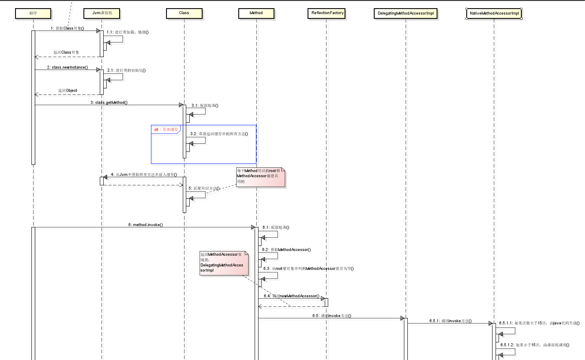

用几句话总结反射的实现原理：
- 反射类及反射方法的获取，都是通过从列表中搜寻查找匹配的方法，所以查找性能会随类的大小方法多少而变化；
- 每个类都会有一个与之对应的Class实例，从而每个类都可以获取method反射方法，并作用到其他实例身上；
- 反射也是考虑了线程安全的，放心使用；
- 反射使用软引用relectionData缓存class信息，避免每次重新从jvm获取带来的开销；
- 反射调用多次生成新代理Accessor, 而通过字节码生存的则考虑了卸载功能，所以会使用独立的类加载器；
- 当找到需要的方法，都会copy一份出来，而不是使用原来的实例，从而保证数据隔离；
- 调度反射方法，最终是由jvm执行invoke0()执行；

### 3.10、注解实现原理

如何获取到注解里的数据呢？通过反射

通过观察 Class、Contructor、Method、Field 几个跟反射先关的类，发现最终会实现一个接口: `AnnotatedElement`
```java
public final class Class<T> implements java.io.Serializable, GenericDeclaration, Type, AnnotatedElement {}
public final class Constructor<T> extends Executable {}
public final class Method extends Executable {}
public final class Field extends AccessibleObject implements Member {}
// Executable 继承自AccessibleObject, AccessibleObject 则是实现了
public abstract class Executable extends AccessibleObject implements Member, GenericDeclaration {}
public class AccessibleObject implements AnnotatedElement {}

public interface AnnotatedElement {
	// 判断是否包含某个注解
    default boolean isAnnotationPresent(Class<? extends Annotation> annotationClass) {
        return getAnnotation(annotationClass) != null;
    }
	// 获取具体的注解
    <T extends Annotation> T getAnnotation(Class<T> annotationClass);
	// 获取所有注解
    Annotation[] getAnnotations();
	 // 根据类型获得注解
    default <T extends Annotation> T[] getAnnotationsByType(Class<T> annotationClass) {
    }
	// 获取声明的注解
    default <T extends Annotation> T getDeclaredAnnotation(Class<T> annotationClass) {
    }
	// 通过类型获取声明的注解
    default <T extends Annotation> T[] getDeclaredAnnotationsByType(Class<T> annotationClass) {
    }
	// 获取声明注解列表
    Annotation[] getDeclaredAnnotations();
}
```
注解本质是一个继承了`java.lang.annotation.Annotation`的特殊接口，其具体实现类是Java运行时生成的动态代理类。而我们通过反射获取注解时，返回的是Java 运行时生成的动态代理对象`$Proxy1`。通过代理对象调用自定义注解（接口）的方法，会最终调用`AnnotationInvocationHandler`的invoke方法。该方法会从memberValues这个Map中索引出对应的值；

期间，在创建代理对象之前，解析注解时候 从该注解类的常量池中取出注解的信息，包括之前写到注解中的参数，然后将这些信息在创建 AnnotationInvocationHandler时候 ，传入进去作为构造函数的参数，当调用该代理实例的获取值的方法时，就会调用执行AnotationInvocationHandler里面的逻辑，将之前存入的注解信息 取出来；

代理的方法调用：`sun.reflect.annotation.AnnotationParser#annotationForMap`
```java
public static Annotation annotationForMap(final Class<? extends Annotation> type,final Map<String, Object> memberValues){
	return AccessController.doPrivileged(new PrivilegedAction<Annotation>() {
		public Annotation run() {
			return (Annotation) Proxy.newProxyInstance(type.getClassLoader(), new Class<?>[] { type },
				new AnnotationInvocationHandler(type, memberValues));
		}});
}
```

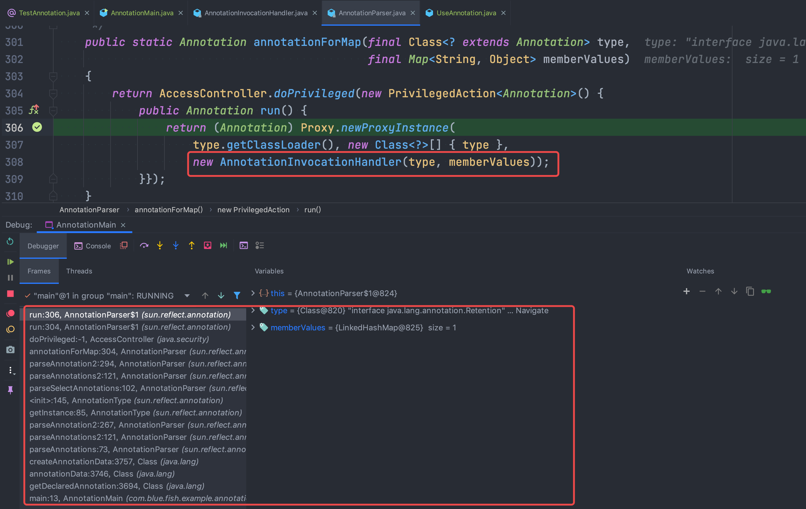

可以通过指定属性保存代理类：`-Djdk.proxy.ProxyGenerator.saveGeneratedFiles=true -XX:+TraceClassLoading`

**定义一个注解：**
```java
@Target(ElementType.TYPE)
@Retention(RetentionPolicy.RUNTIME)
public @interface TestAnnotation {
}
```
**反编译查看字节码：javap -verbose TestAnnotation**
```java
Classfile se/basis/annotation/TestAnnotation.class
  Last modified 2019-7-5; size 413 bytes
  MD5 checksum 11f8b11847f9f3a3813b91a80c97607d
  Compiled from "TestAnnotation.java"
public interface com.blue.fish.se.basis.annotation.TestAnnotation extends java.lang.annotation.Annotation
```

### 3.11、通过反射给注解设置值

首先获取注解的值：
```java
// ExportExcel 为一个注解，User中的字段都有ExportExcel注解
final Class<User> clazz = User.class;
final Field[] fields = clazz.getDeclaredFields();
for (Field field : fields) {
	field.setAccessible(true);
	final ExportExcel excel = field.getAnnotation(ExportExcel.class);
	System.out.println(excel.timezone());
}
```
给上面的timezone赋值：
```java
final Class<User> clazz = User.class;
final Field[] fields = clazz.getDeclaredFields();
for (Field field : fields) {
	field.setAccessible(true);
	final ExportExcel excel = field.getAnnotation(ExportExcel.class);
	final InvocationHandler handler = Proxy.getInvocationHandler(excel);
	final Field values = handler.getClass().getDeclaredField("memberValues");
	values.setAccessible(true);
	final Map<String, Object> map = (Map<String, Object>)values.get(handler);
	map.put("timezone", "GMT+11");
}
```
原理：通过上面一小节知道注解的实现原理，实际上是通过 Proxy创建的代理，其InvocationHandler类为 AnnotationInvocationHandler

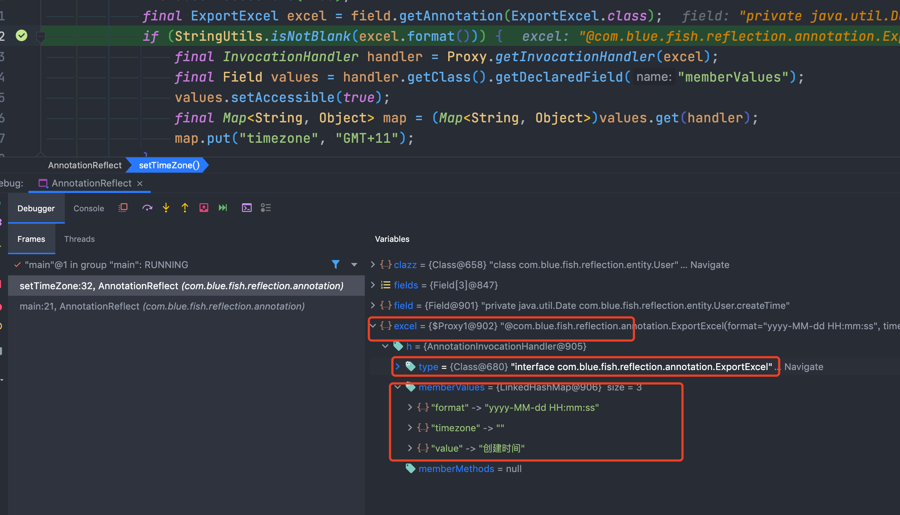
 
也就是说我们要设置值需要获取到 AnnotationInvocationHandler 属性 memberValues

 所以动态修改注解的值的方法为：通过反射得到excel的代理对象，然后得到代理对象的memberValues属性，修改访问权限，更新注解的value属性值；

## 4、动态编译：Java6.0引入动态编译

### 4.1.动态编译的两种方法

- 通过Runtime调用javac，启动新的进程去操作;
- 通过Javacompiler动态编译;

### 4.2、Javacompiler 动态编译

```java
JavaCompiler compile = ToolProvider.getSystemJavaCompiler();
int result = compile.run(null， null， null， "F:/class/HelloWorld.java");
/*
* run(InputStream in， OutputStream out， OutputStream err， String... arguments);
* 第一个参数： 为Java编译器提供参数;
* 第二个参数： 得到Java编译器输出的信息;
* 第三个参数： 接受编译器的错误信息;
* 第四个参数： 可变参数，能传入一个或多个Java源文件
* 返回值： 0 表示编译成功， 1 表示编译失败;
*/
```

### 4.3、动态运行动态编译的Java类

## 5、动态加载

动态执行Javascript(JDK6.0以上)
- 脚本引擎：Java 应该程序可以通过一套固定的接口与脚本引擎交互，从而可以在Java平台上调用各种脚本语言;
- js接口：Rhino 引擎，使用Java语言的javascript开源实现;

Java 动态加载与静态加载
- 编译时加载类是静态加载类：new 创建对象是静态加载类，在编译时刻时需要加载所有的可能使用到的类;
- 运行时刻加载类是动态加载(Class.forName(""));

## 6、Java 字节码操作

[字节码操作](../Java虚拟机/JVM-字节码.md)

### 6.1、Java 动态操作：字节码操作，反射

字节码操作：动态生存新的类；

优势：比反射开销小，性能高；

### 6.2、常见的字节码操作类库


### 6.3、Javasist

## 7、反射存在问题

### 7.1、反射慢的原因

- 编译器不能对代码对优化.
- 所有的反射操作都需要类似查表的操作，参数需要封装，解封装，异常也重新封装，rethrow等等

### 7.2、优化方式

- 灵活运用API，如果只是寻找某个方法，不要使用`getMethods()`后在遍历筛选，而是直接用`getMethod(methodName)`来根据方法名获取方法;
- 使用缓存：需要多次动态创建一个类的实例的时候.
- 使用代码动态生成技术，通过调用代理类的方式来模拟反射

## 8、元编程

一个程序可以把另一个程序作为数据；

## 9、反射注意的点

### 9.1、反射调用方法不是以传参决定重载

有两个叫 age 的方法，入参分别是基本类型 int 和包装类型 Integer。
```java
public class ReflectionIssueApplication {
  private void age(int age) {
      log.info("int age = {}", age);
  }
  private void age(Integer age) {
      log.info("Integer age = {}", age);
  }
}
```
果不通过反射调用，走哪个重载方法很清晰，比如传入 36 走 int 参数的重载方法，传入 `Integer.valueOf("36")` 走 Integer 重载；

但是使用反射的话，比如如下调用：
```java
getClass().getDeclaredMethod("age", Integer.TYPE).invoke(this, Integer.valueOf("36"));
```
通过输出的日志可以看到：
```
14:23:09.801 [main] INFO com.qing.fan.reflect.ReflectionIssueApp - int age = 36
```
getDeclaredMethod 传入的参数类型 `Integer.TYPE`代表的是 int，所以实际执行方法时无论传的是包装类型还是基本类型，都会调用 int 入参的 age 方法，把 `Integer.TYPE` 改为 `Integer.class`，执行的参数类型就是包装类型的 Integer。这时，无论传入的是 Integer.valueOf(“36”) 还是基本类型的 36：
```java
getClass().getDeclaredMethod("age", Integer.class).invoke(this, Integer.valueOf("36"));
getClass().getDeclaredMethod("age", Integer.class).invoke(this, 36);
```
输出结果：
```
14:25:18.028 [main] INFO com.qing.fan.reflect.ReflectionIssueApp - Integer age = 36
14:25:18.029 [main] INFO com.qing.fan.reflect.ReflectionIssueApp - Integer age = 36
```
> 反射调用方法，是以反射获取方法时传入的方法名称和参数类型来确定调用方法的；所以在有基本类型和包装类型重载的方法上，要特别注意，一般 Integer.TYPE 代表基本类型，Integer.class 代表包装类型参数；

### 9.2、泛型经过类型擦除多出桥接方法的坑

有如下代码
```java
class Parent<T> {
    AtomicInteger updateCount = new AtomicInteger();
    private T value;
    @Override
    public String toString() {
        return String.format("value: %s updateCount: %d", value, updateCount.get());
    }
    public void setValue(T value) {
        System.out.println("Parent.setValue called");
        this.value = value;
        updateCount.incrementAndGet();
    }
}
class Child2 extends Parent<String> {
    @Override
    public void setValue(String value) {
        System.out.println("Child2.setValue called");
        super.setValue(value);
    }
}
// 如下方式调用，发现Child2 和 Parent 的setValue方法被调用的两次
Arrays.stream(child2.getClass().getDeclaredMethods())
    .filter(method -> method.getName().equals("setValue"))
    .forEach(method -> {
        try {
            method.invoke(child1, "test");
        } catch (Exception e) {
            e.printStackTrace();
        }
    });
// 输出结果
Child2.setValue called
Parent.setValue called
Child2.setValue called
Parent.setValue called
value: test updateCount: 2
```
导致调用两次的原因是泛型类型擦除导致的问题：Java 的泛型类型在编译后擦除为 Object。虽然子类指定了父类泛型 T 类型是 String，但编译后 T 会被擦除成为 Object，所以父类 setValue 方法的入参是 Object，value 也是 Object。如果子类 Child2 的 setValue 方法要覆盖父类的 setValue 方法，那入参也必须是 Object。所以，编译器会为我们生成一个所谓的 bridge 桥接方法：
```java
Compiled from "GenericAndInheritanceApplication.java"
class com.blue.fish.example.base.reflect.Child2 extends com.blue.fish.example.base.reflect.Parent<java.lang.String> {
  com.blue.fish.example.base.reflect.Child2();
    Code:
       0: aload_0
       1: invokespecial #1                  // Method com/blue/fish/example/base/reflect/Parent."<init>":()V
       4: return

  public void setValue(java.lang.String);
    Code:
       0: getstatic     #2                  // Field java/lang/System.out:Ljava/io/PrintStream;
       3: ldc           #3                  // String Child2.setValue called
       5: invokevirtual #4                  // Method java/io/PrintStream.println:(Ljava/lang/String;)V
       8: aload_0
       9: aload_1
      10: invokespecial #5                  // Method com/blue/fish/example/base/reflect/Parent.setValue:(Ljava/lang/Object;)V
      13: return

  public void setValue(java.lang.Object);
    Code:
       0: aload_0
       1: aload_1
       2: checkcast     #6                  // class java/lang/String
       5: invokevirtual #7                  // Method setValue:(Ljava/lang/String;)V
       8: return
}
```
可以看到，入参为 Object 的 setValue 方法在内部调用了入参为 String 的 setValue 方法，也就是代码里实现的那个方法。如果编译器没有帮我们实现这个桥接方法，那么 Child2 子类重写的是父类经过泛型类型擦除后、入参是 Object 的 setValue 方法；

使用反射查询类方法清单时，我们要注意两点：
- getMethods 和 getDeclaredMethods 是有区别的，前者可以查询到父类方法，后者只能查询到当前类；
- 反射进行方法调用要注意过滤桥接方法；

## 10、反射实例化方式

通过反射实例化对象的方式有如下：
- `java.lang.Class.newInstance()`：方法在JDK9之后过期了
- `java.lang.reflect.Constructor.newInstance()`
- `sun.reflect.ReflectionFactory.newConstructorForSerialization().newInstance()`

（1）前两种初始化方式都会同时初始化类成员变量，但是最后一种通过 `ReflectionFactory.newConstructorForSerialization().newInstance()` 实例化类则不会初始化类成员变量；
```java
public class InitializeService {
    private final Person person = new Person(1, "张三");
}
public class InitializeVariables {
    public static void main(String[] args) {
		// InitializeService{person=Person(id=1, name=张三)}
        classNewInstance();
		// InitializeService{person=Person(id=1, name=张三)}
        constructorNewInstance();
		// InitializeService{person=null}
        reflectFactory();
    }
    private static void classNewInstance() {
        try {
            Class classType = Class.forName("com.blue.fish.example.base.reflect.instantiation.InitializeService");
            InitializeService test = (InitializeService) classType.newInstance();
            System.out.println(test);
        } catch (ClassNotFoundException | InstantiationException | IllegalAccessException e) {
            e.printStackTrace();
        }
    }
    private static void constructorNewInstance() {
        try {
            Class<?> classType = Class
                    .forName("com.blue.fish.example.base.reflect.instantiation.InitializeService");
            final Constructor<?> constructor = classType.getDeclaredConstructor();
            InitializeService test = (InitializeService) constructor.newInstance();
            System.out.println(constructor.newInstance());
        } catch (Exception e) {
            e.printStackTrace();
        }
    }
    private static void reflectFactory() {
        try {
            ReflectionFactory reflectionFactory = ReflectionFactory.getReflectionFactory();
            Constructor constructor = reflectionFactory.newConstructorForSerialization(InitializeService.class, Object.class.getDeclaredConstructor());
            InitializeService test1 = (InitializeService) constructor.newInstance();
            System.out.println(test1);
        } catch (Exception e) {
            e.printStackTrace();
        }
    }
}
```

（2）ReflectionFactory.newConstructorForSerialization 无需默认构造函数就可以反射生成对象，这个属性在很多的序列框架可以使用，比如 xml 转换成 bean，有了这个特性对 bean的 class 就没有特殊的要求，无需强制的构造函数就可以生成相应的bean的对象；
```java
public class ReflectInstantiation1 {
    private String id;
    private String name;
    public ReflectInstantiation1(String id, String name) {
        this.id = id;
        this.name = name;
    }
    ...
    private static void classNewInstance() {
        try {
            Class classType = Class.forName("com.reflect.instantiation.ReflectInstantiation1");
			// 报错：java.lang.NoSuchMethodException: com.reflect.instantiation.ReflectInstantiation1.<init>()
            ReflectInstantiation1 test = (ReflectInstantiation1) classType.newInstance();
        } catch (ClassNotFoundException | InstantiationException | IllegalAccessException e) {
            e.printStackTrace();
        }
    }
    private static void constructorNewInstance() {
        try {
            Class<?> classType = Class.forName("com.reflect.instantiation.ReflectInstantiation1");
			// 报错：java.lang.NoSuchMethodException: com.reflect.instantiation.ReflectInstantiation1.<init>()
            final Constructor<?> constructor = classType.getDeclaredConstructor();
            ReflectInstantiation1 test = (ReflectInstantiation1) constructor.newInstance();
        } catch (Exception e) {
            e.printStackTrace();
        }
    }
    private static void constructorNewInstance1() {
        try {
            Class<?> classType = Class.forName("com.reflect.instantiation.ReflectInstantiation1");
			// 正常执行
            final Constructor<?> constructor = classType.getDeclaredConstructor(String.class, String.class);
            ReflectInstantiation1 test = (ReflectInstantiation1) constructor.newInstance("StringId", "StringName");
        } catch (Exception e) {
            e.printStackTrace();
        }
    }
    private static void reflectFactory() {
        try {
            ReflectionFactory reflectionFactory = ReflectionFactory.getReflectionFactory();
			// 正常执行，也就是ReflectFactory无需无参构造函数也可以生成
            Constructor constructor = reflectionFactory
                    .newConstructorForSerialization(ReflectInstantiation1.class, Object.class.getDeclaredConstructor());
            constructor.setAccessible(true);
            ReflectInstantiation1 test1 = (ReflectInstantiation1) constructor.newInstance();
        } catch (Exception e) {

        }
    }
}
```


ReflectionFactory的实现里面有一个 constructorAccessor，其是通过字节码生成后进行加载的，并且每次加载的时候都是不同的`Classloader declaringClass.getClassLoader()).newInstance()`，如果一直大量的使用，不对Constructor 对象进行缓存，会不停的加载类 最终导致 Metaspace 空间不足，可能会频繁的触发 FullGC 的情况

# 十八、比较器：Comparale、Comparator

## 1、区别

- `Comparable` & `Comparator`都是用来实现集合中元素的比较、排序的：
	- `Comparable` 是在集合内部定义的方法实现的排序;
	- `Comparator` 是在集合外部实现的排序;

	所以，如想实现排序，就需要在集合外定义 Comparator 接口的方法或在集合内实现 Comparable 接口的方法

- `Comparator` 位于包 java.util下，而 Comparable 位于包 java.lang下
- `Comparable` 是一个对象本身就已经支持自比较所需要实现的接口，（如 String、Integer 自己就可以完成比较大小操作，已经实现了Comparable接口）；
- `Comparator` 是一个专用的比较器，当这个对象不支持自比较或者自比较函数不能满足你的要求时，你可以写一个比较器来完成两个对象之间大小的比较；
- 可以说一个是自已完成比较，一个是外部程序实现比较的差别而已
- 用 `Comparator` 是策略模式(strategy design pattern)，就是不改变对象自身；Comparable 而用一个策略对象(strategy object)来改变它的行为
- 有时在实现 `Comparator` 接口时，并没有实现equals方法，可程序并没有报错。原因是实现该接口的类也是Object类的子类，而Object类已经实现了equals方法

## 2、Comparable

一个实现了 Comparable 接口的类，可以让其自身的对象和其他对象进行比较。也就是说：同一个类的两个对象之间要想比较，对应的类就要实现`Comparable`接口，并实现compareTo()方法

## 3、Comparator

在一些情况下，你不希望修改一个原有的类，但是你还想让他可以比较，Comparator接口可以实现这样的功能。

- 通过使用Comparator接口，你可以针对其中特定的属性/字段来进行比较。比如，当我们要比较两个人的时候，我可能通过年龄比较、也可能通过身高比较。这种情况使用Comparable就无法实现(因为要实现Comparable接口，其中的compareTo方法只能有一个，无法实现多种比较)

- 通过实现Comparator接口同样要重写一个方法：compare()。接下来的例子就通过这种方式来比较HDTV的大小。其实Comparator通常用于排序。Java中的Collections和Arrays中都包含排序的sort方法，该方法可以接收一个Comparator的实例(比较器)来进行排序：

```java
class HDTV {
	private int size;
	private String brand;
	public HDTV(int size， String brand) {
		this.size = size;
		this.brand = brand;
	}
	public int getSize() {
		return size;
	}
	public void setSize(int size) {
		this.size = size;
	}
	public String getBrand() {
		return brand;
	}
	public void setBrand(String brand) {
		this.brand = brand;
	}
}
class SizeComparator implements Comparator<HDTV> {
	@Override
	public int compare(HDTV tv1， HDTV tv2) {
		int tv1Size = tv1.getSize();
		int tv2Size = tv2.getSize();

		if (tv1Size > tv2Size) {
			return 1;
		} else if (tv1Size < tv2Size) {
			return -1;
		} else {
			return 0;
		}
	}
}
public class Main {
	public static void main(String[] args) {
		HDTV tv1 = new HDTV(55， "Samsung");
		HDTV tv2 = new HDTV(60， "Sony");
		HDTV tv3 = new HDTV(42， "Panasonic");
		ArrayList<HDTV> al = new ArrayList<HDTV>();
		al.add(tv1);
		al.add(tv2);
		al.add(tv3);
		Collections.sort(al， new SizeComparator());
		for (HDTV a ： al) {
			System.out.println(a.getBrand());
		}
	}
}
```

- 经常会使用`Collections.reverseOrder()`来获取一个倒序的 Comparator：

```java
ArrayList<Integer> al = new ArrayList<Integer>();
al.add(3);
al.add(1);
al.add(2);
System.out.println(al);
Collections.sort(al);
System.out.println(al);
Comparator<Integer> comparator = Collections.reverseOrder();
Collections.sort(al，comparator);
System.out.println(al);
```

## 4、如何选择

- 一个类如果实现 Comparable 接口，那么他就具有了可比较性，意思就是说它的实例之间相互直接可以进行比较
- 通常在两种情况下会定义一个实现 Comparator 类可以把一个Comparator的子类传递给`Collections.sort()`、`Arrays.sort()`等方法，用于自定义排序规则。用于初始化特定的数据结构。常见的有可排序的Set(TreeSet)和可排序的Map(TreeMap);

# 十九、Jar包

https://juejin.cn/post/6971822360810749966

## 1、Jar包本质

Jar 包的本质是将多个文件聚集为一个 ZIP 包，与传统的 ZIP 文件不同的是 Jar 包不仅用于压缩和发布，而且还用于部署和封装库、组件和插件程序，并可被编译器和 JVM 等工具直接使用。在 Jar 包中包含特殊的文件，如 manifests 和部署描述符，用来指示工具如何处理特定的 Jar 包。此外 Jar 包提供了许多 ZIP 文件没有的优势和功能，譬如 Jar 包可以保证安全性（对 Jar 文件内容加上数字化签名）、增加传输平台扩展性（作为 Java 扩展框架）、密封性和跨平台特性；

## 2、Jar包下META-INF作用

很多 Jar 包包含一个 META-INF 目录，它用来存储包和扩展的配置数据（如安全性和版本信息），Java 平台会识别并解释 META-INF 目录下的文件来配置应用程序、扩展和类装载器。META-INF 目录包含的常见文件如下：
- `MANIFEST.MF`：这个 manifest 文件定义了与扩展和包相关的数据（譬如 java -jar 命令执行的 MainClass 就在这里面指定）。
- XXX.SF：这是 Jar 包的签名文件，其中 XXX 表示签名者。
- XXX.DSA：这是与签名文件相关联的签名程序块文件，它存储了用于签名 Jar 文件的公共签名。

## 3、MANIFEST.MF 文件解析

该文件包含了该Jar包的版本、创建人和类搜索路径等信息，当然如果是可执行Jar包，会包含Main-Class属性，表明Main方法入口，下面是从commons-io.jar下的MANIFEST.MF内容
```yml
Manifest-Version: 1.0
Export-Package: org.apache.commons.io;version="1.4.9999",org.apache.co
 mmons.io.comparator;version="1.4.9999",org.apache.commons.io.filefilt
 er;version="1.4.9999",org.apache.commons.io.input;version="1.4.9999",
 org.apache.commons.io.output;version="1.4.9999",org.apache.commons.io
 .monitor;version="2.5",org.apache.commons.io.serialization;version="2
 .5",org.apache.commons.io;version="2.5",org.apache.commons.io.compara
 tor;version="2.5",org.apache.commons.io.input;version="2.5",org.apach
 e.commons.io.output;version="2.5",org.apache.commons.io.filefilter;ve
 rsion="2.5"
Implementation-Title: Apache Commons IO
Built-By: bimargulies
Tool: Bnd-2.3.0.201405100607
Require-Capability: osgi.ee;filter:="(&(osgi.ee=JavaSE)(version=1.6))"
Implementation-Vendor: The Apache Software Foundation
Implementation-Vendor-Id: org.apache
Specification-Title: Apache Commons IO
Bundle-License: http://www.apache.org/licenses/LICENSE-2.0.txt
Bundle-SymbolicName: org.apache.commons.io
X-Compile-Target-JDK: 1.6
Implementation-Version: 2.5
Specification-Vendor: The Apache Software Foundation
Bundle-Name: Apache Commons IO
Created-By: Apache Maven Bundle Plugin
Implementation-URL: http://commons.apache.org/proper/commons-io/
X-Compile-Source-JDK: 1.6
Bundle-Vendor: The Apache Software Foundation
Build-Jdk: 1.7.0_85
Bundle-Version: 2.5.0
Bnd-LastModified: 1460639998694
Bundle-ManifestVersion: 2
Bundle-Description: The Apache Commons IO library contains utility cla
 sses, stream implementations, file filters, file comparators, endian 
 transformation classes, and much more.
Bundle-DocURL: http://commons.apache.org/proper/commons-io/
Include-Resource: META-INF/LICENSE.txt=LICENSE.txt,META-INF/NOTICE.txt
 =NOTICE.txt
Specification-Version: 2.5
Implementation-Build: tags/commons-io-2.5@r1739098; 2016-04-14 09:19:5
 4-0400
Archiver-Version: Plexus Archiver
```

### 3.1、格式规则

- 基本格式  属性名称：(空格)属性值 ;
- 每行最多72个字符，换行继续必须以空格开头 ;
- 文件最后一定是空行 ;
- Class-Path 当前路径是jar包所在目录，如果要引用当前目录下一个子目录中的jar包，使用以下格式  子目录/jar包名称 子目录/jar名称,注意多个jar包之间用空格分隔, 在任何平台上路径分割符都是 /;

### 3.2、内容分类

#### 3.2.1、一般属性

- Manifest-Version：用来定义manifest文件的版本，例如：Manifest-Version: 1.0
- Created-By：声明该文件的生成者，一般该属性是由jar命令行工具生成的，例如：Created-By: Apache Ant 1.5.3
- Signature-Version：定义jar文件的签名版本
- Class-Path：应用程序或者类装载器使用该值来构建内部的类搜索路径

#### 3.2.2、应用程序相关属性

Main-Class：定义jar文件的入口类，该类必须是一个可执行的类，一旦定义了该属性即可通过 java -jar xxx.jar来运行该jar文件

#### 3.2.3、包扩展属性

- Implementation-Title     定义了扩展实现的标题
- Implementation-Version  定义扩展实现的版本
- Implementation-Vendor  定义扩展实现的组织
- Implementation-Vendor-Id    定义扩展实现的组织的标识
- Implementation-URL 定义该扩展包的下载地址(URL)
- Specification-Title    定义扩展规范的标题
- Specification-Version      定义扩展规范的版本
- Specification-Vendor      声明了维护该规范的组织
- Sealed 定义jar文件是否封存，值可以是true或者false (这点我还不是很理解)

#### 3.2.4、小程序(Applet)相关属性

- Extendsion-List：该属性指定了小程序需要的扩展信息列表，列表中的每个名字对应以下的属性
- `<extension>`-Extension-Name：定义了Jar文件的唯一标识
- `<extension>`-Specification-Version：定义扩展规范的版本
- `<extension>`-Implementation-Version：定义了扩展实现的版本
- `<extension>`-Implementation-Vendor-Id：定义了扩展实现的供应商版本编号
- `<extension>`-Implementation-URL：该jar文件最新版本的下载地址

#### 3.2.5、扩展标识属性

Extension-Name该属性定义了jar文件的唯一标识符

#### 3.2.6、签名相关属性

### 3.3、MANIFEST.MF信息的获取

可以通过java.util.jar这个类库来获取
```java
import java.io.File;  
import java.util.Map;  
import java.util.jar.Attributes;  
import java.util.jar.JarFile;  
import java.util.jar.Manifest;  
publicclass ManifestUtil {  
    publicstaticvoid main(String[] args) throws Exception {  
        JarFile jar = new JarFile(new File("out/artifacts/attacher/attacher.jar"));
        Manifest manifest = jar.getManifest();
        Attributes mainAttributes = manifest.getMainAttributes();
        for (Map.Entry<Object, Object> attrEntry : mainAttributes.entrySet()) {
            System.out.println("main\t" + attrEntry.getKey() + "-->" + attrEntry.getValue());
        }
        Map<String, Attributes> entries = manifest.getEntries();
        for (Map.Entry<String, Attributes> entry : entries.entrySet()) {
            Attributes values = entry.getValue();
            for (Map.Entry<Object, Object> attrEntry : values.entrySet()) {
                System.out.println(attrEntry.getKey() + "-->" + attrEntry.getValue());
            }
        }
    }  
}  
```

## 4、Jar 包签名

- Jar 包可以用 jarsigner 工具或者直接通过 java.security API 进行签名来保证安全性。一个签名的 Jar 包与原来的 Jar 包代码部分完全相同，只是更新了它的  manifest 且在 META-INF 目录中增加了一个签名文件和一个签名块文件；
- Jar 包签名采用公钥/密钥机制，通过公钥对被秘钥加密的文件进行解密来验证文件的安全性。Jar 包签名可以防止恶意者冒充某个组织发布 Jar 包，从而避免了被篡改的恶意安全风险。当 Jar 包被签名时，一个签名文件（XXX.SF）会自动在 META-INF 文件夹中生成，该文件夹中同时还含有 manifest 文件、公钥文件，manifest 文件中包含 Jar 包中每个文件的摘要信息，然而签名文件中则包含的是 manifest 文件中每个摘要项的摘要，当 Jar 签名被验证时首先对 Jar 中每个文件进行摘要计算，然后与 manifest 中已记录的摘要进行比较来判断文件是否更改过，同时还要计算 manifest 文件的摘要，并与签名文件比较，以验证 manifest 文件是否被修改过

## 5、打包

使用Idea打包生成指定的`MANIFEST.MF`文件

### 5.1、打包Java工程

- 新建Java工程
- 新建文件：`META-INF/MANIFEST.MF`

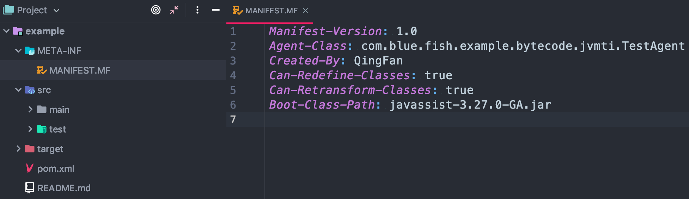

- 编写Java类:
	```java
	package agent;
	import java.lang.instrument.Instrumentation;
	public class TestAgent {
		/**
		* 该方法在main方法之前运行，与main方法运行在同一个JVM中 并被同一个System ClassLoader装载
		* 被统一的安全策略(security policy)和上下文(context)管理
		*/
		public static void premain(String agentOps, Instrumentation inst) {
			System.out.println("=========premain方法执行========");
			System.out.println(agentOps);
			// 添加Transformer
			inst.addTransformer(new MyTransformer());
		}
		/**
		* 如果不存在 premain(String agentOps, Instrumentation inst) 则会执行 premain(String
		* agentOps)
		*/
		public static void premain(String agentOps) {
			System.out.println("====premain方法执行2====");
			System.out.println(agentOps);
		}
	}
	```
- 在`MANIFEST.MF` 添加需要添加的数据：
	```
	Manifest-Version: 1.0
	Premain-Class: com.blue.fish.example.bytecode.jvmti.TestAgent
	Can-Redefine-Classes: true
	Can-Retransform-Classes: true
	Boot-Class-Path: javassist-3.18.1-GA.jar
	```
- 打开：`File -> Project Structure`，找到`Artifacts`，点击 `+` 添加操作，如下：

	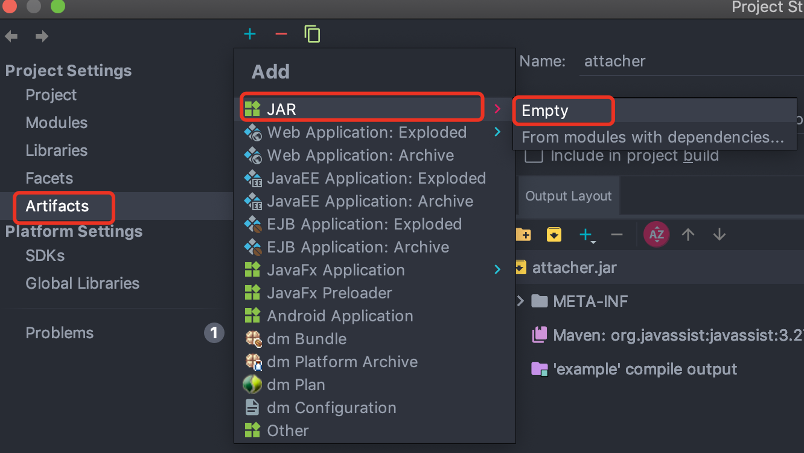

- 编辑该artifacts：

	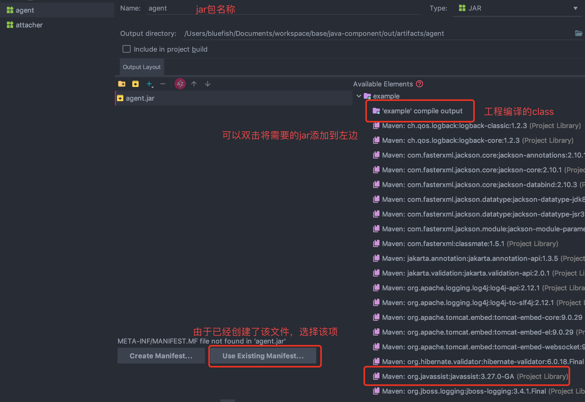

- 指定`MainClass`

	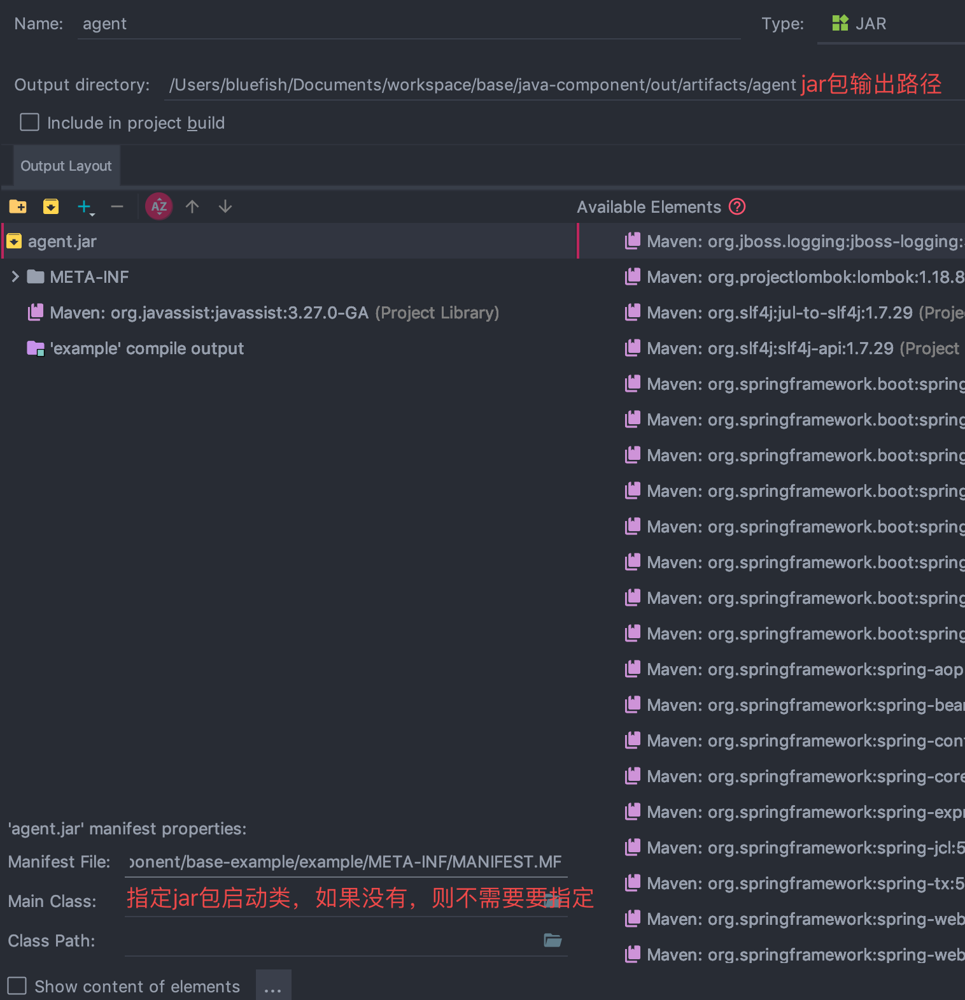

- 选择 `Buile -> Build Artifacts`，弹出选择action，执行`build`

	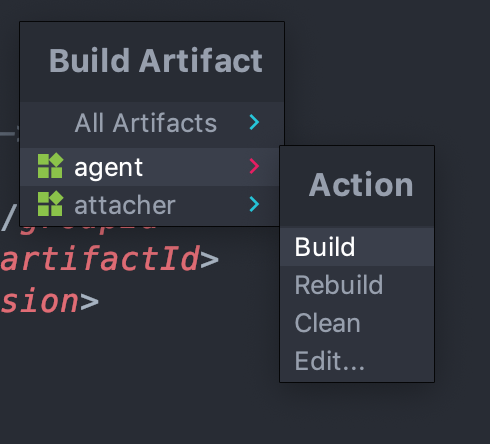

### 5.2、maven工程打包

直接在pom文件加入插件

```xml
<plugin>
	<groupId>org.apache.maven.plugins</groupId>
	<artifactId>maven-jar-plugin</artifactId>
	<version>2.3.1</version>
	<configuration>
		<archive>
			<manifest>
				<addClasspath>true</addClasspath>
			</manifest>
			<manifestEntries>
				<Premain-Class>com.blue.fish.AgentBoot</Premain-Class>
				<Agent-Class>com.blue.fish.AgentBoot</Agent-Class>
				<Can-Redefine-Classes>true</Can-Redefine-Classes>
				<Can-Retransform-Classes>true</Can-Retransform-Classes>
			</manifestEntries>
		</archive>
	</configuration>
</plugin>
```

### 5.3、使用jar命令打包

```
用法: jar {ctxui}[vfmn0PMe] [jar-file] [manifest-file] [entry-point] [-C dir] files ...
选项:
    -c  创建新档案
    -t  列出档案目录
    -x  从档案中提取指定的 (或所有) 文件
    -u  更新现有档案
    -v  在标准输出中生成详细输出
    -f  指定档案文件名
    -m  包含指定清单文件中的清单信息
    -n  创建新档案后执行 Pack200 规范化
    -e  为捆绑到可执行 jar 文件的独立应用程序
        指定应用程序入口点
    -0  仅存储; 不使用任何 ZIP 压缩
    -P  保留文件名中的前导 '/' (绝对路径) 和 ".." (父目录) 组件
    -M  不创建条目的清单文件
    -i  为指定的 jar 文件生成索引信息
    -C  更改为指定的目录并包含以下文件
如果任何文件为目录, 则对其进行递归处理。
清单文件名, 档案文件名和入口点名称的指定顺序
与 'm', 'f' 和 'e' 标记的指定顺序相同。

示例 1: 将两个类文件归档到一个名为 classes.jar 的档案中:
       jar cvf classes.jar Foo.class Bar.class
示例 2: 使用现有的清单文件 'mymanifest' 并
           将 foo/ 目录中的所有文件归档到 'classes.jar' 中:
       jar cvfm classes.jar mymanifest -C foo/ .
```
> 注意：m f 这两个指令的顺序要和后面 清单文件名和归档文件名的顺序保持一致

#### 5.3.1、打包一个可执行的jar

```
public class Main {
    public static void main(String[] args) {
        System.out.println("hello world");
        People people = new People("mike",22);
        people.print();
    }
}
```

#### 5.3.2、打包一个agent

比如在目录`jvm`下有一个Java源文件：InstrumentionAgent.java，内容如下
```java
package jvm;
import java.lang.instrument.Instrumentation;
class InstrumentationAgent {
    private static volatile Instrumentation globalInstrumentation;
    public static void premain(final String agentArgs, final Instrumentation inst) {
        globalInstrumentation = inst;
    }
    public static long getObjectSize(final Object object) {
        if (globalInstrumentation == null) {
            throw new IllegalStateException("Agent not initialized.");
        }
        return globalInstrumentation.getObjectSize(object);
    }
}
```
首先编译该文件：`javac InstrumentionAgent.java`

创建文件：`MANIFEST.MF`，文件内容如下：
```
Premain-class: jvm.InstrumentationAgent
```
打包文件：`jar -cvmf MANIFEST.MF InstrumentationAgent.jar InstrumentionAgent.class`

## 6、war包和jar包的区别

- war文件代表了一个Web应用程序，jar是类的归档文件

- war是一个web模块，其中需要包括WEB-INF，是可以直接运行的WEB模块。而jar一般只是包括一些class文件，在声明了Main_class之后是可以用java命令运行的；

- war包中的文件按一定目录结构来组织：通常其根目录下包含有Html和Jsp文件或者包含这两种文件的目录，另外还会有一个WEB-INF目录，通常在WEB-INF目录下有一个web.xml文件和一个classes目录，web.xml是这个应用的配置文件，而classes目录下则包含编译好的Servlet类和Jsp或Servlet所依赖的其它类（如JavaBean）。通常这些所依赖的类也可以打包成JAR放到WEB-INF下的lib目录下，当然也可以放到系统的CLASSPATH中，但那样移植和管理起来不方便。

## 7、如何将开源项目本地打包

每个开源项目都有一个文件：CONTRIBUTING.md，阅读该文件可以找到对应的方法。JDK打包可以搜索文件：jdk building.jdk

## 8、调试jar包启动

调试springboot的jar包启动

### 8.1、配置准备

比如我们要调试jar包的启动，创建一个springboot应用：debug-jar-launch，在pom中增加如下配置：
```xml
<build>
	<finalName>debug-jar-launcher</finalName>
	<plugins>
		<plugin>
			<groupId>org.springframework.boot</groupId>
			<artifactId>spring-boot-maven-plugin</artifactId>
			<configuration>
				<mainClass>com.blue.fish.debug.jar.DebugJarLaunchApplication</mainClass>
			</configuration>
			<executions>
				<execution>
					<goals>
						<goal>repackage</goal>
					</goals>
				</execution>
			</executions>
		</plugin>
	</plugins>
</build>
```
因为引入了spring-boot-maven-plugin，package生成的jar里包含META-INF/MANIFEST.MF文件，其内容如下
```
Manifest-Version: 1.0
Spring-Boot-Classpath-Index: BOOT-INF/classpath.idx
Implementation-Title: debug-jar-launch
Implementation-Version: 0.0.1-SNAPSHOT
Spring-Boot-Layers-Index: BOOT-INF/layers.idx
Start-Class: com.blue.fish.debug.jar.DebugJarLaunchApplication
Spring-Boot-Classes: BOOT-INF/classes/
Spring-Boot-Lib: BOOT-INF/lib/
Build-Jdk-Spec: 1.8
Spring-Boot-Version: 2.5.3
Created-By: Maven Jar Plugin 3.2.0
Main-Class: org.springframework.boot.loader.JarLauncher
```
其中Main-Class: org.springframework.boot.loader.JarLauncher才是真正的项目运行开始之地，而Start-Class: com.blue.fish.debug.jar.DebugJarLaunchApplication 也就是我们定义的main方法只在Main-Class之后运行的。

### 8.2、准备jar包

因为debug的是 org.springframework.boot.loader.JarLauncher，需要特殊操作，首先，在项目中引入spring-boot-loader依赖
```xml
<dependency>
	<groupId>org.springframework.boot</groupId>
	<artifactId>spring-boot-loader</artifactId>
</dependency>
```
打包
```
mvn clean package -DskipTests
```
在target目录下有一个jar包：debug-jar-launcher.jar

### 8.3、调试

在idea上：Edit Configuration ，通过idea的JAR Application配置jar和源码的位置

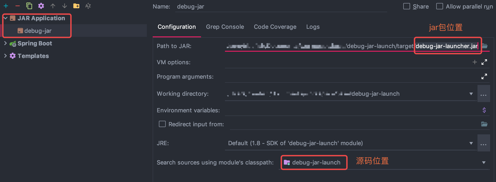

debuging开始，在代码中打开JarLauncher MainMethodRunner并打上断点标记

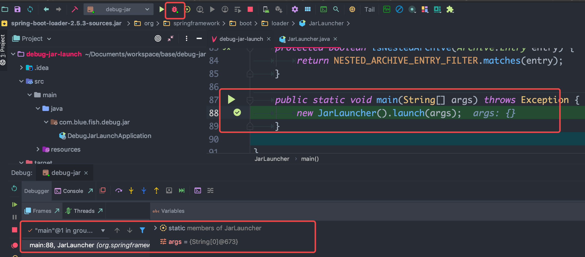
	
## 9、读取jar包资源

### 9.1、读取jar包路径

```java
String folderName = "i18n";
// jar:file:/D:/workspace/test-api/target/test-api-1.0-SNAPSHOT.jar!/BOOT-INF/classes!/i18n
URL url = Thread.currentThread().getContextClassLoader().getResource(folderName);
String jarPath = url.getFile().substring(url.getFile().indexOf(":") + 2, url.getFile().indexOf("!"));
JarFile jarFile = new JarFile(new File(jarPath));
```

### 9.2、读取jar包文件

一般jar包要导出的文件可以放到目录：`src/main/resources`
```
│  pom.xml
└─src
    ├─main
    │  └─resources
    │      │  application.properties
    │      │  export.xls
```
读取resources目录下的文件
```java
// 方式1：通过 ClassPathResource
ClassPathResource resource = new ClassPathResource("filename");
InputStream inputStream = resource.getInputStream();
// 方式2：通过研究 ClassPathResource源码发现可以使用如下方式：
InputStream inputStream = Thread.currentThread().getContextClassLoader().getResourceAsStream("filename");
```
	
## 10、Jar包混淆

- [spring-boot混淆代码](https://github.com/chenlanqing/spring-boot-2-api)
- [springboot如何进行混淆加密（proguard+xjar）](https://juejin.cn/post/7120188938047717406)
- [混淆插件：guardsquare](https://www.guardsquare.com/manual/home)


# 二十、Java中的null

* [Java中的null](https://www.cnblogs.com/greatfish/p/5906617.html)

首先看一段代码：
```java
public class Null {
	public static void nihao() {
		System.out.println("你好陌生人");
	}
	public static void main(String[] args) {
		((Null) null).nihao();
	}
}
```
输出结果：你好陌生人

- `null`是Java中的关键字，它不属于任何类型，只是一种特殊的值，也可以说说代表一个不确定的对象
    ```java
    public static void main(String[] args) {
		System.out.println(null instanceof Object); // false
	}
    ```
- `null`是所有引用类型的默认值
- `null`可以被转化为任何类型，输出`null`不会抛出任何异常，这和println()的源代码有关
    ```java
    public static void main(String[] args) {
		Object o = (Object)null;
		Integer i = (Integer)null;
		String s = (String )null;
		Null n = (Null)null;
		System.out.println(o);
		System.out.println(i);
		System.out.println(s);
		System.out.println(n);
	}
    ```
- `null`可以被转化为任何类型，所以可以调用静态方法；
- `null`可以被转化为任何类型，但是不能调用非静态方法，运行时会出错；
- `null`被强转化任何类型后，它还仅仅是一个特殊值，并不属于任何类型。
- `null==null`返回true，被转换为同种类型的null，都返回true，不同类型直接编译报错；
- 用String转换后的null可以进行字符串运算，这是因为字符串进行连接的时候，编译器对`null`进行了特别的优，其实就是例化`StringBuilder`，在调用`append()`方法时对`null`的一个特别处理，当为null时，转化为“null”，最后调用`toString()`返回一个String对象；
- 用八大基本类型转换后的`null`，不可以进行基本类型的运算，否则会出现编译或者运行错误；
- `null`和`""`并不相等，因为下面的s并没有指向某一块内存，而s1指向了一块空字符串的内存；


# 二十一、本地方法(native)

- [Linux下跨语言调用C++实践](https://mp.weixin.qq.com/s/vA69QGfZeKRlxZs_v_DQkw)
- [Java-JNI-Demo](https://liuyehcf.github.io/2018/01/13/Java-JNI-Demo/)

## 1、本地方法加载

JDK 提供给了我们两个方法用于载入库文件，一个是`System.load(String filename)`方法，另一个是`System.loadLibrary(String libname)`方法，他们的区别主要如下：

- 加载的路径不同：
    - `System.load(String filename)` 是从作为动态库的本地文件系统中以指定的文件名加载代码文件，文件名参数必须是完整的路径名且带文件后缀
    - `System.loadLibrary(String libname)` 是加载由`libname`参数指定的系统库（系统库指的是`java.library.path`，可以通过` System.getProperty(String key)` 方法查看 java.library.path 指向的目录内容），将库名映射到实际系统库的方法取决于系统实现，譬如在 Android 平台系统会自动去系统目录、应用 lib 目录下去找 libname 参数拼接了 lib 前缀的库文件;
- 是否自动加载库的依赖库:

    譬如libA.so 和 libB.so 有依赖关系
    - 如果选择 `System.load("/sdcard/path/libA.so")`，即使 libB.so 也放在 `/sdcard/path/` 路径下，load 方法还是会因为找不到依赖的 libB.so 文件而失败，因为虚拟机在载入 libA.so 的时候发现它依赖于 libB.so，那么会先去 java.library.path 下载入 libB.so，而 libB.so 并不位于 `java.library.path` 下，所以会报错；
    - 使用 `System.loadLibrary("A")`，然后把 libA.so 和 libB.so 都放在 `java.library.path` 下即可

## 2、如何编写本地方法

https://www.kancloud.cn/xyang0917/blogjnindk/117014


# 参考文章

* [枚举的线程安全性及序列化问题](http://www.hollischuang.com/archives/197)
* [Java各个版本特性最全总结](https://mp.weixin.qq.com/s/wQW3tZmCs50RjzMtbxOgpQ)
* [Java8新特性](https://www.jianshu.com/p/5b800057f2d8)
* [JDK8新特性指南](http://www.open-open.com/lib/view/open1403232177575.html)
* [位运算](http://www.nowcoder.com/courses/1/8/1)
