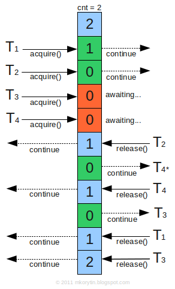
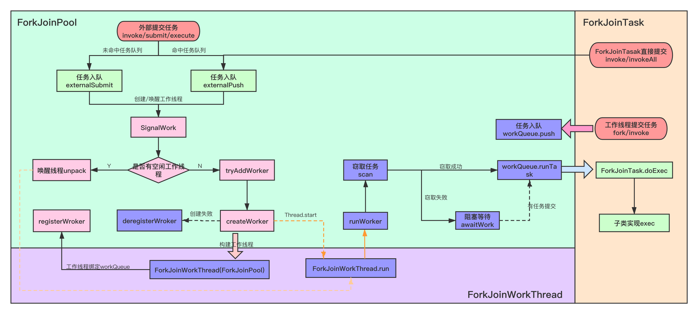
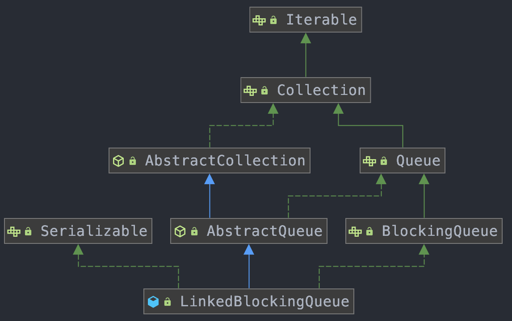
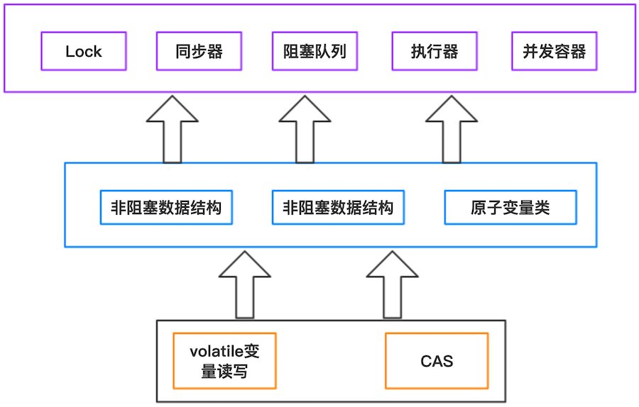

# 一、JUC包

所有AQS和重入锁不是通过继承实现的，而是通过组合实现的

Lock框架和Tools类


从整体来看，concurrent包的实现示意图：


## 1、JUC原子类

目的是对相应的数据进行原子操作。所谓原子操作，是指操作过程不会被中断，保证数据操作是以原子方式进行的，原子类都是在`java.util.concurrent.atomic`

### 1.1、原子类概览

- 基本类型：AtomicInteger、AtomicLong、AtomicBoolean；JDK8 新增原子化累加器：DoubleAdder、DoubleAccumulator、LongAdder、LongAccumulator，这四个类仅仅用来支持累加操作；

- 数组类型（原子更新数组）：AtomicIntegerArray、AtomicLongArray、AtomicReferenceArray；

- 引用类型（原子更新引用类型）：AtomicReference、AtomicStampedReference（原子更新引用类型, 内部使用Pair来存储元素值及其版本号）、AtomicMarkableReference（原子更新带有标记位的引用类型）；这三个类提供的方法都差不多，首先构造一个引用对象，然后把引用对象set进Atomic类，然后调用compareAndSet等一些方法去进行原子操作，原理都是基于Unsafe实现，但AtomicReferenceFieldUpdater略有不同，更新的字段必须用volatile修饰；

- 对象的属性修改类型（原子更新字段类）：AtomicIntegerFieldUpdater、AtomicLongFieldUpdater、AtomicReferenceFieldUpdater，对普通变量可以进行升级操作，使用这三个原子类需要注意以下几点：
    - 对象必须是volatile类型的，只有这样才能保证可见性。否则会抛出`IllegalArgumentException`异常；
    - 不能将变量声明为static的；
    - 不能是私有变量，即private修饰的； 
    - 只能是可修改变量，不能使final变量，因为final的语义就是不可修改

- Adder累加器：LongAdder、DoubleAdder；本质上是空间换时间；

- Accumulator累加器：LongAccumulator、DoubleAccumulator，适合大量和并行计算

基本上原子类内部操作：
- volatile保证线程的可见性，多线程并发时，一个线程修改数据，可以保证其它线程立马看到修改后的值
- CAS 保证数据更新的原子性；

### 1.2、各类原子类使用

- AtomicInteger，常用API：
    ```java
    public final int get()：获取当前的值
    public final int getAndSet(int newValue)：获取当前的值，并设置新的值
    public final int getAndIncrement()：获取当前的值，并自增
    public final int getAndDecrement()：获取当前的值，并自减
    public final int getAndAdd(int delta)：获取当前的值，并加上预期的值
    void lazySet(int newValue): 最终会设置成newValue,使用lazySet设置值后，可能导致其他线程在之后的一小段时间内还是可以读到旧的值。
    ```

- AtomicLong 是作用是对长整形进行原子操作。

    在32位操作系统中，64位的long和double变量由于会被JVM当作两个分离的32位来进行操作，所以不具有原子性。而使用AtomicLong能让long的操作保持原子型。<br>
    `long foo = 65465498L;` 非原子操作，Java 会分两步写入 long 变量，先写32位，再写后32位，就非线程安全的。
    `private volatile long foo;`  ==> 原子性操作

- AtomicIntegerFieldUpdater用法：
    ```java
    static Student tom;
    static Student peter;
    private static AtomicIntegerFieldUpdater<Student> updater = AtomicIntegerFieldUpdater.newUpdater(Student.class, "score");
    @Override
    public void run() {
        for (int i = 0; i < 10000; i++) {
            peter.score ++;
            updater.getAndIncrement(tom);
        }
    }
    static class Student {
       volatile int score;
    }
    ```
    可以将Student对象里的score用过`AtomicIntegerFieldUpdater`变为原子操作；

- Adder累加器：高并发下LongAdder比AtomicLong效率高，其本质是空间换时间，竞争激烈的情况下，LongAdder把不同线程对应到不同的Cell上进行修改，降低了冲突的概率，是利用多段锁的理念；AtomicLong由于竞争激烈，每一次加法，都要flush和refresh，即与主内存通信；而LongAdder每个线程都会有自己的计数器，仅在自己线程内计数；最后再通过sum方法来汇总这些操作，而sum方法是同步的；

    使用场景的区别：在竞争激烈的情况下，LongAdder的预期吞吐量要高，但是会消耗更多的空间；LongAdder适合的场景是`统计求和`和`计数`的场景，LongAdder基本只提供了add方法，而AtomicLong提供了CAS方法

### 1.3、AtomicStampedReference

```java
public class AtomicStampedReference<V> {
    private static class Pair<T> {
        final T reference;  //维护对象引用
        final int stamp;  //用于标志版本
        private Pair(T reference, int stamp) {
            this.reference = reference;
            this.stamp = stamp;
        }
        static <T> Pair<T> of(T reference, int stamp) {
            return new Pair<T>(reference, stamp);
        }
    }
    private volatile Pair<V> pair;
    ....
    
    /**
      * expectedReference ：更新之前的原始值
      * newReference : 将要更新的新值
      * expectedStamp : 期待更新的标志版本
      * newStamp : 将要更新的标志版本
      */
    public boolean compareAndSet(V  expectedReference,
                             V  newReference,
                             int expectedStamp,
                             int newStamp) {
        // 获取当前的(元素值，版本号)对
        Pair<V> current = pair;
        return
            // 引用没变
            expectedReference == current.reference &&
            // 版本号没变
            expectedStamp == current.stamp &&
            // 新引用等于旧引用
            ((newReference == current.reference &&
            // 新版本号等于旧版本号
            newStamp == current.stamp) ||
            // 构造新的Pair对象并CAS更新
            casPair(current, Pair.of(newReference, newStamp)));
    }

    private boolean casPair(Pair<V> cmp, Pair<V> val) {
        // 调用Unsafe的compareAndSwapObject()方法CAS更新pair的引用为新引用
        return UNSAFE.compareAndSwapObject(this, pairOffset, cmp, val);
    }
}
```
- 如果元素值和版本号都没有变化，并且和新的也相同，返回true；
- 如果元素值和版本号都没有变化，并且和新的不完全相同，就构造一个新的Pair对象并执行CAS更新pair。

可以看到，Java中的实现跟我们上面讲的[ABA](#241ABA问题)的解决方法是一致的（CAS）
- 首先，使用版本号控制；
- 其次，不重复使用节点(Pair)的引用，每次都新建一个新的Pair来作为CAS比较的对象，而不是复用旧的；
- 最后，外部传入元素值及版本号，而不是节点(Pair)的引用

## 2、锁机制

* [锁机制](https://www.cnblogs.com/charlesblc/p/5994162.html)
* [Java锁机制](https://mp.weixin.qq.com/s/7ONKM3Xer2-HKvA9_ekhlQ)
* [Java锁总结](https://www.jianshu.com/p/eec14bd3d640)


### 2.1、乐观锁与悲观锁

乐观锁与悲观锁是一种广义上的概念，体现了看待线程同步的不同角度。在Java和数据库中都有此概念对应的实际应用。
- 悲观锁：对于同一个数据的并发操作，悲观锁认为自己在使用数据的时候一定有别的线程来修改数据，因此在获取数据的时候会先加锁，确保数据不会被别的线程修改。Java中，synchronized关键字和Lock的实现类都是悲观锁。
- 乐观锁：认为自己在使用数据时不会有别的线程修改数据，所以不会添加锁，只是在更新数据的时候去判断之前有没有别的线程更新了这个数据。如果这个数据没有被更新，当前线程将自己修改的数据成功写入。如果数据已经被其他线程更新，则根据不同的实现方式执行不同的操作（例如报错或者自动重试）。

乐观锁在Java中是通过无锁编程来实现的，最常采用的是CAS算法，Java原子类中的递增操作就通过CAS自选实现的；

根据概念描述：
- 悲观锁适合写操作多的场景，先加锁的可以保证写操作时数据正确；
- 乐观锁适合读操作多的场景，不加锁的特点能够使其读操作的性能大幅提升；

悲观锁和乐观锁的调用方式示例：
```java
// -------------------------------悲观锁的调用方式----------------------
// synchronized
public synchronized void test(){
    // 操作同步资源
}
// ReentrantLock
private ReentrantLock lock = new ReentrantLock(); // 需要保证多个线程使用的是同一个实例
public void modifyPublicResource() {
    lock.lock();
    // 操作同步资源
    lock.unlock();
}
// -------------------------------乐观锁的调用方式----------------------
private AtomicInteger atomic = new AtomicInteger(); // 需要保证多个线程使用的是同一个AtomicInteger
atomic.incrementAndGet();
```
乐观锁如何不锁定同步资源实现线程同步呢？参考 [CAS](##2CAS)

### 2.2、自旋锁与适应性自旋锁

**自旋锁**

阻塞或唤醒一个Java线程需要操作系统切换CPU状态来完成，这种状态转换需要耗费处理器时间。如果同步代码块中的内容过于简单，状态转换消耗的时间有可能比用户代码执行的时间还要长。
在许多场景中，同步资源的锁定时间很短，为了这一小段时间去切换线程，线程挂起和恢复现场的花费可能会让系统得不偿失。如果物理机器有多个处理器，能够让两个或以上的线程同时并行执行，我们就可以让后面那个请求锁的线程不放弃CPU的执行时间，看看持有锁的线程是否很快就会释放锁。
而为了让当前线程“稍等一下”，我们需让当前线程进行自旋，如果在自旋完成后前面锁定同步资源的线程已经释放了锁，那么当前线程就可以不必阻塞而是直接获取同步资源，从而避免切换线程的开销。

自旋锁本身是有缺点的，它不能代替阻塞。自旋等待虽然避免了线程切换的开销，但它要占用处理器时间。如果锁被占用的时间很短，自旋等待的效果就会非常好。反之，如果锁被占用的时间很长，那么自旋的线程只会白浪费处理器资源。所以，自旋等待的时间必须要有一定的限度，如果自旋超过了限定次数（默认是10次，可以使用`-XX:PreBlockSpin`来更改）没有成功获得锁，就应当挂起线程。

自旋锁的实现原理同样也是CAS，AtomicInteger中调用unsafe进行自增操作的源码中的do-while循环就是一个自旋操作，如果修改数值失败则通过循环来执行自旋，直至修改成功；

自旋锁在JDK1.4.2中引入，使用`-XX:+UseSpinning`来开启。JDK 6中变为默认开启，并且引入了自适应的自旋锁（适应性自旋锁）；自适应意味着自旋的时间（次数）不再固定，而是由前一次在同一个锁上的自旋时间及锁的拥有者的状态来决定。如果在同一个锁对象上，自旋等待刚刚成功获得过锁，并且持有锁的线程正在运行中，那么虚拟机就会认为这次自旋也是很有可能再次成功，进而它将允许自旋等待持续相对更长的时间。如果对于某个锁，自旋很少成功获得过，那在以后尝试获取这个锁时将可能省略掉自旋过程，直接阻塞线程，避免浪费处理器资源。

在自旋锁中 另有三种常见的锁形式:TicketLock、CLHLock 和 MCSLock

### 2.3、无锁 VS 偏向锁 VS 轻量级锁 VS 重量级锁

这四种锁是指锁的状态，专门针对synchronized的

**Java对象头**


synchronized是悲观锁，在操作同步资源之前需要给同步资源先加锁，这把锁就是存在Java对象头里的，而Java对象头又是什么呢？以Hotspot虚拟机为例，Hotspot的对象头主要包括两部分数据：Mark Word（标记字段）、Klass Pointer（类型指针）
- Mark Word：默认存储对象的`HashCode，分代年龄和锁标志位`信息。这些信息都是与对象自身定义无关的数据，所以Mark Word被设计成一个非固定的数据结构以便在极小的空间内存存储尽量多的数据。它会根据对象的状态复用自己的存储空间，也就是说在运行期间Mark Word里存储的数据会随着`锁标志位的`变化而变化。
- Klass Point：对象指向它的类元数据的指针，虚拟机通过这个指针来确定这个对象是哪个类的实例；

**Monitor**

Monitor可以理解为一个同步工具或一种同步机制，通常被描述为一个对象。每一个Java对象就有一把看不见的锁，称为内部锁或者Monitor锁。

Monitor是线程私有的数据结构，每一个线程都有一个可用monitor record列表，同时还有一个全局的可用列表。每一个被锁住的对象都会和一个monitor关联，同时monitor中有一个Owner字段存放拥有该锁的线程的唯一标识，表示该锁被这个线程占用；

synchronized通过Monitor来实现线程同步，Monitor是依赖于底层的操作系统的Mutex Lock（互斥锁）来实现的线程同步

四种锁状态对应的的Mark Word内容：

锁状态|存储内容|存储内容
-----|-------|------
无锁|对象的hashCode、对象分代年龄、是否是偏向锁（0）|01
偏向锁|偏向线程ID、偏向时间戳、对象分代年龄、是否是偏向锁（1）|01
轻量级锁|指向栈中锁记录的指针|00
重量级锁|指向互斥量（重量级锁）的指针|10

#### 2.3.1、无锁

无锁没有对资源进行锁定，所有的线程都能访问并修改同一个资源，但同时只有一个线程能修改成功。

无锁的特点就是修改操作在循环内进行，线程会不断的尝试修改共享资源。如果没有冲突就修改成功并退出，否则就会继续循环尝试。如果有多个线程修改同一个值，必定会有一个线程能修改成功，而其他修改失败的线程会不断重试直到修改成功。CAS原理及应用即是无锁的实现；无锁无法全面代替有锁，但无锁在某些场合下的性能是非常高的

#### 2.3.2、偏向锁

[synchronized偏向锁](#74偏向锁)

偏向锁是指一段同步代码一直被一个线程所访问，那么该线程会自动获取锁，降低获取锁的代价；在大多数情况下，锁总是由同一线程多次获得，不存在多线程竞争，所以出现了偏向锁。其目标就是在只有一个线程执行同步代码块时能够提高性能

#### 2.3.3、轻量级锁

[synchronized轻量级锁](#75轻量级锁)

综上，偏向锁通过对比Mark Word解决加锁问题，避免执行CAS操作。而轻量级锁是通过用CAS操作和自旋来解决加锁问题，避免线程阻塞和唤醒而影响性能。重量级锁是将除了拥有锁的线程以外的线程都阻塞。

### 2.4、公平锁 VS 非公平锁

- 公平锁是指多个线程按照申请锁的顺序来获取锁，线程直接进入队列中排队，队列中的第一个线程才能获得锁。公平锁的优点是等待锁的线程不会饿死。缺点是整体吞吐效率相对非公平锁要低，等待队列中除第一个线程以外的所有线程都会阻塞，CPU唤醒阻塞线程的开销比非公平锁大。

- 非公平锁是多个线程加锁时直接尝试获取锁，获取不到才会到等待队列的队尾等待。但如果此时锁刚好可用，那么这个线程可以无需阻塞直接获取到锁，所以非公平锁有可能出现后申请锁的线程先获取锁的场景。非公平锁的优点是可以减少唤起线程的开销，整体的吞吐效率高，因为线程有几率不阻塞直接获得锁，CPU不必唤醒所有线程。缺点是处于等待队列中的线程可能会饿死，或者等很久才会获得锁；

ReentrantLock中，有一个方法：hasQueuedPredecessors()，该方法主要做一件事情：主要是判断当前线程是否位于同步队列中的第一个。如果是则返回true，否则返回false；公平锁就是通过同步队列来实现多个线程按照申请锁的顺序来获取锁，从而实现公平的特性。非公平锁加锁时不考虑排队等待问题，直接尝试获取锁，所以存在后申请却先获得锁的情况；

### 2.5、可重入锁 VS 非可重入锁

可重入锁又名递归锁，是指在同一个线程在外层方法获取锁的时候，再进入该线程的内层方法会自动获取锁（前提锁对象得是同一个对象或者class），不会因为之前已经获取过还没释放而阻塞。Java中ReentrantLock和synchronized都是可重入锁，可重入锁的一个优点是可一定程度避免死锁；

[可重入锁为什么可以防止死锁](../../Interview/java-interview.md#31为什么可以防止死锁)

### 2.6、独享锁 VS 共享锁

- 独享锁也叫排他锁，是指该锁一次只能被一个线程所持有。如果线程T对数据A加上排它锁后，则其他线程不能再对A加任何类型的锁。获得排它锁的线程即能读数据又能修改数据。JDK中的synchronized和JUC中Lock的实现类就是互斥锁。
- 共享锁是指该锁可被多个线程所持有。如果线程T对数据A加上共享锁后，则其他线程只能对A再加共享锁，不能加排它锁。获得共享锁的线程只能读数据，不能修改数据。

独享锁与共享锁也是通过AQS来实现的，通过实现不同的方法，来实现独享或者共享

### 2.7、对象锁、类锁、私有锁

- 对象锁：使用 synchronized 修饰非静态的方法以及 synchronized(this) 同步代码块使用的锁是对象锁；
- 类锁：使用 synchronized 修饰静态的方法以及 synchronized(class) 同步代码块使用的锁是类锁；
- 私有锁：在类内部声明一个私有属性如private Object lock，在需要加锁的同步块使用 synchronized(lock）

**其特性：**
- 对象锁具有可重入性。
- 当一个线程获得了某个对象的对象锁，则该线程仍然可以调用其他任何需要该对象锁的 synchronized 方法或 synchronized(this) 同步代码块。
- 当一个线程访问某个对象的一个 synchronized(this) 同步代码块时，其他线程对该对象中所有其它 synchronized(this) 同步代码块的访问将被阻塞，因为访问的是同一个对象锁。
- 每个类只有一个类锁，但是类可以实例化成对象，因此每一个对象对应一个对象锁。
- 类锁和对象锁不会产生竞争。
- 私有锁和对象锁也不会产生竞争。
- 使用私有锁可以减小锁的细粒度，减少由锁产生的开销。

### 2.8、lock-free和无锁数据结构

- [lock-free wiki](https://en.wikipedia.org/wiki/Non-blocking_algorithm#Lock-freedom)
- [Lock free programming](https://preshing.com/20120612/an-introduction-to-lock-free-programming/)

**锁同步的问题**：线程同步分为阻塞型同步和非阻塞型同步。
- 互斥量、信号、条件变量这些系统提供的机制都属于阻塞型同步，在争用资源的时候，会导致调用线程阻塞。
- 非阻塞型同步是指在无锁的情况下，通过某种算法和技术手段实现不用阻塞而同步。

锁是阻塞同步机制，阻塞同步机制的缺陷是可能挂起你的程序，如果持有锁的线程崩溃或者hang住，则锁永远得不到释放，而其他线程则将陷入无限等待；另外，它也可能导致优先级倒转等问题。所以，我们需要lock-free这类非阻塞的同步机制

**什么是lock-free**

lock-free没有锁同步的问题，所有线程无阻碍的执行原子指令，而不是等待。比如一个线程读atomic类型变量，一个线程写atomic变量，它们没有任何等待，硬件原子指令确保不会出现数据不一致，写入数据不会出现半完成，读取数据也不会读一半。

lock-free是对代码（算法）性质的描述，是属性；而无锁是说代码如何实现，是手段。

lock-free的关键描述是：如果一个线程被暂停，那么其他线程应能继续前进，它需要有系统级（system-wide）的吞吐

Lock-Free同步主要依靠CPU提供的read-modify-write原语，著名的“比较和交换”CAS（Compare And Swap）在X86机器上是通过cmpxchg系列指令实现的原子操作

Lock-free：线程之间互相隔离（一个线程的延迟、阻塞、故障）不会影响其他线程，同一时刻且至少有一个线程可以进步（达成计算目标）
- 场景：CLH队列，线程通过CAS竞争加入CLH队列
- SynchrounousQueue：cas竞争实现 transfer操作（双向队列、双向栈）

**无锁数据结构**：lock-free stack，无锁数据结构是通过非阻塞算法而非锁保护共享数据，非阻塞算法保证竞争共享资源的线程，不会因为互斥而让它们的执行无限期暂停；无阻塞算法是lock-free的，因为无论如何调度都能确保有系统级的进度

## 3、独占锁

### 3.1、ReentrantLock

[ReentantLock](../源码分析/thread/ReentrantLock.md#一ReentrantLock)可重入锁，又是独占锁

## 4、读写锁：ReentrantReadWriteLock

- [读写锁](https://pdai.tech/md/java/thread/java-thread-x-lock-ReentrantReadWriteLock.html)


在ReentrantReadWriteLock里面，读锁和写锁的锁主体都是Sync，但读锁和写锁的加锁方式不一样。读锁是共享锁，写锁是独享锁。读锁的共享锁可保证并发读非常高效，而读写、写读、写写的过程互斥，因为读锁和写锁是分离的；
```java
// 默认是非公平锁
public ReentrantReadWriteLock() {
    this(false);
}
public ReentrantReadWriteLock(boolean fair) {
    // 公平策略或者是非公平策略
    sync = fair ? new FairSync() : new NonfairSync();
    // 读锁
    readerLock = new ReadLock(this);
    // 写锁
    writerLock = new WriteLock(this);
}
```

### 4.1、ReadWriteLock

读写锁，维护了一对锁：读取锁和写入锁；
- 读取锁：只用于读取数据操作，是"共享锁"，能被多个线程同时获取;
- 写入锁：用于写入操作，是"独占锁"，只能被一个线程获取。写入锁是独占锁
- 不能同时存在读锁与写锁

ReadWriteLock 是一个接口，ReentrantReadWriteLock 是它的实现类。ReentrantReadWriteLock 包括内部类 ReadLock 和 WriteLock；适合读多写少的情况

### 4.2、如何获取读写锁

```java
// 返回用于读取操作的锁。
ReentrantReadWriteLock.ReadLock readLock()
// 返回用于写入操作的锁。
ReentrantReadWriteLock.WriteLock writeLock()
```
ReentrantReadWriteLock与ReentrantLock一样，其锁主体依然是Sync，它的读锁、写锁都是依靠Sync来实现的；Sync类内部存在两个内部类，分别为HoldCounter和ThreadLocalHoldCounter，其中HoldCounter主要与读锁配套使用：
```java
// 计数器
static final class HoldCounter {
    // 计数
    int count = 0;
    // Use id, not reference, to avoid garbage retention
    // 获取当前线程的TID属性的值
    final long tid = getThreadId(Thread.currentThread());
}
```
> HoldCounter主要有两个属性，count和tid，其中count表示某个读线程重入的次数，tid表示该线程的tid字段的值，该字段可以用来唯一标识一个线程

ThreadLocalHoldCounter源码如下：
```java
// ThreadLocalHoldCounter重写了ThreadLocal的initialValue方法，ThreadLocal类可以将线程与对象相关联。在没有进行set的情况下，get到的均是initialValue方法里面生成的那个HolderCounter对象
// 本地线程计数器
static final class ThreadLocalHoldCounter
    extends ThreadLocal<HoldCounter> {
    // 重写初始化方法，在没有进行set的情况下，获取的都是该HoldCounter值
    public HoldCounter initialValue() {
        return new HoldCounter();
    }
}
```
读写锁ReentrantReadWriteLock内部维护着两个一对锁，需要用一个变量维护多种状态。所以读写锁采用“按位切割使用”的方式来维护这个变量，将其切分为两部分，将 state 这个 32 位的 int 值分为高 16 位和低 16位，分别用于共享模式和独占模式；分割之后，读写锁是如何迅速确定读锁和写锁的状态呢？通过位运算。假如当前同步状态为S，那么写状态等于 `S & 0x0000FFFF`（将高16位全部抹去），读状态等于`S >>> 16(无符号补0右移16位)`。代码如下：
```java
abstract static class Sync extends AbstractQueuedSynchronizer {
    Sync() {
        // 在Sync的构造函数中设置了本地线程计数器和AQS的状态state
        readHolds = new ThreadLocalHoldCounter();
        setState(getState()); // ensures visibility of readHolds
    }
    // 版本序列号
    private static final long serialVersionUID = 6317671515068378041L;        
    // 高16位为读锁，低16位为写锁
    static final int SHARED_SHIFT   = 16;
    // 读锁单位
    static final int SHARED_UNIT    = (1 << SHARED_SHIFT);
    // 读锁最大数量
    static final int MAX_COUNT      = (1 << SHARED_SHIFT) - 1;
    // 写锁最大数量
    static final int EXCLUSIVE_MASK = (1 << SHARED_SHIFT) - 1;
    // 本地线程计数器
    private transient ThreadLocalHoldCounter readHolds;
    // 缓存的计数器
    private transient HoldCounter cachedHoldCounter;
    // 第一个读线程
    private transient Thread firstReader = null;
    // 第一个读线程的计数
    private transient int firstReaderHoldCount;
    // 表示占有读锁的线程数量，直接将state右移16位，就可以得到读锁的线程数量，因为state的高16位表示读锁，对应的低十六位表示写锁数量
    static int sharedCount(int c)    { return c >>> SHARED_SHIFT; }
    // 表示占有写锁的线程数量，直接将状态state和(2^16 - 1)做与运算，其等效于将state模上2^16。写锁数量由state的低十六位表示
    static int exclusiveCount(int c) { return c & EXCLUSIVE_MASK; }
}
```
- state 的高 16 位代表读锁的获取次数，包括重入次数，获取到读锁一次加 1，释放掉读锁一次减 1
- state 的低 16 位代表写锁的获取次数，因为写锁是独占锁，同时只能被一个线程获得，所以它代表重入次数；
- 每个线程都需要维护自己的 HoldCounter，记录该线程获取的读锁次数，这样才能知道到底是不是读锁重入，用 ThreadLocal 属性 readHolds 维护

### 4.3、写锁：支持可重入的排他锁

写锁的获取最终会调用tryAcquire(int arg)，该方法在内部类Sync中实现；

**一个线程尝试获取写锁时**，会先判断同步状态 state 是否为 0。如果 state 等于 0，说明暂时没有其它线程获取锁；如果 state 不等于 0，则说明有其它线程获取了锁；此时再判断同步状态 state 的低 16 位（w）是否为 0，如果 w 为 0，则说明其它线程获取了读锁，此时进入 CLH 队列进行阻塞等待；如果 w 不为 0，则说明其它线程获取了写锁，此时要判断获取了写锁的是不是当前线程，若不是就进入 CLH 队列进行阻塞等待；若是，就应该判断当前线程获取写锁是否超过了最大次数，若超过，抛异常，反之更新同步状态


写锁的释放最终还是会调用AQS的模板方法release(int arg)方法，该方法首先调用tryRelease(int arg)方法尝试释放锁，tryRelease(int arg)方法为读写锁内部类Sync中定义了

非公平模式下，为了提高吞吐量，lock 的时候会先 CAS 竞争一下，能成功就代表读锁获取成功了，但是如果发现`head.next`是获取写锁的线程，就不会去做 CAS 操作；

Doug Lea 将持有写锁的线程，去获取读锁的过程称为锁降级（Lock downgrading）。这样，此线程就既持有写锁又持有读锁。但是，锁升级是不可以的。线程持有读锁的话，在没释放的情况下不能去获取写锁，因为会发生死锁；

### 4.4、读锁：可重入的共享锁

它能够被多个线程同时持有，在没有其他写线程访问时，读锁总是或获取成功；

一个线程尝试获取读锁时，同样会先判断同步状态 state 是否为 0。如果 state 等于 0，说明暂时没有其它线程获取锁，此时判断是否需要阻塞，如果需要阻塞，则进入 CLH 队列进行阻塞等待；如果不需要阻塞，则 CAS 更新同步状态为读状态。如果 state 不等于 0，会判断同步状态低 16 位，如果存在写锁，则获取读锁失败，进入 CLH 阻塞队列；反之，判断当前线程是否应该被阻塞，如果不应该阻塞则尝试 CAS 同步状态，获取成功更新同步锁为读状态

- 因为存在锁降级情况，如果存在写锁且锁的持有者不是当前线程则直接返回失败，否则继续；但是需要遵循先获取写锁、获取读锁再释放写锁的次序；

	在获取读锁的方法tryAcquireShared(int unused)中，有一段代码就是来判读锁降级的：
	```java
	int c = getState();
	// exclusiveCount(c)计算写锁，如果存在写锁，且锁的持有者不是当前线程，直接返回-1
	if (exclusiveCount(c) != 0 && getExclusiveOwnerThread() != current)
		return -1;
	```
	为什么锁降级中读锁的获取需要释放写锁？

	假如当前线程A不获取读锁而是直接释放了写锁，这个时候另外一个线程B获取了写锁，那么这个线程B对数据的修改是不会对当前线程A可见的。如果获取了读锁，则线程B在获取写锁过程中判断如果有读锁还没有释放则会被阻塞，只有当前线程A释放读锁后，线程B才会获取写锁成功；

    ReentrantReadWriteLock不支持锁升级(把持读锁、获取写锁，最后释放读锁的过程)。目的也是保证数据可见性，如果读锁已被多个线程获取，其中任意线程成功获取了写锁并更新了数据，则其更新对其他获取到读锁的线程是不可见的

- 依据公平性原则，判断读锁是否需要阻塞，读锁持有线程数小于最大值（65535），且设置锁状态成功，执行以下代码（对于HoldCounter下面再阐述），并返回1。如果不满足改条件，执行fullTryAcquireShared()；fullTryAcquireShared(Thread current)会根据“是否需要阻塞等待”，“读取锁的共享计数是否超过限制”等等进行处理。如果不需要阻塞等待，并且锁的共享计数没有超过限制，则通过CAS尝试获取锁，并返回1
- 读锁释放的过程还是比较简单的，主要就是将 hold count 减 1，如果减到 0 的话，还要将 ThreadLocal 中的 remove 掉。然后是在 for 循环中将 state 的高 16 位减 1，如果发现读锁和写锁都释放光了，那么唤醒后继的获取写锁的线程
- 为何要引入firstRead、firstReaderHoldCount。这是为了一个效率问题，firstReader是不会放入到readHolds中的，如果读锁仅有一个的情况下就会避免查找readHolds
- 公平情况下，对于读锁，不允许插队，避免写锁无法获取到；
- 非公平情况下，写锁可以随时插队，读锁仅在等待队列头结不是想获取写锁的线程时候可以插队；
    ```java
    static final class NonfairSync extends Sync {
        private static final long serialVersionUID = -8159625535654395037L;
        final boolean writerShouldBlock() {
            return false; // writers can always barge
        }
        final boolean readerShouldBlock() {
            return apparentlyFirstQueuedIsExclusive();
        }
    }
    ```

### 4.5、StampedLock

比读写锁性能更高的锁，在读取很多、写入很少的情况下，RRW 会使写入线程遭遇饥饿（Starvation）问题，也就是说写入线程会因迟迟无法竞争到锁而一直处于等待状态；

ReadWriteLock支持两种锁模式：读锁和写锁，而 StampedLock 支持三种锁模式：写锁、悲观读锁、乐观读。其中写锁、悲观读锁的语义和 ReadWriteLock的写锁、读锁的语义非常类似，允许多个线程同时获取悲观读锁，但是只允许一个线程获取写锁，写锁和悲观锁是互斥。不同的是：StampedLock 里的写锁和悲观读锁加锁成功之后，都会返回一个 stamp，在解锁的时候需要传入 stamp；
```java
final StampedLock sl = new StampedLock();
// 乐观读
long stamp = sl.tryOptimisticRead();
// 读入方法局部变量
......
// 校验stamp
if (!sl.validate(stamp)){
  // 升级为悲观读锁
  stamp = sl.readLock();
  try {
    // 读入方法局部变量
    .....
  } finally {
    //释放悲观读锁
    sl.unlockRead(stamp);
  }
}
//使用方法局部变量执行业务操作
......
```
StampedLock性能之所以比ReadWriteLock要好，关键是 StampedLock 支持乐观读的方式，StampedLock 提供的乐观读，是允许一个线程获取写锁的，即不是所有的写操作都被阻塞；乐观读操作是无锁的；

JDK官方的代码：
```java
class Point {
    private int x, y;
    final StampedLock sl =new StampedLock();
    //计算到原点的距离
    int distanceFromOrigin() {
        // 乐观读
        long stamp = sl.tryOptimisticRead();
        // 读入局部变量，
        // 读的过程数据可能被修改
        int curX = x, curY = y;
        // 判断执行读操作期间，
        // 是否存在写操作，如果存在，则sl.validate返回false
        if (!sl.validate(stamp)) {
            // 升级为悲观读锁
            stamp = sl.readLock();
            try {
                curX = x;
                curY = y;
            } finally {
                //释放悲观读锁
                sl.unlockRead(stamp);
            }
        }
        return (int) Math.sqrt(curX * curX + curY * curY);
    }
}
```
如果在执行乐观读操作期间，存在写操作，会把乐观锁升级为悲观读锁；不然就需要在一个循环里反复执行乐观读，直到执行乐观读操作的期间没有写操作；而循环读会浪费大量的CPU；升级为悲观读锁，不易出错；

StampedLock 不是基于 AQS 实现的，但实现的原理和 AQS 是一样的，都是基于队列和锁状态实现的

**使用 StampedLock 注意事项：**

对于读多写少简单的应用场景，基本可用替代 ReadWriteLock，但是 StampedLock 功能仅仅是 ReadWriteLock的子集，需要注意：
- StampedLock 不支持重入锁；
- StampedLock 的悲观读锁、写锁不支持条件变量；
- 如果线程阻塞在 StampedLock 的readLock 或者 writeLock上时，此时调用该阻塞线程的 interrupt 方法，会导致CPU飙升；使用 StampedLock 如果需要一定使用可中断的悲观读锁 readLockInterruptibly() 和写锁 writeLockInterruptibly。

**使用 StampedLock 读模板：**
```java
final StampedLock sl = new StampedLock();
// 乐观读
long stamp = sl.tryOptimisticRead();
// 读入方法局部变量
......
// 校验stamp
if (!sl.validate(stamp)){
  // 升级为悲观读锁
  stamp = sl.readLock();
  try {
    // 读入方法局部变量
    .....
  } finally {
    //释放悲观读锁
    sl.unlockRead(stamp);
  }
}
//使用方法局部变量执行业务操作
......
```

**使用 StampedLock 写模板：**
```java
long stamp = sl.writeLock();
try {
  // 写共享变量
  ......
} finally {
  sl.unlockWrite(stamp);
}
```
Stamped 支持锁的降级（tryConvertToReadLock）和升级（tryConvertToWriteLock），但是不建议使用。

下列代码存在的问题：锁的升级会生成新的 stamp，而finally 中释放锁用的是升级之前的 stamp，所以需要重新赋值
```java
private double x, y;
final StampedLock sl = new StampedLock();
// 存在问题的方法
void moveIfAtOrigin(double newX, double newY){
 long stamp = sl.readLock();
 try {
  while(x == 0.0 && y == 0.0){
    long ws = sl.tryConvertToWriteLock(stamp);
    if (ws != 0L) {
      //问题出在没有对stamp重新赋值
      // 需要对升级之后生成的stamp赋值操作
      stamp = ws;
      x = newX;
      y = newY;
      break;
    } else {
      sl.unlockRead(stamp);
      stamp = sl.writeLock();
    }
  }
 } finally {
  //此处unlock的是stamp
  sl.unlock(stamp);
}
```

## 5、共享锁-闭锁：CountDownLatch

[CountDownLatch原理和示例](http://www.cnblogs.com/skywang12345/p/3533887.html)

- 是一个同步辅助类，在完成一组正在其他线程中执行的操作之前，它允许一个或多个线程一直等待。允许1或N个线程等待其他线程完成执行；
- 数据结构：CountDownLatch 包含了sync对象，sync是 Sync 类型；CountDownLatch的Sync是静态内部类，它继承于AQS通过"共享锁"实现；
- CountDownLatch 中3个核心函数: CountDownLatch(int count)、await()】、countDown()
```java
public class CountDownLatch {
    public CountDownLatch(int count) {
        if (count < 0) throw new IllegalArgumentException("count < 0");
        this.sync = new Sync(count);
    }
    private static final class Sync extends AbstractQueuedSynchronizer {
        Sync(int count) {
            setState(count);
        }
        int getCount() {
            return getState();
        }
        protected int tryAcquireShared(int acquires) {
            // 判断同步状态变量 state 的值是否为 0， 如果为零 （子线程已经全部执行完毕）则返回1， 否则返回 -1
            return (getState() == 0) ? 1 : -1;
        }
        protected boolean tryReleaseShared(int releases) {
            for (;;) {
                int c = getState();
                if (c == 0)
                    return false;
                int nextc = c-1;
                if (compareAndSetState(c, nextc))
                    return nextc == 0;
            }
        }
    }
    public void await() throws InterruptedException {
        // aqs的模板方法
        sync.acquireSharedInterruptibly(1);
    }
    // 主线程设定等待超时时间，如果该时间内子线程没有执行完毕，主线程也会直接返回
    public boolean await(long timeout, TimeUnit unit)throws InterruptedException {
        return sync.tryAcquireSharedNanos(1, unit.toNanos(timeout));
    }
    public void countDown() {
        // aqs的模板方法
        sync.releaseShared(1);
    }
    public long getCount() {
        return sync.getCount();
    }
}
```
在AQS中，state是一个`private volatile long`类型的对象。对于CountDownLatch而言，state表示的“锁计数器”；CountDownLatch中的`getCount()`最终是调用AQS中的getState()，返回的state对象，即`锁计数器`
- 使用场景：并行计算
- 实现原理:

	

	- CountDownLatch是基于AQS的`共享锁`实现的。
	- 在创建CountDownLatch中时，会传递一个int类型参数count，该参数是`锁计数器`的初始状态，表示该`共享锁`最多能被count给线程同时获取。
	- 当某线程调用该CountDownLatch对象的await()方法时，该线程会等待`共享锁`可用时，才能获取`共享锁`进而继续运行。
	- 而`共享锁`可用的条件：就是`锁计数器`的值为`0`！而`锁计数器`的初始值为count，每当一个线程调用该CountDownLatch对象的countDown()方法时，将`锁计数器-1`；
	- 通过这种方式，必须有count个线程调用countDown()之后，`锁计数器`才为0，而前面提到的等待线程才能继续运行！

- 使用例子：
    ```java
    private final static int threadCount = 200;
    public static void main(String[] args)throws Exception {
        final CountDownLatch countDownLatch = new CountDownLatch(threadCount);
        ExecutorService exec = Executors.newCachedThreadPool();
        for (int i = 1; i <= threadCount; i++) {
            final int count = i;
            exec.execute(() -> {
                try{
                    test(count);
                } catch (Exception e){
                    log.error("exception", e);
                } finally {
                    countDownLatch.countDown();
                }
            });
        }
        // 等待线程池中所有线程执行完毕后,main方法线程才继续执行
        countDownLatch.await();
        // 可以设置等待时长,即等待多少时间后执行main方法线程
        // ountDownLatch.await(10, TimeUnit.MILLISECONDS);
        log.info("~~~~~~~~main method finish {}", Thread.currentThread().getName());
        exec.shutdown();
    }
    private static void test(int count) throws Exception {
        Thread.sleep(100);
        log.info("{}, {}", count, Thread.currentThread().getName());
    }
    ```

## 6、独占锁-栅栏：CyclicBarrier

* [CyclicBarrier原理和示例](http://www.cnblogs.com/skywang12345/p/3533995.html)

### 6.1、概述

是一个同步辅助类，允许一组线程互相等待，直到到达某个公共屏障点 (common barrier point)。让一组线程到达一个屏障时被阻塞，直到最后一个线程到达屏障时，屏障才会开门，所有被屏障拦截的线程才会继续干活；因为该 barrier 在释放等待线程后可以重用，所以称它为循环的barrier；CyclicBarrier 是包含了"ReentrantLock对象lock"和"Condition对象"，它是通过`独占锁`实现的；CyclicBarrier 的原理不是 AQS 的共享模式，是 AQS Condition 和 ReentrantLock 的结合使用，下图应该从下往上看才正确：


### 6.2、主要方法

- `CyclicBarrier(int parties)`：创建一个新的 CyclicBarrier，它将在给定数量的参与者（线程）处于等待状态时启动，但它不会在启动 barrier 时执行预定义的操作。
- `CyclicBarrier(int parties, Runnable barrierAction)`：创建一个新的 CyclicBarrier，它将在给定数量的参与者（线程）处于等待状态时启动，并在启动 barrier 时执行给定的屏障操作，该操作由最后一个进入 barrier 的线程执行。barrierAction 是在每次冲破屏障时串行化执行，如果barrierAction 是很耗时的汇总操作可以使用线程池来替代执行；
- `int await()`：在所有参与者都已经在此 barrier 上调用 await 方法之前，将一直等待。如果该线程不是到达的最后一个线程，则他会一直处于等待状态，除非发生以下情况：
    - 最后一个线程到达，即index == 0；
    - 超出了指定时间（超时等待）；
    - 其他的某个线程中断当前线程；
    - 其他的某个线程中断另一个等待的线程；
    - 其他的某个线程在等待barrier超时；
    - 其他的某个线程在此barrier调用reset()方法。reset()方法用于将屏障重置为初始状态

    如果一个线程处于等待状态时，如果其他线程调用reset()，或者调用的barrier原本就是被损坏的，则抛出 BrokenBarrierException 异常。同时，任何线程在等待时被中断了，则其他所有线程都将抛出 BrokenBarrierException 异常，并将barrier置于损坏状态

    在 CyclicBarrier 中，同一批线程属于同一代。当有parties个线程到达barrier，generation就会被更新换代。其中broken标识该当前CyclicBarrier是否已经处于中断状态；

    当barrier损坏了或者有一个线程中断了，则通过breakBarrier()来终止所有的线程；在breakBarrier()中除了将broken设置为true，还会调用signalAll将在CyclicBarrier处于等待状态的线程全部唤醒。
- `int await(long timeout， TimeUnit unit)`：在所有参与者都已经在此屏障上调用 await 方法之前将一直等待，或者超出了指定的等待时间。
- `int getNumberWaiting()`：返回当前在屏障处等待的参与者数目。
- `int getParties()`：返回要求启动此 barrier 的参与者数目。
- `boolean isBroken()`：查询此屏障是否处于损坏状态。
- `void reset()`：将屏障重置为其初始状态。调用 reset 会使当前处在等待中的线程最终抛出 BrokenBarrierException 并立即被唤醒，所以说 reset() 只会在你想打破屏障时才会使用；

### 6.3、使用场景

- 并行计算等。当一组线程（任务）并发的执行一件工作的时候，必须等待所有的线程（任务）都完成时才能进行下一个步骤

### 6.4、与CountDownLatch的区别

- CountDownLatch 的作用是允许1或N个线程等待其他线程完成执行；CyclicBarrier 则是允许N个线程相互等待；
- CountDownLatch 的计数器无法被重置；CyclicBarrier 的计数器可以被重置后使用，因此它被称为是循环的barrier；
- CountDownLatch 操作的是事件，而CyclicBarrier侧重点是线程，而不是调用事件

### 6.5、例子

```java
@Slf4j
public class CyclicBarrierDemo {
    static CyclicBarrier barrier = new CyclicBarrier(5);
    // 到达屏障后执行某个回调
    static CyclicBarrier barrier = new CyclicBarrier(5, ()->{
        log.info("sdasdasdasdasdas");
    });
    public static void main(String[] args)throws Exception {
        ExecutorService executorService = Executors.newCachedThreadPool();
        for (int i = 0; i < 10; i++) {
            final int count = i;
            Thread.sleep(1000);
            executorService.execute(() -> {
                try {
                    race(count);
                } catch (Exception e) {
                    log.error("exception", e);
                }
            });
        }
        executorService.shutdown();
    }
    private static void race(int count) throws Exception{
        Thread.sleep(1000);
        log.info("{} is ready", count);
        barrier.await();
        log.info("{} continue",count);
    }
}
```

### 6.6、源码：核心方法doWait

```java
private int dowait(boolean timed, long nanos) throws InterruptedException, BrokenBarrierException,TimeoutException {
    final ReentrantLock lock = this.lock;
    lock.lock();
    try {
        final Generation g = generation;
                // *******************************
                // 每一个循环都会生成一个新的generation；触发或者重置都会发生改变；
                private static class Generation {
                    boolean broken = false;
                }
                // *******************************
        // broken 是静态内部类 Generation唯一的一个成员变量，用于记录当前屏障是否被打破，如果打破，则抛出 BrokenBarrierException 异常
        // 这里感觉挺困惑的，我们要【冲破】屏障，这里【打破】屏障却抛出异常，注意我这里的用词
        if (g.broken)
            throw new BrokenBarrierException();
        // 如果线程被中断，则会通过breakBarrier方法将broken设置为true，也就是说，如果有线程收到中断通知，直接就打破屏障，停止CyclicBarrier，并唤醒所有线程
        if (Thread.interrupted()) {
            breakBarrier(); // breakBarrier实现如下：
                // ************************************
                private void breakBarrier() {
                    // 将打破屏障标识 设置为 true
                    generation.broken = true;
                    // 重置计数器
                    count = parties;
                    // 唤醒所有等待的线程
                    trip.signalAll();
                }
                // ************************************
            throw new InterruptedException();
        }
        // 每当一个线程调用 await 方法，计数器 count 就会减1
        int index = --count;
        // 当 count 值减到 0 时，说明这是最后一个调用 await() 的子线程，则会突破屏障
        if (index == 0) {  // tripped
            boolean ranAction = false;
            try {
                // 获取构造函数中的 barrierCommand，如果有值，则运行该方法
                final Runnable command = barrierCommand;
                if (command != null)
                    command.run();
                ranAction = true;
                // 激活其他因调用 await 方法而被阻塞的线程，并重置 CyclicBarrier
                nextGeneration();
                // ************************************
                    private void nextGeneration() {
                        // signal completion of last generation
                        trip.signalAll();
                        // set up next generation
                        count = parties;
                        generation = new Generation();
                    }
                    // ************************************
                return 0;
            } finally {
                if (!ranAction)
                    breakBarrier();
            }
        }
        // index 不等于0， 说明当前不是最后一个线程调用 await 方法
        // loop until tripped, broken, interrupted, or timed out
        for (;;) {
            try {
                // 没有设置超时时间
                if (!timed)
                // 进入条件等待
                    trip.await();
                else if (nanos > 0L)
                        // 否则，判断超时时间，这个我们在 AQS 中有说明过，包括为什么最后超时阈值 spinForTimeoutThreshold 不再比较的原因，大家会看就好
                    nanos = trip.awaitNanos(nanos);
            } catch (InterruptedException ie) {
                // 条件等待被中断，则判断是否有其他线程已经使屏障破坏。若没有则进行屏障破坏处理，并抛出异常；否则再次中断当前线程
                if (g == generation && ! g.broken) {
                    breakBarrier();
                    throw ie;
                } else {
                    Thread.currentThread().interrupt();
                }
            }
            if (g.broken)
                throw new BrokenBarrierException();
            // 如果新一轮回环结束，会通过 nextGeneration 方法新建 generation 对象
            if (g != generation)
                return index;
            if (timed && nanos <= 0L) {
                breakBarrier();
                throw new TimeoutException();
            }
        }
    } finally {
        lock.unlock();
    }
}
```

### 6.7、问题

在并行任务计算中，如果单个线程完成了任务还需要等待其他线程完成，假如有10个线程正在跑任务，有9个线程已经完成了任务，那么这9个线程就得都等待该线程，这可能是很大的资源浪费，使用CountDownLatch也有这个问题。

## 7、共享锁-信号量：Semaphore

* [Semaphore信号量的原理和示例](https://pdai.tech/md/java/thread/java-thread-x-juc-tool-semaphore.html)
```java
public class Semaphore implements java.io.Serializable {
    // 内部类，继承自AQS
    abstract static class Sync extends AbstractQueuedSynchronizer {
        // 版本号
        private static final long serialVersionUID = 1192457210091910933L;
        // 构造函数
        Sync(int permits) {
            // 设置状态数
            setState(permits);
        }
        // 获取许可
        final int getPermits() {
            return getState();
        }
        // 共享模式下非公平策略获取
        final int nonfairTryAcquireShared(int acquires) {
            for (;;) { // 无限循环
                // 获取许可数
                int available = getState();
                // 剩余的许可
                int remaining = available - acquires;
                if (remaining < 0 ||
                    compareAndSetState(available, remaining)) // 许可小于0或者比较并且设置状态成功
                    return remaining;
            }
        }
        // 共享模式下进行释放
        protected final boolean tryReleaseShared(int releases) {
            for (;;) { // 无限循环
                // 获取许可
                int current = getState();
                // 可用的许可
                int next = current + releases;
                if (next < current) // overflow
                    throw new Error("Maximum permit count exceeded");
                if (compareAndSetState(current, next)) // 比较并进行设置成功
                    return true;
            }
        }
        // 根据指定的缩减量减小可用许可的数目
        final void reducePermits(int reductions) {
            for (;;) { // 无限循环
                // 获取许可
                int current = getState();
                // 可用的许可
                int next = current - reductions;
                if (next > current) // underflow
                    throw new Error("Permit count underflow");
                if (compareAndSetState(current, next)) // 比较并进行设置成功
                    return;
            }
        }
        // 获取并返回立即可用的所有许可
        final int drainPermits() {
            for (;;) { // 无限循环
                // 获取许可
                int current = getState();
                if (current == 0 || compareAndSetState(current, 0)) // 许可为0或者比较并设置成功
                    return current;
            }
        }
    }
}
```
- 是一个计数信号量，它的本质是一个"共享锁"，它的作用是限制某段代码块的并发数
	
	

- 信号量维护了一个信号量许可集，线程可以通过调用acquire()来获取信号量的许可；当信号量中有可用的许可时，线程能获取该许可；否则线程必须等待，直到有可用的许可为止。线程可以通过release()来释放它所持有的信号量许可；一次性可以获取和释放可以多个许可证，但是获取和释放的信号量必须一致；

- Semaphore 包含了sync对象，sync是 Sync 类型，是一个继承于 AQS 的抽象类。Sync包括两个子类："公平信号量"FairSync和"非公平信号量"NonfairSync。默认情况下，sync是NonfairSync(即，默认是非公平信号量)；Semaphore与ReentrantLock的内部类的结构相同；

- “公平信号量”和“非公平信号量”的释放信号量的机制是一样的！不同的是它们获取信号量的机制：线程在尝试获取信号量许可时，对于公平信号量而言，如果当前线程不在CLH队列的头部，则排队等候；而对于非公平信号量而言，无论当前线程是不是在CLH队列的头部，它都会直接获取信号量。该差异具体的体现在，它们的tryAcquireShared()函数的实现不同

- 使用场景：Semaphore 通常用于限制可以访问某些资源（物理或逻辑的）的线程数目，比如数据库连接池的连接数；可以用来实现限流器

- 如果Semaphore的数值初始化为1，那么一个线程就可以通过acquire进入互斥状态，本质上和互斥锁类似。区别也必将明显，比如互斥锁是有持有者的；

- Semaphore内部包含公平锁（FairSync）和非公平锁（NonfairSync），继承内部类Sync，其中Sync继承AQS；Semaphore默认选择非公平锁

- 其内有tryAcquire及其对应的超时方法，尝试获取锁，没有获取到信号量，则去做其他事情；

- 并不是必须由获取许可证的线程释放那个许可证，事实上，获取和释放许可证对线程并无要求；

- 例子:
```java
@Slf4j
public class SemaphoreDemo {
    private final static int threadCount = 20;
    public static void main(String[] args) {
        ExecutorService executorService = Executors.newCachedThreadPool();
        final Semaphore semaphore = new Semaphore(3);
        for (int i = 1; i <= threadCount; i++) {
            final int count = i;
            executorService.execute(() -> {
                try{
                    // 写法1: 获取许可,执行方法,释放许可
//                    semaphore.acquire();
//                    test(count);
//                    semaphore.release();

                    // 写法2:尝试获取许可,获取成功则执行方法;如果没有获取成功,则不丢弃;
                    // 尝试获取可以设置超时时间:tryAcquire(long timeout, TimeUnit unit)
                    if (semaphore.tryAcquire()){
                        test(count);
                        semaphore.release();
                    }
                }catch (Exception e){
                    log.error("exception", e);
                }
            });
        }
        executorService.shutdown();
    }
    private static void test(int count) throws Exception {
        Thread.sleep(1000);
        log.info("{}, {}", count, Thread.currentThread().getName());
    }
}
```

**semaphore初始化有10个令牌，11个线程同时各调用1次acquire方法，会发生什么**

答案：拿不到令牌的线程阻塞，不会继续往下运行。

**semaphore初始化有10个令牌，一个线程重复调用11次acquire方法，会发生什么?**

答案：线程阻塞，不会继续往下运行。可能你会考虑类似于锁的重入的问题，很好，但是，令牌没有重入的概念。你只要调用一次acquire方法，就需要有一个令牌才能继续运行。

**semaphore初始化有1个令牌，1个线程调用一次acquire方法，然后调用两次release方法，之后另外一个线程调用acquire(2)方法，此线程能够获取到足够的令牌并继续运行吗?**

答案：能，原因是release方法会添加令牌，并不会以初始化的大小为准。

**semaphore初始化有2个令牌，一个线程调用1次release方法，然后一次性获取3个令牌，会获取到吗?**

答案：能，原因是release会添加令牌，并不会以初始化的大小为准。Semaphore中release方法的调用并没有限制要在acquire后调用。

## 8、Condition

- 在使用 notify 和 notifyAll 方法进行通知时，被通知的线程是由JVM随机选择的。但是 ReentrantLock 集合Condition 类就实现选择性通知。线程可以注册在指定的 Condition 中，从而可以有选择性的进行线程通知
- synchronized 就相当于整个 Lock 对象中只有一个单一的 Condition 对象，所有的线程都注册在它的一个对象上，线程开始 notifyAll 时，需要通知所有的 waitin线程，没有选择权；Object 中的 wait()，notify()，notifyAll()方法是和"同步锁"(synchronized关键字)捆绑使用的。而Condition是需要与"互斥锁"/"共享锁"捆绑使用的
- 函数列表：
	```java
	// 造成当前线程在接到信号或被中断之前一直处于等待状态。
	void await()
	// 造成当前线程在接到信号、被中断或到达指定等待时间之前一直处于等待状态。
	boolean await(long time， TimeUnit unit)
	// 造成当前线程在接到信号、被中断或到达指定等待时间之前一直处于等待状态。
	long awaitNanos(long nanosTimeout)
	// 造成当前线程在接到信号之前一直处于等待状态。
	void awaitUninterruptibly()
	// 造成当前线程在接到信号、被中断或到达指定最后期限之前一直处于等待状态。
	boolean awaitUntil(Date deadline)
	// 唤醒一个等待线程。等待时间最长的线程
	void signal()
	// 唤醒所有等待线程。
	void signalAll()
	```
主要实现类是`java.util.concurrent.locks.AbstractQueuedSynchronizer.ConditionObject`

## 9、LockSupport

### 9.1、概述

是用来创建锁和其他同步类的基本线程阻塞原语。简而言之，当调用`LockSupport.park`时，表示当前线程将会等待，直至获得许可，当调用`LockSupport.unpark`时，必须把等待获得许可的线程作为参数进行传递，好让此线程继续运行；

`park()`和`unpark()`的作用分别是阻塞线程和解除阻塞线程，而且`park()和unpark()`不会遇到`Thread.suspend 和 Thread.resume所可能引发的死锁`问题。因为`park()` 和 `unpark()`有许可的存在；调用 `park()` 的线程和另一个试图将其 `unpark()` 的线程之间的竞争将保持活性。

每个使用LockSupport的线程都会与一个许可关联，如果该许可可用，并且可在进程中使用，则调用park()将会立即返回，否则可能阻塞。如果许可尚不可用，则可以调用 unpark 使其可用。但是注意许可不可重入，也就是说只能调用一次park()方法，否则会一直阻塞

### 9.2、类与方法

函数列表：
```java
public class LockSupport {
    // Hotspot implementation via intrinsics API
    private static final sun.misc.Unsafe UNSAFE;
    // 表示内存偏移地址
    private static final long parkBlockerOffset;
    // 表示内存偏移地址
    private static final long SEED;
    // 表示内存偏移地址
    private static final long PROBE;
    // 表示内存偏移地址
    private static final long SECONDARY;
    static {
        try {
            // 获取Unsafe实例
            UNSAFE = sun.misc.Unsafe.getUnsafe();
            // 线程类类型
            Class<?> tk = Thread.class;
            // 获取Thread的parkBlocker字段的内存偏移地址
            parkBlockerOffset = UNSAFE.objectFieldOffset(tk.getDeclaredField("parkBlocker"));
            // 获取Thread的threadLocalRandomSeed字段的内存偏移地址
            SEED = UNSAFE.objectFieldOffset(tk.getDeclaredField("threadLocalRandomSeed"));
            // 获取Thread的threadLocalRandomProbe字段的内存偏移地址
            PROBE = UNSAFE.objectFieldOffset(tk.getDeclaredField("threadLocalRandomProbe"));
            // 获取Thread的threadLocalRandomSecondarySeed字段的内存偏移地址
            SECONDARY = UNSAFE.objectFieldOffset(tk.getDeclaredField("threadLocalRandomSecondarySeed"));
        } catch (Exception ex) { throw new Error(ex); }
    }
    // 返回提供给最近一次尚未解除阻塞的 park 方法调用的 blocker 对象，如果该调用不受阻塞，则返回 null。
    static Object getBlocker(Thread t)
    // 为了线程调度，禁用当前线程，除非许可可用。
    static void park()
    // 为了线程调度，在许可可用之前禁用当前线程。
    static void park(Object blocker)
    // 为了线程调度禁用当前线程，最多等待指定的等待时间，除非许可可用。
    static void parkNanos(long nanos)
    // 为了线程调度，在许可可用前禁用当前线程，并最多等待指定的等待时间。
    static void parkNanos(Object blocker， long nanos)
    // 为了线程调度，在指定的时限前禁用当前线程，除非许可可用。
    static void parkUntil(long deadline)
    // 为了线程调度，在指定的时限前禁用当前线程，除非许可可用。
    static void parkUntil(Object blocker， long deadline)
    // 如果给定线程的许可尚不可用，则使其可用。
    static void unpark(Thread thread)
}
```
LockSupport 是通过调用 Unsafe 函数中的接口实现阻塞和解除阻塞的

### 9.3、中断响应

```java
public class ParkUnparkWihInterrupt {
    public static void main(String[] args) {
        MyThread myThread = new MyThread(Thread.currentThread());
        myThread.start();
        System.out.println("before park");
        // 获取许可
        LockSupport.park("ParkUnparkWihInterrupt");
        System.out.println("after park");
    }
    private static class MyThread extends Thread {
        private Object object;

        public MyThread(Object object) {
            this.object = object;
        }
        @Override
        public void run() {
            System.out.println("before interrupt");
            try {
                Thread.sleep(3000);
            } catch (InterruptedException e) {
                e.printStackTrace();
            }
            Thread thread = (Thread) object;
            thread.interrupt();
            // 获取blocker
            System.out.println("after interrupt");
        }
    }
}
```
上面代码运行结果：
```
before park
before interrupt
after interrupt
after park
```
> 说明：可以看到，在主线程调用park阻塞后，在myThread线程中发出了中断信号，此时主线程会继续运行，也就是说明此时interrupt起到的作用与unpark一样；

### 9.4、总结

park和wait的区别：wait让线程阻塞前，必须通过synchronized获取同步锁; park 面向对象不同; 实现机制不一样，因此两者没有交集；

## 10、Callable、Future

### 10.1、Callable

Callable 是类似于 Runnable 的接口，实现Callable接口的类和实现Runnable的类都是可被其它线程执行的任务；Callable 和 Runnable 有几点不同：
- Callable规定的方法是call()，而Runnable规定的方法是run()；
- Callable的任务执行后可返回值，而Runnable的任务是不能返回值的；
- call()方法可抛出异常，而run()方法是不能抛出异常的；
- 运行 Callable 任务可拿到一个 Future 对象，Future 表示异步计算的结果。它提供了检查计算是否完成的方法，以等待计算的完成，并检索计算的结果。通过Future对象可了解任务执行情况，可取消任务的执行，还可获取任务执行的结果.

### 10.2、Future

如果需要获取线程的执行结果，需要使用到Future，Callable用于产生结果，Future用于获取结果，Callable接口使用泛型来定义结果的返回值类型，在线程池提交Callable任务后返回了一个Future对象，Future的方法
```java
// 该方法是非阻塞的
// 如果任务运行之前调用了该方法，那么任务就不会被运行；
// 如果任务已经完成或者已经被取消，那么该方法方法不起作用；
// 如果任务正在运行，并且 cancel 传入参数为 true，那么便会去终止与 Future 关联的任务
// cancel(false) 与 cancel(true）的区别在于，cancel(false) 只 取消已经提交但还没有被运行的任务（即任务就不会被安排运行）；而 cancel(true) 会取消所有已经提交的任务，包括 正在等待的 和 正在运行的 任务，如果传入的是true，有线程正在运行，那么线程内部有响应中断异常的，会响应该中断异常
boolean cancel(boolean mayInterruptIfRunning);
// 该方法是非阻塞的。在任务结束之前，如果任务被取消了，该方法返回 true，否则返回 false；如果任务已经完成，该方法则一直返回 false
boolean isCancelled();
// 该方法同样是非阻塞的。如果任务已经结束（正常结束，或者被取消，或者执行出错），返回 true，否则返回 false
boolean isDone();
// 获取任务结果，get方法是阻塞式的，如果被调用的时候，任务还没有执行完，那么调用get方法的线程会阻塞，直到任务执行完才会唤醒
// 如果任务被取消了，抛 CancellationException 异常；如果等待过程中被打断了，抛 InterruptedException 异常
V get() throws InterruptedException, ExecutionException;
// 获取任务结果，支持超时，ExecutionException 是Callable内的call执行时产生的异常信息
V get(long timeout, TimeUnit unit)throws InterruptedException, ExecutionException, TimeoutException;
```
使用Future时需要注意，在批量获取结果时，有些线程很快，有些线程很慢；Future的生命周期不能后退；

## 11、FutureTask

FutureTask 为 Future 提供了基础实现，如获取任务执行结果(get)和取消任务(cancel)等。如果任务尚未完成，获取任务执行结果时将会阻塞。一旦执行结束，任务就不能被重启或取消(除非使用runAndReset执行计算)。FutureTask 常用来封装 Callable 和 Runnable，也可以作为一个任务提交到线程池中执行。除了作为一个独立的类之外，此类也提供了一些功能性函数供我们创建自定义 task 类使用，FutureTask 的线程安全由CAS来保证；


### 11.1、基本概述

```java
public interface RunnableFuture<V> extends Runnable, Future<V>{};
public class FutureTask<V> implements RunnableFuture<V>{
    // 任务状态
    private volatile int state;
    // 线程任务创建，表示是个新的任务或者还没被执行完的任务；这是初始状态；
    private static final int NEW          = 0;
    // 任务执行中：任务已经执行完成或者执行任务的时候发生异常，但是任务执行结果或者异常原因还没有保存到outcome字段(outcome字段用来保存任务执行结果，如果发生异常，则用来保存异常原因)的时候，状态会从NEW变更到COMPLETING。但是这个状态会时间会比较短，属于中间状态
    private static final int COMPLETING   = 1;
    // 任务执行结束，任务已经执行完成并且任务执行结果已经保存到outcome字段，状态会从COMPLETING转换到NORMAL。这是一个最终态；
    private static final int NORMAL       = 2;
    // 任务异常，任务执行发生异常并且异常原因已经保存到outcome字段中后，状态会从COMPLETING转换到EXCEPTIONAL。这是一个最终态。
    private static final int EXCEPTIONAL  = 3;
    // 任务取消成功：任务还没开始执行或者已经开始执行但是还没有执行完成的时候，用户调用了cancel(false)方法取消任务且不中断任务执行线程，这个时候状态会从NEW转化为CANCELLED状态。这是一个最终态；
    private static final int CANCELLED    = 4;
    // 任务正在被打断中：任务还没开始执行或者已经执行但是还没有执行完成的时候，用户调用了cancel(true)方法取消任务并且要中断任务执行线程但是还没有中断任务执行线程之前，状态会从NEW转化为INTERRUPTING。这是一个中间状态
    private static final int INTERRUPTING = 5;
    // 任务被打断成功：调用interrupt()中断任务执行线程之后状态会从INTERRUPTING转换到INTERRUPTED。这是一个最终态；有一点需要注意的是，所有值大于COMPLETING的状态都表示任务已经执行完成(任务正常执行完成，任务执行异常或者任务被取消)
    private static final int INTERRUPTED  = 6;
    // 组合了 Callable ，Callable 是作为 FutureTask 的属性之一，这也就让 FutureTask 具备了转化 Callable 和 Runnable 的功能
    private Callable<V> callable;
    // 异步线程返回的结果，也可能是异常堆栈信息
    private Object outcome; 
    // 当前任务所运行的线程
    private volatile Thread runner;
    // 记录调用 get 方法时被等待的线程
    private volatile WaitNode waiters;
}
```
- 从类定义上可以看出来 FutureTask 实现了 RunnableFuture 接口，也就是说间接实现了 Runnnable 接口（RunnableFuture 实现了 Runnnable 接口），就是说 FutureTask 本身就是个 Runnnable，同时 FutureTask 也实现了 Future，也就是说 FutureTask 具备对任务进行管理的功能（Future 具备对任务进行管理的功能）；

- 可用于异步获取执行结果或取消执行任务的场景：通过传入Runnable或者Callable的任务给FutureTask，直接调用其run方法或者放入线程池执行，之后可以在外部通过FutureTask的get方法异步获取执行结果。FutureTask非常适合用于耗时的计算，主线程可以在完成自己的任务后，再去获取结果。FutureTask还可以确保即使调用了多次run方法，它都只会执行一次Runnable或者Callable任务，或者通过cancel取消FutureTask的执行等；

各个状态之间的可能转换关系如下图所示：


### 11.2、构造器

FutureTask 有两个构造器，分别接受 Callable 和 Runnable，如下
```java
// 使用 Callable 进行初始化
public FutureTask(Callable<V> callable) {
    if (callable == null)
        throw new NullPointerException();
    this.callable = callable;
    // 任务状态初始化
    this.state = NEW;       // ensure visibility of callable
}
// 使用 Runnable 初始化，并传入 result 作为返回结果。
// Runnable 是没有返回值的，所以 result 一般没有用，置为 null 就好了
public FutureTask(Runnable runnable, V result) {
    // Executors.callable 方法把 runnable 适配成 RunnableAdapter，RunnableAdapter 实现了 callable，所以也就是把 runnable 直接适配成了 callable。
    this.callable = Executors.callable(runnable, result);
    this.state = NEW;       // ensure visibility of callable
}
```
Runnable 转换成 Callable：`Executors.callable(runnable, result);`
```java
// 转化 Runnable 成 Callable 的工具类，RunnableAdapter 为 Executors 的静态内部类
// 这个适配器很简单，就是简单的实现了Callable接口，在call()实现中调用Runnable.run()方法，然后把传入的result作为任务的结果返回
static final class RunnableAdapter<T> implements Callable<T> {
    final Runnable task;
    final T result;
    RunnableAdapter(Runnable task, T result) {
        this.task = task;
        this.result = result;
    }
    public T call() {
        task.run();
        return result;
    }
}
```

### 11.3、使用

- FutureTask执行多任务计算：利用FutureTask和ExecutorService，可以用多线程的方式提交计算任务，主线程继续执行其他任务，当主线程需要子线程的计算结果时，在异步获取子线程的执行结果

```java
public class FutureTaskDemo {
    public static void main(String[] args) {
        FutureTaskDemo task = new FutureTaskDemo();
        List<FutureTask<Integer>> taskList = new ArrayList<FutureTask<Integer>>();
        ExecutorService executorService = Executors.newFixedThreadPool(5);
        for (int i =0;i<10;i++){
            FutureTask<Integer> f = new FutureTask<Integer>(task.new ComputeTask(i， "" + i));
            taskList.add(f);
            executorService.submit(f);
        }
        System.out.println("所有计算任务提交完毕，主线程做其他事情");
        Integer total = 0;
        for (FutureTask<Integer> t : taskList){
            try {
                total = total + t.get();
            } catch (InterruptedException e) {
                e.printStackTrace();
            } catch (ExecutionException e) {
                e.printStackTrace();
            }
        }
        executorService.shutdown();
        System.out.println("计算任务执行完毕，执行结果:" + total);

    }
    private class ComputeTask implements Callable<Integer> {
        private Integer result = 0;
        private String taskName = "";
        public ComputeTask(Integer result， String taskName) {
            this.result = result;
            this.taskName = taskName;
        }
        public String getTaskName() {
            return taskName;
        }
        public Integer call() throws Exception {
            for (int i = 0; i < 100; i++) {
                result = +i;
            }
            Thread.sleep(5000);
            System.out.println("子线程任务:" + taskName + " 计算完毕");
            return result;
        }
    }
}
```
- 高并发环境下，能够确保任务只执行一次：下面代码保证了在高并发环境下不会多次创建连接或者多次锁的出现

```java
private ConcurrentHashMap<String， FutureTask<Connection>> connectionPool = new ConcurrentHashMap<String， FutureTask<Connection>>();
public Connection getConnection(String key) throws Exception{
	FutureTask<Connection> connectionTask = connectionPool.get(key);
	if (connectionTask != null){
		return connectionTask.get();
	}
	Callable<Connection> callable = new Callable<Connection>() {
		public Connection call() throws Exception {
			return createConnection();
		}
	};
	FutureTask<Connection> newTask = new FutureTask<Connection>(callable);
	connectionTask = connectionPool.putIfAbsent(key， newTask);
	if (connectionTask == null){
		connectionTask = newTask;
		connectionTask.run();
	}
	return connectionTask.get();
}
```

### 11.4、run方法

其实现Runnable方法，具体实现如下
```java
public void run() {
    // 如果当前task状态不是 NEW，CAS替换runner为当前线程
    if (state != NEW || !RUNNER.compareAndSet(this, null, Thread.currentThread()))
        return;
    try {
        // callable 运行的任务
        Callable<V> c = callable;
        if (c != null && state == NEW) {
            V result;
            boolean ran;
            try {
                // 调用 call方法获取执行结果
                result = c.call();
                ran = true;
            } catch (Throwable ex) {
                result = null;
                ran = false;
                setException(ex);
            }
            if (ran)
                set(result);
        }
    } finally {
        // runner must be non-null until state is settled to
        // prevent concurrent calls to run()
        runner = null;
        // state must be re-read after nulling runner to prevent
        // leaked interrupts
        int s = state;
        if (s >= INTERRUPTING)
            handlePossibleCancellationInterrupt(s); //处理中断逻辑
    }
}
```

### 11.5、cancel方法

```java
public boolean cancel(boolean mayInterruptIfRunning) {
    //如果当前Future状态为NEW，根据参数修改Future状态为INTERRUPTING或CANCELLED
    if (!(state == NEW 
        && UNSAFE.compareAndSwapInt(this, stateOffset, NEW, mayInterruptIfRunning ? INTERRUPTING : CANCELLED)))
        return false;
    try {    // in case call to interrupt throws exception
        if (mayInterruptIfRunning) {//可以在运行时中断
            try {
                Thread t = runner;
                if (t != null)
                    t.interrupt();
            } finally { // final state
                UNSAFE.putOrderedInt(this, stateOffset, INTERRUPTED);
            }
        }
    } finally {
        finishCompletion();//移除并唤醒所有等待线程
    }
    return true;
}
```
尝试取消任务。如果任务已经完成或已经被取消，此操作会失败
- 如果当前Future状态为NEW，根据参数修改Future状态为INTERRUPTING或CANCELLED。 
- 如果当前状态不为NEW，则根据参数mayInterruptIfRunning决定是否在任务运行中也可以中断。中断操作完成后，调用finishCompletion移除并唤醒所有等待线程

### 11.6、线程API之间的关系

Thread、Runnable、Callable、Future、FutureTask 之间的关系


其中FutureTask有个 Callable属性，虽然 Thread的构造方法只接收 Runnable函数，但是实际上其也可以接收 Callable，但是需要通过FutureTask进行包装下，因为FutureTask实现了Runnable接口，具体写法如下：
```java
Callable<String> callable = () -> {
    System.out.println("使用 callable");
    return "执行完成";
};
FutureTask<String> futureTask = new FutureTask<>(callable);
new Thread(futureTask).start();
```

## 12、Fork/Join框架

- [FokrJoin框架](https://pdai.tech/md/java/thread/java-thread-x-juc-executor-ForkJoinPool.html)

### 12.1、概述

Fork/Join框架是JDK 1.7提供的一个用于并行执行任务的框架，其核心理念是把一个大任务分割成若干个小任务（分治算法）进行窃取执行，然后最终汇总每个小任务结果后得到大任务结果的并发框架；Fork就是把一个大任务切分为若干子任务进行并行执行，Join就是合并这些子任务的最终执行结果得到这个大任务的结果；

JDK用来执行Fork/Join任务的工作线程池大小等于CPU核心数；在一个4核CPU上，最多可以同时执行4个子任务；

### 12.2、算法

Fork/Join 框架采用了工作窃取（work-stealing）算法来实现，其算法核心是指某个线程从其他队列里窃取任务来执行；

通过这种算法就可以充分利用线程进行并行操作，同时减少了线程间的竞争。但缺点就是在某些情况下还是存在竞争（双端队列里只有一个任务时）且消耗了更多的系统资源（创建多个线程和多个双端队列），可以说是一种空间换时间的优化；

### 12.3、核心组件

F/J框架的实现非常复杂，内部大量运用了位操作和无锁算法，撇开这些实现细节不谈，该框架主要涉及三大核心组件：ForkJoinPool（线程池）、ForkJoinTask（任务对象）、ForkJoinWorkerThread（工作线程），外加WorkQueue（任务队列）：这三者的关系是: ForkJoinPool可以通过池中的ForkJoinWorkerThread来处理ForkJoinTask任务；

ForkJoinPool 只接收 ForkJoinTask 任务(在实际使用中，也可以接收 Runnable/Callable 任务，但在真正运行时，也会把这些任务封装成 ForkJoinTask 类型的任务)，RecursiveTask 是 ForkJoinTask 的子类，是一个可以递归执行的 ForkJoinTask，RecursiveAction 是一个无返回值的 RecursiveTask，CountedCompleter 在任务完成执行后会触发执行一个自定义的钩子函数

- ForkJoinTask：如果需要使用ForkJoin框架，必须首先创建一个ForkJoin任务，其提供在任务中执行fork()和join()操作机制；通常情况下，不需要直接继承ForkJoinTask，而只需要继承其子类即可。Fork/Join框架提供了以下两个子类：
	- RecursiveTask：用于有返回结果的任务；
	- RecusiveAction：用于没有返回结果的任务

	**注意：ForkJoinTask是实现自接口Future的，其为一个抽象类，线程池内部调度的其实都是ForkJoinTask任务**

- ForkJoinPool：ForkJoinTask需要通过ForkJoinPool来执行，任务分割出的子任务会添加到当前工作线程所维护的双端队列中，进入队列的头部；当一个工作线程的队列里暂时没有任务时，它会随机从其他工作线程的队列的尾部获取一个任务；比起传统的线程池类ThreadPoolExecutor，ForkJoinPool 实现了工作窃取算法，使得空闲线程能够主动分担从别的线程分解出来的子任务，从而让所有的线程都尽可能处于饱满的工作状态，提高执行效率；

	ForkJoin提供了三个方法：
	- execute：异步执行指定任务
	- invoke和invokeAll：执行指定的任务，等待完成返回结果；这是个同步方法
	- submit：异步执行指定的任务并立即返回一个Future对象，是一个异步方法，且有返回结果

- ForkJoinWorkerThread：Thread的子类，作为线程池中的工作线程（Worker）执行任务；

    每个工作线程（Worker）都有一个自己的任务队列（WorkerQueue）， 所以需要对一般的Thread做些特性化处理，J.U.C提供了ForkJoinWorkerThread类作为ForkJoinPool中的工作线程；

    ForkJoinWorkerThread 在构造过程中，会保存所属线程池信息和与自己绑定的任务队列信息。同时，它会通过ForkJoinPool的registerWorker方法将自己注册到线程池中

- WorkQueue：任务队列，用于保存任务；任务队列（WorkQueue）是 ForkJoinPool 与其它线程池区别最大的地方，在ForkJoinPool内部，维护着一个WorkQueue[]数组，它会在外部首次提交任务）时进行初始化；

    WorkQueue作为ForkJoinPool的内部类，表示一个双端队列。双端队列既可以作为栈使用(LIFO)，也可以作为队列使用(FIFO)。ForkJoinPool的“工作窃取”正是利用了这个特点，当工作线程从自己的队列中获取任务时，默认总是以栈操作（LIFO）的方式从栈顶取任务；当工作线程尝试窃取其它任务队列中的任务时，则是FIFO的方式

    ForkJoinPool中的工作队列可以分为两类：
    - 有工作线程（Worker）绑定的任务队列：数组下标始终是奇数，称为task queue，该队列中的任务均由工作线程调用产生（工作线程调用FutureTask.fork方法）；
    - 没有工作线程（Worker）绑定的任务队列：数组下标始终是偶数，称为submissions queue，该队列中的任务全部由其它线程提交（也就是非工作线程调用execute/submit/invoke或者FutureTask.fork方法）

### 12.4、核心思想

#### 12.4.1、分治算法(Divide-and-Conquer)

分治算法(Divide-and-Conquer)把任务递归的拆分为各个子任务，这样可以更好的利用系统资源，尽可能的使用所有可用的计算能力来提升应用性能。首先看一下 Fork/Join 框架的任务运行机制


#### 12.4.2、work-stealing(工作窃取)算法

work-stealing(工作窃取)算法：线程池内的所有工作线程都尝试找到并执行已经提交的任务，或者是被其他活动任务创建的子任务(如果不存在就阻塞等待)。这种特性使得 ForkJoinPool 在运行多个可以产生子任务的任务，或者是提交的许多小任务时效率更高。尤其是构建异步模型的 ForkJoinPool 时，对不需要合并(join)的事件类型任务也非常适用。 

在 ForkJoinPool 中，线程池中每个工作线程`(ForkJoinWorkerThread)`都对应一个任务队列`(WorkQueue)`，工作线程优先处理来自自身队列的任务(LIFO或FIFO顺序，参数 mode 决定)，然后以FIFO的顺序随机窃取其他队列中的任务；

具体思路如下:
- 每个线程都有自己的一个WorkQueue，该工作队列是一个双端队列。
- 队列支持三个功能push、pop、poll
- push/pop只能被队列的所有者线程调用，而poll可以被其他线程调用。
- 划分的子任务调用fork时，都会被push到自己的队列中。
- 默认情况下，工作线程从自己的双端队列获出任务并执行。
- 当自己的队列为空时，线程随机从另一个线程的队列末尾调用poll方法窃取任务

### 12.5、使用

使用Fork/Join框架基本步骤：
- 分割任务：首先需要创建一个ForkJoin任务，执行该类的fork方法可以对任务不断切割，直到分割的子任务足够小；
- 合并任务执行结果：子任务执行的结果同一放在一个队列中，通过启动一个线程从队列中取执行结果。

使用案例：计算大List的数据之和

```java
public class ForkJoinLargeSum {
    public static void main(String[] args) throws Exception {
        int[] array = IntStream.rangeClosed(0, 100).toArray();
        ForkJoinPool pool = new ForkJoinPool();
        Task task = new Task(0, array.length, 100, array);
        Future<Integer> future = pool.submit(task);
        System.out.println(future.get());
        pool.shutdown();
    }
    static class Task extends RecursiveTask<Integer> {
        public static final int DEFAULT_THRESHOLD = 1000;
        private int high, low;
        private int threshold;
        private int[] array;
        public Task(int low, int high, int threshold, int[] array) {
            this.high = high;
            this.low = low;
            this.threshold = threshold;
            this.array = array;
        }
        @Override
        protected Integer compute() {
            if (high - low <= threshold) {
                int sum = 0;
                for (int i = low; i < high; i++) {
                    sum += array[i];
                }
                return sum;
            } else {
                int middle = (high - low) / 2 + low;
                Task leftTask = new Task(low, middle, threshold, array);
                Task rightTask = new Task(middle, high, threshold, array);
                leftTask.fork();
                rightTask.fork();
                return leftTask.join() + rightTask.join();
            }
        }
    }
}
```

### 12.6、异常

ForkJoinTask在执行的时候可能会抛出异常，但是我们没办法在主线程里直接捕获异常，所以ForkJoinTask提供了`isCompletedAbnormally()`方法来检查任务是否已经抛出异常或已经被取消了，并且可以通过ForkJoinTask的getException方法获取异常，ForkJoinTask中看到内部把受检异常转换成了运行时异常
```java
if(task.isCompletedAbnormally()){
    System.out.println(task.getException());
}
```
getException方法返回Throwable对象，如果任务被取消了则返回CancellationException。如果任务没有完成或者没有抛出异常则返回null

### 12.7、应用场景

Fork/Join框架适合能够进行拆分再合并的计算密集型（CPU密集型）任务。Fork/Join框架是一个并行框架，因此要求服务器拥有多CPU、多核，用以提高计算能力；

如果是单核、单CPU，不建议使用该框架，会带来额外的性能开销，反而比单线程的执行效率低。当然不是因为并行的任务会进行频繁的线程切换，因为Fork/Join框架在进行线程池初始化的时候默认线程数量为`Runtime.getRuntime().availableProcessors()`，单CPU单核的情况下只会产生一个线程，并不会造成线程切换，而是会增加Fork/Join框架的一些队列、池化的开销；

### 12.8、注意

- 除了fork() 和 join()方法外，线程不得使用其他的同步工具。线程最好也不要sleep()；
- 线程不得进行I/O操作；
- 线程不得抛出checked exception
- 注意fork()、compute()、join()的顺序，如果这三者顺序乱了，则并没有并行执行；
    ```java
    right.fork(); // 计算右边的任务
    long leftAns = left.compute(); // 计算左边的任务(同时右边任务也在计算)
    long rightAns = right.join(); // 等待右边的结果
    return leftAns + rightAns;
    ```

选择合适的子任务粒度：选择划分子任务的粒度(顺序执行的阈值)很重要，因为使用Fork/Join框架并不一定比顺序执行任务的效率高: 如果任务太大，则无法提高并行的吞吐量；如果任务太小，子任务的调度开销可能会大于并行计算的性能提升，我们还要考虑创建子任务、fork()子任务、线程调度以及合并子任务处理结果的耗时以及相应的内存消耗。 官方文档给出的粗略经验是：任务应该执行100~10000个基本的计算步骤。决定子任务的粒度的最好办法是实践，通过实际测试结果来确定这个阈值才是“上上策”

### 12.8、Fork/Join框架执行流程

[ForkJoin源码分析](https://segmentfault.com/a/1190000016877931)



## 13、Exchanger

是一个用于线程间协作的工具类，用于两个线程之间的数据交换。它提供了一个交换的同步点，在这个同步点两个线程能够交换数据；

具体交换数据是通过exchange方法来实现的，如果一个线程先执行exchange方法，那么它会同步等待另一个线程也执行exchange方法，这个时候两个线程就都达到了同步点，两个线程就可以交换数据；

### 13.1、主要方法

```java
//当一个线程执行该方法的时候，会等待另一个线程也执行该方法，因此两个线程就都达到了同步点
//将数据交换给另一个线程，同时返回获取的数据
V exchange(V x) throws InterruptedException

//同上一个方法功能基本一样，只不过这个方法同步等待的时候，增加了超时时间
V exchange(V x, long timeout, TimeUnit unit)throws InterruptedException, TimeoutException 
```

### 13.2、使用例子

```java
public class ExchangerDemo {
    public static void main(String[] args) {
        List<String> buffer1 = new ArrayList<String>();
        List<String> buffer2 = new ArrayList<String>();
        Exchanger<List<String>> exchanger = new Exchanger<List<String>>();
        Thread producerThread = new Thread(new Producer(buffer1,exchanger));
        Thread consumerThread = new Thread(new Consumer(buffer2,exchanger));
        producerThread.start();
        consumerThread.start();
    }
    static class Producer implements Runnable {
        // 生产者消费者交换的数据结构
        private List<String> buffer;
        // 生产者和消费者的交换对象
        private Exchanger<List<String>> exchanger;
        public Producer(List<String> buffer, Exchanger<List<String>> exchanger) {
            this.buffer = buffer;
            this.exchanger = exchanger;
        }
        @Override
        public void run() {
            for (int i = 1; i < 5; i++) {
                System.out.println("生产者第" + i + "次提供");
                for (int j = 1; j <= 3; j++) {
                    System.out.println("生产者装入" + i + "--" + j);
                    buffer.add("buffer：" + i + "--" + j);
                }
                System.out.println("生产者装满，等待与消费者交换...");
                try {
                    exchanger.exchange(buffer);
                } catch (InterruptedException e) {
                    e.printStackTrace();
                }
            }
        }
    }
    static class Consumer implements Runnable {
        private List<String> buffer;
        private final Exchanger<List<String>> exchanger;
        public Consumer(List<String> buffer, Exchanger<List<String>> exchanger) {
            this.buffer = buffer;
            this.exchanger = exchanger;
        }
        @Override
        public void run() {
            for (int i = 1; i < 5; i++) {
                //调用exchange()与消费者进行数据交换
                try {
                    buffer = exchanger.exchange(buffer);
                } catch (InterruptedException e) {
                    e.printStackTrace();
                }
                System.out.println("消费者第" + i + "次提取");
                for (int j = 1; j <= 3; j++) {
                    System.out.println("消费者 : " + buffer.get(0));
                    buffer.remove(0);
                }
            }
        }
    }
}
```
在Exchanger中，如果一个线程已经到达了exchanger节点时，对于它的伙伴节点的情况有三种：
- 如果它的伙伴节点在该线程到达之前已经调用了exchanger方法，则它会唤醒它的伙伴然后进行数据交换，得到各自数据返回。
- 如果它的伙伴节点还没有到达交换点，则该线程将会被挂起，等待它的伙伴节点到达被唤醒，完成数据交换。
- 如果当前线程被中断了则抛出异常，或者等待超时了，则抛出超时异常。

### 13.3、实现分析

Exchanger算法的核心是通过一个可交换数据的slot，以及一个可以带有数据item的参与者，其文档注释中描述代码如下：
```java
for (;;) {
    if (slot is empty) { // offer
        // slot为空时，将item 设置到Node 中        
        place item in a Node;
        if (can CAS slot from empty to node) {
            // 当将node通过CAS交换到slot中时，挂起线程等待被唤醒
            wait for release;
            // 被唤醒后返回node中匹配到的item
            return matching item in node;
        }
    } else if (can CAS slot from node to empty) { // release
         // 将slot设置为空
        // 获取node中的item，将需要交换的数据设置到匹配的item
        get the item in node;
        set matching item in node;
        // 唤醒等待的线程
        release waiting thread;
    }
    // else retry on CAS failure
}
```
比如有2条线程A和B，A线程交换数据时，发现slot为空，则将需要交换的数据放在slot中等待其它线程进来交换数据，等线程B进来，读取A设置的数据，然后设置线程B需要交换的数据，然后唤醒A线程，原理就是这么简单。但是当多个线程之间进行交换数据时就会出现问题，所以Exchanger加入了slot数组；
- 成员变量
```java
// Participant的作用是为每个线程保留唯一的一个Node节点, 它继承ThreadLocal，说明每个线程具有不同的状态
private final Participant participant;
static final class Participant extends ThreadLocal<Node> {
    public Node initialValue() { return new Node(); }
}
private volatile Node[] arena;
private volatile Node slot;
```
通过数组arena来安排不同的线程使用不同的slot来降低竞争问题，并且可以保证最终一定会成对交换数据。但是Exchanger不是一来就会生成arena数组来降低竞争，只有当产生竞争是才会生成arena数组

**那么怎么将Node与当前线程绑定呢？** Participant，Participant 的作用就是为每个线程保留唯一的一个Node节点，它继承ThreadLocal，同时在Node节点中记录在arena中的下标index；

### 13.4、与SynchronousQueue对比

Exchanger是一种线程间安全交换数据的机制。可以和SynchronousQueue对比一下：线程A通过SynchronousQueue将数据a交给线程B；线程A通过Exchanger和线程B交换数据，线程A把数据a交给线程B，同时线程B把数据b交给线程A。可见，SynchronousQueue是交给一个数据，Exchanger是交换两个数据；

### 13.5、不同JDK实现有何差别

- 在JDK5中Exchanger被设计成一个容量为1的容器，存放一个等待线程，直到有另外线程到来就会发生数据交换，然后清空容器，等到下一个到来的线程；
- 从JDK6开始，Exchanger用了类似`ConcurrentMap`的分段思想，提供了多个slot，增加了并发执行时的吞吐量。

## 14、Phaser

Phaser提供的也是屏障能力，可以把Phaser理解成一种实现屏障能力的框架，适用于一些需要分阶段的任务的处理，其可以用来实现 CycleBarrier 和 CountdownLatch，类似于一个多阶段的栅栏；
- 屏障（Barrier）：合作的线程们在屏障上等待，然后进入屏障点；
- 同步点（Synchronization Point）通过屏障后执行的同步代码；

### 14.1、基本概念

- [Phaser实现原理](https://segmentfault.com/a/1190000015979879)
- [Phaser实现](https://pdai.tech/md/java/thread/java-thread-x-juc-tool-phaser.html)

**phase(阶段)：**

Phaser有栅栏，在Phaser中，栅栏的名称叫做phase(阶段)，在任意时间点，Phaser只处于某一个phase(阶段)，初始阶段为0，最大达到`Integerr.MAX_VALUE`，然后再次归零。当所有parties参与者都到达后，phase值会递增。Phaser中的phase(阶段)这个概念其实和`CyclicBarrier`中的Generation很相似，只不过Generation没有计数；

**parties(参与者)：**

parties(参与者)其实就是CyclicBarrier中的参与线程的概念。

CyclicBarrier中的参与者在初始构造指定后就不能变更，而Phaser既可以在初始构造时指定参与者的数量，也可以中途通过register、bulkRegister、arriveAndDeregister等方法注册/注销参与者；

## 15、CompletableFuture

[CompletableFuture源码](../源码分析/thread/CompletableFuture.md)

## 16、CompletionService

批量提交异步任务，CompletionService 将线程池 Executor 和阻塞队列 BlockingQueue 的功能融合在了一起，能够让批量异步任务的管理更简单。除此之外，CompletionService 能够让异步任务的执行结果有序化，先执行完的先进入阻塞队列，利用这个特性，你可以轻松实现后续处理的有序性，避免无谓的等待；

CompletionService 的实现原理是内部维护了一个阻塞队列，当任务执行结束就把任务的执行结果加入到阻塞队列中，不同的是 CompletionService 是把任务执行结果的 Future 对象加入到阻塞队列中；

CompletionService 接口的实现类是 ExecutorCompletionService，这个实现类的构造方法有两个，分别是：
- ExecutorCompletionService(Executor executor);
- ExecutorCompletionService(Executor executor, BlockingQueue> completionQueue);

这两个构造方法都需要传入一个线程池，如果不指定 completionQueue，那么默认会使用无界的 LinkedBlockingQueue。任务执行结果的 Future 对象就是加入到 completionQueue 中；

示例：
```java
ExecutorService executor = Executors.newFixedThreadPool(3);
CompletionService<Integer> completionService = new ExecutorCompletionService<>(executor);
// 操作步骤1
completionService.submit(() -> 1);
// 操作步骤2
completionService.submit(() -> 2);
// 操作步骤3
completionService.submit(() -> 3);
for (int i = 0; i < 3; i++) {
    System.out.println("completionService.take().get() = " + completionService.take().get());
}
```

**CompletionService 接口**

CompletionService 接口提供的方法有 5 个
```java
Future<V> submit(Callable<V> task);
Future<V> submit(Runnable task, V result);
// take()、poll() 都是从阻塞队列中获取并移除一个元素；
Future<V> take() throws InterruptedException;
Future<V> poll();
Future<V> poll(long timeout, TimeUnit unit) throws InterruptedException;
```
take、poll都是和阻塞队列相关的，take()、poll() 都是从阻塞队列中获取并移除一个元素；它们的区别在于如果阻塞队列是空的，那么调用 take() 方法的线程会被阻塞，而 poll() 方法会返回 null 值。 poll(long timeout, TimeUnit unit) 方法支持以超时的方式获取并移除阻塞队列头部的一个元素，如果等待了 timeout unit 时间，阻塞队列还是空的，那么该方法会返回 null 值；

总结：
- CompletionService就是监视着 Executor线程池执行的任务，用BlockingQueue将完成的任务的结果存储下来。
- 要不断遍历与每个任务关联的Future，然后不断去轮询，判断任务是否已经完成，功能比较繁琐

# 二、并发容器

## 1、并发容器类

- List Set：CopyOnWriteArrayList、CopyOnWriteArraySet、ConcurrentSkipListSet；
- Map：ConcurrentHashMap、ConcurrentSkipListMap；
- Queue：ArrayBlockingQueue、LinkedBlockingQueue、LinkedBlockingDeque、ConcurrentLinkedQueue、ConcurrentLinkedDeque；
- 同步容器与并发容器：同步容器将所有对容器状态的访问都串行化，以实现他们的安全性.这种方法严重降低了并发性。

## 2、CopyOnWriteArrayList

### 2.1、特性

相当于线程安全的 ArrayList，和 ArrayList 一样，是个可变数组；不同的是，具有以下几个特性
- 最适合于应用程序：List 大小通常保持很小，只读操作远多于可变操作，需要在遍历期间防止线程间的冲突；
- 线程安全的；
- 通过`锁 + 数组拷贝 + volatile关键字`保证线程安全；
- 因为通常要复制整个基础数组，所以可变操作(add()、set() 和 remove() 等等)的开销很大；
- 迭代器支持`hasNext()`、`next()`等不可变操作，但不支持可变`remove()`等操作；即迭代器是只读的；
- 使用迭代器进行遍历的速度很快，并且不会与其他线程发生冲突。在构造迭代器时，迭代器依赖于不变的数组快照；**如果在迭代过程中修改了数据，正在迭代的过程中的数据还是老数据；**
- 元素可以为null；

### 2.2、签名

```java
public class CopyOnWriteArrayList<E>  implements List<E>, RandomAccess, Cloneable, Serializable{}
```
- `CopyOnWriteArrayList`实现了List接口，List接口定义了对列表的基本操作；同时实现了RandomAccess接口，表示可以随机访问(数组具有随机访问的特性)；同时实现了Cloneable接口，表示可克隆；同时也实现了Serializable接口，表示可被序列化；
- 包含了成员lock。每一个CopyOnWriteArrayList都和一个互斥锁lock绑定，通过lock，实现了对`CopyOnWriteArrayList`的互斥访问
- CopyOnWriteArrayList 本质上通过数组实现的

### 2.3、实现原理

- 动态数组：内部存在一个 volatile 数组来保存数据。在`添加/删除/修改`数据时，都会新建一个数组，并将更新后的数据拷贝到新建的数组中，最后再将该数组赋值给 `volatile数组`。由于它在`添加/修改/删除`数据时，都会新建数组，所以涉及到修改数据的操作，`CopyOnWriteArrayList`效率很低；但是单单只是进行遍历查找的话，效率比较高；

    以add方法为例：
    ```java
    public boolean add(E e) {
        final ReentrantLock lock = this.lock;
        lock.lock(); // 加锁
        try {
            Object[] elements = getArray(); // 获取到当前存储数据的数组
            int len = elements.length;
            Object[] newElements = Arrays.copyOf(elements, len + 1); // 拷贝一个新的数组
            newElements[len] = e;
            setArray(newElements); // 将新的数组重新赋值到老的数组上，实现覆盖添加
            return true;
        } finally {
            lock.unlock();
        }
    }
    ```
- 线程安全：是通过volatile和互斥锁来（ReentrantLock）实现的
	- CopyOnWriteArrayList 是通过`volatile数组`来保存数据的；一个线程读取volatile数组时，总能看到其它线程对该volatile变量最后的写入。通过volatile提供了`读取到的数据总是最新的`这个机制的保证。
	- 通过互斥锁来保护数据。在`添加/修改/删除`数据时，会先`获取互斥锁`，再修改完毕之后，先将数据更新到`volatile数组`中，然后再`释放互斥锁`

内部类：COWIterator表示迭代器，其也有一个Object类型的数组作为CopyOnWriteArrayList数组的快照，这种快照风格的迭代器方法在创建迭代器时使用了对当时数组状态的引用。此数组在迭代器的生存期内不会更改，因此不可能发生冲突，并且迭代器保证不会抛出 `ConcurrentModificationException`。创建迭代器以后，迭代器就不会反映列表的添加、移除或者更改，在迭代器上进行的元素更改操作(remove、set 和 add)不受支持。这些方法将抛出 UnsupportedOperationException

基本操作步骤时：
- 加锁
- 从原数组中拷贝出一份新数组；
- 在新数组中操作，并把新数组赋值给数组容器；
- 解锁

### 2.4、ArrayList的线程安全集合

Vector 和 SynchronizedList 都是线程安全的类，Vector是每个方法都有`synchronized`关键字；SynchronizedList是在方法内部加了`synchronized`关键字，他们在并发环境下不一定是线程安全的，看如下代码：
```java
// 得到Vector最后一个元素
public static Object getLast(Vector list) {
	int lastIndex = list.size() - 1;
	return list.get(lastIndex);
}
// 删除Vector最后一个元素
public static void deleteLast(Vector list) {
	int lastIndex = list.size() - 1;
	list.remove(lastIndex);
}
```
在一个方法中同时调用上述两个方法，可能发生数组越界异常

CopyOnWriteArrayList 则不存在这个问题

### 2.5、CopyOnWriteArrayList缺点

- 内存占用：如果CopyOnWriteArrayList经常要增删改里面的数据，经常要执行add()、set()、remove()的话，那是比较耗费内存的。因为每次`add()、set()、remove()`这些增删改操作都要复制一个数组出来；如果原数组的内容比较多的情况下，可能导致young gc或者full gc；
- 数据一致性：不能用于实时读的场景，像拷贝数组、新增元素都需要时间，所以调用一个set操作后，读取到数据可能还是旧的,虽然CopyOnWriteArrayList 能做到最终一致性,但是还是没法满足实时性要求；

CopyOnWriteArrayList 适合读多写少的场景，不过这类慎用：因为没法保证 CopyOnWriteArrayList 到底要放置多少数据，万一数据稍微有点多，每次`add/set`都要重新复制数组，这个代价实在太高昂了。在高性能的互联网应用中，这种操作分分钟引起故障；

**CopyOnWriteArrayList为什么并发安全且性能比Vector好?** Vector对单独的add，remove等方法都是在方法上加了synchronized; 并且如果一个线程A调用size时，另一个线程B 执行了remove，然后size的值就不是最新的，然后线程A调用remove就会越界(这时就需要再加一个Synchronized)。这样就导致有了双重锁，效率大大降低，何必呢。于是vector废弃了，要用就用CopyOnWriteArrayList 吧

## 3、CopyOnWriteArraySet：(HashSet)

- 线程安全的无序的集合，可以将它理解成线程安全的HashSet。CopyOnWriteArraySet 和 HashSet 虽然都继承于共同的父类 AbstractSet；但是HashSet是通过 HashMap 来实现的，而 CopyOnWriteArraySet 是通过 CopyOnWriteArrayList 来实现的。特性同 CopyOnWriteArrayList
- 实现：
	- CopyOnWriteArraySet 继承于 AbstractSet，这就意味着它是一个集合；
	- CopyOnWriteArraySet 包含 CopyOnWriteArrayList 对象，它是通过 CopyOnWriteArrayList 实现的，而CopyOnWriteArrayList中允许有重复的元素，但是，CopyOnWriteArraySet 是一个集合不能有重复元素。CopyOnWriteArrayList 额外提供了addIfAbsent()和addAllAbsent()这两个添加元素的API，通过这些API来添加元素时，只有当元素不存在时才执行添加操作
    ```java
    public boolean addIfAbsent(E e) {
        final ReentrantLock lock = this.lock;
        lock.lock();
        try {
            // Copy while checking if already present.
            // This wins in the most common case where it is not present
            Object[] elements = getArray();
            int len = elements.length;
            Object[] newElements = new Object[len + 1];
            for (int i = 0; i < len; ++i) {
                if (eq(e, elements[i])) // 判断元素是否存在，如果存在，返回false
                    return false; // exit, throwing away copy
                else
                    newElements[i] = elements[i];
            }
            newElements[len] = e;
            setArray(newElements);
            return true;
        } finally {
            lock.unlock();
        }
    }
    ```

## 4、ConcurrentHashMap：

[ConcurrentHashMap](../../Java源码解读/集合/ConcurrentHashMap.md)

## 5、ConcurrentSkipListMap：(TreeMap)

### 5.1、基本描述

线程安全的有序的哈希表
- ConcurrentSkipListMap 和 TreeMap，它们虽然都是有序的哈希表；但是 ConcurrentSkipListMap 是线程安全的，TreeMap 是线程不安全的；另外 ConcurrentSkipListMap 是通过跳表来实现的，而 TreeMap 是通过红黑树实现的。
	- 跳表：平衡树的一种替代的数据结构，和红黑树不相同的是，跳表对于树的平衡的实现是基于一种随机化的算法的，这样也就是说跳表的插入和删除的工作是比较简单的.
- TreeMap是基于红黑树实现的，要实现高效的并发是非常困难的，为了保证效率，当我们插入或者删除节点的时，会移动节点进行平衡操作，这导致在高并发场景中难以进行合理粒度的同步；
- ConcurrentSkipListMap 的特点是存取平均时间复杂度是 O（log（n）），适用于大数据量存取的场景，最常见的是基于跳跃表实现的数据量比较大的缓存。

### 5.2、跳表

Skip List，称之为跳表，它是一种可以替代平衡树的数据结构，其数据元素默认按照key值升序，天然有序。Skip list让已排序的数据分布在多层链表中，以0-1随机数决定一个数据的向上攀升与否，通过“空间来换取时间”的一个算法，在每个节点中增加了向前的指针，在插入、删除、查找时可以忽略一些不可能涉及到的结点，从而提高了效率；

SkipList的特性：
- 由很多层结构组成，level是通过一定的概率随机产生的；
- 每一层都是一个有序的链表，默认是升序，也可以根据创建映射时所提供的Comparator进行排序，具体取决于使用的构造方法；
- 最底层(Level 1)的链表包含所有元素；
- 如果一个元素出现在Level i 的链表中，则它在Level i 之下的链表也都会出现
- 每个节点包含两个指针，一个指向同一链表中的下一个元素，一个指向下面一层的元素；

其插入和查找的效率O(logn)，其效率不低于红黑树，但是其原理和实现的复杂度要比红黑树简单多了；

### 5.3、ConcurrentSkipListMap

ConcurrentSkipListMap其内部采用SkipLis数据结构实现。为了实现SkipList，ConcurrentSkipListMap提供了三个内部类来构建这样的链表结构：`Node、Index、HeadIndex`。其中Node表示最底层的单链表有序节点、Index表示为基于Node的索引层，HeadIndex用来维护索引层次；

ConcurrentSkipListMap是通过`HeadIndex`维护索引层次，通过`Index`从最上层开始往下层查找，一步一步缩小查询范围，最后到达最底层`Node`时，就只需要比较很小一部分数据了

## 6、ConcurrentSkipListSet: (TreeSet)

* http://www.cnblogs.com/skywang12345/p/3498556.html

## 7、阻塞队列

* [队列概览](https://juejin.im/post/6870298844425371655)
* [Java-BlockingQueue](https://javadoop.com/post/java-concurrent-queue)
* [生产者消费者的Java实现](https://blog.csdn.net/monkey_d_meng/article/details/6251879)
* [一文看清楚生产者消费者](https://juejin.im/post/5aeec675f265da0b7c072c56)

名称 | 类型 | 有界 | 线程安全 | 描述
-----|-----|------|---------|----
Queue<E> | 接口 | - | - | 最上层队列接口
BlockingQueue<E> | 接口 | - | - | 阻塞队列接口
BlockingDeque<E> | 接口 | - | - | 双向阻塞队列接口
Deque<E> | 接口 | - | - | 双向队列接口
TransferQueue<E> | 接口 | - | - | 传输队列接口
AbstractQueue | 抽象类 | - | - | 队列抽象类
PriorityQueue | 普通类 | N | N | 优先级队列
ArrayDeque | 普通类 | N | N | 数组双向队列
LinkedList | 普通类 | N | N | 链表队列类
ConcurrentLinkedQueue  | 普通类 | N | Y | 链表结构的线程安全的队列
ConcurrentLinkedDeque  | 普通类 | N | Y | 链表结构的线程安全的双向队列
ArrayBlockingQueue  | 普通类 | Y | Y | 数组结构的有界阻塞队列
LinkedBlockingQueue  | 普通类 | Y | Y | 链表结构的有界阻塞队列
LinkedBlockingDeque  | 普通类 | Y | Y | 链表结构的双向有界阻塞队列
LinkedTransferQueue  | 普通类 | N | Y | 链表结构的无界阻塞传输队列
SynchronousQueue   | 普通类 | Y | Y | 不存储元素的阻塞队列
PriorityBlockingQueue   | 普通类 | N | Y |  支持优先级的无界阻塞队列
DelayQueue   | 普通类 | N | Y | 支持优先级排序、延时存储的无界阻塞队列


### 7.1、什么是阻塞队列

是一个在队列基础上又支持了两个附加操作的队列。2个附加操作：
- 支持阻塞的插入方法：队列满时，队列会阻塞插入元素的线程，直到队列不满时；
- 支持阻塞的移除方法：队列空时，获取元素的线程会等待队列变为非空；

BlockingQueue 是一个接口，继承自 Queue，可以看下其中 LinkedBlockingQueue的类图



对比其他几个阻塞队列的类图可以发现，阻塞队列一般存在两条实现路径：
- `AbstractQueue -> AbstractCollection -> Collection -> Iterable` 这条路径依赖，主要是想复用 Collection 和 迭代器的一些操作，这样我们在说集合的时候，都知道这些类是干什么，能干什么；
- `BlockingQueue -> Queue -> Collection`，BlockingQueue 和 Queue 是新出来的两个接口；其中Queue是队列最基础的接口，几乎所有的队列都要实现这个接口

### 7.2、Queue与BlockingQueue

```java
public interface Queue<E> extends Collection<E> {
    boolean add(E e);
    boolean offer(E e);
    E remove();
    E poll();
    E element();
    E peek();
}
public interface BlockingQueue<E> extends Queue<E> {
    boolean add(E e);
    boolean offer(E e);
    void put(E e) throws InterruptedException;
    boolean offer(E e, long timeout, TimeUnit unit)  throws InterruptedException;
    E take() throws InterruptedException;
    E poll(long timeout, TimeUnit unit) throws InterruptedException;
    int remainingCapacity();
    boolean remove(Object o);
    public boolean contains(Object o);
    int drainTo(Collection<? super E> c);
    int drainTo(Collection<? super E> c, int maxElements);
}
// 表示一个线程安放入和提取实例的双端队列
public interface BlockingDeque<E> extends BlockingQueue<E>, Deque<E> {
}
```
Queue中定义了队列的三大操作：
- 新增操作：
    - add 队列满的时候抛出异常；
    - offer 队列满的时候返回false；
- 查看并删除操作：
    - remove 队列为空的时候抛出异常；
    - poll 队列空的时候返回 null；
- 只查看不删除操作：
    - element 队列空的时候抛异常；
    - peek 队列空的时候返回 null；

| 方法处理方式 | 抛出异常    |  返回特殊值  | 一直阻塞| 超时退出 |
| --------    | --------   | ----------- |--------|----------|
| 插入方法     | add(e)     | offer(e)    |put(e)  | offer(e，time，unit)|
| 移除方法     | remove     | poll()      |take()  | poll(time，unit)|
| 检查方法     | element()  | peek()      |不可用   | 不可用|

这四类方法分别对应的是：
- ThrowsException：如果操作不能马上进行，则抛出异常
- SpecialValue：如果操作不能马上进行，将会返回一个特殊的值，一般是true或者false
- Blocks：如果操作不能马上进行，操作会被阻塞
- TimesOut：如果操作不能马上进行，操作会被阻塞指定的时间，如果指定时间没执行，则返回一个特殊值，一般是true或者false

BlockingQueue 在 Queue 新增和查看并删除的基础，增加了阻塞功能（put、take），可以选择是一直阻塞、或者阻塞一段时间后，返回特殊值；

无法向一个 BlockingQueue 中插入 null。如果你试图插入 null，BlockingQueue 将会抛出一个 NullPointerException；

### 7.3、应用场景

- 常用于生产者与消费者：生产者是向队列中添加元素的线程，消费者是从队列中取元素的线程。简而言之：阻塞队列是生产者用来存放元素、消费者获取元素的容器；
- 如何使用阻塞队列来实现生产者消费者模型：通知模式-就是当生产者往满的队列里添加元素时会阻塞住生产者，当消费者消费了一个队列中的元素后，会通知生产者当前队列可用；
- 为什么BlockingQueue适合解决生产者消费者问题？<br>

	任何有效的生产者-消费者问题解决方案都是通过控制生产者put()方法（生产资源）和消费者take()方法（消费资源）的调用来实现的，一旦你实现了对方法的阻塞控制，那么你将解决该问题。Java通过BlockingQueue提供了开箱即用的支持来控制这些方法的调用(一个线程创建资源，另一个消费资源)。BlockingQueue是一种数据结构，支持一个线程往里存资源，另一个线程从里取资源；

- BlockingQueue 不接受 null 值的插入，相应的方法在碰到 null 的插入时会抛出 NullPointerException 异常;
- BlockingQueue 的实现都是线程安全的，但是批量的集合操作如 addAll, containsAll, retainAll 和 removeAll 不一定是原子操作；
- BlockingQueue 不支持 close 或 shutdown 等关闭操作

### 7.4、阻塞队列-BlockingQueue

#### 7.4.1、ArrayBlockingQueue

- [ArrayBlockingQueue](http://www.cnblogs.com/skywang12345/p/3498652.html)是典型的有界队列，一个由数组结构组成的有界阻塞队列，内部是`final`数组保存数据，数组的大小就是队列的边界
- 此队列按照先进先出（FIFO）的原则对元素进行排序，但是默认情况下不保证线程公平的访问队列，即如果队列满了，那么被阻塞在外面的线程对队列访问的顺序是不能保证线程公平（即先阻塞，先插入）的，其并发控制采用可重入锁来控制，不管是插入操作还是读取操作，都需要获取到锁才能进行操作；
- 看到`ArrayBlockingQueue`继承`AbstractQueue`，实现`BlockingQueue`接口；`AbstractQueue`在Queue接口中扮演着非常重要的作用，该类提供了对queue操作的骨干实现；`BlockingQueue`继承`java.util.Queue`为阻塞队列的核心接口，提供了在多线程环境下的出列、入列操作，作为使用者，则不需要关心队列在什么时候阻塞线程，什么时候唤醒线程，所有一切均由`BlockingQueue`来完成
- 其内部是采用一个 ReentrantLock 和相应的两个 Condition 来实现：
	```java
	// 用于存放元素的数组
	final Object[] items;
	// 下一次读取操作的位置
	int takeIndex;
	// 下一次写入操作的位置
	int putIndex;
	// 队列中的元素数量
	int count;
	// 以下几个就是控制并发用的同步器
	final ReentrantLock lock;
	private final Condition notEmpty;
	private final Condition notFull;
	```
    当 takeIndex、putIndex 到队尾的时候，都会重新从 0 开始循环
- ArrayBlockingQueue 实现并发同步的原理就是，读操作和写操作都需要获取到 AQS 独占锁才能进行操作。如果队列为空，这个时候读操作的线程进入到读线程队列排队，等待写线程写入新的元素，然后唤醒读线程队列的第一个等待线程。如果队列已满，这个时候写操作的线程进入到写线程队列排队，等待读线程将队列元素移除腾出空间，然后唤醒写线程队列的第一个等待线程

#### 7.4.2、LinkedBlockingQueue

- [LinkedBlockingQueue](http://www.cnblogs.com/skywang12345/p/3503458.html)其行为和内部实现是基于有界的链表实现的，如果在创建的时候没有指定容量，其容量自动设置为`Integer.MAX_VALUE`，成为了无界队列
	```java
	public LinkedBlockingQueue() {
		this(Integer.MAX_VALUE);
	}
	public LinkedBlockingQueue(int capacity) {
		if (capacity <= 0) throw new IllegalArgumentException();
		this.capacity = capacity;
		last = head = new Node<E>(null);
	}
	```
- 基于链表的阻塞队列，其底层的数据结构是链表；
- 链表维护先入先出队列，新元素被放在队尾，获取元素从队头部拿；
- 其不同于ArrayBlockingQueue的是，其对于头尾操作时基于不同的锁的；
- 可以使用 Collection 和 Iterator 两个接口的所有操作，因为实现了两者的接口
- LinkedBlockingQueue在实现“多线程对竞争资源的互斥访问”时，对于`插入`和`取出(删除)`操作分别使用了不同的锁。对于插入操作，通过`插入锁putLock`进行同步；对于取出操作，通过`取出锁takeLock`进行同步。此外，`插入锁putLock`和`非满条件notFull`相关联，`取出锁takeLock`和`非空条件notEmpty`相关联。通过notFull和notEmpty更细腻的控制锁
	```java
    private final ReentrantLock takeLock = new ReentrantLock(); // 取出锁
    private final Condition notEmpty = takeLock.newCondition(); // 非空条件
    private final ReentrantLock putLock = new ReentrantLock(); // 插入锁
    private final Condition notFull = putLock.newCondition(); // 未满条件
	```
- 初始化：在对给定的集合进行初始化时，源码给了一个不优雅的示范，我们不反对在每次 for 循环的时候，都去检查当前链表的大小是否超过容量，但我们希望在 for 循环开始之前就做一步这样的工作。举个列子，给定集合大小是 1 w，链表大小是 9k，按照现在代码实现，只能在 for 循环 9k 次时才能发现，原来给定集合的大小已经大于链表大小了，导致 9k 次循环都是在浪费资源，还不如在 for 循环之前就 check 一次，如果 1w > 9k，直接报错即可。

#### 7.4.3、PriorityBlockingQueue

- 带排序的 BlockingQueue 实现，其并发控制采用的是 ReentrantLock，支持优先级的无界阻塞队列；PriorityBlockingQueue 只能指定初始的队列大小，后面插入元素的时候，如果空间不够的话会自动扩容；
- 简单地说，它就是 PriorityQueue 的线程安全版本。不可以插入 null 值，同时，插入队列的对象必须是可比较大小的（comparable），否则报 ClassCastException 异常。它的插入操作 put 方法不会 block，因为它是无界队列（take 方法在队列为空的时候会阻塞）；
- 默认情况下元素采用自然顺序升序排序，此类实现了 Collection 和 Iterator 接口中的所有接口方法，对其对象进行迭代并遍历时，不能保证有序性。如果你想要实现有序遍历，建议采用 Arrays.sort(queue.toArray()) 进行处理；
- PriorityBlockingQueue 使用了基于数组的二叉堆来存放元素，所有的 public 方法采用同一个 lock 进行并发控制；
- 二叉堆是一种特殊的堆，就结构性而言就是完全二叉树或者是近似完全二叉树，满足树结构性和堆序性。树机构特性就是完全二叉树应该有的结构，堆序性则是：父节点的键值总是保持固定的序关系于任何一个子节点的键值，且每个节点的左子树和右子树都是一个二叉堆。它有两种表现形式：最大堆、最小堆。 最大堆：父节点的键值总是大于或等于任何一个子节点的键值（下右图） 最小堆：父节点的键值总是小于或等于任何一个子节点的键值；

#### 7.4.4、DelayQueue

```java
public class DelayQueue<E extends Delayed> extends AbstractQueue<E> implements BlockingQueue<E> {}
```
DelayQueue 中的元素必须是 Delayed 的子类，Delayed 是表达延迟能力的关键接口，其继承了 Comparable 接口，并定义了还剩多久过期的方法
- 支持延时获取元素的无界阻塞队列，即可以指定多久才能从队列中获取当前元素。如果队列里面没有元素到期，是不能从列头获取元素的，哪怕有元素也不行。也就是说只有在延迟期到时才能够从队列中取元素；
- DelayQueue主要用于两个方面：（1）缓存：清掉缓存中超时的缓存数据；（2）任务超时处理
- 在内部使用用一个 PriorityQueue 保存所有的`Delayed`对象，即复用了 PriorityQueue 的方法，Delayed 接口中只有一个方法`long getDelay(TimeUnit unit);`，返回该任务的deadline距离当前时间还有多久，堆顶保存了最快到期的任务；以支持优先级无界队列的 PriorityQueue 作为一个容器，容器里面的元素都应该实现Delayed接口，在每次往优先级队列中添加元素时以元素的过期时间作为排序条件，最先过期的元素放在优先级最高；
- 底层使用了排序和超时阻塞实现了延迟队列，排序使用的是 PriorityQueue 排序能力，超时阻塞使用得是锁的等待能力

#### 7.4.5、SynchronousQueue

[SynchronousQueue](http://cmsblogs.com/?p=2418)

- 不存储元素的阻塞队列，该队列的容量为0，每一个put必须等待一个take操作，否则不能继续添加元素。并且他支持公平访问队列；
- SynchronousQueue分为公平和非公平，默认情况下采用非公平性访问策略，当然也可以通过构造函数来设置为公平性访问策略
- 在JDK6之后，用CAS替换了原本基于锁的逻辑，同步开销比较小；
- 是`Executors.newCachedThreadPool()`的默认队列；
- 不能在 SynchronousQueue 中使用 peek 方法（在这里这个方法直接返回 null），peek 方法的语义是只读取不移除；
- SynchronousQueue 也不能被迭代，因为根本就没有元素可以拿来迭代的；因为其不储存数据结构，有一些方法是没有实现的，比如说 isEmpty、size、contains、remove 和迭代等方法，这些方法都是默认实现
- Transferer 有两个内部实现类，是因为构造 SynchronousQueue 的时候，可以指定公平策略。公平模式意味着，所有的读写线程都遵守先来后到，FIFO 嘛，对应 TransferQueue。而非公平模式则对应 TransferStack；队列由两种数据结构组成，分别是后入先出的堆栈和先入先出的队列，堆栈是非公平的，队列是公平的
- SynchronousQueue 的整体设计比较抽象，在内部抽象出了两种算法实现，一种是先入先出的队列，一种是后入先出的堆栈，两种算法被两个内部类实现，而直接对外的 put，take 方法的实现就非常简单，都是直接调用两个内部类的 transfer 方法进行实现。默认的就是堆栈，即非公平的
- SynchronousQueue非常适合做交换工作，生产者的线程和消费者的线程同步以传递某些信息、事件或者任务；

#### 7.4.6、LinkedBlockingDeque

- 链表结构的双向阻塞队列，优势在于多线程入队时，减少一半的竞争；支持FIFO、FILO两种操作方式
- LinkedBlockingDeque是可选容量的，在初始化时可以设置容量防止其过度膨胀，如果不设置，默认容量大小为`Integer.MAX_VALUE`；
- LinkedBlockingDeque 继承 AbstractQueue，实现接口 BlockingDeque，而 BlockingDeque 又继承接口 BlockingQueue，BlockingDeque 是支持两个附加操作的 Queue，这两个操作是：获取元素时等待双端队列变为非空；存储元素时等待双端队列中的空间变得可用；
- 通过互斥锁 ReentrantLock 来实现，notEmpty 、notFull 两个Condition做协调生产者、消费者问题

#### 7.4.7、LinkedTransferQueue

[LinkedTransferQueue](https://segmentfault.com/a/1190000016460411)

- LinkedTransferQueue是在JDK1.7时，J.U.C包新增的一种比较特殊的阻塞队列，它除了具备阻塞队列的常用功能外，还有一个比较特殊的transfer方法。

    在普通阻塞队列中，当队列为空时，消费者线程（调用take或poll方法的线程）一般会阻塞等待生产者线程往队列中存入元素。而LinkedTransferQueue的transfer方法则比较特殊：
    - 当有消费者线程阻塞等待时，调用transfer方法的生产者线程不会将元素存入队列，而是直接将元素传递给消费者；
    - 如果调用transfer方法的生产者线程发现没有正在等待的消费者线程，则会将元素入队，然后会阻塞等待，直到有一个消费者线程来获取该元素
- 由链表结构组成的FIFO无界阻塞队列TransferQueue队列，LinkedTransferQueue基于无锁算法实现；
- LinkedTransferQueue采用一种预占模式：有就直接拿走，没有就占着这个位置直到拿到或者超时或者中断。即消费者线程到队列中取元素时，如果发现队列为空，则会生成一个null节点，然后park住等待生产者。后面如果生产者线程入队时发现有一个null元素节点，这时生产者就不会入列了，直接将元素填充到该节点上，唤醒该节点的线程，被唤醒的消费者线程拿东西走人；

```java
// LinkedTransferQueue提供了两种构造器，也没有参数设置队列初始容量，所以是一种无界队列：
public class LinkedTransferQueue<E> extends AbstractQueue<E> implements TransferQueue<E>, java.io.Serializable {
    public LinkedTransferQueue() {}
    public LinkedTransferQueue(Collection<? extends E> c) {
        this();
        addAll(c);
    }
}
// JDK1.7时J.U.C包新增的接口
public interface TransferQueue<E> extends BlockingQueue<E> {
    // 当生产者线程调用tryTransfer方法时，如果没有消费者等待接收元素，则会立即返回false。该方法和transfer方法的区别就是tryTransfer方法无论消费者是否接收，方法立即返回，而transfer方法必须等到消费者消费后才返回
    boolean tryTransfer(E e);
    void transfer(E e) throws InterruptedException;
    // tryTransfer（E e，long timeout，TimeUnit unit）方法则是加上了限时等待功能，如果没有消费者消费该元素，则等待指定的时间再返回；如果超时还没消费元素，则返回false，如果在超时时间内消费了元素，则返回true
    boolean tryTransfer(E e, long timeout, TimeUnit unit) throws InterruptedException;
    // 判断是否有正在等待的消费者，至少有一个就返回true
    boolean hasWaitingConsumer();
    // 返回正在等待消费者的个数
    int getWaitingConsumerCount();
}
```

其内部节点分为两种：数据结点、请求结点，通过字段isData区分，只有不同类型的结点才能相互匹配；Node结点的值保存在item字段，匹配前后值会发生变化；
```java
static final class Node {
    final boolean isData;   // true: 数据结点; false: 请求结点
    volatile Object item;   // 结点值
    volatile Node next;
    volatile Thread waiter; // 等待线程
}
```

**与SynchronousQueue区别：**
- SynchronousQueue 支持dualQueue和dualStack，而LinkedTransferQueue仅支持 dualQueue；
- LinkedTransferQueue 可以当做 LinkedBlockingQueue；
- SynchronousQueue 支持公平和非公平

### 7.5、非阻塞队列

#### 7.5.1、ConcurrentLinkedQueue

* [ConcurrentLinkedQueue](http://www.cnblogs.com/skywang12345/p/3498995.html)

```java
public class ConcurrentLinkedQueue<E> extends AbstractQueue<E> implements Queue<E>, java.io.Serializa{
}
```
`ConcurrentLinkedQueue`继承了抽象类AbstractQueue，AbstractQueue定义了对队列的基本操作；同时实现了Queue接口，Queue定义了对队列的基本操作，同时，还实现了Serializable接口，表示可以被序列化
- 是一个基于链表的无边界的线程安全队列，它采用FIFO原则对元素进行排序。采用`wait-free`算法（即CAS算法）来实现的（其利用反射机制和CAS机制来更新item域和next域，保证原子性）
- 特性：
	- 在入队的最后一个元素的next为null；
	- 队列中所有未删除的节点的item都不能为null且都能从head节点遍历到；
	- 对于要删除的节点，不是直接将其设置为null，而是先将其item域设置为null（迭代器会跳过item为null的节点）；
	- 允许head和tail更新滞后。即head、tail不总是指向第一个元素和最后一个元素；
- head的不变性和可变性：
	- 不变性：
		- 所有未删除的节点都可以通过head节点遍历到；
		- head不能为null；
		- head节点的next不能指向自身；
	- 可变性：
		- head的item可能为null，也可能不为null；
		- 允许tail滞后head，也就是说调用succc()方法，从head不可达tail；
- tail的不变性和可变性：
	- 不变性：tail不能为null
	- 可变性：
		- tail的item可能为null，也可能不为null；
		- tail节点的next域可以指向自身；
		- 允许tail滞后head，也就是说调用succc()方法，从head不可达tail
- 内部类Node：Node是个单向链表节点，next用于指向下一个Node，item用于存储数据。Node中操作节点数据的API，都是通过Unsafe机制的CAS函数实现的；
- ConcurrentLinkedQueue就是通过volatile来实现多线程对竞争资源的互斥访问的

#### 7.5.2、ConcurrentLinkedDeque

### 7.6、如何选择队列

- 考虑应用场景对队列边界的需求：ArrayBlockingQueue是有明确容量限制的，而LinkedBlockingQueue则取决于我们是否在创建时指定，SynchronousQueue则不缓存任何元素；
- 从空间利用角度：数组结构ArrayBlockingQueue要比LinkedBlockingQueue紧凑，因为其不需要创建所谓节点；但是ArrayBlockingQueue其初始分配阶段需要一段连续的空间，所以其初始内存需求更大；
- 通用场景中，LinkedBlockingQueue的吞吐量一般优于ArrayBlockingQueue，因为其实现了更加细粒度的锁操作；
- ArrayBlockingQueue实现简单，性能更好预测，稳定；
- 如果需要实现两个线程之间的接力性，SynchronousQueue是完美符合该场景的，而且线程间协调和数据传输统一起来，代码更加规范；
- 在元素队列较小的场景下，SynchronousQueue有优异的性能；

### 7.7、队列整体设计


## 8、三类并发容器比较

- Concurrent类型是基于lock-free的，一般可以提供高吞吐量；Concurrent没有类似copyonwrite之类容器严重的修改开销；
- 但是Concurrent往往有较低的遍历一致性，就是所谓的弱一致性，可能发生fail-fast
- LinkedBlcokingQueue内部是基于锁的，并提供了BlockingQueue的等待方法；

# 三、JUC包核心与算法

## 1、AQS：AbstractQueuedSynchronizer-抽象队列同步器

[AbstractQueuedSynchronizer](../源码分析/thread/AbstractQueuedSynchronizer.md)

## 2、CAS

* [非阻塞同步算法与CAS(Compare and Swap)无锁算法](http://www.cnblogs.com/Mainz/p/3546347.html)
* [Java CAS 和ABA问题](http://www.cnblogs.com/549294286/p/3766717.html)
* [Unsafe与CAS](http://www.cnblogs.com/xrq730/p/4976007.html)



### 2.1、什么是CAS

什么是CAS？Compare and Swap-比较与交换

cpu指令，在大多数处理器架构，包括 IA32，Space 中采用的都是 CAS 指令.

- CAS 语义：CAS 有3个操作数，内存值V，旧的预期值A，要修改的新值B，当且仅当预期值A和内存值V相同时，将内存值修改为B并返回true，否则什么都不做并返回false;

- CAS 是乐观锁技术：当多个线程尝试使用CAS同时更新同一个变量时，只有其中一个线程能更新变量的值，而其它线程都失败，失败的线程并不会被挂起，而是被告知这次竞争中失败，并可以再次尝试。CAS 有3个操作数：`内存值V、旧的预期值A、要修改的新值B`。当且仅当预期值A和内存值V相同时，将内存值V修改为B，否则什么都不做.

- CAS 操作是基于共享数据不会被修改的假设。

CAS一般是配合volatile变量来使用的，其需要volatile来保证可见性

### 2.2、Java中CAS 的实现

伪代码：
```java
do{   
	备份旧数据；  
	基于旧数据构造新数据；  
}while(!CAS(内存地址,备份的旧数据,新数据 ))  
```
JDK1.5 之前，需要编写明确的代码来执行CAS操作。在JDK1.5 之后，引入了底层的支持。并且JVM把它们编译为底层硬件提供的最有效的方法，在运行CAS的平台上，运行时把它们编译为相应的机器指令，如果处理器/CPU 不支持CAS指令，那么JVM将使用自旋锁；

#### 2.2.1、CAS实现的核心类：Unsafe

- Java 无法直接访问底层操作系统，而是通过本地 native 方法来访问。不过 JVM 还是开了个后门，JDK 中有一个类 Unsafe，它提供了硬件级别的原子操作对于 Unsafe 类的使用都是受限制的，只有授信的代码才能获得该类的实例
- 对 CAS 的实现：valueOffset为变量值在内存中的偏移地址，unsafe就是通过偏移地址来得到数据的原值的
```java	
/*		
compareAndSwap方法的参数含义:
第一个参数:要修改的参数
第二个参数:对象中要修改变量的偏移量
第三个参数:修改之前的值
第四个参数:预想修改后的值
*/
public final native boolean compareAndSwapObject(Object paramObject1， long paramLong， Object paramObject2， Object paramObject3);
// 对象、对象的地址、预期值、修改值
public final native boolean compareAndSwapInt(Object paramObject， long paramLong， int paramInt1， int paramInt2);
public final native boolean compareAndSwapLong(Object paramObject， long paramLong1， long paramLong2， long paramLong3);
```
- 可以查看原子类的实现，比如：`AtomicInteger#addAndGet` 方法的实现：
	```java
	// JDK7:在addAndGet作一部分操作，然后调用compareAndSet，由该方法调用 Unsafe#getAndAddInt
	public final int addAndGet(int delta) {
		for (;;) {
			int current = get();
			int next = current + delta;
			if (compareAndSet(current， next))
				return next;
		}
	}
	public final boolean compareAndSet(int expect， int update) {
		return unsafe.compareAndSwapInt(this， valueOffset， expect， update);
	}
	// JDK8:直接调用 Unsafe#getAndAddInt
	public final int addAndGet(int delta) {
		return unsafe.getAndAddInt(this， valueOffset， delta) + delta;
	}
	```

#### 2.2.2、Unsafe 方法实现：使用 C++ 来实现的

注意：对应于windows操作系统，X86 处理器，`sun.misc.Unsafe` 类的`compareAndSwapInt()`方法的源代码：
`public final native boolean compareAndSwapInt(Object o, long offset, int expected, int x);`；该方法是本地方法，这个本地方法在openjdk中依次调用的c++代码主要有三个文件：`openjdk/openjdk/hotspot/src/share/vm/prims/unsafe.cpp`、`openjdk/openjdk/hotspot/src/share/vm/runtime/atomic.cpp`、`openjdk/openjdk/hotspot/src/os_cpu/windows_x86/vm/atomic_windows_x86.inline.hpp`

对应部分源码片段：

```c++
inline jint Atomic::cmpxchg(jint exchange_value， volatile jint* dest， jint compare_value) {
// alternative for InterlockedCompareExchange
	int mp = os::is_MP();
		__asm {
		mov edx， dest
		mov ecx， exchange_value
		mov eax， compare_value
		LOCK_IF_MP(mp)
		cmpxchg dword ptr [edx]， ecx
	}
}
```
CPU提供了两种方法来实现多处理器的原子操作：总线加锁或者缓存加锁
- 如上面源代码所示，程序会根据当前处理器的类型来决定是否为`cmpxchg`指令添加`lock`前缀。如果程序是在多处理器上运行，就为`cmpxchg`指令加上`lock`前缀(`lock cmpxchg`)
- lock前缀说明：
	- Ⅰ、确保对内存的`读-改-写`操作原子执行
	- Ⅱ、禁止该指令与之前和之后的读和写指令重排序
	- Ⅲ、把写缓冲区中的所有数据刷新到内存中

### 2.3、CAS 使用场景

- 原子类的实现
- AbstractQueuedSynchronizer(AQS)

### 2.4、CAS 缺点

#### 2.4.1、ABA问题

- 问题：在运用CAS做Lock-Free 操作中有一个经典的ABA问题。

	线程1准备用CAS将变量的值由A替换为B，在此之前，线程2将变量的值由A替换为C，又由C替换为A，然后线程1执行CAS时发现变量的值仍然为A，所以CAS成功。但实际上这时的现场已经和最初不同了，尽管CAS成功，但可能存在潜藏的问题；

- 解决思路是：每次变量更新的时候把变量的版本号加 1，那么 A-B-A 就会变成 A1-B2-A3，只要变量被某一线程修改过，改变量对应的版本号就会发生递增变化.
	```java
	//	可以参考：AtomicStampedReference#compareAndSet 方法：AtomicStampedReference通过包装[E,Integer]的元组来对对象标记版本戳stamp
	public boolean compareAndSet(V expectedReference， V newReference， int expectedStamp， int newStamp) {
		Pair<V> current = pair;
		return expectedReference == current.reference && expectedStamp == current.stamp &&
				((newReference == current.reference && newStamp == current.stamp) || casPair(current， Pair.of(newReference， newStamp)));
	}
    // 实现
    private static final AtomicStampedReference<Integer> atomicStampedRef = new AtomicStampedReference<>(1, 0);
    public static void main(String[] args) {
        Thread main = new Thread(() -> {
            System.out.println("操作线程" + Thread.currentThread() + ",初始值 a = " + atomicStampedRef.getReference());
            int stamp = atomicStampedRef.getStamp(); //获取当前标识别
            try {
                Thread.sleep(1000); // 等待1秒 ，以便让干扰线程执行
            } catch (InterruptedException e) {
                e.printStackTrace();
            }
            boolean isCASSuccess = atomicStampedRef.compareAndSet(1, 2, stamp, stamp + 1);  // 此时expectedReference未发生改变，但是stamp已经被修改了,所以CAS失败
            System.out.println("操作线程" + Thread.currentThread() + ",CAS操作结果: " + isCASSuccess);
        }, "主操作线程");
        Thread other = new Thread(() -> {
            Thread.yield(); // 确保thread-main 优先执行
            atomicStampedRef.compareAndSet(1, 2, atomicStampedRef.getStamp(),atomicStampedRef.getStamp() + 1);
            System.out.println("操作线程" + Thread.currentThread() + ",【increment】 ,值 = " + atomicStampedRef.getReference());
            atomicStampedRef.compareAndSet(2, 1, atomicStampedRef.getStamp(), atomicStampedRef.getStamp() + 1);
            System.out.println("操作线程" + Thread.currentThread() + ",【decrement】 ,值 = " + atomicStampedRef.getReference());
        }, "干扰线程");
  
        main.start();
        other.start();
    }
	```
	该类检查了当前引用与当前标志是否与预期相同，如果全部相等，才会以原子方式将该引用和该标志的值设为新的更新值

    可以使用 AtomicMarkableReference（使用boolean值标识版本）、AtomicStampedReference（使用整数来标识版本） 来解决

#### 2.4.2、CPU 开销较大

在并发量比较高的情况下，如果许多线程反复尝试更新某一个变量，却又一直更新不成功，循环往复，会给CPU带来很大的压力；主要是自旋CAS操作如果长时间不成功，会给CPU带来非常大的执行开销。

#### 2.4.3、不能保证代码块的原子性

CAS 机制所保证的只是一个变量的原子性操作，而不能保证整个代码块的原子性。比如需要保证3个变量共同进行原子性的更新，就不得不使用 synchronized；

从Java 1.5开始，JDK提供了`AtomicReference`类来保证引用对象之间的原子性，就可以把多个变量放在一个对象里来进行CAS操作

### 2.5、CAS 与 synchronized 的区别

- synchronized 关键字会让没有得到锁资源的线程进入 BLOCKED 状态，而后在争夺到锁资源后恢复为 RUNNABLE 状态，这个过程中涉及到操作系统用户模式和内核模式的转换，代价比较高；尽管Java1.6为Synchronized做了优化，增加了从偏向锁到轻量级锁再到重量级锁的过度，但是在最终转变为重量级锁之后，性能仍然较低。

- 从锁的分类来看，CAS 属于乐观锁，乐观地认为程序中的并发情况不那么严重，所以让线程不断去尝试更新；而 synchronized 属于悲观锁，悲观地认为程序中的并发情况严重，所以严防死守；

- 两者没有绝对的好坏，关键看使用场景。在1.6版本后，synchronized 变为重量级锁之前也是采用 CAS 机制；

- 使用CAS在线程冲突严重时，会大幅降低程序性能；CAS只适合于线程冲突较少的情况使用

### 2.6、JDK8对CAS的优化

在jdk1.8中，直接使用了Unsafe的getAndAddInt方法，而在jdk1.7的Unsafe中，没有此方法
- 1.8在调用getAndAddInt的时候，如果系统底层支持fetch-and-add，那么它执行的就是native方法，使用的是fetch-and-add；
- 如果不支持，就按照上面的所看到的getAndAddInt方法体那样，以java代码的方式去执行，使用的是compare-and-swap；