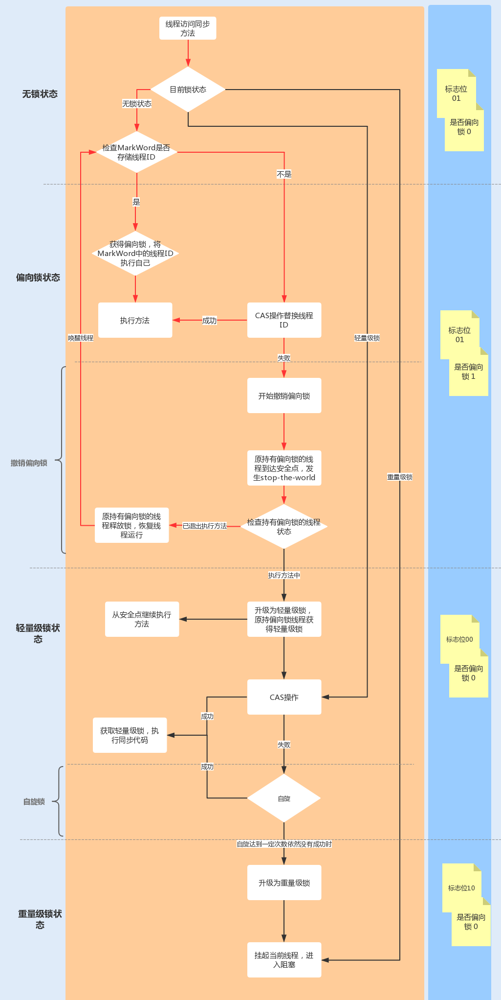

# 一、并发与多线程简介

## 1、多线程优点

- 资源利用率更好：文件读写操作
- 程序设计在某些情况下更简单；
- 程序响应更快：端口监听操作

## 2、多线程的代价

- 设计更复杂：多线程共享数据时尤其需要注意
- 上下文切换的开销：

	CPU 会在一个上下文中执行一个线程，然后切换到另外一个上下文中执行另外一个线程；上下文切换并不廉价。如果没有必要，应该减少上下文切换的发生。

	上下文切换：从任务保存到再加载的过程就是一次上下文切换；上下文切换过程中，CPU会停止处理当前运行的程序，并保存当前程序运行的具体位置以便之后继续运行。如何减少上下文切换：
	- 无锁并发编程：多线程竞争时，会引起上下文切换，所以多线程处理数据时，可以用一些办法来避免使用锁，如将数据的ID按照Hash取模分段，不同的线程处理不同段的数据
	- CAS算法：Java的Atomic包使用CAS算法来更新数据，而不需要加锁；
	- 使用最少线程：避免创建不需要的线程，比如任务很少，但是创建了很多线程来处理，这样会造成大量线程都处于等待状态；
	- 协程：在单线程里实现多任务的调度，并在单线程里维持多个任务间的切换
	- Java的线程机制主要还是基于Native Thread，Go的Coroutine是进程里自己管理的一种"Thread"，所以在高并发的场景下，Coroutine可以有效的降低比较重的native的线程上下文切换，从而来提高并发处理能力

- 增加资源消耗：如线程管理中消耗的资源

## 3、并发编程模型

Java 的并发采用的是共享内存模型

### 3.1、并行工作者

传入的作业会被分配到不同的工作者上
- 并行工作者模型中，委派者(Delegator)将传入的作业分配给不同的工作者。每个工作者完成整个任务。工作者们并行运作在不同的线程上，甚至可能在不同的CPU上
- 优点：容易理解，只需要添加更多的工作者来提高系统的并行度
- 缺点：
	- ①、共享状态可能会很复杂：等待访问共享数据结构时，线程之间的互相等待将会丢失部分并行性。许多并发数据结构是阻塞的，意味着在任何一个时间只有一个或者很少的线程能够访问；
	- ②、无状态的工作者：工作者无法在内部保存这个状态（但是每次需要的时候可以重读）称为无状态的共享状态能够被系统中得其他线程修改。所以工作者在每次需要的时候必须重读状态，以确保每次都能访问到最新的副本，不管共享状态是保存在内存中的还是在外部数据库中。
	- ③、任务顺序是不确定的：使得很难在任何特定的时间点推断系统的状态.这也使得它也更难（如果不是不可能的话）保证一个作业在其他作业之前被执行

### 3.2、流水线模式(反应器系统，或事件驱动系统)

类似于工厂中生产线上的工人们那样组织工作者
- 每个工作者只负责作业中的部分工作。当完成了自己的这部分工作时工作者会将作业转发给下一个工作者。每个工作者在自己的线程中运行，并且不会和其他工作者共享状态。有时也被称为"无共享并行模型"。

- 通常使用"非阻塞的IO"来设计使用流水线并发模型的系统，非阻塞IO意味着：一旦某个工作者开始一个IO操作的时候，这个工作者不会一直等待IO操作的结束，有了非阻塞IO，就可以使用IO操作确定工作者之间的边界;

- 流水作业甚至也有可能被转发到超过一个工作者上并发处理；

- 反应器，事件驱动系统:用流水线并发模型的系统有时候也称为反应器系统或事件驱动系统：
	- ①、系统内的工作者对系统内出现的事件做出反应，这些事件也有可能来自于外部世界或者发自其他工作者;
	- ②、流行的反应器/事件驱动平台:Vert.x，AKKa，Node.JS(JavaScript)
- Actors 和 Channels:两种比较类似的流水线(或反应器/事件驱动)模型:
	- ①、在Actor模型中每个工作者被称为actor.Actor 之间可以直接异步地发送和处理消息。Actor 可以被用来实现一个或多个像前文描述的那样的作业处理流水线;
	- ②、在Channel模型中，工作者之间不直接进行通信。相反，它们在不同的通道中发布自己的消息(事件)。其他工作者们可以在这些通道上监听消息，发送者无需知道谁在监听
- 优点：
	- ①、无需共享的状态:工作者之间无需共享状态，意味着实现的时候无需考虑所有因并发访问共享对象而产生的并发性问题;
	- ②、有状态的工作者:可以在内存中保存它们需要操作的数据，只需在最后将更改写回到外部存储系统;
	- ③、较好的硬件整合:单线程代码在整合底层硬件的时候往往具有更好的优势当能确定代码只在单线程模式下执行的时候，通常能够创建更优化的数据结构和算法单线程有状态的工作者能够在内存中缓存数据
	- ④、合理的作业顺序:作业的有序性使得它更容易地推出系统在某个特定时间点的状态

- 缺点：
	- ①、最大缺点：作业的执行往往分布到多个工作者上，并因此分布到项目中的多个类上。这样导致在追踪某个作业到底被什么代码执行时变得困难
	- ②、加大了代码编写的难度，有时会将工作者的代码写成回调处理的形式。若在代码中嵌入过多的回调处理，往往会出现所谓的回调地狱(callback hell)现象

### 3.3、函数式并行(Functional Parallelism)

- 基本思想：是采用函数调用实现程序；
- 函数式并行里面最难的是确定需要并行的那个函数调用：跨CPU协调函数调用需要一定的开销。某个函数完成的工作单元需要达到某个大小以弥补这个开销。如果函数调用作用非常小，将它并行化可能比单线程、单CPU执行还慢

### 3.4、并行与并发

线程是一种并发的模型，在单核，需要实现的是并发；在多核的时候，在并发之上才可能出现并行，并行也是一种并发
- 并行：表示两个线程同时做事情，就是同时执行的意思；具有并发的含义，而并发则不一定并行；多个处理器或者是多核的处理器同时处理多个不同的任务
- 并发：是指能处理多个同时性活动的能力，并发事件之间不一定要同一时刻发生；一个处理器同时处理多个任务；看上去是同时进行的，实际是交错进行的；
- 并发是逻辑上的同时发生（simultaneous）；并行是物理上的同时发生
- “并发”指的是程序的结构，“并行”指的是程序运行时的状态

## 4、进程与线程

要从调度、并发性、拥有的资源和系统开销等方面；
- 进程是操作系统分配资源的最小单元；
- 线程是操作系统（CPU）调度的最小单元

### 4.1、进程

进程是程序执行的副本
- 进程表示一个逻辑控制流，就是一种计算过程，它造成一个假象，好像这个进程一直在独占CPU资源；
- 进程拥有一个独立的虚拟内存地址空间，它造成一个假象，好像这个进程一致在独占存储器资源；
- 操作系统利用fork系统调用来创建一个子进程。fork所创建的子进程会复制父进程的虚拟地址空间；
    - fork刚创建的子进程采用了共享的方式，只用指针指向了父进程的物理资源。当子进程真正要对某些物理资源写操作时，才会真正的复制一块物理资源来供子进程使用；
    - fork不只是复制了页表结构，还复制了父进程的文件描述符表，信号控制表，进程信息，寄存器资源等等；
    - fork创建的子进程开始执行的位置是fork函数返回的位置
- 进程不能通过直接共享内存的方式来进行进程间通信，只能采用信号、管道等方式来进行进程间通信；
- 进程上下文切换的资源：
    ```
    页表 -- 对应虚拟内存资源
    文件描述符表/打开文件表 -- 对应打开的文件资源
    寄存器 -- 对应运行时数据
    信号控制信息/进程运行信息
    ```
- 一个进程至少具有5种基本状态：初始态、执行状态、等待（阻塞）状态、就绪状态、终止状态-
    - 初始状态：进程刚被创建，由于其他进程正占有CPU所以得不到执行，只能处于初始状态。
    - 执行状态：任意时刻处于执行状态的进程只能有一个。
    - 就绪状态：只有处于就绪状态的经过调度才能到执行状态
    - 等待状态：进程等待某件事件完成
    - 停止状态：进程结束

**进程间通信：**
- 管道pipe：管道是一种半双工的通信方式，数据只能单向流动，而且只能在具有亲缘关系的进程间使用。进程的亲缘关系通常是指父子进程关系，也称作匿名管道；管道的实质是一个内核缓冲区，进程以先进先出 FIFO 的方式从缓冲区存取数据；主要工作原理：
    - 管道一端的进程顺序的将数据写入缓冲区，另一端的进程则顺序的读出数据。
    - 缓冲区可以看做是一个循环队列，一个数据只能被读一次，读出来后在缓冲区就不复存在了。
    - 当缓冲区为读空或写满，读数据的进程或写数据进程进入等待队列。
    - 空的缓冲区有新数据写入，或者满的缓冲区有数据读出时，唤醒等待队列中的进程继续读写

- 命名管道FIFO：有名管道也是半双工的通信方式，但是它允许无亲缘关系进程间的通信；有名管道提供了一个路径名与之关联，以文件形式存在于文件系统中，这样即使不存在亲缘关系的进程，只要可以访问该路径也能相互通信；命名管道支持同一台计算机的不同进程之间，可靠的、单向或双向的数据通信；

- 信号(signal) ：信号是Linux系统中用于进程间互相通信或者操作的一种机制，信号可以在任何时候发给某一进程，无需知道该进程的状态。如果该进程当前不是执行态，内核会暂时保存信号，当进程恢复执行后传递给它。如果一个信号被进程设置为阻塞，则该信号的传递被延迟，直到其阻塞被取消时才被传递给进程。信号在用户空间进程和内核之间直接交互，内核可以利用信号来通知用户空间的进程发生了哪些系统事件，信号事件主要有两个来源：
    - 硬件来源：用户按键输入Ctrl+C退出、硬件异常如无效的存储访问等；
    - 软件终止：终止进程信号、其他进程调用 kill 函数、软件异常产生信号；

- 消息队列MessageQueue：消息队列是存放在内核中的消息链表，每个消息队列由消息队列标识符表示，只有在内核重启或主动删除时，该消息队列才会被删除；消息队列是由消息的链表，存放在内核中并由消息队列标识符标识。消息队列克服了信号传递信息少、管道只能承载无格式字节流以及缓冲区大小受限等缺点。另外，某个进程往一个消息队列写入消息之前，并不需要另外读进程在该队列上等待消息的到达；

- 共享存储SharedMemory：共享内存就是映射一段能被其他进程所访问的内存，这段共享内存由一个进程创建，但多个进程都可以访问。共享内存是最快的 IPC 方式，它是针对其他进程间通信方式运行效率低而专门设计的。共享内存使得多个进程可以可以直接读写同一块内存空间，是最快的可用 IPC 形式，是针对其他通信机制运行效率较低而设计的。共享内存往往与其他通信机制，如信号量配合使用，来实现进程间的同步和互斥通信；

- 套接字Socket：它是一种通信机制，凭借这种机制，既可以在本机进程间通信，也可以跨网络通信，因为，套接字通过网络接口将数据发送到本机的不同进程或远程计算机的进程；TCP/IP 协议栈就是建立在 socket 通信之上，TCP/IP 构建起了当前的互联网通信网络

- 文件：

- 信号量Semaphore：信号量是一个计数器，可以用来控制多个进程对共享资源的访问。它常作为一种锁机制，防止某进程正在访问共享资源时，其他进程也访问该资源。因此，主要作为进程间以及同一进程内不同线程之间的同步手段；

### 4.2、线程

线程称为轻量级的进程；
- 线程解决的最大问题就是它可以很简单地表示共享资源的问题，这里说的资源指的是存储器资源，资源最后都会加载到物理内存，一个进程的所有线程都是共享这个进程的同一个虚拟地址空间的，也就是说从线程的角度来说，它们看到的物理资源都是一样的，这样就可以通过共享变量的方式来表示共享资源，也就是直接共享内存的方式解决了线程通信的问题；
- 在Linux系统中，线程是使用clone系统调用，clone是一个轻量级的fork；它提供了一系列的参数来表示线程可以共享父类的哪些资源;
- 线程上下文切换需保存的内容：线程的id、寄存器中的值、栈数据
- 线程是操作操作系统能够进行运算调度的最小单位。线程被包含在进程之中，是进程中的实际运作单位，一个进程内可以包含多个线程，线程是资源调度的最小单位；
- 线程不拥有资源，只是计算

### 4.3、协程

- 协程是一种用户态的轻量级线程，协程的调度完全由用户控制。
- 协程拥有自己的寄存器上下文和栈。协程调度切换时，将寄存器上下文和栈保存到其他地方，在切回来的时候，恢复先前保存的寄存器上下文和栈，直接操作栈则基本没有内核切换的开销，可以不加锁的访问全局变量，所以上下文的切换非常快；
- 由于协程在线程内实现，因此始终都是一个线程操作共享资源，所以不存在多线程抢占资源和资源同步问题；
- 协程适用于IO阻塞且需要大量并发的场景，当发生IO阻塞，由协程的调度器进行调度，通过将数据流yield掉，并且记录当前栈上的数据，阻塞完后立刻再通过线程恢复栈，并把阻塞的结果放到这个线程上去运行

### 4.4、区别

- 进程采用fork创建，线程采用clone创建；
- 线程是程序执行的最小单位，而进程是操作系统分配资源的最小单位；一个进程由一个或多个线程组成，线程是一个进程中代码的不同执行路线；
- 进程fork创建的子进程的逻辑流位置在fork返回的位置，线程clone创建的KSE的逻辑流位置在clone调用传入的方法位置，比如Java的Thread的run方法位置；
- 进程拥有独立的虚拟内存地址空间和内核数据结构(页表，打开文件表等)，当子进程修改了虚拟页之后，会通过写时拷贝创建真正的物理页。线程共享进程的虚拟地址空间和内核数据结构，共享同样的物理页；
- 多个进程通信只能采用进程间通信的方式，比如信号，管道，而不能直接采用简单的共享内存方式，原因是每个进程维护独立的虚拟内存空间，所以每个进程的变量采用的虚拟地址是不同的。多个线程通信就很简单，直接采用共享内存的方式，因为不同线程共享一个虚拟内存地址空间，变量寻址采用同一个虚拟内存；
- 进程上下文切换需要切换页表等重量级资源，线程上下文切换只需要切换寄存器等轻量级数据；
- 进程的用户栈独享栈空间，线程的用户栈共享虚拟内存中的栈空间，没有进程高效；
- 一个应用程序可以有多个进程，执行多个程序代码，多个线程只能执行一个程序代码，共享进程的代码段；
- 进程采用父子结构，线程采用对等结构

### 4.4、Java进程和线程的关系

- 运行一个程序产生一个进程，进程包含至少一个线程；
- 一个进程对应一个JVM实例，多个线程共享JVM里的堆；
- Java采用单线程编程模型，程序会自动创建主线程；
- 主线程可以创建子线程，原则上要后于子线程完成执行；

### 4.5、内核空间与用户空间

内核是应用程序和硬件沟通的桥梁；

Java采用的是用户-内核级线程映射（总体来说是内核级线程），JVM创建的任何线程都是内核来调度的

## 5、产生并发的原因

CPU、 内存、磁盘速度的差异，CPU缓存 -> 可见性，线程切换 -> 原子性，编译优化 -> 重排序；

并发的解决方式：
- 可见性：volatile、synchronized；
- 原子性：互斥锁
- 重排序：volatile、禁止重排序

## 6、并发编程的三要素

- 可见性（CPU缓存引起）：指多个线程操作一个共享变量时，其中一个线程对变量进行修改后，其他线程可以立即看到修改的结果。
    实现可见性的方法：synchronized或者Lock：保证同一个时刻只有一个线程获取锁执行代码，锁释放之前把最新的值刷新到主内存，实现可见性。
- 原子性（分时复用引起）：指的是一个或者多个操作，要么全部执行并且在执行的过程中不被其他操作打断，要么就全部都不执行；经典的转账问题
- 有序性（重排序引起）：即程序的执行顺序按照代码的先后顺序来执行

# 二、Java 多线程

## 1、Java线程

继承自java.lang.Thread或其子类的
```java
Thread thread = new Thread();
thread.start();// 调用线程
```

## 2、线程Thread

### 2.1、创建线程的方式

#### 2.1.1、继承Thread子类

重写run方法：run方法会在调用start()方法之后被执行

- 方式1：继承类
```java
class MyThread extends Thread{
	public void run(){
		System.out.println("my thread is running");
	}
}
// 可用如下方式创建并运行上述thread的子类:
MyThread myThread = new MyThread();
myTread.start();
```

- 方式2：创建一个Thread的匿名子类
```java
Thread thread = new Thread(){
	public void run(){
		System.out.println("my thread is running");
	}
};
thread.start();
```

#### 2.1.2、实现Runnable接口

- 新建一个实现了 java.lang.Runnable 接口的类的实例
```java
class MyRunnable implements Runnable{
	public void run(){
		System.out.println("my thread is running");
	}
}
// 为了使线程能够执行run()方法，需要在 Thread 类的构造函数中传入 MyRunnable 的实例对象
Thread thread = new Thread(new MyRunnable());
thread.start();
```

- 创建一个实现了 Runnable 接口的匿名类:
```java
Runnable myRunnable = new Runnable(){
	public void run(){
		System.out.println("Runnable running");
	}
}
Thread thread = new Thread(myRunnable);
thread.start();
```

#### 2.1.3、实现Callable接口

实现call()方法，使用FutureTask类来包装Callable对象，FutureTask对象封装了该Callable对象的call()方法的返回值；使用 FutureTask 对象作为 Thread 对象的 target创建并启动新线程。执行 Callable 方式，需要 FutureTask 实现类的支持，用于接收运算结果

```java
FutureTask<Integer> task = new FutureTask<>(new MyCallable());// FutureTask 也有闭锁的功能
new Thread(task).start();
```
其中FutureTask该类实现了接口：RunnableFuture，该接口又继承了两个接口`Runnable, Future<V>`

#### 2.1.4、实现多线程的方式

实现多线程的实质方式只有两种

只能通过新建Thread类这一种方式来创建线程，但是类里面的run方法有两种方式来实现，第一种是重写run方法，第二种实现Runnable接口的run方法，然后再把该runnable实例传给Thread类。除此之外，从表面上看线程池、定时器等工具类也可以创建线程，但是它们的本质都逃不出刚才所说的范围，也就是实现Runnable接口和继承Thread类。

实际上也只有一种实现方式：实现Runnable接口，因为Thread类也是实现Runnable接口的

### 2.3、创建 Thread 子类还是实现 Runnable 接口

- 实现 Runnable 接口，线程池可以有效的管理实现了 Runnable 接口的线程如果多个线程正在运行中，如果某个线程调用 System.exit()指示终结程序，那么全部的线程都会结束执行；
- Thread类实现了Runnable接口；
- 如果同时实现Thread和Runnable，那么只会执行Thread里的run方法，因为虽然传入了Runnable对象，但是由于Thread的run方法被覆盖了，所以Runnable里传入的对象不会被执行；
    ```java
    public static void main(String[] args) {
        new Thread(new Runnable() {
            @Override
            public void run() {
                System.out.println("Runnable ......");
            }
        }){
            public void run(){
                System.out.println("Thread ......");
            }
        }.start();
    }
    @Override
    public void run() {
        if (target != null) {
            target.run();
        }
    }
    ```

如果既实现Runnable，有集成Thread，是如何执行的：
```java
new Thread(() -> System.out.println("Runnable implements")) {
    @Override
    public void run() {
        System.out.println("Thread extends");
    }
}.start();
// 输出结果：Thread extends
```
因为即重写了Thread的run方法，Thread本身的run方法是调用target的run方法，而原来的run方法就是调用Runnable接口是实现类的方法；

### 2.4、start与run方法

- 启动线程时调用start()方法而非run()方法
- 一个线程两次调用start方法会出现什么情况：Java的线程是不允许启动两次的，第二次调用会出现 IllegalThreadStateException 异常，这是个运行时异常；
	```java
	public synchronized void start() {
        // 判断线程状态，0：表示新建
        if (threadStatus != 0)
			throw new IllegalThreadStateException();
		....
	}
	```
- start方法调用的是start0的本地方法，其调用的是JVM_StartThread方法
- start方法一般会有两个线程，一个是启动线程，另外一个线程本身；start方法调用后，并不一定马上开始运行，只是其状态便成为可运行状态。
- 如何给run方法传参
	- 构造函数传参
	- 成员变量传参
	- 回调函数传参
- 如何实现处理线程的返回值
	- 主线程等待法
	- 使用Thread类的join方法阻塞当前线程以等待子线程完成
	- 使用Callable接口实现：通过FutureTask 或者线程池获取；

### 2.5、线程名称

```java
// 当创建一个线程的时候，可以给线程起一个名字
MyRunnable runnable = new MyRunnable();
Thread thread = new Thread(runnable， "New Thread");
thread.start();
System.out.println(thread.getName());
// 也可以通过:
Thread.currentThread()获取当前线程的引用
```
### 2.6、Thread 的部分属性

- ID：每个线程的独特标识，用于标识不同的线程
- Name：线程的名称，方便定位问题
- Priority：线程对象的优先级。优先级别在1-10之间，1是最低级，10是最高级。不建议改变它们的优先级。
- Status：线程的状态。在Java中，线程只能有这6种中的一种状态：new、runnable、block、waiting、time waiting 和 terminated。
- isDaemon：是否为守护线程；

### 2.7、线程的中断、停止与暂停

#### 2.7.1、线程中断

Java 提供中断机制来通知线程表明我们想要结束它，中断机制的特性是线程需要检查是否被中断，而且还可以决定是否响应结束的请求，不能强制停止线程，因为无法判断线程是否是本身运行的；

#### 2.7.2、线程停止

- 线程停止的方法：Java并没有提供安全停止线程的方法
	- ①、使用volatile的退出标志，使线程正常退出，也就是当run方法完成后线程终止；该种方法存在的问题：在生产者消费者模式下，无法正确的停止，因为可能使用的是阻塞队列，而阻塞队列在push、take等操作的时候都是阻塞的；
	- ②、使用stop方法强行终止线程，但不推荐使用，因为stop和suspend及resume一样，是过期的方法，使用会造成不可预料的结果
	- ③、使用interrupt 方法中断线程；

- interrupt 终止线程：判断线程是否是停止状态，如果该线程处于阻塞、限期等待或者无限期等待状态，那么就会抛出 InterruptedException ，从而提前结束该线程；
    - `interrupt`：中断线程
	- `interrupted`：静态方法，测试当前线程是否有已经中断，执行后具有将状态标志清除为 false 的功能，如果连续调用两次该方法，第二次调用则返回 false
	- `isInterrupted`：测试线程Thread对象是否已经中断，但不清除状态标志；
        ```java
        public static void main(String[] args) throws Exception{
            Thread thread = new Thread(() -> {
                for (;;){
                }
            });
            // 启动线程
            thread.start();
            //设置中断标志
            thread.interrupt();
            //获取中断标志
            System.out.println("isInterrupted: " + thread.isInterrupted());// true
            //获取中断标志并重置
            System.out.println("isInterrupted: " + thread.interrupted());// false
            //获取中断标志并重直
            System.out.println("isInterrupted: " + Thread.interrupted());// false
            //获取中断标志
            System.out.println("isInterrupted: " + thread.isInterrupted());// true
            thread.join();
            System.out.println("Main thread is over.");
        }
        ```

- stop()方法-过期方法
	- 暴力停止线程的方法；
	- 调用 stop 方法时会抛出 java.lang.ThreadDeath 异常，通常情况下，该异常不需要显示捕获；
	- 强制停止线程，可能对锁定的对象进行了"解锁"，导致数据得不到同步处理，出现数据不一致的情况

- 线程停止在代码中增加异常处理

- 使用 return 停止线程：将方法 interrupt() 和 return 结合使用

#### 2.7.3、暂停线程：可以使用 suspend()方法暂停线程，使用resume() 方法恢复线程的执行

这两个方法的缺点：
- 使用这两个方法时，如果使用不当极易造成公共的同步对象的独占，使得其他线程无法访问公共同步对象；
- 数据的不同步：容易出现因为线程的暂停而导致数据不同步的情况；

#### 2.7.4、线程中断原理

- Java线程中断机制是一种协作机制，也就是说通过中断并不能直接停止另一个线程，需要被中断的线程自己处理中断；
- 中断模型：每个线程对象里都有一个boolean类型的标识，代表着是否有中断请求(该请求可以来自所有线程，包括被中断的线程本身)，Thread提供了几个方法来操作中断状态：
	- ①、`public static boolean interrupted()`：测试当前线程是否中断，线程的中断状态由该方法清除。如果连续两次调用该方法，则第二次调用将返回 false；注意`Thread.interrupted()`方法的目标对象是`当前线程`，而不管本方法来自于哪个对象；
	- ②、`public boolean isInterrupted()`：测试线程是否已经中断，线程的中断状态不受该方法的影响;
	- ③、`public void interrupt()`：中断线程，唯一能将中断状态设置为true的方法，调用的是本地方法：`private native void interrupt0();`
    ```java
    // 调用上述三个方法时不同的返回值，尤其注意 interrupted()静态方法
    public static void main(String[] args) throws Exception{
        Thread thread = new Thread(() -> {
            System.out.println("isInterrupted: " + Thread.interrupted());// true
            System.out.println("isInterrupted: " + Thread.interrupted());// false
            for (;;){
	  
            }
        });
        // 启动线程
        thread.start();
        //设置中断标志
        thread.interrupt();
        //获取中断标志
        System.out.println("isInterrupted: " + thread.isInterrupted());// true
        //获取中断标志并重置，虽然使用的是 thread 来调用的，真正中断的线程是当前线程，也就是main方法
        System.out.println("isInterrupted: " + thread.interrupted());// false
        //获取中断标志并重直
        System.out.println("isInterrupted: " + Thread.interrupted());// false
        //获取中断标志
        System.out.println("isInterrupted: " + thread.isInterrupted());// true
        thread.join();
        System.out.println("Main thread is over.");
    }
    ```

- 中断处理：被中断线程只需在合适的时候处理即可，如果没有合适的时间点，甚至可以不处理
	- ①、中断状态管理：一般来说当可能阻塞的方法声明中有抛出`InterruptedException`则暗示该方法是可中断的；如果程序捕获到这些可中断的阻塞方法抛出的`InterruptedException`或检测到中断后，可以按照如下原则处理：
		* 如果遇到的是可中断的阻塞方法抛出`InterruptedException`，可以继续向方法调用栈的上层抛出该异常，如果是检测到中断，则可清除中断状态并抛出`InterruptedException`，使当前方法也成为一个可中断的方法
		* 若有时候不太方便在方法上抛出`InterruptedException`，比如要实现的某个接口中的方法签名上没有`throws InterruptedException`，这时就可以捕获可中断方法的`InterruptedException`并通过`Thread.currentThread.interrupt()`来重新设置中断状态。如果是检测并清除了中断状态，亦是如此。
	- ②、中断响应：根据实际情况而定，有些程序可能一检测到中断就立马将线程终止，有些可能是退出当前执行的任务，继续执行下一个任务；如做一些事务回滚操作，一些清理工作，一些补偿操作；响应中断的方法：wait、sleep、join等

- 中断的使用：
	* 点击某个桌面应用中的取消按钮时；
	* 某个操作超过了一定的执行时间限制需要中止时；
	* 多个线程做相同的事情，只要一个线程成功其它线程都可以取消时；
	* 一组线程中的一个或多个出现错误导致整组都无法继续时；
	* 当一个应用或服务需要停止时

#### 2.7.5、线程使用interrupt优雅退出例子

- 直接中断，没有可响应的
    ```java 
    // 有线程调用了interrupt方法，那么对应线程需要调用 Thread.currentThread().isInterrupted() 一直检测是否有被中断；
    public static void main(String[] args) throws InterruptedException {
        Runnable run = () -> {
            int num = 0;
            // 调用 Thread.currentThread().isInterrupted() 一直检测是否有被中断；
            while (!Thread.currentThread().isInterrupted() && num <= Integer.MAX_VALUE / 2) {
                if (num % 10000 == 0) {
                    System.out.println(num + " 是10000的倍数");
                }
                num++;
            }
        };
        Thread t = new Thread(run);
        t.start();
        Thread.sleep(2000);
        // 通知线程中断
        t.interrupt();
    }
    ```
- 带有sleep中断线程
    ```java
    public static void main(String[] args) throws InterruptedException {
        Runnable run = () -> {
            int num = 0;
            try {
                while (num <= 300 && !Thread.currentThread().isInterrupted()) {
                    if (num % 100 == 0) {
                        System.out.println(num + " 是100的倍数");
                    }
                    num++;
                }
                Thread.sleep(1000);
            } catch (InterruptedException e) {
                e.printStackTrace();
            }
        };
        Thread t = new Thread(run);
        t.start();
        Thread.sleep(500);
        t.interrupt();
    }
    ```
- 在循环迭代中有响应中断的方法，比如sleep：
    ```java
    public static void main(String[] args) throws InterruptedException {
        Runnable run = () -> {
            int num = 0;
            // 需要在循环中去检测异常
            while (num <= 10000 && !Thread.currentThread().isInterrupted()) {
                if (num % 100 == 0) {
                    System.out.println(num + " 是100的倍数");
                }
                num++;
                try {
                    Thread.sleep(10);
                } catch (InterruptedException e) {
                    // 捕获异常之后，不能吞掉异常，需要再次恢复中断
                    Thread.currentThread().interrupt();
                }
            }
    
        };
        Thread t = new Thread(run);
        t.start();
        Thread.sleep(5000);
        t.interrupt();
    }
    ```

### 2.8、sleep:线程的睡眠

- `Thread.sleep()`
- `TimeUnit.SECONDS.sleep()`：传参有问题其不会抛出异常

当一个执行中的线程调用了Thread的sleep方法时，调用线程会暂时让出指定时间的执行权利，但是该线程所有持有的锁不释放；在指定的时间会正常返回，线程处于就绪状态：`TIME_WAITING`；

如果在睡眠期间其他线程调用了该线程的interrupt方法中断了该线程，则该线程会在调用sleep方法的地方抛出InterruptedException异常，因为异常不能跨线程传播回 main() 中，因此必须在本地进行处理。线程中抛出的其它异常也同样需要在本地进行处理；

**Thread.sleep()和Object.wait()的区别：**
- Thread.sleep()不会释放占有的锁，Object.wait()会释放占有的锁，wait必须放在同步代码块中
- Thread.sleep()必须传入时间，Object.wait()可传可不传，不传表示一直阻塞下去；
- Thread.sleep()到时间了会自动唤醒，然后继续执行；
- Object.wait()不带时间的，需要另一个线程使用Object.notify()唤醒；
- Object.wait()带时间的，假如没有被notify，到时间了会自动唤醒，这时又分好两种情况，一是立即获取到了锁，线程自然会继续执行；二是没有立即获取锁，线程进入同步队列等待获取锁；

> 其实，他们俩最大的区别就是Thread.sleep()不会释放锁资源，Object.wait()会释放锁资源。

### 2.9、等待线程的终结

- `Thread.join()`	当前线程调用某个线程的这个方法时，它会暂停当前线程，直到被调用线程执行完成
- `Thread.join(long milliseconds)`	这方法让调用线程等待特定的毫秒数。
- `Thread.join(long milliseconds, int nanos)`	第二个版本的join方法和第一个很像，只不过它接收一个毫秒数和一个纳秒数

### 2.10、线程异常处理

当一个非检查异常被抛出，默认的行为是在控制台写下`stack trace`并退出程序
- 必须实现一个类来处理非检查异常，这个类必须实现 `UncaughtExceptionHandler` 接口并实现在接口内已声明的 `uncaughtException()` 方法：
```java
public class ExceptionHandler implements UncaughtExceptionHandler{
	public void uncaughtException(Thread t， Throwable e){
		System.out.printf("An exception has been captured\n");
		System.out.printf("Thread: %s\n"，t.getId());
		System.out.printf("Exception: %s: %s\n"，e.getClass().getName()，e.getMessage());
		System.out.printf("Stack Trace: \n");
		e.printStackTrace(System.out);
		System.out.printf("Thread status: %s\n"，t.getState());
	}
}
Thread.setDefaultUncaughtExceptionHandler(new ExceptionHandler());
```
- 当在一个线程里抛出一个异常，但是这个异常没有被捕获(这肯定是非检查异常)：
	JVM 检查线程的相关方法是否有设置一个未捕捉异常的处理者。如果有，JVM 使用 Thread 对象和 Exception 作为参数调用此方法；如果没有定义，那么JVM会寻找默认非捕捉异常handle（即ThreadGroup），如果线程没有捕捉未捕获异常的处理者，那么JVM会把异常的stacktrace写入操控台并结束任务；
- 主线程能够轻易发现异常，但是子线程却不行；
- 异常处理器调用策略：
- 使用异常处理器：
    ```java
    Thread.setDefaultUncaughtExceptionHandler(new MyExceptionHandler());
    static class MyExceptionHandler implements Thread.UncaughtExceptionHandler {
        @Override
        public void uncaughtException(Thread t, Throwable e) {
            // do something
        }
    }
    ```

### 2.11、本地线程变量

[ThreadLocal](#11.ThreadLocal类)

本地线程变量为每个使用这些变量的线程储存属性值。可以用 get() 方法读取值和使用 set() 方法改变值

### 2.12、线程组可以把线程分组

Java 提供 ThreadGroup 类来组织线程。ThreadGroup 对象可以由 Thread 对象组成和由另外的 ThreadGroup 对象组成，生成线程树结构，方便线程管理

当线程运行过程中出现异常情况时，在某些情况下JVM会把线程的控制权交到线程关联的线程组对象上来进行处理
```java
public class ThreadGroup implements Thread.UncaughtExceptionHandler{}
```
可以看到，线程组默认是一个线程的异常处理器，在线程中如果未指定异常处理器，Thread会以ThreadGroup作为默认线程处理器，调用其 uncaughtException方法：
```java
public void uncaughtException(Thread t, Throwable e) {
    if (parent != null) {
        parent.uncaughtException(t, e);
    } else {
        Thread.UncaughtExceptionHandler ueh = Thread.getDefaultUncaughtExceptionHandler();
        if (ueh != null) {
            ueh.uncaughtException(t, e);
        } else if (!(e instanceof ThreadDeath)) {
            System.err.print("Exception in thread \"" + t.getName() + "\" ");
            e.printStackTrace(System.err);
        }
    }
}
```
***不推荐使用线程组***
- 线程组ThreadGroup对象中比较有用的方法是stop、resume、suspend等方法，由于这几个方法会导致线程的安全问题（主要是死锁问题），已经被官方废弃掉了；
- 线程组ThreadGroup不是线程安全的，这在使用过程中获取的信息并不全是及时有效的，这就降低了它的统计使用价值；

### 2.13、线程工厂

线程对象工厂 ThreadFactory 主要是用来创建线程的
```java
public interface ThreadFactory {
    /**
     * Constructs a new {@code Thread}.  Implementations may also initialize
     * priority, name, daemon status, {@code ThreadGroup}, etc.
     */
    Thread newThread(Runnable r);
}
```

### 2.14、join()和yield()方法

#### 2.14.1、实例方法：join()方法

- 等待该线程终止，指的是主线程等待子线程的终止，子线程调用join()方法后，其后面的代码，只有等到子线程结束了才能执行；让调用该方法的thread完成run方法的里面的东西后，在执行 join 方法后面的代码，当前运行着的线程将阻塞直到这个线程实例完成了执行；join方法调用后，线程的状态是：WAITING

- join 具有使线程排队运行的作用：

    join与synchronized 区别：join 内部是wait方法进行等待，而synchronized关键字使用的是"对象监视器"原理作为同步；

- 在执行 join 的过程中，如果当前线程对象被中断，则当前线程出现异常；如果主线程被中断了，那么其需要将中断状态传递给子线程；

- join(long) 内部是使用 wait(long)方法来实现的，所以join(long)方法具有释放锁的特点，而 sleep(long)不释放锁的；

- 使用join方法之后，线程顺序执行；

- join是代码实现
    ```java
    public final synchronized void join(long millis) throws InterruptedException {
        long base = System.currentTimeMillis();
        long now = 0;
        if (millis < 0) {
            throw new IllegalArgumentException("timeout value is negative");
        }
        if (millis == 0) {
            while (isAlive()) {
                wait(0);
            }
        } else {
            while (isAlive()) {
                long delay = millis - now;
                if (delay <= 0) {
                    break;
                }
                wait(delay);
                now = System.currentTimeMillis() - base;
            }
        }
    }
    ```
    其实现原理是不停的检查join线程是否存活，如果join线程存活，则wait(0)永远的等下去，直至join线程终止后，线程的 `this.notifyAll()`方法会被调用
- join中有wait操作，那么其是如何被唤醒的：当子线程threadA执行完毕的时候，jvm会自动唤醒阻塞在threadA对象上的线程
    ```c++
    // 位于/hotspot/src/share/vm/runtime/thread.cpp中
    void JavaThread::exit(bool destroy_vm, ExitType exit_type) {
        // ...
        // Notify waiters on thread object. This has to be done after exit() is called
        // on the thread (if the thread is the last thread in a daemon ThreadGroup the
        // group should have the destroyed bit set before waiters are notified).
        // 有一个贼不起眼的一行代码，就是这行
        ensure_join(this);
        // ...
    }
    static void ensure_join(JavaThread* thread) {
        // We do not need to grap the Threads_lock, since we are operating on ourself.
        Handle threadObj(thread, thread->threadObj());
        assert(threadObj.not_null(), "java thread object must exist");
        ObjectLocker lock(threadObj, thread);
        // Ignore pending exception (ThreadDeath), since we are exiting anyway
        thread->clear_pending_exception();
        // Thread is exiting. So set thread_status field in  java.lang.Thread class to TERMINATED.
        java_lang_Thread::set_thread_status(threadObj(), java_lang_Thread::TERMINATED);
        // Clear the native thread instance - this makes isAlive return false and allows the join()
        // to complete once we've done the notify_all below
        java_lang_Thread::set_thread(threadObj(), NULL);
        // 主要是这一句 thread就是当前线程；
        lock.notify_all(thread);
        // Ignore pending exception (ThreadDeath), since we are exiting anyway
        thread->clear_pending_exception();
    }
    ```

示例：
```java
public class ThreadJoin {
    public static void main(String[] args) throws Exception{
        JoinThread yield = new JoinThread();
        Thread t1 = new Thread(yield, "t1");
        Thread t2 = new Thread(yield, "t2");
        Thread t3 = new Thread(yield, "t3");
        t1.start();
		t1.join();
        t2.start();
		t2.join();
        t3.start();
    }
    static class JoinThread implements Runnable {
        @Override
        public void run() {
            System.out.println("current thread name:" + Thread.currentThread().getName());
        }
    }
}
// 输出结果
current thread name:t1
current thread name:t2
current thread name:t3
```

#### 2.14.2、静态方法：yield()方法

使当前线程从执行状态(运行状态)变为可执行状态(就绪状态)，调用yield的时候锁并没有被释放，放弃当前的CPU资源，将它让给其他的任务去占用CPU执行时间，放弃的时间不确定，将CPU让给其他资源导致速度变慢，一般是把机会给到线程池拥有相同优先级的线程，其状态是：RUNNABLE；使用yield之后，线程交替执行

示例：
```java
public class ThreadYield {
    public static void main(String[] args) throws Exception{
        YieldThread yieldThread = new YieldThread();
        Thread t1 = new Thread(yieldThread, "FirstThread");
        Thread t2 = new Thread(yieldThread, "SecondThread");
        t1.start();
        t2.start();
    }
    static class YieldThread implements Runnable {
        @Override
        public void run() {
            try {
                Thread.sleep(100);
            } catch (InterruptedException e) {
                e.printStackTrace();
            }
            for (int i = 0; i < 5; i++) {
                System.out.println(Thread.currentThread().getName() + ": " + i);
                Thread.yield();
            }
        }
    }
}
// 输出结果
FirstThread: 0
SecondThread: 0
FirstThread: 1
SecondThread: 1
FirstThread: 2
SecondThread: 2
FirstThread: 3
SecondThread: 3
FirstThread: 4
SecondThread: 4
```

#### 2.14.3、两者的区别

- join 是 final 的实例方法，yield是静态本地方法；
- yield 只是使当前线程重新回到可执行状态，所以执行yield()的线程有可能在进入到可执行状态后马上又被执行，只能使同优先级或更高优先级的线程有执行的机会。
- join 等待该线程终止，等待调用join方法的线程结束，再继续执行；
- join 方法内部调用的是 wait 方法，那么其是会释放锁的；

### 2.15、线程的优先级

```java
// 线程可以拥有的最小优先级
public final static int MIN_PRIORITY = 1;
// 线程默认优先级
public final static int NORM_PRIORITY = 5;
// 线程可以拥有的最大优先级
public final static int MAX_PRIORITY = 10;
```
- 线程的优先级可以理解为线程抢占 CPU 时间片的概率，优先级越高的线程优先执行的概率就越大，但并不能保证优先级高的线程一定先执行
- 线程的优先级具有继承性，比如A线程启动B线程，则B线程的优先级与A是一样的；
- 优先级具有规则性：线程的优先级与代码执行顺序无关，CPU 尽量将执行资源让给优先级比较高的线程；高优先级的线程总是大部分先执行完的，但不代表高优先级的线程全部不执行完;
- 优先级具有随机性：也就是优先级较高的线程不一定每次都先执行完；不要把线程的优先级与运行结果的顺序作为衡量的标准，线程优先级与打印顺序无关；
- 优先级不应该去使用：因为不同的系统对优先级的支持不一样，可能有的系统会无视优先级；
- 可以通过 Thread.setPriority() 来设置优先级

### 2.16、守护线程

守护线程优先级非常低，通常在程序里没有其他线程运行时才会执行；当守护线程是唯一在运行的线程时，JVM 会结束守护线程并终止程序；
- 守护线程通常用于在同一程序里给普通线程(也叫使用者线程)提供服务，它们通常无限循环的等待服务请求或执行线程任务，JAVA 中最典型的这种类型代表就是垃圾回收器
```java
public class Daemon extends Thread{
	public Daemon(){
		setDaemon(true);//在这个构造函数，用setDaemon() 方法让此线程成为守护线程
	}
}
```
- 只能在`start()`方法之前可以调用 `setDaemon()` 方法。一旦线程运行了，就不能修改守护状态，否则会抛出一个`IllegalThreadStateException`异常。可以使用`isDaemon()`方法来检查线程是否是守护线程（方法返回 true）或者是使用者线程（方法返回 false）；在Daemon中产生的新线程也是Daemon的；
- 典型的守护线程是垃圾回收线程，当进程中没有非守护线程时，则垃圾回收线程也就没有存在的必要了守护线程的作用是为其他线程的运行提供便利服务，最典型的应用：GC，当只有守护线程运行时，JVM会自动退出；
- 守护线程创建出来的线程也是守护线程；

### 2.17、线程的生命周期

#### 2.17.1、通用的线程生命周期

通用的线程生命周期可以用五态模型来描述：初始状态、可运行状态、运行状态、休眠状态、终止状态
- 初始状态：指的是线程已经被创建，但是不允许分配CPU执行；这是编程语言层面的，在操作系统层面，真正的线程还没有创建；
- 可运行状态：指的是线程可以分配CPU执行。在这种状态下，真正的操作系统线程已经被成功创建，可以分配CPU执行；
- 当有空闲CPU时，操作系统会将其分配给一个处于可运行状态的线程，被分配到CPU的线程的状态转换成了运行状态；
- 运行状态的线程如果调用了一个阻塞API或者等待某个事件，那么线程就会转换到休眠状态，同时释放CPU使用权 

#### 2.17.2、Java线程的生命周期

Java语言中线程共有6种状态，其中 BLOCKED、WAITING、TIME_WAITING 是一种状态即休眠状态，一般称为阻塞状态，分别是：
- NEW（初始化状态）
- RUNNABLE（可运行/运行状态）：对应系统中的可运行、运行中；
- BLOCKED（阻塞状态）：可以理解为当前线程还处于活跃状态，只是在阻塞等待其他线程使用完某个锁资源；
- WAITING（无时限等待）：是因为自身调用了 Object.wait() 或着是 Thread.join() 又或者是 LockSupport.park() 而进入等待状态，只能等待其他线程执行某个特定的动作才能被继续唤醒，比如当线程因为调用了 Object.wait() 而进入 WAITING 状态之后，则需要等待另一个线程执行 Object.notify() 或 Object.notifyAll() 才能被唤醒；
- TIME_WAITING（有时限等待）
- TERMINATED（终止状态）

```java
public enum State {
    // 新建状态，线程被创建出来，但尚未启动时的线程状态
    NEW,
    // 就绪状态，表示可以运行的线程状态，但它在排队等待来自操作系统的 CPU 资源
    RUNNABLE,
    // 阻塞等待锁的线程状态，表示正在处于阻塞状态的线程
    // 正在等待监视器锁，比如等待执行 synchronized 代码块或者
    // 使用 synchronized 标记的方法
    BLOCKED,
    // 等待状态，一个处于等待状态的线程正在等待另一个线程执行某个特定的动作
    WAITING,
    // 计时等待状态，和等待状态 (WAITING) 类似，只是多了超时时间
    TIMED_WAITING,
    // 终止状态，表示线程已经执行完成
    TERMINATED;
}
```

#### 2.17.3、状态转换过程

**（1）RUNNABLE 与 BLOCKED 状态转换**

只有一种常见会触发这种转换，就是现场等待synchronized的隐式锁。synchronized修饰的代码同一时刻只允许一个线程执行，其他线程只能等待，在这种情况下，等待的线程就会从 RUNNABLE 转换到 BLOCKED状态，而当等待的线程获得 synchronized 隐式锁时，又会从BLOCKED转换为RUNNABLE状态；

**（2）RUNNABLE 与 WAITING 状态转换**

有三种场景会触发这种隐式转换：
- 获得 synchronized 隐式锁的线程，调用无参的 Object.wait方法；
- 调用无参数的`Thread.join`方法。等待的线程状态会从 RUNNABLE 转换到 WAITING。当线程执行完，原来等待它的线程又会从 WAITING 状态转换到 RUNNABLE；
- 调用 `LockSupport.park()` 方法。调用该方法，线程状态会从 RUNNABLR 转换到 WAITING。调用`LockSupport.unpark(Thread thread)`可以唤醒目标线程，目标线程的状态又会从 WAITING 转换到 RUNNABLE

**（3）RUNNABLE 与 TIME_WAITING 状态转换**

有五种场景会触发这种转法：
- 调用带超时参数的 `Thread.sleep(long millis)`方法；
- 获得 synchronized 隐式锁的线程，调用到超时的 `Object.waiting(long timeout)`方法；
- 调用带超时参数的 `Thread.join(long miliis)`方法；
- 调用带超时参数的 `LockSupport.parkNanos(Object blocker, long deadline)`方法；
- 调用带超时参数的 `LockSupport.parkUntil(long deadline)`方法；

TIME_WAITING 和 WAITING 状态的区别仅仅是触发条件多了超时参数；

**（4）从 NEW 到 RUNNABLE 状态**

Java刚创建出来的Thread对象就是NEW状态。NEW状态的线程不会被操作系统调度，因此不会被执行。从NEW状态转换到RUNNABLE状态，只需要调用线程对象的start()方法即可；

**（5）从 RUNNABLE 与 TERMINATED 状态**

线程执行完了或者因异常退出了run()方法，该线程结束生命周期


#### 2.17.4、多线程上下文切换诱因

多线程的上下文切换实际上就是由多线程两个运行状态的互相切换导致的：
- 线程由 RUNNABLE 转为非 RUNNABLE 的过程就是线程上下文切换
- 一个线程的状态由 RUNNING 转为 BLOCKED ，再由 BLOCKED 转为 RUNNABLE ，然后再被调度器选中执行，这就是一个上下文切换的过程;

多线程的上下文切换实际上就是由多线程两个运行状态的互相切换导致的

在线程运行时，线程状态由 RUNNING 转为 BLOCKED 或者由 BLOCKED 转为 RUNNABLE，这又是什么诱发的呢？可以分两种情况来分析，一种是程序本身触发的切换，这种称为自发性上下文切换，另一种是由系统或者虚拟机诱发的非自发性上下文切换

**自发性上下文切换** 指线程由 Java 程序调用导致切出，在多线程编程中，执行调用以下方法或关键字，常常就会引发自发性上下文切换：
- sleep()
- wait()
- yield()
- join()
- park()
- synchronized
- lock

**非自发性上下文切换** 指线程由于调度器的原因被迫切出。常见的有：线程被分配的时间片用完，虚拟机垃圾回收导致或者执行优先级的问题导致；

？虚拟机垃圾回收为什么会导致上下文切换？在 Java 虚拟机中，对象的内存都是由虚拟机中的堆分配的，在程序运行过程中，新的对象将不断被创建，如果旧的对象使用后不进行回收，堆内存将很快被耗尽。Java 虚拟机提供了一种回收机制，对创建后不再使用的对象进行回收，从而保证堆内存的可持续性分配。而这种垃圾回收机制的使用有可能会导致 stop-the-world 事件的发生，这其实就是一种线程暂停行为

在 Linux 系统下，可以使用 Linux 内核提供的 vmstat 命令，来监视 Java 程序运行过程中系统的上下文切换频率;

如果是监视某个应用的上下文切换，就可以使用 pidstat 命令监控指定进程的 Context Switch 上下文切换

系统开销具体发生在切换过程中的哪些具体环节，总结如下：
- 操作系统保存和恢复上下文；
- 调度器进行线程调度；
- 处理器高速缓存重新加载；
- 上下文切换也可能导致整个高速缓存区被冲刷，从而带来时间开销。

### 2.18、线程管理器MXBean

- （1）获取当前线程数方式
	- 使用线程管理器MXBean
	- 直接通过线程组的activeCount，这种需要不断向上寻找父线程数组，否则只能获取当前线程组

	如获取一个程序中开启了多少个线程：
	```java
	public static void main(String[] args) throws Exception {
        System.out.println("Hello World");
        ThreadMXBean threadMXBean = ManagementFactory.getThreadMXBean();
        ThreadInfo[] threadInfo = threadMXBean.getThreadInfo(threadMXBean.getAllThreadIds());
        for (ThreadInfo info : threadInfo) {
            System.out.println(info.getThreadName());
        }
    }
	```
- （2）线程管理器MXBean

### 2.19、线程执行

线程A -> CPU中断 -> OS中断处理（保存寄存器） -> OS调度（选择新线程B） -> OS恢复寄存器 -> 线程B执行

### 2.20、什么时候用单线程，什么时候用多线程呢？

- 一般在单个逻辑比较简单，而且速度相对来非常快的情况下，我们可以使用单线程。例如，Redis，从内存中快速读取值，不用考虑 I/O 瓶颈带来的阻塞问题。
- 在逻辑相对来说很复杂的场景，等待时间相对较长又或者是需要大量计算的场景，建议使用多线程来提高系统的整体性能。例如，NIO 时期的文件读写操作、图像处理以及大数据分析等。

## 3、竞态条件与临界区

- 在同一程序中运行多个线程本身不会导致问题，问题在于多个线程访问了相同的资源：如果多个线程对这些相同资源进行了"写操作"才会引发线程安全问题；
- 竞态条件：当两个线程竞争同一资源时，如果对资源的访问顺序敏感，就称存在竞态条件
- 临界区：致竞态条件发生的代码区称作临界区

解决竞争的办法：
- 减少竞争
- 实现原子操作；
- TAS指令：CAS的特例
- 互斥：即加锁

## 4、线程安全与共享资源

**允许被多个线程同时执行的代码称作线程安全的代码，线程安全的代码不包含竞态条件**

### 4.1、局部变量

存储在线程自己的栈中。也就是说，局部变量永远也不会被多个线程共享，基础类型的局部变量是线程安全的

### 4.2、局部的对象引用

- 尽管引用本身没有被共享，但引用所指的对象并没有存储在线程的栈内。所有的对象都存在共享堆中
- 如果在某个方法中创建的对象不会逃逸出(即该对象不会被其它方法获得，也不会被非局部变量引用到)该方法，那么它就是线程安全的
- 实际上，哪怕将这个对象作为参数传给其它方法，只要别的线程获取不到这个对象，那它仍是线程安全的：
	```java
	public void someMethod(){			  
		LocalObject localObject = new LocalObject();
		localObject.callMethod();
		method2(localObject);
	}
	public void method2(LocalObject localObject){
		localObject.setValue("value");
	}
	```

### 4.3、对象成员：（实例变量）

- 对象成员存储在堆上。如果两个线程同时更新同一个对象的同一个成员，那这个代码就不是线程安全的；
- 案例：
	```java
	public class NotThreadSafe{
		StringBuilder builder = new StringBuilder();			    
		public add(String text){
			this.builder.append(text);
		}
	}
	// 如果两个线程同时调用同一个NotThreadSafe实例上的add()方法，就会有竞态条件问题
	NotThreadSafe sharedInstance = new NotThreadSafe();
	new Thread(new MyRunnable(sharedInstance)).start(); // 两个MyRunnable共享了同一个NotThreadSafe对象
	new Thread(new MyRunnable(sharedInstance)).start();
	public class MyRunnable implements Runnable{
		NotThreadSafe instance = null;			  
		public MyRunnable(NotThreadSafe instance){
		    this.instance = instance;
		}
		public void run(){
		    this.instance.add("some text");
		}
	}
    // 如果两个线程使用不同的实例，那么是不存在线程安全问题的
	new Thread(new MyRunnable(new NotThreadSafe())).start();
	new Thread(new MyRunnable(new NotThreadSafe())).start();
	```
	现在两个线程都有自己单独的NotThreadSafe对象，调用add()方法时就会互不干扰，再也不会有竞态条件问题了

### 4.4、线程控制逃逸规则

可以帮助你判断代码中对某些资源的访问是否是线程安全的
- 规则：如果一个资源的创建，使用，销毁都在同一个线程内完成，且永远不会脱离该线程的控制，则该资源的使用就是线程安全的；
- 即使对象本身线程安全，但如果该对象中包含其他资源(文件，数据库连接)整个应用也许就不再是线程安全的了;

## 5、synchronized

JVM会自动通过monitor来加锁和解锁，保证了同时只有一个线程可以执行指定代码，从而保证了线程安全，同时具有可冲入和不可中断的性质；

Synchronized 是 JVM 实现的一种内置锁，锁的获取和释放是由 JVM 隐式实现


synchronized可以保证方法或者代码块在运行时，同一时刻只有一个方法可以进入到临界区，同时它还可以保证共享变量的内存可见性

进入synchronized 块内使用到的变量从线程的工作内存中清除，主要在synchronized块内使用到该变量时就不会从线程的工作内存中获取，而是直接从主内存中获取；退出synchronized块是在synchronized块内对 共享变量的修改刷新到主内存；

**什么是同步？**
- 执行同步：Java中的同步器就是执行同步；
- 数据同步：多份数据保持一致，比如缓存与存储的同步，不同机房订单数据的同步

### 5.1、synchronized 方法与锁对象

- 只有共享资源的读写访问才需要同步化实现；
- A线程先持有object对象的Lock锁，B线程可以以异步化的方式调用object对象中的非synchronized类型的方法；
- A线程先持有object对象的Lock锁，B线程如果在这时调用object对象中的synchronized类型的方法则需要等待，即同步；
- 普通同步方法，锁是当前实例对象；
- 静态同步方法，锁是当前类的class对象；
- 同步方法块，锁是括号里面的对象

### 5.2、脏读

读取实例变量时，此值已经被其他线程修改过的，脏读可以通过 synchronized 关键字解决
- 当 A 线程调用 anyObject 对象加入 synchronized 关键字的 X 方法时， A 线程就获得了 X 方法锁，准确的来说是获得了对象的锁，所以其他线程必须等待 A 线程执行完毕后才可以调用 X 方法，但 B 线程可以随意调用其他非 synchronized 的方法;

- 当 A 线程调用 anyObject 对象中对象加入 synchronized 关键字的 X 方法时， A 线程就获得了 X 方法	所在对象的锁，所以其他线程必须等待 A 线程执行完毕后才可以调用 X 方法，而 B 线程如果调用声明了synchronized 关键字的非 X 方法时，必须等待 A 线程将 X 方法执行完毕，也就释放对象锁后才可以调用

### 5.3、synchronized特征

**（1）支持锁重入**

synchronized 关键字拥有锁重入功能，也就是在使用 synchronized 时，当一个线程得到一个对象的锁之后，再次请求此对象锁时可以再次得到该对象的锁。在一个 synchronized 方法/块内部调用本类的其他 synchronized 方法/块时，是永远可以得到锁的；

可重入锁：自己可以再次获得自己的内部锁，也支持父子类继承的环境子类可以通过可重入锁调用父类的同步方法

**（2）出现异常时，锁自动释放**

线程a调用 synchronized 方法时出现异常，会自动释放锁，线程b进入方法正常执行；

**（3）同步不具有继承性**

当子类重写父类的同步方法时，如果子类的重写方法不加入同步标志的化，一样不具备同不性

### 5.4、synchronized 与 Lock 的区别

- 区别：
	- synchronized 是Java的一个关键字，其是在JVM层面上实现的，如果线程执行时发生异常，JVM 会自动释放锁。因此不会导致死锁现象发生；Lock 是接口，通过代码实现的，在发生异常时，如果没有主动通过unLock()去释放锁，则很可能造成死锁现象，因此使用 Lock时需要在finally块中释放锁；
	- Lock 可以让等待锁的线程响应中断，而 synchronized 使用时等待的线程会一直等待下去，不能响应中断；
	- 通过 Lock 可以知道有没有成功获取锁，而 synchronized 不行；
	- 在资源竞争不是很激烈的情况下， synchronized 的性能要优于 Lock，但是在资源竞争很激烈的情况下，synchronized性能会下降几十倍，但是 Lock 是保持常态的；
	- 在 JDK1.5 之后 synchronized 作了很多优化，在性能上已经有很大提升.	如：自旋锁、锁消除、锁粗化、轻量级锁、偏向锁
	- synchronized 和 ReentrantLock 都是可重入锁；
	- 公平锁：即尽量以请求锁的顺序来获取锁，synchronized 是非公平锁，无法保证等待的线程获取锁的顺序；ReentrantLock和ReentrantReadWriteLock，默认情况下是非公平锁，但是可以设置为 公平锁；
	- synchronized的锁状态是无法在代码中直接判断的，但是ReentrantLock可以通过ReentrantLock#isLocked判断；
	- 机制：synchronized是操作Mark Word，Lock是调用Unsafe类的park方法。

- Lock 适用场景：
	- 某个线程在等待一个锁的控制权的这段时间需要中断；
	- 需要分开处理一些wait-notify，ReentrantLock 里面的 Condition应用，能够控制notify哪个线程，锁可以绑定多个条件
	- 具有公平锁功能，每个到来的线程都将排队等候

**为什么有synchronized还会有Lock？**
- synchronized 无法响应中断；支持中断的API：`void lockInterruptibly() throws InterruptedException;`
- synchronized  不支持超时；支持超时的API：`boolean tryLock(long time, TimeUnit unit) throws InterruptedException;`
- synchronized 不支持非阻塞获取锁；非阻塞获取的API：`boolean tryLock();`

### 5.5、实例方法中的同步块

不需要同步整个方法，而是同步方法中的一部分，在非同步的Java方法中的同步块的例子如下所示:
```java
public  void add(int value){
	synchronized(this){
		this.value = value;
	}
}
```
注意Java同步块构造器用括号将对象括起来，在同步构造器中用括号括起来的对象叫做监视器对象

静态方法中的同步块：这些方法同步在该方法所属的类对象上
```java
public class MyClass {
	public static synchronized void log1(String msg1， String msg2){
		log.writeln(msg1);
		log.writeln(msg2);
	}
	public static void log2(String msg1， String msg2){
		synchronized(MyClass.class){
			log.writeln(msg1);
			log.writeln(msg2);
		}
	}
}
```
同步代码块中，不在 synchronized 块中的是异步执行的，在 synchronized 块中就是同步执行的

**在使用synchronized(this)代码块时（即访问的是实例方法）需要注意:**

当一个线程访问object的一个synchronized(this)代码块时，其他线程对同一个object中所有其他synchronized(this)同步代码块的访问将被阻塞，说明synchronized使用的“对象监视器”是一个；和synchronized方法一样，synchronized(this) 代码块也是锁定当前对象的

### 5.6、静态方法同步

静态方法的同步是指同步在该方法所在的类对象上。因为在Java虚拟机中一个类只能对应一个类对象，所以同时只允许一个线程执行同一个类中的静态同步方法
- 如果 static 加在 synchronized 同步方法上，那么对当前的`*.java`文件对应的 Class 类进行加锁。将 synchronized(string) 同步块与 String 联合使用时，需要注意字符串常量池带来的一些意外情况；
- 如果是 synchronized(Class.class)代码块，则效果是是一样的，也是对整个类加锁；

### 5.7、synchronized同步方法或同步代码块两种作用

多个线程调用同一个对象中的不同名称的synchronized同步方法或同步代码块时，调用的效果就是按顺序执行，也是同步的、阻塞的；说明synchronized同步方法或同步代码块两种作用：
- 对其他 synchronized 同步方法或同步代码块调用呈阻塞状态;
- 同一个时间只要一个线程可执行 synchronized 同步方法或同步代码块中的代码
	- Java 支持任意对象作为对象监视器来实现同步的功
    
        锁定非 this 对象具有：如果一个类中有很多个 synchronized 方法，虽然实现了同步，但会受到阻塞，影响运行效率；但是如果使用同步代码块锁非this对象，则代码块中的程序与同步方法是异步的，不与其他锁this同步方法争抢this锁，提高运行效率；
	- 同步代码块放在非同步方法中声明，并不能保证调用方法的线程的执行是同步/顺序性的，也就是线程调用方法的顺序是无序的，虽然在同步块中执行的顺序是同步的，这样容易出现"脏读"问题

### 5.8、对象监视器

synchronized(非this对象的x) 是将x对象本身作为"对象监视器"，这样得到以下3个结论:
- 当多个线程同时执行 `synchronized(x){}`同步代码块时是同步的;
- 当其他线程执行x对象中 synchronized 同步方法时是同步的;
- 当其他线程执行x对象方法里面 synchronized(this)代码块是也呈现同步效果;

但是需要注意的是：如果其他线程调用不加 synchronized 关键字的方法时，还是异步调用;

### 5.9、synchronized访问同步方法7中情况

**（1）两个线程同时访问一个对象的同步方法：** 一个线程获取到锁，另一个线程会阻塞

**（2）两个线程访问的是两个对象的同步访问：** 两个线程相互不影响，因为是不同的锁对象

**（3）两个线程访问的synchronized的静态方法：** 一个线程获取到锁，另一个线程会阻塞，不管其实例对象是一个还是两个，因为其锁的是类对象

**（4）同时访问同步方法和非同步方法：** 非同步方法访问不会被阻塞

**（5）访问同一个对象的不同的实例同步方法：** 一个线程获取到锁，另一个线程会阻塞

**（6）同时访问静态synchronized和非静态synchronized方法：** 两个线程相互不影响，因为是不同的锁对象，static对应的是类锁，而非static方法对应的是实例锁

**（7）方法抛出异常，会自动释放锁** 

### 5.10、原子性、可见性、有序性

- 原子性：在Java中，为了保证原子性，提供了两个高级的字节码指令`monitorenter`和`monitorexit`，这两个字节码指令，在Java中对应的关键字就是`synchronized`，通过`monitorenter`和`monitorexit`指令，可以保证被`synchronized`修饰的代码在同一时间只能被一个线程访问，在锁未释放之前，无法被其他线程访问到；

- 可见性：对一个变量解锁之前，必须先把此变量同步回主存中。这样解锁后，后续线程就可以访问到被修改后的值

- 有序性：`synchronized`是无法禁止指令重排和处理器优化的，那`synchronized`如何保证有序性？

	Java中天然有序性：如果在本线程内观察，所有操作都是天然有序的。如果在一个线程中观察另一个线程，所有操作都是无序的。
	- `as-if-serial`语义：不管怎么重排序（编译器和处理器为了提高并行度），单线程程序的执行结果都不能被改变。编译器和处理器无论如何优化，都必须遵守as-if-serial语义。也就是说`as-if-serial`语义保证了单线程中，指令重排是有一定的限制的，而只要编译器和处理器都遵守了这个语义，那么就可以认为单线程程序是按照顺序执行。

	由于`synchronized`修饰的代码，同一时间只能被同一线程访问。那么也就是单线程执行的。所以，可以保证其有序性；

### 5.11、使用synchronized注意事项

**使用Synchronized有哪些要注意的？**
- 锁对象不能为空，因为锁的信息都保存在对象头里
- 作用域不宜过大，影响程序执行的速度，控制范围过大，编写代码也容易出错
- 避免死锁
- 在能选择的情况下，既不要用Lock也不要用synchronized关键字，用`java.util.concurrent`包中的各种各样的类，如果不用该包下的类，在满足业务的情况下，可以使用synchronized关键，因为代码量少，避免出错

**synchronized是公平锁吗？**

synchronized实际上是非公平的，新来的线程有可能立即获得监视器，而在等待区中等候已久的线程可能再次等待，不过这种抢占的方式可以预防饥饿
	
## 6、synchronized底层实现

* [Synchronized及其实现原理](http://www.cnblogs.com/paddix/p/5367116.html)
* [synchronized关键字及实现细节](http://www.cnblogs.com/javaminer/p/3889023.html)
* [synchronized底层实现分析](https://github.com/farmerjohngit/myblog/issues/12)
* [JMV源码分析synchronized原理](https://www.cnblogs.com/kundeg/p/8422557.html)

- 可以通过反编译字节码 --> `javap -verbose SyncDemo.class` 查看底层实现
- synchronized 的优化借鉴了锁的CAS操作
```java
Classfile example/thread/SyncDemo.class
  Last modified 2021-6-21; size 671 bytes
  MD5 checksum f3b170ec80d0f33dd06c30e7d5a29846
  Compiled from "SyncDemo.java"
public class com.blue.fish.example.thread.SyncDemo
  minor version: 0
  major version: 52
  flags: ACC_PUBLIC, ACC_SUPER
{
  public com.blue.fish.example.thread.SyncDemo();
    descriptor: ()V
    flags: ACC_PUBLIC
    Code:
      stack=1, locals=1, args_size=1
         0: aload_0
         1: invokespecial #1                  // Method java/lang/Object."<init>":()V
         4: return
      LineNumberTable:
        line 7: 0

  public synchronized void log1(java.lang.String, java.lang.String);
    descriptor: (Ljava/lang/String;Ljava/lang/String;)V
    flags: ACC_PUBLIC, ACC_SYNCHRONIZED   // 同步方法实现
    Code:
      stack=2, locals=3, args_size=3
         0: getstatic     #2                  // Field java/lang/System.out:Ljava/io/PrintStream;
         3: aload_1
         4: invokevirtual #3                  // Method java/io/PrintStream.println:(Ljava/lang/String;)V
         7: getstatic     #2                  // Field java/lang/System.out:Ljava/io/PrintStream;
        10: aload_2
        11: invokevirtual #3                  // Method java/io/PrintStream.println:(Ljava/lang/String;)V
        14: return
        ...
  public void log2(java.lang.String, java.lang.String);
    descriptor: (Ljava/lang/String;Ljava/lang/String;)V
    flags: ACC_PUBLIC
    Code:
      stack=2, locals=5, args_size=3
         0: ldc           #4                  // class com/blue/fish/example/thread/SyncDemo
         2: dup
         3: astore_3
         4: monitorenter // 进入
         5: getstatic     #2                  // Field java/lang/System.out:Ljava/io/PrintStream;
         8: aload_1
         9: invokevirtual #3                  // Method java/io/PrintStream.println:(Ljava/lang/String;)V
        12: getstatic     #2                  // Field java/lang/System.out:Ljava/io/PrintStream;
        15: aload_2
        16: invokevirtual #3                  // Method java/io/PrintStream.println:(Ljava/lang/String;)V
        19: aload_3
        20: monitorexit
        21: goto          31
        24: astore        4
        26: aload_3
        27: monitorexit
        28: aload         4
        30: athrow
        31: return
      ...
}
SourceFile: "SyncDemo.java"
```

### 6.1、同步代码块的实现

同步代码块是使用 monitorenter 和 monitorexit 指令来实现的。有两个`monitorexit`指令的原因是：为了保证抛异常的情况下也能释放锁，所以`javac`为同步代码块添加了一个隐式的`try-finally`，在`finally`中会调用`monitorexit`命令释放锁

#### 6.1.1、monitorenter

每个对象都有一个监视器锁(monitor)，当monitor被占用时就会处于锁定状态，线程执行monitorenter指令时尝试获取monitor的所有权
- 如果 monitor 的进入数为 0，则该线程进入monitor，然后将进入数设置为 1，该线程为 monitor的所有者。
- 如果线程已经占用该monitor，只是重新进入，则monitor的进入数加 1；
- 如果其他线程已经占用了monitor，则该线程进入阻塞状态，直到 monitor 的进入数为 0，再尝试重新获取 monitor的所有权。

Synchronized是对对象进行加锁，在Jvm中，对象在内存中分为三块区域：对象头、实例数据和对齐填充。**在对象头中保存了锁标志位和指向Monitor对象的起始地址**。当Monitor被某个线程持有后，就会处于锁定状态，Owner部分会指向持有Monitor对象的线程。另外Monitor中还有两个队列，用来存放进入及等待获取锁的线程

#### 6.1.2、monitorexit

执行该指令的线程必须是objectref所对应的monitor的持有者，指令执行时，monitor的进入数减1，如果减1后为0，那么线程退出monitor，不再持有monitor。

可重入锁每次退出都是 monitor 减1，当 monitor为0的时间，锁被完全释放；
	
synchronized 代码块的语义底层是通过一个monitor的对象来完成，其实wait/notify等方法也依赖于monitor对象，这就是为什么只有在同步的块或者方法中才能调用wait/notify等方法，否则会抛出`java.lang.IllegalMonitorStateException`的异常的原因。

### 6.2、同步方法的实现

- （1）基本实现：方法的同步并没有通过指令 monitorenter 和 monitorexit 来完成，不过相对于普通方法，其常量池中多了 `ACC_SYNCHRONIZED` 标示符。JVM 就是根据该标示符来实现方法的同步：当方法调用时会检查方法的 `ACC_SYNCHRONIZED` 访问标示是否被设置，如果设置了，执行线程将先获取monitor，获取成功后，执行方法体。方法值完释放monitor，在方法执行期间，其他线程无法再获得同一个monitor对象。锁是放在对象头中的；加锁的本质就是在锁对象的对象头中写入当前线程ID

	值得注意的是，如果在方法执行过程中，发生了异常，并且方法内部并没有处理该异常，那么在异常被抛到方法外面之前监视器锁会被自动释放。

### 6.3、Monitor锁原理

无论是 `ACC_SYNCHRONIZED`还是`monitorenter、monitorexit`都是基于 Monitor 实现的，都是基于Java虚拟机（HotSpot）中，Monitor是基于C++实现的，有[ObjectMonitor](http://hg.openjdk.java.net/jdk8/jdk8/hotspot/file/87ee5ee27509/src/share/vm/runtime/objectMonitor.hpp)实现，该类中有enter、exit、wait、notify、notifyAll 等。sychronized加锁的时候，会调用 objectMonitor 的 enter 方法，解锁的时候会调用 exit 方法，这是在JDK6之前synchronized 的实现会直接调用ObjectMonitor，这种锁被称之为重量级锁。
```c++
class ObjectWaiter : public StackObj {
    public:
        enum TStates { TS_UNDEF, TS_READY, TS_RUN, TS_WAIT, TS_ENTER, TS_CXQ } ;
        enum Sorted  { PREPEND, APPEND, SORTED } ;
        ObjectWaiter * volatile _next;
        ObjectWaiter * volatile _prev;
        Thread*       _thread;
        jlong         _notifier_tid;
        ParkEvent *   _event;
        volatile int  _notified ;
        volatile TStates TState ;
        Sorted        _Sorted ;           // List placement disposition
        bool          _active ;           // Contention monitoring is enabled
    public:
        ObjectWaiter(Thread* thread);
        void wait_reenter_begin(ObjectMonitor *mon);
        void wait_reenter_end(ObjectMonitor *mon);
};
```
ObjectMonitor 中有两个队列，`_WaitSet` 和 `_EntryList`，用来保存 ObjectWaiter 对象列表( 每个等待锁的线程都会被封装成 ObjectWaiter 对象)，`_owner` 指向持有 ObjectMonitor 对象的线程，当多个线程同时访问一段同步代码时，首先会进入 `_EntryList` 集合（处于 block 状态的线程，都会被加入到该列表），当线程获取到对象的 Monitor 后进入 `_Owner` 区域并把 monitor 中的 owner 变量设置为当前线程同时 monitor 中的计数器 count 加 1；

若线程调用 wait() 方法，将释放当前持有的 monitor，owner 变量恢复为 null，count 自减 1，同时该线程进入 WaitSet 集合中等待被唤醒。若当前线程执行完毕也将释放 monitor(锁)并复位变量的值，以便其他线程进入获取 monitor(锁)

### 6.4、重量级锁

synchronized 是通过对象内部的一个叫做监视器锁(monitor)来实现的。但是监视器锁本质又是依赖底层操作系统的`Mutex Lock`来实现的，而操作系统实现线程间的切换成本非常高，状态之间的转换需要相对较长的时间。依赖于底层操作系统的 Mutex Lock 所实现的锁我们称之为"重量级锁"，主要是涉及到用户态到内核态的切换

Java的线程是映射到操作系统原生线程之上的，如果要阻塞或唤醒一个线程就需要操作系统的帮忙，这就要从用户态转换到核心态，因此状态转换需要花费很多的处理器时间，对于代码简单的同步块（如被synchronized修饰的get 或set方法）状态转换消耗的时间有可能比用户代码执行的时间还要长，所以说synchronized是java语言中一个重量级的操纵

Synchronized 是基于底层操作系统的 Mutex Lock 实现的，每次获取和释放锁操作都会带来用户态和内核态的切换，从而增加系统性能开销

## 7、锁优化

为了提升性能，JDK1.6 引入了偏向锁、轻量级锁、重量级锁概念，来减少锁竞争带来的上下文切换，而正是新增的 Java 对象头实现了锁升级功能

Synchronized 同步锁就是从偏向锁开始的，随着竞争越来越激烈，偏向锁升级到轻量级锁，最终升级到重量级锁

### 7.1、锁的状态


锁的状态总共有四种：无锁状态、偏向锁、轻量级锁和重量级锁

随着锁的竞争，锁可以从偏向锁升级到轻量级锁，再升级到重量级锁（锁的升级是单向的，也就是说只能从低到高，不会出现锁的降级）。JDK6 中是默认开启偏向锁和轻量级锁的，也可以通过`-XX:-UseBiasedLocking`来禁用偏向锁。锁的状态保存在对象的头文件中。轻量级锁是相对于使用操作系统互斥量来实现的传统锁而言的。另外轻量级锁并不是用来替代重量级锁的。轻量级锁适应的场景是线程交替执行同步块的情况，如果存在同一时间访问同一锁的情况，会导致轻量级锁膨胀为重量级锁。

- *注意：锁降级实际上是会发生的，当JVM进入安全点（SafePoint）的时候，会检查是否有闲置的 Monitor，然后试图进行降级。*

	- 降级目的和过程：JVM会尝试在SWT的停顿中对处于“空闲(idle)”状态的重量级锁进行降级(deflate)，降级过程：在STW时，所有的Java线程都会暂停在“安全点(SafePoint)”，此时VMThread通过对所有Monitor的遍历，或者通过对所有依赖于MonitorInUseLists值的当前正在“使用”中的Monitor子序列进行遍历，从而得到哪些未被使用的“Monitor”作为降级对象；

	- 可降级的Monitor对象：重量级锁的降级发生于STW阶段，降级对象就是那些仅仅能被VMThread访问而没有其他JavaThread访问的Monitor对象；

	- *但是：但是锁升降级效率较低，如果频繁升降级的话对JVM性能会造成影响*

**为什么需要锁升级？**

首先明确早起jdk1.2效率非常低。那时候syn就是重量级锁，申请锁必须要经过操作系统老大kernel进行系统调用，入队进行排序操作，操作完之后再返回给用户态；

### 7.2、锁的升级验证

- [锁升级](https://segmentfault.com/a/1190000039991730)

首先看对象头构造：


**偏向锁**
```java
private static Object o;
public static void main(String[] args) {
    o = new Object();
    synchronized (o) {
        System.out.println(ClassLayout.parseInstance(o).toPrintable());
    }
}
// 输出结果：
java.lang.Object object internals:
 OFFSET  SIZE   TYPE DESCRIPTION                               VALUE
      0     4        (object header)                           05 c8 00 8b (00000101 11001000 00000000 10001011) (-1962883067)
      4     4        (object header)                           7f 7f 00 00 (01111111 01111111 00000000 00000000) (32639)
      8     4        (object header)                           00 10 00 00 (00000000 00010000 00000000 00000000) (4096)
     12     4        (loss due to the next object alignment)
Instance size: 16 bytes
Space losses: 0 bytes internal + 4 bytes external = 4 bytes total
```
第一、二行的 object header 是 markword 的内存，第三行的 object header 是 class pointer 的内容，第四行是对齐填充；第一、二行因为是由低位打印到高位的，所以需要反过来看才会和上方的锁状态表格中一一对应，即 <u>00000000 00000000 00000000 00000000 00000000 00000000 00000000</u> 00000101，对照表格，重点最后三位，是否偏向锁为1，锁标志位为01；

**轻量级锁**
```java
private static Object o;
public static void main(String[] args) throws InterruptedException {
    o = new Object();
    synchronized (o) {}
    new Thread(() -> {
        synchronized (o) {
            System.out.println(ClassLayout.parseInstance(o).toPrintable());
        }
    }).start();
    TimeUnit.SECONDS.sleep(10);
}
// 输出结果：
java.lang.Object object internals:
 OFFSET  SIZE   TYPE DESCRIPTION                               VALUE
      0     4        (object header)                           80 f9 8a 05 (10000000 11111001 10001010 00000101) (92993920)
      4     4        (object header)                           00 70 00 00 (00000000 01110000 00000000 00000000) (28672)
      8     4        (object header)                           00 10 00 00 (00000000 00010000 00000000 00000000) (4096)
     12     4        (loss due to the next object alignment)
Instance size: 16 bytes
Space losses: 0 bytes internal + 4 bytes external = 4 bytes total
```
`00000000 00000000 01110000 00000000 00000101 10001010 11111001 10000000`，对照表，显然此时的 o 处于轻量级锁态。因为主线程先对 o 上锁，o处于偏向锁，然后再来个线程对 o 上锁，上锁前就偏向锁就会膨胀为轻量级锁

**重量级锁**
```java
public static void testMutexLock() throws Exception {
    Object o = new Object();
    AtomicInteger index = new AtomicInteger(0);
    for (int i = 0; i < 10; i++) {
        new Thread(() -> {
            synchronized (o) {
                index.getAndIncrement();
                if(index.get() == 9)
                    System.out.println(ClassLayout.parseInstance(o).toPrintable());
            }
        }).start();
    }
    TimeUnit.SECONDS.sleep(10);
}
// 输出结果
java.lang.Object object internals:
 OFFSET  SIZE   TYPE DESCRIPTION                               VALUE
      0     4        (object header)                           02 ce 1b 0e (00000010 11001110 00011011 00001110) (236703234)
      4     4        (object header)                           01 00 00 00 (00000001 00000000 00000000 00000000) (1)
      8     4        (object header)                           00 10 00 00 (00000000 00010000 00000000 00000000) (4096)
     12     4        (loss due to the next object alignment)
Instance size: 16 bytes
Space losses: 0 bytes internal + 4 bytes external = 4 bytes total
```
出现大量锁竞争，理论上 o 应当处于重量级锁态，对照表格显然得出是 o 处于重量级锁态

还需要注意两点：
- 计算过 hashcode 的对象，在上锁后会直接膨胀为轻量级锁，跳过偏向锁；
- 处于偏向锁态的对象只要计算过 hashcode，会直接膨胀为重量级锁

### 7.3、偏向锁

#### 7.3.1、什么是偏向锁

偏向锁主要用来优化同一线程多次申请同一个锁的竞争。在某些情况下，大部分时间是同一个线程竞争锁资源，例如，在创建一个线程并在线程中执行循环监听的场景下，或单线程操作一个线程安全集合时，同一线程每次都需要获取和释放锁，每次操作都会发生用户态与内核态的切换。

偏向锁的作用就是，当一个线程再次访问这个同步代码或方法时，该线程只需去对象头的 Mark Word 中去判断一下是否有偏向锁指向它的 ID，无需再进入 Monitor 去竞争对象了。当对象被当做同步锁并有一个线程抢到了锁时，锁标志位还是 01，“是否偏向锁”标志位设置为 1，并且记录抢到锁的线程 ID，表示进入偏向锁状态；

一旦出现其它线程竞争锁资源时，偏向锁就会被撤销。偏向锁的撤销需要等待全局安全点，暂停持有该锁的线程，同时检查该线程是否还在执行该方法，如果是，则升级锁，反之则被其它线程抢占

偏向锁在JDK 6及以后的JVM里是默认启用的，可以通过JVM参数关闭偏向锁：`-XX:-UseBiasedLocking=false`，关闭之后程序默认会进入轻量级锁状态；不适合锁竞争激烈的情况；偏向锁默认不是立即就启动的，在程序启动后，通常有几秒的延迟，可以通过命令`-XX:BiasedLockingStartupDelay=0`来关闭延迟。

如果虚拟机开启了偏向锁模式，那么当锁对象第一次被线程获取的时候，虚拟机将会把对象头中的标志位设置为`01`、把偏向模式设置为`1`，表示进入偏向模式；



#### 7.3.2、偏向锁的获取过程

- （1）访问 Mark Word 中偏向锁的标识是否设置为1，锁标志位是否为`01`（无锁状态），确认可偏向状态
- （2）如果为可偏向状态，则判断线程ID是否指向当前线程，如果是进入步骤（5），否则进入步骤（3）.
- （3）如果线程ID并未指向当前线程，则通过 CAS 操作竞争锁；如果竞争成功，则将 Mark Word 中线程ID设置为当前线程ID，然后执行（5）；如果竞争失败，执行（4）
- （4）如果 CAS 获取偏向锁失败，则表示有竞争，当到达全局安全点(safepoint)时获得偏向锁的线程被挂起，偏向锁升级为轻量级锁，然后被阻塞在安全点的线程继续往下执行同步代码;
- （5）执行同步代码；

#### 7.3.3、偏向锁释放过程

偏向锁只有遇到其他线程尝试竞争偏向锁时，持有偏向锁的线程才会释放锁，线程不会主动去释放偏向锁；

偏向锁的释放仅仅将栈中的最近一条lock record的obj字段设置为null。需要注意的是，偏向锁的解锁步骤中并不会修改对象头中的thread id

偏向锁是可以重偏向的，但是STW期间不能；偏向锁的撤销，需要等待全局安全点（在这个时间点上没有字节码正在执行），它会首先暂停拥有偏向锁的线程，判断锁对象是否处于被锁定状态。撤销偏向锁后恢复到无锁（标志位为“01”）或轻量级锁（标志位为“00”）的状态

**注意点：**

当进入偏向状态的时候，mark word的大部分空间都存储持有锁的线程id了，这部分空间占用了原有存储哈希码的位置，那原对象的哈希码如何处理呢？

当一个对象已经计算过一致性哈希后，它就再也无法进入偏向锁的状态了；而当一个对象当前正处于偏向锁状态时，又收到需要计算其一致性哈希码请求时（调用System::identityHashCode），它的偏向状态会立即被撤销，并且锁会膨胀为重量级锁；

#### 7.3.4、JDK15之后取消偏向锁

[JEP 374: Deprecate and Disable Biased Locking](https://openjdk.org/jeps/374)

JDK15默认关闭偏向锁优化，如果要开启可以使用`XX:+UseBiasedLocking`，但使用偏向锁相关的参数都会触发deprecate警告

为什么取消？
- 偏向锁导致synchronization子系统的代码复杂度过高，并且影响到了其他子系统，导致难以维护、升级
- 在现在的jdk中，偏向锁带来的加锁时性能提升从整体上看并没有带来过多收益(撤销锁的成本过高 需要等待全局安全点，再暂停线程做锁撤销)
- 官方说明中有这么一段话: since the introduction of biased locking into HotSpot also change the amount of uncontended operations needed for that relation to remain true.，我个人理解是说原子指令成本变化(我理解是降低)，导致自旋锁需要的原子指令次数变少(或者cas操作变少)，所以自旋锁成本下降，故偏向锁的带来的优势就更小了；

维持偏向锁的机会成本(opportunity cost)过高，所以不如废弃；

### 7.4、轻量级锁


当有另外一个线程竞争获取这个锁时，由于该锁已经是偏向锁，当发现对象头 Mark Word 中的线程 ID 不是自己的线程 ID，就会进行 CAS 操作获取锁，如果获取成功，直接替换 Mark Word 中的线程 ID 为自己的 ID，该锁会保持偏向锁状态；如果获取锁失败，代表当前锁有一定的竞争，偏向锁将升级为轻量级锁。

轻量级锁适用于线程交替执行同步块的场景，绝大部分的锁在整个同步周期内都不存在长时间的竞争

#### 7.4.1、轻量级锁的加锁过程

- （1）在代码块进入同步块的时候，如果同步对象锁状态为无锁状态（锁标志位为`"01"`状态，是否偏向锁为`"0"`）虚拟机首先将在当前线程的栈桢建立一个名为锁记录(Lock Record)的空间，用于存储锁对象目前的 Mark Word 的拷贝，拷贝的mark word前加了个 displaced 前缀
- （2）拷贝对象头中的 Mark Word 复制到锁记录中；
- （3）拷贝成功后，虚拟机将使用CAS操作尝试将对Mark Word更新为指向Lock Record的指针，并将Lock Record里的owner针指向object mark word，如果执行成功，则执行步骤（4），如果失败则执行步骤（5）；
- （4）如果更新成功，那么这个线程就拥有了该对象的锁，并且对象 Mark Word 的锁标志位设置为`"00"`，即表示对象处于轻量级锁定状；
- （5）如果更新失败，虚拟机首先会检查对象的 Mark Word 是否指向当前线程的栈帧，如果是就说明当前线程已经拥有了这个对象的锁，那就可以直接进入同步块继续执行。否则说明多个线程竞争锁，轻量级锁就要膨胀为重量级锁，锁标志的状态值变为`"10"`，`Mark Word` 中存储的就是指向重量级锁（互斥量）的指针，后面等待锁的线程也要进入阻塞状态。而当前线程便尝试使用自旋来获取锁，自旋就是为了不让线程阻塞，而采用循环去获取锁的过程；

#### 7.4.2、轻量级锁解锁过程

- （1）通过CAS操作尝试把线程中复制的 Displaced Mark Word 对象替换当前的 Mark Word。
- （2）如果替换成功，整个同步过程就完成了。
- （3）如果替换失败，说明有其他线程尝试过获取该锁(此时锁已膨胀)那就要在释放锁的同时，唤醒被挂起的线程

### 7.5、自旋锁与重量级锁

轻量级锁 CAS 抢锁失败，线程将会被挂起进入阻塞状态。如果正在持有锁的线程在很短的时间内释放资源，那么进入阻塞状态的线程无疑又要申请锁资源。

JVM 提供了一种自旋锁，可以通过自旋方式不断尝试获取锁，从而避免线程被挂起阻塞。这是基于大多数情况下，线程持有锁的时间都不会太长，毕竟线程被挂起阻塞可能会得不偿失。

从 JDK1.7 开始，自旋锁默认启用，自旋次数由 JVM 设置决定，不建议设置的重试次数过多，因为 CAS 重试操作意味着长时间地占用 CPU。

自旋锁重试之后如果抢锁依然失败，同步锁就会升级至重量级锁，锁标志位改为 10。在这个状态下，未抢到锁的线程都会进入 Monitor，之后会被阻塞在 `_WaitSet` 队列中


在锁竞争不激烈且锁占用时间非常短的场景下，自旋锁可以提高系统性能。一旦锁竞争激烈或锁占用的时间过长，自旋锁将会导致大量的线程一直处于 CAS 重试状态，占用 CPU 资源，反而会增加系统性能开销。所以自旋锁和重量级锁的使用都要结合实际场景。

在高负载、高并发的场景下，可以通过设置 JVM 参数来关闭自旋锁，优化系统性能，示例代码如下：
```
-XX:-UseSpinning // 参数关闭自旋锁优化 (默认打开) 
-XX:PreBlockSpin // 参数修改默认的自旋次数。JDK1.7 后，去掉此参数，由 jvm 控制
```

### 7.6、其他优化

*注意：这些优化仅在Java虚拟机server模式下起作用*

#### 7.6.1、适应性自旋(Adaptive Spinning)

从轻量级锁的获取过程中知道，当前线程在获取轻量级锁的过程中执行 CAS 操作失败时，是要通过自旋来获取重量级锁。问题是：自旋是需要消耗CPU的，如果一直获取不到锁，那么该线程就一直处在自旋状态。解决该问题最简单的方法是指定自旋的次数。JDK 6中变为默认开启，但是JDK采用了更合适的方法-适应性自旋。简单来说就是如果自旋成功了，那么下次自旋的次数会更多，如果自旋失败了，则自旋的次数就会减少；自旋次数的默认值是10次，可以使用参数：`-XX:PreBlockSpin`来设置；


自旋锁的实现：
```java
public class MyWaitNotify3{
	MonitorObject myMonitorObject = new MonitorObject();
	boolean wasSignalled = false;

	public void doWait(){
		synchronized(myMonitorObject){
			while(!wasSignalled){
				try{
					myMonitorObject.wait();
				} catch(InterruptedException e){...}
			}
			//clear signal and continue running.
			wasSignalled = false;
		}
	}

	public void doNotify(){
		synchronized(myMonitorObject){
			wasSignalled = true;
			myMonitorObject.notify();
		}
	}
}
```

#### 7.6.2、锁粗化(Lock Coarsening)

在 JIT 编译器动态编译时，如果发现几个相邻的同步块使用的是同一个锁实例，那么 JIT 编译器将会把这几个同步块合并为一个大的同步块，从而避免一个线程“反复申请、释放同一个锁“所带来的性能开销
```java
public class StringBufferTest {
    public String append(){
        StringBuffer stringBuffer = new StringBuffer();
        stringBuffer.append("a");
        stringBuffer.append("b");
        return stringBuffer.toString();
    }
}
```
每次调用`stringBuffer.append`方法都需要加锁和解锁，如果虚拟机检测到有一系列连串的对同一个对象加锁和解锁操作，就会将其合并成一次范围更大的加锁和解锁操作，即在第一次`append`方法时进行加锁，最后一次`append`方法结束后进行解锁

#### 7.6.3、锁消除(Lock Elimination)

锁消除即删除不必要的加锁操作。

JIT 编译器在动态编译同步块的时候，借助了一种被称为逃逸分析的技术，来判断同步块使用的锁对象是否只能够被一个线程访问，而没有被发布到其它线程。

确认是的话，那么 JIT 编译器在编译这个同步块的时候不会生成 synchronized 所表示的锁的申请与释放的机器码，即消除了锁的使用。在 Java7 之后的版本就不需要手动配置了，该操作可以自动实现

锁消除时指虚拟机即时编译器再运行时，对一些代码上要求同步，但是被检测到不可能存在共享数据竞争的锁进行消除。锁消除的主要判定依据来源于逃逸分析的数据支持，根据代码逃逸技术，如果判断到一段代码中，堆上的数据不会逃逸出当前线程，那么可以认为这段代码是线程安全的，不必要加锁。如：方法内的局部变量；
```java
public void hello() {
	Object object = new Object();
	synchronized(object) {
		System.out.println(object);
	}
}
// 上述代码在逃逸分析中会被优化成：
public void hello(){
	Object object = new Object();
	System.out.println(object);
}
```
典型场景包括单线程中使用线程安全类（如StringBuffer）或局部锁对象。这一优化使得开发者无需过度担心同步的性能损耗，JVM会自动处理无竞争的情况

#### 7.6.4、减小锁粒度

当锁对象是一个数组或队列时，集中竞争一个对象的话会非常激烈，锁也会升级为重量级锁。可以考虑将一个数组和队列对象拆成多个小对象，来降低锁竞争，提升并行度

最经典的减小锁粒度的案例就是 JDK1.8 之前实现的 ConcurrentHashMap 版本

### 7.7、总结

JVM 在 JDK1.6 中引入了分级锁机制来优化 Synchronized，当一个线程获取锁时，首先对象锁将成为一个偏向锁，这样做是为了优化同一线程重复获取导致的用户态与内核态的切换问题；其次如果有多个线程竞争锁资源，锁将会升级为轻量级锁，它适用于在短时间内持有锁，且分锁有交替切换的场景；轻量级锁还使用了自旋锁来避免线程用户态与内核态的频繁切换，大大地提高了系统性能；但如果锁竞争太激烈了，那么同步锁将会升级为重量级锁

JDk 中采用轻量级锁和偏向锁等对 synchronized 的优化，但是这两种锁也不是完全没缺点的，比如竞争比较激烈的时候，不但无法提升效率，反而会降低效率，因为多了一个锁升级的过程，这个时候就需要通过```-XX:-UseBiasedLocking```来禁用偏向锁。

锁|优点|缺点|适应场景
--|---|----|-----
偏向锁|加锁和解锁不需要额外的消耗，和执行非同步方法比仅存在纳秒级的差距；|如果线程存在锁竞争，会带来额外的锁撤销的消耗；|适用于只有一个线程访问同步块的场景
轻量级锁|竞争的线程不会阻塞，提高了程序的响应速度；|如果始终得不到锁竞争的线程使用自旋会消耗CPU；|追求响应时间，同步执行速度非常块；线程交替执行
重量级锁|线程竞争不使用自旋，不会消耗CPU；|线程阻塞，响应时间缓慢；|追求吞吐量，同步块执行速度较长。

## 8、volatile

[volatile特性](../Java虚拟机/JMM-Java内存模型.md#三volatile的特性)

## 9、线程安全

当多个线程访问一个对象时，如果不用考虑这些线程在运行时环境下的调度和交替执行，也不需要进行额外的同步，或者在调用方进行任何其他的协调操作，调用这个对象的行为都可以获得正确的结果，这个对象是线程安全的；

### 9.1、哪些线程安全问题

（1）运行结果错误：a++多线程下出现消失的结果；

（2）活跃性问题：死锁、活锁、饥饿；

（3）对象发布和初始化的时候的安全问题：当某个对象逸出后，你必须做最坏的打算，必须假设某个类或者线程可能会误用该对象。

逸出时的安全问题：
- 发布一个对象：
    ```java
    public static Set<Secret> knownSecrets;
    public void initialize(){
        knownSecrets = new HashSet<>();
    }
    ```
如果添加一个对象到集合中，同样会发布这个对象，因为任何代码都可以遍历这个集合，并获得该对象的引用；
- 方法返回一个private对象；
    ```java
    class UnsafeState() {
        private String[] states = new String[]{"AK","AL",...};
        public String[] getStates(){
            return states;
        }
    }
    ```
    按照上面方式发布states，会议出现问题，因为state已经逸出了它所在的区域；
- 还未完成初始化（构造函数没完全执行完毕）就把对象提供给外界：
    - 在构造函数中未初始化完毕就将this赋值；
    - 隐式逸出：注册监听事件；
    - 在构造函数中运行线程；
        ```java
        public class ThisEscape {
            public ThisEscape(EventSource source) {
                source.register(
                    new EventListener(){
                        public void onEvent(Event e){
                            // doSomething
                        }
                    }
                );
            }
        }
        ```

解决逸出时安全问题：
- 返回副本
- 工厂模式
    ```java
    public class SafeListener {
        private finale EventListener listener;
        private SafeListener(){
            listener = new EventListener(){
                public void onEvent(Event e){
                    // doSomething
                }
            }
        }
        public static SafeListener newInstance(EventSource source) {
            SafeListener safe = new SafeListener();
            source.registerListener(sale.listener);
            return safe;
        }
    }
    ```

**需要考虑线程安全的问题：**
- 访问共享的变量或资源，比如对象的属性、静态变量、共享缓存、数据库等，都有并发危险；
- 所有依赖时序的操作，即使每一步操作都是线程安全的，还是存在并发；
- 不同的数据之间存在捆绑关系的时候；
- 使用其他类时，如果对象没有声明是线程安全的；

### 9.2、多线程导致的问题

**多线程性能问题：**
- 调度：上下文切换，在抢锁、IO会导致密集的上下文切换；
- 协作：内存同步

### 9.3、线程安全强弱

线程安全不是一个非真即假的命题，可以将共享数据按照安全程度的强弱顺序分成以下五类: 不可变、绝对线程安全、相对线程安全、线程兼容和线程对立。

**不可变** 

不可变(Immutable)的对象一定是线程安全的，不需要再采取任何的线程安全保障措施。只要一个不可变的对象被正确地构建出来，永远也不会看到它在多个线程之中处于不一致的状态。 多线程环境下，应当尽量使对象成为不可变，来满足线程安全；

**绝对线程安全**

不管运行时环境如何，调用者都不需要任何额外的同步措施。

**相对线程安全**

相对线程安全需要保证对这个对象单独的操作是线程安全的，在调用的时候不需要做额外的保障措施。但是对于一些特定顺序的连续调用，就可能需要在调用端使用额外的同步手段来保证调用的正确性。 

在 Java 语言中，大部分的线程安全类都属于这种类型，例如 Vector、HashTable、Collections 的 synchronizedCollection() 方法包装的集合等

**线程兼容**

线程兼容是指对象本身并不是线程安全的，但是可以通过在调用端正确地使用同步手段来保证对象在并发环境中可以安全地使用，我们平常说一个类不是线程安全的，绝大多数时候指的是这一种情况。Java API 中大部分的类都是属于线程兼容的，如与前面的 Vector 和 HashTable 相对应的集合类 ArrayList 和 HashMap 等

### 9.4、线程安全实现方法

- 互斥同步：synchronized 和 ReentrantLock；互斥同步最主要的问题就是线程阻塞和唤醒所带来的性能问题，因此这种同步也称为阻塞同步

- 非阻塞同步：互斥同步属于一种悲观的并发策略，总是认为只要不去做正确的同步措施，那就肯定会出现问题。无论共享数据是否真的会出现竞争，它都要进行加锁(这里讨论的是概念模型，实际上虚拟机会优化掉很大一部分不必要的加锁)、用户态核心态转换、维护锁计数器和检查是否有被阻塞的线程需要唤醒等操作
    - CAS：乐观锁操作
    - 原子类：J.U.C包里面的整数原子类AtomicInteger，其中的compareAndSet()和getAndIncrement()等方法都使用了 Unsafe 类的 CAS 操作；

- 无同步方案：
    - 栈封闭：多个线程访问同一个方法的局部变量时，不会出现线程安全问题，因为局部变量存储在虚拟机栈中，属于线程私有的；
    - 线程本地存储(Thread Local Storage)：TreadLocal

## 10、线程通信

目标是使线程间能够互相发送信号。另一方面，线程通信使线程能够等待其他线程的信号

### 10.1、使用 sleep 和 while(true)来实现线程通信

弊端：线程需要不停的通过 while 语句轮询机制来检测某一个条件，注意会浪费CPU资源，如果轮询的时间间隔很小，更浪费CPU资源；如果时间间隔很大，有可能取不到想要得到的数据

### 10.2、等待/唤醒机制

- 方法 wait 的作用是使当前线程执行的代码进行等待，wait 方法是 Object 类的方法，该方法用来将当前线程置入"预执行队列"，并且在wait 所在的代码行处停止执行，直到接到通知或者被中断为止，在调用 wait 之前，线程必须获得该对象的对象级别锁，即只能在同步方法或者同步代码块中调用wait 方法。在执行wait方法之后，当前线程释放锁。在从 wati 返回之前，线程与其他线程竞争重新获得锁.如果调用wait 时没有合适的锁，则抛出 IllegalMonitorStateException 异常.不需要 catch;

- 方法 notify 也要在同步方法或者同步块中调用，即在调用前，线程必须获得该对象的对象级别锁.如果调用 notify 是没有适当的锁，也会抛出 IllegalMonitorStateException.该方法用来通知那些可能等待该对象的对象锁的其他线程，如果有多个线程等待，则由线程规划其随机挑选一个呈wait状态的线程，对其发出notify通知，并使它等待获取该对象的对象锁。值的注意的是：在执行notify方法后，当前线程不会马上释放该对象锁，呈wait状态的线程也并不能马上获取该对象锁，需要等到执行 notify 方法的线程将程序执行完，也就是退出synchronized代码块后，当前线程才会释放锁，而呈wait状态所在的线程才可以获取该对象锁。当第一个获得了该对象锁的wait线程执行完毕后，它会释放该对象锁，此时如果该对象没有再次使用 notify 语句，则即便该对象已经空闲，其他wait状态等待的线程由于没有得到该对象的通知，还会继续阻塞在 wait状态，直到这个对象发挥一个 notify 或者 notifyAll；

***wait使线程停止运行，而 notify 使停止的线程继续运行***
- 通知过早问题：如果在 调用 wait 方法之前就调用过 notify 方法，即通知过早问题，会打乱程序的正常逻辑
- 等待wait的条件发生了变化，也容易造成程序逻辑混乱。最典型的为对集合的操作

### 10.3、生产者/消费者模式

`生产者/消费者模式`是`等待/通知模式`最经典的案例

#### 10.3.1.一生产与一消费：操作值

1个生产者与1个消费者进行数据交互

#### 10.3.2、多生产与多消费：操作值，有可能“假死”

- 假死：其实就是线程进入 WAITING 等待状态，如果全部线程都进入 WAITING 状态，则程序就不再执行任何业务功能了，整个项目呈停止状态；

- 多个生产者与消费者为什么会产生"假死"？虽然在代码中使用来 wait/notify，但不保证 notify 唤醒的是异类，也许是同类，比如：“生产者”唤醒“生产者”，“消费者”唤醒“消费者”，按照这样情况运行的比率积少成多，就会导致所有的线程都不能继续运行下去，大家都在等待；

- 解决"假死"现象：将 生产者和消费者中的 notify 改为 notifyAll，那么其不光通知同类线程，也包括异类线程

#### 10.3.3、一生产与一消费:操作栈

生产者向堆栈 List 对象中放入数据，使消费者从 List 堆栈中取出数据

#### 10.3.4、生产者消费者的不同模式实现

[生产者消费者](#八生产者与消费者)

### 10.4、通过管道进行线程间通信：字节流

一个线程发送数据到输出管道，另一个线程从输入管道中读取数据，实现不同线程间通信使用代码 inputStream.connect(outputStream)或者 outputStream.connect(inputStream) 的作用使两个Stream之间产生通信链接，这样才可以将数据进行输出与输入

### 10.5、wait()、notify()和notifyAll()

上述方法是定义在java.lang.Object类
- 一个线程一旦调用了任意对象的wait()方法，就会变为非运行状态，直到另一个线程调用了同一个对象的notify()方法。为了调用wait()或者notify()，线程必须先获得那个对象的锁，也就是说线程必须在同步块里调用wait()或者notify()

- 不管是等待线程还是唤醒线程都在同步块里调用wait()和notify()。这是强制性的！一个线程如果没有持有对象锁，将不能调用wait()，notify()或者notifyAll()。否则，会抛出 IllegalMonitorStateException 异常;

- 一旦线程调用了wait()方法，它就释放了所持有的监视器对象上的锁。这将允许其他线程也可以调用wait()或者notify()

- 一旦一个线程被唤醒，不能立刻就退出wait()的方法调用，直到调用notify()的线程退出了它自己的同步块，换句话说被唤醒的线程必须重新获得监视器对象的锁，才可以退出wait()的方法调用，因为wait方法调用运行在同步块里面如果多个线程被notifyAll()唤醒，那么在同一时刻将只有一个线程可以退出wait()方法，因为每个线程在退出wait()前必须获得监视器对象的锁

### 10.6、丢失的信号(Missed Signals)

- notify()和notifyAll()方法不会保存调用它们的方法，因为当这两个方法被调用时，有可能没有线程处于等待状态，通知信号过后便丢弃了，如果一个线程先于被通知线程调用wait()前调用了notify()，等待的线程将错过这个信号

- 解决方案：设置变量表示是否被通知过

- [LostNotify.java](./code/LostNoitfy.java)

### 10.7、假唤醒

- 由于莫名其妙的原因，线程有可能在没有调用过notify()和notifyAll()的情况下醒来。这就是所谓的假唤醒(spurious wakeups)

- 为了防止假唤醒，保存信号的成员变量将在一个while循环里接受检查，而不是在if表达式里。这样的一个while循环叫做自旋锁；注意：这种做法要慎重，目前的JVM实现自旋会消耗CPU，如果长时间不调用doNotify方法，doWait方法会一直自旋，CPU会消耗太大

- [EarlyNotify.java](./code/EarlyNotify.java)

### 10.8、多个线程等待相同信号

### 10.9、不要在字符串常量或全局对象中调用wait()

在wait()/notify()机制中，不要使用全局对象，字符串常量等。应该使用对应唯一的对象

### 10.10、等待/通知的典型范式

可归纳出等待/通知的典型范式，该范式分为两部分，分别针对等待方（消费者）和通知方（生产者）：
- 等待方遵循原则如下
	- 获取对象的锁
	- 如果条件不满足，那么调用对象的wait()方法，被通知后仍要检查条件；
	- 条件满足则执行对应的逻辑

	对应伪代码：
	```java
	synchronized(对象){
		while(条件不满足){
			对象.wait();
		}
		// doSomething();
	}
	```

- 通知方遵循原则如下：
	- 获得对象的锁
	- 改变条件
	- 通知所以等待在对象上的线程

	对应伪代码：
	```java
	synchronized(对象){
		改变条件
		对象.notifyAll();
	}
	```

## 11、ThreadLocal类

ThreadLocal是一个将在多线程中为每一个线程创建单独的变量副本的类；当使用ThreadLocal来维护变量时，ThreadLocal会为每个线程创建单独的变量副本，避免因多线程操作共享变量而导致的数据不一致的情况；实现资源对象的隔离，让每个线程各用各的，避免争用引发的线程安全问题；

存放每个线程的共享变量，解决变量在不同线程间的隔离性，能让线程拥有了自己内部独享的变量；覆盖 initialValue 方法指定线程独享的值

每一个线程都有一个私有变量，是`ThreadLocalMap`类型。当为线程添加`ThreadLocal`对象时，就是保存到这个map中，所以线程与线程间不会互相干扰
```java
// 当前线程的 
ThreadLocal.ThreadLocalMap threadLocals = null;
// 基于当前线程创建的子线程的
ThreadLocal.ThreadLocalMap inheritableThreadLocals = null;
```

### 11.1、ThreadLocal 使用

**创建ThreadLocal对象**

`private ThreadLocal myThreadLocal = new ThreadLocal();`
每个线程仅需要实例化一次即可。虽然不同的线程执行同一段代码时，访问同一个ThreadLocal变量，但是每个线程只能看到私有的ThreadLocal实例

**访问ThreadLocal对象**
- 一旦创建了一个ThreadLocal对象，你就可以通过以下方式来存储此对象的值：`myThreadLocal.set("a thread local value");`
- 可以直接读取一个 ThreadLocal 对象的值：`String threadLocalValue = (String) myThreadLocal.get();`

**ThreadLocal泛型**

可以创建一个泛型化的ThreadLocal对象，当你从此ThreadLocal实例中获取值的时候，就不必要做强制类型转换

`private ThreadLocal myThreadLocal1 = new ThreadLocal<String>();`

完整实例：
```java
public class ThreadLocalExample {
	public static class MyRunnable implements Runnable {
		private ThreadLocal<Integer> threadLocal = new ThreadLocal<Integer>();
		@Override
		public void run() {
			threadLocal.set( (int) (Math.random() * 100D) );
			try {
				Thread.sleep(2000);
			} catch (InterruptedException e) {
			}
			System.out.println(threadLocal.get());
		}
	}
	public static void main(String[] args) {
		MyRunnable sharedRunnableInstance = new MyRunnable();
		Thread thread1 = new Thread(sharedRunnableInstance);
		Thread thread2 = new Thread(sharedRunnableInstance);
		thread1.start();
		thread2.start();

		thread1.join(); //wait for thread 1 to terminate
		thread2.join(); //wait for thread 2 to terminate
	}

}
```

### 11.2、初始化 ThreadLocal

由于ThreadLocal对象的set()方法设置的值只对当前线程可见，那有什么方法可以为ThreadLocal 对象设置的值对所有线程都可见？通过 ThreadLocal 子类的实现，并覆写initialValue()方法，就可以为 ThreadLocal 对象指定一个初始化值：
```java
private ThreadLocal myThreadLocal = new ThreadLocal<String>() {
	@Override
	protected String initialValue() {
		return "This is the initial value";
	}
};
```
在JDK8之后，有个`withInitial`方法，可以初始化，其接受一个Lambda表达式，它其实是调用 `initialValue` 初始化的
`ThreadLocal<SimpleDateFormat> threadLocal1 = ThreadLocal.withInitial(() -> new SimpleDateFormat(""));`
```java
public static <S> ThreadLocal<S> withInitial(Supplier<? extends S> supplier) {
    return new SuppliedThreadLocal<>(supplier);
}
static final class SuppliedThreadLocal<T> extends ThreadLocal<T> {
    private final Supplier<? extends T> supplier;
    SuppliedThreadLocal(Supplier<? extends T> supplier) {
        this.supplier = Objects.requireNonNull(supplier);
    }
    @Override
    protected T initialValue() {
        return supplier.get();
    }
}
```

### 11.3、InheritableThreadLocal

正常情况下，父线程中在`ThreadLocal`设置的变量在子线程中是获取不到的，那么子线程如何获取父线程中的值呢？使用`InheritableThreadLocal`

`InheritableThreadLocal`是`ThreadLocal`的子类。为了解决ThreadLocal实例内部每个线程都只能看到自己的私有值，所以`InheritableThreadLocal`允许一个线程创建的所有子线程访问其父线程的值

`InheritableThreadLocal`继承自ThreadLocal，代码如下：
```java
public class InheritableThreadLocal<T> extends ThreadLocal<T> {
    protected T childValue(T parentValue) {
        return parentValue;
    }
    ThreadLocalMap getMap(Thread t) {
       return t.inheritableThreadLocals;
    }
    void createMap(Thread t, T firstValue) {
        t.inheritableThreadLocals = new ThreadLocalMap(this, firstValue);
    }
}
```
`InheritableThreadLocal`通过重写`getMap`和`createMap`方法，让本地变量保存到了具体的`inheritableThreadLocals`（Thread类的变量）变量里面，那么线程在通过`InheritableThreadLocal`类实例的set或者get方法设置变量时，就会创建当前线程的`inheritableThreadLocals`变量。当父线程创建子线程时，构造函数会把父线程中`inheritableThreadLocals`变量里面的本地变量复制一份保存到子线程的`inheritableThreadLocals`变量里面；

示例：
```java
public class ParentThreadSharedDataWithSon {
    // 使用InheritableThreadLocal来构建ThreadLocal，子线程能看到父线程设置的变量
  	public static ThreadLocal<String> threadLocal = new InheritableThreadLocal<>();
    // public static ThreadLocal<String> threadLocal = new ThreadLocal<>();
    public static void main(String[] args) {
        threadLocal.set("Hello 子线程");
        Thread thread = new Thread(()->{
            System.out.println(threadLocal.get());
        });
        thread.start();
        System.out.println("Main Thread:" + threadLocal.get());
    }
}	
```
子线程获取父线程的信息：
- InheritableThreadLocal
- 初始化时使用重写方法：initialValue；jdk8可以使用：`ThreadLocal.withInitial(Supplier<? extends S> supplier);`

### 11.4、ThreadLocal内存泄露

#### 11.4.1、ThreadLocal 的实现

每个 Thread 维护一个 ThreadLocalMap 映射表，这个映射表的 key 是 ThreadLocal 实例本身，value 是真正需要存储的 Object。就是说 ThreadLocal 本身并不存储值，它只是作为一个 key 来让线程从 ThreadLocalMap 获取 value。ThreadLocalMap 是使用 ThreadLocal 的弱引用作为Key 的，弱引用的对象在 GC 时会被回收。

#### 11.4.2、为什么会内存泄漏

- ThreadLocalMap 使用 ThreadLocal 的弱引用作为key，如果一个ThreadLocal没有外部强引用来引用它，那么系统 GC 的时候，这个ThreadLocal 将会被回收，这样一来，ThreadLocalMap 中就会出现key 为null的 Entry，就没有办法访问这些key为null的Entry的value；如果当前线程再迟迟不结束的话，这些key为null的Entry的value就会一直存在一条强引用链：Thread Ref -> Thread -> ThreaLocalMap -> Entry -> value，永远无法回收，造成内存泄漏。只有thread退出以后，value的强引用链条才会断掉

- ThreadLocalMap的设计中已经考虑到这种情况，加上了一些防护措施：在ThreadLocal的get()、set()、rehash、remove的时候都会清除线程ThreadLocalMap里所有key为null的value；

- 但是这些被动的预防措施并不能保证不会内存泄漏：
	- 使用线程池的时候，这个线程执行任务结束，ThreadLocal 对象被回收了，线程放回线程池中不销毁，这个线程一直不被使用，导致内存泄漏;
	- 分配使用了ThreadLocal又不再调用get()，set()，remove()方法，那么这个期间就会发生内存泄漏；

#### 11.4.3、为什么使用弱引用

- key使用强引用：引用的ThreadLocal的对象被回收了，但是ThreadLocalMap还持有ThreadLocal的强引用，如果没有手动删除，ThreadLocal不会被回收，导致 Entry 内存泄漏

- key使用弱引用：引用的ThreadLocal的对象被回收了，由于ThreadLocalMap持有ThreadLocal的弱引用，即使没有手动删除，ThreadLocal 也会被回收，value在下一次ThreadLocalMap调用set，get的时候会被清除；

- 对比上述情况可以发现：由于ThreadLocalMap的生命周期跟Thread一样长，如果都没有手动删除对应key，都会导致内存泄漏，但是使用弱引用可以多一层保障：弱引用ThreadLocal不会内存泄漏，对应的value在下一次ThreadLocalMap调用set，get，remove的时候会被清除；

- ThreadLocal内存泄漏的根源是：由于ThreadLocalMap的生命周期跟Thread一样长，如果没有手动删除对应key就会导致内存泄漏，而不是因为弱引用；

#### 11.4.4、ThreadLocal最佳实践：如何避免内存泄漏

每次使用完ThreadLocal，都调用它的remove()方法，清除数据。在使用线程池的情况下，没有及时清理ThreadLocal，不仅是内存泄漏的问题，更严重的是可能导致业务逻辑出现问题。

### 11.5、ThreadLocal的应用场景

使用场合主要解决多线程中数据数据因并发产生不一致问题
- 最常见的ThreadLocal使用场景为用来解决数据库连接、Session 管理等
- 参数传递

	场景：如果方法一层一层调用，调用了很多层，但是有个别参数只需要第一层方法和最后一层方式使用，如何传递？可以使用 ThreadLocal 来操作：
	```java
	public class ThreadLocalCache {
		public static ThreadLocal<User> userThreadLocal = new ThreadLocal<>();
	}
	```
	在拦截器或者AOP中设置需要传输的参数；注意：在请求结束后一定要调用remove方法，移出不必要的键值对，以免造成内存泄漏。

- 父子线程数据传递：InheritableThreadLocal
	- 该类继承自 ThreadLocal
		```java
		public class InheritableThreadLocal<T> extends ThreadLocal<T> {
			protected T childValue(T parentValue) {
				return parentValue;
			}
			/**
				* 重写Threadlocal类中的getMap方法，在原Threadlocal中是返回
				*t.theadLocals，而在这么却是返回了inheritableThreadLocals，因为
				* Thread类中也有一个要保存父子传递的变量
				*/
			ThreadLocalMap getMap(Thread t) {
				return t.inheritableThreadLocals;
			}
			/**
				* 同理，在创建ThreadLocalMap的时候不是给t.threadlocal赋值
				*而是给inheritableThreadLocals变量赋值
				*
				*/
			void createMap(Thread t， T firstValue) {
				t.inheritableThreadLocals = new ThreadLocalMap(this， firstValue);
			}
		}
		```
	- InheritableThreadLocal是如何实现在子线程中能拿到当前父线程中的值的呢？创建线程时，init(....)方法里有如下代码：<br>
	```java
    // inheritThreadLocals 是传入的参数，默认创建线程都是true，最主要是判断父类的 inheritableThreadLocals 是否为空
	if (inheritThreadLocals && parent.inheritableThreadLocals != null)
		//这句话的意思大致不就是，copy父线程parent的map，创建一个新的map赋值给当前线程的inheritableThreadLocals。
		this.inheritableThreadLocals = ThreadLocal.createInheritedMap(parent.inheritableThreadLocals);
	```
	拷贝 parentMap 的数据，在copy过程中是浅拷贝，key和value都是原来的引用地址
	- 在创建 InheritableThreadLocal 对象的时候赋值给线程的 t.inheritableThreadLocals 变量
	- 在创建新线程的时候会check父线程中`t.inheritableThreadLocals`变量是否为 null，如果不为null则copy一份ThradLocalMap 到子线程的`t.inheritableThreadLocals`成员变量中去
	- 因为复写了getMap(Thread)和CreateMap()方法，所以get值得时候，就可以在getMap(t)的时候就会从`t.inheritableThreadLocals`中拿到map对象，从而实现了可以拿到父线程ThreadLocal中的值;
	- InheritableThreadLocal问题：在线程池中，会缓存之前使用过的线程
		- ①、问题场景：<br>
			有两个线程A，B， 如果A线程先执行后，将InheritableThreadLocal中的value已经被更新了，由于B是获取到缓存线程，直接从t.InheritableThreadLocal 中获得值，而此时获取的值是 A 线程修改过后的值，而不是原来父线程的值。
		- ②、造成问题的原因：线程在执行完毕的时候并没有清除ThreadLocal中的值，导致后面的任务重用现在的localMap
		- ③、解决方案：
			在使用完这个线程的时候清除所有的localMap，在submit新任务的时候在重新重父线程中copy所有的Entry。然后重新给当前线程的t.inhertableThreadLocal赋值；阿里巴巴有一套解决方案：[transmittable-thread-local](https://github.com/chenlanqing/transmittable-thread-local)

ThreadLocal 无法解决共享对象的更新问题，ThreadLocal 对象建议使用 static 修饰。这个变量是针对一个线程内所有操作共享的，所以设置为静态变量，所有此类实例共享此静态变量，也就是说在类第一次被使用时装载，只分配一块存储空间，所有此类的对象(只 要是这个线程内定义的)都可以操控这个变量；

### 11.6、FastThreadLocal

**1、用法：**

FastThreadLocal用法上兼容ThreadLocal。使用FastThreadLocal不用像ThreadLocal那样先`try 之后finally`进行threadLocal对象.remove();

由于构造FastThreadLocalThread的时候，通过FastThreadLocalRunnable对Runnable对象进行了包装：
```java
FastThreadLocalRunnable.wrap(target); // 从而构造了FastThreadLocalRunnable对象
```
FastThreadLocalRunnable在执行完之后都会调用`FastThreadLocal.removeAll();`

**2、最佳实践：**

FastThreadLocal并不是什么情况都快。 使用`FastThreadLocalThread`线程才会快，如果是普通线程还更慢！ 注意：使用`FastThreadLocalThread`线程才会快，如果是普通线程还更慢！

Netty中有两个基准测试类：FastThreadLocalFastPathBenchmark、FastThreadLocalSlowPathBenchmark
- ThreadLocalMap 在 rehash 的时候，并没有采用类似 HashMap 的数组+链表+红黑树的做法，它只使用了一个数组，使用开放寻址（遇到冲突，依次查找，直到空闲位置）的方法，这种方式是非常低效的；
- FastThreadLocal操作元素的时候，使用常量下标在数组中进行定位元素来替代ThreadLocal通过哈希和哈希表，这个改动特别在频繁使用的时候，效果更加显著！
- 想要利用上面的特征，线程必须是FastThreadLocalThread或者其子类，默认DefaultThreadFactory都是使用FastThreadLocalThread的
- 只用在FastThreadLocalThread或者子类的线程使用FastThreadLocal才会更快，因为FastThreadLocalThread 定义了属性threadLocalMap类型是InternalThreadLocalMap。如果普通线程会借助ThreadLocal

**3、伪共享问题：**

FastThreadLocal利用字节填充来解决伪共享问题

所以FastThreadLocal比ThreadLocal快，并不是空间换时间，FastThreadLocal并没有浪费空间！！！

## 12、深入理解ThreadLocal

* [深入剖析ThreadLocal](http://www.cnblogs.com/dolphin0520/p/3920407.html，)
* [深入理解ThreadLocal](https://vence.github.io/2016/05/28/threadlocal-info/)
* [ThreadLocal 内部实现和应用场景](https://segmentfault.com/a/1190000000537475)
* [ThreadLocal源码解读](https://www.cnblogs.com/micrari/p/6790229.html)

### 12.1、理解ThreadLocal

ThreadLocal 在每个线程中对该变量会创建一个副本，即每个线程内部都会有一个该变量，且在线程内部任何地方都可以使用，线程之间互不影响，这样一来就不存在线程安全问题，也不会严重影响程序执行性能；

### 12.2、深入解析ThreadLocal 类

- `public T get()`：用来获取ThreadLocal在当前线程中保存的变量副本
- `public void set(T value)`：用来设置当前线程中变量的副本
- `public void remove()`：用来移除当前线程中变量的副本
- `protected T initialValue()`：是一个 protected 方法，一般是用来在使用时进行重写的，它是一个延迟加载方法
- ThreadLocal 是如何为每个线程创建变量的副本的：
	- ①、在每个线程 Thread 内部有一个 `ThreadLocal.ThreadLocalMap` 类型的成员变量 threadLocals，这个threadLocals就是用来存储实际的变量副本的，键值为当前ThreadLocal变量，value为变量副本（即T类型的变量）；
	- ②、初始时，在Thread里面，threadLocals为空，当通过ThreadLocal变量调用get()方法或者set()方法，就会对Thread类中的threadLocals进行初始化，并且以当前ThreadLocal变量为键值，以ThreadLocal要保存的副本变量为value，存到threadLocals；
	- ③、为何threadLocals的类型ThreadLocalMap的键值为ThreadLocal对象，因为每个线程中可有多个threadLocal变量，就像上面代码中的longLocal和stringLocal；

- 在进行get之前，必须先set，否则会报空指针异常；如果想在get之前不需要调用set就能正常访问的话，必须重写`initialValue()`方法；
```java	
ThreadLocal<Long> longLocal = new ThreadLocal<Long>(){
	protected Long initialValue() {
		return Thread.currentThread().getId();
	};
};
```

### 12.3、变量

```java
private final int threadLocalHashCode = nextHashCode();
// 即将分配的下一个ThreadLocal实例的threadLocalHashCode 的值
private static AtomicInteger nextHashCode = new AtomicInteger();
// 表示了连续分配的两个ThreadLocal实例的threadLocalHashCode值的增量
private static final int HASH_INCREMENT = 0x61c88647;
```
- 哈希策略：所有 ThreadLocal 对象共享一个AtomicInteger对象nextHashCode用于计算hashcode，一个新对象产生时它的hashcode就确定了，算法是从0开始，以`HASH_INCREMENT = 0x61c88647` 为间隔递增。这是ThreadLocal唯一需要同步的地方

- `0x61c88647`这个魔数是怎么确定的呢？
	- ThreadLocalMap 的初始长度为16，每次扩容都增长为原来的2倍，即它的长度始终是2的n次方，上述算法中使用 0x61c88647 可以让hash的结果在2的n次方内尽可能均匀分布，减少冲突的概率。
	- 这个魔数的选取与斐波那契散列有关，`0x61c88647`对应的十进制为1640531527。斐波那契散列的乘数可以用`(long) ((1L << 31) * (Math.sqrt(5) - 1))`可以得到`2654435769`，如果把这个值给转为带符号的int，则会得到`-1640531527`
	- `(1L << 32) - (long) ((1L << 31) * (Math.sqrt(5) - 1))`得到的结果就是1640531527也就是0x61c88647

### 12.4、ThreadLocalMap

ThreadLocalMap提供了一种为ThreadLocal定制的高效实现，并且自带一种基于弱引用的垃圾清理机制

其定义在 ThreadLocal 类内部的私有类，它是采用"开放定址法"解决冲突的hashmap。key是ThreadLocal对象（ThreadLocal中存放的是ThreadLocal的弱引用）。当调用某个ThreadLocal对象的get或put方法时，首先会从当前线程中取出ThreadLocalMap，然后查找对应的value。ThreadLocalMap 实例是作为 java.lang.Thread 的成员变量存储的，每个线程有唯一的一个 threadLocalMap
```java
public T get() {
    // 因为 threadLocal 属于线程的属性，所以需要先把当前线程拿出来
    Thread t = Thread.currentThread();
    // 从线程中拿到 ThreadLocalMap
    ThreadLocalMap map = getMap(t);
    if (map != null) {
        // 从 map 中拿到 entry，由于 ThreadLocalMap 在 set 时的 hash 冲突的策略不同，导致拿的时候逻辑也不太一样
        ThreadLocalMap.Entry e = map.getEntry(this);
        // 如果不为空，读取当前 ThreadLocal 中保存的值
        if (e != null) {
            @SuppressWarnings("unchecked")
            T result = (T)e.value;
            return result;
        }
    }
    // 否则给当前线程的 ThreadLocal 初始化，并返回初始值 null
    return setInitialValue();
}
ThreadLocalMap getMap(Thread t) {
	return t.threadLocals;
}
// 得到当前 thradLocal 对应的值，值的类型是由 thradLocal 的泛型决定的
// 由于 thradLocalMap set 时解决数组索引位置冲突的逻辑，导致 thradLocalMap get 时的逻辑也是对应的
// 首先尝试根据 hashcode 取模数组大小-1 = 索引位置 i 寻找，找不到的话，自旋把 i+1，直到找到索引位置不为空为止
private Entry getEntry(ThreadLocal<?> key) {
    // 计算索引位置：ThreadLocal 的 hashCode 取模数组大小-1
    int i = key.threadLocalHashCode & (table.length - 1);
    Entry e = table[i];
    // e 不为空，并且 e 的 ThreadLocal 的内存地址和 key 相同，直接返回，否则就是没有找到，继续通过 getEntryAfterMiss 方法找
    if (e != null && e.get() == key)
        return e;
    else
    // 这个取数据的逻辑，是因为 set 时数组索引位置冲突造成的  
        return getEntryAfterMiss(key, i, e);
}
// 自旋 i+1，直到找到为止
private Entry getEntryAfterMiss(ThreadLocal<?> key, int i, Entry e) {
    Entry[] tab = table;
    int len = tab.length;
    // 在大量使用不同 key 的 ThreadLocal 时，其实还蛮耗性能的
    while (e != null) {
        ThreadLocal<?> k = e.get();
        // 内存地址一样，表示找到了
        if (k == key)
            return e;
        // 删除没用的 key
        if (k == null)
            expungeStaleEntry(i);
        // 继续使索引位置 + 1
        else
            i = nextIndex(i, len);
        e = tab[i];
    }
    return null;
}

```
- 将 ThreadLocalMap 作为 Thread 类的成员变量的好处是：<br>
	当线程死亡时，threadLocalMap被回收的同时，保存的"线程局部变量"如果不存在其它引用也可以同时被回收。同一个线程下，可以有多个treadLocal实例，保存多个"线程局部变量"。同一个threadLocal实例，可以有多个线程使用，保存多个线程的"线程局部变量"。
- ThreadLocalMap类内部有个静态内部类：Entry，其继承自WeakReference
	```java
	static class Entry extends WeakReference<ThreadLocal<?>> {
		// 当前 ThreadLocal 关联的值
		Object value;
        // WeakReference 的引用 referent 就是 ThreadLocal
		Entry(ThreadLocal<?> k, Object v) {
			super(k);
			value = v;
		}
        // 数组的初始化大小
        private static final int INITIAL_CAPACITY = 16;
        // 存储 ThreadLocal 的数组
        private Entry[] table;
        // 扩容的阈值，默认是数组大小的三分之二
        private int threshold;
	}
	```
- ThreadLocalMap维护了Entry环形数组，数组中元素Entry的逻辑上的key为某个ThreadLocal对象（实际上是指向该ThreadLocal对象的弱引用），value为代码中该线程往该ThreadLocal变量实际塞入的值

**ThreadLocalMap扩容：**
```java
private void resize() {
    // 拿出旧的数组
    Entry[] oldTab = table;
    int oldLen = oldTab.length;
    // 新数组的大小为老数组的两倍
    int newLen = oldLen * 2;
    // 初始化新数组
    Entry[] newTab = new Entry[newLen];
    int count = 0;
    // 老数组的值拷贝到新数组上
    for (int j = 0; j < oldLen; ++j) {
        Entry e = oldTab[j];
        if (e != null) {
            ThreadLocal<?> k = e.get();
            if (k == null) {
                e.value = null; // Help the GC
            } else {
                // 计算 ThreadLocal 在新数组中的位置
                int h = k.threadLocalHashCode & (newLen - 1);
                // 如果索引 h 的位置值不为空，往后+1，直到找到值为空的索引位置
                while (newTab[h] != null)
                    h = nextIndex(h, newLen);
                // 给新数组赋值
                newTab[h] = e;
                count++;
            }
        }
    }
    // 给新数组初始化下次扩容阈值，为数组长度的三分之二
    setThreshold(newLen);
    size = count;
    table = newTab;
}
```
- 扩容后数组大小是原来数组的两倍；
- 扩容时是绝对没有线程安全问题的，因为 ThreadLocalMap 是线程的一个属性，一个线程同一时刻只能对 ThreadLocalMap 进行操作，因为同一个线程执行业务逻辑必然是串行的，那么操作 ThreadLocalMap 必然也是串行的

**为什么不用HashMap？**
- ThreadLocalMap使用了黄金分割数作为hash计算因子，可以大大减少hash冲突的概率；

### 12.5、碰撞解决与神奇的 0x61c88647

既然ThreadLocal用map就避免不了冲突的产生
- 碰撞的类型:
	- 只有一个ThreadLocal实例的时候，当向thread-local变量中设置多个值的时产生的碰撞，碰撞解决是通过开放定址法，且是线性探测(linear-probe)
	- 多个ThreadLocal实例的时候，最极端的是每个线程都new一个ThreadLocal实例，此时利用特殊的哈希码0x61c88647大大降低碰撞的几率，同时利用开放定址法处理碰撞
- 神奇的`0x61c88647`:注意 0x61c88647 的利用主要是为了多个ThreadLocal实例的情况下用的
	
	`private final int threadLocalHashCode = nextHashCode();`

	每当创建ThreadLocal实例时这个值都会累加 `0x61c88647`。为了让哈希码能均匀的分布在2的N次方的数组里，即Entry[] table

	==> threadLocalHashCode 的使用:
	```java
	private void set(ThreadLocal<?> key， Object value) {
		Entry[] tab = table;
		int len = tab.length;
		int i = key.threadLocalHashCode & (len-1);
		...		           
	}
	key.threadLocalHashCode & (len-1)
	```
	ThreadLocalMap中Entry[] table的大小必须是2的N次方呀(len = 2^N)， 那len-1的二进制表示就是低位连续的N个1，那`key.threadLocalHashCode & (len-1)`的值就是threadLocalHashCode 的低N位.产生的哈希码分布真的是很均匀，而且没有任何冲突啊；可以使用python验证:
	```python
		import sys
		HASH_INCREMENT = 0x61c88647
		def magic_hash(n):
			for i in range(n):
				nextHashCode = i * HASH_INCREMENT + HASH_INCREMENT;
				result = nextHashCode & (n-1)
				sys.stdout.write(str(result))
				sys.stdout.write("\t")
			print()
		magic_hash(16)
		magic_hash(64)
	```

### 12.6、ThreadLocal和synchronized

- ThreadLocal 和 synchronized 都用于解决多线程并发访问
- ThreadLocal 与 synchronized 有本质的区别：
	- synchronized 是利用锁的机制，使变量或代码块在某一时该只能被一个线程访问.
	- ThreadLocal 为每一个线程都提供了变量的副本，使得每个线程在某一时间访问到的并不是同一个对象，这样就隔离了多个线程对数据的数据共享
- synchronized 用于线程间的数据共享，而 ThreadLocal 则用于线程间的数据隔离

### 12.7、ThreadLocal与线程池

在线程池中，由于大部分线程都是重用而不是重新创建，那么对应线程中的ThreadLocal没有清理，造成数据篡写；所以在线程执行完成时，要对 ThreadLocal 进行清理（清除掉与本线程相关联的 value 对象）。不然，被复用的线程去执行新的任务时会使用被上一个线程操作过的 value 对象，从而产生不符合预期的结果。

### 12.8、TransmittableThreadLocal

- [TransmittableThreadLocal原理解析](https://juejin.cn/post/6998552093795549191)
- [TransmittableThreadLocal](https://github.com/alibaba/transmittable-thread-local) 

在线程池中使用InheritableThreadLocal，那么 InheritableThreadLocal 只会在线程初始化的时候将父线程的值拷贝到子线程（仅拷贝一次），后续在代码中修改，对于线程池来说local.get的值都不会修改，还是原始的值；

那么如何使得在线程池中当中使用 InheritableThreadLocal 时，如果对应的值改变，对应线程池中线程也能获取到最新的值呢？`TransmittableThreadLocal`是阿里开源的，在使用线程池等会池化复用线程的执行组件情况下，提供ThreadLocal值的传递功能，解决异步执行时上下文传递的问题；

继承自InheritableThreadLocal 主要用途：
- 链路追踪，如日志链路追踪（比如traceId在线程池中传递）；
- 用户会话信息；
- 中间件线程池信息传递；

在ThreadLocal的需求场景即是TTL的潜在需求场景，如果你的业务需要『在使用线程池等会池化复用线程的组件情况下传递ThreadLocal』则是TTL目标场景

## 13、死锁

* [类加载过程中死锁](https://docs.oracle.com/javase/7/docs/technotes/guides/lang/cl-mt.html)

两个或更多线程阻塞着等待其它处于死锁状态的线程所持有的锁；

### 13.1、死锁产生的必要条件

下列四个条件同时满足才会发生死锁；
- 互斥条件：所谓互斥就是进程在某一时间内独占资源
- 请求和保持条件：一个进程因请求资源而阻塞时，对已获得的资源保持不放
- 不剥夺条件：进程已获得资源，在末使用完之前，不能强行剥夺
- 循环等待条件：若干进程之间形成一种头尾相接的循环等待资源关系。

线程死锁是因为多线程访问共享资源，由于访问的顺序不当所造成的，通常是一个线程锁定了一个资源A，而又想去锁定资源B；在另一个线程中，锁定了资源B，而又想去锁定资源A以完成自身的操作，两个线程都想得到对方的资源，而不愿释放自己的资源，造成两个线程都在等待，而无法执行的情况

### 13.2、死锁程序
```java
public class DeadLock{
	public void method1(){
		synchronized(Integer.class){
			System.out.println("Aquired lock on Integer.class object");
			synchronized(String.class){
				System.out.println("Aquired lock on String.class object");
			}
		}
	}
	public void method2(){
		synchronized(String.class){
			System.out.println("Aquired lock on String.class object");
			synchronized(Integer.class){
				System.out.println("Aquired lock on Integer.class object");
			}
		}
	}
}
```
还有一种典型的死锁场景：类加载过程中的死锁，尤其是在框架大量使用自定义类加载时，因为往往不是应用本身的代码库，jstack不见得能显示全部锁信息。具体可参看[JDK官方文档](https://docs.oracle.com/javase/7/docs/technotes/guides/lang/cl-mt.html)

### 13.3、避免死锁

- 加锁顺序：如果能确保所有的线程都是按照相同的顺序获得锁，那么死锁就不会发生，按照顺序加锁是一种有效的死锁预防机制。但是，这种方式需要你事先知道所有可能会用到的锁（并对这些锁做适当的排序），但总有些时候是无法预知的；

- 加锁时限：
	- ①、在尝试获取锁的时候加一个超时时间，这也就意味着在尝试获取锁的过程中若超过了这个时限该线程则放弃对该锁请求若一个线程没有在给定的时限内成功获得所有需要的锁，则会进行回退并释放所有已经获得的锁，然后等待一段随机的时间再重试；
	- ②、这种机制存在一个问题，在Java中不能对 synchronized 同步块设置超时时间你需要创建一个自定义锁，或使用Java5中java.util.concurrent 包下的工具
- 死锁检测：是一个更好的死锁预防机制，它主要是针对那些不可能实现按序加锁并且锁超时也不可行的场景
	- ①、如何检测：
		每当一个线程获得了锁，会在线程和锁相关的数据结构中(map、graph等等)将其记下。除此之外，每当有线程请求锁，也需要记录在这个数据结构中。当一个线程请求锁失败时，这个线程可以遍历锁的关系图看看是否有死锁发生
	- ②、当检测出死锁时，这些线程该做些什么呢？
		- 一个可行的做法是释放所有锁，回退，并且等待一段随机的时间后重试然有回退和等待，但是如果有大量的线程竞争同一批锁，它们还是会重复地死锁
		- 一个更好的方案是给这些线程设置优先级，让一个(或几个)线程回退，剩下的线程就像没发生死锁一样继续保持着它们需要的锁；

- 给锁线程增加有意义的名字；
- 专锁专用
- 尽量降低锁的使用粒度：分别用不同的锁来保护同一个类中多个独立的状态变量，而不是对整个类域只使用一个锁。最低限度的使用同步和锁，缩小临界区；
- 避免锁的嵌套

### 13.4、死锁检测

- 使用`jstack`命令来进行检测，`jstack <pid>`
	```
	"Thread-1":
		at com.learning.example.thread.base.Test.run(DeadLock.java:29)
		- waiting to lock <0x000000076b022c38> (a java.lang.Object)
		- locked <0x000000076b022c48> (a java.lang.Object)
		at java.lang.Thread.run(Thread.java:748)
	"Thread-0":
		at com.learning.example.thread.base.Test.run(DeadLock.java:22)
		- waiting to lock <0x000000076b022c48> (a java.lang.Object)
		- locked <0x000000076b022c38> (a java.lang.Object)
		at java.lang.Thread.run(Thread.java:748)
	
	Found 1 deadlock.
	```
- 实际应用中，类死锁情况可能不会有上面如此清晰的输出，总体上可以理解为：`区分线程状态 ->  查看等待目标 -> 对比Monitor等持有状态`；
- Java提供了标准的管理API，ThreadMXBean，其直接提供了 findDeadlockedThreads()方法用于定位

### 13.5、死循环导致线程等待如何诊断

如果是死循环导致线程等待，会导致CPU飙升，可以使用`top`命令配合`grep java`查找到CPU使用率高的java进程，再通过`top -Hp <pid>`查看该java进程下CPU使用率较高的线程，然后在使用`jstack`命令查
看线程的具体情况；

### 13.6、分布式环境下死锁

[分布式事务下死锁问题](../分布式/分布式.md#6分布式事务下死锁问题)

### 13.7、发生死锁后修复策略

- 保存案发现场，然后重启服务器；
- 后续对日志进行分析；

修复策略：
- 避免策略

### 13.8、哲学家就餐问题

哲学家就餐问题是在计算机科学中的一个经典问题，用来演示在并行计算中多线程同步(Synchronization)时产生的问题；

哲学家就餐问题可以这样表述，假设有五位哲学家围坐在一张圆形餐桌旁，做以下两件事情之一：吃饭，或者思考。吃东西的时候，他们就停止思考，思考的时候也停止吃东西。餐桌中间有一大碗意大利面，每两个哲学家之间有一只餐叉。因为用一只餐叉很难吃到意大利面，所以假设哲学家必须用两只餐叉吃东西。他们只能使用自己左右手边的那两只餐叉。哲学家就餐问题有时也用米饭和筷子而不是意大利面和餐叉来描述，因为很明显，吃米饭必须用两根筷子；

哲学家从来不交谈，这就很危险，可能产生死锁，每个哲学家都拿着左手的餐叉，永远都在等右边的餐叉（或者相反）。即使没有死锁，也有可能发生资源耗尽；

解决哲学家就餐问题：
- 服务员检查（避免策略）；
- 改变一个哲学家拿叉子的顺序（避免策略）；
- 餐票（避免策略）；
- 领导调节（检测与恢复策略）：进程终止、资源抢占；

## 14、活锁、饥饿和公平

### 14.1、活锁

- 线程未发生阻塞，但仍然存在无法执行的情况，称为活锁。线程不断重复执行相同的操作，但每次操作的结果都是失败的。尽管这个问题不会阻塞线程，但是程序也无法继续执行

- 解决活锁：尝试等待一个随机的时间

### 14.2、饥饿

如果一个线程因为CPU时间全部被其他线程抢走而得不到CPU运行时间，这种状态被称之为“饥饿”，解决饥饿的方案被称之为“公平性”即所有线程均能公平地获得运行机会

### 14.3、Java中导致饥饿的原因

- 高优先级线程吞噬所有的低优先级线程的CPU时间：优先级越高的线程获得的CPU时间越多，线程优先级值设置在1到10之间，而这些优先级值所表示行为的准确解释则依赖于你的应用运行平台，对大多数应用来说，你最好是不要改变其优先级值；
- 线程被永久堵塞在一个等待进入同步块的状态，因为其他线程总是能在它之前持续地对该同步块进行访问；
- 线程在等待一个本身也处于永久等待完成的对象(比如调用这个对象的wait方法)如果多个线程处在wait()方法执行上，而对其调用notify()不会保证哪一个线程会获得唤醒，任何线程都有可能处于继续等待的状态;

### 14.4、在Java中实现公平性方案

- 使用锁，而不是同步块:为了提高等待线程的公平性，我们使用锁方式来替代同步块
- 公平锁。
- 注意性能方面

## 15、伪共享问题

伪共享问题涉及到CPU缓存问题

### 15.1、CPU缓存

[CPU多级缓存](../Java虚拟机/JMM-Java内存模型.md#1CPU多级缓存)

CPU 缓存（Cache Memory）是位于 CPU 与内存之间的临时存储器，它的容量比内存小的多但是交换速度却比内存要快得多；

高速缓存的出现主要是为了解决 CPU 运算速度与内存读写速度不匹配的矛盾，因为 CPU 运算速度要比内存读写速度快很多，这样会使 CPU 花费很长时间等待数据到来或把数据写入内存。

在缓存中的数据是内存中的一小部分，但这一小部分是短时间内 CPU 即将访问的，当 CPU 调用大量数据时，就可避开内存直接从缓存中调用，从而加快读取速度

CPU 缓存可以分为一级缓存，二级缓存，部分高端 CPU 还具有三级缓存；每一级缓存中所储存的全部数据都是下一级缓存的一部分，越靠近 CPU 的缓存越快也越小。当 CPU 执行运算的时候，它先去 L1 查找所需的数据，再去 L2，然后是 L3，最后如果这些缓存中都没有，所需的数据就要去主内存拿。走得越远，运算耗费的时间就越长；为了支撑更多的热点数据，同时追求最高的性价比，多级缓存架构应运而生


### 15.2、缓存行

[缓存行](../Java虚拟机/JMM-Java内存模型.md#22缓存行cacheLine)

### 15.3、什么是伪共享

伪共享问题指的是多个线程在同时访问不同的变量，但这些变量共享同一个缓存行（存在于同一个缓存行之中），导致读写操作之间的干扰导致频繁的缓存未命中，从而降低程序的性能

### 15.4、为什么会发生伪共享

如果多个线程的变量共享了同一个 CacheLine，任意一方的修改操作都会使得整个 CacheLine 失效（因为 CacheLine 是 CPU 缓存的最小单位），也就意味着，频繁的多线程操作，CPU 缓存将会彻底失效，降级为 CPU core 和主内存的直接交互；

比如在 JDK 的 LinkedBlockingQueue 中，存在指向队列头的引用 head 和指向队列尾的引用 tail 。而这种队列经常在异步编程中使有，这两个引用的值经常的被不同的线程修改，但它们却很可能在同一个缓存行，于是就产生了伪共享

### 15.5、伪共享解决方法

- 字节填充（缓存行填充）：一条缓存行有 64 字节，而 Java 程序的对象头固定占 8 字节(32位系统)或 12 字节( 64 位系统默认开启压缩, 不开压缩为 16 字节)，所以我们只需要填 6 个无用的长整型补上6*8=48字节，让不同的 VolatileLong 对象处于不同的缓存行，就避免了伪共享
	```java
	public class PaddingObject{
		public volatile long value = 0L;    // 实际数据
		public long p1, p2, p3, p4, p5, p6; // 填充
	}
	```
	在 Java7 之后，一个 JVM 的优化给字节填充造成了一些影响，上面的代码片段 `public long p1, p2, p3, p4, p5, p6;` 会被认为是无效代码被优化掉，有回归到了伪共享的窘境之中，可以使用继承的方式来填充；

- Contended注解方式：在JDK1.8中，新增了一种注解`@sun.misc.Contended`，来使各个变量在Cache line中分隔开。注意，jvm需要添加参数`-XX:-RestrictContended`才能开启此功能，填充的默认宽度是128，要自定义宽度可以设置 `-XX:ContendedPaddingWidth`参数
	```java
	@Retention(RetentionPolicy.RUNTIME)
	@Target({ElementType.FIELD, ElementType.TYPE})
	public @interface Contended {
		String value() default "";
	}
	```
  
### 15.6、伪共享最佳实践

- 在Thread类中生成随机数是和线程有着关联，多线程下产生随机数的操作是很常见的，JDK为了确保产生随机数的操作不会产生`false sharing` ,把产生随机数的三个相关值设为独占cache line：
	```java
	// The following three initially uninitialized fields are exclusively
    // managed by class java.util.concurrent.ThreadLocalRandom. These
    // fields are used to build the high-performance PRNGs in the
    // concurrent code, and we can not risk accidental false sharing.
    // Hence, the fields are isolated with @Contended.
    /** The current seed for a ThreadLocalRandom */
    @sun.misc.Contended("tlr")
    long threadLocalRandomSeed;
	
    /** Probe hash value; nonzero if threadLocalRandomSeed initialized */
    @sun.misc.Contended("tlr")
    int threadLocalRandomProbe;
	
    /** Secondary seed isolated from public ThreadLocalRandom sequence */
    @sun.misc.Contended("tlr")
    int threadLocalRandomSecondarySeed;
	```
	
- ConcurrentHashMap 中的内部类 CounterCell，另外还包括并发容器 Exchanger 也有相同的操作
	```java
	@sun.misc.Contended static final class CounterCell {
        volatile long value;
        CounterCell(long x) { value = x; }
    }
	```

- RingBuffer，优秀的开源框架 Disruptor 中的一个数据结构
	```java
	abstract class RingBufferPad{
		protected long p1, p2, p3, p4, p5, p6, p7;
	}
	```

## 16、ThreadLocalRandom

随机数

## 17、线程分类

在JVM中除了应用线程，还有其他一些线程用于支持JVM的运行，这些线程可以被划分为以下几类：
- `VM Thread`：负责JVM在安全点内的各种操作，这些操作（诸如自动内存管理、取消偏向锁、线程dump、线程挂起等等）在执行过程中需要JVM处于这样一个状态——堆的内容不会被改变，这种状态在JVM里叫做安全点（safe-point）。
- `Periodic task thread`：这个线程负责响应定时触发的事件（例如：中断），用来执行一些定时操作。
- `GC thread`：这些线程负责JVM里的垃圾收集活动；
- `Compiler threads`：这些线程负责在运行时将字节码编译为本地代码；
- `Signal dispatcher thread`：这些线程负责响应外部发给当前JVM进程的信号，并通过调用JVM内的其他线程。

可以通过jstack命令获取dump文件

## 18、JVM如何实现线程

* [JVM中线程创建和实现](https://mp.weixin.qq.com/s/JWkWHx_dw_RR70nG-I_yiw)

`Thread`类中start方法，用来启动一个线程，会调用对应的run方法。一个线程退出后是再次start是非法的，会抛出异常。

`start`方法调用了`start0`方法，这是一个JNI接口，在Java中通过JNI接口可以实现Java调用本地方法，`start0`方法的实现在 `jdk/src/share/native/java/lang/Thread.c`中定义

## 19、线程调度算法

线程调度是指按照特定机制为多个线程分配CPU的使用权；

Java 虚拟机如何进行线程调度：有两种调度模型：分时调度模型和抢占式调度模型
- 分时调度模型是指让所有的线程轮流获得 cpu 的使用权，并且平均分配每个线程占用的 CPU 的时间片这个也比较好理解；
- Java 虚拟机采用抢占式调度模型，是指优先让可运行池中优先级高的线程占用 CPU，如果可运行池中的线程优先级相同，那么就随机选择一个线程，使其占用 CPU。处于运行状态的线程会一直运行，直至它不得不放弃 CPU；

放弃CPU原因：一个线程会因为以下原因而放弃 CPU
- Java 虚拟机让当前线程暂时放弃 CPU，转到就绪状态，使其它线程获得运行机会；
- 当前线程因为某些原因而进入阻塞状态；
- 线程结束运行

Java 的线程调度是不分时的，同时启动多个线程后，不能保证各个线程轮流获得均等的 CPU 时间片。不是所有的线程切换都需要进入内核模式

## 20、CPU超线程技术

- 超线程是英特尔公司的私有技术，其能够帮助提升物理处理器的资源使用效率，保证处理器一直处于繁忙状态，以便完成更多工作

## 21、线程同步实现方式

对于多线程的程序来说，同步指的是在一定的时间内只允许某一个线程访问某个资源，具体可以使用一下四种方式实现：
- 互斥锁（mutex）
- 条件变量（condition）
- 读写锁（reader-writer lock）
- 信号量（semaphore）

### 21.1、互斥锁

互斥锁是最常见的线程同步方式，它有 lock 和 unlock 两种状态，一旦获取，就会上锁，且只能由该线程解锁，期间，其他线程无法获取；在使用同一个资源前加锁，使用后解锁，即可实现线程同步，需要注意的是，如果加锁后不解锁，会造成死锁

- 优点：使用简单；
- 缺点：
    - 重复锁定和解锁，每次都会检查共享数据结构，浪费时间和资源；
    - 繁忙查询的效率非常低；

### 21.2、条件变量

针对互斥锁浪费资源且效率低的缺点，可以使用条件变量。

条件变量的方法是，当线程在等待某些满足条件时使线程进入睡眠状态，一旦条件满足，就唤醒，这样不会占用宝贵的互斥对象锁，实现高效；条件变量允许线程阻塞并等待另一个线程发送信号，一般和互斥锁一起使用；

条件变量被用来阻塞一个线程，当条件不满足时，线程会解开互斥锁，并等待条件发生变化。一旦其他线程改变了条件变量，将通知相应的阻塞线程，这些线程重新锁定互斥锁，然后执行后续代码，最后再解开互斥锁

### 21.3、读写锁

读写锁 也称之为 共享-独占锁，一般用在读和写的次数有很大不同的场合。即对某些资源的访问会出现两种情况，一种是访问的排他性，需要独占，称之为写操作；还有就是访问可以共享，称之为读操作

读写锁有着很大的适用性和并行性。其有以下几种状态：
- 读写锁处于写锁定的状态，则在解锁之前，所有试图加锁的线程都会阻塞；
- 读写锁处于读锁定的状态，则所有试图以读模式加锁的线程都可得到访问权，但是以写模式加锁的线程则会阻塞；
- 读写锁处于读模式的锁（未加锁）状态时，有另外的线程试图以写模式加锁，则读写锁会阻塞读模式加锁的请求，这样避免了读模式锁长期占用，导致的写模式锁长期阻塞的情况

主要适用于对数据结构的读操作次数多于写操作次数的场合。

### 21.4、信号量

信号量和互斥锁的区别在于：互斥锁只允许一个线程进入临界区，信号量允许多个线程同时进入临界区；

互斥锁使用对同一个资源的互斥的方式达到线程同步的目的，信号量可以同步多个资源以达到线程同步

## 22、Java协程


# 三、JUC

[Java-JUC](Java-JUC.md)

# 四、线程池

[](../源码分析/thread/线程池.md)


# 五、多线程与并发设计模式

## 1、不可变

## 2、Copy-on-Write

## 3、避免共享

## 4、等待唤醒机制

# 六、应用

[Java多线程应用](Java多线程-应用.md)

# 七、高并发测试

## 1、JCStress

- [Java高并发测试框架JCStress](https://juejin.cn/post/6948434936189681700)

JCStress（Java Concurrency Stress）它是OpenJDK中的一个高并发测试工具，它可以帮助我们研究在高并发场景下JVM，类库以及硬件等状况


# 参考文章

* [Java并发专题](https://juejin.im/post/5aeed586f265da0b8262b019)
* [并发相关源码](http://www.cnblogs.com/xrq730/category/1021774.html)
* [Java多线程系列](http://www.cnblogs.com/skywang12345/p/java_threads_category.html)
* [Moniter的实现原理](http://www.hollischuang.com/archives/2030)
* [Java锁优化](http://luojinping.com/2015/07/09/java锁优化/)
* [Java伪共享问题](https://www.cnblogs.com/cyfonly/p/5800758.html)
* [透彻理解Java并发编程](https://segmentfault.com/blog/ressmix_multithread)
* [一个专门研究并发算法的网站](http://concurrencyfreaks.blogspot.com/2016/10/self-linking-and-latency-life-of.html)
* [一文讲清多线程和多线程同步](https://tech.meituan.com/2024/07/19/multi-threading-and-multi-thread-synchronization.html)
