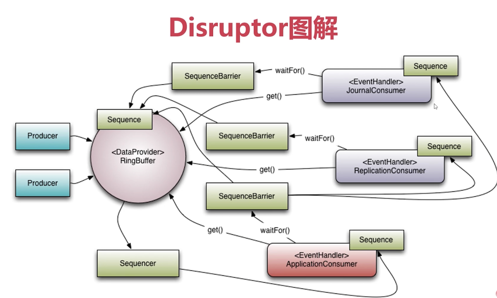

# 一、多线程并发最佳实践

- 使用本地变量；
- 使用不可变类；
- 最小化锁的作用域范围:S = 1 / (1 - a + a/n)
- 使用线程池，而不是直接new Thread执行；
- 宁可使用同步也不要使用线程的wait和notify(可以使用CountDownLatch)；
- 使用BlockingQueue实现生产-消费模式；
- 使用并发集合而不是加了锁的同步集合；
- 使用Semaphore创建有界的访问；
- 宁可使用同步代码块也不要使用同步方法(synchronized)；
- 避免使用静态变量，如果一定要用静态变量，可以声明为 final；

# 二、生产者与消费者

## 1、问题描述

在并发编程中使用生产者和消费者模式能够解决绝大多数并发问题

- 生产者消费者模式
    在线程世界里，生产者就是生产数据的线程，消费者就是消费数据的线程。生产者消费者模式是通过一个容器来解决生产者和消费者的强耦合问题。生产者和消费者彼此之间不直接通讯，而通过阻塞队列来进行通讯；

- 解决生产者\消费者问题的方法可以分为两类：
    * 采用某种机制保护生产者与消费者的同步；
    * 在生产者和消费者之间建立管道；

    第一种方式有较高的效率，并且易于实现，代码控制性好，属于常用实现模式；<br>
    第二种管道缓冲区不易控制，被传输的数据不易封装.

- 生产者\消费者经典的实现是ThreadPoolExecutor与工作队列的关系

## 2、实现

* [各种实现代码](https://github.com/chenlanqing/java-code/blob/main/concurrent/producer-consumer/README.md)

### 2.1、wait()/notify()方法

wait() / nofity()[notifyAll()]方法是基类Object的两个方法：
- wait()方法：当缓冲区已满/空时，生产者/消费者线程停止自己的执行，放弃锁，使自己处于等等状态，让其他线程执行。
- notify()方法：当生产者/消费者向缓冲区放入/取出一个产品时，向其他等待的线程发出可执行的通知，同时放弃锁，使自己处于等待状态
```java
public class WaitAndNotify {
    private static Integer count = 0;
    private static final Integer FULL = 10;
    private static Object LOCK = new Object();
    public static void main(String[] args) {
        WaitAndNotify w = new WaitAndNotify();
        new Thread(w.new Producer()).start();
        new Thread(w.new Producer()).start();
        new Thread(w.new Producer()).start();
        new Thread(w.new Producer()).start();
        new Thread(w.new Producer()).start();
        new Thread(w.new Consumer()).start();
        new Thread(w.new Consumer()).start();
        new Thread(w.new Consumer()).start();
        new Thread(w.new Consumer()).start();
        new Thread(w.new Consumer()).start();
    }
    class Producer implements Runnable {
        @Override
        public void run() {
            for (int i = 0; i < 10; i++) {
                try {
                    Thread.sleep(3000);
                } catch (InterruptedException e) {
                    e.printStackTrace();
                }
                synchronized (LOCK) {
                    while (count == FULL) {
                        try {
                            LOCK.wait();
                        } catch (InterruptedException e) {
                            e.printStackTrace();
                        }
                    }
                    count++;
                    System.out.println(Thread.currentThread().getName() + " ~~~~~生产者生产， 目前总共有:" + count);
                    LOCK.notifyAll();
                }
            }
        }
    }
    class Consumer implements Runnable {
        @Override
        public void run() {
            for (int i = 0; i < 10; i++) {
                try {
                    Thread.sleep(3000);
                } catch (InterruptedException e) {
                    e.printStackTrace();
                }
                synchronized (LOCK) {
                    while (count == 0) {
                        try {
                            LOCK.wait();
                        } catch (InterruptedException e) {
                            e.printStackTrace();
                        }
                    }
                    count--;
                    System.out.println(Thread.currentThread().getName() + " ~~~~~消费者消费， 目前总共有:" + count);
                    LOCK.notifyAll();
                }
            }
        }
    }
}

```

### 2.2、ReentrantLock实现

使用到 Condition的 await和signal()/singnalAll() 来实现线程的通信

```java
public class LockExample {
    private static Integer count = 0;
    private static final Integer FULL = 10;
    private Lock lock = new ReentrantLock();
    private final Condition notFull = lock.newCondition();
    private final Condition notEmpty = lock.newCondition();
    public static void main(String[] args) {
        LockExample w = new LockExample();
        new Thread(w.new Producer()).start();
        new Thread(w.new Producer()).start();
        new Thread(w.new Producer()).start();
        new Thread(w.new Producer()).start();
        new Thread(w.new Producer()).start();
        new Thread(w.new Consumer()).start();
        new Thread(w.new Consumer()).start();
        new Thread(w.new Consumer()).start();
        new Thread(w.new Consumer()).start();
        new Thread(w.new Consumer()).start();
    }
    class Producer implements Runnable {
        @Override
        public void run() {
            for (int i = 0; i < 10; i++) {
                try {
                    Thread.sleep(3000);
                } catch (InterruptedException e) {
                    e.printStackTrace();
                }
                lock.lock();
                try {
                    while (count == FULL){
                        try {
                            notFull.await();
                        } catch (InterruptedException e) {
                            e.printStackTrace();
                        }
                    }
                    count++;
                    System.out.println(Thread.currentThread().getName() + " ~~~~~生产者生产， 目前总共有:" + count);
                    notEmpty.signal();
                } finally {
                    lock.unlock();
                }
            }
        }
    }
    class Consumer implements Runnable {
        @Override
        public void run() {
            for (int i = 0; i < 10; i++) {
                try {
                    Thread.sleep(3000);
                } catch (InterruptedException e) {
                    e.printStackTrace();
                }
                lock.lock();
                try {
                    while (count == 0){
                        try {
                            notEmpty.await();
                        } catch (InterruptedException e) {
                            e.printStackTrace();
                        }
                    }
                    count--;
                    System.out.println(Thread.currentThread().getName() + " ~~~~~消费者消费， 目前总共有:" + count);
                    notFull.signal();
                } finally {
                    lock.unlock();
                }
            }
        }
    }
}

```
### 2.3、阻塞队列BlockingQueue的实现

被阻塞的情况主要有如下两种:
- 当队列满了的时候进行入队列操作
- 当队列空了的时候进行出队列操作

使用take()和put()方法，这里生产者和生产者，消费者和消费者之间不存在同步，所以会出现连续生成和连续消费的现象。
```java
public class BlockingQueueExample {
    private static Integer count = 0;
    final BlockingQueue<Integer> blockingQueue = new ArrayBlockingQueue<Integer>(10);
    public static void main(String[] args) {
        BlockingQueueExample w = new BlockingQueueExample();
        new Thread(w.new Producer()).start();
        new Thread(w.new Producer()).start();
        new Thread(w.new Producer()).start();
        new Thread(w.new Producer()).start();
        new Thread(w.new Producer()).start();
        new Thread(w.new Consumer()).start();
        new Thread(w.new Consumer()).start();
        new Thread(w.new Consumer()).start();
        new Thread(w.new Consumer()).start();
        new Thread(w.new Consumer()).start();
    }
    class Producer implements Runnable {
        @Override
        public void run() {
            for (int i = 0; i < 10; i++) {
                try {
                    Thread.sleep(3000);
                } catch (InterruptedException e) {
                    e.printStackTrace();
                }
                try {
                    blockingQueue.put(1);
                    count++;
                    System.out.println(Thread.currentThread().getName() + " ~~~~~生产者生产， 目前总共有:" + count);
                } catch (InterruptedException e){
                    e.printStackTrace();
                }
            }
        }
    }
    class Consumer implements Runnable {
        @Override
        public void run() {
            for (int i = 0; i < 10; i++) {
                try {
                    Thread.sleep(3000);
                } catch (InterruptedException e) {
                    e.printStackTrace();
                }
                try {
                    blockingQueue.take();
                    count--;
                    System.out.println(Thread.currentThread().getName() + " ^^^^^^消费者消费， 目前总共有:" + count);
                } catch (InterruptedException e){
                    e.printStackTrace();
                }
            }
        }
    }
}
```
### 2.4、信号量Semaphore的实现

Java中的Semaphore维护了一个许可集，一开始先设定这个许可集的数量，可以使用acquire()方法获得一个许可，当许可不足时会被阻塞，release()添加一个许可。加入了另外一个mutex信号量，维护生产者消费者之间的同步关系，保证生产者和消费者之间的交替进行
```java
public class SemaphoreExample {
    private static Integer count = 0;
    final Semaphore notFull = new Semaphore(10);
    final Semaphore notEmpty = new Semaphore(0);
    final Semaphore mutex = new Semaphore(1);
    public static void main(String[] args) {
        SemaphoreExample w = new SemaphoreExample();
        new Thread(w.new Producer()).start();
        new Thread(w.new Producer()).start();
        new Thread(w.new Producer()).start();
        new Thread(w.new Producer()).start();
        new Thread(w.new Producer()).start();
        new Thread(w.new Consumer()).start();
        new Thread(w.new Consumer()).start();
        new Thread(w.new Consumer()).start();
        new Thread(w.new Consumer()).start();
        new Thread(w.new Consumer()).start();
    }
    class Producer implements Runnable {
        @Override
        public void run() {
            for (int i = 0; i < 10; i++) {
                try {
                    Thread.sleep(3000);
                } catch (InterruptedException e) {
                    e.printStackTrace();
                }
                try {
                    notFull.acquire();
                    mutex.acquire();
                    count++;
                    System.out.println(Thread.currentThread().getName() + " ~~~~~生产者生产， 目前总共有:" + count);
                } catch (InterruptedException e) {
                    e.printStackTrace();
                } finally {
                    mutex.release();
                    notEmpty.release();
                }
            }
        }
    }
    class Consumer implements Runnable {
        @Override
        public void run() {
            for (int i = 0; i < 10; i++) {
                try {
                    Thread.sleep(3000);
                } catch (InterruptedException e) {
                    e.printStackTrace();
                }
                try {
                    notEmpty.acquire(); 
                    mutex.acquire();
                    count--;
                    System.out.println(Thread.currentThread().getName() + " ^^^^^^消费者消费， 目前总共有:" + count);
                } catch (InterruptedException e) {
                    e.printStackTrace();
                } finally {
                    mutex.release();
                    notFull.release();
                }
            }
        }
    }
}
```
### 2.5、管道输入输出流实现

PipedOutputStream和PipedInputStream分别是管道输出流和管道输入流.它们的作用是让多线程可以通过管道进行线程间的通讯.在使用管道通信时，必须将PipedOutputStream和PipedInputStream配套使用。

使用方法：

先创建一个管道输入流和管道输出流，然后将输入流和输出流进行连接，用生产者线程往管道输出流中写入数据，消费者在管道输入流中读取数据，这样就可以实现了不同线程间的相互通讯。

但是这种方式在生产者和生产者、消费者和消费者之间不能保证同步，也就是说在一个生产者和一个消费者的情况下是可以生产者和消费者之间交替运行的，多个生成者和多个消费者者之间则不行

```java
public class PipedExample {
    final PipedInputStream pis = new PipedInputStream();
    final PipedOutputStream pos = new PipedOutputStream();
    {
        try {
            pis.connect(pos);
        } catch (IOException e) {
            e.printStackTrace();
        }
    }
    public static void main(String[] args) {
        PipedExample p = new PipedExample();
        new Thread(p.new Producer()).start();
        new Thread(p.new Consumer()).start();
    }
    class Producer implements Runnable {
        @Override
        public void run() {
            try {
                while (true) {
                    Thread.sleep(1000);
                    int num = (int) (Math.random() * 255);
                    System.out.println(Thread.currentThread().getName() + "生产者生产了一个数字，该数字为： " + num);
                    pos.write(num);
                    pos.flush();
                }
            } catch (Exception e) {
                e.printStackTrace();
            } finally {
                try {
                    pos.close();
                    pis.close();
                } catch (IOException e) {
                    e.printStackTrace();
                }
            }
        }
    }
    class Consumer implements Runnable {
        @Override
        public void run() {
            try {
                while (true) {
                    Thread.sleep(1000);
                    int num = pis.read();
                    System.out.println("消费者消费了一个数字，该数字为：" + num);
                }
            } catch (Exception e) {
                e.printStackTrace();
            } finally {
                try {
                    pos.close();
                    pis.close();
                } catch (IOException e) {
                    e.printStackTrace();
                }
            }
        }
    }
}
```

### 2.6、Exchanger

```java
public class ExchangerDemo {
    public static void main(String[] args) {
        List<String> buffer1 = new ArrayList<String>();
        List<String> buffer2 = new ArrayList<String>();
        Exchanger<List<String>> exchanger = new Exchanger<List<String>>();
        Thread producerThread = new Thread(new Producer(buffer1,exchanger));
        Thread consumerThread = new Thread(new Consumer(buffer2,exchanger));
        producerThread.start();
        consumerThread.start();
    }
    static class Producer implements Runnable {
        // 生产者消费者交换的数据结构
        private List<String> buffer;
        // 生产者和消费者的交换对象
        private Exchanger<List<String>> exchanger;
        public Producer(List<String> buffer, Exchanger<List<String>> exchanger) {
            this.buffer = buffer;
            this.exchanger = exchanger;
        }
        @Override
        public void run() {
            for (int i = 1; i < 5; i++) {
                System.out.println("生产者第" + i + "次提供");
                for (int j = 1; j <= 3; j++) {
                    System.out.println("生产者装入" + i + "--" + j);
                    buffer.add("buffer：" + i + "--" + j);
                }
                System.out.println("生产者装满，等待与消费者交换...");
                try {
                    exchanger.exchange(buffer);
                } catch (InterruptedException e) {
                    e.printStackTrace();
                }
            }
        }
    }
    static class Consumer implements Runnable {
        private List<String> buffer;
        private final Exchanger<List<String>> exchanger;
        public Consumer(List<String> buffer, Exchanger<List<String>> exchanger) {
            this.buffer = buffer;
            this.exchanger = exchanger;
        }
        @Override
        public void run() {
            for (int i = 1; i < 5; i++) {
                //调用exchange()与消费者进行数据交换
                try {
                    buffer = exchanger.exchange(buffer);
                } catch (InterruptedException e) {
                    e.printStackTrace();
                }
                System.out.println("消费者第" + i + "次提取");
                for (int j = 1; j <= 3; j++) {
                    System.out.println("消费者 : " + buffer.get(0));
                    buffer.remove(0);
                }
            }
        }
    }
}
```

### 2.7、LockSupport实现

```java
public class ProducerConsumerExample {
    private static volatile boolean isProduced = false; // 表示是否生产了数据
    private static Thread producerThread;
    private static Thread consumerThread;

    public static void main(String[] args) {
        producerThread = new Thread(() -> {
            for (int i = 1; i <= 5; i++) {
                while (isProduced) {
                    LockSupport.park(); // 生产者等待消费者消费完
                }
                System.out.println("Produced: " + i);
                isProduced = true;
                LockSupport.unpark(consumerThread); // 唤醒消费者
            }
        });

        consumerThread = new Thread(() -> {
            for (int i = 1; i <= 5; i++) {
                while (!isProduced) {
                    LockSupport.park(); // 消费者等待生产者生产完
                }
                System.out.println("Consumed: " + i);
                isProduced = false;
                LockSupport.unpark(producerThread); // 唤醒生产者
            }
        });

        // 启动线程
        producerThread.start();
        consumerThread.start();

        // 预先唤醒生产者线程开始生产
        LockSupport.unpark(producerThread);
    }
}
```

# 三、Disruptor

- [高性能队列——Disruptor](https://tech.meituan.com/2016/11/18/disruptor.html)
- [Disruptor-使用指南](https://lmax-exchange.github.io/disruptor/user-guide/index.html)
* [The LMAX Architecture](https://martinfowler.com/articles/lmax.html)
* [LMAX架构](https://www.jianshu.com/p/5e0c4481efb7)
* [Disruptor撮合交易](https://mp.weixin.qq.com/s/kmuG5azJnqjKRYlkiVHWqQ)

## 1、LMAX架构

LMAX是一种新型零售金融交易平台，它能够以很低的延迟(latency)产生大量交易(吞吐量)。

这个系统是建立在JVM平台上，核心是一个业务逻辑处理器，它能够在一个线程里每秒处理6百万订单。业务逻辑处理器完全是运行在内存中(in-memory)，使用事件源驱动方式(event sourcing). 业务逻辑处理器的核心是`Disruptors`，这是一个并发组件，能够在无锁的情况下实现网络的Queue并发操作；

## 2、Disruptor介绍

Disruptor 是一款高性能的有界内存队列，高性能原因：
- 内存分配更加合理，利用RingBuffer数据结构，数组元素在初始化时一次性全部创建；
- 提高缓存命中率；对象循环利用，避免频繁GC；
- 避免伪共享，提高缓存利用率：使用缓存行填充，每个变量占用一个缓存行，不共享缓存行
- 采用无锁算法，避免频繁加锁、解锁的性能消耗，比如Disruptor入队操作：如果没有足够的空余位置，就让出CPU使用权，然后重新计算，反之则使用CAS设置入队索引
- 支持批量消费，消费者可以无锁方式消费多个消息；

### 2.1、RingBuffer提高性能

RingBuffer本质上也是数组，其在结构上做了很多优化，其中一项是和内存分配相关的。首先看下局部性原理：所谓局部性原理是指在一段时间内程序的执行还有限定在一个局部范围内，局部性可以从两个方面来理解：
* 时间局部性：如果某个数据被访问，那么在不久的将来它很可能再次被访问；
* 空间局部性：如果某块内存被访问，不久之后这块内存附近的内存也很可能被访问；

首先是 ArrayBlockingQueue。生产者线程向 ArrayBlockingQueue 增加一个元素，每次增加元素 E 之前，都需要创建一个对象 E，如下图所示，ArrayBlockingQueue 内部有 6 个元素，这 6 个元素都是由生产者线程创建的，由于创建这些元素的时间基本上是离散的，所以这些元素的内存地址大概率也不是连续的。

Disruptor 内部的 RingBuffer 也是用数组实现的，但是这个数组中的所有元素在初始化时是一次性全部创建的，所以这些元素的内存地址大概率是连续的，相关的代码如下所示。
```java
for (int i=0; i<bufferSize; i++){
  //entries[]就是RingBuffer内部的数组
  //eventFactory就是前面示例代码中传入的LongEvent::new
  entries[BUFFER_PAD + i] 
    = eventFactory.newInstance();
}
```
**数组中所有元素内存地址连续能提升性能吗？**能！为什么呢？因为消费者线程在消费的时候，是遵循空间局部性原理的，消费完第 1 个元素，很快就会消费第 2 个元素；当消费第 1 个元素 E1 的时候，CPU 会把内存中 E1 后面的数据也加载进 Cache，如果 E1 和 E2 在内存中的地址是连续的，那么 E2 也就会被加载进 Cache 中，然后当消费第 2 个元素的时候，由于 E2 已经在 Cache 中了，所以就不需要从内存中加载了，这样就能大大提升性能。

除此之外，在 Disruptor 中，生产者线程通过 publishEvent() 发布 Event 的时候，并不是创建一个新的 Event，而是通过 event.set() 方法修改 Event， 也就是说 RingBuffer 创建的 Event 是可以循环利用的，这样还能避免频繁创建、删除 Event 导致的频繁 GC 问题。

## 3、Disruptor快速入门

（1）构架一个Event：Event 是具体的数据实体，生产者生产 Event ，存入 RingBuffer，消费者从 RingBuffer 中消费它进行逻辑处理。Event 就是一个普通的 Java 对象，无需实现 Disruptor 内定义的接口
```java
@Data
public class OrderEvent {
    private Long value;
}
```
（2）构建一个EventFactory：用于创建 Event 对象
```java
public class OrderEventFactory implements EventFactory<OrderEvent> {
    @Override
    public OrderEvent newInstance() {
        return new OrderEvent();
    }
}
```
（3）定义生产者：生成者主要是持有 RingBuffer 对象进行数据的发布
- RingBuffer 内部维护了一个 Object 数组（也就是真正存储数据的容器），在 RingBuffer 初始化时该 Object 数组就已经使用 EventFactory 初始化了一些空 Event，后续就不需要在运行时来创建了，提高性能。因此这里通过 RingBuffer 获取指定序号得到的是一个空对象，需要对它进行赋值后，才能进行发布。
- 这里通过 RingBuffer 的 next 方法获取可用序号，如果 RingBuffer 空间不足会阻塞。
- 通过 next 方法获取序号后，需要确保接下来使用 publish 方法发布数据
```java
public class OrderEventProducer {
    private RingBuffer<OrderEvent> ringBuffer;
    public OrderEventProducer(RingBuffer<OrderEvent> ringBuffer) {
        this.ringBuffer = ringBuffer;
    }
    public void sendData(ByteBuffer data) {
        // 1、在生产者发送消息的时候, 首先需要从我们的ringBuffer里面获取一个可用的序号
        long sequence = ringBuffer.next();
        try {
            //2、注意此时获取的OrderEvent对象是一个没有被赋值的空对象
            OrderEvent event = ringBuffer.get(sequence);
            //3、进行实际的赋值处理
            event.setValue(data.getLong(0));           
        } finally {
            //4、 提交发布操作
            ringBuffer.publish(sequence);          
        }
    }
}
```
（4）定义消费者：消费者可以实现 EventHandler 接口，定义自己的处理逻辑
```java
public class OrderEventHandler implements EventHandler<OrderEvent> {
    @Override
    public void onEvent(OrderEvent event, long sequence, boolean endOfBatch) throws Exception {
        System.out.println("消费者：" + event.getValue());
    }
}
```
（5）构建一个Disruptor
```java
/**
    * 1 eventFactory: 消息(event)工厂对象
    * 2 ringBufferSize: 容器的长度
    * 3 executor: 线程池(建议使用自定义线程池) RejectedExecutionHandler
    * 4 ProducerType: 单生产者 还是 多生产者
    * 5 waitStrategy: 等待策略
    */
//1. 实例化disruptor对象
Disruptor<OrderEvent> disruptor = new Disruptor<OrderEvent>(orderEventFactory,
        ringBufferSize,
        executor,
        ProducerType.SINGLE,
        new BlockingWaitStrategy());
//2. 添加消费者的监听 (构建disruptor 与 消费者的一个关联关系)
disruptor.handleEventsWith(new OrderEventHandler());
//3. 启动disruptor
disruptor.start();
```
（6）主流程：
- 首先初始化一个 Disruptor 对象，Disruptor 有多个重载的构造函数。支持传入 EventFactory 、ringBufferSize （需要是2的幂次方）、executor（用于执行EventHandler 的事件处理逻辑，一个 EventHandler 对应一个线程，一个线程只服务于一个 EventHandler ）、生产者模式（支持单生产者、多生产者）、阻塞等待策略。在创建 Disruptor 对象时，内部会创建好指定 size 的 RingBuffer 对象。
- 定义 Disruptor 对象之后，可以通过该对象添加消费者 EventHandler。
- 启动 Disruptor，会将第2步添加的 EventHandler 消费者封装成 EventProcessor（实现了 Runnable 接口），提交到构建 Disruptor 时指定的 executor 对象中。由于 EventProcessor 的 run 方法是一个 while 循环，不断尝试从RingBuffer 中获取数据。因此可以说一个 EventHandler 对应一个线程，一个线程只服务于一个EventHandler。
- 拿到 Disruptor 持有的 RingBuffer，然后就可以创建生产者，通过该RingBuffer就可以发布生产数据了，然后 EventProcessor 中启动的任务就可以消费到数据，交给 EventHandler 去处理了。

## 4、Disruptor核心组件

### 4.1、RingBuffer

一个环形数组，是Disruptor的核心数据结构，用于存储事件。环形缓冲区的大小是固定的，所有的事件都按照顺序存储在缓冲区中，生产者和消费者可以通过索引来读写事件。
- 存储事件：环形缓冲区提供了一个固定大小的存储空间，用于存放生产者产生的事件。生产者将事件写入环形缓冲区的空闲位置，而不需要进行锁操作或等待其他线程的释放，从而避免了锁竞争的开销。
- 支持并发读写：环形缓冲区的结构支持多个生产者和多个消费者同时进行读写操作。这意味着多个线程可以并发地向环形缓冲区写入事件或从中读取事件，提高了整体的处理能力和并发性能。
- 解耦生产者和消费者：环形缓冲区作为生产者和消费者之间的中间介质，实现了生产者和消费者的解耦。生产者将事件写入缓冲区后，可以继续进行其他操作，而不需要等待消费者的处理。消费者则可以根据自身的处理能力和节奏从缓冲区中读取事件进行处理。
- 循环利用空间：环形缓冲区的大小是固定的，并且采用循环的方式利用空间。当缓冲区的末尾被写满后，新的事件会从缓冲区的开头重新写入，实现了对空间的循环利用。这样可以避免频繁地进行内存分配和释放，提高了系统的效率和性能。

### 4.2、Disruptor

- 解决数据依赖
- 提高并发性能
- 避免竞争和锁
- 确保顺序性

### 4.3、Sequence

- 通过顺序递增的序号来编号，管理进行交互的数据；
- 对数据的处理过程总是沿着序号逐个递增处理；
- 一个sequence用于跟踪标识某个特定的事件处理者（RingBuffer、Producer、Consumer）的处理进度
- Sequence可以看成是一个AtomicLong用于标识进度；
- 还有另外一个目的是防止不同的Sequence之间CPU缓存伪共享的问题

Disruptor 中使用 Sequence 类的 value 字段来表示生产/消费进度，可以看到在该字段前后各填充了7个 long 类型的变量，来避免伪共享。另外，向 RingBuffer 内部的数组、

SingleProducerSequencer 等也使用了该技术
```java
class LhsPadding {
    protected long p1, p2, p3, p4, p5, p6, p7;
}
class Value extends LhsPadding {
    protected volatile long value;
}
class RhsPadding extends Value {
    protected long p9, p10, p11, p12, p13, p14, p15;
}
```

### 4.4、Sequencer

Sequencer（序列器）是 Disruptor 框架中的核心组件之一，它在生产者和消费者之间起着关键的协调作用。Sequencer 的主要作用如下：
- 控制事件发布顺序：Sequencer 确保生产者发布事件的顺序，并为每个事件分配递增的序列号。生产者通过 Sequencer 将事件写入环形缓冲区，并且保证事件按照顺序被消费者处理。这样可以确保事件的顺序性，避免乱序或错乱的情况发生。
- 确保消费者进度：Sequencer 跟踪消费者的处理进度，即消费者处理事件的序列号。通过跟踪最小消费者序列号和最大消费者序列号，Sequencer 可以确保所有消费者都已经处理了指定序列号之前的所有事件。这种机制保证了事件处理的完整性，消费者不会丢失或跳过任何事件。
- 提供等待策略：Sequencer 提供了多种等待策略，用于控制生产者和消费者之间的协调和等待行为。等待策略可以根据系统的需求进行配置，例如自旋等待、阻塞等待、超时等待等，以最大程度地平衡生产者和消费者之间的速度差异。
- 支持批量操作：Sequencer 还支持批量操作，即生产者和消费者可以一次性处理多个事件。通过指定批量大小，生产者可以连续写入多个事件，而消费者可以一次性处理多个事件，从而减少了线程间的通信开销和上下文切换。

接口有两个实现类 SingleProducerSequencer、MultiProducerSequencer ，它们定义在生产者和消费者之间快速、正确地传递数据的并发算法。

### 4.5、SequenceBarrier

Sequence Barrier（序列屏障）是 Disruptor 框架中的另一个重要组件，用于控制事件的发布和消费顺序，确保消费者在处理事件时按照正确的顺序进行。
两个主要作用：
- 控制事件发布顺序：在 Disruptor 中，生产者通过 Sequencer 将事件写入环形缓冲区，并分配递增的序列号。而消费者通过 Sequence 来表示自己已经处理的事件位置。Sequence Barrier 用于控制消费者可以读取的事件的范围。每个消费者都要在 Sequence Barrier 上等待，直到它们的序列号达到 Sequence Barrier 的值，才能继续处理事件。这样确保了消费者按照正确的顺序处理事件，避免了乱序和错乱。
- 避免事件丢失和覆盖：通过 Sequence Barrier 的等待机制，确保了所有消费者都已经处理了指定序列号之前的所有事件。这样可以防止事件的丢失或覆盖，消费者不会跳过未处理的事件，从而保证了数据的完整性。

Sequence Barrier 可以看作是一个事件的处理控制点，它定义了消费者可以读取事件的边界。当消费者在 Sequence Barrier 上等待时，如果事件的序列号还没有达到 Sequence Barrier 的值，消费者将被阻塞，直到满足条件。

Disruptor 提供了不同的 Sequence Barrier 实现，以支持不同的等待策略，如自旋等待、阻塞等待、超时等待等。开发者可以根据具体的场景需求选择合适的等待策略，以平衡生产者和消费者之间的速度差异，实现高效的事件处理。

### 4.6、WaitStrategy

等待策略（Wait Strategy）是 Disruptor 框架中用于控制消费者在没有可用事件时的等待行为的策略。

Disruptor 提供了多种等待策略可供选择，常见的等待策略包括：
- BlockingWaitStrategy：是最低效的策略，但其对CPU的消耗最小并且在各种不同部署环境中能提供更加一致的性能表现；
- SleepingWaitStrategy：其性能跟BlockingWaitStrategy差不多，对CPU的消耗类似，但其对生产者线程的影响最小，适合用于异步日志类似的场景；
- YieldingWaitStrategy：其性能最好，适合用于低延迟的系统。在要求极高性能且事件处理数小于CPU逻辑核心数的场景中，推荐使用此策略；比如CPU开启超线程的特性；
- BusySpinWaitStrategy：忙等待策略，在消费者没有可用事件时，会进行自旋等待，不进行休眠或让步。这种策略可以实现最低的延迟，但也会持续消耗 CPU 资源。

等待策略的选择应根据具体应用场景和需求进行权衡。例如，对于对低延迟和高吞吐量要求较高的场景，可以选择 BusySpinWaitStrategy 等策略；而对于对系统资源占用要求较高的场景，可以选择 SleepingWaitStrategy 或 YieldingWaitStrategy 等策略。

### 4.7、Event

在 Disruptor 中，Event（事件）是传递的数据单元，它是实际需要在生产者和消费者之间传递的信息。

在 Disruptor 中，事件通常是一个简单的数据结构，例如一个包含若干字段的 Java 对象。在创建 Disruptor 时，需要预先定义事件的数据结构，并为其分配内存空间。然后，生产者可以在这块预分配的内存中填充事件的数据，而消费者则可以从中读取和处理事件的数据。

### 4.8、EventProcessor

在 Disruptor 框架中，EventProcessor（事件处理器）是消费者（Consumer）的抽象表示，用于处理从环形缓冲区中读取的事件（Event）。

EventProcessor 主要有两个重要的子类：
- BatchEventProcessor：这是最常见的事件处理器类型。它负责从环形缓冲区中读取事件，并将事件批量地传递给一个或多个 EventHandlers（事件处理器）。 BatchEventProcessor 会维护一个 Sequence，用于跟踪其处理的事件序列号，以及一个 SequenceBarrier，用于控制其和其他消费者的事件处理顺序。
- WorkProcessor：与 BatchEventProcessor 不同，WorkProcessor 只会将事件传递给单个 WorkHandler（工作处理器）。WorkProcessor 在处理事件时不需要维护 Sequence ，因为它只会处理来自 SequenceBarrier 的单个事件。

EventProcessor 的主要作用是将 Disruptor 中的事件从环形缓冲区中读取出来，并将其传递给相应的事件处理器进行处理。这样，Disruptor 可以将事件的生产和消费解耦，实现高效的并发处理。

需要注意的是，Disruptor 中的事件处理器是单线程的，每个 EventProcessor 都会在自己的线程中独立执行。这样可以避免多个消费者之间的竞争和锁操作

### 4.9、EventHandler

EventHandler（事件处理器）是 Disruptor 框架中用于处理事件的实际组件，它实现了对事件的具体处理逻辑。 EventHandler 是 EventProcessor 的一种具体实现。每个 EventHandler 都会被绑定到一个或多个 EventProcessor 上，负责实际处理从环形缓冲区中读取到的事件。

EventHandler 的主要作用如下：
- 事件处理逻辑：EventHandler 实现了具体的事件处理逻辑。当 EventProcessor 从环形缓冲区读取到事件时，会将事件传递给 EventHandler 进行处理。EventHandler 可以根据事件的数据和业务逻辑，执行相应的处理操作。
- 并发处理：Disruptor 框架中可以有多个 EventHandler，每个 EventHandler 在不同的线程中独立执行。这样可以实现事件的并发处理，提高系统的吞吐量和性能。
- 事件依赖处理：在 Disruptor 中，可以将多个 EventHandler 进行组合，形成事件处理链。每个 EventHandler 处理完事件后，将事件传递给下一个 EventHandler 进行处理。这样可以实现事件的依赖处理，将复杂的业务逻辑拆分为多个独立的 EventHandler 进行处理。
- 状态管理：EventHandler 可以维护自己的状态，用于跟踪和管理事件处理过程中的状态信息。它可以记录已处理的事件数量、统计数据、错误处理等，以支持事件处理的状态管理和监控。

通过定义和实现 EventHandler，可以将事件处理逻辑与 Disruptor 框架进行结合，实现高效、可扩展的事件处理。EventHandler 应该根据具体的业务需求进行设计和实现，确保处理逻辑正确、高效，并满足系统的性能要求。

### 4.10、WorkProcessor

确保每个sequence只能被一个processor消费，在同一个workpool中处理多个WorkProcessor不会被消费统一的sequence

### 4.11、Disruptor编程模型



## 5、Disruptor高级应用

### 5.1、核心链路应用场景

如京东中下单：用户添加到购物车 -> 下单 —> 支付 —> 配送 -> 收货

核心链路的代码实现，业务逻辑非常复杂；核心链路特点：至关重要且业务复杂

主要实现方式：
- 传统的完全解耦模式
- 模板模式

上述方式不适合，解决手段：
- 领域模型的高度抽象
- 寻找更好的框架帮助进行编码：
    - 有限状态机框架，比如：spring-statemachine
    - 使用Disruptor

### 5.2、并行计算

- 串行操作：使用链式调用的方式：`disruptor.handleEventsWith(new Handler1()).handleEventsWith(new Handler2()).handleEventsWith(new Handler3());`
- 并行操作：使用单独调用的方式：
    - 单独调用：
        ```java
        disruptor.handleEventsWith(new Handler1());
        disruptor.handleEventsWith(new Handler2());
        disruptor.handleEventsWith(new Handler3());
        ```
    - 传入多个元素：`disruptor.handleEventsWith(new Handler1(), new Handler2(), new Handler3());`

### 5.3、多边形高端操作

Disruptor可以实现串并行同时编码
- 菱形操作
    ```java
    disruptor.handleEventsWith(new Handler1(), new Handler2())
            .handleEventsWith(new Handler3());
            
    // 或者 通过handlerEventsWith方法的返回参数：EventHandlerGroup 来处理
    EventHandlerGroup<Trade> ehGroup = disruptor.handleEventsWith(new Handler1(), new Handler2());
    ehGroup.then(new Handler3());
    ```
- 六边形操作
    ```java
    // 执行顺序：h1和h4是并行操作，h2在h1执行完成后执行；h5在h4执行完成后执行；在h2和h5都执行成功之后，在执行h3
    Handler1 h1 = new Handler1();
    Handler2 h2 = new Handler2();
    Handler3 h3 = new Handler3();
    Handler4 h4 = new Handler4();
    Handler5 h5 = new Handler5();
    disruptor.handleEventsWith(h1, h4);
    disruptor.after(h1).handleEventsWith(h2);
    disruptor.after(h4).handleEventsWith(h5);
    disruptor.after(h2, h5).handleEventsWith(h3);
    ```
    **注意：单消费者模式下，上述代码执行跟构造Disruptor时传入的线程池有关，因为上述代码有5个EventHandler，所以，线程池中线程数量必须至少有5个；这是因为单消费者下是由BatchEventProcessor来操作的，而BatchEventProcessor就代表一个线程，其实现了Runnable接口；对于多消费者是不存在该问题的；**

### 5.4、多生产者与多消费者

使用WorkPool来处理

## 6、高性能原因

### 6.1、Disruptor底层性能特点

- 数据结构方面：是否环形结构、数组、内存预加载；
- 使用单线程写方式、内存屏障
- 消除伪共享（填充缓存行）
- 序号栅栏和序号配合使用来消除锁和CAS；

### 6.2、空间预分配

RingBuffer 内部维护了一个 Object 数组（也就是真正存储数据的容器），在 RingBuffer 初始化时该 Object 数组就已经使用EventFactory 初始化了一些空 Event，后续就不需要在运行时来创建了，避免频繁GC。

另外，RingBuffer 的数组中的元素是在初始化时一次性全部创建的，所以这些元素的内存地址大概率是连续的。消费者在消费时，是遵循空间局部性原理的。消费完第一个Event 时，很快就会消费第二个 Event，而在消费第一个 Event 时，CPU 会把内存中的第一个 Event 的后面的 Event 也加载进 Cache 中，这样当消费第二个 Event 时，它已经在 CPU Cache 中了，所以就不需要从内存中加载了，这样也可以大大提升性能

### 6.3、使用单线程写

Disruptor的RingBuffer，做到完全无锁是因为单线程写；注入Redis、Netty等高性能技术框架的设计都是这个核心思想

其是基于系统内核

### 6.4、内存优化：内存屏障

要正确的实现无锁，还需另外一个关键技术：内存屏障

### 6.5、系统缓存优化：消除伪共享

- [伪共享问题](Java多线程-基础.md#15伪共享问题)

在 Disruptor 中，每个消费者通过维护自己的 Sequence 来表示已经处理过的事件位置。Sequence 通常会被不同的线程同时访问和修改，因此可能存在缓存伪共享问题。为了减少缓存伪共享带来的性能影响，Sequence Disruptor 可以采用以下策略：
- 缓存对齐（Cache Alignment）：在实现 Sequence 的数据结构时，可以使用编程技巧来保证不同 Sequence 的实例位于不同的缓存行中，避免了多个 Sequence 位于同一缓存行的情况，从而减少了缓存伪共享的可能性。
- Padded Padding：在 Sequence 的数据结构中，可以使用填充字段（Padding）来确保每个 Sequence 之间有足够的空间，避免它们共享同一缓存行。填充字段可以增加数据结构的大小，但可以有效地避免缓存伪共享问题

### 6.6、算法优化：序号栅栏机制

- Disruptor3.0中，序号栅栏SequenceBarrier和序号Sequence搭配使用，协调和管理消费者与生产者的工作节奏，避免了锁和CAS的使用；
- Disruptor3.0中，每个消费者和生产者都持有自己的序号，这些序号的变化必须满足如下基本条件：
    - 消费者序号数值必须小于生产者序号数值；
    - 消费者序号必须小于其前置（依赖关系）消费者的序号数值；
    - 生产者序号数值不能大于消费者中最小的序号数值，以避免生产者速度过快，将还未来得及消费的消息覆盖；

### 6.7、WaitStrategy等待策略

对于YieldingWaitStrategy实现类，尝试去修改源代码，降低高性能对CPU和内存资源的损耗

### 6.8、支持批量消费

# 四、高性能内存队列

- [Chronicle-Queue：高性能、低延迟的日志和消息队列库](https://github.com/OpenHFT/Chronicle-Queue)
- [Aeron：高吞吐量、低延迟、容错交易系统](https://github.com/real-logic/aeron)

# 参考资料

- [并行框架开发](https://blog.csdn.net/tianyaleixiaowu/category_9637010.html)
