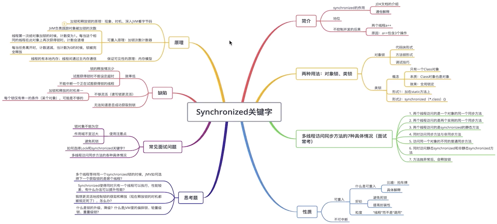
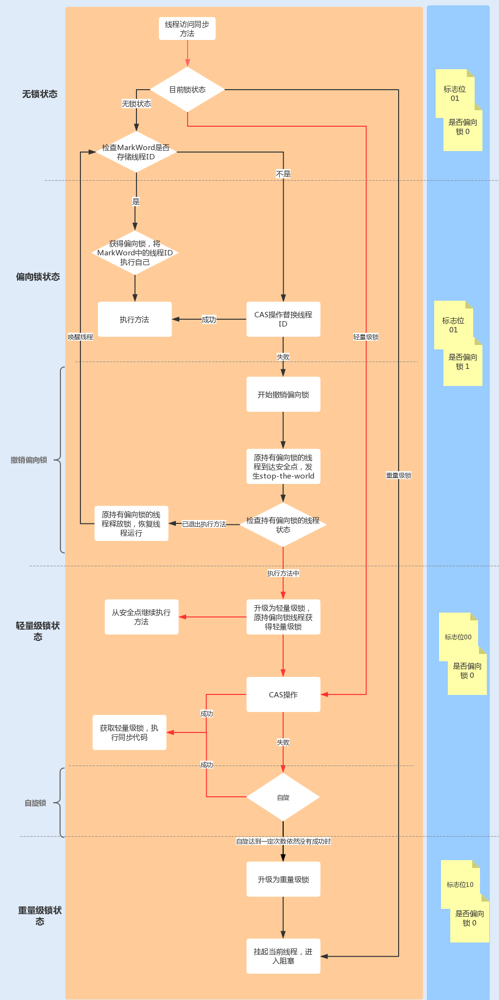
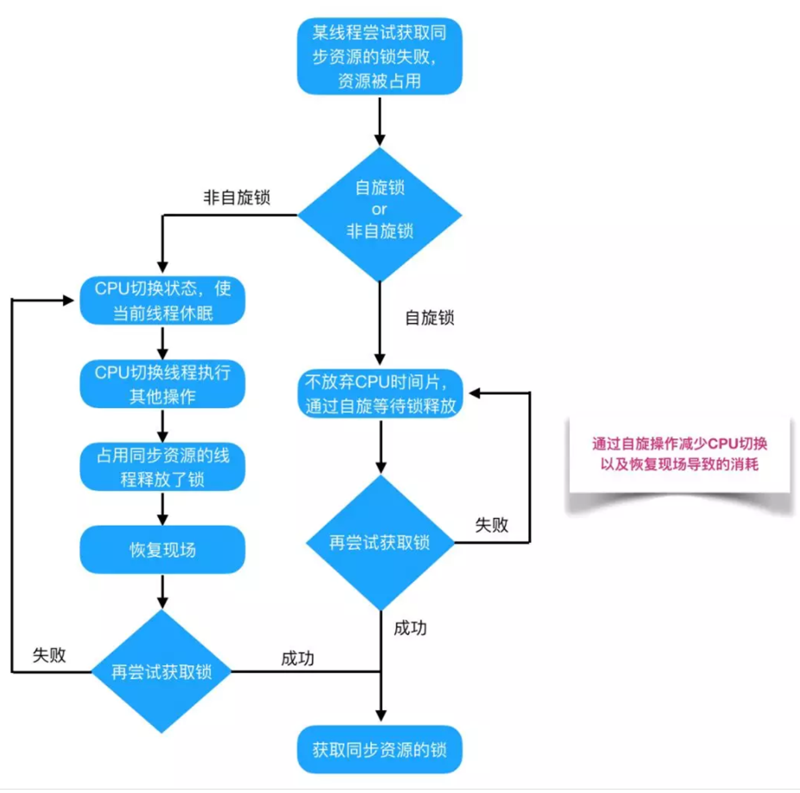

# 一、并发与多线程简介

## 1、多线程优点

- 资源利用率更好：文件读写操作
- 程序设计在某些情况下更简单；
- 程序响应更快：端口监听操作

## 2、多线程的代价

- 设计更复杂：多线程共享数据时尤其需要注意
- 上下文切换的开销：

	CPU 会在一个上下文中执行一个线程，然后切换到另外一个上下文中执行另外一个线程；上下文切换并不廉价。如果没有必要，应该减少上下文切换的发生。

	上下文切换：从任务保存到再加载的过程就是一次上下文切换；上下文切换过程中，CPU会停止处理当前运行的程序，并保存当前程序运行的具体位置以便之后继续运行。如何减少上下文切换：
	- 无锁并发编程：多线程竞争时，会引起上下文切换，所以多线程处理数据时，可以用一些办法来避免使用锁，如将数据的ID按照Hash取模分段，不同的线程处理不同段的数据
	- CAS算法：Java的Atomic包使用CAS算法来更新数据，而不需要加锁；
	- 使用最少线程：避免创建不需要的线程，比如任务很少，但是创建了很多线程来处理，这样会造成大量线程都处于等待状态；
	- 协程：在单线程里实现多任务的调度，并在单线程里维持多个任务间的切换
	- Java的线程机制主要还是基于Native Thread，Go的Coroutine是进程里自己管理的一种"Thread"，所以在高并发的场景下，Coroutine可以有效的降低比较重的native的线程上下文切换，从而来提高并发处理能力


- 增加资源消耗：如线程管理中消耗的资源

## 3、并发编程模型

Java 的并发采用的是共享内存模型

### 3.1、并行工作者

传入的作业会被分配到不同的工作者上
- 并行工作者模型中，委派者(Delegator)将传入的作业分配给不同的工作者。每个工作者完成整个任务。工作者们并行运作在不同的线程上，甚至可能在不同的CPU上
- 优点：容易理解，只需要添加更多的工作者来提高系统的并行度
- 缺点：
	- ①、共享状态可能会很复杂：等待访问共享数据结构时，线程之间的互相等待将会丢失部分并行性。许多并发数据结构是阻塞的，意味着在任何一个时间只有一个或者很少的线程能够访问；
	- ②、无状态的工作者：工作者无法在内部保存这个状态（但是每次需要的时候可以重读）称为无状态的共享状态能够被系统中得其他线程修改。所以工作者在每次需要的时候必须重读状态，以确保每次都能访问到最新的副本，不管共享状态是保存在内存中的还是在外部数据库中。
	- ③、任务顺序是不确定的：使得很难在任何特定的时间点推断系统的状态.这也使得它也更难（如果不是不可能的话）保证一个作业在其他作业之前被执行

### 3.2、流水线模式(反应器系统，或事件驱动系统)

类似于工厂中生产线上的工人们那样组织工作者
- 每个工作者只负责作业中的部分工作。当完成了自己的这部分工作时工作者会将作业转发给下一个工作者。每个工作者在自己的线程中运行，并且不会和其他工作者共享状态。有时也被称为"无共享并行模型"。

- 通常使用"非阻塞的IO"来设计使用流水线并发模型的系统，非阻塞IO意味着：一旦某个工作者开始一个IO操作的时候，这个工作者不会一直等待IO操作的结束，有了非阻塞IO，就可以使用IO操作确定工作者之间的边界;

- 流水作业甚至也有可能被转发到超过一个工作者上并发处理；

- 反应器，事件驱动系统:用流水线并发模型的系统有时候也称为反应器系统或事件驱动系统：
	- ①、系统内的工作者对系统内出现的事件做出反应，这些事件也有可能来自于外部世界或者发自其他工作者;
	- ②、流行的反应器/事件驱动平台:Vert.x，AKKa，Node.JS(JavaScript)
- Actors 和 Channels:两种比较类似的流水线(或反应器/事件驱动)模型:
	- ①、在Actor模型中每个工作者被称为actor.Actor 之间可以直接异步地发送和处理消息。Actor 可以被用来实现一个或多个像前文描述的那样的作业处理流水线;
	- ②、在Channel模型中，工作者之间不直接进行通信。相反，它们在不同的通道中发布自己的消息(事件)。其他工作者们可以在这些通道上监听消息，发送者无需知道谁在监听
- 优点：
	- ①、无需共享的状态:工作者之间无需共享状态，意味着实现的时候无需考虑所有因并发访问共享对象而产生的并发性问题;
	- ②、有状态的工作者:可以在内存中保存它们需要操作的数据，只需在最后将更改写回到外部存储系统;
	- ③、较好的硬件整合:单线程代码在整合底层硬件的时候往往具有更好的优势当能确定代码只在单线程模式下执行的时候，通常能够创建更优化的数据结构和算法单线程有状态的工作者能够在内存中缓存数据
	- ④、合理的作业顺序:作业的有序性使得它更容易地推出系统在某个特定时间点的状态

- 缺点：
	- ①、最大缺点：作业的执行往往分布到多个工作者上，并因此分布到项目中的多个类上。这样导致在追踪某个作业到底被什么代码执行时变得困难
	- ②、加大了代码编写的难度，有时会将工作者的代码写成回调处理的形式。若在代码中嵌入过多的回调处理，往往会出现所谓的回调地狱(callback hell)现象

### 3.3、函数式并行(Functional Parallelism)

- 基本思想：是采用函数调用实现程序；
- 函数式并行里面最难的是确定需要并行的那个函数调用：跨CPU协调函数调用需要一定的开销。某个函数完成的工作单元需要达到某个大小以弥补这个开销。如果函数调用作用非常小，将它并行化可能比单线程、单CPU执行还慢

### 3.4、并行与并发

- 并行：表示两个线程同时做事情，就是同时执行的意思；具有并发的含义，而并发则不一定并行；多个处理器或者是多核的处理器同时处理多个不同的任务
- 并发：是指能处理多个同时性活动的能力，并发事件之间不一定要同一时刻发生；一个处理器同时处理多个任务。
- 并发是逻辑上的同时发生（simultaneous）；并行是物理上的同时发生
- “并发”指的是程序的结构，“并行”指的是程序运行时的状态

## 4、进程与线程

要从调度、并发性、拥有的资源和系统开销等方面；
- 进程是操作系统分配资源的最小单元；
- 线程是操作系统（CPU）调度的最小单元

### 4.1、进程

- 进程表示一个逻辑控制流，就是一种计算过程，它造成一个假象，好像这个进程一直在独占CPU资源；
- 进程拥有一个独立的虚拟内存地址空间，它造成一个假象，好像这个进程一致在独占存储器资源；
- 操作系统利用fork系统调用来创建一个子进程。fork所创建的子进程会复制父进程的虚拟地址空间；
    - fork刚创建的子进程采用了共享的方式，只用指针指向了父进程的物理资源。当子进程真正要对某些物理资源写操作时，才会真正的复制一块物理资源来供子进程使用；
    - fork不只是复制了页表结构，还复制了父进程的文件描述符表，信号控制表，进程信息，寄存器资源等等；
    - fork创建的子进程开始执行的位置是fork函数返回的位置
- 进程不能通过直接共享内存的方式来进行进程间通信，只能采用信号、管道等方式来进行进程间通信；
- 进程上下文切换的资源：
    ```
    页表 -- 对应虚拟内存资源
    文件描述符表/打开文件表 -- 对应打开的文件资源
    寄存器 -- 对应运行时数据
    信号控制信息/进程运行信息
    ```
- 一个进程至少具有5种基本状态：初始态、执行状态、等待（阻塞）状态、就绪状态、终止状态-
    - 初始状态：进程刚被创建，由于其他进程正占有CPU所以得不到执行，只能处于初始状态。
    - 执行状态：任意时刻处于执行状态的进程只能有一个。
    - 就绪状态：只有处于就绪状态的经过调度才能到执行状态
    - 等待状态：进程等待某件事件完成
    - 停止状态：进程结束

**进程间通信：**
- 管道pipe：管道是一种半双工的通信方式，数据只能单向流动，而且只能在具有亲缘关系的进程间使用。进程的亲缘关系通常是指父子进程关系，也称作匿名管道；管道的实质是一个内核缓冲区，进程以先进先出 FIFO 的方式从缓冲区存取数据；主要工作原理：
    - 管道一端的进程顺序的将数据写入缓冲区，另一端的进程则顺序的读出数据。
    - 缓冲区可以看做是一个循环队列，一个数据只能被读一次，读出来后在缓冲区就不复存在了。
    - 当缓冲区为读空或写满，读数据的进程或写数据进程进入等待队列。
    - 空的缓冲区有新数据写入，或者满的缓冲区有数据读出时，唤醒等待队列中的进程继续读写

- 命名管道FIFO：有名管道也是半双工的通信方式，但是它允许无亲缘关系进程间的通信；有名管道提供了一个路径名与之关联，以文件形式存在于文件系统中，这样即使不存在亲缘关系的进程，只要可以访问该路径也能相互通信；命名管道支持同一台计算机的不同进程之间，可靠的、单向或双向的数据通信；

- 信号(signal) ：信号是Linux系统中用于进程间互相通信或者操作的一种机制，信号可以在任何时候发给某一进程，无需知道该进程的状态。如果该进程当前不是执行态，内核会暂时保存信号，当进程恢复执行后传递给它。如果一个信号被进程设置为阻塞，则该信号的传递被延迟，直到其阻塞被取消时才被传递给进程。信号在用户空间进程和内核之间直接交互，内核可以利用信号来通知用户空间的进程发生了哪些系统事件，信号事件主要有两个来源：
    - 硬件来源：用户按键输入Ctrl+C退出、硬件异常如无效的存储访问等；
    - 软件终止：终止进程信号、其他进程调用 kill 函数、软件异常产生信号；

- 消息队列MessageQueue：消息队列是存放在内核中的消息链表，每个消息队列由消息队列标识符表示，只有在内核重启或主动删除时，该消息队列才会被删除；消息队列是由消息的链表，存放在内核中并由消息队列标识符标识。消息队列克服了信号传递信息少、管道只能承载无格式字节流以及缓冲区大小受限等缺点。另外，某个进程往一个消息队列写入消息之前，并不需要另外读进程在该队列上等待消息的到达；

- 共享存储SharedMemory：共享内存就是映射一段能被其他进程所访问的内存，这段共享内存由一个进程创建，但多个进程都可以访问。共享内存是最快的 IPC 方式，它是针对其他进程间通信方式运行效率低而专门设计的。共享内存使得多个进程可以可以直接读写同一块内存空间，是最快的可用 IPC 形式，是针对其他通信机制运行效率较低而设计的。共享内存往往与其他通信机制，如信号量配合使用，来实现进程间的同步和互斥通信；

- 套接字Socket：它是一种通信机制，凭借这种机制，既可以在本机进程间通信，也可以跨网络通信，因为，套接字通过网络接口将数据发送到本机的不同进程或远程计算机的进程；TCP/IP 协议栈就是建立在 socket 通信之上，TCP/IP 构建起了当前的互联网通信网络

- 文件：

- 信号量Semaphore：信号量是一个计数器，可以用来控制多个进程对共享资源的访问。它常作为一种锁机制，防止某进程正在访问共享资源时，其他进程也访问该资源。因此，主要作为进程间以及同一进程内不同线程之间的同步手段；

### 4.2、线程

- 线程解决的最大问题就是它可以很简单地表示共享资源的问题，这里说的资源指的是存储器资源，资源最后都会加载到物理内存，一个进程的所有线程都是共享这个进程的同一个虚拟地址空间的，也就是说从线程的角度来说，它们看到的物理资源都是一样的，这样就可以通过共享变量的方式来表示共享资源，也就是直接共享内存的方式解决了线程通信的问题；
- 在Linux系统中，线程是使用clone系统调用，clone是一个轻量级的fork；它提供了一系列的参数来表示线程可以共享父类的哪些资源;
- 线程上下文切换需保存的内容：线程的id、寄存器中的值、栈数据
- 线程是操作操作系统能够进行运算调度的最小单位。线程被包含在进程之中，是进程中的实际运作单位，一个进程内可以包含多个线程，线程是资源调度的最小单位

### 4.3、协程

- 协程是一种用户态的轻量级线程，协程的调度完全由用户控制。
- 协程拥有自己的寄存器上下文和栈。协程调度切换时，将寄存器上下文和栈保存到其他地方，在切回来的时候，恢复先前保存的寄存器上下文和栈，直接操作栈则基本没有内核切换的开销，可以不加锁的访问全局变量，所以上下文的切换非常快；
- 由于协程在线程内实现，因此始终都是一个线程操作共享资源，所以不存在多线程抢占资源和资源同步问题；
- 协程适用于IO阻塞且需要大量并发的场景，当发生IO阻塞，由协程的调度器进行调度，通过将数据流yield掉，并且记录当前栈上的数据，阻塞完后立刻再通过线程恢复栈，并把阻塞的结果放到这个线程上去运行

### 4.4、区别

- 进程采用fork创建，线程采用clone创建；
- 线程是程序执行的最小单位，而进程是操作系统分配资源的最小单位；一个进程由一个或多个线程组成，线程是一个进程中代码的不同执行路线；
- 进程fork创建的子进程的逻辑流位置在fork返回的位置，线程clone创建的KSE的逻辑流位置在clone调用传入的方法位置，比如Java的Thread的run方法位置；
- 进程拥有独立的虚拟内存地址空间和内核数据结构(页表，打开文件表等)，当子进程修改了虚拟页之后，会通过写时拷贝创建真正的物理页。线程共享进程的虚拟地址空间和内核数据结构，共享同样的物理页；
- 多个进程通信只能采用进程间通信的方式，比如信号，管道，而不能直接采用简单的共享内存方式，原因是每个进程维护独立的虚拟内存空间，所以每个进程的变量采用的虚拟地址是不同的。多个线程通信就很简单，直接采用共享内存的方式，因为不同线程共享一个虚拟内存地址空间，变量寻址采用同一个虚拟内存；
- 进程上下文切换需要切换页表等重量级资源，线程上下文切换只需要切换寄存器等轻量级数据；
- 进程的用户栈独享栈空间，线程的用户栈共享虚拟内存中的栈空间，没有进程高效；
- 一个应用程序可以有多个进程，执行多个程序代码，多个线程只能执行一个程序代码，共享进程的代码段；
- 进程采用父子结构，线程采用对等结构

### 4.4、Java进程和线程的关系

- 运行一个程序产生一个进程，进程包含至少一个线程；
- 一个进程对应一个JVM实例，多个线程共享JVM里的堆；
- Java采用单线程编程模型，程序会自动创建主线程；
- 主线程可以创建子线程，原则上要后于子线程完成执行；

## 5、产生并发的原因

CPU、 内存、磁盘速度的差异，CPU缓存 -> 可见性，线程切换 -> 原子性，编译优化 -> 重排序；

并发的解决方式：
- 可见性：volatile、synchronized；
- 原子性：互斥锁
- 重排序：volatile、禁止重排序

## 6、并发编程的三要素：

- 原子性：指的是一个或者多个操作，要么全部执行并且在执行的过程中不被其他操作打断，要么就全部都不执行。
- 可见性：指多个线程操作一个共享变量时，其中一个线程对变量进行修改后，其他线程可以立即看到修改的结果。
    实现可见性的方法：synchronized或者Lock：保证同一个时刻只有一个线程获取锁执行代码，锁释放之前把最新的值刷新到主内存，实现可见性。
- 有序性：即程序的执行顺序按照代码的先后顺序来执行

# 二、Java 多线程

## 1、Java线程

继承自java.lang.Thread或其子类的

Thread thread = new Thread();

thread.start();// 调用线程

## 2、线程Thread

### 2.1、创建线程的方式

#### 2.1.1、继承Thread子类

重写run方法：run方法会在调用start()方法之后被执行

- 方式1：继承类
```java
class MyThread extends Thread{
	public void run(){
		System.out.println("my thread is running");
	}
}
// 可用如下方式创建并运行上述thread的子类:
MyThread myThread = new MyThread();
myTread.start();
```

- 方式2：创建一个Thread的匿名子类
```java
Thread thread = new Thread(){
	public void run(){
		System.out.println("my thread is running");
	}
};
thread.start();
```

#### 2.1.2、实现Runnable接口

- 新建一个实现了 java.lang.Runnable 接口的类的实例
```java
class MyRunnable implements Runnable{
	public void run(){
		System.out.println("my thread is running");
	}
}
// 为了使线程能够执行run()方法，需要在 Thread 类的构造函数中传入 MyRunnable 的实例对象
Thread thread = new Thread(new MyRunnable());
thread.start();
```

- 创建一个实现了 Runnable 接口的匿名类:
```java
Runnable myRunnable = new Runnable(){
	public void run(){
		System.out.println("Runnable running");
	}
}
Thread thread = new Thread(myRunnable);
thread.start();
```

#### 2.1.3、实现Callable接口

实现call()方法，使用FutureTask类来包装Callable对象，FutureTask对象封装了该Callable对象的call()方法的返回值；使用 FutureTask 对象作为 Thread 对象的 target创建并启动新线程。执行 Callable 方式，需要 FutureTask 实现类的支持，用于接收运算结果

```java
FutureTask<Integer> task = new FutureTask<>(new MyCallable());// FutureTask 也有闭锁的功能
new Thread(task).start();
```
其中FutureTask该类实现了接口：RunnableFuture，该接口又继承了两个接口`Runnable, Future<V>`

#### 2.1.4、实现多线程的方式

实现多线程的实质方式只有两种

只能通过新建Thread类这一种方式来创建线程，但是类里面的run方法有两种方式来实现，第一种是重写run方法，第二种实现Runnable接口的run方法，然后再把该runnable实例传给Thread类。除此之外，从表面上看线程池、定时器等工具类也可以创建线程，但是它们的本质都逃不出刚才所说的范围，也就是实现Runnable接口和继承Thread类。

### 2.3、创建 Thread 子类还是实现 Runnable 接口

- 实现 Runnable 接口，线程池可以有效的管理实现了 Runnable 接口的线程如果多个线程正在运行中，如果某个线程调用 System.exit()指示终结程序，那么全部的线程都会结束执行；
- Thread类实现了Runnable接口；
- 如果同时实现Thread和Runnable，那么只会执行Thread里的run方法，因为虽然传入了Runnable对象，但是由于Thread的run方法被覆盖了，所以Runnable里传入的对象不会被执行；
    ```java
    public static void main(String[] args) {
        new Thread(new Runnable() {
            @Override
            public void run() {
                System.out.println("Runnable ......");
            }
        }){
            public void run(){
                System.out.println("Thread ......");
            }
        }.start();
    }
    @Override
    public void run() {
        if (target != null) {
            target.run();
        }
    }
    ```

如果既实现Runnable，有集成Thread，是如何执行的：
```java
new Thread(() -> System.out.println("Runnable implements")) {
    @Override
    public void run() {
        System.out.println("Thread extends");
    }
}.start();
// 输出结果：Thread extends
```
因为即重写了Thread的run方法，Thread本身的run方法是调用target的run方法，而原来的run方法就是调用Runnable接口是实现类的方法；

### 2.4、start与run方法

- 启动线程时调用start()方法而非run()方法
- 一个线程两次调用start方法会出现什么情况：Java的线程是不允许启动两次的，第二次调用会出现 IllegalThreadStateException 异常，这是个运行时异常；
	```java
	public synchronized void start() {
        // 判断线程状态，0：表示新建
        if (threadStatus != 0)
			throw new IllegalThreadStateException();
		....
	}
	```
- start方法调用的是start0的本地方法，其调用的是JVM_StartThread方法
- start方法一般会有两个线程，一个是启动线程，另外一个线程本身；start方法调用后，并不一定马上开始运行，只是其状态便成为可运行状态。
- 如何给run方法传参
	- 构造函数传参
	- 成员变量传参
	- 回调函数传参
- 如何实现处理线程的返回值
	- 主线程等待法
	- 使用Thread类的join方法阻塞当前线程以等待子线程完成
	- 使用Callable接口实现：通过FutureTask 或者线程池获取；

### 2.5、线程名称

```java
// 当创建一个线程的时候，可以给线程起一个名字
MyRunnable runnable = new MyRunnable();
Thread thread = new Thread(runnable， "New Thread");
thread.start();
System.out.println(thread.getName());
// 也可以通过:
Thread.currentThread()获取当前线程的引用
```
### 2.6、Thread 的部分属性

- ID：每个线程的独特标识，用于标识不同的线程
- Name：线程的名称，方便定位问题
- Priority：线程对象的优先级。优先级别在1-10之间，1是最低级，10是最高级。不建议改变它们的优先级。
- Status：线程的状态。在Java中，线程只能有这6种中的一种状态：new、runnable、block、waiting、time waiting 和 terminated。
- isDaemon：是否为守护线程；

### 2.7、线程的中断、停止与暂停

#### 2.7.1、线程中断

Java 提供中断机制来通知线程表明我们想要结束它。中断机制的特性是线程需要检查是否被中断，而且还可以决定是否响应结束的请求，不能强制停止线程，因为无法判断线程是否是本身运行的；

#### 2.7.2、线程停止

- 线程停止的方法：Java并没有提供安全停止线程的方法
	- ①、使用volatile的退出标志，使线程正常退出，也就是当run方法完成后线程终止；该种方法存在的问题：在生产者消费者模式下，无法正确的停止，因为可能使用的是阻塞队列，而阻塞队列在push、take等操作的时候都是阻塞的；
	- ②、使用stop方法强行终止线程，但不推荐使用，因为stop和suspend及resume一样，是过期的方法，使用会造成不可预料的结果
	- ③、使用interrupt 方法中断线程；

- interrupt 终止线程：判断线程是否是停止状态
	- ①、interruputed：静态方法，测试当前线程是否有已经中断，执行后具有将状态标志清除为 false 的功能，如果连续调用两次该方法，第二次调用则返回 false
	- ②、isInterrupteed：测试线程Thread对象是否已经中断，但不清除状态标志；
        ```java
        public static void main(String[] args) throws Exception{
            Thread thread = new Thread(() -> {
                for (;;){

                }
            });

            // 启动线程
            thread.start();
            //设置中断标志
            thread.interrupt();
            //获取中断标志
            System.out.println("isInterrupted: " + thread.isInterrupted());// true
            //获取中断标志并重置
            System.out.println("isInterrupted: " + thread.interrupted());// false
            //获取中断标志并重直
            System.out.println("isInterrupted: " + Thread.interrupted());// false
            //获取中断标志
            System.out.println("isInterrupted: " + thread.isInterrupted());// true
            thread.join();
            System.out.println("Main thread is over.");
        }
        ```

- stop()方法-过期方法
	- 暴力停止线程的方法；
	- 调用 stop 方法时会抛出 java.lang.ThreadDeath 异常，通常情况下，该异常不需要显示捕获；
	- 强制停止线程，可能对锁定的对象进行了"解锁"，导致数据得不到同步处理，出现数据不一致的情况

- 线程停止在代码中增加异常处理

- 使用 return 停止线程：将方法 interrupt() 和 return 结合使用

#### 2.7.3、暂停线程：可以使用 suspend()方法暂停线程，使用resume() 方法恢复线程的执行

这两个方法的缺点：

- 使用这两个方法时，如果使用不当极易造成公共的同步对象的独占，使得其他线程无法访问公共同步对象
- 数据的不同步：容易出现因为线程的暂停而导致数据不同步的情况

#### 2.7.4、线程中断原理

- Java线程中断机制是一种协作机制，也就是说通过中断并不能直接停止另一个线程，需要被中断的线程自己处理中断；

- 中断模型：每个线程对象里都有一个boolean类型的标识，代表着是否有中断请求(该请求可以来自所有线程，包括被中断的线程本身)，Thread提供了几个方法来操作中断状态：
	- ①、`public static boolean interrupted()`：测试当前线程是否中断，线程的中断状态由该方法清除。如果连续两次调用该方法，则第二次调用将返回 false；注意`Thread.interrupted()`方法的目标对象是“当前线程”，而不管本方法来自于哪个对象；
	- ②、`public boolean isInterrupted()`：测试线程是否已经中断，线程的中断状态不受该方法的影响;
	- ③、`public void interrupt()`：中断线程，唯一能将中断状态设置为true的方法，调用的是本地方法：`private native void interrupt0();`
    ```java
    // 调用上述三个方法时不同的返回值，尤其注意 interrupted()静态方法
    public static void main(String[] args) throws Exception{
        Thread thread = new Thread(() -> {
            System.out.println("isInterrupted: " + Thread.interrupted());// true
            System.out.println("isInterrupted: " + Thread.interrupted());// false
            for (;;){

            }
        });
        // 启动线程
        thread.start();
        //设置中断标志
        thread.interrupt();
        //获取中断标志
        System.out.println("isInterrupted: " + thread.isInterrupted());// true
        //获取中断标志并重置，虽然使用的是 thread 来调用的，真正中断的线程是当前线程，也就是main方法
        System.out.println("isInterrupted: " + thread.interrupted());// false
        //获取中断标志并重直
        System.out.println("isInterrupted: " + Thread.interrupted());// false
        //获取中断标志
        System.out.println("isInterrupted: " + thread.isInterrupted());// true
        thread.join();
        System.out.println("Main thread is over.");
    }
    ```

- 中断处理：被中断线程只需在合适的时候处理即可，如果没有合适的时间点，甚至可以不处理
	- ①、中断状态管理：一般来说当可能阻塞的方法声明中有抛出InterruptedException则暗示该方法是可中断的；如果程序捕获到这些可中断的阻塞方法抛出的InterruptedException或检测到中断后，可以按照如下原则处理：
		* 如果遇到的是可中断的阻塞方法抛出`InterruptedException`，可以继续向方法调用栈的上层抛出该异常，如果是检测到中断，则可清除中断状态并抛出InterruptedException，使当前方法也成为一个可中断的方法
		* 若有时候不太方便在方法上抛出InterruptedException，比如要实现的某个接口中的方法签名上没有`throws InterruptedException`，这时就可以捕获可中断方法的InterruptedException并通过`Thread.currentThread.interrupt()`来重新设置中断状态。如果是检测并清除了中断状态，亦是如此。
	- ②、中断响应：根据实际情况而定，有些程序可能一检测到中断就立马将线程终止，有些可能是退出当前执行的任务，继续执行下一个任务；如做一些事务回滚操作，一些清理工作，一些补偿操作

        响应中断的方法：wait、sleep、join等

- 中断的使用：
	* 点击某个桌面应用中的取消按钮时；
	* 某个操作超过了一定的执行时间限制需要中止时；
	* 多个线程做相同的事情，只要一个线程成功其它线程都可以取消时；
	* 一组线程中的一个或多个出现错误导致整组都无法继续时；
	* 当一个应用或服务需要停止时

#### 2.7.5、线程使用interrupt优雅退出例子

- 直接中断，没有可响应的
    ```java 
    // 有线程调用了interrupt方法，那么对应线程需要调用 Thread.currentThread().isInterrupted() 一直检测是否有被中断；
    public static void main(String[] args) throws InterruptedException {
        Runnable run = () -> {
            int num = 0;
            // 调用 Thread.currentThread().isInterrupted() 一直检测是否有被中断；
            while (!Thread.currentThread().isInterrupted() && num <= Integer.MAX_VALUE / 2) {
                if (num % 10000 == 0) {
                    System.out.println(num + " 是10000的倍数");
                }
                num++;
            }
        };
        Thread t = new Thread(run);
        t.start();
        Thread.sleep(2000);
        // 通知线程中断
        t.interrupt();
    }
    ```
- 带有sleep中断线程
    ```java
    public static void main(String[] args) throws InterruptedException {
        Runnable run = () -> {
            int num = 0;
            try {
                while (num <= 300 && !Thread.currentThread().isInterrupted()) {
                    if (num % 100 == 0) {
                        System.out.println(num + " 是100的倍数");
                    }
                    num++;
                }
                Thread.sleep(1000);
            } catch (InterruptedException e) {
                e.printStackTrace();
            }
        };
        Thread t = new Thread(run);
        t.start();
        Thread.sleep(500);
        t.interrupt();
    }
    ```
- 在循环迭代中有响应中断的方法，比如sleep：
    ```java
    public static void main(String[] args) throws InterruptedException {
        Runnable run = () -> {
            int num = 0;
            // 需要在循环中去检测异常
            while (num <= 10000 && !Thread.currentThread().isInterrupted()) {
                if (num % 100 == 0) {
                    System.out.println(num + " 是100的倍数");
                }
                num++;
                try {
                    Thread.sleep(10);
                } catch (InterruptedException e) {
                    // 捕获异常之后，不能吞掉异常，需要再次恢复中断
                    Thread.currentThread().interrupt();
                }
            }

        };
        Thread t = new Thread(run);
        t.start();
        Thread.sleep(5000);
        t.interrupt();
    }
    ```

### 2.8、线程的睡眠

- Thread.sleep()
- TimeUnit.SECONDS.sleep()：传参有问题其不会抛出异常

当一个执行中的线程调用了Thread的sleep方法时，调用线程会暂时让出指定时间的执行权利，但是该线程所有持有的锁不释放；在指定的时间会正常返回，线程处于就绪状态；

如果在睡眠期间其他线程调用了该线程的interrupt方法中断了该线程，则该线程会在调用sleep方法的地方抛出InterruptedException异常

### 2.9、等待线程的终结

Thread.join()	当前线程调用某个线程的这个方法时，它会暂停当前线程，直到被调用线程执行完成

Thread.join(long miseconds)	这方法让调用线程等待特定的毫秒数。

Thread.join(long milliseconds, long nanos)	第二个版本的join方法和第一个很像，只不过它接收一个毫秒数和一个纳秒数

### 2.10、线程异常处理

当一个非检查异常被抛出，默认的行为是在控制台写下stack trace并退出程序

- 必须实现一个类来处理非检查异常，这个类必须实现 `UncaughtExceptionHandler` 接口并实现在接口内已声明的 `uncaughtException()` 方法：
```java
public class ExceptionHandler implements UncaughtExceptionHandler{
	public void uncaughtException(Thread t， Throwable e){
		System.out.printf("An exception has been captured\n");
		System.out.printf("Thread: %s\n"，t.getId());
		System.out.printf("Exception: %s: %s\n"，e.getClass().getName()，e.getMessage());
		System.out.printf("Stack Trace: \n");
		e.printStackTrace(System.out);
		System.out.printf("Thread status: %s\n"，t.getState());
	}
}
Thread.setDefaultUncaughtExceptionHandler(new ExceptionHandler());
```
- 当在一个线程里抛出一个异常，但是这个异常没有被捕获(这肯定是非检查异常)：
	JVM 检查线程的相关方法是否有设置一个未捕捉异常的处理者。如果有，JVM 使用 Thread 对象和 Exception 作为参数调用此方法；如果没有定义，那么JVM会寻找默认非捕捉异常handle如果线程没有捕捉未捕获异常的处理者，那么JVM会把异常的stacktrace写入操控台并结束任务；
- 主线程能够轻易发现异常，但是子线程却不行；
- 异常处理器调用策略：
- 使用异常处理器：
    ```java
    Thread.setDefaultUncaughtExceptionHandler(new MyExceptionHandler());
    static class MyExceptionHandler implements Thread.UncaughtExceptionHandler {
        @Override
        public void uncaughtException(Thread t, Throwable e) {
            // do something
        }
    }
    ```

### 2.11、本地线程变量

[ThreadLocal](#11.ThreadLocal类)

本地线程变量为每个使用这些变量的线程储存属性值。可以用 get() 方法读取值和使用 set() 方法改变值

### 2.12、线程组可以把线程分组

Java 提供 ThreadGroup 类来组织线程。ThreadGroup 对象可以由 Thread 对象组成和由另外的 ThreadGroup 对象组成，生成线程树结构，方便线程管理

当线程运行过程中出现异常情况时，在某些情况下JVM会把线程的控制权交到线程关联的线程组对象上来进行处理

***不推荐使用线程组***
- 线程组ThreadGroup对象中比较有用的方法是stop、resume、suspend等方法，由于这几个方法会导致线程的安全问题（主要是死锁问题），已经被官方废弃掉了；
- 线程组ThreadGroup不是线程安全的，这在使用过程中获取的信息并不全是及时有效的，这就降低了它的统计使用价值

### 2.13、用线程工厂创建线程

线程对象工厂 ThreadFactory

### 2.14、join()和yield()方法

#### 2.14.1、join()方法

- 等待该线程终止，指的是主线程等待子线程的终止，子线程调用join()方法后，其后面的代码，只有等到子线程结束了才能执行；让调用该方法的thread完成run方法的里面的东西后，在执行 join 方法后面的代码，当前运行着的线程将阻塞直到这个线程实例完成了执行；join方法调用后，线程的状态是：WAITING

- join 具有使线程排队运行的作用：

    join与synchronized 区别：join 内部是wait方法进行等待，而synchronized关键字使用的是"对象监视器"原理作为同步；

- 在执行 join 的过程中，如果当前线程对象被中断，则当前线程出现异常；如果主线程被中断了，那么其需要将中断状态传递给子线程；

- join(long) 内部是使用 wait(long)方法来实现的，所以join(long)方法具有释放锁的特点，而 sleep(long)不释放锁的；

- 使用join方法之后，线程顺序执行；

- join是代码实现
    ```java
    public final synchronized void join(long millis) throws InterruptedException {
        long base = System.currentTimeMillis();
        long now = 0;
        if (millis < 0) {
            throw new IllegalArgumentException("timeout value is negative");
        }
        if (millis == 0) {
            while (isAlive()) {
                wait(0);
            }
        } else {
            while (isAlive()) {
                long delay = millis - now;
                if (delay <= 0) {
                    break;
                }
                wait(delay);
                now = System.currentTimeMillis() - base;
            }
        }
    }
    ```
    其实现原理是不停的检查 join 线程是否存活，如果 join 线程存活，则 wait(0) 永远的等下去，直至 join 线程终止后，线程的 this.notifyAll() 方法会被调用
- join中有wait操作，那么其是如何被唤醒的：当子线程threadA执行完毕的时候，jvm会自动唤醒阻塞在threadA对象上的线程
    ```c++
    // 位于/hotspot/src/share/vm/runtime/thread.cpp中
    void JavaThread::exit(bool destroy_vm, ExitType exit_type) {
        // ...
        // Notify waiters on thread object. This has to be done after exit() is called
        // on the thread (if the thread is the last thread in a daemon ThreadGroup the
        // group should have the destroyed bit set before waiters are notified).
        // 有一个贼不起眼的一行代码，就是这行
        ensure_join(this);
        // ...
    }
    static void ensure_join(JavaThread* thread) {
        // We do not need to grap the Threads_lock, since we are operating on ourself.
        Handle threadObj(thread, thread->threadObj());
        assert(threadObj.not_null(), "java thread object must exist");
        ObjectLocker lock(threadObj, thread);
        // Ignore pending exception (ThreadDeath), since we are exiting anyway
        thread->clear_pending_exception();
        // Thread is exiting. So set thread_status field in  java.lang.Thread class to TERMINATED.
        java_lang_Thread::set_thread_status(threadObj(), java_lang_Thread::TERMINATED);
        // Clear the native thread instance - this makes isAlive return false and allows the join()
        // to complete once we've done the notify_all below
        java_lang_Thread::set_thread(threadObj(), NULL);
        // 主要是这一句 thread就是当前线程；
        lock.notify_all(thread);
        // Ignore pending exception (ThreadDeath), since we are exiting anyway
        thread->clear_pending_exception();
    }
    ```

示例：
```java
public class ThreadJoin {
    public static void main(String[] args) throws Exception{
        JoinThread yield = new JoinThread();
        Thread t1 = new Thread(yield, "t1");
        Thread t2 = new Thread(yield, "t2");
        Thread t3 = new Thread(yield, "t3");
        t1.start();
		t1.join();
        t2.start();
		t2.join();
        t3.start();
    }
    static class JoinThread implements Runnable {
        @Override
        public void run() {
            System.out.println("current thread name:" + Thread.currentThread().getName());
        }
    }
}
// 输出结果
current thread name:t1
current thread name:t2
current thread name:t3
```

#### 2.14.2、yield()方法

使当前线程从执行状态(运行状态)变为可执行状态(就绪状态)，调用yield的时候锁并没有被释放，放弃当前的CPU资源，将它让给其他的任务去占用CPU执行时间，放弃的时间不确定，将CPU让给其他资源导致速度变慢，一般是把机会给到线程池拥有相同优先级的线程，其状态是：RUNNABLE；使用yield之后，线程交替执行

示例：
```java
public class ThreadYield {
    public static void main(String[] args) throws Exception{
        YieldThread yieldThread = new YieldThread();
        Thread t1 = new Thread(yieldThread, "FirstThread");
        Thread t2 = new Thread(yieldThread, "SecondThread");
        t1.start();
        t2.start();
    }
    static class YieldThread implements Runnable {
        @Override
        public void run() {
            try {
                Thread.sleep(100);
            } catch (InterruptedException e) {
                e.printStackTrace();
            }
            for (int i = 0; i < 5; i++) {
                System.out.println(Thread.currentThread().getName() + ": " + i);
                Thread.yield();
            }
        }
    }
}
// 输出结果
FirstThread: 0
SecondThread: 0
FirstThread: 1
SecondThread: 1
FirstThread: 2
SecondThread: 2
FirstThread: 3
SecondThread: 3
FirstThread: 4
SecondThread: 4
```

#### 2.14.3、两者的区别

- join 是 final 的实例方法，yield是原生静态方法；
- yield 只是使当前线程重新回到可执行状态，所以执行yield()的线程有可能在进入到可执行状态后马上又被执行，只能使同优先级或更高优先级的线程有执行的机会。
- join 等待该线程终止，等待调用join方法的线程结束，再继续执行；
- join 方法内部调用的是 wait 方法，那么其是会释放锁的；

### 2.15、线程的优先级

- 线程的优先级具有继承性，比如A线程启动B线程，则B线程的优先级与A是一样的；
- 优先级具有规则性：线程的优先级与代码执行顺序无关，CPU 尽量将执行资源让给优先级比较高的线程；高优先级的线程总是大部分先执行完的，但不代表高优先级的线程全部不执行完;
- 优先级具有随机性：也就是优先级较高的线程不一定每次都先执行完；不要把线程的优先级与运行结果的顺序作为衡量的标准，线程优先级与打印顺序无关；
- 优先级不应该去使用：因为不同的系统对优先级的支持不一样，可能有的系统会无视优先级；

### 2.16、守护线程

守护线程优先级非常低，通常在程序里没有其他线程运行时才会执行；当守护线程是唯一在运行的线程时，JVM 会结束守护线程并终止程序；

- 守护线程通常用于在同一程序里给普通线程(也叫使用者线程)提供服务，它们通常无限循环的等待服务请求或执行线程任务，JAVA 中最典型的这种类型代表就是垃圾回收器
```java
public class Daemon extends Thread{
	public Daemon(){
		setDaemon(true);//在这个构造函数，用setDaemon() 方法让此线程成为守护线程
	}
}
```

- 只能在start() 方法之前可以调用 setDaemon() 方法。一旦线程运行了，就不能修改守护状态，否则会抛出一个`IllegalThreadStateException`异常。可以使用`isDaemon()`方法来检查线程是否是守护线程（方法返回 true）或者是使用者线程（方法返回 false）；在Daemon中产生的新线程也是Daemon的；
- 典型的守护线程是垃圾回收线程，当进程中没有非守护线程时，则垃圾回收线程也就没有存在的必要了守护线程的作用是为其他线程的运行提供便利服务，最典型的应用:GC，当只有守护线程运行时，JVM会自动退出；
- 守护线程创建出来的线程也是守护线程；

### 2.17、线程的生命周期

**1、通用的线程生命周期**

通用的线程生命周期可以用五态模型来描述：初始状态、可运行状态、运行状态、休眠状态、终止状态
- 初始状态：指的是线程已经被创建，但是不允许分配CPU执行；这是编程语言层面的，在操作系统层面，真正的线程还没有创建；
- 可运行状态：指的是线程可以分配CPU执行。在这种状态下，真正的操作系统线程已经被成功创建，可以分配CPU执行；
- 当有空闲CPU时，操作系统会将其分配给一个处于可运行状态的线程，被分配到CPU的线程的状态转换成了运行状态；
- 运行状态的线程如果调用了一个阻塞API或者等待某个事件，那么线程就会转换到休眠状态，同时释放CPU使用权 

**2、Java线程的生命周期**

Java语言中线程共有6种状态，其中 BLOCKED、WAITING、TIME_WAITING 是一种状态即休眠状态，一般称为阻塞状态，分别是：
- NEW（初始化状态）
- RUNNABLE（可运行/运行状态）：对应系统中的可运行、运行中；
- BLOCKED（阻塞状态）
- WAITING（无时限等待）
- TIME_WAITING（有时限等待）
- TERMINATED（终止状态）

**3、状态转换过程**

- **（1）RUNNABLE 与 BLOCKED 状态转换**

	只有一种常见会触发这种转换，就是现场等待synchronized的隐式锁。synchronized修饰的代码同一时刻只允许一个线程执行，其他线程只能等待，在这种情况下，等待的线程就会从 RUNNABLE 转换到 BLOCKED状态，而当等待的线程获得 synchronized 隐式锁时，又会从BLOCKED转换为RUNNABLE状态；

- **（2）RUNNABLE 与 WAITING 状态转换**

	有三种场景会触发这种隐式转换：
	- 获得 synchronized 隐式锁的线程，调用无参的 Object.wait方法；
	- 调用无参数的Thread.join方法。等待的线程状态会从 RUNNABLE 转换到 WAITING。当线程执行完，原来等待它的线程又会从 WAITING 状态转换到 RUNNABLE；
	- 调用 LockSupport.park() 方法。调用该方法，线程状态会从 RUNNABLR 转换到 WAITING。调用LockSupport.unpark(Thread thread)可以唤醒目标线程，目标线程的状态又会从 WAITING 转换到 RUNNABLE

- **（3）RUNNABLE 与 TIME_WAITING 状态转换**

	有五种场景会触发这种转法：
	- 调用带超时参数的 `Thread.sleep(long millis)`方法；
	- 获得 synchronized 隐式锁的线程，调用到超时的 `Object.waiting(long timeout)`方法；
	- 调用带超时参数的 Thread.join(long miliis)方法；
	- 调用带超时参数的 `LockSupport.parkNanos(Object blocker, long deadline)`方法；
	- 调用带超时参数的 `LockSupport.parkUntil(long deadline)`方法；

	TIME_WAITING 和 WAITING状态的区别仅仅是触发条件多了超时参数；

- **（4）从 NEW 到 RUNNABLE 状态**

	Java刚创建出来的Thread对象就是NEW状态。NEW状态的线程不会被操作系统调度，因此不会被执行。从NEW状态转换到RUNNABLE状态，只需要调用线程对象的start()方法即可；

- **（5）从 RUNNABLE 与 TERMINATED 状态**

	线程执行完了或者因异常退出了run()方法，该线程结束生命周期


### 2.18、线程管理器MXBean

- （1）获取当前线程数方式
	- 使用线程管理器MXBean
	- 直接通过线程组的activeCount，这种需要不断向上寻找父线程数组，否则只能获取当前线程组

	如获取一个程序中开启了多少个线程：
	```java
	public static void main(String[] args) throws Exception {
        System.out.println("Hello World");
        ThreadMXBean threadMXBean = ManagementFactory.getThreadMXBean();
        ThreadInfo[] threadInfo = threadMXBean.getThreadInfo(threadMXBean.getAllThreadIds());
        for (ThreadInfo info : threadInfo) {
            System.out.println(info.getThreadName());
        }
    }
	```

- （2）线程管理器MXBean

## 3、竞态条件与临界区

- 在同一程序中运行多个线程本身不会导致问题，问题在于多个线程访问了相同的资源：如果多个线程对这些相同资源进行了"写操作"才会引发线程安全问题；
- 竞态条件：当两个线程竞争同一资源时，如果对资源的访问顺序敏感，就称存在竞态条件
- 临界区：致竞态条件发生的代码区称作临界区

## 4、线程安全与共享资源

**允许被多个线程同时执行的代码称作线程安全的代码，线程安全的代码不包含竞态条件**

### 4.1、局部变量

存储在线程自己的栈中。也就是说，局部变量永远也不会被多个线程共享，基础类型的局部变量是线程安全的

### 4.2、局部的对象引用

- 尽管引用本身没有被共享，但引用所指的对象并没有存储在线程的栈内。所有的对象都存在共享堆中
- 如果在某个方法中创建的对象不会逃逸出(即该对象不会被其它方法获得，也不会被非局部变量引用到)该方法，那么它就是线程安全的
- 实际上，哪怕将这个对象作为参数传给其它方法，只要别的线程获取不到这个对象，那它仍是线程安全的：
	```java
	public void someMethod(){			  
		LocalObject localObject = new LocalObject();
		localObject.callMethod();
		method2(localObject);
	}
	public void method2(LocalObject localObject){
		localObject.setValue("value");
	}
	```

### 4.3、对象成员：（实例变量）

- 对象成员存储在堆上。如果两个线程同时更新同一个对象的同一个成员，那这个代码就不是线程安全的；
- 案例：
	```java
	public class NotThreadSafe{
		StringBuilder builder = new StringBuilder();			    
		public add(String text){
			this.builder.append(text);
		}
	}
	// 如果两个线程同时调用同一个NotThreadSafe实例上的add()方法，就会有竞态条件问题
	NotThreadSafe sharedInstance = new NotThreadSafe();
	new Thread(new MyRunnable(sharedInstance)).start(); // 两个MyRunnable共享了同一个NotThreadSafe对象
	new Thread(new MyRunnable(sharedInstance)).start();
	public class MyRunnable implements Runnable{
		NotThreadSafe instance = null;			  
		public MyRunnable(NotThreadSafe instance){
		    this.instance = instance;
		}
		public void run(){
		    this.instance.add("some text");
		}
	}
    // 如果两个线程使用不同的实例，那么是不存在线程安全问题的
	new Thread(new MyRunnable(new NotThreadSafe())).start();
	new Thread(new MyRunnable(new NotThreadSafe())).start();
	```
现在两个线程都有自己单独的NotThreadSafe对象，调用add()方法时就会互不干扰，再也不会有竞态条件问题了

### 4.4、线程控制逃逸规则

可以帮助你判断代码中对某些资源的访问是否是线程安全的**
- 规则：如果一个资源的创建，使用，销毁都在同一个线程内完成，且永远不会脱离该线程的控制，则该资源的使用就是线程安全的.
- 即使对象本身线程安全，但如果该对象中包含其他资源(文件，数据库连接)整个应用也许就不再是线程安全的了;

## 5、synchronized关键字

一句话介绍synchronized：JVM会自动通过monitor来加锁和解锁，保证了同时只有一个线程可以执行指定代码，从而保证了线程安全，同时具有可冲入和不可中断的性质；



synchronized可以保证方法或者代码块在运行时，同一时刻只有一个方法可以进入到临界区，同时它还可以保证共享变量的内存可见性

进入synchronized 块内使用到的变量从线程的工作内存中清除，主要在synchronized块内使用到该变量时就不会从线程的工作内存中获取，而是直接从主内存中获取；退出synchronized块是在synchronized块内对共享变量的修改刷新到主内存；

### 5.1、synchronized 方法与锁对象

- 只有共享资源的读写访问才需要同步化实现；
- A线程先持有object对象的Lock锁，B线程可以以异步化的方式调用object对象中的非synchronized类型的方法；
- A线程先持有object对象的Lock锁，B线程如果在这时调用object对象中的synchronized类型的方法则需要等待，即同步；
- 普通同步方法，锁是当前实例对象；
- 静态同步方法，锁是当前类的class对象；
- 同步方法块，锁是括号里面的对象

### 5.2、脏读

读取实例变量时，此值已经被其他线程修改过的，脏读可以通过 synchronized 关键字解决
- 当 A 线程调用 anyObject 对象加入 synchronized 关键字的 X 方法时， A 线程就获得了 X 方法锁，准确的来说是获得了对象的锁，所以其他线程必须等待 A 线程执行完毕后才可以调用 X 方法，但 B 线程可以随意调用其他非 synchronized 的方法;

- 当 A 线程调用 anyObject 对象中对象加入 synchronized 关键字的 X 方法时， A 线程就获得了 X 方法	所在对象的锁，所以其他线程必须等待 A 线程执行完毕后才可以调用 X 方法，而 B 线程如果调用声明了synchronized 关键字的非 X 方法时，必须等待 A 线程将 X 方法执行完毕，也就释放对象锁后才可以调用

### 5.3、synchronized 锁重入

synchronized 关键字拥有锁重入功能，也就是在使用 synchronized 时，当一个线程得到一个对象的锁之后，再次请求此对象锁时可以再次得到该对象的锁。在一个 synchronized 方法/块内部调用本类的其他 synchronized 方法/块时，是永远可以得到锁的；

可重入锁：自己可以再次获得自己的内部锁，也支持父子类继承的环境子类可以通过可重入锁调用父类的同步方法

### 5.4、出现异常时，锁自动释放

线程a调用 synchronized 方法时出现异常，会自动释放锁，线程b进入方法正常执行；

### 5.5、同步不具有继承性

当子类重写父类的同步方法时，如果子类的重写方法不加入同步标志的化，一样不具备同不性

### 5.6、静态方法同步

静态方法的同步是指同步在该方法所在的类对象上。因为在Java虚拟机中一个类只能对应一个类对象，所以同时只允许一个线程执行同一个类中的静态同步方法

### 5.7、synchronized 与 Lock 的区别

- 区别：
	- synchronized 是Java的一个关键字，其是在JVM层面上实现的，如果线程执行时发生异常，JVM 会自动释放锁。因此不会导致死锁现象发生；Lock 是接口，通过代码实现的，在发生异常时，如果没有主动通过unLock()去释放锁，则很可能造成死锁现象，因此使用 Lock时需要在finally块中释放锁；
	- Lock 可以让等待锁的线程响应中断，而 synchronized 使用时等待的线程会一直等待下去，不能响应中断；
	- 通过 Lock 可以知道有没有成功获取锁，而 synchronized 不行；
	- 在资源竞争不是很激烈的情况下， synchronized 的性能要优于 Lock，但是在资源竞争很激烈的情况下，synchronized性能会下降几十倍，但是 Lock 是保持常态的；
	- 在 JDK1.5 之后 synchronized 作了很多优化，在性能上已经有很大提升.	如：自旋锁、锁消除、锁粗化、轻量级锁、偏向锁
	- synchronized 和 ReentrantLock 都是可重入锁；
	- 公平锁：即尽量以请求锁的顺序来获取锁，synchronized 是非公平锁，无法保证等待的线程获取锁的顺序；ReentrantLock和ReentrantReadWriteLock，默认情况下是非公平锁，但是可以设置为 公平锁；
	- synchronized的锁状态是无法在代码中直接判断的，但是ReentrantLock可以通过ReentrantLock#isLocked判断；
	- 机制：synchronized是操作Mark Word，Lock是调用Unsafe类的park方法。

- Lock 适用场景：
	- 某个线程在等待一个锁的控制权的这段时间需要中断；
	- 需要分开处理一些wait-notify，ReentrantLock 里面的 Condition应用，能够控制notify哪个线程，锁可以绑定多个条件
	- 具有公平锁功能，每个到来的线程都将排队等候

**为什么有synchronized还会有Lock？**
- synchronized 无法响应中断；支持中断的API：`void lockInterruptibly() throws InterruptedException;`
- synchronized  不支持超时；支持超时的API：`boolean tryLock(long time, TimeUnit unit) throws InterruptedException;`
- synchronized 不支持非阻塞获取锁；非阻塞获取的API：`boolean tryLock();`

### 5.8、原子性、可见性、有序性

- 原子性：在Java中，为了保证原子性，提供了两个高级的字节码指令`monitorenter`和`monitorexit`，这两个字节码指令，在Java中对应的关键字就是`synchronized`，通过`monitorenter`和`monitorexit`指令，可以保证被`synchronized`修饰的代码在同一时间只能被一个线程访问，在锁未释放之前，无法被其他线程访问到；

- 可见性：对一个变量解锁之前，必须先把此变量同步回主存中。这样解锁后，后续线程就可以访问到被修改后的值

- 有序性：`synchronized`是无法禁止指令重排和处理器优化的，那`synchronized`如何保证有序性？

	Java中天然有序性：如果在本线程内观察，所有操作都是天然有序的。如果在一个线程中观察另一个线程，所有操作都是无序的。
	- `as-if-serial`语义：不管怎么重排序（编译器和处理器为了提高并行度），单线程程序的执行结果都不能被改变。编译器和处理器无论如何优化，都必须遵守as-if-serial语义。也就是说`as-if-serial`语义保证了单线程中，指令重排是有一定的限制的，而只要编译器和处理器都遵守了这个语义，那么就可以认为单线程程序是按照顺序执行。

	由于`synchronized`修饰的代码，同一时间只能被同一线程访问。那么也就是单线程执行的。所以，可以保证其有序性

## 6、synchronized 同步块

synchronized 声明方法在某些情况下是有弊端的

### 6.1、实例方法中的同步块

不需要同步整个方法，而是同步方法中的一部分，在非同步的Java方法中的同步块的例子如下所示:
```java
public  void add(int value){
	synchronized(this){
		this.value = value;
	}
}
```
注意Java同步块构造器用括号将对象括起来，在同步构造器中用括号括起来的对象叫做监视器对象

静态方法中的同步块：这些方法同步在该方法所属的类对象上
```java
public class MyClass {
	public static synchronized void log1(String msg1， String msg2){
		log.writeln(msg1);
		log.writeln(msg2);
	}
	public static void log2(String msg1， String msg2){
		synchronized(MyClass.class){
			log.writeln(msg1);
			log.writeln(msg2);
		}
	}
}
```

同步代码块中，不在 synchronized 块中的是异步执行的，在 synchronized 块中就是同步执行的

**在使用synchronized(this)代码块时（即访问的是实例方法）需要注意:**

当一个线程访问object的一个synchronized(this)代码块时，其他线程对同一个object中所有其他synchronized(this)同步代码块的访问将被阻塞，说明synchronized使用的“对象监视器”是一个；和synchronized方法一样，synchronized(this) 代码块也是锁定当前对象的


### 6.2、synchronized同步方法或同步代码块两种作用

多个线程调用同一个对象中的不同名称的synchronized同步方法或同步代码块时，调用的效果就是按顺序执行，也是同步的、阻塞的；说明synchronized同步方法或同步代码块两种作用：
- 对其他 synchronized 同步方法或同步代码块调用呈阻塞状态;
- 同一个时间只要一个线程可执行 synchronized 同步方法或同步代码块中的代码

	- Java 支持任意对象作为对象监视器来实现同步的功能

		锁定非 this 对象具有：如果一个类中有很多个 synchronized 方法，虽然实现了同步，但会受到阻塞，影响运行效率；但是如果使用同步代码块锁非this对象，则代码块中的程序与同步方法是异步的，不与其他锁this同步方法争抢this锁，提高运行效率；
	- 同步代码块放在非同步方法中声明，并不能保证调用方法的线程的执行是同步/顺序性的，也就是线程调用方法的顺序是无序的，虽然在同步块中执行的顺序是同步的，这样容易出现"脏读"问题

### 6.3、结论

synchronized(非this对象的x) 是将x对象本身作为"对象监视器"，这样得到以下3个结论:

- 当多个线程同时执行 synchronized(x){}同步代码块时是同步的;
- 当其他线程执行x对象中 synchronized 同步方法时是同步的;
- 当其他线程执行x对象方法里面 synchronized(this)代码块是也呈现同步效果;

但是需要注意的是：如果其他线程调用不加 synchronized 关键字的方法时，还是异步调用;

### 6.4、静态同步synchronized方法与synchronized(Class.class)代码块

- 如果 static 加在 synchronized 同步方法上，那么对当前的`*.java`文件对应的 Class 类进行加锁。将 synchronized(string) 同步块与 String 联合使用时，需要注意字符串常量池带来的一些意外情况;
- 如果是 synchronized(Class.class)代码块，则效果是是一样的，也是对整个类加锁；

### 6.5、synchronized访问同步方法7中情况

**（1）两个线程同时访问一个对象的同步方法：** 一个线程获取到锁，另一个线程会阻塞

**（2）两个线程访问的是两个对象的同步访问：** 两个线程相互不影响，因为是不同的锁对象

**（3）两个线程访问的synchronized的静态方法：** 一个线程获取到锁，另一个线程会阻塞，不管其实例对象是一个还是两个，因为其锁的是类对象

**（4）同时访问同步方法和非同步方法：** 非同步方法访问不会被阻塞

**（5）访问同一个对象的不同的实例同步方法：** 一个线程获取到锁，另一个线程会阻塞

**（6）同时访问静态synchronized和非静态synchronized方法：** 两个线程相互不影响，因为是不同的锁对象，static对应的是类锁，而非static方法对应的是实例锁

**（7）方法抛出异常，会自动释放锁** 
	
## 7、synchronized底层实现及锁优化

- 可以通过反编译字节码 --> `javap -c SyncDemo.class` 查看底层实现
- synchronized 的优化借鉴了锁的CAS操作

### 7.1、同步代码块的实现

同步代码块是使用 monitorenter 和 monitorexit 指令来实现的。有两个`monitorexit`指令的原因是：为了保证抛异常的情况下也能释放锁，所以`javac`为同步代码块添加了一个隐式的`try-finally`，在`finally`中会调用`monitorexit`命令释放锁

#### 7.1.1、monitorenter

每个对象都有一个监视器锁(monitor)，当monitor被占用时就会处于锁定状态，线程执行monitorenter指令时尝试获取monitor的所有权
- 如果 monitor 的进入数为 0，则该线程进入monitor，然后将进入数设置为 1，该线程为 monitor的所有者。
- 如果线程已经占用该monitor，只是重新进入，则monitor的进入数加 1；
- 如果其他线程已经占用了monitor，则该线程进入阻塞状态，直到 monitor 的进入数为 0，再尝试重新获取 monitor的所有权。

Synchronized是对对象进行加锁，在Jvm中，对象在内存中分为三块区域：对象头、实例数据和对齐填充。`在对象头中保存了锁标志位和指向Monitor对象的起始地址`。当Monitor被某个线程持有后，就会处于锁定状态，Owner部分会指向持有Monitor对象的线程。另外Monitor中还有两个队列，用来存放进入及等待获取锁的线程

#### 7.1.2、monitorexit

执行该指令的线程必须是objectref所对应的monitor的持有者，指令执行时，monitor的进入数减1，如果减1后为0，那么线程退出monitor，不再持有monitor。

可重入锁每次退出都是 monitor 减1，当 monitor为0的时间，锁被完全释放；
	
synchronized 代码块的语义底层是通过一个monitor的对象来完成，其实wait/notify等方法也依赖于monitor对象，这就是为什么只有在同步的块或者方法中才能调用wait/notify等方法，否则会抛出`java.lang.IllegalMonitorStateException`的异常的原因。

### 7.2、同步方法的实现

- （1）基本实现：

	方法的同步并没有通过指令monitorenter和monitorexit来完成，不过相对于普通方法，其常量池中多了 `ACC_SYNCHRONIZED` 标示符。JVM 就是根据该标示符来实现方法的同步：当方法调用时会检查方法的 `ACC_SYNCHRONIZED` 访问标示是否被设置，如果设置了，执行线程将先获取monitor，获取成功后，执行方法体。方法值完释放monitor，在方法执行期间，其他线程无法再获得同一个monitor对象。锁是放在对象头中的；加锁的本质就是在锁对象的对象头中写入当前线程ID

	值得注意的是，如果在方法执行过程中，发生了异常，并且方法内部并没有处理该异常，那么在异常被抛到方法外面之前监视器锁会被自动释放。

- （2）同步方法与同步代码块的实现：

	无论是 `ACC_SYNCHRONIZED`还是`monitorenter、monitorexit`都是基于Monitor实现的，都是基于Java虚拟机（HotSpot）中，Monitor是基于C++实现的，有[ObjectMonitor](http://hg.openjdk.java.net/jdk8/jdk8/hotspot/file/87ee5ee27509/src/share/vm/runtime/objectMonitor.hpp)实现，该类中有enter、exit、wait、notify、notifyAll等。sychronized加锁的时候，会调用objectMonitor的enter方法，解锁的时候会调用exit方法，这是在JDK6之前synchronized的实现会直接调用ObjectMonitor，这种锁被称之为重量级锁。

### 7.3、重量级锁

synchronized 是通过对象内部的一个叫做监视器锁(monitor)来实现的。但是监视器锁本质又是依赖底层操作系统的Mutex Lock来实现的，而操作系统实现线程间的切换成本非常高，状态之间的转换需要相对较长的时间。依赖于底层操作系统的 Mutex Lock 所实现的锁我们称之为"重量级锁"，主要是涉及到用户态到内核态的切换

Java的线程是映射到操作系统原生线程之上的，如果要阻塞或唤醒一个线程就需要操作系统的帮忙，这就要从用户态转换到核心态，因此状态转换需要花费很多的处理器时间，对于代码简单的同步块（如被synchronized修饰的get 或set方法）状态转换消耗的时间有可能比用户代码执行的时间还要长，所以说synchronized是java语言中一个重量级的操纵

### 7.4、轻量级锁

#### 7.4.1、锁的状态


锁的状态总共有四种：无锁状态、偏向锁、轻量级锁和重量级锁

随着锁的竞争，锁可以从偏向锁升级到轻量级锁，再升级到重量级锁（锁的升级是单向的，也就是说只能从低到高，不会出现锁的降级）。JDK6 中是默认开启偏向锁和轻量级锁的，也可以通过`-XX:UseBiasedLocking`来禁用偏向锁。锁的状态保存在对象的头文件中。轻量级锁是相对于使用操作系统互斥量来实现的传统锁而言的。另外轻量级锁并不是用来替代重量级锁的。轻量级锁适应的场景是线程交替执行同步块的情况，如果存在同一时间访问同一锁的情况，会导致轻量级锁膨胀为重量级锁。

- *注意：锁降级实际上是会发生的，当JVM进入安全点（SafePoint）的时候，会检查是否有闲置的 Monitor，然后试图进行降级。*

	- 降级目的和过程：JVM会尝试在SWT的停顿中对处于“空闲(idle)”状态的重量级锁进行降级(deflate)，降级过程：在STW时，所有的Java线程都会暂停在“安全点(SafePoint)”，此时VMThread通过对所有Monitor的遍历，或者通过对所有依赖于MonitorInUseLists值的当前正在“使用”中的Monitor子序列进行遍历，从而得到哪些未被使用的“Monitor”作为降级对象；

	- 可降级的Monitor对象：重量级锁的降级发生于STW阶段，降级对象就是那些仅仅能被VMThread访问而没有其他JavaThread访问的Monitor对象；

	- *但是：但是锁升降级效率较低，如果频繁升降级的话对JVM性能会造成影响*



#### 7.4.2、轻量级锁的加锁过程

- （1）在代码块进入同步块的时候，如果同步对象锁状态为无锁状态（锁标志位为"01"状态，是否偏向锁为"0"）虚拟机首先将在当前线程的栈桢建立一个名为锁记录(Lock Record)的空间，用于存储锁对象目前的 Mark Word 的拷贝，拷贝的mark word前加了个 displaced 前缀
- （2）拷贝对象头中的 Mark Word 复制到锁记录中；
- （3）拷贝成功后，虚拟机将使用CAS操作尝试将对Mark Word更新为指向Lock Record的指针，并将Lock Record里的owner针指向object mark word，如果执行成功，
	则执行步骤（4），如果失败则执行步骤（5）；
- （4）如果更新成功，那么这个线程就拥有了该对象的锁，并且对象 Mark Word 的锁标志位设置为"00"，即表示对象处于轻量级锁定状；
- （5）如果更新失败，虚拟机首先会检查对象的 Mark Word 是否指向当前线程的栈帧，如果是就说明当前线程已经拥有了这个对象的锁，那就可以直接进入同步块继续执行。否则说明多个线程竞争锁，轻量级锁就要膨胀为重量级锁，锁标志的状态值变为“10”，Mark Word 中存储的就是指向重量级锁（互斥量）的指针，后面等待锁的线程也要进入阻塞状态。而当前线程便尝试使用自旋来获取锁，自旋就是为了不让线程阻塞，而采用循环去获取锁的过程；

#### 7.4.3、轻量级锁解锁过程

- （1）通过CAS操作尝试把线程中复制的 Displaced Mark Word 对象替换当前的 Mark Word。
- （2）如果替换成功，整个同步过程就完成了。
- （3）如果替换失败，说明有其他线程尝试过获取该锁(此时锁已膨胀)那就要在释放锁的同时，唤醒被挂起的线程

### 7.5、偏向锁

偏向锁的意思是这个锁会偏向第一个获得它的锁，如果在接下来的执行过程中，该锁一直没有被其他线程获取，则持有偏向锁的线程不需要进行同步；

偏向锁的目的是在某个线程获得锁之后，消除这个线程锁重入(CAS)的开销，看起来让这个线程得到了偏护。

引入偏向锁是为了在无多线程环境的情况下尽可能减少不必要的轻量级锁执行路径。因为轻量级锁的获取及释放依赖多次CAS原子指令，而偏向锁只需要在置换ThreadID的时候依赖一次CAS原子指令，偏向锁是在只有一个线程执行同步块时进一步提高性能。

偏向锁在JDK 6及以后的JVM里是默认启用的，可以通过JVM参数关闭偏向锁：`-XX:-UseBiasedLocking=false`，关闭之后程序默认会进入轻量级锁状态；不适合锁竞争激烈的情况；偏向锁默认不是立即就启动的，在程序启动后，通常有几秒的延迟，可以通过命令`-XX:BiasedLockingStartupDelay=0`来关闭延迟。

如果虚拟机开启了偏向锁模式，那么当锁对象第一次被线程获取的时候，虚拟机将会把对象头中的标志位设置为`01`、把偏向模式设置为`1`，表示进入偏向模式；


#### 7.5.1、偏向锁的获取过程

- （1）访问 Mark Word 中偏向锁的标识是否设置为1，锁标志位是否为01--确认可偏向状态
- （2）如果为可偏向状态，则测试线程ID是否指向当前线程，如果是进入步骤（5），否则进入步骤（3）.
- （3）如果线程ID并未指向当前线程，则通过 CAS 操作竞争锁；如果竞争成功，则将 Mark Word 中线程ID设置为当前线程ID，然后执行（5）；如果竞争失败，执行（4）
- （4）如果 CAS 获取偏向锁失败，则表示有竞争，当到达全局安全点(safepoint)时获得偏向锁的线程被挂起，偏向锁升级为轻量级锁，然后被阻塞在安全点的线程继续往下执行同步代码;
- （5）执行同步代码；

#### 7.5.2、偏向锁释放过程

偏向锁只有遇到其他线程尝试竞争偏向锁时，持有偏向锁的线程才会释放锁，线程不会主动去释放偏向锁；

偏向锁的释放仅仅将栈中的最近一条lock record的obj字段设置为null。需要注意的是，偏向锁的解锁步骤中并不会修改对象头中的thread id

偏向锁是可以重偏向的，但是STW期间不能

**注意点：**

当多谢进入偏向状态的时候，mark word的大部分空间都存储持有锁的线程id了，这部分空间占用了原有存储哈希码的位置，那原对象的哈希码如何处理呢？

当一个对象已经计算过一致性哈希后，它就再也无法进入偏向锁的状态了；而当一个对象当前正处于偏向锁状态时，又收到需要计算其一致性哈希码请求时（调用System::identityHashCode），它的偏向状态会立即被撤销，并且锁会膨胀为重量级锁。

### 7.6、其他优化

*注意：这些优化仅在Java虚拟机server模式下起作用*

#### 7.6.1、适应性自旋(Adaptive Spinning)

- 从轻量级锁的获取过程中知道，当前线程在获取轻量级锁的过程中执行 CAS 操作失败时，是要通过自旋来获取重量级锁。问题是：自旋是需要消耗CPU的，如果一直获取不到锁，那么该线程就一直处在自旋状态。解决该问题最简单的方法是指定自旋的次数。JDK 6中变为默认开启，但是JDK采用了更合适的方法-适应性自旋。简单来说就是如果自旋成功了，那么下次自旋的次数会更多，如果自旋失败了，则自旋的次数就会减少；自旋次数的默认值是10次，可以使用参数：`-XX:PreBlockSpin`来设置；

	

- 自旋锁的实现：
```java
public class MyWaitNotify3{
	MonitorObject myMonitorObject = new MonitorObject();
	boolean wasSignalled = false;

	public void doWait(){
		synchronized(myMonitorObject){
			while(!wasSignalled){
				try{
					myMonitorObject.wait();
				} catch(InterruptedException e){...}
			}
			//clear signal and continue running.
			wasSignalled = false;
		}
	}

	public void doNotify(){
		synchronized(myMonitorObject){
			wasSignalled = true;
			myMonitorObject.notify();
		}
	}
}
```

#### 7.6.2、锁粗化(Lock Coarsening)

是将多次连接在一起的加锁和解锁操作合并在一起，将多个连续的锁扩展成一个范围更大的锁。如：
```java
public class StringBufferTest {
    public String append(){
        StringBuffer stringBuffer = new StringBuffer();
        stringBuffer.append("a");
        stringBuffer.append("b");
        return stringBuffer.toString();
    }
}
```
每次调用stringBuffer.append方法都需要加锁和解锁，如果虚拟机检测到有一系列连串的对同一个对象加锁和解锁操作，就会将其合并成一次范围更大的加锁和解锁操作，即在第一次append方法时进行加锁，最后一次append方法结束后进行解锁

#### 7.6.3、锁消除(Lock Elimination)

锁消除即删除不必要的加锁操作。根据代码逃逸技术，如果判断到一段代码中，堆上的数据不会逃逸出当前线程，那么可以认为这段代码是线程安全的，不必要加锁。如：方法内的局部变量；
```java
public void hello() {
	Object object = new Object();
	synchronized(object) {
		System.out.println(object);
	}
}
// 上述代码在逃逸分析中会被优化成：
public void hello(){
	Object object = new Object();
	System.out.println(object);
}
```

### 7.7、总结

JDk 中采用轻量级锁和偏向锁等对 synchronized 的优化，但是这两种锁也不是完全没缺点的，比如竞争比较激烈的时候，不但无法提升效率，反而会降低效率，因为多了一个锁升级的过程，这个时候就需要通过```-XX:-UseBiasedLocking```来禁用偏向锁。

锁|优点|缺点|适应场景
--|---|----|-----
偏向锁|加锁和解锁不需要额外的消耗，和执行非同步方法比仅存在纳秒级的差距；|如果线程存在锁竞争，会带来额外的锁撤销的消耗；|适用于只有一个线程访问同步块的场景
轻量级锁|竞争的线程不会阻塞，提高了程序的响应速度；|如果始终得不到锁竞争的线程使用自旋会消耗CPU；|追求响应时间，同步执行速度非常块；线程交替执行
重量级锁|线程竞争不使用自旋，不会消耗CPU；|线程阻塞，响应时间缓慢；|追求吞吐量，同步块执行速度较长。

## 8、volatile

[volatile特性](../Java虚拟机/Java内存模型.md#三volatile的特性)

## 9、线程安全

当多个线程访问一个对象时，如果不用考虑这些线程在运行时环境下的调度和交替执行，也不需要进行额外的同步，或者在调用方进行任何其他的协调操作，调用这个对象的行为都可以获得正确的结果，这个对象时线程安全的；

### 9.1、哪些线程安全问题

- 运行结果错误：a++多线程下出现消失的结果；
- 活跃性问题：死锁、活锁、饥饿；
- 对象发布和初始化的时候的安全问题；

    逸出时的安全问题：
    - 方法返回一个private对象；
    - 还未完成初始化（构造函数没完全执行完毕）就把对象提供给外界：
        - 在构造函数中未初始化完毕就将this赋值；
        - 隐式逸出：注册监听事件；
        - 在构造函数中运行线程；
            ```java
            public class ThisEscape {
                public ThisEscape(EventSource source) {
                    source.register(
                        new EventListener(){
                            public void onEvent(Event e){
                                // doSomething
                            }
                        }
                    );
                }
            }
            ```

    解决逸出时安全问题：
    - 返回副本
    - 工厂模式
        ```java
        public class SafeListener {
            private finale EventListener listener;
            private SafeListener(){
                listener = new EventListener(){
                    public void onEvent(Event e){
                        // doSomething
                    }
                }
            }
            public static SafeListener newInstance(EventSource source) {
                SafeListener safe = new SafeListener();
                source.registerListener(sale.listener);
                return safe;
            }
        }
        ```

**需要考虑线程安全的问题：**
- 访问共享的变量或资源，比如对象的属性、静态变量、共享缓存、数据库等，都有并发危险；
- 所有依赖时序的操作，即使每一步操作都是线程安全的，还是存在并发；
- 不同的数据之间存在捆绑关系的时候；
- 使用其他类时，如果对象没有声明是线程安全的；

### 9.2、多线程导致的问题

**多线程性能问题：**
- 调度：上下文切换，在抢锁、IO会导致密集的上下文切换；
- 协作：内存同步

## 10、线程通信

目标是使线程间能够互相发送信号。另一方面，线程通信使线程能够等待其他线程的信号

### 10.1、使用 sleep 和 while(true)来实现线程通信

弊端：线程需要不停的通过 while 语句轮询机制来检测某一个条件，注意会浪费CPU资源，如果轮询的时间间隔很小，更浪费CPU资源；如果时间间隔很大，有可能取不到想要得到的数据

### 10.2、等待/唤醒机制

- 方法 wait 的作用是使当前线程执行的代码进行等待，wait 方法是 Object 类的方法，该方法用来将当前线程置入"预执行队列"，并且在wait 所在的代码行处停止执行，直到接到通知或者被中断为止，在调用 wait 之前，线程必须获得该对象的对象级别锁，即只能在同步方法或者同步代码块中调用wait 方法。在执行wait方法之后，当前线程释放锁。在从 wati 返回之前，线程与其他线程竞争重新获得锁.如果调用wait 时没有合适的锁，则抛出 IllegalMonitorStateException 异常.不需要 catch;

- 方法 notify 也要在同步方法或者同步块中调用，即在调用前，线程必须获得该对象的对象级别锁.如果调用 notify 是没有适当的锁，也会抛出 llegalMonitorStateException.该方法用来通知那些可能等待该对象的对象锁的其他线程，如果有多个线程等待，则由线程规划其随机挑选一个呈wait状态的线程，对其发出notify通知，并使它等待获取该对象的对象锁。值的注意的是：在执行notify方法后，当前线程不会马上释放该对象锁，呈wait状态的线程也并不能马上获取该对象锁，需要等到执行 notify 方法的线程将程序执行完，也就是退出synchronized代码块后，当前线程才会释放锁，而呈wait状态所在的线程才可以获取该对象锁。当第一个获得了该对象锁的wait线程执行完毕后，它会释放该对象锁，此时如果该对象没有再次使用 notify 语句，则即便该对象已经空闲，其他wait状态等待的线程由于没有得到该对象的通知，还会继续阻塞在 wait状态，直到这个对象发挥一个 notify 或者 notifyAll；

***wait使线程停止运行，而 notify 使停止的线程继续运行***

- 通知过早问题：如果在 调用 wait 方法之前就调用过 notify 方法，即通知过早问题，会打乱程序的正常逻辑

- 等待wait的条件发生了变化，也容易造成程序逻辑混乱。最典型的为对集合的操作

### 10.3、生产者/消费者模式

`生产者/消费者模式`是`等待/通知模式`最经典的案例

#### 10.3.1.一生产与一消费：操作值

1个生产者与1个消费者进行数据交互

#### 10.3.2、多生产与多消费：操作值，有可能“假死”

- 假死：其实就是线程进入 WAITING 等待状态，如果全部线程都进入 WAITING 状态，则程序就不再执行任何业务功能了，整个项目呈停止状态；

- 多个生产者与消费者为什么会产生"假死"？虽然在代码中使用来 wait/notify，但不保证 notify 唤醒的是异类，也许是同类，比如：“生产者”唤醒“生产者”，“消费者”唤醒“消费者”，按照这样情况运行的比率积少成多，就会导致所有的线程都不能继续运行下去，大家都在等待；

- 解决"假死"现象：将 生产者和消费者中的 notify 改为 notifyAll，那么其不光通知同类线程，也包括异类线程

#### 10.3.3、一生产与一消费:操作栈

生产者向堆栈 List 对象中放入数据，使消费者从 List 堆栈中取出数据

#### 10.3.4、生产者消费者的不同模式实现

[生产者消费者](https://github.com/chenlanqing/learningNote/blob/master/Java/Java%E6%BA%90%E7%A0%81%E8%A7%A3%E8%AF%BB/thread/生产者与消费者.md)

### 10.4、通过管道进行线程间通信：字节流

一个线程发送数据到输出管道，另一个线程从输入管道中读取数据，实现不同线程间通信使用代码 inputStream.connect(outputStream)或者 outputStream.connect(inputStream) 的作用使两个Stream之间产生通信链接，这样才可以将数据进行输出与输入

### 10.5、wait()、notify()和notifyAll()

上述方法是定义在java.lang.Object类

- 一个线程一旦调用了任意对象的wait()方法，就会变为非运行状态，直到另一个线程调用了同一个对象的notify()方法。为了调用wait()或者notify()，线程必须先获得那个对象的锁，也就是说线程必须在同步块里调用wait()或者notify()

- 不管是等待线程还是唤醒线程都在同步块里调用wait()和notify()。这是强制性的！一个线程如果没有持有对象锁，将不能调用wait()，notify()或者notifyAll()。否则，会抛出 IllegalMonitorStateException 异常;

- 一旦线程调用了wait()方法，它就释放了所持有的监视器对象上的锁。这将允许其他线程也可以调用wait()或者notify()

- 一旦一个线程被唤醒，不能立刻就退出wait()的方法调用，直到调用notify()的线程退出了它自己的同步块，换句话说被唤醒的线程必须重新获得监视器对象的锁，才可以退出wait()的方法调用，因为wait方法调用运行在同步块里面如果多个线程被notifyAll()唤醒，那么在同一时刻将只有一个线程可以退出wait()方法，因为每个线程在退出wait()前必须获得监视器对象的锁

### 10.6、丢失的信号(Missed Signals)

- notify()和notifyAll()方法不会保存调用它们的方法，因为当这两个方法被调用时，有可能没有线程处于等待状态，通知信号过后便丢弃了，如果一个线程先于被通知线程调用wait()前调用了notify()，等待的线程将错过这个信号

- 解决方案：设置变量表示是否被通知过

- [LostNotify.java](https://github.com/chenlanqing/java-code/blob/master/java-se/java-se-basis/src/main/java/com/blue/fish/se/basis/object/LostNotify.java)

### 10.7、假唤醒

- 由于莫名其妙的原因，线程有可能在没有调用过notify()和notifyAll()的情况下醒来。这就是所谓的假唤醒(spurious wakeups)

- 为了防止假唤醒，保存信号的成员变量将在一个while循环里接受检查，而不是在if表达式里。这样的一个while循环叫做自旋锁；注意：这种做法要慎重，目前的JVM实现自旋会消耗CPU，如果长时间不调用doNotify方法，doWait方法会一直自旋，CPU会消耗太大

- [EarlyNotify.java](https://github.com/chenlanqing/java-code/blob/master/java-se/java-se-basis/src/main/java/com/blue/fish/se/basis/object/EarlyNotify.java)

### 10.8、多个线程等待相同信号

### 10.9、不要在字符串常量或全局对象中调用wait()

在wait()/notify()机制中，不要使用全局对象，字符串常量等。应该使用对应唯一的对象

### 10.10、等待/通知的典型范式

可归纳出等待/通知的典型范式，该范式分为两部分，分别针对等待方（消费者）和通知方（生产者）：
- 等待方遵循原则如下
	- 获取对象的锁
	- 如果条件不满足，那么调用对象的wait()方法，被通知后仍要检查条件；
	- 条件满足则执行对应的逻辑

	对应伪代码：
	```java
	synchronized(对象){
		while(条件不满足){
			对象.wait();
		}
		// doSomething();
	}
	```

- 通知方遵循原则如下：
	- 获得对象的锁
	- 改变条件
	- 通知所以等待在对象上的线程

	对应伪代码：
	```java
	synchronized(对象){
		改变条件
		对象.notifyAll();
	}
	```

## 11、ThreadLocal类

存放每个线程的共享变量，解决变量在不同线程间的隔离性，能让线程拥有了自己内部独享的变量；覆盖 initialValue 方法指定线程独享的值

每一个线程都有一个私有变量，是`ThreadLocalMap`类型。当为线程添加`ThreadLocal`对象时，就是保存到这个map中，所以线程与线程间不会互相干扰
```java
// 当前线程的 
ThreadLocal.ThreadLocalMap threadLocals = null;
// 基于当前线程创建的子线程的
ThreadLocal.ThreadLocalMap inheritableThreadLocals = null;
```

### 11.1、创建ThreadLocal对象

`private ThreadLocal myThreadLocal = new ThreadLocal();`
每个线程仅需要实例化一次即可。虽然不同的线程执行同一段代码时，访问同一个ThreadLocal变量，但是每个线程只能看到私有的ThreadLocal实例

### 11.2、访问ThreadLocal对象

- 一旦创建了一个ThreadLocal对象，你就可以通过以下方式来存储此对象的值：`myThreadLocal.set("a thread local value");`
- 可以直接读取一个 ThreadLocal 对象的值：`String threadLocalValue = (String) myThreadLocal.get();`

### 11.3、ThreadLocal泛型

可以创建一个泛型化的ThreadLocal对象，当你从此ThreadLocal实例中获取值的时候，就不必要做强制类型转换

`private ThreadLocal myThreadLocal1 = new ThreadLocal<String>();`

### 11.4、初始化 ThreadLocal

由于ThreadLocal对象的set()方法设置的值只对当前线程可见，那有什么方法可以为ThreadLocal 对象设置的值对所有线程都可见？通过 ThreadLocal 子类的实现，并覆写initialValue()方法，就可以为 ThreadLocal 对象指定一个初始化值：
```java
private ThreadLocal myThreadLocal = new ThreadLocal<String>() {
	@Override
	protected String initialValue() {
		return "This is the initial value";
	}
};
```
在JDK8之后，有个withInitial方法，可以初始化，其接受一个Lambda表达式，它其实是调用 initialValue 初始化的
`ThreadLocal<SimpleDateFormat> threadLocal1 = ThreadLocal.withInitial(() -> new SimpleDateFormat(""));`

### 11.5、完整的ThreadLocal 实例

```java
public class ThreadLocalExample {
	public static class MyRunnable implements Runnable {
		private ThreadLocal<Integer> threadLocal = new ThreadLocal<Integer>();
		@Override
		public void run() {
			threadLocal.set( (int) (Math.random() * 100D) );
			try {
				Thread.sleep(2000);
			} catch (InterruptedException e) {
			}
			System.out.println(threadLocal.get());
		}
	}
	public static void main(String[] args) {
		MyRunnable sharedRunnableInstance = new MyRunnable();
		Thread thread1 = new Thread(sharedRunnableInstance);
		Thread thread2 = new Thread(sharedRunnableInstance);
		thread1.start();
		thread2.start();

		thread1.join(); //wait for thread 1 to terminate
		thread2.join(); //wait for thread 2 to terminate
	}

}
```

### 11.6、InheritableThreadLocal

正常情况下，父线程中在`ThreadLocal`设置的变量在子线程中是获取不到的，那么子线程如何获取父线程中的值呢？使用`InheritableThreadLocal`

`InheritableThreadLocal`是`ThreadLocal`的子类。为了解决ThreadLocal实例内部每个线程都只能看到自己的私有值，所以`InheritableThreadLocal`允许一个线程创建的所有子线程访问其父线程的值

`InheritableThreadLocal`继承自ThreadLocal，代码如下：
```java
public class InheritableThreadLocal<T> extends ThreadLocal<T> {
	// 
    protected T childValue(T parentValue) {
        return parentValue;
    }
    ThreadLocalMap getMap(Thread t) {
       return t.inheritableThreadLocals;
    }
    void createMap(Thread t, T firstValue) {
        t.inheritableThreadLocals = new ThreadLocalMap(this, firstValue);
    }
}
```
`InheritableThreadLocal`通过重写`getMap`和`createMap`方法，让本地变量保存到了具体的`inheritableThreadLocals`（Thread类的变量）变量里面，那么线程在通过`InheritableThreadLocal`类实例的set或者get方法设置变量时，就会创建当前线程的`inheritableThreadLocals`变量。当父线程创建子线程时，构造函数会把父线程中`inheritableThreadLocals`变量里面的本地变量复制一份保存到子线程的`inheritableThreadLocals`变量里面；

示例：
```java
public class ParentThreadSharedDataWithSon {
    // 使用InheritableThreadLocal来构建ThreadLocal，子线程能看到父线程设置的变量
  	public static ThreadLocal<String> threadLocal = new InheritableThreadLocal<>();
    // public static ThreadLocal<String> threadLocal = new ThreadLocal<>();
    public static void main(String[] args) {
        threadLocal.set("Hello 子线程");
        Thread thread = new Thread(()->{
            System.out.println(threadLocal.get());
        });
        thread.start();
        System.out.println("Main Thread:" + threadLocal.get());
    }
}	
```

### 11.7、ThreadLocal内存泄露

#### 11.7.1、ThreadLocal 的实现
	
每个 Thread 维护一个ThreadLocalMap映射表，这个映射表的key是ThreadLocal实例本身，value是真正需要存储的Object。就是说ThreadLocal本身并不存储值，它只是作为一个key来让线程从ThreadLocalMap获取 value。ThreadLocalMap 是使用ThreadLocal的弱引用作为Key 的，弱引用的对象在 GC 时会被回收.

#### 11.7.2、为什么会内存泄漏

- ThreadLocalMap使用ThreadLocal的弱引用作为key，如果一个ThreadLocal没有外部强引用来引用它，那么系统 GC 的时候，这个ThreadLocal势必会被回收，这样一来，ThreadLocalMap中就会出现key为null的Entry，就没有办法访问这些key为null的Entry的value；如果当前线程再迟迟不结束的话，这些key为null的Entry的value就会一直存在一条强引用链：Thread Ref -> Thread -> ThreaLocalMap -> Entry -> value，永远无法回收，造成内存泄漏。只有thread退出以后，value的强引用链条才会断掉

- ThreadLocalMap的设计中已经考虑到这种情况，加上了一些防护措施：在ThreadLocal的get()、set()、rehash、remove的时候都会清除线程ThreadLocalMap里所有key为null的value

- 但是这些被动的预防措施并不能保证不会内存泄漏：
	- 使用线程池的时候，这个线程执行任务结束，ThreadLocal 对象被回收了，线程放回线程池中不销毁，这个线程一直不被使用，导致内存泄漏;
	- 分配使用了ThreadLocal又不再调用get()，set()，remove()方法，那么这个期间就会发生内存泄漏；

#### 11.7.3、为什么使用弱引用

- key使用强引用：引用的ThreadLocal的对象被回收了，但是ThreadLocalMap还持有ThreadLocal的强引用，如果没有手动删除，ThreadLocal不会被回收，导致 Entry 内存泄漏

- key使用弱引用：引用的ThreadLocal的对象被回收了，由于ThreadLocalMap持有ThreadLocal的弱引用，即使没有手动删除，ThreadLocal 也会被回收，value在下一次ThreadLocalMap调用set，get的时候会被清除；

- 对比上述情况可以发现：由于ThreadLocalMap的生命周期跟Thread一样长，如果都没有手动删除对应key，都会导致内存泄漏，但是使用弱引用可以多一层保障：弱引用ThreadLocal不会内存泄漏，对应的value在下一次ThreadLocalMap调用set，get，remove的时候会被清除；

- ThreadLocal内存泄漏的根源是：由于ThreadLocalMap的生命周期跟Thread一样长，如果没有手动删除对应key就会导致内存泄漏，而不是因为弱引用；

#### 11.7.4、ThreadLocal最佳实践：如何避免内存泄漏

每次使用完ThreadLocal，都调用它的remove()方法，清除数据。在使用线程池的情况下，没有及时清理ThreadLocal，不仅是内存泄漏的问题，更严重的是可能导致业务逻辑出现问题。

### 11.8、ThreadLocal的应用场景

使用场合主要解决多线程中数据数据因并发产生不一致问题

- 最常见的ThreadLocal使用场景为用来解决数据库连接、Session 管理等

- 参数传递

	场景：如果方法一层一层调用，调用了很多层，但是有个别参数只需要第一层方法和最后一层方式使用，如何传递？可以使用 ThreadLocal 来操作：
	```java
	public class ThreadLocalCache {
		public static ThreadLocal<User> userThreadLocal = new ThreadLocal<>();
	}
	```
	在拦截器或者AOP 中设置需要传输的参数；注意：在请求结束后一定要调用remove方法，移出不必要的键值对，以免造成内存泄漏。

- 父子线程数据传递：InheritableThreadLocal
	- 该类继承自 ThreadLocal
		```java
		public class InheritableThreadLocal<T> extends ThreadLocal<T> {
			protected T childValue(T parentValue) {
				return parentValue;
			}
			/**
				* 重写Threadlocal类中的getMap方法，在原Threadlocal中是返回
				*t.theadLocals，而在这么却是返回了inheritableThreadLocals，因为
				* Thread类中也有一个要保存父子传递的变量
				*/
			ThreadLocalMap getMap(Thread t) {
				return t.inheritableThreadLocals;
			}
			/**
				* 同理，在创建ThreadLocalMap的时候不是给t.threadlocal赋值
				*而是给inheritableThreadLocals变量赋值
				*
				*/
			void createMap(Thread t， T firstValue) {
				t.inheritableThreadLocals = new ThreadLocalMap(this， firstValue);
			}
		}
		```
	- InheritableThreadLocal是如何实现在子线程中能拿到当前父线程中的值的呢？创建线程时，init(....)方法里有如下代码：<br>
	```java
    // inheritThreadLocals 是传入的参数，默认创建线程都是true，最主要是判断父类的 inheritableThreadLocals 是否为空
	if (inheritThreadLocals && parent.inheritableThreadLocals != null)
		//这句话的意思大致不就是，copy父线程parent的map，创建一个新的map赋值给当前线程的inheritableThreadLocals。
		this.inheritableThreadLocals = ThreadLocal.createInheritedMap(parent.inheritableThreadLocals);
	```
	拷贝 parentMap 的数据，在copy过程中是浅拷贝，key和value都是原来的引用地址
	- 在创建 InheritableThreadLocal 对象的时候赋值给线程的 t.inheritableThreadLocals 变量
	- 在创建新线程的时候会check父线程中`t.inheritableThreadLocals`变量是否为 null，如果不为null则copy一份ThradLocalMap 到子线程的`t.inheritableThreadLocals`成员变量中去
	- 因为复写了getMap(Thread)和CreateMap()方法，所以get值得时候，就可以在getMap(t)的时候就会从`t.inheritableThreadLocals`中拿到map对象，从而实现了可以拿到父线程ThreadLocal中的值;
	- InheritableThreadLocal问题：在线程池中，会缓存之前使用过的线程
		- ①、问题场景：<br>
			有两个线程A，B， 如果A线程先执行后，将InheritableThreadLocal中的value已经被更新了，由于B是获取到缓存线程，直接从t.InheritableThreadLocal 中获得值，而此时获取的值是 A 线程修改过后的值，而不是原来父线程的值。
		- ②、造成问题的原因：线程在执行完毕的时候并没有清除ThreadLocal中的值，导致后面的任务重用现在的localMap
		- ③、解决方案：
			在使用完这个线程的时候清除所有的localMap，在submit新任务的时候在重新重父线程中copy所有的Entry。然后重新给当前线程的t.inhertableThreadLocal赋值；阿里巴巴有一套解决方案：[transmittable-thread-local](https://github.com/chenlanqing/transmittable-thread-local)

ThreadLocal 无法解决共享对象的更新问题，ThreadLocal 对象建议使用 static 修饰。这个变量是针对一个线程内所有操作共享的，所以设置为静态变量，所有此类实例共享 此静态变量 ，也就是说在类第一次被使用时装载，只分配一块存储空间，所有此类的对象(只 要是这个线程内定义的)都可以操控这个变量

### 11.9、FastThreadLocal

**1、用法：**

FastThreadLocal用法上兼容ThreadLocal。使用FastThreadLocal不用像ThreadLocal那样先`try 之后finally`进行threadLocal对象.remove();

由于构造FastThreadLocalThread的时候，通过FastThreadLocalRunnable对Runnable对象进行了包装：
```java
FastThreadLocalRunnable.wrap(target); // 从而构造了FastThreadLocalRunnable对象
```
FastThreadLocalRunnable在执行完之后都会调用`FastThreadLocal.removeAll();`

**2、最佳实践：**

FastThreadLocal并不是什么情况都快。 使用`FastThreadLocalThread`线程才会快，如果是普通线程还更慢！ 注意：使用`FastThreadLocalThread`线程才会快，如果是普通线程还更慢！

Netty中有两个基准测试类：FastThreadLocalFastPathBenchmark、FastThreadLocalSlowPathBenchmark

- FastThreadLocal操作元素的时候，使用常量下标在数组中进行定位元素来替代ThreadLocal通过哈希和哈希表，这个改动特别在频繁使用的时候，效果更加显著！
- 想要利用上面的特征，线程必须是FastThreadLocalThread或者其子类，默认DefaultThreadFactory都是使用FastThreadLocalThread的
- 只用在FastThreadLocalThread或者子类的线程使用FastThreadLocal才会更快，因为FastThreadLocalThread 定义了属性threadLocalMap类型是InternalThreadLocalMap。如果普通线程会借助ThreadLocal

**3、伪共享问题：**

FastThreadLocal利用字节填充来解决伪共享问题

所以FastThreadLocal比ThreadLocal快，并不是空间换时间，FastThreadLocal并没有浪费空间！！！

## 12、深入理解ThreadLocal

### 12.1、理解ThreadLocal

ThreadLocal 在每个线程中对该变量会创建一个副本，即每个线程内部都会有一个该变量，且在线程内部任何地方都可以使用，线程之间互不影响，这样一来就不存在线程安全问题，也不会严重影响程序执行性能；

### 12.2、深入解析ThreadLocal 类

- `public T get()`：用来获取ThreadLocal在当前线程中保存的变量副本
- `public void set(T value)`：用来设置当前线程中变量的副本
- `public void remove()`：用来移除当前线程中变量的副本
- `protected T initialValue()`：是一个 protected 方法，一般是用来在使用时进行重写的，它是一个延迟加载方法
- ThreadLocal 是如何为每个线程创建变量的副本的：
	- ①、在每个线程 Thread 内部有一个 `ThreadLocal.ThreadLocalMap` 类型的成员变量 threadLocals，这个threadLocals就是用来存储实际的变量副本的，键值为当前ThreadLocal变量，value为变量副本（即T类型的变量）；
	- ②、初始时，在Thread里面，threadLocals为空，当通过ThreadLocal变量调用get()方法或者set()方法，就会对Thread类中的threadLocals进行初始化，并且以当前ThreadLocal变量为键值，以ThreadLocal要保存的副本变量为value，存到threadLocals；
	- ③、为何threadLocals的类型ThreadLocalMap的键值为ThreadLocal对象，因为每个线程中可有多个threadLocal变量，就像上面代码中的longLocal和stringLocal；

- 在进行get之前，必须先set，否则会报空指针异常；如果想在get之前不需要调用set就能正常访问的话，必须重写`initialValue()`方法；
```java	
ThreadLocal<Long> longLocal = new ThreadLocal<Long>(){
	protected Long initialValue() {
		return Thread.currentThread().getId();
	};
};
```

### 12.3、变量

```java
private final int threadLocalHashCode = nextHashCode();
// 即将分配的下一个ThreadLocal实例的threadLocalHashCode 的值
private static AtomicInteger nextHashCode = new AtomicInteger();
// 表示了连续分配的两个ThreadLocal实例的threadLocalHashCode值的增量
private static final int HASH_INCREMENT = 0x61c88647;
```

- 哈希策略

	所有 ThreadLocal 对象共享一个AtomicInteger对象nextHashCode用于计算hashcode，一个新对象产生时它的hashcode就确定了，算法是从0开始，以HASH_INCREMENT = 0x61c88647 为间隔递增。这是ThreadLocal唯一需要同步的地方

- `0x61c88647`这个魔数是怎么确定的呢？
	- ThreadLocalMap 的初始长度为16，每次扩容都增长为原来的2倍，即它的长度始终是2的n次方，上述算法中使用 0x61c88647 可以让hash的结果在2的n次方内尽可能均匀分布，减少冲突的概率。
	- 这个魔数的选取与斐波那契散列有关，0x61c88647对应的十进制为1640531527。斐波那契散列的乘数可以用`(long) ((1L << 31) * (Math.sqrt(5) - 1))`可以得到2654435769，如果把这个值给转为带符号的int，则会得到-1640531527
	- `(1L << 32) - (long) ((1L << 31) * (Math.sqrt(5) - 1))`得到的结果就是1640531527也就是0x61c88647

### 12.4、ThreadLocalMap

ThreadLocalMap提供了一种为ThreadLocal定制的高效实现，并且自带一种基于弱引用的垃圾清理机制

其定义在 ThreadLocal 类内部的私有类，它是采用"开放定址法"解决冲突的hashmap。key是ThreadLocal对象（ThreadLocal中存放的是ThreadLocal的弱引用）。当调用某个ThreadLocal对象的get或put方法时，首先会从当前线程中取出ThreadLocalMap，然后查找对应的value。ThreadLocalMap 实例是作为 java.lang.Thread 的成员变量存储的，每个线程有唯一的一个 threadLocalMap
```java
public T get() {
    // 因为 threadLocal 属于线程的属性，所以需要先把当前线程拿出来
    Thread t = Thread.currentThread();
    // 从线程中拿到 ThreadLocalMap
    ThreadLocalMap map = getMap(t);
    if (map != null) {
        // 从 map 中拿到 entry，由于 ThreadLocalMap 在 set 时的 hash 冲突的策略不同，导致拿的时候逻辑也不太一样
        ThreadLocalMap.Entry e = map.getEntry(this);
        // 如果不为空，读取当前 ThreadLocal 中保存的值
        if (e != null) {
            @SuppressWarnings("unchecked")
            T result = (T)e.value;
            return result;
        }
    }
    // 否则给当前线程的 ThreadLocal 初始化，并返回初始值 null
    return setInitialValue();
}
ThreadLocalMap getMap(Thread t) {
	return t.threadLocals;
}
// 得到当前 thradLocal 对应的值，值的类型是由 thradLocal 的泛型决定的
// 由于 thradLocalMap set 时解决数组索引位置冲突的逻辑，导致 thradLocalMap get 时的逻辑也是对应的
// 首先尝试根据 hashcode 取模数组大小-1 = 索引位置 i 寻找，找不到的话，自旋把 i+1，直到找到索引位置不为空为止
private Entry getEntry(ThreadLocal<?> key) {
    // 计算索引位置：ThreadLocal 的 hashCode 取模数组大小-1
    int i = key.threadLocalHashCode & (table.length - 1);
    Entry e = table[i];
    // e 不为空，并且 e 的 ThreadLocal 的内存地址和 key 相同，直接返回，否则就是没有找到，继续通过 getEntryAfterMiss 方法找
    if (e != null && e.get() == key)
        return e;
    else
    // 这个取数据的逻辑，是因为 set 时数组索引位置冲突造成的  
        return getEntryAfterMiss(key, i, e);
}
// 自旋 i+1，直到找到为止
private Entry getEntryAfterMiss(ThreadLocal<?> key, int i, Entry e) {
    Entry[] tab = table;
    int len = tab.length;
    // 在大量使用不同 key 的 ThreadLocal 时，其实还蛮耗性能的
    while (e != null) {
        ThreadLocal<?> k = e.get();
        // 内存地址一样，表示找到了
        if (k == key)
            return e;
        // 删除没用的 key
        if (k == null)
            expungeStaleEntry(i);
        // 继续使索引位置 + 1
        else
            i = nextIndex(i, len);
        e = tab[i];
    }
    return null;
}

```
- 将 ThreadLocalMap 作为 Thread 类的成员变量的好处是：<br>
	当线程死亡时，threadLocalMap被回收的同时，保存的"线程局部变量"如果不存在其它引用也可以同时被回收。同一个线程下，可以有多个treadLocal实例，保存多个"线程局部变量"。同一个threadLocal实例，可以有多个线程使用，保存多个线程的"线程局部变量"。
- ThreadLocalMap类内部有个静态内部类：Entry，其继承自WeakReference
	```java
	static class Entry extends WeakReference<ThreadLocal<?>> {
		// 当前 ThreadLocal 关联的值
		Object value;
        // WeakReference 的引用 referent 就是 ThreadLocal
		Entry(ThreadLocal<?> k, Object v) {
			super(k);
			value = v;
		}
        // 数组的初始化大小
        private static final int INITIAL_CAPACITY = 16;
        // 存储 ThreadLocal 的数组
        private Entry[] table;
        // 扩容的阈值，默认是数组大小的三分之二
        private int threshold;
	}
	```
- ThreadLocalMap维护了Entry环形数组，数组中元素Entry的逻辑上的key为某个ThreadLocal对象（实际上是指向该ThreadLocal对象的弱引用），value为代码中该线程往该ThreadLoacl变量实际塞入的值

**ThreadLocalMap扩容：**
```java
private void resize() {
    // 拿出旧的数组
    Entry[] oldTab = table;
    int oldLen = oldTab.length;
    // 新数组的大小为老数组的两倍
    int newLen = oldLen * 2;
    // 初始化新数组
    Entry[] newTab = new Entry[newLen];
    int count = 0;
    // 老数组的值拷贝到新数组上
    for (int j = 0; j < oldLen; ++j) {
        Entry e = oldTab[j];
        if (e != null) {
            ThreadLocal<?> k = e.get();
            if (k == null) {
                e.value = null; // Help the GC
            } else {
                // 计算 ThreadLocal 在新数组中的位置
                int h = k.threadLocalHashCode & (newLen - 1);
                // 如果索引 h 的位置值不为空，往后+1，直到找到值为空的索引位置
                while (newTab[h] != null)
                    h = nextIndex(h, newLen);
                // 给新数组赋值
                newTab[h] = e;
                count++;
            }
        }
    }
    // 给新数组初始化下次扩容阈值，为数组长度的三分之二
    setThreshold(newLen);
    size = count;
    table = newTab;
}
```
- 扩容后数组大小是原来数组的两倍；
- 扩容时是绝对没有线程安全问题的，因为 ThreadLocalMap 是线程的一个属性，一个线程同一时刻只能对 ThreadLocalMap 进行操作，因为同一个线程执行业务逻辑必然是串行的，那么操作 ThreadLocalMap 必然也是串行的

### 12.5、碰撞解决与神奇的 0x61c88647

既然ThreadLocal用map就避免不了冲突的产生
- 碰撞的类型:
	- 只有一个ThreadLocal实例的时候，当向thread-local变量中设置多个值的时产生的碰撞，碰撞解决是通过开放定址法，且是线性探测(linear-probe)
	- 多个ThreadLocal实例的时候，最极端的是每个线程都new一个ThreadLocal实例，此时利用特殊的哈希码0x61c88647大大降低碰撞的几率，同时利用开放定址法处理碰撞
- 神奇的`0x61c88647`:注意 0x61c88647 的利用主要是为了多个ThreadLocal实例的情况下用的
	
	`private final int threadLocalHashCode = nextHashCode();`

	每当创建ThreadLocal实例时这个值都会累加 `0x61c88647`。为了让哈希码能均匀的分布在2的N次方的数组里，即Entry[] table

	==> threadLocalHashCode 的使用:
	```java
	private void set(ThreadLocal<?> key， Object value) {
		Entry[] tab = table;
		int len = tab.length;
		int i = key.threadLocalHashCode & (len-1);
		...		           
	}
	key.threadLocalHashCode & (len-1)
	```
	ThreadLocalMap中Entry[] table的大小必须是2的N次方呀(len = 2^N)， 那len-1的二进制表示就是低位连续的N个1，那`key.threadLocalHashCode & (len-1)`的值就是threadLocalHashCode 的低N位.产生的哈希码分布真的是很均匀，而且没有任何冲突啊；可以使用python验证:
	```python
		import sys
		HASH_INCREMENT = 0x61c88647
		def magic_hash(n):
			for i in range(n):
				nextHashCode = i * HASH_INCREMENT + HASH_INCREMENT;
				result = nextHashCode & (n-1)
				sys.stdout.write(str(result))
				sys.stdout.write("\t")
			print()
		magic_hash(16)
		magic_hash(64)
	```

### 12.6、ThreadLocal和synchronized

- ThreadLocal 和 synchronized 都用于解决多线程并发访问
- ThreadLocal 与 synchronized 有本质的区别：
	- synchronized 是利用锁的机制，使变量或代码块在某一时该只能被一个线程访问.
	- ThreadLocal 为每一个线程都提供了变量的副本，使得每个线程在某一时间访问到的并不是同一个对象，这样就隔离了多个线程对数据的数据共享
- synchronized 用于线程间的数据共享，而 ThreadLocal 则用于线程间的数据隔离

### 12.7、ThreadLocal与线程池

在线程池中，由于大部分线程都是重用而不是重新创建，那么对应线程中的ThreadLocal没有清理，造成数据篡写；所以在线程执行完成时，要对 ThreadLocal 进行清理（清除掉与本线程相关联的 value 对象）。不然，被复用的线程去执行新的任务时会使用被上一个线程操作过的 value 对象，从而产生不符合预期的结果。

## 13、死锁

两个或更多线程阻塞着等待其它处于死锁状态的线程所持有的锁；

### 13.1、死锁产生的必要条件

- 互斥条件：所谓互斥就是进程在某一时间内独占资源
- 请求和保持条件：一个进程因请求资源而阻塞时，对已获得的资源保持不放
- 不剥夺条件：进程已获得资源，在末使用完之前，不能强行剥夺
- 循环等待条件：若干进程之间形成一种头尾相接的循环等待资源关系。

上述四个条件同时满足才会发生死锁；

线程死锁是因为多线程访问共享资源，由于访问的顺序不当所造成的，通常是一个线程锁定了一个资源A，而又想去锁定资源B；在另一个线程中，锁定了资源B，而又想去锁定资源A以完成自身的操作，两个线程都想得到对方的资源，而不愿释放自己的资源，造成两个线程都在等待，而无法执行的情况

### 13.2、死锁程序
```java
public class DeadLock{
	public void method1(){
		synchronized(Integer.class){
			System.out.println("Aquired lock on Integer.class object");
			synchronized(String.class){
				System.out.println("Aquired lock on String.class object");
			}
		}
	}
	public void method2(){
		synchronized(String.class){
			System.out.println("Aquired lock on String.class object");
			synchronized(Integer.class){
				System.out.println("Aquired lock on Integer.class object");
			}
		}
	}
}
```
还有一种典型的死锁场景：类加载过程中的死锁，尤其是在框架大量使用自定义类加载时，因为往往不是应用本身的代码库，jstack不见得能显示全部锁信息。具体可参看[JDK官方文档](https://docs.oracle.com/javase/7/docs/technotes/guides/lang/cl-mt.html)

### 13.3、避免死锁

- 加锁顺序：如果能确保所有的线程都是按照相同的顺序获得锁，那么死锁就不会发生，按照顺序加锁是一种有效的死锁预防机制。但是，这种方式需要你事先知道所有可能会用到的锁（并对这些锁做适当的排序），但总有些时候是无法预知的；

- 加锁时限：
	- ①、在尝试获取锁的时候加一个超时时间，这也就意味着在尝试获取锁的过程中若超过了这个时限该线程则放弃对该锁请求若一个线程没有在给定的时限内成功获得所有需要的锁，则会进行回退并释放所有已经获得的锁，然后等待一段随机的时间再重试；
	- ②、这种机制存在一个问题，在Java中不能对 synchronized 同步块设置超时时间你需要创建一个自定义锁，或使用Java5中java.util.concurrent 包下的工具

- 死锁检测：是一个更好的死锁预防机制，它主要是针对那些不可能实现按序加锁并且锁超时也不可行的场景
	- ①、如何检测：
		每当一个线程获得了锁，会在线程和锁相关的数据结构中(map、graph等等)将其记下。除此之外，每当有线程请求锁，也需要记录在这个数据结构中。当一个线程请求锁失败时，这个线程可以遍历锁的关系图看看是否有死锁发生
	- ②、当检测出死锁时，这些线程该做些什么呢？
		- 一个可行的做法是释放所有锁，回退，并且等待一段随机的时间后重试然有回退和等待，但是如果有大量的线程竞争同一批锁，它们还是会重复地死锁
		- 一个更好的方案是给这些线程设置优先级，让一个(或几个)线程回退，剩下的线程就像没发生死锁一样继续保持着它们需要的锁；

- 给锁线程增加有意义的名字；

- 专锁专用

### 13.4、死锁检测

- 使用`jstack`命令来进行检测，`jstack <pid>`
	```
	"Thread-1":
		at com.learning.example.thread.base.Test.run(DeadLock.java:29)
		- waiting to lock <0x000000076b022c38> (a java.lang.Object)
		- locked <0x000000076b022c48> (a java.lang.Object)
		at java.lang.Thread.run(Thread.java:748)
	"Thread-0":
		at com.learning.example.thread.base.Test.run(DeadLock.java:22)
		- waiting to lock <0x000000076b022c48> (a java.lang.Object)
		- locked <0x000000076b022c38> (a java.lang.Object)
		at java.lang.Thread.run(Thread.java:748)

	Found 1 deadlock.
	```
- 实际应用中，类死锁情况可能不会有上面如此清晰的输出，总体上可以理解为：`区分线程状态 ->  查看等待目标 -> 对比Monitor等持有状态`；
- Java提供了标准的管理API，ThreadMXBean，其直接提供了 findDeadlockedThreads()方法用于定位

### 13.5、死循环导致线程等待如何诊断

如果是死循环导致线程等待，会导致CPU飙升，可以使用top命令配合grep java查找到CPU使用率高的java进程，再通过`top -Hp <pid>`查看该java进程下CPU使用率较高的线程，然后在使用jstack命令查看线程的具体情况

### 13.6、分布式环境下死锁

[分布式事务下死锁问题](../分布式架构/分布式.md#6分布式事务下死锁问题)

### 13.7、发生死锁后修复策略

- 保存案发现场，然后重启服务器；
- 后续对日志进行分析；

修复策略：
- 避免策略

### 13.8、哲学家就餐问题

哲学家就餐问题是在计算机科学中的一个经典问题，用来演示在并行计算中多线程同步(Synchronization)时产生的问题；

哲学家就餐问题可以这样表述，假设有五位哲学家围坐在一张圆形餐桌旁，做以下两件事情之一：吃饭，或者思考。吃东西的时候，他们就停止思考，思考的时候也停止吃东西。餐桌中间有一大碗意大利面，每两个哲学家之间有一只餐叉。因为用一只餐叉很难吃到意大利面，所以假设哲学家必须用两只餐叉吃东西。他们只能使用自己左右手边的那两只餐叉。哲学家就餐问题有时也用米饭和筷子而不是意大利面和餐叉来描述，因为很明显，吃米饭必须用两根筷子；

哲学家从来不交谈，这就很危险，可能产生死锁，每个哲学家都拿着左手的餐叉，永远都在等右边的餐叉（或者相反）。即使没有死锁，也有可能发生资源耗尽；

解决哲学家就餐问题：
- 服务员检查（避免策略）；
- 改变一个哲学家拿叉子的顺序（避免策略）；
- 餐票（避免策略）；
- 领导调节（检测与恢复策略）：进程终止、资源抢占；

## 14、活锁、饥饿和公平

### 14.1、活锁

- 线程未发生阻塞，但仍然存在无法执行的情况，称为活锁。线程不断重复执行相同的操作，但每次操作的结果都是失败的。尽管这个问题不会阻塞线程，但是程序也无法继续执行

- 解决活锁：尝试等待一个随机的时间

### 14.2、饥饿

如果一个线程因为CPU时间全部被其他线程抢走而得不到CPU运行时间，这种状态被称之为“饥饿”，解决饥饿的方案被称之为“公平性”即所有线程均能公平地获得运行机会

### 14.3、Java中导致饥饿的原因

- 高优先级线程吞噬所有的低优先级线程的CPU时间：优先级越高的线程获得的CPU时间越多，线程优先级值设置在1到10之间，而这些优先级值所表示行为的准确解释则依赖于你的应用运行平台，对大多数应用来说，你最好是不要改变其优先级值；
- 线程被永久堵塞在一个等待进入同步块的状态，因为其他线程总是能在它之前持续地对该同步块进行访问；
- 线程在等待一个本身也处于永久等待完成的对象(比如调用这个对象的wait方法)如果多个线程处在wait()方法执行上，而对其调用notify()不会保证哪一个线程会获得唤醒，任何线程都有可能处于继续等待的状态;

### 14.4、在Java中实现公平性方案

- 使用锁，而不是同步块:为了提高等待线程的公平性，我们使用锁方式来替代同步块
- 公平锁。
- 注意性能方面

## 15、伪共享问题

伪共享问题涉及到CPU缓存问题

### 15.1、CPU缓存

CPU 缓存（Cache Memory）是位于 CPU 与内存之间的临时存储器，它的容量比内存小的多但是交换速度却比内存要快得多；

高速缓存的出现主要是为了解决 CPU 运算速度与内存读写速度不匹配的矛盾，因为 CPU 运算速度要比内存读写速度快很多，这样会使 CPU 花费很长时间等待数据到来或把数据写入内存。

在缓存中的数据是内存中的一小部分，但这一小部分是短时间内 CPU 即将访问的，当 CPU 调用大量数据时，就可避开内存直接从缓存中调用，从而加快读取速度

CPU 缓存可以分为一级缓存，二级缓存，部分高端 CPU 还具有三级缓存；每一级缓存中所储存的全部数据都是下一级缓存的一部分，越靠近 CPU 的缓存越快也越小。当 CPU 执行运算的时候，它先去 L1 查找所需的数据，再去 L2，然后是 L3，最后如果这些缓存中都没有，所需的数据就要去主内存拿。走得越远，运算耗费的时间就越长；为了支撑更多的热点数据，同时追求最高的性价比，多级缓存架构应运而生


### 15.2、缓存行

[缓存行](../Java虚拟机/Java内存模型.md#22cache-line)

### 15.3、什么是伪共享

多个线程同时读写同一个缓存行的不同变量时导致的 CPU 缓存失效；尽管这些变量之间没有任何关系，但由于在主内存中邻近，存在于同一个缓存行之中，它们的相互覆盖会导致频繁的缓存未命中，引发性能下降

### 15.4、为什么会发生伪共享

如果多个线程的变量共享了同一个 CacheLine，任意一方的修改操作都会使得整个 CacheLine 失效（因为 CacheLine 是 CPU 缓存的最小单位），也就意味着，频繁的多线程操作，CPU 缓存将会彻底失效，降级为 CPU core 和主内存的直接交互；

比如在 JDK 的 LinkedBlockingQueue 中，存在指向队列头的引用 head 和指向队列尾的引用 tail 。而这种队列经常在异步编程中使有，这两个引用的值经常的被不同的线程修改，但它们却很可能在同一个缓存行，于是就产生了伪共享

### 15.5、伪共享解决方法

- 字节填充（缓存行填充）

	一条缓存行有 64 字节，而 Java 程序的对象头固定占 8 字节(32位系统)或 12 字节( 64 位系统默认开启压缩, 不开压缩为 16 字节)，所以我们只需要填 6 个无用的长整型补上6*8=48字节，让不同的 VolatileLong 对象处于不同的缓存行，就避免了伪共享
	```java
	public class PaddingObject{
		public volatile long value = 0L;    // 实际数据
		public long p1, p2, p3, p4, p5, p6; // 填充
	}
	```
	在 Java7 之后，一个 JVM 的优化给字节填充造成了一些影响，上面的代码片段 public long p1, p2, p3, p4, p5, p6; 会被认为是无效代码被优化掉，有回归到了伪共享的窘境之中，可以使用继承的方式来填充；

- Contended注解方式：

	在JDK1.8中，新增了一种注解`@sun.misc.Contended`，来使各个变量在Cache line中分隔开。注意，jvm需要添加参数`-XX:-RestrictContended`才能开启此功能，填充的默认宽度是128，要自定义宽度可以设置 `-XX:ContendedPaddingWidth`参数
	```java
	@Retention(RetentionPolicy.RUNTIME)
	@Target({ElementType.FIELD, ElementType.TYPE})
	public @interface Contended {
		String value() default "";
	}
	```
	
### 15.6、伪共享最佳实践

- 在Thread类中生成随机数是和线程有着关联，多线程下产生随机数的操作是很常见的，JDK为了确保产生随机数的操作不会产生false sharing ,把产生随机数的三个相关值设为独占cache line：
	```java
	// The following three initially uninitialized fields are exclusively
    // managed by class java.util.concurrent.ThreadLocalRandom. These
    // fields are used to build the high-performance PRNGs in the
    // concurrent code, and we can not risk accidental false sharing.
    // Hence, the fields are isolated with @Contended.
    /** The current seed for a ThreadLocalRandom */
    @sun.misc.Contended("tlr")
    long threadLocalRandomSeed;

    /** Probe hash value; nonzero if threadLocalRandomSeed initialized */
    @sun.misc.Contended("tlr")
    int threadLocalRandomProbe;

    /** Secondary seed isolated from public ThreadLocalRandom sequence */
    @sun.misc.Contended("tlr")
    int threadLocalRandomSecondarySeed;
	```
	
- ConcurrentHashMap中的内部类CounterCell，另外还包括并发容器 Exchanger 也有相同的操作
	```java
	@sun.misc.Contended static final class CounterCell {
        volatile long value;
        CounterCell(long x) { value = x; }
    }
	```

- RingBuffer，优秀的开源框架 Disruptor 中的一个数据结构
	```java
	abstract class RingBufferPad{
		protected long p1, p2, p3, p4, p5, p6, p7;
	}
	```

## 16、ThreadLocalRandom

## 17、线程分类

在JVM中除了应用线程，还有其他一些线程用于支持JVM的运行，这些线程可以被划分为以下几类：

- `VM Thread`：负责JVM在安全点内的各种操作，这些操作（诸如自动内存管理、取消偏向锁、线程dump、线程挂起等等）在执行过程中需要JVM处于这样一个状态——堆的内容不会被改变，这种状态在JVM里叫做安全点（safe-point）。
- `Periodic task thread`：这个线程负责响应定时触发的事件（例如：中断），用来执行一些定时操作。
- `GC thread`：这些线程负责JVM里的垃圾收集活动；
- `Compiler threads`：这些线程负责在运行时将字节码编译为本地代码；
- `Singal dispatcher thread`：这些线程负责响应外部发给当前JVM进程的信号，并通过调用JVM内的其他线程。

可以通过jstack命令获取dump文件

## 18、JVM如何实现线程

* [JVM中线程创建和实现](https://mp.weixin.qq.com/s/JWkWHx_dw_RR70nG-I_yiw)

`Thread`类中start方法，用来启动一个线程，会调用对应的run方法。一个线程退出后是再次start是非法的，会抛出异常。

`start`方法调用了`start0`方法，这是一个JNI接口，在Java中通过JNI接口可以实现Java调用本地方法，`start0`方法的实现在 `jdk/src/share/native/java/lang/Thread.c`中定义

## 19、线程调度算法

线程调度是指按照特定机制为多个线程分配CPU的使用权；

Java 虚拟机如何进行线程调度：有两种调度模型：分时调度模型和抢占式调度模型
- 分时调度模型是指让所有的线程轮流获得 cpu 的使用权，并且平均分配每个线程占用的 CPU 的时间片这个也比较好理解；
- Java 虚拟机采用抢占式调度模型，是指优先让可运行池中优先级高的线程占用 CPU，如果可运行池中的线程优先级相同，那么就随机选择一个线程，使其占用 CPU。处于运行状态的线程会一直运行，直至它不得不放弃 CPU；

放弃CPU原因：一个线程会因为以下原因而放弃 CPU
- Java 虚拟机让当前线程暂时放弃 CPU，转到就绪状态，使其它线程获得运行机会；
- 当前线程因为某些原因而进入阻塞状态；
- 线程结束运行

Java 的线程调度是不分时的，同时启动多个线程后，不能保证各个线程轮流获得均等的 CPU 时间片。不是所有的线程切换都需要进入内核模式

## 20、CPU超线程技术

- 超线程是英特尔公司的私有技术，其能够帮助提升物理处理器的资源使用效率，保证处理器一直处于繁忙状态，以便完成更多工作

# 三、JUC(java.util.concurrent)包

从整体来看，concurrent包的实现示意图：


## 1、JUC原子类

目的是对相应的数据进行原子操作。所谓原子操作，是指操作过程不会被中断，保证数据操作是以原子方式进行的，原子类都是在`java.util.concurrent.atomic`

### 1.1、原子类概览

- 基本类型：AtomicInteger、AtomicLong、AtomicBoolean；JDK8 新增原子化累加器：DoubleAdder、DoubleAccumulator、LongAdder、LongAccumulator，这四个类仅仅用来支持累加操作；
- 数组类型：AtomicIntegerArray、AtomicLongArray、AtomicReferenceArray；
- 引用类型：AtomicReference、AtomicStampedRerence、AtomicMarkableReference；
- 对象的属性修改类型：AtomicIntegerFieldUpdater、AtomicLongFieldUpdater、AtomicReferenceFieldUpdater，对普通变量可以进行升级操作，使用这三个原子类需要注意以下几点：
    - 对象必须是volatile类型的，只有这样才能保证可见性。否则会抛出IllegalArgumentException异常；
    - 不能将变量声明为static的；
    - 不能是私有变量，即private修饰的； 
- Adder累加器：LongAdder、DoubleAdder；本质上是空间换时间；
- Accumulator累加器：LongAccumulator、DoubleAccumulator，适合大量和并行计算

### 1.2、各类原子类使用

- AtomicLong 是作用是对长整形进行原子操作。

    在32位操作系统中，64位的long和double变量由于会被JVM当作两个分离的32位来进行操作，所以不具有原子性。而使用AtomicLong能让long的操作保持原子型。<br>
    `long foo = 65465498L;` 非原子操作，Java 会分两步写入 long 变量，先写32位，再写后32位，就非线程安全的。
    `private volatile long foo;`  ==> 原子性操作

- AtomicIntegerFieldUpdater用法：
    ```java
    static Student tom;
    static Student peter;
    private static AtomicIntegerFieldUpdater<Student> updater = AtomicIntegerFieldUpdater.newUpdater(Student.class, "score");
    @Override
    public void run() {
        for (int i = 0; i < 10000; i++) {
            peter.score ++;
            updater.getAndIncrement(tom);
        }
    }
    static class Student {
       volatile int score;
    }
    ```
    可以将Student对象里的score用过`AtomicIntegerFieldUpdater`变为原子操作；

- Adder累加器：高并发下LongAdder比AtomicLong效率高，其本质是空间换时间，竞争激烈的情况下，LongAdder把不同线程对应到不同的Cell上进行修改，降低了冲突的概率，是利用多段锁的理念；AtomicLong由于竞争激烈，每一次加法，都要flush和refresh，即与主内存通信；而LongAdder每个线程都会有自己的计数器，仅在自己线程内计数；最后再通过sum方法来汇总这些操作，而sum方法是同步的；

    使用场景的区别：在竞争激烈的情况下，LongAdder的预期吞吐量要高，但是会消耗更多的空间；LongAdder适合的场景是统计求和和计数的场景，LongAdder基本只提供了add方法，而AtomicLong提供了CAS方法


## 2、锁的相关概念

* [锁机制](https://www.cnblogs.com/charlesblc/p/5994162.html)
* [Java锁机制](https://mp.weixin.qq.com/s/7ONKM3Xer2-HKvA9_ekhlQ)
* [Java锁总结](https://www.jianshu.com/p/eec14bd3d640)


### 2.1、同步锁：通过synchronized关键字来进行同步

同步锁的原理是，对于每一个对象，有且仅有一个同步锁：不同的线程能共同访问该同步锁。但是，在同一个时间点，该同步锁能且只能被一个线程获取到；

### 2.2、JUC包中的锁

包括：Lock接口、ReadWriteLock接口、LockSupport阻塞、Condition条件 和 AbstractOwnableSynchronizer、AbstractQueuedSynchronizer、AbstractQueuedLongSynchronizer 三个抽象类，ReentrantLock独占锁、ReentrantReadWriteLock读写锁。CountDownLatch、CyclicBarrier 和 Semaphore 也是通过AQS来实现的

### 2.3、可重入锁

synchronized和ReentrantLock都是可重入锁，锁基于线程的分配，而不是基于方法调用的分配。

线程可以进入任何一个它已经拥有的锁所同步着的代码块。可重入锁最大的作用是用来解决死锁的；

### 2.4、AQS-AbstractQueuedSynchronizer类

是java中管理"锁"的抽象类，锁的许多公共方法都是在这个类中实现。AQS 是独占锁（例如:ReentrantLock）和共享锁（例如:Semaphore）的公共父类。

AQS锁的分类:
- 独占锁：锁在一个时间点只能被一个线程锁占有。根据锁的获取机制，它又划分为"公平锁"和"非公平锁"。
	- 公平锁，是按照通过CLH等待线程按照先来先得的规则，公平的获取锁；
	- 非公平锁，则当线程要获取锁时，它会无视CLH等待队列而直接获取锁；

    两者主要的区别是：随机访问、插入访问；非公平锁有两次抢锁机会，如果线程一旦获取锁失败进入到AQS同步队列后，就会一直排队，直到其他获取到锁的线程唤醒它或者它被其他线程中断，才会出队；
    
    公平锁和非公平锁的性能是不一样的，非公平锁的性能会优于公平锁。为什么呢？因为公平锁在获取锁时，永远是等待时间最长的线程获取到锁，这样当线程释放锁以后，如果还想继续再获取锁，它也得去同步队列尾部排队，这样就会频繁的发生线程的上下文切换，当线程越多，对CPU的损耗就会越严重。
    
    非公平锁性能虽然优于公平锁，但是会存在导致线程饥饿的情况。在最坏的情况下，可能存在某个线程一直获取不到锁。不过相比性能而言，饥饿问题可以暂时忽略，这可能就是ReentrantLock默认创建非公平锁的原因之一了

	独占锁的典型实例子是 ReentrantLock，此外，ReentrantReadWriteLock.WriteLock 也是独占锁

- 共享锁：能被多个线程同时拥有，能被共享的锁。JUC 包中的 ReentrantReadWriteLock.ReadLock，CyclicBarrier，CountDownLatch 和 Semaphore 都是共享锁。

### 2.5、CLH队列-Craig Landin and Hagersten lock queue

CLH 队列是 AQS 中"等待锁"的线程队列。在多线程中，为了保护竞争资源不被多个线程同时操作而起来错误，常常需要通过锁来保护这些资源在独占锁中，竞争资源在一个时间点只能被一个线程锁访问；而其它线程则需要等待。CLH 就是管理这些"等待锁"的线程的队列。CLH 是一个非阻塞的 FIFO 队列。也就是说往里面插入或移除一个节点的时候，在并发条件下不会阻塞，而是通过自旋锁和 CAS 保证节点插入和移除的原子性。

### 2.6、CAS:Compare And Swap

是比较并交换函数，它是原子操作函数；即通过CAS操作的数据都是以原子方式进行的。

synchronized、Lock 都采用了悲观锁的机制，而 CAS 是一种乐观锁的实现

### 2.7、对象锁、类锁、私有锁

- 对象锁：使用 synchronized 修饰非静态的方法以及 synchronized(this) 同步代码块使用的锁是对象锁；
- 类锁：使用 synchronized 修饰静态的方法以及 synchronized(class) 同步代码块使用的锁是类锁；
- 私有锁：在类内部声明一个私有属性如private Object lock，在需要加锁的同步块使用 synchronized(lock）

**其特性：**
- 对象锁具有可重入性。
- 当一个线程获得了某个对象的对象锁，则该线程仍然可以调用其他任何需要该对象锁的 synchronized 方法或 synchronized(this) 同步代码块。
- 当一个线程访问某个对象的一个 synchronized(this) 同步代码块时，其他线程对该对象中所有其它 synchronized(this) 同步代码块的访问将被阻塞，因为访问的是同一个对象锁。
- 每个类只有一个类锁，但是类可以实例化成对象，因此每一个对象对应一个对象锁。
- 类锁和对象锁不会产生竞争。
- 私有锁和对象锁也不会产生竞争。
- 使用私有锁可以减小锁的细粒度，减少由锁产生的开销。

## 3、独占锁

### 3.1、ReentrantLock

[ReentantLock](../源码分析/thread/ReentrantLock.md#一ReentrantLock)可重入锁，又是独占锁

## 4、读写锁：ReentrantReadWriteLock


### 4.1、ReadWriteLock

读写锁，维护了一对锁：读取锁和写入锁；
- 读取锁：只用于读取数据操作，是"共享锁"，能被多个线程同时获取;
- 写入锁：用于写入操作，是"独占锁"，只能被一个线程获取。写入锁是独占锁
- 不能同时存在读锁与写锁

ReadWriteLock 是一个接口，ReentrantReadWriteLock 是它的实现类。ReentrantReadWriteLock 包括内部类 ReadLock 和 WriteLock；适合读多写少的情况

### 4.2、如何获取读写锁

```java
// 返回用于读取操作的锁。
ReentrantReadWriteLock.ReadLock readLock()
// 返回用于写入操作的锁。
ReentrantReadWriteLock.WriteLock writeLock()
```
ReentrantReadWriteLock与ReentrantLock一样，其锁主体依然是Sync，它的读锁、写锁都是依靠Sync来实现的

读写锁ReentrantReadWriteLock内部维护着两个一对锁，需要用一个变量维护多种状态。所以读写锁采用“按位切割使用”的方式来维护这个变量，将其切分为两部分，将 state 这个 32 位的 int 值分为高 16 位和低 16位，分别用于共享模式和独占模式；分割之后，读写锁是如何迅速确定读锁和写锁的状态呢？通过位运算。假如当前同步状态为S，那么写状态等于 `S & 0x0000FFFF`（将高16位全部抹去），读状态等于`S >>> 16(无符号补0右移16位)`。代码如下：
```java
static final int SHARED_SHIFT   = 16;
static final int SHARED_UNIT    = (1 << SHARED_SHIFT);
static final int MAX_COUNT      = (1 << SHARED_SHIFT) - 1;
static final int EXCLUSIVE_MASK = (1 << SHARED_SHIFT) - 1;

static int sharedCount(int c)    { return c >>> SHARED_SHIFT; }
static int exclusiveCount(int c) { return c & EXCLUSIVE_MASK; }
```
- state 的高 16 位代表读锁的获取次数，包括重入次数，获取到读锁一次加 1，释放掉读锁一次减 1
- state 的低 16 位代表写锁的获取次数，因为写锁是独占锁，同时只能被一个线程获得，所以它代表重入次数；
- 每个线程都需要维护自己的 HoldCounter，记录该线程获取的读锁次数，这样才能知道到底是不是读锁重入，用 ThreadLocal 属性 readHolds 维护

### 4.3、写锁：支持可重入的排他锁

写锁的获取最终会调用tryAcquire(int arg)，该方法在内部类Sync中实现；

写锁的释放最终还是会调用AQS的模板方法release(int arg)方法，该方法首先调用tryRelease(int arg)方法尝试释放锁，tryRelease(int arg)方法为读写锁内部类Sync中定义了

非公平模式下，为了提高吞吐量，lock 的时候会先 CAS 竞争一下，能成功就代表读锁获取成功了，但是如果发现`head.next`是获取写锁的线程，就不会去做 CAS 操作；

Doug Lea 将持有写锁的线程，去获取读锁的过程称为锁降级（Lock downgrading）。这样，此线程就既持有写锁又持有读锁。但是，锁升级是不可以的。线程持有读锁的话，在没释放的情况下不能去获取写锁，因为会发生死锁；

### 4.4、读锁：可重入的共享锁

它能够被多个线程同时持有，在没有其他写线程访问时，读锁总是或获取成功；

读锁的获取过程：
- 因为存在锁降级情况，如果存在写锁且锁的持有者不是当前线程则直接返回失败，否则继续；但是需要遵循先获取写锁、获取读锁再释放写锁的次序；

	在获取读锁的方法tryAcquireShared(int unused)中，有一段代码就是来判读锁降级的：
	```java
	int c = getState();
	// exclusiveCount(c)计算写锁，如果存在写锁，且锁的持有者不是当前线程，直接返回-1
	if (exclusiveCount(c) != 0 && getExclusiveOwnerThread() != current)
		return -1;
	```
	为什么锁降级中读锁的获取需要释放写锁？

	假如当前线程A不获取读锁而是直接释放了写锁，这个时候另外一个线程B获取了写锁，那么这个线程B对数据的修改是不会对当前线程A可见的。如果获取了读锁，则线程B在获取写锁过程中判断如果有读锁还没有释放则会被阻塞，只有当前线程A释放读锁后，线程B才会获取写锁成功

- 依据公平性原则，判断读锁是否需要阻塞，读锁持有线程数小于最大值（65535），且设置锁状态成功，执行以下代码（对于HoldCounter下面再阐述），并返回1。如果不满足改条件，执行fullTryAcquireShared()；fullTryAcquireShared(Thread current)会根据“是否需要阻塞等待”，“读取锁的共享计数是否超过限制”等等进行处理。如果不需要阻塞等待，并且锁的共享计数没有超过限制，则通过CAS尝试获取锁，并返回1
- 读锁释放的过程还是比较简单的，主要就是将 hold count 减 1，如果减到 0 的话，还要将 ThreadLocal 中的 remove 掉。然后是在 for 循环中将 state 的高 16 位减 1，如果发现读锁和写锁都释放光了，那么唤醒后继的获取写锁的线程
- 为何要引入firstRead、firstReaderHoldCount。这是为了一个效率问题，firstReader是不会放入到readHolds中的，如果读锁仅有一个的情况下就会避免查找readHolds
- 公平情况下，对于读锁，不允许插队，避免写锁无法获取到；
- 非公平情况下，写锁可以随时插队，读锁仅在等待队列头结不是想获取写锁的线程时候可以插队；
    ```java
    static final class NonfairSync extends Sync {
        private static final long serialVersionUID = -8159625535654395037L;
        final boolean writerShouldBlock() {
            return false; // writers can always barge
        }
        final boolean readerShouldBlock() {
            return apparentlyFirstQueuedIsExclusive();
        }
    }
    ```

### 4.5、StampedLock

比读写锁性能更高的锁，ReadWriteLock支持两种锁模式：读锁和写锁，而 StampedLock 支持三种锁模式：写锁、悲观读锁、乐观读。其中写锁、悲观读锁的语义和 ReadWriteLock的写锁、读锁的语义非常类似，允许多个线程同时获取悲观读锁，但是只允许一个线程获取写锁，写锁和悲观锁是互斥。不同的是：StampedLock 里的写锁和悲观读锁加锁成功之后，都会返回一个 stamp，在解锁的时候需要传入 stamp；

```java
final StampedLock sl = new StampedLock();
// 乐观读
long stamp = sl.tryOptimisticRead();
// 读入方法局部变量
......
// 校验stamp
if (!sl.validate(stamp)){
  // 升级为悲观读锁
  stamp = sl.readLock();
  try {
    // 读入方法局部变量
    .....
  } finally {
    //释放悲观读锁
    sl.unlockRead(stamp);
  }
}
//使用方法局部变量执行业务操作
......
```
StampedLock性能之所以比ReadWriteLock要好，关键是 StampedLock 支持乐观读的方式，StampedLock 提供的乐观读，是允许一个线程获取写锁的，即不是所有的写操作都被阻塞；乐观读操作是无锁的；

JDK官方的代码：
```java
class Point {
    private int x, y;
    final StampedLock sl =new StampedLock();
    //计算到原点的距离
    int distanceFromOrigin() {
        // 乐观读
        long stamp = sl.tryOptimisticRead();
        // 读入局部变量，
        // 读的过程数据可能被修改
        int curX = x, curY = y;
        // 判断执行读操作期间，
        // 是否存在写操作，如果存在，则sl.validate返回false
        if (!sl.validate(stamp)) {
            // 升级为悲观读锁
            stamp = sl.readLock();
            try {
                curX = x;
                curY = y;
            } finally {
                //释放悲观读锁
                sl.unlockRead(stamp);
            }
        }
        return (int) Math.sqrt(curX * curX + curY * curY);
    }
}
```
如果在执行乐观读操作期间，存在写操作，会把乐观锁升级为悲观读锁；不然就需要在一个循环里反复执行乐观读，直到执行乐观读操作的期间没有写操作；而循环读会浪费大量的CPU；升级为悲观读锁，不易出错；

**使用 StampedLock 注意事项：**

对于读多写少简单的应用场景，基本可用替代 ReadWriteLock，但是 StampedLock 功能仅仅是 ReadWriteLock的子集，需要注意：
- StampedLock 不支持重入锁；
- StampedLock 的悲观读锁、写锁不支持条件变量；
- 如果线程阻塞在 StampedLock 的readLock 或者 writeLock上时，此时调用该阻塞线程的 interrupt 方法，会导致CPU飙升；使用 StampedLock 如果需要一定使用可中断的悲观读锁 readLockInterruptibly() 和写锁 writeLockInterruptibly。

**使用 StampedLock 读模板：**
```java
final StampedLock sl = new StampedLock();
// 乐观读
long stamp = sl.tryOptimisticRead();
// 读入方法局部变量
......
// 校验stamp
if (!sl.validate(stamp)){
  // 升级为悲观读锁
  stamp = sl.readLock();
  try {
    // 读入方法局部变量
    .....
  } finally {
    //释放悲观读锁
    sl.unlockRead(stamp);
  }
}
//使用方法局部变量执行业务操作
......
```

**使用 StampedLock 写模板：**
```java
long stamp = sl.writeLock();
try {
  // 写共享变量
  ......
} finally {
  sl.unlockWrite(stamp);
}
```

Stamped 支持锁的降级（tryConvertToReadLock）和升级（tryConvertToWriteLock），但是不建议使用。

下列代码存在的问题：锁的升级会生成新的 stamp，而finally 中释放锁用的是升级之前的 stamp，所以需要重新赋值
```java
private double x, y;
final StampedLock sl = new StampedLock();
// 存在问题的方法
void moveIfAtOrigin(double newX, double newY){
 long stamp = sl.readLock();
 try {
  while(x == 0.0 && y == 0.0){
    long ws = sl.tryConvertToWriteLock(stamp);
    if (ws != 0L) {
      //问题出在没有对stamp重新赋值
      // 需要对升级之后生成的stamp赋值操作
      stamp = ws;
      x = newX;
      y = newY;
      break;
    } else {
      sl.unlockRead(stamp);
      stamp = sl.writeLock();
    }
  }
 } finally {
  //此处unlock的是stamp
  sl.unlock(stamp);
}
```

## 5、共享锁-闭锁：CountDownLatch

[CountDownLatch原理和示例](http://www.cnblogs.com/skywang12345/p/3533887.html)

- 是一个同步辅助类，在完成一组正在其他线程中执行的操作之前，它允许一个或多个线程一直等待。允许1或N个线程等待其他线程完成执行；
- 数据结构：CountDownLatch 包含了sync对象，sync是 Sync 类型；CountDownLatch的Sync是实例类，它继承于AQS通过"共享锁"实现；
- CountDownLatch 中3个核心函数: CountDownLatch(int count)、await()】、countDown()

```java
public class CountDownLatch {
    public CountDownLatch(int count) {
        if (count < 0) throw new IllegalArgumentException("count < 0");
        this.sync = new Sync(count);
    }
    private static final class Sync extends AbstractQueuedSynchronizer {
        Sync(int count) {
            setState(count);
        }
        int getCount() {
            return getState();
        }
        protected int tryAcquireShared(int acquires) {
            // 判断同步状态变量 state 的值是否为 0， 如果为零 （子线程已经全部执行完毕）则返回1， 否则返回 -1
            return (getState() == 0) ? 1 : -1;
        }
        protected boolean tryReleaseShared(int releases) {
            for (;;) {
                int c = getState();
                if (c == 0)
                    return false;
                int nextc = c-1;
                if (compareAndSetState(c, nextc))
                    return nextc == 0;
            }
        }
    }
    public void await() throws InterruptedException {
        // aqs的模板方法
        sync.acquireSharedInterruptibly(1);
    }
    // 主线程设定等待超时时间，如果该时间内子线程没有执行完毕，主线程也会直接返回
    public boolean await(long timeout, TimeUnit unit)throws InterruptedException {
        return sync.tryAcquireSharedNanos(1, unit.toNanos(timeout));
    }
    public void countDown() {
        // aqs的模板方法
        sync.releaseShared(1);
    }
    public long getCount() {
        return sync.getCount();
    }
}
```
在AQS中，state是一个`private volatile long`类型的对象。对于CountDownLatch而言，state表示的“锁计数器”；CountDownLatch中的`getCount()`最终是调用AQS中的getState()，返回的state对象，即`锁计数器`

- 使用场景：并行计算

- 实现原理:

	

	- CountDownLatch是基于AQS的`共享锁`实现的。
	- 在创建CountDownLatch中时，会传递一个int类型参数count，该参数是`锁计数器`的初始状态，表示该`共享锁`最多能被count给线程同时获取。
	- 当某线程调用该CountDownLatch对象的await()方法时，该线程会等待`共享锁`可用时，才能获取`共享锁`进而继续运行。
	- 而`共享锁`可用的条件：就是`锁计数器`的值为`0`！而`锁计数器`的初始值为count，每当一个线程调用该CountDownLatch对象的countDown()方法时，将`锁计数器-1`；
	- 通过这种方式，必须有count个线程调用countDown()之后，`锁计数器`才为0，而前面提到的等待线程才能继续运行！

- 使用例子：
    ```java
    private final static int threadCount = 200;
    public static void main(String[] args)throws Exception {
        final CountDownLatch countDownLatch = new CountDownLatch(threadCount);
        ExecutorService exec = Executors.newCachedThreadPool();
        for (int i = 1; i <= threadCount; i++) {
            final int count = i;
            exec.execute(() -> {
                try{
                    test(count);
                } catch (Exception e){
                    log.error("exception", e);
                } finally {
                    countDownLatch.countDown();
                }
            });
        }
        // 等待线程池中所有线程执行完毕后,main方法线程才继续执行
        countDownLatch.await();
        // 可以设置等待时长,即等待多少时间后执行main方法线程
        // ountDownLatch.await(10, TimeUnit.MILLISECONDS);
        log.info("~~~~~~~~main method finish {}", Thread.currentThread().getName());
        exec.shutdown();
    }
    private static void test(int count) throws Exception {
        Thread.sleep(100);
        log.info("{}, {}", count, Thread.currentThread().getName());
    }
    ```

## 6、独占锁-栅栏：CyclicBarrier

* [CyclicBarrier原理和示例](http://www.cnblogs.com/skywang12345/p/3533995.html)

- 6.1、是一个同步辅助类，允许一组线程互相等待，直到到达某个公共屏障点 (common barrier point)。让一组线程到达一个屏障时被阻塞，直到最后一个线程到达屏障时，屏障才会开门，所有被屏障拦截的线程才会继续干活；因为该 barrier 在释放等待线程后可以重用，所以称它为循环的barrier；CyclicBarrier 是包含了"ReentrantLock对象lock"和"Condition对象"，它是通过`独占锁`实现的；CyclicBarrier 的原理不是 AQS 的共享模式，是 AQS Condition 和 ReentrantLock 的结合使用

	下图应该从下往上看才正确

	

- 6.2、主要方法：
	- `CyclicBarrier(int parties)`：创建一个新的 CyclicBarrier，它将在给定数量的参与者（线程）处于等待状态时启动，但它不会在启动 barrier 时执行预定义的操作。
	- `CyclicBarrier(int parties, Runnable barrierAction)`：创建一个新的 CyclicBarrier，它将在给定数量的参与者（线程）处于等待状态时启动，并在启动 barrier 时执行给定的屏障操作，该操作由最后一个进入 barrier 的线程执行。barrierAction 是在每次冲破屏障时串行化执行，如果barrierAction 是很耗时的汇总操作可以使用线程池来替代执行；
	- `int await()`：在所有参与者都已经在此 barrier 上调用 await 方法之前，将一直等待。如果该线程不是到达的最后一个线程，则他会一直处于等待状态，除非发生以下情况：
		- 最后一个线程到达，即index == 0；
		- 超出了指定时间（超时等待）；
		- 其他的某个线程中断当前线程；
		- 其他的某个线程中断另一个等待的线程；
		- 其他的某个线程在等待barrier超时；
		- 其他的某个线程在此barrier调用reset()方法。reset()方法用于将屏障重置为初始状态

		如果一个线程处于等待状态时，如果其他线程调用reset()，或者调用的barrier原本就是被损坏的，则抛出 BrokenBarrierException 异常。同时，任何线程在等待时被中断了，则其他所有线程都将抛出 BrokenBarrierException 异常，并将barrier置于损坏状态

		在 CyclicBarrier 中，同一批线程属于同一代。当有parties个线程到达barrier，generation就会被更新换代。其中broken标识该当前CyclicBarrier是否已经处于中断状态；

		当barrier损坏了或者有一个线程中断了，则通过breakBarrier()来终止所有的线程；在breakBarrier()中除了将broken设置为true，还会调用signalAll将在CyclicBarrier处于等待状态的线程全部唤醒。

	- `int await(long timeout， TimeUnit unit)`：在所有参与者都已经在此屏障上调用 await 方法之前将一直等待，或者超出了指定的等待时间。
	- `int getNumberWaiting()`：返回当前在屏障处等待的参与者数目。
	- `int getParties()`：返回要求启动此 barrier 的参与者数目。
	- `boolean isBroken()`：查询此屏障是否处于损坏状态。
	- `void reset()`：将屏障重置为其初始状态。调用 reset 会使当前处在等待中的线程最终抛出 BrokenBarrierException 并立即被唤醒，所以说 reset() 只会在你想打破屏障时才会使用

- 6.3、使用场景：并行计算等。当一组线程（任务）并发的执行一件工作的时候，必须等待所有的线程（任务）都完成时才能进行下一个步骤

- 6.4、CountDownLatch 与 CyclicBarrier 两者的区别：

	- CountDownLatch 的作用是允许1或N个线程等待其他线程完成执行；CyclicBarrier 则是允许N个线程相互等待；
	- CountDownLatch 的计数器无法被重置；CyclicBarrier 的计数器可以被重置后使用，因此它被称为是循环的barrier；
	- CoundDownLatch操作的是事件，而CyclicBarrier侧重点是线程，而不是调用事件

- 6.5、例子：
    ```java
    @Slf4j
    public class CyclicBarrierDemo {
        static CyclicBarrier barrier = new CyclicBarrier(5);
        // 到达屏障后执行某个回调
        static CyclicBarrier barrier = new CyclicBarrier(5, ()->{
            log.info("sdasdasdasdasdas");
        });
        public static void main(String[] args)throws Exception {
            ExecutorService executorService = Executors.newCachedThreadPool();
            for (int i = 0; i < 10; i++) {
                final int count = i;
                Thread.sleep(1000);
                executorService.execute(() -> {
                    try {
                        race(count);
                    } catch (Exception e) {
                        log.error("exception", e);
                    }
                });
            }
            executorService.shutdown();
        }
        private static void race(int count) throws Exception{
            Thread.sleep(1000);
            log.info("{} is ready", count);
            barrier.await();
            log.info("{} continue",count);
        }
    }
    ```
- 6.6、源码：核心方法doWait
    ```java
    private int dowait(boolean timed, long nanos) throws InterruptedException, BrokenBarrierException,TimeoutException {
        final ReentrantLock lock = this.lock;
        lock.lock();
        try {
            final Generation g = generation;
                    // *******************************
                    // 每一个循环都会生成一个新的generation；触发或者重置都会发生改变；
                    private static class Generation {
                        boolean broken = false;
                    }
                    // *******************************
            // broken 是静态内部类 Generation唯一的一个成员变量，用于记录当前屏障是否被打破，如果打破，则抛出 BrokenBarrierException 异常
            // 这里感觉挺困惑的，我们要【冲破】屏障，这里【打破】屏障却抛出异常，注意我这里的用词
            if (g.broken)
                throw new BrokenBarrierException();
            // 如果线程被中断，则会通过breakBarrier方法将broken设置为true，也就是说，如果有线程收到中断通知，直接就打破屏障，停止CyclicBarrier，并唤醒所有线程
            if (Thread.interrupted()) {
                breakBarrier(); // breakBarrier实现如下：
                    // ************************************
                    private void breakBarrier() {
                        // 将打破屏障标识 设置为 true
                        generation.broken = true;
                        // 重置计数器
                        count = parties;
                        // 唤醒所有等待的线程
                        trip.signalAll();
                    }
                    // ************************************
                throw new InterruptedException();
            }
            // 每当一个线程调用 await 方法，计数器 count 就会减1
            int index = --count;
            // 当 count 值减到 0 时，说明这是最后一个调用 await() 的子线程，则会突破屏障
            if (index == 0) {  // tripped
                boolean ranAction = false;
                try {
                    // 获取构造函数中的 barrierCommand，如果有值，则运行该方法
                    final Runnable command = barrierCommand;
                    if (command != null)
                        command.run();
                    ranAction = true;
                    // 激活其他因调用 await 方法而被阻塞的线程，并重置 CyclicBarrier
                    nextGeneration();
                    // ************************************
                        private void nextGeneration() {
                            // signal completion of last generation
                            trip.signalAll();
                            // set up next generation
                            count = parties;
                            generation = new Generation();
                        }
                        // ************************************
                    return 0;
                } finally {
                    if (!ranAction)
                        breakBarrier();
                }
            }
            // index 不等于0， 说明当前不是最后一个线程调用 await 方法
            // loop until tripped, broken, interrupted, or timed out
            for (;;) {
                try {
                    // 没有设置超时时间
                    if (!timed)
                    // 进入条件等待
                        trip.await();
                    else if (nanos > 0L)
                         // 否则，判断超时时间，这个我们在 AQS 中有说明过，包括为什么最后超时阈值 spinForTimeoutThreshold 不再比较的原因，大家会看就好
                        nanos = trip.awaitNanos(nanos);
                } catch (InterruptedException ie) {
                    // 条件等待被中断，则判断是否有其他线程已经使屏障破坏。若没有则进行屏障破坏处理，并抛出异常；否则再次中断当前线程
                    if (g == generation && ! g.broken) {
                        breakBarrier();
                        throw ie;
                    } else {
                        Thread.currentThread().interrupt();
                    }
                }
                if (g.broken)
                    throw new BrokenBarrierException();
                // 如果新一轮回环结束，会通过 nextGeneration 方法新建 generation 对象
                if (g != generation)
                    return index;
                if (timed && nanos <= 0L) {
                    breakBarrier();
                    throw new TimeoutException();
                }
            }
        } finally {
            lock.unlock();
        }
    }
    ```
- 6.7、在并行任务计算中，如果单个线程完成了任务还需要等待其他线程完成，假如有10个线程正在跑任务，有9个线程已经完成了任务，那么这9个线程就得都等待该线程，这可能是很大的资源浪费，使用CountDownLatch也有这个问题。

## 7、共享锁-信号量：Semaphore

* [Semaphore信号量的原理和示例](http://www.cnblogs.com/skywang12345/p/3534050.html)

- 是一个计数信号量，它的本质是一个"共享锁"，它的作用是限制某段代码块的并发数
	
	

- 信号量维护了一个信号量许可集，线程可以通过调用acquire()来获取信号量的许可；当信号量中有可用的许可时，线程能获取该许可；否则线程必须等待，直到有可用的许可为止。线程可以通过release()来释放它所持有的信号量许可；一次性可以获取和释放可以多个许可证，但是获取和释放的信号量必须一致；

- Semaphore 包含了sync对象，sync是 Sync 类型，是一个继承于 AQS 的抽象类。Sync包括两个子类："公平信号量"FairSync和"非公平信号量"NonfairSync。默认情况下，sync是NonfairSync(即，默认是非公平信号量)。

- “公平信号量”和“非公平信号量”的释放信号量的机制是一样的！不同的是它们获取信号量的机制：线程在尝试获取信号量许可时，对于公平信号量而言，如果当前线程不在CLH队列的头部，则排队等候；而对于非公平信号量而言，无论当前线程是不是在CLH队列的头部，它都会直接获取信号量。该差异具体的体现在，它们的tryAcquireShared()函数的实现不同

- 使用场景：Semaphore 通常用于限制可以访问某些资源（物理或逻辑的）的线程数目，比如数据库连接池的连接数；可以用来实现限流器

- 如果Semaphore的数值初始化为1，那么一个线程就可以通过acquire进入互斥状态，本质上和互斥锁类似。，区别也必将明显，比如互斥锁是有持有者的；

- Semaphore内部包含公平锁（FairSync）和非公平锁（NonfairSync），继承内部类Sync，其中Sync继承AQS；Semaphore默认选择非公平锁

- 其内有tryAcquire及其对应的超时方法，尝试获取锁，没有获取到信号量，则去做其他事情；

- 并不是必须由获取许可证的线程释放那个许可证，事实上，获取和释放许可证对线程并无要求；

- 例子:
```java
@Slf4j
public class SemaphoreDemo {
    private final static int threadCount = 20;
    public static void main(String[] args) {
        ExecutorService executorService = Executors.newCachedThreadPool();
        final Semaphore semaphore = new Semaphore(3);
        for (int i = 1; i <= threadCount; i++) {
            final int count = i;
            executorService.execute(() -> {
                try{
                    // 写法1: 获取许可,执行方法,释放许可
//                    semaphore.acquire();
//                    test(count);
//                    semaphore.release();

                    // 写法2:尝试获取许可,获取成功则执行方法;如果没有获取成功,则不丢弃;
                    // 尝试获取可以设置超时时间:tryAcquire(long timeout, TimeUnit unit)
                    if (semaphore.tryAcquire()){
                        test(count);
                        semaphore.release();
                    }
                }catch (Exception e){
                    log.error("exception", e);
                }
            });
        }
        executorService.shutdown();
    }
    private static void test(int count) throws Exception {
        Thread.sleep(1000);
        log.info("{}, {}", count, Thread.currentThread().getName());
        log.info("~~~~~~~~~~~~~~~~~~~~~~~~~~~~~~~~~~~~~~~~~~");
    }
}
```

## 8、Condition

- 在使用 notify 和 notifyAll 方法进行通知时，被通知的线程是由JVM随机选择的。但是 ReentrantLock 集合Condition 类就实现选择性通知。线程可以注册在指定的 Condition 中，从而可以有选择性的进行线程通知

- synchronized 就相当于整个 Lock 对象中只有一个单一的 Condition 对象，所有的线程都注册在它的一个对象上，线程开始 notifyAll 时，需要通知所有的 waitin线程，没有选择权；Object 中的 wait()，notify()，notifyAll()方法是和"同步锁"(synchronized关键字)捆绑使用的。而Condition是需要与"互斥锁"/"共享锁"捆绑使用的

- 函数列表：
	```java
	// 造成当前线程在接到信号或被中断之前一直处于等待状态。
	void await()
	// 造成当前线程在接到信号、被中断或到达指定等待时间之前一直处于等待状态。
	boolean await(long time， TimeUnit unit)
	// 造成当前线程在接到信号、被中断或到达指定等待时间之前一直处于等待状态。
	long awaitNanos(long nanosTimeout)
	// 造成当前线程在接到信号之前一直处于等待状态。
	void awaitUninterruptibly()
	// 造成当前线程在接到信号、被中断或到达指定最后期限之前一直处于等待状态。
	boolean awaitUntil(Date deadline)
	// 唤醒一个等待线程。等待时间最长的线程
	void signal()
	// 唤醒所有等待线程。
	void signalAll()
	```

## 9、LockSupport

是用来创建锁和其他同步类的基本线程阻塞原语。`park()`和`unpark()`的作用分别是阻塞线程和解除阻塞线程，而且`park()和unpark()`不会遇到`Thread.suspend 和 Thread.resume所可能引发的死锁`问题。因为`park()` 和 `unpark()`有许可的存在；调用 `park()` 的线程和另一个试图将其 `unpark()` 的线程之间的竞争将保持活性。

每个使用LockSupport的线程都会与一个许可关联，如果该许可可用，并且可在进程中使用，则调用park()将会立即返回，否则可能阻塞。如果许可尚不可用，则可以调用 unpark 使其可用。但是注意许可不可重入，也就是说只能调用一次park()方法，否则会一直阻塞

函数列表：
```java
// 返回提供给最近一次尚未解除阻塞的 park 方法调用的 blocker 对象，如果该调用不受阻塞，则返回 null。
static Object getBlocker(Thread t)
// 为了线程调度，禁用当前线程，除非许可可用。
static void park()
// 为了线程调度，在许可可用之前禁用当前线程。
static void park(Object blocker)
// 为了线程调度禁用当前线程，最多等待指定的等待时间，除非许可可用。
static void parkNanos(long nanos)
// 为了线程调度，在许可可用前禁用当前线程，并最多等待指定的等待时间。
static void parkNanos(Object blocker， long nanos)
// 为了线程调度，在指定的时限前禁用当前线程，除非许可可用。
static void parkUntil(long deadline)
// 为了线程调度，在指定的时限前禁用当前线程，除非许可可用。
static void parkUntil(Object blocker， long deadline)
// 如果给定线程的许可尚不可用，则使其可用。
static void unpark(Thread thread)
```
LockSupport 是通过调用 Unsafe 函数中的接口实现阻塞和解除阻塞的

park和wait的区别：wait让线程阻塞前，必须通过synchronized获取同步锁; park 面向对象不同; 实现机制不一样，因此两者没有交集;

## 10、Callable、Future

### 10.1、Callable

Callable 是类似于 Runnable 的接口，实现Callable接口的类和实现Runnable的类都是可被其它线程执行的任务；Callable 和 Runnable 有几点不同：
- Callable规定的方法是call()，而Runnable规定的方法是run()；
- Callable的任务执行后可返回值，而Runnable的任务是不能返回值的。
- call()方法可抛出异常，而run()方法是不能抛出异常的。
- 运行 Callable 任务可拿到一个 Future 对象，Future 表示异步计算的结果。它提供了检查计算是否完成的方法，以等待计算的完成，并检索计算的结果。通过Future对象可了解任务执行情况，可取消任务的执行，还可获取任务执行的结果.

### 10.2、Future

如果需要获取线程的执行结果，需要使用到Future，Callable用于产生结果，Future用于获取结果，Callable接口使用泛型来定义结果的返回值类型，在线程池提交Callable任务后返回了一个Future对象，Future的方法
```java
// 该方法是非阻塞的
// 如果任务运行之前调用了该方法，那么任务就不会被运行；
// 如果任务已经完成或者已经被取消，那么该方法方法不起作用；
// 如果任务正在运行，并且 cancel 传入参数为 true，那么便会去终止与 Future 关联的任务
// cancel(false) 与 cancel(true）的区别在于，cancel(false) 只 取消已经提交但还没有被运行的任务（即任务就不会被安排运行）；而 cancel(true) 会取消所有已经提交的任务，包括 正在等待的 和 正在运行的 任务，如果传入的是true，有线程正在运行，那么线程内部有响应中断异常的，会响应该中断异常
boolean cancel(boolean mayInterruptIfRunning);
// 该方法是非阻塞的。在任务结束之前，如果任务被取消了，该方法返回 true，否则返回 false；如果任务已经完成，该方法则一直返回 false
boolean isCancelled();
// 该方法同样是非阻塞的。如果任务已经结束（正常结束，或者被取消，或者执行出错），返回 true，否则返回 false
boolean isDone();
// 获取任务结果，get方法是阻塞式的，如果被调用的时候，任务还没有执行完，那么调用get方法的线程会阻塞，直到任务执行完才会唤醒
// 如果任务被取消了，抛 CancellationException 异常；如果等待过程中被打断了，抛 InterruptedException 异常
V get() throws InterruptedException, ExecutionException;
// 获取任务结果，支持超时，ExecutionException 是Callable内的call执行时产生的异常信息
V get(long timeout, TimeUnit unit)throws InterruptedException, ExecutionException, TimeoutException;
```

使用Future时需要注意，在批量获取结果时，有些线程很快，有些线程很慢；Future的生命周期不能后退；

## 11、FutureTask

### 11.1、基本概述

```java
public class FutureTask<V> implements RunnableFuture<V>{
    // 任务状态
    private volatile int state;
    private static final int NEW          = 0;//线程任务创建
    private static final int COMPLETING   = 1;//任务执行中
    private static final int NORMAL       = 2;//任务执行结束
    private static final int EXCEPTIONAL  = 3;//任务异常
    private static final int CANCELLED    = 4;//任务取消成功
    private static final int INTERRUPTING = 5;//任务正在被打断中
    private static final int INTERRUPTED  = 6;//任务被打断成功

    // 组合了 Callable ，Callable 是作为 FutureTask 的属性之一，这也就让 FutureTask 具备了转化 Callable 和 Runnable 的功能
    private Callable<V> callable;
    // 异步线程返回的结果，也可能是异常堆栈信息
    private Object outcome; 
    // 当前任务所运行的线程
    private volatile Thread runner;
    // 记录调用 get 方法时被等待的线程
    private volatile WaitNode waiters;
}

public interface RunnableFuture<V> extends Runnable, Future<V>{};
```
- 从类定义上可以看出来 FutureTask 实现了 RunnableFuture 接口，也就是说间接实现了 Runnnable 接口（RunnableFuture 实现了 Runnnable 接口），就是说 FutureTask 本身就是个 Runnnable，同时 FutureTask 也实现了 Future，也就是说 FutureTask 具备对任务进行管理的功能（Future 具备对任务进行管理的功能）

- 可用于异步获取执行结果或取消执行任务的场景：通过传入Runnable或者Callable的任务给FutureTask，直接调用其run方法或者放入线程池执行，之后可以在外部通过FutureTask的get方法异步获取执行结果。FutureTask非常适合用于耗时的计算，主线程可以在完成自己的任务后，再去获取结果。FutureTask还可以确保即使调用了多次run方法，它都只会执行一次Runnable或者Callable任务，或者通过cancel取消FutureTask的执行等;

### 11.2、构造器

FutureTask 有两个构造器，分别接受 Callable 和 Runnable，如下
```java
// 使用 Callable 进行初始化
public FutureTask(Callable<V> callable) {
    if (callable == null)
        throw new NullPointerException();
    this.callable = callable;
    // 任务状态初始化
    this.state = NEW;       // ensure visibility of callable
}
// 使用 Runnable 初始化，并传入 result 作为返回结果。
// Runnable 是没有返回值的，所以 result 一般没有用，置为 null 就好了
public FutureTask(Runnable runnable, V result) {
    // Executors.callable 方法把 runnable 适配成 RunnableAdapter，RunnableAdapter 实现了 callable，所以也就是把 runnable 直接适配成了 callable。
    this.callable = Executors.callable(runnable, result);
    this.state = NEW;       // ensure visibility of callable
}
```
Runnable 转换成 Callable：`Executors.callable(runnable, result);`
```java
// 转化 Runnable 成 Callable 的工具类，RunnableAdapter 为 Executors 的静态内部类
static final class RunnableAdapter<T> implements Callable<T> {
    final Runnable task;
    final T result;
    RunnableAdapter(Runnable task, T result) {
        this.task = task;
        this.result = result;
    }
    public T call() {
        task.run();
        return result;
    }
}
```

### 11.3、使用

- FutureTask执行多任务计算：利用FutureTask和ExecutorService，可以用多线程的方式提交计算任务，主线程继续执行其他任务，当主线程需要子线程的计算结果时，在异步获取子线程的执行结果

```java
public class FutureTaskDemo {
    public static void main(String[] args) {
        FutureTaskDemo task = new FutureTaskDemo();
        List<FutureTask<Integer>> taskList = new ArrayList<FutureTask<Integer>>();
        ExecutorService executorService = Executors.newFixedThreadPool(5);
        for (int i =0;i<10;i++){
            FutureTask<Integer> f = new FutureTask<Integer>(task.new ComputeTask(i， "" + i));
            taskList.add(f);
            executorService.submit(f);
        }
        System.out.println("所有计算任务提交完毕，主线程做其他事情");
        Integer total = 0;
        for (FutureTask<Integer> t : taskList){
            try {
                total = total + t.get();
            } catch (InterruptedException e) {
                e.printStackTrace();
            } catch (ExecutionException e) {
                e.printStackTrace();
            }
        }
        executorService.shutdown();
        System.out.println("计算任务执行完毕，执行结果:" + total);

    }
    private class ComputeTask implements Callable<Integer> {
        private Integer result = 0;
        private String taskName = "";
        public ComputeTask(Integer result， String taskName) {
            this.result = result;
            this.taskName = taskName;
        }
        public String getTaskName() {
            return taskName;
        }
        public Integer call() throws Exception {
            for (int i = 0; i < 100; i++) {
                result = +i;
            }
            Thread.sleep(5000);
            System.out.println("子线程任务:" + taskName + " 计算完毕");
            return result;
        }
    }
}
```
- 高并发环境下，能够确保任务只执行一次：下面代码保证了在高并发环境下不会多次创建连接或者多次锁的出现

```java
private ConcurrentHashMap<String， FutureTask<Connection>> connectionPool = new ConcurrentHashMap<String， FutureTask<Connection>>();
public Connection getConnection(String key) throws Exception{
	FutureTask<Connection> connectionTask = connectionPool.get(key);
	if (connectionTask != null){
		return connectionTask.get();
	}
	Callable<Connection> callable = new Callable<Connection>() {
		public Connection call() throws Exception {
			return createConnection();
		}
	};
	FutureTask<Connection> newTask = new FutureTask<Connection>(callable);
	connectionTask = connectionPool.putIfAbsent(key， newTask);
	if (connectionTask == null){
		connectionTask = newTask;
		connectionTask.run();
	}
	return connectionTask.get();
}
```

### 11.4、线程API之间的关系

Thread、Runnable、Callable、Future、FutureTask 之间的关系


其中FutureTask有个 Callable属性，虽然 Thread的构造方法只接收 Runnable函数，但是实际上其也可以接收 Callable，但是需要通过FutureTask进行包装下，因为FutureTask实现了Runnable接口，具体写法如下：
```java
Callable<String> callable = () -> {
    System.out.println("使用 callable");
    return "执行完成";
};
FutureTask<String> futureTask = new FutureTask<>(callable);
new Thread(futureTask).start();
```

## 12、Fork/Join框架

### 12.1、概述

Fork/Join框架是JDK 1.7提供的一个用于并行执行任务的框架，其核心理念是把一个大任务分割成若干个小任务进行窃取执行，然后最终汇总每个小任务结果后得到大任务结果的并发框架；Fork就是把一个大任务切分为若干子任务进行并行执行，Join就是合并这些子任务的最终执行结果得到这个大任务的结果；

JDK用来执行Fork/Join任务的工作线程池大小等于CPU核心数；在一个4核CPU上，最多可以同时执行4个子任务

### 12.2、算法

Fork/Join 框架采用了工作窃取（work-stealing）算法来实现，其算法核心是指某个线程从其他队列里窃取任务来执行；

通过这种算法就可以充分利用线程进行并行操作，同时减少了线程间的竞争。但缺点就是在某些情况下还是存在竞争（双端队列里只有一个任务时）且消耗了更多的系统资源（创建多个线程和多个双端队列），可以说是一种空间换时间的优化

### 12.3、核心组件

F/J框架的实现非常复杂，内部大量运用了位操作和无锁算法，撇开这些实现细节不谈，该框架主要涉及三大核心组件：ForkJoinPool（线程池）、ForkJoinTask（任务）、ForkJoinWorkerThread（工作线程），外加WorkQueue（任务队列）：

- ForkJoinTask：如果需要使用ForkJoin框架，必须首先创建一个ForkJoin任务，其提供在任务中执行fork()和join()操作机制；通常情况下，不需要直接继承ForkJoinTask，而只需要继承其子类即可。Fork/Join框架提供了以下两个子类：
	- RecursiveTask：用于有返回结果的任务；
	- RecusiveAction：用于没有返回结果的任务

	**注意：ForkJoinTask是实现自接口Future的，其为一个抽象类，线程池内部调度的其实都是ForkJoinTask任务**

- ForkJoinPool：ForkJoinTask需要通过ForkJoinPool来执行，任务分割出的子任务会添加到当前工作线程所维护的双端队列中，进入队列的头部；当一个工作线程的队列里暂时没有任务时，它会随机从其他工作线程的队列的尾部获取一个任务；比起传统的线程池类ThreadPoolExecutor，ForkJoinPool 实现了工作窃取算法，使得空闲线程能够主动分担从别的线程分解出来的子任务，从而让所有的线程都尽可能处于饱满的工作状态，提高执行效率；

	ForkJoin提供了三个方法：
	- execute：异步执行指定任务
	- invoke和invokeAll：执行指定的任务，等待完成返回结果；这是个同步方法
	- submit：异步执行指定的任务并立即返回一个Future对象，是一个异步方法，且有返回结果

- ForkJoinWorkerThread：Thread的子类，作为线程池中的工作线程（Worker）执行任务；

    每个工作线程（Worker）都有一个自己的任务队列（WorkerQueue）， 所以需要对一般的Thread做些特性化处理，J.U.C提供了ForkJoinWorkerThread类作为ForkJoinPool中的工作线程；

    ForkJoinWorkerThread 在构造过程中，会保存所属线程池信息和与自己绑定的任务队列信息。同时，它会通过ForkJoinPool的registerWorker方法将自己注册到线程池中

- WorkQueue：任务队列，用于保存任务；任务队列（WorkQueue）是 ForkJoinPool 与其它线程池区别最大的地方，在ForkJoinPool内部，维护着一个WorkQueue[]数组，它会在外部首次提交任务）时进行初始化；

    WorkQueue作为ForkJoinPool的内部类，表示一个双端队列。双端队列既可以作为栈使用(LIFO)，也可以作为队列使用(FIFO)。ForkJoinPool的“工作窃取”正是利用了这个特点，当工作线程从自己的队列中获取任务时，默认总是以栈操作（LIFO）的方式从栈顶取任务；当工作线程尝试窃取其它任务队列中的任务时，则是FIFO的方式

    ForkJoinPool中的工作队列可以分为两类：
    - 有工作线程（Worker）绑定的任务队列：数组下标始终是奇数，称为task queue，该队列中的任务均由工作线程调用产生（工作线程调用FutureTask.fork方法）；
    - 没有工作线程（Worker）绑定的任务队列：数组下标始终是偶数，称为submissions queue，该队列中的任务全部由其它线程提交（也就是非工作线程调用execute/submit/invoke或者FutureTask.fork方法）

### 12.4、使用

使用Fork/Join框架基本步骤：
- 分割任务：首先需要创建一个ForkJoin任务，执行该类的fork方法可以对任务不断切割，直到分割的子任务足够小；
- 合并任务执行结果：子任务执行的结果同一放在一个队列中，通过启动一个线程从队列中取执行结果。

使用案例：计算大List的数据之和

```java
public class ForkJoinLargeSum {
    public static void main(String[] args) throws Exception {
        int[] array = IntStream.rangeClosed(0, 100).toArray();
        ForkJoinPool pool = new ForkJoinPool();
        Task task = new Task(0, array.length, 100, array);
        Future<Integer> future = pool.submit(task);
        System.out.println(future.get());
        pool.shutdown();
    }
    static class Task extends RecursiveTask<Integer> {
        public static final int DEFAULT_THRESHOLD = 1000;
        private int high, low;
        private int threshold;
        private int[] array;
        public Task(int low, int high, int threshold, int[] array) {
            this.high = high;
            this.low = low;
            this.threshold = threshold;
            this.array = array;
        }
        @Override
        protected Integer compute() {
            if (high - low <= threshold) {
                int sum = 0;
                for (int i = low; i < high; i++) {
                    sum += array[i];
                }
                return sum;
            } else {
                int middle = (high - low) / 2 + low;
                Task leftTask = new Task(low, middle, threshold, array);
                Task rightTask = new Task(middle, high, threshold, array);
                leftTask.fork();
                rightTask.fork();
                return leftTask.join() + rightTask.join();
            }
        }
    }
}
```

### 12.5、异常处理

ForkJoinTask在执行的时候可能会抛出异常，但是我们没办法在主线程里直接捕获异常，所以ForkJoinTask提供了`isCompletedAbnormally()`方法来检查任务是否已经抛出异常或已经被取消了，并且可以通过ForkJoinTask的getException方法获取异常
```java
if(task.isCompletedAbnormally()){
    System.out.println(task.getException());
}
```
getException方法返回Throwable对象，如果任务被取消了则返回CancellationException。如果任务没有完成或者没有抛出异常则返回null

### 12.6、应用场景

Fork/Join框架适合能够进行拆分再合并的计算密集型（CPU密集型）任务。Fork/Join框架是一个并行框架，因此要求服务器拥有多CPU、多核，用以提高计算能力；

如果是单核、单CPU，不建议使用该框架，会带来额外的性能开销，反而比单线程的执行效率低。当然不是因为并行的任务会进行频繁的线程切换，因为Fork/Join框架在进行线程池初始化的时候默认线程数量为`Runtime.getRuntime().availableProcessors()`，单CPU单核的情况下只会产生一个线程，并不会造成线程切换，而是会增加Fork/Join框架的一些队列、池化的开销；

### 12.7、注意

- 除了fork() 和 join()方法外，线程不得使用其他的同步工具。线程最好也不要sleep()；
- 线程不得进行I/O操作；
- 线程不得抛出checked exception

### 12.8、源码分析


## 13、Exchanger

是一个用于线程间协作的工具类，用于两个线程之间能够交换。它提供了一个交换的同步点，在这个同步点两个线程能够交换数据；

具体交换数据是通过exchange方法来实现的，如果一个线程先执行exchange方法，那么它会同步等待另一个线程也执行exchange方法，这个时候两个线程就都达到了同步点，两个线程就可以交换数据；

### 13.1、主要方法

```java
//当一个线程执行该方法的时候，会等待另一个线程也执行该方法，因此两个线程就都达到了同步点
//将数据交换给另一个线程，同时返回获取的数据
V exchange(V x) throws InterruptedException

//同上一个方法功能基本一样，只不过这个方法同步等待的时候，增加了超时时间
V exchange(V x, long timeout, TimeUnit unit)throws InterruptedException, TimeoutException 
```

### 13.2、使用例子

```java
public class ExchangerDemo {
    public static void main(String[] args) {
        List<String> buffer1 = new ArrayList<String>();
        List<String> buffer2 = new ArrayList<String>();
        Exchanger<List<String>> exchanger = new Exchanger<List<String>>();
        Thread producerThread = new Thread(new Producer(buffer1,exchanger));
        Thread consumerThread = new Thread(new Consumer(buffer2,exchanger));
        producerThread.start();
        consumerThread.start();
    }
    static class Producer implements Runnable {
        // 生产者消费者交换的数据结构
        private List<String> buffer;
        // 生产者和消费者的交换对象
        private Exchanger<List<String>> exchanger;
        public Producer(List<String> buffer, Exchanger<List<String>> exchanger) {
            this.buffer = buffer;
            this.exchanger = exchanger;
        }
        @Override
        public void run() {
            for (int i = 1; i < 5; i++) {
                System.out.println("生产者第" + i + "次提供");
                for (int j = 1; j <= 3; j++) {
                    System.out.println("生产者装入" + i + "--" + j);
                    buffer.add("buffer：" + i + "--" + j);
                }
                System.out.println("生产者装满，等待与消费者交换...");
                try {
                    exchanger.exchange(buffer);
                } catch (InterruptedException e) {
                    e.printStackTrace();
                }
            }
        }
    }
    static class Consumer implements Runnable {
        private List<String> buffer;
        private final Exchanger<List<String>> exchanger;
        public Consumer(List<String> buffer, Exchanger<List<String>> exchanger) {
            this.buffer = buffer;
            this.exchanger = exchanger;
        }
        @Override
        public void run() {
            for (int i = 1; i < 5; i++) {
                //调用exchange()与消费者进行数据交换
                try {
                    buffer = exchanger.exchange(buffer);
                } catch (InterruptedException e) {
                    e.printStackTrace();
                }
                System.out.println("消费者第" + i + "次提取");
                for (int j = 1; j <= 3; j++) {
                    System.out.println("消费者 : " + buffer.get(0));
                    buffer.remove(0);
                }
            }
        }
    }
}
```
在Exchanger中，如果一个线程已经到达了exchanger节点时，对于它的伙伴节点的情况有三种：
- 如果它的伙伴节点在该线程到达之前已经调用了exchanger方法，则它会唤醒它的伙伴然后进行数据交换，得到各自数据返回。
- 如果它的伙伴节点还没有到达交换点，则该线程将会被挂起，等待它的伙伴节点到达被唤醒，完成数据交换。
- 如果当前线程被中断了则抛出异常，或者等待超时了，则抛出超时异常。

### 13.3、实现分析

Exchanger算法的核心是通过一个可交换数据的slot，以及一个可以带有数据item的参与者，其文档注释中描述代码如下：
```java
 for (;;) {
	if (slot is empty) {                       // offer
		place item in a Node;
		if (can CAS slot from empty to node) {
		wait for release;
		return matching item in node;
		}
	}
	else if (can CAS slot from node to empty) { // release
		get the item in node;
		set matching item in node;
		release waiting thread;
	}
	// else retry on CAS failure
}
```
- 成员变量
```java
private final Participant participant;
private volatile Node[] arena;
private volatile Node slot;
```
通过数组arena来安排不同的线程使用不同的slot来降低竞争问题，并且可以保证最终一定会成对交换数据。但是Exchanger不是一来就会生成arena数组来降低竞争，只有当产生竞争是才会生成arena数组

## 14、Phaser


## 15、CompletableFuture

JDK1.8新增的，任务之间有聚合或者关系，可以使用CompletableFuture来解决。

## 16、CompletionService

批量的并行任务

# 四、并发容器

## 1、并发容器类

- List Set：CopyOnWriteArrayList、CopyOnWriteArraySet、ConcurrentSkipListSet；
- Map：ConcurrentHashMap、ConcurrentSkipListMap；
- Queue：ArrayBlockingQueue、LinkedBlockingQueue、LinkedBlockingDeque、ConcurrentLinkedQueue、ConcurrentLinkedDeque；
- 同步容器与并发容器：同步容器将所有对容器状态的访问都串行化，以实现他们的安全性.这种方法严重降低了并发性。

## 2、CopyOnWriteArrayList

### 2.1、特性

相当于线程安全的 ArrayList，和 ArrayList 一样，是个可变数组；不同的是，具有以下几个特性

- 最适合于应用程序：List 大小通常保持很小，只读操作远多于可变操作，需要在遍历期间防止线程间的冲突；
- 线程安全的；
- 通过 锁 + 数组拷贝 + volatile关键字保证线程安全；
- 因为通常要复制整个基础数组，所以可变操作(add()、set() 和 remove() 等等)的开销很大；
- 迭代器支持hasNext()， next()等不可变操作，但不支持可变 remove()等操作；即迭代器是只读的；
- 使用迭代器进行遍历的速度很快，并且不会与其他线程发生冲突。在构造迭代器时，迭代器依赖于不变的数组快照；**如果在迭代过程中修改了数据，正在迭代的过程中的数据还是老数据；**
- 元素可以为null；

### 2.2、签名

```java
public class CopyOnWriteArrayList<E>  implements List<E>， RandomAccess， Cloneable， Serializable{}
```

- 包含了成员lock。每一个CopyOnWriteArrayList都和一个互斥锁lock绑定，通过lock，实现了对`CopyOnWriteArrayList`的互斥访问
- CopyOnWriteArrayList 本质上通过数组实现的

### 2.3、实现原理

- 动态数组：内部存在一个 volatile 数组来保存数据。在`添加/删除/修改`数据时，都会新建一个数组，并将更新后的数据拷贝到新建的数组中，最后再将该数组赋值给 `volatile数组`。由于它在`添加/修改/删除`数据时，都会新建数组，所以涉及到修改数据的操作，`CopyOnWriteArrayList`效率很低；但是单单只是进行遍历查找的话，效率比较高；

    以add方法为例：
    ```java
    public boolean add(E e) {
        final ReentrantLock lock = this.lock;
        lock.lock(); // 加锁
        try {
            Object[] elements = getArray(); // 获取到当前存储数据的数组
            int len = elements.length;
            Object[] newElements = Arrays.copyOf(elements, len + 1); // 拷贝一个新的数组
            newElements[len] = e;
            setArray(newElements); // 将新的数组重新赋值到老的数组上，实现覆盖添加
            return true;
        } finally {
            lock.unlock();
        }
    }
    ```

- 线程安全：是通过volatile和互斥锁来（ReentrantLock）实现的
	- CopyOnWriteArrayList 是通过`volatile数组`来保存数据的；一个线程读取volatile数组时，总能看到其它线程对该volatile变量最后的写入。通过volatile提供了`读取到的数据总是最新的`这个机制的保证。
	- 通过互斥锁来保护数据。在`添加/修改/删除`数据时，会先`获取互斥锁`，再修改完毕之后，先将数据更新到`volatile数组`中，然后再`释放互斥锁`

基本操作步骤时：
- 加锁
- 从原数组中拷贝出一份新数组；
- 在新数组中操作，并把新数组赋值给数组容器；
- 解锁

### 2.4、ArrayList的线程安全集合

Vector 和 SynchronizedList 都是线程安全的类，Vector是每个方法都有`synchronized`关键字；SynchronizedList是在方法内部加了`synchronized`关键字，他们在并发环境下不一定是线程安全的，看如下代码：
```java
// 得到Vector最后一个元素
public static Object getLast(Vector list) {
	int lastIndex = list.size() - 1;
	return list.get(lastIndex);
}
// 删除Vector最后一个元素
public static void deleteLast(Vector list) {
	int lastIndex = list.size() - 1;
	list.remove(lastIndex);
}
```

在一个方法中同时调用上述两个方法，可能发生数组越界异常

CopyOnWriteArrayList 则不存在这个问题

### 2.5、CopyOnWriteList缺点

- 内存占用：如果CopyOnWriteArrayList经常要增删改里面的数据，经常要执行add()、set()、remove()的话，那是比较耗费内存的。因为每次`add()、set()、remove()`这些增删改操作都要复制一个数组出来；
- 数据一致性：CopyOnWrite容器只能保证数据的最终一致性，不能保证数据的实时一致性

## 3、CopyOnWriteArraySet：(HashSet)

- 线程安全的无序的集合，可以将它理解成线程安全的HashSet。CopyOnWriteArraySet 和 HashSet 虽然都继承于共同的父类 AbstractSet；但是HashSet是通过 HashMap 来实现的，而 CopyOnWriteArraySet 是通过 CopyOnWriteArrayList 来实现的。特性同 CopyOnWriteArrayList
- 实现：
	- CopyOnWriteArraySet 继承于 AbstractSet，这就意味着它是一个集合；
	- CopyOnWriteArraySet 包含 CopyOnWriteArrayList 对象，它是通过 CopyOnWriteArrayList 实现的，而CopyOnWriteArrayList中允许有重复的元素，但是，CopyOnWriteArraySet 是一个集合不能有重复元素。CopyOnWriteArrayList 额外提供了addIfAbsent()和addAllAbsent()这两个添加元素的API，通过这些API来添加元素时，只有当元素不存在时才执行添加操作

    ```java
    public boolean addIfAbsent(E e) {
        final ReentrantLock lock = this.lock;
        lock.lock();
        try {
            // Copy while checking if already present.
            // This wins in the most common case where it is not present
            Object[] elements = getArray();
            int len = elements.length;
            Object[] newElements = new Object[len + 1];
            for (int i = 0; i < len; ++i) {
                if (eq(e, elements[i])) // 判断元素是否存在，如果存在，返回false
                    return false; // exit, throwing away copy
                else
                    newElements[i] = elements[i];
            }
            newElements[len] = e;
            setArray(newElements);
            return true;
        } finally {
            lock.unlock();
        }
    }
    ```

## 4、ConcurrentHashMap：

[ConcurrentHashMap](../../Java源码解读/集合/ConcurrentHashMap.md)

## 5、ConcurrentSkipListMap：(TreeMap)

### 5.1、基本描述

线程安全的有序的哈希表
- ConcurrentSkipListMap 和 TreeMap，它们虽然都是有序的哈希表；但是 ConcurrentSkipListMap 是线程安全的，TreeMap 是线程不安全的；另外 ConcurrentSkipListMap 是通过跳表来实现的，而 TreeMap 是通过红黑树实现的。
	- 跳表：平衡树的一种替代的数据结构，和红黑树不相同的是，跳表对于树的平衡的实现是基于一种随机化的算法的，这样也就是说跳表的插入和删除的工作是比较简单的.
- TreeMap是基于红黑树实现的，要实现高效的并发是非常困难的，为了保证效率，当我们插入或者删除节点的时，会移动节点进行平衡操作，这导致在高并发场景中难以进行合理粒度的同步；

### 5.2、SkipList

Skip List，称之为跳表，它是一种可以替代平衡树的数据结构，其数据元素默认按照key值升序，天然有序。Skip list让已排序的数据分布在多层链表中，以0-1随机数决定一个数据的向上攀升与否，通过“空间来换取时间”的一个算法，在每个节点中增加了向前的指针，在插入、删除、查找时可以忽略一些不可能涉及到的结点，从而提高了效率；

SkipList的特性：
- 由很多层结构组成，level是通过一定的概率随机产生的；
- 每一层都是一个有序的链表，默认是升序，也可以根据创建映射时所提供的Comparator进行排序，具体取决于使用的构造方法；
- 最底层(Level 1)的链表包含所有元素；
- 如果一个元素出现在Level i 的链表中，则它在Level i 之下的链表也都会出现
- 每个节点包含两个指针，一个指向同一链表中的下一个元素，一个指向下面一层的元素；

其插入和查找的效率O(logn)，其效率不低于红黑树，但是其原理和实现的复杂度要比红黑树简单多了；

### 5.3、ConcurrentSkipListMap

ConcurrentSkipListMap其内部采用SkipLis数据结构实现。为了实现SkipList，ConcurrentSkipListMap提供了三个内部类来构建这样的链表结构：`Node、Index、HeadIndex`。其中Node表示最底层的单链表有序节点、Index表示为基于Node的索引层，HeadIndex用来维护索引层次；

ConcurrentSkipListMap是通过`HeadIndex`维护索引层次，通过`Index`从最上层开始往下层查找，一步一步缩小查询范围，最后到达最底层`Node`时，就只需要比较很小一部分数据了

## 6、ConcurrentSkipListSet: (TreeSet)

* http://www.cnblogs.com/skywang12345/p/3498556.html

## 7、阻塞队列

### 7.1、什么是阻塞队列

是一个在队列基础上又支持了两个附加操作的队列。2个附加操作：

* 支持阻塞的插入方法：队列满时，队列会阻塞插入元素的线程，直到队列不满时；
* 支持阻塞的移除方法：队列空时，获取元素的线程会等待队列变为非空；

BlockingQueue 是一个接口，继承自 Queue，可以看下其中 LinkedBlockingQueue的类图


对比其他几个阻塞队列的类图可以发现，阻塞队列一般存在两条实现路径：
- AbstractQueue -> AbstractCollection -> Collection -> Iterable 这条路径依赖，主要是想复用 Collection 和 迭代器的一些操作，这些我们在说集合的时候，都知道这些类是干什么，能干什么；
- BlockingQueue -> Queue -> Collection，BlockingQueue 和 Queue 是新出来的两个接口；其中Queue是队列最基础的接口，几乎所有的队列都要实现这个接口

### 7.2、Queue与BlockingQueue

```java
public interface Queue<E> extends Collection<E> {
    boolean add(E e);
    boolean offer(E e);
    E remove();
    E poll();
    E element();
    E peek();
}
public interface BlockingQueue<E> extends Queue<E> {
    boolean add(E e);
    boolean offer(E e);
    void put(E e) throws InterruptedException;
    boolean offer(E e, long timeout, TimeUnit unit)  throws InterruptedException;
    E take() throws InterruptedException;
    E poll(long timeout, TimeUnit unit) throws InterruptedException;
    int remainingCapacity();
    boolean remove(Object o);
    public boolean contains(Object o);
    int drainTo(Collection<? super E> c);
    int drainTo(Collection<? super E> c, int maxElements);
}

```

Queue中定义了队列的三大操作：
- 新增操作：
    - add 队列满的时候抛出异常；
    - offer 队列满的时候返回false；
- 查看并删除操作：
    - remove 队列为空的时候抛出异常；
    - poll 队列空的时候返回 null；
- 只查看不删除操作：
    - element 队列空的时候抛异常；
    - peek 队列空的时候返回 null；

| 方法处理方式 | 抛出异常    |  返回特殊值  | 一直阻塞| 超时退出 |
| --------    | --------   | ----------- |--------|----------|
| 插入方法     | add(e)     | offer(e)    |put(e)  | offer(e，time，unit)|
| 移除方法     | remove     | poll()      |take()  | poll(time，unit)|
| 检查方法     | element()  | peek()      |不可用   | 不可用|

这四类方法分别对应的是：
- ThrowsException：如果操作不能马上进行，则抛出异常
- SpecialValue：如果操作不能马上进行，将会返回一个特殊的值，一般是true或者false
- Blocks：如果操作不能马上进行，操作会被阻塞
- TimesOut：如果操作不能马上进行，操作会被阻塞指定的时间，如果指定时间没执行，则返回一个特殊值，一般是true或者false

BlockingQueue在 Queue新增和查看并删除的基础，增加了阻塞功能，可以选择是一直阻塞、或者阻塞一段时间后，返回特殊值；

### 7.3、应用场景

- 常用于生产者与消费者：生产者是向队列中添加元素的线程，消费者是从队列中取元素的线程。简而言之：阻塞队列是生产者用来存放元素、消费者获取元素的容器；

- 如何使用阻塞队列来实现生产者消费者模型：通知模式-就是当生产者往满的队列里添加元素时会阻塞住生产者，当消费者消费了一个队列中的元素后，会通知生产者当前队列可用；

- 为什么BlockingQueue适合解决生产者消费者问题？<br>

	任何有效的生产者-消费者问题解决方案都是通过控制生产者put()方法（生产资源）和消费者take()方法（消费资源）的调用来实现的，一旦你实现了对方法的阻塞控制，那么你将解决该问题。Java通过BlockingQueue提供了开箱即用的支持来控制这些方法的调用(一个线程创建资源，另一个消费资源)。BlockingQueue是一种数据结构，支持一个线程往里存资源，另一个线程从里取资源；

- BlockingQueue 不接受 null 值的插入，相应的方法在碰到 null 的插入时会抛出 NullPointerException 异常;
- BlockingQueue 的实现都是线程安全的，但是批量的集合操作如 addAll, containsAll, retainAll 和 removeAll 不一定是原子操作；
- BlockingQueue 不支持 close 或 shutdown 等关闭操作

### 7.4、阻塞队列

#### 7.4.1、ArrayBlockingQueue

- [ArrayBlockingQueue](http://www.cnblogs.com/skywang12345/p/3498652.html)是典型的有界队列，一个由数组结构组成的有界阻塞队列，内部是`final`数组保存数据，数组的大小就是队列的边界
- 此队列按照先进先出（FIFO）的原则对元素进行排序，但是默认情况下不保证线程公平的访问队列，即如果队列满了，那么被阻塞在外面的线程对队列访问的顺序是不能保证线程公平（即先阻塞，先插入）的，其并发控制采用可重入锁来控制，不管是插入操作还是读取操作，都需要获取到锁才能进行操作；
- 看到`ArrayBlockingQueue`继承`AbstractQueue`，实现`BlockingQueue`接口；`AbstractQueue`在Queue接口中扮演着非常重要的作用，该类提供了对queue操作的骨干实现；`BlockingQueue`继承`java.util.Queue`为阻塞队列的核心接口，提供了在多线程环境下的出列、入列操作，作为使用者，则不需要关心队列在什么时候阻塞线程，什么时候唤醒线程，所有一切均由`BlockingQueue`来完成
- 其内部是采用一个 ReentrantLock 和相应的两个 Condition 来实现：
	```java
	// 用于存放元素的数组
	final Object[] items;
	// 下一次读取操作的位置
	int takeIndex;
	// 下一次写入操作的位置
	int putIndex;
	// 队列中的元素数量
	int count;
	// 以下几个就是控制并发用的同步器
	final ReentrantLock lock;
	private final Condition notEmpty;
	private final Condition notFull;
	```
    当 takeIndex、putIndex 到队尾的时候，都会重新从 0 开始循环
- ArrayBlockingQueue 实现并发同步的原理就是，读操作和写操作都需要获取到 AQS 独占锁才能进行操作。如果队列为空，这个时候读操作的线程进入到读线程队列排队，等待写线程写入新的元素，然后唤醒读线程队列的第一个等待线程。如果队列已满，这个时候写操作的线程进入到写线程队列排队，等待读线程将队列元素移除腾出空间，然后唤醒写线程队列的第一个等待线程

#### 7.4.2、LinkedBlockingQueue

- [LinkedBlockingQueue](http://www.cnblogs.com/skywang12345/p/3503458.html)其行为和内部实现是基于有界的链表实现的，如果在创建的时候没有指定容量，其容量自动设置为`Integer.MAX_VALUE`，成为了无界队列
	```java
	public LinkedBlockingQueue() {
		this(Integer.MAX_VALUE);
	}
	public LinkedBlockingQueue(int capacity) {
		if (capacity <= 0) throw new IllegalArgumentException();
		this.capacity = capacity;
		last = head = new Node<E>(null);
	}
	```
- 基于链表的阻塞队列，其底层的数据结构是链表；
- 链表维护先入先出队列，新元素被放在队尾，获取元素从队头部拿；
- 其不同于ArrayBlockingQueue的是，其对于头尾操作时基于不同的锁的；
- 可以使用 Collection 和 Iterator 两个接口的所有操作，因为实现了两者的接口
- LinkedBlockingQueue在实现“多线程对竞争资源的互斥访问”时，对于`插入`和`取出(删除)`操作分别使用了不同的锁。对于插入操作，通过`插入锁putLock`进行同步；对于取出操作，通过`取出锁takeLock`进行同步。此外，`插入锁putLock`和`非满条件notFull`相关联，`取出锁takeLock`和`非空条件notEmpty`相关联。通过notFull和notEmpty更细腻的控制锁
	```java
    private final ReentrantLock takeLock = new ReentrantLock(); // 取出锁
    private final Condition notEmpty = takeLock.newCondition(); // 非空条件
    private final ReentrantLock putLock = new ReentrantLock(); // 插入锁
    private final Condition notFull = putLock.newCondition(); // 未满条件
	```
- 初始化：在对给定的集合进行初始化时，源码给了一个不优雅的示范，我们不反对在每次 for 循环的时候，都去检查当前链表的大小是否超过容量，但我们希望在 for 循环开始之前就做一步这样的工作。举个列子，给定集合大小是 1 w，链表大小是 9k，按照现在代码实现，只能在 for 循环 9k 次时才能发现，原来给定集合的大小已经大于链表大小了，导致 9k 次循环都是在浪费资源，还不如在 for 循环之前就 check 一次，如果 1w > 9k，直接报错即可。

#### 7.4.3、PriorityBlockingQueue

- 带排序的 BlockingQueue 实现，其并发控制采用的是 ReentrantLock，支持优先级的无界阻塞队列；PriorityBlockingQueue 只能指定初始的队列大小，后面插入元素的时候，如果空间不够的话会自动扩容；
- 简单地说，它就是 PriorityQueue 的线程安全版本。不可以插入 null 值，同时，插入队列的对象必须是可比较大小的（comparable），否则报 ClassCastException 异常。它的插入操作 put 方法不会 block，因为它是无界队列（take 方法在队列为空的时候会阻塞）；
- 默认情况下元素采用自然顺序升序排序，此类实现了 Collection 和 Iterator 接口中的所有接口方法，对其对象进行迭代并遍历时，不能保证有序性。如果你想要实现有序遍历，建议采用 Arrays.sort(queue.toArray()) 进行处理
- PriorityBlockingQueue 使用了基于数组的二叉堆来存放元素，所有的 public 方法采用同一个 lock 进行并发控制。
- 二叉堆是一种特殊的堆，就结构性而言就是完全二叉树或者是近似完全二叉树，满足树结构性和堆序性。树机构特性就是完全二叉树应该有的结构，堆序性则是：父节点的键值总是保持固定的序关系于任何一个子节点的键值，且每个节点的左子树和右子树都是一个二叉堆。它有两种表现形式：最大堆、最小堆。 最大堆：父节点的键值总是大于或等于任何一个子节点的键值（下右图） 最小堆：父节点的键值总是小于或等于任何一个子节点的键值

#### 7.4.4、DelayQueue

```java
public class DelayQueue<E extends Delayed> extends AbstractQueue<E> implements BlockingQueue<E> {}
```
DelayQueue 中的元素必须是 Delayed 的子类，Delayed 是表达延迟能力的关键接口，其继承了 Comparable 接口，并定义了还剩多久过期的方法

- 支持延时获取元素的无界阻塞队列，即可以指定多久才能从队列中获取当前元素。如果队列里面没有元素到期，是不能从列头获取元素的，哪怕有元素也不行。也就是说只有在延迟期到时才能够从队列中取元素；

- DelayQueue主要用于两个方面：（1）缓存：清掉缓存中超时的缓存数据；（2）任务超时处理

- 在内部使用用一个 PriorityQueue 保存所有的`Delayed`对象，即复用了 PriorityQueue 的方法，Delayed 接口中只有一个方法`long getDelay(TimeUnit unit);`，返回该任务的deadline距离当前时间还有多久，堆顶保存了最快到期的任务；以支持优先级无界队列的 PriorityQueue 作为一个容器，容器里面的元素都应该实现Delayed接口，在每次往优先级队列中添加元素时以元素的过期时间作为排序条件，最先过期的元素放在优先级最高；

- 底层使用了排序和超时阻塞实现了延迟队列，排序使用的是 PriorityQueue 排序能力，超时阻塞使用得是锁的等待能力

#### 7.4.5、SynchronousQueue

[SynchronousQueue](http://cmsblogs.com/?p=2418)

- 不存储元素的阻塞队列，该队列的容量为0，每一个put必须等待一个take操作，否则不能继续添加元素。并且他支持公平访问队列；
- SynchronousQueue分为公平和非公平，默认情况下采用非公平性访问策略，当然也可以通过构造函数来设置为公平性访问策略
- 在JDK6之后，用CAS替换了原本基于锁的逻辑，同步开销比较小；
- 是`Executors.newCachedThreadPool()`的默认队列；
- 不能在 SynchronousQueue 中使用 peek 方法（在这里这个方法直接返回 null），peek 方法的语义是只读取不移除；
- SynchronousQueue 也不能被迭代，因为根本就没有元素可以拿来迭代的；因为其不储存数据结构，有一些方法是没有实现的，比如说 isEmpty、size、contains、remove 和迭代等方法，这些方法都是默认实现
- Transferer 有两个内部实现类，是因为构造 SynchronousQueue 的时候，可以指定公平策略。公平模式意味着，所有的读写线程都遵守先来后到，FIFO 嘛，对应 TransferQueue。而非公平模式则对应 TransferStack；队列由两种数据结构组成，分别是后入先出的堆栈和先入先出的队列，堆栈是非公平的，队列是公平的
- SynchronousQueue 的整体设计比较抽象，在内部抽象出了两种算法实现，一种是先入先出的队列，一种是后入先出的堆栈，两种算法被两个内部类实现，而直接对外的 put，take 方法的实现就非常简单，都是直接调用两个内部类的 transfer 方法进行实现。默认的就是堆栈，即非公平的
- SynchronousQueue非常适合做交换工作，生产者的线程和消费者的线程同步以传递某些信息、事件或者任务；

#### 7.4.6、LinkedBlockingDeque

- 链表结构的双向阻塞队列，优势在于多线程入队时，减少一半的竞争；支持FIFO、FILO两种操作方式
- LinkedBlockingDeque是可选容量的，在初始化时可以设置容量防止其过度膨胀，如果不设置，默认容量大小为`Integer.MAX_VALUE`；
- LinkedBlockingDeque 继承AbstractQueue，实现接口BlockingDeque，而BlockingDeque又继承接口BlockingQueue，BlockingDeque是支持两个附加操作的 Queue，这两个操作是：获取元素时等待双端队列变为非空；存储元素时等待双端队列中的空间变得可用；
- 通过互斥锁ReentrantLock 来实现，notEmpty 、notFull 两个Condition做协调生产者、消费者问题

#### 7.4.7、LinkedTransferQueue

[LinkedTransferQueue](https://segmentfault.com/a/1190000016460411)

- LinkedTransferQueue是在JDK1.7时，J.U.C包新增的一种比较特殊的阻塞队列，它除了具备阻塞队列的常用功能外，还有一个比较特殊的transfer方法。

    在普通阻塞队列中，当队列为空时，消费者线程（调用take或poll方法的线程）一般会阻塞等待生产者线程往队列中存入元素。而LinkedTransferQueue的transfer方法则比较特殊：
    - 当有消费者线程阻塞等待时，调用transfer方法的生产者线程不会将元素存入队列，而是直接将元素传递给消费者；
    - 如果调用transfer方法的生产者线程发现没有正在等待的消费者线程，则会将元素入队，然后会阻塞等待，直到有一个消费者线程来获取该元素
- 由链表结构组成的FIFO无界阻塞队列TransferQueue队列，LinkedTransferQueue基于无锁算法实现；
- LinkedTransferQueue采用一种预占模式：有就直接拿走，没有就占着这个位置直到拿到或者超时或者中断。即消费者线程到队列中取元素时，如果发现队列为空，则会生成一个null节点，然后park住等待生产者。后面如果生产者线程入队时发现有一个null元素节点，这时生产者就不会入列了，直接将元素填充到该节点上，唤醒该节点的线程，被唤醒的消费者线程拿东西走人；

```java
// LinkedTransferQueue提供了两种构造器，也没有参数设置队列初始容量，所以是一种无界队列：
public class LinkedTransferQueue<E> extends AbstractQueue<E> implements TransferQueue<E>, java.io.Serializable {
    public LinkedTransferQueue() {}
    public LinkedTransferQueue(Collection<? extends E> c) {
        this();
        addAll(c);
    }
}
// JDK1.7时J.U.C包新增的接口
public interface TransferQueue<E> extends BlockingQueue<E> {
    // 当生产者线程调用tryTransfer方法时，如果没有消费者等待接收元素，则会立即返回false。该方法和transfer方法的区别就是tryTransfer方法无论消费者是否接收，方法立即返回，而transfer方法必须等到消费者消费后才返回
    boolean tryTransfer(E e);
    void transfer(E e) throws InterruptedException;
    // tryTransfer（E e，long timeout，TimeUnit unit）方法则是加上了限时等待功能，如果没有消费者消费该元素，则等待指定的时间再返回；如果超时还没消费元素，则返回false，如果在超时时间内消费了元素，则返回true
    boolean tryTransfer(E e, long timeout, TimeUnit unit) throws InterruptedException;
    // 判断是否有正在等待的消费者，至少有一个就返回true
    boolean hasWaitingConsumer();
    // 返回正在等待消费者的个数
    int getWaitingConsumerCount();
}
```

其内部节点分为两种：数据结点、请求结点，通过字段isData区分，只有不同类型的结点才能相互匹配；Node结点的值保存在item字段，匹配前后值会发生变化；
```java
static final class Node {
    final boolean isData;   // true: 数据结点; false: 请求结点
    volatile Object item;   // 结点值
    volatile Node next;
    volatile Thread waiter; // 等待线程
}
```

### 7.5、非阻塞队列

#### 7.5.1、ConcurrentLinkedQueue

```java
public class ConcurrentLinkedQueue<E> extends AbstractQueue<E> implements Queue<E>, java.io.Serializa{

}
```

* [ConcurrentLinkedQueue](http://www.cnblogs.com/skywang12345/p/3498995.html)

- 是一个基于链接节点的无边界的线程安全队列，它采用FIFO原则对元素进行排序。采用“wait-free”算法（即CAS算法）来实现的
- 特性：
	- 在入队的最后一个元素的next为null；
	- 队列中所有未删除的节点的item都不能为null且都能从head节点遍历到；
	- 对于要删除的节点，不是直接将其设置为null，而是先将其item域设置为null（迭代器会跳过item为null的节点）；
	- 允许head和tail更新滞后。即head、tail不总是指向第一个元素和最后一个元素；
- head的不变性和可变性：
	- 不变性：
		- 所有未删除的节点都可以通过head节点遍历到；
		- head不能为null；
		- head节点的next不能指向自身；
	- 可变性：
		- head的item可能为null，也可能不为null；
		- 允许tail滞后head，也就是说调用succc()方法，从head不可达tail；
- tail的不变性和可变性：
	- 不变性：tail不能为null
	- 可变性：
		- tail的item可能为null，也可能不为null；
		- tail节点的next域可以指向自身；
		- 允许tail滞后head，也就是说调用succc()方法，从head不可达tail
- 内部类Node：Node是个单向链表节点，next用于指向下一个Node，item用于存储数据。Node中操作节点数据的API，都是通过Unsafe机制的CAS函数实现的；
- ConcurrentLinkedQueue就是通过volatile来实现多线程对竞争资源的互斥访问的

#### 7.5.2、ConcurrentLinkedDeque

### 7.6、如何选择队列

- 考虑应用场景对队列边界的需求：ArrayBlockingQueue是有明确容量限制的，而LinkedBlockingQueue则取决于我们是否在创建时指定，SynchronousQueue则不缓存任何元素；
- 从空间利用角度：数组结构ArrayBlockingQueue要比LinkedBlockingQueue紧凑，因为其不需要创建所谓节点；但是ArrayBlockingQueue其初始分配阶段需要一段连续的空间，所以其初始内存需求更大；
- 通用场景中，LinkedBlockingQueue的吞吐量一般优于ArrayBlockingQueue，因为其实现了更加细粒度的锁操作；
- ArrayBlockingQueue实现简单，性能更好预测，稳定；
- 如果需要实现两个线程之间的接力性，SynchronousQueue是完美符合该场景的，而且线程间协调和数据传输统一起来，代码更加规范；
- 在元素队列较小的场景下，SynchronousQueue有优异的性能；

### 7.7、队列整体设计


## 8、三类并发容器比较

- Concurrent类型是基于lock-free的，一般可以提供高吞吐量；Concurrent没有类似copyonwrite之类容器严重的修改开销；
- 但是Concurrent往往有较低的遍历一致性，就是所谓的弱一致性，可能发生fail-fast
- LinkedBlcokingQueue内部是基于锁的，并提供了BlockingQueue的等待方法；

# 五、JUC包核心与算法

## 1、AQS：AbstractQueuedSynchronizer-抽象队列同步器

[AbstractQueuedSynchronizer](../源码分析/thread/AbstractQueuedSynchronizer.md)

## 2、CAS


### 2.1、什么是CAS

什么是CAS？Compare and Swap-比较与交换

cpu指令，在大多数处理器架构，包括 IA32，Space 中采用的都是 CAS 指令.

- CAS 语义：CAS 有3个操作数，内存值V，旧的预期值A，要修改的新值B，当且仅当预期值A和内存值V相同时，将内存值修改为B并返回true，否则什么都不做并返回false;

- CAS 是乐观锁技术：当多个线程尝试使用CAS同时更新同一个变量时，只有其中一个线程能更新变量的值，而其它线程都失败，失败的线程并不会被挂起，而是被告知这次竞争中失败，并可以再次尝试。CAS 有3个操作数：`内存值V、旧的预期值A、要修改的新值B`。当且仅当预期值A和内存值V相同时，将内存值V修改为B，否则什么都不做.

- CAS 操作是基于共享数据不会被修改的假设。

### 2.2、Java中CAS 的实现

伪代码：
```java
do{   
	备份旧数据；  
	基于旧数据构造新数据；  
}while(!CAS(内存地址,备份的旧数据,新数据 ))  
```
JDK1.5 之前，需要编写明确的代码来执行CAS操作。在JDK1.5 之后，引入了底层的支持。并且JVM把它们编译为底层硬件提供的最有效的方法，在运行CAS的平台上，运行时把它们编译为相应的机器指令，如果处理器/CPU 不支持CAS指令，那么JVM将使用自旋锁；

#### 2.2.1、CAS实现的核心类：Unsafe

- Java 无法直接访问底层操作系统，而是通过本地 native 方法来访问。不过 JVM 还是开了个后门，JDK 中有一个类 Unsafe，它提供了硬件级别的原子操作对于 Unsafe 类的使用都是受限制的，只有授信的代码才能获得该类的实例
- 对 CAS 的实现：valueOffset为变量值在内存中的偏移地址，unsafe就是通过偏移地址来得到数据的原值的
```java	
/*		
compareAndSwap方法的参数含义:
第一个参数:要修改的参数
第二个参数:对象中要修改变量的偏移量
第三个参数:修改之前的值
第四个参数:预想修改后的值
*/
public final native boolean compareAndSwapObject(Object paramObject1， long paramLong， Object paramObject2， Object paramObject3);
// 对象、对象的地址、预期值、修改值
public final native boolean compareAndSwapInt(Object paramObject， long paramLong， int paramInt1， int paramInt2);
public final native boolean compareAndSwapLong(Object paramObject， long paramLong1， long paramLong2， long paramLong3);
```
- 可以查看原子类的实现，比如：`AtomicInteger#addAndGet` 方法的实现：
	```java
	// JDK7:在addAndGet作一部分操作，然后调用compareAndSet，由该方法调用 Unsafe#getAndAddInt
	public final int addAndGet(int delta) {
		for (;;) {
			int current = get();
			int next = current + delta;
			if (compareAndSet(current， next))
				return next;
		}
	}
	public final boolean compareAndSet(int expect， int update) {
		return unsafe.compareAndSwapInt(this， valueOffset， expect， update);
	}
	// JDK8:直接调用 Unsafe#getAndAddInt
	public final int addAndGet(int delta) {
		return unsafe.getAndAddInt(this， valueOffset， delta) + delta;
	}
	```

#### 2.2.2、Unsafe 方法实现：使用 C++ 来实现的

注意：对应于windows操作系统，X86 处理器，`sun.misc.Unsafe` 类的`compareAndSwapInt()`方法的源代码：
`public final native boolean compareAndSwapInt(Object o， long offset， int expected， int x);`；该方法是本地方法，这个本地方法在openjdk中依次调用的c++代码主要有三个文件：`openjdk/openjdk/hotspot/src/share/vm/prims/unsafe.cpp`、`openjdk/openjdk/hotspot/src/share/vm/runtime/atomic.cpp`、`openjdk/openjdk/hotspot/src/os_cpu/windows_x86/vm/atomic_windows_x86.inline.hpp`

对应部分源码片段：

```c++
inline jint Atomic::cmpxchg(jint exchange_value， volatile jint* dest， jint compare_value) {
// alternative for InterlockedCompareExchange
	int mp = os::is_MP();
		__asm {
		mov edx， dest
		mov ecx， exchange_value
		mov eax， compare_value
		LOCK_IF_MP(mp)
		cmpxchg dword ptr [edx]， ecx
	}
}

```
CPU提供了两种方法来实现多处理器的原子操作：总线加锁或者缓存加锁
- 如上面源代码所示，程序会根据当前处理器的类型来决定是否为`cmpxchg`指令添加`lock`前缀。如果程序是在多处理器上运行，就为`cmpxchg`指令加上`lock`前缀(`lock cmpxchg`)
- lock前缀说明：
	- Ⅰ、确保对内存的`读-改-写`操作原子执行
	- Ⅱ、禁止该指令与之前和之后的读和写指令重排序
	- Ⅲ、把写缓冲区中的所有数据刷新到内存中

### 2.3、CAS 使用场景

- 原子类的实现
- AbstractQueuedSynchronizer(AQS)

### 2.4、CAS 缺点

#### 2.4.1、ABA 问题

- 问题：在运用CAS做Lock-Free 操作中有一个经典的ABA问题。

	线程1准备用CAS将变量的值由A替换为B，在此之前，线程2将变量的值由A替换为C，又由C替换为A，然后线程1执行CAS时发现变量的值仍然为A，所以CAS成功。但实际上这时的现场已经和最初不同了，尽管CAS成功，但可能存在潜藏的问题；

- 解决思路是：每次变量更新的时候把变量的版本号加 1，那么 A-B-A 就会变成 A1-B2-A3，只要变量被某一线程修改过，改变量对应的版本号就会发生递增变化.
	```java
	//	可以参考：AtomicStampedReference#compareAndSet 方法：AtomicStampedReference通过包装[E,Integer]的元组来对对象标记版本戳stamp
	public boolean compareAndSet(V expectedReference， V newReference， int expectedStamp， int newStamp) {
		Pair<V> current = pair;
		return expectedReference == current.reference && expectedStamp == current.stamp &&
				((newReference == current.reference && newStamp == current.stamp) || casPair(current， Pair.of(newReference， newStamp)));
	}
	```
	该类检查了当前引用与当前标志是否与预期相同，如果全部相等，才会以原子方式将该引用和该标志的值设为新的更新值

#### 2.4.2、CPU 开销较大

在并发量比较高的情况下，如果许多线程反复尝试更新某一个变量，却又一直更新不成功，循环往复，会给CPU带来很大的压力；主要是自旋CAS操作如果长时间不成功，会给CPU带来非常大的执行开销。

#### 2.4.3、不能保证代码块的原子性

CAS 机制所保证的只是一个变量的原子性操作，而不能保证整个代码块的原子性。比如需要保证3个变量共同进行原子性的更新，就不得不使用 synchronized;

### 2.5、CAS 与 synchronized 的区别

- synchronized 关键字会让没有得到锁资源的线程进入 BLOCKED 状态，而后在争夺到锁资源后恢复为 RUNNABLE 状态，这个过程中涉及到操作系统用户模式和内核模式的转换，代价比较高；尽管Java1.6为Synchronized做了优化，增加了从偏向锁到轻量级锁再到重量级锁的过度，但是在最终转变为重量级锁之后，性能仍然较低。

- 从锁的分类来看，CAS 属于乐观锁，乐观地认为程序中的并发情况不那么严重，所以让线程不断去尝试更新；而 synchronized 属于悲观锁，悲观地认为程序中的并发情况严重，所以严防死守；

- 两者没有绝对的好坏，关键看使用场景。在1.6版本后，synchronized 变为重量级锁之前也是采用 CAS 机制；

- 使用CAS在线程冲突严重时，会大幅降低程序性能；CAS只适合于线程冲突较少的情况使用

### 2.6、JDK8对CAS的优化

在jdk1.8中，直接使用了Unsafe的getAndAddInt方法，而在jdk1.7的Unsafe中，没有此方法
- 1.8在调用getAndAddInt的时候，如果系统底层支持fetch-and-add，那么它执行的就是native方法，使用的是fetch-and-add；
- 如果不支持，就按照上面的所看到的getAndAddInt方法体那样，以java代码的方式去执行，使用的是compare-and-swap；

# 六、线程池

[](../源码分析/thread/线程池.md)

# 七、多线程并发最佳实践

- 1、使用本地变量；
- 2、使用不可变类；
- 3、最小化锁的作用域范围:S = 1 / (1 - a + a/n)
- 4、使用线程池，而不是直接new Thread执行；
- 5、宁可使用同步也不要使用线程的wait和notify(可以使用CountDownLatch)；
- 6、使用BlockingQueue实现生产-消费模式；
- 7、使用并发集合而不是加了锁的同步集合；
- 8、使用Semaphore创建有界的访问；
- 9、宁可使用同步代码块也不要使用同步方法(synchronized)；
- 10、避免使用静态变量，如果一定要用静态变量，可以声明为 final；

# 八、生产者与消费者

## 1、问题描述

在并发编程中使用生产者和消费者模式能够解决绝大多数并发问题

- 生产者消费者模式
    在线程世界里，生产者就是生产数据的线程，消费者就是消费数据的线程。生产者消费者模式是通过一个容器来解决生产者和消费者的强耦合问题。生产者和消费者彼此之间不直接通讯，而通过阻塞队列来进行通讯；

- 解决生产者\消费者问题的方法可以分为两类：
    * 采用某种机制保护生产者与消费者的同步；
    * 在生产者和消费者之间建立管道；

    第一种方式有较高的效率，并且易于实现，代码控制性好，属于常用实现模式；<br>
    第二种管道缓冲区不易控制，被传输的数据不易封装.

- 生产者\消费者经典的实现是ThreadPoolExecutor与工作队列的关系

## 2、实现

* [各种实现代码](https://github.com/chenlanqing/example/blob/master/src/main/java/com/learning/example/thread/producer/readme.md)

### 2.1、wait()/notify()方法

wait() / nofity()[notifyAll()]方法是基类Object的两个方法：

wait()方法：当缓冲区已满/空时，生产者/消费者线程停止自己的执行，放弃锁，使自己处于等等状态，让其他线程执行。
notify()方法：当生产者/消费者向缓冲区放入/取出一个产品时，向其他等待的线程发出可执行的通知，同时放弃锁，使自己处于等待状态

```java
public class WaitAndNotify {
    private static Integer count = 0;
    private static final Integer FULL = 10;
    private static Object LOCK = new Object();
    public static void main(String[] args) {
        WaitAndNotify w = new WaitAndNotify();
        new Thread(w.new Producer()).start();
        new Thread(w.new Producer()).start();
        new Thread(w.new Producer()).start();
        new Thread(w.new Producer()).start();
        new Thread(w.new Producer()).start();
        new Thread(w.new Consumer()).start();
        new Thread(w.new Consumer()).start();
        new Thread(w.new Consumer()).start();
        new Thread(w.new Consumer()).start();
        new Thread(w.new Consumer()).start();
    }
    class Producer implements Runnable {
        @Override
        public void run() {
            for (int i = 0; i < 10; i++) {
                try {
                    Thread.sleep(3000);
                } catch (InterruptedException e) {
                    e.printStackTrace();
                }
                synchronized (LOCK) {
                    while (count == FULL) {
                        try {
                            LOCK.wait();
                        } catch (InterruptedException e) {
                            e.printStackTrace();
                        }
                    }
                    count++;
                    System.out.println(Thread.currentThread().getName() + " ~~~~~生产者生产， 目前总共有:" + count);
                    LOCK.notifyAll();
                }
            }
        }
    }
    class Consumer implements Runnable {
        @Override
        public void run() {
            for (int i = 0; i < 10; i++) {
                try {
                    Thread.sleep(3000);
                } catch (InterruptedException e) {
                    e.printStackTrace();
                }
                synchronized (LOCK) {
                    while (count == 0) {
                        try {
                            LOCK.wait();
                        } catch (InterruptedException e) {
                            e.printStackTrace();
                        }
                    }
                    count--;
                    System.out.println(Thread.currentThread().getName() + " ~~~~~消费者消费， 目前总共有:" + count);
                    LOCK.notifyAll();
                }
            }
        }
    }
}

```

### 2.2、ReentrantLock实现

使用到 Condition的 await和signal()/singnalAll() 来实现线程的通信

```java
public class LockExample {
    private static Integer count = 0;
    private static final Integer FULL = 10;
    private Lock lock = new ReentrantLock();
    private final Condition notFull = lock.newCondition();
    private final Condition notEmpty = lock.newCondition();
    public static void main(String[] args) {
        LockExample w = new LockExample();
        new Thread(w.new Producer()).start();
        new Thread(w.new Producer()).start();
        new Thread(w.new Producer()).start();
        new Thread(w.new Producer()).start();
        new Thread(w.new Producer()).start();
        new Thread(w.new Consumer()).start();
        new Thread(w.new Consumer()).start();
        new Thread(w.new Consumer()).start();
        new Thread(w.new Consumer()).start();
        new Thread(w.new Consumer()).start();
    }
    class Producer implements Runnable {
        @Override
        public void run() {
            for (int i = 0; i < 10; i++) {
                try {
                    Thread.sleep(3000);
                } catch (InterruptedException e) {
                    e.printStackTrace();
                }
                lock.lock();
                try {
                    while (count == FULL){
                        try {
                            notFull.await();
                        } catch (InterruptedException e) {
                            e.printStackTrace();
                        }
                    }
                    count++;
                    System.out.println(Thread.currentThread().getName() + " ~~~~~生产者生产， 目前总共有:" + count);
                    notEmpty.signal();
                } finally {
                    lock.unlock();
                }
            }
        }
    }
    class Consumer implements Runnable {
        @Override
        public void run() {
            for (int i = 0; i < 10; i++) {
                try {
                    Thread.sleep(3000);
                } catch (InterruptedException e) {
                    e.printStackTrace();
                }
                lock.lock();
                try {
                    while (count == 0){
                        try {
                            notEmpty.await();
                        } catch (InterruptedException e) {
                            e.printStackTrace();
                        }
                    }
                    count--;
                    System.out.println(Thread.currentThread().getName() + " ~~~~~消费者消费， 目前总共有:" + count);
                    notFull.signal();
                } finally {
                    lock.unlock();
                }
            }
        }
    }
}

```  
### 2.3、阻塞队列BlockingQueue的实现

被阻塞的情况主要有如下两种:
- 当队列满了的时候进行入队列操作
- 当队列空了的时候进行出队列操作

使用take()和put()方法，这里生产者和生产者，消费者和消费者之间不存在同步，所以会出现连续生成和连续消费的现象。
```java
public class BlockingQueueExample {
    private static Integer count = 0;
    final BlockingQueue<Integer> blockingQueue = new ArrayBlockingQueue<Integer>(10);
    public static void main(String[] args) {
        BlockingQueueExample w = new BlockingQueueExample();
        new Thread(w.new Producer()).start();
        new Thread(w.new Producer()).start();
        new Thread(w.new Producer()).start();
        new Thread(w.new Producer()).start();
        new Thread(w.new Producer()).start();
        new Thread(w.new Consumer()).start();
        new Thread(w.new Consumer()).start();
        new Thread(w.new Consumer()).start();
        new Thread(w.new Consumer()).start();
        new Thread(w.new Consumer()).start();
    }
    class Producer implements Runnable {
        @Override
        public void run() {
            for (int i = 0; i < 10; i++) {
                try {
                    Thread.sleep(3000);
                } catch (InterruptedException e) {
                    e.printStackTrace();
                }
                try {
                    blockingQueue.put(1);
                    count++;
                    System.out.println(Thread.currentThread().getName() + " ~~~~~生产者生产， 目前总共有:" + count);
                } catch (InterruptedException e){
                    e.printStackTrace();
                }
            }
        }
    }
    class Consumer implements Runnable {
        @Override
        public void run() {
            for (int i = 0; i < 10; i++) {
                try {
                    Thread.sleep(3000);
                } catch (InterruptedException e) {
                    e.printStackTrace();
                }
                try {
                    blockingQueue.take();
                    count--;
                    System.out.println(Thread.currentThread().getName() + " ^^^^^^消费者消费， 目前总共有:" + count);
                } catch (InterruptedException e){
                    e.printStackTrace();
                }
            }
        }
    }
}
```
### 2.4、信号量Semaphore的实现

Java中的Semaphore维护了一个许可集，一开始先设定这个许可集的数量，可以使用acquire()方法获得一个许可，当许可不足时会被阻塞，release()添加一个许可。加入了另外一个mutex信号量，维护生产者消费者之间的同步关系，保证生产者和消费者之间的交替进行
```java
public class SemaphoreExample {
    private static Integer count = 0;
    final Semaphore notFull = new Semaphore(10);
    final Semaphore notEmpty = new Semaphore(0);
    final Semaphore mutex = new Semaphore(1);
    public static void main(String[] args) {
        SemaphoreExample w = new SemaphoreExample();
        new Thread(w.new Producer()).start();
        new Thread(w.new Producer()).start();
        new Thread(w.new Producer()).start();
        new Thread(w.new Producer()).start();
        new Thread(w.new Producer()).start();
        new Thread(w.new Consumer()).start();
        new Thread(w.new Consumer()).start();
        new Thread(w.new Consumer()).start();
        new Thread(w.new Consumer()).start();
        new Thread(w.new Consumer()).start();
    }
    class Producer implements Runnable {
        @Override
        public void run() {
            for (int i = 0; i < 10; i++) {
                try {
                    Thread.sleep(3000);
                } catch (InterruptedException e) {
                    e.printStackTrace();
                }
                try {
                    notFull.acquire();
                    mutex.acquire();
                    count++;
                    System.out.println(Thread.currentThread().getName() + " ~~~~~生产者生产， 目前总共有:" + count);
                } catch (InterruptedException e) {
                    e.printStackTrace();
                } finally {
                    mutex.release();
                    notEmpty.release();
                }
            }
        }
    }
    class Consumer implements Runnable {
        @Override
        public void run() {
            for (int i = 0; i < 10; i++) {
                try {
                    Thread.sleep(3000);
                } catch (InterruptedException e) {
                    e.printStackTrace();
                }
                try {
                    notEmpty.acquire(); 
                    mutex.acquire();
                    count--;
                    System.out.println(Thread.currentThread().getName() + " ^^^^^^消费者消费， 目前总共有:" + count);
                } catch (InterruptedException e) {
                    e.printStackTrace();
                } finally {
                    mutex.release();
                    notFull.release();
                }
            }
        }
    }
}
```
### 2.5、管道输入输出流实现

PipedOutputStream和PipedInputStream分别是管道输出流和管道输入流.它们的作用是让多线程可以通过管道进行线程间的通讯.在使用管道通信时，必须将PipedOutputStream和PipedInputStream配套使用。

使用方法：

先创建一个管道输入流和管道输出流，然后将输入流和输出流进行连接，用生产者线程往管道输出流中写入数据，消费者在管道输入流中读取数据，这样就可以实现了不同线程间的相互通讯。

但是这种方式在生产者和生产者、消费者和消费者之间不能保证同步，也就是说在一个生产者和一个消费者的情况下是可以生产者和消费者之间交替运行的，多个生成者和多个消费者者之间则不行

```java
public class PipedExample {
    final PipedInputStream pis = new PipedInputStream();
    final PipedOutputStream pos = new PipedOutputStream();
    {
        try {
            pis.connect(pos);
        } catch (IOException e) {
            e.printStackTrace();
        }
    }
    public static void main(String[] args) {
        PipedExample p = new PipedExample();
        new Thread(p.new Producer()).start();
        new Thread(p.new Consumer()).start();
    }
    class Producer implements Runnable {
        @Override
        public void run() {
            try {
                while (true) {
                    Thread.sleep(1000);
                    int num = (int) (Math.random() * 255);
                    System.out.println(Thread.currentThread().getName() + "生产者生产了一个数字，该数字为： " + num);
                    pos.write(num);
                    pos.flush();
                }
            } catch (Exception e) {
                e.printStackTrace();
            } finally {
                try {
                    pos.close();
                    pis.close();
                } catch (IOException e) {
                    e.printStackTrace();
                }
            }
        }
    }
    class Consumer implements Runnable {
        @Override
        public void run() {
            try {
                while (true) {
                    Thread.sleep(1000);
                    int num = pis.read();
                    System.out.println("消费者消费了一个数字，该数字为：" + num);
                }
            } catch (Exception e) {
                e.printStackTrace();
            } finally {
                try {
                    pos.close();
                    pis.close();
                } catch (IOException e) {
                    e.printStackTrace();
                }
            }
        }
    }
}
```

### 2.6、Exchanger

```java
public class ExchangerDemo {
    public static void main(String[] args) {
        List<String> buffer1 = new ArrayList<String>();
        List<String> buffer2 = new ArrayList<String>();
        Exchanger<List<String>> exchanger = new Exchanger<List<String>>();
        Thread producerThread = new Thread(new Producer(buffer1,exchanger));
        Thread consumerThread = new Thread(new Consumer(buffer2,exchanger));
        producerThread.start();
        consumerThread.start();
    }
    static class Producer implements Runnable {
        // 生产者消费者交换的数据结构
        private List<String> buffer;
        // 生产者和消费者的交换对象
        private Exchanger<List<String>> exchanger;
        public Producer(List<String> buffer, Exchanger<List<String>> exchanger) {
            this.buffer = buffer;
            this.exchanger = exchanger;
        }
        @Override
        public void run() {
            for (int i = 1; i < 5; i++) {
                System.out.println("生产者第" + i + "次提供");
                for (int j = 1; j <= 3; j++) {
                    System.out.println("生产者装入" + i + "--" + j);
                    buffer.add("buffer：" + i + "--" + j);
                }
                System.out.println("生产者装满，等待与消费者交换...");
                try {
                    exchanger.exchange(buffer);
                } catch (InterruptedException e) {
                    e.printStackTrace();
                }
            }
        }
    }
    static class Consumer implements Runnable {
        private List<String> buffer;
        private final Exchanger<List<String>> exchanger;
        public Consumer(List<String> buffer, Exchanger<List<String>> exchanger) {
            this.buffer = buffer;
            this.exchanger = exchanger;
        }
        @Override
        public void run() {
            for (int i = 1; i < 5; i++) {
                //调用exchange()与消费者进行数据交换
                try {
                    buffer = exchanger.exchange(buffer);
                } catch (InterruptedException e) {
                    e.printStackTrace();
                }
                System.out.println("消费者第" + i + "次提取");
                for (int j = 1; j <= 3; j++) {
                    System.out.println("消费者 : " + buffer.get(0));
                    buffer.remove(0);
                }
            }
        }
    }
}
```

# 九、Disruptor

## 1、LMAX架构

LMAX是一种新型零售金融交易平台，它能够以很低的延迟(latency)产生大量交易(吞吐量)。

这个系统是建立在JVM平台上，核心是一个业务逻辑处理器，它能够在一个线程里每秒处理6百万订单。业务逻辑处理器完全是运行在内存中(in-memory)，使用事件源驱动方式(event sourcing). 业务逻辑处理器的核心是`Disruptors`，这是一个并发组件，能够在无锁的情况下实现网络的Queue并发操作；

## 2、Disruptor介绍

Disruptor 是一款高性能的有界内存队列，高性能原因：
- 内存分配更加合理，利用RingBuffer数据结构，数组元素在初始化时一次性全部创建；
- 提高缓存命中率；对象循环利用，避免频繁GC；
- 避免伪共享，提高缓存利用率：使用缓存行填充，每个变量占用一个缓存行，不共享缓存行
- 采用无锁算法，避免频繁加锁、解锁的性能消耗，比如Disruptor入队操作：如果没有足够的空余位置，就让出CPU使用权，然后重新计算，反之则使用CAS设置入队索引
- 支持批量消费，消费者可以无锁方式消费多个消息；

### 2.1、RingBuffer提高性能

RingBuffer本质上也是数组，其在结构上做了很多优化，其中一项是和内存分配相关的。首先看下局部性原理：所谓局部性原理是指在一段时间内程序的执行还有限定在一个局部范围内，局部性可以从两个方面来理解：
* 时间局部性：如果某个数据被访问，那么在不久的将来它很可能再次被访问；
* 空间局部性：如果某块内存被访问，不久之后这块内存附近的内存也很可能被访问；

首先是 ArrayBlockingQueue。生产者线程向 ArrayBlockingQueue 增加一个元素，每次增加元素 E 之前，都需要创建一个对象 E，如下图所示，ArrayBlockingQueue 内部有 6 个元素，这 6 个元素都是由生产者线程创建的，由于创建这些元素的时间基本上是离散的，所以这些元素的内存地址大概率也不是连续的。

Disruptor 内部的 RingBuffer 也是用数组实现的，但是这个数组中的所有元素在初始化时是一次性全部创建的，所以这些元素的内存地址大概率是连续的，相关的代码如下所示。
```java
for (int i=0; i<bufferSize; i++){
  //entries[]就是RingBuffer内部的数组
  //eventFactory就是前面示例代码中传入的LongEvent::new
  entries[BUFFER_PAD + i] 
    = eventFactory.newInstance();
}
```
**数组中所有元素内存地址连续能提升性能吗？**能！为什么呢？因为消费者线程在消费的时候，是遵循空间局部性原理的，消费完第 1 个元素，很快就会消费第 2 个元素；当消费第 1 个元素 E1 的时候，CPU 会把内存中 E1 后面的数据也加载进 Cache，如果 E1 和 E2 在内存中的地址是连续的，那么 E2 也就会被加载进 Cache 中，然后当消费第 2 个元素的时候，由于 E2 已经在 Cache 中了，所以就不需要从内存中加载了，这样就能大大提升性能。

除此之外，在 Disruptor 中，生产者线程通过 publishEvent() 发布 Event 的时候，并不是创建一个新的 Event，而是通过 event.set() 方法修改 Event， 也就是说 RingBuffer 创建的 Event 是可以循环利用的，这样还能避免频繁创建、删除 Event 导致的频繁 GC 问题。

## 3、Disruptor快速入门

- （1）构架一个Event
    ```java
    @Data
    public class OrderEvent {
        private Long value;
    }
    ```
- （2）构建一个EventFactory
    ```java
    public class OrderEventFactory implements EventFactory<OrderEvent> {
        @Override
        public OrderEvent newInstance() {
            return new OrderEvent();
        }
    }
    ```

- （3）构建一个EventHandler
    ```java
    public class OrderEventHandler implements EventHandler<OrderEvent> {
        @Override
        public void onEvent(OrderEvent event, long sequence, boolean endOfBatch) throws Exception {
            System.out.println("消费者：" + event.getValue());
        }
    }
    ```

- （4）构建一个Disruptor
    ```java
    /**
     * 1 eventFactory: 消息(event)工厂对象
     * 2 ringBufferSize: 容器的长度
     * 3 executor: 线程池(建议使用自定义线程池) RejectedExecutionHandler
     * 4 ProducerType: 单生产者 还是 多生产者
     * 5 waitStrategy: 等待策略
     */
    //1. 实例化disruptor对象
    Disruptor<OrderEvent> disruptor = new Disruptor<OrderEvent>(orderEventFactory,
            ringBufferSize,
            executor,
            ProducerType.SINGLE,
            new BlockingWaitStrategy());
    //2. 添加消费者的监听 (构建disruptor 与 消费者的一个关联关系)
    disruptor.handleEventsWith(new OrderEventHandler());
    //3. 启动disruptor
    disruptor.start();
    ```
    关于RingBuffer的使用
    ```java
    //1 在生产者发送消息的时候, 首先 需要从我们的ringBuffer里面 获取一个可用的序号
    long sequence = ringBuffer.next();	//0	
    try {
        //2 根据这个序号, 找到具体的 "OrderEvent" 元素 注意:此时获取的OrderEvent对象是一个没有被赋值的"空对象"
        OrderEvent event = ringBuffer.get(sequence);
        //3 进行实际的赋值处理
        event.setValue(data.getLong(0));			
    } finally {
        //4 提交发布操作
        ringBuffer.publish(sequence);			
    }
    ```


## 4、Disruptor核心组件

### 4.1、RingBuffer

基于数组的缓存实现，也是创建sequence与定义WaitStrategy的入口

### 4.2、Disruptor


### 4.3、Sequence

- 通过顺序递增的序号来编号，管理进行交互的数据；
- 对数据的处理过程总是沿着序号逐个递增处理；
- 一个sequence用于跟踪标识某个特定的事件处理者（RingBuffer、Producer、Consumer）的处理进度
- Sequence可以看成是一个AtomicLong用于标识进度；
- 还有另外一个目的是防止不同的Sequence之间CPU缓存伪共享的问题

### 4.4、Sequencer

- Disruptor真正的核心
- 此接口有两个实现类：MultiProducerSequencer、SingleProducerSequencer
- 主要实现生产者和消费者之间快速、正确的传递数据的并发算法

### 4.5、SequenceBarrier

- 用于保持对RingBuffer的Mian Published Sequence和Consumer之间的平衡关系；SequenceBarrier还定义了决定Cosnumer是否还有可处理的事件的逻辑；

### 4.6、WaitStrategy

- 决定一个消费者将如何等待生产者将Event置入Disruptor

- BlockingWaitStrategy：是最低效的策略，但其对CPU的消耗最小并且在各种不同部署环境中能提供更加一致的性能表现；
- SleepingWaitStrategy：其性能跟BlockingWaitStrategy差不多，对CPU的消耗类似，但其对生产者线程的影响最小，适合用于异步日志类似的场景；
- YieldingWaitStrategy：其性能最好，适合用于低延迟的系统。在要求极高性能且事件处理数小于CPU逻辑核心数的场景中，推荐使用此策略；比如CPU开启超线程的特性；

### 4.7、Event

- 从生产者到消费者过程中所处理的数据单元

### 4.8、EventProcessor

- 主要事件循环，处理Disruptor的Event，拥有消费者的Sequence
- 它有个实现类是BatchEventProcessor，包含了event loop有效的实现，并且将回调到一个EventHandler接口的实现对象；

### 4.9、EventHandler

由用户实现并且代表了Disruptor中的一个消费者的接口，也就是消费者的处理逻辑都需要写在这里；

### 4.10、WorkProcessor

确保每个sequence只能被一个processor消费，在同一个workpool中处理多个WorkProcessor不会被消费统一的sequence

### 4.11、Disruptor编程模型


## 5、Disruptor高级应用

### 5.1、核心链路应用场景

如京东中下单：用户添加到购物车 -> 下单 —> 支付 —> 配送 -> 收货

核心链路的代码实现，业务逻辑非常复杂；核心链路特点：至关重要且业务复杂

主要实现方式：
- 传统的完全解耦模式
- 模板模式

上述方式不适合，解决手段：
- 领域模型的高度抽象
- 寻找更好的框架帮助进行编码：
    - 有限状态机框架，比如：spring-statemachine
    - 使用Disruptor

### 5.2、并行计算

- 串行操作：使用链式调用的方式：`disruptor.handleEventsWith(new Handler1()).handleEventsWith(new Handler2()).handleEventsWith(new Handler3());`
- 并行操作：使用单独调用的方式：
    - 单独调用：
        ```java
        disruptor.handleEventsWith(new Handler1());
        disruptor.handleEventsWith(new Handler2());
        disruptor.handleEventsWith(new Handler3());
        ```
    - 传入多个元素：`disruptor.handleEventsWith(new Handler1(), new Handler2(), new Handler3());`

### 5.3、多边形高端操作

Disruptor可以实现串并行同时编码
- 菱形操作
    ```java
    disruptor.handleEventsWith(new Handler1(), new Handler2())
            .handleEventsWith(new Handler3());
            
    // 或者 通过handlerEventsWith方法的返回参数：EventHandlerGroup 来处理
    EventHandlerGroup<Trade> ehGroup = disruptor.handleEventsWith(new Handler1(), new Handler2());
    ehGroup.then(new Handler3());
    ```
- 六边形操作
    ```java
    // 执行顺序：h1和h4是并行操作，h2在h1执行完成后执行；h5在h4执行完成后执行；在h2和h5都执行成功之后，在执行h3
    Handler1 h1 = new Handler1();
    Handler2 h2 = new Handler2();
    Handler3 h3 = new Handler3();
    Handler4 h4 = new Handler4();
    Handler5 h5 = new Handler5();
    disruptor.handleEventsWith(h1, h4);
    disruptor.after(h1).handleEventsWith(h2);
    disruptor.after(h4).handleEventsWith(h5);
    disruptor.after(h2, h5).handleEventsWith(h3);
    ```
    **注意：单消费者模式下，上述代码执行跟构造Disruptor时传入的线程池有关，因为上述代码有5个EventHandler，所以，线程池中线程数量必须至少有5个；这是因为单消费者下是由BatchEventProcessor来操作的，而BatchEventProcessor就代表一个线程，其实现了Runnable接口；对于多消费者是不存在该问题的；**

### 5.4、多生产者与多消费者

使用WorkPool来处理

## 6、源码分析

### 6.1、Disruptor底层性能特点

- 数据结构方面：是否环形结构、数组、内存预加载；
- 使用单线程写方式、内存屏障
- 消除伪共享（填充缓存行）
- 序号栅栏和序号配合使用来消除锁和CAS；

### 6.2、数据结构与内存预加载机制

- RingBuffer使用数组Object[] entries作为存储元素

### 6.3、使用单线程写

Disruptor的RingBuffer，做到完全无锁是因为单线程写；注入Redis、Netty等高性能技术框架的设计都是这个核心思想

其是基于系统内核

### 6.4、内存优化：内存屏障

要正确的实现无锁，还需另外一个关键技术：内存屏障

### 6.5、系统缓存优化：消除伪共享

- [伪共享问题](Java并发与多线程.md#15伪共享问题)

### 6.6、算法优化：序号栅栏机制

- Disruptor3.0中，序号栅栏SequenceBarrier和序号Sequence搭配使用，协调和管理消费者与生产者的工作节奏，避免了锁和CAS的使用；
- Disruptor3.0中，每个消费者和生产者都持有自己的序号，这些序号的变化必须满足如下基本条件：
    - 消费者序号数值必须小于生产者序号数值；
    - 消费者序号必须小于其前置（依赖关系）消费者的序号数值；
    - 生产者序号数值不能大于消费者中最小的序号数值，以避免生产者速度过快，将还未来得及消费的消息覆盖；

### 6.7、WaitStrategy等待策略

对于YieldingWaitStrategy实现类，尝试去修改源代码，降低高性能对CPU和内存资源的损耗

### 6.8、EventProcessor核心机制

# 十、多线程与并发设计模式

## 1、不可变

## 2、Copy-on-Write

## 3、避免共享

## 4、等待唤醒机制


# 参考文章

* [死磕Java并发](http://blog.csdn.net/chenssy/article/category/6701493/2)
* [Java并发专题](https://juejin.im/post/5aeed586f265da0b8262b019)
* [非阻塞同步算法与CAS(Compare and Swap)无锁算法](http://www.cnblogs.com/Mainz/p/3546347.html)
* [Java CAS 和ABA问题](http://www.cnblogs.com/549294286/p/3766717.html、http://www.importnew.com/20472.html)
* [Unsafe与CAS](http://www.cnblogs.com/xrq730/p/4976007.html)
* [并发相关源码](http://www.cnblogs.com/xrq730/category/1021774.html)
* [CAS原理](https://blog.52itstyle.com/archives/948/)
* [Java并发性和多线程介绍](http://ifeve.com/java-concurrency-thread-directory/)
* [Java多线程系列](http://www.cnblogs.com/skywang12345/p/java_threads_category.html)
* [线程中断机制](http://ifeve.com/java-interrupt-mechanism/)
* [深入分析synchronized的实现原理](http://cmsblogs.com/?p=2071)
* [Synchronized及其实现原理](http://www.cnblogs.com/paddix/p/5367116.html)
* [synchronized关键字及实现细节](http://www.cnblogs.com/javaminer/p/3889023.html)
* [synchronized源码分析](https://www.jianshu.com/p/c5058b6fe8e5)
* [synchronized底层实现分析](https://github.com/farmerjohngit/myblog/issues/12)
* [Moniter的实现原理](http://www.hollischuang.com/archives/2030)
* [JMV源码分析synchronized原理](https://www.cnblogs.com/kundeg/p/8422557.html)
* [Java锁优化](http://luojinping.com/2015/07/09/java锁优化/)
* [使用ThreadLocal变量的时机和方法](http://www.importnew.com/14398.html)
* [清理ThreadLocal](http://www.importnew.com/16112.html)
* [深入剖析ThreadLocal](http://www.cnblogs.com/dolphin0520/p/3920407.html，)
* [深入理解ThreadLocal](https://vence.github.io/2016/05/28/threadlocal-info/)
* [ThreadLocal 内部实现和应用场景](https://segmentfault.com/a/1190000000537475)
* [优雅地使用 ThreadLocal 传递参数](https://toutiao.io/posts/nic1qr/preview)
* [ThreadLocal 导致Full GC 分析](http://blog.brucefeng.info/post/threadlocal-resultin-fullgc?utm_source=tuicool&utm_medium=referral)
* [ThreadLocal源码解读](https://www.cnblogs.com/micrari/p/6790229.html)
* [Exchanger](http://cmsblogs.com/?p=2269)
* [类加载过程中死锁](https://docs.oracle.com/javase/7/docs/technotes/guides/lang/cl-mt.html)
* [CPU Cache 与缓存行](https://mp.weixin.qq.com/s/4oU6YqxHso2ir0NXtBuaog)
* [Java伪共享问题](https://www.cnblogs.com/cyfonly/p/5800758.html)
* [Java-BlockingQueue](https://javadoop.com/post/java-concurrent-queue)
* [The LMAX Architecture](https://martinfowler.com/articles/lmax.html)
* [Disruptor框架英文翻译](http://ifeve.com/disruptor/)
* [LMAX架构](https://www.jianshu.com/p/5e0c4481efb7)
* [生产者消费者的Java实现](https://blog.csdn.net/monkey_d_meng/article/details/6251879)
* [一文看清楚生产者消费者](https://juejin.im/post/5aeec675f265da0b7c072c56)
* [透彻理解Java并发编程](https://segmentfault.com/blog/ressmix_multithread)
