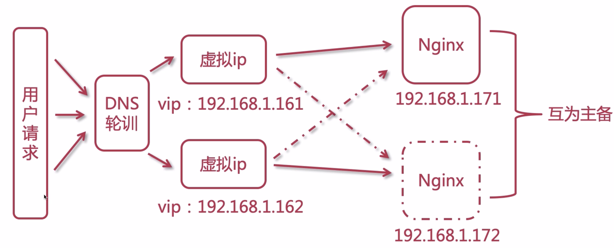

* 启动Nginx：systemctl start nginx.service
* 检查nginx配置文件： nginx -t -c /etc/nginx/nginx.conf

# 一、Nginx

## 1、什么是 Nginx

一个开源且高性能，可靠的HTTP中间件、代理服务；

为什么选择Nginx

- Io[多路复用](http://www.cnblogs.com/fanzhidongyzby/p/4098546.html)epoll多路复用
- 轻量级：功能模块少，代码模块化；
- CPU亲和（affinity）：是一种把CPU核心和Nginx工作进程绑定方式，把每个worker进程固定在一个cpu上执行，减少切换CPU的cache miss，活动更好的性能；
- sendfile

## 2、Nginx安装

### 2.1、yum安装

- 安装一些依赖：
	* yum -y install wget httpd-tools vim
	* yum -y install gcc gcc-c++ autoconf pcre pcre-devel make automake

- 初始化：
	* cd /opt； mkdir app download log work backup

Linux安装：（基于yum安装）

- 在 /etc/yum.repos.d/ 目录下新建文件 nginx.repo，在文件中输入：
```
[nginx]
name=nginx repo
baseurl=http://nginx.org/packages/OS/OSRELEASE/$basearch/
gpgcheck=0
enabled=1
==> OS - "rhel" or "centos"
==> OSRELEASE - 对应的版本，如6，7
```
- 查看nginx相关安装包：

	yum list | grep nginx

- 安装：

	yum install nginx

- nginx -v：查看版本好

	nginx -V：查看对应的编译参数

### 2.2、tar包安装

- 安装依赖环境：
	- 安装gcc环境：`yum install gcc-c++`
	- 安装PCRE库，用于解析正则表达式：`yum install -y pcre pcre-devel`
	- zlib压缩和解压缩依赖：`yum install -y zlib zlib-devel`
	- SSL 安全的加密的套接字协议层，用于HTTP安全传输，也就是https：`yum install -y openssl openssl-devel`

- 下载tar包
- 解压，需要注意，解压后得到的是源码，源码需要编译后才能安装：`tar -zxvf nginx-1.16.1.tar.gz` 
- 编译之前，先创建nginx临时目录，如果不创建，在启动nginx的过程中会报错：`mkdir /var/temp/nginx -p`
- 在nginx目录，输入如下命令进行配置，目的是为了创建makefile文件：
	```
	./configure --prefix=/usr/local/nginx --pid-path=/var/run/nginx/nginx.pid --lock-path=/var/lock/nginx.lock --error-log-path=/var/log/nginx/error.log --http-log-path=/var/log/nginx/access.log --with-http_gzip_static_module --http-client-body-temp-path=/var/temp/nginx/client --http-proxy-temp-path=/var/temp/nginx/proxy --http-fastcgi-temp-path=/var/temp/nginx/fastcgi --http-uwsgi-temp-path=/var/temp/nginx/uwsgi --http-scgi-temp-path=/var/temp/nginx/scgi
	```
	|命令	 |解释 |
	| ------|------|
	|–prefix	|指定nginx安装目录|
	|–pid-path	|指向nginx的pid|
	|–lock-path	|锁定安装文件，防止被恶意篡改或误操作|
	|–error-log	|错误日志|
	|–http-log-path	|http日志|
	|–with-http_gzip_static_module	|启用gzip模块，在线实时压缩输出数据流|
	|–http-client-body-temp-path	|设定客户端请求的临时目录|
	|–http-proxy-temp-path	|设定http代理临时目录|
	|–http-fastcgi-temp-path	|设定fastcgi临时目录|
	|–http-uwsgi-temp-path	|设定uwsgi临时目录|
	|–http-scgi-temp-path	|设定scgi临时目录|
- make编译：`make`
- 安装：`make install`
- 进入`/usr/local/nginx/sbin`目录启动nginx：`./nginx`
- 停止：`./nginx -s stop`
- 重新加载：`./nginx -s reload`

## 3、Nginx命令

查看其安装目录 rpm -ql nginx
```
(1)./etc/logrotate.d/nginx - nginx 日志轮转,用于 logrotate 服务的日志切割；
(2)./etc/nginx
	/etc/nginx/nginx.conf - 主配置文件
	/etc/nginx/conf.d
	/etc/nginx/conf.d/default.conf - 默认配置文件
(3)./etc/nginx/fastcgi_params
	/etc/nginx/scgi_params
	/etc/nginx/uwsgi_params
	cgi配置文件
(4)./etc/nginx/koi-utf
	/etc/nginx/koi-win
	/etc/nginx/win-utf
	编码转换映射文件
(5)./etc/nginx/mime.types-设置http协议的content-type与扩展名对应关系；
(6)./usr/lib/systemd/system/nginx-debug.service
	/usr/lib/systemd/system/nginx.service
	/etc/sysconfig/nginx
	/etc/sysconfig/nginx-debug
	用于配置出系统守护进程管理器管理方式
(7)./usr/lib64/nginx/modules
	/etc/nginx/modules
	模块目录
	......
```	

**常用nginx命令：**
```
nginx -s stop       快速关闭Nginx，可能不保存相关信息，并迅速终止web服务。
nginx -s quit       平稳关闭Nginx，保存相关信息，有安排的结束web服务。
nginx -s reload     因改变了Nginx相关配置，需要重新加载配置而重载。
nginx -s reopen     重新打开日志文件。
nginx -c filename   为 Nginx 指定一个配置文件，来代替缺省的。
nginx -t            不运行，而仅仅测试配置文件。nginx 将检查配置文件的语法的正确性，并尝试打开配置文件中所引用到的文件。
nginx -v            显示 nginx 的版本。
nginx -V            显示 nginx 的版本，编译器版本和配置参数
```

## 4、nginx.conf配置文件详解

- 设置worker进程的用户，指的linux中的用户，会涉及到nginx操作目录或文件的一些权限，默认为nobody：
	```
	user root;
	```
- worker进程工作数设置，一般来说CPU有几个，就设置几个，或者设置为N-1也行
	```
	worker_processes 1;
	```
- nginx 日志级别`debug | info | notice | warn | error | crit | alert | emerg`，错误级别从左到右越来越大

- 设置nginx进程 pid
	```
	pid        logs/nginx.pid;
	```
- 设置工作模式
	```
	events {
		# 默认使用epoll
		use epoll;
		# 每个worker允许连接的客户端最大连接数
		worker_connections  10240;
	}
	```
- http 是指令块，针对http网络传输的一些指令配置
	```
	http {
	}
	```
- include 引入外部配置，提高可读性，避免单个配置文件过大
	```
	include       mime.types;
	```
- 设定日志格式，main为定义的格式名称，如此 access_log 就可以直接使用这个变量了
	|参数名	|参数意义|
	|------|------|
	|$remote_addr	|客户端ip|
	|$remote_user	|远程客户端用户名，一般为：’-’|
	|$time_local	|时间和时区|
	|$request	|请求的url以及method|
	|$status	|响应状态码|
	|$body_bytes_send	|响应客户端内容字节数|
	|$http_referer|	记录用户从哪个链接跳转过来的|
	|$http_user_agent	|用户所使用的代理，一般来时都是浏览器|
	|$http_x_forwarded_for	|通过代理服务器来记录客户端的ip|
	
- `sendfile`使用高效文件传输，提升传输性能。启用后才能使用tcp_nopush，是指当数据表累积一定大小后才发送，提高了效率。
	```
	sendfile        on;
	tcp_nopush      on;
	```
- keepalive_timeout设置客户端与服务端请求的超时时间，保证客户端多次请求的时候不会重复建立新的连接，节约资源损耗。
	```
	#keepalive_timeout  0;
	keepalive_timeout  65;
	```
- gzip启用压缩，`html/js/css`压缩后传输会更快
	```
	gzip on;
	```
- `server`可以在`http`指令块中设置多个虚拟主机
	- listen 监听端口
	- server_name localhost、ip、域名
	- location 请求路由映射，匹配拦截
	- root 请求位置
	- index 首页设置
	- alias 别名
	```
	server {
			listen       88;
			server_name  localhost;
			location / {
				root   html;
				index  index.html index.htm;
			}
	}
	```

	**root 与 alias：**

	- root 路径完全匹配访问，配置的时候为：
		```
		location /demo {
			root /home
		}
		```
		用户访问的时候请求为：`url:port/demo/files/img/face.png`

	- alias 可以为你的路径做一个别名，对用户透明配置的时候为：
		```
		location /hello {
			root /home/demo
		}
		```
		用户访问的时候请求为：`url:port/hello/files/img/face.png`，如此相当于为目录demo做一个自定义的别名。

	**location 的匹配规则：**
	- 空格：默认匹配，普通匹配
		```
		location / {
			root /home;
		}
		```
	- `=`：精确匹配
		```
		location = /imooc/img/face1.png {
			root /home;
		}
		```
	- `~*`：匹配正则表达式，不区分大小写
		```
		#符合图片的显示
		location ~ \.(GIF|jpg|png|jpeg) {
			root /home;
		}
		```
	- `~`：匹配正则表达式，区分大小写
		```
		#GIF必须大写才能匹配到
		location ~ \.(GIF|jpg|png|jpeg) {
			root /home;
		}
		```
	- `^~`：以某个字符路径开头
		```
		location ^~ /imooc/img {
			root /home;
		}
		```

**全部配置如下：**
```conf
#运行用户
#user somebody;

#启动进程,通常设置成和cpu的数量相等
worker_processes  1;

#全局错误日志
error_log  /usr/local/nginx/logs/error.log;
error_log  /usr/local/nginx/logs/notice.log  notice;
error_log  /usr/local/nginx/logs/info.log  info;

#PID文件，记录当前启动的nginx的进程ID
pid        /usr/local/nginx/logs/nginx.pid;

#工作模式及连接数上限
events {
    worker_connections 1024;    #单个后台worker process进程的最大并发链接数
}

#设定http服务器，利用它的反向代理功能提供负载均衡支持
http {
    #设定mime类型(邮件支持类型),类型由mime.types文件定义
    include       /usr/local/nginx/conf/mime.types;
    default_type  application/octet-stream;

    #设定日志
    log_format  main  '[$remote_addr] - [$remote_user] [$time_local] "$request" '
                      '$status $body_bytes_sent "$http_referer" '
                      '"$http_user_agent" "$http_x_forwarded_for"';

    access_log    /usr/local/nginx/logs/access.log main;
    rewrite_log     on;

    #sendfile 指令指定 nginx 是否调用 sendfile 函数（zero copy 方式）来输出文件，对于普通应用，
    #必须设为 on,如果用来进行下载等应用磁盘IO重负载应用，可设置为 off，以平衡磁盘与网络I/O处理速度，降低系统的uptime.
    sendfile        on;
    #tcp_nopush     on;

    #连接超时时间
    keepalive_timeout  120;
    tcp_nodelay        on;

    #gzip压缩开关
    #gzip  on;

    #设定实际的服务器列表
    upstream zp_server1{
        server 127.0.0.1:8089;
    }

    #HTTP服务器
    server {
        #监听80端口，80端口是知名端口号，用于HTTP协议
        listen       80;

        #定义使用www.xx.com访问
        server_name  www.helloworld.com;

        #首页
        index index.html

        #指向webapp的目录
        root /root/demo/webapp;

        #编码格式
        charset utf-8;

        #代理配置参数
        proxy_connect_timeout 180;
        proxy_send_timeout 180;
        proxy_read_timeout 180;
        proxy_set_header Host $host;
        proxy_set_header X-Forwarder-For $remote_addr;

        #反向代理的路径（和upstream绑定），location 后面设置映射的路径
        location / {
            proxy_pass http://zp_server1;
        }

        #静态文件，nginx自己处理
        location ~ ^/(images|javascript|js|css|flash|media|static)/ {
            root /root/demo/webapp/views;
            #过期30天，静态文件不怎么更新，过期可以设大一点，如果频繁更新，则可以设置得小一点。
            expires 30d;
        }

        #设定查看Nginx状态的地址
        location /NginxStatus {
            stub_status           on;
            access_log            on;
            auth_basic            "NginxStatus";
            auth_basic_user_file  conf/htpasswd;
        }

        #禁止访问 .htxxx 文件
        location ~ /\.ht {
            deny all;
        }

        #错误处理页面（可选择性配置）
        #error_page   404              /404.html;
        #error_page   500 502 503 504  /50x.html;
        #location = /50x.html {
        #    root   html;
        #}
    }
}
```

## 5、正向代理与反向代理

### 5.1、概念

- 正向代理：是一个位于客户端和目标服务器之间的代理服务器(中间服务器)。为了从原始服务器取得内容，客户端向代理服务器发送一个请求，并且指定目标服务器，之后代理向目标服务器转交并且将获得的内容返回给客户端。正向代理的情况下客户端必须要进行一些特别的设置才能使用；

- 反向代理正好相反。对于客户端来说，反向代理就好像目标服务器。并且客户端不需要进行任何设置。客户端向反向代理发送请求，接着反向代理判断请求走向何处，并将请求转交给客户端，使得这些内容就好似他自己一样，一次客户端并不会感知到反向代理后面的服务，也因此不需要客户端做任何设置，只需要把反向代理服务器当成真正的服务器就好了；

### 5.2、区别

- 正向代理需要你主动设置代理服务器ip或者域名进行访问，由设置的服务器ip或者域名去获取访问内容并返回；而反向代理不需要你做任何设置，直接访问服务器真实ip或者域名，但是服务器内部会自动根据访问内容进行跳转及内容返回，你不知道它最终访问的是哪些机器。

- 正向代理是代理客户端，为客户端收发请求，使真实客户端对服务器不可见；而反向代理是代理服务器端，为服务器收发请求，使真实服务器对客户端不可见

**正向代理和反向代理最关键的两点区别：**
- 是否指定目标服务器
- 客户端是否要做设置

正向代理中，proxy和client同属一个LAN，对server透明； 反向代理中，proxy和server同属一个LAN，对client透明。 实际上proxy在两种代理中做的事都是代为收发请求和响应，不过从结构上来看正好左右互换了下，所以把前者那种代理方式叫做正向代理，后者叫做反向代理;

**从用途上来区分：**
- 正向代理：正向代理用途是为了在防火墙内的局域网提供访问internet的途径。另外还可以使用缓冲特性减少网络使用率
- 反向代理：反向代理的用途是将防火墙后面的服务器提供给internet用户访问。同时还可以完成诸如负载均衡等功能

**从安全性来讲：**
- 正向代理：正向代理允许客户端通过它访问任意网站并且隐蔽客户端自身，因此你必须采取安全措施来确保仅为经过授权的客户端提供服务
- 反向代理：对外是透明的，访问者并不知道自己访问的是代理。对访问者而言，他以为访问的就是原始服务器

### 5.3、使用场景

- 正向代理的典型用途是为在防火墙内的局域网客户端提供访问Internet的途径。正向代理还可以使用缓冲特性减少网络使用率。
- 反向代理的典型用途是将 防火墙后面的服务器提供给Internet用户访问。反向代理还可以为后端的多台服务器提供负载平衡，或为后端较慢的服务器提供缓冲服
    - 保护和隐藏原始资源服务器
    - 加密和SSL加速
    - 负载均衡
    - 缓存静态内容
    - 压缩
    - 减速上传
    - 安全
    - 外网发布


## 6、负载均衡配置：upstream

### 6.2、单个webapp

假设这样一个应用场景：将应用部署在 `192.168.56.101:80`、`192.168.56.102:80`、`192.168.56.103:80` 三台 linux 环境的服务器上。网站域名叫 `www.helloworld.com`，公网 IP 为 `192.168.56.104`。在公网 IP 所在的服务器上部署 nginx，对所有请求做负载均衡处理

```conf
http {
     #设定mime类型,类型由mime.type文件定义
    include       /etc/nginx/mime.types;
    default_type  application/octet-stream;
    #设定日志格式
    access_log    /var/log/nginx/access.log;

    #设定负载均衡的服务器列表
    upstream load_balance_server {
        #weigth参数表示权值，权值越高被分配到的几率越大，默认是轮询的策略
        server 192.168.56.101:80   weight=5;
        server 192.168.56.102:80   weight=1;
        server 192.168.56.103:80   weight=6;
    }

   #HTTP服务器
   server {
        #侦听80端口
        listen       80;
        #定义使用www.xx.com访问
        server_name  www.helloworld.com;

        #对所有请求进行负载均衡请求
        location / {
            root        /root;                 #定义服务器的默认网站根目录位置
            index       index.html index.htm;  #定义首页索引文件的名称
            proxy_pass  http://load_balance_server ;#请求转向load_balance_server 定义的服务器列表

            #以下是一些反向代理的配置(可选择性配置)
            #proxy_redirect off;
            proxy_set_header Host $host;
            proxy_set_header X-Real-IP $remote_addr;
            #后端的Web服务器可以通过X-Forwarded-For获取用户真实IP
            proxy_set_header X-Forwarded-For $remote_addr;
            proxy_connect_timeout 90;          #nginx跟后端服务器连接超时时间(代理连接超时)
            proxy_send_timeout 90;             #后端服务器数据回传时间(代理发送超时)
            proxy_read_timeout 90;             #连接成功后，后端服务器响应时间(代理接收超时)
            proxy_buffer_size 4k;              #设置代理服务器（nginx）保存用户头信息的缓冲区大小
            proxy_buffers 4 32k;               #proxy_buffers缓冲区，网页平均在32k以下的话，这样设置
            proxy_busy_buffers_size 64k;       #高负荷下缓冲大小（proxy_buffers*2）
            proxy_temp_file_write_size 64k;    #设定缓存文件夹大小，大于这个值，将从upstream服务器传

            client_max_body_size 10m;          #允许客户端请求的最大单文件字节数
            client_body_buffer_size 128k;      #缓冲区代理缓冲用户端请求的最大字节数
        }
    }
}
```

### 6.2、有多个 webapp 的配置

当一个网站功能越来越丰富时，往往需要将一些功能相对独立的模块剥离出来，独立维护。这样的话，通常，会有多个 webapp。举个例子：假如 www.helloworld.com 站点有好几个 webapp，finance（金融）、product（产品）、admin（用户中心）。访问这些应用的方式通过上下文(context)来进行区分:
- www.helloworld.com/finance/
- www.helloworld.com/product/
- www.helloworld.com/admin/

我们知道，http 的默认端口号是 80，如果在一台服务器上同时启动这 3 个 webapp 应用，都用 80 端口，肯定是不成的。所以，这三个应用需要分别绑定不同的端口号。那么，问题来了，用户在实际访问 www.helloworld.com 站点时，访问不同 webapp，总不会还带着对应的端口号去访问吧。所以，你再次需要用到反向代理来做处理
```conf
http {
    #此处省略一些基本配置
    upstream product_server{
        server www.helloworld.com:8081;
    }
    upstream admin_server{
        server www.helloworld.com:8082;
    }
    upstream finance_server{
        server www.helloworld.com:8083;
    }
    server {
        #此处省略一些基本配置
        #默认指向product的server
        location / {
            proxy_pass http://product_server;
        }
        location /product/{
            proxy_pass http://product_server;
        }
        location /admin/ {
            proxy_pass http://admin_server;
        }
        location /finance/ {
            proxy_pass http://finance_server;
        }
    }
}
```

### 6.3、upstream 指令参数

- max_conns：限制每台server的连接数，用于保护避免过载，可起到限流作用
	```conf
	# worker进程设置1个，便于测试观察成功的连接数
	worker_processes  1;
	upstream tomcats {
			server 192.168.1.173:8080 max_conns=2;
			server 192.168.1.174:8080 max_conns=2;
			server 192.168.1.175:8080 max_conns=2;
	}
	```
- slow_start：商业版，需要付费；该参数不能使用在hash和random load balancing中。如果在 upstream 中只有一台 server，则该参数失效
	```conf
	upstream tomcats {
			server 192.168.1.173:8080 weight=6 slow_start=60s;
	#       server 192.168.1.190:8080;
			server 192.168.1.174:8080 weight=2;
			server 192.168.1.175:8080 weight=2;
	}
	```
- down：用于标记服务节点不可用：
	```conf
	upstream tomcats {
			server 192.168.1.173:8080 down;
	#       server 192.168.1.190:8080;
			server 192.168.1.174:8080 weight=1;
			server 192.168.1.175:8080 weight=1;
	}
	```
- backup：表示当前服务器节点是备用机，只有在其他的服务器都宕机以后，自己才会加入到集群中，被用户访问到：
	```conf
	upstream tomcats {
			server 192.168.1.173:8080 backup;
	#       server 192.168.1.190:8080;
			server 192.168.1.174:8080 weight=1;
			server 192.168.1.175:8080 weight=1;
	}
	```
	**注意：backup参数不能使用在hash和random load balancing中**
- max_fails、fail_timeout：
	- max_fails：表示失败几次，则标记server已宕机，剔出上游服务。
	- fail_timeout：表示失败的重试时间。

	假设目前设置如下：
	```conf
	upstream tomcats {
			server 192.168.1.173:8080 max_fails=2 fail_timeout=15s ;
	}
	```
	则代表在15秒内请求某一server失败达到2次后，则认为该server已经挂了或者宕机了，随后再过15秒，这15秒内不会有新的请求到达刚刚挂掉的节点上，而是会请求到正常运作的server，15秒后会再有新请求尝试连接挂掉的server，如果还是失败，重复上一过程，直到恢复；

### 6.4、keepalive提高吞吐量

- keepalived：设置长连接处理的数量
- proxy_http_version：设置长连接http版本信息
- proxy_set_header：清除connection header信息
```conf
upstream tomcats {
	server 192.168.1.190:8080;
	keepalive 32;
}

server {
	listen       80;
	server_name  www.tomcats.com;
	location / {
		proxy_pass  http://tomcats;
		proxy_http_version 1.1;
		proxy_set_header Connection "";
	}
}
```

### 6.5、ip_hash

ip_hash 可以保证用户访问可以请求到上游服务中的固定的服务器，前提是用户ip没有发生更改。使用ip_hash的注意点：**不能把后台服务器直接移除，只能标记down**
```
upstream tomcats {
	ip_hash;	
	server 192.168.1.173:8080;
	server 192.168.1.174:8080 down;
	server 192.168.1.175:8080;
}
```

如果机器数量变化，hash算法需要重新计算，会带来一系列，比如：缓存等的问题

### 6.6、url_hash、least_conn

根据每次请求的url地址，hash后访问到固定的服务器节点。
```conf
upstream tomcats {
    # url hash
    hash $request_uri;
    # 最少连接数
    # least_conn
    server 192.168.1.173:8080;
    server 192.168.1.174:8080;
    server 192.168.1.175:8080;
}
server {
    listen 80;
    server_name www.tomcats.com;

    location / {
        proxy_pass  http://tomcats;
    }
}
```

## 7、缓存

- 缓存在nginx端，提升所有访问到nginx这一端的用户
- 提升访问上游（upstream）服务器的速度
- 用户访问仍然会产生请求流量

### 7.1、Nginx控制浏览器缓存

```conf
location /files {
    alias /home/imooc;
    expires 10s; # 10s中过期
    expires @22h30m; # 绝对时间：22:30分过期
    expires -1h; # 当前时间的前一个小时过期
    expires epoch; # 关闭浏览器缓存，页面header显示的 Cache-Control: no-cache；Expires: Thu, 01 Jan 1970 00:00:01 GMT
    expires off; # nginx缓存关闭，页面header不显示cache-controll
    expires max;
}
```

### 7.2、反向代理缓存

```conf
# proxy_cache_path 设置缓存目录
#       keys_zone 设置共享内存以及占用空间大小
#       max_size 设置缓存大小
#       inactive 超过此时间则被清理
#       use_temp_path 临时目录，使用后会影响nginx性能
proxy_cache_path /usr/local/nginx/upstream_cache keys_zone=mycache:5m max_size=1g inactive=1m use_temp_path=off;

location / {
    proxy_pass  http://tomcats;

    # 启用缓存，和keys_zone一致
    proxy_cache mycache;
    # 针对200和304状态码缓存时间为8小时
    proxy_cache_valid   200 304 8h;
}
```

## 8、Nginx解决跨域

```conf
server {
	listen       90;
	server_name  localhost;
	#允许跨域请求的域，*代表所有
	add_header 'Access-Control-Allow-Origin' *;
	#允许带上cookie请求
	add_header 'Access-Control-Allow-Credentials' 'true';
	#允许请求的方法，比如 GET/POST/PUT/DELETE
	add_header 'Access-Control-Allow-Methods' *;
	#允许请求的header
	add_header 'Access-Control-Allow-Headers' *;
	location / {
		root   /root/software/demo;
		index  index.html;
	}
	location = /50x.html {
		root   html;
	}
}
```

## 9、静态资源防盗链

```conf
server {
	listen	90;
	server_name localhost;
	#对源站点验证
	valid_referers *.chenlanqing.com; 
	#非法引入会进入下方判断
	if ($invalid_referer) {
		return 404;
	}
	....
}
```

## 10、配置HTTPS

### 10.1、安装SSL模块

要在nginx中配置https，就必须安装ssl模块，也就是: http_ssl_module：
- 进行nginx的解压目录
- 新增ssl模块(原来的那些模块需要保留)
	```
	./configure \
	--prefix=/usr/local/nginx \
	--pid-path=/var/run/nginx/nginx.pid \
	--lock-path=/var/lock/nginx.lock \
	--error-log-path=/var/log/nginx/error.log \
	--http-log-path=/var/log/nginx/access.log \
	--with-http_gzip_static_module \
	--http-client-body-temp-path=/var/temp/nginx/client \
	--http-proxy-temp-path=/var/temp/nginx/proxy \
	--http-fastcgi-temp-path=/var/temp/nginx/fastcgi \
	--http-uwsgi-temp-path=/var/temp/nginx/uwsgi \
	--http-scgi-temp-path=/var/temp/nginx/scgi  \
	--with-http_ssl_module
	```
- make、make install

### 10.2、配置HTTPS

- 把ssl证书 `*.crt` 和 私钥 `*.key` 拷贝到/usr/local/nginx/conf目录中
- 新增 server 监听 443 端口：
	```conf
	server {
		listen       443;
		server_name  www.imoocdsp.com;
		# 开启ssl
		ssl     on;
		# 配置ssl证书
		ssl_certificate      1_www.imoocdsp.com_bundle.crt;
		# 配置证书秘钥
		ssl_certificate_key  2_www.imoocdsp.com.key;
		# ssl会话cache
		ssl_session_cache    shared:SSL:1m;
		# ssl会话超时时间
		ssl_session_timeout  5m;
		# 配置加密套件，写法遵循 openssl 标准
		ssl_protocols TLSv1 TLSv1.1 TLSv1.2;
		ssl_ciphers ECDHE-RSA-AES128-GCM-SHA256:HIGH:!aNULL:!MD5:!RC4:!DHE;
		ssl_prefer_server_ciphers on;
		
		location / {
			proxy_pass http://tomcats/;
			index  index.html index.htm;
		}
	}
	```

## 11、搭建文件服务器

Nginx 中的配置要点：
- 将 autoindex 开启可以显示目录，默认不开启。
- 将 autoindex_exact_size 开启可以显示文件的大小。
- 将 autoindex_localtime 开启可以显示文件的修改时间。
- root 用来设置开放为文件服务的根路径。
- charset 设置为 charset utf-8,gbk;，可以避免中文乱码问题

```conf
autoindex on;# 显示目录
autoindex_exact_size on;# 显示文件大小
autoindex_localtime on;# 显示文件时间
server {
    charset      utf-8,gbk; # windows 服务器下设置后，依然乱码，暂时无解
    listen       9050 default_server;
    listen       [::]:9050 default_server;
    server_name  _;
    root         /share/fs;
}
```

# 二、Nginx模块

# 三、Keepalived+LVS+Nginx高可用

## 1、Keepalived

### 1.1、概述

- 是为Linux系统和基于Linux的基础设施提供简单而健壮的负载平衡和高可用性工具；
- 负载均衡框架依赖于众所周知且广泛使用的Linux虚拟服务器(IPVS)内核模块，该模块提供了第4层的负载均衡。Keepalived实现一组检查器，根据负载平衡服务器池的健康状况动态地、自适应地维护和管理它们；
- 高可用性是通过VRRP协议实现的。VRRP是路由器故障转移的基础；
- Keepalived实现了一组到VRRP有限状态机的挂钩，提供了低级和高速的协议交互。为了提供最快的网络故障检测，Keepalived实现了BFD协议

### 1.2、安装

- 下载安装包
- 解压：`tar -zxvf keepalived-2.0.18.tar.gz`；
- 执行configure：使用configure命令配置安装目录与核心配置文件所在位置
	```
	./configure --prefix=/usr/local/keepalived --sysconf=/etc
	```
	- prefix：keepalived安装的位置
	- sysconf：keepalived核心配置文件所在位置，固定位置，改成其他位置则keepalived启动不了，`/var/log/messages`中会报错

	配置过程中可能会出现警告信息，如下所示：
	```
	*** WARNING - this build will not support IPVS with IPv6. Please install libnl/libnl-3 dev libraries to support IPv6 with IPVS.
	```
	安装libnl/libnl-3依赖：`yum -y install libnl libnl-devel`

	重新configure一下，此时OK。

- 安装keepalived：`make && make install`
- 进入到/etc/keepalived，该目录下为keepalived核心配置文件

将keepalived注册为系统服务：将解压缩包里面的`keepalived/etc/init.d/keepalived` 和`keepalived/etc/sysconfig.d/keepalived`两个文件分别拷贝到`/etc/init.d`和`/etc/sysconfig`目录下

### 1.3、keepalived双击主备


- **主节点配置：**

	配置文件：keepalived.conf
	```conf
	global_defs {
	# 路由id：当前安装keepalived的节点主机标识符，保证全局唯一
	router_id keep_171
	}
	vrrp_instance VI_1 {
		# 表示状态是MASTER主机还是备用机BACKUP
		state MASTER
		# 该实例绑定的网卡，可以通过 ip addr 查看网卡
		interface ens33
		# 保证主备节点一致即可
		virtual_router_id 51
		# 权重，master权重一般高于backup，如果有多个，那就是选举，谁的权重高，谁就当选
		priority 100
		# 主备之间同步检查时间间隔，单位秒
		advert_int 2
		# 认证权限密码，防止非法节点进入
		authentication {
			auth_type PASS
			auth_pass 1111
		}
		# 虚拟出来的ip，可以有多个（vip）
		virtual_ipaddress {
			192.168.1.161
		}
	}
	```

	启动：./keepalived，启动后，查看网卡ens33下多了个IP地址；

- **备用节点配置**

	```conf
	global_defs {
	router_id keep_172
	}
	vrrp_instance VI_1 {
		# 备用机设置为BACKUP
		state BACKUP
		interface ens33
		virtual_router_id 51
		# 权重低于MASTER
		priority 80
		advert_int 2
		authentication {
			auth_type PASS
			auth_pass 1111
		}
		virtual_ipaddress {
			# 注意：主备两台的vip都是一样的，绑定到同一个vip
			192.168.1.161
		}
	}
	```

### 1.4、自动重启nginx

- 增加Nginx重启检测脚本：
	```bash
	vim /etc/keepalived/check_nginx_alive_or_not.sh
	#!/bin/bash

	A=`ps -C nginx --no-header |wc -l`
	# 判断nginx是否宕机，如果宕机了，尝试重启
	if [ $A -eq 0 ];then
		/usr/local/nginx/sbin/nginx
		# 等待一小会再次检查nginx，如果没有启动成功，则停止keepalived，使其启动备用机
		sleep 3
		if [ `ps -C nginx --no-header |wc -l` -eq 0 ];then
			killall keepalived
		fi
	fi
	```
- 增加运行权限：`chmod +x /etc/keepalived/check_nginx_alive_or_not.sh`；
- 配置keepalived监听nginx脚本
	```
	vrrp_script check_nginx_alive {
		script "/etc/keepalived/check_nginx_alive_or_not.sh"
		interval 2 # 每隔两秒运行上一行脚本
		weight 10 # 如果脚本运行失败，则升级权重+10
	}
	```
- 在vrrp_instance中新增监控的脚本
	```
	track_script {
		check_nginx_alive   # 追踪 nginx 脚本
	}
	```
- 重启Keepalived使得配置文件生效

### 1.5、keepalived双主热备

对于双机主备架构，备用机在主节点运行正常的情况下是不会运行的，那么对于备用机资源来说是一种浪费。

用户请  -> DNS轮询 -> 虚拟IP（两个）



规则：以一个虚拟ip分组归为同一个路由

**主节点**
```
global_defs {
   router_id keep_171
}

vrrp_instance VI_1 {
    state MASTER
    interface ens33
    virtual_router_id 51
    priority 100
    advert_int 1
    authentication {
        auth_type PASS
        auth_pass 1111
    }
    virtual_ipaddress {
        192.168.1.161
    }
}

vrrp_instance VI_2 {
    state BACKUP
    interface ens33
    virtual_router_id 52
    priority 80
    advert_int 1
    authentication {
        auth_type PASS
        auth_pass 1111
    }
    virtual_ipaddress {
        192.168.1.162
    }
}
```

**备用节点配置：**
```
global_defs {
   router_id keep_172
}
vrrp_instance VI_1 {
    state BACKUP
    interface ens33
    virtual_router_id 51
    priority 80
    advert_int 1
    authentication {
        auth_type PASS
        auth_pass 1111
    }
    virtual_ipaddress {
        192.168.1.161
    }
}
vrrp_instance VI_2 {
    state MASTER
    interface ens33
    virtual_router_id 52
    priority 100
    advert_int 1
    authentication {
        auth_type PASS
        auth_pass 1111
    }
    virtual_ipaddress {
        192.168.1.162
    }
}
```

## 2、LVS

https://blog.csdn.net/Ki8Qzvka6Gz4n450m/article/details/79119665
https://blog.51cto.com/junwang/1439428

### 2.1、概述

LVS是`Linux Virtual Server`的简称，即Linux虚拟服务器，章文嵩博士发起的一个开源项目，现在 LVS 已经是 Linux 内核标准的一部分；

使用 LVS 可以达到的技术目标是：通过 LVS 达到的负载均衡技术和 Linux 操作系统实现一个高性能高可用的 Linux 服务器集群，它具有良好的可靠性、可扩展性和可操作性。从而以低廉的成本实现最优的性能。LVS 是一个实现负载均衡集群的开源软件项目，LVS架构从逻辑上可分为调度层、Server集群层和共享存储；

LVS的IP负载均衡技术是通过ipvs内核模块来实现的，ipvs是LVS集群系统的核心软件，它的主要作用是：安装在Director Server上，同时在Director Server上虚拟出一个IP地址，用户必须通过这个虚拟的IP地址访问集群服务。这个虚拟IP一般称为LVS的VIP，即Virtual IP。访问的请求首先经过VIP到达负载调度器，然后由负载调度器从Real Server列表中选取一个服务节点响应用户的请求。当用户的请求到达负载调度器后，调度器如何将请求发送到提供服务的Real Server节点，而Real Server节点如何返回数据给用户，是ipvs实现的重点技术，ipvs实现负载均衡机制有四种，分别是NAT、TUN和DR以及后来经淘宝开发的FullNat

### 2.2、安装

**安装ipvsadm**

LVS是现在一般都是集成在linux中的，所以`ipvs`是自带的，只需要安装`ipvsadm`即可（`ipvsadm`是管理集群的工具，通过`ipvs`可以管理集群，查看集群等操作：
```
安装
yum install ipvsadm
检查
ipvsadm -Ln
```

ipvsadm语法：
```
ipvsadm -A|E -t|u|f service-address [-s scheduler] [-p [timeout]] [-M netmask]
ipvsadm -D -t|u|f service-address
ipvsadm -C
ipvsadm -R
ipvsadm -S [-n]
ipvsadm -a|e -t|u|f service-address -r RS-address [-g|i|m] [-w weight] [-x upper] [-y lower]
ipvsadm -d -t|u|f service-address -r RS-address
ipvsadm -L|l [options]
ipvsadm -Z [-t|u|f service-address]
注释：
    -A    添加一个新的集群服务；
    -E    修改一个己有的集群服务；
    -D    删除指定的集群服务；
    -a    向指定的集群服务中添加RS及属性；
    -e    修改RS属性；
    -t    指定为tcp协议；
    -u    指定为udp协议；
    -f    指定防火墙标记码，通常用于将两个或以上的服务绑定为一个服务进行处理时使用；
    -s    调度方法，默认为wlc；
    -w    指定权重，默认为1；
    -p 	  timeout   persistent connection, 持久连接超时时长；
    -g    Gateway, DR模型；
    -i    ipip, TUN模型；
    -m    masquerade, NAT模型；
    -S    保存ipvsadm设定的规则策略，默认保存在/etc/sysconfig/ipvsadm中；
    -R    载入己保存的规则策略，默认加载/etc/sysconfig/ipvsadm；
    -C    清除所有集群服务；
    -Z    清除所有记数器；
    -L    显示当前己有集群服务，能通过相应的options查看不同状态信息；
	-n: 数字格式显示IP地址；
	-c: 显示连接数相关信息；
	--stats: 显示统计数据；
	--rate: 速率；
	--exact：显示统计数据的精确值；
```

### 2.3、工作原理

LVS分为两个部件：ipvs和ipvsadm
- `ipvs`：工作于内核空间，主要用于使用户定义的策略生效；
- `ipvsadm`:工作于用户空间，主要用于用户定义和管理集群服务的工具；

ipvs工作于内核空间的INPUT链上，当收到用户请求某集群服务时，经过PREROUTING链，经检查本机路由表，送往INPUT链；在进入netfilter的INPUT链时，ipvs强行将请求报文通过ipvsadm定义的集群服务策略的路径改为FORWORD链，将报文转发至后端真实提供服务的主机；

### 2.4、术语

- client IP     = CIP
- virtual IP    = VIP - 向外部直接面向用户请求，作为用户请求的目标的IP地址
- director IP   = DIP - Director Server IP，主要用于和内部主机通讯的IP地址。
- realserver IP = RIP (and RIP1, RIP2...) Real Server IP，后端服务器的IP地址。
- director GW   = DGW - the director's gw (only needed for LVS-NAT)  (this can be the realserver gateway for LVS-DR and LVS-Tun)
- DS：Director Server。指的是前端负载均衡器节点。
- RS：Real Server。后端真实的工作服务器。

### 2.5、LV/NAT工作模式

### 2.6、LVS/DR工作模式

**搭建LVS-DR模式- 配置LVS节点：**

- 准备：
	```
	服务器与ip规划：
		LVS - 1台
			VIP（虚拟IP）：192.168.1.150
			DIP（转发者IP/内网IP）：192.168.1.151
		Nginx - 2台（RealServer）
			RIP（真实IP/内网IP）：192.168.1.171
			RIP（真实IP/内网IP）：192.168.1.172

	所有计算机节点关闭网络配置管理器，因为有可能会和网络接口冲突：
		systemctl stop NetworkManager 
		systemctl disable NetworkManager
	```
- 创建子接口，进入网卡目录：`cd /etc/sysconfig/network-scripts/`
- 找到当前网卡：ens33，拷贝其并且创建子接口：`cp ifcfg-ens33 ifcfg-ens33:1`；
- 

### 2.7、LVS/Tun


## 3、Keepalived+LVS+Nginx


# 四、Nginx深入

## 1、Nginx的进程模型

- master进程
- process进程

## 2、Nginx的请求抢占机制


## 3、Nginx的事件处理

https://juejin.im/post/5cdea826e51d4510b934dcb5

## 4、Nginx 模块化设计

**4.1、[sub_status](http://nginx.org/en/docs/http/ngx_http_stub_status_module.html)**
```
(1).模块名称：ngx_http_stub_status_module
(2).用途：显示nginx客户端基本状态信息；
(3).安装模块：--with-http_stub_status_module
(4).配置语法：
	Syntax：	stub_status；
	Default：—
	Context：server, location
(5).示例：
	location /basic_status {
		stub_status；
	}
	页面访问： 127.0.0.1/mystatus,浏览器显示如下内容
	Active connections： 1 
	server accepts handled requests
		2 2 2 
	Reading： 0 Writing： 1 Waiting： 0 
```

**4.2、random_index：**

```
(1).模块名称：ngx_http_random_index_module
(2).用途：在对应目录中随机选择一个主页,默认是关闭的,需要安装
(3).安装模块：--with-http_random_index_module
(4).配置语法：
	Syntax：	random_index on | off；
	Default：	
	random_index off；
	Context：	location
(5).示例：
	location / {
		random_index on；
	}
```

**4.3、sub_module：**
```
(1).模块名称：ngx_http_sub_module
(2).用途：http内容替换
(3).安装模块：--with-http_sub_module
(4).配置语法：
	A.sub_filter：替换内容
		Syntax：	sub_filter string replacement；
		Default：	—
		Context：	http, server, location
	B.sub_filter_last_modified：
		Syntax：	sub_filter_last_modified on | off；
		Default： sub_filter_last_modified off；
		Context：http, server, location
	C.sub_filter_once：是否全部替换
		Syntax：	sub_filter_once on | off；
		Default：	
		sub_filter_once on；
		Context：	http, server, location
	D.sub_filter_types：过滤文件类型
		Syntax：	sub_filter_types mime-type ...；
		Default：	
		sub_filter_types text/html；
		Context：	http, server, location
(5).配置示例：
	location / {
		sub_filter '<a href="http://127.0.0.1：8080/'  '<a href="https：//$host/'；
		sub_filter '<img src="http://127.0.0.1：8080/' '<imgsrc="https：//$host/'；
		sub_filter_once on；
	}
```
**4.4、请求限制**

- **4.4.1、连接频率限制：**
	```
	(1).模块名称：ngx_http_limit_conn_module
	(2).用途：限制并发连接次数
	(3).安装模块：
	(4).配置语法：
		A.limit_conn_zone：key表示限制的条件,比如ip,为其开辟size空间
			Syntax：	limit_conn_zone key zone=name：size；
			Default：	—
			Context：	http
		B.limit_conn： 这里zone是上述limit_conn_zone中name值,number表示并发的限制
			Syntax：	limit_conn zone number；
			Default：	—
			Context：	http, server, location
	(5).配置示例：
		limit_conn_zone $binary_remote_addr zone=perip：10m；
		limit_conn_zone $server_name zone=perserver：10m；
		server {
			...
			limit_conn perip 10；
			limit_conn perserver 100；
		}
	```
- **4.4.2、请求限制：**
	```
	(1).模块名称：ngx_http_limit_req_module
	(2).用途：限制客户端请求次数,或者速度等
	(3).安装模块：
	(4).配置语法：
		A.limit_req_zone：
			Syntax：	limit_req_zone key zone=name：size rate=rate；
			Default：	—
			Context：	http
		B.limit_req： 
			Syntax：	limit_req zone=name [burst=number] [nodelay]；
			Default：	—
			Context：	http, server, location
	(5).配置示例：
		limit_req_zone $binary_remote_addr zone=perip：10m rate=1r/s；
		limit_req_zone $server_name zone=perserver：10m rate=10r/s；
		server {
			...
			limit_req zone=perip burst=5 nodelay；
			limit_req zone=perserver burst=10；
		}
	```
- **4.4.3、整个配置示例：修改 /nginx/conf.d/default.conf 配置文件**
	```
	limit_conn_zone $binary_remote_addr zone=conn_zone：1m；
	limit_req_zone $binary_remote_addr zone=req_zone：1m rate=1r/s；
	server {
		listen       80；
		server_name  localhost；

		#charset koi8-r；
		#access_log  /var/log/nginx/host.access.log  main；

		location / {
			root   /usr/share/nginx/html；
			#limit_conn conn_zone 1；
			#limit_req zone=req_zone burst=3 nodelay；
			#limit_req zone=req_zone burst=3；
			#limit_req zon e=req_zone；
			index  index.html index.htm；
		}
		...
	}
	```

# 参考文档

* [Nginx官方文档](http://nginx.org/en/docs/)
* [Nginx极简教程](https://mp.weixin.qq.com/s/vHkxYfpuiAteMNSrpNWdsw)
* [LVS官方文档](http://www.austintek.com/LVS/LVS-HOWTO/HOWTO/)


