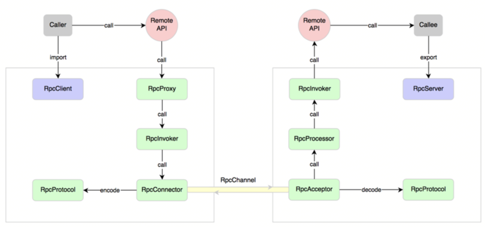

<!-- START doctoc generated TOC please keep comment here to allow auto update -->
<!-- DON'T EDIT THIS SECTION， INSTEAD RE-RUN doctoc TO UPDATE -->
**目录**

- [一、RPC](#%E4%B8%80rpc)
  - [1、RPC-Remote Procedure Call](#1rpc-remote-procedure-call)
  - [2、为什么要使用RPC](#2%E4%B8%BA%E4%BB%80%E4%B9%88%E8%A6%81%E4%BD%BF%E7%94%A8rpc)
  - [3、工作原理](#3%E5%B7%A5%E4%BD%9C%E5%8E%9F%E7%90%86)
  - [4、RPC框架解决的问题](#4rpc%E6%A1%86%E6%9E%B6%E8%A7%A3%E5%86%B3%E7%9A%84%E9%97%AE%E9%A2%98)
  - [5、与HTTP服务相比](#5%E4%B8%8Ehttp%E6%9C%8D%E5%8A%A1%E7%9B%B8%E6%AF%94)
  - [6、基于TCP协议实现RPC](#6%E5%9F%BA%E4%BA%8Etcp%E5%8D%8F%E8%AE%AE%E5%AE%9E%E7%8E%B0rpc)

<!-- END doctoc generated TOC please keep comment here to allow auto update -->

# 一、RPC

## 1、RPC-Remote Procedure Call

远程过程调用
- 一种通过网络从远程计算机程序上请求服务，不需要了解底层网络技术的协议.
- 在OSI网络通信模型中，RPC跨越了传输层和应用层
- RPC 是一种技术思想而非一种规范或协议

一个典型的RPC使用场景中，包含了服务发现、负载、容错、网络传输、序列化等组件

## 2、为什么要使用RPC

- 可以做到分布式，现代化的微服务；
- 部署灵活， 解耦服务， 扩展性强；

## 3、工作原理

RPC 采用客户机/服务器模式.请求程序是一个客户机，而服务提供程序是一个服务器.

* 首先，客户机调用进程发送一个有进程参数的调用信息到服务进程，然后等待应答信息.
* 在服务端，进程保持睡眠状态直到调用信息到达为止.
* 当一个调用信息到达，服务端获得进程参数，计算结果，发送答复信息，然后等待下一个调用信息.
* 最后，客户端调用进程接收答复信息，获得进程结果，然后调用执行继续进行；

如果需要实现一个基本的RPC框架，涉及的知识点：
- 动态代理
- 反射
- 序列化、反序列化
- 网络通信
- 编解码
- 服务发现和注册
- 心跳与链路检测

生产者端流程：
- 加载服务，并缓存
- 启动通讯服务器（Netty）
- 服务注册（把通讯地址放入zookeeper，也可以把加载到的服务也放进去）
- 反射，本地调用

消费者端流程：
- 代理服务接口
- 服务发现（连接zookeeper，拿到服务地址列表）
- 远程调用（轮询生产者服务列表，发送消息）

## 4、RPC框架解决的问题

- 通讯问题：即A与B之间通讯，建立TCP连接；
- 寻址问题：A通过RPC框架连接到B的服务器及特定端口和调用的方法名；
- 序列化：发起远程调用参数数值需要二进制化，服务接收到二进制参数后需要反序列化

## 5、与HTTP服务相比

- HTTP服务：
    * HTTP服务主要基于HTTP协议；
    * RESTful风格的服务接口；
    * 主要是进行接口开发；
    * 3次握手，有网络开销；
- RPC服务:
    * RPC主要基于TCP/IP协议；
    * 一般都有注册中心，有丰富的监控管理；
    * 长连接；
    
## 6、基于TCP协议实现RPC

**6.1、原理**

- 基于Java的反射机制和Socket API实现；
- 方法的调用使用反射机制，消费者需要把调用的接口名称方法参数通过Socket通道传到服务端，服务端再通过反射机制
    调用对应的方法获取到值，再通过相同的方法把结果返回给消费者；

# 参考资料

* [RPC简单实现](https://www.jianshu.com/p/8876c9f3cd7f)