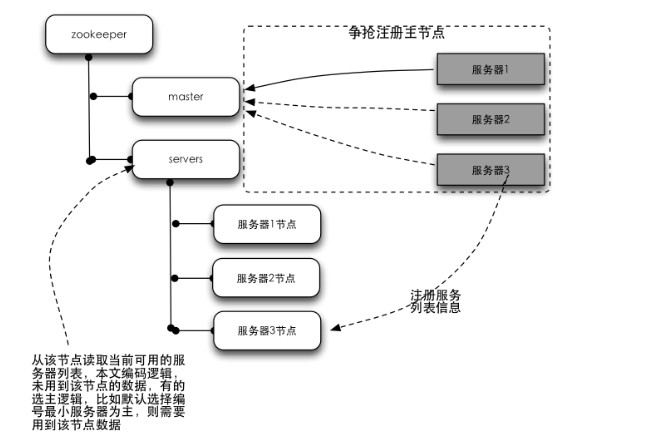

<!-- START doctoc generated TOC please keep comment here to allow auto update -->
<!-- DON'T EDIT THIS SECTION, INSTEAD RE-RUN doctoc TO UPDATE -->
**目录**

- [一、概述](#%E4%B8%80%E6%A6%82%E8%BF%B0)
  - [1、Zookeeper 是什么](#1zookeeper-%E6%98%AF%E4%BB%80%E4%B9%88)
  - [2、典型应用场景](#2%E5%85%B8%E5%9E%8B%E5%BA%94%E7%94%A8%E5%9C%BA%E6%99%AF)
  - [3、优势](#3%E4%BC%98%E5%8A%BF)
- [二、基本概念](#%E4%BA%8C%E5%9F%BA%E6%9C%AC%E6%A6%82%E5%BF%B5)
  - [1、集群角色](#1%E9%9B%86%E7%BE%A4%E8%A7%92%E8%89%B2)
  - [2、会话](#2%E4%BC%9A%E8%AF%9D)
  - [3、数据节点](#3%E6%95%B0%E6%8D%AE%E8%8A%82%E7%82%B9)
  - [4、版本](#4%E7%89%88%E6%9C%AC)
  - [5、watcher-事件监听器](#5watcher-%E4%BA%8B%E4%BB%B6%E7%9B%91%E5%90%AC%E5%99%A8)
  - [6、ACL：Access Control Lists](#6aclaccess-control-lists)
- [三、集群搭建](#%E4%B8%89%E9%9B%86%E7%BE%A4%E6%90%AD%E5%BB%BA)
  - [1、集群环境](#1%E9%9B%86%E7%BE%A4%E7%8E%AF%E5%A2%83)
  - [2、集群搭建](#2%E9%9B%86%E7%BE%A4%E6%90%AD%E5%BB%BA)
  - [3、单机集群](#3%E5%8D%95%E6%9C%BA%E9%9B%86%E7%BE%A4)
  - [4、伪集群搭建](#4%E4%BC%AA%E9%9B%86%E7%BE%A4%E6%90%AD%E5%BB%BA)
- [四、客户端使用](#%E5%9B%9B%E5%AE%A2%E6%88%B7%E7%AB%AF%E4%BD%BF%E7%94%A8)
  - [1、zkCli.sh 使用](#1zkclish-%E4%BD%BF%E7%94%A8)
  - [2、Java 中 zookeeper 的使用](#2java-%E4%B8%AD-zookeeper-%E7%9A%84%E4%BD%BF%E7%94%A8)
- [五、实战](#%E4%BA%94%E5%AE%9E%E6%88%98)
  - [1、master 选举](#1master-%E9%80%89%E4%B8%BE)
  - [2、订阅发布](#2%E8%AE%A2%E9%98%85%E5%8F%91%E5%B8%83)
  - [3、负载均衡(负载均衡设备，负载均衡算法)](#3%E8%B4%9F%E8%BD%BD%E5%9D%87%E8%A1%A1%E8%B4%9F%E8%BD%BD%E5%9D%87%E8%A1%A1%E8%AE%BE%E5%A4%87%E8%B4%9F%E8%BD%BD%E5%9D%87%E8%A1%A1%E7%AE%97%E6%B3%95)
  - [4、分布式锁](#4%E5%88%86%E5%B8%83%E5%BC%8F%E9%94%81)
  - [5、分布式队列](#5%E5%88%86%E5%B8%83%E5%BC%8F%E9%98%9F%E5%88%97)
  - [6、命名服务](#6%E5%91%BD%E5%90%8D%E6%9C%8D%E5%8A%A1)
- [参考文章](#%E5%8F%82%E8%80%83%E6%96%87%E7%AB%A0)

<!-- END doctoc generated TOC please keep comment here to allow auto update -->

# 一、概述
## 1、Zookeeper 是什么

源代码开放的分布式协调服务，是一个高性能的分布式数据一致性解决方案。那些复杂的、容易出错的分布式一致性服务封装起来，构成一个高效可靠的原语集，
并提供一系列简单易用的接口给用户使用。Zookeeper 可以保证分布式一致性特征：

- 顺序一致性：从同一个客户端发起的事务请求，最终将会严格按照其发起顺序被应用到 Zookeeper 中去.
- 原子性：所有事务请求的处理结果在整个集群中所有的机器上的应用情况是一致的.也就是说要么整个集群所有机器都成功应用了某个事务，要么都没有应用.不会存在集群中部分机器应用了该事务，而其他没有应用的情况
- 单一视图：无论客户端连接的是哪个 Zookeeper 服务器，其看到的服务端数据模型都是一致的.
- 可靠性：一旦服务端成功应用了一个事务，并完成了对客户端的响应，那么该事务所引起的服务端状态变更便会一直保留下来.
- 实时性：一旦一个事务被成功应用，那么客户端能够立即从服务端上读取到这个事务变更后的最新数据状态

## 2、典型应用场景

**2.1、数据发布/订阅：**

- 通常数据订阅有两种方式：推模式和拉模式，推模式一般是服务器主动向客户端推送信息，拉模式是客户端主动去服务器获取数据(通常是采用定时轮询的方式);
- Zookepper 采用两种方式相结合：<br>
	发布者将数据发布到ZK集群节点上，订阅者通过一定的方法告诉服务器，对哪个节点的数据感兴趣，那服务器在这些节点的数据发生变化时，就通知客户端，客户端得到通知后可以去服务器获取数据信息.

**2.2、负载均衡：**

- 首先DB在启动的时候先把自己在ZK上注册成一个临时节点，ZK 的节点后面我们会讲到有两种，一种是永久节点，一类是临时节点临时节点在服务器出现问题的时候，节点会自动的从ZK上删除，那么这样ZK上的服务器列表就是最新的可用的列表
- 客户端在需要读写数据库的时候首先它去ZooKeeper得到所有可用的DB的连接信息(一张列表)
- 客户端随机选择一个与之建立连接
- 当客户端发现连接不可用的时候可再次从ZK上获取可用的DB连接信息，当然也可以在刚获取的那个列表里移除掉不可用的连接后再随机选择一个DB与之连接

**2.3、命名服务：**

就是提供名称的服务，例如数据库表格ID，一般用得比较多的有两种ID，一种是自动增长的ID，一种是UUID(9291d71a-0354-4d8e-acd8-64f7393c64ae)，两种ID各自都有缺陷：自动增长的ID局限在单库单表中使用，不能在分布式中使用；UUID 可以在分布式中使用但是由于ID没有规律难于理解。可以借用ZK来生成一个顺序增长的，可以在集群环境下使用的，命名易于理解的ID；

**2.4、分布式协调/通知**

心跳检测，在分布式系统中，我们常常需要知道某个机器是否可用。传统的开发中，可以通过Ping某个主机来实现，Ping 得通说明对方是可用的，相反是不可用的。ZK中我们让所有的机其都注册一个临时节点，我们判断一个机器是否可用，我们只需要判断这个节点在ZK中是否存在就可以了，不需要直接去连接需要检查的机器，降低系统的复杂度；

**2.5、其他应用：**

分布式锁，分布式队列

## 3、优势

- 其是源代码开放的;
- 高性能，易用稳定的工业级产品
- 有着广泛的应用

# 二、基本概念
## 1、集群角色

- Leader：服务器是整个Zookeeper集群工作机制中的核心，为客户端提供读和写服务
- Follower：服务器是Zookeeper集群状态的跟随者
- Observer：服务器充当一个观察者的角色，不参与 Leader 的选举过程，也不参与写操作的"过半写成功"策略，因此 Observer 可以在不影响写性能的情况下提升集群的读性能.只提供非事务的操作

## 2、会话
Zookeeper 对外的服务端口默认是 2181

指客户端和ZooKeeper服务器的连接，ZooKeeper 中的会话叫Session，客户端靠与服务器建立一个TCP的长连接来维持一个Session，客户端在启动的时候首先会与服务器建立一个TCP连接，通过这个连接，客户端能够通过心跳检测与服务器保持有效的会话，也能向ZK服务器发送请求并获得响应

## 3、数据节点

节点分两类

- 构成集群的机器，称为机器节点
- 数据模型中的数据单元，为数据节点(ZNode).Zookeeper 的将所有数据存储在内存中，数据模型是一个树，由斜杠进行分割的路径。ZNode分为持久节点和临时节点.
	- 持久节点：一旦被这个 ZNode 被创建了，除非主动进行 ZNode 的移出操作，否则这个 ZNode 将一直保存在 Zookeeper上；
	- 临时节点：与客户端的会话绑定，一旦客户端会话失效，那么该客户端创建的所有临时节点都会被移出；

## 4、版本

版本类型说明version当前数据节点数据内容的版本号cversion当前数据节点子节点的版本号aversion当前数据节点ACL变更版本号

## 5、watcher-事件监听器

ZooKeeper 允许用户在指定节点上注册一些Watcher，当数据节点发生变化的时候，ZooKeeper 服务器会把这个变化的通知发送给感兴趣的客户端

## 6、ACL：Access Control Lists

ZooKeeper 采用ACL策略来进行权限控制，有以下权限：<br>
CREATE：创建子节点的权限<br>
READ：获取节点数据和子节点列表的权限<br>
WRITE：更新节点数据的权限<br>
DELETE：删除子节点的权限<br>
ADMIN：设置节点ACL的权限<br>

# 三、集群搭建

## 1、集群环境

- JDK 环境
- 下载 zookeeper(一般放在 opt 目录下)

## 2、集群搭建
	(1).进入 zookeeper/conf 目录下，复制一份文件
		cp zoo_sample.cfg  zoo.cfg
	(2).编辑：zoo.cfg
		vim zoo.cfg
	(3).修改：
			dataDir=/temp/zookeeper
		改为：
			dataDir=/var/zookeeper

			/usr/local/zookeeper/data
	(4).输入三台集群的IP，端口等信息
		server.id=host：port：port
		server.1=192.168.139.129：2888：3888
		server.2=192.168.139.130：2888：3888
		server.3=192.168.139.131：2888：3888
	(5).在上述 配置的dataDir中 var 目录下新建目录 zookeeper，
		在zookeeper目录下新建文件 myid，里面输入 "server.id" 中的 id
	(6).在 zookeeper/bin 目录下，执行命令，启动zookeeper
		./zkServer.sh start
	(7).检查状态：
		telnet 192.168.139.129 2181 
		然后输入 stat 命令，如果出现如下，代表集群创建成功：
		[root@localhost bin]# telnet 192.168.139.129 2181
		Trying 192.168.139.129...
		Connected to 192.168.139.129.
		Escape character is '^]'.
		stat
		Zookeeper version： 3.4.10-39d3a4f269333c922ed3db283be479f9deacaa0f， built on 03/23/2017 10：13 GMT
		Clients：
		 /192.168.139.129：49149[0](queued=0，recved=1，sent=0)
		Latency min/avg/max： 0/0/0
		Received： 1
		Sent： 0
		Connections： 1
		Outstanding： 0
		Zxid： 0x0
		Mode： follower
		Node count： 4
		Connection closed by foreign host.
	==> 注意：可能存在防火墙的问题：// http：//blog.csdn.net/liruxing1715/article/details/50038305
		CentOS 7.0默认使用的是firewall作为防火墙，这里改为iptables防火墙.
		A.关闭并禁止firewall开机启动
			systemctl stop firewalld.service
		B.禁止开机启动：
			systemctl disable firewalld.service
		C.安装iptables防火墙：
			yum install iptables-services 

## 3、单机集群

## 4、伪集群搭建

# 四、客户端使用
## 1、zkCli.sh 使用

**1.1、使用方法**
```
./zkCli.sh -timeout 0 -r -server ip：port
(1).timeout 0： 表示超时时间，单位为毫秒
(2).-r： 只读，其是只读模式，如果一台机器与集群中的过半机器失去联系，如果需要其还能处理读服务，加上该选项
(3).-server ip：port 服务器的ip和端口
```
**1.2、常用命令：h 可以查看**
```
(1).stat path [watch]：path节点的状态信息
	cZxid = 0x100000016						--> 创建时的事务ID
	ctime = Sun Aug 06 09：47：58 CST 2017 	--> 创建时间
	mZxid = 0x10000002a						--> 最后一次更新是的事务ID
	mtime = Sat Sep 02 19：33：15 CST 2017	--> 修改时间
	pZxid = 0x10000001d						--> 子节点列表最后一次修改事务的ID：为当前节点添加子节点，或者删除子节点
	cversion = 4							--> 子节点版本号
	dataVersion = 2							-->	数据版本号
	aclVersion = 0							--> ACL权限版本好
	ephemeralOwner = 0x0					-->	创建临时节点的版本号，如果是持久节点，该值为0
	dataLength = 3							-->	当前节点存放数据的长度
	numChildren = 4							-->	当前节点的子节点长度
(2).set path data [version]：修改，version 版本号，每次修改，dataVersion 字段都增加1
	如果添加版本号，所添加的版本号需要跟上一次查询的结果出来的一致
(3).ls path [watch]：列出当前path下的节点个数
(4).delquota [-n|-b] path：删除配额信息
(5).ls2 path [watch]：列出当前path下节点个数和path节点的状态
(6).setAcl path acl
(7).setquota -n|-b val path：设置配额，如果超过限制，不会报错，会在日志文件 zookeeper.out 中打印
	-n 表示数据节点个数，表示包含当前节点的节点个数
	-b 节点数据长度限制;
	==> 超过配额日志提示：Quota exceeded： /node_4 count=4 limit=3
(8).history：查看客户端执行的历史命令
	[zk： 192.168.139.129：2181(CONNECTED) 33] history
	23 - delete /node_4
	24 - ls /
	25 - create /node_4 4
	26 - setquota -n 3 /node_4
	27 - create /node_4/node_4_1 41
	28 - create /node_4/node_4_2 41
	29 - create /node_4/node_4_2 41
	30 - create /node_4/node_4_3 41
	31 - ls /node_4
	32 - listquota /node_4
	33 - history
(9).redo cmdno：重复执行历史命令，cmdno 对应 history 命令的签名的数字，如23
(11).printwatches on|off
(12).delete path [version]：只能删除没有子节点的节点
(13).sync path
(14).listquota path：查看指定节点的配额信息
	count --> 表示节点个数， bytes --> 表示数据长度
	Output quota for /node_4 count=3，bytes=-1 -->配额信息， -1 表示没有限制
	Output stat for /node_4 count=4，bytes=7	--> 当前节点的状态
(15).rmr path：删除含有子节点的节点，递归删除所有子节点和当前节点
(16).get path [watch]：获取当前节点存储的内容和状态信息
(17).create [-s] [-e] path data acl
	==> -s 表示顺序节点; -e 表示是临时节点，只存在当前会话; data 数据的值
(18).addauth scheme auth
(19).quit 
(20).getAcl path
(21).close：关闭连接其他的 zookeeper 服务
(22).connect host：port --> 连接其他 zookeeper 服务
```
## 2、Java 中 zookeeper 的使用

**2.1、连接：**

ZooKeeper zookeeper = new ZooKeeper("192.168.139.129：2181"， 5000， new MyWatcher());

- 第一个参数：zookeeper服务器地址和端口;
- 第二个参数：表示超时时间
- Watcher：zookeeper的时间监听器，一般由Java端实现该接口；并实现方法：public void process(WatchedEvent event);

**2.2、创建节点：**
```
(1).同步创建节点：
	public String create(final String path， byte data[]， List<ACL> acl， CreateMode createMode)
	path --> 路径
	data --> 数据
	acl --> 对应路径的权限
	creatMode --> 创建模式，持久还是临时，异或是有序节点
(2). public void create(final String path， byte data[]， List<ACL> acl，
		CreateMode createMode，  StringCallback cb， Object ctx)
	path --> 路径
	data --> 数据
	acl --> 对应路径的权限
	creatMode --> 创建模式，持久还是临时，异或是有序节点
	cb --> 回调函数， 实现的是 interface StringCallback extends AsyncCallback{
		public void processResult(int rc， String path， Object ctx， String name);
	}
	ctx --> 回调函数的上下文，对应 StringCallback 中的 ctx
```
**2.3、修改节点：**
```
(1).同步修改：
	public Stat setData(final String path， byte data[]， int version)
	path --> 需要修改的路径
	data --> 修改的数据
	version --> 版本号
(2).异步修改：
	public void setData(final String path， byte data[]， int version， StatCallback cb， Object ctx)
	cb --> 回调函数 实现的是 interface StatCallback extends AsyncCallback {
		public void processResult(int rc， String path， Object ctx， Stat stat);
	}
	ctx --> 回调上下文数据
```
**2.4、删除节点：**

- 同步删除：public void delete(final String path， int version)
- 异步删除：public void delete(final String path， int version， VoidCallback cb， Object ctx)

**2.5、查询节点：**
```
2.5.1.查询子节点：
	(1).同步：
		public List<String> getChildren(String path， boolean watch)
		path --> 获取的路径
		watch --> 是否关注节点的变化
	(2).异步：
		public void getChildren(String path， boolean watch， Children2Callback cb， Object ctx)
```
**2.6、ACL 权限控制：**

- **2.6.1、权限模式：ip， digest**
- **2.6.2、授权对象：**

	ip权限模式：  具体的ip地址<br>
	digest权限模式： username：Base64(SHA-1(username：password))

- **2.6.3、权限(permission)：**

	CREATE(C)， DELETE(D)，READ(R)， WRITE(W)， ADMIN(A)

- **2.6.4、权限组合： scheme + ID + permission**

	- setAcl /node_4 ip：192.168.139.129：crdwa --> 给节点4设置所有权限
	- setAcl /node_4 digest：jike：qndFHmJXEbheIbz+nbBQIbL2/vA=：crdwa <br>
			jike：qndFHmJXEbheIbz+nbBQIbL2/vA= 由 DigestAuthenticationProvider.generateDigest("jike：123456")生成

- **2.6.5、Java 中设置权限：**
	```
	(1).通过 ACL 构造相应的构造器
		ACL aclIp = new ACL(Perms.READ，new Id("ip"，"192.168.1.105"));
		ACL aclDigest = new ACL(Perms.READ|Perms.WRITE，
			new Id("digest"，DigestAuthenticationProvider.generateDigest("jike：123456")));
		ArrayList<ACL> acls = new ArrayList<ACL>();
		acls.add(aclDigest);
		acls.add(aclIp);					
		String path = zookeeper.create("/node_4"， "123".getBytes()， acls， CreateMode.PERSISTENT);
	(2).通过 Ids(org.apache.zookeeper.ZooDefs.Ids)类
		OPEN_ACL_UNSAFE， READ_ACL_UNSAFE， CREATOR_ALL_ACL
		如果是 CREATOR_ALL_ACL， 需要按照如下方式写：
		zookeeper.addAuthInfo("digest"， "jike：123456".getBytes());			
		String path = zookeeper.create("/node_4"， "123".getBytes()， Ids.CREATOR_ALL_ACL， CreateMode.PERSISTENT);
	```
## 3、ZkClient 客户端的使用

ZkClient 是Github上一个开源的ZooKeeper客户端.ZkClient 在ZooKeeper原生API接口之上进行了包装，是一个更加易用的ZooKeeper客户端.同时，ZkClient 在内部实现了诸如Session超时重连、Watcher反复注册等功能

- 订阅节点变化：
```java
zkClient.subscribeChildChanges("/node_2"， new IZkChildListener() {
	public void handleChildChange(String parentPath， List<String> currentChilds)
			throws Exception {
		System.out.println(parentPath);
		System.out.println(currentChilds);
	}
});
```
- 订阅节点数据的变化：注意其序列化器使用：BytesPushThroughSerializer
```java
zkClient.subscribeDataChanges("/node_2"， new IZkDataListener() {
	public void handleDataDeleted(String dataPath) throws Exception {
		System.out.println(dataPath);
	}
	public void handleDataChange(String dataPath， Object data) throws Exception {
		System.out.println(dataPath + "：" + data.toString());
	}
});
```

# 五、实战

## 1、master 选举

**1.1、master 选举**

当主机异常，自动切换到备机继续提供服务，切换过程总选出下一个主机的过程就是master选举

**1.2、传统的解决方式：**

采用一个备用节点，这个备用节点定期给主节点发送 ping 包，主节点收到ping包后会向备用节点发送应答ack，当备用节点收到应答，认为主机正常，否则会认为主节点宕机了，备用节点将开始行使主节点职责；

*安全隐患：网络故障*

也就是说主节点没有宕机，只是备用节点在ping的过程中发生了网络故障，备用节点同样收不到应答，会认为主节点挂掉，然后备机会启动自己的master实例.导致系统中有两个主节点，双master。

**1.3、zookeeper 实现master选举：**



- 其架构图中显示左侧树状结果为zookeeper集群，右侧为程序服务器，所有服务器在启动的时候，都会订阅	zookeeper 中master节点的删除事件，以便在主服务器宕机时进行抢主操作.所有服务器同时会在server节点下注册一个临时节点，以便于应用程序读取当前可用服务器列表;

- 选举原理：zookeeper的节点有两种类型，持久节点跟临时节点.<br>

	*临时节点有个特性：就是如果注册这个节点的机器失去连接(通常是宕机)，那么这个节点会被zookeeper删除*

	选主过程就是利用这个特性，在服务器启动的时候，去zookeeper特定的一个目录下注册一个临时节点（这个节点作为master，谁注册了这个节点谁就是master），注册的时候，如果发现该节点已经存在，则说明已经有别的服务器注册了（也就是有别的服务器已经抢主成功），那么当前服务器只能放弃抢主，作为从机存在。同时，抢主失败的当前服务器需要订阅该临时节点的删除事件，以便该节点删除时（也就是注册该节点的服务器宕机了或者网络断了之类的）进行再次抢主操作。从机具体需要去哪里注册服务器列表的临时节点，节点保存什么信息，根据具体的业务不同自行约定。选主的过程，其实就是简单的争抢在zookeeper注册临时节点的操作，谁注册了约定的临时节点，谁就是master

## 2、订阅发布
    * http：//blog.csdn.net/zuoanyinxiang/article/details/50937892
	2.1.基本概念：
		(1).订阅发布可以看成一对多的关系：
			多个订阅者对象同时监听一个主题对象，这个主题对象在自身状态发生变化时，会通知所有的订阅者对象，使他们能够自动的更新自己的状态;
		(2).可以让发布方和订阅方，独立封装，独立改变，当一个对象的改变，需要同时改变其他的对象，而且它不知道有多少个对象需要改变时，可以使用发布订阅模式;
		(3).订阅发布在分布式系统中典型应用：配置管理和服务发现
			=> 配置管理：
				是指如果集群中机器拥有某些相同的配置，并且这些配置信息需要动态的改变，我们可以使用发布订阅模式，对配置文件做统一的管理，让这些机器各
				自订阅配置文件的改变，当配置文件发生改变的时候这些机器就会得到通知，把自己的配置文件更新为最新的配置;
			=> 服务发现：
				是指对集群中的服务上下线做统一的管理，每个工作服务器都可以作为数据的发布方，向集群注册自己的基本信息，而让模型机器作为订阅方，订阅工
				作服务器的基本信息，当工作服务器的基本信息发生改变时如上下线，服务器的角色和服务范围变更，监控服务器就会得到通知，并响应这些变化
	2.2.基本架构图：

## 3、负载均衡(负载均衡设备，负载均衡算法)

## 4、分布式锁

[zookeeper分布式锁](https://github.com/chenlanqing/learningNote/blob/master/Java/Java%E6%9E%B6%E6%9E%84/%E5%88%86%E5%B8%83%E5%BC%8F.md#4zookeeper%E5%88%86%E5%B8%83%E5%BC%8F%E9%94%81)

## 5、分布式队列

## 6、命名服务


# 参考文章

- [Zookeeper的数据发布与订阅模式](http://blog.csdn.net/zuoanyinxiang/article/details/50937892)
- [Zookeeper概述](https://mp.weixin.qq.com/s/WNdovBpvJJanJArS2R1emg)