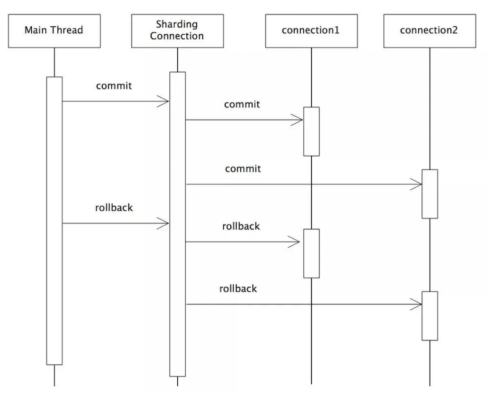

<!-- START doctoc generated TOC please keep comment here to allow auto update -->
<!-- DON'T EDIT THIS SECTION, INSTEAD RE-RUN doctoc TO UPDATE -->
**目录**

- [一、分布式系统](#%E4%B8%80%E5%88%86%E5%B8%83%E5%BC%8F%E7%B3%BB%E7%BB%9F)
  - [1、集中式系统](#1%E9%9B%86%E4%B8%AD%E5%BC%8F%E7%B3%BB%E7%BB%9F)
  - [2、分布式系统](#2%E5%88%86%E5%B8%83%E5%BC%8F%E7%B3%BB%E7%BB%9F)
  - [3、为什么要用分布式系统](#3%E4%B8%BA%E4%BB%80%E4%B9%88%E8%A6%81%E7%94%A8%E5%88%86%E5%B8%83%E5%BC%8F%E7%B3%BB%E7%BB%9F)
  - [4、常见的分布式方案](#4%E5%B8%B8%E8%A7%81%E7%9A%84%E5%88%86%E5%B8%83%E5%BC%8F%E6%96%B9%E6%A1%88)
  - [5、集群和分布式](#5%E9%9B%86%E7%BE%A4%E5%92%8C%E5%88%86%E5%B8%83%E5%BC%8F)
  - [6、分布式环境存在的问题](#6%E5%88%86%E5%B8%83%E5%BC%8F%E7%8E%AF%E5%A2%83%E5%AD%98%E5%9C%A8%E7%9A%84%E9%97%AE%E9%A2%98)
- [二、CAP理论与分布式一致性](#%E4%BA%8Ccap%E7%90%86%E8%AE%BA%E4%B8%8E%E5%88%86%E5%B8%83%E5%BC%8F%E4%B8%80%E8%87%B4%E6%80%A7)
  - [1、CAP定理](#1cap%E5%AE%9A%E7%90%86)
  - [2、BASE理论](#2base%E7%90%86%E8%AE%BA)
  - [3、一致性协议](#3%E4%B8%80%E8%87%B4%E6%80%A7%E5%8D%8F%E8%AE%AE)
  - [4、总结](#4%E6%80%BB%E7%BB%93)
  - [5、Paxos算法](#5paxos%E7%AE%97%E6%B3%95)
- [三、分布式事务](#%E4%B8%89%E5%88%86%E5%B8%83%E5%BC%8F%E4%BA%8B%E5%8A%A1)
  - [1、事务](#1%E4%BA%8B%E5%8A%A1)
  - [2、全局事务](#2%E5%85%A8%E5%B1%80%E4%BA%8B%E5%8A%A1)
  - [3、柔性事务](#3%E6%9F%94%E6%80%A7%E4%BA%8B%E5%8A%A1)
  - [4、柔性事务的解决方案](#4%E6%9F%94%E6%80%A7%E4%BA%8B%E5%8A%A1%E7%9A%84%E8%A7%A3%E5%86%B3%E6%96%B9%E6%A1%88)
- [四、分布式session](#%E5%9B%9B%E5%88%86%E5%B8%83%E5%BC%8Fsession)
- [五、分布式锁](#%E4%BA%94%E5%88%86%E5%B8%83%E5%BC%8F%E9%94%81)
  - [1、分布式锁](#1%E5%88%86%E5%B8%83%E5%BC%8F%E9%94%81)
  - [2、数据库分布式锁](#2%E6%95%B0%E6%8D%AE%E5%BA%93%E5%88%86%E5%B8%83%E5%BC%8F%E9%94%81)
  - [3、基于Redis实现分布式锁](#3%E5%9F%BA%E4%BA%8Eredis%E5%AE%9E%E7%8E%B0%E5%88%86%E5%B8%83%E5%BC%8F%E9%94%81)
  - [4、Zookeeper分布式锁](#4zookeeper%E5%88%86%E5%B8%83%E5%BC%8F%E9%94%81)
  - [5、方案比较](#5%E6%96%B9%E6%A1%88%E6%AF%94%E8%BE%83)
  - [6、分布式安全问题](#6%E5%88%86%E5%B8%83%E5%BC%8F%E5%AE%89%E5%85%A8%E9%97%AE%E9%A2%98)
- [六、分布式缓存](#%E5%85%AD%E5%88%86%E5%B8%83%E5%BC%8F%E7%BC%93%E5%AD%98)
- [七、分布式ID](#%E4%B8%83%E5%88%86%E5%B8%83%E5%BC%8Fid)
  - [1、ID生成的核心需求](#1id%E7%94%9F%E6%88%90%E7%9A%84%E6%A0%B8%E5%BF%83%E9%9C%80%E6%B1%82)
  - [2、数据库自增长序列或字段：](#2%E6%95%B0%E6%8D%AE%E5%BA%93%E8%87%AA%E5%A2%9E%E9%95%BF%E5%BA%8F%E5%88%97%E6%88%96%E5%AD%97%E6%AE%B5)
  - [3、UUID](#3uuid)
  - [4、Redis生成ID](#4redis%E7%94%9F%E6%88%90id)
  - [5、Twitter-Snowflake](#5twitter-snowflake)
  - [6、MongoDB的ObjectId](#6mongodb%E7%9A%84objectid)
  - [7、分布式唯一ID需要满足的条件](#7%E5%88%86%E5%B8%83%E5%BC%8F%E5%94%AF%E4%B8%80id%E9%9C%80%E8%A6%81%E6%BB%A1%E8%B6%B3%E7%9A%84%E6%9D%A1%E4%BB%B6)
- [八、负载均衡](#%E5%85%AB%E8%B4%9F%E8%BD%BD%E5%9D%87%E8%A1%A1)
- [分布式其他问题](#%E5%88%86%E5%B8%83%E5%BC%8F%E5%85%B6%E4%BB%96%E9%97%AE%E9%A2%98)
  - [1、幂等性](#1%E5%B9%82%E7%AD%89%E6%80%A7)
- [参考文章](#%E5%8F%82%E8%80%83%E6%96%87%E7%AB%A0)

<!-- END doctoc generated TOC please keep comment here to allow auto update -->

# 一、分布式系统
## 1、集中式系统

- 一个主机带多个终端：终端没有数据处理能力；仅负责数据的录入和输出.而运算、存储等全部在主机上进行;
- 最大特点：部署简单，由于采用的是单机部署；很可能带来系统大而复杂；难于维护；发生单点故障灯；

## 2、分布式系统
由多个节点组成的系统；节点之前相互连通；把一个计算任务分解成若干个计算单元；并且分派到若干不同的计算机中去执行；然后汇总计算结果的过程

主要特点：

- 分布式：系统中的多台计算机之间没有主、从之分
- 透明性：系统资源被所有计算机共享
- 同一性：系统中的若干台计算机可以互相协作来完成一个共同的任务
- 通信：系统中任意两台计算机都可以通过通信来交换信息

## 3、为什么要用分布式系统

- 升级单机处理能力的性价比越来越低
- 单机处理能力存在瓶颈
- 出于稳定性和可用性考虑

## 4、常见的分布式方案

- 分布式应用和服务
- 分布式静态资源
- 分布式数据和存储
- 分布式计算

## 5、集群和分布式

- 集群是每台服务器都具有相同的功能；处理请求时调用哪台服务器都可以；主要是分流作用分布式是将不同的业务放到不同的服务器中；处理一个请求可能需要用到多台服务器.
- 集群主要有：静态资源集群和应用程序集群。<br>
	session同步是集群和分布式一个核心问题；<br>
	session同步有两种处理方式：一种是在 session 发生变化后自动同步到其他服务器；另一种就是用一个程序统一管理session。<br>
	tomcat 默认使用的是第一种.第二种需要安装高效的缓存程序来统一管理session.

## 6、分布式环境存在的问题

- 通信异常
- 网络分区
- 三态：成功、失败、超时
- 节点故障

# 二、CAP理论与分布式一致性

## 1、CAP定理

### 1.1、什么是CAP

CAP理论：一个分布式系统不可能同时满足一致性（C：Consitency）、可用性（A：Availability）和分区容错性（P：Partition tolerance）这三个基本要求；最多只能满足其中两项

- 一致性：在分布式环境中；是指数据在多个副本之间是否能够保持一致的特性.
	* 如果能做到针对一个数据项的更新操作执行成功后；所有的用户都可以读到其最新的值；具有强一致性；
	* 如果能容忍后续的部分或者全部访问不到，则是弱一致性；
	* 如果经过一段时间后要求能访问到更新后的数据；则是最终一致性；
- 可用性：是指在系统提供的服务必须一直处于可用状态；且是在正常响应时间范围内；对于一个可用性的分布式系统；每一个非故障的节点必须对每一个请求作出响应‘
- 分区容错性：即分布式系统在遇到某节点或网络分区故障的时候；仍然能够对外提供满足一致性和可用性的服务。

### 1.2、CAP应用

三者之间的关系如图：


|选择|说明|
|------|--------|
|CA|放弃分区容错性，加强一致性和可用性，其实就是传统的单机数据库的选择；放弃P意味着放弃了系统的可扩展性|
|CP|放弃可用性；追求一致性和分区容错性；基本不会选择；网络问题会直接让整个系统不可用|
|AP|放弃一致性(这里说的一致性是强一致性；保留数据的最终一致性)；追求分区容错性和可用性；这是很多分布式系统设计时的选择|

* 需要注意的是对一个分布式系统而言；分区容错性是一个最基本的要求.因为既然是一个分布式系统；那么分布式系统中的组件必然需要被部署到不同的节点，否则也就无所谓分布式系统了.而对于分布式系统而言，网络问题又是一个必定会出现的异常情况；因此分区容错性也就成为了一个分布式系统必然需要面对和解决的问题；

* 一般分布式系统都是在一致性和可用性之间寻求平衡；

## 2、BASE理论

### 2.1、基本概念

- BASE是Basically Available（基本可用）、Soft state（软状态）和Eventually consistent（最终一致性）三个短语的缩写；
- BASE理论是对CAP中一致性和可用性权衡的结果；
- 核心思想：即使无法做到强一致性；但每个应用都可以根据自身业务特点；采用适当的方式来使系统达到最终一致性

### 2.2、BASE理论三要素

#### 2.2.1、基本可用：指分布式系统在出现不可预知故障的时候；允许损失部分可用性；但绝不等价于系统不可用.

- 响应时间上的损失：正常情况下；一个在线搜索引擎需要在0.5秒之内返回给用户相应的查询结果；但由于出现故障；查询结果的响应时间增加了1~2秒
- 功能上的损失：正常情况下；消费者在电商网站购物时都能顺利完成订单;但是大促购物高峰情况下；为了保护购物系统的稳定性；可能部分消费者会被引导到降级页面

#### 2.2.2、弱状态（软状态）

允许系统中的数据存在中间状态；并认为该中间状态的存在不会影响系统的整体可用性。即允许系统在不同节点的数据副本之间进行数据同步的过程存在延时；

#### 2.2.3、最终一致性

最终一致性强调的是所有的数据副本；在经过一段时间的同步之后；最终都能够达到一个一致的状态。<br>
最终一致性的本质是需要系统保证最终数据能够达到一致；而不需要实时保证系统数据的强一致性。<br>

*最终一致性有如下五种类型变种：*

- 因果一致性：如果A进程在更新之后向B进程通知更新的完成，那么B的访问操作将会返回更新的值。如果没有因果关系的C进程将会遵循最终一致性的规则；
- 读己所写一致性：因果一致性的特定形式.一个进程总可以读到自己更新的数据；
- 会话一致性：读己所写一致性的特定形式.进程在访问存储系统同一个会话内，系统保证该进程读己之所写；
- 单调读一致性：如果一个进程已经读取到一个特定值，那么该进程不会读取到该值以前的任何值；
- 单调写一致性：系统保证对同一个进程的写操作串行化；

### 2.3、BASE与ACID

BASE理论面向的是大型高可用可扩展的分布式系统；和传统的事物ACID特性是相反的；它完全不同于ACID的强一致性模型；而是通过牺牲强一致性来获得可用性；并允许数据在一段时间内是不一致的；但最终达到一致状态.但同时，在实际的分布式场景中，不同业务单元和组件对数据一致性的要求是不同的；因此在具体的分布式系统架构设计过程中；ACID特性和BASE理论往往又会结合在一起.

## 3、一致性协议

- 数据一致性问题：

	分布式系统为了提升可用性和性能，会通过复制技术来进行数据同步。复制机制的目的是为了保证数据的一致性。但是数据复制面临的主要难题也是如何保证多个副本之间的数据一致性。在分布式系统引入复制机制后，不同的数据节点之间由于网络延时等原因很容易产生数据不一致的情况


### 3.1、二阶段提交-2PC：Two-Phase Commit

为了使基于分布式系统架构下的所有节点在进行事务提交时保持一致性而设计的一种算法（Algorithm）目前绝大部分关系型数据库都是采用二阶段提交协议来完成分布式事务处理的.

#### 3.1.1、算法思路

参与者将操作成败通知协调者；再由协调者根据所有参与者的反馈情报决定各参与者是否要提交操作还是中止操作

#### 3.1.2、二阶段提交协议是将事务的提交过程分为了两个阶段来处理

##### 3.1.2.1、阶段一：提交事务请求

事务协调者(事务管理器)给每个参与者(资源管理器)发送Prepare消息；每个参与者要么直接返回失败（如权限验证失败）；要么在本地执行事务；写本地的redo和undo日志；但不提交

- 事务询问：协调者向所有参与者发送事务内容；询问是否可以执行事务提交操作；并开始等待各参与者的响应;
- 执行事务：各参与者节点执行事务操作；并将undo和redo信息记录事务日志中.
- 各参与者向协调者反馈事务询问的响应：如果参与者执行了事务操作；那么就反馈给协调者Yes响应；表示事务可以执行;如果参与者没有成功执行事务；反馈no；表示事务不可以执行；

二阶段提交协议的阶段一被称为"投票阶段"

##### 3.1.2.2、阶段二：执行事务提交

在阶段二中；协调者会根据各参与者反馈情况来决定最终是否可以进行事务提交操作.正常情况下；包括以下两种可能：

- 执行事务提交：假如协调者从所有参与者获得的反馈都是Yes响应；那么就会执行事务提交
	* 发送提交请求：协调者向所有参与者节点发送 commit 请求;
	* 事务提交：参与者接收到commit请求后；会正式执行事务提交操作；并在完成提交之后释放整个事务执行期间占用的事务资源;
	* 反馈事务提交结果：参与者在完成事务提交之后；向协调者发送Ack消息;
	* 完成事务：协调者接收到所有参与者反馈的ack消息后；完成事务;
- 中断事务：如果有任何一个参与者反馈了no响应；或者在等待超时之后；协调者无法接收到所有参与者的反馈响应；则中断事务
	* 发送回滚请求：协调者向所有参与者节点发送rollback请求;
	* 事务回滚：参与者接收到rollback请求后；会利用其在阶段一中记录的undo信息来执行事务回滚操作；并释放资源;
	* 反馈事务回滚结果：参与者在完成事务回滚之后；向协调者发送ack消息.
	* 中断事务：协调者在接收到参与者反馈的ack消息后；完成事务中断;

#### 3.1.3、优缺点

- 优点：原理简单；实现方便
- 缺点：同步阻塞；单点问题；数据不一致；保守

### 3.2、三阶段提交-3PC：Three-phase Commit

是2PC的改进版；其将二阶段提交协议中的"提交事务请求"过程一分为二；形成了CanCommit、PreCommit和doCommit三个阶段来完成事务处理协议

#### 3.2.1、阶段一：CanCommit

- 事务询问：协调者向所有的参与者发送一个包含事务内容的canCommit请求；询问是否可以执行事务提交操作；并开始等待各参与者的响应;
- 各参与者向协调者反馈事务询问的响应：参与者在接收到来自协调者的canCommit请求后；正常情况下；如果其认为自身可以顺序执行事务；会反馈Yes响应；并进入预备状态；否则反馈no响应

#### 3.2.2、阶段二：PreCommit

在阶段二中；协调者会根据各参与者的反馈情况来决定时代可以进行事务的PreCommit操作.正常情况下；有两种可能：

- 执行事务预提交：假如协调者从参与者中获得的反馈都是Yesy响应；那么执行事务预提交
	* 发送预提交请求：协调者向所有参与者节点发出PreCommit请求；并进入Prepared阶段;
	* 事务预提交：参与者收到PreCommit请求后；会执行事务操作；并将undo和redo信息记录到事务日志中;
	* 各参与者向协调者反馈事务执行的响应：如果参与者成功执行了事务操作；那么就会反馈给协调者ack响应；同时等到最终指令：提交或中止;

- 中断事务：假如任何一个参与者向协调者反馈了no响应；或者等待超时之后；协调者尚无法接收到所有参与者的反馈响应；那么就会中断事务
	* 发送中断请求：协调者向所有参与者节点发送abort请求;
	* 中断事务：无论是收到来自协调者的abort请求；或者是在等待协调者请求过程中出现超时；参与者都会中断事务;

#### 3.2.3、阶段三：doCommit

该阶段将进行真正的事务提交

- 执行提交
	* 发送提交请求：进入这一阶段；假设协调者处于正常工作状态；并且它收到了来自所有参与者的ack响应；那么它将从“预提交”状态转为“提交”状态；并向所有参与者发送doCommit请求;
	* 事务提交：参与者接收到doCommit请求后；会正式执行事务提交操作；并在完成提交之后释放占用的事务资源；
	* 反馈提交结果：参与者在完成事务提交后；向协调者发送ack消息；
	* 完成事务：协调者接收到所有参与者的ack消息后；完成事务；

- 中断事务：进入这一阶段；假设协调者处于正常工作状态；并且任意一个参与者向协调者反馈了no相应；或者在等待超时之后；那么就会中断事务
	* 发送中断请求
	* 事务回滚
	* 反馈事务回滚结果
	* 中断事务

*注意：一旦进入阶段三；可能出现如下故障：*

- 协调者出现问题
- 协调者与参与者之间的网络出现故障

#### 3.2.4、优缺点

- 优点：想较于二阶段提交协议；3PC主要解决的单点故障问题；并减少阻塞；因为一旦参与者无法及时收到来自协调者的消息之后；它会默认commit。
- 缺点：在去除阻塞的同时引入了新的问题：数据一致性问题.由于网络原因；协调者发送的abort响应没有被参与者及时收到；那么参与者在等待超时之后执行了commit操作；但其他参与者执行了事务回滚操作；这样导致了参与者之间数据不一致问题

## 4、总结

通过上述2PC和3PC；可以知道无论是二阶段还是三阶段提交协议；都无法彻底解决分布式的一致性问题.
只有一种一致性算法；那就是Paxos.

## 5、Paxos算法

Paxos算法是基于消息传递且具有高度容错特性的一致性算法，是目前公认的解决分布式一致性问题最有效的算法之一

[Paxos算法原理与推导](https://www.cnblogs.com/linbingdong/p/6253479.html)
[带你一步步走入Paxos的世界](https://mp.weixin.qq.com/s/cQJjAOuDKYFnujNE_6OD0Q)
	
# 三、分布式事务

## 1、事务

事务：一般是指要做的或所做的事情；一个数据库事务通常包含对数据库进行读或写的一个操作序列；

事务应该具有4个属性：原子性、一致性、隔离性、持久性。这四个属性通常称为ACID特性。

### 1.1、事务类型

Java事务的类型有三种：JDBC事务、JTA(Java Transaction API)事务、容器事务
- JDBC事务：

	在JDBC中是通过Connection对象进行事务管理。在JDBC中，常用的和事务相关的方法是： setAutoCommit、commit、rollback；

	JDBC事务有一个局限：一个 JDBC 事务不能跨越多个数据库

- JTA事务：
	- 为什么需要JTA事务：由于JDBC无法实现分布式事务，而如今的分布式场景越来越多，所以，JTA事务就应运而生；
	- Java事务API（Java Transaction API，简称JTA ） 是一个Java企业版 的应用程序接口，在Java环境中，允许完成跨越多个XA资源的分布式事务
	- JTA和它的同胞Java事务服务(JTS；Java TransactionService)，为J2EE平台提供了分布式事务服务
	- 常见的JTA实现有以下几种：
		- J2EE容器所提供的JTA实现(JBoss)
		- 独立的JTA实现：如JOTM，Atomikos.这些实现可以应用在那些不使用J2EE应用服务器的环境里用以提供分布事事务保证。如Tomcat,Jetty以及普通的java应用。
	- JTA对DataSource、Connection和Resource 都是有要求的，只有符合XA规范，并且实现了XA规范的相关接口的类才能参与到JTA事务中来
	- 要想使用用 JTA 事务，那么就需要有一个实现 javax.sql.XADataSource 、 javax.sql.XAConnection 和 javax.sql.XAResource 接口的 JDBC 驱动程序。一个实现了这些接口的驱动程序将可以参与 JTA 事务。一个 XADataSource 对象就是一个 XAConnection 对象的工厂。XAConnection 是参与 JTA 事务的 JDBC 连接。要使用JTA事务，必须使用XADataSource来产生数据库连接，产生的连接为一个XA连接。XA连接（javax.sql.XAConnection）和非XA（java.sql.Connection）连接的区别在于：XA可以参与JTA的事务，而且不支持自动提交；
	- 提供了分布式事务的解决方案，严格的ACID；但是实现复杂，通常情况下，JTA UserTransaction需要从JNDI获取。这意味着，如果我们使用JTA，就需要同时使用JTA和JNDI；JTA本身就是个笨重的API；通常JTA只能在应用服务器环境下使用，因此使用JTA会限制代码的复用性

- 容器事务：常见的容器事务如Spring事务，容器事务主要是J2EE应用服务器提供的，容器事务大多是基于JTA完成，这是一个基于JNDI的，相当复杂的API实现

### 1.2、分布式事务

## 2、全局事务

所谓全局事务，是指分布式事务处理环境中，多个数据库可能需要共同完成一个工作，这个工作即是一个全局事务，例如，一个事务中可能更新几个不同的数据库。对数据库的操作发生在系统的各处但必须全部被提交或回滚；即：`全局事务是由资源管理器管理和协调的事务`，标准的分布式事务；

全局事务是一个DTP模型的事务；所谓DTP模型指的是X/Open DTP(X/Open Distributed Transaction Processing Reference Model)，是X/Open 这个组织定义的一套分布式事务的标准，也就是了定义了规范和API接口，由这个厂商进行具体的实现

X/Open DTP 定义了三个组件：AP，TM，RM 和两个协议：XA、TX：
- AP(Application Program)：也就是应用程序，可以理解为使用DTP的程序
- RM(Resource Manager)：资源管理器，这里可以理解为一个DBMS系统，或者消息服务器管理系统，应用程序通过资源管理器对资源进行控制。
- TM(Transaction Manager)：事务管理器，负责协调和管理事务，提供给AP应用程序编程接口以及管理资源管理器。
- XA协议：应用或应用服务器与事务管理之前通信的接口
- TX协议：全局事务管理器与资源管理器之间通信的接口

事务管理器控制着全局事务，管理事务生命周期，并协调资源。资源管理器负责控制和管理实际资源

### 2.1、XA协议

- XA规范主要定义了(全局)事务管理器(TM)和(局部)资源管理器(RM)之间的接口。主流的关系型数据库产品都是实现了XA接口的；在XA规范中，数据库充当RM角色，应用需要充当TM的角色，即生成全局的txId，调用XAResource接口，把多个本地事务协调为全局统一的分布式事务

- XA接口是双向的系统接口，在事务管理器 (TM)以及一个或多个资源管理器(RM)之 间形成通信桥梁；

二阶段提交其实就是实现XA分布式事务的关键(确切地说：两阶段提交主要保证了分布式事务的原子性：即所有结点要么全做要么全不做)

#### 2.1.1、一阶段提交：弱XA



弱XA通过去掉XA的Prepare阶段，以达到减少资源锁定范围而提升并发性能的效果。

典型的实现为在一个业务线程中，遍历所有的数据库连接，依次做commit或者rollback。弱XA同本地事务相比，性能损耗低，但在事务提交的执行过程中，若出现网络故障、数据库宕机等预期之外的异常，将会造成数据不一致，且无法进行回滚。基于弱XA的事务无需额外的实现成本

#### 2.1.2、二阶段提交：2PC


二阶段提交是XA的标准实现。它将分布式事务的提交拆分为2个阶段：`prepare`和`commit/rollback`；

开启XA全局事务后，所有子事务会按照本地默认的隔离级别锁定资源，并记录undo和redo日志，然后由TM发起prepare投票，询问所有的子事务是否可以进行提交：当所有子事务反馈的结果为“yes”时，TM再发起commit；若其中任何一个子事务反馈的结果为“no”，TM则发起rollback；如果在prepare阶段的反馈结果为yes，而commit的过程中出现宕机等异常时，则在节点服务重启后，可根据XA recover再次进行commit补偿，以保证数据的一致性；

2PC模型中，在prepare阶段需要等待所有参与子事务的反馈，因此可能造成数据库资源锁定时间过长，不适合并发高以及子事务生命周长较长的业务场景；

### 2.2、全局事务的实现

- JTA(Java Transaction API)：面向应用、应用服务器与资 源管理器的高层事务接口。
- JTS(Java Transaction Service)：JTA事务管理器的实现标 准，向上支持JTA，向下通过CORBA OTS实现跨事务域的互 操作性。
- EJB：基于组件的应用编程模型，通过声明式事务管理进一步 简化事务应用的编程。

###2.3、优缺点

- 优点：严格的ACID，即强一致性；
- 缺点：效率非常低
	- - 全局事务方式下，全局事务管理器(TM)通过XA接口使用二阶段提交协议( 2PC )与资源层(如数据 库)进行交互。使用全局事务，数据被Lock的时间跨整个事务，直到全局事务结束；
	- 2PC 是反可伸缩模式，在事务处理过程中，参与者需要一直持有资源直到整个分布式事务结束。这样， 当业务规模越来越大的情况下，2PC 的局限性就越来越明显，系统可伸缩性会变得很差；
	- 与本地事务相比，XA 协议的系统开销相当大，因而应当慎重考虑是否确实需要分布式事务。而且只有 支持 XA 协议的资源才能参与分布式事务；

## 3、柔性事务

柔性事务是对XA协议的妥协和补偿，它通过对强一致性要求的降低，已达到降低数据库资源锁定时间的效果；

柔性事务保证的事`基本可用，最终一致。`这其实就是基于BASE理论，保证数据的最终一致性。

虽然柔性事务并不像刚性事务那样完全遵循ACID，但是，也是部分遵循ACID的；关于ACID四个属性，柔性事务的支撑程度：

	原子性：严格遵循
	一致性：事务完成后的一致性严格遵循；事务中的一致性可适当放宽
	隔离性：并行事务间不可影响；事务中间结果可见性允许安全放宽
	持久性：严格遵循

关于柔性事务，最主要的有以下三种类型：异步确保型、补偿型、最大努力通知型。

以下柔性事务的模式

### 3.1、可查询操作

几乎是所有的分布式解决方案都需要的。在分布式事务执行过程中，如果某一个步骤执行出错，就需要明确的知道其他几个操作的处理情况，这就需要其他的服务都能够提供查询接口，保证可以通过查询来判断操作的处理情况。

为了保证操作的可查询，需要对于每一个服务的每一次调用都有一个全局唯一的标识，可以是业务单据号（如订单号）、也可以是系统分配的操作流水号（如支付记录流水号）。除此之外，操作的时间信息也要有完整的记录

### 3.2、幂等操作

其任意多次执行所产生的影响均与一次执行的影响相同；要保证数据的最终一致性，很多解决防范都会有很多重试的操作，如果一个方法不保证幂等，那么将无法被重试

幂等操作的实现方式有多种，如在系统中缓存所有的请求与处理结果、检测到重复操作后，直接返回上一次的处理结果等

### 3.3、可补偿操作

在分布式事务中，要想进行rollback，就需要提供可补偿操作。并且，补偿操作同时也需要满足幂等性。

### 3.4、TCC操作

TCC 即 Try-Confirm-Cancel。

- Try：尝试执行业务，完成所有业务检查(一致性) 预留必须业务资源(准隔离性)；
- Confirm：确认执行业务，真正执行业务，不作任何业务检查，只使用Try阶段预留的业务资源 Confirm操作要满足幂等性；
- Cancel：取消执行业务，释放Try阶段预留的业务资源，Cancel操作要满足幂等性

这种类型和可补偿操作类似，就是提供一种提交和回滚的机制。是一种典型的两阶段类型的操作。这里说的两阶段类型操作并不是指2PC，他和2PC还是有区别的：

TCC与2PC协议比较：

	TCC位于业务服务层而非资源层；
	TCC没有单独的准备(Prepare)阶段
	Try操作兼备资源操作与准备能力
	Try操作可以灵活选择业务资源的锁定粒度(以业务定粒度) TCC有较高开发成本

## 4、柔性事务的解决方案

### 4.1、可靠消息的一致性：异步确保型


### 4.2、TCC事务补偿型方案

也属于两阶段型的一种实现，但区别于2PC协议的两阶段提交

### 4.3、最大努力通知型方案

### 4.4、SAGA

# 四、分布式session


# 五、分布式锁

## 1、分布式锁

在分布式环境下；保证一个方法在同一时间只有一个线程能调用一个方法；或者多个客户端同时对一个服务请求时；需要使用分布式锁

### 1.1、分布式锁应该是怎样的

* 在分布式系统环境下，一个方法在同一时间只能被一个机器的一个线程执行;
* 高可用的获取锁与释放锁;
* 高性能的获取锁与释放锁;
* 具备可重入特性;
* 具备锁失效机制；防止死锁;
* 具备非阻塞锁特性，即没有获取到锁将直接返回获取锁失败.

### 1.2、分布式锁的实现方案

* 基于数据库实现分布式锁
* 基于缓存(redis；tair)等
* 基于zookeeper实现分布式锁

## 2、数据库分布式锁

### 2.1、基于数据库表

#### 2.1.1、实现方式

要实现分布式锁，最简单的方式可能就是直接创建一张锁表；然后通过操作该表中的数据来实现。当要锁住某个方法或者资源时；就在该表中增加一条记录；如果要释放锁就删除该记录

```sql
-- 创建表
CREATE TABLE `methodLock` (
  `id` int(11) NOT NULL AUTO_INCREMENT COMMENT '主键'；
  `method_name` varchar(64) NOT NULL DEFAULT '' COMMENT '锁定的方法名'；
  `desc` varchar(1024) NOT NULL DEFAULT '备注信息'；
  `update_time` timestamp NOT NULL DEFAULT CURRENT_TIMESTAMP ON UPDATE CURRENT_TIMESTAMP COMMENT '保存数据时间，自动生成'；
  PRIMARY KEY (`id`)；
  UNIQUE KEY `uidx_method_name` (`method_name `) USING BTREE
) ENGINE=InnoDB DEFAULT CHARSET=utf8 COMMENT='锁定中的方法';
-- 获取锁
insert into methodLock(method_name；desc) values (‘method_name’；‘desc’);
-- 释放锁
delete from methodLock where method_name ='method_name';
```
#### 2.1.2、上述实现存在问题

- 该锁强依赖数据库的可用性；数据库是一个单点的；一旦数据库挂掉；会导致业务系统不可用；
- 该锁没有失效时间；一旦解锁失败；就会导致数据记录一直在数据库中；其他线程无法再获取得到锁；
- 该锁只能是非阻塞的；因为数据库的insert操作一旦插入失败就会直接报错；没有获得锁的线程并不会进入排队队列；要想再次获取锁就得再次出发获得锁操作；
- 该锁是非重入的；同一个线程在没有释放锁之前无法再次获得该锁；因为数据库中数据已存在；

#### 2.1.3、上述问题的解决方式

- 数据库单点：可以有两个数据库；数据之前是双向同步.一旦挂掉快速切换到备库上；
- 失效时间：定义定时任务；每隔一定时间把数据库中超时的数据清理一遍；
- 非阻塞：使用while循环；直到insert成功再返回成功；
- 非重入：在数据库表中加入字段；记录当前获得锁的机器主机信息和线程信息；那么下次再获取锁的时候先查询数据库；如果当前机器的主机信息和线程信息在数据库中可以查到；直接把锁分配给该线程即可；

### 2.2、基于数据库排他锁

借助数据库自带的锁来实现分布式锁

#### 2.2.1、实现

通过数据库排他锁来实现分布式锁；基于mysql的innodb引擎.可以使用如下方法来实现：

```java
public boolean lock(){
	connection.setAtuoCommit(false);
	while(true){
		try{
			result = "select * from methodLock where method_name=xxx for update";
			if(result == null){
				return true;
			}
		} catch(Exception e){
		}
		sleep(1000);
	}
	return false;
}
public void unlock(){
	connection.commit();
}
```
- 在查询语句后面增加for update；数据库会在查询过程中给数据库表增加排它锁【注意：innodb引擎在加锁的时候；只有通过索引进行检索的时候才会使用行级锁；否则会使用表级锁;该索引一旦要创建成唯一索引；否则会出现多个重载方法之间无法被同时访问的问题】;

- 通过connection.commit()来释放锁

#### 2.2.2、解决问题与存在的问题

- 可以有效的解决无法释放锁和阻塞锁的问题
	* for update语句会在执行成功后立即返回；在执行失败时一直处于阻塞状态；直到成功；
	* 使用这种方式；服务宕机后数据库会自己把锁释放掉；
- 无法解决数据库单点和可冲入问题；
- mysql会对查询进行优化；即便在条件中使用了索引字段；但是否使用索引来检索数据时mysql通过判断不同执行计划代价来决定的；如果mysql认为全表扫描效率高；这种情况下innodb使用表级锁而不是行级锁；
- 如果使用排它锁来进行分布式锁的lock；那么一个排他锁长时间不提交；就会占用数据库连接，一旦类似连接变多；可能把数据库连接池撑爆；

### 2.3、总结

- 数据库分布式锁的优点：直接借助数据库；容易理解
- 数据库分布式锁的缺点：
	* 会有各种各样的问题；在解决问题的过程中会使整个方案变的越来越复杂;
	* 操作数据库需要一定的开销；性能问题需要考虑;
	* 使用数据库的行级锁并不一定靠谱；尤其是当表不大的时候;

## 3、基于Redis实现分布式锁

### 3.1、使用Redis原因

- Redis有很高的性能;
- Redis命令对此支持很好；实现起来比较方便

### 3.2、Redis实现分布式锁涉及命令

- setnx：

	setnx key val：当且仅当key不存在时，set一个key为val的字符串，返回1；若key存在，则什么都不做，返回0；

- expire：

	expire key timeout：为key设置一个超时时间；单位为second；超过这个时间锁会自动是否；避免死锁；

- delete：

	delele key：删除key

### 3.3、基本思路

- 获取锁的时候；使用setnx加锁；并使用expire命令为锁添加一个超时时间；超过该时间则自动释放锁；锁的value值为一个随机的UUID；通过此在释放锁的时候进行判断；
- 获取锁的时候还设置一个超时时间；若超过这个时间则放弃获取锁；
- 释放锁的时候；通过UUID判断是不是该锁；若是该锁；则执行delete释放锁；

### 3.4、简单实现

[RedisDistributeLock](https://github.com/chenlanqing/example/blob/master/src/main/java/com/learning/example/thread/lock/distribute/redis/RedisDistributeLock.java)

### 3.5、上述实现存在的问题

上述实现中存在几个问题：

- setnx和expire的非原子性
- del 导致误删
- 出现并发的可能性

#### 3.5.1、setnx和expire的非原子性

设想一个极端场景：当某线程执行setnx，成功得到了锁，setnx刚执行成功，还未来得及执行expire指令，获取锁的节点 Duang的一声挂掉了。这样一来，这把锁就没有设置过期时间，变得“长生不老”，别的线程再也无法获得锁了；setnx指令本身是不支持传入超时时间的，在redis2.6.12版本后为set指令增加了可选参数：set(key，1，30，NX)，这样就可以取代setnx指令

#### 3.5.2、del 导致误删

也是一个极端场景，假如某线程成功得到了锁，并且设置的超时时间是30秒；如果某些原因导致线程A执行的很慢很慢，过了30秒都没执行完，这时候锁过期自动释放，线程B得到了锁；随后，线程A执行完了任务，线程A接着执行del指令来释放锁。但这时候线程B还没执行完，线程A实际上删除的是线程B加的锁；怎么避免这种情况呢？可以在del释放锁之前做一个判断，验证当前的锁是不是自己加的锁；可以在加锁的时候把当前的线程ID当做value，并在删除之前验证key对应的value是不是自己线程的ID。但是，这样做又隐含了一个新的问题，判断和释放锁是两个独立操作，不是原子性

#### 3.5.3、出现并发的可能性

还是刚才上述所描述的场景，虽然我们避免了线程A误删掉key的情况，但是同一时间有A，B两个线程在访问代码块，仍然是不完美的。怎么办呢？我们可以让获得锁的线程开启一个守护线程，用来给快要过期的锁“续航”。

### 3.6、使用Redission实现

Redission封装了锁的实现，其继承了java.util.concurrent.locks.Lock的接口，可以向操作本地Lock一样去操作Redission的Lock；Redission不仅提供了Java自带的一些方法(lock,tryLock)，还提供了异步加锁，对于异步编程更加方便

#### 3.6.1、tryLock方法
- （1）尝试加锁：首先会尝试进行加锁，由于需要兼容老版本的Redis，所以不能直接使用ex nx原子操作的API，那么就只能使用lua脚本
	```java
	return commandExecutor.evalWriteAsync(getName(), LongCodec.INSTANCE, command,
		"if (redis.call('exists', KEYS[1]) == 0) then " +
						"redis.call('hset', KEYS[1], ARGV[2], 1); " +
						"redis.call('pexpire', KEYS[1], ARGV[1]); " +
						"return nil; " +
		"end; " +
		"if (redis.call('hexists', KEYS[1], ARGV[2]) == 1) then " +
						"redis.call('hincrby', KEYS[1], ARGV[2], 1); " +
						"redis.call('pexpire', KEYS[1], ARGV[1]); " +
						"return nil; " +
		"end; " +
		"return redis.call('pttl', KEYS[1]);",
		Collections.<Object>singletonList(getName()), internalLockLeaseTime, getLockName(threadId));
	```
	其并没有使用我们的`sexNx`来进行操作，而是使用的`hash`结构，我们的每一个需要锁定的资源都可以看做是一个`HashMap`，锁定资源的节点信息是Key,锁定次数是value。通过这种方式可以很好的实现可重入的效果，只需要对value进行加1操作，就能进行可重入锁；
- （2）如果尝试加锁失败，判断是否超时，如果超时则返回false；
- （3）如果加锁失败之后，没有超时，那么需要在名字为redisson_lock__channel+lockName的channel上进行订阅，用于订阅解锁消息，然后一直阻塞直到超时，或者有解锁消息；
- （4）重试步骤1，2，3，直到最后获取到锁，或者某一步获取锁超时

#### 3.6.2、unlock()

unlock方法比较简单也是通过lua脚本进行解锁，如果是可重入锁，只是减1。如果是非加锁线程解锁，那么解锁失败
```java
return commandExecutor.evalWriteAsync(getName(), LongCodec.INSTANCE, RedisCommands.EVAL_BOOLEAN,
"if (redis.call('exists', KEYS[1]) == 0) then " +
				"redis.call('publish', KEYS[2], ARGV[1]); " +
				"return 1; " +
"end;" +
"if (redis.call('hexists', KEYS[1], ARGV[3]) == 0) then " +
				"return nil;" +
"end; " +
"local counter = redis.call('hincrby', KEYS[1], ARGV[3], -1); " +
"if (counter > 0) then " +
				"redis.call('pexpire', KEYS[1], ARGV[2]); " +
				"return 0; " +
"else " +
				"redis.call('del', KEYS[1]); " +
				"redis.call('publish', KEYS[2], ARGV[1]); " +
				"return 1; "+
"end; " +
"return nil;",
Arrays.<Object>asList(getName(), getChannelName()), LockPubSub.unlockMessage, internalLockLeaseTime, getLockName(threadId));
```

#### 3.6.3、公平锁

Redission还有公平锁的实现，对于公平锁其利用了list结构和hashset结构分别用来保存我们排队的节点，和我们节点的过期时间，用这两个数据结构帮助我们实现公平锁

### 3.7、RedLock

有如下场景：当机器A申请到一把锁之后，如果Redis主宕机了，这个时候从机并没有同步到这一把锁，那么机器B再次申请的时候就会再次申请到这把锁；

为了解决上述问题提出了`RedLock红锁`的算法,在Redission中也对RedLock进行了实现；可以需要实现多个Redis集群，然后进行红锁的加锁，解锁；具体步骤：
```java
RLock lock1 = redissionInstance1.getLock("lock1");
RLock lock2 = redissionInstance2.getLock("lock2");
RLock lock3 = redissionInstance3.getLock("lock3");
RedissionRedLock lock = new RedissionRedLock(lock1, lock2, lock3);
lock.lock();
...

lock.unlock();
```
- （1）首先生成多个Redis集群的Rlock，并将其构造成RedLock；
- （2）依次循环对三个集群进行加锁，加锁的过程和使用Redission加锁一致；
- （3）如果循环加锁的过程中加锁失败，那么需要判断加锁失败的次数是否超出了最大值，这里的最大值是根据集群的个数，比如三个那么只允许失败一个，五个的话只允许失败两个，要保证多数成功；
- （4）加锁的过程中需要判断是否加锁超时，有可能我们设置加锁只能用3ms，第一个集群加锁已经消耗了3ms了。那么也算加锁失败；
- （5）上面3，4步里面加锁失败的话，那么就会进行解锁操作，解锁会对所有的集群在请求一次解锁

RedLock基本原理是利用多个Redis集群，用多数的集群加锁成功，减少Redis某个集群出故障，造成分布式锁出现问题的概率

## 4、Zookeeper分布式锁

* [ZooKeeper分布式锁的实现原理](https://mp.weixin.qq.com/s/MuWafD3PP9czRgNFUdwYAw)

基于zookeeper临时有序节点可以实现分布式锁

### 4.1、基本思路

每个客户端对某个方法加锁时；在zookeeper上的与该方法对应指定节点的目录下；生成一个唯一的瞬时有序节点。判断是否获取锁的方式很简单：只需要判断有序节点中序号最小的一个。当释放锁的时候；只需要将这个瞬时节点删除即可.同时可以避免服务宕机导致的锁无法释放而产生的死锁问题

### 4.2、实现

[SimpleDistributedLockMutex](https://github.com/chenlanqing/example/blob/master/src/main/java/com/learning/example/thread/lock/distribute/zookeeper/SimpleDistributedLockMutex.java)

### 4.3、如何解决前面数据库分布式锁中存在的问题

- 锁无法释放：使用zookeeper可以有效的解决锁无法释放的问题；因为在创建锁的时候；客户端会在ZK中创建一个临时节点；一旦获取到之后突然挂掉；那么这个临时节点就会自动删除.其他客户端可以再次获取锁；

- 非阻塞锁：使用zookeeper实现阻塞的锁；客户端可以通过在ZK中创建顺序节点；并且在节点上绑定监听器；一旦节点有变化；zookeeper会通知客户端；客户端可以检查自己创建的节点是不是当前所有节点中序号最小的；如果是；那么自己将获取到锁；

- 不可重入：客户端在创建节点的时候；把当前客户端的主机信息和线程信息直接写入节点中；下次想要获取锁时直接和当前最小的节点数据对比.如果是一样的；那么可以直接获取到锁；如果不一样；就再创建一个临时有序节点；参与排队；

- 单点问题：ZK是集群部署的；只要集群中半数以上的机器存活；就可以对外提供服务

### 4.4、存在问题

- zookeeper实现的分布式锁在性能上可能没有缓冲服务那么高；因为每次在创建锁和释放锁的过程中吗；都要动态创建和销毁瞬时节点来实现锁功能
- 可能带来并发问题；

## 5、方案比较

- 从理解难以程度角度（从低到高）： 数据库 > 缓存 > zookeeper
- 从实现的复杂性解读（从低到高）：zookeeper >= 缓存 > 数据库
- 从性能角度（从高到低）：缓存 > zookeeper >= 数据库
- 从可靠性角度：zookeeper > 缓存 > 数据库

## 6、分布式安全问题

### 6.1、长时间的GC pause

在GC的时候会发生STW(stop-the-world)，例如CMS垃圾回收器，他会有两个阶段进行STW防止引用继续进行变化，client1获取了锁并且设置了锁的超时时间，但是client1之后出现了STW，这个STW时间比较长，导致分布式锁进行了释放，client2获取到了锁，这个时候client1恢复了锁，那么就会出现client1，2同时获取到锁，这个时候分布式锁不安全问题就出现了。这个其实不仅仅局限于RedLock,对于我们的ZK,Mysql一样的有同样的问题

### 6.2、时钟发生跳跃

对于Redis服务器如果其时间发生了向跳跃，那么肯定会影响我们锁的过期时间，那么我们的锁过期时间就不是我们预期的了，也会出现client1和client2获取到同一把锁，那么也会出现不安全，这个对于Mysql也会出现。但是ZK由于没有设置过期时间，那么发生跳跃也不会受影响


### 6.3、长时间的网络I/O

获取了锁之后我们进行网络调用，其调用时间由可能比我们锁的过期时间都还长，那么也会出现不安全的问题，这个Mysql也会有，ZK也不会出现这个问题

Chubby


# 六、分布式缓存


# 七、分布式ID
## 1、ID生成的核心需求

- **1.1、全局唯一：**

需要单独设置一个和业务无关的主键；专业术语叫做代理主键这也是为什么数据库设计范式；唯一主键是第一范式!

- **1.2、趋势有序：**

	InnoDB引擎表是基于B+树的索引组织表(IOT)；每个表都需要有一个聚集索引；所有的行记录都存储在B+树的叶子节点（leaf pages of the tree）基于聚集索引的增、删、改、查的效率相对是最高的

	- 如果我们定义了主键(PRIMARY KEY)；那么InnoDB会选择其作为聚集索引;
	- 如果没有显式定义主键；则InnoDB会选择第一个不包含有 NULL .值的唯一索引作为主键索引
	- 如果也没有这样的唯一索引；则InnoDB会选择内置6字节长的ROWID作为隐含的聚集索引（ROWID随着行记录的写入而主键递增；这个ROWID不像ORACLE的ROWID那样可引用；是隐含的）
	- *如果InnoDB表的数据写入顺序能和B+树索引的叶子节点顺序一致的话；这时候存取效率是最高的；也就是下面几种情况效率最高：*
		- Ⅰ.使用自增列(INT/BIGINT类型)做主键，这时候写入顺序是自增的，和B+数叶子节点分裂顺序一致
		- Ⅱ.该表不指定自增列做主键；同时也没有可以被选为主键的唯一索引(上面的条件)；这时候InnoDB会选择内置的ROWID作为主键；写入顺序和ROWID增长顺序一致
		- Ⅲ.除此以外；如果一个InnoDB表又没有显示主键；又有可以被选择为主键的唯一索引；但该唯一索引可能不是递增关系时（例如字符串、UUID、多字段联合唯一索引的情况）；该表的存取效率就会比较差

## 2、数据库自增长序列或字段：

最常见的方式；利用数据库；全库唯一

- **2.1、优点：**

	- 简单；代码方便；性能可以接受;
	- 数字ID天然排序；对分页或者需要排序的结果很有帮助

- **2.2、缺点：**
	- 不同数据库语法和实现不同；数据库迁移的时候或多数据库版本支持的时候需要处理;
	- 在单个数据库或读写分离或一主多从的情况下；只有一个主库可以生成.有单点故障的风险
	- 在性能达不到要求的情况下；比较难于扩展;
	- 如果遇见多个系统需要合并或者涉及到数据迁移会相当痛苦; 分表分库的时候会有麻烦

- **2.3、优化方案：**

	针对主库单点；如果有多个Master库；则每个Master库设置的起始数字不一样；步长一样；可以是Master的个数.

## 3、UUID

- **3.1、优点：**
	- 简单；代码方便.
	- 生成ID性能非常好；基本不会有性能问题.
	- 全球唯一；在遇见数据迁移；系统数据合并；或者数据库变更等情况下；可以从容应对

- **3.2、缺点：**

	- 没有排序；无法保证趋势递增;
	- UUID往往是使用字符串存储；查询的效率比较低;
	- 存储空间比较大；如果是海量数据库；就需要考虑存储量的问题;
	- 传输数据量大\不可读
	- 不可读

- **3.3、为什么UUI会导致数据库性能变差：**

	涉及到B+数索引的分裂：果我们的ID按递增的顺序来插入；比如陆续插入8，9，10；新的ID都只会插入到最后一个节点当中.当最后一个节点满了；会裂变出新的节点.这样的插入是性能比较高的插入；因为这样节点的分裂次数最少；而且充分利用了每一个节点的空间。但是；如果我们的插入完全无序；不但会导致一些中间节点产生分裂；也会白白创造出很多不饱和的节点；这样大大降低了数据库插入的性能

## 4、Redis生成ID

当使用数据库来生成ID性能不够要求的时候；可以尝试使用Redis来生成.主要依赖于Redis是单线程的；所以可以用于生成全局唯一ID。（使用Redis的原子操作incr 和 incrby 来实现）比较适合使用Redis来生成每天从0开始的流水号、

- **4.1.优点：**
	- 不依赖于数据库；灵活方便；且性能优于数据库;
	- 数字ID天然排序；对分页或者需要排序的结果很有帮助;

- **4.2.缺点：**
	- 如果系统中没有Redis；还需要引入新的组件；增加系统复杂度
	- 需要编码和配置的工作量比较大

## 5、Twitter-Snowflake

- **5.1、Snowflake算法组成：**
	- 占用1bit；其值始终是0；没有实际作用;
	- 41位的时间序列(精确到毫秒；41位的长度可以使用69年)
	- 10位的机器标识(其中高位5bit是数据中心ID；低位5bit是工作节点；10位的长度最多支持部署1024个节点)
	- 12位的计数顺序号(12位的计数顺序号支持每个节点每毫秒产生4096个ID序号).最高位是符号位；始终为0

	算法示意图：
	

	SnowFlake算法在同一毫秒内最多可以生成全局ID个数：1024 X 4096 =  4194304

- **5.2、优点：**
	- 不依赖数据库等第三方系统；以服务的方式部署；稳定性更高；生成ID的性能也是非常高的;
	- 按时间有序；毫秒数在高位；自增序列在低位；整个ID都是趋势递增的

- **5.3、缺点：**

	- （1）强依赖机器时钟；如果机器上时钟回拨；会导致发号重复或者服务会处于不可用状态<br>
	- （2）从理论上来说，类似snowflake的方案由于时间位数的限制，存在于[2038](https://en.wikipedia.org/wiki/Year_2038_problem)问题相似的理论极限；

- **5.4、针对缺点解决方案：**

	- 解决时间问题：可以关闭ntp的时间同步功能；或者当检测到ntp时间调整后；拒绝分配id；
	- 从设计和编码角度来看，一个有效的措施是缓存历史时间戳，然后再序列生成之前校验，如果出现当前时间落后于历史时间的不合理情况，可以采取相应的动作，要么重试、等待时间重新一致，或者直接提示服务不可用。

## 6、MongoDB的ObjectId

	6.1.ObjectId使用12字节的存储空间；其生成方式如下：
		|0|1|2|3|4|5|6 |7|8|9|10|11|
		|时间戳 |机器ID|PID|计数器 |
		前四个字节时间戳是从标准纪元开始的时间戳；单位为秒；有如下特性：
		(1).时间戳与后边5个字节一块；保证秒级别的唯一性;
		(2).保证插入顺序大致按时间排序
		(3).隐含了文档创建时间;
		(4).时间戳的实际值并不重要；不需要对服务器之间的时间进行同步
	时间戳保证秒级唯一；机器ID保证设计时考虑分布式；避免时钟同步；PID保证同一台服务器运行
	多个mongod实例时的唯一性；最后的计数器保证同一秒内的唯一性

## 7、分布式唯一ID需要满足的条件

- 高可用：不能有单点故障
- 全局唯一性：不能出现重复的ID号；既然是唯一标识；这是最基本的要求;
- 趋势递增：在MySQL InnoDB引擎中使用的是聚集索引；在主键的选择上面我们应该尽量使用有序的主键保证写入性能
- 时间有序：以时间为序；或者ID里包含时间这样一是可以少一个索引；二是冷热数据容易分离;
- 分片支持：可以控制ShardingId
- 单调递增：保证下一个ID一定大于上一个ID；例如事务版本号、IM增量消息、排序等特殊需求;
- 长度适中：不要太长，最好64bit
- 信息安全：如果ID是连续的；恶意用户的扒取工作就非常容易做了；直接按照顺序下载指定URL即可;	

# 八、负载均衡

- 分布式系统如何负载均衡？如何确定访问的资源在哪个服务器上？
- 设计一个分布式负载均衡缓冲系统，如何快速定位到是那个服务

# 分布式其他问题

## 1、幂等性

### 1.1、定义

- **1.1.1、数学定义：在数学里；幂等主要有两种定义**

	- 在某一个二元运算下；幂等元素是指被自己重复运算的结果等于它自己；例如乘法下唯一的两个幂等实数为0和1;
	- 某一元运算为幂等时；其作用在任一元素两次后和其作用一次的结果都相同.例如高斯符号便是幂等：f(f(x))=f(x)

- **1.1.2、HTTP规范定义：**

	HTTP幂等性指的是一次或者多次请求某一个资源应该具有相同的副作用。如果通过PUT解决将数据的status置为1。无论是第一次执行还是多次执行；获取到的结果应该是相同的；即执行完成之后Status =1

### 1.2、何种接口提供幂等性

- **1.2.1、在HTTP规范中定义GET；PUT和DELETE方法应该具有幂等性：**

	- GET：是向服务器查询；不会对系统产生副作用；具有幂等性(不代表每次请求相同的结果)
	- PUT：首先判断系统中是否有相关的记录，如果有记录则更新该记录，如果没有则新增记录
	- DELETE：删除服务器上的相关记录

	对于新增操作（POST）一般是非幂等的


# 参考文章

* [幂等性](http://blog.brucefeng.info/post/api-idempotent)
* [分布式锁的几种实现方式](http://www.hollischuang.com/archives/1716)
* [分布式RedLock](https://mp.weixin.qq.com/s/M-1MB7AleL-WRSxrCfwrqQ)
* [基于zookeeper分布式锁](http://www.cnblogs.com/austinspark-jessylu/p/8043888.html)
* [分布式事务](https://www.cnblogs.com/savorboard/p/distributed-system-transaction-consistency.html)
* [分布式服务系统一致性](https://blog.csdn.net/rickiyeat/article/details/70224722)
* [深入理解分布式事务](http://www.codeceo.com/article/distributed-transaction.html)
* [分布式事务：柔性事务](https://www.hollischuang.com/archives/2591)
* [分布式事务在Sharding-Sphere中的实现](https://www.itcodemonkey.com/article/6967.html)
* [分布式唯一ID](https://mp.weixin.qq.com/s/cqIK5Bv1U0mT97C7EOxmnA)
* [百度分布式ID生成器](https://github.com/baidu/uid-generator)
* [美团点评分布式ID生成系统](https://tech.meituan.com/MT_Leaf.html)
* [分布式自增ID算法snowflake](https://blog.csdn.net/li396864285/article/details/54668031)
* [程序员小灰：分布式锁](https://mp.weixin.qq.com/s?__biz=MzIxMjE5MTE1Nw==&mid=2653194065&idx=1&sn=1baa162e40d48ce9b44ea5c4b2c71ad7&chksm=8c99f58bbbee7c9d5b5725da5ee38fe0f89d7a816f3414806785aea0fe5ae766769600d3e982&scene=21#wechat_redirect)
* [Redisson实现Redis分布式锁](https://mp.weixin.qq.com/s/iaZcc7QGbGHkZkfLeYp1yg)
* 《从Paxos到Zookeeper分布式一致性原理与实践》


