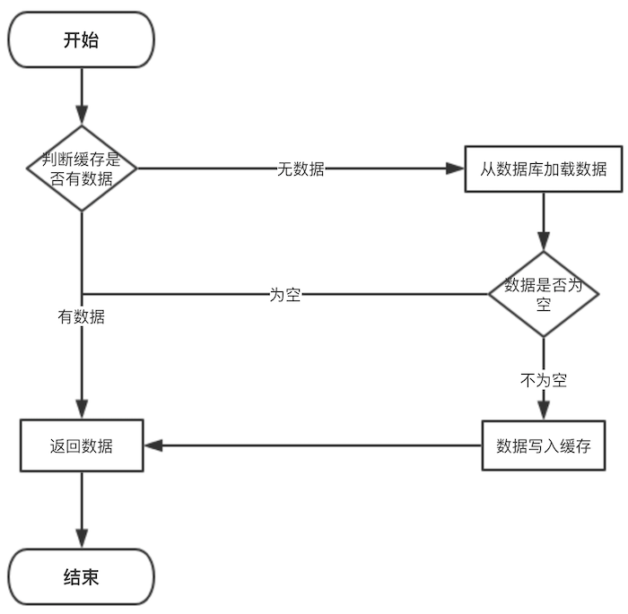

# 一、架构基础

## 1、基本概念

- 系统与子系统

    - 系统：泛指由一群有关联的个体组成，根据某种规则运作，能完成个别原件不能单独完成的工作的群体。它的意思是“总体”、“整体”或联盟
    - 子系统：由一群有关联的个体所组成的系统，多半会是更大系统中的一部分；

其实子系统的定义和系统的定义是一样的，只是观察的角度有差异，一个系统可能是另外一个更大系统的子系统；

- 模块与组件
    - 模块：是一套一致而互相有紧密关联的软件组装。它分别包含了程序和数据结构两部分。现代软件开发往往利用模块作为合成单位。
    - 组件：定义为自包含的、可编程的、可重用的、与语言无关的软件单元，软件组件可以很容易的被用于组装应用程序中。

模块和组件都是系统的组成部分，知识从不同的角度拆分系统而已；从逻辑角度来拆分系统，得到的单元就是“模块”；从物理的角度来拆分系统后，得到的单元就是“组件”。划分模块的主要目的是职责分离；划分组件的主要目的是复用；

- 框架与架构

    - 软件框架通常指的是为了实现某个业界标准或完成特定基本任务的软件组件规范，也指为了实现某个软件组件规范时，提供规范所要求之基础功能的软件产品；<br>
        关键点：
        - （1）框架是组件规范，例如MVC；
        - （2）框架提供基础功能产品，例如SpringMVC是MVC开发框架；
    - 软件架构是指软件系统的基础架构，创造这些基础结构的准则，以及对这些结构的描述；

框架和架构的区别还是比较明显的，框架关注的是“规范”，架构关注的是“结构”


## 2、大型系统架构

### 2.1、提升网站性能及并发量

- 提高硬件能力；
- 使用缓存：本地缓存、Redis等；
- 消息队列：解耦、削峰、异步
- 分布式部署开发；
- 分库分表：读写分离、水平分表、垂直分表；
- 集群
- CDN加速
- 浏览器缓存
- 合理使用线程池
- 适当使用多线程技术

### 2.2、设计高可用

- 服务降级
- 限流
- 缓存
- 超时和重试机制
- 回滚机制

## 3、SET化架构

### 3.1、架构设计衍变

对于大型分布式集群，会存在如下问题：
- 容灾问题：核心业务挂掉，会影响全网所有用户，导致业务不可用
- 资源扩展问题：单IDC资源；数据库主库单点
- 大集群拆分问题：分布式集群扩展，带来的问题；

### 3.2、部分架构思路

#### 3.2.1、同城“双活”

- “双活”：在业务层面上已经做到真正的双活，分别承担部分流量；
- 存储层面比如定时任务、缓存、持久层、数据分析等都是主从架构，会有跨机房写；
- 一个数据中心故障，可以手动切换流量，部分组件可以自动切换；

#### 2.3、两地三中心

使用灾备的思想，在同城双活的基础上，在异地部署一套灾备数据中心，每个中心都具有完备的数据处理能力，只有当主节点故障需要容灾的时候才会紧急启动备用数据中心；

存在问题：
- 冷备中心不公正，关键时刻不敢切换；
- 冷备中心不公正，成本存在严重浪费；
- 本质上数据仍然是单点写，数据瓶颈无法解决；
- 资源、容灾、扩展仍然未得到解决；

### 3.3、SET化架构

#### 3.3.1、SET化优化目标

- 业务：解决业务遇到的扩展性和容灾等需求，支撑业务的高速发展；
- 通用性：架构侧形成统一通用的解决方案，方便各业务线接入使用；

#### 3.3.2、SET化架构设计


- 流量路由：按照特殊的key（通常是userId）进行路由，判断某次请求该路由到中心集群还是单元化集群；
- 中心集群：未进行单元化改造的服务，通常是不在核心交易里链路，称为中心集群，跟当前架构保持一致；
- 单元化集群：每个单元化集群只负责本单元内的流量处理，以实现流量拆分以及故障隔离；每个单元化集群前期只存储本单元产生的交易数据，后续做双向数据同步，实现容灾切换需求；
- 中间件：RPC、KV、MQ等
- 数据同步：全局数据部署在中心集群，其他单元化集群同步全局数据到本单元化内；

#### 3.3.3、SET化路由策略及其能力

- 异地容灾：通过SET化架构的流量调度能力，将SET分别部署在不同地区的数据中心，实现跨地区容灾支持；
- 高效的本地化服务：路由到本地的最近SET，提高最高效的本地化服务；
- 集装箱式扩展：SET封装性支持更灵活的部署扩展性，比如SET一键创建、一键发布；

#### 3.3.4、SET化架构设计原则

- 对业务透明：SET化架构的实现对业务代码透明，业务代码层面不需要关系SET化规则、SET的部署等问题‘’
- 切换规则：理论上，切分规则由业务层面按需定制；实现上，建议优先选最大的业务维度进行切分；
- 部署规范原则：一个SET并不一定只限制在一个机房，也可以跨机房或者跨地区部署；

# 二、高可用架构

高可用本质上是通过“冗余”来实现的

## 1、服务降级


## 2、限流

* [限流算法的实现](https://www.jianshu.com/p/76cc8ba5ca91)
* [Sentinel-高可用限流组件](https://github.com/all4you/sentinel-tutorial)
* [OpenResty防刷、限流](http://openresty.org/cn/)

### 2.1、概念

### 2.2、常见的限流手段

- 信号量计数：信号量竞争是用来控制并发的一个常见手段，它的优点即在于简单可靠，但是只能在单机环境中使用；
- 线程池隔离：隔离舱技术中也大量使用了线程池隔离的方式来实现，通过限制使用的线程数来对流量进行限制，一般会用阻塞队列配合线程池来实现
- 固定窗口计数：限制接口总并发数
- 自然窗口计数
- 滑动窗口计数
- 令牌桶和漏桶算法计数

### 2.3、限流算法实现

常见的限流算法有：计数器、令牌桶、漏桶

#### 2.3.1、计数器

- 算法思路：比如限流qps为100，思路就是从第一个请求进来开始计时，在接下去的1s内，每来一个请求，就把计数加1，如果累加的数字达到了100，那么后续的请求就会被全部拒绝。等到1s结束后，把计数恢复成0，重新开始计数；

- 具体的实现可以是这样的：对于每次服务调用，可以通过AtomicLong#incrementAndGet()方法来给计数器加1并返回最新值，通过这个最新值和阈值进行比较

- 弊端：如果我在单位时间1s内的前10ms，已经通过了100个请求，那后面的990ms，只能眼巴巴的把请求拒绝，我们把这种现象称为“突刺现象”

#### 2.3.2、漏桶算法

- 为了消除"突刺现象"，可以采用漏桶算法实现限流；
- 不管服务调用方多么不稳定，通过漏桶算法进行限流，每10毫秒处理一次请求，为处理的速度是固定的，请求进来的速度是未知的，可能突然进来很多请求，没来得及处理的请求就先放在桶里，既然是个桶，肯定是有容量上限，如果桶满了，那么新进来的请求就丢弃；漏桶算法能够强行限制数据的传输速率
- 算法实现：可以准备一个队列，用来保存请求，另外通过一个线程池（ScheduledExecutorService）来定期从队列中获取请求并执行，可以一次性获取多个并发执行；
- 弊端：无法应对短时间的突发流量；

#### 2.3.3、令牌桶算法

- 令牌桶算法是对漏桶算法的一种改进，桶算法能够限制请求调用的速率，而令牌桶算法能够在限制调用的平均速率的同时还允许一定程度的突发调用；
- 在令牌桶算法中，存在一个桶，用来存放固定数量的令牌。算法中存在一种机制，以一定的速率往桶中放令牌。每次请求调用需要先获取令牌，只有拿到令牌，才有机会继续执行，否则选择选择等待可用的令牌、或者直接拒绝；
- 实现思路：可以准备一个队列，用来保存令牌，另外通过一个线程池定期生成令牌放到队列中，每来一个请求，就从队列中获取一个令牌，并继续执行。通过Google开源的guava包，我们可以很轻松的创建一个令牌桶算法的限流器，通过RateLimiter类的create方法，创建限流器

### 2.4、集群限流

可以使用redisson的RateLimiter


## 4、超时和重试机制


## 5、回滚机制

# 三、缓存

## 1、缓存

## 2、高并发环境下缓存场景问题

### 2.1、缓存一致性

- 更新数据库成功，更新缓存失败 -> 数据不一致
- 更新缓存成功，更是数据库失败 -> 数据不一致
- 更新数据库成功，淘汰缓存失败 -> 数据不一致
- 淘汰缓存成功，更新数据库失败 -> 查询缓存miss

#### 2.1.1、缓存一般使用流程



但是在更新缓存方面，对于更新完数据库，是更新缓存呢，还是删除缓存。又或者是先删除缓存，再更新数据库，其实没有一个确定的方案

#### 2.1.1、缓存与数据库双写一致性问题

从理论上来说，给缓存设置过期时间，是保证最终一致性的解决方案。这种方案下，我们可以对存入缓存的数据设置过期时间，所有的写操作以数据库为准，对缓存操作只是尽最大努力即可。也就是说如果数据库写成功，缓存更新失败，那么只要到达过期时间，则后面的读请求自然会从数据库中读取新值然后回填缓存；

缓存的三种更新策略：

- **1、先更新数据库，再更新缓存**

    这个方案存在比较大问题，原因：
    - 从线程安全角度看：同时有请求A和请求B进行更新操作，那么会出现：
        - （1）线程A更新了数据库；
        - （2）线程B更新了数据库；
        - （3）线程B更新了缓存
        - （4）线程A更新了缓存

        **这就出现请求A更新缓存应该比请求B更新缓存早才对，但是因为网络等原因，B却比A更早更新了缓存。这就导致了脏数据**
    - 从业务场景角度看：
        - （1）如果你是一个写数据库场景比较多，而读数据场景比较少的业务需求，采用这种方案就会导致，数据压根还没读到，缓存就被频繁的更新，浪费性能
        - （2）如果你写入数据库的值，并不是直接写入缓存的，而是要经过一系列复杂的计算再写入缓存。那么，每次写入数据库后，都再次计算写入缓存的值，无疑是浪费性能的

    显然，更新缓存在比较多的问题，删除缓存更为适合；

- **2、先删除缓存，再更新数据库**

    其会导致不一致的原因，同时有一个请求A进行更新操作，另一个请求B进行查询操作：
    - （1）请求A进行写操作，删除缓存；
    - （2）请求B查询发现缓存不存在
    - （3）请求B去数据库查询得到旧值
    - （4）请求B将旧值写入缓存
    - （5）请求A将新值写入数据库

    上述情况就会导致不一致的情形出现。而且，如果不采用给缓存设置过期时间策略，该数据永远都是脏数据

    可以采用延时双删策略，伪代码如下：
    ```java
    public void write(String key, Object data) {
        redis.delKey(key);
        db.update(data);
        Thread.sleep(1000);
        redis.delKey(key);
    }
    ```
    先淘汰缓存、再写数据库(这两步和原来一样)、休眠1秒，再次淘汰缓存这么做，可以将1秒内所造成的缓存脏数据，再次删除；

    如果读写分离的架构，在这种情况下造成不一致的原因：一个请求A进行更新操作，另一个请求B进行查询操作
    - （1）请求A进行写操作，删除缓存；
    - （2）请求A将数据写入数据库了；
    - （3）请求B查询缓存发现，缓存没有值；
    - （4）请求B去从库查询，这时，还没有完成主从同步，因此查询到的是旧值；
    - （5）请求B将旧值写入缓存；
    - （6）数据库完成主从同步，从库变为新值上述情形，就是数据不一致的原因；

    延时双删策略会存在第二次删除缓存失败，会再次数显缓存和数据库不一致的情况

- **3、先更新数据库，再删除缓存**
    
    最经典的缓存+数据库读写的模式：Cache Aside Pattern
    - 读的时候，先读缓存，缓存没有的话，就读数据库，然后取出数据后放入缓存，同时返回响应。
    - 更新的时候，先更新数据库，然后再删除缓存。

    这种情况下也可能会发生并发问题，假设这会有两个请求，一个请求A做查询操作，一个请求B做更新操作，那么会有如下情形产生：
    - （1）缓存刚好失效
    - （2）请求A查询数据库，得一个旧值
    - （3）请求B将新值写入数据库
    - （4）请求B删除缓存
    - （5）请求A将查到的旧值写入缓存

    如果发生上述情况，确实是会发生脏数据；但是这种情况发生的概率很小，发生上述情况存在一个先天条件：就是`步骤（3）`的写数据库操作比`步骤（2）`的读操作耗时更短，才有可能使得步骤`步骤（4）`先于`步骤（5）`发生。但实际上数据库的读操作的速度远远快于写操作。

    还会存在缓存删除失败的情况：
    - 请求A更新了数据A；
    - 请求A删除数据A的缓存失败；
    - 请求B读到的数据A缓存的旧数据；

    解决方案：
    - 设置缓存过期时间：
        - 优点：简单、易操作；
        - 缺点：会存在短时间的旧数据；如果数据量太多，缓存有效时间短，容易发生一段时间内缓存大量失效，此时的数据库压力突然剧增，引发缓存雪崩现象（缓存有效时间为随机值减少发生缓存雪崩的可能性）
    - 消息队列步骤：
        - 更新数据库；
        - 删除缓存失败；
        - 将需要删除的Key发送到消息队列；
        - 隔断时间从消息队列中拉取要删除的key；
        - 继续删除，直至成功为止

        优点：不会引发缓存雪崩、只删除需要删除的缓存；

        缺点：引入了消息队列

### 2.2、缓存并发

#### 2.2.1、产生原因

如果网站并发访问高，一个缓存如果失效，可能出现多个进程同时查询DB，同时设置缓存的情况，如果并发确实很大，这也可能造成DB压力过大，还有缓存频繁更新的问题；

### 2.3、缓存穿透

#### 2.3.1、什么是缓存穿透

缓存穿透是指缓存没有发挥作用，业务系统虽然去缓存中查询数据，但缓存中没有数据，业务系统需要再次去存储系统查询数据；通常存在两种情况：
- 查询一个的数据确实不存在，缓存层和存储层都不会命中；
- 存储系统中存在数据，但缓存数据生成需要耗费大量的时间和资源，如果刚好在业务访问的时候缓存失效了，出现缓存未生效的情况；

但是出于容错的考虑，如果从存储层查不到数据则不写入缓存层，整个过程分为如下 3 步：
- 缓存层不命中
- 存储层不命中，所以不将空结果写回缓存
- 返回空结果

#### 2.3.2、缓存穿透造成后果

可能会使后端存储负载加大，由于很多后端存储不具备高并发性，甚至可能造成后端存储宕掉；可能在程序中分别统计总调用数，缓存层命中数，存储层命中数，如果发现大量存储空命中，可能出现了缓存穿透现象.

#### 2.3.3、缓存穿透产生原因

- 业务自身代码或者数据出现问题
- 一些恶意攻击、爬虫等造成大量空命中

#### 2.3.4、缓存穿透的解决方法

- 缓存空对象：当下列第二步存储层不命中后，仍然将空对象保留到缓存层中，之后再访问这个数据时将会从缓存中获取，保护后端数据源

    

    缓存空对象存在两个问题:
    * 空值做了缓存，意味着缓存层中存了更多的键，需要更多的内存空间。比较有效的方法是针对这类数据设置一个较短的过期时间，让其自动剔除；或者可以将空值放在其他的缓存空间，否则当空间不足时，缓存系统的LRU算法可能会先剔除正常值，再剔除空值。
    * 缓存层和存储层的数据会有一段时间窗口的不一致，可能会对业务有一定的影响。可以利用消息系统或者其他方式清除掉缓存层中的空对象。

    缓存空对象伪代码：
    ```java
    String get(String key){
        // 从缓存中获取数据
        String cacheValue = cache.get(key);
        if(StringUtils.isBlank(cacheValue)){
            // 从存储中获取数据
            String storageValue = storage.get(key);
            cache.set(key， storageValue);
            // 如果存储数据为空，需要设置一个过期时间
            if(storageValue == null){
                cache.expire(key， 60*5);
            }
            return storageValue;
        } else {
            // 缓存非空
            return cacheValue;
        }
    }
    ```
- 布隆过滤器拦截：如图所示，在访问缓存层很存储层之前，将存在的key 用布隆过滤器提前保存起来，做第一层拦截.

    

    key值可以预先存储在布隆过滤器里面去，然后先在布隆过滤器里面进行过滤，如果发现布隆过滤器中没有的话，就再去redis里面进行查询，如果redis中也没有数据的话，再去database查询。这样可以避免不存在的数据信息也去往存储库中进行查询情况

    这种方法适用于数据命中不高，数据相对固定实时性低(通常是数据集较大)的应用场景，代码维护较为复杂，但是缓存空间占用少；

- 两中解决方案对比:

|解决缓存穿透|适用场景|维护成本|
|----------|-------|------|
|缓存空对象|数据命中不高; 数据频繁变化实时性高|代码维护简单; 需要过多的缓存空间; 数据不一致|
|布隆过滤器|数据命中不高; 数据相对固定实时性低|代码维护复杂; 缓存空间占用少|

#### 2.3.5、缓存击穿

在平常高并发的系统中，大量的请求同时查询一个 key 时，此时这个key正好失效了，就会导致大量的请求都打到数据库上面去。这种现象我们称为缓存击穿；

存在问题：会造成某一时刻数据库请求量过大，压力剧增；

多个线程同时去查询数据库的这条数据，那么我们可以在第一个查询数据的请求上使用一个 互斥锁来锁住它

### 2.4、缓存雪崩

#### 2.4.1、缓存雪崩

由于缓存承载着大量请求，有效的保护了存储层，但是如果缓存层由于某些原因整体不能提供服务或者在重新生成缓存，于是所有的请求都会到达存储层，存储层的调用量会暴增，造成存储层宕机问题。

#### 2.4.2、预防缓存雪崩问题

可以从如下三个方面着手
- 保证缓存层服务高可用性： 缓存层设计成高可用的，即使个别节点，个别机器，甚至机房宕机，依然可以提供服务。在并发场景发生前，先手动触发请求，将缓存都存储起来，以减少后期请求对database的第一次查询的压力。数据过期时间设置尽量分散开来，不要让数据出现同一时间段出现缓存过期的情况；
- 依赖隔离组件为后端限流并降级：无论是缓存层还是存储层都会有出错的概率，可以将他们视同为资源。在实际项目中，我们需要对重要的资源(Redis，mysql)都进行隔离，让每种资源都单独运行在自己的线程池中
    * Hystrix 是解决依赖的利器，限流、降级等
- 提前演练：在项目上线前，演练缓存层宕机后，应用以及后端的负载情况以及可能出现的问题，在此基础上 做一些预案.

#### 2.4.3、解决缓存雪崩

更新锁机制和后台更新机制
- 更新锁：对缓存更新进行加锁保护，保证只有一个线程能够更新缓存，未能获取更新锁的线程要么等待锁释放后重新读取缓存，要么返回空值或默认值；
- 后台更新：后台定时去更新，而不是由业务线程来更新；
- 发生缓存雪崩后，利用redis持久化机制，尽快回复缓存集群，一旦重启，自动从磁盘上加载数恢复内存中的数据；
- 双key策略：要缓存的key过期时间是t，key1没有过期时间。每次缓存读取不到key时就返回key1的内容，然后触发一个事件。这个事件会同时更新key和key1。

### 2.5、缓存降级

## 3、缓存热点 key 重建优化

### 3.1、缓存热点key问题

通常使用 "缓存 + 过期时间"的策略来帮助加速接口的访问速度，减少了后端负载，同时保证数据的更新。但是如果同时出现两个问题，会对系统造成致命的危害：

- 当前key是一个热点key(例如热门的娱乐新闻)，并发量非常大;
- 缓存的构建\重建不能在短时间内完成，可能是一个复杂的计算，例如复杂的sql，多次IO，多个依赖等。于是就出现问题:在缓存失效的瞬间，需要大量线程来构建缓存，造成后端负载过大，甚至导致系统崩溃。
- 瞬间有几十万的请求去访问redis上某个固定的key，从而压垮缓存服务的情情况

发现热点key：
- 根据实际经验，预估哪些是热点key。但是并非所有业务都能预估热点key；
- 在客户端进行收集：这个方式就是在操作redis之前，加入一行代码进行数据统计。那么这个数据统计的方式有很多种，也可以是给外部的通讯系统发送一个通知信息。缺点就是对客户端代码造成入侵。
- 在Proxy层做收集：
- 用redis自带命令：
    - monitor命令，该命令可以实时抓取出redis服务器接收到的命令，然后写代码统计出热key是啥。当然，也有现成的分析工具可以给你使用，比如redis-faina。但是该命令在高并发的条件下，有内存增暴增的隐患，还会降低redis的性能。
    - hotkeys参数，redis 4.0.3提供了redis-cli的热点key发现功能，执行redis-cli时加上–hotkeys选项即可。但是该参数在执行的时候，如果key比较多，执行起来比较慢；
- 抓包评估：Redis客户端使用TCP协议与服务端进行交互，通信协议采用的是RESP。自己写程序监听端口，按照RESP协议规则解析数据，进行分析。缺点就是开发成本高，维护困难，有丢包可能性

### 3.2、解决思路

- 减少缓存重建的次数；
- 数据尽可能一致；
- 减少的潜在的危险；

### 3.3、解决方案

#### 3.3.1、使用互斥锁

- 思路:只让一个线程构建缓存，其他线程等待构建缓存的线程执行完毕，重新从缓存获取数据即可。如果单机环境，可以synchronized 或者lock来操作，如果是分布式环境可以用分布式锁

```java
String get(String key) {  
   String value = redis.get(key);  
   if (value  == null) {  
    if (redis.setnx(key_mutex， "1")) {  
        // 3 min timeout to avoid mutex holder crash  
        redis.expire(key_mutex， 3 * 60)  
        value = db.get(key);  
        redis.set(key， value);  
        redis.delete(key_mutex);  
    } else {  
        //其他线程休息50毫秒后重试  
        Thread.sleep(50);  
        get(key);  
    }  
  }  
}
```
- 优点：
    * 思路简单;
    * 保证一致性

- 缺点：
    * 代码复杂度增大;
    * 存在死锁风险;
    * 存在线程池阻塞的风险

#### 3.3.2、永远不过期

- 永不过期包含两层意思：
    * 从缓存层面来看，确实没有设置过期时间，所以不会出现热点key过期后产生的问题，也就是物理不过期；
    * 从功能层面来看，为每个value设置一个逻辑过期时间，当发现超过逻辑过期时间后，会使用单独的线程去构建缓存；

- 实际来看，此方法杜绝了热点key产生的问题，但唯一不足的就是重构缓存期间，会出现数据不一致。

- 优点：基本杜绝热点key问题

- 缺点：
    * 不保证一致性
    * 逻辑过期时间增加代码维护成本和内存成本

#### 3.3.3、使用二级缓存

使用本地缓存，比如HashMap、ehcache。在你发现热key以后，把热key加载到系统的JVM中。针对这种热key请求，会直接从jvm中取，而不会走到redis层

#### 3.3.4、备份热key

不要让key走到同一台redis上不就行了

## 4、缓存最佳实践

- 缓存系统主要消耗的是服务器的内存，因此，在使用缓存时必须先对应用需要缓存的数据大小进行评估，包括缓存的数据结构、缓存大小、缓存数量、缓存的失效时间，然后根据业务情况自行推算未来一段时间容量的使用情况，根据容量评估的结果来申请和分配缓存资源，否则会造成资源浪费或者缓存空间不够；
- 将使用缓存的业务进行分离，核心业务和非核心业务使用不同的缓存实例，从物理上进行隔离，如果有条件，则请对么个业务使用单独的实例或者集群，以减少应用之间互相影响的可能性。
- 根据缓存实例提供的内存大小推送应用需要使用的缓存实例数量；
- 缓存一般是用来加速数据库的读材质的，一般先访问缓存后访问数据库，所以缓存的超时时间设置很重要。有可能缓存超时设置较长，从而拖垮服务的线程池，最终导致服务雪崩；
- 所有的缓存实例都需要添加监控，需要对慢查询，大对象，内存使用情况做可靠的监控；
- 如果多个业务共享一个缓存实例，需要通过规范来限制各个应用使用的key一定要有唯一的前缀，并进行隔离设计，避免缓存互相覆盖的问题产生；
- 任何缓存的ke都必须设定缓存失效时间，且失效时间不能集中在某一点，否则会导致缓存占满内存或者缓存穿透。
- 低频访问的数据不要放在缓存中；
- 缓存的数据不易过大，尤其是redis，因为redi使用的是单线程模型，单个缓存key的数据过大时，会阻塞其他请求处理；
- 对于存储较多value饿key，尽量不要使用HGETALL等集合操作，该操作会造成请求阻塞，影响其他应用的访问；
- 缓存一般用于交易系统中加速查询的场景，有大量的更新数据时，尤其是批量处理，请使用批量模式；
- 如果对性能要求不是非常高，尽量使用分布式缓存，不要使用本地缓存，因为本地缓存在服务的各个节点之间复制，在某一时刻副本之间的是不一致的；
- 写缓存时一定写入完全正确的数据，如果缓存数据一部分有效，一部分无效，则宁可放弃缓存，也不要把部分数据写入缓存，否则会造成空指针，程序异常等；
- 在通常情况下，读的顺序是先缓存、后数据库；写的顺序是先数据库、后缓存。
- 当使用本地缓存时，一定要严格控制缓存对象的个数和生命周期。由于JVM特性，过多的缓存对象会极大影响JVM性能，甚至导致内存溢出等问题出现。
- 在使用缓存时，一定有降级处理，尤其对关键业务环节，缓存有问题或者失效也要能回溯到数据库进行处理。

# 容器化

## 1、容器


## 2、Docker

## 3、容器面试题

#### 3.1、Java程序运行在Docket等容器环境存在什么问题？

对于Java来说，Docker是一个新的环境，如其内存、CPU等资源限制都是通过CGroup（Control Group）实现的，早期的JDK版本并不能识别这些限制，进而导致一些基础问题：
- 如果未配置合适的JVM堆和元数据区、直接内存等参数，Java就有可能试图使用超过容器限制的内存，最终被容器OOM Kill，或者自身发生OOM；
- 错误判断了可获取的CPU资源，例如，Docker限制了CPU核数，JVM就可能设置不合适的GC并行线程数等；

#### 3.2、为什么类似Docker这种容器环境，会有点欺负JAVA？从JVM内部机制来讲，问题出现在哪里？

##### 3.2.1、出现问题的原因

- Docker与虚拟机非常相似，但是Docker并不是一种完全的虚拟机化技术，而更是一种轻量级的隔离技术；基于namespace，Docket为每个容器提供了单独的命名空间，对网络、PID、用户、IPC通信、文件系统挂载等实现了隔离，对于CPU、内存、磁盘IO等计算资源，则是用过CGroup进行管理。
- 容器虽然省略了虚拟操作系统的开销，实现了轻量级的目标，但也带来了额外的复杂性，它限制对于应用不是透明的，需要用户理解Docker的新行为；
- 对于Java平台来说，未隐藏的底层信息带来了意外，主要体现在：
    - 容器环境对于计算机资源的管理方式是全新的，CGroup作为相对比较新的技术，历史版本的Java显然并不能自然理解相应的资源限制；
    - namespace对于容器内的应用细节增量一些微妙差异

- 从JVM运行角度，这些为什么会导致OOM等问题？
    
    这就是所谓的Ergonomics机制
    - JVM会大概根据检测到的内存大小，设置最初启动时的堆大小为系统内存的1/64；并将堆最大值设置为系统内存的1/4；
    - 而JVM检测到系统的CPU核数，则直接影响到了ParallelGC并行线程数目和JIT compiler线程数目，设置是应用中ForkJoinPool等机制的并行登记；

    这些是默认参数，是根据通用场景选择的初始值，但是由于容器环境的差异，Java的判断很可能是基于错误信息而做出的，更加严重的是JVM的一些原有诊断或备用机制也会受到影响

##### 3.2.2、如何解决
- 首先，如果能够升级到最新的JDK版本，问题就解决了；
- 如果只用老版本JDK，需要注意以下几点：
    - 明确设置堆大小、元数据等内存区域大小，保证Java进程的总大小可控；
    - 明确配置GC和JIT并行线程数目，以避免二者占用过多计算资源

# 数据库中间件

## 1、Sharding Sphere

### 1.1、数据分片

#### 1.1.1、分片算法

目前提供4种分片算法。由于分片算法和业务实现紧密相关，因此并未提供内置分片算法，而是通过分片策略将各种场景提炼出来，提供更高层级的抽象，并提供接口让应用开发者自行实现分片算法。
- 精确分片算法：对应PreciseShardingAlgorithm，用于处理使用单一键作为分片键的=与IN进行分片的场景。需要配合StandardShardingStrategy使用。

- 范围分片算法：对应RangeShardingAlgorithm，用于处理使用单一键作为分片键的BETWEEN AND进行分片的场景。需要配合StandardShardingStrategy使用。

- 复合分片算法：对应ComplexKeysShardingAlgorithm，用于处理使用多键作为分片键进行分片的场景，包含多个分片键的逻辑较复杂，需要应用开发者自行处理其中的复杂度。需要配合ComplexShardingStrategy使用。

- Hint分片算法：对应HintShardingAlgorithm，用于处理使用Hint行分片的场景。需要配合HintShardingStrategy使用；

#### 1.1.2、分片策略

包含分片键和分片算法，由于分片算法的独立性，将其独立抽离。真正可用于分片操作的是分片键 + 分片算法，也就是分片策略。目前提供5种分片策略。
- 标准分片策略：对应StandardShardingStrategy。提供对SQL语句中的=, IN和BETWEEN AND的分片操作支持。StandardShardingStrategy只支持单分片键，提供PreciseShardingAlgorithm和RangeShardingAlgorithm两个分片算法。PreciseShardingAlgorithm是必选的，用于处理=和IN的分片。RangeShardingAlgorithm是可选的，用于处理BETWEEN AND分片，如果不配置RangeShardingAlgorithm，SQL中的BETWEEN AND将按照全库路由处理。

- 复合分片策略：对应ComplexShardingStrategy。复合分片策略。提供对SQL语句中的=, IN和BETWEEN AND的分片操作支持。ComplexShardingStrategy支持多分片键，由于多分片键之间的关系复杂，因此并未进行过多的封装，而是直接将分片键值组合以及分片操作符透传至分片算法，完全由应用开发者实现，提供最大的灵活度。

- 行表达式分片策略：对应InlineShardingStrategy。使用Groovy的表达式，提供对SQL语句中的=和IN的分片操作支持，只支持单分片键。对于简单的分片算法，可以通过简单的配置使用，从而避免繁琐的Java代码开发，如: t_user_$->{u_id % 8} 表示t_user表根据u_id模8，而分成8张表，表名称为t_user_0到t_user_7。

- Hint分片策略：对应HintShardingStrategy。通过Hint而非SQL解析的方式分片的策略。

- 不分片策略：对应NoneShardingStrategy。不分片的策略。

# 模块化

(OSGI)[http://www.osgi.com.cn/article/7289520]

## 参考资料

* [高性能网站设计之缓存更新的套路](http://blog.csdn.net/tTU1EvLDeLFq5btqiK/article/details/78693323)
* [缓存穿透、雪崩](https://segmentfault.com/a/1190000008931971)
* [缓存穿透、缓存并发、热点缓存之最佳招式](http://blog.didispace.com/chengchao-huancun-zuijiazhaoshi/)
* [分布式缓存击穿](http://www.cnblogs.com/rjzheng/p/8908073.html)
* [缓存那些事](https://tech.meituan.com/cache_about.html)
* [AutoLoadCache:高效的缓存管理解决方案](https://github.com/qiujiayu/AutoLoadCache)
* [Sharding Sphere官方文档](https://shardingsphere.apache.org/)


