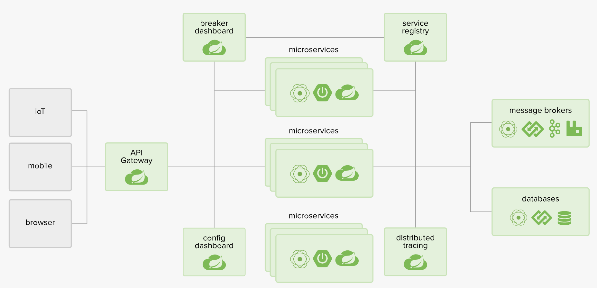
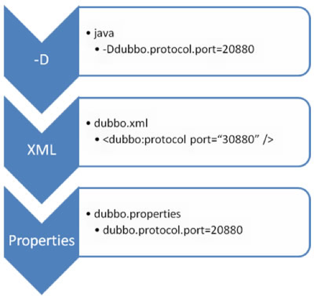

# 一、微服务

## 1、微服务与微服务架构

- 微服务：强调的是服务的大小，它关注的是某一个点，是具体解决某一个问题/提供落地对应服务的一个服务应用；
- 微服务架构：微服务架构一种架构模式或者说是一种架构风格，它提倡将单一应用程序划分成一组小的服务，每个服务运行在其独立的进程中，服务之间互相协调、互相配合，为用户提供最终价值。服务之间采用轻量级通信机制互相沟通，这些服务是围绕业务能力建立的，并且可以由完全自动化的部署机构独立部署。这些服务的集中管理只有最低限度，可以用不同的编程语言编写并使用不同的数据存储技术；

微服务化的核心就是根据业务拆分成一个一个的服务，彻底去耦合

## 2、微服务优缺点

- 优点：
    - 每个服务足够内聚，足够小，代码容易理解，这样能够聚焦一个值得的业务功能；
    - 开发简单，开发效率提高；
    - 微服务能够被小团队独立开发；
    - 微服务是松耦合的，可以独立部署；
    - 微服务能够使用不同的语言开发；
    - 易于与第三方集成；
    - 微服务知识业务逻辑的代码，不会前端相关组件产生关系；

- 缺点：
    - 分布式系统的复杂性；
    - 多服务运维难度高；
    - 系统部署依赖；
    - 服务通信成本；
    - 数据一致性；
    - 系统集成测试；
    - 性能监控；

## 3、微服务技术栈

- 服务开发：SpringBoot、Spring、SpringMVC
- 服务配置与管理：Netflix的Archaius、阿里的Diamond
- 服务注册：Eureka、Consul、Zookeeper等
- 服务调用：Rest、Rpc、Grpc
- 服务负载均衡：Ribbon、Nginx
- 服务监控：
- 服务熔断器：Hystrix、Envoy
- 服务路由（网关）:Zuul
- 消息队列：Kafka、RabbitMQ、ActiveMQ
- 服务配置中心：SpringCloudConfig
- 服务部署：Docker
。。。

## 4、微服务选型

### 4.1、微服务选型依据

- 整体解决方案和框架成熟度
- 社区热度
- 可维护性
- 学习曲线

### 4.2、微服务框架对比

Dubbo、HSF、DubboX
- 功能定位
- 支持Rest
- 支持多语言
- 负载均衡
- 配置服务
- 服务调用链调用
- 高可用、容错

# 二、SpringCloud

* [SpringCloud中文网站](https://springcloud.cc/)
* [SpringCloud中国社区](http://springcloud.cn/)
* [SpringCloud具体文档](https://springcloud.cc/spring-cloud-dalston.html)

## 1、简介

### 1.1、定义

基于SpringBoot提供了一套微服务解决方案，包括服务注册与发现、配置中心、全链路监控、服务网关、负载均衡、熔断器等组件，除了基于Netflix的开源组件做高度抽象封装之外，还有一些选项中立的开源组件；分布式微服务架构的一站式解决方案



### 1.2、与SpringBoot的关系

- Springboot专注于快速方便的开发单个个体微服务；
- SpringCloud是关注全局的微服务协调整理治理框架，它将SpringBoot开发的一个个单体微服务整合并管理起来，为各个微服务之间提供配置管理、服务发现、断路器、熔断器等等集成服务；
- SpringBoot可以离开SPringCloud独立使用开发项目，SpringCloud离不开SpringBoot，属于依赖的关系；


### 1.3、与Dubbo对比


**最大区别：SpringCloud抛弃了Dubbo的RPC通信，采用的是基于HTTP的REST方式**，从一定程度上，HTTP的REST方式牺牲了服务调用的性能，但也避免了原生RPC带来的问题

## 2、Eureka服务注册与发现

Eureka是Netflix的一个子模块，也是核心模块之一。Eureka是一个基于REST的服务，用于定位服务，以实现云端中间层服务发现和故障转移。只需要使用服务的标识符，就可以访问到服务；

其在设计上遵守AP原则

### 2.1、原理

- 基本架构：
    - 采用了C-S的设计架构。Eureka Server作为服务注册功能的服务器。是服务注册中心；
    - 系统的其他微服务，使用Eureka的客户端连接到Eureka Server并维持心跳连接。SpringCloud的一些其他模块就可以通过Eureka Server来实现系统中的其他微服务，并执行相关逻辑。
- Eureka包含两个组件：
    - Eureka Server：提供服务注册；各个节点启动后，会在EurekaServer中进行注册，主要EurekaServer中的服务注册表将会存储所有可用的服务节点的信息。
    - Eureka Client：是一个Jvava客户端，用于简化EurekaServer的交互，客户端也同时具备一个内置的、使用轮询（round-robin）负载算法的负载均衡。在应用启动后，将会向EurekaServer发送心跳（默认周期是30秒）。如果EurekaServer在多个心跳周期内没有收到某个节点的心跳，EurekaServer将会从服务注册表中把这个服务节点移除（默认90秒）；

- 三大角色：
    - Eureka Server：提供服务注册和发现
    - Service Provider：服务提供方将自身服务注册到Eureka，从而使服务消费方能够进行消费；
    - Service Consumer：服务消费方从Eureka中获取注册列表，从而能消费服务；

### 2.2、接入Eureka

#### 2.2.1、Eureka服务端

- 增加依赖：
    ```xml
    <!--eureka-server服务端 -->
    <dependency>
        <groupId>org.springframework.cloud</groupId>
        <artifactId>spring-cloud-starter-eureka-server</artifactId>
    </dependency>
    ```
- 启动类增加`@EnableEurekaServer`注解
- 在配置文件（application.yml）增加如下配置：
    ```yml
    eureka:
    instance:
        hostname: localhost
    client:
        register-with-eureka: false    #false表示不向注册中心注册自己。
        fetch-registry: false     #false表示自己端就是注册中心，我的职责就是维护服务实例，并不需要去检索服务
        service-url:
        defaultZone: http://${eureka.instance.hostname}:${server.port}/eureka/       # 单机：设置与Eureka Server交互的地址查询服务和注册服务都需要依赖这个地址（单机）。
     #      defaultZone: http://eureka7002.com:7002/eureka/,http://eureka7003.com:7003/eureka/ # 配置集群的配置，多台机器
    ```

#### 2.2.1、Eureka客户端

- 增加POM依赖
    ```xml
    <!-- actuator监控信息完善 -->
    <dependency>
        <groupId>org.springframework.boot</groupId>
        <artifactId>spring-boot-starter-actuator</artifactId>
    </dependency>
    <!-- 将微服务provider侧注册进eureka -->
    <dependency>
        <groupId>org.springframework.cloud</groupId>
        <artifactId>spring-cloud-starter-eureka</artifactId>
    </dependency>
    <dependency>
        <groupId>org.springframework.cloud</groupId>
        <artifactId>spring-cloud-starter-config</artifactId>
    </dependency>
    ```
- 启动类增加注解：`@EnableEurekaClient`
- 在配置文件（application.yml）增加如下配置：
    ```yml
    eureka:
    client: #客户端注册进eureka服务列表内
        service-url:
        defaultZone: http://localhost:7001/eureka
        # defaultZone: http://eureka7001.com:7001/eureka/,http://eureka7002.com:7002/eureka/,http://eureka7003.com:7003/eureka/ # 集群配置
    instance:
        instance-id: microservicecloud-dept8001XXXXX
        prefer-ip-address: true     #访问路径可以显示IP地址

        # 监控信息
    info:
    app.name: bluefish-microservicecloud
    company.name: www.chenlanqing.com
    build.artifactId: $project.artifactId$
    build.version: $project.version$
    ```

### 2.3、Eureka自我保护


某时刻某一个微服务不可用了，eureka不会立刻清理，依旧会对该微服务的信息进行保存。

默认情况下，如果EurekaServer在一段时间内没有接收到某个微服务实例的心跳，EurekaServer将会注销该实例。但是在网络分区故障发生时，微服务与EurekaServer之间无法正常通通信，那么直接注销实例可能很危险，因为微服务本身其实是健康的，此时不应该注销这个服务。Eureka通过自我保护模式来解决这个问题：当EurekaServer节点在短时间内丢失过多客户端时，那么这个节点就会进入自我保护模式。一旦进入该模式，EurekaServer就会保护服务注册表中的信息，不再删除服务注册表中的数据。当网络故障恢复之后，该EurekaServer节点会自动退出自我保护模式

在自我保护模式中，Eueka server会保护服务注册表中的信息，不在注销任何服务实例。当它收到的心跳次数重写恢复到阈值以上时，该Eureka Server节点就会自动退出自我保护模式。

设计思路：宁可保留错误的服务注册信息，也不盲目注销任何可能健康的服务实例。

自我保护模式是一种应对网络异常的安全保护措施。在SpringCloud中，可以使用`eureka.server.enable-self-preservation=false`禁用自我保护模式

### 2.4、Eureka服务发现

使用：DiscoveryClient，配合注解：`@EnableDiscoveryClient`

### 2.5、Eureka集群

集群需要增加修改如下配置，将defaultZone修改为多个地址

defaultZone: http://eureka7002.com:7002/eureka/,http://eureka7003.com:7003/eureka/

### 2.6、与Zookeeper相比

- Eureka遵守AP，zookeeper遵守CP
    - Eureka：Eureka各个几点都是平等的，几个节点挂掉不会影响正常节点的工作，剩余的节点依然可以提供注册和查询服务
    - zookeeper：当master节点因为故障与其他节点失去联系时，剩余节点会重写进行leader选举。问题在于：选举leader的时间太长，30~120s，且选举期间整个zk集群是不可用的，就导致在选举期间注册服务瘫痪；

## 3、Ribbon负载均衡

* [Ribbon源码](https://github.com/Netflix/ribbon)

### 3.1、是什么

Spring Cloud Ribbon是基于Netflix Ribbon实现的客户端、负载均衡的工具。其主要提供客户端的软件负载均衡算法。

简单说，就是在配置文件中列出Load Balancer后面所有的机器，Ribbon会自动的帮助你基于某种规则去连接这些机器。


### 3.2、配置

主要是在客户端进行操作的
- 加入依赖
    ```xml
    <!-- Ribbon相关 -->
    <dependency>
        <groupId>org.springframework.cloud</groupId>
        <artifactId>spring-cloud-starter-eureka</artifactId>
    </dependency>
    <dependency>
        <groupId>org.springframework.cloud</groupId>
        <artifactId>spring-cloud-starter-ribbon</artifactId>
    </dependency>
    <dependency>
        <groupId>org.springframework.cloud</groupId>
        <artifactId>spring-cloud-starter-config</artifactId>
    </dependency>
    ```

- 加入配置
    ```yml
    eureka:
        client:
            register-with-eureka: false
            service-url:
            defaultZone: http://eureka7001.com:7001/eureka/,http://eureka7002.com:7002/eureka/,http://eureka7003.com:7003/eureka/

    ```
- 调用接口增加注解，请求的服务需要改成响应的服务名称二而不是具体的接口
    ```java
    @Bean
    @LoadBalanced // 负载均衡注解
    public RestTemplate getRestTemplate() {
        return new RestTemplate();
    }
    ```

### 3.3、Ribbon核心组件

IRule：根据特定算法从服务列表中选取一个要访问的服务，默认存在如下七种算法：
- `RoundRobinRule`：轮询
- `RndomRule`：随机
- `AvailiabilityFilterlingRule`：会先过滤掉由于多次访问故障而出路断路器跳闸状态的服务，还有并发的连接数量超过阈值的服务，然后对剩余的服务列表按照轮询策略进行访问；
- `WeightedResponseTimeRule`：根据平均响应时间计算所有服务的权重，响应时间越快服务权重越大被选中的概率越高，刚启动时如果统计信息不足，则使用`RoundRobinRule`策略，等统计信息组织，会切换到`WeightedResponseTimeRule`
- `RetryRule`：先按照`RoundRobinRule`的策略获取服务，如果获取服务失败则在指定时间内会进行重试，获取可用的服务；
- `BestAvailableRule`：会先过滤掉由于多次访问故障而处于断路器跳闸状态的服务，然后选择一个并发量最小的服务
- `ZoneAvoidanceRule`：默认规则。符合判断Server所在区域的性能和server的可用性选择服务器

### 3.4、自定义IRule

- 主启动类添加`@RibbonClient`注解：在启动该微服务时会去加载自定义的Ribbon配置类，从而使配置生效：
    ```java
    @RibbonClient(name="MICRO-SERVICE-NAME", configuration=MyRule.class)
    ```
    ***注意：***该自定义配置类不能放在@ComponentScan所扫描的当前包下以及子包下，否则自定义的这个配置类会被所有的Ribbon客户端所共享，达不到特殊化定制的目的
    ```java
    @Configuration
    public class MyRule{
        @Bean
        public IRule rule(){
            return new RandomRule();
        }
    }

    ```

## 4、Feign

### 4.1、简介

Feign是一个声明式WebService客户端。使用Feign能让编写WebService客户端更加简单。

它具有可插入注释支持，包括Feign注释和JAX-RS注释。Feign还支持可插拔编码器和解码器。Spring Cloud增加了对Spring MVC注释的支持，并使用Spring Web中默认使用的HttpMessageConverters。Spring Cloud集成Ribbon和Eureka以在使用Feign时提供负载均衡的http客户端。


## 5、Hystrix断路器

### 5.1、什么是Hystrix断路器

- 服务雪崩：当调用链路上某个微服务调用响应时间过长或者不可响应，对微服务的调用就会占用越来越多的系统资源，进而引起系统崩溃

Hystrix是一个用于处理分布式系统的延迟和容错的开源库，在分布式系统中，Hystrix能保证在一个依赖出问题的情况下，不会导致整体服务失败，避免级联故障，提高分布式系统的弹性；

“断路器”本身是一种开关装置，当某个服务单元发生故障之后，通过断路器的故障监控（类似熔断保险丝），向调用方返回一个符合预期的、可处理的备选响应，而不是长时间的等待或者抛出调用方法无法处理的异常，主要保证了服务调用方的线程不会被长时间、不必要的占用，从而在分布式系统蔓延，从而引起系统雪崩；

### 5.2、服务熔断

熔断机制是应对雪崩效应的一种微服务链路保护机制

当扇出链路的某个微服务不可用时或者响应时间太长时，会进行服务降级，进而熔断该节点微服务的调用，快速返回“错误”的响应信息。当检测该节点微服务的调用响应正常后恢复调用链路。

Hystrix会监控微服务间调用状况，当失败的调用达到一定的阈值时，缺省是5秒内20次调用失败就会启动熔断机制。熔断机制的注解是：`@HystrixCommand`

对于熔断机制的实现，Hystrix设计了三种状态：

- 熔断关闭状态（Closed）

    服务没有故障时，熔断器所处的状态，对调用方的调用不做任何限制。

- 熔断开启状态（Open）

    在固定时间窗口内（Hystrix默认是10秒），接口调用出错比率达到一个阈值（Hystrix默认为50%），会进入熔断开启状态。进入熔断状态后，后续对该服务接口的调用不再经过网络，直接执行本地的fallback方法。

- 半熔断状态（Half-Open）

    在进入熔断开启状态一段时间之后（Hystrix默认是5秒），熔断器会进入半熔断状态。所谓半熔断就是尝试恢复服务调用，允许有限的流量调用该服务，并监控调用成功率。如果成功率达到预期，则说明服务已恢复，进入熔断关闭状态；如果成功率仍旧很低，则重新进入熔断关闭状态。

### 5.3、服务降级

当服务器压力剧增的情况下，根据实际业务情况及流量，对一些服务和页面有策略的不处理或换种简单的方式处理，从而释放服务器资源以保证核心交易正常运作或高效运作

可以将一些`不重要`或`不紧急`的服务或任务进行服务的 延迟使用 或 暂停使用

服务降级可以分为：
- 超时降级：主要配置好超时时间和超时重试次数和机制，并使用异步机制探测恢复情况；
- 失败次数降级：主要是一些不稳定的API，当失败调用次数达到一定阀值自动降级，同样要使用异步机制探测回复情况；
- 故障降级：如要调用的远程服务挂掉了（网络故障、DNS故障、HTTP服务返回错误的状态码和RPC服务抛出异常），则可以直接降级；
- 限流降级：当触发了限流超额时，可以使用暂时屏蔽的方式来进行短暂的屏蔽；

### 5.4、HystrixDashboard

实时的调用监控

## 6、zuul路由网关

### 6.1、什么是zuul网关

zuul包含了对请求的路由和过滤的两个最主要的功能；
- 路由功能负责将外部请求转发到具体的微服务实例上，是实现外部访问统一入口的基础而过滤器功能则负责对请求的处理过程进行干预，是实现请求校验、服务聚合等功能的基础；
- zuul和eureka进行整合，将zuul自身注册为eureka服务治理下的应用，同时从eureka中获得其他微服务的消息，也即以后的访问微服务都是通过zuul跳转后获得；

    **zuul服务最终都会注册到eureka中**

### 6.2、路由基本配置

- 添加依赖：
    ```xml
    <!-- zuul路由网关 -->
    <dependency>
        <groupId>org.springframework.cloud</groupId>
        <artifactId>spring-cloud-starter-zuul</artifactId>
    </dependency>
    <dependency>
        <groupId>org.springframework.cloud</groupId>
        <artifactId>spring-cloud-starter-eureka</artifactId>
    </dependency>
    ```
- 启动类增加注解：`@EnableZuulProxy`
- 增加配置：
    ```yml
    spring:
        application:
            name: microservicecloud-zuul-gateway

    eureka:
        client:
            service-url:
            defaultZone: http://eureka7001.com:7001/eureka,http://eureka7002.com:7002/eureka,http://eureka7003.com:7003/eureka
        instance:
            instance-id: gateway-9527.com
            prefer-ip-address: true

    ```

### 6.3、路由访问映射规则

在配置文件中增加配置：
```yml
zuul:
    #ignored-services: microservicecloud-dept # 单个应用，忽略通过应用访问
    prefix: /bluefish # 设置统一公共前缀
    ignored-services: "*" # 多个应用忽略
    routes: # 路由规格映射
        mydept.serviceId: microservicecloud-dept
        mydept.path: /mydept/**
```

## 7、分布式配置中心

### 7.1、为什么要有配置中心

- 微服务意味着将单体应用中的业务拆分成一个个的自服务，每个服务的粒度相对较小，因此系统中会出现大量的服务。由于每个服务都需要必要的配置信息才能运行，所以一套集中式、动态的配置管理设施必不可少。springcloud提供了configserver来解决这个问题；

SpingCloud Config为微服务架构中的微服务提供集中化的外部配置支持，配置服务器为各个不同微服务应用的所有环节提供一个中心化的外部配置

SpringCloud Config分为客户端和服务端：
- 服务端：分布式配置中心，它是一个独立的微服务应用，用来连接配置服务器并未客户端提供获取配置信息，加密/解密信息等访问接口；
- 客户端：通过指定的配置中心来管理应用资源，以及业务相关的配置内容并在启动的时候从配置中心获取和加载配置信息，配置服务器默认采用的是git来存储配置信息，


# 三、Dubbo

* [Dubbo文档](http://dubbo.apache.org/zh-cn/index.html)
* [Dubbo源码](https://github.com/apache/incubator-dubbo)

## 1、介绍

是一款高性能、轻量级的开源Java RPC框架，它提供了三大核心能力：面向接口的远程方法调用，智能容错和负载均衡，以及服务自动注册和发现

### 1.1、基本概念


- 服务提供者（Provider）：暴露服务的服务提供方，服务提供者在启动时，向注册中心注册自己提供的服务。
- 服务消费者（Consumer）: 调用远程服务的服务消费方，服务消费者在启动时，向注册中心订阅自己所需的服务，服务消费者，从提供者地址列表中，基于软负载均衡算法，选一台提供者进行调用，如果调用失败，再选另一台调用;
- 注册中心（Registry）：注册中心返回服务提供者地址列表给消费者，如果有变更，注册中心将基于长连接推送变更数据给消费者;
- 监控中心（Monitor）：服务消费者和提供者，在内存中累计调用次数和调用时间，定时每分钟发送一次统计数据到监控中心；

调用关系：
- 服务容器负责启动，加载，运行服务提供者。
- 服务提供者在启动时，向注册中心注册自己提供的服务。
- 服务消费者在启动时，向注册中心订阅自己所需的服务。
- 注册中心返回服务提供者地址列表给消费者，如果有变更，注册中心将基于长连接推送变更数据给消费者。
- 服务消费者，从提供者地址列表中，基于软负载均衡算法，选一台提供者进行调用，如果调用失败，再选另一台调用。
- 服务消费者和提供者，在内存中累计调用次数和调用时间，定时每分钟发送一次统计数据到监控中心

## 2、配置

### 2.1、配置原则



- JVM启动：`-D`参数优先，这样可以使用户在部署和启动时进行参数重写，比如在启动时需改变协议的端口。
- XML 次之，如果在 XML 中有配置，则 dubbo.properties 中的相应配置项无效。
- Properties 最后，相当于缺省值，只有 XML 没有配置时，dubbo.properties 的相应配置项才会生效，通常用于共享公共配置，比如应用名。

### 2.2、启动检查

Dubbo 缺省会在启动时检查依赖的服务是否可用，不可用时会抛出异常，阻止 Spring 初始化完成，以便上线时，能及早发现问题，默认`check="true"`。

可以通过 `check="false"` 关闭检查，比如，测试时，有些服务不关心，或者出现了循环依赖，必须有一方先启动。

另外，如果你的 Spring 容器是懒加载的，或者通过 API 编程延迟引用服务，请关闭 check，否则服务临时不可用时，会抛出异常，拿到 null 引用，如果 check="false"，总是会返回引用，当服务恢复时，能自动连上;

### 2.3、超时与配置覆盖

由于网络或服务端不可靠，会导致调用出现一种不确定的中间状态（超时）。为了避免超时导致客户端资源（线程）挂起耗尽，必须设置超时时间

- 消费端
    ```xml
    <!-- 全局超时配置 -->
    <dubbo:consumer timeout="5000" />
    <!-- 指定接口以及特定方法超时配置 -->
    <dubbo:reference interface="com.foo.BarService" timeout="2000">
        <dubbo:method name="sayHello" timeout="3000" />
    </dubbo:reference>
    ```

- 服务端
    ```xml
    <!-- 全局超时配置 -->
    <dubbo:provider timeout="5000" />
    <!-- 指定接口以及特定方法超时配置 -->
    <dubbo:provider interface="com.foo.BarService" timeout="2000">
        <dubbo:method name="sayHello" timeout="3000" />
    </dubbo:provider>
    ```

**dubbo推荐在Provider上尽量多配置Consumer端属性**
- 作服务的提供者，比服务使用方更清楚服务性能参数，如调用的超时时间，合理的重试次数，等等
- 在Provider配置后，Consumer不配置则会使用Provider的配置值，即Provider配置可以作为Consumer的缺省值。否则，Consumer会使用Consumer端的全局设置，这对于Provider不可控的，并且往往是不合理的；

**配置的覆盖规则**
- 方法级配置别优于接口级别，即小Scope优先；
- Consumer端配置 优于 Provider配置 优于 全局配置；
- 最后是Dubbo Hard Code的配置值（见配置文档）

~[](image/Dubbo配置优先级.png)

### 2.4、重试次数

失败自动切换，当出现失败，重试其它服务器，但重试会带来更长延迟。可通过 retries="2" 来设置重试次数(不含第一次)
```xml
<dubbo:service retries="2" />
<!-- 或 -->
<dubbo:reference retries="2" />
<!-- 或 -->
<dubbo:reference>
    <dubbo:method name="findFoo" retries="2" />
</dubbo:reference>
```

### 2.5、多版本配置（灰度发布）

当一个接口实现，出现不兼容升级时，可以用版本号过渡，版本号不同的服务相互间不引用。可以按照以下的步骤进行版本迁移
```xml
<!-- 老版本服务提供者配置： -->
<dubbo:service interface="com.foo.BarService" version="1.0.0" />
<!-- 新版本服务提供者配置： -->
<dubbo:service interface="com.foo.BarService" version="2.0.0" />
<!-- 老版本服务消费者配置： -->
<dubbo:reference id="barService" interface="com.foo.BarService" version="1.0.0" />
<!-- 新版本服务消费者配置： -->
<dubbo:reference id="barService" interface="com.foo.BarService" version="2.0.0" />
<!-- 如果不需要区分版本，可以按照以下的方式配置： -->
<dubbo:reference id="barService" interface="com.foo.BarService" version="*" />
```

## 3、高可用

### 3.1、zookeeper宕机与dubbo直连

- 现象：zookeeper注册中心宕机，还可以消费dubbo暴露的服务

- 健壮性
    - 监控中心宕掉不影响使用，只是丢失部分采样数据
    - 数据库宕掉后，注册中心仍能通过缓存提供服务列表查询，但不能注册新服务
    - 注册中心对等集群，任意一台宕掉后，将自动切换到另一台
    - 注册中心全部宕掉后，服务提供者和服务消费者仍能通过本地缓存通讯
    - 服务提供者无状态，任意一台宕掉后，不影响使用
    - 服务提供者全部宕掉后，服务消费者应用将无法使用，并无限次重连等待服务提供者恢复

通过设计，减少系统不能提供服务的时间

- dubbo直连：直接在消费端上配置服务提供方的地址；

### 3.2、集群下dubbo负载均衡

在集群负载均衡时，Dubbo 提供了多种均衡策略，缺省为 random 随机调用

- Random LoadBalance：随机，按权重设置随机概率。在一个截面上碰撞的概率高，但调用量越大分布越均匀，而且按概率使用权重后也比较均匀，有利于动态调整提供者权重；
- RoundRobin LoadBalance：轮循，按公约后的权重设置轮循比率。存在慢的提供者累积请求的问题，比如：第二台机器很慢，但没挂，当请求调到第二台时就卡在那，久而久之，所有请求都卡在调到第二台上；
- LeastActive LoadBalance：最少活跃调用数，相同活跃数的随机，活跃数指调用前后计数差。使慢的提供者收到更少请求，因为越慢的提供者的调用前后计数差会越大。
- ConsistentHash LoadBalance：一致性 Hash，相同参数的请求总是发到同一提供者。当某一台提供者挂时，原本发往该提供者的请求，基于虚拟节点，平摊到其它提供者，不会引起剧烈变动。[算法](http://en.wikipedia.org/wiki/Consistent_hashing)参见：缺省只对第一个参数 Hash，如果要修改，请配置 `<dubbo:parameter key="hash.arguments" value="0,1" />`；缺省用 160 份虚拟节点，如果要修改，请配置 `<dubbo:parameter key="hash.nodes" value="320" />`

### 3.3、服务降级

当服务器压力剧增的情况下，根据实际业务情况及流量，对一些服务和页面有策略的不处理或换种简单的方式处理，从而释放服务器资源以保证核心交易正常运作或高效运作。可以通过服务降级功能临时屏蔽某个出错的非关键服务，并定义降级后的返回策略

向注册中心写入动态配置覆盖规则：
```java
RegistryFactory registryFactory = ExtensionLoader.getExtensionLoader(RegistryFactory.class).getAdaptiveExtension();
Registry registry = registryFactory.getRegistry(URL.valueOf("zookeeper://10.20.153.10:2181"));
registry.register(URL.valueOf("override://0.0.0.0/com.foo.BarService?category=configurators&dynamic=false&application=foo&mock=force:return+null"));
```
- mock=force:return+null 表示消费方对该服务的方法调用都直接返回 null 值，不发起远程调用。用来屏蔽不重要服务不可用时对调用方的影响。
- 还可以改为 mock=fail:return+null 表示消费方对该服务的方法调用在失败后，再返回 null 值，不抛异常。用来容忍不重要服务不稳定时对调用方的影响

### 3.4、集群容错

在集群调用失败时，Dubbo 提供了多种容错方案，缺省为 failover 重试
- Failover Cluster：失败自动切换，当出现失败，重试其它服务器。通常用于读操作，但重试会带来更长延迟。可通过 retries="2" 来设置重试次数(不含第一次)。
    ```xml
    <!-- 重试次数配置如下： -->
    <dubbo:service retries="2" />
    <!-- 或 -->
    <dubbo:reference retries="2" />
    <!-- 或 -->
    <dubbo:reference>
        <dubbo:method name="findFoo" retries="2" />
    </dubbo:reference>
    ```

- Failfast Cluster：快速失败，只发起一次调用，失败立即报错。通常用于非幂等性的写操作，比如新增记录。
- Failsafe Cluster：失败安全，出现异常时，直接忽略。通常用于写入审计日志等操作。
- Failback Cluster：失败自动恢复，后台记录失败请求，定时重发。通常用于消息通知操作。
- Forking Cluster：并行调用多个服务器，只要一个成功即返回。通常用于实时性要求较高的读操作，但需要浪费更多服务资源。可通过 forks="2" 来设置最大并行数。
- Broadcast Cluster：广播调用所有提供者，逐个调用，任意一台报错则报错 [2]。通常用于通知所有提供者更新缓存或日志等本地资源信息。

集群模式配置，按照以下示例在服务提供方和消费方配置集群模式
```xml
<dubbo:service cluster="failsafe" />
<!-- 或 -->
<dubbo:reference cluster="failsafe" />
```

### 3.5、整合Hystrix


## 4、Dubbo原理

### 4.1、RPC原理


一次完整的RPC调用流程（同步调用，异步另说）如下： 
- （1）服务消费方（client）调用以本地调用方式调用服务； 
- （2）client stub接收到调用后负责将方法、参数等组装成能够进行网络传输的消息体； 
- （3）client stub找到服务地址，并将消息发送到服务端； 
- （4）server stub收到消息后进行解码； 
- （5）server stub根据解码结果调用本地的服务； 
- （6）本地服务执行并将结果返回给server stub； 
- （7）server stub将返回结果打包成消息并发送至消费方； 
- （8）client stub接收到消息，并进行解码； 
- （9）服务消费方得到最终结果。

RPC框架的目标就是要`2~8`这些步骤都封装起来，这些细节对用户来说是透明的，不可见的。

### 4.2、netty通信原理

Netty是一个异步事件驱动的网络应用程序框架， 用于快速开发可维护的高性能协议服务器和客户端。它极大地简化并简化了TCP和UDP套接字服务器等网络编程


### 4.3、Dubbo架构


- config 配置层：对外配置接口，以 `ServiceConfig, ReferenceConfig` 为中心，可以直接初始化配置类，也可以通过 spring 解析配置生成配置类
- proxy 服务代理层：服务接口透明代理，生成服务的客户端 Stub 和服务器端 `Skeleton`, 以 `ServiceProxy` 为中心，扩展接口为 `ProxyFactory`
- registry 注册中心层：封装服务地址的注册与发现，以服务 URL 为中心，扩展接口为 `RegistryFactory, Registry, RegistryService`
- cluster 路由层：封装多个提供者的路由及负载均衡，并桥接注册中心，以 Invoker 为中心，扩展接口为 `Cluster, Directory, Router, LoadBalance`
- monitor 监控层：RPC 调用次数和调用时间监控，以 Statistics 为中心，扩展接口为 `MonitorFactory, Monitor, MonitorService`
- protocol 远程调用层：封装 RPC 调用，以 Invocation, Result 为中心，扩展接口为 `Protocol, Invoker, Exporter`
- exchange 信息交换层：封装请求响应模式，同步转异步，以 Request, Response 为中心，扩展接口为 `Exchanger, ExchangeChannel, ExchangeClient, ExchangeServer`
- transport 网络传输层：抽象 mina 和 netty 为统一接口，以 Message 为中心，扩展接口为 `Channel, Transporter, Client, Server, Codec`
- serialize 数据序列化层：可复用的一些工具，扩展接口为 `Serialization, ObjectInput, ObjectOutput, ThreadPool`

### 4.4、dubbo启动原理

```java
public class DubboNamespaceHandler extends NamespaceHandlerSupport {
    static {
        Version.checkDuplicate(DubboNamespaceHandler.class);
    }
    @Override
    public void init() {
        registerBeanDefinitionParser("application", new DubboBeanDefinitionParser(ApplicationConfig.class, true));
        registerBeanDefinitionParser("module", new DubboBeanDefinitionParser(ModuleConfig.class, true));
        registerBeanDefinitionParser("registry", new DubboBeanDefinitionParser(RegistryConfig.class, true));
        registerBeanDefinitionParser("monitor", new DubboBeanDefinitionParser(MonitorConfig.class, true));
        registerBeanDefinitionParser("provider", new DubboBeanDefinitionParser(ProviderConfig.class, true));
        registerBeanDefinitionParser("consumer", new DubboBeanDefinitionParser(ConsumerConfig.class, true));
        registerBeanDefinitionParser("protocol", new DubboBeanDefinitionParser(ProtocolConfig.class, true));
        registerBeanDefinitionParser("service", new DubboBeanDefinitionParser(ServiceBean.class, true));
        registerBeanDefinitionParser("reference", new DubboBeanDefinitionParser(ReferenceBean.class, false));
        registerBeanDefinitionParser("annotation", new AnnotationBeanDefinitionParser());
    }
}
```
dubbo的jar包下有个文件：META-INF/spring.handlers：
```
http\://dubbo.apache.org/schema/dubbo=com.alibaba.dubbo.config.spring.schema.DubboNamespaceHandler
http\://code.alibabatech.com/schema/dubbo=com.alibaba.dubbo.config.spring.schema.DubboNamespaceHandler
```
xml解析类：`com.alibaba.dubbo.config.spring.schema.DubboBeanDefinitionParser`

### 4.5、dubbo服务暴露


### 4.6、服务引用


# 面试题

## 1、什么是微服务

## 2、微服务之间是如何独立通讯的

## 3、SpringCloud和Dubbo有哪些区别

## 4、SpringBoot与SpringCloud，如何理解他们之间的关系

## 5、什么是服务熔断？什么是服务降级？

## 6、微服务的优缺点分别是什么？需要注意哪些点？

## 7、微服务的技术栈

## 8、eureka和zookeeper都提供注册与发现功能，这两者有什么区别？

## 9、Nginx、Ribbon、Feign都支持负载均衡，这三者有什么区别？


* [限流算法的实现](https://www.jianshu.com/p/76cc8ba5ca91)
* [理解微服务架构的核心](https://segmentfault.com/a/1190000014352312?utm_source=weekly&utm_medium=email&utm_campaign=email_weekly)