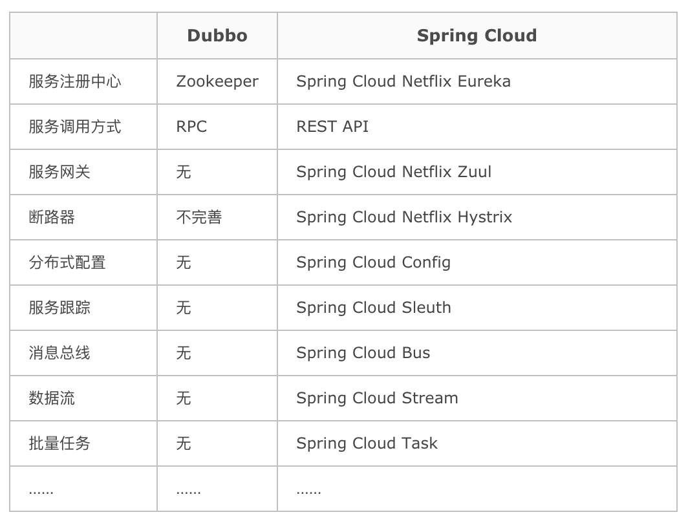

# 一、微服务

## 1、微服务与微服务架构

- 微服务：强调的是服务的大小，它关注的是某一个点，是具体解决某一个问题/提供落地对应服务的一个服务应用；
- 微服务架构：微服务架构一种架构模式或者说是一种架构风格，它提倡将单一应用程序划分成一组小的服务，每个服务运行在其独立的进程中，服务之间互相协调、互相配合，为用户提供最终价值。服务之间采用轻量级通信机制互相沟通，这些服务是围绕业务能力建立的，并且可以由完全自动化的部署机构独立部署。这些服务的集中管理只有最低限度，可以用不同的编程语言编写并使用不同的数据存储技术；

微服务化的核心就是根据业务拆分成一个一个的服务，彻底去耦合

## 2、微服务优缺点

- 优点：
    - 每个服务足够内聚，足够小，代码容易理解，这样能够聚焦一个值得的业务功能；
    - 开发简单，开发效率提高；
    - 微服务能够被小团队独立开发；
    - 微服务是松耦合的，可以独立部署；
    - 微服务能够使用不同的语言开发；
    - 易于与第三方集成；
    - 微服务知识业务逻辑的代码，不会前端相关组件产生关系；

- 缺点：
    - 分布式系统的复杂性；
    - 多服务运维难度高；
    - 系统部署依赖；
    - 服务通信成本；
    - 数据一致性；
    - 系统集成测试；
    - 性能监控；

## 3、微服务技术栈

- 服务开发：SpringBoot、Spring、SpringMVC
- 服务配置与管理：Netflix的Archaius、阿里的Diamond
- 服务注册：Eureka、Consul、Zookeeper等
- 服务调用：Rest、Rpc、Grpc
- 服务负载均衡：Ribbon、Nginx
- 服务监控：
- 服务熔断器：Hystrix、Envoy
- 服务路由（网关）:Zuul
- 消息队列：Kafka、RabbitMQ、ActiveMQ
- 服务配置中心：SpringCloudConfig
- 服务部署：Docker
。。。

## 4、微服务选型

### 4.1、微服务选型依据

- 整体解决方案和框架成熟度
- 社区热度
- 可维护性
- 学习曲线

### 4.2、微服务框架对比

Dubbo、HSF、DubboX
- 功能定位
- 支持Rest
- 支持多语言
- 负载均衡
- 配置服务
- 服务调用链调用
- 高可用、容错

# 二、SpringCloud

* [SpringCloud中文网站](https://springcloud.cc/)
* [SpringCloud中国社区](http://springcloud.cn/)
* [SpringCloud具体文档](https://springcloud.cc/spring-cloud-dalston.html)

## 1、简介

### 1.1、定义

基于SpringBoot提供了一套微服务解决方案，包括服务注册与发现、配置中心、全链路监控、服务网关、负载均衡、熔断器等组件，除了基于Netflix的开源组件做高度抽象封装之外，还有一些选项中立的开源组件；分布式微服务架构的一站式解决方案

### 1.2、与SpringBoot的关系

- Springboot专注于快速方便的开发单个个体微服务；
- SpringCloud是关注全局的微服务协调整理治理框架，它将SpringBoot开发的一个个单体微服务整合并管理起来，为各个微服务之间提供配置管理、服务发现、断路器、熔断器等等集成服务；
- SpringBoot可以离开SPringCloud独立使用开发项目，SpringCloud离不开SpringBoot，属于依赖的关系；


### 1.3、与Dubbo对比



**最大区别：SpringCloud抛弃了Dubbo的RPC通信，采用的是基于HTTP的REST方式**，从一定程度上，HTTP的REST方式牺牲了服务调用的性能，但也避免了原生RPC带来的问题

## 2、Eureka服务注册与发现

Eureka是Netflix的一个子模块，也是核心模块之一。Eureka是一个基于REST的服务，用于定位服务，以实现云端中间层服务发现和故障转移。只需要使用服务的标识符，就可以访问到服务；

其在设计上遵守AP原则

### 2.1、原理

- 基本架构：
    - 采用了C-S的设计架构。Eureka Server作为服务注册功能的服务器。是服务注册中心；
    - 系统的其他微服务，使用Eureka的客户端连接到Eureka Server并维持心跳连接。SpringCloud的一些其他模块就可以通过Eureka Server来实现系统中的其他微服务，并执行相关逻辑。
- Eureka包含两个组件：
    - Eureka Server：提供服务注册；各个节点启动后，会在EurekaServer中进行注册，主要EurekaServer中的服务注册表将会存储所有可用的服务节点的信息。
    - Eureka Client：是一个Jvava客户端，用于简化EurekaServer的交互，客户端也同时具备一个内置的、使用轮询（round-robin）负载算法的负载均衡。在应用启动后，将会向EurekaServer发送心跳（默认周期是30秒）。如果EurekaServer在多个心跳周期内没有收到某个节点的心跳，EurekaServer将会从服务注册表中把这个服务节点移除（默认90秒）；

- 三大角色：
    - Eureka Server：提供服务注册和发现
    - Service Provider：服务提供方将自身服务注册到Eureka，从而使服务消费方能够进行消费；
    - Service Consumer：服务消费方从Eureka中获取注册列表，从而能消费服务；

### 2.2、接入Eureka

#### 2.2.1、Eureka服务端

- 增加依赖：
    ```xml
    <!--eureka-server服务端 -->
    <dependency>
        <groupId>org.springframework.cloud</groupId>
        <artifactId>spring-cloud-starter-eureka-server</artifactId>
    </dependency>
    ```
- 启动类增加`@EnableEurekaServer`注解
- 在配置文件（application.yml）增加如下配置：
    ```yml
    eureka:
    instance:
        hostname: localhost
    client:
        register-with-eureka: false    #false表示不向注册中心注册自己。
        fetch-registry: false     #false表示自己端就是注册中心，我的职责就是维护服务实例，并不需要去检索服务
        service-url:
        defaultZone: http://${eureka.instance.hostname}:${server.port}/eureka/       # 单机：设置与Eureka Server交互的地址查询服务和注册服务都需要依赖这个地址（单机）。
     #      defaultZone: http://eureka7002.com:7002/eureka/,http://eureka7003.com:7003/eureka/ # 配置集群的配置，多台机器
    ```

#### 2.2.1、Eureka客户端

- 增加POM依赖
    ```xml
    <!-- actuator监控信息完善 -->
    <dependency>
        <groupId>org.springframework.boot</groupId>
        <artifactId>spring-boot-starter-actuator</artifactId>
    </dependency>
    <!-- 将微服务provider侧注册进eureka -->
    <dependency>
        <groupId>org.springframework.cloud</groupId>
        <artifactId>spring-cloud-starter-eureka</artifactId>
    </dependency>
    <dependency>
        <groupId>org.springframework.cloud</groupId>
        <artifactId>spring-cloud-starter-config</artifactId>
    </dependency>
    ```
- 启动类增加注解：`@EnableEurekaClient`
- 在配置文件（application.yml）增加如下配置：
    ```yml
    eureka:
    client: #客户端注册进eureka服务列表内
        service-url:
        defaultZone: http://localhost:7001/eureka
        # defaultZone: http://eureka7001.com:7001/eureka/,http://eureka7002.com:7002/eureka/,http://eureka7003.com:7003/eureka/ # 集群配置
    instance:
        instance-id: microservicecloud-dept8001XXXXX
        prefer-ip-address: true     #访问路径可以显示IP地址

        # 监控信息
    info:
    app.name: bluefish-microservicecloud
    company.name: www.chenlanqing.com
    build.artifactId: $project.artifactId$
    build.version: $project.version$
    ```

### 2.3、Eureka自我保护


某时刻某一个微服务不可用了，eureka不会立刻清理，依旧会对该微服务的信息进行保存。

默认情况下，如果EurekaServer在一段时间内没有接收到某个微服务实例的心跳，EurekaServer将会注销该实例。但是在网络分区故障发生时，微服务与EurekaServer之间无法正常通通信，那么直接注销实例可能很危险，因为微服务本身其实是健康的，此时不应该注销这个服务。Eureka通过自我保护模式来解决这个问题：当EurekaServer节点在短时间内丢失过多客户端时，那么这个节点就会进入自我保护模式。一旦进入该模式，EurekaServer就会保护服务注册表中的信息，不再删除服务注册表中的数据。当网络故障恢复之后，该EurekaServer节点会自动退出自我保护模式

在自我保护模式中，Eueka server会保护服务注册表中的信息，不在注销任何服务实例。当它收到的心跳次数重写恢复到阈值以上时，该Eureka Server节点就会自动退出自我保护模式。

设计思路：宁可保留错误的服务注册信息，也不盲目注销任何可能健康的服务实例。

自我保护模式是一种应对网络异常的安全保护措施。在SpringCloud中，可以使用`eureka.server.enable-self-preservation=false`禁用自我保护模式

### 2.4、Eureka服务发现

使用：DiscoveryClient，配合注解：`@EnableDiscoveryClient`

### 2.5、Eureka集群

集群需要增加修改如下配置，将defaultZone修改为多个地址

defaultZone: http://eureka7002.com:7002/eureka/,http://eureka7003.com:7003/eureka/

### 2.6、与Zookeeper相比

- Eureka遵守AP，zookeeper遵守CP
    - Eureka：Eureka各个几点都是平等的，几个节点挂掉不会影响正常节点的工作，剩余的节点依然可以提供注册和查询服务
    - zookeeper：当master节点因为故障与其他节点失去联系时，剩余节点会重写进行leader选举。问题在于：选举leader的时间太长，30~120s，且选举期间整个zk集群是不可用的，就导致在选举期间注册服务瘫痪；

## 3、Ribbon负载均衡

### 3.1、是什么

Spring Cloud Ribbon是基于Netflix Ribbon实现的客户端、负载均衡的工具。其主要提供客户端的软件负载均衡算法。

简单说，就是在配置文件中列出Load Balancer后面所有的机器，Ribbon会自动的帮助你基于某种规则去连接这些机器。


### 3.2、配置

主要是在客户端进行操作的
- 加入依赖
    ```xml
    <!-- Ribbon相关 -->
    <dependency>
        <groupId>org.springframework.cloud</groupId>
        <artifactId>spring-cloud-starter-eureka</artifactId>
    </dependency>
    <dependency>
        <groupId>org.springframework.cloud</groupId>
        <artifactId>spring-cloud-starter-ribbon</artifactId>
    </dependency>
    <dependency>
        <groupId>org.springframework.cloud</groupId>
        <artifactId>spring-cloud-starter-config</artifactId>
    </dependency>
    ```

- 加入配置
    ```yml
    eureka:
        client:
            register-with-eureka: false
            service-url:
            defaultZone: http://eureka7001.com:7001/eureka/,http://eureka7002.com:7002/eureka/,http://eureka7003.com:7003/eureka/

    ```
- 调用接口增加注解，请求的服务需要改成响应的服务名称二而不是具体的接口
    ```java
    @Bean
    @LoadBalanced // 负载均衡注解
    public RestTemplate getRestTemplate() {
        return new RestTemplate();
    }
    ```

### 3.3、Ribbon核心组件

IRule：根据特定算法从服务列表中选取一个要访问的服务，默认存在如下七种算法：
- `RoundRobinRule`：轮询
- `RndomRule`：随机
- `AvailiabilityFilterlingRule`：会先过滤掉由于多次访问故障而出路断路器跳闸状态的服务，还有并发的连接数量超过阈值的服务，然后对剩余的服务列表按照轮询策略进行访问；
- `WeightedResponseTimeRule`：根据平均响应时间计算所有服务的权重，响应时间越快服务权重越大被选中的概率越高，刚启动时如果统计信息不足，则使用`RoundRobinRule`策略，等统计信息组织，会切换到`WeightedResponseTimeRule`
- `RetryRule`：先按照`RoundRobinRule`的策略获取服务，如果获取服务失败则在指定时间内会进行重试，获取可用的服务；
- `BestAvailableRule`：会先过滤掉由于多次访问故障而处于断路器跳闸状态的服务，然后选择一个并发量最小的服务
- `ZoneAvoidanceRule`：默认规则。符合判断Server所在区域的性能和server的可用性选择服务器


# 面试题

## 1、什么是微服务

## 2、微服务之间是如何独立通讯的

## 3、SpringCloud和Dubbo有哪些区别

## 4、SpringBoot与SpringCloud，如何理解他们之间的关系

## 5、什么是服务熔断？什么是服务降级？

## 6、微服务的优缺点分别是什么？需要注意哪些点？

## 7、微服务的技术栈

## 8、eureka和zookeeper都提供注册与发现功能，这两者有什么区别？


* [限流算法的实现](https://www.jianshu.com/p/76cc8ba5ca91)
* [理解微服务架构的核心](https://segmentfault.com/a/1190000014352312?utm_source=weekly&utm_medium=email&utm_campaign=email_weekly)