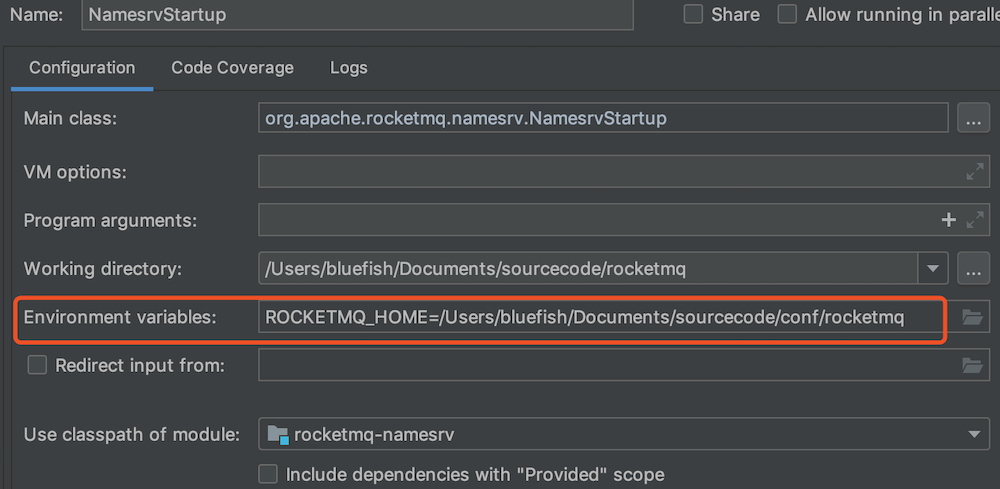
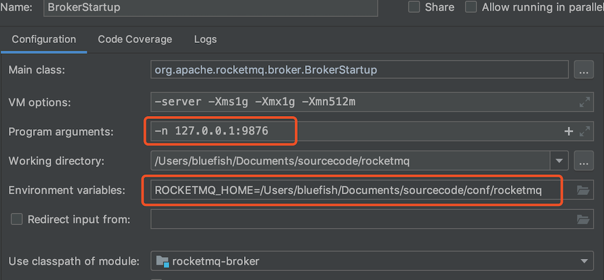

# 一、RocketMQ介绍

## 1、基本概念

RocketMQ是一款分布式、队列模型的消息中间件；最新版4.3.x版本（支持分布式事务）；

- 其支持集群模型、负载均衡、水平扩展能力；
- 亿级别的消息堆积能力；
- 采用零拷贝的原理、顺序写盘、随机读；
- 丰富的API使用；
- 底层通信框架采用netty nio框架；
- 使用NameServer代替zookeeper；
- 强调集群无单点；
- 消息失败重试机制、消息可查询

## 2、概念模型

- Producer：消息生产者，负责生产消息，一般由业务系统负责生产消息
- Consumer：消息消费者，负责消费消息，一般是后台系统负责异步消费；
- Push Cosnumer：Consumer的一种，需要向Consumer对象注册监听；
- Pull Cosnumer：Consumer的一种，需要主动请求Broker拉取消息；
- Producer Group：生产者集合，一般用于发送一类消息；主要是在事务消息回查；
- Consumer Group：消费者集合，一般用于接受一类消息进行消费；
- Broker：MQ消息服务，用于消息存储和生产消费转发；

## 3、搭建RocketMQ环境

### 3.1、单机Rocket

- 下载[rocketMQ](https://github.com/apache/rocketmq)源代码，这里选择4.3.0版本的；
- 使用命令编译项目：`mvn -Prelease-all -DskipTests clean install -U`
- 在项目`distribution/target/`目录中找到：apache-rocketmq.tar.gz，上传到服务器（192.168.56.101）目录：`/usr/local/software/`
- 修改host，添加如下信息：
    ```
    192.168.56.101 rocketmq-nameserver1
    192.168.56.101 rocketmq-master1
    ```
- 解压文件到`/usr/local/apache-rocketmq`，并创建软连接：`ln -s apache-rocketmq rocketmq`
- 创建存储路径
    ```
    mkdir /usr/local/rocketmq/store
    mkdir /usr/local/rocketmq/store/commitlog
    mkdir /usr/local/rocketmq/store/consumequeue
    mkdir /usr/local/rocketmq/store/index
    ```
- 修改rokcetMQ配置文件：`vim /usr/local/rocketmq/conf/2m-2s-async/broker-a.properties`
    ```properties
    brokerClusterName=rocketmq-cluster
    #broker 名字，注意此处不同的配置文件填写的不一样
    brokerName=broker-a
    #0 表示 Master，>0 表示 Slave
    brokerId=0
    #nameServer 地址，分号分割
    namesrvAddr=rocketmq-nameserver1:9876
    #在发送消息时，自动创建服务器不存在的 topic，默认创建的队列数
    defaultTopicQueueNums=4
    #是否允许 Broker 自动创建 Topic，建议线下开启，线上关闭
    autoCreateTopicEnable=true
    #是否允许 Broker 自动创建订阅组，建议线下开启，线上关闭
    autoCreateSubscriptionGroup=true

    #Broker 对外服务的监听端口
    listenPort=10911
    #删除文件时间点，默认凌晨 4 点
    deleteWhen=04
    #文件保留时间，默认 48 小时
    fileReservedTime=120
    #commitLog 每个文件的大小默认 1G
    mapedFileSizeCommitLog=1073741824
    #ConsumeQueue 每个文件默认存 30W 条，根据业务情况调整
    mapedFileSizeConsumeQueue=300000
    #destroyMapedFileIntervalForcibly=120000
    #redeleteHangedFileInterval=120000
    #检测物理文件磁盘空间
    diskMaxUsedSpaceRatio=88
    #存储路径
    storePathRootDir=/usr/local/rocketmq/store
    #commitLog 存储路径
    storePathCommitLog=/usr/local/rocketmq/store/commitlog
    #消费队列存储路径存储路径
    storePathConsumeQueue=/usr/local/rocketmq/store/consumequeue
    #消息索引存储路径
    storePathIndex=/usr/local/rocketmq/store/index
    #checkpoint 文件存储路径
    storeCheckpoint=/usr/local/rocketmq/store/checkpoint
    #abort 文件存储路径
    abortFile=/usr/local/rocketmq/store/abort
    #限制的消息大小
    maxMessageSize=65536
    #flushCommitLogLeastPages=4
    #flushConsumeQueueLeastPages=2
    #flushCommitLogThoroughInterval=10000
    #flushConsumeQueueThoroughInterval=60000
    #Broker 的角色
    #- ASYNC_MASTER 异步复制 Master
    #- SYNC_MASTER 同步双写 Master
    #- SLAVE
    brokerRole=ASYNC_MASTER
    #刷盘方式
    #- ASYNC_FLUSH 异步刷盘
    #- SYNC_FLUSH 同步刷盘
    flushDiskType=ASYNC_FLUSH
    #checkTransactionMessageEnable=false
    #发消息线程池数量
    #sendMessageThreadPoolNums=128
    #拉消息线程池数量
    #pullMessageThreadPoolNums=128
    ```
- 修改配置文件：
    ```
    mkdir -p /usr/local/rocketmq/logs
    cd /usr/local/rocketmq/conf && sed -i 's#${user.home}#/usr/local/rocketmq#g' *.xml
    ```
- 修改启动脚本参数，如果是个人虚拟机，可以修改如下配置：
    - `vim /usr/local/rocketmq/bin/runbroker.sh`，修改JVM参数：`-Xms1g -Xmx1g -Xmn512m`
    - `vim /usr/local/rocketmq/bin/runserver.sh`，修改JVM参数：`-Xms1g -Xmx1g -Xmn512m`
- 进入到bin目录，启动nameServer：`nohup sh mqnamesrv &`；
- 启动broker-a：`nohup sh mqbroker -c /usr/local/rocketmq/conf/2m-2s-async/broker-a.properties >/dev/null 2>&1 &`
- 数据清理：
    ```
    # cd /usr/local/rocketmq/bin
    # sh mqshutdown broker
    # sh mqshutdown namesrv
    # --等待停止
    # rm -rf /usr/local/rocketmq/store
    # mkdir /usr/local/rocketmq/store
    # mkdir /usr/local/rocketmq/store/commitlog
    # mkdir /usr/local/rocketmq/store/consumequeue
    # mkdir /usr/local/rocketmq/store/index
    # --按照上面步骤重启 NameServer 与 BrokerServer
    ```
   
### 3.2、集群

四种集群环境构建：单点、主从、双主、多主多从

#### 3.2.1、主从模式集群环境构建

主从模式环境构建可以保障消息的即时性与可靠性；投递一条消息后，关闭主节点，从节点继续可以提供消费者数据进行消费，但是不能接收消息；主节点上线后进行消费进度offset同步

单主单从

- 在hosts文件中添加多个机器
    ```
    192.168.56.101 rocketmq-nameserver1
    192.168.56.101 rocketmq-master1
    192.168.56.102 rocketmq-nameserver2
    192.168.56.102 rocketmq-master1-slave
    ```
- 修改配置文件：`vim /usr/local/rocketmq/conf/2m-2s-async/broker-a.properties`，其为master的配置文件，所以其`brokerRole`设置为`MASTER`
    ```
    # 修改配置如下
    #0 表示 Master，>0 表示 Slave
    brokerId=1
    #nameServer 地址，分号分割
    namesrvAddr=rocketmq-nameserver1:9876;rocketmq-nameserver2:9876
    #Broker 的角色
    #- ASYNC_MASTER 异步复制 Master
    #- SYNC_MASTER 同步双写 Master
    #- SLAVE
    brokerRole=ASYNC_MASTER
    ```
- 修改配置文件：`vim /usr/local/rocketmq/conf/2m-2s-async/broker-a-s.properties`，其为`slave`的配置文件，所以其`brokerRole`设置为`SLAVE`
    ```
    # 修改配置如下
    #nameServer 地址，分号分割
    namesrvAddr=rocketmq-nameserver1:9876;rocketmq-nameserver2:9876
    #Broker 的角色
    #- ASYNC_MASTER 异步复制 Master
    #- SYNC_MASTER 同步双写 Master
    #- SLAVE
    brokerRole=SLAVE
    ```

 启动步骤同上面

## 4、RocketMQ控制台

可以参考：[rocketmq-externals](https://github.com/apache/rocketmq-externals)，其有一个子项目：rocketmq-console，修改其配置文件：application.properties中的配置：`rocketmq.config.namesrvAddr=192.168.56.101:9876`，其余不用动，其是一个springBoot项目


# 二、RocketMQ入门

## 1、生产者使用

- 创建生产者对象：DefaultMQProducer
- 设置NamesrvAddr
- 启动生产者服务；
- 创建消息并发送

## 2、消费者使用

- 创建消费者对象：DefaultMQPushConsumer
- 设置namesrvAddr及其消费位置ConsumeFromWhere；
- 进行订阅主题subscribe；
- 注册监听并消费registerMessageListener；

# 三、RocketMQ核心

## 1、生产者

### 1.1、核心参数

- producerGroup：组名，在一个应用中是唯一的
- createTopicKey：可以直接创建Topic；
- defaultTopicQueueNums：默认是4；
- sendMsgTimeout：单位是ms，发送消息超时时间
- compressMsgBodyOverHowmuch：字节传输中是否压缩，默认是4096字节；
- retryTimesWhenSendFaild：是否重发

### 1.2、主从同步机制

- Master-Slave主从同步
- 同步信息：数据内容 + 元数据信息
- 元数据同步：Broker角色识别，为slave则启动同步任务；包括配置信息，使用定时任务，使用Netty
- 消息同步：HAService、HAConnetion、WaitNotifyObject；使用实时同步，使用原生Socket；commit log
- 主要同步是Master和Slave的偏移量比较；

### 1.3、同步消息发送

- 同步、异步发送消息核心实现：DefaultMQProducerImpl
- 同步发送消息：producer.send(Message msg);
- 异步发送消息：producer.send(Message msg, SendCallBack sendCallBack)

### 1.4、Netty底层框架解析

- 主要关键类：RemotingService、RemotingServer、RemotingClient、NettyRemotingAbstract、NettyRemotingClient、NettyRemotingServer；
- 自定义消息传输协议：`消息长度|序列化类型&&头部长度|消息头数据|消息主体数据`

### 1.5、消息投递状态

```java
public enum SendStatus {
    SEND_OK,
    FLUSH_DISK_TIMEOUT,
    FLUSH_SLAVE_TIMEOUT,
    SLAVE_NOT_AVAILABLE,
}
```

### 1.6、延迟消息

- 延迟消息：消息发送到Broker之后，要特定的时间才会被Consumer消费；
- 目前只支持固定精度的定时消息；
- MessageStoreConfig配置类、ScheduleMessageService 任务类；
- setDelayTimeLevel

### 1.7、自定义消息发送规则

- 通过MessageQueueSelector可以发送到指定的队列中；
- producer.send(msg, selector, msg)
    ```java
    SendResult sendResult = producer.send(message, new MessageQueueSelector() {
        @Override
        public MessageQueue select(List<MessageQueue> mqs, Message msg, Object arg) {
            Integer queueNumber = (Integer)arg;
            return mqs.get(queueNumber);
        }
    }, 2);
    // 其中send的第三个参数，也即是2会通过回调赋值到MessageQueueSelector重写的方法中arg参数；
    ```

## 2、消费者

### 2.1、PushConsumer核心参数

- consumeFromWhere：消费者从哪个位置开始消费；
- allocateMessageQueueStrategy
- subscription：订阅
- offsetStore：存储实际的偏移量，分为localOffSet和RemoteOffSet；
- consumeThreadMin/consumeThreadMax
- consumeConcurrentMaxSpan/pullThresholdQueu
- pullinterval/pullBatchSize
- consumeMessageBatchSize：拉取数据条数

### 2.2、PushCosnumer消费模式

#### 2.2.1、集群模式

- 默认的模式
- GroupName用于把多个Consumer组织到一起；
- 相同的GroupName的consumer只消费所订阅消息的一部分；
- 目的：达到天然的负载均衡机制；

#### 2.2.2、广播模式

- 同一个ConsumerGroup里的Consumer都消费订阅Topic全部信息，也就是每一条消息都被一个Consumer消费；
- 设置广播模式：setMessageModel

### 2.3、偏移量offset

- offset是消息消费进度的核心；
- offset指某个topic下的一条消息在MessageQueue里的位置；可以通过offset进行定位到这条消息
- offset的存储实现分别为远程文件类型和本地文件类型；
- RemoteBrokerOffsetStore：
    - 默认集群模式采用远程文件存储offset：本质是因为多消费模式，每个consumer消费所订阅主题的一部分；需要broker控制offset；
- LocalFileOffsetStore
    - 广播模式下，由于每个consumer都会受到消息且消费，各个consumer之间没有任何干扰，独立线程消费；

### 2.4、PushConsumer长轮询分析

- DefaultPushConsumer是使用长轮询模式进行实现的；长轮询是主动拉取
- Push消息推送：broker推送消息到消费者端；受消费端消费能力影响
- Pull消息拉取：消费端从broker拉取消息；需要本地记录offset
- 长轮询机制：

### 2.5、PullConsumer使用

- 消息拉取方式：DefaultPullConsumer
- pull方式主要做三件事：
    - 获取Message Queue并遍历；
    - 维护OffsetStore
    - 根据不同的消息状态做不同的处理

## 3、核心原理

### 3.1、Broker消息存储结构


### 3.2、消息的同步刷盘与异步刷盘


### 3.3、消息的同步复制与异步复制


### 3.4、高可用机制


### 3.5、NameServer协调服务

# 四、RocketMQ应用实践

## 1、双主双从部署

### 1.1、配置


# 五、RocketMQ源码分析

## 1、调试环境搭建

- 下载RocketMQ源码：https://github.com/apache/rocketmq
- 将源码导入到IDEA中（使用4.3.0分支）；
- 执行命令：`mvn -Prelease-all -DskipTests clean install -U`，编译查看是否导入成功，并可在目录：`distribution/target/apache-rocketmq`获取到可部署的tar包；
- 启动`NamesrvStartup`
    - 配置`ROCKETMQ_HOME`，在当前机器上新建rokcetmq运行目录

        

    - 在上述rocket运行目录中新建如下目录：
        ```
        config
        logs
        store
        ```
    - 将rocketmq源码下的distribution部署目录下broker.conf、logback_broker.xml文件复制到上述新建的conf目录下，修改logback_broker.xml文件中日志文件的目录；
    - 将如下配置添加到broker.conf中
        ```
        brokerClusterName=rocketmq-cluster
        brokerName=broker-a
        brokerId=0
        namesrvAddr=127.0.0.1:9876
        deleteWhen=04
        fileReservedTime=48
        brokerRole=ASYNC_MASTER
        flushDiskType=ASYNC_FLUSH

        #存储路径，需要在上述新建的目录中创建如下目录
        storePathRootDir=/Users/bluefish/Documents/sourcecode/conf/rocketmq/store
        storePathCommitLog=/Users/bluefish/Documents/sourcecode/conf/rocketmq/store/commitlog
        storePathConsumeQueue=/Users/bluefish/Documents/sourcecode/conf/rocketmq/store/consumequeue
        storePathIndex=/Users/bluefish/Documents/sourcecode/conf/rocketmq/store/index
        storeCheckpoint=/Users/bluefish/Documents/sourcecode/conf/rocketmq/store/checkpoint
        abortFile=/Users/bluefish/Documents/sourcecode/conf/rocketmq/store/abort
        ```
- 启动`BrokerStartup`，同样需要配置`ROCKETMQ_HOME`，同时配置下nameaddr的地址

    

- 将上述两个文件启动之后，找到文件：`org.apache.rocketmq.example.quickstart.Producer`，修改代码为：`producer.setNamesrvAddr("127.0.0.1:9876");`，发送消息，测试消息发送是否成功；
- 消费消息：`org.apache.rocketmq.example.quickstart.Consumer`，修改代码：`consumer.setNamesrvAddr("127.0.0.1:9876");` 执行，看是否消费成功；
