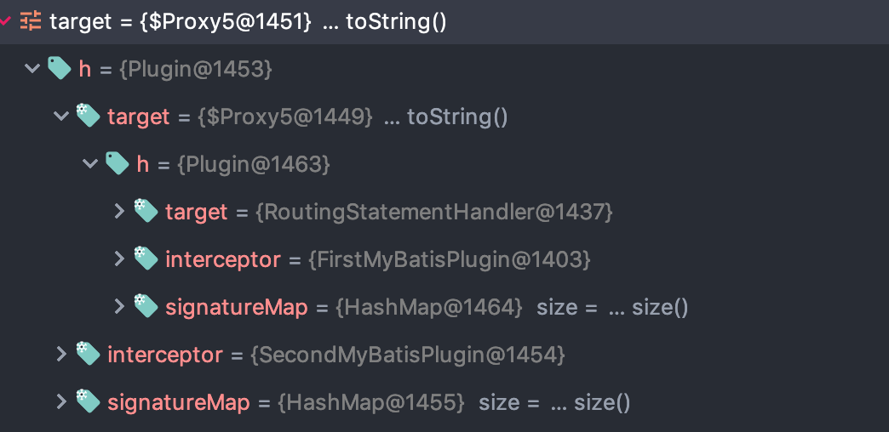
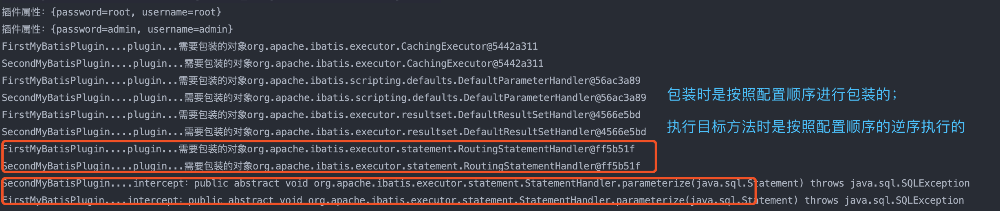

# 一、Mybatis概述

## 1、ORM框架对比

Hibernate与mybatis框架比较

### 1.1、Hibernate 的优点

- hibernate是全自动，hibernate完全可以通过对象关系模型实现对数据库的操作，拥有完整的JavaBean对象与数据库的映射结构来自动生成sql；
- 功能强大，数据库无关性好，O/R映射能力强，需要写的代码很少，开发速度很快；
- 有更好的二级缓存机制，可以使用第三方缓存；
- 数据库移植性良好；
- hibernate拥有完整的日志系统，hibernate日志系统非常健全，涉及广泛，包括sql记录、关系异常、优化警告、缓存提示、脏数据警告等；
- 是面向对象支持的最好的框架了

### 1.2、Hibernate的缺点

- 学习门槛高，精通门槛更高，程序员如何设计O/R映射，在性能和对象模型之间如何取得平衡，以及怎样用好Hibernate方面需要的经验和能力都很强才行
- hibernate的sql很多都是自动生成的，无法直接维护sql；虽然有hql查询，但功能还是不及sql强大，见到报表等变态需求时，hql查询要虚，也就是说hql查询是有局限的；hibernate虽然也支持原生sql查询，但开发模式上却与orm不同，需要转换思维，因此使用上有些不方便。总之写sql的灵活度上hibernate不及mybatis；
- 在复杂关联中往往会带来严重的性能问题，也就是N+1的问题

### 1.3、Mybatis的优点

- 易于上手和掌握，提供了数据库查询的自动对象绑定功能，而且延续了很好的SQL使用经验，对于没有那么高的对象模型要求的项目来说，相当完美.
- sql写在xml里，便于统一管理和优化， 解除sql与程序代码的耦合.
- 提供映射标签，支持对象与数据库的orm字段关系映射
- 提供对象关系映射标签，支持对象关系组建维护
- 提供xml标签，支持编写动态sql.
- 速度相对于Hibernate的速度较快

### 1.4、Mybatis的缺点

- 关联表多时，字段多的时候，sql工作量很大；
- sql依赖于数据库，导致数据库移植性差；
- 由于xml里标签id必须唯一，导致DAO中方法不支持方法重载；
- 对象关系映射标签和字段映射标签仅仅是对映射关系的描述，具体实现仍然依赖于sql；
- DAO 层过于简单，对象组装的工作量较大；
- 不支持级联更新、级联删除；
- Mybatis 的日志除了基本记录功能外，其它功能薄弱很多；
- 编写动态sql时，不方便调试，尤其逻辑复杂时；
- 提供的写动态sql的xml标签功能简单，编写动态sql仍然受限，且可读性低；

## 2、为什么要使用mybatis等orm框架

# 二、使用Mybatis一般过程

## 1、创建配置文件

创建基本配置文件mybatis-config.xml,该配置文件存放数据库连接信息以及引入mapper映射文件和缓存设置等待;
```xml
<?xml version="1.0" encoding="UTF-8" ?>
<!DOCTYPE configuration PUBLIC "-//mybatis.org//DTD Config 3.0//EN"
"http://mybatis.org/dtd/mybatis-3-config.dtd">
<configuration>
    <!-- 设置数据库连接信息,通过外部配置文件 -->
    <properties resource="db.properties">	
    </properties>
    <typeAliases>
        <package name="com.mybatis.model" />
    </typeAliases>
    <environments default="development">
        <environment id="development">
            <transactionManager type="JDBC" />
            <dataSource type="POOLED">
                <property name="driver" value="${driver}" />
                <property name="url" value="${url}" />
                <property name="username" value="${username}" />
                <property name="password" value="${password}" />
            </dataSource>
        </environment>
    </environments>
    <!-- 引入mapper映射文件 -->
    <mappers>
        <mapper resource="com/mybatis/mapper/userMapper.xml"/>
        <mapper resource="com/mybatis/mapper/cuserMapper.xml"/>
    </mappers>
</configuration>
```

## 2、创建实体类

创建实体类及其对应的Mapper映射文件：如userMapper.xml
```xml
<?xml version="1.0" encoding="UTF-8"?>
<!DOCTYPE mapper PUBLIC "-//mybatis.org//DTD Mapper 3.0//EN" "http://mybatis.org/dtd/mybatis-3-mapper.dtd">
<!-- 命名空间,一般跟Mapper映射接口一致 -->
<mapper namespace="com.mybatis.service.IUserService">
    <select id="queryUserById" parameterType="int" resultType="User">
        select * from user where id=#{id}
    </select>
    ...
</mapper>
```

## 3、将Mapper映射文件引入到基本配置文件
```xml
<mappers>
    <mapper resource="com/mybatis/mapper/userMapper.xml"/>
    <mapper resource="com/mybatis/mapper/cuserMapper.xml"/>
</mappers>
```

## 4、获取sqlSessionFactory和sqlSession
```java
String resource = "configuration.xml";
InputStream in = UserTestDemo.class.getClassLoader().getResourceAsStream(resource);
SqlSessionFactory ssf = new SqlSessionFactoryBuilder().build(in);
SqlSession session = ssf.openSession();
```

## 5、根据相应的增删改查,调用sqlSession的方法

# 三、常见使用

## 1、mybatis完成两件事

- 根据JDBC规范建立与数据库的连接；
- 通过Annotation/XML + Java反射技术，实现Java对象与关系数据库之间的相互转化；

## 2、typeAliases属性

类型别名是为 Java 类型命名一个短的名字。 它只和 XML 配置有关, 只用来减少类完全 限定名的多余部分
```xml
<typeAliases>
    <typeAlias type="com.neusoft.pojo.User" alias="User"/>
</typeAliases>
```
或者
```xml
<typeAliases>
    <package name="com.neusoft.pojo"/>
</typeAliases>
```
在实体类中通过注解形式
```java
@Alias("User")
public class User {
}
```
    
## 3、字段名与实体类属性名不相同的冲突

在Mapper文件中配置，如下所示：select元素中resultMap的值需跟定义的resultMap元素中id属性值一样
```xml
<mapper namespace="com.mybatis.orderMapper">
    <select id="getOrder" parameterType="int" resultMap="orderBean">
        <!--select order_id id,order_no orderNo,order_price price from orders where order_id=#{id} -->
        select * from orders where order_id=#{id}
    </select>
    <resultMap type="Order" id="orderBean">
        <id property="id" column="order_id"/>
        <result property="orderNo" column="order_no"/>
        <result property="price" column="order_price"/>
    </resultMap>
</mapper>
```  
如果是通过接口形式来实现的，那么在mapper的配置文件中namespace应该是接口的路径名
    
## 4、关联表查询

### 4.1、一对一查询

- association：用于一对一的关联查询的;
- property：对象属性的名称;
- javatype：对象属性的类型
- column：所对应的外键字段名称;
- select：使用另一个查询封装的结果

```xml
<mapper namespace="com.mybatis.classMapper">
    <!-- 方式一：嵌套结果：使用嵌套结果映射来处理重复的联合结果的子集
        封装联表查询的数据(去除重复的数据
    -->	
    <select id="getClass" parameterType="int" resultMap="classResultMap">
        select * from class c,teacher t where c.teacher_id=t.t_id and c.c_id=#{id}
    </select>
    
    <resultMap type="Classes" id="classResultMap">
        <id property="id" column="c_id"/>
        <result property="className" column="c_name"/>
        <association property="teacher" javaType="Teacher">
            <id property="id" column="t_id"/>
            <result property="teacherName" column="t_name"/>
        </association>
    </resultMap>
    
    <!-- 
        方式二：嵌套查询：通过执行另外一个SQL映射语句来返回预期的复杂类型
            SELECT * FROM class WHERE c_id=1;
            SELECT * FROM teacher WHERE t_id=1   //1 是上一个查询得到的teacher_id的值
    -->
    
    <select id="getClass2" parameterType="int" resultMap="classMap">
        select * from class where c_id=#{id}
    </select>
    <resultMap type="Classes" id="classMap">
        <id property="id" column="c_id"/>
        <result property="className" column="c_name"/>
        <association property="teacher" column="teacher_id" select="getTeacher">
        </association>
    </resultMap>
    <select id="getTeacher" parameterType="int" resultType="Teacher">
        select t_id id, t_name teacherName from teacher where t_id=#{id}
    </select>
</mapper>
```

### 4.2、一对多查询

- collection：做一对多关联查询的集合;
- ofType：指定集合中的类型
```xml
<!-- 
方式一: 嵌套结果: 使用嵌套结果映射来处理重复的联合结果的子集
SELECT * FROM class c, teacher t,student s WHERE c.teacher_id=t.t_id AND c.C_id=s.class_id AND  c.c_id=1
-->
<select id="getClass3" parameterType="int" resultMap="ClassResultMap3">
    select * from class c, teacher t,student s where c.teacher_id=t.t_id and c.C_id=s.class_id and  c.c_id=#{id}
</select>
<resultMap type="_Classes" id="ClassResultMap3">
    <id property="id" column="c_id"/>
    <result property="name" column="c_name"/>
    <association property="teacher" column="teacher_id" javaType="_Teacher">
        <id property="id" column="t_id"/>
        <result property="name" column="t_name"/>
    </association>
    <!-- ofType指定students集合中的对象类型 -->
    <collection property="students" ofType="_Student">
        <id property="id" column="s_id"/>
        <result property="name" column="s_name"/>
    </collection>
</resultMap>

<!-- 
    方式二：嵌套查询：通过执行另外一个SQL映射语句来返回预期的复杂类型
        SELECT * FROM class WHERE c_id=1;
        SELECT * FROM teacher WHERE t_id=1   //1 是上一个查询得到的teacher_id的值
        SELECT * FROM student WHERE class_id=1  //1是第一个查询得到的c_id字段的值
-->
<select id="getClass4" parameterType="int" resultMap="ClassResultMap4">
    select * from class where c_id=#{id}
</select>
<resultMap type="_Classes" id="ClassResultMap4">
    <id property="id" column="c_id"/>
    <result property="name" column="c_name"/>
    <association property="teacher" column="teacher_id" javaType="_Teacher" select="getTeacher2"></association>
    <collection property="students" ofType="_Student" column="c_id" select="getStudent"></collection>
</resultMap>

<select id="getTeacher2" parameterType="int" resultType="_Teacher">
    SELECT t_id id, t_name name FROM teacher WHERE t_id=#{id}
</select>

<select id="getStudent" parameterType="int" resultType="_Student">
    SELECT s_id id, s_name name FROM student WHERE class_id=#{id}
</select>
```
    
## 5、调用存储过程

- parameterMap：引用即传入值与输出值
- statementType：知道statement的真实类型;CALLABLE执行调用存储过程的语句
- mode：表示输出或输入
```xml
<select id="getCount" statementType="CALLABLE" parameterMap="getCountMap">
    call mybatis.get_user_count(?,?)
</select>
<parameterMap type="java.util.Map" id="getCountMap">
    <parameter property="sex_id" mode="IN" jdbcType="INTEGER"/>
    <parameter property="user_count" mode="OUT" jdbcType="INTEGER"/>
</parameterMap>
```

## 6、批量插入

### 6.1、mybatis-foreach处理


### 6.2、mybatis代码处理


### 6.3、JDBC批处理 + 事务


### 6.4、数据分批 + JDBC批处理 + 事务


# 四、Mybatis与Spring整合

# 五、MyBatis原理

* [Mybatis初始化机制详解](https://blog.csdn.net/luanlouis/article/details/37744073)

## 1、mybatis的初始化

- 首先会创建SqlSessionFactoryBuilder建造者对象，然后由它进行创建SqlSessionFactory
- 然后会解析xml配置文件，实际为configuration节点的解析操作，还要解析transactionManager及datasource，最后将解析后的结果存到configuration对象中。
- 解析完MyBatis配置文件后，configuration就初始化完成了，然后根据configuration对象来创建SqlSession，到这里时，MyBatis的初始化的征程已经走完了。

## 2、mybatis的sql查询流程

- 调用selectOne方法进行SQL查询，selectOne方法最后调用的是selectList，在selectList中，会查询configuration中存储的MappedStatement对象，mapper文件中一个sql语句的配置对应一个MappedStatement对象，然后调用执行器进行查询操作。
- 执行器在query操作中，优先会查询缓存是否命中，命中则直接返回，否则从数据库中查询。
- 真正的doQuery操作是由SimplyExecutor代理来完成的，该方法中有2个子流程，一个是SQL参数的设置，另一个是SQL查询操作和结果集的封装。
    - 首先获取数据库connection连接，然后准备statement，然后就设置SQL查询中的参数值。打开一个connection连接，在使用完后不会close，而是存储下来，当下次需要打开连接时就直接返回。


# 六、MyBatis中的设计模式

http://www.crazyant.net/2022.html

# 七、Mybatis插件

## 1、插件原理

在`ParameterHandler`、`ResultSetHandler`、`StatementHandler`、`Executor`四个对象创建的时候：
- 上述四个对象创建时不是直接返回，而是调用：`interceptorChain.pluginAll(parameterHandler);`进行包装；
- 获取到所有的Interceptor实现类，调用  interceptor.plugin 进行包装：
    ```java
    public Object pluginAll(Object target) {
        for (Interceptor interceptor : interceptors) {
            target = interceptor.plugin(target);
        }
        return target;
    }
    ```
- plugin 方法会为目标对象创建一个代理对象；
- 等到真正执行具体方法的时候，其实是执行创建代理类时指定的InvocationHandler的invoke方法，可以发现在指定的InvocationHandler是Plugin对象，Plugin本身也是继承于InvocationHandler；首先从signatureMap中获取拦截类对应的方法列表，然后检查当前执行的方法是否在要拦截的方法列表中，如果在则调用自定义的插件interceptor，否则执行默认的invoke操作；interceptor调用intercept方法的时候是传入的Invocation对象

## 2、编写插件

### 2.1、基本步骤

- 编写`org.apache.ibatis.plugin.Interceptor`的实现类；
- 使用`@Intercepts`注解完成插件的签名
- 将写好的插件注册到全局配置文件中（注意插件配置的顺序）

### 2.2、示例

- 编写实现类：
    ```java
    /**
    * 同 Signature注解 完成插件签名，告诉插件拦截哪个对象的哪个方法
    */
    @Intercepts({
        // 这里需要拦截的是 StatementHandler 里的 parameterize 方法
        @Signature(type = StatementHandler.class, method = "parameterize", args = Statement.class)
    })
    public class FirstMyBatisPlugin implements Interceptor {
        /**
        * 拦截目标对象的目标方法的执行
        */
        @Override
        public Object intercept(Invocation invocation) throws Throwable {
            // 执行目标方法
            System.out.println("FirstMyBatisPlugin....intercept：" + invocation.getMethod());
            Object proceed = invocation.proceed();
            return proceed;
        }
        /**
        * 包装目标对象，为目标对象创建一个代理对象，可以使用 Plugin.wrap 包装
        */
        @Override
        public Object plugin(Object target) {
            System.out.println("FirstMyBatisPlugin....plugin...需要包装的对象" + target);
            Object wrap = Plugin.wrap(target, this);
            return wrap;
        }
        /**
        * 将插件注册时的property属性设置进来
        */
        @Override
        public void setProperties(Properties properties) {
            System.out.println("插件属性：" + properties);
        }
    }
    ```
- 配置文件配置：
    ```xml
    <configuration>
        <properties>...</properties>
        <settings>...</settings>
        <typeAliases>...</typeAliases>
        <typeHandlers>...</typeHandlers>
        <objectFactory>...</objectFactory>
        <objectWrapperFactory>...</objectWrapperFactory>
        <plugins>
            <plugin interceptor="com.blue.fish.plugin.FirstMyBatisPlugin">
                // 配置属性，在setProperties方法中可以获取到这些属性
                <property name="username" value="root"/>
                <property name="password" value="root"/>
            </plugin>
        </plugins>
        <environments>...</environments>
        <databaseIdProvider>...</databaseIdProvider>
        <mappers>...</mappers>
    </configuration>
    ```

上面插件的输出结果：
```
插件属性：{password=root, username=root}
FirstMyBatisPlugin....plugin...需要包装的对象org.apache.ibatis.executor.CachingExecutor@5442a311
FirstMyBatisPlugin....plugin...需要包装的对象org.apache.ibatis.scripting.defaults.DefaultParameterHandler@56ac3a89
FirstMyBatisPlugin....plugin...需要包装的对象org.apache.ibatis.executor.resultset.DefaultResultSetHandler@4566e5bd
FirstMyBatisPlugin....plugin...需要包装的对象org.apache.ibatis.executor.statement.RoutingStatementHandler@ff5b51f
FirstMyBatisPlugin....intercept：public abstract void org.apache.ibatis.executor.statement.StatementHandler.parameterize(java.sql.Statement) throws java.sql.SQLException
```

## 3、多个插件

多个插件会产生多层代理，创建代理的时候，是按照配置的插件顺序创建层层代理的，执行目标方法是按照逆向顺序执行；

编写两个插件，两个插件拦截同一个对象的同一个方法，其代理对象的结构：



执行结果：



## 4、获取插件拦截对象的属性

```java
public Object intercept(Invocation invocation) throws Throwable {
    // 执行目标方法
    System.out.println("FirstMyBatisPlugin....intercept：" + invocation.getMethod());
    Object target = invocation.getTarget();
    System.out.println("当前对象：" + target);
    // 需要对当前查询重新赋值操作，可以拿到 StatementHandler -> ParameterHandler -> ParameterObject
    // 通过mybatis提供的 SystemMetaObject 从对象中获取元信息
    MetaObject metaObject = SystemMetaObject.forObject(target);
    Object value = metaObject.getValue("parameterHandler.parameterObject");
    System.out.println("sql语句的参数是：" + value);
    metaObject.setValue("parameterHandler.parameterObject",2);

    Object proceed = invocation.proceed();
    return proceed;
}
```

## 5、常用分页插件

PageHelper

# 八、Tkmapper

# 九、面试题

## 1、为什么mybatis的mapper没有实现类？

mybatis的mapper为什么没有实现类呢？

```java
public class MapperProxyFactory<T> {

  private final Class<T> mapperInterface;
  private final Map<Method, MapperMethod> methodCache = new ConcurrentHashMap<>();

  public MapperProxyFactory(Class<T> mapperInterface) {
    this.mapperInterface = mapperInterface;
  }

  public Class<T> getMapperInterface() {
    return mapperInterface;
  }

  public Map<Method, MapperMethod> getMethodCache() {
    return methodCache;
  }
 // 获取mapper，它返回给了我们一个Proxy。用过JDK动态代理的看到Proxy.newProxyInstance这句一定感到非常的熟悉吧。原来mapper是通过动态代码来实现的，newProxyInstance的第三个参数即为代理执行器的handler了，它传入的是一个mapperProxy对象
  @SuppressWarnings("unchecked")
  protected T newInstance(MapperProxy<T> mapperProxy) {
    return (T) Proxy.newProxyInstance(mapperInterface.getClassLoader(), new Class[] { mapperInterface }, mapperProxy);
  }

  public T newInstance(SqlSession sqlSession) {
    final MapperProxy<T> mapperProxy = new MapperProxy<>(sqlSession, mapperInterface, methodCache);
    return newInstance(mapperProxy);
  }

}
```
执行`sqlSession.getMapper(UserMapper.class)`这句代码最终返回的应该就是一个由jdk动态代理生成的代理类；当执行`Object subject = mapper.getSubject(1);`方法时，最终执行的也就是`mapperMethod.execute(this.sqlSession,args)`的代码

所以回到原问题，为什么mybatis的mapper没有实现类呢？原因是因为 它采用了：Java动态代理实现接口：`org.apache.ibatis.binding.MapperProxy@423e4cbb`

Mapper接口里的方法，是不能重载的，因为是`全限名+方法名`的保存和寻找策略。

## 2、mybatis 中 #{}和 ${}的区别是什么？

- `${}`是Properties文件中的变量占位符，它可以用于标签属性值和sql内部，属于静态文本替换，比如`${driver}`会被静态替换为com.mysql.jdbc.Driver。

- `#{}`是sql的参数占位符，Mybatis会将sql中的`#{}`替换为`?`号，在sql执行前会使用`PreparedStatement`的参数设置方法，按序给sql的`?`号占位符设置参数值，比如`ps.setInt(0, parameterValue)`，`#{item.name}`的取值方式为使用反射从参数对象中获取item对象的name属性值，相当于`param.getItem().getName()`

- `#{}` 等同于jdbc中的PreparedStatement，能够防止SQL注入；

## 3、mybatis 有几种分页方式

- 数组分页：即一次查询出符合条件的数据到内存中，在内存中记录数据并进行分页；
- Sql分页：使用limit方法获取具体分页的数量
- 拦截器分页：实现interceptor拦截器接口，在intercept方法中获取到select标签和sql语句的相关信息，拦截所有以ByPage结尾的select查询，并且统一在查询语句后面添加limit分页的相关语句，统一实现分页功能

- RowBounds分页：通过RowBounds实现分页一次获取所有符合条件的数据，然后在内存中对大数据进行操作，实现分页效果；内部提供了offset和limit两个值，分别用来指定查询数据的开始位置和查询数据量

    存在问题：一次性从数据库获取的数据可能会很多，对内存的消耗很大，可能导师性能变差，甚至引发内存溢出

## 4、RowBounds 是一次性查询全部结果吗？为什么？

一次性从数据库获取的数据可能会很多，对内存的消耗很大，可能导师性能变差，甚至引发内存溢出。

只需要在dao层接口中要实现分页的方法中加入RowBounds参数，然后在service层通过offset（从第几行开始读取数据，默认值为0）和limit（要显示的记录条数，默认为java允许的最大整数：2147483647）两个参数构建出RowBounds对象，在调用dao层方法的时，将构造好的RowBounds传进去就能轻松实现分页效果了。

## 5、mybatis 逻辑分页和物理分页的区别是什么

- 逻辑分页：内存开销比较大，在数据量比较小的情况下效率比物理分页高；在数据量很大的情况下，内存开销过大,容易内存溢出；上面的RowBounds属于逻辑分页
- 物理分页：内存开销比较小，在数据量比较小的情况下效率比逻辑分页还是低，在数据量很大的情况下，建议使用物理分页；而使用sql分页或者拦截器分页（PageHelper插件）属于物理分页

## 6、mybatis 是否支持延迟加载？延迟加载的原理是什么

Mybatis仅支持`association`关联对象和`collection`关联集合对象的延迟加载，association指的就是一对一，collection指的就是一对多查询。在Mybatis配置文件中，可以配置是否启用延迟加载`lazyLoadingEnabled=true|false`。

它的原理是，使用CGLIB创建目标对象的代理对象，当调用目标方法时，进入拦截器方法，比如调用a.getB().getName()，拦截器invoke()方法发现a.getB()是null值，那么就会单独发送事先保存好的查询关联B对象的sql，把B查询上来，然后调用a.setB(b)，于是a的对象b属性就有值了，接着完成a.getB().getName()方法的调用。这就是延迟加载的基本原理。

## 7、说一下 mybatis 的一级缓存和二级缓存

## 8、mybatis 和 hibernate 的区别有哪些

Hibernate属于全自动ORM映射工具，使用Hibernate查询关联对象或者关联集合对象时，可以根据对象关系模型直接获取，所以它是全自动的。而Mybatis在查询关联对象或关联集合对象时，需要手动编写sql来完成，所以，称之为半自动ORM映射工具

## 9、mybatis 有哪些执行器（Executor）

Mybatis有三种基本的Executor执行器，SimpleExecutor、ReuseExecutor、BatchExecutor

- SimpleExecutor：每执行一次update或select，就开启一个Statement对象，用完立刻关闭Statement对象。

- ReuseExecutor：执行update或select，以sql作为key查找Statement对象，存在就使用，不存在就创建，用完后，不关闭Statement对象，而是放置于`Map<String, Statement>`内，供下一次使用。简言之，就是重复使用Statement对象。

- BatchExecutor：执行update（没有select，JDBC批处理不支持select），将所有sql都添加到批处理中（addBatch()），等待统一执行（executeBatch()），它缓存了多个Statement对象，每个Statement对象都是addBatch()完毕后，等待逐一执行executeBatch()批处理。与JDBC批处理相同。

**作用范围：Executor的这些特点，都严格限制在SqlSession生命周期范围内**

```java
// configuration
protected ExecutorType defaultExecutorType = ExecutorType.SIMPLE;
public Executor newExecutor(Transaction transaction, ExecutorType executorType) {
    executorType = executorType == null ? defaultExecutorType : executorType;
    executorType = executorType == null ? ExecutorType.SIMPLE : executorType;
    Executor executor;
    if (ExecutorType.BATCH == executorType) {
        executor = new BatchExecutor(this, transaction);
    } else if (ExecutorType.REUSE == executorType) {
        executor = new ReuseExecutor(this, transaction);
    } else {
        executor = new SimpleExecutor(this, transaction);
    }
    if (cacheEnabled) {
        executor = new CachingExecutor(executor);
    }
    executor = (Executor) interceptorChain.pluginAll(executor);
    return executor;
}
```
从上面代码中可以看到，默认情况下使用的 SimpleExecutor，但是如果Mybatis的全局配置`cachingEnabled=”true”`，这意味着默认情况下会使用一个CachingExecutor作为真正的Executor

**如何指定Executor：**

在Mybatis配置文件中，可以指定默认的`ExecutorType`执行器类型，也可以手动给`DefaultSqlSessionFactory`的创建SqlSession的方法传递ExecutorType类型参数：
- 单独使用mybatis情况下：
    ```xml
    <settings>
        <setting name="defaultExecutorType" value="BATCH"/>
    </settings>
    ```
    这里的原理是mybatis在加载时会去解析配置文件，默认也是SIMPLE
    ```
    configuration.setDefaultExecutorType(ExecutorType.valueOf(props.getProperty("defaultExecutorType", "SIMPLE")));
    ```
- 与Spring整合之后：
    ```xml
    <bean id="sqlSession" class="org.mybatis.spring.SqlSessionTemplate">
        <constructor-arg index="0" ref="sqlSessionFactory"/>
        <constructor-arg index="1" value="BATCH"/>
    </bean>
    ```

## 10、mybatis 分页插件的实现原理是什么？

Mybatis使用RowBounds对象进行分页，它是针对ResultSet结果集执行的内存分页，而非物理分页，可以在sql内直接书写带有物理分页的参数来完成物理分页功能，也可以使用分页插件来完成物理分页

分页插件的基本原理是使用Mybatis提供的插件接口，实现自定义插件，在插件的拦截方法内拦截待执行的sql，然后重写sql，根据dialect方言，添加对应的物理分页语句和物理分页参数

## 11、mybatis 如何编写一个自定义插件？

Mybatis仅可以编写针对`ParameterHandler`、`ResultSetHandler`、`StatementHandler`、`Executor`这4种接口的插件，Mybatis使用JDK的动态代理，为需要拦截的接口生成代理对象以实现接口方法拦截功能，每当执行这4种接口对象的方法时，就会进入拦截方法，具体就是InvocationHandler的invoke()方法，当然，只会拦截那些你指定需要拦截的方法。

实现Mybatis的Interceptor接口并重写`intercept()`方法，然后在给插件编写注解，指定要拦截哪一个接口的哪些方法即可，别忘了在配置文件中配置自定义编写的插件

## 12、xml的有哪些标签

Xml映射文件中，除了常见的select|insert|updae|delete标签之外，还有如下标签：

还有很多其他的标签，`<resultMap>`、`<parameterMap>`、`<sql>`、`<include>`、`<selectKey>`，加上动态sql的9个标签，`trim|where|set|foreach|if|choose|when|otherwise|bind`等，其中`<sql>`为sql片段标签，通过`<include>`标签引入sql片段，`<selectKey>`为不支持自增的主键生成策略标签；

## 13、Mybatis动态sql

Mybatis动态sql可以让我们在Xml映射文件内，以标签的形式编写动态sql，完成逻辑判断和动态拼接sql的功能，Mybatis提供了9种动态sql标签：`trim、where、set、foreach、if、choose、when、otherwise、bind`。

其执行原理为，使用OGNL从sql参数对象中计算表达式的值，根据表达式的值动态拼接sql，以此来完成动态sql的功能

## 14、Mybatis是如何将sql执行结果封装为目标对象并返回的

- 第一种是使用`<resultMap>`标签，逐一定义列名和对象属性名之间的映射关系。
- 第二种是使用sql列的别名功能，将列别名书写为对象属性名，比如T_NAME AS NAME，对象属性名一般是name，小写，但是列名不区分大小写，Mybatis会忽略列名大小写，智能找到与之对应对象属性名，你甚至可以写成T_NAME AS NaMe，Mybatis一样可以正常工作。

有了列名与属性名的映射关系后，Mybatis通过反射创建对象，同时使用反射给对象的属性逐一赋值并返回，那些找不到映射关系的属性，是无法完成赋值的

## 15、Mybatis能执行一对一、一对多的关联查询吗？

能，Mybatis不仅可以执行一对一、一对多的关联查询，还可以执行多对一，多对多的关联查询，多对一查询，其实就是一对一查询，只需要把selectOne()修改为selectList()即可；多对多查询，其实就是一对多查询，只需要把selectOne()修改为selectList()即可

## 16、Mybatis的Xml映射文件中，不同的Xml映射文件，id是否可以重复

不同的Xml映射文件，如果配置了namespace，那么id可以重复；如果没有配置namespace，那么id不能重复；毕竟namespace不是必须的，只是最佳实践而已。

原因就是`namespace+id`是作为`Map<String, MappedStatement>`的key使用的，如果没有namespace，就剩下id，那么，id重复会导致数据互相覆盖。有了namespace，自然id就可以重复，namespace不同，namespace+id自然也就不同

## 17、Mybatis是否可以映射Enum枚举类

Mybatis可以映射枚举类，不单可以映射枚举类，Mybatis可以映射任何对象到表的一列上。映射方式为自定义一个TypeHandler，实现TypeHandler的setParameter()和getResult()接口方法。

TypeHandler有两个作用，一是完成从javaType至jdbcType的转换，二是完成jdbcType至javaType的转换，体现为setParameter()和getResult()两个方法，分别代表设置sql问号占位符参数和获取列查询结果

## 18、简述Mybatis的Xml映射文件和Mybatis内部数据结构之间的映射关系

Mybatis将所有Xml配置信息都封装到`All-In-One`重量级对象Configuration内部。在Xml映射文件中，`<parameterMap>`标签会被解析为ParameterMap对象，其每个子元素会被解析为ParameterMapping对象。

`<resultMap>`标签会被解析为ResultMap对象，其每个子元素会被解析为ResultMapping对象。每一个`<select>、<insert>、<update>、<delete>`标签均会被解析为MappedStatement对象，标签内的sql会被解析为BoundSql对象

## 19、mybatis配置文件需要注意什么

配置mybatis配置文件时需要注意各个节点的顺序，顺序如下：
```xml
<properties>...</properties>
<settings>...</settings>
<typeAliases>...</typeAliases>
<typeHandlers>...</typeHandlers>
<objectFactory>...</objectFactory>
<objectWrapperFactory>...</objectWrapperFactory>
<plugins>...</plugins>
<environments>...</environments>
<databaseIdProvider>...</databaseIdProvider>
<mappers>...</mappers>
```
如果配置未按照上述顺序进行配置，则会报错：
```
Caused by: org.xml.sax.SAXParseException; lineNumber: 47; columnNumber: 17; 元素类型为 "configuration" 的内容必须匹配 "(properties?,settings?,typeAliases?,typeHandlers?,objectFactory?,objectWrapperFactory?,reflectorFactory?,plugins?,environments?,databaseIdProvider?,mappers?)"。
```

# 参考资料

- [Hibernate与Mybatis对比](http://www.cnblogs.com/inspurhaitian/p/4647485.html)
- [Mybatis使用教程](https://blog.csdn.net/hellozpc/article/details/80878563)
