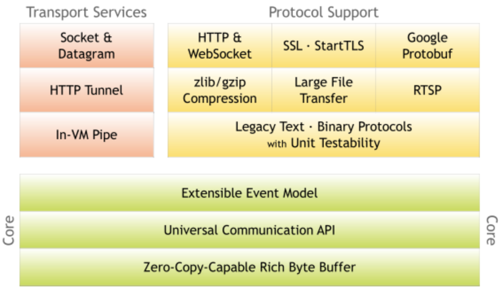

# 一、Netty

Netty结构图



Netty是一个异步事件驱动的网络应用框架，用于快速开发可维护的高性能服务器和客户端。Netty封装了JDK的NIO

## 1、不建议使用原生NIO类库进行开发的原因

- NIO 类库和API繁杂，使用麻烦，你需要熟练掌握 Selector、ServerSocketChannel、SocketChannel、ByteBuffer等；
- 需要具备其他的额外技能做铺垫，例如熟悉Java多线程编程.这时因为NIO编程设计到Reactor模式，你必须对多线程和网络编程非常熟悉，才能编写出高质量的NIO程序；
- 可靠性能力补齐，工作量和难度非常大。例如客户端面临断连重连、网络闪断、半包读写、失败缓存、网络拥塞和异常码流的处理问题。NIO 编程的特点是功能开发相对容易、但是可靠性能力补齐的工作量和难度都非常大；
- JDK NIO的bug，如臭名昭著的 epoll bug会导致Selector空轮询，最终导致CPU 100%；

## 2、Netty 的特点

- API 使用简单，开发门槛低；
- 功能强大，预置了多种编解码功能，支持多种主流协议；
- 定制能力强，可以通过 ChannelHandler 对通信框架进行灵活扩展；
- 性能高，通过与其他业界主流的NIO框架对比，Netty 的综合性能最优；
- 成熟，稳定，Netty 修复了发现了JDK NIO BUG；
- 社区活跃，版本迭代周期短，发现的bug可以即使修复
- 经历了大规模的商业应用考虑

Netty5.0被废弃的原因：引入了ForkJoin框架提高了Netty的复杂度，但是对性能没有提升；

## 3、粘包和拆包

### 3.1、TCP粘包/拆包问题

TCP 是个流的协议，是连成一片的，其间没有分界线，TCP 底层并不了解业务数据的具体含义，它会根据 TCP 缓冲区的实际情况进行包的划分，所以在业务上认为，一个完整可能会被TCP拆分成多个包进行发送，也有可能把多个小的包封装成一个大的数据包发送。就是所谓的TCP粘包和拆包问题

TCP本质上是不会发生数据层面的粘包。粘包是数据处理的逻辑层面上发生的粘包

### 3.2、TCP粘包拆包问题说明

假设客户端分别发送了两个独立的数据包D1和D2给服务器，由于服务端一次读取到的字节数是不确定的，故可能存在以下4中情况：
- （1）服务端分两次收到了两个独立的数据包，分别是D1和D2，没有粘包和拆包；
- （2）服务端一次收到了两个数据包，D1和D2粘合在一起，被称为TCP粘包；
- （3）服务端分两个读取到了两个数据包，第一次读取到了完整的D1包和D2包的部分内容，第二次读取到了D2包的剩余内容，被称为TCP拆包；
- （4）服务端分两次读取到了两个数据包，第一次读取到了D1包的部分内容D1_1，第二次读取到了D1包的剩余内容D1_2和D2包的整包

### 3.3、TCP 粘包和拆包发生的原因

- 要发送的数据大于TCP发送缓冲区剩余空间大小，将会发生拆包。
- 待发送数据大于MSS（最大报文长度），TCP在传输前将进行拆包。
- 要发送的数据小于TCP发送缓冲区的大小，TCP将多次写入缓冲区的数据一次发送出去，将会发生粘包。
- 接收数据端的应用层没有及时读取接收缓冲区中的数据，将发生粘包。
- 以太网帧 payload 大于 MTU 进行 IP 分片；

### 3.4、粘包解决策略

由于底层的TCP无法理解上层的业务数据，所以在底层是无法保证数据不被拆分和重组的。这个问题只能通过上层的应用协议栈设计来解决

- 消息定长：例如每个报文的大小固定长度200字节，如果不够，空位补空格；
- 设置消息边界：在包尾增加回车换行符进行分割，如FTP协议
- 将消息分为消息头和消息体：消息头中包含表示消息总长度的字段，通常设计思路为消息头的第一个字段使用int32来表示消息的总长度。
- 更为复杂的协议：JSON、Protobuf

### 3.5、Netty 解决粘包和拆包

**1、LineBasedFrameDecoder**

- LineBasedFrameDecoder：依次遍历 ByteBuf 中可读的字节，判断是否有"\n" 或者 "\r\n"，如果有就以此位置为结束位置，从可读索引到结束为止取件的字节就组成了一行。它是以换行符为结束标志的解码器，支持携带结束符或者不携带结束符两种解码方式，同时支持配置单行的最大长度。如果读取到最大长度后仍然没有发现换行符，就会抛出异常，同时忽略到之前督导的异常码流；

- StringDecoder：将接收到的对象转换成字符串，然后继续调用后面的handler

LineBasedFrameDecoder + StringDecoder组合就是按行切换的文本解码器，它被设计用来支持TCP的粘包和拆包；

**2、DelimiterBasedFrameDecoder**

可以自动完成以分隔符做结束标志的消息的解码

**3、FixedLengthFrameDecoder**

可以自动完成对定长消息的解码

### 3.6、UDP是否会发生粘包和拆包

- 不会；
- UDP是基于报文发送的，从UDP的帧结构可以看出，在UDP首部采用了16bit来指示UDP数据报文的长度，因此在应用层能很好的将不同的数据报文区分开，从而避免粘包和拆包的问题。
- 而TCP是基于字节流的，虽然应用层和TCP传输层之间的数据交互是大小不等的数据块，但是TCP把这些数据块仅仅看成一连串无结构的字节流，没有边界；另外从TCP的帧结构也可以看出，在TCP的首部没有表示数据长度的字段，基于上面两点，在使用TCP传输数据时，才有粘包或者拆包现象发生的可能

## 4、编解码技术

### 4.1、Java序列化缺点

- 无法跨语言，如RPC框架，RPC框架是需要跨语言调用的，几乎所有流行的RPC框架都没有使用Java序列化；
- 序列化后码流太大；
- 序列化性能太低

### 4.2、主流与编解码框架

- Google Protobuf
	- 产品成熟度高；
	- 跨语言、支持多种语言，包括C++、Java和python等；
	- 编码后的消息更小，更加有利于存储和传输；
	- 编解码的性能非常高；
	- 支持不同协议版本的前向兼容；
	- 支付定义可选和必选字段；
- Facebook Thrift
- JBoss Marshalling

## 5、Netty核心组件

- Bootstrap & ServerBootstrap：都是启动器，能够帮助 Netty 使用者更加方便地组装和配置 Netty ，也可以更方便地启动 Netty 应用程序

- Channel：Netty 网络操作抽象类，它除了包括基本的 I/O 操作，如 bind、connect、read、write 之外，还包括了 Netty 框架相关的一些功能，如获取该 Channel 的 EventLoop。Netty 的 Channel 则提供的一系列的 API ，它大大降低了直接与 Socket 进行操作的复杂性

- ChannelFuture：Netty 提供了 ChannelFuture 接口，通过该接口的 addListener() 方法注册一个 ChannelFutureListener，当操作执行成功或者失败时，监听就会自动触发返回结果。

- EventLoop & EventLoopGroup：定义了在整个连接的生命周期里当有事件发生的时候处理的核心抽象，Channel 为Netty 网络操作抽象类，EventLoop 主要是为Channel 处理 I/O 操作，两者配合参与 I/O 操作

- ChannelHandler：ChannelHandler 为 Netty 中最核心的组件，它充当了所有处理入站和出站数据的应用程序逻辑的容器。ChannelHandler 主要用来处理各种事件，这里的事件很广泛，比如可以是连接、数据接收、异常、数据转换等。ChannelHandler 有两个核心子类 ChannelInboundHandler 和 ChannelOutboundHandler，其中 ChannelInboundHandler 用于接收、处理入站数据和事件，而 ChannelOutboundHandler 则相反

- ChannelPipeline：ChannelPipeline 为 ChannelHandler 链提供了一个容器并定义了用于沿着链传播入站和出站事件流的 API。一个数据或者事件可能会被多个 Handler 处理，在这个过程中，数据或者事件经流 ChannelPipeline，由 ChannelHandler 处理；

- Reactor模型

## 6、使用场景

- 构建高性能、低时延的各种 Java 中间件，Netty 主要作为基础通信框架提供高性能、低时延的通信服务。例如：
    - RocketMQ ，分布式消息队列。
    - Dubbo ，服务调用框架。
    - Spring WebFlux ，基于响应式的 Web 框架。
    - HDFS ，分布式文件系统。
- 公有或者私有协议栈的基础通信框架，例如可以基于 Netty 构建异步、高性能的 WebSocket、Protobuf 等协议的支持。
- 各领域应用，例如大数据、游戏等，Netty 作为高性能的通信框架用于内部各模块的数据分发、传输和汇总等，实现模块之间高性能通信

# 二、Netty服务端启动过程


两个问题：
- 服务端的Socket在哪里初始化？
- 在哪里accept连接？
```java
@Slf4j
public class NettyServer {
    public static void main(String[] args) {
		// 定义两个线程模型，boss表示监听端口，accept新连接的线程组；work表示处理每一条连接的数据读写的线程组；
        NioEventLoopGroup boss = new NioEventLoopGroup();
        NioEventLoopGroup work = new NioEventLoopGroup();

        ServerBootstrap bootstrap = new ServerBootstrap();

        bootstrap.group(boss, work) // 指定线程模型
				// 指定IO模型
                .channel(NioServerSocketChannel.class)
                // 指定处理新连接数据的读写处理逻辑
                .childHandler(new ChannelInitializer<NioSocketChannel>() {
                    @Override
                    protected void initChannel(NioSocketChannel ch) throws Exception {

                    }
                })
				// 给服务端NioServerSocketChannel指定一些属性，可以通过channle.attr取出该属性
				.attr(AttributeKey.newInstance("serverName"), "nettyServer")
				// 给每条连接指定自定义属性
				.childAttr(AttributeKey.newInstance("clientName"), "nettyClient")
				// 给每条连接设置一些TCP底层相关的属性
				.childOption(ChannelOption.SO_KEEPALIVE,true)
                // 用于指定在服务端启动过程中的一些逻辑
                .handler(new ChannelInitializer<NioServerSocketChannel>() {
                    @Override
                    protected void initChannel(NioServerSocketChannel ch) throws Exception {
                        log.info("Server is starting....");
                    }
                });

        bind(bootstrap, 1021);
    }

    private static void bind(final ServerBootstrap bootstrap, final int port) {
        bootstrap.bind(port).addListener((Future<? super Void> future) -> {
            if (future.isSuccess()) {
                log.info("port {} bind success...", port);
            } else {
                log.info("port {} bind failed...", port);
                bind(bootstrap, port + 1);
            }
        });
    }
}
```
Netty服务端启动过程：
- （1）、创建服务端channel
- （2）、初始化服务端channel
- （3）、注册Selector；
- （4）、端口绑定

**服务端创建详细步骤**
- （1）创建ServerBootstrap实例：ServerBootstrap是Netty服务器的启动辅助类，它提供了一系列的方法用于服务端启动相关的参数；该类使用了Builder模式
- （2）设置并绑定Reactor线程池：Netty的Reactor线程池是EventLoopGroup，它实际就是EventLoop数组。

要启动Netty服务端，必须具备三个属性：线程模型、IO模型、连接读写处理逻辑

## 1、创建服务端channel

- bind()-用户代码入口
	- initAndRegister()-初始化并注册
		- newChannel()-创建服务端channel

反射创建服务端channel
- newSocket()-通过jdk来创建底层jdk channel
- NioServerSocketChannelConfig()-tcp参数配置类
- AbstractChannel()
	- configureBlocking(false) -配置阻塞模式
	- AbstractChannel()-创建id，unsage，pipeline

## 2、初始化服务端Channel

- bind()-代码入口
	- initAndRegister()-初始化并注册
		- newChannel()-创建服务端channel
		- init()-初始化服务端channel
			- set ChannelOptions，ChannelAttrs 
			- set ChildOptions，ChildAttrs
			- config handler-配置服务端pipeline
			- addSeverBootStrapAcceptor-添加连接器

## 3、注册Selector

- AbstractChannel.register(channel)-入口
	- this.eventLoop=eventLoop -绑定线程
	- register() 实际注册
		- doRegister() 调用jdk底层注册
		- invokeHandlerAddedIfNeeded()
		- fireChannelRegistered() 传播事件


## 4、端口绑定

- AbstractUnsafe.bind() 入口
	- doBind()
		- javaChannel.bind() jdk底层绑定
	- pipeline.fireChannleActive() 传播事件
		- HeadContext.readIfIsAutoRead()

# 三、NioEventLoop

三个问题：
- 默认情况下，Netty服务端起多少线程？何时启动？

	默认情况下，是2倍CPU核数

- Netty如何解决jdk空轮询bug的？-空轮询次数：512


- Netty如何保证异步串行无锁化？

## 1、NioEventLoop 创建
- **基本流程：**
	- new NioEventLoopGroup()线程组，默认是2*CPU核数
		- new ThreadPerTaskExecutor() 线程创建器
		- for(){newChild()}-构造NioEventLoop
		- chooserFactory.newChooser()线程选择器


- **ThreadPerTaskExecutor**

	- 每次执行任务都会创建一个线程实体
	- NioEventLoop 线程命名规则 nioEventLoop-1-XX

- **newChild**

## 2、NioEventLoop 启动


# 四、Pipeline

## 1、概述

## 2、初始化
- pipeline在创建Channel的时候被创建
- Pipeline节点的数据结构：ChannelHandlerContext；
- Pipeline中两大节点：head和tail，这两个节点是不可被删除的

## 3、添加ChannelHanndler
- 3.1、主要步骤
	- 判断是否重复添加；
	- 创建节点并添加至链表；
	- 回调添加完成事件

## 4、删除ChannelHandler
主要使用场景：权限校验
- 找到节点，主要是遍历链表
- 链表的删除（默认情况下pipeline都有head和tail节点，不必担心被删除的handler是否头结点或者尾节点）
- 回调删除handler事件

## 5、inBound事件的传播
传播顺序与pipeline的添加顺序一致

### 5.1、什么是inBound事件以及ChannelInboundHandler

### 5.2、ChannelRead事件传播

## 6、outBound事件的传播

传播顺序与pipeline添加顺序逆序

## 7、异常的传播
传播顺序与pipeline添加顺序一致

### 7.1、异常的触发链

# 五、ByteBuf

## 1、ByteBuf的结构

其实现优势：
- 它可以被用户自定义的缓冲区类型扩展
- 通过内置的符合缓冲区类型实现了透明的零拷贝
- 容量可以按需增长
- 在读和写这两种模式之间切换不需要调用 #flip() 方法
- 读和写使用了不同的索引
- 支持方法的链式调用
- 持引用计数
- 支持池化

## 2、ByteBuf分类

从三个角度：
- 池化：Pooled 和 Unpooled
    - Pooled池化内存分配每次从预先分配好的一块内存取一段连续内存封装成ByteBuf提供给应用程序；
    - Unpooled非池化每次进行内存分配的时候调用系统API向操作系统申请一块内存

- Unsafe 和 非Unsafe
    - Unsafe直接获取ByteBuf在JVM内存地址调用JDK的Unsafe进行读写操作，通过ByteBuf分配内存首地址和当前指针基于内存偏移地址获取值；
    - 非Unsafe不依赖JDK的Unsafe对象，通过内存数组和索引获取值

- Heap和Direct
    - Heap在堆上进行内存分配，分配内存需要被GC管理，无需手动释放内存，依赖底层byte数组，
    - Direct调用JDK的API进行内存分配，分配内存不受JVM控制最终不会参与GC过程，需要手动释放内存避免造成内存无法释放，依赖DirectByteBuffer对象内存

## 3、内存分配管理器：ByteBufAllocator

AbstractByteBufAllocator

ByteBufAllocator 两大子类：PooledByteBufAllocator、UnpooledByteBufAllocator

### 3.1、UnpooledByteBufAllocator

- Heap内存分配

- Direct内存分配

### 3.2、PooledByteBufAllocator内存分配

## 4、Netty内存泄露检测的实现机制

Netty 4开始，对象的生命周期由它们的引用计数（reference counts）管理，而不是由垃圾收集器（garbage collector）管理了。ByteBuf是最值得注意的，它使用了引用计数来改进分配内存和释放内存的性能；

在Netty中，通过`io.netty.util.ReferenceCounted`接口，定义了引用计数相关的一系列操作

### 4.1、为什么要有引用计数器

Netty里四种主力的ByteBuf，其中UnpooledHeapByteBuf 底下的byte[]能够依赖JVM GC自然回收；而UnpooledDirectByteBuf底下是DirectByteBuffer，除了等JVM GC，最好也能主动进行回收；而PooledHeapByteBuf 和 PooledDirectByteBuf，则必须要主动将用完的byte[]/ByteBuffer放回池里，否则内存就要爆掉。所以，Netty ByteBuf需要在JVM的GC机制之外，有自己的引用计数器和回收过程

### 4.2、引用计数器基本

- 计数器基于 AtomicIntegerFieldUpdater，为什么不直接用AtomicInteger？因为ByteBuf对象很多，如果都把int包一层AtomicInteger花销较大，而AtomicIntegerFieldUpdater只需要一个全局的静态变量。
- 所有ByteBuf的引用计数器初始值为1。
- 调用release()，将计数器减1，等于零时， deallocate()被调用，各种回收。
- 调用retain()，将计数器加1，即使ByteBuf在别的地方被人release()了，在本Class没喊cut之前，不要把它释放掉。
- 由duplicate(), slice()和order()所衍生的ByteBuf，与原对象共享底下的buffer，也共享引用计数器，所以它们经常需要调用retain()来显示自己的存在。
- 当引用计数器为0，底下的buffer已被回收，即使ByteBuf对象还在，对它的各种访问操作都会抛出异常

### 4.3、内存泄露检测

所谓内存泄漏，主要是针对池化的ByteBuf。ByteBuf对象被JVM GC掉之前，没有调用release()把底下的DirectByteBuffer或byte[]归还到池里，会导致池越来越大。而非池化的ByteBuf，即使像DirectByteBuf那样可能会用到System.gc()，但终归会被release掉的，不会出大事；

功能测试时，最好开着"`-Dio.netty.leakDetectionLevel=paranoid`"。盯紧log里有没有出现 "LEAK: "字样。

Netty默认会从分配的ByteBuf里抽样出大约1%的来进行跟踪。如果泄漏，会有如下语句打印：
```
LEAK: ByteBuf.release() was not called before it's garbage-collected. Enable advanced leak reporting to find out where the leak occurred. To enable advanced leak reporting, specify the JVM option '-Dio.netty.leakDetectionLevel=advanced' or call ResourceLeakDetector.setLevel()
```
这句话报告有泄漏的发生，提示你用-D参数，把防漏等级从默认的simple升到advanced，就能具体看到被泄漏的ByteBuf被创建和访问的地方

# 六、Netty涉及设计模式

## 1、单例模式

比如
- ReadTimeOutException
- MqttEncoder

## 2、策略模式

DefaultEventExecutorChooserFactory

## 3、装饰者模式

WrappedByteBuf、UnreleasableByteBuf、SimpleLeakAwareByteBuf

## 4、观察者模式

Channel.writeAndFlush

## 5、迭代器模式


## 6、责任链模式

ChannelHandler、ChannelInboundHandler、ChannelOutboundHandler

ChannelPipeline

ChannelHandlerContext

https://www.processon.com/view/link/5da9667ce4b0e43392ec512d


# 参考资料

* [Netty之有效规避内存泄漏](http://calvin1978.blogcn.com/articles/netty-leak.html)