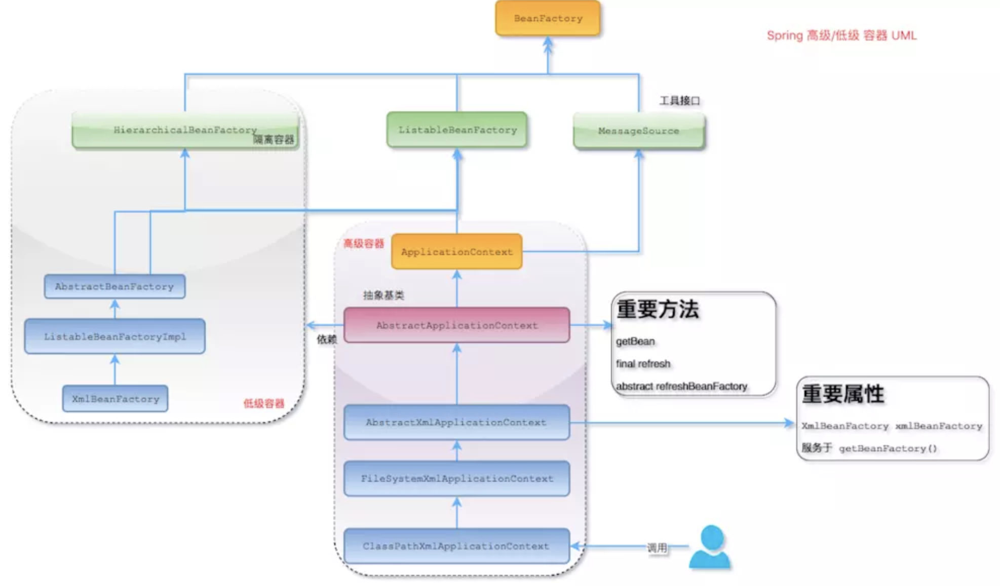

# 一、Spring IOC概述

简单将，IOC就是反转控制，类似好莱坞原则，主要有依赖查找和依赖注入实现；
- 依赖查找：是主动或被动的依赖查找方式，通过需要依赖容器或标准API实现；比如Servlet、EJB等
- 依赖注入：是手动或自动的依赖绑定的方式，无需依赖特定的容器或API；比如Spring容器等；
- 依赖注入会比依赖查找更便利；

## 1、依赖查找

### 1.1、根据bean名称搜索

```xml
<?xml version="1.0" encoding="UTF-8"?>
<beans xmlns="http://www.springframework.org/schema/beans"
        xmlns:xsi="http://www.w3.org/2001/XMLSchema-instance" xsi:schemaLocation="http://www.springframework.org/schema/beans
    <bean id="user" class="com.blue.fish.ioc.overview.domain.User">
        <property name="id" value="1" />
        <property name="name" value="ZhangSan"/>
    </bean>
    <bean id="objectFactory" class="org.springframework.beans.factory.config.ObjectFactoryCreatingFactoryBean">
        <property name="targetBeanName" value="user"/>
    </bean>
</beans>
```
**实时查找**
```java
BeanFactory beanFactory = new ClassPathXmlApplicationContext("classpath:/META-INF/dependency-lookup-context.xml");
User user = (User) beanFactory.getBean("user");
System.out.println("实时查找-User:" + user);
```
**延迟查找**
```java
BeanFactory beanFactory = new ClassPathXmlApplicationContext("classpath:/META-INF/dependency-lookup-context.xml");
ObjectFactory<User> objectFactory = (ObjectFactory<User>) beanFactory.getBean("objectFactory");
User user = objectFactory.getObject();
System.out.println("延迟查找-User:" + user);
```
ObjectFactory 对象并不是直接返回了实际的 Bean，而是一个 Bean 的查找代理。当得到 ObjectFactory 对象时，相当于 Bean 没有被创建，只有当 getObject() 方法时，才会触发 Bean 实例化等生命周期;

> 实时查找就是马上查找到bean, 延时查找是 查找到目标 bean 的引用, 然后通过这个引用再来查找目标 bean.

### 1.2、按照类型查找

**查找单个bean对象**
```java
BeanFactory beanFactory = new ClassPathXmlApplicationContext("classpath:/META-INF/dependency-lookup-context.xml");
User user = beanFactory.getBean(User.class);
System.out.println("实时查找-User:" + user);
```
**查找集合bean对象**
```java
BeanFactory beanFactory = new ClassPathXmlApplicationContext("classpath:/META-INF/dependency-lookup-context.xml");
if (beanFactory instanceof ListableBeanFactory) {
	ListableBeanFactory listableBeanFactory = (ListableBeanFactory) beanFactory;
	Map<String, User> map = listableBeanFactory.getBeansOfType(User.class);
	System.out.println(map);
}
```

### 1.3、根据注解查询

一般根据注解查询是否，都可能存在多个，所以这里返回的是Map
```java
BeanFactory beanFactory = new ClassPathXmlApplicationContext("classpath:/META-INF/dependency-lookup-context.xml");
if (beanFactory instanceof ListableBeanFactory) {
	ListableBeanFactory listableBeanFactory = (ListableBeanFactory) beanFactory;
	Map<String, Object> map = listableBeanFactory.getBeansWithAnnotation(Component.class);
	System.out.println(map);
}
```

## 2、依赖注入

- 根据Bean名称注入
- 根据Bean类型注入
  - 单个Bean对象
  - 集合Bean对象
- 注入容器内建对象
- 注入非Bean对象
- 注入类型
  - 实时注入
  - 延迟注入

IOC 的另一种表述方式：即组件以一些预先定义好的方式(例如：setter 方法)接受来自如容器的资源注入。相对于 IOC 而言，这种表述更直接。依赖注入(DI)和控制反转(IOC)是从不同的角度的描述的同一件事情：就是指通过引入IOC容器，利用依赖关系注入的方式，实现对象之间的解耦

依赖注入是Spring实现IOC的技术途径，依赖注入的方式：
- setter方式注入：(推荐使用)，使用步骤：
	- 在Action中定义dao接口变量及其set方法;
	- 在Spring配置Action组件的bean元素，使用下面格式：
		```xml
		<property name="属性名" ref="要注入的Bean对象的id属性值"></property>
		```
- 构造方式注入：
	- 在Action中定义dao接口变量以及带参数的构造方法(参数为dao接口类型的变量);
	- 在Spring配置Action组件的bean元素，使用下面格式：
		```xml
		<constructor-arg index="指定参数索引(从0开始)" ref="要注入的Bean对象的id属性值">
		</constructor-arg>
		```

依赖倒置原则、IOC、DI、IOC容器的关系：


## 3、IOC(Inversion of Control)

其思想是反转资源获取的方向。传统的资源查找方式要求组件向容器发起请求查找资源。作为回应，容器适时的返回资源。而应用了 IOC 之后，则是容器主动地将资源推送给它所管理的组件，组件所要做的仅是选择一种合适的方式来接受资源。这种行为也被称为查找的被动形式；

由 Spring IoC 容器来负责对象的生命周期和对象之间的关系

控制反转：把创建对象(Bean)和维护对象(Bean)的关系的权利从程序员中转移到框架中，程序不再控制
- IOC 机制实现Bean之间的调用；
- IOC 解决的问题：可以降低两个组件对象之间的关联，降低耦合度；
- Spring IOC 控制反转：获得依赖对象的过程由主动获取变为被动获取
- 使用 IOC 的优势：
	- 维护性比较好，非常便于进行单元测试，便于调试程序和诊断故障。代码中的每一个Class都可以单独测试，彼此之间互不影响，只要保证自身的功能无误即可，这就是组件之间低耦合或者无耦合带来的好处；
	- 开发团队的成员都只需要关心实现自身的业务逻辑，完全不用去关心其它的人工作进展，因为你的任务跟别人没有任何关系，你的任务可以单独测试，你的任务也不用依赖于别人的组件
	- 可复用性好，我们可以把具有普遍性的常用组件独立出来，反复利用到项目中的其它部分，或者是其它项目，当然这也是面向对象的基本特征，IOC 不仅更好地贯彻了这个原则，提高了模块的可复用性。符合接口标准的实现，都可以插接到支持此标准的模块中；
	- 完全具有热插拨的特性，IOC 生成对象的方式转为外置方式，也就是把对象生成放在配置文件里进行定义；

**IOC 使用的技术：**最基本的技术就是反射，设计模式是工厂模式

IOC 容器的工作模式可以看成是工厂模式的升华；IOC 容器看作是一个工厂，这个工厂里要生产的对象都在配置文件中给出定义，然后利用编程语言的的反射编程，根据配置文件中给出的类名生成相应的对象。从实现来看，IOC 是把以前在工厂方法里写死的对象生成代码，改变为由配置文件来定义，也就是把工厂和对象生成这两者独立分隔开来，目的就是提高灵活性和可维护性；

***为什么不使用工厂模式，而使用IOC？*** 

IOC是通过反射机制来实现的。当我们的需求出现变动时，工厂模式会需要进行相应的变化。但是IOC的反射机制允许我们不重新编译代码，因为它的对象都是动态生成的

**Spring 中的 IOC**
- Spring 中的 `org.springframework.beans` 包和 `org.springframework.context` 包构成了Spring框架IOC容器的基础
- BeanFactory 接口提供了一个先进的配置机制，使得任何类型的对象的配置成为可能：`ApplicationContext` 接口对 `BeanFactory`（是一个子接口）进行了扩展，在`BeanFactory`的基础上添加了其他功能，比如与Spring的AOP更容易集成，也提供了处理message resource的机制(用于国际化)、事件传播以及应用层的特别配置，比如针对Web应用的 `WebApplicationContext`；
- `org.springframework.beans.factory.BeanFactory` 是 Spring IOC 容器的具体实现，用来包装和管理前面提到的各种bean。BeanFactory接口是Spring IOC 容器的核心接口；

Spring IOC依赖来源：
- 自定义Bean（业务上的Bean）：用xml配置或注解配置的bean
- 容器内建Bean对象：内建的 Bean 是普通的 Spring Bean，包括 Enviroment、BeanDefinitions 和 Singleton Objects
- 容器内建依赖：内部容器所构建的依赖，内建依赖则是通过 AutowireCapableBeanFactory 中的 resolveDependency 方法来注册；不可通过获取依赖查找Bean的方法来获取(getBean(XXX))

**内建依赖和自定义Bean的区别：**
- 内建依赖指的是D`efaultListableBeanFactory`属性`resolvableDependencies`这个map里面保存的bean；自定义bean指的是通过`DefaultSingletonBeanRegistry#registerSingleton`手动注册的bean。它们都在BeanFactory里面；
- 依赖注入的时候比如`@AutoWired(AutowiredAnnotationBeanPostProcessor处理)`会调用`DefaultListableBeanFactory#resolveDependency`方法去`resolvableDependencies`里面找，而依赖查找`BeanFactory.getBean(xxx)`是不会去resolvableDependencies这个map里面找的；

## 4、Spring容器

- [Google-Guice依赖查找和依赖注入](https://github.com/google/guice)

在 Spring IOC 容器读取 Bean 配置创建 Bean 实例之前，必须对它进行实例化。只有在容器实例化后，才可以从 IOC 容器里获取 Bean 实例并使用

Spring 提供了两种类型的 IOC 容器实现：
- （1）BeanFactory：IOC 容器的基本实现；
- （2）ApplicationContext：提供了更多的高级特性。是BeanFactory的子接口



BeanFactory是Spring框架的基础设施，面向Spring本身；ApplicationContext，面向使用Spring框架的开发者，几乎所有的应用场合都直接使用 ApplicationContext，而非底层的 BeanFactory；但是无论使用何种方式，配置文件是相同的。常用的BeanFactory容器是`XmlBeanFactory`，它可以根据 XML 文件中定义的内容，创建相应的 Bean；BeanFactory是IOC容器的核心接口，它的职责包括：实例化、定位、配置应用程序中的对象及建立这些对象间的依赖；

**ApplicationContext 的主要实现类：**【 ApplicationContext 在初始化上下文时就实例化所有单例的 Bean】
- ClassPathXmlApplicationContext：从类路径下加载配置文件；
- FileSystemXmlApplicationContext：从文件系统中加载配置文件；
- WebApplicationContext：是专门为 WEB 应用而准备的，它允许从相对于 WEB 根目录的路径中完成初始化工作；
- AnnotationConfigApplicationContext: 基于注解，采用 java 配置类和各种注解来配置

**Spring容器对Bean的管理：**
- 控制Bean对象创建模式：在bean元素中，利用scope属性可以指定Bean组件创建对象的方式：
  - prototype：非单例模式
  - singleton：单例模式(默认是单例模式)，Spring不关心bean是否线程安全，当然，但实际上，大部分的 Spring Bean 并没有可变的状态(比如Service类和DAO类)，所以在某种程度上说 Spring 的单例 Bean 是线程安全的；在web程序中，通过一些配置，可以扩展出request，session等属性值;

- 可以控制单例模式的创建时机：
  - singleton模式的Bean组件，默认是在 ApplicationContext 容器实例化时就创建了组件；可以在bean元素中追加属性`lazy-init="true"`，将singleton模式创建对象推迟到getBean()方法
  - prototype模式是在调用getBean()方法时创建了组件;

	单例 bean 存在线程问题，主要是因为当多个线程操作同一个对象的时候，对这个对象的非静态成员变量的写操作会存在线程安全问题。

- 可以指定Bean对象初始化和销毁方法：`<bean init-method="初始化方法" destroy-method="销毁方法">`
- Spring 将 Bean 对象创建完毕后，会自动调用init-method里指定的方法
- destroy-method指定的方法需满足下面条件才能执行：
	- `scope="singleton"`才能使用
	- 执行AbstractApplicationContext容器的close()方法触发

**BeanFactory 和 ApplicationContext 区别：**
- ①、BeanFactory 可以理解为含有bean集合的工厂类，包含了各种bean的定义，以便在接收请求时对应的Bean实例化BeanFactory 包含了bean生命周期的控制
- ②、ApplicationContext：具备企业应用特性的BeanFactory的超集。但 ApplicationContext 在此基础上还提供了其他的功能。通过 getBeanFactory() 可以获取相关的 BeanFactory
  - 提供了支持国际化的文本消息
  - 统一的资源文件读取方式
  - 已在监听器中注册的bean的事件
  - 事件处理
  - 注解
  - Enviroment抽象
- 详细比较：
	|BeanFactory	| ApplicationContext|
	|------------|-------------------|
	|它使用懒加载  |	它使用即时加载|
	|它使用语法显式提供资源对象 | 它自己创建和管理资源对象|
	|不支持国际化  |	支持国际化|
	|不支持基于依赖的注解 | 支持基于依赖的注解|

**BeanFactory和FactoryBean、ObjectFactory的区别：**
- BeanFactory是接口，提供了IOC容器最基本的形式，给具体的IOC容器的实现提供了规范；
- FactoryBean也是接口，为IOC容器中Bean的实现提供了更加灵活的方式，FactoryBean在IOC容器的基础上给Bean的实现加上了一个简单工厂模式和装饰模式；
- BeanFactory是个Factory，也就是IOC容器或对象工厂，FactoryBean是个Bean。在Spring中，所有的Bean都是由BeanFactory(也就是IOC容器)来进行管理的。但对FactoryBean而言，这个Bean不是简单的Bean，而是一个能生产或者修饰对象生成的工厂Bean，它的实现与设计模式中的工厂模式和修饰器模式类似；
- `org.springframework.bean.factory.FactoryBean`工厂类接口，用户可以通过实现该接口定制实例化Bean的逻辑；
- ObjectFactory用于延迟查找的场景，它就是一个普通工厂，当得到 ObjectFactory 对象时，相当于 Bean 没有被创建，只有当 getObject() 方法时，才会触发 Bean 实例化等生命周期；
- 总结：BeanFactory 就是 IOC 容器，FactoryBean 是特殊的 Bean, 用来封装创建比较复杂的对象，而 ObjectFactory 主要用于延迟查找的场景，延迟实例化对象


## 5、各种类型信息的注入

- 注入Bean对象：(使用最多)
	```xml
	<property name="属性名" ref="要注入的Bean对象的id属性值"></property>
	```

- 注入基本类型
	- 注入数值或字符串类型
		```xml
		<property name="属性名" value="属性值" ></property>
		<!-- 以set方法绝对name值 ，注入的类型有set方法参数类型决定-->
		<property name="includeTypes" value="jpg，jpeg，gif"></property>
		```

- 注入集合类型：(以下property都是写在bean元素内的)

	- 注入List集合配置方法：
		```xml
		<!-- 注入List集合 -->
		<property name="属性名">
			<list>
				<!-- 集合的泛型是对象 -->
				<bean></bean>
				<!-- 集合的泛型是String字符串 -->
				<value>属性值</value>
				<value>上海</value>
				<value>杭州</value>
			</list>
		</property>
		```	
	- 注入Set集合配置方法：
		```xml
		<!-- 注入Set集合 -->
		<property name="属性名">
			<set>
				<value>Tom</value>
				<value>Sam</value>
				<value>Coco</value>
			</set>
		</property>
		```
	- 注入Map类型配置方法：
		```xml
		<!-- 注入Map类型数据 -->
		<property name="books">
			<map>
				<entry key="1001" value="Core Jave"></entry>
				<entry key="1002" value="Java Web"></entry>
				<entry key="1003" value="SSH"></entry>
			</map>
		</property>
		```
				
	- 注入Properties类型配置方法：
		```xml
		<!-- 注Properties类型数据 -->
		<property name="prop">
			<props>
				<prop key="show_sql">true</prop>
				<prop key="dialect">org.hibernate.dialect.OracleDialect</prop>
			</props>
		</property>	
		```	

## 6、启动IOC容器

```java
AnnotationConfigApplicationContext applicationContext = new AnnotationConfigApplicationContext();
applicationContext.refresh();
```

# 二、Bean基础

## 1、什么是BeanDefinition

BeanDefinition 是Spring框架中定义Bean的配置元信息接口，包含如下：
- Bean的类名；
- Bean的行为配置元素，如作用域、自动绑定的模式、生命周期的回调；
- 其他Bean的引用，可以称为合作者或者依赖；
- 配置设置，比如Bean的属性；

## 2、BeanDefinition元信息

属性 | 说明
----|-----
Class | Bean的全类名，必须是具体类，不能用抽象类或者接口
Name | Bean的名称或者ID
Scope | Bean的作用域，如果singleton，prototype
Constructor args | Bean的构造参数，用于依赖注入
Properties | Bean的属性配置，用于依赖注入
Autowiring mode | Bean的自动绑定模式，如通过byName
Lazy initialization mode | Bean延迟初始化模式：延迟或非延迟
Initialization method | Bean初始化回调方法名称
Destruction method | Bean销毁回调方法

**构建BeanDefinition**
- 通过 BeanDefinitionBuilder
    ```java
    // 使用 BeanDefinitionBuilder
    BeanDefinitionBuilder beanDefinitionBuilder = BeanDefinitionBuilder.genericBeanDefinition(User.class);
    beanDefinitionBuilder.addPropertyValue("id", 1)
            .addPropertyValue("name", "Jayden");
    BeanDefinition beanDefinition = beanDefinitionBuilder.getBeanDefinition();
    ```
- 通过 AbstractionBeanDefinition 以及子类
    ```java
    GenericBeanDefinition genericBeanDefinition = new GenericBeanDefinition();
    genericBeanDefinition.setBeanClass(User.class);
    MutablePropertyValues propertyValues = new MutablePropertyValues();
    propertyValues.add("id", 1).add("name", "Jayden");
    genericBeanDefinition.setPropertyValues(propertyValues);
    ```

## 3、命名SpringBean

Bean的名称：
- 每个Bean拥有一个或多个标识符，这些标识符在容器内必须是唯一的；
- 在基于xml的配置元信息中，可以使用id或name属性来规定Bean的标识符；如果想引入Bean的别名，可以在name属性使用`,`或者`;`来分割；
- 如果id或name属性没有填写，容器会自动生成Bean的唯一名称；

Bean名称生成器：BeanNameGenerator，框架内建两种实现：
- `DefaultBeanNameGenerator`，默认的通用实现；
- `AnnotationBeanNameGenerator`：基于注解扫描的；

可以通过别名的形式从IOC容器中获取到Bean

## 4、注册SpringBean

注册方式有：
- XML配置元信息：`<bean name='...' />`；
- Java注解配置元信息：
  - `@Bean`
  - `@Component`
  - `@Import`
- Java API配置元信息
  - 命名方式：`BeanDefinitionRegistry#registerBeanDefinition`
  - 非命名方式：`BeanDefinitionReaderUtils#registerWithGeneratedName`；
  - 配置类方式：`AnnotatedBeanDefinitionReader#register`

### 4.1、Java注解

```java
@Import(JavaConfigBeanDemo.Config.class)
public class JavaConfigBeanDemo {
    public static void main(String[] args) {
        AnnotationConfigApplicationContext applicationContext = new AnnotationConfigApplicationContext();
        applicationContext.register(JavaConfigBeanDemo.class);
        applicationContext.refresh();
        System.out.println("Config class： " + applicationContext.getBeansOfType(Config.class));
        System.out.println("User: " + applicationContext.getBeansOfType(User.class));
        applicationContext.stop();
    }
    @Component
    public static class Config {
        @Bean
        public User user() {
            User user = new User();
            user.setId(1);
            user.setName("Jayden");
            return user;
        }
    }
}
```

### 4.2、Java API

```java
public class JavaApiBeanDefinitionDemo {
    public static void main(String[] args) {
        AnnotationConfigApplicationContext applicationContext = new AnnotationConfigApplicationContext();
        applicationContext.refresh();
        Map<String, Object> maps = Map.of("id", 1, "name", "Jayden");
        registryBean(applicationContext, "user", User.class, maps);
        registryBean(applicationContext, User.class, maps);
        // {user=com.blue.fish.bean.entity.User@73a1e9a9, com.blue.fish.bean.entity.User#0=com.blue.fish.bean.entity.User@71d44a3}
        Map<String, User> beansOfType = applicationContext.getBeansOfType(User.class);
        applicationContext.stop();
    }
    /**
     * 命名bean注册
     */
    public static <T> void registryBean(BeanDefinitionRegistry registry, String beanName, Class<T> clazz, Map<String, Object> properties) {
        BeanDefinitionBuilder beanDefinitionBuilder = BeanDefinitionBuilder.genericBeanDefinition(clazz);
        for (Map.Entry<String, Object> entry : properties.entrySet()) {
            beanDefinitionBuilder.addPropertyValue(entry.getKey(), entry.getValue());
        }
        // 命名Bean注册
        registry.registerBeanDefinition(beanName, beanDefinitionBuilder.getBeanDefinition());
    }
    /**
     * 非命名bean注册
     */
    public static <T> void registryBean(BeanDefinitionRegistry registry, Class<T> clazz, Map<String, Object> properties) {
        BeanDefinitionBuilder beanDefinitionBuilder = BeanDefinitionBuilder.genericBeanDefinition(clazz);
        for (Map.Entry<String, Object> entry : properties.entrySet()) {
            beanDefinitionBuilder.addPropertyValue(entry.getKey(), entry.getValue());
        }
        // 非命名Bean的注册
        BeanDefinitionReaderUtils.registerWithGeneratedName(beanDefinitionBuilder.getBeanDefinition(), registry);
    }
}
```

### 4.3、注册外部Bean

```java
public static void main(String[] args) {
    AnnotationConfigApplicationContext context = new AnnotationConfigApplicationContext();
    User user = User.createUser();
    ConfigurableListableBeanFactory beanFactory = context.getBeanFactory();
    beanFactory.registerSingleton("user", user);
    context.refresh();
    User look = beanFactory.getBean("user", User.class);
    System.out.println("look == user is " + (look == user)); // true
    context.close();
}
```

## 5、实例化Bean

常规方式：
- 通过构造器：配置元信息-XML、Java注解和Java API；
- 通过静态工厂方法：配置元信息-XML和Java API
- 通过Bean工厂方法：配置元信息-XML和Java API；
- 通过FactoryBean：配置元信息-XML、Java注解和Java API；

特殊方式：
- 通过 ServiceLoaderFactoryBean：配置元信息-XML、Java注解和Java API；
- 通过 AutowireCapableBeanFactory#createBean
- 通过 BeanDefinitionRegistry#registerBeanDefinition

### 5.1、静态方法

```xml
<!-- 静态方法实例化 Bean  User 类中有静态方法 -->
<bean id="user-by-static-method" class="com.blue.fish.bean.entity.User" factory-method="createUser"/>
```
```java
public class User {
    ... 
    public static User createUser() {
        User user = new User();
        user.setId(1);
        user.setName("Jayden");
        return user;
    }
}
public static void createBeanByStaticMethod() {
    BeanFactory beanFactory = new ClassPathXmlApplicationContext("classpath:/META-INF/bean-instantiation-context.xml");
    User user = beanFactory.getBean("user-by-static-method", User.class);
    System.out.println(user);
}
```

### 5.2、Bean工厂

定义工厂：
```java
public class UserBeanFactory {
    public User createUser() {
        User user = new User();
        user.setId(2);
        user.setName("Sum");
        return user;
    }
}
```
配置Bean
```xml
<!--  Bean工厂  -->
<bean id="user-by-bean-factory" factory-method="createUser" factory-bean="userBeanFactory"/>
<bean id="userBeanFactory" class="com.blue.fish.bean.factory.UserBeanFactory"/>
```

### 5.3、FactoryBean

实现接口：FactoryBean
```java
public class UserFactoryBean implements FactoryBean<User> {
    @Override
    public User getObject() throws Exception {
        User user = new User();
        user.setId(3);
        user.setName("Heart");
        return user;
    }
    @Override
    public Class<?> getObjectType() {
        return User.class;
    }
}
public static void createBeanByFactoryBean() {
    BeanFactory beanFactory = new ClassPathXmlApplicationContext("classpath:/META-INF/bean-instantiation-context.xml");
    User user = beanFactory.getBean("user-by-factory-bean", User.class);
    System.out.println(user);
}
```
配置FactoryBean
```xml
<!--  FactoryBean  -->
<bean id="user-by-factory-bean" class="com.blue.fish.bean.factory.UserFactoryBean" />
```

### 5.4、ServiceLoader

其是通过 Java ServiceLoader的机制来实现的，详情查看：[Java SPI机制](../../Java基础/Java扩展.md#二JavaSPI机制)

配置接口：
```java
// 路径：MTEA-INF/services/com.blue.fish.bean.factory.UserFactory
com.blue.fish.bean.factory.UserBeanFactory
```
配置Bean
```xml
<!-- 需要配置 serviceType -->
<bean id="userServiceLoader" class="org.springframework.beans.factory.serviceloader.ServiceLoaderFactoryBean">
    <property name="serviceType" value="com.blue.fish.bean.factory.UserFactory" />
</bean>
```
使用：
```java
public static void createBeanByServiceLoader() {
    BeanFactory beanFactory = new ClassPathXmlApplicationContext("classpath:/META-INF/bean-instantiation-context.xml");
    ServiceLoader<UserFactory> serviceLoader = beanFactory.getBean("userServiceLoader", ServiceLoader.class);
    Iterator<UserFactory> iterator = serviceLoader.iterator();
    while (iterator.hasNext()){
        UserFactory next = iterator.next();
        System.out.println("Service: " + next.createUser());
    }
}
```
原理：
```java
// org.springframework.beans.factory.serviceloader.AbstractServiceLoaderBasedFactoryBean
@Override
protected Object createInstance() {
    Assert.notNull(getServiceType(), "Property 'serviceType' is required");
    return getObjectToExpose(ServiceLoader.load(getServiceType(), this.beanClassLoader));
}
```

### 5.5、AutowireCapableBeanFactory 实例化

```java
public static void createBeanByAutowiredCapable() {
    ApplicationContext applicationContext = new ClassPathXmlApplicationContext("classpath:/META-INF/bean-instantiation-context.xml");
    // 通过 ApplicationContext 获取 AutowireCapableBeanFactory
    AutowireCapableBeanFactory autowireCapableBeanFactory = applicationContext.getAutowireCapableBeanFactory();
    UserBeanFactory userBeanFactory = autowireCapableBeanFactory.createBean(UserBeanFactory.class);
    System.out.println(userBeanFactory.createUser());
}
```

## 6、Bean初始化

- （1）@PostContruct 标注方法
- （2）实现 InitializingBean#afterPropertiesSet 方法
- （3）自定义初始化方法：
  - xml配置：`<bean init-method="" />`
  - Java 注解：`@Bean(initMethod = "")`
  - Java API：`AbstractBeanDefinition#setInitMethodName`
 
问题：如果上述三种方式都在同一个Bean中配置了，那么这些方法的执行顺序是啥？`@PostContruct > afterPropertiesSet > 自定义初始化方法`

**延迟初始化：**
- xml配置：`<bean lazy-init="true" />`
- ava 注解：`@Lazy(true)`

问题：当某个Bean定义为延迟初始化时，那么Spring容器返回的对象与非延迟的对象存在怎么样的差异？
- @Lazy注解默认值true，即Bean会被延迟初始化，因为被注解只有返回的是一个代理对象，真实的对象才被调用的时候才会被初始化。。
- 非延迟初始化在spring应用上下文启动完成之前被初始化。
- 延迟初始化在spring应用上下文启动完成之后，在显示调用getBean时候才被初始化。

## 7、Bean的销毁

- @PreDestroy 标注方法
- 实现 DisposableBean#destroy方法；
- 自定义销毁方法：
  - xml配置：`<bean destroy="" />`
  - Java 注解：`@Bean(destroy = "")`
  - Java API：`AbstractBeanDefinition#setDestroyMethodName`

问题：如果上述三种方式都在同一个Bean中配置了，那么这些方法的执行顺序是啥？`@PreDestroy > destroy方法 > 自定义销毁方法`
