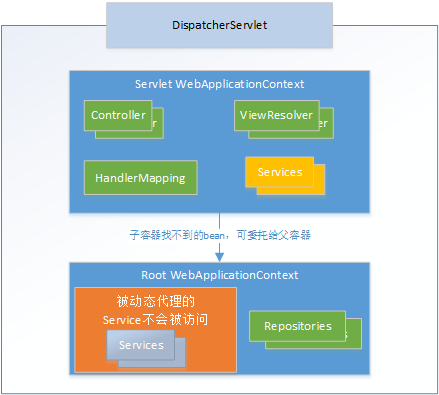

[Spring Reference](https://docs.spring.io/spring-framework/docs/)

# 一、Spring概念

## 1、Spring是什么

- Spring 是一个开源框架
- Spring 为简化企业级应用开发而生。使用 Spring 可以使简单的 JavaBean 实现以前只有 EJB 才能实现的功能。
- Spring 是一个 IOC(DI) 和 AOP 容器框架；

## 2、具体描述 Spring

- 轻量级：Spring 是非侵入性的-基于 Spring 开发的应用中的对象可以不依赖于 Spring 的 API
- 依赖注入(DI --- dependency injection、IOC)，不通过 new() 的方式在类内部创建依赖类对象，而是将依赖的类对象在外部创建好之后，通过构造函数、函数参数等方式传递（或注入）给类使用；
- 面向切面编程(AOP --- aspect oriented programming)
- 容器：Spring 是一个容器，因为它包含并且管理应用对象的生命周期
- 框架：Spring 实现了使用简单的组件配置组合成一个复杂的应用。在 Spring 中可以使用 XML 和 Java 注解组合这些对象
- 一站式：在 IOC 和 AOP 的基础上可以整合各种企业应用的开源框架和优秀的第三方类库 (实际上 Spring 自身也提供了展现层的 SpringMVC 和 持久层的 Spring JDBC)

Spring容器初始化时：首先会初始化 bean，即构造相关类

## 3、Spring的模块结构


### 3.1、Spring 核心容器

对应图上的Core Container，该层基本上是 Spring Framework 的核心。它包含以下模块：
- Spring Core
- Spring Bean：核心容器提供 Spring 框架的基本功能。核心容器的主要组件是 BeanFactory，它是工厂模式的实现。BeanFactory 使用控制反转 （IOC）模式将应用程序的配置和依赖性规范与实际的应用程序代码分开
- Spring Context：Spring 上下文是一个配置文件，向 Spring 框架提供上下文信息。Spring 上下文包括企业服务，例如 JNDI、EJB、电子邮件、国际化、事件机制、校验和调度功能
- SpEL (Spring Expression Language)：Spring 表达式语言全称为 “Spring Expression Language”，缩写为 “SpEL” ，类似于 Struts2 中使用的 OGNL 表达式语言，能在运行时构建复杂表达式、存取对象图属性、对象方法调用等等，并且能与 Spring 功能完美整合，如能用来配置 Bean 定义

或者说这块就是IOC

### 3.2、数据访问

对应图中，Data Access；该层提供与数据库交互的支持。它包含以下模块：
- JDBC (Java DataBase Connectivity)：Spring 对 JDBC 的封装模块，提供了对关系数据库的访问。
- ORM (Object Relational Mapping)：Spring ORM 模块，提供了对 hibernate5 和 JPA 的集成
- OXM (Object XML Mappers)：Spring 提供了一套类似 ORM 的映射机制，用来将 Java 对象和 XML 文件进行映射。这就是 Spring 的对象 XML 映射功能，有时候也成为 XML 的序列化和反序列化；
- Transaction：Spring 简单而强大的事务管理功能，包括声明式事务和编程式事务。

### 3.3、Web

该层提供了创建 Web 应用程序的支持。它包含以下模块：

- WebMVC：MVC 框架是一个全功能的构建 Web 应用程序的 MVC 实现。通过策略接口，MVC 框架变成为高度可配置的，MVC 容纳了大量视图技术，其中包括 JSP、Velocity、Tiles、iText 和 POI
- WebFlux：基于 Reactive 库的响应式的 Web 开发框架；
- WebSocket：Spring 4.0 的一个最大更新是增加了对 Websocket 的支持。Websocket 提供了一个在 Web 应用中实现高效、双向通讯，需考虑客户端(浏览器)和服务端之间高频和低延时消息交换的机制。一般的应用场景有：在线交易、网页聊天、游戏、协作、数据可视化等

### 3.4、AOP

该层支持面向切面编程。它包含以下模块：

- AOP：通过配置管理特性，Spring AOP 模块直接将面向方面的编程功能集成到了 Spring 框架中。所以，可以很容易地使 Spring 框架管理的任何对象支持 AOP。Spring AOP 模块为基于 Spring 的应用程序中的对象提供了事务管理服务。通过使用 Spring AOP，不用依赖 EJB 组件，就可以将声明性事务管理集成到应用程序中；
- Aspects：该模块为与 AspectJ 的集成提供支持；
- Instrumentation：该层为类检测和类加载器实现提供支持

### 3.5、其它

- JMS (Java Messaging Service)：提供了一个 JMS 集成框架，简化了 JMS API 的使用。
- Test：该模块为使用 JUnit 和 TestNG 进行测试提供支持；
- Messaging：该模块为 STOMP 提供支持。它还支持注解编程模型，该模型用于从 WebSocket 客户端路由和处理 STOMP 消息


# 三、Spring AOP

- [Spring-AOP应用场景](https://www.javaboy.org/2022/1208/spring-aop.html)

AOP（Aspect-Oriented Programming），面向切面编程	

Spring AOP 利用 CGlib 和 JDK 动态代理等方式来实现运行期动态方法增强，其目的是将与业务无关的代码单独抽离出来，使其逻辑不再与业务代码耦合，从而降低系统的耦合性，提高程序的可重用性和开发效率

## 1、关于面向切面编程

- AOP 的主要编程对象是切面(aspect)，而切面模块化横切关注点，关注点分离
- 在应用 AOP 编程时，仍然需要定义公共功能，但可以明确的定义这个功能在哪里，以什么方式应用，并且不必修改受影响的类. 这样一来横切关注点就被模块化到特殊的对象(切面)里

## 2、AOP 的优势

- 每个事物逻辑位于一个位置，代码不分散，便于维护和升级
- 业务模块更简洁，只包含核心业务代码；
	
## 3、AOP 的术语

- 切面(Aspect)：横切关注点(跨越应用程序多个模块的功能)被模块化的特殊对象
- 通知(Advice)：切面必须要完成的工作
- 目标(Target)：被通知的对象
- 代理(Proxy)：向目标对象应用通知之后创建的对象;
	- 当目标组件使用了AOP切入方面组件后，getBean()方法返回的类型是采用动态代理技术生成的一个新类型，当使用代理对象执行业务方法时，代理对象会调用方面和原目标对象的处理方法
	- Spring框架提供了两种代理技术的实现：
		- CGLIB技术：适用于没有接口的目标组件;
			```java
			//利用父类变量接收代理类对象
			public class 代理类型 extends 目标类型{
				//重写Action的execute方法
				public String execute(){
					//调用方面组件
					//调用目标组件super.execute();
				}
			}
			AddCostAction action = (AddCostAction)ac.geBean("jdbcCostDao");
			action.execute();
			```
		- JDK Proxy API:适用于有接口的目标组件;
			```java
			public class 代理类型 implement 目标接口{
			
			}
			//利用接口变量接收代理类对象
			ICostDao dao = (ICostDao)ac.getBean("jdbcCostDao");
			dao.save();//调用代理类型的save()方法
			```
- 连接点(Joinpoint)：程序执行的某个特定位置：如类某个方法调用前、调用后、方法抛出异常后等。连接点由两个信息确定：方法表示的程序执行点；相对点表示的方位。例如 ArithmethicCalculator#add() 方法执行前的连接点，执行点为 ArithmethicCalculator#add()； 方位为该方法执行前的位置；

- 切点(pointcut)：每个类都拥有多个连接点：例如 ArithmethicCalculator 的所有方法实际上都是连接点，即连接点是程序类中客观存在的事务.AOP 通过切点定位到特定的连接点.类比：连接点相当于数据库中的记录，切点相当于查询条件。切点和连接点不是一对一的关系，一个切点匹配多个连接点，切点通过 org.springframework.aop.Pointcut 接口进行描述，它使用类和方法作为连接点的查询条件；

- advisor：Advice和Pointcut组成的独立的单元，并且能够传给proxy factory 对象
	```xml
	<aop：config>
		<aop：pointcut expression="execution(* *.BookShopDao.*(..))" id="bookShop"/>
		<aop：advisor advice-ref="bookShopTXDao" pointcut-ref="bookShop"/>
	</aop：config>
	```	

## 4、基本使用

- 4.1、使用注解来使用AOP

	- 引入相关的jar包：aopalliance.jar、aspectj.weaver.jar 和 spring-aspects.jar
	- 配置文件引入相关的命名空间，并在配置文件中加入如下配置：
		```<aop：aspectj-autoproxy></aop：aspectj-autoproxy>```
	- 在配置文件中加入IOC容器扫描Bean的配置：
		```<context：component-scan base-package="com.bluefish.aop.impl"></context：component-scan>```
	- 编写切面类，即共通属性：
		- ①、首先切面是一个Bean，需要加入注解：@Component
		- ②、其次，类是一个切面，需加入注解：@Aspect；
	- 在切面类中声明通知：(这里以前置通知为准)
		- ①、声明一个方法;
		- ②、在方法上加入注解：@Before("execution(*)")
		- ③、如果需要获取访问链接的细节问题，如方法名和参数等，可以在声明的方法中加入JoinPoint参数：
			- 获取方法签名：joinPoint.getSignature()
			- 获取方法参数：joinPoint.getArgs()
		如：
		```java
		@Aspect
		@Component
		public class LoggingAspectJ {
			@Before("execution(int com.bluefish.aop.impl.ICaculator.*(int，int))")
			public void beforeMethod(JoinPoint joinPoint){
				String methodName = joinPoint.getSignature().getName();
				List<Object> args = Arrays.asList(joinPoint.getArgs());
				System.out.println("The method " + methodName + " begins and the args is ：" + args);
			}
		}
		```
- 4.2、使用xml使用AOP
	```xml
	<!-- 将共通处理组件定义成一个<bean> -->
	<!-- 定义<aop：pointcut>，指定哪些组件为目标，即切入点; -->
	<!-- 定义<aop：aspect>，切面; -->
	<!-- 定义<aop：before>，指定通知： -->
	<bean id="loggingAspectJ" class="com.bluefish.aop.xml.LoggingAspectJ"></bean>	
	<bean id="validationAspectJ" class="com.bluefish.aop.xml.ValidationAspectJ"></bean>
	<!-- 利用Spring的AOP机制将CheckRoleBean作用到各个Action的execute方法 -->
	<aop：config>
		<!-- 配置切入点表达式 -->
		<aop：pointcut expression="execution(* *.*(..))" id="pointcut"/>
		<!-- 指定切面，ref：引用配置好的bean，order：切面优先级 -->
		<aop：aspect ref="loggingAspectJ" order="2">
			<!-- 前置通知：method：切面中的方法，pointcut-ref：切入点 --> 
			<aop：before method="beforeMethod" pointcut-ref="pointcut"/>
			<!-- 
				返回通知：returning：连接点执行的结果，对应方法中的返回值参数
				public void afterReturnningMethod(JoinPoint joinPoint，Object result){}
			-->
			<aop：after-returning method="afterReturnningMethod" pointcut-ref="pointcut" returning="result"/>
			<!-- 
				异常通知：throwing：表示该方法中的异常参数
				public void afterThrowingMethod(JoinPoint joinPoint，Exception e){}
			-->
			<aop：after-throwing method="afterThrowingMethod" pointcut-ref="pointcut" throwing="e"/>
		</aop：aspect>
		<aop：aspect ref="validationAspectJ" order="1">
			<aop：before method="beforeMethod" pointcut-ref="pointcut"/>
		</aop：aspect>
	</aop：config>
	```
## 5、切面

切面的优先级：
- 在同一个连接点上应用不止一个切面时，除非明确指定，否则它们的优先级是不确定的.
- 切面的优先级可以通过实现 Ordered 接口或利用 @Order 注解指定.
- 实现 Ordered 接口，getOrder() 方法的返回值越小，优先级越高.
- 若使用 @Order 注解，序号出现在注解中	

## 6、Aop：通知
```java
try{
	// 前置通知：在连接点执行前执行的通知
	// 方法执行体
	// 返回通知：在连接点正常完成后执行的通知，返回通知可以访问连接点执行的结果;不包括抛出异常的情况
} catch (Exception e){
	// 异常通知：连接点执行时抛出异常后执行的通知
} finally {
	// 后置通知：当某连接点退出的时候执行的通知(不论正常返回还是抛出异常)，其访问不到连接点执行的结果
}
```
- 6.1、前置通知(Before)：在方法执行之前执行的通知，前置通知使用 @Before 注解，并将切入点表达式的值作为注解值
	
- 6.2、后置通知(After)：后置通知是在连接点完成之后执行的，即连接点返回结果或者抛出异常的时候；
	
- 6.3、返回通知(AfterReturning)：连接点是正常返回时执行的通知

	只要将 returning 属性添加到 @AfterReturning 注解中，就可以访问连接点的返回值。该属性的值即为用来传入返回值的参数名称。必须在通知方法的签名中添加一个同名参数。在运行时，Spring AOP 会通过这个参数传递返回值。原始的切点表达式需要出现在 pointcut 属性中
	
	 @AfterReturning(pointcut="execution(int com.bluefish.aop.impl.ICaculator.*(int，int))", returning="result")
	
- 6.4.异常通知(AfterThrowing)：连接点执行异常时执行的通知	
	- 可以访问到异常对象; 且可以指定在出现特定异常时在执行通知代码
		```java
		@AfterThrowing(value="declareJointPointExpression()"，throwing="e")
		public void afterThrowing(JoinPoint joinPoint，Exception e){}
		```
	- 如果只对某种特殊的异常类型感兴趣，可以将参数声明为其他异常的参数类型. 通知就只在抛出这个类型及其子类的异常时才被执行
		```java
		@AfterThrowing(value="declareJointPointExpression()"，throwing="e")
		public void afterThrowing(JoinPoint joinPoint，NullPointerException e){}
		```
		
- 6.5、环绕通知(Around)：环绕通知是所有通知类型中功能最为强大的，能够全面地控制连接点. 甚至可以控制是否执行连接点
	- 环绕通知需要携带 ProceedingJoinPoint 类型的参数，它是 JoinPoint 的子接口
	- 环绕通知类似于动态代理的全过程：ProceedingJoinPoint 类型的参数可以决定是否执行目标方法。proceed() 方法来执行被代理的方法，如果忘记这样做就会导致通知被执行了，但目标方法没有被执行；
	- 环绕通知必须有返回值，返回值即为目标方法的返回值，即调用 joinPoint.proceed(); 的返回值，否则会出现空指针异常;
		```java
		@Around("execution(public int com.atguigu.spring.aop.ArithmeticCalculator.*(..))")
		public Object aroundMethod(ProceedingJoinPoint pjd){
			Object result = null;
			String methodName = pjd.getSignature().getName();
			try {
				//前置通知
				System.out.println("The method " + methodName + " begins with " + Arrays.asList(pjd.getArgs()));
				//执行目标方法
				result = pjd.proceed();
				//返回通知
				System.out.println("The method " + methodName + " ends with " + result);
			} catch (Throwable e) {
				//异常通知
				System.out.println("The method " + methodName + " occurs exception：" + e);
				throw new RuntimeException(e);
			}
			//后置通知
			System.out.println("The method " + methodName + " ends");
			return result;
		}
		```

## 7、切入点表达式

- 7.1、重用切入点表达式：
	- 在AOP中，编写AspectJ切面时，同一个切点表达式可能会在多个通知中重复出现，可以通过 @Pointcut注解将一个切入点声明为简单的方法，其方法体通常都是空的;
	- 切入点方法的访问控制符同时也控制着这个切入点的可见性，如果切入点要在多个切面中共用，最好将它们集中在一个公共的类中在这种情况下，它们必须被声明为 public. 在引入这个切入点时，必须将类名也包括在内. 如果类没有与这个切面放在同一个包中，还必须包含包名.
		```java
		@Pointcut("execution(* *.*(..))")
		public void declarePointExpression(){}
		
		@Before("declarePointExpression()")
		public void beforeMethod(JoinPoint joinPoint){...}
		```
- 7.2、execution(修饰符? 返回类型 方法名(参数列表) throws 异常类型?)
	```
	问号表示：修饰符 或 异常可以不写，必须指定返回类型，方法名，方法参数列表
	7.2.1.方法限定表达式：
		可以指定哪些方法当作目标启用方面功能;
			execution(修饰符? 返回类型 方法名(参数列表) throws 异常类型?)
			//问号表示：修饰符 或 异常可以不写，必须指定返回类型，方法名，方法参数列表			
		示例1：
			匹配方法名以find开头的Bean对象
			execution(* find*(..))
				---" * " 表示有返回值或者没有返回值，" .."：表示参数是0个以上;" find* "：匹配方法名以find开头的			
		示例2：
			匹配JdbcCostDao的save方法
			execution(* org.dao.JdbcCostDao.save(..))			
		示例3：
			匹配org.dao包下所有类的所有方法
			execution(* org.dao.*.*(..))
		示例4：
			匹配org.dao包及其子包下所有类的所有方法
			execution(* org.dao..*.*(..))			
		示例5：
			必须有返回值
			execution(!void set*(..))				
	7.2.2.类型限定表达式
		可以指定哪个组件的所有方法都启用方面功能
		within(类型);			
		示例1：
			AddCostAction中所有方法：
			within(action.AddCostAction);			
		示例2：
			匹配org.action包下所有类的所有方法
			within(org.action.*);			
		示例3：
			匹配org.action包下及其子包下所有类的所有方法
			within(org.action..*);

	7.2.3.Bean组件id或name限定表达式
		bean(id或name属性值)
		//注意：
			id和name属性都是用于指定Bean组件的标识符，
			但是id更严格，不允许使用" / "等特殊字符，而name允许;				
		示例1：
			匹配bean元素id或name属性为jdbcCostDao的组件的所有方法
			bean("jdbcCostDao");
		示例2：
			匹配<bean>元素id或name属性以Action结尾的组件的所有方法
			bean(*Action)

	7.2.4.方法参数限定表达式
		args(参数列表)
		
		示例：
			匹配只有一个参数的类型为String的方法
			args(java.lang.String)

		提示：上述表达式可以使用 ||，&&进行拼接
		如：within(org.action..*) && !execution(...);
	```

## 8、AOP的实现方式

- 静态代理：指使用 AOP 框架提供的命令进行编译，从而在编译阶段就可生成 AOP 代理类，因此也称为编译时增强；
- 动态代理：在运行时在内存中“临时”生成 AOP 动态代理类，因此也被称为运行时增强。目前 Spring 中使用了两种动态代理库；

## 9、AspectJ与Spring AOP

Spring AOP 属于运行时增强，而 AspectJ 是编译时增强。 Spring AOP 基于代理(Proxying)，而 AspectJ 基于字节码操作(Bytecode Manipulation)
      
## 10、切面执行顺序

切面本身是一个 Bean，Spring 对不同切面增强的执行顺序是由 Bean 优先级决定的，具体规则是：
- 入操作（Around（连接点执行前）、Before），切面优先级越高，越先执行。一个切面的入操作执行完，才轮到下一切面，所有切面入操作执行完，才开始执行连接点（方法）；
- 出操作（Around（连接点执行后）、After、AfterReturning、AfterThrowing），切面优先级越低，越先执行。一个切面的出操作执行完，才轮到下一切面，直到返回到调用点；
- 同一切面的 Around 比 After、Before 先执行

有A和B两个切面
```java
@Aspect
@Component
@Order(10)
public class TestAspectWithOrderA {
}
@Aspect
@Component
@Order(20)
@Slf4j
public class TestAspectWithOrderB {
}
```
A_Around-before -> A_Before -> B_Around-before -> B_Before -> B_Around-after -> B_After -> A_Around-after -> A_After

# 四、IOC与AOP原理分析

## 1、IOC原理

[IOC原理](../..//源码分析/框架/spring/Spring源码.md#一IOC)

## 2、AOP原理

- OOP 允许你定义从上到下的关系，但并不适合定义从左到右的关系，AOP 技术则恰恰相反，它利用一种称为“横切”的技术，剖解开封装的对象内部，并将那些影响了多个类的公共行为封装到一个可重用模块，并将其名为“Aspect”，就是将那些与业务无关，却为业务模块所共同调用的逻辑或责任封装起来，便于减少系统的重复代码，降低模块间的耦合度，并有利于未来的可操作性和可维护性；

- AOP 是面向对象的一种补充，应用于处理一些具有横切性质的系统级服务，如事务管理、安全检查、缓存、对象池管理等；

- AOP 实现的关键：AOP 框架自动创建的 AOP 代理
	- 静态代理：指使用 AOP 框架提供的命令进行编译，从而在编译阶段就可生成 AOP 代理类，因此也称为编译时增强
	- 动态代理：在运行时借助于 JDK 动态代理、CGLIB 等在内存中“临时”生成 AOP 动态代理类，因此也被称为运行时增强

# 五、Spring的 事务

## 1、事务：一组逻辑操作

用来确保数据的完整性和一致性，是一系列动作，这些动作要么全部完成要么全部不起作用；

- 1.1、四个关键属性：
	- 原子性(atomicity)：事务是个不可分割的工作单位，事务是一个原子操作，由一系列动作组成. 事务的原子性确保动作要么全部完成要么完全不起作用.
	- 一致性(consistency)：事务前后数据的完整性必须保持一致，一旦所有事务动作完成，事务就被提交. 数据和资源就处于一种满足业务规则的一致性状态中.
	- 隔离性(isolation)：多个用户并发访问数据库时，一个用户的事务不能被其他用户的事务所干扰，多个用户的并发事务相互隔离的，可能有许多事务会同时处理相同的数据，因此每个事物都应该与其他事务隔离开来，防止数据损坏.
	- 持久性(durability)：一个事务一旦被提交，它对数据库中数据的改变是永久性的，即使数据库发生故障也不会有任何影响，一旦事务完成，无论发生什么系统错误，它的结果都不应该受到影响. 通常情况下，事务的结果被写到持久化存储器；

- 1.2、Spring 事务接口：主要有三个接口

	- PlatformTransactionManager：平台事务管理器，Spring 为不同的持久框架提供了不同的接口实现；DataSourceTransactionManager：使用 Spring JDBC 或 mybatis 进行持久化数据时使用
		```java
		public interface PlatformTransactionManager {
			// 获得事务
			// 返回一个已经激活的事务或创建一个新的事务（根据给定的 TransactionDefinition 类型参数定义的事务属性），返回的是 TransactionStatus 对象代表了当前事务的状态，其中该方法抛出 TransactionException（未检查异常）表示事务由于某种原因失败
			TransactionStatus getTransaction(@Nullable TransactionDefinition definition) throws TransactionException;
			// 提交事务
			// 用于提交 TransactionStatus 参数代表的事务
			void commit(TransactionStatus status) throws TransactionException;
			// 回滚事务
			// 用于回滚 TransactionStatus 参数代表的事务
			void rollback(TransactionStatus status) throws TransactionException;
		}
		```
	- TransactionDefinition-事务定义信息(隔离，传播，超时，只读)
		```java
		public interface TransactionDefinition {
			// 返回定义的事务传播行为
			int getPropagationBehavior();  
			// 返回定义的事务隔离级别
			int getIsolationLevel();  
			// 返回定义的事务超时时间
			int getTimeout();  
			// 返回定义的事务是否是只读的
			boolean isReadOnly();  
			// 返回定义的事务名字
			String getName();  
		}
		```
	- TransactionStatus-事务具体运行状态
		```java
		public interface TransactionStatus extends SavepointManager, Flushable {
			// 返回当前事务状态是否是新事务
			boolean isNewTransaction();
			// 返回当前事务是否有保存点
			boolean hasSavepoint();
			// 设置当前事务应该回滚
			void setRollbackOnly();
			// 返回当前事务是否应该回滚
			boolean isRollbackOnly();
			// 用于刷新底层会话中的修改到数据库，一般用于刷新如 Hibernate/JPA 的会话，可能对如 JDBC 类型的事务无任何影响
			@Override
			void flush();
			// 当前事务否已经完成
			boolean isCompleted();
		}
		```

## 2、Spring 的事务管理

- 2.1、支持编程式事务管理与声明式事务管理
	- 编程式事务管理：将事务管理代码嵌入到业务方法中来控制事务的提交和回滚。在编程式管理事务时，必须在每个事务操作中包含额外的事务管理代码. 
	- 声明式事务管理：大多数情况下比编程式事务管理更好用。它将事务管理代码从业务方法中分离出来，以声明的方式来实现事务管理。事务管理作为一种横切关注点，可以通过 AOP 方法模块化. Spring 通过 Spring AOP 框架支持声明式事务管理

- 2.2、Spring 事务管理核心：TransactionManager，其为事务管理封装了一组独立于技术的方法。对于JDBC，JavaEE，Hibernate 等都实现了相应的事务管理器;

***Spring事务默认地只在抛出RuntimeException和Error时才标识事务回滚，从事务方法中抛出的 Checked exceptions 将不被标识进行事务回滚***

## 3、声明式事务管理

- 事务管理是一种横切关注点
- xml配置声明式事务管理：
	```XML
	<!-- 声明事务管理器-->
	<bean id="transactionManager" class="org.springframework.jdbc.datasource.DataSourceTransactionManager">
		<property name="dataSource" ref="dataSource" />
	</bean>
	<!-- 声明事务通知-->
	<tx：advice id="bookShopDao" transaction-manager="transactionManager"></tx：advice>
	<!-- -->
	<aop：config>
		<aop：pointcut expression="execution(* *.BookShopDao.*(..))" id="bookShop"/>
		<aop：advisor advice-ref="bookShopTXDao" pointcut-ref="bookShop"/>
	</aop：config>
	```
- 注解声明式事务管理：
	```XML
	<bean id="transactionManager" class="org.springframework.jdbc.datasource.DataSourceTransactionManager">
		<property name="dataSource" ref="dataSource" />
	</bean>		
	<tx：annotation-driven transaction-manager="transactionManager"/>
	```
	在需要事务管理的方法前加上注解，或者可以直接加在类上：`@Transactional`

## 5、事务的传播性

当事务方法被另一个事务方法调用时，必须指定事务应该如何传播
- 5.1、Spring 支持的事务传播行为：
	- `REQUIRED`：业务方法需要在一个容器里运行。如果方法运行时，已经处在一个事务中，那么加入到这个事务，否则自己新建一个新的事务；默认事务传播属性
	- `REQUIRES_NEW`：不管是否存在事务，该方法总会为自己发起一个新的事务。如果方法已经运行在一个事务中，则原有事务挂起，新的事务被创建。
	- `NOT_SUPPORTED`：声明方法不需要事务。如果方法没有关联到一个事务，容器不会为他开启事务，如果方法在一个事务中被调用，该事务会被挂起，调用结束后，原先的事务会恢复执行。
	- `SUPPORTS`：该方法在某个事务范围内被调用，则方法成为该事务的一部分。如果方法在该事务范围外被调用，该方法就在没有事务的环境下执行。
	- `MANDATORY`：该方法只能在一个已经存在的事务中执行，业务方法不能发起自己的事务。如果在没有事务的环境下被调用，容器抛出异常。
	- `NEVER`：该方法绝对不能在事务范围内执行。如果在就抛异常。只有该方法没有关联到任何事务，才正常执行。
	- `NESTED`：如果一个活动的事务存在，则运行在一个嵌套的事务中。如果没有活动事务，则按`REQUIRED`属性执行，它使用了一个单独的事务，这个事务拥有多个可以回滚的保存点。内部事务的回滚不会对外部事务造成影响。它只对 DataSourceTransactionManager 事务管理器起效;
	```
	类A有事务方法：buyMany();
	类B有事务方法：buy();
	buyMany()方法调用了 buy()方法
	```
- 5.2、传播行为：REQUIRED(Spring 事务的默认传播行为)

	buy()方法被 buyMany()方法调用，其会默认在 buyMany()方法中现有的事务中运行，因此 buyMany()方法的开始和终止边界内只有一个事务。如果buyMany()方法出现异常或buy()方法出现异常，则全部回滚，或全部成功后全部提交
	
- 5.3、传播行为：REQUIRES_NEW
	
	如果 buy()方法中配置了：`@Transactional(propagation=Propagation.REQUIRES_NEW)`，则buyMany()调用buy()时，buyMany()方法的事务会挂起，buy()方法开启新事务，buy()的事务提交完毕后，buyMany()方法的事务继续；

	只有代理对象proxy直接调用的那个方法才是真正的走代理的，嵌套的方法实际上就是 直接把嵌套的代码移动到代理的方法里面。 所以，嵌套的事务都不能生效

- 5.4、配置事务的传播行为：使用propagation属性指定事务的传播行为

	- 配置：
		```xml
		<tx：advice id="bookShopDao" transaction-manager="transactionManager">
			<tx：attributes>
				<tx：method name="buyMany" propagation="REQUIRES_NEW"/>
			</tx：attributes>
		</tx：advice>
		```
	注解：@Transactional(propagation=Propagation.REQUIRES_NEW)

> 注意：service 调用内部方法时，如果使用的不是同一个事务隔离级别，直接使用this调用，事务不会生效。因此使用this调用相当于跳过了外部的代理类，所以AOP不会生效，无法使用事务
			
## 6、事务隔离级别：通过隔离事务属性指定 isolation	

- 6.1、事务隔离级别：

	- DEFAULT：使用底层数据库的默认隔离级别，对于大多数数据库来说，默认的隔离级别都是：READ_COMMITTED
	- READ_UNCOMMITTED：允许事务读取未被其他事务提交的变更，脏读、不可重复度、幻读的问题都会出现
	- READ_COMMITTED：只允许事务读取已被其他事务提交的变更，可以避免脏读，但不可重复读、幻读的问题仍可能出现;
	- REPEATABLE_READ：对相同字段的多次读取是一致的，除非数据被事务本身改变。可防止脏读，不可重复读，但幻读仍可能发生；
	- SERIALIZABLE：确保事务可以从一个表中读取相同的行，在这个事务持续期间，禁止其他事务对该表执行插入，更新，和删除等操作，所有并发问题都可以避免，但性能十分低下;串行
	
- 6.2、事务的隔离级别要得到底层数据库引擎的支持，而不是应用程序或者框架的支持

	- Oracle 支持两种事务隔离级别：READ_COMMITED(默认级别) ，SERIALIZABLE
	- Mysql 支持四种隔离级别：默认是 REPEATABLE_READ 级别

- 6.3、设置事务隔离属性：`@Transactional(isolation=Isolation.READ_COMMITTED)	`

- 6.4、设置事务回滚属性：默认情况下只有未检查异常(RuntimeException和Error类型的异常)会导致事务回滚

	事务的回滚规则可以通过 @Transactional 注解的 rollbackFor 和 noRollbackFor 属性来定义。这两个属性被声明为 Class[] 类型的，因此可以为这两个属性指定多个异常类。rollbackFor： 遇到时必须进行回滚
	
	rollback-for="Exception" ，noRollbackFor：一组异常类，遇到时必须不回滚

- 6.5、事务超时和只读属性：
	- 由于事务可以在行和表上获得锁，因此长事务会占用资源，并对整体性能产生影响。超时事务属性：事务在强制回滚之前可以保持多久. 这样可以防止长期运行的事务占用资源。超时属性以秒为单位来计算：@Transactional(timeout=10)	

	- 如果一个事物只读取数据但不做修改，数据库引擎可以对这个事务进行优化，只读事务属性：表示这个事务只读取数据但不更新数据，这样可以帮助数据库引擎优化事务：@Transactional(readOnly=false)；

- 6.6、脏读：一个事务读取了另一个事务改写但还未提交的数据，如果这些数据被回滚，则读到的数据是无效的.

	不可重复读：在同一个事务中，多次读取同一数据返回的结果有所不同;

	虚读(幻读)：一个事务读取了几行记录后，另一个事务插入一些记录，幻读就发生了，在后来的查询中，第一个事务就会发现有些原来没有的记录

- 6.7、事务的状态：

	调用 PlatformTransactionManager 接口的getTransaction()的方法得到的是 TransactionStatus 接口的一个实现；这个接口描述的是一些处理事务提供简单的控制事务执行和查询事务状态的方法，其参数是：TransactionDefinition类型，其包含了一些传播性、隔离级别、超时时间等
	```java
	public interface TransactionStatus{
		boolean isNewTransaction(); // 是否是新的事物
		boolean hasSavepoint(); // 是否有恢复点
		void setRollbackOnly();  // 设置为只回滚
		boolean isRollbackOnly(); // 是否为只回滚
		boolean isCompleted; // 是否已完成
	}
	```
- `@Transactional`注解只能使用在public方法中，当注解在非public方法上时，`@Transactional`注解将会不起作用

	在获取注解属性的时候，`AbstractFallbackTransactionAttributeSource#computeTransactionAttribute`这个方法有判断
	```java
	@Nullable
	protected TransactionAttribute computeTransactionAttribute(Method method, @Nullable Class<?> targetClass) {
		// 标注@Transactional的方法如果修饰符不是public，那么就默认方法的@Transactional信息为空，那么将不会对bean进行代理对象创建或者不会对方法进行代理调用
		if (allowPublicMethodsOnly() && !Modifier.isPublic(method.getModifiers())) {
			return null;
		}
	...
	}
	protected boolean allowPublicMethodsOnly() {
		return false;
	}
	```
	另外在类内部调用类中`@Transactional`标注的public方法，这种情况下也会导致事务不开启
	```java
	@Transactional
    public void insertTestInnerInvoke() {
        //正常public修饰符的事务方法
        int re = testMapper.insert(new Test(10,20,30));
        if (re > 0) {
            throw new NeedToInterceptException("need intercept");
        }
        testMapper.insert(new Test(210,20,30));
    }
    public void testInnerInvoke(){
        //类内部调用@Transactional标注的方法。
        insertTestInnerInvoke();
    }
	```
	事务方法内部捕捉了异常，没有抛出新的异常，导致事务操作不会进行回滚


## 7、xml方式配置Spring事务：使用AOP来实现的，即使用动态代理

详细步骤
- 配置事务管理器，包括配置hibernate、mybatis等：
	```xml
	<bean id="transactionManager" class="org.springframework.jdbc.datasource.DataSourceTransactionManager">
		<property name="dataSource" ref="dataSource"></property>
	</bean>
	```
- 配置事务管理器的相关属性，如事务传播性、事务隔离、只读、超时、回滚等：
	```xml
	<tx：advice id="txAdvice" transaction-manager="transactionManager">
		<tx：attributes>
			<!-- 根据方法名指定事务的属性 "*" 表示通配符-->
			<tx：method name="purchase" propagation="REQUIRES_NEW"/>
			<tx：method name="get*" read-only="true"/>
			<tx：method name="find*" read-only="true"/>
			<tx：method name="*"/>
		</tx：attributes>
	</tx：advice>
	```
- 配置事务切入点，以及把事务切入点和事务属性关联起来
	```xml
	<aop：config>
		<aop：pointcut expression="execution(* *.*(..))" id="txPointCut"/>
		<aop：advisor advice-ref="txAdvice" pointcut-ref="txPointCut"/>	
	</aop：config>
	```
	
## 8、编程式事务管理

## 9、手动控制Spring事务

主要通过两个类来控制：PlatformTransactionManager、TransactionDefinition，具体写法如下：
```java
@Autowired
private PlatformTransactionManager platformTransactionManager;
@Autowired
private TransactionDefinition transactionDefinition;

public void create(){
	// 获取事务
	TransactionStatus transaction = platformTransactionManager.getTransaction(transactionDefinition);

	// 回滚事务
	platformTransactionManager.rollback(transaction);

	// 提交事务
	platformTransactionManager.commit(transaction);
}
```

## 10、Spring事务失效的情况

### 10.1、Spring事务不生效

#### 10.1.1、访问权限

java的访问权限主要有四种：private、default、protected、public，它们的权限从左到右，依次变大，把有某些事务方法，定义了错误的访问权限，就会导致事务功能出问题，例如：
```java
@Service
public class UserService {
    @Transactional
    private void add(UserModel userModel) {
         saveData(userModel);
         updateData(userModel);
    }
}
```
add方法的访问权限被定义成了`private`，这样会导致事务失效，spring要求被代理方法必须是`public`的，在`AbstractFallbackTransactionAttributeSource`类的`computeTransactionAttribute`方法中有个判断，如果目标方法不是public，则`TransactionAttribute`返回null，即不支持事务。
```java
protected TransactionAttribute computeTransactionAttribute(Method method, @Nullable Class<?> targetClass) {
    // Don't allow no-public methods as required.
    if (allowPublicMethodsOnly() && !Modifier.isPublic(method.getModifiers())) {
      return null;
    }
    return null;
}
```
也就是说，如果我们自定义的事务方法（即目标方法），它的访问权限不是`public`，而是private、default或protected的话，spring则不会提供事务功能。

因为Spring事务是通过代理实现的，而代理是无法代理非public方法的；如果非要在非public方法实现事务，可以使用[aspectJ](https://docs.spring.io/spring-framework/docs/5.2.6.RELEASE/spring-framework-reference/data-access.html#transaction-declarative-aspectj)的方式来实现，一般是添加一个注解：`@EnableTransactionManagement(mode = AdviceMode.ASPECTJ)`

#### 10.1.2、方法用final修饰

有时候，某个方法不想被子类重新，这时可以将该方法定义成final的。普通方法这样定义是没问题的，但如果将事务方法定义成final，例如：
```java
@Service
public class UserService {
    @Transactional
    public final void add(UserModel userModel){
        saveData(userModel);
        updateData(userModel);
    }
}
```
add方法被定义成了`final`的，这样会导致事务失效；

为什么？spring事务底层使用了aop，也就是通过jdk动态代理或者CGLib，帮我们生成了代理类，在代理类中实现的事务功能；但如果某个方法用final修饰了，那么在它的代理类中，就无法重写该方法，而添加事务功能。

> 注意：如果某个方法是static的，同样无法通过动态代理，变成事务方法；

#### 10.1.3、方法内部调用

有时候需要在某个Service类的某个方法中，调用另外一个事务方法，比如：
```java
@Service
public class UserService {
    @Autowired
    private UserMapper userMapper;
    public void add(UserModel userModel) {
        userMapper.insertUser(userModel);
        updateStatus(userModel);
    }
    @Transactional
    public void updateStatus(UserModel userModel) {
        doSameThing();
    }
}
```
在一个非事务方法add中，直接调用事务方法updateStatus。从前面的内容可以知道，updateStatus方法拥有事务的能力是因为Spring Aop生成代理了对象，但是这种方法直接调用了this对象的方法，所以updateStatus方法不会生成事务；

由此可见，在同一个类中的非事务方法调用事务方法，该事务方法内的事务会失效；

那么问题来了，如果有些场景，确实想在同一个类的某个方法中，调用它自己的另外一个方法，该怎么办呢？
- 新加一个Service方法：只需要新加一个Service方法，把@Transactional注解加到新Service方法上，把需要事务执行的代码移到新方法中；
- 在该Service类中注入自己：也不会出现Spring循环依赖问题；
- 通过AopContent类（需要搭配：`@EnableAspectJAutoProxy(exposeProxy = true)`）
	```java
	@Service
	public class ServiceA {
	public void save(User user) {
		queryData1();
		((ServiceA)AopContext.currentProxy()).doSave(user);
	}
	@Transactional(rollbackFor=Exception.class)
	public void doSave(User user) {
		addData1();
		updateData2();
		}
	}
	```

#### 10.1.4、未被spring管理

使用spring事务的前提是：对象要被spring管理，需要创建bean实例。

通常情况下，我们通过@Controller、@Service、@Component、@Repository等注解，可以自动实现bean实例化和依赖注入的功能；

#### 10.1.5、多线程调用

在实际项目开发中，多线程的使用场景还是挺多的。如果spring事务用在多线程场景中
```java
@Slf4j
@Service
public class UserService {
    @Autowired
    private UserMapper userMapper;
    @Autowired
    private RoleService roleService;
    @Transactional
    public void add(UserModel userModel) throws Exception {
        userMapper.insertUser(userModel);
        new Thread(() -> {
            roleService.doOtherThing();
        }).start();
    }
}
@Service
public class RoleService {
    @Transactional
    public void doOtherThing() {
        System.out.println("保存role表数据");
    }
}
```
在上面的例子中，事务方法add 调用了事务方法 doOtherThing，但是事务方法doOtherThing是在另外一个线程中调用的，这样会导致两个方法不在同一个线程中，获取到的数据库连接不一样，从而是两个不同的事务。如果想doOtherThing方法中抛了异常，add方法也回滚是不可能的。

在spring事务源码中，spring的事务是通过数据库连接来实现的，TransactionSynchronizationManager，当前线程中保存了一个map，key是数据源，value是数据库连接。
```java
private static final ThreadLocal<Map<Object, Object>> resources = new NamedThreadLocal<>("Transactional resources");
```
同一个事务，其实是指同一个数据库连接，只有拥有同一个数据库连接才能同时提交和回滚。如果在不同的线程，拿到的数据库连接肯定是不一样的，所以是不同的事务；

#### 10.1.6、表不支持事务

在实际开发的过程中，发现某张表的事务一直都没有生效，那不一定是spring事务的锅，最好确认一下你使用的那张表，是否支持事务；

#### 10.1.7、未开启事务

如果你使用的是springboot项目，那么你很幸运。因为springboot通过`DataSourceTransactionManagerAutoConfiguration`类，已经默默的帮你开启了事务。

你所要做的事情很简单，只需要配置`spring.datasource`相关参数即可。

但如果你使用的还是传统的spring项目，则需要在applicationContext.xml文件中，手动配置事务相关参数。如果忘了配置，事务肯定是不会生效的。

### 10.2、事务不回滚

#### 10.2.1、错误的传播特性

使用`@Transactional`注解时，是可以指定`propagation`参数的，该参数的作用是指定事务的传播特性，spring目前支持7种传播特性：
* `REQUIRED` 如果当前上下文中存在事务，那么加入该事务，如果不存在事务，创建一个事务，这是默认的传播属性值。  
* `SUPPORTS` 如果当前上下文存在事务，则支持事务加入事务，如果不存在事务，则使用非事务的方式执行。  
* `MANDATORY` 如果当前上下文中存在事务，否则抛出异常。  
* `REQUIRES_NEW` 每次都会新建一个事务，并且同时将上下文中的事务挂起，执行当前新建事务完成以后，上下文事务恢复再执行。  
* `NOT_SUPPORTED` 如果当前上下文中存在事务，则挂起当前事务，然后新的方法在没有事务的环境中执行。  
* `NEVER` 如果当前上下文中存在事务，则抛出异常，否则在无事务环境上执行代码。  
* `NESTED` 如果当前上下文中存在事务，则嵌套事务执行，如果不存在事务，则新建事务

目前只有这三种传播特性才会创建新事务：REQUIRED、REQUIRES_NEW、NESTED；

#### 10.2.2、异常处理问题

事务不会回滚，最常见的问题是：开发者在代码中手动try...catch了异常。比如：
```java
@Slf4j
@Service
public class UserService {
    @Transactional
    public void add(UserModel userModel) {
        try {
            saveData(userModel);
            updateData(userModel);
        } catch (Exception e) {
            log.error(e.getMessage(), e);
        }
    }
}
```
这种情况下spring事务当然不会回滚，因为开发者自己捕获了异常，又没有手动抛出，换句话说就是把异常吞掉了。

如果想要spring事务能够正常回滚，必须抛出它能够处理的异常。如果没有抛异常，则spring认为程序是正常的

两个事务方法调用异常情况：事务方法A调用事务方法B
- （1）默认情况下，事务B方法抛出RuntimeException，事务A方法没有做任何处理，**事务回滚**；
- （2）默认情况下，事务B方法抛出Exception，事务A方法没有做任何处理，直接抛出，**事务不回滚**；
- （3）默认情况下，事务B方法抛出Exception，事务A方法捕获异常，包装为RuntimeException抛出，**事务回滚**；
- （4）默认情况下，事务B方法抛出RuntimeException，事务A方法捕获异常，未做任何处理，也没有抛出，**事务回滚**；因为A和B事务是同一个事务，B事务抛出异常时事务被标记为需要回滚，那么对应的A所在的事务也就不能提交了；
- （5）默认情况下，事务B正常执行，事务A抛出RuntimeException，**事务回滚**；
- （6）事务B设置隔离级别为：REQUIRED_NEW，事务A为默认，A直接调用B，如果A事务发生异常，**事务都会回滚**；
- （7）事务B设置隔离级别为：REQUIRED_NEW，事务A为默认，A通过注入自身的引用来调用B，如果A事务发生异常，**事务A回滚，事务B不回滚**；


上面（6）和（7）只是调用方式不同，为何会产生不同的结果呢？
因为只有代理对象proxy直接调用的那个方法才是真正的走代理的，嵌套的方法实际上就是直接把嵌套的代码移动到代理的方法里面。 所以：嵌套的事务都不能生效

上面（6）执行的事务日志，，尽管B方法事务传播机制是 REQUIRED_NEW，但是嵌套调用只开启了一个事务
```log
2022-03-19 19:43:58.352 DEBUG 65410 --- [           main] o.s.j.d.DataSourceTransactionManager     : Creating new transaction with name [com.blue.fish.spring.example.service.UserService.createK]: PROPAGATION_REQUIRED,ISOLATION_DEFAULT
2022-03-19 19:43:58.664 DEBUG 65410 --- [           main] o.s.j.d.DataSourceTransactionManager     : Acquired Connection [HikariProxyConnection@334462881 wrapping com.mysql.cj.jdbc.ConnectionImpl@23b1aa9] for JDBC transaction
2022-03-19 19:43:58.667 DEBUG 65410 --- [           main] o.s.j.d.DataSourceTransactionManager     : Switching JDBC Connection [HikariProxyConnection@334462881 wrapping com.mysql.cj.jdbc.ConnectionImpl@23b1aa9] to manual commit
2022-03-19 19:43:58.778 DEBUG 65410 --- [           main] o.s.j.d.DataSourceTransactionManager     : Initiating transaction commit
2022-03-19 19:43:58.779 DEBUG 65410 --- [           main] o.s.j.d.DataSourceTransactionManager     : Committing JDBC transaction on Connection [HikariProxyConnection@334462881 wrapping com.mysql.cj.jdbc.ConnectionImpl@23b1aa9]
2022-03-19 19:43:58.811 DEBUG 65410 --- [           main] o.s.j.d.DataSourceTransactionManager     : Releasing JDBC Connection [HikariProxyConnection@334462881 wrapping com.mysql.cj.jdbc.ConnectionImpl@23b1aa9] after transaction
```

这个是上面（7）执行的事务日志，可以看到有两个Creating new transaction日志，还有一个 Suspending current transaction，也就是挂起原来事务，新开启一个事务
```log
2022-03-19 19:36:24.852 DEBUG 65243 [main] o.s.j.d.DataSourceTransactionManager : Creating new transaction with name [com.blue.fish.spring.example.service.UserService.createK]: PROPAGATION_REQUIRED,ISOLATION_DEFAULT
2022-03-19 19:36:25.200 DEBUG 65243 [main] o.s.j.d.DataSourceTransactionManager : Acquired Connection [HikariProxyConnection@37427881 wrapping com.mysql.cj.jdbc.ConnectionImpl@54489296] for JDBC transaction
2022-03-19 19:36:25.203 DEBUG 65243 [main] o.s.j.d.DataSourceTransactionManager : Switching JDBC Connection [HikariProxyConnection@37427881 wrapping com.mysql.cj.jdbc.ConnectionImpl@54489296] to manual commit
2022-03-19 19:36:25.292 DEBUG 65243 [main] o.s.j.d.DataSourceTransactionManager : Suspending current transaction, creating new transaction with name [com.blue.fish.spring.example.service.UserService.createL]
2022-03-19 19:36:25.415 DEBUG 65243 [main] o.s.j.d.DataSourceTransactionManager : Acquired Connection [HikariProxyConnection@139653005 wrapping com.mysql.cj.jdbc.ConnectionImpl@44dd0d38] for JDBC transaction
2022-03-19 19:36:25.416 DEBUG 65243 [main] o.s.j.d.DataSourceTransactionManager : Switching JDBC Connection [HikariProxyConnection@139653005 wrapping com.mysql.cj.jdbc.ConnectionImpl@44dd0d38] to manual commit
2022-03-19 19:36:25.463 DEBUG 65243 [main] o.s.j.d.DataSourceTransactionManager : Initiating transaction commit
2022-03-19 19:36:25.463 DEBUG 65243 [main] o.s.j.d.DataSourceTransactionManager : Committing JDBC transaction on Connection [HikariProxyConnection@139653005 wrapping com.mysql.cj.jdbc.ConnectionImpl@44dd0d38]
2022-03-19 19:36:25.499 DEBUG 65243 [main] o.s.j.d.DataSourceTransactionManager : Releasing JDBC Connection [HikariProxyConnection@139653005 wrapping com.mysql.cj.jdbc.ConnectionImpl@44dd0d38] after transaction
2022-03-19 19:36:25.508 DEBUG 65243 [main] o.s.j.d.DataSourceTransactionManager : Resuming suspended transaction after completion of inner transaction
2022-03-19 19:36:25.509 DEBUG 65243 [main] o.s.j.d.DataSourceTransactionManager : Initiating transaction commit
2022-03-19 19:36:25.509 DEBUG 65243 [main] o.s.j.d.DataSourceTransactionManager : Committing JDBC transaction on Connection [HikariProxyConnection@37427881 wrapping com.mysql.cj.jdbc.ConnectionImpl@54489296]
2022-03-19 19:36:25.544 DEBUG 65243 [main] o.s.j.d.DataSourceTransactionManager : Releasing JDBC Connection [HikariProxyConnection@37427881 wrapping com.mysql.cj.jdbc.ConnectionImpl@54489296] after transaction
```

#### 10.2.3、手动抛了别的异常

即使开发者没有手动捕获异常，但如果抛的异常不正确，spring事务也不会回滚。
```java
@Slf4j
@Service
public class UserService {
    @Transactional
    public void add(UserModel userModel) throws Exception {
        try {
             saveData(userModel);
             updateData(userModel);
        } catch (Exception e) {
            log.error(e.getMessage(), e);
            throw new Exception(e);
        }
    }
}
```
上面的这种情况，开发人员自己捕获了异常，又手动抛出了异常：Exception，事务同样不会回滚。

因为spring事务，默认情况下只会回滚`RuntimeException`（运行时异常）和`Error`（错误），对于普通的Exception（非运行时异常），它不会回滚；

#### 10.2.4、自定义了回滚异常

在使用@Transactional注解声明事务时，有时我们想自定义回滚的异常，spring也是支持的。可以通过设置`rollbackFor`参数，来完成这个功能。
但如果这个参数的值设置错了，就会引出一些莫名其妙的问题，例如：
```java
@Slf4j
@Service
public class UserService {
    @Transactional(rollbackFor = BusinessException.class)
    public void add(UserModel userModel) throws Exception {
       saveData(userModel);
       updateData(userModel);
    }
}
```
如果在执行上面这段代码，保存和更新数据时，程序报错了，抛了SqlException、DuplicateKeyException等异常。而BusinessException是我们自定义的异常，报错的异常不属于BusinessException，所以事务也不会回滚。即使rollbackFor有默认值，但阿里巴巴开发者规范中，还是要求开发者重新指定该参数。

`rollbackFor`默认值为UncheckedException，包括了RuntimeException和Error，当我们直接使用`@Transactional`不指定`rollbackFor`时，Exception及其子类都不会触发回滚。所以，建议一般情况下，将该参数设置成：Exception或Throwable。

#### 10.2.5、嵌套事务回滚多了

```java
public class UserService {
    @Autowired
    private UserMapper userMapper;
    @Autowired
    private RoleService roleService;
    @Transactional
    public void add(UserModel userModel) throws Exception {
        userMapper.insertUser(userModel);
        roleService.doOtherThing();
    }
}
@Service
public class RoleService {
    @Transactional(propagation = Propagation.NESTED)
    public void doOtherThing() {
        System.out.println("保存role表数据");
    }
}
```
这种情况使用了嵌套的内部事务，原本是希望调用roleService.doOtherThing方法时，如果出现了异常，只回滚doOtherThing方法里的内容，不回滚 userMapper.insertUser里的内容，即回滚保存点。但事实是，insertUser也回滚了。

为什么？因为doOtherThing方法出现了异常，没有手动捕获，会继续往上抛，到外层add方法的代理方法中捕获了异常。所以，这种情况是直接回滚了整个事务，不只回滚单个保存点。

怎么样才能只回滚保存点呢？
```java
@Slf4j
@Service
public class UserService {
    @Autowired
    private UserMapper userMapper;
    @Autowired
    private RoleService roleService;
    @Transactional
    public void add(UserModel userModel) throws Exception {
        userMapper.insertUser(userModel);
        try {
            roleService.doOtherThing();
        } catch (Exception e) {
            log.error(e.getMessage(), e);
        }
    }
}
```
可以将内部嵌套事务放在try/catch中，并且不继续往上抛异常。这样就能保证，如果内部嵌套事务中出现异常，只回滚内部事务，而不影响外部事务

#### 10.2.6、AOP因顺序问题导致事务不回滚

如果我们定义的切面中对于Service相关方法进行了捕获异常处理，会到时事务无法回滚，有如下切面：
```java
@Target({ElementType.METHOD, ElementType.TYPE})
public @interface Metrics {
    boolean recordSuccessMetrics() default true;
    boolean recordFailMetrics() default true;
    boolean logParameters() default true;
    boolean logReturn() default true;
    boolean logException() default true;
    boolean ignoreException() default false;
}
@Aspect
@Component
public class MetricsAspect {
	@Around("controllerBean() || withMetricsAnnotation())")
    public Object metrics(ProceedingJoinPoint pjp) throws Throwable {
		......
        try {
        } catch (Exception ex) {
            //如果忽略异常那么直接返回默认值
            if (metrics.ignoreException())
                returnValue = getDefaultValue(signature.getReturnType());
            else
                throw ex;
        }
        return returnValue;
    }
}
```
在使用的时候，在Service的方法表示如下：
```java
@Metrics(logParameters = false, logReturn = false)
public class MetricsController {

@Service
@Slf4j
public class UserService {
    @Transactional
    @Metrics(ignoreException = true)
    public void createUser(UserEntity entity) {
    ...
```
我们知道Spring 通过 TransactionAspectSupport 类实现事务。在 invokeWithinTransaction 方法中设置断点可以发现，在执行 Service 的 createUser 方法时，TransactionAspectSupport 并没有捕获到异常，所以自然无法回滚事务。原因就是，异常被 MetricsAspect 吃掉了；

因为 Spring 的事务管理也是基于 AOP 的，默认情况下优先级最低也就是会先执行出操作，但是自定义切面 MetricsAspect 也同样是最低优先级，这个时候就可能出现问题：如果出操作先执行捕获了异常，那么 Spring 的事务处理就会因为无法捕获到异常导致无法回滚事务，解决方式是，明确 MetricsAspect 的优先级，可以设置为最高优先级，也就是最先执行入操作最后执行出操作：
```java
//将MetricsAspect这个Bean的优先级设置为最高
@Order(Ordered.HIGHEST_PRECEDENCE)
public class MetricsAspect {
    ...
}
```

# 六、Spring的三种配置方式

## 1、基于xml方式配置

## 2、基于注解方式配置

## 3、基于Java方式配置	

# 七、Spring设计

## 1、经典设计

**（1）约定大于配置**

基于约定的配置方式，也常叫作“约定优于配置”或者“规约优于配置”（Convention over Configuration）。通过约定的代码结构或者命名来减少配置。说直白点，就是提供配置的默认值，优先使用默认值。程序员只需要设置那些偏离约定的配置就可以了；

在平时的项目开发中，80% 的配置使用默认配置就可以了，只有 20% 的配置必须用户显式地去设置

**（2）低侵入松耦合**

所谓低侵入指的是，框架代码很少耦合在业务代码中。低侵入意味着，当我们要替换一个框架的时候，对原有的业务代码改动会很少

**（3）模块化、轻量级**

## 2、使用到的设计模式

**观察者模式**：定义对象间的一种一对多的依赖关系，当一个对象的状态发生改变时，所有依赖于它的对象都得到通知并被自动更新。spring中Observer模式常用的地方是listener的实现。如ApplicationListener；。Spring 提供了观察者模式包含 Event 事件、Listener 监听者、Publisher 发送者三部分。事件发送到 ApplicationContext 中，然后，ApplicationConext 将消息发送给事先注册好的监听者

**适配器模式**：由于 Advisor 链需要的是 MethodInterceptor（拦截器）对象，所以每一个Advisor中的Advice都要适配成对应的MethodInterceptor对象。Spring 定义了统一的接口 HandlerAdapter，并且对每种 Controller 定义了对应的适配器类。这些适配器类包括：AnnotationMethodHandlerAdapter、SimpleControllerHandlerAdapter、SimpleServletHandlerAdapter；

**策略模式**：spring中在实例化对象的时候用到Strategy模式。在SimpleInstantiationStrategy中有如下代码说明了策略模式的使用情况；在AOP的代理选择方式上使用了策略：JDK动态代理和CGLib动态代理；

**组合模式**：在Spring世界中，我们检索复合对象的概念是`org.springframework.beans.BeanMetadataElement`接口，用于配置bean对象。它是所有继承对象的基本界面；

**装饰器模式**：Spring中用到的包装器模式在类名上有两种表现：一种是类名中含有Wrapper，另一种是类名中含有Decorator。基本上都是动态地给一个对象添加一些额外的职责；比如TransactionAwareCacheDecorator 增加了对事务的支持，在事务提交、回滚的时候分别对 Cache 的数据进行处理；

**工厂模式**：工厂模式最经典的应用莫过于实现 IOC 容器，对应的 Spring 源码主要是 BeanFactory 类和 ApplicationContext 相关类（AbstractApplicationContext、ClassPathXmlApplicationContext、FileSystemXmlApplicationContext…）；

**解释器模式**：SpEL是一种由Spring的`org.springframework.expression.ExpressionParser`实现分析和执行的语言；这些实现使用作为字符串给出的Spel表达式，并将它们转换为`org.springframework.expression.Expression`的实例。上下文组件由`org.springframework.expression.EvaluationContext`实现表示；

**代理模式**：在 AOP 和 remoting 中被用的比较多。`org.springframework.aop.framework.ProxyFactoryBean`该工厂根据Spring bean构建AOP代理；

**模板模式**：在 Spring 中，只要后缀带有 Template 的类，基本上都是模板类，而且大部分都是用 Callback 回调来实现的，用来解决代码重复的问题。比如 RestTemplate、JmsTemplate、JdbcTemplate.Spring在`org.springframework.context.support.AbstractApplicationContext`类中使用模板方法

**职责链模式**：在Spring中，典型的应用是拦截器

**其他模式**
- 单例模式：在 Spring 配置文件中定义的 Bean 默认为单例模式。
- 前端控制器：Spring提供了 DispatcherServlet 来对请求进行分发。
- 视图帮助(View Helper) ：Spring 提供了一系列的 JSP 标签，高效宏来辅助将分散的代码整合在视图里。
- 依赖注入：贯穿于 BeanFactory / ApplicationContext 接口的核心理念。
- 建造者模式：BeanDefinitionBuilder，允许我们以编程方式定义bean的类；


# 八、Spring常见问题

## 1、Bean覆盖问题

### 1.1、问题原因

Spring对同一配置文件中相同id或者name的两个或以上的bean时，做直接抛异常的处理；而对不同配置文件中相同id或者名称的bean，只会在打印日志级别为info的信息，信息内容大概为：
```
信息: Overriding bean definition for bean 'messageService' with a different definition: replacing [Generic bean: class [com.blue.fish.ioc.xml.service.MessageServiceImpl]; scope=; abstract=false; lazyInit=false; autowireMode=1; dependencyCheck=0; autowireCandidate=true; primary=false; factoryBeanName=null; factoryMethodName=null; initMethodName=null; destroyMethodName=null; defined in class path resource [application.xml]] with [Generic bean: class [com.blue.fish.ioc.xml.service.HelloService]; scope=; abstract=false; lazyInit=false; autowireMode=1; dependencyCheck=0; autowireCandidate=true; primary=false; factoryBeanName=null; factoryMethodName=null; initMethodName=null; destroyMethodName=null; defined in class path resource [config.xml]]
```
可能引发的问题：
当不同文件中配置了相同id或者name的同一类型的两个bean时，如果这两个bean的类型虽然相同，但配置时又有差别时，如：
```xml
<bean name="a" class="com.A">
 	<property name="age" value="20" />
</bean>
<bean name="a" class="com.A">
 	<property name="age" value="20" />
</bean>
```
那么最终spring容器只会实例化后面的这个bean，后者将前者覆盖了；

思路：在DefaultListableBeanFactory有一个 allowBeanDefinitionOverriding，默认为 true
```java
/** Whether to allow re-registration of a different definition with the same name */
private boolean allowBeanDefinitionOverriding = true;
// 使用
if (oldBeanDefinition != null) {
	if (!isAllowBeanDefinitionOverriding()) {
		throw new BeanDefinitionStoreException(beanDefinition.getResourceDescription(), beanName,
				"Cannot register bean definition [" + beanDefinition + "] for bean '" + beanName +
				"': There is already [" + oldBeanDefinition + "] bound.");
	}
	// 代码省略......
	this.beanDefinitionMap.put(beanName, beanDefinition);
}
```
想到只要将其值更改为false时就可能可以解决上面的问题，即存在id或者name相同的bean时，不是打印出相关信息，而是直接抛异常

### 1.2、解决方案1：重写方法customizeContext

自己写一个继承 ContextLoaderListener 的listener,比如 SpringContextLoaderListener，然后重写方法customizeContext,如：
```java
public class SpringContextLoaderListener extends ContextLoaderListener {
    @Override
    protected void customizeContext(ServletContext sc, ConfigurableWebApplicationContext wac) {
        super.customizeContext(sc, wac);

        XmlWebApplicationContext context = (XmlWebApplicationContext) wac;
		//在这里将XmlWebApplicationContext属性allowBeanDefinitionOverriding设置为false,这个属性的值最终
        context.setAllowBeanDefinitionOverriding(false); 
    }
}
```
在web.xml使用自定义的listener,配置如下：
```xml
<listener>
      <listener-class>com.spring.SpringContextLoaderListener</listener-class>
</listener>
```
在项目启动时，不同配置文件中如果有同名id或者name的bean，直接抛异常，容器停止启动

### 1.3、解决方案2：改变allowBeanDefinitionOverriding默认值

在`org.springframework.web.context.ContextLoader`类中找到了`CONTEXT_INITIALIZER_CLASSES_PARAM`常量,该常量可用于配置spring上下文相关全局特性,该常量在如下代码中起作用：
```java
protected List<Class<ApplicationContextInitializer<ConfigurableApplicationContext>>>
	determineContextInitializerClasses(ServletContext servletContext) {
	List<Class<ApplicationContextInitializer<ConfigurableApplicationContext>>> classes =
	new ArrayList<Class<ApplicationContextInitializer<ConfigurableApplicationContext>>>();
	.........
	String localClassNames = servletContext.getInitParameter(CONTEXT_INITIALIZER_CLASSES_PARAM);
	if (localClassNames != null) {
		for (String className : StringUtils.tokenizeToStringArray(localClassNames, INIT_PARAM_DELIMITERS)) {
			classes.add(loadInitializerClass(className));
		}
	}
 	return classes;
}
```
创建一个实现接口ApplicationContextInitializer的类，如SpringApplicationContextInitializer,代码如下
```java
public class SpringApplicationContextInitializer implements ApplicationContextInitializer<XmlWebApplicationContext> {
    @Override
    public void initialize(XmlWebApplicationContext applicationContext) {
		// 在这里将XmlWebApplicationContext属性allowBeanDefinitionOverriding设置为false,这个属
  		// 性的值最终会传递给DefaultListableBeanFactory类的allowBeanDefinitionOverriding属性
        applicationContext.setAllowBeanDefinitionOverriding(false);
    }
}
```
在web.xml增加配置
```xml
<context-param>
	<param-name>contextInitializerClasses</param-name>
	<param-value>com.spring.SpringApplicationContextInitializer</param-value>
 </context-param>
```

## 2、循环依赖问题

- [Spring循环依赖那些事儿（含Spring详细流程图）](https://mp.weixin.qq.com/s/cqkZEvmmh7jnNt2K5r_lXg)
- [Spring缓存能解决所有循环依赖吗？](https://juejin.cn/post/7256985832312455228)
- [Spring循环依赖源码分析](https://mp.weixin.qq.com/s/dSRQBSG42MYNa992PvtnJA)

涉及到循环依赖问题：
- 1、什么是循环依赖？
- 2、为什么会产生循环依赖？
- 3、循环依赖有哪些场景？
- 4、Spring如何解决循环依赖的？
- 5、Spring为什么使用三级缓存？
- 6、Spring支持AOP循环依赖，为何还存在循环依赖异常？
- 7、Spring不支持的循环依赖场景及如何解决？

### 2.1、什么是循环依赖

循环依赖，其实就是循环引用，就是两个或者两个以上的 bean 互相引用对方，最终形成一个闭环，如 A 依赖 B，B 依赖 C，C 依赖 A；

循环依赖，其实就是一个死循环的过程，在初始化 A 的时候发现引用了 B，这时就会去初始化 B，然后又发现 B 引用 C，跑去初始化 C，初始化 C 的时候发现引用了 A，则又会去初始化 A，依次循环永不退出，除非有终结条件；

一般是框架启动时加载Bean时发生的

### 2.2、循环依赖的场景

- 构造器的循环依赖：Spring是无法解决的，只能抛出`BeanCurrentlyInCreationException`异常表示循环依赖；

	如在创建A类时，构造器须要B类。那将去创建B，在创建B类时又发现须要C类，则又去创建C，终于在创建C时发现又须要A。形成环状依赖，从而被Spring抛出；类似先有蛋还是先有鸡

	强依赖：除非自身实现代理加延迟注入，这种方式很难解决，除非实现类似于lazy生成代理方式进行解耦来实现注入，Spring没有支持可能因为此种注入场景都可以用其他方式代替且场景极少；

	弱依赖，spring 4.3之后增加 ObjectProvider 来处理

- setter的循环依赖：包含两种循环依赖问题，`多例（原型）模式下产生的循环依赖问题`和`单例模式下产生的循环依赖问题`
	- Spring只解决`scope=singleton`的循环依赖。
	- 对于`scope=prototype`的bean，Spring 无法解决，直接抛出 BeanCurrentlyInCreationException 异常；因为“prototype”作用域的Bean，Spring容器不进行缓存，因此无法提前暴露一个创建中的Bean，因为每一次getBean()时，都会产生一个新的Bean，如此反复下去就会有无穷无尽的Bean产生了，最终就会导致OOM问题的出现；
- @Async：带有 @Async 注解的 Bean 产生循环依赖，代码如下，也会报错
	```java
	@Service
	public class AService {
		@Autowired
		BService bService;
		@Async
		public void hello() {
		}
	}
	@Service
	public class BService {
		@Autowired
		AService aService;
	}
	```

### 2.3、三级缓存解决循环依赖

Spring中有三个缓存，用于存储单例的Bean实例，这三个缓存是彼此互斥的，不会针对同一个Bean的实例同时存储；

如果调用getBean，则需要从三个缓存中依次获取指定的Bean实例。 读取顺序依次是`一级缓存-->二级缓存-->三级缓存`
```java
protected Object getSingleton(String beanName, boolean allowEarlyReference) {
	// 从一级缓存中获取单例对象
	Object singletonObject = this.singletonObjects.get(beanName);
	// isSingletonCurrentlyInCreation:
	// 判断当前单例bean是否正在创建中，也就是没有初始化完成；
	// 比如A的构造器依赖了B对象，所以得先去创建B对象，或者在A的populateBean过程中依赖了B对象，得先去创建B对象，这时的A就是出于创建中状态；
	if (singletonObject == null && isSingletonCurrentlyInCreation(beanName)) {
		singletonObject = this.earlySingletonObjects.get(beanName);
		if (singletonObject == null && allowEarlyReference) {
			synchronized (this.singletonObjects) {
				// 从二级缓存中获取单例bean
				singletonObject = this.singletonObjects.get(beanName);
				if (singletonObject == null) {
					// 是否允许从 singletonFactories 中通过 getObject拿到对象
					singletonObject = this.earlySingletonObjects.get(beanName);
					if (singletonObject == null) {
						// 从三级缓存中获取单例bean
						ObjectFactory<?> singletonFactory = this.singletonFactories.get(beanName);
						if (singletonFactory != null) {
							// 通过单例工厂获取单例bean
							singletonObject = singletonFactory.getObject();
							// 从三级缓存移到了二级缓存
							this.earlySingletonObjects.put(beanName, singletonObject);
							this.singletonFactories.remove(beanName);
						}
					}
				}
			}
		}
	}
	return singletonObject;
}
```

**一级缓存：Map<String, Object> singletonObjects**

第一级缓存的作用：
- 用于存储单例模式下创建的Bean实例（已经创建完毕）；
- 该缓存是对外使用的，指的就是使用Spring框架的程序员

存储的数据：
- key:   bean的名称
- value: bean的实例对象（有代理对象则指的是代理对象，已经创建完毕），一级缓存中保存的是所有经历了完整生命周期的 Bean，即一个 Bean 从创建、到属性赋值、到各种处理器的执行等等

**二级缓存：Map<String, Object> earlySingletonObjects**

第二级缓存的作用：
- 用于存储单例模式下创建的Bean实例（该Bean被提前暴露的引用,该Bean还在创建中）。
- 该缓存是对内使用的，指的就是Spring框架内部逻辑使用该缓存。

存储的数据：
- key: bean的名称
- value: bean的实例对象（有代理对象则指的是代理对象，该Bean还在创建中）,这些 Bean 还没有经历过完整生命周期，Bean 的属性可能都还没有设置，Bean 需要的依赖都还没有注入进来

**三级缓存：Map<String, ObjectFactory<?>> singletonFactories**

第三级缓存的作用：
- 通过ObjectFactory对象来存储单例模式下提前暴露的Bean实例的引用（正在创建中）。
- 该缓存是对内使用的，指的就是Spring框架内部逻辑使用该缓存。
- 主要使用此缓存来解决循环依赖

存储的数据：
- key: bean的名称
- values: ObjectFactory，该对象持有提前暴露的bean的引用，ObjectFactory<?> 类型的 lambda 表达式，就是这用于处理 AOP 循环依赖的

```java
protected void addSingletonFactory(String beanName, ObjectFactory<?> singletonFactory) {
	Assert.notNull(singletonFactory, "Singleton factory must not be null");
	synchronized (this.singletonObjects) {
		/**
		 * 如果单例池中不存在才会add，因为这里主要是为了解决循环依赖的代码
		 * 如果bean存在单例池的话，已经是一个完整的bean了，一个完整的bean是已经完成属性注入的，循环依赖已经依赖上了，
		 * 所以如果这个对象已经是一个完整的bean，就不需要关心了
		 */
		if (!this.singletonObjects.containsKey(beanName)) {
			// 放入三级缓存
			this.singletonFactories.put(beanName, singletonFactory);
			this.earlySingletonObjects.remove(beanName);
			this.registeredSingletons.add(beanName);
		}
	}
}
```
为什么第三级缓存使用 ObjectFactory：需要提前产生代理对象

### 2.4、解决循环依赖

Spring 在创建 bean 的时候并不是等它完全完成，而是在创建过程中将创建中的 bean 的 ObjectFactory 提前曝光（即加入到 singletonFactories 缓存中）。
这样，一旦下一个 bean 创建的时候需要依赖 bean，则直接使用 ObjectFactory 的 `#getObject()` 方法来获取了；

- 首先 A 完成初始化第一步并将自己提前曝光出来（通过 ObjectFactory 将自己提前曝光），在初始化的时候，发现自己依赖对象 B，此时就会去尝试 get(B)，这个时候发现 B 还没有被创建出来
- 然后 B 就走创建流程，在 B 初始化的时候，同样发现自己依赖 C，C 也没有被创建出来
- 这个时候 C 又开始初始化进程，但是在初始化的过程中发现自己依赖 A，于是尝试 get(A)，这个时候由于 A 已经添加至缓存中（一般都是添加至三级缓存 singletonFactories ），通过 ObjectFactory 提前曝光，所以可以通过 ObjectFactory#getObject() 方法来拿到 A 对象，C 拿到 A 对象后顺利完成初始化，然后将自己添加到一级缓存中
- 回到 B ，B 也可以拿到 C 对象，完成初始化，A 可以顺利拿到 B 完成初始化。到这里整个链路就已经完成了初始化过程了；

```java
/** Cache of singleton factories: bean name --> ObjectFactory */
private final Map<String, ObjectFactory> singletonFactories = new HashMap<String, ObjectFactory>();
/** Cache of early singleton objects: bean name --> bean instance */
private final Map<String, Object> earlySingletonObjects = new HashMap<String, Object>();
```
- singletonFactories，用于存储在spring内部所使用的beanName->对象工厂的引用，一旦最终对象被创建(通过objectFactory.getObject())，此引用信息将删除
- earlySingletonObjects，用于存储在创建Bean早期对创建的原始bean的一个引用，注意这里是原始bean，即使用工厂方法或构造方法创建出来的对象，一旦对象最终创建好，此引用信息将删除

SpringBoot解决循环依赖：加`@Lazy`注解
```java
@Autowired
@Lazy
private CService cService;
```

**答案：**

- Spring通过三级缓存解决了循环依赖：其中一级缓存为单例池（singletonObjects），二级缓存为早期曝光对象earlySingletonObjects，三级缓存为早期曝光对象工厂（singletonFactories）。
- 当A、B两个类发生循环引用时，在A完成实例化后，就使用实例化后的对象去创建一个对象工厂，并添加到三级缓存中，如果A被AOP代理，那么通过这个工厂获取到的就是A代理后的对象，如果A没有被AOP代理，那么这个工厂获取到的就是A实例化的对象。
- 当A进行属性注入时，会去创建B，同时B又依赖了A，所以创建B的同时又会去调用getBean(a)来获取需要的依赖，此时的getBean(a)会从缓存中获取：
	- 第一步，先获取到三级缓存中的工厂；
	- 第二步，调用对象工工厂的getObject方法来获取到对应的对象，得到这个对象后将其注入到B中。
	- 紧接着B会走完它的生命周期流程，包括初始化、后置处理器等。
	- 当B创建完后，会将B再注入到A中，此时A再完成它的整个生命周期；至此，循环依赖结束！

**为什么要使用三级缓存呢？二级缓存能解决循环依赖吗？**

如果要使用二级缓存解决循环依赖，意味着所有Bean在实例化后就要完成AOP代理，这样违背了Spring设计的原则，Spring在设计之初就是通过AnnotationAwareAspectJAutoProxyCreator 这个后置处理器来在Bean生命周期的最后一步来完成AOP代理，而不是在实例化后就立马进行AOP代理；

### 2.5、@Lazy注解

- [@Lazy注解如何解决循环依赖问题](https://juejin.cn/post/7257516901844549689)
- [@Autowired原理](../../源码分析/框架/spring/Spring-Annotation.md#二@Autowired原理)

@Lazy 注解是通过建立一个中间代理层，来破解循环依赖的；加了该注解的对象会被延迟加载，实际上被该注解标记的对象，会自动生成一个代理对象

## 3、Spring与SpringMVC容器

- [父子容器的关系](https://mp.weixin.qq.com/s/EOwnfUQUhjwCtMWzdkUZRw)
- [Spring中的父子容器](https://juejin.cn/post/7254498824357773367)

### 3.1、Spring父子容器的关系

- `Spring`和`SpringMVC`共存时，会有两个容器：一个`SpringMVC`的`ServletWebApplicationContext`为子容器，一个Spring的`RootWebApplicationContext`为父容器。当子容器中找不到对应的Bean会委托于父容器中的Bean；子容器可以访问父容器的 Bean，但是父容器不能访问子容器的 Bean
	* `RootWebApplicationContext`中的`Bean`对`ServletWebApplicationContext`可见，而`ServletWebApplicationContext`中的`Bean`对`RootWebApplicationContext`不可见。

- 如果在父容器中开启了 `@AspectJ` 注解与事务配置，子容器和父容器均加载了所有Bean。造成子容器中的services覆盖了父容器的Services，导致父容器中的动态代理的services不生效，事务也不生效。

    

### 3.2、本质

父容器和子容器本质上是相互隔离的两个不同的容器，所以允许同名的 Bean 存在。当子容器调用 getBean 方法去获取一个 Bean 的时候，如果当前容器没找到，就会去父容器查找，一直往上找，找到为止。

核心就是 BeanFactory，BeanFactory 有一个子类 HierarchicalBeanFactory，看名字就是带有层级关系的 BeanFactory，只要是 HierarchicalBeanFactory 的子类就能配置父子关系

特殊情况：
```java
ClassPathXmlApplicationContext parent = new ClassPathXmlApplicationContext("consumer_beans.xml");
ClassPathXmlApplicationContext child = new ClassPathXmlApplicationContext("merchant_beans.xml");
child.setParent(parent);
child.refresh();
String[] names1 = child.getBeanNamesForType(org.javaboy.merchant.RoleService.class);
String[] names2 = child.getBeanNamesForType(org.javaboy.consumer.RoleService.class);
System.out.println("names1 = " + Arrays.toString(names1));
System.out.println("names2 = " + Arrays.toString(names2));
```
如上，根据类型去查找 Bean 名称的时候，我们所用的是 getBeanNamesForType 方法，这个方法是由 ListableBeanFactory 接口提供的，而该接口和 HierarchicalBeanFactory 接口并无继承关系，所以 getBeanNamesForType 方法并不支持去父容器中查找 Bean，它只在当前容器中查找 Bean
```java
ClassPathXmlApplicationContext parent = new ClassPathXmlApplicationContext("consumer_beans.xml");
ClassPathXmlApplicationContext child = new ClassPathXmlApplicationContext();
child.setParent(parent);
child.refresh();
String[] names = BeanFactoryUtils.beanNamesForTypeIncludingAncestors(child, org.javaboy.consumer.RoleService.class);
for (String name : names) {
    System.out.println("name = " + name);
}
```

### 3.3、如何解决Spring父子容器关系

可以参考[Spring官方文档](https://docs.spring.io/spring/docs/4.3.16.RELEASE/spring-framework-reference/htmlsingle/#mvc-servlet) 中的`Figure 22.2. Typical context hierarchy in Spring Web MVC`

在 SpringMVC 中，初始化 DispatcherServlet 的时候，会创建出 SpringMVC 容器，并且为 SpringMVC 容器设置 parent

- 子容器包含`Controllers、HandlerMapping、viewResolver`，其他bean都在父容器中；
- 子容器不加载任何bean，均由父容器加载

### 3.4、Spring容器与Servlet容器

Tomcat&Jetty在启动时给每个Web应用创建一个全局的上下文环境，这个上下文就是ServletContext，其为后面的Spring容器提供宿主环境；

Tomcat&Jetty在启动过程中触发容器初始化事件，Spring的ContextLoaderListener会监听到这个事件，它的contextInitialized方法会被调用，在这个方法中，Spring会初始化全局的Spring根容器，这个就是Spring的IoC容器，IoC容器初始化完毕后，Spring将其存储到ServletContext中；

Tomcat&Jetty在启动过程中还会扫描Servlet，一个Web应用中的Servlet可以有多个，以SpringMVC中的DispatcherServlet为例，这个Servlet实际上是一个标准的前端控制器，用以转发、匹配、处理每个Servlet请求；

Servlet一般会延迟加载，当第一个请求达到时，Tomcat&Jetty发现DispatcherServlet还没有被实例化，就调用DispatcherServlet的init方法，DispatcherServlet在初始化的时候会建立自己的容器，叫做SpringMVC 容器，用来持有Spring MVC相关的Bean。同时，Spring MVC还会通过ServletContext拿到Spring根容器，并将Spring根容器设为SpringMVC容器的父容器，请注意，Spring MVC容器可以访问父容器中的Bean，但是父容器不能访问子容器的Bean， 也就是说Spring根容器不能访问SpringMVC容器里的Bean。说的通俗点就是，在Controller里可以访问Service对象，但是在Service里不可以访问Controller对象；

**Servlet默认是单例模式的，Spring的Bean默认是单例模式的，那Spring MVC是如何处理并发请求的呢？**

这是由Web容器比如Tomcat来做到的，Tomcat在调用Servlet的init方法时，用了synchronized

## 4、Spring注解@Resource和@Autowired以及@Inject区别对比

- `@Resource`和`@Autowired`都是做bean的注入时使用，其实`@Resource`并不是Spring的注解，它的包是`javax.annotation.Resource`，需要导入，但是Spring支持该注解的注入；`@Autowired和@Inject`基本是一样的，因为两者都是使用AutowiredAnnotationBeanPostProcessor来处理依赖注入。但是`@Resource`是个例外，它使用的是CommonAnnotationBeanPostProcessor来处理依赖注入

- `@Autowired`注解是优先按照类型（byType）装配依赖对象，默认情况下它要求依赖对象必须存在，如果允许null值，可以设置它的required属性为false；如果我们想使用按照名称（byName）来装配，可以结合`@Qualifier`注解一起使用；当无法确定具体注入类型的时候，也可以通过 @Qualifier 注解指定 Bean 名称

- `@Resource`默认按照ByName自动注入，由J2EE提供，需要导入包`javax.annotation.Resource`。`@Resource`有两个重要的属性：name和type，而Spring将`@Resource`注解的name属性解析为bean的名字，而type属性则解析为bean的类型。所以，如果使用name属性，则使用byName的自动注入策略，而使用type属性时则使用byType自动注入策略。如果既不制定name也不制定type属性，这时将通过反射机制使用byName自动注入策略

	@Resource装配顺序：
	- ①、如果同时指定了name和type，则从Spring上下文中找到唯一匹配的bean进行装配，找不到则抛出异常。
	- ②、如果指定了name，则从上下文中查找名称（id）匹配的bean进行装配，找不到则抛出异常。
	- ③、如果指定了type，则从上下文中找到类似匹配的唯一bean进行装配，找不到或是找到多个，都会抛出异常。
	- ④、 如果既没有指定name，又没有指定type，则自动按照byName方式进行装配；如果没有匹配，则回退为一个原始类型进行匹配，如果匹配则自动装配。
- `@Inject`: 这是jsr330 的规范，通过AutowiredAnnotationBeanPostProcessor 类实现的依赖注入。位于javax.inject包内，是Java自带的注解；也是根据类型进行自动装配的，这一点和 @Autowired 类似。如果需要按名称进行装配，则需要配合使用 @Named。@Autowired 和 @Inject 的区别在于，前者可以使用 required=false 允许注入 null，后者允许注入一个 Provider 实现延迟注入

## 5、如何异步初始Bean

https://mp.weixin.qq.com/s/zXAncSrthmbaxQNkfJdNKg

## 6、Spring中参数名称处理

可以通过 ParameterNameDiscoverer 获取到真正的参数名称，而不是反射之后的 arg0、arg1、...

ParameterNameDiscoverer  LocalVariableTableParameterNameDiscoverer 

# 补充

如果需要使用Spring的snapshot版本包，可以添加依赖：
```xml
<repositories>
    <repository>
        <id>spring-snapshots</id>
        <url>https://repo.spring.io/snapshot</url>
        <snapshots>
            <enabled>true</enabled>
        </snapshots>
    </repository>
</repositories>
```

# 参考资料

* [Spring整合其他组件文档](https://docs.spring.io/spring-data/)
* [Spring中涉及的设计模式](https://mp.weixin.qq.com/s/Hy-qxNT0nJzcAkanbH93eA)
* [SpringIOC面试点](https://www.jianshu.com/p/17b66e6390fd)
* [SpringAOP面试点](https://www.jianshu.com/p/e18fd44964eb)
* [AOP理论知识](https://segmentfault.com/a/1190000007469968)
* [Spring AOP使用需要注意的点](https://juejin.im/post/5d01e088f265da1b7f2978c3)
* [SpringMVC-DispatchServlet源码分析](https://juejin.im/post/5c754d7d6fb9a049bd42f62c)

