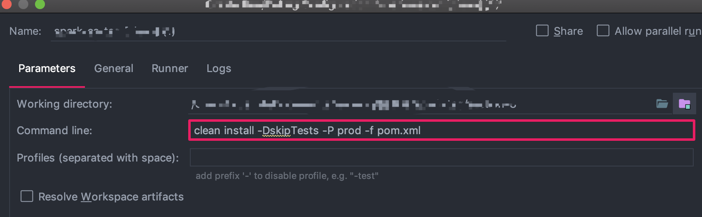
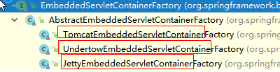
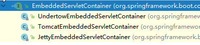

# 一、Spring概念

## 1、Spring是什么

- Spring 是一个开源框架
- Spring 为简化企业级应用开发而生。使用 Spring 可以使简单的 JavaBean 实现以前只有 EJB 才能实现的功能。
- Spring 是一个 IOC(DI) 和 AOP 容器框架；

## 2、具体描述 Spring

- 轻量级：Spring 是非侵入性的-基于 Spring 开发的应用中的对象可以不依赖于 Spring 的 API
- 依赖注入(DI --- dependency injection、IOC)
- 面向切面编程(AOP --- aspect oriented programming)
- 容器：Spring 是一个容器，因为它包含并且管理应用对象的生命周期
- 框架：Spring 实现了使用简单的组件配置组合成一个复杂的应用。在 Spring 中可以使用 XML 和 Java 注解组合这些对象
- 一站式：在 IOC 和 AOP 的基础上可以整合各种企业应用的开源框架和优秀的第三方类库 (实际上 Spring 自身也提供了展现层的 SpringMVC 和 持久层的 Spring JDBC)

Spring容器初始化时：首先会初始化 bean，即构造相关类

## 3、Spring的模块结构


### 3.1、Spring 核心容器

对应图上的Core Container，该层基本上是 Spring Framework 的核心。它包含以下模块：
- Spring Core
- Spring Bean：核心容器提供 Spring 框架的基本功能。核心容器的主要组件是 BeanFactory，它是工厂模式的实现。BeanFactory 使用控制反转 （IOC）模式将应用程序的配置和依赖性规范与实际的应用程序代码分开
- Spring Context：Spring 上下文是一个配置文件，向 Spring 框架提供上下文信息。Spring 上下文包括企业服务，例如 JNDI、EJB、电子邮件、国际化、事件机制、校验和调度功能
- SpEL (Spring Expression Language)：Spring 表达式语言全称为 “Spring Expression Language”，缩写为 “SpEL” ，类似于 Struts2 中使用的 OGNL 表达式语言，能在运行时构建复杂表达式、存取对象图属性、对象方法调用等等，并且能与 Spring 功能完美整合，如能用来配置 Bean 定义

或者说这块就是IOC

### 3.2、数据访问

对应图中，Data Access；该层提供与数据库交互的支持。它包含以下模块：
- JDBC (Java DataBase Connectivity)：Spring 对 JDBC 的封装模块，提供了对关系数据库的访问。
- ORM (Object Relational Mapping)：Spring ORM 模块，提供了对 hibernate5 和 JPA 的集成
- OXM (Object XML Mappers)：Spring 提供了一套类似 ORM 的映射机制，用来将 Java 对象和 XML 文件进行映射。这就是 Spring 的对象 XML 映射功能，有时候也成为 XML 的序列化和反序列化；
- Transaction：Spring 简单而强大的事务管理功能，包括声明式事务和编程式事务。

### 3.3、Web

该层提供了创建 Web 应用程序的支持。它包含以下模块：

- WebMVC：MVC 框架是一个全功能的构建 Web 应用程序的 MVC 实现。通过策略接口，MVC 框架变成为高度可配置的，MVC 容纳了大量视图技术，其中包括 JSP、Velocity、Tiles、iText 和 POI
- WebFlux：基于 Reactive 库的响应式的 Web 开发框架；
- WebSocket：Spring 4.0 的一个最大更新是增加了对 Websocket 的支持。Websocket 提供了一个在 Web 应用中实现高效、双向通讯，需考虑客户端(浏览器)和服务端之间高频和低延时消息交换的机制。一般的应用场景有：在线交易、网页聊天、游戏、协作、数据可视化等

### 3.4、AOP

该层支持面向切面编程。它包含以下模块：

- AOP：通过配置管理特性，Spring AOP 模块直接将面向方面的编程功能集成到了 Spring 框架中。所以，可以很容易地使 Spring 框架管理的任何对象支持 AOP。Spring AOP 模块为基于 Spring 的应用程序中的对象提供了事务管理服务。通过使用 Spring AOP，不用依赖 EJB 组件，就可以将声明性事务管理集成到应用程序中；
- Aspects：该模块为与 AspectJ 的集成提供支持；
- Instrumentation：该层为类检测和类加载器实现提供支持

### 3.5、其它

- JMS (Java Messaging Service)：提供了一个 JMS 集成框架，简化了 JMS API 的使用。
- Test：该模块为使用 JUnit 和 TestNG 进行测试提供支持；
- Messaging：该模块为 STOMP 提供支持。它还支持注解编程模型，该模型用于从 WebSocket 客户端路由和处理 STOMP 消息

# 二、IOC(DI)

## 1、IOC(Inversion of Control)

其思想是反转资源获取的方向。传统的资源查找方式要求组件向容器发起请求查找资源。作为回应，容器适时的返回资源。而应用了 IOC 之后，则是容器主动地将资源推送给它所管理的组件，组件所要做的仅是选择一种合适的方式来接受资源。这种行为也被称为查找的被动形式；

由 Spring IoC 容器来负责对象的生命周期和对象之间的关系

控制反转：把创建对象(Bean)和维护对象(Bean)的关系的权利从程序中转移到Spring容器中，程序不再控制
- IOC 机制实现Bean之间的调用；
- IOC 解决的问题：可以降低两个组件对象之间的关联，降低耦合度；
- Spring IOC 控制反转：获得依赖对象的过程由主动获取变为被动获取
- 使用 IOC 的优势：
	- 维护性比较好，非常便于进行单元测试，便于调试程序和诊断故障。代码中的每一个Class都可以单独测试，彼此之间互不影响，只要保证自身的功能无误即可，这就是组件之间低耦合或者无耦合带来的好处；
	- 开发团队的成员都只需要关心实现自身的业务逻辑，完全不用去关心其它的人工作进展，因为你的任务跟别人没有任何关系，你的任务可以单独测试，你的任务也不用依赖于别人的组件
	- 可复用性好，我们可以把具有普遍性的常用组件独立出来，反复利用到项目中的其它部分，或者是其它项目，当然这也是面向对象的基本特征，IOC 不仅更好地贯彻了这个原则，提高了模块的可复用性。符合接口标准的实现，都可以插接到支持此标准的模块中；
	- 完全具有热插拨的特性，IOC 生成对象的方式转为外置方式，也就是把对象生成放在配置文件里进行定义；

- IOC 使用的技术：最基本的技术就是反射，设计模式是工厂模式

	IOC 容器的工作模式可以看成是工厂模式的升华；IOC 容器看作是一个工厂，这个工厂里要生产的对象都在配置文件中给出定义，然后利用编程语言的的反射编程，根据配置文件中给出的类名生成相应的对象。从实现来看，IOC 是把以前在工厂方法里写死的对象生成代码，改变为由配置文件来定义，也就是把工厂和对象生成这两者独立分隔开来，目的就是提高灵活性和可维护性；

	***为什么不使用工厂模式，而使用IOC？*** 

	IOC是通过反射机制来实现的。当我们的需求出现变动时，工厂模式会需要进行相应的变化。但是IOC的反射机制允许我们不重新编译代码，因为它的对象都是动态生成的

- Spring 中的 IOC
	- Spring 中的 `org.springframework.beans` 包和 `org.springframework.context` 包构成了Spring框架IOC容器的基础
	- BeanFactory 接口提供了一个先进的配置机制，使得任何类型的对象的配置成为可能：`ApplicationContex` 接口对 `BeanFactory`（是一个子接口）进行了扩展，在`BeanFactory`的基础上添加了其他功能，比如与Spring的AOP更容易集成，也提供了处理message resource的机制(用于国际化)、事件传播以及应用层的特别配置，比如针对Web应用的 `WebApplicationContext`；
	- `org.springframework.beans.factory.BeanFactory` 是 Spring IOC 容器的具体实现，用来包装和管理前面提到的各种bean。BeanFactory接口是Spring IOC 容器的核心接口；

## 2、Spring容器

在 Spring IOC 容器读取 Bean 配置创建 Bean 实例之前，必须对它进行实例化。只有在容器实例化后，才可以从 IOC 容器里获取 Bean 实例并使用

Spring 提供了两种类型的 IOC 容器实现：（1）BeanFactory：IOC 容器的基本实现；（2）ApplicationContext：提供了更多的高级特性。是BeanFactory的子接口


- BeanFactory是Spring框架的基础设施，面向Spring本身；ApplicationContext，面向使用Spring框架的开发者，几乎所有的应用场合都直接使用 ApplicationContext，而非底层的 BeanFactory；但是无论使用何种方式，配置文件是相同的。常用的BeanFactory容器是`XmlBeanFactory`，它可以根据 XML 文件中定义的内容，创建相应的 Bean；BeanFactory是IOC容器的核心接口，它的职责包括：实例化、定位、配置应用程序中的对象及建立这些对象间的依赖

- ApplicationContext 的主要实现类：【 ApplicationContext 在初始化上下文时就实例化所有单例的 Bean】
	- ClassPathXmlApplicationContext：从类路径下加载配置文件；
	- FileSystemXmlApplicationContext：从文件系统中加载配置文件；
	- WebApplicationContext：是专门为 WEB 应用而准备的，它允许从相对于 WEB 根目录的路径中完成初始化工作；
	- AnnotationConfigApplicationContext: 基于注解

- Spring容器对Bean的管理：
	- 控制Bean对象创建模式：在bean元素中，利用scope属性可以指定Bean组件创建对象的方式：
		- prototype：非单例模式
		- singleton：单例模式(默认是单例模式)，Spring不关心bean是否线程安全，当然，但实际上，大部分的 Spring Bean 并没有可变的状态(比如Serview类和DAO类)，所以在某种程度上说 Spring 的单例 Bean 是线程安全的；在web程序中，通过一些配置，可以扩展出request，session等属性值;

	- 可以控制单例模式的创建时机：
		- singleton模式的Bean组件，默认是在 ApplicationContext 容器实例化时就创建了组件；可以在bean元素中追加属性`lazy-init="true"`，将singleton模式创建对象推迟到getBean()方法
		- prototype模式是在调用getBean()方法时创建了组件;

		单例 bean 存在线程问题，主要是因为当多个线程操作同一个对象的时候，对这个对象的非静态成员变量的写操作会存在线程安全问题。
		
	- 可以指定Bean对象初始化和销毁方法：`<bean init-method="初始化方法" destroy-method="销毁方法">`
		- Spring 将 Bean 对象创建完毕后，会自动调用init-method里指定的方法
		- destroy-method指定的方法需满足下面条件才能执行：
			- `scope="singleton"`才能使用
			- 执行AbstractApplicationContext容器的close()方法触发

- BeanFactory 和 ApplicationContext 区别：
	- ①、BeanFactory 可以理解为含有bean集合的工厂类，包含了各种bean的定义，以便在接收请求时对应的Bean实例化BeanFactory 包含了bean生命周期的控制
	- ②、ApplicationContext 如同bean factory一样具有bean定义、bean关联关系的设置，根据请求分发bean的功能。但 ApplicationContext 在此基础上还提供了其他的功能。
		- 提供了支持国际化的文本消息
		- 统一的资源文件读取方式
		- 已在监听器中注册的bean的事件

	- 详细比较：

	|BeanFactory	| ApplicationContext|
	|------------|-------------------|
	|它使用懒加载  |	它使用即时加载|
	|它使用语法显式提供资源对象 | 它自己创建和管理资源对象|
	|不支持国际化  |	支持国际化|
	|不支持基于依赖的注解 | 支持基于依赖的注解|

- BeanFactory和FactoryBean、ObjectFactory的区别：
	- BeanFactory是接口，提供了IOC容器最基本的形式，给具体的IOC容器的实现提供了规范；
	- FactoryBean也是接口，为IOC容器中Bean的实现提供了更加灵活的方式，FactoryBean在IOC容器的基础上给Bean的实现加上了一个简单工厂模式和装饰模式；
	- BeanFactory是个Factory，也就是IOC容器或对象工厂，FactoryBean是个Bean。在Spring中，所有的Bean都是由BeanFactory(也就是IOC容器)来进行管理的。但对FactoryBean而言，这个Bean不是简单的Bean，而是一个能生产或者修饰对象生成的工厂Bean，它的实现与设计模式中的工厂模式和修饰器模式类似；
	- `org.springframework.bean.factory.FactoryBean`工厂类接口，用户可以通过实现该接口定制实例化Bean的逻辑；
	- ObjectFactory用于延迟查找的场景，它就是一个普通工厂，当得到 ObjectFactory 对象时，相当于 Bean 没有被创建，只有当 getObject() 方法时，才会触发 Bean 实例化等生命周期；
	- 总结：BeanFactory 就是 IOC 容器，FactoryBean 是特殊的 Bean, 用来封装创建比较复杂的对象，而 ObjectFactory 主要用于延迟查找的场景，延迟实例化对象

## 3、DI(Dependency Injection)

IOC 的另一种表述方式：即组件以一些预先定义好的方式(例如：setter 方法)接受来自如容器的资源注入。相对于 IOC 而言，这种表述更直接。依赖注入(DI)和控制反转(IOC)是从不同的角度的描述的同一件事情：就是指通过引入IOC容器，利用依赖关系注入的方式，实现对象之间的解耦

依赖注入是Spring实现IOC的技术途径，依赖注入的方式：
- setter方式注入：(推荐使用)，使用步骤：
	- 在Action中定义dao接口变量及其set方法;
	- 在Spring配置Action组件的bean元素，使用下面格式：
		```xml
		<property name="属性名" ref="要注入的Bean对象的id属性值"></property>
		```
- 构造方式注入：
	- 在Action中定义dao接口变量以及带参数的构造方法(参数为dao接口类型的变量);
	- 在Spring配置Action组件的bean元素，使用下面格式：
		```xml
		<constructor-arg index="指定参数索引(从0开始)" ref="要注入的Bean对象的id属性值">
		</constructor-arg>
		```

依赖倒置原则、IOC、DI、IOC容器的关系：


## 4、各种类型信息的注入

- 注入Bean对象：(使用最多)
	```xml
	<property name="属性名" ref="要注入的Bean对象的id属性值"></property>
	```

- 注入基本类型
	- 注入数值或字符串类型
		```xml
		<property name="属性名" value="属性值" ></property>
		<!-- 以set方法绝对name值 ，注入的类型有set方法参数类型决定-->
		<property name="includeTypes" value="jpg，jpeg，gif"></property>
		```

- 注入集合类型：(以下property都是写在bean元素内的)

	- 注入List集合配置方法：
		```xml
		<!-- 注入List集合 -->
		<property name="属性名">
			<list>
				<!-- 集合的泛型是对象 -->
				<bean></bean>
				<!-- 集合的泛型是String字符串 -->
				<value>属性值</value>
				<value>上海</value>
				<value>杭州</value>
			</list>
		</property>
		```	
	- 注入Set集合配置方法：
		```xml
		<!-- 注入Set集合 -->
		<property name="属性名">
			<set>
				<value>Tom</value>
				<value>Sam</value>
				<value>Coco</value>
			</set>
		</property>
		```
	- 注入Map类型配置方法：
		```xml
		<!-- 注入Map类型数据 -->
		<property name="books">
			<map>
				<entry key="1001" value="Core Jave"></entry>
				<entry key="1002" value="Java Web"></entry>
				<entry key="1003" value="SSH"></entry>
			</map>
		</property>
		```
				
	- 注入Properties类型配置方法：
		```xml
		<!-- 注Properties类型数据 -->
		<property name="prop">
			<props>
				<prop key="show_sql">true</prop>
				<prop key="dialect">org.hibernate.dialect.OracleDialect</prop>
			</props>
		</property>	
		```	

# 三、Spring AOP

AOP（Aspect-Oriented Programming），面向切面编程	

## 1、关于面向切面编程

- AOP 的主要编程对象是切面(aspect)，而切面模块化横切关注点
- 在应用 AOP 编程时，仍然需要定义公共功能，但可以明确的定义这个功能在哪里，以什么方式应用，并且不必修改受影响的类. 这样一来横切关注点就被模块化到特殊的对象(切面)里

## 2、AOP 的优势

- 每个事物逻辑位于一个位置，代码不分散，便于维护和升级
- 业务模块更简洁，只包含核心业务代码；
	
## 3、AOP 的术语

- 切面(Aspect)：横切关注点(跨越应用程序多个模块的功能)被模块化的特殊对象
- 通知(Advice)：切面必须要完成的工作
- 目标(Target)：被通知的对象
- 代理(Proxy)：向目标对象应用通知之后创建的对象;
	- 当目标组件使用了AOP切入方面组件后，getBean()方法返回的类型是采用动态代理技术生成的一个新类型，当使用代理对象执行业务方法时，代理对象会调用方面和原目标对象的处理方法
	- Spring框架提供了两种代理技术的实现：
		- CGLIB技术：适用于没有接口的目标组件;
			```java
			//利用父类变量接收代理类对象
			public class 代理类型 extends 目标类型{
				//重写Action的execute方法
				public String execute(){
					//调用方面组件
					//调用目标组件super.execute();
				}
			}
			AddCostAction action = (AddCostAction)ac.geBean("jdbcCostDao");
			action.execute();
			```
		- JDK Proxy API:适用于有接口的目标组件;
			```java
			public class 代理类型 implement 目标接口{
			
			}
			//利用接口变量接收代理类对象
			ICostDao dao = (ICostDao)ac.getBean("jdbcCostDao");
			dao.save();//调用代理类型的save()方法
			```
- 连接点(Joinpoint)：程序执行的某个特定位置：如类某个方法调用前、调用后、方法抛出异常后等。连接点由两个信息确定：方法表示的程序执行点；相对点表示的方位。例如 ArithmethicCalculator#add() 方法执行前的连接点，执行点为 ArithmethicCalculator#add()； 方位为该方法执行前的位置；

- 切点(pointcut)：每个类都拥有多个连接点：例如 ArithmethicCalculator 的所有方法实际上都是连接点，即连接点是程序类中客观存在的事务.AOP 通过切点定位到特定的连接点.类比：连接点相当于数据库中的记录，切点相当于查询条件。切点和连接点不是一对一的关系，一个切点匹配多个连接点，切点通过 org.springframework.aop.Pointcut 接口进行描述，它使用类和方法作为连接点的查询条件；

- advisor：Advice和Pointcut组成的独立的单元，并且能够传给proxy factory 对象
	```xml
	<aop：config>
		<aop：pointcut expression="execution(* *.BookShopDao.*(..))" id="bookShop"/>
		<aop：advisor advice-ref="bookShopTXDao" pointcut-ref="bookShop"/>
	</aop：config>
	```	

## 4、基本使用

- 4.1、使用注解来使用AOP

	- 引入相关的jar包：aopalliance.jar、aspectj.weaver.jar 和 spring-aspects.jar
	- 配置文件引入相关的命名空间，并在配置文件中加入如下配置：
		```<aop：aspectj-autoproxy></aop：aspectj-autoproxy>```
	- 在配置文件中加入IOC容器扫描Bean的配置：
		```<context：component-scan base-package="com.bluefish.aop.impl"></context：component-scan>```
	- 编写切面类，即共通属性：
		- ①、首先切面是一个Bean，需要加入注解：@Component
		- ②、其次，类是一个切面，需加入注解：@Aspect；
	- 在切面类中声明通知：(这里以前置通知为准)
		- ①、声明一个方法;
		- ②、在方法上加入注解：@Before("execution(*)")
		- ③、如果需要获取访问链接的细节问题，如方法名和参数等，可以在声明的方法中加入JoinPoint参数：
			- 获取方法签名：joinPoint.getSignature()
			- 获取方法参数：joinPoint.getArgs()
		如：
		```java
		@Aspect
		@Component
		public class LoggingAspectJ {
			@Before("execution(int com.bluefish.aop.impl.ICaculator.*(int，int))")
			public void beforeMethod(JoinPoint joinPoint){
				String methodName = joinPoint.getSignature().getName();
				List<Object> args = Arrays.asList(joinPoint.getArgs());
				System.out.println("The method " + methodName + " begins and the args is ：" + args);
			}
		}
		```
- 4.2、使用xml使用AOP
	```xml
	<!-- 将共通处理组件定义成一个<bean> -->
	<!-- 定义<aop：pointcut>，指定哪些组件为目标，即切入点; -->
	<!-- 定义<aop：aspect>，切面; -->
	<!-- 定义<aop：before>，指定通知： -->
	<bean id="loggingAspectJ" class="com.bluefish.aop.xml.LoggingAspectJ"></bean>	
	<bean id="validationAspectJ" class="com.bluefish.aop.xml.ValidationAspectJ"></bean>
	<!-- 利用Spring的AOP机制将CheckRoleBean作用到各个Action的execute方法 -->
	<aop：config>
		<!-- 配置切入点表达式 -->
		<aop：pointcut expression="execution(* *.*(..))" id="pointcut"/>
		<!-- 指定切面，ref：引用配置好的bean，order：切面优先级 -->
		<aop：aspect ref="loggingAspectJ" order="2">
			<!-- 前置通知：method：切面中的方法，pointcut-ref：切入点 --> 
			<aop：before method="beforeMethod" pointcut-ref="pointcut"/>
			<!-- 
				返回通知：returning：连接点执行的结果，对应方法中的返回值参数
				public void afterReturnningMethod(JoinPoint joinPoint，Object result){}
			-->
			<aop：after-returning method="afterReturnningMethod" pointcut-ref="pointcut" returning="result"/>
			<!-- 
				异常通知：throwing：表示该方法中的异常参数
				public void afterThrowingMethod(JoinPoint joinPoint，Exception e){}
			-->
			<aop：after-throwing method="afterThrowingMethod" pointcut-ref="pointcut" throwing="e"/>
		</aop：aspect>
		<aop：aspect ref="validationAspectJ" order="1">
			<aop：before method="beforeMethod" pointcut-ref="pointcut"/>
		</aop：aspect>
	</aop：config>
	```
## 5、切面

切面的优先级：
- 在同一个连接点上应用不止一个切面时，除非明确指定，否则它们的优先级是不确定的.
- 切面的优先级可以通过实现 Ordered 接口或利用 @Order 注解指定.
- 实现 Ordered 接口，getOrder() 方法的返回值越小，优先级越高.
- 若使用 @Order 注解，序号出现在注解中	

## 6、Aop：通知
```java
try{
	// 前置通知：在连接点执行前执行的通知
	// 方法执行体
	// 返回通知：在连接点正常完成后执行的通知，返回通知可以访问连接点执行的结果;不包括抛出异常的情况
} catch (Exception e){
	// 异常通知：连接点执行时抛出异常后执行的通知
} finally {
	// 后置通知：当某连接点退出的时候执行的通知(不论正常返回还是抛出异常)，其访问不到连接点执行的结果
}
```
- 6.1、前置通知(Before)：在方法执行之前执行的通知，前置通知使用 @Before 注解，并将切入点表达式的值作为注解值
	
- 6.2、后置通知(After)：后置通知是在连接点完成之后执行的，即连接点返回结果或者抛出异常的时候；
	
- 6.3、返回通知(AfterReturning)：连接点是正常返回时执行的通知

	只要将 returning 属性添加到 @AfterReturning 注解中，就可以访问连接点的返回值。该属性的值即为用来传入返回值的参数名称。必须在通知方法的签名中添加一个同名参数。在运行时，Spring AOP 会通过这个参数传递返回值。原始的切点表达式需要出现在 pointcut 属性中
	
	 @AfterReturning(pointcut="execution(int com.bluefish.aop.impl.ICaculator.*(int，int))", returning="result")
	
- 6.4.异常通知(AfterThrowing)：连接点执行异常时执行的通知	
	- 可以访问到异常对象; 且可以指定在出现特定异常时在执行通知代码
		```java
		@AfterThrowing(value="declareJointPointExpression()"，throwing="e")
		public void afterThrowing(JoinPoint joinPoint，Exception e){}
		```
	- 如果只对某种特殊的异常类型感兴趣，可以将参数声明为其他异常的参数类型. 通知就只在抛出这个类型及其子类的异常时才被执行
		```java
		@AfterThrowing(value="declareJointPointExpression()"，throwing="e")
		public void afterThrowing(JoinPoint joinPoint，NullPointerException e){}
		```
		
- 6.5、环绕通知(Around)：环绕通知是所有通知类型中功能最为强大的，能够全面地控制连接点. 甚至可以控制是否执行连接点
	- 环绕通知需要携带 ProceedingJoinPoint 类型的参数，它是 JoinPoint 的子接口
	- 环绕通知类似于动态代理的全过程：ProceedingJoinPoint 类型的参数可以决定是否执行目标方法。proceed() 方法来执行被代理的方法，如果忘记这样做就会导致通知被执行了，但目标方法没有被执行；
	- 环绕通知必须有返回值，返回值即为目标方法的返回值，即调用 joinPoint.proceed(); 的返回值，否则会出现空指针异常;
		```java
		@Around("execution(public int com.atguigu.spring.aop.ArithmeticCalculator.*(..))")
		public Object aroundMethod(ProceedingJoinPoint pjd){
			Object result = null;
			String methodName = pjd.getSignature().getName();
			try {
				//前置通知
				System.out.println("The method " + methodName + " begins with " + Arrays.asList(pjd.getArgs()));
				//执行目标方法
				result = pjd.proceed();
				//返回通知
				System.out.println("The method " + methodName + " ends with " + result);
			} catch (Throwable e) {
				//异常通知
				System.out.println("The method " + methodName + " occurs exception：" + e);
				throw new RuntimeException(e);
			}
			//后置通知
			System.out.println("The method " + methodName + " ends");
			return result;
		}
		```

## 7、切入点表达式

- 7.1、重用切入点表达式：
	- 在AOP中，编写AspectJ切面时，同一个切点表达式可能会在多个通知中重复出现，可以通过 @Pointcut注解将一个切入点声明为简单的方法，其方法体通常都是空的;
	- 切入点方法的访问控制符同时也控制着这个切入点的可见性，如果切入点要在多个切面中共用，最好将它们集中在一个公共的类中在这种情况下，它们必须被声明为 public. 在引入这个切入点时，必须将类名也包括在内. 如果类没有与这个切面放在同一个包中，还必须包含包名.
		```java
		@Pointcut("execution(* *.*(..))")
		public void declarePointExpression(){}
		
		@Before("declarePointExpression()")
		public void beforeMethod(JoinPoint joinPoint){...}
		```
- 7.2、execution(修饰符? 返回类型 方法名(参数列表) throws 异常类型?)
	```
	问号表示：修饰符 或 异常可以不写，必须指定返回类型，方法名，方法参数列表
	7.2.1.方法限定表达式：
		可以指定哪些方法当作目标启用方面功能;
			execution(修饰符? 返回类型 方法名(参数列表) throws 异常类型?)
			//问号表示：修饰符 或 异常可以不写，必须指定返回类型，方法名，方法参数列表			
		示例1：
			匹配方法名以find开头的Bean对象
			execution(* find*(..))
				---" * " 表示有返回值或者没有返回值，" .."：表示参数是0个以上;" find* "：匹配方法名以find开头的			
		示例2：
			匹配JdbcCostDao的save方法
			execution(* org.dao.JdbcCostDao.save(..))			
		示例3：
			匹配org.dao包下所有类的所有方法
			execution(* org.dao.*.*(..))
		示例4：
			匹配org.dao包及其子包下所有类的所有方法
			execution(* org.dao..*.*(..))			
		示例5：
			必须有返回值
			execution(!void set*(..))				
	7.2.2.类型限定表达式
		可以指定哪个组件的所有方法都启用方面功能
		within(类型);			
		示例1：
			AddCostAction中所有方法：
			within(action.AddCostAction);			
		示例2：
			匹配org.action包下所有类的所有方法
			within(org.action.*);			
		示例3：
			匹配org.action包下及其子包下所有类的所有方法
			within(org.action..*);

	7.2.3.Bean组件id或name限定表达式
		bean(id或name属性值)
		//注意：
			id和name属性都是用于指定Bean组件的标识符，
			但是id更严格，不允许使用" / "等特殊字符，而name允许;				
		示例1：
			匹配bean元素id或name属性为jdbcCostDao的组件的所有方法
			bean("jdbcCostDao");
		示例2：
			匹配<bean>元素id或name属性以Action结尾的组件的所有方法
			bean(*Action)

	7.2.4.方法参数限定表达式
		args(参数列表)
		
		示例：
			匹配只有一个参数的类型为String的方法
			args(java.lang.String)

		提示：上述表达式可以使用 ||，&&进行拼接
		如：within(org.action..*) && !execution(...);
	```

## 8、AOP的实现方式

- 静态代理：指使用 AOP 框架提供的命令进行编译，从而在编译阶段就可生成 AOP 代理类，因此也称为编译时增强；
- 动态代理：在运行时在内存中“临时”生成 AOP 动态代理类，因此也被称为运行时增强。目前 Spring 中使用了两种动态代理库；

## 9、AspectJ与Spring AOP

Spring AOP 属于运行时增强，而 AspectJ 是编译时增强。 Spring AOP 基于代理(Proxying)，而 AspectJ 基于字节码操作(Bytecode Manipulation)
      
# 四、IOC与AOP原理分析

## 1、IOC原理

[IOC原理](Java/源码分析/框架/spring/Spring源码.md#一IOC)

## 2、AOP原理

- OOP 允许你定义从上到下的关系，但并不适合定义从左到右的关系，AOP 技术则恰恰相反，它利用一种称为“横切”的技术，剖解开封装的对象内部，并将那些影响了多个类的公共行为封装到一个可重用模块，并将其名为“Aspect”，就是将那些与业务无关，却为业务模块所共同调用的逻辑或责任封装起来，便于减少系统的重复代码，降低模块间的耦合度，并有利于未来的可操作性和可维护性；

- AOP 是面向对象的一种补充，应用于处理一些具有横切性质的系统级服务，如事务管理、安全检查、缓存、对象池管理等；

- AOP 实现的关键：AOP 框架自动创建的 AOP 代理
	- 静态代理：指使用 AOP 框架提供的命令进行编译，从而在编译阶段就可生成 AOP 代理类，因此也称为编译时增强
	- 动态代理：在运行时借助于 JDK 动态代理、CGLIB 等在内存中“临时”生成 AOP 动态代理类，因此也被称为运行时增强

# 五、Spring的 事务

## 1、事务：一组逻辑操作

用来确保数据的完整性和一致性，是一系列动作，这些动作要么全部完成要么全部不起作用；

- 1.1、四个关键属性：
	- 原子性(atomicity)：事务是个不可分割的工作单位，事务是一个原子操作，由一系列动作组成. 事务的原子性确保动作要么全部完成要么完全不起作用.
	- 一致性(consistency)：事务前后数据的完整性必须保持一致，一旦所有事务动作完成，事务就被提交. 数据和资源就处于一种满足业务规则的一致性状态中.
	- 隔离性(isolation)：多个用户并发访问数据库时，一个用户的事务不能被其他用户的事务所干扰，多个用户的并发事务相互隔离的，可能有许多事务会同时处理相同的数据，因此每个事物都应该与其他事务隔离开来，防止数据损坏.
	- 持久性(durability)：一个事务一旦被提交，它对数据库中数据的改变是永久性的，即使数据库发生故障也不会有任何影响，一旦事务完成，无论发生什么系统错误，它的结果都不应该受到影响. 通常情况下，事务的结果被写到持久化存储器；

- 1.2、Spring 事务接口：主要有三个接口

	- PlatformTransactionManager：平台事务管理器，Spring 为不同的持久框架提供了不同的接口实现；DataSourceTransactionManager：使用 Spring JDBC 或 mybatis 进行持久化数据时使用
		```java
		public interface PlatformTransactionManager {
			// 获得事务
			// 返回一个已经激活的事务或创建一个新的事务（根据给定的 TransactionDefinition 类型参数定义的事务属性），返回的是 TransactionStatus 对象代表了当前事务的状态，其中该方法抛出 TransactionException（未检查异常）表示事务由于某种原因失败
			TransactionStatus getTransaction(@Nullable TransactionDefinition definition) throws TransactionException;
			// 提交事务
			// 用于提交 TransactionStatus 参数代表的事务
			void commit(TransactionStatus status) throws TransactionException;
			// 回滚事务
			// 用于回滚 TransactionStatus 参数代表的事务
			void rollback(TransactionStatus status) throws TransactionException;
		}
		```
	- TransactionDefinition-事务定义信息(隔离，传播，超时，只读)
		```java
		public interface TransactionDefinition {
			// 返回定义的事务传播行为
			int getPropagationBehavior();  
			// 返回定义的事务隔离级别
			int getIsolationLevel();  
			// 返回定义的事务超时时间
			int getTimeout();  
			// 返回定义的事务是否是只读的
			boolean isReadOnly();  
			// 返回定义的事务名字
			String getName();  
		}
		```
	- TransactionStatus-事务具体运行状态
		```java
		public interface TransactionStatus extends SavepointManager, Flushable {
			// 返回当前事务状态是否是新事务
			boolean isNewTransaction();
			// 返回当前事务是否有保存点
			boolean hasSavepoint();
			// 设置当前事务应该回滚
			void setRollbackOnly();
			// 返回当前事务是否应该回滚
			boolean isRollbackOnly();
			// 用于刷新底层会话中的修改到数据库，一般用于刷新如 Hibernate/JPA 的会话，可能对如 JDBC 类型的事务无任何影响
			@Override
			void flush();
			// 当前事务否已经完成
			boolean isCompleted();
		}
		```

## 2、Spring 的事务管理

- 2.1、支持编程式事务管理与声明式事务管理
	- 编程式事务管理：将事务管理代码嵌入到业务方法中来控制事务的提交和回滚。在编程式管理事务时，必须在每个事务操作中包含额外的事务管理代码. 
	- 声明式事务管理：大多数情况下比编程式事务管理更好用。它将事务管理代码从业务方法中分离出来，以声明的方式来实现事务管理。事务管理作为一种横切关注点，可以通过 AOP 方法模块化. Spring 通过 Spring AOP 框架支持声明式事务管理

- 2.2、Spring 事务管理核心：TransactionManager，其为事务管理封装了一组独立于技术的方法。对于JDBC，JavaEE，Hibernate 等都实现了相应的事务管理器;

***Spring事务默认地只在抛出RuntimeException和Error时才标识事务回滚，从事务方法中抛出的 Checked exceptions 将不被标识进行事务回滚***

## 3、声明式事务管理

- 事务管理是一种横切关注点
- xml配置声明式事务管理：
	```XML
	<!-- 声明事务管理器-->
	<bean id="transactionManager" class="org.springframework.jdbc.datasource.DataSourceTransactionManager">
		<property name="dataSource" ref="dataSource" />
	</bean>
	<!-- 声明事务通知-->
	<tx：advice id="bookShopDao" transaction-manager="transactionManager"></tx：advice>
	<!-- -->
	<aop：config>
		<aop：pointcut expression="execution(* *.BookShopDao.*(..))" id="bookShop"/>
		<aop：advisor advice-ref="bookShopTXDao" pointcut-ref="bookShop"/>
	</aop：config>
	```
- 注解声明式事务管理：
	```XML
	<bean id="transactionManager" class="org.springframework.jdbc.datasource.DataSourceTransactionManager">
		<property name="dataSource" ref="dataSource" />
	</bean>		
	<tx：annotation-driven transaction-manager="transactionManager"/>
	```
	在需要事务管理的方法前加上注解，或者可以直接加在类上：`@Transactional`

## 5、事务的传播性：当事务方法被另一个事务方法调用时，必须指定事务应该如何传播

- 5.1、Spring 支持的事务传播行为：
	- REQUIRED：业务方法需要在一个容器里运行。如果方法运行时，已经处在一个事务中，那么加入到这个事务，否则自己新建一个新的事务。
	- REQUIRES_NEW：不管是否存在事务，该方法总会为自己发起一个新的事务。如果方法已经运行在一个事务中，则原有事务挂起，新的事务被创建。
	- NOT_SUPPORTED：声明方法不需要事务。如果方法没有关联到一个事务，容器不会为他开启事务，如果方法在一个事务中被调用，该事务会被挂起，调用结束后，原先的事务会恢复执行。
	- SUPPORTS：该方法在某个事务范围内被调用，则方法成为该事务的一部分。如果方法在该事务范围外被调用，该方法就在没有事务的环境下执行。
	- MANDATORY：该方法只能在一个已经存在的事务中执行，业务方法不能发起自己的事务。如果在没有事务的环境下被调用，容器抛出例外。
	- NEVER：该方法绝对不能在事务范围内执行。如果在就抛例外。只有该方法没有关联到任何事务，才正常执行。
	- NESTED：如果一个活动的事务存在，则运行在一个嵌套的事务中。如果没有活动事务，则按REQUIRED属性执行，它使用了一个单独的事务，这个事务拥有多个可以回滚的保存点。内部事务的回滚不会对外部事务造成影响。它只对 DataSourceTransactionManager 事务管理器起效;
	```
		类A有事务方法：buyMany();
		类B有事务方法：buy();
		buyMany()方法调用了 buy()方法
	```
- 5.2、传播行为：REQUIRED(Spring 事务的默认传播行为)

	buy()方法被 buyMany()方法调用，其会默认在 buyMany()方法中现有的事务中运行，因此 buyMany()方法的开始和终止边界内只有一个事务。如果buyMany()方法出现异常或buy()方法出现异常，则全部回滚，或全部成功后全部提交
	
- 5.3、传播行为：REQUIRES_NEW
	
	如果 buy()方法中配置了：`@Transactional(propagation=Propagation.REQUIRES_NEW)`，则buyMany()调用buy()时，buyMany()方法的事务会挂起，buy()方法开启新事务，buy()的事务提交完毕后，buyMany()方法的事务继续.

- 5.4、配置事务的传播行为：使用propagation属性指定事务的传播行为

	- 配置：
		```xml
		<tx：advice id="bookShopDao" transaction-manager="transactionManager">
			<tx：attributes>
				<tx：method name="buyMany" propagation="REQUIRES_NEW"/>
			</tx：attributes>
		</tx：advice>
		```
	注解：@Transactional(propagation=Propagation.REQUIRES_NEW)
			
## 6、事务隔离级别：通过隔离事务属性指定 isolation	

- 6.1、事务隔离级别：

	- DEFAULT：使用底层数据库的默认隔离级别，对于大多数数据库来说，默认的隔离级别都是：READ_COMMITTED
	- READ_UNCOMMITTED：允许事务读取未被其他事务提交的变更，脏读、不可重复度、幻读的问题都会出现
	- READ_COMMITTED：只允许事务读取已被其他事务提交的变更，可以避免脏读，但不可重复读、幻读的问题仍可能出现;
	- REPEATABLE_READ：对相同字段的多次读取是一致的，除非数据被事务本身改变。可防止脏读，不可重复读，但幻读仍可能发生；
	- SERIALIZABLE：确保事务可以从一个表中读取相同的行，在这个事务持续期间，禁止其他事务对该表执行插入，更新，和删除等操作，所有并发问题都可以避免，但性能十分低下;串行
	
- 6.2、事务的隔离级别要得到底层数据库引擎的支持，而不是应用程序或者框架的支持

	- Oracle 支持两种事务隔离级别：READ_COMMITED(默认级别) ，SERIALIZABLE
	- Mysql 支持四种隔离级别：默认是 REPEATABLE_READ 级别

- 6.3、设置事务隔离属性：`@Transactional(isolation=Isolation.READ_COMMITTED)	`

- 6.4、设置事务回滚属性：默认情况下只有未检查异常(RuntimeException和Error类型的异常)会导致事务回滚

	事务的回滚规则可以通过 @Transactional 注解的 rollbackFor 和 noRollbackFor 属性来定义。这两个属性被声明为 Class[] 类型的，因此可以为这两个属性指定多个异常类。rollbackFor： 遇到时必须进行回滚
	
	rollback-for="Exception" ，noRollbackFor：一组异常类，遇到时必须不回滚

- 6.5、事务超时和只读属性：
	- 由于事务可以在行和表上获得锁，因此长事务会占用资源，并对整体性能产生影响。超时事务属性：事务在强制回滚之前可以保持多久. 这样可以防止长期运行的事务占用资源。超时属性以秒为单位来计算：@Transactional(timeout=10)	

	- 如果一个事物只读取数据但不做修改，数据库引擎可以对这个事务进行优化，只读事务属性：表示这个事务只读取数据但不更新数据，这样可以帮助数据库引擎优化事务：@Transactional(readOnly=false)；

- 6.6、脏读：一个事务读取了另一个事务改写但还未提交的数据，如果这些数据被回滚，则读到的数据是无效的.

	不可重复读：在同一个事务中，多次读取同一数据返回的结果有所不同;

	虚读(幻读)：一个事务读取了几行记录后，另一个事务插入一些记录，幻读就发生了，在后来的查询中，第一个事务就会发现有些原来没有的记录

- 6.7、事务的状态：

	调用 PlatformTransactionManager 接口的getTransaction()的方法得到的是 TransactionStatus 接口的一个实现；这个接口描述的是一些处理事务提供简单的控制事务执行和查询事务状态的方法，其参数是：TransactionDefinition类型，其包含了一些传播性、隔离级别、超时时间等
	```java
	public interface TransactionStatus{
		boolean isNewTransaction(); // 是否是新的事物
		boolean hasSavepoint(); // 是否有恢复点
		void setRollbackOnly();  // 设置为只回滚
		boolean isRollbackOnly(); // 是否为只回滚
		boolean isCompleted; // 是否已完成
	}
	```
- `@Transactional`注解只能使用在public方法中，当注解在非public方法上时，`@Transactional`注解将会不起作用

	在获取注解属性的时候，`AbstractFallbackTransactionAttributeSource#computeTransactionAttribute`这个方法有判断
	```java
	@Nullable
	protected TransactionAttribute computeTransactionAttribute(Method method, @Nullable Class<?> targetClass) {
		// 标注@Transactional的方法如果修饰符不是public，那么就默认方法的@Transactional信息为空，那么将不会对bean进行代理对象创建或者不会对方法进行代理调用
		if (allowPublicMethodsOnly() && !Modifier.isPublic(method.getModifiers())) {
			return null;
		}
	...
	}
	protected boolean allowPublicMethodsOnly() {
		return false;
	}
	```
	另外在类内部调用类中`@Transactional`标注的public方法，这种情况下也会导致事务不开启
	```java
	@Transactional
    public void insertTestInnerInvoke() {
        //正常public修饰符的事务方法
        int re = testMapper.insert(new Test(10,20,30));
        if (re > 0) {
            throw new NeedToInterceptException("need intercept");
        }
        testMapper.insert(new Test(210,20,30));
    }
    public void testInnerInvoke(){
        //类内部调用@Transactional标注的方法。
        insertTestInnerInvoke();
    }
	```
	事务方法内部捕捉了异常，没有抛出新的异常，导致事务操作不会进行回滚


## 7、xml方式配置Spring事务：使用AOP来实现的，即使用动态代理

详细步骤
- 配置事务管理器，包括配置hibernate、mybatis等：
	```xml
	<bean id="transactionManager" class="org.springframework.jdbc.datasource.DataSourceTransactionManager">
		<property name="dataSource" ref="dataSource"></property>
	</bean>
	```
- 配置事务管理器的相关属性，如事务传播性、事务隔离、只读、超时、回滚等：
	```xml
	<tx：advice id="txAdvice" transaction-manager="transactionManager">
		<tx：attributes>
			<!-- 根据方法名指定事务的属性 "*" 表示通配符-->
			<tx：method name="purchase" propagation="REQUIRES_NEW"/>
			<tx：method name="get*" read-only="true"/>
			<tx：method name="find*" read-only="true"/>
			<tx：method name="*"/>
		</tx：attributes>
	</tx：advice>
	```
- 配置事务切入点，以及把事务切入点和事务属性关联起来
	```xml
	<aop：config>
		<aop：pointcut expression="execution(* *.*(..))" id="txPointCut"/>
		<aop：advisor advice-ref="txAdvice" pointcut-ref="txPointCut"/>	
	</aop：config>
	```
	
## 8、编程式事务管理

## 9、手动控制Spring事务

主要通过两个类来控制：PlatformTransactionManager、TransactionDefinition，具体写法如下：
```java
@Autowired
private PlatformTransactionManager platformTransactionManager;
@Autowired
private TransactionDefinition transactionDefinition;

public void create(){
	// 获取事务
	TransactionStatus transaction = platformTransactionManager.getTransaction(transactionDefinition);

	// 回滚事务
	platformTransactionManager.rollback(transaction);

	// 提交事务
	platformTransactionManager.commit(transaction);
}
```
	
# 六、Spring的三种配置方式

## 1、基于xml方式配置

## 2、基于注解方式配置

## 3、基于Java方式配置	

# 七、Spring中涉及的设计模式	

- 代理模式：在 AOP 和 remoting 中被用的比较多。`org.springframework.aop.framework.ProxyFactoryBean`该工厂根据Spring bean构建AOP代理
- 单例模式：在 Spring 配置文件中定义的 Bean 默认为单例模式。
- 模板方法：用来解决代码重复的问题。比如 RestTemplate、JmsTemplate、JdbcTemplate.Spring在`org.springframework.context.support.AbstractApplicationContext`类中使用模板方法
- 前端控制器：Spring提供了 DispatcherServlet 来对请求进行分发。
- 视图帮助(View Helper) ：Spring 提供了一系列的 JSP 标签，高效宏来辅助将分散的代码整合在视图里。
- 依赖注入：贯穿于 BeanFactory / ApplicationContext 接口的核心理念。
- 工厂模式：BeanFactory 用来创建对象的实例。通过它的实现，我们可以从Spring的容器访问bean
- 解释器模式：SpEL是一种由Spring的`org.springframework.expression.ExpressionParser`实现分析和执行的语言；这些实现使用作为字符串给出的Spel表达式，并将它们转换为`org.springframework.expression.Expression`的实例。上下文组件由`org.springframework.expression.EvaluationContext`实现表示；
- 建造者模式：BeanDefinitionBuilder，允许我们以编程方式定义bean的类；
- 复合模式：在Spring世界中，我们检索复合对象的概念是`org.springframework.beans.BeanMetadataElement`接口，用于配置bean对象。它是所有继承对象的基本界面
- 观察者模式：定义对象间的一种一对多的依赖关系，当一个对象的状态发生改变时，所有依赖于它的对象都得到通知并被自动更新。spring中Observer模式常用的地方是listener的实现。如ApplicationListener；
- 策略模式：spring中在实例化对象的时候用到Strategy模式。在SimpleInstantiationStrategy中有如下代码说明了策略模式的使用情况；
- 装饰器模式：Spring中用到的包装器模式在类名上有两种表现：一种是类名中含有Wrapper，另一种是类名中含有Decorator。基本上都是动态地给一个对象添加一些额外的职责；
- 适配器模式：由于 Advisor 链需要的是 MethodInterceptor（拦截器）对象，所以每一个Advisor中的Advice都要适配成对应的MethodInterceptor对象。AdvisorAdapter

# 八、Spring常见问题

## 1、循环依赖问题

- [Spring循环依赖](https://mp.weixin.qq.com/s/ziSZeWlU5me1WMKvoKobbQ)
- [Spring循环依赖处理](http://cmsblogs.com/?p=2887)

### 1.1、什么是循环依赖

循环依赖，其实就是循环引用，就是两个或者两个以上的 bean 互相引用对方，最终形成一个闭环，如 A 依赖 B，B 依赖 C，C 依赖 A；

循环依赖，其实就是一个死循环的过程，在初始化 A 的时候发现引用了 B，这时就会去初始化 B，然后又发现 B 引用 C，跑去初始化 C，初始化 C 的时候发现引用了 A，则又会去初始化 A，依次循环永不退出，除非有终结条件

### 1.2、循环依赖的场景

- 构造器的循环依赖：Spring是无法解决的，只能抛出`BeanCurrentlyInCreationException`异常表示循环依赖；

	如在创建A类时，构造器须要B类。那将去创建B，在创建B类时又发现须要C类，则又去创建C，终于在创建C时发现又须要A。形成环状依赖，从而被Spring抛出；类似先有蛋还是先有鸡

- setter的循环依赖：包含两种循环依赖问题，`多例（原型）模式下产生的循环依赖问题`和`单例模式下产生的循环依赖问题`

	Spring只解决`scope=singleton`的循环依赖。对于`scope=prototype`的bean，Spring 无法解决，直接抛出 BeanCurrentlyInCreationException 异常；因为“prototype”作用域的Bean，Spring容器不进行缓存，因此无法提前暴露一个创建中的Bean，因为每一次getBean()时，都会产生一个新的Bean，如此反复下去就会有无穷无尽的Bean产生了，最终就会导致OOM问题的出现；

### 1.3、Spring三大缓存

Spring中有三个缓存，用于存储单例的Bean实例，这三个缓存是彼此互斥的，不会针对同一个Bean的实例同时存储；

如果调用getBean，则需要从三个缓存中依次获取指定的Bean实例。 读取顺序依次是`一级缓存-->二级缓存-->三级缓存`
```java
protected Object getSingleton(String beanName, boolean allowEarlyReference) {
	// 从一级缓存中获取单例对象
	Object singletonObject = this.singletonObjects.get(beanName);
	// isSingletonCurrentlyInCreation:
	// 判断当前单例bean是否正在创建中，也就是没有初始化完成；
	// 比如A的构造器依赖了B对象，所以得先去创建B对象，或者在A的populateBean过程中依赖了B对象，得先去创建B对象，这时的A就是出于创建中状态；
	if (singletonObject == null && isSingletonCurrentlyInCreation(beanName)) {
		singletonObject = this.earlySingletonObjects.get(beanName);
		if (singletonObject == null && allowEarlyReference) {
			synchronized (this.singletonObjects) {
				// 从二级缓存中获取单例bean
				singletonObject = this.singletonObjects.get(beanName);
				if (singletonObject == null) {
					// 是否允许从 singletonFactories 中通过 getObject拿到对象
					singletonObject = this.earlySingletonObjects.get(beanName);
					if (singletonObject == null) {
						// 从三级缓存中获取单例bean
						ObjectFactory<?> singletonFactory = this.singletonFactories.get(beanName);
						if (singletonFactory != null) {
							// 通过单例工厂获取单例bean
							singletonObject = singletonFactory.getObject();
							// 从三级缓存移到了二级缓存
							this.earlySingletonObjects.put(beanName, singletonObject);
							this.singletonFactories.remove(beanName);
						}
					}
				}
			}
		}
	}
	return singletonObject;
}
```

**一级缓存：Map<String, Object> singletonObjects**

第一级缓存的作用：
- 用于存储单例模式下创建的Bean实例（已经创建完毕）；
- 该缓存是对外使用的，指的就是使用Spring框架的程序员

存储的数据：
- key:   bean的名称
- value: bean的实例对象（有代理对象则指的是代理对象，已经创建完毕）

**二级缓存：Map<String, Object> earlySingletonObjects**

第二级缓存的作用：
- 用于存储单例模式下创建的Bean实例（该Bean被提前暴露的引用,该Bean还在创建中）。
- 该缓存是对内使用的，指的就是Spring框架内部逻辑使用该缓存。

存储的数据：
- key: bean的名称
- value: bean的实例对象（有代理对象则指的是代理对象，该Bean还在创建中）

**三级缓存：Map<String, ObjectFactory<?>> singletonFactories**

第三级缓存的作用：
- 通过ObjectFactory对象来存储单例模式下提前暴露的Bean实例的引用（正在创建中）。
- 该缓存是对内使用的，指的就是Spring框架内部逻辑使用该缓存。
- 主要使用此缓存来解决循环依赖

存储的数据：
- key: bean的名称
- values: ObjectFactory，该对象持有提前暴露的bean的引用，ObjectFactory<?> 类型的 lambda 表达式，就是这用于处理 AOP 循环依赖的

```java
protected void addSingletonFactory(String beanName, ObjectFactory<?> singletonFactory) {
protected void addSingletonFactory(String beanName, ObjectFactory<?> singletonFactory) {
	Assert.notNull(singletonFactory, "Singleton factory must not be null");
	synchronized (this.singletonObjects) {
		/**
		 * 如果单例池中不存在才会add，因为这里主要是为了解决循环依赖的代码
		 * 如果bean存在单例池的话，已经是一个完整的bean了，一个完整的bean是已经完成属性注入的，循环依赖已经依赖上了，
		 * 所以如果这个对象已经是一个完整的bean，就不需要关心了
		 */
		if (!this.singletonObjects.containsKey(beanName)) {
			// 放入三级缓存
			this.singletonFactories.put(beanName, singletonFactory);
			this.earlySingletonObjects.remove(beanName);
			this.registeredSingletons.add(beanName);
		}
	}
}
```
为什么第三级缓存使用 ObjectFactory：需要提前产生代理对象

### 1.4、解决循环依赖

Spring 在创建 bean 的时候并不是等它完全完成，而是在创建过程中将创建中的 bean 的 ObjectFactory 提前曝光（即加入到 singletonFactories 缓存中）。
这样，一旦下一个 bean 创建的时候需要依赖 bean，则直接使用 ObjectFactory 的 `#getObject()` 方法来获取了；

- 首先 A 完成初始化第一步并将自己提前曝光出来（通过 ObjectFactory 将自己提前曝光），在初始化的时候，发现自己依赖对象 B，此时就会去尝试 get(B)，这个时候发现 B 还没有被创建出来
- 然后 B 就走创建流程，在 B 初始化的时候，同样发现自己依赖 C，C 也没有被创建出来
- 这个时候 C 又开始初始化进程，但是在初始化的过程中发现自己依赖 A，于是尝试 get(A)，这个时候由于 A 已经添加至缓存中（一般都是添加至三级缓存 singletonFactories ），通过 ObjectFactory 提前曝光，所以可以通过 ObjectFactory#getObject() 方法来拿到 A 对象，C 拿到 A 对象后顺利完成初始化，然后将自己添加到一级缓存中
- 回到 B ，B 也可以拿到 C 对象，完成初始化，A 可以顺利拿到 B 完成初始化。到这里整个链路就已经完成了初始化过程了；

```java
/** Cache of singleton factories: bean name --> ObjectFactory */
private final Map<String, ObjectFactory> singletonFactories = new HashMap<String, ObjectFactory>();
/** Cache of early singleton objects: bean name --> bean instance */
private final Map<String, Object> earlySingletonObjects = new HashMap<String, Object>();
```
- singletonFactories，用于存储在spring内部所使用的beanName->对象工厂的引用，一旦最终对象被创建(通过objectFactory.getObject())，此引用信息将删除
- earlySingletonObjects，用于存储在创建Bean早期对创建的原始bean的一个引用，注意这里是原始bean，即使用工厂方法或构造方法创建出来的对象，一旦对象最终创建好，此引用信息将删除

SpringBoot解决循环依赖：加`@Lazy`注解
```java
@Autowired
@Lazy
private CService cService;
```

**答案：**

Spring通过三级缓存解决了循环依赖，其中一级缓存为单例池（singletonObjects）,二级缓存为早期曝光对象earlySingletonObjects，三级缓存为早期曝光对象工厂（singletonFactories）。当A、B两个类发生循环引用时，在A完成实例化后，就使用实例化后的对象去创建一个对象工厂，并添加到三级缓存中，如果A被AOP代理，那么通过这个工厂获取到的就是A代理后的对象，如果A没有被AOP代理，那么这个工厂获取到的就是A实例化的对象。当A进行属性注入时，会去创建B，同时B又依赖了A，所以创建B的同时又会去调用getBean(a)来获取需要的依赖，此时的getBean(a)会从缓存中获取，第一步，先获取到三级缓存中的工厂；第二步，调用对象工工厂的getObject方法来获取到对应的对象，得到这个对象后将其注入到B中。紧接着B会走完它的生命周期流程，包括初始化、后置处理器等。当B创建完后，会将B再注入到A中，此时A再完成它的整个生命周期。至此，循环依赖结束！

**为什么要使用三级缓存呢？二级缓存能解决循环依赖吗？**

如果要使用二级缓存解决循环依赖，意味着所有Bean在实例化后就要完成AOP代理，这样违背了Spring设计的原则，Spring在设计之初就是通过AnnotationAwareAspectJAutoProxyCreator 这个后置处理器来在Bean生命周期的最后一步来完成AOP代理，而不是在实例化后就立马进行AOP代理；

## 2、Spring与SpringMVC容器

### 2.1、Spring父子容器的关系

- `Spring`和`SpringMVC`共存时，会有两个容器：一个`SpringMVC`的`ServletWebApplicationContext`为子容器，一个Spring的`RootWebApplicationContext`为父容器。当子容器中找不到对应的Bean会委托于父容器中的Bean。
	* `RootWebApplicationContext`中的`Bean`对`ServletWebApplicationContext`可见，而`ServletWebApplicationContext`中的`Bean`对`RootWebApplicationContext`不可见。

- 如果在父容器中开启了 `@AspectJ` 注解与事务配置，子容器和父容器均加载了所有Bean。造成子容器中的services覆盖了父容器的Services，导致父容器中的动态代理的services不生效，事务也不生效。

    

### 2.2、如何解决Spring父子容器关系

可以参考[Spring官方文档](https://docs.spring.io/spring/docs/4.3.16.RELEASE/spring-framework-reference/htmlsingle/#mvc-servlet) 中的`Figure 22.2. Typical context hierarchy in Spring Web MVC`

- 子容器包含`Controllers、HandlerMapping、viewResolver`，其他bean都在父容器中；
- 子容器不加载任何bean，均由父容器加载

### 2.3、Spring容器与Servlet容器

Tomcat&Jetty在启动时给每个Web应用创建一个全局的上下文环境，这个上下文就是ServletContext，其为后面的Spring容器提供宿主环境；

Tomcat&Jetty在启动过程中触发容器初始化事件，Spring的ContextLoaderListener会监听到这个事件，它的contextInitialized方法会被调用，在这个方法中，Spring会初始化全局的Spring根容器，这个就是Spring的IoC容器，IoC容器初始化完毕后，Spring将其存储到ServletContext中；

Tomcat&Jetty在启动过程中还会扫描Servlet，一个Web应用中的Servlet可以有多个，以SpringMVC中的DispatcherServlet为例，这个Servlet实际上是一个标准的前端控制器，用以转发、匹配、处理每个Servlet请求；

Servlet一般会延迟加载，当第一个请求达到时，Tomcat&Jetty发现DispatcherServlet还没有被实例化，就调用DispatcherServlet的init方法，DispatcherServlet在初始化的时候会建立自己的容器，叫做SpringMVC 容器，用来持有Spring MVC相关的Bean。同时，Spring MVC还会通过ServletContext拿到Spring根容器，并将Spring根容器设为SpringMVC容器的父容器，请注意，Spring MVC容器可以访问父容器中的Bean，但是父容器不能访问子容器的Bean， 也就是说Spring根容器不能访问SpringMVC容器里的Bean。说的通俗点就是，在Controller里可以访问Service对象，但是在Service里不可以访问Controller对象；

**Servlet默认是单例模式的，Spring的Bean默认是单例模式的，那Spring MVC是如何处理并发请求的呢？**

这是由Web容器比如Tomcat来做到的，Tomcat在调用Servlet的init方法时，用了synchronized

## 3、Spring注解@Resource和@Autowired以及@Inject区别对比

- `@Resource`和`@Autowired`都是做bean的注入时使用，其实`@Resource`并不是Spring的注解，它的包是`javax.annotation.Resource`，需要导入，但是Spring支持该注解的注入；`@Autowired和@Inject`基本是一样的，因为两者都是使用AutowiredAnnotationBeanPostProcessor来处理依赖注入。但是`@Resource`是个例外，它使用的是CommonAnnotationBeanPostProcessor来处理依赖注入

- `@Autowired`注解是按照类型（byType）装配依赖对象，默认情况下它要求依赖对象必须存在，如果允许null值，可以设置它的required属性为false；如果我们想使用按照名称（byName）来装配，可以结合`@Qualifier`注解一起使用；

- `@Resource`默认按照ByName自动注入，由J2EE提供，需要导入包`javax.annotation.Resource`。`@Resource`有两个重要的属性：name和type，而Spring将`@Resource`注解的name属性解析为bean的名字，而type属性则解析为bean的类型。所以，如果使用name属性，则使用byName的自动注入策略，而使用type属性时则使用byType自动注入策略。如果既不制定name也不制定type属性，这时将通过反射机制使用byName自动注入策略

	@Resource装配顺序：
	- ①、如果同时指定了name和type，则从Spring上下文中找到唯一匹配的bean进行装配，找不到则抛出异常。
	- ②、如果指定了name，则从上下文中查找名称（id）匹配的bean进行装配，找不到则抛出异常。
	- ③、如果指定了type，则从上下文中找到类似匹配的唯一bean进行装配，找不到或是找到多个，都会抛出异常。
	- ④、 如果既没有指定name，又没有指定type，则自动按照byName方式进行装配；如果没有匹配，则回退为一个原始类型进行匹配，如果匹配则自动装配。
- `@Inject`: 这是jsr330 的规范，通过AutowiredAnnotationBeanPostProcessor 类实现的依赖注入。位于javax.inject包内，是Java自带的注解；

# 九、SpringMVC

## 1、Spring MVC概述

- 目前主流的MVC框架之一
- Spring3.0后超越strut2，成为最优秀的MVC框架之一
- Spring MVC通过一套注解，让POJO成为处理请求的控制器，而无需实现任何接口;
- 支持REST风格的URL请求;
- 采用了松耦合可插拔组件结构，比其他MVC框架更具扩展性和灵活性;

## 2、SpringMVC项目搭建
- 引入相关jar包;
- 在web.xml中配置DispathcerServlet
	```xml
	<!-- 配置 DispatcherServlet -->
	<servlet>
		<servlet-name>dispatcherServlet</servlet-name>
		<servlet-class>org.springframework.web.servlet.DispatcherServlet</servlet-class>
		<!-- 配置 DispatcherServlet 的一个初始化参数： 配置 SpringMVC 配置文件的位置和名称 -->
		<!-- 
			实际上也可以不通过 contextConfigLocation 来配置 SpringMVC 的配置文件， 而使用默认的.
			默认的配置文件为： /WEB-INF/<servlet-name>-servlet.xml
		-->
		<!--  
		<init-param>
			<param-name>contextConfigLocation</param-name>
			<param-value>classpath：springmvc.xml</param-value>
		</init-param>
		-->
		<load-on-startup>1</load-on-startup>
	</servlet>
	<servlet-mapping>
		<servlet-name>dispatcherServlet</servlet-name>
		<url-pattern>/</url-pattern>
	</servlet-mapping>
	```
- 配置Spring配置文件：
	```xml
	<!-- 配置自定扫描的包 -->
	<context：component-scan base-package="com.atguigu.springmvc"></context：component-scan>
	<!-- 配置视图解析器： 如何把 handler 方法返回值解析为实际的物理视图 -->
	<bean class="org.springframework.web.servlet.view.InternalResourceViewResolver">
		<property name="prefix" value="/WEB-INF/views/"></property>
		<property name="suffix" value=".jsp"></property>
	</bean>
	```
- 编写控制器

## 3、URL映射请求：@RequestMapping

### 3.1、此注解可应用在类定义和方法定义上

- 类定义处：提供初步的请求映射信息。相对于 WEB 应用的根目– 录
- 方法处：提供进一步的细分映射信息。相对于类定义处的 URL。若类定义处未标注 @RequestMapping，则方法处标记的 URL 相对于WEB 应用的根目录；

### 3.2、@RequestMapping 属性值含义

value、method、params 及 heads分别表示请求 URL、请求方法、请求参数及请求头的映射条件，他们之间是与的关系，联合使用多个条件可让请求映射更加精确化
- 可以通过method指定请求方式：@RequestMapping(value = "/testMethod"， method = RequestMethod.POST)		
- 了解： 可以使用 params 和 headers 来更加精确的映射请求. params 和 headers 支持简单的表达式
	```java
	@RequestMapping(value = "testParamsAndHeaders"， params = { "username"，"age!=10" }， 
		headers = { "Accept-Language=en-US，zh;q=0.8" })
	```
- params  和 headers支持简单的表达式：
	- param1： 表示请求必须包含名为 param1 的请求参数 –
	- !param1： 表示请求不能包含名为 param1 的请求参数 –
	- param1 != value1： 表示请求包含名为 param1 的请求参数，但其值不能为 value1
	- {"param1=value1"， "param2"}：请求必须包含名为 param1和param2的两个请求参数，且 param1参数的值必须为value1

### 3.3、@RequestMapping支持Ant 风格资源地址

- Ant 风格资源地址支持 3 种匹配符：
	- ?：匹配文件名中的一个字符
	- *：匹配文件名中的任意字符
	- **：** 匹配多层路径
- /user/*/createUser：/user/aaa/createUser、/user/bbb/createUser 等 URL
- /user/**/createUser：/user/createUser、/user/aaa/bbb/createUser 等 URL
- /user/createUser??：/user/createUseraa、/user/createUserbb 等 URL
	
### 3.4、@PathVariable

`@RequestMapping`使用`@PathVariable` 映射 URL 绑定的占位符(Spring 3.0新增的功能)

`@PathVariable` 可以来映射 URL 中的占位符到目标方法的参数中：`@RequestMapping("/testPathVariable/{id}")`，实际URL地址：/testPathVariable/1111

### 3.5、REST风格URL

- REST：Representational State Transfer，资源表现层状态转化，目前最流行的一种互联网软件架构
- HTTP 协议里面，四个表示操作方式的动词：GET、POST、PUT、DELETE。它们分别对应四种基本操作：GET 用来获取资源，POST 用来新建资源，PUT 用来更新资源，DELETE 用来删除资源
- 以CURD为例：
	- 新增： /order POST 
	- 修改： /order/1 PUT update?id=1 
	- 获取： /order/1 GET get?id=1 
	- 删除： /order/1 DELETE delete?id=1
- 如何发送 PUT 请求和 DELETE 请求呢? 
	- 需要配置 HiddenHttpMethodFilter 
	- 需要发送 POST 请求
	- 需要在发送 POST 请求时携带一个 name="_method" 的隐藏域， 值为 DELETE 或 PUT	

### 3.6、请求参数映射及参数解析器

针对不同类型的参数，有不同的解析器。Spring注册了这些解析器，它们有一个共同的接口`HandlerMethodArgumentResolver`。supportsParameter用来判断方法参数是否可以被当前解析器解析，如果可以就调用resolveArgument去解析

- `@RequestParam `来映射请求参数：value 值即请求参数的参数名，required 该参数是否必须，默认为 true，表示请求参数中必须包含对应的参数，若不存在，将抛出异常；defaultValue 请求参数的默认值
	```java
	// 请求路径是这样的：http://localhost:8080/test?username=Jack
	@RequestParam(value = "username") String un，
	@RequestParam(value = "age"， required = false， defaultValue = "0") int age
	```
	在Spring中，这里对应的参数解析器是`RequestParamMethodArgumentResolver`，拿到参数名称后，直接从Request中获取值；
	
- `@RequestHeader` 映射请求头，用法同上：同 @RequestParam
	```java
	@RequestHeader(value = "Accept-Language") String al
	```
- `@CookieValue` 绑定请求中的 Cookie 值，可处理方法入参绑定某个 Cookie 值，属性同 @RequestParam：@CookieValue("JSESSIONID") String sessionId

- `@RequestBody`：按请求参数名与POJO对象属性名自动匹配，自动为属性填充值，支持级联属性。

	在Spring中，RequestBody注解的参数会由`RequestResponseBodyMethodProcessor`类来负责解析。它的解析由父类`AbstractMessageConverterMethodArgumentResolver`负责。整个过程我们分为三个步骤来看：
	- 获取请求辅助信息：在开始之前需要先获取请求的一些辅助信息，比如HTTP请求的数据格式，上下文Class信息、参数类型Class、HTTP请求方法类型等；
	- 确定消息转换器：根据获取到的辅助信息确定一个消息转换器。消息转换器有很多，它们的共同接口是`HttpMessageConverter`。在这里，Spring帮我们注册了很多转换器，所以需要循环它们，来确定使用哪一个来做消息转换。如果是JSON数据格式的，会选择`MappingJackson2HttpMessageConverter`来处理。它的构造函数正是指明了这一点；
	- 解析：确定了消息转换器，就可以通过Request获取Body，然后调用转换器解析就好了。

- GET请求参数转换Bean：比如常见的：`http://localhost:8080/test3?id=1001&name=Jack&password=1234&address=北京市海淀区`

	Java有一种内省机制可以完成这件事。我们可以获取目标类的属性描述符对象，然后拿到它的Method对象， 通过invoke来设置

	Spring就是通过内省机制来处理的，它是通过BeanWrapperImpl来处理的。wrapper.setPropertyValue最后就会调用到`BeanWrapperImpl#BeanPropertyHandler.setValue()`方法。

	Spring中处理这种参数的解析器是`ServletModelAttributeMethodProcessor`。它的解析过程在其父类`ModelAttributeMethodProcessor.resolveArgument()`方法

- 使用Servlet原生API作为参数传入，具体支持以下类型：
	```
	HttpServletRequest 
	HttpServletResponse 
	HttpSession
	java.security.Principal 
	Locale 
	InputStream  -----> request.getInputStream() 
	OutputStream -----> response.getOutputStream()
	Reader       -----> request.getReader()
	Writer       -----> response.getWriter()
	```

**自定义参数解析器：**

所有的消息解析器都实现了HandlerMethodArgumentResolver接口，可以定义一个参数解析器，让它实现这个接口就好了；
- 可以定义一个`RequestXuner`注解；
- 实现了HandlerMethodArgumentResolver接口的解析器类
	```java
	public class XunerArgumentResolver implements HandlerMethodArgumentResolver {
		@Override
		public boolean supportsParameter(MethodParameter parameter) {
			return parameter.hasParameterAnnotation(RequestXuner.class);
		}
		@Override
		public Object resolveArgument(MethodParameter methodParameter, ModelAndViewContainer modelAndViewContainer,
									NativeWebRequest nativeWebRequest, WebDataBinderFactory webDataBinderFactory){
			//获取参数上的注解
			RequestXuner annotation = methodParameter.getParameterAnnotation(RequestXuner.class);
			String name = annotation.name();
			//从Request中获取参数值
			String parameter = nativeWebRequest.getParameter(name);
			return "HaHa，"+parameter;
		}
	}
	```
- 注册到Spring中
	```java
	@Configuration
	public class WebMvcConfiguration extends WebMvcConfigurationSupport {
		@Override
		protected void addArgumentResolvers(List<HandlerMethodArgumentResolver> resolvers) {
			resolvers.add(new XunerArgumentResolver());
		}
	}
	```

## 4、处理模型数据

SpringMVC提供了以下几种输出模型数据

- ModelAndView： 处理方法返回值类型为 ModelAndView时， 方法体即可通过该对象添加模型数据
- Map 及 Model： 入参为org.springframework.ui.Model、org.springframework.ui.ModelMap 或 java.uti.Map 时，处理方法返回时，Map 中的数据会自动添加到模型中。
- @SessionAttributes： 将模型中的某个属性暂存到 HttpSession 中，以便多个请求之间可以共享这个属性
- @ModelAttribute： 方法入参标注该注解后， 入参的对象就会放到数据模型中

### 4.1、ModelAndView：new ModelAndView(viewName)

- 控制器处理方法的返回值如果为ModelAndView，则其既包含视图信息也包含模型数据信息
- MoelAndView addObject(String attributeName， Object attributeValue)、ModelAndView addAllObject(Map<String， ?> modelMap)
- void setView(View view)、void setViewName(String viewName)
- SpringMVC 会把 ModelAndView 的 model 中数据放入到 request 域对象中. 

```java
@RequestMapping("/testModelAndView")
public ModelAndView testModelAndView(){
	String viewName = SUCCESS;
	ModelAndView modelAndView = new ModelAndView(viewName);
	
	//添加模型数据到 ModelAndView 中.
	modelAndView.addObject("time"， new Date());
	
	return modelAndView;
}
```

### 4.2、Model、ModelMap、Map

目标方法添加上述类型参数，实际上是：ExtendedModelMap，可以像其中添加返回到前台的数据，其实际上还是存入ModelAndView中的
```java
@RequestMapping("/testMap")
public String testMap(Map<String， Object> map){
	System.out.println(map.getClass().getName()); 
	map.put("names"， Arrays.asList("Tom"， "Jerry"， "Mike"));
	return SUCCESS;
}
```

### 4.3、@SessionAttributes

多个请求之间共用某个模型属性数据，该注解只能使用在类上；在控制器类上标准该注解，SpringMVC将在模型中对应的数据暂存到HttpSession中

除了可以通过属性名指定需要放到会话中的属性外(实际上使用的是 value 属性值)，还可以通过模型属性的对象类型指定哪些模型属性需要放到会话中(实际上使用的是 types 属性值)
```java
// 需先将属性放入到Map中
// 键值为user的会存放到session中，存储数据的类型为String也会存放到session中
@SessionAttributes(value={"user"}， types={String.class}) 		
@RequestMapping("/springmvc")
@Controller
public class SpringMVCTest {
}
@RequestMapping("/testSessionAttributes")
public String testSessionAttributes(Map<String， Object> map){
	User user = new User("Tom"， "123456"， "tom@atguigu.com"， 15);
	map.put("user"， user);
	map.put("school"， "atguigu");
	return SUCCESS;
}
```

### 4.4、@ModelAttribute

有 @ModelAttribute 标记的方法， 会在每个目标方法执行之前被 SpringMVC 调用

#### 4.4.1、使用场景

当修改的数据前台表单传入时，而不需要修改的数据需要从数据库重新获取时可以使用该注解

```java
	@ModelAttribute
	public void getUser(@RequestParam(value="id", required=false) Integer id,
			Map<String, Object> map){
		if(id != null){
			User user = new User(1, "Coco", "123456", 13, "coco@163.com");
			map.put("user", user);
			System.out.println("从数据库获取的数据：" + user);
		}
	}
	@RequestMapping("modelattributes")
	public String testModelAttribute(User user){
		System.out.println("修改User：" + user);
		return SUCCESS;
	}
```

#### 4.4.2、执行流程

- 执行 @ModelAttribute 修饰的方法：从数据库取出对象，把对象存入Map中，键值为：user；
- SpringMVC 从Map中取出 User对象，并把表单的请求参数赋值给 User对象对应的属性；
- SpringMVC 把上述对象传入目标方法的参数；

**注意：**
在 @ModelAttribute 修饰的方法中，放入到 Map 时的键需要和目标方法入参类型的第一个字母小写的字符串一致
	
#### 4.4.3、源代码流程：HandlerMethodInvoker

- 调用 @ModelAttribute 注解修饰的方法，实际上把 @ModelAttribute 方法中 Map 中的数据放在了 implicitModel[BindingAwareModelMap] 中；
- 解析请求处理器的目标参数[即目标方法的参数]，实际上该目标参数来自于 WebDataBinder 对象的 target 属性
	- 创建 WebDataBinder 对象：
		- ①、确定 objectName 属性：若传入的 attrName 属性值为 ""， 则 objectName 为类名第一个字母小写。

			注意： 
			attrName. 若目标方法的 POJO 属性使用了 @ModelAttribute 来修饰，则 attrName 值即为 @ModelAttribute 的 value 属性值
		- ②、确定 target 属性
			- Ⅰ、在 implicitModel 中查找 attrName 对应的属性值. 若存在， 则返回该属性值;
			- Ⅱ、若不存在： 则验证当前 Handler 是否使用了@SessionAttributes进行修饰，若使用了，则尝试从Session中获取attrName所对应的属性值. 若session中没有对应的属性值，则抛出了异常. 
			- Ⅲ、若 Handler 没有使用 @SessionAttributes 进行修饰， 或 @SessionAttributes 中没有使用；value 值指定的 key 和 attrName 相匹配， 则通过反射创建了 POJO 对象；

	- SpringMVC 把表单的请求参数赋给了 WebDataBinder 的 target 对应的属性
	- SpringMVC 会把 WebDataBinder 的 attrName 和 target 给到 implicitModel.然后传到 request 域对象中
	- 把 WebDataBinder 的 target 作为参数传递给目标方法的入参.
		
#### 4.4.4、SpringMVC确定目标方法 POJO 类型入参过程

- 确定一个key
	- ①、若目标方法的 POJO 类型的参数木有使用 @ModelAttribute 作为修饰， 则 key 为 POJO 类名第一个字母的小写；
	- ②、若使用了 @ModelAttribute 来修饰， 则 key 为 @ModelAttribute 注解的 value 属性值。
- 在 implicitModel 中查找 key 对应的对象， 若存在， 则作为入参传入：若在 @ModelAttribute 标记的方法中在 Map 中保存过， 且 key 和 步骤(1) 确定的 key 一致， 则会获取到;
- 若 implicitModel 中不存在 key 对应的对象， 则检查当前的 Handler 是否使用 @SessionAttributes 注解修饰，若使用了该注解， 且 @SessionAttributes 注解的 value 属性值中包含了 key， 则会从 HttpSession 中来获取 key 所对应的 value 值， 若存在则直接传入到目标方法的入参中. 若不存在则将抛出异常.
- 若 Handler 没有标识 @SessionAttributes 注解则会通过反射来创建 POJO 类型的参数， 传入为目标方法的参数
- SpringMVC 会把 key 和 POJO 类型的对象保存到 implicitModel 中， 进而会保存到 request 中;

#### 4.4.5、@ModelAttribute 注解也可以来修饰目标方法 POJO 类型的入参， 其 value 属性值有如下的作用

- SpringMVC 会使用 value 属性值在 implicitModel 中查找对应的对象， 若存在则会直接传入到目标方法的入参中.
- SpringMVC 会一 value 为 key， POJO 类型的对象为 value， 存入到 request 中. 
	
#### 4.4.6、处理 @SessionAttributes 注解引起的异常

如果在处理类定义处标注了@SessionAttributes(“xxx”)，则尝试从会话中获取该属性，并将其赋给该入参，然后再用请求消息填充该入参对象。如果在会话中找不到对应的属性，则抛出 HttpSessionRequiredException 异常;

解决方法：
- 使用 @ModelAttribute 修饰目标方法的入参；
- 加上一个有 @ModelAttribute 注解修饰的方法；
	```java
	if (implicitModel.containsKey(name)) {
		bindObject = implicitModel.get(name);
	}
	else if (this.methodResolver.isSessionAttribute(name， paramType)) {
		bindObject = this.sessionAttributeStore.retrieveAttribute(webRequest， name);
		if (bindObject == null) {
			raiseSessionRequiredException("Session attribute '" + name + "' required - not found in session");
		}
	}
	else {
		bindObject = BeanUtils.instantiateClass(paramType);
	}
	```

## 5、视图和视图解析器

### 5.1、视图解析流程分析

- 请求处理方法执行完成后，最终返回一个 ModelAndView对象。对于那些返回 String、View、ModeMap等类型的处理方法，Spring MVC 也会在内部将它们装配成一个ModelAndView 对象，它包含了逻辑名和模型对象的视图
- SpringMVC通过视图解析器(ViewResolver)找到真正的物理视图(一个View对象)；
- 调用View对象的render()方法得到显示结果；

### 5.2、视图

渲染模型数据，将模型里的数据以某种形式呈现给用户
- Spring在`org.springframework.web.servlet`中定义了高度抽象的接口;
- 视图对象由视图解析器负责实例化。由于视图是无状态的，所以他们不会有线程安全的问题;
- 常用的视图实现类：
	- URL资源视图
		- ①、InternalResourceView：将JSP或其他资源封装成一个视图，是InternalResourceViewResolver默认视图实现类;
		- ②、JstlView：如果JSP文件中使用了JSTL国际化标签的功能，则需要使用该视图类；在SpringMVC配置了InternalResourceView，如果加入了JSTL的jar包，则视图实现类会自动为JstlView
	- 文档视图类：
		- ①、AbstractExcelView：Excel文档视图的抽象类，该视图类基于POI构造Excel文档
		- ②、AbstractPdfView：PDF文档视图的抽象类，该视图类基于iText构造PDF文档;
	- 报表视图：几个使用JasperReports报表技术的视图
		- ①、ConfigurableJasperReportsView
		- ②、JasperReportsCsvView
		- ③、JasperReportsMultiFormatView
		- ④、JasperReportsHtmlView
		- ⑤、JasperReportsPdfView
		- ⑥、JasperReportsXlsView
	- JSON视图：
		MappingJacksonJsonView：将模型数据通过JackSon开源框架ObjectMapper以JSON方式输出；

### 5.3、视图解析器

将逻辑视图解析为一个具体的视图对象，所有的视图解析器必须实现ViewResolver

#### 5.3.1、ViewResolver

- 常见的视图解析器实现类
	- 解析为Bean的名字：BeanNameViewResolver：将逻辑视图解析为一个Bean，Bean的ID等于逻辑视图名称;
	- 解析为URL文件：
		- ①、InternalResourceViewResolver：将视图名解析为一个URL，一般使用该解析器将视图名映射为一个保存在WB-INF目录下的呈现文件
		- ②、JasperReportsViewResolver：JasperReports是一个基于Java的开源报表工具，该解析器将视图名解析为报表文件对应的URL
	- 模板文件视图：
		- ①、FreeMarkerViewResolver：解析为基于FreeMarker模板技术的模板文件;
		- ②、VelocityViewResolver：VelocityLayoutViewResolver解析为基于Velocity模板技术的模板文件
- 每个视图解析器都实现了 Ordered 接口并开放出一个 order 属性，可以通过 order 属性指定解析器的优先顺序，order 越小优先级越高。
- SpringMVC 会按视图解析器顺序的优先顺序对逻辑视图名进行解析，直到解析成功并返回视图对象，否则将抛出 ServletException 异常；

#### 5.3.2、InternalResourceViewResolver
JSP中最常用视图技术
```xml
<bean class="org.springframework.web.servlet.view.InternalResourceViewResolver">
	<property name="prefix" value="/WEB-INF/views/"/>
	<property name="suffix" value=".jsp"/>
</bean>
```
- 若项目中使用了 JSTL，则 SpringMVC 会自动把视图由InternalResourceView 转为 JstlView
- 若使用 JSTL 的 fmt 标签则需要在 SpringMVC 的配置文件中配置国际化资源文件
	```xml
	<bean id="messageSource" class="org.springframework.context.support.ResourceBundleMessageSource">
		<property name="basename" value="i18n"/>
	</bean>
	```
- 若希望直接响应通过 SpringMVC 渲染的页面，可以使用 `mvc:view-controller` 标签实现
	```xml
	<!-- 配置直接转发的页面 -->
	<!-- 可以直接相应转发的页面， 而无需再经过 Handler 的方法.  -->
	<mvc:view-controller path="/success" view-name="success"/>
	<!-- 
		如果配置了mvc：view-controller， 则其他返回到该视图的URL都将无法显示，
		报404错误，需要再配置如下配置解决该问题
	-->
	<!-- 在实际开发中通常都需配置 mvc：annotation-driven 标签 -->
	<mvc:annotation-driven></mvc:annotation-driven>
	```

#### 5.3.3、自定义视图-必须实现 View 接口
```xml
<!-- 配置视图  BeanNameViewResolver 解析器： 使用视图的名字来解析视图 -->
<!-- 通过 order 属性来定义视图解析器的优先级， order 值越小优先级越高 -->
<bean class="org.springframework.web.servlet.view.BeanNameViewResolver">
	<property name="order" value="100"></property>
</bean>
```
==> 返回时，直接返回bean的类名[首字母小写]

#### 5.3.4、关于重定向

- 控制器方法返回字符串类型的值会被当成逻辑视图名处理
- 如果返回的字符串中带 forward： 或 redirect：前缀时，SpringMVC 会对他们进行特殊处理：将 forward： 和redirect： 当成指示符，其后的字符串作为 URL 来处理
	- redirect:success.jsp：会完成一个到 success.jsp 的重定向的操作
	- forward:success.jsp：会完成一个到 success.jsp 的转发操作
```java
// 注：源代码， org.springframework.web.servlet.view.UrlBasedViewResolver
@Override
protected View createView(String viewName， Locale locale) throws Exception {
	// If this resolver is not supposed to handle the given view，
	// return null to pass on to the next resolver in the chain.
	if (!canHandle(viewName， locale)) {
		return null;
	}
	// Check for special "redirect：" prefix.
	if (viewName.startsWith(REDIRECT_URL_PREFIX)) {
		String redirectUrl = viewName.substring(REDIRECT_URL_PREFIX.length());
		RedirectView view = new RedirectView(redirectUrl， isRedirectContextRelative()， isRedirectHttp10Compatible());
		return applyLifecycleMethods(viewName， view);
	}
	// Check for special "forward：" prefix.
	if (viewName.startsWith(FORWARD_URL_PREFIX)) {
		String forwardUrl = viewName.substring(FORWARD_URL_PREFIX.length());
		return new InternalResourceView(forwardUrl);
	}
	// Else fall back to superclass implementation： calling loadView.
	return super.createView(viewName， locale);
}
```

## 6.RESTful SpringMVC CRUD

- SpringMVC中配置HiddenHttpMethodFilter;（SpringBoot自动配置好的）
- 页面创建一个post表单
- 创建一个input项，name="_method";值就是我们指定的请求方式	
	```html
	<form action="" method="POST">
		<input type="hidden" name="_method" value="DELETE"/>
	</form>
	<!-- 只有POST 请求能转为 DELETE，PUT请求 -->
	```
- 用 @ModelAttribute 注解处理表单没有没有传入的值;

## 7、SPringMVC 表单标签

可以实现将模型数据中的属性和 HTML 表单元素相绑定，以实现表单数据更便捷编辑和表单值的回显

### 7.1、使用时需要注意的地方

- 在JSP中使用需要导入标签库：
	```<%@ tablib prefix="form" uri="http：//www.springframework.org/tags/form"%>```
- 通过 GET 请求获取表单页面，而通过POST 请求提交表单页面，因此获取表单页面和提交表单页面的 URL 是相同的。只要满足该最佳条件的契约，```<form：form>``` 标签就无需通过 action 属性指定表单提交的 URL
- 可以通过 modelAttribute 属性指定绑定的模型属性，若没有指定该属性，则默认从 request 域对象中读取command 的表单 bean，如果该属性值也不存在，则会发生错误```<form：form action="" method="POST" modelAttribute=""></form：form>```

### 7.2、表单标签组件

- SpringMVC 提供了多个表单标签组件，其共有属性：
	- path：表单字段，对应 html 元素的 name 属性，支持级联属性;
	- htmlEscape：是否对表单值的 HTML 特殊字符进行转换，默认值为 true;
	- cssClass：表单组件对应的 CSS – 样式类名;
	- cssErrorClass：表单组件的数据存在错误时，采取的 CSS – 样式;
- form：input、form：password、form：hidden、form：textarea对应 HTML 表单的 text、password、hidden、textarea标签
- form：radiobutton：单选框组件标签，当表单 bean 对应的属性值和 value 值相等时，单选框被选中
- form：radiobuttons：单选框组标签，用于构造多个单选框
	- items：可以是一个 List、String[] 或 Map –
	- itemValue：指定 radio 的 value 值。可以是集合中 bean 的一个属性值
	- itemLabel：指定 radio 的 label – 值
	- delimiter：多个单选框可以通过 delimiter 指定分隔符
- form：checkbox：复选框组件。用于构造单个复选框
- form：checkboxs：用于构造多个复选框。使用方式同form：radiobuttons 标签
- form：select：用于构造下拉框组件。使用方式同form：radiobuttons 标签
- form：option：下拉框选项组件标签。使用方式同form：radiobuttons 标签
- form：errors：显示表单组件或数据校验所对应的错误 
	```
	<form：errors path= “ *” /> ：显示表单所有的错误
	<form：errors path= “ user*” /> ：显示所有以 user 为前缀的属性对应的错误
	<form：errors path= “ username” /> ：显示特定表单对象属性的错误
	```

## 8、处理静态资源

### 8.1、静态资源问题发生的原因

- 优雅的 REST 风格的资源URL 不希望带 .html 或 .do 等后缀
- 若将 DispatcherServlet 请求映射配置为 /，则 Spring MVC 将捕获WEB 容器的所有请求，包括静态资源的请求，SpringMVC 会将他们当成一个普通请求处理，因找不到对应处理器将导致错

### 8.2、解决方法
- 在 SpringMVC 的配置文件中配置 `<mvc:default-servlet-handler/>` 的方式解决静态资源的问题； 其原理是：
	- ①、`<mvc:default-servlet-handler/>`将在 SpringMVC 上下文中定义一个DefaultServletHttpRequestHandler，它会对进入 DispatcherServlet 的请求进行筛查，如果发现是没有经过映射的请求，就将该请求交由 WEB 应用服务器默认的 Servlet 处理，如果不是静态资源的请求，才由 DispatcherServlet 继续处理;
	- ②、一般 WEB 应用服务器默认的 Servlet 的名称都是 default。若所使用的WEB 服务器的默认 Servlet 名称不是 default，则需要通过 default-servlet-name 属性显式指定
- 加入配置：`<mvc:default-servlet-handler/>`后，如果映射的请求无法访问，则需要加上：`<mvc:annotation-driven />`

## 9、数据绑定

### 9.1、数据绑定流程

- Spring MVC 主框架将 ServletRequest 对象及目标方法的入参实例传递给 WebDataBinderFactory 实例，以创建 DataBinder 实例对象
- DataBinder 调用装配在 Spring MVC 上下文中的ConversionService 组件进行数据类型转换、数据格式化工作。将 Servlet 中的请求信息填充到入参对象中
- 调用 Validator 组件对已经绑定了请求消息的入参对象进行数据合法性校验，并最终生成数据绑定结果BindingData 对象
- Spring MVC 抽取 BindingResult 中的入参对象和校验错误对象，将它们赋给处理方法的响应入参

### 9.2、核心部件是 DataBinder运行机制如下

Spring MVC 通过反射机制对目标处理方法进行解析，将请求消息绑定到处理方法的入参中。数据绑定的核心部件是DataBinder，运行机制如下：

ServletRequest和处理方法入参对象  -> DataBinder  -> ConversionService数据类型转换/格式化   -> Validator数据校验	  -> BindingResult

### 9.3、数据转换

Spring MVC 上下文中内建了很多转换器，可完成大多数 Java 类型的转换工作。

```
ConversionService converters =
java.lang.Boolean -> java.lang.String ： –org.springframework.core.convert.support.ObjectToStringConverter@f874ca
java.lang.Character -> java.lang.Number ： CharacterToNumberFactory@f004c9 –
java.lang.Character -> java.lang.String ： ObjectToStringConverter@68a961 –
java.lang.Enum -> java.lang.String ： EnumToStringConverter@12f060a –
java.lang.Number -> java.lang.Character ： NumberToCharacterConverter@1482ac5 –
java.lang.Number -> java.lang.Number ： NumberToNumberConverterFactory@126c6f –
java.lang.Number -> java.lang.String ： ObjectToStringConverter@14888e8 –
java.lang.String -> java.lang.Boolean ： StringToBooleanConverter@1ca6626 –
java.lang.String -> java.lang.Character ： StringToCharacterConverter@1143800 –
java.lang.String -> java.lang.Enum ： StringToEnumConverterFactory@1bba86e –
java.lang.String -> java.lang.Number ： StringToNumberConverterFactory@18d2c12 –
java.lang.String -> java.util.Locale ： StringToLocaleConverter@3598e1 –
java.lang.String -> java.util.Properties ： StringToPropertiesConverter@c90828 –
java.lang.String -> java.util.UUID ： StringToUUIDConverter@a42f23 –
java.util.Locale -> java.lang.String ： ObjectToStringConverter@c7e20a –
java.util.Properties -> java.lang.String ： PropertiesToStringConverter@367a7f –
java.util.UUID -> java.lang.String ： ObjectToStringConverter@112b07f ……
```

### 9.4、自定义类型转换器

- ConversionService 是 Spring 类型转换体系的核心接口；可以利用 ConversionServiceFactoryBean 在 Spring的IOC 容器中定义一个 ConversionService，Spring 将自动识别出 IOC 容器中的 ConversionService，并在 Bean 属性配置及Spring MVC 处理方法入参绑定等场合使用它进行数据的转换;
- 可通过 ConversionServiceFactoryBean 的 converters 属性注册自定义的类型转换器
	```xml
	<bean id="conversionService" 
		class="org.springframework.context.support.ConversionServiceFactoryBean">
		<property name="converters">
			<set>
				<ref bean=""/>
			</set>
		</property>
	</bean>
	```
- Spring 支持的转换器：Spring 定义了3种类型的转换器接口，实现任意一个转换器接口都可以作为自定义转换器注册到 ConversionServiceFactroyBean 中
	- Converter<S，T>：将 S 类型对象转为 T 类型对象
	- ConverterFactory：将相同系列多个 “同质” Converter 封装在一起.如果希望将一种类型的对象转换为另一种类型及其子类的对象(例如将 String 转换为 Number 及 Number 子类(Integer、Long、Double 等)对象)可使用该转换器工厂类
	- GenericConverter：会根据源类对象及目标类对象所在的宿主类中的上下文信息进行类型转换

- 示例：
	```xml
	<!-- 会将自定义的 ConversionService 注册到Spring MVC 的上下文中 -->
	<mvc：annotation-driven conversion-service="conversionService"/>
	<bean id="conversionService" 
		class="org.springframework.context.support.ConversionServiceFactoryBean">
		<property name="converters">
			<set>
				<ref bean=""/>
			</set>
		</property>
	</bean>
	```
## 10、关于配置

 `<mvc：annotation-driven />`

- 如果加入该配置，Spring 会自动注册 RequestMappingHandlerMapping、RequestMappingHandlerAdapter 与 ExceptionHandlerExceptionResolver 三个bean;
- 该配置还提供以下支持：
	- 支持使用 ConversionService 实例对表单参数进行类型转换;
	- 支持使用 @NumberFormat annotation、@DateTimeFormat 注解完成数据类型的格式化
	- 支持使用 @Valid 注解对 JavaBean 实例进行 JSR 303 验证;
	- 支持使用 @RequestBody 和 @ResponseBody 注解;
- 源代码分析：
	- 在既没有配置`<mvc：default-servlet-handler/>`也没有配置 `<mvc：annotation-driven/>`DispatcherServlet 中 handlerAdapters中存在 AnnotationMethodHandlerAdapter
	- 配置了`<mvc：default-servlet-handler/>`但没有配置`<mvc：annotation-driven/>`DispatcherServlet 中 handlerAdapters中不存在 AnnotationMethodHandlerAdapter所以对应的映射无法访问；
	- 既配置了`<mvc：default-servlet-handler/>`又配置`<mvc：annotation-driven/>`DispatcherServlet 中 handlerAdapters中存在 RequestMappingHandlerAdapterRequestMappingHandlerAdapter 替换 AnnotationMethodHandlerAdapter 了，因为后者在 Spring3.2之后过时了；


## 11、@InitBinder

- 由 @InitBinder 标识的方法，可以对 WebDataBinder 对象进行初始化。
- WebDataBinder 是 DataBinder 的子类，用于完成由表单字段到 JavaBean 属性的绑定
- @InitBinder 方法不能有返回值，它必须声明为void，
- @InitBinder 方法的参数通常是是 WebDataBinder
- 如果需要不绑定相关数据，可以设置dataBinder.setDisallowedFields("");

## 12、数据格式化

- 对属性对象的输入/输出进行格式化，从其本质上讲依然属于 “类型转换” 的范畴;
- Spring 在格式化模块中定义了一个实现 ConversionService 接口的 FormattingConversionService 实现类，该实现类扩展了 GenericConversionService，因此它既具有类型转换的功能，又具有格式化的功能;
- FormattingConversionService 拥有一个 FormattingConversionServiceFactroyBean 工厂类，后者用于在 Spring 上下文中构造前者

### 12.1、FormattingConversionServiceFactroyBean 内部已经注册了

- NumberFormatAnnotationFormatterFactroy：支持对数字类型的属性使用 @NumberFormat 注解
	- @NumberFormat • 可对类似数字类型的属性进行标注，它拥有两个互斥的属性：
	- @NumberFormat(pattern="#，###，###.#")
	```
	private Float salary;
	①.style：类型为 NumberFormat.Style。用于指定样式类型，包括三种：
		Style.NUMBER-正常数字类型-、			
		Style.CURRENCY-货币类型-、 
		Style.PERCENT-百分数类型-
	②.pattern：类型为 String，自定义样式如patter="#，###"；
	```
- JodaDateTimeFormatAnnotationFormatterFactroy：支持对日期类型的属性使用 @DateTimeFormat 注解
	```
	@DateTimeFormat(pattern="yyyy-MM-dd")
	private Date birth
	①.@DateTimeFormat 注解可对 java.util.Date、java.util.Calendar、java.long.Long 时间类型进行标注
	②.pattern 属性：类型为字符串。指定解析/格式化字段数据的模式
	③.iso 属性：类型为 DateTimeFormat.ISO。指定解析/格式化字段数据的ISO模式，包括四种：
		ISO.NONE（不使用） -- 默认、
		ISO.DATE(yyyy-MM-dd) 、
		ISO.TIME(hh：mm：ss.SSSZ)、
		ISO.DATE_TIME(yyyy-MM-dd hh：mm：ss.SSSZ)
	④.style 属性：字符串类型。通过样式指定日期时间的格式，由两位字符组成，第一位表示日期的格式，第二位表示时间的格式：
		S：短日期/时间格式、
		M：中日期/时间格式、
		L：长日期/时间格式、
		F：完整日期/时间格式、
		-：忽略日期或时间格式
	```

### 12.2、FormattingConversionServiceFactroyBean

装配了 FormattingConversionServiceFactroyBean 后，就可以在 Spring MVC 入参绑定及模型数据输出时使用注解驱动了，```<mvc：annotation-driven/>```默认创建的 ConversionService 实例即为 FormattingConversionServiceFactroyBean，自定义的转换器和默认的如果要能同时使用需配置：
```xml
<bean id="conversionService"
	class="org.springframework.format.support.FormattingConversionServiceFactoryBean">
	<property name="converters">
		<set>
			<ref bean="employeeConverter"/>
		</set>
	</property>	
</bean>
```
如果需要获取格式化或类型转换错误，可以在目标方法的参数中添加 BindingResult 类型的参数，因为类型转换的错误信息全部存在该类中;

## 13、数据校验：JSR 303

- JSR 303 是 Java 为 Bean 数据合法性校验提供的标准框架，它已经包含在 JavaEE 6.0 中JSR 303 通过在 Bean 属性上标注类似于 @NotNull、@Max 等标准的注解指定校验规则，并通过标准的验证接口对 Bean 进行验证
- JSR 303 参考实现：Hibernate Validator， 除支持所有标准的校验注解外，它还支持以下的扩展注解：
	- @Email ==> 元素必须是合法的电子邮件地址
	- @Length ==> 字符串的大小必须在指定的范围内
	- @NotEmpty ==> 字符串为非空
	- @Range ==> 必须在合适的范围内
- SPringMVC 数据校验：
	- Spring 4.0 拥有自己独立的数据校验框架，同时支持 JSR303 标准的校验框架。
	- Spring 在进行数据绑定时，可同时调用校验框架完成数据校验工作。在 Spring MVC 中，可直接通过注解驱动的方式进行数据校验
	- Spring 的 LocalValidatorFactroyBean • 既实现了 Spring 的
	- Validator 接口，也实现了 JSR 303 的 Validator 接口.只要在 Spring 容器中定义了一个LocalValidatorFactoryBean，即可将其注入到需要数据校验的 Bean 中。
	- Spring 本身并没有提供 JSR303 的实现，所以必须将JSR303 的实现者的 jar 包放到类路径下
- 如何校验：
	- 在 Bean 的对应属性上添加对应的注解;
	- 在目标方法中的 Bean 前加上 @valid注解;
	- 校验的结果会保留到随后的入参中，类型必须是 BindingResult 或 Errors 类型，这两个类都位于 org.springframework.validation
	```java
	// 需校验的 Bean 对象和其绑定结果对象或错误对象时成对出现的，它们之间不允许声明其他的入参
	public String handle 91(
			@Valid User user， BindingResult userBindingResult， //User和其绑定结果的对象
			String sessionId，ModelMap mm， 
			@Valid Dept dept ， Errors deptErrors //Dept和其校验的结果对象
	)
	```
	- 错误跳转

- 错误消息显示，定制错误消息
	- 错误消息显示：Spring MVC 除了会将表单/命令对象的校验结果保存到对应的 BindingResult 或 Errors 对象中外，还会将所有校验结果保存到 “隐含模型”，在 JSP 页面上可通过```<form：errors path="userName">```显示错误消息，path：对应的 Bean 的属性
	- 提示消息的国际化
		- 当一个属性校验失败后，校验框架会为该属性生成 4 个消息代码，这些代码以校验注解类名为前缀，结合 modleAttribute、属性名及属性类型名生成多个对应的消息代码：例如 User 类中的 password 属性标准了一个 @Pattern 注解，当该属性值不满足 @Pattern 所定义的规则时， 就会产生以下 4个错误代码：
		```
		Pattern.user.password –
		Pattern.password –
		Pattern.java.lang.String –
		Pattern –
		```
		- 当使用 Spring MVC 标签显示错误• 消息时， Spring MVC 会查看WEB 上下文是否装配了对应的国际化消息，如果没有，则显示默认的错误消息，否则使用国际化消息。
		- 若数据类型转换或数据格式转换时发生错误，或该有的参数不存在，或调用处理方法时发生错误，都会在隐含模型中创建错误消息。其错误代码前缀说明如下：
			- required：必要的参数不存在。如 @RequiredParam(“param1”) –标注了一个入参，但是该参数不存在
			- typeMismatch：在数据绑定时，发生数据类型不匹配的问题 –
			- methodInvocation：Spring MVC 在调用处理方法时发生了错误
				```xml
				<bean id="messageSource"
					class="org.springframework.context.support.ResourceBundleMessageSource">
					<property name="basename" value="i18n"></property>
				</bean>
				```

## 14、JSON

### 14.1、JSON 处理流程

- 加入相关jar包：jackson-annotations-2.1.5.jar，jackson-core-2.1.5.jar，jackson-databind-2.1.5.jar
- 目标方法会相应的集合或对象，并在目标方法上添加：@ResponseBody 注解

### 14.2、处理核心类：HttpMessageConverter<T>

- HttpMessageConverter<T> 是 Spring3.0 新添加的一个接口，负责将请求信息转换为一个对象(类型为 T)，将对象(类型为 T)输出为响应信息
- 整体流程：
	```
	请求报文 ==> HttpInputMessage(获取输入流) ==> HttpMessageConverter ==> Java对象 ==> Spring MVC
	返回报文 <== HttpOutputMessage(获取输出流)<== HttpMessageConverter <== Java对象 <== Spring MVC
	```
- HttpMessageConverter<T> 的实现类：
	```
	StringHttpMessageConverter ==> 将请求转为字符串
	FormHttpMessageConverter ==> Form data is read from and written into a MultiValueMap<String， String>.
	ByteArrayHttpMessageConverter ==> 读写二进制数据
	......
	```
- DispatcherServlet 默认装配 RequestMappingHandlerAdapter ，而 RequestMappingHandlerAdapter 默认装配如下 HttpMessageConverter：
	- 一般情况下，该变量含有 6 个 MessageConverter实现类：ByteArrayHttpMessageConverter，StringHttpMessageConverter，SourceHttpMessageConverter、ResourceHttpMessageConverter，AllEncompassingFormHttpMessageConverter，Jaxb2RootElementHttpMessageConverter
	- 如果加入 jackson jar 包后，装配会多出一个：MappingJackson2HttpMessageConverter

### 14.3、使用 HttpMessageConverter<T>

- 使用 HttpMessageConverter<T> 将请求信息转化并绑定到处理方法的入参中或将响应结果转为对应类型的响应信息，Spring 提供了两种途径：
	- 使用 @RequestBody / @ResponseBody – 对处理方法进行标注
	- 使用 HttpEntity<T> / ResponseEntity<T> 作为处理方法的入参或返回值当控制器处理方法使用到 @RequestBody/@ResponseBody 或 HttpEntity<T>/ResponseEntity<T> 时， 
- Spring 首先根据请求头或响应头的 Accept 属性选择匹配的 HttpMessageConverter，进而根据参数类型或泛型类型的过滤得到匹配的 HttpMessageConverter，若找不到可用的 HttpMessageConverter 将报错
- @RequestBody 和 @ResponseBody 不需要成对出现

## 15、国际化

### 15.1、关于国际化

- 默认情况下，SpringMVC 根据 Accept-Language 参数判断客户端的本地化类型。
- 当接受到请求时，SpringMVC 会在上下文中查找一个本地化解析器(LocalResolver)找到后使用它获取请求所对应的本地化类型信息。
- SpringMVC 还允许装配一个动态更改本地化类型的拦截器，这样通过指定一个请求参数就可以控制单个请求的本地化类型。
- 配置国际化资源：
	```xml
	<!-- 配置国际化资源文件 -->
	<bean id="messageSource"
		class="org.springframework.context.support.ResourceBundleMessageSource">
		<property name="basename" value="i18n"></property>
	</bean>
	```
	需要在类目录下增加.properties文件： i18n.Properties，如果是中英文可以添加：i18n_zh_CN.Properties(中文)， i18n_en_US.Properties(美式英语)

### 15.2、国际化解决的几个问题

- 在页面上能够根据浏览器语言设置的情况对文本(不是内容)，时间，数值进行本地化处理；使用 JSTL 的 fmt 标签```<fmt：message key="i18n.user"></fmt：message>```
- 可以在 bean 中获取国际化资源文件 Locale 对应的消息，在 bean 中注入 ResourceBundleMessageSource 的示例， 使用其对应的 getMessage 方法即可
	```java
	@Autowired
	private ResourceBundleMessageSource messageSource;
	@RequestMapping("/i18n")
	public String testI18n(Locale locale){ // 目标方法参数可以传入 Locale 对象
		String val = messageSource.getMessage("i18n.user"， null， locale);
		System.out.println(val); 
		return "i18n";
	}
	```
- 问题3：可以通过超链接切换 Locale， 而不再依赖于浏览器的语言设置情况		
	- 解决方法：在 SpringMVC 中配置 LocalResolver 和 LocaleChangeInterceptor
		```xml
		<!-- 配置 SessionLocalResolver， 根据 Session 中特定的属性确定本地化类型-->
		<bean id="localeResolver"
			class="org.springframework.web.servlet.i18n.SessionLocaleResolver"></bean>
		<mvc：interceptors>					
			<!-- 配置 LocaleChanceInterceptor，从请求参数中获取本次请求对应的本地化类型。 -->
			<bean class="org.springframework.web.servlet.i18n.LocaleChangeInterceptor"></bean>
		</mvc：interceptors>

		<a href="i18n?locale=zh_CH">中文</a>
		<a href="i18n?locale=en_US">英文</a>
		```
	- SessionLocaleResolver & LocaleChangeInterceptor 工作原理
		- ①.获取 name=locale 的请求参数;
		- ②.把第一步的 locale 请求参数解析为 Locale 对象;
		- ③.获取 LocaleResolver 对象;
		- ④.把 Locale 对象设置为 Session 的属性;
		- ⑤.从 Session 中获取 Locale 对象;
		- ⑥.使用该 Locale 对象

		``` ①②③``` 步骤是在 LocaleChangeInterceptor，即拦截器中完成，```④⑤```步骤在 SessionLocaleResolver 中完成，即 Session 的相关设置；```⑥```是在应用程序中使用；

## 16、SpringMVC 实现文件上传

### 16.1、MultipartResolver

- Spring MVC 为文件上传提供了直接的支持，这种支持是通过即插即用的 MultipartResolver 实现的。Spring 用 Jakarta Commons FileUpload 技术实现了一个 MultipartResolver 的实现类：CommonsMultipartResovler
- Spring MVC 上下文中默认没有装配 MultipartResovler，因此默认情况下不能处理文件的上传工作，如果想使用Spring 的文件上传功能，需现在上下文中配置 MultipartResolver

### 16.2、如何使用 MultipartResolver 实现文件上传

- SpringMVC 配置 MultipartResolver
	```xml
	<bean id="multipartResolver" class="org.springframework.web.multipart.commons.CommonsMultipartResolver">
		<property name="defaultEncoding" value="UTF-8"/>
		<!-- 还可以配置文件最大大小等配置 -->
	</bean>
	```
- 写一个目标方法：
	```java
	@RequestMapping("/testUpload")
	public String uploadFile(MultipartFile file，String desc){
		// 可以通过 MultipartFile 获取文件原始文件名称，文件的输入流等
		System.out.println(desc);
		System.out.println(file.getOriginalFilename());
		return "success";
	}
	```

## 17、拦截器

### 17.1、自定义拦截器(Interceptor)

- Spring MVC 也可以使用拦截器对请求进行拦截处理，用户可以自定义拦截器来实现特定的功能，自定义的拦截器必须实现 `HandlerInterceptor` 接口
- 自定义拦截器的实现：
```java
public class FirstInterceptor implements HandlerInterceptor {
	/**
	* 该方法在目标方法之前被调用，在方法中对用户请求 request 进行处理。
	* (1).若返回值为 true， 则继续调用后续的拦截器或目标方法;
	* (2).若返回值为 false，则后续拦截器或目标方法将不会被调用;
	* 用途：
	* 	权限控制，日志，事务等
	*/
	@Override
	public boolean preHandle(HttpServletRequest request, HttpServletResponse response, Object handler) throws Exception {
		System.out.println("[FirstInterceptor] preHandle");
		return true;
	}
	/**
	* 调用目标方法之后，但渲染视图之前. 是DispatcherServlet 向客户端返回响应前被调用
	* 可以对请求域中的属性或视图做出修改.
	*/
	@Override
	public void postHandle(HttpServletRequest request, HttpServletResponse response, Object handler, ModelAndView modelAndView) throws Exception {
		System.out.println("[FirstInterceptor] postHandle");
	}
	/**
	* 在 DispatcherServlet 完全处理完请求后被调用，
	* 渲染视图之后被调用. 主要是释放资源
	*/
	@Override
	public void afterCompletion(HttpServletRequest request, HttpServletResponse response, Object handler, Exception ex) throws Exception {
		System.out.println("[FirstInterceptor] afterCompletion");
	}
}
```
- 配置自定义拦截器：
	```xml
	<mvc：interceptors>
		<bean class="com.springmvc.interceptor.FirstInterceptor"></bean>
		<!-- 配置单独作用于某个 Mapping 上的拦截器，也可以是不作用于某个 Mapping 上的拦截器 -->
		<mvc：interceptor>
			<mvc：mapping path="/emps"/>
			<bean class="com.springmvc.interceptor.SecondInterceptor"></bean>
		</mvc：interceptor>
	</mvc：interceptors>
	```
- 拦截器的执行顺序：(只有一个拦截器) FirstInterceptor.preHandle() ==> HandlerAdapters.handler() ==> FirstInterceptor.postHandle() ==> DispatcherServlet.redner() ==> FirstInterceptor.afterCompletion()
- 多个拦截器的执行顺序： 拦截器它们之间的执行顺序跟在SpringMVC的配置文件中定义的先后顺序有关

	
	
	- preHanlde： 按照配置文件中配置的顺序正序执行， 如果某个拦截器preHanlde返回值为 true，则其对于的afterCompletion一定要执行
	- postHandle： 按照配置文件配置的顺序倒序执行
	- afterCompletion： 按照配置文件配置的顺序倒序执行

FirstInterceptor#preHandle ==> SecondInterceptor#preHandle ==> HandlerAdapter#handle ==> SecondInterceptor#postHandle ==> FirstInterceptor#postHandle ==> DispatcherServlet#render ==> SecondInterceptor#afterCompletion ==> FirstInterceptor#afterCompletion

### 17.2、拦截器与Servlet的过滤器的区别

- 拦截器是基于Java的反射机制的，而过滤器是基于函数回调；
- 拦截器不依赖Servlet容器，过滤器依赖Servlet容器；
- 拦截器只能对Action请求起作用，而过滤器则可以对几乎所有的请求起作用；
- 拦截器可以访问action上下文、值栈里的对象，而过滤器不能访问；
- 在action的生命周期中，拦截器可以多次被调用，而过滤器只能在容器初始化时被调用一次；
- 拦截器可以获取IOC容器中的各个bean，而过滤器就不行，在拦截器里注入一个service，可以调用业务逻辑
- 过滤器和拦截器触发时机不一样：过滤器是在请求进入容器后，但请求进入servlet之前进行预处理的。请求结束返回也是，是在servlet处理完后，返回给前端之前
- Filter是Servlet规范规定的，只能用于web程序中；

### 17.3、拦截器的应用场景

不管是Spring还是其他框架都有很多使用拦截器的
- Mybatis
- Feign
- SpringMVC

## 18、SpringMVC 异常处理

- Spring MVC 通过 HandlerExceptionResolver 处理程序的异常，包括 Handler 映射、数据绑定以及目标方法执行时发生的异常
- SpringMVC 提供的 HandlerExceptionResolver 的实现类 DispatcherServlet 默认装配的 HandlerExceptionResolver：

	- 没有使用`<mvc:annotation-driven/>`配置：
		```
		AnnotationMethodHandlerExceptionResolver
		ResponseStatusExceptionResolver
		DefaultHandlerExceptionResolver
		```
	- 使用了`<mvc:annotation-driven/>`配置：
		```
		ExceptionHandlerExceptionResolver
		ResponseStatusExceptionResolver
		DefaultHandlerExceptionResolver
		```

### 18.1、ExceptionHandlerExceptionResolver

- 主要处理 Handler 中用 @ExceptionHandler 注解定义的方法
- @ExceptionHandler 注解定义的方法优先级问题：例如发生的是NullPointerException，但是声明的异常有 RuntimeException 和 Exception，此候会根据异常的最近继承关系找到继承深度最浅的那个 @ExceptionHandler注解方法，即标记了 RuntimeException 的方法
- ExceptionHandlerMethodResolver 内部若找不到@ExceptionHandler 注解的话，会找@ControllerAdvice 中的@ExceptionHandler 注解方法

	```java
	@ControllerAdvice
	public class HandlerEcetpion{
		/**
		* 1. 在 @ExceptionHandler 方法的入参中可以加入 Exception 类型的参数， 该参数即对应发生的异常对象
		* 2. @ExceptionHandler 方法的入参中不能传入 Map. 若希望把异常信息传导页面上， 需要使用 ModelAndView 作为返回值
		* 3. @ExceptionHandler 方法标记的异常有优先级的问题. 
		* 4. @ControllerAdvice： 如果在当前 Handler 中找不到 @ExceptionHandler 方法来出来当前方法出现的异常， 
		* 则将去 @ControllerAdvice 标记的类中查找 @ExceptionHandler 标记的方法来处理异常. 
		*/
		@ExceptionHandler({RuntimeException.class})
		public ModelAndView handlerException(Exception ex){ // 处理异常的方法可以放入 Exception类型的参数
			ModelAndView view = new ModelAndView("error");// 如果需要将异常传入到前台，可以设置返回值为 ModelAndView
			view.addObject("exception"， ex);
			return view;
		}
	}
	```

### 18.2、ResponseStatusExceptionResolver

在异常及异常父类中找到 @ResponseStatus 注解，然后使用这个注解的属性进行处理
	
- 定义一个 @ResponseStatus 注解修饰的异常类，该注解也可以修饰目标方法
	```java
	@ResponseStatus(value=HttpStatus.UNAUTHORIZED)
	public class UnauthorizedException extends RuntimeException{
	}
	```

- 若在处理器方法中抛出了上述异常：若ExceptionHandlerExceptionResolver 不解析述异常。由于触发的异常 UnauthorizedException 带有@ResponseStatus注解。因此会被ResponseStatusExceptionResolver 解析到。最后响应 HttpStatus.UNAUTHORIZED 代码给客户端。HttpStatus.UNAUTHORIZED 代表响应码401，无权限.

### 18.3、DefaultHandlerExceptionResolver

对一些特殊的异常进行处理，比如：NoSuchRequestHandlingMethodException、HttpRequestMethodNotSupportedException、HttpMediaTypeNotSupportedException、HttpMediaTypeNotAcceptableException

### 18.4、SimpleMappingExceptionResolver

如果希望对所有异常进行统一处理，可以使用 SimpleMappingExceptionResolver，它将异常类名映射为视图名，即发生异常时使用对应的视图报告异常
```xml
<!-- 使用 SimpleMappingExceptionResolver 来映射异常 -->
<bean id="simpleMappingExceptionResolver" 
	class="org.springframework.web.servlet.handler.SimpleMappingExceptionResolver">
	<!-- 可以在页面使用 ${ex}显示异常信息， exceptionAttribute 默认值为  "exception" -->
	<property name="exceptionAttribute" value="ex"></property>
	<property name="exceptionMappings">
		<props>
			<!-- 异常的全路径， 值为指向的视图 -->
			<prop key="java.lang.ArrayIndexOutOfBoundsException">error</prop>
		</props>
	</property>
</bean>
```

## 19、SpringMVC 运行流程

### 19.1、流程图


详细


### 19.2、时序图


### 19.3、详细描述

- 发起请求到`DispatcherServlet.doService()`，实际调用的是`DispatcherServlet.doDispatch()`
- 判断前端请求是否为文件上传，如果是文件上传，将httpServletRequest转换为MultipartHttpServletRequest；
- `DispatcherServlet`请求HandlerMapping查找 Handler(可以根据xml配置、注解进行查找)
- HandlerMapping向`DispatcherServlet`返回Handler，HandlerMapping会把请求映射为HandlerExecutionChain对象(包含一个Handler处理器（页面控制器）对象，多个HandlerInterceptor拦截器对象)，通过这种策略模式，很容易添加新的映射策略
- `DispatcherServlet`调用处理器适配器去执行Handler
- 处理器适配器HandlerAdapter将会根据适配的结果去执行Handler
- Handler执行完成给适配器返回ModelAndView
- 处理器适配器向`DispatcherServlet`返回ModelAndView （ModelAndView是springmvc框架的一个底层对象，包括 Model和view）
- `DispatcherServlet`请求视图解析器去进行视图解析(根据逻辑视图名解析成真正的视图(jsp))，通过这种策略很容易更换其他视图技术，只需要更改视图解析器即可
- 视图解析器向`DispatcherServlet`返回View
- `DispatcherServlet`进行视图渲染(视图渲染将模型数据(在ModelAndView对象中)填充到request域)
- `DispatcherServlet`向用户响应结果

## 20、SpringMVC注解配置

利用Servlet3.0的特性，可以无配置文件实现SpringMVC的web开发

```java
/**
 * web容器启动的时候创建对象；调用方法来初始化容器以前前端控制器
 */
public class MyWebAppInitializer extends AbstractAnnotationConfigDispatcherServletInitializer {
    /**
     * 获取根容器的配置类；（Spring的配置文件）   父容器；
     */
    @Override
    protected Class<?>[] getRootConfigClasses() {
        return new Class[]{RootConfig.class};
    }
    /**
     * 获取web容器的配置类（SpringMVC配置文件）  子容器；
     */
    @Override
    protected Class<?>[] getServletConfigClasses() {
        return new Class[]{AppConfig.class};
    }
    /**
     * 获取DispatcherServlet的映射信息<br/>
     * /：拦截所有请求（包括静态资源（xx.js,xx.png）），但是不包括*.jsp；<br/>
     * /*：拦截所有请求；连*.jsp页面都拦截；jsp页面是tomcat的jsp引擎解析的；
     */
    @Override
    protected String[] getServletMappings() {
        return new String[]{"/"};
    }
	/**
	 * 编码过滤器
	 */
    @Override
    protected Filter[] getServletFilters() {
        return new Filter[]{new CharacterEncodingFilter("UTF-8", true)};
    }
}
```
- web容器在启动的时候，会扫描每个jar包下的 `META-INF/services/javax.servlet.ServletContainerInitializer`

	

- 加载这个文件指定的类`SpringServletContainerInitializer`
	```java
	@HandlesTypes(WebApplicationInitializer.class)
	public class SpringServletContainerInitializer implements ServletContainerInitializer {
		@Override
		public void onStartup(Set<Class<?>> webAppInitializerClasses, ServletContext servletContext) throws ServletException {
			List<WebApplicationInitializer> initializers = new LinkedList<WebApplicationInitializer>();
			if (webAppInitializerClasses != null) {
				for (Class<?> waiClass : webAppInitializerClasses) {
					// Be defensive: Some servlet containers provide us with invalid classes,
					// no matter what @HandlesTypes says...
					if (!waiClass.isInterface() && !Modifier.isAbstract(waiClass.getModifiers()) &&
							WebApplicationInitializer.class.isAssignableFrom(waiClass)) {
						try {
							initializers.add((WebApplicationInitializer) waiClass.newInstance());
						}
						catch (Throwable ex) {
							throw new ServletException("Failed to instantiate WebApplicationInitializer class", ex);
						}
					}
				}
			}
			if (initializers.isEmpty()) {
				servletContext.log("No Spring WebApplicationInitializer types detected on classpath");
				return;
			}
			servletContext.log(initializers.size() + " Spring WebApplicationInitializers detected on classpath");
			AnnotationAwareOrderComparator.sort(initializers);
			for (WebApplicationInitializer initializer : initializers) {
				initializer.onStartup(servletContext);
			}
		}
	}
	```

- spring的应用一启动会加载感兴趣的`WebApplicationInitializer`接口的下的所有组件；并且为WebApplicationInitializer组件创建对象（组件不是接口，不是抽象类）
	- AbstractContextLoaderInitializer：创建根容器；createRootApplicationContext()；
	- AbstractDispatcherServletInitializer：
		- 创建一个web的ioc容器；createServletApplicationContext();
		- 创建了DispatcherServlet；createDispatcherServlet()；
		- 将创建的DispatcherServlet添加到ServletContext中；getServletMappings();
	- AbstractAnnotationConfigDispatcherServletInitializer：注解方式配置的DispatcherServlet初始化器
		- 创建根容器：createRootApplicationContext() => getRootConfigClasses();传入一个配置类
		- 创建web的ioc容器： createServletApplicationContext();获取配置类；getServletConfigClasses();

```java
/**
 * SpringMVC 容器，只扫描controller，子容器，useDefaultFilters=false 禁用默认的过滤规则；
 */
@ComponentScan(value = "com.blue.fish",
        includeFilters = {@ComponentScan.Filter(type = FilterType.ANNOTATION, classes = {Controller.class})},
        useDefaultFilters = false)
// @EnableWebMvc:开启SpringMVC定制配置功能；
@EnableWebMvc
// 配置组件（视图解析器、视图映射、静态资源映射、拦截器）extends WebMvcConfigurerAdapter
public class AppConfig  extends WebMvcConfigurerAdapter{
    @Override
    public void configureDefaultServletHandling(DefaultServletHandlerConfigurer configurer) {
        configurer.enable();
    }
    @Override
    public void addInterceptors(InterceptorRegistry registry) {
        registry.addInterceptor(new FirstInterceptor()).addPathPatterns("/**");
    }
    @Override
    public void configureViewResolvers(ViewResolverRegistry registry) {
        registry.jsp("/WEB-INF/", ".jsp");
    }
    @Override
    public void configureMessageConverters(List<HttpMessageConverter<?>> converters) {
        converters.add(new MappingJackson2HttpMessageConverter());
        converters.add(new StringHttpMessageConverter(Charset.forName("UTF-8")));
        super.configureMessageConverters(converters);
    }
}

/**
 * Spring的容器不扫描controller，其为父容器
 ersion 1.0.0
 */
@ComponentScan(value = "com.blue.fish", excludeFilters = {@ComponentScan.Filter(type = FilterType.ANNOTATION, classes = {Controller.class})})
public class RootConfig {
}
```

## 21、其他

### 21.1、Spring 与 SpringMVC

- 需要进行 Spring 整合 SpringMVC 吗? 还是否需要再加入 Spring 的 IOC 容器? 是否需要再web.xml文件中配置启动Spring IOC容器的ContextLoaderListener ?
	- 需要：通常情况下，类似于数据源、事务、整合其他框架都是放在 Spring 的配置文件中(而不是放在 SpringMVC 的配置文件中)。实际上放入 Spring 配置文件对应的IOC容器中的还有 Service 和 Dao. 
	- 不需要：都放在 SpringMVC 的配置文件中. 也可以分多个 Spring 的配置文件， 然后使用 import 节点导入其他的配置文件

- 问题：若Spring的IOC容器和 SpringMVC 的 IOC 容器扫描的包有重合的部分， 就会导致有的 bean 会被创建 2 次

	解决方法
	- 使 Spring 的 IOC 容器扫描的包和 SpringMVC 的 IOC 容器扫描的包没有重合的部分. 
	- 使用 exclude-filter 和 include-filter 子节点来规定只能扫描的注解
		```xml
		<context：component-scan base-package="com.atguigu.springmvc">
			<context：exclude-filter type="annotation" 
				expression="org.springframework.stereotype.Controller"/>
			<context：exclude-filter type="annotation" 
				expression="org.springframework.web.bind.annotation.ControllerAdvice"/>
		</context：component-scan>
		/// 
		<context：component-scan base-package="com.atguigu.springmvc" use-default-filters="false">
			<context：include-filter type="annotation" 
				expression="org.springframework.stereotype.Controller"/>
			<context：include-filter type="annotation" 
				expression="org.springframework.web.bind.annotation.ControllerAdvice"/>
		</context：component-scan>
		```
- SpringMVC 的 IOC 容器中的 bean 可以来引用 Spring IOC 容器中的 bean。返回来呢 ? 反之则不行，Spring IOC容器中的bean却不能来引用 SpringMVC IOC 容器中的 bean!
	- 多个 Spring IOC 容器之间可以设置为父子关系，以实现良好的解耦。
	- Spring MVC WEB 层容器可作为 “业务层” Spring 容器的子容器：即 WEB 层容器可以引用业务层容器的 Bean，而业务层容器却访问不到 WEB 层容器的 Bean

### 21.2、SpringMVC 对比 Struts2

- Spring MVC 的入口是 Servlet， 而 Struts2 是 Filter
- Spring MVC 会稍微比 Struts2 快些. Spring MVC 是基于方法设计， 而 Sturts2 是基于类， 每次发一次请求都会实	例一个 Action.
- Spring MVC 使用更加简洁， 开发效率 Spring MVC 确实比 struts2 高： 支持 JSR303， 处理 ajax 的请求更方便
- Struts2 的 OGNL 表达式使页面的开发效率相比Spring MVC 更高些。

# 十、SpringBoot

## 1、简介

简化Spring应用开发的一个框架；

整个Spring技术栈的一个大整合；

J2EE开发的一站式解决方案；

## 2、SpringBoot项目结构

### 2.1、pom文件

```xml
<parent>
    <groupId>org.springframework.boot</groupId>
    <artifactId>spring-boot-starter-parent</artifactId>
	<!-- 具体版本 -->
    <version>1.5.9.RELEASE</version>
</parent>
<!-- 其父项目是 -->
<parent>
  <groupId>org.springframework.boot</groupId>
  <artifactId>spring-boot-dependencies</artifactId>
  <!-- 指定版本 -->
  <version>1.5.9.RELEASE</version>
  <relativePath>../../spring-boot-dependencies</relativePath>
</parent>
<!-- 真正管理Spring Boot应用里面的所有依赖版本； -->
```
导入依赖默认是不需要写版本；

### 2.2、启动器

```xml
<dependency>
    <groupId>org.springframework.boot</groupId>
    <artifactId>spring-boot-starter-web</artifactId>
</dependency>
```
spring-boot-starter：spring-boot场景启动器；导入了web模块正常运行所依赖的组件；

Spring Boot将所有的功能场景都抽取出来，做成一个个的starters（启动器），只需要在项目里面引入这些starter相关场景的所有依赖都会导入进来。要用什么功能就导入什么场景的启动器

### 2.3、主程序

```java
/**
 *  @SpringBootApplication 来标注一个主程序类，说明这是一个Spring Boot应用
 */
@SpringBootApplication
public class HelloWorldMainApplication {
    public static void main(String[] args) {
        // Spring应用启动起来
        SpringApplication.run(HelloWorldMainApplication.class,args);
    }
}
```

@**SpringBootApplication**：Spring Boot应用标注在某个类上说明这个类是SpringBoot的主配置类，SpringBoot就应该运行这个类的main方法来启动SpringBoot应用；

```java
@Target(ElementType.TYPE)
@Retention(RetentionPolicy.RUNTIME)
@Documented
@Inherited
@SpringBootConfiguration
@EnableAutoConfiguration
@ComponentScan(excludeFilters = {
      @Filter(type = FilterType.CUSTOM, classes = TypeExcludeFilter.class),
      @Filter(type = FilterType.CUSTOM, classes = AutoConfigurationExcludeFilter.class) })
public @interface SpringBootApplication {}
```
- **@SpringBootConfiguration**：Spring Boot的配置类；注在某个类上，表示这是一个Spring Boot的配置类；

- **@Configuration**：配置类上来标注这个注解；配置类 <----->  配置文件；配置类也是容器中的一个组件；@Component

- **@EnableAutoConfiguration**：开启自动配置功能；以前需要配置的东西，SpringBoot自动配置；**@EnableAutoConfiguration** 告诉SpringBoot开启自动配置功能；这样自动配置才能生效；
	```java
	@AutoConfigurationPackage
	@Import(EnableAutoConfigurationImportSelector.class)
	public @interface EnableAutoConfiguration {}
	```
	- @**AutoConfigurationPackage**：自动配置包

	- @**Import**(AutoConfigurationPackages.Registrar.class)：Spring的底层注解@Import，给容器中导入一个组件；导入的组件由AutoConfigurationPackages.Registrar.class；

		将主配置类（@SpringBootApplication标注的类）的所在包及下面所有子包里面的所有组件扫描到Spring容器；

 	**@Import(EnableAutoConfigurationImportSelector.class)**：给容器中导入组件

EnableAutoConfigurationImportSelector 导入哪些组件的选择器；将所有需要导入的组件以全类名的方式返回；这些组件会被添加到容器中；会给容器中导入非常多的自动配置类```（xxxAutoConfiguration）```就是给容器中导入这个场景需要的所有组件，并配置好这些组件；有了自动配置类，免去了我们手动编写配置注入功能组件等的工作；

```java
SpringFactoriesLoader.loadFactoryNames(EnableAutoConfiguration.class,classLoader)；
```

SpringBoot在启动的时候从类路径下的 `META-INF/spring.factories` 中获取`EnableAutoConfiguration`指定的值，将这些值作为自动配置类导入到容器中，自动配置类就生效，帮我们进行自动配置工作；以前我们需要自己配置的东西，自动配置类都帮我们；

**J2EE的整体整合解决方案和自动配置都在spring-boot-autoconfigure-1.5.9.RELEASE.jar；**

# 十一、SpringBoot配置

## 1、配置文件

SpringBoot使用一个全局的配置文件，配置文件名是固定的；
- application.properties
- application.yml

配置文件的作用：修改SpringBoot自动配置的默认值；SpringBoot在底层都给我们自动配置好；

## 2、YAML语法

## 3、配置文件值注入

### 3.1、注入方式

有如下配置文件：
```yaml
person:
    lastName: hello
    age: 18
    boss: false
    birth: 2017/12/12
    maps: {k1: v1,k2: 12}
    lists:
      - lisi
      - zhaoliu
    dog:
      name: 小狗
      age: 12
```
其对于JavaBean如下：
```java
/**
 * 将配置文件中配置的每一个属性的值，映射到这个组件中
 * @ConfigurationProperties：告诉SpringBoot将本类中的所有属性和配置文件中相关的配置进行绑定；prefix = "person"：配置文件中哪个下面的所有属性进行一一映射
 * 只有这个组件是容器中的组件，才能容器提供的@ConfigurationProperties功能；
 */
@Component
@ConfigurationProperties(prefix = "person")
public class Person {
    private String lastName;
    private Integer age;
    private Boolean boss;
    private Date birth;

    private Map<String,Object> maps;
    private List<Object> lists;
    private Dog dog;
```
可以导入配置文件处理器，以后编写配置就有提示了
```xml
<!--导入配置文件处理器，配置文件进行绑定就会有提示-->
<dependency>
	<groupId>org.springframework.boot</groupId>
	<artifactId>spring-boot-configuration-processor</artifactId>
	<optional>true</optional>
</dependency>
```

### 3.2、@Value获取值和@ConfigurationProperties获取值比较

|            | @ConfigurationProperties | @Value |
| ---------- | ------------------------ | ------ |
| 功能         | 批量注入配置文件中的属性             | 一个个指定  |
| 松散绑定（松散语法） | 支持                       | 不支持    |
| SpEL       | 不支持                      | 支持     |
| JSR303数据校验 | 支持                       | 不支持    |
| 复杂类型封装     | 支持                       | 不支持    |

- 配置文件yml还是properties他们都能获取到值；
- 如果说，我们只是在某个业务逻辑中需要获取一下配置文件中的某项值，使用`@Value`；
- 如果说，我们专门编写了一个javaBean来和配置文件进行映射，我们就直接使用`@ConfigurationProperties`；

### 3.3、@PropertySource&@ImportResource&@Bean

- @**PropertySource**：加载指定的配置文件；
	```java
	@PropertySource(value = {"classpath:person.properties"})
	@Component
	@ConfigurationProperties(prefix = "person")
	public class Person {}
	```
- @**ImportResource**：导入Spring的配置文件，让配置文件里面的内容生效；
	```java
	@ImportResource(locations = {"classpath:beans.xml"})
	// 导入Spring的配置文件让其生效
	```

SpringBoot推荐给容器中添加组件的方式
- 1、配置类`@Configuration`：Spring配置文件，通过启动一个`AnnotationConfigApplicationContext` 来引导这个`@Configuration` 注解的类

	@Configuration 使用@Component 进行原注解，因此@Configuration 类也可以被组件扫描
	```java
	@Target(ElementType.TYPE)
	@Retention(RetentionPolicy.RUNTIME)
	@Documented
	@Component
	public @interface Configuration {
		String value() default "";
	}
	```
- 2、使用`@Bean`给容器中添加组件
	```java
	/**
	* @Configuration：指明当前类是一个配置类；就是来替代之前的Spring配置文件
	* 在配置文件中用<bean><bean/>标签添加组件
	*/
	@Configuration
	public class MyAppConfig {
		//将方法的返回值添加到容器中；容器中这个组件默认的id就是方法名
		@Bean
		public HelloService helloService02(){
			System.out.println("配置类@Bean给容器中添加组件了...");
			return new HelloService();
		}
	}
	```

## 4、配置文件占位符

### 4.1、随机数

```java
${random.value}、${random.int}、${random.long}
${random.int(10)}、${random.int[1024,65536]}
```

### 4.2、占位符获取之前配置的值，如果没有可以是用“:”指定默认值

```properties
person.last-name=张三${random.uuid}
person.age=${random.int}
person.birth=2017/12/15
person.boss=false
person.maps.k1=v1
person.maps.k2=14
person.lists=a,b,c
# person.hello 是没有配置的，其会使用:后面的hello代替
person.dog.name=${person.hello:hello}_dog
person.dog.age=15
```

## 5、Profile

### 5.1、多Profile文件

在主配置文件编写的时候，文件名可以是：`application-{profile}.properties/yml`；默认使用`application.properties`的配置；

### 5.2、yml支持多文档块方式

```yaml
server:
  port: 8081
spring:
  profiles:
    active: prod
---
server:
  port: 8083
spring:
  profiles: dev
---
server:
  port: 8084
spring:
  profiles: prod  #指定属于哪个环境
```

### 5.3、激活指定profile

- 在配置文件中指定：`spring.profiles.active=dev`
- 命令行：
​	java -jar springboot-0.0.1-SNAPSHOT.jar --spring.profiles.active=dev；
​	可以直接在测试的时候，配置传入命令行参数
- 虚拟机参数：
​	-Dspring.profiles.active=dev

### 5.4、通过maven构建时指定

```
├── pom.xml
├── src
│   ├── main
│   │   ├── java
│   │   │   └── com
│   │   │       ├── SpringBootApplication.java
│   │   ├── resources
│   │   │   ├── application-dev.properties
│   │   │   ├── application-prod.properties
│   │   │   ├── application.properties
```

上面的方式打包成jar包时仍然会保留所有profile的文件，按照上面的文件结构，仍然会保留`application-prod.properties`、`application-dev.properties`两个文件；

如何通过maven的方式打包出来的jar包只包含需要的文件？

**（1）application.properties改为如下代码：**
```
spring.profiles.active=@build.profile.id@
```

**（2）pom.xml增加如下代码：**
```xml
<project>
	...
	<build>
        <resources>
            <resource>
                <directory>src/main/resources</directory>
                <filtering>true</filtering>
                <excludes>
                    <exclude>application-*.properties</exclude>
                </excludes>
            </resource>
            <resource>
                <directory>src/main/resources</directory>
                <filtering>false</filtering>
                <includes>
                    <include>application-${build.profile.id}.properties</include>
                </includes>
            </resource>
        </resources>
    </build>
    <profiles>
        <!--开发环境-->
        <profile>
            <id>dev</id>
            <properties>
                <build.profile.id>dev</build.profile.id>
            </properties>
            <activation>
                <activeByDefault>true</activeByDefault>
            </activation>
        </profile>
        <!--生产环境-->
        <profile>
            <id>prod</id>
            <properties>
                <build.profile.id>prod</build.profile.id>
            </properties>
        </profile>
    </profiles>
</project>
```
**（3）通过如下maven命令执行：**
```
mvn clean install -DskipTests -P prod
```
执行完上述命令之后打开target目录，可以看到只包含了 `application-prod.properties` 文件，多余的文件没有包含在里面；
```
├── classes
│   ├── application-prod.properties
│   ├── application.properties
│   ├── com
│   │   ├── SpringBootApplication.class
```

或者通过idea中maven的lifecycle创建clean相关命令操作，添加如下命令：`clean install -DskipTests -P prod -f pom.xml`



## 6、配置文件加载位置

springboot 启动会扫描以下位置的application.properties或者application.yml文件作为Spring boot的默认配置文件

- file:./config/
- file:./
- classpath:/config/
- classpath:/

优先级由高到底，高优先级的配置会覆盖低优先级的配置；SpringBoot会从这四个位置全部加载主配置文件；**互补配置**；

还可以通过spring.config.location来改变默认的配置文件位置

**项目打包好以后，我们可以使用命令行参数的形式，启动项目的时候来指定配置文件的新位置；指定配置文件和默认加载的这些配置文件共同起作用形成互补配置；**

java -jar springboot-02-0.0.1-SNAPSHOT.jar --spring.config.location=G:/application.properties

## 7、外部配置加载顺序

SpringBoot也可以从以下位置加载配置； 优先级从高到低；高优先级的配置覆盖低优先级的配置，所有的配置会形成互补配置
- Devtools全局配置
- 测试环境`@TestPropertySource`注解
- 测试环境`properties`属性
- 命令行参数：所有的配置都可以在命令行上进行指定：

	java -jar springboot-02-0.0.1-SNAPSHOT.jar --server.port=8087  --server.context-path=/abc

	多个配置用空格分开； --配置项=值
- `SPRING_APPLICATION_JSON`属性
- `ServletConfig`初始化参数
- `ServletContext`初始化参数
- 来自`java:comp/env`的JNDI属性
- Java系统属性（`System.getProperties()`）
- 操作系统环境变量
- `RandomValuePropertySource`配置的`random.*`属性值；
- jar包外部的`application-{profile}.properties`或`application.yml`(带spring.profile)配置文件；
- jar包内部的`application-{profile}.properties`或`application.yml`(带spring.profile)配置文件；
- jar包外部的`application.properties`或`application.yml`(不带spring.profile)配置文件；
- jar包内部的`application.properties`或`application.yml`(不带spring.profile)配置文件；
- `@Configuration`注解类上的`@PropertySource`
- 通过`SpringApplication.setDefaultProperties`指定的默认属性

**由jar包外向jar包内进行寻找；优先加载带profile，再来加载不带profile**

[官方配置参考](https://docs.spring.io/spring-boot/docs/1.5.9.RELEASE/reference/htmlsingle/#boot-features-external-config)

## 8、自动配置原理

### 8.1、自动配置原理

[配置文件属性参考](https://docs.spring.io/spring-boot/docs/1.5.9.RELEASE/reference/htmlsingle/#common-application-properties)

下列分析是基于`1.5.9.RELEASE`版本
- （1）SpringBoot启动的时候加载主配置类，开启了自动配置功能 **@EnableAutoConfiguration**
- （2）**@EnableAutoConfiguration** 作用：
	- 利用EnableAutoConfigurationImportSelector给容器中导入一些组件；
	- 可以查看`selectImports()`方法的内容；
	- `List<String> configurations = getCandidateConfigurations(annotationMetadata,attributes);`获取候选的配置
		```
		SpringFactoriesLoader.loadFactoryNames()
		扫描所有jar包类路径下  META-INF/spring.factories
		把扫描到的这些文件的内容包装成properties对象
		从properties中获取到EnableAutoConfiguration.class类（类名）对应的值，然后把他们添加在容器中
		```
	将类路径下```META-INF/spring.factories```里面配置的所有EnableAutoConfiguration的值加入到了容器中：
	```
	# Auto Configure
	org.springframework.boot.autoconfigure.EnableAutoConfiguration=\
	org.springframework.boot.autoconfigure.admin.SpringApplicationAdminJmxAutoConfiguration,\
	org.springframework.boot.autoconfigure.aop.AopAutoConfiguration,\
	org.springframework.boot.autoconfigure.amqp.RabbitAutoConfiguration,\
	org.springframework.boot.autoconfigure.batch.BatchAutoConfiguration,\
	org.springframework.boot.autoconfigure.cache.CacheAutoConfiguration,\
	org.springframework.boot.autoconfigure.cassandra.CassandraAutoConfiguration,\
	org.springframework.boot.autoconfigure.cloud.CloudAutoConfiguration,\
	```
	每一个这样的  xxxAutoConfiguration类都是容器中的一个组件，都加入到容器中；用他们来做自动配置；
- （3）每一个自动配置类进行自动配置功能；
- （4）以 **HttpEncodingAutoConfiguration**（Http编码自动配置）为例解释自动配置原理；
	```java
	//表示这是一个配置类，以前编写的配置文件一样，也可以给容器中添加组件
	@Configuration
	//启动指定类的ConfigurationProperties功能；将配置文件中对应的值和HttpEncodingProperties绑定起来；并把HttpEncodingProperties加入到ioc容器中
	@EnableConfigurationProperties(HttpEncodingProperties.class)  
	//Spring底层@Conditional注解（Spring注解版），根据不同的条件，如果满足指定的条件，整个配置类里面的配置就会生效；    判断当前应用是否是web应用，如果是，当前配置类生效
	@ConditionalOnWebApplication 
	//判断当前项目有没有这个类CharacterEncodingFilter；SpringMVC中进行乱码解决的过滤器；
	@ConditionalOnClass(CharacterEncodingFilter.class) 
	//判断配置文件中是否存在某个配置  spring.http.encoding.enabled；如果不存在，判断也是成立的，即使我们配置文件中不配置pring.http.encoding.enabled=true，也是默认生效的；
	@ConditionalOnProperty(prefix = "spring.http.encoding", value = "enabled", matchIfMissing = true)  
	public class HttpEncodingAutoConfiguration {
		//已经和SpringBoot的配置文件映射了
		private final HttpEncodingProperties properties;
		//只有一个有参构造器的情况下，参数的值就会从容器中拿
		public HttpEncodingAutoConfiguration(HttpEncodingProperties properties) {
			this.properties = properties;
		}
	
		@Bean   //给容器中添加一个组件，这个组件的某些值需要从properties中获取
		@ConditionalOnMissingBean(CharacterEncodingFilter.class) //判断容器没有这个组件？
		public CharacterEncodingFilter characterEncodingFilter() {
			CharacterEncodingFilter filter = new OrderedCharacterEncodingFilter();
			filter.setEncoding(this.properties.getCharset().name());
			filter.setForceRequestEncoding(this.properties.shouldForce(Type.REQUEST));
			filter.setForceResponseEncoding(this.properties.shouldForce(Type.RESPONSE));
			return filter;
		}
	```
	根据当前不同的条件判断，决定这个配置类是否生效。一但这个配置类生效；这个配置类就会给容器中添加各种组件；这些组件的属性是从对应的properties类中获取的，这些类里面的每一个属性又是和配置文件绑定的；
- （5）所有在配置文件中能配置的属性都是在xxxxProperties类中封装者；配置文件能配置什么就可以参照某个功能对应的这个属性类
	```java
	@ConfigurationProperties(prefix = "spring.http.encoding")  //从配置文件中获取指定的值和bean的属性进行绑定
	public class HttpEncodingProperties {
		public static final Charset DEFAULT_CHARSET = Charset.forName("UTF-8");
	}
	```

**总结几点**
- `xxxxAutoConfigurartion`：自动配置类；给容器中添加组件；
- `xxxxProperties`：封装配置文件中相关属性；

### 8.2、@Conditional派生注解

作用：必须是`@Conditional`指定的条件成立，才给容器中添加组件，配置配里面的所有内容才生效；

| `@Conditional扩展注解                | 作用（判断是否满足当前指定条件）               |
| ------------------------------- | ------------------------------ |
| `@ConditionalOnJava`            | 系统的java版本是否符合要求                |
| `@ConditionalOnBean`              | 容器中存在指定Bean；                   |
| `@ConditionalOnMissingBean`       | 容器中不存在指定Bean；                  |
| `@ConditionalOnExpression`        | 满足SpEL表达式指定                    |
| `@ConditionalOnClass`             | 系统中有指定的类                       |
| `@ConditionalOnMissingClass`      | 系统中没有指定的类                      |
| `@ConditionalOnSingleCandidate`   | 容器中只有一个指定的Bean，或者这个Bean是首选Bean |
| `@ConditionalOnProperty`          | 系统中指定的属性是否有指定的值                |
| `@ConditionalOnResource`          | 类路径下是否存在指定资源文件                 |
| `@ConditionalOnWebApplication`    | 当前是web环境                       |
| `@ConditionalOnNotWebApplication` | 当前不是web环境                      |
| `@ConditionalOnJndi`             | JNDI存在指定项                      |

**自定义conditional注解**
- 实现一个自定义注解并且引入Conditional注解；
	```java
	@Target({ ElementType.TYPE, ElementType.METHOD })
	@Retention(RetentionPolicy.RUNTIME)
	@Documented
	@Conditional(MyCondition.class)
	public @interface MyConditionAnnotation {
		String[] value() default {};
	}
	```
- 实现Condition接口重写matches方法，符合条件返回true；
	```java
	public class MyCondition implements Condition {
		@Override
		public boolean matches(ConditionContext context, AnnotatedTypeMetadata metadata) {
			String[] properties = (String[])metadata.getAnnotationAttributes("MyConditionAnnotation").get("value");
			for (String property : properties) {
				if (StringUtils.isEmpty(context.getEnvironment().getProperty(property))) {
					return false;
				}
			}
			return true;
		}
	}
	```
- 自定义注解Condition接口实现类

**自动配置类必须在一定的条件下才能生效；**

可以通过启用  debug=true属性；来让控制台打印自动配置报告，这样就可以很方便的知道哪些自动配置类生效；

```
============================
CONDITIONS EVALUATION REPORT
============================

Positive matches:
-----------------

   CodecsAutoConfiguration matched:
      - @ConditionalOnClass found required class 'org.springframework.http.codec.CodecConfigurer'; @ConditionalOnMissingClass did not find unwanted class (OnClassCondition)

   CodecsAutoConfiguration.JacksonCodecConfiguration matched:
      - @ConditionalOnClass found required class 'com.fasterxml.jackson.databind.ObjectMapper'; @ConditionalOnMissingClass did not find unwanted class (OnClassCondition)

   CodecsAutoConfiguration.JacksonCodecConfiguration#jacksonCodecCustomizer matched:
      - @ConditionalOnBean (types: com.fasterxml.jackson.databind.ObjectMapper; SearchStrategy: all) found bean 'jacksonObjectMapper' (OnBeanCondition)
	...
Negative matches:
-----------------

   ActiveMQAutoConfiguration:
      Did not match:
         - @ConditionalOnClass did not find required classes 'javax.jms.ConnectionFactory', 'org.apache.activemq.ActiveMQConnectionFactory' (OnClassCondition)

   AopAutoConfiguration:
      Did not match:
         - @ConditionalOnClass did not find required classes 'org.aspectj.lang.annotation.Aspect', 'org.aspectj.lang.reflect.Advice', 'org.aspectj.weaver.AnnotatedElement' (OnClassCondition)
	...
Exclusions:
-----------
    None

Unconditional classes:
----------------------

    org.springframework.boot.autoconfigure.context.PropertyPlaceholderAutoConfiguration

    org.springframework.boot.autoconfigure.web.embedded.EmbeddedWebServerFactoryCustomizerAutoConfiguration

    org.springframework.boot.autoconfigure.security.reactive.ReactiveSecurityAutoConfiguration

    org.springframework.boot.autoconfigure.context.ConfigurationPropertiesAutoConfiguration

    org.springframework.boot.autoconfigure.info.ProjectInfoAutoConfiguration

```

# 十二、SprinBoot-Web开发

## 1、静态资源映射

```java
@ConfigurationProperties(prefix = "spring.resources", ignoreUnknownFields = false)
public class ResourceProperties implements ResourceLoaderAware {
  //可以设置和静态资源有关的参数，缓存时间等
}
```
WebMvcAuotConfiguration
```java
@Override
public void addResourceHandlers(ResourceHandlerRegistry registry) {
	if (!this.resourceProperties.isAddMappings()) {
		logger.debug("Default resource handling disabled");
		return;
	}
	Integer cachePeriod = this.resourceProperties.getCachePeriod();
	if (!registry.hasMappingForPattern("/webjars/**")) {
		customizeResourceHandlerRegistration(registry.addResourceHandler("/webjars/**")
						.addResourceLocations("classpath:/META-INF/resources/webjars/")
						.setCachePeriod(cachePeriod));
	}
	String staticPathPattern = this.mvcProperties.getStaticPathPattern();
	//静态资源文件夹映射
	if (!registry.hasMappingForPattern(staticPathPattern)) {
		customizeResourceHandlerRegistration(registry.addResourceHandler(staticPathPattern)
						.addResourceLocations(this.resourceProperties.getStaticLocations())
						.setCachePeriod(cachePeriod));
	}
}

//配置欢迎页映射
@Bean
public WelcomePageHandlerMapping welcomePageHandlerMapping(
		ResourceProperties resourceProperties) {
	return new WelcomePageHandlerMapping(resourceProperties.getWelcomePage(),
			this.mvcProperties.getStaticPathPattern());
}

//配置喜欢的图标
@Configuration
@ConditionalOnProperty(value = "spring.mvc.favicon.enabled", matchIfMissing = true)
public static class FaviconConfiguration {
	private final ResourceProperties resourceProperties;
	public FaviconConfiguration(ResourceProperties resourceProperties) {
		this.resourceProperties = resourceProperties;
	}
	@Bean
	public SimpleUrlHandlerMapping faviconHandlerMapping() {
		SimpleUrlHandlerMapping mapping = new SimpleUrlHandlerMapping();
		mapping.setOrder(Ordered.HIGHEST_PRECEDENCE + 1);
		//所有  **/favicon.ico 
		mapping.setUrlMap(Collections.singletonMap("**/favicon.ico",faviconRequestHandler()));
		return mapping;
	}
	@Bean
	public ResourceHttpRequestHandler faviconRequestHandler() {
		ResourceHttpRequestHandler requestHandler = new ResourceHttpRequestHandler();
		requestHandler.setLocations(this.resourceProperties.getFaviconLocations());
		return requestHandler;
	}
}
```
- （1）所有 `/webjars/**` ，都去 `classpath:/META-INF/resources/webjars/` 找资源；

	[webjars](http://www.webjars.org/)：以jar包的方式引入静态资源；

	localhost:8080/webjars/jquery/3.3.1/jquery.js
	```xml
		<!--引入jquery-webjar 在访问的时候只需要写webjars下面资源的名称即可  -->
		<dependency>
			<groupId>org.webjars</groupId>
			<artifactId>jquery</artifactId>
			<version>3.3.1</version>
		</dependency>
	```

- （2）"/**" 访问当前项目的任何资源，都去（静态资源的文件夹）找映射
	```
	"classpath:/META-INF/resources/", 
	"classpath:/resources/",
	"classpath:/static/", 
	"classpath:/public/" 
	"/"：当前项目的根路径
	```
	localhost:8080/abc 去静态资源文件夹里面找abc

- （3）欢迎页：静态资源文件夹下的所有index.html页面；被"/**"映射；

- （4）所有的 **/favicon.ico  都是在静态资源文件下找

## 2、模板引擎

### 2.1、引入[thymeleaf](https://www.thymeleaf.org/doc/tutorials/3.0/usingthymeleaf.html)

```xml
<dependency>
	<groupId>org.springframework.boot</groupId>
	<artifactId>spring-boot-starter-thymeleaf</artifactId>
	2.1.6
</dependency>
<!-- 切换thymeleaf版本 -->
<properties>
	<thymeleaf.version>3.0.9.RELEASE</thymeleaf.version>
	<!-- 布局功能的支持程序  thymeleaf3主程序  layout2以上版本 -->
	<!-- thymeleaf2   layout1-->
	<thymeleaf-layout-dialect.version>2.2.2</thymeleaf-layout-dialect.version>
</properties>
```

### 2.2、thymeleaf使用

```java
@ConfigurationProperties(prefix = "spring.thymeleaf")
public class ThymeleafProperties {
	private static final Charset DEFAULT_ENCODING = Charset.forName("UTF-8");
	private static final MimeType DEFAULT_CONTENT_TYPE = MimeType.valueOf("text/html");
	public static final String DEFAULT_PREFIX = "classpath:/templates/";
	public static final String DEFAULT_SUFFIX = ".html";
}
```
只要我们把HTML页面放在`classpath:/templates/`，thymeleaf就能自动渲染
- （1）导入thymeleaf的名称空间
	```html
	<html lang="en" xmlns:th="http://www.thymeleaf.org">
	```
- （2）使用thymeleaf语法；

### 2.3、thymeleaf公共页面元素抽取

**2.3.1、基本步骤**

- 抽取公共片段
```html
<div th:fragment="copy">
&copy; 2011 The Good Thymes Virtual Grocery
</div>
```

- 引入公共片段
```html
<div th:insert="~{footer :: copy}"></div>
~{templatename::selector}：模板名::选择器
~{templatename::fragmentname}:模板名::片段名
```
- 默认效果：insert的公共片段在div标签中，如果使用th:insert等属性进行引入，可以不用写~{}；行内写法可以加上：[[~{}]];[(~{})]；

**2.3.2、三种引入公共片段的th属性**
- **th:insert**：将公共片段整个插入到声明引入的元素中
- **th:replace**：将声明引入的元素替换为公共片段
- **th:include**：将被引入的片段的内容包含进这个标签中
```html
<footer th:fragment="copy">
&copy; 2011 The Good Thymes Virtual Grocery
</footer>

<!-- 引入方式 -->
<div th:insert="footer :: copy"></div>
<div th:replace="footer :: copy"></div>
<div th:include="footer :: copy"></div>

<!-- 效果 -->
<div>
    <footer>
    &copy; 2011 The Good Thymes Virtual Grocery
    </footer>
</div>

<footer>
&copy; 2011 The Good Thymes Virtual Grocery
</footer>

<div>
&copy; 2011 The Good Thymes Virtual Grocery
</div>
```
引入片段的时候传入参数，比如动态显示样式
```html
<nav class="col-md-2 d-none d-md-block bg-light sidebar" id="sidebar">
    <div class="sidebar-sticky">
        <ul class="nav flex-column">
            <li class="nav-item">
                <a class="nav-link active"
                   th:class="${activeUri=='main.html'?'nav-link active':'nav-link'}"
                   href="#" th:href="@{/main.html}">
                    <svg xmlns="http://www.w3.org/2000/svg" width="24" height="24" viewBox="0 0 24 24" fill="none" stroke="currentColor" stroke-width="2" stroke-linecap="round" stroke-linejoin="round" class="feather feather-home">
                        <path d="M3 9l9-7 9 7v11a2 2 0 0 1-2 2H5a2 2 0 0 1-2-2z"></path>
                        <polyline points="9 22 9 12 15 12 15 22"></polyline>
                    </svg>
                    Dashboard <span class="sr-only">(current)</span>
                </a>
            </li>

<!--引入侧边栏;传入参数-->
<div th:replace="commons/bar::#sidebar(activeUri='emps')"></div>
```

## 3、SpringMVC自动配置

-[SpringMVC自动配置官方](https://docs.spring.io/spring-boot/docs/1.5.10.RELEASE/reference/htmlsingle/#boot-features-developing-web-applications)

### 3.1、Spring MVC auto-configuration

WebMvcAutoConfiguration
- 自动配置了ViewResolver（视图解析器：根据方法的返回值得到视图对象（View），视图对象决定如何渲染（转发？重定向？））；
- ContentNegotiatingViewResolver：组合所有的视图解析器的；
- 如何定制：我们可以自己给容器中添加一个视图解析器；自动的将其组合进来；
- 静态资源文件夹路径,webjars；
- 自动注册了`Converter`, `GenericConverter`, `Formatter` beans
	- Converter：转换器；  public String hello(User user)：类型转换使用Converter；
	- `Formatter`  格式化器；  2017.12.17 -> Date；
		```java
		@Bean
		@ConditionalOnProperty(prefix = "spring.mvc", name = "date-format")//在文件中配置日期格式化的规则
		public Formatter<Date> dateFormatter() {
			return new DateFormatter(this.mvcProperties.getDateFormat());//日期格式化组件
		}	
		```
		自己添加的格式化器转换器，我们只需要放在容器中即可
- HttpMessageConverter：SpringMVC用来转换Http请求和响应的；User---Json；
- `HttpMessageConverters` 是从容器中确定；获取所有的HttpMessageConverter；自己给容器中添加HttpMessageConverter，只需要将自己的组件注册容器中

### 3.2、扩展SpringMVC

```xml
<mvc:view-controller path="/hello" view-name="success"/>
<mvc:interceptors>
	<mvc:interceptor>
		<mvc:mapping path="/hello"/>
		<bean></bean>
	</mvc:interceptor>
</mvc:interceptors>
```
编写一个配置类（@Configuration），是`WebMvcConfigurerAdapter`类型；不能标注`@EnableWebMvc`；既保留了所有的自动配置，也能用我们扩展的配置；
```java
//使用WebMvcConfigurerAdapter可以来扩展SpringMVC的功能
@Configuration
public class MyMvcConfig extends WebMvcConfigurerAdapter {
    @Override
    public void addViewControllers(ViewControllerRegistry registry) {
       // super.addViewControllers(registry);
        //浏览器发送 /bluefish 请求来到 success
        registry.addViewController("/bluefish").setViewName("success");
    }
}
```
**原理：**
- WebMvcAutoConfiguration是SpringMVC的自动配置类；
- 在做其他自动配置时会导入；@Import(**EnableWebMvcConfiguration**.class)
	```java
	@Configuration
	public static class EnableWebMvcConfiguration extends DelegatingWebMvcConfiguration {
      private final WebMvcConfigurerComposite configurers = new WebMvcConfigurerComposite();
	 //从容器中获取所有的WebMvcConfigurer
      @Autowired(required = false)
      public void setConfigurers(List<WebMvcConfigurer> configurers) {
          if (!CollectionUtils.isEmpty(configurers)) {
              this.configurers.addWebMvcConfigurers(configurers);
            	//一个参考实现；将所有的WebMvcConfigurer相关配置都来一起调用；  
            	@Override
             // public void addViewControllers(ViewControllerRegistry registry) {
              //    for (WebMvcConfigurer delegate : this.delegates) {
               //       delegate.addViewControllers(registry);
               //   }
              }
          }
	}
	```
- 容器中所有的WebMvcConfigurer都会一起起作用；
- 自定义配置的类也会被调用：SpringMVC的自动配置和扩展配置都会起作用；

### 3.3、自动配置SpringMVC失效

SpringBoot对SpringMVC的自动配置不需要了，所有都是我们自己配置；所有的SpringMVC的自动配置都失效了，**只需要在配置类中添加@EnableWebMvc即可**

```java
//使用WebMvcConfigurerAdapter可以来扩展SpringMVC的功能
@EnableWebMvc
@Configuration
public class MyMvcConfig extends WebMvcConfigurerAdapter {
    @Override
    public void addViewControllers(ViewControllerRegistry registry) {
       // super.addViewControllers(registry);
        //浏览器发送 /atguigu 请求来到 success
        registry.addViewController("/atguigu").setViewName("success");
    }
}
```
**为什么@EnableWebMvc自动配置就失效了？**
- @EnableWebMvc的核心：
	```java
	@Import(DelegatingWebMvcConfiguration.class)
	public @interface EnableWebMvc {}
	```
	```java
	@Configuration
	public class DelegatingWebMvcConfiguration extends WebMvcConfigurationSupport {}
	```
- WebMVCAutoConfiguration
	```java
	@Configuration
	@ConditionalOnWebApplication
	@ConditionalOnClass({ Servlet.class, DispatcherServlet.class,
			WebMvcConfigurerAdapter.class })
	//容器中没有这个组件的时候，这个自动配置类才生效
	@ConditionalOnMissingBean(WebMvcConfigurationSupport.class)
	@AutoConfigureOrder(Ordered.HIGHEST_PRECEDENCE + 10)
	@AutoConfigureAfter({ DispatcherServletAutoConfiguration.class,
			ValidationAutoConfiguration.class })
	public class WebMvcAutoConfiguration {}
	```
- @EnableWebMvc将WebMvcConfigurationSupport组件导入进来；
- 导入的WebMvcConfigurationSupport只是SpringMVC最基本的功能；

### 3.4、修改SpringBoot的默认配置

- SpringBoot在自动配置很多组件的时候，先看容器中有没有用户自己配置的（@Bean、@Component）如果有就用用户配置的，如果没有，才自动配置；如果有些组件可以有多个（ViewResolver）将用户配置的和自己默认的组合起来；
- 在SpringBoot中会有非常多的xxxConfigurer帮助我们进行扩展配置；
- 在SpringBoot中会有很多的xxxCustomizer帮助我们进行定制配置；

## 4、SpringBoot国际化

### 4.1、基本步骤

- 编写国际化配置文件
- 使用ResourceBundleMessageSource管理国际化资源文件
- 在页面使用fmt:message取出国际化内容

### 4.2、编写国际化配置文件


### 4.3、SpringBoot自动配置管理国际化资源文件的组件
```java
@ConfigurationProperties(prefix = "spring.messages")
public class MessageSourceAutoConfiguration {
	private String basename = "messages";  
    //我们的配置文件可以直接放在类路径下叫messages.properties；
    @Bean
	public MessageSource messageSource() {
		ResourceBundleMessageSource messageSource = new ResourceBundleMessageSource();
		if (StringUtils.hasText(this.basename)) {
            //设置国际化资源文件的基础名（去掉语言国家代码的）
			messageSource.setBasenames(StringUtils.commaDelimitedListToStringArray(
					StringUtils.trimAllWhitespace(this.basename)));
		}
		if (this.encoding != null) {
			messageSource.setDefaultEncoding(this.encoding.name());
		}
		messageSource.setFallbackToSystemLocale(this.fallbackToSystemLocale);
		messageSource.setCacheSeconds(this.cacheSeconds);
		messageSource.setAlwaysUseMessageFormat(this.alwaysUseMessageFormat);
		return messageSource;
	}
```
在`application.properties`中加入配置，即指定basename
```
spring.messages.basename=i18n.login
```

### 4.4、在页面中使用

如果是thymeleaf模板的话，直接使用：```th:text="#{login.tip}"```

页面根据浏览器设置的语言信息来实现国际化，其springboot实现是有个国际化（Locale-区域信息对象）和LocaleResolver（区域对象解析器）来实现的
```java
@Bean
@ConditionalOnMissingBean
@ConditionalOnProperty(prefix = "spring.mvc", name = "locale")
public LocaleResolver localeResolver() {
	if (this.mvcProperties
			.getLocaleResolver() == WebMvcProperties.LocaleResolver.FIXED) {
		return new FixedLocaleResolver(this.mvcProperties.getLocale());
	}
	AcceptHeaderLocaleResolver localeResolver = new AcceptHeaderLocaleResolver();
	localeResolver.setDefaultLocale(this.mvcProperties.getLocale());
	return localeResolver;
}

// 默认的就是根据请求头带来的区域信息获取Locale进行国际化
// AcceptHeaderLocaleResolver 里面是解析request中的 Accept-Language 来实现的
public class AcceptHeaderLocaleResolver implements LocaleResolver{
	@Override
	public Locale resolveLocale(HttpServletRequest request) {
		Locale defaultLocale = getDefaultLocale();
		if (defaultLocale != null && request.getHeader("Accept-Language") == null) {
			return defaultLocale;
		}
		Locale requestLocale = request.getLocale();
		List<Locale> supportedLocales = getSupportedLocales();
		if (supportedLocales.isEmpty() || supportedLocales.contains(requestLocale)) {
			return requestLocale;
		}
		Locale supportedLocale = findSupportedLocale(request, supportedLocales);
		if (supportedLocale != null) {
			return supportedLocale;
		}
		return (defaultLocale != null ? defaultLocale : requestLocale);
	}
}
```

### 4.5、根据连接来实现切换国际化

```java
/**
 * 可以在连接上携带区域信息
 */
public class MyLocaleResolver implements LocaleResolver {
    @Override
    public Locale resolveLocale(HttpServletRequest request) {
        String l = request.getParameter("l");
        Locale locale = Locale.getDefault();
        if(!StringUtils.isEmpty(l)){
            String[] split = l.split("_");
            locale = new Locale(split[0],split[1]);
        }
        return locale;
    }
    @Override
    public void setLocale(HttpServletRequest request, HttpServletResponse response, Locale locale) {
    }
}

// 在对应的配置类中将 MyLocaleResolver加入到容器中
@Bean
public LocaleResolver localeResolver(){
	return new MyLocaleResolver();
}
```
页面可以进行如下编写：
```html
<a class="btn btn-sm" th:href="@{/index.html(l='zh_CN')}">中文</a>
<a class="btn btn-sm" th:href="@{/index.html(l='en_US')}">English</a>
```

## 5、拦截器

在SpringBoot1.x版本中，静态资源不会被拦截，spring boot 2.x静态资源会被HandlerInterceptor拦截，是因为spring boot 2.x依赖的spring 5.x版本，相对于spring boot 1.5.x依赖的spring 4.3.x版本而言，针对资源的拦截器初始化时有区别，具体源码在WebMvcConfigurationSupport中

spring 4.3.x源码如下
```java
/**
 * Return a handler mapping ordered at Integer.MAX_VALUE-1 with mapped
 * resource handlers. To configure resource handling, override
 * {@link #addResourceHandlers}.
 */
@Bean
public HandlerMapping resourceHandlerMapping() {
    ResourceHandlerRegistry registry = new ResourceHandlerRegistry(this.applicationContext,
				this.servletContext, mvcContentNegotiationManager());
    addResourceHandlers(registry);

    AbstractHandlerMapping handlerMapping = registry.getHandlerMapping();
    if (handlerMapping != null) {
        handlerMapping.setPathMatcher(mvcPathMatcher());
        handlerMapping.setUrlPathHelper(mvcUrlPathHelper());
        // 此处固定添加了一个Interceptor
        handlerMapping.setInterceptors(new ResourceUrlProviderExposingInterceptor(mvcResourceUrlProvider()));
        handlerMapping.setCorsConfigurations(getCorsConfigurations());
		}
    else {
        handlerMapping = new EmptyHandlerMapping();
    }
    return handlerMapping;
}
```

而spring 5.x的源码如下
```java
/**
 * Return a handler mapping ordered at Integer.MAX_VALUE-1 with mapped
 * resource handlers. To configure resource handling, override
 * {@link #addResourceHandlers}.
 */
@Bean
public HandlerMapping resourceHandlerMapping() {
    Assert.state(this.applicationContext != null, "No ApplicationContext set");
    Assert.state(this.servletContext != null, "No ServletContext set");

    ResourceHandlerRegistry registry = new ResourceHandlerRegistry(this.applicationContext,
				this.servletContext, mvcContentNegotiationManager(), mvcUrlPathHelper());
    addResourceHandlers(registry);

    AbstractHandlerMapping handlerMapping = registry.getHandlerMapping();
    if (handlerMapping != null) {
        handlerMapping.setPathMatcher(mvcPathMatcher());
        handlerMapping.setUrlPathHelper(mvcUrlPathHelper());
        // 此处是将所有的HandlerInterceptor都添加了（包含自定义的HandlerInterceptor）
        handlerMapping.setInterceptors(getInterceptors());
        handlerMapping.setCorsConfigurations(getCorsConfigurations());
    }
    else {
        handlerMapping = new EmptyHandlerMapping();
    }
    return handlerMapping;
}
/**
 * Provide access to the shared handler interceptors used to configure
 * {@link HandlerMapping} instances with. This method cannot be overridden,
 * use {@link #addInterceptors(InterceptorRegistry)} instead.
 */
protected final Object[] getInterceptors() {
    if (this.interceptors == null) {
        InterceptorRegistry registry = new InterceptorRegistry();
        // 此处传入新new的registry对象，在配置类当中设置自定义的HandlerInterceptor后即可获取到
        addInterceptors(registry);
        registry.addInterceptor(new ConversionServiceExposingInterceptor(mvcConversionService()));
        registry.addInterceptor(new ResourceUrlProviderExposingInterceptor(mvcResourceUrlProvider()));
        this.interceptors = registry.getInterceptors();
    }
    return this.interceptors.toArray();
}
```

## 6、错误处理机制

### 6.1、SpringBoot默认的错误处理机制

**1、默认效果**
- 浏览器，返回一个默认的错误页面

	

	浏览器发送请求的请求头：里面包含```text/html```
	```
	GET /crud/111 HTTP/1.1
	Host: localhost:8080
	Connection: keep-alive
	Cache-Control: max-age=0
	Upgrade-Insecure-Requests: 1
	User-Agent: Mozilla/5.0 (Macintosh; Intel Mac OS X 10_13_6) AppleWebKit/537.36 (KHTML, like Gecko) Chrome/69.0.3497.92 Safari/537.36
	Accept: text/html,application/xhtml+xml,application/xml;q=0.9,image/webp,image/apng,*/*;q=0.8
	Accept-Encoding: gzip, deflate, br
	Accept-Language: zh-CN,zh;q=0.9,en;q=0.8
	Cookie: JSESSIONID=A4D817FED29FD908D7530D3D9ED23CBC; _ga=GA1.1.1624944876.1532302839; Idea-d4397549=aacfd2b2-eff8-4dad-ad2b-3e17d81681c4
	```
- 如果是其他客户端，默认响应一个json数据
	```json
	{
		"timestamp": "2018-10-04T01:26:44.051+0000",
		"status": 404,
		"error": "Not Found",
		"message": "No message available",
		"path": "/crud/111"
	}
	```
	其请求头：
	```
	cache-control:"no-cache"
	postman-token:"51992b10-a0af-4499-8445-509736fc46d7"
	user-agent:"PostmanRuntime/7.2.0"
	accept:"*/*"
	host:"localhost:8080"
	accept-encoding:"gzip, deflate"
	```

**2、原理**

参照ErrorMvcAutoConfiguration；错误处理的自动配置；给容器中添加了以下组件
- （1）DefaultErrorAttributes
	```java
	// 帮我们在页面共享信息；
	@Override
	public Map<String, Object> getErrorAttributes(RequestAttributes requestAttributes,
			boolean includeStackTrace) {
		Map<String, Object> errorAttributes = new LinkedHashMap<String, Object>();
		errorAttributes.put("timestamp", new Date());
		addStatus(errorAttributes, requestAttributes);
		addErrorDetails(errorAttributes, requestAttributes, includeStackTrace);
		addPath(errorAttributes, requestAttributes);
		return errorAttributes;
	}
	```
- (2）BasicErrorController：处理默认/error请求
	```java
	@Controller
	@RequestMapping("${server.error.path:${error.path:/error}}")
	public class BasicErrorController extends AbstractErrorController {

		@RequestMapping(produces = "text/html")//产生html类型的数据；浏览器发送的请求来到这个方法处理
		public ModelAndView errorHtml(HttpServletRequest request,
				HttpServletResponse response) {
			HttpStatus status = getStatus(request);
			Map<String, Object> model = Collections.unmodifiableMap(getErrorAttributes(
					request, isIncludeStackTrace(request, MediaType.TEXT_HTML)));
			response.setStatus(status.value());
			
			//去哪个页面作为错误页面；包含页面地址和页面内容
			ModelAndView modelAndView = resolveErrorView(request, response, status, model);
			return (modelAndView == null ? new ModelAndView("error", model) : modelAndView);
		}

		@RequestMapping
		@ResponseBody    //产生json数据，其他客户端来到这个方法处理；
		public ResponseEntity<Map<String, Object>> error(HttpServletRequest request) {
			Map<String, Object> body = getErrorAttributes(request,
					isIncludeStackTrace(request, MediaType.ALL));
			HttpStatus status = getStatus(request);
			return new ResponseEntity<Map<String, Object>>(body, status);
		}
	}
	```
- （3）ErrorPageCustomizer
	```java
	@Value("${error.path:/error}")
	private String path = "/error";  // 系统出现错误以后来到error请求进行处理；（web.xml注册的错误页面规则）
	```

- （4）DefaultErrorViewResolver
	```java
	@Override
	public ModelAndView resolveErrorView(HttpServletRequest request, HttpStatus status,
			Map<String, Object> model) {
		ModelAndView modelAndView = resolve(String.valueOf(status), model);
		if (modelAndView == null && SERIES_VIEWS.containsKey(status.series())) {
			modelAndView = resolve(SERIES_VIEWS.get(status.series()), model);
		}
		return modelAndView;
	}

	private ModelAndView resolve(String viewName, Map<String, Object> model) {
        //默认SpringBoot可以去找到一个页面？  error/404
		String errorViewName = "error/" + viewName;
        
        //模板引擎可以解析这个页面地址就用模板引擎解析
		TemplateAvailabilityProvider provider = this.templateAvailabilityProviders
				.getProvider(errorViewName, this.applicationContext);
		if (provider != null) {
            //模板引擎可用的情况下返回到errorViewName指定的视图地址
			return new ModelAndView(errorViewName, model);
		}
        //模板引擎不可用，就在静态资源文件夹下找errorViewName对应的页面   error/404.html
		return resolveResource(errorViewName, model);
	}
	```	

**步骤：**

一但系统出现4xx或者5xx之类的错误；ErrorPageCustomizer就会生效（定制错误的响应规则）；就会来到/error请求；就会被**BasicErrorController**处理；

响应页面；去哪个页面是由**DefaultErrorViewResolver**解析得到的；
```java
protected ModelAndView resolveErrorView(HttpServletRequest request,
      HttpServletResponse response, HttpStatus status, Map<String, Object> model) {
    //所有的ErrorViewResolver得到ModelAndView
   for (ErrorViewResolver resolver : this.errorViewResolvers) {
      ModelAndView modelAndView = resolver.resolveErrorView(request, status, model);
      if (modelAndView != null) {
         return modelAndView;
      }
   }
   return null;
}
```

### 6.2、定制错误响应

**6.2.1、定制错误页面**

- 有模板引擎的情况下；error/状态码;【将错误页面命名为  错误状态码.html 放在模板引擎文件夹里面的 error文件夹下】，发生此状态码的错误就会来到对应的页面；可以使用4xx和5xx作为错误页面的文件名来匹配这种类型的所有错误，精确优先（优先寻找精确的状态码.html）；页面能获取的信息：
	```
	​timestamp：时间戳
	status：状态码
	error：错误提示
	exception：异常对象
	message：异常消息
	errors：JSR303数据校验的错误都在这里
	```
- 没有模板引擎（模板引擎找不到这个错误页面），静态资源文件夹下找；
- 以上都没有错误页面，就是默认来到SpringBoot默认的错误提示页面；

**6.2.2、如何定制错误的json数据**

- 自定义异常处理&返回定制json数据；
	```java
	@ControllerAdvice
	public class MyExceptionHandler {

		@ResponseBody
		@ExceptionHandler(UserNotExistException.class)
		public Map<String,Object> handleException(Exception e){
			Map<String,Object> map = new HashMap<>();
			map.put("code","user.notexist");
			map.put("message",e.getMessage());
			return map;
		}
	}
	//没有自适应效果...，其使用户客户端和浏览器访问的效果是一样的，都是返回json数据
	```
- 转发到/error进行自适应响应效果处理
	```java
	@ExceptionHandler(UserNotExistException.class)
    public String handleException(Exception e, HttpServletRequest request){
        Map<String,Object> map = new HashMap<>();
        //传入我们自己的错误状态码  4xx 5xx，否则就不会进入定制错误页面的解析流程
        /**
         * Integer statusCode = (Integer) request
         .getAttribute("javax.servlet.error.status_code");
         */
        request.setAttribute("javax.servlet.error.status_code",500);
        map.put("code","user.notexist");
		map.put("message",e.getMessage());
		
		request.setAttribute("ext",map);
        //转发到/error
        return "forward:/error";
    }
	```

**6.2.3、将定制数据返回到客户端**

出现错误以后，会来到/error请求，会被`BasicErrorController`处理，响应出去可以获取的数据是由`getErrorAttributes`得到的（是`AbstractErrorController（ErrorController）`规定的方法）；

- 完全来编写一个`ErrorController`的实现类【或者是编写`AbstractErrorController的子类`】，放在容器中；但是实现会比较复杂
- 页面上能用的数据，或者是json返回能用的数据都是通过 `errorAttributes.getErrorAttributes` 得到；容器中 `DefaultErrorAttributes.getErrorAttributes()；` 默认进行数据处理的；因此可以自定义`ErrorAttributes`
	```java
	// 给容器中加入我们自己定义的ErrorAttributes
	@Component
	public class MyErrorAttributes extends DefaultErrorAttributes {

		@Override
		public Map<String, Object> getErrorAttributes(RequestAttributes requestAttributes, boolean includeStackTrace) {
			Map<String, Object> map = super.getErrorAttributes(requestAttributes, includeStackTrace);
			map.put("company","atguigu");
			//异常处理器携带的数据
			Map<String,Object> ext = (Map<String, Object>) requestAttributes.getAttribute("ext", 0);
			map.put("ext",ext);
			return map;
		}
	}
	```

## 7、嵌入式Servlet

SpringBoot默认使用Tomcat作为嵌入式的Servlet容器


### 7.1、定制和修改Servlet容器的相关配置

- 修改和server有关的配置（ServerProperties）
	```properties
	server.port=8081
	server.context-path=/crud

	server.tomcat.uri-encoding=UTF-8

	//通用的Servlet容器设置
	server.xxx
	//Tomcat的设置
	server.tomcat.xxx
	```
- 编写一个`EmbeddedServletContainerCustomizer`：嵌入式的Servlet容器的定制器；来修改Servlet容器的配置
	```java
	@Bean  //一定要将这个定制器加入到容器中
	public EmbeddedServletContainerCustomizer embeddedServletContainerCustomizer(){
		return new EmbeddedServletContainerCustomizer() {

			//定制嵌入式的Servlet容器相关的规则
			@Override
			public void customize(ConfigurableEmbeddedServletContainer container) {
				container.setPort(8083);
			}
		};
	}
	```
	***注意：***

	EmbeddedServletContainerCustomizer在SpringBoot2.x之后的版本废弃了，可以使用如下来实现：
	具体可参考文章：https://segmentfault.com/a/1190000014610478
	```java
	@Bean
    public WebServerFactoryCustomizer<ConfigurableWebServerFactory> webServerFactoryCustomizer(){
        return new WebServerFactoryCustomizer<ConfigurableWebServerFactory>() {
            @Override
            public void customize(ConfigurableWebServerFactory factory) {
                factory.setPort(8088);
            }
        };
    }
	```

	内嵌Tomcat的所有配置都可以在`spring-boot-autoconfigure-2.0.5.RELEASE.jar!/META-INF/spring-configuration-metadata.json`找到
	
	比如如下配置：
	```
	server.tomcat.accept-count：等待队列长度，默认100
	server.tomcat.max-connections：最大可被连接数，默认10000
	server.tomcat.max-threads：最大工作线程数，默认200
	server.tomcat.min-spare-threads：最小工作线程数，默认10
	```

	一般情况下，4核CPU 8G内存单进程调度线程数在800-1000以上；

### 7.2、注册Servlet三大组件：Servlet、Filter、Listener

由于SpringBoot默认是以jar包的方式启动嵌入式的Servlet容器来启动SpringBoot的web应用，没有web.xml文件；

注册三大组件用以下方式：ServletRegistrationBean、FilterRegistrationBean、ServletListenerRegistrationBean，相关web.xml配置都可以再这三大组件中进行设置
```java
// 注册serlvet
@Bean
public ServletRegistrationBean myServlet(){
	ServletRegistrationBean registrationBean = new ServletRegistrationBean(new MyServlet(),"/myServlet");
	return registrationBean;
}

// 注册filter
@Bean
public FilterRegistrationBean myFilter(){
	FilterRegistrationBean registrationBean = new FilterRegistrationBean();
	registrationBean.setFilter(new MyFilter());
	registrationBean.setUrlPatterns(Arrays.asList("/hello","/myServlet"));
	return registrationBean;
}

// 注册listener
@Bean
public ServletListenerRegistrationBean myListener(){
	ServletListenerRegistrationBean<MyListener> registrationBean = new ServletListenerRegistrationBean<>(new MyListener());
	return registrationBean;
}
```

SpringBoot在自动配置SpringMVC的时候，自动的注册SpringMVC的前端控制器；DIspatcherServlet；```DispatcherServletAutoConfiguration```中
```java
@Configuration
@Conditional(DispatcherServletRegistrationCondition.class)
@ConditionalOnClass(ServletRegistration.class)
@EnableConfigurationProperties(WebMvcProperties.class)
@Import(DispatcherServletConfiguration.class)
protected static class DispatcherServletRegistrationConfiguration {
	@Bean(name = DEFAULT_DISPATCHER_SERVLET_REGISTRATION_BEAN_NAME)
	@ConditionalOnBean(value = DispatcherServlet.class, name = DEFAULT_DISPATCHER_SERVLET_BEAN_NAME)
	public ServletRegistrationBean dispatcherServletRegistration(
		DispatcherServlet dispatcherServlet) {
	ServletRegistrationBean registration = new ServletRegistrationBean(
			dispatcherServlet, this.serverProperties.getServletMapping());
		//默认拦截： /  所有请求；包静态资源，但是不拦截jsp请求；   /*会拦截jsp
		//可以通过server.servletPath来修改SpringMVC前端控制器默认拦截的请求路径
	registration.setName(DEFAULT_DISPATCHER_SERVLET_BEAN_NAME);
	registration.setLoadOnStartup(
			this.webMvcProperties.getServlet().getLoadOnStartup());
	if (this.multipartConfig != null) {
		registration.setMultipartConfig(this.multipartConfig);
	}
	return registration;
	}
}
```

### 7.3、替换为其他嵌入式Servlet容器

依赖关系

- 1.5.X

	

- 2.X

	

默认支持：
- Tomcat（默认使用）
	```xml
	<dependency>
		<groupId>org.springframework.boot</groupId>
		<artifactId>spring-boot-starter-web</artifactId>
		<!-- 引入web模块默认就是使用嵌入式的Tomcat作为Servlet容器； -->
	</dependency>
	```

- Jetty
	```xml
	<!-- 引入web模块 -->
	<dependency>
		<groupId>org.springframework.boot</groupId>
		<artifactId>spring-boot-starter-web</artifactId>
		<exclusions>
			<exclusion>
				<artifactId>spring-boot-starter-tomcat</artifactId>
				<groupId>org.springframework.boot</groupId>
			</exclusion>
		</exclusions>
	</dependency>
	<!--引入其他的Servlet容器-->
	<dependency>
		<artifactId>spring-boot-starter-jetty</artifactId>
		<groupId>org.springframework.boot</groupId>
	</dependency>
	```

- Undertow（不支持JSP）
	```xml
	<!-- 引入web模块 -->
	<dependency>
		<groupId>org.springframework.boot</groupId>
		<artifactId>spring-boot-starter-web</artifactId>
		<exclusions>
			<exclusion>
				<artifactId>spring-boot-starter-tomcat</artifactId>
				<groupId>org.springframework.boot</groupId>
			</exclusion>
		</exclusions>
	</dependency>

	<!--引入其他的Servlet容器-->
	<dependency>
		<artifactId>spring-boot-starter-undertow</artifactId>
		<groupId>org.springframework.boot</groupId>
	</dependency>
	```

### 7.4、嵌入式Servlet容器自动配置原理

#### 7.4.1、SpringBoot-1.5.x版本

EmbeddedServletContainerAutoConfiguration：嵌入式的Servlet容器自动配置
```java
@AutoConfigureOrder(Ordered.HIGHEST_PRECEDENCE)
@Configuration
@ConditionalOnWebApplication
@Import(BeanPostProcessorsRegistrar.class)
//导入BeanPostProcessorsRegistrar：Spring注解版；给容器中导入一些组件
//导入了EmbeddedServletContainerCustomizerBeanPostProcessor：
//后置处理器：bean初始化前后（创建完对象，还没赋值赋值）执行初始化工作
public class EmbeddedServletContainerAutoConfiguration {
	// 构建tomcat容器
    @Configuration
	@ConditionalOnClass({ Servlet.class, Tomcat.class })//判断当前是否引入了Tomcat依赖；
	//判断当前容器没有用户自己定义EmbeddedServletContainerFactory：嵌入式的Servlet容器工厂；作用：创建嵌入式的Servlet容器
	@ConditionalOnMissingBean(value = EmbeddedServletContainerFactory.class, search = SearchStrategy.CURRENT)
	public static class EmbeddedTomcat {
		@Bean
		public TomcatEmbeddedServletContainerFactory tomcatEmbeddedServletContainerFactory() {
			return new TomcatEmbeddedServletContainerFactory();
		}
	}
	// 构建jetty容器
	@Configuration
	@ConditionalOnClass({ Servlet.class, Server.class, Loader.class,WebAppContext.class })
	@ConditionalOnMissingBean(value = EmbeddedServletContainerFactory.class, search = SearchStrategy.CURRENT)
	public static class EmbeddedJetty {
		@Bean
		public JettyEmbeddedServletContainerFactory jettyEmbeddedServletContainerFactory() {
			return new JettyEmbeddedServletContainerFactory();
		}
	}
	// 构建Undertow容器
	@Configuration
	@ConditionalOnClass({ Servlet.class, Undertow.class, SslClientAuthMode.class })
	@ConditionalOnMissingBean(value = EmbeddedServletContainerFactory.class, search = SearchStrategy.CURRENT)
	public static class EmbeddedUndertow {
		@Bean
		public UndertowEmbeddedServletContainerFactory undertowEmbeddedServletContainerFactory() {
			return new UndertowEmbeddedServletContainerFactory();
		}
	}
```
- （1）EmbeddedServletContainerFactory-嵌入式Servlet容器工厂
	```java
	public interface EmbeddedServletContainerFactory {
		EmbeddedServletContainer getEmbeddedServletContainer(ServletContextInitializer... initializers);
	}
	```
	

- （2）EmbeddedServletContainer：（嵌入式的Servlet容器）

	

- （3）以`TomcatEmbeddedServletContainerFactory`为例
	```java
	@Override
	public EmbeddedServletContainer getEmbeddedServletContainer(ServletContextInitializer... initializers) {
		//创建一个Tomcat
		Tomcat tomcat = new Tomcat();
		//配置Tomcat的基本环节
		File baseDir = (this.baseDirectory != null ? this.baseDirectory : createTempDir("tomcat"));
		tomcat.setBaseDir(baseDir.getAbsolutePath());
		Connector connector = new Connector(this.protocol);
		tomcat.getService().addConnector(connector);
		customizeConnector(connector);
		tomcat.setConnector(connector);
		tomcat.getHost().setAutoDeploy(false);
		configureEngine(tomcat.getEngine());
		for (Connector additionalConnector : this.additionalTomcatConnectors) {
			tomcat.getService().addConnector(additionalConnector);
		}
		prepareContext(tomcat.getHost(), initializers);
			
		//将配置好的Tomcat传入进去，返回一个EmbeddedServletContainer；并且启动Tomcat服务器
		return getTomcatEmbeddedServletContainer(tomcat);
	}
	// getTomcatEmbeddedServletContainer 获取tomcat容器
	protected TomcatEmbeddedServletContainer getTomcatEmbeddedServletContainer(Tomcat tomcat) {
		return new TomcatEmbeddedServletContainer(tomcat, getPort() >= 0);
	}

	// TomcatEmbeddedServletContainer 构造方法，初始化
	public TomcatEmbeddedServletContainer(Tomcat tomcat, boolean autoStart) {
		Assert.notNull(tomcat, "Tomcat Server must not be null");
		this.tomcat = tomcat;
		this.autoStart = autoStart;
		initialize();
	}
	// this.tomcat.start() 真正启动tomcat
	private void initialize() throws EmbeddedServletContainerException {
		TomcatEmbeddedServletContainer.logger.info("Tomcat initialized with port(s): " + getPortsDescription(false));
		synchronized (this.monitor) {
			try {
				addInstanceIdToEngineName();
				try {
					// Remove service connectors to that protocol binding doesn't happen
					// yet
					removeServiceConnectors();
					// Start the server to trigger initialization listeners
					this.tomcat.start();
					// We can re-throw failure exception directly in the main thread
					rethrowDeferredStartupExceptions();

					Context context = findContext();
					...
					// Unlike Jetty, all Tomcat threads are daemon threads. We create a
					// blocking non-daemon to stop immediate shutdown
					startDaemonAwaitThread();
				}
			}
			...
		}
	}
	```
- （4）对嵌入式容器的配置修改是怎么生效：ServerProperties、EmbeddedServletContainerCustomizer，定制器帮我们修改了Servlet容器的配置

- （5）配置修改如何生效？容器中导入了`EmbeddedServletContainerCustomizerBeanPostProcessor`

	在`EmbeddedServletContainerAutoConfiguration`声明中有个注解：`@Import(BeanPostProcessorsRegistrar.class)`
	```java
		//初始化之前
		@Override
		public Object postProcessBeforeInitialization(Object bean, String beanName)throws BeansException {
			//如果当前初始化的是一个ConfigurableEmbeddedServletContainer类型的组件
			if (bean instanceof ConfigurableEmbeddedServletContainer) {
				postProcessBeforeInitialization((ConfigurableEmbeddedServletContainer) bean);
			}
			return bean;
		}
		private void postProcessBeforeInitialization(ConfigurableEmbeddedServletContainer bean) {
			//获取所有的定制器，调用每一个定制器的customize方法来给Servlet容器进行属性赋值；
			for (EmbeddedServletContainerCustomizer customizer : getCustomizers()) {
				customizer.customize(bean);
			}
		}
		private Collection<EmbeddedServletContainerCustomizer> getCustomizers() {
			if (this.customizers == null) {
				// Look up does not include the parent context
				this.customizers = new ArrayList<EmbeddedServletContainerCustomizer>(
					this.beanFactory
					//从容器中获取所有这葛类型的组件：EmbeddedServletContainerCustomizer
					//定制Servlet容器，给容器中可以添加一个EmbeddedServletContainerCustomizer类型的组件
					.getBeansOfType(EmbeddedServletContainerCustomizer.class,false, false)
					.values());
				Collections.sort(this.customizers, AnnotationAwareOrderComparator.INSTANCE);
				this.customizers = Collections.unmodifiableList(this.customizers);
			}
			return this.customizers;
		}
		// ServerProperties也是定制器
	```

**详细步骤：**
- （1）SpringBoot根据导入的依赖情况，给容器中添加相应的EmbeddedServletContainerFactory【默认是：TomcatEmbeddedServletContainerFactory】；
- （2）容器中某个组件要创建对象就会惊动后置处理器：EmbeddedServletContainerCustomizerBeanPostProcessor；只要是嵌入式的Servlet容器工厂，后置处理器就工作；
- （3）后置处理器，从容器中获取所有的**EmbeddedServletContainerCustomizer**，调用定制器的定制方法

#### 7.4.2、SpringBoot-2.x版本

- （1）ServletWebServerFactoryAutoConfiguration
```java
// 自动配置类
@Configuration
@AutoConfigureOrder(Ordered.HIGHEST_PRECEDENCE)
@ConditionalOnClass(ServletRequest.class)
@ConditionalOnWebApplication(type = Type.SERVLET)
@EnableConfigurationProperties(ServerProperties.class)
// 导入不同的容器，其都是ServletWebServerFactoryConfiguration的静态内部类
@Import({ ServletWebServerFactoryAutoConfiguration.BeanPostProcessorsRegistrar.class,
		ServletWebServerFactoryConfiguration.EmbeddedTomcat.class,
		ServletWebServerFactoryConfiguration.EmbeddedJetty.class,
		ServletWebServerFactoryConfiguration.EmbeddedUndertow.class })
public class ServletWebServerFactoryAutoConfiguration {
	@Bean
	public ServletWebServerFactoryCustomizer servletWebServerFactoryCustomizer(
			ServerProperties serverProperties) {
		return new ServletWebServerFactoryCustomizer(serverProperties);
	}
	@Bean
	@ConditionalOnClass(name = "org.apache.catalina.startup.Tomcat")
	public TomcatServletWebServerFactoryCustomizer tomcatServletWebServerFactoryCustomizer(ServerProperties serverProperties) {
		return new TomcatServletWebServerFactoryCustomizer(serverProperties);
	}
	/**
	 * Registers a {@link WebServerFactoryCustomizerBeanPostProcessor}. Registered via
	 * {@link ImportBeanDefinitionRegistrar} for early registration.
	 */
	public static class BeanPostProcessorsRegistrar
			implements ImportBeanDefinitionRegistrar, BeanFactoryAware {
		private ConfigurableListableBeanFactory beanFactory;
		@Override
		public void setBeanFactory(BeanFactory beanFactory) throws BeansException {
			if (beanFactory instanceof ConfigurableListableBeanFactory) {
				this.beanFactory = (ConfigurableListableBeanFactory) beanFactory;
			}
		}

		@Override
		public void registerBeanDefinitions(AnnotationMetadata importingClassMetadata,
				BeanDefinitionRegistry registry) {
			if (this.beanFactory == null) {
				return;
			}
			registerSyntheticBeanIfMissing(registry,"webServerFactoryCustomizerBeanPostProcessor",WebServerFactoryCustomizerBeanPostProcessor.class);
			registerSyntheticBeanIfMissing(registry,"errorPageRegistrarBeanPostProcessor",ErrorPageRegistrarBeanPostProcessor.class);
		}

		private void registerSyntheticBeanIfMissing(BeanDefinitionRegistry registry,
				String name, Class<?> beanClass) {
			if (ObjectUtils.isEmpty(this.beanFactory.getBeanNamesForType(beanClass, true, false))) {
				RootBeanDefinition beanDefinition = new RootBeanDefinition(beanClass);
				beanDefinition.setSynthetic(true);
				registry.registerBeanDefinition(name, beanDefinition);
			}
		}

	}

}
```

- （2）ServletWebServerFactoryConfiguration-工厂配置类
```java
@Configuration
class ServletWebServerFactoryConfiguration {
	// tomcat
	@Configuration
	@ConditionalOnClass({ Servlet.class, Tomcat.class, UpgradeProtocol.class })
	@ConditionalOnMissingBean(value = ServletWebServerFactory.class, search = SearchStrategy.CURRENT)
	public static class EmbeddedTomcat {
		@Bean
		public TomcatServletWebServerFactory tomcatServletWebServerFactory() {
			return new TomcatServletWebServerFactory();
		}
	}

	// jetty
	@Configuration
	@ConditionalOnClass({ Servlet.class, Server.class, Loader.class,WebAppContext.class })
	@ConditionalOnMissingBean(value = ServletWebServerFactory.class, search = SearchStrategy.CURRENT)
	public static class EmbeddedJetty {

		@Bean
		public JettyServletWebServerFactory JettyServletWebServerFactory() {
			return new JettyServletWebServerFactory();
		}

	}

	// Undertow
	@Configuration
	@ConditionalOnClass({ Servlet.class, Undertow.class, SslClientAuthMode.class })
	@ConditionalOnMissingBean(value = ServletWebServerFactory.class, search = SearchStrategy.CURRENT)
	public static class EmbeddedUndertow {
		@Bean
		public UndertowServletWebServerFactory undertowServletWebServerFactory() {
			return new UndertowServletWebServerFactory();
		}
	}
}
```
- （3）ServletWebServerFactory：servelet工厂
	```java
		@FunctionalInterface
		public interface ServletWebServerFactory {
			WebServer getWebServer(ServletContextInitializer... initializers);
		}
	```
	

- （4）WebServer
	```java
	public interface WebServer {
		void start() throws WebServerException;
		void stop() throws WebServerException;
		int getPort();
	}
	```
	

- （5）配置修改默认是通过`TomcatServletWebServerFactoryCustomizer`来实现定制的

### 7.5、嵌入式Servlet容器启动原理

什么时候创建嵌入式的Servlet容器工厂？什么时候获取嵌入式的Servlet容器并启动Tomcat；

**获取嵌入式的Servlet容器，基于2.1.8.RELEASE版本**
- （1）SpringBoot应用启动运行run方法；
- （2）refreshContext(context);SpringBoot刷新IOC容器【创建IOC容器对象，并初始化容器，创建容器中的每一个组件】；如果是web应用创建`AnnotationConfigEmbeddedWebApplicationContext`，否则：`AnnotationConfigApplicationContext**`
- （3）refresh(context); **刷新刚才创建好的ioc容器；**
	```java
	public void refresh() throws BeansException, IllegalStateException {
		synchronized (this.startupShutdownMonitor) {
			// Prepare this context for refreshing.
			prepareRefresh();
			// Tell the subclass to refresh the internal bean factory.
			ConfigurableListableBeanFactory beanFactory = obtainFreshBeanFactory();
			// Prepare the bean factory for use in this context.
			prepareBeanFactory(beanFactory);
			try {
				// Allows post-processing of the bean factory in context subclasses.
				postProcessBeanFactory(beanFactory);
				// Invoke factory processors registered as beans in the context.
				invokeBeanFactoryPostProcessors(beanFactory);
				// Register bean processors that intercept bean creation.
				registerBeanPostProcessors(beanFactory);
				// Initialize message source for this context.
				initMessageSource();
				// Initialize event multicaster for this context.
				initApplicationEventMulticaster();
				// 初始化其他特殊的Bean，由 AbstractApplicationContext 子类来实现，其是一个模板方法
				onRefresh();
				// Check for listener beans and register them.
				registerListeners();
				// Instantiate all remaining (non-lazy-init) singletons.
				finishBeanFactoryInitialization(beanFactory);
				// Last step: publish corresponding event.
				finishRefresh();
			}
			...
		}
	}	
	```
- （4）onRefresh(); web的ioc容器（ServletWebServerApplicationContext）重写了onRefresh方法
	```java
	@Override
	protected void onRefresh() {
		super.onRefresh();
		try {
			createWebServer();
		}
		catch (Throwable ex) {
			throw new ApplicationContextException("Unable to start web server", ex);
		}
	}
	```
- （5）webioc容器会创建嵌入式的Servlet容器；**createWebServer**();
	```java
	private void createWebServer() {
		WebServer webServer = this.webServer;
		ServletContext servletContext = getServletContext();
		if (webServer == null && servletContext == null) {
			ServletWebServerFactory factory = getWebServerFactory();
			this.webServer = factory.getWebServer(getSelfInitializer());
		}
		else if (servletContext != null) {
			try {
				getSelfInitializer().onStartup(servletContext);
			}
			catch (ServletException ex) {
				throw new ApplicationContextException("Cannot initialize servlet context", ex);
			}
		}
		initPropertySources();
	}
	```
- （6）获取嵌入式的Servlet容器工厂：`ServletWebServerFactory factory = getWebServerFactory();`
	从ioc容器中获取 TomcatServletWebServerFactory 组件；**TomcatServletWebServerFactory**创建对象，后置处理器一看是这个对象，就获取所有的定制器来先定制Servlet容器的相关配置；
- （7）**使用容器工厂获取嵌入式的Servlet容器**：`this.webServer = factory.getWebServer(getSelfInitializer());`
- （8）设置属性，嵌入式的Servlet容器创建对象并启动Servlet容器：TomcatWebServer，在 TomcatWebServer 构造方法中进行初始化：
	```java
	public TomcatWebServer(Tomcat tomcat, boolean autoStart) {
		Assert.notNull(tomcat, "Tomcat Server must not be null");
		this.tomcat = tomcat;
		this.autoStart = autoStart;
		// 初始化，并启动Tomcat
		initialize();
	}
	```

	**先启动嵌入式的Servlet容器，再将ioc容器中剩下没有创建出的对象获取出来**

### 7.6、自定义配置

- 开启Tomcat的access_log日志
	```
	# 日志开关
	server.tomcat.accesslog.enabled=true
	# 日志格式
	server.tomcat.accesslog.pattern=%h %l %u %t "%r" %s %b %D
	# 日志目录
	server.tomcat.accesslog.directory=/var/www/springboot/tomcat
	```

## 8、使用外置的Servlet容器

### 8.1、嵌入式容器（应用打成可执行的jar）

- 优点：简单、便携
- 缺点：默认不支持JSP、优化定制比较复杂（使用定制器【ServerProperties、自定义EmbeddedServletContainerCustomizer】，自己编写嵌入式Servlet容器的创建工厂【EmbeddedServletContainerFactory】）；

### 8.2、外置Servlet容器

外面安装Tomcat---应用war包的方式打包

配置步骤
- （1）必须创建一个war项目；（利用idea创建好目录结构）

	

	创建好目录结构之后，会在Application同级目录下自动创建一个ServletInitializer，即第三步骤中的需要实现的

- （2）将嵌入式的Tomcat指定为provided；
	```xml
	<dependency>
		<groupId>org.springframework.boot</groupId>
		<artifactId>spring-boot-starter-tomcat</artifactId>
		<scope>provided</scope>
	</dependency>
	```
- （3）必须编写一个`SpringBootServletInitializer`的子类，并实现configure方法
	```java
	public class ServletInitializer extends SpringBootServletInitializer {
		@Override
		protected SpringApplicationBuilder configure(SpringApplicationBuilder application) {
			return application.sources(JspDemoApplication.class);
		}
	}
	```
- （4）配置好tomcat容器启动即可，启动服务器就可以使用
- 配置试图解析器：
	```
	spring.mvc.view.prefix=/WEB-INF/
	spring.mvc.view.suffix=.jsp
	```

### 8.3、外置容器实现原理

jar包：执行SpringBoot主类的main方法，启动ioc容器，创建嵌入式的Servlet容器；

war包：启动服务器，**服务器启动SpringBoot应用**【SpringBootServletInitializer】，启动ioc容器；

servlet3.0有几个规则：
- 服务器启动（web应用启动）会创建当前web应用里面每一个jar包里面ServletContainerInitializer实例
- ServletContainerInitializer的实现放在jar包的`META-INF/services`文件夹下，有一个名为`javax.servlet.ServletContainerInitializer`的文件，内容就是ServletContainerInitializer的实现类的全类名
- 可以使用@HandlesTypes，在应用启动的时候加载需要的类；

整体过程：
- （1）启动Tomcat
- （2）Spring下的web模块：spring-web，在jar：`spring-web-5.2.2.RELEASE.jar` 中有个文件：`META-INF/services/javax.servlet.ServletContainerInitializer`，该文件配置的内容是：`org.springframework.web.SpringServletContainerInitializer`
- （3）`SpringServletContainerInitializer`将`@HandlesTypes(WebApplicationInitializer.class)`标注的所有这个类型的类都传入到onStartup方法的`Set<Class<?>>`；为这些WebApplicationInitializer类型的类创建实例
- （4）每一个`WebApplicationInitializer`都调用自己的onStartup

	

- （5）因为在项目中实现了`SpringBootServletInitializer`，所以该类的实现类会被创建对象，并执行onStartup方法
- （6）SpringBootServletInitializer 实例执行onStartup的时候会 createRootApplicationContext；创建容器
	```java
	protected WebApplicationContext createRootApplicationContext(ServletContext servletContext) {
		//1、创建SpringApplicationBuilder
		SpringApplicationBuilder builder = createSpringApplicationBuilder();
		StandardServletEnvironment environment = new StandardServletEnvironment();
		environment.initPropertySources(servletContext, null);
		builder.environment(environment);
		builder.main(getClass());
		ApplicationContext parent = getExistingRootWebApplicationContext(servletContext);
		if (parent != null) {
			this.logger.info("Root context already created (using as parent).");
			servletContext.setAttribute(WebApplicationContext.ROOT_WEB_APPLICATION_CONTEXT_ATTRIBUTE, null);
			builder.initializers(new ParentContextApplicationContextInitializer(parent));
		}
		builder.initializers(new ServletContextApplicationContextInitializer(servletContext));
		builder.contextClass(AnnotationConfigEmbeddedWebApplicationContext.class);
		//调用configure方法，子类重写了这个方法，将SpringBoot的主程序类传入了进来
		builder = configure(builder);
		//使用builder创建一个Spring应用
		SpringApplication application = builder.build();
		if (application.getSources().isEmpty() && AnnotationUtils.findAnnotation(getClass(), Configuration.class) != null) {
			application.getSources().add(getClass());
		}
		Assert.state(!application.getSources().isEmpty(),"No SpringApplication sources have been defined. Either override the "
					+ "configure method or add an @Configuration annotation");
		// Ensure error pages are registered
		if (this.registerErrorPageFilter) {
			application.getSources().add(ErrorPageFilterConfiguration.class);
		}
		//启动Spring应用
		return run(application);
	}
	```
- （7）上述最后调用的`run(application);`其实就是调用 `org.springframework.boot.SpringApplication#run(java.lang.String...)` 的方法

## 9、打包springboot为jar包

在需要被打包的应用的pom文件加入如下配置：
```xml
<build>
	<plugins>
		<plugin>
			<groupId>org.springframework.boot</groupId>
			<artifactId>spring-boot-maven-plugin</artifactId>
			<version>1.5.6.RELEASE</version>
			<executions>
				<execution>
					<goals>
						<goal>repackage</goal>
					</goals>
				</execution>
			</executions>
		</plugin>
	</plugins>
	<finalName>example</finalName>
</build>
```

## 10、SpringBoot优雅停机

### 10.1、配置方式

```properties
management.endpoint.shutdown.enabled=true
management.endpoints.web.exposure.include=shutdown
# 配置停机端口
management.server.port=23456
# 配置能够停止的ip，一般默认为本机
management.server.address=127.0.0.1
```

停止命令：`curl -X POST http://127.0.0.1:23456/actuator/shutdown`

### 10.2、原理

上述访问地址最终到达的类为：`org.springframework.boot.actuate.context.ShutdownEndpoint#shutdown`，SpringBoot内部提供了一个接口：`ShutdownEndpoint`，该接口最终会调用 context.close 方法：
```java
@Endpoint(id = "shutdown", enableByDefault = false)
public class ShutdownEndpoint implements ApplicationContextAware {
	private static final Map<String, String> NO_CONTEXT_MESSAGE = Collections.unmodifiableMap(Collections.singletonMap("message", "No context to shutdown."));
	private static final Map<String, String> SHUTDOWN_MESSAGE = Collections.unmodifiableMap(Collections.singletonMap("message", "Shutting down, bye..."));
	private ConfigurableApplicationContext context;
	@WriteOperation
	public Map<String, String> shutdown() {
		if (this.context == null) {
			return NO_CONTEXT_MESSAGE;
		}
		try {
			return SHUTDOWN_MESSAGE;
		}
		finally {
			// 开启一个线程
			Thread thread = new Thread(this::performShutdown);
			// 设置上下文类加载器
			thread.setContextClassLoader(getClass().getClassLoader());
			thread.start();
		}
	}
	private void performShutdown() {
		try {
			Thread.sleep(500L);
		}
		catch (InterruptedException ex) {
			Thread.currentThread().interrupt();
		}
		// 真正关闭应用的代码
		this.context.close();
	}
	// 项目启动的时候，会设置context
	@Override
	public void setApplicationContext(ApplicationContext context) throws BeansException {
		if (context instanceof ConfigurableApplicationContext) {
			this.context = (ConfigurableApplicationContext) context;
		}
	}

}
```

# 十三、自定义Starter

## 1、自动装配Bean

自动装配使用配置类(`@Configuration`)结合Spring4 提供的条件判断注解`@Conditional`及Spring Boot的派生注解如`@ConditionOnClass`完成;

## 2、配置自动装配Bean

将标注`@Configuration`的自动配置类，放在classpath下`META-INF/spring.factories`文件中
```
org.springframework.boot.autoconfigure.EnableAutoConfiguration=\
org.springframework.boot.autoconfigure.admin.SpringApplicationAdminJmxAutoConfiguration,\
org.springframework.boot.autoconfigure.aop.AopAutoConfiguration,\
```

## 3、自动装配顺序

- 在特定自动装配Class之前
	- `@AutoConfigureBefore` – 在特定自动装配Class之后
	- `@AutoConfigureAfter`
- 指定顺序：@AutoConfigureOrder

```java
@Configuration  //指定这个类是一个配置类
@ConditionalOnXXX  //在指定条件成立的情况下自动配置类生效
@AutoConfigureAfter  //指定自动配置类的顺序
@Bean  //给容器中添加组件
@ConfigurationPropertie结合相关xxxProperties类来绑定相关的配置
@EnableConfigurationProperties //让xxxProperties生效加入到容器中
```

## 4、启动器

启动器模块是一个空 JAR 文件，仅提供辅助性依赖管理，这些依赖可能用于自动装配或者其他类库

命名规约：
- 推荐使用以下命名规约：`xxxx-starter -> xxxx-starter-autoconfigurer`

- 官方命名空间
	- 前缀：`spring-boot-starter-`
	- 模式：`spring-boot-starter-模块名`
	- 举例：`spring-boot-starter-web、spring-boot-starter-actuator、spring-boot-starter-jdbc`

- 自定义命名空间
	- 后缀：`xx-spring-boot-starter`
	- 模式：`模块-spring-boot-starter`
	- 举例：`mybatis-spring-boot-starter`

启动器只用来做依赖导入；

专门来写一个自动配置模块；

启动器依赖自动配置；别人只需要引入启动器（starter）

## 5、实例

自定义starter步骤：
- （1）启动器模块
	```xml
	<?xml version="1.0" encoding="UTF-8"?>
	<project xmlns="http://maven.apache.org/POM/4.0.0"
			xmlns:xsi="http://www.w3.org/2001/XMLSchema-instance"
			xsi:schemaLocation="http://maven.apache.org/POM/4.0.0 http://maven.apache.org/xsd/maven-4.0.0.xsd">
		<modelVersion>4.0.0</modelVersion>

		<groupId>com.demo.starter</groupId>
		<artifactId>demo-spring-boot-starter</artifactId>
		<version>1.0-SNAPSHOT</version>

		<dependencies>
			<dependency>
				<groupId>com.demo.starter</groupId>
				<artifactId>demo-spring-boot-starter-autoconfigurer</artifactId>
				<version>0.0.1-SNAPSHOT</version>
			</dependency>
		</dependencies>
	</project>
	```

- （2）自动配置模块
	```xml
	<?xml version="1.0" encoding="UTF-8"?>
	<project xmlns="http://maven.apache.org/POM/4.0.0" xmlns:xsi="http://www.w3.org/2001/XMLSchema-instance"
		xsi:schemaLocation="http://maven.apache.org/POM/4.0.0 http://maven.apache.org/xsd/maven-4.0.0.xsd">
		<modelVersion>4.0.0</modelVersion>

		<groupId>com.demo.starter</groupId>
		<artifactId>demo-spring-boot-starter-autoconfigurer</artifactId>
		<version>0.0.1-SNAPSHOT</version>
		<packaging>jar</packaging>

		<name>demo-spring-boot-starter-autoconfigurer</name>
		<description>Demo project for Spring Boot</description>

		<parent>
			<groupId>org.springframework.boot</groupId>
			<artifactId>spring-boot-starter-parent</artifactId>
			<version>2.0.5.RELEASE</version>
			<relativePath/> <!-- lookup parent from repository -->
		</parent>

		<properties>
			<project.build.sourceEncoding>UTF-8</project.build.sourceEncoding>
			<project.reporting.outputEncoding>UTF-8</project.reporting.outputEncoding>
			<java.version>1.8</java.version>
		</properties>

		<dependencies>
			<dependency>
				<groupId>org.springframework.boot</groupId>
				<artifactId>spring-boot-starter-web</artifactId>
			</dependency>
		</dependencies>

	</project>

	```
	```java
	import org.springframework.boot.context.properties.ConfigurationProperties;
	@ConfigurationProperties(prefix = "spring.hello")
	public class HelloProperties {
		private String prefix;
		private String suffix;
		public String getPrefix() {
			return prefix;
		}
		public void setPrefix(String prefix) {
			this.prefix = prefix;
		}
		public String getSuffix() {
			return suffix;
		}
		public void setSuffix(String suffix) {
			this.suffix = suffix;
		}
	}
	public class HelloService {
		HelloProperties helloProperties;
		public HelloProperties getHelloProperties() {
			return helloProperties;
		}
		public void setHelloProperties(HelloProperties helloProperties) {
			this.helloProperties = helloProperties;
		}
		public String sayHello(String name){
			return helloProperties.getPrefix()+ "-" +name + "-" + helloProperties.getSuffix();
		}
	}
	@Configuration
	@ConditionalOnWebApplication
	@EnableConfigurationProperties(HelloProperties.class)
	public class HelloServiceAutoConfiguration {
		@Autowied
		HelloProperties helloProperties;
		@Bean
		public HelloService helloService(){
			HelloService service = new HelloService();
			service.setHelloProperties(helloProperties);
			return service;
		}
	}
	```
	spring.factories
	```
	org.springframework.boot.autoconfigure.EnableAutoConfiguration=\
	com.demo.starter.demo.springboot.HelloServiceAutoConfiguration
	```

- （3）在使用的地方引入对应的starter即可

## 6、starter原理

利用starter实现自动化配置只需要两个条件——maven依赖、配置文件。

starter实现自动化配置的流程：
引入maven实质上就是导入jar包，spring-boot启动的时候会通过`@SpringBootApplication` 上关联的`AutoConfigurationImportSelector` 获取所有的 `EnableAutoConfiguration` 注解的实现类，其会找到 `starter.jar`包中的`resources/META-INF/spring.factories`文件，根据`spring.factories`文件中的配置，找到需要自动配置的类，然后根据其 Conditional 注解进行过滤；

# 十四、SpringBoot整合


## 1、整合Redis

## 2、整合消息队列

## 3、整合mybatis

## 4、整合swagger

https://www.cnblogs.com/paddix/p/8204916.html

# 十五、Spring注解使用

## 1、Spring-IOC容器中注册组件

### 1.1、bean配置

- 定义一个Bean
    ```java
    public class Person {
        private String name;
        private Integer age;

        public String getName() {
            return name;
        }
        public void setName(String name) {
            this.name = name;
        }
        public Integer getAge() {
            return age;
        }
        public void setAge(Integer age) {
            this.age = age;
        }
        public Person() {
        }
        public Person(String name, Integer age) {
            this.name = name;
            this.age = age;
        }
    }
    ```
- 配置文件配置：
    ```xml
    <bean id="person" class="com.blue.fish.annotation.bean.Person">
        <property name="name" value="Zhang San" />
        <property name="age" value="20" />
    </bean>
    ```
    获取方式
    ```java
    ApplicationContext context = new ClassPathXmlApplicationContext("beans.xml");
    Person bean = context.getBean(Person.class);
    ```
- 注解方法

    ```java
    // Spring知道一个配置类
    @Configuration
    public class MainConfig {
        @Scope
        @Lazy
        @Bean
        public Person person(){
            return new Person("Jayden", 30);
        }
    }
    ```
    - @Bean 注解对应的就是配置`<bean>`，方法返回值对应的是配置文件中的class，方法名称默认对应的是id，可以通过@Bean(name = "person")指定，默认是单实例的;
    - @Scope：调整作用域
        - prototype：ConfigurableBeanFactory#SCOPE_PROTOTYPE，多实例的：ioc容器启动并不会去调用方法创建对象放在容器中。每次获取的时候才会调用方法创建对象；
        - singleton：ConfigurableBeanFactory#SCOPE_SINGLETON，单实例的（默认值）：ioc容器启动会调用方法创建对象放到ioc容器中。以后每次获取就是直接从容器（map.get()）中拿
        - request：org.springframework.web.context.WebApplicationContext#SCOPE_REQUEST，同一次请求创建一个实例
        - sesssion：org.springframework.web.context.WebApplicationContext#SCOPE_SESSION，同一个session创建一个实例
    - @Lazy：懒加载，主要是单实例bean：默认在容器启动的时候创建对象；懒加载：容器启动不创建对象。第一次使用(获取)Bean创建对象，并初始化；

    使用方式
    ```java
    // MainConfig 即对应其配置类
    ApplicationContext context = new AnnotationConfigApplicationContext(MainConfig.class);
    Person bean = (Person) context.getBean("person");
    String[] beanDefinitionNames = context.getBeanDefinitionNames();
    ```

### 1.2、包扫描配置

- 配置文件配置
    ```xml
    <context:component-scan base-package="com.blue.fish.annotation" use-default-filters="false">
        <!--<context:exclude-filter type="annotation" expression="org.springframework.stereotype.Controller"/>-->
        <context:include-filter type="annotation" expression="org.springframework.stereotype.Service"/>
    </context:component-scan>
    ```

- 注解方式：`@ComponentScan`（JDK8后可以配置多个）或者 `@ComponentScans`，@ComponentScans其value是个`ComponentScan[] value();`
    ```java
    @Configuration
    @ComponentScan(value = "com.blue.fish.annotation",
            excludeFilters = {@ComponentScan.Filter(type = FilterType.ANNOTATION, classes = {Controller.class})})
    // @ComponentScan  value:指定要扫描的包
    // excludeFilters = Filter[] ：指定扫描的时候按照什么规则排除那些组件
    // includeFilters = Filter[] ：指定扫描的时候只需要包含哪些组件
    // FilterType.ANNOTATION：按照注解
    // FilterType.ASSIGNABLE_TYPE：按照给定的类型；
    // FilterType.ASPECTJ：使用ASPECTJ表达式
    // FilterType.REGEX：使用正则指定
    // FilterType.CUSTOM：使用自定义规则
    public class MainConfig {
    }
    ```
    FilterType.CUSTOM，自定义规则，必须实现接口TypeFilter
    ```java
    public class MyTypeFilter implements TypeFilter {
        /**
        * metadataReader：读取到的当前正在扫描的类的信息
        * metadataReaderFactory:可以获取到其他任何类信息的
        */
        @Override
        public boolean match(MetadataReader metadataReader, MetadataReaderFactory metadataReaderFactory) throws IOException {
            //获取当前类注解的信息
            AnnotationMetadata annotationMetadata = metadataReader.getAnnotationMetadata();
            //获取当前正在扫描的类的类信息
            ClassMetadata classMetadata = metadataReader.getClassMetadata();
            //获取当前类资源（类的路径）
            Resource resource = metadataReader.getResource();
            
            String className = classMetadata.getClassName();
            System.out.println("--->"+className);
            if(className.contains("er")){
                return true;
            }
            return false;
        }
    }
    ```

### 1.3、Conditional注解

```java
@Target({ElementType.TYPE, ElementType.METHOD})
@Retention(RetentionPolicy.RUNTIME)
@Documented
public @interface Conditional {
	Class<? extends Condition>[] value();
}

```
@Conditional({Condition})：按照一定的条件进行判断，满足条件给容器中注册bean

类中组件统一设置。满足当前条件，这个类中配置的所有bean注册才能生效；如果配置在方法中，则表示该方法满足当前当前条件才能生效；

可以自定义Condition，自定义Condition必须实现接口`org.springframework.context.annotation.Condition`
```java
/**
* ConditionContext：判断条件能使用的上下文（环境）
* AnnotatedTypeMetadata：注释信息
*/
@Override
public boolean matches(ConditionContext context, AnnotatedTypeMetadata metadata) {
    //1、能获取到ioc使用的beanfactory
    ConfigurableListableBeanFactory beanFactory = context.getBeanFactory();
    //2、获取类加载器
    ClassLoader classLoader = context.getClassLoader();
    //3、获取当前环境信息
    Environment environment = context.getEnvironment();
    //4、获取到bean定义的注册类
    BeanDefinitionRegistry registry = context.getRegistry();
    String property = environment.getProperty("os.name");
    //可以判断容器中的bean注册情况，也可以给容器中注册bean
    boolean definition = registry.containsBeanDefinition("person");
    if(property.contains("linux")){
        return true;
    }
    return false;
}
```

### 1.4、@Import-快速给容器中导入一个组件

- @Import(要导入到容器中的组件)；容器中就会自动注册这个组件，id默认是全类名
    ```java
    @Target(ElementType.TYPE)
    @Retention(RetentionPolicy.RUNTIME)
    @Documented
    public @interface Import {
        // {@link Configuration}, {@link ImportSelector}, {@link ImportBeanDefinitionRegistrar} or regular component classes to import.
        Class<?>[] value();
    }
    ```
    ```java
    @Import({Color.class,Red.class,MyImportSelector.class,MyImportBeanDefinitionRegistrar.class})
    //@Import导入组件，id默认是组件的全类名
    public class MainConfig2 {
    }
    ```

- ImportSelector：返回需要导入的组件的全类名数组；
    ```java
    public interface ImportSelector {
        /**
        * Select and return the names of which class(es) should be imported based on
        * the {@link AnnotationMetadata} of the importing @{@link Configuration} class.
        */
        String[] selectImports(AnnotationMetadata importingClassMetadata);
    }

    ```
    ```java
    //自定义逻辑返回需要导入的组件，将其用在@Import注解上
    public class MyImportSelector implements ImportSelector {
        //返回值，就是到导入到容器中的组件全类名
        //AnnotationMetadata:当前标注@Import注解的类的所有注解信息
        @Override
        public String[] selectImports(AnnotationMetadata importingClassMetadata) {
            //importingClassMetadata
            //方法不要返回null值
            return new String[]{"com.blue.fish.bean.Blue","com.blue.fish.bean.Yellow"};
        }
    }
    ```

- ImportBeanDefinitionRegistrar：手动注册bean到容器中
    ```java
    public class MyImportBeanDefinitionRegistrar implements ImportBeanDefinitionRegistrar {
        /**
        * AnnotationMetadata：当前类的注解信息
        * BeanDefinitionRegistry:BeanDefinition注册类；把所有需要添加到容器中的bean；调用BeanDefinitionRegistry.registerBeanDefinition手工注册进来
        */
        @Override
        public void registerBeanDefinitions(AnnotationMetadata importingClassMetadata, BeanDefinitionRegistry registry) {
            boolean definition = registry.containsBeanDefinition("com.atguigu.bean.Red");
            boolean definition2 = registry.containsBeanDefinition("com.atguigu.bean.Blue");
            if(definition && definition2){
                //指定Bean定义信息；（Bean的类型，Bean。。。）
                RootBeanDefinition beanDefinition = new RootBeanDefinition(RainBow.class);
                //注册一个Bean，指定bean名
                registry.registerBeanDefinition("rainBow", beanDefinition);
            }
        }

    }
    ```

### 1.5、使用Spring提供的 FactoryBean（工厂Bean）

- 默认获取到的是工厂bean调用getObject创建的对象
- 要获取工厂Bean本身，我们需要给id前面加一个&，写法如下：`&colorFactoryBean`

    context.getBean("&colorFactoryBean);

```java
//创建一个Spring定义的FactoryBean
public class ColorFactoryBean implements FactoryBean<Color> {
	//返回一个Color对象，这个对象会添加到容器中
	@Override
	public Color getObject() throws Exception {
		System.out.println("ColorFactoryBean...getObject...");
		return new Color();
	}

	@Override
	public Class<?> getObjectType() {
		return Color.class;
	}

	//是单例？
	//true：这个bean是单实例，在容器中保存一份
	//false：多实例，每次获取都会创建一个新的bean；
	@Override
	public boolean isSingleton() {
		return false;
	}
}
```
将上述定义的FactoryBean加入到容器中
```java
@Bean
public ColorFactoryBean colorFactoryBean(){
    return new ColorFactoryBean();
}
```

### 1.8、实现BeanDefinitionRegistryPostProcessor

```java
@Component
public class MyBeanRegister implements BeanDefinitionRegistryPostProcessor {
    @Override
    public void postProcessBeanDefinitionRegistry(BeanDefinitionRegistry registry) throws BeansException {
        RootBeanDefinition rootBeanDefinition = new RootBeanDefinition();
        rootBeanDefinition.setBeanClass(Blue.class);
        registry.registerBeanDefinition("blue", rootBeanDefinition);
    }
    @Override
    public void postProcessBeanFactory(ConfigurableListableBeanFactory beanFactory) throws BeansException {
    }
}
```
使用时
```java
@Autowired
@Quanlifier("blue")
private Color color;
```

### 1.7、属性赋值

**1、使用@Value赋值**

- 基本数值：`@Value("张三")`

- 可以写Spring EL表达式； #{}，比如：`@Value("#{20-2}")`

- 可以写${}；取出配置文件【properties】中的值（在运行环境变量里面的值）：`@Value("${person.nickName}")`

**2、@PrpopertySource加载外部配置文件**

- 之前导入配置文件`<context:property-placeholder location="classpath:person.properties"/>`
- `@PropertySource(value={"classpath:/person.properties"})`使用`@PropertySource`读取外部配置文件中的k/v保存到运行的环境变量中;加载完外部的配置文件以后使用${}取出配置文件的值

## 2、Bean的生命周期

### 2.1、Bean的生命周期

bean创建---初始化----销毁的过程

容器管理bean的生命周期，容器在bean进行到当前生命周期的时候来调用自定义的初始化和销毁方法

- 创建对象
    - 单实例：在容器启动的时候创建对象
    - 多实例：在每次获取的时候创建对象
- 初始化：
    - BeanPostProcessor.postProcessBeforeInitialization
    - 对象创建完成，并赋值好，调用初始化方法。。。
    - BeanPostProcessor.postProcessAfterInitialization
- 销毁：
    - 单实例：容器关闭的时候
    - 多实例：容器不会管理这个bean；容器不会调用销毁方法；

### 2.2、初始化和销毁过程

- 指定初始化和销毁方法：通过`@Bean`指定`initMethod`和`destroyMethod`；
```
@Bean(initMethod="init",destroyMethod="detory")
```

- 通过让Bean实现`InitializingBean`（定义初始化逻辑）、`DisposableBean`（定义销毁逻辑）
    ```java
    @Component
    public class Cat implements InitializingBean,DisposableBean {
        public Cat(){
            System.out.println("cat constructor...");
        }
        @Override
        public void destroy() throws Exception {
            System.out.println("cat...destroy...");
        }
        @Override
        public void afterPropertiesSet() throws Exception {
            System.out.println("cat...afterPropertiesSet...");
        }
    }
    ```

- 使用JSR250：`@PostConstruct` 在bean创建完成并且属性赋值完成；来执行初始化方法；`@PreDestroy` 在容器销毁bean之前通知我们进行清理工作
    ```java
    @Component
    public class Dog {
        public Dog() {
            System.out.println("...dog... constructor");
        }
        @PostConstruct
        public void init(){
            System.out.println("...dog... init");
        }
        @PreDestroy
        public void destroy(){
            System.out.println("...dog... indestroyit");
        }
    }
    ```

- bean的后置处理器：`BeanPostProcessor`，在bean初始化前后进行一些处理工作
    - postProcessBeforeInitialization:在初始化之前工作
    - postProcessAfterInitialization:在初始化之后工作
    ```java
    @Component
    public class MyBeanPostProcessor implements BeanPostProcessor {
        @Override
        public Object postProcessBeforeInitialization(Object bean, String beanName) throws BeansException {
            System.out.println("...postProcessBeforeInitialization..." + beanName + "---->" + bean);
            return bean;
        }
        @Override
        public Object postProcessAfterInitialization(Object bean, String beanName) throws BeansException {
            System.out.println("...postProcessAfterInitialization..." + beanName + "---->" + bean);
            return bean;
        }
    }
    ```

    Spring底层对 BeanPostProcessor 的使用：bean赋值，注入其他组件，@Autowired，生命周期注解功能，@Async,xxx BeanPostProcessor;
    ---
    ***BeanPostProcessor执行原理：***

    - `Object beanInstance = doCreateBean(beanName, mbdToUse, args);`
        ```java
        populateBean(beanName, mbd, instanceWrapper); // 给bean进行属性赋值
        if (exposedObject != null) {
            exposedObject = initializeBean(beanName, exposedObject, mbd);// 初始化bean
        }
        ```
    - `initializeBean(beanName, exposedObject, mbd);`
        ```java
        Object wrappedBean = bean;
		if (mbd == null || !mbd.isSynthetic()) {
            // 执行BeanPostProcessor.postProcessBeforeInitialization 方法
			wrappedBean = applyBeanPostProcessorsBeforeInitialization(wrappedBean, beanName);
		}

		try {
			invokeInitMethods(beanName, wrappedBean, mbd);
		}
		catch (Throwable ex) {
			throw new BeanCreationException(
					(mbd != null ? mbd.getResourceDescription() : null),
					beanName, "Invocation of init method failed", ex);
		}

		if (mbd == null || !mbd.isSynthetic()) {
            // 执行BeanPostProcessor.postProcessAfterInitialization方法
			wrappedBean = applyBeanPostProcessorsAfterInitialization(wrappedBean, beanName);
		}
        ```
    - 遍历得到容器中所有的BeanPostProcessor；顺序执行beforeInitialization，一但返回null，跳出for循环，不会执行后面的BeanPostProcessor.postProcessorsBeforeInitialization；
        同样初始化后也会顺序执行postProcessAfterInitialization，一但返回null，跳出for循环，不会执行后面的BeanPostProcessor.postProcessAfterInitialization
        ```java
        public Object applyBeanPostProcessorsBeforeInitialization(Object existingBean, String beanName)
			throws BeansException {
            Object result = existingBean;
            for (BeanPostProcessor beanProcessor : getBeanPostProcessors()) {
                result = beanProcessor.postProcessBeforeInitialization(result, beanName);
                if (result == null) {
                    return result;
                }
            }
            return result;
        }

        @Override
        public Object applyBeanPostProcessorsAfterInitialization(Object existingBean, String beanName)
                throws BeansException {

            Object result = existingBean;
            for (BeanPostProcessor beanProcessor : getBeanPostProcessors()) {
                result = beanProcessor.postProcessAfterInitialization(result, beanName);
                if (result == null) {
                    return result;
                }
            }
            return result;
        }
        ```
    ---

## 3、自动装配

Spring利用依赖注入（DI），完成对IOC容器中中各个组件的依赖关系赋值

AutowiredAnnotationBeanPostProcessor：解析完成自动装配功能

### 3.1、@Autowired：自动注入

以下面代码为例：
```java
BookService{
    @Autowired
    BookDao  bookDao;
}
```
- 默认优先按照类型去容器中找对应的组件：`applicationContext.getBean(BookDao.class);`找到就赋值；

- 如果找到多个相同类型的组件，再将属性的名称作为组件的id去容器中查找：`applicationContext.getBean("bookDao");`；
    ```java
    @Component
    public class BookDao{

    }

    @ComponentScan("")
    @Configuration
    public class Config{
        @Bean(name="bookDao2")
        public BookDao bookDao(){

        }
    }
    // 按照上述注入的话，会直接使用@Component上，而不是configuration配置的bean
    ```

- `@Qualifier("bookDao")`：使用`@Qualifier`指定需要装配的组件的id，而不是使用属性名；

- 自动装配默认一定要将属性赋值好，没有就会报错，可以使用`@Autowired(required=false)`；

- `@Primary`：让Spring进行自动装配的时候，默认使用首选的bean；也就是在注入的bean上加上注解，Spring进行装配的时候就自动装配`@Primary`修饰的Bean；当然也可以继续使用`@Qualifier`指定需要装配的bean的名字；


### 3.2、`@Resource`和`@Inject`

Spring还支持使用`@Resource(JSR250)`和`@Inject(JSR330)`【java规范的注解】

- `@Resource`：可以和`@Autowired`一样实现自动装配功能；默认是按照组件名称进行装配的；没有能支持`@Primary`功能，也没有支持@Autowired（reqiured=false）;

- `@Inject`：需要导入javax.inject的包，和Autowired的功能一样。没有required=false的功能；要使用该注解需要导入依赖：
    ```xml
    <dependency>
        <groupId>javax.inject</groupId>
        <artifactId>javax.inject</artifactId>
        <version>1</version>
    </dependency>
    ```

*`@Autowired`：Spring定义的； `@Resource、@Inject`都是java规范*

### 3.3、方法与构造器自动装配

@Autowired：构造器，参数，方法，属性；都是从容器中获取参数组件的值
```java
@Component
public class Boss {
	private Car car;
	//构造器要用的组件，都是从容器中获取
    // @Autowired 
	public Boss(@Autowired Car car){
		this.car = car;
		System.out.println("Boss...有参构造器");
	}
	public Car getCar() {
		return car;
	}
	
	//标注在方法，Spring容器创建当前对象，就会调用方法，完成赋值；
	//方法使用的参数，自定义类型的值从ioc容器中获取
    @Autowired 
	public void setCar(Car car) {
		this.car = car;
	}
	@Override
	public String toString() {
		return "Boss [car=" + car + "]";
	}
}
```

- [标注在方法位置]：@Bean+方法参数；参数从容器中获取；默认不写`@Autowired`效果是一样的；都能自动装配；
    ```java
	// @Bean标注的方法创建对象的时候，方法参数的值从容器中获取
	@Bean
	public Color color(Car car){
		Color color = new Color();
		color.setCar(car);
		return color;
	}
    ```

- [标在构造器上]：如果组件只有一个有参构造器，这个有参构造器的`@Autowired`可以省略，参数位置的组件还是可以自动从容器中获取；

- 放在参数位置
    ```java
    public Boss(@Autowired Car car){
		this.car = car;
		System.out.println("Boss...有参构造器");
	}
    ```

### 3.4、自定义组件注入

定义组件想要使用Spring容器底层的一些组件（ApplicationContext，BeanFactory，xxx），自定义组件实现xxxAware；在创建对象的时候，会调用接口规定的方法注入相关组件；

`Aware`把Spring底层一些组件注入到自定义的Bean中；

ApplicationContextAware --> ApplicationContextAwareProcessor；

### 3.5、Profile

Spring提供一种可以根据当前环境，动态的激活和切换一系列组件的功能

`@Profile`：指定组件在哪个环境的情况下才能被注册到容器中，不指定，任何环境下都能注册这个组件；

- 加了环境标识的bean，只有这个环境被激活的时候才能注册到容器中。默认是default环境；
- 写在配置类上，只有是指定的环境的时候，整个配置类里面的所有配置才能开始生效；
- 没有标注环境标识的bean在，任何环境下都是加载的；

**激活profile**
- 使用命令行动态参数: 在虚拟机参数位置加载 -Dspring.profiles.active=test

- 代码的方式激活某种环境：
    ```java
    AnnotationConfigApplicationContext applicationContext = new AnnotationConfigApplicationContext();
    //1、创建一个applicationContext
    //2、设置需要激活的环境
    applicationContext.getEnvironment().setActiveProfiles("dev");
    //3、注册主配置类
    applicationContext.register(MainConfigOfProfile.class);
    //4、启动刷新容器
    applicationContext.refresh();
    ```
    使用无参构造器，`AnnotationConfigApplicationContext`其有参构造器的处理流程
    ```java
    public AnnotationConfigApplicationContext(Class<?>... annotatedClasses) {
		this();
		register(annotatedClasses);
		refresh();
	}
    ```

## 4、AOP

指在程序运行期间动态的将某段代码切入到指定方法指定位置进行运行的编程方式，实际上是动态代理

### 4.1、AOP基于注解写法

- 导入aop模块；Spring AOP：(spring-aspects)；
- 定义一个业务逻辑类；在业务逻辑运行的时候将日志进行打印（方法之前、方法运行结束、方法出现异常，xxx）
- 定义一个日志切面类（LogAspects）：切面类里面的方法需要动态感知MathCalculator.div运行到哪里然后执行；通知方法：
    - 前置通知(@Before)：logStart：在目标方法(div)运行之前运行
    - 后置通知(@After)：logEnd：在目标方法(div)运行结束之后运行（无论方法正常结束还是异常结束）
    - 返回通知(@AfterReturning)：logReturn：在目标方法(div)正常返回之后运行
    - 异常通知(@AfterThrowing)：logException：在目标方法(div)出现异常以后运行
    - 环绕通知(@Around)：动态代理，手动推进目标方法运行（joinPoint.procced()）
- 给切面类的目标方法标注何时何地运行（通知注解）
- 将切面类和业务逻辑类（目标方法所在类）都加入到容器中；
- 必须告诉Spring哪个类是切面类(给切面类上加一个注解：@Aspect)
- 给配置类中加 @EnableAspectJAutoProxy 【开启基于注解的aop模式】
```java
public class MathCalculator {
	public int div(int i,int j){
		System.out.println("MathCalculator...div...");
		return i/j;	
	}
}

@Aspect // 告诉Spring当前类是一个切面类
public class LogAspects {
	// 抽取公共的切入点表达式
	// 1、本类引用
	// 2、其他的切面引用
	@Pointcut("execution(public int com.atguigu.aop.MathCalculator.*(..))")
	public void pointCut(){};
	// @Before在目标方法之前切入；切入点表达式（指定在哪个方法切入）
	@Before("pointCut()")
	public void logStart(JoinPoint joinPoint){
		Object[] args = joinPoint.getArgs();
		System.out.println(""+joinPoint.getSignature().getName()+"运行。。。@Before:参数列表是：{"+Arrays.asList(args)+"}");
	}
	@After("com.atguigu.aop.LogAspects.pointCut()")
	public void logEnd(JoinPoint joinPoint){
		System.out.println(""+joinPoint.getSignature().getName()+"结束。。。@After");
	}
	// JoinPoint一定要出现在参数表的第一位
	@AfterReturning(value="pointCut()",returning="result")
	public void logReturn(JoinPoint joinPoint,Object result){
		System.out.println(""+joinPoint.getSignature().getName()+"正常返回。。。@AfterReturning:运行结果：{"+result+"}");
	}
	@AfterThrowing(value="pointCut()",throwing="exception")
	public void logException(JoinPoint joinPoint,Exception exception){
		System.out.println(""+joinPoint.getSignature().getName()+"异常。。。异常信息：{"+exception+"}");
	}
}
 

@EnableAspectJAutoProxy // 开启基于注解的aop模式
@Configuration
public class MainConfigOfAOP { 
	//业务逻辑类加入容器中
	@Bean
	public MathCalculator calculator(){
		return new MathCalculator();
	}
	//切面类加入到容器中
	@Bean
	public LogAspects logAspects(){
		return new LogAspects();
	}
}
```

### 4.2、AOP原理

#### 4.2.1、`@EnableAspectJAutoProxy`是什么
```java
@Target(ElementType.TYPE)
@Retention(RetentionPolicy.RUNTIME)
@Documented
@Import(AspectJAutoProxyRegistrar.class)
public @interface EnableAspectJAutoProxy {
}
```
- （1）`@Import(AspectJAutoProxyRegistrar.class)`：给容器中导入`AspectJAutoProxyRegistrar` 利用`AspectJAutoProxyRegistrar`自定义给容器中注册bean；`BeanDefinetion：internalAutoProxyCreator=AnnotationAwareAspectJAutoProxyCreator`

    给容器中注册一个AnnotationAwareAspectJAutoProxyCreator；

- （2）AnnotationAwareAspectJAutoProxyCreator：
    ```
    AnnotationAwareAspectJAutoProxyCreator，其是一个 InstantiationAwareBeanPostProcessor
        -> AspectJAwareAdvisorAutoProxyCreator
            -> AbstractAdvisorAutoProxyCreator
                -> AbstractAutoProxyCreator implements SmartInstantiationAwareBeanPostProcessor, BeanFactoryAware
                关注后置处理器（在bean初始化完成前后做事情）、自动装配BeanFactory
    ```
    * AbstractAutoProxyCreator.setBeanFactory()
    * AbstractAutoProxyCreator.有后置处理器的逻辑；
    * AbstractAdvisorAutoProxyCreator.setBeanFactory() -> initBeanFactory()
    * AnnotationAwareAspectJAutoProxyCreator.initBeanFactory()

#### 4.2.2、整体流程

- （1）传入配置类，创建ioc容器；

- （2）注册配置类，调用refresh（）刷新容器；

- （3）`registerBeanPostProcessors(beanFactory);`注册bean的后置处理器来方便拦截bean的创建；

    - （1）先获取ioc容器已经定义了的需要创建对象的所有BeanPostProcessor；
    - （2）给容器中加别的BeanPostProcessor；
    - （3）优先注册实现了`PriorityOrdered`接口的`BeanPostProcessor`；
    - （4）再给容器中注册实现了Ordered接口的BeanPostProcessor；
    - （4）注册没实现优先级接口的BeanPostProcessor；
    - （5）注册BeanPostProcessor，实际上就是创建BeanPostProcessor对象，保存在容器中；
    - （6）注册BeanPostProcessor，实际上就是创建BeanPostProcessor对象，保存在容器中；
        以`创建internalAutoProxyCreator的BeanPostProcessor【AnnotationAwareAspectJAutoProxyCreator】`为例
        - 创建Bean的实例；
        - populateBean；给bean的各种属性赋值；
        - initializeBean：初始化bean；
            - invokeAwareMethods()：处理Aware接口的方法回调；
            - applyBeanPostProcessorsBeforeInitialization()：应用后置处理器的postProcessBeforeInitialization();
            - invokeInitMethods()；执行自定义的初始化方法；
            - applyBeanPostProcessorsAfterInitialization()；执行后置处理器的postProcessAfterInitialization();
        - `BeanPostProcessor(AnnotationAwareAspectJAutoProxyCreator)`创建成功；--> aspectJAdvisorsBuilder；
    - （7）把BeanPostProcessor注册到BeanFactory中；`beanFactory.addBeanPostProcessor(postProcessor);`

**以上是创建和注册AnnotationAwareAspectJAutoProxyCreator的过程**

---
- （4）`finishBeanFactoryInitialization(beanFactory);`完成BeanFactory初始化工作；创建剩下的单实例bean；
    - （1）遍历获取容器中所有的Bean，依次创建对象`getBean(beanName);`，主要流程：getBean->doGetBean()->getSingleton()
    - （2）创建bean<br/>
        【AnnotationAwareAspectJAutoProxyCreator在所有bean创建之前会有一个拦截，InstantiationAwareBeanPostProcessor，会调用postProcessBeforeInstantiation()】
        - （1）先从缓存中获取当前bean，如果能获取到，说明bean是之前被创建过的，直接使用，否则再创建；只要创建好的Bean都会被缓存起来；
        - （2）`createBean();`创建bean；<br/>
            AnnotationAwareAspectJAutoProxyCreator 会在任何bean创建之前先尝试返回bean的实例【BeanPostProcessor是在Bean对象创建完成初始化前后调用的】【InstantiationAwareBeanPostProcessor是在创建Bean实例之前先尝试用后置处理器返回对象的】
            - resolveBeforeInstantiation(beanName, mbdToUse);解析BeforeInstantiation 希望后置处理器在此能返回一个代理对象；如果能返回代理对象就使用，如果不能就继续；
                - 后置处理器先尝试返回对象；
                    ```java
                    bean = applyBeanPostProcessorsBeforeInstantiation（）：
                    // 拿到所有后置处理器，如果是InstantiationAwareBeanPostProcessor;
                    // 就执行postProcessBeforeInstantiation
                    if (bean != null) {
                        bean = applyBeanPostProcessorsAfterInitialization(bean, beanName);
                    }
                    ```
            - doCreateBean(beanName, mbdToUse, args);真正的去创建一个bean实例；

### 4.3、AnnotationAwareAspectJAutoProxyCreator的作用

AnnotationAwareAspectJAutoProxyCreator实现自`InstantiationAwareBeanPostProcessor`，其作用：

- 1、每一个bean创建之前，调用postProcessBeforeInstantiation()；主要关心目标类以及需要切入的类；
    - 判断当前bean是否在advisedBeans中（保存了所有需要增强bean）；
    - 判断当前bean是否是基础类型的Advice、Pointcut、Advisor、AopInfrastructureBean，或者是否是切面（@Aspect）；
    - 是否需要跳过：
        - 获取候选的增强器（切面里面的通知方法）【List<Advisor> candidateAdvisors】每一个封装的通知方法的增强器是 InstantiationModelAwarePointcutAdvisor；判断每一个增强器是否是 AspectJPointcutAdvisor 类型的；返回true
        - 永远返回false；

- 2、创建对象：postProcessAfterInitialization；`return wrapIfNecessary(bean, beanName, cacheKey);`//包装如果需要的情况下
    - （1）获取当前bean的所有增强器（通知方法）  Object[]  specificInterceptors；
        - 找到候选的所有的增强器（找哪些通知方法是需要切入当前bean方法的）；
        - 获取到能在bean使用的增强器；
        - 给增强器排序
    - （2）保存当前bean在advisedBeans中；
    - （3）如果当前bean需要增强，创建当前bean的代理对象；
        - 获取所有增强器（通知方法）
        - 保存到proxyFactory；
        - 创建代理对象：由Spring自动决定
            ```java
            JdkDynamicAopProxy(config); // jdk动态代理；
            ObjenesisCglibAopProxy(config); // cglib的动态代理；
            ```
    - （4）给容器中返回当前组件使用cglib增强了的代理对象；
    - （5）以后容器中获取到的就是这个组件的代理对象，执行目标方法的时候，代理对象就会执行通知方法的流程；

- 3、目标方法执行：容器中保存了组件的代理对象（cglib增强后的对象），这个对象里面保存了详细信息（比如增强器，目标对象，xxx）；

    - （1）CglibAopProxy.intercept();拦截目标方法的执行
        ```java
        // org.springframework.aop.framework.CglibAopProxy.DynamicAdvisedInterceptor#intercept
        @Override
		public Object intercept(Object proxy, Method method, Object[] args, MethodProxy methodProxy) throws Throwable {

        }
        ```
    - （2）根据ProxyFactory对象获取将要执行的目标方法拦截器链；`List<Object> chain = this.advised.getInterceptorsAndDynamicInterceptionAdvice(method, targetClass);`
        - `List<Object> interceptorList`保存所有拦截器，其中包含一个默认的ExposeInvocationInterceptor和另外4个增强器；
        - 遍历所有的增强器，将其转为Interceptor；`registry.getInterceptors(advisor);`;
        - 将增强器转为`List<MethodInterceptor>`；
            - 如果是MethodInterceptor，直接加入到集合中；
            - 如果不是，使用AdvisorAdapter将增强器转为MethodInterceptor；
            - 转换完成返回MethodInterceptor数组；
    - （3）如果没有拦截器链，直接执行目标方法；`拦截器链（每一个通知方法又被包装为方法拦截器，利用MethodInterceptor机制）`；
    - （4）如果有拦截器链，把需要执行的目标对象，目标方法，拦截器链等信息传入创建一个 CglibMethodInvocation 对象，并调用 Object retVal =  mi.proceed();
        ```java
        retVal = new CglibMethodInvocation(proxy, target, method, args, targetClass, chain, methodProxy).proceed();
        ```
    - （5）拦截器链的触发过程：
        ```java
        @Override
        public Object proceed() throws Throwable {
            //	We start with an index of -1 and increment early.
            if (this.currentInterceptorIndex == this.interceptorsAndDynamicMethodMatchers.size() - 1) {
                return invokeJoinpoint();
            }
            Object interceptorOrInterceptionAdvice =
                    this.interceptorsAndDynamicMethodMatchers.get(++this.currentInterceptorIndex);
            if (interceptorOrInterceptionAdvice instanceof InterceptorAndDynamicMethodMatcher) {
                // Evaluate dynamic method matcher here: static part will already have
                // been evaluated and found to match.
                InterceptorAndDynamicMethodMatcher dm =
                        (InterceptorAndDynamicMethodMatcher) interceptorOrInterceptionAdvice;
                if (dm.methodMatcher.matches(this.method, this.targetClass, this.arguments)) {
                    return dm.interceptor.invoke(this);
                }
                else {
                    // Dynamic matching failed.
                    // Skip this interceptor and invoke the next in the chain.
                    return proceed();
                }
            }
            else {
                // It's an interceptor, so we just invoke it: The pointcut will have
                // been evaluated statically before this object was constructed.
                return ((MethodInterceptor) interceptorOrInterceptionAdvice).invoke(this);
            }
        }
        ```
        - 如果没有拦截器执行执行目标方法，或者拦截器的索引和拦截器数组-1大小一样（指定到了最后一个拦截器）执行目标方法；
        - 链式获取每一个拦截器，拦截器执行`org.aopalliance.intercept.MethodInterceptor.invoke()`方法，每一个拦截器等待下一个拦截器执行完成返回以后再来执行；拦截器链的机制，保证通知方法与目标方法的执行顺序；
            - ExposeInvocationInterceptor
            - AspectJAfterThrowingAdvice：异常通知
            - AfterReturningAdviceInterceptor：返回通知
            - AspectJAfterAdvice：后置通知
            - MethodBeforeAdviceInterceptor：前置通知，然后调用目标方法
        

### 4.4、总结

- @EnableAspectJAutoProxy 开启AOP功能；
- @EnableAspectJAutoProxy 会给容器中注册一个组件 AnnotationAwareAspectJAutoProxyCreator；
- AnnotationAwareAspectJAutoProxyCreator 是一个后置处理器；
- 容器的创建流程
    - registerBeanPostProcessors() 注册后置处理器；创建 AnnotationAwareAspectJAutoProxyCreator 对象
    - finishBeanFactoryInitialization() 初始化剩下的单实例bean
        - 创建业务逻辑组件和切面组件；
        - AnnotationAwareAspectJAutoProxyCreator拦截组件的创建过程；
        - 组件创建完之后，判断组件是否需要增强：`是`：切面的通知方法，包装成增强器（Advisor）;给业务逻辑组件创建一个代理对象（cglib）；
- 执行目标方法：
    - 代理对象执行目标方法；
    - `CglibAopProxy.intercept();`
        - 得到目标方法的拦截器链（增强器包装成拦截器MethodInterceptor）
        - 利用拦截器的链式机制，依次进入每一个拦截器进行执行；
        - 效果：
            - 正常执行：`前置通知 -> 目标方法 -> 后置通知 -> 返回通知`
            - 出现异常：`前置通知 -> 目标方法 -> 后置通知 -> 异常通知`

## 5、声明式事务

### 5.1、配置数据源

```java
@EnableTransactionManagement
@ComponentScan("com.blue.fish.spring.tx")
@Configuration
public class TxConfig {
	//数据源
	@Bean
	public DataSource dataSource() throws Exception{
		ComboPooledDataSource dataSource = new ComboPooledDataSource();
		dataSource.setUser("root");
		dataSource.setPassword("123456");
		dataSource.setDriverClass("com.mysql.jdbc.Driver");
		dataSource.setJdbcUrl("jdbc:mysql://localhost:3306/test");
		return dataSource;
	}
	@Bean
	public JdbcTemplate jdbcTemplate() throws Exception{
		//Spring对@Configuration类会特殊处理；给容器中加组件的方法，多次调用都只是从容器中找组件
		JdbcTemplate jdbcTemplate = new JdbcTemplate(dataSource());
		return jdbcTemplate;
	}
	//注册事务管理器在容器中
	@Bean
	public PlatformTransactionManager transactionManager() throws Exception{
		return new DataSourceTransactionManager(dataSource());
	}
}
```
- 给方法上标注 @Transactional 表示当前方法是一个事务方法；
- @EnableTransactionManagement 开启基于注解的事务管理功能；
- 配置事务管理器来控制事务
    ```java
    @Bean
    public PlatformTransactionManager transactionManager(){}
    ```

### 5.2、原理

- （1）`@EnableTransactionManagement`：该注解利用TransactionManagementConfigurationSelector给容器中会导入组件，导入两个组件
    ```java
    @Target(ElementType.TYPE)
    @Retention(RetentionPolicy.RUNTIME)
    @Documented
    @Import(TransactionManagementConfigurationSelector.class)
    public @interface EnableTransactionManagement {
        boolean proxyTargetClass() default false;
        // 在TransactionManagementConfigurationSelector里selectImports时需要用到
        AdviceMode mode() default AdviceMode.PROXY;
        int order() default Ordered.LOWEST_PRECEDENCE;
    }

    public class TransactionManagementConfigurationSelector extends AdviceModeImportSelector<EnableTransactionManagement> {
        @Override
        protected String[] selectImports(AdviceMode adviceMode) {
            // 用到了@EnableTransactionManagement注解里的mode属性
            switch (adviceMode) {
                case PROXY:
                    return new String[] {AutoProxyRegistrar.class.getName(), ProxyTransactionManagementConfiguration.class.getName()};
                case ASPECTJ:
                    return new String[] {TransactionManagementConfigUtils.TRANSACTION_ASPECT_CONFIGURATION_CLASS_NAME};
                default:
                    return null;
            }
        }
    }
    ```
    - AutoProxyRegistrar

        给容器中注册一个 InfrastructureAdvisorAutoProxyCreator 组件，其是一个后置处理器，利用后置处理器机制在对象创建以后，包装对象，返回一个代理对象（增强器），代理对象执行方法利用拦截器链进行调用；
        
    - ProxyTransactionManagementConfiguration：给容器中注册事务增强器
        - 事务增强器要用事务注解的信息，AnnotationTransactionAttributeSource解析事务注解
        - 事务拦截器：TransactionInterceptor；保存了事务属性信息，事务管理器；是一个MethodInterceptor，在目标方法执行的时候执行拦截器链；
            ```java
            @Configuration
            public class ProxyTransactionManagementConfiguration extends AbstractTransactionManagementConfiguration {
                // 
                @Bean(name = TransactionManagementConfigUtils.TRANSACTION_ADVISOR_BEAN_NAME)
                @Role(BeanDefinition.ROLE_INFRASTRUCTURE)
                public BeanFactoryTransactionAttributeSourceAdvisor transactionAdvisor() {
                    BeanFactoryTransactionAttributeSourceAdvisor advisor = new BeanFactoryTransactionAttributeSourceAdvisor();
                    advisor.setTransactionAttributeSource(transactionAttributeSource());
                    advisor.setAdvice(transactionInterceptor());
                    advisor.setOrder(this.enableTx.<Integer>getNumber("order"));
                    return advisor;
                }
                // 事务属性
                @Bean
                @Role(BeanDefinition.ROLE_INFRASTRUCTURE)
                public TransactionAttributeSource transactionAttributeSource() {
                    return new AnnotationTransactionAttributeSource();
                }
                // 执行目标方法拦截器
                @Bean
                @Role(BeanDefinition.ROLE_INFRASTRUCTURE)
                public TransactionInterceptor transactionInterceptor() {
                    TransactionInterceptor interceptor = new TransactionInterceptor();
                    interceptor.setTransactionAttributeSource(transactionAttributeSource());
                    if (this.txManager != null) {
                        interceptor.setTransactionManager(this.txManager);
                    }
                    return interceptor;
                }

            }
            ```
            - 先获取事务相关的属性
            - 再获取PlatformTransactionManager，如果事先没有添加指定任何transactionmanger，最终会从容器中按照类型获取一个PlatformTransactionManager；
            - 执行目标方法：如果异常，获取到事务管理器，利用事务管理回滚操作；如果正常，利用事务管理器，提交事务

## 6、Spring扩展

### 6.1、BeanFactoryPostProcessor

beanFactory的后置处理器，在BeanFactory标准初始化之后调用，来定制和修改BeanFactory的内容；所有的bean定义已经保存加载到beanFactory，但是bean的实例还未创建

**原理**
- （1）ioc容器创建对象；
- （2）invokeBeanFactoryPostProcessors(beanFactory);如何找到所有的BeanFactoryPostProcessor并执行他们的方法；
    - 直接在BeanFactory中找到所有类型是BeanFactoryPostProcessor的组件，并执行他们的方法；
    - 在初始化创建其他组件前面执行；

### 6.2、BeanDefinitionRegistryPostProcessor

```java
public interface BeanDefinitionRegistryPostProcessor extends BeanFactoryPostProcessor{
    // BeanDefinitionRegistry的Bean定义信息的保存中心，以后BeanFactory就是按照BeanDefinitionRegistry里面保存的每一个bean定义信息创建bean实例；
    void postProcessBeanDefinitionRegistry(BeanDefinitionRegistry registry) throws BeansException;
}
```
在所有bean定义信息将要被加载，bean实例还未创建的；优先于`BeanFactoryPostProcessor`执行；利用`BeanDefinitionRegistryPostProcessor`给容器中再额外添加一些组件；

自定义BeanDefinitionRegistryPostProcessor
```java
@Component
public class MyBeanDefinitionRegistryPostProcessor implements BeanDefinitionRegistryPostProcessor{
	@Override
	public void postProcessBeanFactory(ConfigurableListableBeanFactory beanFactory) throws BeansException {
		System.out.println("MyBeanDefinitionRegistryPostProcessor...bean的数量："+beanFactory.getBeanDefinitionCount());
	}
	@Override
	public void postProcessBeanDefinitionRegistry(BeanDefinitionRegistry registry) throws BeansException {
		System.out.println("postProcessBeanDefinitionRegistry...bean的数量："+registry.getBeanDefinitionCount());
        // 自定义BeanDefinition
		//RootBeanDefinition beanDefinition = new RootBeanDefinition(Blue.class);
		AbstractBeanDefinition beanDefinition = BeanDefinitionBuilder.rootBeanDefinition(Blue.class).getBeanDefinition();
		registry.registerBeanDefinition("hello", beanDefinition);
	}
}
```
**原理**
- （1）ioc创建对象
- （2）refresh() -> invokeBeanFactoryPostProcessors(beanFactory);
- （3）从容器中获取到所有的BeanDefinitionRegistryPostProcessor组件
    具体实现参考：`PostProcessorRegistrationDelegate.invokeBeanFactoryPostProcessors(ConfigurableListableBeanFactory, List<BeanFactoryPostProcessor>)`
    - 依次触发所有的postProcessBeanDefinitionRegistry()方法；
    - 再来触发postProcessBeanFactory()方法BeanFactoryPostProcessor；
- （4）再来从容器中找到BeanFactoryPostProcessor组件；然后依次触发postProcessBeanFactory()方法

### 6.3、ApplicationListener

监听容器中发布的事件，其实基于事件驱动模型开发，主要监听 ApplicationEvent 及其下面的子事件
```java
// 监听 ApplicationEvent 及其下面的子事件；
public interface ApplicationListener<E extends ApplicationEvent> extends EventListener {
	void onApplicationEvent(E event);
}
```

#### 6.3.1、步骤

- 写一个监听器（ApplicationListener实现类）来监听某个事件（ApplicationEvent及其子类）
    ```java
    @Component
    public class MyApplicationListener implements ApplicationListener<ApplicationEvent> {
        // 当容器中发布此事件以后，方法触发
        @Override
        public void onApplicationEvent(ApplicationEvent event) {
            System.out.println("收到事件"+event);
        }
    }
    ```
- 把监听器加入到容器；
- 只要容器中有相关事件的发布，就能监听到这个事件
    - ContextRefreshedEvent：容器刷新完成（所有bean都完全创建）会发布这个事件；
    - ContextClosedEvent：关闭容器会发布这个事件；
- 发布事件：`applicationContext.publishEvent();`

#### 6.3.2、原理

**ContextRefreshedEvent**
- 容器创建对象：refresh()；
- finishRefresh();容器刷新完成会发布ContextRefreshedEvent事件

**【事件发布流程】**
- 调用finishRefresh();方法发布事件
- publishEvent(new ContextRefreshedEvent(this));
    - 获取事件的多播器（派发器）：getApplicationEventMulticaster();
    - multicastEvent派发事件；
    - 获取到所有的ApplicationListener；
        - for (final ApplicationListener<?> listener : getApplicationListeners(event, type)) {
            - 如果有Executor，可以支持使用Executor进行异步派发：Executor executor = getTaskExecutor();
            - 否则，同步的方式直接执行listener方法；invokeListener(listener, event);拿到listener回调onApplicationEvent方法；

**【获取事件多播器（派发器）】**
- 在创建容器refresh()方法里调用方法：`initApplicationEventMulticaster();`初始化ApplicationEventMulticaster；
    - 先去容器中找有没有id=“applicationEventMulticaster”的组件；
    - 如果没有`this.applicationEventMulticaster = new SimpleApplicationEventMulticaster(beanFactory);`，并且加入到容器中，我们就可以在其他组件要派发事件，自动注入这个applicationEventMulticaster；

**【容器中的监听器】**
- 在创建溶解refresh()方法是调用方法：`registerListeners();`从容器中拿到所有的监听器，把他们注册到applicationEventMulticaster中；
    ```java
    String[] listenerBeanNames = getBeanNamesForType(ApplicationListener.class, true, false);
    //将listener注册到ApplicationEventMulticaster中
    getApplicationEventMulticaster().addApplicationListenerBean(listenerBeanName);
    ```

**使用`@EventListener`**
- 使用`EventListenerMethodProcessor`处理器来解析方法上的@EventListener；
    ```java
    @EventListener(classes={ApplicationEvent.class})
	public void listen(ApplicationEvent event){
		System.out.println("UserService。。监听到的事件："+event);
	}
    ```
-  `EventListenerMethodProcessor`实现了`SmartInitializingSingleton` -> afterSingletonsInstantiated();
    - 在创建溶解refresh()方法是调用方法：`finishBeanFactoryInitialization(beanFactory);初始化剩下的单实例bean；`
        - 先创建所有的单实例bean；getBean();
        - 获取所有创建好的单实例bean，判断是否是SmartInitializingSingleton类型的；如果是就调用afterSingletonsInstantiated();


#### 6.3.2、Spring中的事件

Spring 提供了以下五种标准的事件：
- 上下文更新事件（ContextRefreshedEvent）：该事件会在ApplicationContext 被初始化或者更新时发布。也可以在调用ConfigurableApplicationContext 接口中的 #refresh() 方法时被触发。
- 上下文开始事件（ContextStartedEvent）：当容器调用ConfigurableApplicationContext 的 #start() 方法开始/重新开始容器时触发该事件。
- 上下文停止事件（ContextStoppedEvent）：当容器调用 ConfigurableApplicationContext 的 #stop() 方法停止容器时触发该事件。
- 上下文关闭事件（ContextClosedEvent）：当ApplicationContext 被关闭时触发该事件。容器被关闭时，其管理的所有单例 Bean 都被销毁。
- 请求处理事件（RequestHandledEvent）：在 Web应用中，当一个HTTP 请求（request）结束触发该事件

自定义事件：
- 编写自定义事件类：
    ```java
    public class CustomApplicationEvent extends ApplicationEvent{  
        public CustomApplicationEvent(Object source, final String msg) {  
            super(source);
        }  
    }
    ```
- 为了监听这个事件，还需要创建一个监听器
    ```java
    public class CustomEventListener implements ApplicationListener<CustomApplicationEvent> {
        @Override  
        public void onApplicationEvent(CustomApplicationEvent applicationEvent) {  
            // handle event  
        }
    }
    ```
- 之后通过 ApplicationContext 接口的 #publishEvent(Object event) 方法，来发布自定义事件：
    ```java
    // 创建 CustomApplicationEvent 事件
    CustomApplicationEvent customEvent = new CustomApplicationEvent(applicationContext, "Test message");
    // 发布事件
    applicationContext.publishEvent(customEvent);
    ```

## 7、Spring异步化

### 7.1、本地异步调用

Spring可以通过使用`@Async`注解来实现异步化调用，示例：
```java
@Component
public class AsyncJob {
	@Async
	public Future<String> saveOpLog() throws InterruptedException {
		Thread.sleep(1000L);
		String result = new Date() + "插入操作日志";
		System.out.println(result);
		return new AsyncResult<>(result);
	}
}
```
Async实现原理：其主要实现类是 ThreadPoolTaskExecutor，Spring自己实现的线程池；使用 @Async 注意点：
- @Async 标准的方法必须返回void或者Future；
- 建议将 @Async 标注的方法放到独立的类中去，因为其真正执行的时候是使用代理类来执行的；如果使用的是 this.method 来调用异步方法，异步方法会失效；
- 建议自定义 BlockingQueue 的大小，因为其默认是 Integer.MAX_VALUE，如果没有指定容量；任何大于0的值使用的是LinkedBlockingQueue，否则使用的是 SynchronousQueue；

### 7.2、远程异步调用

Spring5.0 WebClient


# 十六、SpringBoot监控

Actuator

SpringBoot Admin
- 集成client模式
- 服务发现模式：注册到Eureka上，避免侵入业务代码

Prmoetheus + Granfana

http://micrometer.io/docs

https://class.imooc.com/lesson/1256#mid=34650

```
scrape_configs:
- job_name: 'spring'
  scrape_interval: 15s
  scrape_timeout: 10s
  metrics_path: '/actuator/prometheus'
  static_configs:
  - targets: ['119.45.13.206:8080']
```


docker run -d -p 9090:9090 -v $(pwd)/prometheus.yml:/etc/prometheus/prometheus.yml prom/prometheus --config.file=/etc/prometheus/prometheus.yml

docker run -d -p 9090:9090 prom/prometheus

如何添加Acutator：
可以通过 @EndPoint 属性 来进行扩展

# 十七、Spring其他

## 1、Spring中获取HttpServletRequest

```java
HttpServletRequest request = ((ServletRequestAttributes) RequestContextHolder.getRequestAttributes()).getRequest();
```


# 参考资料

* [Spring整合其他组件文档](https://docs.spring.io/spring-data/)
* [Spring框架的设计理念与设计模式分析](https：//www.ibm.com/developerworks/cn/java/j-lo-spring-principle/)
* [Spring中涉及的设计模式](https://mp.weixin.qq.com/s/Hy-qxNT0nJzcAkanbH93eA)
* [Spring中的设计模式](http://www.iocoder.cn/Spring/DesignPattern-1/)
* [SpringIOC面试点](https://www.jianshu.com/p/17b66e6390fd)
* [SpringAOP面试点](https://www.jianshu.com/p/e18fd44964eb)
* [AOP理论知识](https://segmentfault.com/a/1190000007469968)
* [Spring AOP使用需要注意的点](https://juejin.im/post/5d01e088f265da1b7f2978c3)
* [SpringMVC-DispatchServlet源码分析](https://juejin.im/post/5c754d7d6fb9a049bd42f62c)
* [Spring Boot启动流程分析](http://www.cnblogs.com/xinzhao/p/5551828.html)
* [Spring Boot知识清单](https://www.jianshu.com/p/83693d3d0a65)
* [Spring Boot 官方文档](https://docs.spring.io/spring-boot/docs/current/reference/htmlsingle/)
* [SpringBoot1.x升级到2.x指南](http://www.leftso.com/blog/484.html)
* [SpringBoot样例](https://github.com/spring-projects/spring-boot/tree/master/spring-boot-samples)
* [SpringBoot内存泄露](https://mp.weixin.qq.com/s/cs92_dRqsn2_jHAtcEB57g)
* [SofaBoot](https://www.sofastack.tech/sofa-boot/docs/Home)