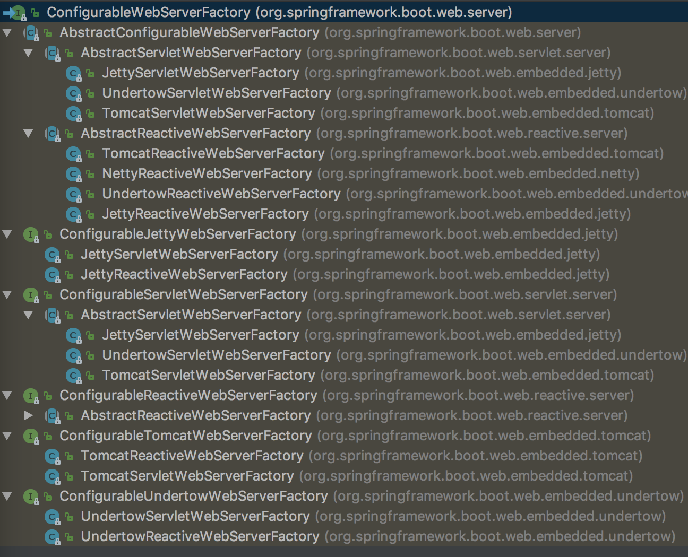
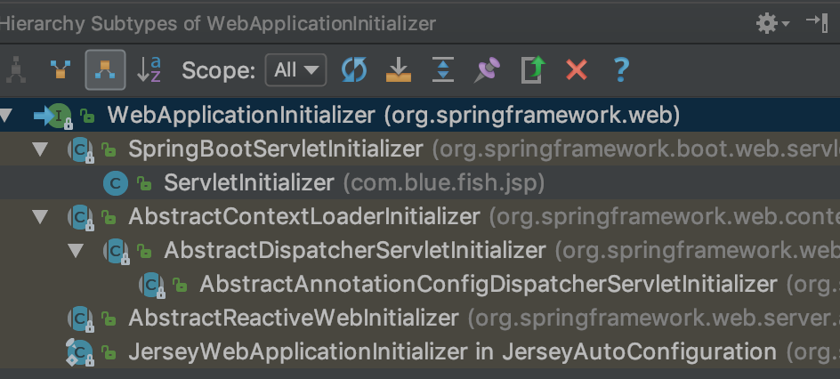

# 一、SpringBoot

- [SpringBoot-JVM优化](https://heapdump.cn/article/3545423)

## 1、简介

简化Spring应用开发的一个框架；

整个Spring技术栈的一个大整合；

J2EE开发的一站式解决方案；

## 2、SpringBoot项目结构

### 2.1、pom文件

```xml
<parent>
    <groupId>org.springframework.boot</groupId>
    <artifactId>spring-boot-starter-parent</artifactId>
	<!-- 具体版本 -->
    <version>1.5.9.RELEASE</version>
</parent>
<!-- 其父项目是 -->
<parent>
  <groupId>org.springframework.boot</groupId>
  <artifactId>spring-boot-dependencies</artifactId>
  <!-- 指定版本 -->
  <version>1.5.9.RELEASE</version>
  <relativePath>../../spring-boot-dependencies</relativePath>
</parent>
<!-- 真正管理Spring Boot应用里面的所有依赖版本； -->
```
导入依赖默认是不需要写版本；

### 2.2、启动器

```xml
<dependency>
    <groupId>org.springframework.boot</groupId>
    <artifactId>spring-boot-starter-web</artifactId>
</dependency>
```
spring-boot-starter：spring-boot场景启动器；导入了web模块正常运行所依赖的组件；

Spring Boot将所有的功能场景都抽取出来，做成一个个的starters（启动器），只需要在项目里面引入这些starter相关场景的所有依赖都会导入进来。要用什么功能就导入什么场景的启动器

### 2.3、主程序

```java
/**
 *  @SpringBootApplication 来标注一个主程序类，说明这是一个Spring Boot应用
 */
@SpringBootApplication
public class HelloWorldMainApplication {
    public static void main(String[] args) {
        // Spring应用启动起来
        SpringApplication.run(HelloWorldMainApplication.class,args);
    }
}
```

@**SpringBootApplication**：Spring Boot应用标注在某个类上说明这个类是SpringBoot的主配置类，SpringBoot就应该运行这个类的main方法来启动SpringBoot应用；

```java
@Target(ElementType.TYPE)
@Retention(RetentionPolicy.RUNTIME)
@Documented
@Inherited
@SpringBootConfiguration
@EnableAutoConfiguration
@ComponentScan(excludeFilters = {
      @Filter(type = FilterType.CUSTOM, classes = TypeExcludeFilter.class),
      @Filter(type = FilterType.CUSTOM, classes = AutoConfigurationExcludeFilter.class) })
public @interface SpringBootApplication {}
```
- **@SpringBootConfiguration**：Spring Boot的配置类；注在某个类上，表示这是一个Spring Boot的配置类；

- **@Configuration**：配置类上来标注这个注解；配置类 <----->  配置文件；配置类也是容器中的一个组件；@Component

- **@EnableAutoConfiguration**：开启自动配置功能；以前需要配置的东西，SpringBoot自动配置；**@EnableAutoConfiguration** 告诉SpringBoot开启自动配置功能；这样自动配置才能生效；
	```java
	@AutoConfigurationPackage
	@Import(EnableAutoConfigurationImportSelector.class)
	public @interface EnableAutoConfiguration {}
	```
	- @**AutoConfigurationPackage**：自动配置包

	- @**Import**(AutoConfigurationPackages.Registrar.class)：Spring的底层注解@Import，给容器中导入一个组件；导入的组件由AutoConfigurationPackages.Registrar.class；

		将主配置类（@SpringBootApplication标注的类）的所在包及下面所有子包里面的所有组件扫描到Spring容器；

 	**@Import(EnableAutoConfigurationImportSelector.class)**：给容器中导入组件

EnableAutoConfigurationImportSelector 导入哪些组件的选择器；将所有需要导入的组件以全类名的方式返回；这些组件会被添加到容器中；会给容器中导入非常多的自动配置类```（xxxAutoConfiguration）```就是给容器中导入这个场景需要的所有组件，并配置好这些组件；有了自动配置类，免去了我们手动编写配置注入功能组件等的工作；

```java
SpringFactoriesLoader.loadFactoryNames(EnableAutoConfiguration.class,classLoader)；
```

SpringBoot在启动的时候从类路径下的 `META-INF/spring.factories` 中获取`EnableAutoConfiguration`指定的值，将这些值作为自动配置类导入到容器中，自动配置类就生效，帮我们进行自动配置工作；以前我们需要自己配置的东西，自动配置类都帮我们；

**J2EE的整体整合解决方案和自动配置都在spring-boot-autoconfigure-1.5.9.RELEASE.jar；**

# 二、SpringBoot配置

## 1、配置文件

SpringBoot使用一个全局的配置文件，配置文件名是固定的；
- application.properties
- application.yml

配置文件的作用：修改SpringBoot自动配置的默认值；SpringBoot在底层都给我们自动配置好；

## 2、YAML语法

## 3、配置文件值注入

### 3.1、注入方式

有如下配置文件：
```yaml
person:
    lastName: hello
    age: 18
    boss: false
    birth: 2017/12/12
    maps: {k1: v1,k2: 12}
    lists:
      - lisi
      - zhaoliu
    dog:
      name: 小狗
      age: 12
```
其对于JavaBean如下：
```java
/**
 * 将配置文件中配置的每一个属性的值，映射到这个组件中
 * @ConfigurationProperties：告诉SpringBoot将本类中的所有属性和配置文件中相关的配置进行绑定；prefix = "person"：配置文件中哪个下面的所有属性进行一一映射
 * 只有这个组件是容器中的组件，才能容器提供的@ConfigurationProperties功能；
 */
@Component
@ConfigurationProperties(prefix = "person")
public class Person {
    private String lastName;
    private Integer age;
    private Boolean boss;
    private Date birth;

    private Map<String,Object> maps;
    private List<Object> lists;
    private Dog dog;
```
可以导入配置文件处理器，以后编写配置就有提示了
```xml
<!--导入配置文件处理器，配置文件进行绑定就会有提示-->
<dependency>
	<groupId>org.springframework.boot</groupId>
	<artifactId>spring-boot-configuration-processor</artifactId>
	<optional>true</optional>
</dependency>
```

### 3.2、@Value获取值和@ConfigurationProperties获取值比较

|            | @ConfigurationProperties | @Value |
| ---------- | ------------------------ | ------ |
| 功能         | 批量注入配置文件中的属性             | 一个个指定  |
| 松散绑定（松散语法） | 支持                       | 不支持    |
| SpEL       | 不支持                      | 支持     |
| JSR303数据校验 | 支持                       | 不支持    |
| 复杂类型封装     | 支持                       | 不支持    |

- 配置文件yml还是properties他们都能获取到值；
- 如果说，我们只是在某个业务逻辑中需要获取一下配置文件中的某项值，使用`@Value`；
- 如果说，我们专门编写了一个javaBean来和配置文件进行映射，我们就直接使用`@ConfigurationProperties`；

### 3.3、@PropertySource&@ImportResource&@Bean

- @**PropertySource**：加载指定的配置文件；
	```java
	@PropertySource(value = {"classpath:person.properties"})
	@Component
	@ConfigurationProperties(prefix = "person")
	public class Person {}
	```
- @**ImportResource**：导入Spring的配置文件，让配置文件里面的内容生效；
	```java
	@ImportResource(locations = {"classpath:beans.xml"})
	// 导入Spring的配置文件让其生效
	```

SpringBoot推荐给容器中添加组件的方式
- 1、配置类`@Configuration`：Spring配置文件，通过启动一个`AnnotationConfigApplicationContext` 来引导这个`@Configuration` 注解的类

	@Configuration 使用@Component 进行原注解，因此@Configuration 类也可以被组件扫描
	```java
	@Target(ElementType.TYPE)
	@Retention(RetentionPolicy.RUNTIME)
	@Documented
	@Component
	public @interface Configuration {
		String value() default "";
	}
	```
- 2、使用`@Bean`给容器中添加组件
	```java
	/**
	* @Configuration：指明当前类是一个配置类；就是来替代之前的Spring配置文件
	* 在配置文件中用<bean><bean/>标签添加组件
	*/
	@Configuration
	public class MyAppConfig {
		//将方法的返回值添加到容器中；容器中这个组件默认的id就是方法名
		@Bean
		public HelloService helloService02(){
			System.out.println("配置类@Bean给容器中添加组件了...");
			return new HelloService();
		}
	}
	```

## 4、配置文件占位符

### 4.1、随机数

```java
${random.value}、${random.int}、${random.long}
${random.int(10)}、${random.int[1024,65536]}
```

### 4.2、占位符获取之前配置的值，如果没有可以是用“:”指定默认值

```properties
person.last-name=张三${random.uuid}
person.age=${random.int}
person.birth=2017/12/15
person.boss=false
person.maps.k1=v1
person.maps.k2=14
person.lists=a,b,c
# person.hello 是没有配置的，其会使用:后面的hello代替
person.dog.name=${person.hello:hello}_dog
person.dog.age=15
```

## 5、Profile

### 5.1、多Profile文件

在主配置文件编写的时候，文件名可以是：`application-{profile}.properties/yml`；默认使用`application.properties`的配置；

### 5.2、yml支持多文档块方式

```yaml
server:
  port: 8081
spring:
  profiles:
    active: prod
---
server:
  port: 8083
spring:
  profiles: dev
---
server:
  port: 8084
spring:
  profiles: prod  #指定属于哪个环境
```

### 5.3、激活指定profile

- 在配置文件中指定：`spring.profiles.active=dev`
- 命令行：
​	java -jar springboot-0.0.1-SNAPSHOT.jar --spring.profiles.active=dev；
​	可以直接在测试的时候，配置传入命令行参数
- 虚拟机参数：
​	-Dspring.profiles.active=dev

### 5.4、通过maven构建时指定

```
├── pom.xml
├── src
│   ├── main
│   │   ├── java
│   │   │   └── com
│   │   │       ├── SpringBootApplication.java
│   │   ├── resources
│   │   │   ├── application-dev.properties
│   │   │   ├── application-prod.properties
│   │   │   ├── application.properties
```

上面的方式打包成jar包时仍然会保留所有profile的文件，按照上面的文件结构，仍然会保留`application-prod.properties`、`application-dev.properties`两个文件；

如何通过maven的方式打包出来的jar包只包含需要的文件？

**（1）application.properties改为如下代码：**
```
spring.profiles.active=@build.profile.id@
```

**（2）pom.xml增加如下代码：**
```xml
<project>
	...
	<build>
        <resources>
            <resource>
                <directory>src/main/resources</directory>
                <filtering>true</filtering>
                <excludes>
                    <exclude>application-*.properties</exclude>
                </excludes>
            </resource>
            <resource>
                <directory>src/main/resources</directory>
                <filtering>false</filtering>
                <includes>
                    <include>application-${build.profile.id}.properties</include>
                </includes>
            </resource>
        </resources>
    </build>
    <profiles>
        <!--开发环境-->
        <profile>
            <id>dev</id>
            <properties>
                <build.profile.id>dev</build.profile.id>
            </properties>
            <activation>
                <activeByDefault>true</activeByDefault>
            </activation>
        </profile>
        <!--生产环境-->
        <profile>
            <id>prod</id>
            <properties>
                <build.profile.id>prod</build.profile.id>
            </properties>
        </profile>
    </profiles>
</project>
```
**（3）通过如下maven命令执行：**
```
mvn clean install -DskipTests -P prod
```
执行完上述命令之后打开target目录，可以看到只包含了 `application-prod.properties` 文件，多余的文件没有包含在里面；
```
├── classes
│   ├── application-prod.properties
│   ├── application.properties
│   ├── com
│   │   ├── SpringBootApplication.class
```

或者通过idea中maven的lifecycle创建clean相关命令操作，添加如下命令：`clean install -DskipTests -P prod -f pom.xml`


## 6、配置文件加载位置

springboot 启动会扫描以下位置的application.properties或者application.yml文件作为Spring boot的默认配置文件

- file:./config/
- file:./
- classpath:/config/
- classpath:/

优先级由高到底，高优先级的配置会覆盖低优先级的配置；SpringBoot会从这四个位置全部加载主配置文件；**互补配置**；

还可以通过spring.config.location来改变默认的配置文件位置

**项目打包好以后，我们可以使用命令行参数的形式，启动项目的时候来指定配置文件的新位置；指定配置文件和默认加载的这些配置文件共同起作用形成互补配置；**

java -jar springboot-02-0.0.1-SNAPSHOT.jar --spring.config.location=G:/application.properties

## 7、外部配置加载顺序

SpringBoot也可以从以下位置加载配置； 优先级从高到低；高优先级的配置覆盖低优先级的配置，所有的配置会形成互补配置
- Devtools全局配置
- 测试环境`@TestPropertySource`注解
- 测试环境`properties`属性
- 命令行参数：所有的配置都可以在命令行上进行指定：`java -jar springboot-02-0.0.1-SNAPSHOT.jar --server.port=8087  --server.context-path=/abc`；多个配置用空格分开； `--配置项=值`
- `SPRING_APPLICATION_JSON`属性
- `ServletConfig`初始化参数
- `ServletContext`初始化参数
- 来自`java:comp/env`的JNDI属性
- Java系统属性（`System.getProperties()`）
- 操作系统环境变量
- `RandomValuePropertySource`配置的`random.*`属性值；
- jar包外部的`application-{profile}.properties`或`application.yml`(带spring.profile)配置文件；
- jar包内部的`application-{profile}.properties`或`application.yml`(带spring.profile)配置文件；
- jar包外部的`application.properties`或`application.yml`(不带spring.profile)配置文件；
- jar包内部的`application.properties`或`application.yml`(不带spring.profile)配置文件；
- `@Configuration`注解类上的`@PropertySource`
- 通过`SpringApplication.setDefaultProperties`指定的默认属性

**由jar包外向jar包内进行寻找；优先加载带profile，再来加载不带profile**

[官方配置参考](https://docs.spring.io/spring-boot/docs/1.5.9.RELEASE/reference/htmlsingle/#boot-features-external-config)

## 8、自动配置原理

### 8.1、自动配置原理

[配置文件属性参考](https://docs.spring.io/spring-boot/docs/1.5.9.RELEASE/reference/htmlsingle/#common-application-properties)

```java
@Target({ElementType.TYPE})
@Retention(RetentionPolicy.RUNTIME)
@Documented
@Inherited
<1.>@SpringBootConfiguration
<2.>@ComponentScan
<3.>@EnableAutoConfiguration
public @interface SpringBootApplication {
}

@Target({ElementType.TYPE})
@Retention(RetentionPolicy.RUNTIME)
@Documented
@Configuration //实际上它也是一个配置类
public @interface SpringBootConfiguration {
}
```
可以把 `@SpringBootApplication`看作是 `@Configuration`、`@EnableAutoConfiguration`、`@ComponentScan` 注解的集合。这三个注解的作用分别是：
- `@EnableAutoConfiguration`：启用 SpringBoot 的自动配置机制；
- `@Configuration`：允许在上下文中注册额外的 bean 或导入其他配置类；
- `@ComponentScan`：扫描被`@Component (@Service,@Controller)`注解的 bean，注解默认会扫描启动类所在的包下所有的类 ，可以自定义不扫描某些 bean。如下图所示，容器中将排除`TypeExcludeFilter`和`AutoConfigurationExcludeFilter`；

加载过程：
- `@EnableAutoConfiguration`的主要操作类是：`AutoConfigurationImportSelector`，执行到 `AbstractApplicationContext#invokeBeanFactoryPostProcessors`方法时会调用到 `AutoConfigurationImportSelector#getCandidateConfigurations` 方法，该方法会通过 SpringFactories 从 jar的配置文件`META-INF/spring.factories`加载 key 为 `EnableAutoConfiguration`全类名的属性列表；

	

- 加载之后，会拿到对应的自动装配配置类，但是并不是直接全部加载进去，它是按需加载的，其会：
	- 去掉重复的类；
	- 通过注解exclude的类；
	- 剩余的装配类需要满足一定条件，主要是通过与 Conditional注解组合 相关的注解实现，比如`@ConditionalOnBean`

	

**@EnableAutoConfiguration:实现自动装配的核心注解**

`EnableAutoConfiguration`只是一个简单地注解，自动装配核心功能的实现实际是通过 `AutoConfigurationImportSelector`类
```java
@Target({ElementType.TYPE})
@Retention(RetentionPolicy.RUNTIME)
@Documented
@Inherited
@AutoConfigurationPackage //作用：将main包下的所欲组件注册到容器中
@Import({AutoConfigurationImportSelector.class}) //加载自动装配类 xxxAutoconfiguration
public @interface EnableAutoConfiguration {
    String ENABLED_OVERRIDE_PROPERTY = "spring.boot.enableautoconfiguration";
    Class<?>[] exclude() default {};
    String[] excludeName() default {};
}
```
以 **HttpEncodingAutoConfiguration**（Http编码自动配置）为例解释自动配置原理；
```java
//表示这是一个配置类，以前编写的配置文件一样，也可以给容器中添加组件
@Configuration
//启动指定类的ConfigurationProperties功能；将配置文件中对应的值和HttpEncodingProperties绑定起来；并把HttpEncodingProperties加入到ioc容器中
@EnableConfigurationProperties(HttpEncodingProperties.class)  
//Spring底层@Conditional注解（Spring注解版），根据不同的条件，如果满足指定的条件，整个配置类里面的配置就会生效；    判断当前应用是否是web应用，如果是，当前配置类生效
@ConditionalOnWebApplication 
//判断当前项目有没有这个类CharacterEncodingFilter；SpringMVC中进行乱码解决的过滤器；
@ConditionalOnClass(CharacterEncodingFilter.class) 
//判断配置文件中是否存在某个配置  spring.http.encoding.enabled；如果不存在，判断也是成立的，即使我们配置文件中不配置pring.http.encoding.enabled=true，也是默认生效的；
@ConditionalOnProperty(prefix = "spring.http.encoding", value = "enabled", matchIfMissing = true)  
public class HttpEncodingAutoConfiguration {
	//已经和SpringBoot的配置文件映射了
	private final HttpEncodingProperties properties;
	//只有一个有参构造器的情况下，参数的值就会从容器中拿
	public HttpEncodingAutoConfiguration(HttpEncodingProperties properties) {
		this.properties = properties;
	}
	@Bean   //给容器中添加一个组件，这个组件的某些值需要从properties中获取
	@ConditionalOnMissingBean(CharacterEncodingFilter.class) //判断容器没有这个组件？
	public CharacterEncodingFilter characterEncodingFilter() {
		CharacterEncodingFilter filter = new OrderedCharacterEncodingFilter();
		filter.setEncoding(this.properties.getCharset().name());
		filter.setForceRequestEncoding(this.properties.shouldForce(Type.REQUEST));
		filter.setForceResponseEncoding(this.properties.shouldForce(Type.RESPONSE));
		return filter;
	}
```
根据当前不同的条件判断，决定这个配置类是否生效。一但这个配置类生效；这个配置类就会给容器中添加各种组件；这些组件的属性是从对应的properties类中获取的，这些类里面的每一个属性又是和配置文件绑定的；

**总结几点**
- `xxxxAutoConfigurartion`：自动配置类；给容器中添加组件；
- `xxxxProperties`：封装配置文件中相关属性；

### 8.2、@Conditional派生注解

作用：必须是`@Conditional`指定的条件成立，才给容器中添加组件，配置配里面的所有内容才生效；

| `@Conditional扩展注解                | 作用（判断是否满足当前指定条件）               |
| ------------------------------- | ------------------------------ |
| `@ConditionalOnJava`            | 系统的java版本是否符合要求                |
| `@ConditionalOnBean`              | 容器中存在指定Bean；                   |
| `@ConditionalOnMissingBean`       | 容器中不存在指定Bean；                  |
| `@ConditionalOnExpression`        | 满足SpEL表达式指定                    |
| `@ConditionalOnClass`             | 系统中有指定的类                       |
| `@ConditionalOnMissingClass`      | 系统中没有指定的类                      |
| `@ConditionalOnSingleCandidate`   | 容器中只有一个指定的Bean，或者这个Bean是首选Bean |
| `@ConditionalOnProperty`          | 系统中指定的属性是否有指定的值                |
| `@ConditionalOnResource`          | 类路径下是否存在指定资源文件                 |
| `@ConditionalOnWebApplication`    | 当前是web环境                       |
| `@ConditionalOnNotWebApplication` | 当前不是web环境                      |
| `@ConditionalOnJndi`             | JNDI存在指定项                      |

**自定义conditional注解**
- 实现一个自定义注解并且引入Conditional注解；
	```java
	@Target({ ElementType.TYPE, ElementType.METHOD })
	@Retention(RetentionPolicy.RUNTIME)
	@Documented
	@Conditional(MyCondition.class)
	public @interface MyConditionAnnotation {
		String[] value() default {};
	}
	```
- 实现Condition接口重写matches方法，符合条件返回true；
	```java
	public class MyCondition implements Condition {
		@Override
		public boolean matches(ConditionContext context, AnnotatedTypeMetadata metadata) {
			String[] properties = (String[])metadata.getAnnotationAttributes("MyConditionAnnotation").get("value");
			for (String property : properties) {
				if (StringUtils.isEmpty(context.getEnvironment().getProperty(property))) {
					return false;
				}
			}
			return true;
		}
	}
	```
- 自定义注解Condition接口实现类

**自动配置类必须在一定的条件下才能生效；**

可以通过启用  debug=true属性；来让控制台打印自动配置报告，这样就可以很方便的知道哪些自动配置类生效；

```
============================
CONDITIONS EVALUATION REPORT
============================

Positive matches:
-----------------

   CodecsAutoConfiguration matched:
      - @ConditionalOnClass found required class 'org.springframework.http.codec.CodecConfigurer'; @ConditionalOnMissingClass did not find unwanted class (OnClassCondition)

   CodecsAutoConfiguration.JacksonCodecConfiguration matched:
      - @ConditionalOnClass found required class 'com.fasterxml.jackson.databind.ObjectMapper'; @ConditionalOnMissingClass did not find unwanted class (OnClassCondition)

   CodecsAutoConfiguration.JacksonCodecConfiguration#jacksonCodecCustomizer matched:
      - @ConditionalOnBean (types: com.fasterxml.jackson.databind.ObjectMapper; SearchStrategy: all) found bean 'jacksonObjectMapper' (OnBeanCondition)
	...
Negative matches:
-----------------

   ActiveMQAutoConfiguration:
      Did not match:
         - @ConditionalOnClass did not find required classes 'javax.jms.ConnectionFactory', 'org.apache.activemq.ActiveMQConnectionFactory' (OnClassCondition)

   AopAutoConfiguration:
      Did not match:
         - @ConditionalOnClass did not find required classes 'org.aspectj.lang.annotation.Aspect', 'org.aspectj.lang.reflect.Advice', 'org.aspectj.weaver.AnnotatedElement' (OnClassCondition)
	...
Exclusions:
-----------
    None

Unconditional classes:
----------------------

    org.springframework.boot.autoconfigure.context.PropertyPlaceholderAutoConfiguration

    org.springframework.boot.autoconfigure.web.embedded.EmbeddedWebServerFactoryCustomizerAutoConfiguration

    org.springframework.boot.autoconfigure.security.reactive.ReactiveSecurityAutoConfiguration

    org.springframework.boot.autoconfigure.context.ConfigurationPropertiesAutoConfiguration

    org.springframework.boot.autoconfigure.info.ProjectInfoAutoConfiguration

```

# 三、SprinBoot-Web开发

## 1、静态资源映射

```java
@ConfigurationProperties(prefix = "spring.resources", ignoreUnknownFields = false)
public class ResourceProperties implements ResourceLoaderAware {
  //可以设置和静态资源有关的参数，缓存时间等
}
```
WebMvcAuotConfiguration
```java
@Override
public void addResourceHandlers(ResourceHandlerRegistry registry) {
	if (!this.resourceProperties.isAddMappings()) {
		logger.debug("Default resource handling disabled");
		return;
	}
	Integer cachePeriod = this.resourceProperties.getCachePeriod();
	if (!registry.hasMappingForPattern("/webjars/**")) {
		customizeResourceHandlerRegistration(registry.addResourceHandler("/webjars/**")
						.addResourceLocations("classpath:/META-INF/resources/webjars/")
						.setCachePeriod(cachePeriod));
	}
	String staticPathPattern = this.mvcProperties.getStaticPathPattern();
	//静态资源文件夹映射
	if (!registry.hasMappingForPattern(staticPathPattern)) {
		customizeResourceHandlerRegistration(registry.addResourceHandler(staticPathPattern)
						.addResourceLocations(this.resourceProperties.getStaticLocations())
						.setCachePeriod(cachePeriod));
	}
}

//配置欢迎页映射
@Bean
public WelcomePageHandlerMapping welcomePageHandlerMapping(
		ResourceProperties resourceProperties) {
	return new WelcomePageHandlerMapping(resourceProperties.getWelcomePage(),
			this.mvcProperties.getStaticPathPattern());
}

//配置喜欢的图标
@Configuration
@ConditionalOnProperty(value = "spring.mvc.favicon.enabled", matchIfMissing = true)
public static class FaviconConfiguration {
	private final ResourceProperties resourceProperties;
	public FaviconConfiguration(ResourceProperties resourceProperties) {
		this.resourceProperties = resourceProperties;
	}
	@Bean
	public SimpleUrlHandlerMapping faviconHandlerMapping() {
		SimpleUrlHandlerMapping mapping = new SimpleUrlHandlerMapping();
		mapping.setOrder(Ordered.HIGHEST_PRECEDENCE + 1);
		//所有  **/favicon.ico 
		mapping.setUrlMap(Collections.singletonMap("**/favicon.ico",faviconRequestHandler()));
		return mapping;
	}
	@Bean
	public ResourceHttpRequestHandler faviconRequestHandler() {
		ResourceHttpRequestHandler requestHandler = new ResourceHttpRequestHandler();
		requestHandler.setLocations(this.resourceProperties.getFaviconLocations());
		return requestHandler;
	}
}
```
- （1）所有 `/webjars/**` ，都去 `classpath:/META-INF/resources/webjars/` 找资源；

	[webjars](http://www.webjars.org/)：以jar包的方式引入静态资源；

	localhost:8080/webjars/jquery/3.3.1/jquery.js
	```xml
		<!--引入jquery-webjar 在访问的时候只需要写webjars下面资源的名称即可  -->
		<dependency>
			<groupId>org.webjars</groupId>
			<artifactId>jquery</artifactId>
			<version>3.3.1</version>
		</dependency>
	```

- （2）"/**" 访问当前项目的任何资源，都去（静态资源的文件夹）找映射
	```
	"classpath:/META-INF/resources/", 
	"classpath:/resources/",
	"classpath:/static/", 
	"classpath:/public/" 
	"/"：当前项目的根路径
	```
	localhost:8080/abc 去静态资源文件夹里面找abc

- （3）欢迎页：静态资源文件夹下的所有index.html页面；被"/**"映射；

- （4）所有的 **/favicon.ico  都是在静态资源文件下找

## 2、模板引擎

### 2.1、引入[thymeleaf](https://www.thymeleaf.org/doc/tutorials/3.0/usingthymeleaf.html)

```xml
<dependency>
	<groupId>org.springframework.boot</groupId>
	<artifactId>spring-boot-starter-thymeleaf</artifactId>
	2.1.6
</dependency>
<!-- 切换thymeleaf版本 -->
<properties>
	<thymeleaf.version>3.0.9.RELEASE</thymeleaf.version>
	<!-- 布局功能的支持程序  thymeleaf3主程序  layout2以上版本 -->
	<!-- thymeleaf2   layout1-->
	<thymeleaf-layout-dialect.version>2.2.2</thymeleaf-layout-dialect.version>
</properties>
```

### 2.2、thymeleaf使用

```java
@ConfigurationProperties(prefix = "spring.thymeleaf")
public class ThymeleafProperties {
	private static final Charset DEFAULT_ENCODING = Charset.forName("UTF-8");
	private static final MimeType DEFAULT_CONTENT_TYPE = MimeType.valueOf("text/html");
	public static final String DEFAULT_PREFIX = "classpath:/templates/";
	public static final String DEFAULT_SUFFIX = ".html";
}
```
只要我们把HTML页面放在`classpath:/templates/`，thymeleaf就能自动渲染
- （1）导入thymeleaf的名称空间
	```html
	<html lang="en" xmlns:th="http://www.thymeleaf.org">
	```
- （2）使用thymeleaf语法；

### 2.3、thymeleaf公共页面元素抽取

**2.3.1、基本步骤**

- 抽取公共片段
```html
<div th:fragment="copy">
&copy; 2011 The Good Thymes Virtual Grocery
</div>
```

- 引入公共片段
```html
<div th:insert="~{footer :: copy}"></div>
~{templatename::selector}：模板名::选择器
~{templatename::fragmentname}:模板名::片段名
```
- 默认效果：insert的公共片段在div标签中，如果使用th:insert等属性进行引入，可以不用写~{}；行内写法可以加上：[[~{}]];[(~{})]；

**2.3.2、三种引入公共片段的th属性**
- **th:insert**：将公共片段整个插入到声明引入的元素中
- **th:replace**：将声明引入的元素替换为公共片段
- **th:include**：将被引入的片段的内容包含进这个标签中
```html
<footer th:fragment="copy">
&copy; 2011 The Good Thymes Virtual Grocery
</footer>

<!-- 引入方式 -->
<div th:insert="footer :: copy"></div>
<div th:replace="footer :: copy"></div>
<div th:include="footer :: copy"></div>

<!-- 效果 -->
<div>
    <footer>
    &copy; 2011 The Good Thymes Virtual Grocery
    </footer>
</div>

<footer>
&copy; 2011 The Good Thymes Virtual Grocery
</footer>

<div>
&copy; 2011 The Good Thymes Virtual Grocery
</div>
```
引入片段的时候传入参数，比如动态显示样式
```html
<nav class="col-md-2 d-none d-md-block bg-light sidebar" id="sidebar">
    <div class="sidebar-sticky">
        <ul class="nav flex-column">
            <li class="nav-item">
                <a class="nav-link active"
                   th:class="${activeUri=='main.html'?'nav-link active':'nav-link'}"
                   href="#" th:href="@{/main.html}">
                    <svg xmlns="http://www.w3.org/2000/svg" width="24" height="24" viewBox="0 0 24 24" fill="none" stroke="currentColor" stroke-width="2" stroke-linecap="round" stroke-linejoin="round" class="feather feather-home">
                        <path d="M3 9l9-7 9 7v11a2 2 0 0 1-2 2H5a2 2 0 0 1-2-2z"></path>
                        <polyline points="9 22 9 12 15 12 15 22"></polyline>
                    </svg>
                    Dashboard <span class="sr-only">(current)</span>
                </a>
            </li>

<!--引入侧边栏;传入参数-->
<div th:replace="commons/bar::#sidebar(activeUri='emps')"></div>
```

## 3、SpringMVC自动配置

-[SpringMVC自动配置官方](https://docs.spring.io/spring-boot/docs/1.5.10.RELEASE/reference/htmlsingle/#boot-features-developing-web-applications)

### 3.1、Spring MVC auto-configuration

WebMvcAutoConfiguration
- 自动配置了ViewResolver（视图解析器：根据方法的返回值得到视图对象（View），视图对象决定如何渲染（转发？重定向？））；
- ContentNegotiatingViewResolver：组合所有的视图解析器的；
- 如何定制：我们可以自己给容器中添加一个视图解析器；自动的将其组合进来；
- 静态资源文件夹路径,webjars；
- 自动注册了`Converter`, `GenericConverter`, `Formatter` beans
	- Converter：转换器；  public String hello(User user)：类型转换使用Converter；
	- `Formatter`  格式化器；  2017.12.17 -> Date；
		```java
		@Bean
		@ConditionalOnProperty(prefix = "spring.mvc", name = "date-format")//在文件中配置日期格式化的规则
		public Formatter<Date> dateFormatter() {
			return new DateFormatter(this.mvcProperties.getDateFormat());//日期格式化组件
		}	
		```
		自己添加的格式化器转换器，我们只需要放在容器中即可
- HttpMessageConverter：SpringMVC用来转换Http请求和响应的；User---Json；
- `HttpMessageConverters` 是从容器中确定；获取所有的HttpMessageConverter；自己给容器中添加HttpMessageConverter，只需要将自己的组件注册容器中

### 3.2、扩展SpringMVC

```xml
<mvc:view-controller path="/hello" view-name="success"/>
<mvc:interceptors>
	<mvc:interceptor>
		<mvc:mapping path="/hello"/>
		<bean></bean>
	</mvc:interceptor>
</mvc:interceptors>
```
编写一个配置类（@Configuration），是`WebMvcConfigurerAdapter`类型；不能标注`@EnableWebMvc`；既保留了所有的自动配置，也能用我们扩展的配置；
```java
//使用WebMvcConfigurerAdapter可以来扩展SpringMVC的功能
@Configuration
public class MyMvcConfig extends WebMvcConfigurerAdapter {
    @Override
    public void addViewControllers(ViewControllerRegistry registry) {
       // super.addViewControllers(registry);
        //浏览器发送 /bluefish 请求来到 success
        registry.addViewController("/bluefish").setViewName("success");
    }
}
```
**原理：**
- WebMvcAutoConfiguration是SpringMVC的自动配置类；
- 在做其他自动配置时会导入；@Import(**EnableWebMvcConfiguration**.class)
	```java
	@Configuration
	public static class EnableWebMvcConfiguration extends DelegatingWebMvcConfiguration {
      private final WebMvcConfigurerComposite configurers = new WebMvcConfigurerComposite();
	 //从容器中获取所有的WebMvcConfigurer
      @Autowired(required = false)
      public void setConfigurers(List<WebMvcConfigurer> configurers) {
          if (!CollectionUtils.isEmpty(configurers)) {
              this.configurers.addWebMvcConfigurers(configurers);
            	//一个参考实现；将所有的WebMvcConfigurer相关配置都来一起调用；  
            	@Override
             // public void addViewControllers(ViewControllerRegistry registry) {
              //    for (WebMvcConfigurer delegate : this.delegates) {
               //       delegate.addViewControllers(registry);
               //   }
              }
          }
	}
	```
- 容器中所有的WebMvcConfigurer都会一起起作用；
- 自定义配置的类也会被调用：SpringMVC的自动配置和扩展配置都会起作用；

### 3.3、自动配置SpringMVC失效

SpringBoot对SpringMVC的自动配置不需要了，所有都是我们自己配置；所有的SpringMVC的自动配置都失效了，**只需要在配置类中添加@EnableWebMvc即可**

```java
//使用WebMvcConfigurerAdapter可以来扩展SpringMVC的功能
@EnableWebMvc
@Configuration
public class MyMvcConfig extends WebMvcConfigurerAdapter {
    @Override
    public void addViewControllers(ViewControllerRegistry registry) {
       // super.addViewControllers(registry);
        //浏览器发送 /atguigu 请求来到 success
        registry.addViewController("/atguigu").setViewName("success");
    }
}
```
**为什么@EnableWebMvc自动配置就失效了？**
- @EnableWebMvc的核心：
	```java
	@Import(DelegatingWebMvcConfiguration.class)
	public @interface EnableWebMvc {}
	```
	```java
	@Configuration
	public class DelegatingWebMvcConfiguration extends WebMvcConfigurationSupport {}
	```
- WebMVCAutoConfiguration
	```java
	@Configuration
	@ConditionalOnWebApplication
	@ConditionalOnClass({ Servlet.class, DispatcherServlet.class,
			WebMvcConfigurerAdapter.class })
	//容器中没有这个组件的时候，这个自动配置类才生效
	@ConditionalOnMissingBean(WebMvcConfigurationSupport.class)
	@AutoConfigureOrder(Ordered.HIGHEST_PRECEDENCE + 10)
	@AutoConfigureAfter({ DispatcherServletAutoConfiguration.class,
			ValidationAutoConfiguration.class })
	public class WebMvcAutoConfiguration {}
	```
- @EnableWebMvc将WebMvcConfigurationSupport组件导入进来；
- 导入的WebMvcConfigurationSupport只是SpringMVC最基本的功能；

### 3.4、修改SpringBoot的默认配置

- SpringBoot在自动配置很多组件的时候，先看容器中有没有用户自己配置的（@Bean、@Component）如果有就用用户配置的，如果没有，才自动配置；如果有些组件可以有多个（ViewResolver）将用户配置的和自己默认的组合起来；
- 在SpringBoot中会有非常多的xxxConfigurer帮助我们进行扩展配置；
- 在SpringBoot中会有很多的xxxCustomizer帮助我们进行定制配置；

## 4、SpringBoot国际化

### 4.1、基本步骤

- 编写国际化配置文件
- 使用ResourceBundleMessageSource管理国际化资源文件
- 在页面使用fmt:message取出国际化内容

### 4.2、编写国际化配置文件


### 4.3、SpringBoot自动配置管理国际化资源文件的组件
```java
@ConfigurationProperties(prefix = "spring.messages")
public class MessageSourceAutoConfiguration {
	private String basename = "messages";  
    //我们的配置文件可以直接放在类路径下叫messages.properties；
    @Bean
	public MessageSource messageSource() {
		ResourceBundleMessageSource messageSource = new ResourceBundleMessageSource();
		if (StringUtils.hasText(this.basename)) {
            //设置国际化资源文件的基础名（去掉语言国家代码的）
			messageSource.setBasenames(StringUtils.commaDelimitedListToStringArray(
					StringUtils.trimAllWhitespace(this.basename)));
		}
		if (this.encoding != null) {
			messageSource.setDefaultEncoding(this.encoding.name());
		}
		messageSource.setFallbackToSystemLocale(this.fallbackToSystemLocale);
		messageSource.setCacheSeconds(this.cacheSeconds);
		messageSource.setAlwaysUseMessageFormat(this.alwaysUseMessageFormat);
		return messageSource;
	}
```
在`application.properties`中加入配置，即指定basename
```
spring.messages.basename=i18n.login
```

### 4.4、在页面中使用

如果是thymeleaf模板的话，直接使用：```th:text="#{login.tip}"```

页面根据浏览器设置的语言信息来实现国际化，其springboot实现是有个国际化（Locale-区域信息对象）和LocaleResolver（区域对象解析器）来实现的
```java
@Bean
@ConditionalOnMissingBean
@ConditionalOnProperty(prefix = "spring.mvc", name = "locale")
public LocaleResolver localeResolver() {
	if (this.mvcProperties
			.getLocaleResolver() == WebMvcProperties.LocaleResolver.FIXED) {
		return new FixedLocaleResolver(this.mvcProperties.getLocale());
	}
	AcceptHeaderLocaleResolver localeResolver = new AcceptHeaderLocaleResolver();
	localeResolver.setDefaultLocale(this.mvcProperties.getLocale());
	return localeResolver;
}

// 默认的就是根据请求头带来的区域信息获取Locale进行国际化
// AcceptHeaderLocaleResolver 里面是解析request中的 Accept-Language 来实现的
public class AcceptHeaderLocaleResolver implements LocaleResolver{
	@Override
	public Locale resolveLocale(HttpServletRequest request) {
		Locale defaultLocale = getDefaultLocale();
		if (defaultLocale != null && request.getHeader("Accept-Language") == null) {
			return defaultLocale;
		}
		Locale requestLocale = request.getLocale();
		List<Locale> supportedLocales = getSupportedLocales();
		if (supportedLocales.isEmpty() || supportedLocales.contains(requestLocale)) {
			return requestLocale;
		}
		Locale supportedLocale = findSupportedLocale(request, supportedLocales);
		if (supportedLocale != null) {
			return supportedLocale;
		}
		return (defaultLocale != null ? defaultLocale : requestLocale);
	}
}
```

### 4.5、根据连接来实现切换国际化

```java
/**
 * 可以在连接上携带区域信息
 */
public class MyLocaleResolver implements LocaleResolver {
    @Override
    public Locale resolveLocale(HttpServletRequest request) {
        String l = request.getParameter("l");
        Locale locale = Locale.getDefault();
        if(!StringUtils.isEmpty(l)){
            String[] split = l.split("_");
            locale = new Locale(split[0],split[1]);
        }
        return locale;
    }
    @Override
    public void setLocale(HttpServletRequest request, HttpServletResponse response, Locale locale) {
    }
}

// 在对应的配置类中将 MyLocaleResolver加入到容器中
@Bean
public LocaleResolver localeResolver(){
	return new MyLocaleResolver();
}
```
页面可以进行如下编写：
```html
<a class="btn btn-sm" th:href="@{/index.html(l='zh_CN')}">中文</a>
<a class="btn btn-sm" th:href="@{/index.html(l='en_US')}">English</a>
```
> 如果国际化内容中既包含占位符也包含一些特殊字符，比如：`can't`，为了返回到包含正确的内容，需要配置为：`can''t`

## 5、拦截器

在SpringBoot1.x版本中，静态资源不会被拦截，spring boot 2.x静态资源会被HandlerInterceptor拦截，是因为spring boot 2.x依赖的spring 5.x版本，相对于spring boot 1.5.x依赖的spring 4.3.x版本而言，针对资源的拦截器初始化时有区别，具体源码在WebMvcConfigurationSupport中

spring 4.3.x源码如下
```java
/**
 * Return a handler mapping ordered at Integer.MAX_VALUE-1 with mapped
 * resource handlers. To configure resource handling, override
 * {@link #addResourceHandlers}.
 */
@Bean
public HandlerMapping resourceHandlerMapping() {
    ResourceHandlerRegistry registry = new ResourceHandlerRegistry(this.applicationContext,
				this.servletContext, mvcContentNegotiationManager());
    addResourceHandlers(registry);

    AbstractHandlerMapping handlerMapping = registry.getHandlerMapping();
    if (handlerMapping != null) {
        handlerMapping.setPathMatcher(mvcPathMatcher());
        handlerMapping.setUrlPathHelper(mvcUrlPathHelper());
        // 此处固定添加了一个Interceptor
        handlerMapping.setInterceptors(new ResourceUrlProviderExposingInterceptor(mvcResourceUrlProvider()));
        handlerMapping.setCorsConfigurations(getCorsConfigurations());
		}
    else {
        handlerMapping = new EmptyHandlerMapping();
    }
    return handlerMapping;
}
```

而spring 5.x的源码如下
```java
/**
 * Return a handler mapping ordered at Integer.MAX_VALUE-1 with mapped
 * resource handlers. To configure resource handling, override
 * {@link #addResourceHandlers}.
 */
@Bean
public HandlerMapping resourceHandlerMapping() {
    Assert.state(this.applicationContext != null, "No ApplicationContext set");
    Assert.state(this.servletContext != null, "No ServletContext set");

    ResourceHandlerRegistry registry = new ResourceHandlerRegistry(this.applicationContext,
				this.servletContext, mvcContentNegotiationManager(), mvcUrlPathHelper());
    addResourceHandlers(registry);

    AbstractHandlerMapping handlerMapping = registry.getHandlerMapping();
    if (handlerMapping != null) {
        handlerMapping.setPathMatcher(mvcPathMatcher());
        handlerMapping.setUrlPathHelper(mvcUrlPathHelper());
        // 此处是将所有的HandlerInterceptor都添加了（包含自定义的HandlerInterceptor）
        handlerMapping.setInterceptors(getInterceptors());
        handlerMapping.setCorsConfigurations(getCorsConfigurations());
    }
    else {
        handlerMapping = new EmptyHandlerMapping();
    }
    return handlerMapping;
}
/**
 * Provide access to the shared handler interceptors used to configure
 * {@link HandlerMapping} instances with. This method cannot be overridden,
 * use {@link #addInterceptors(InterceptorRegistry)} instead.
 */
protected final Object[] getInterceptors() {
    if (this.interceptors == null) {
        InterceptorRegistry registry = new InterceptorRegistry();
        // 此处传入新new的registry对象，在配置类当中设置自定义的HandlerInterceptor后即可获取到
        addInterceptors(registry);
        registry.addInterceptor(new ConversionServiceExposingInterceptor(mvcConversionService()));
        registry.addInterceptor(new ResourceUrlProviderExposingInterceptor(mvcResourceUrlProvider()));
        this.interceptors = registry.getInterceptors();
    }
    return this.interceptors.toArray();
}
```

## 6、错误处理机制

### 6.1、SpringBoot默认的错误处理机制

**1、默认效果**
- 浏览器，返回一个默认的错误页面

	

	浏览器发送请求的请求头：里面包含```text/html```
	```
	GET /crud/111 HTTP/1.1
	Host: localhost:8080
	Connection: keep-alive
	Cache-Control: max-age=0
	Upgrade-Insecure-Requests: 1
	User-Agent: Mozilla/5.0 (Macintosh; Intel Mac OS X 10_13_6) AppleWebKit/537.36 (KHTML, like Gecko) Chrome/69.0.3497.92 Safari/537.36
	Accept: text/html,application/xhtml+xml,application/xml;q=0.9,image/webp,image/apng,*/*;q=0.8
	Accept-Encoding: gzip, deflate, br
	Accept-Language: zh-CN,zh;q=0.9,en;q=0.8
	Cookie: JSESSIONID=A4D817FED29FD908D7530D3D9ED23CBC; _ga=GA1.1.1624944876.1532302839; Idea-d4397549=aacfd2b2-eff8-4dad-ad2b-3e17d81681c4
	```
- 如果是其他客户端，默认响应一个json数据
	```json
	{
		"timestamp": "2018-10-04T01:26:44.051+0000",
		"status": 404,
		"error": "Not Found",
		"message": "No message available",
		"path": "/crud/111"
	}
	```
	其请求头：
	```
	cache-control:"no-cache"
	postman-token:"51992b10-a0af-4499-8445-509736fc46d7"
	user-agent:"PostmanRuntime/7.2.0"
	accept:"*/*"
	host:"localhost:8080"
	accept-encoding:"gzip, deflate"
	```

**2、原理**

参照ErrorMvcAutoConfiguration；错误处理的自动配置；给容器中添加了以下组件
- （1）DefaultErrorAttributes
	```java
	// 帮我们在页面共享信息；
	@Override
	public Map<String, Object> getErrorAttributes(RequestAttributes requestAttributes,
			boolean includeStackTrace) {
		Map<String, Object> errorAttributes = new LinkedHashMap<String, Object>();
		errorAttributes.put("timestamp", new Date());
		addStatus(errorAttributes, requestAttributes);
		addErrorDetails(errorAttributes, requestAttributes, includeStackTrace);
		addPath(errorAttributes, requestAttributes);
		return errorAttributes;
	}
	```
- (2）BasicErrorController：处理默认/error请求
	```java
	@Controller
	@RequestMapping("${server.error.path:${error.path:/error}}")
	public class BasicErrorController extends AbstractErrorController {

		@RequestMapping(produces = "text/html")//产生html类型的数据；浏览器发送的请求来到这个方法处理
		public ModelAndView errorHtml(HttpServletRequest request,
				HttpServletResponse response) {
			HttpStatus status = getStatus(request);
			Map<String, Object> model = Collections.unmodifiableMap(getErrorAttributes(
					request, isIncludeStackTrace(request, MediaType.TEXT_HTML)));
			response.setStatus(status.value());
			
			//去哪个页面作为错误页面；包含页面地址和页面内容
			ModelAndView modelAndView = resolveErrorView(request, response, status, model);
			return (modelAndView == null ? new ModelAndView("error", model) : modelAndView);
		}

		@RequestMapping
		@ResponseBody    //产生json数据，其他客户端来到这个方法处理；
		public ResponseEntity<Map<String, Object>> error(HttpServletRequest request) {
			Map<String, Object> body = getErrorAttributes(request,
					isIncludeStackTrace(request, MediaType.ALL));
			HttpStatus status = getStatus(request);
			return new ResponseEntity<Map<String, Object>>(body, status);
		}
	}
	```
- （3）ErrorPageCustomizer
	```java
	@Value("${error.path:/error}")
	private String path = "/error";  // 系统出现错误以后来到error请求进行处理；（web.xml注册的错误页面规则）
	```

- （4）DefaultErrorViewResolver
	```java
	@Override
	public ModelAndView resolveErrorView(HttpServletRequest request, HttpStatus status,
			Map<String, Object> model) {
		ModelAndView modelAndView = resolve(String.valueOf(status), model);
		if (modelAndView == null && SERIES_VIEWS.containsKey(status.series())) {
			modelAndView = resolve(SERIES_VIEWS.get(status.series()), model);
		}
		return modelAndView;
	}

	private ModelAndView resolve(String viewName, Map<String, Object> model) {
        //默认SpringBoot可以去找到一个页面？  error/404
		String errorViewName = "error/" + viewName;
        
        //模板引擎可以解析这个页面地址就用模板引擎解析
		TemplateAvailabilityProvider provider = this.templateAvailabilityProviders
				.getProvider(errorViewName, this.applicationContext);
		if (provider != null) {
            //模板引擎可用的情况下返回到errorViewName指定的视图地址
			return new ModelAndView(errorViewName, model);
		}
        //模板引擎不可用，就在静态资源文件夹下找errorViewName对应的页面   error/404.html
		return resolveResource(errorViewName, model);
	}
	```	

**步骤：**

一但系统出现4xx或者5xx之类的错误；ErrorPageCustomizer就会生效（定制错误的响应规则）；就会来到/error请求；就会被**BasicErrorController**处理；

响应页面；去哪个页面是由**DefaultErrorViewResolver**解析得到的；
```java
protected ModelAndView resolveErrorView(HttpServletRequest request,
      HttpServletResponse response, HttpStatus status, Map<String, Object> model) {
    //所有的ErrorViewResolver得到ModelAndView
   for (ErrorViewResolver resolver : this.errorViewResolvers) {
      ModelAndView modelAndView = resolver.resolveErrorView(request, status, model);
      if (modelAndView != null) {
         return modelAndView;
      }
   }
   return null;
}
```

### 6.2、定制错误响应

**6.2.1、定制错误页面**

- 有模板引擎的情况下；error/状态码;【将错误页面命名为  错误状态码.html 放在模板引擎文件夹里面的 error文件夹下】，发生此状态码的错误就会来到对应的页面；可以使用4xx和5xx作为错误页面的文件名来匹配这种类型的所有错误，精确优先（优先寻找精确的状态码.html）；页面能获取的信息：
	```
	​timestamp：时间戳
	status：状态码
	error：错误提示
	exception：异常对象
	message：异常消息
	errors：JSR303数据校验的错误都在这里
	```
- 没有模板引擎（模板引擎找不到这个错误页面），静态资源文件夹下找；
- 以上都没有错误页面，就是默认来到SpringBoot默认的错误提示页面；

**6.2.2、如何定制错误的json数据**

- 自定义异常处理&返回定制json数据；
	```java
	@ControllerAdvice
	public class MyExceptionHandler {

		@ResponseBody
		@ExceptionHandler(UserNotExistException.class)
		public Map<String,Object> handleException(Exception e){
			Map<String,Object> map = new HashMap<>();
			map.put("code","user.notexist");
			map.put("message",e.getMessage());
			return map;
		}
	}
	//没有自适应效果...，其使用户客户端和浏览器访问的效果是一样的，都是返回json数据
	```
- 转发到/error进行自适应响应效果处理
	```java
	@ExceptionHandler(UserNotExistException.class)
    public String handleException(Exception e, HttpServletRequest request){
        Map<String,Object> map = new HashMap<>();
        //传入我们自己的错误状态码  4xx 5xx，否则就不会进入定制错误页面的解析流程
        /**
         * Integer statusCode = (Integer) request
         .getAttribute("javax.servlet.error.status_code");
         */
        request.setAttribute("javax.servlet.error.status_code",500);
        map.put("code","user.notexist");
		map.put("message",e.getMessage());
		
		request.setAttribute("ext",map);
        //转发到/error
        return "forward:/error";
    }
	```

**6.2.3、将定制数据返回到客户端**

出现错误以后，会来到/error请求，会被`BasicErrorController`处理，响应出去可以获取的数据是由`getErrorAttributes`得到的（是`AbstractErrorController（ErrorController）`规定的方法）；

- 完全来编写一个`ErrorController`的实现类【或者是编写`AbstractErrorController的子类`】，放在容器中；但是实现会比较复杂
- 页面上能用的数据，或者是json返回能用的数据都是通过 `errorAttributes.getErrorAttributes` 得到；容器中 `DefaultErrorAttributes.getErrorAttributes()；` 默认进行数据处理的；因此可以自定义`ErrorAttributes`
	```java
	// 给容器中加入我们自己定义的ErrorAttributes
	@Component
	public class MyErrorAttributes extends DefaultErrorAttributes {

		@Override
		public Map<String, Object> getErrorAttributes(RequestAttributes requestAttributes, boolean includeStackTrace) {
			Map<String, Object> map = super.getErrorAttributes(requestAttributes, includeStackTrace);
			map.put("company","atguigu");
			//异常处理器携带的数据
			Map<String,Object> ext = (Map<String, Object>) requestAttributes.getAttribute("ext", 0);
			map.put("ext",ext);
			return map;
		}
	}
	```

## 7、嵌入式Servlet

- [tomcat与servlet的版本对应关系](https://tomcat.apache.org/whichversion.html)

Spring Boot 与内嵌 Tomcat 版本的对应关系大致如下（请注意，这些信息可能会随着新版本的发布而发生变化）：
- Spring Boot 2.0.x: 内嵌 Tomcat 8.5.x（支持 Servlet 3.1）
- Spring Boot 2.1.x - 2.3.x: 内嵌 Tomcat 9.0.x（支持 Servlet 4.0）
- Spring Boot 2.4.x - 2.6.x: 内嵌 Tomcat 9.0.x（支持 Servlet 4.0）

Servlet API 与 Tomcat 版本的对应关系大致如下：
- Servlet 3.0: 需要 Tomcat 7.0 或更高版本
- Servlet 3.1: 需要 Tomcat 8.0 或更高版本
- Servlet 4.0: 需要 Tomcat 9.0 或更高版本

SpringBoot默认使用Tomcat作为嵌入式的Servlet容器


### 7.1、修改Servlet容器的相关配置

修改和server有关的配置（ServerProperties）
```properties
server.port=8081
server.context-path=/crud

server.tomcat.uri-encoding=UTF-8

//通用的Servlet容器设置
server.xxx
//Tomcat的设置
server.tomcat.xxx
```
编写一个`EmbeddedServletContainerCustomizer`：嵌入式的Servlet容器的定制器；来修改Servlet容器的配置
```java
@Bean  //一定要将这个定制器加入到容器中
public EmbeddedServletContainerCustomizer embeddedServletContainerCustomizer(){
	return new EmbeddedServletContainerCustomizer() {

		//定制嵌入式的Servlet容器相关的规则
		@Override
		public void customize(ConfigurableEmbeddedServletContainer container) {
			container.setPort(8083);
		}
	};
}
```
***注意：***
`EmbeddedServletContainerCustomizer`在SpringBoot2.x之后的版本废弃了，可以使用如下来实现：
具体可参考文章：https://segmentfault.com/a/1190000014610478
```java
@Bean
public WebServerFactoryCustomizer<ConfigurableWebServerFactory> webServerFactoryCustomizer(){
	return new WebServerFactoryCustomizer<ConfigurableWebServerFactory>() {
		@Override
		public void customize(ConfigurableWebServerFactory factory) {
			factory.setPort(8088);
		}
	};
}
```
内嵌Tomcat的所有配置都可以在`spring-boot-autoconfigure-2.0.5.RELEASE.jar!/META-INF/spring-configuration-metadata.json`找到

比如如下配置：
```
server.tomcat.accept-count：等待队列长度，默认100
server.tomcat.max-connections：最大可被连接数，默认10000
server.tomcat.max-threads：最大工作线程数，默认200
server.tomcat.min-spare-threads：最小工作线程数，默认10
```
一般情况下，4核CPU 8G内存单进程调度线程数在800-1000以上；

### 7.2、注册Servlet三大组件：Servlet、Filter、Listener

由于SpringBoot默认是以jar包的方式启动嵌入式的Servlet容器来启动SpringBoot的web应用，没有web.xml文件；

注册三大组件用以下方式：ServletRegistrationBean、FilterRegistrationBean、ServletListenerRegistrationBean，相关web.xml配置都可以再这三大组件中进行设置
```java
// 注册serlvet
@Bean
public ServletRegistrationBean myServlet(){
	ServletRegistrationBean registrationBean = new ServletRegistrationBean(new MyServlet(),"/myServlet");
	return registrationBean;
}

// 注册filter
@Bean
public FilterRegistrationBean myFilter(){
	FilterRegistrationBean registrationBean = new FilterRegistrationBean();
	registrationBean.setFilter(new MyFilter());
	registrationBean.setUrlPatterns(Arrays.asList("/hello","/myServlet"));
	return registrationBean;
}

// 注册listener
@Bean
public ServletListenerRegistrationBean myListener(){
	ServletListenerRegistrationBean<MyListener> registrationBean = new ServletListenerRegistrationBean<>(new MyListener());
	return registrationBean;
}
```

SpringBoot在自动配置SpringMVC的时候，自动的注册SpringMVC的前端控制器；DIspatcherServlet；```DispatcherServletAutoConfiguration```中
```java
@Configuration
@Conditional(DispatcherServletRegistrationCondition.class)
@ConditionalOnClass(ServletRegistration.class)
@EnableConfigurationProperties(WebMvcProperties.class)
@Import(DispatcherServletConfiguration.class)
protected static class DispatcherServletRegistrationConfiguration {
	@Bean(name = DEFAULT_DISPATCHER_SERVLET_REGISTRATION_BEAN_NAME)
	@ConditionalOnBean(value = DispatcherServlet.class, name = DEFAULT_DISPATCHER_SERVLET_BEAN_NAME)
	public ServletRegistrationBean dispatcherServletRegistration(
		DispatcherServlet dispatcherServlet) {
	ServletRegistrationBean registration = new ServletRegistrationBean(
			dispatcherServlet, this.serverProperties.getServletMapping());
		//默认拦截： /  所有请求；包静态资源，但是不拦截jsp请求；   /*会拦截jsp
		//可以通过server.servletPath来修改SpringMVC前端控制器默认拦截的请求路径
	registration.setName(DEFAULT_DISPATCHER_SERVLET_BEAN_NAME);
	registration.setLoadOnStartup(
			this.webMvcProperties.getServlet().getLoadOnStartup());
	if (this.multipartConfig != null) {
		registration.setMultipartConfig(this.multipartConfig);
	}
	return registration;
	}
}
```

### 7.3、替换为其他嵌入式Servlet容器

依赖关系

- 1.5.X

	

- 2.X

	

默认支持：
- Tomcat（默认使用）
	```xml
	<dependency>
		<groupId>org.springframework.boot</groupId>
		<artifactId>spring-boot-starter-web</artifactId>
		<!-- 引入web模块默认就是使用嵌入式的Tomcat作为Servlet容器； -->
	</dependency>
	```

- Jetty
	```xml
	<!-- 引入web模块 -->
	<dependency>
		<groupId>org.springframework.boot</groupId>
		<artifactId>spring-boot-starter-web</artifactId>
		<exclusions>
			<exclusion>
				<artifactId>spring-boot-starter-tomcat</artifactId>
				<groupId>org.springframework.boot</groupId>
			</exclusion>
		</exclusions>
	</dependency>
	<!--引入其他的Servlet容器-->
	<dependency>
		<artifactId>spring-boot-starter-jetty</artifactId>
		<groupId>org.springframework.boot</groupId>
	</dependency>
	```

- Undertow（不支持JSP）
	```xml
	<!-- 引入web模块 -->
	<dependency>
		<groupId>org.springframework.boot</groupId>
		<artifactId>spring-boot-starter-web</artifactId>
		<exclusions>
			<exclusion>
				<artifactId>spring-boot-starter-tomcat</artifactId>
				<groupId>org.springframework.boot</groupId>
			</exclusion>
		</exclusions>
	</dependency>

	<!--引入其他的Servlet容器-->
	<dependency>
		<artifactId>spring-boot-starter-undertow</artifactId>
		<groupId>org.springframework.boot</groupId>
	</dependency>
	```

### 7.4、嵌入式Servlet容器自动配置原理

#### 7.4.1、SpringBoot-1.5.x版本

EmbeddedServletContainerAutoConfiguration：嵌入式的Servlet容器自动配置
```java
@AutoConfigureOrder(Ordered.HIGHEST_PRECEDENCE)
@Configuration
@ConditionalOnWebApplication
@Import(BeanPostProcessorsRegistrar.class)
//导入BeanPostProcessorsRegistrar：Spring注解版；给容器中导入一些组件
//导入了EmbeddedServletContainerCustomizerBeanPostProcessor：
//后置处理器：bean初始化前后（创建完对象，还没赋值赋值）执行初始化工作
public class EmbeddedServletContainerAutoConfiguration {
	// 构建tomcat容器
    @Configuration
	@ConditionalOnClass({ Servlet.class, Tomcat.class })//判断当前是否引入了Tomcat依赖；
	//判断当前容器没有用户自己定义EmbeddedServletContainerFactory：嵌入式的Servlet容器工厂；作用：创建嵌入式的Servlet容器
	@ConditionalOnMissingBean(value = EmbeddedServletContainerFactory.class, search = SearchStrategy.CURRENT)
	public static class EmbeddedTomcat {
		@Bean
		public TomcatEmbeddedServletContainerFactory tomcatEmbeddedServletContainerFactory() {
			return new TomcatEmbeddedServletContainerFactory();
		}
	}
	// 构建jetty容器
	@Configuration
	@ConditionalOnClass({ Servlet.class, Server.class, Loader.class,WebAppContext.class })
	@ConditionalOnMissingBean(value = EmbeddedServletContainerFactory.class, search = SearchStrategy.CURRENT)
	public static class EmbeddedJetty {
		@Bean
		public JettyEmbeddedServletContainerFactory jettyEmbeddedServletContainerFactory() {
			return new JettyEmbeddedServletContainerFactory();
		}
	}
	// 构建Undertow容器
	@Configuration
	@ConditionalOnClass({ Servlet.class, Undertow.class, SslClientAuthMode.class })
	@ConditionalOnMissingBean(value = EmbeddedServletContainerFactory.class, search = SearchStrategy.CURRENT)
	public static class EmbeddedUndertow {
		@Bean
		public UndertowEmbeddedServletContainerFactory undertowEmbeddedServletContainerFactory() {
			return new UndertowEmbeddedServletContainerFactory();
		}
	}
```
- （1）EmbeddedServletContainerFactory-嵌入式Servlet容器工厂
	```java
	public interface EmbeddedServletContainerFactory {
		EmbeddedServletContainer getEmbeddedServletContainer(ServletContextInitializer... initializers);
	}
	```
	

- （2）EmbeddedServletContainer：（嵌入式的Servlet容器）

	

- （3）以`TomcatEmbeddedServletContainerFactory`为例
	```java
	@Override
	public EmbeddedServletContainer getEmbeddedServletContainer(ServletContextInitializer... initializers) {
		//创建一个Tomcat
		Tomcat tomcat = new Tomcat();
		//配置Tomcat的基本环节
		File baseDir = (this.baseDirectory != null ? this.baseDirectory : createTempDir("tomcat"));
		tomcat.setBaseDir(baseDir.getAbsolutePath());
		Connector connector = new Connector(this.protocol);
		tomcat.getService().addConnector(connector);
		customizeConnector(connector);
		tomcat.setConnector(connector);
		tomcat.getHost().setAutoDeploy(false);
		configureEngine(tomcat.getEngine());
		for (Connector additionalConnector : this.additionalTomcatConnectors) {
			tomcat.getService().addConnector(additionalConnector);
		}
		prepareContext(tomcat.getHost(), initializers);
			
		//将配置好的Tomcat传入进去，返回一个EmbeddedServletContainer；并且启动Tomcat服务器
		return getTomcatEmbeddedServletContainer(tomcat);
	}
	// getTomcatEmbeddedServletContainer 获取tomcat容器
	protected TomcatEmbeddedServletContainer getTomcatEmbeddedServletContainer(Tomcat tomcat) {
		return new TomcatEmbeddedServletContainer(tomcat, getPort() >= 0);
	}

	// TomcatEmbeddedServletContainer 构造方法，初始化
	public TomcatEmbeddedServletContainer(Tomcat tomcat, boolean autoStart) {
		Assert.notNull(tomcat, "Tomcat Server must not be null");
		this.tomcat = tomcat;
		this.autoStart = autoStart;
		initialize();
	}
	// this.tomcat.start() 真正启动tomcat
	private void initialize() throws EmbeddedServletContainerException {
		TomcatEmbeddedServletContainer.logger.info("Tomcat initialized with port(s): " + getPortsDescription(false));
		synchronized (this.monitor) {
			try {
				addInstanceIdToEngineName();
				try {
					// Remove service connectors to that protocol binding doesn't happen
					// yet
					removeServiceConnectors();
					// Start the server to trigger initialization listeners
					this.tomcat.start();
					// We can re-throw failure exception directly in the main thread
					rethrowDeferredStartupExceptions();

					Context context = findContext();
					...
					// Unlike Jetty, all Tomcat threads are daemon threads. We create a
					// blocking non-daemon to stop immediate shutdown
					startDaemonAwaitThread();
				}
			}
			...
		}
	}
	```
- （4）对嵌入式容器的配置修改是怎么生效：ServerProperties、EmbeddedServletContainerCustomizer，定制器帮我们修改了Servlet容器的配置
- （5）配置修改如何生效？容器中导入了`EmbeddedServletContainerCustomizerBeanPostProcessor`

	在`EmbeddedServletContainerAutoConfiguration`声明中有个注解：`@Import(BeanPostProcessorsRegistrar.class)`
	```java
		//初始化之前
		@Override
		public Object postProcessBeforeInitialization(Object bean, String beanName)throws BeansException {
			//如果当前初始化的是一个ConfigurableEmbeddedServletContainer类型的组件
			if (bean instanceof ConfigurableEmbeddedServletContainer) {
				postProcessBeforeInitialization((ConfigurableEmbeddedServletContainer) bean);
			}
			return bean;
		}
		private void postProcessBeforeInitialization(ConfigurableEmbeddedServletContainer bean) {
			//获取所有的定制器，调用每一个定制器的customize方法来给Servlet容器进行属性赋值；
			for (EmbeddedServletContainerCustomizer customizer : getCustomizers()) {
				customizer.customize(bean);
			}
		}
		private Collection<EmbeddedServletContainerCustomizer> getCustomizers() {
			if (this.customizers == null) {
				// Look up does not include the parent context
				this.customizers = new ArrayList<EmbeddedServletContainerCustomizer>(
					this.beanFactory
					//从容器中获取所有这葛类型的组件：EmbeddedServletContainerCustomizer
					//定制Servlet容器，给容器中可以添加一个EmbeddedServletContainerCustomizer类型的组件
					.getBeansOfType(EmbeddedServletContainerCustomizer.class,false, false)
					.values());
				Collections.sort(this.customizers, AnnotationAwareOrderComparator.INSTANCE);
				this.customizers = Collections.unmodifiableList(this.customizers);
			}
			return this.customizers;
		}
		// ServerProperties也是定制器
	```

**详细步骤：**
- （1）SpringBoot根据导入的依赖情况，给容器中添加相应的EmbeddedServletContainerFactory【默认是：TomcatEmbeddedServletContainerFactory】；
- （2）容器中某个组件要创建对象就会惊动后置处理器：EmbeddedServletContainerCustomizerBeanPostProcessor；只要是嵌入式的Servlet容器工厂，后置处理器就工作；
- （3）后置处理器，从容器中获取所有的**EmbeddedServletContainerCustomizer**，调用定制器的定制方法

#### 7.4.2、SpringBoot-2.x版本

（1）ServletWebServerFactoryAutoConfiguration
```java
// 自动配置类
@Configuration
@AutoConfigureOrder(Ordered.HIGHEST_PRECEDENCE)
@ConditionalOnClass(ServletRequest.class)
@ConditionalOnWebApplication(type = Type.SERVLET)
@EnableConfigurationProperties(ServerProperties.class)
// 导入不同的容器，其都是ServletWebServerFactoryConfiguration的静态内部类
@Import({ ServletWebServerFactoryAutoConfiguration.BeanPostProcessorsRegistrar.class,
		ServletWebServerFactoryConfiguration.EmbeddedTomcat.class,
		ServletWebServerFactoryConfiguration.EmbeddedJetty.class,
		ServletWebServerFactoryConfiguration.EmbeddedUndertow.class })
public class ServletWebServerFactoryAutoConfiguration {
	@Bean
	public ServletWebServerFactoryCustomizer servletWebServerFactoryCustomizer(ServerProperties serverProperties) {
		return new ServletWebServerFactoryCustomizer(serverProperties);
	}
	@Bean
	@ConditionalOnClass(name = "org.apache.catalina.startup.Tomcat")
	public TomcatServletWebServerFactoryCustomizer tomcatServletWebServerFactoryCustomizer(ServerProperties serverProperties) {
		return new TomcatServletWebServerFactoryCustomizer(serverProperties);
	}
	/**
	 * Registers a {@link WebServerFactoryCustomizerBeanPostProcessor}. Registered via
	 * {@link ImportBeanDefinitionRegistrar} for early registration.
	 */
	public static class BeanPostProcessorsRegistrar implements ImportBeanDefinitionRegistrar, BeanFactoryAware {
		private ConfigurableListableBeanFactory beanFactory;
		@Override
		public void setBeanFactory(BeanFactory beanFactory) throws BeansException {
			if (beanFactory instanceof ConfigurableListableBeanFactory) {
				this.beanFactory = (ConfigurableListableBeanFactory) beanFactory;
			}
		}
		@Override
		public void registerBeanDefinitions(AnnotationMetadata importingClassMetadata, BeanDefinitionRegistry registry) {
			if (this.beanFactory == null) {
				return;
			}
			registerSyntheticBeanIfMissing(registry,"webServerFactoryCustomizerBeanPostProcessor",WebServerFactoryCustomizerBeanPostProcessor.class);
			registerSyntheticBeanIfMissing(registry,"errorPageRegistrarBeanPostProcessor",ErrorPageRegistrarBeanPostProcessor.class);
		}
		private void registerSyntheticBeanIfMissing(BeanDefinitionRegistry registry, String name, Class<?> beanClass) {
			if (ObjectUtils.isEmpty(this.beanFactory.getBeanNamesForType(beanClass, true, false))) {
				RootBeanDefinition beanDefinition = new RootBeanDefinition(beanClass);
				beanDefinition.setSynthetic(true);
				registry.registerBeanDefinition(name, beanDefinition);
			}
		}
	}
}
```
（2）ServletWebServerFactoryConfiguration-工厂配置类
```java
@Configuration
class ServletWebServerFactoryConfiguration {
	// tomcat
	@Configuration
	@ConditionalOnClass({ Servlet.class, Tomcat.class, UpgradeProtocol.class })
	@ConditionalOnMissingBean(value = ServletWebServerFactory.class, search = SearchStrategy.CURRENT)
	public static class EmbeddedTomcat {
		@Bean
		public TomcatServletWebServerFactory tomcatServletWebServerFactory() {
			return new TomcatServletWebServerFactory();
		}
	}
	// jetty
	@Configuration
	@ConditionalOnClass({ Servlet.class, Server.class, Loader.class,WebAppContext.class })
	@ConditionalOnMissingBean(value = ServletWebServerFactory.class, search = SearchStrategy.CURRENT)
	public static class EmbeddedJetty {
		@Bean
		public JettyServletWebServerFactory JettyServletWebServerFactory() {
			return new JettyServletWebServerFactory();
		}
	}
	// Undertow
	@Configuration
	@ConditionalOnClass({ Servlet.class, Undertow.class, SslClientAuthMode.class })
	@ConditionalOnMissingBean(value = ServletWebServerFactory.class, search = SearchStrategy.CURRENT)
	public static class EmbeddedUndertow {
		@Bean
		public UndertowServletWebServerFactory undertowServletWebServerFactory() {
			return new UndertowServletWebServerFactory();
		}
	}
}
```
 （3）ServletWebServerFactory：servelet工厂
```java
@FunctionalInterface
public interface ServletWebServerFactory {
	WebServer getWebServer(ServletContextInitializer... initializers);
}
```


（4）WebServer
```java
public interface WebServer {
	void start() throws WebServerException;
	void stop() throws WebServerException;
	int getPort();
}
```


（5）配置修改默认是通过`TomcatServletWebServerFactoryCustomizer`来实现定制的

### 7.5、嵌入式Servlet容器启动原理

什么时候创建嵌入式的Servlet容器工厂？什么时候获取嵌入式的Servlet容器并启动Tomcat；

**获取嵌入式的Servlet容器，基于2.1.8.RELEASE版本**
- （1）SpringBoot应用启动运行run方法；
- （2）refreshContext(context);SpringBoot刷新IOC容器【创建IOC容器对象，并初始化容器，创建容器中的每一个组件】；如果是web应用创建`AnnotationConfigEmbeddedWebApplicationContext`，否则：`AnnotationConfigApplicationContext**`
- （3）refresh(context); **刷新刚才创建好的ioc容器；**
	```java
	public void refresh() throws BeansException, IllegalStateException {
		synchronized (this.startupShutdownMonitor) {
			// Prepare this context for refreshing.
			prepareRefresh();
			// Tell the subclass to refresh the internal bean factory.
			ConfigurableListableBeanFactory beanFactory = obtainFreshBeanFactory();
			// Prepare the bean factory for use in this context.
			prepareBeanFactory(beanFactory);
			try {
				// Allows post-processing of the bean factory in context subclasses.
				postProcessBeanFactory(beanFactory);
				// Invoke factory processors registered as beans in the context.
				invokeBeanFactoryPostProcessors(beanFactory);
				// Register bean processors that intercept bean creation.
				registerBeanPostProcessors(beanFactory);
				// Initialize message source for this context.
				initMessageSource();
				// Initialize event multicaster for this context.
				initApplicationEventMulticaster();
				// 初始化其他特殊的Bean，由 AbstractApplicationContext 子类来实现，其是一个模板方法
				onRefresh();
				// Check for listener beans and register them.
				registerListeners();
				// Instantiate all remaining (non-lazy-init) singletons.
				finishBeanFactoryInitialization(beanFactory);
				// Last step: publish corresponding event.
				finishRefresh();
			}
			...
		}
	}	
	```
- （4）onRefresh(); web的ioc容器（ServletWebServerApplicationContext）重写了onRefresh方法
	```java
	@Override
	protected void onRefresh() {
		super.onRefresh();
		try {
			createWebServer();
		}
		catch (Throwable ex) {
			throw new ApplicationContextException("Unable to start web server", ex);
		}
	}
	```
- （5）webioc容器会创建嵌入式的Servlet容器；**createWebServer**();
	```java
	private void createWebServer() {
		WebServer webServer = this.webServer;
		ServletContext servletContext = getServletContext();
		if (webServer == null && servletContext == null) {
			ServletWebServerFactory factory = getWebServerFactory();
			this.webServer = factory.getWebServer(getSelfInitializer());
		}
		else if (servletContext != null) {
			try {
				getSelfInitializer().onStartup(servletContext);
			}
			catch (ServletException ex) {
				throw new ApplicationContextException("Cannot initialize servlet context", ex);
			}
		}
		initPropertySources();
	}
	```
- （6）获取嵌入式的Servlet容器工厂：`ServletWebServerFactory factory = getWebServerFactory();`
	从ioc容器中获取 TomcatServletWebServerFactory 组件；**TomcatServletWebServerFactory**创建对象，后置处理器一看是这个对象，就获取所有的定制器来先定制Servlet容器的相关配置；
- （7）**使用容器工厂获取嵌入式的Servlet容器**：`this.webServer = factory.getWebServer(getSelfInitializer());`
- （8）设置属性，嵌入式的Servlet容器创建对象并启动Servlet容器：TomcatWebServer，在 TomcatWebServer 构造方法中进行初始化：
	```java
	public TomcatWebServer(Tomcat tomcat, boolean autoStart) {
		Assert.notNull(tomcat, "Tomcat Server must not be null");
		this.tomcat = tomcat;
		this.autoStart = autoStart;
		// 初始化，并启动Tomcat
		initialize();
	}
	```
	**先启动嵌入式的Servlet容器，再将ioc容器中剩下没有创建出的对象获取出来**

### 7.6、自定义配置

开启Tomcat的access_log日志
```
# 日志开关
server.tomcat.accesslog.enabled=true
# 日志格式
server.tomcat.accesslog.pattern=%h %l %u %t "%r" %s %b %D
# 日志目录
server.tomcat.accesslog.directory=/var/www/springboot/tomcat
```

## 8、使用外置的Servlet容器

### 8.1、嵌入式容器（应用打成可执行的jar）

- 优点：简单、便携
- 缺点：默认不支持JSP、优化定制比较复杂（使用定制器【ServerProperties、自定义EmbeddedServletContainerCustomizer】，自己编写嵌入式Servlet容器的创建工厂【EmbeddedServletContainerFactory】）；

### 8.2、外置Servlet容器

外面安装Tomcat---应用war包的方式打包

配置步骤
- （1）必须创建一个war项目；（利用idea创建好目录结构）

	

	创建好目录结构之后，会在Application同级目录下自动创建一个ServletInitializer，即第三步骤中的需要实现的

- （2）将嵌入式的Tomcat指定为provided；
	```xml
	<dependency>
		<groupId>org.springframework.boot</groupId>
		<artifactId>spring-boot-starter-tomcat</artifactId>
		<scope>provided</scope>
	</dependency>
	```
- （3）必须编写一个`SpringBootServletInitializer`的子类，并实现configure方法
	```java
	public class ServletInitializer extends SpringBootServletInitializer {
		@Override
		protected SpringApplicationBuilder configure(SpringApplicationBuilder application) {
			return application.sources(JspDemoApplication.class);
		}
	}
	```
- （4）配置好tomcat容器启动即可，启动服务器就可以使用
- 配置试图解析器：
	```
	spring.mvc.view.prefix=/WEB-INF/
	spring.mvc.view.suffix=.jsp
	```

### 8.3、外置容器实现原理

jar包：执行SpringBoot主类的main方法，启动ioc容器，创建嵌入式的Servlet容器；

war包：启动服务器，**服务器启动SpringBoot应用**【SpringBootServletInitializer】，启动ioc容器；

servlet3.0有几个规则：
- 服务器启动（web应用启动）会创建当前web应用里面每一个jar包里面ServletContainerInitializer实例
- ServletContainerInitializer的实现放在jar包的`META-INF/services`文件夹下，有一个名为`javax.servlet.ServletContainerInitializer`的文件，内容就是ServletContainerInitializer的实现类的全类名
- 可以使用@HandlesTypes，在应用启动的时候加载需要的类；

整体过程：
- （1）启动Tomcat
- （2）Spring下的web模块：spring-web，在jar：`spring-web-5.2.2.RELEASE.jar` 中有个文件：`META-INF/services/javax.servlet.ServletContainerInitializer`，该文件配置的内容是：`org.springframework.web.SpringServletContainerInitializer`
- （3）`SpringServletContainerInitializer`将`@HandlesTypes(WebApplicationInitializer.class)`标注的所有这个类型的类都传入到onStartup方法的`Set<Class<?>>`；为这些WebApplicationInitializer类型的类创建实例
- （4）每一个`WebApplicationInitializer`都调用自己的onStartup

	

- （5）因为在项目中实现了`SpringBootServletInitializer`，所以该类的实现类会被创建对象，并执行onStartup方法
- （6）SpringBootServletInitializer 实例执行onStartup的时候会 createRootApplicationContext；创建容器
	```java
	protected WebApplicationContext createRootApplicationContext(ServletContext servletContext) {
		//1、创建SpringApplicationBuilder
		SpringApplicationBuilder builder = createSpringApplicationBuilder();
		StandardServletEnvironment environment = new StandardServletEnvironment();
		environment.initPropertySources(servletContext, null);
		builder.environment(environment);
		builder.main(getClass());
		ApplicationContext parent = getExistingRootWebApplicationContext(servletContext);
		if (parent != null) {
			this.logger.info("Root context already created (using as parent).");
			servletContext.setAttribute(WebApplicationContext.ROOT_WEB_APPLICATION_CONTEXT_ATTRIBUTE, null);
			builder.initializers(new ParentContextApplicationContextInitializer(parent));
		}
		builder.initializers(new ServletContextApplicationContextInitializer(servletContext));
		builder.contextClass(AnnotationConfigEmbeddedWebApplicationContext.class);
		//调用configure方法，子类重写了这个方法，将SpringBoot的主程序类传入了进来
		builder = configure(builder);
		//使用builder创建一个Spring应用
		SpringApplication application = builder.build();
		if (application.getSources().isEmpty() && AnnotationUtils.findAnnotation(getClass(), Configuration.class) != null) {
			application.getSources().add(getClass());
		}
		Assert.state(!application.getSources().isEmpty(),"No SpringApplication sources have been defined. Either override the "
					+ "configure method or add an @Configuration annotation");
		// Ensure error pages are registered
		if (this.registerErrorPageFilter) {
			application.getSources().add(ErrorPageFilterConfiguration.class);
		}
		//启动Spring应用
		return run(application);
	}
	```
- （7）上述最后调用的`run(application);`其实就是调用 `org.springframework.boot.SpringApplication#run(java.lang.String...)` 的方法

## 9、Springboot jar包执行

### 9.1、springboot应用打包成jar包

在需要被打包的应用的pom文件加入如下配置：
```xml
<build>
	<finalName>swagger</finalName>
	<plugins>
		<plugin>
			<groupId>org.springframework.boot</groupId>
			<artifactId>spring-boot-maven-plugin</artifactId>
			<configuration>
				<mainClass>com.blue.fish.swagger.SwaggerApplication</mainClass>
			</configuration>
			<executions>
				<execution>
					<goals>
						<goal>repackage</goal>
					</goals>
				</execution>
			</executions>
		</plugin>
	</plugins>
</build>
```

### 9.2、jar包内部结构

```
├── BOOT-INF
│   ├── classes
│   │   ├── application.properties
│   │   └── com
│   │       └── blue
│   │           └── fish
│   │               └── swagger
│   │                   ├── SwaggerApplication.class
│   ├── classpath.idx
│   ├── layers.idx
│   └── lib
│       ├── byte-buddy-1.10.4.jar
│       ├── classmate-1.5.1.jar
│       ├── spring-context-5.2.2.RELEASE.jar
│       ├── spring-core-5.2.2.RELEASE.jar
│       ├── spring-expression-5.2.2.RELEASE.jar
│       └── tomcat-embed-websocket-9.0.29.jar
├── META-INF
│   ├── MANIFEST.MF
│   └── maven
│       └── com.blue.fish
│           └── swagger
│               ├── pom.properties
│               └── pom.xml
├── org
│   └── springframework
│       └── boot
│           └── loader
│               ├── ClassPathIndexFile.class
│               ├── ExecutableArchiveLauncher.class
│               ├── JarLauncher.class
```

### 9.3、jar包执行原理

[如何调试SpringBoot的jar包启动](../../Java基础/Java基础知识.md#8调试jar包启动)

jar包执行：`java -jar swagger.jar`

打包出来fat jar内部有4种文件类型：
- META-INF文件夹：程序入口，其中MANIFEST.MF用于描述jar包的信息；
- lib目录：放置第三方依赖的jar包，比如springboot的一些jar包；
- spring boot loader相关的代码；
- 模块自身的代码；

MANIFEST.MF文件的内容：
```yml
Manifest-Version: 1.0
Spring-Boot-Classpath-Index: BOOT-INF/classpath.idx
Archiver-Version: Plexus Archiver
Built-By: bluefish
Spring-Boot-Layers-Index: BOOT-INF/layers.idx
Start-Class: com.blue.fish.swagger.SwaggerApplication
Spring-Boot-Classes: BOOT-INF/classes/
Spring-Boot-Lib: BOOT-INF/lib/
Spring-Boot-Version: 2.5.3
Created-By: Apache Maven 3.3.9
Build-Jdk: 1.8.0_151
Main-Class: org.springframework.boot.loader.JarLauncher
```
它的Main-Class是`org.springframework.boot.loader.JarLauncher`，当我们使用`java -jar`执行jar包的时候会调用JarLauncher的main方法，而不是我们编写的SwaggerApplication；

**JarLauncher：** 它是SpringBoot内部提供的工具Spring Boot Loader提供的一个用于执行Application类的工具类(fat jar内部有spring loader相关的代码就是因为这里用到了)。相当于Spring Boot Loader提供了一套标准用于执行SpringBoot打包出来的jar；
```java
public class JarLauncher extends ExecutableArchiveLauncher {
	static final String BOOT_INF_CLASSES = "BOOT-INF/classes/";
	static final String BOOT_INF_LIB = "BOOT-INF/lib/";
	public JarLauncher() {
	}
	protected JarLauncher(Archive archive) {
		super(archive);
	}
	@Override
	protected boolean isNestedArchive(Archive.Entry entry) {
		if (entry.isDirectory()) {
			return entry.getName().equals(BOOT_INF_CLASSES);
		}
		return entry.getName().startsWith(BOOT_INF_LIB);
	}
	public static void main(String[] args) throws Exception {
		// 构造JarLauncher，然后调用它的launch方法。参数是控制台传递的，JarLauncher被构造的时候会调用父类ExecutableArchiveLauncher的构造方法
		new JarLauncher().launch(args);
	}
}
```

**Launcher：** 是一个抽象类，各种Launcher的基础抽象类，用于启动应用程序；跟Archive配合使用；目前有3种实现，分别是`JarLauncher`、`WarLauncher`以及`PropertiesLauncher`
- Archive：归档文件的基础抽象类。`JarFileArchive`就是jar包文件的抽象。它提供了一些方法比如getUrl会返回这个Archive对应的URL；getManifest方法会获得Manifest数据等。ExplodedArchive是文件目录的抽象
- JarFile：对jar包的封装，每个`JarFileArchive`都会对应一个JarFile。JarFile被构造的时候会解析内部结构，去获取jar包里的各个文件或文件夹，这些文件或文件夹会被封装到Entry中，也存储在`JarFileArchive`中。如果Entry是个jar，会解析成`JarFileArchive`

```java
public abstract class ExecutableArchiveLauncher extends Launcher {
	private final Archive archive;
	public ExecutableArchiveLauncher() {
		try {
			// 构造Archive，这里构造了JarFileArchive，构造JarFileArchive的过程中还会构造很多东西，比如JarFile，Entry …
			this.archive = createArchive();
		}
	}
	protected ExecutableArchiveLauncher(Archive archive) {
		this.archive = archive;
	}

	protected final Archive getArchive() {
		return this.archive;
	}
	@Override
	protected String getMainClass() throws Exception {
		Manifest manifest = this.archive.getManifest();
		String mainClass = null;
		if (manifest != null) {
			mainClass = manifest.getMainAttributes().getValue("Start-Class");
		}
		if (mainClass == null) {
			throw new IllegalStateException("No 'Start-Class' manifest entry specified in " + this);
		}
		return mainClass;
	}
	@Override
	protected List<Archive> getClassPathArchives() throws Exception {
		List<Archive> archives = new ArrayList<>(this.archive.getNestedArchives(this::isNestedArchive));
		postProcessClassPathArchives(archives);
		return archives;
	}
	protected abstract boolean isNestedArchive(Archive.Entry entry);
	protected void postProcessClassPathArchives(List<Archive> archives) throws Exception {
	}
}
```
launch 方法
```java
// JarLauncher的launch方法：
protected void launch(String[] args) {
  try {
    // 在系统属性中设置注册了自定义的URL处理器：org.springframework.boot.loader.jar.Handler。如果URL中没有指定处理器，会去系统属性中查询
    JarFile.registerUrlProtocolHandler();
    // getClassPathArchives方法在会去找lib目录下对应的第三方依赖JarFileArchive，同时也会项目自身的JarFileArchive
    // 根据getClassPathArchives得到的JarFileArchive集合去创建类加载器ClassLoader。这里会构造一个LaunchedURLClassLoader类加载器，这个类加载器继承URLClassLoader，并使用这些JarFileArchive集合的URL构造成URLClassPath
    // LaunchedURLClassLoader类加载器的父类加载器是当前执行类JarLauncher的类加载器
    ClassLoader classLoader = createClassLoader(getClassPathArchives());
    // getMainClass方法会去项目自身的Archive中的Manifest中找出key为Start-Class的类
    // 调用重载方法launch
    launch(args, getMainClass(), classLoader);
  }
  catch (Exception ex) {
    ex.printStackTrace();
    System.exit(1);
  }
}
// Archive的getMainClass方法
// 这里会找出spring.study.executablejar.ExecutableJarApplication这个类
public String getMainClass() throws Exception {
  Manifest manifest = getManifest();
  String mainClass = null;
  if (manifest != null) {
    mainClass = manifest.getMainAttributes().getValue("Start-Class");
  }
  if (mainClass == null) {
    throw new IllegalStateException(
        "No 'Start-Class' manifest entry specified in " + this);
  }
  return mainClass;
}
// launch重载方法
protected void launch(String[] args, String mainClass, ClassLoader classLoader)throws Exception {
    // 创建一个MainMethodRunner，并把args和Start-Class传递给它
  Runnable runner = createMainMethodRunner(mainClass, args, classLoader);
      // 构造新线程
  Thread runnerThread = new Thread(runner);
      // 线程设置类加载器以及名字，然后启动
  runnerThread.setContextClassLoader(classLoader);
  runnerThread.setName(Thread.currentThread().getName());
  runnerThread.start();
}
```
MainMethodRunner的run方法：
```java
@Override
public void run() {
  try {
    // 根据Start-Class进行实例化
    Class<?> mainClass = Thread.currentThread().getContextClassLoader()
        .loadClass(this.mainClassName);
    // 找出main方法
    Method mainMethod = mainClass.getDeclaredMethod("main", String[].class);
    // 如果main方法不存在，抛出异常
    if (mainMethod == null) {
      throw new IllegalStateException(
          this.mainClassName + " does not have a main method");
    }
    // 调用
    mainMethod.invoke(null, new Object[] { this.args });
  }catch (Exception ex) {
    UncaughtExceptionHandler handler = Thread.currentThread().getUncaughtExceptionHandler();
    if (handler != null) {
      handler.uncaughtException(Thread.currentThread(), ex);
    }
    throw new RuntimeException(ex);
  }
}
```
**自定义的类加载器LaunchedURLClassLoader**

LaunchedURLClassLoader重写了loadClass方法，也就是说它修改了默认的类加载方式(先看该类是否已加载这部分不变，后面真正去加载类的规则改变了，不再是直接从父类加载器中去加载)。LaunchedURLClassLoader定义了自己的类加载规则：
```java
private Class<?> doLoadClass(String name) throws ClassNotFoundException {
  // 1) Try the root class loader
  try {
    if (this.rootClassLoader != null) {
      return this.rootClassLoader.loadClass(name);
    }
  }
  // 2) Try to find locally
  try {
    findPackage(name);
    Class<?> cls = findClass(name);
    return cls;
  }
  // 3) Use standard loading
  return super.loadClass(name, false);
}
```
加载规则：
- 如果根类加载器存在，调用它的加载方法。这里是根类加载是ExtClassLoader
- 调用LaunchedURLClassLoader自身的findClass方法，也就是URLClassLoader的findClass方法
- 调用父类的loadClass方法，也就是执行默认的类加载顺序(从BootstrapClassLoader开始从下往下寻找)

LaunchedURLClassLoader自身的findClass方法：
```java
protected Class<?> findClass(final String name)throws ClassNotFoundException{
    try {
        return AccessController.doPrivileged(
            new PrivilegedExceptionAction<Class<?>>() {
                public Class<?> run() throws ClassNotFoundException {
                    // 把类名解析成路径并加上.class后缀
                    String path = name.replace('.', '/').concat(".class");
                    // 基于之前得到的第三方jar包依赖以及自己的jar包得到URL数组，进行遍历找出对应类名的资源
                    // 比如path是org/springframework/boot/loader/JarLauncher.class，它在jar:file:/Users/Format/Develop/gitrepository/springboot-analysis/springboot-executable-jar/target/executable-jar-1.0-SNAPSHOT.jar!/lib/spring-boot-loader-1.3.5.RELEASE.jar!/中被找出
                    // 那么找出的资源对应的URL为jar:file:/Users/Format/Develop/gitrepository/springboot-analysis/springboot-executable-jar/target/executable-jar-1.0-SNAPSHOT.jar!/lib/spring-boot-loader-1.3.5.RELEASE.jar!/org/springframework/boot/loader/JarLauncher.class
                    Resource res = ucp.getResource(path, false);
                    if (res != null) { // 找到了资源
                        try {
                            return defineClass(name, res);
                        } catch (IOException e) {
                            throw new ClassNotFoundException(name, e);
                        }
                    } else { // 找不到资源的话直接抛出ClassNotFoundException异常
                        throw new ClassNotFoundException(name);
                    }
                }
            }, acc);
    }
}
```

SpringBoot在可执行jar包中定义了自己的一套规则，比如第三方依赖jar包在/lib目录下，jar包的URL路径使用自定义的规则并且这个规则需要使用org.springframework.boot.loader.jar.Handler处理器处理。它的Main-Class使用JarLauncher，如果是war包，使用WarLauncher执行。这些Launcher内部都会另起一个线程启动自定义的SpringApplication类。这些特性通过`spring-boot-maven-plugin`插件打包完成

## 10、SpringBoot优雅停机

### 10.1、配置方式

```properties
management.endpoint.shutdown.enabled=true
management.endpoints.web.exposure.include=shutdown
# 配置停机端口
management.server.port=23456
# 配置能够停止的ip，一般默认为本机
management.server.address=127.0.0.1
```

停止命令：`curl -X POST http://127.0.0.1:23456/actuator/shutdown`

### 10.2、原理

上述访问地址最终到达的类为：`org.springframework.boot.actuate.context.ShutdownEndpoint#shutdown`，SpringBoot内部提供了一个接口：`ShutdownEndpoint`，该接口最终会调用 context.close 方法：
```java
@Endpoint(id = "shutdown", enableByDefault = false)
public class ShutdownEndpoint implements ApplicationContextAware {
	private static final Map<String, String> NO_CONTEXT_MESSAGE = Collections.unmodifiableMap(Collections.singletonMap("message", "No context to shutdown."));
	private static final Map<String, String> SHUTDOWN_MESSAGE = Collections.unmodifiableMap(Collections.singletonMap("message", "Shutting down, bye..."));
	private ConfigurableApplicationContext context;
	@WriteOperation
	public Map<String, String> shutdown() {
		if (this.context == null) {
			return NO_CONTEXT_MESSAGE;
		}
		try {
			return SHUTDOWN_MESSAGE;
		}
		finally {
			// 开启一个线程
			Thread thread = new Thread(this::performShutdown);
			// 设置上下文类加载器
			thread.setContextClassLoader(getClass().getClassLoader());
			thread.start();
		}
	}
	private void performShutdown() {
		try {
			Thread.sleep(500L);
		}
		catch (InterruptedException ex) {
			Thread.currentThread().interrupt();
		}
		// 真正关闭应用的代码
		this.context.close();
	}
	// 项目启动的时候，会设置context
	@Override
	public void setApplicationContext(ApplicationContext context) throws BeansException {
		if (context instanceof ConfigurableApplicationContext) {
			this.context = (ConfigurableApplicationContext) context;
		}
	}

}
```

## 11、多实例

可以在启动时候增加`-Dserver.port=8001`的形式在本机的不同端口上启动多个实例

# 四、自定义Starter

## 1、自动装配Bean

SpringBoot 在启动时会扫描外部引用 jar 包中的`META-INF/spring.factories`文件，将文件中配置的类型信息加载到 Spring 容器（此处涉及到 JVM 类加载机制与 Spring 的容器知识），并执行类中定义的各种操作。对于外部 jar 来说，只需要按照 SpringBoot 定义的标准，就能将自己的功能装置进 SpringBoot

自动装配使用配置类(`@Configuration`)结合Spring4 提供的条件判断注解`@Conditional`及Spring Boot的派生注解如`@ConditionOnClass`完成;

## 2、配置自动装配Bean

将标注`@Configuration`的自动配置类，放在classpath下`META-INF/spring.factories`文件中
```
org.springframework.boot.autoconfigure.EnableAutoConfiguration=\
org.springframework.boot.autoconfigure.admin.SpringApplicationAdminJmxAutoConfiguration,\
org.springframework.boot.autoconfigure.aop.AopAutoConfiguration,\
```

## 3、自动装配顺序

- 在特定自动装配Class之前
	- `@AutoConfigureBefore` – 在特定自动装配Class之后
	- `@AutoConfigureAfter`
- 指定顺序：`@AutoConfigureOrder`

```java
@Configuration  //指定这个类是一个配置类
@ConditionalOnXXX  //在指定条件成立的情况下自动配置类生效
@AutoConfigureAfter  //指定自动配置类的顺序
@Bean  //给容器中添加组件
@ConfigurationPropertie结合相关xxxProperties类来绑定相关的配置
@EnableConfigurationProperties //让xxxProperties生效加入到容器中
```

## 4、启动器

启动器模块是一个空 JAR 文件，仅提供辅助性依赖管理，这些依赖可能用于自动装配或者其他类库

命名规约：
- 推荐使用以下命名规约：`xxxx-starter -> xxxx-starter-autoconfigurer`

- 官方命名空间
	- 前缀：`spring-boot-starter-`
	- 模式：`spring-boot-starter-模块名`
	- 举例：`spring-boot-starter-web、spring-boot-starter-actuator、spring-boot-starter-jdbc`

- 自定义命名空间
	- 后缀：`xx-spring-boot-starter`
	- 模式：`模块-spring-boot-starter`
	- 举例：`mybatis-spring-boot-starter`

启动器只用来做依赖导入；

专门来写一个自动配置模块；

启动器依赖自动配置；别人只需要引入启动器（starter）

## 5、实例

自定义starter步骤：
- （1）启动器模块
	```xml
	<?xml version="1.0" encoding="UTF-8"?>
	<project xmlns="http://maven.apache.org/POM/4.0.0"
			xmlns:xsi="http://www.w3.org/2001/XMLSchema-instance"
			xsi:schemaLocation="http://maven.apache.org/POM/4.0.0 http://maven.apache.org/xsd/maven-4.0.0.xsd">
		<modelVersion>4.0.0</modelVersion>

		<groupId>com.demo.starter</groupId>
		<artifactId>demo-spring-boot-starter</artifactId>
		<version>1.0-SNAPSHOT</version>

		<dependencies>
			<dependency>
				<groupId>com.demo.starter</groupId>
				<artifactId>demo-spring-boot-starter-autoconfigurer</artifactId>
				<version>0.0.1-SNAPSHOT</version>
			</dependency>
		</dependencies>
	</project>
	```

- （2）自动配置模块
	```xml
	<?xml version="1.0" encoding="UTF-8"?>
	<project xmlns="http://maven.apache.org/POM/4.0.0" xmlns:xsi="http://www.w3.org/2001/XMLSchema-instance"
		xsi:schemaLocation="http://maven.apache.org/POM/4.0.0 http://maven.apache.org/xsd/maven-4.0.0.xsd">
		<modelVersion>4.0.0</modelVersion>

		<groupId>com.demo.starter</groupId>
		<artifactId>demo-spring-boot-starter-autoconfigurer</artifactId>
		<version>0.0.1-SNAPSHOT</version>
		<packaging>jar</packaging>

		<name>demo-spring-boot-starter-autoconfigurer</name>
		<description>Demo project for Spring Boot</description>

		<parent>
			<groupId>org.springframework.boot</groupId>
			<artifactId>spring-boot-starter-parent</artifactId>
			<version>2.0.5.RELEASE</version>
			<relativePath/> <!-- lookup parent from repository -->
		</parent>

		<properties>
			<project.build.sourceEncoding>UTF-8</project.build.sourceEncoding>
			<project.reporting.outputEncoding>UTF-8</project.reporting.outputEncoding>
			<java.version>1.8</java.version>
		</properties>

		<dependencies>
			<dependency>
				<groupId>org.springframework.boot</groupId>
				<artifactId>spring-boot-starter-web</artifactId>
			</dependency>
		</dependencies>

	</project>

	```
	```java
	import org.springframework.boot.context.properties.ConfigurationProperties;
	@ConfigurationProperties(prefix = "spring.hello")
	public class HelloProperties {
		private String prefix;
		private String suffix;
		public String getPrefix() {
			return prefix;
		}
		public void setPrefix(String prefix) {
			this.prefix = prefix;
		}
		public String getSuffix() {
			return suffix;
		}
		public void setSuffix(String suffix) {
			this.suffix = suffix;
		}
	}
	public class HelloService {
		HelloProperties helloProperties;
		public HelloProperties getHelloProperties() {
			return helloProperties;
		}
		public void setHelloProperties(HelloProperties helloProperties) {
			this.helloProperties = helloProperties;
		}
		public String sayHello(String name){
			return helloProperties.getPrefix()+ "-" +name + "-" + helloProperties.getSuffix();
		}
	}
	@Configuration
	@ConditionalOnWebApplication
	@EnableConfigurationProperties(HelloProperties.class)
	public class HelloServiceAutoConfiguration {
		@Autowied
		HelloProperties helloProperties;
		@Bean
		public HelloService helloService(){
			HelloService service = new HelloService();
			service.setHelloProperties(helloProperties);
			return service;
		}
	}
	```
	spring.factories
	```
	org.springframework.boot.autoconfigure.EnableAutoConfiguration=\
	com.demo.starter.demo.springboot.HelloServiceAutoConfiguration
	```

- （3）在使用的地方引入对应的starter即可

## 6、starter原理

利用starter实现自动化配置只需要两个条件——maven依赖、配置文件。

starter实现自动化配置的流程：
引入maven实质上就是导入jar包，spring-boot启动的时候会通过`@SpringBootApplication` 上关联的`AutoConfigurationImportSelector` 获取所有的 `EnableAutoConfiguration` 注解的配置类，其会找到 `starter.jar`包中的`resources/META-INF/spring.factories`文件，根据`spring.factories`文件中的配置，找到需要自动配置的类，然后根据其 Conditional 注解进行过滤；

# 六、SpringBoot整合


## 1、整合Redis

## 2、整合消息队列

## 3、整合mybatis

## 4、整合swagger

https://www.cnblogs.com/paddix/p/8204916.html

# 七、SpringBoot监控

## 1、Actuator

- [actuator-api](https://docs.spring.io/spring-boot/docs/2.2.4.RELEASE/actuator-api//html/)

### 1.1、使用

引入对应的maven依赖
```xml
<dependency>
    <groupId>org.springframework.boot</groupId>
    <artifactId>spring-boot-starter-actuator</artifactId>
</dependency>
```
开启actuator
```properties
# 使用 management.server.port 设置独立的端口
management.server.port=45679
management.endpoints.web.exposure.include=*
# 默认情况下，Actuator 的 Web 访问方式的根地址为 /actuator，可以通过 management.endpoints.web.base-path 参数进行修改
management.endpoints.web.base-path=/admin
```
现在，可以访问 http://localhost:45679/admin ，来查看 Actuator 的所有功能 URL 了：
```json
"_links": {
    "self": {
      "href": "http://localhost:45679/admin",
      "templated": false
    },
    "beans": {
      "href": "http://localhost:45679/admin/beans",
      "templated": false
    },
    "caches-cache": {
      "href": "http://localhost:45679/admin/caches/{cache}",
      "templated": true
    },
    "caches": {
      "href": "http://localhost:45679/admin/caches",
      "templated": false
    },
    "health": {
      "href": "http://localhost:45679/admin/health",
      "templated": false
    }
	...
  }
}
```
大部分端点提供的是只读信息，比如查询 Spring 的 Bean、ConfigurableEnvironment、定时任务、SpringBoot 自动配置、Spring MVC 映射等；少部分端点还提供了修改功能，比如优雅关闭程序、下载线程 Dump、下载堆 Dump、修改日志级别等；

### 1.2、增强health

- [Custom Health](https://gitee.com/chenlanqing/java-component/tree/master/monitor/springboot-actuator/src/main/java/com/blue/fish/actuator/health)

比如三方服务有一个 user 接口，出现异常的概率是 50%：
```java
@Slf4j
@RestController
@RequestMapping("user")
public class UserServiceController {
    @GetMapping
    public User getUser(@RequestParam("userId") long id) {
        //一半概率返回正确响应，一半概率抛异常
        if (ThreadLocalRandom.current().nextInt() % 2 == 0)
            return new User(id, "name" + id);
        else
            throw new RuntimeException("error");
    }
}
```
要实现这个 user 接口是否正确响应和程序整体的健康状态挂钩的话，很简单，只需定义一个 UserServiceHealthIndicator 实现 HealthIndicator 接口即可，在 health 方法中，我们通过 RestTemplate 来访问这个 user 接口，如果结果正确则返回 Health.up()，并把调用执行耗时和结果作为补充信息加入 Health 对象中。如果调用接口出现异常，则返回 Health.down()，并把异常信息作为补充信息加入 Health 对象中：
```java
@Component
@Slf4j
public class UserServiceHealthIndicator implements HealthIndicator {
    @Resource
    private RestTemplate restTemplate;
    @Override
    public Health health() {
        long begin = System.currentTimeMillis();
        long userId = 1L;
        User user = null;
        try {
            user = restTemplate.getForObject("http://localhost:45678/user?userId=" + userId, User.class);
            if (user != null && user.getUserId() == userId) {
                return Health.up()
                        .withDetail("user", user)
                        .withDetail("took", System.currentTimeMillis() - begin)
                        .build();
            } else {
                return Health.down().withDetail("took", System.currentTimeMillis() - begin).build();
            }
        } catch (Exception ex) {
            log.warn("health check failed!", ex);
            return Health.down(ex).withDetail("took", System.currentTimeMillis() - begin).build();
        }
    }
}
public class ThreadPoolProvider {
    private final static ThreadPoolExecutor demoThreadPool = new ThreadPoolExecutor(
            1, 1,
            2, TimeUnit.SECONDS,
            new ArrayBlockingQueue<>(10),
            new ThreadFactoryBuilder().setNameFormat("demo-threadpool-%d").get());
    private final static ThreadPoolExecutor ioThreadPool = new ThreadPoolExecutor(
            10, 50,
            2, TimeUnit.SECONDS,
            new ArrayBlockingQueue<>(100),
            new ThreadFactoryBuilder().setNameFormat("io-threadpool-%d").get());
    public static ThreadPoolExecutor getDemoThreadPool() {
        return demoThreadPool;
    }
    public static ThreadPoolExecutor getIOThreadPool() {
        return ioThreadPool;
    }
}
public class ThreadPoolHealthIndicator implements HealthIndicator {
    private final ThreadPoolExecutor threadPool;
    public ThreadPoolHealthIndicator(ThreadPoolExecutor threadPool) {
        this.threadPool = threadPool;
    }
    @Override
    public Health health() {
        Map<String, Integer> detail = new HashMap<>();
        detail.put("queue_size", threadPool.getQueue().size());
        detail.put("queue_remaining", threadPool.getQueue().remainingCapacity());
        if (threadPool.getQueue().remainingCapacity() > 0) {
            return Health.up().withDetails(detail).build();
        } else {
            return Health.down().withDetails(detail).build();
        }
    }
}
@Component
public class ThreadPoolsHealthContributor implements CompositeHealthContributor {
    private final Map<String, HealthContributor> contributors = new HashMap<>();
    ThreadPoolsHealthContributor() {
        this.contributors.put("demoThreadPool", new ThreadPoolHealthIndicator(ThreadPoolProvider.getDemoThreadPool()));
        this.contributors.put("ioThreadPool", new ThreadPoolHealthIndicator(ThreadPoolProvider.getIOThreadPool()));
    }
    @Override
    public HealthContributor getContributor(String name) {
        return contributors.get(name);
    }
    @Override
    public Iterator<NamedContributor<HealthContributor>> iterator() {
        return contributors.entrySet().stream()
                .map((entry) -> NamedContributor.of(entry.getKey(), entry.getValue())).iterator();
    }
}
```
通过访问：http://localhost:45679/admin/health, 对应的信息：
```json
// http://localhost:45679/admin/health
{
  "status": "DOWN",
  "components": {
    "diskSpace": {
      "status": "UP",
      "details": {
        "total": 250685575168,
        "free": 15243739136,
        "threshold": 10485760
      }
    },
    "ping": {
      "status": "UP"
    },
    "threadPools": {
      "status": "UP",
      "components": {
        "demoThreadPool": {
          "status": "UP",
          "details": {
            "queue_size": 0,
            "queue_remaining": 10
          }
        },
        "ioThreadPool": {
          "status": "UP",
          "details": {
            "queue_size": 0,
            "queue_remaining": 100
          }
        }
      }
    },
    "userService": {
      "status": "DOWN",
      "details": {
        "error": "org.springframework.web.client.HttpServerErrorException$InternalServerError: 500 : [{\"timestamp\":\"2022-03-23T08:00:25.398+0000\",\"status\":500,\"error\":\"Internal Server Error\",\"message\":\"error\",\"path\":\"/user\"}]",
        "took": 12
      }
    }
  }
}
```

### 1.3、对外暴露应用内部重要组件的状态

除了可以把线程池的状态作为整个应用程序是否健康的依据外，我们还可以通过 Actuator 的 InfoContributor 功能，对外暴露程序内部重要组件的状态数据；

在上面的基础之上，展示线程池信息：
```java
@Component
public class ThreadPoolInfoContributor implements InfoContributor {
    private static Map<String, Object> threadPoolInfo(ThreadPoolExecutor threadPool) {
        Map<String, Object> info = new HashMap<>();
        info.put("poolSize", threadPool.getPoolSize());
        info.put("corePoolSize", threadPool.getCorePoolSize());
        info.put("largestPoolSize", threadPool.getLargestPoolSize());
        info.put("maximumPoolSize", threadPool.getMaximumPoolSize());
        info.put("completedTaskCount", threadPool.getCompletedTaskCount());
        return info;
    }
    @Override
    public void contribute(Info.Builder builder) {
        builder.withDetail("demoThreadPool", threadPoolInfo(ThreadPoolProvider.getDemoThreadPool()));
        builder.withDetail("ioThreadPool", threadPoolInfo(ThreadPoolProvider.getIOThreadPool()));
    }
}
```
访问 /admin/info 接口，可以看到这些数据：
```json
{
  "demoThreadPool": {
    "largestPoolSize": 0,
    "poolSize": 0,
    "corePoolSize": 1,
    "completedTaskCount": 0,
    "maximumPoolSize": 1
  },
  "ioThreadPool": {
    "largestPoolSize": 0,
    "poolSize": 0,
    "corePoolSize": 10,
    "completedTaskCount": 0,
    "maximumPoolSize": 50
  }
}
```
此外，如果设置开启 JMX 的话：
```properties
spring.jmx.enabled=true
```
可以通过 jconsole 工具，在 org.springframework.boot.Endpoint 中找到 Info 这个 MBean，然后执行 info 操作可以看到，我们刚才自定义的 InfoContributor 输出的有关两个线程池的信息：


对于查看和操作 MBean，除了使用 jconsole 之外，你可以使用 jolokia 把 JMX 转换为 HTTP 协议，引入依赖：
```xml
<dependency>
    <groupId>org.jolokia</groupId>
    <artifactId>jolokia-core</artifactId>
    <version>1.7.1</version>
</dependency>
```
然后，你就可以通过 jolokia，来执行 org.springframework.boot:type=Endpoint,name=Info 这个 MBean 的 info 操作：
```json
// 20220323162727
// http://localhost:45679/admin/jolokia/exec/org.springframework.boot:type=Endpoint,name=Info/info
{
  "request": {
    "mbean": "org.springframework.boot:name=Info,type=Endpoint",
    "type": "exec",
    "operation": "info"
  },
  "value": {
    "demoThreadPool": {
      "largestPoolSize": 0,
      "poolSize": 0,
      "corePoolSize": 1,
      "completedTaskCount": 0,
      "maximumPoolSize": 1
    },
    "ioThreadPool": {
      "largestPoolSize": 0,
      "poolSize": 0,
      "corePoolSize": 10,
      "completedTaskCount": 0,
      "maximumPoolSize": 50
    },
  },
  "timestamp": 1648024047,
  "status": 200
}
```

### 1.4、开发EndPoint

Spring Boot Actuator 提供了大量内置端点，那么端点和RestController有什么区别呢？

Endpoint 是 Spring Boot Actuator 抽象出来的一个概念，主要用于监控和配置。使用 @Endpoint 注解自定义端点，配合方法上的 @ReadOperation、@WriteOperation、@DeleteOperation 注解，分分钟就可以开发出自动通过 HTTP 或 JMX 进行暴露的监控点；

如果只希望通过 HTTP 暴露的话，可以使用 @WebEndpoint 注解；如果只希望通过 JMX 暴露的话，可以使用 @JmxEndpoint 注解；

而使用 @RestController 一般用于定义业务接口，如果数据需要暴露到 JMX 的话需要手动开发。

示例：如何定义一个累加器端点，提供了读取操作和累加两个操作：
```java
@Endpoint(id = "adder")
@Component
public class TestEndpoint {
    private static AtomicLong atomicLong = new AtomicLong();
    //读取值
    @ReadOperation
    public String get() {
        return String.valueOf(atomicLong.get());
    }
    //累加值
    @WriteOperation
    public String increment() {
        return String.valueOf(atomicLong.incrementAndGet());
    }
}
```

## 2、Prmoetheus + Granfana

http://micrometer.io/docs

https://class.imooc.com/lesson/1256#mid=34650

```
scrape_configs:
- job_name: 'spring'
  scrape_interval: 15s
  scrape_timeout: 10s
  metrics_path: '/actuator/prometheus'
  static_configs:
  - targets: ['119.45.13.206:8080']
```


docker run -d -p 9090:9090 -v $(pwd)/prometheus.yml:/etc/prometheus/prometheus.yml prom/prometheus --config.file=/etc/prometheus/prometheus.yml

docker run -d -p 9090:9090 prom/prometheus

如何添加Acutator：
可以通过 @EndPoint 属性 来进行扩展

# 八、Spring-EL表达式

- [Spring Expression Language](https://docs.spring.io/spring-framework/docs/5.3.9/reference/html/core.html#expressions)

# 九、Spring其他

## 1、Spring中获取HttpServletRequest

```java
HttpServletRequest request = ((ServletRequestAttributes) RequestContextHolder.getRequestAttributes()).getRequest();
```

## 2、SpringBoot打包

- [江南一点雨：SpringBoot小细节](https://mp.weixin.qq.com/s/JD2wfLGXdujoc9DOJEZFpA)

创建 Spring Boot 项目的时候，默认都会有一个 parent，这个 parent 中帮我们定了项目的 JDK 版本、编码格式、依赖版本、插件版本等各种常见内容，有的小伙伴可能看过 parent 的源码，这个源码里边有这么一个配置：
```xml
<resources>
  <resource>
    <directory>${basedir}/src/main/resources</directory>
    <filtering>true</filtering>
    <includes>
      <include>**/application*.yml</include>
      <include>**/application*.yaml</include>
      <include>**/application*.properties</include>
    </includes>
  </resource>
  <resource>
    <directory>${basedir}/src/main/resources</directory>
    <excludes>
      <exclude>**/application*.yml</exclude>
      <exclude>**/application*.yaml</exclude>
      <exclude>**/application*.properties</exclude>
    </excludes>
  </resource>
</resources>
```
这个配置文件的目的主要是为了描述在 maven 打包的时候要不要带上这几个配置文件，但是咋一看，又感觉上面这段配置似乎有点矛盾，松哥来和大家捋一捋就不觉得矛盾了：
- 先来看第一个 resource，directory 就是项目的 resources 目录，includes 中就是我们三种格式的配置文件，另外还有一个 filtering 属性为 true，这是啥意思呢？这其实是说我们在 maven 的 pom.xml 文件中定义的一些变量，可以在 includes 所列出的配置文件中进行引用，也就是说 includes 中列出来的文件，可以参与到项目的编译中；
- 第二个 resource，没有 filter，并且将这三个文件排除了，意思是项目在打包的过程中，除了这三类文件之外，其余文件直接拷贝到项目中，不会参与项目编译；

> 就是 resources 下的所有文件都会被打包到项目中，但是列出来的那三类，不仅会被打包进来，还会参与编译

# 十、SpringBoot最佳实践

- [最佳实践](https://mp.weixin.qq.com/s/3SpUq4t9ord8duWlrm_eoA)

## 1、使用自定义BOM来维护第三方依赖

## 2、使用自动配置

Spring Boot的一个主要特性是使用自动配置。这是Spring Boot的一部分，它可以简化你的代码并使之工作。当在类路径上检测到特定的jar文件时，自动配置就会被激活。

使用它的最简单方法是依赖Spring Boot Starters，借助于这些starters，这些繁琐的配置就可以很好地集成起来并协同工作，而且它们都是经过测试和验证的。这非常有助于避免可怕的[Jar地狱](https://dzone.com/articles/what-is-jar-hell)

# 十一、其他

## 1、SpringBoot 与 Spring Cloud版本关系

- [SpringBoot-SpringCloud关系](https://spring.io/projects/spring-cloud)

## 2、SpringBoot升级指南

- [Spring Boot 2.0 Migration Guide](https://github.com/spring-projects/spring-boot/wiki/Spring-Boot-2.0-Migration-Guide)
- [Spring Boot 3.0 Migration Guide](https://github.com/spring-projects/spring-boot/wiki/Spring-Boot-3.0-Migration-Guide)

# 参考资料

* [Spring Boot启动流程分析](http://www.cnblogs.com/xinzhao/p/5551828.html)
* [Spring Boot知识清单](https://www.jianshu.com/p/83693d3d0a65)
* [Spring Boot 官方文档](https://docs.spring.io/spring-boot/docs/current/reference/htmlsingle/)
* [SpringBoot1.x升级到2.x指南](http://www.leftso.com/blog/484.html)
* [SpringBoot样例](https://github.com/spring-projects/spring-boot/tree/master/spring-boot-samples)
* [SpringBoot内存泄露](https://mp.weixin.qq.com/s/cs92_dRqsn2_jHAtcEB57g)
* [SofaBoot](https://www.sofastack.tech/sofa-boot/docs/Home)
* [SpringBoot启动过程优化](https://mp.weixin.qq.com/s/sm_9epIMi4nne84gGuyg3Q)

