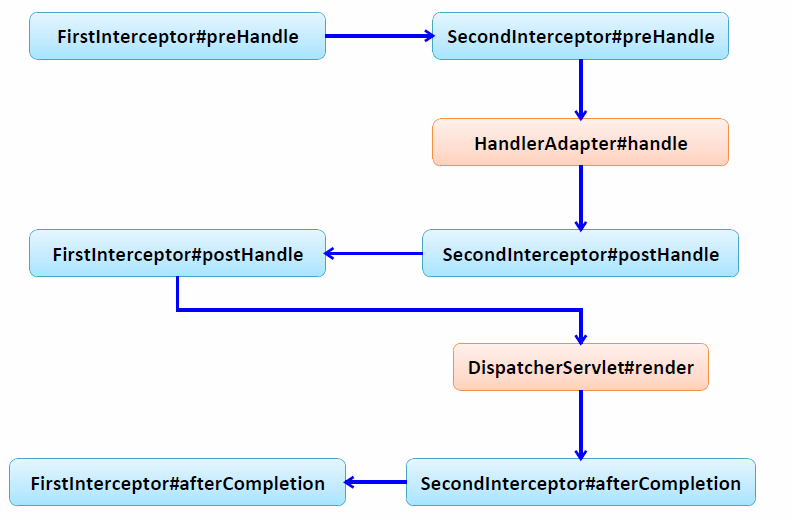
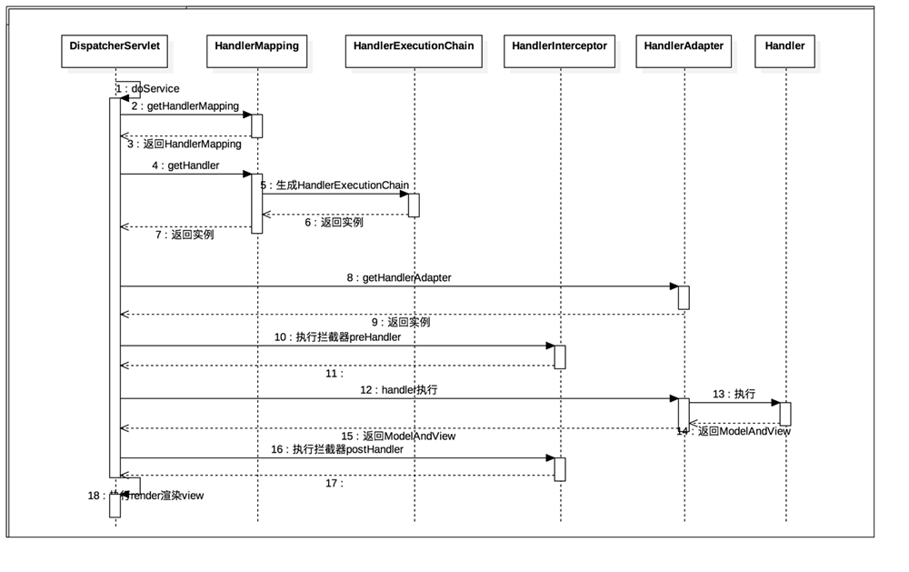

<!-- START doctoc generated TOC please keep comment here to allow auto update -->
<!-- DON'T EDIT THIS SECTION, INSTEAD RE-RUN doctoc TO UPDATE -->
**目录**

- [1、Spring MVC概述](#1spring-mvc%E6%A6%82%E8%BF%B0)
- [2、SpringMVC项目搭建](#2springmvc%E9%A1%B9%E7%9B%AE%E6%90%AD%E5%BB%BA)
- [3、URL映射请求：@RequestMapping](#3url%E6%98%A0%E5%B0%84%E8%AF%B7%E6%B1%82requestmapping)
  - [3.1、此注解可应用在类定义和方法定义上](#31%E6%AD%A4%E6%B3%A8%E8%A7%A3%E5%8F%AF%E5%BA%94%E7%94%A8%E5%9C%A8%E7%B1%BB%E5%AE%9A%E4%B9%89%E5%92%8C%E6%96%B9%E6%B3%95%E5%AE%9A%E4%B9%89%E4%B8%8A)
  - [3.2、@RequestMapping 属性值含义](#32requestmapping-%E5%B1%9E%E6%80%A7%E5%80%BC%E5%90%AB%E4%B9%89)
  - [3.3、@RequestMapping支持Ant 风格资源地址](#33requestmapping%E6%94%AF%E6%8C%81ant-%E9%A3%8E%E6%A0%BC%E8%B5%84%E6%BA%90%E5%9C%B0%E5%9D%80)
  - [3.4、@PathVariable](#34pathvariable)
  - [3.5、REST风格URL](#35rest%E9%A3%8E%E6%A0%BCurl)
  - [3.6、映射请求参数](#36%E6%98%A0%E5%B0%84%E8%AF%B7%E6%B1%82%E5%8F%82%E6%95%B0)
- [4、处理模型数据](#4%E5%A4%84%E7%90%86%E6%A8%A1%E5%9E%8B%E6%95%B0%E6%8D%AE)
  - [4.1、ModelAndView：new ModelAndView(viewName);](#41modelandviewnew-modelandviewviewname)
  - [4.2、Model、ModelMap、Map](#42modelmodelmapmap)
  - [4.3、@SessionAttributes](#43sessionattributes)
  - [4.4、@ModelAttribute](#44modelattribute)
  - [5.1.视图解析流程分析](#51%E8%A7%86%E5%9B%BE%E8%A7%A3%E6%9E%90%E6%B5%81%E7%A8%8B%E5%88%86%E6%9E%90)
  - [5.2、视图](#52%E8%A7%86%E5%9B%BE)
  - [5.3、视图解析器](#53%E8%A7%86%E5%9B%BE%E8%A7%A3%E6%9E%90%E5%99%A8)
- [6.RESTful SpringMVC CRUD](#6restful-springmvc-crud)
- [7、SPringMVC 表单标签](#7springmvc-%E8%A1%A8%E5%8D%95%E6%A0%87%E7%AD%BE)
  - [7.1、使用时需要注意的地方](#71%E4%BD%BF%E7%94%A8%E6%97%B6%E9%9C%80%E8%A6%81%E6%B3%A8%E6%84%8F%E7%9A%84%E5%9C%B0%E6%96%B9)
  - [7.2、表单标签组件](#72%E8%A1%A8%E5%8D%95%E6%A0%87%E7%AD%BE%E7%BB%84%E4%BB%B6)
- [8、处理静态资源](#8%E5%A4%84%E7%90%86%E9%9D%99%E6%80%81%E8%B5%84%E6%BA%90)
  - [8.1.静态资源问题发生的原因](#81%E9%9D%99%E6%80%81%E8%B5%84%E6%BA%90%E9%97%AE%E9%A2%98%E5%8F%91%E7%94%9F%E7%9A%84%E5%8E%9F%E5%9B%A0)
  - [8.2、解决方法](#82%E8%A7%A3%E5%86%B3%E6%96%B9%E6%B3%95)
- [9、数据绑定](#9%E6%95%B0%E6%8D%AE%E7%BB%91%E5%AE%9A)
  - [9.1、数据绑定流程](#91%E6%95%B0%E6%8D%AE%E7%BB%91%E5%AE%9A%E6%B5%81%E7%A8%8B)
  - [9.2、核心部件是 DataBinder运行机制如下](#92%E6%A0%B8%E5%BF%83%E9%83%A8%E4%BB%B6%E6%98%AF-databinder%E8%BF%90%E8%A1%8C%E6%9C%BA%E5%88%B6%E5%A6%82%E4%B8%8B)
  - [9.3、数据转换](#93%E6%95%B0%E6%8D%AE%E8%BD%AC%E6%8D%A2)
  - [9.4、自定义类型转换器](#94%E8%87%AA%E5%AE%9A%E4%B9%89%E7%B1%BB%E5%9E%8B%E8%BD%AC%E6%8D%A2%E5%99%A8)
- [11、@InitBinder](#11initbinder)
- [12、数据格式化](#12%E6%95%B0%E6%8D%AE%E6%A0%BC%E5%BC%8F%E5%8C%96)
  - [12.1、FormattingConversionServiceFactroyBean 内部已经注册了](#121formattingconversionservicefactroybean-%E5%86%85%E9%83%A8%E5%B7%B2%E7%BB%8F%E6%B3%A8%E5%86%8C%E4%BA%86)
- [13、数据校验：JSR 303](#13%E6%95%B0%E6%8D%AE%E6%A0%A1%E9%AA%8Cjsr-303)
- [14、JSON](#14json)
  - [14.1、JSON 处理流程](#141json-%E5%A4%84%E7%90%86%E6%B5%81%E7%A8%8B)
  - [14.2、处理核心类：HttpMessageConverter<T>](#142%E5%A4%84%E7%90%86%E6%A0%B8%E5%BF%83%E7%B1%BBhttpmessageconvertert)
  - [14.3、使用 HttpMessageConverter<T>](#143%E4%BD%BF%E7%94%A8-httpmessageconvertert)
- [15、国际化](#15%E5%9B%BD%E9%99%85%E5%8C%96)
  - [15.1、关于国际化](#151%E5%85%B3%E4%BA%8E%E5%9B%BD%E9%99%85%E5%8C%96)
  - [15.2、国际化解决的几个问题](#152%E5%9B%BD%E9%99%85%E5%8C%96%E8%A7%A3%E5%86%B3%E7%9A%84%E5%87%A0%E4%B8%AA%E9%97%AE%E9%A2%98)
- [16、SpringMVC 实现文件上传](#16springmvc-%E5%AE%9E%E7%8E%B0%E6%96%87%E4%BB%B6%E4%B8%8A%E4%BC%A0)
  - [16.1、MultipartResolver](#161multipartresolver)
  - [16.2、如何使用 MultipartResolver 实现文件上传](#162%E5%A6%82%E4%BD%95%E4%BD%BF%E7%94%A8-multipartresolver-%E5%AE%9E%E7%8E%B0%E6%96%87%E4%BB%B6%E4%B8%8A%E4%BC%A0)
  - [17.1、自定义拦截器(Interceptor)](#171%E8%87%AA%E5%AE%9A%E4%B9%89%E6%8B%A6%E6%88%AA%E5%99%A8interceptor)
- [18、SpringMVC 异常处理](#18springmvc-%E5%BC%82%E5%B8%B8%E5%A4%84%E7%90%86)
  - [18.3、DefaultHandlerExceptionResolver](#183defaulthandlerexceptionresolver)
  - [18.4、SimpleMappingExceptionResolver](#184simplemappingexceptionresolver)
- [19、SpringMVC 运行流程](#19springmvc-%E8%BF%90%E8%A1%8C%E6%B5%81%E7%A8%8B)
  - [19.1、流程图](#191%E6%B5%81%E7%A8%8B%E5%9B%BE)
  - [19.2、时序图](#192%E6%97%B6%E5%BA%8F%E5%9B%BE)
  - [19.3、详细描述](#193%E8%AF%A6%E7%BB%86%E6%8F%8F%E8%BF%B0)
- [20、Spring 与 SpringMVC](#20spring-%E4%B8%8E-springmvc)
- [21、SpringMVC 对比 Struts2](#21springmvc-%E5%AF%B9%E6%AF%94-struts2)

<!-- END doctoc generated TOC please keep comment here to allow auto update -->

# 1、Spring MVC概述

- 目前主流的MVC框架之一
- Spring3.0后超越strut2，成为最优秀的MVC框架之一
- Spring MVC通过一套注解，让POJO成为处理请求的控制器，而无需实现任何接口;
- 支持REST风格的URL请求;
- 采用了松耦合可插拔组件结构，比其他MVC框架更具扩展性和灵活性;

# 2、SpringMVC项目搭建
- 引入相关jar包;
- 在web.xml中配置DispathcerServlet
	```xml
	<!-- 配置 DispatcherServlet -->
	<servlet>
		<servlet-name>dispatcherServlet</servlet-name>
		<servlet-class>org.springframework.web.servlet.DispatcherServlet</servlet-class>
		<!-- 配置 DispatcherServlet 的一个初始化参数： 配置 SpringMVC 配置文件的位置和名称 -->
		<!-- 
			实际上也可以不通过 contextConfigLocation 来配置 SpringMVC 的配置文件， 而使用默认的.
			默认的配置文件为： /WEB-INF/<servlet-name>-servlet.xml
		-->
		<!--  
		<init-param>
			<param-name>contextConfigLocation</param-name>
			<param-value>classpath：springmvc.xml</param-value>
		</init-param>
		-->
		<load-on-startup>1</load-on-startup>
	</servlet>
	<servlet-mapping>
		<servlet-name>dispatcherServlet</servlet-name>
		<url-pattern>/</url-pattern>
	</servlet-mapping>
	```
- 配置Spring配置文件：
	```xml
	<!-- 配置自定扫描的包 -->
	<context：component-scan base-package="com.atguigu.springmvc"></context：component-scan>
	<!-- 配置视图解析器： 如何把 handler 方法返回值解析为实际的物理视图 -->
	<bean class="org.springframework.web.servlet.view.InternalResourceViewResolver">
		<property name="prefix" value="/WEB-INF/views/"></property>
		<property name="suffix" value=".jsp"></property>
	</bean>
	```
- 编写控制器

# 3、URL映射请求：@RequestMapping

## 3.1、此注解可应用在类定义和方法定义上

- 类定义处：提供初步的请求映射信息。相对于 WEB 应用的根目– 录
- 方法处：提供进一步的细分映射信息。相对于类定义处的 URL。若类定义处未标注 @RequestMapping，则方法处标记的 URL 相对于WEB 应用的根目录；

## 3.2、@RequestMapping 属性值含义

value、method、params 及 heads分别表示请求 URL、请求方法、请求参数及请求头的映射条件，他们之间是与的关系，联合使用多个条件可让请求映射更加精确化
- 可以通过method指定请求方式：@RequestMapping(value = "/testMethod"， method = RequestMethod.POST)		
- 了解： 可以使用 params 和 headers 来更加精确的映射请求. params 和 headers 支持简单的表达式
	```java
	@RequestMapping(value = "testParamsAndHeaders"， params = { "username"，"age!=10" }， 
		headers = { "Accept-Language=en-US，zh;q=0.8" })
	```
- params  和 headers支持简单的表达式：
	- param1： 表示请求必须包含名为 param1 的请求参数 –
	- !param1： 表示请求不能包含名为 param1 的请求参数 –
	- param1 != value1： 表示请求包含名为 param1 的请求参数，但其值不能为 value1
	- {"param1=value1"， "param2"}：请求必须包含名为 param1和param2的两个请求参数，且 param1参数的值必须为value1

## 3.3、@RequestMapping支持Ant 风格资源地址

- Ant 风格资源地址支持 3 种匹配符：
	- ?：匹配文件名中的一个字符
	- *：匹配文件名中的任意字符
	- **：** 匹配多层路径
- /user/*/createUser：/user/aaa/createUser、/user/bbb/createUser 等 URL
- /user/**/createUser：/user/createUser、/user/aaa/bbb/createUser 等 URL
- /user/createUser??：/user/createUseraa、/user/createUserbb 等 URL
	
## 3.4、@PathVariable

@RequestMapping使用@PathVariable 映射 URL 绑定的占位符(Spring 3.0新增的功能)

@PathVariable 可以来映射 URL 中的占位符到目标方法的参数中：@RequestMapping("/testPathVariable/{id}")

URL地址：/testPathVariable/1111

## 3.5、REST风格URL
- REST：Representational State Transfer，资源表现层状态转化，目前最流行的一种互联网软件架构
- HTTP 协议里面，四个表示操作方式的动词：GET、POST、PUT、DELETE。它们分别对应四种基本操作：GET 用来获取资源，POST 用来新建资源，PUT 用来更新资源，DELETE 用来删除资源
- 以CURD为例：
	- 新增： /order POST 
	- 修改： /order/1 PUT update?id=1 
	- 获取： /order/1 GET get?id=1 
	- 删除： /order/1 DELETE delete?id=1
- 如何发送 PUT 请求和 DELETE 请求呢? 
	- 需要配置 HiddenHttpMethodFilter 
	- 需要发送 POST 请求
	- 需要在发送 POST 请求时携带一个 name="_method" 的隐藏域， 值为 DELETE 或 PUT	

## 3.6、映射请求参数

- @RequestParam 来映射请求参数：value 值即请求参数的参数名，required 该参数是否必须，默认为 true，表示请求参数中必须包含对应的参数，若不存在，将抛出异常；defaultValue 请求参数的默认值
	```java
	@RequestParam(value = "username") String un，
	@RequestParam(value = "age"， required = false， defaultValue = "0") int age
	```
	
- @RequestHeader 映射请求头，用法同上：同 @RequestParam
	```java
	@RequestHeader(value = "Accept-Language") String al
	```
- @CookieValue 绑定请求中的 Cookie 值，可处理方法入参绑定某个 Cookie 值，属性同 @RequestParam：@CookieValue("JSESSIONID") String sessionId

- 使用POJO对象绑定请求参数值：按请求参数名与POJO对象属性名自动匹配，自动为属性填充值，支持级联属性

- 使用Servlet原生API作为参数传入，具体支持以下类型：
	```
	HttpServletRequest 
	HttpServletResponse 
	HttpSession
	java.security.Principal 
	Locale 
	InputStream  -----> request.getInputStream() 
	OutputStream -----> response.getOutputStream()
	Reader       -----> request.getReader()
	Writer       -----> response.getWriter()
	```

# 4、处理模型数据
SpringMVC提供了以下几种输出模型数据

- ModelAndView： 处理方法返回值类型为 ModelAndView时， 方法体即可通过该对象添加模型数据
- Map 及 Model： 入参为org.springframework.ui.Model、org.springframework.ui.ModelMap 或 java.uti.Map 时，处理方法返回时，Map 中的数据会自动添加到模型中。
- @SessionAttributes： 将模型中的某个属性暂存到 HttpSession 中，以便多个请求之间可以共享这个属性
- @ModelAttribute： 方法入参标注该注解后， 入参的对象就会放到数据模型中

## 4.1、ModelAndView：new ModelAndView(viewName)

- 控制器处理方法的返回值如果为ModelAndView，则其既包含视图信息也包含模型数据信息
- MoelAndView addObject(String attributeName， Object attributeValue)、ModelAndView addAllObject(Map<String， ?> modelMap)
- void setView(View view)、void setViewName(String viewName)
- SpringMVC 会把 ModelAndView 的 model 中数据放入到 request 域对象中. 

```java
@RequestMapping("/testModelAndView")
public ModelAndView testModelAndView(){
	String viewName = SUCCESS;
	ModelAndView modelAndView = new ModelAndView(viewName);
	
	//添加模型数据到 ModelAndView 中.
	modelAndView.addObject("time"， new Date());
	
	return modelAndView;
}
```

## 4.2、Model、ModelMap、Map

目标方法添加上述类型参数，实际上是：ExtendedModelMap，可以像其中添加返回到前台的数据，其实际上还是存入ModelAndView中的
```java
@RequestMapping("/testMap")
public String testMap(Map<String， Object> map){
	System.out.println(map.getClass().getName()); 
	map.put("names"， Arrays.asList("Tom"， "Jerry"， "Mike"));
	return SUCCESS;
}
```

## 4.3、@SessionAttributes

多个请求之间共用某个模型属性数据，该注解只能使用在类上；在控制器类上标准该注解，SpringMVC将在模型中对应的数据暂存到HttpSession中

除了可以通过属性名指定需要放到会话中的属性外(实际上使用的是 value 属性值)，还可以通过模型属性的对象类型指定哪些模型属性需要放到会话中(实际上使用的是 types 属性值)
```java
// 需先将属性放入到Map中
// 键值为user的会存放到session中，存储数据的类型为String也会存放到session中
@SessionAttributes(value={"user"}， types={String.class}) 		
@RequestMapping("/springmvc")
@Controller
public class SpringMVCTest {
}
@RequestMapping("/testSessionAttributes")
public String testSessionAttributes(Map<String， Object> map){
	User user = new User("Tom"， "123456"， "tom@atguigu.com"， 15);
	map.put("user"， user);
	map.put("school"， "atguigu");
	return SUCCESS;
}
```

## 4.4、@ModelAttribute

有 @ModelAttribute 标记的方法， 会在每个目标方法执行之前被 SpringMVC 调用

### 4.4.1、使用场景

当修改的数据前台表单传入时，而不需要修改的数据需要从数据库重新获取时可以使用该注解

```java
	@ModelAttribute
	public void getUser(@RequestParam(value="id", required=false) Integer id,
			Map<String, Object> map){
		if(id != null){
			User user = new User(1, "Coco", "123456", 13, "coco@163.com");
			map.put("user", user);
			System.out.println("从数据库获取的数据：" + user);
		}
	}
	@RequestMapping("modelattributes")
	public String testModelAttribute(User user){
		System.out.println("修改User：" + user);
		return SUCCESS;
	}
```

### 4.4.2、执行流程

- 执行 @ModelAttribute 修饰的方法：从数据库取出对象，把对象存入Map中，键值为：user；
- SpringMVC 从Map中取出 User对象，并把表单的请求参数赋值给 User对象对应的属性；
- SpringMVC 把上述对象传入目标方法的参数；

**注意：**
在 @ModelAttribute 修饰的方法中，放入到 Map 时的键需要和目标方法入参类型的第一个字母小写的字符串一致
	
### 4.4.3、源代码流程：HandlerMethodInvoker

- 调用 @ModelAttribute 注解修饰的方法，实际上把 @ModelAttribute 方法中 Map 中的数据放在了 implicitModel[BindingAwareModelMap] 中；
- 解析请求处理器的目标参数[即目标方法的参数]，实际上该目标参数来自于 WebDataBinder 对象的 target 属性
	- 创建 WebDataBinder 对象：
		- ①、确定 objectName 属性：若传入的 attrName 属性值为 ""， 则 objectName 为类名第一个字母小写。

			注意： 
			attrName. 若目标方法的 POJO 属性使用了 @ModelAttribute 来修饰，则 attrName 值即为 @ModelAttribute 的 value 属性值
		- ②、确定 target 属性
			- Ⅰ、在 implicitModel 中查找 attrName 对应的属性值. 若存在， 则返回该属性值;
			- Ⅱ、若不存在： 则验证当前 Handler 是否使用了@SessionAttributes进行修饰，若使用了，则尝试从Session中获取attrName所对应的属性值. 若session中没有对应的属性值，则抛出了异常. 
			- Ⅲ、若 Handler 没有使用 @SessionAttributes 进行修饰， 或 @SessionAttributes 中没有使用；value 值指定的 key 和 attrName 相匹配， 则通过反射创建了 POJO 对象；

	- SpringMVC 把表单的请求参数赋给了 WebDataBinder 的 target 对应的属性
	- SpringMVC 会把 WebDataBinder 的 attrName 和 target 给到 implicitModel.然后传到 request 域对象中
	- 把 WebDataBinder 的 target 作为参数传递给目标方法的入参.
		
### 4.4.4、SpringMVC确定目标方法 POJO 类型入参过程

- 确定一个key
	- ①、若目标方法的 POJO 类型的参数木有使用 @ModelAttribute 作为修饰， 则 key 为 POJO 类名第一个字母的小写；
	- ②、若使用了 @ModelAttribute 来修饰， 则 key 为 @ModelAttribute 注解的 value 属性值。
- 在 implicitModel 中查找 key 对应的对象， 若存在， 则作为入参传入：若在 @ModelAttribute 标记的方法中在 Map 中保存过， 且 key 和 步骤(1) 确定的 key 一致， 则会获取到;
- 若 implicitModel 中不存在 key 对应的对象， 则检查当前的 Handler 是否使用 @SessionAttributes 注解修饰，若使用了该注解， 且 @SessionAttributes 注解的 value 属性值中包含了 key， 则会从 HttpSession 中来获取 key 所对应的 value 值， 若存在则直接传入到目标方法的入参中. 若不存在则将抛出异常.
- 若 Handler 没有标识 @SessionAttributes 注解则会通过反射来创建 POJO 类型的参数， 传入为目标方法的参数
- SpringMVC 会把 key 和 POJO 类型的对象保存到 implicitModel 中， 进而会保存到 request 中;

### 4.4.5、@ModelAttribute 注解也可以来修饰目标方法 POJO 类型的入参， 其 value 属性值有如下的作用

- SpringMVC 会使用 value 属性值在 implicitModel 中查找对应的对象， 若存在则会直接传入到目标方法的入参中.
- SpringMVC 会一 value 为 key， POJO 类型的对象为 value， 存入到 request 中. 
	
### 4.4.6、处理 @SessionAttributes 注解引起的异常

如果在处理类定义处标注了@SessionAttributes(“xxx”)，则尝试从会话中获取该属性，并将其赋给该入参，然后再用请求消息填充该入参对象。如果在会话中找不到对应的属性，则抛出 HttpSessionRequiredException 异常;

解决方法：
- 使用 @ModelAttribute 修饰目标方法的入参；
- 加上一个有 @ModelAttribute 注解修饰的方法；
	```java
	if (implicitModel.containsKey(name)) {
		bindObject = implicitModel.get(name);
	}
	else if (this.methodResolver.isSessionAttribute(name， paramType)) {
		bindObject = this.sessionAttributeStore.retrieveAttribute(webRequest， name);
		if (bindObject == null) {
			raiseSessionRequiredException("Session attribute '" + name + "' required - not found in session");
		}
	}
	else {
		bindObject = BeanUtils.instantiateClass(paramType);
	}
	```
# 5、视图和视图解析器

## 5.1.视图解析流程分析

- 请求处理方法执行完成后，最终返回一个 ModelAndView对象.对于那些返回 String、View、ModeMap等类型的处理方法，Spring MVC 也会在内部将它们装配成一个ModelAndView 对象，它包含了逻辑名和模型对象的视图
- SpringMVC通过视图解析器(ViewResolver)找到真正的物理视图(一个View对象)；
- 调用View对象的render()方法得到显示结果；

## 5.2、视图
渲染模型数据，将模型里的数据以某种形式呈现给用户

- Spring在org.springframework.web.servlet中定义了高度抽象的接口;
- 视图对象由视图解析器负责实例化。由于视图是无状态的，所以他们不会有线程安全的问题;
- 常用的视图实现类：
	- URL资源视图
		- ①、InternalResourceView：将JSP或其他资源封装成一个视图，是InternalResourceViewResolver默认视图实现类;
		- ②、JstlView：如果JSP文件中使用了JSTL国际化标签的功能，则需要使用该视图类；在SpringMVC配置了InternalResourceView，如果加入了JSTL的jar包，则视图实现类会自动为JstlView
	- 文档视图类：
		- ①、AbstractExcelView：Excel文档视图的抽象类，该视图类基于POI构造Excel文档
		- ②、AbstractPdfView：PDF文档视图的抽象类，该视图类基于iText构造PDF文档;
	- 报表视图：几个使用JasperReports报表技术的视图
		- ①、ConfigurableJasperReportsView
		- ②、JasperReportsCsvView
		- ③、JasperReportsMultiFormatView
		- ④、JasperReportsHtmlView
		- ⑤、JasperReportsPdfView
		- ⑥、JasperReportsXlsView
	- JSON视图：
		MappingJacksonJsonView：将模型数据通过JackSon开源框架ObjectMapper以JSON方式输出；

## 5.3、视图解析器
将逻辑视图解析为一个具体的视图对象，所有的视图解析器必须实现ViewResolver

### 5.3.1、ViewResolver

- 常见的视图解析器实现类
	- 解析为Bean的名字：BeanNameViewResolver：将逻辑视图解析为一个Bean，Bean的ID等于逻辑视图名称;
	- 解析为URL文件：
		- ①、InternalResourceViewResolver：将视图名解析为一个URL，一般使用该解析器将视图名映射为一个保存在WB-INF目录下的呈现文件
		- ②、JasperReportsViewResolver：JasperReports是一个基于Java的开源报表工具，该解析器将视图名解析为报表文件对应的URL
	- 模板文件视图：
		- ①、FreeMarkerViewResolver：解析为基于FreeMarker模板技术的模板文件;
		- ②、VelocityViewResolver：VelocityLayoutViewResolver解析为基于Velocity模板技术的模板文件
- 每个视图解析器都实现了 Ordered 接口并开放出一个 order 属性，可以通过 order 属性指定解析器的优先顺序，order 越小优先级越高。
- SpringMVC 会按视图解析器顺序的优先顺序对逻辑视图名进行解析，直到解析成功并返回视图对象，否则将抛出 ServletException 异常；

### 5.3.2、InternalResourceViewResolver
JSP中最常用视图技术
```xml
<bean class="org.springframework.web.servlet.view.InternalResourceViewResolver">
	<property name="prefix" value="/WEB-INF/views/"/>
	<property name="suffix" value=".jsp"/>
</bean>
```
- 若项目中使用了 JSTL，则 SpringMVC 会自动把视图由InternalResourceView 转为 JstlView
- 若使用 JSTL 的 fmt 标签则需要在 SpringMVC 的配置文件中配置国际化资源文件
	```xml
	<bean id="messageSource" class="org.springframework.context.support.ResourceBundleMessageSource">
		<property name="basename" value="i18n"/>
	</bean>
	```
- 若希望直接响应通过 SpringMVC 渲染的页面，可以使用 mvc：view-controller 标签实现
	```xml
	<!-- 配置直接转发的页面 -->
	<!-- 可以直接相应转发的页面， 而无需再经过 Handler 的方法.  -->
	<mvc：view-controller path="/success" view-name="success"/>
	<!-- 
		如果配置了mvc：view-controller， 则其他返回到该视图的URL都将无法显示，
		报404错误，需要再配置如下配置解决该问题
	-->
	<!-- 在实际开发中通常都需配置 mvc：annotation-driven 标签 -->
	<mvc：annotation-driven></mvc：annotation-driven>
	```

### 5.3.3、自定义视图-必须实现 View 接口
```xml
<!-- 配置视图  BeanNameViewResolver 解析器： 使用视图的名字来解析视图 -->
<!-- 通过 order 属性来定义视图解析器的优先级， order 值越小优先级越高 -->
<bean class="org.springframework.web.servlet.view.BeanNameViewResolver">
	<property name="order" value="100"></property>
</bean>
```
==> 返回时，直接返回bean的类名[首字母小写]
### 5.3.4、关于重定向

- 控制器方法返回字符串类型的值会被当成逻辑视图名处理
- 如果返回的字符串中带 forward： 或 redirect：前缀时，SpringMVC 会对他们进行特殊处理：将 forward： 和redirect： 当成指示符，其后的字符串作为 URL 来处理
	- redirect：success.jsp：会完成一个到 success.jsp 的重定向的操作
	- forward：success.jsp：会完成一个到 success.jsp 的转发操作
```java
// 注：源代码， org.springframework.web.servlet.view.UrlBasedViewResolver
@Override
protected View createView(String viewName， Locale locale) throws Exception {
	// If this resolver is not supposed to handle the given view，
	// return null to pass on to the next resolver in the chain.
	if (!canHandle(viewName， locale)) {
		return null;
	}
	// Check for special "redirect：" prefix.
	if (viewName.startsWith(REDIRECT_URL_PREFIX)) {
		String redirectUrl = viewName.substring(REDIRECT_URL_PREFIX.length());
		RedirectView view = new RedirectView(redirectUrl， isRedirectContextRelative()， isRedirectHttp10Compatible());
		return applyLifecycleMethods(viewName， view);
	}
	// Check for special "forward：" prefix.
	if (viewName.startsWith(FORWARD_URL_PREFIX)) {
		String forwardUrl = viewName.substring(FORWARD_URL_PREFIX.length());
		return new InternalResourceView(forwardUrl);
	}
	// Else fall back to superclass implementation： calling loadView.
	return super.createView(viewName， locale);
}
```
# 6.RESTful SpringMVC CRUD
- SpringMVC中配置HiddenHttpMethodFilter;（SpringBoot自动配置好的）
- 页面创建一个post表单
- 创建一个input项，name="_method";值就是我们指定的请求方式	
	```html
	<form action="" method="POST">
		<input type="hidden" name="_method" value="DELETE"/>
	</form>
	<!-- 只有POST 请求能转为 DELETE，PUT请求 -->
	```
- 用 @ModelAttribute 注解处理表单没有没有传入的值;

# 7、SPringMVC 表单标签

可以实现将模型数据中的属性和 HTML 表单元素相绑定，以实现表单数据更便捷编辑和表单值的回显

## 7.1、使用时需要注意的地方

- 在JSP中使用需要导入标签库：
	```<%@ tablib prefix="form" uri="http：//www.springframework.org/tags/form"%>```
- 通过 GET 请求获取表单页面，而通过POST 请求提交表单页面，因此获取表单页面和提交表单页面的 URL 是相同的。只要满足该最佳条件的契约，```<form：form>``` 标签就无需通过 action 属性指定表单提交的 URL
- 可以通过 modelAttribute 属性指定绑定的模型属性，若没有指定该属性，则默认从 request 域对象中读取command 的表单 bean，如果该属性值也不存在，则会发生错误```<form：form action="" method="POST" modelAttribute=""></form：form>```

## 7.2、表单标签组件

- SpringMVC 提供了多个表单标签组件，其共有属性：
	- path：表单字段，对应 html 元素的 name 属性，支持级联属性;
	- htmlEscape：是否对表单值的 HTML 特殊字符进行转换，默认值为 true;
	- cssClass：表单组件对应的 CSS – 样式类名;
	- cssErrorClass：表单组件的数据存在错误时，采取的 CSS – 样式;
- form：input、form：password、form：hidden、form：textarea对应 HTML 表单的 text、password、hidden、textarea标签
- form：radiobutton：单选框组件标签，当表单 bean 对应的属性值和 value 值相等时，单选框被选中
- form：radiobuttons：单选框组标签，用于构造多个单选框
	- items：可以是一个 List、String[] 或 Map –
	- itemValue：指定 radio 的 value 值。可以是集合中 bean 的一个属性值
	- itemLabel：指定 radio 的 label – 值
	- delimiter：多个单选框可以通过 delimiter 指定分隔符
- form：checkbox：复选框组件。用于构造单个复选框
- form：checkboxs：用于构造多个复选框。使用方式同form：radiobuttons 标签
- form：select：用于构造下拉框组件。使用方式同form：radiobuttons 标签
- form：option：下拉框选项组件标签。使用方式同form：radiobuttons 标签
- form：errors：显示表单组件或数据校验所对应的错误 
	```
	<form：errors path= “ *” /> ：显示表单所有的错误
	<form：errors path= “ user*” /> ：显示所有以 user 为前缀的属性对应的错误
	<form：errors path= “ username” /> ：显示特定表单对象属性的错误
	```

# 8、处理静态资源

## 8.1.静态资源问题发生的原因

- 优雅的 REST 风格的资源URL 不希望带 .html 或 .do 等后缀
- 若将 DispatcherServlet 请求映射配置为 /，则 Spring MVC 将捕获WEB 容器的所有请求，包括静态资源的请求，SpringMVC 会将他们当成一个普通请求处理，因找不到对应处理器将导致错

## 8.2、解决方法
- 在 SpringMVC 的配置文件中配置 ```<mvc：default-servlet-handler/>``` 的方式解决静态资源的问题； 其原理是：
	- ①、```<mvc：default-servlet-handler/>```将在 SpringMVC 上下文中定义一个DefaultServletHttpRequestHandler，它会对进入 DispatcherServlet 的请求进行筛查，如果发现是没有经过映射的请求，就将该请求交由 WEB 应用服务器默认的 Servlet 处理，如果不是静态资源的请求，才由 DispatcherServlet 继续处理;
	- ②、一般 WEB 应用服务器默认的 Servlet 的名称都是 default。若所使用的WEB 服务器的默认 Servlet 名称不是 default，则需要通过 default-servlet-name 属性显式指定
- 加入配置：```<mvc：default-servlet-handler/>```后，如果映射的请求无法访问，则需要加上：```<mvc：annotation-driven />```

# 9、数据绑定

## 9.1、数据绑定流程

- Spring MVC 主框架将 ServletRequest 对象及目标方法的入参实例传递给 WebDataBinderFactory 实例，以创建 DataBinder 实例对象
- DataBinder 调用装配在 Spring MVC 上下文中的ConversionService 组件进行数据类型转换、数据格式化工作。将 Servlet 中的请求信息填充到入参对象中
- 调用 Validator 组件对已经绑定了请求消息的入参对象进行数据合法性校验，并最终生成数据绑定结果BindingData 对象
- Spring MVC 抽取 BindingResult 中的入参对象和校验错误对象，将它们赋给处理方法的响应入参

## 9.2、核心部件是 DataBinder运行机制如下

Spring MVC 通过反射机制对目标处理方法进行解析，将请求消息绑定到处理方法的入参中。数据绑定的核心部件是DataBinder，运行机制如下：

ServletRequest和处理方法入参对象  -> DataBinder  -> ConversionService数据类型转换/格式化   -> Validator数据校验	  -> BindingResult

## 9.3、数据转换

Spring MVC 上下文中内建了很多转换器，可完成大多数 Java 类型的转换工作。

```
ConversionService converters =
java.lang.Boolean -> java.lang.String ： –org.springframework.core.convert.support.ObjectToStringConverter@f874ca
java.lang.Character -> java.lang.Number ： CharacterToNumberFactory@f004c9 –
java.lang.Character -> java.lang.String ： ObjectToStringConverter@68a961 –
java.lang.Enum -> java.lang.String ： EnumToStringConverter@12f060a –
java.lang.Number -> java.lang.Character ： NumberToCharacterConverter@1482ac5 –
java.lang.Number -> java.lang.Number ： NumberToNumberConverterFactory@126c6f –
java.lang.Number -> java.lang.String ： ObjectToStringConverter@14888e8 –
java.lang.String -> java.lang.Boolean ： StringToBooleanConverter@1ca6626 –
java.lang.String -> java.lang.Character ： StringToCharacterConverter@1143800 –
java.lang.String -> java.lang.Enum ： StringToEnumConverterFactory@1bba86e –
java.lang.String -> java.lang.Number ： StringToNumberConverterFactory@18d2c12 –
java.lang.String -> java.util.Locale ： StringToLocaleConverter@3598e1 –
java.lang.String -> java.util.Properties ： StringToPropertiesConverter@c90828 –
java.lang.String -> java.util.UUID ： StringToUUIDConverter@a42f23 –
java.util.Locale -> java.lang.String ： ObjectToStringConverter@c7e20a –
java.util.Properties -> java.lang.String ： PropertiesToStringConverter@367a7f –
java.util.UUID -> java.lang.String ： ObjectToStringConverter@112b07f ……
```

## 9.4、自定义类型转换器

- ConversionService 是 Spring 类型转换体系的核心接口；可以利用 ConversionServiceFactoryBean 在 Spring的IOC 容器中定义一个 ConversionService，Spring 将自动识别出 IOC 容器中的 ConversionService，并在 Bean 属性配置及Spring MVC 处理方法入参绑定等场合使用它进行数据的转换;
- 可通过 ConversionServiceFactoryBean 的 converters 属性注册自定义的类型转换器
	```xml
	<bean id="conversionService" 
		class="org.springframework.context.support.ConversionServiceFactoryBean">
		<property name="converters">
			<set>
				<ref bean=""/>
			</set>
		</property>
	</bean>
	```
- Spring 支持的转换器：Spring 定义了3种类型的转换器接口，实现任意一个转换器接口都可以作为自定义转换器注册到 ConversionServiceFactroyBean 中
	- Converter<S，T>：将 S 类型对象转为 T 类型对象
	- ConverterFactory：将相同系列多个 “同质” Converter 封装在一起.如果希望将一种类型的对象转换为另一种类型及其子类的对象(例如将 String 转换为 Number 及 Number 子类(Integer、Long、Double 等)对象)可使用该转换器工厂类
	- GenericConverter：会根据源类对象及目标类对象所在的宿主类中的上下文信息进行类型转换

- 示例：
	```xml
	<!-- 会将自定义的 ConversionService 注册到Spring MVC 的上下文中 -->
	<mvc：annotation-driven conversion-service="conversionService"/>
	<bean id="conversionService" 
		class="org.springframework.context.support.ConversionServiceFactoryBean">
		<property name="converters">
			<set>
				<ref bean=""/>
			</set>
		</property>
	</bean>
	```
# 10、关于配置

 `<mvc：annotation-driven />`

- 如果加入该配置，Spring 会自动注册 RequestMappingHandlerMapping、RequestMappingHandlerAdapter 与 ExceptionHandlerExceptionResolver 三个bean;
- 该配置还提供以下支持：
	- 支持使用 ConversionService 实例对表单参数进行类型转换;
	- 支持使用 @NumberFormat annotation、@DateTimeFormat 注解完成数据类型的格式化
	- 支持使用 @Valid 注解对 JavaBean 实例进行 JSR 303 验证;
	- 支持使用 @RequestBody 和 @ResponseBody 注解;
- 源代码分析：
	- 在既没有配置`<mvc：default-servlet-handler/>`也没有配置 `<mvc：annotation-driven/>`DispatcherServlet 中 handlerAdapters中存在 AnnotationMethodHandlerAdapter
	- 配置了`<mvc：default-servlet-handler/>`但没有配置`<mvc：annotation-driven/>`DispatcherServlet 中 handlerAdapters中不存在 AnnotationMethodHandlerAdapter所以对应的映射无法访问；
	- 既配置了`<mvc：default-servlet-handler/>`又配置`<mvc：annotation-driven/>`DispatcherServlet 中 handlerAdapters中存在 RequestMappingHandlerAdapterRequestMappingHandlerAdapter 替换 AnnotationMethodHandlerAdapter 了，因为后者在 Spring3.2之后过时了；


# 11、@InitBinder

- 由 @InitBinder 标识的方法，可以对 WebDataBinder 对象进行初始化。
- WebDataBinder 是 DataBinder 的子类，用于完成由表单字段到 JavaBean 属性的绑定
- @InitBinder 方法不能有返回值，它必须声明为void，
- @InitBinder 方法的参数通常是是 WebDataBinder
- 如果需要不绑定相关数据，可以设置dataBinder.setDisallowedFields("");


# 12、数据格式化

- 对属性对象的输入/输出进行格式化，从其本质上讲依然属于 “类型转换” 的范畴;
- Spring 在格式化模块中定义了一个实现 ConversionService 接口的 FormattingConversionService 实现类，该实现类扩展了 GenericConversionService，因此它既具有类型转换的功能，又具有格式化的功能;
- FormattingConversionService 拥有一个 FormattingConversionServiceFactroyBean 工厂类，后者用于在 Spring 上下文中构造前者

## 12.1、FormattingConversionServiceFactroyBean 内部已经注册了

- NumberFormatAnnotationFormatterFactroy：支持对数字类型的属性使用 @NumberFormat 注解
	- @NumberFormat • 可对类似数字类型的属性进行标注，它拥有两个互斥的属性：
	- @NumberFormat(pattern="#，###，###.#")
	```
	private Float salary;
	①.style：类型为 NumberFormat.Style。用于指定样式类型，包括三种：
		Style.NUMBER-正常数字类型-、			
		Style.CURRENCY-货币类型-、 
		Style.PERCENT-百分数类型-
	②.pattern：类型为 String，自定义样式如patter="#，###"；
	```
- JodaDateTimeFormatAnnotationFormatterFactroy：支持对日期类型的属性使用 @DateTimeFormat 注解
	```
	@DateTimeFormat(pattern="yyyy-MM-dd")
	private Date birth
	①.@DateTimeFormat 注解可对 java.util.Date、java.util.Calendar、java.long.Long 时间类型进行标注
	②.pattern 属性：类型为字符串。指定解析/格式化字段数据的模式
	③.iso 属性：类型为 DateTimeFormat.ISO。指定解析/格式化字段数据的ISO模式，包括四种：
		ISO.NONE（不使用） -- 默认、
		ISO.DATE(yyyy-MM-dd) 、
		ISO.TIME(hh：mm：ss.SSSZ)、
		ISO.DATE_TIME(yyyy-MM-dd hh：mm：ss.SSSZ)
	④.style 属性：字符串类型。通过样式指定日期时间的格式，由两位字符组成，第一位表示日期的格式，第二位表示时间的格式：
		S：短日期/时间格式、
		M：中日期/时间格式、
		L：长日期/时间格式、
		F：完整日期/时间格式、
		-：忽略日期或时间格式
	```
## 12.2、FormattingConversionServiceFactroyBean
装配了 FormattingConversionServiceFactroyBean 后，就可以在 Spring MVC 入参绑定及模型数据输出时使用注解驱动了，```<mvc：annotation-driven/>```默认创建的 ConversionService 实例即为 FormattingConversionServiceFactroyBean，自定义的转换器和默认的如果要能同时使用需配置：
```xml
<bean id="conversionService"
	class="org.springframework.format.support.FormattingConversionServiceFactoryBean">
	<property name="converters">
		<set>
			<ref bean="employeeConverter"/>
		</set>
	</property>	
</bean>
```
如果需要获取格式化或类型转换错误，可以在目标方法的参数中添加 BindingResult 类型的参数，因为类型转换的错误信息全部存在该类中;

# 13、数据校验：JSR 303

- JSR 303 是 Java 为 Bean 数据合法性校验提供的标准框架，它已经包含在 JavaEE 6.0 中JSR 303 通过在 Bean 属性上标注类似于 @NotNull、@Max 等标准的注解指定校验规则，并通过标准的验证接口对 Bean 进行验证
- JSR 303 参考实现：Hibernate Validator， 除支持所有标准的校验注解外，它还支持以下的扩展注解：
	- @Email ==> 元素必须是合法的电子邮件地址
	- @Length ==> 字符串的大小必须在指定的范围内
	- @NotEmpty ==> 字符串为非空
	- @Range ==> 必须在合适的范围内
- SPringMVC 数据校验：
	- Spring 4.0 拥有自己独立的数据校验框架，同时支持 JSR303 标准的校验框架。
	- Spring 在进行数据绑定时，可同时调用校验框架完成数据校验工作。在 Spring MVC 中，可直接通过注解驱动的方式进行数据校验
	- Spring 的 LocalValidatorFactroyBean • 既实现了 Spring 的
	- Validator 接口，也实现了 JSR 303 的 Validator 接口.只要在 Spring 容器中定义了一个LocalValidatorFactoryBean，即可将其注入到需要数据校验的 Bean 中。
	- Spring 本身并没有提供 JSR303 的实现，所以必须将JSR303 的实现者的 jar 包放到类路径下
- 如何校验：
	- 在 Bean 的对应属性上添加对应的注解;
	- 在目标方法中的 Bean 前加上 @valid注解;
	- 校验的结果会保留到随后的入参中，类型必须是 BindingResult 或 Errors 类型，这两个类都位于 org.springframework.validation
	```java
	// 需校验的 Bean 对象和其绑定结果对象或错误对象时成对出现的，它们之间不允许声明其他的入参
	public String handle 91(
			@Valid User user， BindingResult userBindingResult， //User和其绑定结果的对象
			String sessionId，ModelMap mm， 
			@Valid Dept dept ， Errors deptErrors //Dept和其校验的结果对象
	)
	```
	- 错误跳转

- 错误消息显示，定制错误消息
	- 错误消息显示：Spring MVC 除了会将表单/命令对象的校验结果保存到对应的 BindingResult 或 Errors 对象中外，还会将所有校验结果保存到 “隐含模型”，在 JSP 页面上可通过```<form：errors path="userName">```显示错误消息，path：对应的 Bean 的属性
	- 提示消息的国际化
		- 当一个属性校验失败后，校验框架会为该属性生成 4 个消息代码，这些代码以校验注解类名为前缀，结合 modleAttribute、属性名及属性类型名生成多个对应的消息代码：例如 User 类中的 password 属性标准了一个 @Pattern 注解，当该属性值不满足 @Pattern 所定义的规则时， 就会产生以下 4个错误代码：
		```
		Pattern.user.password –
		Pattern.password –
		Pattern.java.lang.String –
		Pattern –
		```
		- 当使用 Spring MVC 标签显示错误• 消息时， Spring MVC 会查看WEB 上下文是否装配了对应的国际化消息，如果没有，则显示默认的错误消息，否则使用国际化消息。
		- 若数据类型转换或数据格式转换时发生错误，或该有的参数不存在，或调用处理方法时发生错误，都会在隐含模型中创建错误消息。其错误代码前缀说明如下：
			- required：必要的参数不存在。如 @RequiredParam(“param1”) –标注了一个入参，但是该参数不存在
			- typeMismatch：在数据绑定时，发生数据类型不匹配的问题 –
			- methodInvocation：Spring MVC 在调用处理方法时发生了错误
				```xml
				<bean id="messageSource"
					class="org.springframework.context.support.ResourceBundleMessageSource">
					<property name="basename" value="i18n"></property>
				</bean>
				```

# 14、JSON

## 14.1、JSON 处理流程

- 加入相关jar包：jackson-annotations-2.1.5.jar，jackson-core-2.1.5.jar，jackson-databind-2.1.5.jar
- 目标方法会相应的集合或对象，并在目标方法上添加：@ResponseBody 注解

## 14.2、处理核心类：HttpMessageConverter<T>

- HttpMessageConverter<T> 是 Spring3.0 新添加的一个接口，负责将请求信息转换为一个对象(类型为 T)，将对象(类型为 T)输出为响应信息
- 整体流程：
	```
	请求报文 ==> HttpInputMessage(获取输入流) ==> HttpMessageConverter ==> Java对象 ==> Spring MVC
	返回报文 <== HttpOutputMessage(获取输出流)<== HttpMessageConverter <== Java对象 <== Spring MVC
	```
- HttpMessageConverter<T> 的实现类：
	```
	StringHttpMessageConverter ==> 将请求转为字符串
	FormHttpMessageConverter ==> Form data is read from and written into a MultiValueMap<String， String>.
	ByteArrayHttpMessageConverter ==> 读写二进制数据
	......
	```
- DispatcherServlet 默认装配 RequestMappingHandlerAdapter ，而 RequestMappingHandlerAdapter 默认装配如下 HttpMessageConverter：
	- 一般情况下，该变量含有 6 个 MessageConverter实现类：ByteArrayHttpMessageConverter，StringHttpMessageConverter，SourceHttpMessageConverter、ResourceHttpMessageConverter，AllEncompassingFormHttpMessageConverter，Jaxb2RootElementHttpMessageConverter
	- 如果加入 jackson jar 包后，装配会多出一个：MappingJackson2HttpMessageConverter

## 14.3、使用 HttpMessageConverter<T>

- 使用 HttpMessageConverter<T> 将请求信息转化并绑定到处理方法的入参中或将响应结果转为对应类型的响应信息，Spring 提供了两种途径：
	- 使用 @RequestBody / @ResponseBody – 对处理方法进行标注
	- 使用 HttpEntity<T> / ResponseEntity<T> 作为处理方法的入参或返回值当控制器处理方法使用到 @RequestBody/@ResponseBody 或 HttpEntity<T>/ResponseEntity<T> 时， 
- Spring 首先根据请求头或响应头的 Accept 属性选择匹配的 HttpMessageConverter，进而根据参数类型或泛型类型的过滤得到匹配的 HttpMessageConverter，若找不到可用的 HttpMessageConverter 将报错
- @RequestBody 和 @ResponseBody 不需要成对出现

# 15、国际化

## 15.1、关于国际化

- 默认情况下，SpringMVC 根据 Accept-Language 参数判断客户端的本地化类型。
- 当接受到请求时，SpringMVC 会在上下文中查找一个本地化解析器(LocalResolver)找到后使用它获取请求所对应的本地化类型信息。
- SpringMVC 还允许装配一个动态更改本地化类型的拦截器，这样通过指定一个请求参数就可以控制单个请求的本地化类型。
- 配置国际化资源：
	```xml
	<!-- 配置国际化资源文件 -->
	<bean id="messageSource"
		class="org.springframework.context.support.ResourceBundleMessageSource">
		<property name="basename" value="i18n"></property>
	</bean>
	```
	需要在类目录下增加.properties文件： i18n.Properties，如果是中英文可以添加：i18n_zh_CN.Properties(中文)， i18n_en_US.Properties(美式英语)

## 15.2、国际化解决的几个问题

- 在页面上能够根据浏览器语言设置的情况对文本(不是内容)，时间，数值进行本地化处理；使用 JSTL 的 fmt 标签```<fmt：message key="i18n.user"></fmt：message>```
- 可以在 bean 中获取国际化资源文件 Locale 对应的消息，在 bean 中注入 ResourceBundleMessageSource 的示例， 使用其对应的 getMessage 方法即可
	```java
	@Autowired
	private ResourceBundleMessageSource messageSource;
	@RequestMapping("/i18n")
	public String testI18n(Locale locale){ // 目标方法参数可以传入 Locale 对象
		String val = messageSource.getMessage("i18n.user"， null， locale);
		System.out.println(val); 
		return "i18n";
	}
	```
- 问题3：可以通过超链接切换 Locale， 而不再依赖于浏览器的语言设置情况		
	- 解决方法：在 SpringMVC 中配置 LocalResolver 和 LocaleChangeInterceptor
		```xml
		<!-- 配置 SessionLocalResolver， 根据 Session 中特定的属性确定本地化类型-->
		<bean id="localeResolver"
			class="org.springframework.web.servlet.i18n.SessionLocaleResolver"></bean>
		<mvc：interceptors>					
			<!-- 配置 LocaleChanceInterceptor，从请求参数中获取本次请求对应的本地化类型。 -->
			<bean class="org.springframework.web.servlet.i18n.LocaleChangeInterceptor"></bean>
		</mvc：interceptors>

		<a href="i18n?locale=zh_CH">中文</a>
		<a href="i18n?locale=en_US">英文</a>
		```
	- SessionLocaleResolver & LocaleChangeInterceptor 工作原理
		- ①.获取 name=locale 的请求参数;
		- ②.把第一步的 locale 请求参数解析为 Locale 对象;
		- ③.获取 LocaleResolver 对象;
		- ④.把 Locale 对象设置为 Session 的属性;
		- ⑤.从 Session 中获取 Locale 对象;
		- ⑥.使用该 Locale 对象

		``` ①②③``` 步骤是在 LocaleChangeInterceptor，即拦截器中完成，```④⑤```步骤在 SessionLocaleResolver 中完成，即 Session 的相关设置；```⑥```是在应用程序中使用；

# 16、SpringMVC 实现文件上传

## 16.1、MultipartResolver

- Spring MVC 为文件上传提供了直接的支持，这种支持是通过即插即用的 MultipartResolver 实现的。Spring 用 Jakarta Commons FileUpload 技术实现了一个 MultipartResolver 的实现类：CommonsMultipartResovler
- Spring MVC 上下文中默认没有装配 MultipartResovler，因此默认情况下不能处理文件的上传工作，如果想使用Spring 的文件上传功能，需现在上下文中配置 MultipartResolver

## 16.2、如何使用 MultipartResolver 实现文件上传

- SpringMVC 配置 MultipartResolver
	```xml
	<bean id="multipartResolver" class="org.springframework.web.multipart.commons.CommonsMultipartResolver">
		<property name="defaultEncoding" value="UTF-8"/>
		<!-- 还可以配置文件最大大小等配置 -->
	</bean>
	```
- 写一个目标方法：
	```java
	@RequestMapping("/testUpload")
	public String uploadFile(MultipartFile file，String desc){
		// 可以通过 MultipartFile 获取文件原始文件名称，文件的输入流等
		System.out.println(desc);
		System.out.println(file.getOriginalFilename());
		return "success";
	}
	```
# 17、拦截器

## 17.1、自定义拦截器(Interceptor)

- Spring MVC 也可以使用拦截器对请求进行拦截处理，用户可以自定义拦截器来实现特定的功能，自定义的拦截器必须实现 HandlerInterceptor 接口
- 自定义拦截器的实现：
```java
public class FirstInterceptor implements HandlerInterceptor {
/**
	* 该方法在目标方法之前被调用，在方法中对用户请求 request 进行处理。
	* (1).若返回值为 true， 则继续调用后续的拦截器或目标方法;
	* (2).若返回值为 false，则后续拦截器或目标方法将不会被调用;
	* 用途：
	* 	权限控制，日志，事务等
	*/
@Override
public boolean preHandle(HttpServletRequest request，
		HttpServletResponse response， Object handler) throws Exception {
	System.out.println("[FirstInterceptor] preHandle");
	return true;
}
/**
	* 调用目标方法之后， 但渲染视图之前. 是DispatcherServlet 向客户端返回响应前被调用
	* 可以对请求域中的属性或视图做出修改.
	*/
@Override
public void postHandle(HttpServletRequest request，
		HttpServletResponse response， Object handler，
		ModelAndView modelAndView) throws Exception {
	System.out.println("[FirstInterceptor] postHandle");
}
/**
	* 在 DispatcherServlet 完全处理完请求后被调用，
	* 渲染视图之后被调用. 主要是释放资源
	*/
@Override
public void afterCompletion(HttpServletRequest request，
		HttpServletResponse response， Object handler， Exception ex)
		throws Exception {
	System.out.println("[FirstInterceptor] afterCompletion");
}
}
```
- 配置自定义拦截器：
	```xml
	<mvc：interceptors>
		<bean class="com.springmvc.interceptor.FirstInterceptor"></bean>
		<!-- 配置单独作用于某个 Mapping 上的拦截器，也可以是不作用于某个 Mapping 上的拦截器 -->
		<mvc：interceptor>
			<mvc：mapping path="/emps"/>
			<bean class="com.springmvc.interceptor.SecondInterceptor"></bean>
		</mvc：interceptor>
	</mvc：interceptors>
	```
- 拦截器的执行顺序：(只有一个拦截器) FirstInterceptor.preHandle() ==> HandlerAdapters.handler() ==> FirstInterceptor.postHandle() ==> DispatcherServlet.redner() ==> FirstInterceptor.afterCompletion()
- 多个拦截器的执行顺序： 拦截器它们之间的执行顺序跟在SpringMVC的配置文件中定义的先后顺序有关

	
	
	- preHanlde： 按照配置文件中配置的顺序正序执行， 如果某个拦截器preHanlde返回值为 true，则其对于的afterCompletion一定要执行
	- postHandle： 按照配置文件配置的顺序倒序执行
	- afterCompletion： 按照配置文件配置的顺序倒序执行

FirstInterceptor#preHandle ==> SecondInterceptor#preHandle ==> HandlerAdapter#handle ==> SecondInterceptor#postHandle ==> FirstInterceptor#postHandle ==> DispatcherServlet#render ==> SecondInterceptor#afterCompletion ==> FirstInterceptor#afterCompletion

## 17.2、拦截器与Servlet的过滤器的区别

- 拦截器是基于Java的反射机制的，而过滤器是基于函数回调；
- 拦截器不依赖Servlet容器，过滤器依赖Servlet容器；
- 拦截器只能对Action请求起作用，而过滤器则可以对几乎所有的请求起作用；
- 拦截器可以访问action上下文、值栈里的对象，而过滤器不能访问；
- 在action的生命周期中，拦截器可以多次被调用，而过滤器只能在容器初始化时被调用一次；
- 拦截器可以获取IOC容器中的各个bean，而过滤器就不行，在拦截器里注入一个service，可以调用业务逻辑
- 过滤器和拦截器触发时机不一样：过滤器是在请求进入容器后，但请求进入servlet之前进行预处理的。请求结束返回也是，是在servlet处理完后，返回给前端之前
- Filter是Servlet规范规定的，只能用于web程序中；

# 18、SpringMVC 异常处理

- Spring MVC 通过 HandlerExceptionResolver 处理程序的异常，包括 Handler 映射、数据绑定以及目标方法执行时发生的异常
- SpringMVC 提供的 HandlerExceptionResolver 的实现类 DispatcherServlet 默认装配的 HandlerExceptionResolver：

	- 没有使用`<mvc：annotation-driven/>`配置：
		```
		AnnotationMethodHandlerExceptionResolver
		ResponseStatusExceptionResolver
		DefaultHandlerExceptionResolver
		```
	- 使用了`<mvc：annotation-driven/>`配置：
		```
		ExceptionHandlerExceptionResolver
		ResponseStatusExceptionResolver
		DefaultHandlerExceptionResolver
		```

## 18.1、ExceptionHandlerExceptionResolver

- 主要处理 Handler 中用 @ExceptionHandler 注解定义的方法
- @ExceptionHandler 注解定义的方法优先级问题：例如发生的是NullPointerException，但是声明的异常有 RuntimeException 和 Exception，此候会根据异常的最近继承关系找到继承深度最浅的那个 @ExceptionHandler注解方法，即标记了 RuntimeException 的方法
- ExceptionHandlerMethodResolver 内部若找不到@ExceptionHandler 注解的话，会找@ControllerAdvice 中的@ExceptionHandler 注解方法

	```java
	@ControllerAdvice
	public class HandlerEcetpion{
		/**
		* 1. 在 @ExceptionHandler 方法的入参中可以加入 Exception 类型的参数， 该参数即对应发生的异常对象
		* 2. @ExceptionHandler 方法的入参中不能传入 Map. 若希望把异常信息传导页面上， 需要使用 ModelAndView 作为返回值
		* 3. @ExceptionHandler 方法标记的异常有优先级的问题. 
		* 4. @ControllerAdvice： 如果在当前 Handler 中找不到 @ExceptionHandler 方法来出来当前方法出现的异常， 
		* 则将去 @ControllerAdvice 标记的类中查找 @ExceptionHandler 标记的方法来处理异常. 
		*/
		@ExceptionHandler({RuntimeException.class})
		public ModelAndView handlerException(Exception ex){ // 处理异常的方法可以放入 Exception类型的参数
			ModelAndView view = new ModelAndView("error");// 如果需要将异常传入到前台，可以设置返回值为 ModelAndView
			view.addObject("exception"， ex);
			return view;
		}
	}
	```
## 18.2、ResponseStatusExceptionResolver
在异常及异常父类中找到 @ResponseStatus 注解，然后使用这个注解的属性进行处理
	
- 定义一个 @ResponseStatus 注解修饰的异常类，该注解也可以修饰目标方法
	```java
	@ResponseStatus(value=HttpStatus.UNAUTHORIZED)
	public class UnauthorizedException extends RuntimeException{
	}
	```

- 若在处理器方法中抛出了上述异常：若ExceptionHandlerExceptionResolver 不解析述异常。由于触发的异常 UnauthorizedException 带有@ResponseStatus注解。因此会被ResponseStatusExceptionResolver 解析到。最后响应 HttpStatus.UNAUTHORIZED 代码给客户端。HttpStatus.UNAUTHORIZED 代表响应码401，无权限.

## 18.3、DefaultHandlerExceptionResolver
对一些特殊的异常进行处理，比如：NoSuchRequestHandlingMethodException、HttpRequestMethodNotSupportedException、HttpMediaTypeNotSupportedException、HttpMediaTypeNotAcceptableException

## 18.4、SimpleMappingExceptionResolver

如果希望对所有异常进行统一处理，可以使用 SimpleMappingExceptionResolver，它将异常类名映射为视图名，即发生异常时使用对应的视图报告异常
```xml
<!-- 使用 SimpleMappingExceptionResolver 来映射异常 -->
<bean id="simpleMappingExceptionResolver" 
	class="org.springframework.web.servlet.handler.SimpleMappingExceptionResolver">
	<!-- 可以在页面使用 ${ex}显示异常信息， exceptionAttribute 默认值为  "exception" -->
	<property name="exceptionAttribute" value="ex"></property>
	<property name="exceptionMappings">
		<props>
			<!-- 异常的全路径， 值为指向的视图 -->
			<prop key="java.lang.ArrayIndexOutOfBoundsException">error</prop>
		</props>
	</property>
</bean>
```

# 19、SpringMVC 运行流程

## 19.1、流程图


详细


## 19.2、时序图



## 19.3、详细描述

- 发起请求到前端控制器(DispatcherServlet)
- 前端控制器请求HandlerMapping查找 Handler(可以根据xml配置、注解进行查找)
- 处理器映射器HandlerMapping向前端控制器返回Handler，HandlerMapping会把请求映射为HandlerExecutionChain对象(包含一个Handler处理器（页面控制器）对象，多个HandlerInterceptor拦截器对象)，通过这种策略模式，很容易添加新的映射策略
- 前端控制器调用处理器适配器去执行Handler
- 处理器适配器HandlerAdapter将会根据适配的结果去执行Handler
- Handler执行完成给适配器返回ModelAndView
- 处理器适配器向前端控制器返回ModelAndView （ModelAndView是springmvc框架的一个底层对象，包括 Model和view）
- 前端控制器请求视图解析器去进行视图解析(根据逻辑视图名解析成真正的视图(jsp))，通过这种策略很容易更换其他视图技术，只需要更改视图解析器即可
- 视图解析器向前端控制器返回View
- 前端控制器进行视图渲染(视图渲染将模型数据(在ModelAndView对象中)填充到request域)
- 前端控制器向用户响应结果


# 20、SpringMVC注解配置

利用Servlet3.0的特性，可以无配置文件实现SpringMVC的web开发

```java
/**
 * web容器启动的时候创建对象；调用方法来初始化容器以前前端控制器
 */
public class MyWebAppInitializer extends AbstractAnnotationConfigDispatcherServletInitializer {
    /**
     * 获取根容器的配置类；（Spring的配置文件）   父容器；
     */
    @Override
    protected Class<?>[] getRootConfigClasses() {
        return new Class[]{RootConfig.class};
    }
    /**
     * 获取web容器的配置类（SpringMVC配置文件）  子容器；
     */
    @Override
    protected Class<?>[] getServletConfigClasses() {
        return new Class[]{AppConfig.class};
    }
    /**
     * 获取DispatcherServlet的映射信息<br/>
     * /：拦截所有请求（包括静态资源（xx.js,xx.png）），但是不包括*.jsp；<br/>
     * /*：拦截所有请求；连*.jsp页面都拦截；jsp页面是tomcat的jsp引擎解析的；
     */
    @Override
    protected String[] getServletMappings() {
        return new String[]{"/"};
    }
	/**
	 * 编码过滤器
	 */
    @Override
    protected Filter[] getServletFilters() {
        return new Filter[]{new CharacterEncodingFilter("UTF-8", true)};
    }
}
```
- web容器在启动的时候，会扫描每个jar包下的 `META-INF/services/javax.servlet.ServletContainerInitializer`

	

- 加载这个文件指定的类`SpringServletContainerInitializer`
	```java
	@HandlesTypes(WebApplicationInitializer.class)
	public class SpringServletContainerInitializer implements ServletContainerInitializer {
		@Override
		public void onStartup(Set<Class<?>> webAppInitializerClasses, ServletContext servletContext) throws ServletException {
			List<WebApplicationInitializer> initializers = new LinkedList<WebApplicationInitializer>();
			if (webAppInitializerClasses != null) {
				for (Class<?> waiClass : webAppInitializerClasses) {
					// Be defensive: Some servlet containers provide us with invalid classes,
					// no matter what @HandlesTypes says...
					if (!waiClass.isInterface() && !Modifier.isAbstract(waiClass.getModifiers()) &&
							WebApplicationInitializer.class.isAssignableFrom(waiClass)) {
						try {
							initializers.add((WebApplicationInitializer) waiClass.newInstance());
						}
						catch (Throwable ex) {
							throw new ServletException("Failed to instantiate WebApplicationInitializer class", ex);
						}
					}
				}
			}
			if (initializers.isEmpty()) {
				servletContext.log("No Spring WebApplicationInitializer types detected on classpath");
				return;
			}
			servletContext.log(initializers.size() + " Spring WebApplicationInitializers detected on classpath");
			AnnotationAwareOrderComparator.sort(initializers);
			for (WebApplicationInitializer initializer : initializers) {
				initializer.onStartup(servletContext);
			}
		}
	}
	```

- spring的应用一启动会加载感兴趣的`WebApplicationInitializer`接口的下的所有组件；并且为WebApplicationInitializer组件创建对象（组件不是接口，不是抽象类）
	- AbstractContextLoaderInitializer：创建根容器；createRootApplicationContext()；
	- AbstractDispatcherServletInitializer：
		- 创建一个web的ioc容器；createServletApplicationContext();
		- 创建了DispatcherServlet；createDispatcherServlet()；
		- 将创建的DispatcherServlet添加到ServletContext中；getServletMappings();
	- AbstractAnnotationConfigDispatcherServletInitializer：注解方式配置的DispatcherServlet初始化器
		- 创建根容器：createRootApplicationContext() => getRootConfigClasses();传入一个配置类
		- 创建web的ioc容器： createServletApplicationContext();获取配置类；getServletConfigClasses();

```java
/**
 * SpringMVC 容器，只扫描controller，子容器，useDefaultFilters=false 禁用默认的过滤规则；
 */
@ComponentScan(value = "com.blue.fish",
        includeFilters = {@ComponentScan.Filter(type = FilterType.ANNOTATION, classes = {Controller.class})},
        useDefaultFilters = false)
// @EnableWebMvc:开启SpringMVC定制配置功能；
@EnableWebMvc
// 配置组件（视图解析器、视图映射、静态资源映射、拦截器）extends WebMvcConfigurerAdapter
public class AppConfig  extends WebMvcConfigurerAdapter{
    @Override
    public void configureDefaultServletHandling(DefaultServletHandlerConfigurer configurer) {
        configurer.enable();
    }
    @Override
    public void addInterceptors(InterceptorRegistry registry) {
        registry.addInterceptor(new FirstInterceptor()).addPathPatterns("/**");
    }
    @Override
    public void configureViewResolvers(ViewResolverRegistry registry) {
        registry.jsp("/WEB-INF/", ".jsp");
    }
    @Override
    public void configureMessageConverters(List<HttpMessageConverter<?>> converters) {
        converters.add(new MappingJackson2HttpMessageConverter());
        converters.add(new StringHttpMessageConverter(Charset.forName("UTF-8")));
        super.configureMessageConverters(converters);
    }
}

/**
 * Spring的容器不扫描controller，其为父容器
 ersion 1.0.0
 */
@ComponentScan(value = "com.blue.fish", excludeFilters = {@ComponentScan.Filter(type = FilterType.ANNOTATION, classes = {Controller.class})})
public class RootConfig {
}
```

# 21、其他

## 21.1、Spring 与 SpringMVC

- 需要进行 Spring 整合 SpringMVC 吗? 还是否需要再加入 Spring 的 IOC 容器? 是否需要再web.xml文件中配置启动Spring IOC容器的ContextLoaderListener ?
	- 需要：通常情况下，类似于数据源、事务、整合其他框架都是放在 Spring 的配置文件中(而不是放在 SpringMVC 的配置文件中)。实际上放入 Spring 配置文件对应的IOC容器中的还有 Service 和 Dao. 
	- 不需要：都放在 SpringMVC 的配置文件中. 也可以分多个 Spring 的配置文件， 然后使用 import 节点导入其他的配置文件

- 问题：若Spring的IOC容器和 SpringMVC 的 IOC 容器扫描的包有重合的部分， 就会导致有的 bean 会被创建 2 次

	解决方法
	- 使 Spring 的 IOC 容器扫描的包和 SpringMVC 的 IOC 容器扫描的包没有重合的部分. 
	- 使用 exclude-filter 和 include-filter 子节点来规定只能扫描的注解
		```xml
		<context：component-scan base-package="com.atguigu.springmvc">
			<context：exclude-filter type="annotation" 
				expression="org.springframework.stereotype.Controller"/>
			<context：exclude-filter type="annotation" 
				expression="org.springframework.web.bind.annotation.ControllerAdvice"/>
		</context：component-scan>
		/// 
		<context：component-scan base-package="com.atguigu.springmvc" use-default-filters="false">
			<context：include-filter type="annotation" 
				expression="org.springframework.stereotype.Controller"/>
			<context：include-filter type="annotation" 
				expression="org.springframework.web.bind.annotation.ControllerAdvice"/>
		</context：component-scan>
		```
- SpringMVC 的 IOC 容器中的 bean 可以来引用 Spring IOC 容器中的 bean. 返回来呢 ? 反之则不行. Spring IOC 容器中的 bean 却不能来引用 SpringMVC IOC 容器中的 bean!
	- 多个 Spring IOC 容器之间可以设置为父子关系，以实现良好的解耦。
	- Spring MVC WEB 层容器可作为 “业务层” Spring 容器的子容器：即 WEB 层容器可以引用业务层容器的 Bean，而业务层容器却访问不到 WEB 层容器的 Bean

## 21.2、SpringMVC 对比 Struts2

- Spring MVC 的入口是 Servlet， 而 Struts2 是 Filter
- Spring MVC 会稍微比 Struts2 快些. Spring MVC 是基于方法设计， 而 Sturts2 是基于类， 每次发一次请求都会实	例一个 Action.
- Spring MVC 使用更加简洁， 开发效率 Spring MVC 确实比 struts2 高： 支持 JSR303， 处理 ajax 的请求更方便
- Struts2 的 OGNL 表达式使页面的开发效率相比	Spring MVC 更高些.