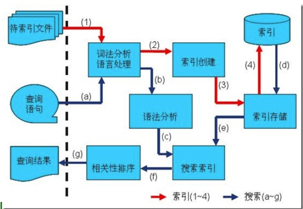
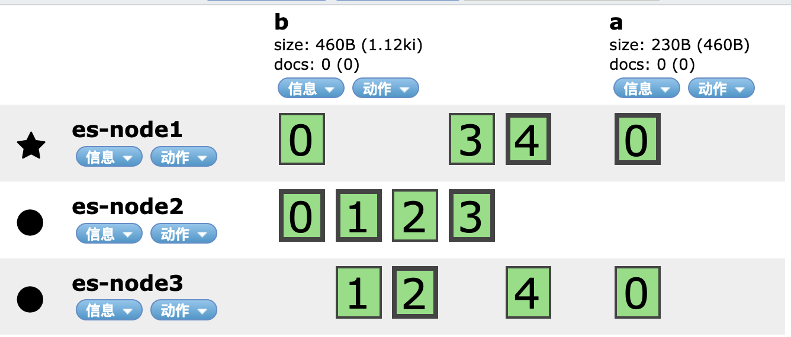

<!-- START doctoc generated TOC please keep comment here to allow auto update -->
<!-- DON'T EDIT THIS SECTION, INSTEAD RE-RUN doctoc TO UPDATE -->
目录

- [一、lucene](#%E4%B8%80lucene)
  - [1、全文检索](#1%E5%85%A8%E6%96%87%E6%A3%80%E7%B4%A2)
    - [1.1、全文检索的流程分为：索引流程、搜索流程。](#11%E5%85%A8%E6%96%87%E6%A3%80%E7%B4%A2%E7%9A%84%E6%B5%81%E7%A8%8B%E5%88%86%E4%B8%BA%E7%B4%A2%E5%BC%95%E6%B5%81%E7%A8%8B%E6%90%9C%E7%B4%A2%E6%B5%81%E7%A8%8B)
    - [1.2、数据分类](#12%E6%95%B0%E6%8D%AE%E5%88%86%E7%B1%BB)
    - [1.3、全文检索过程](#13%E5%85%A8%E6%96%87%E6%A3%80%E7%B4%A2%E8%BF%87%E7%A8%8B)
  - [2、Lucene介绍](#2lucene%E4%BB%8B%E7%BB%8D)
  - [3、索引结构](#3%E7%B4%A2%E5%BC%95%E7%BB%93%E6%9E%84)
  - [4、Lucene类](#4lucene%E7%B1%BB)
  - [5、倒排索引原理](#5%E5%80%92%E6%8E%92%E7%B4%A2%E5%BC%95%E5%8E%9F%E7%90%86)
  - [6、中文分词](#6%E4%B8%AD%E6%96%87%E5%88%86%E8%AF%8D)
  - [7、为什么引入搜索引擎](#7%E4%B8%BA%E4%BB%80%E4%B9%88%E5%BC%95%E5%85%A5%E6%90%9C%E7%B4%A2%E5%BC%95%E6%93%8E)
- [二、Elasticsearch](#%E4%BA%8Celasticsearch)
  - [1、概述](#1%E6%A6%82%E8%BF%B0)
    - [1.1、简介](#11%E7%AE%80%E4%BB%8B)
    - [1.2、优势](#12%E4%BC%98%E5%8A%BF)
  - [2、安装](#2%E5%AE%89%E8%A3%85)
    - [2.1、基础安装](#21%E5%9F%BA%E7%A1%80%E5%AE%89%E8%A3%85)
    - [2.2、安装head插件](#22%E5%AE%89%E8%A3%85head%E6%8F%92%E4%BB%B6)
  - [3、核心术语](#3%E6%A0%B8%E5%BF%83%E6%9C%AF%E8%AF%AD)
  - [4、基本用法](#4%E5%9F%BA%E6%9C%AC%E7%94%A8%E6%B3%95)
    - [4.1、基本操作](#41%E5%9F%BA%E6%9C%AC%E6%93%8D%E4%BD%9C)
    - [4.2、创建自定义mappings](#42%E5%88%9B%E5%BB%BA%E8%87%AA%E5%AE%9A%E4%B9%89mappings)
    - [4.3、文档操作](#43%E6%96%87%E6%A1%A3%E6%93%8D%E4%BD%9C)
    - [4.4、并发控制](#44%E5%B9%B6%E5%8F%91%E6%8E%A7%E5%88%B6)
    - [4.5、内置分词](#45%E5%86%85%E7%BD%AE%E5%88%86%E8%AF%8D)
    - [4.6、中文分词器](#46%E4%B8%AD%E6%96%87%E5%88%86%E8%AF%8D%E5%99%A8)
  - [5、DSL搜索](#5dsl%E6%90%9C%E7%B4%A2)
    - [5.1、请求参数的查询](#51%E8%AF%B7%E6%B1%82%E5%8F%82%E6%95%B0%E7%9A%84%E6%9F%A5%E8%AF%A2)
    - [5.2、DSL基本语法](#52dsl%E5%9F%BA%E6%9C%AC%E8%AF%AD%E6%B3%95)
    - [5.3、查询所有与分页](#53%E6%9F%A5%E8%AF%A2%E6%89%80%E6%9C%89%E4%B8%8E%E5%88%86%E9%A1%B5)
    - [5.4、term与match](#54term%E4%B8%8Ematch)
    - [5.5、match_phrase：短语匹配](#55match_phrase%E7%9F%AD%E8%AF%AD%E5%8C%B9%E9%85%8D)
    - [5.6、match 扩展：operator/ids](#56match-%E6%89%A9%E5%B1%95operatorids)
    - [5.7、multi_match/boost](#57multi_matchboost)
    - [5.8、布尔查询](#58%E5%B8%83%E5%B0%94%E6%9F%A5%E8%AF%A2)
    - [5.9、过滤器](#59%E8%BF%87%E6%BB%A4%E5%99%A8)
    - [5.10、排序](#510%E6%8E%92%E5%BA%8F)
    - [5.11、高亮highlight](#511%E9%AB%98%E4%BA%AEhighlight)
    - [5.12、其他查询](#512%E5%85%B6%E4%BB%96%E6%9F%A5%E8%AF%A2)
  - [6、深度分页与批量操作](#6%E6%B7%B1%E5%BA%A6%E5%88%86%E9%A1%B5%E4%B8%8E%E6%89%B9%E9%87%8F%E6%93%8D%E4%BD%9C)
    - [6.1、深度分页](#61%E6%B7%B1%E5%BA%A6%E5%88%86%E9%A1%B5)
    - [6.2、批量查询](#62%E6%89%B9%E9%87%8F%E6%9F%A5%E8%AF%A2)
    - [6.3、批量操作](#63%E6%89%B9%E9%87%8F%E6%93%8D%E4%BD%9C)
  - [7、Elasticsearch集群](#7elasticsearch%E9%9B%86%E7%BE%A4)
    - [7.1、集群概念](#71%E9%9B%86%E7%BE%A4%E6%A6%82%E5%BF%B5)
    - [7.2、集群安装es](#72%E9%9B%86%E7%BE%A4%E5%AE%89%E8%A3%85es)
  - [8、ElasticSearch分布式架构原理](#8elasticsearch%E5%88%86%E5%B8%83%E5%BC%8F%E6%9E%B6%E6%9E%84%E5%8E%9F%E7%90%86)
- [面试题](#%E9%9D%A2%E8%AF%95%E9%A2%98)
  - [1、es的分布式架构原理能说一下么（es是如何实现分布式的啊）？](#1es%E7%9A%84%E5%88%86%E5%B8%83%E5%BC%8F%E6%9E%B6%E6%9E%84%E5%8E%9F%E7%90%86%E8%83%BD%E8%AF%B4%E4%B8%80%E4%B8%8B%E4%B9%88es%E6%98%AF%E5%A6%82%E4%BD%95%E5%AE%9E%E7%8E%B0%E5%88%86%E5%B8%83%E5%BC%8F%E7%9A%84%E5%95%8A)
  - [2、es写入数据的工作原理是什么啊？es查询数据的工作原理是什么啊？](#2es%E5%86%99%E5%85%A5%E6%95%B0%E6%8D%AE%E7%9A%84%E5%B7%A5%E4%BD%9C%E5%8E%9F%E7%90%86%E6%98%AF%E4%BB%80%E4%B9%88%E5%95%8Aes%E6%9F%A5%E8%AF%A2%E6%95%B0%E6%8D%AE%E7%9A%84%E5%B7%A5%E4%BD%9C%E5%8E%9F%E7%90%86%E6%98%AF%E4%BB%80%E4%B9%88%E5%95%8A)
  - [3、es在数据量很大的情况下（数十亿级别）如何提高查询性能啊？](#3es%E5%9C%A8%E6%95%B0%E6%8D%AE%E9%87%8F%E5%BE%88%E5%A4%A7%E7%9A%84%E6%83%85%E5%86%B5%E4%B8%8B%E6%95%B0%E5%8D%81%E4%BA%BF%E7%BA%A7%E5%88%AB%E5%A6%82%E4%BD%95%E6%8F%90%E9%AB%98%E6%9F%A5%E8%AF%A2%E6%80%A7%E8%83%BD%E5%95%8A)
  - [4、es生产集群的部署架构是什么？每个索引的数据量大概有多少？每个索引大概有多少个分片？](#4es%E7%94%9F%E4%BA%A7%E9%9B%86%E7%BE%A4%E7%9A%84%E9%83%A8%E7%BD%B2%E6%9E%B6%E6%9E%84%E6%98%AF%E4%BB%80%E4%B9%88%E6%AF%8F%E4%B8%AA%E7%B4%A2%E5%BC%95%E7%9A%84%E6%95%B0%E6%8D%AE%E9%87%8F%E5%A4%A7%E6%A6%82%E6%9C%89%E5%A4%9A%E5%B0%91%E6%AF%8F%E4%B8%AA%E7%B4%A2%E5%BC%95%E5%A4%A7%E6%A6%82%E6%9C%89%E5%A4%9A%E5%B0%91%E4%B8%AA%E5%88%86%E7%89%87)
- [参考资料](#%E5%8F%82%E8%80%83%E8%B5%84%E6%96%99)

<!-- END doctoc generated TOC please keep comment here to allow auto update -->

# 一、lucene

Lucene 是一个基于 Java 的全文信息检索工具包。

## 1、全文检索

什么是全文检索：将非结构化的数据中的一部分数据提取出来，重新组织，使其变的有一定的结构，然后对此结构进行搜索

### 1.1、全文检索的流程分为：索引流程、搜索流程。

- 索引流程：即采集数据构建文档对象分析文档（分词）创建索引。
- 搜索流程：即用户通过搜索界面创建查询执行搜索，搜索器从索引库搜索渲染搜索结果

### 1.2、数据分类

生活中的数据总体分为三种：
- 结构化数据，固定格式和长度，如数据库数据，元数据等
- 非结构化数据，无固定格式和长度，如邮件，word文档，商品描述信息，非结构化数据也称为为全文数据
- 半结构化数据，如XML，HTML等，当然根据需要按结构化数据来处理，也可抽取出纯文本按非结构化数据来处理

对非结构化数据（全文数据）搜索方法：
- 顺序扫描法(Serial Scanning)：从头到尾的扫描，比如windows的搜索文件，Linux下的grep命令，这种方法比较原始，但对于小数据量的文件，这种方法还是最直接，最方便的。但是对于大量的文件，这种方法就很慢了；
- 全文检索（Full-text Search）：即将非结构化数据中的一部分信息提取出来，重新组织，使其变得有一定结构，然后对此有一定结构的数据进行搜索，从而达到搜索相对较快的目的。这种先建立索引，再对索引进行搜索的过程就叫全文检索(Full-text Search)

### 1.3、全文检索过程

如果索引总能够保存从字符串到文件的映射，则会大大提高搜索速度。保存这种信息的索引称为反向索引或者倒排索引

**如何创建索引：**
- 准备一些要索引的文档（Document）；
- 将原文档传给分词组件（Tokenizer）：经过分词(Tokenizer)后得到的结果称为词元(Token)
    - 将文档分成一个一个单独的单词；
    - 去除标点符号；
    - 去除停词(Stop word)：语言中最普通的一些单词，比如：the”,“a”，“this” 由于没有特别的意义，因而大多数情况下不能成为搜索的关键词
- 将词元（Token）传给语言处理组件（Linguistic Processor），语言处理组件(linguistic processor)的结果称为词(Term)；
- 将得到的词(Term)传给索引组件(Indexer)：
    - 利用得到的词(Term)创建一个字典。
    - 对字典按字母顺序进行排序
    - 合并相同的词(Term)成为文档倒排(Posting List)链表，其中有几个定义：
        - Document Frequency 即文档频次，表示总共有多少文件包含此词(Term)。
        - Frequency 即词频率，表示此文件中包含了几个此词(Term)

**如何对索引进行搜索：**
- 用户输入查询语句；
- 搜索应用程序对用户输入查询语句进行词法分析，语法分析，及语言处理
- 搜索索引，得到符合语法树的文档；
- 根据得到的文档和查询语句的相关性，对结果进行排序。

全文搜索原理如下：



## 2、Lucene介绍

Lucene是一个高效的，可扩展的，基于Java的全文检索库；它不是一个完整的搜索应用程序，而是为你的应用程序提供索引和搜索功能，由于是它不是一个完整的搜索应用程序，所以有一些基于Lucene的开源搜索引擎产生，比如 Elasticsearch 和 solr

## 3、索引结构

- Index：索引，由很多的Document组成。
- Segment：一个索引可以包含多个段，段与段之间是独立的，添加新文档可以生成新的段，不同的段可以合并
- Document：由很多的Field组成，是Index和Search的最小单位。文档是我们建索引的基本单位，不同的文档是保存在不同的段中的，一个段可以包含多 个文档
- Field：由很多的Term组成，包括Field Name和Field Value。
- Term：由很多的字节组成。一般将Text类型的Field Value分词之后的每个最小单元叫做Term

lucene 的索引结构中，即保存了正向信息，也保存了反向信息
- 正向：索引(Index) –> 段(segment) –> 文档(Document) –> 域(Field) –> 词(Term)
- 反向：词(Term) –> 文档(Document

## 4、Lucene类

- IndexWriter：lucene 中最重要的的类之一，它主要是用来将文档加入索引，同时控制索引过程中的一些参数使用。

- Analyzer：分析器，主要用于分析搜索引擎遇到的各种文本。常用的有StandardAnalyzer分析器、StopAnalyzer 分析器、WhitespaceAnalyzer 分析器等。

- Directory：索引存放的位置；lucene 提供了两种索引存放的位置，一种是磁盘，一种是内存。一般情况将索引放在磁盘上；相应地lucene 提供了FSDirectory 和RAMDirectory 两个类。

- Document：文档；Document 相当于一个要进行索引的单元，任何可以想要被索引的文件都必须转化为Document 对象才能进行索引。

- Field：字段。

- IndexSearcher：是lucene 中最基本的检索工具，所有的检索都会用到IndexSearcher工具;

- Query：查询，lucene 中支持模糊查询，语义查询，短语查询，组合查询等等，如有TermQuery、BooleanQuery、RangeQuery、WildcardQuery 等一些类。

- QueryParser：是一个解析用户输入的工具，可以通过扫描用户输入的字符串，生成Query对象。

- Hits：在搜索完成之后，需要把搜索结果返回并显示给用户，只有这样才算是完成搜索的目的。在lucene 中，搜索的结果的集合是用Hits 类的实例来表示的

## 5、倒排索引原理

它相反于一篇文章包含了哪些词，它从词出发，记载了这个词在哪些文档中出现过，由两部分组成——词典和倒排表。

词典结构尤为重要，有很多种词典结构，各有各的优缺点，常用的有：B+树、跳跃表、FST
- B+树：外存索引、可更新；空间大、速度不够快
- 跳跃表：结构简单、跳跃间隔、级数可控，Lucene3.0之前使用的也是跳跃表结构，后换成了FST，但跳跃表在Lucene其他地方还有应用如倒排表合并和文档号索引；缺点：模糊查询支持不好
- FST（Finite State Transducer）：Lucene现在使用的索引结构
    - 优点：内存占用率低，压缩率一般在3倍~20倍之间、模糊查询支持好、查询快
    - 缺点：结构复杂、输入要求有序、更新不易
    
    Lucene里有个FST的实现，从对外接口上看，它跟Map结构很相似，有查找，有迭代；

## 6、中文分词

分词插件：hanlp.com

## 7、为什么引入搜索引擎

- 海量数据的查询
- 拆词查询
- 支持空格
- 搜索内容高亮

# 二、Elasticsearch

## 1、概述

### 1.1、简介

Elasticsearch使用Java开发并使用Lucene作为其核心来实现所有索引和搜索的功能，通过简单的RESTful API来隐藏Lucene的复杂性，从而让全文搜索变得简单；

Elasticsearch不仅仅是Lucene和全文搜索，我们还能这样去描述它：
- 分布式的实时文件存储，每个字段都被索引并可被搜索
- 分布式的实时分析搜索引擎
- 可以扩展到上百台服务器，处理PB级结构化或非结构化数据

Elasticsearch 使用的是一种名为倒排索引的数据结构，这一结构的设计可以允许十分快速地进行全文本搜索。倒排索引会列出在所有文档中出现的每个特有词汇，并且可以找到包含每个词汇的全部文档。在索引过程中，Elasticsearch 会存储文档并构建倒排索引，这样用户便可以近实时地对文档数据进行搜索

### 1.2、优势

- Elasticsearch 很快：由于 Elasticsearch 是在 Lucene 基础上构建而成的，所以在全文本搜索方面表现十分出色。Elasticsearch 同时还是一个近实时的搜索平台，这意味着从文档索引操作到文档变为可搜索状态之间的延时很短；

- Elasticsearch 具有分布式的本质特征：Elasticsearch 中存储的文档分布在不同的容器中，这些容器称为分片，可以进行复制以提供数据冗余副本，以防发生硬件故障。Elasticsearch 的分布式特性使得它可以扩展至数百台（甚至数千台）服务器，并处理 PB 量级的数据；

- Elastic Stack 简化了数据采集、可视化和报告过程

## 2、安装

### 2.1、基础安装

- 从官方网站下载对应的版本的文件，比如：elasticsearch-7.4.2

- 解压到文件，并将其移动的`/usr/local/`目录下，目录下文件：
    - bin：可执行文件在里面，运行es的命令就在这个里面，包含了一些脚本文件等
    - config：配置文件目录
    - JDK：java环境
    - lib：依赖的jar，类库
    - logs：日志文件
    - modules：es相关的模块
    - plugins：可以自己开发的插件

- 新建目录`/usr/local/elasticsearch-7.4.2/data`，这个作为索引目录；

- 修改配置文件：`elasticearch.yml`
    - 修改集群名称，默认是elasticsearch：`cluster.name: test-elasticsearch`
    - 为当前的es节点取个名称，名称随意，如果在集群环境中，都要有相应的名字：`node.name: es-node0`
    - 修改data数据保存地址：`path.data: /usr/local/elasticsearch-7.4.2/data`
    - 修改日志数据保存地址：`path.logs: /usr/local/elasticsearch-7.4.2/logs`
    - 绑定es网络ip：`network.host: 0.0.0.0`，所有都可以访问
    - 默认端口号，可以自定义修改：`http.port: 9200`
    - 集群节点名字：`cluster.initial_master_nodes: ["es-node0"]`；

- 如果需要修改jvm参数，修改`config/jvm.options`文件

- elasticsearch不允许root用户启动，需要添加一个用户来进行操作：
    - 添加用户：`useradd esuser`
    - 授权用户：`chown -R esuser:esuser /usr/local/elasticsearch-7.4.2`
    - 切换到新建的用户：`su esuser`
    - 查看当前用户：`whoami`

    使用root用户启动报错如下：
    ```
    [2020-01-04T10:37:56,991][WARN ][o.e.b.ElasticsearchUncaughtExceptionHandler] [es-node0] uncaught exception in thread [main]
    org.elasticsearch.bootstrap.StartupException: java.lang.RuntimeException: can not run elasticsearch as root
            at org.elasticsearch.bootstrap.Elasticsearch.init(Elasticsearch.java:163) ~[elasticsearch-7.4.2.jar:7.4.2]
            at org.elasticsearch.bootstrap.Elasticsearch.execute(Elasticsearch.java:150) ~[elasticsearch-7.4.2.jar:7.4.2]
            at org.elasticsearch.cli.EnvironmentAwareCommand.execute(EnvironmentAwareCommand.java:86) ~[elasticsearch-7.4.2.jar:7.4.2]
            at org.elasticsearch.cli.Command.mainWithoutErrorHandling(Command.java:125) ~[elasticsearch-cli-7.4.2.jar:7.4.2]
            at org.elasticsearch.cli.Command.main(Command.java:90) ~[elasticsearch-cli-7.4.2.jar:7.4.2]
            at org.elasticsearch.bootstrap.Elasticsearch.main(Elasticsearch.java:115) ~[elasticsearch-7.4.2.jar:7.4.2]
            at org.elasticsearch.bootstrap.Elasticsearch.main(Elasticsearch.java:92) ~[elasticsearch-7.4.2.jar:7.4.2]
    Caused by: java.lang.RuntimeException: can not run elasticsearch as root
            at org.elasticsearch.bootstrap.Bootstrap.initializeNatives(Bootstrap.java:105) ~[elasticsearch-7.4.2.jar:7.4.2]
            at org.elasticsearch.bootstrap.Bootstrap.setup(Bootstrap.java:172) ~[elasticsearch-7.4.2.jar:7.4.2]
            at org.elasticsearch.bootstrap.Bootstrap.init(Bootstrap.java:349) ~[elasticsearch-7.4.2.jar:7.4.2]
            at org.elasticsearch.bootstrap.Elasticsearch.init(Elasticsearch.java:159) ~[elasticsearch-7.4.2.jar:7.4.2]
    ```

- 执行启动命令`./elasticsearch`，发现如下报错信息：
    ```
    ERROR: [3] bootstrap checks failed
    [1]: max file descriptors [4096] for elasticsearch process is too low, increase to at least [65535]
    [2]: max number of threads [3795] for user [esuser] is too low, increase to at least [4096]
    [3]: max virtual memory areas vm.max_map_count [65530] is too low, increase to at least [262144]
    ```
    需要切换到root用户修改配置文件：`vim /etc/security/limits.conf`，新增如下信息：
    ```
    * soft nofile 65536
    * hard nofile 131072
    * soft nproc 2048
    * hard nproc 4096
    ```
    然后在修改文件：`vim /etc/sysctl.conf`，增加配置：`vm.max_map_count=262145`，然后刷新sysctl：`sysctl -p`

- 执行命令：`./bin/elasticsearch`，可以看到启动日志，通过访问：127.0.0.1:9200可以看到响应的数据；如果需要后台启动执行命令：`./bin/elasticsearch -d`

### 2.2、安装head插件

从 [github](https://github.com/mobz/elasticsearch-head)下载，使用node安装以及运行，npm run start 运行；

如果head插件和elasticsearch运行不在一台服务器上，那么会存在跨域问题，只需要在配置文件：`elasticearch.yml` 增加如下配置
```yml
# ------------- NetWork -----------
http.cors.enabled: true
http.cors.allow-origin: "*"
```

## 3、核心术语

- 索引（index）：含有相同属性的文档集合；相当于sql的database；
- 类型（type）：索引可以定义为一个或多个类型，文档必须属于一个类型；相当于database里的table；
- 文档（document）：是可以被索引的基本数据单位；相当于table的一行记录；
- Mapping：type中定义的结构
- 字段（fields）：对应表的每一列；
- 分片：每个索引都有多个分片，每个分片是一个Lucene索引；
- 节点：node

## 4、基本用法

### 4.1、基本操作

- 查看集群健康：`GET     /_cluster/health`；

- 创建索引：
    ```json
    PUT     /index_test    其中 index_test索引名称
    
    body消息体：
    {
        "settings": {
            "index": {
                "number_of_shards": "2",
                "number_of_replicas": "0"
            }
        }
    }
    ```

- 查看索引：`GET     _cat/indices?v`

- 删除索引：`DELETE   /index_test`，其中 index_test 为索引名称

### 4.2、创建自定义mappings

index：默认true，设置为false的话，那么这个字段就不会被索引

- 创建索引的同时创建mappings：
    ```json
    PUT     /index_str
    {
        "mappings": {
            "properties": {
                "realname": {
                    "type": "text",
                    "index": true
                },
                "username": {
                    "type": "keyword",
                    "index": false
                }
            }
        }
    }   
    ```
- 查看分词效果：
    ```json
    GET         /index_mapping/_analyze

    body消息体
    {
        "field": "realname",
        "text": "test is good"
    }
    ```
- 修改mappings，某个属性一旦被建立，就不能修改了，但是可以新增额外属性
    ```json
    POST        /index_str/_mapping
    {
        "properties": {
            "name": {
                "type": "long"
            }
        }
    }
    ```
    如果修改一个已经存在的，会报错：
    ```json
    {
        "error": {
            "root_cause": [
                {
                    "type": "illegal_argument_exception",
                    "reason": "mapper [realname] of different type, current_type [text], merged_type [long]"
                }
            ],
            "type": "illegal_argument_exception",
            "reason": "mapper [realname] of different type, current_type [text], merged_type [long]"
        },
        "status": 400
    }
    ```
- 为已存在的索引创建或创建mappings
    ```json
    POST        /index_str/_mapping
    {
        "properties": {
            "id": {
                "type": "long"
            },
            "age": {
                "type": "integer"
            },
            "nickname": {
                "type": "keyword"
            },
            "money1": {
                "type": "float"
            },
            "money2": {
                "type": "double"
            },
            "sex": {
                "type": "byte"
            },
            "score": {
                "type": "short"
            },
            "is_teenager": {
                "type": "boolean"
            },
            "birthday": {
                "type": "date"
            },
            "relationship": {
                "type": "object"
            }
        }
    }
    ```

- 主要数据类型:
    - text, keyword, string
    - long, integer, short, byte
    - double, float
    - boolean
    - date
    - object
    - 数组不能混，类型一致

- 字符串
    - text：文字类需要被分词被倒排索引的内容，比如商品名称，商品详情，商品介绍，使用text；
    - keyword：不会被分词，不会被倒排索引，直接匹配搜索，比如订单状态，用户qq，微信号，手机号等，这些精确匹配，无需分词

### 4.3、文档操作

- 添加文档：`POST /my_doc/_doc/1` -> `{索引名}/_doc/{索引ID}`（是指索引在es中的id，而不是这条记录的id，比如记录的id从数据库来是1001，并不是这个。如果不写，则自动生成一个字符串。建议和数据id保持一致 ），可以是如下body
    ```json
    {
        "id": 1001,
        "name": "test-1",
        "desc": "test is very good, 测试网非常牛！",
        "create_date": "2019-12-24"
    }
    ```
    如果索引没有手动建立mappings，那么当插入文档数据的时候，会根据文档类型自动设置属性类型。这个就是es的动态映射，帮我们在index索引库中去建立数据结构的相关配置信息
    - 该索引的mapping属性：`"fields":{"keyword":{"type":"keyword","ignore_above":256}}`：对一个字段设置多种索引模式，使用text类型做全文检索，也可使用keyword类型做聚合和排序
    - `"ignore_above":256`：设置字段索引和存储的长度最大值，超过则被忽略；

- 删除文档：`DELETE /my_doc/_doc/1` -> `{索引名}/_doc/{索引ID}`；文档删除不是立即删除，文档还是保存在磁盘上，索引增长越来越多，才会把那些曾经标识过删除的，进行清理，从磁盘上移出去

- 修改文档：
    - 局部替换：`POST /my_doc/_doc/1/_update`，后面需要跟上`_update`
        ```json
        {
            "doc": {
                "name": "测试"
            }
        }
        ```
    - 全量替换：`PUT /my_doc/_doc/1`
        ```json
        {
            "id": 1001,
            "name": "test-1",
            "desc": "test is very good, 测试网非常牛！",
            "create_date": "2019-12-24"
        }
        ```

    **每次修改、删除后，version会更改**

- 查询：
    - `GET /index_demo/_doc/1`：返回指定id的数据
    - `GET /index_demo/_doc/_search`：该文档下的所有数据
    ```json
    {
        "_index": "my_doc",
        "_type": "_doc",
        "_id": "EY76bm8BttnCZlT0Kbp1",
        "_version": 3,
        "_seq_no": 11,
        "_primary_term": 1,
        "found": true,
        "_source": {
            "id": 1001,
            "name": "test-1",
            "desc": "test is very good, 测试网非常牛！",
            "create_date": "2019-12-24"
        }
    }
    ```
    - `_index`：文档数据所属那个索引，理解为数据库的某张表即可。
    - `_type`：文档数据属于哪个类型，新版本使用_doc。
    - `_id`：文档数据的唯一标识，类似数据库中某张表的主键。可以自动生成或者手动指定。
    - `_score`：查询相关度，是否契合用户匹配，分数越高用户的搜索体验越高。
    - `_version`：版本号。
    - `_source`：文档数据，json格式
    - `_seq_no`：文档版本号，作用同`_version`
    - `_primary_term`：文档所在位置

    上述返回的source中包含全集字段，如果字段很多可以自定义字段：
    `GET /index_demo/_doc/1?_source=id,name`  或者 `GET /index_demo/_doc/_search?_source=id,name`

- 判断文档是否存在：`HEAD /index_demo/_doc/1`，判断http返回码，如果存在则是200，不存在则是404；

### 4.4、并发控制

- 插入新数据：
    ```json
    POST /my_doc/_doc
    {
        "id": 1010,
        "name": "test-1010",
        "desc": "test",
        "create_date": "2019-12-24"
    }
    # 此时 _version 为 1
    ```
- 修改数据：
    ```json
    POST    /my_doc/_doc/{_id}/_update
    {
        "doc": {
            "name": "测试"
        }
    }
    # 此时 _version 为 2
    ```

- 模拟两个客户端操作同一个文档数据，_version都携带为一样的数值
    ```json
    # 操作1
    POST    /my_doc/_doc/{_id}/_update?if_seq_no={数值}&if_primary_term={数值}
    {
        "doc": {
            "name": "测试1"
        }
    }

    # 操作2
    POST    /my_doc/_doc/{_id}/_update?if_seq_no={数值}&if_primary_term={数值}
    {
        "doc": {
            "name": "测试2"
        }
    }
    ```

### 4.5、内置分词

- 分词：把文本转换为一个个的单词，分词称之为analysis。es默认只对英文语句做分词，中文不支持，每个中文字都会被拆分为独立的个体
    ```json
    POST /_analyze
    {
        "analyzer": "standard",
        "text": "text文本"
    }
    结果：
    {
        "tokens": [
            {
                "token": "text",
                "start_offset": 0,
                "end_offset": 4,
                "type": "<ALPHANUM>",
                "position": 0
            },
            {
                "token": "文",
                "start_offset": 4,
                "end_offset": 5,
                "type": "<IDEOGRAPHIC>",
                "position": 1
            },
            {
                "token": "本",
                "start_offset": 5,
                "end_offset": 6,
                "type": "<IDEOGRAPHIC>",
                "position": 2
            }
        ]
    }

    POST /my_doc/_analyze
    {
        "analyzer": "standard",
        "field": "name",
        "text": "text文本"
    }
    ```
-  es内置分词器：
    - standard：默认分词，单词会被拆分，大小会转换为小写。
    - simple：按照非字母分词。大写转为小写。
    - whitespace：按照空格分词。忽略大小写。
    - stop：去除无意义单词，比如the/a/an/is…
    - keyword：不做分词。把整个文本作为一个单独的关键词：
        ```json
        {
            "analyzer": "keyword",
            "field": "name",
            "text": "I am a Java programmer, I study Java in imooc!"
        }
        结果：
        {
            "tokens": [
                {
                    "token": "I am a Java programmer, I study Java in imooc!",
                    "start_offset": 0,
                    "end_offset": 46,
                    "type": "word",
                    "position": 0
                }
            ]
        }
        ```

### 4.6、中文分词器

IK中文分词器：[elasticsearch-analysis-ik](https://github.com/medcl/elasticsearch-analysis-ik)

- 安装：在elasticsearch的目录下的`plugin`新建目录`ik`，将下载对应的zip包解压到该目录下，重启elasticsearch即可；

- 支持分词器类型：
    - `ik_max_word`：会将文本做最细粒度的拆分，比如会将“中华人民共和国国歌”拆分为“中华人民共和国,中华人民,中华,华人,人民共和国,人民,人,民,共和国,共和,和,国国,国歌”，会穷尽各种可能的组合，适合 Term Query；
    - `ik_smart`：会做最粗粒度的拆分，比如会将“中华人民共和国国歌”拆分为“中华人民共和国,国歌”，适合 Phrase 查询

- 使用：
    ```json
    {
        "analyzer": "ik_smart",
        "field": "name",
        "text": "中华人民共和国国歌"
    }
    结果：
    {
        "tokens": [
            {
                "token": "中华人民共和国",
                "start_offset": 0,
                "end_offset": 7,
                "type": "CN_WORD",
                "position": 0
            },
            {
                "token": "国歌",
                "start_offset": 7,
                "end_offset": 9,
                "type": "CN_WORD",
                "position": 1
            }
        ]
    }
    ```

- 自定义中文词库
    - 在`{es}/plugins/ik/config`下，创建：`vim custom.dic`
    - 添加需要添加的中文词库，比如：`骚年` 等网络用语；
    - 配置自定义扩展词典，在ik的配置文件：`{es}/plugins/ik/config/IKAnalyzer.cfg.xml`，加入自定义的文件

## 5、DSL搜索

### 5.1、请求参数的查询

查询[字段]包含[内容]的文档
```
GET     /shop/_doc/_search?q=desc:慕课网
GET     /shop/_doc/_search?q=nickname:慕&q=age:25
```
text与keyword搜索对比测试(keyword不会被倒排索引，不会被分词)，下列查询中，username 没有索引，其 type 为 keyword
```
GET     /shop/_doc/_search?q=nickname:super
GET     /shop/_doc/_search?q=username:super
GET     /shop/_doc/_search?q=username:super hero
```
这种方式称之为QueryString查询方式，参数都是放在url中作为请求参数的

### 5.2、DSL基本语法

QueryString用的很少，一旦参数复杂就难以构建，所以大多查询都会使用dsl来进行查询更好
- Domain Specific Language
- 特定领域语言
- 基于JSON格式的数据查询
- 查询更灵活，有利于复杂查询

DSL格式语法：
```json
# 查询
POST     /shop/_doc/_search
{
    "query": {
        "match": {
            "desc": "慕课网"
        }
    }
}
# 判断某个字段是否存在
{
    "query": {
        "exists": {
	        "field": "desc"
	    }
    }
}
```
语法格式为一个json object，内容都是key-value键值对，json可以嵌套；key可以是一些es的关键字，也可以是某个field字段；

### 5.3、查询所有与分页

**在索引中查询所有的文档：**
```
GET     /shop/_doc/_search
```
或者通过DSL的 match_all 来实现查询所有
```json
POST     /shop/_doc/_search
{
    "query": {
        "match_all": {}
    },
    "_source": ["id", "nickname", "age"]   # 显示需要查询的字段
}
```

**分页：**
```json
POST     /shop/_doc/_search
{
	"query": {
		"match_all": {}
	},
	"_source": [
		"id",
		"nickname",
		"age"
	],
	"from": 5, # 从第几条开始，默认是0开始的，
	"size": 5 # 每页的数据
}
```

### 5.4、term与match

- term：精确搜索
- match：分词搜索
- terms：多个词语匹配检索，相当于是tag标签查询，比如给个人打标之类的；至少精确匹配到一个即可；
```json
POST     /shop/_doc/_search
{
    "query": {
        "term": {
            "desc": "慕课网"
        }
    }
}
对比
{
    "query": {
        "match": {
            "desc": "慕课网"
        }
    }
}

POST     /shop/_doc/_search
{
    "query": {
        "terms": {
            "desc": ["慕课网", "学习", "骚年"]
        }
    }
}
```
**注：**match会对慕课网先进行分词（其实就是全文检索），在查询，而term则不会，直接把慕课网作为一个整的词汇去搜索

### 5.5、match_phrase：短语匹配

match：分词后只要有匹配就返回；match_phrase：分词结果必须在text字段分词中都包含，而且顺序必须相同，而且必须都是连续的。（搜索比较严格）

其中slop表示允许词语间跳过的数量
```json
POST     /shop/_doc/_search
{
    "query": {
        "match_phrase": {
            "desc": {
            	"query": "大学 毕业 研究生",
            	"slop": 2
            }
        }
    }
}
```

### 5.6、match 扩展：operator/ids

**operator：**
- `or`：搜索内容分词后，只要存在一个词语匹配就展示结果
- `and`：搜索内容分词后，都要满足词语匹配
```json
POST     /shop/_doc/_search
{
    "query": {
        "match": {
            "desc": "慕课网"
        }
    }
}
# 等同于
{
    "query": {
        "match": {
            "desc": {
                "query": "慕课网",
                "operator": "or"
            }
        }
    }
}
```
默认是or，其还可以有一个最低匹配精度，
- `minimum_should_match`: 最低匹配精度，至少有`[分词后的词语个数]x百分百`，得出一个数据值取整。举个例子：当前属性设置为70，若一个用户查询检索内容分词后有10个词语，那么匹配度按照 10x70%=7，则desc中至少需要有7个词语匹配，就展示；若分词后有8个，则 8x70%=5.6，则desc中至少需要有5个词语匹配，就展示。minimum_should_match 也能设置具体的数字，表示个数；
```json
POST     /shop/_doc/_search
{
    "query": {
        "match": {
            "desc": {
                "query": "女友生日送我好玩的xbox游戏机",
                "minimum_should_match": "60%"
            }
        }
    }
}
```

**ids：根据文档主键**
```json
GET /shop/_doc/1001
```
查询多个
```json
POST     /shop/_doc/_search
{
    "query": {
        "ids": {
            "type": "_doc",
            "values": ["1001", "1010", "1008"]
        }
    }
}
```

### 5.7、multi_match/boost

**multi_match**：满足使用match在多个字段中进行查询的需求

比如在`desc`和`nickname`中查询“皮特帕克慕课网”
```json
POST     /shop/_doc/_search
{
    "query": {
        "multi_match": {
                "query": "皮特帕克慕课网",
                "fields": ["desc", "nickname"]

        }
    }
}
```
**boost**：权重，为某个字段设置权重，权重越高，文档相关性得分就越高。通畅来说搜索商品名称要比商品简介的权重更高
```json
POST     /shop/_doc/_search
{
    "query": {
        "multi_match": {
                "query": "皮特帕克慕课网",
                "fields": ["desc", "nickname^10"]

        }
    }
}
```
`nickname^10` 代表搜索提升10倍相关性，也就是说用户搜索的时候其实以这个nickname为主，desc为辅，nickname的匹配相关度当然要提高权重比例了

### 5.8、布尔查询

可以组合多重查询
- must：查询必须匹配搜索条件，譬如 and
- should：查询匹配满足1个以上条件，譬如 or
- must_not：不匹配搜索条件，一个都不要满足，跟should相反

```json
POST     /shop/_doc/_search

{
    "query": {
        "bool": {
            "must": [
                {
                    "multi_match": {
                        "query": "慕课网",
                        "fields": ["desc", "nickname"]
                    }
                },
                {
                    "term": {
                        "sex": 1
                    }
                },
                {
                    "term": {
                        "birthday": "1996-01-14"
                    }
                }
            ]
        }
    }
}
{
    "query": {
        "bool": {
            "should（must_not）": [
                {
                    "multi_match": {
                        "query": "学习",
                        "fields": ["desc", "nickname"]
                    }
                },
                {
                	"match": {
                		"desc": "游戏"
                	}	
                },
                {
                    "term": {
                        "sex": 0
                    }
                }
            ]
        }
    }
}
```
```json
{
    "query": {
        "bool": {
            "must": [
                {
                	"match": {
                		"desc": "慕"
                	}	
                },
                {
                	"match": {
                		"nickname": "慕"
                	}	
                }
            ],
            "should": [
                {
                	"match": {
                		"sex": "0"
                	}	
                }
            ],
            "must_not": [
                {
                	"term": {
                		"birthday": "1992-12-24"
                	}	
                }
            ]
        }
    }
}
```
为指定词语加权：特殊场景下，某些词语可以单独加权，这样可以排得更加靠前
```json
POST     /shop/_doc/_search
{
    "query": {
        "bool": {
            "should": [
            	{
            		"match": {
            			"desc": {
            				"query": "律师",
            				"boost": 18
            			}
            		}
            	},
            	{
            		"match": {
            			"desc": {
            				"query": "进修",
            				"boost": 2
            			}
            		}
            	}
            ]
        }
    }
}
```

### 5.9、过滤器

对搜索出来的结果进行数据过滤。不会到es库里去搜，不会去计算文档的相关度分数，所以过滤的性能会比较高，过滤器可以和全文搜索结合在一起使用。post_filter元素是一个顶层元素，只会对搜索结果进行过滤。不会计算数据的匹配度相关性分数，不会根据分数去排序，query则相反，会计算分数，也会按照分数去排序
- query：根据用户搜索条件检索匹配记录
- post_filter：用于查询后，对结果数据的筛选，也可以单独使用

过滤操作：
- gte：大于等于
- lte：小于等于
- gt：大于
- lt：小于

比如：查询账户金额大于80元，小于160元的用户。并且生日在1998-07-14的用户
```json
POST     /shop/_doc/_search
{
	"query": {
		"match": {
			"desc": "慕课网游戏"
		}	
    },m
    "post_filter": {
		"range": {
			"money": {
				"gt": 60,
				"lt": 1000
			}
		}
	}	
}
```
另外在match里也可以做：
```json
{
    "query": {
        "bool": {
            "must": [
                {
                    "range": {
                        "money": {
                            "gt": "60",
                            "lt": "100"
                        }
                    }
                }
            ]
        }
    }
}
```

### 5.10、排序

es的排序同sql，可以desc也可以asc。也支持组合排序
```json
POST     /shop/_doc/_search
{
	"query": {
		"match": {
			"desc": "慕课网游戏"
		}
    },
    "post_filter": {
    	"range": {
    		"money": {
    			"gt": 55.8,
    			"lte": 155.8
    		}
    	}
    },
    "sort": [
        {
            "age": "desc"
        },
        {
            "money": "desc"
        }
    ]
}
```
**对文本排序：**由于文本会被分词，所以往往要去做排序会报错，通常我们可以为这个字段增加额外的一个附属属性，类型为keyword，用于做排序
```json
POST        /shop2/_mapping
{
    "properties": {
        "id": {
            "type": "long"
        },
        "nickname": {
            "type": "text",
            "analyzer": "ik_max_word",
            "fields": {
                "keyword": {
                    "type": "keyword"
                }
            }
        }
    }
}
排序的使用如下：
{
    "sort": [
        {
            "nickname.keyword": "desc"
        }
    ]
}
```

### 5.11、高亮highlight

```json
POST     /shop/_doc/_search
{
    "query": {
        "match": {
            "desc": "慕课网"
        }
    },
    "highlight": {
        "pre_tags": ["<tag>"],
        "post_tags": ["</tag>"],
        "fields": {
            "desc": {}
        }
    }
}
```

### 5.12、其他查询

- prefix：按照前缀查询
    ```json
    POST     /shop/_doc/_search
    {
        "query": {
            "prefix": {
                "desc": "imo"
            }
        }
    }
    ````
- [fuzzy](https://www.elastic.co/guide/cn/elasticsearch/guide/current/fuzzy-match-query.html)：模糊搜索，并不是指的sql的模糊搜索，而是用户在进行搜索的时候的打字错误现象，搜索引擎会自动纠正，然后尝试匹配索引库中的数据
    ```json
    POST     /shop/_doc/_search
    {
        "query": {
            "fuzzy": {
            "desc": "imoov.coom"
            }
        }
    }
    # 或多字段搜索
    {
        "query": {
            "multi_match": {
            "fields": [ "desc", "nickname"],
            "query": "imcoc supor",
            "fuzziness": "AUTO"
            }
        }
    }
    {
        "query": {
            "multi_match": {
            "fields": [ "desc", "nickname"],
            "query": "演说",
            "fuzziness": "1"
            }
        }
    }
    ```
- [wildcard](https://www.elastic.co/guide/en/elasticsearch/reference/current/query-dsl-wildcard-query.html)：占位符查询
    - `?`：1个字符
    - `*`：1个或多个字符
    ```json
    {
        "query": {
            "wildcard": {
            "desc": "*oo?"
            }
        }
    }
    {
        "query": {
            "wildcard": {
                "desc": "演*"
            }
        }
    }
    ```


## 6、深度分页与批量操作

### 6.1、深度分页

深度分页其实就是搜索的深浅度，比如第1页，第2页，第10页，第20页，是比较浅的；第10000页，第20000页就是很深了，比如如下操作：
```json
{
    "query": {
        "match_all": {}
    },
    "from": 9999,
    "size": 10
}
```
在获取第9999条到10009条数据的时候，其实每个分片都会拿到10009条数据，然后集合在一起，总共是10009*3=30027条数据，针对30027数据再次做排序处理，最终会获取最后10条数据；

如此一来，搜索得太深，就会造成性能问题，会耗费内存和占用cpu。而且es为了性能，其不支持超过一万条数据以上的分页查询。

那么如何解决深度分页带来的性能呢？其实我们应该避免深度分页操作（限制分页页数），比如最多只能提供100页的展示，从第101页开始就没了，毕竟用户也不会搜的那么深，一般也就看个10来页就顶多了；

通过设置`index.max_result_window`来突破10000数据
```json
获取配置
GET     /shop/_settings

修改配置
PUT     /shop/_settings
{ 
    "index.max_result_window": "20000"
}
```

**[scroll](https://www.elastic.co/guide/cn/elasticsearch/guide/current/scroll.html)滚动搜索**

一次性查询1万+数据，往往会造成性能影响，因为数据量太多了。这时可以使用滚动搜索，即：scroll。

滚动搜索可以先查询出一些数据，然后再紧接着依次往下查询。在第一次查询的时候会有一个滚动id，相当于一个锚标记，随后再次滚动搜索会需要上一次搜索的锚标记，根据这个进行下一次的搜索请求。每次搜索都是基于一个历史的数据快照，查询数据的期间，如果有数据变更，那么和搜索是没有关系的，搜索的内容还是快照中的数据；

scroll=1m，相当于是一个session会话时间，搜索保持的上下文时间为1分钟
```json
POST    /shop/_search?scroll=1m
{
    "query": { 
    	"match_all": {
    	}
    },  
    "sort" : ["_doc"], 
    "size":  5
}
```
上面第一次执行后，返回的数据里面有个`"_scroll_id": "1234444444=="`，滚动的id

```json
POST    /_search/scroll
{
    "scroll": "1m", 
    "scroll_id" : "1234444444=="
}
```
下一次请求时需要带上这个`scroll_id`

### 6.2、批量查询

**批量查询方式1：**
```json
POST    /shop/_doc/_search
{
    "query": {
        "ids": {
            "type" : "_doc",
            "values" : ["1002","1001"]
        }
    }
}
```

**mget方式**
```json
POST    /shop/_doc/_mget
{
    "ids": ["1002","1001"]
}
```

这两种方式对比：
- mget方式返回的数据中，只包含需要查询的数据，不包含其他多余的信息；
- mget中批量查询的数据如果不存在，返回的数据中也会包含该数据，只不过其中的found是false
    ```json
    {
        "_index": "shop",
        "_type": "_doc",
        "_id": "10022",
        "found": false
    }
    ```

### 6.3、批量操作

**基本语法**

[bulk](https://www.elastic.co/guide/cn/elasticsearch/guide/current/bulk.html)操作和以往的普通请求格式有区别。不要格式化json，不然就不在同一行了，这个需要注意，每个操作后面都有一个换行符（\n）
```json
{ action: { metadata }}\n
{ request body        }\n
{ action: { metadata }}\n
{ request body        }\n
...
```
- `{ action: { metadata }}`代表批量操作的类型，可以是新增、删除或修改
- `\n`是每行结尾必须填写的一个规范，每一行包括最后一行都要写，用于es的解析
- `{ request body }`是请求body，增加和修改操作需要，删除操作则不需要

**批量操作的类型：**

action 必须是以下选项之一：
- create：如果文档不存在，那么就创建它。存在会报错。发生异常报错不会影响其他操作。
- index：创建一个新文档或者替换一个现有的文档。
- update：部分更新一个文档。
- delete：删除一个文档

`metadata` 中需要指定要操作的文档的`_index` 、 `_type` 和 `_id`，`_index` 、 `_type`也可以在url中指定

**操作实例：**

- create新增文档数据，在metadata中指定index以及type
    ```json
    POST    /_bulk
    {"create": {"_index": "shop2", "_type": "_doc", "_id": "2001"}}
    {"id": "2001", "nickname": "name2001"}
    {"create": {"_index": "shop2", "_type": "_doc", "_id": "2002"}}
    {"id": "2002", "nickname": "name2002"}
    {"create": {"_index": "shop2", "_type": "_doc", "_id": "2003"}}
    {"id": "2003", "nickname": "name2003"}
    ```

- create创建已有id文档，在url中指定index和type
    ```json
    POST    /shop/_doc/_bulk
    {"create": {"_id": "2003"}}
    {"id": "2003", "nickname": "name2003"}
    {"create": {"_id": "2004"}}
    {"id": "2004", "nickname": "name2004"}
    {"create": {"_id": "2005"}}
    {"id": "2005", "nickname": "name2005"}
    ```

- index创建，已有文档id会被覆盖，不存在的id则新增
    ```json
    POST    /shop/_doc/_bulk
    {"index": {"_id": "2004"}}
    {"id": "2004", "nickname": "index2004"}
    {"index": {"_id": "2007"}}
    {"id": "2007", "nickname": "name2007"}
    {"index": {"_id": "2008"}}
    {"id": "2008", "nickname": "name2008"}
    ```

- update跟新部分文档数据
    ```json
    POST    /shop/_doc/_bulk
    {"update": {"_id": "2004"}}
    {"doc":{ "id": "3004"}}
    {"update": {"_id": "2007"}}
    {"doc":{ "nickname": "nameupdate"}}
    ```

- delete批量删除
    ```json
    POST    /shop/_doc/_bulk
    {"delete": {"_id": "2004"}}
    {"delete": {"_id": "2007"}}
    ```

- 综合批量各种操作
    ```json
    POST    /shop/_doc/_bulk
    {"create": {"_id": "8001"}}
    {"id": "8001", "nickname": "name8001"}
    {"update": {"_id": "2001"}}
    {"doc":{ "id": "20010"}}
    {"delete": {"_id": "2003"}}
    {"delete": {"_id": "2005"}}
    ```

## 7、Elasticsearch集群

### 7.1、集群概念

分片机制：每个索引可以被分片
- 副本分片是主分片的备份，主挂了，备份还是可以访问，这就需要用到集群了。
- 同一个分片的主与副本是不会放在同一个服务器里的，因为一旦宕机，这个分片就没了

### 7.2、集群安装es

在配置文件`conf/elasticsearch.yml`配置如下：
```yml
# 配置集群名称，保证每个节点的名称相同，如此就能都处于一个集群之内了
cluster.name: imooc-es-cluster
# 每一个节点的名称，必须不一样
node.name: es-node1
# http端口（使用默认即可）
http.port: 9200
# 主节点，作用主要是用于来管理整个集群，负责创建或删除索引，管理其他非master节点，表示当前节点是否可以为master
node.master: true
# 数据节点，用于对文档数据的增删改查
node.data: true
# 集群列表
discovery.seed_hosts: ["192.168.89.161", "192.168.89.162", "192.168.89.163"]
# 启动的时候使用一个master节点
cluster.initial_master_nodes: ["es-node1"]
```
比如我这里准备三台机器："192.168.89.161", "192.168.89.162", "192.168.89.163"，启动后，节点如下：




集群和节点：节点(node)是一个运行着的Elasticsearch实例。集群(cluster)是一组具有相同cluster.name的节点集合，他们协同工作，共享数据并提供故障转移和扩展功能，当然一个节点也可以组成一个集群

## 8、ElasticSearch分布式架构原理

Elasticsearch设计的理念就是分布式搜索引擎，底层其实还是基于lucene的。其核心思想就是在多台机器上启动多个es进程实例，组成了一个es集群。

- es中存储数据的基本单位是索引：index
- 一个index里面会有多个type，每个type可以认为是一个mysql中的表
- 每个type有一个mapping。mapping代表了这个type的表结构的定义，定义了这个type中每个字段名称，字段是什么类型的，然后还有这个字段的各种配置；
- 往index里的一个type里面写的一条数据，叫做一条document，一条document就代表了mysql中某个表里的一行给，每个document有多个field，每个field就代表了这个document中的一个字段的值；
- 索引可以拆分成多个shard，每个shard存储部分数据；shard的数据实际是有多个备份，就是说每个shard都有一个primary shard，负责写入数据，但是还有几个replica shard。primary shard写入数据之后，会将数据同步到其他几个replica shard上去；
- es集群多个节点，会自动选举一个节点为master节点，这个master节点其实就是干一些管理的工作的，比如维护索引元数据拉，负责切换 primary shard（主分片）和 replica shard（备份）身份，之类的。要是master节点宕机了，那么会重新选举一个节点为master节点


# 面试题

## 1、es的分布式架构原理能说一下么（es是如何实现分布式的啊）？

## 2、es写入数据的工作原理是什么啊？es查询数据的工作原理是什么啊？

## 3、es在数据量很大的情况下（数十亿级别）如何提高查询性能啊？

- filesystem cache
- 数据预热
- 冷热分离
- document模型设计
- 分页性能优化

## 4、es生产集群的部署架构是什么？每个索引的数据量大概有多少？每个索引大概有多少个分片？


# 参考资料

* [ElasticSearch基本操作](http://www.ruanyifeng.com/blog/2017/08/elasticsearch.html)
* [What is Elasticsearch](https://www.elastic.co/cn/what-is/elasticsearch)