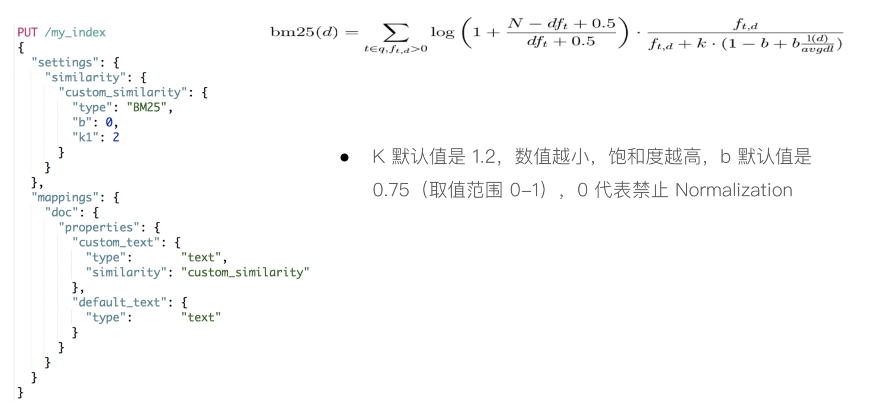
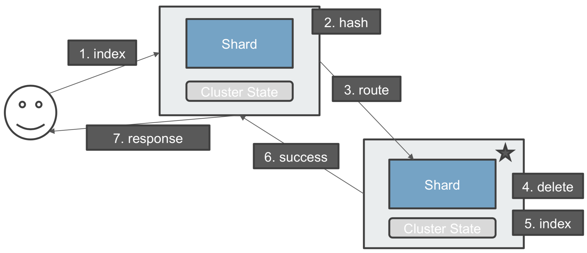

# 一、lucene

[Lucene](https://github.com/apache/lucene) 是一个基于 Java 的全文信息检索工具包。

## 1、全文检索

什么是全文检索：将非结构化的数据中的一部分数据提取出来，重新组织，使其变的有一定的结构，然后对此结构进行搜索

### 1.1、全文检索的流程分为：索引流程、搜索流程。

- 索引流程：即采集数据构建文档对象分析文档（分词）创建索引。
- 搜索流程：即用户通过搜索界面创建查询执行搜索，搜索器从索引库搜索渲染搜索结果

### 1.2、数据分类

生活中的数据总体分为三种：
- 结构化数据，固定格式和长度，如数据库数据，元数据等
- 非结构化数据，无固定格式和长度，如邮件，word文档，商品描述信息，非结构化数据也称为为全文数据
- 半结构化数据，如XML，HTML等，当然根据需要按结构化数据来处理，也可抽取出纯文本按非结构化数据来处理

对非结构化数据（全文数据）搜索方法：
- 顺序扫描法(Serial Scanning)：从头到尾的扫描，比如windows的搜索文件，Linux下的grep命令，这种方法比较原始，但对于小数据量的文件，这种方法还是最直接，最方便的。但是对于大量的文件，这种方法就很慢了；
- 全文检索（Full-text Search）：即将非结构化数据中的一部分信息提取出来，重新组织，使其变得有一定结构，然后对此有一定结构的数据进行搜索，从而达到搜索相对较快的目的。这种先建立索引，再对索引进行搜索的过程就叫全文检索(Full-text Search)

### 1.3、全文检索过程

如果索引总能够保存从字符串到文件的映射，则会大大提高搜索速度。保存这种信息的索引称为反向索引或者倒排索引

**如何创建索引：**
- 准备一些要索引的文档（Document）；
- 将原文档传给分词组件（Tokenizer）：经过分词(Tokenizer)后得到的结果称为词元(Token)
    - 将文档分成一个一个单独的单词；
    - 去除标点符号；
    - 去除停词(Stop word)：语言中最普通的一些单词，比如：the”,“a”，“this” 由于没有特别的意义，因而大多数情况下不能成为搜索的关键词
- 将词元（Token）传给语言处理组件（Linguistic Processor），语言处理组件(linguistic processor)的结果称为词(Term)；
- 将得到的词(Term)传给索引组件(Indexer)：
    - 利用得到的词(Term)创建一个字典。
    - 对字典按字母顺序进行排序
    - 合并相同的词(Term)成为文档倒排(Posting List)链表，其中有几个定义：
        - Document Frequency 即文档频次，表示总共有多少文件包含此词(Term)。
        - Frequency 即词频率，表示此文件中包含了几个此词(Term)

**如何对索引进行搜索：**
- 用户输入查询语句；
- 搜索应用程序对用户输入查询语句进行词法分析，语法分析，及语言处理
- 搜索索引，得到符合语法树的文档；
- 根据得到的文档和查询语句的相关性，对结果进行排序。

全文搜索原理如下：


## 2、Lucene介绍

Lucene是一个高效的，可扩展的，基于Java的全文检索库；它不是一个完整的搜索应用程序，而是为你的应用程序提供索引和搜索功能，由于是它不是一个完整的搜索应用程序，所以有一些基于Lucene的开源搜索引擎产生，比如 Elasticsearch 和 solr

## 3、索引结构

- Index：索引，由很多的Document组成。
- Segment：一个索引可以包含多个段，段与段之间是独立的，添加新文档可以生成新的段，不同的段可以合并
- Document：由很多的Field组成，是Index和Search的最小单位。文档是我们建索引的基本单位，不同的文档是保存在不同的段中的，一个段可以包含多 个文档
- Field：由很多的Term组成，包括Field Name和Field Value。
- Term：由很多的字节组成。一般将Text类型的Field Value分词之后的每个最小单元叫做Term

lucene 的索引结构中，即保存了正向信息，也保存了反向信息
- 正向：索引(Index) –> 段(segment) –> 文档(Document) –> 域(Field) –> 词(Term)
- 反向：词(Term) –> 文档(Document

## 4、Lucene类

- IndexWriter：lucene 中最重要的的类之一，它主要是用来将文档加入索引，同时控制索引过程中的一些参数使用。

- Analyzer：分析器，主要用于分析搜索引擎遇到的各种文本。常用的有StandardAnalyzer分析器、StopAnalyzer 分析器、WhitespaceAnalyzer 分析器等。

- Directory：索引存放的位置；lucene 提供了两种索引存放的位置，一种是磁盘，一种是内存。一般情况将索引放在磁盘上；相应地lucene 提供了FSDirectory 和RAMDirectory 两个类。

- Document：文档；Document 相当于一个要进行索引的单元，任何可以想要被索引的文件都必须转化为Document 对象才能进行索引。

- Field：字段。

- IndexSearcher：是lucene 中最基本的检索工具，所有的检索都会用到IndexSearcher工具;

- Query：查询，lucene 中支持模糊查询，语义查询，短语查询，组合查询等等，如有TermQuery、BooleanQuery、RangeQuery、WildcardQuery 等一些类。

- QueryParser：是一个解析用户输入的工具，可以通过扫描用户输入的字符串，生成Query对象。

- Hits：在搜索完成之后，需要把搜索结果返回并显示给用户，只有这样才算是完成搜索的目的。在lucene 中，搜索的结果的集合是用Hits 类的实例来表示的

## 5、倒排索引原理

它相反于一篇文章包含了哪些词，它从词出发，记载了这个词在哪些文档中出现过，由两部分组成：`词典和倒排表`。

词典结构尤为重要，有很多种词典结构，各有各的优缺点，常用的有：B+树、跳跃表、FST
- B+树：外存索引、可更新；空间大、速度不够快
- 跳跃表：结构简单、跳跃间隔、级数可控，Lucene3.0之前使用的也是跳跃表结构，后换成了FST，但跳跃表在Lucene其他地方还有应用如倒排表合并和文档号索引；缺点：模糊查询支持不好
- FST（Finite State Transducer）：Lucene现在使用的索引结构
    - 优点：内存占用率低，压缩率一般在3倍~20倍之间、模糊查询支持好、查询快
    - 缺点：结构复杂、输入要求有序、更新不易
    
    Lucene里有个FST的实现，从对外接口上看，它跟Map结构很相似，有查找，有迭代；

## 6、中文分词

分词插件：hanlp.com

## 7、为什么引入搜索引擎

- 海量数据的查询
- 拆词查询
- 支持空格
- 搜索内容高亮

# 二、Elasticsearch

## 1、概述

### 1.1、简介

Elasticsearch使用Java开发并使用Lucene作为其核心来实现所有索引和搜索的功能，通过简单的RESTful API来隐藏Lucene的复杂性，从而让全文搜索变得简单；

Elasticsearch不仅仅是Lucene和全文搜索，我们还能这样去描述它：
- 分布式的实时文件存储，每个字段都被索引并可被搜索
- 分布式的实时分析搜索引擎
- 可以扩展到上百台服务器，处理PB级结构化或非结构化数据

Elasticsearch 使用的是一种名为倒排索引的数据结构，这一结构的设计可以允许十分快速地进行全文本搜索。倒排索引会列出在所有文档中出现的每个特有词汇，并且可以找到包含每个词汇的全部文档。在索引过程中，Elasticsearch 会存储文档并构建倒排索引，这样用户便可以近实时地对文档数据进行搜索

### 1.2、优势

- Elasticsearch 很快：由于 Elasticsearch 是在 Lucene 基础上构建而成的，所以在全文本搜索方面表现十分出色。Elasticsearch 同时还是一个近实时的搜索平台，这意味着从文档索引操作到文档变为可搜索状态之间的延时很短；

- Elasticsearch 具有分布式的本质特征：Elasticsearch 中存储的文档分布在不同的容器中，这些容器称为分片，可以进行复制以提供数据冗余副本，以防发生硬件故障。Elasticsearch 的分布式特性使得它可以扩展至数百台（甚至数千台）服务器，并处理 PB 量级的数据；

- Elastic Stack 简化了数据采集、可视化和报告过程

## 2、安装

- [Elasticsearch安装](../../../辅助资料/环境配置/Linux环境.md#六ElasticSearch)

## 3、核心术语

- 索引（index）：含有相同属性的文档集合；相当于sql的database；
- 类型（type）：索引可以定义为一个或多个类型，文档必须属于一个类型；相当于database里的table；
- 文档（document）：是可以被索引的基本数据单位；相当于table的一行记录；文档是所有可搜索数据的最小单位，会被序列化为json格式；每个文档都有一个UniqueID，可以直接指定，也可以自动生成；
- Mapping：type中定义的结构
- 字段（fields）：对应表的每一列；
- 分片：每个索引都有多个分片，每个分片是一个Lucene索引；
- 节点：node

## 4、基本用法

### 4.1、基本操作

- 查看集群健康：`GET  /_cluster/health`；

- 创建索引：
    ```json
    PUT  /index_test    // 其中 index_test索引名称
    {
        "settings": {
            "index": {
                "number_of_shards": "2",
                "number_of_replicas": "0"
            }
        }
    }
    ```

- 查看索引：`GET _cat/indices?v`

- 删除索引：`DELETE  /index_test`，其中 index_test 为索引名称

- Index的API操作
    ```
    #查看索引相关信息
    GET kibana_sample_data_ecommerce

    #查看索引的文档总数
    GET kibana_sample_data_ecommerce/_count

    #查看前10条文档，了解文档格式
    POST kibana_sample_data_ecommerce/_search
    {
    }

    #_cat indices API
    #查看indices
    GET /_cat/indices/kibana*?v&s=index

    #查看状态为绿的索引
    GET /_cat/indices?v&health=green

    #按照文档个数排序
    GET /_cat/indices?v&s=docs.count:desc

    #查看具体的字段
    GET /_cat/indices/kibana*?pri&v&h=health,index,pri,rep,docs.count,mt

    #How much memory is used per index?
    GET /_cat/indices?v&h=i,tm&s=tm:desc

    get _cat/nodes?v
    GET /_nodes/es7_01,es7_02
    GET /_cat/nodes?v
    GET /_cat/nodes?v&h=id,ip,port,v,m

    GET _cluster/health
    GET _cluster/health?level=shards
    GET /_cluster/health/kibana_sample_data_ecommerce,kibana_sample_data_flights
    GET /_cluster/health/kibana_sample_data_flights?level=shards

    #### cluster state
    The cluster state API allows access to metadata representing the state of the whole cluster. This includes information such as
    GET /_cluster/state

    #cluster get settings
    GET /_cluster/settings
    GET /_cluster/settings?include_defaults=true

    GET _cat/shards
    GET _cat/shards?h=index,shard,prirep,state,unassigned.reason
    ```

### 4.2、文档操作

- 添加文档：`POST /my_doc/_doc/1` -> `{索引名}/_doc/{索引ID}`（是指索引在es中的id，而不是这条记录的id，比如记录的id从数据库来是1001，并不是这个。如果不写，则自动生成一个字符串。建议和数据id保持一致 ），可以是如下body
    ```json
    POST users/_doc
    {
        "user" : "Mike",
        "post_date" : "2019-04-15T14:12:12",
        "message" : "trying out Kibana"
    }
    ```
    如果索引没有手动建立mappings，那么当插入文档数据的时候，会根据文档类型自动设置属性类型。这个就是es的动态映射，帮我们在index索引库中去建立数据结构的相关配置信息
    - 该索引的mapping属性：`"fields":{"keyword":{"type":"keyword","ignore_above":256}}`：对一个字段设置多种索引模式，使用text类型做全文检索，也可使用keyword类型做聚合和排序
    - `"ignore_above":256`：设置字段索引和存储的长度最大值，超过则被忽略；
    ```json
    // create document. 自动生成 _id
    POST users/_doc
    {
        "user" : "Mike",
        "post_date" : "2019-04-15T14:12:12",
        "message" : "trying out Kibana"
    }
    // create document. 指定Id。如果id已经存在，报错
    PUT users/_doc/1?op_type=create
    {
        "user" : "Jack",
        "post_date" : "2019-05-15T14:12:12",
        "message" : "trying out Elasticsearch"
    }
    // create document. 指定 ID 如果已经存在，就报错: version_conflict_engine_exception
    PUT users/_create/1
    {
        "user" : "Jack",
        "post_date" : "2019-05-15T14:12:12",
        "message" : "trying out Elasticsearch"
    }
    ```

- 删除文档：`DELETE /my_doc/_doc/1` -> `{索引名}/_doc/{索引ID}`；文档删除不是立即删除，文档还是保存在磁盘上，索引增长越来越多，才会把那些曾经标识过删除的，进行清理，从磁盘上移出去

- 修改文档：
    - Update 指定 ID  (先删除，在写入)
        ```json
        PUT users/_doc/1
        {
            "user" : "Mike"
        }
        ```
    - 在原文档上增加字段:
        ```json
        POST users/_update/1/
        {
            "doc":{
                "post_date" : "2019-05-15T14:12:12",
                "message" : "trying out Elasticsearch"
            }
        }
        ```
    - 全量替换：`PUT /my_doc/_doc/1`
        ```json
        PUT /my_doc/_doc/1
        {
            "id": 1001,
            "name": "test-1",
            "desc": "test is very good, 测试网非常牛！",
            "create_date": "2019-12-24"
        }
        ```

    **每次修改、删除后，version会更改**

- 查询：
    - `GET users/_doc/1`：返回指定id的数据
    - `GET users/_doc/_search`：该文档下的所有数据
    ```json
    {
        "_index" : "users",
        "_type" : "_doc",
        "_id" : "1",
        "_version" : 1,
        "_seq_no" : 1,
        "_primary_term" : 1,
        "found" : true,
        "_source" : {
            "user" : "Jack",
            "post_date" : "2019-05-15T14:12:12",
            "message" : "trying out Elasticsearch"
        }
    }
    ```
    - `_index`：文档数据所属那个索引，理解为数据库的某张表即可。
    - `_type`：文档数据属于哪个类型，新版本使用_doc。
    - `_id`：文档数据的唯一标识，类似数据库中某张表的主键。可以自动生成或者手动指定。
    - `_score`：查询相关度，是否契合用户匹配，分数越高用户的搜索体验越高。
    - `_version`：版本号。
    - `_source`：文档数据，json格式
    - `_seq_no`：文档版本号，作用同`_version`
    - `_primary_term`：文档所在位置

    上述返回的source中包含全集字段，如果字段很多可以自定义字段：
    `GET /index_demo/_doc/1?_source=id,name`  或者 `GET /index_demo/_doc/_search?_source=id,name`

- 判断文档是否存在：`HEAD /index_demo/_doc/1`，判断http返回码，如果存在则是200，不存在则是404；

- Bulk 操作:
    ```json
    // 执行第1次
    POST _bulk
    { "index" : { "_index" : "test", "_id" : "1" } }
    { "field1" : "value1" }
    { "delete" : { "_index" : "test", "_id" : "2" } }
    { "create" : { "_index" : "test2", "_id" : "3" } }
    { "field1" : "value3" }
    { "update" : {"_id" : "1", "_index" : "test"} }
    { "doc" : {"field2" : "value2"} }
    ```


    #执行第2次
    POST _bulk
    { "index" : { "_index" : "test", "_id" : "1" } }
    { "field1" : "value1" }
    { "delete" : { "_index" : "test", "_id" : "2" } }
    { "create" : { "_index" : "test2", "_id" : "3" } }
    { "field1" : "value3" }
    { "update" : {"_id" : "1", "_index" : "test"} }
    { "doc" : {"field2" : "value2"} }
    ```

### 4.3、并发控制

ES 采用的是乐观并发控制，es中的文档是不可变更的，如果你需要更新一个文档，会将旧文档标记为删除，同时增加一个全新的文档，同时文档的version字段值加1；

- 如果需要内部版本控制，使用： `if_seq_no + if_primary_term`
- 如果外部版本（使用其他数据库作为主要数据存储）：`version + version_type = external`


- 插入新数据：
    ```json
    POST /my_doc/_doc
    {
        "id": 1010,
        "name": "test-1010",
        "desc": "test",
        "create_date": "2019-12-24"
    }
    # 此时 _version 为 1
    ```
- 修改数据：
    ```json
    POST    /my_doc/_doc/{_id}/_update
    {
        "doc": {
            "name": "测试"
        }
    }
    # 此时 _version 为 2
    ```

- 模拟两个客户端操作同一个文档数据，_version都携带为一样的数值
    ```json
    # 操作1
    POST    /my_doc/_doc/{_id}/_update?if_seq_no={数值}&if_primary_term={数值}
    {
        "doc": {
            "name": "测试1"
        }
    }

    # 操作2
    POST    /my_doc/_doc/{_id}/_update?if_seq_no={数值}&if_primary_term={数值}
    {
        "doc": {
            "name": "测试2"
        }
    }
    ```
- 外部版本控制
  ```json
  PUT products/_doc/1?version=30000&version_type=external
  {
    "title":"iphone",
    "count":100
  }
  ```

### 4.4、内置分词

- 分词：把文本转换为一个个的单词，分词称之为analysis。es默认只对英文语句做分词，中文不支持，每个中文字都会被拆分为独立的个体
    ```json
    POST /_analyze
    {
        "analyzer": "standard",
        "text": "text文本"
    }
    结果：
    {
        "tokens": [
            {
                "token": "text",
                "start_offset": 0,
                "end_offset": 4,
                "type": "<ALPHANUM>",
                "position": 0
            },
            {
                "token": "文",
                "start_offset": 4,
                "end_offset": 5,
                "type": "<IDEOGRAPHIC>",
                "position": 1
            },
            {
                "token": "本",
                "start_offset": 5,
                "end_offset": 6,
                "type": "<IDEOGRAPHIC>",
                "position": 2
            }
        ]
    }

    POST /my_doc/_analyze
    {
        "analyzer": "standard",
        "field": "name",
        "text": "text文本"
    }
    ```
-  es内置分词器：
    - standard：默认分词，单词会被拆分，大小会转换为小写。
    - simple：按照非字母分词。大写转为小写。
    - whitespace：按照空格分词。忽略大小写。
    - Simple Analyzer – 按照非字母切分（符号被过滤），小写处理
    - Patter Analyzer – 正则表达式，默认 \W+ (非字符分隔)
    - Language – 提供了30多种常见语言的分词器
    - stop：去除无意义单词，比如`the/a/an/is…`
    - keyword：不做分词。把整个文本作为一个单独的关键词：
        ```json
        {
            "analyzer": "keyword",
            "field": "name",
            "text": "I am a Java programmer, I study Java in imooc!"
        }
        结果：
        {
            "tokens": [
                {
                    "token": "I am a Java programmer, I study Java in imooc!",
                    "start_offset": 0,
                    "end_offset": 46,
                    "type": "word",
                    "position": 0
                }
            ]
        }
        ```

### 4.5、中文分词器

IK中文分词器：[elasticsearch-analysis-ik](https://github.com/medcl/elasticsearch-analysis-ik)

- 安装：在elasticsearch的目录下的`plugin`新建目录`ik`，将下载对应的zip包解压到该目录下，重启elasticsearch即可；
  
    或者：`./bin/elasticsearch-plugin install https://github.com/medcl/elasticsearch-analysis-ik/releases/download/v6.8.5/elasticsearch-analysis-ik-6.8.5.zip`

- 支持分词器类型：
    - `ik_max_word`：会将文本做最细粒度的拆分，比如会将“中华人民共和国国歌”拆分为“中华人民共和国,中华人民,中华,华人,人民共和国,人民,人,民,共和国,共和,和,国国,国歌”，会穷尽各种可能的组合，适合 Term Query；
    - `ik_smart`：会做最粗粒度的拆分，比如会将“中华人民共和国国歌”拆分为“中华人民共和国,国歌”，适合 Phrase 查询

- 使用：
    ```json
    {
        "analyzer": "ik_smart",
        "field": "name",
        "text": "中华人民共和国国歌"
    }
    结果：
    {
        "tokens": [
            {
                "token": "中华人民共和国",
                "start_offset": 0,
                "end_offset": 7,
                "type": "CN_WORD",
                "position": 0
            },
            {
                "token": "国歌",
                "start_offset": 7,
                "end_offset": 9,
                "type": "CN_WORD",
                "position": 1
            }
        ]
    }
    ```

- 自定义中文词库
    - 在`{es}/plugins/ik/config`下，创建：`vim custom.dic`
    - 添加需要添加的中文词库，比如：`骚年` 等网络用语；
    - 配置自定义扩展词典，在ik的配置文件：`{es}/plugins/ik/config/IKAnalyzer.cfg.xml`，加入自定义的文件

**其他分词**
- [Elasticsearch IK分词插件](https://github.com/medcl/elasticsearch-analysis-ik/releases)
- [Elasticsearch hanlp 分词插件](https://github.com/KennFalcon/elasticsearch-analysis-hanlp)
- [分词算法综述](https://zhuanlan.zhihu.com/p/50444885)

一些分词工具，供参考：
- [中科院计算所NLPIR](http://ictclas.nlpir.org/nlpir/)
- ansj分词器 https://github.com/NLPchina/ansj_seg
- 哈工大的LTP https://github.com/HIT-SCIR/ltp
- 清华大学THULAC https://github.com/thunlp/THULAC
- 斯坦福分词器 https://nlp.stanford.edu/software/segmenter.shtml
- Hanlp分词器 https://github.com/hankcs/HanLP
- 结巴分词 https://github.com/yanyiwu/cppjieba
- KCWS分词器(字嵌入+Bi-LSTM+CRF) https://github.com/koth/kcws
- ZPar https://github.com/frcchang/zpar/releases
- IKAnalyzer https://github.com/wks/ik-analyzer

## 5、DSL搜索

### 5.1、请求参数的查询

**URI Query**：在URL中使用参数
```
GET kibana_sample_data_ecommerce/_search?q=customer_first_name:Eddie
GET kibana*/_search?q=customer_first_name:Eddie
GET /_all/_search?q=customer_first_name:Eddie
```
**REQUEST Body**：使用elasticsearch基于json的更加完备的DSL查询
```json
POST kibana_sample_data_ecommerce/_search
{
	"profile": true,
	"query": {
		"match_all": {}
	}
}
```

**URI Search：**
```
GET /movies/_search?q=2012&df=title&sort=year:desc&from=0&size=10&timeout=1s
{ 
    "profile": true
}
```
- `q`：指定查询语句，使用 Query String Syntax
- `df`：默认字段，不指定时；
- `sort：排序/ from 和 size 用于分页`
- `profile`：可以查看查询时如何执行的

**Query String Syntax**
- 指定查询 vs 泛查询：`q=title:2012 /  q=2012`
- Term 与 Phrase
    - `Beautiful Mind` 等效于 `Beautiful OR Mind`
    - `"Beautiful Mind"` 等效于 `Beautiful AND Mind`，Phrase查询还邀请前后顺序保持一致
- 分组与引号
    - `title:(Beautiful AND Mind)`
    - `title="Beautiful Mind"`
- 布尔操作
    - `AND OR NOT 或者 && || !`：必须大写，`title:(+Martix -reloaded)`，可以通过 + 或者 - 替代
- 分组：
    - `+` 表示 must
    - `-` 表示 must_not
    - `title:(+Martix -reloaded)`
- 范围查询
    - 区间表示: `[]`表示闭区间，`{}`表示开区间
        - `year:{2019 TO 2018}`
        - `year:[* TO 2018]` 
- 算数符号
    - `year:>2010`
    - `year:(>2010 && <= 2018)`
    - `year:(+>2010 +<=2018)`
- 通配符：通配符查询效率低，占用内存大，不建议使用，特别是放在最前面
    - `?` 代表1个字符，`*` 代表 0 或多个字符
- 正则表达式：`title:[bt]oy`
- 模糊匹配与近似查询
    - `title:beautifu~1`
    - `title:"lord rings"~2`

```json
#基本查询
GET /movies/_search?q=2012&df=title&sort=year:desc&from=0&size=10&timeout=1s
// 带profile
GET /movies/_search?q=2012&df=title
{
	"profile":"true"
}
// 泛查询，正对_all,所有字段
GET /movies/_search?q=2012
{
	"profile":"true"
}
// 指定字段
GET /movies/_search?q=title:2012&sort=year:desc&from=0&size=10&timeout=1s
{
	"profile":"true"
}
// 查找美丽心灵, Mind为泛查询
GET /movies/_search?q=title:Beautiful Mind
{
	"profile":"true"
}
// 泛查询
GET /movies/_search?q=title:2012
{
	"profile":"true"
}
// 使用引号，Phrase查询
GET /movies/_search?q=title:"Beautiful Mind"
{
	"profile":"true"
}
// 分组，Bool查询
GET /movies/_search?q=title:(Beautiful Mind)
{
	"profile":"true"
}
// 布尔操作符
// 查找美丽心灵
GET /movies/_search?q=title:(Beautiful AND Mind)
{
	"profile":"true"
}
// 查找美丽心灵
GET /movies/_search?q=title:(Beautiful NOT Mind)
{
	"profile":"true"
}
// 查找美丽心灵
GET /movies/_search?q=title:(Beautiful +Mind)
{
	"profile":"true"
}
// 范围查询 ,区间写法
GET /movies/_search?q=title:beautiful AND year:[2002 TO 2018]
{
	"profile":"true"
}
// 通配符查询
GET /movies/_search?q=title:b*
{
	"profile":"true"
}
// 模糊匹配&近似度匹配
GET /movies/_search?q=title:beautifl~1
{
	"profile":"true"
}
GET /movies/_search?q=title:"Lord Rings"~2
{
	"profile":"true"
}
```

### 5.2、DSL基本语法

QueryString用的很少，一旦参数复杂就难以构建，所以大多查询都会使用dsl来进行查询更好
- Domain Specific Language
- 特定领域语言
- 基于JSON格式的数据查询
- 查询更灵活，有利于复杂查询

DSL格式语法：
```json
# 查询
POST     /shop/_doc/_search
{
    "query": {
        "match": {
            "desc": "慕课网"
        }
    }
}
# 判断某个字段是否存在
{
    "query": {
        "exists": {
	        "field": "desc"
	    }
    }
}
```
语法格式为一个json object，内容都是key-value键值对，json可以嵌套；key可以是一些es的关键字，也可以是某个field字段；

```json
# ignore_unavailable=true，可以忽略尝试访问不存在的索引“404_idx”导致的报错
# 查询movies分页
POST /movies,404_idx/_search?ignore_unavailable=true
{
  "profile": true,
	"query": {
		"match_all": {}
	}
}
POST /kibana_sample_data_ecommerce/_search
{
  "from":10,
  "size":20,
  "query":{
    "match_all": {}
  }
}
#对日期排序
POST kibana_sample_data_ecommerce/_search
{
  "sort":[{"order_date":"desc"}],
  "query":{
    "match_all": {}
  }

}
#source filtering
POST kibana_sample_data_ecommerce/_search
{
  "_source":["order_date"],
  "query":{
    "match_all": {}
  }
}
// 脚本字段
GET kibana_sample_data_ecommerce/_search
{
  "script_fields": {
    "new_field": {
      "script": {
        "lang": "painless",
        "source": "doc['order_date'].value+'hello'"
      }
    }
  },
  "query": {
    "match_all": {}
  }
}
POST movies/_search
{
  "query": {
    "match": {
      "title": "last christmas"
    }
  }
}
POST movies/_search
{
  "query": {
    "match": {
      "title": {
        "query": "last christmas",
        "operator": "and"
      }
    }
  }
}
POST movies/_search
{
  "query": {
    "match_phrase": {
      "title":{
        "query": "one love"

      }
    }
  }
}
POST movies/_search
{
  "query": {
    "match_phrase": {
      "title":{
        "query": "one love",
        "slop": 1

      }
    }
  }
}
```

QueryString与SimpleQueryString
```json
PUT /users/_doc/1
{
  "name":"Ruan Yiming",
  "about":"java, golang, node, swift, elasticsearch"
}
PUT /users/_doc/2
{
  "name":"Li Yiming",
  "about":"Hadoop"
}
POST users/_search
{
  "query": {
    "query_string": {
      "default_field": "name",
      "query": "Ruan AND Yiming"
    }
  }
}
POST users/_search
{
  "query": {
    "query_string": {
      "fields":["name","about"],
      "query": "(Ruan AND Yiming) OR (Java AND Elasticsearch)"
    }
  }
}
// Simple Query 默认的operator是 Or
POST users/_search
{
  "query": {
    "simple_query_string": {
      "query": "Ruan AND Yiming",
      "fields": ["name"]
    }
  }
}
POST users/_search
{
  "query": {
    "simple_query_string": {
      "query": "Ruan Yiming",
      "fields": ["name"],
      "default_operator": "AND"
    }
  }
}
GET /movies/_search
{
	"profile": true,
	"query":{
		"query_string":{
			"default_field": "title",
			"query": "Beafiful AND Mind"
		}
	}
}
// 多fields
GET /movies/_search
{
	"profile": true,
	"query":{
		"query_string":{
			"fields":[
				"title",
				"year"
			],
			"query": "2012"
		}
	}
}
GET /movies/_search
{
	"profile":true,
	"query":{
		"simple_query_string":{
			"query":"Beautiful +mind",
			"fields":["title"]
		}
	}
}
```

### 5.3、查询所有与分页

**在索引中查询所有的文档：**
```
GET     /shop/_doc/_search
```
或者通过DSL的 match_all 来实现查询所有
```json
POST     /shop/_doc/_search
{
    "query": {
        "match_all": {}
    },
    "_source": ["id", "nickname", "age"]   # 显示需要查询的字段
}
```

### 5.4、match 扩展：operator/ids

**operator：**
- `or`：搜索内容分词后，只要存在一个词语匹配就展示结果
- `and`：搜索内容分词后，都要满足词语匹配
```json
POST     /shop/_doc/_search
{
    "query": {
        "match": {
            "desc": "慕课网"
        }
    }
}
# 等同于
{
    "query": {
        "match": {
            "desc": {
                "query": "慕课网",
                "operator": "or"
            }
        }
    }
}
```
默认是or，其还可以有一个最低匹配精度，
- `minimum_should_match`: 最低匹配精度，至少有`[分词后的词语个数]x百分百`，得出一个数据值取整。举个例子：当前属性设置为70，若一个用户查询检索内容分词后有10个词语，那么匹配度按照 10x70%=7，则desc中至少需要有7个词语匹配，就展示；若分词后有8个，则 8x70%=5.6，则desc中至少需要有5个词语匹配，就展示。minimum_should_match 也能设置具体的数字，表示个数；
```json
POST     /shop/_doc/_search
{
    "query": {
        "match": {
            "desc": {
                "query": "女友生日送我好玩的xbox游戏机",
                "minimum_should_match": "60%"
            }
        }
    }
}
```

**ids：根据文档主键**
```json
GET /shop/_doc/1001
```
查询多个
```json
POST     /shop/_doc/_search
{
    "query": {
        "ids": {
            "type": "_doc",
            "values": ["1001", "1010", "1008"]
        }
    }
}
```

### 5.9、过滤器

对搜索出来的结果进行数据过滤。不会到es库里去搜，不会去计算文档的相关度分数，所以过滤的性能会比较高，过滤器可以和全文搜索结合在一起使用。post_filter元素是一个顶层元素，只会对搜索结果进行过滤。不会计算数据的匹配度相关性分数，不会根据分数去排序，query则相反，会计算分数，也会按照分数去排序
- query：根据用户搜索条件检索匹配记录
- post_filter：用于查询后，对结果数据的筛选，也可以单独使用

过滤操作：
- gte：大于等于
- lte：小于等于
- gt：大于
- lt：小于

比如：查询账户金额大于80元，小于160元的用户。并且生日在1998-07-14的用户
```json
POST     /shop/_doc/_search
{
	"query": {
		"match": {
			"desc": "慕课网游戏"
		}	
    },
    "post_filter": {
		"range": {
			"money": {
				"gt": 60,
				"lt": 1000
			}
		}
	}	
}
```
另外在match里也可以做：
```json
{
    "query": {
        "bool": {
            "must": [
                {
                    "range": {
                        "money": {
                            "gt": "60",
                            "lt": "100"
                        }
                    }
                }
            ]
        }
    }
}
```

### 5.11、高亮highlight

```json
POST     /shop/_doc/_search
{
    "query": {
        "match": {
            "desc": "慕课网"
        }
    },
    "highlight": {
        "pre_tags": ["<tag>"],
        "post_tags": ["</tag>"],
        "fields": {
            "desc": {}
        }
    }
}
```

### 5.12、其他查询

- prefix：按照前缀查询
    ```json
    POST     /shop/_doc/_search
    {
        "query": {
            "prefix": {
                "desc": "imo"
            }
        }
    }
    ````
- [fuzzy](https://www.elastic.co/guide/cn/elasticsearch/guide/current/fuzzy-match-query.html)：模糊搜索，并不是指的sql的模糊搜索，而是用户在进行搜索的时候的打字错误现象，搜索引擎会自动纠正，然后尝试匹配索引库中的数据
    ```json
    POST     /shop/_doc/_search
    {
        "query": {
            "fuzzy": {
            "desc": "imoov.coom"
            }
        }
    }
    # 或多字段搜索
    {
        "query": {
            "multi_match": {
            "fields": [ "desc", "nickname"],
            "query": "imcoc supor",
            "fuzziness": "AUTO"
            }
        }
    }
    {
        "query": {
            "multi_match": {
            "fields": [ "desc", "nickname"],
            "query": "演说",
            "fuzziness": "1"
            }
        }
    }
    ```
- [wildcard](https://www.elastic.co/guide/en/elasticsearch/reference/current/query-dsl-wildcard-query.html)：占位符查询
    - `?`：1个字符
    - `*`：1个或多个字符
    ```json
    {
        "query": {
            "wildcard": {
            "desc": "*oo?"
            }
        }
    }
    {
        "query": {
            "wildcard": {
                "desc": "演*"
            }
        }
    }
    ```


## 6、分页

### 6.1、基本分页

- 默认情况下，查询按照相关度算分排序，返回前10条记录
- 常见分页方案：
  - from： 开始位置
  - size： 期望获取文档的总数；

```json
POST  /shop/_doc/_search
{
	"query": {
		"match_all": {}
	},
	"from": 5, # 从第几条开始，默认是0开始的，
	"size": 5 # 每页的数据
}
```

### 6.2、深度分页问题

深度分页其实就是搜索的深浅度，比如第1页，第2页，第10页，第20页，是比较浅的；第10000页，第20000页就是很深了，比如如下操作：
```json
{
    "query": {
        "match_all": {}
    },
    "from": 9999,
    "size": 10
}
```
在获取第9999条到10009条数据的时候，其实每个分片都会拿到10009条数据，然后集合在一起，总共是10009*3=30027条数据，针对30027数据再次做排序处理，最终会获取最后10条数据；

如此一来，搜索得太深，就会造成性能问题，会耗费内存和占用cpu。而且es为了性能，其不支持超过一万条数据以上的分页查询。

那么如何解决深度分页带来的性能呢？其实我们应该避免深度分页操作（限制分页页数），比如最多只能提供100页的展示，从第101页开始就没了，毕竟用户也不会搜的那么深，一般也就看个10来页就顶多了；

通过设置`index.max_result_window`来突破10000数据
```json
// 获取配置
GET     /shop/_settings
// 修改配置
PUT     /shop/_settings
{ 
    "index.max_result_window": "20000"
}
```

### 6.3、search After

可以通过 search after 避免深度分页问题
- 可以避免深度分页性能问题，可以实时获取下一页文档的信息，但是不支持指定页数（from），只能往下翻；
- 第一步搜索需要指定 sort，并且保证值时唯一的（可以通过加入 _id 保证唯一性）；
- 然后使用上一次，最后一个文档的sort值进行查询；

```json
POST users/_search
{
    "size": 1,
    "query": {
        "match_all": {}
    },
    "search_after":
        [
          10,
          "D-1dpHYBFOBI79GDvD0n"], // 上一次查询的sort值
    "sort": [
        {"age": "desc"} ,
        {"_id": "asc"}    
    ]
}
```

**search after 是如何解决深度分页问题：**假定 size = 10，当查询 999-1000，时，通过唯一排序值定位，将每次需要处理的文档数都控制在 10个，那么其实际查询出来的数据就是`number_of_shards * 10`

### 6.4、Scroll API

**[scroll滚动搜索](https://www.elastic.co/guide/cn/elasticsearch/guide/current/scroll.html)**

一次性查询1万+数据，往往会造成性能影响，因为数据量太多了。这时可以使用滚动搜索，即：scroll。

滚动搜索可以先查询出一些数据，然后再紧接着依次往下查询。在第一次查询的时候会有一个滚动id，相当于一个锚标记，随后再次滚动搜索会需要上一次搜索的锚标记，根据这个进行下一次的搜索请求。每次搜索都是基于创建的一个快照数据，查询数据的期间，如果有新的数据写入或者变更，那么和搜索是没有关系的，搜索的内容还是快照中的数据；

scroll=1m，相当于是一个session会话时间，搜索保持的上下文时间为1分钟
```json
POST    /shop/_search?scroll=1m
{
    "query": { 
    	"match_all": {
    	}
    },  
    "sort" : ["_doc"], 
    "size":  5
}
```
上面第一次执行后，返回的数据里面有个`"_scroll_id": "1234444444=="`，滚动的id

```json
POST    /_search/scroll
{
    "scroll": "1m", 
    "scroll_id" : "1234444444=="
}
```
下一次请求时需要带上这个`scroll_id`

### 6.5、关于分页使用场景

- Regular：需要实时获取顶部的部分文档，例如查询最新的订单数据；
- Scroll：需要全部文档，例如导出全部数据等；
- Pagination：from 和 size，如果需要深度分页，则选用 search after

### 6.2、批量查询

**批量查询方式1：**
```json
POST    /shop/_doc/_search
{
    "query": {
        "ids": {
            "type" : "_doc",
            "values" : ["1002","1001"]
        }
    }
}
```

**mget方式**
```json
POST    /shop/_doc/_mget
{
    "ids": ["1002","1001"]
}
```

这两种方式对比：
- mget方式返回的数据中，只包含需要查询的数据，不包含其他多余的信息；
- mget中批量查询的数据如果不存在，返回的数据中也会包含该数据，只不过其中的found是false
    ```json
    {
        "_index": "shop",
        "_type": "_doc",
        "_id": "10022",
        "found": false
    }
    ```

### 6.3、批量操作

**基本语法**

[bulk](https://www.elastic.co/guide/cn/elasticsearch/guide/current/bulk.html)操作和以往的普通请求格式有区别。不要格式化json，不然就不在同一行了，这个需要注意，每个操作后面都有一个换行符（\n）
```json
{ action: { metadata }}\n
{ request body        }\n
{ action: { metadata }}\n
{ request body        }\n
...
```
- `{ action: { metadata }}`代表批量操作的类型，可以是新增、删除或修改
- `\n`是每行结尾必须填写的一个规范，每一行包括最后一行都要写，用于es的解析
- `{ request body }`是请求body，增加和修改操作需要，删除操作则不需要

**批量操作的类型：**

action 必须是以下选项之一：
- create：如果文档不存在，那么就创建它。存在会报错。发生异常报错不会影响其他操作。
- index：创建一个新文档或者替换一个现有的文档。
- update：部分更新一个文档。
- delete：删除一个文档

`metadata` 中需要指定要操作的文档的`_index` 、 `_type` 和 `_id`，`_index` 、 `_type`也可以在url中指定

**操作实例：**

- create新增文档数据，在metadata中指定index以及type
    ```json
    POST    /_bulk
    {"create": {"_index": "shop2", "_type": "_doc", "_id": "2001"}}
    {"id": "2001", "nickname": "name2001"}
    {"create": {"_index": "shop2", "_type": "_doc", "_id": "2002"}}
    {"id": "2002", "nickname": "name2002"}
    {"create": {"_index": "shop2", "_type": "_doc", "_id": "2003"}}
    {"id": "2003", "nickname": "name2003"}
    ```

- create创建已有id文档，在url中指定index和type
    ```json
    POST    /shop/_doc/_bulk
    {"create": {"_id": "2003"}}
    {"id": "2003", "nickname": "name2003"}
    {"create": {"_id": "2004"}}
    {"id": "2004", "nickname": "name2004"}
    {"create": {"_id": "2005"}}
    {"id": "2005", "nickname": "name2005"}
    ```

- index创建，已有文档id会被覆盖，不存在的id则新增
    ```json
    POST    /shop/_doc/_bulk
    {"index": {"_id": "2004"}}
    {"id": "2004", "nickname": "index2004"}
    {"index": {"_id": "2007"}}
    {"id": "2007", "nickname": "name2007"}
    {"index": {"_id": "2008"}}
    {"id": "2008", "nickname": "name2008"}
    ```

- update跟新部分文档数据
    ```json
    POST    /shop/_doc/_bulk
    {"update": {"_id": "2004"}}
    {"doc":{ "id": "3004"}}
    {"update": {"_id": "2007"}}
    {"doc":{ "nickname": "nameupdate"}}
    ```

- delete批量删除
    ```json
    POST    /shop/_doc/_bulk
    {"delete": {"_id": "2004"}}
    {"delete": {"_id": "2007"}}
    ```

- 综合批量各种操作
    ```json
    POST    /shop/_doc/_bulk
    {"create": {"_id": "8001"}}
    {"id": "8001", "nickname": "name8001"}
    {"update": {"_id": "2001"}}
    {"doc":{ "id": "20010"}}
    {"delete": {"_id": "2003"}}
    {"delete": {"_id": "2005"}}
    ```

## 7、Mapping

### 7.1、介绍

Mapping类似数据库中的 schema 的定义，主要作用：
- 定义索引中的字段名称
- 定义字段的数据类型，例如字符串、数字、布尔等；
- 字段，倒排索引的相关配置

Mappinhg会把json文档映射成 Lucene 所需要的扁平格式；

一个Mapping属于一个索引的 Type
- 每个文档都属于一个 Type
- 一个Type有一个Mapping定义；
- 7.0开始，不需要在Mapping定义中指定 Type信息；

字段的数据类型：
- 简单类型：
    - Text Keyword
        - text：文字类需要被分词被倒排索引的内容，比如商品名称，商品详情，商品介绍，使用text；
        - keyword：不会被分词，不会被倒排索引，直接匹配搜索，比如订单状态，用户qq，微信号，手机号等，这些精确匹配，无需分词
    - Date
    - Integer  Floating
    - Boolean
    - IPV4 & IPV6
- 复杂类型：对象和嵌套对象
- 特殊类型：geo_point & geo_shape/ percolator

### 7.2、DynamicMapping

在写入文档的时候，如果索引不存在，会自动创建索引；

DynamicMapping机制使得在创建索引的时候无需指定 Mappings，Elasticsearch 会自动根据文档信息推算出字段的类型，但是在有些情况下，推算出字段类型不对，比如地理位置信息等；

查看索引的Mapping信息
```json
GET movies/_mapping
// 结果
{
  "movies" : {
    "mappings" : {
      "_source" : {
        "excludes" : [
          "_id"
        ]
      },
      "properties" : {
        "@version" : {
          "type" : "text",
          "fields" : {
            "keyword" : {
              "type" : "keyword",
              "ignore_above" : 256
            }
          }
        },
      }
    }
  }
}
```

### 7.3、类型的自动识别

| JSON类型 | Elasticsearch类型                                            |
| -------- | ------------------------------------------------------------ |
| 字符串   | 匹配日期格式，设置成Date；<br/>配置成数字设置为float或long，该选型默认关闭 <br/>设置为text，并且增加 keyword 子字段 |
| 布尔值   | boolean                                                      |
| 浮点数   | float                                                        |
| 整数     | long                                                         |
| 对象     | Object                                                       |
| 数组     | 由第一个非空数值的类型所决定                                 |
| 空值     | 忽略                                                         |

**注意：**
- 数字或者布尔值如果用引号包裹，默认推导的类型是 TEXT
- 日期格式如：`2018-07-24T10:29:48.103Z`或者`2020-12-19T00:00:00`会推导成Date类型，但是如`2020-12-19 00:00:00` 会被推导为text

**如何更改Mapping的字段类型**：
- 新增字段：
    - dynamic 设为true时，一旦有新增字段的文档写入，Mappin同时也会被更新；
    - dynamic 设为false时，Mapping不会被更新，新增字段的数据无法被索引，但是信息会出现在 _source 中；
    - dynamic 设为strict，文档写入失败；
        ```json
        {
            "error": {
                "root_cause": [
                {
                    "type": "strict_dynamic_mapping_exception",
                    "reason": "mapping set to strict, dynamic introduction of [lastField] within [_doc] is not allowed"
                }
                ],
                "type": "strict_dynamic_mapping_exception",
                "reason": "mapping set to strict, dynamic introduction of [lastField] within [_doc] is not allowed"
            },
            "status": 400
        }
        ```
- 对已有字段，一旦已经有数据写入，就不再支持修改字段定义，Lucene实现的倒排索引，一旦生成后，就不允许修改；
- 如果希望改变字段类型，必须 reindex API，重建索引，原因是：
    - 如果修改了字段的数据类型，会导致已被索引的数据无法被搜索；
    - 但是如果是新增的字段，就不会有这样的影响；

```json
PUT moives
{
    "mapping":{
        "_doc":{
            "dynamic":"false"
        }
    }
}
```

### 7.4、自定义mappings

建议：
- 参考API手册，纯手写；
- 为了减少工作量、出错概率：
    - 创建一个临时的index，写入一些样本数据；
    - 通过访问 Mapping API 获得该临时文件的动态 Mapping 定义；
    - 修改后使用该配置创建你的索引；
    - 删除临时索引数据；

**控制当前字段是否被索引：**

index：控制当前字段是否被索引，默认为true；如果设置成false，表示该字段不可被搜索
```json
PUT users
{
    "mappings" : {
        "properties" : {
            "firstName" : {
                "type" : "text"
            },
            "lastName" : {
                "type" : "text"
            },
            "mobile" : {
                "type" : "text",
                "index": false // 如果对该字段索引，会报错：Cannot search on field [mobile] since it is not indexed.
            }
        }
    }
}
```
**index options：**四种不同级别的 index options，可以控制倒排索引记录的内容
- docs：记录doc id
- freqs：记录doc id 和 term frequencies
- positions：记录 doc id 、term frequencies、term position
- offsets：doc id 、term frequencies、term position、character offsets

Text类型默认记录 positions，其他默认为 docs，记录内容越多，占用存储空间越大；

**null_value**
- 需要对 Null 值实现搜索；
- 只有 keyword 类型支持设定 null_value
```json
PUT users
{
    "mappings" : {
      "properties" : {
        "firstName" : {
          "type" : "text"
        },
        "lastName" : {
          "type" : "text"
        },
        "mobile" : {
          "type" : "keyword",
          "null_value": "NULL"
        }

      }
    }
}
PUT users/_doc/1
{
  "firstName":"Ruan",
  "lastName": "Yiming",
  "mobile": null
}
PUT users/_doc/2
{
  "firstName":"Ruan2",
  "lastName": "Yiming2"

}

GET users/_search
{
  "query": {
    "match": {
      "mobile":"NULL"
    }
  }
}
```
**copy_to设置**
- `_all` 在 7中被`copy_to`所替代；
- 可以满足一些特定的搜索需求，`copy_to`将字段的数值拷贝到目标字典，实现类似`_all`的作用；
- `copy_to`的目标字段不出现在 _source 中
```json
PUT users
{
  "mappings": {
    "properties": {
      "firstName":{
        "type": "text",
        "copy_to": "fullName"
      },
      "lastName":{
        "type": "text",
        "copy_to": "fullName"
      }
    }
  }
}
PUT users/_doc/1
{
  "firstName":"Ruan",
  "lastName": "Yiming"
}
GET users/_search?q=fullName:(Ruan Yiming)
POST users/_search
{
  "query": {
    "match": {
       "fullName":{
        "query": "Ruan Yiming",
        "operator": "and"
      }
    }
  }
}
```
**数组类型：**
- Elasticsearch不提供专门的数组类型，但是任何字段，都可以包含多个相同类型的数值；
```json
PUT users/_doc/1
{
  "name":"onebird",
  "interests":"reading"
}
PUT users/_doc/1
{
  "name":"twobirds",
  "interests":["reading","music"]
}
POST users/_search
{
  "query": {
		"match_all": {}
	}
}
GET users/_mapping
```

- 为已存在的索引创建或创建mappings
    ```json
    POST  /index_str/_mapping
    {
        "properties": {
            "id": {
                "type": "long"
            },
            "age": {
                "type": "integer"
            },
            "nickname": {
                "type": "keyword"
            },
            "money1": {
                "type": "float"
            },
            "money2": {
                "type": "double"
            },
            "sex": {
                "type": "byte"
            },
            "score": {
                "type": "short"
            },
            "is_teenager": {
                "type": "boolean"
            },
            "birthday": {
                "type": "date"
            },
            "relationship": {
                "type": "object"
            }
        }
    }
    ```

### 7.5、多字段类型与自定义分词

- 如果要实现精准匹配：增加一个keyword字段；
- 使用不同的analyzer：
    - 不同语言
    - pinyin字段的搜索
    - 还支持位搜索和索引指定不同的 analyzer
```
PUT products
{
  "mappings": {
    "properties": {
      "company": {
        "type": "text",
        "fields": {
          "keyword": {
            "type": "keyword",
            "ignore_above": 256
          }
        }
      },
      "comment": {
        "type": "text",
        "fields": {
          "english_comment": {
            "type": "text",
            "analyzer": "english",
            "search_analyzer": "english"
          }
        }
      }
    }
  }
}
```

**Exact Values & Full Test**
- Exact Values： 包括数字/日期/具体一个字符串，在elasticsearch中使用keyword；在索引的时候，不需要做特殊的分词处理；
- 全文本，非结构化的文本数据，elasticsearch中的text；

**自定义分词：**

当elasticsearch自带的分词器无法满足时，可以自定义分词器，通过自组合不同的组件实现：
- Character Filter：在 tokenizer之前对文本进行处理，例如增加删除以及替换字符，可以配置多个 character filter。会影响 Tokenizer的 position 和 offset信息，一些自带的 Character Filters：
    - html strip：去除html标签
    - mapping：字符串替换
    - pattern replace：正在匹配替换
- Tokenizer：将原始的文本按照一定的规则，切分为词；elasticsearch内置的tokenizer：whitespace、standard、uax_url_emali、pattern、keyword、path hierarchy；另外也可以使用Java开发插件，实现自己的tokenizer；
- Token Filter：将 tokenizer输出的单词进行增加、修改、删除；自带的token filters：lowercase、stop、synonym（添加近义词）

示例：
```json
POST _analyze
{
  "tokenizer":"keyword",
  "char_filter":["html_strip"],
  "text": "<b>hello world</b>"
}
POST _analyze
{
  "tokenizer":"path_hierarchy",
  "text":"/user/ymruan/a/b/c/d/e"
}
// 使用char filter进行替换
POST _analyze
{
  "tokenizer": "standard",
  "char_filter": [
      {
        "type" : "mapping",
        "mappings" : [ "- => _"]
      }
    ],
  "text": "123-456, I-test! test-990 650-555-1234"
}
// char filter 替换表情符号
POST _analyze
{
  "tokenizer": "standard",
  "char_filter": [
      {
        "type" : "mapping",
        "mappings" : [ ":) => happy", ":( => sad"]
      }
    ],
    "text": ["I am felling :)", "Feeling :( today"]
}
// white space and snowball
GET _analyze
{
  "tokenizer": "whitespace",
  "filter": ["stop","snowball"],
  "text": ["The gilrs in China are playing this game!"]
}
// whitespace与stop
GET _analyze
{
  "tokenizer": "whitespace",
  "filter": ["stop","snowball"],
  "text": ["The rain in Spain falls mainly on the plain."]
}
//remove 加入lowercase后，The被当成 stopword删除
GET _analyze
{
  "tokenizer": "whitespace",
  "filter": ["lowercase","stop","snowball"],
  "text": ["The gilrs in China are playing this game!"]
}
//正则表达式
GET _analyze
{
  "tokenizer": "standard",
  "char_filter": [
      {
        "type" : "pattern_replace",
        "pattern" : "http://(.*)",
        "replacement" : "$1"
      }
    ],
    "text" : "http://www.elastic.co"
}
```

设置一个 Custom Analyzer

### 7.6、index template 和 dynamic template

为了管理更多的索引，管理数据，提高性能，可以创建一些模板

**index template**

帮助你设置Mappings 和Settings，并按照一定的规则，自动匹配到新创建的索引之上
- 模板仅在一个索引被新创建时才会产生作用；修改模板不会影响到已经创建的索引；
- 可以设定多个索引模板，这些设置会被merge在一起；
- 可以知道 order 数值，控制 merge 的过程
```json
PUT _template/template_default
{
  "index_patterns": ["*"],
  "order" : 0,
  "version": 1,
  "settings": {
    "number_of_shards": 1,
    "number_of_replicas":1
  }
}
PUT /_template/template_test
{
    "index_patterns" : ["test*"],
    "order" : 1,
    "settings" : {
    	"number_of_shards": 1,
        "number_of_replicas" : 2
    },
    "mappings" : {
    	"date_detection": false,
    	"numeric_detection": true
    }
}
```

**index template工作方式**

当一个索引被创建时：
- 应该elasticsearch默认的settings 和 mappings
- 应用 order 数值第的 index template 中的设定；
- 应用 order 高的 index template 中的设定，之前的设定会被覆盖；
- 应用场景索引时，用户指定的 settings 和 mappings 会覆盖之前模板中的设定
```json
// 写入新的数据，index以test开头
PUT testtemplate/_doc/1
{
	"someNumber":"1",
	"someDate":"2019/01/01"
}
GET testtemplate/_mapping
get testtemplate/_settings
```

**dynamic template**

根据elasticsearch识别的数据类型，结合字段名称，来动态设定字段类型
- 所有的字符串类型都设定成 keyword，或者关闭 keyword字段；
- is 开头的字段都伸出boolean
- long_开头的都设置成long类型

## 8、聚合（agg）

### 8.1、聚合的类型

elasticsearch除搜索外，提供了针对es数据进行统计分析的功能：实时高，不像Hadoop的（T+1）的数据；

通过聚合，会得到一个数据的概览，是分析和总结的数据，而不是寻找单个文档；

高性能，且只需要一条语句，就可以从elasticsearch得到分析的结果，无需在客户端自己去实现分析逻辑；

聚合的分类：
- Bucket Aggregation：一些列满足特定条件的文旦的集合；
- Metric Aggregation：一些数学运算，可以对文档字段进行统计分析；metric 会基于数据集计算结果，除了支持在字段上进行计算，同样也支持在脚本产生的结果之上进行计算；大多数metric是数学计算，仅输出一个值：min、max、sum、avg、cardinality
- Pipeline Aggregation：对其他的聚合结果进行二次聚合；
- Matrix Aggragation：支持对多个字段的操作并提供一个结果矩阵

聚合的语法，Aggregation属于search 的一部分，一般情况系，建议将其size指定为0；


示例：统计员工工资信息
```json
POST employees/_search
{
  "size": 0,
  "aggs": {
    "max_salary": {
      "max": {
        "field": "salary"
      }
    },
    "min_salary": {
      "min": {
        "field": "salary"
      }
    },
    "avg_salary": {
      "avg": {
        "field": "salary"
      }
    }
  }
}
// 输出结果
{
  "took" : 4,
  "timed_out" : false,
  "_shards" : {
    "total" : 1,
    "successful" : 1,
    "skipped" : 0,
    "failed" : 0
  },
  "hits" : {
    "total" : {
      "value" : 20,
      "relation" : "eq"
    },
    "max_score" : null,
    "hits" : [ ]
  },
  "aggregations" : {
    "max_salary" : {
      "value" : 50000.0
    },
    "avg_salary" : {
      "value" : 24700.0
    },
    "min_salary" : {
      "value" : 9000.0
    }
  }
}
```

### 8.2、Metric Aggregation

```sql
select count(brand) -- metric：一些系列的统计方法
from cars
group brand  -- Bucket：一组满足条件的文档
```

**Metric Aggregation**
- 单值分析：只输出一个分析结果
  - min、max、avg、sum
  - cardinality（类似distinct count）
- 多值分析：输出多个分析结果
  - stats、extended stats
  - percentile、percentile rank
  - top hits（排在前面的=示例）

```json
//  多个 Metric 聚合，找到最低最高和平均工资
POST employees/_search
{
  "size": 0,
  "aggs": {
    "max_salary": {
      "max": {
        "field": "salary"
      }
    },
    "min_salary": {
      "min": {
        "field": "salary"
      }
    },
    "avg_salary": {
      "avg": {
        "field": "salary"
      }
    }
  }
}

// 一个聚合，输出多值
POST employees/_search
{
  "size": 0,
  "aggs": {
    "stats_salary": {
      "stats": {
        "field":"salary"
      }
    }
  }
}
// 上面输出结果，会将所有相关统计的都算出来
"aggregations" : {
    "stats_salary" : {
      "count" : 20,
      "min" : 9000.0,
      "max" : 50000.0,
      "avg" : 24700.0,
      "sum" : 494000.0
    }
  }
```

### 8.3、Bucket Aggregation

- 按照一定的规则，将文档分配到不同的桶中，从而达到分类的目的，ES提供的bucket aggregation：
  - Terms
  - 数字类型：Range、Data Range、Histogram、Data Histogram
- 支持嵌套，也就是在桶里在做分桶

**Terms Aggregation**
- 字段需要打开 fieldData，才能进行 Terms Aggregation；
  - Keyword默认支持 doc_Values；
  - text 需要在mapping中enable，其会按照分词后的结果进行分桶；

```json
// 对keword 进行聚合
POST employees/_search
{
  "size": 0,
  "aggs": {
    "jobs": {
      "terms": {
        "field":"job.keyword"
      }
    }
  }
}
// 对 Text 字段进行 terms 聚合查询，失败
POST employees/_search
{
  "size": 0,
  "aggs": {
    "jobs": {
      "terms": {
        "field":"job"
      }
    }
  }
}
// 对 Text 字段打开 fielddata，支持terms aggregation
PUT employees/_mapping
{
  "properties" : {
    "job":{
       "type":     "text",
       "fielddata": true
    }
  }
}
// 对 Text 字段进行 terms 分词。分词后的terms
POST employees/_search
{
  "size": 0,
  "aggs": {
    "jobs": {
      "terms": {
        "field":"job"
      }
    }
  }
}
POST employees/_search
{
  "size": 0,
  "aggs": {
    "jobs": {
      "terms": {
        "field":"job.keyword"
      }
    }
  }
}
//  对job.keyword 和 job 进行 terms 聚合，分桶的总数并不一样
POST employees/_search
{
  "size": 0,
  "aggs": {
    "cardinate": {
      "cardinality": {
        "field": "job"
      }
    }
  }
}
// 对 性别的 keyword 进行聚合
POST employees/_search
{
  "size": 0,
  "aggs": {
    "gender": {
      "terms": {
        "field":"gender"
      }
    }
  }
}
```

**Bucket Size & Top Hits**
- 应用场景：当获取分桶后，桶内最匹配的顶部文档列表
- size：找出指定数据量的分桶信息
- top hits：比如查询年纪最大的三名员工
```json
// 指定 bucket 的 size
POST employees/_search
{
  "size": 0,
  "aggs": {
    "ages_5": {
      "terms": {
        "field":"age",
        "size":3
      }
    }
  }
}
// 指定size，不同工种中，年纪最大的3个员工的具体信息
POST employees/_search
{
  "size": 0,
  "aggs": {
    "jobs": {
      "terms": {
        "field":"job.keyword"
      },
      "aggs":{
        "old_employee":{
          "top_hits":{
            "size":3,
            "sort":[
              {
                "age":{
                  "order":"desc"
                }
              }
            ]
          }
        }
      }
    }
  }
}
```

**Range & Histogram 聚合**
- 按照数字的范围进行分桶
- 在Range Aggregation 中，可以自定义 key
```json
// Salary Ranges 分桶，可以自己定义 key
POST employees/_search
{
  "size": 0,
  "aggs": {
    "salary_range": {
      "range": {
        "field":"salary",
        "ranges":[
          {
            "to":10000 // 0~10000之间的
          },
          {
            "from":10000, // 10000~20000之间的
            "to":20000
          },
          {
            "key":">20000", // 20000以上的
            "from":20000
          }
        ]
      }
    }
  }
}
// Salary Histogram,工资0到10万，以5000一个区间进行分桶
POST employees/_search
{
  "size": 0,
  "aggs": {
    "salary_histrogram": {
      "histogram": {
        "field":"salary",
        "interval":5000,
        "extended_bounds":{
          "min":0,
          "max":100000
        }
      }
    }
  }
}
```

**Bucket + Metric Aggregation**
- Bucket 聚合分析允许通过子聚合分析来进一步分析，子聚合分析可以是 Bucket 或者 metric
```json
// 按照工作类型分桶，并统计每种工作类型的工资信息
POST employees/_search
{
  "size": 0,
  "aggs": {
    "Job_salary_stats": {
      "terms": {
        "field": "job.keyword"
      },
      "aggs": {
        "salary": {
          "stats": {
            "field": "salary"
          }
        }
      }
    }
  }
}
// 多次嵌套。根据工作类型分桶，然后按照性别分桶，计算工资的统计信息
POST employees/_search
{
  "size": 0,
  "aggs": {
    "Job_gender_stats": {
      "terms": {
        "field": "job.keyword"
      },
      "aggs": {
        "gender_stats": {
          "terms": {
            "field": "gender"
          },
          "aggs": {
            "salary_stats": {
              "stats": {
                "field": "salary"
              }
            }
          }
        }
      }
    }
  }
}
```

### 8.4、Pipeline 聚合分析

比如在员工数最多的工种里面，找出平均工资最低的
```json
POST employees/_search
{
  "size": 0,
  "aggs": {
    "jobs": {
      "terms": {
        "field": "job.keyword",
        "size": 10
      },
      "aggs": {
        "avg_salary": {
          "avg": {
            "field": "salary"
          }
        }
      }
    },
    "min_salary_by_job": {// 结果和其他的聚合同级
      "min_bucket": { // min_bucket 求之前结果的最小值
        "buckets_path": "jobs>avg_salary" // 通过bucket_path 关键字指定路径
      }
    }
  }
}
```

Pipeline：
- 支持对聚合分析的结果，再次进行聚合分析；
- Pipeline 的分析结果会输出到原结果中，根据位置的不同，分为两类：
  - sibling：结果和现有分析结果统计：
    - Max、min、avg & sum bucket;
    - stats、extended status bucket;
    - percentile bucket
  - Parent：结果内嵌到现有的聚合分析结果之中
    - Derivative（求导）
    - cumulative：累计求和
    - moving function：滑动窗口

**sibling pipeline例子**

对不同类型工作的平均工资：求最大、平均、统计信息、百分位数
```json
// 平均工资最高的工作类型
POST employees/_search
{
  "size": 0,
  "aggs": {
    "jobs": {
      "terms": {
        "field": "job.keyword",
        "size": 10
      },
      "aggs": {
        "avg_salary": {
          "avg": {
            "field": "salary"
          }
        }
      }
    },
    "max_salary_by_job":{
      "max_bucket": {
        "buckets_path": "jobs>avg_salary"
      }
    }
  }
}
// 平均工资的平均工资
POST employees/_search
{
  "size": 0,
  "aggs": {
    "jobs": {
      "terms": {
        "field": "job.keyword",
        "size": 10
      },
      "aggs": {
        "avg_salary": {
          "avg": {
            "field": "salary"
          }
        }
      }
    },
    "avg_salary_by_job":{
      "avg_bucket": {
        "buckets_path": "jobs>avg_salary"
      }
    }
  }
}
// 平均工资的统计分析
POST employees/_search
{
  "size": 0,
  "aggs": {
    "jobs": {
      "terms": {
        "field": "job.keyword",
        "size": 10
      },
      "aggs": {
        "avg_salary": {
          "avg": {
            "field": "salary"
          }
        }
      }
    },
    "stats_salary_by_job":{
      "stats_bucket": {
        "buckets_path": "jobs>avg_salary"
      }
    }
  }
}
// 平均工资的百分位数
POST employees/_search
{
  "size": 0,
  "aggs": {
    "jobs": {
      "terms": {
        "field": "job.keyword",
        "size": 10
      },
      "aggs": {
        "avg_salary": {
          "avg": {
            "field": "salary"
          }
        }
      }
    },
    "percentiles_salary_by_job":{
      "percentiles_bucket": {
        "buckets_path": "jobs>avg_salary"
      }
    }
  }
}
```

**derivative 求导**
- 按照年龄，对工资进行求导
```json
// 按照年龄对平均工资求导
POST employees/_search
{
  "size": 0,
  "aggs": {
    "age": {
      "histogram": {//采用直方图进行分桶
        "field": "age",
        "min_doc_count": 1,
        "interval": 1
      },
      "aggs": {
        "avg_salary": {
          "avg": {
            "field": "salary"
          }
        },
        "derivative_avg_salary":{// 位置和avg salary同级
          "derivative": {
            "buckets_path": "avg_salary" // bucket_path 指定为 avg_salary
          }
        }
      }
    }
  }
}
```

**Cumulative Sum**

```json
POST employees/_search
{
  "size": 0,
  "aggs": {
    "age": {
      "histogram": {
        "field": "age",
        "min_doc_count": 1,
        "interval": 1
      },
      "aggs": {
        "avg_salary": {
          "avg": {
            "field": "salary"
          }
        },
        "cumulative_salary":{
          "cumulative_sum": {
            "buckets_path": "avg_salary"
          }
        }
      }
    }
  }
}
```

**Moving Function**

```json
POST employees/_search
{
  "size": 0,
  "aggs": {
    "age": {
      "histogram": {
        "field": "age",
        "min_doc_count": 1,
        "interval": 1
      },
      "aggs": {
        "avg_salary": {
          "avg": {
            "field": "salary"
          }
        },
        "moving_avg_salary":{
          "moving_fn": {
            "buckets_path": "avg_salary",
            "window":10,
            "script": "MovingFunctions.min(values)"
          }
        }
      }
    }
  }
}
```

### 8.5、聚合的作用范围及排序

**聚合的作用范围**
- ES聚合分析的默认作用范围是query的查询结果集
- 同时ES还支持 `Filter、Post_Filter、Global`方式改变聚合的作用范围
```json
POST employees/_search
{
  "size": 0,
  "query": {
    "range": {
      "age": {
        "gte": 20
      }
    }
  },
  "aggs": {
    "jobs": {
      "terms": {
        "field": "job.keyword"
      }
    }
  }
}
```

**Filter**
```json
POST employees/_search
{
  "size": 0,
  "aggs": {
    "older_person": {
      "filter": {// 只对当前的子聚合语句生效
        "range": {
          "age": {
            "from": 35
          }
        }
      },
      "aggs": {
        "jobs": {
          "terms": {
            "field": "job.keyword"
          }
        }
      }
    },
    "all_jobs": {// all_jobs 还是基于 query的作用范围
      "terms": {
        "field": "job.keyword"
      }
    }
  }
}
```

**Post_filter**
- 是对聚合分析后的文档进行再次过滤；
- size无需设置为0；
- 使用场景：一条语句获取聚合信息和获取符合条件的文档
```json
#Post filter. 一条语句，找出所有的job类型。还能找到聚合后符合条件的结果
POST employees/_search
{
  "aggs": {
    "jobs": {
      "terms": {
        "field": "job.keyword"
      }
    }
  },
  "post_filter": {
    "match": {
      "job.keyword": "Java Programmer"
    }
  }
}
```

**Global**
```json
#global
POST employees/_search
{
  "size": 0,
  "query": {
    "range": {
      "age": {
        "gte": 40
      }
    }
  },
  "aggs": {
    "jobs": {
      "terms": {
        "field":"job.keyword"
        
      }
    },
    "all":{
      "global":{}, // 无视query，对全部文档进行统计
      "aggs":{
        "salary_avg":{
          "avg":{
            "field":"salary"
          }
        }
      }
    }
  }
}
```

**排序**
- 指定order，按照 counte 和 key 进行排序，默认情况下，按照count降序排序；指定size，就能返回相应的桶
```json
POST employees/_search
{
  "size": 0,
  "query": {
    "range": {
      "age": {
        "gte": 20
      }
    }
  },
  "aggs": {
    "jobs": {
      "terms": {
        "field": "job.keyword",
        "order": [
          {
            "_count": "desc"
          },
          {
            "_key": "asc"
          }
        ]
      }
    }
  }
}
POST employees/_search
{
  "size": 0,
  "aggs": {
    "jobs": {
      "terms": {
        "field": "job.keyword",
        "order": [
          {
            "avg_salary": "desc" // 基于子聚合的数值进行排序，使用子聚合的 aggregation_name
          }
        ]
      },
      "aggs": {
        "avg_salary": {
          "avg": {
            "field": "salary"
          }
        }
      }
    }
  }
}
POST employees/_search
{
  "size": 0,
  "aggs": {
    "jobs": {
      "terms": {
        "field": "job.keyword",
        "order": [
          {
            "stats_salary.avg": "desc"
          }
        ]
      },
      "aggs": {
        "stats_salary": {
          "stats": {
            "field": "salary"
          }
        }
      }
    }
  }
}
```

### 8.6、聚合的精准度问题

**Min聚合分析的执行流程**


**Terms aggregation的返回值**
- `doc_count_error_upper_bound`：被遗漏的term分桶包含的文档，有可能的最大值
- `sum_other_doc_count`：除了返回结果 bucket 的terms 外，其他terms 的文档总数（总数 - 返回的总数）

其执行流程:


**如何解决Terms不准的问题：提升 shard_size 数据**
- Terms聚合分析不准的原因是数据分散在多个分片上，coordinating node无法获取数据全貌；
- 解决方案1：当数据量不大时，设置primary shard为1，实现准确性；
- 解决方案2：在分布式数据上，设置 shard_size 参数，提高精确度，其原理是每次从shard上额外多获取数据，提升准确率，降低 doc_count_error_upper_bound 来提升准确度；
  shard_size 默认大小设定： size * 1.5 + 10

## 9、深入搜索

### 9.1、基于term的查询

term 的表达语义的最小单位，搜索和利用统计语言模型进行自然语言处理都需要处理term

主要特点：
- term level query： Term Query / Range Query / Exists Query / Prefix Query / Wildcard Query
- 在ES中，term 查询，对输入不做分词。会将输入作为一个整体，在倒排索引中查找准确的词项，并且使用相关度算分公式为每个包含该词项的文档进行相关度算分；
- 可以通过 Constant Score 将查询转换成一个 filtering ，避免算分，并利用缓存，提高性能；将Query转成Filter，忽略TF-IDF计算，避免相关性算分的开销；
```json
PUT products
{
  "settings": {
    "number_of_shards": 1
  }
}
POST /products/_bulk
{ "index": { "_id": 1 }}
{ "productID" : "XHDK-A-1293-#fJ3","desc":"iPhone" }
{ "index": { "_id": 2 }}
{ "productID" : "KDKE-B-9947-#kL5","desc":"iPad" }
{ "index": { "_id": 3 }}
{ "productID" : "JODL-X-1937-#pV7","desc":"MBP" }
GET /products
// 下面两个查询分别查询
POST /products/_search
{
  "query": {
    "term": {
      "desc": {
        //"value": "iPhone"
        "value":"iphone"
      }
    }
  }
}
POST /products/_search
{
  "query": {
    "term": {
      "desc.keyword": {
        "value": "iPhone"
        //"value":"iphone"
      }
    }
  }
}
// 查询不到
POST /products/_search
{
  "query": {
    "term": {
      "productID": {
        "value": "XHDK-A-1293-#fJ3"
      }
    }
  }
}
// 不要分词查询
POST /products/_search
{
  //"explain": true, // explain可以查看算分过程
  "query": {
    "term": {
      "productID.keyword": {
        "value": "XHDK-A-1293-#fJ3"
      }
    }
  }
}
// 使用 constant_score 
POST /products/_search
{
  "explain": true,
  "query": {
    "constant_score": {
      "filter": {
        "term": {
          "productID.keyword": "XHDK-A-1293-#fJ3"
        }
      }
    }
  }
}
```

### 9.2、基于全文的查询

基于全文的查询：Match Query / Match Phrase Query / Query String Quer

特点：
- 索引和搜索时都会进行分词，查询字符串先传递到一个合适的分词器，然后生成一个供查询的词项列表；
- 查询的时候，先会对输入的查询进行分词，然后每个词项逐个进行底层的查询，最终将结果进行合并；并为每个文档生成一个算分；比如查询“Matrxi reloaded” 会查询包括 Matrix 或者 Reload 的所有结果；

**Match Query Result**
```json
POST movies/_search
{
    "query":{
        "match":{
            "title":{
                "query":"Matrix reloaded"
            }
        }
    }
}
// 上述查询结果：
"hits" : [
    {
        "_index" : "movies",
        "_type" : "_doc",
        "_id" : "6365",
        "_score" : 16.501785,
        "_source" : {
            "year" : 2003,
            "genre" : [
                "Action",
                "Adventure",
                "Sci-Fi",
                "Thriller",
                "IMAX"
            ],
            "@version" : "1",
            "id" : "6365",
            "title" : "Matrix Reloaded, The"
        }
    }
]
```
**Operator**
```json
POST movies/_search
{
    "query":{
        "match":{
            "title":{
                "query":"Matrix reloaded",
                "operator": "AND"
            }
        }
    }
}
// Result结果
{
  "hits" : {
    "total" : {
      "value" : 1,
      "relation" : "eq"
    },
    "max_score" : 16.501785,
    "hits" : [
      {
        "_index" : "movies",
        "_type" : "_doc",
        "_id" : "6365",
        "_score" : 16.501785,
        "_source" : {
          "year" : 2003,
          "genre" : [
            "Action",
            "Adventure",
            "Sci-Fi",
            "Thriller",
            "IMAX"
          ],
          "@version" : "1",
          "id" : "6365",
          "title" : "Matrix Reloaded, The"
        }
      }
    ]
  }
}
```
**Minimum_should_match**
```json
POST movies/_search
{
  "profile": "true", 
  "query": {
    "match": {
      "title": {
        "query": "Matrix reloaded",
        "minimum_should_match": 2
      }
    }
  }
}
```
**match_phrase：短语匹配**
- match：分词后只要有匹配就返回；
- match_phrase：分词结果必须在text字段分词中都包含，而且顺序必须相同，而且必须都是连续的。（搜索比较严格）

其中 slop 表示允许词语间跳过的数量
```json
POST  movies/_search
{
    "query": {
        "match_phrase": {
            "title": {
                "query": "Matrix reloaded",
                "slop": 2
            }
        }
    }
}
```

**Match Query 查询过程**


### 9.3、结构化数据

结构化搜索是指对结构化数据的搜索，日期、布尔类型和数字都是结构化的；

文本也可以是结构化的：
- 如彩色笔可以有离散的颜色集合：红（red）、绿（green）、蓝（blue）
- 一个博客可能被标记了标签，例如，分布式（distributed）和搜索（search）
- 电商网站上的商品都有 UPCs或其他唯一的标识，都需要遵循严格的规定、结构化的格式；

es中的结构化搜索
- 布尔、时间、日期和数字这类结构化数据：有精确的格式，可以对这些格式进行逻辑操作，包括比较数字或时间的范围，或判断两个值的大小；
- 结构化的文本可以做精确匹配或者部分匹配：term查询 、Prefix前缀查询；
- 结构化结果只有`是`和`否`两个值，根据场景需要，可以决定结构化搜索是否需要打分；
- 使用exist查询处理非空 null 值

对搜索出来的结果进行数据过滤。不会到es库里去搜，不会去计算文档的相关度分数，所以过滤的性能会比较高，过滤器可以和全文搜索结合在一起使用。post_filter元素是一个顶层元素，只会对搜索结果进行过滤。不会计算数据的匹配度相关性分数，不会根据分数去排序，query则相反，会计算分数，也会按照分数去排序
- query：根据用户搜索条件检索匹配记录
- post_filter：用于查询后，对结果数据的筛选，也可以单独使用

过滤操作：
- gte：大于等于
- lte：小于等于
- gt：大于
- lt：小于

```json
// 对布尔值 match 查询，有算分
POST products/_search
{
  "profile": "true",
  "explain": true,
  "query": {
    "term": {
      "avaliable": true
    }
  }
}
// 对布尔值，通过constant score 转成 filtering，没有算分
POST products/_search
{
  "profile": "true",
  "explain": true,
  "query": {
    "constant_score": {
      "filter": {
        "term": {
          "avaliable": true
        }
      }
    }
  }
}
// 数字类型 Term
POST products/_search
{
  "profile": "true",
  "explain": true,
  "query": {
    "term": {
      "price": 30
    }
  }
}
// 数字类型 terms
POST products/_search
{
  "query": {
    "constant_score": {
      "filter": {
        "terms": {
          "price": [
            "20",
            "30"
          ]
        }
      }
    }
  }
}
// 数字 Range 查询
GET products/_search
{
    "query" : {
        "constant_score" : {
            "filter" : {
                "range" : {
                    "price" : {
                        "gte" : 20,
                        "lte"  : 30
                    }
                }
            }
        }
    }
}
// 日期 range
POST products/_search
{
    "query" : {
        "constant_score" : {
            "filter" : {
                "range" : {
                    "date" : {
                      "gte" : "now-1y"
                    }
                }
            }
        }
    }
}
// exists查询
POST products/_search
{
  "query": {
    "constant_score": {
      "filter": {
        "exists": {
          "field": "date"
        }
      }
    }
  }
}
POST products/_search
{
  "query": {
    "constant_score": {
      "filter": {
        "bool": {
          "must_not": {
            "exists": {
              "field": "date"
            }
          }
        }
      }
    }
  }
}
// 处理多值字段
POST /movies/_bulk
{ "index": { "_id": 1 }}
{ "title" : "Father of the Bridge Part II","year":1995, "genre":"Comedy"}
{ "index": { "_id": 2 }}
{ "title" : "Dave","year":1993,"genre":["Comedy","Romance"] }
// 处理多值字段，term 查询是包含，而不是等于
POST movies/_search
{
  "query": {
    "constant_score": {
      "filter": {
        "term": {
          "genre.keyword": "Comedy"
        }
      }
    }
  }
}
// 查找多个精确的值
POST products/_search
{
  "query": {
    "constant_score": {
      "filter": {
        "terms": {
          "productID.keyword": [
            "QQPX-R-3956-#aD8",
            "JODL-X-1937-#pV7"
          ]
        }
      }
    }
  }
}
```

### 9.4、搜索算分

**相关性和相关性算分**
- 相关性（Relevance）：
    - 搜索的相关性算分，描述了一个文档和查询语句匹配的成都；ES会对每个匹配查询条件的结果进行算法 _score；
    - 打分的本质是排序，需要把最符合用户需求的文档排在最前面；ES5之前，默认的相关性算法采用的 TF-IDF，现在采用 BM25；

| 词（Term） |                       文档（Doc Id）                        |
| :--------: | :---------------------------------------------------------: |
|   大数据   |                           1，2，3                           |
|     的     | 2，3，4，5，6，7，8，11，34，45，56，67，89，90，92，93，94 |
|    应用    |                 2，3，4，5，89，92，93，94                  |

**词频：TF**
- Term Frequency：检索词在一篇文档中出现的频率（检索词出现的次数除以文档的总字数）；
- 度量一条查询和结果文档的相关性简单方法：简单将搜索中每一个词的TF进行相加（TF(大数据) + TF(的) + TF(应用)）
- Stop Word：`的`在文档中出现了很多次，但是对贡献相关度几乎没有用处，不应该考虑他的 TF

**逆文档频率：IDF**
- IDF：检索词在所有文档中出现的频率：
    - `大数据`在相对比较少的文档中出现；
    - `应用`在相对比较多的文档中出现；
    - `Stop Word`在大量的文档中出现；
- Inverse Document Frequency：简单说=log(全部文档数/检索词出现过的文档总数)
- TF-IDF 本质上就是将 TF 求和变成了加权求和： `TF(大数据)*IDF(大数据) + TF(的)*IDF(的) + TF(应用)*IDF(应用)`

    |        | 出现的文档数 | 总文档数 |      IDF      |
    | :----: | :----------: | :------: | :-----------: |
    | 大数据 |    200万     |   10亿   | log(500)=8.96 |
    |   的   |     10亿     |   10亿   |   log(1)=0    |
    |  应用  |     5亿      |   10亿   |   log(2)=1    |

**TF-IDF概念**：被公认为信息检索领域最重要的发明

Lucene中 TF-IDF的评分公式：


**BM 25**
- 从ES5开始，默认改为`BM 25`；
- 和经典的TF-IDF相比，当TF无限增加时，`BM 25`算分会趋于一个数值



可以通过explain API查看 TF-IDF
```json

```

**Boosting Revelance**
- Boosting是控制相关度的一种手段：索引、字段或查询子条件；
- 参数 boost的含义：
    - 当 `boost > 1` 时，打分的相关度相对性提升；
    - 当 `0 < boost < 1` 时，打分的权重相对性降低；
    - 当 `boost < 0` 时，贡献负分
```json
POST     /shop/_doc/_search
{
    "query": {
        "multi_match": {
                "query": "皮特帕克慕课网",
                "fields": ["desc", "nickname^10"]

        }
    }
}
```
`nickname^10` 代表搜索提升10倍相关性，也就是说用户搜索的时候其实以这个nickname为主，desc为辅，nickname的匹配相关度当然要提高权重比例了

### 9.5、Query Context & Filter Context

在elasticsearch中，有Query和Filter两种不同的Context
- Query Context：相关性算分
- Filter Context：不需要算分，可以利用 cache，获得更好的性能；

布尔查询，可以组合多重查询，是一个或多个查询子句的组合
- must：查询必须匹配搜索条件，譬如 and；贡献算分
- should：查询匹配满足1个以上条件，譬如 or；贡献算分
- must_not：不匹配搜索条件，一个都不要满足，跟should相反；Filter Context
- filter：必须匹配，但不贡献算分；

查询语法：
- 子查询可以任意顺序出现；
- 可以嵌套多个查询；bool嵌套，可以实现类似 should not 的功能
- 如果bool查询中，没有must条件，should 中必须至少满足一条查询；

查询语句的结构会对相关度算分产生影响：
- 同一层级下的竞争字段，具有相同的权重；
- 通过嵌套bool查询，可以改变对算法的营销；

```json
POST     /shop/_doc/_search
{
    "query": {
        "bool": {
            "must": [
                {
                    "multi_match": {
                        "query": "慕课网",
                        "fields": ["desc", "nickname"]
                    }
                },
                {
                    "term": {
                        "sex": 1
                    }
                },
                {
                    "term": {
                        "birthday": "1996-01-14"
                    }
                }
            ]
        }
    }
}
{
    "query": {
        "bool": {
            "should（must_not）": [
                {
                    "multi_match": {
                        "query": "学习",
                        "fields": ["desc", "nickname"]
                    }
                },
                {
                	"match": {
                		"desc": "游戏"
                	}	
                },
                {
                    "term": {
                        "sex": 0
                    }
                }
            ]
        }
    }
}
```
```json
{
    "query": {
        "bool": {
            "must": [
                {
                	"match": {
                		"desc": "慕"
                	}	
                },
                {
                	"match": {
                		"nickname": "慕"
                	}	
                }
            ],
            "should": [
                {
                	"match": {
                		"sex": "0"
                	}	
                }
            ],
            "must_not": [
                {
                	"term": {
                		"birthday": "1992-12-24"
                	}	
                }
            ]
        }
    }
}
```
为指定词语加权：特殊场景下，某些词语可以单独加权，这样可以排得更加靠前
```json
POST     /shop/_doc/_search
{
    "query": {
        "bool": {
            "should": [
            	{
            		"match": {
            			"desc": {
            				"query": "律师",
            				"boost": 18
            			}
            		}
            	},
            	{
            		"match": {
            			"desc": {
            				"query": "进修",
            				"boost": 2
            			}
            		}
            	}
            ]
        }
    }
}
```

### 9.6、单字符串多字段查询

#### 9.6.1、Disjunction Max Query

Disjunction Max Query：将任何与任一查询匹配的文档作为结果返回。采用字段上最匹配的评分作为最终评分返回
```json
// title 和 body 相互竞争，不应该将分数简单叠加，而是应该找到单个最佳匹配的字段的评分
POST blogs/_search
{
  "query": {
    "bool": {
      "should": [
        {"match":{"title":"Brown fox"}},
        {"match":{"body": "Brown fox"}}
      ]
    }
  }
}
// Disjunction Max Query
POST blogs/_search
{
  "query": {
    "dis_max": {
      "queries": [
        {"match":{"title":"Brown fox"}},
        {"match":{"body": "Brown fox"}}
      ]
    }
  }
}
```
有一些情况下，同时匹配title和body字段的文档只比一个字段匹配的文档的相关度更高，但是 Disjunction Max Query 查询只会简单地使用单个最佳匹配语句的评分 _score 作为整体评分；
```json
POST blogs/_search
{
  "query": {
    "dis_max": {
      "queries": [
        {"match":{"title":"Quick pets"}},
        {"match":{"body": "Quick pets"}}
      ]
    }
  }
}
// Result
{ 
    "hits" : [
      {
        "_index" : "blogs",
        "_type" : "_doc",
        "_id" : "1",
        "_score" : 0.6931472,
        "_source" : {
          "title" : "Quick brown rabbits",
          "body" : "Brown rabbits are commonly seen."
        }
      },
      {
        "_index" : "blogs",
        "_type" : "_doc",
        "_id" : "2",
        "_score" : 0.6931472,
        "_source" : {
          "title" : "Keeping pets healthy",
          "body" : "My quick brown fox eats rabbits on a regular basis."
        }
      }
    ]
}
```

可以通过 Tie Breaker 参数调整： tie_breaker 是一个介于 0~1 之间的浮点数，0代表使用最佳匹配，1代表所有语句同等重要；
- 获得最佳匹配语句的 _score
- 将其他匹配语句的评分与 tie_breaker 相乘；
- 对以上评分求和并规范化
```json
POST blogs/_search
{
  "query": {
    "dis_max": {
      "queries": [
        {"match":{"title":"Quick pets"}},
        {"match":{"body": "Quick pets"}}
      ],
      "tie_breaker": 0.2
    }
  }
}
{
    "hits" : [
      {
        "_index" : "blogs",
        "_type" : "_doc",
        "_id" : "2",
        "_score" : 0.8151411,
        "_source" : {
          "title" : "Keeping pets healthy",
          "body" : "My quick brown fox eats rabbits on a regular basis."
        }
      },
      {
        "_index" : "blogs",
        "_type" : "_doc",
        "_id" : "1",
        "_score" : 0.6931472,
        "_source" : {
          "title" : "Quick brown rabbits",
          "body" : "Brown rabbits are commonly seen."
        }
      }
    ]
}
```

#### 9.6.2、Multi Match Query

常见查询三种场景：
- 最佳字段（Best Fields）：当字段之间相互竞争，又相互关联；评分来自最匹配字段；
- 多数字段（Most Fields）：处理英文内容时，一种常见手段是在主字段（English Analyzer）中抽取词干，加入同义词，以匹配更多的文档。相同的文本，加入子字段（Standard Analyzer）以提高更加精确的匹配。其他字段作为匹配文档提高相关度的信号。匹配字段越多则越好；
- 混合字段（Cross Field）：对于某些实体，例如人名、地址、图书信息等。需要在多个字段中确定信息，单个字段只能作为整体的一部分；

在 Multi Match Query 中，Best Fields 是默认类型，可以不用指定， minimum_should_match等参数可以传递到query中；
```json
POST blogs/_search
{
  "query": {
    "multi_match": {
      "type": "best_fields",
      "query": "Quick pets",
      "fields": ["title","body"],
      "tie_breaker": 0.2,
      "minimum_should_match": "20%"
    }
  }
}
```
`minimum_should_match`: 最低匹配精度，至少有`[分词后的词语个数]x百分百`，得出一个数据值取整。举个例子：当前属性设置为70，若一个用户查询检索内容分词后有10个词语，那么匹配度按照 10x70%=7，则desc中至少需要有7个词语匹配，就展示；若分词后有8个，则 8x70%=5.6，则desc中至少需要有5个词语匹配，就展示。minimum_should_match 也能设置具体的数字，表示个数；

在英文分词器中，会导致精确度降低，时态信息丢失


```json
PUT /titles
{
  "mappings": {
    "properties": {
      "title": {
        "type": "text",
        "analyzer": "english",
        "fields": {"std": {"type": "text","analyzer": "standard"}}
      }
    }
  }
}
```

**多数字段**
- 无法使用 operator
- 可以使用 copy_to 解决，但是需要额外的存储空间；
```json
{
    "streets": "5 Poland Street",
    "city": "London",
    "country" : "United Kingdom",
    "postcode" : "W1V 3DG"
}
POST address/_search
{
   "query": {
        "multi_match": {
            "query":  "Poland Street W1V",
            "type":   "most_fields",
            "fields": [ "streets", "city", "country", "postcode"]
        }
    }
}
```

**跨字段搜索**
- 支持 operator
- 与 copy_to 相比，其中一个优势就是它可以再搜索时为单个字段提升权重；

### 9.7、Search Template

- 避免在多个地方重复代码
- 更容易测试和执行您的查询
- 在应用程序间共享查询
- 允许用户只执行一些预定义的查询
- 将搜索逻辑与应用程序逻辑分离

定义searchTemplate
```json
POST _scripts/tmdb
{
  "script": {
    "lang": "mustache",
    "source": {
      "_source": [
        "title","overview"
      ],
      "size": 20,
      "query": {
        "multi_match": {
          "query": "{{q}}",
          "fields": ["title","overview"]
        }
      }
    }
  }
}
```
使用 Search Template 进行查询
```json
POST tmdb/_search/template
{
    "id":"tmdb",
    "params": {
        "q": "basketball with cartoon aliens"
    }
}
```

### 9.8、Index Alias

通过索引别名，可以实现零停机运维
```json
POST _aliases
{
  "actions": [
    {
      "add": {
        "index": "movies-2019", // 这个是elasticsearch中的索引
        "alias": "movies-latest" // 为 movies-2019 定一个别名
      }
    }
  ]
}
// 通过别名读取数据
POST movies-latest/_search
{
  "query": {
    "match_all": {}
  }
}
```
使用 Alias创建不同查询的视图：
```json
POST _aliases
{
  "actions": [
    {
      "add": {
        "index": "movies-2019",
        "alias": "movies-lastest-highrate",
        "filter": { // 过滤条件并创建索引别名
          "range": {
            "rating": {
              
              "gte": 4
            }
          }
        }
      }
    }
  ]
}
```

### 9.9、排序

- elasticsearch 默认采用相关性算分对结果进行降序排序；
- 可以通过设定 sorting 参数，自行设定排序，如果不指定 _score，算分为 null
```json
POST /kibana_sample_data_ecommerce/_search
{
  "size": 5,
  "query": {
    "match_all": {

    }
  },
  "sort": [
    {"order_date": {"order": "desc"}}
  ]
}
```

**多字段排序**
- 组合多个条件，优先考虑写在前面的排序；
- 支持对相关性算分进行排序；
```json
POST /kibana_sample_data_ecommerce/_search
{
  "size": 5,
  "query": {
    "match_all": {

    }
  },
  "sort": [
    {"order_date": {"order": "desc"}},
    {"_doc":{"order": "asc"}},
    {"_score":{ "order": "desc"}}
  ]
}
```

**对Text类型排序**
```json
// 对 text 字段进行排序。默认会报错，需打开fielddata
POST /kibana_sample_data_ecommerce/_search
{
  "size": 5,
  "query": {
    "match_all": {

    }
  },
  "sort": [
    {"customer_full_name": {"order": "desc"}}
  ]
}
// 错误信息
"error": {
    "root_cause": [
      {
        "type": "illegal_argument_exception",
        "reason": "Fielddata is disabled on text fields by default. Set fielddata=true on [customer_full_name] in order to load fielddata in memory by uninverting the inverted index. Note that this can however use significant memory. Alternatively use a keyword field instead."
      }
    ]
  ]
}
```
- 排序是针对字段原始内容进行的，倒排索引无法发挥作用；
- 需要用到正排索引，通过文档id和字段快速得到字段原始内容
- elasticsearch有两种实现方法：
  - FiledData
  - Doc Value（列式存储，对 text 类型无效）
  
  |          |           Doc Values           |                    FielData                    |
  | :------: | :----------------------------: | :--------------------------------------------: |
  | 何时创建 |   索引时，和倒排索引一起创建   |                搜索时候动态创建                |
  | 创建位置 |            磁盘文件            |                    JVM Heap                    |
  |   优点   |        避免大量内存占用        |        索引速度快，不占用额外的磁盘空间        |
  |   缺点   | 降低索引速度，占用额外磁盘空间 | 文档过多时，动态创建开销大，占用过多的JVM Heap |
  |  缺省值  |           ES2.x之后            |                  ES1.x及之前                   |

**打开FiledData：**
- 默认是关闭的，可以用个mapping设置打开，修改设置后，即时生效，无需重建索引；
  ```json
  // 打开 text的 fielddata
  PUT kibana_sample_data_ecommerce/_mapping
  {
    "properties": {
      "customer_full_name" : {
            "type" : "text",
            "fielddata": true,
            "fields" : {
              "keyword" : {
                "type" : "keyword",
                "ignore_above" : 256
              }
            }
          }
    }
  }
  ```
- 其他字段类型不支持，只支持对text进行设定；
- 打开后，可以对text字段进行排序，但是对分词后的term排序，无法满足预期，不建议使用；

**关闭Doc Values**
- 默认启用，可以通过mapping设置关闭，增加索引的速度
  ```json
  PUT test_keyword/_mapping
  {
    "properties": {
      "user_name":{
        "type": "keyword",
        "doc_values":false
      }
    }
  }
  ```
- 如果重新打开需要重建索引；
- 如果明确不需要做排序及聚合分析，可以关闭 doc values

**获取 Doc Values & Field Data中存储的内容**
- text 类型不支持 doc values
- text 类型打开 field data 后，可以查看分词后的数据；
```json
PUT temp_users
PUT temp_users/_mapping
{
  "properties": {
    "name":{"type": "text","fielddata": true},
    "desc":{"type": "text","fielddata": true}
  }
}
Post temp_users/_doc
{"name":"Jack","desc":"Jack is a good boy!","age":10}

// #打开fielddata 后，查看 docvalue_fields数据
POST  temp_users/_search
{
  "docvalue_fields": [
    "name","desc"
    ]
}
// 查看整型字段的docvalues
POST  temp_users/_search
{
  "docvalue_fields": [
    "age"
    ]
}
```
```

### 9.10、综合排序

**算分与排序**
- Elasticsearch 默认会以文档的相关度算分进行排序；
- 可以指定一个或多个字段进行排序；
- 使用相关度算分（score）排序，不能满足某些特定条件；

**Function Score Query**
- 可以再查下结束后，对每一匹配的文档进行一系列的重写算分，根据新生成的分数进行排序；
- 提供了几种默认的计算分值的函数
  - Weight：为每一个文档设置一个简单而不被规范化的权重；
  - Field Value Factor：使用该数值来修改 _score，例如将 热度 和 点赞数 作为算分的参考因素；
  - Random Score：为每个用户使用一个不同的随机算分结果；
  - 衰减函数：以某个字段的值为标准，距离某个值越近，得分越高；
  - Script Score：自定义脚本完全控制所需逻辑；

​```json
// 按受欢迎度提升权重：
POST /blogs/_search
{
  "query": {
    "function_score": {
      "query": {
        "multi_match": {
          "query":    "popularity",
          "fields": [ "title", "content" ]
        }
      },
      "field_value_factor": {
        "field": "votes"
      }
    }
  }
}
// 使用 Modifier 平滑曲线  新的算分 = 老的算分 * log(1 + 投票数)
POST /blogs/_search
{
  "query": {
    "function_score": {
      "query": {
        "multi_match": {
          "query":    "popularity",
          "fields": [ "title", "content" ]
        }
      },
      "field_value_factor": {
        "field": "votes",
        "modifier": "log1p"
      }
    }
  }
}
// 引入 Factor
POST /blogs/_search
{
  "query": {
    "function_score": {
      "query": {
        "multi_match": {
          "query":    "popularity",
          "fields": [ "title", "content" ]
        }
      },
      "field_value_factor": {
        "field": "votes",
        "modifier": "log1p" ,
        "factor": 0.1
      }
    }
  }
}
```

**Boost Mode 和 Max Boost**
- Boost Mode：
  - Multiply：算分与函数值的乘积；
  - Sum：算分与函数的和
  - Min/Max：算分与函数取 最小/最大 值
  - Replace：使用函数值取代算分
- Max Boost：可以将算分控制在一个最大值

```json
// boost
POST /blogs/_search
{
  "query": {
    "function_score": {
      "query": {
        "multi_match": {
          "query":    "popularity",
          "fields": [ "title", "content" ]
        }
      },
      "field_value_factor": {
        "field": "votes",
        "modifier": "log1p" ,
        "factor": 0.1
      },
      "boost_mode": "sum",
      "max_boost": 3
    }
  }
}
// 一致性随机函数，使用场景：网站的广告需要提高展现率
POST /blogs/_search
{
  "query": {
    "function_score": {
      "random_score": {
        "seed": 911119
      }
    }
  }
}
```

### 9.11、搜索建议

- 帮助用户在输入搜索的过程中，进行自动补全或者纠错，通过协助用户输入更加精准的关键词，提高后续搜索阶段文档匹配的程度；
- 在Google上搜索时，一开始会自动补全，当输入到一定长度，如因为单次错误无法补全，就会爱是提示相似的词或者句子；

Elasticsearch Suggester API
- 原理：将输入的文本分解为 Token，然后在索引的字段里查找相似的 Term 并返回；
- 根据不用的使用场景，Elasticsearch 设计了4中类别的 Suggesters
  - Term & Phrase Suggester
  - Complete & Context Suggester

**Term Suggester**
- Suggester是一种特殊类型的搜索，test 里是调用的时候提供文本，通常用来用户界面上用户输入的内容；
- 用户输入lucen是一个错误的拼写，会到指定的字段的 body 上搜索，当无法搜索到结果时（missing），返回建议的词
- 几种 Siggesstion Mode：
  - Missing：如果索引中已经存在，就不提供建议；
  - Popular：推荐出现频率更高的词；
  - Always：无论是否存在，都提供建议；
```json
POST /articles/_search
{
  "size": 1,
  "query": {
    "match": {
      "body": "lucen rock"
    }
  },
  "suggest": {
    "term-suggestion": {
      "text": "lucen rock",
      "term": {
        "suggest_mode": "missing",
        "field": "body"
      }
    }
  }
}
```

**Phrase Suggester**
- Phrase Suggester 在  Term Suggester 上增加了一些额外的逻辑；
- 主要参数：
  - Suggest Mode： missing、popular、always
  - Max Errors：最多可以拼错的 terms 数；
  - Confidence：限制返回结果数，默认为1
```json
POST /articles/_search
{
  "suggest": {
    "my-suggestion": {
      "text": "lucne and elasticsear rock hello world ",
      "phrase": {
        "field": "body",
        "max_errors":2,
        "confidence":0,
        "direct_generator":[{
          "field":"body",
          "suggest_mode":"always"
        }],
        "highlight": {
          "pre_tag": "<em>",
          "post_tag": "</em>"
        }
      }
    }
  }
}
```

**自动补全：Completion Suggester**
- Completion Suggester 提供了字段完成的功能，用户每输入一个字符时，就需要即时发送一个查询请求到后端查找匹配项；
- 对性能要求比较苛刻，Elasticsearch 采用了不同的数据结构，并非通过倒排索引来完成的，而是将 Analyze 的数据编程 FST 和索引放在一起；FST会被ES整个加载进内存；
- FST 只能用于前缀查找

使用Completion Suggester的步骤：
- 定义Mapping，使用`completion` type；
- 索引数据
- 运行 suggest 查询，得到搜索建议
```json
// 定义mapping
POST articles
{
  "mappings":{
    "properties":{
      "title_completion":{
        "type":"completion"
      }
    }
  }
}
// 搜索数据
POST articles/_search?pretty
{
  "size": 0,
  "suggest": {
    "article-suggester": { // 定一个 suggester
      "prefix": "elk ",
      "completion": {
        "field": "title_completion"
      }
    }
  }
}
```

**Context Suggester**
- Completion Suggester 的扩展，可以再搜索中加入更多的上下文，例如：star
  - 咖啡相关：建议 starbucks
  - 电影相关：star wars
- 可以定义两种类型的 Context
  - Category：任意的字符串
  - Geo：地理位置信息

实现 Context Suggester 的具体步骤：
- 定制一个mapping
- 索引数据，并且为每个文档加入 context 信息；
- 结合 context 进行 suggestion 查询
```json
// 定制 Mapping
PUT comments/_mapping
{
  "properties": {
    "comment_autocomplete":{
      "type": "completion",
      "contexts":[{
        "type":"category",
        "name":"comment_category"
      }]
    }
  }
}
// 索引数据，设置不同的 category
POST comments/_doc
{
  "comment":"I love the star war movies",
  "comment_autocomplete":{
    "input":["star wars"],
    "contexts":{
      "comment_category":"movies"
    }
  }
}
POST comments/_doc
{
  "comment":"Where can I find a Starbucks",
  "comment_autocomplete":{
    "input":["starbucks"],
    "contexts":{
      "comment_category":"coffee"
    }
  }
}
// 不同的上下文，自动提示
POST comments/_search
{
  "suggest": {
    "MY_SUGGESTION": {
      "prefix": "sta",
      "completion":{
        "field":"comment_autocomplete",
        "contexts":{
          "comment_category":"coffee"
        }
      }
    }
  }
}
```

## 10、Elasticsearch集群

### 10.1、集群概念

分片机制：每个索引可以被分片
- 副本分片是主分片的备份，主挂了，备份还是可以访问，这就需要用到集群了。
- 同一个分片的主与副本是不会放在同一个服务器里的，因为一旦宕机，这个分片就没了

docker-compose配置集群： https://juejin.im/post/6844903682950037518

在单台机器上启动es集群：
```
bin/elasticsearch -E node.name=node1 -E cluster.name=geektime -E path.data=node1_data -E http.port=9200 -E transport.port=9300
bin/elasticsearch -E node.name=node2 -E cluster.name=geektime -E path.data=node2_data -E http.port=9201 -E transport.port=9301
bin/elasticsearch -E node.name=node3 -E cluster.name=geektime -E path.data=node3_data -E http.port=9202 -E transport.port=9302
```

### 10.2、集群安装es

在配置文件`conf/elasticsearch.yml`配置如下：
```yml
# 配置集群名称，保证每个节点的名称相同，如此就能都处于一个集群之内了
cluster.name: imooc-es-cluster
# 每一个节点的名称，必须不一样
node.name: es-node1
# http端口（使用默认即可）
http.port: 9200
# 主节点，作用主要是用于来管理整个集群，负责创建或删除索引，管理其他非master节点，表示当前节点是否可以为master
node.master: true
# 数据节点，用于对文档数据的增删改查
node.data: true
# 集群列表
discovery.seed_hosts: ["192.168.89.161", "192.168.89.162", "192.168.89.163"]
# 启动的时候使用一个master节点
cluster.initial_master_nodes: ["es-node1"]
```
比如我这里准备三台机器："192.168.89.161", "192.168.89.162", "192.168.89.163"，启动后，节点如下：


集群和节点：节点(node)是一个运行着的Elasticsearch实例。集群(cluster)是一组具有相同cluster.name的节点集合，他们协同工作，共享数据并提供故障转移和扩展功能，当然一个节点也可以组成一个集群

**单台机器多个节点**
- 将解压后的文件夹复制多份（这里复制三份，分别为node1, node2, node3）;
- 分别配置elasticsearch.yml 文件：
  ```yml
  # node-1
  node.name: node-1
  node.master: true
  network.host: 0.0.0.0
  http.port: 9200
  transport.tcp.port: 9300
  discovery.seed_hosts: ["127.0.0.1:9300", "127.0.0.1:9310", "127.0.0.1:9320"]
  cluster.initial_master_nodes: ["node-1"]
  http.cors.enabled: true
  http.cors.allow-origin: "*"

  # node-2
  node.name: node-2
  node.master: false
  network.host: 0.0.0.0
  http.port: 9210
  transport.tcp.port: 9310
  discovery.seed_hosts: ["127.0.0.1:9300", "127.0.0.1:9310", "127.0.0.1:9320"]
  http.cors.enabled: true
  http.cors.allow-origin: "*"

  # node-3
  node.name: node-3
  node.master: false
  network.host: 0.0.0.0
  http.port: 9220
  transport.tcp.port: 9320
  discovery.seed_hosts: ["127.0.0.1:9300", "127.0.0.1:9310", "127.0.0.1:9320"]
  http.cors.enabled: true
  http.cors.allow-origin: "*"
  ```
- 分别进入到3个目录，执行`bin/elasticsearch`

### 10.3、跨集群搜索

单集群：当水平扩展时，节点数不能无限增加；当集群的meta信息（节点、索引、集群状态）过多，会导致更新压力变大，单个 active master 会成为性能瓶颈，导致整个集群无法正常工作；

在早期版本中，通过Tribe Node可以实现多集群访问的需求
- Tribe Node 会以 Client Node 的方式加入每个集群。集群中Master 节点的任务变更需要 Tribe Node 的回应才能继续；
- Tribe Node 不保存 Cluster State 信息，一旦重启，初始化很慢；
- 当多个机器存在索引重名的情况下，只能设置一种 Perfer 规则；

**Cross Cluster Search**是ES在5.3引入的
- 允许任何节点扮演 federated 界定啊，以轻量的方式，将搜索请求进行代理；
- 不需要ClientNode形式加入其它集群

配置及查询：
```json
//在每个集群上设置动态的设置
PUT _cluster/settings
{
  "persistent": {
    "cluster": {
      "remote": {
        "cluster0": {
          "seeds": [
            "127.0.0.1:9300"
          ],
          "transport.ping_schedule": "30s"
        },
        "cluster1": {
          "seeds": [
            "127.0.0.1:9301"
          ],
          "transport.compress": true,
          "skip_unavailable": true
        },
        "cluster2": {
          "seeds": [
            "127.0.0.1:9302"
          ]
        }
      }
    }
  }
}
```

### 10.4、集群分布式模型及选主与脑裂问题

**分布式特性**

Elasticsearch的分布式架构带来的好处：
- 存储的水平扩容，支持PB级数据；
- 提高系统的可用性，部分节点停止服务，整个集群服务不受影响；

Elasticsearch 的分布式架构：
- 不同的集群通过不同的名字来区分，默认名字 elasticsearch；
- 通过配置文件修改，或者在命令行中 `-E cluster.name=es-cluster` 来进行设定

**节点**
- 节点是一个 Elasticsearch 的实例：
  - 其本质上就是一个 Java 进程；
  - 一台机器上可以运行多个 elasticsearch 进程，但生产环境一般建议一台机器上就运行 elasticsearch 实例；
- 每个节点都有名字，通过配置文件配置，或者启动的时候指定 `-E node.name=es-node1`；
- 每一个节点在启动之后，会分配一个UID，保存在data目录下；

- 处理请求的节点，叫`Coordinating Node`，路由请求到正确的节点，例如创建索引的请求，需要路由到 Master 节点；
- 所有节点默认都是 `Coordinating Node`；
- 通过将其他类型设置为 false，使其成为 dedicated coordnating node

**Data Node**
- 可以保存数据的几点，叫做 Data Node，节点启动后，默认就是数据节点，可以设置为 `node.data: false` 禁止；
- Data Node 的职责：保存分片数据，在数据扩展的时候起到了至关重要的作用（由Master Node 决定如何把分片分发到数据节点上）；
- 通过增加数据节点，可以解决数据水平扩展和解决数据单点的问题；

**Master Node**
- Master Node 的职责：处理创建，删除索引等请求/决定分片被分配到哪个节点/负责索引的创建与删除；维护并且更新 Cluster State；
- Master Node 最佳实践：在部署上需要考虑master 节点单点的问题；为一个集群设置多个master节点，每个节点只承担 master 的单一角色；

**Master Eligible nodes与选主流程**
- 一个集群，支持配置多个 Master Eligible节点，这些节点在必要时（如master节点出现故障）参与选主流程，成为master节点；
- 每个节点启动后，默认就是一个 master eligible 节点；可以设置 `node.master: false` 禁止；
- 当集群内第一个 master eligible 节点启动的时候，它会将自己选举成master节点；

**集群状态：**
- 集群状态信息（Cluster State）维护了一个集群中，必要的信息：
  - 所有的节点信息；
  - 所有的所有和其相关的mapping 与 setting 信息；
  - 分片的路由信息；
- 在每个节点上保存了集群的状态信息；
- 只有 master 节点才能修改集群状态，并负责同步给其他节点，因为任意几点都能修改信息的话会导致 cluster state 信息的不一致；

选主的过程：
- 互相 ping 对方，Node id 低的会被称为被选举的节点；
- 其他节点会加入集群，但是不承担 master 节点的角色。一旦发现被选中的主节点丢失，就会选举出新的master节点；

**脑裂问题：**
- 脑裂问题：分布式系统的经典网络问题，当出现网络问题时，一个节点和其他节点无法连接；
  - Node2 和 Node3 会重新选举 Master；
  - Node1 自己还是作为 Master，组成一个集群，同时更新 Cluster State；
  - 导致2个master，维护不同的cluster state。当网络恢复时，无法选择正确的数据恢复；


**如何避免脑裂问题：**
- 限定一个选举条件，设置 quorum，只有在 master eligible 节点数大于 quorum时，才能进行选举：`Quorum = (master 节点总数 / 2) + 1`；当3个 master eligible 时，设置 `discovery.zen.minimum_master_nodes` 为2，即可避免脑裂；
- 从7.0开始，无需这个配置：
  - 移除 `minimum_master_nodes` 参数，让elasticsearch自己选择可以形成仲裁的节点；
  - 典型的主节点选举现在只需要很短的时间就可以完成，集群的伸缩变的更安全、更容易，并且可能造成丢失数据的系统配置选项更少了；
  - 节点更清楚记录它们的状态，有助于诊断为什么它们不能加入集群或为什么无法选举出主节点；

### 10.5、分片与集群故障转移

**Primary Shard**
- 提升系统存储容量，分片是elasticsearch分布式存储的基石，包含主分片与副本分片；
- 通过主分片，将数据分布在所有的节点上
  - primary shard 可以将一份索引的数据，分散在多个data node上，实现存储的水平扩展；
  - 主分片数（primary shard）在索引创建的时候指定，后续默认不能修改，如需修改，需要重建索引；

**Replica Shard**
- 提高数据可用性：通过引入副本分片（Replica Shard）提高数据的可用性。一旦主分片丢失，副本分片可以 选举成主分片。副本分片数可以动态调整，每个节点上的都有完备的数据，如果不设置副本分片，一旦出现节点硬件故障，就有可能造成数据丢失；
- 提升系统的读取性能：副本分片由主分片同步；通过支持增加 replica 个数，一定程度可以提高读取的吞吐量

**分片数的设定**
- 如果规划一个索引的主分片数和副本分片数：
  - 主分片数过小，比如创建了一个 primary shard 的index，如果索引增长很快，集群无法通过增加节点实现对这个索引的数据扩展；
  - 主分片数设置过大：导致单个shard容量很小，引发一个节点上有过多分片，影响性能；
  - 副本分片数设置过多，会降低集群整体的写入性能；
- 单节点集群下，副本无法分片，集群状态为黄色
  ```json
  put test
  {
    "settings":{
      "number_of_shards": 3,
      "number_of_replicas: 1
    }
  }
  ```

**故障转移**


- 3个节点共同组成，包含了一个索引，索引设置了3个primary shard 和1个replica；
- 节点1是master节点，节点意外出现故障，集群重新选举 master节点；
- node3上的R0提升成 P0，集群变黄；
- R0 和R1分片，集群变绿

**集群健康状态**
- Green：健康状态，所有的主分片和副本分片都可用；
- Yellow：亚健康，所有的主分片可用，部分副本分片不可用；
- Red：不健康状态，部分主分片不可用；

```json
GET _cluster/health
{
  "cluster_name" : "es-cluster",
  "status" : "yellow",
  "timed_out" : false,
  "number_of_nodes" : 1,
  "number_of_data_nodes" : 1,
  "active_primary_shards" : 13,
  "active_shards" : 13,
  "relocating_shards" : 0,
  "initializing_shards" : 0,
  "unassigned_shards" : 6,
  "delayed_unassigned_shards" : 0,
  "number_of_pending_tasks" : 0,
  "number_of_in_flight_fetch" : 0,
  "task_max_waiting_in_queue_millis" : 0,
  "active_shards_percent_as_number" : 68.42105263157895
}
```

## 11、分布式存储

### 11.1、文档分布式存储

- 文档会存储在具体的某个主分片和副本分片上；
- 文档到分片的映射算法，确保文档能均匀的分布在所有分片上，充分利用硬件资源，避免部分机器空闲，部分机器繁忙，潜在的算法如下：
  - 随机 / Round Robin：当查询文档1，分片数很多，需要多次查询才能查到文档1；
  - 维护文档到分片的映射关系，当文档数据量大的时候，维护成本高；
  - 实时计算，通过文档1，字段算出需要去哪个分片上获取文档；

**文档到分片的路由算法：**

`shard = hash(_routing) % number_of_primary_shards`
- hash 算法确保文档均匀分散到分片中；
- 默认的 _routing 值时文档id；
- 可以自行制定 routing 数值，例如用相同国家的商品都分配到指定的shard；
- 设置 index settings 后，primary 数不能随意修改的根本原因；primary 修改需要重新index，默认值是5，从7.x开始，默认值改为1；

**更新一个文档**



**删除一个文档**


### 11.2、分片的内部原理

分片的是es的最小工作单元，，一些问题：
- 为什么es的搜索是近实时的；
- es如何保证在断电时数据也不会丢失；
- 为什么删除文档，并不会立刻释放空间；

**倒排索引的不可变性**
- 倒排索引采用 immutable design ，一旦生成，不可更改；
- 不可变性带来的好处：
  - 无需考虑并发写文件的问题，避免了锁机制带来的性能问题；
  - 一旦读入内核的文件系统缓存，便留在那里，只要文件系统存有足够的空间的，大部分请求就会直接请求内存，不会命中磁盘，提升了很大的性能；
  - 缓存容易生成和维护、数据可以被压缩；
- 不可变性带来的挑战：如果需要让一个新的文档可以被搜索，需要重建整个索引；

**Lucene Index**
- 在Lucene中，单个倒排索引文件成为 segment。segment 是自包含的、不可变更的；多个 segment 汇总在一起成为 Lucene 的index，其对应的是es的 shard；
- 当有新文档写入时，会生成新的 segment，查询时会同时查询所有 segments，并且对结果汇总；Lucene 中有一个文件，用来记录所有的 segments 信息，交错 commit point；
- 删除的文档信息，保存在 `.del`文件中；

**Refresh**
- 将 index buffer 写入都 segment的过程叫做 refresh，refresh 不执行 fsync 操作；
- refresh 频率：默认是1秒发生一次，可通过 `index.fresh_interval` 配置；refresh 后，数据就可以被搜索到了；
- 如果系统有大量的数据写入，那就会产生很多的segment；
- index buffer 被占满时，会触发 refresh，默认值时 JVM的10%；

**Transaction Log**
- Segment 写入磁盘的过程相对耗时，借助文件系统缓存，refresh时，想将segment 写入缓存以开放查询；
- 为了保证数据不会丢失，所以在index 文档时，同时写 transaction Log，高版本开始， transaction log 默认落盘；每个分片有一个 transaction log；
- 在 ES Refresh 时， index buffer 被情况； transaction log 不会被清空；

**Flush**

ES Flush  && Lucene Commit
- 调用 refresh ，index buffer 被清空并且 refresh；
- 调用 fsync，将缓存的 segments 写入磁盘；
- 清空（删除）transaction log
- 默认30分钟调用一次；
- transaction log 满（默认512M）

**Merge**
- segment 很多，需要定期被合并，减少 segments 或删除已经删除的文档；
- es 和 Lucene 会自动进行merge 操作

## 12、分布式查询原理

### 12.1、分布式搜索的运行机制

elasticsearch的搜索会分两阶段进行：
- 第一阶段： Query
- 第二阶段： Fetch

**Query阶段**
- 用户发出搜索请求到es节点，节点收到请求后，会以 coordinating 节点的身份，在6个主副分片中随机选择三个分片，发送查询请求；
- 被选择的分片执行查询，进行排序，然后每个分片都会返回 from + size 个排序后的文档id 和 排序值给到 coordinating 节点；

**Fetch阶段**
- coordinating 节点会将query阶段从每个分片获取的排序后的文档id列表，重新进行排序，选取from 到 from + size 个文档；
- 以multi get 请求的方式，到相应的分片获取详细的文档数据；

**Query Then Fetch潜在的问题**
- 性能问题，每个分片上需要查询的文档个数 = from + size，最终协调节点需要处理： `number_of_shard * (from  + size)`，在深度分页上更影响性能；
- 相关性算分：每个分片都基于自己的分片上的数据进行相关度计算，这会导致打分片偏离的情况，特别是数量很少时。相关性算分在分片直接是相互独立的，在文档总数很少的情况下，如果主分片大于1，主分片数越多，相关性算分会越不准；

解决算分不准的方法：
- 数据量不大时，可以将主分片设置为1，当数据量足够大时，只要保证文档均匀分散在各个分片上，结果一般就不会出现偏差；
- 使用 DFS Query Then Fetch：搜索的url中指定参数：`_search?search_type=dfs_query_then_fetch`；到每个分片把各个分片的词频和文档频率进行搜集，然后完整的进行一次相关性算分，耗费更加多的CPU和内存，执行性能低下，一般不建议使用；

Elasticsearch设计的理念就是分布式搜索引擎，底层其实还是基于lucene的。其核心思想就是在多台机器上启动多个es进程实例，组成了一个es集群。
- ES中存储数据的基本单位是索引：index
- 一个index里面会有多个type，每个type可以认为是一个mysql中的表
- 每个type有一个mapping。mapping代表了这个type的表结构的定义，定义了这个type中每个字段名称，字段是什么类型的，然后还有这个字段的各种配置；
- 往index里的一个type里面写的一条数据，叫做一条document，一条document就代表了mysql中某个表里的一行给，每个document有多个field，每个field就代表了这个document中的一个字段的值；
- 索引可以拆分成多个shard，每个shard存储部分数据；shard的数据实际是有多个备份，就是说每个shard都有一个primary shard，负责写入数据，但是还有几个replica shard。primary shard写入数据之后，会将数据同步到其他几个replica shard上去；
- es集群多个节点，会自动选举一个节点为master节点，这个master节点其实就是干一些管理的工作的，比如维护索引元数据拉，负责切换 primary shard（主分片）和 replica shard（备份）身份，之类的。要是master节点宕机了，那么会重新选举一个节点为master节点

## 13、文档关联关系

### 13.1、文档关联关系

相对于数据的范式化设计，ES一般都是反范式化设计，反范式化设计就是不使用关联关系，而是在文档中保存冗余的数据拷贝；
- 优点：无需要处理joins操作，数据读取性能好；ES通过压缩 _source 字段，减少磁盘空间的开销；
- 缺点： 不适合在数据频繁修改的场景

ES不擅长处理关联关系，一般采用以下四种方法处理关联：
- 对象类型
- 嵌套对象（Nested Object）
- 父子关联关系（Parent/Child）
- 应用端关联

**搜索包含对象数组的文档**
```json
POST my_movies/_doc/1
{
  "title":"Speed",
  "actors":[
    {
      "first_name":"Keanu",
      "last_name":"Reeves"
    },
    {
      "first_name":"Dennis",
      "last_name":"Hopper"
    }
  ]
}
POST my_movies/_search
{
  "query": {
    "bool": {
      "must": [
        {"match": {"actors.first_name": "Keanu"}},
        {"match": {"actors.last_name": "Hopper"}}
      ]
    }
  }
}
```
存储时，内部对象的边界并没有考虑在内，JSON格式被处理成扁平式键值对的结构，当对多个字段进行查询时，导致了意外的搜索结果，可以使用 Nested data Type解决这个问题

### 13.2、Nested Data Type

- Nested 数据类型：允许对象数组中的对象被独立索引；
- 使用 nested 和 properties 关键字，将其索引到多个分隔的文档；
- 在内部， nested 文档会被保存在两个Lucene文档中，在查询时做join处理；
```json
# 创建 Nested 对象 Mapping
PUT my_movies
{
  "mappings": {
    "properties": {
      "actors": {
        "type": "nested", // 指定类型
        "properties": {
          "first_name": {
            "type": "keyword"
          },
          "last_name": {
            "type": "keyword"
          }
        }
      },
      "title": {
        "type": "text",
        "fields": {
          "keyword": {
            "type": "keyword",
            "ignore_above": 256
          }
        }
      }
    }
  }
}
```

**嵌套查询**
- 在内部，nested会被保存在两个Lucene文档中，会在查询时做join处理
```json
// Nested 查询
POST my_movies/_search
{
  "query": {
    "bool": {
      "must": [
        {"match": {"title": "Speed"}},
        {
          "nested": {
            "path": "actors",
            "query": {
              "bool": {
                "must": [
                  {"match": {"actors.first_name": "Keanu"}},
                  {"match": {"actors.last_name": "Hopper"}}
                ]
              }
            }
          }
        }
      ]
    }
  }
}
```

**嵌套聚合**
```json
POST my_movies/_search
{
  "size": 0,
  "aggs": {
    "actors": {
      "nested": {
        "path": "actors"
      },
      "aggs": {
        "actor_name": {
          "terms": {
            "field": "actors.first_name",
            "size": 10
          }
        }
      }
    }
  }
}
// 普通 aggregation不工作
POST my_movies/_search
{
  "size": 0,
  "aggs": {
    "NAME": {
      "terms": {
        "field": "actors.first_name",
        "size": 10
      }
    }
  }
}
```

### 13.3、父子文档（Parent/Child）

对象和nested对象的局限性：每次更新时，需要重新索引整个根对象（包括根对象和嵌套对象）

ES提供了类似关系型数据库中join的实现，使用join数据类型实现，可以通过维护 Parent/Child的关系，从而分离两个对象
- 父文档和子文档是两个独立的文档；
- 更新父文档无需重新索引子文档。子文档被添加，更新或者删除也不会影响搭配父文档和其他的子文档；

**定义父子关系的几个步骤：**
- 设置索引的mapping
  ```json
  PUT my_blogs
  {
    "settings": {
      "number_of_shards": 2
    },
    "mappings": {
      "properties": {
        "blog_comments_relation": {// 定义父子关系
          "type": "join", // 指定join类型
          "relations": { // 声明  Parent/Child关系
            "blog": "comment" // blog 表示parent名称，comment 表示child名称 
          }
        },
        "content": {
          "type": "text"
        },
        "title": {
          "type": "keyword"
        }
      }
    }
  }
  ```
- 索引父文档
  ```json
  // 索引父文档
  PUT my_blogs/_doc/blog1   // blog1 表示父文档id
  {
    "title":"Learning Elasticsearch",
    "content":"learning ELK @ geektime",
    "blog_comments_relation":{  // 申明文档的类型
      "name":"blog"
    }
  }
  ```
- 索引子文档
  - 父文档和子文档必须保存在相同的分片上，确保查询join的性能；
  - 当指定子文档的时候，必须要指定它的父文档id，使用route参数来保证分片到相同的分片；
  ```json
  PUT my_blogs/_doc/comment1?routing=blog1  // comment1 表示子文档的id； routing=blog1 指定 routing，确保和父文档索引到相同的分片；
  {
    "comment":"I am learning ELK",
    "username":"Jack",
    "blog_comments_relation":{
      "name":"comment",
      "parent":"blog1" // 父文档的id
    }
  }
  ```
- 按需查询文档，父子文档支持的查询：
  - 查询所有文档
  - parent id 查询
  - has child 查询
  - has parent 查询

**使用has_child查询**
- 返回父文档；
- 通过对子文档进行查询，返回具有相关子文档的父文档，父子文档在相同的分片是哪个，因此join效率高；
```json
POST my_blogs/_search
{
  "query": {
    "has_child": {
      "type": "comment", // child relation name
      "query": {
        "match": {
          "username": "Jack"
        }
      }
    }
  }
}
```

**使用has_parent查询**
- 返回相关的子文档
- 通过对父文档进行查询，返回所有相关的子文档
```json
POST my_blogs/_search
{
  "query": {
    "has_parent": {
      "parent_type": "blog", // parent relation name
      "query": {
        "match": {
          "title": "Learning Hadoop"
        }
      }
    }
  }
}
```

**使用parent_id查询**
- 返回相关子文档；
- 通过对父文档id进行查询，返回相关子文档
```json
// Parent Id 查询
POST my_blogs/_search
{
  "query": {
    "parent_id": {
      "type": "comment",
      "id": "blog2" // parent id
    }
  }
}
```

**访问子文档**
- 需要指定父文档 routing 参数
```json
// 通过ID ，访问子文档，没有指定routing
GET my_blogs/_doc/comment3
// 上面没有指定routing的返回结果：
{
  "_index" : "my_blogs",
  "_type" : "_doc",
  "_id" : "comment3",
  "found" : false
}
// 指定routing
// 通过子文档ID和routing ，访问子文档
GET my_blogs/_doc/comment3?routing=blog2
{
  "_index" : "my_blogs",
  "_type" : "_doc",
  "_id" : "comment3",
  "_version" : 1,
  "_seq_no" : 4,
  "_primary_term" : 1,
  "_routing" : "blog2",
  "found" : true,
  "_source" : {
    "comment" : "Hello Hadoop",
    "username" : "Bob",
    "blog_comments_relation" : {
      "name" : "comment",
      "parent" : "blog2"
    }
  }
}
```

**更新子文档**
- 更新子文档不会影响到父文档
```json
PUT my_blogs/_doc/comment3?routing=blog2
{
  "comment": "Hello Hadoop??",
  "blog_comments_relation": {
    "name": "comment",
    "parent": "blog2"
  }
}
```

### 13.4、嵌套对象与父子文档

|          | Nested Object                        | Parent / Child                         |
| :------- | ------------------------------------ | -------------------------------------- |
| 优点     | 文档存储在一起，读取性能高           | 父子文档可以独立更新                   |
| 缺点     | 更新嵌套的子文档时，需要更新整个文档 | 需要额外的内存维护关系，读取性能相对差 |
| 适用场景 | 子文档偶尔更新，以查询为主           | 子文档更新频繁                         |

## 14、索引重建

一般在以下几种情况下，需要重建索引：
- 索引的mapping发生变更：字段类型变更、分词器以及字典更新；
- 索引的settings发生变更：索引的主分片数发生变化；
- 集群内、集群间需要做数据迁移

Elasticsearch的内置重建API：
- update by query：在现有索引上重建；
- reindex：在其他索引上重建

### 14.1、update By query 

update_by_query 在不更改源的情况下对索引中的每个文档执行更新。这对于获取新属性或其他一些在线映射更改很有用

为索引增加字段：
```json
# 修改 Mapping，增加子字段，使用英文分词器
PUT blogs/_mapping
{
  "properties" : {
    "content" : {
      "type" : "text",
      "fields" : {
        "english" : {
          "type" : "text",
          "analyzer":"english"
        }
      }
    }
  }
}
//  写入文档
PUT blogs/_doc/2
{
  "content":"Elasticsearch rocks",
    "keyword":"elasticsearch"
}
// 写入新的文档
POST blogs/_search
{
  "query": {
    "match": {
      "content.english": "Elasticsearch"
    }
  }
}
// 上面是没有返回结果的
```
执行 update by query:
```json
# Update所有文档
POST blogs/_update_by_query
{
}
```
ES不允许在原有mapping上对字段类型进行修改，只能创建新的索引，并且设定正确的字段类型，再重新导入数据

### 14.2、Reindex

Reindex 支持把文档从一个索引拷贝另外一个索引，一般使用reindex API的场景：
- 修改索引的主分片数；
- 改变字段的mapping中的字段类型；
- 集群内数据迁移/跨集群的数据迁移；
```json
# Reindx API
POST  _reindex
{
  "source": {
    "index": "blogs"
  },
  "dest": {
    "index": "blogs_fix"
  }
}
```

使用 Reindex需要注意的两个点：
- reindex 需要 `_source` 是 enabled，默认情况下，mapping 的 _source 字段都是 enabled；
- reindex 不会去修改目标索引信息，需要在reindex之前修改目标索引的设置信息、mapping信息等；

**op type**
- _reindex 只会创建不存在的文档；
- 如果文档已经存在，会导致版本冲突；
```json
POST _reindex
{
  "source":{
    "index":"user"
  },
  "dest":{
    "index":"user2",
    "op_type":"create"
  }
}
```

**跨集群reindex**
- 需要修改elasticsearch.yml配置文件，并且重启节点：`reindex.remote.whitelist: "host:port,host1:port1"`
```json
POST _reindex
{
  "source": {
    "remote": {
      "host": "http://host:port"
    },
    "index": "user",
    "size": 1000,
    "query": {
      "match": {
        "test": "data"
      }
    }
  },
  "dest": {
    "index": "user"
  }
}
```
Reindex 支持异常操作，执行只返回 task_id

## 15、Script

### 15.1、Ingest Pipeline

比如有一个需求：tags字段中，逗号分割的文本应该是数组，而不是一个字符串，后期需要对 tags 进行 aggregation 统计
```json
PUT user_portrait/_doc/1
{
  "title":"introducing big data.....",
  "tags":"hadoop,elasticsearch,spark,flink",
  "content":"you know, big data"
}
```

**Ingest Node**

在ES5.0之后，引入了一种新的节点类型，默认配置下，每个节点都是 Ingest Node：
- 具有预处理数据的能开，可拦截 index 或 bulk API的请求；
- 对数据进行转换，并重新返回给 index 或 bulk api

无需 logstash就可以进行数据的预处理，比如：
- 为某个字段设置默认值，重命名某个字段的字段名，对字段进行 split 操作；
- 支持设置 painless脚本，对数据进行更加复杂加工；

**Pipeline & Processor**
- Pipeline：管道会对通道的数据按照顺序进行加工
- Processor：elasticsearch对一些加工的行为进行了抽象包装，有很多内置的 processor，也支持通过插件的方式实现直接的 processor；Pipeline就是一组 processor

使用Pipeline切分字符串
```json
POST _ingest/pipeline/_simulate  // _simulate API，模拟 pipeline
{
  "pipeline": {
    "description": "to split blog tags",
    "processors": [ // 在数组中定义 processors
      {
        "split": {
          "field": "tags",
          "separator": ","
        }
      }
    ]
  },
  "docs": [ // 使用不同的测试文档
    {
      "_index": "index",
      "_id": "id",
      "_source": {
        "title": "Introducing big data......",
        "tags": "hadoop,elasticsearch,spark",
        "content": "You konw, for big data"
      }
    }
  ]
}
```
为文档增加字段：
```json
// 同时为文档，增加一个字段。blog查看量
POST _ingest/pipeline/_simulate
{
  "pipeline": {
    "description": "to split blog tags",
    "processors": [
      {
        "split": {
          "field": "tags",
          "separator": ","
        }
      },
      {
        "set": { // 为文档增加 views 字段
          "field": "views",
          "value": 0
        }
      }
    ]
  },
  "docs": [
    {
      "_index": "index",
      "_id": "idxx",
      "_source": {
        "title": "Introducing cloud computering",
        "tags": "openstack,k8s",
        "content": "You konw, for cloud"
      }
    }
  ]
}
```

**Pipeline API**

- 添加或者更新
  ```json
  PUT _ingest/pipeline/blog_pipeline // blog_pipeline 表示 pipeline uid
  {
    "description": "a blog pipeline",
    "processors": [
      {
        "set": {
          "field": "views",
          "value": 0
        }
      }
    ]
  }
  ```
- 获取：`GET _ingest/pipeline/blog_pipeline`
- 删除：`DELETE _ingest/pipeline/blog_pipeline `

添加完pipeline，使用其做测试
```json
POST _ingest/pipeline/blog_pipeline/_simulate
{
  "docs": [
    {
      "_source": {
        "title": "Introducing cloud computering",
        "tags": "openstack,k8s",
        "content": "You konw, for cloud"
      }
    }
  ]
}
```

内置的processor：https://www.elastic.co/guide/en/elasticsearch/reference/7.1/ingest-processors.html


### 15.2、Painless

Painless 支持所有java的数据类型以及java api 子集，painless script具备以下特性：
- 高性能、安全；
- 支持显示类型或者动态定义类型

Painless主要用途：
- 可以对文档字段进行加工处理：更新或删除字段，处理数据聚合操作；script field对返回字段提前进行计算；function score 对文档的算分进行处理
- 在 ingest pipeline中执行脚本；
- 在 reindex api、update by query 时对数据进行处理

**通过Painless脚本访问字段**

|        上下文        |          语法          |
| :------------------: | :--------------------: |
|      Ingestion       |     ctx.field_name     |
|        Update        | ctx._source.field_name |
| Search & Aggregation |   doc["field_name"]    |

**案例1：Script Processor**
```json
POST _ingest/pipeline/_simulate
{
  "pipeline": {
    "description": "to split blog tags",
    "processors": [
      {
        "split": {
          "field": "tags",
          "separator": ","
        }
      },
      {
        "script": {
          "source": """
            if(ctx.containsKey("content")){ // script processor
              ctx.content_length = ctx.content.length();    // ctx.field_name
            }else{
              ctx.content_length=0;
            }
          """
        }
      },
      {
        "set": {
          "field": "views",
          "value": 0
        }
      }
    ]
  },
  "docs": [
    {
      "_index": "index",
      "_id": "id",
      "_source": {
        "title": "Introducing big data......",
        "tags": "hadoop,elasticsearch,spark",
        "content": "You konw, for big data"
      }
    }
  ]
}
```

```json
PUT tech_blogs/_doc/1
{
  "title":"Introducing big data......",
  "tags":"hadoop,elasticsearch,spark",
  "content":"You konw, for big data",
  "views":0
}
POST tech_blogs/_update/1
{
  "script": {
    "source": "ctx._source.views += params.new_views", // 脚本控制字段，通过 ctx._source 访问数据
    "params": {
      "new_views":100
    }
  }
}
```

### 15.3、script存储

Inline & Stored
```json
// inline 脚本
POST tech_blog/_update/1
{
  "script":{
    "source":"ctx._source.views += params.new_views",
    "params": {
      "new_views":100
    }
  }
}
// 脚本保存在 cluster state中
POST _scripts/update_views
{
  "script":{
    "lang":"painless",
    "source":"ctx._source.views += params.new_views"
  }
}
// 通过id使用，使用 params，减少编译的条数
POST tech_blogs/_update/1
{
  "script":{
    "id":"update_views",
    "params": {
      "new_views":100
    }
  }
}
```

**脚本缓存**
- 编译的开销比较大，elasticsearch会将脚本编译后缓存在 cache中
- inline 和 storeds 都会被缓存，默认缓存100个脚本

| 参数                         | 说明                  |
| ---------------------------- | --------------------- |
| script.cache.max_size        | 说明最大缓存数        |
| script.cache.expire          | 设置缓存超时          |
| script.max_compilations_rate | 默认5分钟最多75次编译 |

## 16、数据建模

在ES中如何对字段进行建模：`字段类型 ——> 是否要搜索或分词 --> 是否需要聚合及排序 --> 是否要额外的存储`

### 16.1、字段类型

**Text v.s KeyWork**
- Text：用于全文本字段，文本会被分词，默认不支持聚合分析及排序。需要设置fielddata为true才支持；
- Keyword：用于id、枚举及不需要分词的文本，例如电话号码、email地址、手机号码、邮政编码等；适用于filter（精确匹配）、sorting、aggregations
- 设置多字段类型：默认会为文本类型设置成text，并设置一个keyword字段；在处理人类语言时，通过增加英文、拼音和标准分词器，提供搜索结果；

**结构化数据**
- 数值类型：尽量选择贴近的类型，例如可以用byte就不要用long；
- 枚举类型：设置为 keyword，即便是数字也应该设置keyword，获取更加好的性能；
- 其他：日期、布尔、地理信息；

### 16.2、检索

- 如果不需要检索、排序和聚合分析，enable设置为false；
- 如如果不需要搜索，index 可以设置为 false

### 16.3、建模最佳实践

**如果某个索引字段过大**
- 会导致 _source 的内容过大，source filtering 只是传输给客户端时进行过滤，fetch数据时，es节点还是会传输_source 中的数据;
- 解决办法：关闭 _source，返回结果的不包含 _source字段；然后将每个字段的store设置为true；对于需要显示的信息，可以在查询中指定 store_fields；另外禁止 _source 之后，还是支使用 highlights api，高亮显示匹配的相关信息

```json
#新增 Content字段。数据量很大。选择将Source 关闭
PUT books
{
  "mappings": {
    "_source": { // source 设置为false
      "enabled": false
    },
    "properties": {
      "author": {
        "type": "keyword",
        "store": true
      },
      "cover_url": {
        "type": "keyword",
        "index": false,
        "store": true
      },
      "description": {
        "type": "text",
        "store": true
      },
      "content": {
        "type": "text",
        "store": true
      },
      "title": {
        "type": "text",
        "fields": {
          "keyword": {
            "type": "keyword",
            "ignore_above": 100
          }
        },
        "store": true
      }
    }
  }
}
// 查询结果中，Source不包含数据
get books/_search
// 搜索，通过store 字段显示数据，同时高亮显示 conent的内容
POST books/_search
{
  "stored_fields": [
    "title",
    "author",
    "public_date"
  ],
  "query": {
    "match": {
      "content": "searching"
    }
  },
  "highlight": {
    "fields": {
      "content": {}
    }
  }
}
```

**处理关联关系**
- Object：优先考虑 Denormlization；
- Nested：当数据包含多数据对象（比如电影的演员），同时有查询需求；
- Parent/Child：关联文档更新非常频繁时

**避免过多字段**
- 一个文档中，最后避免大量的字段，过多的字段数不容易维护；Mapping的信息保存在 cluster state中，数据量过大，对集群性能会有影响（Cluster state信息需要和所有的节点同步），删除或者修改数据需要 reindex；
- 默认最大字段是1000，可以设置 `index.mapping.total_fields.limit` 限定最大字段数

**Dynamic v.s Strict**
- 生成环境尽量不要打开 dynamic

**避免正则查询**
- 正则、通配符查询、前缀查询属于 term 查询，但是性能不够好；
- 特别是通配符放在开头

**避免控制引起的聚合不准**
- 可以使用null_value解决空值问题
```json
PUT ratings
{
  "mappings": {
      "properties": {
        "rating": {
          "type": "float",
          "null_value": 1.0
        }
      }
    }
}
```

**为索引的mapping加入meta信息**
- mapping设置非常重要，需要从两个维度进行考虑
  - 功能：搜索、聚合、排序
  - 性能：存储的开销、内存的开销、搜索的性能

mysql与ElasticSearch数据同步

使用开源中间件
- binlog订阅：
    - [canal](https://github.com/alibaba/canal)
    - go-mysql-elasticsearch
    - mysql-binlog-connector-java： 监听binlog
- logstash

# 三、ElasticSearch整合SpringBoot

[Springboot+ELK](https://blog.51cto.com/zhongmayisheng/4292182)

# 四、Kibana

# 五、Logstash


# 面试题

https://zhuanlan.zhihu.com/p/102500311

## 1、es的分布式架构原理能说一下么（es是如何实现分布式的啊）？

## 2、es写入数据的工作原理是什么啊？es查询数据的工作原理是什么啊？

## 3、es在数据量很大的情况下（数十亿级别）如何提高查询性能啊？

- filesystem cache
- 数据预热
- 冷热分离
- document模型设计
- 分页性能优化

## 4、es生产集群的部署架构是什么？每个索引的数据量大概有多少？每个索引大概有多少个分片？


# 参考资料

* [Elasticsearch下载](https://www.elastic.co/cn/downloads/past-releases#elasticsearch)
* [Elasticsearch官方文档](https://www.elastic.co/guide/en/elasticsearch/reference/7.1/index.html)
* [What is Elasticsearch](https://www.elastic.co/cn/what-is/elasticsearch)
* [Springboot+Elasticsearch](https://docs.spring.io/spring-data/elasticsearch/docs/)
* [ElasticSearch父子文档](https://blog.csdn.net/laoyang360/article/details/82950393)
* [ElasticSearch脑图](https://juejin.cn/post/6898505457485217806)
* [Elasticsearch时间指南](https://juejin.cn/post/6898926871191224334)
* [高性能elasticsearch ORM开发库](https://www.bbossgroups.com/sources-demos.html)
* [ElasticSearch搜索引擎ORM框架](https://www.easy-es.cn/)
