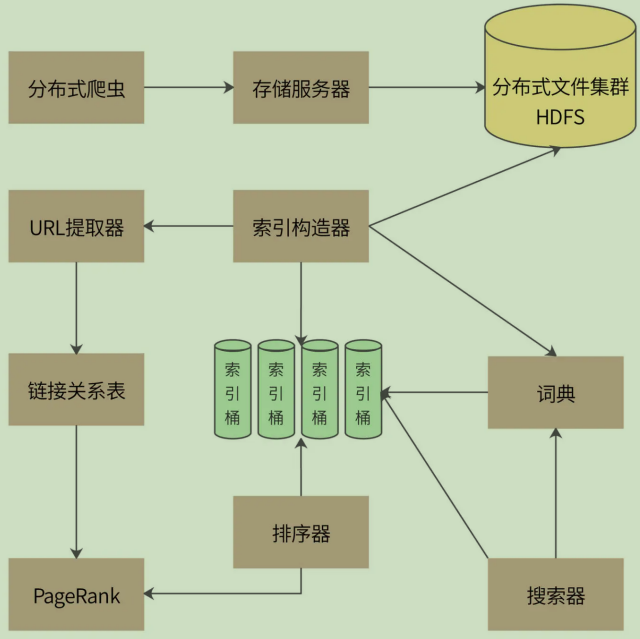

# 一、搜索

# 搜索引擎设计

## 1、搜索引擎挑战

- 针对爬虫获取的海量数据，如何高效地进行数据管理；
- 当用户输入搜索词的时候，如何快速查找包含搜索词的网页内容；
- 如何对搜索结果的网页内容进行排序，使排在搜索结果列表前面的网页，正好是用户期望看到的内容；

## 2、主要功能

一个完整的搜索引擎包括分布式爬虫、索引构造器、网页排名算法、搜索器等组成部分，完整架构：

分布式爬虫通过存储服务器将爬取的网页存储到分布式文件集群 HDFS，为了提高存储效率，网页将被压缩后存储。存储的时候，网页一个文件挨着一个文件地连续存储，存储格式如下

docID | URL长度 | 数据长度（压缩后）|URL | 网页内容数据（压缩后）
------|------|------|------|------

## 3、核心技术

一个运行良好的搜索引擎的核心技术就是索引和排名

### 3.1、索引

索引构造器从 HDFS 读取网页内容后，解析每个页面，提取网页里的每个单词。如果是英文，那么每个单词都用空格分隔，比较容易；如果是中文，需要使用中文分词器才能提取到每个单词，比如“高并发架构”，使用中文分词器得到的就是“高并发”、“架构”两个词

首先，索引构造器将所有的网页都读取完，构建出所有的“docID-> 单词列表”正排索引

然后遍历所有的正排索引，再按照“单词→docID 列表”的方式组织起来，就是倒排索引了。

### 3.2、PageRank 排名算法

- [PageRank 算法论文](http://ilpubs.stanford.edu:8090/422/1/1999-66.pdf)

[PageRank 算法](https://en.wikipedia.org/wiki/PageRank) 会根据网页的链接关系给网页打分。如果一个网页 A 包含另一个网页 B 的超链接，那么就认为 A 网页给 B 网页投了一票。一个网页得到的投票越多，说明自己越重要；越重要的网页给自己投票，自己也越重要。

- [An Implementation of Double-Array Trie](https://linux.thai.net/~thep/datrie/datrie.html)
- [Manticore Search:使用 C++ 开发的高性能搜索引擎](https://manual.manticoresearch.com/Introduction)
- [使用Go开发搜索引擎](https://github.com/johnlui/DIYSearchEngine)
